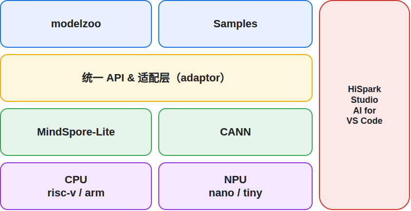

# HiSpark.AI 开源项目

## 项目介绍与整体架构
HiSpark.AI 是海思嵌入式 AI 应用开发解决方案，功能覆盖模型压缩、转换、端侧推理与训练，并提供统一 AI 开发接口、IDE 插件工具，以及modelzoo模型方案库等生态资源，可结合已在 [HiSpark 社区](https://gitcode.com/HiSpark) 开源的海思 SDK（如 [WS63](https://gitcode.com/HiSpark/fbb_ws63)、[HiDiTing](https://gitcode.com/HiSpark/hs-fbb)）进行 AI 应用开发。
解决方案整体架构如下图所示：

<p align="center"></p>

图中各组件的说明与获取方式见下表。

| 序号  | 组件                            | 说明                                                                   | 形态       | 获取方式                                                                                                                                                                    |
| --- | ----------------------------- | -------------------------------------------------------------------- | -------- | ----------------------------------------------------------------------------------------------------------------------------------------------------------------------- |
| ①   | 统一 API & 适配层（adaptor）         | 提供统一面向CPU与NPU平台的AI 接口，及对应适配层源码                                       | 源码       | 本仓库 src/adaptor                                                                                                                                                         |
| ②   | Samples                       | 基于统一 AI 接口（ai.h）的应用示例，覆盖 CPU / NPU 平台，演示模型转换、量化、编译、SDK 集成及端侧训练的端到端流程 | 源码       | 本仓库 src/samples                                                                                                                                                         |
| ③   | HiSpark Studio AI for VS Code | IDE 插件，图形化界面覆盖模型编译、量化转换、烧录等操作，极大提升 AI 应用开发易用性                        | 源码 / 安装包 | 源码：[vscode-hispark-studio](https://gitcode.com/HiSpark/vscode-hispark-studio)；安装包：[VS Code 插件市场](https://marketplace.visualstudio.com/items?itemName=HiSpark.hisparkai) |
| ④   | MindSpore-Lite                | 用于CPU平台，支持推理与端侧训练，可自动生成推理模块代码并提供 RISC-V 算子库                          | 源码/ 预构建  | 源码：本仓库 submodule；直接获取：[developerTool](https://developers.hisilicon.com/cn/developerTool)                                                                                |
| ⑤   | CANN                          | 用于 NPU 平台，昇腾 AI 异构计算架构（ATC 模型编译、AMCT 模型压缩、ACL 推理库）                   | 预构建      | [developerTool](https://developers.hisilicon.com/cn/developerTool)                                                                                                      |
| ⑥   | modelzoo                      | 生态组件，汇聚多类别的AI模型样例与AI应用开发参考方案。                                        | 源码       | [fbb-modelzoo](https://gitcode.com/HiSpark/fbb-modelzoo-dev) 仓库                                                                                                         |


> 作为整体解决方案的导航，本仓库只放置其中部分组件的源码（见下表）；其余组件不在此仓，获取方式见上表。

| 目录     | 二级目录           | 介绍                                                                                              |
| ------ | -------------- | ----------------------------------------------------------------------------------------------- |
| docs   |                | 帮助客户快速熟悉HiSpark.AI解决方案，存放各组件的使用指南。                                                              |
| skills |                | 存放项目专用 AI Coding Skills，当前覆盖CPU算子开发及 MindSpore Lite 开发环境搭建。若您在模型转化过程中遇到算子不支持问题，可通过该skills快速补齐算子 |
| src    | adaptor        | 统一AI接口与平台适配层源码                                                                                  |
| src    | samples        | 基于统一 AI 接口（ai.h）的应用示例（Samples），覆盖 CPU / NPU 平台及模型压缩、端侧训练等场景                                     |
| src    | mindspore-lite | 基于RISC-V平台的AI框架，支持推理与端侧训练，用于自动生成AI推理模块代码并提供对应的RISC-V算子库（通过 submodule 引入）                        |
| vendor |                | 开发者测试相关代码                                                                                       |

## 统一 API 与适配层

HiSpark.AI 提供面向 CPU 与 NPU 平台的统一 AI 接口（`ai.h`），上层应用只需面向统一接口编程，底层由 adaptor 适配层对接 MindSpore Lite（CPU）与 CANN（NPU），屏蔽平台差异。

完整的接口定义、调用流程、`OH_AI_*` 接口参考及样例使用指导见《[HiSpark.AI API开发指南](<docs/zh-CN/software/HiSpark.AI API开发指南/HiSpark.AI API开发指南.md>)》。

## HiSpark Studio AI for VS Code

对应组件说明中的 ③，是 HiSpark.AI 提供的 IDE 插件。它以图形化界面覆盖模型编译、量化转换、烧录等操作，对 AI 应用开发体验更为友好。

插件开源、支持从源码构建，仓库见 [vscode-hispark-studio](https://gitcode.com/HiSpark/vscode-hispark-studio)。详细使用说明见文档《[HiSpark Studio AI for VS Code使用指南](https://docs.hisilicon.com/repos/hispark_ai/zh-CN/master/software/HiSpark%20Studio%20AI%20for%20VS%20Code%E4%BD%BF%E7%94%A8%E6%8C%87%E5%8D%97/index.html)》。

## AI工具链
包含MindSpore Lite 与 CANN，分别对应组件说明中的 ④、⑤，是 HiSpark.AI 面向 CPU / NPU 平台的两套工具链。

### MindSpore Lite
HiSpark.AI解决方案中面向CPU 侧 的AI 框架（支持推理与端侧训练），通过 submodule 引入本仓库：

- **能力**：支持 ONNX、TFLite 模型的轻量化转换、Micro 代码生成与端侧训练，算子支持规格（int8 / fp32）见《[HiSpark.AI 转换工具使用指南](<docs/zh-CN/software/HiSpark.AI 转换工具使用指南/HiSpark.AI 转换工具 使用指南.md>)》"算子规格参考"章节。
- **已适配平台**：WS63（KB 级 RAM 嵌入式设备、RISC-V架构），项目介绍见 [WS63项目介绍](https://gitcode.com/HiSpark/fbb_ws63)。

#### 源码编译
MindSpore Lite 支持源码编译，步骤如下：

**环境依赖**

| 软件 | 版本 | 作用 |
| ---- | ---- | ---- |
| Ubuntu | 22.04 | 编译和运行 mindspore-lite 的操作系统 |
| GCC | 11.3.0-12.3.0 | C++ 编译器 |
| CMake | 3.22.2 及以上 | 编译构建工具 |
| Python | 3.11 | 运行依赖 |
| PyYAML | 6.0 及以上 | 算子编译功能依赖 |
| Numpy | 1.19.3 及以上 | Numpy 相关功能依赖 |

**获取毕昇编译器**

- 前往[海思开发者生态网站](https://developers.hisilicon.com/cn/developerTool)登录海思开发者账号；
- 在资源下载页面选择 Toolchain 分类下的 Linux 版本，下载 RISC-V 编译器包 `BiSheng-llvm-15.0.4-riscv-x86-linux`（或最新版本）；
- 解压（请确保文件名与下载文件一致）：
    ```
    tar -xzvf BiSheng-llvm-15.0.4-riscv-x86-linux-25.09.1.tar.gz
    ```

**编译 mindspore-lite**

- 拉取并初始化子模块 src/mindspore-lite：
    ```
    cd ${hispark_ai_root}
    git submodule update --init --remote --progress src/mindspore-lite
    ```
  > **提示**：如需保证转换器与 [developerTool](https://developers.hisilicon.com/cn/developerTool) 提供的 runtime 版本一致，请使用 `git submodule update --init`（不带 `--remote`）以 checkout 到本仓库记录的固定 commit，或显式 checkout 到对应 release tag。

- 编译：
    ```
    cd src/mindspore-lite
    export MSLITE_ENABLE_MICRO=ON
    export MSLITE_ENABLE_INT8=ON
    export MSLITE_ENABLE_TRAIN=OFF
    export MSLITE_ENABLE_TESTCASES=OFF
    export MSLITE_TARGET_RISCV=ON
    # 将 ${bisheng_compiler_root_path} 替换为毕昇编译器实际解压目录，如 ~/BiSheng-llvm-binary-release-musl/
    export HISPARK_RISCV_TOOLCHAIN_PATH=${bisheng_compiler_root_path}
    bash build.sh -I x86_64 -j32
    ```
编译成功后，产物将输出到 `src/mindspore-lite/output/` 目录，关键产物包括：模型转换器 `converter_lite`，以及面向 CPU 的算子静态库 `libnnacl.a`、`libwrapper.a` 等。
### CANN
NPU 侧异构计算架构，提供 ATC 模型编译、AMCT 模型压缩、ACL 推理：

- **能力**：覆盖模型编译、量化压缩与高性能推理的完整 NPU 部署链路，支持将训练后模型高效部署到端侧；详细使用方式见《[ATC 离线模型编译工具用户指南](<docs/zh-CN/software/ATC离线模型编译工具用户指南/ATC 离线模型编译工具用户指南.md>)》与《[AMCT 模型压缩工具用户指南](<docs/zh-CN/software/AMCT模型压缩工具用户指南/AMCT 模型压缩工具用户指南.md>)》。
- **已适配平台**：HiDiTing（端侧 NPU 50Gops），项目介绍见 [谛听项目介绍](https://gitcode.com/HiSpark/hs-fbb)。

## 快速入门

快速入门按部署平台分为两类：CPU 平台（对应 MindSpore Lite 工具链）与 NPU 平台（对应 CANN 工具链）。

### CPU 平台
- **整体流程视图（以 WS63 为例）**  
  ```
        [ONNX模型] 
            │
            ▼
        {MSLite工具链} 
            │ (Micro转换)
            ▼
        [C语言工程] + [SDK]
            │
            ▼
        {SDK编译器} 
            │ (静态链接库编译)
            ▼
        [libnnacl.a + libwrapper.a]
            │
            ▼
        [SDK & sample模块 & adaptor模块] 
            │ (SDK编译)
            ▼
        [fwpkg镜像] 
            │
            ▼
        [WS63烧录] 
            │
            ▼
        [运行推理]
  ```

具体的模型转换（converter_lite）、静态链接库编译、SDK 编译、烧录调试等步骤，请参考 [Samples 快速入门指南](https://gitcode.com/HiSpark/hispark_ai/blob/master/src/samples/README.md) 及对应 Sample 的 README：
- [LeNet-5 手写数字识别](https://gitcode.com/HiSpark/hispark_ai/blob/master/src/samples/oh/lenet5/README.md)
- [Gru 音频固定词识别](https://gitcode.com/HiSpark/hispark_ai/blob/master/src/samples/oh/gru/README.md)

### NPU 平台
- **整体流程视图（以 HiDiTing为例）**  
  ```
        [ONNX模型] 
            │
            ▼
        {AMCT} 
            │ (模型量化 → xxx_deploy_model.onnx)
            ▼
        {ATC} 
            │ (模型转换 → xxx.om / xxx.exeom)
            ▼
        [SDK & sample模块 & adaptor模块] 
            │ (SDK编译 build_npu.sh 3322)
            ▼
        [fwpkg镜像] 
            │
            ▼
        [HiDiTing烧录] 
            │
            ▼
        [上传模型 & 运行推理] (Debugkits + AT^SAMPLE)

  ```

快速入门请参考 [Samples 快速入门指南](https://gitcode.com/HiSpark/hispark_ai/blob/master/src/samples/README.md)（NPU 平台部分）与文档《[HiSpark.AI 快速入门指南](https://docs.hisilicon.com/repos/hispark_ai/zh-CN/master/software/HiSpark.AI%20%E5%BF%AB%E9%80%9F%E5%85%A5%E9%97%A8%E6%8C%87%E5%8D%97/index.html)》。
以下 samples 演示了基于统一 API 的应用开发：

| 序号 | 应用                                                                                                          |
| ---- | ------------------------------------------------------------------------------------------------------------- |
| 1    | [LeNet-5手写数字图像识别](https://gitcode.com/HiSpark/hispark_ai/blob/master/src/samples/oh/lenet5/README.md) |
| 2    | [Gru-S音频固定词识别](https://gitcode.com/HiSpark/hispark_ai/blob/master/src/samples/oh/gru/README.md)        |

## modelzoo
modelzoo 是 HiSpark.AI 的AI模型库，内置丰富的预训练模型与基于已适配的海思各芯片平台的部署示例，可用于快速构建 AI 应用。

更多模型与部署示例，请前往 [fbb-modelzoo 仓库](https://gitcode.com/HiSpark/fbb-modelzoo-dev) 获取。

## 参与贡献

- 参考[社区参与贡献指南](https://gitee.com/HiSpark/docs/blob/master/contribute/%E7%A4%BE%E5%8C%BA%E5%8F%82%E4%B8%8E%E8%B4%A1%E7%8C%AE%E6%8C%87%E5%8D%97.md)
