# 学习向导<a name="ZH-CN_TOPIC_0000002473744568"></a>

本节给出AMCT（Ascend Model Compression Toolkit，简称AMCT）的概念以及优势、文档的使用对象，并给出不同框架下AMCT的差异，用户根据场景选择不同框架进行模型压缩。

AMCT是一个针对昇腾芯片亲和的深度学习模型压缩工具包，提供量化、张量分解等多种模型压缩特性，压缩后模型体积变小，部署到NPU IP加速器上后可使能低比特运算，提高计算效率，达到性能提升的目标。

AMCT基于开源框架运作，实现了神经网络模型中数据与权重低比特量化、张量分解、模型部署优化（主要为算子融合）的功能，该工具优点如下：

-   使用方便，基于用户原有的框架环境，安装工具包即可。
-   接口简单，在用户基于开源框架的推理脚本基础上，调用API即可完成模型压缩，压缩后的模型支持在CPU和GPU运行。
-   与硬件配套，生成的压缩模型经过ATC工具转换后可在NPU IP加速器上实现低比特推理。
-   量化可配置，用户可自行修改量化配置文件，调整压缩策略，获取较优的压缩结果。

AMCT当前使用的压缩方法主要包括量化和张量分解，量化过程中可以实现模型部署优化（主要为算子融合）。

**各种压缩方式优缺点比较<a name="section51234585511"></a>**

**表 1**  压缩方式比较

<a name="table8485202834915"></a>
<table><thead align="left"><tr id="row24859288495"><th class="cellrowborder" colspan="2" valign="top" id="mcps1.2.7.1.1"><p id="p104855283492"><a name="p104855283492"></a><a name="p104855283492"></a>压缩方式</p>
</th>
<th class="cellrowborder" valign="top" id="mcps1.2.7.1.2"><p id="p5486162814917"><a name="p5486162814917"></a><a name="p5486162814917"></a>优点</p>
</th>
<th class="cellrowborder" valign="top" id="mcps1.2.7.1.3"><p id="p1148682814918"><a name="p1148682814918"></a><a name="p1148682814918"></a>缺点</p>
</th>
<th class="cellrowborder" valign="top" id="mcps1.2.7.1.4"><p id="p1972938155616"><a name="p1972938155616"></a><a name="p1972938155616"></a>支持框架</p>
</th>
<th class="cellrowborder" valign="top" id="mcps1.2.7.1.5"><p id="p18363195612138"><a name="p18363195612138"></a><a name="p18363195612138"></a>支持产品型号</p>
</th>
</tr>
</thead>
<tbody><tr id="row048617287494"><td class="cellrowborder" rowspan="2" valign="top" width="8.649999999999999%" headers="mcps1.2.7.1.1 "><p id="p1043032015712"><a name="p1043032015712"></a><a name="p1043032015712"></a>量化</p>
</td>
<td class="cellrowborder" valign="top" width="9.69%" headers="mcps1.2.7.1.1 "><p id="p528015919503"><a name="p528015919503"></a><a name="p528015919503"></a>训练后量化</p>
</td>
<td class="cellrowborder" valign="top" width="22.81%" headers="mcps1.2.7.1.2 "><a name="ul129327172412"></a><a name="ul129327172412"></a><ul id="ul129327172412"><li>不需要重训练模型。</li><li>只需少量校准数据。</li></ul>
</td>
<td class="cellrowborder" valign="top" width="31.04%" headers="mcps1.2.7.1.3 "><p id="p18881953191613"><a name="p18881953191613"></a><a name="p18881953191613"></a>依赖校准数据集分布情况，如果校准数据集与验证数据集分布差异较大，会导致量化结果差；没有对权重进行重训练，量化后模型精度掉点较大。</p>
</td>
<td class="cellrowborder" valign="top" width="10.39%" headers="mcps1.2.7.1.4 "><a name="ul24393122911"></a><a name="ul24393122911"></a><ul id="ul24393122911"><li>Caffe(不支持)</li><li>TensorFlow(不支持)</li><li>PyTorch</li><li>ONNX</li></ul>
</td>
<td class="cellrowborder" valign="top" width="17.419999999999998%" headers="mcps1.2.7.1.5 "><p id="p8310173945911"><a name="p8310173945911"></a><a name="p8310173945911"></a><span id="ph1577265511916"><a name="ph1577265511916"></a><a name="ph1577265511916"></a>IPV350</span></p>
</td>
</tr>
<tr id="row14223523499"><td class="cellrowborder" valign="top" headers="mcps1.2.7.1.1 "><p id="p828019919504"><a name="p828019919504"></a><a name="p828019919504"></a>量化感知训练</p>
</td>
<td class="cellrowborder" valign="top" headers="mcps1.2.7.1.1 "><a name="ul17651102082413"></a><a name="ul17651102082413"></a><ul id="ul17651102082413"><li>需要重新训练模型。</li><li>精度损失小。</li></ul>
</td>
<td class="cellrowborder" valign="top" headers="mcps1.2.7.1.2 "><a name="ul18751262242"></a><a name="ul18751262242"></a><ul id="ul18751262242"><li>训练过程中进行的量化，过程比较耗时。</li><li>量化过程中需要的数据会更多，通常是完整训练数据集。</li></ul>
</td>
<td class="cellrowborder" valign="top" headers="mcps1.2.7.1.3 "><a name="ul1393163011919"></a><a name="ul1393163011919"></a><ul id="ul1393163011919"><li>Caffe<p id="p53573140421"><a name="p53573140421"></a><a name="p53573140421"></a>(不支持)</p>
</li><li>TensorFlow<p id="p422291518423"><a name="p422291518423"></a><a name="p422291518423"></a>(不支持)</p>
</li><li>PyTorch</li></ul>
</td>
<td class="cellrowborder" valign="top" headers="mcps1.2.7.1.4 "><p id="p14528105713116"><a name="p14528105713116"></a><a name="p14528105713116"></a><span id="ph1652825763110"><a name="ph1652825763110"></a><a name="ph1652825763110"></a>IPV350</span></p>
</td>
</tr>
<tr id="row1998575499"><td class="cellrowborder" rowspan="2" valign="top" width="8.649999999999999%" headers="mcps1.2.7.1.1 "><p id="p18181122518718"><a name="p18181122518718"></a><a name="p18181122518718"></a>稀疏</p>
</td>
<td class="cellrowborder" valign="top" width="9.69%" headers="mcps1.2.7.1.1 "><p id="p12280992504"><a name="p12280992504"></a><a name="p12280992504"></a>通道稀疏</p>
</td>
<td class="cellrowborder" valign="top" width="22.81%" headers="mcps1.2.7.1.2 "><a name="ul7604318251"></a><a name="ul7604318251"></a><ul id="ul7604318251"><li>稀疏颗粒度更大，能够获取到更大的性能收益。</li><li>稀疏率可配置。</li></ul>
</td>
<td class="cellrowborder" valign="top" width="31.04%" headers="mcps1.2.7.1.3 "><a name="ul52211353247"></a><a name="ul52211353247"></a><ul id="ul52211353247"><li>改变权重的形状，会影响上层或下层的算子。</li><li>稀疏后需要进行重训练，过程比较耗时。</li><li>对模型的精度影响大。</li></ul>
</td>
<td class="cellrowborder" valign="top" width="10.39%" headers="mcps1.2.7.1.4 "><a name="ul10184438161015"></a><a name="ul10184438161015"></a><ul id="ul10184438161015"><li>TensorFlow</li><li>PyTorch</li></ul>
</td>
<td class="cellrowborder" valign="top" width="17.419999999999998%" headers="mcps1.2.7.1.5 "><p id="p152332511343"><a name="p152332511343"></a><a name="p152332511343"></a>不支持该特性</p>
</td>
</tr>
<tr id="row117511749125019"><td class="cellrowborder" valign="top" headers="mcps1.2.7.1.1 "><p id="p9752174985011"><a name="p9752174985011"></a><a name="p9752174985011"></a>4选2结构化稀疏</p>
</td>
<td class="cellrowborder" valign="top" headers="mcps1.2.7.1.1 "><p id="p67529498500"><a name="p67529498500"></a><a name="p67529498500"></a>稀疏的粒度较小，可以保留较多重要信息，具有细粒度稀疏的精度优势。</p>
</td>
<td class="cellrowborder" valign="top" headers="mcps1.2.7.1.2 "><a name="ul1814081912259"></a><a name="ul1814081912259"></a><ul id="ul1814081912259"><li>受硬件限制，只在部分芯片支持。</li><li>稀疏后需要进行重训练，过程比较耗时。</li><li>稀疏率固定为50%。</li></ul>
</td>
<td class="cellrowborder" valign="top" headers="mcps1.2.7.1.3 "><a name="ul13298165413108"></a><a name="ul13298165413108"></a><ul id="ul13298165413108"><li>TensorFlowPyTorch</li></ul>
</td>
<td class="cellrowborder" valign="top" headers="mcps1.2.7.1.4 "><p id="p18254499117"><a name="p18254499117"></a><a name="p18254499117"></a>不支持该特性。</p>
</td>
</tr>
<tr id="row18974238582"><td class="cellrowborder" valign="top" width="8.649999999999999%" headers="mcps1.2.7.1.1 "><p id="p209892365817"><a name="p209892365817"></a><a name="p209892365817"></a>组合压缩</p>
</td>
<td class="cellrowborder" valign="top" width="9.69%" headers="mcps1.2.7.1.1 "><p id="p129817233589"><a name="p129817233589"></a><a name="p129817233589"></a>-</p>
</td>
<td class="cellrowborder" valign="top" width="22.81%" headers="mcps1.2.7.1.2 "><p id="p098112310580"><a name="p098112310580"></a><a name="p098112310580"></a>可以同时对模型进行量化和稀疏，得到更高的压缩率。</p>
</td>
<td class="cellrowborder" valign="top" width="31.04%" headers="mcps1.2.7.1.3 "><p id="p79822315813"><a name="p79822315813"></a><a name="p79822315813"></a>涉及重训练，过程比较耗时；同步进行了量化和稀疏，对模型精度影响大。</p>
</td>
<td class="cellrowborder" valign="top" width="10.39%" headers="mcps1.2.7.1.4 "><a name="ul5311169161119"></a><a name="ul5311169161119"></a><ul id="ul5311169161119"><li>TensorFlow</li><li>PyTorch</li></ul>
</td>
<td class="cellrowborder" valign="top" width="17.419999999999998%" headers="mcps1.2.7.1.5 "><p id="p1356816135018"><a name="p1356816135018"></a><a name="p1356816135018"></a>不支持该特性</p>
</td>
</tr>
<tr id="row9649427135813"><td class="cellrowborder" valign="top" width="8.649999999999999%" headers="mcps1.2.7.1.1 "><p id="p3649727185820"><a name="p3649727185820"></a><a name="p3649727185820"></a>张量分解</p>
</td>
<td class="cellrowborder" valign="top" width="9.69%" headers="mcps1.2.7.1.1 "><p id="p1696418170817"><a name="p1696418170817"></a><a name="p1696418170817"></a>-</p>
</td>
<td class="cellrowborder" valign="top" width="22.81%" headers="mcps1.2.7.1.2 "><p id="p11649152715585"><a name="p11649152715585"></a><a name="p11649152715585"></a>将卷积核分解为低秩张量，降低存储空间和计算量</p>
</td>
<td class="cellrowborder" valign="top" width="31.04%" headers="mcps1.2.7.1.3 "><p id="p0649152795815"><a name="p0649152795815"></a><a name="p0649152795815"></a>-</p>
</td>
<td class="cellrowborder" valign="top" width="10.39%" headers="mcps1.2.7.1.4 "><a name="ul14601827181119"></a><a name="ul14601827181119"></a><ul id="ul14601827181119"><li>Caffe</li><li>TensorFlow</li><li>PyTorch</li></ul>
</td>
<td class="cellrowborder" valign="top" width="17.419999999999998%" headers="mcps1.2.7.1.5 "><p id="p3726592505"><a name="p3726592505"></a><a name="p3726592505"></a>不支持该特性</p>
</td>
</tr>
<tr id="row16730132945817"><td class="cellrowborder" valign="top" width="8.649999999999999%" headers="mcps1.2.7.1.1 "><p id="p5730112917583"><a name="p5730112917583"></a><a name="p5730112917583"></a>自动混合精度搜索</p>
</td>
<td class="cellrowborder" valign="top" width="9.69%" headers="mcps1.2.7.1.1 "><p id="p897018171389"><a name="p897018171389"></a><a name="p897018171389"></a>-</p>
</td>
<td class="cellrowborder" valign="top" width="22.81%" headers="mcps1.2.7.1.2 "><p id="p973092913589"><a name="p973092913589"></a><a name="p973092913589"></a>解决用户手动调优困难，自动对每一层计算精度配置给出较优解。</p>
</td>
<td class="cellrowborder" valign="top" width="31.04%" headers="mcps1.2.7.1.3 "><p id="p127301429115814"><a name="p127301429115814"></a><a name="p127301429115814"></a>-</p>
</td>
<td class="cellrowborder" valign="top" width="10.39%" headers="mcps1.2.7.1.4 "><a name="ul1357045410116"></a><a name="ul1357045410116"></a><ul id="ul1357045410116"><li>TensorFlow</li><li>PyTorch</li></ul>
</td>
<td class="cellrowborder" valign="top" width="17.419999999999998%" headers="mcps1.2.7.1.5 "><p id="p191031442134311"><a name="p191031442134311"></a><a name="p191031442134311"></a>不支持该特性</p>
</td>
</tr>
<tr id="row450842510583"><td class="cellrowborder" valign="top" width="8.649999999999999%" headers="mcps1.2.7.1.1 "><p id="p12508325155816"><a name="p12508325155816"></a><a name="p12508325155816"></a>量化数据均衡预处理</p>
</td>
<td class="cellrowborder" valign="top" width="9.69%" headers="mcps1.2.7.1.1 "><p id="p179730174818"><a name="p179730174818"></a><a name="p179730174818"></a>-</p>
</td>
<td class="cellrowborder" valign="top" width="22.81%" headers="mcps1.2.7.1.2 "><p id="p9508142511582"><a name="p9508142511582"></a><a name="p9508142511582"></a>降低activation离群值对于量化后模型精度的影响。</p>
</td>
<td class="cellrowborder" valign="top" width="31.04%" headers="mcps1.2.7.1.3 "><p id="p165080250585"><a name="p165080250585"></a><a name="p165080250585"></a>-</p>
</td>
<td class="cellrowborder" valign="top" width="10.39%" headers="mcps1.2.7.1.4 "><a name="ul18834148161214"></a><a name="ul18834148161214"></a><ul id="ul18834148161214"><li>TensorFlow(不支持)</li><li>PyTorch</li><li>ONNX</li></ul>
</td>
<td class="cellrowborder" valign="top" width="17.419999999999998%" headers="mcps1.2.7.1.5 "><p id="p17109143712501"><a name="p17109143712501"></a><a name="p17109143712501"></a><span id="ph210914373506"><a name="ph210914373506"></a><a name="ph210914373506"></a>IPV350</span></p>
</td>
</tr>
<tr id="row1744322265915"><td class="cellrowborder" valign="top" width="8.649999999999999%" headers="mcps1.2.7.1.1 "><p id="p19711532175910"><a name="p19711532175910"></a><a name="p19711532175910"></a>逐层蒸馏</p>
</td>
<td class="cellrowborder" valign="top" width="9.69%" headers="mcps1.2.7.1.1 "><p id="p119811517989"><a name="p119811517989"></a><a name="p119811517989"></a>-</p>
</td>
<td class="cellrowborder" valign="top" width="22.81%" headers="mcps1.2.7.1.2 "><p id="p15443102213596"><a name="p15443102213596"></a><a name="p15443102213596"></a>在量化的基础上可以对权重进行微调，在保障较高精度的同时，对比重训练有更短的执行时长。</p>
</td>
<td class="cellrowborder" valign="top" width="31.04%" headers="mcps1.2.7.1.3 "><p id="p1544315220590"><a name="p1544315220590"></a><a name="p1544315220590"></a>-</p>
</td>
<td class="cellrowborder" valign="top" width="10.39%" headers="mcps1.2.7.1.4 "><p id="p12644113741218"><a name="p12644113741218"></a><a name="p12644113741218"></a>PyTorch</p>
</td>
<td class="cellrowborder" valign="top" width="17.419999999999998%" headers="mcps1.2.7.1.5 "><p id="p1183342214385"><a name="p1183342214385"></a><a name="p1183342214385"></a>不支持该特性</p>
</td>
</tr>
</tbody>
</table>

**AMCT各框架差异<a name="section1757114335255"></a>**

<a name="table146214465477"></a>
<table><thead align="left"><tr id="row12462184619473"><th class="cellrowborder" valign="top" width="21.64%" id="mcps1.1.3.1.1"><p id="p16462134654713"><a name="p16462134654713"></a><a name="p16462134654713"></a>手册</p>
</th>
<th class="cellrowborder" valign="top" width="78.36%" id="mcps1.1.3.1.2"><p id="p7462546144711"><a name="p7462546144711"></a><a name="p7462546144711"></a>介绍</p>
</th>
</tr>
</thead>
<tbody><tr id="row14847111112269"><td class="cellrowborder" valign="top" width="21.64%" headers="mcps1.1.3.1.1 "><p id="p546391119549"><a name="p546391119549"></a><a name="p546391119549"></a><a href="AMCT（PyTorch）-7.md">AMCT（PyTorch）</a></p>
</td>
<td class="cellrowborder" valign="top" width="78.36%" headers="mcps1.1.3.1.2 "><p id="p475621181017"><a name="p475621181017"></a><a name="p475621181017"></a><strong id="b1417617533102"><a name="b1417617533102"></a><a name="b1417617533102"></a>针对PyTorch框架模型进行的压缩，需要搭建PyTorch环境，搭建完成后安装AMCT工具。</strong></p>
</td>
</tr>
<tr id="row176331718202615"><td class="cellrowborder" valign="top" width="21.64%" headers="mcps1.1.3.1.1 "><p id="p246361185418"><a name="p246361185418"></a><a name="p246361185418"></a><a href="AMCT（ONNX）-16.md">AMCT（ONNX）</a></p>
</td>
<td class="cellrowborder" valign="top" width="78.36%" headers="mcps1.1.3.1.2 "><p id="p114201020101317"><a name="p114201020101317"></a><a name="p114201020101317"></a><strong id="b4391456181315"><a name="b4391456181315"></a><a name="b4391456181315"></a>针对ONNX模型进行的压缩，需要搭建ONNX Runtime环境，搭建完成后安装AMCT工具。</strong></p>
</td>
</tr>
<tr id="row11168124533817"><td class="cellrowborder" valign="top" width="21.64%" headers="mcps1.1.3.1.1 "><p id="p174631911135416"><a name="p174631911135416"></a><a name="p174631911135416"></a><a href="AMCT（TensorFlow）(不支持).md">AMCT（TensorFlow）(不支持)</a></p>
</td>
<td class="cellrowborder" valign="top" width="78.36%" headers="mcps1.1.3.1.2 "><p id="p1474925815911"><a name="p1474925815911"></a><a name="p1474925815911"></a><strong id="b111311113121015"><a name="b111311113121015"></a><a name="b111311113121015"></a>针对TensorFlow框架模型进行的压缩，需要搭建TensorFlow环境，搭建完成后安装AMCT工具。</strong></p>
<p id="p1423823545810"><a name="p1423823545810"></a><a name="p1423823545810"></a><strong id="b9238153515816"><a name="b9238153515816"></a><a name="b9238153515816"></a>如下产品型号不支持TensorFlow框架：</strong></p>
<p id="p46581425105814"><a name="p46581425105814"></a><a name="p46581425105814"></a><span id="ph10658142585814"><a name="ph10658142585814"></a><a name="ph10658142585814"></a>IPV350</span></p>
</td>
</tr>
<tr id="row1189134718384"><td class="cellrowborder" valign="top" width="21.64%" headers="mcps1.1.3.1.1 "><p id="p19710156185417"><a name="p19710156185417"></a><a name="p19710156185417"></a><a href="AMCT（Caffe）(不支持).md">AMCT（Caffe）(不支持)</a></p>
</td>
<td class="cellrowborder" valign="top" width="78.36%" headers="mcps1.1.3.1.2 "><p id="p11285533895"><a name="p11285533895"></a><a name="p11285533895"></a><strong id="b62502051791"><a name="b62502051791"></a><a name="b62502051791"></a>针对Caffe框架模型进行的压缩，需要搭建Caffe环境，搭建完成后安装AMCT工具</strong>。</p>
<p id="p1539413457191"><a name="p1539413457191"></a><a name="p1539413457191"></a><strong id="b0335194872115"><a name="b0335194872115"></a><a name="b0335194872115"></a>如下产品型号不支持Caffe框架：</strong></p>
<p id="p593933320210"><a name="p593933320210"></a><a name="p593933320210"></a><span id="ph11939143311214"><a name="ph11939143311214"></a><a name="ph11939143311214"></a>IPV350</span></p>
</td>
</tr>
</tbody>
</table>

**使用对象<a name="section1225913173255"></a>**

本文档用于指导开发者如何使用AMCT工具进行模型压缩，通过本文档您可以达成以下目标：

-   了解AMCT不同的压缩方法。
-   能够基于文档中提供的方法，完成不同模型的压缩。
-   掌握常用的压缩方法：量化。

熟悉Linux基本命令、具备Python语言程序开发能力，对机器学习、深度学习有一定了解的人员，可以更好地理解本文档。

# 概述<a name="ZH-CN_TOPIC_0000002473744668"></a>

本节给出模型压缩过程中用到的概念，并介绍了不同压缩方法的原理。
本节介绍使用AMCT工具的具体流程，不同框架运行环境以及流程会有稍许差异。

## 基本概念<a name="ZH-CN_TOPIC_0000002505904613"></a>

本节给出模型压缩过程中用到的概念，并介绍了不同压缩方法的原理。

**量化<a name="section156622039376"></a>**

量化是指对模型的权重（weight）和数据（activation）进行低比特处理，让最终生成的网络模型更加轻量化，从而达到节省网络模型存储空间、降低传输时延、提高计算效率，达到性能提升与优化的目标。

AMCT将量化和模型转换分开，实现对模型中可量化算子的独立量化，并输出量化后的模型。其中量化后的仿真模型可以在CPU或者GPU上运行，完成精度仿真；量化后的部署模型可以部署在NPU IP加速器上运行，达到提升推理性能的目的。

当前该工具仅支持对float32/float16数据类型的网络模型进行量化（Caffe框架、MindSpore框架不支持float16类型），以量化到INT8数据类型为例，其运行原理如下图所示。

**图 1**  量化运行原理<a name="fig1598162174419"></a>  
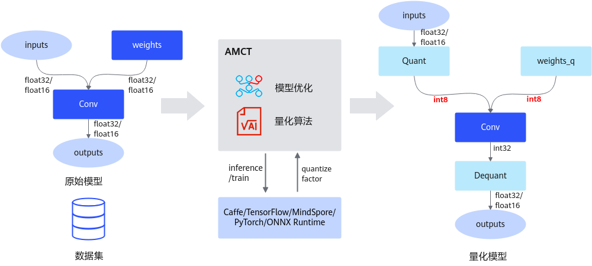

量化根据是否需要重训练，分为训练后量化（Post-Training Quantization，简称PTQ）和量化感知训练（Quantization-Aware Training，简称QAT），概念解释如下：

-   **训练后量化**

    训练后量化是指在模型训练结束之后进行的量化，对训练后模型中的权重由浮点数量化到低比特整数，并通过少量校准数据基于推理过程对数据（activation）进行校准量化，从而尽可能减少量化过程中的精度损失。训练后量化简单易用，只需少量校准数据，适用于追求高易用性和缺乏训练资源的场景。

    通常，训练后的模型权重已经确定，因此可以根据权重的数值离线计算得到权重的量化参数。而通常数据是在线输入的，因此无法准确获取数据的数值范围，通常需要一个较小的有代表性的数据集来模拟在线数据的分布，利用该数据集执行前向推理，得到对应的中间浮点结果，并根据这些浮点结果离线计算出数据的量化参数。其原理如下图所示。

    **图 2**  训练后量化原理<a name="fig845618567296"></a>  
    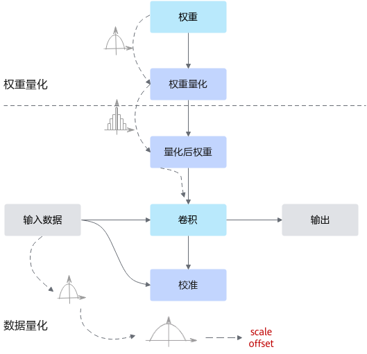

-   **量化感知训练**

    量化感知训练是指在重训练过程中引入量化，通过重训练提高模型对量化效应的能力，从而获得更高的量化模型精度的一种量化方式。量化感知训练借助用户完整训练数据集，在训练过程中引入伪量化的操作（从浮点量化到定点，再还原到浮点的操作），用来模拟前向推理时量化带来的误差，并借助训练让模型权重能更好地适应这种量化的信息损失，从而提升量化精度。

    通常，量化感知训练相比训练后量化，精度损失会更小，但主要缺点是整体量化的耗时会更长；此外，量化过程需要的数据会更多，通常是完整训练数据集。

    其运行原理如下图所示。

    **图 3**  量化感知训练原理<a name="fig9953142818445"></a>  
    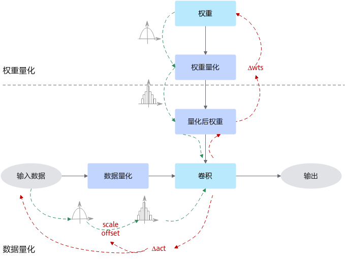

**张量分解**\(不支持该特性\)**<a name="section17702838182616"></a>**

深度学习运算，尤其是CV（计算机视觉）类任务运算，包含大量的卷积运算，而张量分解通过分解卷积核的张量，可以将一个大卷积核分解为两个小卷积核的连乘，即将卷积核分解为低秩的张量，从而降低存储空间和计算量，降低推理开销。

以1个64\*64\*3\*3的卷积分解为32\*64\*3\*1和64\*32\*1\*3的级联卷积为例，可以减少1 - \(32\*64\*3\*1 + 64\*32\*1\*3\) / 64\*64\*3\*3 = 66.7%的计算量，在计算结果近似的情况下带来更具性价比的性能收益。张量分解运行原理如下图所示（以PyTorch框架为例）。

**图 4**  张量分解运行原理<a name="fig4235759152117"></a>  
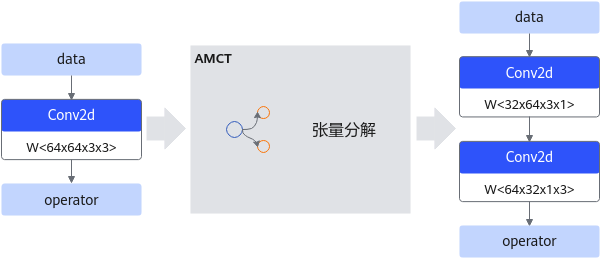

**模型部署优化**\(不支持该特性\)**<a name="section17137173051718"></a>**

主要为算子融合，是指通过数学等价，将模型中的多个算子运算融合单算子运算，以减少实际前向过程中的运算量，如将卷积层和BN层融合为一个卷积层。

其运行原理如下图所示（以PyTorch框架为例）。

**图 5**  模型部署优化原理<a name="fig69029515269"></a>  
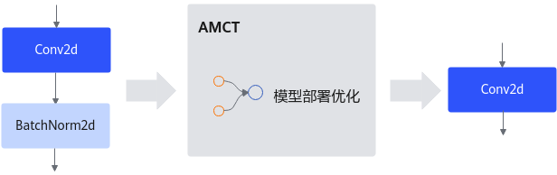

**稀疏**\(不支持该特性\)**<a name="section561515191617"></a>**

稀疏是通过结构剪枝的方式，对模型中的部分算子实现权重的稀疏化，从而得到一个参数量更小、计算量更小的网络模型。AMCT目前有两种稀疏方式：通道稀疏和4选2结构化稀疏。每次只能使能其中一种稀疏方式，即对于同一层可压缩算子，通道稀疏和4选2结构化稀疏不能同时配置。

通道稀疏与**4选2结构化稀疏**相比，稀疏颗粒度更大，对模型的精度影响也越大，但是能够获取到的性能收益也越大，用户可以根据实际情况选择一种稀疏方式。

-   **通道稀疏**

    通道稀疏基于重训练，通过裁剪网络通道数，在保持网络功能的前提下缩减模型参数量，从而降低整网的计算量。由于通道稀疏本身是依据通道的重要性进行裁剪，会裁剪掉重要性相对较低的通道，但是直接裁剪通道对网络精度影响较大，故裁剪后的模型需要进行重训练，以保证业务精度。通道稀疏的实现通常包括两个步骤：首先是通道选择，需要选择合适的通道组合以保留丰富的信息；然后是重建，需要使用选择的通道对下一层的输出进行重建。通道稀疏原理如下图所示。

    **图 6**  通道稀疏示意图<a name="fig2091583361919"></a>  
    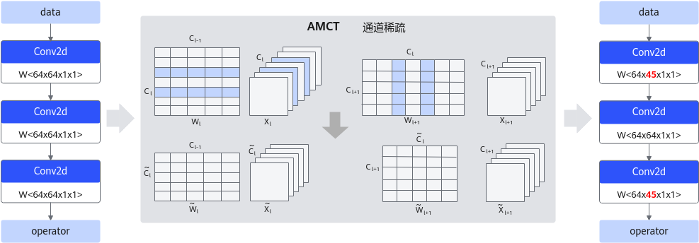

-   **4选2结构化稀疏**

    **由于硬件约束，该芯片不支持4选2结构化稀疏特性：使能后获取不到性能收益。**

    4选2结构化稀疏基于重训练，在每4个连续的权重中保留2个重要性相对较高的权重，其余权重置0。因为稀疏的粒度较小，因此4选2结构化稀疏可以保留较多重要信息，具有细粒度稀疏的精度优势；同时4选2结构化稀疏在专门设计的硬件上可以降低运算量，具有结构化稀疏的性能优势。与通道稀疏不同的是，4选2稀疏并不改变权重的形状，因此不会影响上层或下层的算子。

    原理如下图所示，在cin维度上相邻的4个元素为一组，在每组4个元素中保留绝对值最大的两个元素，如果cin不是4的倍数，填0补齐到4的倍数。

    **图 7**  4选2稀疏示意图<a name="fig1567333125815"></a>  
    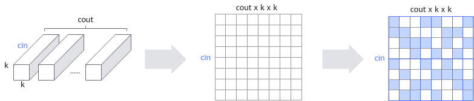

**组合压缩**\(不支持该特性\)**<a name="section1454731404313"></a>**

组合压缩是结合了**稀疏**和**量化**的特性，根据配置文件先进行稀疏，然后进行量化；在稀疏时根据相应算法插入稀疏算子，然后量化时，对稀疏后的模型插入数据和权重的量化层和SearchN的层，生成组合压缩模型，以期望得到更高的性能收益。生成组合压缩模型后，对模型进行重训练，保存为既可以进行精度仿真又可以部署的量化模型。

**逐层蒸馏**\(不支持该特性\)**<a name="section2084263154118"></a>**

蒸馏量化是模型压缩的一种方法，利用原始模型的监督信息，对量化模型进行训练，以达到更好量化精度的目的。

将预训练好的原始模型作为教师网络，以教师网络层的输出做为目标，对学生网络进行监督训练，通过计算教师网络和学生网络输出预测值的损失，进行梯度更新，最终得到一个更高精度的量化模型。

-   相比训练后量化，知识蒸馏的量化可以取得更好的精度结果。
-   相比量化感知训练，知识蒸馏的量化不需要有标签的数据集，且可以在更短的量化时间内获得不错的量化结果。

**图 8**  逐层蒸馏示意图<a name="fig42331315559"></a>  
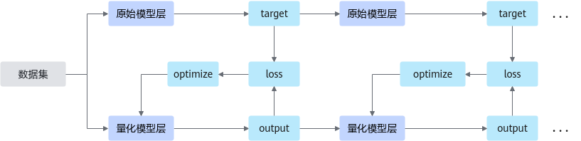

## 工具运行流程<a name="ZH-CN_TOPIC_0000002473904532"></a>

本节介绍使用AMCT工具的具体流程，不同框架运行环境以及流程会有稍许差异。

**PyTorch/ONNX/TensorFlow/Caffe场景<a name="section04481715121912"></a>**

**如下产品型号不支持Caffe框架：**

IPV350

**如下产品型号不支持TensorFlow框架：**

IPV350

具体运行流程如[图1](#fig1799142651910)所示。

**图 1**  运行流程<a name="fig1799142651910"></a>  
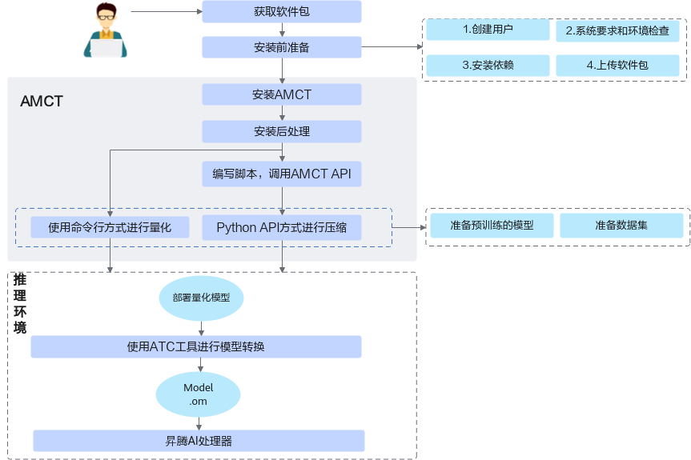

**表 1**  运行流程关键操作步骤说明

<a name="table499162671918"></a>
<table><thead align="left"><tr id="row399426181918"><th class="cellrowborder" valign="top" width="17.96%" id="mcps1.2.3.1.1"><p id="p109952610192"><a name="p109952610192"></a><a name="p109952610192"></a>关键步骤</p>
</th>
<th class="cellrowborder" valign="top" width="82.04%" id="mcps1.2.3.1.2"><p id="p1699172613195"><a name="p1699172613195"></a><a name="p1699172613195"></a>说明</p>
</th>
</tr>
</thead>
<tbody><tr id="row79932641918"><td class="cellrowborder" valign="top" width="17.96%" headers="mcps1.2.3.1.1 "><p id="p119912631912"><a name="p119912631912"></a><a name="p119912631912"></a>获取软件包</p>
</td>
<td class="cellrowborder" valign="top" width="82.04%" headers="mcps1.2.3.1.2 "><p id="p1999102661914"><a name="p1999102661914"></a><a name="p1999102661914"></a>安装前请先获取对应软件包，详情请参见<a href="获取软件包.md">获取软件包</a>。</p>
</td>
</tr>
<tr id="row17100122614191"><td class="cellrowborder" valign="top" width="17.96%" headers="mcps1.2.3.1.1 "><p id="p18100122621918"><a name="p18100122621918"></a><a name="p18100122621918"></a>安装前准备</p>
</td>
<td class="cellrowborder" valign="top" width="82.04%" headers="mcps1.2.3.1.2 "><p id="p4100162611917"><a name="p4100162611917"></a><a name="p4100162611917"></a>安装<span id="ph20100142661916"><a name="ph20100142661916"></a><a name="ph20100142661916"></a>AMCT</span>之前，需要创建<span id="ph6100162621918"><a name="ph6100162621918"></a><a name="ph6100162621918"></a>AMCT</span>的安装用户，检查系统环境是否满足要求，安装依赖以及上传软件包等一系列动作。详细操作请参见<a href="安装前准备.md">安装前准备</a>。</p>
<p id="p1610012618198"><a name="p1610012618198"></a><a name="p1610012618198"></a>不同框架环境配置不同，请参见对应框架进行操作。</p>
</td>
</tr>
<tr id="row161001026151912"><td class="cellrowborder" valign="top" width="17.96%" headers="mcps1.2.3.1.1 "><p id="p1100182617196"><a name="p1100182617196"></a><a name="p1100182617196"></a>安装</p>
</td>
<td class="cellrowborder" valign="top" width="82.04%" headers="mcps1.2.3.1.2 "><p id="p5100126161916"><a name="p5100126161916"></a><a name="p5100126161916"></a>参见<a href="安装工具.md">安装工具</a>章节安装<span id="ph3100182617194"><a name="ph3100182617194"></a><a name="ph3100182617194"></a>AMCT</span>工具，不同框架安装命令不同，请参见对应框架安装步骤进行操作。</p>
</td>
</tr>
<tr id="row15100152621914"><td class="cellrowborder" valign="top" width="17.96%" headers="mcps1.2.3.1.1 "><p id="p151001726151916"><a name="p151001726151916"></a><a name="p151001726151916"></a>安装后处理</p>
</td>
<td class="cellrowborder" valign="top" width="82.04%" headers="mcps1.2.3.1.2 "><p id="p61001226131912"><a name="p61001226131912"></a><a name="p61001226131912"></a>安装完<span id="ph3100182613199"><a name="ph3100182613199"></a><a name="ph3100182613199"></a>AMCT</span>后，需要参见<a href="安装后处理.md">安装后处理</a>章节执行相关操作，没有该章节的框架，则忽略此步骤。</p>
</td>
</tr>
<tr id="row131007264196"><td class="cellrowborder" valign="top" width="17.96%" headers="mcps1.2.3.1.1 "><p id="p1210082612195"><a name="p1210082612195"></a><a name="p1210082612195"></a>（可选）编写脚本，调用<span id="ph1100132611917"><a name="ph1100132611917"></a><a name="ph1100132611917"></a>AMCT</span> API</p>
</td>
<td class="cellrowborder" valign="top" width="82.04%" headers="mcps1.2.3.1.2 "><p id="p11001426191910"><a name="p11001426191910"></a><a name="p11001426191910"></a>如果使用AMCT提供的sample进行模型压缩，则可以直接调用本手册中的API；</p>
<p id="p10100112621911"><a name="p10100112621911"></a><a name="p10100112621911"></a>如果用户需要压缩自己的网络模型，不使用本手册提供的sample链接进行压缩，则需要修改压缩脚本，进行适配，然后才能进行压缩。</p>
</td>
</tr>
<tr id="row810082618197"><td class="cellrowborder" valign="top" width="17.96%" headers="mcps1.2.3.1.1 "><p id="p410002614191"><a name="p410002614191"></a><a name="p410002614191"></a>压缩</p>
</td>
<td class="cellrowborder" valign="top" width="82.04%" headers="mcps1.2.3.1.2 "><p id="p11100112610192"><a name="p11100112610192"></a><a name="p11100112610192"></a>执行压缩操作。</p>
<p id="p12100526151912"><a name="p12100526151912"></a><a name="p12100526151912"></a>关于量化特性，<span id="ph12100142681919"><a name="ph12100142681919"></a><a name="ph12100142681919"></a>AMCT</span>提供了两种量化方法，命令行方式量化和调用Python API接口方式，两种方式详细区别请参见<a href="快速入门.md#table522781642817">表1</a>。</p>
<a name="ul6100162615194"></a><a name="ul6100162615194"></a><ul id="ul6100162615194"><li>命令行方式量化：用户只需准备模型和模型匹配的数据集即可，但是当前仅支持部分功能。</li><li>调用Python API接口的方式，需要了解Python语法以及详细量化流程，支持所有的量化方式。</li></ul>
<p id="p310022619195"><a name="p310022619195"></a><a name="p310022619195"></a>用户根据准备的原始网络模型以及数据集，采用本手册提供的量化脚本或者命令行，进行量化。</p>
<p id="p41001026181912"><a name="p41001026181912"></a><a name="p41001026181912"></a><span id="ph161001726201911"><a name="ph161001726201911"></a><a name="ph161001726201911"></a>AMCT</span>是基于深度学习框架进行开发的，在执行压缩过程中需要调用深度学习框架进行必要的推理或训练过程。</p>
</td>
</tr>
<tr id="row91006268192"><td class="cellrowborder" valign="top" width="17.96%" headers="mcps1.2.3.1.1 "><p id="p17100102614190"><a name="p17100102614190"></a><a name="p17100102614190"></a>（后续处理）压缩后模型的推理</p>
</td>
<td class="cellrowborder" valign="top" width="82.04%" headers="mcps1.2.3.1.2 "><p id="p1010011269199"><a name="p1010011269199"></a><a name="p1010011269199"></a>用户使用上述压缩后的部署模型，通过ATC工具转换成适配<span id="ph8100192641917"><a name="ph8100192641917"></a><a name="ph8100192641917"></a>NPU IP加速器</span>的离线模型，然后可以使用该模型进行推理。</p>
</td>
</tr>
</tbody>
</table>

# 准备环境<a name="ZH-CN_TOPIC_0000002505904569"></a>


介绍安装前的准备动作，包括准备用户、检查环境、安装依赖、上传软件包等。
本节介绍AMCT工具具体的安装命令。


## 获取软件包<a name="ZH-CN_TOPIC_0000002473744638"></a>

AMCT仅支持在Ubuntu 20.04 x86\_64架构服务器安装；安装前，请先获取AMCT软件包：**CANN-amct-_\{software version\}_-linux.x86\_64.tar.gz**

其中_\{software version\}_表示软件包具体版本号。

**软件数字签名验证<a name="zh-cn_topic_0288515780_section664465172014"></a>**

为了防止软件包在传递过程或存储期间被恶意篡改，下载软件包时需下载对应的数字签名文件用于完整性验证。

在软件包下载之后，请参考《OpenPGP签名验证指南》，对从Support网站下载的软件包进行PGP数字签名校验。如果校验失败，请不要使用该软件包，先联系技术支持解决。

使用软件包安装/升级之前，也需要按上述过程先验证软件包的数字签名，确保软件包未被篡改。

运营商客户请单击[Link](http://support.huawei.com/carrier/digitalSignatureAction)，企业客户请单击[Link](https://support.huawei.com/enterprise/zh/tool/pgp-verify-TL1000000054)。

## 安装前准备<a name="ZH-CN_TOPIC_0000002473744650"></a>

介绍安装前的准备动作，包括准备用户、检查环境、安装依赖、上传软件包等。


### 用户准备<a name="ZH-CN_TOPIC_0000002505904525"></a>

**PyTorch/ONNX场景<a name="section1698018865016"></a>**

支持任意用户（root或者非root）安装AMCT，本章节以非root用户为例进行操作。

-   若使用root用户安装，则不需要操作该章节，不需要对root用户做任何设置。
-   若使用已存在的非root用户安装，须保证该用户对$HOME目录具有读写以及可执行权限。
-   若使用新的非root用户安装，请参考如下步骤进行创建，如下操作请在root用户下执行。本手册以该种场景为例执行AMCT的安装。
    1.  执行以下命令创建AMCT安装用户并设置该用户的$HOME目录。

        ```
        useradd -d /home/username -m username
        ```

    2.  执行以下命令设置密码。

        ```
        passwd username
        ```

        > **说明：** 
        >_username_为安装AMCT的用户名，该用户的umask值不能小于0027：
        >-   若要查看umask的值，则执行命令**：umask**
        >-   若要修改umask的值，则执行命令：**umask  _新的取值_**

### 系统要求和环境检查<a name="ZH-CN_TOPIC_0000002506024493"></a>


#### AMCT（PyTorch）<a name="ZH-CN_TOPIC_0000002473904566"></a>

AMCT目前支持在Ubuntu 22.04 x86\_64架构操作系统安装，版本配套信息如下：

**表 1**  配套版本信息

<a name="table103421646609"></a>
<table><thead align="left"><tr id="row17342194615012"><th class="cellrowborder" valign="top" width="12.01%" id="mcps1.2.5.1.1"><p id="p103425462015"><a name="p103425462015"></a><a name="p103425462015"></a>类别</p>
</th>
<th class="cellrowborder" valign="top" width="24.560000000000002%" id="mcps1.2.5.1.2"><p id="p73421846506"><a name="p73421846506"></a><a name="p73421846506"></a>版本限制</p>
</th>
<th class="cellrowborder" valign="top" width="32.64%" id="mcps1.2.5.1.3"><p id="p153429463017"><a name="p153429463017"></a><a name="p153429463017"></a>获取方式</p>
</th>
<th class="cellrowborder" valign="top" width="30.79%" id="mcps1.2.5.1.4"><p id="p153428461101"><a name="p153428461101"></a><a name="p153428461101"></a>注意事项</p>
</th>
</tr>
</thead>
<tbody><tr id="row1934415461805"><td class="cellrowborder" valign="top" width="12.01%" headers="mcps1.2.5.1.1 "><p id="p834420468013"><a name="p834420468013"></a><a name="p834420468013"></a>PyTorch</p>
</td>
<td class="cellrowborder" valign="top" width="24.560000000000002%" headers="mcps1.2.5.1.2 "><p id="p8344154616016"><a name="p8344154616016"></a><a name="p8344154616016"></a>2.1.0</p>
<a name="ul12525318523"></a><a name="ul12525318523"></a><ul id="ul12525318523"><li>PyTorch 2.1.0配套ONNX 1.14.0，ONNX Runtime 1.16.0，Python3.10.0/Python3.11.x</li></ul>
</td>
<td class="cellrowborder" valign="top" width="32.64%" headers="mcps1.2.5.1.3 "><p id="p33447467011"><a name="p33447467011"></a><a name="p33447467011"></a>用户根据实际情况选择安装CPU或GPU，请参见<a href="安装依赖.md">安装依赖</a>。</p>
</td>
<td class="cellrowborder" valign="top" width="30.79%" headers="mcps1.2.5.1.4 "><a name="ul15435856153419"></a><a name="ul15435856153419"></a><ul id="ul15435856153419"><li>支持基于CPU，GPU的量化。</li></ul>
</td>
</tr>
<tr id="row1634484614017"><td class="cellrowborder" valign="top" width="12.01%" headers="mcps1.2.5.1.1 "><p id="p1234444617013"><a name="p1234444617013"></a><a name="p1234444617013"></a>CUDA toolkit/CUDA driver</p>
</td>
<td class="cellrowborder" valign="top" width="24.560000000000002%" headers="mcps1.2.5.1.2 "><p id="p10344144614012"><a name="p10344144614012"></a><a name="p10344144614012"></a>11.8</p>
<a name="ul8405511112211"></a><a name="ul8405511112211"></a><ul id="ul8405511112211"><li>PyTorch 2.1.0配套CUDA 11.8</li></ul>
</td>
<td class="cellrowborder" valign="top" width="32.64%" headers="mcps1.2.5.1.3 "><p id="p63446462015"><a name="p63446462015"></a><a name="p63446462015"></a>请用户自行获取相关软件包进行安装，例如可以参见如下链接获取相关toolkit包，该包中包括driver软件包。</p>
<p id="p334484616015"><a name="p334484616015"></a><a name="p334484616015"></a><a href="https://developer.nvidia.com/cuda-toolkit-archive" target="_blank" rel="noopener noreferrer">https://developer.nvidia.com/cuda-toolkit-archive</a></p>
</td>
<td class="cellrowborder" valign="top" width="30.79%" headers="mcps1.2.5.1.4 "><p id="p63448461401"><a name="p63448461401"></a><a name="p63448461401"></a><strong id="b6781145613384"><a name="b6781145613384"></a><a name="b6781145613384"></a>如果使用GPU模式执行量化功能，则CUDA软件必须安装。</strong></p>
</td>
</tr>
<tr id="row133448462013"><td class="cellrowborder" valign="top" width="12.01%" headers="mcps1.2.5.1.1 "><p id="p183441469019"><a name="p183441469019"></a><a name="p183441469019"></a>ONNX</p>
</td>
<td class="cellrowborder" valign="top" width="24.560000000000002%" headers="mcps1.2.5.1.2 "><p id="p2772141318249"><a name="p2772141318249"></a><a name="p2772141318249"></a>1.14.0</p>
</td>
<td class="cellrowborder" rowspan="2" valign="top" width="32.64%" headers="mcps1.2.5.1.3 "><p id="p173445461017"><a name="p173445461017"></a><a name="p173445461017"></a>请参见<a href="安装依赖.md">安装依赖</a>。</p>
</td>
<td class="cellrowborder" rowspan="5" valign="top" width="30.79%" headers="mcps1.2.5.1.4 "><a name="ul1345016193519"></a><a name="ul1345016193519"></a><ul id="ul1345016193519"><li>安装依赖时，请确保服务器能够连接网络。</li><li>本手册以Python3.9.2为例进行介绍，相应环境变量和安装命令以实际安装Python版本为准。</li><li>1.8.0版本ONNX Runtime存在的已知问题请单击<a href="https://github.com/microsoft/onnxruntime/releases" target="_blank" rel="noopener noreferrer">Link</a>进行查看。</li></ul>
</td>
</tr>
<tr id="row193444469016"><td class="cellrowborder" valign="top" headers="mcps1.2.5.1.1 "><p id="p63441846302"><a name="p63441846302"></a><a name="p63441846302"></a>ONNX Runtime</p>
</td>
<td class="cellrowborder" valign="top" headers="mcps1.2.5.1.2 "><p id="p834416461000"><a name="p834416461000"></a><a name="p834416461000"></a>1.16.0</p>
</td>
</tr>
<tr id="row63441146104"><td class="cellrowborder" valign="top" headers="mcps1.2.5.1.1 "><p id="p1034416464018"><a name="p1034416464018"></a><a name="p1034416464018"></a>Python</p>
</td>
<td class="cellrowborder" valign="top" headers="mcps1.2.5.1.2 "><p id="p979413245618"><a name="p979413245618"></a><a name="p979413245618"></a>Python3.10.x、Python3.11.x</p>
<p id="p8481125203818"><a name="p8481125203818"></a><a name="p8481125203818"></a>推荐使用3.10.0</p>
</td>
<td class="cellrowborder" valign="top" headers="mcps1.2.5.1.3 "><p id="p9344124614010"><a name="p9344124614010"></a><a name="p9344124614010"></a>Ubuntu操作系统请参见<a href="安装Python3-9-2（Ubuntu）.md">安装Python3.9.2（Ubuntu）</a>。</p>
</td>
</tr>
<tr id="row1734519468015"><td class="cellrowborder" valign="top" headers="mcps1.2.5.1.1 "><p id="p12345446505"><a name="p12345446505"></a><a name="p12345446505"></a>numpy</p>
</td>
<td class="cellrowborder" valign="top" headers="mcps1.2.5.1.2 "><a name="ul219241113274"></a><a name="ul219241113274"></a><ul id="ul219241113274"><li>PyTorch 2.1.0配套：&gt;=1.21.6</li></ul>
</td>
<td class="cellrowborder" rowspan="2" valign="top" headers="mcps1.2.5.1.3 "><p id="p73457461406"><a name="p73457461406"></a><a name="p73457461406"></a>请参见<a href="安装依赖.md">安装依赖</a>。</p>
</td>
</tr>
<tr id="row1434584616010"><td class="cellrowborder" valign="top" headers="mcps1.2.5.1.1 "><p id="p193452046904"><a name="p193452046904"></a><a name="p193452046904"></a>protobuf</p>
</td>
<td class="cellrowborder" valign="top" headers="mcps1.2.5.1.2 "><a name="ul315061982819"></a><a name="ul315061982819"></a><ul id="ul315061982819"><li>PyTorch 2.1.0配套：&gt;=3.20.2</li></ul>
</td>
</tr>
</tbody>
</table>

#### AMCT（ONNX）<a name="ZH-CN_TOPIC_0000002473904516"></a>

AMCT目前支持在Ubuntu 22.04 x86\_64架构操作系统安装，版本配套信息如下：

**表 1**  配套版本信息

<a name="table15951112261317"></a>
<table><thead align="left"><tr id="row295192231313"><th class="cellrowborder" valign="top" width="12.01%" id="mcps1.2.5.1.1"><p id="p1495118223137"><a name="p1495118223137"></a><a name="p1495118223137"></a>类别</p>
</th>
<th class="cellrowborder" valign="top" width="22.97%" id="mcps1.2.5.1.2"><p id="p109516224135"><a name="p109516224135"></a><a name="p109516224135"></a>版本限制</p>
</th>
<th class="cellrowborder" valign="top" width="36.89%" id="mcps1.2.5.1.3"><p id="p295182214131"><a name="p295182214131"></a><a name="p295182214131"></a>获取方式</p>
</th>
<th class="cellrowborder" valign="top" width="28.13%" id="mcps1.2.5.1.4"><p id="p10951522111314"><a name="p10951522111314"></a><a name="p10951522111314"></a>注意事项</p>
</th>
</tr>
</thead>
<tbody><tr id="row6791831492"><td class="cellrowborder" valign="top" width="12.01%" headers="mcps1.2.5.1.1 "><p id="p1989911505910"><a name="p1989911505910"></a><a name="p1989911505910"></a>操作系统及版本</p>
</td>
<td class="cellrowborder" valign="top" width="22.97%" headers="mcps1.2.5.1.2 "><p id="p1989912502090"><a name="p1989912502090"></a><a name="p1989912502090"></a>Ubuntu 22.04 x86_64</p>
</td>
<td class="cellrowborder" valign="top" width="36.89%" headers="mcps1.2.5.1.3 "><p id="p289910501499"><a name="p289910501499"></a><a name="p289910501499"></a>请从<a href="http://old-releases.ubuntu.com/releases/" target="_blank" rel="noopener noreferrer">Ubuntu官网</a>下载对应版本软件进行安装，安装完成后查询命令为：</p>
<p id="p148991502919"><a name="p148991502919"></a><a name="p148991502919"></a><strong id="b2899650993"><a name="b2899650993"></a><a name="b2899650993"></a>cat /etc/*release</strong> <strong id="b178991950097"><a name="b178991950097"></a><a name="b178991950097"></a>&amp;&amp; uname -m</strong></p>
</td>
<td class="cellrowborder" valign="top" width="28.13%" headers="mcps1.2.5.1.4 "><p id="p1289975019918"><a name="p1289975019918"></a><a name="p1289975019918"></a>支持基于CPU，GPU的量化。</p>
</td>
</tr>
<tr id="row2953172215131"><td class="cellrowborder" valign="top" width="12.01%" headers="mcps1.2.5.1.1 "><p id="p1395342261318"><a name="p1395342261318"></a><a name="p1395342261318"></a>ONNX和Opset</p>
</td>
<td class="cellrowborder" valign="top" width="22.97%" headers="mcps1.2.5.1.2 "><p id="p839212385185"><a name="p839212385185"></a><a name="p839212385185"></a>1.14.0</p>
<a name="ul1211165635210"></a><a name="ul1211165635210"></a><ul id="ul1211165635210"><li>ONNX 1.14.0配套Opset v16，ONNX Runtime 1.16.0，Python3.10.0/Python3.11.x</li></ul>
</td>
<td class="cellrowborder" valign="top" width="36.89%" headers="mcps1.2.5.1.3 "><p id="p1795382213139"><a name="p1795382213139"></a><a name="p1795382213139"></a>请参见<a href="安装依赖.md">安装依赖</a>。</p>
</td>
<td class="cellrowborder" rowspan="2" valign="top" width="28.13%" headers="mcps1.2.5.1.4 "><a name="ul1795312222136"></a><a name="ul1795312222136"></a><ul id="ul1795312222136"><li>仅支持ai.onnx算子域中Opset v8~v16版本的算子。</li><li>ONNX Runtime 1.6.0仅支持输入为float32的数据进行量化。</li></ul>
</td>
</tr>
<tr id="row18953122271314"><td class="cellrowborder" valign="top" headers="mcps1.2.5.1.1 "><p id="p395314226138"><a name="p395314226138"></a><a name="p395314226138"></a>ONNX Runtime</p>
</td>
<td class="cellrowborder" valign="top" headers="mcps1.2.5.1.2 "><p id="p642883775619"><a name="p642883775619"></a><a name="p642883775619"></a>1.16.0</p>
</td>
<td class="cellrowborder" valign="top" headers="mcps1.2.5.1.3 "><p id="p1953922201316"><a name="p1953922201316"></a><a name="p1953922201316"></a>ONNX执行框架，请参见<a href="安装依赖.md">安装依赖</a>。</p>
</td>
</tr>
<tr id="row6251141211513"><td class="cellrowborder" valign="top" width="12.01%" headers="mcps1.2.5.1.1 "><p id="p13821108165918"><a name="p13821108165918"></a><a name="p13821108165918"></a>CUDA、cuDNN</p>
</td>
<td class="cellrowborder" valign="top" width="22.97%" headers="mcps1.2.5.1.2 "><a name="ul9633174817014"></a><a name="ul9633174817014"></a><ul id="ul9633174817014"><li>ONNX Runtime 1.16.0配套：<p id="p88216865910"><a name="p88216865910"></a><a name="p88216865910"></a>CUDA 11.8，cuDNN <span>8.2.4~8.9.0</span></p>
</li></ul>
</td>
<td class="cellrowborder" valign="top" width="36.89%" headers="mcps1.2.5.1.3 "><p id="p482120815598"><a name="p482120815598"></a><a name="p482120815598"></a>请用户自行获取相关软件包进行安装。</p>
<p id="p178215815592"><a name="p178215815592"></a><a name="p178215815592"></a>CUDA获取路径：<a href="https://developer.nvidia.com/cuda-toolkit-archive" target="_blank" rel="noopener noreferrer">https://developer.nvidia.com/cuda-toolkit-archive</a></p>
<p id="p3455103216278"><a name="p3455103216278"></a><a name="p3455103216278"></a>cuDNN获取路径：<a href="https://developer.nvidia.com/zh-cn/cudnn" target="_blank" rel="noopener noreferrer">https://developer.nvidia.com/zh-cn/cudnn</a></p>
</td>
<td class="cellrowborder" valign="top" width="28.13%" headers="mcps1.2.5.1.4 "><p id="p1965023818915"><a name="p1965023818915"></a><a name="p1965023818915"></a><strong id="b283291516291"><a name="b283291516291"></a><a name="b283291516291"></a>如果使用ONNX Runtime GPU模式执行量化功能，则CUDA、cuDNN软件必须安装</strong>。</p>
</td>
</tr>
<tr id="row59531922171314"><td class="cellrowborder" valign="top" width="12.01%" headers="mcps1.2.5.1.1 "><p id="p895352217132"><a name="p895352217132"></a><a name="p895352217132"></a>Python</p>
</td>
<td class="cellrowborder" valign="top" width="22.97%" headers="mcps1.2.5.1.2 "><p id="p942823715616"><a name="p942823715616"></a><a name="p942823715616"></a>Python3.10.x、Python3.11.x</p>
<p id="p7428153720566"><a name="p7428153720566"></a><a name="p7428153720566"></a>推荐使用Python 3.10.0</p>
</td>
<td class="cellrowborder" valign="top" width="36.89%" headers="mcps1.2.5.1.3 "><p id="p1295392220136"><a name="p1295392220136"></a><a name="p1295392220136"></a>Ubuntu操作系统请参见<a href="安装Python3-9-2（Ubuntu）.md">安装Python3.9.2（Ubuntu）</a>。</p>
</td>
<td class="cellrowborder" rowspan="3" valign="top" width="28.13%" headers="mcps1.2.5.1.4 "><a name="ul26921134101113"></a><a name="ul26921134101113"></a><ul id="ul26921134101113"><li>安装依赖时，请确保服务器能够连接网络。</li><li>本手册以Python3.9.2为例进行介绍，相应环境变量和安装命令以实际安装Python版本为准。</li></ul>
</td>
</tr>
<tr id="row7953922101315"><td class="cellrowborder" valign="top" headers="mcps1.2.5.1.1 "><p id="p1953132211311"><a name="p1953132211311"></a><a name="p1953132211311"></a>numpy</p>
</td>
<td class="cellrowborder" valign="top" headers="mcps1.2.5.1.2 "><a name="ul71531858324"></a><a name="ul71531858324"></a><ul id="ul71531858324"><li>ONNX 1.14.0配套：1.21.6~1.26.4</li></ul>
</td>
<td class="cellrowborder" rowspan="2" valign="top" headers="mcps1.2.5.1.3 "><p id="p199532022191317"><a name="p199532022191317"></a><a name="p199532022191317"></a>请参见<a href="安装依赖.md">安装依赖</a>。</p>
</td>
</tr>
<tr id="row13954132261320"><td class="cellrowborder" valign="top" headers="mcps1.2.5.1.1 "><p id="p39545223135"><a name="p39545223135"></a><a name="p39545223135"></a>protobuf</p>
</td>
<td class="cellrowborder" valign="top" headers="mcps1.2.5.1.2 "><a name="ul7519997313"></a><a name="ul7519997313"></a><ul id="ul7519997313"><li>ONNX 1.14.0配套：3.20.2~3.20.3</li></ul>
</td>
</tr>
</tbody>
</table>

#### AMCT（TensorFlow）<a name="ZH-CN_TOPIC_0000002506024583"></a>

IPV350不支持

**表 1**  配套版本信息

<a name="table1581918145911"></a>
<table><thead align="left"><tr id="row1781919820594"><th class="cellrowborder" valign="top" width="12.8%" id="mcps1.2.5.1.1"><p id="p1381913817595"><a name="p1381913817595"></a><a name="p1381913817595"></a>类别</p>
</th>
<th class="cellrowborder" valign="top" width="16.16%" id="mcps1.2.5.1.2"><p id="p681913845916"><a name="p681913845916"></a><a name="p681913845916"></a>版本限制</p>
</th>
<th class="cellrowborder" valign="top" width="44.800000000000004%" id="mcps1.2.5.1.3"><p id="p3819148165912"><a name="p3819148165912"></a><a name="p3819148165912"></a>获取方式</p>
</th>
<th class="cellrowborder" valign="top" width="26.240000000000002%" id="mcps1.2.5.1.4"><p id="p78191280593"><a name="p78191280593"></a><a name="p78191280593"></a>备注</p>
</th>
</tr>
</thead>
<tbody><tr id="row5821489599"><td class="cellrowborder" valign="top" width="12.8%" headers="mcps1.2.5.1.1 "><p id="p116624491564"><a name="p116624491564"></a><a name="p116624491564"></a>CUDA toolkit/CUDA driver</p>
</td>
<td class="cellrowborder" valign="top" width="16.16%" headers="mcps1.2.5.1.2 "><p id="p3662184911564"><a name="p3662184911564"></a><a name="p3662184911564"></a>11.2或10.0</p>
</td>
<td class="cellrowborder" valign="top" width="44.800000000000004%" headers="mcps1.2.5.1.3 "><p id="p156631449185617"><a name="p156631449185617"></a><a name="p156631449185617"></a>请用户自行获取相关软件包进行安装，例如可以参见如下链接获取相关toolkit包，该包中包括driver软件包。</p>
<p id="p266394985618"><a name="p266394985618"></a><a name="p266394985618"></a><a href="https://developer.nvidia.com/cuda-toolkit-archive" target="_blank" rel="noopener noreferrer">https://developer.nvidia.com/cuda-toolkit-archive</a></p>
</td>
<td class="cellrowborder" valign="top" width="26.240000000000002%" headers="mcps1.2.5.1.4 "><p id="p16441953791"><a name="p16441953791"></a><a name="p16441953791"></a><strong id="b145641625192918"><a name="b145641625192918"></a><a name="b145641625192918"></a>如果使用GPU模式执行量化功能，则CUDA软件必须安装。</strong></p>
<a name="ul682111818595"></a><a name="ul682111818595"></a><ul id="ul682111818595"><li>TensorFlow2.6.5版本对应的CUDA版本为11.2</li><li>TensorFlow1.15.0版本对应的CUDA版本为10.0。</li></ul>
</td>
</tr>
<tr id="row19821118135920"><td class="cellrowborder" valign="top" width="12.8%" headers="mcps1.2.5.1.1 "><p id="p11821987598"><a name="p11821987598"></a><a name="p11821987598"></a>Python</p>
</td>
<td class="cellrowborder" valign="top" width="16.16%" headers="mcps1.2.5.1.2 "><p id="p17663114985615"><a name="p17663114985615"></a><a name="p17663114985615"></a>Python3.7.x、Python3.8.x、Python3.9.x</p>
<p id="p87371334165811"><a name="p87371334165811"></a><a name="p87371334165811"></a>推荐使用Python3.9.2</p>
</td>
<td class="cellrowborder" valign="top" width="44.800000000000004%" headers="mcps1.2.5.1.3 "><p id="p7821582595"><a name="p7821582595"></a><a name="p7821582595"></a>Ubuntu操作系统请参见<a href="安装Python3-9-2（Ubuntu）.md">安装Python3.9.2（Ubuntu）</a>。</p>
</td>
<td class="cellrowborder" valign="top" width="26.240000000000002%" headers="mcps1.2.5.1.4 "><a name="ul83871263126"></a><a name="ul83871263126"></a><ul id="ul83871263126"><li>安装依赖时，请确保服务器能够连接网络。</li><li>本手册以Python3.9.2为例进行介绍，相应环境变量和安装命令以实际安装Python版本为准。</li></ul>
</td>
</tr>
<tr id="row158214855914"><td class="cellrowborder" valign="top" width="12.8%" headers="mcps1.2.5.1.1 "><p id="p382113817599"><a name="p382113817599"></a><a name="p382113817599"></a>TensorFlow</p>
</td>
<td class="cellrowborder" valign="top" width="16.16%" headers="mcps1.2.5.1.2 "><p id="p1682198125914"><a name="p1682198125914"></a><a name="p1682198125914"></a>2.6.5或1.15.0</p>
</td>
<td class="cellrowborder" valign="top" width="44.800000000000004%" headers="mcps1.2.5.1.3 "><p id="p108213895911"><a name="p108213895911"></a><a name="p108213895911"></a>请参见<a href="安装依赖.md">安装依赖</a>。</p>
</td>
<td class="cellrowborder" valign="top" width="26.240000000000002%" headers="mcps1.2.5.1.4 "><p id="p16821284597"><a name="p16821284597"></a><a name="p16821284597"></a><strong id="b186810246714"><a name="b186810246714"></a><a name="b186810246714"></a>TensorFlow版本与Python版本的对应关系：</strong></p>
<a name="ul1582115885911"></a><a name="ul1582115885911"></a><ul id="ul1582115885911"><li><strong id="b465816465124"><a name="b465816465124"></a><a name="b465816465124"></a>2.6.5版本配套的Python版本为：Python3.7.x（3.7.5~3.7.11）、Python3.8.x、Python3.9.x</strong></li><li><strong id="b1866124612120"><a name="b1866124612120"></a><a name="b1866124612120"></a>1.15.0版本配套的Python版本为：Python3.7.x（3.7.5~3.7.11）</strong></li></ul>
</td>
</tr>
<tr id="row20822289599"><td class="cellrowborder" valign="top" width="12.8%" headers="mcps1.2.5.1.1 "><p id="p1822168115916"><a name="p1822168115916"></a><a name="p1822168115916"></a>numpy</p>
</td>
<td class="cellrowborder" valign="top" width="16.16%" headers="mcps1.2.5.1.2 "><p id="p148227815917"><a name="p148227815917"></a><a name="p148227815917"></a>1.16.0~1.23.5或1.20.0~1.23.5</p>
</td>
<td class="cellrowborder" valign="top" width="44.800000000000004%" headers="mcps1.2.5.1.3 "><p id="p682213855917"><a name="p682213855917"></a><a name="p682213855917"></a>请参见<a href="安装依赖.md">安装依赖</a>。</p>
</td>
<td class="cellrowborder" valign="top" width="26.240000000000002%" headers="mcps1.2.5.1.4 "><a name="ul282288195918"></a><a name="ul282288195918"></a><ul id="ul282288195918"><li>若安装的TensorFlow版本为2.6.5，则numpy安装版本必须为1.20.0~1.23.5。</li><li>若安装的TensorFlow版本为1.15.0，则numpy安装版本为1.16.0~1.23.5。</li></ul>
</td>
</tr>
<tr id="row282228135918"><td class="cellrowborder" valign="top" width="12.8%" headers="mcps1.2.5.1.1 "><p id="p682213875919"><a name="p682213875919"></a><a name="p682213875919"></a>protobuf</p>
</td>
<td class="cellrowborder" valign="top" width="16.16%" headers="mcps1.2.5.1.2 "><p id="p582210814599"><a name="p582210814599"></a><a name="p582210814599"></a>3.13.0+</p>
</td>
<td class="cellrowborder" valign="top" width="44.800000000000004%" headers="mcps1.2.5.1.3 "><p id="p28229895911"><a name="p28229895911"></a><a name="p28229895911"></a>请参见<a href="安装依赖.md">安装依赖</a>。</p>
</td>
<td class="cellrowborder" valign="top" width="26.240000000000002%" headers="mcps1.2.5.1.4 "><p id="p182288145914"><a name="p182288145914"></a><a name="p182288145914"></a>-</p>
</td>
</tr>
</tbody>
</table>

#### AMCT（Caffe）<a name="ZH-CN_TOPIC_0000002473904564"></a>

IPV350不支持

**表 1**  配套版本信息

<a name="table1118623514266"></a>
<table><thead align="left"><tr id="row141863355262"><th class="cellrowborder" valign="top" width="8.55%" id="mcps1.2.5.1.1"><p id="p7348620112316"><a name="p7348620112316"></a><a name="p7348620112316"></a>类别</p>
</th>
<th class="cellrowborder" valign="top" width="21.58%" id="mcps1.2.5.1.2"><p id="p16186143518261"><a name="p16186143518261"></a><a name="p16186143518261"></a>版本限制</p>
</th>
<th class="cellrowborder" valign="top" width="39.61%" id="mcps1.2.5.1.3"><p id="p1518617352269"><a name="p1518617352269"></a><a name="p1518617352269"></a>获取方式</p>
</th>
<th class="cellrowborder" valign="top" width="30.259999999999998%" id="mcps1.2.5.1.4"><p id="p1018618351263"><a name="p1018618351263"></a><a name="p1018618351263"></a>备注</p>
</th>
</tr>
</thead>
<tbody><tr id="row175621641112412"><td class="cellrowborder" valign="top" width="8.55%" headers="mcps1.2.5.1.1 "><p id="p956434117240"><a name="p956434117240"></a><a name="p956434117240"></a>Caffe环境</p>
</td>
<td class="cellrowborder" valign="top" width="21.58%" headers="mcps1.2.5.1.2 "><p id="p78601977255"><a name="p78601977255"></a><a name="p78601977255"></a>caffe-master分支</p>
<p id="p178618717259"><a name="p178618717259"></a><a name="p178618717259"></a>当前仅支持commit id为9b891540183ddc834a02b2bd81b31afae71b2153的版本</p>
</td>
<td class="cellrowborder" valign="top" width="39.61%" headers="mcps1.2.5.1.3 "><p id="p4861137102518"><a name="p4861137102518"></a><a name="p4861137102518"></a>请参考Caffe官方指导准备Caffe环境：<a href="https://github.com/BVLC/caffe/tree/master" target="_blank" rel="noopener noreferrer">https://github.com/BVLC/caffe/tree/master</a>。</p>
<p id="p208613742515"><a name="p208613742515"></a><a name="p208613742515"></a>推荐使用源码方式安装Caffe环境，如果使用命令行方式安装，出现类似"/usr/bin/python3.7: can't open file '/usr/lib/python3.7/py_compile.py': [Error 2] No such file or directory"信息时，请参见<a href="使用命令行方式安装Caffe环境失败.md">使用命令行方式安装Caffe环境失败</a>解决。</p>
</td>
<td class="cellrowborder" valign="top" width="30.259999999999998%" headers="mcps1.2.5.1.4 "><p id="p486115752515"><a name="p486115752515"></a><a name="p486115752515"></a>-</p>
</td>
</tr>
<tr id="row19740134318246"><td class="cellrowborder" valign="top" width="8.55%" headers="mcps1.2.5.1.1 "><p id="p13031019192513"><a name="p13031019192513"></a><a name="p13031019192513"></a>CUDA toolkit/CUDA driver</p>
</td>
<td class="cellrowborder" valign="top" width="21.58%" headers="mcps1.2.5.1.2 "><p id="p59011530196"><a name="p59011530196"></a><a name="p59011530196"></a>11.3或10.0</p>
</td>
<td class="cellrowborder" valign="top" width="39.61%" headers="mcps1.2.5.1.3 "><p id="p3303201952517"><a name="p3303201952517"></a><a name="p3303201952517"></a>请用户自行获取相关软件包进行安装，例如可以参见如下链接获取相关toolkit包，该包中包括driver软件包。</p>
<p id="p183031819102512"><a name="p183031819102512"></a><a name="p183031819102512"></a><a href="https://developer.nvidia.com/cuda-toolkit-archive" target="_blank" rel="noopener noreferrer">https://developer.nvidia.com/cuda-toolkit-archive</a></p>
</td>
<td class="cellrowborder" valign="top" width="30.259999999999998%" headers="mcps1.2.5.1.4 "><p id="p1303319192512"><a name="p1303319192512"></a><a name="p1303319192512"></a>如果使用GPU模式执行量化功能，则CUDA软件必须安装。</p>
<div class="note" id="note12656957919"><a name="note12656957919"></a><a name="note12656957919"></a><span class="notetitle"> 说明： </span><div class="notebody"><p id="p154312148916"><a name="p154312148916"></a><a name="p154312148916"></a>使用Ubuntu 20.04的情况下，推荐安装11.3版本CUDA软件。Ubuntu 20.04默认GCC版本为GCC9，如果使用10.0版本CUDA软件，因其配套GCC7版本，需要对默认的GCC版本进行降级，具体操作步骤请参见<a href="使用Ubuntu-20-04安装Caffe环境时-出现CUDA和GCC版本不匹配的编译报错.md">使用Ubuntu 20.04安装Caffe环境时，出现CUDA和GCC版本不匹配的编译报错</a>。</p>
</div></div>
</td>
</tr>
<tr id="row683234511243"><td class="cellrowborder" valign="top" width="8.55%" headers="mcps1.2.5.1.1 "><p id="p1597033522515"><a name="p1597033522515"></a><a name="p1597033522515"></a>Python</p>
</td>
<td class="cellrowborder" valign="top" width="21.58%" headers="mcps1.2.5.1.2 "><p id="p11970335172520"><a name="p11970335172520"></a><a name="p11970335172520"></a>Python3.7.x、Python3.8.x、Python3.9.x</p>
<p id="p557251044415"><a name="p557251044415"></a><a name="p557251044415"></a>推荐使用Python3.9.2</p>
</td>
<td class="cellrowborder" valign="top" width="39.61%" headers="mcps1.2.5.1.3 "><p id="p13970163519251"><a name="p13970163519251"></a><a name="p13970163519251"></a>Ubuntu操作系统请参见<a href="安装Python3-9-2（Ubuntu）.md">安装Python3.9.2（Ubuntu）</a>。</p>
</td>
<td class="cellrowborder" rowspan="3" valign="top" width="30.259999999999998%" headers="mcps1.2.5.1.4 "><a name="ul4889368135"></a><a name="ul4889368135"></a><ul id="ul4889368135"><li>安装依赖时，请确保服务器能够连接网络。</li><li>本手册以Python3.9.2为例进行介绍，相应环境变量和安装命令以实际安装Python版本为准。</li></ul>
</td>
</tr>
<tr id="row18977184782419"><td class="cellrowborder" valign="top" headers="mcps1.2.5.1.1 "><p id="p19409195918258"><a name="p19409195918258"></a><a name="p19409195918258"></a>numpy</p>
</td>
<td class="cellrowborder" valign="top" headers="mcps1.2.5.1.2 "><p id="p1740985917253"><a name="p1740985917253"></a><a name="p1740985917253"></a>1.20.0+</p>
</td>
<td class="cellrowborder" rowspan="2" valign="top" headers="mcps1.2.5.1.3 "><p id="p189852128261"><a name="p189852128261"></a><a name="p189852128261"></a>请参见<a href="安装依赖.md">安装依赖</a>。</p>
</td>
</tr>
<tr id="row1627712586254"><td class="cellrowborder" valign="top" headers="mcps1.2.5.1.1 "><p id="p124092059152512"><a name="p124092059152512"></a><a name="p124092059152512"></a>protobuf</p>
</td>
<td class="cellrowborder" valign="top" headers="mcps1.2.5.1.2 "><p id="p6409195915255"><a name="p6409195915255"></a><a name="p6409195915255"></a>3.13.0+</p>
</td>
</tr>
</tbody>
</table>

### 安装依赖<a name="ZH-CN_TOPIC_0000002473904462"></a>


#### AMCT（PyTorch）<a name="ZH-CN_TOPIC_0000002473904530"></a>

请使用AMCT的安装用户安装依赖的软件，**如果安装用户为非root，请确保该用户拥有sudo权限**，请使用**su -  _username_**命令切换到非root用户执行如下命令（如果安装用户为root，请将安装依赖命令中的--user删除）。

**表 1**  依赖列表

<a name="zh-cn_topic_0238557372_table1831018918296"></a>
<table><thead align="left"><tr id="zh-cn_topic_0238557372_row23116992916"><th class="cellrowborder" valign="top" width="12.389999999999999%" id="mcps1.2.4.1.1"><p id="zh-cn_topic_0238557372_p1131169162915"><a name="zh-cn_topic_0238557372_p1131169162915"></a><a name="zh-cn_topic_0238557372_p1131169162915"></a>依赖名称</p>
</th>
<th class="cellrowborder" valign="top" width="16.59%" id="mcps1.2.4.1.2"><p id="zh-cn_topic_0238557372_p931215919296"><a name="zh-cn_topic_0238557372_p931215919296"></a><a name="zh-cn_topic_0238557372_p931215919296"></a>版本号</p>
</th>
<th class="cellrowborder" valign="top" width="71.02000000000001%" id="mcps1.2.4.1.3"><p id="zh-cn_topic_0238557372_p1031216962910"><a name="zh-cn_topic_0238557372_p1031216962910"></a><a name="zh-cn_topic_0238557372_p1031216962910"></a>安装命令</p>
</th>
</tr>
</thead>
<tbody><tr id="row9825181362019"><td class="cellrowborder" valign="top" width="12.389999999999999%" headers="mcps1.2.4.1.1 "><p id="p2019952512016"><a name="p2019952512016"></a><a name="p2019952512016"></a>PyTorch版本的CPU或GPU</p>
</td>
<td class="cellrowborder" valign="top" width="16.59%" headers="mcps1.2.4.1.2 "><p id="p15919225423"><a name="p15919225423"></a><a name="p15919225423"></a>2.1.0</p>
</td>
<td class="cellrowborder" valign="top" width="71.02000000000001%" headers="mcps1.2.4.1.3 "><p id="p4597432135514"><a name="p4597432135514"></a><a name="p4597432135514"></a>安装PyTorch时，<strong id="b024217569579"><a name="b024217569579"></a><a name="b024217569579"></a>请确保pip版本低于23.0.1</strong>，否则可能出现如下“ModuleNotFoundError:No module named 'torch' ”错误信息；如果用户pip版本高于23.0.1，且不想降低版本，则请优先安装wheel包（参考安装命令：pip3 install wheel --user），然后再执行后续操作。</p>
<a name="ul6549123613209"></a><a name="ul6549123613209"></a><ul id="ul6549123613209"><li>2.1.0版本PyTorch，CPU或GPU安装命令：<a name="ul14114161555315"></a><a name="ul14114161555315"></a><ul id="ul14114161555315"><li>CPU版本安装命令：<pre class="screen" id="screen4114151545315"><a name="screen4114151545315"></a><a name="screen4114151545315"></a>python3 -m pip --trusted-host=download.pytorch.org install torch==2.1.0+cpu torchvision==0.16.0+cpu  -f https://download.pytorch.org/whl/torch_stable.html --user</pre>
</li><li>GPU版本安装命令：<pre class="screen" id="screen1611416151531"><a name="screen1611416151531"></a><a name="screen1611416151531"></a>python3 -m pip --trusted-host=download.pytorch.org install torch==2.1.0 torchvision==0.16.0  -f https://download.pytorch.org/whl/torch_stable.html --user</pre>
</li></ul>
</li></ul>
</td>
</tr>
<tr id="row118261013202011"><td class="cellrowborder" valign="top" width="12.389999999999999%" headers="mcps1.2.4.1.1 "><p id="p135231412118"><a name="p135231412118"></a><a name="p135231412118"></a>ONNX</p>
</td>
<td class="cellrowborder" valign="top" width="16.59%" headers="mcps1.2.4.1.2 "><p id="p92921959183112"><a name="p92921959183112"></a><a name="p92921959183112"></a>1.14.0</p>
</td>
<td class="cellrowborder" valign="top" width="71.02000000000001%" headers="mcps1.2.4.1.3 "><a name="ul592285212325"></a><a name="ul592285212325"></a><ul id="ul592285212325"><li>ONNX 1.14.0版本<pre class="screen" id="screen76851467305"><a name="screen76851467305"></a><a name="screen76851467305"></a>pip3 install onnx==1.14.0 --user</pre>
</li></ul>
</td>
</tr>
<tr id="row17314161012207"><td class="cellrowborder" valign="top" width="12.389999999999999%" headers="mcps1.2.4.1.1 "><p id="p1052316412217"><a name="p1052316412217"></a><a name="p1052316412217"></a>ONNX Runtime</p>
</td>
<td class="cellrowborder" valign="top" width="16.59%" headers="mcps1.2.4.1.2 "><p id="p13292359133112"><a name="p13292359133112"></a><a name="p13292359133112"></a>1.16.0</p>
</td>
<td class="cellrowborder" valign="top" width="71.02000000000001%" headers="mcps1.2.4.1.3 "><a name="ul17158161013718"></a><a name="ul17158161013718"></a><ul id="ul17158161013718"><li>ONNX Runtime 1.16.0版本<pre class="screen" id="screen413821343115"><a name="screen413821343115"></a><a name="screen413821343115"></a>pip3 install onnxruntime==1.16.0 --user</pre>
</li></ul>
</td>
</tr>
<tr id="row107514365101"><td class="cellrowborder" valign="top" width="12.389999999999999%" headers="mcps1.2.4.1.1 "><p id="p034341612418"><a name="p034341612418"></a><a name="p034341612418"></a>Python</p>
</td>
<td class="cellrowborder" valign="top" width="16.59%" headers="mcps1.2.4.1.2 "><p id="p734481602415"><a name="p734481602415"></a><a name="p734481602415"></a>以3.9.2版本为例</p>
</td>
<td class="cellrowborder" valign="top" width="71.02000000000001%" headers="mcps1.2.4.1.3 "><p id="p11104011201119"><a name="p11104011201119"></a><a name="p11104011201119"></a>Ubuntu操作系统请参见<a href="安装Python3-9-2（Ubuntu）.md">安装Python3.9.2（Ubuntu）</a>。</p>
</td>
</tr>
<tr id="row1350663916103"><td class="cellrowborder" valign="top" width="12.389999999999999%" headers="mcps1.2.4.1.1 "><p id="p85221144213"><a name="p85221144213"></a><a name="p85221144213"></a>numpy</p>
</td>
<td class="cellrowborder" valign="top" width="16.59%" headers="mcps1.2.4.1.2 "><a name="ul73601331173311"></a><a name="ul73601331173311"></a><ul id="ul73601331173311"><li>PyTorch 2.1.0配套：&gt;=1.21.6</li></ul>
</td>
<td class="cellrowborder" valign="top" width="71.02000000000001%" headers="mcps1.2.4.1.3 "><a name="ul324212361349"></a><a name="ul324212361349"></a><ul id="ul324212361349"><li>PyTorch 2.1.0版本<pre class="screen" id="screen16650243163518"><a name="screen16650243163518"></a><a name="screen16650243163518"></a>pip3 install numpy==1.21.6 --user</pre>
</li></ul>
</td>
</tr>
<tr id="row24274231020"><td class="cellrowborder" valign="top" width="12.389999999999999%" headers="mcps1.2.4.1.1 "><p id="p1352210416211"><a name="p1352210416211"></a><a name="p1352210416211"></a>protobuf</p>
</td>
<td class="cellrowborder" valign="top" width="16.59%" headers="mcps1.2.4.1.2 "><a name="ul16998192114347"></a><a name="ul16998192114347"></a><ul id="ul16998192114347"><li>PyTorch 2.1.0配套：&gt;=3.20.2</li></ul>
</td>
<td class="cellrowborder" valign="top" width="71.02000000000001%" headers="mcps1.2.4.1.3 "><a name="ul136451759123511"></a><a name="ul136451759123511"></a><ul id="ul136451759123511"><li>PyTorch 2.1.0版本<pre class="screen" id="screen13646659123513"><a name="screen13646659123513"></a><a name="screen13646659123513"></a>pip3 install protobuf==3.20.2 --user</pre>
</li></ul>
</td>
</tr>
</tbody>
</table>

#### AMCT（ONNX）<a name="ZH-CN_TOPIC_0000002505904531"></a>

请使用AMCT的安装用户安装依赖的软件，**如果安装用户为非root，请确保该用户拥有sudo权限**，请使用**su -  _username_**命令切换到非root用户执行如下命令（如果安装用户为root，请将安装依赖命令中的--user删除）。

**表 1**  依赖列表

<a name="table1123792510618"></a>
<table><thead align="left"><tr id="row152387258617"><th class="cellrowborder" valign="top" width="8.06%" id="mcps1.2.4.1.1"><p id="p1723817251669"><a name="p1723817251669"></a><a name="p1723817251669"></a>依赖名称</p>
</th>
<th class="cellrowborder" valign="top" width="14.649999999999999%" id="mcps1.2.4.1.2"><p id="p1223814254619"><a name="p1223814254619"></a><a name="p1223814254619"></a>版本号</p>
</th>
<th class="cellrowborder" valign="top" width="77.29%" id="mcps1.2.4.1.3"><p id="p1238152514614"><a name="p1238152514614"></a><a name="p1238152514614"></a>安装命令</p>
</th>
</tr>
</thead>
<tbody><tr id="row139712018193414"><td class="cellrowborder" valign="top" width="8.06%" headers="mcps1.2.4.1.1 "><p id="p1793926133411"><a name="p1793926133411"></a><a name="p1793926133411"></a>ONNX</p>
</td>
<td class="cellrowborder" valign="top" width="14.649999999999999%" headers="mcps1.2.4.1.2 "><p id="p18863205918312"><a name="p18863205918312"></a><a name="p18863205918312"></a>1.14.0</p>
</td>
<td class="cellrowborder" valign="top" width="77.29%" headers="mcps1.2.4.1.3 "><a name="ul592285212325"></a><a name="ul592285212325"></a><ul id="ul592285212325"><li>ONNX 1.14.0版本<pre class="screen" id="screen76851467305"><a name="screen76851467305"></a><a name="screen76851467305"></a>pip3 install onnx==1.14.0 --user</pre>
</li></ul>
</td>
</tr>
<tr id="row552812212343"><td class="cellrowborder" valign="top" width="8.06%" headers="mcps1.2.4.1.1 "><p id="p137934263346"><a name="p137934263346"></a><a name="p137934263346"></a>ONNX Runtime</p>
</td>
<td class="cellrowborder" valign="top" width="14.649999999999999%" headers="mcps1.2.4.1.2 "><p id="p479332614342"><a name="p479332614342"></a><a name="p479332614342"></a>1.16.0</p>
</td>
<td class="cellrowborder" valign="top" width="77.29%" headers="mcps1.2.4.1.3 "><p id="p955061831110"><a name="p955061831110"></a><a name="p955061831110"></a>ONNX Runtime CPU安装命令请参见下面指导；<strong id="b8443141445019"><a name="b8443141445019"></a><a name="b8443141445019"></a>1.9.0版本以下ONNX Runtime GPU版本需要用户自行安装</strong>。</p>
<a name="ul105611184114"></a><a name="ul105611184114"></a><ul id="ul105611184114"><li>ONNX Runtime 1.16.0版本<a name="ul884716357530"></a><a name="ul884716357530"></a><ul id="ul884716357530"><li>安装ONNX Runtime CPU版本<pre class="screen" id="screen98681523185019"><a name="screen98681523185019"></a><a name="screen98681523185019"></a>pip3 install onnxruntime==1.16.0 --user</pre>
</li><li>安装ONNX Runtime GPU版本，安装GPU版本之前请先安装CUDA11.8、cuDNN <span>8.2.4~8.9.0</span>。EulerOS aarch64操作系统不支持基于GPU的量化。<pre class="screen" id="screen11535115495420"><a name="screen11535115495420"></a><a name="screen11535115495420"></a>pip3 install onnxruntime-gpu==1.16.0 --user </pre>
</li></ul>
</li></ul>
</td>
</tr>
<tr id="row0771558174920"><td class="cellrowborder" valign="top" width="8.06%" headers="mcps1.2.4.1.1 "><p id="p523812512617"><a name="p523812512617"></a><a name="p523812512617"></a>Python</p>
</td>
<td class="cellrowborder" valign="top" width="14.649999999999999%" headers="mcps1.2.4.1.2 "><p id="p6238122510615"><a name="p6238122510615"></a><a name="p6238122510615"></a>以3.9.2版本为例</p>
</td>
<td class="cellrowborder" valign="top" width="77.29%" headers="mcps1.2.4.1.3 "><p id="p184765187509"><a name="p184765187509"></a><a name="p184765187509"></a>Ubuntu操作系统请参见<a href="安装Python3-9-2（Ubuntu）.md">安装Python3.9.2（Ubuntu）</a>。</p>
</td>
</tr>
<tr id="row519320410515"><td class="cellrowborder" valign="top" width="8.06%" headers="mcps1.2.4.1.1 "><p id="p1877733145717"><a name="p1877733145717"></a><a name="p1877733145717"></a>numpy</p>
</td>
<td class="cellrowborder" valign="top" width="14.649999999999999%" headers="mcps1.2.4.1.2 "><a name="ul644344111596"></a><a name="ul644344111596"></a><ul id="ul644344111596"><li>ONNX 1.14.0配套：1.21.6~1.26.4</li></ul>
</td>
<td class="cellrowborder" valign="top" width="77.29%" headers="mcps1.2.4.1.3 "><a name="ul162381251667"></a><a name="ul162381251667"></a><ul id="ul162381251667"><li>ONNX 1.14.0版本<pre class="screen" id="screen42381725567"><a name="screen42381725567"></a><a name="screen42381725567"></a>pip3 install numpy==1.21.6 --user</pre>
</li></ul>
</td>
</tr>
<tr id="row1923215331013"><td class="cellrowborder" valign="top" width="8.06%" headers="mcps1.2.4.1.1 "><p id="p48785334577"><a name="p48785334577"></a><a name="p48785334577"></a>protobuf</p>
</td>
<td class="cellrowborder" valign="top" width="14.649999999999999%" headers="mcps1.2.4.1.2 "><a name="ul104441241165917"></a><a name="ul104441241165917"></a><ul id="ul104441241165917"><li>ONNX 1.14.0配套：3.20.2~3.20.3</li></ul>
</td>
<td class="cellrowborder" valign="top" width="77.29%" headers="mcps1.2.4.1.3 "><a name="ul1423842510619"></a><a name="ul1423842510619"></a><ul id="ul1423842510619"><li>ONNX 1.14.0版本<pre class="screen" id="screen72381425861"><a name="screen72381425861"></a><a name="screen72381425861"></a>pip3 install protobuf==3.20.2 --user</pre>
</li></ul>
</td>
</tr>
</tbody>
</table>

#### AMCT（TensorFlow）<a name="ZH-CN_TOPIC_0000002505904547"></a>

IPV350不支持

请使用AMCT的安装用户安装依赖的软件，**如果安装用户为非root，请确保该用户拥有sudo权限**，请使用**su -  _username_**命令切换到非root用户执行如下命令（如果安装用户为root，请将安装依赖命令中的--user删除）。

**表 1**  依赖列表

<a name="table911915358610"></a>
<table><thead align="left"><tr id="row1211916356617"><th class="cellrowborder" valign="top" width="9.68%" id="mcps1.2.4.1.1"><p id="p611963513617"><a name="p611963513617"></a><a name="p611963513617"></a>依赖名称</p>
</th>
<th class="cellrowborder" valign="top" width="17.37%" id="mcps1.2.4.1.2"><p id="p51195351562"><a name="p51195351562"></a><a name="p51195351562"></a>版本号</p>
</th>
<th class="cellrowborder" valign="top" width="72.95%" id="mcps1.2.4.1.3"><p id="p71191735162"><a name="p71191735162"></a><a name="p71191735162"></a>安装命令</p>
</th>
</tr>
</thead>
<tbody><tr id="row1734313165243"><td class="cellrowborder" valign="top" width="9.68%" headers="mcps1.2.4.1.1 "><p id="p11119183510612"><a name="p11119183510612"></a><a name="p11119183510612"></a>Python</p>
</td>
<td class="cellrowborder" valign="top" width="17.37%" headers="mcps1.2.4.1.2 "><p id="p17289152410159"><a name="p17289152410159"></a><a name="p17289152410159"></a>3.9.2或3.7.5</p>
</td>
<td class="cellrowborder" valign="top" width="72.95%" headers="mcps1.2.4.1.3 "><p id="p37181413359"><a name="p37181413359"></a><a name="p37181413359"></a>Ubuntu操作系统请参见<a href="安装Python3-9-2（Ubuntu）.md">安装Python3.9.2（Ubuntu）</a>。</p>
</td>
</tr>
<tr id="row129082311546"><td class="cellrowborder" valign="top" width="9.68%" headers="mcps1.2.4.1.1 "><p id="p182911523125415"><a name="p182911523125415"></a><a name="p182911523125415"></a>TensorFlow</p>
</td>
<td class="cellrowborder" valign="top" width="17.37%" headers="mcps1.2.4.1.2 "><p id="p13283124419350"><a name="p13283124419350"></a><a name="p13283124419350"></a>2.6.5或1.15.0</p>
</td>
<td class="cellrowborder" valign="top" width="72.95%" headers="mcps1.2.4.1.3 "><p id="p9158191134511"><a name="p9158191134511"></a><a name="p9158191134511"></a>用户根据实际情况选择安装CPU或GPU。</p>
<a name="ul59199456548"></a><a name="ul59199456548"></a><ul id="ul59199456548"><li>TensorFlow<strong id="b1531210557216"><a name="b1531210557216"></a><a name="b1531210557216"></a> 2.6.5  CPU版本</strong>安装命令：<pre class="screen" id="screen765175318540"><a name="screen765175318540"></a><a name="screen765175318540"></a>python3 -m pip install tensorflow-cpu==2.6.5 --user</pre>
</li><li>TensorFlow<strong id="b331912578216"><a name="b331912578216"></a><a name="b331912578216"></a> 2.6.5 GPU</strong>版本安装命令：<pre class="screen" id="screen180242514295"><a name="screen180242514295"></a><a name="screen180242514295"></a>python3 -m pip install tensorflow-gpu==2.6.5 --user</pre>
</li><li>TensorFlow <strong id="b10364125992114"><a name="b10364125992114"></a><a name="b10364125992114"></a>1.15  CPU</strong>版本安装命令：<pre class="screen" id="screen1979604110281"><a name="screen1979604110281"></a><a name="screen1979604110281"></a>python3 -m pip install tensorflow-cpu==1.15.0 --user</pre>
</li><li>TensorFlow<strong id="b9292131192218"><a name="b9292131192218"></a><a name="b9292131192218"></a> 1.15 GPU</strong>版本安装命令：<pre class="screen" id="screen74951258162913"><a name="screen74951258162913"></a><a name="screen74951258162913"></a>python3 -m pip install tensorflow-gpu==1.15.0 --user</pre>
</li></ul>
<div class="notice" id="note13270105552918"><a name="note13270105552918"></a><a name="note13270105552918"></a><span class="noticetitle"> 须知： </span><div class="noticebody"><a name="ul141382441194"></a><a name="ul141382441194"></a><ul id="ul141382441194"><li>使用不同的TensorFlow版本时，请确保上述命令中的Python版本对应正确（切换所使用Python版本的环境变量即可）。</li><li>当前仅支持TensorFlow 1.15.0版本的网络模型进行量化，但量化过程中支持在TensorFlow 1.15.0、2.6.5版本环境进行推理。</li></ul>
</div></div>
</td>
</tr>
<tr id="row3424144114814"><td class="cellrowborder" valign="top" width="9.68%" headers="mcps1.2.4.1.1 "><p id="p121191035169"><a name="p121191035169"></a><a name="p121191035169"></a>numpy</p>
</td>
<td class="cellrowborder" valign="top" width="17.37%" headers="mcps1.2.4.1.2 "><p id="p8556165161216"><a name="p8556165161216"></a><a name="p8556165161216"></a>1.16.0~1.23.5或1.20.0~1.23.5</p>
</td>
<td class="cellrowborder" valign="top" width="72.95%" headers="mcps1.2.4.1.3 "><pre class="screen" id="screen161892111571"><a name="screen161892111571"></a><a name="screen161892111571"></a>pip3 install numpy==1.16.0 --user
或pip3 install numpy==1.20.0 --user</pre>
</td>
</tr>
<tr id="row587015298144"><td class="cellrowborder" valign="top" width="9.68%" headers="mcps1.2.4.1.1 "><p id="p2119193519612"><a name="p2119193519612"></a><a name="p2119193519612"></a>protobuf</p>
</td>
<td class="cellrowborder" valign="top" width="17.37%" headers="mcps1.2.4.1.2 "><p id="p1878193365710"><a name="p1878193365710"></a><a name="p1878193365710"></a>3.13.0+</p>
</td>
<td class="cellrowborder" valign="top" width="72.95%" headers="mcps1.2.4.1.3 "><pre class="screen" id="screen8360444175712"><a name="screen8360444175712"></a><a name="screen8360444175712"></a>pip3 install protobuf==3.13.0 --user</pre>
</td>
</tr>
</tbody>
</table>

#### AMCT（Caffe）<a name="ZH-CN_TOPIC_0000002505904659"></a>

IPV350不支持

请使用AMCT的安装用户安装依赖的软件，**如果安装用户为非root，请确保该用户拥有sudo权限**，请使用**su -  _username_**命令切换到非root用户执行如下命令（如果安装用户为root，请将安装依赖命令中的--user删除）。

**表 1**  依赖列表

<a name="table1967224613615"></a>
<table><thead align="left"><tr id="row46722461613"><th class="cellrowborder" valign="top" width="10.31%" id="mcps1.2.4.1.1"><p id="p86727462615"><a name="p86727462615"></a><a name="p86727462615"></a>依赖名称</p>
</th>
<th class="cellrowborder" valign="top" width="7.68%" id="mcps1.2.4.1.2"><p id="p867211465611"><a name="p867211465611"></a><a name="p867211465611"></a>版本号</p>
</th>
<th class="cellrowborder" valign="top" width="82.01%" id="mcps1.2.4.1.3"><p id="p367264616611"><a name="p367264616611"></a><a name="p367264616611"></a>安装命令</p>
</th>
</tr>
</thead>
<tbody><tr id="row196723465611"><td class="cellrowborder" valign="top" width="10.31%" headers="mcps1.2.4.1.1 "><p id="p1667213466610"><a name="p1667213466610"></a><a name="p1667213466610"></a>Python</p>
</td>
<td class="cellrowborder" valign="top" width="7.68%" headers="mcps1.2.4.1.2 "><p id="p76721546060"><a name="p76721546060"></a><a name="p76721546060"></a>3.9.2</p>
</td>
<td class="cellrowborder" valign="top" width="82.01%" headers="mcps1.2.4.1.3 "><p id="p1568116762417"><a name="p1568116762417"></a><a name="p1568116762417"></a>Ubuntu操作系统请参见<a href="安装Python3-9-2（Ubuntu）.md">安装Python3.9.2（Ubuntu）</a>。</p>
</td>
</tr>
<tr id="row18801881737"><td class="cellrowborder" valign="top" width="10.31%" headers="mcps1.2.4.1.1 "><p id="p4672134615620"><a name="p4672134615620"></a><a name="p4672134615620"></a>numpy</p>
</td>
<td class="cellrowborder" valign="top" width="7.68%" headers="mcps1.2.4.1.2 "><p id="p178781933115710"><a name="p178781933115710"></a><a name="p178781933115710"></a>1.20.0+</p>
</td>
<td class="cellrowborder" valign="top" width="82.01%" headers="mcps1.2.4.1.3 "><pre class="screen" id="screen1667224618614"><a name="screen1667224618614"></a><a name="screen1667224618614"></a>pip3 install numpy==1.20.0 --user</pre>
</td>
</tr>
<tr id="row12960256193"><td class="cellrowborder" valign="top" width="10.31%" headers="mcps1.2.4.1.1 "><p id="p1296016510199"><a name="p1296016510199"></a><a name="p1296016510199"></a>protobuf</p>
</td>
<td class="cellrowborder" valign="top" width="7.68%" headers="mcps1.2.4.1.2 "><p id="p1396017513198"><a name="p1396017513198"></a><a name="p1396017513198"></a>3.13.0+</p>
</td>
<td class="cellrowborder" valign="top" width="82.01%" headers="mcps1.2.4.1.3 "><pre class="screen" id="screen1727219480236"><a name="screen1727219480236"></a><a name="screen1727219480236"></a>pip3 install protobuf==3.13.0<em id="i2279114815235"><a name="i2279114815235"></a><a name="i2279114815235"></a> </em>--user</pre>
</td>
</tr>
</tbody>
</table>

### 上传软件包<a name="ZH-CN_TOPIC_0000002506024505"></a>

以AMCT的安装用户将**CANN-amct-_\{software version\}_-linux._\{arch\}_.tar.gz**软件包上传到Linux服务器任意目录下，本示例为上传到$HOME/_amct_/目录。

执行如下命令解压AMCT软件包：

```
tar -zxvf CANN-amct-{software version}-linux.{arch}.tar.gz
```

获得如下内容：

**表 1** AMCT软件包解压后内容

<a name="table9147655461"></a>
<table><thead align="left"><tr id="row714712584611"><th class="cellrowborder" valign="top" width="9.120000000000001%" id="mcps1.2.5.1.1"><p id="p1114714517464"><a name="p1114714517464"></a><a name="p1114714517464"></a>一级目录</p>
</th>
<th class="cellrowborder" valign="top" width="26.35%" id="mcps1.2.5.1.2"><p id="p171487544610"><a name="p171487544610"></a><a name="p171487544610"></a>二级目录</p>
</th>
<th class="cellrowborder" valign="top" width="18.16%" id="mcps1.2.5.1.3"><p id="p1514885134610"><a name="p1514885134610"></a><a name="p1514885134610"></a>说明</p>
</th>
<th class="cellrowborder" valign="top" width="46.37%" id="mcps1.2.5.1.4"><p id="p8148355464"><a name="p8148355464"></a><a name="p8148355464"></a>使用场景及注意事项</p>
</th>
</tr>
</thead>
<tbody><tr id="row4148752463"><td class="cellrowborder" rowspan="3" valign="top" headers="mcps1.2.5.1.1 "><p id="p1148155469"><a name="p1148155469"></a><a name="p1148155469"></a><strong id="b17735414131215"><a name="b17735414131215"></a><a name="b17735414131215"></a>amct_caffe/</strong></p>
</td>
<td class="cellrowborder" colspan="2" valign="top" headers="mcps1.2.5.1.2 mcps1.2.5.1.3 "><p id="p11148185114610"><a name="p11148185114610"></a><a name="p11148185114610"></a>Caffe框架<span id="ph152763519"><a name="ph152763519"></a><a name="ph152763519"></a>AMCT</span>目录。</p>
</td>
<td class="cellrowborder" rowspan="3" valign="top" headers="mcps1.2.5.1.4 "><a name="ul1124757161911"></a><a name="ul1124757161911"></a><ul id="ul1124757161911"><li><strong id="b9151142522119"><a name="b9151142522119"></a><a name="b9151142522119"></a>该版本不支持amct_caffe目录下的相关特性。</strong></li><li>使用方法请参见<a href="AMCT（Caffe）(不支持).md">AMCT（Caffe）(不支持)</a>。</li><li><strong id="b62502051791"><a name="b62502051791"></a><a name="b62502051791"></a>需要搭建Caffe环境，量化完的模型，如果要执行推理，则需要借助安装<span id="ph16924851135412"><a name="ph16924851135412"></a><a name="ph16924851135412"></a>NPU IP加速器</span>的推理环境。</strong></li></ul>
</td>
</tr>
<tr id="row757516114555"><td class="cellrowborder" valign="top" headers="mcps1.2.5.1.1 "><p id="p165751311185518"><a name="p165751311185518"></a><a name="p165751311185518"></a>amct_caffe-<em id="i148317412114"><a name="i148317412114"></a><a name="i148317412114"></a>{version}</em>-py3-none-linux_<em id="i148894262126"><a name="i148894262126"></a><a name="i148894262126"></a>{arch}</em>.whl</p>
</td>
<td class="cellrowborder" valign="top" headers="mcps1.2.5.1.2 "><p id="p1261364317020"><a name="p1261364317020"></a><a name="p1261364317020"></a>Caffe框架<span id="ph1541713373018"><a name="ph1541713373018"></a><a name="ph1541713373018"></a>AMCT</span>安装包。</p>
</td>
</tr>
<tr id="row126561279559"><td class="cellrowborder" valign="top" headers="mcps1.2.5.1.1 "><p id="p146577274553"><a name="p146577274553"></a><a name="p146577274553"></a>caffe_patch.tar.gz</p>
</td>
<td class="cellrowborder" valign="top" headers="mcps1.2.5.1.2 "><p id="p12785165704"><a name="p12785165704"></a><a name="p12785165704"></a>Caffe源代码增强包。</p>
</td>
</tr>
<tr id="row1414816554617"><td class="cellrowborder" rowspan="3" valign="top" headers="mcps1.2.5.1.1 "><p id="p1914810524613"><a name="p1914810524613"></a><a name="p1914810524613"></a><strong id="b1574396151218"><a name="b1574396151218"></a><a name="b1574396151218"></a>amct_tf/</strong></p>
</td>
<td class="cellrowborder" colspan="3" valign="top" headers="mcps1.2.5.1.2 mcps1.2.5.1.3 mcps1.2.5.1.4 "><p id="p1514912554613"><a name="p1514912554613"></a><a name="p1514912554613"></a>TensorFlow框架<span id="ph1462631315118"><a name="ph1462631315118"></a><a name="ph1462631315118"></a>AMCT</span>目录。</p>
</td>
</tr>
<tr id="row162982431176"><td class="cellrowborder" valign="top" headers="mcps1.2.5.1.1 "><p id="p11299144312177"><a name="p11299144312177"></a><a name="p11299144312177"></a>amct_tensorflow-<em id="i7667186111810"><a name="i7667186111810"></a><a name="i7667186111810"></a>{version}</em>-py3-none-linux_<em id="i1177613186187"><a name="i1177613186187"></a><a name="i1177613186187"></a>{arch}</em>.tar.gz</p>
</td>
<td class="cellrowborder" valign="top" headers="mcps1.2.5.1.2 "><p id="p166316817552"><a name="p166316817552"></a><a name="p166316817552"></a>TensorFlow框架<span id="ph691415472362"><a name="ph691415472362"></a><a name="ph691415472362"></a>AMCT</span>安装包，通过源码编译方式进行安装。</p>
</td>
<td class="cellrowborder" valign="top" headers="mcps1.2.5.1.3 "><a name="ul12461062216"></a><a name="ul12461062216"></a><ul id="ul12461062216"><li><strong id="b1688115368489"><a name="b1688115368489"></a><a name="b1688115368489"></a>该版本不支持amct_tensorflow目录下的相关特性。</strong></li><li><strong id="b9962125316411"><a name="b9962125316411"></a><a name="b9962125316411"></a>amct_tensorflow与amct_tensorflow_ascend软件包不能同时安装</strong>。</li><li>使用方法请参见<a href="AMCT（TensorFlow）(不支持).md">AMCT（TensorFlow）(不支持)</a>。</li><li><strong id="b111311113121015"><a name="b111311113121015"></a><a name="b111311113121015"></a>需要搭建TensorFlow环境，量化完的模型，如果要执行推理，则需要借助安装<span id="ph025210172214"><a name="ph025210172214"></a><a name="ph025210172214"></a>NPU IP加速器</span>的推理环境。</strong></li></ul>
</td>
</tr>
<tr id="row25811845141718"><td class="cellrowborder" valign="top" headers="mcps1.2.5.1.1 "><p id="p3582144511716"><a name="p3582144511716"></a><a name="p3582144511716"></a>amct_tensorflow_ascend-<em id="i17180153215182"><a name="i17180153215182"></a><a name="i17180153215182"></a>{version}</em>-py3-none-linux_<em id="i1844782217187"><a name="i1844782217187"></a><a name="i1844782217187"></a>{arch}</em>.tar.gz</p>
</td>
<td class="cellrowborder" valign="top" headers="mcps1.2.5.1.2 "><p id="p153135713415"><a name="p153135713415"></a><a name="p153135713415"></a>基于TF_Adapter的<span id="ph394415581762"><a name="ph394415581762"></a><a name="ph394415581762"></a>AMCT</span>安装包，通过源码编译方式进行安装。</p>
</td>
<td class="cellrowborder" valign="top" headers="mcps1.2.5.1.3 "><a name="ul167127112417"></a><a name="ul167127112417"></a><ul id="ul167127112417"><li><strong id="b158971511145"><a name="b158971511145"></a><a name="b158971511145"></a>该版本不支持amct_tensorflow_ascend软件包的相关特性。</strong></li><li><strong id="b1556893134217"><a name="b1556893134217"></a><a name="b1556893134217"></a>amct_tensorflow与amct_tensorflow_ascend软件包不能同时安装。</strong></li><li><strong id="b3241141119142"><a name="b3241141119142"></a><a name="b3241141119142"></a>需要搭建TensorFlow环境，并借助带有NPU设备的在线推理环境，量化完的模型，可以基于<span id="ph1137453752012"><a name="ph1137453752012"></a><a name="ph1137453752012"></a>NPU IP加速器</span>完成在线推理业务。</strong></li></ul>
</td>
</tr>
<tr id="row12222538124613"><td class="cellrowborder" rowspan="2" valign="top" headers="mcps1.2.5.1.1 "><p id="p22231838104610"><a name="p22231838104610"></a><a name="p22231838104610"></a><strong id="b379195616118"><a name="b379195616118"></a><a name="b379195616118"></a>amct_pytorch/</strong></p>
</td>
<td class="cellrowborder" colspan="2" valign="top" headers="mcps1.2.5.1.2 mcps1.2.5.1.3 "><p id="p22241238114617"><a name="p22241238114617"></a><a name="p22241238114617"></a>PyTorch框架<span id="ph914319194513"><a name="ph914319194513"></a><a name="ph914319194513"></a>AMCT</span>目录。</p>
</td>
<td class="cellrowborder" rowspan="2" valign="top" headers="mcps1.2.5.1.4 "><a name="ul549143632220"></a><a name="ul549143632220"></a><ul id="ul549143632220"><li>使用方法请参见<a href="AMCT（PyTorch）-7.md">AMCT（PyTorch）</a>。</li><li><strong id="b1417617533102"><a name="b1417617533102"></a><a name="b1417617533102"></a>需要搭建PyTorch环境，量化完的模型，如果要执行推理，则需要借助安装<span id="ph145063612219"><a name="ph145063612219"></a><a name="ph145063612219"></a>NPU IP加速器</span>的推理环境。</strong></li></ul>
</td>
</tr>
<tr id="row92931415145520"><td class="cellrowborder" valign="top" headers="mcps1.2.5.1.1 "><p id="p72931315115512"><a name="p72931315115512"></a><a name="p72931315115512"></a>amct_pytorch-<em id="i1452317481247"><a name="i1452317481247"></a><a name="i1452317481247"></a>{version}</em>-py3-none-linux_<em id="i30182151211"><a name="i30182151211"></a><a name="i30182151211"></a>{arch}</em>.tar.gz</p>
</td>
<td class="cellrowborder" valign="top" headers="mcps1.2.5.1.2 "><p id="p14293215195511"><a name="p14293215195511"></a><a name="p14293215195511"></a>PyTorch框架<span id="ph487542610414"><a name="ph487542610414"></a><a name="ph487542610414"></a>AMCT</span>源码安装包。</p>
</td>
</tr>
<tr id="row162241438134616"><td class="cellrowborder" rowspan="3" valign="top" headers="mcps1.2.5.1.1 "><p id="p1422443874617"><a name="p1422443874617"></a><a name="p1422443874617"></a><strong id="b634624831113"><a name="b634624831113"></a><a name="b634624831113"></a>amct_onnx/</strong></p>
</td>
<td class="cellrowborder" colspan="2" valign="top" headers="mcps1.2.5.1.2 mcps1.2.5.1.3 "><p id="p522473844618"><a name="p522473844618"></a><a name="p522473844618"></a>ONNX模型<span id="ph7908152275117"><a name="ph7908152275117"></a><a name="ph7908152275117"></a>AMCT</span>目录。</p>
</td>
<td class="cellrowborder" rowspan="3" valign="top" headers="mcps1.2.5.1.4 "><a name="ul5592125152314"></a><a name="ul5592125152314"></a><ul id="ul5592125152314"><li><strong id="b74017149411"><a name="b74017149411"></a><a name="b74017149411"></a>使用方法请参见<a href="AMCT（ONNX）-16.md">AMCT（ONNX）</a>。</strong></li><li><strong id="b4391456181315"><a name="b4391456181315"></a><a name="b4391456181315"></a>需要搭建ONNX Runtime环境，量化完的模型，如果要执行推理，则需要借助安装<span id="ph1659214582312"><a name="ph1659214582312"></a><a name="ph1659214582312"></a>NPU IP加速器</span>的推理环境。</strong></li></ul>
</td>
</tr>
<tr id="row26453582914"><td class="cellrowborder" valign="top" headers="mcps1.2.5.1.1 "><p id="p76463581099"><a name="p76463581099"></a><a name="p76463581099"></a>amct_onnx-<em id="i188731624191216"><a name="i188731624191216"></a><a name="i188731624191216"></a>{version}</em>-py3-none-linux_<em id="i4968024191220"><a name="i4968024191220"></a><a name="i4968024191220"></a>{arch}</em>.whl</p>
</td>
<td class="cellrowborder" valign="top" headers="mcps1.2.5.1.2 "><p id="p1064611583918"><a name="p1064611583918"></a><a name="p1064611583918"></a>ONNX模型<span id="ph951419136101"><a name="ph951419136101"></a><a name="ph951419136101"></a>AMCT</span>安装包。</p>
</td>
</tr>
<tr id="row16564177555"><td class="cellrowborder" valign="top" headers="mcps1.2.5.1.1 "><p id="p166562175559"><a name="p166562175559"></a><a name="p166562175559"></a>amct_onnx_op.tar.gz</p>
</td>
<td class="cellrowborder" valign="top" headers="mcps1.2.5.1.2 "><p id="p665681710556"><a name="p665681710556"></a><a name="p665681710556"></a><span id="ph12320108184716"><a name="ph12320108184716"></a><a name="ph12320108184716"></a>AMCT</span>基于ONNX Runtime的自定义算子包。</p>
</td>
</tr>
<tr id="row141521642101220"><td class="cellrowborder" valign="top" width="9.120000000000001%" headers="mcps1.2.5.1.1 "><p id="p1415344291215"><a name="p1415344291215"></a><a name="p1415344291215"></a><strong id="b5157195617122"><a name="b5157195617122"></a><a name="b5157195617122"></a>conf/</strong></p>
</td>
<td class="cellrowborder" valign="top" width="26.35%" headers="mcps1.2.5.1.2 "><p id="p415317428124"><a name="p415317428124"></a><a name="p415317428124"></a>-</p>
</td>
<td class="cellrowborder" valign="top" width="18.16%" headers="mcps1.2.5.1.3 "><p id="p18153164221219"><a name="p18153164221219"></a><a name="p18153164221219"></a>-</p>
</td>
<td class="cellrowborder" valign="top" width="46.37%" headers="mcps1.2.5.1.4 "><p id="p9153204221219"><a name="p9153204221219"></a><a name="p9153204221219"></a>记录包的安装信息，用户无需关注。</p>
</td>
</tr>
<tr id="row1814514410124"><td class="cellrowborder" valign="top" width="9.120000000000001%" headers="mcps1.2.5.1.1 "><p id="p1914524412120"><a name="p1914524412120"></a><a name="p1914524412120"></a><strong id="b9159135631214"><a name="b9159135631214"></a><a name="b9159135631214"></a>latest_manager</strong>/</p>
</td>
<td class="cellrowborder" valign="top" width="26.35%" headers="mcps1.2.5.1.2 "><p id="p713915364137"><a name="p713915364137"></a><a name="p713915364137"></a>-</p>
</td>
<td class="cellrowborder" valign="top" width="18.16%" headers="mcps1.2.5.1.3 "><p id="p75527335135"><a name="p75527335135"></a><a name="p75527335135"></a>-</p>
</td>
<td class="cellrowborder" valign="top" width="46.37%" headers="mcps1.2.5.1.4 "><p id="p18145204419125"><a name="p18145204419125"></a><a name="p18145204419125"></a>安装升级使用的公共脚本，用户无需关注。</p>
</td>
</tr>
<tr id="row12982447193318"><td class="cellrowborder" valign="top" width="9.120000000000001%" headers="mcps1.2.5.1.1 "><p id="p7982164711336"><a name="p7982164711336"></a><a name="p7982164711336"></a><strong id="b8824175512334"><a name="b8824175512334"></a><a name="b8824175512334"></a>third_party/</strong></p>
</td>
<td class="cellrowborder" valign="top" width="26.35%" headers="mcps1.2.5.1.2 "><p id="p9982647193317"><a name="p9982647193317"></a><a name="p9982647193317"></a>Ascend-nca-<em id="i372465216356"><a name="i372465216356"></a><a name="i372465216356"></a>{software version}</em>-linux<em id="i8952427173716"><a name="i8952427173716"></a><a name="i8952427173716"></a>.{arch}</em>.run</p>
</td>
<td class="cellrowborder" valign="top" width="18.16%" headers="mcps1.2.5.1.3 "><p id="p189821047123319"><a name="p189821047123319"></a><a name="p189821047123319"></a>NCA（Neural Compute Agent）软件包。</p>
</td>
<td class="cellrowborder" valign="top" width="46.37%" headers="mcps1.2.5.1.4 "><p id="p1298234763312"><a name="p1298234763312"></a><a name="p1298234763312"></a>基于性能的自动量化场景下使用。<strong id="b24891759132618"><a name="b24891759132618"></a><a name="b24891759132618"></a>该版本不支持third_party目录下的相关特性。</strong></p>
</td>
</tr>
</tbody>
</table>

其中：_\{version\}_表示AMCT具体版本号，_\{software version\}_为软件版本号，_\{arch\}_表示具体操作系统架构。

## 安装工具<a name="ZH-CN_TOPIC_0000002505904607"></a>

本节介绍AMCT工具具体的安装命令。

**AMCT（PyTorch）<a name="section9313451585"></a>**

1.  在AMCT软件包所在目录下，执行如下命令进行源码安装（如果安装用户为root，请将安装命令中的--user删除）：

    ```
    pip3 install amct_pytorch-{version}-py3-none-linux_{arch}.tar.gz --user
    ```

    其中：_\{version\}_表示AMCT具体版本号，_\{arch\}_表示软件包支持的安装服务器具体架构形态。如果使用root用户安装AMCT，并且使用了--target参数，请确保--target参数指定的路径为当前用户的路径，避免指定到其他非root用户。

2.  若出现如下信息则说明工具安装成功。

    ```
    Successfully build amct-pytorch
    ...
    Successfully installed amct-pytorch-{version}
    ```

    用户可以在Python软件包所在路径下（例如：_$HOME/.local/lib/python3.9/site-packages_）查看已经安装的AMCT，例如：

    ```
    drwxr-xr-x  5 amct amct   4096 Mar 17 11:50 amct_pytorch/
    drwxr-xr-x  2 amct amct   4096 Mar 17 11:50 amct_pytorch-{version}.dist-info/
    ```

    其中amct\_pytorch即为AMCT所在安装目录。

    > **说明：** 
    >amct\_pytorch和amct\_tensorflow不能在Python同一个进程中导入，两个包共用同一个basic\_info.proto，同时导入会引发proto重复定义问题。
    >amct\_tensorflow为TensorFlow框架AMCT的安装目录；basic\_info.proto文件所在路径为：AMCT安装目录/proto。

**AMCT（ONNX）<a name="section18960205810815"></a>**

1.  安装AMCT**。**

    在AMCT软件包所在目录下，执行如下命令进行安装（如果安装用户为root，请将安装命令中的--user删除）：

    ```
    pip3 install amct_onnx-{version}-py3-none-linux_{arch}.whl --user
    ```

    其中：_\{version\}_表示AMCT具体版本号，_\{arch\}_表示软件包支持的安装服务器具体架构形态。如果使用root用户安装AMCT，并且使用了--target参数，请确保--target参数指定的路径为当前用户的路径，避免指定到其他非root用户。

2.  若出现如下信息则说明工具安装成功。

    ```
    Successfully installed amct-onnx-{version}
    ```

    用户可以在Python软件包所在路径下（例如：_$HOME/.local/lib/python3.9/site-packages_）查看已经安装的AMCT，例如：

    ```
    drwxr-xr-x  5 amct amct   4096 Mar 17 11:50 amct_onnx/
    drwxr-xr-x  2 amct amct   4096 Mar 17 11:50 amct_onnx-{version}.dist-info/
    ```

    其中amct\_onnx即为AMCT所在安装目录。

**AMCT（TensorFlow）<a name="section8398410194"></a>**

IPV350不支持

1.  在AMCT软件包所在目录，执行如下命令进行安装（如果安装用户为root，请将安装命令中的--user删除）：

    该格式软件包以源码方式安装，安装过程中执行编译并安装的操作：

    ```
    pip3 install amct_tensorflow-{version}-py3-none-linux_{arch}.tar.gz --user
    ```

    其中：_\{version\}_表示AMCT具体版本号，_\{arch\}_表示软件包支持的安装服务器具体架构形态。如果使用root用户安装AMCT，并且使用了--target参数，请确保--target参数指定的路径为当前用户的路径，避免指定到其他非root用户。

    如果用户的安装服务器缺少某些编译依赖，无法采用源码包的方式安装AMCT，则可以参见[源码包编译为whl包，以whl包形式安装AMCT](源码包编译为whl包-以whl包形式安装AMCT-128.md)将源码包编译为whl包进行安装。

2.  若出现如下信息则说明工具安装成功。

    ```
    Successfully installed amct-tensorflow-{version}
    ```

    用户可以在Python软件包所在路径下（例如：_$HOME/.local/lib/python3.9/site-packages_）查看已经安装的AMCT，例如：

    ```
    drwxr-xr-x  5 amct amct   4096 Mar 17 11:50 amct_tensorflow/
    drwxr-xr-x  2 amct amct   4096 Mar 17 11:50 amct_tensorflow-{version}.dist-info/
    ```

    其中amct\_tensorflow即为AMCT所在安装目录。

    > **说明：** 
    >amct\_tensorflow和amct\_pytorch不能在Python同一个进程中导入，两个包共用同一个basic\_info.proto，同时导入会引发proto重复定义问题。
    >amct\_pytorch为PyTorch框架AMCT的安装目录；basic\_info.proto文件所在路径为：AMCT安装目录/proto。

**AMCT（Caffe）<a name="section843810211913"></a>**

IPV350不支持

1.  在AMCT软件包所在目录，执行如下命令进行安装（如果安装用户为root，请将安装命令中的--user删除）：

    ```
    pip3 install amct_caffe-{version}-py3-none-linux_{arch}.whl --user
    ```

    其中：_\{version\}_表示AMCT具体版本号，_\{arch\}_表示软件包支持的安装服务器具体架构形态。如果使用root用户安装AMCT，并且使用了--target参数，请确保--target参数指定的路径为当前用户的路径，避免指定到其他非root用户。

2.  若出现如下信息则说明工具安装成功。

    ```
    Successfully installed amct-caffe-{version}
    ```

    用户可以在Python3.9.2安装包所在路径下（例如：_$HOME/.local/lib/python3.9/site-packages_，该路径请以用户实际安装的为准）查看已经安装的AMCT，例如：

    ```
    drwxr-xr-x  5 amct amct   4096 Mar 17 11:50 amct_caffe/
    drwxr-xr-x  2 amct amct   4096 Mar 17 11:50 amct_caffe-{version}.dist-info/
    ```

    其中amct\_caffe即为AMCT所在安装目录。

## 安装后处理<a name="ZH-CN_TOPIC_0000002473904598"></a>

AMCT量化过程中的日志信息以及日志级别，可以通过环境变量设置，本章节给出详细设置方法。


### AMCT（PyTorch）<a name="ZH-CN_TOPIC_0000002506024477"></a>

AMCT量化过程中的日志信息以及日志级别，可以通过环境变量设置，本章节给出详细设置方法。

日志包括打印在屏幕上的日志以及保存到amct\_log/amct\_pytorch.log文件中的日志，该部分环境变量为可选配置，如果不设置，则按照默认日志级别，默认级别为INFO。

> **说明：** 
>amct\_pytorch.log文件中的日志重新执行量化时会被覆盖，请用户自行进行保存。此外，由于生成的日志文件大小和所要量化模型层数有关，请用户确保AMCT工具所在服务器有足够空间：
>以量化resnet101模型为例，日志级别设置为INFO，日志文件大小为5KB左右，中间临时文件大小为170MB左右；日志级别设置为DEBUG，日志文件大小为2MB左右，中间临时文件大小为170MB左右。

-   **变量取值**

    日志打印级别通过如下两个变量设置：

    -   **AMCT\_LOG\_FILE\_LEVEL**：控制amct\_pytorch.log日志文件的信息级别以及生成精度仿真模型时，对应量化层生成的日志文件信息级别。
    -   **AMCT\_LOG\_LEVEL**：控制屏幕输出的信息级别。

    有效取值以及含义如[表1](#zh-cn_topic_0240188730_table1332501419)所示。

    **表 1**  变量取值范围

    <a name="zh-cn_topic_0240188730_table1332501419"></a>
    <table><thead align="left"><tr id="zh-cn_topic_0240188730_row15331506413"><th class="cellrowborder" valign="top" width="17.65%" id="mcps1.2.4.1.1"><p id="zh-cn_topic_0240188730_p912915564412"><a name="zh-cn_topic_0240188730_p912915564412"></a><a name="zh-cn_topic_0240188730_p912915564412"></a>信息级别</p>
    </th>
    <th class="cellrowborder" valign="top" width="25.330000000000002%" id="mcps1.2.4.1.2"><p id="zh-cn_topic_0240188730_p13630183912507"><a name="zh-cn_topic_0240188730_p13630183912507"></a><a name="zh-cn_topic_0240188730_p13630183912507"></a>含义</p>
    </th>
    <th class="cellrowborder" valign="top" width="57.02%" id="mcps1.2.4.1.3"><p id="zh-cn_topic_0240188730_p11292562411"><a name="zh-cn_topic_0240188730_p11292562411"></a><a name="zh-cn_topic_0240188730_p11292562411"></a>信息描述</p>
    </th>
    </tr>
    </thead>
    <tbody><tr id="zh-cn_topic_0240188730_row16334501948"><td class="cellrowborder" valign="top" width="17.65%" headers="mcps1.2.4.1.1 "><p id="zh-cn_topic_0240188730_p5129145614420"><a name="zh-cn_topic_0240188730_p5129145614420"></a><a name="zh-cn_topic_0240188730_p5129145614420"></a>DEBUG</p>
    </td>
    <td class="cellrowborder" valign="top" width="25.330000000000002%" headers="mcps1.2.4.1.2 "><p id="zh-cn_topic_0240188730_p363193905010"><a name="zh-cn_topic_0240188730_p363193905010"></a><a name="zh-cn_topic_0240188730_p363193905010"></a>输出DEBUG/INFO/WARNING/ERROR级别的运行信息。</p>
    </td>
    <td class="cellrowborder" valign="top" width="57.02%" headers="mcps1.2.4.1.3 "><p id="zh-cn_topic_0240188730_p21291256143"><a name="zh-cn_topic_0240188730_p21291256143"></a><a name="zh-cn_topic_0240188730_p21291256143"></a>详细的流程信息，包括量化层及对应的处理阶段（融合，参数量化或者数据量化等）。</p>
    </td>
    </tr>
    <tr id="zh-cn_topic_0240188730_row5347502412"><td class="cellrowborder" valign="top" width="17.65%" headers="mcps1.2.4.1.1 "><p id="zh-cn_topic_0240188730_p17129256346"><a name="zh-cn_topic_0240188730_p17129256346"></a><a name="zh-cn_topic_0240188730_p17129256346"></a>INFO</p>
    </td>
    <td class="cellrowborder" valign="top" width="25.330000000000002%" headers="mcps1.2.4.1.2 "><p id="zh-cn_topic_0240188730_p363133905013"><a name="zh-cn_topic_0240188730_p363133905013"></a><a name="zh-cn_topic_0240188730_p363133905013"></a>输出INFO/WARNING/ERROR级别的运行信息。默认为INFO。</p>
    </td>
    <td class="cellrowborder" valign="top" width="57.02%" headers="mcps1.2.4.1.3 "><p id="zh-cn_topic_0240188730_p1812912561147"><a name="zh-cn_topic_0240188730_p1812912561147"></a><a name="zh-cn_topic_0240188730_p1812912561147"></a>概要的量化处理信息，包含量化的阶段等信息。</p>
    </td>
    </tr>
    <tr id="zh-cn_topic_0240188730_row123413500413"><td class="cellrowborder" valign="top" width="17.65%" headers="mcps1.2.4.1.1 "><p id="zh-cn_topic_0240188730_p111291556143"><a name="zh-cn_topic_0240188730_p111291556143"></a><a name="zh-cn_topic_0240188730_p111291556143"></a>WARNING</p>
    </td>
    <td class="cellrowborder" valign="top" width="25.330000000000002%" headers="mcps1.2.4.1.2 "><p id="zh-cn_topic_0240188730_p14631173925014"><a name="zh-cn_topic_0240188730_p14631173925014"></a><a name="zh-cn_topic_0240188730_p14631173925014"></a>输出WARNING/ERROR级别的运行信息。</p>
    </td>
    <td class="cellrowborder" valign="top" width="57.02%" headers="mcps1.2.4.1.3 "><p id="zh-cn_topic_0240188730_p912995610414"><a name="zh-cn_topic_0240188730_p912995610414"></a><a name="zh-cn_topic_0240188730_p912995610414"></a>量化处理过程中的警告信息。</p>
    </td>
    </tr>
    <tr id="zh-cn_topic_0240188730_row534145017419"><td class="cellrowborder" valign="top" width="17.65%" headers="mcps1.2.4.1.1 "><p id="zh-cn_topic_0240188730_p612912568416"><a name="zh-cn_topic_0240188730_p612912568416"></a><a name="zh-cn_topic_0240188730_p612912568416"></a>ERROR</p>
    </td>
    <td class="cellrowborder" valign="top" width="25.330000000000002%" headers="mcps1.2.4.1.2 "><p id="zh-cn_topic_0240188730_p18631339125016"><a name="zh-cn_topic_0240188730_p18631339125016"></a><a name="zh-cn_topic_0240188730_p18631339125016"></a>输出ERROR级别的运行信息。</p>
    </td>
    <td class="cellrowborder" valign="top" width="57.02%" headers="mcps1.2.4.1.3 "><p id="zh-cn_topic_0240188730_p12129135615411"><a name="zh-cn_topic_0240188730_p12129135615411"></a><a name="zh-cn_topic_0240188730_p12129135615411"></a>量化处理过程中的错误信息。</p>
    </td>
    </tr>
    </tbody>
    </table>

    信息级别不区分大小写，即Info、info、INFO均为有效取值。

-   **使用示例**

    如下命令只是样例，用户根据实际情况进行设置。

    -   将量化日志amct\_pytorch.log信息级别设置为INFO级别。

        ```
        export AMCT_LOG_FILE_LEVEL=INFO
        ```

    -   将屏幕打印输出信息级别设置为INFO级别。

        ```
        export AMCT_LOG_LEVEL=INFO
        ```

### AMCT（ONNX）<a name="ZH-CN_TOPIC_0000002473744708"></a>

由于AMCT存在基于ONNX Runtime的自定义算子包，而自定义算子包编译时依赖ONNX Runtime提供的头文件，该头文件需要用户自行下载后，然后编译并安装自定义算子包。
AMCT量化过程中的日志信息以及日志级别，可以通过环境变量设置，本章节给出详细设置方法。

#### 编译并安装自定义算子包<a name="ZH-CN_TOPIC_0000002473904618"></a>

由于AMCT存在基于ONNX Runtime的自定义算子包，而自定义算子包编译时依赖ONNX Runtime提供的头文件，该头文件需要用户自行下载后，然后编译并安装自定义算子包。

方法如下，该步骤为必选操作，否则可能会导致AMCT无法使用：

1.  解压自定义算子包。

    ```
    tar -zvxf amct_onnx_op.tar.gz
    ```

    解压后文件目录组织如下：

    ```
    amct_onnx_op                           #  自定义算子根目录
    ├── inc                             #  自定义算子编译头文件目录
    ├── src                             #  自定义算子实现源文件，请参见ONNX Runtime官方API说明   
    └── setup.py                        #  编译脚本，编译自定义算子，并且拷贝生成动态库至AMCT软件包内
    ```

    > **说明：** 
    >编译基于ONNX Runtime的自定义算子需要依赖ONNX Runtime提供的头文件，该文件需要在线从GitHub上下载。如果用户AMCT所在服务器能链接网络，并且能连通GitHub，则可以直接进行[2](#li4881155492415)；如果无法连接网络，则请自行下载如下文件，下载链接请单击[Link](https://github.com/microsoft/onnxruntime/tree/v1.16.0/include/onnxruntime/core/session)，然后上传到AMCT所在服务器**amct\_onnx\_op/inc**目录：
    >-   onnxruntime\_cxx\_api.h
    >-   onnxruntime\_cxx\_inline.h
    >-   onnxruntime\_c\_api.h
    >-   onnxruntime\_session\_options\_config\_keys.h
    >-   onnxruntime\_float16.h
    >**下载的头文件版本必须和ONNX Runtime版本一致，如果import amct\_onnx时出现“segmentation fault”，建议删除头文件，卸载amct\_onnx后下载正确版本的头文件后重新安装。**

2.  <a name="li4881155492415"></a>进入amct\_onnx\_op目录，编译并安装自定义算子包。

    ```
    cd amct_onnx_op && python3 setup.py build
    ```

    出现以下信息表示编译并安装自定义算子包成功，若编译失败，请参见[编译并安装自定义算子包时提示"AttributeError: module ‘onnxruntime’ has no attribute ‘SessionOption’"信息](编译并安装自定义算子包时提示-AttributeError-module-onnxruntime-has-no-attribute-SessionOption-信息.md)进行处理。

    ```
    [INFO] Build amct_onnx_op success!
    [INFO] Install amct_onnx_op success!
    ```

#### 设置环境变量<a name="ZH-CN_TOPIC_0000002505904623"></a>

AMCT量化过程中的日志信息以及日志级别，可以通过环境变量设置，本章节给出详细设置方法。

日志包括打印在屏幕上的日志以及保存到amct\_log/amct\_onnx.log文件中的日志。该部分环境变量为可选配置，如果不设置，则按照默认日志级别，默认级别为INFO。

-   **变量取值**

    日志打印级别通过如下两个变量设置：

    -   **AMCT\_LOG\_FILE\_LEVEL**：控制amct\_onnx.log日志文件的信息级别以及生成精度仿真模型时，对应量化层生成的日志文件信息级别。
    -   **AMCT\_LOG\_LEVEL**：控制屏幕输出的信息级别。

    有效取值以及含义如[表1](#zh-cn_topic_0240188730_table1332501419)所示。

    **表 1**  变量取值范围

    <a name="zh-cn_topic_0240188730_table1332501419"></a>
    <table><thead align="left"><tr id="zh-cn_topic_0240188730_row15331506413"><th class="cellrowborder" valign="top" width="17.65%" id="mcps1.2.4.1.1"><p id="zh-cn_topic_0240188730_p912915564412"><a name="zh-cn_topic_0240188730_p912915564412"></a><a name="zh-cn_topic_0240188730_p912915564412"></a>信息级别</p>
    </th>
    <th class="cellrowborder" valign="top" width="25.330000000000002%" id="mcps1.2.4.1.2"><p id="zh-cn_topic_0240188730_p13630183912507"><a name="zh-cn_topic_0240188730_p13630183912507"></a><a name="zh-cn_topic_0240188730_p13630183912507"></a>含义</p>
    </th>
    <th class="cellrowborder" valign="top" width="57.02%" id="mcps1.2.4.1.3"><p id="zh-cn_topic_0240188730_p11292562411"><a name="zh-cn_topic_0240188730_p11292562411"></a><a name="zh-cn_topic_0240188730_p11292562411"></a>信息描述</p>
    </th>
    </tr>
    </thead>
    <tbody><tr id="zh-cn_topic_0240188730_row16334501948"><td class="cellrowborder" valign="top" width="17.65%" headers="mcps1.2.4.1.1 "><p id="zh-cn_topic_0240188730_p5129145614420"><a name="zh-cn_topic_0240188730_p5129145614420"></a><a name="zh-cn_topic_0240188730_p5129145614420"></a>DEBUG</p>
    </td>
    <td class="cellrowborder" valign="top" width="25.330000000000002%" headers="mcps1.2.4.1.2 "><p id="zh-cn_topic_0240188730_p363193905010"><a name="zh-cn_topic_0240188730_p363193905010"></a><a name="zh-cn_topic_0240188730_p363193905010"></a>输出DEBUG/INFO/WARNING/ERROR级别的运行信息。</p>
    </td>
    <td class="cellrowborder" valign="top" width="57.02%" headers="mcps1.2.4.1.3 "><p id="zh-cn_topic_0240188730_p21291256143"><a name="zh-cn_topic_0240188730_p21291256143"></a><a name="zh-cn_topic_0240188730_p21291256143"></a>详细的流程信息，包括量化层及对应的处理阶段（融合，参数量化或者数据量化等）。</p>
    </td>
    </tr>
    <tr id="zh-cn_topic_0240188730_row5347502412"><td class="cellrowborder" valign="top" width="17.65%" headers="mcps1.2.4.1.1 "><p id="zh-cn_topic_0240188730_p17129256346"><a name="zh-cn_topic_0240188730_p17129256346"></a><a name="zh-cn_topic_0240188730_p17129256346"></a>INFO</p>
    </td>
    <td class="cellrowborder" valign="top" width="25.330000000000002%" headers="mcps1.2.4.1.2 "><p id="zh-cn_topic_0240188730_p363133905013"><a name="zh-cn_topic_0240188730_p363133905013"></a><a name="zh-cn_topic_0240188730_p363133905013"></a>输出INFO/WARNING/ERROR级别的运行信息。默认为INFO。</p>
    </td>
    <td class="cellrowborder" valign="top" width="57.02%" headers="mcps1.2.4.1.3 "><p id="zh-cn_topic_0240188730_p1812912561147"><a name="zh-cn_topic_0240188730_p1812912561147"></a><a name="zh-cn_topic_0240188730_p1812912561147"></a>概要的量化处理信息，包含量化的阶段等信息。</p>
    </td>
    </tr>
    <tr id="zh-cn_topic_0240188730_row123413500413"><td class="cellrowborder" valign="top" width="17.65%" headers="mcps1.2.4.1.1 "><p id="zh-cn_topic_0240188730_p111291556143"><a name="zh-cn_topic_0240188730_p111291556143"></a><a name="zh-cn_topic_0240188730_p111291556143"></a>WARNING</p>
    </td>
    <td class="cellrowborder" valign="top" width="25.330000000000002%" headers="mcps1.2.4.1.2 "><p id="zh-cn_topic_0240188730_p14631173925014"><a name="zh-cn_topic_0240188730_p14631173925014"></a><a name="zh-cn_topic_0240188730_p14631173925014"></a>输出WARNING/ERROR级别的运行信息。</p>
    </td>
    <td class="cellrowborder" valign="top" width="57.02%" headers="mcps1.2.4.1.3 "><p id="zh-cn_topic_0240188730_p912995610414"><a name="zh-cn_topic_0240188730_p912995610414"></a><a name="zh-cn_topic_0240188730_p912995610414"></a>量化处理过程中的警告信息。</p>
    </td>
    </tr>
    <tr id="zh-cn_topic_0240188730_row534145017419"><td class="cellrowborder" valign="top" width="17.65%" headers="mcps1.2.4.1.1 "><p id="zh-cn_topic_0240188730_p612912568416"><a name="zh-cn_topic_0240188730_p612912568416"></a><a name="zh-cn_topic_0240188730_p612912568416"></a>ERROR</p>
    </td>
    <td class="cellrowborder" valign="top" width="25.330000000000002%" headers="mcps1.2.4.1.2 "><p id="zh-cn_topic_0240188730_p18631339125016"><a name="zh-cn_topic_0240188730_p18631339125016"></a><a name="zh-cn_topic_0240188730_p18631339125016"></a>输出ERROR级别的运行信息。</p>
    </td>
    <td class="cellrowborder" valign="top" width="57.02%" headers="mcps1.2.4.1.3 "><p id="zh-cn_topic_0240188730_p12129135615411"><a name="zh-cn_topic_0240188730_p12129135615411"></a><a name="zh-cn_topic_0240188730_p12129135615411"></a>量化处理过程中的错误信息。</p>
    </td>
    </tr>
    </tbody>
    </table>

    信息级别不区分大小写，即Info、info、INFO均为有效取值。

-   **使用示例**

    如下命令只是样例，用户根据实际情况进行设置。

    -   将量化日志amct\_onnx.log信息级别设置为INFO级别。

        ```
        export AMCT_LOG_FILE_LEVEL=INFO
        ```

    -   将屏幕打印输出信息级别设置为INFO级别。

        ```
        export AMCT_LOG_LEVEL=INFO
        ```

### AMCT（Caffe）<a name="ZH-CN_TOPIC_0000002505904565"></a>

IPV350不支持

安装完AMCT后，量化模型前，用户需要获取并安装Caffe源代码增强包**caffe\_patch.tar.gz**。
设置日志打印级别，其中日志包括打印在屏幕上的日志以及保存到amct\_log/amct\_caffe.log文件中的日志。该部分环境变量为可选配置，如果不设置，则按照默认日志级别，默认级别为INFO。

#### Caffe patch安装<a name="ZH-CN_TOPIC_0000002505904615"></a>

安装完AMCT后，量化模型前，用户需要获取并安装Caffe源代码增强包**caffe\_patch.tar.gz**。

该增强包用于完成如下内容：

-   如果AMCT所在服务器有用户自定义的custom.proto文件，则需要和AMCT软件包中提供的proto文件进行合并。该软件包提供了基于Caffe1.0版本的caffe.proto文件、AMCT自定义层以及caffe-master相较于caffe1.0更新层的amct\_custom.proto文件。proto合并原理请参见[proto合并原理](proto合并原理.md)。
-   拷贝新增源码和动态库文件到Caffe环境_caffe-master_工程目录下。
-   对Caffe环境_caffe-master_工程目录下部分文件安装patch，以实现对文件的自动修改。

**proto合并前提条件<a name="section852534617138"></a>**

用户自行准备自定义的custom.proto，并上传到AMCT所在服务器任意目录。

样例如下，**以下样例中的自定义层及参数仅作为参考，请用户根据实际场景对参数进行自定义**。

```
message LayerParameter {
  optional ReLU6Parameter relu6_param = 2060;
  optional ROIPoolingParameter roi_pooling_param = 8266711;
}

message ReLU6Parameter {
  optional float negative_slope = 1 [default = 0];
}

message ROIPoolingParameter {
  // Pad, kernel size, and stride are all given as a single value for equal
  // dimensions in height and width or as Y, X pairs.
  optional uint32 pooled_h = 1 [default = 0]; // The pooled output height
  optional uint32 pooled_w = 2 [default = 0]; // The pooled output width
  // Multiplicative spatial scale factor to translate ROI coords from their
  // input scale to the scale used when pooling
  optional float spatial_scale = 3 [default = 1];
}
```

custom.proto主要分为两部分：

1.  LayerParameter注册自定义层：

    ```
    message LayerParameter {
      # user definition fields, each field takes one line.
      optional FieldType0 field_name0 = field_num0;
      optional FieldType1 field_name1 = field_num1;
    }
    ```

    该字段用于在LayerParameter中声明用户自定义层，用户自定义层需要加入到LayerParameter中，从而可以在Caffe框架中写入Layer并从Layer中读取到；该声明分为四个部分：

    -   optional：表示该定义在LayerParameter中是可选的，只能配置为optional。
    -   FieldType：声明当前字段对应的自定义类型，需要有相应的message定义。
    -   field\_name：当前声明的id，需要唯一，如果提示冲突，需要用户修改自己的id名称，后续需要通过该id来访问相应的内容。
    -   field\_num：当前声明的编号，需要唯一，如果提示冲突，需要用户修改自己的编号值，建议区间段小于5000，并且不与ATC提供的caffe.proto中的编号冲突，在二进制caffemodel中需要通过该编号去解析对应字段。

    示例如下：

    ```
    message LayerParameter {
      optional ReLU6Parameter relu6_param = 2060;
      optional ROIPoolingParameter roi_pooling_param = 8266711;
    }
    ```

    > **说明：** 
    >-   custom.proto中用户自定义层编号建议区间段小于5000，并且不与ATC提供的caffe.proto中的内置编号冲突。
    >-   amct\_custom.proto中的编号从200000开始（包括200000）。
    >-   caffe.proto中ATC自定义层的编号区间段为：\[5000,200000\)。

2.  message定义自定义层参数：

    ```
    message ReLU6Parameter {
      optional float negative_slope = 1 [default = 0];
    }
    ```

    用户自定义层参数定义，用于定义用户自定义层详细的参数内容，详细内容可以参考[google protobuf](https://developers.google.com/protocol-buffers/docs/proto)。

    该字段需要保证和AMCT自定义层amct\_custom.proto不冲突，如果冲突，proto合并时会提示错误信息，用户根据提示信息进行修改；与ATC内置caffe.proto冲突则会优先使用用户的message定义覆盖。

    当前AMCT自定义message包括：QuantParameter、DeQuantParameter、IFMRParameter、LSTMQuantParameter、SearchNParameter、 RetrainDataQuantParameter、RetrainWeightQuantParameter、SingleLayerRecord、 ScaleOffsetRecord，用户自定义层时不能同上述message名重复。

**安装步骤<a name="section159491118181413"></a>**

用户可以执行caffe\_patch中的自动安装脚本**install.py**，如果脚本执行成功，则会自动将caffe\_patch中的patch内容安装到Caffe环境_caffe-master_工程目录下，并完成proto合并、新增源码和动态库文件替换的功能。安装或手动修改完成后，需要重新编译Caffe环境。具体操作方法如下：

1.  解压Caffe源代码增强包。

    以AMCT的安装用户在软件包所在路径执行如下命令，解压**caffe\_patch.tar.gz**软件包：

    ```
    tar -zxvf caffe_patch.tar.gz
    ```

    获得如下内容：

    ```
    caffe_patch
    ├── include                        //用于存放自定义层定义头文件以及公共函数
    │   └── caffe
    │       ├── layers
    │       └── util
    ├── install.py                     //Caffe环境proto合并、patch安装以及源码和动态库文件执行脚本
    ├── merge_proto                    //proto合并目录
    │   ├── amct_custom.proto         //AMCT自定义层以及caffe-master相较于Caffe1.0的更新层
    │   ├── caffe.proto               //ATC工具中内置的caffe.proto
    │   └── merge_proto.sh            //proto合并脚本，实际合并时install.py会调用该脚本
    ├── patch                          //LSTM层相关的patch文件
    │   ├── lstm_calibration_layer.cpp.patch  //用于在caffe-master/src/caffe/layers目录生成lstm_calibration_layer.cpp
    │   ├── lstm_calibration_layer.hpp.patch  //用于在caffe-master/include/caffe/layers目录生成lstm_calibration_layer.hpp
    │   ├── lstm_quant_layer.cpp.patch        //用于在caffe-master/src/caffe/layers/目录生成lstm_quant_layer.cpp
    │   └── lstm_quant_layer.hpp.patch       //用于在caffe-master/include/caffe/layers/目录生成lstm_quant_layer.hpp
    ├── quant_lib                       //用于存放量化算法核心动态库
    │   ├── libquant_gpu.so
    │   └── libquant.so
    └── src                              //用于存放自定义层实现源码文件以及公共函数
        └── caffe
            ├── layers
            └── util
    ```

2.  <a name="li107954818376"></a>切换到caffe\_patch/install.py脚本所在目录，执行如下命令。

    ```
    python3 install.py --caffe_dir CAFFE_DIR [--custom_proto CUSTOM_PROTO_FILE]
    ```

    参数解释如下：

    **表 1**  量化脚本所用参数说明

    <a name="table7997175794419"></a>
    <table><thead align="left"><tr id="row3997175744410"><th class="cellrowborder" valign="top" width="44.6%" id="mcps1.2.3.1.1"><p id="p159971157164418"><a name="p159971157164418"></a><a name="p159971157164418"></a>参数</p>
    </th>
    <th class="cellrowborder" valign="top" width="55.400000000000006%" id="mcps1.2.3.1.2"><p id="p149975577445"><a name="p149975577445"></a><a name="p149975577445"></a>说明</p>
    </th>
    </tr>
    </thead>
    <tbody><tr id="row1099711573448"><td class="cellrowborder" valign="top" width="44.6%" headers="mcps1.2.3.1.1 "><p id="p4997165717446"><a name="p4997165717446"></a><a name="p4997165717446"></a>--h</p>
    </td>
    <td class="cellrowborder" valign="top" width="55.400000000000006%" headers="mcps1.2.3.1.2 "><p id="p16997857104414"><a name="p16997857104414"></a><a name="p16997857104414"></a>可选。显示帮助信息。</p>
    </td>
    </tr>
    <tr id="row599755794420"><td class="cellrowborder" valign="top" width="44.6%" headers="mcps1.2.3.1.1 "><p id="p299719577442"><a name="p299719577442"></a><a name="p299719577442"></a>--caffe_dir</p>
    </td>
    <td class="cellrowborder" valign="top" width="55.400000000000006%" headers="mcps1.2.3.1.2 "><p id="p109979576443"><a name="p109979576443"></a><a name="p109979576443"></a>必填。Caffe源代码路径，支持相对路径和绝对路径。</p>
    </td>
    </tr>
    <tr id="row13128132817433"><td class="cellrowborder" valign="top" width="44.6%" headers="mcps1.2.3.1.1 "><p id="p1741310305436"><a name="p1741310305436"></a><a name="p1741310305436"></a>--custom_proto</p>
    </td>
    <td class="cellrowborder" valign="top" width="55.400000000000006%" headers="mcps1.2.3.1.2 "><p id="p428634313437"><a name="p428634313437"></a><a name="p428634313437"></a>可选。用户自定义custom.proto文件路径，支持相对路径和绝对路径。</p>
    </td>
    </tr>
    </tbody>
    </table>

    使用样例如下：

    ```
    python3 install.py  --caffe_dir caffe-master  --custom_proto custom.proto
    ```

    若提示如下信息，则说明执行成功。

    ```
    # 拷贝新增源码和动态库文件到Caffe环境caffe-master工程目录下
    [INFO]Begin to copy source files, header files and quant_lib to '$HOME/AMCT/AMCT_CAFFE/caffe-master'
    [INFO]Finish copy source files, header files and quant_lib to '$HOME/AMCT/AMCT_CAFFE/caffe-master'
    # 安装patch
    [INFO]Begin to install patch.
    [INFO]Install patch 'lstm_calibration_layer.cpp.patch' successfully.
    [INFO]Install patch 'lstm_quant_layer.hpp.patch' successfully.
    [INFO]Install patch 'lstm_quant_layer.cpp.patch' successfully.
    [INFO]Install patch 'lstm_quant_layer.hpp.patch' successfully.
    [INFO]Finish install patch.
    # proto合并
    [INFO]Merge and replace "caffe.proto" success.
    # 修改Makefile
    [INFO]Merge and replace "Makefile" success.
    ```

    执行脚本过程中（使用install.py脚本时，支持重复安装patch）：

    -   如果安装patch失败，则请用户自行将Caffe工程中caffe-master/src/caffe/layers/lstm\_layer.cpp和caffe-master/include/caffe/layers/lstm\_layer.hpp文件还原为caffe-master原生的。
    -   proto合并阶段如果提示ERROR信息，则请参见[执行proto合并时提示ERROR信息](执行proto合并时提示ERROR信息.md)解决。
    -   如果修改Makefile失败，则请根据提示信息进行修改；如果执行成功，则再次执行该脚本时，不会重复修改Makefile。

3.  **检查Python layer配置，如果没有配置，增加Python layer的实现。**

    修改Caffe工程中caffe-master/Makefile.config文件。

    增加Python layer的实现。

    ```
    # Uncomment to support layers written in Python (will link against Python libs)
    WITH_PYTHON_LAYER := 1
    ```

4.  （可选）新增C++11标准代码的支持。

    由于AMCT新增算子需要C++11支持，需要确保caffe-master/Makefile中增加了--std=c++11编译选项。[2](#li107954818376)中执行install.py脚本时会自动修改该文件，请用户检查caffe-master/Makefile如下代码片段加粗部分是否增加--std=c++11编译选项，若已增加则该步骤请忽略，否则请手动修改。

    ```
    # Complete build flags.
    COMMON_FLAGS += $(foreach includedir,$(INCLUDE_DIRS),-I$(includedir)) --std=c++11
    CXXFLAGS += -pthread -fPIC $(COMMON_FLAGS) $(WARNINGS)
    NVCCFLAGS += -ccbin=$(CXX) -Xcompiler -fPIC $(COMMON_FLAGS)
    ```

5.  返回caffe-master目录，执行如下命令重新编译Caffe以及pycaffe环境：

    ```
    #如果用户环境安装patch之前已经编译过Caffe工程，安装patch之后，需要先执行make clean，然后再执行编译命令
    make clean
    make all -j && make pycaffe -j
    ```

    caffe.proto修改后需要重新编译为caffe\_pb2.py：由于AMCT需要解析用户的Caffe模型，用户使用Caffe模型时可能会新增自定义层，此时需要修改caffe.proto文件，修改后，需要用户自行提供从修改后的caffe.proto文件编译出的caffe\_pb2.py，给AMCT使用。

    > **说明：** 
    >如果用户使用protoc方式来重新编译caffe.proto，例如**protoc --python\_out=./caffe.proto**，此时，需要同步修改PYTHONPATH中caffe.proto所在路径。如下所示，$\{path\}请替换为caffe.proto实际路径。
    >```
    >export PYTHONPATH=$PYTHONPATH:${path}
    >```

#### 环境变量设置<a name="ZH-CN_TOPIC_0000002505904583"></a>

设置日志打印级别，其中日志包括打印在屏幕上的日志以及保存到amct\_log/amct\_caffe.log文件中的日志。该部分环境变量为可选配置，如果不设置，则按照默认日志级别，默认级别为INFO。

-   **变量取值**

    日志打印级别通过如下两个变量设置：

    -   **AMCT\_LOG\_FILE\_LEVEL**：控制amct\_caffe.log日志文件的信息级别以及生成精度仿真模型时，对应量化层生成的日志文件信息级别。
    -   **AMCT\_LOG\_LEVEL**：控制屏幕输出的信息级别。

    有效取值以及含义如[表1](#zh-cn_topic_0240188730_table1332501419)所示。

    **表 1**  变量取值范围

    <a name="zh-cn_topic_0240188730_table1332501419"></a>
    <table><thead align="left"><tr id="zh-cn_topic_0240188730_row15331506413"><th class="cellrowborder" valign="top" width="17.65%" id="mcps1.2.4.1.1"><p id="zh-cn_topic_0240188730_p912915564412"><a name="zh-cn_topic_0240188730_p912915564412"></a><a name="zh-cn_topic_0240188730_p912915564412"></a>信息级别</p>
    </th>
    <th class="cellrowborder" valign="top" width="25.330000000000002%" id="mcps1.2.4.1.2"><p id="zh-cn_topic_0240188730_p13630183912507"><a name="zh-cn_topic_0240188730_p13630183912507"></a><a name="zh-cn_topic_0240188730_p13630183912507"></a>含义</p>
    </th>
    <th class="cellrowborder" valign="top" width="57.02%" id="mcps1.2.4.1.3"><p id="zh-cn_topic_0240188730_p11292562411"><a name="zh-cn_topic_0240188730_p11292562411"></a><a name="zh-cn_topic_0240188730_p11292562411"></a>信息描述</p>
    </th>
    </tr>
    </thead>
    <tbody><tr id="zh-cn_topic_0240188730_row16334501948"><td class="cellrowborder" valign="top" width="17.65%" headers="mcps1.2.4.1.1 "><p id="zh-cn_topic_0240188730_p5129145614420"><a name="zh-cn_topic_0240188730_p5129145614420"></a><a name="zh-cn_topic_0240188730_p5129145614420"></a>DEBUG</p>
    </td>
    <td class="cellrowborder" valign="top" width="25.330000000000002%" headers="mcps1.2.4.1.2 "><p id="zh-cn_topic_0240188730_p363193905010"><a name="zh-cn_topic_0240188730_p363193905010"></a><a name="zh-cn_topic_0240188730_p363193905010"></a>输出DEBUG/INFO/WARNING/ERROR级别的运行信息。</p>
    </td>
    <td class="cellrowborder" valign="top" width="57.02%" headers="mcps1.2.4.1.3 "><p id="zh-cn_topic_0240188730_p21291256143"><a name="zh-cn_topic_0240188730_p21291256143"></a><a name="zh-cn_topic_0240188730_p21291256143"></a>详细的流程信息，包括量化层及对应的处理阶段（融合，参数量化或者数据量化等）。</p>
    </td>
    </tr>
    <tr id="zh-cn_topic_0240188730_row5347502412"><td class="cellrowborder" valign="top" width="17.65%" headers="mcps1.2.4.1.1 "><p id="zh-cn_topic_0240188730_p17129256346"><a name="zh-cn_topic_0240188730_p17129256346"></a><a name="zh-cn_topic_0240188730_p17129256346"></a>INFO</p>
    </td>
    <td class="cellrowborder" valign="top" width="25.330000000000002%" headers="mcps1.2.4.1.2 "><p id="zh-cn_topic_0240188730_p363133905013"><a name="zh-cn_topic_0240188730_p363133905013"></a><a name="zh-cn_topic_0240188730_p363133905013"></a>输出INFO/WARNING/ERROR级别的运行信息。默认为INFO。</p>
    </td>
    <td class="cellrowborder" valign="top" width="57.02%" headers="mcps1.2.4.1.3 "><p id="zh-cn_topic_0240188730_p1812912561147"><a name="zh-cn_topic_0240188730_p1812912561147"></a><a name="zh-cn_topic_0240188730_p1812912561147"></a>概要的量化处理信息，包含量化的阶段等信息。</p>
    </td>
    </tr>
    <tr id="zh-cn_topic_0240188730_row123413500413"><td class="cellrowborder" valign="top" width="17.65%" headers="mcps1.2.4.1.1 "><p id="zh-cn_topic_0240188730_p111291556143"><a name="zh-cn_topic_0240188730_p111291556143"></a><a name="zh-cn_topic_0240188730_p111291556143"></a>WARNING</p>
    </td>
    <td class="cellrowborder" valign="top" width="25.330000000000002%" headers="mcps1.2.4.1.2 "><p id="zh-cn_topic_0240188730_p14631173925014"><a name="zh-cn_topic_0240188730_p14631173925014"></a><a name="zh-cn_topic_0240188730_p14631173925014"></a>输出WARNING/ERROR级别的运行信息。</p>
    </td>
    <td class="cellrowborder" valign="top" width="57.02%" headers="mcps1.2.4.1.3 "><p id="zh-cn_topic_0240188730_p912995610414"><a name="zh-cn_topic_0240188730_p912995610414"></a><a name="zh-cn_topic_0240188730_p912995610414"></a>量化处理过程中的警告信息。</p>
    </td>
    </tr>
    <tr id="zh-cn_topic_0240188730_row534145017419"><td class="cellrowborder" valign="top" width="17.65%" headers="mcps1.2.4.1.1 "><p id="zh-cn_topic_0240188730_p612912568416"><a name="zh-cn_topic_0240188730_p612912568416"></a><a name="zh-cn_topic_0240188730_p612912568416"></a>ERROR</p>
    </td>
    <td class="cellrowborder" valign="top" width="25.330000000000002%" headers="mcps1.2.4.1.2 "><p id="zh-cn_topic_0240188730_p18631339125016"><a name="zh-cn_topic_0240188730_p18631339125016"></a><a name="zh-cn_topic_0240188730_p18631339125016"></a>输出ERROR级别的运行信息。</p>
    </td>
    <td class="cellrowborder" valign="top" width="57.02%" headers="mcps1.2.4.1.3 "><p id="zh-cn_topic_0240188730_p12129135615411"><a name="zh-cn_topic_0240188730_p12129135615411"></a><a name="zh-cn_topic_0240188730_p12129135615411"></a>量化处理过程中的错误信息。</p>
    </td>
    </tr>
    </tbody>
    </table>

    信息级别不区分大小写，即Info、info、INFO均为有效取值。

-   **使用示例**

    如下命令只是样例，用户根据实际情况进行设置。

    -   将量化日志amct\_caffe.log信息级别设置为INFO级别。

        ```
        export AMCT_LOG_FILE_LEVEL=INFO
        ```

    -   将屏幕打印输出信息级别设置为INFO级别。

        ```
        export AMCT_LOG_LEVEL=INFO
        ```

## 常用操作<a name="ZH-CN_TOPIC_0000002473904580"></a>

建议使用最新版本的AMCT，以便获得最新功能。
若用户不再使用AMCT时，可以参见该章节将其卸载。

### 工具更新<a name="ZH-CN_TOPIC_0000002473904528"></a>

建议使用最新版本的AMCT，以便获得最新功能。

使用新版本之前请先参见[工具卸载](工具卸载.md)章节卸载之前版本的AMCT，然后参见[安装工具](安装工具.md)章节安装最新版本。针对AMCT\(Caffe\)，安装新版本的AMCT后，Caffe环境需要重新编译，详细方法请参见[5](Caffe-patch安装.md#zh-cn_topic_0240188730_li1482126104014)。

### 工具卸载<a name="ZH-CN_TOPIC_0000002473744698"></a>

若用户不再使用AMCT时，可以参见该章节将其卸载。

1.  以AMCT的安装用户在Linux服务器任意目录执行如下命令进行卸载：

    ```
    pip3 uninstall amct_xxx
    ```

2.  出现如下信息时，输入“y“：

    ```
    Uninstalling amct-xxx-{version}:
      Would remove:
       ...
       ...
    Proceed (y/n)? y
    ```

    若出现如下信息则说明卸载成功：

    ```
    Successfully uninstalled amct-xxx-{version}
    ```

    卸载过程中不会卸载已经安装的框架，比如PyTorch，TensorFlow等，上述_xxx_请替换为具体的框架名称，比如pytorch，tensorflow等。

# 快速入门<a name="ZH-CN_TOPIC_0000002473744612"></a>

本章节以压缩特性中的量化功能为例，并借助sample中的网络模型，为您介绍如何使用命令行方式压缩一个模型。

AMCT支持命令行方式和Python API接口方式量化原始网络模型，命令行方式压缩方式，**目前仅支持ONNX框架：**

-   **[压缩ONNX网络模型](#section3214915118)**
-   **[压缩开源框架的TensorFlow网络模型](#section2487145316482)**
-   **[压缩开源框架的Caffe网络模型](#section19322123410461)**

**其他未支持的框架和特性，只能使用Python API方式进行量化**。命令行方式相比Python API接口方式有以下优点：

**表 1**  量化方式比较

<a name="table522781642817"></a>
<table><thead align="left"><tr id="row122791620281"><th class="cellrowborder" valign="top" width="50%" id="mcps1.2.3.1.1"><p id="p1022881632812"><a name="p1022881632812"></a><a name="p1022881632812"></a>命令行方式</p>
</th>
<th class="cellrowborder" valign="top" width="50%" id="mcps1.2.3.1.2"><p id="p1128912614298"><a name="p1128912614298"></a><a name="p1128912614298"></a>Python API接口方式</p>
</th>
</tr>
</thead>
<tbody><tr id="row1622881632819"><td class="cellrowborder" valign="top" width="50%" headers="mcps1.2.3.1.1 "><p id="p4458151052915"><a name="p4458151052915"></a><a name="p4458151052915"></a>量化准备动作简单，只需准备模型和模型匹配的数据集即可。</p>
</td>
<td class="cellrowborder" valign="top" width="50%" headers="mcps1.2.3.1.2 "><p id="p762733262911"><a name="p762733262911"></a><a name="p762733262911"></a>需要了解Python语法和量化流程。</p>
</td>
</tr>
<tr id="row1522801642813"><td class="cellrowborder" valign="top" width="50%" headers="mcps1.2.3.1.1 "><p id="p915252312296"><a name="p915252312296"></a><a name="p915252312296"></a>量化过程简单，只涉及参数选择，无需对量化脚本进行适配。</p>
</td>
<td class="cellrowborder" valign="top" width="50%" headers="mcps1.2.3.1.2 "><p id="p5228181615285"><a name="p5228181615285"></a><a name="p5228181615285"></a>需要适配修改量化脚本。</p>
</td>
</tr>
<tr id="row17228161611284"><td class="cellrowborder" valign="top" width="50%" headers="mcps1.2.3.1.1 "><a name="ul1081511459155"></a><a name="ul1081511459155"></a><ul id="ul1081511459155"><li>当前仅支持训练后量化中的均匀量化、QAT模型适配CANN模型两个功能。</li><li>目前仅支持AMCT（ONNX）。</li></ul>
</td>
<td class="cellrowborder" valign="top" width="50%" headers="mcps1.2.3.1.2 "><a name="ul8702759101513"></a><a name="ul8702759101513"></a><ul id="ul8702759101513"><li>支持量化的所有功能。</li><li>支持所有框架。</li></ul>
</td>
</tr>
</tbody>
</table>

**压缩ONNX网络模型<a name="section3214915118"></a>**

-   **前提条件**

    已安装AMCT（ONNX）工具包，详情请参见[准备环境](准备环境.md)。

-   **获取sample包**
    1.  单击[Link](https://gitee.com/ascend/samples/tree/master/python/level1_single_api/9_amct/amct_onnx/cmd)获取sample软件包，并上传到AMCT所在服务器任意路径，例如上传到：_$HOME/software/AMCT\_Pkg/__amct\_sample_。
    2.  解压sample软件包。

        切换到_amct\_sample_目录，执行如下命令解压sample包。

        ```
        unzip samples-master.zip
        cd samples-master/python/level1_single_api/9_amct/amct_onnx/cmd
        ```

        获得如下目录信息：

        ```
        |-- README_CN.md
        |-- data                                     # 数据集存放路径
        |-- model                                    # ONNX 模型文件所在目录
        |-- scripts
        |   |-- run_calibration.sh                   # 执行量化封装脚本
        |   |-- run_convert_qat.sh                   # QAT模型适配CANN模型命令行脚本
        |   |-- run_customized_calibration.sh        # 用户自定义的训练后量化脚本
        |-- src
            |-- process_data.py                      # 数据集预处理脚本，生成模型的输入数据；如果更换为其他数据集，需保证处理后数据shape与模型输入shape一致
            |-- evaluator.py                         # 系统内置的，基于“Evaluator”基类并且包含evaluator评估器的Python脚本
        ```

-   **量化模型**
    1.  获取ONNX网络模型。

        单击[Link](https://obs-9be7.obs.cn-east-2.myhuaweicloud.com/models/amct_acl/resnet101_v11.onnx)，获取resnet101\_v11.onnx网络的模型文件（\*.onnx），并以AMCT软件包运行用户将获取的文件上传至Linux服务器sample目录amct\_onnx/cmd/model。

    2.  准备模型相匹配的二进制数据集。
        1.  切换到amct\_onnx/cmd/data，依次执行如下命令，用于下载校准数据集。

            ```
            wget https://obs-9be7.obs.cn-east-2.myhuaweicloud.com/models/amct_acl/classification/imagenet_calibration.tar.gz
            tar -zxvf imagenet_calibration.tar.gz
            ```

            执行完成后，在images目录会生成\*.jpg格式数据集。

        2.  <a name="li18508114133714"></a>在amct\_onnx/cmd目录，执行如下命令将images目录下\*.jpg格式数据集转换为bin格式数据集。

            ```
            python3 ./src/process_data.py
            ```

            执行完成后，在data目录生成calibration目录，并在该目录中生成calibration.bin格式数据集。

    3.  <a name="li1068813378307"></a>在任意目录执行如下命令进行网络模型的量化操作。如下命令中使用的目录以及文件均为样例，请以实际为准。

        ```
        amct_onnx calibration --model ./model/resnet101_v11.onnx --save_path ./results/resnet101_v11 --input_shape "input:16,3,224,224"  --data_dir "./data/calibration"  --data_types "float32"
        ```

        **amct\_onnx**二进制所在路径为安装用户$HOME/.local/bin目录。用户可以通过**amct\_onnx calibration --help**命令查看命令行涉及的所有参数，关于参数的详细解释以及使用方法请参见[命令行参数说明](命令行参数说明.md)。

        > **说明：** 
        >-   如果执行**amct\_onnx calibration --help**命令后，查询不到AMCT工具，则可能是安装该工具时，使用的Python版本不对，参见[安装Python3.9.2（Ubuntu）](安装Python3-9-2（Ubuntu）.md)重新执行如下环境变量后再次尝试（路径请替换为实际安装的地址）：
        >    ```
        >    export PATH=/usr/local/python3.9.2/bin:$PATH
        >    ```
        >-   AMCT的sample还提供了[3](#li1068813378307)量化命令以及[2.b](#li18508114133714)中数据集预处理脚本的封装脚本run\_calibration.sh，用户准备完模型以及下载好数据集后，可以直接使用该脚本执行量化，切换到amct\_onnx/cmd目录，执行如下命令：
        >    ```
        >    bash ./scripts/run_calibration.sh
        >    ```

    4.  若提示如下信息且无Error日志信息，则说明模型量化成功。

        ```
        INFO - [AMCT]:[Utils]: The model file is saved in $HOME/xxx/results/resnet101_v11_fake_quant_model.onnx
        ```

        量化后生成文件说明如下：

        1.  amct\_log/amct\_onnx.log：记录了工具的日志信息，包括量化过程的日志信息。

            上述日志文件重新执行量化时会被覆盖，请用户自行进行保存。此外，由于生成的日志文件大小和所要量化模型层数有关，请用户确保AMCT工具所在服务器有足够空间：

            以量化resnet101模型为例，日志级别设置为INFO，日志文件大小为5KB左右，中间临时文件大小为170MB左右；日志级别设置为DEBUG，日志文件大小为2MB左右，中间临时文件大小为170MB左右。

        2.  results：量化结果文件。
            1.  resnet101\_v11\_deploy\_model.onnx：量化后的可在NPU IP加速器部署的模型文件。
            2.  resnet101\_v11\_fake\_quant\_model.onnx：量化后的可在ONNX执行框架ONNX Runtime进行精度仿真的模型文件。
            3.  resnet101\_v11\_quant.json：量化信息文件（该文件名称和量化后模型名称保持统一），记录了量化模型同原始模型节点的映射关系，用于量化后模型同原始模型精度比对使用。

        3.  （可选）_随机数\_时间戳，_该目录只有**AMCT\_LOG\_LEVEL=DEBUG**时才会生成，设置方法请参见[设置环境变量](设置环境变量.md)。
            1.  quant\_config.json：量化配置文件，描述了如何对模型中的每一层进行量化。如果当前目录已经存在量化配置文件，则再次进行量化时，如果新生成的量化配置文件与已有的文件同名，则会覆盖已有的量化配置文件，否则生成新的量化配置文件。
            2.  实际量化过程中，如果量化后的模型推理精度不满足要求，则用户可以根据量化后的quant\_config.json，自行构造简易配置文件_config.cfg_，构造原则请参见[调优流程](手工调优-22.md#section958410213558)。然后使用[--calibration\_config](--calibration_config.md)参数重新进行量化。通过该文件用户可以自行决定校准使用的数据量，以及控制哪些层进行量化等。
            3.  record.txt：记录量化因子的文件。关于该文件的原型定义请参见[record记录文件](record记录文件-36.md)。
            4.  modified\_model.onnx、updated\_model.onnx：量化过程中的中间文件。

**压缩开源框架的TensorFlow网络模型<a name="section2487145316482"></a>**

-   **前提条件**

    已安装AMCT（TensorFlow）工具包，详情请参见[准备环境](准备环境.md)。

    IPV350**不支持TensorFlow框架。**

-   **获取sample包**
    1.  单击[Link](https://gitee.com/ascend/samples/tree/master/python/level1_single_api/9_amct/amct_tensorflow/cmd)获取sample软件包，并上传到AMCT所在服务器任意路径，例如上传到：_$HOME/software/AMCT\_Pkg/__amct\_sample_。
    2.  解压sample软件包。

        切换到_amct\_sample_目录，执行如下命令解压sample包。

        ```
        unzip samples-master.zip
        cd samples-master/python/level1_single_api/9_amct/amct_tensorflow/cmd
        ```

        获得如下目录信息：

        ```
        |-- README_CN.md
        |-- data                                     # 数据集存放路径
        |-- model                                    # TensorFlow模型文件所在目录
        |-- scripts
        |   |-- run_calibration.sh                   # 执行量化封装脚本
        |   |-- run_convert_qat.sh                   # QAT模型适配CANN模型命令行脚本
        |   |-- run_customized_calibration.sh        # 用户自定义的训练后量化脚本
        |-- src
            |-- evaluator.py                         # 系统内置的，基于“Evaluator”基类并且包含evaluator评估器的Python脚本
            |-- process_data.py                      # 数据集预处理脚本，生成模型的输入数据；如果更换为其他数据集，需保证处理后数据shape与模型输入shape一致
        ```

-   **量化模型**
    1.  获取待量化的TensorFlow网络模型。

        单击[Link](https://obs-9be7.obs.cn-east-2.myhuaweicloud.com:443/resource/mobilenet_v2_1.0_224.tgz)获取MobileNet V2网络模型，解压后将其中的（\*.pb）文件，以AMCT软件包运行用户上传至Linux服务器sample目录amct\_tensorflow/cmd/model。

    2.  准备模型相匹配的二进制数据集。
        1.  切换到amct\_tensorflow/cmd/data，依次执行如下命令，用于下载校准数据集。

            ```
            cd amct_tensorflow/cmd/data
            mkdir image && cd image
            wget https://obs-9be7.obs.cn-east-2.myhuaweicloud.com/models/amct_acl/classification/calibration.rar
            unrar e calibration.rar
            ```

            上述命令执行完成后，在image/calibration目录会生成\*.jpg格式数据集。

        2.  <a name="li20576162625918"></a>在amct\_tensorflow/cmd目录，执行如下命令将calibration目录下\*.jpg格式数据集转换为bin格式数据集。

            ```
            python3 ./src/process_data.py
            ```

            执行完成后，在data目录会生成新的calibration目录，并在该目录生成calibration.bin格式数据集。

    3.  <a name="li61212441155"></a>在任意目录执行如下命令进行网络模型的量化操作。如下命令中使用的目录以及文件均为样例，请以实际为准。

        ```
        amct_tensorflow calibration --model=./model/mobilenet_v2_1.0_224_frozen.pb --save_path=./results/mobilenet_v2 --outputs="MobilenetV2/Predictions/Reshape_1:0"  --input_shape="input:32,224,224,3" --data_dir="./data/calibration/" --data_types="float32"
        ```

        **amct\_tensorflow**二进制所在路径为安装用户$HOME/.local/bin目录。用户可以通过**amct\_tensorflow calibration --help**命令查看命令行涉及的所有参数，关于参数的详细解释以及使用方法请参见[命令行参数说明](命令行参数说明.md)。

        > **说明：** 
        >-   如果执行**amct\_tensorflow calibration --help**命令后，查询不到AMCT工具，则可能是安装该工具时，使用的Python版本不对，参见[安装Python3.9.2（Ubuntu）](安装Python3-9-2（Ubuntu）.md)重新执行如下环境变量后再次尝试（路径请替换为实际安装的地址）。
        >    ```
        >    export PATH=/usr/local/python3.9.2/bin:$PATH
        >    ```
        >-   AMCT的sample还提供了[3](#li61212441155)量化命令以及[2.b](#li20576162625918)中数据集预处理脚本的封装脚本run\_calibration.sh，用户准备完模型以及下载好数据集后，可以直接使用该脚本执行量化，切换到amct\_tensorflow/cmd目录，执行如下命令：
        >    ```
        >    bash ./scripts/run_calibration.sh
        >    ```

    4.  若提示如下信息且无Error日志信息，则说明模型量化成功。

        ```
        INFO - [AMCT]:[save_model]: The model is saved in $HOME/xxx/results/mobilenet_v2_quantized.pb
        ```

        量化后生成文件说明如下：

        1.  amct\_log/amct\_tensorflow.log：记录了工具的日志信息，包括量化过程的日志信息。

            上述日志文件重新执行量化时会被覆盖，请用户自行进行保存。此外，由于生成的日志文件大小和所要量化模型层数有关，请用户确保AMCT工具所在服务器有足够空间：

            以量化resnet101模型为例，日志级别设置为INFO，日志文件大小为5KB左右，中间临时文件大小为170MB左右；日志级别设置为DEBUG，日志文件大小为2MB左右，中间临时文件大小为170MB左右。

        2.  results：量化结果文件。
            1.  mobilenet\_v2\_quantized.pb：量化后的可在TensorFlow环境进行精度仿真并可在NPU IP加速器部署的模型。
            2.  mobilenet\_v2\_quant.json：量化信息文件（该文件名称和量化后模型名称保持统一），记录了量化模型同原始模型节点的映射关系，用于量化后模型同原始模型精度比对使用。

        3.  （可选）_随机数\_时间戳_：该目录只有[set\_logging\_level](set_logging_level.md)接口打屏日志级别设置为debug才会生成。
            1.  quant\_config.json：量化配置文件，描述了如何对模型中的每一层进行量化。如果当前目录已经存在量化配置文件，则再次进行量化时，如果新生成的量化配置文件与已有的文件同名，则会覆盖已有的量化配置文件，否则生成新的量化配置文件。
            2.  实际量化过程中，如果量化后的模型推理精度不满足要求，则用户可以根据量化后的quant\_config.json，自行构造简易配置文件_config.cfg_，构造原则请参见[调优流程](手工调优-44.md#section14595122916474)。然后使用[--calibration\_config](--calibration_config.md)参数重新进行量化。通过该文件用户可以自行决定校准使用的数据量，以及控制哪些层进行量化等。
            3.  record.txt：记录量化因子的文件。关于该文件的原型定义请参见[record记录文件](record记录文件-93.md)。

**压缩开源框架的Caffe网络模型<a name="section19322123410461"></a>**

-   **前提条件**

    已安装AMCT（Caffe）工具包，详情请参见[准备环境](准备环境.md)。

    IPV350**不支持Caffe框架。**

-   **获取sample包**
    1.  单击[Link](https://gitee.com/ascend/samples/tree/master/python/level1_single_api/9_amct/amct_caffe/cmd)获取sample软件包，并上传到AMCT所在服务器任意路径，例如上传到：_$HOME/software/AMCT\_Pkg/__amct\_sample_。
    2.  解压sample软件包。

        切换到_amct\_sample_目录，执行如下命令解压sample包。

        ```
        unzip samples-master.zip
        cd samples-master/python/level1_single_api/9_amct/amct_caffe/cmd
        ```

        获得如下目录信息：

        ```
        |-- README_CN.md
        |-- data                                        # 数据集存放目录
        |-- model                                       # Caffe模型文件所在目录
        |-- scripts
        |   |-- run_calibration.sh                      # 执行量化封装脚本
        |   |-- run_customized_calibration.sh           # 用户自定义的训练后量化脚本
        |-- src
            |-- download_models.py                      # 模型文件下载脚本
            |-- evaluator.py                            # 系统内置的，基于“Evaluator”基类并且包含evaluator评估器的Python脚本
            |-- process_data.py                         # 数据集预处理脚本，生成模型的输入数据；如果更换为其他数据集，需保证处理后数据shape与模型输入shape一致
        ```

-   **量化模型**
    1.  获取待量化的Caffe网络模型。

        切换到amct\_caffe/cmd目录，执行如下命令下载模型文件和权重文件。

        ```
        python3 ./src/download_models.py --close_certificate_verify
        ```

        其中，--close\_certificate\_verify参数可选，用于关闭证书验证参数，确保模型正常下载。如果模型下载过程中提示认证失败相关信息，则可以增加该参数重新下载。

        若提示如下信息，则说明模型文件下载成功：

        ```
        [INFO]Download 'ResNet-50-deploy.prototxt' to 'xxx/amct_caffe/cmd/model/ResNet-50-deploy.prototxt' success.
        [INFO]Download file_name to 'xxx/amct_caffe/cmd/model/ResNet-50-model.caffemodel' success.
        ```

        用户可以根据提示信息，在amct\_caffe/cmd/model路径看到已经下载的模型文件。

    2.  准备模型相匹配的二进制数据集。
        1.  切换到amct\_caffe/cmd目录，执行如下命令，用于下载校准数据集。

            ```
            cd data 
            mkdir image && cd image
            wget https://obs-9be7.obs.cn-east-2.myhuaweicloud.com/models/amct_acl/classification/calibration.rar
            unrar e calibration.rar
            ```

        2.  <a name="li12657204993416"></a>在amct\_caffe/cmd目录，执行如下命令将calibration目录下\*.jpg格式数据集转换为bin格式数据集。

            ```
            python3 ./src/process_data.py
            ```

            执行完成后，在data目录会生成新的calibration目录，并在该目录生成calibration.bin格式数据集。

    3.  <a name="li14514182091317"></a>在任意路径执行如下命令进行网络模型的量化操作。如下命令中使用的目录以及文件均为样例，请以实际为准。

        ```
        amct_caffe calibration --model=./model/ResNet-50-deploy.prototxt --weights=./model/ResNet-50-model.caffemodel --save_path=./results/ResNet-50 --input_shape="data:1,3,224,224" --data_dir="./data/calibration" --data_types="float32"
        ```

        **amct\_caffe**二进制所在路径为安装用户$HOME/.local/bin目录。用户可以通过**amct\_caffe calibration --help**命令查看命令行涉及的所有参数，关于参数的详细解释以及使用方法请参见[命令行参数说明](命令行参数说明.md)。

        > **说明：** 
        >-   如果执行**amct\_caffe calibration --help**命令后，查询不到AMCT工具，则可能是安装该工具时，使用的Python版本不对，参见[安装Python3.9.2（Ubuntu）](安装Python3-9-2（Ubuntu）.md)重新执行如下环境变量后再次尝试（路径请替换为实际安装的地址）：
        >    ```
        >    export PATH=/usr/local/python3.9.2/bin:$PATH
        >    ```
        >-   AMCT的sample还提供了[3](#li14514182091317)量化命令以及[2.b](#li12657204993416)中数据集预处理脚本的封装脚本run\_calibration.sh，用户准备完模型以及下载好数据集后，可以直接使用该脚本执行量化，切换到amct\_caffe/cmd目录，执行如下命令：
        >    ```
        >    bash ./scripts/run_calibration.sh
        >    ```

    4.  若提示如下信息且无Error日志信息，则说明模型量化成功。

        ```
        INFO - [AMCT]:[Utils]: The weights_file is saved in $HOME/xxx/results/ResNet-50_fake_quant_weights.caffemodel
        INFO - [AMCT]:[Utils]: The model_file is saved in $HOME/xxx/results/ResNet-50_fake_quant_model.prototxt
        ```

        量化后生成文件说明如下：

        -   amct\_log/amct\_caffe.log：记录了工具的日志信息，包括量化过程的日志信息。

            上述日志文件重新执行量化时会被覆盖，请用户自行进行保存。此外，由于生成的日志文件大小和所要量化模型层数有关，请用户确保AMCT工具所在服务器有足够空间：

            以量化resnet101模型为例，日志级别设置为INFO，日志文件大小为5KB左右，中间临时文件大小为170MB左右；日志级别设置为DEBUG，日志文件大小为2MB左右，中间临时文件大小为170MB左右。

        -   results：量化结果文件。
            -   ResNet-50\_deploy\_model.prototxt：量化后的可在NPU IP加速器部署的模型文件。
            -   ResNet-50\_deploy\_weights.caffemodel：量化后的可在NPU IP加速器部署的权重文件。
            -   ResNet-50\_fake\_quant\_model.prototxt：量化后的可在Caffe环境进行精度仿真模型文件。
            -   ResNet-50\_fake\_quant\_weights.caffemodel：量化后的可在Caffe环境进行精度仿真权重文件。
            -   ResNet-50\_quant.json：量化信息文件（该文件名称和量化后模型名称保持统一），记录了量化模型同原始模型节点的映射关系，用于量化后模型同原始模型精度比对使用。

        -   （可选）_随机数\_时间戳，_该目录只有**AMCT\_LOG\_LEVEL=DEBUG**时才会生成，设置方法请参见[环境变量设置](环境变量设置.md)。
            -   quant\_config.json：量化配置文件，描述了如何对模型中的每一层进行量化。如果当前目录已经存在量化配置文件，则再次进行量化时，如果新生成的量化配置文件与已有的文件同名，则会覆盖已有的量化配置文件，否则生成新的量化配置文件。

                实际量化过程中，如果量化后的模型推理精度不满足要求，则用户可以根据量化后的quant\_config.json，自行构造简易配置文件_config.cfg_，构造原则请参见[调优流程](手工调优-101.md#section7821141819480)。然后使用[--calibration\_config](--calibration_config.md)参数重新进行量化。通过该文件用户可以自行决定校准使用的数据量，以及控制哪些层进行量化等。

            -   modified\_model.prototxt、modified\_model.caffemodel：量化过程中生成的中间模型文件。
            -   record.txt：记录量化因子的文件。关于该文件的原型定义请参见[record记录文件](record记录文件-126.md)。

# AMCT（PyTorch）<a name="ZH-CN_TOPIC_0000002473744532"></a>


## 量化<a name="ZH-CN_TOPIC_0000002505904605"></a>

本章节详细介绍AMCT量化场景，以及每个场景下的功能。


### 简介<a name="ZH-CN_TOPIC_0000002473904472"></a>

本章节详细介绍AMCT量化场景，以及每个场景下的功能。

**量化分类<a name="section370702213812"></a>**

量化根据**是否需要重训练**，分为[训练后量化](训练后量化.md)（Post-Training Quantization，简称PTQ）和[量化感知训练](量化感知训练.md)（Quantization-Aware Training，简称QAT），概念解释请参见[量化](基本概念.md#section156622039376)。

-   **训练后量化**

    根据量化后是否手动调优量化配置文件，分为[手工量化](手工量化.md)和[基于精度的自动量化](基于精度的自动量化.md)。训练后量化使用的量化算法请参见[训练后量化算法](训练后量化算法.md)。

    根据**是否对权重数据进行压缩**又分为[均匀量化](均匀量化.md)和[非均匀量化\(不支持\)](非均匀量化(不支持).md)。如果量化后的精度不满足要求，则可以进行基于精度的自动量化或[手工调优](手工调优.md)，推荐使用基于精度的自动量化。

-   **量化感知训练**

    量化感知训练当前仅支持对float32数据类型的网络模型进行量化。量化感知训练使用的量化算法请参见[量化感知训练算法](量化感知训练算法.md)。

    当前**仅支持手工量化**，如果量化后的精度不满足要求，可以进行[手工调优](手工调优-8.md)。

**相关概念<a name="section1444712191320"></a>**

量化过程中使用的相关术语解释如下：

**表 1**  量化过程中的相关概念

<a name="table5930140134811"></a>
<table><thead align="left"><tr id="row159319019487"><th class="cellrowborder" valign="top" width="12.22%" id="mcps1.2.3.1.1"><p id="p17932130104810"><a name="p17932130104810"></a><a name="p17932130104810"></a>术语</p>
</th>
<th class="cellrowborder" valign="top" width="87.78%" id="mcps1.2.3.1.2"><p id="p1593250134816"><a name="p1593250134816"></a><a name="p1593250134816"></a>解释</p>
</th>
</tr>
</thead>
<tbody><tr id="row179328024818"><td class="cellrowborder" valign="top" width="12.22%" headers="mcps1.2.3.1.1 "><p id="p59322014810"><a name="p59322014810"></a><a name="p59322014810"></a>数据量化和权重量化</p>
</td>
<td class="cellrowborder" valign="top" width="87.78%" headers="mcps1.2.3.1.2 "><p id="p1595425218485"><a name="p1595425218485"></a><a name="p1595425218485"></a>训练后量化和量化感知训练，根据量化对象不同，又分为数据（activation）量化和权重（weight）量化。</p>
<p id="p3954552174814"><a name="p3954552174814"></a><a name="p3954552174814"></a>当前<span id="ph29542528481"><a name="ph29542528481"></a><a name="ph29542528481"></a>NPU IP加速器</span>支持数据（activation）做对称/非对称量化，权重（weight）仅支持做对称量化（量化根据量化后数据中心点是否为0可以分为对称量化、非对称量化，详细的量化算法原理请参见<a href="量化算法原理.md">量化算法原理</a>）。</p>
<a name="ul459925184911"></a><a name="ul459925184911"></a><ul id="ul459925184911"><li><strong id="zh-cn_topic_0000002473744578_zh-cn_topic_0000001312482513_b8917324173810"><a name="zh-cn_topic_0000002473744578_zh-cn_topic_0000001312482513_b8917324173810"></a><a name="zh-cn_topic_0000002473744578_zh-cn_topic_0000001312482513_b8917324173810"></a>数据（activation）量化</strong><p id="zh-cn_topic_0000002473744578_zh-cn_topic_0000001312482513_p323811518377"><a name="zh-cn_topic_0000002473744578_zh-cn_topic_0000001312482513_p323811518377"></a><a name="zh-cn_topic_0000002473744578_zh-cn_topic_0000001312482513_p323811518377"></a>数据量化是指根据数据的数值分布情况，将输入的数据（activation）处理到低比特。每一层的数据分布是未知且巨大的，只能在前向过程（推理或者训练）中确定，因此数据量化是基于推理或者训练过程的。</p>
<a name="zh-cn_topic_0000002473744578_zh-cn_topic_0000001312482513_ul102385153373"></a><a name="zh-cn_topic_0000002473744578_zh-cn_topic_0000001312482513_ul102385153373"></a><ul id="zh-cn_topic_0000002473744578_zh-cn_topic_0000001312482513_ul102385153373"><li>训练后量化场景：通过在线量化的方式，修改用户推理模型，在待量化层位置插入旁路量化节点，采集待量化层输入数据，然后校准得到数据量化因子scale、offset。在推理时一般使用少量数据集，代表所有数据集的分布，简单快速。</li></ul>
<a name="zh-cn_topic_0000002473744578_zh-cn_topic_0000001312482513_ul1123813153377"></a><a name="zh-cn_topic_0000002473744578_zh-cn_topic_0000001312482513_ul1123813153377"></a><ul id="zh-cn_topic_0000002473744578_zh-cn_topic_0000001312482513_ul1123813153377"><li>量化感知训练场景：对数据量化因子scale/offset的训练过程，正向的过程采用scale/offset对数据进行量化；反向的过程则根据反向梯度去计算更新数据量化因子scale/offset。</li></ul>
</li><li><strong id="zh-cn_topic_0000002473744578_zh-cn_topic_0000001312482513_b632452293814"><a name="zh-cn_topic_0000002473744578_zh-cn_topic_0000001312482513_b632452293814"></a><a name="zh-cn_topic_0000002473744578_zh-cn_topic_0000001312482513_b632452293814"></a>权重（weight）量化</strong><p id="zh-cn_topic_0000002473744578_zh-cn_topic_0000001312482513_p1586917576371"><a name="zh-cn_topic_0000002473744578_zh-cn_topic_0000001312482513_p1586917576371"></a><a name="zh-cn_topic_0000002473744578_zh-cn_topic_0000001312482513_p1586917576371"></a>权重量化是指根据权重的数值分布情况，将权重处理到低比特。</p>
<a name="zh-cn_topic_0000002473744578_zh-cn_topic_0000001312482513_ul20151116193810"></a><a name="zh-cn_topic_0000002473744578_zh-cn_topic_0000001312482513_ul20151116193810"></a><ul id="zh-cn_topic_0000002473744578_zh-cn_topic_0000001312482513_ul20151116193810"><li>训练后量化场景：通过离线量化的方式，直接从用户推理模型中读取权重数据，然后调用量化算法对权重进行量化，并将量化后数据写回到模型当中，并参与数据量化。</li><li>量化感知训练场景：采用训练weights的方案，正向的过程中对原始浮点权重进行量化，然后计算得到量化的权重参与前向推理计算；反向的过程中将接收到的梯度用于更新原始浮点权重。</li></ul>
</li></ul>
</td>
</tr>
<tr id="row19804448131311"><td class="cellrowborder" valign="top" width="12.22%" headers="mcps1.2.3.1.1 "><p id="p2804848181315"><a name="p2804848181315"></a><a name="p2804848181315"></a>量化位宽</p>
</td>
<td class="cellrowborder" valign="top" width="87.78%" headers="mcps1.2.3.1.2 "><p id="p4302519194715"><a name="p4302519194715"></a><a name="p4302519194715"></a>量化根据量化后低比特位宽大小分为常见的INT8、INT4、INT16，Binary量化等，<strong id="b512027205411"><a name="b512027205411"></a><a name="b512027205411"></a>当前版本仅支持INT8和INT16量化</strong>。</p>
<a name="ul1597035101516"></a><a name="ul1597035101516"></a><ul id="ul1597035101516"><li><strong id="zh-cn_topic_0000002473744578_b81109221848"><a name="zh-cn_topic_0000002473744578_b81109221848"></a><a name="zh-cn_topic_0000002473744578_b81109221848"></a>INT8量化</strong>：使用8比特的INT8数据来表示32比特的float32数据，将float32的卷积运算过程（乘加运算）转换为INT8的卷积运算，加速运算和实现模型压缩。</li><li><strong id="zh-cn_topic_0000002473744578_b1578364319418"><a name="zh-cn_topic_0000002473744578_b1578364319418"></a><a name="zh-cn_topic_0000002473744578_b1578364319418"></a>INT4量化</strong>：使用4比特的INT4数据来表示32比特的float32数据。相较于INT8量化，INT4量化可以实现更优的量化效果，但可能带来更大的精度损失，因此可以通过量化感知训练来提高最终的量化模型精度，但将更为耗时。</li><li><strong id="zh-cn_topic_0000002473744578_b4118114610417"><a name="zh-cn_topic_0000002473744578_b4118114610417"></a><a name="zh-cn_topic_0000002473744578_b4118114610417"></a>INT16量化</strong>：使用16比特的INT16数据来表示32比特的float32数据，将float32的卷积运算过程（乘加运算）转换为INT16的卷积运算，加速运算和实现模型压缩。INT8量化精度无法满足要求的场景，建议尝试使用INT16量化。当前版本INT16量化的非对称量化功能可能存在精度问题，建议出现问题时改为对称量化。</li></ul>
</td>
</tr>
<tr id="row10933125001316"><td class="cellrowborder" valign="top" width="12.22%" headers="mcps1.2.3.1.1 "><p id="p793280114813"><a name="p793280114813"></a><a name="p793280114813"></a>测试数据集</p>
</td>
<td class="cellrowborder" valign="top" width="87.78%" headers="mcps1.2.3.1.2 "><p id="zh-cn_topic_0000002473744578_zh-cn_topic_0000001312482513_p124131509020"><a name="zh-cn_topic_0000002473744578_zh-cn_topic_0000001312482513_p124131509020"></a><a name="zh-cn_topic_0000002473744578_zh-cn_topic_0000001312482513_p124131509020"></a>数据集的子集，用于最终测试模型的效果。</p>
</td>
</tr>
<tr id="row4631145331319"><td class="cellrowborder" valign="top" width="12.22%" headers="mcps1.2.3.1.1 "><p id="p893314012483"><a name="p893314012483"></a><a name="p893314012483"></a>校准</p>
</td>
<td class="cellrowborder" valign="top" width="87.78%" headers="mcps1.2.3.1.2 "><p id="zh-cn_topic_0000002473744578_zh-cn_topic_0000001312482513_p19933140164810"><a name="zh-cn_topic_0000002473744578_zh-cn_topic_0000001312482513_p19933140164810"></a><a name="zh-cn_topic_0000002473744578_zh-cn_topic_0000001312482513_p19933140164810"></a>训练后量化场景中，做前向推理获取数据量化因子的过程。</p>
</td>
</tr>
<tr id="row8935195511319"><td class="cellrowborder" valign="top" width="12.22%" headers="mcps1.2.3.1.1 "><p id="p1293319014819"><a name="p1293319014819"></a><a name="p1293319014819"></a>校准数据集</p>
</td>
<td class="cellrowborder" valign="top" width="87.78%" headers="mcps1.2.3.1.2 "><p id="zh-cn_topic_0000002473744578_zh-cn_topic_0000001312482513_p11617182011111"><a name="zh-cn_topic_0000002473744578_zh-cn_topic_0000001312482513_p11617182011111"></a><a name="zh-cn_topic_0000002473744578_zh-cn_topic_0000001312482513_p11617182011111"></a>训练后量化场景中，做前向推理使用的数据集。该数据集的分布代表着所有数据集的分布，获取校准集时应该具有代表性，推荐使用测试集的子集作为校准数据集。如果数据集不是模型匹配的数据集或者代表性不够，则根据校准集计算得到的量化因子，在全数据集上表现较差，量化损失大，量化后精度低。</p>
</td>
</tr>
<tr id="row3358171772313"><td class="cellrowborder" valign="top" width="12.22%" headers="mcps1.2.3.1.1 "><p id="p65519487544"><a name="p65519487544"></a><a name="p65519487544"></a>训练数据集</p>
</td>
<td class="cellrowborder" valign="top" width="87.78%" headers="mcps1.2.3.1.2 "><p id="zh-cn_topic_0000002473744578_zh-cn_topic_0000001312482513_p556164814543"><a name="zh-cn_topic_0000002473744578_zh-cn_topic_0000001312482513_p556164814543"></a><a name="zh-cn_topic_0000002473744578_zh-cn_topic_0000001312482513_p556164814543"></a>数据集的子集，基于用户训练网络中的数据集，用于对模型进行训练。</p>
</td>
</tr>
<tr id="row135817138232"><td class="cellrowborder" valign="top" width="12.22%" headers="mcps1.2.3.1.1 "><p id="p1250955219544"><a name="p1250955219544"></a><a name="p1250955219544"></a>量化因子</p>
</td>
<td class="cellrowborder" valign="top" width="87.78%" headers="mcps1.2.3.1.2 "><p id="zh-cn_topic_0000002473744578_zh-cn_topic_0000001312482513_p43165614110"><a name="zh-cn_topic_0000002473744578_zh-cn_topic_0000001312482513_p43165614110"></a><a name="zh-cn_topic_0000002473744578_zh-cn_topic_0000001312482513_p43165614110"></a>将浮点数量化为整数的参数，包括缩放因子（scale），偏移量（offset）。</p>
<p id="zh-cn_topic_0000002473744578_zh-cn_topic_0000001312482513_p13319562110"><a name="zh-cn_topic_0000002473744578_zh-cn_topic_0000001312482513_p13319562110"></a><a name="zh-cn_topic_0000002473744578_zh-cn_topic_0000001312482513_p13319562110"></a>将浮点数量化为整数（以INT8为例）的公式如下：</p>
<p id="zh-cn_topic_0000002473744578_zh-cn_topic_0000001312482513_p1539565110"><a name="zh-cn_topic_0000002473744578_zh-cn_topic_0000001312482513_p1539565110"></a><a name="zh-cn_topic_0000002473744578_zh-cn_topic_0000001312482513_p1539565110"></a><a name="zh-cn_topic_0000002473744578_zh-cn_topic_0000001312482513_image102691537101212"></a><a name="zh-cn_topic_0000002473744578_zh-cn_topic_0000001312482513_image102691537101212"></a><span></span></p>
</td>
</tr>
<tr id="row7748618172413"><td class="cellrowborder" valign="top" width="12.22%" headers="mcps1.2.3.1.1 "><p id="p11365250185418"><a name="p11365250185418"></a><a name="p11365250185418"></a>scale</p>
</td>
<td class="cellrowborder" valign="top" width="87.78%" headers="mcps1.2.3.1.2 "><p id="p425314108218"><a name="p425314108218"></a><a name="p425314108218"></a>量化因子，浮点数的缩放因子，该参数又分为：</p>
<a name="ul102531510821"></a><a name="ul102531510821"></a><ul id="ul102531510821"><li>scale_d：数据量化scale因子，仅支持对数据进行统一量化。</li><li>scale_w：权重量化scale因子，支持标量（对当前层的权重进行统一量化），向量（对当前层的权重按channel_wise方式进行量化）两种模式。关于参数的更多说明请参见<a href="record记录文件.md">record记录文件</a>。</li></ul>
</td>
</tr>
<tr id="row1062972172313"><td class="cellrowborder" valign="top" width="12.22%" headers="mcps1.2.3.1.1 "><p id="p42977137557"><a name="p42977137557"></a><a name="p42977137557"></a>offset</p>
</td>
<td class="cellrowborder" valign="top" width="87.78%" headers="mcps1.2.3.1.2 "><p id="p42181923728"><a name="p42181923728"></a><a name="p42181923728"></a>量化因子，偏移量，该参数又分为：</p>
<a name="ul321912235210"></a><a name="ul321912235210"></a><ul id="ul321912235210"><li>offset_d：数据量化offset因子，仅支持对数据进行统一量化。</li><li>offset_w：权重量化offset因子，同scale_w一样支持标量和向量两种模式，且需要同scale_w维度一致。关于参数的更多说明请参见<a href="record记录文件.md">record记录文件</a>。</li></ul>
</td>
</tr>
<tr id="row1665661911238"><td class="cellrowborder" valign="top" width="12.22%" headers="mcps1.2.3.1.1 "><p id="p1895241695518"><a name="p1895241695518"></a><a name="p1895241695518"></a>量化敏感度</p>
</td>
<td class="cellrowborder" valign="top" width="87.78%" headers="mcps1.2.3.1.2 "><p id="zh-cn_topic_0000002473744578_p1320415372217"><a name="zh-cn_topic_0000002473744578_p1320415372217"></a><a name="zh-cn_topic_0000002473744578_p1320415372217"></a>模型在不同数据精度下，计算结果是有差异的，正常情况下，数据精度越高计算越准确，网络模型的推理结果越准确，而使用量化方法降低网络模型或者某层的数据精度后，会影响模型推理的精度。为了评估这种影响，引入量化敏感度的概念。</p>
<p id="zh-cn_topic_0000002473744578_p1020423715216"><a name="zh-cn_topic_0000002473744578_p1020423715216"></a><a name="zh-cn_topic_0000002473744578_p1020423715216"></a>量化敏感度用于评价网络模型或者可量化层受量化影响大小。通过比较网络的输出或者某层的输出在量化前后的差异来计算量化敏感度，常见的指标有MSE（Mean Square Error，均方误差），余弦相似度等。</p>
</td>
</tr>
<tr id="row1616481682415"><td class="cellrowborder" valign="top" width="12.22%" headers="mcps1.2.3.1.1 "><p id="p831419115510"><a name="p831419115510"></a><a name="p831419115510"></a>比特复杂度</p>
</td>
<td class="cellrowborder" valign="top" width="87.78%" headers="mcps1.2.3.1.2 "><p id="zh-cn_topic_0000002473744578_p1040318517213"><a name="zh-cn_topic_0000002473744578_p1040318517213"></a><a name="zh-cn_topic_0000002473744578_p1040318517213"></a>对模型中的某层来说，浮点计算量为Flops。而比特复杂度（bitops）则综合了浮点计算量和数据精度，描述在不同的数据精度下（比如，float32/float16/INT8/INT4），计算资源存在的差异。</p>
<p id="zh-cn_topic_0000002473744578_p1932994681218"><a name="zh-cn_topic_0000002473744578_p1932994681218"></a><a name="zh-cn_topic_0000002473744578_p1932994681218"></a>具体计算方法如下，其中Flops为浮点计算量，act_bit为数据的数据精度，wts_bit为权重的数据精度。</p>
<p id="zh-cn_topic_0000002473744578_p84033510212"><a name="zh-cn_topic_0000002473744578_p84033510212"></a><a name="zh-cn_topic_0000002473744578_p84033510212"></a><a name="zh-cn_topic_0000002473744578_image161731119138"></a><a name="zh-cn_topic_0000002473744578_image161731119138"></a><span></span></p>
</td>
</tr>
</tbody>
</table>

### 训练后量化<a name="ZH-CN_TOPIC_0000002505904567"></a>

基于精度的自动量化是为了方便用户在对量化精度有一定要求时所使用的功能。该方法能够在保证用户所需的模型精度前提下，自动搜索模型的量化配置并执行训练后量化的流程，最终生成满足精度要求的量化模型。

#### 基于精度的自动量化<a name="ZH-CN_TOPIC_0000002505904541"></a>

基于精度的自动量化是为了方便用户在对量化精度有一定要求时所使用的功能。该方法能够在保证用户所需的模型精度前提下，自动搜索模型的量化配置并执行训练后量化的流程，最终生成满足精度要求的量化模型。

基于精度的自动量化基本原理与[手工量化](手工量化.md)相同，但是用户无需手动调整量化配置文件，大大简化了优化流程，提高量化效率。量化支持的层以及约束请参见[均匀量化](均匀量化.md)，量化示例请参见[样例列表](样例列表.md)。

**接口调用流程<a name="section17727122713324"></a>**

接口调用流程如[图1](#fig07111638185113)所示。

**图 1**  接口调用流程<a name="fig07111638185113"></a>  
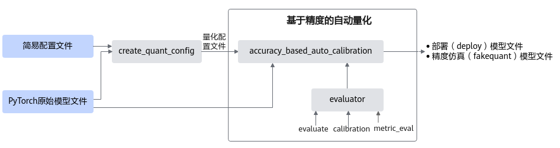

主要流程如下：

1.  <a name="li1620271314520"></a>调用[create\_quant\_config](create_quant_config.md)生成量化配置文件，然后调用[accuracy\_based\_auto\_calibration](accuracy_based_auto_calibration.md)进行基于精度的自动量化。
2.  <a name="li23141824486"></a>调用[accuracy\_based\_auto\_calibration](accuracy_based_auto_calibration.md)中由用户传入的evaluator实例进行精度测试，得到原始模型精度。

    该过程还会调用[accuracy\_based\_auto\_calibration](accuracy_based_auto_calibration.md)中的量化策略strategy模块，输出初始化的quant config量化配置文件，该文件记录所有层都可以进行量化。

3.  使用用户传入的初始量化配置文件（[1](#li1620271314520)中调用[create\_quant\_config](create_quant_config.md)生成的）对模型进行训练后量化，得到量化后fake quant模型的精度。
4.  原始模型精度与量化后fake quant模型精度进行比较，如果精度达标，则输出量化后的部署模型和fake quant模型，如果不达标，则进行基于精度的自动量化流程：
    1.  进行原始PyTorch网络的推理， dump出每一层的输入activation数据，缓存起来；
    2.  利用训练后量化的量化因子构造量化层的单算子网络，利用缓存的activation数据计算量化后fake quant单算子网络的输出数据和原始PyTorch单算子网络输出的余弦相似度。
    3.  <a name="li411322192712"></a>将余弦相似度的列表传给[accuracy\_based\_auto\_calibration](accuracy_based_auto_calibration.md)中的量化策略strategy模块，strategy模块基于[2](#li23141824486)中生成的初始化的量化配置文件，输出回退某些层后的新的quant config量化配置文件。
    4.  根据quant config量化配置文件重新进行训练后量化，得到回退后的fake quant模型。
    5.  调用[accuracy\_based\_auto\_calibration](accuracy_based_auto_calibration.md)中的evaluator模块进行回退后的fake quant模型精度测试，查看精度是否达标：
        -   如果达标，则输出回退后的fake quant模型以及部署模型。
        -   如果不达标，则将余弦相似度排序最差的层回退，再次进行[4.c](#li411322192712)，输出新的量化配置。
        -   如果回退所有层后精度仍不达标，则不生成量化模型。

[accuracy\_based\_auto\_calibration](accuracy_based_auto_calibration.md)接口内部基于精度的自动量化流程如[图2](#fig17197132717303)所示。

**图 2**  自动量化流程<a name="fig17197132717303"></a>  
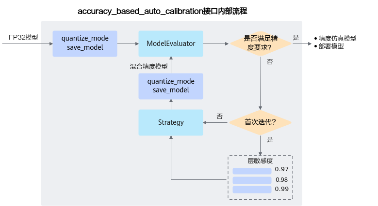

**调用示例<a name="section8613115123318"></a>**

本示例演示使用AMCT进行基于精度的自动量化流程。该过程需要用户实现一个模型推理得到精度的回调函数，由于AMCT需要基于回调函数返回的精度数据进行量化层的筛选，因此回调函数的返回数值应尽可能反映模型的精度。

> **说明：** 
>-   如下示例标有“由用户补充处理”的步骤，需要用户根据自己的模型和数据集进行补充处理，示例中仅为示例代码。
>-   如下示例调用AMCT的部分，函数入参请根据实际情况进行调整。

1.  导入AMCT包。

    ```
    import os
    import amct_pytorch as amct
    from amct_pytorch.common.auto_calibration import AutoCalibrationEvaluatorBase
    ```

2.  （由用户补充处理）使用原始待量化的模型和测试集，实现回调函数**calibration\(\)**、**evaluate\(\)**、**metric\_eval\(\)**。

    上述回调函数的入参要和基类AutoCalibrationEvaluatorBase保持一致。其中：

    -   calibration\(\)完成校准的推理。
    -   evaluate\(\)完成模型的精度测试过程。
    -   metric\_eval\(\)完成原始模型和量化fake quant模型的精度损失评估，当精度损失小于预期值时返回True，否则返回False。

    ```
    class ModelEvaluator(AutoCalibrationEvaluatorBase):
         # The evaluator for model
        def __init__(self, *args, **kwargs):
            # 成员变量初始化
            # 设置预期精度损失，此处请替换为具体的数值
            self.diff = expected_acc_loss
            pass
    
        def calibration(self, model_file, weights_file):
            # 进行模型的校准推理，推理的batch数要和量化配置的batch_num一致
            pass
    
        def evaluate(self, model_file, weights_file):
            # evaluate the input models, get the eval metric of model
            pass
    
        def metric_eval(self, original_metric, new_metric):
            # 评估原始模型精度和量化模型精度的精度损失是否满足预期，满足返回True, 精度损失数据；否则返回False, 精度损失数据
            loss = original_metric - new_metric
            if loss < self.diff:
                return True, loss
            return False, loss
    ```

3.  （由用户补充处理）实例化pytorch模型，得到模型的对象。

    ```
    model = MyNet()
    ```

4.  调用AMCT，进行基于精度的自动量化。
    1.  生成量化配置。

        ```
        config_json_file = './config.json'
        skip_layers = []
        batch_num = 1
        amct.create_quant_config(config_json_file, model, input_data,
                                  skip_layers, batch_num)
        
        scale_offset_record_file = os.path.join(TMP, 'scale_offset_record.txt')
        result_path = os.path.join(RESULT, 'model')
        ```

    2.  初始化Evaluator。

        ```
        evaluator = AutoCalibrationEvaluator()
        ```

    3.  进行基于精度的量化配置自动搜索。

        ```
        amct.accuracy_based_auto_calibration(
                model=model,
                model_evaluator=evaluator,
                config_file=config_json_file,
                record_file=record_file,
                save_dir=result_path,
                input_data=input_data,
                input_names=['input'],
                output_names=['output'],
                dynamic_axes={
                    'input': {0: 'batch_size'},
                    'output': {0: 'batch_size'}
                },
                strategy='BinarySearch',
                sensitivity='CosineSimilarity'
            )
        ```

#### 手工量化<a name="ZH-CN_TOPIC_0000002473904506"></a>

均匀量化是指量化后的数据比较均匀地分布在某个数值空间中，例如INT8量化就是用只有8比特的INT8数据来表示32比特的float32数据或16比特的float16数据，将float32/float16的卷积运算过程（乘加运算）转换为INT8的卷积运算，加速运算和实现模型压缩；均匀的INT8量化则是量化后数据比较均匀地分布在INT8的数值空间\[-128, 127\]中。
非均匀量化是指量化后的数据在某个数值空间中的分布是不均匀的。非均匀量化过程中，会根据待量化数据的概率分布来对均匀量化后的数据分布进一步进行根据目标压缩率（保留数值量/原始量化数值量）的聚类操作。相较于均匀量化，非均匀量化在进一步压缩数据信息量的基础上尽可能的保留高概率分布的数据信息，从而减小压缩后的数据信息丢失。
执行训练后量化特性的精度如果不满足要求，可以尝试手动调整config.json文件中的参数，本节给出调整的原则，以及参数解释。

##### 均匀量化<a name="ZH-CN_TOPIC_0000002506024473"></a>

均匀量化是指量化后的数据比较均匀地分布在某个数值空间中，例如INT8量化就是用只有8比特的INT8数据来表示32比特的float32数据或16比特的float16数据，将float32/float16的卷积运算过程（乘加运算）转换为INT8的卷积运算，加速运算和实现模型压缩；均匀的INT8量化则是量化后数据比较均匀地分布在INT8的数值空间\[-128, 127\]中。

如果均匀量化后的模型精度无法满足要求，则需要进行[基于精度的自动量化](基于精度的自动量化.md)或[量化感知训练](量化感知训练.md)或[手工调优](手工调优.md)。均匀量化支持量化的层以及约束如下，量化示例请参见[样例列表](样例列表.md)。

**表 1**  均匀量化支持的层以及约束

<a name="table061924413214"></a>
<table><thead align="left"><tr id="row1061954442118"><th class="cellrowborder" valign="top" width="20.599999999999998%" id="mcps1.2.4.1.1"><p id="p861918442214"><a name="p861918442214"></a><a name="p861918442214"></a>支持的层类型</p>
</th>
<th class="cellrowborder" valign="top" width="41.18%" id="mcps1.2.4.1.2"><p id="p1561944411219"><a name="p1561944411219"></a><a name="p1561944411219"></a>约束</p>
</th>
<th class="cellrowborder" valign="top" width="38.22%" id="mcps1.2.4.1.3"><p id="p94804175510"><a name="p94804175510"></a><a name="p94804175510"></a>备注</p>
</th>
</tr>
</thead>
<tbody><tr id="row6502503420"><td class="cellrowborder" valign="top" width="20.599999999999998%" headers="mcps1.2.4.1.1 "><p id="p151779561441"><a name="p151779561441"></a><a name="p151779561441"></a>torch.nn.Linear</p>
</td>
<td class="cellrowborder" valign="top" width="41.18%" headers="mcps1.2.4.1.2 "><p id="p1219618591947"><a name="p1219618591947"></a><a name="p1219618591947"></a>-</p>
</td>
<td class="cellrowborder" rowspan="5" valign="top" width="38.22%" headers="mcps1.2.4.1.3 "><p id="p4512106755"><a name="p4512106755"></a><a name="p4512106755"></a>复用层（共用weight和bias参数）不支持量化。</p>
</td>
</tr>
<tr id="row1338820526413"><td class="cellrowborder" valign="top" headers="mcps1.2.4.1.1 "><p id="p151771456945"><a name="p151771456945"></a><a name="p151771456945"></a>torch.nn.Conv2d</p>
</td>
<td class="cellrowborder" valign="top" headers="mcps1.2.4.1.2 "><a name="ul121962592414"></a><a name="ul121962592414"></a><ul id="ul121962592414"><li>padding_mode为zeros</li><li>只支持input data的shape为(N, Cin, Hin, Win)</li></ul>
</td>
</tr>
<tr id="row12620444182118"><td class="cellrowborder" valign="top" headers="mcps1.2.4.1.1 "><p id="p262012447215"><a name="p262012447215"></a><a name="p262012447215"></a>torch.nn.ConvTranspose2d</p>
</td>
<td class="cellrowborder" valign="top" headers="mcps1.2.4.1.2 "><a name="ul25981723142312"></a><a name="ul25981723142312"></a><ul id="ul25981723142312"><li>padding_mode为zeros</li><li>weight为const，不支持权重共享</li><li>只支持input data的shape为(N, Cin, Hin, Win)</li></ul>
</td>
</tr>
<tr id="row187581798407"><td class="cellrowborder" valign="top" headers="mcps1.2.4.1.1 "><p id="p184821704015"><a name="p184821704015"></a><a name="p184821704015"></a>torch.nn.ConvTranspose1d</p>
</td>
<td class="cellrowborder" valign="top" headers="mcps1.2.4.1.2 "><p id="p189110380011"><a name="p189110380011"></a><a name="p189110380011"></a>padding_mode为zeros</p>
</td>
</tr>
<tr id="row9831852204611"><td class="cellrowborder" valign="top" headers="mcps1.2.4.1.1 "><p id="p173141124717"><a name="p173141124717"></a><a name="p173141124717"></a>torch.nn.Conv1d</p>
</td>
<td class="cellrowborder" valign="top" headers="mcps1.2.4.1.2 "><a name="ul1078134120479"></a><a name="ul1078134120479"></a><ul id="ul1078134120479"><li>padding_mode为zeros</li><li>weight为const，不支持权重共享</li></ul>
</td>
</tr>
</tbody>
</table>

**接口调用流程<a name="section993845105612"></a>**

均匀量化接口调用流程如[图1](#fig153281318152013)所示。

**图 1**  均匀量化接口调用流程<a name="fig153281318152013"></a>  
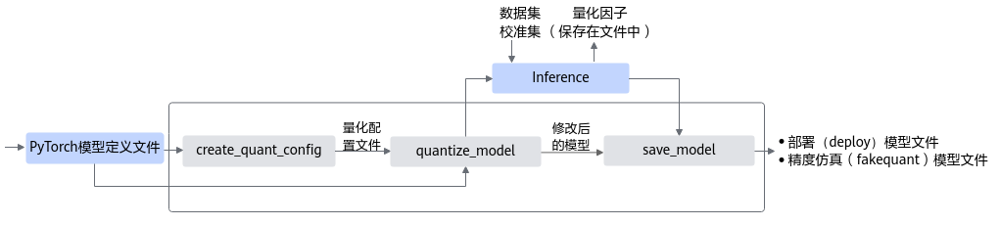

蓝色部分为用户实现，灰色部分为用户调用AMCT提供的API实现，工具使用分为如下场景：

1.  用户首先构造PyTorch的原始模型，然后使用[create\_quant\_config](create_quant_config.md)生成量化配置文件。
2.  根据PyTorch模型和量化配置文件，即可调用[quantize\_model](quantize_model.md)接口对原始PyTorch模型进行优化，优化后的PyTorch模型中包含了量化算法。
3.  使用校准集在PyTorch环境下执行前向推理，产生量化因子，并将量化因子输出到文件中。
4.  最后用户可以调用[save\_model](save_model.md)接口保存量化后的模型，包括可在ONNX执行框架ONNX Runtime环境中进行精度仿真的模型文件和可部署在NPU IP加速器的模型文件。
    -   精度仿真模型文件：ONNX格式的模型文件，模型名中包含fake\_quant，可以在ONNX Runtime环境进行精度仿真。

        fake\_quant模型主要用于验证量化后模型的精度，可以在ONNX Runtime环境下运行。进行前向推理的计算过程中，在fake\_quant模型中对卷积层等的输入数据和权重进行了量化反量化的操作，来模拟量化后的计算结果，从而快速验证量化后模型的精度。如下图所示，以INT8量化为例，Quant层、Conv2d卷积层和DeQuant层之间的数据都是float32数据类型的，其中Quant层将数据量化到INT8又反量化为float32，权重也是量化到INT8又反量化为float32，实际卷积层的计算是基于float32数据类型的，该模型用于在ONNX Runtime环境验证量化后模型的精度，不能够用于ATC工具转换成om模型。

        **图 2**  fake\_quant模型<a name="fig830317361367"></a>  
        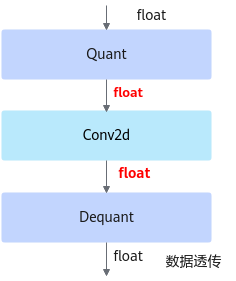

    -   部署模型文件：ONNX格式的模型文件，模型名中包含deploy，经过ATC转换工具转换后可部署到NPU IP加速器。

        以INT8量化为例，deploy模型由于已经将权重等转换为INT8，INT32类型，因此不能在ONNX Runtime环境上执行推理计算。如下图所示，deploy模型的AscendQuant层将float32的输入数据量化为INT8，作为卷积层的输入，权重也是使用INT8数据类型作为计算，在deploy模型中的卷积层的计算是基于INT8，INT32数据类型的，输出为INT32数据类型经过AscendDeQuant层转换成float32数据类型传输给下一个网络层。

        **图 3**  deploy模型<a name="fig32095209306"></a>  
        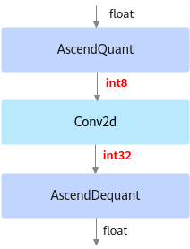

**调用示例<a name="section9439121165720"></a>**

训练后量化主要包括如下几个步骤：

1.  准备训练好的模型和数据集。
2.  在原始PyTorch环境中验证模型精度以及环境是否正常。
3.  编写训练后量化脚本调用AMCT  API。
4.  执行训练后量化脚本。
5.  在ONNX Runtime环境中验证量化后仿真模型精度。

> **说明：** 
>-   由于软件约束（动态shape场景下暂不支持输入数据为DT\_INT8），量化后的部署模型使用ATC工具进行模型转换时，**不能使用动态shape相关参数**，例如--dynamic\_batch\_size和--dynamic\_image\_size等，否则模型转换会失败。
>-   使用AMCT工具量化后的部署模型，使用ATC工具进行模型转换时，**不能再使用高精度特性**，比如不能再通过--precision\_mode参数配置**force\_fp32**或**must\_keep\_origin\_dtype（原图fp32输入）**；不能再通过--precision\_mode\_v2参数配置**origin**；不能通过--op\_precision\_mode配置**high\_precision**参数等。在高精度模式下设置量化参数，既拿不到量化的性能收益，也拿不到高精度模式的精度收益。
>-   如下示例标有“由用户补充处理”的步骤，需要用户根据自己的模型和数据集进行补充处理，示例中仅为示例代码。
>-   如下示例调用AMCT的部分，函数入参请根据实际情况进行调整。

1.  导入AMCT包，并通过[安装后处理](安装后处理.md)\>AMCT\(PyTorch\)中的环境变量设置日志级别。

    ```
    import amct_pytorch as amct
    ```

2.  <a name="li13259141318410"></a>（可选，由用户补充处理）在PyTorch原始环境中验证推理脚本及环境。

    建议使用原始待量化的模型和测试集，在PyTorch环境下推理，验证环境、推理脚本是否正常。

    推荐执行该步骤，请确保原始模型可以完成推理且精度正常；执行该步骤时，可以使用部分测试集，减少运行时间。

    ```
    user_do_inference_torch(ori_model, test_data, test_iterations)
    ```

3.  调用AMCT，量化模型。
    1.  生成量化配置。

        ```
        config_file = './tmp/config.json'
        skip_layers = []
        batch_num = 1
        amct.create_quant_config(config_file=config_file,
        			 model=ori_model,
                                 input_data=ori_model_input_data,
        			 skip_layers=skip_layers,
        			 batch_num=batch_num)
        ```

    2.  修改图，在图中插入数据量化，权重量化等相关的算子，用于计算量化相关参数。

        ```
        record_file = './tmp/record.txt'
        modified_onnx_model = './tmp/modified_model.onnx'
        calibration_model = amct.quantize_model(config_file=config_file,
        					modified_onnx_model=modified_onnx_model,
        					record_file=record_file,
                                                model=ori_model,
                                                input_data=ori_model_input_data)
        ```

    3.  （由用户补充处理）基于PyTorch环境，使用修改后的模型（calibration\_model）在校准集（calibration\_data）上做模型推理，生成量化因子。

        该步骤执行时，需要注意如下两点：

        1.  校准集及其预处理过程数据要与模型匹配，以保证量化的精度。
        2.  前向推理次数为batch\_num，如果次数不足，由于校准算子没有将量化因子输出到record文件中，会导致后续读取record校验失败。

        校准过程中如果提示\[IFMR\]: Do layer xxx data calibration failed!错误信息，则请参见[校准执行过程中提示“\[IFMR\]: Do layer xxx data calibration failed!”](校准执行过程中提示-IFMR-Do-layer-xxx-data-calibration-failed.md)解决。

        ```
        user_do_inference_torch(calibration_model, calibration_data, batch_num)
        ```

    4.  保存模型。

        根据量化因子，调用[save\_model](save_model.md)接口，插入AscendQuant、AscendDequant等算子，保存为量化模型。

        ```
        quant_model_path = './results/user_model'
        amct.save_model(modified_onnx_file=modified_onnx_file,
                        record_file=record_file,
                        save_path=quant_model_path)
        ```

4.  （可选，由用户补充处理）基于ONNX Runtime的环境，使用量化后模型（quant\_model）在测试集（test\_data）上做推理，测试量化后仿真模型的精度。

    使用量化后仿真模型精度与[2](#li13259141318410)中的原始精度做对比，可以观察量化对精度的影响。

    ```
    quant_model = './results/user_model_fake_quant_model.onnx'
    user_do_inference_onnx(quant_model, test_data, test_iterations)
    ```

##### 非均匀量化\(不支持\)<a name="ZH-CN_TOPIC_0000002473744536"></a>

非均匀量化是指量化后的数据在某个数值空间中的分布是不均匀的。非均匀量化过程中，会根据待量化数据的概率分布来对均匀量化后的数据分布进一步进行根据目标压缩率（保留数值量/原始量化数值量）的聚类操作。相较于均匀量化，非均匀量化在进一步压缩数据信息量的基础上尽可能的保留高概率分布的数据信息，从而减小压缩后的数据信息丢失。

> **说明：** 
>**由于硬件约束，该版本不建议使用非均匀量化的功能，获取不到性能收益。**

模型在NPU IP加速器上推理时，可通过非均匀量化提高权重压缩率（需要与ATC工具配合，通过编译时使能权重压缩），降低权重传输开销，进一步提升推理性能。非均匀量化后，如果精度仿真模型在原始PyTorch环境中推理精度不满足要求，可通过调整非均匀量化配置文件config.json中的参数来恢复模型精度，调整方法请参见[手工调优](手工调优.md)。量化示例请参见[样例列表](样例列表.md)。

非均匀量化支持量化的层以及约束如下：

**表 1**  非均匀量化支持的层以及约束

<a name="table32131022111318"></a>
<table><thead align="left"><tr id="row9214202215138"><th class="cellrowborder" valign="top" width="22.33%" id="mcps1.2.3.1.1"><p id="p13235103754014"><a name="p13235103754014"></a><a name="p13235103754014"></a>支持的层类型</p>
</th>
<th class="cellrowborder" valign="top" width="77.66999999999999%" id="mcps1.2.3.1.2"><p id="p122141822101318"><a name="p122141822101318"></a><a name="p122141822101318"></a>约束</p>
</th>
</tr>
</thead>
<tbody><tr id="row132201707613"><td class="cellrowborder" valign="top" width="22.33%" headers="mcps1.2.3.1.1 "><p id="p249710342616"><a name="p249710342616"></a><a name="p249710342616"></a>torch.nn.Conv2d</p>
</td>
<td class="cellrowborder" valign="top" width="77.66999999999999%" headers="mcps1.2.3.1.2 "><a name="ul1980105312314"></a><a name="ul1980105312314"></a><ul id="ul1980105312314"><li>padding_mode为zeros</li><li>只支持input data的shape为(N, Cin, Hin, Win)</li></ul>
</td>
</tr>
<tr id="row6572132712110"><td class="cellrowborder" valign="top" width="22.33%" headers="mcps1.2.3.1.1 "><p id="p32146222139"><a name="p32146222139"></a><a name="p32146222139"></a>torch.nn.Linear</p>
</td>
<td class="cellrowborder" valign="top" width="77.66999999999999%" headers="mcps1.2.3.1.2 "><p id="p757217272216"><a name="p757217272216"></a><a name="p757217272216"></a>仅支持带bias规格的非均匀量化，且Shape必须为两维</p>
</td>
</tr>
</tbody>
</table>

**实现流程<a name="section372615121613"></a>**

静态非均匀量化实现原理同[均匀量化](均匀量化.md)，简要流程如[图1](#fig632614881115)所示。

**图 1**  非均匀量化流程图<a name="fig632614881115"></a>  
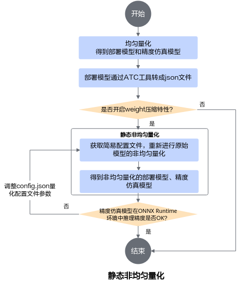

详细流程说明如下：

1.  <a name="li7933268523"></a>参见[均匀量化](均匀量化.md)章节获取均匀量化的部署模型和精度仿真模型。
2.  <a name="li56016231522"></a>参见《ATC离线模型编译工具用户指南》将[1](#li7933268523)中生成的部署模型转换成JSON文件，该JSON文件记录了量化后模型的融合信息，同时也携带了支持weight压缩特性层的信息（通过fe\_weight\_compress字段识别）。
3.  如果要进行weight压缩，则参见[训练后量化简易配置文件](训练后量化简易配置文件.md)章节获取非均匀量化简易配置文件，然后获取[2](#li56016231522)生成的量化后模型的融合JSON文件进行非均匀量化。

    非均匀量化过程中，会根据融合JSON文件，获取原始模型中哪些层支持weight压缩，然后重新生成非均匀量化的部署模型和量化配置文件。

4.  查看非均匀量化后，精度仿真模型在原始ONNX Runtime环境中推理精度是否满足要求，如果不满足要求，则需要调整非均匀量化配置文件config.json中的参数，然后重新进行非均匀量化，直至满足精度要求。调整方法请参见[手工调优](手工调优.md)。

##### 手工调优<a name="ZH-CN_TOPIC_0000002505904521"></a>

执行训练后量化特性的精度如果不满足要求，可以尝试手动调整config.json文件中的参数，本节给出调整的原则，以及参数解释。

**调优流程<a name="section112111610183117"></a>**

通过[create\_quant\_config](create_quant_config.md)接口生成的config.json文件中的默认配置进行量化，若量化后的推理精度不满足要求，则可调整量化配置重复量化，直至精度满足要求。本节详细介绍手动调优流程，调整对象是训练后量化配置文件config.json中的参数，主要涉及3个阶段：

1.  调整校准使用的数据量。
2.  跳过量化某些层。
3.  调整量化算法及参数。

具体步骤如下：

1.  根据[create\_quant\_config](create_quant_config.md)接口生成的默认配置进行量化。若精度满足要求，则调参结束，否则进行[2](#zh-cn_topic_0240188709_li1043716142619)。
2.  <a name="zh-cn_topic_0240188709_li1043716142619"></a>手动修改batch\_num，调整校准使用的数据量。

    batch\_num控制量化使用数据的batch数目，可根据batch大小以及量化需要使用的图片数量调整。通常情况下：

    batch\_num越大，量化过程中使用的数据样本越多，量化后精度损失越小；但过多的数据并不会带来精度的提升，反而会占用较多的内存，降低量化的速度，并可能引起内存、显存、线程资源不足等情况；因此，建议batch\_num\*batch\_size为16或32（batch\_size表示每个batch使用的图片数量）。

3.  若按照[2](#zh-cn_topic_0240188709_li1043716142619)中的量化配置进行量化后，精度满足要求，则调参结束，否则进行[4](#li718684715113)。
4.  <a name="li718684715113"></a>手动修改quant\_enable，跳过量化某些层。

    quant\_enable可以指定该层是否量化，取值为true时量化该层，取值为false时不量化该层，将该层的配置删除也可跳过该层量化。

    在整网精度不达标的时候需要识别出网络中的量化敏感层（量化后误差显著增大），然后取消对量化敏感层的量化动作，识别量化敏感层有两种方法：

    1.  依据网络模型结构，一般网络中首层、尾层以及参数量偏少的层，量化后精度会有较大的下降。
    2.  通过精度比对工具，逐层比对原始模型和量化后模型输出误差（例如以余弦相似度作为标准，需要相似度达到0.99以上），找到误差较大的层，优先对其进行回退。

5.  若按照[4](#li718684715113)中的量化配置进行量化后，精度满足要求，则调参结束，否则进行[6](#zh-cn_topic_0240188709_li2044613162372)。
6.  <a name="zh-cn_topic_0240188709_li2044613162372"></a>手动修改activation\_quant\_params和weight\_quant\_params，调整量化算法及参数：

    算法参数意义请参见[量化配置文件](#section3657951481)中的参数说明部分，算法说明请参见[训练后量化算法](训练后量化算法.md)。

7.  若按照[6](#zh-cn_topic_0240188709_li2044613162372)中的量化配置进行量化后，精度满足要求，则调参结束，否则表明量化对精度影响很大，不能进行量化，去除量化配置。

**图 1**  调参流程<a name="zh-cn_topic_0240188709_fig10376759162410"></a>  
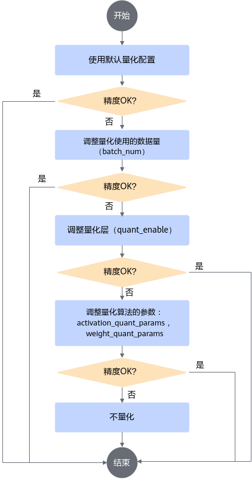

**量化配置文件<a name="section3657951481"></a>**

如果通过[create\_quant\_config](create_quant_config.md)接口生成的config.json量化配置文件，推理精度不满足要求，则需要参见该章节不断调整config.json文件中的内容（用户修改JSON文件时，请确保层名唯一），直至精度满足要求，json量化配置文件样例请参见接口中的[调用示例](create_quant_config.md#zh-cn_topic_0240187365_section64231658994)部分。

配置文件中参数说明如下：

**表 1**  version参数说明

<a name="zh-cn_topic_0240188722_table2626104713369"></a>
<table><tbody><tr id="zh-cn_topic_0240188722_row116261847163611"><th class="firstcol" valign="top" width="20.96%" id="mcps1.2.3.1.1"><p id="zh-cn_topic_0240188722_p462654715365"><a name="zh-cn_topic_0240188722_p462654715365"></a><a name="zh-cn_topic_0240188722_p462654715365"></a>作用</p>
</th>
<td class="cellrowborder" valign="top" width="79.03999999999999%" headers="mcps1.2.3.1.1 "><p id="zh-cn_topic_0240188722_p16269472361"><a name="zh-cn_topic_0240188722_p16269472361"></a><a name="zh-cn_topic_0240188722_p16269472361"></a>控制量化配置文件版本号。</p>
</td>
</tr>
<tr id="zh-cn_topic_0240188722_row362684710366"><th class="firstcol" valign="top" width="20.96%" id="mcps1.2.3.2.1"><p id="zh-cn_topic_0240188722_p762684713611"><a name="zh-cn_topic_0240188722_p762684713611"></a><a name="zh-cn_topic_0240188722_p762684713611"></a>类型</p>
</th>
<td class="cellrowborder" valign="top" width="79.03999999999999%" headers="mcps1.2.3.2.1 "><p id="zh-cn_topic_0240188722_p19626124713367"><a name="zh-cn_topic_0240188722_p19626124713367"></a><a name="zh-cn_topic_0240188722_p19626124713367"></a>int</p>
</td>
</tr>
<tr id="zh-cn_topic_0240188722_row146267479367"><th class="firstcol" valign="top" width="20.96%" id="mcps1.2.3.3.1"><p id="zh-cn_topic_0240188722_p18626194711368"><a name="zh-cn_topic_0240188722_p18626194711368"></a><a name="zh-cn_topic_0240188722_p18626194711368"></a>取值范围</p>
</th>
<td class="cellrowborder" valign="top" width="79.03999999999999%" headers="mcps1.2.3.3.1 "><p id="zh-cn_topic_0240188722_p186261147193612"><a name="zh-cn_topic_0240188722_p186261147193612"></a><a name="zh-cn_topic_0240188722_p186261147193612"></a>1</p>
</td>
</tr>
<tr id="zh-cn_topic_0240188722_row7626194719361"><th class="firstcol" valign="top" width="20.96%" id="mcps1.2.3.4.1"><p id="zh-cn_topic_0240188722_p1462644712368"><a name="zh-cn_topic_0240188722_p1462644712368"></a><a name="zh-cn_topic_0240188722_p1462644712368"></a>参数说明</p>
</th>
<td class="cellrowborder" valign="top" width="79.03999999999999%" headers="mcps1.2.3.4.1 "><p id="zh-cn_topic_0240188722_p156261247113612"><a name="zh-cn_topic_0240188722_p156261247113612"></a><a name="zh-cn_topic_0240188722_p156261247113612"></a>目前仅有一个版本号1。</p>
</td>
</tr>
<tr id="zh-cn_topic_0240188722_row17626144713363"><th class="firstcol" valign="top" width="20.96%" id="mcps1.2.3.5.1"><p id="zh-cn_topic_0240188722_p1462634743614"><a name="zh-cn_topic_0240188722_p1462634743614"></a><a name="zh-cn_topic_0240188722_p1462634743614"></a>推荐配置</p>
</th>
<td class="cellrowborder" valign="top" width="79.03999999999999%" headers="mcps1.2.3.5.1 "><p id="zh-cn_topic_0240188722_p1162664743620"><a name="zh-cn_topic_0240188722_p1162664743620"></a><a name="zh-cn_topic_0240188722_p1162664743620"></a>1</p>
</td>
</tr>
<tr id="zh-cn_topic_0240188722_row311394219392"><th class="firstcol" valign="top" width="20.96%" id="mcps1.2.3.6.1"><p id="zh-cn_topic_0240188722_p1811484213910"><a name="zh-cn_topic_0240188722_p1811484213910"></a><a name="zh-cn_topic_0240188722_p1811484213910"></a>可选或者必选</p>
</th>
<td class="cellrowborder" valign="top" width="79.03999999999999%" headers="mcps1.2.3.6.1 "><p id="zh-cn_topic_0240188722_p17114742143918"><a name="zh-cn_topic_0240188722_p17114742143918"></a><a name="zh-cn_topic_0240188722_p17114742143918"></a>可选</p>
</td>
</tr>
</tbody>
</table>

**表 2**  batch\_num参数说明

<a name="zh-cn_topic_0240188002_table1993174915423"></a>
<table><tbody><tr id="zh-cn_topic_0240188002_row0944492423"><th class="firstcol" valign="top" width="21.349999999999998%" id="mcps1.2.3.1.1"><p id="zh-cn_topic_0240188002_p294134994210"><a name="zh-cn_topic_0240188002_p294134994210"></a><a name="zh-cn_topic_0240188002_p294134994210"></a>作用</p>
</th>
<td class="cellrowborder" valign="top" width="78.64999999999999%" headers="mcps1.2.3.1.1 "><p id="zh-cn_topic_0240188002_p694164934219"><a name="zh-cn_topic_0240188002_p694164934219"></a><a name="zh-cn_topic_0240188002_p694164934219"></a>控制量化使用多少个batch的数据。</p>
</td>
</tr>
<tr id="zh-cn_topic_0240188002_row294249104214"><th class="firstcol" valign="top" width="21.349999999999998%" id="mcps1.2.3.2.1"><p id="zh-cn_topic_0240188002_p1794164974216"><a name="zh-cn_topic_0240188002_p1794164974216"></a><a name="zh-cn_topic_0240188002_p1794164974216"></a><span>类型</span></p>
</th>
<td class="cellrowborder" valign="top" width="78.64999999999999%" headers="mcps1.2.3.2.1 "><p id="zh-cn_topic_0240188002_p1894449164210"><a name="zh-cn_topic_0240188002_p1894449164210"></a><a name="zh-cn_topic_0240188002_p1894449164210"></a>int</p>
</td>
</tr>
<tr id="zh-cn_topic_0240188002_row199420495426"><th class="firstcol" valign="top" width="21.349999999999998%" id="mcps1.2.3.3.1"><p id="zh-cn_topic_0240188002_p39419491427"><a name="zh-cn_topic_0240188002_p39419491427"></a><a name="zh-cn_topic_0240188002_p39419491427"></a><span>取值范围</span></p>
</th>
<td class="cellrowborder" valign="top" width="78.64999999999999%" headers="mcps1.2.3.3.1 "><p id="zh-cn_topic_0240188002_p694134954217"><a name="zh-cn_topic_0240188002_p694134954217"></a><a name="zh-cn_topic_0240188002_p694134954217"></a>大于0</p>
</td>
</tr>
<tr id="zh-cn_topic_0240188002_row394164944213"><th class="firstcol" valign="top" width="21.349999999999998%" id="mcps1.2.3.4.1"><p id="zh-cn_topic_0240188002_p1694104916421"><a name="zh-cn_topic_0240188002_p1694104916421"></a><a name="zh-cn_topic_0240188002_p1694104916421"></a>参数说明</p>
</th>
<td class="cellrowborder" valign="top" width="78.64999999999999%" headers="mcps1.2.3.4.1 "><p id="zh-cn_topic_0240188002_p159444919429"><a name="zh-cn_topic_0240188002_p159444919429"></a><a name="zh-cn_topic_0240188002_p159444919429"></a>如果不配置，则使用默认值1，建议校准集图片数量不超过50张，根据batch的大小batch_size计算相应的batch_num数值。</p>
<p id="zh-cn_topic_0240188002_p1223319101118"><a name="zh-cn_topic_0240188002_p1223319101118"></a><a name="zh-cn_topic_0240188002_p1223319101118"></a>batch_num*batch_size为量化使用的校准集图片数量。</p>
<p id="zh-cn_topic_0240188002_p201320014422"><a name="zh-cn_topic_0240188002_p201320014422"></a><a name="zh-cn_topic_0240188002_p201320014422"></a>其中batch_size为每个batch所用的图片数量。</p>
</td>
</tr>
<tr id="zh-cn_topic_0240188002_row8941849114212"><th class="firstcol" valign="top" width="21.349999999999998%" id="mcps1.2.3.5.1"><p id="zh-cn_topic_0240188002_p19945496428"><a name="zh-cn_topic_0240188002_p19945496428"></a><a name="zh-cn_topic_0240188002_p19945496428"></a>推荐配置</p>
</th>
<td class="cellrowborder" valign="top" width="78.64999999999999%" headers="mcps1.2.3.5.1 "><p id="zh-cn_topic_0240188002_p10941249164219"><a name="zh-cn_topic_0240188002_p10941249164219"></a><a name="zh-cn_topic_0240188002_p10941249164219"></a>1</p>
</td>
</tr>
<tr id="zh-cn_topic_0240188002_row194104974210"><th class="firstcol" valign="top" width="21.349999999999998%" id="mcps1.2.3.6.1"><p id="zh-cn_topic_0240188002_p694174913424"><a name="zh-cn_topic_0240188002_p694174913424"></a><a name="zh-cn_topic_0240188002_p694174913424"></a>必选或可选</p>
</th>
<td class="cellrowborder" valign="top" width="78.64999999999999%" headers="mcps1.2.3.6.1 "><p id="zh-cn_topic_0240188002_p89524910428"><a name="zh-cn_topic_0240188002_p89524910428"></a><a name="zh-cn_topic_0240188002_p89524910428"></a>可选</p>
</td>
</tr>
</tbody>
</table>

**表 3**  activation\_offset参数说明

<a name="zh-cn_topic_0240188002_table9951049114210"></a>
<table><tbody><tr id="zh-cn_topic_0240188002_row129514490428"><th class="firstcol" valign="top" width="21.349999999999998%" id="mcps1.2.3.1.1"><p id="zh-cn_topic_0240188002_p3951149184213"><a name="zh-cn_topic_0240188002_p3951149184213"></a><a name="zh-cn_topic_0240188002_p3951149184213"></a>作用</p>
</th>
<td class="cellrowborder" valign="top" width="78.64999999999999%" headers="mcps1.2.3.1.1 "><p id="p168261724123812"><a name="p168261724123812"></a><a name="p168261724123812"></a>控制数据量化是对称量化还是非对称量化。全局配置参数。</p>
<p id="p12429175873714"><a name="p12429175873714"></a><a name="p12429175873714"></a>若配置文件中同时存在activation_offset和asymmetric参数，asymmetric参数优先级&gt;activation_offset参数。</p>
</td>
</tr>
<tr id="zh-cn_topic_0240188002_row18951449164219"><th class="firstcol" valign="top" width="21.349999999999998%" id="mcps1.2.3.2.1"><p id="zh-cn_topic_0240188002_p0951493420"><a name="zh-cn_topic_0240188002_p0951493420"></a><a name="zh-cn_topic_0240188002_p0951493420"></a>类型</p>
</th>
<td class="cellrowborder" valign="top" width="78.64999999999999%" headers="mcps1.2.3.2.1 "><p id="zh-cn_topic_0240188002_p99534916427"><a name="zh-cn_topic_0240188002_p99534916427"></a><a name="zh-cn_topic_0240188002_p99534916427"></a>bool</p>
</td>
</tr>
<tr id="zh-cn_topic_0240188002_row189516493421"><th class="firstcol" valign="top" width="21.349999999999998%" id="mcps1.2.3.3.1"><p id="zh-cn_topic_0240188002_p1895649144219"><a name="zh-cn_topic_0240188002_p1895649144219"></a><a name="zh-cn_topic_0240188002_p1895649144219"></a>取值范围</p>
</th>
<td class="cellrowborder" valign="top" width="78.64999999999999%" headers="mcps1.2.3.3.1 "><p id="zh-cn_topic_0240188002_p59574994218"><a name="zh-cn_topic_0240188002_p59574994218"></a><a name="zh-cn_topic_0240188002_p59574994218"></a>true或false</p>
</td>
</tr>
<tr id="zh-cn_topic_0240188002_row169584954213"><th class="firstcol" valign="top" width="21.349999999999998%" id="mcps1.2.3.4.1"><p id="zh-cn_topic_0240188002_p12959499422"><a name="zh-cn_topic_0240188002_p12959499422"></a><a name="zh-cn_topic_0240188002_p12959499422"></a>参数说明</p>
</th>
<td class="cellrowborder" valign="top" width="78.64999999999999%" headers="mcps1.2.3.4.1 "><a name="ul11492132182611"></a><a name="ul11492132182611"></a><ul id="ul11492132182611"><li>true：数据量化时为非对称量化。(IPV350不支持)</li><li>false：数据量化时为对称量化。</li></ul>
</td>
</tr>
<tr id="zh-cn_topic_0240188002_row139564944214"><th class="firstcol" valign="top" width="21.349999999999998%" id="mcps1.2.3.5.1"><p id="zh-cn_topic_0240188002_p59524916426"><a name="zh-cn_topic_0240188002_p59524916426"></a><a name="zh-cn_topic_0240188002_p59524916426"></a>推荐配置</p>
</th>
<td class="cellrowborder" valign="top" width="78.64999999999999%" headers="mcps1.2.3.5.1 "><p id="zh-cn_topic_0240188002_p169674919424"><a name="zh-cn_topic_0240188002_p169674919424"></a><a name="zh-cn_topic_0240188002_p169674919424"></a>true</p>
</td>
</tr>
<tr id="zh-cn_topic_0240188002_row496164924211"><th class="firstcol" valign="top" width="21.349999999999998%" id="mcps1.2.3.6.1"><p id="zh-cn_topic_0240188002_p139613497421"><a name="zh-cn_topic_0240188002_p139613497421"></a><a name="zh-cn_topic_0240188002_p139613497421"></a>必选或可选</p>
</th>
<td class="cellrowborder" valign="top" width="78.64999999999999%" headers="mcps1.2.3.6.1 "><p id="zh-cn_topic_0240188002_p1096154916421"><a name="zh-cn_topic_0240188002_p1096154916421"></a><a name="zh-cn_topic_0240188002_p1096154916421"></a>可选</p>
</td>
</tr>
</tbody>
</table>

**表 4**  do\_fusion参数说明

<a name="table9868105620512"></a>
<table><tbody><tr id="row108683561257"><th class="firstcol" valign="top" width="21.25%" id="mcps1.2.3.1.1"><p id="p208681156158"><a name="p208681156158"></a><a name="p208681156158"></a>作用</p>
</th>
<td class="cellrowborder" valign="top" width="78.75%" headers="mcps1.2.3.1.1 "><p id="p20412381073"><a name="p20412381073"></a><a name="p20412381073"></a>是否开启融合功能。</p>
</td>
</tr>
<tr id="row48685563515"><th class="firstcol" valign="top" width="21.25%" id="mcps1.2.3.2.1"><p id="p10868256059"><a name="p10868256059"></a><a name="p10868256059"></a>类型</p>
</th>
<td class="cellrowborder" valign="top" width="78.75%" headers="mcps1.2.3.2.1 "><p id="p58681756659"><a name="p58681756659"></a><a name="p58681756659"></a>bool</p>
</td>
</tr>
<tr id="row7869356054"><th class="firstcol" valign="top" width="21.25%" id="mcps1.2.3.3.1"><p id="p1586985616513"><a name="p1586985616513"></a><a name="p1586985616513"></a>取值范围</p>
</th>
<td class="cellrowborder" valign="top" width="78.75%" headers="mcps1.2.3.3.1 "><p id="p138165258720"><a name="p138165258720"></a><a name="p138165258720"></a>true或false</p>
</td>
</tr>
<tr id="row14869556159"><th class="firstcol" valign="top" width="21.25%" id="mcps1.2.3.4.1"><p id="p586913561757"><a name="p586913561757"></a><a name="p586913561757"></a>参数说明</p>
</th>
<td class="cellrowborder" valign="top" width="78.75%" headers="mcps1.2.3.4.1 "><a name="ul14901289110"></a><a name="ul14901289110"></a><ul id="ul14901289110"><li>true：开启融合功能。</li><li>false：不开启融合功能。</li></ul>
<p id="p1731815714168"><a name="p1731815714168"></a><a name="p1731815714168"></a>当前仅支持Conv+BN融合。</p>
</td>
</tr>
<tr id="row68692566513"><th class="firstcol" valign="top" width="21.25%" id="mcps1.2.3.5.1"><p id="p16869956256"><a name="p16869956256"></a><a name="p16869956256"></a>推荐配置</p>
</th>
<td class="cellrowborder" valign="top" width="78.75%" headers="mcps1.2.3.5.1 "><p id="p1486912563512"><a name="p1486912563512"></a><a name="p1486912563512"></a>true</p>
</td>
</tr>
<tr id="row118691556053"><th class="firstcol" valign="top" width="21.25%" id="mcps1.2.3.6.1"><p id="p086911565512"><a name="p086911565512"></a><a name="p086911565512"></a>可选或必选</p>
</th>
<td class="cellrowborder" valign="top" width="78.75%" headers="mcps1.2.3.6.1 "><p id="p1286914567516"><a name="p1286914567516"></a><a name="p1286914567516"></a>可选</p>
</td>
</tr>
</tbody>
</table>

**表 5**  skip\_fusion\_layers参数说明

<a name="table1098019224612"></a>
<table><tbody><tr id="row109801522763"><th class="firstcol" valign="top" width="21.25%" id="mcps1.2.3.1.1"><p id="p198092215618"><a name="p198092215618"></a><a name="p198092215618"></a>作用</p>
</th>
<td class="cellrowborder" valign="top" width="78.75%" headers="mcps1.2.3.1.1 "><p id="p107159541274"><a name="p107159541274"></a><a name="p107159541274"></a>跳过可融合的层。</p>
</td>
</tr>
<tr id="row1598115221363"><th class="firstcol" valign="top" width="21.25%" id="mcps1.2.3.2.1"><p id="p16981182210619"><a name="p16981182210619"></a><a name="p16981182210619"></a>类型</p>
</th>
<td class="cellrowborder" valign="top" width="78.75%" headers="mcps1.2.3.2.1 "><p id="p1930820365514"><a name="p1930820365514"></a><a name="p1930820365514"></a>string</p>
</td>
</tr>
<tr id="row99818221967"><th class="firstcol" valign="top" width="21.25%" id="mcps1.2.3.3.1"><p id="p169811226611"><a name="p169811226611"></a><a name="p169811226611"></a>取值范围</p>
</th>
<td class="cellrowborder" valign="top" width="78.75%" headers="mcps1.2.3.3.1 "><p id="p030823625118"><a name="p030823625118"></a><a name="p030823625118"></a>可融合层的层名。当前仅支持Conv+BN融合。</p>
</td>
</tr>
<tr id="row398112226614"><th class="firstcol" valign="top" width="21.25%" id="mcps1.2.3.4.1"><p id="p11981122210615"><a name="p11981122210615"></a><a name="p11981122210615"></a>参数说明</p>
</th>
<td class="cellrowborder" valign="top" width="78.75%" headers="mcps1.2.3.4.1 "><p id="p330813363513"><a name="p330813363513"></a><a name="p330813363513"></a>不需要做融合的层。</p>
</td>
</tr>
<tr id="row69814229618"><th class="firstcol" valign="top" width="21.25%" id="mcps1.2.3.5.1"><p id="p39819221620"><a name="p39819221620"></a><a name="p39819221620"></a>推荐配置</p>
</th>
<td class="cellrowborder" valign="top" width="78.75%" headers="mcps1.2.3.5.1 "><p id="p6308536115120"><a name="p6308536115120"></a><a name="p6308536115120"></a>-</p>
</td>
</tr>
<tr id="row1998115223611"><th class="firstcol" valign="top" width="21.25%" id="mcps1.2.3.6.1"><p id="p1098116221464"><a name="p1098116221464"></a><a name="p1098116221464"></a>可选或必选</p>
</th>
<td class="cellrowborder" valign="top" width="78.75%" headers="mcps1.2.3.6.1 "><p id="p1030813365511"><a name="p1030813365511"></a><a name="p1030813365511"></a>可选</p>
</td>
</tr>
</tbody>
</table>

**表 6**  layer\_config参数说明

<a name="zh-cn_topic_0240188002_table597149164211"></a>
<table><tbody><tr id="zh-cn_topic_0240188002_row3982499420"><th class="firstcol" valign="top" width="21.349999999999998%" id="mcps1.2.3.1.1"><p id="zh-cn_topic_0240188002_p19981049174216"><a name="zh-cn_topic_0240188002_p19981049174216"></a><a name="zh-cn_topic_0240188002_p19981049174216"></a>作用</p>
</th>
<td class="cellrowborder" valign="top" width="78.64999999999999%" headers="mcps1.2.3.1.1 "><p id="zh-cn_topic_0240188002_p0992049114220"><a name="zh-cn_topic_0240188002_p0992049114220"></a><a name="zh-cn_topic_0240188002_p0992049114220"></a>指定某个网络层的量化配置。</p>
</td>
</tr>
<tr id="zh-cn_topic_0240188002_row139910496428"><th class="firstcol" valign="top" width="21.349999999999998%" id="mcps1.2.3.2.1"><p id="zh-cn_topic_0240188002_p16991149194212"><a name="zh-cn_topic_0240188002_p16991149194212"></a><a name="zh-cn_topic_0240188002_p16991149194212"></a>类型</p>
</th>
<td class="cellrowborder" valign="top" width="78.64999999999999%" headers="mcps1.2.3.2.1 "><p id="zh-cn_topic_0240188002_p1699174944218"><a name="zh-cn_topic_0240188002_p1699174944218"></a><a name="zh-cn_topic_0240188002_p1699174944218"></a>object</p>
</td>
</tr>
<tr id="zh-cn_topic_0240188002_row11991494422"><th class="firstcol" valign="top" width="21.349999999999998%" id="mcps1.2.3.3.1"><p id="zh-cn_topic_0240188002_p199917499424"><a name="zh-cn_topic_0240188002_p199917499424"></a><a name="zh-cn_topic_0240188002_p199917499424"></a>取值范围</p>
</th>
<td class="cellrowborder" valign="top" width="78.64999999999999%" headers="mcps1.2.3.3.1 "><p id="zh-cn_topic_0240188002_p59994964210"><a name="zh-cn_topic_0240188002_p59994964210"></a><a name="zh-cn_topic_0240188002_p59994964210"></a>-</p>
</td>
</tr>
<tr id="zh-cn_topic_0240188002_row9100154913424"><th class="firstcol" valign="top" width="21.349999999999998%" id="mcps1.2.3.4.1"><p id="zh-cn_topic_0240188002_p1610211491423"><a name="zh-cn_topic_0240188002_p1610211491423"></a><a name="zh-cn_topic_0240188002_p1610211491423"></a><span>参数说明</span></p>
</th>
<td class="cellrowborder" valign="top" width="78.64999999999999%" headers="mcps1.2.3.4.1 "><p id="zh-cn_topic_0240188002_p1610224984216"><a name="zh-cn_topic_0240188002_p1610224984216"></a><a name="zh-cn_topic_0240188002_p1610224984216"></a><span>参数内部包含如下参数：</span></p>
<a name="zh-cn_topic_0240188002_ul131041949174214"></a><a name="zh-cn_topic_0240188002_ul131041949174214"></a><ul id="zh-cn_topic_0240188002_ul131041949174214"><li>quant_enable</li><li>activation_quant_params</li><li>weight_quant_params</li></ul>
</td>
</tr>
<tr id="zh-cn_topic_0240188002_row310514492425"><th class="firstcol" valign="top" width="21.349999999999998%" id="mcps1.2.3.5.1"><p id="zh-cn_topic_0240188002_p101051149114212"><a name="zh-cn_topic_0240188002_p101051149114212"></a><a name="zh-cn_topic_0240188002_p101051149114212"></a><span>推荐配置</span></p>
</th>
<td class="cellrowborder" valign="top" width="78.64999999999999%" headers="mcps1.2.3.5.1 "><p id="zh-cn_topic_0240188002_p14105149164216"><a name="zh-cn_topic_0240188002_p14105149164216"></a><a name="zh-cn_topic_0240188002_p14105149164216"></a>-</p>
</td>
</tr>
<tr id="zh-cn_topic_0240188002_row1010584913423"><th class="firstcol" valign="top" width="21.349999999999998%" id="mcps1.2.3.6.1"><p id="zh-cn_topic_0240188002_p10105049144220"><a name="zh-cn_topic_0240188002_p10105049144220"></a><a name="zh-cn_topic_0240188002_p10105049144220"></a>必选或可选</p>
</th>
<td class="cellrowborder" valign="top" width="78.64999999999999%" headers="mcps1.2.3.6.1 "><p id="zh-cn_topic_0240188002_p181051490427"><a name="zh-cn_topic_0240188002_p181051490427"></a><a name="zh-cn_topic_0240188002_p181051490427"></a>可选</p>
</td>
</tr>
</tbody>
</table>

**表 7**  quant\_enable参数说明

<a name="zh-cn_topic_0240188002_table9105154944219"></a>
<table><tbody><tr id="zh-cn_topic_0240188002_row2105449124216"><th class="firstcol" valign="top" width="21.349999999999998%" id="mcps1.2.3.1.1"><p id="zh-cn_topic_0240188002_p61051849124214"><a name="zh-cn_topic_0240188002_p61051849124214"></a><a name="zh-cn_topic_0240188002_p61051849124214"></a>作用</p>
</th>
<td class="cellrowborder" valign="top" width="78.64999999999999%" headers="mcps1.2.3.1.1 "><p id="zh-cn_topic_0240188002_p1910520496429"><a name="zh-cn_topic_0240188002_p1910520496429"></a><a name="zh-cn_topic_0240188002_p1910520496429"></a>该层是否做量化。</p>
</td>
</tr>
<tr id="zh-cn_topic_0240188002_row71051491425"><th class="firstcol" valign="top" width="21.349999999999998%" id="mcps1.2.3.2.1"><p id="zh-cn_topic_0240188002_p1610554910428"><a name="zh-cn_topic_0240188002_p1610554910428"></a><a name="zh-cn_topic_0240188002_p1610554910428"></a><span>类型</span></p>
</th>
<td class="cellrowborder" valign="top" width="78.64999999999999%" headers="mcps1.2.3.2.1 "><p id="zh-cn_topic_0240188002_p1106114914425"><a name="zh-cn_topic_0240188002_p1106114914425"></a><a name="zh-cn_topic_0240188002_p1106114914425"></a>bool</p>
</td>
</tr>
<tr id="zh-cn_topic_0240188002_row141061749144215"><th class="firstcol" valign="top" width="21.349999999999998%" id="mcps1.2.3.3.1"><p id="zh-cn_topic_0240188002_p61066491428"><a name="zh-cn_topic_0240188002_p61066491428"></a><a name="zh-cn_topic_0240188002_p61066491428"></a><span>取值范围</span></p>
</th>
<td class="cellrowborder" valign="top" width="78.64999999999999%" headers="mcps1.2.3.3.1 "><p id="zh-cn_topic_0240188002_p161061549144216"><a name="zh-cn_topic_0240188002_p161061549144216"></a><a name="zh-cn_topic_0240188002_p161061549144216"></a>true或false</p>
</td>
</tr>
<tr id="zh-cn_topic_0240188002_row310615491425"><th class="firstcol" valign="top" width="21.349999999999998%" id="mcps1.2.3.4.1"><p id="zh-cn_topic_0240188002_p101061049114215"><a name="zh-cn_topic_0240188002_p101061049114215"></a><a name="zh-cn_topic_0240188002_p101061049114215"></a>参数说明</p>
</th>
<td class="cellrowborder" valign="top" width="78.64999999999999%" headers="mcps1.2.3.4.1 "><a name="ul124349583119"></a><a name="ul124349583119"></a><ul id="ul124349583119"><li>true：量化该层。</li><li>false：不量化该层。</li></ul>
</td>
</tr>
<tr id="zh-cn_topic_0240188002_row1110624918422"><th class="firstcol" valign="top" width="21.349999999999998%" id="mcps1.2.3.5.1"><p id="zh-cn_topic_0240188002_p1010614964211"><a name="zh-cn_topic_0240188002_p1010614964211"></a><a name="zh-cn_topic_0240188002_p1010614964211"></a><span>推荐配置</span></p>
</th>
<td class="cellrowborder" valign="top" width="78.64999999999999%" headers="mcps1.2.3.5.1 "><p id="zh-cn_topic_0240188002_p11106194920426"><a name="zh-cn_topic_0240188002_p11106194920426"></a><a name="zh-cn_topic_0240188002_p11106194920426"></a>true</p>
</td>
</tr>
<tr id="zh-cn_topic_0240188002_row8106104964219"><th class="firstcol" valign="top" width="21.349999999999998%" id="mcps1.2.3.6.1"><p id="zh-cn_topic_0240188002_p1710614974215"><a name="zh-cn_topic_0240188002_p1710614974215"></a><a name="zh-cn_topic_0240188002_p1710614974215"></a>必选或可选</p>
</th>
<td class="cellrowborder" valign="top" width="78.64999999999999%" headers="mcps1.2.3.6.1 "><p id="zh-cn_topic_0240188002_p10106349204212"><a name="zh-cn_topic_0240188002_p10106349204212"></a><a name="zh-cn_topic_0240188002_p10106349204212"></a>可选</p>
</td>
</tr>
</tbody>
</table>

**表 8**  dmq\_balancer\_param参数说明

<a name="table71745135336"></a>
<table><tbody><tr id="row16174813193319"><th class="firstcol" valign="top" width="21.349999999999998%" id="mcps1.2.3.1.1"><p id="p1175101313331"><a name="p1175101313331"></a><a name="p1175101313331"></a>作用</p>
</th>
<td class="cellrowborder" valign="top" width="78.64999999999999%" headers="mcps1.2.3.1.1 "><p id="p12175201323319"><a name="p12175201323319"></a><a name="p12175201323319"></a>DMQ均衡算法中的迁移强度。</p>
</td>
</tr>
<tr id="row817551312338"><th class="firstcol" valign="top" width="21.349999999999998%" id="mcps1.2.3.2.1"><p id="p1917513137339"><a name="p1917513137339"></a><a name="p1917513137339"></a><span>类型</span></p>
</th>
<td class="cellrowborder" valign="top" width="78.64999999999999%" headers="mcps1.2.3.2.1 "><p id="p37291410133717"><a name="p37291410133717"></a><a name="p37291410133717"></a>float</p>
</td>
</tr>
<tr id="row1017511320330"><th class="firstcol" valign="top" width="21.349999999999998%" id="mcps1.2.3.3.1"><p id="p51751135334"><a name="p51751135334"></a><a name="p51751135334"></a><span>取值范围</span></p>
</th>
<td class="cellrowborder" valign="top" width="78.64999999999999%" headers="mcps1.2.3.3.1 "><p id="p582111673812"><a name="p582111673812"></a><a name="p582111673812"></a>[0.2, 0.8]</p>
</td>
</tr>
<tr id="row17175713173311"><th class="firstcol" valign="top" width="21.349999999999998%" id="mcps1.2.3.4.1"><p id="p118111393314"><a name="p118111393314"></a><a name="p118111393314"></a>参数说明</p>
</th>
<td class="cellrowborder" valign="top" width="78.64999999999999%" headers="mcps1.2.3.4.1 "><p id="p513117514346"><a name="p513117514346"></a><a name="p513117514346"></a>代表将activation数据上的量化难度迁移至weight权重的程度，数据分布的离群值越大迁移强度应设置较小。</p>
</td>
</tr>
<tr id="row1318111310337"><th class="firstcol" valign="top" width="21.349999999999998%" id="mcps1.2.3.5.1"><p id="p2181131315338"><a name="p2181131315338"></a><a name="p2181131315338"></a><span>推荐配置</span></p>
</th>
<td class="cellrowborder" valign="top" width="78.64999999999999%" headers="mcps1.2.3.5.1 "><p id="p1618281303310"><a name="p1618281303310"></a><a name="p1618281303310"></a>0.5</p>
</td>
</tr>
<tr id="row21821513133310"><th class="firstcol" valign="top" width="21.349999999999998%" id="mcps1.2.3.6.1"><p id="p1718231373317"><a name="p1718231373317"></a><a name="p1718231373317"></a>必选或可选</p>
</th>
<td class="cellrowborder" valign="top" width="78.64999999999999%" headers="mcps1.2.3.6.1 "><p id="p3182111393314"><a name="p3182111393314"></a><a name="p3182111393314"></a>可选</p>
</td>
</tr>
</tbody>
</table>

**表 9**  activation\_quant\_params参数说明

<a name="zh-cn_topic_0240188002_table1106164914218"></a>
<table><tbody><tr id="zh-cn_topic_0240188002_row1310710496428"><th class="firstcol" valign="top" width="21.349999999999998%" id="mcps1.2.3.1.1"><p id="zh-cn_topic_0240188002_p181071749154218"><a name="zh-cn_topic_0240188002_p181071749154218"></a><a name="zh-cn_topic_0240188002_p181071749154218"></a>作用</p>
</th>
<td class="cellrowborder" valign="top" width="78.64999999999999%" headers="mcps1.2.3.1.1 "><p id="zh-cn_topic_0240188002_p15107194934212"><a name="zh-cn_topic_0240188002_p15107194934212"></a><a name="zh-cn_topic_0240188002_p15107194934212"></a>该层数据量化的参数。</p>
</td>
</tr>
<tr id="zh-cn_topic_0240188002_row171071549124219"><th class="firstcol" valign="top" width="21.349999999999998%" id="mcps1.2.3.2.1"><p id="zh-cn_topic_0240188002_p1210784934213"><a name="zh-cn_topic_0240188002_p1210784934213"></a><a name="zh-cn_topic_0240188002_p1210784934213"></a><span>类型</span></p>
</th>
<td class="cellrowborder" valign="top" width="78.64999999999999%" headers="mcps1.2.3.2.1 "><p id="zh-cn_topic_0240188002_p710844904219"><a name="zh-cn_topic_0240188002_p710844904219"></a><a name="zh-cn_topic_0240188002_p710844904219"></a>object</p>
</td>
</tr>
<tr id="zh-cn_topic_0240188002_row61082049194213"><th class="firstcol" valign="top" width="21.349999999999998%" id="mcps1.2.3.3.1"><p id="zh-cn_topic_0240188002_p12108114915423"><a name="zh-cn_topic_0240188002_p12108114915423"></a><a name="zh-cn_topic_0240188002_p12108114915423"></a><span>取值范围</span></p>
</th>
<td class="cellrowborder" valign="top" width="78.64999999999999%" headers="mcps1.2.3.3.1 "><p id="zh-cn_topic_0240188002_p910934911424"><a name="zh-cn_topic_0240188002_p910934911424"></a><a name="zh-cn_topic_0240188002_p910934911424"></a>-</p>
</td>
</tr>
<tr id="zh-cn_topic_0240188002_row151093498424"><th class="firstcol" valign="top" width="21.349999999999998%" id="mcps1.2.3.4.1"><p id="zh-cn_topic_0240188002_p310964964219"><a name="zh-cn_topic_0240188002_p310964964219"></a><a name="zh-cn_topic_0240188002_p310964964219"></a><span>参数说明</span></p>
</th>
<td class="cellrowborder" valign="top" width="78.64999999999999%" headers="mcps1.2.3.4.1 "><p id="zh-cn_topic_0240188002_p3109194917426"><a name="zh-cn_topic_0240188002_p3109194917426"></a><a name="zh-cn_topic_0240188002_p3109194917426"></a><span>activation_quant_params内部包含如下参数，IFMR算法相关参数与</span>HFMG算法相关参数在同一层中不能同时出现：</p>
<a name="ul2041339173710"></a><a name="ul2041339173710"></a><ul id="ul2041339173710"><li>IFMR数据量化算法涉及参数：<a name="zh-cn_topic_0240188002_ul5109194913426"></a><a name="zh-cn_topic_0240188002_ul5109194913426"></a><ul id="zh-cn_topic_0240188002_ul5109194913426"><li>max_percentile</li><li><span>min_percentile</span></li><li>search_range</li><li>search_step</li><li>act_algo</li><li>num_bits</li><li>asymmetric</li></ul>
</li><li>HFMG数据量化算法涉及参数：<a name="ul987033263710"></a><a name="ul987033263710"></a><ul id="ul987033263710"><li>act_algo</li><li>num_of_bins</li><li>num_bits</li><li>asymmetric</li></ul>
</li></ul>
</td>
</tr>
<tr id="zh-cn_topic_0240188002_row910984944210"><th class="firstcol" valign="top" width="21.349999999999998%" id="mcps1.2.3.5.1"><p id="zh-cn_topic_0240188002_p9109549164220"><a name="zh-cn_topic_0240188002_p9109549164220"></a><a name="zh-cn_topic_0240188002_p9109549164220"></a><span>推荐配置</span></p>
</th>
<td class="cellrowborder" valign="top" width="78.64999999999999%" headers="mcps1.2.3.5.1 "><p id="zh-cn_topic_0240188002_p10109749114219"><a name="zh-cn_topic_0240188002_p10109749114219"></a><a name="zh-cn_topic_0240188002_p10109749114219"></a>-</p>
</td>
</tr>
<tr id="zh-cn_topic_0240188002_row11109649154214"><th class="firstcol" valign="top" width="21.349999999999998%" id="mcps1.2.3.6.1"><p id="zh-cn_topic_0240188002_p810994910422"><a name="zh-cn_topic_0240188002_p810994910422"></a><a name="zh-cn_topic_0240188002_p810994910422"></a>必选或可选</p>
</th>
<td class="cellrowborder" valign="top" width="78.64999999999999%" headers="mcps1.2.3.6.1 "><p id="zh-cn_topic_0240188002_p81091549174210"><a name="zh-cn_topic_0240188002_p81091549174210"></a><a name="zh-cn_topic_0240188002_p81091549174210"></a>可选</p>
</td>
</tr>
</tbody>
</table>

**表 10**  weight\_quant\_params参数说明

<a name="zh-cn_topic_0240188002_table41099497422"></a>
<table><tbody><tr id="zh-cn_topic_0240188002_row7110149114213"><th class="firstcol" valign="top" width="20.52%" id="mcps1.2.3.1.1"><p id="zh-cn_topic_0240188002_p8110154914218"><a name="zh-cn_topic_0240188002_p8110154914218"></a><a name="zh-cn_topic_0240188002_p8110154914218"></a>作用</p>
</th>
<td class="cellrowborder" valign="top" width="79.47999999999999%" headers="mcps1.2.3.1.1 "><p id="zh-cn_topic_0240188002_p4110144974216"><a name="zh-cn_topic_0240188002_p4110144974216"></a><a name="zh-cn_topic_0240188002_p4110144974216"></a>该层权重量化的参数。</p>
</td>
</tr>
<tr id="zh-cn_topic_0240188002_row511084915425"><th class="firstcol" valign="top" width="20.52%" id="mcps1.2.3.2.1"><p id="zh-cn_topic_0240188002_p1711034920429"><a name="zh-cn_topic_0240188002_p1711034920429"></a><a name="zh-cn_topic_0240188002_p1711034920429"></a>类型</p>
</th>
<td class="cellrowborder" valign="top" width="79.47999999999999%" headers="mcps1.2.3.2.1 "><p id="zh-cn_topic_0240188002_p2110184934216"><a name="zh-cn_topic_0240188002_p2110184934216"></a><a name="zh-cn_topic_0240188002_p2110184934216"></a>object</p>
</td>
</tr>
<tr id="zh-cn_topic_0240188002_row14110949114219"><th class="firstcol" valign="top" width="20.52%" id="mcps1.2.3.3.1"><p id="zh-cn_topic_0240188002_p511017497427"><a name="zh-cn_topic_0240188002_p511017497427"></a><a name="zh-cn_topic_0240188002_p511017497427"></a><span>取值范围</span></p>
</th>
<td class="cellrowborder" valign="top" width="79.47999999999999%" headers="mcps1.2.3.3.1 "><p id="zh-cn_topic_0240188002_p1611044919422"><a name="zh-cn_topic_0240188002_p1611044919422"></a><a name="zh-cn_topic_0240188002_p1611044919422"></a>-</p>
</td>
</tr>
<tr id="zh-cn_topic_0240188002_row10110849174215"><th class="firstcol" valign="top" width="20.52%" id="mcps1.2.3.4.1"><p id="zh-cn_topic_0240188002_p311010490425"><a name="zh-cn_topic_0240188002_p311010490425"></a><a name="zh-cn_topic_0240188002_p311010490425"></a><span>参数说明</span></p>
</th>
<td class="cellrowborder" valign="top" width="79.47999999999999%" headers="mcps1.2.3.4.1 "><a name="ul633112419459"></a><a name="ul633112419459"></a><ul id="ul633112419459"><li>均匀量化场景，包括如下参数：<a name="ul76391953135412"></a><a name="ul76391953135412"></a><ul id="ul76391953135412"><li>num_bits</li><li>wts_algo</li><li>channel_wise</li></ul>
</li></ul>
</td>
</tr>
<tr id="zh-cn_topic_0240188002_row7110134911422"><th class="firstcol" valign="top" width="20.52%" id="mcps1.2.3.5.1"><p id="zh-cn_topic_0240188002_p611012493427"><a name="zh-cn_topic_0240188002_p611012493427"></a><a name="zh-cn_topic_0240188002_p611012493427"></a><span>推荐配置</span></p>
</th>
<td class="cellrowborder" valign="top" width="79.47999999999999%" headers="mcps1.2.3.5.1 "><p id="zh-cn_topic_0240188002_p51111049114211"><a name="zh-cn_topic_0240188002_p51111049114211"></a><a name="zh-cn_topic_0240188002_p51111049114211"></a>-</p>
</td>
</tr>
<tr id="zh-cn_topic_0240188002_row191112499424"><th class="firstcol" valign="top" width="20.52%" id="mcps1.2.3.6.1"><p id="zh-cn_topic_0240188002_p8111184954215"><a name="zh-cn_topic_0240188002_p8111184954215"></a><a name="zh-cn_topic_0240188002_p8111184954215"></a>必选或可选</p>
</th>
<td class="cellrowborder" valign="top" width="79.47999999999999%" headers="mcps1.2.3.6.1 "><p id="zh-cn_topic_0240188002_p911116497423"><a name="zh-cn_topic_0240188002_p911116497423"></a><a name="zh-cn_topic_0240188002_p911116497423"></a>可选</p>
</td>
</tr>
</tbody>
</table>

**表 11**  num\_bits参数说明

<a name="table843315412593"></a>
<table><tbody><tr id="row743317549597"><th class="firstcol" valign="top" width="20.52%" id="mcps1.2.3.1.1"><p id="p19433205412598"><a name="p19433205412598"></a><a name="p19433205412598"></a>作用</p>
</th>
<td class="cellrowborder" valign="top" width="79.47999999999999%" headers="mcps1.2.3.1.1 "><p id="p6433195419598"><a name="p6433195419598"></a><a name="p6433195419598"></a>量化位宽。</p>
</td>
</tr>
<tr id="row943355417593"><th class="firstcol" valign="top" width="20.52%" id="mcps1.2.3.2.1"><p id="p1443465418595"><a name="p1443465418595"></a><a name="p1443465418595"></a><span>类型</span></p>
</th>
<td class="cellrowborder" valign="top" width="79.47999999999999%" headers="mcps1.2.3.2.1 "><p id="p5434854155918"><a name="p5434854155918"></a><a name="p5434854155918"></a>int</p>
</td>
</tr>
<tr id="row2434105415594"><th class="firstcol" valign="top" width="20.52%" id="mcps1.2.3.3.1"><p id="p13434115405916"><a name="p13434115405916"></a><a name="p13434115405916"></a><span>取值范围</span></p>
</th>
<td class="cellrowborder" valign="top" width="79.47999999999999%" headers="mcps1.2.3.3.1 "><p id="p8434854105914"><a name="p8434854105914"></a><a name="p8434854105914"></a>8或16</p>
</td>
</tr>
<tr id="row10434135414594"><th class="firstcol" valign="top" width="20.52%" id="mcps1.2.3.4.1"><p id="p743495495913"><a name="p743495495913"></a><a name="p743495495913"></a><span>参数说明</span></p>
</th>
<td class="cellrowborder" valign="top" width="79.47999999999999%" headers="mcps1.2.3.4.1 "><p id="p135891417116"><a name="p135891417116"></a><a name="p135891417116"></a>当前仅支持配置为8，表示采用INT8量化位宽。</p>
</td>
</tr>
<tr id="row18435125416596"><th class="firstcol" valign="top" width="20.52%" id="mcps1.2.3.5.1"><p id="p11435954165919"><a name="p11435954165919"></a><a name="p11435954165919"></a><span>推荐配置</span></p>
</th>
<td class="cellrowborder" valign="top" width="79.47999999999999%" headers="mcps1.2.3.5.1 "><p id="p943565405919"><a name="p943565405919"></a><a name="p943565405919"></a>-</p>
</td>
</tr>
<tr id="row1743510544597"><th class="firstcol" valign="top" width="20.52%" id="mcps1.2.3.6.1"><p id="p15435175485919"><a name="p15435175485919"></a><a name="p15435175485919"></a>必选或可选</p>
</th>
<td class="cellrowborder" valign="top" width="79.47999999999999%" headers="mcps1.2.3.6.1 "><p id="p44357542598"><a name="p44357542598"></a><a name="p44357542598"></a>必选</p>
</td>
</tr>
</tbody>
</table>

**表 12**  act\_algo参数说明

<a name="table14530541105619"></a>
<table><tbody><tr id="row4530194145620"><th class="firstcol" valign="top" width="20.52%" id="mcps1.2.3.1.1"><p id="p17530164135613"><a name="p17530164135613"></a><a name="p17530164135613"></a>作用</p>
</th>
<td class="cellrowborder" valign="top" width="79.47999999999999%" headers="mcps1.2.3.1.1 "><p id="p12530141145615"><a name="p12530141145615"></a><a name="p12530141145615"></a>数据量化算法。</p>
</td>
</tr>
<tr id="row17530194117562"><th class="firstcol" valign="top" width="20.52%" id="mcps1.2.3.2.1"><p id="p2053114411560"><a name="p2053114411560"></a><a name="p2053114411560"></a><span>类型</span></p>
</th>
<td class="cellrowborder" valign="top" width="79.47999999999999%" headers="mcps1.2.3.2.1 "><p id="p1531941195618"><a name="p1531941195618"></a><a name="p1531941195618"></a>string</p>
</td>
</tr>
<tr id="row1453118416563"><th class="firstcol" valign="top" width="20.52%" id="mcps1.2.3.3.1"><p id="p1253104119568"><a name="p1253104119568"></a><a name="p1253104119568"></a><span>取值范围</span></p>
</th>
<td class="cellrowborder" valign="top" width="79.47999999999999%" headers="mcps1.2.3.3.1 "><p id="p15190145571"><a name="p15190145571"></a><a name="p15190145571"></a>ifmr或者hfmg</p>
</td>
</tr>
<tr id="row853104118568"><th class="firstcol" valign="top" width="20.52%" id="mcps1.2.3.4.1"><p id="p2531104114568"><a name="p2531104114568"></a><a name="p2531104114568"></a><span>参数说明</span></p>
</th>
<td class="cellrowborder" valign="top" width="79.47999999999999%" headers="mcps1.2.3.4.1 "><p id="p5231143755711"><a name="p5231143755711"></a><a name="p5231143755711"></a>IFMR数据量化算法：ifmr</p>
<p id="p5271145810572"><a name="p5271145810572"></a><a name="p5271145810572"></a>HFMG数据量化算法：hfmg</p>
</td>
</tr>
<tr id="row453110419569"><th class="firstcol" valign="top" width="20.52%" id="mcps1.2.3.5.1"><p id="p3531194125614"><a name="p3531194125614"></a><a name="p3531194125614"></a><span>推荐配置</span></p>
</th>
<td class="cellrowborder" valign="top" width="79.47999999999999%" headers="mcps1.2.3.5.1 "><p id="p05321941125618"><a name="p05321941125618"></a><a name="p05321941125618"></a>-</p>
</td>
</tr>
<tr id="row175321941135610"><th class="firstcol" valign="top" width="20.52%" id="mcps1.2.3.6.1"><p id="p95321441105612"><a name="p95321441105612"></a><a name="p95321441105612"></a>必选或可选</p>
</th>
<td class="cellrowborder" valign="top" width="79.47999999999999%" headers="mcps1.2.3.6.1 "><p id="p165325412567"><a name="p165325412567"></a><a name="p165325412567"></a>可选</p>
</td>
</tr>
</tbody>
</table>

**表 13**  asymmetric参数说明

<a name="table9528173141517"></a>
<table><tbody><tr id="row8528233157"><th class="firstcol" valign="top" width="21.349999999999998%" id="mcps1.2.3.1.1"><p id="p852813311159"><a name="p852813311159"></a><a name="p852813311159"></a>作用</p>
</th>
<td class="cellrowborder" valign="top" width="78.64999999999999%" headers="mcps1.2.3.1.1 "><p id="p20528153111517"><a name="p20528153111517"></a><a name="p20528153111517"></a>控制数据量化是对称量化还是非对称量化。用于控制逐层量化算法的选择。</p>
<p id="p13978363386"><a name="p13978363386"></a><a name="p13978363386"></a>若配置文件中同时存在activation_offset和asymmetric参数，asymmetric参数优先级&gt;activation_offset参数。</p>
</td>
</tr>
<tr id="row652816320159"><th class="firstcol" valign="top" width="21.349999999999998%" id="mcps1.2.3.2.1"><p id="p16529831152"><a name="p16529831152"></a><a name="p16529831152"></a>类型</p>
</th>
<td class="cellrowborder" valign="top" width="78.64999999999999%" headers="mcps1.2.3.2.1 "><p id="p1529103181515"><a name="p1529103181515"></a><a name="p1529103181515"></a>bool</p>
</td>
</tr>
<tr id="row1152983101517"><th class="firstcol" valign="top" width="21.349999999999998%" id="mcps1.2.3.3.1"><p id="p1752963191510"><a name="p1752963191510"></a><a name="p1752963191510"></a>取值范围</p>
</th>
<td class="cellrowborder" valign="top" width="78.64999999999999%" headers="mcps1.2.3.3.1 "><p id="p652917311151"><a name="p652917311151"></a><a name="p652917311151"></a>true或false</p>
</td>
</tr>
<tr id="row6529439151"><th class="firstcol" valign="top" width="21.349999999999998%" id="mcps1.2.3.4.1"><p id="p75299361513"><a name="p75299361513"></a><a name="p75299361513"></a>参数说明</p>
</th>
<td class="cellrowborder" valign="top" width="78.64999999999999%" headers="mcps1.2.3.4.1 "><a name="ul152963121514"></a><a name="ul152963121514"></a><ul id="ul152963121514"><li>true：数据量化时为非对称量化。</li><li>false：数据量化时为对称量化。</li></ul>
</td>
</tr>
<tr id="row145298351511"><th class="firstcol" valign="top" width="21.349999999999998%" id="mcps1.2.3.5.1"><p id="p17529236158"><a name="p17529236158"></a><a name="p17529236158"></a>推荐配置</p>
</th>
<td class="cellrowborder" valign="top" width="78.64999999999999%" headers="mcps1.2.3.5.1 "><p id="p1352917391519"><a name="p1352917391519"></a><a name="p1352917391519"></a>true</p>
</td>
</tr>
<tr id="row135297311154"><th class="firstcol" valign="top" width="21.349999999999998%" id="mcps1.2.3.6.1"><p id="p1152919312158"><a name="p1152919312158"></a><a name="p1152919312158"></a>必选或可选</p>
</th>
<td class="cellrowborder" valign="top" width="78.64999999999999%" headers="mcps1.2.3.6.1 "><p id="p1052915391510"><a name="p1052915391510"></a><a name="p1052915391510"></a>可选</p>
</td>
</tr>
</tbody>
</table>

**表 14**  max\_percentile参数说明

<a name="zh-cn_topic_0240188002_table21111149194212"></a>
<table><tbody><tr id="zh-cn_topic_0240188002_row1711118493423"><th class="firstcol" valign="top" width="20.549999999999997%" id="mcps1.2.3.1.1"><p id="zh-cn_topic_0240188002_p1811174974215"><a name="zh-cn_topic_0240188002_p1811174974215"></a><a name="zh-cn_topic_0240188002_p1811174974215"></a>作用</p>
</th>
<td class="cellrowborder" valign="top" width="79.45%" headers="mcps1.2.3.1.1 "><p id="zh-cn_topic_0240188002_zh-cn_topic_0171620822_p15573501614"><a name="zh-cn_topic_0240188002_zh-cn_topic_0171620822_p15573501614"></a><a name="zh-cn_topic_0240188002_zh-cn_topic_0171620822_p15573501614"></a><span>IFMR数据量化算法中，最大值搜索位置参数。</span></p>
</td>
</tr>
<tr id="zh-cn_topic_0240188002_row1711194917429"><th class="firstcol" valign="top" width="20.549999999999997%" id="mcps1.2.3.2.1"><p id="zh-cn_topic_0240188002_p811111491421"><a name="zh-cn_topic_0240188002_p811111491421"></a><a name="zh-cn_topic_0240188002_p811111491421"></a><span>类型</span></p>
</th>
<td class="cellrowborder" valign="top" width="79.45%" headers="mcps1.2.3.2.1 "><p id="zh-cn_topic_0240188002_p14111144994215"><a name="zh-cn_topic_0240188002_p14111144994215"></a><a name="zh-cn_topic_0240188002_p14111144994215"></a><span>float</span></p>
</td>
</tr>
<tr id="zh-cn_topic_0240188002_row11121149164219"><th class="firstcol" valign="top" width="20.549999999999997%" id="mcps1.2.3.3.1"><p id="zh-cn_topic_0240188002_p161121349164212"><a name="zh-cn_topic_0240188002_p161121349164212"></a><a name="zh-cn_topic_0240188002_p161121349164212"></a><span>取值范围</span></p>
</th>
<td class="cellrowborder" valign="top" width="79.45%" headers="mcps1.2.3.3.1 "><p id="zh-cn_topic_0240188002_p9112449194210"><a name="zh-cn_topic_0240188002_p9112449194210"></a><a name="zh-cn_topic_0240188002_p9112449194210"></a>(0.5,1]</p>
</td>
</tr>
<tr id="zh-cn_topic_0240188002_row2112349134219"><th class="firstcol" valign="top" width="20.549999999999997%" id="mcps1.2.3.4.1"><p id="zh-cn_topic_0240188002_p131121249134215"><a name="zh-cn_topic_0240188002_p131121249134215"></a><a name="zh-cn_topic_0240188002_p131121249134215"></a>参数说明</p>
</th>
<td class="cellrowborder" valign="top" width="79.45%" headers="mcps1.2.3.4.1 "><p id="zh-cn_topic_0240188002_p2518182681514"><a name="zh-cn_topic_0240188002_p2518182681514"></a><a name="zh-cn_topic_0240188002_p2518182681514"></a><span>在从大到小排序的一组数中，决定取第多少大的数，比如有</span><span>100</span><span>个数，</span><span>1.0</span><span>表示取第</span><span>100-100*1.0=0</span><span>，对应的就是第一个大的数。</span></p>
<p id="zh-cn_topic_0240188002_p811274914216"><a name="zh-cn_topic_0240188002_p811274914216"></a><a name="zh-cn_topic_0240188002_p811274914216"></a>对待量化的数据做截断处理时，该值越大，说明截断的上边界越接近待量化数据的最大值。</p>
</td>
</tr>
<tr id="zh-cn_topic_0240188002_row21125493429"><th class="firstcol" valign="top" width="20.549999999999997%" id="mcps1.2.3.5.1"><p id="zh-cn_topic_0240188002_p9112174974214"><a name="zh-cn_topic_0240188002_p9112174974214"></a><a name="zh-cn_topic_0240188002_p9112174974214"></a><span>推荐配置</span></p>
</th>
<td class="cellrowborder" valign="top" width="79.45%" headers="mcps1.2.3.5.1 "><p id="zh-cn_topic_0240188002_p181122049204214"><a name="zh-cn_topic_0240188002_p181122049204214"></a><a name="zh-cn_topic_0240188002_p181122049204214"></a>0.999999</p>
</td>
</tr>
<tr id="zh-cn_topic_0240188002_row17112164913423"><th class="firstcol" valign="top" width="20.549999999999997%" id="mcps1.2.3.6.1"><p id="zh-cn_topic_0240188002_p15112174920423"><a name="zh-cn_topic_0240188002_p15112174920423"></a><a name="zh-cn_topic_0240188002_p15112174920423"></a>必选或可选</p>
</th>
<td class="cellrowborder" valign="top" width="79.45%" headers="mcps1.2.3.6.1 "><p id="zh-cn_topic_0240188002_p11121449194220"><a name="zh-cn_topic_0240188002_p11121449194220"></a><a name="zh-cn_topic_0240188002_p11121449194220"></a>可选</p>
</td>
</tr>
</tbody>
</table>

**表 15**  min\_percentile参数说明

<a name="zh-cn_topic_0240188002_table81121349164210"></a>
<table><tbody><tr id="zh-cn_topic_0240188002_row13112104924219"><th class="firstcol" valign="top" width="20.52%" id="mcps1.2.3.1.1"><p id="zh-cn_topic_0240188002_p2011274934216"><a name="zh-cn_topic_0240188002_p2011274934216"></a><a name="zh-cn_topic_0240188002_p2011274934216"></a>作用</p>
</th>
<td class="cellrowborder" valign="top" width="79.47999999999999%" headers="mcps1.2.3.1.1 "><p id="zh-cn_topic_0240188002_p1047333518552"><a name="zh-cn_topic_0240188002_p1047333518552"></a><a name="zh-cn_topic_0240188002_p1047333518552"></a><span>IFMR数据量化算法中，最小值搜索位置</span>参数。</p>
</td>
</tr>
<tr id="zh-cn_topic_0240188002_row13112164974211"><th class="firstcol" valign="top" width="20.52%" id="mcps1.2.3.2.1"><p id="zh-cn_topic_0240188002_p311264916426"><a name="zh-cn_topic_0240188002_p311264916426"></a><a name="zh-cn_topic_0240188002_p311264916426"></a><span>类型</span></p>
</th>
<td class="cellrowborder" valign="top" width="79.47999999999999%" headers="mcps1.2.3.2.1 "><p id="zh-cn_topic_0240188002_p1911344915420"><a name="zh-cn_topic_0240188002_p1911344915420"></a><a name="zh-cn_topic_0240188002_p1911344915420"></a>float</p>
</td>
</tr>
<tr id="zh-cn_topic_0240188002_row3113449204220"><th class="firstcol" valign="top" width="20.52%" id="mcps1.2.3.3.1"><p id="zh-cn_topic_0240188002_p2113204917421"><a name="zh-cn_topic_0240188002_p2113204917421"></a><a name="zh-cn_topic_0240188002_p2113204917421"></a><span>取值范围</span></p>
</th>
<td class="cellrowborder" valign="top" width="79.47999999999999%" headers="mcps1.2.3.3.1 "><p id="zh-cn_topic_0240188002_p011316492420"><a name="zh-cn_topic_0240188002_p011316492420"></a><a name="zh-cn_topic_0240188002_p011316492420"></a>(0.5,1]</p>
</td>
</tr>
<tr id="zh-cn_topic_0240188002_row171131049154212"><th class="firstcol" valign="top" width="20.52%" id="mcps1.2.3.4.1"><p id="zh-cn_topic_0240188002_p11113174944211"><a name="zh-cn_topic_0240188002_p11113174944211"></a><a name="zh-cn_topic_0240188002_p11113174944211"></a>参数说明</p>
</th>
<td class="cellrowborder" valign="top" width="79.47999999999999%" headers="mcps1.2.3.4.1 "><p id="zh-cn_topic_0240188002_p2082735115146"><a name="zh-cn_topic_0240188002_p2082735115146"></a><a name="zh-cn_topic_0240188002_p2082735115146"></a><span>在从小到大排序的一组数中，决定取第多少小的数，比如有</span><span>100</span><span>个数，</span><span>1.0</span><span>表示取第</span><span>100-100*1.0=0</span><span>，对应的就是第一个小的数。</span></p>
<p id="zh-cn_topic_0240188002_p15400171119157"><a name="zh-cn_topic_0240188002_p15400171119157"></a><a name="zh-cn_topic_0240188002_p15400171119157"></a>对待量化的数据做截断处理时，该值越大，说明截断的下边界越接近待量化数据的最小值。</p>
</td>
</tr>
<tr id="zh-cn_topic_0240188002_row2113849184218"><th class="firstcol" valign="top" width="20.52%" id="mcps1.2.3.5.1"><p id="zh-cn_topic_0240188002_p1811364994213"><a name="zh-cn_topic_0240188002_p1811364994213"></a><a name="zh-cn_topic_0240188002_p1811364994213"></a><span>推荐配置</span></p>
</th>
<td class="cellrowborder" valign="top" width="79.47999999999999%" headers="mcps1.2.3.5.1 "><p id="zh-cn_topic_0240188002_p911324912427"><a name="zh-cn_topic_0240188002_p911324912427"></a><a name="zh-cn_topic_0240188002_p911324912427"></a>0.999999</p>
</td>
</tr>
<tr id="zh-cn_topic_0240188002_row151131849114219"><th class="firstcol" valign="top" width="20.52%" id="mcps1.2.3.6.1"><p id="zh-cn_topic_0240188002_p711304916429"><a name="zh-cn_topic_0240188002_p711304916429"></a><a name="zh-cn_topic_0240188002_p711304916429"></a>必选或可选</p>
</th>
<td class="cellrowborder" valign="top" width="79.47999999999999%" headers="mcps1.2.3.6.1 "><p id="zh-cn_topic_0240188002_p8113134914215"><a name="zh-cn_topic_0240188002_p8113134914215"></a><a name="zh-cn_topic_0240188002_p8113134914215"></a>可选</p>
</td>
</tr>
</tbody>
</table>

**表 16**  search\_range参数说明

<a name="zh-cn_topic_0240188002_table16114114994220"></a>
<table><tbody><tr id="zh-cn_topic_0240188002_row41141749104219"><th class="firstcol" valign="top" width="20.52%" id="mcps1.2.3.1.1"><p id="zh-cn_topic_0240188002_p6114949184219"><a name="zh-cn_topic_0240188002_p6114949184219"></a><a name="zh-cn_topic_0240188002_p6114949184219"></a>作用</p>
</th>
<td class="cellrowborder" valign="top" width="79.47999999999999%" headers="mcps1.2.3.1.1 "><p id="p151191040112320"><a name="p151191040112320"></a><a name="p151191040112320"></a>IFMR数据量化算法中，控制量化因子的搜索范围[search_range_start, search_range_end]。</p>
</td>
</tr>
<tr id="zh-cn_topic_0240188002_row511474912426"><th class="firstcol" valign="top" width="20.52%" id="mcps1.2.3.2.1"><p id="zh-cn_topic_0240188002_p19114154994210"><a name="zh-cn_topic_0240188002_p19114154994210"></a><a name="zh-cn_topic_0240188002_p19114154994210"></a><span>类型</span></p>
</th>
<td class="cellrowborder" valign="top" width="79.47999999999999%" headers="mcps1.2.3.2.1 "><p id="p101951353443"><a name="p101951353443"></a><a name="p101951353443"></a>list，列表中两个元素类型为float。</p>
</td>
</tr>
<tr id="zh-cn_topic_0240188002_row1511454924217"><th class="firstcol" valign="top" width="20.52%" id="mcps1.2.3.3.1"><p id="zh-cn_topic_0240188002_p141149498424"><a name="zh-cn_topic_0240188002_p141149498424"></a><a name="zh-cn_topic_0240188002_p141149498424"></a><span>取值范围</span></p>
</th>
<td class="cellrowborder" valign="top" width="79.47999999999999%" headers="mcps1.2.3.3.1 "><p id="p151959352442"><a name="p151959352442"></a><a name="p151959352442"></a>0&lt;search_range_start&lt;search_range_end</p>
</td>
</tr>
<tr id="zh-cn_topic_0240188002_row7114449104220"><th class="firstcol" valign="top" width="20.52%" id="mcps1.2.3.4.1"><p id="zh-cn_topic_0240188002_p181141949124212"><a name="zh-cn_topic_0240188002_p181141949124212"></a><a name="zh-cn_topic_0240188002_p181141949124212"></a><span>参数说明</span></p>
</th>
<td class="cellrowborder" valign="top" width="79.47999999999999%" headers="mcps1.2.3.4.1 "><p id="p2019543584419"><a name="p2019543584419"></a><a name="p2019543584419"></a>控制截断的上边界的浮动范围。</p>
<a name="ul1019563544418"></a><a name="ul1019563544418"></a><ul id="ul1019563544418"><li>search_range_start：<span>决定搜索开始的位置</span>。</li><li>search_range_end：<span>决定搜索结束的位置</span>。</li></ul>
</td>
</tr>
<tr id="zh-cn_topic_0240188002_row17115144916422"><th class="firstcol" valign="top" width="20.52%" id="mcps1.2.3.5.1"><p id="zh-cn_topic_0240188002_p3115749174210"><a name="zh-cn_topic_0240188002_p3115749174210"></a><a name="zh-cn_topic_0240188002_p3115749174210"></a><span>推荐配置</span></p>
</th>
<td class="cellrowborder" valign="top" width="79.47999999999999%" headers="mcps1.2.3.5.1 "><p id="p81961835144412"><a name="p81961835144412"></a><a name="p81961835144412"></a>[0.7,1.3]</p>
</td>
</tr>
<tr id="zh-cn_topic_0240188002_row13115114912422"><th class="firstcol" valign="top" width="20.52%" id="mcps1.2.3.6.1"><p id="zh-cn_topic_0240188002_p8115104913424"><a name="zh-cn_topic_0240188002_p8115104913424"></a><a name="zh-cn_topic_0240188002_p8115104913424"></a>必选或可选</p>
</th>
<td class="cellrowborder" valign="top" width="79.47999999999999%" headers="mcps1.2.3.6.1 "><p id="p7196183520448"><a name="p7196183520448"></a><a name="p7196183520448"></a>可选</p>
</td>
</tr>
</tbody>
</table>

**表 17**  search\_step参数说明

<a name="zh-cn_topic_0240188002_table4116144911429"></a>
<table><tbody><tr id="zh-cn_topic_0240188002_row191164492426"><th class="firstcol" valign="top" width="20.52%" id="mcps1.2.3.1.1"><p id="zh-cn_topic_0240188002_p12117184915425"><a name="zh-cn_topic_0240188002_p12117184915425"></a><a name="zh-cn_topic_0240188002_p12117184915425"></a>作用</p>
</th>
<td class="cellrowborder" valign="top" width="79.47999999999999%" headers="mcps1.2.3.1.1 "><p id="zh-cn_topic_0240188002_p111814492426"><a name="zh-cn_topic_0240188002_p111814492426"></a><a name="zh-cn_topic_0240188002_p111814492426"></a>IFMR数据量化算法中，控制量化因子的搜索步长。</p>
</td>
</tr>
<tr id="zh-cn_topic_0240188002_row5118449204214"><th class="firstcol" valign="top" width="20.52%" id="mcps1.2.3.2.1"><p id="zh-cn_topic_0240188002_p811834964210"><a name="zh-cn_topic_0240188002_p811834964210"></a><a name="zh-cn_topic_0240188002_p811834964210"></a>类型</p>
</th>
<td class="cellrowborder" valign="top" width="79.47999999999999%" headers="mcps1.2.3.2.1 "><p id="zh-cn_topic_0240188002_p11118114919423"><a name="zh-cn_topic_0240188002_p11118114919423"></a><a name="zh-cn_topic_0240188002_p11118114919423"></a>float</p>
</td>
</tr>
<tr id="zh-cn_topic_0240188002_row61181649184211"><th class="firstcol" valign="top" width="20.52%" id="mcps1.2.3.3.1"><p id="zh-cn_topic_0240188002_p12118124964211"><a name="zh-cn_topic_0240188002_p12118124964211"></a><a name="zh-cn_topic_0240188002_p12118124964211"></a>取值范围</p>
</th>
<td class="cellrowborder" valign="top" width="79.47999999999999%" headers="mcps1.2.3.3.1 "><p id="zh-cn_topic_0240188002_p181184492427"><a name="zh-cn_topic_0240188002_p181184492427"></a><a name="zh-cn_topic_0240188002_p181184492427"></a>(0,  (search_range_end-search_range_start)]</p>
</td>
</tr>
<tr id="zh-cn_topic_0240188002_row14118164915427"><th class="firstcol" valign="top" width="20.52%" id="mcps1.2.3.4.1"><p id="zh-cn_topic_0240188002_p1911874954219"><a name="zh-cn_topic_0240188002_p1911874954219"></a><a name="zh-cn_topic_0240188002_p1911874954219"></a>参数说明</p>
</th>
<td class="cellrowborder" valign="top" width="79.47999999999999%" headers="mcps1.2.3.4.1 "><p id="zh-cn_topic_0240188002_p17119164954213"><a name="zh-cn_topic_0240188002_p17119164954213"></a><a name="zh-cn_topic_0240188002_p17119164954213"></a>控制截断的上边界的浮动范围步长，值越小，浮动步长越小。</p>
<p id="p1863301145212"><a name="p1863301145212"></a><a name="p1863301145212"></a>搜索次数search_iteration=(search_range_end-search_range_start)/search_step，如果搜索次数过大，搜索时间会很长，该场景下将会导致类似进程卡死的问题。</p>
</td>
</tr>
<tr id="zh-cn_topic_0240188002_row13119124920425"><th class="firstcol" valign="top" width="20.52%" id="mcps1.2.3.5.1"><p id="zh-cn_topic_0240188002_p911917495423"><a name="zh-cn_topic_0240188002_p911917495423"></a><a name="zh-cn_topic_0240188002_p911917495423"></a><span>推荐配置</span></p>
</th>
<td class="cellrowborder" valign="top" width="79.47999999999999%" headers="mcps1.2.3.5.1 "><p id="zh-cn_topic_0240188002_p1911914912428"><a name="zh-cn_topic_0240188002_p1911914912428"></a><a name="zh-cn_topic_0240188002_p1911914912428"></a>0.01</p>
</td>
</tr>
<tr id="zh-cn_topic_0240188002_row011994914218"><th class="firstcol" valign="top" width="20.52%" id="mcps1.2.3.6.1"><p id="zh-cn_topic_0240188002_p1611920497425"><a name="zh-cn_topic_0240188002_p1611920497425"></a><a name="zh-cn_topic_0240188002_p1611920497425"></a>必选或可选</p>
</th>
<td class="cellrowborder" valign="top" width="79.47999999999999%" headers="mcps1.2.3.6.1 "><p id="zh-cn_topic_0240188002_p511994910423"><a name="zh-cn_topic_0240188002_p511994910423"></a><a name="zh-cn_topic_0240188002_p511994910423"></a>可选</p>
</td>
</tr>
</tbody>
</table>

**表 18**  num\_of\_bins参数说明

<a name="table1875524217587"></a>
<table><tbody><tr id="row37551942105813"><th class="firstcol" valign="top" width="20.52%" id="mcps1.2.3.1.1"><p id="p5756134235815"><a name="p5756134235815"></a><a name="p5756134235815"></a>作用</p>
</th>
<td class="cellrowborder" valign="top" width="79.47999999999999%" headers="mcps1.2.3.1.1 "><p id="p1796548105920"><a name="p1796548105920"></a><a name="p1796548105920"></a>HFMG数据量化算法用于调整直方图的bin（直方图中的一个最小单位直方图形）数目。</p>
</td>
</tr>
<tr id="row675614216580"><th class="firstcol" valign="top" width="20.52%" id="mcps1.2.3.2.1"><p id="p1675684217584"><a name="p1675684217584"></a><a name="p1675684217584"></a><span>类型</span></p>
</th>
<td class="cellrowborder" valign="top" width="79.47999999999999%" headers="mcps1.2.3.2.1 "><p id="p177968482596"><a name="p177968482596"></a><a name="p177968482596"></a>unsigned int</p>
</td>
</tr>
<tr id="row2756164265814"><th class="firstcol" valign="top" width="20.52%" id="mcps1.2.3.3.1"><p id="p57561442105816"><a name="p57561442105816"></a><a name="p57561442105816"></a><span>取值范围</span></p>
</th>
<td class="cellrowborder" valign="top" width="79.47999999999999%" headers="mcps1.2.3.3.1 "><p id="p187967484594"><a name="p187967484594"></a><a name="p187967484594"></a>{1024, 2048, 4096, 8192}</p>
</td>
</tr>
<tr id="row5756124225815"><th class="firstcol" valign="top" width="20.52%" id="mcps1.2.3.4.1"><p id="p17757194217581"><a name="p17757194217581"></a><a name="p17757194217581"></a><span>参数说明</span></p>
</th>
<td class="cellrowborder" valign="top" width="79.47999999999999%" headers="mcps1.2.3.4.1 "><p id="p6796948145917"><a name="p6796948145917"></a><a name="p6796948145917"></a>num_of_bins数值越大，直方图拟合原始数据分布的能力越强，可能获得更佳的量化效果，但训练后量化过程的耗时也会更长。</p>
</td>
</tr>
<tr id="row16757742145818"><th class="firstcol" valign="top" width="20.52%" id="mcps1.2.3.5.1"><p id="p1575713426583"><a name="p1575713426583"></a><a name="p1575713426583"></a><span>推荐配置</span></p>
</th>
<td class="cellrowborder" valign="top" width="79.47999999999999%" headers="mcps1.2.3.5.1 "><p id="p1179616484591"><a name="p1179616484591"></a><a name="p1179616484591"></a>4096</p>
</td>
</tr>
<tr id="row7757642155817"><th class="firstcol" valign="top" width="20.52%" id="mcps1.2.3.6.1"><p id="p4758134217582"><a name="p4758134217582"></a><a name="p4758134217582"></a>必选或可选</p>
</th>
<td class="cellrowborder" valign="top" width="79.47999999999999%" headers="mcps1.2.3.6.1 "><p id="p335617395715"><a name="p335617395715"></a><a name="p335617395715"></a>HFMG算法量化场景下，该参数可选。</p>
</td>
</tr>
</tbody>
</table>

**表 19**  wts\_algo参数说明

<a name="table1845148114717"></a>
<table><tbody><tr id="row54527864713"><th class="firstcol" valign="top" width="20.52%" id="mcps1.2.3.1.1"><p id="p1345216813478"><a name="p1345216813478"></a><a name="p1345216813478"></a>作用</p>
</th>
<td class="cellrowborder" valign="top" width="79.47999999999999%" headers="mcps1.2.3.1.1 "><p id="p1645217810478"><a name="p1645217810478"></a><a name="p1645217810478"></a>权重量化算法</p>
</td>
</tr>
<tr id="row194521812479"><th class="firstcol" valign="top" width="20.52%" id="mcps1.2.3.2.1"><p id="p1245318884717"><a name="p1245318884717"></a><a name="p1245318884717"></a><span>类型</span></p>
</th>
<td class="cellrowborder" valign="top" width="79.47999999999999%" headers="mcps1.2.3.2.1 "><p id="p64531785473"><a name="p64531785473"></a><a name="p64531785473"></a>string</p>
</td>
</tr>
<tr id="row1145338154715"><th class="firstcol" valign="top" width="20.52%" id="mcps1.2.3.3.1"><p id="p164532816477"><a name="p164532816477"></a><a name="p164532816477"></a><span>取值范围</span></p>
</th>
<td class="cellrowborder" valign="top" width="79.47999999999999%" headers="mcps1.2.3.3.1 "><p id="p188318148481"><a name="p188318148481"></a><a name="p188318148481"></a>arq_quantize</p>
</td>
</tr>
<tr id="row345398124719"><th class="firstcol" valign="top" width="20.52%" id="mcps1.2.3.4.1"><p id="p445314874710"><a name="p445314874710"></a><a name="p445314874710"></a><span>参数说明</span></p>
</th>
<td class="cellrowborder" valign="top" width="79.47999999999999%" headers="mcps1.2.3.4.1 "><p id="p87021917114917"><a name="p87021917114917"></a><a name="p87021917114917"></a>ARQ权重量化算法：arq_quantize</p>
</td>
</tr>
<tr id="row2045416894711"><th class="firstcol" valign="top" width="20.52%" id="mcps1.2.3.5.1"><p id="p1645418114713"><a name="p1645418114713"></a><a name="p1645418114713"></a><span>推荐配置</span></p>
</th>
<td class="cellrowborder" valign="top" width="79.47999999999999%" headers="mcps1.2.3.5.1 "><p id="p745416814717"><a name="p745416814717"></a><a name="p745416814717"></a>-</p>
</td>
</tr>
<tr id="row6454385476"><th class="firstcol" valign="top" width="20.52%" id="mcps1.2.3.6.1"><p id="p1445418874710"><a name="p1445418874710"></a><a name="p1445418874710"></a>必选或可选</p>
</th>
<td class="cellrowborder" valign="top" width="79.47999999999999%" headers="mcps1.2.3.6.1 "><p id="p174543811479"><a name="p174543811479"></a><a name="p174543811479"></a>可选</p>
</td>
</tr>
</tbody>
</table>

**表 20**  channel\_wise搜索相关参数说明

<a name="zh-cn_topic_0240188002_table20119449114211"></a>
<table><tbody><tr id="zh-cn_topic_0240188002_row1312004914427"><th class="firstcol" valign="top" width="20.52%" id="mcps1.2.3.1.1"><p id="zh-cn_topic_0240188002_p212034912427"><a name="zh-cn_topic_0240188002_p212034912427"></a><a name="zh-cn_topic_0240188002_p212034912427"></a>作用</p>
</th>
<td class="cellrowborder" valign="top" width="79.47999999999999%" headers="mcps1.2.3.1.1 "><p id="zh-cn_topic_0240188002_p412015494425"><a name="zh-cn_topic_0240188002_p412015494425"></a><a name="zh-cn_topic_0240188002_p412015494425"></a>ARQ权重量化算法中，是否对每个channel采用不同的量化因子。</p>
</td>
</tr>
<tr id="zh-cn_topic_0240188002_row1112014498421"><th class="firstcol" valign="top" width="20.52%" id="mcps1.2.3.2.1"><p id="zh-cn_topic_0240188002_p1212054934216"><a name="zh-cn_topic_0240188002_p1212054934216"></a><a name="zh-cn_topic_0240188002_p1212054934216"></a><span>类型</span></p>
</th>
<td class="cellrowborder" valign="top" width="79.47999999999999%" headers="mcps1.2.3.2.1 "><p id="zh-cn_topic_0240188002_p1120124919429"><a name="zh-cn_topic_0240188002_p1120124919429"></a><a name="zh-cn_topic_0240188002_p1120124919429"></a>bool</p>
</td>
</tr>
<tr id="zh-cn_topic_0240188002_row13120104916422"><th class="firstcol" valign="top" width="20.52%" id="mcps1.2.3.3.1"><p id="zh-cn_topic_0240188002_p141201049104216"><a name="zh-cn_topic_0240188002_p141201049104216"></a><a name="zh-cn_topic_0240188002_p141201049104216"></a><span>取值范围</span></p>
</th>
<td class="cellrowborder" valign="top" width="79.47999999999999%" headers="mcps1.2.3.3.1 "><p id="zh-cn_topic_0240188002_p212094914428"><a name="zh-cn_topic_0240188002_p212094914428"></a><a name="zh-cn_topic_0240188002_p212094914428"></a>true或false</p>
</td>
</tr>
<tr id="zh-cn_topic_0240188002_row17120249164211"><th class="firstcol" valign="top" width="20.52%" id="mcps1.2.3.4.1"><p id="zh-cn_topic_0240188002_p1912018499427"><a name="zh-cn_topic_0240188002_p1912018499427"></a><a name="zh-cn_topic_0240188002_p1912018499427"></a><span>参数说明</span></p>
</th>
<td class="cellrowborder" valign="top" width="79.47999999999999%" headers="mcps1.2.3.4.1 "><a name="zh-cn_topic_0240188002_ul1212114910429"></a><a name="zh-cn_topic_0240188002_ul1212114910429"></a><ul id="zh-cn_topic_0240188002_ul1212114910429"><li>true：每个channel独立量化，量化因子不同。</li><li>false：所有channel同时量化，共享量化因子。</li></ul>
</td>
</tr>
<tr id="zh-cn_topic_0240188002_row312154964217"><th class="firstcol" valign="top" width="20.52%" id="mcps1.2.3.5.1"><p id="zh-cn_topic_0240188002_p61211449144215"><a name="zh-cn_topic_0240188002_p61211449144215"></a><a name="zh-cn_topic_0240188002_p61211449144215"></a><span>推荐配置</span></p>
</th>
<td class="cellrowborder" valign="top" width="79.47999999999999%" headers="mcps1.2.3.5.1 "><p id="zh-cn_topic_0240188002_p1112154954214"><a name="zh-cn_topic_0240188002_p1112154954214"></a><a name="zh-cn_topic_0240188002_p1112154954214"></a>true</p>
</td>
</tr>
<tr id="zh-cn_topic_0240188002_row41211549174220"><th class="firstcol" valign="top" width="20.52%" id="mcps1.2.3.6.1"><p id="zh-cn_topic_0240188002_p131211249104219"><a name="zh-cn_topic_0240188002_p131211249104219"></a><a name="zh-cn_topic_0240188002_p131211249104219"></a>必选或可选</p>
</th>
<td class="cellrowborder" valign="top" width="79.47999999999999%" headers="mcps1.2.3.6.1 "><p id="zh-cn_topic_0240188002_p151212493424"><a name="zh-cn_topic_0240188002_p151212493424"></a><a name="zh-cn_topic_0240188002_p151212493424"></a>可选</p>
</td>
</tr>
</tbody>
</table>

### 量化感知训练<a name="ZH-CN_TOPIC_0000002505904653"></a>

本节详细介绍量化感知训练支持的量化层，接口调用流程和示例。
执行量化感知训练特性后的精度如果不满足要求，可以尝试手动调整config.json文件中的参数，本节给出调整的原则，以及参数解释。

#### 量化流程<a name="ZH-CN_TOPIC_0000002473904610"></a>

本节详细介绍量化感知训练支持的量化层，接口调用流程和示例。

量化感知训练当前仅支持对float32数据类型的网络模型进行量化。量化感知训练支持量化的层以及约束如下，量化示例请参见[样例列表](样例列表.md)。

**表 1**  量化感知训练支持的层以及约束

<a name="table061924413214"></a>
<table><thead align="left"><tr id="row1061954442118"><th class="cellrowborder" valign="top" width="17.419999999999998%" id="mcps1.2.4.1.1"><p id="p861918442214"><a name="p861918442214"></a><a name="p861918442214"></a>支持的层类型</p>
</th>
<th class="cellrowborder" valign="top" width="54.620000000000005%" id="mcps1.2.4.1.2"><p id="p1561944411219"><a name="p1561944411219"></a><a name="p1561944411219"></a>约束</p>
</th>
<th class="cellrowborder" valign="top" width="27.96%" id="mcps1.2.4.1.3"><p id="p11659171816464"><a name="p11659171816464"></a><a name="p11659171816464"></a>备注</p>
</th>
</tr>
</thead>
<tbody><tr id="row32515910469"><td class="cellrowborder" valign="top" width="17.419999999999998%" headers="mcps1.2.4.1.1 "><p id="p72519974616"><a name="p72519974616"></a><a name="p72519974616"></a>torch.nn.Linear</p>
</td>
<td class="cellrowborder" valign="top" width="54.620000000000005%" headers="mcps1.2.4.1.2 "><p id="p17257911465"><a name="p17257911465"></a><a name="p17257911465"></a>-</p>
</td>
<td class="cellrowborder" rowspan="7" valign="top" width="27.96%" headers="mcps1.2.4.1.3 "><a name="ul684853015465"></a><a name="ul684853015465"></a><ul id="ul684853015465"><li>复用层（共用weight和bias参数）不支持量化。</li><li>所列层支持INT8量化和INT16量化。</li></ul>
</td>
</tr>
<tr id="row164417397464"><td class="cellrowborder" valign="top" headers="mcps1.2.4.1.1 "><p id="p173141124717"><a name="p173141124717"></a><a name="p173141124717"></a>torch.nn.Conv1d</p>
</td>
<td class="cellrowborder" valign="top" headers="mcps1.2.4.1.2 "><a name="ul1078134120479"></a><a name="ul1078134120479"></a><ul id="ul1078134120479"><li>padding_mode为zeros</li><li>input支持(N,Cin,Lin) 3维数据输入</li></ul>
</td>
</tr>
<tr id="row98304406469"><td class="cellrowborder" valign="top" headers="mcps1.2.4.1.1 "><p id="p15414914468"><a name="p15414914468"></a><a name="p15414914468"></a>torch.nn.Conv2d</p>
</td>
<td class="cellrowborder" valign="top" headers="mcps1.2.4.1.2 "><a name="ul854174924614"></a><a name="ul854174924614"></a><ul id="ul854174924614"><li>padding_mode为zeros</li><li>由于硬件约束，原始模型中输入通道数Cin&lt;=16时不建议进行量化感知训练，否则可能会导致量化后的部署模型推理时精度下降</li><li>只支持input data的shape为(N, Cin, Hin, Win)</li></ul>
</td>
</tr>
<tr id="row1963215432101"><td class="cellrowborder" valign="top" headers="mcps1.2.4.1.1 "><p id="p262012447215"><a name="p262012447215"></a><a name="p262012447215"></a>torch.nn.ConvTranspose2d</p>
</td>
<td class="cellrowborder" valign="top" headers="mcps1.2.4.1.2 "><a name="ul25981723142312"></a><a name="ul25981723142312"></a><ul id="ul25981723142312"><li>padding_mode为zeros</li><li>weight为const，不支持权重共享</li><li>只支持input data的shape为(N, Cin, Hin, Win)</li></ul>
</td>
</tr>
<tr id="row168889365416"><td class="cellrowborder" valign="top" headers="mcps1.2.4.1.1 "><p id="p184821704015"><a name="p184821704015"></a><a name="p184821704015"></a>torch.nn.ConvTranspose1d</p>
</td>
<td class="cellrowborder" valign="top" headers="mcps1.2.4.1.2 "><a name="ul11977102011405"></a><a name="ul11977102011405"></a><ul id="ul11977102011405"><li>padding_mode为zeros</li><li>只支持3维输入</li></ul>
</td>
</tr>
<tr id="row53581020143014"><td class="cellrowborder" valign="top" headers="mcps1.2.4.1.1 "><p id="p4176135115515"><a name="p4176135115515"></a><a name="p4176135115515"></a>torch.nn.LSTM</p>
</td>
<td class="cellrowborder" valign="top" headers="mcps1.2.4.1.2 "><a name="ul14289555203010"></a><a name="ul14289555203010"></a><ul id="ul14289555203010"><li>num_layers=1、bidirectional=False、dropout=0、proj_size=0</li><li>只支持3维输入</li><li>Input和initial_h量化共用用户输入的retrain_data_config；weight和recurrence_weight共用retrain_weight_config</li><li>不支持hx输入为None、不支持Input为PackedSequence</li></ul>
</td>
</tr>
<tr id="row109401917193016"><td class="cellrowborder" valign="top" headers="mcps1.2.4.1.1 "><p id="p1629258125116"><a name="p1629258125116"></a><a name="p1629258125116"></a>torch.nn.GRU</p>
</td>
<td class="cellrowborder" valign="top" headers="mcps1.2.4.1.2 "><a name="ul3804164113335"></a><a name="ul3804164113335"></a><ul id="ul3804164113335"><li>num_layers=1、bidirectional=False、dropout=0</li><li>只支持3维输入</li><li>Input和initial_h量化共用用户输入的retrain_data_config；weight和recurrence_weight共用retrain_weight_config</li><li>不支持hx输入为None、不支持Input为PackedSequence</li></ul>
</td>
</tr>
</tbody>
</table>

**接口调用流程<a name="section8899125345713"></a>**

量化感知训练接口调用流程如[图1](#fig153281318152013)所示，如下流程中的训练环境借助PyTorch框架的CPU/GPU环境，在该开源框架的推理脚本基础上，调用AMCT  API完成模型压缩，压缩后的部署模型需要使用ATC工具转换成适配NPU IP加速器的离线模型后，然后才能在NPU IP加速器上实现推理：

**图 1**  接口调用流程<a name="fig153281318152013"></a>  
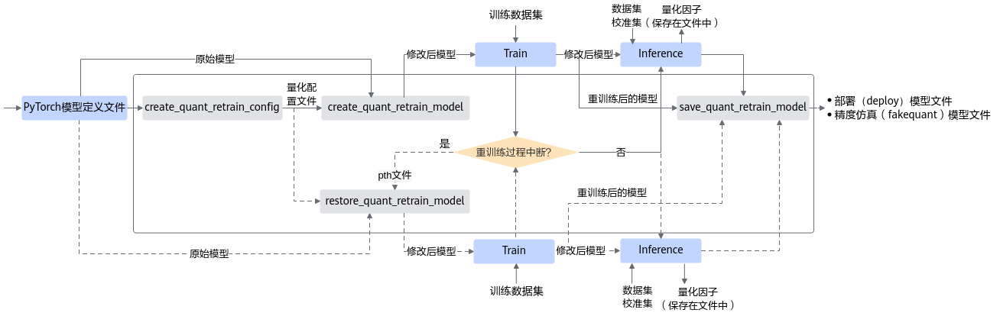

蓝色部分为用户实现，灰色部分为用户调用AMCT提供的API实现：

1.  用户首先构造PyTorch的原始模型，调用[create\_quant\_retrain\_config](create_quant_retrain_config.md)接口生成量化配置文件。
2.  调用[create\_quant\_retrain\_model](create_quant_retrain_model.md)接口对原始模型进行修改，修改后的模型中插入了数据量化、权重量化等相关算子，用于计算量化相关参数。
3.  对修改后的模型进行训练，如果训练未中断，将训练后的模型进行推理，进行推理的过程中，会将量化因子写出到record文件中。

    如果训练过程中断，则可基于保存的pth模型参数和量化配置文件，重新调用[restore\_quant\_retrain\_model](restore_quant_retrain_model.md)接口，输出修改后的retrain network，继续进行量化感知的训练，然后进行推理。

4.  调用[save\_quant\_retrain\_model](save_quant_retrain_model.md)接口，插入AscendQuant、AscendDequant等量化算子，保存量化模型。

**调用示例<a name="section13203169182418"></a>**

> **说明：** 
>1.  基于PyTorch环境进行训练，当前仅支持distributed模式（即DistributedDataParallel模式）的多卡训练，不支持DataParallel模式的多卡训练，使用DP模式训练会报错。
>2.  调用AMCT的部分，函数入参可以根据实际情况进行调整。量化感知训练基于用户的训练过程，请确保已经有基于PyTorch环境进行训练的脚本，并且训练后的精度正常。
>3.  使用AMCT的量化感知训练特性时，如果训练过程卡死，请检查当前服务器是否有其他ONNX Runtime程序在运行（可以用**top**命令查看服务器所有进程），如果有，请先暂停其他ONNX Runtime程序，重新执行量化感知训练。
>4.  参考本章节进行量化，模型中存在PyTorch自定义算子时，可能存在无法导出生成ONNX模型，从而导致量化失败的问题。具体报错信息如下：'Model cannot be quantized for it cannot be export to onnx!' 。此时，您可以参考[单算子模式的量化感知训练](单算子模式的量化感知训练.md)章节，进行单算子模式的量化。
>5.  如下示例标有“由用户补充处理”的步骤，需要用户根据自己的模型和数据集进行补充处理，示例中仅为示例代码。

1.  导入AMCT包，并通过[安装后处理](安装后处理.md)\>AMCT\(PyTorch\)中的环境变量设置日志级别。

    ```
    import amct_pytorch as amct
    ```

2.  <a name="li341817311449"></a>（可选，由用户补充处理）建议使用原始待量化的模型和测试集，在PyTorch环境下推理，验证环境、推理脚本是否正常。

    推荐执行该步骤，请确保原始模型可以完成推理且精度正常；执行该步骤时，可以使用部分测试集，减少运行时间。

    ```
    ori_model.load()
    # 测试模型
    user_test_model(ori_model, test_data, test_iterations)
    ```

3.  调用AMCT，执行量化流程。
    1.  生成量化配置。

        实现该步骤前，应先恢复训练好的参数，如[2](#li341817311449)中的ori\_model.load\(\)。

        ```
        config_file = './tmp/config.json'
        simple_cfg = './retrain.cfg'
        amct.create_quant_retrain_config(config_file=config_file,
                                         model=ori_model,
                                         input_data=ori_model_input_data,
                                         config_defination=simple_cfg)
        ```

    2.  <a name="li4981151425915"></a>修改模型。

        在模型ori\_model插入数据量化、权重量化等相关算子，用于计算量化相关参数，然后保存为新的训练模型retrain\_model。

        ```
        record_file = './tmp/record.txt'
        quant_retrain_model = amct.create_quant_retrain_model(config_file=config_file,
        						      model=ori_model,
        						      record_file=record_file,
        						      input_data=ori_model_input_data)
        ```

    3.  （由用户补充处理）使用修改后的图，创建反向梯度，在训练集上做训练，训练量化因子。
        1.  使用修改后的图，创建反向梯度。该步骤需要在[3.b](#li4981151425915)后执行。

            ```
            optimizer = user_create_optimizer(quant_retrain_model)
            ```

        2.  从训练好的checkpoint恢复模型，并训练模型。

            注意：从训练好的checkpoint恢复模型参数后再训练；训练中保存的参数应该包括量化因子：前batch\_num次训练后会生成量化因子，如果训练次数少于batch\_num会导致失败。

            ```
            quant_pth = './ckpt/user_model'
            user_train_model(optimizer, quant_retrain_model, train_data)
            ```

        3.  训练完成后，执行推理，计算量化因子并保存。

            ```
            user_infer_graph(quant_retrain_model)
            ```

    4.  保存量化模型。

        根据量化因子以及用户重训练好的模型，调用[save\_quant\_retrain\_model](save_quant_retrain_model.md)接口，插入AscendQuant、AscendDequant等算子，保存为量化模型。

        ```
        quant_model_path = './result/user_model'
        amct.save_quant_retrain_model(config_file=config_file,
                                      model=quant_retrain_model,
                                      record_file=record_file,
                                      save_path=quant_model_path,
                                      input_data=ori_model_input_data)
        ```

        说明：如果重训练过程每一轮都调用该接口保存模型，可能会导致重训异常，建议重训练完毕后调用该接口保存模型。

4.  （可选，由用户补充处理）基于ONNX Runtime的环境，使用量化后模型（quant\_model）在测试集（test\_data）上做推理，测试量化后仿真模型的精度。

    使用量化后仿真模型精度与[2](#li341817311449)中的原始精度做对比，可以观察量化对精度的影响。

    ```
    quant_model = './results/user_model_fake_quant_model.onnx'
    user_do_inference_onnx(quant_model, test_data, test_iterations)
    ```

**如果训练过程中断，需要从ckpt中恢复数据，继续训练，则调用流程为：**

1.  导入AMCT包，并通过[安装后处理](安装后处理.md)\>AMCT\(PyTorch\)中的环境变量设置日志级别。

    ```
    import amct_pytorch as amct
    ```

1.  准备原始模型。

    ```
    ori_model= user_create_model()
    ```

2.  调用AMCT，恢复量化训练流程。
    1.  <a name="li413111408612"></a>修改模型，在模型ori\_model插入量化相关的算子，保存为新的训练模型retrain\_model。

        ```
        config_file = './tmp/config.json'
        simple_cfg = './retrain.cfg'
        record_file = './tmp/record.txt'
        quant_pth_file = './ckpt/user_model_newest.ckpt'
        quant_retrain_model = amct.restore_quant_retrain_model(config_file=config_file,
        						       model=ori_model,
        						       record_file=record_file,
        	                                               input_data=ori_model_input_data,
        	                                               pth_file=quant_pth_file)
        ```

    2.  （由用户补充处理）使用修改后的图，创建反向梯度，在训练集上做训练，训练量化因子。
        1.  使用修改后的图，创建反向梯度。该步骤需要在[3.a](#li413111408612)后执行。

            ```
            optimizer = user_create_optimizer(retrain_model)
            ```

        2.  从训练好的checkpoint恢复模型，并训练模型。

            注意：从训练好的checkpoint恢复模型参数后再训练；训练中保存的参数应该包括量化因子：前batch\_num次训练后会生成量化因子，如果训练次数少于batch\_num会导致失败。

            ```
            user_train_model(optimizer, retrain_model, train_data)
            ```

        3.  训练完成后，执行推理，计算量化因子并保存。

            ```
            user_infer_graph(train_graph, retrain_ops[-1].output_tensor)
            ```

    3.  保存模型。

        ```
        quant_model_path = './result/user_model'
        amct.save_quant_retrain_model(config_file=config_file,
                                      model=ori_model,
                                      record_file=record_file,
                                      save_path=quant_model_path,
                                      input_data=ori_model_input_data)
        ```

3.  （可选，由用户补充处理）基于ONNX Runtime的环境，使用量化后模型（quant\_model）在测试集（test\_data）上做推理，测试量化后仿真模型的精度。

    使用量化后仿真模型精度与[2](#li341817311449)中的原始精度做对比，可以观察量化对精度的影响。

    ```
    quant_model = './results/user_model_fake_quant_model.onnx'
    user_do_inference_onnx(quant_model, test_data, test_iterations)
    ```

#### 手工调优<a name="ZH-CN_TOPIC_0000002473744674"></a>

执行量化感知训练特性后的精度如果不满足要求，可以尝试手动调整config.json文件中的参数，本节给出调整的原则，以及参数解释。

**调优流程<a name="section1545611133818"></a>**

通过[create\_quant\_retrain\_config](create_quant_retrain_config.md)接口生成的config.json文件中的默认配置进行量化，若量化后的推理精度不满足要求，则按照如下步骤调整量化配置文件中的参数。

1.  根据[create\_quant\_retrain\_config](create_quant_retrain_config.md)接口生成的默认配置进行量化。若精度满足要求，则调参结束，否则进行下一步。
2.  INT8量化场景下，可以将部分量化层取消量化，即将其"retrain\_enable"参数修改为"false"，通常模型首尾层对推理结果影响较大，故建议优先取消首尾层的量化；如果用户有推荐的clip\_max和clip\_min的参数取值，则可以按照如下方式修改量化配置文件：

    ```
    {
        "version":1,
        "batch_num":1,
        "layername1":{
            "retrain_enable":true,
            "retrain_data_config":{
                "algo":"ulq_quantize",
                "clip_max":3.0,
                "clip_min":-3.0
            },
            "retrain_weight_config":{
                "algo":"arq_retrain",
                "channel_wise":true
            }
        },
        "layername2":{
            "retrain_enable":true,
            "retrain_data_config":{
                "algo":"ulq_quantize",
                "clip_max":3.0,
                "clip_min":-3.0
            },
            "retrain_weight_config":{
                "algo":"arq_retrain",
                "channel_wise":true
            }
        }
    }
    ```

3.  完成配置后，精度满足要求则调参结束；否则表明量化感知训练对精度影响很大，不能进行量化感知训练，去除量化感知训练配置。

**量化配置文件<a name="section17396630163810"></a>**

如果通过[create\_quant\_retrain\_config](create_quant_retrain_config.md)接口生成的config.json量化感知训练配置文件，推理精度不满足要求，则需要参见该章节不断调整config.json文件中的内容，直至精度满足要求，该文件部分内容样例请参见接口中的[调用示例](create_quant_retrain_config.md#zh-cn_topic_0240188739_section64231658994)部分（用户修改json文件时，请确保层名唯一）。

配置文件中参数说明如下，其中[表8](#table1459214218113)\~[表10](#table1988120453112)的参数说明在手动调整量化配置文件时才会使用。

**表 1**  version参数说明

<a name="table1933120499584"></a>
<table><tbody><tr id="row2410154917588"><th class="firstcol" valign="top" width="29.459999999999997%" id="mcps1.2.3.1.1"><p id="p5410154919582"><a name="p5410154919582"></a><a name="p5410154919582"></a>作用</p>
</th>
<td class="cellrowborder" valign="top" width="70.54%" headers="mcps1.2.3.1.1 "><p id="p341012497587"><a name="p341012497587"></a><a name="p341012497587"></a>控制量化配置文件版本号。</p>
</td>
</tr>
<tr id="row1410184918581"><th class="firstcol" valign="top" width="29.459999999999997%" id="mcps1.2.3.2.1"><p id="p14410144912584"><a name="p14410144912584"></a><a name="p14410144912584"></a>类型</p>
</th>
<td class="cellrowborder" valign="top" width="70.54%" headers="mcps1.2.3.2.1 "><p id="p12410104910587"><a name="p12410104910587"></a><a name="p12410104910587"></a>int</p>
</td>
</tr>
<tr id="row1441024919580"><th class="firstcol" valign="top" width="29.459999999999997%" id="mcps1.2.3.3.1"><p id="p134106498581"><a name="p134106498581"></a><a name="p134106498581"></a>取值范围</p>
</th>
<td class="cellrowborder" valign="top" width="70.54%" headers="mcps1.2.3.3.1 "><p id="p18410174905818"><a name="p18410174905818"></a><a name="p18410174905818"></a>1</p>
</td>
</tr>
<tr id="row15410194985816"><th class="firstcol" valign="top" width="29.459999999999997%" id="mcps1.2.3.4.1"><p id="p20410184910588"><a name="p20410184910588"></a><a name="p20410184910588"></a>参数说明</p>
</th>
<td class="cellrowborder" valign="top" width="70.54%" headers="mcps1.2.3.4.1 "><p id="p34105493582"><a name="p34105493582"></a><a name="p34105493582"></a>目前仅有一个版本号1。</p>
</td>
</tr>
<tr id="row17410174919583"><th class="firstcol" valign="top" width="29.459999999999997%" id="mcps1.2.3.5.1"><p id="p2041010499589"><a name="p2041010499589"></a><a name="p2041010499589"></a>推荐配置</p>
</th>
<td class="cellrowborder" valign="top" width="70.54%" headers="mcps1.2.3.5.1 "><p id="p5410194915589"><a name="p5410194915589"></a><a name="p5410194915589"></a>1</p>
</td>
</tr>
<tr id="row841010493589"><th class="firstcol" valign="top" width="29.459999999999997%" id="mcps1.2.3.6.1"><p id="p94101149125820"><a name="p94101149125820"></a><a name="p94101149125820"></a>必选或可选</p>
</th>
<td class="cellrowborder" valign="top" width="70.54%" headers="mcps1.2.3.6.1 "><p id="p1041094913584"><a name="p1041094913584"></a><a name="p1041094913584"></a>可选</p>
</td>
</tr>
</tbody>
</table>

**表 2**  batch\_num参数说明

<a name="zh-cn_topic_0240188002_table1993174915423"></a>
<table><tbody><tr id="zh-cn_topic_0240188002_row0944492423"><th class="firstcol" valign="top" width="28.970000000000002%" id="mcps1.2.3.1.1"><p id="zh-cn_topic_0240188002_p294134994210"><a name="zh-cn_topic_0240188002_p294134994210"></a><a name="zh-cn_topic_0240188002_p294134994210"></a>作用</p>
</th>
<td class="cellrowborder" valign="top" width="71.03%" headers="mcps1.2.3.1.1 "><p id="zh-cn_topic_0240188002_p694164934219"><a name="zh-cn_topic_0240188002_p694164934219"></a><a name="zh-cn_topic_0240188002_p694164934219"></a>控制量化感知训练推理阶段使用多少个batch的数据。</p>
</td>
</tr>
<tr id="zh-cn_topic_0240188002_row294249104214"><th class="firstcol" valign="top" width="28.970000000000002%" id="mcps1.2.3.2.1"><p id="zh-cn_topic_0240188002_p1794164974216"><a name="zh-cn_topic_0240188002_p1794164974216"></a><a name="zh-cn_topic_0240188002_p1794164974216"></a><span>类型</span></p>
</th>
<td class="cellrowborder" valign="top" width="71.03%" headers="mcps1.2.3.2.1 "><p id="zh-cn_topic_0240188002_p1894449164210"><a name="zh-cn_topic_0240188002_p1894449164210"></a><a name="zh-cn_topic_0240188002_p1894449164210"></a>int</p>
</td>
</tr>
<tr id="zh-cn_topic_0240188002_row199420495426"><th class="firstcol" valign="top" width="28.970000000000002%" id="mcps1.2.3.3.1"><p id="zh-cn_topic_0240188002_p39419491427"><a name="zh-cn_topic_0240188002_p39419491427"></a><a name="zh-cn_topic_0240188002_p39419491427"></a><span>取值范围</span></p>
</th>
<td class="cellrowborder" valign="top" width="71.03%" headers="mcps1.2.3.3.1 "><p id="zh-cn_topic_0240188002_p694134954217"><a name="zh-cn_topic_0240188002_p694134954217"></a><a name="zh-cn_topic_0240188002_p694134954217"></a>大于0</p>
</td>
</tr>
<tr id="zh-cn_topic_0240188002_row394164944213"><th class="firstcol" valign="top" width="28.970000000000002%" id="mcps1.2.3.4.1"><p id="zh-cn_topic_0240188002_p1694104916421"><a name="zh-cn_topic_0240188002_p1694104916421"></a><a name="zh-cn_topic_0240188002_p1694104916421"></a>参数说明</p>
</th>
<td class="cellrowborder" valign="top" width="71.03%" headers="mcps1.2.3.4.1 "><p id="zh-cn_topic_0240188002_p159444919429"><a name="zh-cn_topic_0240188002_p159444919429"></a><a name="zh-cn_topic_0240188002_p159444919429"></a>如果不配置，则使用默认值1，建议校准集图片数量不超过50张，根据batch的大小batch_size计算相应的batch_num数值。</p>
<p id="zh-cn_topic_0240188002_p1223319101118"><a name="zh-cn_topic_0240188002_p1223319101118"></a><a name="zh-cn_topic_0240188002_p1223319101118"></a>batch_num*batch_size为量化使用的校准集图片数量。</p>
<p id="zh-cn_topic_0240188002_p201320014422"><a name="zh-cn_topic_0240188002_p201320014422"></a><a name="zh-cn_topic_0240188002_p201320014422"></a>其中batch_size为每个batch所用的图片数量。</p>
</td>
</tr>
<tr id="zh-cn_topic_0240188002_row8941849114212"><th class="firstcol" valign="top" width="28.970000000000002%" id="mcps1.2.3.5.1"><p id="zh-cn_topic_0240188002_p19945496428"><a name="zh-cn_topic_0240188002_p19945496428"></a><a name="zh-cn_topic_0240188002_p19945496428"></a>推荐配置</p>
</th>
<td class="cellrowborder" valign="top" width="71.03%" headers="mcps1.2.3.5.1 "><p id="zh-cn_topic_0240188002_p10941249164219"><a name="zh-cn_topic_0240188002_p10941249164219"></a><a name="zh-cn_topic_0240188002_p10941249164219"></a>1</p>
</td>
</tr>
<tr id="zh-cn_topic_0240188002_row194104974210"><th class="firstcol" valign="top" width="28.970000000000002%" id="mcps1.2.3.6.1"><p id="zh-cn_topic_0240188002_p694174913424"><a name="zh-cn_topic_0240188002_p694174913424"></a><a name="zh-cn_topic_0240188002_p694174913424"></a>必选或可选</p>
</th>
<td class="cellrowborder" valign="top" width="71.03%" headers="mcps1.2.3.6.1 "><p id="zh-cn_topic_0240188002_p89524910428"><a name="zh-cn_topic_0240188002_p89524910428"></a><a name="zh-cn_topic_0240188002_p89524910428"></a>可选</p>
</td>
</tr>
</tbody>
</table>

**表 3**  retrain\_enable参数说明

<a name="table4499101514598"></a>
<table><tbody><tr id="row75841715185920"><th class="firstcol" valign="top" width="29.509999999999998%" id="mcps1.2.3.1.1"><p id="p15584101575915"><a name="p15584101575915"></a><a name="p15584101575915"></a>作用</p>
</th>
<td class="cellrowborder" valign="top" width="70.49%" headers="mcps1.2.3.1.1 "><p id="p1658414155596"><a name="p1658414155596"></a><a name="p1658414155596"></a>该层是否进行量化感知训练。</p>
</td>
</tr>
<tr id="row058416153590"><th class="firstcol" valign="top" width="29.509999999999998%" id="mcps1.2.3.2.1"><p id="p1358413155596"><a name="p1358413155596"></a><a name="p1358413155596"></a>类型</p>
</th>
<td class="cellrowborder" valign="top" width="70.49%" headers="mcps1.2.3.2.1 "><p id="p2584015105915"><a name="p2584015105915"></a><a name="p2584015105915"></a>bool</p>
</td>
</tr>
<tr id="row958417153595"><th class="firstcol" valign="top" width="29.509999999999998%" id="mcps1.2.3.3.1"><p id="p175840158598"><a name="p175840158598"></a><a name="p175840158598"></a>取值范围</p>
</th>
<td class="cellrowborder" valign="top" width="70.49%" headers="mcps1.2.3.3.1 "><p id="p16584111517591"><a name="p16584111517591"></a><a name="p16584111517591"></a>true或false</p>
</td>
</tr>
<tr id="row155847155595"><th class="firstcol" valign="top" width="29.509999999999998%" id="mcps1.2.3.4.1"><p id="p85846153595"><a name="p85846153595"></a><a name="p85846153595"></a>参数说明</p>
</th>
<td class="cellrowborder" valign="top" width="70.49%" headers="mcps1.2.3.4.1 "><a name="ul119319439315"></a><a name="ul119319439315"></a><ul id="ul119319439315"><li>true：该层需要进行量化感知训练。</li><li>false：该层不进行量化感知训练。</li></ul>
</td>
</tr>
<tr id="row19584171525916"><th class="firstcol" valign="top" width="29.509999999999998%" id="mcps1.2.3.5.1"><p id="p1758417157597"><a name="p1758417157597"></a><a name="p1758417157597"></a>推荐配置</p>
</th>
<td class="cellrowborder" valign="top" width="70.49%" headers="mcps1.2.3.5.1 "><p id="p1658481519592"><a name="p1658481519592"></a><a name="p1658481519592"></a>true</p>
</td>
</tr>
<tr id="row1584161525915"><th class="firstcol" valign="top" width="29.509999999999998%" id="mcps1.2.3.6.1"><p id="p18584161525919"><a name="p18584161525919"></a><a name="p18584161525919"></a>必选或可选</p>
</th>
<td class="cellrowborder" valign="top" width="70.49%" headers="mcps1.2.3.6.1 "><p id="p158519158597"><a name="p158519158597"></a><a name="p158519158597"></a>可选</p>
</td>
</tr>
</tbody>
</table>

**表 4**  retrain\_data\_config参数说明

<a name="table295313665910"></a>
<table><tbody><tr id="row35993775914"><th class="firstcol" valign="top" width="29.759999999999998%" id="mcps1.2.3.1.1"><p id="p205933755911"><a name="p205933755911"></a><a name="p205933755911"></a>作用</p>
</th>
<td class="cellrowborder" valign="top" width="70.24000000000001%" headers="mcps1.2.3.1.1 "><p id="p1759837175919"><a name="p1759837175919"></a><a name="p1759837175919"></a>该层数据量化配置。</p>
</td>
</tr>
<tr id="row459183710598"><th class="firstcol" valign="top" width="29.759999999999998%" id="mcps1.2.3.2.1"><p id="p15943713598"><a name="p15943713598"></a><a name="p15943713598"></a>类型</p>
</th>
<td class="cellrowborder" valign="top" width="70.24000000000001%" headers="mcps1.2.3.2.1 "><p id="p359193715916"><a name="p359193715916"></a><a name="p359193715916"></a>object</p>
</td>
</tr>
<tr id="row85953716596"><th class="firstcol" valign="top" width="29.759999999999998%" id="mcps1.2.3.3.1"><p id="p205983717598"><a name="p205983717598"></a><a name="p205983717598"></a>取值范围</p>
</th>
<td class="cellrowborder" valign="top" width="70.24000000000001%" headers="mcps1.2.3.3.1 "><p id="p1959113720598"><a name="p1959113720598"></a><a name="p1959113720598"></a>-</p>
</td>
</tr>
<tr id="row45993718596"><th class="firstcol" valign="top" width="29.759999999999998%" id="mcps1.2.3.4.1"><p id="p559123715917"><a name="p559123715917"></a><a name="p559123715917"></a>参数说明</p>
</th>
<td class="cellrowborder" valign="top" width="70.24000000000001%" headers="mcps1.2.3.4.1 "><p id="p727754111012"><a name="p727754111012"></a><a name="p727754111012"></a>包含如下参数：</p>
<a name="ul68351742201012"></a><a name="ul68351742201012"></a><ul id="ul68351742201012"><li>algo：量化算法选择，默认是ulq_quantize。</li><li>clip_max：截断量化算法上限，默认不选。</li><li>clip_min：截断量化算法下限，默认不选。</li><li>fixed_min：截断量化算法最小值固定为0，默认不选。</li><li>dst_type：用以选择INT8或INT4量化(IPV350不支持)位宽，默认为INT8。</li></ul>
</td>
</tr>
<tr id="row559113713595"><th class="firstcol" valign="top" width="29.759999999999998%" id="mcps1.2.3.5.1"><p id="p1859183705914"><a name="p1859183705914"></a><a name="p1859183705914"></a>推荐配置</p>
</th>
<td class="cellrowborder" valign="top" width="70.24000000000001%" headers="mcps1.2.3.5.1 "><p id="p125903705913"><a name="p125903705913"></a><a name="p125903705913"></a>-</p>
</td>
</tr>
<tr id="row859103775914"><th class="firstcol" valign="top" width="29.759999999999998%" id="mcps1.2.3.6.1"><p id="p259103711595"><a name="p259103711595"></a><a name="p259103711595"></a>必选或可选</p>
</th>
<td class="cellrowborder" valign="top" width="70.24000000000001%" headers="mcps1.2.3.6.1 "><p id="p16590373599"><a name="p16590373599"></a><a name="p16590373599"></a>可选</p>
</td>
</tr>
</tbody>
</table>

**表 5**  retrain\_weight\_config参数说明

<a name="table8436159205910"></a>
<table><tbody><tr id="row1452275913591"><th class="firstcol" valign="top" width="30.14%" id="mcps1.2.3.1.1"><p id="p45221959115918"><a name="p45221959115918"></a><a name="p45221959115918"></a>作用</p>
</th>
<td class="cellrowborder" valign="top" width="69.86%" headers="mcps1.2.3.1.1 "><p id="p1252215935915"><a name="p1252215935915"></a><a name="p1252215935915"></a>该层权重量化配置。</p>
</td>
</tr>
<tr id="row19522145965915"><th class="firstcol" valign="top" width="30.14%" id="mcps1.2.3.2.1"><p id="p1852215917591"><a name="p1852215917591"></a><a name="p1852215917591"></a>类型</p>
</th>
<td class="cellrowborder" valign="top" width="69.86%" headers="mcps1.2.3.2.1 "><p id="p1852219596595"><a name="p1852219596595"></a><a name="p1852219596595"></a>object</p>
</td>
</tr>
<tr id="row11522185911599"><th class="firstcol" valign="top" width="30.14%" id="mcps1.2.3.3.1"><p id="p145225597594"><a name="p145225597594"></a><a name="p145225597594"></a>取值范围</p>
</th>
<td class="cellrowborder" valign="top" width="69.86%" headers="mcps1.2.3.3.1 "><p id="p2522159135920"><a name="p2522159135920"></a><a name="p2522159135920"></a>-</p>
</td>
</tr>
<tr id="row205221559105919"><th class="firstcol" valign="top" width="30.14%" id="mcps1.2.3.4.1"><p id="p12522165935911"><a name="p12522165935911"></a><a name="p12522165935911"></a>参数说明</p>
</th>
<td class="cellrowborder" valign="top" width="69.86%" headers="mcps1.2.3.4.1 "><p id="p17933820151112"><a name="p17933820151112"></a><a name="p17933820151112"></a>包含如下参数：</p>
<a name="ul13748202351116"></a><a name="ul13748202351116"></a><ul id="ul13748202351116"><li>algo：量化算法选择，默认是arq_retrain</li><li>channel_wise</li></ul>
</td>
</tr>
<tr id="row20522759115911"><th class="firstcol" valign="top" width="30.14%" id="mcps1.2.3.5.1"><p id="p7522959115911"><a name="p7522959115911"></a><a name="p7522959115911"></a>推荐配置</p>
</th>
<td class="cellrowborder" valign="top" width="69.86%" headers="mcps1.2.3.5.1 "><p id="p1352265919591"><a name="p1352265919591"></a><a name="p1352265919591"></a>-</p>
</td>
</tr>
<tr id="row2522195912593"><th class="firstcol" valign="top" width="30.14%" id="mcps1.2.3.6.1"><p id="p12522155955910"><a name="p12522155955910"></a><a name="p12522155955910"></a>必选或可选</p>
</th>
<td class="cellrowborder" valign="top" width="69.86%" headers="mcps1.2.3.6.1 "><p id="p7522759105918"><a name="p7522759105918"></a><a name="p7522759105918"></a>可选</p>
</td>
</tr>
</tbody>
</table>

**表 6**  algo参数说明

<a name="table16511191903"></a>
<table><tbody><tr id="row11351719107"><th class="firstcol" valign="top" width="30.020000000000003%" id="mcps1.2.3.1.1"><p id="p81352194014"><a name="p81352194014"></a><a name="p81352194014"></a>作用</p>
</th>
<td class="cellrowborder" valign="top" width="69.98%" headers="mcps1.2.3.1.1 "><p id="p11359192003"><a name="p11359192003"></a><a name="p11359192003"></a>该层选择使用的量化算法。</p>
</td>
</tr>
<tr id="row41353191201"><th class="firstcol" valign="top" width="30.020000000000003%" id="mcps1.2.3.2.1"><p id="p51351719900"><a name="p51351719900"></a><a name="p51351719900"></a>类型</p>
</th>
<td class="cellrowborder" valign="top" width="69.98%" headers="mcps1.2.3.2.1 "><p id="p813515190015"><a name="p813515190015"></a><a name="p813515190015"></a>object</p>
</td>
</tr>
<tr id="row51357191903"><th class="firstcol" valign="top" width="30.020000000000003%" id="mcps1.2.3.3.1"><p id="p111350191400"><a name="p111350191400"></a><a name="p111350191400"></a>取值范围</p>
</th>
<td class="cellrowborder" valign="top" width="69.98%" headers="mcps1.2.3.3.1 "><p id="p11355191907"><a name="p11355191907"></a><a name="p11355191907"></a>-</p>
</td>
</tr>
<tr id="row1913611192016"><th class="firstcol" valign="top" width="30.020000000000003%" id="mcps1.2.3.4.1"><p id="p14136101917017"><a name="p14136101917017"></a><a name="p14136101917017"></a>参数说明</p>
</th>
<td class="cellrowborder" valign="top" width="69.98%" headers="mcps1.2.3.4.1 "><a name="ul12852131315124"></a><a name="ul12852131315124"></a><ul id="ul12852131315124"><li>ulq_quantize：ulq截断上下限量化算法。</li><li>arq_retrain：arq量化算法。</li></ul>
</td>
</tr>
<tr id="row813613194017"><th class="firstcol" valign="top" width="30.020000000000003%" id="mcps1.2.3.5.1"><p id="p1136219806"><a name="p1136219806"></a><a name="p1136219806"></a>推荐配置</p>
</th>
<td class="cellrowborder" valign="top" width="69.98%" headers="mcps1.2.3.5.1 "><p id="p891753512124"><a name="p891753512124"></a><a name="p891753512124"></a>数据量化使用ulq_quantize，权重量化使用arq_retrain。</p>
</td>
</tr>
<tr id="row9136719007"><th class="firstcol" valign="top" width="30.020000000000003%" id="mcps1.2.3.6.1"><p id="p2136171915018"><a name="p2136171915018"></a><a name="p2136171915018"></a>必选或可选</p>
</th>
<td class="cellrowborder" valign="top" width="69.98%" headers="mcps1.2.3.6.1 "><p id="p2136519602"><a name="p2136519602"></a><a name="p2136519602"></a>可选</p>
</td>
</tr>
</tbody>
</table>

**表 7**  channel\_wise参数说明

<a name="table19960439106"></a>
<table><tbody><tr id="row19630401702"><th class="firstcol" valign="top" width="30.330000000000002%" id="mcps1.2.3.1.1"><p id="p16630401405"><a name="p16630401405"></a><a name="p16630401405"></a>作用</p>
</th>
<td class="cellrowborder" valign="top" width="69.67%" headers="mcps1.2.3.1.1 "><p id="p18631740902"><a name="p18631740902"></a><a name="p18631740902"></a>是否对每个channel采用不同的量化因子。</p>
</td>
</tr>
<tr id="row6631403012"><th class="firstcol" valign="top" width="30.330000000000002%" id="mcps1.2.3.2.1"><p id="p2639401605"><a name="p2639401605"></a><a name="p2639401605"></a>类型</p>
</th>
<td class="cellrowborder" valign="top" width="69.67%" headers="mcps1.2.3.2.1 "><p id="p7641340708"><a name="p7641340708"></a><a name="p7641340708"></a>bool</p>
</td>
</tr>
<tr id="row176416405012"><th class="firstcol" valign="top" width="30.330000000000002%" id="mcps1.2.3.3.1"><p id="p1364154019019"><a name="p1364154019019"></a><a name="p1364154019019"></a>取值范围</p>
</th>
<td class="cellrowborder" valign="top" width="69.67%" headers="mcps1.2.3.3.1 "><p id="p06474012018"><a name="p06474012018"></a><a name="p06474012018"></a>true或false</p>
</td>
</tr>
<tr id="row11644401600"><th class="firstcol" valign="top" width="30.330000000000002%" id="mcps1.2.3.4.1"><p id="p2647406019"><a name="p2647406019"></a><a name="p2647406019"></a>参数说明</p>
</th>
<td class="cellrowborder" valign="top" width="69.67%" headers="mcps1.2.3.4.1 "><a name="ul145214136711"></a><a name="ul145214136711"></a><ul id="ul145214136711"><li>true：每个channel独立量化，量化因子不同。</li><li>false：每个channel同时量化，共享量化因子。</li></ul>
</td>
</tr>
<tr id="row5644406018"><th class="firstcol" valign="top" width="30.330000000000002%" id="mcps1.2.3.5.1"><p id="p12644401701"><a name="p12644401701"></a><a name="p12644401701"></a>推荐配置</p>
</th>
<td class="cellrowborder" valign="top" width="69.67%" headers="mcps1.2.3.5.1 "><p id="p12641040401"><a name="p12641040401"></a><a name="p12641040401"></a>true</p>
</td>
</tr>
<tr id="row9649401506"><th class="firstcol" valign="top" width="30.330000000000002%" id="mcps1.2.3.6.1"><p id="p16444012018"><a name="p16444012018"></a><a name="p16444012018"></a>必选或可选</p>
</th>
<td class="cellrowborder" valign="top" width="69.67%" headers="mcps1.2.3.6.1 "><p id="p106444019018"><a name="p106444019018"></a><a name="p106444019018"></a>可选</p>
</td>
</tr>
</tbody>
</table>

**表 8**  fixed\_min参数说明

<a name="table1459214218113"></a>
<table><tbody><tr id="row273316210110"><th class="firstcol" valign="top" width="30.4%" id="mcps1.2.3.1.1"><p id="p2734529111"><a name="p2734529111"></a><a name="p2734529111"></a>作用</p>
</th>
<td class="cellrowborder" valign="top" width="69.6%" headers="mcps1.2.3.1.1 "><p id="p9796912758"><a name="p9796912758"></a><a name="p9796912758"></a>设置数据量化算法下限的开关。</p>
</td>
</tr>
<tr id="row1573418219111"><th class="firstcol" valign="top" width="30.4%" id="mcps1.2.3.2.1"><p id="p7734122712"><a name="p7734122712"></a><a name="p7734122712"></a>类型</p>
</th>
<td class="cellrowborder" valign="top" width="69.6%" headers="mcps1.2.3.2.1 "><p id="p1573412218119"><a name="p1573412218119"></a><a name="p1573412218119"></a>bool</p>
</td>
</tr>
<tr id="row573414213113"><th class="firstcol" valign="top" width="30.4%" id="mcps1.2.3.3.1"><p id="p473414214110"><a name="p473414214110"></a><a name="p473414214110"></a>取值范围</p>
</th>
<td class="cellrowborder" valign="top" width="69.6%" headers="mcps1.2.3.3.1 "><p id="p37341321010"><a name="p37341321010"></a><a name="p37341321010"></a>true或false</p>
</td>
</tr>
<tr id="row97341522015"><th class="firstcol" valign="top" width="30.4%" id="mcps1.2.3.4.1"><p id="p177341821611"><a name="p177341821611"></a><a name="p177341821611"></a>参数说明</p>
</th>
<td class="cellrowborder" valign="top" width="69.6%" headers="mcps1.2.3.4.1 "><a name="ul2060616411812"></a><a name="ul2060616411812"></a><ul id="ul2060616411812"><li>true：数据量化算法固定下限，并且下限为0。</li><li>false：数据量化算法不固定下限。</li></ul>
<p id="p126671643181416"><a name="p126671643181416"></a><a name="p126671643181416"></a>如果不选此项，<span id="zh-cn_topic_0278900994_ph121541194518"><a name="zh-cn_topic_0278900994_ph121541194518"></a><a name="zh-cn_topic_0278900994_ph121541194518"></a>AMCT</span>根据图的结构自动设置。</p>
<p id="p1446794731520"><a name="p1446794731520"></a><a name="p1446794731520"></a>如果选择此项，并且网络模型量化层的前一层是relu层，则该参数需要手动设置为true，如果为非relu层，则要手动设置为false。</p>
</td>
</tr>
<tr id="row9734521119"><th class="firstcol" valign="top" width="30.4%" id="mcps1.2.3.5.1"><p id="p5734623111"><a name="p5734623111"></a><a name="p5734623111"></a>推荐配置</p>
</th>
<td class="cellrowborder" valign="top" width="69.6%" headers="mcps1.2.3.5.1 "><p id="p47340218119"><a name="p47340218119"></a><a name="p47340218119"></a>不选此项</p>
</td>
</tr>
<tr id="row07341224118"><th class="firstcol" valign="top" width="30.4%" id="mcps1.2.3.6.1"><p id="p173417211112"><a name="p173417211112"></a><a name="p173417211112"></a>必选或可选</p>
</th>
<td class="cellrowborder" valign="top" width="69.6%" headers="mcps1.2.3.6.1 "><p id="p15734128116"><a name="p15734128116"></a><a name="p15734128116"></a>可选</p>
</td>
</tr>
</tbody>
</table>

**表 9**  clip\_max参数说明

<a name="table15662152613113"></a>
<table><tbody><tr id="row1884192620114"><th class="firstcol" valign="top" width="30.78%" id="mcps1.2.3.1.1"><p id="p15841926411"><a name="p15841926411"></a><a name="p15841926411"></a>作用</p>
</th>
<td class="cellrowborder" valign="top" width="69.22%" headers="mcps1.2.3.1.1 "><p id="p158412268115"><a name="p158412268115"></a><a name="p158412268115"></a>数据量化算法上限。</p>
</td>
</tr>
<tr id="row20841192612115"><th class="firstcol" valign="top" width="30.78%" id="mcps1.2.3.2.1"><p id="p8841132617118"><a name="p8841132617118"></a><a name="p8841132617118"></a>类型</p>
</th>
<td class="cellrowborder" valign="top" width="69.22%" headers="mcps1.2.3.2.1 "><p id="p1841926412"><a name="p1841926412"></a><a name="p1841926412"></a>float</p>
</td>
</tr>
<tr id="row7841132616113"><th class="firstcol" valign="top" width="30.78%" id="mcps1.2.3.3.1"><p id="p98411626218"><a name="p98411626218"></a><a name="p98411626218"></a>取值范围</p>
</th>
<td class="cellrowborder" valign="top" width="69.22%" headers="mcps1.2.3.3.1 "><p id="p1628854314316"><a name="p1628854314316"></a><a name="p1628854314316"></a>clip_max&gt;0</p>
<p id="p5540113223113"><a name="p5540113223113"></a><a name="p5540113223113"></a>根据不同层activation的数据分布找到最大值max，推荐取值范围为：0.3*max~1.7*max</p>
</td>
</tr>
<tr id="row28412026112"><th class="firstcol" valign="top" width="30.78%" id="mcps1.2.3.4.1"><p id="p184116261613"><a name="p184116261613"></a><a name="p184116261613"></a>参数说明</p>
</th>
<td class="cellrowborder" valign="top" width="69.22%" headers="mcps1.2.3.4.1 "><p id="p784192610116"><a name="p784192610116"></a><a name="p784192610116"></a>截断上下限数据量化算法，如果选择此项则固定算法截断上限。如果不选此项，通过ifmr算法学习获取上限。</p>
</td>
</tr>
<tr id="row1384115264120"><th class="firstcol" valign="top" width="30.78%" id="mcps1.2.3.5.1"><p id="p88411265115"><a name="p88411265115"></a><a name="p88411265115"></a>推荐配置</p>
</th>
<td class="cellrowborder" valign="top" width="69.22%" headers="mcps1.2.3.5.1 "><p id="p188411726716"><a name="p188411726716"></a><a name="p188411726716"></a>不选此项</p>
</td>
</tr>
<tr id="row5841182617115"><th class="firstcol" valign="top" width="30.78%" id="mcps1.2.3.6.1"><p id="p10841102613112"><a name="p10841102613112"></a><a name="p10841102613112"></a>必选或可选</p>
</th>
<td class="cellrowborder" valign="top" width="69.22%" headers="mcps1.2.3.6.1 "><p id="p15842172615111"><a name="p15842172615111"></a><a name="p15842172615111"></a>可选</p>
</td>
</tr>
</tbody>
</table>

**表 10**  clip\_min参数说明

<a name="table1988120453112"></a>
<table><tbody><tr id="row159518451718"><th class="firstcol" valign="top" width="30.84%" id="mcps1.2.3.1.1"><p id="p169511945018"><a name="p169511945018"></a><a name="p169511945018"></a>作用</p>
</th>
<td class="cellrowborder" valign="top" width="69.16%" headers="mcps1.2.3.1.1 "><p id="p595117451316"><a name="p595117451316"></a><a name="p595117451316"></a>数据量化算法下限。</p>
</td>
</tr>
<tr id="row159519452115"><th class="firstcol" valign="top" width="30.84%" id="mcps1.2.3.2.1"><p id="p159527451915"><a name="p159527451915"></a><a name="p159527451915"></a>类型</p>
</th>
<td class="cellrowborder" valign="top" width="69.16%" headers="mcps1.2.3.2.1 "><p id="p25425199451"><a name="p25425199451"></a><a name="p25425199451"></a>float</p>
</td>
</tr>
<tr id="row195216451916"><th class="firstcol" valign="top" width="30.84%" id="mcps1.2.3.3.1"><p id="p295217450114"><a name="p295217450114"></a><a name="p295217450114"></a>取值范围</p>
</th>
<td class="cellrowborder" valign="top" width="69.16%" headers="mcps1.2.3.3.1 "><p id="p189461558113113"><a name="p189461558113113"></a><a name="p189461558113113"></a>clip_min&lt;0</p>
<p id="p663113717614"><a name="p663113717614"></a><a name="p663113717614"></a>根据不同层activation的数据分布找到最小值min，推荐取值范围为：0.3*min~1.7*min</p>
</td>
</tr>
<tr id="row1695244517115"><th class="firstcol" valign="top" width="30.84%" id="mcps1.2.3.4.1"><p id="p89522451612"><a name="p89522451612"></a><a name="p89522451612"></a>参数说明</p>
</th>
<td class="cellrowborder" valign="top" width="69.16%" headers="mcps1.2.3.4.1 "><p id="p1895217453114"><a name="p1895217453114"></a><a name="p1895217453114"></a>截断上下限数据量化算法，如果选择此项则固定算法截断下限。如果不选此项，通过ifmr算法学习获取下限。</p>
</td>
</tr>
<tr id="row18952164511118"><th class="firstcol" valign="top" width="30.84%" id="mcps1.2.3.5.1"><p id="p159521045517"><a name="p159521045517"></a><a name="p159521045517"></a>推荐配置</p>
</th>
<td class="cellrowborder" valign="top" width="69.16%" headers="mcps1.2.3.5.1 "><p id="p59521545716"><a name="p59521545716"></a><a name="p59521545716"></a>不选此项</p>
</td>
</tr>
<tr id="row9952245118"><th class="firstcol" valign="top" width="30.84%" id="mcps1.2.3.6.1"><p id="p49522451211"><a name="p49522451211"></a><a name="p49522451211"></a>必选或可选</p>
</th>
<td class="cellrowborder" valign="top" width="69.16%" headers="mcps1.2.3.6.1 "><p id="p395214459119"><a name="p395214459119"></a><a name="p395214459119"></a>可选</p>
</td>
</tr>
</tbody>
</table>

**表 11**  dst\_type参数说明

<a name="table139781115205"></a>
<table><tbody><tr id="row119791515102"><th class="firstcol" valign="top" width="30.84%" id="mcps1.2.3.1.1"><p id="p197912151904"><a name="p197912151904"></a><a name="p197912151904"></a>作用</p>
</th>
<td class="cellrowborder" valign="top" width="69.16%" headers="mcps1.2.3.1.1 "><p id="p1797911155015"><a name="p1797911155015"></a><a name="p1797911155015"></a>量化位宽的类型。</p>
</td>
</tr>
<tr id="row197913151001"><th class="firstcol" valign="top" width="30.84%" id="mcps1.2.3.2.1"><p id="p15980161511011"><a name="p15980161511011"></a><a name="p15980161511011"></a>类型</p>
</th>
<td class="cellrowborder" valign="top" width="69.16%" headers="mcps1.2.3.2.1 "><p id="p18980315006"><a name="p18980315006"></a><a name="p18980315006"></a>string</p>
</td>
</tr>
<tr id="row159801151604"><th class="firstcol" valign="top" width="30.84%" id="mcps1.2.3.3.1"><p id="p129801715706"><a name="p129801715706"></a><a name="p129801715706"></a>取值范围</p>
</th>
<td class="cellrowborder" valign="top" width="69.16%" headers="mcps1.2.3.3.1 "><p id="p1684619615"><a name="p1684619615"></a><a name="p1684619615"></a>INT8或INT4，默认为INT8。<strong id="b144002464618"><a name="b144002464618"></a><a name="b144002464618"></a>当前版本仅支持INT8量化。</strong></p>
</td>
</tr>
<tr id="row179807151805"><th class="firstcol" valign="top" width="30.84%" id="mcps1.2.3.4.1"><p id="p169806156011"><a name="p169806156011"></a><a name="p169806156011"></a>参数说明</p>
</th>
<td class="cellrowborder" valign="top" width="69.16%" headers="mcps1.2.3.4.1 "><p id="p16847145315215"><a name="p16847145315215"></a><a name="p16847145315215"></a>量化时用于选择是INT8量化还是INT4量化。</p>
</td>
</tr>
<tr id="row1898112151405"><th class="firstcol" valign="top" width="30.84%" id="mcps1.2.3.5.1"><p id="p49812015801"><a name="p49812015801"></a><a name="p49812015801"></a>推荐配置</p>
</th>
<td class="cellrowborder" valign="top" width="69.16%" headers="mcps1.2.3.5.1 "><p id="p398118151606"><a name="p398118151606"></a><a name="p398118151606"></a>-</p>
</td>
</tr>
<tr id="row09810151202"><th class="firstcol" valign="top" width="30.84%" id="mcps1.2.3.6.1"><p id="p69811115109"><a name="p69811115109"></a><a name="p69811115109"></a>必选或可选</p>
</th>
<td class="cellrowborder" valign="top" width="69.16%" headers="mcps1.2.3.6.1 "><p id="p89821515602"><a name="p89821515602"></a><a name="p89821515602"></a>可选</p>
</td>
</tr>
</tbody>
</table>

## 稀疏\(不支持\)<a name="ZH-CN_TOPIC_0000002473744696"></a>


### 通道稀疏<a name="ZH-CN_TOPIC_0000002505904563"></a>


#### 自动通道稀疏搜索<a name="ZH-CN_TOPIC_0000002505904593"></a>

当前通道稀疏支持对不同的层做不同稀疏率的稀疏处理，但逐层设置稀疏率对用户的使用门槛较高，对于某一层，如何选择稀疏率（即配置中的prune\_ratio）是比较困难的，手工尝试的配置需要进行重训练，耗费时间多。针对上述问题，引入自动通道稀疏搜索特性，根据用户模型来计算各通道的稀疏敏感度（影响精度）以及稀疏收益（影响性能），然后搜索策略依据稀疏敏感度和稀疏收益来搜索最优的逐层通道稀疏率，以平衡精度和性能。
介绍自动通道稀疏搜索特性的接口调用流程和调用示例。

##### 简介<a name="ZH-CN_TOPIC_0000002505904517"></a>

当前通道稀疏支持对不同的层做不同稀疏率的稀疏处理，但逐层设置稀疏率对用户的使用门槛较高，对于某一层，如何选择稀疏率（即配置中的prune\_ratio）是比较困难的，手工尝试的配置需要进行重训练，耗费时间多。针对上述问题，引入自动通道稀疏搜索特性，根据用户模型来计算各通道的稀疏敏感度（影响精度）以及稀疏收益（影响性能），然后搜索策略依据稀疏敏感度和稀疏收益来搜索最优的逐层通道稀疏率，以平衡精度和性能。

> **说明：** 
>**说明：当前版本该特性为试用特性，不支持应用于商用产品中。**

-   稀疏敏感度：稀疏敏感度定义为当前通道稀疏后对整网精度的影响估计，稀疏敏感度越大代表当前通道稀疏后整网精度损失越大，默认算法根据loss\(w - w<sub>i</sub>\)的泰勒展开计算通道稀疏敏感度。支持用户自定义计算方式。裁剪第i个通道后，稀疏敏感度计算公式如下：

    

    采用近似估计的方法对loss\(w - w<sub>i</sub>\)进行泰勒展开，目前考虑到计算量只算一阶。

-   稀疏收益：当前通道的稀疏收益用比特复杂度表示，为计算量化Flops与计算比特位宽之积：

    

    其中，Flops为浮点计算量，act\_bit为数据的数据精度，wts\_bit为权重的数据精度。

自动通道稀疏搜索流程如[图1](#zh-cn_topic_0000002473744530_fig164988405559)所示，支持稀疏的层以及规格请参见[表1](稀疏流程.md#table151175131181)。

**图 1**  自动通道稀疏搜索流程<a name="zh-cn_topic_0000002473744530_fig164988405559"></a>  
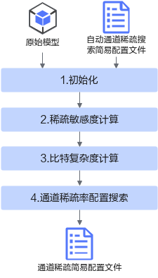

各流程简要说明如下：

1.  初始化：初始化动作首先需要解析用户模型以及稀疏配置（可选），分析网络中可通道稀疏层及其对应的通道稀疏配置（是否有用户指定配置稀疏率），生成通道稀疏配置生成的搜索空间：解析用户目标压缩率配置。
    -   搜索空间：为支持通道稀疏的层，但是没有通过override\_layer\_configs或者override\_layer\_types配置稀疏率。
    -   压缩率：定义为原模型比特复杂度与稀疏后模型比特复杂度之比。

2.  敏感度计算：计算每个通道的稀疏敏感度，内置基于损失估计的敏感度计算方法，使用泰勒展开的一次项估计裁剪该通道后网络loss的变化；支持用户自定义敏感度计算方法。
3.  比特复杂度计算：计算每个通道的比特复杂度，视为通道的稀疏收益。
4.  通道稀疏率配置搜索：默认采用[自动通道稀疏搜索算法](自动通道稀疏搜索算法.md)，搜索满足用户指定压缩率的最优通道稀疏率配置；支持用户自定义求解器。

    > **说明：** 
    >自动通道稀疏搜索特性只是生成通道稀疏的简易配置文件，若想得到最终稀疏后模型，还需要进行[手工稀疏](手工稀疏.md)，将上述生成的简易配置文件作为入参传入通道稀疏。

##### 搜索流程<a name="ZH-CN_TOPIC_0000002506024535"></a>

介绍自动通道稀疏搜索特性的接口调用流程和调用示例。

**接口调用流程<a name="section1417932865914"></a>**

接口调用流程如[图1](#fig4716121613268)所示，蓝色部分为用户实现，灰色部分为用户调用AMCT提供的API实现。稀疏示例请参见[样例列表](样例列表.md)。

用户准备好PyTorch的模型、自动通道稀疏搜索配置文件，调用[auto\_channel\_prune\_search](auto_channel_prune_search.md)，根据压缩率、各通道的稀疏敏感度以及稀疏收益，执行自动通道稀疏搜索，得到可用作通道稀疏的简易配置文件。其中，sensitivity模块与search\_alg模块用户可以自定义或者使用接口内部默认方法。

-   sensitivity模块实现计算各通道的稀疏敏感度。
-   search\_alg模块实现了基于通道敏感度与通道稀疏收益进行稀疏通道搜索的过程。

**图 1**  调用流程<a name="fig4716121613268"></a>  
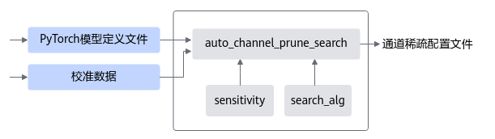

**调用示例<a name="section2080413191461"></a>**

本示例演示了使用AMCT进行自动通道稀疏搜索的流程，该过程需要用户传入PyTorch模型与校准数据，用户可选择自定义实现sensitivity模块与search\_alg模块。

> **说明：** 
>-   如下示例标有“由用户补充处理”的步骤，需要用户根据自己的模型和数据集进行补充处理，示例中仅为示例代码。
>-   如下示例调用AMCT的部分，函数入参请根据实际情况进行调整。

1.  导入AMCT包，并通过[安装后处理](安装后处理.md)\>AMCT\(PyTorch\)中的环境变量设置日志级别。

    ```
    import amct_pytorch as amct
    ```

2.  （可选，由用户补充处理）实现sensitivity模块，获取各个layer各通道的敏感度，为后续的搜索算法提供数据。可参考系统默认sensitivity模块：_AMCT安装目录_

    amct\_pytorch/auto\_channel\_prune\_search.py下的TaylorLossSensitivity方法，简要流程如下：

    ```
    from amct.common.auto_channel_prune.sensitivity_base import SensitivityBase
    
    class Sensitivity(SensitivityBase)
        def __init__(self)
            pass
        def setup_initialization(self, graph_tuple, input_data, test_iteration):
            # 必要的初始化
            # graph_tuple (graph, graph_info)
            pass
        def get_sensitivity(self, search_records):
            # 获取敏感度方法，计算后写到record中
            pass
    ```

3.  （可选，由用户补充处理）实现搜索算法search\_alg模块，需要用户实现channel\_prune\_search回调接口，根据通道敏感度与通道稀疏收益进行稀疏通道搜索。可参考系统默认search\_alg模块：_AMCT安装目录_/amct\_pytorch/common/auto\_prune/search\_channel\_base.py文件中GreedySearch方法。

    ```
    from amct.common.auto_prune.search_channel_base import SearchChannelBase
    
    class Search(SearchChannelBase)
        def __init__(self)
            # 初始化
            pass
    
        def channel_prune_search(self, graph_info, search_records, prune_config):
            """
            输入：
            graph_info: dict，包含图中各算子的通道数量与比特复杂度信息，可用于计算压缩率
            search_records: protobuf对象，包含待搜索的可稀疏层
            prune_config: 三元组-目标压缩率（float）、昇腾亲和优化开关（bool）、单层最大稀疏率（float）
            输出：
            dict，key为待搜索的可稀疏层层名，value为01组成的list，对应该通道是否应稀疏
            """
            pass
    ```

4.  （可选，由用户补充处理）获取PyTorch模型，在环境下推理，验证环境、推理脚本是否正常。执行该步骤时，可以使用部分测试集，减少运行时间。

    ```
    ori_model.load()
    # 测试模型
    user_test_model(ori_model, test_data, test_iterations)
    ```

5.  （由用户补充处理）构造校准数据。

    ```
    input_data = []
    for _ in range(test_iteration):
        input_data.append(user_load_feed_dict())
    ```

6.  调用AMCT，进行自动通道稀疏搜索。

    ```
    output_prune_cfg = './prune.cfg'
    amct.auto_channel_prune_search(
        model=model, 
        config=cfg_file, 
        input_data=input_data,
        output_cfg=output_prune_cfg,
        sensitivity='TaylorLossSensitivity',
        search_alg='GreedySearch')
    ```

#### 手工稀疏<a name="ZH-CN_TOPIC_0000002506024515"></a>

本节介绍手工稀疏特性支持的稀疏层，接口调用流程和调用示例。
稀疏后，如果精度不满足要求，可以参见本节提供的方法进行调优。

##### 稀疏流程<a name="ZH-CN_TOPIC_0000002506024549"></a>

本节介绍手工稀疏特性支持的稀疏层，接口调用流程和调用示例。

AMCT目前主要支持基于重训练的通道稀疏模型压缩特性，稀疏示例请参见[样例列表](样例列表.md)\>通道稀疏，支持通道稀疏的层以及约束如下：

**表 1**  通道稀疏支持的层以及约束

<a name="table151175131181"></a>
<table><thead align="left"><tr id="row61178136184"><th class="cellrowborder" valign="top" width="7.5200000000000005%" id="mcps1.2.4.1.1"><p id="p185862080479"><a name="p185862080479"></a><a name="p185862080479"></a>优化方式</p>
</th>
<th class="cellrowborder" valign="top" width="26.340000000000003%" id="mcps1.2.4.1.2"><p id="p1921472241319"><a name="p1921472241319"></a><a name="p1921472241319"></a>支持的层类型</p>
</th>
<th class="cellrowborder" valign="top" width="66.14%" id="mcps1.2.4.1.3"><p id="p9117111341815"><a name="p9117111341815"></a><a name="p9117111341815"></a>约束</p>
</th>
</tr>
</thead>
<tbody><tr id="row4117613121819"><td class="cellrowborder" rowspan="2" valign="top" width="7.5200000000000005%" headers="mcps1.2.4.1.1 "><p id="p14586087476"><a name="p14586087476"></a><a name="p14586087476"></a>通道稀疏</p>
</td>
<td class="cellrowborder" valign="top" width="26.340000000000003%" headers="mcps1.2.4.1.2 "><p id="p46801332355"><a name="p46801332355"></a><a name="p46801332355"></a>torch.nn.Linear：全连接层</p>
</td>
<td class="cellrowborder" valign="top" width="66.14%" headers="mcps1.2.4.1.3 "><p id="p257843204111"><a name="p257843204111"></a><a name="p257843204111"></a>复用层（共用weight和bias参数）不支持稀疏。</p>
</td>
</tr>
<tr id="row13118181318183"><td class="cellrowborder" valign="top" headers="mcps1.2.4.1.1 "><p id="p1868011363517"><a name="p1868011363517"></a><a name="p1868011363517"></a>torch.nn.Conv2d：卷积层</p>
</td>
<td class="cellrowborder" valign="top" headers="mcps1.2.4.1.2 "><a name="ul4262123921520"></a><a name="ul4262123921520"></a><ul id="ul4262123921520"><li>复用层（共用weight和bias参数）不支持稀疏。</li><li>depthwise只能被动稀疏(groups=in_channels)，不能主动稀疏。</li><li>只支持input data的shape为(N, Cin, Hin, Win)。</li></ul>
</td>
</tr>
</tbody>
</table>

**接口调用流程<a name="section8899125345713"></a>**

通道稀疏功能接口调用流程如下图所示，如下流程中的训练环境借助PyTorch框架的CPU/GPU环境，在该开源框架的推理脚本基础上，调用AMCT  API完成模型压缩，压缩后的部署模型需要使用ATC工具转换成适配NPU IP加速器的离线模型后，然后才能在NPU IP加速器上实现推理：

**图 1**  通道稀疏接口调用流程<a name="fig153281318152013"></a>  
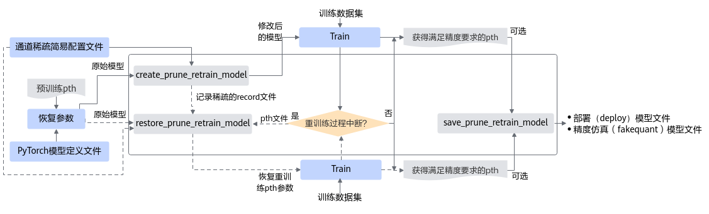

蓝色部分为用户实现，灰色部分为用户调用AMCT提供的API实现：

1.  用户首先构造PyTorch的原始模型，调用[create\_prune\_retrain\_model](create_prune_retrain_model.md)接口对原始模型进行修改，在图结构中插入通道稀疏mask算子，修改后的模型参数量被裁剪。
2.  对修改后的模型进行训练，直至精度满足要求；如果训练过程中断，则可基于原始模型和记录稀疏信息的文件，重新调用[restore\_prune\_retrain\_model](restore_prune_retrain_model.md)接口稀疏模型，继续进行量化感知的训练，直至精度满足要求。
3.  根据最终的重训练好的通道稀疏模型，生成满足精度要求的pth文件；或者调用[save\_prune\_retrain\_model](save_prune_retrain_model.md)接口，生成最终ONNX仿真模型以及部署模型。

**调用示例<a name="section13203169182418"></a>**

> **说明：** 
>1.  如下示例标有“由用户补充处理”的步骤，需要用户根据自己的模型和数据集进行补充处理，示例中仅为示例代码。
>2.  调用AMCT的部分，函数入参可以根据实际情况进行调整。稀疏基于用户的训练过程，请确保已经有基于PyTorch环境进行训练的脚本，并且训练后的精度正常。

1.  导入AMCT包，并通过[安装后处理](安装后处理.md)\>AMCT\(PyTorch\)中的环境变量设置日志级别。

    ```
    import amct_pytorch as amct
    ```

2.  <a name="li341817311449"></a>（可选，由用户补充处理）建议使用原始待稀疏的模型和测试集，在PyTorch环境下推理，验证环境、推理脚本是否正常。

    推荐执行该步骤，请确保原始模型可以完成推理且精度正常；执行该步骤时，可以使用部分测试集，减少运行时间。

    ```
    ori_model.load()
    # 测试模型
    user_test_model(ori_model, test_data, test_iterations)
    ```

3.  调用AMCT，执行带稀疏算子的训练流程。
    1.  对原始模型进行修改，在图结构中插入通道稀疏mask算子。

        实现该步骤前，应先恢复训练好的参数，如[2](#li341817311449)中的ori\_model.load\(\)。

        ```
        simple_cfg = './retrain.cfg'
        record_file = './tmp/record.txt'
        prune_retrain_model = amct.create_prune_retrain_model(model=ori_model,
                                        input_data=ori_model_input_data,
                                        config_defination=simple_cfg,
                                        record_file=record_file)
        ```

    2.  （由用户补充处理）使用修改后的图，创建反向梯度，在训练集上做训练。
        1.  使用修改后的图，创建反向梯度。

            该步骤需要在稀疏模型后执行。

            ```
            optimizer = user_create_optimizer(prune_retrain_model)
            ```

        2.  从训练好的checkpoint恢复模型，并训练模型。

            注意：从训练好的checkpoint恢复模型参数后再训练。

            ```
            quant_pth = './ckpt/user_model'
            user_train_model(optimizer, prune_retrain_model, train_data)
            ```

    3.  （可选）如果调用[save\_prune\_retrain\_model](save_prune_retrain_model.md)接口，则需要参考该步骤，如果保存为pth文件则不需要。

        保存模型，实现通道稀疏。

        ```
        prune_retrain_model = amct.save_prune_retrain_model(
             model=pruned_retrain_model,
             save_path=save_path,
             input_data=input_data)
        ```

4.  （由用户补充处理）基于ONNX Runtime的环境，使用通道稀疏后模型（prune\_retrain\_model）在测试集（test\_data）上做推理，测试量化后仿真模型的精度。

    使用稀疏后仿真模型精度与[2](#li341817311449)中的原始精度做对比，可以观察通道稀疏对精度的影响。

    ```
    prune_retrain_model = './results/user_model_fake_prune_model.onnx'
    user_do_inference_onnx(prune_retrain_model, test_data, test_iterations)
    ```

**如果训练过程中断，需要从ckpt中恢复数据，继续训练，则调用流程为：**

1.  导入AMCT包，并通过[安装后处理](安装后处理.md)\>AMCT\(PyTorch\)中的环境变量设置日志级别。

    ```
    import amct_pytorch as amct
    ```

1.  准备原始模型。

    ```
    ori_model= user_create_model()
    ```

2.  调用AMCT，恢复量化训练流程。
    1.  修改模型，在图结构中插入通道稀疏mask算子，保存为新的prune\_model。

        ```
        model = ori_model
        input_data = ori_model_input_data
        record_file = './tmp/record.txt'
        config_defination = './prune_cfg.cfg'
        save_pth_path = /your/path/to/save/tmp.pth
        model.load_state_dict(torch.load(state_dict_path))
        prune_retrain_model = amct.restore_prune_retrain_model(model=ori_model,
                                                               input_data=ori_model_input_data,
                                                               record_file=record_file,
                                                               config_defination='./prune_cfg.cfg',
                                                               save_pth_path=/your/path/to/save/tmp.pth,
                                                               'state_dict')
        ```

    2.  （由用户补充处理）使用修改后的模型，恢复断点，创建反向梯度，在训练集上做训练。
        1.  从稀疏后训练中断的checkpoint恢复模型参数。

            ```
            quant_pth = './ckpt/user_prune_model'
            user_train_model(optimizer, prune_retrain_model, train_data)
            ```

        2.  使用修改后的图，创建反向梯度。

            该步骤需要在恢复模型参数后执行。

            ```
            optimizer = user_create_optimizer(prune_retrain_model)
            ```

        3.  从训练好的checkpoint恢复模型，并训练模型。

            注意：从训练好的checkpoint恢复模型参数后再训练。

            ```
            user_train_model(optimizer, prune_retrain_model, train_data)
            ```

    3.  （可选）如果调用[save\_prune\_retrain\_model](save_prune_retrain_model.md)接口，则需要参考该步骤，如果保存为pth文件则不需要。

        保存模型，实现通道稀疏。

        ```
        prune_retrain_model = amct.save_prune_retrain_model(
             model=pruned_retrain_model,
             save_path=save_path,
             input_data=input_data)
        ```

3.  （由用户补充处理）基于ONNX Runtime的环境，使用通道稀疏后模型（prune\_retrain\_model）在测试集（test\_data）上做推理，测试量化后仿真模型的精度。

    使用稀疏后仿真模型精度与[2](#li341817311449)中的原始精度做对比，可以观察通道稀疏对精度的影响。

    ```
    prune_retrain_model = './results/user_model_fake_prune_model.onnx'
    user_do_inference_onnx(prune_retrain_model, test_data, test_iterations)
    ```

**后续处理<a name="section14540105941915"></a>**

如果稀疏后输出的模型为pth格式，则需要参考该章节，如果调用[save\_prune\_retrain\_model](save_prune_retrain_model.md)接口，则不需要。

由于输出的pth模型无法直接用于推理，需要用户自行将pth模型转成ONNX网络模型，或者调用[save\_prune\_retrain\_model](save_prune_retrain_model.md)接口保存为最终ONNX仿真模型以及部署模型，然后才能使用ATC工具进行模型转换。调用[save\_prune\_retrain\_model](save_prune_retrain_model.md)接口的调用示例如下：

```
prune_retrain_model = amct.10.6.3-save_prune_retrain_model(
     model=pruned_retrain_model,
     save_path=save_path,
     input_data=input_data)
```

##### 手工调优<a name="ZH-CN_TOPIC_0000002506024575"></a>

稀疏后，如果精度不满足要求，可以参见本节提供的方法进行调优。

如果按照某组配置稀疏模型后，经过重训练精度未满足要求，则可以修改简易配置文件（文件配置请参见[量化感知训练简易配置文件](量化感知训练简易配置文件.md)）重新稀疏模型并重训练。常用的方法包括：

-   调整稀疏率，由简易配置文件中的**prune\_ratio**参数控制，用户可尝试减小稀疏率并重新进行稀疏来进行调试。
-   某些层不做稀疏，由简易配置文件中的**regular\_prune\_skip\_layers**参数控制，通过该参数配置不需要稀疏的层。

### 4选2结构化稀疏<a name="ZH-CN_TOPIC_0000002506024495"></a>

本节介绍4选2结构化稀疏支持的层，接口调用流程和调用示例。
稀疏后，如果精度不满足要求，可以参见本节提供的方法进行调优。

#### 稀疏流程<a name="ZH-CN_TOPIC_0000002506024511"></a>

本节介绍4选2结构化稀疏支持的层，接口调用流程和调用示例。

**由于硬件约束，该芯片不支持4选2结构化稀疏特性：使能后获取不到性能收益。**

AMCT支持基于重训练的4选2结构化稀疏特性。该特性支持的层以及约束如下，稀疏示例请参见[样例列表](样例列表.md)。

**表 1**  支持的层以及约束

<a name="table151175131181"></a>
<table><thead align="left"><tr id="row61178136184"><th class="cellrowborder" valign="top" width="7.5200000000000005%" id="mcps1.2.4.1.1"><p id="p185862080479"><a name="p185862080479"></a><a name="p185862080479"></a>优化方式</p>
</th>
<th class="cellrowborder" valign="top" width="27.61%" id="mcps1.2.4.1.2"><p id="p1921472241319"><a name="p1921472241319"></a><a name="p1921472241319"></a>支持的层类型</p>
</th>
<th class="cellrowborder" valign="top" width="64.87%" id="mcps1.2.4.1.3"><p id="p9117111341815"><a name="p9117111341815"></a><a name="p9117111341815"></a>约束</p>
</th>
</tr>
</thead>
<tbody><tr id="row4117613121819"><td class="cellrowborder" rowspan="3" valign="top" width="7.5200000000000005%" headers="mcps1.2.4.1.1 "><p id="p14586087476"><a name="p14586087476"></a><a name="p14586087476"></a>4选2结构化稀疏</p>
<p id="p112635116333"><a name="p112635116333"></a><a name="p112635116333"></a></p>
</td>
<td class="cellrowborder" valign="top" width="27.61%" headers="mcps1.2.4.1.2 "><p id="p46801332355"><a name="p46801332355"></a><a name="p46801332355"></a>torch.nn.Linear：全连接层</p>
</td>
<td class="cellrowborder" valign="top" width="64.87%" headers="mcps1.2.4.1.3 "><p id="p1670925185513"><a name="p1670925185513"></a><a name="p1670925185513"></a>复用层（共用weight）不支持稀疏。</p>
</td>
</tr>
<tr id="row13118181318183"><td class="cellrowborder" valign="top" headers="mcps1.2.4.1.1 "><p id="p1868011363517"><a name="p1868011363517"></a><a name="p1868011363517"></a>torch.nn.Conv2d：卷积层</p>
</td>
<td class="cellrowborder" valign="top" headers="mcps1.2.4.1.2 "><a name="ul19441153635116"></a><a name="ul19441153635116"></a><ul id="ul19441153635116"><li>复用层（共用weight）不支持稀疏。</li><li>只支持input data的shape为(N, Cin, Hin, Win)。</li></ul>
</td>
</tr>
<tr id="row1312619511332"><td class="cellrowborder" valign="top" headers="mcps1.2.4.1.1 "><p id="p91261851123316"><a name="p91261851123316"></a><a name="p91261851123316"></a>torch.nn.ConvTranspose2d：反卷积层</p>
</td>
<td class="cellrowborder" valign="top" headers="mcps1.2.4.1.2 "><a name="ul1382854365314"></a><a name="ul1382854365314"></a><ul id="ul1382854365314"><li>复用层（共用weight）不支持稀疏。</li><li>只支持input data的shape为(N, Cin, Hin, Win)。</li></ul>
</td>
</tr>
</tbody>
</table>

**接口调用流程<a name="section8899125345713"></a>**

4选2结构化稀疏功能接口调用流程如下图所示，如下流程中的训练环境借助PyTorch框架的CPU/GPU环境，在该开源框架的推理脚本基础上，调用AMCT  API完成模型压缩，压缩后的部署模型需要使用ATC工具转换成适配NPU IP加速器的离线模型后，然后才能在NPU IP加速器上实现推理：

**图 1**  4选2结构化稀疏接口调用流程<a name="fig153281318152013"></a>  
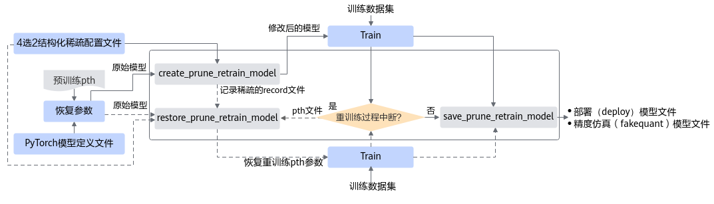

蓝色部分为用户实现，灰色部分为用户调用AMCT提供的API实现：

1.  用户首先构造PyTorch的原始模型，调用[create\_prune\_retrain\_model](create_prune_retrain_model.md)接口对原始模型进行修改，把待稀疏的算子替换成插入了4选2结构化稀疏的算子。
2.  对修改后的模型进行训练，直至精度满足要求；如果训练过程中断，则可基于原始模型和记录稀疏信息的文件，重新调用[restore\_prune\_retrain\_model](restore_prune_retrain_model.md)接口稀疏模型，继续进行量化感知的训练，直至精度满足要求。
3.  根据用户最终的重训练好的4选2结构化稀疏模型，调用[save\_prune\_retrain\_model](save_prune_retrain_model.md)接口，还原替换的算子并对weight进行稀疏，生成最终ONNX仿真模型以及部署模型。

**调用示例<a name="section1055614165412"></a>**

> **说明：** 
>1.  如下示例标有“由用户补充处理”的步骤，需要用户根据自己的模型和数据集进行补充处理，示例中仅为示例代码。
>2.  调用AMCT的部分，函数入参可以根据实际情况进行调整。稀疏基于用户的训练过程，请确保已经有基于PyTorch环境进行训练的脚本，并且训练后的精度正常。

1.  <a name="li341817311449"></a>（可选，由用户补充处理）建议使用原始待量化的模型和测试集，在PyTorch环境下推理，验证环境、推理脚本是否正常。

    推荐执行该步骤，请确保原始模型可以完成推理且精度正常；执行该步骤时，可以使用部分测试集，减少运行时间。

    ```
    ori_model.load()
    # 测试模型
    user_test_model(ori_model, test_data, test_iterations)
    ```

2.  调用AMCT，执行4选2结构化稀疏流程。
    1.  对原始模型进行修改，把待稀疏的算子替换成插入了4选2结构化稀疏的算子。

        实现该步骤前，应先恢复训练好的参数，如[1](#li341817311449)中的ori\_model.load\(\)。

        ```
        simple_cfg = './retrain.cfg'
        record_file = './tmp/record.txt'
        prune_retrain_model = amct.create_prune_retrain_model(model=ori_model,
                                        input_data=ori_model_input_data,
                                        config_defination=simple_cfg,
                                        record_file=record_file)
        ```

    2.  （由用户补充处理）使用修改后的图，创建反向梯度，在训练集上做训练。
        1.  使用修改后的图，创建反向梯度。

            该步骤需要在稀疏模型后执行。

            ```
            optimizer = user_create_optimizer(prune_retrain_model)
            ```

        2.  从训练好的checkpoint恢复模型，并训练模型。

            注意：从训练好的checkpoint恢复模型参数后再训练。

            ```
            quant_pth = './ckpt/user_model'
            user_train_model(optimizer, prune_retrain_model, train_data)
            ```

    3.  调用[save\_prune\_retrain\_model](save_prune_retrain_model.md)接口，保存模型，还原替换的算子并对weight进行结构化稀疏，生成最终ONNX仿真模型以及部署模型。

        ```
        prune_retrain_model = amct.save_prune_retrain_model(
             model=pruned_retrain_model,
             save_path=save_path,
             input_data=input_data)
        ```

1.  （可选，由用户补充处理）基于ONNX Runtime的环境，使用稀疏后模型（prune\_retrain\_model）在测试集（test\_data）上做推理，测试量化后仿真模型的精度。

    使用稀疏后仿真模型精度与[1](#li341817311449)中的原始精度做对比，可以观察4选2结构化稀疏对精度的影响。

    ```
    prune_retrain_model = './results/user_model_fake_prune_model.onnx'
    user_do_inference_onnx(prune_retrain_model, test_data, test_iterations)
    ```

**如果训练过程中断，需要从ckpt中恢复数据，继续训练，则调用流程为：**

1.  准备原始模型。

    ```
    ori_model= user_create_model()
    ```

2.  调用AMCT，恢复量化训练流程。
    1.  修改模型，把待稀疏的算子替换成插入了4选2结构化稀疏的算子，保存为新的prune\_model。

        ```
        model = ori_model
        input_data = ori_model_input_data
        record_file = './tmp/record.txt'
        config_defination = './prune_cfg.cfg'
        save_pth_path = /your/path/to/save/tmp.pth
        model.load_state_dict(torch.load(state_dict_path))
        prune_retrain_model = amct.restore_prune_retrain_model(model=ori_model,
                                                               input_data=ori_model_input_data,
                                                               record_file=record_file,
                                                               config_defination='./prune_cfg.cfg',
                                                               save_pth_path=/your/path/to/save/tmp.pth,
                                                               'state_dict')
        ```

    2.  （由用户补充处理）使用修改后的模型，恢复断点，创建反向梯度，在训练集上做训练。
        1.  从稀疏后训练中断的checkpoint恢复模型参数。

            ```
            quant_pth = './ckpt/user_prune_model'
            user_train_model(optimizer, prune_retrain_model, train_data)
            ```

        2.  使用修改后的图，创建反向梯度。

            该步骤需要在恢复模型参数后执行。

            ```
            optimizer = user_create_optimizer(prune_retrain_model)
            ```

        3.  从训练好的checkpoint恢复模型，并训练模型。

            注意：从训练好的checkpoint恢复模型参数后再训练。

            ```
            user_train_model(optimizer, prune_retrain_model, train_data)
            ```

    3.  调用[save\_prune\_retrain\_model](save_prune_retrain_model.md)接口，保存模型，还原替换的算子并对weight进行结构化稀疏，生成最终ONNX仿真模型以及部署模型。

        ```
        prune_retrain_model = amct.save_prune_retrain_model(
             model=pruned_retrain_model,
             save_path=save_path,
             input_data=input_data)
        ```

3.  （可选，由用户补充处理）基于ONNX Runtime的环境，使用稀疏后模型（prune\_retrain\_model）在测试集（test\_data）上做推理，测试量化后仿真模型的精度。

    使用稀疏后仿真模型精度与[1](#li341817311449)中的原始精度做对比，可以观察4选2结构化稀疏对精度的影响。

    ```
    prune_retrain_model = './results/user_model_fake_prune_model.onnx'
    user_do_inference_onnx(prune_retrain_model, test_data, test_iterations)
    ```

#### 手工调优<a name="ZH-CN_TOPIC_0000002473904600"></a>

稀疏后，如果精度不满足要求，可以参见本节提供的方法进行调优。

如果按照某组配置稀疏模型后，经过重训练精度未满足要求，则可以修改简易配置文件（文件配置请参见[量化感知训练简易配置文件](量化感知训练简易配置文件.md)）重新稀疏模型并重训练。常用的方法包括：

-   调整更新间隔（计算哪些元素被保留的间隔），由简易配置文件中的**update\_freq**参数控制，用户可尝试将更新间隔改为正整数并重新进行稀疏来进行调试，一般来说更新间隔越小精度收益越大。
-   某些层不做稀疏，由简易配置文件中的**regular\_prune\_skip\_layers**参数控制，通过该参数配置不需要稀疏的层。

## 组合压缩\(不支持\)<a name="ZH-CN_TOPIC_0000002506024595"></a>

组合压缩是针对同一个网络模型，既进行量化又进行稀疏的操作，具体支持什么样的组合压缩方式，本章节给出详细介绍。


### 简介<a name="ZH-CN_TOPIC_0000002473744646"></a>

组合压缩是针对同一个网络模型，既进行量化又进行稀疏的操作，具体支持什么样的组合压缩方式，本章节给出详细介绍。

**组合压缩方式<a name="section159309491765"></a>**

目前组合压缩支持如下组合方式，使用AMCT进行压缩时，每层可压缩算子每次只能选择其中一种组合压缩方式，简要流程如[图1](#fig11106859264)所示。

-   [手工稀疏](手工稀疏.md)+[量化感知训练](量化感知训练.md)  INT8量化
-   [4选2结构化稀疏](4选2结构化稀疏.md)+[量化感知训练](量化感知训练.md)  INT8量化

当前组合压缩特性的压缩配置由用户手动处理（故又称之为静态组合压缩，压缩配置文件配置方法请参见[量化感知训练简易配置文件](量化感知训练简易配置文件.md)），通过手动设置全局量化位宽和稀疏率（通道稀疏比例）或更新4选2稀疏的间隔，实现模型自动压缩；组合压缩示例请参见[样例列表](样例列表.md)。

支持组合压缩的层以及约束请分别参见[手工稀疏](手工稀疏.md)下的[表1](稀疏流程.md#table151175131181)、[4选2结构化稀疏](4选2结构化稀疏.md)下的[表1](稀疏流程-11.md#table151175131181)或[量化感知训练](量化感知训练.md)下的[表1](量化流程.md#table061924413214)。

**图 1**  组合压缩简要流程<a name="fig11106859264"></a>  
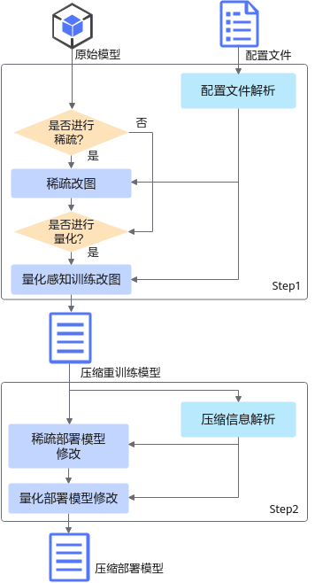

**组合压缩场景介绍<a name="section4823334131018"></a>**

当前组合压缩支持如下几种场景，实际使用时，可以通过简易配置文件中的参数进行控制。如下场景中的整网量化指[量化感知训练](量化感知训练.md)，其中：

-   整网量化：

    -   整网（全局）量化配置参数：retrain\_data\_quant\_config/retrain\_weight\_quant\_config
    -   部分层差异化配置参数：override\_layer\_configs或override\_layer\_types

    参数优先级：override\_layer\_configs\>override\_layer\_types\>retrain\_data\_quant\_config/retrain\_weight\_quant\_config

-   整网稀疏：包括通道稀疏和4选2结构化稀疏，使用时二选一。

    -   整网（全局）稀疏配置参数：prune\_config
    -   部分层差异化稀疏参数：override\_layer\_configs或override\_layer\_types

    参数优先级：override\_layer\_configs\>override\_layer\_types\>retrain\_data\_quant\_config/retrain\_weight\_quant\_config

关于上述参数的详细解释请参见[量化感知训练简易配置文件](量化感知训练简易配置文件.md)。

**表 1**  组合压缩场景介绍

<a name="zh-cn_topic_0000001265077702_table1841654916270"></a>
<table><thead align="left"><tr id="zh-cn_topic_0000002506024443_row3417134942711"><th class="cellrowborder" valign="top" width="19.14191419141914%" id="mcps1.2.4.1.1"><p id="zh-cn_topic_0000002506024443_p641794972716"><a name="zh-cn_topic_0000002506024443_p641794972716"></a><a name="zh-cn_topic_0000002506024443_p641794972716"></a>组合压缩场景</p>
</th>
<th class="cellrowborder" valign="top" width="51.27512751275128%" id="mcps1.2.4.1.2"><p id="zh-cn_topic_0000002506024443_p17417114911276"><a name="zh-cn_topic_0000002506024443_p17417114911276"></a><a name="zh-cn_topic_0000002506024443_p17417114911276"></a>配置参数</p>
</th>
<th class="cellrowborder" valign="top" width="29.58295829582958%" id="mcps1.2.4.1.3"><p id="zh-cn_topic_0000002506024443_p146370141022"><a name="zh-cn_topic_0000002506024443_p146370141022"></a><a name="zh-cn_topic_0000002506024443_p146370141022"></a>说明</p>
</th>
</tr>
</thead>
<tbody><tr id="zh-cn_topic_0000002506024443_row19417549112711"><td class="cellrowborder" valign="top" width="19.14191419141914%" headers="mcps1.2.4.1.1 "><p id="zh-cn_topic_0000002506024443_p124171149182711"><a name="zh-cn_topic_0000002506024443_p124171149182711"></a><a name="zh-cn_topic_0000002506024443_p124171149182711"></a>整网量化+整网稀疏</p>
</td>
<td class="cellrowborder" valign="top" width="51.27512751275128%" headers="mcps1.2.4.1.2 "><a name="zh-cn_topic_0000002506024443_ul189333368587"></a><a name="zh-cn_topic_0000002506024443_ul189333368587"></a><ul id="zh-cn_topic_0000002506024443_ul189333368587"><li>量化参数：retrain_data_quant_config/retrain_weight_quant_config</li><li>稀疏参数：prune_config</li></ul>
<p id="zh-cn_topic_0000002506024443_p11121392577"><a name="zh-cn_topic_0000002506024443_p11121392577"></a><a name="zh-cn_topic_0000002506024443_p11121392577"></a>不配置override_layer_configs或override_layer_types</p>
</td>
<td class="cellrowborder" valign="top" width="29.58295829582958%" headers="mcps1.2.4.1.3 "><p id="zh-cn_topic_0000002506024443_p10387131415315"><a name="zh-cn_topic_0000002506024443_p10387131415315"></a><a name="zh-cn_topic_0000002506024443_p10387131415315"></a>-</p>
</td>
</tr>
<tr id="zh-cn_topic_0000002506024443_row6418104912278"><td class="cellrowborder" valign="top" width="19.14191419141914%" headers="mcps1.2.4.1.1 "><p id="zh-cn_topic_0000002506024443_p2418104912271"><a name="zh-cn_topic_0000002506024443_p2418104912271"></a><a name="zh-cn_topic_0000002506024443_p2418104912271"></a>部分层差异化量化+整网稀疏</p>
</td>
<td class="cellrowborder" valign="top" width="51.27512751275128%" headers="mcps1.2.4.1.2 "><a name="zh-cn_topic_0000002506024443_ul1961884514588"></a><a name="zh-cn_topic_0000002506024443_ul1961884514588"></a><ul id="zh-cn_topic_0000002506024443_ul1961884514588"><li>量化参数：retrain_data_quant_config/retrain_weight_quant_config+override_layer_configs或override_layer_types</li><li>稀疏参数：prune_config</li></ul>
</td>
<td class="cellrowborder" valign="top" width="29.58295829582958%" headers="mcps1.2.4.1.3 "><p id="zh-cn_topic_0000002506024443_p18418104922711"><a name="zh-cn_topic_0000002506024443_p18418104922711"></a><a name="zh-cn_topic_0000002506024443_p18418104922711"></a>配置特性参数时，首先要指定全局配置，否则该特性不使能。</p>
</td>
</tr>
<tr id="zh-cn_topic_0000002506024443_row104181492272"><td class="cellrowborder" valign="top" width="19.14191419141914%" headers="mcps1.2.4.1.1 "><p id="zh-cn_topic_0000002506024443_p1041811493272"><a name="zh-cn_topic_0000002506024443_p1041811493272"></a><a name="zh-cn_topic_0000002506024443_p1041811493272"></a>整网量化+部分层差异化稀疏</p>
</td>
<td class="cellrowborder" valign="top" width="51.27512751275128%" headers="mcps1.2.4.1.2 "><a name="zh-cn_topic_0000002506024443_ul7935131418596"></a><a name="zh-cn_topic_0000002506024443_ul7935131418596"></a><ul id="zh-cn_topic_0000002506024443_ul7935131418596"><li>量化参数：retrain_data_quant_config/retrain_weight_quant_config</li><li>稀疏参数：prune_config+override_layer_configs或override_layer_types</li></ul>
</td>
<td class="cellrowborder" valign="top" width="29.58295829582958%" headers="mcps1.2.4.1.3 "><p id="zh-cn_topic_0000002506024443_p113296231735"><a name="zh-cn_topic_0000002506024443_p113296231735"></a><a name="zh-cn_topic_0000002506024443_p113296231735"></a>配置特性参数时，首先要指定全局配置，否则该特性不使能。</p>
</td>
</tr>
<tr id="zh-cn_topic_0000002506024443_row2418104914273"><td class="cellrowborder" valign="top" width="19.14191419141914%" headers="mcps1.2.4.1.1 "><p id="zh-cn_topic_0000002506024443_p441844932719"><a name="zh-cn_topic_0000002506024443_p441844932719"></a><a name="zh-cn_topic_0000002506024443_p441844932719"></a>部分层量化+部分层差异化稀疏</p>
</td>
<td class="cellrowborder" valign="top" width="51.27512751275128%" headers="mcps1.2.4.1.2 "><a name="zh-cn_topic_0000002506024443_ul19449126706"></a><a name="zh-cn_topic_0000002506024443_ul19449126706"></a><ul id="zh-cn_topic_0000002506024443_ul19449126706"><li>量化参数：retrain_data_quant_config/retrain_weight_quant_config+override_layer_configs或override_layer_types</li><li>稀疏参数：prune_config+override_layer_configs或override_layer_types</li></ul>
</td>
<td class="cellrowborder" valign="top" width="29.58295829582958%" headers="mcps1.2.4.1.3 "><p id="zh-cn_topic_0000002506024443_p4158172415318"><a name="zh-cn_topic_0000002506024443_p4158172415318"></a><a name="zh-cn_topic_0000002506024443_p4158172415318"></a>配置特性参数时，首先要指定全局配置，否则该特性不使能。</p>
</td>
</tr>
<tr id="zh-cn_topic_0000002506024443_row141864913279"><td class="cellrowborder" valign="top" width="19.14191419141914%" headers="mcps1.2.4.1.1 "><p id="zh-cn_topic_0000002506024443_p17418154942719"><a name="zh-cn_topic_0000002506024443_p17418154942719"></a><a name="zh-cn_topic_0000002506024443_p17418154942719"></a>整网量化</p>
</td>
<td class="cellrowborder" valign="top" width="51.27512751275128%" headers="mcps1.2.4.1.2 "><p id="zh-cn_topic_0000002506024443_p1969818452012"><a name="zh-cn_topic_0000002506024443_p1969818452012"></a><a name="zh-cn_topic_0000002506024443_p1969818452012"></a>retrain_data_quant_config/retrain_weight_quant_config</p>
<p id="zh-cn_topic_0000002506024443_p151467471206"><a name="zh-cn_topic_0000002506024443_p151467471206"></a><a name="zh-cn_topic_0000002506024443_p151467471206"></a>不配置override_layer_configs或override_layer_types</p>
</td>
<td class="cellrowborder" valign="top" width="29.58295829582958%" headers="mcps1.2.4.1.3 "><p id="zh-cn_topic_0000002506024443_p041864916271"><a name="zh-cn_topic_0000002506024443_p041864916271"></a><a name="zh-cn_topic_0000002506024443_p041864916271"></a>-</p>
</td>
</tr>
<tr id="zh-cn_topic_0000002506024443_row0418449192712"><td class="cellrowborder" valign="top" width="19.14191419141914%" headers="mcps1.2.4.1.1 "><p id="zh-cn_topic_0000002506024443_p5418249162714"><a name="zh-cn_topic_0000002506024443_p5418249162714"></a><a name="zh-cn_topic_0000002506024443_p5418249162714"></a>部分层差异化量化</p>
</td>
<td class="cellrowborder" valign="top" width="51.27512751275128%" headers="mcps1.2.4.1.2 "><p id="zh-cn_topic_0000002506024443_p341919495279"><a name="zh-cn_topic_0000002506024443_p341919495279"></a><a name="zh-cn_topic_0000002506024443_p341919495279"></a>retrain_data_quant_config/retrain_weight_quant_config+override_layer_configs或override_layer_types</p>
</td>
<td class="cellrowborder" valign="top" width="29.58295829582958%" headers="mcps1.2.4.1.3 "><p id="zh-cn_topic_0000002506024443_p135712271031"><a name="zh-cn_topic_0000002506024443_p135712271031"></a><a name="zh-cn_topic_0000002506024443_p135712271031"></a>配置特性参数时，首先要指定全局配置，否则该特性不使能。</p>
</td>
</tr>
<tr id="zh-cn_topic_0000002506024443_row74191249152720"><td class="cellrowborder" valign="top" width="19.14191419141914%" headers="mcps1.2.4.1.1 "><p id="zh-cn_topic_0000002506024443_p104194493272"><a name="zh-cn_topic_0000002506024443_p104194493272"></a><a name="zh-cn_topic_0000002506024443_p104194493272"></a>整网稀疏</p>
</td>
<td class="cellrowborder" valign="top" width="51.27512751275128%" headers="mcps1.2.4.1.2 "><p id="zh-cn_topic_0000002506024443_p3419849142717"><a name="zh-cn_topic_0000002506024443_p3419849142717"></a><a name="zh-cn_topic_0000002506024443_p3419849142717"></a>prune_config</p>
<p id="zh-cn_topic_0000002506024443_p250381119119"><a name="zh-cn_topic_0000002506024443_p250381119119"></a><a name="zh-cn_topic_0000002506024443_p250381119119"></a>不配置override_layer_configs或override_layer_types</p>
</td>
<td class="cellrowborder" valign="top" width="29.58295829582958%" headers="mcps1.2.4.1.3 "><p id="zh-cn_topic_0000002506024443_p124190499278"><a name="zh-cn_topic_0000002506024443_p124190499278"></a><a name="zh-cn_topic_0000002506024443_p124190499278"></a>-</p>
</td>
</tr>
<tr id="zh-cn_topic_0000002506024443_row10181133810426"><td class="cellrowborder" valign="top" width="19.14191419141914%" headers="mcps1.2.4.1.1 "><p id="zh-cn_topic_0000002506024443_p181811138154214"><a name="zh-cn_topic_0000002506024443_p181811138154214"></a><a name="zh-cn_topic_0000002506024443_p181811138154214"></a>部分层差异化稀疏</p>
</td>
<td class="cellrowborder" valign="top" width="51.27512751275128%" headers="mcps1.2.4.1.2 "><p id="zh-cn_topic_0000002506024443_p137714231911"><a name="zh-cn_topic_0000002506024443_p137714231911"></a><a name="zh-cn_topic_0000002506024443_p137714231911"></a>prune_config+override_layer_configs或override_layer_types</p>
</td>
<td class="cellrowborder" valign="top" width="29.58295829582958%" headers="mcps1.2.4.1.3 "><p id="zh-cn_topic_0000002506024443_p187228733"><a name="zh-cn_topic_0000002506024443_p187228733"></a><a name="zh-cn_topic_0000002506024443_p187228733"></a>配置特性参数时，首先要指定全局配置，否则该特性不使能。</p>
</td>
</tr>
</tbody>
</table>

### 压缩流程<a name="ZH-CN_TOPIC_0000002506024589"></a>

本节介绍组合压缩特性的接口调用流程和调用示例。

**接口调用流程<a name="section22281946184910"></a>**

组合压缩接口调用流程如下图所示，如下流程中的训练环境借助PyTorch框架的CPU/GPU环境，在该开源框架的推理脚本基础上，调用AMCT  API完成模型压缩，压缩后的部署模型需要使用ATC工具转换成适配NPU IP加速器的离线模型后，然后才能在NPU IP加速器上实现推理：

**图 1**  组合压缩接口调用流程<a name="fig1611065419122"></a>  
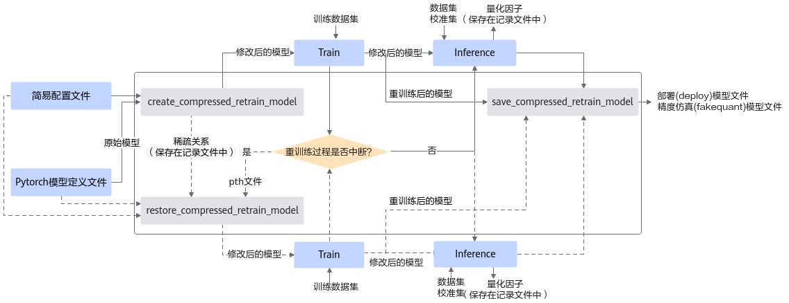

蓝色部分为用户实现，灰色部分为用户调用AMCT提供的API实现：

1.  用户构造Pytorch的原始模型，调用[create\_compressed\_retrain\_model](create_compressed_retrain_model.md)接口对原始模型进行修改，修改后的模型包含了稀疏和量化相关的算子。
2.  对修改后的模型进行训练，如果训练未中断，将训练后的模型进行推理，在推理的过程中，会将量化因子写出到record文件中，然后调用[save\_compressed\_retrain\_model](save_compressed_retrain_model.md)接口保存精度仿真模型以及部署模型；如果训练过程中断，则可基于保存的pth模型参数，重新调用[restore\_compressed\_retrain\_model](restore_compressed_retrain_model.md)接口，输出根据稀疏关系稀疏好并插入了量化算子的模型，并且重新加载中断前保存模型的权重，继续进行训练，然后进行推理，最后调用[save\_compressed\_retrain\_model](save_compressed_retrain_model.md)接口保存量化后的模型。

**调用示例<a name="section13203169182418"></a>**

> **说明：** 
>1.  基于PyTorch环境进行训练，当前仅支持distributed模式（即DistributedDataParallel模式）的多卡训练，不支持DataParallel模式的多卡训练，使用DP模式训练会报错。
>2.  调用AMCT的部分，函数入参可以根据实际情况进行调整。组合压缩基于用户的训练过程，请确保已经有基于PyTorch环境进行训练的脚本，并且训练后的精度正常。
>3.  使用AMCT的量化感知训练特性时，如果训练过程卡死，请检查当前服务器是否有其他ONNX Runtime程序在运行（可以用**top**命令查看服务器所有进程），如果有，请先暂停其他ONNX Runtime程序，重新执行量化感知训练。
>4.  如下示例标有“由用户补充处理”的步骤，需要用户根据自己的模型和数据集进行补充处理，示例中仅为示例代码。

1.  导入AMCT包，并通过[安装后处理](安装后处理.md)\>AMCT\(PyTorch\)中的环境变量设置日志级别。

    ```
    import amct_pytorch as amct
    ```

2.  <a name="li2796152115712"></a>（可选，由用户补充处理）建议使用原始待量化的模型和测试集，在PyTorch环境下推理，验证环境、推理脚本是否正常。

    推荐执行该步骤，请确保原始模型可以完成推理且精度正常；执行该步骤时，可以使用部分测试集，减少运行时间。

    ```
    ori_model.load() 
    # 测试模型 
    user_test_model(ori_model, test_data, test_iterations)
    ```

3.  调用AMCT，执行组合压缩流程。
    1.  <a name="li7715155181310"></a>修改模型，对模型ori\_model进行稀疏并插入量化相关的算子，保存成新的训练模型retrain\_model。

        实现该步骤前，应先恢复训练好的参数，如[2](#li2796152115712)中的ori\_model.load\(\)。

        ```
        simple_cfg = './compressed.cfg'
        record_file = './tmp/record.txt'
        compressed_retrain_model = amct.create_compressed_retrain_model(
                                        model=ori_model,
                                        input_data=ori_model_input_data,
                                        config_defination=simple_cfg,
                                        record_file=record_file)
        ```

    2.  （由用户补充处理）使用修改后的图，创建反向梯度，在训练集上做训练，训练量化因子。
        1.  使用修改后的图，创建反向梯度。

            该步骤需要在[3.a](#li7715155181310)后执行。

            ```
            optimizer = user_create_optimizer(compressed_retrain_model)
            ```

        2.  从训练好的checkpoint恢复模型，并训练模型。

            注意：从训练好的checkpoint恢复模型参数后再训练；训练中保存的参数应该包括量化因子：前batch\_num次训练后会生成量化因子，如果训练次数少于batch\_num会导致失败。

            ```
            compressed_pth = './ckpt/user_model' 
            user_train_model(optimizer, compressed_retrain_model, train_data)
            ```

        3.  训练完成后，执行推理，计算量化因子并保存。

            ```
            user_infer_graph(compressed_retrain_model)
            ```

    3.  保存模型。

        ```
        save_path = '/.result/user_model'
        amct.save_compressed_retrain_model(
             model=compressed_retrain_model,
             record_file=record_file,
             save_path=save_path,
             input_data=ori_model_input_data)
        ```

4.  （可选，由用户补充处理）基于ONNX Runtime的环境，使用组合压缩后模型（compressed\_model）在测试集（test\_data）上做推理，测试组合压缩后仿真模型的精度。使用组合压缩后仿真模型精度与[2](#li2796152115712)中的原始精度做对比，可以观察组合压缩对精度的影响。

    ```
    compressed_model = './results/user_model_fake_quant_model.onnx' 
    user_do_inference_onnx(compressed_model, test_data, test_iterations)
    ```

**如果训练过程中断，需要从ckpt中恢复数据，继续训练，则调用流程为：**

1.  导入AMCT包，并通过[安装后处理](安装后处理.md)\>AMCT\(PyTorch\)中的环境变量设置日志级别。

    ```
    import amct_pytorch as amct
    ```

2.  准备原始模型。

    ```
    ori_model = user_create_model()
    ```

3.  调用AMCT，执行组合压缩流程。
    1.  <a name="li15107317163515"></a>修改模型，对模型ori\_model进行稀疏并插入量化相关的算子，加载权重参数，保存成新的训练模型retrain\_model。

        ```
        simple_cfg = './compressed.cfg'
        record_file = './tmp/record.txt'
        compressed_pth_file = './ckpt/user_model_newest.ckpt'
        compressed_retrain_model = amct.restore_compressed_retrain_model(
                                        model=ori_model,
                                        input_data=ori_model_input_data,
                                        config_defination=simple_cfg,
                                        record_file=record_file,
                                        pth_file=compressed_pth_file)
        ```

    2.  （由用户补充处理）使用修改后的图，创建反向梯度，在训练集上做训练，训练量化因子。
        1.  使用修改后的图，创建反向梯度。

            该步骤需要在[3.a](#li15107317163515)后执行。

            ```
            optimizer = user_create_optimizer(compressed_retrain_model)
            ```

        2.  从训练好的checkpoint恢复模型，并训练模型。

            注意：从训练好的checkpoint恢复模型参数后再训练；训练中保存的参数应该包括量化因子：前batch\_num次训练后会生成量化因子，如果训练次数少于batch\_num会导致失败。

            ```
            compressed_pth = './ckpt/user_model' 
            user_train_model(optimizer, compressed_retrain_model, train_data)
            ```

        3.  训练完成后，执行推理，计算量化因子并保存。

            ```
            user_infer_graph(compressed_retrain_model)
            ```

    3.  保存模型。

        ```
        save_path = '/.result/user_model'
        amct.save_compressed_retrain_model(
             model=compressed_retrain_model,
             record_file=record_file,
             save_path=save_path,
             input_data=ori_model_input_data)
        ```

4.  （可选，由用户补充处理）基于ONNX Runtime的环境，使用组合压缩后模型（compressed\_model）在测试集（test\_data）上做推理，测试组合压缩后仿真模型的精度。使用组合压缩后仿真模型精度与[2](#li2796152115712)中的原始精度做对比，可以观察组合压缩对精度的影响。

    ```
    compressed_model = './results/user_model_fake_quant_model.onnx' 
    user_do_inference_onnx(compressed_model, test_data, test_iterations)
    ```

### 手工调优<a name="ZH-CN_TOPIC_0000002506024599"></a>

组合压缩后，模型精度不满足要求，则需要参见[稀疏\(不支持\)](稀疏(不支持).md)下的手动调优章节和[量化感知训练](量化感知训练.md)下的[手工调优](手工调优-8.md)章节分别进行调优。

## 张量分解\(不支持\)<a name="ZH-CN_TOPIC_0000002473904474"></a>

张量分解通过分解卷积核的张量，将一个卷积转化成两个小卷积的堆叠来降低推理开销，如用户模型中存在大量卷积，且卷积核shape普遍大于\(64, 64, 3, 3\)时推荐使用张量分解。
本节给出张量分解的接口调用流程和调用示例。

### 简介<a name="ZH-CN_TOPIC_0000002505904553"></a>

张量分解通过分解卷积核的张量，将一个卷积转化成两个小卷积的堆叠来降低推理开销，如用户模型中存在大量卷积，且卷积核shape普遍大于\(64, 64, 3, 3\)时推荐使用张量分解。

目前仅支持满足如下条件的卷积进行分解：

-   group=1、dilation=\(1,1\)、stride<3
-   kernel\_h\>2、kernel\_w\>2

卷积是否分解由AMCT自动判断，即便满足上述条件，也不一定会分解；例如，用户使用的PyTorch原始模型中存在torch.nn.Conv2d层，且该层满足上述条件，才有可能将相应的Conv2d层分解成两个Conv2d层。

通常情况下，分解后模型的精度会比原始模型有所下降，因此在分解之后，需通过fine-tune（微调）来提高精度。最后使用AMCT将分解后的模型转换成可以在NPU IP加速器部署的量化模型，以便在模型推理时获得更好的性能。

该场景为可选操作，用户自行决定是否进行原始模型的分解。

**分解约束<a name="section1298920238126"></a>**

如果torch.nn.Conv2d层的权重shape过大，会造成分解时间过长或分解异常中止，为防止出现该情况，执行分解动作前，请先参见如下约束或参考数据：

-   **分解工具性能参考数据：**

    -   CPU: Intel\(R\) Xeon\(R\) CPU E5-2699 v4 @ 2.20GHz
    -   内存: 512G

    分解单层卷积：

    -   shape\(512, 512, 5, 5\)，大约耗时7秒。
    -   shape\(1024, 1024, 3, 3\)，大约耗时12秒。
    -   shape\(1024, 1024, 5, 5\)，大约耗时52秒。
    -   shape\(2048, 2048, 3, 3\)，大约耗时89秒。
    -   shape\(2048, 2048, 5, 5\)，大约耗时374秒。

-   **内存超限风险提醒**：

    分解大卷积核存在内存超限风险参考数值：分解shape为\(2048, 2048, 5, 5\)的卷积核约需9G内存。

**分解方式<a name="section13153456114919"></a>**

张量分解有两种使用方式，在线张量分解和离线张量分解，用户可以根据实际情况选择其中一个方式进行分解。详细说明如下：

1.  **在线张量分解**

    即直接分解原始网络模型并进行fine-tune：在训练代码中引入张量分解接口，对已包含预训练权重的模型进行分解，然后进行fine-tune。

    该流程在张量分解时直接修改模型结构并更新权重，分解后的模型可直接使用，其优点是使用方便，仅需一步操作；而缺点是每次调用脚本都要重新进行分解计算，需要耗费一定时间。

1.  **离线张量分解**

    即先分解原始网络模型，然后再进行fine-tune：首先将含有预训练权重的模型调用张量分解接口进行分解，保存分解信息文件和分解后的权重；后续使用时，在训练脚本中引入张量分解接口，读取保存的分解信息文件对模型结构进行分解，然后加载保存的分解后的权重，再进行fine-tune。

    该流程先将分解信息和分解后的权重保存下来，然后在fine-tune时快速加载使用，其优点是可以一次分解，多次使用，使用时加载几乎不耗费时间；而缺点是需要两步操作，且需保存分解后的权重并在使用时加载

### 分解流程<a name="ZH-CN_TOPIC_0000002473904466"></a>

本节给出张量分解的接口调用流程和调用示例。

**接口调用流程<a name="section13141632162620"></a>**

接口调用流程如[图1](#fig1413218321495)所示，具体分解示例请参见[样例列表](样例列表.md)。

**图 1**  张量分解接口调用流程<a name="fig1413218321495"></a>  
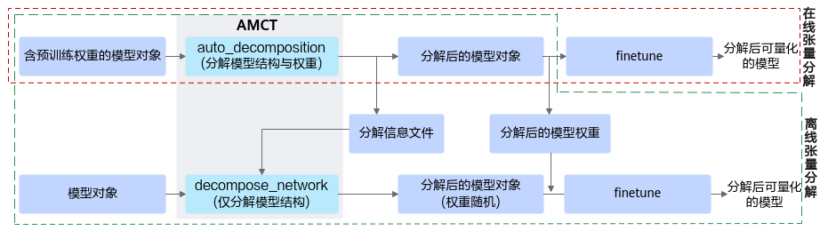

1.  **在线分解流程**

    在训练脚本中，准备好含有预训练权重的torch.nn.Module模型对象，在将模型参数传递给优化器之前，将模型对象传递给[auto\_decomposition](auto_decomposition.md)接口进行张量分解，得到分解后的模型对象，即可直接对其进行fine-tune。

2.  **离线分解流程**

    1.  <a name="li265516506413"></a>在任意脚本中，准备好含有预训练权重的torch.nn.Module模型对象，将模型对象和分解信息文件保存路径传递给[auto\_decomposition](auto_decomposition.md)接口进行张量分解，得到分解后的模型对象和保存的分解信息文件，并对分解后的模型权重进行保存。
    2.  <a name="li1228813421049"></a>fine-tune时，在训练脚本中，在将模型参数传递给优化器之前，将模型对象和[2.a](#li265516506413)中得到的分解信息文件路径传递给[decompose\_network](decompose_network.md)接口，该接口会将模型结构修改为分解后的结构，然后加载[2.a](#li265516506413)保存的分解后的模型权重，对模型进行fine-tune。

    > **说明：** 
    >离线分解时，[2.a](#li265516506413)步骤在调用[auto\_decomposition](auto_decomposition.md)接口后，用户需要自行保存分解后模型权重；[2.b](#li1228813421049)步骤在调用完成[decompose\_network](decompose_network.md)后，用户需自行加载所保存的分解后的模型权重。
    >此方案设计目的是方便用户自由控制权重文件的存取，例如在权重文件中存储自定义信息。

张量分解后会将1个卷积分解为2个串联的卷积，模型的其中一层卷积分解前后情况如[图2](#fig12658194514157)所示。

**图 2**  卷积分解前后示意图<a name="fig12658194514157"></a>  
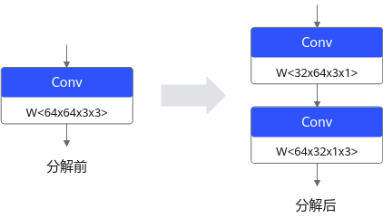

**调用示例<a name="section4846142511314"></a>**

> **说明：** 
>以下示例中，\(\*\)表示用户已有的代码，...表示用户已有代码的省略，此处仅为示例，实际用户代码可能不同，请根据实际情况进行调整。

1.  **在线张量分解**

    在训练脚本中，调用[auto\_decomposition](auto_decomposition.md)分解含有预训练权重的PyTorch模型，然后直接fine-tune。

    ```
    from amct_pytorch.tensor_decompose import auto_decomposition
    net = Net()                                          # (*) 构建模型对象
    net.load_state_dict(torch.load("src_path/net.pth"))  # (*) 加载模型权重
    net, changes = auto_decomposition(model=net)         # 执行张量分解
    optimizer = build_optimizer(net, ...)                # (*) 构建优化器（将模型参数传递给优化器）
    train(net, optimizer, ...)                           # (*) fine-tune
    ```

2.  **离线张量分解**
    1.  <a name="li396420338492"></a>在任意脚本中，调用[auto\_decomposition](auto_decomposition.md)分解含有预训练权重的PyTorch模型，保存分解信息文件和分解后的模型权重。

        ```
        from amct_pytorch.tensor_decompose import auto_decomposition
        net = Net()                                                                 # (*) 构建模型对象
        net.load_state_dict(torch.load("src_path/weights.pth"))                     # (*) 加载模型权重
        net, changes = auto_decomposition(                                          # 执行张量分解，并保存分解信息文件
            model=net,
            decompose_info_path="decomposed_path/decompose_info.json"               # 分解信息文件保存路径
        )
        torch.save(net.state_dict(), "decomposed_path/decomposed_weights.pth")      # 保存分解后的模型权重
        ```

    2.  在训练脚本中，调用[decompose\_network](decompose_network.md)，根据[2.a](#li396420338492)得到的分解信息文件将模型结构修改为分解后的结构，再加载[2.a](#li396420338492)保存的分解后的模型权重，进行fine-tune。

        ```
        from amct_pytorch.tensor_decompose import decompose_network
        net = Net()                                                                 # (*) 构建用户模型对象
        net, changes = decompose_network(                                           # 加载分解信息文件，将模型结构修改为张量分解后的结构
            model=net,
            decompose_info_path="decomposed_path/decompose_info.json"               # 上一步保存的分解信息文件路径
        )
        net.load_state_dict(torch.load("decomposed_path/decomposed_weights.pth"))   # 加载上一步保存的分解后模型权重
        optimizer = build_optimizer(net, ...)                                       # (*) 构建优化器（将模型参数传递给优化器）
        train(net, optimizer, ...)                                                  # (*) fine-tune
        ```

## 扩展更多特性<a name="ZH-CN_TOPIC_0000002505904499"></a>


在一些数据分布不均匀的场景，由于离群值的影响，对数据进行per-tensor量化得到的结果误差较大，而per-channel量化可以获得更低的误差。但由于当前硬件不支持数据per-channel量化，仅支持权重per-channel量化；在该背景下AMCT设计出一套方法，本节将给出详细介绍。
本节详细介绍逐层蒸馏支持的层，接口调用流程和示例。

### 单算子模式的量化感知训练<a name="ZH-CN_TOPIC_0000002505904633"></a>

**功能介绍<a name="section14456169203617"></a>**

参考[量化感知训练](量化感知训练.md)章节进行基础量化时，量化的内部处理逻辑需要将原始模型转换成ONNX模型，并在ONNX模型基础上进行图的修改操作，此时若模型中存在Pytorch自定义算子时，可能存在无法导出生成ONNX模型，从而导致量化失败的问题。

单算子模式的量化感知训练功能，提供由Pytorch原生算子转换生成的自定义QAT算子，基于该算子进行量化因子的重训练，量化因子作为算子参数保存在QAT单算子中，**无需导出ONNX模型**，可以避免上述量化感知训练方案中的算子导出异常问题。训练完成后，通过**torch.onnx.export**机制，建立QAT算子与ONNX原生算子的映射关系，将Pytorch模型中QAT算子计算获得的参数传递给ONNX原生量化算子，完成模型导出。简易示意图如[图1](#fig1467077164520)所示。

**图 1**  单算子模式量化感知训练<a name="fig1467077164520"></a>  
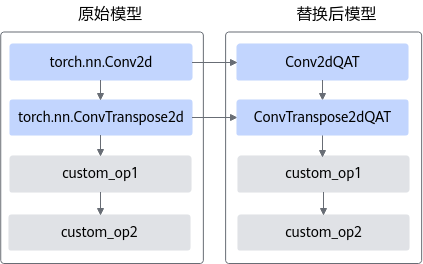

实现原理如下图所示（以torch.nn.Conv2d算子为例进行说明）：

在torch原生算子torch.nn.Conv2d中插入ARQ权重量化，ULQ数据量化算子，进行量化因子的重训练，将量化因子作为算子参数保存在Conv2dQAT单算子中，最终调用torch.onnx.export接口，将QAT自定义算子通过映射关系导出成ONNX原生量化算子QuantizeLinear与DequantizeLinear，带有此两个量化算子的模型又称QDQ（Quantize and DeQuantize，简称QDQ）ONNX模型，QDQ格式模型具体介绍请参见[Link](https://onnxruntime.ai/docs/performance/quantization.html)。

QDQ ONNX模型不能直接通过ATC工具转成适配NPU IP加速器的离线模型，需要通过[AMCT（ONNX）](AMCT（ONNX）-16.md)中的[QAT模型适配CANN模型](QAT模型适配CANN模型.md)特性，将该模型适配成CANN模型后，然后才能使用ATC工具进行下一步的转换。

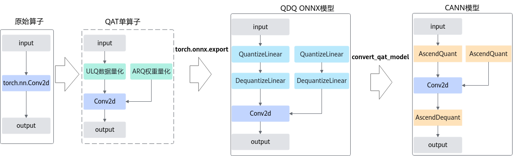该功能支持Training from scratch和Fine-tune两种使用方法：

-   Training from scratch：**使用QAT算子直接构图**，从零开始训练。您可以在模型构建脚本中调用[单算子模式](单算子模式.md)提供的直接构造接口构造QAT算子，使用该算子进行模型构建。
-   Fine-tune：**在已有网络基础上，对待量化算子进行替换**，相比于Training from scratch更为常用。如果您已经完成模型构建，您可以调用[单算子模式](单算子模式.md)提供的基于原生算子构造接口，进行QAT算子构造；之后可以参考下文样例中的算子替换方案，对网络模型中的待量化算子进行替换。

QAT算子规格如下表所示，调用示例请参见[样例列表](样例列表.md)。

**表 1**  QAT算子规格

<a name="table69463311346"></a>
<table><thead align="left"><tr id="row179476303418"><th class="cellrowborder" valign="top" width="16.05839416058394%" id="mcps1.2.5.1.1"><p id="p629775412918"><a name="p629775412918"></a><a name="p629775412918"></a>待量化算子类型</p>
</th>
<th class="cellrowborder" valign="top" width="15.418458154184583%" id="mcps1.2.5.1.2"><p id="p59476317345"><a name="p59476317345"></a><a name="p59476317345"></a>替换后算子类型</p>
</th>
<th class="cellrowborder" valign="top" width="50.34496550344964%" id="mcps1.2.5.1.3"><p id="p89470353414"><a name="p89470353414"></a><a name="p89470353414"></a>限制</p>
</th>
<th class="cellrowborder" valign="top" width="18.17818218178182%" id="mcps1.2.5.1.4"><p id="p59471732344"><a name="p59471732344"></a><a name="p59471732344"></a>备注</p>
</th>
</tr>
</thead>
<tbody><tr id="row2094723143420"><td class="cellrowborder" valign="top" width="16.05839416058394%" headers="mcps1.2.5.1.1 "><p id="p1929725415291"><a name="p1929725415291"></a><a name="p1929725415291"></a>torch.nn.Conv2d</p>
</td>
<td class="cellrowborder" valign="top" width="15.418458154184583%" headers="mcps1.2.5.1.2 "><p id="p59474320349"><a name="p59474320349"></a><a name="p59474320349"></a>Conv2dQAT</p>
</td>
<td class="cellrowborder" valign="top" width="50.34496550344964%" headers="mcps1.2.5.1.3 "><a name="ul143605432616"></a><a name="ul143605432616"></a><ul id="ul143605432616"><li>padding_mode为zeros</li><li>只支持4维输入</li></ul>
</td>
<td class="cellrowborder" rowspan="3" valign="top" width="18.17818218178182%" headers="mcps1.2.5.1.4 "><p id="p713110161816"><a name="p713110161816"></a><a name="p713110161816"></a>复用层（共用weight和bias参数）不支持量化。</p>
</td>
</tr>
<tr id="row9947536345"><td class="cellrowborder" valign="top" headers="mcps1.2.5.1.1 "><p id="p4297185402911"><a name="p4297185402911"></a><a name="p4297185402911"></a>torch.nn.ConvTranspose2d</p>
</td>
<td class="cellrowborder" valign="top" headers="mcps1.2.5.1.2 "><p id="p17947113143414"><a name="p17947113143414"></a><a name="p17947113143414"></a>ConvTranspose2dQAT</p>
</td>
<td class="cellrowborder" valign="top" headers="mcps1.2.5.1.3 "><a name="ul154411347463"></a><a name="ul154411347463"></a><ul id="ul154411347463"><li>padding_mode为zeros</li><li>只支持4维输入</li></ul>
</td>
</tr>
<tr id="row594718313414"><td class="cellrowborder" valign="top" headers="mcps1.2.5.1.1 "><p id="p715801183117"><a name="p715801183117"></a><a name="p715801183117"></a>torch.nn.Linear</p>
</td>
<td class="cellrowborder" valign="top" headers="mcps1.2.5.1.2 "><p id="p49474316347"><a name="p49474316347"></a><a name="p49474316347"></a>LinearQAT</p>
</td>
<td class="cellrowborder" valign="top" headers="mcps1.2.5.1.3 "><p id="p199471231348"><a name="p199471231348"></a><a name="p199471231348"></a>不支持channel wise</p>
</td>
</tr>
<tr id="row063516198149"><td class="cellrowborder" valign="top" width="16.05839416058394%" headers="mcps1.2.5.1.1 "><p id="p587512354111"><a name="p587512354111"></a><a name="p587512354111"></a>torch.nn.Conv1d</p>
</td>
<td class="cellrowborder" valign="top" width="15.418458154184583%" headers="mcps1.2.5.1.2 "><p id="p15610551113412"><a name="p15610551113412"></a><a name="p15610551113412"></a>Conv1dQAT</p>
</td>
<td class="cellrowborder" valign="top" width="50.34496550344964%" headers="mcps1.2.5.1.3 "><p id="p577045134016"><a name="p577045134016"></a><a name="p577045134016"></a>padding_mode为zeros，数据类型为float32</p>
</td>
<td class="cellrowborder" valign="top" width="18.17818218178182%" headers="mcps1.2.5.1.4 "><p id="p37701351154016"><a name="p37701351154016"></a><a name="p37701351154016"></a>-</p>
</td>
</tr>
<tr id="row194813218146"><td class="cellrowborder" valign="top" width="16.05839416058394%" headers="mcps1.2.5.1.1 "><p id="p1958835914416"><a name="p1958835914416"></a><a name="p1958835914416"></a>torch.nn.ConvTranspose1d</p>
</td>
<td class="cellrowborder" valign="top" width="15.418458154184583%" headers="mcps1.2.5.1.2 "><p id="p3588359441"><a name="p3588359441"></a><a name="p3588359441"></a>ConvTranspose1dQAT</p>
</td>
<td class="cellrowborder" valign="top" width="50.34496550344964%" headers="mcps1.2.5.1.3 "><a name="ul11977102011405"></a><a name="ul11977102011405"></a><ul id="ul11977102011405"><li>padding_mode为zeros</li><li>只支持3维输入</li></ul>
</td>
<td class="cellrowborder" valign="top" width="18.17818218178182%" headers="mcps1.2.5.1.4 "><p id="p1744917118"><a name="p1744917118"></a><a name="p1744917118"></a>-</p>
</td>
</tr>
<tr id="row6310923191418"><td class="cellrowborder" valign="top" width="16.05839416058394%" headers="mcps1.2.5.1.1 "><p id="p1629258125116"><a name="p1629258125116"></a><a name="p1629258125116"></a>torch.nn.GRU</p>
</td>
<td class="cellrowborder" valign="top" width="15.418458154184583%" headers="mcps1.2.5.1.2 "><p id="p1634132095513"><a name="p1634132095513"></a><a name="p1634132095513"></a>GRUQAT</p>
</td>
<td class="cellrowborder" valign="top" width="50.34496550344964%" headers="mcps1.2.5.1.3 "><a name="ul3804164113335"></a><a name="ul3804164113335"></a><ul id="ul3804164113335"><li>num_layers=1、bidirectional=False、dropout=0</li><li>只支持3维输入</li><li>Input和initial_h量化共用用户输入的retrain_data_config；weight和recurrence_weight共用retrain_weight_config</li><li>不支持hx输入为None、不支持Input为PackedSequence</li></ul>
</td>
<td class="cellrowborder" valign="top" width="18.17818218178182%" headers="mcps1.2.5.1.4 "><p id="p17464142918529"><a name="p17464142918529"></a><a name="p17464142918529"></a>-</p>
</td>
</tr>
<tr id="row324192619148"><td class="cellrowborder" valign="top" width="16.05839416058394%" headers="mcps1.2.5.1.1 "><p id="p4176135115515"><a name="p4176135115515"></a><a name="p4176135115515"></a>torch.nn.LSTM</p>
</td>
<td class="cellrowborder" valign="top" width="15.418458154184583%" headers="mcps1.2.5.1.2 "><p id="p4634162055515"><a name="p4634162055515"></a><a name="p4634162055515"></a>LSTMQAT</p>
</td>
<td class="cellrowborder" valign="top" width="50.34496550344964%" headers="mcps1.2.5.1.3 "><a name="ul14289555203010"></a><a name="ul14289555203010"></a><ul id="ul14289555203010"><li>num_layers=1、bidirectional=False、dropout=0、proj_size=0</li><li>只支持3维输入</li><li>Input和initial_h量化共用用户输入的retrain_data_config；weight和recurrence_weight共用retrain_weight_config</li><li>不支持hx输入为None、不支持Input为PackedSequence</li></ul>
</td>
<td class="cellrowborder" valign="top" width="18.17818218178182%" headers="mcps1.2.5.1.4 "><p id="p85381331115215"><a name="p85381331115215"></a><a name="p85381331115215"></a>-</p>
</td>
</tr>
</tbody>
</table>

**样例参考<a name="section185432041153620"></a>**

Training from scratch方式代码样例：

```
import torch
import torch.nn as nn

import amct_pytorch as amct
from amct_onnx.convert_model import convert_qat_model
from amct_pytorch.nn.module.quantization.conv2d import Conv2dQAT
from amct_pytorch.nn.module.quantization.linear import LinearQAT


# QAT算子量化配置项
config = {
    "retrain_data_config": {
        "dst_type": "INT8",
        "batch_num": 10,
        "fixed_min": False,
        "clip_min": None,
        "clip_max": None
    },
    "retrain_weight_config": {
        "dst_type": "INT8",
        "weights_retrain_algo": "arq_retrain",
        "channel_wise": False
    }
}

# 使用QAT单算子构造Lenet网络
net = torch.nn.Sequential(
    Conv2dQAT(1, 6, kernel_size=5, padding=2, config=config), nn.Sigmoid(),
    nn.AvgPool2d(kernel_size=2, stride=2),
    Conv2dQAT(6, 16, kernel_size=5, config=config), nn.Sigmoid(),
    nn.AvgPool2d(kernel_size=2, stride=2),
    nn.Flatten(),
    LinearQAT(16 * 5 * 5, 120, config=config), nn.Sigmoid(),
    LinearQAT(120, 84, config=config), nn.Sigmoid(),
    LinearQAT(84, 10, config=config)
)

# 训练
train(net, train_data, test_data)
# 导出中间模型
torch.onnx.export(model, data, 'inter_model.onnx')

# 导出fake quant模型与deploy模型
# 生成lenet_fake_quant_model.onnx，可在 ONNX 执行框架 ONNX Runtime 进行精度仿真的模型。
# 生成lenet_deploy_model.onnx，可在AI 处理器部署的模型文件。
convert_qat_model('inter_model.onnx', './outputs/lenet')

# 使用fake quant模型进行精度仿真
validate_onnx('./outputs/lenet_fake_quant_model.onnx', val_data)
```

Fine-tune方式代码样例：

```
import torch
from torchvision.models.resnet import resnet101

import amct_pytorch as amct
from amct_onnx.convert_model import convert_qat_model
from amct_pytorch.nn.module.quantization.conv2d import Conv2dQAT

model = resnet101(pretrained=True)
# QAT算子量化配置项
config = {
    "retrain_data_config": {
        "dst_type": "INT8",
        "batch_num": 10,
        "fixed_min": False,
        "clip_min": None,
        "clip_max": None
    },
    "retrain_weight_config": {
        "dst_type": "INT8",
        "weights_retrain_algo": "arq_retrain",
        "channel_wise": True
    }
}

def _set_module(model, submodule_key, module):
    # 将模型中原生算子替换为qat算子
    tokens = submodule_key.split('.')
    sub_tokens = tokens[:-1]
    cur_mod = model
    for s in sub_tokens:
        cur_mod = getattr(cur_mod, s)
    setattr(cur_mod, tokens[-1], module)

for name, module in model.named_modules():
    # 遍历原图中各节点，将类型为Conv2d的torch原生算子替换为自定义QAT单算子
    if isinstance(module, torch.nn.Conv2d):
        qat_module = Conv2dQAT.from_float(
            module, config=config)
        _set_module(model, name, qat_module)

# 训练流程
train_and_val(model, train_data, test_data)
# 导出中间模型
torch.onnx.export(model, data, 'inter_model.onnx')

# 导出fake quant模型与deploy模型
# 生成resnet101_fake_quant_model.onnx，可在 ONNX 执行框架 ONNX Runtime 进行精度仿真的模型。
# 生成resnet101_deploy_model.onnx，可在AI 处理器部署的模型文件。
convert_qat_model('inter_model.onnx', './outputs/resnet101')

# 使用fake quant模型进行精度仿真
validate_onnx('./outputs/resnet101_fake_quant_model.onnx', val_data)
```

### 量化数据均衡预处理<a name="ZH-CN_TOPIC_0000002473904608"></a>

在一些数据分布不均匀的场景，由于离群值的影响，对数据进行per-tensor量化得到的结果误差较大，而per-channel量化可以获得更低的误差。但由于当前硬件不支持数据per-channel量化，仅支持权重per-channel量化；在该背景下AMCT设计出一套方法，本节将给出详细介绍。

通过数据均衡预处理接口计算出均衡因子，将模型数据与权重进行数学等价换算，均衡模型数据与权重的分布，将数据的量化难度迁移一部分至权重，从而降低量化误差。该特性支持的层及约束如下：

**表 1**  支持的层以及约束

<a name="table32131022111318"></a>
<table><thead align="left"><tr id="row9214202215138"><th class="cellrowborder" valign="top" width="26.32263226322632%" id="mcps1.2.4.1.1"><p id="p1921472241319"><a name="p1921472241319"></a><a name="p1921472241319"></a>支持的层类型</p>
</th>
<th class="cellrowborder" valign="top" width="33.93339333933393%" id="mcps1.2.4.1.2"><p id="p122141822101318"><a name="p122141822101318"></a><a name="p122141822101318"></a>约束</p>
</th>
<th class="cellrowborder" valign="top" width="39.74397439743974%" id="mcps1.2.4.1.3"><p id="p421411228138"><a name="p421411228138"></a><a name="p421411228138"></a>备注</p>
</th>
</tr>
</thead>
<tbody><tr id="row7214182271318"><td class="cellrowborder" valign="top" width="26.32263226322632%" headers="mcps1.2.4.1.1 "><p id="p32146222139"><a name="p32146222139"></a><a name="p32146222139"></a>torch.nn.Linear</p>
</td>
<td class="cellrowborder" valign="top" width="33.93339333933393%" headers="mcps1.2.4.1.2 "><p id="p162141722111314"><a name="p162141722111314"></a><a name="p162141722111314"></a>-</p>
</td>
<td class="cellrowborder" rowspan="4" valign="top" width="39.74397439743974%" headers="mcps1.2.4.1.3 "><p id="p381615103334"><a name="p381615103334"></a><a name="p381615103334"></a>复用层（共用weight和bias参数）不支持量化。</p>
</td>
</tr>
<tr id="row1521462251317"><td class="cellrowborder" valign="top" headers="mcps1.2.4.1.1 "><p id="p1021414226138"><a name="p1021414226138"></a><a name="p1021414226138"></a>torch.nn.Conv2d</p>
</td>
<td class="cellrowborder" valign="top" headers="mcps1.2.4.1.2 "><p id="p8417519168"><a name="p8417519168"></a><a name="p8417519168"></a>padding_mode为zeros</p>
</td>
</tr>
<tr id="row1551419103911"><td class="cellrowborder" valign="top" headers="mcps1.2.4.1.1 "><p id="p731502015364"><a name="p731502015364"></a><a name="p731502015364"></a>torch.nn.Conv3d</p>
</td>
<td class="cellrowborder" valign="top" headers="mcps1.2.4.1.2 "><p id="p05616359369"><a name="p05616359369"></a><a name="p05616359369"></a>dilation_d为1，dilation_h/dilation_w &gt;= 1</p>
<p id="p72994182514"><a name="p72994182514"></a><a name="p72994182514"></a>padding_mode为zeros</p>
</td>
</tr>
<tr id="row6215102221319"><td class="cellrowborder" valign="top" headers="mcps1.2.4.1.1 "><p id="p1421510225139"><a name="p1421510225139"></a><a name="p1421510225139"></a>torch.nn.ConvTranspose2d</p>
</td>
<td class="cellrowborder" valign="top" headers="mcps1.2.4.1.2 "><p id="p924818415338"><a name="p924818415338"></a><a name="p924818415338"></a>padding_mode为zeros</p>
</td>
</tr>
</tbody>
</table>

**接口调用流程<a name="section993845105612"></a>**

均衡预处理接口调用流程如[图1](#fig153281318152013)所示。

**图 1**  均衡预处理接口调用流程<a name="fig153281318152013"></a>  
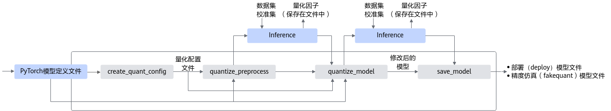

蓝色部分为用户实现，灰色部分为用户调用AMCT提供的API实现，工具使用分为如下场景：

1.  用户首先构造PyTorch的原始模型，并在简易配置文件_dmp\_quant.cfg_中设置dmq参数（简易配置文件配置参数请参见[训练后量化简易配置文件](训练后量化简易配置文件.md)），然后将配置文件传入[create\_quant\_config](create_quant_config.md)。
2.  <a name="li16458161113715"></a>根据PyTorch模型和量化配置文件，即可调用[quantize\_preprocess](quantize_preprocess.md)接口对原始PyTorch模型进行优化，优化后的PyTorch模型中包含了均衡量化算法。
3.  使用校准集在PyTorch环境下执行**一次**前向推理，产生均衡量化因子，并将均衡量化因子输出到文件中。
4.  根据PyTorch模型、量化配置文件和record文件，即可调用[quantize\_model](quantize_model.md)接口对原始PyTorch模型再次进行优化，优化后的PyTorch模型中包含了量化算法。
5.  使用校准集在PyTorch环境下执行前向推理，产生量化因子，并将量化因子输出到文件中。
6.  最后用户可以调用[save\_model](save_model.md)接口保存量化后的模型，包括可在ONNX执行框架ONNX Runtime环境中进行精度仿真的模型文件和可部署在NPU IP加速器的模型文件。

**调用示例<a name="section9439121165720"></a>**

> **说明：** 
>-   如下示例标有“由用户补充处理”的步骤，需要用户根据自己的模型和数据集进行补充处理，示例中仅为示例代码。
>-   如下示例调用AMCT的部分，函数入参请根据实际情况进行调整。

1.  导入AMCT包，并通过[安装后处理](安装后处理.md)\>AMCT\(PyTorch\)中的环境变量设置日志级别。

    ```
    import amct_pytorch as amct
    ```

2.  （可选，由用户补充处理）在PyTorch原始环境中验证推理脚本及环境。

    建议使用原始待量化的模型和测试集，在PyTorch环境下推理，验证环境、推理脚本是否正常。

    推荐执行该步骤，请确保原始模型可以完成推理且精度正常；执行该步骤时，可以使用部分测试集，减少运行时间。

    ```
    user_do_inference_torch(ori_model, test_data, test_iterations)
    ```

3.  调用AMCT，量化模型。
    1.  生成量化配置。

        用户在简易配置文件_dmp\_quant.cfg_中设置dmq参数，并将配置文件通过config\_defination参数传入[create\_quant\_config](create_quant_config.md)。

        ```
        config_defination = os.path.join(PATH, 'dmp_quant.cfg')
        config_file = './tmp/config.json'
        skip_layers = []
        batch_num = 1
        amct.create_quant_config(config_file=config_file,
        			        model=ori_model,
                                        input_data=ori_model_input_data,
        			        skip_layers=skip_layers,
        			        batch_num=batch_num,
                                        config_defination=config_defination)
        ```

    2.  修改图，在图中插入均衡量化算子，用于计算均衡量化因子。

        ```
        record_file = './tmp/record.txt'
        modified_onnx_model = './tmp/modified_model.onnx'
        calibration_model = amct.quantize_preprocess(config_file=config_file,
        					            record_file=record_file,
                                                            model=ori_model,
                                                            input_data=ori_model_input_data)
        ```

    3.  （由用户补充处理）基于PyTorch环境，使用修改后的模型（calibration\_model）在校准集（calibration\_data）上做模型推理，找到均衡量化因子。

        该步骤执行时，需要注意如下两点：

        1.  校准集及其预处理过程数据要与模型匹配，以保证量化的精度。
        2.  前向推理的次数为1，如果次数超过1次，每执行一次推理，record中均衡量化因子会被记录一次，后续过程会失败。

        ```
        user_do_inference_torch(calibration_model, calibration_data, test_iterations=1)
        ```

    4.  修改图，在图中插入数据量化，权重量化等相关的算子，用于计算量化相关参数。

        ```
        modified_onnx_model = './tmp/modified_model.onnx'
        calibration_model = amct.quantize_model(config_file=config_file,
        					       modified_onnx_model=modified_onnx_model,
        					       record_file=record_file,
                                                       model=ori_model,
                                                       input_data=ori_model_input_data)
        ```

    5.  （由用户补充处理）基于PyTorch环境，使用修改后的模型（calibration\_model）在校准集（calibration\_data）上做模型推理，生成量化因子。

        该步骤执行时，需要注意如下两点：

        1.  校准集及其预处理过程数据要与模型匹配，以保证量化的精度。
        2.  前向推理的次数为batch\_num，如果次数不够，后续过程会失败。

        ```
        user_do_inference_torch(calibration_model, calibration_data, batch_num)
        ```

    6.  保存模型。

        根据量化因子，调用[save\_model](save_model.md)接口，插入AscendQuant、AscendDequant等算子，保存为量化模型。

        ```
        quant_model_path = './results/user_model'
        amct.save_model(modified_onnx_file=modified_onnx_file,
                               record_file=record_file,
                               save_path=quant_model_path)
        ```

4.  （可选，由用户补充处理）基于ONNX Runtime的环境，使用量化后模型（quant\_model）在测试集（test\_data）上做推理，测试量化后仿真模型的精度。

    使用量化后仿真模型精度与[2](#li16458161113715)中的原始精度做对比，可以观察量化对精度的影响。

    ```
    quant_model = './results/user_model_fake_quant_model.onnx'
    user_do_inference_onnx(quant_model, test_data, test_iterations)
    ```

### 逐层蒸馏\(不支持\)<a name="ZH-CN_TOPIC_0000002506024439"></a>

本节详细介绍逐层蒸馏支持的层，接口调用流程和示例。

**如下产品型号不支持该特性：**

IPV350

-   支持做蒸馏和量化的算子：
    -   torch.nn.Linear：复用层（共用weight和bias参数）不支持量化。
    -   torch.nn.Conv2d：padding\_mode为zeros才支持量化，复用层（共用weight和bias参数）不支持量化。

-   支持做蒸馏的激活算子：
    -   torch.nn.ReLU
    -   torch.nn.LeakyReLU
    -   torch.nn.Sigmoid
    -   torch.nn.Tanh
    -   torch.nn.Softmax

-   支持做蒸馏的归一化算子

    torch.nn.BatchNorm2d：复用层（共用weight和bias参数）不支持蒸馏。

逐层蒸馏示例请参见[样例列表](样例列表.md)。

**接口调用流程<a name="section993845105612"></a>**

调用流程如[图1](#fig153281318152013)所示。

**图 1**  蒸馏接口调用流程<a name="fig153281318152013"></a>  
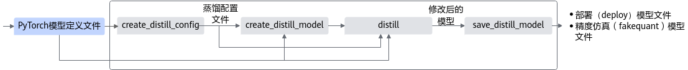

蓝色部分为用户实现，灰色部分为用户调用AMCT提供的API实现，逐层蒸馏特性主要分为4个部分，创建蒸馏配置、创建蒸馏模型、蒸馏量化模型和保存量化模型，详情如下：

1.  创建蒸馏配置，用户首先构造PyTorch的原始模型，然后使用[create\_distill\_config](create_distill_config.md)接口，将用户自定义的蒸馏配置与AMCT算法定义的蒸馏配置相结合，输出网络每一层的蒸馏配置信息。
2.  创建蒸馏模型，调用[create\_distill\_model](create_distill_model.md)接口对原始模型进行修改，根据蒸馏配置信息生成一个待蒸馏的量化模型。
3.  蒸馏模型，调用[distill](distill.md)接口，根据用户配置的模型推理和优化方法，结合蒸馏配置信息，对网络进行分块蒸馏，得到蒸馏后的性能优化的量化模型。
4.  保存量化模型，最后调用[save\_distill\_model](save_distill_model.md)接口保存已蒸馏优化的量化模型，包括可在ONNX执行框架ONNX Runtime环境中进行精度仿真的模型文件和可部署在NPU IP加速器的模型文件。

**调用示例<a name="section9439121165720"></a>**

> **说明：** 
>-   如下示例标有“由用户补充处理”的步骤，需要用户根据自己的模型和数据集进行补充处理，示例中仅为示例代码。
>-   如下示例调用AMCT的部分，函数入参请根据实际情况进行调整。

1.  导入AMCT包，并通过[安装后处理](安装后处理.md)\>AMCT\(PyTorch\)中的环境变量设置日志级别。

    ```
    import amct_pytorch as amct
    ```

2.  <a name="li13259141318410"></a>（可选，由用户补充处理）在PyTorch原始环境中验证推理脚本及环境。

    建议使用原始待量化的模型和测试集，在PyTorch环境下推理，验证环境、推理脚本是否正常。

    推荐执行该步骤，请确保原始模型可以完成推理且精度正常；执行该步骤时，可以使用部分测试集，减少运行时间。

    ```
    user_do_inference_torch(ori_model, test_data, test_iterations)
    ```

3.  调用AMCT，蒸馏模型。
    1.  调用[create\_distill\_config](create_distill_config.md)接口生成蒸馏配置。输出的蒸馏配置中包含用户自定义的和自动查找到的蒸馏结构。

        ```
        config_file = './tmp/config.json'
        simple_cfg = './distill.cfg'
        amct.create_distill_config(config_file=config_file,
                                     model=ori_model,
                                     input_data=ori_model_input_data,
                                     config_defination=simple_cfg)
        ```

    2.  调用[create\_distill\_model](create_distill_model.md)接口创建蒸馏模型。

        对待蒸馏的浮点模型进行量化，将浮点模型中的待压缩算子替换为CANN量化算子。

        ```
        compress_model = amct.create_distill_model(
                         config_file=config_file,
                         model=ori_model,
                         input_data=ori_model_input_data)
        ```

    3.  逐层蒸馏。

        调用[distill](distill.md)接口进行逐层蒸馏。针对配置中的蒸馏结构进行蒸馏。

        ```
        distill_model = amct.distill(
                        model=ori_model,
                        compress_model,
                        config_file=config_file,
                        train_loader,
                        epochs=1,
                        lr=1e-3,
                        sample_instance=None, 
                        loss=loss,
                        optimizer=optimizer)
        ```

    4.  保存蒸馏模型。

        调用[save\_distill\_model](save_distill_model.md)接口，插入AscendQuant、AscendDequant等算子，保存为蒸馏模型。

        ```
        amct.save_distill_model(
                         model, 
                         "./model/distilled",
                         input_data,
                         record_file="./results/records.txt",
                         input_names=['input'],
                         output_names=['output'],
                         dynamic_axes={'input':{0: 'batch_size'},
                                       'output':{0: 'batch_size'}})
        ```

4.  （可选，由用户补充处理）基于ONNX Runtime的环境，使用蒸馏后模型（quant\_model）在测试集（test\_data）上做推理，测试蒸馏后仿真模型的精度。

    使用量化后仿真模型精度与[2](#li13259141318410)中的原始精度做对比，可以观察量化对精度的影响。

    ```
    quant_model = './results/user_model_fake_quant_model.onnx'
    user_do_inference_onnx(quant_model, test_data, test_iterations)
    ```

## 接口说明<a name="ZH-CN_TOPIC_0000002505904497"></a>


### 整体约束和接口列表<a name="ZH-CN_TOPIC_0000002506024591"></a>

**整体约束<a name="section11281144514445"></a>**

-   若接口中存在需要用户输入文件路径的参数，请确保输入路径正确，AMCT不会对路径做安全校验。
-   若接口中存在需要用户输入文件路径的参数，重新执行量化时，该参数相关取值将会被覆盖；量化打屏日志中也会有相关文件被覆盖的warning风险提示信息。

**接口列表<a name="section4415364517"></a>**

<a name="table129291153204517"></a>
<table><thead align="left"><tr id="row1929553184520"><th class="cellrowborder" valign="top" width="12.94%" id="mcps1.1.4.1.1"><p id="p1035516624612"><a name="p1035516624612"></a><a name="p1035516624612"></a>分类</p>
</th>
<th class="cellrowborder" valign="top" width="23.24%" id="mcps1.1.4.1.2"><p id="p1592915316450"><a name="p1592915316450"></a><a name="p1592915316450"></a>接口名称</p>
</th>
<th class="cellrowborder" valign="top" width="63.82%" id="mcps1.1.4.1.3"><p id="p892995316457"><a name="p892995316457"></a><a name="p892995316457"></a>功能描述</p>
</th>
</tr>
</thead>
<tbody><tr id="row11929155344511"><td class="cellrowborder" valign="top" width="12.94%" headers="mcps1.1.4.1.1 "><p id="p192985314511"><a name="p192985314511"></a><a name="p192985314511"></a>公共接口</p>
</td>
<td class="cellrowborder" valign="top" width="23.24%" headers="mcps1.1.4.1.2 "><p id="p1592910532457"><a name="p1592910532457"></a><a name="p1592910532457"></a><a href="ModelEvaluator.md">ModelEvaluator</a></p>
</td>
<td class="cellrowborder" valign="top" width="63.82%" headers="mcps1.1.4.1.3 "><p id="p1792965334513"><a name="p1792965334513"></a><a name="p1792965334513"></a>针对某一个模型，根据模型的bin类型输入数据，提供一个Python实例，可对该模型执行校准和推理的评估器。</p>
</td>
</tr>
<tr id="row19929453114517"><td class="cellrowborder" rowspan="5" valign="top" width="12.94%" headers="mcps1.1.4.1.1 "><p id="p8929125314510"><a name="p8929125314510"></a><a name="p8929125314510"></a>训练后量化接口</p>
</td>
<td class="cellrowborder" valign="top" width="23.24%" headers="mcps1.1.4.1.2 "><p id="p6404202095310"><a name="p6404202095310"></a><a name="p6404202095310"></a><a href="create_quant_config.md">create_quant_config</a></p>
</td>
<td class="cellrowborder" valign="top" width="63.82%" headers="mcps1.1.4.1.3 "><p id="p13154163212"><a name="p13154163212"></a><a name="p13154163212"></a>训练后量化接口，根据图的结构找到所有可量化的层，自动生成量化配置文件，并将可量化层的量化配置信息写入文件。</p>
</td>
</tr>
<tr id="row1146220516526"><td class="cellrowborder" valign="top" headers="mcps1.1.4.1.1 "><p id="p7404920155316"><a name="p7404920155316"></a><a name="p7404920155316"></a><a href="quantize_model.md">quantize_model</a></p>
</td>
<td class="cellrowborder" valign="top" headers="mcps1.1.4.1.2 "><p id="p41716153219"><a name="p41716153219"></a><a name="p41716153219"></a>训练后量化接口，将输入的待量化的图结构按照给定的量化配置文件进行量化处理，在传入的图结构中插入权重量化、数据量化相关的算子，生成量化因子记录文件record_file，返回修改后的torch.nn.Module校准模<span>型</span>。</p>
</td>
</tr>
<tr id="row121861153175220"><td class="cellrowborder" valign="top" headers="mcps1.1.4.1.1 "><p id="p1740442017535"><a name="p1740442017535"></a><a name="p1740442017535"></a><a href="save_model.md">save_model</a></p>
</td>
<td class="cellrowborder" valign="top" headers="mcps1.1.4.1.2 "><p id="p4189103210"><a name="p4189103210"></a><a name="p4189103210"></a>训练后量化接口，根据量化因子记录文件record_file以及修改后的模型，插入AscendQuant、AscendDequant等算子，然后保存为可以在ONNX Runtime环境进行精度仿真的fake_quant模型，和可以在<span id="zh-cn_topic_0000002505904577_ph133141316122319"><a name="zh-cn_topic_0000002505904577_ph133141316122319"></a><a name="zh-cn_topic_0000002505904577_ph133141316122319"></a>NPU IP加速器</span>做推理的部署模型。</p>
</td>
</tr>
<tr id="row870214565522"><td class="cellrowborder" valign="top" headers="mcps1.1.4.1.1 "><p id="p74041720105315"><a name="p74041720105315"></a><a name="p74041720105315"></a><a href="accuracy_based_auto_calibration.md">accuracy_based_auto_calibration</a></p>
</td>
<td class="cellrowborder" valign="top" headers="mcps1.1.4.1.2 "><p id="p6199133218"><a name="p6199133218"></a><a name="p6199133218"></a>根据用户输入的模型、配置文件进行自动的校准过程，搜索得到一个满足目标精度的量化配置，输出可以在ONNX Runtime环境下做精度仿真的fake_quant模型，和可在<span id="zh-cn_topic_0000002506024517_zh-cn_topic_0240188713_ph1555712386204"><a name="zh-cn_topic_0000002506024517_zh-cn_topic_0240188713_ph1555712386204"></a><a name="zh-cn_topic_0000002506024517_zh-cn_topic_0240188713_ph1555712386204"></a>NPU IP加速器</span>上做推理的deploy模型。</p>
</td>
</tr>
<tr id="row69165935215"><td class="cellrowborder" valign="top" headers="mcps1.1.4.1.1 "><p id="p440482016534"><a name="p440482016534"></a><a name="p440482016534"></a><a href="quantize_preprocess.md">quantize_preprocess</a></p>
</td>
<td class="cellrowborder" valign="top" headers="mcps1.1.4.1.2 "><p id="p12201412321"><a name="p12201412321"></a><a name="p12201412321"></a>量化数据均衡预处理接口，将输入的待量化的图结构按照给定的量化配置文件进行量化处理，在传入的图结构中插入均衡量化相关的算子，生成均衡量化因子记录文件record_file，返回修改后的torch.nn.Module校准模<span>型</span>。</p>
</td>
</tr>
<tr id="row119301753204516"><td class="cellrowborder" rowspan="4" valign="top" width="12.94%" headers="mcps1.1.4.1.1 "><p id="p1193045314512"><a name="p1193045314512"></a><a name="p1193045314512"></a>量化感知训练接口</p>
</td>
<td class="cellrowborder" valign="top" width="23.24%" headers="mcps1.1.4.1.2 "><p id="p3618121011545"><a name="p3618121011545"></a><a name="p3618121011545"></a><a href="create_quant_retrain_config.md">create_quant_retrain_config</a></p>
</td>
<td class="cellrowborder" valign="top" width="63.82%" headers="mcps1.1.4.1.3 "><p id="p121014433216"><a name="p121014433216"></a><a name="p121014433216"></a>量化感知训练接口，根据图的结构找到所有可量化的层，自动生成量化配置文件，并将可量化层的量化配置信息写入配置文件。</p>
</td>
</tr>
<tr id="row10416144020539"><td class="cellrowborder" valign="top" headers="mcps1.1.4.1.1 "><p id="p4619210175411"><a name="p4619210175411"></a><a name="p4619210175411"></a><a href="create_quant_retrain_model.md">create_quant_retrain_model</a></p>
</td>
<td class="cellrowborder" valign="top" headers="mcps1.1.4.1.2 "><p id="p9103134133219"><a name="p9103134133219"></a><a name="p9103134133219"></a>量化感知训练接口，将输入的待量化的图结构按照给定的量化配置文件进行量化处理，在传入的图结构中插入量化相关的算子（数据和权重的量化感知训练层以及找N的层），生成量化因子记录文件record_file，返回修改后可用于量化感知训练的torch.nn.Module模型。</p>
</td>
</tr>
<tr id="row20626133717537"><td class="cellrowborder" valign="top" headers="mcps1.1.4.1.1 "><p id="p11619101020542"><a name="p11619101020542"></a><a name="p11619101020542"></a><a href="restore_quant_retrain_model.md">restore_quant_retrain_model</a></p>
</td>
<td class="cellrowborder" valign="top" headers="mcps1.1.4.1.2 "><p id="p1010413463210"><a name="p1010413463210"></a><a name="p1010413463210"></a>量化感知训练接口，将输入的待量化的图结构按照给定的量化感知训练配置文件进行量化处理，在传入的图结构中插入量化感知训练相关的算子（数据和权重的量化感知训练层以及找N的层），生成量化因子记录文件record_file，加载训练过程中保存的checkpoint权重参数，返回修改后的torch.nn.Module量化感知训练模型。</p>
</td>
</tr>
<tr id="row1985264420532"><td class="cellrowborder" valign="top" headers="mcps1.1.4.1.1 "><p id="p761951016546"><a name="p761951016546"></a><a name="p761951016546"></a><a href="save_quant_retrain_model.md">save_quant_retrain_model</a></p>
</td>
<td class="cellrowborder" valign="top" headers="mcps1.1.4.1.2 "><p id="p610520411323"><a name="p610520411323"></a><a name="p610520411323"></a>量化感知训练接口，根据用户最终的重训练好的模型，插入AscendQuant、AscendDequant等算子，生成最终量化精度仿真模型以及量化部署模型。</p>
</td>
</tr>
<tr id="row029375715533"><td class="cellrowborder" rowspan="3" valign="top" width="12.94%" headers="mcps1.1.4.1.1 "><p id="p1582718932616"><a name="p1582718932616"></a><a name="p1582718932616"></a>量化感知训练接口（单算子模式）</p>
</td>
<td class="cellrowborder" valign="top" width="23.24%" headers="mcps1.1.4.1.2 "><p id="p198792015544"><a name="p198792015544"></a><a name="p198792015544"></a><a href="Conv2dQAT.md">Conv2dQAT</a></p>
</td>
<td class="cellrowborder" valign="top" width="63.82%" headers="mcps1.1.4.1.3 "><p id="p118958233518"><a name="p118958233518"></a><a name="p118958233518"></a>构造Conv2d的QAT算子。</p>
</td>
</tr>
<tr id="row029345735315"><td class="cellrowborder" valign="top" headers="mcps1.1.4.1.1 "><p id="p5987182012549"><a name="p5987182012549"></a><a name="p5987182012549"></a><a href="ConvTranspose2dQAT.md">ConvTranspose2dQAT</a></p>
</td>
<td class="cellrowborder" valign="top" headers="mcps1.1.4.1.2 "><p id="p2894623175116"><a name="p2894623175116"></a><a name="p2894623175116"></a>构造ConvTranspose2d的QAT算子。</p>
</td>
</tr>
<tr id="row3129101192618"><td class="cellrowborder" valign="top" headers="mcps1.1.4.1.1 "><p id="p1475713420264"><a name="p1475713420264"></a><a name="p1475713420264"></a><a href="LinearQAT.md">LinearQAT</a></p>
</td>
<td class="cellrowborder" valign="top" headers="mcps1.1.4.1.2 "><p id="p1575714442612"><a name="p1575714442612"></a><a name="p1575714442612"></a>构造Linear的QAT算子。</p>
</td>
</tr>
<tr id="row177571241234"><td class="cellrowborder" rowspan="4" valign="top" width="12.94%" headers="mcps1.1.4.1.1 "><p id="p142681615102520"><a name="p142681615102520"></a><a name="p142681615102520"></a>同上</p>
</td>
<td class="cellrowborder" valign="top" width="23.24%" headers="mcps1.1.4.1.2 "><p id="p498782075413"><a name="p498782075413"></a><a name="p498782075413"></a><a href="Conv1dQAT.md">Conv1dQAT</a></p>
</td>
<td class="cellrowborder" valign="top" width="63.82%" headers="mcps1.1.4.1.3 "><p id="p5410174232616"><a name="p5410174232616"></a><a name="p5410174232616"></a>构造Conv1d的QAT算子。</p>
</td>
</tr>
<tr id="row177581294236"><td class="cellrowborder" valign="top" headers="mcps1.1.4.1.1 "><p id="p390221914228"><a name="p390221914228"></a><a name="p390221914228"></a><a href="ConvTranspose1dQAT.md">ConvTranspose1dQAT</a></p>
</td>
<td class="cellrowborder" valign="top" headers="mcps1.1.4.1.2 "><p id="p15577124710263"><a name="p15577124710263"></a><a name="p15577124710263"></a>构造ConvTranspose1d的QAT算子。</p>
</td>
</tr>
<tr id="row126311281233"><td class="cellrowborder" valign="top" headers="mcps1.1.4.1.1 "><p id="p498772035417"><a name="p498772035417"></a><a name="p498772035417"></a><a href="GRUQAT.md">GRUQAT</a></p>
</td>
<td class="cellrowborder" valign="top" headers="mcps1.1.4.1.2 "><p id="p103338482269"><a name="p103338482269"></a><a name="p103338482269"></a>构造GRU的QAT算子。</p>
</td>
</tr>
<tr id="row57101326172320"><td class="cellrowborder" valign="top" headers="mcps1.1.4.1.1 "><p id="p10987112016545"><a name="p10987112016545"></a><a name="p10987112016545"></a><a href="LSTMQAT.md">LSTMQAT</a></p>
</td>
<td class="cellrowborder" valign="top" headers="mcps1.1.4.1.2 "><p id="p61324962614"><a name="p61324962614"></a><a name="p61324962614"></a>构造LSTM的QAT算子。</p>
</td>
</tr>
<tr id="row129301153174513"><td class="cellrowborder" rowspan="3" valign="top" width="12.94%" headers="mcps1.1.4.1.1 "><p id="p16930353184517"><a name="p16930353184517"></a><a name="p16930353184517"></a>稀疏接口</p>
</td>
<td class="cellrowborder" valign="top" width="23.24%" headers="mcps1.1.4.1.2 "><p id="p3644101715552"><a name="p3644101715552"></a><a name="p3644101715552"></a><a href="create_prune_retrain_model.md">create_prune_retrain_model</a></p>
</td>
<td class="cellrowborder" valign="top" width="63.82%" headers="mcps1.1.4.1.3 "><p id="p7893102335120"><a name="p7893102335120"></a><a name="p7893102335120"></a>通道稀疏或4选2结构化稀疏接口，两种稀疏特性每次只能使能一个：将输入的待稀疏的图结构按照给定的稀疏配置文件进行稀疏处理，在传入的图结构中插入或者替换相关的算子，生成记录稀疏信息的record_file，返回修改后可用于稀疏后训练的torch.nn.Module模型。</p>
</td>
</tr>
<tr id="row621748185519"><td class="cellrowborder" valign="top" headers="mcps1.1.4.1.1 "><p id="p86441317165510"><a name="p86441317165510"></a><a name="p86441317165510"></a><a href="restore_prune_retrain_model.md">restore_prune_retrain_model</a></p>
</td>
<td class="cellrowborder" valign="top" headers="mcps1.1.4.1.2 "><p id="p1289352335113"><a name="p1289352335113"></a><a name="p1289352335113"></a>通道稀疏或4选2结构化稀疏接口，两种稀疏特性每次只能使能一个：将输入的待稀疏的图结构按照给定的record_file中稀疏记录进行稀疏，返回修改后可用于稀疏后训练的torch.nn.Module模型。</p>
</td>
</tr>
<tr id="row191981510175516"><td class="cellrowborder" valign="top" headers="mcps1.1.4.1.1 "><p id="p66441417195515"><a name="p66441417195515"></a><a name="p66441417195515"></a><a href="save_prune_retrain_model.md">save_prune_retrain_model</a></p>
</td>
<td class="cellrowborder" valign="top" headers="mcps1.1.4.1.2 "><p id="p3893172314518"><a name="p3893172314518"></a><a name="p3893172314518"></a>稀疏接口，根据用户最终的重训练好的稀疏模型，生成最终ONNX仿真模型以及部署模型。</p>
</td>
</tr>
<tr id="row12930175354518"><td class="cellrowborder" valign="top" width="12.94%" headers="mcps1.1.4.1.1 "><p id="p49301053114514"><a name="p49301053114514"></a><a name="p49301053114514"></a>自动通道稀疏搜索接口</p>
</td>
<td class="cellrowborder" valign="top" width="23.24%" headers="mcps1.1.4.1.2 "><p id="p12930953124520"><a name="p12930953124520"></a><a name="p12930953124520"></a><a href="auto_channel_prune_search.md">auto_channel_prune_search</a></p>
</td>
<td class="cellrowborder" valign="top" width="63.82%" headers="mcps1.1.4.1.3 "><p id="p3893172355116"><a name="p3893172355116"></a><a name="p3893172355116"></a>自动通道稀疏接口，根据用户模型来计算各通道的稀疏敏感度（影响精度）以及稀疏收益（影响性能），然后搜索策略依据该输入来搜索最优的逐层通道稀疏率，以平衡精度和性能。最终输出一个配置文件。</p>
</td>
</tr>
<tr id="row970915581471"><td class="cellrowborder" rowspan="3" valign="top" width="12.94%" headers="mcps1.1.4.1.1 "><p id="p2709195817475"><a name="p2709195817475"></a><a name="p2709195817475"></a>组合压缩接口</p>
</td>
<td class="cellrowborder" valign="top" width="23.24%" headers="mcps1.1.4.1.2 "><p id="p169391527563"><a name="p169391527563"></a><a name="p169391527563"></a><a href="create_compressed_retrain_model.md">create_compressed_retrain_model</a></p>
</td>
<td class="cellrowborder" valign="top" width="63.82%" headers="mcps1.1.4.1.3 "><p id="p12892152317514"><a name="p12892152317514"></a><a name="p12892152317514"></a>静态组合压缩接口，将输入的待静态组合压缩的模型按照给定的组合压缩配置文件进行压缩处理，即将传入的模型先进行稀疏（通道稀疏或者4选2结构化稀疏，二选一），后对模型插入量化相关的算子（数据和权重的量化感知训练层以及searchN的层），生成稀疏和量化因子记录文件record_file（如果配置存在），返回修改后的torch.nn.Module模型。</p>
</td>
</tr>
<tr id="row13675143485514"><td class="cellrowborder" valign="top" headers="mcps1.1.4.1.1 "><p id="p6940124565"><a name="p6940124565"></a><a name="p6940124565"></a><a href="restore_compressed_retrain_model.md">restore_compressed_retrain_model</a></p>
</td>
<td class="cellrowborder" valign="top" headers="mcps1.1.4.1.2 "><p id="p1189782731"><a name="p1189782731"></a><a name="p1189782731"></a>静态组合压缩训练接口，将输入的待静态组合压缩的模型按照给定的组合压缩配置文件和record记录文件进行压缩处理（先稀疏后量化），加载保存的权重。将传入的模型按照给定record_file中稀疏记录进行稀疏，后对模型插入量化相关的算子（数据和权重的量化感知训练层以及searchN的层）。加载训练过程中保存的checkpoint权重参数，返回修改后的torch.nn.Module模型。</p>
</td>
</tr>
<tr id="row1078511368553"><td class="cellrowborder" valign="top" headers="mcps1.1.4.1.1 "><p id="p1594020275619"><a name="p1594020275619"></a><a name="p1594020275619"></a><a href="save_compressed_retrain_model.md">save_compressed_retrain_model</a></p>
</td>
<td class="cellrowborder" valign="top" headers="mcps1.1.4.1.2 "><p id="p1178683216"><a name="p1178683216"></a><a name="p1178683216"></a>静态组合压缩接口，根据用户最终的重训练好的模型，生成最终静态组合压缩精度仿真模型以及部署模型。</p>
</td>
</tr>
<tr id="row61031422484"><td class="cellrowborder" rowspan="2" valign="top" width="12.94%" headers="mcps1.1.4.1.1 "><p id="p710311213486"><a name="p710311213486"></a><a name="p710311213486"></a>张量分解接口</p>
</td>
<td class="cellrowborder" valign="top" width="23.24%" headers="mcps1.1.4.1.2 "><p id="p18165987569"><a name="p18165987569"></a><a name="p18165987569"></a><a href="auto_decomposition.md">auto_decomposition</a></p>
</td>
<td class="cellrowborder" valign="top" width="63.82%" headers="mcps1.1.4.1.3 "><p id="p111996163211"><a name="p111996163211"></a><a name="p111996163211"></a>对用户输入的PyTorch模型对象进行张量分解，得到分解后的模型对象和分解前后层的对应名称，并保存分解信息文件（可选）。</p>
</td>
</tr>
<tr id="row64131415558"><td class="cellrowborder" valign="top" headers="mcps1.1.4.1.1 "><p id="p1616518125610"><a name="p1616518125610"></a><a name="p1616518125610"></a><a href="decompose_network.md">decompose_network</a></p>
</td>
<td class="cellrowborder" valign="top" headers="mcps1.1.4.1.2 "><p id="p58147571316"><a name="p58147571316"></a><a name="p58147571316"></a>用户输入PyTorch模型对象和通过<a href="auto_decomposition.md">auto_decomposition</a>保存的分解信息文件，根据分解信息文件将模型对象改变为张量分解后的结构，得到分解后的模型对象和分解前后层的对应名称。</p>
</td>
</tr>
<tr id="row44168011486"><td class="cellrowborder" rowspan="4" valign="top" width="12.94%" headers="mcps1.1.4.1.1 "><p id="p26574408489"><a name="p26574408489"></a><a name="p26574408489"></a>蒸馏接口</p>
</td>
<td class="cellrowborder" valign="top" width="23.24%" headers="mcps1.1.4.1.2 "><p id="p164853132565"><a name="p164853132565"></a><a name="p164853132565"></a><a href="create_distill_config.md">create_distill_config</a></p>
</td>
<td class="cellrowborder" valign="top" width="63.82%" headers="mcps1.1.4.1.3 "><p id="p1981418571630"><a name="p1981418571630"></a><a name="p1981418571630"></a>蒸馏接口，根据图的结构找到所有可蒸馏量化的层和可蒸馏量化的结构，自动生成蒸馏量化配置文件，并将可蒸馏量化层的量化配置和蒸馏结构写入配置文件。</p>
</td>
</tr>
<tr id="row1288334519553"><td class="cellrowborder" valign="top" headers="mcps1.1.4.1.1 "><p id="p10485121311567"><a name="p10485121311567"></a><a name="p10485121311567"></a><a href="create_distill_model.md">create_distill_model</a></p>
</td>
<td class="cellrowborder" valign="top" headers="mcps1.1.4.1.2 "><p id="p1381465718311"><a name="p1381465718311"></a><a name="p1381465718311"></a>蒸馏接口，将输入的待量化压缩的图结构按照给定的蒸馏量化配置文件进行量化处理，在传入的图结构中插入量化相关的算子（数据和权重的蒸馏量化层以及找N的层），返回修改后可用于蒸馏的torch.nn.Module模型。</p>
</td>
</tr>
<tr id="row16770114935511"><td class="cellrowborder" valign="top" headers="mcps1.1.4.1.1 "><p id="p174851213175618"><a name="p174851213175618"></a><a name="p174851213175618"></a><a href="distill.md">distill</a></p>
</td>
<td class="cellrowborder" valign="top" headers="mcps1.1.4.1.2 "><p id="p481455710317"><a name="p481455710317"></a><a name="p481455710317"></a>蒸馏接口，将输入的待蒸馏的图结构按照给定的蒸馏量化配置文件进行蒸馏处理，返回修改后的torch.nn.Module蒸馏模型。</p>
</td>
</tr>
<tr id="row77234471557"><td class="cellrowborder" valign="top" headers="mcps1.1.4.1.1 "><p id="p148581335615"><a name="p148581335615"></a><a name="p148581335615"></a><a href="save_distill_model.md">save_distill_model</a></p>
</td>
<td class="cellrowborder" valign="top" headers="mcps1.1.4.1.2 "><p id="p1781420571532"><a name="p1781420571532"></a><a name="p1781420571532"></a>蒸馏接口，根据用户最终的蒸馏好的模型，生成最终量化精度仿真模型以及量化部署模型。</p>
</td>
</tr>
</tbody>
</table>

### 公共接口<a name="ZH-CN_TOPIC_0000002473744600"></a>


#### ModelEvaluator<a name="ZH-CN_TOPIC_0000002505904555"></a>

**产品支持情况<a name="section197451857688"></a>**

<a name="table38301303189"></a>
<table><thead align="left"><tr id="row20831180131817"><th class="cellrowborder" valign="top" width="57.99999999999999%" id="mcps1.1.3.1.1"><p id="p1883113061818"><a name="p1883113061818"></a><a name="p1883113061818"></a>产品</p>
</th>
<th class="cellrowborder" align="center" valign="top" width="42%" id="mcps1.1.3.1.2"><p id="p783113012187"><a name="p783113012187"></a><a name="p783113012187"></a>是否支持</p>
</th>
</tr>
</thead>
<tbody><tr id="row1466941011819"><td class="cellrowborder" valign="top" width="57.99999999999999%" headers="mcps1.1.3.1.1 "><p id="p146702104188"><a name="p146702104188"></a><a name="p146702104188"></a><span id="ph1577265511916"><a name="ph1577265511916"></a><a name="ph1577265511916"></a>IPV350</span></p>
</td>
<td class="cellrowborder" align="center" valign="top" width="42%" headers="mcps1.1.3.1.2 "><p id="p12400144361011"><a name="p12400144361011"></a><a name="p12400144361011"></a>√</p>
</td>
</tr>
</tbody>
</table>

**功能说明<a name="zh-cn_topic_0240187994_section15406195619561"></a>**

针对某一个模型，根据模型的bin类型输入数据，提供一个Python实例，可对该模型执行校准和推理的评估器。

**函数原型<a name="zh-cn_topic_0240187994_zh-cn_topic_0122830089_section428121323411"></a>**

```
class ModelEvaluator(AutoCalibrationEvaluatorBase):
def __init__(self, data_dir, input_shape, data_types):
```

**参数说明<a name="zh-cn_topic_0240187994_zh-cn_topic_0122830089_section795991810344"></a>**

<a name="zh-cn_topic_0240187994_zh-cn_topic_0122830089_table438764393513"></a>
<table><thead align="left"><tr id="zh-cn_topic_0240187994_zh-cn_topic_0122830089_row53871743113510"><th class="cellrowborder" valign="top" width="9.69%" id="mcps1.1.4.1.1"><p id="zh-cn_topic_0240187994_zh-cn_topic_0122830089_p1438834363520"><a name="zh-cn_topic_0240187994_zh-cn_topic_0122830089_p1438834363520"></a><a name="zh-cn_topic_0240187994_zh-cn_topic_0122830089_p1438834363520"></a>参数名</p>
</th>
<th class="cellrowborder" valign="top" width="6.819999999999999%" id="mcps1.1.4.1.2"><p id="zh-cn_topic_0240187994_p1769255516412"><a name="zh-cn_topic_0240187994_p1769255516412"></a><a name="zh-cn_topic_0240187994_p1769255516412"></a>输入/输出</p>
</th>
<th class="cellrowborder" valign="top" width="83.49%" id="mcps1.1.4.1.3"><p id="p19911124613711"><a name="p19911124613711"></a><a name="p19911124613711"></a>说明</p>
</th>
</tr>
</thead>
<tbody><tr id="row8680426943"><td class="cellrowborder" valign="top" width="9.69%" headers="mcps1.1.4.1.1 "><p id="p12818830740"><a name="p12818830740"></a><a name="p12818830740"></a>data_dir</p>
</td>
<td class="cellrowborder" valign="top" width="6.819999999999999%" headers="mcps1.1.4.1.2 "><p id="p128185303416"><a name="p128185303416"></a><a name="p128185303416"></a>输入</p>
</td>
<td class="cellrowborder" valign="top" width="83.49%" headers="mcps1.1.4.1.3 "><p id="p7193212111914"><a name="p7193212111914"></a><a name="p7193212111914"></a>含义：与模型匹配的bin格式数据集路径。</p>
<p id="p9912946779"><a name="p9912946779"></a><a name="p9912946779"></a>数据类型：string</p>
<p id="p10881253527"><a name="p10881253527"></a><a name="p10881253527"></a>参数值格式："data/input1/;data/input2/"</p>
<p id="p1241012377217"><a name="p1241012377217"></a><a name="p1241012377217"></a>使用约束：</p>
<a name="zh-cn_topic_0000001135587500_ul14146154111109"></a><a name="zh-cn_topic_0000001135587500_ul14146154111109"></a><ul id="zh-cn_topic_0000001135587500_ul14146154111109"><li>路径支持大小写字母（a-z，A-Z）、数字（0-9）、下划线（_）、中划线（-）、句点（.）、中文字符。</li><li>若模型有多个输入，且每个输入有多个batch数据，则不同的输入数据必须存储在不同的目录中，目录中文件的名称必须按照升序排序。所有的输入数据路径必须放在双引号中，节点中间使用英文分号分隔。</li><li>单个bin文件中存储的数组shape需要和input_shape中输入的shape相匹配，例如：单张图片bin存储的数组shape为1x224x224x3，则input_shape中输入的必须为1x224x224x3；如需多个bin做量化，则可通过调整batch_num取值实现。</li></ul>
</td>
</tr>
<tr id="zh-cn_topic_0240187994_row32991154514"><td class="cellrowborder" valign="top" width="9.69%" headers="mcps1.1.4.1.1 "><p id="zh-cn_topic_0240187994_p1254338193919"><a name="zh-cn_topic_0240187994_p1254338193919"></a><a name="zh-cn_topic_0240187994_p1254338193919"></a>input_shape</p>
</td>
<td class="cellrowborder" valign="top" width="6.819999999999999%" headers="mcps1.1.4.1.2 "><p id="zh-cn_topic_0240187994_p1255438123917"><a name="zh-cn_topic_0240187994_p1255438123917"></a><a name="zh-cn_topic_0240187994_p1255438123917"></a>输入</p>
</td>
<td class="cellrowborder" valign="top" width="83.49%" headers="mcps1.1.4.1.3 "><p id="p6500142751916"><a name="p6500142751916"></a><a name="p6500142751916"></a>含义：模型输入的shape信息。</p>
<p id="p9912144617713"><a name="p9912144617713"></a><a name="p9912144617713"></a>数据类型：string</p>
<p id="p44111151944"><a name="p44111151944"></a><a name="p44111151944"></a>参数值格式："input_name1:n1,c1,h1,w1;input_name2:n2,c2,h2,w2"。</p>
<p id="p18687175419410"><a name="p18687175419410"></a><a name="p18687175419410"></a>使用约束：指定的节点必须放在双引号中，节点中间使用英文分号分隔。</p>
</td>
</tr>
<tr id="zh-cn_topic_0240187994_row4537142419283"><td class="cellrowborder" valign="top" width="9.69%" headers="mcps1.1.4.1.1 "><p id="p196984129618"><a name="p196984129618"></a><a name="p196984129618"></a>data_types</p>
</td>
<td class="cellrowborder" valign="top" width="6.819999999999999%" headers="mcps1.1.4.1.2 "><p id="zh-cn_topic_0240187994_p1153815249285"><a name="zh-cn_topic_0240187994_p1153815249285"></a><a name="zh-cn_topic_0240187994_p1153815249285"></a>输入</p>
</td>
<td class="cellrowborder" valign="top" width="83.49%" headers="mcps1.1.4.1.3 "><p id="p4355124118192"><a name="p4355124118192"></a><a name="p4355124118192"></a>含义：输入数据的类型。</p>
<p id="p6912174617711"><a name="p6912174617711"></a><a name="p6912174617711"></a>数据类型：string</p>
<p id="p21059815512"><a name="p21059815512"></a><a name="p21059815512"></a>参数值格式："float32;float64"</p>
<p id="p26158361957"><a name="p26158361957"></a><a name="p26158361957"></a>使用约束：若模型有多个输入，且数据类型不同，则需要分别指定不同输入的数据类型，指定的输入数据类型必须按照输入节点顺序依次放在双引号中，所有的输入数据类型必须放在双引号中，中间使用英文分号分隔。</p>
</td>
</tr>
</tbody>
</table>

**返回值说明<a name="zh-cn_topic_0240187994_zh-cn_topic_0122830089_section293415513458"></a>**

一个Python实例。

**调用示例<a name="zh-cn_topic_0240187994_section542843616112"></a>**

```
import amct_pytorch as amct

evaluator = amct.ModelEvaluator(
    data_dir="./data/input_bin/", 
    input_shape="input:32,3,224,224", 
    data_types="float32")
```

### 训练后量化接口<a name="ZH-CN_TOPIC_0000002473744574"></a>


#### create\_quant\_config<a name="ZH-CN_TOPIC_0000002473744626"></a>

**产品支持情况<a name="section185612964420"></a>**

<a name="zh-cn_topic_0000002505904555_table38301303189"></a>
<table><thead align="left"><tr id="zh-cn_topic_0000002505904555_row20831180131817"><th class="cellrowborder" valign="top" width="57.99999999999999%" id="mcps1.1.3.1.1"><p id="zh-cn_topic_0000002505904555_p1883113061818"><a name="zh-cn_topic_0000002505904555_p1883113061818"></a><a name="zh-cn_topic_0000002505904555_p1883113061818"></a>产品</p>
</th>
<th class="cellrowborder" align="center" valign="top" width="42%" id="mcps1.1.3.1.2"><p id="zh-cn_topic_0000002505904555_p783113012187"><a name="zh-cn_topic_0000002505904555_p783113012187"></a><a name="zh-cn_topic_0000002505904555_p783113012187"></a>是否支持</p>
</th>
</tr>
</thead>
<tbody><tr id="zh-cn_topic_0000002505904555_row1466941011819"><td class="cellrowborder" valign="top" width="57.99999999999999%" headers="mcps1.1.3.1.1 "><p id="zh-cn_topic_0000002505904555_p146702104188"><a name="zh-cn_topic_0000002505904555_p146702104188"></a><a name="zh-cn_topic_0000002505904555_p146702104188"></a><span id="zh-cn_topic_0000002505904555_ph1577265511916"><a name="zh-cn_topic_0000002505904555_ph1577265511916"></a><a name="zh-cn_topic_0000002505904555_ph1577265511916"></a>IPV350</span></p>
</td>
<td class="cellrowborder" align="center" valign="top" width="42%" headers="mcps1.1.3.1.2 "><p id="zh-cn_topic_0000002505904555_p12400144361011"><a name="zh-cn_topic_0000002505904555_p12400144361011"></a><a name="zh-cn_topic_0000002505904555_p12400144361011"></a>√</p>
</td>
</tr>
</tbody>
</table>

**功能说明<a name="zh-cn_topic_0240187365_section15406195619561"></a>**

训练后量化接口，根据图的结构找到所有可量化的层，自动生成量化配置文件，并将可量化层的量化配置信息写入文件。

**函数原型<a name="zh-cn_topic_0240187365_zh-cn_topic_0122830089_section428121323411"></a>**

```
create_quant_config(config_file, model, input_data, skip_layers=None, batch_num=1, activation_offset=True, config_defination=None)
```

**参数说明<a name="zh-cn_topic_0240187365_zh-cn_topic_0122830089_section795991810344"></a>**

<a name="zh-cn_topic_0240187365_zh-cn_topic_0122830089_table438764393513"></a>
<table><thead align="left"><tr id="zh-cn_topic_0240187365_zh-cn_topic_0122830089_row53871743113510"><th class="cellrowborder" valign="top" width="10.9%" id="mcps1.1.4.1.1"><p id="zh-cn_topic_0240187365_zh-cn_topic_0122830089_p1438834363520"><a name="zh-cn_topic_0240187365_zh-cn_topic_0122830089_p1438834363520"></a><a name="zh-cn_topic_0240187365_zh-cn_topic_0122830089_p1438834363520"></a>参数名</p>
</th>
<th class="cellrowborder" valign="top" width="7.090000000000001%" id="mcps1.1.4.1.2"><p id="zh-cn_topic_0240187365_p1769255516412"><a name="zh-cn_topic_0240187365_p1769255516412"></a><a name="zh-cn_topic_0240187365_p1769255516412"></a>输入/输出</p>
</th>
<th class="cellrowborder" valign="top" width="82.01%" id="mcps1.1.4.1.3"><p id="zh-cn_topic_0240187365_p15231205416325"><a name="zh-cn_topic_0240187365_p15231205416325"></a><a name="zh-cn_topic_0240187365_p15231205416325"></a>说明</p>
</th>
</tr>
</thead>
<tbody><tr id="zh-cn_topic_0240187365_zh-cn_topic_0122830089_row2038874343514"><td class="cellrowborder" valign="top" width="10.9%" headers="mcps1.1.4.1.1 "><p id="zh-cn_topic_0240187365_p8886819105313"><a name="zh-cn_topic_0240187365_p8886819105313"></a><a name="zh-cn_topic_0240187365_p8886819105313"></a>config_file</p>
</td>
<td class="cellrowborder" valign="top" width="7.090000000000001%" headers="mcps1.1.4.1.2 "><p id="zh-cn_topic_0240187365_p8693185517417"><a name="zh-cn_topic_0240187365_p8693185517417"></a><a name="zh-cn_topic_0240187365_p8693185517417"></a>输入</p>
</td>
<td class="cellrowborder" valign="top" width="82.01%" headers="mcps1.1.4.1.3 "><p id="p14786121019275"><a name="p14786121019275"></a><a name="p14786121019275"></a>含义：待生成的量化配置文件存放路径及名称。如果存放路径下已经存在该文件，则调用该接口时会覆盖已有文件。</p>
<p id="zh-cn_topic_0240187365_p11225740182619"><a name="zh-cn_topic_0240187365_p11225740182619"></a><a name="zh-cn_topic_0240187365_p11225740182619"></a>数据类型：string</p>
</td>
</tr>
<tr id="row550615345319"><td class="cellrowborder" valign="top" width="10.9%" headers="mcps1.1.4.1.1 "><p id="p6506175375310"><a name="p6506175375310"></a><a name="p6506175375310"></a>model</p>
</td>
<td class="cellrowborder" valign="top" width="7.090000000000001%" headers="mcps1.1.4.1.2 "><p id="p150610539536"><a name="p150610539536"></a><a name="p150610539536"></a>输入</p>
</td>
<td class="cellrowborder" valign="top" width="82.01%" headers="mcps1.1.4.1.3 "><p id="p417791616274"><a name="p417791616274"></a><a name="p417791616274"></a>含义：待量化的模型，已加载权重。</p>
<p id="p1550745314533"><a name="p1550745314533"></a><a name="p1550745314533"></a>数据类型：torch.nn.Module</p>
</td>
</tr>
<tr id="zh-cn_topic_0240187365_row16254133823918"><td class="cellrowborder" valign="top" width="10.9%" headers="mcps1.1.4.1.1 "><p id="zh-cn_topic_0240187365_p1254338193919"><a name="zh-cn_topic_0240187365_p1254338193919"></a><a name="zh-cn_topic_0240187365_p1254338193919"></a>input_data</p>
</td>
<td class="cellrowborder" valign="top" width="7.090000000000001%" headers="mcps1.1.4.1.2 "><p id="zh-cn_topic_0240187365_p1255438123917"><a name="zh-cn_topic_0240187365_p1255438123917"></a><a name="zh-cn_topic_0240187365_p1255438123917"></a>输入</p>
</td>
<td class="cellrowborder" valign="top" width="82.01%" headers="mcps1.1.4.1.3 "><p id="p32005409277"><a name="p32005409277"></a><a name="p32005409277"></a>含义：模型的输入数据。一个<span>torch.tensor</span><span>会被等价为tuple（</span><span>torch.tensor</span><span>）</span>。</p>
<p id="zh-cn_topic_0240187365_p182551638143919"><a name="zh-cn_topic_0240187365_p182551638143919"></a><a name="zh-cn_topic_0240187365_p182551638143919"></a>数据类型：tuple</p>
</td>
</tr>
<tr id="zh-cn_topic_0240187365_row2997141123911"><td class="cellrowborder" valign="top" width="10.9%" headers="mcps1.1.4.1.1 "><p id="zh-cn_topic_0240187365_p99979413397"><a name="zh-cn_topic_0240187365_p99979413397"></a><a name="zh-cn_topic_0240187365_p99979413397"></a>skip_layers</p>
</td>
<td class="cellrowborder" valign="top" width="7.090000000000001%" headers="mcps1.1.4.1.2 "><p id="zh-cn_topic_0240187365_p10997194193915"><a name="zh-cn_topic_0240187365_p10997194193915"></a><a name="zh-cn_topic_0240187365_p10997194193915"></a>输入</p>
</td>
<td class="cellrowborder" valign="top" width="82.01%" headers="mcps1.1.4.1.3 "><p id="p773474815272"><a name="p773474815272"></a><a name="p773474815272"></a>含义：可量化但不需要量化的层名。</p>
<p id="zh-cn_topic_0240187365_p163711335174212"><a name="zh-cn_topic_0240187365_p163711335174212"></a><a name="zh-cn_topic_0240187365_p163711335174212"></a>默认值：None</p>
<p id="zh-cn_topic_0240187365_p355615248166"><a name="zh-cn_topic_0240187365_p355615248166"></a><a name="zh-cn_topic_0240187365_p355615248166"></a>数据类型：list，列表中元素类型为string</p>
<p id="p167685264181"><a name="p167685264181"></a><a name="p167685264181"></a>使用约束：如果使用简易配置文件作为入参，则该参数需要在简易配置文件中设置，此时输入参数中该参数配置不生效。</p>
</td>
</tr>
<tr id="zh-cn_topic_0240187365_row13558046183914"><td class="cellrowborder" valign="top" width="10.9%" headers="mcps1.1.4.1.1 "><p id="zh-cn_topic_0240187365_p455834616397"><a name="zh-cn_topic_0240187365_p455834616397"></a><a name="zh-cn_topic_0240187365_p455834616397"></a>batch_num</p>
</td>
<td class="cellrowborder" valign="top" width="7.090000000000001%" headers="mcps1.1.4.1.2 "><p id="zh-cn_topic_0240187365_p855954603911"><a name="zh-cn_topic_0240187365_p855954603911"></a><a name="zh-cn_topic_0240187365_p855954603911"></a>输入</p>
</td>
<td class="cellrowborder" valign="top" width="82.01%" headers="mcps1.1.4.1.3 "><p id="p6650185119275"><a name="p6650185119275"></a><a name="p6650185119275"></a>含义：量化使用的batch数量，即使用多少个batch的数据生成量化因子。</p>
<p id="zh-cn_topic_0240187365_p3913143317168"><a name="zh-cn_topic_0240187365_p3913143317168"></a><a name="zh-cn_topic_0240187365_p3913143317168"></a>数据类型：int</p>
<p id="zh-cn_topic_0240187365_p12301331144210"><a name="zh-cn_topic_0240187365_p12301331144210"></a><a name="zh-cn_topic_0240187365_p12301331144210"></a>取值范围：大于0的整数，默认值为1。</p>
<p id="p175532467564"><a name="p175532467564"></a><a name="p175532467564"></a>使用约束：</p>
<a name="ul205257489562"></a><a name="ul205257489562"></a><ul id="ul205257489562"><li>batch_num不宜过大，batch_num与batch_size的乘积为量化过程中使用的图片数量，过多的图片会占用较大的内存。</li><li>如果使用简易配置文件作为入参，则该参数需要在简易配置文件中设置，此时输入参数中该参数配置不生效。</li></ul>
</td>
</tr>
<tr id="zh-cn_topic_0240187365_row473005916274"><td class="cellrowborder" valign="top" width="10.9%" headers="mcps1.1.4.1.1 "><p id="zh-cn_topic_0240187365_p146233804215"><a name="zh-cn_topic_0240187365_p146233804215"></a><a name="zh-cn_topic_0240187365_p146233804215"></a>activation_offset</p>
</td>
<td class="cellrowborder" valign="top" width="7.090000000000001%" headers="mcps1.1.4.1.2 "><p id="zh-cn_topic_0240187365_p1546220381429"><a name="zh-cn_topic_0240187365_p1546220381429"></a><a name="zh-cn_topic_0240187365_p1546220381429"></a>输入</p>
</td>
<td class="cellrowborder" valign="top" width="82.01%" headers="mcps1.1.4.1.3 "><p id="p13171222162812"><a name="p13171222162812"></a><a name="p13171222162812"></a>含义：数据量化是否带offset。</p>
<p id="zh-cn_topic_0240187365_p6462103818429"><a name="zh-cn_topic_0240187365_p6462103818429"></a><a name="zh-cn_topic_0240187365_p6462103818429"></a>默认值：True</p>
<p id="zh-cn_topic_0240187365_p1588701864411"><a name="zh-cn_topic_0240187365_p1588701864411"></a><a name="zh-cn_topic_0240187365_p1588701864411"></a>数据类型：bool</p>
<p id="p36813346566"><a name="p36813346566"></a><a name="p36813346566"></a>使用约束：如果使用简易配置文件作为入参，则该参数需要在简易配置文件中设置，此时输入参数中该参数配置不生效。</p>
</td>
</tr>
<tr id="row8672528631"><td class="cellrowborder" valign="top" width="10.9%" headers="mcps1.1.4.1.1 "><p id="zh-cn_topic_0240188739_p12612155914458"><a name="zh-cn_topic_0240188739_p12612155914458"></a><a name="zh-cn_topic_0240188739_p12612155914458"></a>config_defination</p>
</td>
<td class="cellrowborder" valign="top" width="7.090000000000001%" headers="mcps1.1.4.1.2 "><p id="zh-cn_topic_0240188739_p46121659184520"><a name="zh-cn_topic_0240188739_p46121659184520"></a><a name="zh-cn_topic_0240188739_p46121659184520"></a>输入</p>
</td>
<td class="cellrowborder" valign="top" width="82.01%" headers="mcps1.1.4.1.3 "><p id="p77792024182811"><a name="p77792024182811"></a><a name="p77792024182811"></a>含义：基于calibration_config_pytorch.proto文件生成的简易量化配置文件<em id="zh-cn_topic_0240188739_i04991385212"><a name="zh-cn_topic_0240188739_i04991385212"></a><a name="zh-cn_topic_0240188739_i04991385212"></a>quant</em>.cfg，*.proto文件所在路径为：<em id="zh-cn_topic_0240188739_i13405105118558"><a name="zh-cn_topic_0240188739_i13405105118558"></a><a name="zh-cn_topic_0240188739_i13405105118558"></a><span id="ph244511481409"><a name="ph244511481409"></a><a name="ph244511481409"></a>AMCT</span>安装目录</em>/amct_pytorch/proto/。</p>
<p id="zh-cn_topic_0240188739_p153825102371"><a name="zh-cn_topic_0240188739_p153825102371"></a><a name="zh-cn_topic_0240188739_p153825102371"></a>*.proto文件参数解释以及生成的<em id="zh-cn_topic_0240188739_i8781171513315"><a name="zh-cn_topic_0240188739_i8781171513315"></a><a name="zh-cn_topic_0240188739_i8781171513315"></a>quant</em>.cfg简易量化配置文件样例请参见<a href="训练后量化简易配置文件.md">训练后量化简易配置文件</a>。</p>
<p id="zh-cn_topic_0240188739_p1944053764718"><a name="zh-cn_topic_0240188739_p1944053764718"></a><a name="zh-cn_topic_0240188739_p1944053764718"></a>默认值：None</p>
<p id="zh-cn_topic_0240188739_p86121059144513"><a name="zh-cn_topic_0240188739_p86121059144513"></a><a name="zh-cn_topic_0240188739_p86121059144513"></a>数据类型：string</p>
<p id="zh-cn_topic_0240188739_p337494234812"><a name="zh-cn_topic_0240188739_p337494234812"></a><a name="zh-cn_topic_0240188739_p337494234812"></a>使用约束：当取值为None时，使用输入参数生成配置文件；否则，忽略输入的其他量化参数（skip_layers，batch_num，activation_offset），根据简易量化配置文件参数config_defination生成JSON格式的配置文件。</p>
</td>
</tr>
</tbody>
</table>

**返回值说明<a name="zh-cn_topic_0240187365_zh-cn_topic_0122830089_section293415513458"></a>**

无

**调用示例<a name="zh-cn_topic_0240187365_section64231658994"></a>**

```
import amct_pytorch as amct
# 建立待量化的网络图结构
model = build_model()
model.load_state_dict(torch.load(state_dict_path))
input_data = tuple([torch.randn(input_shape)])
model.eval()

# 生成量化配置文件
amct.create_quant_config(config_file="./configs/config.json",
                         model=model,
                         input_data=input_data,
                         skip_layers=None,
                         batch_num=1,
                         activation_offset=True)
```

落盘文件说明：生成JSON格式的量化配置文件，样例如下（重新执行量化时，该接口生成的量化配置文件将会被覆盖）：

-   均匀量化配置文件（数据量化使用[IFMR数据量化算法](IFMR数据量化算法.md)）

    ```
    {
        "version":1,
        "batch_num":2,
        "activation_offset":true,
        "do_fusion":true,
        "skip_fusion_layers":[],
        "conv1":{
            "quant_enable":true,
            "dmq_balancer_param":0.5,
            "activation_quant_params":{
                "num_bits":8,
                "max_percentile":0.999999,
                "min_percentile":0.999999,
                "search_range":[
                    0.7,
                    1.3
                ],
                "search_step":0.01,
                "act_algo":"ifmr",
                "asymmetric":false
            },
            "weight_quant_params":{
                "num_bits":8,
                "wts_algo":"arq_quantize",
                "channel_wise":true
            }
        },
        "fc":{
            "quant_enable":true,
            "dmq_balancer_param":0.5,
            "activation_quant_params":{
                "num_bits":8,
                "max_percentile":0.999999,
                "min_percentile":0.999999,
                "search_range":[
                    0.7,
                    1.3
                ],
                "search_step":0.01,
                "act_algo":"ifmr",
                "asymmetric":false
            },
            "weight_quant_params":{
                "num_bits":8,
                "wts_algo":"arq_quantize",
                "channel_wise":false
            }
        }
    }
    ```

-   均匀量化配置文件（数据量化使用[HFMG数据量化算法](HFMG数据量化算法.md)）

    ```
    {
        "version":1,
        "batch_num":2,
        "activation_offset":true,
        "do_fusion":true,
        "skip_fusion_layers":[],
        "conv1":{
            "quant_enable":true,
            "dmq_balancer_param":0.5,
            "activation_quant_params":{
                "num_bits":8,
                "act_algo":"hfmg",
                "num_of_bins":4096,
                "asymmetric":false
            },
            "weight_quant_params":{
                "num_bits":8,
                "wts_algo":"arq_quantize",
                "channel_wise":true
            }
        }
    }
    ```

-   自适应舍入量化简易配置文件（权重量化使用[ADA权重量化算法](ADA权重量化算法.md)）

    ```
    "layer_name1":{
            "quant_enable":true,
            "weight_quant_params":{
                "wts_algo":"ada_quantize",
                "num_iteration":10000,
                "reg_param":0.1,
                "beta_range":[20,2], 
    		"warm_start":0.2,
    		"num_bits":8,
    		"channel_wise":true
            }
        }
    ```

#### quantize\_model<a name="ZH-CN_TOPIC_0000002473904620"></a>

**产品支持情况<a name="section185612964420"></a>**

<a name="zh-cn_topic_0000002505904555_table38301303189"></a>
<table><thead align="left"><tr id="zh-cn_topic_0000002505904555_row20831180131817"><th class="cellrowborder" valign="top" width="57.99999999999999%" id="mcps1.1.3.1.1"><p id="zh-cn_topic_0000002505904555_p1883113061818"><a name="zh-cn_topic_0000002505904555_p1883113061818"></a><a name="zh-cn_topic_0000002505904555_p1883113061818"></a>产品</p>
</th>
<th class="cellrowborder" align="center" valign="top" width="42%" id="mcps1.1.3.1.2"><p id="zh-cn_topic_0000002505904555_p783113012187"><a name="zh-cn_topic_0000002505904555_p783113012187"></a><a name="zh-cn_topic_0000002505904555_p783113012187"></a>是否支持</p>
</th>
</tr>
</thead>
<tbody><tr id="zh-cn_topic_0000002505904555_row1466941011819"><td class="cellrowborder" valign="top" width="57.99999999999999%" headers="mcps1.1.3.1.1 "><p id="zh-cn_topic_0000002505904555_p146702104188"><a name="zh-cn_topic_0000002505904555_p146702104188"></a><a name="zh-cn_topic_0000002505904555_p146702104188"></a><span id="zh-cn_topic_0000002505904555_ph1577265511916"><a name="zh-cn_topic_0000002505904555_ph1577265511916"></a><a name="zh-cn_topic_0000002505904555_ph1577265511916"></a>IPV350</span></p>
</td>
<td class="cellrowborder" align="center" valign="top" width="42%" headers="mcps1.1.3.1.2 "><p id="zh-cn_topic_0000002505904555_p12400144361011"><a name="zh-cn_topic_0000002505904555_p12400144361011"></a><a name="zh-cn_topic_0000002505904555_p12400144361011"></a>√</p>
</td>
</tr>
</tbody>
</table>

**功能说明<a name="zh-cn_topic_0240187994_section15406195619561"></a>**

训练后量化接口，将输入的待量化的图结构按照给定的量化配置文件进行量化处理，在传入的图结构中插入权重量化、数据量化相关的算子，生成量化因子记录文件record\_file，返回修改后的torch.nn.Module校准模型。

**函数原型<a name="zh-cn_topic_0240187994_zh-cn_topic_0122830089_section428121323411"></a>**

```
calibration_model = quantize_model(config_file, modfied_onnx_file, record_file, model, input_data, input_names=None, output_names=None, dynamic_axes=None)
```

**参数说明<a name="zh-cn_topic_0240187994_zh-cn_topic_0122830089_section795991810344"></a>**

<a name="zh-cn_topic_0240187994_zh-cn_topic_0122830089_table438764393513"></a>
<table><thead align="left"><tr id="zh-cn_topic_0240187994_zh-cn_topic_0122830089_row53871743113510"><th class="cellrowborder" valign="top" width="12.17%" id="mcps1.1.4.1.1"><p id="zh-cn_topic_0240187994_zh-cn_topic_0122830089_p1438834363520"><a name="zh-cn_topic_0240187994_zh-cn_topic_0122830089_p1438834363520"></a><a name="zh-cn_topic_0240187994_zh-cn_topic_0122830089_p1438834363520"></a>参数名</p>
</th>
<th class="cellrowborder" valign="top" width="7.51%" id="mcps1.1.4.1.2"><p id="zh-cn_topic_0240187994_p1769255516412"><a name="zh-cn_topic_0240187994_p1769255516412"></a><a name="zh-cn_topic_0240187994_p1769255516412"></a>输入/输出</p>
</th>
<th class="cellrowborder" valign="top" width="80.32000000000001%" id="mcps1.1.4.1.3"><p id="zh-cn_topic_0240187994_p15231205416325"><a name="zh-cn_topic_0240187994_p15231205416325"></a><a name="zh-cn_topic_0240187994_p15231205416325"></a>说明</p>
</th>
</tr>
</thead>
<tbody><tr id="zh-cn_topic_0240187994_row32991154514"><td class="cellrowborder" valign="top" width="12.17%" headers="mcps1.1.4.1.1 "><p id="zh-cn_topic_0240187994_p11214202165418"><a name="zh-cn_topic_0240187994_p11214202165418"></a><a name="zh-cn_topic_0240187994_p11214202165418"></a>config_file</p>
</td>
<td class="cellrowborder" valign="top" width="7.51%" headers="mcps1.1.4.1.2 "><p id="zh-cn_topic_0240187994_p8693185517417"><a name="zh-cn_topic_0240187994_p8693185517417"></a><a name="zh-cn_topic_0240187994_p8693185517417"></a>输入</p>
</td>
<td class="cellrowborder" valign="top" width="80.32000000000001%" headers="mcps1.1.4.1.3 "><p id="p20120649205617"><a name="p20120649205617"></a><a name="p20120649205617"></a>含义：用户生成的量化配置文件，用于指定模型network中量化层的配置情况。</p>
<p id="zh-cn_topic_0240187994_p131301850191420"><a name="zh-cn_topic_0240187994_p131301850191420"></a><a name="zh-cn_topic_0240187994_p131301850191420"></a>数据类型：string</p>
</td>
</tr>
<tr id="row87261172575"><td class="cellrowborder" valign="top" width="12.17%" headers="mcps1.1.4.1.1 "><p id="p67261617135720"><a name="p67261617135720"></a><a name="p67261617135720"></a>modfied_onnx_file</p>
</td>
<td class="cellrowborder" valign="top" width="7.51%" headers="mcps1.1.4.1.2 "><p id="p67266176576"><a name="p67266176576"></a><a name="p67266176576"></a>输入</p>
</td>
<td class="cellrowborder" valign="top" width="80.32000000000001%" headers="mcps1.1.4.1.3 "><p id="p1780475820567"><a name="p1780475820567"></a><a name="p1780475820567"></a>含义：文件名，用于存储融合后模型的onnx格式。</p>
<p id="p1072601710573"><a name="p1072601710573"></a><a name="p1072601710573"></a>数据类型：string</p>
</td>
</tr>
<tr id="zh-cn_topic_0240187994_row4537142419283"><td class="cellrowborder" valign="top" width="12.17%" headers="mcps1.1.4.1.1 "><p id="zh-cn_topic_0240187994_p1353832472811"><a name="zh-cn_topic_0240187994_p1353832472811"></a><a name="zh-cn_topic_0240187994_p1353832472811"></a>record_file</p>
</td>
<td class="cellrowborder" valign="top" width="7.51%" headers="mcps1.1.4.1.2 "><p id="zh-cn_topic_0240187994_p1153815249285"><a name="zh-cn_topic_0240187994_p1153815249285"></a><a name="zh-cn_topic_0240187994_p1153815249285"></a>输入</p>
</td>
<td class="cellrowborder" valign="top" width="80.32000000000001%" headers="mcps1.1.4.1.3 "><p id="p1095310012573"><a name="p1095310012573"></a><a name="p1095310012573"></a>含义：量化因子记录文件路径及名称。</p>
<p id="zh-cn_topic_0240187994_p12538152410286"><a name="zh-cn_topic_0240187994_p12538152410286"></a><a name="zh-cn_topic_0240187994_p12538152410286"></a>数据类型：string</p>
</td>
</tr>
<tr id="row198701324594"><td class="cellrowborder" valign="top" width="12.17%" headers="mcps1.1.4.1.1 "><p id="p10871153295919"><a name="p10871153295919"></a><a name="p10871153295919"></a>model</p>
</td>
<td class="cellrowborder" valign="top" width="7.51%" headers="mcps1.1.4.1.2 "><p id="p832794819212"><a name="p832794819212"></a><a name="p832794819212"></a>输入</p>
</td>
<td class="cellrowborder" valign="top" width="80.32000000000001%" headers="mcps1.1.4.1.3 "><p id="p236973105714"><a name="p236973105714"></a><a name="p236973105714"></a>含义：待量化的模型，已加载权重。</p>
<p id="p88711432155917"><a name="p88711432155917"></a><a name="p88711432155917"></a>数据类型：torch.nn.Module</p>
</td>
</tr>
<tr id="row349137105914"><td class="cellrowborder" valign="top" width="12.17%" headers="mcps1.1.4.1.1 "><p id="p349123714599"><a name="p349123714599"></a><a name="p349123714599"></a>input_data</p>
</td>
<td class="cellrowborder" valign="top" width="7.51%" headers="mcps1.1.4.1.2 "><p id="p18331648329"><a name="p18331648329"></a><a name="p18331648329"></a>输入</p>
</td>
<td class="cellrowborder" valign="top" width="80.32000000000001%" headers="mcps1.1.4.1.3 "><p id="p138580418576"><a name="p138580418576"></a><a name="p138580418576"></a>含义：模型的输入数据。一个<span>torch.tensor</span><span>会被等价为</span><span>tuple</span><span>（</span><span>torch.tensor</span><span>）</span>。</p>
<p id="p7501837155915"><a name="p7501837155915"></a><a name="p7501837155915"></a>数据类型：tuple</p>
</td>
</tr>
<tr id="row952183595911"><td class="cellrowborder" valign="top" width="12.17%" headers="mcps1.1.4.1.1 "><p id="p5521035195919"><a name="p5521035195919"></a><a name="p5521035195919"></a>input_names</p>
</td>
<td class="cellrowborder" valign="top" width="7.51%" headers="mcps1.1.4.1.2 "><p id="p20334184811218"><a name="p20334184811218"></a><a name="p20334184811218"></a>输入</p>
</td>
<td class="cellrowborder" valign="top" width="80.32000000000001%" headers="mcps1.1.4.1.3 "><p id="p18924137185717"><a name="p18924137185717"></a><a name="p18924137185717"></a>含义：模型的输入的名称，用于modfied_onnx_file中显示。</p>
<p id="p196913313314"><a name="p196913313314"></a><a name="p196913313314"></a>默认值：None</p>
<p id="p15526359598"><a name="p15526359598"></a><a name="p15526359598"></a>数据类型：list(string)</p>
</td>
</tr>
<tr id="row17781840115919"><td class="cellrowborder" valign="top" width="12.17%" headers="mcps1.1.4.1.1 "><p id="p177916405597"><a name="p177916405597"></a><a name="p177916405597"></a>output_names</p>
</td>
<td class="cellrowborder" valign="top" width="7.51%" headers="mcps1.1.4.1.2 "><p id="p1233617486215"><a name="p1233617486215"></a><a name="p1233617486215"></a>输入</p>
</td>
<td class="cellrowborder" valign="top" width="80.32000000000001%" headers="mcps1.1.4.1.3 "><p id="p151924106575"><a name="p151924106575"></a><a name="p151924106575"></a>含义：模型的输出的名称，用于modfied_onnx_file中显示。</p>
<p id="p14974491771"><a name="p14974491771"></a><a name="p14974491771"></a>默认值：None</p>
<p id="p19779164013599"><a name="p19779164013599"></a><a name="p19779164013599"></a>数据类型：list(string)</p>
</td>
</tr>
<tr id="row786318131519"><td class="cellrowborder" valign="top" width="12.17%" headers="mcps1.1.4.1.1 "><p id="p88637131116"><a name="p88637131116"></a><a name="p88637131116"></a>dynamic_axes</p>
</td>
<td class="cellrowborder" valign="top" width="7.51%" headers="mcps1.1.4.1.2 "><p id="p933914814211"><a name="p933914814211"></a><a name="p933914814211"></a>输入</p>
</td>
<td class="cellrowborder" valign="top" width="80.32000000000001%" headers="mcps1.1.4.1.3 "><p id="p6899514145712"><a name="p6899514145712"></a><a name="p6899514145712"></a>含义：对模型输入输出动态轴的指定，例如对于输入inputs（NCHW），N、H、W为不确定大小，输出outputs（NL），N为不确定大小，则dynamic_axes={"inputs": [0,2,3], "outputs": [0]}。</p>
<p id="p58938131378"><a name="p58938131378"></a><a name="p58938131378"></a>默认值：None</p>
<p id="p1486351312114"><a name="p1486351312114"></a><a name="p1486351312114"></a>数据类型：dict&lt;string, dict&lt;python:int, string&gt;&gt; or dict&lt;string, list(int)<em id="i82727557411"><a name="i82727557411"></a><a name="i82727557411"></a>&gt;</em></p>
</td>
</tr>
</tbody>
</table>

**返回值说明<a name="zh-cn_topic_0240187994_zh-cn_topic_0122830089_section293415513458"></a>**

返回修改后的torch.nn.Module校准模型。

**调用示例<a name="zh-cn_topic_0240187994_section542843616112"></a>**

```
import amct_pytorch as amct
# 建立待量化的网络图结构
model = build_model()
model.load_state_dict(torch.load(state_dict_path))
input_data = tuple([torch.randn(input_shape)])

scale_offset_record_file = os.path.join(TMP, 'scale_offset_record.txt')
modfied_model = os.path.join(TMP, 'modfied_model.onnx')
# 插入量化API
calibration_model = amct.quantize_model(config_json_file,
                                        modfied_model,
                                        scale_offset_record_file,
                                        model,
                                        input_data,
                                        input_names=['input'],
                                        output_names=['output'],
                                        dynamic_axes={'input':{0: 'batch_size'},
                                                      'output':{0: 'batch_size'}})
```

#### save\_model<a name="ZH-CN_TOPIC_0000002505904577"></a>

**产品支持情况<a name="section185612964420"></a>**

<a name="zh-cn_topic_0000002505904555_table38301303189"></a>
<table><thead align="left"><tr id="zh-cn_topic_0000002505904555_row20831180131817"><th class="cellrowborder" valign="top" width="57.99999999999999%" id="mcps1.1.3.1.1"><p id="zh-cn_topic_0000002505904555_p1883113061818"><a name="zh-cn_topic_0000002505904555_p1883113061818"></a><a name="zh-cn_topic_0000002505904555_p1883113061818"></a>产品</p>
</th>
<th class="cellrowborder" align="center" valign="top" width="42%" id="mcps1.1.3.1.2"><p id="zh-cn_topic_0000002505904555_p783113012187"><a name="zh-cn_topic_0000002505904555_p783113012187"></a><a name="zh-cn_topic_0000002505904555_p783113012187"></a>是否支持</p>
</th>
</tr>
</thead>
<tbody><tr id="zh-cn_topic_0000002505904555_row1466941011819"><td class="cellrowborder" valign="top" width="57.99999999999999%" headers="mcps1.1.3.1.1 "><p id="zh-cn_topic_0000002505904555_p146702104188"><a name="zh-cn_topic_0000002505904555_p146702104188"></a><a name="zh-cn_topic_0000002505904555_p146702104188"></a><span id="zh-cn_topic_0000002505904555_ph1577265511916"><a name="zh-cn_topic_0000002505904555_ph1577265511916"></a><a name="zh-cn_topic_0000002505904555_ph1577265511916"></a>IPV350</span></p>
</td>
<td class="cellrowborder" align="center" valign="top" width="42%" headers="mcps1.1.3.1.2 "><p id="zh-cn_topic_0000002505904555_p12400144361011"><a name="zh-cn_topic_0000002505904555_p12400144361011"></a><a name="zh-cn_topic_0000002505904555_p12400144361011"></a>√</p>
</td>
</tr>
</tbody>
</table>

**功能说明<a name="zh-cn_topic_0240188006_section15406195619561"></a>**

训练后量化接口，根据量化因子记录文件record\_file以及修改后的模型，插入AscendQuant、AscendDequant等算子，然后保存为可以在ONNX Runtime环境进行精度仿真的fake\_quant模型，和可以在NPU IP加速器做推理的部署模型。

**函数原型<a name="zh-cn_topic_0240188006_zh-cn_topic_0122830089_section428121323411"></a>**

```
save_model(modfied_onnx_file, record_file, save_path)
```

**参数说明<a name="zh-cn_topic_0240188006_zh-cn_topic_0122830089_section795991810344"></a>**

<a name="zh-cn_topic_0240188006_zh-cn_topic_0122830089_table438764393513"></a>
<table><thead align="left"><tr id="zh-cn_topic_0240188006_zh-cn_topic_0122830089_row53871743113510"><th class="cellrowborder" valign="top" width="10.69%" id="mcps1.1.4.1.1"><p id="zh-cn_topic_0240188006_zh-cn_topic_0122830089_p1438834363520"><a name="zh-cn_topic_0240188006_zh-cn_topic_0122830089_p1438834363520"></a><a name="zh-cn_topic_0240188006_zh-cn_topic_0122830089_p1438834363520"></a>参数名</p>
</th>
<th class="cellrowborder" valign="top" width="7.290000000000001%" id="mcps1.1.4.1.2"><p id="zh-cn_topic_0240188006_p1769255516412"><a name="zh-cn_topic_0240188006_p1769255516412"></a><a name="zh-cn_topic_0240188006_p1769255516412"></a>输入/输出</p>
</th>
<th class="cellrowborder" valign="top" width="82.02000000000001%" id="mcps1.1.4.1.3"><p id="zh-cn_topic_0240188006_p15231205416325"><a name="zh-cn_topic_0240188006_p15231205416325"></a><a name="zh-cn_topic_0240188006_p15231205416325"></a>说明</p>
</th>
</tr>
</thead>
<tbody><tr id="zh-cn_topic_0240188006_zh-cn_topic_0122830089_row2038874343514"><td class="cellrowborder" valign="top" width="10.69%" headers="mcps1.1.4.1.1 "><p id="p61329565575"><a name="p61329565575"></a><a name="p61329565575"></a>modfied_onnx_file</p>
</td>
<td class="cellrowborder" valign="top" width="7.290000000000001%" headers="mcps1.1.4.1.2 "><p id="zh-cn_topic_0240188006_p1255438123917"><a name="zh-cn_topic_0240188006_p1255438123917"></a><a name="zh-cn_topic_0240188006_p1255438123917"></a>输入</p>
</td>
<td class="cellrowborder" valign="top" width="82.02000000000001%" headers="mcps1.1.4.1.3 "><p id="p18172549175815"><a name="p18172549175815"></a><a name="p18172549175815"></a>含义：文件名，存储融合后模型的onnx格式。</p>
<p id="zh-cn_topic_0240188006_p182551638143919"><a name="zh-cn_topic_0240188006_p182551638143919"></a><a name="zh-cn_topic_0240188006_p182551638143919"></a>数据类型：string</p>
</td>
</tr>
<tr id="zh-cn_topic_0240188006_row12264154113552"><td class="cellrowborder" valign="top" width="10.69%" headers="mcps1.1.4.1.1 "><p id="zh-cn_topic_0240188006_p172650416558"><a name="zh-cn_topic_0240188006_p172650416558"></a><a name="zh-cn_topic_0240188006_p172650416558"></a>record_file</p>
</td>
<td class="cellrowborder" valign="top" width="7.290000000000001%" headers="mcps1.1.4.1.2 "><p id="zh-cn_topic_0240188006_p82657418551"><a name="zh-cn_topic_0240188006_p82657418551"></a><a name="zh-cn_topic_0240188006_p82657418551"></a>输入</p>
</td>
<td class="cellrowborder" valign="top" width="82.02000000000001%" headers="mcps1.1.4.1.3 "><p id="p1071345865812"><a name="p1071345865812"></a><a name="p1071345865812"></a>含义：量化因子记录文件路径及名称。</p>
<p id="zh-cn_topic_0240188006_p1760663182215"><a name="zh-cn_topic_0240188006_p1760663182215"></a><a name="zh-cn_topic_0240188006_p1760663182215"></a>数据类型：string</p>
</td>
</tr>
<tr id="zh-cn_topic_0240188006_row73395458557"><td class="cellrowborder" valign="top" width="10.69%" headers="mcps1.1.4.1.1 "><p id="zh-cn_topic_0240188006_p9489111813337"><a name="zh-cn_topic_0240188006_p9489111813337"></a><a name="zh-cn_topic_0240188006_p9489111813337"></a>save_path</p>
</td>
<td class="cellrowborder" valign="top" width="7.290000000000001%" headers="mcps1.1.4.1.2 "><p id="zh-cn_topic_0240188006_p934014518550"><a name="zh-cn_topic_0240188006_p934014518550"></a><a name="zh-cn_topic_0240188006_p934014518550"></a>输入</p>
</td>
<td class="cellrowborder" valign="top" width="82.02000000000001%" headers="mcps1.1.4.1.3 "><p id="p1749919013596"><a name="p1749919013596"></a><a name="p1749919013596"></a>含义：模型存放路径。该路径需要包含模型名前缀，例如./quantized_model/*<em id="zh-cn_topic_0240188713_i162671794111"><a name="zh-cn_topic_0240188713_i162671794111"></a><a name="zh-cn_topic_0240188713_i162671794111"></a>model</em>。</p>
<p id="zh-cn_topic_0240188006_p021914293368"><a name="zh-cn_topic_0240188006_p021914293368"></a><a name="zh-cn_topic_0240188006_p021914293368"></a>数据类型：string</p>
</td>
</tr>
</tbody>
</table>

**返回值说明<a name="zh-cn_topic_0240188006_zh-cn_topic_0122830089_section293415513458"></a>**

无

**约束说明<a name="zh-cn_topic_0240188006_section1443392021419"></a>**

-   在网络推理的batch数目达到batch\_num后，再调用该接口，否则量化因子不正确，量化结果不正确。
-   该接口只接收[quantize\_model](quantize_model.md)接口产生的ONNX类型模型文件。
-   该接口需要输入量化因子记录文件，量化因子记录文件在[quantize\_model](quantize_model.md)阶段生成，在模型推理阶段填充有效值。

**调用示例<a name="zh-cn_topic_0240188006_section149503402234"></a>**

```
import amct_pytorch as amct
# 进行网络推理，期间完成量化
for i in batch_num:
    output = calibration_model(input_batch)

# 插入API，将量化的模型存为ONNX文件
amct.save_model(modfied_onnx_file="./tmp/modfied_model.onnx",
                record_file="./tmp/scale_offset_record.txt",
                save_path="./results/model")
```

落盘文件说明：

-   精度仿真模型文件：ONNX格式的模型文件，模型名中包含fake\_quant，可以在ONNX Runtime环境进行精度仿真。
-   部署模型文件：ONNX格式的模型文件，模型名中包含deploy，经过ATC转换工具转换后可部署到NPU IP加速器。
-   （可选）\*.external文件，包括\*deploy.external和\*fakequant.external：

    只有保存的精度仿真模型以及部署模型文件大小\>=2GB才会生成该类文件，且与压缩后的\*.onnx模型文件生成在同级目录，用于保存Tensor中的数据，每个Tensor数据单独保存一份\*.external文件，文件名与Tensor相同，例如_conv1.weight_\_deploy.external和_conv1.weight_\_fakequant.external。

    后续通过ATC工具加载压缩后的\*.onnx部署模型文件进行模型转换时，会自动读取同级目录下\*.external文件中的Tensor数据。

重新执行量化时，该接口输出的上述文件将会被覆盖。

#### accuracy\_based\_auto\_calibration<a name="ZH-CN_TOPIC_0000002506024517"></a>

**产品支持情况<a name="section185612964420"></a>**

<a name="zh-cn_topic_0000002505904555_table38301303189"></a>
<table><thead align="left"><tr id="zh-cn_topic_0000002505904555_row20831180131817"><th class="cellrowborder" valign="top" width="57.99999999999999%" id="mcps1.1.3.1.1"><p id="zh-cn_topic_0000002505904555_p1883113061818"><a name="zh-cn_topic_0000002505904555_p1883113061818"></a><a name="zh-cn_topic_0000002505904555_p1883113061818"></a>产品</p>
</th>
<th class="cellrowborder" align="center" valign="top" width="42%" id="mcps1.1.3.1.2"><p id="zh-cn_topic_0000002505904555_p783113012187"><a name="zh-cn_topic_0000002505904555_p783113012187"></a><a name="zh-cn_topic_0000002505904555_p783113012187"></a>是否支持</p>
</th>
</tr>
</thead>
<tbody><tr id="zh-cn_topic_0000002505904555_row1466941011819"><td class="cellrowborder" valign="top" width="57.99999999999999%" headers="mcps1.1.3.1.1 "><p id="zh-cn_topic_0000002505904555_p146702104188"><a name="zh-cn_topic_0000002505904555_p146702104188"></a><a name="zh-cn_topic_0000002505904555_p146702104188"></a><span id="zh-cn_topic_0000002505904555_ph1577265511916"><a name="zh-cn_topic_0000002505904555_ph1577265511916"></a><a name="zh-cn_topic_0000002505904555_ph1577265511916"></a>IPV350</span></p>
</td>
<td class="cellrowborder" align="center" valign="top" width="42%" headers="mcps1.1.3.1.2 "><p id="zh-cn_topic_0000002505904555_p12400144361011"><a name="zh-cn_topic_0000002505904555_p12400144361011"></a><a name="zh-cn_topic_0000002505904555_p12400144361011"></a>√</p>
</td>
</tr>
</tbody>
</table>

**功能说明<a name="zh-cn_topic_0240188739_section15406195619561"></a>**

根据用户输入的模型、配置文件进行自动的校准过程，搜索得到一个满足目标精度的量化配置，输出可以在ONNX Runtime环境下做精度仿真的fake\_quant模型，和可在NPU IP加速器上做推理的deploy模型。

**函数原型<a name="zh-cn_topic_0240188739_zh-cn_topic_0122830089_section428121323411"></a>**

```
accuracy_based_auto_calibration(model,model_evaluator,config_file,record_file,save_dir,input_data,input_names,output_names,dynamic_axes,strategy='BinarySearch',sensitivity='CosineSimilarity')
```

**参数说明<a name="zh-cn_topic_0240188739_zh-cn_topic_0122830089_section795991810344"></a>**

<a name="zh-cn_topic_0240188739_zh-cn_topic_0122830089_table438764393513"></a>
<table><thead align="left"><tr id="zh-cn_topic_0240188739_zh-cn_topic_0122830089_row53871743113510"><th class="cellrowborder" valign="top" width="11.87%" id="mcps1.1.4.1.1"><p id="zh-cn_topic_0240188739_zh-cn_topic_0122830089_p1438834363520"><a name="zh-cn_topic_0240188739_zh-cn_topic_0122830089_p1438834363520"></a><a name="zh-cn_topic_0240188739_zh-cn_topic_0122830089_p1438834363520"></a>参数名</p>
</th>
<th class="cellrowborder" valign="top" width="8.34%" id="mcps1.1.4.1.2"><p id="zh-cn_topic_0240188739_p1769255516412"><a name="zh-cn_topic_0240188739_p1769255516412"></a><a name="zh-cn_topic_0240188739_p1769255516412"></a>输入/输出</p>
</th>
<th class="cellrowborder" valign="top" width="79.79%" id="mcps1.1.4.1.3"><p id="zh-cn_topic_0240188739_p15231205416325"><a name="zh-cn_topic_0240188739_p15231205416325"></a><a name="zh-cn_topic_0240188739_p15231205416325"></a>说明</p>
</th>
</tr>
</thead>
<tbody><tr id="zh-cn_topic_0240188739_zh-cn_topic_0122830089_row2038874343514"><td class="cellrowborder" valign="top" width="11.87%" headers="mcps1.1.4.1.1 "><p id="p163296363467"><a name="p163296363467"></a><a name="p163296363467"></a>model</p>
</td>
<td class="cellrowborder" valign="top" width="8.34%" headers="mcps1.1.4.1.2 "><p id="p16326936194620"><a name="p16326936194620"></a><a name="p16326936194620"></a>输入</p>
</td>
<td class="cellrowborder" valign="top" width="79.79%" headers="mcps1.1.4.1.3 "><p id="p813988817"><a name="p813988817"></a><a name="p813988817"></a>含义：用户的torch model。</p>
<p id="zh-cn_topic_0240188739_p11225740182619"><a name="zh-cn_topic_0240188739_p11225740182619"></a><a name="zh-cn_topic_0240188739_p11225740182619"></a>数据类型：torch.nn.Module</p>
</td>
</tr>
<tr id="row1763192415510"><td class="cellrowborder" valign="top" width="11.87%" headers="mcps1.1.4.1.1 "><p id="p1727017448554"><a name="p1727017448554"></a><a name="p1727017448554"></a>model_evaluator</p>
</td>
<td class="cellrowborder" valign="top" width="8.34%" headers="mcps1.1.4.1.2 "><p id="p19270154417552"><a name="p19270154417552"></a><a name="p19270154417552"></a>输入</p>
</td>
<td class="cellrowborder" valign="top" width="79.79%" headers="mcps1.1.4.1.3 "><p id="p74219151189"><a name="p74219151189"></a><a name="p74219151189"></a>含义：自动量化进行校准和评估精度的Python实例。</p>
<p id="p227024455516"><a name="p227024455516"></a><a name="p227024455516"></a>数据类型：Python实例</p>
</td>
</tr>
<tr id="row147322675519"><td class="cellrowborder" valign="top" width="11.87%" headers="mcps1.1.4.1.1 "><p id="p112701544105513"><a name="p112701544105513"></a><a name="p112701544105513"></a>config_file</p>
</td>
<td class="cellrowborder" valign="top" width="8.34%" headers="mcps1.1.4.1.2 "><p id="p82709442556"><a name="p82709442556"></a><a name="p82709442556"></a>输入</p>
</td>
<td class="cellrowborder" valign="top" width="79.79%" headers="mcps1.1.4.1.3 "><p id="p198671016389"><a name="p198671016389"></a><a name="p198671016389"></a>含义：用户生成的量化配置文件。</p>
<p id="p427074415514"><a name="p427074415514"></a><a name="p427074415514"></a>数据类型：string</p>
</td>
</tr>
<tr id="row581122875516"><td class="cellrowborder" valign="top" width="11.87%" headers="mcps1.1.4.1.1 "><p id="p6270174411554"><a name="p6270174411554"></a><a name="p6270174411554"></a>record_file</p>
</td>
<td class="cellrowborder" valign="top" width="8.34%" headers="mcps1.1.4.1.2 "><p id="p2270344115519"><a name="p2270344115519"></a><a name="p2270344115519"></a>输入</p>
</td>
<td class="cellrowborder" valign="top" width="79.79%" headers="mcps1.1.4.1.3 "><p id="p187213181289"><a name="p187213181289"></a><a name="p187213181289"></a>含义：存储量化因子的路径，如果该路径下已存在文件，则会被重写。</p>
<p id="p22711144105518"><a name="p22711144105518"></a><a name="p22711144105518"></a>数据类型：string</p>
</td>
</tr>
<tr id="row18771230135514"><td class="cellrowborder" valign="top" width="11.87%" headers="mcps1.1.4.1.1 "><p id="p627114495515"><a name="p627114495515"></a><a name="p627114495515"></a>save_dir</p>
</td>
<td class="cellrowborder" valign="top" width="8.34%" headers="mcps1.1.4.1.2 "><p id="p8271184415512"><a name="p8271184415512"></a><a name="p8271184415512"></a>输入</p>
</td>
<td class="cellrowborder" valign="top" width="79.79%" headers="mcps1.1.4.1.3 "><p id="p34055205820"><a name="p34055205820"></a><a name="p34055205820"></a>含义：模型存放路径。该路径需要包含模型名前缀，例如./quantized_model/*<em id="i2027174495514"><a name="i2027174495514"></a><a name="i2027174495514"></a>model</em>。</p>
<p id="p3271124435510"><a name="p3271124435510"></a><a name="p3271124435510"></a>数据类型：string</p>
</td>
</tr>
<tr id="row541516314356"><td class="cellrowborder" valign="top" width="11.87%" headers="mcps1.1.4.1.1 "><p id="p1041583193512"><a name="p1041583193512"></a><a name="p1041583193512"></a>input_data</p>
</td>
<td class="cellrowborder" valign="top" width="8.34%" headers="mcps1.1.4.1.2 "><p id="p44158315353"><a name="p44158315353"></a><a name="p44158315353"></a>输入</p>
</td>
<td class="cellrowborder" valign="top" width="79.79%" headers="mcps1.1.4.1.3 "><p id="p18897721689"><a name="p18897721689"></a><a name="p18897721689"></a>含义：模型的输入数据。一个<span>torch.tensor</span><span>会被等价为</span><span>tuple</span><span>（</span><span>torch.tensor</span><span>）</span>。</p>
<p id="p7501837155915"><a name="p7501837155915"></a><a name="p7501837155915"></a>数据类型：tuple</p>
</td>
</tr>
<tr id="row1566581313515"><td class="cellrowborder" valign="top" width="11.87%" headers="mcps1.1.4.1.1 "><p id="p76651213193511"><a name="p76651213193511"></a><a name="p76651213193511"></a>input_names</p>
</td>
<td class="cellrowborder" valign="top" width="8.34%" headers="mcps1.1.4.1.2 "><p id="p1066501314355"><a name="p1066501314355"></a><a name="p1066501314355"></a>输入</p>
</td>
<td class="cellrowborder" valign="top" width="79.79%" headers="mcps1.1.4.1.3 "><p id="p1761513238814"><a name="p1761513238814"></a><a name="p1761513238814"></a>含义：模型的输入的名称，用于modfied_onnx_file中显示。</p>
<p id="p196913313314"><a name="p196913313314"></a><a name="p196913313314"></a>默认值：None</p>
<p id="p15526359598"><a name="p15526359598"></a><a name="p15526359598"></a>数据类型：list(string)</p>
</td>
</tr>
<tr id="row10793191013517"><td class="cellrowborder" valign="top" width="11.87%" headers="mcps1.1.4.1.1 "><p id="p2079319106355"><a name="p2079319106355"></a><a name="p2079319106355"></a>output_names</p>
</td>
<td class="cellrowborder" valign="top" width="8.34%" headers="mcps1.1.4.1.2 "><p id="p17793111015359"><a name="p17793111015359"></a><a name="p17793111015359"></a>输入</p>
</td>
<td class="cellrowborder" valign="top" width="79.79%" headers="mcps1.1.4.1.3 "><p id="p1280482514811"><a name="p1280482514811"></a><a name="p1280482514811"></a>含义：模型的输出的名称，用于modfied_onnx_file中显示。</p>
<p id="p5662141914377"><a name="p5662141914377"></a><a name="p5662141914377"></a>默认值：None</p>
<p id="p46621619183716"><a name="p46621619183716"></a><a name="p46621619183716"></a>数据类型：list(string)</p>
</td>
</tr>
<tr id="row70431133514"><td class="cellrowborder" valign="top" width="11.87%" headers="mcps1.1.4.1.1 "><p id="p149011843163518"><a name="p149011843163518"></a><a name="p149011843163518"></a>dynamic_axes</p>
</td>
<td class="cellrowborder" valign="top" width="8.34%" headers="mcps1.1.4.1.2 "><p id="p11093113355"><a name="p11093113355"></a><a name="p11093113355"></a>输入</p>
</td>
<td class="cellrowborder" valign="top" width="79.79%" headers="mcps1.1.4.1.3 "><p id="p663519271087"><a name="p663519271087"></a><a name="p663519271087"></a>含义：对模型输入输出动态轴的指定，例如对于输入inputs（NCHW），N、H、W为不确定大小，输出outputs（NL），N为不确定大小，则{"inputs": [0,2,3], "outputs": [0]}。</p>
<p id="p58938131378"><a name="p58938131378"></a><a name="p58938131378"></a>默认值：None</p>
<p id="p1486351312114"><a name="p1486351312114"></a><a name="p1486351312114"></a>数据类型：dict&lt;string, dict&lt;python:int, string&gt;&gt; or dict&lt;string, list(int)<em id="i82727557411"><a name="i82727557411"></a><a name="i82727557411"></a>&gt;</em></p>
</td>
</tr>
<tr id="row19569102213553"><td class="cellrowborder" valign="top" width="11.87%" headers="mcps1.1.4.1.1 "><p id="p8271104455513"><a name="p8271104455513"></a><a name="p8271104455513"></a>strategy</p>
</td>
<td class="cellrowborder" valign="top" width="8.34%" headers="mcps1.1.4.1.2 "><p id="p727117445551"><a name="p727117445551"></a><a name="p727117445551"></a>输入</p>
</td>
<td class="cellrowborder" valign="top" width="79.79%" headers="mcps1.1.4.1.3 "><p id="p778010297818"><a name="p778010297818"></a><a name="p778010297818"></a>含义：搜索满足精度要求的量化配置的策略，默认是二分法策略。</p>
<p id="p202712441551"><a name="p202712441551"></a><a name="p202712441551"></a>数据类型：string或Python实例</p>
<p id="p141261046574"><a name="p141261046574"></a><a name="p141261046574"></a>默认值：BinarySearch</p>
</td>
</tr>
<tr id="row262223511567"><td class="cellrowborder" valign="top" width="11.87%" headers="mcps1.1.4.1.1 "><p id="p1062310355567"><a name="p1062310355567"></a><a name="p1062310355567"></a>sensitivity</p>
</td>
<td class="cellrowborder" valign="top" width="8.34%" headers="mcps1.1.4.1.2 "><p id="p097993595712"><a name="p097993595712"></a><a name="p097993595712"></a>输入</p>
</td>
<td class="cellrowborder" valign="top" width="79.79%" headers="mcps1.1.4.1.3 "><p id="p518211320810"><a name="p518211320810"></a><a name="p518211320810"></a>含义：评价每一层量化层对于量化敏感度的指标，默认是余弦相似度。</p>
<p id="p1797983525717"><a name="p1797983525717"></a><a name="p1797983525717"></a>数据类型：string或Python实例</p>
<p id="p67548209285"><a name="p67548209285"></a><a name="p67548209285"></a>默认值：CosineSimilarity</p>
</td>
</tr>
</tbody>
</table>

**返回值说明<a name="zh-cn_topic_0240188739_zh-cn_topic_0122830089_section293415513458"></a>**

无

**调用示例<a name="section179052217494"></a>**

```
import amct_pytorch as amct
from amct_pytorch.common.auto_calibration import AutoCalibrationEvaluatorBase

# You need to implement the AutoCalibrationEvaluator's calibration(), evaluate() and metric_eval() funcs
class AutoCalibrationEvaluator(AutoCalibrationEvaluatorBase):
    """ subclass of AutoCalibrationEvaluatorBase"""
    def __init__(self, target_loss, batch_num):
        super(AutoCalibrationEvaluator, self).__init__()
        self.target_loss = target_loss
        self.batch_num = batch_num

    def calibration(self, model):
        """ implement the calibration function of AutoCalibrationEvaluatorBase
            calibration() need to finish the calibration inference procedure
            so the inference batch num need to >= the batch_num pass to create_quant_config
        """
        model_forward(model=model, batch_size=32, iterations=self.batch_num)

    def evaluate(self, model):
        """ implement the evaluate function of AutoCalibrationEvaluatorBase
            params: model in torch.nn.module 
            return: the accuracy of input model on the eval dataset, or other metric which
                    can describe the 'accuracy' of model
        """
        top1, _ = model_forward(model=model, batch_size=32, iterations=5)
        if torch.cuda.is_available():
            torch.cuda.empty_cache()
        return top1

    def metric_eval(self, original_metric, new_metric):
        """ implement the metric_eval function of AutoCalibrationEvaluatorBase
            params: original_metric: the returned accuracy of evaluate() on non quantized model
                    new_metric: the returned accuracy of evaluate() on fake quant model
            return:
                   [0]: whether the accuracy loss between non quantized model and fake quant model
                        can satisfy the requirement
                   [1]: the accuracy loss between non quantized model and fake quant model
        """
        loss = original_metric - new_metric
        if loss * 100 < self.target_loss:
            return True, loss
        return False, loss
    ...
    # 1. step1 create quant config json file
    config_json_file = os.path.join(TMP, 'config.json')
    skip_layers = []
    batch_num = 2
    amct.create_quant_config(
        config_json_file,
        model,
        input_data,
        skip_layers,
        batch_num
    )

    # 2. step2 construct the instance of AutoCalibrationEvaluator
    evaluator = AutoCalibrationEvaluator(target_loss=0.5, batch_num=batch_num)

    # 3. step3 using the accuracy_based_auto_calibration to quantized the model
    record_file = os.path.join(TMP, 'scale_offset_record.txt')
    result_path = os.path.join(PATH, 'result/mobilenet_v2')
    amct.accuracy_based_auto_calibration(
        model=model,
        model_evaluator=evaluator,
        config_file=config_json_file,
        record_file=record_file,
        save_dir=result_path,
        input_data=input_data,
        input_names=['input'],
        output_names=['output'],
        dynamic_axes={
            'input': {0: 'batch_size'},
            'output': {0: 'batch_size'}
        },
        strategy='BinarySearch',
        sensitivity='CosineSimilarity'
    )
```

落盘文件说明：

-   精度仿真模型文件：ONNX格式的模型文件，模型名中包含fake\_quant，可以在ONNX Runtime环境进行精度仿真。
-   部署模型文件：ONNX格式的模型文件，模型名中包含deploy，经过ATC转换工具转换后可部署到NPU IP加速器。
-   量化因子记录文件：在接口中的record\_file中写入量化因子。
-   敏感度信息文件：该文件记录了待量化层对于量化的敏感度信息，根据该信息进行量化回退层的选择。
-   自动量化回退历史记录文件：记录的回退层的信息。

#### quantize\_preprocess<a name="ZH-CN_TOPIC_0000002505904635"></a>

**产品支持情况<a name="section185612964420"></a>**

<a name="zh-cn_topic_0000002505904555_table38301303189"></a>
<table><thead align="left"><tr id="zh-cn_topic_0000002505904555_row20831180131817"><th class="cellrowborder" valign="top" width="57.99999999999999%" id="mcps1.1.3.1.1"><p id="zh-cn_topic_0000002505904555_p1883113061818"><a name="zh-cn_topic_0000002505904555_p1883113061818"></a><a name="zh-cn_topic_0000002505904555_p1883113061818"></a>产品</p>
</th>
<th class="cellrowborder" align="center" valign="top" width="42%" id="mcps1.1.3.1.2"><p id="zh-cn_topic_0000002505904555_p783113012187"><a name="zh-cn_topic_0000002505904555_p783113012187"></a><a name="zh-cn_topic_0000002505904555_p783113012187"></a>是否支持</p>
</th>
</tr>
</thead>
<tbody><tr id="zh-cn_topic_0000002505904555_row1466941011819"><td class="cellrowborder" valign="top" width="57.99999999999999%" headers="mcps1.1.3.1.1 "><p id="zh-cn_topic_0000002505904555_p146702104188"><a name="zh-cn_topic_0000002505904555_p146702104188"></a><a name="zh-cn_topic_0000002505904555_p146702104188"></a><span id="zh-cn_topic_0000002505904555_ph1577265511916"><a name="zh-cn_topic_0000002505904555_ph1577265511916"></a><a name="zh-cn_topic_0000002505904555_ph1577265511916"></a>IPV350</span></p>
</td>
<td class="cellrowborder" align="center" valign="top" width="42%" headers="mcps1.1.3.1.2 "><p id="zh-cn_topic_0000002505904555_p12400144361011"><a name="zh-cn_topic_0000002505904555_p12400144361011"></a><a name="zh-cn_topic_0000002505904555_p12400144361011"></a>√</p>
</td>
</tr>
</tbody>
</table>

**功能说明<a name="zh-cn_topic_0240187365_section15406195619561"></a>**

量化数据均衡预处理接口，将输入的待量化的图结构按照给定的量化配置文件进行量化处理，在传入的图结构中插入均衡量化相关的算子，生成均衡量化因子记录文件record\_file，返回修改后的torch.nn.Module校准模型。

**函数原型<a name="zh-cn_topic_0240187365_zh-cn_topic_0122830089_section428121323411"></a>**

```
calibration_model = quantize_preprocess(config_file, record_file, model, input_data)
```

**参数说明<a name="zh-cn_topic_0240187365_zh-cn_topic_0122830089_section795991810344"></a>**

<a name="zh-cn_topic_0240187365_zh-cn_topic_0122830089_table438764393513"></a>
<table><thead align="left"><tr id="zh-cn_topic_0240187365_zh-cn_topic_0122830089_row53871743113510"><th class="cellrowborder" valign="top" width="10.13%" id="mcps1.1.4.1.1"><p id="zh-cn_topic_0240187365_zh-cn_topic_0122830089_p1438834363520"><a name="zh-cn_topic_0240187365_zh-cn_topic_0122830089_p1438834363520"></a><a name="zh-cn_topic_0240187365_zh-cn_topic_0122830089_p1438834363520"></a>参数名</p>
</th>
<th class="cellrowborder" valign="top" width="9.6%" id="mcps1.1.4.1.2"><p id="zh-cn_topic_0240187365_p1769255516412"><a name="zh-cn_topic_0240187365_p1769255516412"></a><a name="zh-cn_topic_0240187365_p1769255516412"></a>输入/输出</p>
</th>
<th class="cellrowborder" valign="top" width="80.27%" id="mcps1.1.4.1.3"><p id="zh-cn_topic_0240187365_p15231205416325"><a name="zh-cn_topic_0240187365_p15231205416325"></a><a name="zh-cn_topic_0240187365_p15231205416325"></a>说明</p>
</th>
</tr>
</thead>
<tbody><tr id="zh-cn_topic_0240187365_zh-cn_topic_0122830089_row2038874343514"><td class="cellrowborder" valign="top" width="10.13%" headers="mcps1.1.4.1.1 "><p id="zh-cn_topic_0240187994_p11214202165418"><a name="zh-cn_topic_0240187994_p11214202165418"></a><a name="zh-cn_topic_0240187994_p11214202165418"></a>config_file</p>
</td>
<td class="cellrowborder" valign="top" width="9.6%" headers="mcps1.1.4.1.2 "><p id="zh-cn_topic_0240187994_p8693185517417"><a name="zh-cn_topic_0240187994_p8693185517417"></a><a name="zh-cn_topic_0240187994_p8693185517417"></a>输入</p>
</td>
<td class="cellrowborder" valign="top" width="80.27%" headers="mcps1.1.4.1.3 "><p id="p195971352101120"><a name="p195971352101120"></a><a name="p195971352101120"></a>含义：用户生成的量化配置文件，用于指定模型network中量化层的配置情况。</p>
<p id="zh-cn_topic_0240187994_p131301850191420"><a name="zh-cn_topic_0240187994_p131301850191420"></a><a name="zh-cn_topic_0240187994_p131301850191420"></a>数据类型：string</p>
</td>
</tr>
<tr id="zh-cn_topic_0240187365_row2997141123911"><td class="cellrowborder" valign="top" width="10.13%" headers="mcps1.1.4.1.1 "><p id="zh-cn_topic_0240187994_p1353832472811"><a name="zh-cn_topic_0240187994_p1353832472811"></a><a name="zh-cn_topic_0240187994_p1353832472811"></a>record_file</p>
</td>
<td class="cellrowborder" valign="top" width="9.6%" headers="mcps1.1.4.1.2 "><p id="zh-cn_topic_0240187994_p1153815249285"><a name="zh-cn_topic_0240187994_p1153815249285"></a><a name="zh-cn_topic_0240187994_p1153815249285"></a>输入</p>
</td>
<td class="cellrowborder" valign="top" width="80.27%" headers="mcps1.1.4.1.3 "><p id="p20262125871111"><a name="p20262125871111"></a><a name="p20262125871111"></a>含义：均衡量化因子记录文件路径及名称。</p>
<p id="zh-cn_topic_0240187994_p12538152410286"><a name="zh-cn_topic_0240187994_p12538152410286"></a><a name="zh-cn_topic_0240187994_p12538152410286"></a>数据类型：string</p>
</td>
</tr>
<tr id="zh-cn_topic_0240187365_row13558046183914"><td class="cellrowborder" valign="top" width="10.13%" headers="mcps1.1.4.1.1 "><p id="p10871153295919"><a name="p10871153295919"></a><a name="p10871153295919"></a>model</p>
</td>
<td class="cellrowborder" valign="top" width="9.6%" headers="mcps1.1.4.1.2 "><p id="p832794819212"><a name="p832794819212"></a><a name="p832794819212"></a>输入</p>
</td>
<td class="cellrowborder" valign="top" width="80.27%" headers="mcps1.1.4.1.3 "><p id="p37210595113"><a name="p37210595113"></a><a name="p37210595113"></a>含义：待量化的模型，已加载权重。</p>
<p id="p88711432155917"><a name="p88711432155917"></a><a name="p88711432155917"></a>数据类型：torch.nn.Module</p>
</td>
</tr>
<tr id="zh-cn_topic_0240187365_row473005916274"><td class="cellrowborder" valign="top" width="10.13%" headers="mcps1.1.4.1.1 "><p id="p349123714599"><a name="p349123714599"></a><a name="p349123714599"></a>input_data</p>
</td>
<td class="cellrowborder" valign="top" width="9.6%" headers="mcps1.1.4.1.2 "><p id="p18331648329"><a name="p18331648329"></a><a name="p18331648329"></a>输入</p>
</td>
<td class="cellrowborder" valign="top" width="80.27%" headers="mcps1.1.4.1.3 "><p id="p1265301111213"><a name="p1265301111213"></a><a name="p1265301111213"></a>含义：模型的输入数据。一个<span>torch.tensor</span><span>会被等价为</span><span>tuple</span><span>（</span><span>torch.tensor</span><span>）</span>。</p>
<p id="p7501837155915"><a name="p7501837155915"></a><a name="p7501837155915"></a>数据类型：tuple</p>
</td>
</tr>
</tbody>
</table>

**返回值说明<a name="zh-cn_topic_0240187365_zh-cn_topic_0122830089_section293415513458"></a>**

返回修改后的torch.nn.Module校准模型。

**调用示例<a name="zh-cn_topic_0240187365_section64231658994"></a>**

```
import amct_pytorch as amct
# 建立待量化的网络图结构
model = build_model()
model.load_state_dict(torch.load(state_dict_path))
input_data = tuple([torch.randn(input_shape)])

tensor_balance_factor_record_file = os.path.join(TMP, 'tensor_balance_factor_record.txt')
modified_model = os.path.join(TMP, 'modified_model.onnx')
# 插入量化API
calibration_model = amct.quantize_preprocess(config_json_file,
                                             tensor_balance_factor_record_file,
                                             model,
                                             input_data)

```

### 量化感知训练接口<a name="ZH-CN_TOPIC_0000002473744652"></a>


#### create\_quant\_retrain\_config<a name="ZH-CN_TOPIC_0000002505904637"></a>

**产品支持情况<a name="section197451857688"></a>**

<a name="table38301303189"></a>
<table><thead align="left"><tr id="row20831180131817"><th class="cellrowborder" valign="top" width="57.99999999999999%" id="mcps1.1.3.1.1"><p id="p1883113061818"><a name="p1883113061818"></a><a name="p1883113061818"></a>产品</p>
</th>
<th class="cellrowborder" align="center" valign="top" width="42%" id="mcps1.1.3.1.2"><p id="p783113012187"><a name="p783113012187"></a><a name="p783113012187"></a>是否支持</p>
</th>
</tr>
</thead>
<tbody><tr id="row1466941011819"><td class="cellrowborder" valign="top" width="57.99999999999999%" headers="mcps1.1.3.1.1 "><p id="p146702104188"><a name="p146702104188"></a><a name="p146702104188"></a><span id="ph1577265511916"><a name="ph1577265511916"></a><a name="ph1577265511916"></a>IPV350</span></p>
</td>
<td class="cellrowborder" align="center" valign="top" width="42%" headers="mcps1.1.3.1.2 "><a name="ul1353191613477"></a><a name="ul1353191613477"></a><ul id="ul1353191613477"><li>INT8量化：√</li></ul>
</td>
</tr>
</tbody>
</table>

**功能说明<a name="zh-cn_topic_0240187365_section15406195619561"></a>**

量化感知训练接口，根据图的结构找到所有可量化的层，自动生成量化配置文件，并将可量化层的量化配置信息写入配置文件。

**函数原型<a name="zh-cn_topic_0240187365_zh-cn_topic_0122830089_section428121323411"></a>**

```
create_quant_retrain_config(config_file, model, input_data, config_defination=None)
```

**参数说明<a name="section73811524135618"></a>**

<a name="zh-cn_topic_0240187365_zh-cn_topic_0122830089_table438764393513"></a>
<table><thead align="left"><tr id="zh-cn_topic_0240187365_zh-cn_topic_0122830089_row53871743113510"><th class="cellrowborder" valign="top" width="12.370000000000001%" id="mcps1.1.4.1.1"><p id="zh-cn_topic_0240187365_zh-cn_topic_0122830089_p1438834363520"><a name="zh-cn_topic_0240187365_zh-cn_topic_0122830089_p1438834363520"></a><a name="zh-cn_topic_0240187365_zh-cn_topic_0122830089_p1438834363520"></a>参数名</p>
</th>
<th class="cellrowborder" valign="top" width="7.290000000000001%" id="mcps1.1.4.1.2"><p id="zh-cn_topic_0240187365_p1769255516412"><a name="zh-cn_topic_0240187365_p1769255516412"></a><a name="zh-cn_topic_0240187365_p1769255516412"></a>输入/输出</p>
</th>
<th class="cellrowborder" valign="top" width="80.34%" id="mcps1.1.4.1.3"><p id="zh-cn_topic_0240187365_p15231205416325"><a name="zh-cn_topic_0240187365_p15231205416325"></a><a name="zh-cn_topic_0240187365_p15231205416325"></a>说明</p>
</th>
</tr>
</thead>
<tbody><tr id="zh-cn_topic_0240187365_zh-cn_topic_0122830089_row2038874343514"><td class="cellrowborder" valign="top" width="12.370000000000001%" headers="mcps1.1.4.1.1 "><p id="p3829146134310"><a name="p3829146134310"></a><a name="p3829146134310"></a>config_file</p>
</td>
<td class="cellrowborder" valign="top" width="7.290000000000001%" headers="mcps1.1.4.1.2 "><p id="p11274056174319"><a name="p11274056174319"></a><a name="p11274056174319"></a>输入</p>
</td>
<td class="cellrowborder" valign="top" width="80.34%" headers="mcps1.1.4.1.3 "><p id="p20591103915201"><a name="p20591103915201"></a><a name="p20591103915201"></a>含义：待生成的量化感知训练配置文件存放路径及名称。如果存放路径下已经存在该文件，则调用该接口时会覆盖已有文件。</p>
<p id="p1727418563433"><a name="p1727418563433"></a><a name="p1727418563433"></a>数据类型：string</p>
</td>
</tr>
<tr id="row10475143684319"><td class="cellrowborder" valign="top" width="12.370000000000001%" headers="mcps1.1.4.1.1 "><p id="p128298463436"><a name="p128298463436"></a><a name="p128298463436"></a>model</p>
</td>
<td class="cellrowborder" valign="top" width="7.290000000000001%" headers="mcps1.1.4.1.2 "><p id="p8274556154316"><a name="p8274556154316"></a><a name="p8274556154316"></a>输入</p>
</td>
<td class="cellrowborder" valign="top" width="80.34%" headers="mcps1.1.4.1.3 "><p id="p121542444203"><a name="p121542444203"></a><a name="p121542444203"></a>含义：待进行量化感知训练的模型，已加载权重。</p>
<p id="p17274105617434"><a name="p17274105617434"></a><a name="p17274105617434"></a>数据类型：torch.nn.Module</p>
</td>
</tr>
<tr id="row11737244204314"><td class="cellrowborder" valign="top" width="12.370000000000001%" headers="mcps1.1.4.1.1 "><p id="p18829134610436"><a name="p18829134610436"></a><a name="p18829134610436"></a>input_data</p>
</td>
<td class="cellrowborder" valign="top" width="7.290000000000001%" headers="mcps1.1.4.1.2 "><p id="p18274156124317"><a name="p18274156124317"></a><a name="p18274156124317"></a>输入</p>
</td>
<td class="cellrowborder" valign="top" width="80.34%" headers="mcps1.1.4.1.3 "><p id="p1970764572015"><a name="p1970764572015"></a><a name="p1970764572015"></a>含义：模型的输入数据。一个torch.tensor会被等价为tuple(torch.tensor)。</p>
<p id="p927405684319"><a name="p927405684319"></a><a name="p927405684319"></a>数据类型：tuple</p>
</td>
</tr>
<tr id="row41919427437"><td class="cellrowborder" valign="top" width="12.370000000000001%" headers="mcps1.1.4.1.1 "><p id="p158301146144319"><a name="p158301146144319"></a><a name="p158301146144319"></a>config_defination</p>
</td>
<td class="cellrowborder" valign="top" width="7.290000000000001%" headers="mcps1.1.4.1.2 "><p id="p1027410568437"><a name="p1027410568437"></a><a name="p1027410568437"></a>输入</p>
</td>
<td class="cellrowborder" valign="top" width="80.34%" headers="mcps1.1.4.1.3 "><p id="p17143647122018"><a name="p17143647122018"></a><a name="p17143647122018"></a>含义：简易配置文件。</p>
<p id="p827435611439"><a name="p827435611439"></a><a name="p827435611439"></a>基于retrain_config_pytorch.proto文件生成的简易配置文件quant.cfg，*.proto文件所在路径为：<em id="i12274856104314"><a name="i12274856104314"></a><a name="i12274856104314"></a><span id="ph244511481409"><a name="ph244511481409"></a><a name="ph244511481409"></a>AMCT</span>安装目录</em>/amct_pytorch/proto/。*.proto文件参数解释以及生成的<em id="i1127455694315"><a name="i1127455694315"></a><a name="i1127455694315"></a>quant</em>.cfg简易量化配置文件样例请参见<a href="量化感知训练简易配置文件.md">量化感知训练简易配置文件</a>。</p>
<p id="p1275756114320"><a name="p1275756114320"></a><a name="p1275756114320"></a>默认值：None。</p>
<p id="p3275175644316"><a name="p3275175644316"></a><a name="p3275175644316"></a>数据类型：string</p>
</td>
</tr>
</tbody>
</table>

**返回值说明<a name="zh-cn_topic_0240188739_zh-cn_topic_0122830089_section293415513458"></a>**

无

**调用示例<a name="zh-cn_topic_0240188739_section64231658994"></a>**

```
import amct_pytorch as amct
# 建立待量化的网络图结构
model = build_model()
model.load_state_dict(torch.load(state_dict_path))
input_data = tuple([torch.randn(input_shape)])
 
# 生成量化配置文件
amct.create_quant_retrain_config(config_file="./configs/config.json",
                            model=model,
                            input_data=input_data)
```

落盘文件说明：生成JSON格式的量化感知训练配置文件，样例如下（重新执行量化感知训练时，该接口输出的配置文件将会被覆盖）。

```
{
    "version":1,
    "batch_num":1,
    "conv1":{
        "retrain_enable":true,
        "retrain_data_config":{
            "algo":"ulq_quantize",
            "dst_type":"INT8"
        },
        "retrain_weight_config":{
            "algo":"arq_retrain",
            "channel_wise":true,
            "dst_type":"INT8"
        }
    },
    "layer1.0.conv1":{
        "retrain_enable":true,
        "retrain_data_config":{
            "algo":"ulq_quantize",
            "dst_type":"INT8"
        },
        "retrain_weight_config":{
            "algo":"arq_retrain",
            "channel_wise":true,
            "dst_type":"INT8"
        }
    },
    "fc":{
        "retrain_enable":true,
        "retrain_data_config":{
            "algo":"ulq_quantize",
            "dst_type":"INT8"
        },
        "retrain_weight_config":{
            "algo":"arq_retrain",
            "channel_wise":false,
            "dst_type":"INT8"
        }
    }
}
```

#### create\_quant\_retrain\_model<a name="ZH-CN_TOPIC_0000002473744686"></a>

**产品支持情况<a name="section185612964420"></a>**

<a name="zh-cn_topic_0000002505904637_table38301303189"></a>
<table><thead align="left"><tr id="zh-cn_topic_0000002505904637_row20831180131817"><th class="cellrowborder" valign="top" width="57.99999999999999%" id="mcps1.1.3.1.1"><p id="zh-cn_topic_0000002505904637_p1883113061818"><a name="zh-cn_topic_0000002505904637_p1883113061818"></a><a name="zh-cn_topic_0000002505904637_p1883113061818"></a>产品</p>
</th>
<th class="cellrowborder" align="center" valign="top" width="42%" id="mcps1.1.3.1.2"><p id="zh-cn_topic_0000002505904637_p783113012187"><a name="zh-cn_topic_0000002505904637_p783113012187"></a><a name="zh-cn_topic_0000002505904637_p783113012187"></a>是否支持</p>
</th>
</tr>
</thead>
<tbody><tr id="zh-cn_topic_0000002505904637_row1466941011819"><td class="cellrowborder" valign="top" width="57.99999999999999%" headers="mcps1.1.3.1.1 "><p id="zh-cn_topic_0000002505904637_p146702104188"><a name="zh-cn_topic_0000002505904637_p146702104188"></a><a name="zh-cn_topic_0000002505904637_p146702104188"></a><span id="zh-cn_topic_0000002505904637_ph1577265511916"><a name="zh-cn_topic_0000002505904637_ph1577265511916"></a><a name="zh-cn_topic_0000002505904637_ph1577265511916"></a>IPV350</span></p>
</td>
<td class="cellrowborder" align="center" valign="top" width="42%" headers="mcps1.1.3.1.2 "><a name="zh-cn_topic_0000002505904637_ul1353191613477"></a><a name="zh-cn_topic_0000002505904637_ul1353191613477"></a><ul id="zh-cn_topic_0000002505904637_ul1353191613477"><li>INT8量化：√</li></ul>
</td>
</tr>
</tbody>
</table>

**功能说明<a name="zh-cn_topic_0240187365_section15406195619561"></a>**

量化感知训练接口，将输入的待量化的图结构按照给定的量化配置文件进行量化处理，在传入的图结构中插入量化相关的算子（数据和权重的量化感知训练层以及找N的层），生成量化因子记录文件record\_file，返回修改后可用于量化感知训练的torch.nn.Module模型。

**函数原型<a name="zh-cn_topic_0240187365_zh-cn_topic_0122830089_section428121323411"></a>**

```
quant_retrain_model = create_quant_retrain_model (config_file, model, record_file, input_data)
```

**参数说明<a name="section73811524135618"></a>**

<a name="zh-cn_topic_0240187365_zh-cn_topic_0122830089_table438764393513"></a>
<table><thead align="left"><tr id="zh-cn_topic_0240187365_zh-cn_topic_0122830089_row53871743113510"><th class="cellrowborder" valign="top" width="11.81%" id="mcps1.1.4.1.1"><p id="zh-cn_topic_0240187365_zh-cn_topic_0122830089_p1438834363520"><a name="zh-cn_topic_0240187365_zh-cn_topic_0122830089_p1438834363520"></a><a name="zh-cn_topic_0240187365_zh-cn_topic_0122830089_p1438834363520"></a>参数名</p>
</th>
<th class="cellrowborder" valign="top" width="9.719999999999999%" id="mcps1.1.4.1.2"><p id="zh-cn_topic_0240187365_p1769255516412"><a name="zh-cn_topic_0240187365_p1769255516412"></a><a name="zh-cn_topic_0240187365_p1769255516412"></a>输入/输出</p>
</th>
<th class="cellrowborder" valign="top" width="78.47%" id="mcps1.1.4.1.3"><p id="zh-cn_topic_0240187365_p15231205416325"><a name="zh-cn_topic_0240187365_p15231205416325"></a><a name="zh-cn_topic_0240187365_p15231205416325"></a>说明</p>
</th>
</tr>
</thead>
<tbody><tr id="zh-cn_topic_0240187365_zh-cn_topic_0122830089_row2038874343514"><td class="cellrowborder" valign="top" width="11.81%" headers="mcps1.1.4.1.1 "><p id="p31941230154616"><a name="p31941230154616"></a><a name="p31941230154616"></a>config_file</p>
</td>
<td class="cellrowborder" valign="top" width="9.719999999999999%" headers="mcps1.1.4.1.2 "><p id="p1219493024610"><a name="p1219493024610"></a><a name="p1219493024610"></a>输入</p>
</td>
<td class="cellrowborder" valign="top" width="78.47%" headers="mcps1.1.4.1.3 "><p id="p121814042412"><a name="p121814042412"></a><a name="p121814042412"></a>含义：用户生成的量化感知训练配置文件，用于指定模型network中量化层的配置情况。</p>
<p id="p7194123094612"><a name="p7194123094612"></a><a name="p7194123094612"></a>数据类型：string</p>
</td>
</tr>
<tr id="row4280131024613"><td class="cellrowborder" valign="top" width="11.81%" headers="mcps1.1.4.1.1 "><p id="p4194143084610"><a name="p4194143084610"></a><a name="p4194143084610"></a>model</p>
</td>
<td class="cellrowborder" valign="top" width="9.719999999999999%" headers="mcps1.1.4.1.2 "><p id="p14194430114612"><a name="p14194430114612"></a><a name="p14194430114612"></a>输入</p>
</td>
<td class="cellrowborder" valign="top" width="78.47%" headers="mcps1.1.4.1.3 "><p id="p101129412418"><a name="p101129412418"></a><a name="p101129412418"></a>含义：待进行量化感知训练的模型，已加载权重。</p>
<p id="p19194123013463"><a name="p19194123013463"></a><a name="p19194123013463"></a>数据类型：torch.nn.Module</p>
</td>
</tr>
<tr id="row16306625164620"><td class="cellrowborder" valign="top" width="11.81%" headers="mcps1.1.4.1.1 "><p id="p19194113044616"><a name="p19194113044616"></a><a name="p19194113044616"></a>record_file</p>
</td>
<td class="cellrowborder" valign="top" width="9.719999999999999%" headers="mcps1.1.4.1.2 "><p id="p1519433016468"><a name="p1519433016468"></a><a name="p1519433016468"></a>输入</p>
</td>
<td class="cellrowborder" valign="top" width="78.47%" headers="mcps1.1.4.1.3 "><p id="p126443717247"><a name="p126443717247"></a><a name="p126443717247"></a>含义：量化因子记录文件路径及名称。</p>
<p id="p31945306466"><a name="p31945306466"></a><a name="p31945306466"></a>数据类型：string</p>
</td>
</tr>
<tr id="row156638166467"><td class="cellrowborder" valign="top" width="11.81%" headers="mcps1.1.4.1.1 "><p id="p1619443010466"><a name="p1619443010466"></a><a name="p1619443010466"></a>input_data</p>
</td>
<td class="cellrowborder" valign="top" width="9.719999999999999%" headers="mcps1.1.4.1.2 "><p id="p919503013466"><a name="p919503013466"></a><a name="p919503013466"></a>输入</p>
</td>
<td class="cellrowborder" valign="top" width="78.47%" headers="mcps1.1.4.1.3 "><p id="p182273982410"><a name="p182273982410"></a><a name="p182273982410"></a>含义：模型的输入数据。一个<span>torch.tensor</span><span>会被等价为tuple(torch.tensor)</span>。</p>
<p id="p1195430114611"><a name="p1195430114611"></a><a name="p1195430114611"></a>数据类型：tuple</p>
</td>
</tr>
</tbody>
</table>

**返回值说明<a name="zh-cn_topic_0240188739_zh-cn_topic_0122830089_section293415513458"></a>**

返回修改后可用于量化感知训练的torch.nn.Module模型。

**调用示例<a name="zh-cn_topic_0240188739_section64231658994"></a>**

```
import amct_pytorch as amct
# 建立待进行量化感知训练的网络图结构
model = build_model()
model.load_state_dict(torch.load(state_dict_path))
input_data = tuple([torch.randn(input_shape)])
 
scale_offset_record_file = os.path.join(TMP, 'scale_offset_record.txt')
# 插入量化API
quant_retrain_model = amct.create_quant_retrain_model(
               config_json_file,
               model,
               scale_offset_record_file,
               input_data)
```

#### restore\_quant\_retrain\_model<a name="ZH-CN_TOPIC_0000002505904641"></a>

**产品支持情况<a name="section185612964420"></a>**

<a name="zh-cn_topic_0000002473744686_zh-cn_topic_0000002505904637_table38301303189"></a>
<table><thead align="left"><tr id="zh-cn_topic_0000002473744686_zh-cn_topic_0000002505904637_row20831180131817"><th class="cellrowborder" valign="top" width="57.99999999999999%" id="mcps1.1.3.1.1"><p id="zh-cn_topic_0000002473744686_zh-cn_topic_0000002505904637_p1883113061818"><a name="zh-cn_topic_0000002473744686_zh-cn_topic_0000002505904637_p1883113061818"></a><a name="zh-cn_topic_0000002473744686_zh-cn_topic_0000002505904637_p1883113061818"></a>产品</p>
</th>
<th class="cellrowborder" align="center" valign="top" width="42%" id="mcps1.1.3.1.2"><p id="zh-cn_topic_0000002473744686_zh-cn_topic_0000002505904637_p783113012187"><a name="zh-cn_topic_0000002473744686_zh-cn_topic_0000002505904637_p783113012187"></a><a name="zh-cn_topic_0000002473744686_zh-cn_topic_0000002505904637_p783113012187"></a>是否支持</p>
</th>
</tr>
</thead>
<tbody><tr id="zh-cn_topic_0000002473744686_zh-cn_topic_0000002505904637_row1466941011819"><td class="cellrowborder" valign="top" width="57.99999999999999%" headers="mcps1.1.3.1.1 "><p id="zh-cn_topic_0000002473744686_zh-cn_topic_0000002505904637_p146702104188"><a name="zh-cn_topic_0000002473744686_zh-cn_topic_0000002505904637_p146702104188"></a><a name="zh-cn_topic_0000002473744686_zh-cn_topic_0000002505904637_p146702104188"></a><span id="zh-cn_topic_0000002473744686_zh-cn_topic_0000002505904637_ph1577265511916"><a name="zh-cn_topic_0000002473744686_zh-cn_topic_0000002505904637_ph1577265511916"></a><a name="zh-cn_topic_0000002473744686_zh-cn_topic_0000002505904637_ph1577265511916"></a>IPV350</span></p>
</td>
<td class="cellrowborder" align="center" valign="top" width="42%" headers="mcps1.1.3.1.2 "><a name="zh-cn_topic_0000002473744686_zh-cn_topic_0000002505904637_ul1353191613477"></a><a name="zh-cn_topic_0000002473744686_zh-cn_topic_0000002505904637_ul1353191613477"></a><ul id="zh-cn_topic_0000002473744686_zh-cn_topic_0000002505904637_ul1353191613477"><li>INT8量化：√</li></ul>
</td>
</tr>
</tbody>
</table>

**功能说明<a name="zh-cn_topic_0240187365_section15406195619561"></a>**

量化感知训练接口，将输入的待量化的图结构按照给定的量化感知训练配置文件进行量化处理，在传入的图结构中插入量化感知训练相关的算子（数据和权重的量化感知训练层以及找N的层），生成量化因子记录文件record\_file，加载训练过程中保存的checkpoint权重参数，返回修改后的torch.nn.Module量化感知训练模型。

**函数原型<a name="zh-cn_topic_0240187365_zh-cn_topic_0122830089_section428121323411"></a>**

```
quant_retrain_model = restore_quant_retrain_model (config_file, model, record_file, input_data, pth_file, state_dict_name=None)
```

**参数说明<a name="section73811524135618"></a>**

<a name="zh-cn_topic_0240187365_zh-cn_topic_0122830089_table438764393513"></a>
<table><thead align="left"><tr id="zh-cn_topic_0240187365_zh-cn_topic_0122830089_row53871743113510"><th class="cellrowborder" valign="top" width="10.70892910708929%" id="mcps1.1.4.1.1"><p id="zh-cn_topic_0240187365_zh-cn_topic_0122830089_p1438834363520"><a name="zh-cn_topic_0240187365_zh-cn_topic_0122830089_p1438834363520"></a><a name="zh-cn_topic_0240187365_zh-cn_topic_0122830089_p1438834363520"></a>参数名</p>
</th>
<th class="cellrowborder" valign="top" width="9.189081091890811%" id="mcps1.1.4.1.2"><p id="zh-cn_topic_0240187365_p1769255516412"><a name="zh-cn_topic_0240187365_p1769255516412"></a><a name="zh-cn_topic_0240187365_p1769255516412"></a>输入/输出</p>
</th>
<th class="cellrowborder" valign="top" width="80.1019898010199%" id="mcps1.1.4.1.3"><p id="zh-cn_topic_0240187365_p15231205416325"><a name="zh-cn_topic_0240187365_p15231205416325"></a><a name="zh-cn_topic_0240187365_p15231205416325"></a>说明</p>
</th>
</tr>
</thead>
<tbody><tr id="zh-cn_topic_0240187365_zh-cn_topic_0122830089_row2038874343514"><td class="cellrowborder" valign="top" width="10.70892910708929%" headers="mcps1.1.4.1.1 "><p id="p9475183920481"><a name="p9475183920481"></a><a name="p9475183920481"></a>config_file</p>
</td>
<td class="cellrowborder" valign="top" width="9.189081091890811%" headers="mcps1.1.4.1.2 "><p id="p14475173934819"><a name="p14475173934819"></a><a name="p14475173934819"></a>输入</p>
</td>
<td class="cellrowborder" valign="top" width="80.1019898010199%" headers="mcps1.1.4.1.3 "><p id="p1024512308252"><a name="p1024512308252"></a><a name="p1024512308252"></a>含义：用户生成的量化感知训练配置文件，用于指定模型network中量化层的配置情况。</p>
<p id="p174753395482"><a name="p174753395482"></a><a name="p174753395482"></a>数据类型：string</p>
<p id="p18263256125215"><a name="p18263256125215"></a><a name="p18263256125215"></a>使用约束：该接口输入的config.json必须和<a href="create_quant_retrain_model.md">create_quant_retrain_model</a>接口输入的config.json一致。</p>
</td>
</tr>
<tr id="row1280816105481"><td class="cellrowborder" valign="top" width="10.70892910708929%" headers="mcps1.1.4.1.1 "><p id="p347663984815"><a name="p347663984815"></a><a name="p347663984815"></a>model</p>
</td>
<td class="cellrowborder" valign="top" width="9.189081091890811%" headers="mcps1.1.4.1.2 "><p id="p124761039114818"><a name="p124761039114818"></a><a name="p124761039114818"></a>输入</p>
</td>
<td class="cellrowborder" valign="top" width="80.1019898010199%" headers="mcps1.1.4.1.3 "><p id="p3779183722515"><a name="p3779183722515"></a><a name="p3779183722515"></a>含义：待进行量化感知训练的原始模型，未加载权重。</p>
<p id="p4476103911488"><a name="p4476103911488"></a><a name="p4476103911488"></a>数据类型：torch.nn.Module</p>
</td>
</tr>
<tr id="row085142094819"><td class="cellrowborder" valign="top" width="10.70892910708929%" headers="mcps1.1.4.1.1 "><p id="p847693974814"><a name="p847693974814"></a><a name="p847693974814"></a>record_file</p>
</td>
<td class="cellrowborder" valign="top" width="9.189081091890811%" headers="mcps1.1.4.1.2 "><p id="p2476183994811"><a name="p2476183994811"></a><a name="p2476183994811"></a>输入</p>
</td>
<td class="cellrowborder" valign="top" width="80.1019898010199%" headers="mcps1.1.4.1.3 "><p id="p5139940172519"><a name="p5139940172519"></a><a name="p5139940172519"></a>含义：量化因子记录文件路径及名称。</p>
<p id="p5476133918487"><a name="p5476133918487"></a><a name="p5476133918487"></a>数据类型：string</p>
</td>
</tr>
<tr id="row33518174483"><td class="cellrowborder" valign="top" width="10.70892910708929%" headers="mcps1.1.4.1.1 "><p id="p14476239194819"><a name="p14476239194819"></a><a name="p14476239194819"></a>input_data</p>
</td>
<td class="cellrowborder" valign="top" width="9.189081091890811%" headers="mcps1.1.4.1.2 "><p id="p047603920487"><a name="p047603920487"></a><a name="p047603920487"></a>输入</p>
</td>
<td class="cellrowborder" valign="top" width="80.1019898010199%" headers="mcps1.1.4.1.3 "><p id="p167732416259"><a name="p167732416259"></a><a name="p167732416259"></a>含义：模型的输入数据。一个<span>torch.tensor</span><span>会被等价为tuple（torch.tensor）</span>。</p>
<p id="p15476239164810"><a name="p15476239164810"></a><a name="p15476239164810"></a>数据类型：tuple</p>
</td>
</tr>
<tr id="row63661714484"><td class="cellrowborder" valign="top" width="10.70892910708929%" headers="mcps1.1.4.1.1 "><p id="p19477173954813"><a name="p19477173954813"></a><a name="p19477173954813"></a>pth_file</p>
</td>
<td class="cellrowborder" valign="top" width="9.189081091890811%" headers="mcps1.1.4.1.2 "><p id="p184774396482"><a name="p184774396482"></a><a name="p184774396482"></a>输入</p>
</td>
<td class="cellrowborder" valign="top" width="80.1019898010199%" headers="mcps1.1.4.1.3 "><p id="p66164342514"><a name="p66164342514"></a><a name="p66164342514"></a>含义：训练过程中保存的权重文件。</p>
<p id="p1247716394489"><a name="p1247716394489"></a><a name="p1247716394489"></a>数据类型：string</p>
</td>
</tr>
<tr id="row1315215262487"><td class="cellrowborder" valign="top" width="10.70892910708929%" headers="mcps1.1.4.1.1 "><p id="p154772395483"><a name="p154772395483"></a><a name="p154772395483"></a>state_dict_name</p>
</td>
<td class="cellrowborder" valign="top" width="9.189081091890811%" headers="mcps1.1.4.1.2 "><p id="p20477939124816"><a name="p20477939124816"></a><a name="p20477939124816"></a>输入</p>
</td>
<td class="cellrowborder" valign="top" width="80.1019898010199%" headers="mcps1.1.4.1.3 "><p id="p4735114462517"><a name="p4735114462517"></a><a name="p4735114462517"></a>含义：权重文件中的权重对应的键值。</p>
<p id="p225724119501"><a name="p225724119501"></a><a name="p225724119501"></a>默认值：None</p>
<p id="p94771439144818"><a name="p94771439144818"></a><a name="p94771439144818"></a>数据类型：string</p>
</td>
</tr>
</tbody>
</table>

**返回值说明<a name="zh-cn_topic_0240188739_zh-cn_topic_0122830089_section293415513458"></a>**

返回修改后的torch.nn.Module量化感知训练模型。

**调用示例<a name="zh-cn_topic_0240188739_section64231658994"></a>**

```
import amct_pytorch as amct
# 建立待量化的网络图结构
model = build_model()
input_data = tuple([torch.randn(input_shape)])
 
scale_offset_record_file = os.path.join(TMP, 'scale_offset_record.txt')
# 插入量化API
quant_retrain_model = amct.restore_quant_retrain_model(
               config_json_file,
               model,
               scale_offset_record_file,
               input_data,
               pth_file)
```

#### save\_quant\_retrain\_model<a name="ZH-CN_TOPIC_0000002506024533"></a>

**产品支持情况<a name="section185612964420"></a>**

<a name="zh-cn_topic_0000002473744686_zh-cn_topic_0000002505904637_table38301303189"></a>
<table><thead align="left"><tr id="zh-cn_topic_0000002473744686_zh-cn_topic_0000002505904637_row20831180131817"><th class="cellrowborder" valign="top" width="57.99999999999999%" id="mcps1.1.3.1.1"><p id="zh-cn_topic_0000002473744686_zh-cn_topic_0000002505904637_p1883113061818"><a name="zh-cn_topic_0000002473744686_zh-cn_topic_0000002505904637_p1883113061818"></a><a name="zh-cn_topic_0000002473744686_zh-cn_topic_0000002505904637_p1883113061818"></a>产品</p>
</th>
<th class="cellrowborder" align="center" valign="top" width="42%" id="mcps1.1.3.1.2"><p id="zh-cn_topic_0000002473744686_zh-cn_topic_0000002505904637_p783113012187"><a name="zh-cn_topic_0000002473744686_zh-cn_topic_0000002505904637_p783113012187"></a><a name="zh-cn_topic_0000002473744686_zh-cn_topic_0000002505904637_p783113012187"></a>是否支持</p>
</th>
</tr>
</thead>
<tbody><tr id="zh-cn_topic_0000002473744686_zh-cn_topic_0000002505904637_row1466941011819"><td class="cellrowborder" valign="top" width="57.99999999999999%" headers="mcps1.1.3.1.1 "><p id="zh-cn_topic_0000002473744686_zh-cn_topic_0000002505904637_p146702104188"><a name="zh-cn_topic_0000002473744686_zh-cn_topic_0000002505904637_p146702104188"></a><a name="zh-cn_topic_0000002473744686_zh-cn_topic_0000002505904637_p146702104188"></a><span id="zh-cn_topic_0000002473744686_zh-cn_topic_0000002505904637_ph1577265511916"><a name="zh-cn_topic_0000002473744686_zh-cn_topic_0000002505904637_ph1577265511916"></a><a name="zh-cn_topic_0000002473744686_zh-cn_topic_0000002505904637_ph1577265511916"></a>IPV350</span></p>
</td>
<td class="cellrowborder" align="center" valign="top" width="42%" headers="mcps1.1.3.1.2 "><a name="zh-cn_topic_0000002473744686_zh-cn_topic_0000002505904637_ul1353191613477"></a><a name="zh-cn_topic_0000002473744686_zh-cn_topic_0000002505904637_ul1353191613477"></a><ul id="zh-cn_topic_0000002473744686_zh-cn_topic_0000002505904637_ul1353191613477"><li>INT8量化：√</li></ul>
</td>
</tr>
</tbody>
</table>

**功能说明<a name="zh-cn_topic_0240187365_section15406195619561"></a>**

量化感知训练接口，根据用户最终的重训练好的模型，插入AscendQuant、AscendDequant等算子，生成最终量化精度仿真模型以及量化部署模型。

**函数原型<a name="zh-cn_topic_0240187365_zh-cn_topic_0122830089_section428121323411"></a>**

```
save_quant_retrain_model (config_file, model, record_file, save_path,  input_data, input_names=None, output_names=None, dynamic_axes=None)
```

**参数说明<a name="section73811524135618"></a>**

<a name="zh-cn_topic_0240187365_zh-cn_topic_0122830089_table438764393513"></a>
<table><thead align="left"><tr id="zh-cn_topic_0240187365_zh-cn_topic_0122830089_row53871743113510"><th class="cellrowborder" valign="top" width="11.35%" id="mcps1.1.4.1.1"><p id="zh-cn_topic_0240187365_zh-cn_topic_0122830089_p1438834363520"><a name="zh-cn_topic_0240187365_zh-cn_topic_0122830089_p1438834363520"></a><a name="zh-cn_topic_0240187365_zh-cn_topic_0122830089_p1438834363520"></a>参数名</p>
</th>
<th class="cellrowborder" valign="top" width="9.33%" id="mcps1.1.4.1.2"><p id="zh-cn_topic_0240187365_p1769255516412"><a name="zh-cn_topic_0240187365_p1769255516412"></a><a name="zh-cn_topic_0240187365_p1769255516412"></a>输入/输出</p>
</th>
<th class="cellrowborder" valign="top" width="79.32000000000001%" id="mcps1.1.4.1.3"><p id="p14891104892614"><a name="p14891104892614"></a><a name="p14891104892614"></a>说明</p>
</th>
</tr>
</thead>
<tbody><tr id="zh-cn_topic_0240187365_zh-cn_topic_0122830089_row2038874343514"><td class="cellrowborder" valign="top" width="11.35%" headers="mcps1.1.4.1.1 "><p id="p17702250135118"><a name="p17702250135118"></a><a name="p17702250135118"></a>config_file</p>
</td>
<td class="cellrowborder" valign="top" width="9.33%" headers="mcps1.1.4.1.2 "><p id="p170365015514"><a name="p170365015514"></a><a name="p170365015514"></a>输入</p>
</td>
<td class="cellrowborder" valign="top" width="79.32000000000001%" headers="mcps1.1.4.1.3 "><p id="p11668105412611"><a name="p11668105412611"></a><a name="p11668105412611"></a>含义：用户生成的量化感知训练配置文件，用于指定模型network中量化层的配置情况。</p>
<p id="p27038501514"><a name="p27038501514"></a><a name="p27038501514"></a>数据类型：string</p>
</td>
</tr>
<tr id="row148501718185117"><td class="cellrowborder" valign="top" width="11.35%" headers="mcps1.1.4.1.1 "><p id="p15703125017513"><a name="p15703125017513"></a><a name="p15703125017513"></a>model</p>
</td>
<td class="cellrowborder" valign="top" width="9.33%" headers="mcps1.1.4.1.2 "><p id="p970311508516"><a name="p970311508516"></a><a name="p970311508516"></a>输入</p>
</td>
<td class="cellrowborder" valign="top" width="79.32000000000001%" headers="mcps1.1.4.1.3 "><p id="p72892446271"><a name="p72892446271"></a><a name="p72892446271"></a>含义：已进行量化感知训练后的量化模型。</p>
<p id="p157031950195111"><a name="p157031950195111"></a><a name="p157031950195111"></a>数据类型：torch.nn.Module</p>
</td>
</tr>
<tr id="row3887102315512"><td class="cellrowborder" valign="top" width="11.35%" headers="mcps1.1.4.1.1 "><p id="p127036506519"><a name="p127036506519"></a><a name="p127036506519"></a>record_file</p>
</td>
<td class="cellrowborder" valign="top" width="9.33%" headers="mcps1.1.4.1.2 "><p id="p17035502517"><a name="p17035502517"></a><a name="p17035502517"></a>输入</p>
</td>
<td class="cellrowborder" valign="top" width="79.32000000000001%" headers="mcps1.1.4.1.3 "><p id="p37411454275"><a name="p37411454275"></a><a name="p37411454275"></a>含义：量化因子记录文件路径及名称。</p>
<p id="p9703195055110"><a name="p9703195055110"></a><a name="p9703195055110"></a>数据类型：string</p>
</td>
</tr>
<tr id="row588872319519"><td class="cellrowborder" valign="top" width="11.35%" headers="mcps1.1.4.1.1 "><p id="p8703550155111"><a name="p8703550155111"></a><a name="p8703550155111"></a>save_path</p>
</td>
<td class="cellrowborder" valign="top" width="9.33%" headers="mcps1.1.4.1.2 "><p id="p177031550185118"><a name="p177031550185118"></a><a name="p177031550185118"></a>输入</p>
</td>
<td class="cellrowborder" valign="top" width="79.32000000000001%" headers="mcps1.1.4.1.3 "><p id="p189971465277"><a name="p189971465277"></a><a name="p189971465277"></a>含义：量化模型存放路径。该路径需要包含模型名前缀，例如./quantized_model/*model。</p>
<p id="p87041950175120"><a name="p87041950175120"></a><a name="p87041950175120"></a>数据类型：string</p>
</td>
</tr>
<tr id="row1739023214510"><td class="cellrowborder" valign="top" width="11.35%" headers="mcps1.1.4.1.1 "><p id="p8704105085113"><a name="p8704105085113"></a><a name="p8704105085113"></a>input_data</p>
</td>
<td class="cellrowborder" valign="top" width="9.33%" headers="mcps1.1.4.1.2 "><p id="p3704135016518"><a name="p3704135016518"></a><a name="p3704135016518"></a>输入</p>
</td>
<td class="cellrowborder" valign="top" width="79.32000000000001%" headers="mcps1.1.4.1.3 "><p id="p426418480279"><a name="p426418480279"></a><a name="p426418480279"></a>含义：模型的输入数据。一个<span>torch.tensor</span><span>会被等价为tuple（torch.tensor）</span>。</p>
<p id="p37045500510"><a name="p37045500510"></a><a name="p37045500510"></a>数据类型：tuple</p>
</td>
</tr>
<tr id="row539163214513"><td class="cellrowborder" valign="top" width="11.35%" headers="mcps1.1.4.1.1 "><p id="p37041850185117"><a name="p37041850185117"></a><a name="p37041850185117"></a>input_names</p>
</td>
<td class="cellrowborder" valign="top" width="9.33%" headers="mcps1.1.4.1.2 "><p id="p117041506519"><a name="p117041506519"></a><a name="p117041506519"></a>输入</p>
</td>
<td class="cellrowborder" valign="top" width="79.32000000000001%" headers="mcps1.1.4.1.3 "><p id="p18609049122716"><a name="p18609049122716"></a><a name="p18609049122716"></a>含义：模型的输入的名称，用于保存的量化onnx模型中显示。</p>
<p id="p4704195095118"><a name="p4704195095118"></a><a name="p4704195095118"></a>默认值：None</p>
<p id="p14704850115116"><a name="p14704850115116"></a><a name="p14704850115116"></a>数据类型：list(string)</p>
</td>
</tr>
<tr id="row1391532115114"><td class="cellrowborder" valign="top" width="11.35%" headers="mcps1.1.4.1.1 "><p id="p107040501510"><a name="p107040501510"></a><a name="p107040501510"></a>output_names</p>
</td>
<td class="cellrowborder" valign="top" width="9.33%" headers="mcps1.1.4.1.2 "><p id="p16705195017512"><a name="p16705195017512"></a><a name="p16705195017512"></a>输入</p>
</td>
<td class="cellrowborder" valign="top" width="79.32000000000001%" headers="mcps1.1.4.1.3 "><p id="p12926523273"><a name="p12926523273"></a><a name="p12926523273"></a>含义：模型的输出的名称，用于保存的量化onnx模型中显示。</p>
<p id="p147058501513"><a name="p147058501513"></a><a name="p147058501513"></a>默认值：None</p>
<p id="p170525018516"><a name="p170525018516"></a><a name="p170525018516"></a>数据类型：list(string)</p>
</td>
</tr>
<tr id="row1021713282517"><td class="cellrowborder" valign="top" width="11.35%" headers="mcps1.1.4.1.1 "><p id="p1705195075116"><a name="p1705195075116"></a><a name="p1705195075116"></a>dynamic_axes</p>
</td>
<td class="cellrowborder" valign="top" width="9.33%" headers="mcps1.1.4.1.2 "><p id="p117054506516"><a name="p117054506516"></a><a name="p117054506516"></a>输入</p>
</td>
<td class="cellrowborder" valign="top" width="79.32000000000001%" headers="mcps1.1.4.1.3 "><p id="p13724125717271"><a name="p13724125717271"></a><a name="p13724125717271"></a>含义：对模型输入输出动态轴的指定，例如对于输入inputs（NCHW），N、H、W为不确定大小，输出outputs（NL），N为不确定大小，则指定形式为：</p>
<p id="p064281193019"><a name="p064281193019"></a><a name="p064281193019"></a>{"inputs": [0,2,3], "outputs": [0]}，其中0,2,3分别表示N，H，W所在位置的索引。</p>
<p id="p17705165016517"><a name="p17705165016517"></a><a name="p17705165016517"></a>默认值：None</p>
<p id="p270525085117"><a name="p270525085117"></a><a name="p270525085117"></a>数据类型：dict&lt;string, dict&lt;python:int, string&gt;&gt; or dict&lt;string, list(int)<em id="i17705135016515"><a name="i17705135016515"></a><a name="i17705135016515"></a>&gt;</em></p>
<p id="p4451162412318"><a name="p4451162412318"></a><a name="p4451162412318"></a>使用约束：int类型取值需要为非负数</p>
</td>
</tr>
</tbody>
</table>

**返回值说明<a name="zh-cn_topic_0240188739_zh-cn_topic_0122830089_section293415513458"></a>**

无

**调用示例<a name="zh-cn_topic_0240188739_section64231658994"></a>**

```
import amct_pytorch as amct
# 建立待量化的网络图结构
model = build_model()
model.load_state_dict(torch.load(state_dict_path))
input_data = tuple([torch.randn(input_shape)])
# 训练量化retrain模型，训练量化因子
train_model(quant_retrain_model, input_batch)
# 推理量化retrain模型，导出量化因子
infer_model(quant_retrain_model, input_batch)
 
# 插入量化API，将量化感知训练的模型存为ONNX文件
amct.save_quant_retrain_model(
               config_json_file,
               model, 
               record_file,
               save_path="./results/model"
               input_data,
               input_names=['input'],
               output_names=['output'],
               dynamic_axes={'input':{0: 'batch_size'},
                             'output':{0: 'batch_size'}})
```

落盘文件说明：

-   精度仿真模型文件：ONNX格式的模型文件，模型名中包含fake\_quant，可以在ONNX Runtime环境进行精度仿真。
-   部署模型文件：ONNX格式的模型文件，模型名中包含deploy，经过ATC转换工具转换后可部署到NPU IP加速器。
-   （可选）\*.external文件，包括\*deploy.external和\*fakequant.external：

    只有保存的精度仿真模型以及部署模型文件大小\>=2GB才会生成该类文件，且与压缩后的\*.onnx模型文件生成在同级目录，用于保存Tensor中的数据，每个Tensor数据单独保存一份\*.external文件，文件名与Tensor相同，例如_conv1.weight_\_deploy.external和_conv1.weight_\_fakequant.external。

    后续通过ATC工具加载压缩后的\*.onnx部署模型文件进行模型转换时，会自动读取同级目录下\*.external文件中的Tensor数据。

重新执行量化感知训练时，该接口输出的上述文件将会被覆盖。

#### 单算子模式<a name="ZH-CN_TOPIC_0000002505904493"></a>


##### Conv1dQAT<a name="ZH-CN_TOPIC_0000002473744634"></a>

**产品支持情况<a name="section197451857688"></a>**

<a name="table38301303189"></a>
<table><thead align="left"><tr id="row20831180131817"><th class="cellrowborder" valign="top" width="57.99999999999999%" id="mcps1.1.3.1.1"><p id="p1883113061818"><a name="p1883113061818"></a><a name="p1883113061818"></a>产品</p>
</th>
<th class="cellrowborder" align="center" valign="top" width="42%" id="mcps1.1.3.1.2"><p id="p783113012187"><a name="p783113012187"></a><a name="p783113012187"></a>是否支持</p>
</th>
</tr>
</thead>
<tbody><tr id="row1466941011819"><td class="cellrowborder" valign="top" width="57.99999999999999%" headers="mcps1.1.3.1.1 "><p id="p146702104188"><a name="p146702104188"></a><a name="p146702104188"></a><span id="ph1577265511916"><a name="ph1577265511916"></a><a name="ph1577265511916"></a>IPV350</span></p>
</td>
<td class="cellrowborder" align="center" valign="top" width="42%" headers="mcps1.1.3.1.2 "><p id="p7670131016189"><a name="p7670131016189"></a><a name="p7670131016189"></a>√</p>
</td>
</tr>
</tbody>
</table>

**功能说明<a name="zh-cn_topic_0240187365_section15406195619561"></a>**

构造Conv1d的QAT算子。

**函数原型<a name="zh-cn_topic_0240187365_zh-cn_topic_0122830089_section428121323411"></a>**

-   直接构造接口：

    ```
    qat = amct_pytorch.nn.module.quantization.conv1d.Conv1dQAT(in_channels,out_channels, kernel_size, stride, padding, dilation, groups, bias, padding_mode, device, dtype, config)
    ```

-   基于原生算子构造接口：

    ```
    qat = amct_pytorch.nn.module.quantization.conv1d.Conv1dQAT.from_float(mod, config)
    ```

**参数说明<a name="section73811524135618"></a>**

**表 1**  直接构造接口参数说明

<a name="zh-cn_topic_0240187365_zh-cn_topic_0122830089_table438764393513"></a>
<table><thead align="left"><tr id="zh-cn_topic_0000001511339104_zh-cn_topic_0240187365_zh-cn_topic_0122830089_row53871743113510"><th class="cellrowborder" valign="top" width="12.950000000000001%" id="mcps1.2.4.1.1"><p id="zh-cn_topic_0000001511339104_zh-cn_topic_0240187365_zh-cn_topic_0122830089_p1438834363520"><a name="zh-cn_topic_0000001511339104_zh-cn_topic_0240187365_zh-cn_topic_0122830089_p1438834363520"></a><a name="zh-cn_topic_0000001511339104_zh-cn_topic_0240187365_zh-cn_topic_0122830089_p1438834363520"></a>参数名</p>
</th>
<th class="cellrowborder" valign="top" width="8.219999999999999%" id="mcps1.2.4.1.2"><p id="zh-cn_topic_0000001511339104_zh-cn_topic_0240187365_p1769255516412"><a name="zh-cn_topic_0000001511339104_zh-cn_topic_0240187365_p1769255516412"></a><a name="zh-cn_topic_0000001511339104_zh-cn_topic_0240187365_p1769255516412"></a>输入/输出</p>
</th>
<th class="cellrowborder" valign="top" width="78.83%" id="mcps1.2.4.1.3"><p id="zh-cn_topic_0000001511339104_zh-cn_topic_0240187365_p15231205416325"><a name="zh-cn_topic_0000001511339104_zh-cn_topic_0240187365_p15231205416325"></a><a name="zh-cn_topic_0000001511339104_zh-cn_topic_0240187365_p15231205416325"></a>说明</p>
</th>
</tr>
</thead>
<tbody><tr id="zh-cn_topic_0000001511339104_zh-cn_topic_0240187365_zh-cn_topic_0122830089_row2038874343514"><td class="cellrowborder" valign="top" width="12.950000000000001%" headers="mcps1.2.4.1.1 "><p id="zh-cn_topic_0000001511339104_p558952613111"><a name="zh-cn_topic_0000001511339104_p558952613111"></a><a name="zh-cn_topic_0000001511339104_p558952613111"></a>in_channels</p>
</td>
<td class="cellrowborder" valign="top" width="8.219999999999999%" headers="mcps1.2.4.1.2 "><p id="zh-cn_topic_0000001511339104_p19832329363"><a name="zh-cn_topic_0000001511339104_p19832329363"></a><a name="zh-cn_topic_0000001511339104_p19832329363"></a>输入</p>
</td>
<td class="cellrowborder" valign="top" width="78.83%" headers="mcps1.2.4.1.3 "><p id="p19943658124220"><a name="p19943658124220"></a><a name="p19943658124220"></a>含义：输入channel个数。</p>
<p id="zh-cn_topic_0000001511339104_p193951754413"><a name="zh-cn_topic_0000001511339104_p193951754413"></a><a name="zh-cn_topic_0000001511339104_p193951754413"></a>数据类型：int</p>
</td>
</tr>
<tr id="zh-cn_topic_0000001511339104_row10475143684319"><td class="cellrowborder" valign="top" width="12.950000000000001%" headers="mcps1.2.4.1.1 "><p id="zh-cn_topic_0000001511339104_p162911910113611"><a name="zh-cn_topic_0000001511339104_p162911910113611"></a><a name="zh-cn_topic_0000001511339104_p162911910113611"></a>out_channels</p>
</td>
<td class="cellrowborder" valign="top" width="8.219999999999999%" headers="mcps1.2.4.1.2 "><p id="zh-cn_topic_0000001511339104_p19831321362"><a name="zh-cn_topic_0000001511339104_p19831321362"></a><a name="zh-cn_topic_0000001511339104_p19831321362"></a>输入</p>
</td>
<td class="cellrowborder" valign="top" width="78.83%" headers="mcps1.2.4.1.3 "><p id="p1050193144314"><a name="p1050193144314"></a><a name="p1050193144314"></a>含义：输出channel个数。</p>
<p id="zh-cn_topic_0000001511339104_p4403105711149"><a name="zh-cn_topic_0000001511339104_p4403105711149"></a><a name="zh-cn_topic_0000001511339104_p4403105711149"></a>数据类型：int</p>
</td>
</tr>
<tr id="zh-cn_topic_0000001511339104_row7355184753719"><td class="cellrowborder" valign="top" width="12.950000000000001%" headers="mcps1.2.4.1.1 "><p id="zh-cn_topic_0000001511339104_p758902643119"><a name="zh-cn_topic_0000001511339104_p758902643119"></a><a name="zh-cn_topic_0000001511339104_p758902643119"></a>kernel_size</p>
</td>
<td class="cellrowborder" valign="top" width="8.219999999999999%" headers="mcps1.2.4.1.2 "><p id="zh-cn_topic_0000001511339104_p9355247133712"><a name="zh-cn_topic_0000001511339104_p9355247133712"></a><a name="zh-cn_topic_0000001511339104_p9355247133712"></a>输入</p>
</td>
<td class="cellrowborder" valign="top" width="78.83%" headers="mcps1.2.4.1.3 "><p id="p126711449432"><a name="p126711449432"></a><a name="p126711449432"></a>含义：卷积核大小。</p>
<p id="zh-cn_topic_0000001511339104_p173551747113712"><a name="zh-cn_topic_0000001511339104_p173551747113712"></a><a name="zh-cn_topic_0000001511339104_p173551747113712"></a>数据类型：int/tuple</p>
</td>
</tr>
<tr id="zh-cn_topic_0000001511339104_row13521134203811"><td class="cellrowborder" valign="top" width="12.950000000000001%" headers="mcps1.2.4.1.1 "><p id="zh-cn_topic_0000001511339104_p1058982614312"><a name="zh-cn_topic_0000001511339104_p1058982614312"></a><a name="zh-cn_topic_0000001511339104_p1058982614312"></a>stride</p>
</td>
<td class="cellrowborder" valign="top" width="8.219999999999999%" headers="mcps1.2.4.1.2 "><p id="zh-cn_topic_0000001511339104_p65217483815"><a name="zh-cn_topic_0000001511339104_p65217483815"></a><a name="zh-cn_topic_0000001511339104_p65217483815"></a>输入</p>
</td>
<td class="cellrowborder" valign="top" width="78.83%" headers="mcps1.2.4.1.3 "><p id="p79841956434"><a name="p79841956434"></a><a name="p79841956434"></a>含义：卷积步长。</p>
<p id="p49272211129"><a name="p49272211129"></a><a name="p49272211129"></a>数据类型：int/tuple</p>
</td>
</tr>
<tr id="zh-cn_topic_0000001511339104_row19812101220389"><td class="cellrowborder" valign="top" width="12.950000000000001%" headers="mcps1.2.4.1.1 "><p id="zh-cn_topic_0000001511339104_p195894262310"><a name="zh-cn_topic_0000001511339104_p195894262310"></a><a name="zh-cn_topic_0000001511339104_p195894262310"></a>padding</p>
</td>
<td class="cellrowborder" valign="top" width="8.219999999999999%" headers="mcps1.2.4.1.2 "><p id="zh-cn_topic_0000001511339104_p14812412133816"><a name="zh-cn_topic_0000001511339104_p14812412133816"></a><a name="zh-cn_topic_0000001511339104_p14812412133816"></a>输入</p>
</td>
<td class="cellrowborder" valign="top" width="78.83%" headers="mcps1.2.4.1.3 "><p id="p1579310794318"><a name="p1579310794318"></a><a name="p1579310794318"></a>含义：填充大小。</p>
<p id="p3504203411120"><a name="p3504203411120"></a><a name="p3504203411120"></a>数据类型：int/tuple</p>
</td>
</tr>
<tr id="row96713372109"><td class="cellrowborder" valign="top" width="12.950000000000001%" headers="mcps1.2.4.1.1 "><p id="p768163711104"><a name="p768163711104"></a><a name="p768163711104"></a>dilation</p>
</td>
<td class="cellrowborder" valign="top" width="8.219999999999999%" headers="mcps1.2.4.1.2 "><p id="p22079181117"><a name="p22079181117"></a><a name="p22079181117"></a>输入</p>
</td>
<td class="cellrowborder" valign="top" width="78.83%" headers="mcps1.2.4.1.3 "><p id="p10483411124319"><a name="p10483411124319"></a><a name="p10483411124319"></a>含义：kernel元素之间的间距。</p>
<p id="p168501540131213"><a name="p168501540131213"></a><a name="p168501540131213"></a>数据类型：int/tuple</p>
</td>
</tr>
<tr id="row831419751318"><td class="cellrowborder" valign="top" width="12.950000000000001%" headers="mcps1.2.4.1.1 "><p id="p123140761317"><a name="p123140761317"></a><a name="p123140761317"></a>groups</p>
</td>
<td class="cellrowborder" valign="top" width="8.219999999999999%" headers="mcps1.2.4.1.2 "><p id="p135391613161313"><a name="p135391613161313"></a><a name="p135391613161313"></a>输入</p>
</td>
<td class="cellrowborder" valign="top" width="78.83%" headers="mcps1.2.4.1.3 "><p id="p12338161410439"><a name="p12338161410439"></a><a name="p12338161410439"></a>含义：输入和输出的链接关系。</p>
<p id="p1880624161313"><a name="p1880624161313"></a><a name="p1880624161313"></a>数据类型：int</p>
</td>
</tr>
<tr id="row89003551018"><td class="cellrowborder" valign="top" width="12.950000000000001%" headers="mcps1.2.4.1.1 "><p id="p5901035191010"><a name="p5901035191010"></a><a name="p5901035191010"></a>bias</p>
</td>
<td class="cellrowborder" valign="top" width="8.219999999999999%" headers="mcps1.2.4.1.2 "><p id="p1620921201120"><a name="p1620921201120"></a><a name="p1620921201120"></a>输入</p>
</td>
<td class="cellrowborder" valign="top" width="78.83%" headers="mcps1.2.4.1.3 "><p id="p8436816134315"><a name="p8436816134315"></a><a name="p8436816134315"></a>含义：是否开启偏置项参与学习。</p>
<p id="p268120820147"><a name="p268120820147"></a><a name="p268120820147"></a>数据类型：bool，其他数据类型（比如整数，字符串，列表等）按照Python真值判断规则转换。</p>
<p id="zh-cn_topic_0000001511339104_p1635281111813"><a name="zh-cn_topic_0000001511339104_p1635281111813"></a><a name="zh-cn_topic_0000001511339104_p1635281111813"></a>默认值：True</p>
</td>
</tr>
<tr id="row111362332107"><td class="cellrowborder" valign="top" width="12.950000000000001%" headers="mcps1.2.4.1.1 "><p id="p7136173371015"><a name="p7136173371015"></a><a name="p7136173371015"></a>padding_mode</p>
</td>
<td class="cellrowborder" valign="top" width="8.219999999999999%" headers="mcps1.2.4.1.2 "><p id="p1821018113115"><a name="p1821018113115"></a><a name="p1821018113115"></a>输入</p>
</td>
<td class="cellrowborder" valign="top" width="78.83%" headers="mcps1.2.4.1.3 "><p id="p146391918164310"><a name="p146391918164310"></a><a name="p146391918164310"></a>含义：填充方式。</p>
<p id="p1013753318101"><a name="p1013753318101"></a><a name="p1013753318101"></a>数据类型：string</p>
</td>
</tr>
<tr id="row1322419495105"><td class="cellrowborder" valign="top" width="12.950000000000001%" headers="mcps1.2.4.1.1 "><p id="p2224949151018"><a name="p2224949151018"></a><a name="p2224949151018"></a>device</p>
</td>
<td class="cellrowborder" valign="top" width="8.219999999999999%" headers="mcps1.2.4.1.2 "><p id="p1211119113"><a name="p1211119113"></a><a name="p1211119113"></a>输入</p>
</td>
<td class="cellrowborder" valign="top" width="78.83%" headers="mcps1.2.4.1.3 "><p id="p1781312011431"><a name="p1781312011431"></a><a name="p1781312011431"></a>含义：运行设备。</p>
<p id="p1431174094216"><a name="p1431174094216"></a><a name="p1431174094216"></a>数据类型：string</p>
<p id="p148316111157"><a name="p148316111157"></a><a name="p148316111157"></a>默认值：None</p>
</td>
</tr>
<tr id="row17813105413106"><td class="cellrowborder" valign="top" width="12.950000000000001%" headers="mcps1.2.4.1.1 "><p id="p1181345410107"><a name="p1181345410107"></a><a name="p1181345410107"></a>dtype</p>
</td>
<td class="cellrowborder" valign="top" width="8.219999999999999%" headers="mcps1.2.4.1.2 "><p id="p821210161117"><a name="p821210161117"></a><a name="p821210161117"></a>输入</p>
</td>
<td class="cellrowborder" valign="top" width="78.83%" headers="mcps1.2.4.1.3 "><p id="p12977221439"><a name="p12977221439"></a><a name="p12977221439"></a>含义：数值类型。</p>
<p id="p4814254151020"><a name="p4814254151020"></a><a name="p4814254151020"></a>torch数据类型， 仅支持torch.float32</p>
</td>
</tr>
<tr id="zh-cn_topic_0000001511339104_row1292921916384"><td class="cellrowborder" valign="top" width="12.950000000000001%" headers="mcps1.2.4.1.1 "><p id="zh-cn_topic_0000001511339104_p19291619133812"><a name="zh-cn_topic_0000001511339104_p19291619133812"></a><a name="zh-cn_topic_0000001511339104_p19291619133812"></a>config</p>
</td>
<td class="cellrowborder" valign="top" width="8.219999999999999%" headers="mcps1.2.4.1.2 "><p id="zh-cn_topic_0000001511339104_p1892951920388"><a name="zh-cn_topic_0000001511339104_p1892951920388"></a><a name="zh-cn_topic_0000001511339104_p1892951920388"></a>输入</p>
</td>
<td class="cellrowborder" valign="top" width="78.83%" headers="mcps1.2.4.1.3 "><p id="p07711623154317"><a name="p07711623154317"></a><a name="p07711623154317"></a>含义：量化配置。配置参考样例如下，量化配置参数的具体说明请参见<a href="量化配置参数说明.md">量化配置参数说明</a>。</p>
<pre class="screen" id="zh-cn_topic_0000001511339104_screen168684451264"><a name="zh-cn_topic_0000001511339104_screen168684451264"></a><a name="zh-cn_topic_0000001511339104_screen168684451264"></a>config = {
    "retrain_enable":true,
    "retrain_data_config": {
        "dst_type": "INT8",
        "batch_num": 10,
        "fixed_min": False,
        "clip_min": -1.0,
        "clip_max": 1.0
    },
    "retrain_weight_config": {
        "dst_type": "INT8",
        "weights_retrain_algo": "arq_retrain",
        "channel_wise": False
    }
}</pre>
<p id="zh-cn_topic_0000001511339104_p3275175644316"><a name="zh-cn_topic_0000001511339104_p3275175644316"></a><a name="zh-cn_topic_0000001511339104_p3275175644316"></a>数据类型：dict</p>
<p id="zh-cn_topic_0000001511339104_p260612831619"><a name="zh-cn_topic_0000001511339104_p260612831619"></a><a name="zh-cn_topic_0000001511339104_p260612831619"></a>默认值：None</p>
</td>
</tr>
</tbody>
</table>

**表 2**  基于原生算子构造接口

<a name="table18947259560"></a>
<table><thead align="left"><tr id="row1589410251565"><th class="cellrowborder" valign="top" width="13.350000000000001%" id="mcps1.2.4.1.1"><p id="p1089415253564"><a name="p1089415253564"></a><a name="p1089415253564"></a>参数名</p>
</th>
<th class="cellrowborder" valign="top" width="8.690000000000001%" id="mcps1.2.4.1.2"><p id="p18894425155619"><a name="p18894425155619"></a><a name="p18894425155619"></a>输入/输出</p>
</th>
<th class="cellrowborder" valign="top" width="77.96%" id="mcps1.2.4.1.3"><p id="p188944258569"><a name="p188944258569"></a><a name="p188944258569"></a>说明</p>
</th>
</tr>
</thead>
<tbody><tr id="row19894112555615"><td class="cellrowborder" valign="top" width="13.350000000000001%" headers="mcps1.2.4.1.1 "><p id="p2203115517562"><a name="p2203115517562"></a><a name="p2203115517562"></a>mod</p>
</td>
<td class="cellrowborder" valign="top" width="8.690000000000001%" headers="mcps1.2.4.1.2 "><p id="p4894142514561"><a name="p4894142514561"></a><a name="p4894142514561"></a>输入</p>
</td>
<td class="cellrowborder" valign="top" width="77.96%" headers="mcps1.2.4.1.3 "><p id="p12841171019413"><a name="p12841171019413"></a><a name="p12841171019413"></a>含义：待量化的原生Conv1d算子。</p>
<p id="p118941025175610"><a name="p118941025175610"></a><a name="p118941025175610"></a>数据类型：torch.nn.Module</p>
</td>
</tr>
<tr id="row178961825155618"><td class="cellrowborder" valign="top" width="13.350000000000001%" headers="mcps1.2.4.1.1 "><p id="p128526535334"><a name="p128526535334"></a><a name="p128526535334"></a>config</p>
</td>
<td class="cellrowborder" valign="top" width="8.690000000000001%" headers="mcps1.2.4.1.2 "><p id="p385255363313"><a name="p385255363313"></a><a name="p385255363313"></a>输入</p>
</td>
<td class="cellrowborder" valign="top" width="77.96%" headers="mcps1.2.4.1.3 "><p id="p6475816204111"><a name="p6475816204111"></a><a name="p6475816204111"></a>含义：量化配置。配置参考样例如下，量化配置参数的具体说明请参见<a href="量化配置参数说明.md">量化配置参数说明</a>。</p>
<pre class="screen" id="screen178520531333"><a name="screen178520531333"></a><a name="screen178520531333"></a>config = {
    "retrain_enable":true,
    "retrain_data_config": {
        "dst_type": "INT8",
        "batch_num": 10,
        "fixed_min": False,
        "clip_min": -1.0,
        "clip_max": 1.0
    },
    "retrain_weight_config": {
        "dst_type": "INT8",
        "weights_retrain_algo": "arq_retrain",
        "channel_wise": False
    }
}</pre>
<p id="p8852653133318"><a name="p8852653133318"></a><a name="p8852653133318"></a>数据类型：dict</p>
<p id="p1687534110168"><a name="p1687534110168"></a><a name="p1687534110168"></a>默认值：None</p>
</td>
</tr>
</tbody>
</table>

**返回值说明<a name="zh-cn_topic_0240188739_zh-cn_topic_0122830089_section293415513458"></a>**

-   直接构造：返回构造的QAT单算子实例。
-   基于原生算子构造：torch.nn.Module转化后的QAT单算子。

**调用示例<a name="zh-cn_topic_0240188739_section64231658994"></a>**

-   直接构造：

    ```
    from amct_pytorch.nn.module.quantization.conv1d import Conv1dQAT
    
    Conv1dQAT(in_channels=1, out_channels=1, kernel_size=1, stride=1,
              padding=0, dilation=1, groups=1, bias=True,
              padding_mode='zeros', device=None, dtype=None, config=None)
    ```

-   基于原生算子构造：

    ```
    import torch
    
    from amct_pytorch.nn.module.quantization.conv1d import Conv1dQAT
    
    conv1d_op = torch.nn.Conv1d(in_channels=1, out_channels=1, kernel_size=1, stride=1,
                                padding=0, dilation=1, groups=1, bias=True,
                                padding_mode='zeros', device=None, dtype=None)
    Conv1dQAT.from_float(mod=conv1d_op, config=None)
    ```

##### Conv2dQAT<a name="ZH-CN_TOPIC_0000002506024479"></a>

**产品支持情况<a name="section185612964420"></a>**

<a name="zh-cn_topic_0000002505904555_table38301303189"></a>
<table><thead align="left"><tr id="zh-cn_topic_0000002505904555_row20831180131817"><th class="cellrowborder" valign="top" width="57.99999999999999%" id="mcps1.1.3.1.1"><p id="zh-cn_topic_0000002505904555_p1883113061818"><a name="zh-cn_topic_0000002505904555_p1883113061818"></a><a name="zh-cn_topic_0000002505904555_p1883113061818"></a>产品</p>
</th>
<th class="cellrowborder" align="center" valign="top" width="42%" id="mcps1.1.3.1.2"><p id="zh-cn_topic_0000002505904555_p783113012187"><a name="zh-cn_topic_0000002505904555_p783113012187"></a><a name="zh-cn_topic_0000002505904555_p783113012187"></a>是否支持</p>
</th>
</tr>
</thead>
<tbody><tr id="zh-cn_topic_0000002505904555_row1466941011819"><td class="cellrowborder" valign="top" width="57.99999999999999%" headers="mcps1.1.3.1.1 "><p id="zh-cn_topic_0000002505904555_p146702104188"><a name="zh-cn_topic_0000002505904555_p146702104188"></a><a name="zh-cn_topic_0000002505904555_p146702104188"></a><span id="zh-cn_topic_0000002505904555_ph1577265511916"><a name="zh-cn_topic_0000002505904555_ph1577265511916"></a><a name="zh-cn_topic_0000002505904555_ph1577265511916"></a>IPV350</span></p>
</td>
<td class="cellrowborder" align="center" valign="top" width="42%" headers="mcps1.1.3.1.2 "><p id="zh-cn_topic_0000002505904555_p12400144361011"><a name="zh-cn_topic_0000002505904555_p12400144361011"></a><a name="zh-cn_topic_0000002505904555_p12400144361011"></a>√</p>
</td>
</tr>
</tbody>
</table>

**功能说明<a name="zh-cn_topic_0240187365_section15406195619561"></a>**

构造Conv2d的QAT算子。

**函数原型<a name="zh-cn_topic_0240187365_zh-cn_topic_0122830089_section428121323411"></a>**

-   直接构造接口：

    ```
    qat = amct_pytorch.nn.module.quantization.conv2d.Conv2dQAT(in_channels, out_channels, kernel_size, stride, padding, dilation, groups, bias, padding_mode, device, dtype, config)
    ```

-   基于原生算子构造接口：

    ```
    qat = amct_pytorch.nn.module.quantization.conv2d.Conv2dQAT.from_float(mod, config)
    ```

**参数说明<a name="section73811524135618"></a>**

**表 1**  直接构造接口参数说明

<a name="zh-cn_topic_0240187365_zh-cn_topic_0122830089_table438764393513"></a>
<table><thead align="left"><tr id="zh-cn_topic_0240187365_zh-cn_topic_0122830089_row53871743113510"><th class="cellrowborder" valign="top" width="11.600000000000001%" id="mcps1.2.4.1.1"><p id="zh-cn_topic_0240187365_zh-cn_topic_0122830089_p1438834363520"><a name="zh-cn_topic_0240187365_zh-cn_topic_0122830089_p1438834363520"></a><a name="zh-cn_topic_0240187365_zh-cn_topic_0122830089_p1438834363520"></a>参数名</p>
</th>
<th class="cellrowborder" valign="top" width="7.82%" id="mcps1.2.4.1.2"><p id="zh-cn_topic_0240187365_p1769255516412"><a name="zh-cn_topic_0240187365_p1769255516412"></a><a name="zh-cn_topic_0240187365_p1769255516412"></a>输入/输出</p>
</th>
<th class="cellrowborder" valign="top" width="80.58%" id="mcps1.2.4.1.3"><p id="zh-cn_topic_0240187365_p15231205416325"><a name="zh-cn_topic_0240187365_p15231205416325"></a><a name="zh-cn_topic_0240187365_p15231205416325"></a>说明</p>
</th>
</tr>
</thead>
<tbody><tr id="zh-cn_topic_0240187365_zh-cn_topic_0122830089_row2038874343514"><td class="cellrowborder" valign="top" width="11.600000000000001%" headers="mcps1.2.4.1.1 "><p id="p558952613111"><a name="p558952613111"></a><a name="p558952613111"></a>in_channels</p>
</td>
<td class="cellrowborder" valign="top" width="7.82%" headers="mcps1.2.4.1.2 "><p id="p19832329363"><a name="p19832329363"></a><a name="p19832329363"></a>输入</p>
</td>
<td class="cellrowborder" valign="top" width="80.58%" headers="mcps1.2.4.1.3 "><p id="p66038591458"><a name="p66038591458"></a><a name="p66038591458"></a>含义：输入channel个数。</p>
<p id="p193951754413"><a name="p193951754413"></a><a name="p193951754413"></a>数据类型：int</p>
</td>
</tr>
<tr id="row10475143684319"><td class="cellrowborder" valign="top" width="11.600000000000001%" headers="mcps1.2.4.1.1 "><p id="p162911910113611"><a name="p162911910113611"></a><a name="p162911910113611"></a>out_channels</p>
</td>
<td class="cellrowborder" valign="top" width="7.82%" headers="mcps1.2.4.1.2 "><p id="p19831321362"><a name="p19831321362"></a><a name="p19831321362"></a>输入</p>
</td>
<td class="cellrowborder" valign="top" width="80.58%" headers="mcps1.2.4.1.3 "><p id="p155218704612"><a name="p155218704612"></a><a name="p155218704612"></a>含义：输出channel个数、</p>
<p id="p4403105711149"><a name="p4403105711149"></a><a name="p4403105711149"></a>数据类型：int</p>
</td>
</tr>
<tr id="row11737244204314"><td class="cellrowborder" valign="top" width="11.600000000000001%" headers="mcps1.2.4.1.1 "><p id="p258918267312"><a name="p258918267312"></a><a name="p258918267312"></a>kernel_size</p>
</td>
<td class="cellrowborder" valign="top" width="7.82%" headers="mcps1.2.4.1.2 "><p id="p1598233212367"><a name="p1598233212367"></a><a name="p1598233212367"></a>输入</p>
</td>
<td class="cellrowborder" valign="top" width="80.58%" headers="mcps1.2.4.1.3 "><p id="p1515559144620"><a name="p1515559144620"></a><a name="p1515559144620"></a>含义：卷积核大小。</p>
<p id="p1239175124112"><a name="p1239175124112"></a><a name="p1239175124112"></a>数据类型：int/tuple</p>
</td>
</tr>
<tr id="row41919427437"><td class="cellrowborder" valign="top" width="11.600000000000001%" headers="mcps1.2.4.1.1 "><p id="p18589162616312"><a name="p18589162616312"></a><a name="p18589162616312"></a>stride</p>
</td>
<td class="cellrowborder" valign="top" width="7.82%" headers="mcps1.2.4.1.2 "><p id="p098023253618"><a name="p098023253618"></a><a name="p098023253618"></a>输入</p>
</td>
<td class="cellrowborder" valign="top" width="80.58%" headers="mcps1.2.4.1.3 "><p id="p1251221124619"><a name="p1251221124619"></a><a name="p1251221124619"></a>含义：卷积步长。</p>
<p id="p227516563436"><a name="p227516563436"></a><a name="p227516563436"></a>数据类型：int/tuple</p>
<p id="p20418832171519"><a name="p20418832171519"></a><a name="p20418832171519"></a>默认值：1</p>
</td>
</tr>
<tr id="row1746261023713"><td class="cellrowborder" valign="top" width="11.600000000000001%" headers="mcps1.2.4.1.1 "><p id="p17589926163112"><a name="p17589926163112"></a><a name="p17589926163112"></a>padding</p>
</td>
<td class="cellrowborder" valign="top" width="7.82%" headers="mcps1.2.4.1.2 "><p id="p1146341043712"><a name="p1146341043712"></a><a name="p1146341043712"></a>输入</p>
</td>
<td class="cellrowborder" valign="top" width="80.58%" headers="mcps1.2.4.1.3 "><p id="p12137171316463"><a name="p12137171316463"></a><a name="p12137171316463"></a>含义：填充大小。</p>
<p id="p15356205881619"><a name="p15356205881619"></a><a name="p15356205881619"></a>数据类型：int/tuple</p>
<p id="p6356105818169"><a name="p6356105818169"></a><a name="p6356105818169"></a>默认值：0</p>
</td>
</tr>
<tr id="row13859101213717"><td class="cellrowborder" valign="top" width="11.600000000000001%" headers="mcps1.2.4.1.1 "><p id="p19589152613111"><a name="p19589152613111"></a><a name="p19589152613111"></a>dilation</p>
</td>
<td class="cellrowborder" valign="top" width="7.82%" headers="mcps1.2.4.1.2 "><p id="p4859151215377"><a name="p4859151215377"></a><a name="p4859151215377"></a>输入</p>
</td>
<td class="cellrowborder" valign="top" width="80.58%" headers="mcps1.2.4.1.3 "><p id="p1655091434616"><a name="p1655091434616"></a><a name="p1655091434616"></a>含义：kernel元素之间的间距。</p>
<p id="p114891831716"><a name="p114891831716"></a><a name="p114891831716"></a>数据类型：int/tuple</p>
<p id="p8859171273710"><a name="p8859171273710"></a><a name="p8859171273710"></a>默认值：1</p>
</td>
</tr>
<tr id="row1444111152375"><td class="cellrowborder" valign="top" width="11.600000000000001%" headers="mcps1.2.4.1.1 "><p id="p658962613112"><a name="p658962613112"></a><a name="p658962613112"></a>groups</p>
</td>
<td class="cellrowborder" valign="top" width="7.82%" headers="mcps1.2.4.1.2 "><p id="p5441151512370"><a name="p5441151512370"></a><a name="p5441151512370"></a>输入</p>
</td>
<td class="cellrowborder" valign="top" width="80.58%" headers="mcps1.2.4.1.3 "><p id="p99806173469"><a name="p99806173469"></a><a name="p99806173469"></a>含义：输入和输出的连接关系。</p>
<p id="p444121512372"><a name="p444121512372"></a><a name="p444121512372"></a>数据类型：int</p>
<p id="p205195115174"><a name="p205195115174"></a><a name="p205195115174"></a>默认值：1</p>
</td>
</tr>
<tr id="row7355184753719"><td class="cellrowborder" valign="top" width="11.600000000000001%" headers="mcps1.2.4.1.1 "><p id="p758902643119"><a name="p758902643119"></a><a name="p758902643119"></a>bias</p>
</td>
<td class="cellrowborder" valign="top" width="7.82%" headers="mcps1.2.4.1.2 "><p id="p9355247133712"><a name="p9355247133712"></a><a name="p9355247133712"></a>输入</p>
</td>
<td class="cellrowborder" valign="top" width="80.58%" headers="mcps1.2.4.1.3 "><p id="p178722119462"><a name="p178722119462"></a><a name="p178722119462"></a>含义：是否开启偏置项参与学习。</p>
<p id="p173551747113712"><a name="p173551747113712"></a><a name="p173551747113712"></a>数据类型：bool，其他数据类型（比如整数，字符串，列表等）按照Python真值判断规则转换。</p>
<p id="p1635281111813"><a name="p1635281111813"></a><a name="p1635281111813"></a>默认值：True</p>
</td>
</tr>
<tr id="row1381165643710"><td class="cellrowborder" valign="top" width="11.600000000000001%" headers="mcps1.2.4.1.1 "><p id="p1158910260319"><a name="p1158910260319"></a><a name="p1158910260319"></a>padding_mode</p>
</td>
<td class="cellrowborder" valign="top" width="7.82%" headers="mcps1.2.4.1.2 "><p id="p18382115633714"><a name="p18382115633714"></a><a name="p18382115633714"></a>输入</p>
</td>
<td class="cellrowborder" valign="top" width="80.58%" headers="mcps1.2.4.1.3 "><p id="p84961522124618"><a name="p84961522124618"></a><a name="p84961522124618"></a>含义：填充方式。</p>
<p id="p10382135617375"><a name="p10382135617375"></a><a name="p10382135617375"></a>使用约束：仅支持zeros</p>
</td>
</tr>
<tr id="row13521134203811"><td class="cellrowborder" valign="top" width="11.600000000000001%" headers="mcps1.2.4.1.1 "><p id="p1058982614312"><a name="p1058982614312"></a><a name="p1058982614312"></a>device</p>
</td>
<td class="cellrowborder" valign="top" width="7.82%" headers="mcps1.2.4.1.2 "><p id="p65217483815"><a name="p65217483815"></a><a name="p65217483815"></a>输入</p>
</td>
<td class="cellrowborder" valign="top" width="80.58%" headers="mcps1.2.4.1.3 "><p id="p99524154613"><a name="p99524154613"></a><a name="p99524154613"></a>含义：运行设备。</p>
<p id="p752118411383"><a name="p752118411383"></a><a name="p752118411383"></a>默认值：None</p>
</td>
</tr>
<tr id="row19812101220389"><td class="cellrowborder" valign="top" width="11.600000000000001%" headers="mcps1.2.4.1.1 "><p id="p195894262310"><a name="p195894262310"></a><a name="p195894262310"></a>dtype</p>
</td>
<td class="cellrowborder" valign="top" width="7.82%" headers="mcps1.2.4.1.2 "><p id="p14812412133816"><a name="p14812412133816"></a><a name="p14812412133816"></a>输入</p>
</td>
<td class="cellrowborder" valign="top" width="80.58%" headers="mcps1.2.4.1.3 "><p id="p16911825144614"><a name="p16911825144614"></a><a name="p16911825144614"></a>含义：torch数值类型。</p>
<p id="p281221212389"><a name="p281221212389"></a><a name="p281221212389"></a>torch数据类型，仅支持torch.float32</p>
</td>
</tr>
<tr id="row1292921916384"><td class="cellrowborder" valign="top" width="11.600000000000001%" headers="mcps1.2.4.1.1 "><p id="p19291619133812"><a name="p19291619133812"></a><a name="p19291619133812"></a>config</p>
</td>
<td class="cellrowborder" valign="top" width="7.82%" headers="mcps1.2.4.1.2 "><p id="p1892951920388"><a name="p1892951920388"></a><a name="p1892951920388"></a>输入</p>
</td>
<td class="cellrowborder" valign="top" width="80.58%" headers="mcps1.2.4.1.3 "><p id="p9236112719464"><a name="p9236112719464"></a><a name="p9236112719464"></a>含义：量化配置，配置参考样例如下，量化配置参数的具体说明请参见<a href="量化配置参数说明.md">量化配置参数说明</a></p>
<pre class="screen" id="screen168684451264"><a name="screen168684451264"></a><a name="screen168684451264"></a>config = {
    "retrain_enable":true,
    "retrain_data_config": {
        "dst_type": "INT8",
        "batch_num": 10,
        "fixed_min": False,
        "clip_min": -1.0,
        "clip_max": 1.0
    },
    "retrain_weight_config": {
        "dst_type": "INT8",
        "weights_retrain_algo": "arq_retrain",
        "channel_wise": False
    }
}</pre>
<p id="p3275175644316"><a name="p3275175644316"></a><a name="p3275175644316"></a>数据类型：dict</p>
<p id="p260612831619"><a name="p260612831619"></a><a name="p260612831619"></a>默认值：None</p>
</td>
</tr>
</tbody>
</table>

**表 2**  基于原生算子构造接口

<a name="table18947259560"></a>
<table><thead align="left"><tr id="row1589410251565"><th class="cellrowborder" valign="top" width="12.15%" id="mcps1.2.4.1.1"><p id="p1089415253564"><a name="p1089415253564"></a><a name="p1089415253564"></a>参数名</p>
</th>
<th class="cellrowborder" valign="top" width="7.79%" id="mcps1.2.4.1.2"><p id="p18894425155619"><a name="p18894425155619"></a><a name="p18894425155619"></a>输入/输出</p>
</th>
<th class="cellrowborder" valign="top" width="80.06%" id="mcps1.2.4.1.3"><p id="p188944258569"><a name="p188944258569"></a><a name="p188944258569"></a>说明</p>
</th>
</tr>
</thead>
<tbody><tr id="row19894112555615"><td class="cellrowborder" valign="top" width="12.15%" headers="mcps1.2.4.1.1 "><p id="p2203115517562"><a name="p2203115517562"></a><a name="p2203115517562"></a>mod</p>
</td>
<td class="cellrowborder" valign="top" width="7.79%" headers="mcps1.2.4.1.2 "><p id="p4894142514561"><a name="p4894142514561"></a><a name="p4894142514561"></a>输入</p>
</td>
<td class="cellrowborder" valign="top" width="80.06%" headers="mcps1.2.4.1.3 "><p id="p1672202911461"><a name="p1672202911461"></a><a name="p1672202911461"></a>含义：待量化的原生Conv2d算子</p>
<p id="p118941025175610"><a name="p118941025175610"></a><a name="p118941025175610"></a>数据类型：torch.nn.Module</p>
</td>
</tr>
<tr id="row178961825155618"><td class="cellrowborder" valign="top" width="12.15%" headers="mcps1.2.4.1.1 "><p id="p128526535334"><a name="p128526535334"></a><a name="p128526535334"></a>config</p>
</td>
<td class="cellrowborder" valign="top" width="7.79%" headers="mcps1.2.4.1.2 "><p id="p385255363313"><a name="p385255363313"></a><a name="p385255363313"></a>输入</p>
</td>
<td class="cellrowborder" valign="top" width="80.06%" headers="mcps1.2.4.1.3 "><p id="p493593134619"><a name="p493593134619"></a><a name="p493593134619"></a>含义：量化配置，配置参考样例如下，量化配置参数的具体说明请参见<a href="量化配置参数说明.md">量化配置参数说明</a></p>
<pre class="screen" id="screen178520531333"><a name="screen178520531333"></a><a name="screen178520531333"></a>config = {
    "retrain_enable":true,
    "retrain_data_config": {
        "dst_type": "INT8",
        "batch_num": 10,
        "fixed_min": False,
        "clip_min": -1.0,
        "clip_max": 1.0
    },
    "retrain_weight_config": {
        "dst_type": "INT8",
        "weights_retrain_algo": "arq_retrain",
        "channel_wise": False
    }
}</pre>
<p id="p8852653133318"><a name="p8852653133318"></a><a name="p8852653133318"></a>数据类型：dict</p>
<p id="p6983716191613"><a name="p6983716191613"></a><a name="p6983716191613"></a>默认值：None</p>
</td>
</tr>
</tbody>
</table>

**返回值说明<a name="zh-cn_topic_0240188739_zh-cn_topic_0122830089_section293415513458"></a>**

-   直接构造：返回构造的QAT单算子实例。
-   基于原生算子构造：torch.nn.Module转化后的QAT单算子。

**调用示例<a name="zh-cn_topic_0240188739_section64231658994"></a>**

-   直接构造：

    ```
    from amct_pytorch.nn.module.quantization.conv2d import Conv2dQAT
    
    Conv2dQAT(in_channels=1, out_channels=1, kernel_size=1, stride=1,
              padding=0, dilation=1, groups=1, bias=True,
              padding_mode='zeros', device=None, dtype=None, config=None)
    ```

-   基于原生算子构造：

    ```
    import torch
    
    from amct_pytorch.nn.module.quantization.conv2d import Conv2dQAT
    
    conv2d_op = torch.nn.Conv2d(in_channels=1, out_channels=1, kernel_size=1, stride=1,
                                padding=0, dilation=1, groups=1, bias=True,
                                padding_mode='zeros', device=None, dtype=None)
    Conv2dQAT.from_float(mod=conv2d_op, config=None)
    ```

##### ConvTranspose1dQAT<a name="ZH-CN_TOPIC_0000002473744586"></a>

**产品支持情况<a name="section3673191194911"></a>**

<a name="zh-cn_topic_0000002473744634_table38301303189"></a>
<table><thead align="left"><tr id="zh-cn_topic_0000002473744634_row20831180131817"><th class="cellrowborder" valign="top" width="57.99999999999999%" id="mcps1.1.3.1.1"><p id="zh-cn_topic_0000002473744634_p1883113061818"><a name="zh-cn_topic_0000002473744634_p1883113061818"></a><a name="zh-cn_topic_0000002473744634_p1883113061818"></a>产品</p>
</th>
<th class="cellrowborder" align="center" valign="top" width="42%" id="mcps1.1.3.1.2"><p id="zh-cn_topic_0000002473744634_p783113012187"><a name="zh-cn_topic_0000002473744634_p783113012187"></a><a name="zh-cn_topic_0000002473744634_p783113012187"></a>是否支持</p>
</th>
</tr>
</thead>
<tbody><tr id="zh-cn_topic_0000002473744634_row1466941011819"><td class="cellrowborder" valign="top" width="57.99999999999999%" headers="mcps1.1.3.1.1 "><p id="zh-cn_topic_0000002473744634_p146702104188"><a name="zh-cn_topic_0000002473744634_p146702104188"></a><a name="zh-cn_topic_0000002473744634_p146702104188"></a><span id="zh-cn_topic_0000002473744634_ph1577265511916"><a name="zh-cn_topic_0000002473744634_ph1577265511916"></a><a name="zh-cn_topic_0000002473744634_ph1577265511916"></a>IPV350</span></p>
</td>
<td class="cellrowborder" align="center" valign="top" width="42%" headers="mcps1.1.3.1.2 "><p id="zh-cn_topic_0000002473744634_p7670131016189"><a name="zh-cn_topic_0000002473744634_p7670131016189"></a><a name="zh-cn_topic_0000002473744634_p7670131016189"></a>√</p>
</td>
</tr>
</tbody>
</table>

**功能说明<a name="zh-cn_topic_0240187365_section15406195619561"></a>**

构造ConvTranspose1d的QAT算子。

**函数原型<a name="zh-cn_topic_0240187365_zh-cn_topic_0122830089_section428121323411"></a>**

-   直接构造接口：

    ```
    amct_pytorch.nn.module.quantization.conv_transpose_1d.ConvTranspose1dQAT(in_channels,out_channels, kernel_size, stride, padding, dilation, groups, bias, padding_mode, device, dtype, config)
    ```

-   基于原生算子构造接口：

    ```
    qat = amct_pytorch.nn.module.quantization.conv_transpose_1d.ConvTranspose1dQAT.from_float(mod, config)
    ```

**参数说明<a name="section73811524135618"></a>**

**表 1**  直接构造接口参数说明

<a name="table1754714963812"></a>
<table><thead align="left"><tr id="zh-cn_topic_0000002473744634_zh-cn_topic_0000001511339104_zh-cn_topic_0240187365_zh-cn_topic_0122830089_row53871743113510"><th class="cellrowborder" valign="top" width="12.950000000000001%" id="mcps1.2.4.1.1"><p id="zh-cn_topic_0000002473744634_zh-cn_topic_0000001511339104_zh-cn_topic_0240187365_zh-cn_topic_0122830089_p1438834363520"><a name="zh-cn_topic_0000002473744634_zh-cn_topic_0000001511339104_zh-cn_topic_0240187365_zh-cn_topic_0122830089_p1438834363520"></a><a name="zh-cn_topic_0000002473744634_zh-cn_topic_0000001511339104_zh-cn_topic_0240187365_zh-cn_topic_0122830089_p1438834363520"></a>参数名</p>
</th>
<th class="cellrowborder" valign="top" width="8.219999999999999%" id="mcps1.2.4.1.2"><p id="zh-cn_topic_0000002473744634_zh-cn_topic_0000001511339104_zh-cn_topic_0240187365_p1769255516412"><a name="zh-cn_topic_0000002473744634_zh-cn_topic_0000001511339104_zh-cn_topic_0240187365_p1769255516412"></a><a name="zh-cn_topic_0000002473744634_zh-cn_topic_0000001511339104_zh-cn_topic_0240187365_p1769255516412"></a>输入/输出</p>
</th>
<th class="cellrowborder" valign="top" width="78.83%" id="mcps1.2.4.1.3"><p id="zh-cn_topic_0000002473744634_zh-cn_topic_0000001511339104_zh-cn_topic_0240187365_p15231205416325"><a name="zh-cn_topic_0000002473744634_zh-cn_topic_0000001511339104_zh-cn_topic_0240187365_p15231205416325"></a><a name="zh-cn_topic_0000002473744634_zh-cn_topic_0000001511339104_zh-cn_topic_0240187365_p15231205416325"></a>说明</p>
</th>
</tr>
</thead>
<tbody><tr id="zh-cn_topic_0000002473744634_zh-cn_topic_0000001511339104_zh-cn_topic_0240187365_zh-cn_topic_0122830089_row2038874343514"><td class="cellrowborder" valign="top" width="12.950000000000001%" headers="mcps1.2.4.1.1 "><p id="zh-cn_topic_0000002473744634_zh-cn_topic_0000001511339104_p558952613111"><a name="zh-cn_topic_0000002473744634_zh-cn_topic_0000001511339104_p558952613111"></a><a name="zh-cn_topic_0000002473744634_zh-cn_topic_0000001511339104_p558952613111"></a>in_channels</p>
</td>
<td class="cellrowborder" valign="top" width="8.219999999999999%" headers="mcps1.2.4.1.2 "><p id="zh-cn_topic_0000002473744634_zh-cn_topic_0000001511339104_p19832329363"><a name="zh-cn_topic_0000002473744634_zh-cn_topic_0000001511339104_p19832329363"></a><a name="zh-cn_topic_0000002473744634_zh-cn_topic_0000001511339104_p19832329363"></a>输入</p>
</td>
<td class="cellrowborder" valign="top" width="78.83%" headers="mcps1.2.4.1.3 "><p id="zh-cn_topic_0000002473744634_p19943658124220"><a name="zh-cn_topic_0000002473744634_p19943658124220"></a><a name="zh-cn_topic_0000002473744634_p19943658124220"></a>含义：输入channel个数。</p>
<p id="zh-cn_topic_0000002473744634_zh-cn_topic_0000001511339104_p193951754413"><a name="zh-cn_topic_0000002473744634_zh-cn_topic_0000001511339104_p193951754413"></a><a name="zh-cn_topic_0000002473744634_zh-cn_topic_0000001511339104_p193951754413"></a>数据类型：int</p>
</td>
</tr>
<tr id="zh-cn_topic_0000002473744634_zh-cn_topic_0000001511339104_row10475143684319"><td class="cellrowborder" valign="top" width="12.950000000000001%" headers="mcps1.2.4.1.1 "><p id="zh-cn_topic_0000002473744634_zh-cn_topic_0000001511339104_p162911910113611"><a name="zh-cn_topic_0000002473744634_zh-cn_topic_0000001511339104_p162911910113611"></a><a name="zh-cn_topic_0000002473744634_zh-cn_topic_0000001511339104_p162911910113611"></a>out_channels</p>
</td>
<td class="cellrowborder" valign="top" width="8.219999999999999%" headers="mcps1.2.4.1.2 "><p id="zh-cn_topic_0000002473744634_zh-cn_topic_0000001511339104_p19831321362"><a name="zh-cn_topic_0000002473744634_zh-cn_topic_0000001511339104_p19831321362"></a><a name="zh-cn_topic_0000002473744634_zh-cn_topic_0000001511339104_p19831321362"></a>输入</p>
</td>
<td class="cellrowborder" valign="top" width="78.83%" headers="mcps1.2.4.1.3 "><p id="zh-cn_topic_0000002473744634_p1050193144314"><a name="zh-cn_topic_0000002473744634_p1050193144314"></a><a name="zh-cn_topic_0000002473744634_p1050193144314"></a>含义：输出channel个数。</p>
<p id="zh-cn_topic_0000002473744634_zh-cn_topic_0000001511339104_p4403105711149"><a name="zh-cn_topic_0000002473744634_zh-cn_topic_0000001511339104_p4403105711149"></a><a name="zh-cn_topic_0000002473744634_zh-cn_topic_0000001511339104_p4403105711149"></a>数据类型：int</p>
</td>
</tr>
<tr id="zh-cn_topic_0000002473744634_zh-cn_topic_0000001511339104_row7355184753719"><td class="cellrowborder" valign="top" width="12.950000000000001%" headers="mcps1.2.4.1.1 "><p id="zh-cn_topic_0000002473744634_zh-cn_topic_0000001511339104_p758902643119"><a name="zh-cn_topic_0000002473744634_zh-cn_topic_0000001511339104_p758902643119"></a><a name="zh-cn_topic_0000002473744634_zh-cn_topic_0000001511339104_p758902643119"></a>kernel_size</p>
</td>
<td class="cellrowborder" valign="top" width="8.219999999999999%" headers="mcps1.2.4.1.2 "><p id="zh-cn_topic_0000002473744634_zh-cn_topic_0000001511339104_p9355247133712"><a name="zh-cn_topic_0000002473744634_zh-cn_topic_0000001511339104_p9355247133712"></a><a name="zh-cn_topic_0000002473744634_zh-cn_topic_0000001511339104_p9355247133712"></a>输入</p>
</td>
<td class="cellrowborder" valign="top" width="78.83%" headers="mcps1.2.4.1.3 "><p id="zh-cn_topic_0000002473744634_p126711449432"><a name="zh-cn_topic_0000002473744634_p126711449432"></a><a name="zh-cn_topic_0000002473744634_p126711449432"></a>含义：卷积核大小。</p>
<p id="zh-cn_topic_0000002473744634_zh-cn_topic_0000001511339104_p173551747113712"><a name="zh-cn_topic_0000002473744634_zh-cn_topic_0000001511339104_p173551747113712"></a><a name="zh-cn_topic_0000002473744634_zh-cn_topic_0000001511339104_p173551747113712"></a>数据类型：int/tuple</p>
</td>
</tr>
<tr id="zh-cn_topic_0000002473744634_zh-cn_topic_0000001511339104_row13521134203811"><td class="cellrowborder" valign="top" width="12.950000000000001%" headers="mcps1.2.4.1.1 "><p id="zh-cn_topic_0000002473744634_zh-cn_topic_0000001511339104_p1058982614312"><a name="zh-cn_topic_0000002473744634_zh-cn_topic_0000001511339104_p1058982614312"></a><a name="zh-cn_topic_0000002473744634_zh-cn_topic_0000001511339104_p1058982614312"></a>stride</p>
</td>
<td class="cellrowborder" valign="top" width="8.219999999999999%" headers="mcps1.2.4.1.2 "><p id="zh-cn_topic_0000002473744634_zh-cn_topic_0000001511339104_p65217483815"><a name="zh-cn_topic_0000002473744634_zh-cn_topic_0000001511339104_p65217483815"></a><a name="zh-cn_topic_0000002473744634_zh-cn_topic_0000001511339104_p65217483815"></a>输入</p>
</td>
<td class="cellrowborder" valign="top" width="78.83%" headers="mcps1.2.4.1.3 "><p id="zh-cn_topic_0000002473744634_p79841956434"><a name="zh-cn_topic_0000002473744634_p79841956434"></a><a name="zh-cn_topic_0000002473744634_p79841956434"></a>含义：卷积步长。</p>
<p id="zh-cn_topic_0000002473744634_p49272211129"><a name="zh-cn_topic_0000002473744634_p49272211129"></a><a name="zh-cn_topic_0000002473744634_p49272211129"></a>数据类型：int/tuple</p>
</td>
</tr>
<tr id="zh-cn_topic_0000002473744634_zh-cn_topic_0000001511339104_row19812101220389"><td class="cellrowborder" valign="top" width="12.950000000000001%" headers="mcps1.2.4.1.1 "><p id="zh-cn_topic_0000002473744634_zh-cn_topic_0000001511339104_p195894262310"><a name="zh-cn_topic_0000002473744634_zh-cn_topic_0000001511339104_p195894262310"></a><a name="zh-cn_topic_0000002473744634_zh-cn_topic_0000001511339104_p195894262310"></a>padding</p>
</td>
<td class="cellrowborder" valign="top" width="8.219999999999999%" headers="mcps1.2.4.1.2 "><p id="zh-cn_topic_0000002473744634_zh-cn_topic_0000001511339104_p14812412133816"><a name="zh-cn_topic_0000002473744634_zh-cn_topic_0000001511339104_p14812412133816"></a><a name="zh-cn_topic_0000002473744634_zh-cn_topic_0000001511339104_p14812412133816"></a>输入</p>
</td>
<td class="cellrowborder" valign="top" width="78.83%" headers="mcps1.2.4.1.3 "><p id="zh-cn_topic_0000002473744634_p1579310794318"><a name="zh-cn_topic_0000002473744634_p1579310794318"></a><a name="zh-cn_topic_0000002473744634_p1579310794318"></a>含义：填充大小。</p>
<p id="zh-cn_topic_0000002473744634_p3504203411120"><a name="zh-cn_topic_0000002473744634_p3504203411120"></a><a name="zh-cn_topic_0000002473744634_p3504203411120"></a>数据类型：int/tuple</p>
</td>
</tr>
<tr id="zh-cn_topic_0000002473744634_row96713372109"><td class="cellrowborder" valign="top" width="12.950000000000001%" headers="mcps1.2.4.1.1 "><p id="zh-cn_topic_0000002473744634_p768163711104"><a name="zh-cn_topic_0000002473744634_p768163711104"></a><a name="zh-cn_topic_0000002473744634_p768163711104"></a>dilation</p>
</td>
<td class="cellrowborder" valign="top" width="8.219999999999999%" headers="mcps1.2.4.1.2 "><p id="zh-cn_topic_0000002473744634_p22079181117"><a name="zh-cn_topic_0000002473744634_p22079181117"></a><a name="zh-cn_topic_0000002473744634_p22079181117"></a>输入</p>
</td>
<td class="cellrowborder" valign="top" width="78.83%" headers="mcps1.2.4.1.3 "><p id="zh-cn_topic_0000002473744634_p10483411124319"><a name="zh-cn_topic_0000002473744634_p10483411124319"></a><a name="zh-cn_topic_0000002473744634_p10483411124319"></a>含义：kernel元素之间的间距。</p>
<p id="zh-cn_topic_0000002473744634_p168501540131213"><a name="zh-cn_topic_0000002473744634_p168501540131213"></a><a name="zh-cn_topic_0000002473744634_p168501540131213"></a>数据类型：int/tuple</p>
</td>
</tr>
<tr id="zh-cn_topic_0000002473744634_row831419751318"><td class="cellrowborder" valign="top" width="12.950000000000001%" headers="mcps1.2.4.1.1 "><p id="zh-cn_topic_0000002473744634_p123140761317"><a name="zh-cn_topic_0000002473744634_p123140761317"></a><a name="zh-cn_topic_0000002473744634_p123140761317"></a>groups</p>
</td>
<td class="cellrowborder" valign="top" width="8.219999999999999%" headers="mcps1.2.4.1.2 "><p id="zh-cn_topic_0000002473744634_p135391613161313"><a name="zh-cn_topic_0000002473744634_p135391613161313"></a><a name="zh-cn_topic_0000002473744634_p135391613161313"></a>输入</p>
</td>
<td class="cellrowborder" valign="top" width="78.83%" headers="mcps1.2.4.1.3 "><p id="zh-cn_topic_0000002473744634_p12338161410439"><a name="zh-cn_topic_0000002473744634_p12338161410439"></a><a name="zh-cn_topic_0000002473744634_p12338161410439"></a>含义：输入和输出的链接关系。</p>
<p id="zh-cn_topic_0000002473744634_p1880624161313"><a name="zh-cn_topic_0000002473744634_p1880624161313"></a><a name="zh-cn_topic_0000002473744634_p1880624161313"></a>数据类型：int</p>
</td>
</tr>
<tr id="zh-cn_topic_0000002473744634_row89003551018"><td class="cellrowborder" valign="top" width="12.950000000000001%" headers="mcps1.2.4.1.1 "><p id="zh-cn_topic_0000002473744634_p5901035191010"><a name="zh-cn_topic_0000002473744634_p5901035191010"></a><a name="zh-cn_topic_0000002473744634_p5901035191010"></a>bias</p>
</td>
<td class="cellrowborder" valign="top" width="8.219999999999999%" headers="mcps1.2.4.1.2 "><p id="zh-cn_topic_0000002473744634_p1620921201120"><a name="zh-cn_topic_0000002473744634_p1620921201120"></a><a name="zh-cn_topic_0000002473744634_p1620921201120"></a>输入</p>
</td>
<td class="cellrowborder" valign="top" width="78.83%" headers="mcps1.2.4.1.3 "><p id="zh-cn_topic_0000002473744634_p8436816134315"><a name="zh-cn_topic_0000002473744634_p8436816134315"></a><a name="zh-cn_topic_0000002473744634_p8436816134315"></a>含义：是否开启偏置项参与学习。</p>
<p id="zh-cn_topic_0000002473744634_p268120820147"><a name="zh-cn_topic_0000002473744634_p268120820147"></a><a name="zh-cn_topic_0000002473744634_p268120820147"></a>数据类型：bool，其他数据类型（比如整数，字符串，列表等）按照Python真值判断规则转换。</p>
<p id="zh-cn_topic_0000002473744634_zh-cn_topic_0000001511339104_p1635281111813"><a name="zh-cn_topic_0000002473744634_zh-cn_topic_0000001511339104_p1635281111813"></a><a name="zh-cn_topic_0000002473744634_zh-cn_topic_0000001511339104_p1635281111813"></a>默认值：True</p>
</td>
</tr>
<tr id="zh-cn_topic_0000002473744634_row111362332107"><td class="cellrowborder" valign="top" width="12.950000000000001%" headers="mcps1.2.4.1.1 "><p id="zh-cn_topic_0000002473744634_p7136173371015"><a name="zh-cn_topic_0000002473744634_p7136173371015"></a><a name="zh-cn_topic_0000002473744634_p7136173371015"></a>padding_mode</p>
</td>
<td class="cellrowborder" valign="top" width="8.219999999999999%" headers="mcps1.2.4.1.2 "><p id="zh-cn_topic_0000002473744634_p1821018113115"><a name="zh-cn_topic_0000002473744634_p1821018113115"></a><a name="zh-cn_topic_0000002473744634_p1821018113115"></a>输入</p>
</td>
<td class="cellrowborder" valign="top" width="78.83%" headers="mcps1.2.4.1.3 "><p id="zh-cn_topic_0000002473744634_p146391918164310"><a name="zh-cn_topic_0000002473744634_p146391918164310"></a><a name="zh-cn_topic_0000002473744634_p146391918164310"></a>含义：填充方式。</p>
<p id="zh-cn_topic_0000002473744634_p1013753318101"><a name="zh-cn_topic_0000002473744634_p1013753318101"></a><a name="zh-cn_topic_0000002473744634_p1013753318101"></a>数据类型：string</p>
</td>
</tr>
<tr id="zh-cn_topic_0000002473744634_row1322419495105"><td class="cellrowborder" valign="top" width="12.950000000000001%" headers="mcps1.2.4.1.1 "><p id="zh-cn_topic_0000002473744634_p2224949151018"><a name="zh-cn_topic_0000002473744634_p2224949151018"></a><a name="zh-cn_topic_0000002473744634_p2224949151018"></a>device</p>
</td>
<td class="cellrowborder" valign="top" width="8.219999999999999%" headers="mcps1.2.4.1.2 "><p id="zh-cn_topic_0000002473744634_p1211119113"><a name="zh-cn_topic_0000002473744634_p1211119113"></a><a name="zh-cn_topic_0000002473744634_p1211119113"></a>输入</p>
</td>
<td class="cellrowborder" valign="top" width="78.83%" headers="mcps1.2.4.1.3 "><p id="zh-cn_topic_0000002473744634_p1781312011431"><a name="zh-cn_topic_0000002473744634_p1781312011431"></a><a name="zh-cn_topic_0000002473744634_p1781312011431"></a>含义：运行设备。</p>
<p id="zh-cn_topic_0000002473744634_p1431174094216"><a name="zh-cn_topic_0000002473744634_p1431174094216"></a><a name="zh-cn_topic_0000002473744634_p1431174094216"></a>数据类型：string</p>
<p id="zh-cn_topic_0000002473744634_p148316111157"><a name="zh-cn_topic_0000002473744634_p148316111157"></a><a name="zh-cn_topic_0000002473744634_p148316111157"></a>默认值：None</p>
</td>
</tr>
<tr id="zh-cn_topic_0000002473744634_row17813105413106"><td class="cellrowborder" valign="top" width="12.950000000000001%" headers="mcps1.2.4.1.1 "><p id="zh-cn_topic_0000002473744634_p1181345410107"><a name="zh-cn_topic_0000002473744634_p1181345410107"></a><a name="zh-cn_topic_0000002473744634_p1181345410107"></a>dtype</p>
</td>
<td class="cellrowborder" valign="top" width="8.219999999999999%" headers="mcps1.2.4.1.2 "><p id="zh-cn_topic_0000002473744634_p821210161117"><a name="zh-cn_topic_0000002473744634_p821210161117"></a><a name="zh-cn_topic_0000002473744634_p821210161117"></a>输入</p>
</td>
<td class="cellrowborder" valign="top" width="78.83%" headers="mcps1.2.4.1.3 "><p id="zh-cn_topic_0000002473744634_p12977221439"><a name="zh-cn_topic_0000002473744634_p12977221439"></a><a name="zh-cn_topic_0000002473744634_p12977221439"></a>含义：数值类型。</p>
<p id="zh-cn_topic_0000002473744634_p4814254151020"><a name="zh-cn_topic_0000002473744634_p4814254151020"></a><a name="zh-cn_topic_0000002473744634_p4814254151020"></a>torch数据类型， 仅支持torch.float32</p>
</td>
</tr>
<tr id="zh-cn_topic_0000002473744634_zh-cn_topic_0000001511339104_row1292921916384"><td class="cellrowborder" valign="top" width="12.950000000000001%" headers="mcps1.2.4.1.1 "><p id="zh-cn_topic_0000002473744634_zh-cn_topic_0000001511339104_p19291619133812"><a name="zh-cn_topic_0000002473744634_zh-cn_topic_0000001511339104_p19291619133812"></a><a name="zh-cn_topic_0000002473744634_zh-cn_topic_0000001511339104_p19291619133812"></a>config</p>
</td>
<td class="cellrowborder" valign="top" width="8.219999999999999%" headers="mcps1.2.4.1.2 "><p id="zh-cn_topic_0000002473744634_zh-cn_topic_0000001511339104_p1892951920388"><a name="zh-cn_topic_0000002473744634_zh-cn_topic_0000001511339104_p1892951920388"></a><a name="zh-cn_topic_0000002473744634_zh-cn_topic_0000001511339104_p1892951920388"></a>输入</p>
</td>
<td class="cellrowborder" valign="top" width="78.83%" headers="mcps1.2.4.1.3 "><p id="zh-cn_topic_0000002473744634_p07711623154317"><a name="zh-cn_topic_0000002473744634_p07711623154317"></a><a name="zh-cn_topic_0000002473744634_p07711623154317"></a>含义：量化配置。配置参考样例如下，量化配置参数的具体说明请参见<a href="量化配置参数说明.md">量化配置参数说明</a>。</p>
<pre class="screen" id="zh-cn_topic_0000002473744634_zh-cn_topic_0000001511339104_screen168684451264"><a name="zh-cn_topic_0000002473744634_zh-cn_topic_0000001511339104_screen168684451264"></a><a name="zh-cn_topic_0000002473744634_zh-cn_topic_0000001511339104_screen168684451264"></a>config = {
    "retrain_enable":true,
    "retrain_data_config": {
        "dst_type": "INT8",
        "batch_num": 10,
        "fixed_min": False,
        "clip_min": -1.0,
        "clip_max": 1.0
    },
    "retrain_weight_config": {
        "dst_type": "INT8",
        "weights_retrain_algo": "arq_retrain",
        "channel_wise": False
    }
}</pre>
<p id="zh-cn_topic_0000002473744634_zh-cn_topic_0000001511339104_p3275175644316"><a name="zh-cn_topic_0000002473744634_zh-cn_topic_0000001511339104_p3275175644316"></a><a name="zh-cn_topic_0000002473744634_zh-cn_topic_0000001511339104_p3275175644316"></a>数据类型：dict</p>
<p id="zh-cn_topic_0000002473744634_zh-cn_topic_0000001511339104_p260612831619"><a name="zh-cn_topic_0000002473744634_zh-cn_topic_0000001511339104_p260612831619"></a><a name="zh-cn_topic_0000002473744634_zh-cn_topic_0000001511339104_p260612831619"></a>默认值：None</p>
</td>
</tr>
</tbody>
</table>

**表 2**  基于原生算子构造接口

<a name="table18947259560"></a>
<table><thead align="left"><tr id="row1589410251565"><th class="cellrowborder" valign="top" width="10.56%" id="mcps1.2.4.1.1"><p id="p1089415253564"><a name="p1089415253564"></a><a name="p1089415253564"></a>参数名</p>
</th>
<th class="cellrowborder" valign="top" width="9.67%" id="mcps1.2.4.1.2"><p id="p18894425155619"><a name="p18894425155619"></a><a name="p18894425155619"></a>输入/输出</p>
</th>
<th class="cellrowborder" valign="top" width="79.77%" id="mcps1.2.4.1.3"><p id="p188944258569"><a name="p188944258569"></a><a name="p188944258569"></a>说明</p>
</th>
</tr>
</thead>
<tbody><tr id="row19894112555615"><td class="cellrowborder" valign="top" width="10.56%" headers="mcps1.2.4.1.1 "><p id="p2203115517562"><a name="p2203115517562"></a><a name="p2203115517562"></a>mod</p>
</td>
<td class="cellrowborder" valign="top" width="9.67%" headers="mcps1.2.4.1.2 "><p id="p4894142514561"><a name="p4894142514561"></a><a name="p4894142514561"></a>输入</p>
</td>
<td class="cellrowborder" valign="top" width="79.77%" headers="mcps1.2.4.1.3 "><p id="p175801624194913"><a name="p175801624194913"></a><a name="p175801624194913"></a>含义：待量化的原生ConvTranspose1d算子。</p>
<p id="p118941025175610"><a name="p118941025175610"></a><a name="p118941025175610"></a>数据类型：torch.nn.Module</p>
</td>
</tr>
<tr id="row178961825155618"><td class="cellrowborder" valign="top" width="10.56%" headers="mcps1.2.4.1.1 "><p id="p128526535334"><a name="p128526535334"></a><a name="p128526535334"></a>config</p>
</td>
<td class="cellrowborder" valign="top" width="9.67%" headers="mcps1.2.4.1.2 "><p id="p385255363313"><a name="p385255363313"></a><a name="p385255363313"></a>输入</p>
</td>
<td class="cellrowborder" valign="top" width="79.77%" headers="mcps1.2.4.1.3 "><p id="p1864122554918"><a name="p1864122554918"></a><a name="p1864122554918"></a>含义：量化配置。配置参考样例如下，量化配置参数的具体说明请参见<a href="量化配置参数说明.md">量化配置参数说明</a>。</p>
<pre class="screen" id="screen178520531333"><a name="screen178520531333"></a><a name="screen178520531333"></a>config = {
    "retrain_enable":true,
    "retrain_data_config": {
        "dst_type": "INT8",
        "batch_num": 10,
        "fixed_min": False,
        "clip_min": -1.0,
        "clip_max": 1.0
    },
    "retrain_weight_config": {
        "dst_type": "INT8",
        "weights_retrain_algo": "arq_retrain",
        "channel_wise": False
    }
}</pre>
<p id="p8852653133318"><a name="p8852653133318"></a><a name="p8852653133318"></a>数据类型：dict</p>
<p id="p456112119162"><a name="p456112119162"></a><a name="p456112119162"></a>默认值：None</p>
</td>
</tr>
</tbody>
</table>

**返回值说明<a name="zh-cn_topic_0240188739_zh-cn_topic_0122830089_section293415513458"></a>**

无

**调用示例<a name="zh-cn_topic_0240188739_section64231658994"></a>**

-   直接构造：

    ```
    from amct_pytorch.nn.module.quantization.conv_transpose_1d import ConvTranspose1dQAT
    
    ConvTranspose1dQAT(in_channels=1, out_channels=1, kernel_size=1, stride=1,
                       padding=0, dilation=1, groups=1, bias=True,
                       padding_mode='zeros', device=None, dtype=None, config=None)
    ```

-   基于原生算子构造：

    ```
    import torch
    
    from amct_pytorch.nn.module.quantization.conv_transpose_1d import ConvTranspose1dQAT
    
    conv_transpose1d_op = torch.nn.ConvTranspose1d(in_channels=1, out_channels=1, kernel_size=1, stride=1, padding=0, dilation=1, groups=1, bias=True, padding_mode='zeros', device=None, dtype=None)
    ConvTranspose1dQAT.from_float(mod=conv_transpose2d_op, config=None)
    ```

##### ConvTranspose2dQAT<a name="ZH-CN_TOPIC_0000002473744594"></a>

**产品支持情况<a name="section185612964420"></a>**

<a name="zh-cn_topic_0000002505904555_table38301303189"></a>
<table><thead align="left"><tr id="zh-cn_topic_0000002505904555_row20831180131817"><th class="cellrowborder" valign="top" width="57.99999999999999%" id="mcps1.1.3.1.1"><p id="zh-cn_topic_0000002505904555_p1883113061818"><a name="zh-cn_topic_0000002505904555_p1883113061818"></a><a name="zh-cn_topic_0000002505904555_p1883113061818"></a>产品</p>
</th>
<th class="cellrowborder" align="center" valign="top" width="42%" id="mcps1.1.3.1.2"><p id="zh-cn_topic_0000002505904555_p783113012187"><a name="zh-cn_topic_0000002505904555_p783113012187"></a><a name="zh-cn_topic_0000002505904555_p783113012187"></a>是否支持</p>
</th>
</tr>
</thead>
<tbody><tr id="zh-cn_topic_0000002505904555_row1466941011819"><td class="cellrowborder" valign="top" width="57.99999999999999%" headers="mcps1.1.3.1.1 "><p id="zh-cn_topic_0000002505904555_p146702104188"><a name="zh-cn_topic_0000002505904555_p146702104188"></a><a name="zh-cn_topic_0000002505904555_p146702104188"></a><span id="zh-cn_topic_0000002505904555_ph1577265511916"><a name="zh-cn_topic_0000002505904555_ph1577265511916"></a><a name="zh-cn_topic_0000002505904555_ph1577265511916"></a>IPV350</span></p>
</td>
<td class="cellrowborder" align="center" valign="top" width="42%" headers="mcps1.1.3.1.2 "><p id="zh-cn_topic_0000002505904555_p12400144361011"><a name="zh-cn_topic_0000002505904555_p12400144361011"></a><a name="zh-cn_topic_0000002505904555_p12400144361011"></a>√</p>
</td>
</tr>
</tbody>
</table>

**功能说明<a name="zh-cn_topic_0240187365_section15406195619561"></a>**

构造ConvTranspose2d的QAT算子。

**函数原型<a name="zh-cn_topic_0240187365_zh-cn_topic_0122830089_section428121323411"></a>**

-   直接构造接口：

    ```
    qat = amct_pytorch.nn.module.quantization.conv_transpose_2d.ConvTranspose2dQAT(in_channels, out_channels, kernel_size, stride, padding, dilation, groups, bias, padding_mode, device, dtype, config)
    ```

-   基于原生算子构造接口：

    ```
    qat = amct_pytorch.nn.module.quantization.conv_transpose_2d.ConvTranspose2dQAT.from_float(mod, config)
    ```

**参数说明<a name="section73811524135618"></a>**

**表 1**  直接构造接口参数说明

<a name="table1754714963812"></a>
<table><thead align="left"><tr id="zh-cn_topic_0000002506024479_zh-cn_topic_0240187365_zh-cn_topic_0122830089_row53871743113510"><th class="cellrowborder" valign="top" width="11.600000000000001%" id="mcps1.2.4.1.1"><p id="zh-cn_topic_0000002506024479_zh-cn_topic_0240187365_zh-cn_topic_0122830089_p1438834363520"><a name="zh-cn_topic_0000002506024479_zh-cn_topic_0240187365_zh-cn_topic_0122830089_p1438834363520"></a><a name="zh-cn_topic_0000002506024479_zh-cn_topic_0240187365_zh-cn_topic_0122830089_p1438834363520"></a>参数名</p>
</th>
<th class="cellrowborder" valign="top" width="7.82%" id="mcps1.2.4.1.2"><p id="zh-cn_topic_0000002506024479_zh-cn_topic_0240187365_p1769255516412"><a name="zh-cn_topic_0000002506024479_zh-cn_topic_0240187365_p1769255516412"></a><a name="zh-cn_topic_0000002506024479_zh-cn_topic_0240187365_p1769255516412"></a>输入/输出</p>
</th>
<th class="cellrowborder" valign="top" width="80.58%" id="mcps1.2.4.1.3"><p id="zh-cn_topic_0000002506024479_zh-cn_topic_0240187365_p15231205416325"><a name="zh-cn_topic_0000002506024479_zh-cn_topic_0240187365_p15231205416325"></a><a name="zh-cn_topic_0000002506024479_zh-cn_topic_0240187365_p15231205416325"></a>说明</p>
</th>
</tr>
</thead>
<tbody><tr id="zh-cn_topic_0000002506024479_zh-cn_topic_0240187365_zh-cn_topic_0122830089_row2038874343514"><td class="cellrowborder" valign="top" width="11.600000000000001%" headers="mcps1.2.4.1.1 "><p id="zh-cn_topic_0000002506024479_p558952613111"><a name="zh-cn_topic_0000002506024479_p558952613111"></a><a name="zh-cn_topic_0000002506024479_p558952613111"></a>in_channels</p>
</td>
<td class="cellrowborder" valign="top" width="7.82%" headers="mcps1.2.4.1.2 "><p id="zh-cn_topic_0000002506024479_p19832329363"><a name="zh-cn_topic_0000002506024479_p19832329363"></a><a name="zh-cn_topic_0000002506024479_p19832329363"></a>输入</p>
</td>
<td class="cellrowborder" valign="top" width="80.58%" headers="mcps1.2.4.1.3 "><p id="zh-cn_topic_0000002506024479_p66038591458"><a name="zh-cn_topic_0000002506024479_p66038591458"></a><a name="zh-cn_topic_0000002506024479_p66038591458"></a>含义：输入channel个数。</p>
<p id="zh-cn_topic_0000002506024479_p193951754413"><a name="zh-cn_topic_0000002506024479_p193951754413"></a><a name="zh-cn_topic_0000002506024479_p193951754413"></a>数据类型：int</p>
</td>
</tr>
<tr id="zh-cn_topic_0000002506024479_row10475143684319"><td class="cellrowborder" valign="top" width="11.600000000000001%" headers="mcps1.2.4.1.1 "><p id="zh-cn_topic_0000002506024479_p162911910113611"><a name="zh-cn_topic_0000002506024479_p162911910113611"></a><a name="zh-cn_topic_0000002506024479_p162911910113611"></a>out_channels</p>
</td>
<td class="cellrowborder" valign="top" width="7.82%" headers="mcps1.2.4.1.2 "><p id="zh-cn_topic_0000002506024479_p19831321362"><a name="zh-cn_topic_0000002506024479_p19831321362"></a><a name="zh-cn_topic_0000002506024479_p19831321362"></a>输入</p>
</td>
<td class="cellrowborder" valign="top" width="80.58%" headers="mcps1.2.4.1.3 "><p id="zh-cn_topic_0000002506024479_p155218704612"><a name="zh-cn_topic_0000002506024479_p155218704612"></a><a name="zh-cn_topic_0000002506024479_p155218704612"></a>含义：输出channel个数、</p>
<p id="zh-cn_topic_0000002506024479_p4403105711149"><a name="zh-cn_topic_0000002506024479_p4403105711149"></a><a name="zh-cn_topic_0000002506024479_p4403105711149"></a>数据类型：int</p>
</td>
</tr>
<tr id="zh-cn_topic_0000002506024479_row11737244204314"><td class="cellrowborder" valign="top" width="11.600000000000001%" headers="mcps1.2.4.1.1 "><p id="zh-cn_topic_0000002506024479_p258918267312"><a name="zh-cn_topic_0000002506024479_p258918267312"></a><a name="zh-cn_topic_0000002506024479_p258918267312"></a>kernel_size</p>
</td>
<td class="cellrowborder" valign="top" width="7.82%" headers="mcps1.2.4.1.2 "><p id="zh-cn_topic_0000002506024479_p1598233212367"><a name="zh-cn_topic_0000002506024479_p1598233212367"></a><a name="zh-cn_topic_0000002506024479_p1598233212367"></a>输入</p>
</td>
<td class="cellrowborder" valign="top" width="80.58%" headers="mcps1.2.4.1.3 "><p id="zh-cn_topic_0000002506024479_p1515559144620"><a name="zh-cn_topic_0000002506024479_p1515559144620"></a><a name="zh-cn_topic_0000002506024479_p1515559144620"></a>含义：卷积核大小。</p>
<p id="zh-cn_topic_0000002506024479_p1239175124112"><a name="zh-cn_topic_0000002506024479_p1239175124112"></a><a name="zh-cn_topic_0000002506024479_p1239175124112"></a>数据类型：int/tuple</p>
</td>
</tr>
<tr id="zh-cn_topic_0000002506024479_row41919427437"><td class="cellrowborder" valign="top" width="11.600000000000001%" headers="mcps1.2.4.1.1 "><p id="zh-cn_topic_0000002506024479_p18589162616312"><a name="zh-cn_topic_0000002506024479_p18589162616312"></a><a name="zh-cn_topic_0000002506024479_p18589162616312"></a>stride</p>
</td>
<td class="cellrowborder" valign="top" width="7.82%" headers="mcps1.2.4.1.2 "><p id="zh-cn_topic_0000002506024479_p098023253618"><a name="zh-cn_topic_0000002506024479_p098023253618"></a><a name="zh-cn_topic_0000002506024479_p098023253618"></a>输入</p>
</td>
<td class="cellrowborder" valign="top" width="80.58%" headers="mcps1.2.4.1.3 "><p id="zh-cn_topic_0000002506024479_p1251221124619"><a name="zh-cn_topic_0000002506024479_p1251221124619"></a><a name="zh-cn_topic_0000002506024479_p1251221124619"></a>含义：卷积步长。</p>
<p id="zh-cn_topic_0000002506024479_p227516563436"><a name="zh-cn_topic_0000002506024479_p227516563436"></a><a name="zh-cn_topic_0000002506024479_p227516563436"></a>数据类型：int/tuple</p>
<p id="zh-cn_topic_0000002506024479_p20418832171519"><a name="zh-cn_topic_0000002506024479_p20418832171519"></a><a name="zh-cn_topic_0000002506024479_p20418832171519"></a>默认值：1</p>
</td>
</tr>
<tr id="zh-cn_topic_0000002506024479_row1746261023713"><td class="cellrowborder" valign="top" width="11.600000000000001%" headers="mcps1.2.4.1.1 "><p id="zh-cn_topic_0000002506024479_p17589926163112"><a name="zh-cn_topic_0000002506024479_p17589926163112"></a><a name="zh-cn_topic_0000002506024479_p17589926163112"></a>padding</p>
</td>
<td class="cellrowborder" valign="top" width="7.82%" headers="mcps1.2.4.1.2 "><p id="zh-cn_topic_0000002506024479_p1146341043712"><a name="zh-cn_topic_0000002506024479_p1146341043712"></a><a name="zh-cn_topic_0000002506024479_p1146341043712"></a>输入</p>
</td>
<td class="cellrowborder" valign="top" width="80.58%" headers="mcps1.2.4.1.3 "><p id="zh-cn_topic_0000002506024479_p12137171316463"><a name="zh-cn_topic_0000002506024479_p12137171316463"></a><a name="zh-cn_topic_0000002506024479_p12137171316463"></a>含义：填充大小。</p>
<p id="zh-cn_topic_0000002506024479_p15356205881619"><a name="zh-cn_topic_0000002506024479_p15356205881619"></a><a name="zh-cn_topic_0000002506024479_p15356205881619"></a>数据类型：int/tuple</p>
<p id="zh-cn_topic_0000002506024479_p6356105818169"><a name="zh-cn_topic_0000002506024479_p6356105818169"></a><a name="zh-cn_topic_0000002506024479_p6356105818169"></a>默认值：0</p>
</td>
</tr>
<tr id="zh-cn_topic_0000002506024479_row13859101213717"><td class="cellrowborder" valign="top" width="11.600000000000001%" headers="mcps1.2.4.1.1 "><p id="zh-cn_topic_0000002506024479_p19589152613111"><a name="zh-cn_topic_0000002506024479_p19589152613111"></a><a name="zh-cn_topic_0000002506024479_p19589152613111"></a>dilation</p>
</td>
<td class="cellrowborder" valign="top" width="7.82%" headers="mcps1.2.4.1.2 "><p id="zh-cn_topic_0000002506024479_p4859151215377"><a name="zh-cn_topic_0000002506024479_p4859151215377"></a><a name="zh-cn_topic_0000002506024479_p4859151215377"></a>输入</p>
</td>
<td class="cellrowborder" valign="top" width="80.58%" headers="mcps1.2.4.1.3 "><p id="zh-cn_topic_0000002506024479_p1655091434616"><a name="zh-cn_topic_0000002506024479_p1655091434616"></a><a name="zh-cn_topic_0000002506024479_p1655091434616"></a>含义：kernel元素之间的间距。</p>
<p id="zh-cn_topic_0000002506024479_p114891831716"><a name="zh-cn_topic_0000002506024479_p114891831716"></a><a name="zh-cn_topic_0000002506024479_p114891831716"></a>数据类型：int/tuple</p>
<p id="zh-cn_topic_0000002506024479_p8859171273710"><a name="zh-cn_topic_0000002506024479_p8859171273710"></a><a name="zh-cn_topic_0000002506024479_p8859171273710"></a>默认值：1</p>
</td>
</tr>
<tr id="zh-cn_topic_0000002506024479_row1444111152375"><td class="cellrowborder" valign="top" width="11.600000000000001%" headers="mcps1.2.4.1.1 "><p id="zh-cn_topic_0000002506024479_p658962613112"><a name="zh-cn_topic_0000002506024479_p658962613112"></a><a name="zh-cn_topic_0000002506024479_p658962613112"></a>groups</p>
</td>
<td class="cellrowborder" valign="top" width="7.82%" headers="mcps1.2.4.1.2 "><p id="zh-cn_topic_0000002506024479_p5441151512370"><a name="zh-cn_topic_0000002506024479_p5441151512370"></a><a name="zh-cn_topic_0000002506024479_p5441151512370"></a>输入</p>
</td>
<td class="cellrowborder" valign="top" width="80.58%" headers="mcps1.2.4.1.3 "><p id="zh-cn_topic_0000002506024479_p99806173469"><a name="zh-cn_topic_0000002506024479_p99806173469"></a><a name="zh-cn_topic_0000002506024479_p99806173469"></a>含义：输入和输出的连接关系。</p>
<p id="zh-cn_topic_0000002506024479_p444121512372"><a name="zh-cn_topic_0000002506024479_p444121512372"></a><a name="zh-cn_topic_0000002506024479_p444121512372"></a>数据类型：int</p>
<p id="zh-cn_topic_0000002506024479_p205195115174"><a name="zh-cn_topic_0000002506024479_p205195115174"></a><a name="zh-cn_topic_0000002506024479_p205195115174"></a>默认值：1</p>
</td>
</tr>
<tr id="zh-cn_topic_0000002506024479_row7355184753719"><td class="cellrowborder" valign="top" width="11.600000000000001%" headers="mcps1.2.4.1.1 "><p id="zh-cn_topic_0000002506024479_p758902643119"><a name="zh-cn_topic_0000002506024479_p758902643119"></a><a name="zh-cn_topic_0000002506024479_p758902643119"></a>bias</p>
</td>
<td class="cellrowborder" valign="top" width="7.82%" headers="mcps1.2.4.1.2 "><p id="zh-cn_topic_0000002506024479_p9355247133712"><a name="zh-cn_topic_0000002506024479_p9355247133712"></a><a name="zh-cn_topic_0000002506024479_p9355247133712"></a>输入</p>
</td>
<td class="cellrowborder" valign="top" width="80.58%" headers="mcps1.2.4.1.3 "><p id="zh-cn_topic_0000002506024479_p178722119462"><a name="zh-cn_topic_0000002506024479_p178722119462"></a><a name="zh-cn_topic_0000002506024479_p178722119462"></a>含义：是否开启偏置项参与学习。</p>
<p id="zh-cn_topic_0000002506024479_p173551747113712"><a name="zh-cn_topic_0000002506024479_p173551747113712"></a><a name="zh-cn_topic_0000002506024479_p173551747113712"></a>数据类型：bool，其他数据类型（比如整数，字符串，列表等）按照Python真值判断规则转换。</p>
<p id="zh-cn_topic_0000002506024479_p1635281111813"><a name="zh-cn_topic_0000002506024479_p1635281111813"></a><a name="zh-cn_topic_0000002506024479_p1635281111813"></a>默认值：True</p>
</td>
</tr>
<tr id="zh-cn_topic_0000002506024479_row1381165643710"><td class="cellrowborder" valign="top" width="11.600000000000001%" headers="mcps1.2.4.1.1 "><p id="zh-cn_topic_0000002506024479_p1158910260319"><a name="zh-cn_topic_0000002506024479_p1158910260319"></a><a name="zh-cn_topic_0000002506024479_p1158910260319"></a>padding_mode</p>
</td>
<td class="cellrowborder" valign="top" width="7.82%" headers="mcps1.2.4.1.2 "><p id="zh-cn_topic_0000002506024479_p18382115633714"><a name="zh-cn_topic_0000002506024479_p18382115633714"></a><a name="zh-cn_topic_0000002506024479_p18382115633714"></a>输入</p>
</td>
<td class="cellrowborder" valign="top" width="80.58%" headers="mcps1.2.4.1.3 "><p id="zh-cn_topic_0000002506024479_p84961522124618"><a name="zh-cn_topic_0000002506024479_p84961522124618"></a><a name="zh-cn_topic_0000002506024479_p84961522124618"></a>含义：填充方式。</p>
<p id="zh-cn_topic_0000002506024479_p10382135617375"><a name="zh-cn_topic_0000002506024479_p10382135617375"></a><a name="zh-cn_topic_0000002506024479_p10382135617375"></a>使用约束：仅支持zeros</p>
</td>
</tr>
<tr id="zh-cn_topic_0000002506024479_row13521134203811"><td class="cellrowborder" valign="top" width="11.600000000000001%" headers="mcps1.2.4.1.1 "><p id="zh-cn_topic_0000002506024479_p1058982614312"><a name="zh-cn_topic_0000002506024479_p1058982614312"></a><a name="zh-cn_topic_0000002506024479_p1058982614312"></a>device</p>
</td>
<td class="cellrowborder" valign="top" width="7.82%" headers="mcps1.2.4.1.2 "><p id="zh-cn_topic_0000002506024479_p65217483815"><a name="zh-cn_topic_0000002506024479_p65217483815"></a><a name="zh-cn_topic_0000002506024479_p65217483815"></a>输入</p>
</td>
<td class="cellrowborder" valign="top" width="80.58%" headers="mcps1.2.4.1.3 "><p id="zh-cn_topic_0000002506024479_p99524154613"><a name="zh-cn_topic_0000002506024479_p99524154613"></a><a name="zh-cn_topic_0000002506024479_p99524154613"></a>含义：运行设备。</p>
<p id="zh-cn_topic_0000002506024479_p752118411383"><a name="zh-cn_topic_0000002506024479_p752118411383"></a><a name="zh-cn_topic_0000002506024479_p752118411383"></a>默认值：None</p>
</td>
</tr>
<tr id="zh-cn_topic_0000002506024479_row19812101220389"><td class="cellrowborder" valign="top" width="11.600000000000001%" headers="mcps1.2.4.1.1 "><p id="zh-cn_topic_0000002506024479_p195894262310"><a name="zh-cn_topic_0000002506024479_p195894262310"></a><a name="zh-cn_topic_0000002506024479_p195894262310"></a>dtype</p>
</td>
<td class="cellrowborder" valign="top" width="7.82%" headers="mcps1.2.4.1.2 "><p id="zh-cn_topic_0000002506024479_p14812412133816"><a name="zh-cn_topic_0000002506024479_p14812412133816"></a><a name="zh-cn_topic_0000002506024479_p14812412133816"></a>输入</p>
</td>
<td class="cellrowborder" valign="top" width="80.58%" headers="mcps1.2.4.1.3 "><p id="zh-cn_topic_0000002506024479_p16911825144614"><a name="zh-cn_topic_0000002506024479_p16911825144614"></a><a name="zh-cn_topic_0000002506024479_p16911825144614"></a>含义：torch数值类型。</p>
<p id="zh-cn_topic_0000002506024479_p281221212389"><a name="zh-cn_topic_0000002506024479_p281221212389"></a><a name="zh-cn_topic_0000002506024479_p281221212389"></a>torch数据类型，仅支持torch.float32</p>
</td>
</tr>
<tr id="zh-cn_topic_0000002506024479_row1292921916384"><td class="cellrowborder" valign="top" width="11.600000000000001%" headers="mcps1.2.4.1.1 "><p id="zh-cn_topic_0000002506024479_p19291619133812"><a name="zh-cn_topic_0000002506024479_p19291619133812"></a><a name="zh-cn_topic_0000002506024479_p19291619133812"></a>config</p>
</td>
<td class="cellrowborder" valign="top" width="7.82%" headers="mcps1.2.4.1.2 "><p id="zh-cn_topic_0000002506024479_p1892951920388"><a name="zh-cn_topic_0000002506024479_p1892951920388"></a><a name="zh-cn_topic_0000002506024479_p1892951920388"></a>输入</p>
</td>
<td class="cellrowborder" valign="top" width="80.58%" headers="mcps1.2.4.1.3 "><p id="zh-cn_topic_0000002506024479_p9236112719464"><a name="zh-cn_topic_0000002506024479_p9236112719464"></a><a name="zh-cn_topic_0000002506024479_p9236112719464"></a>含义：量化配置，配置参考样例如下，量化配置参数的具体说明请参见<a href="量化配置参数说明.md">量化配置参数说明</a></p>
<pre class="screen" id="zh-cn_topic_0000002506024479_screen168684451264"><a name="zh-cn_topic_0000002506024479_screen168684451264"></a><a name="zh-cn_topic_0000002506024479_screen168684451264"></a>config = {
    "retrain_enable":true,
    "retrain_data_config": {
        "dst_type": "INT8",
        "batch_num": 10,
        "fixed_min": False,
        "clip_min": -1.0,
        "clip_max": 1.0
    },
    "retrain_weight_config": {
        "dst_type": "INT8",
        "weights_retrain_algo": "arq_retrain",
        "channel_wise": False
    }
}</pre>
<p id="zh-cn_topic_0000002506024479_p3275175644316"><a name="zh-cn_topic_0000002506024479_p3275175644316"></a><a name="zh-cn_topic_0000002506024479_p3275175644316"></a>数据类型：dict</p>
<p id="zh-cn_topic_0000002506024479_p260612831619"><a name="zh-cn_topic_0000002506024479_p260612831619"></a><a name="zh-cn_topic_0000002506024479_p260612831619"></a>默认值：None</p>
</td>
</tr>
</tbody>
</table>

**表 2**  基于原生算子构造接口

<a name="table18947259560"></a>
<table><thead align="left"><tr id="row1589410251565"><th class="cellrowborder" valign="top" width="10.56%" id="mcps1.2.4.1.1"><p id="p1089415253564"><a name="p1089415253564"></a><a name="p1089415253564"></a>参数名</p>
</th>
<th class="cellrowborder" valign="top" width="9.67%" id="mcps1.2.4.1.2"><p id="p18894425155619"><a name="p18894425155619"></a><a name="p18894425155619"></a>输入/输出</p>
</th>
<th class="cellrowborder" valign="top" width="79.77%" id="mcps1.2.4.1.3"><p id="p188944258569"><a name="p188944258569"></a><a name="p188944258569"></a>说明</p>
</th>
</tr>
</thead>
<tbody><tr id="row19894112555615"><td class="cellrowborder" valign="top" width="10.56%" headers="mcps1.2.4.1.1 "><p id="p2203115517562"><a name="p2203115517562"></a><a name="p2203115517562"></a>mod</p>
</td>
<td class="cellrowborder" valign="top" width="9.67%" headers="mcps1.2.4.1.2 "><p id="p4894142514561"><a name="p4894142514561"></a><a name="p4894142514561"></a>输入</p>
</td>
<td class="cellrowborder" valign="top" width="79.77%" headers="mcps1.2.4.1.3 "><p id="p175801624194913"><a name="p175801624194913"></a><a name="p175801624194913"></a>含义：待量化的原生ConvTranspose2d算子。</p>
<p id="p118941025175610"><a name="p118941025175610"></a><a name="p118941025175610"></a>数据类型：torch.nn.Module</p>
</td>
</tr>
<tr id="row178961825155618"><td class="cellrowborder" valign="top" width="10.56%" headers="mcps1.2.4.1.1 "><p id="p128526535334"><a name="p128526535334"></a><a name="p128526535334"></a>config</p>
</td>
<td class="cellrowborder" valign="top" width="9.67%" headers="mcps1.2.4.1.2 "><p id="p385255363313"><a name="p385255363313"></a><a name="p385255363313"></a>输入</p>
</td>
<td class="cellrowborder" valign="top" width="79.77%" headers="mcps1.2.4.1.3 "><p id="p1864122554918"><a name="p1864122554918"></a><a name="p1864122554918"></a>含义：量化配置。配置参考样例如下，量化配置参数的具体说明请参见<a href="量化配置参数说明.md">量化配置参数说明</a>。</p>
<pre class="screen" id="screen178520531333"><a name="screen178520531333"></a><a name="screen178520531333"></a>config = {
    "retrain_enable":true,
    "retrain_data_config": {
        "dst_type": "INT8",
        "batch_num": 10,
        "fixed_min": False,
        "clip_min": -1.0,
        "clip_max": 1.0
    },
    "retrain_weight_config": {
        "dst_type": "INT8",
        "weights_retrain_algo": "arq_retrain",
        "channel_wise": False
    }
}</pre>
<p id="p8852653133318"><a name="p8852653133318"></a><a name="p8852653133318"></a>数据类型：dict</p>
<p id="p456112119162"><a name="p456112119162"></a><a name="p456112119162"></a>默认值：None</p>
</td>
</tr>
</tbody>
</table>

**返回值说明<a name="zh-cn_topic_0240188739_zh-cn_topic_0122830089_section293415513458"></a>**

-   直接构造：返回构造的QAT单算子实例。
-   基于原生算子构造：torch.nn.Module转化后的QAT单算子。

**调用示例<a name="zh-cn_topic_0240188739_section64231658994"></a>**

-   直接构造：

    ```
    from amct_pytorch.nn.module.quantization.conv_transpose_2d import ConvTranspose2dQAT
    
    ConvTranspose2dQAT(in_channels=1, out_channels=1, kernel_size=1, stride=1,
                       padding=0, dilation=1, groups=1, bias=True,
                       padding_mode='zeros', device=None, dtype=None, config=None)
    ```

-   基于原生算子构造：

    ```
    import torch
    
    from amct_pytorch.nn.module.quantization.conv_transpose_2d import ConvTranspose2dQAT
    
    conv_transpose2d_op = torch.nn.ConvTranspose2d(in_channels=1, out_channels=1, kernel_size=1, stride=1, padding=0, dilation=1, groups=1, bias=True, padding_mode='zeros', device=None, dtype=None)
    ConvTranspose2dQAT.from_float(mod=conv_transpose2d_op, config=None)
    ```

##### GRUQAT<a name="ZH-CN_TOPIC_0000002505904643"></a>

**产品支持情况<a name="section3673191194911"></a>**

<a name="zh-cn_topic_0000002473744634_table38301303189"></a>
<table><thead align="left"><tr id="zh-cn_topic_0000002473744634_row20831180131817"><th class="cellrowborder" valign="top" width="57.99999999999999%" id="mcps1.1.3.1.1"><p id="zh-cn_topic_0000002473744634_p1883113061818"><a name="zh-cn_topic_0000002473744634_p1883113061818"></a><a name="zh-cn_topic_0000002473744634_p1883113061818"></a>产品</p>
</th>
<th class="cellrowborder" align="center" valign="top" width="42%" id="mcps1.1.3.1.2"><p id="zh-cn_topic_0000002473744634_p783113012187"><a name="zh-cn_topic_0000002473744634_p783113012187"></a><a name="zh-cn_topic_0000002473744634_p783113012187"></a>是否支持</p>
</th>
</tr>
</thead>
<tbody><tr id="zh-cn_topic_0000002473744634_row1466941011819"><td class="cellrowborder" valign="top" width="57.99999999999999%" headers="mcps1.1.3.1.1 "><p id="zh-cn_topic_0000002473744634_p146702104188"><a name="zh-cn_topic_0000002473744634_p146702104188"></a><a name="zh-cn_topic_0000002473744634_p146702104188"></a><span id="zh-cn_topic_0000002473744634_ph1577265511916"><a name="zh-cn_topic_0000002473744634_ph1577265511916"></a><a name="zh-cn_topic_0000002473744634_ph1577265511916"></a>IPV350</span></p>
</td>
<td class="cellrowborder" align="center" valign="top" width="42%" headers="mcps1.1.3.1.2 "><p id="zh-cn_topic_0000002473744634_p7670131016189"><a name="zh-cn_topic_0000002473744634_p7670131016189"></a><a name="zh-cn_topic_0000002473744634_p7670131016189"></a>√</p>
</td>
</tr>
</tbody>
</table>

**功能说明<a name="zh-cn_topic_0240187365_section15406195619561"></a>**

构造GRU的QAT算子。

**函数原型<a name="zh-cn_topic_0240187365_zh-cn_topic_0122830089_section428121323411"></a>**

-   直接构造接口：

    ```
    qat = amct_pytorch.nn.module.quantization.gru.GRUQAT(input_size, hidden_size, num_layers=1, bias=True, batch_first=False, dropout=0.0, bidirectional=False, device=None, dtype=None, config=None)
    ```

-   基于原生算子构造接口：

    ```
    qat = amct_pytorch.nn.module.quantization.gru.GRUQAT.from_float(mod, config)
    ```

**参数说明<a name="section73811524135618"></a>**

**表 1**  直接构造接口参数说明

<a name="zh-cn_topic_0240187365_zh-cn_topic_0122830089_table438764393513"></a>
<table><thead align="left"><tr id="zh-cn_topic_0000001988783492_zh-cn_topic_0240187365_zh-cn_topic_0122830089_row53871743113510"><th class="cellrowborder" valign="top" width="11.701170117011701%" id="mcps1.2.4.1.1"><p id="zh-cn_topic_0000001988783492_zh-cn_topic_0240187365_zh-cn_topic_0122830089_p1438834363520"><a name="zh-cn_topic_0000001988783492_zh-cn_topic_0240187365_zh-cn_topic_0122830089_p1438834363520"></a><a name="zh-cn_topic_0000001988783492_zh-cn_topic_0240187365_zh-cn_topic_0122830089_p1438834363520"></a>参数名</p>
</th>
<th class="cellrowborder" valign="top" width="9.18091809180918%" id="mcps1.2.4.1.2"><p id="zh-cn_topic_0000001988783492_zh-cn_topic_0240187365_p1769255516412"><a name="zh-cn_topic_0000001988783492_zh-cn_topic_0240187365_p1769255516412"></a><a name="zh-cn_topic_0000001988783492_zh-cn_topic_0240187365_p1769255516412"></a>输入/输出</p>
</th>
<th class="cellrowborder" valign="top" width="79.11791179117913%" id="mcps1.2.4.1.3"><p id="zh-cn_topic_0000001988783492_zh-cn_topic_0240187365_p15231205416325"><a name="zh-cn_topic_0000001988783492_zh-cn_topic_0240187365_p15231205416325"></a><a name="zh-cn_topic_0000001988783492_zh-cn_topic_0240187365_p15231205416325"></a>说明</p>
</th>
</tr>
</thead>
<tbody><tr id="zh-cn_topic_0000001988783492_zh-cn_topic_0240187365_zh-cn_topic_0122830089_row2038874343514"><td class="cellrowborder" valign="top" width="11.701170117011701%" headers="mcps1.2.4.1.1 "><p id="p1649164911218"><a name="p1649164911218"></a><a name="p1649164911218"></a>input_size</p>
</td>
<td class="cellrowborder" valign="top" width="9.18091809180918%" headers="mcps1.2.4.1.2 "><p id="zh-cn_topic_0000001988783492_p19832329363"><a name="zh-cn_topic_0000001988783492_p19832329363"></a><a name="zh-cn_topic_0000001988783492_p19832329363"></a>输入</p>
</td>
<td class="cellrowborder" valign="top" width="79.11791179117913%" headers="mcps1.2.4.1.3 "><p id="p1993544655519"><a name="p1993544655519"></a><a name="p1993544655519"></a>含义：输入x中预期特征的数量。</p>
<p id="zh-cn_topic_0000001988783492_p193951754413"><a name="zh-cn_topic_0000001988783492_p193951754413"></a><a name="zh-cn_topic_0000001988783492_p193951754413"></a>数据类型：int</p>
</td>
</tr>
<tr id="zh-cn_topic_0000001988783492_row10475143684319"><td class="cellrowborder" valign="top" width="11.701170117011701%" headers="mcps1.2.4.1.1 "><p id="p18281955123"><a name="p18281955123"></a><a name="p18281955123"></a>hidden_size</p>
</td>
<td class="cellrowborder" valign="top" width="9.18091809180918%" headers="mcps1.2.4.1.2 "><p id="zh-cn_topic_0000001988783492_p19831321362"><a name="zh-cn_topic_0000001988783492_p19831321362"></a><a name="zh-cn_topic_0000001988783492_p19831321362"></a>输入</p>
</td>
<td class="cellrowborder" valign="top" width="79.11791179117913%" headers="mcps1.2.4.1.3 "><p id="p49253105510"><a name="p49253105510"></a><a name="p49253105510"></a>含义：隐藏状态的特征数h。</p>
<p id="zh-cn_topic_0000001988783492_p4403105711149"><a name="zh-cn_topic_0000001988783492_p4403105711149"></a><a name="zh-cn_topic_0000001988783492_p4403105711149"></a>数据类型：int</p>
</td>
</tr>
<tr id="zh-cn_topic_0000001988783492_row11737244204314"><td class="cellrowborder" valign="top" width="11.701170117011701%" headers="mcps1.2.4.1.1 "><p id="zh-cn_topic_0000001988783492_p258918267312"><a name="zh-cn_topic_0000001988783492_p258918267312"></a><a name="zh-cn_topic_0000001988783492_p258918267312"></a>num_layers</p>
</td>
<td class="cellrowborder" valign="top" width="9.18091809180918%" headers="mcps1.2.4.1.2 "><p id="zh-cn_topic_0000001988783492_p1598233212367"><a name="zh-cn_topic_0000001988783492_p1598233212367"></a><a name="zh-cn_topic_0000001988783492_p1598233212367"></a>输入</p>
</td>
<td class="cellrowborder" valign="top" width="79.11791179117913%" headers="mcps1.2.4.1.3 "><p id="p87651754165514"><a name="p87651754165514"></a><a name="p87651754165514"></a>含义：循环层数，有几层LSTM算子，单算子中限制为1。</p>
<p id="p92013413413"><a name="p92013413413"></a><a name="p92013413413"></a>数据类型：int</p>
<p id="zh-cn_topic_0000001988783492_p1239175124112"><a name="zh-cn_topic_0000001988783492_p1239175124112"></a><a name="zh-cn_topic_0000001988783492_p1239175124112"></a>默认值：1</p>
</td>
</tr>
<tr id="zh-cn_topic_0000001988783492_row41919427437"><td class="cellrowborder" valign="top" width="11.701170117011701%" headers="mcps1.2.4.1.1 "><p id="zh-cn_topic_0000001988783492_p18589162616312"><a name="zh-cn_topic_0000001988783492_p18589162616312"></a><a name="zh-cn_topic_0000001988783492_p18589162616312"></a>bias</p>
</td>
<td class="cellrowborder" valign="top" width="9.18091809180918%" headers="mcps1.2.4.1.2 "><p id="zh-cn_topic_0000001988783492_p098023253618"><a name="zh-cn_topic_0000001988783492_p098023253618"></a><a name="zh-cn_topic_0000001988783492_p098023253618"></a>输入</p>
</td>
<td class="cellrowborder" valign="top" width="79.11791179117913%" headers="mcps1.2.4.1.3 "><p id="p938965675515"><a name="p938965675515"></a><a name="p938965675515"></a>含义：是否开启偏置项参与学习。</p>
<p id="zh-cn_topic_0000001988783492_p227516563436"><a name="zh-cn_topic_0000001988783492_p227516563436"></a><a name="zh-cn_topic_0000001988783492_p227516563436"></a>数据类型：bool</p>
<p id="zh-cn_topic_0000001988783492_p20418832171519"><a name="zh-cn_topic_0000001988783492_p20418832171519"></a><a name="zh-cn_topic_0000001988783492_p20418832171519"></a>默认值：True</p>
</td>
</tr>
<tr id="zh-cn_topic_0000001988783492_row1746261023713"><td class="cellrowborder" valign="top" width="11.701170117011701%" headers="mcps1.2.4.1.1 "><p id="zh-cn_topic_0000001988783492_p17589926163112"><a name="zh-cn_topic_0000001988783492_p17589926163112"></a><a name="zh-cn_topic_0000001988783492_p17589926163112"></a>batch_first</p>
</td>
<td class="cellrowborder" valign="top" width="9.18091809180918%" headers="mcps1.2.4.1.2 "><p id="zh-cn_topic_0000001988783492_p1146341043712"><a name="zh-cn_topic_0000001988783492_p1146341043712"></a><a name="zh-cn_topic_0000001988783492_p1146341043712"></a>输入</p>
</td>
<td class="cellrowborder" valign="top" width="79.11791179117913%" headers="mcps1.2.4.1.3 "><p id="p483219572559"><a name="p483219572559"></a><a name="p483219572559"></a>含义：是否将batch_size放到第一维，如果为True，则输入和输出张量将为（batch,seq,feature），否则为（seq, batch, feature）。注意只对x输入生效，不对h和c生效。（gru中为h）。</p>
<p id="p199891571051"><a name="p199891571051"></a><a name="p199891571051"></a>数据类型：bool</p>
<p id="p149897571357"><a name="p149897571357"></a><a name="p149897571357"></a>默认值：False</p>
</td>
</tr>
<tr id="zh-cn_topic_0000001988783492_row13859101213717"><td class="cellrowborder" valign="top" width="11.701170117011701%" headers="mcps1.2.4.1.1 "><p id="zh-cn_topic_0000001988783492_p19589152613111"><a name="zh-cn_topic_0000001988783492_p19589152613111"></a><a name="zh-cn_topic_0000001988783492_p19589152613111"></a>dropout</p>
</td>
<td class="cellrowborder" valign="top" width="9.18091809180918%" headers="mcps1.2.4.1.2 "><p id="zh-cn_topic_0000001988783492_p4859151215377"><a name="zh-cn_topic_0000001988783492_p4859151215377"></a><a name="zh-cn_topic_0000001988783492_p4859151215377"></a>输入</p>
</td>
<td class="cellrowborder" valign="top" width="79.11791179117913%" headers="mcps1.2.4.1.3 "><p id="p111034065612"><a name="p111034065612"></a><a name="p111034065612"></a>含义：是否在除最后一层之外的每个LSTM层的输出上引入一个Dropout层。如果非零，则引入，单算子中限制为0。</p>
<p id="zh-cn_topic_0000001988783492_p114891831716"><a name="zh-cn_topic_0000001988783492_p114891831716"></a><a name="zh-cn_topic_0000001988783492_p114891831716"></a>数据类型：int或者float</p>
<p id="zh-cn_topic_0000001988783492_p8859171273710"><a name="zh-cn_topic_0000001988783492_p8859171273710"></a><a name="zh-cn_topic_0000001988783492_p8859171273710"></a>默认值：0</p>
</td>
</tr>
<tr id="zh-cn_topic_0000001988783492_row1444111152375"><td class="cellrowborder" valign="top" width="11.701170117011701%" headers="mcps1.2.4.1.1 "><p id="zh-cn_topic_0000001988783492_p658962613112"><a name="zh-cn_topic_0000001988783492_p658962613112"></a><a name="zh-cn_topic_0000001988783492_p658962613112"></a>bidirectional</p>
</td>
<td class="cellrowborder" valign="top" width="9.18091809180918%" headers="mcps1.2.4.1.2 "><p id="zh-cn_topic_0000001988783492_p5441151512370"><a name="zh-cn_topic_0000001988783492_p5441151512370"></a><a name="zh-cn_topic_0000001988783492_p5441151512370"></a>输入</p>
</td>
<td class="cellrowborder" valign="top" width="79.11791179117913%" headers="mcps1.2.4.1.3 "><p id="p136017125614"><a name="p136017125614"></a><a name="p136017125614"></a>含义：是否为双向LSTM算子。如果为True，则成为双向LSTM，单算子中限制为False。</p>
<p id="p164921654567"><a name="p164921654567"></a><a name="p164921654567"></a>数据类型：bool</p>
<p id="p124923541068"><a name="p124923541068"></a><a name="p124923541068"></a>默认值：False</p>
</td>
</tr>
<tr id="zh-cn_topic_0000001988783492_row13521134203811"><td class="cellrowborder" valign="top" width="11.701170117011701%" headers="mcps1.2.4.1.1 "><p id="zh-cn_topic_0000001988783492_p1058982614312"><a name="zh-cn_topic_0000001988783492_p1058982614312"></a><a name="zh-cn_topic_0000001988783492_p1058982614312"></a>device</p>
</td>
<td class="cellrowborder" valign="top" width="9.18091809180918%" headers="mcps1.2.4.1.2 "><p id="zh-cn_topic_0000001988783492_p65217483815"><a name="zh-cn_topic_0000001988783492_p65217483815"></a><a name="zh-cn_topic_0000001988783492_p65217483815"></a>输入</p>
</td>
<td class="cellrowborder" valign="top" width="79.11791179117913%" headers="mcps1.2.4.1.3 "><p id="p2907112155613"><a name="p2907112155613"></a><a name="p2907112155613"></a>含义：运行设备。</p>
<p id="p19252125316716"><a name="p19252125316716"></a><a name="p19252125316716"></a>数据类型：string</p>
<p id="zh-cn_topic_0000001988783492_p752118411383"><a name="zh-cn_topic_0000001988783492_p752118411383"></a><a name="zh-cn_topic_0000001988783492_p752118411383"></a>默认值：None</p>
</td>
</tr>
<tr id="zh-cn_topic_0000001988783492_row19812101220389"><td class="cellrowborder" valign="top" width="11.701170117011701%" headers="mcps1.2.4.1.1 "><p id="zh-cn_topic_0000001988783492_p195894262310"><a name="zh-cn_topic_0000001988783492_p195894262310"></a><a name="zh-cn_topic_0000001988783492_p195894262310"></a>dtype</p>
</td>
<td class="cellrowborder" valign="top" width="9.18091809180918%" headers="mcps1.2.4.1.2 "><p id="zh-cn_topic_0000001988783492_p14812412133816"><a name="zh-cn_topic_0000001988783492_p14812412133816"></a><a name="zh-cn_topic_0000001988783492_p14812412133816"></a>输入</p>
</td>
<td class="cellrowborder" valign="top" width="79.11791179117913%" headers="mcps1.2.4.1.3 "><p id="p10281134165614"><a name="p10281134165614"></a><a name="p10281134165614"></a>含义：torch数值类型。</p>
<p id="zh-cn_topic_0000001988783492_p281221212389"><a name="zh-cn_topic_0000001988783492_p281221212389"></a><a name="zh-cn_topic_0000001988783492_p281221212389"></a>数据类型：torch数据类型， 仅支持torch.float32</p>
</td>
</tr>
<tr id="zh-cn_topic_0000001988783492_row1292921916384"><td class="cellrowborder" valign="top" width="11.701170117011701%" headers="mcps1.2.4.1.1 "><p id="zh-cn_topic_0000001988783492_p19291619133812"><a name="zh-cn_topic_0000001988783492_p19291619133812"></a><a name="zh-cn_topic_0000001988783492_p19291619133812"></a>config</p>
</td>
<td class="cellrowborder" valign="top" width="9.18091809180918%" headers="mcps1.2.4.1.2 "><p id="zh-cn_topic_0000001988783492_p1892951920388"><a name="zh-cn_topic_0000001988783492_p1892951920388"></a><a name="zh-cn_topic_0000001988783492_p1892951920388"></a>输入</p>
</td>
<td class="cellrowborder" valign="top" width="79.11791179117913%" headers="mcps1.2.4.1.3 "><p id="p165728613563"><a name="p165728613563"></a><a name="p165728613563"></a>含义：量化配置，配置参考样例如下，量化配置参数的具体说明请参见<a href="量化配置参数说明.md">量化配置参数说明</a>。</p>
<pre class="screen" id="zh-cn_topic_0000001988783492_screen168684451264"><a name="zh-cn_topic_0000001988783492_screen168684451264"></a><a name="zh-cn_topic_0000001988783492_screen168684451264"></a>DEFAULT_QAT_CONF = {
    "retrain_enable": True,
    "retrain_data_config": {
        "dst_type": "INT8", # INT8
        "batch_num": 1, # 大于0
        "fixed_min": True,
        "clip_max": 1.0,
        "clip_min": -1.0
    },
    "retrain_weight_config": {
        "dst_type": "INT8", # INT8
        "weights_retrain_algo": "arq_retrain", # arq_retrain/ulq_retrain
        "channel_wise": True
    }
}</pre>
<p id="zh-cn_topic_0000001988783492_p3275175644316"><a name="zh-cn_topic_0000001988783492_p3275175644316"></a><a name="zh-cn_topic_0000001988783492_p3275175644316"></a>数据类型：dict</p>
<p id="zh-cn_topic_0000001988783492_p260612831619"><a name="zh-cn_topic_0000001988783492_p260612831619"></a><a name="zh-cn_topic_0000001988783492_p260612831619"></a>默认值：None</p>
</td>
</tr>
</tbody>
</table>

**表 2**  基于原生算子构造接口

<a name="table18947259560"></a>
<table><thead align="left"><tr id="row1589410251565"><th class="cellrowborder" valign="top" width="11.68%" id="mcps1.2.4.1.1"><p id="p1089415253564"><a name="p1089415253564"></a><a name="p1089415253564"></a>参数名</p>
</th>
<th class="cellrowborder" valign="top" width="9.6%" id="mcps1.2.4.1.2"><p id="p18894425155619"><a name="p18894425155619"></a><a name="p18894425155619"></a>输入/输出</p>
</th>
<th class="cellrowborder" valign="top" width="78.72%" id="mcps1.2.4.1.3"><p id="p188944258569"><a name="p188944258569"></a><a name="p188944258569"></a>说明</p>
</th>
</tr>
</thead>
<tbody><tr id="row19894112555615"><td class="cellrowborder" valign="top" width="11.68%" headers="mcps1.2.4.1.1 "><p id="p2203115517562"><a name="p2203115517562"></a><a name="p2203115517562"></a>mod</p>
</td>
<td class="cellrowborder" valign="top" width="9.6%" headers="mcps1.2.4.1.2 "><p id="p4894142514561"><a name="p4894142514561"></a><a name="p4894142514561"></a>输入</p>
</td>
<td class="cellrowborder" valign="top" width="78.72%" headers="mcps1.2.4.1.3 "><p id="p18943168205616"><a name="p18943168205616"></a><a name="p18943168205616"></a>含义：待量化的原生GRU算子。</p>
<p id="p118941025175610"><a name="p118941025175610"></a><a name="p118941025175610"></a>数据类型：torch.nn.Module</p>
</td>
</tr>
<tr id="row178961825155618"><td class="cellrowborder" valign="top" width="11.68%" headers="mcps1.2.4.1.1 "><p id="p128526535334"><a name="p128526535334"></a><a name="p128526535334"></a>config</p>
</td>
<td class="cellrowborder" valign="top" width="9.6%" headers="mcps1.2.4.1.2 "><p id="p385255363313"><a name="p385255363313"></a><a name="p385255363313"></a>输入</p>
</td>
<td class="cellrowborder" valign="top" width="78.72%" headers="mcps1.2.4.1.3 "><p id="p5256610155618"><a name="p5256610155618"></a><a name="p5256610155618"></a>含义：量化配置，配置参考样例如下，量化配置参数的具体说明请参见<a href="量化配置参数说明.md">量化配置参数说明</a>。</p>
<pre class="screen" id="screen178520531333"><a name="screen178520531333"></a><a name="screen178520531333"></a>config = {
    "retrain_enable":true,
    "retrain_data_config": {
        "dst_type": "INT8",
        "batch_num": 10,
        "fixed_min": False,
        "clip_min": -1.0,
        "clip_max": 1.0
    },
    "retrain_weight_config": {
        "dst_type": "INT8",
        "weights_retrain_algo": "arq_retrain",
        "channel_wise": False
    }
}</pre>
<p id="p8852653133318"><a name="p8852653133318"></a><a name="p8852653133318"></a>数据类型：dict</p>
<p id="p1431192611167"><a name="p1431192611167"></a><a name="p1431192611167"></a>默认值：None</p>
</td>
</tr>
</tbody>
</table>

**返回值说明<a name="section911342218469"></a>**

-   直接构造：返回构造的QAT单算子实例。
-   基于原生算子构造：torch.nn.Module转化后的QAT单算子。

**调用示例<a name="zh-cn_topic_0240188739_section64231658994"></a>**

-   直接构造：

    ```
    from amct_pytorch.nn.module.quantization.gru import GRUQAT
    
    GRUQAT(input_size=3, hidden_size=3, num_layers=1, bias=True,
              batch_first=True, dropout=0, bidirectional=False,
              device=None, dtype=None, config=None)
    ```

-   基于原生算子构造：

    ```
    import torch
    
    from amct_pytorch.nn.module.quantization.gru import GRUQAT
    
    gru_op = torch.nn.lstm(input_size=1, hidden_size=1, num_layers=1, bias=True,
                           batch_first=True, dropout=0, bidirectional=False,
                           device=None, dtype=None, config=None)
    GRUQAT.from_float(mod=lstm_op, config=None)
    ```

##### LinearQAT<a name="ZH-CN_TOPIC_0000002505904661"></a>

**产品支持情况<a name="section185612964420"></a>**

<a name="zh-cn_topic_0000002505904555_table38301303189"></a>
<table><thead align="left"><tr id="zh-cn_topic_0000002505904555_row20831180131817"><th class="cellrowborder" valign="top" width="57.99999999999999%" id="mcps1.1.3.1.1"><p id="zh-cn_topic_0000002505904555_p1883113061818"><a name="zh-cn_topic_0000002505904555_p1883113061818"></a><a name="zh-cn_topic_0000002505904555_p1883113061818"></a>产品</p>
</th>
<th class="cellrowborder" align="center" valign="top" width="42%" id="mcps1.1.3.1.2"><p id="zh-cn_topic_0000002505904555_p783113012187"><a name="zh-cn_topic_0000002505904555_p783113012187"></a><a name="zh-cn_topic_0000002505904555_p783113012187"></a>是否支持</p>
</th>
</tr>
</thead>
<tbody><tr id="zh-cn_topic_0000002505904555_row1466941011819"><td class="cellrowborder" valign="top" width="57.99999999999999%" headers="mcps1.1.3.1.1 "><p id="zh-cn_topic_0000002505904555_p146702104188"><a name="zh-cn_topic_0000002505904555_p146702104188"></a><a name="zh-cn_topic_0000002505904555_p146702104188"></a><span id="zh-cn_topic_0000002505904555_ph1577265511916"><a name="zh-cn_topic_0000002505904555_ph1577265511916"></a><a name="zh-cn_topic_0000002505904555_ph1577265511916"></a>IPV350</span></p>
</td>
<td class="cellrowborder" align="center" valign="top" width="42%" headers="mcps1.1.3.1.2 "><p id="zh-cn_topic_0000002505904555_p12400144361011"><a name="zh-cn_topic_0000002505904555_p12400144361011"></a><a name="zh-cn_topic_0000002505904555_p12400144361011"></a>√</p>
</td>
</tr>
</tbody>
</table>

**功能说明<a name="zh-cn_topic_0240187365_section15406195619561"></a>**

构造Linear的QAT算子。

**函数原型<a name="zh-cn_topic_0240187365_zh-cn_topic_0122830089_section428121323411"></a>**

-   直接构造接口：

    ```
    qat = amct_pytorch.nn.module.quantization.linear.LinearQAT(in_features, out_features, bias, device, dtype, config)
    ```

-   基于原生算子构造接口：

    ```
    qat = amct_pytorch.nn.module.quantization.linear.LinearQAT.from_float(mod, config)
    ```

**参数说明<a name="section73811524135618"></a>**

**表 1**  直接构造接口参数说明

<a name="zh-cn_topic_0240187365_zh-cn_topic_0122830089_table438764393513"></a>
<table><thead align="left"><tr id="zh-cn_topic_0000001511339104_zh-cn_topic_0240187365_zh-cn_topic_0122830089_row53871743113510"><th class="cellrowborder" valign="top" width="11.91%" id="mcps1.2.4.1.1"><p id="zh-cn_topic_0000001511339104_zh-cn_topic_0240187365_zh-cn_topic_0122830089_p1438834363520"><a name="zh-cn_topic_0000001511339104_zh-cn_topic_0240187365_zh-cn_topic_0122830089_p1438834363520"></a><a name="zh-cn_topic_0000001511339104_zh-cn_topic_0240187365_zh-cn_topic_0122830089_p1438834363520"></a>参数名</p>
</th>
<th class="cellrowborder" valign="top" width="8.25%" id="mcps1.2.4.1.2"><p id="zh-cn_topic_0000001511339104_zh-cn_topic_0240187365_p1769255516412"><a name="zh-cn_topic_0000001511339104_zh-cn_topic_0240187365_p1769255516412"></a><a name="zh-cn_topic_0000001511339104_zh-cn_topic_0240187365_p1769255516412"></a>输入/输出</p>
</th>
<th class="cellrowborder" valign="top" width="79.84%" id="mcps1.2.4.1.3"><p id="zh-cn_topic_0000001511339104_zh-cn_topic_0240187365_p15231205416325"><a name="zh-cn_topic_0000001511339104_zh-cn_topic_0240187365_p15231205416325"></a><a name="zh-cn_topic_0000001511339104_zh-cn_topic_0240187365_p15231205416325"></a>说明</p>
</th>
</tr>
</thead>
<tbody><tr id="zh-cn_topic_0000001511339104_zh-cn_topic_0240187365_zh-cn_topic_0122830089_row2038874343514"><td class="cellrowborder" valign="top" width="11.91%" headers="mcps1.2.4.1.1 "><p id="zh-cn_topic_0000001511339104_p558952613111"><a name="zh-cn_topic_0000001511339104_p558952613111"></a><a name="zh-cn_topic_0000001511339104_p558952613111"></a>in_features</p>
</td>
<td class="cellrowborder" valign="top" width="8.25%" headers="mcps1.2.4.1.2 "><p id="zh-cn_topic_0000001511339104_p19832329363"><a name="zh-cn_topic_0000001511339104_p19832329363"></a><a name="zh-cn_topic_0000001511339104_p19832329363"></a>输入</p>
</td>
<td class="cellrowborder" valign="top" width="79.84%" headers="mcps1.2.4.1.3 "><p id="p17841574317"><a name="p17841574317"></a><a name="p17841574317"></a>含义：输入特征数。</p>
<p id="zh-cn_topic_0000001511339104_p193951754413"><a name="zh-cn_topic_0000001511339104_p193951754413"></a><a name="zh-cn_topic_0000001511339104_p193951754413"></a>数据类型：int</p>
</td>
</tr>
<tr id="zh-cn_topic_0000001511339104_row10475143684319"><td class="cellrowborder" valign="top" width="11.91%" headers="mcps1.2.4.1.1 "><p id="zh-cn_topic_0000001511339104_p162911910113611"><a name="zh-cn_topic_0000001511339104_p162911910113611"></a><a name="zh-cn_topic_0000001511339104_p162911910113611"></a>out_features</p>
</td>
<td class="cellrowborder" valign="top" width="8.25%" headers="mcps1.2.4.1.2 "><p id="zh-cn_topic_0000001511339104_p19831321362"><a name="zh-cn_topic_0000001511339104_p19831321362"></a><a name="zh-cn_topic_0000001511339104_p19831321362"></a>输入</p>
</td>
<td class="cellrowborder" valign="top" width="79.84%" headers="mcps1.2.4.1.3 "><p id="p38618138313"><a name="p38618138313"></a><a name="p38618138313"></a>含义：输出特征数。</p>
<p id="zh-cn_topic_0000001511339104_p4403105711149"><a name="zh-cn_topic_0000001511339104_p4403105711149"></a><a name="zh-cn_topic_0000001511339104_p4403105711149"></a>数据类型：int</p>
</td>
</tr>
<tr id="zh-cn_topic_0000001511339104_row7355184753719"><td class="cellrowborder" valign="top" width="11.91%" headers="mcps1.2.4.1.1 "><p id="zh-cn_topic_0000001511339104_p758902643119"><a name="zh-cn_topic_0000001511339104_p758902643119"></a><a name="zh-cn_topic_0000001511339104_p758902643119"></a>bias</p>
</td>
<td class="cellrowborder" valign="top" width="8.25%" headers="mcps1.2.4.1.2 "><p id="zh-cn_topic_0000001511339104_p9355247133712"><a name="zh-cn_topic_0000001511339104_p9355247133712"></a><a name="zh-cn_topic_0000001511339104_p9355247133712"></a>输入</p>
</td>
<td class="cellrowborder" valign="top" width="79.84%" headers="mcps1.2.4.1.3 "><p id="p374431414316"><a name="p374431414316"></a><a name="p374431414316"></a>含义：是否开启偏置项参与学习。</p>
<p id="zh-cn_topic_0000001511339104_p173551747113712"><a name="zh-cn_topic_0000001511339104_p173551747113712"></a><a name="zh-cn_topic_0000001511339104_p173551747113712"></a>数据类型：bool，其他数据类型（比如整数，字符串，列表等）按照Python真值判断规则转换。</p>
<p id="zh-cn_topic_0000001511339104_p1635281111813"><a name="zh-cn_topic_0000001511339104_p1635281111813"></a><a name="zh-cn_topic_0000001511339104_p1635281111813"></a>默认值为True</p>
</td>
</tr>
<tr id="zh-cn_topic_0000001511339104_row13521134203811"><td class="cellrowborder" valign="top" width="11.91%" headers="mcps1.2.4.1.1 "><p id="zh-cn_topic_0000001511339104_p1058982614312"><a name="zh-cn_topic_0000001511339104_p1058982614312"></a><a name="zh-cn_topic_0000001511339104_p1058982614312"></a>device</p>
</td>
<td class="cellrowborder" valign="top" width="8.25%" headers="mcps1.2.4.1.2 "><p id="zh-cn_topic_0000001511339104_p65217483815"><a name="zh-cn_topic_0000001511339104_p65217483815"></a><a name="zh-cn_topic_0000001511339104_p65217483815"></a>输入</p>
</td>
<td class="cellrowborder" valign="top" width="79.84%" headers="mcps1.2.4.1.3 "><p id="p103939161312"><a name="p103939161312"></a><a name="p103939161312"></a>含义：运行设备。</p>
<p id="zh-cn_topic_0000001511339104_p752118411383"><a name="zh-cn_topic_0000001511339104_p752118411383"></a><a name="zh-cn_topic_0000001511339104_p752118411383"></a>默认值：None</p>
</td>
</tr>
<tr id="zh-cn_topic_0000001511339104_row19812101220389"><td class="cellrowborder" valign="top" width="11.91%" headers="mcps1.2.4.1.1 "><p id="zh-cn_topic_0000001511339104_p195894262310"><a name="zh-cn_topic_0000001511339104_p195894262310"></a><a name="zh-cn_topic_0000001511339104_p195894262310"></a>dtype</p>
</td>
<td class="cellrowborder" valign="top" width="8.25%" headers="mcps1.2.4.1.2 "><p id="zh-cn_topic_0000001511339104_p14812412133816"><a name="zh-cn_topic_0000001511339104_p14812412133816"></a><a name="zh-cn_topic_0000001511339104_p14812412133816"></a>输入</p>
</td>
<td class="cellrowborder" valign="top" width="79.84%" headers="mcps1.2.4.1.3 "><p id="p088915177312"><a name="p088915177312"></a><a name="p088915177312"></a>含义：torch数值类型。</p>
<p id="zh-cn_topic_0000001511339104_p281221212389"><a name="zh-cn_topic_0000001511339104_p281221212389"></a><a name="zh-cn_topic_0000001511339104_p281221212389"></a>数据类型：torch数据类型，仅支持torch.float32</p>
</td>
</tr>
<tr id="zh-cn_topic_0000001511339104_row1292921916384"><td class="cellrowborder" valign="top" width="11.91%" headers="mcps1.2.4.1.1 "><p id="zh-cn_topic_0000001511339104_p19291619133812"><a name="zh-cn_topic_0000001511339104_p19291619133812"></a><a name="zh-cn_topic_0000001511339104_p19291619133812"></a>config</p>
</td>
<td class="cellrowborder" valign="top" width="8.25%" headers="mcps1.2.4.1.2 "><p id="zh-cn_topic_0000001511339104_p1892951920388"><a name="zh-cn_topic_0000001511339104_p1892951920388"></a><a name="zh-cn_topic_0000001511339104_p1892951920388"></a>输入</p>
</td>
<td class="cellrowborder" valign="top" width="79.84%" headers="mcps1.2.4.1.3 "><p id="p8612203016312"><a name="p8612203016312"></a><a name="p8612203016312"></a>含义：量化配置，配置参考样例如下，量化配置参数的具体说明请参见<a href="量化配置参数说明.md">量化配置参数说明</a>。</p>
<pre class="screen" id="zh-cn_topic_0000001511339104_screen168684451264"><a name="zh-cn_topic_0000001511339104_screen168684451264"></a><a name="zh-cn_topic_0000001511339104_screen168684451264"></a>config = {
    "retrain_enable":true,
    "retrain_data_config": {
        "dst_type": "INT8",
        "batch_num": 10,
        "fixed_min": False,
        "clip_min": -1.0,
        "clip_max": 1.0
    },
    "retrain_weight_config": {
        "dst_type": "INT8",
        "weights_retrain_algo": "arq_retrain",
        "channel_wise": False
    }
}</pre>
<p id="zh-cn_topic_0000001511339104_p3275175644316"><a name="zh-cn_topic_0000001511339104_p3275175644316"></a><a name="zh-cn_topic_0000001511339104_p3275175644316"></a>数据类型：dict</p>
<p id="zh-cn_topic_0000001511339104_p260612831619"><a name="zh-cn_topic_0000001511339104_p260612831619"></a><a name="zh-cn_topic_0000001511339104_p260612831619"></a>默认值：None</p>
</td>
</tr>
</tbody>
</table>

**表 2**  基于原生算子构造接口

<a name="table18947259560"></a>
<table><thead align="left"><tr id="row1589410251565"><th class="cellrowborder" valign="top" width="11.88%" id="mcps1.2.4.1.1"><p id="p1089415253564"><a name="p1089415253564"></a><a name="p1089415253564"></a>参数名</p>
</th>
<th class="cellrowborder" valign="top" width="8.21%" id="mcps1.2.4.1.2"><p id="p18894425155619"><a name="p18894425155619"></a><a name="p18894425155619"></a>输入/输出</p>
</th>
<th class="cellrowborder" valign="top" width="79.91%" id="mcps1.2.4.1.3"><p id="p188944258569"><a name="p188944258569"></a><a name="p188944258569"></a>说明</p>
</th>
</tr>
</thead>
<tbody><tr id="row19894112555615"><td class="cellrowborder" valign="top" width="11.88%" headers="mcps1.2.4.1.1 "><p id="p2203115517562"><a name="p2203115517562"></a><a name="p2203115517562"></a>mod</p>
</td>
<td class="cellrowborder" valign="top" width="8.21%" headers="mcps1.2.4.1.2 "><p id="p4894142514561"><a name="p4894142514561"></a><a name="p4894142514561"></a>输入</p>
</td>
<td class="cellrowborder" valign="top" width="79.91%" headers="mcps1.2.4.1.3 "><p id="p1159863515338"><a name="p1159863515338"></a><a name="p1159863515338"></a>含义：待量化的原生Linear算子。</p>
<p id="p118941025175610"><a name="p118941025175610"></a><a name="p118941025175610"></a>数据类型：torch.nn.Module</p>
</td>
</tr>
<tr id="row178961825155618"><td class="cellrowborder" valign="top" width="11.88%" headers="mcps1.2.4.1.1 "><p id="p128526535334"><a name="p128526535334"></a><a name="p128526535334"></a>config</p>
</td>
<td class="cellrowborder" valign="top" width="8.21%" headers="mcps1.2.4.1.2 "><p id="p385255363313"><a name="p385255363313"></a><a name="p385255363313"></a>输入</p>
</td>
<td class="cellrowborder" valign="top" width="79.91%" headers="mcps1.2.4.1.3 "><p id="p7788541163313"><a name="p7788541163313"></a><a name="p7788541163313"></a>含义：量化配置。配置参考样例如下，量化配置参数的具体说明请参见<a href="量化配置参数说明.md">量化配置参数说明</a>。</p>
<pre class="screen" id="screen178520531333"><a name="screen178520531333"></a><a name="screen178520531333"></a>config = {
    "retrain_enable":true,
    "retrain_data_config": {
        "dst_type": "INT8",
        "batch_num": 10,
        "fixed_min": False,
        "clip_min": -1.0,
        "clip_max": 1.0
    },
    "retrain_weight_config": {
        "dst_type": "INT8",
        "weights_retrain_algo": "arq_retrain",
        "channel_wise": False
    }
}</pre>
<p id="p8852653133318"><a name="p8852653133318"></a><a name="p8852653133318"></a>数据类型：dict</p>
<p id="p1687534110168"><a name="p1687534110168"></a><a name="p1687534110168"></a>默认值：None</p>
</td>
</tr>
</tbody>
</table>

**返回值说明<a name="zh-cn_topic_0240188739_zh-cn_topic_0122830089_section293415513458"></a>**

-   直接构造：返回构造的QAT单算子实例。
-   基于原生算子构造：torch.nn.Module转化后的QAT单算子。

**调用示例<a name="zh-cn_topic_0240188739_section64231658994"></a>**

-   直接构造：

    ```
    from amct_pytorch.nn.module.quantization.linear import LinearQAT
    
    LinearQAT(in_features=1, out_features=1, bias=True,
              device=None, dtype=None, config=None)
    ```

-   基于原生算子构造：

    ```
    import torch
    
    from amct_pytorch.nn.module.quantization.linear import LinearQAT
    
    linear_op = torch.nn.Linear(in_features=1, out_features=1, bias=True, device=None, dtype=None)
    LinearQAT.from_float(mod=linear_op, config=None)
    ```

##### LSTMQAT<a name="ZH-CN_TOPIC_0000002473744544"></a>

**产品支持情况<a name="section3673191194911"></a>**

<a name="zh-cn_topic_0000002473744634_table38301303189"></a>
<table><thead align="left"><tr id="zh-cn_topic_0000002473744634_row20831180131817"><th class="cellrowborder" valign="top" width="57.99999999999999%" id="mcps1.1.3.1.1"><p id="zh-cn_topic_0000002473744634_p1883113061818"><a name="zh-cn_topic_0000002473744634_p1883113061818"></a><a name="zh-cn_topic_0000002473744634_p1883113061818"></a>产品</p>
</th>
<th class="cellrowborder" align="center" valign="top" width="42%" id="mcps1.1.3.1.2"><p id="zh-cn_topic_0000002473744634_p783113012187"><a name="zh-cn_topic_0000002473744634_p783113012187"></a><a name="zh-cn_topic_0000002473744634_p783113012187"></a>是否支持</p>
</th>
</tr>
</thead>
<tbody><tr id="zh-cn_topic_0000002473744634_row1466941011819"><td class="cellrowborder" valign="top" width="57.99999999999999%" headers="mcps1.1.3.1.1 "><p id="zh-cn_topic_0000002473744634_p146702104188"><a name="zh-cn_topic_0000002473744634_p146702104188"></a><a name="zh-cn_topic_0000002473744634_p146702104188"></a><span id="zh-cn_topic_0000002473744634_ph1577265511916"><a name="zh-cn_topic_0000002473744634_ph1577265511916"></a><a name="zh-cn_topic_0000002473744634_ph1577265511916"></a>IPV350</span></p>
</td>
<td class="cellrowborder" align="center" valign="top" width="42%" headers="mcps1.1.3.1.2 "><p id="zh-cn_topic_0000002473744634_p7670131016189"><a name="zh-cn_topic_0000002473744634_p7670131016189"></a><a name="zh-cn_topic_0000002473744634_p7670131016189"></a>√</p>
</td>
</tr>
</tbody>
</table>

**功能说明<a name="zh-cn_topic_0240187365_section15406195619561"></a>**

构造LSTM的QAT算子。

**函数原型<a name="zh-cn_topic_0240187365_zh-cn_topic_0122830089_section428121323411"></a>**

-   直接构造接口：

    ```
    qat = amct_pytorch.nn.module.quantization.lstm.LSTMQAT(input_size, hidden_size, num_layers=1, bias=True, batch_first=False, dropout=0.0, bidirectional=False, proj_size=0, device=None, dtype=None, config=None)
    ```

-   基于原生算子构造接口：

    ```
    qat = amct_pytorch.nn.module.quantization.lstm.LSTMQAT.from_float(mod, config)
    ```

**参数说明<a name="section73811524135618"></a>**

**表 1**  直接构造接口参数说明

<a name="zh-cn_topic_0240187365_zh-cn_topic_0122830089_table438764393513"></a>
<table><thead align="left"><tr id="zh-cn_topic_0000001988783492_zh-cn_topic_0240187365_zh-cn_topic_0122830089_row53871743113510"><th class="cellrowborder" valign="top" width="13.22867713228677%" id="mcps1.2.4.1.1"><p id="zh-cn_topic_0000001988783492_zh-cn_topic_0240187365_zh-cn_topic_0122830089_p1438834363520"><a name="zh-cn_topic_0000001988783492_zh-cn_topic_0240187365_zh-cn_topic_0122830089_p1438834363520"></a><a name="zh-cn_topic_0000001988783492_zh-cn_topic_0240187365_zh-cn_topic_0122830089_p1438834363520"></a>参数名</p>
</th>
<th class="cellrowborder" valign="top" width="9.519048095190481%" id="mcps1.2.4.1.2"><p id="zh-cn_topic_0000001988783492_zh-cn_topic_0240187365_p1769255516412"><a name="zh-cn_topic_0000001988783492_zh-cn_topic_0240187365_p1769255516412"></a><a name="zh-cn_topic_0000001988783492_zh-cn_topic_0240187365_p1769255516412"></a>输入/输出</p>
</th>
<th class="cellrowborder" valign="top" width="77.25227477252274%" id="mcps1.2.4.1.3"><p id="zh-cn_topic_0000001988783492_zh-cn_topic_0240187365_p15231205416325"><a name="zh-cn_topic_0000001988783492_zh-cn_topic_0240187365_p15231205416325"></a><a name="zh-cn_topic_0000001988783492_zh-cn_topic_0240187365_p15231205416325"></a>说明</p>
</th>
</tr>
</thead>
<tbody><tr id="zh-cn_topic_0000001988783492_zh-cn_topic_0240187365_zh-cn_topic_0122830089_row2038874343514"><td class="cellrowborder" valign="top" width="13.22867713228677%" headers="mcps1.2.4.1.1 "><p id="p1649164911218"><a name="p1649164911218"></a><a name="p1649164911218"></a>input_size</p>
</td>
<td class="cellrowborder" valign="top" width="9.519048095190481%" headers="mcps1.2.4.1.2 "><p id="zh-cn_topic_0000001988783492_p19832329363"><a name="zh-cn_topic_0000001988783492_p19832329363"></a><a name="zh-cn_topic_0000001988783492_p19832329363"></a>输入</p>
</td>
<td class="cellrowborder" valign="top" width="77.25227477252274%" headers="mcps1.2.4.1.3 "><p id="p1429284812511"><a name="p1429284812511"></a><a name="p1429284812511"></a>含义：输入x中预期特征的数量。</p>
<p id="zh-cn_topic_0000001988783492_p193951754413"><a name="zh-cn_topic_0000001988783492_p193951754413"></a><a name="zh-cn_topic_0000001988783492_p193951754413"></a>数据类型：int</p>
</td>
</tr>
<tr id="zh-cn_topic_0000001988783492_row10475143684319"><td class="cellrowborder" valign="top" width="13.22867713228677%" headers="mcps1.2.4.1.1 "><p id="p18281955123"><a name="p18281955123"></a><a name="p18281955123"></a>hidden_size</p>
</td>
<td class="cellrowborder" valign="top" width="9.519048095190481%" headers="mcps1.2.4.1.2 "><p id="zh-cn_topic_0000001988783492_p19831321362"><a name="zh-cn_topic_0000001988783492_p19831321362"></a><a name="zh-cn_topic_0000001988783492_p19831321362"></a>输入</p>
</td>
<td class="cellrowborder" valign="top" width="77.25227477252274%" headers="mcps1.2.4.1.3 "><p id="p6715852185119"><a name="p6715852185119"></a><a name="p6715852185119"></a>含义：隐藏状态的特征数h。</p>
<p id="zh-cn_topic_0000001988783492_p4403105711149"><a name="zh-cn_topic_0000001988783492_p4403105711149"></a><a name="zh-cn_topic_0000001988783492_p4403105711149"></a>数据类型：int</p>
</td>
</tr>
<tr id="zh-cn_topic_0000001988783492_row11737244204314"><td class="cellrowborder" valign="top" width="13.22867713228677%" headers="mcps1.2.4.1.1 "><p id="zh-cn_topic_0000001988783492_p258918267312"><a name="zh-cn_topic_0000001988783492_p258918267312"></a><a name="zh-cn_topic_0000001988783492_p258918267312"></a>num_layers</p>
</td>
<td class="cellrowborder" valign="top" width="9.519048095190481%" headers="mcps1.2.4.1.2 "><p id="zh-cn_topic_0000001988783492_p1598233212367"><a name="zh-cn_topic_0000001988783492_p1598233212367"></a><a name="zh-cn_topic_0000001988783492_p1598233212367"></a>输入</p>
</td>
<td class="cellrowborder" valign="top" width="77.25227477252274%" headers="mcps1.2.4.1.3 "><p id="p9454145845117"><a name="p9454145845117"></a><a name="p9454145845117"></a>含义：循环层数，有几层LSTM算子，单算子中限制为1。</p>
<p id="p92013413413"><a name="p92013413413"></a><a name="p92013413413"></a>数据类型：int</p>
<p id="zh-cn_topic_0000001988783492_p1239175124112"><a name="zh-cn_topic_0000001988783492_p1239175124112"></a><a name="zh-cn_topic_0000001988783492_p1239175124112"></a>默认值：1</p>
</td>
</tr>
<tr id="zh-cn_topic_0000001988783492_row41919427437"><td class="cellrowborder" valign="top" width="13.22867713228677%" headers="mcps1.2.4.1.1 "><p id="zh-cn_topic_0000001988783492_p18589162616312"><a name="zh-cn_topic_0000001988783492_p18589162616312"></a><a name="zh-cn_topic_0000001988783492_p18589162616312"></a>bias</p>
</td>
<td class="cellrowborder" valign="top" width="9.519048095190481%" headers="mcps1.2.4.1.2 "><p id="zh-cn_topic_0000001988783492_p098023253618"><a name="zh-cn_topic_0000001988783492_p098023253618"></a><a name="zh-cn_topic_0000001988783492_p098023253618"></a>输入</p>
</td>
<td class="cellrowborder" valign="top" width="77.25227477252274%" headers="mcps1.2.4.1.3 "><p id="p10686625520"><a name="p10686625520"></a><a name="p10686625520"></a>含义：是否开启偏置项参与学习。</p>
<p id="zh-cn_topic_0000001988783492_p227516563436"><a name="zh-cn_topic_0000001988783492_p227516563436"></a><a name="zh-cn_topic_0000001988783492_p227516563436"></a>数据类型：bool</p>
<p id="zh-cn_topic_0000001988783492_p20418832171519"><a name="zh-cn_topic_0000001988783492_p20418832171519"></a><a name="zh-cn_topic_0000001988783492_p20418832171519"></a>默认值：True</p>
</td>
</tr>
<tr id="zh-cn_topic_0000001988783492_row1746261023713"><td class="cellrowborder" valign="top" width="13.22867713228677%" headers="mcps1.2.4.1.1 "><p id="zh-cn_topic_0000001988783492_p17589926163112"><a name="zh-cn_topic_0000001988783492_p17589926163112"></a><a name="zh-cn_topic_0000001988783492_p17589926163112"></a>batch_first</p>
</td>
<td class="cellrowborder" valign="top" width="9.519048095190481%" headers="mcps1.2.4.1.2 "><p id="zh-cn_topic_0000001988783492_p1146341043712"><a name="zh-cn_topic_0000001988783492_p1146341043712"></a><a name="zh-cn_topic_0000001988783492_p1146341043712"></a>输入</p>
</td>
<td class="cellrowborder" valign="top" width="77.25227477252274%" headers="mcps1.2.4.1.3 "><p id="p1144916811526"><a name="p1144916811526"></a><a name="p1144916811526"></a>含义：是否将batch_size放到第一维，如果为True，则输入和输出张量将为（batch,seq,feature），否则为（seq,batch,feature）。注意只对x输入生效，不对h和c生效。（gru中为h）。</p>
<p id="p199891571051"><a name="p199891571051"></a><a name="p199891571051"></a>数据类型：bool</p>
<p id="p149897571357"><a name="p149897571357"></a><a name="p149897571357"></a>默认值：False</p>
</td>
</tr>
<tr id="zh-cn_topic_0000001988783492_row13859101213717"><td class="cellrowborder" valign="top" width="13.22867713228677%" headers="mcps1.2.4.1.1 "><p id="zh-cn_topic_0000001988783492_p19589152613111"><a name="zh-cn_topic_0000001988783492_p19589152613111"></a><a name="zh-cn_topic_0000001988783492_p19589152613111"></a>dropout</p>
</td>
<td class="cellrowborder" valign="top" width="9.519048095190481%" headers="mcps1.2.4.1.2 "><p id="zh-cn_topic_0000001988783492_p4859151215377"><a name="zh-cn_topic_0000001988783492_p4859151215377"></a><a name="zh-cn_topic_0000001988783492_p4859151215377"></a>输入</p>
</td>
<td class="cellrowborder" valign="top" width="77.25227477252274%" headers="mcps1.2.4.1.3 "><p id="p95101010115211"><a name="p95101010115211"></a><a name="p95101010115211"></a>含义：是否在除最后一层之外的每个LSTM层的输出上引入一个Dropout层。如果非零，则引入，单算子中限制为0。</p>
<p id="zh-cn_topic_0000001988783492_p114891831716"><a name="zh-cn_topic_0000001988783492_p114891831716"></a><a name="zh-cn_topic_0000001988783492_p114891831716"></a>数据类型：int或者float</p>
<p id="zh-cn_topic_0000001988783492_p8859171273710"><a name="zh-cn_topic_0000001988783492_p8859171273710"></a><a name="zh-cn_topic_0000001988783492_p8859171273710"></a>默认值：0</p>
</td>
</tr>
<tr id="zh-cn_topic_0000001988783492_row1444111152375"><td class="cellrowborder" valign="top" width="13.22867713228677%" headers="mcps1.2.4.1.1 "><p id="zh-cn_topic_0000001988783492_p658962613112"><a name="zh-cn_topic_0000001988783492_p658962613112"></a><a name="zh-cn_topic_0000001988783492_p658962613112"></a>bidirectional</p>
</td>
<td class="cellrowborder" valign="top" width="9.519048095190481%" headers="mcps1.2.4.1.2 "><p id="zh-cn_topic_0000001988783492_p5441151512370"><a name="zh-cn_topic_0000001988783492_p5441151512370"></a><a name="zh-cn_topic_0000001988783492_p5441151512370"></a>输入</p>
</td>
<td class="cellrowborder" valign="top" width="77.25227477252274%" headers="mcps1.2.4.1.3 "><p id="p10991611115212"><a name="p10991611115212"></a><a name="p10991611115212"></a>含义：是否为双向LSTM算子。如果为True，则成为双向LSTM，单算子中限制为False。</p>
<p id="p164921654567"><a name="p164921654567"></a><a name="p164921654567"></a>数据类型：bool</p>
<p id="p124923541068"><a name="p124923541068"></a><a name="p124923541068"></a>默认值：False</p>
</td>
</tr>
<tr id="zh-cn_topic_0000001988783492_row7355184753719"><td class="cellrowborder" valign="top" width="13.22867713228677%" headers="mcps1.2.4.1.1 "><p id="zh-cn_topic_0000001988783492_p758902643119"><a name="zh-cn_topic_0000001988783492_p758902643119"></a><a name="zh-cn_topic_0000001988783492_p758902643119"></a>proj_size</p>
</td>
<td class="cellrowborder" valign="top" width="9.519048095190481%" headers="mcps1.2.4.1.2 "><p id="zh-cn_topic_0000001988783492_p9355247133712"><a name="zh-cn_topic_0000001988783492_p9355247133712"></a><a name="zh-cn_topic_0000001988783492_p9355247133712"></a>输入</p>
</td>
<td class="cellrowborder" valign="top" width="77.25227477252274%" headers="mcps1.2.4.1.3 "><p id="p1268131455217"><a name="p1268131455217"></a><a name="p1268131455217"></a>含义：如果&gt;0，将使用具有相应投影大小的LSTM，单算子中限制为0。</p>
<p id="zh-cn_topic_0000001988783492_p173551747113712"><a name="zh-cn_topic_0000001988783492_p173551747113712"></a><a name="zh-cn_topic_0000001988783492_p173551747113712"></a>数据类型：int</p>
<p id="zh-cn_topic_0000001988783492_p1635281111813"><a name="zh-cn_topic_0000001988783492_p1635281111813"></a><a name="zh-cn_topic_0000001988783492_p1635281111813"></a>默认值：0</p>
</td>
</tr>
<tr id="zh-cn_topic_0000001988783492_row13521134203811"><td class="cellrowborder" valign="top" width="13.22867713228677%" headers="mcps1.2.4.1.1 "><p id="zh-cn_topic_0000001988783492_p1058982614312"><a name="zh-cn_topic_0000001988783492_p1058982614312"></a><a name="zh-cn_topic_0000001988783492_p1058982614312"></a>device</p>
</td>
<td class="cellrowborder" valign="top" width="9.519048095190481%" headers="mcps1.2.4.1.2 "><p id="zh-cn_topic_0000001988783492_p65217483815"><a name="zh-cn_topic_0000001988783492_p65217483815"></a><a name="zh-cn_topic_0000001988783492_p65217483815"></a>输入</p>
</td>
<td class="cellrowborder" valign="top" width="77.25227477252274%" headers="mcps1.2.4.1.3 "><p id="p167491612523"><a name="p167491612523"></a><a name="p167491612523"></a>含义：运行设备。</p>
<p id="p19252125316716"><a name="p19252125316716"></a><a name="p19252125316716"></a>数据类型：string</p>
<p id="zh-cn_topic_0000001988783492_p752118411383"><a name="zh-cn_topic_0000001988783492_p752118411383"></a><a name="zh-cn_topic_0000001988783492_p752118411383"></a>默认值：None</p>
</td>
</tr>
<tr id="zh-cn_topic_0000001988783492_row19812101220389"><td class="cellrowborder" valign="top" width="13.22867713228677%" headers="mcps1.2.4.1.1 "><p id="zh-cn_topic_0000001988783492_p195894262310"><a name="zh-cn_topic_0000001988783492_p195894262310"></a><a name="zh-cn_topic_0000001988783492_p195894262310"></a>dtype</p>
</td>
<td class="cellrowborder" valign="top" width="9.519048095190481%" headers="mcps1.2.4.1.2 "><p id="zh-cn_topic_0000001988783492_p14812412133816"><a name="zh-cn_topic_0000001988783492_p14812412133816"></a><a name="zh-cn_topic_0000001988783492_p14812412133816"></a>输入</p>
</td>
<td class="cellrowborder" valign="top" width="77.25227477252274%" headers="mcps1.2.4.1.3 "><p id="p2895117155215"><a name="p2895117155215"></a><a name="p2895117155215"></a>含义：torch数值类型。</p>
<p id="zh-cn_topic_0000001988783492_p281221212389"><a name="zh-cn_topic_0000001988783492_p281221212389"></a><a name="zh-cn_topic_0000001988783492_p281221212389"></a>数据类型：torch数据类型， 仅支持torch.float32</p>
</td>
</tr>
<tr id="zh-cn_topic_0000001988783492_row1292921916384"><td class="cellrowborder" valign="top" width="13.22867713228677%" headers="mcps1.2.4.1.1 "><p id="zh-cn_topic_0000001988783492_p19291619133812"><a name="zh-cn_topic_0000001988783492_p19291619133812"></a><a name="zh-cn_topic_0000001988783492_p19291619133812"></a>config</p>
</td>
<td class="cellrowborder" valign="top" width="9.519048095190481%" headers="mcps1.2.4.1.2 "><p id="zh-cn_topic_0000001988783492_p1892951920388"><a name="zh-cn_topic_0000001988783492_p1892951920388"></a><a name="zh-cn_topic_0000001988783492_p1892951920388"></a>输入</p>
</td>
<td class="cellrowborder" valign="top" width="77.25227477252274%" headers="mcps1.2.4.1.3 "><p id="p104182192529"><a name="p104182192529"></a><a name="p104182192529"></a>含义：量化配置，配置参考样例如下，量化配置参数的具体说明请参见<a href="量化配置参数说明.md">量化配置参数说明</a>。</p>
<pre class="screen" id="zh-cn_topic_0000001988783492_screen168684451264"><a name="zh-cn_topic_0000001988783492_screen168684451264"></a><a name="zh-cn_topic_0000001988783492_screen168684451264"></a>DEFAULT_QAT_CONF = {
    "retrain_enable": True,
    "retrain_data_config": {
        "dst_type": "INT8", # INT8
        "batch_num": 1, # 大于0
        "fixed_min": True,
        "clip_max": 1.0,
        "clip_min": -1.0
    },
    "retrain_weight_config": {
        "dst_type": "INT8", # INT8
        "weights_retrain_algo": "arq_retrain", # arq_retrain/ulq_retrain
        "channel_wise": True
    }
}</pre>
<p id="zh-cn_topic_0000001988783492_p3275175644316"><a name="zh-cn_topic_0000001988783492_p3275175644316"></a><a name="zh-cn_topic_0000001988783492_p3275175644316"></a>数据类型：dict</p>
<p id="zh-cn_topic_0000001988783492_p260612831619"><a name="zh-cn_topic_0000001988783492_p260612831619"></a><a name="zh-cn_topic_0000001988783492_p260612831619"></a>默认值：None</p>
</td>
</tr>
</tbody>
</table>

**表 2**  基于原生算子构造接口

<a name="table18947259560"></a>
<table><thead align="left"><tr id="row1589410251565"><th class="cellrowborder" valign="top" width="13.209999999999999%" id="mcps1.2.4.1.1"><p id="p1089415253564"><a name="p1089415253564"></a><a name="p1089415253564"></a>参数名</p>
</th>
<th class="cellrowborder" valign="top" width="9.75%" id="mcps1.2.4.1.2"><p id="p18894425155619"><a name="p18894425155619"></a><a name="p18894425155619"></a>输入/输出</p>
</th>
<th class="cellrowborder" valign="top" width="77.03999999999999%" id="mcps1.2.4.1.3"><p id="p188944258569"><a name="p188944258569"></a><a name="p188944258569"></a>说明</p>
</th>
</tr>
</thead>
<tbody><tr id="row19894112555615"><td class="cellrowborder" valign="top" width="13.209999999999999%" headers="mcps1.2.4.1.1 "><p id="p2203115517562"><a name="p2203115517562"></a><a name="p2203115517562"></a>mod</p>
</td>
<td class="cellrowborder" valign="top" width="9.75%" headers="mcps1.2.4.1.2 "><p id="p4894142514561"><a name="p4894142514561"></a><a name="p4894142514561"></a>输入</p>
</td>
<td class="cellrowborder" valign="top" width="77.03999999999999%" headers="mcps1.2.4.1.3 "><p id="p1976612218523"><a name="p1976612218523"></a><a name="p1976612218523"></a>含义：待量化的原生LSTM算子。</p>
<p id="p118941025175610"><a name="p118941025175610"></a><a name="p118941025175610"></a>数据类型：torch.nn.Module</p>
</td>
</tr>
<tr id="row178961825155618"><td class="cellrowborder" valign="top" width="13.209999999999999%" headers="mcps1.2.4.1.1 "><p id="p128526535334"><a name="p128526535334"></a><a name="p128526535334"></a>config</p>
</td>
<td class="cellrowborder" valign="top" width="9.75%" headers="mcps1.2.4.1.2 "><p id="p385255363313"><a name="p385255363313"></a><a name="p385255363313"></a>输入</p>
</td>
<td class="cellrowborder" valign="top" width="77.03999999999999%" headers="mcps1.2.4.1.3 "><p id="p27818243524"><a name="p27818243524"></a><a name="p27818243524"></a>含义：量化配置，配置参考样例如下，量化配置参数的具体说明请参见<a href="量化配置参数说明.md">量化配置参数说明</a>。</p>
<pre class="screen" id="screen178520531333"><a name="screen178520531333"></a><a name="screen178520531333"></a>config = {
    "retrain_enable":true,
    "retrain_data_config": {
        "dst_type": "INT8",
        "batch_num": 10,
        "fixed_min": True,
        "clip_min": -1.0,
        "clip_max": 1.0
    },
    "retrain_weight_config": {
        "dst_type": "INT8",
        "weights_retrain_algo": "arq_retrain",
        "channel_wise": True
    }
}</pre>
<p id="p8852653133318"><a name="p8852653133318"></a><a name="p8852653133318"></a>数据类型：dict</p>
<p id="p1431192611167"><a name="p1431192611167"></a><a name="p1431192611167"></a>默认值：None</p>
</td>
</tr>
</tbody>
</table>

**返回值说明<a name="zh-cn_topic_0240188739_zh-cn_topic_0122830089_section293415513458"></a>**

-   直接构造：返回构造的QAT单算子实例。
-   基于原生算子构造：torch.nn.Module转化后的QAT单算子。

**调用示例<a name="zh-cn_topic_0240188739_section64231658994"></a>**

-   直接构造：

    ```
    from amct_pytorch.nn.module.quantization.lstm import LSTMQAT
    
    LSTMQAT(input_size=3, hidden_size=3, num_layers=1, bias=True,
              batch_first=True, dropout=0, bidirectional=False,
              proj_size=0, device=None, dtype=None, config=None)
    ```

-   基于原生算子构造：

    ```
    import torch
    
    from amct_pytorch.nn.module.quantization.lstm import LSTMQAT
    
    lstm_op = torch.nn.lstm(input_size=3, hidden_size=3, num_layers=1, bias=True,
                           batch_first=True, dropout=0, bidirectional=False,
                           proj_size=0, device=None, dtype=None, config=None)
    LSTMQAT.from_float(mod=lstm_op, config=None)
    ```

##### 量化配置参数说明<a name="ZH-CN_TOPIC_0000002473904614"></a>

**表 1**  retrain\_enable参数说明

<a name="table4499101514598"></a>
<table><tbody><tr id="row75841715185920"><th class="firstcol" valign="top" width="25.580000000000002%" id="mcps1.2.3.1.1"><p id="p15584101575915"><a name="p15584101575915"></a><a name="p15584101575915"></a>作用</p>
</th>
<td class="cellrowborder" valign="top" width="74.42%" headers="mcps1.2.3.1.1 "><p id="p1658414155596"><a name="p1658414155596"></a><a name="p1658414155596"></a>该层是否进行量化感知训练。</p>
</td>
</tr>
<tr id="row058416153590"><th class="firstcol" valign="top" width="25.580000000000002%" id="mcps1.2.3.2.1"><p id="p1358413155596"><a name="p1358413155596"></a><a name="p1358413155596"></a>类型</p>
</th>
<td class="cellrowborder" valign="top" width="74.42%" headers="mcps1.2.3.2.1 "><p id="p2584015105915"><a name="p2584015105915"></a><a name="p2584015105915"></a>bool</p>
</td>
</tr>
<tr id="row958417153595"><th class="firstcol" valign="top" width="25.580000000000002%" id="mcps1.2.3.3.1"><p id="p175840158598"><a name="p175840158598"></a><a name="p175840158598"></a>取值范围</p>
</th>
<td class="cellrowborder" valign="top" width="74.42%" headers="mcps1.2.3.3.1 "><p id="p16584111517591"><a name="p16584111517591"></a><a name="p16584111517591"></a>true或false</p>
</td>
</tr>
<tr id="row155847155595"><th class="firstcol" valign="top" width="25.580000000000002%" id="mcps1.2.3.4.1"><p id="p85846153595"><a name="p85846153595"></a><a name="p85846153595"></a>参数说明</p>
</th>
<td class="cellrowborder" valign="top" width="74.42%" headers="mcps1.2.3.4.1 "><a name="ul119319439315"></a><a name="ul119319439315"></a><ul id="ul119319439315"><li>true：该层需要进行量化感知训练。</li><li>false：该层不进行量化感知训练。</li></ul>
</td>
</tr>
<tr id="row19584171525916"><th class="firstcol" valign="top" width="25.580000000000002%" id="mcps1.2.3.5.1"><p id="p1758417157597"><a name="p1758417157597"></a><a name="p1758417157597"></a>推荐配置</p>
</th>
<td class="cellrowborder" valign="top" width="74.42%" headers="mcps1.2.3.5.1 "><p id="p1658481519592"><a name="p1658481519592"></a><a name="p1658481519592"></a>true</p>
</td>
</tr>
<tr id="row1584161525915"><th class="firstcol" valign="top" width="25.580000000000002%" id="mcps1.2.3.6.1"><p id="p18584161525919"><a name="p18584161525919"></a><a name="p18584161525919"></a>必选或可选</p>
</th>
<td class="cellrowborder" valign="top" width="74.42%" headers="mcps1.2.3.6.1 "><p id="p158519158597"><a name="p158519158597"></a><a name="p158519158597"></a>可选</p>
</td>
</tr>
</tbody>
</table>

**表 2**  retrain\_data\_config参数说明

<a name="table295313665910"></a>
<table><tbody><tr id="row35993775914"><th class="firstcol" valign="top" width="25.979999999999997%" id="mcps1.2.3.1.1"><p id="p205933755911"><a name="p205933755911"></a><a name="p205933755911"></a>作用</p>
</th>
<td class="cellrowborder" valign="top" width="74.02%" headers="mcps1.2.3.1.1 "><p id="p1759837175919"><a name="p1759837175919"></a><a name="p1759837175919"></a>该层数据量化配置。</p>
</td>
</tr>
<tr id="row459183710598"><th class="firstcol" valign="top" width="25.979999999999997%" id="mcps1.2.3.2.1"><p id="p15943713598"><a name="p15943713598"></a><a name="p15943713598"></a>类型</p>
</th>
<td class="cellrowborder" valign="top" width="74.02%" headers="mcps1.2.3.2.1 "><p id="p359193715916"><a name="p359193715916"></a><a name="p359193715916"></a>dict</p>
</td>
</tr>
<tr id="row85953716596"><th class="firstcol" valign="top" width="25.979999999999997%" id="mcps1.2.3.3.1"><p id="p205983717598"><a name="p205983717598"></a><a name="p205983717598"></a>取值范围</p>
</th>
<td class="cellrowborder" valign="top" width="74.02%" headers="mcps1.2.3.3.1 "><p id="p1959113720598"><a name="p1959113720598"></a><a name="p1959113720598"></a>-</p>
</td>
</tr>
<tr id="row45993718596"><th class="firstcol" valign="top" width="25.979999999999997%" id="mcps1.2.3.4.1"><p id="p559123715917"><a name="p559123715917"></a><a name="p559123715917"></a>参数说明</p>
</th>
<td class="cellrowborder" valign="top" width="74.02%" headers="mcps1.2.3.4.1 "><p id="p727754111012"><a name="p727754111012"></a><a name="p727754111012"></a>包含如下参数：</p>
<a name="ul17195521111320"></a><a name="ul17195521111320"></a><ul id="ul17195521111320"><li>batch_num：量化使用的batch数量。</li></ul>
<a name="ul68351742201012"></a><a name="ul68351742201012"></a><ul id="ul68351742201012"><li>clip_max：截断量化算法上限，默认不选。</li><li>clip_min：截断量化算法下限，默认不选。</li><li>fixed_min：截断量化算法最小值固定为0，默认不选。</li><li>dst_type：当前仅支持INT8量化位宽，默认为INT8。</li></ul>
</td>
</tr>
<tr id="row559113713595"><th class="firstcol" valign="top" width="25.979999999999997%" id="mcps1.2.3.5.1"><p id="p1859183705914"><a name="p1859183705914"></a><a name="p1859183705914"></a>推荐配置</p>
</th>
<td class="cellrowborder" valign="top" width="74.02%" headers="mcps1.2.3.5.1 "><p id="p125903705913"><a name="p125903705913"></a><a name="p125903705913"></a>-</p>
</td>
</tr>
<tr id="row859103775914"><th class="firstcol" valign="top" width="25.979999999999997%" id="mcps1.2.3.6.1"><p id="p259103711595"><a name="p259103711595"></a><a name="p259103711595"></a>必选或可选</p>
</th>
<td class="cellrowborder" valign="top" width="74.02%" headers="mcps1.2.3.6.1 "><p id="p16590373599"><a name="p16590373599"></a><a name="p16590373599"></a>可选</p>
</td>
</tr>
</tbody>
</table>

**表 3**  retrain\_weight\_config参数说明

<a name="table8436159205910"></a>
<table><tbody><tr id="row1452275913591"><th class="firstcol" valign="top" width="25.990000000000002%" id="mcps1.2.3.1.1"><p id="p45221959115918"><a name="p45221959115918"></a><a name="p45221959115918"></a>作用</p>
</th>
<td class="cellrowborder" valign="top" width="74.00999999999999%" headers="mcps1.2.3.1.1 "><p id="p1252215935915"><a name="p1252215935915"></a><a name="p1252215935915"></a>该层权重量化配置。</p>
</td>
</tr>
<tr id="row19522145965915"><th class="firstcol" valign="top" width="25.990000000000002%" id="mcps1.2.3.2.1"><p id="p1852215917591"><a name="p1852215917591"></a><a name="p1852215917591"></a>类型</p>
</th>
<td class="cellrowborder" valign="top" width="74.00999999999999%" headers="mcps1.2.3.2.1 "><p id="p1852219596595"><a name="p1852219596595"></a><a name="p1852219596595"></a>dict</p>
</td>
</tr>
<tr id="row11522185911599"><th class="firstcol" valign="top" width="25.990000000000002%" id="mcps1.2.3.3.1"><p id="p145225597594"><a name="p145225597594"></a><a name="p145225597594"></a>取值范围</p>
</th>
<td class="cellrowborder" valign="top" width="74.00999999999999%" headers="mcps1.2.3.3.1 "><p id="p2522159135920"><a name="p2522159135920"></a><a name="p2522159135920"></a>-</p>
</td>
</tr>
<tr id="row205221559105919"><th class="firstcol" valign="top" width="25.990000000000002%" id="mcps1.2.3.4.1"><p id="p12522165935911"><a name="p12522165935911"></a><a name="p12522165935911"></a>参数说明</p>
</th>
<td class="cellrowborder" valign="top" width="74.00999999999999%" headers="mcps1.2.3.4.1 "><p id="p17933820151112"><a name="p17933820151112"></a><a name="p17933820151112"></a>包含如下参数：</p>
<a name="ul13748202351116"></a><a name="ul13748202351116"></a><ul id="ul13748202351116"><li>weights_retrain_algo：量化算法选择，默认是arq_retrain。</li><li>channel_wise：是否对每个channel采用不同的量化因子。</li><li>dst_type：当前仅支持INT8量化位宽，默认为INT8。</li></ul>
</td>
</tr>
<tr id="row20522759115911"><th class="firstcol" valign="top" width="25.990000000000002%" id="mcps1.2.3.5.1"><p id="p7522959115911"><a name="p7522959115911"></a><a name="p7522959115911"></a>推荐配置</p>
</th>
<td class="cellrowborder" valign="top" width="74.00999999999999%" headers="mcps1.2.3.5.1 "><p id="p1352265919591"><a name="p1352265919591"></a><a name="p1352265919591"></a>-</p>
</td>
</tr>
<tr id="row2522195912593"><th class="firstcol" valign="top" width="25.990000000000002%" id="mcps1.2.3.6.1"><p id="p12522155955910"><a name="p12522155955910"></a><a name="p12522155955910"></a>必选或可选</p>
</th>
<td class="cellrowborder" valign="top" width="74.00999999999999%" headers="mcps1.2.3.6.1 "><p id="p7522759105918"><a name="p7522759105918"></a><a name="p7522759105918"></a>可选</p>
</td>
</tr>
</tbody>
</table>

**表 4**  weights\_retrain\_algo参数说明

<a name="table16511191903"></a>
<table><tbody><tr id="row11351719107"><th class="firstcol" valign="top" width="26.240000000000002%" id="mcps1.2.3.1.1"><p id="p81352194014"><a name="p81352194014"></a><a name="p81352194014"></a>作用</p>
</th>
<td class="cellrowborder" valign="top" width="73.76%" headers="mcps1.2.3.1.1 "><p id="p11359192003"><a name="p11359192003"></a><a name="p11359192003"></a>该层选择使用的权重量化算法。</p>
</td>
</tr>
<tr id="row41353191201"><th class="firstcol" valign="top" width="26.240000000000002%" id="mcps1.2.3.2.1"><p id="p51351719900"><a name="p51351719900"></a><a name="p51351719900"></a>类型</p>
</th>
<td class="cellrowborder" valign="top" width="73.76%" headers="mcps1.2.3.2.1 "><p id="p813515190015"><a name="p813515190015"></a><a name="p813515190015"></a>string</p>
</td>
</tr>
<tr id="row51357191903"><th class="firstcol" valign="top" width="26.240000000000002%" id="mcps1.2.3.3.1"><p id="p111350191400"><a name="p111350191400"></a><a name="p111350191400"></a>取值范围</p>
</th>
<td class="cellrowborder" valign="top" width="73.76%" headers="mcps1.2.3.3.1 "><p id="p11355191907"><a name="p11355191907"></a><a name="p11355191907"></a>-</p>
</td>
</tr>
<tr id="row1913611192016"><th class="firstcol" valign="top" width="26.240000000000002%" id="mcps1.2.3.4.1"><p id="p14136101917017"><a name="p14136101917017"></a><a name="p14136101917017"></a>参数说明</p>
</th>
<td class="cellrowborder" valign="top" width="73.76%" headers="mcps1.2.3.4.1 "><a name="ul14128104615459"></a><a name="ul14128104615459"></a><ul id="ul14128104615459"><li>ulq_quantize：ulq截断上下限量化算法。</li><li>arq_retrain：arq量化算法。</li></ul>
</td>
</tr>
<tr id="row813613194017"><th class="firstcol" valign="top" width="26.240000000000002%" id="mcps1.2.3.5.1"><p id="p1136219806"><a name="p1136219806"></a><a name="p1136219806"></a>推荐配置</p>
</th>
<td class="cellrowborder" valign="top" width="73.76%" headers="mcps1.2.3.5.1 "><p id="p891753512124"><a name="p891753512124"></a><a name="p891753512124"></a>arq_retrain</p>
</td>
</tr>
<tr id="row9136719007"><th class="firstcol" valign="top" width="26.240000000000002%" id="mcps1.2.3.6.1"><p id="p2136171915018"><a name="p2136171915018"></a><a name="p2136171915018"></a>必选或可选</p>
</th>
<td class="cellrowborder" valign="top" width="73.76%" headers="mcps1.2.3.6.1 "><p id="p2136519602"><a name="p2136519602"></a><a name="p2136519602"></a>可选</p>
</td>
</tr>
</tbody>
</table>

**表 5**  channel\_wise参数说明

<a name="table19960439106"></a>
<table><tbody><tr id="row19630401702"><th class="firstcol" valign="top" width="26.55%" id="mcps1.2.3.1.1"><p id="p16630401405"><a name="p16630401405"></a><a name="p16630401405"></a>作用</p>
</th>
<td class="cellrowborder" valign="top" width="73.45%" headers="mcps1.2.3.1.1 "><p id="p18631740902"><a name="p18631740902"></a><a name="p18631740902"></a>是否对每个channel采用不同的量化因子。</p>
</td>
</tr>
<tr id="row6631403012"><th class="firstcol" valign="top" width="26.55%" id="mcps1.2.3.2.1"><p id="p2639401605"><a name="p2639401605"></a><a name="p2639401605"></a>类型</p>
</th>
<td class="cellrowborder" valign="top" width="73.45%" headers="mcps1.2.3.2.1 "><p id="p7641340708"><a name="p7641340708"></a><a name="p7641340708"></a>bool</p>
</td>
</tr>
<tr id="row176416405012"><th class="firstcol" valign="top" width="26.55%" id="mcps1.2.3.3.1"><p id="p1364154019019"><a name="p1364154019019"></a><a name="p1364154019019"></a>取值范围</p>
</th>
<td class="cellrowborder" valign="top" width="73.45%" headers="mcps1.2.3.3.1 "><p id="p06474012018"><a name="p06474012018"></a><a name="p06474012018"></a>true或false</p>
</td>
</tr>
<tr id="row11644401600"><th class="firstcol" valign="top" width="26.55%" id="mcps1.2.3.4.1"><p id="p2647406019"><a name="p2647406019"></a><a name="p2647406019"></a>参数说明</p>
</th>
<td class="cellrowborder" valign="top" width="73.45%" headers="mcps1.2.3.4.1 "><a name="ul145214136711"></a><a name="ul145214136711"></a><ul id="ul145214136711"><li>true：每个channel独立量化，量化因子不同。</li><li>false：每个channel同时量化，共享量化因子。</li></ul>
</td>
</tr>
<tr id="row5644406018"><th class="firstcol" valign="top" width="26.55%" id="mcps1.2.3.5.1"><p id="p12644401701"><a name="p12644401701"></a><a name="p12644401701"></a>推荐配置</p>
</th>
<td class="cellrowborder" valign="top" width="73.45%" headers="mcps1.2.3.5.1 "><p id="p12641040401"><a name="p12641040401"></a><a name="p12641040401"></a>true</p>
</td>
</tr>
<tr id="row9649401506"><th class="firstcol" valign="top" width="26.55%" id="mcps1.2.3.6.1"><p id="p16444012018"><a name="p16444012018"></a><a name="p16444012018"></a>必选或可选</p>
</th>
<td class="cellrowborder" valign="top" width="73.45%" headers="mcps1.2.3.6.1 "><p id="p106444019018"><a name="p106444019018"></a><a name="p106444019018"></a>可选</p>
</td>
</tr>
</tbody>
</table>

**表 6**  batch\_num参数说明

<a name="zh-cn_topic_0240188002_table1993174915423"></a>
<table><tbody><tr id="zh-cn_topic_0240188002_row0944492423"><th class="firstcol" valign="top" width="26.240000000000002%" id="mcps1.2.3.1.1"><p id="zh-cn_topic_0240188002_p294134994210"><a name="zh-cn_topic_0240188002_p294134994210"></a><a name="zh-cn_topic_0240188002_p294134994210"></a>作用</p>
</th>
<td class="cellrowborder" valign="top" width="73.76%" headers="mcps1.2.3.1.1 "><p id="zh-cn_topic_0240188002_p694164934219"><a name="zh-cn_topic_0240188002_p694164934219"></a><a name="zh-cn_topic_0240188002_p694164934219"></a>量化使用的batch数量。</p>
</td>
</tr>
<tr id="zh-cn_topic_0240188002_row294249104214"><th class="firstcol" valign="top" width="26.240000000000002%" id="mcps1.2.3.2.1"><p id="zh-cn_topic_0240188002_p1794164974216"><a name="zh-cn_topic_0240188002_p1794164974216"></a><a name="zh-cn_topic_0240188002_p1794164974216"></a><span>类型</span></p>
</th>
<td class="cellrowborder" valign="top" width="73.76%" headers="mcps1.2.3.2.1 "><p id="zh-cn_topic_0240188002_p1894449164210"><a name="zh-cn_topic_0240188002_p1894449164210"></a><a name="zh-cn_topic_0240188002_p1894449164210"></a>int</p>
</td>
</tr>
<tr id="zh-cn_topic_0240188002_row199420495426"><th class="firstcol" valign="top" width="26.240000000000002%" id="mcps1.2.3.3.1"><p id="zh-cn_topic_0240188002_p39419491427"><a name="zh-cn_topic_0240188002_p39419491427"></a><a name="zh-cn_topic_0240188002_p39419491427"></a><span>取值范围</span></p>
</th>
<td class="cellrowborder" valign="top" width="73.76%" headers="mcps1.2.3.3.1 "><p id="zh-cn_topic_0240188002_p694134954217"><a name="zh-cn_topic_0240188002_p694134954217"></a><a name="zh-cn_topic_0240188002_p694134954217"></a>大于0</p>
</td>
</tr>
<tr id="zh-cn_topic_0240188002_row394164944213"><th class="firstcol" valign="top" width="26.240000000000002%" id="mcps1.2.3.4.1"><p id="zh-cn_topic_0240188002_p1694104916421"><a name="zh-cn_topic_0240188002_p1694104916421"></a><a name="zh-cn_topic_0240188002_p1694104916421"></a>参数说明</p>
</th>
<td class="cellrowborder" valign="top" width="73.76%" headers="mcps1.2.3.4.1 "><p id="zh-cn_topic_0240188002_p159444919429"><a name="zh-cn_topic_0240188002_p159444919429"></a><a name="zh-cn_topic_0240188002_p159444919429"></a>如果不配置，则使用默认值1，建议校准集图片数量不超过50张，根据batch的大小batch_size计算相应的batch_num数值。</p>
<p id="zh-cn_topic_0240188002_p1223319101118"><a name="zh-cn_topic_0240188002_p1223319101118"></a><a name="zh-cn_topic_0240188002_p1223319101118"></a>batch_num*batch_size为量化使用的校准集图片数量。</p>
<p id="zh-cn_topic_0240188002_p201320014422"><a name="zh-cn_topic_0240188002_p201320014422"></a><a name="zh-cn_topic_0240188002_p201320014422"></a>其中batch_size为每个batch所用的图片数量。</p>
</td>
</tr>
<tr id="zh-cn_topic_0240188002_row8941849114212"><th class="firstcol" valign="top" width="26.240000000000002%" id="mcps1.2.3.5.1"><p id="zh-cn_topic_0240188002_p19945496428"><a name="zh-cn_topic_0240188002_p19945496428"></a><a name="zh-cn_topic_0240188002_p19945496428"></a>推荐配置</p>
</th>
<td class="cellrowborder" valign="top" width="73.76%" headers="mcps1.2.3.5.1 "><p id="zh-cn_topic_0240188002_p10941249164219"><a name="zh-cn_topic_0240188002_p10941249164219"></a><a name="zh-cn_topic_0240188002_p10941249164219"></a>1</p>
</td>
</tr>
<tr id="zh-cn_topic_0240188002_row194104974210"><th class="firstcol" valign="top" width="26.240000000000002%" id="mcps1.2.3.6.1"><p id="zh-cn_topic_0240188002_p694174913424"><a name="zh-cn_topic_0240188002_p694174913424"></a><a name="zh-cn_topic_0240188002_p694174913424"></a>必选或可选</p>
</th>
<td class="cellrowborder" valign="top" width="73.76%" headers="mcps1.2.3.6.1 "><p id="zh-cn_topic_0240188002_p89524910428"><a name="zh-cn_topic_0240188002_p89524910428"></a><a name="zh-cn_topic_0240188002_p89524910428"></a>可选</p>
</td>
</tr>
</tbody>
</table>

**表 7**  fixed\_min参数说明

<a name="table1459214218113"></a>
<table><tbody><tr id="row273316210110"><th class="firstcol" valign="top" width="26.77%" id="mcps1.2.3.1.1"><p id="p2734529111"><a name="p2734529111"></a><a name="p2734529111"></a>作用</p>
</th>
<td class="cellrowborder" valign="top" width="73.22999999999999%" headers="mcps1.2.3.1.1 "><p id="p9796912758"><a name="p9796912758"></a><a name="p9796912758"></a>设置数据量化算法下限的开关。</p>
</td>
</tr>
<tr id="row1573418219111"><th class="firstcol" valign="top" width="26.77%" id="mcps1.2.3.2.1"><p id="p7734122712"><a name="p7734122712"></a><a name="p7734122712"></a>类型</p>
</th>
<td class="cellrowborder" valign="top" width="73.22999999999999%" headers="mcps1.2.3.2.1 "><p id="p1573412218119"><a name="p1573412218119"></a><a name="p1573412218119"></a>bool</p>
</td>
</tr>
<tr id="row573414213113"><th class="firstcol" valign="top" width="26.77%" id="mcps1.2.3.3.1"><p id="p473414214110"><a name="p473414214110"></a><a name="p473414214110"></a>取值范围</p>
</th>
<td class="cellrowborder" valign="top" width="73.22999999999999%" headers="mcps1.2.3.3.1 "><p id="p37341321010"><a name="p37341321010"></a><a name="p37341321010"></a>true或false</p>
</td>
</tr>
<tr id="row97341522015"><th class="firstcol" valign="top" width="26.77%" id="mcps1.2.3.4.1"><p id="p177341821611"><a name="p177341821611"></a><a name="p177341821611"></a>参数说明</p>
</th>
<td class="cellrowborder" valign="top" width="73.22999999999999%" headers="mcps1.2.3.4.1 "><a name="ul2060616411812"></a><a name="ul2060616411812"></a><ul id="ul2060616411812"><li>true：数据量化算法固定下限，并且下限为0。</li><li>false：数据量化算法不固定下限。</li></ul>
</td>
</tr>
<tr id="row9734521119"><th class="firstcol" valign="top" width="26.77%" id="mcps1.2.3.5.1"><p id="p5734623111"><a name="p5734623111"></a><a name="p5734623111"></a>推荐配置</p>
</th>
<td class="cellrowborder" valign="top" width="73.22999999999999%" headers="mcps1.2.3.5.1 "><p id="p47340218119"><a name="p47340218119"></a><a name="p47340218119"></a>不选此项</p>
</td>
</tr>
<tr id="row07341224118"><th class="firstcol" valign="top" width="26.77%" id="mcps1.2.3.6.1"><p id="p173417211112"><a name="p173417211112"></a><a name="p173417211112"></a>必选或可选</p>
</th>
<td class="cellrowborder" valign="top" width="73.22999999999999%" headers="mcps1.2.3.6.1 "><p id="p15734128116"><a name="p15734128116"></a><a name="p15734128116"></a>可选</p>
</td>
</tr>
</tbody>
</table>

**表 8**  clip\_max参数说明

<a name="table15662152613113"></a>
<table><tbody><tr id="row1884192620114"><th class="firstcol" valign="top" width="26.700000000000003%" id="mcps1.2.3.1.1"><p id="p15841926411"><a name="p15841926411"></a><a name="p15841926411"></a>作用</p>
</th>
<td class="cellrowborder" valign="top" width="73.3%" headers="mcps1.2.3.1.1 "><p id="p158412268115"><a name="p158412268115"></a><a name="p158412268115"></a>数据量化算法上限。</p>
</td>
</tr>
<tr id="row20841192612115"><th class="firstcol" valign="top" width="26.700000000000003%" id="mcps1.2.3.2.1"><p id="p8841132617118"><a name="p8841132617118"></a><a name="p8841132617118"></a>类型</p>
</th>
<td class="cellrowborder" valign="top" width="73.3%" headers="mcps1.2.3.2.1 "><p id="p1841926412"><a name="p1841926412"></a><a name="p1841926412"></a>float</p>
</td>
</tr>
<tr id="row7841132616113"><th class="firstcol" valign="top" width="26.700000000000003%" id="mcps1.2.3.3.1"><p id="p98411626218"><a name="p98411626218"></a><a name="p98411626218"></a>取值范围</p>
</th>
<td class="cellrowborder" valign="top" width="73.3%" headers="mcps1.2.3.3.1 "><p id="p1628854314316"><a name="p1628854314316"></a><a name="p1628854314316"></a>clip_max&gt;0</p>
<p id="p5540113223113"><a name="p5540113223113"></a><a name="p5540113223113"></a>根据不同层activation的数据分布找到最大值max，推荐取值范围为：0.3*max~1.7*max</p>
</td>
</tr>
<tr id="row28412026112"><th class="firstcol" valign="top" width="26.700000000000003%" id="mcps1.2.3.4.1"><p id="p184116261613"><a name="p184116261613"></a><a name="p184116261613"></a>参数说明</p>
</th>
<td class="cellrowborder" valign="top" width="73.3%" headers="mcps1.2.3.4.1 "><p id="p784192610116"><a name="p784192610116"></a><a name="p784192610116"></a>截断上下限数据量化算法，如果选择此项则固定算法截断上限。如果不选此项，通过ifmr算法学习获取上限。</p>
</td>
</tr>
<tr id="row1384115264120"><th class="firstcol" valign="top" width="26.700000000000003%" id="mcps1.2.3.5.1"><p id="p88411265115"><a name="p88411265115"></a><a name="p88411265115"></a>推荐配置</p>
</th>
<td class="cellrowborder" valign="top" width="73.3%" headers="mcps1.2.3.5.1 "><p id="p188411726716"><a name="p188411726716"></a><a name="p188411726716"></a>不选此项</p>
</td>
</tr>
<tr id="row5841182617115"><th class="firstcol" valign="top" width="26.700000000000003%" id="mcps1.2.3.6.1"><p id="p10841102613112"><a name="p10841102613112"></a><a name="p10841102613112"></a>必选或可选</p>
</th>
<td class="cellrowborder" valign="top" width="73.3%" headers="mcps1.2.3.6.1 "><p id="p15842172615111"><a name="p15842172615111"></a><a name="p15842172615111"></a>可选</p>
</td>
</tr>
</tbody>
</table>

**表 9**  clip\_min参数说明

<a name="table1988120453112"></a>
<table><tbody><tr id="row159518451718"><th class="firstcol" valign="top" width="26.91%" id="mcps1.2.3.1.1"><p id="p169511945018"><a name="p169511945018"></a><a name="p169511945018"></a>作用</p>
</th>
<td class="cellrowborder" valign="top" width="73.09%" headers="mcps1.2.3.1.1 "><p id="p595117451316"><a name="p595117451316"></a><a name="p595117451316"></a>数据量化算法下限。</p>
</td>
</tr>
<tr id="row159519452115"><th class="firstcol" valign="top" width="26.91%" id="mcps1.2.3.2.1"><p id="p159527451915"><a name="p159527451915"></a><a name="p159527451915"></a>类型</p>
</th>
<td class="cellrowborder" valign="top" width="73.09%" headers="mcps1.2.3.2.1 "><p id="p25425199451"><a name="p25425199451"></a><a name="p25425199451"></a>float</p>
</td>
</tr>
<tr id="row195216451916"><th class="firstcol" valign="top" width="26.91%" id="mcps1.2.3.3.1"><p id="p295217450114"><a name="p295217450114"></a><a name="p295217450114"></a>取值范围</p>
</th>
<td class="cellrowborder" valign="top" width="73.09%" headers="mcps1.2.3.3.1 "><p id="p189461558113113"><a name="p189461558113113"></a><a name="p189461558113113"></a>clip_min&lt;0</p>
<p id="p663113717614"><a name="p663113717614"></a><a name="p663113717614"></a>根据不同层activation的数据分布找到最小值min，推荐取值范围为：0.3*min~1.7*min</p>
</td>
</tr>
<tr id="row1695244517115"><th class="firstcol" valign="top" width="26.91%" id="mcps1.2.3.4.1"><p id="p89522451612"><a name="p89522451612"></a><a name="p89522451612"></a>参数说明</p>
</th>
<td class="cellrowborder" valign="top" width="73.09%" headers="mcps1.2.3.4.1 "><p id="p1895217453114"><a name="p1895217453114"></a><a name="p1895217453114"></a>截断上下限数据量化算法，如果选择此项则固定算法截断下限。如果不选此项，通过ifmr算法学习获取下限。</p>
</td>
</tr>
<tr id="row18952164511118"><th class="firstcol" valign="top" width="26.91%" id="mcps1.2.3.5.1"><p id="p159521045517"><a name="p159521045517"></a><a name="p159521045517"></a>推荐配置</p>
</th>
<td class="cellrowborder" valign="top" width="73.09%" headers="mcps1.2.3.5.1 "><p id="p59521545716"><a name="p59521545716"></a><a name="p59521545716"></a>不选此项</p>
</td>
</tr>
<tr id="row9952245118"><th class="firstcol" valign="top" width="26.91%" id="mcps1.2.3.6.1"><p id="p49522451211"><a name="p49522451211"></a><a name="p49522451211"></a>必选或可选</p>
</th>
<td class="cellrowborder" valign="top" width="73.09%" headers="mcps1.2.3.6.1 "><p id="p395214459119"><a name="p395214459119"></a><a name="p395214459119"></a>可选</p>
</td>
</tr>
</tbody>
</table>

**表 10**  dst\_type参数说明

<a name="table139781115205"></a>
<table><tbody><tr id="row119791515102"><th class="firstcol" valign="top" width="27.36%" id="mcps1.2.3.1.1"><p id="p197912151904"><a name="p197912151904"></a><a name="p197912151904"></a>作用</p>
</th>
<td class="cellrowborder" valign="top" width="72.64%" headers="mcps1.2.3.1.1 "><p id="p1797911155015"><a name="p1797911155015"></a><a name="p1797911155015"></a>量化位宽的类型。</p>
</td>
</tr>
<tr id="row197913151001"><th class="firstcol" valign="top" width="27.36%" id="mcps1.2.3.2.1"><p id="p15980161511011"><a name="p15980161511011"></a><a name="p15980161511011"></a>类型</p>
</th>
<td class="cellrowborder" valign="top" width="72.64%" headers="mcps1.2.3.2.1 "><p id="p18980315006"><a name="p18980315006"></a><a name="p18980315006"></a>string</p>
</td>
</tr>
<tr id="row159801151604"><th class="firstcol" valign="top" width="27.36%" id="mcps1.2.3.3.1"><p id="p129801715706"><a name="p129801715706"></a><a name="p129801715706"></a>取值范围</p>
</th>
<td class="cellrowborder" valign="top" width="72.64%" headers="mcps1.2.3.3.1 "><p id="p1684619615"><a name="p1684619615"></a><a name="p1684619615"></a>当前只支持INT8，默认为INT8。</p>
</td>
</tr>
<tr id="row179807151805"><th class="firstcol" valign="top" width="27.36%" id="mcps1.2.3.4.1"><p id="p169806156011"><a name="p169806156011"></a><a name="p169806156011"></a>参数说明</p>
</th>
<td class="cellrowborder" valign="top" width="72.64%" headers="mcps1.2.3.4.1 "><p id="p16847145315215"><a name="p16847145315215"></a><a name="p16847145315215"></a>量化时用于选择量化位宽。</p>
</td>
</tr>
<tr id="row1898112151405"><th class="firstcol" valign="top" width="27.36%" id="mcps1.2.3.5.1"><p id="p49812015801"><a name="p49812015801"></a><a name="p49812015801"></a>推荐配置</p>
</th>
<td class="cellrowborder" valign="top" width="72.64%" headers="mcps1.2.3.5.1 "><p id="p398118151606"><a name="p398118151606"></a><a name="p398118151606"></a>-</p>
</td>
</tr>
<tr id="row09810151202"><th class="firstcol" valign="top" width="27.36%" id="mcps1.2.3.6.1"><p id="p69811115109"><a name="p69811115109"></a><a name="p69811115109"></a>必选或可选</p>
</th>
<td class="cellrowborder" valign="top" width="72.64%" headers="mcps1.2.3.6.1 "><p id="p89821515602"><a name="p89821515602"></a><a name="p89821515602"></a>可选</p>
</td>
</tr>
</tbody>
</table>

### 稀疏接口<a name="ZH-CN_TOPIC_0000002473904540"></a>


#### create\_prune\_retrain\_model<a name="ZH-CN_TOPIC_0000002473744624"></a>

**产品支持情况<a name="section197451857688"></a>**

<a name="table38301303189"></a>
<table><thead align="left"><tr id="row20831180131817"><th class="cellrowborder" valign="top" width="57.99999999999999%" id="mcps1.1.3.1.1"><p id="p1883113061818"><a name="p1883113061818"></a><a name="p1883113061818"></a>产品</p>
</th>
<th class="cellrowborder" align="left" valign="top" width="42%" id="mcps1.1.3.1.2"><p id="p783113012187"><a name="p783113012187"></a><a name="p783113012187"></a>是否支持</p>
</th>
</tr>
</thead>
<tbody><tr id="row1466941011819"><td class="cellrowborder" valign="top" width="57.99999999999999%" headers="mcps1.1.3.1.1 "><p id="p146702104188"><a name="p146702104188"></a><a name="p146702104188"></a><span id="ph1577265511916"><a name="ph1577265511916"></a><a name="ph1577265511916"></a>IPV350</span></p>
</td>
<td class="cellrowborder" align="left" valign="top" width="42%" headers="mcps1.1.3.1.2 "><a name="ul1764457113719"></a><a name="ul1764457113719"></a><ul id="ul1764457113719"><li>通道稀疏：x</li><li>4选2结构化稀疏接口：x</li></ul>
</td>
</tr>
</tbody>
</table>

**注：上述4选2结构化稀疏特性，标记“x”的产品，调用接口不会报错，但是获取不到性能收益。**

**功能说明<a name="zh-cn_topic_0240187365_section15406195619561"></a>**

通道稀疏或4选2结构化稀疏接口，两种稀疏特性每次只能使能一个：将输入的待稀疏的图结构按照给定的稀疏配置文件进行稀疏处理，在传入的图结构中插入或者替换相关的算子，生成记录稀疏信息的record\_file，返回修改后可用于稀疏后训练的torch.nn.Module模型。

**函数原型<a name="zh-cn_topic_0240187365_zh-cn_topic_0122830089_section428121323411"></a>**

```
prune_retrain_model = create_prune_retrain_model (model, input_data, config_defination, record_file)
```

**参数说明<a name="section73811524135618"></a>**

<a name="zh-cn_topic_0240187365_zh-cn_topic_0122830089_table438764393513"></a>
<table><thead align="left"><tr id="zh-cn_topic_0240187365_zh-cn_topic_0122830089_row53871743113510"><th class="cellrowborder" valign="top" width="13.780000000000001%" id="mcps1.1.4.1.1"><p id="zh-cn_topic_0240187365_zh-cn_topic_0122830089_p1438834363520"><a name="zh-cn_topic_0240187365_zh-cn_topic_0122830089_p1438834363520"></a><a name="zh-cn_topic_0240187365_zh-cn_topic_0122830089_p1438834363520"></a>参数名</p>
</th>
<th class="cellrowborder" valign="top" width="8.01%" id="mcps1.1.4.1.2"><p id="zh-cn_topic_0240187365_p1769255516412"><a name="zh-cn_topic_0240187365_p1769255516412"></a><a name="zh-cn_topic_0240187365_p1769255516412"></a>输入/输出</p>
</th>
<th class="cellrowborder" valign="top" width="78.21000000000001%" id="mcps1.1.4.1.3"><p id="zh-cn_topic_0240187365_p15231205416325"><a name="zh-cn_topic_0240187365_p15231205416325"></a><a name="zh-cn_topic_0240187365_p15231205416325"></a>说明</p>
</th>
</tr>
</thead>
<tbody><tr id="row4280131024613"><td class="cellrowborder" valign="top" width="13.780000000000001%" headers="mcps1.1.4.1.1 "><p id="p4194143084610"><a name="p4194143084610"></a><a name="p4194143084610"></a>model</p>
</td>
<td class="cellrowborder" valign="top" width="8.01%" headers="mcps1.1.4.1.2 "><p id="p14194430114612"><a name="p14194430114612"></a><a name="p14194430114612"></a>输入</p>
</td>
<td class="cellrowborder" valign="top" width="78.21000000000001%" headers="mcps1.1.4.1.3 "><p id="p661419384017"><a name="p661419384017"></a><a name="p661419384017"></a>含义：待进行稀疏的模型，已加载权重。</p>
<p id="p19194123013463"><a name="p19194123013463"></a><a name="p19194123013463"></a>数据类型：torch.nn.Module</p>
</td>
</tr>
<tr id="row156638166467"><td class="cellrowborder" valign="top" width="13.780000000000001%" headers="mcps1.1.4.1.1 "><p id="p1619443010466"><a name="p1619443010466"></a><a name="p1619443010466"></a>input_data</p>
</td>
<td class="cellrowborder" valign="top" width="8.01%" headers="mcps1.1.4.1.2 "><p id="p919503013466"><a name="p919503013466"></a><a name="p919503013466"></a>输入</p>
</td>
<td class="cellrowborder" valign="top" width="78.21000000000001%" headers="mcps1.1.4.1.3 "><p id="p1750084516018"><a name="p1750084516018"></a><a name="p1750084516018"></a>含义：模型的输入数据。一个<span>torch.tensor</span><span>会被等价为tuple(torch.tensor)</span>。</p>
<p id="p1195430114611"><a name="p1195430114611"></a><a name="p1195430114611"></a>数据类型：tuple</p>
</td>
</tr>
<tr id="row135351841171711"><td class="cellrowborder" valign="top" width="13.780000000000001%" headers="mcps1.1.4.1.1 "><p id="p158301146144319"><a name="p158301146144319"></a><a name="p158301146144319"></a>config_defination</p>
</td>
<td class="cellrowborder" valign="top" width="8.01%" headers="mcps1.1.4.1.2 "><p id="p1027410568437"><a name="p1027410568437"></a><a name="p1027410568437"></a>输入</p>
</td>
<td class="cellrowborder" valign="top" width="78.21000000000001%" headers="mcps1.1.4.1.3 "><p id="p8827154613010"><a name="p8827154613010"></a><a name="p8827154613010"></a>含义：简易配置文件。</p>
<p id="p827435611439"><a name="p827435611439"></a><a name="p827435611439"></a>基于retrain_config_pytorch.proto文件生成的简易配置文件<em id="i37264185718"><a name="i37264185718"></a><a name="i37264185718"></a>prune</em>.cfg，*.proto文件所在路径为：<em id="i12274856104314"><a name="i12274856104314"></a><a name="i12274856104314"></a><span id="ph244511481409"><a name="ph244511481409"></a><a name="ph244511481409"></a>AMCT</span>安装目录</em>/amct_pytorch/proto/。*.proto文件参数解释以及生成的<em id="i12381525154418"><a name="i12381525154418"></a><a name="i12381525154418"></a>prune</em>.cfg简易量化配置文件样例请参见<a href="量化感知训练简易配置文件.md">量化感知训练简易配置文件</a>。</p>
<p id="p3275175644316"><a name="p3275175644316"></a><a name="p3275175644316"></a>数据类型：string</p>
</td>
</tr>
<tr id="row10181104881712"><td class="cellrowborder" valign="top" width="13.780000000000001%" headers="mcps1.1.4.1.1 "><p id="p19194113044616"><a name="p19194113044616"></a><a name="p19194113044616"></a>record_file</p>
</td>
<td class="cellrowborder" valign="top" width="8.01%" headers="mcps1.1.4.1.2 "><p id="p1519433016468"><a name="p1519433016468"></a><a name="p1519433016468"></a>输入</p>
</td>
<td class="cellrowborder" valign="top" width="78.21000000000001%" headers="mcps1.1.4.1.3 "><p id="p1335544810020"><a name="p1335544810020"></a><a name="p1335544810020"></a>含义：记录稀疏信息的文件路径及名称，记录通道稀疏结点间的级联关系或记录4选2稀疏的节点。</p>
<p id="p31945306466"><a name="p31945306466"></a><a name="p31945306466"></a>数据类型：string</p>
</td>
</tr>
</tbody>
</table>

**返回值说明<a name="zh-cn_topic_0240188739_zh-cn_topic_0122830089_section293415513458"></a>**

返回修改后可用于稀疏后训练的torch.nn.Module模型。

**调用示例<a name="zh-cn_topic_0240188739_section64231658994"></a>**

```
import amct_pytorch as amct
# 建立待进行稀疏的网络图结构
model = build_model()
model.load_state_dict(torch.load(state_dict_path))
input_data = tuple([torch.randn(input_shape)])
 
# 调用稀疏模型API
record_file = os.path.join(TMP, 'scale_offset_record.txt')
cfg_file = './prune_config.cfg'
prune_retrain_model = amct.create_prune_retrain_model(
               model,
               input_data,
               cfg_file,
               record_file)
```

#### restore\_prune\_retrain\_model<a name="ZH-CN_TOPIC_0000002506024467"></a>

**产品支持情况<a name="section18210163319189"></a>**

<a name="zh-cn_topic_0000002473744624_table38301303189"></a>
<table><thead align="left"><tr id="zh-cn_topic_0000002473744624_row20831180131817"><th class="cellrowborder" valign="top" width="57.99999999999999%" id="mcps1.1.3.1.1"><p id="zh-cn_topic_0000002473744624_p1883113061818"><a name="zh-cn_topic_0000002473744624_p1883113061818"></a><a name="zh-cn_topic_0000002473744624_p1883113061818"></a>产品</p>
</th>
<th class="cellrowborder" align="left" valign="top" width="42%" id="mcps1.1.3.1.2"><p id="zh-cn_topic_0000002473744624_p783113012187"><a name="zh-cn_topic_0000002473744624_p783113012187"></a><a name="zh-cn_topic_0000002473744624_p783113012187"></a>是否支持</p>
</th>
</tr>
</thead>
<tbody><tr id="zh-cn_topic_0000002473744624_row1466941011819"><td class="cellrowborder" valign="top" width="57.99999999999999%" headers="mcps1.1.3.1.1 "><p id="zh-cn_topic_0000002473744624_p146702104188"><a name="zh-cn_topic_0000002473744624_p146702104188"></a><a name="zh-cn_topic_0000002473744624_p146702104188"></a><span id="zh-cn_topic_0000002473744624_ph1577265511916"><a name="zh-cn_topic_0000002473744624_ph1577265511916"></a><a name="zh-cn_topic_0000002473744624_ph1577265511916"></a>IPV350</span></p>
</td>
<td class="cellrowborder" align="left" valign="top" width="42%" headers="mcps1.1.3.1.2 "><a name="zh-cn_topic_0000002473744624_ul1764457113719"></a><a name="zh-cn_topic_0000002473744624_ul1764457113719"></a><ul id="zh-cn_topic_0000002473744624_ul1764457113719"><li>通道稀疏：x</li><li>4选2结构化稀疏接口：x</li></ul>
</td>
</tr>
</tbody>
</table>

**注：上述4选2结构化稀疏特性，标记“x”的产品，调用接口不会报错，但是获取不到性能收益。**

**功能说明<a name="zh-cn_topic_0240187365_section15406195619561"></a>**

通道稀疏或4选2结构化稀疏接口，两种稀疏特性每次只能使能一个：将输入的待稀疏的图结构按照给定的record\_file中稀疏记录进行稀疏，返回修改后可用于稀疏后训练的torch.nn.Module模型。

**函数原型<a name="zh-cn_topic_0240187365_zh-cn_topic_0122830089_section428121323411"></a>**

```
prune_retrain_model = restore_prune_retrain_model (model, input_data, record_file, config_defination, pth_file, state_dict_name=None)
```

**参数说明<a name="section73811524135618"></a>**

<a name="zh-cn_topic_0240187365_zh-cn_topic_0122830089_table438764393513"></a>
<table><thead align="left"><tr id="zh-cn_topic_0240187365_zh-cn_topic_0122830089_row53871743113510"><th class="cellrowborder" valign="top" width="12.690000000000001%" id="mcps1.1.4.1.1"><p id="zh-cn_topic_0240187365_zh-cn_topic_0122830089_p1438834363520"><a name="zh-cn_topic_0240187365_zh-cn_topic_0122830089_p1438834363520"></a><a name="zh-cn_topic_0240187365_zh-cn_topic_0122830089_p1438834363520"></a>参数名</p>
</th>
<th class="cellrowborder" valign="top" width="8.82%" id="mcps1.1.4.1.2"><p id="zh-cn_topic_0240187365_p1769255516412"><a name="zh-cn_topic_0240187365_p1769255516412"></a><a name="zh-cn_topic_0240187365_p1769255516412"></a>输入/输出</p>
</th>
<th class="cellrowborder" valign="top" width="78.49000000000001%" id="mcps1.1.4.1.3"><p id="zh-cn_topic_0240187365_p15231205416325"><a name="zh-cn_topic_0240187365_p15231205416325"></a><a name="zh-cn_topic_0240187365_p15231205416325"></a>说明</p>
</th>
</tr>
</thead>
<tbody><tr id="row4280131024613"><td class="cellrowborder" valign="top" width="12.690000000000001%" headers="mcps1.1.4.1.1 "><p id="p4194143084610"><a name="p4194143084610"></a><a name="p4194143084610"></a>model</p>
</td>
<td class="cellrowborder" valign="top" width="8.82%" headers="mcps1.1.4.1.2 "><p id="p14194430114612"><a name="p14194430114612"></a><a name="p14194430114612"></a>输入</p>
</td>
<td class="cellrowborder" valign="top" width="78.49000000000001%" headers="mcps1.1.4.1.3 "><p id="p11108588311"><a name="p11108588311"></a><a name="p11108588311"></a>含义：待进行稀疏的模型，未加载权重。</p>
<p id="p19194123013463"><a name="p19194123013463"></a><a name="p19194123013463"></a>数据类型：torch.nn.Module</p>
</td>
</tr>
<tr id="row156638166467"><td class="cellrowborder" valign="top" width="12.690000000000001%" headers="mcps1.1.4.1.1 "><p id="p1619443010466"><a name="p1619443010466"></a><a name="p1619443010466"></a>input_data</p>
</td>
<td class="cellrowborder" valign="top" width="8.82%" headers="mcps1.1.4.1.2 "><p id="p919503013466"><a name="p919503013466"></a><a name="p919503013466"></a>输入</p>
</td>
<td class="cellrowborder" valign="top" width="78.49000000000001%" headers="mcps1.1.4.1.3 "><p id="p97411513932"><a name="p97411513932"></a><a name="p97411513932"></a>含义：模型的输入数据。一个<span>torch.tensor</span><span>会被等价为tuple(torch.tensor)</span>。</p>
<p id="p1195430114611"><a name="p1195430114611"></a><a name="p1195430114611"></a>数据类型：tuple</p>
</td>
</tr>
<tr id="row10181104881712"><td class="cellrowborder" valign="top" width="12.690000000000001%" headers="mcps1.1.4.1.1 "><p id="p19194113044616"><a name="p19194113044616"></a><a name="p19194113044616"></a>record_file</p>
</td>
<td class="cellrowborder" valign="top" width="8.82%" headers="mcps1.1.4.1.2 "><p id="p1519433016468"><a name="p1519433016468"></a><a name="p1519433016468"></a>输入</p>
</td>
<td class="cellrowborder" valign="top" width="78.49000000000001%" headers="mcps1.1.4.1.3 "><p id="p199961411311"><a name="p199961411311"></a><a name="p199961411311"></a>含义：记录稀疏信息的文件路径及名称，由<a href="create_prune_retrain_model.md">create_prune_retrain_model</a>生成，确保两个接口生成的模型一致。</p>
<p id="p31945306466"><a name="p31945306466"></a><a name="p31945306466"></a>数据类型：string</p>
</td>
</tr>
<tr id="row1944910420618"><td class="cellrowborder" valign="top" width="12.690000000000001%" headers="mcps1.1.4.1.1 "><p id="p9475183920481"><a name="p9475183920481"></a><a name="p9475183920481"></a>config_defination</p>
</td>
<td class="cellrowborder" valign="top" width="8.82%" headers="mcps1.1.4.1.2 "><p id="p14475173934819"><a name="p14475173934819"></a><a name="p14475173934819"></a>输入</p>
</td>
<td class="cellrowborder" valign="top" width="78.49000000000001%" headers="mcps1.1.4.1.3 "><p id="p102701016133"><a name="p102701016133"></a><a name="p102701016133"></a>含义：简易配置文件。基于retrain_config_pytorch.proto文件生成的简易配置文件<em id="i37264185718"><a name="i37264185718"></a><a name="i37264185718"></a>prune</em>.cfg，*.proto文件所在路径为：<em id="i12274856104314"><a name="i12274856104314"></a><a name="i12274856104314"></a><span id="ph244511481409"><a name="ph244511481409"></a><a name="ph244511481409"></a>AMCT</span>安装目录</em>/amct_pytorch/proto/。*.proto文件参数解释以及生成的<em id="i12381525154418"><a name="i12381525154418"></a><a name="i12381525154418"></a>prune</em>.cfg简易量化配置文件样例请参见<a href="量化感知训练简易配置文件.md">量化感知训练简易配置文件</a>。</p>
<p id="p174753395482"><a name="p174753395482"></a><a name="p174753395482"></a>数据类型：string</p>
</td>
</tr>
<tr id="row191946331432"><td class="cellrowborder" valign="top" width="12.690000000000001%" headers="mcps1.1.4.1.1 "><p id="p19477173954813"><a name="p19477173954813"></a><a name="p19477173954813"></a>pth_file</p>
</td>
<td class="cellrowborder" valign="top" width="8.82%" headers="mcps1.1.4.1.2 "><p id="p184774396482"><a name="p184774396482"></a><a name="p184774396482"></a>输入</p>
</td>
<td class="cellrowborder" valign="top" width="78.49000000000001%" headers="mcps1.1.4.1.3 "><p id="p271119171436"><a name="p271119171436"></a><a name="p271119171436"></a>含义：训练过程中保存的权重文件。</p>
<p id="p1247716394489"><a name="p1247716394489"></a><a name="p1247716394489"></a>数据类型：string</p>
</td>
</tr>
<tr id="row1744420354437"><td class="cellrowborder" valign="top" width="12.690000000000001%" headers="mcps1.1.4.1.1 "><p id="p154772395483"><a name="p154772395483"></a><a name="p154772395483"></a>state_dict_name</p>
</td>
<td class="cellrowborder" valign="top" width="8.82%" headers="mcps1.1.4.1.2 "><p id="p20477939124816"><a name="p20477939124816"></a><a name="p20477939124816"></a>输入</p>
</td>
<td class="cellrowborder" valign="top" width="78.49000000000001%" headers="mcps1.1.4.1.3 "><p id="p1717319539"><a name="p1717319539"></a><a name="p1717319539"></a>含义：权重文件中的权重对应的键值。</p>
<p id="p225724119501"><a name="p225724119501"></a><a name="p225724119501"></a>默认值：None</p>
<p id="p94771439144818"><a name="p94771439144818"></a><a name="p94771439144818"></a>数据类型：string</p>
</td>
</tr>
</tbody>
</table>

**返回值说明<a name="zh-cn_topic_0240188739_zh-cn_topic_0122830089_section293415513458"></a>**

返回修改后可用于稀疏后训练的torch.nn.Module模型。

**调用示例<a name="zh-cn_topic_0240188739_section64231658994"></a>**

```
import amct_pytorch as amct
# 建立待进行稀疏的网络图结构
config_defination = './prune_cfg.cfg'
model = build_model()
input_data = tuple([torch.randn(input_shape)])
save_pth_path = /your/path/to/save/tmp.pth
model.load_state_dict(torch.load(state_dict_path))
 
# 调用稀疏模型API
record_file = os.path.join(TMP, 'scale_offset_record.txt')
prune_retrain_model = amct.restore_prune_retrain_model(           
               model,
               input_data,
               record_file,
               config_defination,
               save_pth_path,
              'state_dict')
```

#### save\_prune\_retrain\_model<a name="ZH-CN_TOPIC_0000002506024519"></a>

**产品支持情况<a name="section18210163319189"></a>**

<a name="zh-cn_topic_0000002473744624_table38301303189"></a>
<table><thead align="left"><tr id="zh-cn_topic_0000002473744624_row20831180131817"><th class="cellrowborder" valign="top" width="57.99999999999999%" id="mcps1.1.3.1.1"><p id="zh-cn_topic_0000002473744624_p1883113061818"><a name="zh-cn_topic_0000002473744624_p1883113061818"></a><a name="zh-cn_topic_0000002473744624_p1883113061818"></a>产品</p>
</th>
<th class="cellrowborder" align="left" valign="top" width="42%" id="mcps1.1.3.1.2"><p id="zh-cn_topic_0000002473744624_p783113012187"><a name="zh-cn_topic_0000002473744624_p783113012187"></a><a name="zh-cn_topic_0000002473744624_p783113012187"></a>是否支持</p>
</th>
</tr>
</thead>
<tbody><tr id="zh-cn_topic_0000002473744624_row1466941011819"><td class="cellrowborder" valign="top" width="57.99999999999999%" headers="mcps1.1.3.1.1 "><p id="zh-cn_topic_0000002473744624_p146702104188"><a name="zh-cn_topic_0000002473744624_p146702104188"></a><a name="zh-cn_topic_0000002473744624_p146702104188"></a><span id="zh-cn_topic_0000002473744624_ph1577265511916"><a name="zh-cn_topic_0000002473744624_ph1577265511916"></a><a name="zh-cn_topic_0000002473744624_ph1577265511916"></a>IPV350</span></p>
</td>
<td class="cellrowborder" align="left" valign="top" width="42%" headers="mcps1.1.3.1.2 "><a name="zh-cn_topic_0000002473744624_ul1764457113719"></a><a name="zh-cn_topic_0000002473744624_ul1764457113719"></a><ul id="zh-cn_topic_0000002473744624_ul1764457113719"><li>通道稀疏：x</li><li>4选2结构化稀疏接口：x</li></ul>
</td>
</tr>
</tbody>
</table>

**注：上述4选2结构化稀疏特性，标记“x”的产品，调用接口不会报错，但是获取不到性能收益。**

**功能说明<a name="section139511944317"></a>**

稀疏接口，根据用户最终的重训练好的稀疏模型，生成最终ONNX仿真模型以及部署模型。

**约束说明<a name="zh-cn_topic_0254208276_zh-cn_topic_0240188739_section1443392021419"></a>**

针对稀疏模型，通过该接口生成的两个文件为直接使用PyTorch导出的ONNX文件，文件内容一致，文件名称分别包括deploy和fake\_quant关键字。

**函数原型<a name="zh-cn_topic_0254208276_zh-cn_topic_0240188739_zh-cn_topic_0122830089_section428121323411"></a>**

```
save_prune_retrain_model(model, save_path, input_data, input_names=None, output_names=None, dynamic_axes=None)
```

**参数说明<a name="zh-cn_topic_0254208276_zh-cn_topic_0240188739_zh-cn_topic_0122830089_section795991810344"></a>**

<a name="zh-cn_topic_0254208276_zh-cn_topic_0240188739_zh-cn_topic_0122830089_table438764393513"></a>
<table><thead align="left"><tr id="zh-cn_topic_0254208276_zh-cn_topic_0240188739_zh-cn_topic_0122830089_row53871743113510"><th class="cellrowborder" valign="top" width="12.35%" id="mcps1.1.4.1.1"><p id="zh-cn_topic_0254208276_zh-cn_topic_0240188739_zh-cn_topic_0122830089_p1438834363520"><a name="zh-cn_topic_0254208276_zh-cn_topic_0240188739_zh-cn_topic_0122830089_p1438834363520"></a><a name="zh-cn_topic_0254208276_zh-cn_topic_0240188739_zh-cn_topic_0122830089_p1438834363520"></a>参数名</p>
</th>
<th class="cellrowborder" valign="top" width="7.670000000000001%" id="mcps1.1.4.1.2"><p id="zh-cn_topic_0254208276_zh-cn_topic_0240188739_p1769255516412"><a name="zh-cn_topic_0254208276_zh-cn_topic_0240188739_p1769255516412"></a><a name="zh-cn_topic_0254208276_zh-cn_topic_0240188739_p1769255516412"></a>输入/输出</p>
</th>
<th class="cellrowborder" valign="top" width="79.97999999999999%" id="mcps1.1.4.1.3"><p id="zh-cn_topic_0254208276_zh-cn_topic_0240188739_p15231205416325"><a name="zh-cn_topic_0254208276_zh-cn_topic_0240188739_p15231205416325"></a><a name="zh-cn_topic_0254208276_zh-cn_topic_0240188739_p15231205416325"></a>说明</p>
</th>
</tr>
</thead>
<tbody><tr id="zh-cn_topic_0254208276_zh-cn_topic_0240188739_zh-cn_topic_0122830089_row2038874343514"><td class="cellrowborder" valign="top" width="12.35%" headers="mcps1.1.4.1.1 "><p id="p12108101818814"><a name="p12108101818814"></a><a name="p12108101818814"></a>model</p>
</td>
<td class="cellrowborder" valign="top" width="7.670000000000001%" headers="mcps1.1.4.1.2 "><p id="p13482131324113"><a name="p13482131324113"></a><a name="p13482131324113"></a>输入</p>
</td>
<td class="cellrowborder" valign="top" width="79.97999999999999%" headers="mcps1.1.4.1.3 "><p id="p17691129844"><a name="p17691129844"></a><a name="p17691129844"></a>含义：已经进行稀疏后的PyTorch模型。</p>
<p id="p9607425115012"><a name="p9607425115012"></a><a name="p9607425115012"></a>数据类型：torch.nn.Module</p>
</td>
</tr>
<tr id="zh-cn_topic_0254208276_zh-cn_topic_0240188739_row2997141123911"><td class="cellrowborder" valign="top" width="12.35%" headers="mcps1.1.4.1.1 "><p id="p1110815181988"><a name="p1110815181988"></a><a name="p1110815181988"></a>save_path</p>
</td>
<td class="cellrowborder" valign="top" width="7.670000000000001%" headers="mcps1.1.4.1.2 "><p id="p141811497475"><a name="p141811497475"></a><a name="p141811497475"></a>输入</p>
</td>
<td class="cellrowborder" valign="top" width="79.97999999999999%" headers="mcps1.1.4.1.3 "><p id="p154071639641"><a name="p154071639641"></a><a name="p154071639641"></a>含义：保存压缩模型的路径。该路径需要包含模型名前缀，例如./prune_model/*model。</p>
<p id="p3624142513506"><a name="p3624142513506"></a><a name="p3624142513506"></a>数据类型：string</p>
</td>
</tr>
<tr id="row51780230810"><td class="cellrowborder" valign="top" width="12.35%" headers="mcps1.1.4.1.1 "><p id="p017819231680"><a name="p017819231680"></a><a name="p017819231680"></a>input_data</p>
</td>
<td class="cellrowborder" valign="top" width="7.670000000000001%" headers="mcps1.1.4.1.2 "><p id="p61604531884"><a name="p61604531884"></a><a name="p61604531884"></a>输入</p>
</td>
<td class="cellrowborder" valign="top" width="79.97999999999999%" headers="mcps1.1.4.1.3 "><p id="p1666617401442"><a name="p1666617401442"></a><a name="p1666617401442"></a>含义：模型的输入数据。一个<span>torch.tensor</span><span>会被等价为tuple（torch.tensor）</span>。</p>
<p id="p195118591985"><a name="p195118591985"></a><a name="p195118591985"></a>数据类型：tuple</p>
</td>
</tr>
<tr id="row161899281186"><td class="cellrowborder" valign="top" width="12.35%" headers="mcps1.1.4.1.1 "><p id="p1810815183816"><a name="p1810815183816"></a><a name="p1810815183816"></a>input_names</p>
</td>
<td class="cellrowborder" valign="top" width="7.670000000000001%" headers="mcps1.1.4.1.2 "><p id="p1817012537814"><a name="p1817012537814"></a><a name="p1817012537814"></a>输入</p>
</td>
<td class="cellrowborder" valign="top" width="79.97999999999999%" headers="mcps1.1.4.1.3 "><p id="p39306411349"><a name="p39306411349"></a><a name="p39306411349"></a>含义：模型的输入名称，用于保存的稀疏ONNX模型中显示。</p>
<p id="p78101226135"><a name="p78101226135"></a><a name="p78101226135"></a>默认值：None</p>
<p id="p1451615598811"><a name="p1451615598811"></a><a name="p1451615598811"></a>数据类型：list(string)</p>
</td>
</tr>
<tr id="row9693030189"><td class="cellrowborder" valign="top" width="12.35%" headers="mcps1.1.4.1.1 "><p id="p18108718889"><a name="p18108718889"></a><a name="p18108718889"></a>output_names</p>
</td>
<td class="cellrowborder" valign="top" width="7.670000000000001%" headers="mcps1.1.4.1.2 "><p id="p91791053686"><a name="p91791053686"></a><a name="p91791053686"></a>输入</p>
</td>
<td class="cellrowborder" valign="top" width="79.97999999999999%" headers="mcps1.1.4.1.3 "><p id="p512224319414"><a name="p512224319414"></a><a name="p512224319414"></a>含义：模型的输出名称，用于保存的稀疏ONNX模型中显示。</p>
<p id="p1631083319133"><a name="p1631083319133"></a><a name="p1631083319133"></a>默认值：None</p>
<p id="p115239594818"><a name="p115239594818"></a><a name="p115239594818"></a>数据类型：list(string)</p>
</td>
</tr>
<tr id="row127516261687"><td class="cellrowborder" valign="top" width="12.35%" headers="mcps1.1.4.1.1 "><p id="p5275326787"><a name="p5275326787"></a><a name="p5275326787"></a>dynamic_axes</p>
</td>
<td class="cellrowborder" valign="top" width="7.670000000000001%" headers="mcps1.1.4.1.2 "><p id="p10185135316819"><a name="p10185135316819"></a><a name="p10185135316819"></a>输入</p>
</td>
<td class="cellrowborder" valign="top" width="79.97999999999999%" headers="mcps1.1.4.1.3 "><p id="p164697449419"><a name="p164697449419"></a><a name="p164697449419"></a>含义：对模型输入输出动态轴的指定，例如对于输入inputs（NCHW），N、H、W为不确定大小，输出outputs（NL），N为不确定大小，则指定形式为：</p>
<p id="p1217918111059"><a name="p1217918111059"></a><a name="p1217918111059"></a>{ "inputs": [0,2,3], "outputs": [0]}，其中0,2,3分别表示N，H，W所在位置的索引。</p>
<p id="p1460565011316"><a name="p1460565011316"></a><a name="p1460565011316"></a>默认值：None</p>
<p id="p460555021319"><a name="p460555021319"></a><a name="p460555021319"></a>数据类型：dict&lt;string, dict&lt;python:int, string&gt;&gt; or dict&lt;string, list(int)&gt;</p>
</td>
</tr>
</tbody>
</table>

**返回值说明<a name="zh-cn_topic_0254208276_zh-cn_topic_0240188739_zh-cn_topic_0122830089_section293415513458"></a>**

无

**调用示例<a name="zh-cn_topic_0254208276_section213682915617"></a>**

```
import amct_pytorch as amct
# 建立待压缩的网络图结构
model = build_model()

# create selective prune model

#训练retrain模型，训练量化因子
train(pruned_retrain_model)
infer(pruned_retrain_model)

input_data = tuple([torch.randn(input_shape)])
save_path = os.path.join(OUTPUTS_DIR, 'custom_name')

#插入保存组合压缩模型的API，转换成ONNX文件
amct.save_prune_retrain_model(
     pruned_retrain_model,
     save_path,
     input_data,
     input_names=['input'],
     output_names=['output'],
     dynamic_axes={'input':{0:'batch_size'}, 'output':{0:'batch_size'}})
```

落盘文件说明：

-   精度仿真模型文件：ONNX格式的模型文件，模型名中包含fake\_quant，可以在ONNX Runtime环境进行精度仿真。
-   部署模型文件：ONNX格式的模型文件，模型名中包含deploy，经过ATC转换工具转换后可部署到NPU IP加速器。
-   （可选）external data文件，稀疏特性不区分\*deploy.external和\*fakequant.external文件：

    只有保存的精度仿真模型以及部署模型文件大小\>=2GB才会生成该类文件，且与压缩后的\*.onnx文件生成在同级目录，用于保存Tensor中的数据，每个Tensor数据单独保存一个文件，文件名与Tensor相同，例如conv\_1.weight。

    后续通过ATC工具加载压缩后的\*.onnx部署模型文件进行模型转换时，会自动读取同级目录下external data文件中的Tensor数据。

重新执行稀疏特性时，该接口输出的上述文件将会被覆盖。

### 自动通道稀疏搜索接口<a name="ZH-CN_TOPIC_0000002473904464"></a>


#### auto\_channel\_prune\_search<a name="ZH-CN_TOPIC_0000002473904452"></a>

**产品支持情况<a name="section185612964420"></a>**

<a name="zh-cn_topic_0000002505904555_table38301303189"></a>
<table><thead align="left"><tr id="zh-cn_topic_0000002505904555_row20831180131817"><th class="cellrowborder" valign="top" width="57.99999999999999%" id="mcps1.1.3.1.1"><p id="zh-cn_topic_0000002505904555_p1883113061818"><a name="zh-cn_topic_0000002505904555_p1883113061818"></a><a name="zh-cn_topic_0000002505904555_p1883113061818"></a>产品</p>
</th>
<th class="cellrowborder" align="center" valign="top" width="42%" id="mcps1.1.3.1.2"><p id="zh-cn_topic_0000002505904555_p783113012187"><a name="zh-cn_topic_0000002505904555_p783113012187"></a><a name="zh-cn_topic_0000002505904555_p783113012187"></a>是否支持</p>
</th>
</tr>
</thead>
<tbody><tr id="zh-cn_topic_0000002505904555_row1466941011819"><td class="cellrowborder" valign="top" width="57.99999999999999%" headers="mcps1.1.3.1.1 "><p id="zh-cn_topic_0000002505904555_p146702104188"><a name="zh-cn_topic_0000002505904555_p146702104188"></a><a name="zh-cn_topic_0000002505904555_p146702104188"></a><span id="zh-cn_topic_0000002505904555_ph1577265511916"><a name="zh-cn_topic_0000002505904555_ph1577265511916"></a><a name="zh-cn_topic_0000002505904555_ph1577265511916"></a>IPV350</span></p>
</td>
<td class="cellrowborder" align="center" valign="top" width="42%" headers="mcps1.1.3.1.2 "><p id="zh-cn_topic_0000002505904555_p12400144361011"><a name="zh-cn_topic_0000002505904555_p12400144361011"></a><a name="zh-cn_topic_0000002505904555_p12400144361011"></a>x</p>
</td>
</tr>
</tbody>
</table>

**功能说明<a name="zh-cn_topic_0254208276_zh-cn_topic_0240188739_section15406195619561"></a>**

自动通道稀疏接口，根据用户模型来计算各通道的稀疏敏感度（影响精度）以及稀疏收益（影响性能），然后搜索策略依据该输入来搜索最优的逐层通道稀疏率，以平衡精度和性能。最终输出一个配置文件。

**函数原型<a name="zh-cn_topic_0254208276_zh-cn_topic_0240188739_zh-cn_topic_0122830089_section428121323411"></a>**

```
auto_channel_prune_search(model, config, input_data, output_cfg, sensitivity, search_alg)
```

**参数说明<a name="zh-cn_topic_0254208276_zh-cn_topic_0240188739_zh-cn_topic_0122830089_section795991810344"></a>**

<a name="zh-cn_topic_0254208276_zh-cn_topic_0240188739_zh-cn_topic_0122830089_table438764393513"></a>
<table><thead align="left"><tr id="zh-cn_topic_0254208276_zh-cn_topic_0240188739_zh-cn_topic_0122830089_row53871743113510"><th class="cellrowborder" valign="top" width="12.61%" id="mcps1.1.4.1.1"><p id="zh-cn_topic_0254208276_zh-cn_topic_0240188739_zh-cn_topic_0122830089_p1438834363520"><a name="zh-cn_topic_0254208276_zh-cn_topic_0240188739_zh-cn_topic_0122830089_p1438834363520"></a><a name="zh-cn_topic_0254208276_zh-cn_topic_0240188739_zh-cn_topic_0122830089_p1438834363520"></a>参数名</p>
</th>
<th class="cellrowborder" valign="top" width="8.35%" id="mcps1.1.4.1.2"><p id="zh-cn_topic_0254208276_zh-cn_topic_0240188739_p1769255516412"><a name="zh-cn_topic_0254208276_zh-cn_topic_0240188739_p1769255516412"></a><a name="zh-cn_topic_0254208276_zh-cn_topic_0240188739_p1769255516412"></a>输入/输出</p>
</th>
<th class="cellrowborder" valign="top" width="79.03999999999999%" id="mcps1.1.4.1.3"><p id="zh-cn_topic_0254208276_zh-cn_topic_0240188739_p15231205416325"><a name="zh-cn_topic_0254208276_zh-cn_topic_0240188739_p15231205416325"></a><a name="zh-cn_topic_0254208276_zh-cn_topic_0240188739_p15231205416325"></a>说明</p>
</th>
</tr>
</thead>
<tbody><tr id="zh-cn_topic_0254208276_zh-cn_topic_0240188739_zh-cn_topic_0122830089_row2038874343514"><td class="cellrowborder" valign="top" width="12.61%" headers="mcps1.1.4.1.1 "><p id="p1586914264474"><a name="p1586914264474"></a><a name="p1586914264474"></a>model</p>
</td>
<td class="cellrowborder" valign="top" width="8.35%" headers="mcps1.1.4.1.2 "><p id="p168681026184710"><a name="p168681026184710"></a><a name="p168681026184710"></a>输入</p>
</td>
<td class="cellrowborder" valign="top" width="79.03999999999999%" headers="mcps1.1.4.1.3 "><p id="p034616965"><a name="p034616965"></a><a name="p034616965"></a>含义：待稀疏的PyTorch模型。</p>
<p id="zh-cn_topic_0254208276_zh-cn_topic_0240188739_p11225740182619"><a name="zh-cn_topic_0254208276_zh-cn_topic_0240188739_p11225740182619"></a><a name="zh-cn_topic_0254208276_zh-cn_topic_0240188739_p11225740182619"></a>数据类型：torch.nn.Module</p>
</td>
</tr>
<tr id="row13348191611917"><td class="cellrowborder" valign="top" width="12.61%" headers="mcps1.1.4.1.1 "><p id="p1785212266471"><a name="p1785212266471"></a><a name="p1785212266471"></a>config</p>
</td>
<td class="cellrowborder" valign="top" width="8.35%" headers="mcps1.1.4.1.2 "><p id="p175011134411"><a name="p175011134411"></a><a name="p175011134411"></a>输入</p>
</td>
<td class="cellrowborder" valign="top" width="79.03999999999999%" headers="mcps1.1.4.1.3 "><p id="p7677132119613"><a name="p7677132119613"></a><a name="p7677132119613"></a>含义：自动通道稀疏配置文件路径。</p>
<p id="p4435183911710"><a name="p4435183911710"></a><a name="p4435183911710"></a>基于basic_info.proto文件中的AutoChannelPruneConfig生成的简易配置文件，*.proto文件所在路径为：<em id="i54361539151713"><a name="i54361539151713"></a><a name="i54361539151713"></a><span id="ph2538725141110"><a name="ph2538725141110"></a><a name="ph2538725141110"></a>AMCT</span>安装目录</em>/amct_pytorch/proto/。</p>
<p id="p4232851666"><a name="p4232851666"></a><a name="p4232851666"></a>*.proto文件参数解释以及生成的自动通道稀疏搜索配置文件样例请参见<a href="自动通道稀疏搜索简易配置文件.md">自动通道稀疏搜索简易配置文件</a>。</p>
<p id="p1543455424113"><a name="p1543455424113"></a><a name="p1543455424113"></a>数据类型：string</p>
</td>
</tr>
<tr id="row56401431115"><td class="cellrowborder" valign="top" width="12.61%" headers="mcps1.1.4.1.1 "><p id="p17641123201113"><a name="p17641123201113"></a><a name="p17641123201113"></a>input_data</p>
</td>
<td class="cellrowborder" valign="top" width="8.35%" headers="mcps1.1.4.1.2 "><p id="p76411936117"><a name="p76411936117"></a><a name="p76411936117"></a>输入</p>
</td>
<td class="cellrowborder" valign="top" width="79.03999999999999%" headers="mcps1.1.4.1.3 "><p id="p5913202219613"><a name="p5913202219613"></a><a name="p5913202219613"></a>含义：用户提供获取输入数据（含label）。</p>
<p id="p08321173268"><a name="p08321173268"></a><a name="p08321173268"></a>数据类型：list[data,label]，列表元素数据类型为torch.tensor。</p>
</td>
</tr>
<tr id="zh-cn_topic_0254208276_zh-cn_topic_0240188739_row21251438195"><td class="cellrowborder" valign="top" width="12.61%" headers="mcps1.1.4.1.1 "><p id="p487821312913"><a name="p487821312913"></a><a name="p487821312913"></a>output_cfg</p>
</td>
<td class="cellrowborder" valign="top" width="8.35%" headers="mcps1.1.4.1.2 "><p id="p810515371917"><a name="p810515371917"></a><a name="p810515371917"></a>输入</p>
</td>
<td class="cellrowborder" valign="top" width="79.03999999999999%" headers="mcps1.1.4.1.3 "><p id="p128965295620"><a name="p128965295620"></a><a name="p128965295620"></a>含义：输出的最终的通道稀疏配置文件路径。</p>
<p id="p89686200106"><a name="p89686200106"></a><a name="p89686200106"></a>数据类型：string</p>
</td>
</tr>
<tr id="zh-cn_topic_0254208276_zh-cn_topic_0240188739_row16254133823918"><td class="cellrowborder" valign="top" width="12.61%" headers="mcps1.1.4.1.1 "><p id="p285812654718"><a name="p285812654718"></a><a name="p285812654718"></a>sensitivity</p>
</td>
<td class="cellrowborder" valign="top" width="8.35%" headers="mcps1.1.4.1.2 "><p id="p18491181320411"><a name="p18491181320411"></a><a name="p18491181320411"></a>输入</p>
</td>
<td class="cellrowborder" valign="top" width="79.03999999999999%" headers="mcps1.1.4.1.3 "><p id="p12644431963"><a name="p12644431963"></a><a name="p12644431963"></a>含义：敏感度计算方法。</p>
<p id="p64303542418"><a name="p64303542418"></a><a name="p64303542418"></a>数据类型：string或SensitivityBase的子类，string为<span id="ph6261819124911"><a name="ph6261819124911"></a><a name="ph6261819124911"></a>AMCT</span>已有的方法，目前可选为'TaylorLossSensitivity'；SensitivityBase的子类实例化，可由用户来继承定义。</p>
</td>
</tr>
<tr id="row22610479916"><td class="cellrowborder" valign="top" width="12.61%" headers="mcps1.1.4.1.1 "><p id="p526217471690"><a name="p526217471690"></a><a name="p526217471690"></a>search_alg</p>
</td>
<td class="cellrowborder" valign="top" width="8.35%" headers="mcps1.1.4.1.2 "><p id="p149701928101817"><a name="p149701928101817"></a><a name="p149701928101817"></a>输入</p>
</td>
<td class="cellrowborder" valign="top" width="79.03999999999999%" headers="mcps1.1.4.1.3 "><p id="p151474331619"><a name="p151474331619"></a><a name="p151474331619"></a>含义：待稀疏的通道搜索方法。</p>
<p id="p613275510219"><a name="p613275510219"></a><a name="p613275510219"></a>数据类型：string或SearchChannelBase的子类，string为<span id="ph3713131922414"><a name="ph3713131922414"></a><a name="ph3713131922414"></a>AMCT</span>已有的方法，目前可选为'GreedySearch'；SearchChannelBase的子类实例化，可由用户来继承定义。</p>
</td>
</tr>
</tbody>
</table>

**返回值说明<a name="zh-cn_topic_0254208276_zh-cn_topic_0240188739_zh-cn_topic_0122830089_section293415513458"></a>**

无

**调用示例<a name="zh-cn_topic_0254208276_section213682915617"></a>**

```
import amct_pytorch as amct
#构造输入数据input_data
input_data = torch.randn(input_shape)         
model.eval()        
output = model.forward(input_data)        
labels = torch.randn(output.size())        
data = [input_data,labels]

amct.auto_channel_prune_search(
     model=model,
     config='./tmp/sample.cfg',
     input_data=data,  
     output_cfg='./tmp/output.cfg', 
     sensitivity='TaylorLossSensitivity', 
     search_alg='GreedySearch')
```

落盘文件说明：

保存的自动通道稀疏配置文件，需要传给通道稀疏接口完成后续的业务。

### 组合压缩接口<a name="ZH-CN_TOPIC_0000002473744680"></a>


#### create\_compressed\_retrain\_model<a name="ZH-CN_TOPIC_0000002505904523"></a>

**产品支持情况<a name="section197451857688"></a>**

<a name="table38301303189"></a>
<table><thead align="left"><tr id="row20831180131817"><th class="cellrowborder" valign="top" width="47.92%" id="mcps1.1.3.1.1"><p id="p1883113061818"><a name="p1883113061818"></a><a name="p1883113061818"></a>产品</p>
</th>
<th class="cellrowborder" align="left" valign="top" width="52.080000000000005%" id="mcps1.1.3.1.2"><p id="p783113012187"><a name="p783113012187"></a><a name="p783113012187"></a>是否支持</p>
</th>
</tr>
</thead>
<tbody><tr id="row1466941011819"><td class="cellrowborder" valign="top" width="47.92%" headers="mcps1.1.3.1.1 "><p id="p146702104188"><a name="p146702104188"></a><a name="p146702104188"></a><span id="ph1577265511916"><a name="ph1577265511916"></a><a name="ph1577265511916"></a>IPV350</span></p>
</td>
<td class="cellrowborder" align="left" valign="top" width="52.080000000000005%" headers="mcps1.1.3.1.2 "><a name="ul15732164017318"></a><a name="ul15732164017318"></a><ul id="ul15732164017318"><li>量化感知训练：<a name="ul10837184013717"></a><a name="ul10837184013717"></a><ul id="ul10837184013717"><li>INT8量化：x</li></ul>
</li></ul>
<a name="ul1764457113719"></a><a name="ul1764457113719"></a><ul id="ul1764457113719"><li>通道稀疏：x</li><li>4选2结构化稀疏：x</li></ul>
</td>
</tr>
</tbody>
</table>

**注：特性中标记“x”的产品，调用接口不会报错，但是获取不到性能收益。**

**功能说明<a name="zh-cn_topic_0254208276_zh-cn_topic_0240188739_section15406195619561"></a>**

静态组合压缩接口，将输入的待静态组合压缩的模型按照给定的组合压缩配置文件进行压缩处理，即将传入的模型先进行稀疏（通道稀疏或者4选2结构化稀疏，二选一），后对模型插入量化相关的算子（数据和权重的量化感知训练层以及searchN的层），生成稀疏和量化因子记录文件record\_file（如果配置存在），返回修改后的torch.nn.Module模型。

**函数原型<a name="zh-cn_topic_0254208276_zh-cn_topic_0240188739_zh-cn_topic_0122830089_section428121323411"></a>**

```
compressed_retrain_model = create_compressed_retrain_model(model, input_data, config_defination, record_file)
```

**参数说明<a name="zh-cn_topic_0254208276_zh-cn_topic_0240188739_zh-cn_topic_0122830089_section795991810344"></a>**

<a name="zh-cn_topic_0254208276_zh-cn_topic_0240188739_zh-cn_topic_0122830089_table438764393513"></a>
<table><thead align="left"><tr id="zh-cn_topic_0254208276_zh-cn_topic_0240188739_zh-cn_topic_0122830089_row53871743113510"><th class="cellrowborder" valign="top" width="12.411241124112411%" id="mcps1.1.4.1.1"><p id="zh-cn_topic_0254208276_zh-cn_topic_0240188739_zh-cn_topic_0122830089_p1438834363520"><a name="zh-cn_topic_0254208276_zh-cn_topic_0240188739_zh-cn_topic_0122830089_p1438834363520"></a><a name="zh-cn_topic_0254208276_zh-cn_topic_0240188739_zh-cn_topic_0122830089_p1438834363520"></a>参数名</p>
</th>
<th class="cellrowborder" valign="top" width="7.490749074907491%" id="mcps1.1.4.1.2"><p id="zh-cn_topic_0254208276_zh-cn_topic_0240188739_p1769255516412"><a name="zh-cn_topic_0254208276_zh-cn_topic_0240188739_p1769255516412"></a><a name="zh-cn_topic_0254208276_zh-cn_topic_0240188739_p1769255516412"></a>输入/输出</p>
</th>
<th class="cellrowborder" valign="top" width="80.0980098009801%" id="mcps1.1.4.1.3"><p id="zh-cn_topic_0254208276_zh-cn_topic_0240188739_p15231205416325"><a name="zh-cn_topic_0254208276_zh-cn_topic_0240188739_p15231205416325"></a><a name="zh-cn_topic_0254208276_zh-cn_topic_0240188739_p15231205416325"></a>说明</p>
</th>
</tr>
</thead>
<tbody><tr id="zh-cn_topic_0254208276_zh-cn_topic_0240188739_zh-cn_topic_0122830089_row2038874343514"><td class="cellrowborder" valign="top" width="12.411241124112411%" headers="mcps1.1.4.1.1 "><p id="p166458380213"><a name="p166458380213"></a><a name="p166458380213"></a>model</p>
</td>
<td class="cellrowborder" valign="top" width="7.490749074907491%" headers="mcps1.1.4.1.2 "><p id="p168681026184710"><a name="p168681026184710"></a><a name="p168681026184710"></a>输入</p>
</td>
<td class="cellrowborder" valign="top" width="80.0980098009801%" headers="mcps1.1.4.1.3 "><p id="p15959183616327"><a name="p15959183616327"></a><a name="p15959183616327"></a>含义：PyTorch的model。</p>
<p id="zh-cn_topic_0254208276_zh-cn_topic_0240188739_p11225740182619"><a name="zh-cn_topic_0254208276_zh-cn_topic_0240188739_p11225740182619"></a><a name="zh-cn_topic_0254208276_zh-cn_topic_0240188739_p11225740182619"></a>数据类型：torch.nn.Module</p>
</td>
</tr>
<tr id="zh-cn_topic_0254208276_zh-cn_topic_0240188739_row21251438195"><td class="cellrowborder" valign="top" width="12.411241124112411%" headers="mcps1.1.4.1.1 "><p id="p17645193813215"><a name="p17645193813215"></a><a name="p17645193813215"></a>input_data</p>
</td>
<td class="cellrowborder" valign="top" width="7.490749074907491%" headers="mcps1.1.4.1.2 "><p id="p13482131324113"><a name="p13482131324113"></a><a name="p13482131324113"></a>输入</p>
</td>
<td class="cellrowborder" valign="top" width="80.0980098009801%" headers="mcps1.1.4.1.3 "><p id="p14176174617320"><a name="p14176174617320"></a><a name="p14176174617320"></a>含义：模型的输入数据。</p>
<p id="p12421175414419"><a name="p12421175414419"></a><a name="p12421175414419"></a>数据类型：tuple</p>
</td>
</tr>
<tr id="zh-cn_topic_0254208276_zh-cn_topic_0240188739_row16254133823918"><td class="cellrowborder" valign="top" width="12.411241124112411%" headers="mcps1.1.4.1.1 "><p id="p164543814218"><a name="p164543814218"></a><a name="p164543814218"></a>config_defination</p>
</td>
<td class="cellrowborder" valign="top" width="7.490749074907491%" headers="mcps1.1.4.1.2 "><p id="p18491181320411"><a name="p18491181320411"></a><a name="p18491181320411"></a>输入</p>
</td>
<td class="cellrowborder" valign="top" width="80.0980098009801%" headers="mcps1.1.4.1.3 "><p id="p17101548133217"><a name="p17101548133217"></a><a name="p17101548133217"></a>含义：静态组合压缩简易配置文件。</p>
<p id="p827435611439"><a name="p827435611439"></a><a name="p827435611439"></a>基于retrain_config_pytorch.proto文件生成的简易配置文件<em id="i497145210579"><a name="i497145210579"></a><a name="i497145210579"></a>compressed</em>.cfg，*.proto文件所在路径为：<em id="i12274856104314"><a name="i12274856104314"></a><a name="i12274856104314"></a><span id="ph244511481409"><a name="ph244511481409"></a><a name="ph244511481409"></a>AMCT</span>安装目录</em>/amct_pytorch/proto/。*.proto文件参数解释以及生成的<em id="i2675712185810"><a name="i2675712185810"></a><a name="i2675712185810"></a>compressed</em>.cfg简易配置文件样例请参见<a href="量化感知训练简易配置文件.md">量化感知训练简易配置文件</a>。</p>
<p id="p64303542418"><a name="p64303542418"></a><a name="p64303542418"></a>数据类型：string</p>
</td>
</tr>
<tr id="zh-cn_topic_0254208276_zh-cn_topic_0240188739_row2997141123911"><td class="cellrowborder" valign="top" width="12.411241124112411%" headers="mcps1.1.4.1.1 "><p id="p264514389215"><a name="p264514389215"></a><a name="p264514389215"></a>record_file</p>
</td>
<td class="cellrowborder" valign="top" width="7.490749074907491%" headers="mcps1.1.4.1.2 "><p id="p175011134411"><a name="p175011134411"></a><a name="p175011134411"></a>输入</p>
</td>
<td class="cellrowborder" valign="top" width="80.0980098009801%" headers="mcps1.1.4.1.3 "><p id="p1872594993211"><a name="p1872594993211"></a><a name="p1872594993211"></a>含义：待记录稀疏和量化因子文件路径及名称。</p>
<p id="p1543455424113"><a name="p1543455424113"></a><a name="p1543455424113"></a>数据类型：string</p>
</td>
</tr>
</tbody>
</table>

**返回值说明<a name="zh-cn_topic_0254208276_zh-cn_topic_0240188739_zh-cn_topic_0122830089_section293415513458"></a>**

根据配置文件进行稀疏后（如果配置稀疏），且插入量化相关层（如果配置量化）的torch.nn.Module静态组合压缩模型。

**约束说明<a name="zh-cn_topic_0254208276_zh-cn_topic_0240188739_section1443392021419"></a>**

组合压缩配置文件至少存在一个配置：稀疏配置或者量化配置。

**调用示例<a name="zh-cn_topic_0254208276_section213682915617"></a>**

```
import amct_pytorch as amct
# 建立待进行静态组合压缩的网络
model = build_model()
input_data = tuple([torch.randn(input_shape)])

# 调用静态组合压缩API
record_file = os.path.join(TMP, 'compressed_record.txt')
config_defination = './compressed_cfg.cfg'

compressed_retrain_model = amct.create_compressed_retrain_model(
                                model,
                                input_data,
                                config_defination,
                                record_file)
```

落盘文件说明：

保存的静态组合压缩记录文件record\_file，如果简易配置文件中含有稀疏配置，则在该函数完成后，record\_file中含有稀疏记录信息。

#### restore\_compressed\_retrain\_model<a name="ZH-CN_TOPIC_0000002505904485"></a>

**产品支持情况<a name="section329012164010"></a>**

<a name="zh-cn_topic_0000002505904523_table38301303189"></a>
<table><thead align="left"><tr id="zh-cn_topic_0000002505904523_row20831180131817"><th class="cellrowborder" valign="top" width="47.92%" id="mcps1.1.3.1.1"><p id="zh-cn_topic_0000002505904523_p1883113061818"><a name="zh-cn_topic_0000002505904523_p1883113061818"></a><a name="zh-cn_topic_0000002505904523_p1883113061818"></a>产品</p>
</th>
<th class="cellrowborder" align="left" valign="top" width="52.080000000000005%" id="mcps1.1.3.1.2"><p id="zh-cn_topic_0000002505904523_p783113012187"><a name="zh-cn_topic_0000002505904523_p783113012187"></a><a name="zh-cn_topic_0000002505904523_p783113012187"></a>是否支持</p>
</th>
</tr>
</thead>
<tbody><tr id="zh-cn_topic_0000002505904523_row1466941011819"><td class="cellrowborder" valign="top" width="47.92%" headers="mcps1.1.3.1.1 "><p id="zh-cn_topic_0000002505904523_p146702104188"><a name="zh-cn_topic_0000002505904523_p146702104188"></a><a name="zh-cn_topic_0000002505904523_p146702104188"></a><span id="zh-cn_topic_0000002505904523_ph1577265511916"><a name="zh-cn_topic_0000002505904523_ph1577265511916"></a><a name="zh-cn_topic_0000002505904523_ph1577265511916"></a>IPV350</span></p>
</td>
<td class="cellrowborder" align="left" valign="top" width="52.080000000000005%" headers="mcps1.1.3.1.2 "><a name="zh-cn_topic_0000002505904523_ul15732164017318"></a><a name="zh-cn_topic_0000002505904523_ul15732164017318"></a><ul id="zh-cn_topic_0000002505904523_ul15732164017318"><li>量化感知训练：<a name="zh-cn_topic_0000002505904523_ul10837184013717"></a><a name="zh-cn_topic_0000002505904523_ul10837184013717"></a><ul id="zh-cn_topic_0000002505904523_ul10837184013717"><li>INT8量化：x</li></ul>
</li></ul>
<a name="zh-cn_topic_0000002505904523_ul1764457113719"></a><a name="zh-cn_topic_0000002505904523_ul1764457113719"></a><ul id="zh-cn_topic_0000002505904523_ul1764457113719"><li>通道稀疏：x</li><li>4选2结构化稀疏：x</li></ul>
</td>
</tr>
</tbody>
</table>

**注：特性中标记“x”的产品，调用接口不会报错，但是获取不到性能收益。**

**功能说明<a name="zh-cn_topic_0254208276_zh-cn_topic_0240188739_section15406195619561"></a>**

静态组合压缩训练接口，将输入的待静态组合压缩的模型按照给定的组合压缩配置文件和record记录文件进行压缩处理（先稀疏后量化），加载保存的权重。将传入的模型按照给定record\_file中稀疏记录进行稀疏，后对模型插入量化相关的算子（数据和权重的量化感知训练层以及searchN的层）。加载训练过程中保存的checkpoint权重参数，返回修改后的torch.nn.Module模型。

**函数原型<a name="zh-cn_topic_0254208276_zh-cn_topic_0240188739_zh-cn_topic_0122830089_section428121323411"></a>**

```
compressed_retrain_model = restore_compressed_retrain_model(model, input_data, config_defination, record_file, pth_file, state_dict_name=None)
```

**参数说明<a name="zh-cn_topic_0254208276_zh-cn_topic_0240188739_zh-cn_topic_0122830089_section795991810344"></a>**

<a name="zh-cn_topic_0254208276_zh-cn_topic_0240188739_zh-cn_topic_0122830089_table438764393513"></a>
<table><thead align="left"><tr id="zh-cn_topic_0254208276_zh-cn_topic_0240188739_zh-cn_topic_0122830089_row53871743113510"><th class="cellrowborder" valign="top" width="12.950000000000001%" id="mcps1.1.4.1.1"><p id="zh-cn_topic_0254208276_zh-cn_topic_0240188739_zh-cn_topic_0122830089_p1438834363520"><a name="zh-cn_topic_0254208276_zh-cn_topic_0240188739_zh-cn_topic_0122830089_p1438834363520"></a><a name="zh-cn_topic_0254208276_zh-cn_topic_0240188739_zh-cn_topic_0122830089_p1438834363520"></a>参数名</p>
</th>
<th class="cellrowborder" valign="top" width="5.949999999999999%" id="mcps1.1.4.1.2"><p id="zh-cn_topic_0254208276_zh-cn_topic_0240188739_p1769255516412"><a name="zh-cn_topic_0254208276_zh-cn_topic_0240188739_p1769255516412"></a><a name="zh-cn_topic_0254208276_zh-cn_topic_0240188739_p1769255516412"></a>输入/输出</p>
</th>
<th class="cellrowborder" valign="top" width="81.10000000000001%" id="mcps1.1.4.1.3"><p id="zh-cn_topic_0254208276_zh-cn_topic_0240188739_p15231205416325"><a name="zh-cn_topic_0254208276_zh-cn_topic_0240188739_p15231205416325"></a><a name="zh-cn_topic_0254208276_zh-cn_topic_0240188739_p15231205416325"></a>说明</p>
</th>
</tr>
</thead>
<tbody><tr id="zh-cn_topic_0254208276_zh-cn_topic_0240188739_zh-cn_topic_0122830089_row2038874343514"><td class="cellrowborder" valign="top" width="12.950000000000001%" headers="mcps1.1.4.1.1 "><p id="p202571341976"><a name="p202571341976"></a><a name="p202571341976"></a>model</p>
</td>
<td class="cellrowborder" valign="top" width="5.949999999999999%" headers="mcps1.1.4.1.2 "><p id="p168681026184710"><a name="p168681026184710"></a><a name="p168681026184710"></a>输入</p>
</td>
<td class="cellrowborder" valign="top" width="81.10000000000001%" headers="mcps1.1.4.1.3 "><p id="p128631143163419"><a name="p128631143163419"></a><a name="p128631143163419"></a>含义：Torch的model。</p>
<p id="zh-cn_topic_0254208276_zh-cn_topic_0240188739_p11225740182619"><a name="zh-cn_topic_0254208276_zh-cn_topic_0240188739_p11225740182619"></a><a name="zh-cn_topic_0254208276_zh-cn_topic_0240188739_p11225740182619"></a>数据类型：torch.nn.Module</p>
</td>
</tr>
<tr id="zh-cn_topic_0254208276_zh-cn_topic_0240188739_row21251438195"><td class="cellrowborder" valign="top" width="12.950000000000001%" headers="mcps1.1.4.1.1 "><p id="p16256941670"><a name="p16256941670"></a><a name="p16256941670"></a>input_data</p>
</td>
<td class="cellrowborder" valign="top" width="5.949999999999999%" headers="mcps1.1.4.1.2 "><p id="p13482131324113"><a name="p13482131324113"></a><a name="p13482131324113"></a>输入</p>
</td>
<td class="cellrowborder" valign="top" width="81.10000000000001%" headers="mcps1.1.4.1.3 "><p id="p6795104910343"><a name="p6795104910343"></a><a name="p6795104910343"></a>含义：模型的输入数据。一个torch.tensor会被等价为tuple(torch.tensor)。</p>
<p id="p12421175414419"><a name="p12421175414419"></a><a name="p12421175414419"></a>数据类型：tuple</p>
</td>
</tr>
<tr id="zh-cn_topic_0254208276_zh-cn_topic_0240188739_row16254133823918"><td class="cellrowborder" valign="top" width="12.950000000000001%" headers="mcps1.1.4.1.1 "><p id="p325314411272"><a name="p325314411272"></a><a name="p325314411272"></a>config_defination</p>
</td>
<td class="cellrowborder" valign="top" width="5.949999999999999%" headers="mcps1.1.4.1.2 "><p id="p18491181320411"><a name="p18491181320411"></a><a name="p18491181320411"></a>输入</p>
</td>
<td class="cellrowborder" valign="top" width="81.10000000000001%" headers="mcps1.1.4.1.3 "><p id="p1896615017345"><a name="p1896615017345"></a><a name="p1896615017345"></a>含义：静态组合压缩简易配置文件。</p>
<p id="p827435611439"><a name="p827435611439"></a><a name="p827435611439"></a>基于retrain_config_pytorch.proto文件生成的简易配置文件<em id="i497145210579"><a name="i497145210579"></a><a name="i497145210579"></a>compressed</em>.cfg，*.proto文件所在路径为：<em id="i12274856104314"><a name="i12274856104314"></a><a name="i12274856104314"></a><span id="ph244511481409"><a name="ph244511481409"></a><a name="ph244511481409"></a>AMCT</span>安装目录</em>/amct_pytorch/proto/。*.proto文件参数解释以及生成的<em id="i2675712185810"><a name="i2675712185810"></a><a name="i2675712185810"></a>compressed</em>.cfg简易量化配置文件样例请参见<a href="量化感知训练简易配置文件.md">量化感知训练简易配置文件</a>。</p>
<p id="p64303542418"><a name="p64303542418"></a><a name="p64303542418"></a>数据类型：string</p>
</td>
</tr>
<tr id="zh-cn_topic_0254208276_zh-cn_topic_0240188739_row2997141123911"><td class="cellrowborder" valign="top" width="12.950000000000001%" headers="mcps1.1.4.1.1 "><p id="p524715411979"><a name="p524715411979"></a><a name="p524715411979"></a>record_file</p>
</td>
<td class="cellrowborder" valign="top" width="5.949999999999999%" headers="mcps1.1.4.1.2 "><p id="p175011134411"><a name="p175011134411"></a><a name="p175011134411"></a>输入</p>
</td>
<td class="cellrowborder" valign="top" width="81.10000000000001%" headers="mcps1.1.4.1.3 "><p id="p945375373414"><a name="p945375373414"></a><a name="p945375373414"></a>含义：已经记录稀疏和量化因子的文件。</p>
<p id="p1543455424113"><a name="p1543455424113"></a><a name="p1543455424113"></a>数据类型：string</p>
</td>
</tr>
<tr id="row198861208188"><td class="cellrowborder" valign="top" width="12.950000000000001%" headers="mcps1.1.4.1.1 "><p id="p98861007189"><a name="p98861007189"></a><a name="p98861007189"></a>pth_file</p>
</td>
<td class="cellrowborder" valign="top" width="5.949999999999999%" headers="mcps1.1.4.1.2 "><p id="p11886100141815"><a name="p11886100141815"></a><a name="p11886100141815"></a>输入</p>
</td>
<td class="cellrowborder" valign="top" width="81.10000000000001%" headers="mcps1.1.4.1.3 "><p id="p97281755163418"><a name="p97281755163418"></a><a name="p97281755163418"></a>含义：训练过程中保存的权重文件。</p>
<p id="p2886100161815"><a name="p2886100161815"></a><a name="p2886100161815"></a>数据类型：string</p>
</td>
</tr>
<tr id="row573523151818"><td class="cellrowborder" valign="top" width="12.950000000000001%" headers="mcps1.1.4.1.1 "><p id="p87352315184"><a name="p87352315184"></a><a name="p87352315184"></a>state_dict_name</p>
</td>
<td class="cellrowborder" valign="top" width="5.949999999999999%" headers="mcps1.1.4.1.2 "><p id="p107352035189"><a name="p107352035189"></a><a name="p107352035189"></a>输入</p>
</td>
<td class="cellrowborder" valign="top" width="81.10000000000001%" headers="mcps1.1.4.1.3 "><p id="p18239165793412"><a name="p18239165793412"></a><a name="p18239165793412"></a>含义：权重文件中权重对应的键值。</p>
<p id="p7244115232112"><a name="p7244115232112"></a><a name="p7244115232112"></a>默认值：None</p>
<p id="p187185713210"><a name="p187185713210"></a><a name="p187185713210"></a>数据类型：string</p>
</td>
</tr>
</tbody>
</table>

**返回值说明<a name="zh-cn_topic_0254208276_zh-cn_topic_0240188739_zh-cn_topic_0122830089_section293415513458"></a>**

根据record\_file中稀疏关系进行稀疏后的，且插入量化相关层的，已加载权重文件的torch.nn.Module静态组合压缩训练模型。

**约束说明<a name="zh-cn_topic_0254208276_zh-cn_topic_0240188739_section1443392021419"></a>**

组合压缩配置文件至少存在一个配置：稀疏配置或者量化配置。

**调用示例<a name="zh-cn_topic_0254208276_section213682915617"></a>**

```
import amct_pytorch as amct
# 建立待进行组合压缩的网络图结构
model = build_model()
input_data = tuple(torch.randn(input_shape))
save_pth_path = /your/path/to/save/tmp.pth

record_file = os.path.join(TMP, 'compressed_record.txt')
config_defination = './compressed_cfg.cfg'

torch.save({'state_dict': model.state_dict()}, save_pth_path)
compressed_retrain_model = amct.restore_compressed_retrain_model(
                                model,
                                input_data,
                                config_defination,
                                record_file,
                                save_pth_path,
                                'state_dict')
```

#### save\_compressed\_retrain\_model<a name="ZH-CN_TOPIC_0000002505904645"></a>

**产品支持情况<a name="section329012164010"></a>**

<a name="zh-cn_topic_0000002505904523_table38301303189"></a>
<table><thead align="left"><tr id="zh-cn_topic_0000002505904523_row20831180131817"><th class="cellrowborder" valign="top" width="47.92%" id="mcps1.1.3.1.1"><p id="zh-cn_topic_0000002505904523_p1883113061818"><a name="zh-cn_topic_0000002505904523_p1883113061818"></a><a name="zh-cn_topic_0000002505904523_p1883113061818"></a>产品</p>
</th>
<th class="cellrowborder" align="left" valign="top" width="52.080000000000005%" id="mcps1.1.3.1.2"><p id="zh-cn_topic_0000002505904523_p783113012187"><a name="zh-cn_topic_0000002505904523_p783113012187"></a><a name="zh-cn_topic_0000002505904523_p783113012187"></a>是否支持</p>
</th>
</tr>
</thead>
<tbody><tr id="zh-cn_topic_0000002505904523_row1466941011819"><td class="cellrowborder" valign="top" width="47.92%" headers="mcps1.1.3.1.1 "><p id="zh-cn_topic_0000002505904523_p146702104188"><a name="zh-cn_topic_0000002505904523_p146702104188"></a><a name="zh-cn_topic_0000002505904523_p146702104188"></a><span id="zh-cn_topic_0000002505904523_ph1577265511916"><a name="zh-cn_topic_0000002505904523_ph1577265511916"></a><a name="zh-cn_topic_0000002505904523_ph1577265511916"></a>IPV350</span></p>
</td>
<td class="cellrowborder" align="left" valign="top" width="52.080000000000005%" headers="mcps1.1.3.1.2 "><a name="zh-cn_topic_0000002505904523_ul15732164017318"></a><a name="zh-cn_topic_0000002505904523_ul15732164017318"></a><ul id="zh-cn_topic_0000002505904523_ul15732164017318"><li>量化感知训练：<a name="zh-cn_topic_0000002505904523_ul10837184013717"></a><a name="zh-cn_topic_0000002505904523_ul10837184013717"></a><ul id="zh-cn_topic_0000002505904523_ul10837184013717"><li>INT8量化：x</li></ul>
</li></ul>
<a name="zh-cn_topic_0000002505904523_ul1764457113719"></a><a name="zh-cn_topic_0000002505904523_ul1764457113719"></a><ul id="zh-cn_topic_0000002505904523_ul1764457113719"><li>通道稀疏：x</li><li>4选2结构化稀疏：x</li></ul>
</td>
</tr>
</tbody>
</table>

**注：特性中标记“x”的产品，调用接口不会报错，但是获取不到性能收益。**

**功能说明<a name="zh-cn_topic_0254208276_zh-cn_topic_0240188739_section15406195619561"></a>**

静态组合压缩接口，根据用户最终的重训练好的模型，生成最终静态组合压缩精度仿真模型以及部署模型。

**函数原型<a name="zh-cn_topic_0254208276_zh-cn_topic_0240188739_zh-cn_topic_0122830089_section428121323411"></a>**

```
save_compressed_retrain_model(model, record_file, save_path, input_data, input_names=None, output_names=None, dynamic_axes=None)
```

**参数说明<a name="zh-cn_topic_0254208276_zh-cn_topic_0240188739_zh-cn_topic_0122830089_section795991810344"></a>**

<a name="zh-cn_topic_0254208276_zh-cn_topic_0240188739_zh-cn_topic_0122830089_table438764393513"></a>
<table><thead align="left"><tr id="zh-cn_topic_0254208276_zh-cn_topic_0240188739_zh-cn_topic_0122830089_row53871743113510"><th class="cellrowborder" valign="top" width="11.16%" id="mcps1.1.4.1.1"><p id="zh-cn_topic_0254208276_zh-cn_topic_0240188739_zh-cn_topic_0122830089_p1438834363520"><a name="zh-cn_topic_0254208276_zh-cn_topic_0240188739_zh-cn_topic_0122830089_p1438834363520"></a><a name="zh-cn_topic_0254208276_zh-cn_topic_0240188739_zh-cn_topic_0122830089_p1438834363520"></a>参数名</p>
</th>
<th class="cellrowborder" valign="top" width="7.95%" id="mcps1.1.4.1.2"><p id="zh-cn_topic_0254208276_zh-cn_topic_0240188739_p1769255516412"><a name="zh-cn_topic_0254208276_zh-cn_topic_0240188739_p1769255516412"></a><a name="zh-cn_topic_0254208276_zh-cn_topic_0240188739_p1769255516412"></a>输入/输出</p>
</th>
<th class="cellrowborder" valign="top" width="80.89%" id="mcps1.1.4.1.3"><p id="zh-cn_topic_0254208276_zh-cn_topic_0240188739_p15231205416325"><a name="zh-cn_topic_0254208276_zh-cn_topic_0240188739_p15231205416325"></a><a name="zh-cn_topic_0254208276_zh-cn_topic_0240188739_p15231205416325"></a>说明</p>
</th>
</tr>
</thead>
<tbody><tr id="zh-cn_topic_0254208276_zh-cn_topic_0240188739_zh-cn_topic_0122830089_row2038874343514"><td class="cellrowborder" valign="top" width="11.16%" headers="mcps1.1.4.1.1 "><p id="p12108101818814"><a name="p12108101818814"></a><a name="p12108101818814"></a>model</p>
</td>
<td class="cellrowborder" valign="top" width="7.95%" headers="mcps1.1.4.1.2 "><p id="p13482131324113"><a name="p13482131324113"></a><a name="p13482131324113"></a>输入</p>
</td>
<td class="cellrowborder" valign="top" width="80.89%" headers="mcps1.1.4.1.3 "><p id="p20897173423615"><a name="p20897173423615"></a><a name="p20897173423615"></a>含义：已经进行静态组合压缩后的PyTorch模型。</p>
<p id="p9607425115012"><a name="p9607425115012"></a><a name="p9607425115012"></a>数据类型：torch.nn.Module</p>
</td>
</tr>
<tr id="zh-cn_topic_0254208276_zh-cn_topic_0240188739_row16254133823918"><td class="cellrowborder" valign="top" width="11.16%" headers="mcps1.1.4.1.1 "><p id="p810815183816"><a name="p810815183816"></a><a name="p810815183816"></a>record_file</p>
</td>
<td class="cellrowborder" valign="top" width="7.95%" headers="mcps1.1.4.1.2 "><p id="p175011134411"><a name="p175011134411"></a><a name="p175011134411"></a>输入</p>
</td>
<td class="cellrowborder" valign="top" width="80.89%" headers="mcps1.1.4.1.3 "><p id="p145771141123612"><a name="p145771141123612"></a><a name="p145771141123612"></a>含义：稀疏和量化因子记录文件路径及名称。</p>
<p id="p17619162585010"><a name="p17619162585010"></a><a name="p17619162585010"></a>数据类型：string</p>
</td>
</tr>
<tr id="zh-cn_topic_0254208276_zh-cn_topic_0240188739_row2997141123911"><td class="cellrowborder" valign="top" width="11.16%" headers="mcps1.1.4.1.1 "><p id="p1110815181988"><a name="p1110815181988"></a><a name="p1110815181988"></a>save_path</p>
</td>
<td class="cellrowborder" valign="top" width="7.95%" headers="mcps1.1.4.1.2 "><p id="p141811497475"><a name="p141811497475"></a><a name="p141811497475"></a>输入</p>
</td>
<td class="cellrowborder" valign="top" width="80.89%" headers="mcps1.1.4.1.3 "><p id="p6973842133613"><a name="p6973842133613"></a><a name="p6973842133613"></a>含义：保存压缩模型的路径。</p>
<p id="p3624142513506"><a name="p3624142513506"></a><a name="p3624142513506"></a>数据类型：string</p>
</td>
</tr>
<tr id="row51780230810"><td class="cellrowborder" valign="top" width="11.16%" headers="mcps1.1.4.1.1 "><p id="p017819231680"><a name="p017819231680"></a><a name="p017819231680"></a>input_data</p>
</td>
<td class="cellrowborder" valign="top" width="7.95%" headers="mcps1.1.4.1.2 "><p id="p61604531884"><a name="p61604531884"></a><a name="p61604531884"></a>输入</p>
</td>
<td class="cellrowborder" valign="top" width="80.89%" headers="mcps1.1.4.1.3 "><p id="p10320204414363"><a name="p10320204414363"></a><a name="p10320204414363"></a>含义：模型的输入数据。一个<span>torch.tensor</span><span>会被等价为tuple（torch.tensor）</span>。</p>
<p id="p195118591985"><a name="p195118591985"></a><a name="p195118591985"></a>数据类型：tuple</p>
</td>
</tr>
<tr id="row161899281186"><td class="cellrowborder" valign="top" width="11.16%" headers="mcps1.1.4.1.1 "><p id="p1810815183816"><a name="p1810815183816"></a><a name="p1810815183816"></a>input_names</p>
</td>
<td class="cellrowborder" valign="top" width="7.95%" headers="mcps1.1.4.1.2 "><p id="p1817012537814"><a name="p1817012537814"></a><a name="p1817012537814"></a>输入</p>
</td>
<td class="cellrowborder" valign="top" width="80.89%" headers="mcps1.1.4.1.3 "><p id="p4611124553611"><a name="p4611124553611"></a><a name="p4611124553611"></a>含义：模型的输入的名称，用于保存的量化onnx模型中显示。</p>
<p id="p78101226135"><a name="p78101226135"></a><a name="p78101226135"></a>默认值：None</p>
<p id="p1451615598811"><a name="p1451615598811"></a><a name="p1451615598811"></a>数据类型：list(string)</p>
</td>
</tr>
<tr id="row9693030189"><td class="cellrowborder" valign="top" width="11.16%" headers="mcps1.1.4.1.1 "><p id="p18108718889"><a name="p18108718889"></a><a name="p18108718889"></a>output_names</p>
</td>
<td class="cellrowborder" valign="top" width="7.95%" headers="mcps1.1.4.1.2 "><p id="p91791053686"><a name="p91791053686"></a><a name="p91791053686"></a>输入</p>
</td>
<td class="cellrowborder" valign="top" width="80.89%" headers="mcps1.1.4.1.3 "><p id="p915214753618"><a name="p915214753618"></a><a name="p915214753618"></a>含义：模型的输出的名称，用于保存的量化onnx模型中显示。</p>
<p id="p1631083319133"><a name="p1631083319133"></a><a name="p1631083319133"></a>默认值：None</p>
<p id="p115239594818"><a name="p115239594818"></a><a name="p115239594818"></a>数据类型：list(string)</p>
</td>
</tr>
<tr id="row127516261687"><td class="cellrowborder" valign="top" width="11.16%" headers="mcps1.1.4.1.1 "><p id="p5275326787"><a name="p5275326787"></a><a name="p5275326787"></a>dynamic_axes</p>
</td>
<td class="cellrowborder" valign="top" width="7.95%" headers="mcps1.1.4.1.2 "><p id="p10185135316819"><a name="p10185135316819"></a><a name="p10185135316819"></a>输入</p>
</td>
<td class="cellrowborder" valign="top" width="80.89%" headers="mcps1.1.4.1.3 "><p id="p0969164883618"><a name="p0969164883618"></a><a name="p0969164883618"></a>含义：对模型输入输出动态轴的指定，例如对于输入inputs（NCHW），N、H、W为不确定大小，输出outputs（NL），N为不确定大小，则指定形式为：</p>
<p id="p13121617183715"><a name="p13121617183715"></a><a name="p13121617183715"></a>{ "inputs": [0,2,3], "outputs": [0]}，其中0,2,3分别表示N，H，W所在位置的索引。</p>
<p id="p1460565011316"><a name="p1460565011316"></a><a name="p1460565011316"></a>默认值：None</p>
<p id="p460555021319"><a name="p460555021319"></a><a name="p460555021319"></a>数据类型：dict&lt;string, dict&lt;python:int, string&gt;&gt; or dict&lt;string, list(int)&gt;</p>
</td>
</tr>
</tbody>
</table>

**返回值说明<a name="zh-cn_topic_0254208276_zh-cn_topic_0240188739_zh-cn_topic_0122830089_section293415513458"></a>**

无

**约束说明<a name="zh-cn_topic_0254208276_zh-cn_topic_0240188739_section1443392021419"></a>**

若模型只做了稀疏（没有做量化），则通过该接口生成的两个文件为直接使用PyTorch导出的onnx文件，文件内容一致，文件名称分别包括deploy和fake\_quant关键字。

**调用示例<a name="zh-cn_topic_0254208276_section213682915617"></a>**

```
import amct_pytorch as amct
# 建立待压缩的网络图结构
model = build_model()

# create compressed model

#训练retrain模型，训练量化因子
train(compressed_retrain_model)
infer(compressed_retrain_model)

input_data = tuple([torch.randn(input_shape)])
save_path = os.path.join(OUTPUTS_DIR, 'custom_name')
record_file = os.path.join(TMP, 'compressed_record.txt')

#插入保存组合压缩模型的API，转换成ONNX文件
amct.save_compressed_retrain_model(
     compressed_retrain_model,
     record_file,
     save_path,
     input_data,
     input_names=['input'],
     output_names=['output'],
     dynamic_axes={'input':{0:'batch_size'}, 'output':{0:'batch_size'}})
```

落盘文件说明：

-   精度仿真模型文件：ONNX格式的模型文件，模型名中包含fake\_quant，可以在ONNX Runtime环境进行精度仿真。
-   部署模型文件：ONNX格式的模型文件，模型名中包含deploy，经过ATC转换工具转换后可部署到NPU IP加速器。
-   （可选）\*.external文件，包括\*deploy.external和\*fakequant.external：

    只有保存的精度仿真模型以及部署模型文件大小\>=2GB才会生成该类文件，且与压缩后的\*.onnx模型文件生成在同级目录，用于保存Tensor中的数据，每个Tensor数据单独保存一份\*.external文件，文件名与Tensor相同，例如_conv1.weight_\_deploy.external和_conv1.weight_\_fakequant.external。

    后续通过ATC工具加载压缩后的\*.onnx部署模型文件进行模型转换时，会自动读取同级目录下\*.external文件中的Tensor数据。

重新执行静态组合压缩时，该接口输出的上述文件将会被覆盖。

### 张量分解接口<a name="ZH-CN_TOPIC_0000002506024597"></a>


#### auto\_decomposition<a name="ZH-CN_TOPIC_0000002506024563"></a>

**产品支持情况<a name="section185612964420"></a>**

<a name="zh-cn_topic_0000002473904452_zh-cn_topic_0000002505904555_table38301303189"></a>
<table><thead align="left"><tr id="zh-cn_topic_0000002473904452_zh-cn_topic_0000002505904555_row20831180131817"><th class="cellrowborder" valign="top" width="57.99999999999999%" id="mcps1.1.3.1.1"><p id="zh-cn_topic_0000002473904452_zh-cn_topic_0000002505904555_p1883113061818"><a name="zh-cn_topic_0000002473904452_zh-cn_topic_0000002505904555_p1883113061818"></a><a name="zh-cn_topic_0000002473904452_zh-cn_topic_0000002505904555_p1883113061818"></a>产品</p>
</th>
<th class="cellrowborder" align="center" valign="top" width="42%" id="mcps1.1.3.1.2"><p id="zh-cn_topic_0000002473904452_zh-cn_topic_0000002505904555_p783113012187"><a name="zh-cn_topic_0000002473904452_zh-cn_topic_0000002505904555_p783113012187"></a><a name="zh-cn_topic_0000002473904452_zh-cn_topic_0000002505904555_p783113012187"></a>是否支持</p>
</th>
</tr>
</thead>
<tbody><tr id="zh-cn_topic_0000002473904452_zh-cn_topic_0000002505904555_row1466941011819"><td class="cellrowborder" valign="top" width="57.99999999999999%" headers="mcps1.1.3.1.1 "><p id="zh-cn_topic_0000002473904452_zh-cn_topic_0000002505904555_p146702104188"><a name="zh-cn_topic_0000002473904452_zh-cn_topic_0000002505904555_p146702104188"></a><a name="zh-cn_topic_0000002473904452_zh-cn_topic_0000002505904555_p146702104188"></a><span id="zh-cn_topic_0000002473904452_zh-cn_topic_0000002505904555_ph1577265511916"><a name="zh-cn_topic_0000002473904452_zh-cn_topic_0000002505904555_ph1577265511916"></a><a name="zh-cn_topic_0000002473904452_zh-cn_topic_0000002505904555_ph1577265511916"></a>IPV350</span></p>
</td>
<td class="cellrowborder" align="center" valign="top" width="42%" headers="mcps1.1.3.1.2 "><p id="zh-cn_topic_0000002473904452_zh-cn_topic_0000002505904555_p12400144361011"><a name="zh-cn_topic_0000002473904452_zh-cn_topic_0000002505904555_p12400144361011"></a><a name="zh-cn_topic_0000002473904452_zh-cn_topic_0000002505904555_p12400144361011"></a>x</p>
</td>
</tr>
</tbody>
</table>

**功能说明<a name="zh-cn_topic_0240188739_section15406195619561"></a>**

对用户输入的PyTorch模型对象进行张量分解，得到分解后的模型对象和分解前后层的对应名称，并保存分解信息文件（可选）。

**函数原型<a name="zh-cn_topic_0240188739_zh-cn_topic_0122830089_section428121323411"></a>**

```
model, changes = auto_decomposition(model, decompose_info_path=None)
```

**参数说明<a name="zh-cn_topic_0240188739_zh-cn_topic_0122830089_section795991810344"></a>**

<a name="zh-cn_topic_0240188739_zh-cn_topic_0122830089_table438764393513"></a>
<table><thead align="left"><tr id="zh-cn_topic_0240188739_zh-cn_topic_0122830089_row53871743113510"><th class="cellrowborder" valign="top" width="14.45%" id="mcps1.1.4.1.1"><p id="zh-cn_topic_0240188739_zh-cn_topic_0122830089_p1438834363520"><a name="zh-cn_topic_0240188739_zh-cn_topic_0122830089_p1438834363520"></a><a name="zh-cn_topic_0240188739_zh-cn_topic_0122830089_p1438834363520"></a>参数名</p>
</th>
<th class="cellrowborder" valign="top" width="7.8100000000000005%" id="mcps1.1.4.1.2"><p id="zh-cn_topic_0240188739_p1769255516412"><a name="zh-cn_topic_0240188739_p1769255516412"></a><a name="zh-cn_topic_0240188739_p1769255516412"></a>输入/输出</p>
</th>
<th class="cellrowborder" valign="top" width="77.74%" id="mcps1.1.4.1.3"><p id="zh-cn_topic_0240188739_p15231205416325"><a name="zh-cn_topic_0240188739_p15231205416325"></a><a name="zh-cn_topic_0240188739_p15231205416325"></a>使用限制</p>
</th>
</tr>
</thead>
<tbody><tr id="zh-cn_topic_0240188739_zh-cn_topic_0122830089_row2038874343514"><td class="cellrowborder" valign="top" width="14.45%" headers="mcps1.1.4.1.1 "><p id="p163296363467"><a name="p163296363467"></a><a name="p163296363467"></a>model</p>
</td>
<td class="cellrowborder" valign="top" width="7.8100000000000005%" headers="mcps1.1.4.1.2 "><p id="p16326936194620"><a name="p16326936194620"></a><a name="p16326936194620"></a>输入</p>
</td>
<td class="cellrowborder" valign="top" width="77.74%" headers="mcps1.1.4.1.3 "><p id="p3490152934016"><a name="p3490152934016"></a><a name="p3490152934016"></a>含义：待分解的含有预训练权重的PyTorch模型对象。在调用该接口时建议将模型放置于CPU而不是GPU上，以防分解时显存不足。</p>
<p id="zh-cn_topic_0240188739_p11225740182619"><a name="zh-cn_topic_0240188739_p11225740182619"></a><a name="zh-cn_topic_0240188739_p11225740182619"></a>数据类型：torch.nn.Module</p>
</td>
</tr>
<tr id="zh-cn_topic_0240188739_row21251438195"><td class="cellrowborder" valign="top" width="14.45%" headers="mcps1.1.4.1.1 "><p id="p679084764614"><a name="p679084764614"></a><a name="p679084764614"></a>decompose_info_path</p>
</td>
<td class="cellrowborder" valign="top" width="7.8100000000000005%" headers="mcps1.1.4.1.2 "><p id="p6690203419464"><a name="p6690203419464"></a><a name="p6690203419464"></a>输入</p>
</td>
<td class="cellrowborder" valign="top" width="77.74%" headers="mcps1.1.4.1.3 "><p id="p11521032134013"><a name="p11521032134013"></a><a name="p11521032134013"></a>含义：分解信息文件保存路径。将以JSON格式存储，因此建议使用.json扩展名。为None时不保存分解信息文件（默认）。</p>
<p id="p16659115502"><a name="p16659115502"></a><a name="p16659115502"></a>数据类型：string</p>
<p id="p1920518526403"><a name="p1920518526403"></a><a name="p1920518526403"></a>默认值：None</p>
</td>
</tr>
</tbody>
</table>

**返回值说明<a name="zh-cn_topic_0240188739_zh-cn_topic_0122830089_section293415513458"></a>**

-   张量分解后的模型对象，类型为torch.nn.Module。
-   张量分解前后的对应层名构成的字典，类型为dict，形如\{'conv1': \['conv1.0', 'conv1.1'\], 'conv2': \['conv2.0', 'conv2.1'\], ...\}。

**约束说明<a name="zh-cn_topic_0240188739_section1443392021419"></a>**

-   用户输入的模型需为torch.nn.Module类型的对象。
-   本接口函数仅对通过torch.nn.Conv2d\(\)构建的卷积进行分解。
-   用户调用本接口函数，接口函数对符合分解条件的卷积层进行自动分解，约束请参见[分解约束](简介-15.md#section1298920238126)。

**调用示例<a name="section179052217494"></a>**

```
from amct_pytorch.tensor_decompose import auto_decomposition
net = Net()                                                    # 构建用户模型对象
net.load_state_dict(torch.load("src_path/weights.pth"))        # 加载模型权重
net, changes = auto_decomposition(                             # 执行张量分解
    model=net,
    decompose_info_path="decomposed_path/decompose_info.json"
)
```

> **说明：** 
>1.  当涉及模型训练时，本接口的调用需在将模型参数传递给优化器之前；如使用了torch.nn.parallel.DistributedDataParallel \(DDP\)，则本接口的调用也需在将模型传递给DDP之前。
>2.  本接口将原地修改传入的模型对象，即分解后会改变用户传入的模型对象本身（例外：传入的模型是一个torch.nn.Conv2d对象，该情况下本接口不会对其进行修改，如发生分解，则返回的模型是新构建的torch.nn.Module对象）。

#### decompose\_network<a name="ZH-CN_TOPIC_0000002473904500"></a>

**产品支持情况<a name="section185612964420"></a>**

<a name="zh-cn_topic_0000002473904452_zh-cn_topic_0000002505904555_table38301303189"></a>
<table><thead align="left"><tr id="zh-cn_topic_0000002473904452_zh-cn_topic_0000002505904555_row20831180131817"><th class="cellrowborder" valign="top" width="57.99999999999999%" id="mcps1.1.3.1.1"><p id="zh-cn_topic_0000002473904452_zh-cn_topic_0000002505904555_p1883113061818"><a name="zh-cn_topic_0000002473904452_zh-cn_topic_0000002505904555_p1883113061818"></a><a name="zh-cn_topic_0000002473904452_zh-cn_topic_0000002505904555_p1883113061818"></a>产品</p>
</th>
<th class="cellrowborder" align="center" valign="top" width="42%" id="mcps1.1.3.1.2"><p id="zh-cn_topic_0000002473904452_zh-cn_topic_0000002505904555_p783113012187"><a name="zh-cn_topic_0000002473904452_zh-cn_topic_0000002505904555_p783113012187"></a><a name="zh-cn_topic_0000002473904452_zh-cn_topic_0000002505904555_p783113012187"></a>是否支持</p>
</th>
</tr>
</thead>
<tbody><tr id="zh-cn_topic_0000002473904452_zh-cn_topic_0000002505904555_row1466941011819"><td class="cellrowborder" valign="top" width="57.99999999999999%" headers="mcps1.1.3.1.1 "><p id="zh-cn_topic_0000002473904452_zh-cn_topic_0000002505904555_p146702104188"><a name="zh-cn_topic_0000002473904452_zh-cn_topic_0000002505904555_p146702104188"></a><a name="zh-cn_topic_0000002473904452_zh-cn_topic_0000002505904555_p146702104188"></a><span id="zh-cn_topic_0000002473904452_zh-cn_topic_0000002505904555_ph1577265511916"><a name="zh-cn_topic_0000002473904452_zh-cn_topic_0000002505904555_ph1577265511916"></a><a name="zh-cn_topic_0000002473904452_zh-cn_topic_0000002505904555_ph1577265511916"></a>IPV350</span></p>
</td>
<td class="cellrowborder" align="center" valign="top" width="42%" headers="mcps1.1.3.1.2 "><p id="zh-cn_topic_0000002473904452_zh-cn_topic_0000002505904555_p12400144361011"><a name="zh-cn_topic_0000002473904452_zh-cn_topic_0000002505904555_p12400144361011"></a><a name="zh-cn_topic_0000002473904452_zh-cn_topic_0000002505904555_p12400144361011"></a>x</p>
</td>
</tr>
</tbody>
</table>

**功能说明<a name="zh-cn_topic_0240188739_section15406195619561"></a>**

用户输入PyTorch模型对象和通过[auto\_decomposition](auto_decomposition.md)保存的分解信息文件，根据分解信息文件将模型对象改变为张量分解后的结构，得到分解后的模型对象和分解前后层的对应名称。

**函数原型<a name="zh-cn_topic_0240188739_zh-cn_topic_0122830089_section428121323411"></a>**

```
model, changes = decompose_network(model, decompose_info_path)
```

**参数说明<a name="zh-cn_topic_0240188739_zh-cn_topic_0122830089_section795991810344"></a>**

<a name="zh-cn_topic_0240188739_zh-cn_topic_0122830089_table438764393513"></a>
<table><thead align="left"><tr id="zh-cn_topic_0240188739_zh-cn_topic_0122830089_row53871743113510"><th class="cellrowborder" valign="top" width="13.819999999999999%" id="mcps1.1.4.1.1"><p id="zh-cn_topic_0240188739_zh-cn_topic_0122830089_p1438834363520"><a name="zh-cn_topic_0240188739_zh-cn_topic_0122830089_p1438834363520"></a><a name="zh-cn_topic_0240188739_zh-cn_topic_0122830089_p1438834363520"></a>参数名</p>
</th>
<th class="cellrowborder" valign="top" width="7.53%" id="mcps1.1.4.1.2"><p id="zh-cn_topic_0240188739_p1769255516412"><a name="zh-cn_topic_0240188739_p1769255516412"></a><a name="zh-cn_topic_0240188739_p1769255516412"></a>输入/输出</p>
</th>
<th class="cellrowborder" valign="top" width="78.64999999999999%" id="mcps1.1.4.1.3"><p id="zh-cn_topic_0240188739_p15231205416325"><a name="zh-cn_topic_0240188739_p15231205416325"></a><a name="zh-cn_topic_0240188739_p15231205416325"></a>说明</p>
</th>
</tr>
</thead>
<tbody><tr id="zh-cn_topic_0240188739_zh-cn_topic_0122830089_row2038874343514"><td class="cellrowborder" valign="top" width="13.819999999999999%" headers="mcps1.1.4.1.1 "><p id="p163296363467"><a name="p163296363467"></a><a name="p163296363467"></a>model</p>
</td>
<td class="cellrowborder" valign="top" width="7.53%" headers="mcps1.1.4.1.2 "><p id="p16326936194620"><a name="p16326936194620"></a><a name="p16326936194620"></a>输入</p>
</td>
<td class="cellrowborder" valign="top" width="78.64999999999999%" headers="mcps1.1.4.1.3 "><p id="p196581825114215"><a name="p196581825114215"></a><a name="p196581825114215"></a>含义：待分解的PyTorch模型对象。在调用该接口时建议将模型放置于CPU而不是GPU上，以防分解时显存不足。</p>
<p id="zh-cn_topic_0240188739_p11225740182619"><a name="zh-cn_topic_0240188739_p11225740182619"></a><a name="zh-cn_topic_0240188739_p11225740182619"></a>数据类型：torch.nn.Module</p>
</td>
</tr>
<tr id="zh-cn_topic_0240188739_row21251438195"><td class="cellrowborder" valign="top" width="13.819999999999999%" headers="mcps1.1.4.1.1 "><p id="p679084764614"><a name="p679084764614"></a><a name="p679084764614"></a>decompose_info_path</p>
</td>
<td class="cellrowborder" valign="top" width="7.53%" headers="mcps1.1.4.1.2 "><p id="p6690203419464"><a name="p6690203419464"></a><a name="p6690203419464"></a>输入</p>
</td>
<td class="cellrowborder" valign="top" width="78.64999999999999%" headers="mcps1.1.4.1.3 "><p id="p971414288427"><a name="p971414288427"></a><a name="p971414288427"></a>含义：分解信息文件路径，该文件通过<a href="auto_decomposition.md">auto_decomposition</a>获得。</p>
<p id="p16659115502"><a name="p16659115502"></a><a name="p16659115502"></a>数据类型：string</p>
</td>
</tr>
</tbody>
</table>

**返回值说明<a name="zh-cn_topic_0240188739_zh-cn_topic_0122830089_section293415513458"></a>**

-   改变为张量分解后结构的模型对象，类型为torch.nn.Module。
-   张量分解前后的对应层名构成的字典，类型为dict，形如\{'conv1': \['conv1.0', 'conv1.1'\], 'conv2': \['conv2.0', 'conv2.1'\], ...\}。

**约束说明<a name="zh-cn_topic_0240188739_section1443392021419"></a>**

-   用户输入的模型需为torch.nn.Module类型的对象。
-   本接口函数仅支持对通过torch.nn.Conv2d\(\)构建的卷积的结构修改。
-   用户输入的模型结构需与调用[auto\_decomposition](auto_decomposition.md)获取分解信息文件时的模型结构一致，分解信息文件要与该模型结构配套使用。

**调用示例<a name="section179052217494"></a>**

```
from amct_pytorch.tensor_decompose import decompose_network
net = Net()                                                      # 构建用户模型对象
net, changes = decompose_network(                                # 加载分解信息文件，将模型结构修改为张量分解后的结构
    model=net,
    decompose_info_path="decomposed_path/decompose_info.json"    # 由auto_decomposition保存的分解信息文件路径
)
```

> **说明：** 
>1.  当涉及模型训练时，本接口的调用需在将模型参数传递给优化器之前；如使用了torch.nn.parallel.DistributedDataParallel \(DDP\)，则本接口的调用也需在将模型传递给DDP之前。
>2.  本接口将原地修改传入的模型对象，即分解后会改变用户传入的模型对象本身（例外：传入的模型是一个torch.nn.Conv2d对象，该情况下本接口不会对其进行修改，返回的分解后模型是新构建的torch.nn.Module对象）。
>3.  本接口仅对模型结构进行修改，不会更新分解后的卷积权重，权重的值为torch.nn.Conv2d\(\)构建的默认值。如需fine-tune，请在调用auto\_decomposition后将分解后的模型权重保存下来，在调用本接口之后加载该权重，再进行fine-tune。

### 蒸馏接口<a name="ZH-CN_TOPIC_0000002473744556"></a>


#### create\_distill\_config<a name="ZH-CN_TOPIC_0000002506024601"></a>

**产品支持情况<a name="section185612964420"></a>**

<a name="zh-cn_topic_0000002473904452_zh-cn_topic_0000002505904555_table38301303189"></a>
<table><thead align="left"><tr id="zh-cn_topic_0000002473904452_zh-cn_topic_0000002505904555_row20831180131817"><th class="cellrowborder" valign="top" width="57.99999999999999%" id="mcps1.1.3.1.1"><p id="zh-cn_topic_0000002473904452_zh-cn_topic_0000002505904555_p1883113061818"><a name="zh-cn_topic_0000002473904452_zh-cn_topic_0000002505904555_p1883113061818"></a><a name="zh-cn_topic_0000002473904452_zh-cn_topic_0000002505904555_p1883113061818"></a>产品</p>
</th>
<th class="cellrowborder" align="center" valign="top" width="42%" id="mcps1.1.3.1.2"><p id="zh-cn_topic_0000002473904452_zh-cn_topic_0000002505904555_p783113012187"><a name="zh-cn_topic_0000002473904452_zh-cn_topic_0000002505904555_p783113012187"></a><a name="zh-cn_topic_0000002473904452_zh-cn_topic_0000002505904555_p783113012187"></a>是否支持</p>
</th>
</tr>
</thead>
<tbody><tr id="zh-cn_topic_0000002473904452_zh-cn_topic_0000002505904555_row1466941011819"><td class="cellrowborder" valign="top" width="57.99999999999999%" headers="mcps1.1.3.1.1 "><p id="zh-cn_topic_0000002473904452_zh-cn_topic_0000002505904555_p146702104188"><a name="zh-cn_topic_0000002473904452_zh-cn_topic_0000002505904555_p146702104188"></a><a name="zh-cn_topic_0000002473904452_zh-cn_topic_0000002505904555_p146702104188"></a><span id="zh-cn_topic_0000002473904452_zh-cn_topic_0000002505904555_ph1577265511916"><a name="zh-cn_topic_0000002473904452_zh-cn_topic_0000002505904555_ph1577265511916"></a><a name="zh-cn_topic_0000002473904452_zh-cn_topic_0000002505904555_ph1577265511916"></a>IPV350</span></p>
</td>
<td class="cellrowborder" align="center" valign="top" width="42%" headers="mcps1.1.3.1.2 "><p id="zh-cn_topic_0000002473904452_zh-cn_topic_0000002505904555_p12400144361011"><a name="zh-cn_topic_0000002473904452_zh-cn_topic_0000002505904555_p12400144361011"></a><a name="zh-cn_topic_0000002473904452_zh-cn_topic_0000002505904555_p12400144361011"></a>x</p>
</td>
</tr>
</tbody>
</table>

**功能说明<a name="section14397134012517"></a>**

蒸馏接口，根据图的结构找到所有可蒸馏量化的层和可蒸馏量化的结构，自动生成蒸馏量化配置文件，并将可蒸馏量化层的量化配置和蒸馏结构写入配置文件。

**函数原型<a name="section5661182817510"></a>**

```
create_distill_config(config_file, model, input_data, config_defination=None)
```

**参数说明<a name="section73811524135618"></a>**

<a name="zh-cn_topic_0240187365_zh-cn_topic_0122830089_table438764393513"></a>
<table><thead align="left"><tr id="zh-cn_topic_0240187365_zh-cn_topic_0122830089_row53871743113510"><th class="cellrowborder" valign="top" width="12.93%" id="mcps1.1.4.1.1"><p id="zh-cn_topic_0240187365_zh-cn_topic_0122830089_p1438834363520"><a name="zh-cn_topic_0240187365_zh-cn_topic_0122830089_p1438834363520"></a><a name="zh-cn_topic_0240187365_zh-cn_topic_0122830089_p1438834363520"></a>参数名</p>
</th>
<th class="cellrowborder" valign="top" width="7.57%" id="mcps1.1.4.1.2"><p id="zh-cn_topic_0240187365_p1769255516412"><a name="zh-cn_topic_0240187365_p1769255516412"></a><a name="zh-cn_topic_0240187365_p1769255516412"></a>输入/输出</p>
</th>
<th class="cellrowborder" valign="top" width="79.5%" id="mcps1.1.4.1.3"><p id="zh-cn_topic_0240187365_p15231205416325"><a name="zh-cn_topic_0240187365_p15231205416325"></a><a name="zh-cn_topic_0240187365_p15231205416325"></a>说明</p>
</th>
</tr>
</thead>
<tbody><tr id="zh-cn_topic_0240187365_zh-cn_topic_0122830089_row2038874343514"><td class="cellrowborder" valign="top" width="12.93%" headers="mcps1.1.4.1.1 "><p id="p3829146134310"><a name="p3829146134310"></a><a name="p3829146134310"></a>config_file</p>
</td>
<td class="cellrowborder" valign="top" width="7.57%" headers="mcps1.1.4.1.2 "><p id="p11274056174319"><a name="p11274056174319"></a><a name="p11274056174319"></a>输入</p>
</td>
<td class="cellrowborder" valign="top" width="79.5%" headers="mcps1.1.4.1.3 "><p id="p1835396124311"><a name="p1835396124311"></a><a name="p1835396124311"></a>含义：待生成的蒸馏量化配置文件存放路径及名称。如果存放路径下已经存在该文件，则调用该接口时会覆盖已有文件。</p>
<p id="p1727418563433"><a name="p1727418563433"></a><a name="p1727418563433"></a>数据类型：string</p>
</td>
</tr>
<tr id="row10475143684319"><td class="cellrowborder" valign="top" width="12.93%" headers="mcps1.1.4.1.1 "><p id="p128298463436"><a name="p128298463436"></a><a name="p128298463436"></a>model</p>
</td>
<td class="cellrowborder" valign="top" width="7.57%" headers="mcps1.1.4.1.2 "><p id="p8274556154316"><a name="p8274556154316"></a><a name="p8274556154316"></a>输入</p>
</td>
<td class="cellrowborder" valign="top" width="79.5%" headers="mcps1.1.4.1.3 "><p id="p13317181214313"><a name="p13317181214313"></a><a name="p13317181214313"></a>含义：待进行蒸馏量化的原始浮点模型，已加载权重。</p>
<p id="p17274105617434"><a name="p17274105617434"></a><a name="p17274105617434"></a>数据类型：torch.nn.Module</p>
</td>
</tr>
<tr id="row11737244204314"><td class="cellrowborder" valign="top" width="12.93%" headers="mcps1.1.4.1.1 "><p id="p18829134610436"><a name="p18829134610436"></a><a name="p18829134610436"></a>input_data</p>
</td>
<td class="cellrowborder" valign="top" width="7.57%" headers="mcps1.1.4.1.2 "><p id="p18274156124317"><a name="p18274156124317"></a><a name="p18274156124317"></a>输入</p>
</td>
<td class="cellrowborder" valign="top" width="79.5%" headers="mcps1.1.4.1.3 "><p id="p20817101314320"><a name="p20817101314320"></a><a name="p20817101314320"></a>含义：模型的输入数据。一个torch.tensor会被等价为tuple(torch.tensor)。</p>
<p id="p927405684319"><a name="p927405684319"></a><a name="p927405684319"></a>数据类型：tuple</p>
</td>
</tr>
<tr id="row41919427437"><td class="cellrowborder" valign="top" width="12.93%" headers="mcps1.1.4.1.1 "><p id="p158301146144319"><a name="p158301146144319"></a><a name="p158301146144319"></a>config_defination</p>
</td>
<td class="cellrowborder" valign="top" width="7.57%" headers="mcps1.1.4.1.2 "><p id="p1027410568437"><a name="p1027410568437"></a><a name="p1027410568437"></a>输入</p>
</td>
<td class="cellrowborder" valign="top" width="79.5%" headers="mcps1.1.4.1.3 "><p id="p14527715174319"><a name="p14527715174319"></a><a name="p14527715174319"></a>含义：简易配置文件。基于distill_config_pytorch.proto文件生成的简易配置文件distill.cfg，*.proto文件所在路径为：<em id="i12274856104314"><a name="i12274856104314"></a><a name="i12274856104314"></a><span id="ph244511481409"><a name="ph244511481409"></a><a name="ph244511481409"></a>AMCT</span>安装目录</em>/amct_pytorch/proto/。*.proto文件参数解释以及生成的<em id="i3473122313913"><a name="i3473122313913"></a><a name="i3473122313913"></a>distill</em>.cfg简易量化配置文件样例请参见<a href="蒸馏简易配置文件.md">蒸馏简易配置文件</a>。</p>
<p id="p1275756114320"><a name="p1275756114320"></a><a name="p1275756114320"></a>默认值：None。</p>
<p id="p3275175644316"><a name="p3275175644316"></a><a name="p3275175644316"></a>数据类型：string</p>
</td>
</tr>
</tbody>
</table>

**返回值说明<a name="zh-cn_topic_0240188739_zh-cn_topic_0122830089_section293415513458"></a>**

无

**调用示例<a name="zh-cn_topic_0240188739_section64231658994"></a>**

```
import amct_pytorch as amct
# 建立待进行蒸馏量化的网络图结构
model = build_model()
model.load_state_dict(torch.load(state_dict_path))
input_data = tuple([torch.randn(input_shape)])
 
# 生成蒸馏配置文件
amct.create_distill_config(config_file="./configs/config.json",
                           model,
                           input_data,
                           config_defination="./configs/distill.cfg")
```

落盘文件说明：

生成JSON格式的蒸馏量化配置文件，样例如下（重新执行蒸馏时，该接口输出的配置文件将会被覆盖，如下为INT8量化场景下的配置文件）：

```
{
    "version":1,
    "batch_num":1,
    "group_size":1,
    "data_dump":false,
    "distill_group":[
        [
            "conv1",
            "bn",
            "relu"
        ],
        [
            "conv2",
            "bn2",
            "relu2"
        ]
    ],
    "conv1":{
        "quant_enable":true,
        "distill_data_config":{
            "algo":"ulq_quantize",
            "dst_type":"INT8"
        },
        "distill_weight_config":{
            "algo":"arq_distill",
            "channel_wise":true,
            "dst_type":"INT8"
        }
    },
    "conv2":{
        "quant_enable":true,
        "distill_data_config":{
            "algo":"ulq_quantize",
            "dst_type":"INT8"
        },
        "distill_weight_config":{
            "algo":"arq_distill",
            "channel_wise":true,
            "dst_type":"INT8"
        }
    }
}
```

#### create\_distill\_model<a name="ZH-CN_TOPIC_0000002473904612"></a>

**产品支持情况<a name="section185612964420"></a>**

<a name="zh-cn_topic_0000002473904452_zh-cn_topic_0000002505904555_table38301303189"></a>
<table><thead align="left"><tr id="zh-cn_topic_0000002473904452_zh-cn_topic_0000002505904555_row20831180131817"><th class="cellrowborder" valign="top" width="57.99999999999999%" id="mcps1.1.3.1.1"><p id="zh-cn_topic_0000002473904452_zh-cn_topic_0000002505904555_p1883113061818"><a name="zh-cn_topic_0000002473904452_zh-cn_topic_0000002505904555_p1883113061818"></a><a name="zh-cn_topic_0000002473904452_zh-cn_topic_0000002505904555_p1883113061818"></a>产品</p>
</th>
<th class="cellrowborder" align="center" valign="top" width="42%" id="mcps1.1.3.1.2"><p id="zh-cn_topic_0000002473904452_zh-cn_topic_0000002505904555_p783113012187"><a name="zh-cn_topic_0000002473904452_zh-cn_topic_0000002505904555_p783113012187"></a><a name="zh-cn_topic_0000002473904452_zh-cn_topic_0000002505904555_p783113012187"></a>是否支持</p>
</th>
</tr>
</thead>
<tbody><tr id="zh-cn_topic_0000002473904452_zh-cn_topic_0000002505904555_row1466941011819"><td class="cellrowborder" valign="top" width="57.99999999999999%" headers="mcps1.1.3.1.1 "><p id="zh-cn_topic_0000002473904452_zh-cn_topic_0000002505904555_p146702104188"><a name="zh-cn_topic_0000002473904452_zh-cn_topic_0000002505904555_p146702104188"></a><a name="zh-cn_topic_0000002473904452_zh-cn_topic_0000002505904555_p146702104188"></a><span id="zh-cn_topic_0000002473904452_zh-cn_topic_0000002505904555_ph1577265511916"><a name="zh-cn_topic_0000002473904452_zh-cn_topic_0000002505904555_ph1577265511916"></a><a name="zh-cn_topic_0000002473904452_zh-cn_topic_0000002505904555_ph1577265511916"></a>IPV350</span></p>
</td>
<td class="cellrowborder" align="center" valign="top" width="42%" headers="mcps1.1.3.1.2 "><p id="zh-cn_topic_0000002473904452_zh-cn_topic_0000002505904555_p12400144361011"><a name="zh-cn_topic_0000002473904452_zh-cn_topic_0000002505904555_p12400144361011"></a><a name="zh-cn_topic_0000002473904452_zh-cn_topic_0000002505904555_p12400144361011"></a>x</p>
</td>
</tr>
</tbody>
</table>

**功能说明<a name="zh-cn_topic_0240187365_section15406195619561"></a>**

蒸馏接口，将输入的待量化压缩的图结构按照给定的蒸馏量化配置文件进行量化处理，在传入的图结构中插入量化相关的算子（数据和权重的蒸馏量化层以及找N的层），返回修改后可用于蒸馏的torch.nn.Module模型。

**函数原型<a name="zh-cn_topic_0240187365_zh-cn_topic_0122830089_section428121323411"></a>**

```
compress_model = create_distill_model(config_file, model, input_data)
```

**参数说明<a name="section73811524135618"></a>**

<a name="zh-cn_topic_0240187365_zh-cn_topic_0122830089_table438764393513"></a>
<table><thead align="left"><tr id="zh-cn_topic_0240187365_zh-cn_topic_0122830089_row53871743113510"><th class="cellrowborder" valign="top" width="10.901090109010902%" id="mcps1.1.4.1.1"><p id="zh-cn_topic_0240187365_zh-cn_topic_0122830089_p1438834363520"><a name="zh-cn_topic_0240187365_zh-cn_topic_0122830089_p1438834363520"></a><a name="zh-cn_topic_0240187365_zh-cn_topic_0122830089_p1438834363520"></a>参数名</p>
</th>
<th class="cellrowborder" valign="top" width="7.4007400740074%" id="mcps1.1.4.1.2"><p id="zh-cn_topic_0240187365_p1769255516412"><a name="zh-cn_topic_0240187365_p1769255516412"></a><a name="zh-cn_topic_0240187365_p1769255516412"></a>输入/输出</p>
</th>
<th class="cellrowborder" valign="top" width="81.69816981698169%" id="mcps1.1.4.1.3"><p id="zh-cn_topic_0240187365_p15231205416325"><a name="zh-cn_topic_0240187365_p15231205416325"></a><a name="zh-cn_topic_0240187365_p15231205416325"></a>说明</p>
</th>
</tr>
</thead>
<tbody><tr id="zh-cn_topic_0240187365_zh-cn_topic_0122830089_row2038874343514"><td class="cellrowborder" valign="top" width="10.901090109010902%" headers="mcps1.1.4.1.1 "><p id="p31941230154616"><a name="p31941230154616"></a><a name="p31941230154616"></a>config_file</p>
</td>
<td class="cellrowborder" valign="top" width="7.4007400740074%" headers="mcps1.1.4.1.2 "><p id="p1219493024610"><a name="p1219493024610"></a><a name="p1219493024610"></a>输入</p>
</td>
<td class="cellrowborder" valign="top" width="81.69816981698169%" headers="mcps1.1.4.1.3 "><p id="p2828559124411"><a name="p2828559124411"></a><a name="p2828559124411"></a>含义：用户生成的蒸馏量化配置文件，用于指定模型network中量化层的配置情况和蒸馏结构。</p>
<p id="p7194123094612"><a name="p7194123094612"></a><a name="p7194123094612"></a>数据类型：string</p>
<p id="p9725102314288"><a name="p9725102314288"></a><a name="p9725102314288"></a>使用约束：该接口输入的config.json必须和<a href="create_distill_config.md">create_distill_config</a>接口输入的config.json一致</p>
</td>
</tr>
<tr id="row4280131024613"><td class="cellrowborder" valign="top" width="10.901090109010902%" headers="mcps1.1.4.1.1 "><p id="p4194143084610"><a name="p4194143084610"></a><a name="p4194143084610"></a>model</p>
</td>
<td class="cellrowborder" valign="top" width="7.4007400740074%" headers="mcps1.1.4.1.2 "><p id="p14194430114612"><a name="p14194430114612"></a><a name="p14194430114612"></a>输入</p>
</td>
<td class="cellrowborder" valign="top" width="81.69816981698169%" headers="mcps1.1.4.1.3 "><p id="p1980219674518"><a name="p1980219674518"></a><a name="p1980219674518"></a>含义：待进行蒸馏量化的原始浮点模型，已加载权重。</p>
<p id="p19194123013463"><a name="p19194123013463"></a><a name="p19194123013463"></a>数据类型：torch.nn.Module</p>
</td>
</tr>
<tr id="row156638166467"><td class="cellrowborder" valign="top" width="10.901090109010902%" headers="mcps1.1.4.1.1 "><p id="p1619443010466"><a name="p1619443010466"></a><a name="p1619443010466"></a>input_data</p>
</td>
<td class="cellrowborder" valign="top" width="7.4007400740074%" headers="mcps1.1.4.1.2 "><p id="p919503013466"><a name="p919503013466"></a><a name="p919503013466"></a>输入</p>
</td>
<td class="cellrowborder" valign="top" width="81.69816981698169%" headers="mcps1.1.4.1.3 "><p id="p54624844511"><a name="p54624844511"></a><a name="p54624844511"></a>含义：模型的输入数据。一个<span>torch.tensor</span><span>会被等价为tuple(torch.tensor)</span>。</p>
<p id="p1195430114611"><a name="p1195430114611"></a><a name="p1195430114611"></a>数据类型：tuple</p>
</td>
</tr>
</tbody>
</table>

**返回值说明<a name="zh-cn_topic_0240188739_zh-cn_topic_0122830089_section293415513458"></a>**

修改后可用于蒸馏的torch.nn.Module模型。

**调用示例<a name="zh-cn_topic_0240188739_section64231658994"></a>**

```
import amct_pytorch as amct
# 建立待进行蒸馏量化的网络图结构
model = build_model()
model.load_state_dict(torch.load(state_dict_path))
input_data = tuple([torch.randn(input_shape)])

# 生成压缩模型
compress_model = amct.create_distill_model(
                 config_json_file,
                 model,
                 input_data)
```

#### distill<a name="ZH-CN_TOPIC_0000002473904518"></a>

**产品支持情况<a name="section185612964420"></a>**

<a name="zh-cn_topic_0000002473904452_zh-cn_topic_0000002505904555_table38301303189"></a>
<table><thead align="left"><tr id="zh-cn_topic_0000002473904452_zh-cn_topic_0000002505904555_row20831180131817"><th class="cellrowborder" valign="top" width="57.99999999999999%" id="mcps1.1.3.1.1"><p id="zh-cn_topic_0000002473904452_zh-cn_topic_0000002505904555_p1883113061818"><a name="zh-cn_topic_0000002473904452_zh-cn_topic_0000002505904555_p1883113061818"></a><a name="zh-cn_topic_0000002473904452_zh-cn_topic_0000002505904555_p1883113061818"></a>产品</p>
</th>
<th class="cellrowborder" align="center" valign="top" width="42%" id="mcps1.1.3.1.2"><p id="zh-cn_topic_0000002473904452_zh-cn_topic_0000002505904555_p783113012187"><a name="zh-cn_topic_0000002473904452_zh-cn_topic_0000002505904555_p783113012187"></a><a name="zh-cn_topic_0000002473904452_zh-cn_topic_0000002505904555_p783113012187"></a>是否支持</p>
</th>
</tr>
</thead>
<tbody><tr id="zh-cn_topic_0000002473904452_zh-cn_topic_0000002505904555_row1466941011819"><td class="cellrowborder" valign="top" width="57.99999999999999%" headers="mcps1.1.3.1.1 "><p id="zh-cn_topic_0000002473904452_zh-cn_topic_0000002505904555_p146702104188"><a name="zh-cn_topic_0000002473904452_zh-cn_topic_0000002505904555_p146702104188"></a><a name="zh-cn_topic_0000002473904452_zh-cn_topic_0000002505904555_p146702104188"></a><span id="zh-cn_topic_0000002473904452_zh-cn_topic_0000002505904555_ph1577265511916"><a name="zh-cn_topic_0000002473904452_zh-cn_topic_0000002505904555_ph1577265511916"></a><a name="zh-cn_topic_0000002473904452_zh-cn_topic_0000002505904555_ph1577265511916"></a>IPV350</span></p>
</td>
<td class="cellrowborder" align="center" valign="top" width="42%" headers="mcps1.1.3.1.2 "><p id="zh-cn_topic_0000002473904452_zh-cn_topic_0000002505904555_p12400144361011"><a name="zh-cn_topic_0000002473904452_zh-cn_topic_0000002505904555_p12400144361011"></a><a name="zh-cn_topic_0000002473904452_zh-cn_topic_0000002505904555_p12400144361011"></a>x</p>
</td>
</tr>
</tbody>
</table>

**功能说明<a name="zh-cn_topic_0240187365_section15406195619561"></a>**

蒸馏接口，将输入的待蒸馏的图结构按照给定的蒸馏量化配置文件进行蒸馏处理，返回修改后的torch.nn.Module蒸馏模型。

**函数原型<a name="zh-cn_topic_0240187365_zh-cn_topic_0122830089_section428121323411"></a>**

```
distill_model = distill(model, compress_model, config_file, train_loader, epochs=1, lr=1e-3, sample_instance=None, loss=None, optimizer=None)
```

**参数说明<a name="section73811524135618"></a>**

<a name="zh-cn_topic_0240187365_zh-cn_topic_0122830089_table438764393513"></a>
<table><thead align="left"><tr id="zh-cn_topic_0240187365_zh-cn_topic_0122830089_row53871743113510"><th class="cellrowborder" valign="top" width="12.208779122087792%" id="mcps1.1.4.1.1"><p id="zh-cn_topic_0240187365_zh-cn_topic_0122830089_p1438834363520"><a name="zh-cn_topic_0240187365_zh-cn_topic_0122830089_p1438834363520"></a><a name="zh-cn_topic_0240187365_zh-cn_topic_0122830089_p1438834363520"></a>参数名</p>
</th>
<th class="cellrowborder" valign="top" width="9.27907209279072%" id="mcps1.1.4.1.2"><p id="zh-cn_topic_0240187365_p1769255516412"><a name="zh-cn_topic_0240187365_p1769255516412"></a><a name="zh-cn_topic_0240187365_p1769255516412"></a>输入/输出</p>
</th>
<th class="cellrowborder" valign="top" width="78.5121487851215%" id="mcps1.1.4.1.3"><p id="zh-cn_topic_0240187365_p15231205416325"><a name="zh-cn_topic_0240187365_p15231205416325"></a><a name="zh-cn_topic_0240187365_p15231205416325"></a>说明</p>
</th>
</tr>
</thead>
<tbody><tr id="row26703438259"><td class="cellrowborder" valign="top" width="12.208779122087792%" headers="mcps1.1.4.1.1 "><p id="p17670243192514"><a name="p17670243192514"></a><a name="p17670243192514"></a>model</p>
</td>
<td class="cellrowborder" valign="top" width="9.27907209279072%" headers="mcps1.1.4.1.2 "><p id="p1167011431259"><a name="p1167011431259"></a><a name="p1167011431259"></a>输入</p>
</td>
<td class="cellrowborder" valign="top" width="78.5121487851215%" headers="mcps1.1.4.1.3 "><p id="p18594105994512"><a name="p18594105994512"></a><a name="p18594105994512"></a>含义：待进行蒸馏量化的原始浮点模型，已加载权重。</p>
<p id="p1367084319253"><a name="p1367084319253"></a><a name="p1367084319253"></a>数据类型：torch.nn.Module</p>
</td>
</tr>
<tr id="row7958203817251"><td class="cellrowborder" valign="top" width="12.208779122087792%" headers="mcps1.1.4.1.1 "><p id="p3959163822513"><a name="p3959163822513"></a><a name="p3959163822513"></a>compress_model</p>
</td>
<td class="cellrowborder" valign="top" width="9.27907209279072%" headers="mcps1.1.4.1.2 "><p id="p696093882516"><a name="p696093882516"></a><a name="p696093882516"></a>输入</p>
</td>
<td class="cellrowborder" valign="top" width="78.5121487851215%" headers="mcps1.1.4.1.3 "><p id="p744919615469"><a name="p744919615469"></a><a name="p744919615469"></a>含义：修改后的可用于蒸馏的torch.nn.Module模型。</p>
<p id="p105551238122714"><a name="p105551238122714"></a><a name="p105551238122714"></a>数据类型：torch.nn.Module</p>
<p id="p1127454492712"><a name="p1127454492712"></a><a name="p1127454492712"></a>使用约束：该接口输入的模型必须是量化后的压缩模型。</p>
</td>
</tr>
<tr id="zh-cn_topic_0240187365_zh-cn_topic_0122830089_row2038874343514"><td class="cellrowborder" valign="top" width="12.208779122087792%" headers="mcps1.1.4.1.1 "><p id="p31941230154616"><a name="p31941230154616"></a><a name="p31941230154616"></a>config_file</p>
</td>
<td class="cellrowborder" valign="top" width="9.27907209279072%" headers="mcps1.1.4.1.2 "><p id="p1219493024610"><a name="p1219493024610"></a><a name="p1219493024610"></a>输入</p>
</td>
<td class="cellrowborder" valign="top" width="78.5121487851215%" headers="mcps1.1.4.1.3 "><p id="p165807816468"><a name="p165807816468"></a><a name="p165807816468"></a>含义：用户生成的蒸馏量化配置文件，用于指定模型network中量化层的配置情况和蒸馏结构。</p>
<p id="p7194123094612"><a name="p7194123094612"></a><a name="p7194123094612"></a>数据类型：string</p>
<p id="p9725102314288"><a name="p9725102314288"></a><a name="p9725102314288"></a>使用约束：该接口输入的config.json必须和<a href="create_distill_config.md">create_distill_config</a>接口输入的config.json一致。</p>
</td>
</tr>
<tr id="row4280131024613"><td class="cellrowborder" valign="top" width="12.208779122087792%" headers="mcps1.1.4.1.1 "><p id="p4194143084610"><a name="p4194143084610"></a><a name="p4194143084610"></a>train_loader</p>
</td>
<td class="cellrowborder" valign="top" width="9.27907209279072%" headers="mcps1.1.4.1.2 "><p id="p14194430114612"><a name="p14194430114612"></a><a name="p14194430114612"></a>输入</p>
</td>
<td class="cellrowborder" valign="top" width="78.5121487851215%" headers="mcps1.1.4.1.3 "><p id="p81391110194614"><a name="p81391110194614"></a><a name="p81391110194614"></a>含义：训练数据集。</p>
<p id="p19194123013463"><a name="p19194123013463"></a><a name="p19194123013463"></a>数据类型：torch.utils.data.DataLoader</p>
<p id="p3677131516495"><a name="p3677131516495"></a><a name="p3677131516495"></a>使用约束：必须与模型输入大小匹配。</p>
</td>
</tr>
<tr id="row16306625164620"><td class="cellrowborder" valign="top" width="12.208779122087792%" headers="mcps1.1.4.1.1 "><p id="p19194113044616"><a name="p19194113044616"></a><a name="p19194113044616"></a>epochs</p>
</td>
<td class="cellrowborder" valign="top" width="9.27907209279072%" headers="mcps1.1.4.1.2 "><p id="p1519433016468"><a name="p1519433016468"></a><a name="p1519433016468"></a>输入</p>
</td>
<td class="cellrowborder" valign="top" width="78.5121487851215%" headers="mcps1.1.4.1.3 "><p id="p8645131414611"><a name="p8645131414611"></a><a name="p8645131414611"></a>含义：最大迭代次数。</p>
<p id="p12601625114711"><a name="p12601625114711"></a><a name="p12601625114711"></a>默认值：1</p>
<p id="p31945306466"><a name="p31945306466"></a><a name="p31945306466"></a>数据类型：int</p>
</td>
</tr>
<tr id="row1653170112112"><td class="cellrowborder" valign="top" width="12.208779122087792%" headers="mcps1.1.4.1.1 "><p id="p5654708217"><a name="p5654708217"></a><a name="p5654708217"></a>lr</p>
</td>
<td class="cellrowborder" valign="top" width="9.27907209279072%" headers="mcps1.1.4.1.2 "><p id="p965419013216"><a name="p965419013216"></a><a name="p965419013216"></a>输入</p>
</td>
<td class="cellrowborder" valign="top" width="78.5121487851215%" headers="mcps1.1.4.1.3 "><p id="p1597721516464"><a name="p1597721516464"></a><a name="p1597721516464"></a>含义：学习率。</p>
<p id="p1565412010213"><a name="p1565412010213"></a><a name="p1565412010213"></a>默认值：1e-3</p>
<p id="p58971631182118"><a name="p58971631182118"></a><a name="p58971631182118"></a>数据类型：float</p>
</td>
</tr>
<tr id="row93651958172014"><td class="cellrowborder" valign="top" width="12.208779122087792%" headers="mcps1.1.4.1.1 "><p id="p20365135822020"><a name="p20365135822020"></a><a name="p20365135822020"></a>sample_instance</p>
</td>
<td class="cellrowborder" valign="top" width="9.27907209279072%" headers="mcps1.1.4.1.2 "><p id="p636615582207"><a name="p636615582207"></a><a name="p636615582207"></a>输入</p>
</td>
<td class="cellrowborder" valign="top" width="78.5121487851215%" headers="mcps1.1.4.1.3 "><p id="p99191117194610"><a name="p99191117194610"></a><a name="p99191117194610"></a>含义：用户提供的获取模型输入数据方法的实例化对象。</p>
<p id="p7366185814202"><a name="p7366185814202"></a><a name="p7366185814202"></a>默认值：None</p>
<p id="p48401250112119"><a name="p48401250112119"></a><a name="p48401250112119"></a>数据类型：DistillSampleBase</p>
<p id="p1871951718229"><a name="p1871951718229"></a><a name="p1871951718229"></a>使用约束：必须继承自DistillSampleBase类，并且实现get_model_input_data方法。可参考<em id="i12274856104314"><a name="i12274856104314"></a><a name="i12274856104314"></a><span id="ph244511481409"><a name="ph244511481409"></a><a name="ph244511481409"></a>AMCT</span>安装目录</em>/amct_pytorch/distill/distill_sample.py文件。</p>
</td>
</tr>
<tr id="row156638166467"><td class="cellrowborder" valign="top" width="12.208779122087792%" headers="mcps1.1.4.1.1 "><p id="p85601757113913"><a name="p85601757113913"></a><a name="p85601757113913"></a>loss</p>
</td>
<td class="cellrowborder" valign="top" width="9.27907209279072%" headers="mcps1.1.4.1.2 "><p id="p919503013466"><a name="p919503013466"></a><a name="p919503013466"></a>输入</p>
</td>
<td class="cellrowborder" valign="top" width="78.5121487851215%" headers="mcps1.1.4.1.3 "><p id="p16891172110462"><a name="p16891172110462"></a><a name="p16891172110462"></a>含义：用于计算损失的实例化对象。</p>
<p id="p12576154584710"><a name="p12576154584710"></a><a name="p12576154584710"></a>默认值：None</p>
<p id="p1195430114611"><a name="p1195430114611"></a><a name="p1195430114611"></a>数据类型：torch.nn.Modules.loss._Loss</p>
</td>
</tr>
<tr id="row5663171654613"><td class="cellrowborder" valign="top" width="12.208779122087792%" headers="mcps1.1.4.1.1 "><p id="p1661158114011"><a name="p1661158114011"></a><a name="p1661158114011"></a>optimizer</p>
</td>
<td class="cellrowborder" valign="top" width="9.27907209279072%" headers="mcps1.1.4.1.2 "><p id="p2195330174616"><a name="p2195330174616"></a><a name="p2195330174616"></a>输入</p>
</td>
<td class="cellrowborder" valign="top" width="78.5121487851215%" headers="mcps1.1.4.1.3 "><p id="p152467230463"><a name="p152467230463"></a><a name="p152467230463"></a>含义：优化器的实例化对象。</p>
<p id="p15195153013461"><a name="p15195153013461"></a><a name="p15195153013461"></a>默认值：None</p>
<p id="p10195230194612"><a name="p10195230194612"></a><a name="p10195230194612"></a>数据类型：torch.optim.Optimizer</p>
</td>
</tr>
</tbody>
</table>

**返回值说明<a name="zh-cn_topic_0240188739_zh-cn_topic_0122830089_section293415513458"></a>**

修改后的torch.nn.Module蒸馏模型。

**调用示例<a name="zh-cn_topic_0240188739_section64231658994"></a>**

```
import amct_pytorch as amct
# 建立待进行蒸馏量化的网络图结构
model = build_model()
model.load_state_dict(torch.load(state_dict_path))
compress_model = compress(model)
input_data = tuple([torch.randn(input_shape)])
train_loader = torch.utils.data.DataLoader(input_data)
loss = torch.nn.MSELoss()
optimizer = torch.optim.AdamW(compress_model.parameters(), lr=0.1)

# 蒸馏
distill_model = amct.distill(
                model,
                compress_model
                config_json_file,
                train_loader,
                epochs=1,
                lr=1e-3,
                sample_instance=None, 
                loss=loss,
                optimizer=optimizer)
```

#### save\_distill\_model<a name="ZH-CN_TOPIC_0000002506024585"></a>

**产品支持情况<a name="section185612964420"></a>**

<a name="zh-cn_topic_0000002473904452_zh-cn_topic_0000002505904555_table38301303189"></a>
<table><thead align="left"><tr id="zh-cn_topic_0000002473904452_zh-cn_topic_0000002505904555_row20831180131817"><th class="cellrowborder" valign="top" width="57.99999999999999%" id="mcps1.1.3.1.1"><p id="zh-cn_topic_0000002473904452_zh-cn_topic_0000002505904555_p1883113061818"><a name="zh-cn_topic_0000002473904452_zh-cn_topic_0000002505904555_p1883113061818"></a><a name="zh-cn_topic_0000002473904452_zh-cn_topic_0000002505904555_p1883113061818"></a>产品</p>
</th>
<th class="cellrowborder" align="center" valign="top" width="42%" id="mcps1.1.3.1.2"><p id="zh-cn_topic_0000002473904452_zh-cn_topic_0000002505904555_p783113012187"><a name="zh-cn_topic_0000002473904452_zh-cn_topic_0000002505904555_p783113012187"></a><a name="zh-cn_topic_0000002473904452_zh-cn_topic_0000002505904555_p783113012187"></a>是否支持</p>
</th>
</tr>
</thead>
<tbody><tr id="zh-cn_topic_0000002473904452_zh-cn_topic_0000002505904555_row1466941011819"><td class="cellrowborder" valign="top" width="57.99999999999999%" headers="mcps1.1.3.1.1 "><p id="zh-cn_topic_0000002473904452_zh-cn_topic_0000002505904555_p146702104188"><a name="zh-cn_topic_0000002473904452_zh-cn_topic_0000002505904555_p146702104188"></a><a name="zh-cn_topic_0000002473904452_zh-cn_topic_0000002505904555_p146702104188"></a><span id="zh-cn_topic_0000002473904452_zh-cn_topic_0000002505904555_ph1577265511916"><a name="zh-cn_topic_0000002473904452_zh-cn_topic_0000002505904555_ph1577265511916"></a><a name="zh-cn_topic_0000002473904452_zh-cn_topic_0000002505904555_ph1577265511916"></a>IPV350</span></p>
</td>
<td class="cellrowborder" align="center" valign="top" width="42%" headers="mcps1.1.3.1.2 "><p id="zh-cn_topic_0000002473904452_zh-cn_topic_0000002505904555_p12400144361011"><a name="zh-cn_topic_0000002473904452_zh-cn_topic_0000002505904555_p12400144361011"></a><a name="zh-cn_topic_0000002473904452_zh-cn_topic_0000002505904555_p12400144361011"></a>x</p>
</td>
</tr>
</tbody>
</table>

**功能说明<a name="zh-cn_topic_0240187365_section15406195619561"></a>**

蒸馏接口，根据用户最终的蒸馏好的模型，生成最终量化精度仿真模型以及量化部署模型。

**函数原型<a name="zh-cn_topic_0240187365_zh-cn_topic_0122830089_section428121323411"></a>**

```
save_distill_model(model, save_path, input_data, record_file=None, input_names=None, output_names=None, dynamic_axes=None)
```

**参数说明<a name="section73811524135618"></a>**

<a name="zh-cn_topic_0240187365_zh-cn_topic_0122830089_table438764393513"></a>
<table><thead align="left"><tr id="zh-cn_topic_0240187365_zh-cn_topic_0122830089_row53871743113510"><th class="cellrowborder" valign="top" width="9.84%" id="mcps1.1.4.1.1"><p id="zh-cn_topic_0240187365_zh-cn_topic_0122830089_p1438834363520"><a name="zh-cn_topic_0240187365_zh-cn_topic_0122830089_p1438834363520"></a><a name="zh-cn_topic_0240187365_zh-cn_topic_0122830089_p1438834363520"></a>参数名</p>
</th>
<th class="cellrowborder" valign="top" width="7.66%" id="mcps1.1.4.1.2"><p id="zh-cn_topic_0240187365_p1769255516412"><a name="zh-cn_topic_0240187365_p1769255516412"></a><a name="zh-cn_topic_0240187365_p1769255516412"></a>输入/输出</p>
</th>
<th class="cellrowborder" valign="top" width="82.5%" id="mcps1.1.4.1.3"><p id="zh-cn_topic_0240187365_p15231205416325"><a name="zh-cn_topic_0240187365_p15231205416325"></a><a name="zh-cn_topic_0240187365_p15231205416325"></a>说明</p>
</th>
</tr>
</thead>
<tbody><tr id="row148501718185117"><td class="cellrowborder" valign="top" width="9.84%" headers="mcps1.1.4.1.1 "><p id="p15703125017513"><a name="p15703125017513"></a><a name="p15703125017513"></a>model</p>
</td>
<td class="cellrowborder" valign="top" width="7.66%" headers="mcps1.1.4.1.2 "><p id="p970311508516"><a name="p970311508516"></a><a name="p970311508516"></a>输入</p>
</td>
<td class="cellrowborder" valign="top" width="82.5%" headers="mcps1.1.4.1.3 "><p id="p1246265654716"><a name="p1246265654716"></a><a name="p1246265654716"></a>含义：已进行蒸馏后的量化模型。</p>
<p id="p157031950195111"><a name="p157031950195111"></a><a name="p157031950195111"></a>数据类型：torch.nn.Module</p>
</td>
</tr>
<tr id="row588872319519"><td class="cellrowborder" valign="top" width="9.84%" headers="mcps1.1.4.1.1 "><p id="p8703550155111"><a name="p8703550155111"></a><a name="p8703550155111"></a>save_path</p>
</td>
<td class="cellrowborder" valign="top" width="7.66%" headers="mcps1.1.4.1.2 "><p id="p177031550185118"><a name="p177031550185118"></a><a name="p177031550185118"></a>输入</p>
</td>
<td class="cellrowborder" valign="top" width="82.5%" headers="mcps1.1.4.1.3 "><p id="p660915344817"><a name="p660915344817"></a><a name="p660915344817"></a>含义：蒸馏后的量化模型存放路径。该路径需要包含模型名前缀，例如./quantized_model/*model。</p>
<p id="p87041950175120"><a name="p87041950175120"></a><a name="p87041950175120"></a>数据类型：string</p>
</td>
</tr>
<tr id="row1739023214510"><td class="cellrowborder" valign="top" width="9.84%" headers="mcps1.1.4.1.1 "><p id="p8704105085113"><a name="p8704105085113"></a><a name="p8704105085113"></a>input_data</p>
</td>
<td class="cellrowborder" valign="top" width="7.66%" headers="mcps1.1.4.1.2 "><p id="p3704135016518"><a name="p3704135016518"></a><a name="p3704135016518"></a>输入</p>
</td>
<td class="cellrowborder" valign="top" width="82.5%" headers="mcps1.1.4.1.3 "><p id="p12260524816"><a name="p12260524816"></a><a name="p12260524816"></a>含义：模型的输入数据。一个<span>torch.tensor</span><span>会被等价为tuple（torch.tensor）</span>。</p>
<p id="p37045500510"><a name="p37045500510"></a><a name="p37045500510"></a>数据类型：tuple</p>
</td>
</tr>
<tr id="row14467165613613"><td class="cellrowborder" valign="top" width="9.84%" headers="mcps1.1.4.1.1 "><p id="p372671579"><a name="p372671579"></a><a name="p372671579"></a>record_file</p>
</td>
<td class="cellrowborder" valign="top" width="7.66%" headers="mcps1.1.4.1.2 "><p id="p157267118720"><a name="p157267118720"></a><a name="p157267118720"></a>输入</p>
</td>
<td class="cellrowborder" valign="top" width="82.5%" headers="mcps1.1.4.1.3 "><p id="p111303704818"><a name="p111303704818"></a><a name="p111303704818"></a>含义：量化因子记录文件路径及名称。</p>
<p id="p167321191674"><a name="p167321191674"></a><a name="p167321191674"></a>默认值：None</p>
<p id="p12726411675"><a name="p12726411675"></a><a name="p12726411675"></a>数据类型：string</p>
<p id="p17762111782"><a name="p17762111782"></a><a name="p17762111782"></a>使用约束：传入值为None的情况下量化因子记录文件存放在amct_log文件夹中。</p>
</td>
</tr>
<tr id="row539163214513"><td class="cellrowborder" valign="top" width="9.84%" headers="mcps1.1.4.1.1 "><p id="p37041850185117"><a name="p37041850185117"></a><a name="p37041850185117"></a>input_names</p>
</td>
<td class="cellrowborder" valign="top" width="7.66%" headers="mcps1.1.4.1.2 "><p id="p117041506519"><a name="p117041506519"></a><a name="p117041506519"></a>输入</p>
</td>
<td class="cellrowborder" valign="top" width="82.5%" headers="mcps1.1.4.1.3 "><p id="p1715710924811"><a name="p1715710924811"></a><a name="p1715710924811"></a>含义：模型输入节点的名称，用于在保存的量化onnx模型中显示。</p>
<p id="p4704195095118"><a name="p4704195095118"></a><a name="p4704195095118"></a>默认值：None</p>
<p id="p14704850115116"><a name="p14704850115116"></a><a name="p14704850115116"></a>数据类型：list(string)</p>
</td>
</tr>
<tr id="row1391532115114"><td class="cellrowborder" valign="top" width="9.84%" headers="mcps1.1.4.1.1 "><p id="p107040501510"><a name="p107040501510"></a><a name="p107040501510"></a>output_names</p>
</td>
<td class="cellrowborder" valign="top" width="7.66%" headers="mcps1.1.4.1.2 "><p id="p16705195017512"><a name="p16705195017512"></a><a name="p16705195017512"></a>输入</p>
</td>
<td class="cellrowborder" valign="top" width="82.5%" headers="mcps1.1.4.1.3 "><p id="p9720410144818"><a name="p9720410144818"></a><a name="p9720410144818"></a>含义：模型输出节点的名称，用于在保存的量化onnx模型中显示。</p>
<p id="p147058501513"><a name="p147058501513"></a><a name="p147058501513"></a>默认值：None</p>
<p id="p170525018516"><a name="p170525018516"></a><a name="p170525018516"></a>数据类型：list(string)</p>
</td>
</tr>
<tr id="row1021713282517"><td class="cellrowborder" valign="top" width="9.84%" headers="mcps1.1.4.1.1 "><p id="p1705195075116"><a name="p1705195075116"></a><a name="p1705195075116"></a>dynamic_axes</p>
</td>
<td class="cellrowborder" valign="top" width="7.66%" headers="mcps1.1.4.1.2 "><p id="p117054506516"><a name="p117054506516"></a><a name="p117054506516"></a>输入</p>
</td>
<td class="cellrowborder" valign="top" width="82.5%" headers="mcps1.1.4.1.3 "><p id="p172491012114819"><a name="p172491012114819"></a><a name="p172491012114819"></a>含义：对模型输入输出动态轴的指定，例如对于输入inputs（NCHW），N、H、W为不确定大小，输出outputs（NL），N为不确定大小，则指定形式为：{"inputs": [0,2,3], "outputs": [0]}，其中0,2,3分别表示N，H，W所在位置的索引。</p>
<p id="p17705165016517"><a name="p17705165016517"></a><a name="p17705165016517"></a>默认值：None</p>
<p id="p270525085117"><a name="p270525085117"></a><a name="p270525085117"></a>数据类型：dict&lt;string, dict&lt;python:int, string&gt;&gt; or dict&lt;string, list(int)<em id="i17705135016515"><a name="i17705135016515"></a><a name="i17705135016515"></a>&gt;</em></p>
</td>
</tr>
</tbody>
</table>

**返回值说明<a name="zh-cn_topic_0240188739_zh-cn_topic_0122830089_section293415513458"></a>**

无

**调用示例<a name="zh-cn_topic_0240188739_section64231658994"></a>**

```
import amct_pytorch as amct
# 建立待进行蒸馏量化的网络图结构
model = build_model()
model.load_state_dict(torch.load(state_dict_path))
input_data = tuple([torch.randn(input_shape)])
 
# 插入蒸馏API，将蒸馏的模型存为onnx文件
amct.save_distill_model(
               model, 
               "./model/distilled"
               input_data,
               record_file="./results/records.txt"
               input_names=['input'],
               output_names=['output'],
               dynamic_axes={'input':{0: 'batch_size'},
                             'output':{0: 'batch_size'}})
```

落盘文件说明：

-   精度仿真模型文件：ONNX格式的模型文件，模型名中包含fake\_quant，可以在ONNX Runtime环境进行精度仿真。

-   部署模型文件：ONNX格式的模型文件，模型名中包含deploy，经过ATC转换工具转换后可部署到NPU IP加速器。

重新执行蒸馏时，该接口输出的上述文件将会被覆盖。

## 参考信息<a name="ZH-CN_TOPIC_0000002505904559"></a>


### 工具实现的融合功能<a name="ZH-CN_TOPIC_0000002506024555"></a>

当前该工具主要实现的为Conv+BN融合：AMCT在量化前会对模型中的"torch.nn.Conv2d+torch.nn.BatchNorm2d"结构做Conv+BN融合，融合后的torch.nn.BatchNorm2d层会被删除。

### 训练后量化简易配置文件<a name="ZH-CN_TOPIC_0000002505904501"></a>

calibration\_config\_pytorch.proto文件参数说明如[表1](#zh-cn_topic_0240188735_table1225503375617)所示，该文件所在目录为：_AMCT安装目录_/amct\_pytorch/proto/calibration\_config\_pytorch.proto。

**表 1**  calibration\_config\_pytorch.proto参数说明

<a name="zh-cn_topic_0240188735_table1225503375617"></a>
<table><thead align="left"><tr id="zh-cn_topic_0240188735_row11255153315614"><th class="cellrowborder" valign="top" width="11.148885111488852%" id="mcps1.2.6.1.1"><p id="zh-cn_topic_0240188735_p6255193315616"><a name="zh-cn_topic_0240188735_p6255193315616"></a><a name="zh-cn_topic_0240188735_p6255193315616"></a>消息</p>
</th>
<th class="cellrowborder" valign="top" width="6.52934706529347%" id="mcps1.2.6.1.2"><p id="p194851125105014"><a name="p194851125105014"></a><a name="p194851125105014"></a>是否必填</p>
</th>
<th class="cellrowborder" valign="top" width="11.188881111888811%" id="mcps1.2.6.1.3"><p id="p466892519514"><a name="p466892519514"></a><a name="p466892519514"></a>类型</p>
</th>
<th class="cellrowborder" valign="top" width="12.84871512848715%" id="mcps1.2.6.1.4"><p id="zh-cn_topic_0240188735_p499481531910"><a name="zh-cn_topic_0240188735_p499481531910"></a><a name="zh-cn_topic_0240188735_p499481531910"></a>字段</p>
</th>
<th class="cellrowborder" valign="top" width="58.284171582841715%" id="mcps1.2.6.1.5"><p id="zh-cn_topic_0240188735_p122551335563"><a name="zh-cn_topic_0240188735_p122551335563"></a><a name="zh-cn_topic_0240188735_p122551335563"></a>说明</p>
</th>
</tr>
</thead>
<tbody><tr id="zh-cn_topic_0240188735_row122551133185610"><td class="cellrowborder" rowspan="12" valign="top" width="11.148885111488852%" headers="mcps1.2.6.1.1 "><p id="zh-cn_topic_0240188735_p1925513338569"><a name="zh-cn_topic_0240188735_p1925513338569"></a><a name="zh-cn_topic_0240188735_p1925513338569"></a>AMCTConfig</p>
</td>
<td class="cellrowborder" valign="top" width="6.52934706529347%" headers="mcps1.2.6.1.2 "><p id="p1485162505012"><a name="p1485162505012"></a><a name="p1485162505012"></a>-</p>
</td>
<td class="cellrowborder" valign="top" width="11.188881111888811%" headers="mcps1.2.6.1.3 "><p id="p1617031410516"><a name="p1617031410516"></a><a name="p1617031410516"></a>-</p>
</td>
<td class="cellrowborder" valign="top" width="12.84871512848715%" headers="mcps1.2.6.1.4 "><p id="zh-cn_topic_0240188735_p2994161514196"><a name="zh-cn_topic_0240188735_p2994161514196"></a><a name="zh-cn_topic_0240188735_p2994161514196"></a>-</p>
</td>
<td class="cellrowborder" valign="top" width="58.284171582841715%" headers="mcps1.2.6.1.5 "><p id="zh-cn_topic_0240188735_p82551633105614"><a name="zh-cn_topic_0240188735_p82551633105614"></a><a name="zh-cn_topic_0240188735_p82551633105614"></a><span id="ph244511481409"><a name="ph244511481409"></a><a name="ph244511481409"></a>AMCT</span>训练后量化的简易量化配置。</p>
</td>
</tr>
<tr id="zh-cn_topic_0240188735_row9255123311566"><td class="cellrowborder" valign="top" headers="mcps1.2.6.1.1 "><p id="p11249539520"><a name="p11249539520"></a><a name="p11249539520"></a>optional</p>
</td>
<td class="cellrowborder" valign="top" headers="mcps1.2.6.1.2 "><p id="p19715115505"><a name="p19715115505"></a><a name="p19715115505"></a>uint32</p>
</td>
<td class="cellrowborder" valign="top" headers="mcps1.2.6.1.3 "><p id="zh-cn_topic_0240188735_p11994171511911"><a name="zh-cn_topic_0240188735_p11994171511911"></a><a name="zh-cn_topic_0240188735_p11994171511911"></a>batch_num</p>
</td>
<td class="cellrowborder" valign="top" headers="mcps1.2.6.1.4 "><p id="zh-cn_topic_0240188735_p32551133175612"><a name="zh-cn_topic_0240188735_p32551133175612"></a><a name="zh-cn_topic_0240188735_p32551133175612"></a>量化使用的batch数量。</p>
</td>
</tr>
<tr id="zh-cn_topic_0240188735_row11255533205611"><td class="cellrowborder" valign="top" headers="mcps1.2.6.1.1 "><p id="p142538635219"><a name="p142538635219"></a><a name="p142538635219"></a>optional</p>
</td>
<td class="cellrowborder" valign="top" headers="mcps1.2.6.1.2 "><p id="p13170131414515"><a name="p13170131414515"></a><a name="p13170131414515"></a>bool</p>
</td>
<td class="cellrowborder" valign="top" headers="mcps1.2.6.1.3 "><p id="zh-cn_topic_0240188735_p1225516334564"><a name="zh-cn_topic_0240188735_p1225516334564"></a><a name="zh-cn_topic_0240188735_p1225516334564"></a>activation_offset</p>
</td>
<td class="cellrowborder" valign="top" headers="mcps1.2.6.1.4 "><p id="p2179152617"><a name="p2179152617"></a><a name="p2179152617"></a>数据量化是否带offset。全局配置参数。</p>
<a name="ul1970216412385"></a><a name="ul1970216412385"></a><ul id="ul1970216412385"><li>true：带offset，数据量化时为非对称量化。</li><li>false：不带offset，数据量化时为对称量化。</li></ul>
</td>
</tr>
<tr id="row116751031143112"><td class="cellrowborder" valign="top" headers="mcps1.2.6.1.1 "><p id="p62711337163112"><a name="p62711337163112"></a><a name="p62711337163112"></a>repeated</p>
</td>
<td class="cellrowborder" valign="top" headers="mcps1.2.6.1.2 "><p id="p16271153710317"><a name="p16271153710317"></a><a name="p16271153710317"></a>string</p>
</td>
<td class="cellrowborder" valign="top" headers="mcps1.2.6.1.3 "><p id="p1527173716314"><a name="p1527173716314"></a><a name="p1527173716314"></a>skip_layers</p>
</td>
<td class="cellrowborder" valign="top" headers="mcps1.2.6.1.4 "><p id="p6272113718317"><a name="p6272113718317"></a><a name="p6272113718317"></a>不需要量化层的层名。</p>
</td>
</tr>
<tr id="row344417284313"><td class="cellrowborder" valign="top" headers="mcps1.2.6.1.1 "><p id="p1272173743111"><a name="p1272173743111"></a><a name="p1272173743111"></a>repeated</p>
</td>
<td class="cellrowborder" valign="top" headers="mcps1.2.6.1.2 "><p id="p17272193713114"><a name="p17272193713114"></a><a name="p17272193713114"></a>string</p>
</td>
<td class="cellrowborder" valign="top" headers="mcps1.2.6.1.3 "><p id="p2272123719311"><a name="p2272123719311"></a><a name="p2272123719311"></a>skip_layer_types</p>
</td>
<td class="cellrowborder" valign="top" headers="mcps1.2.6.1.4 "><p id="p627293783116"><a name="p627293783116"></a><a name="p627293783116"></a>不需要量化的层类型。</p>
</td>
</tr>
<tr id="row888883816479"><td class="cellrowborder" valign="top" headers="mcps1.2.6.1.1 "><p id="p48891438174716"><a name="p48891438174716"></a><a name="p48891438174716"></a>optional</p>
</td>
<td class="cellrowborder" valign="top" headers="mcps1.2.6.1.2 "><p id="p17890163894719"><a name="p17890163894719"></a><a name="p17890163894719"></a>NuqConfig</p>
</td>
<td class="cellrowborder" valign="top" headers="mcps1.2.6.1.3 "><p id="p3890173844711"><a name="p3890173844711"></a><a name="p3890173844711"></a>nuq_config</p>
</td>
<td class="cellrowborder" valign="top" headers="mcps1.2.6.1.4 "><p id="p1689093817478"><a name="p1689093817478"></a><a name="p1689093817478"></a>非均匀量化配置。</p>
</td>
</tr>
<tr id="row13308202915811"><td class="cellrowborder" valign="top" headers="mcps1.2.6.1.1 "><p id="p143081329145819"><a name="p143081329145819"></a><a name="p143081329145819"></a>optional</p>
</td>
<td class="cellrowborder" valign="top" headers="mcps1.2.6.1.2 "><p id="p153081529135813"><a name="p153081529135813"></a><a name="p153081529135813"></a>FakequantPrecisionMode</p>
</td>
<td class="cellrowborder" valign="top" headers="mcps1.2.6.1.3 "><p id="p930816292588"><a name="p930816292588"></a><a name="p930816292588"></a>fakequant_precision_mode</p>
</td>
<td class="cellrowborder" valign="top" headers="mcps1.2.6.1.4 "><p id="p1254210571348"><a name="p1254210571348"></a><a name="p1254210571348"></a>fakequant模型中quant自定义算子的scale_d数值精度模式。</p>
<a name="ul3401310203217"></a><a name="ul3401310203217"></a><ul id="ul3401310203217"><li>FORCE_FP16_QUANT：scale_d参数的数值转换为float16精度，数值类型是float32。</li><li>空，即不配置，默认为空。scale_d参数的数值保持float32精度。</li></ul>
</td>
</tr>
<tr id="row1422161319377"><td class="cellrowborder" valign="top" headers="mcps1.2.6.1.1 "><p id="p6422191320375"><a name="p6422191320375"></a><a name="p6422191320375"></a>optional</p>
</td>
<td class="cellrowborder" valign="top" headers="mcps1.2.6.1.2 "><p id="p134239134371"><a name="p134239134371"></a><a name="p134239134371"></a>CalibrationConfig</p>
</td>
<td class="cellrowborder" valign="top" headers="mcps1.2.6.1.3 "><p id="p74231313103710"><a name="p74231313103710"></a><a name="p74231313103710"></a>common_config</p>
</td>
<td class="cellrowborder" valign="top" headers="mcps1.2.6.1.4 "><p id="p2797259134011"><a name="p2797259134011"></a><a name="p2797259134011"></a>通用的量化配置，全局量化配置参数。若某层未被override_layer_types或者override_layer_configs重写，则使用该配置。</p>
<p id="p31455545543"><a name="p31455545543"></a><a name="p31455545543"></a>参数优先级：override_layer_configs&gt;override_layer_types&gt;common_config</p>
</td>
</tr>
<tr id="row198411100379"><td class="cellrowborder" valign="top" headers="mcps1.2.6.1.1 "><p id="p10841410123712"><a name="p10841410123712"></a><a name="p10841410123712"></a>repeated</p>
</td>
<td class="cellrowborder" valign="top" headers="mcps1.2.6.1.2 "><p id="p1841151033713"><a name="p1841151033713"></a><a name="p1841151033713"></a>OverrideLayerType</p>
</td>
<td class="cellrowborder" valign="top" headers="mcps1.2.6.1.3 "><p id="p6841191033712"><a name="p6841191033712"></a><a name="p6841191033712"></a>override_layer_types</p>
</td>
<td class="cellrowborder" valign="top" headers="mcps1.2.6.1.4 "><p id="p979765994018"><a name="p979765994018"></a><a name="p979765994018"></a>重写某一类型层的量化配置，即对哪些层进行差异化量化。</p>
<p id="p2853153415116"><a name="p2853153415116"></a><a name="p2853153415116"></a>例如全局量化配置参数配置的量化因子搜索步长为0.01，可以通过该参数对部分层进行差异化量化，可以配置搜索步长为0.02。</p>
<p id="p61370245613"><a name="p61370245613"></a><a name="p61370245613"></a>参数优先级：override_layer_configs&gt;override_layer_types&gt;common_config</p>
</td>
</tr>
<tr id="row73596813715"><td class="cellrowborder" valign="top" headers="mcps1.2.6.1.1 "><p id="p163597863717"><a name="p163597863717"></a><a name="p163597863717"></a>repeated</p>
</td>
<td class="cellrowborder" valign="top" headers="mcps1.2.6.1.2 "><p id="p1535910814376"><a name="p1535910814376"></a><a name="p1535910814376"></a>OverrideLayer</p>
</td>
<td class="cellrowborder" valign="top" headers="mcps1.2.6.1.3 "><p id="p83598815375"><a name="p83598815375"></a><a name="p83598815375"></a>override_layer_configs</p>
</td>
<td class="cellrowborder" valign="top" headers="mcps1.2.6.1.4 "><p id="p15798105944016"><a name="p15798105944016"></a><a name="p15798105944016"></a>重写某一层的量化配置，即对哪些层进行差异化量化。</p>
<p id="p4394114710214"><a name="p4394114710214"></a><a name="p4394114710214"></a>例如全局量化配置参数配置的量化因子搜索步长为0.01，可以通过该参数对部分层进行差异化量化，可以配置搜索步长为0.02。</p>
<p id="p194543485613"><a name="p194543485613"></a><a name="p194543485613"></a>参数优先级：override_layer_configs&gt;override_layer_types&gt;common_config</p>
</td>
</tr>
<tr id="row145071332133914"><td class="cellrowborder" valign="top" headers="mcps1.2.6.1.1 "><p id="p350814326395"><a name="p350814326395"></a><a name="p350814326395"></a>optional</p>
</td>
<td class="cellrowborder" valign="top" headers="mcps1.2.6.1.2 "><p id="p1650819327397"><a name="p1650819327397"></a><a name="p1650819327397"></a>bool</p>
</td>
<td class="cellrowborder" valign="top" headers="mcps1.2.6.1.3 "><p id="p9508193293911"><a name="p9508193293911"></a><a name="p9508193293911"></a>do_fusion</p>
</td>
<td class="cellrowborder" valign="top" headers="mcps1.2.6.1.4 "><p id="p07981859114018"><a name="p07981859114018"></a><a name="p07981859114018"></a>是否开启BN融合功能，默认为true，表示开启该功能。</p>
</td>
</tr>
<tr id="row12466115143717"><td class="cellrowborder" valign="top" headers="mcps1.2.6.1.1 "><p id="p84661857373"><a name="p84661857373"></a><a name="p84661857373"></a>repeated</p>
</td>
<td class="cellrowborder" valign="top" headers="mcps1.2.6.1.2 "><p id="p946614503717"><a name="p946614503717"></a><a name="p946614503717"></a>string</p>
</td>
<td class="cellrowborder" valign="top" headers="mcps1.2.6.1.3 "><p id="p1746645143715"><a name="p1746645143715"></a><a name="p1746645143715"></a>skip_fusion_layers</p>
</td>
<td class="cellrowborder" valign="top" headers="mcps1.2.6.1.4 "><p id="p1679819590407"><a name="p1679819590407"></a><a name="p1679819590407"></a>跳过BN融合的层，配置之后这些层不会进行BN融合。</p>
</td>
</tr>
<tr id="row482792219565"><td class="cellrowborder" rowspan="3" valign="top" width="11.148885111488852%" headers="mcps1.2.6.1.1 "><p id="p12924182873715"><a name="p12924182873715"></a><a name="p12924182873715"></a>NuqConfig</p>
</td>
<td class="cellrowborder" valign="top" width="6.52934706529347%" headers="mcps1.2.6.1.2 "><p id="p748614251508"><a name="p748614251508"></a><a name="p748614251508"></a>-</p>
</td>
<td class="cellrowborder" valign="top" width="11.188881111888811%" headers="mcps1.2.6.1.3 "><p id="p14183191495118"><a name="p14183191495118"></a><a name="p14183191495118"></a>-</p>
</td>
<td class="cellrowborder" valign="top" width="12.84871512848715%" headers="mcps1.2.6.1.4 "><p id="zh-cn_topic_0240188735_p1034361412616"><a name="zh-cn_topic_0240188735_p1034361412616"></a><a name="zh-cn_topic_0240188735_p1034361412616"></a>-</p>
</td>
<td class="cellrowborder" valign="top" width="58.284171582841715%" headers="mcps1.2.6.1.5 "><p id="zh-cn_topic_0240188735_p1634314149616"><a name="zh-cn_topic_0240188735_p1634314149616"></a><a name="zh-cn_topic_0240188735_p1634314149616"></a>非均匀量化配置。</p>
</td>
</tr>
<tr id="row2858192774816"><td class="cellrowborder" valign="top" headers="mcps1.2.6.1.1 "><p id="p89251728183716"><a name="p89251728183716"></a><a name="p89251728183716"></a>required</p>
</td>
<td class="cellrowborder" valign="top" headers="mcps1.2.6.1.2 "><p id="p19251828153719"><a name="p19251828153719"></a><a name="p19251828153719"></a>string</p>
</td>
<td class="cellrowborder" valign="top" headers="mcps1.2.6.1.3 "><p id="p10925152815371"><a name="p10925152815371"></a><a name="p10925152815371"></a>mapping_file</p>
</td>
<td class="cellrowborder" valign="top" headers="mcps1.2.6.1.4 "><p id="p6432529103317"><a name="p6432529103317"></a><a name="p6432529103317"></a>均匀量化后的deploy模型通过ATC工具转换得到的om模型，然后通过ATC工具转换得到JSON文件，即量化后模型的融合JSON文件。</p>
</td>
</tr>
<tr id="row206061625184819"><td class="cellrowborder" valign="top" headers="mcps1.2.6.1.1 "><p id="p19550175073719"><a name="p19550175073719"></a><a name="p19550175073719"></a>optional</p>
</td>
<td class="cellrowborder" valign="top" headers="mcps1.2.6.1.2 "><p id="p1155015015372"><a name="p1155015015372"></a><a name="p1155015015372"></a>NUQuantize</p>
</td>
<td class="cellrowborder" valign="top" headers="mcps1.2.6.1.3 "><p id="p1355015003714"><a name="p1355015003714"></a><a name="p1355015003714"></a>nuq_quantize</p>
</td>
<td class="cellrowborder" valign="top" headers="mcps1.2.6.1.4 "><p id="zh-cn_topic_0240188735_p173431314464"><a name="zh-cn_topic_0240188735_p173431314464"></a><a name="zh-cn_topic_0240188735_p173431314464"></a>非均匀量化的参数。</p>
</td>
</tr>
<tr id="row3932455380"><td class="cellrowborder" rowspan="3" valign="top" width="11.148885111488852%" headers="mcps1.2.6.1.1 "><p id="p47611242191418"><a name="p47611242191418"></a><a name="p47611242191418"></a>OverrideLayerType</p>
</td>
<td class="cellrowborder" valign="top" width="6.52934706529347%" headers="mcps1.2.6.1.2 "><p id="p1581853203818"><a name="p1581853203818"></a><a name="p1581853203818"></a>-</p>
</td>
<td class="cellrowborder" valign="top" width="11.188881111888811%" headers="mcps1.2.6.1.3 "><p id="p78053163810"><a name="p78053163810"></a><a name="p78053163810"></a>-</p>
</td>
<td class="cellrowborder" valign="top" width="12.84871512848715%" headers="mcps1.2.6.1.4 "><p id="p10885315383"><a name="p10885315383"></a><a name="p10885315383"></a>-</p>
</td>
<td class="cellrowborder" valign="top" width="58.284171582841715%" headers="mcps1.2.6.1.5 "><p id="p6909137153812"><a name="p6909137153812"></a><a name="p6909137153812"></a>重置某层类型的量化配置。</p>
</td>
</tr>
<tr id="row17134635121413"><td class="cellrowborder" valign="top" headers="mcps1.2.6.1.1 "><p id="p1476234213141"><a name="p1476234213141"></a><a name="p1476234213141"></a>required</p>
</td>
<td class="cellrowborder" valign="top" headers="mcps1.2.6.1.2 "><p id="p37627428149"><a name="p37627428149"></a><a name="p37627428149"></a>string</p>
</td>
<td class="cellrowborder" valign="top" headers="mcps1.2.6.1.3 "><p id="p6762342121414"><a name="p6762342121414"></a><a name="p6762342121414"></a>layer_type</p>
</td>
<td class="cellrowborder" valign="top" headers="mcps1.2.6.1.4 "><p id="p07621142171414"><a name="p07621142171414"></a><a name="p07621142171414"></a>支持量化的层类型的名字。</p>
</td>
</tr>
<tr id="row1029523261414"><td class="cellrowborder" valign="top" headers="mcps1.2.6.1.1 "><p id="p776213421145"><a name="p776213421145"></a><a name="p776213421145"></a>required</p>
</td>
<td class="cellrowborder" valign="top" headers="mcps1.2.6.1.2 "><p id="p0762174210140"><a name="p0762174210140"></a><a name="p0762174210140"></a>CalibrationConfig</p>
</td>
<td class="cellrowborder" valign="top" headers="mcps1.2.6.1.3 "><p id="p876212426146"><a name="p876212426146"></a><a name="p876212426146"></a>calibration_config</p>
</td>
<td class="cellrowborder" valign="top" headers="mcps1.2.6.1.4 "><p id="p19762942161410"><a name="p19762942161410"></a><a name="p19762942161410"></a>重置的量化配置。</p>
</td>
</tr>
<tr id="zh-cn_topic_0240188735_row11783104092012"><td class="cellrowborder" rowspan="3" valign="top" width="11.148885111488852%" headers="mcps1.2.6.1.1 "><p id="zh-cn_topic_0240188735_p16795192442119"><a name="zh-cn_topic_0240188735_p16795192442119"></a><a name="zh-cn_topic_0240188735_p16795192442119"></a>OverrideLayer</p>
</td>
<td class="cellrowborder" valign="top" width="6.52934706529347%" headers="mcps1.2.6.1.2 "><p id="p9485142585010"><a name="p9485142585010"></a><a name="p9485142585010"></a>-</p>
</td>
<td class="cellrowborder" valign="top" width="11.188881111888811%" headers="mcps1.2.6.1.3 "><p id="p15182214175118"><a name="p15182214175118"></a><a name="p15182214175118"></a>-</p>
</td>
<td class="cellrowborder" valign="top" width="12.84871512848715%" headers="mcps1.2.6.1.4 "><p id="zh-cn_topic_0240188735_p37831240102014"><a name="zh-cn_topic_0240188735_p37831240102014"></a><a name="zh-cn_topic_0240188735_p37831240102014"></a>-</p>
</td>
<td class="cellrowborder" valign="top" width="58.284171582841715%" headers="mcps1.2.6.1.5 "><p id="zh-cn_topic_0240188735_p278314406207"><a name="zh-cn_topic_0240188735_p278314406207"></a><a name="zh-cn_topic_0240188735_p278314406207"></a>重置某层量化配置。</p>
</td>
</tr>
<tr id="zh-cn_topic_0240188735_row10956202614283"><td class="cellrowborder" valign="top" headers="mcps1.2.6.1.1 "><p id="p19444416194419"><a name="p19444416194419"></a><a name="p19444416194419"></a>required</p>
</td>
<td class="cellrowborder" valign="top" headers="mcps1.2.6.1.2 "><p id="p1244491612447"><a name="p1244491612447"></a><a name="p1244491612447"></a>string</p>
</td>
<td class="cellrowborder" valign="top" headers="mcps1.2.6.1.3 "><p id="zh-cn_topic_0240188735_p6956152632810"><a name="zh-cn_topic_0240188735_p6956152632810"></a><a name="zh-cn_topic_0240188735_p6956152632810"></a>layer_name</p>
</td>
<td class="cellrowborder" valign="top" headers="mcps1.2.6.1.4 "><p id="zh-cn_topic_0240188735_p1195652613284"><a name="zh-cn_topic_0240188735_p1195652613284"></a><a name="zh-cn_topic_0240188735_p1195652613284"></a>被重置层的层名。</p>
</td>
</tr>
<tr id="zh-cn_topic_0240188735_row1438216329281"><td class="cellrowborder" valign="top" headers="mcps1.2.6.1.1 "><p id="p576421834412"><a name="p576421834412"></a><a name="p576421834412"></a>required</p>
</td>
<td class="cellrowborder" valign="top" headers="mcps1.2.6.1.2 "><p id="p1933192654411"><a name="p1933192654411"></a><a name="p1933192654411"></a>CalibrationConfig</p>
</td>
<td class="cellrowborder" valign="top" headers="mcps1.2.6.1.3 "><p id="zh-cn_topic_0240188735_p163821323286"><a name="zh-cn_topic_0240188735_p163821323286"></a><a name="zh-cn_topic_0240188735_p163821323286"></a>calibration_config</p>
</td>
<td class="cellrowborder" valign="top" headers="mcps1.2.6.1.4 "><p id="zh-cn_topic_0240188735_p382913237299"><a name="zh-cn_topic_0240188735_p382913237299"></a><a name="zh-cn_topic_0240188735_p382913237299"></a>重置的量化配置。</p>
</td>
</tr>
<tr id="zh-cn_topic_0240188735_row166322283234"><td class="cellrowborder" rowspan="7" valign="top" width="11.148885111488852%" headers="mcps1.2.6.1.1 "><p id="zh-cn_topic_0240188735_p9633152814236"><a name="zh-cn_topic_0240188735_p9633152814236"></a><a name="zh-cn_topic_0240188735_p9633152814236"></a>CalibrationConfig</p>
<p id="p3120433162119"><a name="p3120433162119"></a><a name="p3120433162119"></a></p>
</td>
<td class="cellrowborder" valign="top" width="6.52934706529347%" headers="mcps1.2.6.1.2 "><p id="p134858254503"><a name="p134858254503"></a><a name="p134858254503"></a>-</p>
</td>
<td class="cellrowborder" valign="top" width="11.188881111888811%" headers="mcps1.2.6.1.3 "><p id="p1818261455119"><a name="p1818261455119"></a><a name="p1818261455119"></a>-</p>
</td>
<td class="cellrowborder" valign="top" width="12.84871512848715%" headers="mcps1.2.6.1.4 "><p id="zh-cn_topic_0240188735_p1363332811232"><a name="zh-cn_topic_0240188735_p1363332811232"></a><a name="zh-cn_topic_0240188735_p1363332811232"></a>-</p>
</td>
<td class="cellrowborder" valign="top" width="58.284171582841715%" headers="mcps1.2.6.1.5 "><p id="zh-cn_topic_0240188735_p363392862320"><a name="zh-cn_topic_0240188735_p363392862320"></a><a name="zh-cn_topic_0240188735_p363392862320"></a>Calibration量化的配置。</p>
</td>
</tr>
<tr id="zh-cn_topic_0240188735_row116226814307"><td class="cellrowborder" valign="top" headers="mcps1.2.6.1.1 "><p id="p1748519253502"><a name="p1748519253502"></a><a name="p1748519253502"></a>-</p>
</td>
<td class="cellrowborder" valign="top" headers="mcps1.2.6.1.2 "><p id="p14182171417513"><a name="p14182171417513"></a><a name="p14182171417513"></a>ARQuantize</p>
</td>
<td class="cellrowborder" valign="top" headers="mcps1.2.6.1.3 "><p id="p3275172510116"><a name="p3275172510116"></a><a name="p3275172510116"></a>arq_quantize</p>
</td>
<td class="cellrowborder" valign="top" headers="mcps1.2.6.1.4 "><p id="zh-cn_topic_0240188735_p1962317813010"><a name="zh-cn_topic_0240188735_p1962317813010"></a><a name="zh-cn_topic_0240188735_p1962317813010"></a>权重量化算法配置。</p>
<p id="p245615017124"><a name="p245615017124"></a><a name="p245615017124"></a>arq_quantize：ARQ量化算法配置。</p>
</td>
</tr>
<tr id="row133031249144919"><td class="cellrowborder" valign="top" headers="mcps1.2.6.1.1 "><p id="p16302384111"><a name="p16302384111"></a><a name="p16302384111"></a>-</p>
</td>
<td class="cellrowborder" valign="top" headers="mcps1.2.6.1.2 "><p id="p1525561816115"><a name="p1525561816115"></a><a name="p1525561816115"></a>NUQuantize</p>
</td>
<td class="cellrowborder" valign="top" headers="mcps1.2.6.1.3 "><p id="p24267264114"><a name="p24267264114"></a><a name="p24267264114"></a>nuq_quantize</p>
</td>
<td class="cellrowborder" valign="top" headers="mcps1.2.6.1.4 "><p id="p5288159131219"><a name="p5288159131219"></a><a name="p5288159131219"></a>权重量化算法配置。</p>
<p id="p13302148151119"><a name="p13302148151119"></a><a name="p13302148151119"></a>nuq_quantize：非均匀量化算法配置。</p>
</td>
</tr>
<tr id="row53671411153315"><td class="cellrowborder" valign="top" headers="mcps1.2.6.1.1 "><p id="p12367151111339"><a name="p12367151111339"></a><a name="p12367151111339"></a>-</p>
</td>
<td class="cellrowborder" valign="top" headers="mcps1.2.6.1.2 "><p id="p9367811163310"><a name="p9367811163310"></a><a name="p9367811163310"></a>ADAquantize</p>
</td>
<td class="cellrowborder" valign="top" headers="mcps1.2.6.1.3 "><p id="p136714114339"><a name="p136714114339"></a><a name="p136714114339"></a>ada_quantize</p>
</td>
<td class="cellrowborder" valign="top" headers="mcps1.2.6.1.4 "><p id="p53671011193318"><a name="p53671011193318"></a><a name="p53671011193318"></a>权重量化算法配置。</p>
<p id="p3778153020331"><a name="p3778153020331"></a><a name="p3778153020331"></a>ada_quantize：Adaptive rounding (AdaRound) ，自适应舍入量化算法配置。</p>
</td>
</tr>
<tr id="zh-cn_topic_0240188735_row9881174683115"><td class="cellrowborder" valign="top" headers="mcps1.2.6.1.1 "><p id="p1548512525015"><a name="p1548512525015"></a><a name="p1548512525015"></a>-</p>
</td>
<td class="cellrowborder" valign="top" headers="mcps1.2.6.1.2 "><p id="p1183191465111"><a name="p1183191465111"></a><a name="p1183191465111"></a>FMRQuantize</p>
</td>
<td class="cellrowborder" valign="top" headers="mcps1.2.6.1.3 "><p id="p425415411015"><a name="p425415411015"></a><a name="p425415411015"></a>ifmr_quantize</p>
</td>
<td class="cellrowborder" valign="top" headers="mcps1.2.6.1.4 "><p id="zh-cn_topic_0240188735_p1788134616316"><a name="zh-cn_topic_0240188735_p1788134616316"></a><a name="zh-cn_topic_0240188735_p1788134616316"></a>数据量化算法配置。</p>
<p id="zh-cn_topic_0240188735_p186119548317"><a name="zh-cn_topic_0240188735_p186119548317"></a><a name="zh-cn_topic_0240188735_p186119548317"></a>ifmr_quantize：IFMR量化算法配置。</p>
</td>
</tr>
<tr id="row784910920348"><td class="cellrowborder" valign="top" headers="mcps1.2.6.1.1 "><p id="p123369144483"><a name="p123369144483"></a><a name="p123369144483"></a>-</p>
</td>
<td class="cellrowborder" valign="top" headers="mcps1.2.6.1.2 "><p id="p1233691404813"><a name="p1233691404813"></a><a name="p1233691404813"></a>HFMGQuantize</p>
</td>
<td class="cellrowborder" valign="top" headers="mcps1.2.6.1.3 "><p id="p1833601494810"><a name="p1833601494810"></a><a name="p1833601494810"></a>hfmg_quantize</p>
</td>
<td class="cellrowborder" valign="top" headers="mcps1.2.6.1.4 "><p id="p13337191454814"><a name="p13337191454814"></a><a name="p13337191454814"></a>数据量化算法配置。</p>
<p id="p8424174634818"><a name="p8424174634818"></a><a name="p8424174634818"></a>hfmg_quantize：HFMG量化算法配置。</p>
</td>
</tr>
<tr id="row1312073315215"><td class="cellrowborder" valign="top" headers="mcps1.2.6.1.1 "><p id="p21209331216"><a name="p21209331216"></a><a name="p21209331216"></a>-</p>
</td>
<td class="cellrowborder" valign="top" headers="mcps1.2.6.1.2 "><p id="p16120183319212"><a name="p16120183319212"></a><a name="p16120183319212"></a>DMQBalancer</p>
</td>
<td class="cellrowborder" valign="top" headers="mcps1.2.6.1.3 "><p id="p21202332217"><a name="p21202332217"></a><a name="p21202332217"></a>dmq_balancer</p>
</td>
<td class="cellrowborder" valign="top" headers="mcps1.2.6.1.4 "><p id="p1953551824417"><a name="p1953551824417"></a><a name="p1953551824417"></a>均衡量化算法配置。</p>
<p id="p12535171816448"><a name="p12535171816448"></a><a name="p12535171816448"></a>dmq_balancer：DMQBalancer均衡算法配置。</p>
</td>
</tr>
<tr id="zh-cn_topic_0240188735_row13931454162310"><td class="cellrowborder" rowspan="3" valign="top" width="11.148885111488852%" headers="mcps1.2.6.1.1 "><p id="zh-cn_topic_0240188735_p133932548230"><a name="zh-cn_topic_0240188735_p133932548230"></a><a name="zh-cn_topic_0240188735_p133932548230"></a>ARQuantize</p>
</td>
<td class="cellrowborder" valign="top" width="6.52934706529347%" headers="mcps1.2.6.1.2 "><p id="p2485725185011"><a name="p2485725185011"></a><a name="p2485725185011"></a>-</p>
</td>
<td class="cellrowborder" valign="top" width="11.188881111888811%" headers="mcps1.2.6.1.3 "><p id="p91831214185113"><a name="p91831214185113"></a><a name="p91831214185113"></a>-</p>
</td>
<td class="cellrowborder" valign="top" width="12.84871512848715%" headers="mcps1.2.6.1.4 "><p id="zh-cn_topic_0240188735_p16393454142316"><a name="zh-cn_topic_0240188735_p16393454142316"></a><a name="zh-cn_topic_0240188735_p16393454142316"></a>-</p>
</td>
<td class="cellrowborder" valign="top" width="58.284171582841715%" headers="mcps1.2.6.1.5 "><p id="zh-cn_topic_0240188735_p7393554192316"><a name="zh-cn_topic_0240188735_p7393554192316"></a><a name="zh-cn_topic_0240188735_p7393554192316"></a>ARQ量化算法配置。算法介绍请参见<a href="ARQ权重量化算法.md">ARQ权重量化算法</a>。</p>
<p id="p817613334379"><a name="p817613334379"></a><a name="p817613334379"></a>该算法与ADAquantize、NUQuantize算法不能同时配置，若同时配置，则以配置文件中最后配置的量化算法为准。</p>
</td>
</tr>
<tr id="zh-cn_topic_0240188735_row73046209318"><td class="cellrowborder" valign="top" headers="mcps1.2.6.1.1 "><p id="p169601842123113"><a name="p169601842123113"></a><a name="p169601842123113"></a>optional</p>
</td>
<td class="cellrowborder" valign="top" headers="mcps1.2.6.1.2 "><p id="p0183111410516"><a name="p0183111410516"></a><a name="p0183111410516"></a>bool</p>
</td>
<td class="cellrowborder" valign="top" headers="mcps1.2.6.1.3 "><p id="zh-cn_topic_0240188735_p143040207319"><a name="zh-cn_topic_0240188735_p143040207319"></a><a name="zh-cn_topic_0240188735_p143040207319"></a>channel_wise</p>
</td>
<td class="cellrowborder" valign="top" headers="mcps1.2.6.1.4 "><p id="zh-cn_topic_0240188735_p3304220153114"><a name="zh-cn_topic_0240188735_p3304220153114"></a><a name="zh-cn_topic_0240188735_p3304220153114"></a>是否对每个channel采用不同的量化因子。</p>
<a name="zh-cn_topic_0240188002_ul1212114910429"></a><a name="zh-cn_topic_0240188002_ul1212114910429"></a><ul id="zh-cn_topic_0240188002_ul1212114910429"><li>true：每个channel独立量化，量化因子不同。</li><li>false：所有channel同时量化，共享量化因子。</li></ul>
</td>
</tr>
<tr id="row0592142212598"><td class="cellrowborder" valign="top" headers="mcps1.2.6.1.1 "><p id="p1259332216599"><a name="p1259332216599"></a><a name="p1259332216599"></a>optional</p>
</td>
<td class="cellrowborder" valign="top" headers="mcps1.2.6.1.2 "><p id="p3593162219599"><a name="p3593162219599"></a><a name="p3593162219599"></a>uint32</p>
</td>
<td class="cellrowborder" valign="top" headers="mcps1.2.6.1.3 "><p id="p155931422185911"><a name="p155931422185911"></a><a name="p155931422185911"></a>quant_bits</p>
</td>
<td class="cellrowborder" valign="top" headers="mcps1.2.6.1.4 "><p id="p138471244328"><a name="p138471244328"></a><a name="p138471244328"></a>权重量化位宽。支持配置为INT6、INT7、INT8。</p>
<p id="p1593202215913"><a name="p1593202215913"></a><a name="p1593202215913"></a>默认为INT8量化。</p>
<p id="p26777718459"><a name="p26777718459"></a><a name="p26777718459"></a>该字段配置为INT6、INT7仅支持Conv2d类型算子。</p>
<p id="p894111615316"><a name="p894111615316"></a><a name="p894111615316"></a>如果在common_config中配置quant_bits为INT6、INT7，则只对Conv2d算子生效，其他算子改为默认INT8。</p>
</td>
</tr>
<tr id="row27761940115319"><td class="cellrowborder" rowspan="7" valign="top" width="11.148885111488852%" headers="mcps1.2.6.1.1 "><p id="p87761040195315"><a name="p87761040195315"></a><a name="p87761040195315"></a>ADAquantize</p>
</td>
<td class="cellrowborder" valign="top" width="6.52934706529347%" headers="mcps1.2.6.1.2 "><p id="p14776134014536"><a name="p14776134014536"></a><a name="p14776134014536"></a>-</p>
</td>
<td class="cellrowborder" valign="top" width="11.188881111888811%" headers="mcps1.2.6.1.3 "><p id="p137771540125314"><a name="p137771540125314"></a><a name="p137771540125314"></a>-</p>
</td>
<td class="cellrowborder" valign="top" width="12.84871512848715%" headers="mcps1.2.6.1.4 "><p id="p9777144010535"><a name="p9777144010535"></a><a name="p9777144010535"></a>-</p>
</td>
<td class="cellrowborder" valign="top" width="58.284171582841715%" headers="mcps1.2.6.1.5 "><p id="p91642185612"><a name="p91642185612"></a><a name="p91642185612"></a>AdaRound自适应舍入量化算法，算法介绍请参见<a href="ADA权重量化算法.md">ADA权重量化算法</a>。量化样例请参见<a href="https://gitee.com/ascend/samples/tree/master/python/level1_single_api/9_amct/amct_pytorch/ada_round_calibration" target="_blank" rel="noopener noreferrer">ada round量化校准</a>。</p>
<p id="p0329794386"><a name="p0329794386"></a><a name="p0329794386"></a>该算法与ARQuantize、NUQuantize算法不能同时配置，若同时配置，则以配置文件中最后配置的量化算法为准。</p>
<p id="p9965162019211"><a name="p9965162019211"></a><a name="p9965162019211"></a>该量化算法支持的激活函数为：ReLU、RReLU、LeakyReLU、PReLU、GELU、ReLU6、Sigmoid、Tanh。</p>
<p id="p154861059165910"><a name="p154861059165910"></a><a name="p154861059165910"></a>上述激活函数对应的ONNX算子为：Relu、LeakyRelu、LeakyRelu、PRelu、Gelu、Clip、Sigmoid、Tanh。</p>
<p id="p156871018154716"><a name="p156871018154716"></a><a name="p156871018154716"></a><span id="ph284172920174"><a name="ph284172920174"></a><a name="ph284172920174"></a>AMCT</span>工具获取量化配置中的可量化层（该特性支持的量化层为torch.nn.Linear、torch.nn.Conv2d、torch.nn.ConvTranspose2d，约束请参见<a href="均匀量化.md">均匀量化</a>），按照导出的ONNX模型中的拓扑顺序获取可量化模块，若量化模块后为上述激活函数，将量化模块和激活函数作为一个整体。</p>
<p id="p1785318562586"><a name="p1785318562586"></a><a name="p1785318562586"></a>说明：</p>
<p id="p4162741185615"><a name="p4162741185615"></a><a name="p4162741185615"></a>将上述激活函数导出为ONNX算子时，需要torch 2.1版本torch.onnx.export接口，且Gelu算子需要Opset版本为v20，其他算子Opset版本为v17。</p>
</td>
</tr>
<tr id="row157031336145319"><td class="cellrowborder" valign="top" headers="mcps1.2.6.1.1 "><p id="p7704936155313"><a name="p7704936155313"></a><a name="p7704936155313"></a>optional</p>
</td>
<td class="cellrowborder" valign="top" headers="mcps1.2.6.1.2 "><p id="p8704103614536"><a name="p8704103614536"></a><a name="p8704103614536"></a>uint32</p>
</td>
<td class="cellrowborder" valign="top" headers="mcps1.2.6.1.3 "><p id="p15704163655316"><a name="p15704163655316"></a><a name="p15704163655316"></a>num_iteration</p>
</td>
<td class="cellrowborder" valign="top" headers="mcps1.2.6.1.4 "><p id="p107041636145318"><a name="p107041636145318"></a><a name="p107041636145318"></a>迭代次数，取值范围&gt;=0，默认值为10000。</p>
</td>
</tr>
<tr id="row189587384530"><td class="cellrowborder" valign="top" headers="mcps1.2.6.1.1 "><p id="p16959538165310"><a name="p16959538165310"></a><a name="p16959538165310"></a>optional</p>
</td>
<td class="cellrowborder" valign="top" headers="mcps1.2.6.1.2 "><p id="p980283165517"><a name="p980283165517"></a><a name="p980283165517"></a>float</p>
</td>
<td class="cellrowborder" valign="top" headers="mcps1.2.6.1.3 "><p id="p89591638175318"><a name="p89591638175318"></a><a name="p89591638175318"></a>reg_param</p>
</td>
<td class="cellrowborder" valign="top" headers="mcps1.2.6.1.4 "><p id="p195903825318"><a name="p195903825318"></a><a name="p195903825318"></a><span>正则化参数</span>，取值范围为(0,1)，默认值为0.01。</p>
</td>
</tr>
<tr id="row1979535105311"><td class="cellrowborder" valign="top" headers="mcps1.2.6.1.1 "><p id="p47963505311"><a name="p47963505311"></a><a name="p47963505311"></a>optional</p>
</td>
<td class="cellrowborder" valign="top" headers="mcps1.2.6.1.2 "><p id="p28101031145517"><a name="p28101031145517"></a><a name="p28101031145517"></a>float</p>
</td>
<td class="cellrowborder" valign="top" headers="mcps1.2.6.1.3 "><p id="p17915350536"><a name="p17915350536"></a><a name="p17915350536"></a>beta_range_start</p>
</td>
<td class="cellrowborder" valign="top" headers="mcps1.2.6.1.4 "><p id="p82744544620"><a name="p82744544620"></a><a name="p82744544620"></a>beta起始参数，默认值为20，beta_range_start&gt;beta_range_end&gt;0。</p>
</td>
</tr>
<tr id="row094213125310"><td class="cellrowborder" valign="top" headers="mcps1.2.6.1.1 "><p id="p1594353112535"><a name="p1594353112535"></a><a name="p1594353112535"></a>optional</p>
</td>
<td class="cellrowborder" valign="top" headers="mcps1.2.6.1.2 "><p id="p13816831125514"><a name="p13816831125514"></a><a name="p13816831125514"></a>float</p>
</td>
<td class="cellrowborder" valign="top" headers="mcps1.2.6.1.3 "><p id="p1794319317539"><a name="p1794319317539"></a><a name="p1794319317539"></a>beta_range_end</p>
</td>
<td class="cellrowborder" valign="top" headers="mcps1.2.6.1.4 "><p id="p1726314151973"><a name="p1726314151973"></a><a name="p1726314151973"></a>beta终止参数，默认值为2。</p>
</td>
</tr>
<tr id="row18298122915546"><td class="cellrowborder" valign="top" headers="mcps1.2.6.1.1 "><p id="p1529892955410"><a name="p1529892955410"></a><a name="p1529892955410"></a>optional</p>
</td>
<td class="cellrowborder" valign="top" headers="mcps1.2.6.1.2 "><p id="p1082210311552"><a name="p1082210311552"></a><a name="p1082210311552"></a>float</p>
</td>
<td class="cellrowborder" valign="top" headers="mcps1.2.6.1.3 "><p id="p1829912975414"><a name="p1829912975414"></a><a name="p1829912975414"></a>warm_start</p>
</td>
<td class="cellrowborder" valign="top" headers="mcps1.2.6.1.4 "><p id="p820812511358"><a name="p820812511358"></a><a name="p820812511358"></a>预热因子，取值范围为(0,1)，默认值为0.2。</p>
</td>
</tr>
<tr id="row129538314542"><td class="cellrowborder" valign="top" headers="mcps1.2.6.1.1 "><p id="p179538312543"><a name="p179538312543"></a><a name="p179538312543"></a>optional</p>
</td>
<td class="cellrowborder" valign="top" headers="mcps1.2.6.1.2 "><p id="p11954131165420"><a name="p11954131165420"></a><a name="p11954131165420"></a>bool</p>
</td>
<td class="cellrowborder" valign="top" headers="mcps1.2.6.1.3 "><p id="p1895483111547"><a name="p1895483111547"></a><a name="p1895483111547"></a>channel_wise</p>
</td>
<td class="cellrowborder" valign="top" headers="mcps1.2.6.1.4 "><p id="p14805169105713"><a name="p14805169105713"></a><a name="p14805169105713"></a>是否对每个channel采用不同的量化因子。</p>
<a name="ul680517915571"></a><a name="ul680517915571"></a><ul id="ul680517915571"><li>true：每个channel独立量化，量化因子不同。</li><li>false：所有channel同时量化，共享量化因子。</li></ul>
</td>
</tr>
<tr id="row14121356145210"><td class="cellrowborder" rowspan="2" valign="top" width="11.148885111488852%" headers="mcps1.2.6.1.1 "><p id="p983618745316"><a name="p983618745316"></a><a name="p983618745316"></a>DMQBalancer</p>
</td>
<td class="cellrowborder" valign="top" width="6.52934706529347%" headers="mcps1.2.6.1.2 "><p id="p1383615745310"><a name="p1383615745310"></a><a name="p1383615745310"></a>-</p>
</td>
<td class="cellrowborder" valign="top" width="11.188881111888811%" headers="mcps1.2.6.1.3 "><p id="p19836072536"><a name="p19836072536"></a><a name="p19836072536"></a>-</p>
</td>
<td class="cellrowborder" valign="top" width="12.84871512848715%" headers="mcps1.2.6.1.4 "><p id="p108368785317"><a name="p108368785317"></a><a name="p108368785317"></a>-</p>
</td>
<td class="cellrowborder" valign="top" width="58.284171582841715%" headers="mcps1.2.6.1.5 "><p id="p14836137155316"><a name="p14836137155316"></a><a name="p14836137155316"></a>DMQ均衡算法配置。算法介绍请参见<a href="DMQ均衡算法.md">DMQ均衡算法</a>。</p>
</td>
</tr>
<tr id="row579116575524"><td class="cellrowborder" valign="top" headers="mcps1.2.6.1.1 "><p id="p12836177175313"><a name="p12836177175313"></a><a name="p12836177175313"></a>optional</p>
</td>
<td class="cellrowborder" valign="top" headers="mcps1.2.6.1.2 "><p id="p783619725310"><a name="p783619725310"></a><a name="p783619725310"></a>float</p>
</td>
<td class="cellrowborder" valign="top" headers="mcps1.2.6.1.3 "><p id="p8837127185313"><a name="p8837127185313"></a><a name="p8837127185313"></a>migration_strength</p>
</td>
<td class="cellrowborder" valign="top" headers="mcps1.2.6.1.4 "><p id="p128373710530"><a name="p128373710530"></a><a name="p128373710530"></a>迁移强度，代表将activation数据上的量化难度迁移至weight权重的程度。支持的范围为[0.2, 0.8]，默认值0.5，数据分布的离群值越大迁移强度应设置较小。</p>
</td>
</tr>
<tr id="zh-cn_topic_0240188735_row188464215242"><td class="cellrowborder" rowspan="8" valign="top" width="11.148885111488852%" headers="mcps1.2.6.1.1 "><p id="zh-cn_topic_0240188735_p784622112414"><a name="zh-cn_topic_0240188735_p784622112414"></a><a name="zh-cn_topic_0240188735_p784622112414"></a>FMRQuantize</p>
</td>
<td class="cellrowborder" valign="top" width="6.52934706529347%" headers="mcps1.2.6.1.2 "><p id="p144853253508"><a name="p144853253508"></a><a name="p144853253508"></a>-</p>
</td>
<td class="cellrowborder" valign="top" width="11.188881111888811%" headers="mcps1.2.6.1.3 "><p id="p918371455114"><a name="p918371455114"></a><a name="p918371455114"></a>-</p>
</td>
<td class="cellrowborder" valign="top" width="12.84871512848715%" headers="mcps1.2.6.1.4 "><p id="zh-cn_topic_0240188735_p1984611242417"><a name="zh-cn_topic_0240188735_p1984611242417"></a><a name="zh-cn_topic_0240188735_p1984611242417"></a>-</p>
</td>
<td class="cellrowborder" valign="top" width="58.284171582841715%" headers="mcps1.2.6.1.5 "><p id="zh-cn_topic_0240188735_p58460292417"><a name="zh-cn_topic_0240188735_p58460292417"></a><a name="zh-cn_topic_0240188735_p58460292417"></a>FMR数据量化算法配置。算法介绍请参见<a href="IFMR数据量化算法.md">IFMR数据量化算法</a>。</p>
<p id="p1877244707"><a name="p1877244707"></a><a name="p1877244707"></a>该算法与HFMGQuantize算法不能同时配置，若同时配置，则以配置文件中最后配置的量化算法为准。</p>
</td>
</tr>
<tr id="zh-cn_topic_0240188735_row8300152716336"><td class="cellrowborder" valign="top" headers="mcps1.2.6.1.1 "><p id="p129891923173117"><a name="p129891923173117"></a><a name="p129891923173117"></a>optional</p>
</td>
<td class="cellrowborder" valign="top" headers="mcps1.2.6.1.2 "><p id="p3183111418515"><a name="p3183111418515"></a><a name="p3183111418515"></a>float</p>
</td>
<td class="cellrowborder" valign="top" headers="mcps1.2.6.1.3 "><p id="zh-cn_topic_0240188735_p20300132763310"><a name="zh-cn_topic_0240188735_p20300132763310"></a><a name="zh-cn_topic_0240188735_p20300132763310"></a>search_range_start</p>
</td>
<td class="cellrowborder" valign="top" headers="mcps1.2.6.1.4 "><p id="zh-cn_topic_0240188735_p11300627183317"><a name="zh-cn_topic_0240188735_p11300627183317"></a><a name="zh-cn_topic_0240188735_p11300627183317"></a>量化因子搜索范围左边界。</p>
</td>
</tr>
<tr id="zh-cn_topic_0240188735_row1918914326335"><td class="cellrowborder" valign="top" headers="mcps1.2.6.1.1 "><p id="p182317254611"><a name="p182317254611"></a><a name="p182317254611"></a>optional</p>
</td>
<td class="cellrowborder" valign="top" headers="mcps1.2.6.1.2 "><p id="p118237212462"><a name="p118237212462"></a><a name="p118237212462"></a>float</p>
</td>
<td class="cellrowborder" valign="top" headers="mcps1.2.6.1.3 "><p id="zh-cn_topic_0240188735_p3189232123318"><a name="zh-cn_topic_0240188735_p3189232123318"></a><a name="zh-cn_topic_0240188735_p3189232123318"></a>search_range_end</p>
</td>
<td class="cellrowborder" valign="top" headers="mcps1.2.6.1.4 "><p id="zh-cn_topic_0240188735_p1954495473717"><a name="zh-cn_topic_0240188735_p1954495473717"></a><a name="zh-cn_topic_0240188735_p1954495473717"></a>量化因子搜索范围右边界。</p>
</td>
</tr>
<tr id="zh-cn_topic_0240188735_row20464636113312"><td class="cellrowborder" valign="top" headers="mcps1.2.6.1.1 "><p id="p1861918118479"><a name="p1861918118479"></a><a name="p1861918118479"></a>optional</p>
</td>
<td class="cellrowborder" valign="top" headers="mcps1.2.6.1.2 "><p id="p1461910118476"><a name="p1461910118476"></a><a name="p1461910118476"></a>float</p>
</td>
<td class="cellrowborder" valign="top" headers="mcps1.2.6.1.3 "><p id="zh-cn_topic_0240188735_p13464113615338"><a name="zh-cn_topic_0240188735_p13464113615338"></a><a name="zh-cn_topic_0240188735_p13464113615338"></a>search_step</p>
</td>
<td class="cellrowborder" valign="top" headers="mcps1.2.6.1.4 "><p id="zh-cn_topic_0240188735_p104647369332"><a name="zh-cn_topic_0240188735_p104647369332"></a><a name="zh-cn_topic_0240188735_p104647369332"></a>量化因子搜索步长。</p>
</td>
</tr>
<tr id="zh-cn_topic_0240188735_row1710933263612"><td class="cellrowborder" valign="top" headers="mcps1.2.6.1.1 "><p id="p1861412254714"><a name="p1861412254714"></a><a name="p1861412254714"></a>optional</p>
</td>
<td class="cellrowborder" valign="top" headers="mcps1.2.6.1.2 "><p id="p061418264717"><a name="p061418264717"></a><a name="p061418264717"></a>float</p>
</td>
<td class="cellrowborder" valign="top" headers="mcps1.2.6.1.3 "><p id="zh-cn_topic_0240188735_p1810983233616"><a name="zh-cn_topic_0240188735_p1810983233616"></a><a name="zh-cn_topic_0240188735_p1810983233616"></a>max_percentile</p>
</td>
<td class="cellrowborder" valign="top" headers="mcps1.2.6.1.4 "><p id="zh-cn_topic_0240188735_p161093322365"><a name="zh-cn_topic_0240188735_p161093322365"></a><a name="zh-cn_topic_0240188735_p161093322365"></a>最大值搜索位置。</p>
</td>
</tr>
<tr id="zh-cn_topic_0240188735_row26036420362"><td class="cellrowborder" valign="top" headers="mcps1.2.6.1.1 "><p id="p1075110319475"><a name="p1075110319475"></a><a name="p1075110319475"></a>optional</p>
</td>
<td class="cellrowborder" valign="top" headers="mcps1.2.6.1.2 "><p id="p117511331479"><a name="p117511331479"></a><a name="p117511331479"></a>float</p>
</td>
<td class="cellrowborder" valign="top" headers="mcps1.2.6.1.3 "><p id="zh-cn_topic_0240188735_p1060420421361"><a name="zh-cn_topic_0240188735_p1060420421361"></a><a name="zh-cn_topic_0240188735_p1060420421361"></a>min_percentile</p>
</td>
<td class="cellrowborder" valign="top" headers="mcps1.2.6.1.4 "><p id="zh-cn_topic_0240188735_p186041242183616"><a name="zh-cn_topic_0240188735_p186041242183616"></a><a name="zh-cn_topic_0240188735_p186041242183616"></a>最小值搜索位置。</p>
</td>
</tr>
<tr id="row156362201313"><td class="cellrowborder" valign="top" headers="mcps1.2.6.1.1 "><p id="p2876102645420"><a name="p2876102645420"></a><a name="p2876102645420"></a>optional</p>
</td>
<td class="cellrowborder" valign="top" headers="mcps1.2.6.1.2 "><p id="p16876102655416"><a name="p16876102655416"></a><a name="p16876102655416"></a>bool</p>
</td>
<td class="cellrowborder" valign="top" headers="mcps1.2.6.1.3 "><p id="p136291318105419"><a name="p136291318105419"></a><a name="p136291318105419"></a>asymmetric</p>
</td>
<td class="cellrowborder" valign="top" headers="mcps1.2.6.1.4 "><p id="p18570132515213"><a name="p18570132515213"></a><a name="p18570132515213"></a>是否进行对称量化。用于控制逐层量化算法的选择。</p>
<a name="ul78601245115510"></a><a name="ul78601245115510"></a><ul id="ul78601245115510"><li>true：非对称量化</li><li>false：对称量化</li></ul>
<p id="p1784404618555"><a name="p1784404618555"></a><a name="p1784404618555"></a>如果override_layer_configs、override_layer_types、common_config配置项都配置该参数，或者配置了</p>
<p id="p58430467557"><a name="p58430467557"></a><a name="p58430467557"></a>activation_offset参数，则生效优先级为：</p>
<p id="p1630711108390"><a name="p1630711108390"></a><a name="p1630711108390"></a>override_layer_configs&gt;override_layer_types&gt;common_config&gt;activation_offset</p>
</td>
</tr>
<tr id="row65481912144710"><td class="cellrowborder" valign="top" headers="mcps1.2.6.1.1 "><p id="p15647105044715"><a name="p15647105044715"></a><a name="p15647105044715"></a>optional</p>
</td>
<td class="cellrowborder" valign="top" headers="mcps1.2.6.1.2 "><p id="p12647350104719"><a name="p12647350104719"></a><a name="p12647350104719"></a>CalibrationDataType</p>
</td>
<td class="cellrowborder" valign="top" headers="mcps1.2.6.1.3 "><p id="p1764710503474"><a name="p1764710503474"></a><a name="p1764710503474"></a>dst_type</p>
</td>
<td class="cellrowborder" valign="top" headers="mcps1.2.6.1.4 "><p id="p164710507471"><a name="p164710507471"></a><a name="p164710507471"></a>量化位宽，数据量化是采用INT8量化还是INT16量化，默认为INT8量化。</p>
</td>
</tr>
<tr id="row11961131163419"><td class="cellrowborder" rowspan="4" valign="top" width="11.148885111488852%" headers="mcps1.2.6.1.1 "><p id="p18771725134917"><a name="p18771725134917"></a><a name="p18771725134917"></a>HFMGQuantize</p>
</td>
<td class="cellrowborder" valign="top" width="6.52934706529347%" headers="mcps1.2.6.1.2 "><p id="p56910313515"><a name="p56910313515"></a><a name="p56910313515"></a>-</p>
</td>
<td class="cellrowborder" valign="top" width="11.188881111888811%" headers="mcps1.2.6.1.3 "><p id="p146916335113"><a name="p146916335113"></a><a name="p146916335113"></a>-</p>
</td>
<td class="cellrowborder" valign="top" width="12.84871512848715%" headers="mcps1.2.6.1.4 "><p id="p196910310511"><a name="p196910310511"></a><a name="p196910310511"></a>-</p>
</td>
<td class="cellrowborder" valign="top" width="58.284171582841715%" headers="mcps1.2.6.1.5 "><p id="p16989132195213"><a name="p16989132195213"></a><a name="p16989132195213"></a>HFMG数据量化算法配置。算法介绍请参见<a href="HFMG数据量化算法.md">HFMG数据量化算法</a>。</p>
<p id="p0610538149"><a name="p0610538149"></a><a name="p0610538149"></a>该算法与FMRQuantize算法不能同时配置，若同时配置，则以配置文件中最后配置的量化算法为准。</p>
</td>
</tr>
<tr id="row177009291348"><td class="cellrowborder" valign="top" headers="mcps1.2.6.1.1 "><p id="p3776259496"><a name="p3776259496"></a><a name="p3776259496"></a>optional</p>
</td>
<td class="cellrowborder" valign="top" headers="mcps1.2.6.1.2 "><p id="p1777172594910"><a name="p1777172594910"></a><a name="p1777172594910"></a>uint32</p>
</td>
<td class="cellrowborder" valign="top" headers="mcps1.2.6.1.3 "><p id="p1277122516495"><a name="p1277122516495"></a><a name="p1277122516495"></a>num_of_bins</p>
</td>
<td class="cellrowborder" valign="top" headers="mcps1.2.6.1.4 "><p id="p14190312023"><a name="p14190312023"></a><a name="p14190312023"></a>直方图的bin（直方图中的一个最小单位直方图形）数目，支持的范围为{1024, 2048, 4096, 8192}。</p>
<p id="p1772259498"><a name="p1772259498"></a><a name="p1772259498"></a>默认值为4096。</p>
</td>
</tr>
<tr id="row1187284116114"><td class="cellrowborder" valign="top" headers="mcps1.2.6.1.1 "><p id="p1759374312114"><a name="p1759374312114"></a><a name="p1759374312114"></a>optional</p>
</td>
<td class="cellrowborder" valign="top" headers="mcps1.2.6.1.2 "><p id="p10593144314119"><a name="p10593144314119"></a><a name="p10593144314119"></a>bool</p>
</td>
<td class="cellrowborder" valign="top" headers="mcps1.2.6.1.3 "><p id="p359316431317"><a name="p359316431317"></a><a name="p359316431317"></a>asymmetric</p>
</td>
<td class="cellrowborder" valign="top" headers="mcps1.2.6.1.4 "><p id="p1240373012612"><a name="p1240373012612"></a><a name="p1240373012612"></a>是否进行对称量化。用于控制逐层量化算法的选择。</p>
<a name="ul812310517497"></a><a name="ul812310517497"></a><ul id="ul812310517497"><li>true：非对称量化</li><li>false：对称量化</li></ul>
<p id="p64035306619"><a name="p64035306619"></a><a name="p64035306619"></a>如果override_layer_configs、override_layer_types、common_config配置项都配置该参数，或者配置了</p>
<p id="p10403430769"><a name="p10403430769"></a><a name="p10403430769"></a>activation_offset参数，则生效优先级为：</p>
<p id="p8403163010613"><a name="p8403163010613"></a><a name="p8403163010613"></a>override_layer_configs&gt;override_layer_types&gt;common_config&gt;activation_offset</p>
</td>
</tr>
<tr id="row131961176472"><td class="cellrowborder" valign="top" headers="mcps1.2.6.1.1 "><p id="p121262037155118"><a name="p121262037155118"></a><a name="p121262037155118"></a>optional</p>
</td>
<td class="cellrowborder" valign="top" headers="mcps1.2.6.1.2 "><p id="p812683719512"><a name="p812683719512"></a><a name="p812683719512"></a>CalibrationDataType</p>
</td>
<td class="cellrowborder" valign="top" headers="mcps1.2.6.1.3 "><p id="p16126537175117"><a name="p16126537175117"></a><a name="p16126537175117"></a>dst_type</p>
</td>
<td class="cellrowborder" valign="top" headers="mcps1.2.6.1.4 "><p id="p47171749181715"><a name="p47171749181715"></a><a name="p47171749181715"></a>数据量化位宽，数据量化是采用INT8量化还是INT16量化，默认为INT8量化。<strong id="b871901771218"><a name="b871901771218"></a><a name="b871901771218"></a></strong></p>
</td>
</tr>
<tr id="row1415961314508"><td class="cellrowborder" rowspan="3" valign="top" width="11.148885111488852%" headers="mcps1.2.6.1.1 "><p id="zh-cn_topic_0240188735_p1225910501962"><a name="zh-cn_topic_0240188735_p1225910501962"></a><a name="zh-cn_topic_0240188735_p1225910501962"></a>NUQuantize</p>
</td>
<td class="cellrowborder" valign="top" width="6.52934706529347%" headers="mcps1.2.6.1.2 "><p id="p10392320164712"><a name="p10392320164712"></a><a name="p10392320164712"></a>-</p>
</td>
<td class="cellrowborder" valign="top" width="11.188881111888811%" headers="mcps1.2.6.1.3 "><p id="p2563922194713"><a name="p2563922194713"></a><a name="p2563922194713"></a>-</p>
</td>
<td class="cellrowborder" valign="top" width="12.84871512848715%" headers="mcps1.2.6.1.4 "><p id="zh-cn_topic_0240188735_p1025910501619"><a name="zh-cn_topic_0240188735_p1025910501619"></a><a name="zh-cn_topic_0240188735_p1025910501619"></a>-</p>
</td>
<td class="cellrowborder" valign="top" width="58.284171582841715%" headers="mcps1.2.6.1.5 "><p id="zh-cn_topic_0240188735_p92595503611"><a name="zh-cn_topic_0240188735_p92595503611"></a><a name="zh-cn_topic_0240188735_p92595503611"></a>非均匀量化参数。算法介绍请参见<a href="NUQ权重量化算法.md">NUQ权重量化算法</a>。</p>
<p id="p116412416383"><a name="p116412416383"></a><a name="p116412416383"></a>该算法与ARQuantize、ADAquantize算法不能同时配置，若同时配置，则以配置文件中最后配置的量化算法为准。</p>
</td>
</tr>
<tr id="row38271617195018"><td class="cellrowborder" valign="top" headers="mcps1.2.6.1.1 "><p id="p1561915010369"><a name="p1561915010369"></a><a name="p1561915010369"></a>optional</p>
</td>
<td class="cellrowborder" valign="top" headers="mcps1.2.6.1.2 "><p id="p1232111674713"><a name="p1232111674713"></a><a name="p1232111674713"></a>uint32</p>
</td>
<td class="cellrowborder" valign="top" headers="mcps1.2.6.1.3 "><p id="zh-cn_topic_0240188735_p92592501620"><a name="zh-cn_topic_0240188735_p92592501620"></a><a name="zh-cn_topic_0240188735_p92592501620"></a>num_steps</p>
</td>
<td class="cellrowborder" valign="top" headers="mcps1.2.6.1.4 "><p id="zh-cn_topic_0240188735_p1259050661"><a name="zh-cn_topic_0240188735_p1259050661"></a><a name="zh-cn_topic_0240188735_p1259050661"></a>非均匀量化的台阶数。</p>
</td>
</tr>
<tr id="row196233158501"><td class="cellrowborder" valign="top" headers="mcps1.2.6.1.1 "><p id="p2063511063615"><a name="p2063511063615"></a><a name="p2063511063615"></a>optional</p>
</td>
<td class="cellrowborder" valign="top" headers="mcps1.2.6.1.2 "><p id="p198291964476"><a name="p198291964476"></a><a name="p198291964476"></a>uint32</p>
</td>
<td class="cellrowborder" valign="top" headers="mcps1.2.6.1.3 "><p id="zh-cn_topic_0240188735_p1125917506610"><a name="zh-cn_topic_0240188735_p1125917506610"></a><a name="zh-cn_topic_0240188735_p1125917506610"></a>num_of_iteration</p>
</td>
<td class="cellrowborder" valign="top" headers="mcps1.2.6.1.4 "><p id="zh-cn_topic_0240188735_p12598501762"><a name="zh-cn_topic_0240188735_p12598501762"></a><a name="zh-cn_topic_0240188735_p12598501762"></a>非均匀量化优化的迭代次数。</p>
</td>
</tr>
</tbody>
</table>

-   基于该文件构造的**均匀量化简易配置文件**_quant_.cfg样例如下所示：

    ```
    # global quantize parameter
    batch_num : 2
    activation_offset : true
    skip_layers : "Opname"
    skip_layer_types:"Optype"
    do_fusion: true
    skip_fusion_layers : "Opname"
    common_config : {
        arq_quantize : {
            channel_wise : true
            quant_bits : 7
        }
        ifmr_quantize : {
            search_range_start : 0.7
            search_range_end : 1.3
            search_step : 0.01
            max_percentile : 0.999999
            min_percentile : 0.999999
            asymmetric : true
        }
         dmq_balancer : {
             migration_strength : 0.5
        }
    }
     
    override_layer_types : {
        layer_type : "Conv2d"
        calibration_config : {
            arq_quantize : {
                channel_wise : false
                quant_bits : 6
            }
            ifmr_quantize : {
                search_range_start : 0.8
                search_range_end : 1.2
                search_step : 0.02
                max_percentile : 0.999999
                min_percentile : 0.999999
                asymmetric : false
            }
             dmq_balancer : {
                  migration_strength : 0.5
             }
        }
    }
     
    override_layer_configs : {
        layer_name : "Opname"
        calibration_config : {
            arq_quantize : {
                channel_wise : true
            }
            ifmr_quantize : {
                search_range_start : 0.8
                search_range_end : 1.2
                search_step : 0.02
                max_percentile : 0.999999
                min_percentile : 0.999999
                 asymmetric : false
            }
             dmq_balancer : {
                  migration_strength : 0.5
             }
        }
    }
    ```

    如果数据量化算法使用HFMG，则上述配置文件中加粗部分可以替换成如下参考参数信息，举例如下（如下配置信息只是样例，请根据实际情况进行修改）：

    ```
    # global quantize parameter
    activation_offset : true
    batch_num : 2
    ...
    common_config : {
        hfmg_quantize : {
            num_of_bins : 4096
             asymmetric : false
        }
    ...
    }
    ```

-   基于该文件构造的**自适应舍入简易配置文件**_ada\_round.cfg_样例如下所示：

    ```
    common_config : {
        ada_quantize : {
            num_iteration : 10000
            warm_start : 0.2
            reg_param : 0.01
            beta_range_start : 20
            beta_range_end : 2
            channel_wise : false
        }
    }
    ```

-   基于该文件构造的**量化数据均衡预处理简易配置文件**_dmq\_balancer_.cfg样例如下所示：

    ```
    # global quantize parameter
    batch_num : 2
    activation_offset : true
    skip_layers : "Opname"
    skip_layer_types:"Optype"
    do_fusion: true
    skip_fusion_layers : "Opname"
    common_config : {
        arq_quantize : {
            channel_wise : true
        }
        ifmr_quantize : {
            search_range_start : 0.7
            search_range_end : 1.3
            search_step : 0.01
            max_percentile : 0.999999
            min_percentile : 0.999999
            asymmetric : true
        }
         dmq_balancer : {
            migration_strength : 0.5
        }
    }
     
    override_layer_types : {
        layer_type : "Optype"
        calibration_config : {
            arq_quantize : {
                channel_wise : false
            }
            ifmr_quantize : {
                search_range_start : 0.8
                search_range_end : 1.2
                search_step : 0.02
                max_percentile : 0.999999
                min_percentile : 0.999999
                asymmetric : false
            }
           dmq_balancer : {
               migration_strength : 0.5
           }
        }
    }
     
    override_layer_configs : {
        layer_name : "Opname"
        calibration_config : {
            arq_quantize : {
                channel_wise : true
            }
            ifmr_quantize : {
                search_range_start : 0.8
                search_range_end : 1.2
                search_step : 0.02
                max_percentile : 0.999999
                min_percentile : 0.999999
                asymmetric : false
            }
           dmq_balancer : {
               migration_strength : 0.5
           }
        }
    }
    ```

### 量化感知训练简易配置文件<a name="ZH-CN_TOPIC_0000002473904568"></a>

retrain\_config\_pytorch.proto文件参数说明如[表1](#zh-cn_topic_0240188735_table1225503375617)所示，该文件所在目录为：_AMCT安装目录_/amct\_pytorch/proto/retrain\_config\_pytorch.proto。

**该文件可以配置出量化感知训练简易配置文件、稀疏简易配置文件，组合压缩简易配置文件，用户根据场景进行配置。**

**表 1**  retrain\_config\_pytorch.proto参数说明

<a name="zh-cn_topic_0240188735_table1225503375617"></a>
<table><thead align="left"><tr id="zh-cn_topic_0240188735_row11255153315614"><th class="cellrowborder" valign="top" width="12.748725127487251%" id="mcps1.2.6.1.1"><p id="zh-cn_topic_0240188735_p6255193315616"><a name="zh-cn_topic_0240188735_p6255193315616"></a><a name="zh-cn_topic_0240188735_p6255193315616"></a>消息</p>
</th>
<th class="cellrowborder" valign="top" width="5.7694230576942305%" id="mcps1.2.6.1.2"><p id="p194851125105014"><a name="p194851125105014"></a><a name="p194851125105014"></a>是否必填</p>
</th>
<th class="cellrowborder" valign="top" width="13.218678132186781%" id="mcps1.2.6.1.3"><p id="p466892519514"><a name="p466892519514"></a><a name="p466892519514"></a>类型</p>
</th>
<th class="cellrowborder" valign="top" width="14.058594140585942%" id="mcps1.2.6.1.4"><p id="zh-cn_topic_0240188735_p499481531910"><a name="zh-cn_topic_0240188735_p499481531910"></a><a name="zh-cn_topic_0240188735_p499481531910"></a>字段</p>
</th>
<th class="cellrowborder" valign="top" width="54.20457954204579%" id="mcps1.2.6.1.5"><p id="zh-cn_topic_0240188735_p122551335563"><a name="zh-cn_topic_0240188735_p122551335563"></a><a name="zh-cn_topic_0240188735_p122551335563"></a>说明</p>
</th>
</tr>
</thead>
<tbody><tr id="zh-cn_topic_0240188735_row122551133185610"><td class="cellrowborder" rowspan="14" valign="top" width="12.748725127487251%" headers="mcps1.2.6.1.1 "><p id="zh-cn_topic_0240188735_p1925513338569"><a name="zh-cn_topic_0240188735_p1925513338569"></a><a name="zh-cn_topic_0240188735_p1925513338569"></a>AMCTRetrainConfig</p>
</td>
<td class="cellrowborder" valign="top" width="5.7694230576942305%" headers="mcps1.2.6.1.2 "><p id="p1485162505012"><a name="p1485162505012"></a><a name="p1485162505012"></a>-</p>
</td>
<td class="cellrowborder" valign="top" width="13.218678132186781%" headers="mcps1.2.6.1.3 "><p id="p1617031410516"><a name="p1617031410516"></a><a name="p1617031410516"></a>-</p>
</td>
<td class="cellrowborder" valign="top" width="14.058594140585942%" headers="mcps1.2.6.1.4 "><p id="zh-cn_topic_0240188735_p2994161514196"><a name="zh-cn_topic_0240188735_p2994161514196"></a><a name="zh-cn_topic_0240188735_p2994161514196"></a>-</p>
</td>
<td class="cellrowborder" valign="top" width="54.20457954204579%" headers="mcps1.2.6.1.5 "><p id="zh-cn_topic_0240188735_p82551633105614"><a name="zh-cn_topic_0240188735_p82551633105614"></a><a name="zh-cn_topic_0240188735_p82551633105614"></a><span id="ph244511481409"><a name="ph244511481409"></a><a name="ph244511481409"></a>AMCT</span>量化感知训练的简易配置。</p>
</td>
</tr>
<tr id="row96311527496"><td class="cellrowborder" valign="top" headers="mcps1.2.6.1.1 "><p id="p112187245443"><a name="p112187245443"></a><a name="p112187245443"></a>repeated</p>
</td>
<td class="cellrowborder" valign="top" headers="mcps1.2.6.1.2 "><p id="p16218102415441"><a name="p16218102415441"></a><a name="p16218102415441"></a>string</p>
</td>
<td class="cellrowborder" valign="top" headers="mcps1.2.6.1.3 "><p id="p18218524114415"><a name="p18218524114415"></a><a name="p18218524114415"></a>skip_layers</p>
</td>
<td class="cellrowborder" valign="top" headers="mcps1.2.6.1.4 "><p id="p9218924114420"><a name="p9218924114420"></a><a name="p9218924114420"></a>按层名跳过哪些层不做压缩。全局参数，方便后续拓展其他特性场景下可同时跳过的层，比如下述拓展的quant_skip_layers参数、regular_prune_skip_layers参数，则通过skip_layers参数可以同时配置两个特性场景下需要跳过的层。而无需在quant_skip_layers和regular_prune_skip_layers参数中分别配置。</p>
<p id="p8244141942917"><a name="p8244141942917"></a><a name="p8244141942917"></a>若同时配置了skip_layers和quant_skip_layers参数，或skip_layers和regular_prune_skip_layers参数，则取两者并集。</p>
</td>
</tr>
<tr id="row943965013491"><td class="cellrowborder" valign="top" headers="mcps1.2.6.1.1 "><p id="p15481827144413"><a name="p15481827144413"></a><a name="p15481827144413"></a>repeated</p>
</td>
<td class="cellrowborder" valign="top" headers="mcps1.2.6.1.2 "><p id="p54811327134414"><a name="p54811327134414"></a><a name="p54811327134414"></a>string</p>
</td>
<td class="cellrowborder" valign="top" headers="mcps1.2.6.1.3 "><p id="p11481162711442"><a name="p11481162711442"></a><a name="p11481162711442"></a>skip_layer_types</p>
</td>
<td class="cellrowborder" valign="top" headers="mcps1.2.6.1.4 "><p id="p829720510115"><a name="p829720510115"></a><a name="p829720510115"></a>按层类型跳过哪些层不做压缩。全局参数，方便后续拓展其他特性场景下可同时跳过的层，比如下述拓展的quant_skip_types参数、regular_prune_skip_types参数，则通过skip_layer_types参数可以同时配置两个特性场景下需要跳过的层。而无需在quant_skip_types和regular_prune_skip_types参数中分别配置。</p>
<p id="p9401431133114"><a name="p9401431133114"></a><a name="p9401431133114"></a>若同时配置了skip_layer_types和quant_skip_types参数，或skip_layer_types和regular_prune_skip_types参数，则取两者并集。</p>
</td>
</tr>
<tr id="row2905315135013"><td class="cellrowborder" valign="top" headers="mcps1.2.6.1.1 "><p id="p183393054412"><a name="p183393054412"></a><a name="p183393054412"></a>repeated</p>
</td>
<td class="cellrowborder" valign="top" headers="mcps1.2.6.1.2 "><p id="p283373084415"><a name="p283373084415"></a><a name="p283373084415"></a>RetrainOverrideLayer</p>
</td>
<td class="cellrowborder" valign="top" headers="mcps1.2.6.1.3 "><p id="p2833113013443"><a name="p2833113013443"></a><a name="p2833113013443"></a>override_layer_configs</p>
</td>
<td class="cellrowborder" valign="top" headers="mcps1.2.6.1.4 "><p id="p7833193064415"><a name="p7833193064415"></a><a name="p7833193064415"></a>按层名重写哪些层，即对哪些层进行差异化压缩。</p>
<p id="p14204438183011"><a name="p14204438183011"></a><a name="p14204438183011"></a>例如全局量化配置参数配置的量化位宽为INT8，可以通过该参数对部分层进行差异化量化，可以配置为INT4量化。<strong id="b56041830102016"><a name="b56041830102016"></a><a name="b56041830102016"></a>当前版本仅支持INT8量化</strong>。</p>
<p id="p3289174615465"><a name="p3289174615465"></a><a name="p3289174615465"></a>参数优先级为：</p>
<a name="ul471255217464"></a><a name="ul471255217464"></a><ul id="ul471255217464"><li>量化场景：override_layer_configs&gt;override_layer_types&gt;retrain_data_quant_config/retrain_weight_quant_config</li><li>稀疏场景：override_layer_configs&gt;override_layer_types&gt;prune_config</li></ul>
</td>
</tr>
<tr id="row3894313105014"><td class="cellrowborder" valign="top" headers="mcps1.2.6.1.1 "><p id="p11894113894416"><a name="p11894113894416"></a><a name="p11894113894416"></a>repeated</p>
</td>
<td class="cellrowborder" valign="top" headers="mcps1.2.6.1.2 "><p id="p17894123817449"><a name="p17894123817449"></a><a name="p17894123817449"></a>RetrainOverrideLayerType</p>
</td>
<td class="cellrowborder" valign="top" headers="mcps1.2.6.1.3 "><p id="p5894153819449"><a name="p5894153819449"></a><a name="p5894153819449"></a>override_layer_types</p>
</td>
<td class="cellrowborder" valign="top" headers="mcps1.2.6.1.4 "><p id="p6894938144418"><a name="p6894938144418"></a><a name="p6894938144418"></a>按层类型重写哪些层，即对哪些层进行差异化压缩。</p>
<p id="p24851712113217"><a name="p24851712113217"></a><a name="p24851712113217"></a>例如全局量化配置参数配置的量化位宽为INT8，可以通过该参数对部分层进行差异化量化，可以配置为INT4量化。<strong id="b984184875512"><a name="b984184875512"></a><a name="b984184875512"></a>当前版本仅支持INT8量化</strong>。</p>
<p id="p79981423114814"><a name="p79981423114814"></a><a name="p79981423114814"></a>参数优先级为：</p>
<a name="ul1765922611489"></a><a name="ul1765922611489"></a><ul id="ul1765922611489"><li>量化场景：override_layer_configs&gt;override_layer_types&gt;retrain_data_quant_config/retrain_weight_quant_config</li><li>稀疏场景：override_layer_configs&gt;override_layer_types&gt;prune_config</li></ul>
</td>
</tr>
<tr id="row0494202212456"><td class="cellrowborder" valign="top" headers="mcps1.2.6.1.1 "><p id="p11540926131416"><a name="p11540926131416"></a><a name="p11540926131416"></a>optional</p>
</td>
<td class="cellrowborder" valign="top" headers="mcps1.2.6.1.2 "><p id="p0540926171413"><a name="p0540926171413"></a><a name="p0540926171413"></a>FakequantPrecisionMode</p>
</td>
<td class="cellrowborder" valign="top" headers="mcps1.2.6.1.3 "><p id="p1054042691418"><a name="p1054042691418"></a><a name="p1054042691418"></a>fakequant_precision_mode</p>
</td>
<td class="cellrowborder" valign="top" headers="mcps1.2.6.1.4 "><p id="p1254210571348"><a name="p1254210571348"></a><a name="p1254210571348"></a>fakequant模型中quant自定义算子的scale_d数值精度模式。</p>
<a name="ul3401310203217"></a><a name="ul3401310203217"></a><ul id="ul3401310203217"><li>FORCE_FP16_QUANT：scale_d参数的数值转换为float16精度，数值类型是float32。</li><li>空，即不配置，默认为空。scale_d参数的数值保持float32精度。</li></ul>
</td>
</tr>
<tr id="row1910222725412"><td class="cellrowborder" valign="top" headers="mcps1.2.6.1.1 "><p id="p168381635155416"><a name="p168381635155416"></a><a name="p168381635155416"></a>optional</p>
</td>
<td class="cellrowborder" valign="top" headers="mcps1.2.6.1.2 "><p id="p113881528155412"><a name="p113881528155412"></a><a name="p113881528155412"></a>uint32</p>
</td>
<td class="cellrowborder" valign="top" headers="mcps1.2.6.1.3 "><p id="p183881328125417"><a name="p183881328125417"></a><a name="p183881328125417"></a>batch_num</p>
</td>
<td class="cellrowborder" valign="top" headers="mcps1.2.6.1.4 "><p id="p938816282543"><a name="p938816282543"></a><a name="p938816282543"></a>量化使用的batch数量。</p>
</td>
</tr>
<tr id="row23612610447"><td class="cellrowborder" valign="top" headers="mcps1.2.6.1.1 "><p id="p193621662444"><a name="p193621662444"></a><a name="p193621662444"></a>required</p>
</td>
<td class="cellrowborder" valign="top" headers="mcps1.2.6.1.2 "><p id="p23621968447"><a name="p23621968447"></a><a name="p23621968447"></a>RetrainDataQuantConfig</p>
</td>
<td class="cellrowborder" valign="top" headers="mcps1.2.6.1.3 "><p id="p183621644414"><a name="p183621644414"></a><a name="p183621644414"></a>retrain_data_quant_config</p>
</td>
<td class="cellrowborder" valign="top" headers="mcps1.2.6.1.4 "><p id="p193621260447"><a name="p193621260447"></a><a name="p193621260447"></a>量化感知训练数据量化配置参数。全局量化配置参数。</p>
<p id="p1468523716344"><a name="p1468523716344"></a><a name="p1468523716344"></a>参数优先级为：override_layer_configs&gt;override_layer_types&gt;retrain_data_quant_config/retrain_weight_quant_config</p>
</td>
</tr>
<tr id="row468062044418"><td class="cellrowborder" valign="top" headers="mcps1.2.6.1.1 "><p id="p96801020114415"><a name="p96801020114415"></a><a name="p96801020114415"></a>required</p>
</td>
<td class="cellrowborder" valign="top" headers="mcps1.2.6.1.2 "><p id="p168032016441"><a name="p168032016441"></a><a name="p168032016441"></a>RetrainWeightQuantConfig</p>
</td>
<td class="cellrowborder" valign="top" headers="mcps1.2.6.1.3 "><p id="p1368019204448"><a name="p1368019204448"></a><a name="p1368019204448"></a>retrain_weight_quant_config</p>
</td>
<td class="cellrowborder" valign="top" headers="mcps1.2.6.1.4 "><p id="p20680132018441"><a name="p20680132018441"></a><a name="p20680132018441"></a>量化感知训练权重量化配置参数。全局量化配置参数。</p>
<p id="p1191764012342"><a name="p1191764012342"></a><a name="p1191764012342"></a>参数优先级为：override_layer_configs&gt;override_layer_types&gt;retrain_data_quant_config/retrain_weight_quant_config</p>
</td>
</tr>
<tr id="row172182024194419"><td class="cellrowborder" valign="top" headers="mcps1.2.6.1.1 "><p id="p2011511274810"><a name="p2011511274810"></a><a name="p2011511274810"></a>repeated</p>
</td>
<td class="cellrowborder" valign="top" headers="mcps1.2.6.1.2 "><p id="p15115524488"><a name="p15115524488"></a><a name="p15115524488"></a>string</p>
</td>
<td class="cellrowborder" valign="top" headers="mcps1.2.6.1.3 "><p id="p132355834817"><a name="p132355834817"></a><a name="p132355834817"></a>quant_skip_layers</p>
</td>
<td class="cellrowborder" valign="top" headers="mcps1.2.6.1.4 "><p id="p411515215487"><a name="p411515215487"></a><a name="p411515215487"></a>按层名跳过不需要量化的层。量化场景下使用的参数。</p>
<p id="p524872363211"><a name="p524872363211"></a><a name="p524872363211"></a>若同时配置了skip_layers和quant_skip_layers参数，则取两者并集。</p>
</td>
</tr>
<tr id="row2828930174410"><td class="cellrowborder" valign="top" headers="mcps1.2.6.1.1 "><p id="p1011517294819"><a name="p1011517294819"></a><a name="p1011517294819"></a>repeated</p>
</td>
<td class="cellrowborder" valign="top" headers="mcps1.2.6.1.2 "><p id="p131151274811"><a name="p131151274811"></a><a name="p131151274811"></a>string</p>
</td>
<td class="cellrowborder" valign="top" headers="mcps1.2.6.1.3 "><p id="p1611517224810"><a name="p1611517224810"></a><a name="p1611517224810"></a>quant_skip_types</p>
</td>
<td class="cellrowborder" valign="top" headers="mcps1.2.6.1.4 "><p id="p14115152194819"><a name="p14115152194819"></a><a name="p14115152194819"></a>按层类型跳过不需要量化的层。量化场景下使用的参数。</p>
<p id="p9166455153210"><a name="p9166455153210"></a><a name="p9166455153210"></a>若同时配置了skip_layer_types和quant_skip_types参数，则取两者并集。</p>
</td>
</tr>
<tr id="row926199172716"><td class="cellrowborder" valign="top" headers="mcps1.2.6.1.1 "><p id="p72611393273"><a name="p72611393273"></a><a name="p72611393273"></a>optional</p>
</td>
<td class="cellrowborder" valign="top" headers="mcps1.2.6.1.2 "><p id="p19261109122719"><a name="p19261109122719"></a><a name="p19261109122719"></a>PruneConfig</p>
</td>
<td class="cellrowborder" valign="top" headers="mcps1.2.6.1.3 "><p id="p1926117917273"><a name="p1926117917273"></a><a name="p1926117917273"></a>prune_config</p>
</td>
<td class="cellrowborder" valign="top" headers="mcps1.2.6.1.4 "><p id="p10326161418515"><a name="p10326161418515"></a><a name="p10326161418515"></a>稀疏配置。全局稀疏配置参数。</p>
<p id="p14840278498"><a name="p14840278498"></a><a name="p14840278498"></a>参数优先级为：override_layer_configs&gt;override_layer_types&gt;prune_config</p>
</td>
</tr>
<tr id="row17743447152714"><td class="cellrowborder" valign="top" headers="mcps1.2.6.1.1 "><p id="p18743247122718"><a name="p18743247122718"></a><a name="p18743247122718"></a>repeated</p>
</td>
<td class="cellrowborder" valign="top" headers="mcps1.2.6.1.2 "><p id="p5743194762713"><a name="p5743194762713"></a><a name="p5743194762713"></a>string</p>
</td>
<td class="cellrowborder" valign="top" headers="mcps1.2.6.1.3 "><p id="p12743104719273"><a name="p12743104719273"></a><a name="p12743104719273"></a>regular_prune_skip_layers</p>
</td>
<td class="cellrowborder" valign="top" headers="mcps1.2.6.1.4 "><p id="p15800152718615"><a name="p15800152718615"></a><a name="p15800152718615"></a>按层名跳过不需要结构化稀疏的层。稀疏场景下使用的参数。</p>
<p id="p1123117299327"><a name="p1123117299327"></a><a name="p1123117299327"></a>若同时配置了skip_layers和regular_prune_skip_layers参数，则取两者并集。</p>
</td>
</tr>
<tr id="row1689645514274"><td class="cellrowborder" valign="top" headers="mcps1.2.6.1.1 "><p id="p5896125592716"><a name="p5896125592716"></a><a name="p5896125592716"></a>repeated</p>
</td>
<td class="cellrowborder" valign="top" headers="mcps1.2.6.1.2 "><p id="p68971055172711"><a name="p68971055172711"></a><a name="p68971055172711"></a>string</p>
</td>
<td class="cellrowborder" valign="top" headers="mcps1.2.6.1.3 "><p id="p1589715562720"><a name="p1589715562720"></a><a name="p1589715562720"></a>regular_prune_skip_types</p>
</td>
<td class="cellrowborder" valign="top" headers="mcps1.2.6.1.4 "><p id="p68963399615"><a name="p68963399615"></a><a name="p68963399615"></a>按层类型跳过不需要结构化稀疏的层。稀疏场景下使用的参数。</p>
<p id="p092614683313"><a name="p092614683313"></a><a name="p092614683313"></a>若同时配置了skip_layer_types和regular_prune_skip_types参数，则取两者并集。</p>
</td>
</tr>
<tr id="row835113511449"><td class="cellrowborder" rowspan="2" valign="top" width="12.748725127487251%" headers="mcps1.2.6.1.1 "><p id="p2351035174414"><a name="p2351035174414"></a><a name="p2351035174414"></a>RetrainDataQuantConfig</p>
</td>
<td class="cellrowborder" valign="top" width="5.7694230576942305%" headers="mcps1.2.6.1.2 "><p id="p435113554413"><a name="p435113554413"></a><a name="p435113554413"></a>-</p>
</td>
<td class="cellrowborder" valign="top" width="13.218678132186781%" headers="mcps1.2.6.1.3 "><p id="p143543514449"><a name="p143543514449"></a><a name="p143543514449"></a>-</p>
</td>
<td class="cellrowborder" valign="top" width="14.058594140585942%" headers="mcps1.2.6.1.4 "><p id="p33516355446"><a name="p33516355446"></a><a name="p33516355446"></a>-</p>
</td>
<td class="cellrowborder" valign="top" width="54.20457954204579%" headers="mcps1.2.6.1.5 "><p id="p1358112517220"><a name="p1358112517220"></a><a name="p1358112517220"></a>量化感知训练数据量化配置。</p>
</td>
</tr>
<tr id="row66701120490"><td class="cellrowborder" valign="top" headers="mcps1.2.6.1.1 "><p id="p106717184920"><a name="p106717184920"></a><a name="p106717184920"></a>-</p>
</td>
<td class="cellrowborder" valign="top" headers="mcps1.2.6.1.2 "><p id="p767228172514"><a name="p767228172514"></a><a name="p767228172514"></a>ActULQquantize</p>
</td>
<td class="cellrowborder" valign="top" headers="mcps1.2.6.1.3 "><p id="p767119119493"><a name="p767119119493"></a><a name="p767119119493"></a>ulq_quantize</p>
</td>
<td class="cellrowborder" valign="top" headers="mcps1.2.6.1.4 "><p id="p767110164914"><a name="p767110164914"></a><a name="p767110164914"></a>数据量化的算法，目前仅支持ULQ。</p>
</td>
</tr>
<tr id="row27126389467"><td class="cellrowborder" rowspan="4" valign="top" width="12.748725127487251%" headers="mcps1.2.6.1.1 "><p id="p1291913387254"><a name="p1291913387254"></a><a name="p1291913387254"></a>ActULQquantize</p>
</td>
<td class="cellrowborder" valign="top" width="5.7694230576942305%" headers="mcps1.2.6.1.2 "><p id="p371283864612"><a name="p371283864612"></a><a name="p371283864612"></a>-</p>
</td>
<td class="cellrowborder" valign="top" width="13.218678132186781%" headers="mcps1.2.6.1.3 "><p id="p11712103813467"><a name="p11712103813467"></a><a name="p11712103813467"></a>-</p>
</td>
<td class="cellrowborder" valign="top" width="14.058594140585942%" headers="mcps1.2.6.1.4 "><p id="p13712123824620"><a name="p13712123824620"></a><a name="p13712123824620"></a>-</p>
</td>
<td class="cellrowborder" valign="top" width="54.20457954204579%" headers="mcps1.2.6.1.5 "><p id="p6712538104620"><a name="p6712538104620"></a><a name="p6712538104620"></a>ULQ数据量化算法配置。算法介绍请参见<a href="ULQ数据量化算法.md">ULQ数据量化算法</a>。</p>
</td>
</tr>
<tr id="row10327195261215"><td class="cellrowborder" valign="top" headers="mcps1.2.6.1.1 "><p id="p1015622491618"><a name="p1015622491618"></a><a name="p1015622491618"></a>optional</p>
</td>
<td class="cellrowborder" valign="top" headers="mcps1.2.6.1.2 "><p id="p17812182818426"><a name="p17812182818426"></a><a name="p17812182818426"></a>DataType</p>
</td>
<td class="cellrowborder" valign="top" headers="mcps1.2.6.1.3 "><p id="p14156172421615"><a name="p14156172421615"></a><a name="p14156172421615"></a>dst_type</p>
</td>
<td class="cellrowborder" valign="top" headers="mcps1.2.6.1.4 "><p id="p9542423532"><a name="p9542423532"></a><a name="p9542423532"></a>数据量化位宽，支持如下配置：<strong id="b197541031197"><a name="b197541031197"></a><a name="b197541031197"></a>当前版本仅支持INT8、INT16量化。</strong></p>
<a name="ul883322015534"></a><a name="ul883322015534"></a><ul id="ul883322015534"><li>INT4</li><li>INT8，默认为INT8。</li><li>INT16</li></ul>
</td>
</tr>
<tr id="row17632182254916"><td class="cellrowborder" valign="top" headers="mcps1.2.6.1.1 "><p id="p1563272213491"><a name="p1563272213491"></a><a name="p1563272213491"></a>optional</p>
</td>
<td class="cellrowborder" valign="top" headers="mcps1.2.6.1.2 "><p id="p763282217493"><a name="p763282217493"></a><a name="p763282217493"></a>ClipMaxMin</p>
</td>
<td class="cellrowborder" valign="top" headers="mcps1.2.6.1.3 "><p id="p16337222490"><a name="p16337222490"></a><a name="p16337222490"></a>clip_max_min</p>
</td>
<td class="cellrowborder" valign="top" headers="mcps1.2.6.1.4 "><p id="p463372224914"><a name="p463372224914"></a><a name="p463372224914"></a>初始化的上下限值，如果不配置，默认用ifmr进行初始化。</p>
</td>
</tr>
<tr id="row2086612605014"><td class="cellrowborder" valign="top" headers="mcps1.2.6.1.1 "><p id="p8867963502"><a name="p8867963502"></a><a name="p8867963502"></a>optional</p>
</td>
<td class="cellrowborder" valign="top" headers="mcps1.2.6.1.2 "><p id="p08671969506"><a name="p08671969506"></a><a name="p08671969506"></a>bool</p>
</td>
<td class="cellrowborder" valign="top" headers="mcps1.2.6.1.3 "><p id="p188679619509"><a name="p188679619509"></a><a name="p188679619509"></a>fixed_min</p>
</td>
<td class="cellrowborder" valign="top" headers="mcps1.2.6.1.4 "><p id="p138678625013"><a name="p138678625013"></a><a name="p138678625013"></a>是否下限不学习且固定为0。默认ReLu后为true，其他为false。</p>
</td>
</tr>
<tr id="row19982124274611"><td class="cellrowborder" rowspan="3" valign="top" width="12.748725127487251%" headers="mcps1.2.6.1.1 "><p id="p6983242154619"><a name="p6983242154619"></a><a name="p6983242154619"></a>ClipMaxMin</p>
</td>
<td class="cellrowborder" valign="top" width="5.7694230576942305%" headers="mcps1.2.6.1.2 "><p id="p298314294618"><a name="p298314294618"></a><a name="p298314294618"></a>-</p>
</td>
<td class="cellrowborder" valign="top" width="13.218678132186781%" headers="mcps1.2.6.1.3 "><p id="p998317423461"><a name="p998317423461"></a><a name="p998317423461"></a>-</p>
</td>
<td class="cellrowborder" valign="top" width="14.058594140585942%" headers="mcps1.2.6.1.4 "><p id="p1098314284620"><a name="p1098314284620"></a><a name="p1098314284620"></a>-</p>
</td>
<td class="cellrowborder" valign="top" width="54.20457954204579%" headers="mcps1.2.6.1.5 "><p id="p8983124213468"><a name="p8983124213468"></a><a name="p8983124213468"></a>初始上下限。</p>
</td>
</tr>
<tr id="row485785615017"><td class="cellrowborder" valign="top" headers="mcps1.2.6.1.1 "><p id="p0794145910158"><a name="p0794145910158"></a><a name="p0794145910158"></a>required</p>
</td>
<td class="cellrowborder" valign="top" headers="mcps1.2.6.1.2 "><p id="p08571556195010"><a name="p08571556195010"></a><a name="p08571556195010"></a>float</p>
</td>
<td class="cellrowborder" valign="top" headers="mcps1.2.6.1.3 "><p id="p1485765613504"><a name="p1485765613504"></a><a name="p1485765613504"></a>clip_max</p>
</td>
<td class="cellrowborder" valign="top" headers="mcps1.2.6.1.4 "><p id="p985785605011"><a name="p985785605011"></a><a name="p985785605011"></a>初始上限值。</p>
</td>
</tr>
<tr id="row4421551105019"><td class="cellrowborder" valign="top" headers="mcps1.2.6.1.1 "><p id="p1380975912154"><a name="p1380975912154"></a><a name="p1380975912154"></a>required</p>
</td>
<td class="cellrowborder" valign="top" headers="mcps1.2.6.1.2 "><p id="p84221251195017"><a name="p84221251195017"></a><a name="p84221251195017"></a>float</p>
</td>
<td class="cellrowborder" valign="top" headers="mcps1.2.6.1.3 "><p id="p342205185013"><a name="p342205185013"></a><a name="p342205185013"></a>clip_min</p>
</td>
<td class="cellrowborder" valign="top" headers="mcps1.2.6.1.4 "><p id="p1242245111501"><a name="p1242245111501"></a><a name="p1242245111501"></a>初始下限值。</p>
</td>
</tr>
<tr id="row1903547104616"><td class="cellrowborder" rowspan="3" valign="top" width="12.748725127487251%" headers="mcps1.2.6.1.1 "><p id="p17903747154615"><a name="p17903747154615"></a><a name="p17903747154615"></a>RetrainWeightQuantConfig</p>
</td>
<td class="cellrowborder" valign="top" width="5.7694230576942305%" headers="mcps1.2.6.1.2 "><p id="p1290316473462"><a name="p1290316473462"></a><a name="p1290316473462"></a>-</p>
</td>
<td class="cellrowborder" valign="top" width="13.218678132186781%" headers="mcps1.2.6.1.3 "><p id="p1990354714612"><a name="p1990354714612"></a><a name="p1990354714612"></a>-</p>
</td>
<td class="cellrowborder" valign="top" width="14.058594140585942%" headers="mcps1.2.6.1.4 "><p id="p16903547134615"><a name="p16903547134615"></a><a name="p16903547134615"></a>-</p>
</td>
<td class="cellrowborder" valign="top" width="54.20457954204579%" headers="mcps1.2.6.1.5 "><p id="p89031347134617"><a name="p89031347134617"></a><a name="p89031347134617"></a>量化感知训练权重量化配置。</p>
</td>
</tr>
<tr id="row34911413523"><td class="cellrowborder" valign="top" headers="mcps1.2.6.1.1 "><p id="p1749291115215"><a name="p1749291115215"></a><a name="p1749291115215"></a>-</p>
</td>
<td class="cellrowborder" valign="top" headers="mcps1.2.6.1.2 "><p id="p1049219185211"><a name="p1049219185211"></a><a name="p1049219185211"></a>ARQRetrain</p>
</td>
<td class="cellrowborder" valign="top" headers="mcps1.2.6.1.3 "><p id="p949211145217"><a name="p949211145217"></a><a name="p949211145217"></a>arq_retrain</p>
</td>
<td class="cellrowborder" valign="top" headers="mcps1.2.6.1.4 "><p id="p54929165210"><a name="p54929165210"></a><a name="p54929165210"></a>ARQ权重量化算法。</p>
</td>
</tr>
<tr id="row1286911121282"><td class="cellrowborder" valign="top" headers="mcps1.2.6.1.1 "><p id="p487071210283"><a name="p487071210283"></a><a name="p487071210283"></a>-</p>
</td>
<td class="cellrowborder" valign="top" headers="mcps1.2.6.1.2 "><p id="p138703125287"><a name="p138703125287"></a><a name="p138703125287"></a>WtsULQRetrain</p>
</td>
<td class="cellrowborder" valign="top" headers="mcps1.2.6.1.3 "><p id="p2870201210285"><a name="p2870201210285"></a><a name="p2870201210285"></a>ulq_retrain</p>
</td>
<td class="cellrowborder" valign="top" headers="mcps1.2.6.1.4 "><p id="p952365884315"><a name="p952365884315"></a><a name="p952365884315"></a>ULQ权重量化算法。</p>
</td>
</tr>
<tr id="row118213572512"><td class="cellrowborder" rowspan="3" valign="top" width="12.748725127487251%" headers="mcps1.2.6.1.1 "><p id="p7182557125116"><a name="p7182557125116"></a><a name="p7182557125116"></a>ARQRetrain</p>
</td>
<td class="cellrowborder" valign="top" width="5.7694230576942305%" headers="mcps1.2.6.1.2 "><p id="p1118213572511"><a name="p1118213572511"></a><a name="p1118213572511"></a>-</p>
</td>
<td class="cellrowborder" valign="top" width="13.218678132186781%" headers="mcps1.2.6.1.3 "><p id="p41827576517"><a name="p41827576517"></a><a name="p41827576517"></a>-</p>
</td>
<td class="cellrowborder" valign="top" width="14.058594140585942%" headers="mcps1.2.6.1.4 "><p id="p8183175795111"><a name="p8183175795111"></a><a name="p8183175795111"></a>-</p>
</td>
<td class="cellrowborder" valign="top" width="54.20457954204579%" headers="mcps1.2.6.1.5 "><p id="p41831257135111"><a name="p41831257135111"></a><a name="p41831257135111"></a>ARQ权重量化算法配置。算法介绍请参见<a href="ARQ权重量化算法-127.md">ARQ权重量化算法</a>。</p>
</td>
</tr>
<tr id="row033113172131"><td class="cellrowborder" valign="top" headers="mcps1.2.6.1.1 "><p id="p9716349171711"><a name="p9716349171711"></a><a name="p9716349171711"></a>optional</p>
</td>
<td class="cellrowborder" valign="top" headers="mcps1.2.6.1.2 "><p id="p1719533654412"><a name="p1719533654412"></a><a name="p1719533654412"></a>DataType</p>
</td>
<td class="cellrowborder" valign="top" headers="mcps1.2.6.1.3 "><p id="p201954368449"><a name="p201954368449"></a><a name="p201954368449"></a>dst_type</p>
</td>
<td class="cellrowborder" valign="top" headers="mcps1.2.6.1.4 "><p id="p47171749181715"><a name="p47171749181715"></a><a name="p47171749181715"></a>用以选择INT8或INT4量化位宽，默认为INT8。<strong id="b3754933565"><a name="b3754933565"></a><a name="b3754933565"></a>当前版本仅支持INT8量化</strong>。</p>
</td>
</tr>
<tr id="row123036212479"><td class="cellrowborder" valign="top" headers="mcps1.2.6.1.1 "><p id="p1995313815164"><a name="p1995313815164"></a><a name="p1995313815164"></a>optional</p>
</td>
<td class="cellrowborder" valign="top" headers="mcps1.2.6.1.2 "><p id="p53031221144718"><a name="p53031221144718"></a><a name="p53031221144718"></a>bool</p>
</td>
<td class="cellrowborder" valign="top" headers="mcps1.2.6.1.3 "><p id="p173031621174711"><a name="p173031621174711"></a><a name="p173031621174711"></a>channel_wise</p>
</td>
<td class="cellrowborder" valign="top" headers="mcps1.2.6.1.4 "><p id="p73031121184714"><a name="p73031121184714"></a><a name="p73031121184714"></a>是否做channel wise的ARQ。</p>
</td>
</tr>
<tr id="row56455471127"><td class="cellrowborder" rowspan="3" valign="top" width="12.748725127487251%" headers="mcps1.2.6.1.1 "><p id="p8885712143016"><a name="p8885712143016"></a><a name="p8885712143016"></a>WtsULQRetrain</p>
</td>
<td class="cellrowborder" valign="top" width="5.7694230576942305%" headers="mcps1.2.6.1.2 "><p id="p664519471123"><a name="p664519471123"></a><a name="p664519471123"></a>-</p>
</td>
<td class="cellrowborder" valign="top" width="13.218678132186781%" headers="mcps1.2.6.1.3 "><p id="p16462473124"><a name="p16462473124"></a><a name="p16462473124"></a>-</p>
</td>
<td class="cellrowborder" valign="top" width="14.058594140585942%" headers="mcps1.2.6.1.4 "><p id="p264616477128"><a name="p264616477128"></a><a name="p264616477128"></a>-</p>
</td>
<td class="cellrowborder" valign="top" width="54.20457954204579%" headers="mcps1.2.6.1.5 "><p id="p8281113418465"><a name="p8281113418465"></a><a name="p8281113418465"></a>ULQ权重量化算法配置。算法介绍请参见<a href="ULQ数据量化算法.md">ULQ数据量化算法</a>。</p>
</td>
</tr>
<tr id="row088521215307"><td class="cellrowborder" valign="top" headers="mcps1.2.6.1.1 "><p id="p204013810308"><a name="p204013810308"></a><a name="p204013810308"></a>optional</p>
</td>
<td class="cellrowborder" valign="top" headers="mcps1.2.6.1.2 "><p id="p24013382308"><a name="p24013382308"></a><a name="p24013382308"></a>DataType</p>
</td>
<td class="cellrowborder" valign="top" headers="mcps1.2.6.1.3 "><p id="p4406383306"><a name="p4406383306"></a><a name="p4406383306"></a>dst_type</p>
</td>
<td class="cellrowborder" valign="top" headers="mcps1.2.6.1.4 "><p id="p187026176455"><a name="p187026176455"></a><a name="p187026176455"></a>用以选择INT8或INT4量化位宽，默认为INT8。<strong id="b14269191814563"><a name="b14269191814563"></a><a name="b14269191814563"></a>当前版本仅支持INT8量化</strong>。</p>
</td>
</tr>
<tr id="row4910023103012"><td class="cellrowborder" valign="top" headers="mcps1.2.6.1.1 "><p id="p1540193803019"><a name="p1540193803019"></a><a name="p1540193803019"></a>optional</p>
</td>
<td class="cellrowborder" valign="top" headers="mcps1.2.6.1.2 "><p id="p7401838173013"><a name="p7401838173013"></a><a name="p7401838173013"></a>bool</p>
</td>
<td class="cellrowborder" valign="top" headers="mcps1.2.6.1.3 "><p id="p04023819309"><a name="p04023819309"></a><a name="p04023819309"></a>channel_wise</p>
</td>
<td class="cellrowborder" valign="top" headers="mcps1.2.6.1.4 "><p id="p1977013514458"><a name="p1977013514458"></a><a name="p1977013514458"></a>是否做channel wise的ULQ。</p>
</td>
</tr>
<tr id="row4706041144711"><td class="cellrowborder" rowspan="5" valign="top" width="12.748725127487251%" headers="mcps1.2.6.1.1 "><p id="p470619419472"><a name="p470619419472"></a><a name="p470619419472"></a>RetrainOverrideLayer</p>
</td>
<td class="cellrowborder" valign="top" width="5.7694230576942305%" headers="mcps1.2.6.1.2 "><p id="p1170610419472"><a name="p1170610419472"></a><a name="p1170610419472"></a>-</p>
</td>
<td class="cellrowborder" valign="top" width="13.218678132186781%" headers="mcps1.2.6.1.3 "><p id="p1370644154716"><a name="p1370644154716"></a><a name="p1370644154716"></a>-</p>
</td>
<td class="cellrowborder" valign="top" width="14.058594140585942%" headers="mcps1.2.6.1.4 "><p id="p1970618411472"><a name="p1970618411472"></a><a name="p1970618411472"></a>-</p>
</td>
<td class="cellrowborder" valign="top" width="54.20457954204579%" headers="mcps1.2.6.1.5 "><p id="p070616416472"><a name="p070616416472"></a><a name="p070616416472"></a>重写的层配置。</p>
</td>
</tr>
<tr id="row36791757135318"><td class="cellrowborder" valign="top" headers="mcps1.2.6.1.1 "><p id="p26792571537"><a name="p26792571537"></a><a name="p26792571537"></a>required</p>
</td>
<td class="cellrowborder" valign="top" headers="mcps1.2.6.1.2 "><p id="p1667925716533"><a name="p1667925716533"></a><a name="p1667925716533"></a>string</p>
</td>
<td class="cellrowborder" valign="top" headers="mcps1.2.6.1.3 "><p id="p167965718534"><a name="p167965718534"></a><a name="p167965718534"></a>layer_name</p>
</td>
<td class="cellrowborder" valign="top" headers="mcps1.2.6.1.4 "><p id="p467965710535"><a name="p467965710535"></a><a name="p467965710535"></a>层名。</p>
</td>
</tr>
<tr id="row47391115411"><td class="cellrowborder" valign="top" headers="mcps1.2.6.1.1 "><p id="p8517230115410"><a name="p8517230115410"></a><a name="p8517230115410"></a>required</p>
</td>
<td class="cellrowborder" valign="top" headers="mcps1.2.6.1.2 "><p id="p2073711115412"><a name="p2073711115412"></a><a name="p2073711115412"></a>RetrainDataQuantConfig</p>
</td>
<td class="cellrowborder" valign="top" headers="mcps1.2.6.1.3 "><p id="p177361118549"><a name="p177361118549"></a><a name="p177361118549"></a>retrain_data_quant_config</p>
</td>
<td class="cellrowborder" valign="top" headers="mcps1.2.6.1.4 "><p id="p147371155412"><a name="p147371155412"></a><a name="p147371155412"></a>重写的数据层量化参数。</p>
</td>
</tr>
<tr id="row1334152175418"><td class="cellrowborder" valign="top" headers="mcps1.2.6.1.1 "><p id="p156753125418"><a name="p156753125418"></a><a name="p156753125418"></a>required</p>
</td>
<td class="cellrowborder" valign="top" headers="mcps1.2.6.1.2 "><p id="p23418211544"><a name="p23418211544"></a><a name="p23418211544"></a>RetrainWeightQuantConfig</p>
</td>
<td class="cellrowborder" valign="top" headers="mcps1.2.6.1.3 "><p id="p13413265416"><a name="p13413265416"></a><a name="p13413265416"></a>retrain_weight_quant_config</p>
</td>
<td class="cellrowborder" valign="top" headers="mcps1.2.6.1.4 "><p id="p1934162195416"><a name="p1934162195416"></a><a name="p1934162195416"></a>重写的权重层量化参数。</p>
</td>
</tr>
<tr id="row72381731202915"><td class="cellrowborder" valign="top" headers="mcps1.2.6.1.1 "><p id="p92391931102915"><a name="p92391931102915"></a><a name="p92391931102915"></a>optional</p>
</td>
<td class="cellrowborder" valign="top" headers="mcps1.2.6.1.2 "><p id="p112391431102914"><a name="p112391431102914"></a><a name="p112391431102914"></a>PruneConfig</p>
</td>
<td class="cellrowborder" valign="top" headers="mcps1.2.6.1.3 "><p id="p72391319292"><a name="p72391319292"></a><a name="p72391319292"></a>prune_config</p>
</td>
<td class="cellrowborder" valign="top" headers="mcps1.2.6.1.4 "><p id="p182391231192913"><a name="p182391231192913"></a><a name="p182391231192913"></a>重写的稀疏配置参数。</p>
</td>
</tr>
<tr id="row101343874717"><td class="cellrowborder" rowspan="5" valign="top" width="12.748725127487251%" headers="mcps1.2.6.1.1 "><p id="p171363810472"><a name="p171363810472"></a><a name="p171363810472"></a>RetrainOverrideLayerType</p>
</td>
<td class="cellrowborder" valign="top" width="5.7694230576942305%" headers="mcps1.2.6.1.2 "><p id="p3133387471"><a name="p3133387471"></a><a name="p3133387471"></a>-</p>
</td>
<td class="cellrowborder" valign="top" width="13.218678132186781%" headers="mcps1.2.6.1.3 "><p id="p414938134712"><a name="p414938134712"></a><a name="p414938134712"></a>-</p>
</td>
<td class="cellrowborder" valign="top" width="14.058594140585942%" headers="mcps1.2.6.1.4 "><p id="p11414386476"><a name="p11414386476"></a><a name="p11414386476"></a>-</p>
</td>
<td class="cellrowborder" valign="top" width="54.20457954204579%" headers="mcps1.2.6.1.5 "><p id="p1114123811478"><a name="p1114123811478"></a><a name="p1114123811478"></a>重写的层类型配置。</p>
</td>
</tr>
<tr id="row372413817554"><td class="cellrowborder" valign="top" headers="mcps1.2.6.1.1 "><p id="p7736142519558"><a name="p7736142519558"></a><a name="p7736142519558"></a>required</p>
</td>
<td class="cellrowborder" valign="top" headers="mcps1.2.6.1.2 "><p id="p572613805511"><a name="p572613805511"></a><a name="p572613805511"></a>string</p>
</td>
<td class="cellrowborder" valign="top" headers="mcps1.2.6.1.3 "><p id="p167268818559"><a name="p167268818559"></a><a name="p167268818559"></a>layer_type</p>
</td>
<td class="cellrowborder" valign="top" headers="mcps1.2.6.1.4 "><p id="p137260825513"><a name="p137260825513"></a><a name="p137260825513"></a>层类型。</p>
</td>
</tr>
<tr id="row884420120551"><td class="cellrowborder" valign="top" headers="mcps1.2.6.1.1 "><p id="p27371325115514"><a name="p27371325115514"></a><a name="p27371325115514"></a>required</p>
</td>
<td class="cellrowborder" valign="top" headers="mcps1.2.6.1.2 "><p id="p28451012155515"><a name="p28451012155515"></a><a name="p28451012155515"></a>RetrainDataQuantConfig</p>
</td>
<td class="cellrowborder" valign="top" headers="mcps1.2.6.1.3 "><p id="p28455122550"><a name="p28455122550"></a><a name="p28455122550"></a>retrain_data_quant_config</p>
</td>
<td class="cellrowborder" valign="top" headers="mcps1.2.6.1.4 "><p id="p1845112145511"><a name="p1845112145511"></a><a name="p1845112145511"></a>重写的数据层量化参数。</p>
</td>
</tr>
<tr id="row969710176559"><td class="cellrowborder" valign="top" headers="mcps1.2.6.1.1 "><p id="p873718256558"><a name="p873718256558"></a><a name="p873718256558"></a>required</p>
</td>
<td class="cellrowborder" valign="top" headers="mcps1.2.6.1.2 "><p id="p1770061710558"><a name="p1770061710558"></a><a name="p1770061710558"></a>RetrainWeightQuantConfig</p>
</td>
<td class="cellrowborder" valign="top" headers="mcps1.2.6.1.3 "><p id="p67004178554"><a name="p67004178554"></a><a name="p67004178554"></a>retrain_weight_quant_config</p>
</td>
<td class="cellrowborder" valign="top" headers="mcps1.2.6.1.4 "><p id="p87004178556"><a name="p87004178556"></a><a name="p87004178556"></a>重写的权重层量化参数。</p>
</td>
</tr>
<tr id="row19715133812917"><td class="cellrowborder" valign="top" headers="mcps1.2.6.1.1 "><p id="p105481683304"><a name="p105481683304"></a><a name="p105481683304"></a>optional</p>
</td>
<td class="cellrowborder" valign="top" headers="mcps1.2.6.1.2 "><p id="p17548587304"><a name="p17548587304"></a><a name="p17548587304"></a>PruneConfig</p>
</td>
<td class="cellrowborder" valign="top" headers="mcps1.2.6.1.3 "><p id="p154816893012"><a name="p154816893012"></a><a name="p154816893012"></a>prune_config</p>
</td>
<td class="cellrowborder" valign="top" headers="mcps1.2.6.1.4 "><p id="p10548584301"><a name="p10548584301"></a><a name="p10548584301"></a>重写的稀疏配置参数。</p>
</td>
</tr>
<tr id="row516841563015"><td class="cellrowborder" rowspan="3" valign="top" width="12.748725127487251%" headers="mcps1.2.6.1.1 "><p id="p1416871533018"><a name="p1416871533018"></a><a name="p1416871533018"></a>PruneConfig</p>
</td>
<td class="cellrowborder" valign="top" width="5.7694230576942305%" headers="mcps1.2.6.1.2 "><p id="p7168161515300"><a name="p7168161515300"></a><a name="p7168161515300"></a>-</p>
</td>
<td class="cellrowborder" valign="top" width="13.218678132186781%" headers="mcps1.2.6.1.3 "><p id="p8168115103019"><a name="p8168115103019"></a><a name="p8168115103019"></a>-</p>
</td>
<td class="cellrowborder" valign="top" width="14.058594140585942%" headers="mcps1.2.6.1.4 "><p id="p171689151305"><a name="p171689151305"></a><a name="p171689151305"></a>-</p>
</td>
<td class="cellrowborder" valign="top" width="54.20457954204579%" headers="mcps1.2.6.1.5 "><p id="p1816818156308"><a name="p1816818156308"></a><a name="p1816818156308"></a>稀疏的配置。</p>
</td>
</tr>
<tr id="row826710183301"><td class="cellrowborder" valign="top" headers="mcps1.2.6.1.1 "><p id="p1426812181300"><a name="p1426812181300"></a><a name="p1426812181300"></a>-</p>
</td>
<td class="cellrowborder" valign="top" headers="mcps1.2.6.1.2 "><p id="p162684182303"><a name="p162684182303"></a><a name="p162684182303"></a>FilterPruner</p>
</td>
<td class="cellrowborder" valign="top" headers="mcps1.2.6.1.3 "><p id="p162681218113018"><a name="p162681218113018"></a><a name="p162681218113018"></a>filter_pruner</p>
</td>
<td class="cellrowborder" valign="top" headers="mcps1.2.6.1.4 "><p id="p5268191810300"><a name="p5268191810300"></a><a name="p5268191810300"></a>filter（输出维度通道）稀疏的配置。</p>
</td>
</tr>
<tr id="row37125236714"><td class="cellrowborder" valign="top" headers="mcps1.2.6.1.1 "><p id="p729418994812"><a name="p729418994812"></a><a name="p729418994812"></a>-</p>
</td>
<td class="cellrowborder" valign="top" headers="mcps1.2.6.1.2 "><p id="p19294129174816"><a name="p19294129174816"></a><a name="p19294129174816"></a>NOutOfMPruner</p>
</td>
<td class="cellrowborder" valign="top" headers="mcps1.2.6.1.3 "><p id="p3294693487"><a name="p3294693487"></a><a name="p3294693487"></a>n_out_of_m_pruner</p>
</td>
<td class="cellrowborder" valign="top" headers="mcps1.2.6.1.4 "><p id="p1529439134817"><a name="p1529439134817"></a><a name="p1529439134817"></a>4选2稀疏的配置。</p>
<p id="p141261724253"><a name="p141261724253"></a><a name="p141261724253"></a><strong id="b196411321313"><a name="b196411321313"></a><a name="b196411321313"></a>由于硬件约束，该芯片不支持4选2结构化稀疏特性：使能后获取不到性能收益。</strong></p>
</td>
</tr>
<tr id="row13753152020303"><td class="cellrowborder" rowspan="2" valign="top" width="12.748725127487251%" headers="mcps1.2.6.1.1 "><p id="p167537204302"><a name="p167537204302"></a><a name="p167537204302"></a>FilterPruner</p>
</td>
<td class="cellrowborder" valign="top" width="5.7694230576942305%" headers="mcps1.2.6.1.2 "><p id="p4753220183010"><a name="p4753220183010"></a><a name="p4753220183010"></a>-</p>
</td>
<td class="cellrowborder" valign="top" width="13.218678132186781%" headers="mcps1.2.6.1.3 "><p id="p107532020143018"><a name="p107532020143018"></a><a name="p107532020143018"></a>-</p>
</td>
<td class="cellrowborder" valign="top" width="14.058594140585942%" headers="mcps1.2.6.1.4 "><p id="p1175315209307"><a name="p1175315209307"></a><a name="p1175315209307"></a>-</p>
</td>
<td class="cellrowborder" valign="top" width="54.20457954204579%" headers="mcps1.2.6.1.5 "><p id="p075317206301"><a name="p075317206301"></a><a name="p075317206301"></a>filter稀疏的配置。</p>
</td>
</tr>
<tr id="row326317244308"><td class="cellrowborder" valign="top" headers="mcps1.2.6.1.1 "><p id="p152631924173014"><a name="p152631924173014"></a><a name="p152631924173014"></a>-</p>
</td>
<td class="cellrowborder" valign="top" headers="mcps1.2.6.1.2 "><p id="p526319241303"><a name="p526319241303"></a><a name="p526319241303"></a>BalancedL2NormFilterPruner</p>
</td>
<td class="cellrowborder" valign="top" headers="mcps1.2.6.1.3 "><p id="p18263162463011"><a name="p18263162463011"></a><a name="p18263162463011"></a>balanced_l2_norm_filter_prune</p>
</td>
<td class="cellrowborder" valign="top" headers="mcps1.2.6.1.4 "><p id="p02631724113012"><a name="p02631724113012"></a><a name="p02631724113012"></a>BalancedL2NormFilterPruner（简称BCP）算法，算法介绍请参见<a href="手工通道稀疏算法.md">手工通道稀疏算法</a>。</p>
</td>
</tr>
<tr id="row10390424113913"><td class="cellrowborder" rowspan="3" valign="top" width="12.748725127487251%" headers="mcps1.2.6.1.1 "><p id="p7391162453918"><a name="p7391162453918"></a><a name="p7391162453918"></a>BalancedL2NormFilterPruner</p>
</td>
<td class="cellrowborder" valign="top" width="5.7694230576942305%" headers="mcps1.2.6.1.2 "><p id="p139142483915"><a name="p139142483915"></a><a name="p139142483915"></a>-</p>
</td>
<td class="cellrowborder" valign="top" width="13.218678132186781%" headers="mcps1.2.6.1.3 "><p id="p12391152453910"><a name="p12391152453910"></a><a name="p12391152453910"></a>-</p>
</td>
<td class="cellrowborder" valign="top" width="14.058594140585942%" headers="mcps1.2.6.1.4 "><p id="p17391224143915"><a name="p17391224143915"></a><a name="p17391224143915"></a>-</p>
</td>
<td class="cellrowborder" valign="top" width="54.20457954204579%" headers="mcps1.2.6.1.5 "><p id="p16391182443916"><a name="p16391182443916"></a><a name="p16391182443916"></a>BalancedL2NormFilterPruner算法的配置。</p>
</td>
</tr>
<tr id="row11575938173912"><td class="cellrowborder" valign="top" headers="mcps1.2.6.1.1 "><p id="p10575143818399"><a name="p10575143818399"></a><a name="p10575143818399"></a>required</p>
</td>
<td class="cellrowborder" valign="top" headers="mcps1.2.6.1.2 "><p id="p18575038183913"><a name="p18575038183913"></a><a name="p18575038183913"></a>float</p>
</td>
<td class="cellrowborder" valign="top" headers="mcps1.2.6.1.3 "><p id="p1357593818390"><a name="p1357593818390"></a><a name="p1357593818390"></a>prune_ratio</p>
</td>
<td class="cellrowborder" valign="top" headers="mcps1.2.6.1.4 "><p id="p5575193820398"><a name="p5575193820398"></a><a name="p5575193820398"></a>稀疏率，被稀疏的filter数量与filter总数量的比值。推荐配置为0.2，即20%的输出通道将被裁剪。</p>
</td>
</tr>
<tr id="row1695819481431"><td class="cellrowborder" valign="top" headers="mcps1.2.6.1.1 "><p id="p1495834814312"><a name="p1495834814312"></a><a name="p1495834814312"></a>optional</p>
</td>
<td class="cellrowborder" valign="top" headers="mcps1.2.6.1.2 "><p id="p1595817485435"><a name="p1595817485435"></a><a name="p1595817485435"></a>bool</p>
</td>
<td class="cellrowborder" valign="top" headers="mcps1.2.6.1.3 "><p id="p12958114811434"><a name="p12958114811434"></a><a name="p12958114811434"></a>ascend_optimized</p>
</td>
<td class="cellrowborder" valign="top" headers="mcps1.2.6.1.4 "><p id="p1095864884311"><a name="p1095864884311"></a><a name="p1095864884311"></a>是否做昇腾亲和优，如果稀疏后的模型要部署在<span id="ph8545943164612"><a name="ph8545943164612"></a><a name="ph8545943164612"></a>NPU IP加速器</span>上，建议此项配置为true。</p>
</td>
</tr>
<tr id="row1516615551772"><td class="cellrowborder" rowspan="2" valign="top" width="12.748725127487251%" headers="mcps1.2.6.1.1 "><p id="p17327158174917"><a name="p17327158174917"></a><a name="p17327158174917"></a>NOutOfMPruner</p>
</td>
<td class="cellrowborder" valign="top" width="5.7694230576942305%" headers="mcps1.2.6.1.2 "><p id="p11328881495"><a name="p11328881495"></a><a name="p11328881495"></a>-</p>
</td>
<td class="cellrowborder" valign="top" width="13.218678132186781%" headers="mcps1.2.6.1.3 "><p id="p19328188124913"><a name="p19328188124913"></a><a name="p19328188124913"></a>-</p>
</td>
<td class="cellrowborder" valign="top" width="14.058594140585942%" headers="mcps1.2.6.1.4 "><p id="p9328108154914"><a name="p9328108154914"></a><a name="p9328108154914"></a>-</p>
</td>
<td class="cellrowborder" valign="top" width="54.20457954204579%" headers="mcps1.2.6.1.5 "><p id="p183284834919"><a name="p183284834919"></a><a name="p183284834919"></a>4选2稀疏的配置。</p>
</td>
</tr>
<tr id="row112115591673"><td class="cellrowborder" valign="top" headers="mcps1.2.6.1.1 "><p id="p260617227491"><a name="p260617227491"></a><a name="p260617227491"></a>-</p>
</td>
<td class="cellrowborder" valign="top" headers="mcps1.2.6.1.2 "><p id="p6606112210498"><a name="p6606112210498"></a><a name="p6606112210498"></a>L1SelectivePruner</p>
</td>
<td class="cellrowborder" valign="top" headers="mcps1.2.6.1.3 "><p id="p1606132210497"><a name="p1606132210497"></a><a name="p1606132210497"></a>l1_selective_prune</p>
</td>
<td class="cellrowborder" valign="top" headers="mcps1.2.6.1.4 "><p id="p460752224919"><a name="p460752224919"></a><a name="p460752224919"></a>L1SelectivePrune算法，算法介绍请参见<a href="4选2结构化稀疏算法.md">4选2结构化稀疏算法</a>。</p>
</td>
</tr>
<tr id="row2433194089"><td class="cellrowborder" rowspan="3" valign="top" width="12.748725127487251%" headers="mcps1.2.6.1.1 "><p id="p173074260497"><a name="p173074260497"></a><a name="p173074260497"></a>L1SelectivePruner</p>
</td>
<td class="cellrowborder" valign="top" width="5.7694230576942305%" headers="mcps1.2.6.1.2 "><p id="p14308526144910"><a name="p14308526144910"></a><a name="p14308526144910"></a>-</p>
</td>
<td class="cellrowborder" valign="top" width="13.218678132186781%" headers="mcps1.2.6.1.3 "><p id="p163081426124918"><a name="p163081426124918"></a><a name="p163081426124918"></a>-</p>
</td>
<td class="cellrowborder" valign="top" width="14.058594140585942%" headers="mcps1.2.6.1.4 "><p id="p0308102618499"><a name="p0308102618499"></a><a name="p0308102618499"></a>-</p>
</td>
<td class="cellrowborder" valign="top" width="54.20457954204579%" headers="mcps1.2.6.1.5 "><p id="p14308102615491"><a name="p14308102615491"></a><a name="p14308102615491"></a>L1SelectivePrune算法的配置</p>
</td>
</tr>
<tr id="row13434441582"><td class="cellrowborder" valign="top" headers="mcps1.2.6.1.1 "><p id="p12710191811495"><a name="p12710191811495"></a><a name="p12710191811495"></a>optional</p>
</td>
<td class="cellrowborder" valign="top" headers="mcps1.2.6.1.2 "><p id="p2710818164918"><a name="p2710818164918"></a><a name="p2710818164918"></a>NOutOfMType</p>
</td>
<td class="cellrowborder" valign="top" headers="mcps1.2.6.1.3 "><p id="p471081813494"><a name="p471081813494"></a><a name="p471081813494"></a>n_out_of_m_type</p>
</td>
<td class="cellrowborder" valign="top" headers="mcps1.2.6.1.4 "><p id="li1249420013282p0"><a name="li1249420013282p0"></a><a name="li1249420013282p0"></a>目前仅支持M4N2，即每4个连续权重中保留2个权重。</p>
</td>
</tr>
<tr id="row172841886819"><td class="cellrowborder" valign="top" headers="mcps1.2.6.1.1 "><p id="p16464926125015"><a name="p16464926125015"></a><a name="p16464926125015"></a>optional</p>
</td>
<td class="cellrowborder" valign="top" headers="mcps1.2.6.1.2 "><p id="p9464122605019"><a name="p9464122605019"></a><a name="p9464122605019"></a>uint32</p>
</td>
<td class="cellrowborder" valign="top" headers="mcps1.2.6.1.3 "><p id="p646432675017"><a name="p646432675017"></a><a name="p646432675017"></a>update_freq</p>
</td>
<td class="cellrowborder" valign="top" headers="mcps1.2.6.1.4 "><p id="p246432685013"><a name="p246432685013"></a><a name="p246432685013"></a>更新4选2稀疏的间隔。update_freq=0时仅在第一个batch更新4选2稀疏的选择，update_freq=2时每2个batch更新一次，以此类推。默认为0。</p>
</td>
</tr>
</tbody>
</table>

-   基于该文件构造的**量化感知训练简易配置文件**_quant_.cfg样例如下所示：

    ```
    # global quantize parameter
    retrain_data_quant_config: {
        ulq_quantize: {
            clip_max_min: {
                clip_max: 6.0
                clip_min: -6.0
            }
            fixed_min: true
            dst_type: INT8
        }
    }
    
    retrain_weight_quant_config: {
        arq_retrain: {
           channel_wise: true
           dst_type: INT8
           }
      }
    
    skip_layers: "Opname"
    skip_layer_types: "Optype"
    
    override_layer_types : {
        layer_type: "Optype"
        retrain_weight_quant_config: {
            arq_retrain: {
               channel_wise: false
               dst_type: INT8     
            }
        }
    }
    
    override_layer_configs : {
       layer_name: "Opname"
       retrain_data_quant_config: {
           ulq_quantize: {
               clip_max_min: {
                   clip_max: 3.0
                   clip_min: -3.0
               }
               dst_type: INT8
           }
       }
    }
    ```

-   基于该文件构造的**通道稀疏简易配置文件**_prune_.cfg样例如下所示：

    ```
    # global prune parameter
    prune_config{
        filter_pruner {
            balanced_l2_norm_filter_prune {
                prune_ratio: 0.3
                ascend_optimized: True
            }
        }
    }
    
    # skip layers
    regular_prune_skip_layers: "Opname"
    regular_prune_skip_layers: "Opname"
    
    # overide specific layers
    override_layer_configs: {
        layer_name: "Opname"
        prune_config : {
            filter_pruner: {
                balanced_l2_norm_filter_prune: {
                    prune_ratio: 0.5
                    ascend_optimized: True
                }
            }
        }
    }
    ```

-   基于该文件构造的**4选2结构化稀疏简易配置文件**_selective\_prune_.cfg样例如下所示：

    ```
    # global prune parameter
    prune_config{
        n_out_of_m_pruner {
            l1_selective_prune {
                n_out_of_m_type: M4N2
                update_freq: 0
            }
        }
    }
    
    # skip layers
    regular_prune_skip_layers: "Opname"
    regular_prune_skip_layers: "Opname"
    
    # overide specific layers
    override_layer_configs: {
        layer_name: "Opname"
        prune_config : {
            n_out_of_m_pruner: {
                l1_selective_prune: {
                    n_out_of_m_type: M4N2
                    update_freq: 1
                }
            }
        }
    }
    ```

-   基于该文件构造的**组合压缩（通道稀疏+INT8量化）简易配置文件**_compressed1_.cfg样例如下所示：

    ```
    prune_config : {
        filter_pruner : {
            balanced_l2_norm_filter_prune : {
                prune_ratio : 0.3
                ascend_optimized: True
            }
        }
    }
    
    # skip_layers: "skip_layers_name_0"
    skip_layer_types: "Optype"
    
    quant_skip_layers: "Opname"
    quant_skip_types: "Optype"
    
    retrain_weight_quant_config: {
        arq_retrain: {
        channel_wise: true
        dst_type: INT8
        }
    }
    
    override_layer_types : {
        layer_type: "Optype"
        retrain_weight_quant_config: {
            arq_retrain: {
            channel_wise: false
            dst_type: INT8
            }
        }
        retrain_data_quant_config : {
            ulq_quantize : {
                clip_max_min : {
                    clip_max : 6.0
                    clip_min : -6.0
                }
            }
        }
        prune_config : {
            filter_pruner : {
                balanced_l2_norm_filter_prune : {
                    prune_ratio : 0.5
                    ascend_optimized: True
                }
            }
        }
    }
    ```

-   基于该文件构造的**组合压缩（4选2结构化稀疏+INT8量化）简易配置文件**_compressed2_.cfg样例如下所示：

    ```
    prune_config{
        n_out_of_m_pruner {
            l1_selective_prune {
                n_out_of_m_type: M4N2
                update_freq: 0
            }
        }
    }
    # skip_layers: "skip_layers_name_0"
    skip_layer_types: "Optype"
    
    quant_skip_layers: "quant_skip_layers_name_0"
    quant_skip_types: "Optype"
    
    retrain_weight_quant_config: {
        arq_retrain: {
        channel_wise: true
        dst_type: INT8
        }
    }
    
    override_layer_types : {
        layer_type: "Optype"
        retrain_weight_quant_config: {
            arq_retrain: {
            channel_wise: false
            dst_type: INT8
            }
        }
        retrain_data_quant_config : {
            ulq_quantize : {
                clip_max_min : {
                    clip_max : 6.0
                    clip_min : -6.0
                }
            }
        }
        prune_config{
            n_out_of_m_pruner {
                l1_selective_prune {
                    n_out_of_m_type: M4N2
                    update_freq: 1
                }
            }
        }
    }
    ```

### 自动通道稀疏搜索简易配置文件<a name="ZH-CN_TOPIC_0000002506024531"></a>

自动通道稀疏搜索的相关配置说明存在于basic\_info.proto文件中，该文件所在目录为：_AMCT_安装目录/amct\_pytorch/proto/basic\_info.proto。

<a name="zh-cn_topic_0240188735_table1225503375617"></a>
<table><thead align="left"><tr id="zh-cn_topic_0000002473744538_zh-cn_topic_0240188735_row11255153315614"><th class="cellrowborder" valign="top" width="15.818418158184183%" id="mcps1.1.6.1.1"><p id="zh-cn_topic_0000002473744538_zh-cn_topic_0240188735_p6255193315616"><a name="zh-cn_topic_0000002473744538_zh-cn_topic_0240188735_p6255193315616"></a><a name="zh-cn_topic_0000002473744538_zh-cn_topic_0240188735_p6255193315616"></a>消息</p>
</th>
<th class="cellrowborder" valign="top" width="8.729127087291271%" id="mcps1.1.6.1.2"><p id="zh-cn_topic_0000002473744538_p194851125105014"><a name="zh-cn_topic_0000002473744538_p194851125105014"></a><a name="zh-cn_topic_0000002473744538_p194851125105014"></a>是否必填</p>
</th>
<th class="cellrowborder" valign="top" width="8.7991200879912%" id="mcps1.1.6.1.3"><p id="zh-cn_topic_0000002473744538_p466892519514"><a name="zh-cn_topic_0000002473744538_p466892519514"></a><a name="zh-cn_topic_0000002473744538_p466892519514"></a>类型</p>
</th>
<th class="cellrowborder" valign="top" width="13.338666133386662%" id="mcps1.1.6.1.4"><p id="zh-cn_topic_0000002473744538_zh-cn_topic_0240188735_p499481531910"><a name="zh-cn_topic_0000002473744538_zh-cn_topic_0240188735_p499481531910"></a><a name="zh-cn_topic_0000002473744538_zh-cn_topic_0240188735_p499481531910"></a>字段</p>
</th>
<th class="cellrowborder" valign="top" width="53.314668533146694%" id="mcps1.1.6.1.5"><p id="zh-cn_topic_0000002473744538_zh-cn_topic_0240188735_p122551335563"><a name="zh-cn_topic_0000002473744538_zh-cn_topic_0240188735_p122551335563"></a><a name="zh-cn_topic_0000002473744538_zh-cn_topic_0240188735_p122551335563"></a>说明</p>
</th>
</tr>
</thead>
<tbody><tr id="zh-cn_topic_0000002473744538_zh-cn_topic_0240188735_row122551133185610"><td class="cellrowborder" rowspan="6" valign="top" width="15.818418158184183%" headers="mcps1.1.6.1.1 "><p id="zh-cn_topic_0000002473744538_zh-cn_topic_0240188735_p1925513338569"><a name="zh-cn_topic_0000002473744538_zh-cn_topic_0240188735_p1925513338569"></a><a name="zh-cn_topic_0000002473744538_zh-cn_topic_0240188735_p1925513338569"></a>AutoMixedPrecisionConfig</p>
</td>
<td class="cellrowborder" valign="top" width="8.729127087291271%" headers="mcps1.1.6.1.2 "><p id="zh-cn_topic_0000002473744538_p1485162505012"><a name="zh-cn_topic_0000002473744538_p1485162505012"></a><a name="zh-cn_topic_0000002473744538_p1485162505012"></a>-</p>
</td>
<td class="cellrowborder" valign="top" width="8.7991200879912%" headers="mcps1.1.6.1.3 "><p id="zh-cn_topic_0000002473744538_p1617031410516"><a name="zh-cn_topic_0000002473744538_p1617031410516"></a><a name="zh-cn_topic_0000002473744538_p1617031410516"></a>-</p>
</td>
<td class="cellrowborder" valign="top" width="13.338666133386662%" headers="mcps1.1.6.1.4 "><p id="zh-cn_topic_0000002473744538_zh-cn_topic_0240188735_p2994161514196"><a name="zh-cn_topic_0000002473744538_zh-cn_topic_0240188735_p2994161514196"></a><a name="zh-cn_topic_0000002473744538_zh-cn_topic_0240188735_p2994161514196"></a>-</p>
</td>
<td class="cellrowborder" valign="top" width="53.314668533146694%" headers="mcps1.1.6.1.5 "><p id="zh-cn_topic_0000002473744538_zh-cn_topic_0240188735_p82551633105614"><a name="zh-cn_topic_0000002473744538_zh-cn_topic_0240188735_p82551633105614"></a><a name="zh-cn_topic_0000002473744538_zh-cn_topic_0240188735_p82551633105614"></a><span id="zh-cn_topic_0000002473744538_ph244511481409"><a name="zh-cn_topic_0000002473744538_ph244511481409"></a><a name="zh-cn_topic_0000002473744538_ph244511481409"></a>AMCT</span>自动混合精度搜索简易配置。<strong id="zh-cn_topic_0000002473744538_zh-cn_topic_0000002045875562_b19115185224910"><a name="zh-cn_topic_0000002473744538_zh-cn_topic_0000002045875562_b19115185224910"></a><a name="zh-cn_topic_0000002473744538_zh-cn_topic_0000002045875562_b19115185224910"></a>当前版本暂不支持该特性。</strong></p>
</td>
</tr>
<tr id="zh-cn_topic_0000002473744538_row96311527496"><td class="cellrowborder" valign="top" headers="mcps1.1.6.1.1 "><p id="zh-cn_topic_0000002473744538_p112187245443"><a name="zh-cn_topic_0000002473744538_p112187245443"></a><a name="zh-cn_topic_0000002473744538_p112187245443"></a>optional</p>
</td>
<td class="cellrowborder" valign="top" headers="mcps1.1.6.1.2 "><p id="zh-cn_topic_0000002473744538_p16218102415441"><a name="zh-cn_topic_0000002473744538_p16218102415441"></a><a name="zh-cn_topic_0000002473744538_p16218102415441"></a>float</p>
</td>
<td class="cellrowborder" valign="top" headers="mcps1.1.6.1.3 "><p id="zh-cn_topic_0000002473744538_p18218524114415"><a name="zh-cn_topic_0000002473744538_p18218524114415"></a><a name="zh-cn_topic_0000002473744538_p18218524114415"></a>compress_ratio</p>
</td>
<td class="cellrowborder" valign="top" headers="mcps1.1.6.1.4 "><p id="zh-cn_topic_0000002473744538_p8244141942917"><a name="zh-cn_topic_0000002473744538_p8244141942917"></a><a name="zh-cn_topic_0000002473744538_p8244141942917"></a>压缩率。以所有可量化层的计算量为基准压缩的倍数。</p>
</td>
</tr>
<tr id="zh-cn_topic_0000002473744538_row2905315135013"><td class="cellrowborder" valign="top" headers="mcps1.1.6.1.1 "><p id="zh-cn_topic_0000002473744538_p183393054412"><a name="zh-cn_topic_0000002473744538_p183393054412"></a><a name="zh-cn_topic_0000002473744538_p183393054412"></a>repeated</p>
</td>
<td class="cellrowborder" valign="top" headers="mcps1.1.6.1.2 "><p id="zh-cn_topic_0000002473744538_p283373084415"><a name="zh-cn_topic_0000002473744538_p283373084415"></a><a name="zh-cn_topic_0000002473744538_p283373084415"></a>QuantBitLimit</p>
</td>
<td class="cellrowborder" valign="top" headers="mcps1.1.6.1.3 "><p id="zh-cn_topic_0000002473744538_p2833113013443"><a name="zh-cn_topic_0000002473744538_p2833113013443"></a><a name="zh-cn_topic_0000002473744538_p2833113013443"></a>quant_bit_limit</p>
</td>
<td class="cellrowborder" valign="top" headers="mcps1.1.6.1.4 "><p id="zh-cn_topic_0000002473744538_p7833193064415"><a name="zh-cn_topic_0000002473744538_p7833193064415"></a><a name="zh-cn_topic_0000002473744538_p7833193064415"></a>指定某些层的量化位宽搜索范围。</p>
</td>
</tr>
<tr id="zh-cn_topic_0000002473744538_row3894313105014"><td class="cellrowborder" valign="top" headers="mcps1.1.6.1.1 "><p id="zh-cn_topic_0000002473744538_p11894113894416"><a name="zh-cn_topic_0000002473744538_p11894113894416"></a><a name="zh-cn_topic_0000002473744538_p11894113894416"></a>optional</p>
</td>
<td class="cellrowborder" valign="top" headers="mcps1.1.6.1.2 "><p id="zh-cn_topic_0000002473744538_p17894123817449"><a name="zh-cn_topic_0000002473744538_p17894123817449"></a><a name="zh-cn_topic_0000002473744538_p17894123817449"></a>string</p>
</td>
<td class="cellrowborder" valign="top" headers="mcps1.1.6.1.3 "><p id="zh-cn_topic_0000002473744538_p5894153819449"><a name="zh-cn_topic_0000002473744538_p5894153819449"></a><a name="zh-cn_topic_0000002473744538_p5894153819449"></a>ptq_cfg</p>
</td>
<td class="cellrowborder" valign="top" headers="mcps1.1.6.1.4 "><p id="zh-cn_topic_0000002473744538_p2038713216175"><a name="zh-cn_topic_0000002473744538_p2038713216175"></a><a name="zh-cn_topic_0000002473744538_p2038713216175"></a>用户配置的训练后量化简易配置文件，执行校准过程中用于获取INT4、INT8量化位宽下的量化因子。</p>
<p id="zh-cn_topic_0000002473744538_p6894938144418"><a name="zh-cn_topic_0000002473744538_p6894938144418"></a><a name="zh-cn_topic_0000002473744538_p6894938144418"></a>若不配置，则采用训练后量化默认配置。</p>
</td>
</tr>
<tr id="zh-cn_topic_0000002473744538_row1910222725412"><td class="cellrowborder" valign="top" headers="mcps1.1.6.1.1 "><p id="zh-cn_topic_0000002473744538_p168381635155416"><a name="zh-cn_topic_0000002473744538_p168381635155416"></a><a name="zh-cn_topic_0000002473744538_p168381635155416"></a>optional</p>
</td>
<td class="cellrowborder" valign="top" headers="mcps1.1.6.1.2 "><p id="zh-cn_topic_0000002473744538_p113881528155412"><a name="zh-cn_topic_0000002473744538_p113881528155412"></a><a name="zh-cn_topic_0000002473744538_p113881528155412"></a>int64</p>
</td>
<td class="cellrowborder" valign="top" headers="mcps1.1.6.1.3 "><p id="zh-cn_topic_0000002473744538_p1541810414595"><a name="zh-cn_topic_0000002473744538_p1541810414595"></a><a name="zh-cn_topic_0000002473744538_p1541810414595"></a>test_iteration</p>
</td>
<td class="cellrowborder" valign="top" headers="mcps1.1.6.1.4 "><p id="zh-cn_topic_0000002473744538_p938816282543"><a name="zh-cn_topic_0000002473744538_p938816282543"></a><a name="zh-cn_topic_0000002473744538_p938816282543"></a>dump数据的batch数目，根据这些数据来衡量量化的影响以及计算量。数据量应该具有代表性。</p>
</td>
</tr>
<tr id="zh-cn_topic_0000002473744538_row1024683315815"><td class="cellrowborder" valign="top" headers="mcps1.1.6.1.1 "><p id="zh-cn_topic_0000002473744538_p2246733165815"><a name="zh-cn_topic_0000002473744538_p2246733165815"></a><a name="zh-cn_topic_0000002473744538_p2246733165815"></a>optional</p>
</td>
<td class="cellrowborder" valign="top" headers="mcps1.1.6.1.2 "><p id="zh-cn_topic_0000002473744538_p224693316585"><a name="zh-cn_topic_0000002473744538_p224693316585"></a><a name="zh-cn_topic_0000002473744538_p224693316585"></a>string</p>
</td>
<td class="cellrowborder" valign="top" headers="mcps1.1.6.1.3 "><p id="zh-cn_topic_0000002473744538_p14246163315586"><a name="zh-cn_topic_0000002473744538_p14246163315586"></a><a name="zh-cn_topic_0000002473744538_p14246163315586"></a>override_qat_cfg</p>
</td>
<td class="cellrowborder" valign="top" headers="mcps1.1.6.1.4 "><p id="zh-cn_topic_0000002473744538_p162461133195817"><a name="zh-cn_topic_0000002473744538_p162461133195817"></a><a name="zh-cn_topic_0000002473744538_p162461133195817"></a>用户配置的量化感知训练简易配置文件，自动混合精度搜索输出会覆盖其层的位宽，其余参数保持不变。</p>
<p id="zh-cn_topic_0000002473744538_p135012028191713"><a name="zh-cn_topic_0000002473744538_p135012028191713"></a><a name="zh-cn_topic_0000002473744538_p135012028191713"></a>若不配置，则采用量化感知训练简易配置文件说明(.proto格式)   ，生成带有量化位宽信息的cfg格式配置文件。</p>
</td>
</tr>
<tr id="zh-cn_topic_0000002473744538_row10838214165614"><td class="cellrowborder" rowspan="6" valign="top" width="15.818418158184183%" headers="mcps1.1.6.1.1 "><p id="zh-cn_topic_0000002473744538_p1772863191517"><a name="zh-cn_topic_0000002473744538_p1772863191517"></a><a name="zh-cn_topic_0000002473744538_p1772863191517"></a>AutoChannelPruneConfig</p>
</td>
<td class="cellrowborder" valign="top" width="8.729127087291271%" headers="mcps1.1.6.1.2 "><p id="zh-cn_topic_0000002473744538_p13136183020565"><a name="zh-cn_topic_0000002473744538_p13136183020565"></a><a name="zh-cn_topic_0000002473744538_p13136183020565"></a>-</p>
</td>
<td class="cellrowborder" valign="top" width="8.7991200879912%" headers="mcps1.1.6.1.3 "><p id="zh-cn_topic_0000002473744538_p7136530195617"><a name="zh-cn_topic_0000002473744538_p7136530195617"></a><a name="zh-cn_topic_0000002473744538_p7136530195617"></a>-</p>
</td>
<td class="cellrowborder" valign="top" width="13.338666133386662%" headers="mcps1.1.6.1.4 "><p id="zh-cn_topic_0000002473744538_p113623095612"><a name="zh-cn_topic_0000002473744538_p113623095612"></a><a name="zh-cn_topic_0000002473744538_p113623095612"></a>-</p>
</td>
<td class="cellrowborder" valign="top" width="53.314668533146694%" headers="mcps1.1.6.1.5 "><p id="zh-cn_topic_0000002473744538_p1713633035616"><a name="zh-cn_topic_0000002473744538_p1713633035616"></a><a name="zh-cn_topic_0000002473744538_p1713633035616"></a><span id="zh-cn_topic_0000002473744538_ph18136630175615"><a name="zh-cn_topic_0000002473744538_ph18136630175615"></a><a name="zh-cn_topic_0000002473744538_ph18136630175615"></a>AMCT</span>自动通道稀疏搜索简易配置。</p>
</td>
</tr>
<tr id="zh-cn_topic_0000002473744538_row7728163120153"><td class="cellrowborder" valign="top" headers="mcps1.1.6.1.1 "><p id="zh-cn_topic_0000002473744538_p16728153191519"><a name="zh-cn_topic_0000002473744538_p16728153191519"></a><a name="zh-cn_topic_0000002473744538_p16728153191519"></a>required</p>
</td>
<td class="cellrowborder" valign="top" headers="mcps1.1.6.1.2 "><p id="zh-cn_topic_0000002473744538_p107281131111519"><a name="zh-cn_topic_0000002473744538_p107281131111519"></a><a name="zh-cn_topic_0000002473744538_p107281131111519"></a>float</p>
</td>
<td class="cellrowborder" valign="top" headers="mcps1.1.6.1.3 "><p id="zh-cn_topic_0000002473744538_p12728131141515"><a name="zh-cn_topic_0000002473744538_p12728131141515"></a><a name="zh-cn_topic_0000002473744538_p12728131141515"></a>compress_ratio</p>
</td>
<td class="cellrowborder" valign="top" headers="mcps1.1.6.1.4 "><p id="zh-cn_topic_0000002473744538_p14729113118158"><a name="zh-cn_topic_0000002473744538_p14729113118158"></a><a name="zh-cn_topic_0000002473744538_p14729113118158"></a>压缩率。以所有可量化层的计算量为基准压缩的倍数。</p>
</td>
</tr>
<tr id="zh-cn_topic_0000002473744538_row144521540201512"><td class="cellrowborder" valign="top" headers="mcps1.1.6.1.1 "><p id="zh-cn_topic_0000002473744538_p2730115111616"><a name="zh-cn_topic_0000002473744538_p2730115111616"></a><a name="zh-cn_topic_0000002473744538_p2730115111616"></a>optional</p>
</td>
<td class="cellrowborder" valign="top" headers="mcps1.1.6.1.2 "><p id="zh-cn_topic_0000002473744538_p0452114061511"><a name="zh-cn_topic_0000002473744538_p0452114061511"></a><a name="zh-cn_topic_0000002473744538_p0452114061511"></a>bool</p>
</td>
<td class="cellrowborder" valign="top" headers="mcps1.1.6.1.3 "><p id="zh-cn_topic_0000002473744538_p184531240151513"><a name="zh-cn_topic_0000002473744538_p184531240151513"></a><a name="zh-cn_topic_0000002473744538_p184531240151513"></a>ascend_optimized</p>
</td>
<td class="cellrowborder" valign="top" headers="mcps1.1.6.1.4 "><p id="zh-cn_topic_0000002473744538_p1095864884311"><a name="zh-cn_topic_0000002473744538_p1095864884311"></a><a name="zh-cn_topic_0000002473744538_p1095864884311"></a>是否做昇腾亲和优化，如果稀疏后的模型要部署在<span id="zh-cn_topic_0000002473744538_ph8545943164612"><a name="zh-cn_topic_0000002473744538_ph8545943164612"></a><a name="zh-cn_topic_0000002473744538_ph8545943164612"></a>NPU IP加速器</span>上，建议此项配置为true。</p>
</td>
</tr>
<tr id="zh-cn_topic_0000002473744538_row5453940171518"><td class="cellrowborder" valign="top" headers="mcps1.1.6.1.1 "><p id="zh-cn_topic_0000002473744538_p167611251121611"><a name="zh-cn_topic_0000002473744538_p167611251121611"></a><a name="zh-cn_topic_0000002473744538_p167611251121611"></a>optional</p>
</td>
<td class="cellrowborder" valign="top" headers="mcps1.1.6.1.2 "><p id="zh-cn_topic_0000002473744538_p6453134018156"><a name="zh-cn_topic_0000002473744538_p6453134018156"></a><a name="zh-cn_topic_0000002473744538_p6453134018156"></a>float</p>
</td>
<td class="cellrowborder" valign="top" headers="mcps1.1.6.1.3 "><p id="zh-cn_topic_0000002473744538_p1445310408151"><a name="zh-cn_topic_0000002473744538_p1445310408151"></a><a name="zh-cn_topic_0000002473744538_p1445310408151"></a>max_prune_ratio</p>
</td>
<td class="cellrowborder" valign="top" headers="mcps1.1.6.1.4 "><p id="zh-cn_topic_0000002473744538_p144531540191516"><a name="zh-cn_topic_0000002473744538_p144531540191516"></a><a name="zh-cn_topic_0000002473744538_p144531540191516"></a>单层最大稀疏率，限定接口输出的稀疏配置中稀疏率的最大值，默认为1。</p>
</td>
</tr>
<tr id="zh-cn_topic_0000002473744538_row16764229181512"><td class="cellrowborder" valign="top" headers="mcps1.1.6.1.1 "><p id="zh-cn_topic_0000002473744538_p279512513164"><a name="zh-cn_topic_0000002473744538_p279512513164"></a><a name="zh-cn_topic_0000002473744538_p279512513164"></a>optional</p>
</td>
<td class="cellrowborder" valign="top" headers="mcps1.1.6.1.2 "><p id="zh-cn_topic_0000002473744538_p5764129191511"><a name="zh-cn_topic_0000002473744538_p5764129191511"></a><a name="zh-cn_topic_0000002473744538_p5764129191511"></a>int64</p>
</td>
<td class="cellrowborder" valign="top" headers="mcps1.1.6.1.3 "><p id="zh-cn_topic_0000002473744538_p12765229171515"><a name="zh-cn_topic_0000002473744538_p12765229171515"></a><a name="zh-cn_topic_0000002473744538_p12765229171515"></a>test_iteration</p>
</td>
<td class="cellrowborder" valign="top" headers="mcps1.1.6.1.4 "><p id="zh-cn_topic_0000002473744538_p14765122921518"><a name="zh-cn_topic_0000002473744538_p14765122921518"></a><a name="zh-cn_topic_0000002473744538_p14765122921518"></a>输入测试数据的batch数量。</p>
</td>
</tr>
<tr id="zh-cn_topic_0000002473744538_row589591715203"><td class="cellrowborder" valign="top" headers="mcps1.1.6.1.1 "><p id="zh-cn_topic_0000002473744538_p68961117192013"><a name="zh-cn_topic_0000002473744538_p68961117192013"></a><a name="zh-cn_topic_0000002473744538_p68961117192013"></a>optional</p>
</td>
<td class="cellrowborder" valign="top" headers="mcps1.1.6.1.2 "><p id="zh-cn_topic_0000002473744538_p1989614174203"><a name="zh-cn_topic_0000002473744538_p1989614174203"></a><a name="zh-cn_topic_0000002473744538_p1989614174203"></a>string</p>
</td>
<td class="cellrowborder" valign="top" headers="mcps1.1.6.1.3 "><p id="zh-cn_topic_0000002473744538_p1589617173209"><a name="zh-cn_topic_0000002473744538_p1589617173209"></a><a name="zh-cn_topic_0000002473744538_p1589617173209"></a>override_prune_cfg</p>
</td>
<td class="cellrowborder" valign="top" headers="mcps1.1.6.1.4 "><p id="zh-cn_topic_0000002473744538_p88961317102012"><a name="zh-cn_topic_0000002473744538_p88961317102012"></a><a name="zh-cn_topic_0000002473744538_p88961317102012"></a>用户配置的指定通道稀疏简易配置文件，仅允许包含skip与override配置，配置的层将沿用指定的配置，不会被自动通道稀疏搜索接口重写。</p>
</td>
</tr>
<tr id="zh-cn_topic_0000002473744538_row774018651417"><td class="cellrowborder" rowspan="3" valign="top" width="15.818418158184183%" headers="mcps1.1.6.1.1 "><p id="zh-cn_topic_0000002473744538_p574026141414"><a name="zh-cn_topic_0000002473744538_p574026141414"></a><a name="zh-cn_topic_0000002473744538_p574026141414"></a>QuantBitLimit</p>
</td>
<td class="cellrowborder" valign="top" width="8.729127087291271%" headers="mcps1.1.6.1.2 "><p id="zh-cn_topic_0000002473744538_p13740186181411"><a name="zh-cn_topic_0000002473744538_p13740186181411"></a><a name="zh-cn_topic_0000002473744538_p13740186181411"></a>-</p>
</td>
<td class="cellrowborder" valign="top" width="8.7991200879912%" headers="mcps1.1.6.1.3 "><p id="zh-cn_topic_0000002473744538_p874086141417"><a name="zh-cn_topic_0000002473744538_p874086141417"></a><a name="zh-cn_topic_0000002473744538_p874086141417"></a>-</p>
</td>
<td class="cellrowborder" valign="top" width="13.338666133386662%" headers="mcps1.1.6.1.4 "><p id="zh-cn_topic_0000002473744538_p774020611146"><a name="zh-cn_topic_0000002473744538_p774020611146"></a><a name="zh-cn_topic_0000002473744538_p774020611146"></a>-</p>
</td>
<td class="cellrowborder" valign="top" width="53.314668533146694%" headers="mcps1.1.6.1.5 "><p id="zh-cn_topic_0000002473744538_p2074017612143"><a name="zh-cn_topic_0000002473744538_p2074017612143"></a><a name="zh-cn_topic_0000002473744538_p2074017612143"></a>指定某些层的量化位宽搜索范围。</p>
</td>
</tr>
<tr id="zh-cn_topic_0000002473744538_row12728334101417"><td class="cellrowborder" valign="top" headers="mcps1.1.6.1.1 "><p id="zh-cn_topic_0000002473744538_p19728143418149"><a name="zh-cn_topic_0000002473744538_p19728143418149"></a><a name="zh-cn_topic_0000002473744538_p19728143418149"></a>optional</p>
</td>
<td class="cellrowborder" valign="top" headers="mcps1.1.6.1.2 "><p id="zh-cn_topic_0000002473744538_p8728153491419"><a name="zh-cn_topic_0000002473744538_p8728153491419"></a><a name="zh-cn_topic_0000002473744538_p8728153491419"></a>string</p>
</td>
<td class="cellrowborder" valign="top" headers="mcps1.1.6.1.3 "><p id="zh-cn_topic_0000002473744538_p1729133421419"><a name="zh-cn_topic_0000002473744538_p1729133421419"></a><a name="zh-cn_topic_0000002473744538_p1729133421419"></a>layer_name</p>
</td>
<td class="cellrowborder" valign="top" headers="mcps1.1.6.1.4 "><p id="zh-cn_topic_0000002473744538_p8729123417149"><a name="zh-cn_topic_0000002473744538_p8729123417149"></a><a name="zh-cn_topic_0000002473744538_p8729123417149"></a>层名。</p>
</td>
</tr>
<tr id="zh-cn_topic_0000002473744538_row778144351417"><td class="cellrowborder" valign="top" headers="mcps1.1.6.1.1 "><p id="zh-cn_topic_0000002473744538_p1279124311414"><a name="zh-cn_topic_0000002473744538_p1279124311414"></a><a name="zh-cn_topic_0000002473744538_p1279124311414"></a>repeated</p>
</td>
<td class="cellrowborder" valign="top" headers="mcps1.1.6.1.2 "><p id="zh-cn_topic_0000002473744538_p1079164311146"><a name="zh-cn_topic_0000002473744538_p1079164311146"></a><a name="zh-cn_topic_0000002473744538_p1079164311146"></a>DataType</p>
</td>
<td class="cellrowborder" valign="top" headers="mcps1.1.6.1.3 "><p id="zh-cn_topic_0000002473744538_p2791643181418"><a name="zh-cn_topic_0000002473744538_p2791643181418"></a><a name="zh-cn_topic_0000002473744538_p2791643181418"></a>data_range</p>
</td>
<td class="cellrowborder" valign="top" headers="mcps1.1.6.1.4 "><p id="zh-cn_topic_0000002473744538_p177984318144"><a name="zh-cn_topic_0000002473744538_p177984318144"></a><a name="zh-cn_topic_0000002473744538_p177984318144"></a>量化位宽范围。</p>
</td>
</tr>
<tr id="zh-cn_topic_0000002473744538_row1280415861711"><td class="cellrowborder" rowspan="4" valign="top" width="15.818418158184183%" headers="mcps1.1.6.1.1 "><p id="zh-cn_topic_0000002473744538_p11804458141710"><a name="zh-cn_topic_0000002473744538_p11804458141710"></a><a name="zh-cn_topic_0000002473744538_p11804458141710"></a>DataType</p>
</td>
<td class="cellrowborder" valign="top" width="8.729127087291271%" headers="mcps1.1.6.1.2 "><p id="zh-cn_topic_0000002473744538_p12805125881715"><a name="zh-cn_topic_0000002473744538_p12805125881715"></a><a name="zh-cn_topic_0000002473744538_p12805125881715"></a>-</p>
</td>
<td class="cellrowborder" valign="top" width="8.7991200879912%" headers="mcps1.1.6.1.3 "><p id="zh-cn_topic_0000002473744538_p1980511589175"><a name="zh-cn_topic_0000002473744538_p1980511589175"></a><a name="zh-cn_topic_0000002473744538_p1980511589175"></a>-</p>
</td>
<td class="cellrowborder" valign="top" width="13.338666133386662%" headers="mcps1.1.6.1.4 "><p id="zh-cn_topic_0000002473744538_p1280575861710"><a name="zh-cn_topic_0000002473744538_p1280575861710"></a><a name="zh-cn_topic_0000002473744538_p1280575861710"></a>-</p>
</td>
<td class="cellrowborder" valign="top" width="53.314668533146694%" headers="mcps1.1.6.1.5 "><p id="zh-cn_topic_0000002473744538_p98051358141716"><a name="zh-cn_topic_0000002473744538_p98051358141716"></a><a name="zh-cn_topic_0000002473744538_p98051358141716"></a>量化位宽范围。枚举类型。<strong id="zh-cn_topic_0000002473744538_b7349167181412"><a name="zh-cn_topic_0000002473744538_b7349167181412"></a><a name="zh-cn_topic_0000002473744538_b7349167181412"></a>当前版本仅支持INT8量化</strong>。</p>
</td>
</tr>
<tr id="zh-cn_topic_0000002473744538_row39403711911"><td class="cellrowborder" valign="top" headers="mcps1.1.6.1.1 "><p id="zh-cn_topic_0000002473744538_p4941337101910"><a name="zh-cn_topic_0000002473744538_p4941337101910"></a><a name="zh-cn_topic_0000002473744538_p4941337101910"></a>-</p>
</td>
<td class="cellrowborder" valign="top" headers="mcps1.1.6.1.2 "><p id="zh-cn_topic_0000002473744538_p1594203761910"><a name="zh-cn_topic_0000002473744538_p1594203761910"></a><a name="zh-cn_topic_0000002473744538_p1594203761910"></a>-</p>
</td>
<td class="cellrowborder" valign="top" headers="mcps1.1.6.1.3 "><p id="zh-cn_topic_0000002473744538_p139413379190"><a name="zh-cn_topic_0000002473744538_p139413379190"></a><a name="zh-cn_topic_0000002473744538_p139413379190"></a>FLOAT</p>
</td>
<td class="cellrowborder" valign="top" headers="mcps1.1.6.1.4 "><p id="zh-cn_topic_0000002473744538_p8945378196"><a name="zh-cn_topic_0000002473744538_p8945378196"></a><a name="zh-cn_topic_0000002473744538_p8945378196"></a>浮点，不量化。</p>
</td>
</tr>
<tr id="zh-cn_topic_0000002473744538_row119454031916"><td class="cellrowborder" valign="top" headers="mcps1.1.6.1.1 "><p id="zh-cn_topic_0000002473744538_p169494017191"><a name="zh-cn_topic_0000002473744538_p169494017191"></a><a name="zh-cn_topic_0000002473744538_p169494017191"></a>-</p>
</td>
<td class="cellrowborder" valign="top" headers="mcps1.1.6.1.2 "><p id="zh-cn_topic_0000002473744538_p394140101910"><a name="zh-cn_topic_0000002473744538_p394140101910"></a><a name="zh-cn_topic_0000002473744538_p394140101910"></a>-</p>
</td>
<td class="cellrowborder" valign="top" headers="mcps1.1.6.1.3 "><p id="zh-cn_topic_0000002473744538_p109484091918"><a name="zh-cn_topic_0000002473744538_p109484091918"></a><a name="zh-cn_topic_0000002473744538_p109484091918"></a>INT8</p>
</td>
<td class="cellrowborder" valign="top" headers="mcps1.1.6.1.4 "><p id="zh-cn_topic_0000002473744538_p1894640121914"><a name="zh-cn_topic_0000002473744538_p1894640121914"></a><a name="zh-cn_topic_0000002473744538_p1894640121914"></a>INT8量化。</p>
</td>
</tr>
<tr id="zh-cn_topic_0000002473744538_row922215429192"><td class="cellrowborder" valign="top" headers="mcps1.1.6.1.1 "><p id="zh-cn_topic_0000002473744538_p112224421193"><a name="zh-cn_topic_0000002473744538_p112224421193"></a><a name="zh-cn_topic_0000002473744538_p112224421193"></a>-</p>
</td>
<td class="cellrowborder" valign="top" headers="mcps1.1.6.1.2 "><p id="zh-cn_topic_0000002473744538_p2022244211917"><a name="zh-cn_topic_0000002473744538_p2022244211917"></a><a name="zh-cn_topic_0000002473744538_p2022244211917"></a>-</p>
</td>
<td class="cellrowborder" valign="top" headers="mcps1.1.6.1.3 "><p id="zh-cn_topic_0000002473744538_p822224213193"><a name="zh-cn_topic_0000002473744538_p822224213193"></a><a name="zh-cn_topic_0000002473744538_p822224213193"></a>INT4</p>
</td>
<td class="cellrowborder" valign="top" headers="mcps1.1.6.1.4 "><p id="zh-cn_topic_0000002473744538_p15222942131911"><a name="zh-cn_topic_0000002473744538_p15222942131911"></a><a name="zh-cn_topic_0000002473744538_p15222942131911"></a>INT4量化。</p>
</td>
</tr>
</tbody>
</table>

基于该文件构造的**自动通道稀疏简易配置文件**_amc_.cfg样例如下所示：

```
compress_ratio: 1.5
ascend_optimized: true
max_prune_ratio: 0.8
test_iteration: 1
override_prune_cfg: 'your/path/to/override_channel_prune.cfg'
```

### record记录文件<a name="ZH-CN_TOPIC_0000002505904599"></a>

record文件，为基于protobuf协议的序列化数据结构文件，记录量化场景量化因子scale/offset，稀疏场景各稀疏层间的级联关系等，通过该文件、压缩配置文件以及原始网络模型文件，生成压缩后的模型文件。

**record原型定义<a name="section851092965013"></a>**

record文件对应的protobuf原型定义为（或查看_AMCT安装目录_/amct\_pytorch/proto/scale\_offset\_record\_pytorch.proto文件）：

```
syntax = "proto2";
import "amct_pytorch/proto/basic_info.proto";

message SingleLayerRecord {
    optional float scale_d = 1;
    optional int32 offset_d = 2;
    repeated float scale_w = 3;
    repeated int32 offset_w = 4;
    repeated uint32 shift_bit = 5;
    repeated float tensor_balance_factor = 6;
    optional bool skip_fusion = 9 [default = true];
    optional string dst_type = 10 [default = 'INT8'];
    optional string act_type = 11 [default = 'INT8'];
    optional string wts_type = 12 [default = 'INT8'];
}

message SingleLayerKVCacheRecord {
    repeated float scale = 1;
    repeated int32 offset = 2;
}

message MapFiledEntry {
    optional string key = 1;
    optional SingleLayerRecord value = 2;
    optional SingleLayerKVCacheRecord kv_cache_value = 3;

}

message ScaleOffsetRecord {
    repeated MapFiledEntry record = 1;
    repeated PruneRecord prune_record = 2;
}

message PruneRecord {
    repeated PruneNode producer = 1;
    repeated PruneNode consumer = 2;
    optional PruneNode selective_prune = 3;
}

message PruneNode {
    required string name = 1;
    repeated AMCTProto.AttrProto attr = 2;
}
```

参数说明如下：

<a name="zh-cn_topic_0254211904_zh-cn_topic_0240188735_table1225503375617"></a>
<table><thead align="left"><tr id="zh-cn_topic_0254211904_zh-cn_topic_0240188735_row11255153315614"><th class="cellrowborder" valign="top" width="16.878312168783122%" id="mcps1.1.6.1.1"><p id="zh-cn_topic_0254211904_zh-cn_topic_0240188735_p6255193315616"><a name="zh-cn_topic_0254211904_zh-cn_topic_0240188735_p6255193315616"></a><a name="zh-cn_topic_0254211904_zh-cn_topic_0240188735_p6255193315616"></a>消息</p>
</th>
<th class="cellrowborder" valign="top" width="7.3992600739926%" id="mcps1.1.6.1.2"><p id="zh-cn_topic_0254211904_p194851125105014"><a name="zh-cn_topic_0254211904_p194851125105014"></a><a name="zh-cn_topic_0254211904_p194851125105014"></a>是否必填</p>
</th>
<th class="cellrowborder" valign="top" width="11.42885711428857%" id="mcps1.1.6.1.3"><p id="zh-cn_topic_0254211904_p466892519514"><a name="zh-cn_topic_0254211904_p466892519514"></a><a name="zh-cn_topic_0254211904_p466892519514"></a>类型</p>
</th>
<th class="cellrowborder" valign="top" width="12.968703129687032%" id="mcps1.1.6.1.4"><p id="zh-cn_topic_0254211904_zh-cn_topic_0240188735_p499481531910"><a name="zh-cn_topic_0254211904_zh-cn_topic_0240188735_p499481531910"></a><a name="zh-cn_topic_0254211904_zh-cn_topic_0240188735_p499481531910"></a>字段</p>
</th>
<th class="cellrowborder" valign="top" width="51.32486751324868%" id="mcps1.1.6.1.5"><p id="zh-cn_topic_0254211904_zh-cn_topic_0240188735_p122551335563"><a name="zh-cn_topic_0254211904_zh-cn_topic_0240188735_p122551335563"></a><a name="zh-cn_topic_0254211904_zh-cn_topic_0240188735_p122551335563"></a>说明</p>
</th>
</tr>
</thead>
<tbody><tr id="zh-cn_topic_0254211904_row173077381744"><td class="cellrowborder" rowspan="11" valign="top" width="16.878312168783122%" headers="mcps1.1.6.1.1 "><p id="zh-cn_topic_0254211904_p1574404011413"><a name="zh-cn_topic_0254211904_p1574404011413"></a><a name="zh-cn_topic_0254211904_p1574404011413"></a>SingleLayerRecord</p>
<p id="p12702171315511"><a name="p12702171315511"></a><a name="p12702171315511"></a></p>
<p id="p20534911145111"><a name="p20534911145111"></a><a name="p20534911145111"></a></p>
</td>
<td class="cellrowborder" valign="top" width="7.3992600739926%" headers="mcps1.1.6.1.2 "><p id="zh-cn_topic_0254211904_p193082381940"><a name="zh-cn_topic_0254211904_p193082381940"></a><a name="zh-cn_topic_0254211904_p193082381940"></a>-</p>
</td>
<td class="cellrowborder" valign="top" width="11.42885711428857%" headers="mcps1.1.6.1.3 "><p id="zh-cn_topic_0254211904_p193081538144"><a name="zh-cn_topic_0254211904_p193081538144"></a><a name="zh-cn_topic_0254211904_p193081538144"></a>-</p>
</td>
<td class="cellrowborder" valign="top" width="12.968703129687032%" headers="mcps1.1.6.1.4 "><p id="zh-cn_topic_0254211904_p830813384414"><a name="zh-cn_topic_0254211904_p830813384414"></a><a name="zh-cn_topic_0254211904_p830813384414"></a>-</p>
</td>
<td class="cellrowborder" valign="top" width="51.32486751324868%" headers="mcps1.1.6.1.5 "><p id="zh-cn_topic_0254211904_p16308193812419"><a name="zh-cn_topic_0254211904_p16308193812419"></a><a name="zh-cn_topic_0254211904_p16308193812419"></a>包含了量化层所需要的所有量化因子记录信息。</p>
</td>
</tr>
<tr id="zh-cn_topic_0254211904_zh-cn_topic_0240188735_row9255123311566"><td class="cellrowborder" valign="top" headers="mcps1.1.6.1.1 "><p id="zh-cn_topic_0254211904_p11249539520"><a name="zh-cn_topic_0254211904_p11249539520"></a><a name="zh-cn_topic_0254211904_p11249539520"></a>optional</p>
</td>
<td class="cellrowborder" valign="top" headers="mcps1.1.6.1.2 "><p id="zh-cn_topic_0254211904_p19715115505"><a name="zh-cn_topic_0254211904_p19715115505"></a><a name="zh-cn_topic_0254211904_p19715115505"></a>float</p>
</td>
<td class="cellrowborder" valign="top" headers="mcps1.1.6.1.3 "><p id="zh-cn_topic_0254211904_p99717119610"><a name="zh-cn_topic_0254211904_p99717119610"></a><a name="zh-cn_topic_0254211904_p99717119610"></a>scale_d</p>
</td>
<td class="cellrowborder" valign="top" headers="mcps1.1.6.1.4 "><p id="zh-cn_topic_0254211904_zh-cn_topic_0240188735_p32551133175612"><a name="zh-cn_topic_0254211904_zh-cn_topic_0240188735_p32551133175612"></a><a name="zh-cn_topic_0254211904_zh-cn_topic_0240188735_p32551133175612"></a>数据量化scale因子，仅支持对数据进行统一量化。</p>
</td>
</tr>
<tr id="zh-cn_topic_0254211904_zh-cn_topic_0240188735_row11255533205611"><td class="cellrowborder" valign="top" headers="mcps1.1.6.1.1 "><p id="zh-cn_topic_0254211904_p142538635219"><a name="zh-cn_topic_0254211904_p142538635219"></a><a name="zh-cn_topic_0254211904_p142538635219"></a>optional</p>
</td>
<td class="cellrowborder" valign="top" headers="mcps1.1.6.1.2 "><p id="zh-cn_topic_0254211904_p13170131414515"><a name="zh-cn_topic_0254211904_p13170131414515"></a><a name="zh-cn_topic_0254211904_p13170131414515"></a>int32</p>
</td>
<td class="cellrowborder" valign="top" headers="mcps1.1.6.1.3 "><p id="zh-cn_topic_0254211904_p1277111618610"><a name="zh-cn_topic_0254211904_p1277111618610"></a><a name="zh-cn_topic_0254211904_p1277111618610"></a>offset_d</p>
</td>
<td class="cellrowborder" valign="top" headers="mcps1.1.6.1.4 "><p id="zh-cn_topic_0254211904_p1655910371085"><a name="zh-cn_topic_0254211904_p1655910371085"></a><a name="zh-cn_topic_0254211904_p1655910371085"></a>数据量化offset因子，仅支持对数据进行统一量化。</p>
</td>
</tr>
<tr id="zh-cn_topic_0254211904_row1188315112516"><td class="cellrowborder" valign="top" headers="mcps1.1.6.1.1 "><p id="zh-cn_topic_0254211904_p5530513151314"><a name="zh-cn_topic_0254211904_p5530513151314"></a><a name="zh-cn_topic_0254211904_p5530513151314"></a>repeated</p>
</td>
<td class="cellrowborder" valign="top" headers="mcps1.1.6.1.2 "><p id="zh-cn_topic_0254211904_p1011820184911"><a name="zh-cn_topic_0254211904_p1011820184911"></a><a name="zh-cn_topic_0254211904_p1011820184911"></a>float</p>
</td>
<td class="cellrowborder" valign="top" headers="mcps1.1.6.1.3 "><p id="zh-cn_topic_0254211904_p2212018491"><a name="zh-cn_topic_0254211904_p2212018491"></a><a name="zh-cn_topic_0254211904_p2212018491"></a>scale_w</p>
</td>
<td class="cellrowborder" valign="top" headers="mcps1.1.6.1.4 "><p id="p813434617333"><a name="p813434617333"></a><a name="p813434617333"></a>权重量化scale因子，支持标量（对当前层的权重进行统一量化），向量（对当前层的权重按channel_wise方式进行量化）两种模式，仅支持Conv2d类型进行channel_wise量化模式。</p>
</td>
</tr>
<tr id="zh-cn_topic_0254211904_zh-cn_topic_0240188735_row62551533115615"><td class="cellrowborder" valign="top" headers="mcps1.1.6.1.1 "><p id="zh-cn_topic_0254211904_p1525819172139"><a name="zh-cn_topic_0254211904_p1525819172139"></a><a name="zh-cn_topic_0254211904_p1525819172139"></a>repeated</p>
</td>
<td class="cellrowborder" valign="top" headers="mcps1.1.6.1.2 "><p id="zh-cn_topic_0254211904_p418281410510"><a name="zh-cn_topic_0254211904_p418281410510"></a><a name="zh-cn_topic_0254211904_p418281410510"></a>int32</p>
</td>
<td class="cellrowborder" valign="top" headers="mcps1.1.6.1.3 "><p id="zh-cn_topic_0254211904_zh-cn_topic_0240188735_p525553375617"><a name="zh-cn_topic_0254211904_zh-cn_topic_0240188735_p525553375617"></a><a name="zh-cn_topic_0254211904_zh-cn_topic_0240188735_p525553375617"></a>offset_w</p>
</td>
<td class="cellrowborder" valign="top" headers="mcps1.1.6.1.4 "><p id="zh-cn_topic_0254211904_p3721162210918"><a name="zh-cn_topic_0254211904_p3721162210918"></a><a name="zh-cn_topic_0254211904_p3721162210918"></a>权重量化offset因子，同scale_w一样支持标量和向量两种模式，且需要同scale_w维度一致，当前不支持权重带offset量化模式，offset_w仅支持0。</p>
</td>
</tr>
<tr id="zh-cn_topic_0254211904_zh-cn_topic_0240188735_row1925643313563"><td class="cellrowborder" valign="top" headers="mcps1.1.6.1.1 "><p id="zh-cn_topic_0254211904_p1443019141315"><a name="zh-cn_topic_0254211904_p1443019141315"></a><a name="zh-cn_topic_0254211904_p1443019141315"></a>repeated</p>
</td>
<td class="cellrowborder" valign="top" headers="mcps1.1.6.1.2 "><p id="zh-cn_topic_0254211904_p17182151405117"><a name="zh-cn_topic_0254211904_p17182151405117"></a><a name="zh-cn_topic_0254211904_p17182151405117"></a>uint32</p>
</td>
<td class="cellrowborder" valign="top" headers="mcps1.1.6.1.3 "><p id="zh-cn_topic_0254211904_p63418167714"><a name="zh-cn_topic_0254211904_p63418167714"></a><a name="zh-cn_topic_0254211904_p63418167714"></a>shift_bit</p>
</td>
<td class="cellrowborder" valign="top" headers="mcps1.1.6.1.4 "><p id="zh-cn_topic_0240188735_p12567334561"><a name="zh-cn_topic_0240188735_p12567334561"></a><a name="zh-cn_topic_0240188735_p12567334561"></a>移位因子。保留参数，shift_bit参数不会写入record文件。</p>
</td>
</tr>
<tr id="row1882674045513"><td class="cellrowborder" valign="top" headers="mcps1.1.6.1.1 "><p id="p1662584120719"><a name="p1662584120719"></a><a name="p1662584120719"></a>optional</p>
</td>
<td class="cellrowborder" valign="top" headers="mcps1.1.6.1.2 "><p id="p76254411871"><a name="p76254411871"></a><a name="p76254411871"></a>bool</p>
</td>
<td class="cellrowborder" valign="top" headers="mcps1.1.6.1.3 "><p id="p14625104118719"><a name="p14625104118719"></a><a name="p14625104118719"></a>skip_fusion</p>
</td>
<td class="cellrowborder" valign="top" headers="mcps1.1.6.1.4 "><p id="p1730743410118"><a name="p1730743410118"></a><a name="p1730743410118"></a>配置当前层是否要跳过Conv+BN融合，默认为false，即当前层要做上述融合。</p>
</td>
</tr>
<tr id="row6453123315274"><td class="cellrowborder" valign="top" headers="mcps1.1.6.1.1 "><p id="p11404121824210"><a name="p11404121824210"></a><a name="p11404121824210"></a>optional</p>
</td>
<td class="cellrowborder" valign="top" headers="mcps1.1.6.1.2 "><p id="p1940431818420"><a name="p1940431818420"></a><a name="p1940431818420"></a>string</p>
</td>
<td class="cellrowborder" valign="top" headers="mcps1.1.6.1.3 "><p id="p17405151834211"><a name="p17405151834211"></a><a name="p17405151834211"></a>dst_type</p>
</td>
<td class="cellrowborder" valign="top" headers="mcps1.1.6.1.4 "><p id="p20405018164210"><a name="p20405018164210"></a><a name="p20405018164210"></a>量化位宽，包括INT8和INT4两种量化类型。<strong id="b274541410473"><a name="b274541410473"></a><a name="b274541410473"></a>该字段仅量化感知训练场景使用。</strong></p>
</td>
</tr>
<tr id="row01735569514"><td class="cellrowborder" valign="top" headers="mcps1.1.6.1.1 "><p id="p107512024112318"><a name="p107512024112318"></a><a name="p107512024112318"></a>repeated</p>
</td>
<td class="cellrowborder" valign="top" headers="mcps1.1.6.1.2 "><p id="p1075172418237"><a name="p1075172418237"></a><a name="p1075172418237"></a>float</p>
</td>
<td class="cellrowborder" valign="top" headers="mcps1.1.6.1.3 "><p id="p19751192415238"><a name="p19751192415238"></a><a name="p19751192415238"></a>tensor_balance_factor</p>
</td>
<td class="cellrowborder" valign="top" headers="mcps1.1.6.1.4 "><p id="p87511624112310"><a name="p87511624112310"></a><a name="p87511624112310"></a>均衡量化因子。<strong id="b3381917194714"><a name="b3381917194714"></a><a name="b3381917194714"></a>该字段仅量化数据均衡预处理场景使用。</strong></p>
</td>
</tr>
<tr id="row207025132519"><td class="cellrowborder" valign="top" headers="mcps1.1.6.1.1 "><p id="p12408102910209"><a name="p12408102910209"></a><a name="p12408102910209"></a>optional</p>
</td>
<td class="cellrowborder" valign="top" headers="mcps1.1.6.1.2 "><p id="p740812992014"><a name="p740812992014"></a><a name="p740812992014"></a>string</p>
</td>
<td class="cellrowborder" valign="top" headers="mcps1.1.6.1.3 "><p id="p734414101207"><a name="p734414101207"></a><a name="p734414101207"></a>act_type</p>
</td>
<td class="cellrowborder" valign="top" headers="mcps1.1.6.1.4 "><p id="p334419103208"><a name="p334419103208"></a><a name="p334419103208"></a>数据量化位宽，包括INT8和INT16两种量化类型。</p>
</td>
</tr>
<tr id="row4533161135115"><td class="cellrowborder" valign="top" headers="mcps1.1.6.1.1 "><p id="p4561339192014"><a name="p4561339192014"></a><a name="p4561339192014"></a>optional</p>
</td>
<td class="cellrowborder" valign="top" headers="mcps1.1.6.1.2 "><p id="p6566394200"><a name="p6566394200"></a><a name="p6566394200"></a>string</p>
</td>
<td class="cellrowborder" valign="top" headers="mcps1.1.6.1.3 "><p id="p12450151332014"><a name="p12450151332014"></a><a name="p12450151332014"></a>wts_type</p>
</td>
<td class="cellrowborder" valign="top" headers="mcps1.1.6.1.4 "><p id="p631761122611"><a name="p631761122611"></a><a name="p631761122611"></a>权重量化位宽。</p>
<p id="p10450313192011"><a name="p10450313192011"></a><a name="p10450313192011"></a>当前INT6、INT7量化后的量化因子仍保存为INT8类型。</p>
</td>
</tr>
<tr id="row11121216131510"><td class="cellrowborder" rowspan="3" valign="top" width="16.878312168783122%" headers="mcps1.1.6.1.1 "><p id="p2011231691515"><a name="p2011231691515"></a><a name="p2011231691515"></a>SingleLayerKVCacheRecord</p>
<p id="p157351919121516"><a name="p157351919121516"></a><a name="p157351919121516"></a></p>
</td>
<td class="cellrowborder" valign="top" width="7.3992600739926%" headers="mcps1.1.6.1.2 "><p id="p69771219168"><a name="p69771219168"></a><a name="p69771219168"></a>-</p>
</td>
<td class="cellrowborder" valign="top" width="11.42885711428857%" headers="mcps1.1.6.1.3 "><p id="p2097715213161"><a name="p2097715213161"></a><a name="p2097715213161"></a>-</p>
</td>
<td class="cellrowborder" valign="top" width="12.968703129687032%" headers="mcps1.1.6.1.4 "><p id="p69773210165"><a name="p69773210165"></a><a name="p69773210165"></a>-</p>
</td>
<td class="cellrowborder" valign="top" width="51.32486751324868%" headers="mcps1.1.6.1.5 "><p id="p2011212162158"><a name="p2011212162158"></a><a name="p2011212162158"></a>kv-cache量化因子配置。</p>
</td>
</tr>
<tr id="row12735121917156"><td class="cellrowborder" valign="top" headers="mcps1.1.6.1.1 "><p id="p37351519171510"><a name="p37351519171510"></a><a name="p37351519171510"></a>repeated</p>
</td>
<td class="cellrowborder" valign="top" headers="mcps1.1.6.1.2 "><p id="p473561951517"><a name="p473561951517"></a><a name="p473561951517"></a>float32</p>
</td>
<td class="cellrowborder" valign="top" headers="mcps1.1.6.1.3 "><p id="p13580165617152"><a name="p13580165617152"></a><a name="p13580165617152"></a>scale</p>
</td>
<td class="cellrowborder" valign="top" headers="mcps1.1.6.1.4 "><p id="p1973581910154"><a name="p1973581910154"></a><a name="p1973581910154"></a>scale量化因子。</p>
</td>
</tr>
<tr id="row57811017181514"><td class="cellrowborder" valign="top" headers="mcps1.1.6.1.1 "><p id="p978161761512"><a name="p978161761512"></a><a name="p978161761512"></a>repeated</p>
</td>
<td class="cellrowborder" valign="top" headers="mcps1.1.6.1.2 "><p id="p278171741513"><a name="p278171741513"></a><a name="p278171741513"></a>int32</p>
</td>
<td class="cellrowborder" valign="top" headers="mcps1.1.6.1.3 "><p id="p18580456121514"><a name="p18580456121514"></a><a name="p18580456121514"></a>offset</p>
</td>
<td class="cellrowborder" valign="top" headers="mcps1.1.6.1.4 "><p id="p14438194413491"><a name="p14438194413491"></a><a name="p14438194413491"></a>offset量化因子。</p>
</td>
</tr>
<tr id="row22775011386"><td class="cellrowborder" rowspan="3" valign="top" width="16.878312168783122%" headers="mcps1.1.6.1.1 "><p id="zh-cn_topic_0254211904_zh-cn_topic_0240188735_p1925513338569"><a name="zh-cn_topic_0254211904_zh-cn_topic_0240188735_p1925513338569"></a><a name="zh-cn_topic_0254211904_zh-cn_topic_0240188735_p1925513338569"></a>ScaleOffsetRecord</p>
<p id="p1731316519381"><a name="p1731316519381"></a><a name="p1731316519381"></a></p>
<p id="p188536720170"><a name="p188536720170"></a><a name="p188536720170"></a></p>
</td>
<td class="cellrowborder" valign="top" width="7.3992600739926%" headers="mcps1.1.6.1.2 "><p id="zh-cn_topic_0254211904_p1485162505012"><a name="zh-cn_topic_0254211904_p1485162505012"></a><a name="zh-cn_topic_0254211904_p1485162505012"></a>-</p>
</td>
<td class="cellrowborder" valign="top" width="11.42885711428857%" headers="mcps1.1.6.1.3 "><p id="zh-cn_topic_0254211904_p1617031410516"><a name="zh-cn_topic_0254211904_p1617031410516"></a><a name="zh-cn_topic_0254211904_p1617031410516"></a>-</p>
</td>
<td class="cellrowborder" valign="top" width="12.968703129687032%" headers="mcps1.1.6.1.4 "><p id="zh-cn_topic_0254211904_zh-cn_topic_0240188735_p2994161514196"><a name="zh-cn_topic_0254211904_zh-cn_topic_0240188735_p2994161514196"></a><a name="zh-cn_topic_0254211904_zh-cn_topic_0240188735_p2994161514196"></a>-</p>
</td>
<td class="cellrowborder" valign="top" width="51.32486751324868%" headers="mcps1.1.6.1.5 "><p id="zh-cn_topic_0254211904_p379618813416"><a name="zh-cn_topic_0254211904_p379618813416"></a><a name="zh-cn_topic_0254211904_p379618813416"></a>map结构，为保证兼容性，采用离散的map结构。</p>
</td>
</tr>
<tr id="row968505773713"><td class="cellrowborder" valign="top" headers="mcps1.1.6.1.1 "><p id="zh-cn_topic_0254211904_p12920144517214"><a name="zh-cn_topic_0254211904_p12920144517214"></a><a name="zh-cn_topic_0254211904_p12920144517214"></a>repeated</p>
</td>
<td class="cellrowborder" valign="top" headers="mcps1.1.6.1.2 "><p id="zh-cn_topic_0254211904_p15971151155016"><a name="zh-cn_topic_0254211904_p15971151155016"></a><a name="zh-cn_topic_0254211904_p15971151155016"></a>MapFiledEntry</p>
</td>
<td class="cellrowborder" valign="top" headers="mcps1.1.6.1.3 "><p id="zh-cn_topic_0254211904_p178974205413"><a name="zh-cn_topic_0254211904_p178974205413"></a><a name="zh-cn_topic_0254211904_p178974205413"></a>record</p>
</td>
<td class="cellrowborder" valign="top" headers="mcps1.1.6.1.4 "><p id="zh-cn_topic_0254211904_p171331312158"><a name="zh-cn_topic_0254211904_p171331312158"></a><a name="zh-cn_topic_0254211904_p171331312158"></a>每个record对应一个量化层的量化因子记录；record包括两个成员：</p>
<a name="zh-cn_topic_0254211904_ul1115801910512"></a><a name="zh-cn_topic_0254211904_ul1115801910512"></a><ul id="zh-cn_topic_0254211904_ul1115801910512"><li>key为所记录量化层的layer name。</li><li>value对应SingleLayerRecord定义的具体量化因子。</li></ul>
</td>
</tr>
<tr id="row138531975171"><td class="cellrowborder" valign="top" headers="mcps1.1.6.1.1 "><p id="p28531873175"><a name="p28531873175"></a><a name="p28531873175"></a>repeated</p>
</td>
<td class="cellrowborder" valign="top" headers="mcps1.1.6.1.2 "><p id="p6853187191717"><a name="p6853187191717"></a><a name="p6853187191717"></a>PruneRecord</p>
</td>
<td class="cellrowborder" valign="top" headers="mcps1.1.6.1.3 "><p id="p7853977173"><a name="p7853977173"></a><a name="p7853977173"></a>prune_record</p>
</td>
<td class="cellrowborder" valign="top" headers="mcps1.1.6.1.4 "><p id="p6853197101710"><a name="p6853197101710"></a><a name="p6853197101710"></a>稀疏信息的记录。</p>
</td>
</tr>
<tr id="row3869163719462"><td class="cellrowborder" rowspan="3" valign="top" width="16.878312168783122%" headers="mcps1.1.6.1.1 "><p id="p8869113717464"><a name="p8869113717464"></a><a name="p8869113717464"></a>MapFiledEntry</p>
</td>
<td class="cellrowborder" valign="top" width="7.3992600739926%" headers="mcps1.1.6.1.2 "><p id="p8869237104612"><a name="p8869237104612"></a><a name="p8869237104612"></a>optional</p>
</td>
<td class="cellrowborder" valign="top" width="11.42885711428857%" headers="mcps1.1.6.1.3 "><p id="p198699373461"><a name="p198699373461"></a><a name="p198699373461"></a>string</p>
</td>
<td class="cellrowborder" valign="top" width="12.968703129687032%" headers="mcps1.1.6.1.4 "><p id="p486916373463"><a name="p486916373463"></a><a name="p486916373463"></a>key</p>
</td>
<td class="cellrowborder" valign="top" width="51.32486751324868%" headers="mcps1.1.6.1.5 "><p id="p118698372465"><a name="p118698372465"></a><a name="p118698372465"></a>层名。</p>
</td>
</tr>
<tr id="row111471914463"><td class="cellrowborder" valign="top" headers="mcps1.1.6.1.1 "><p id="p12115819204614"><a name="p12115819204614"></a><a name="p12115819204614"></a>optional</p>
</td>
<td class="cellrowborder" valign="top" headers="mcps1.1.6.1.2 "><p id="p3115201994619"><a name="p3115201994619"></a><a name="p3115201994619"></a>SingleLayerRecord</p>
</td>
<td class="cellrowborder" valign="top" headers="mcps1.1.6.1.3 "><p id="p511511917461"><a name="p511511917461"></a><a name="p511511917461"></a>value</p>
</td>
<td class="cellrowborder" valign="top" headers="mcps1.1.6.1.4 "><p id="p81151019184619"><a name="p81151019184619"></a><a name="p81151019184619"></a>量化因子配置。</p>
</td>
</tr>
<tr id="row5474407911"><td class="cellrowborder" valign="top" headers="mcps1.1.6.1.1 "><p id="p8474102919"><a name="p8474102919"></a><a name="p8474102919"></a>optional</p>
</td>
<td class="cellrowborder" valign="top" headers="mcps1.1.6.1.2 "><p id="p1247419013913"><a name="p1247419013913"></a><a name="p1247419013913"></a>SingleLayerKVCacheRecord</p>
</td>
<td class="cellrowborder" valign="top" headers="mcps1.1.6.1.3 "><p id="p18474190493"><a name="p18474190493"></a><a name="p18474190493"></a>kv_cache_value</p>
</td>
<td class="cellrowborder" valign="top" headers="mcps1.1.6.1.4 "><p id="p647410198"><a name="p647410198"></a><a name="p647410198"></a>kv-cache量化因子配置。</p>
</td>
</tr>
<tr id="row1952913394519"><td class="cellrowborder" rowspan="4" valign="top" width="16.878312168783122%" headers="mcps1.1.6.1.1 "><p id="p1852912364512"><a name="p1852912364512"></a><a name="p1852912364512"></a>PruneRecord</p>
<p id="p779141312223"><a name="p779141312223"></a><a name="p779141312223"></a></p>
</td>
<td class="cellrowborder" valign="top" width="7.3992600739926%" headers="mcps1.1.6.1.2 "><p id="p05291313459"><a name="p05291313459"></a><a name="p05291313459"></a>-</p>
</td>
<td class="cellrowborder" valign="top" width="11.42885711428857%" headers="mcps1.1.6.1.3 "><p id="p65295384515"><a name="p65295384515"></a><a name="p65295384515"></a>-</p>
</td>
<td class="cellrowborder" valign="top" width="12.968703129687032%" headers="mcps1.1.6.1.4 "><p id="p55291035455"><a name="p55291035455"></a><a name="p55291035455"></a>-</p>
</td>
<td class="cellrowborder" valign="top" width="51.32486751324868%" headers="mcps1.1.6.1.5 "><p id="p1529337454"><a name="p1529337454"></a><a name="p1529337454"></a>稀疏信息的记录。</p>
</td>
</tr>
<tr id="row466915710456"><td class="cellrowborder" valign="top" headers="mcps1.1.6.1.1 "><p id="p136709714514"><a name="p136709714514"></a><a name="p136709714514"></a>repeated</p>
</td>
<td class="cellrowborder" valign="top" headers="mcps1.1.6.1.2 "><p id="p2670197154510"><a name="p2670197154510"></a><a name="p2670197154510"></a>PruneNode</p>
</td>
<td class="cellrowborder" valign="top" headers="mcps1.1.6.1.3 "><p id="p96708724518"><a name="p96708724518"></a><a name="p96708724518"></a>producer</p>
</td>
<td class="cellrowborder" valign="top" headers="mcps1.1.6.1.4 "><p id="p12670187144515"><a name="p12670187144515"></a><a name="p12670187144515"></a>稀疏的producer，可稀疏结点间级联关系的根节点。</p>
<p id="p156891641101018"><a name="p156891641101018"></a><a name="p156891641101018"></a>例如conv1&gt;bn&gt;relu&gt;conv2都可以稀疏，且bn、relu、conv2都会受到conv1稀疏的影响，则bn、relu、conv2是conv1的consumer；conv1是bn、relu、conv2的producer。</p>
</td>
</tr>
<tr id="row5922114459"><td class="cellrowborder" valign="top" headers="mcps1.1.6.1.1 "><p id="p1692111184511"><a name="p1692111184511"></a><a name="p1692111184511"></a>repeated</p>
</td>
<td class="cellrowborder" valign="top" headers="mcps1.1.6.1.2 "><p id="p992711104512"><a name="p992711104512"></a><a name="p992711104512"></a>PruneNode</p>
</td>
<td class="cellrowborder" valign="top" headers="mcps1.1.6.1.3 "><p id="p11921511124518"><a name="p11921511124518"></a><a name="p11921511124518"></a>consumer</p>
</td>
<td class="cellrowborder" valign="top" headers="mcps1.1.6.1.4 "><p id="p3923117459"><a name="p3923117459"></a><a name="p3923117459"></a>稀疏的consumer，可稀疏结点间级联关系的下游节点。</p>
<p id="p11521182721312"><a name="p11521182721312"></a><a name="p11521182721312"></a>例如conv1&gt;bn&gt;relu&gt;conv2都可以稀疏，且bn、relu、conv2都会受到conv1稀疏的影响，则bn、relu、conv2是conv1的consumer；conv1是bn、relu、conv2的producer。</p>
</td>
</tr>
<tr id="row8791131311223"><td class="cellrowborder" valign="top" headers="mcps1.1.6.1.1 "><p id="p17398330142713"><a name="p17398330142713"></a><a name="p17398330142713"></a>optional</p>
</td>
<td class="cellrowborder" valign="top" headers="mcps1.1.6.1.2 "><p id="p18398163010272"><a name="p18398163010272"></a><a name="p18398163010272"></a>PruneNode</p>
</td>
<td class="cellrowborder" valign="top" headers="mcps1.1.6.1.3 "><p id="p0398153032715"><a name="p0398153032715"></a><a name="p0398153032715"></a>selective_prune</p>
</td>
<td class="cellrowborder" valign="top" headers="mcps1.1.6.1.4 "><p id="p83981430162717"><a name="p83981430162717"></a><a name="p83981430162717"></a>4选2结构化稀疏节点。</p>
<p id="p141261724253"><a name="p141261724253"></a><a name="p141261724253"></a><strong id="b196411321313"><a name="b196411321313"></a><a name="b196411321313"></a>由于硬件约束，该芯片不支持4选2结构化稀疏特性：使能后获取不到性能收益。</strong></p>
</td>
</tr>
<tr id="row3554132914619"><td class="cellrowborder" rowspan="3" valign="top" width="16.878312168783122%" headers="mcps1.1.6.1.1 "><p id="p14554152984620"><a name="p14554152984620"></a><a name="p14554152984620"></a>PruneNode</p>
</td>
<td class="cellrowborder" valign="top" width="7.3992600739926%" headers="mcps1.1.6.1.2 "><p id="p1455442915464"><a name="p1455442915464"></a><a name="p1455442915464"></a>-</p>
</td>
<td class="cellrowborder" valign="top" width="11.42885711428857%" headers="mcps1.1.6.1.3 "><p id="p55542291464"><a name="p55542291464"></a><a name="p55542291464"></a>-</p>
</td>
<td class="cellrowborder" valign="top" width="12.968703129687032%" headers="mcps1.1.6.1.4 "><p id="p755402944612"><a name="p755402944612"></a><a name="p755402944612"></a>-</p>
</td>
<td class="cellrowborder" valign="top" width="51.32486751324868%" headers="mcps1.1.6.1.5 "><p id="p1255522918468"><a name="p1255522918468"></a><a name="p1255522918468"></a>稀疏的节点。</p>
</td>
</tr>
<tr id="row16365173264616"><td class="cellrowborder" valign="top" headers="mcps1.1.6.1.1 "><p id="p103651232204620"><a name="p103651232204620"></a><a name="p103651232204620"></a>required</p>
</td>
<td class="cellrowborder" valign="top" headers="mcps1.1.6.1.2 "><p id="p18365113213460"><a name="p18365113213460"></a><a name="p18365113213460"></a>string</p>
</td>
<td class="cellrowborder" valign="top" headers="mcps1.1.6.1.3 "><p id="p3365123234612"><a name="p3365123234612"></a><a name="p3365123234612"></a>name</p>
</td>
<td class="cellrowborder" valign="top" headers="mcps1.1.6.1.4 "><p id="p1365932164619"><a name="p1365932164619"></a><a name="p1365932164619"></a>节点名称。</p>
</td>
</tr>
<tr id="row9778193516467"><td class="cellrowborder" valign="top" headers="mcps1.1.6.1.1 "><p id="p12778183544614"><a name="p12778183544614"></a><a name="p12778183544614"></a>repeated</p>
</td>
<td class="cellrowborder" valign="top" headers="mcps1.1.6.1.2 "><p id="p1877813513462"><a name="p1877813513462"></a><a name="p1877813513462"></a>AMCTProto.AttrProto</p>
</td>
<td class="cellrowborder" valign="top" headers="mcps1.1.6.1.3 "><p id="p27783351465"><a name="p27783351465"></a><a name="p27783351465"></a>attr</p>
</td>
<td class="cellrowborder" valign="top" headers="mcps1.1.6.1.4 "><p id="p167789351468"><a name="p167789351468"></a><a name="p167789351468"></a>节点属性。</p>
</td>
</tr>
</tbody>
</table>

**对于optional字段，由于protobuf协议未对重复出现的值报错，而是采用覆盖处理，因此出现重复配置的optional字段内容时会默认保留最后一次配置的值，需要用户自己保证文件的正确性**。

**record记录文件<a name="section1850911716537"></a>**

最终生成的record文件格式为_record.txt_，文件内容根据特性不同划分如下。

-   量化特性record文件

    对于一般量化层配置需要包含scale\_d、offset\_d、scale\_w、offset\_w参数，文件内容示例如下：

    ```
    record {
      key: "conv1"
      value {
        scale_d: 0.0798481479
        offset_d: 1
        scale_w: 0.00297622895
        offset_w: 0
        skip_fusion: true
        dst_type: "INT8"
      }
    }
    record {
      key: "layer1.0.conv1"
      value {
        scale_d: 0.00392156886
        offset_d: -128
        scale_w: 0.00106807391
        scale_w: 0.00104224426
        offset_w: 0
        offset_w: 0
        dst_type: "INT8"
      }
    }
    ```

-   量化数据均衡预处理特性record文件，内容示例如下：

    ```
    record {
      key: "linear_1"
      value {
        scale_d: 0.00784554612
        offset_d: -1
        scale_w: 0.00778095098
        offset_w: 0
        tensor_balance_factor: 0.948409557
        tensor_balance_factor: 0.984379828
      }
    }
    record {
      key: "conv_1"
      value {
        scale_d: 0.00759239076
        offset_d: -4
        scale_w: 0.0075149606
        offset_w: 0
        tensor_balance_factor: 1.04744744
        tensor_balance_factor: 1.44586647
      }
    }
    ```

-   通道稀疏record文件记录各稀疏层间的级联关系，文件内容示例如下:

    ```
    prune_record {
      producer {
        name: "conv1"
        attr {
          name: "type"
          type: STRING
          s: "Conv2d"
        }
        attr {
          name: "begin"
          type: INT
          i: 0
        }
        attr {
          name: "end"
          type: INT
          i: 64
        }
      }
      consumer {
        name: "BN_1"
        attr {
          name: "type"
          type: STRING
          s: "FusedBatchNormV3"
        }
        attr {
          name: "begin"
          type: INT
          i: 0
        }
        attr {
          name: "end"
          type: INT
          i: 64
        }
      }
    }
    ```

-   结构化稀疏record文件内容示例如下：

    ```
    prune_record {
      selective_prune {
        name: "conv1"
        attr {
          name: "mask_shape"
          type: INTS
          ints: 3
          ints: 3
          ints: 3
          ints: 32
        }
      }
    }
    ```

### 蒸馏简易配置文件<a name="ZH-CN_TOPIC_0000002473904588"></a>

distill\_config\_pytorch.proto文件参数说明如[表1](#zh-cn_topic_0240188735_table1225503375617)所示，该文件所在目录为：_AMCT安装目录_/amct\_pytorch/proto/distill\_config\_pytorch.proto。

**表 1**  distill\_config\_pytorch.proto参数说明

<a name="zh-cn_topic_0240188735_table1225503375617"></a>
<table><thead align="left"><tr id="zh-cn_topic_0240188735_row11255153315614"><th class="cellrowborder" valign="top" width="11.148885111488852%" id="mcps1.2.6.1.1"><p id="zh-cn_topic_0240188735_p6255193315616"><a name="zh-cn_topic_0240188735_p6255193315616"></a><a name="zh-cn_topic_0240188735_p6255193315616"></a>消息</p>
</th>
<th class="cellrowborder" valign="top" width="6.52934706529347%" id="mcps1.2.6.1.2"><p id="p194851125105014"><a name="p194851125105014"></a><a name="p194851125105014"></a>是否必填</p>
</th>
<th class="cellrowborder" valign="top" width="15.968403159684033%" id="mcps1.2.6.1.3"><p id="p466892519514"><a name="p466892519514"></a><a name="p466892519514"></a>类型</p>
</th>
<th class="cellrowborder" valign="top" width="17.20827917208279%" id="mcps1.2.6.1.4"><p id="zh-cn_topic_0240188735_p499481531910"><a name="zh-cn_topic_0240188735_p499481531910"></a><a name="zh-cn_topic_0240188735_p499481531910"></a>字段</p>
</th>
<th class="cellrowborder" valign="top" width="49.14508549145086%" id="mcps1.2.6.1.5"><p id="zh-cn_topic_0240188735_p122551335563"><a name="zh-cn_topic_0240188735_p122551335563"></a><a name="zh-cn_topic_0240188735_p122551335563"></a>说明</p>
</th>
</tr>
</thead>
<tbody><tr id="zh-cn_topic_0240188735_row122551133185610"><td class="cellrowborder" rowspan="11" valign="top" width="11.148885111488852%" headers="mcps1.2.6.1.1 "><p id="zh-cn_topic_0240188735_p1925513338569"><a name="zh-cn_topic_0240188735_p1925513338569"></a><a name="zh-cn_topic_0240188735_p1925513338569"></a>AMCTDistillConfig</p>
</td>
<td class="cellrowborder" valign="top" width="6.52934706529347%" headers="mcps1.2.6.1.2 "><p id="p1485162505012"><a name="p1485162505012"></a><a name="p1485162505012"></a>-</p>
</td>
<td class="cellrowborder" valign="top" width="15.968403159684033%" headers="mcps1.2.6.1.3 "><p id="p1617031410516"><a name="p1617031410516"></a><a name="p1617031410516"></a>-</p>
</td>
<td class="cellrowborder" valign="top" width="17.20827917208279%" headers="mcps1.2.6.1.4 "><p id="zh-cn_topic_0240188735_p2994161514196"><a name="zh-cn_topic_0240188735_p2994161514196"></a><a name="zh-cn_topic_0240188735_p2994161514196"></a>-</p>
</td>
<td class="cellrowborder" valign="top" width="49.14508549145086%" headers="mcps1.2.6.1.5 "><p id="zh-cn_topic_0240188735_p82551633105614"><a name="zh-cn_topic_0240188735_p82551633105614"></a><a name="zh-cn_topic_0240188735_p82551633105614"></a><span id="ph244511481409"><a name="ph244511481409"></a><a name="ph244511481409"></a>AMCT</span>蒸馏的简易配置。</p>
</td>
</tr>
<tr id="zh-cn_topic_0240188735_row9255123311566"><td class="cellrowborder" valign="top" headers="mcps1.2.6.1.1 "><p id="p11249539520"><a name="p11249539520"></a><a name="p11249539520"></a>optional</p>
</td>
<td class="cellrowborder" valign="top" headers="mcps1.2.6.1.2 "><p id="p19715115505"><a name="p19715115505"></a><a name="p19715115505"></a>uint32</p>
</td>
<td class="cellrowborder" valign="top" headers="mcps1.2.6.1.3 "><p id="zh-cn_topic_0240188735_p11994171511911"><a name="zh-cn_topic_0240188735_p11994171511911"></a><a name="zh-cn_topic_0240188735_p11994171511911"></a>batch_num</p>
</td>
<td class="cellrowborder" valign="top" headers="mcps1.2.6.1.4 "><p id="p960514816581"><a name="p960514816581"></a><a name="p960514816581"></a>蒸馏batch数量，用于ifmr积累数据计算量化因子。</p>
</td>
</tr>
<tr id="zh-cn_topic_0240188735_row11255533205611"><td class="cellrowborder" valign="top" headers="mcps1.2.6.1.1 "><p id="p142538635219"><a name="p142538635219"></a><a name="p142538635219"></a>optional</p>
</td>
<td class="cellrowborder" valign="top" headers="mcps1.2.6.1.2 "><p id="p13170131414515"><a name="p13170131414515"></a><a name="p13170131414515"></a>uint32</p>
</td>
<td class="cellrowborder" valign="top" headers="mcps1.2.6.1.3 "><p id="p3485437193614"><a name="p3485437193614"></a><a name="p3485437193614"></a>group_size</p>
</td>
<td class="cellrowborder" valign="top" headers="mcps1.2.6.1.4 "><p id="p125052825714"><a name="p125052825714"></a><a name="p125052825714"></a>蒸馏block中最小蒸馏单元个数。</p>
</td>
</tr>
<tr id="row410750183617"><td class="cellrowborder" valign="top" headers="mcps1.2.6.1.1 "><p id="p998581133711"><a name="p998581133711"></a><a name="p998581133711"></a>optional</p>
</td>
<td class="cellrowborder" valign="top" headers="mcps1.2.6.1.2 "><p id="p29851314379"><a name="p29851314379"></a><a name="p29851314379"></a>bool</p>
</td>
<td class="cellrowborder" valign="top" headers="mcps1.2.6.1.3 "><p id="p2111250103612"><a name="p2111250103612"></a><a name="p2111250103612"></a>data_dump</p>
</td>
<td class="cellrowborder" valign="top" headers="mcps1.2.6.1.4 "><p id="p1211950143613"><a name="p1211950143613"></a><a name="p1211950143613"></a>teacher网络block输入输出dump开关。</p>
</td>
</tr>
<tr id="row116751031143112"><td class="cellrowborder" valign="top" headers="mcps1.2.6.1.1 "><p id="p62711337163112"><a name="p62711337163112"></a><a name="p62711337163112"></a>repeated</p>
</td>
<td class="cellrowborder" valign="top" headers="mcps1.2.6.1.2 "><p id="p1814413328378"><a name="p1814413328378"></a><a name="p1814413328378"></a>DistillGroup</p>
</td>
<td class="cellrowborder" valign="top" headers="mcps1.2.6.1.3 "><p id="p17053763719"><a name="p17053763719"></a><a name="p17053763719"></a>distill_group</p>
</td>
<td class="cellrowborder" valign="top" headers="mcps1.2.6.1.4 "><p id="p6272113718317"><a name="p6272113718317"></a><a name="p6272113718317"></a>用户自定义蒸馏结构。</p>
</td>
</tr>
<tr id="row344417284313"><td class="cellrowborder" valign="top" headers="mcps1.2.6.1.1 "><p id="p975112303711"><a name="p975112303711"></a><a name="p975112303711"></a>optional</p>
</td>
<td class="cellrowborder" valign="top" headers="mcps1.2.6.1.2 "><p id="p137509323716"><a name="p137509323716"></a><a name="p137509323716"></a>DistillDataQuantConfig</p>
</td>
<td class="cellrowborder" valign="top" headers="mcps1.2.6.1.3 "><p id="p1674919373712"><a name="p1674919373712"></a><a name="p1674919373712"></a>distill_data_quant_config</p>
</td>
<td class="cellrowborder" valign="top" headers="mcps1.2.6.1.4 "><p id="p193621260447"><a name="p193621260447"></a><a name="p193621260447"></a>蒸馏数据量化配置参数。</p>
</td>
</tr>
<tr id="row888883816479"><td class="cellrowborder" valign="top" headers="mcps1.2.6.1.1 "><p id="p167478303715"><a name="p167478303715"></a><a name="p167478303715"></a>optional</p>
</td>
<td class="cellrowborder" valign="top" headers="mcps1.2.6.1.2 "><p id="p3746203163711"><a name="p3746203163711"></a><a name="p3746203163711"></a>DistillWeightQuantConfig</p>
</td>
<td class="cellrowborder" valign="top" headers="mcps1.2.6.1.3 "><p id="p16745133103717"><a name="p16745133103717"></a><a name="p16745133103717"></a>distill_weight_quant_config</p>
</td>
<td class="cellrowborder" valign="top" headers="mcps1.2.6.1.4 "><p id="p20680132018441"><a name="p20680132018441"></a><a name="p20680132018441"></a>蒸馏权重量化配置参数。</p>
</td>
</tr>
<tr id="row1422161319377"><td class="cellrowborder" valign="top" headers="mcps1.2.6.1.1 "><p id="p14743138376"><a name="p14743138376"></a><a name="p14743138376"></a>repeated</p>
</td>
<td class="cellrowborder" valign="top" headers="mcps1.2.6.1.2 "><p id="p1474243153714"><a name="p1474243153714"></a><a name="p1474243153714"></a>DistillOverrideLayer</p>
</td>
<td class="cellrowborder" valign="top" headers="mcps1.2.6.1.3 "><p id="p0741934376"><a name="p0741934376"></a><a name="p0741934376"></a>distill_override_layers</p>
</td>
<td class="cellrowborder" valign="top" headers="mcps1.2.6.1.4 "><p id="p57401832375"><a name="p57401832375"></a><a name="p57401832375"></a>重写某一层的量化配置。</p>
</td>
</tr>
<tr id="row198411100379"><td class="cellrowborder" valign="top" headers="mcps1.2.6.1.1 "><p id="p873818311376"><a name="p873818311376"></a><a name="p873818311376"></a>repeated</p>
</td>
<td class="cellrowborder" valign="top" headers="mcps1.2.6.1.2 "><p id="p13737136377"><a name="p13737136377"></a><a name="p13737136377"></a>DistillOverrideLayerType</p>
</td>
<td class="cellrowborder" valign="top" headers="mcps1.2.6.1.3 "><p id="p1173615333717"><a name="p1173615333717"></a><a name="p1173615333717"></a>distill_override_layer_types</p>
</td>
<td class="cellrowborder" valign="top" headers="mcps1.2.6.1.4 "><p id="p573615311379"><a name="p573615311379"></a><a name="p573615311379"></a>重写某一类型层的量化配置。</p>
</td>
</tr>
<tr id="row73596813715"><td class="cellrowborder" valign="top" headers="mcps1.2.6.1.1 "><p id="p673311310376"><a name="p673311310376"></a><a name="p673311310376"></a>repeated</p>
</td>
<td class="cellrowborder" valign="top" headers="mcps1.2.6.1.2 "><p id="p67321036377"><a name="p67321036377"></a><a name="p67321036377"></a>string</p>
</td>
<td class="cellrowborder" valign="top" headers="mcps1.2.6.1.3 "><p id="p157315363711"><a name="p157315363711"></a><a name="p157315363711"></a>quant_skip_layers</p>
</td>
<td class="cellrowborder" valign="top" headers="mcps1.2.6.1.4 "><p id="p147309303710"><a name="p147309303710"></a><a name="p147309303710"></a>不需要量化的层，仍然做蒸馏。</p>
</td>
</tr>
<tr id="row145071332133914"><td class="cellrowborder" valign="top" headers="mcps1.2.6.1.1 "><p id="p185218643910"><a name="p185218643910"></a><a name="p185218643910"></a>repeated</p>
</td>
<td class="cellrowborder" valign="top" headers="mcps1.2.6.1.2 "><p id="p145216693919"><a name="p145216693919"></a><a name="p145216693919"></a>string</p>
</td>
<td class="cellrowborder" valign="top" headers="mcps1.2.6.1.3 "><p id="p16663151918389"><a name="p16663151918389"></a><a name="p16663151918389"></a>quant_skip_layer_types</p>
</td>
<td class="cellrowborder" valign="top" headers="mcps1.2.6.1.4 "><p id="p1662119163817"><a name="p1662119163817"></a><a name="p1662119163817"></a>不需要量化的算子类型，仍然需要做蒸馏。</p>
</td>
</tr>
<tr id="row482792219565"><td class="cellrowborder" rowspan="3" valign="top" width="11.148885111488852%" headers="mcps1.2.6.1.1 "><p id="p446832203818"><a name="p446832203818"></a><a name="p446832203818"></a>DistillGroup</p>
</td>
<td class="cellrowborder" valign="top" width="6.52934706529347%" headers="mcps1.2.6.1.2 "><p id="p1446715227380"><a name="p1446715227380"></a><a name="p1446715227380"></a>-</p>
</td>
<td class="cellrowborder" valign="top" width="15.968403159684033%" headers="mcps1.2.6.1.3 "><p id="p64671922153815"><a name="p64671922153815"></a><a name="p64671922153815"></a>-</p>
</td>
<td class="cellrowborder" valign="top" width="17.20827917208279%" headers="mcps1.2.6.1.4 "><p id="p74651222113812"><a name="p74651222113812"></a><a name="p74651222113812"></a>-</p>
</td>
<td class="cellrowborder" valign="top" width="49.14508549145086%" headers="mcps1.2.6.1.5 "><p id="p1446510225386"><a name="p1446510225386"></a><a name="p1446510225386"></a>用户自定义蒸馏结构。蒸馏结构中仅支持torch.nn.Module类型的算子。</p>
</td>
</tr>
<tr id="row2858192774816"><td class="cellrowborder" valign="top" headers="mcps1.2.6.1.1 "><p id="p028817278399"><a name="p028817278399"></a><a name="p028817278399"></a>required</p>
</td>
<td class="cellrowborder" valign="top" headers="mcps1.2.6.1.2 "><p id="p02887276396"><a name="p02887276396"></a><a name="p02887276396"></a>string</p>
</td>
<td class="cellrowborder" valign="top" headers="mcps1.2.6.1.3 "><p id="p10462132273819"><a name="p10462132273819"></a><a name="p10462132273819"></a>start_layer_name</p>
</td>
<td class="cellrowborder" valign="top" headers="mcps1.2.6.1.4 "><p id="p1946114229385"><a name="p1946114229385"></a><a name="p1946114229385"></a>用户自定义蒸馏结构起始层。</p>
</td>
</tr>
<tr id="row206061625184819"><td class="cellrowborder" valign="top" headers="mcps1.2.6.1.1 "><p id="p1419314392391"><a name="p1419314392391"></a><a name="p1419314392391"></a>required</p>
</td>
<td class="cellrowborder" valign="top" headers="mcps1.2.6.1.2 "><p id="p5193133910393"><a name="p5193133910393"></a><a name="p5193133910393"></a>string</p>
</td>
<td class="cellrowborder" valign="top" headers="mcps1.2.6.1.3 "><p id="p445992243816"><a name="p445992243816"></a><a name="p445992243816"></a>end_layer_name</p>
</td>
<td class="cellrowborder" valign="top" headers="mcps1.2.6.1.4 "><p id="p11712111313815"><a name="p11712111313815"></a><a name="p11712111313815"></a>用户自定义蒸馏结构结束层。</p>
</td>
</tr>
<tr id="row3932455380"><td class="cellrowborder" rowspan="2" valign="top" width="11.148885111488852%" headers="mcps1.2.6.1.1 "><p id="p645715224381"><a name="p645715224381"></a><a name="p645715224381"></a>DistillDataQuantConfig</p>
</td>
<td class="cellrowborder" valign="top" width="6.52934706529347%" headers="mcps1.2.6.1.2 "><p id="p10457162213819"><a name="p10457162213819"></a><a name="p10457162213819"></a>-</p>
</td>
<td class="cellrowborder" valign="top" width="15.968403159684033%" headers="mcps1.2.6.1.3 "><p id="p1445617220388"><a name="p1445617220388"></a><a name="p1445617220388"></a>-</p>
</td>
<td class="cellrowborder" valign="top" width="17.20827917208279%" headers="mcps1.2.6.1.4 "><p id="p1455152253812"><a name="p1455152253812"></a><a name="p1455152253812"></a>-</p>
</td>
<td class="cellrowborder" valign="top" width="49.14508549145086%" headers="mcps1.2.6.1.5 "><p id="p1358112517220"><a name="p1358112517220"></a><a name="p1358112517220"></a>蒸馏数据量化配置。</p>
</td>
</tr>
<tr id="row17134635121413"><td class="cellrowborder" valign="top" headers="mcps1.2.6.1.1 "><p id="p14454022183818"><a name="p14454022183818"></a><a name="p14454022183818"></a>-</p>
</td>
<td class="cellrowborder" valign="top" headers="mcps1.2.6.1.2 "><p id="p4453132217383"><a name="p4453132217383"></a><a name="p4453132217383"></a>ActULQquantize</p>
</td>
<td class="cellrowborder" valign="top" headers="mcps1.2.6.1.3 "><p id="p6452172213818"><a name="p6452172213818"></a><a name="p6452172213818"></a>ulq_quantize</p>
</td>
<td class="cellrowborder" valign="top" headers="mcps1.2.6.1.4 "><p id="p245102263819"><a name="p245102263819"></a><a name="p245102263819"></a>数据量化的算法，目前仅支持ulq。</p>
</td>
</tr>
<tr id="zh-cn_topic_0240188735_row11783104092012"><td class="cellrowborder" rowspan="4" valign="top" width="11.148885111488852%" headers="mcps1.2.6.1.1 "><p id="p104475223383"><a name="p104475223383"></a><a name="p104475223383"></a>ActULQquantize</p>
<p id="p10494717174011"><a name="p10494717174011"></a><a name="p10494717174011"></a></p>
</td>
<td class="cellrowborder" valign="top" width="6.52934706529347%" headers="mcps1.2.6.1.2 "><p id="p1844672217380"><a name="p1844672217380"></a><a name="p1844672217380"></a>-</p>
</td>
<td class="cellrowborder" valign="top" width="15.968403159684033%" headers="mcps1.2.6.1.3 "><p id="p54441222123815"><a name="p54441222123815"></a><a name="p54441222123815"></a>-</p>
</td>
<td class="cellrowborder" valign="top" width="17.20827917208279%" headers="mcps1.2.6.1.4 "><p id="p5443722123810"><a name="p5443722123810"></a><a name="p5443722123810"></a>-</p>
</td>
<td class="cellrowborder" valign="top" width="49.14508549145086%" headers="mcps1.2.6.1.5 "><p id="p6442152212388"><a name="p6442152212388"></a><a name="p6442152212388"></a>ULQ数据量化算法配置。算法介绍请参见xx</p>
</td>
</tr>
<tr id="zh-cn_topic_0240188735_row10956202614283"><td class="cellrowborder" valign="top" headers="mcps1.2.6.1.1 "><p id="p2442102217388"><a name="p2442102217388"></a><a name="p2442102217388"></a>optional</p>
</td>
<td class="cellrowborder" valign="top" headers="mcps1.2.6.1.2 "><p id="p154411822143814"><a name="p154411822143814"></a><a name="p154411822143814"></a>ClipMaxMin</p>
</td>
<td class="cellrowborder" valign="top" headers="mcps1.2.6.1.3 "><p id="p1044017223383"><a name="p1044017223383"></a><a name="p1044017223383"></a>clip_max_min</p>
</td>
<td class="cellrowborder" valign="top" headers="mcps1.2.6.1.4 "><p id="p463372224914"><a name="p463372224914"></a><a name="p463372224914"></a>初始化的上下限值，如果不配置，默认用ifmr进行初始化。</p>
</td>
</tr>
<tr id="zh-cn_topic_0240188735_row1438216329281"><td class="cellrowborder" valign="top" headers="mcps1.2.6.1.1 "><p id="p243815222386"><a name="p243815222386"></a><a name="p243815222386"></a>optional</p>
</td>
<td class="cellrowborder" valign="top" headers="mcps1.2.6.1.2 "><p id="p5437122283813"><a name="p5437122283813"></a><a name="p5437122283813"></a>bool</p>
</td>
<td class="cellrowborder" valign="top" headers="mcps1.2.6.1.3 "><p id="p3436142212381"><a name="p3436142212381"></a><a name="p3436142212381"></a>fixed_min</p>
</td>
<td class="cellrowborder" valign="top" headers="mcps1.2.6.1.4 "><p id="p138678625013"><a name="p138678625013"></a><a name="p138678625013"></a>是否下限不学习且固定为0。默认ReLu后为true，其他为false。</p>
</td>
</tr>
<tr id="row11494111794013"><td class="cellrowborder" valign="top" headers="mcps1.2.6.1.1 "><p id="p19494717134016"><a name="p19494717134016"></a><a name="p19494717134016"></a>optional</p>
</td>
<td class="cellrowborder" valign="top" headers="mcps1.2.6.1.2 "><p id="p18494517174015"><a name="p18494517174015"></a><a name="p18494517174015"></a>DataType</p>
</td>
<td class="cellrowborder" valign="top" headers="mcps1.2.6.1.3 "><p id="p10494131774013"><a name="p10494131774013"></a><a name="p10494131774013"></a>dst_type</p>
</td>
<td class="cellrowborder" valign="top" headers="mcps1.2.6.1.4 "><p id="p1494131714404"><a name="p1494131714404"></a><a name="p1494131714404"></a>用以选择INT8或INT4量化位宽，默认为INT8。<strong id="b56041830102016"><a name="b56041830102016"></a><a name="b56041830102016"></a>当前版本仅支持INT8量化</strong>。</p>
</td>
</tr>
<tr id="zh-cn_topic_0240188735_row166322283234"><td class="cellrowborder" rowspan="3" valign="top" width="11.148885111488852%" headers="mcps1.2.6.1.1 "><p id="p288502412385"><a name="p288502412385"></a><a name="p288502412385"></a>ClipMaxMin</p>
</td>
<td class="cellrowborder" valign="top" width="6.52934706529347%" headers="mcps1.2.6.1.2 "><p id="p18841824113817"><a name="p18841824113817"></a><a name="p18841824113817"></a>-</p>
</td>
<td class="cellrowborder" valign="top" width="15.968403159684033%" headers="mcps1.2.6.1.3 "><p id="p488492414388"><a name="p488492414388"></a><a name="p488492414388"></a>-</p>
</td>
<td class="cellrowborder" valign="top" width="17.20827917208279%" headers="mcps1.2.6.1.4 "><p id="p58831224133812"><a name="p58831224133812"></a><a name="p58831224133812"></a>-</p>
</td>
<td class="cellrowborder" valign="top" width="49.14508549145086%" headers="mcps1.2.6.1.5 "><p id="p8983124213468"><a name="p8983124213468"></a><a name="p8983124213468"></a>初始上下限。</p>
</td>
</tr>
<tr id="zh-cn_topic_0240188735_row116226814307"><td class="cellrowborder" valign="top" headers="mcps1.2.6.1.1 "><p id="p68812241388"><a name="p68812241388"></a><a name="p68812241388"></a>required</p>
</td>
<td class="cellrowborder" valign="top" headers="mcps1.2.6.1.2 "><p id="p14880624183818"><a name="p14880624183818"></a><a name="p14880624183818"></a>float</p>
</td>
<td class="cellrowborder" valign="top" headers="mcps1.2.6.1.3 "><p id="p1187913249383"><a name="p1187913249383"></a><a name="p1187913249383"></a>clip_max</p>
</td>
<td class="cellrowborder" valign="top" headers="mcps1.2.6.1.4 "><p id="p985785605011"><a name="p985785605011"></a><a name="p985785605011"></a>初始上限值。</p>
</td>
</tr>
<tr id="row133031249144919"><td class="cellrowborder" valign="top" headers="mcps1.2.6.1.1 "><p id="p4857102411413"><a name="p4857102411413"></a><a name="p4857102411413"></a>required</p>
</td>
<td class="cellrowborder" valign="top" headers="mcps1.2.6.1.2 "><p id="p1185742418417"><a name="p1185742418417"></a><a name="p1185742418417"></a>float</p>
</td>
<td class="cellrowborder" valign="top" headers="mcps1.2.6.1.3 "><p id="p178766248383"><a name="p178766248383"></a><a name="p178766248383"></a>clip_min</p>
</td>
<td class="cellrowborder" valign="top" headers="mcps1.2.6.1.4 "><p id="p1242245111501"><a name="p1242245111501"></a><a name="p1242245111501"></a>初始下限值。</p>
</td>
</tr>
<tr id="zh-cn_topic_0240188735_row13931454162310"><td class="cellrowborder" rowspan="3" valign="top" width="11.148885111488852%" headers="mcps1.2.6.1.1 "><p id="p486112243386"><a name="p486112243386"></a><a name="p486112243386"></a>DistillWeightQuantConfig</p>
</td>
<td class="cellrowborder" valign="top" width="6.52934706529347%" headers="mcps1.2.6.1.2 "><p id="p8860142443814"><a name="p8860142443814"></a><a name="p8860142443814"></a>-</p>
</td>
<td class="cellrowborder" valign="top" width="15.968403159684033%" headers="mcps1.2.6.1.3 "><p id="p7860324103815"><a name="p7860324103815"></a><a name="p7860324103815"></a>-</p>
</td>
<td class="cellrowborder" valign="top" width="17.20827917208279%" headers="mcps1.2.6.1.4 "><p id="p285911247382"><a name="p285911247382"></a><a name="p285911247382"></a>-</p>
</td>
<td class="cellrowborder" valign="top" width="49.14508549145086%" headers="mcps1.2.6.1.5 "><p id="p10857124113817"><a name="p10857124113817"></a><a name="p10857124113817"></a>蒸馏权重量化配置。</p>
</td>
</tr>
<tr id="zh-cn_topic_0240188735_row73046209318"><td class="cellrowborder" valign="top" headers="mcps1.2.6.1.1 "><p id="p7856152415388"><a name="p7856152415388"></a><a name="p7856152415388"></a>-</p>
</td>
<td class="cellrowborder" valign="top" headers="mcps1.2.6.1.2 "><p id="p198545247382"><a name="p198545247382"></a><a name="p198545247382"></a>ARQDistill</p>
</td>
<td class="cellrowborder" valign="top" headers="mcps1.2.6.1.3 "><p id="p1853824193819"><a name="p1853824193819"></a><a name="p1853824193819"></a>arq_distill</p>
</td>
<td class="cellrowborder" valign="top" headers="mcps1.2.6.1.4 "><p id="p54929165210"><a name="p54929165210"></a><a name="p54929165210"></a>ARQ权重量化算法。</p>
</td>
</tr>
<tr id="row161661153104112"><td class="cellrowborder" valign="top" headers="mcps1.2.6.1.1 "><p id="p11166155313419"><a name="p11166155313419"></a><a name="p11166155313419"></a>-</p>
</td>
<td class="cellrowborder" valign="top" headers="mcps1.2.6.1.2 "><p id="p1316635364115"><a name="p1316635364115"></a><a name="p1316635364115"></a>WtsULQDistill</p>
</td>
<td class="cellrowborder" valign="top" headers="mcps1.2.6.1.3 "><p id="p1516695334116"><a name="p1516695334116"></a><a name="p1516695334116"></a>ulq_distill</p>
</td>
<td class="cellrowborder" valign="top" headers="mcps1.2.6.1.4 "><p id="p952365884315"><a name="p952365884315"></a><a name="p952365884315"></a>ULQ权重量化算法。</p>
</td>
</tr>
<tr id="zh-cn_topic_0240188735_row188464215242"><td class="cellrowborder" rowspan="3" valign="top" width="11.148885111488852%" headers="mcps1.2.6.1.1 "><p id="p151282893810"><a name="p151282893810"></a><a name="p151282893810"></a>ARQDistill</p>
<p id="p1453045619425"><a name="p1453045619425"></a><a name="p1453045619425"></a></p>
<p id="p453113564422"><a name="p453113564422"></a><a name="p453113564422"></a></p>
</td>
<td class="cellrowborder" valign="top" width="6.52934706529347%" headers="mcps1.2.6.1.2 "><p id="p145121228193819"><a name="p145121228193819"></a><a name="p145121228193819"></a>-</p>
</td>
<td class="cellrowborder" valign="top" width="15.968403159684033%" headers="mcps1.2.6.1.3 "><p id="p155111028113811"><a name="p155111028113811"></a><a name="p155111028113811"></a>-</p>
</td>
<td class="cellrowborder" valign="top" width="17.20827917208279%" headers="mcps1.2.6.1.4 "><p id="p95101128153814"><a name="p95101128153814"></a><a name="p95101128153814"></a>-</p>
</td>
<td class="cellrowborder" valign="top" width="49.14508549145086%" headers="mcps1.2.6.1.5 "><p id="p185096281385"><a name="p185096281385"></a><a name="p185096281385"></a>ARQ权重量化算法配置。算法介绍请参见<a href="ARQ权重量化算法-127.md">ARQ权重量化算法</a>。</p>
</td>
</tr>
<tr id="zh-cn_topic_0240188735_row8300152716336"><td class="cellrowborder" valign="top" headers="mcps1.2.6.1.1 "><p id="p12509142812387"><a name="p12509142812387"></a><a name="p12509142812387"></a>optional</p>
</td>
<td class="cellrowborder" valign="top" headers="mcps1.2.6.1.2 "><p id="p135088280380"><a name="p135088280380"></a><a name="p135088280380"></a>DataType</p>
</td>
<td class="cellrowborder" valign="top" headers="mcps1.2.6.1.3 "><p id="p14507202893815"><a name="p14507202893815"></a><a name="p14507202893815"></a>dst_type</p>
</td>
<td class="cellrowborder" valign="top" headers="mcps1.2.6.1.4 "><p id="p47171749181715"><a name="p47171749181715"></a><a name="p47171749181715"></a>用以选择INT8或INT4量化位宽，默认为INT8。</p>
</td>
</tr>
<tr id="zh-cn_topic_0240188735_row1918914326335"><td class="cellrowborder" valign="top" headers="mcps1.2.6.1.1 "><p id="p1050613288386"><a name="p1050613288386"></a><a name="p1050613288386"></a>optional</p>
</td>
<td class="cellrowborder" valign="top" headers="mcps1.2.6.1.2 "><p id="p05051287384"><a name="p05051287384"></a><a name="p05051287384"></a>bool</p>
</td>
<td class="cellrowborder" valign="top" headers="mcps1.2.6.1.3 "><p id="p17504172863815"><a name="p17504172863815"></a><a name="p17504172863815"></a>channel_wise</p>
</td>
<td class="cellrowborder" valign="top" headers="mcps1.2.6.1.4 "><p id="p73031121184714"><a name="p73031121184714"></a><a name="p73031121184714"></a>是否做channel wise的arq。</p>
</td>
</tr>
<tr id="zh-cn_topic_0240188735_row20464636113312"><td class="cellrowborder" rowspan="3" valign="top" width="11.148885111488852%" headers="mcps1.2.6.1.1 "><p id="p14531856104214"><a name="p14531856104214"></a><a name="p14531856104214"></a>WtsULQDistill</p>
</td>
<td class="cellrowborder" valign="top" width="6.52934706529347%" headers="mcps1.2.6.1.2 "><p id="p12503202819384"><a name="p12503202819384"></a><a name="p12503202819384"></a>-</p>
</td>
<td class="cellrowborder" valign="top" width="15.968403159684033%" headers="mcps1.2.6.1.3 "><p id="p18502428203812"><a name="p18502428203812"></a><a name="p18502428203812"></a>-</p>
</td>
<td class="cellrowborder" valign="top" width="17.20827917208279%" headers="mcps1.2.6.1.4 "><p id="p15001528133810"><a name="p15001528133810"></a><a name="p15001528133810"></a>-</p>
</td>
<td class="cellrowborder" valign="top" width="49.14508549145086%" headers="mcps1.2.6.1.5 "><p id="p150072810380"><a name="p150072810380"></a><a name="p150072810380"></a>ULQ权重量化算法配置。算法介绍请参见<a href="ULQ数据量化算法.md">ULQ数据量化算法</a>。</p>
</td>
</tr>
<tr id="zh-cn_topic_0240188735_row1710933263612"><td class="cellrowborder" valign="top" headers="mcps1.2.6.1.1 "><p id="p44991328163811"><a name="p44991328163811"></a><a name="p44991328163811"></a>optional</p>
</td>
<td class="cellrowborder" valign="top" headers="mcps1.2.6.1.2 "><p id="p549842816383"><a name="p549842816383"></a><a name="p549842816383"></a>DataType</p>
</td>
<td class="cellrowborder" valign="top" headers="mcps1.2.6.1.3 "><p id="p17497172803820"><a name="p17497172803820"></a><a name="p17497172803820"></a>dst_type</p>
</td>
<td class="cellrowborder" valign="top" headers="mcps1.2.6.1.4 "><p id="p187026176455"><a name="p187026176455"></a><a name="p187026176455"></a>用以选择INT8或INT4量化位宽，默认为INT8。<strong id="b19516851105614"><a name="b19516851105614"></a><a name="b19516851105614"></a>当前版本仅支持INT8量化</strong>。</p>
</td>
</tr>
<tr id="zh-cn_topic_0240188735_row26036420362"><td class="cellrowborder" valign="top" headers="mcps1.2.6.1.1 "><p id="p17496728183817"><a name="p17496728183817"></a><a name="p17496728183817"></a>optional</p>
</td>
<td class="cellrowborder" valign="top" headers="mcps1.2.6.1.2 "><p id="p1649562873813"><a name="p1649562873813"></a><a name="p1649562873813"></a>bool</p>
</td>
<td class="cellrowborder" valign="top" headers="mcps1.2.6.1.3 "><p id="p154959285387"><a name="p154959285387"></a><a name="p154959285387"></a>channel_wise</p>
</td>
<td class="cellrowborder" valign="top" headers="mcps1.2.6.1.4 "><p id="p1977013514458"><a name="p1977013514458"></a><a name="p1977013514458"></a>是否做channel wise的ulq。</p>
</td>
</tr>
<tr id="row156362201313"><td class="cellrowborder" rowspan="4" valign="top" width="11.148885111488852%" headers="mcps1.2.6.1.1 "><p id="p353165615423"><a name="p353165615423"></a><a name="p353165615423"></a>DistillOverrideLayer</p>
<p id="p6531105684220"><a name="p6531105684220"></a><a name="p6531105684220"></a></p>
<p id="p124851328133814"><a name="p124851328133814"></a><a name="p124851328133814"></a></p>
<p id="p1422443714444"><a name="p1422443714444"></a><a name="p1422443714444"></a></p>
</td>
<td class="cellrowborder" valign="top" width="6.52934706529347%" headers="mcps1.2.6.1.2 "><p id="p449416289383"><a name="p449416289383"></a><a name="p449416289383"></a>-</p>
</td>
<td class="cellrowborder" valign="top" width="15.968403159684033%" headers="mcps1.2.6.1.3 "><p id="p1349352843817"><a name="p1349352843817"></a><a name="p1349352843817"></a>-</p>
</td>
<td class="cellrowborder" valign="top" width="17.20827917208279%" headers="mcps1.2.6.1.4 "><p id="p164924283388"><a name="p164924283388"></a><a name="p164924283388"></a>-</p>
</td>
<td class="cellrowborder" valign="top" width="49.14508549145086%" headers="mcps1.2.6.1.5 "><p id="p070616416472"><a name="p070616416472"></a><a name="p070616416472"></a>重写的层配置。</p>
</td>
</tr>
<tr id="row65481912144710"><td class="cellrowborder" valign="top" headers="mcps1.2.6.1.1 "><p id="p15487328133810"><a name="p15487328133810"></a><a name="p15487328133810"></a>required</p>
</td>
<td class="cellrowborder" valign="top" headers="mcps1.2.6.1.2 "><p id="p12487132818388"><a name="p12487132818388"></a><a name="p12487132818388"></a>string</p>
</td>
<td class="cellrowborder" valign="top" headers="mcps1.2.6.1.3 "><p id="p44861428123812"><a name="p44861428123812"></a><a name="p44861428123812"></a>layer_name</p>
</td>
<td class="cellrowborder" valign="top" headers="mcps1.2.6.1.4 "><p id="p467965710535"><a name="p467965710535"></a><a name="p467965710535"></a>层名。</p>
</td>
</tr>
<tr id="row11961131163419"><td class="cellrowborder" valign="top" headers="mcps1.2.6.1.1 "><p id="p13484102817380"><a name="p13484102817380"></a><a name="p13484102817380"></a>optional</p>
</td>
<td class="cellrowborder" valign="top" headers="mcps1.2.6.1.2 "><p id="p248392873818"><a name="p248392873818"></a><a name="p248392873818"></a>DistillDataQuantConfig</p>
</td>
<td class="cellrowborder" valign="top" headers="mcps1.2.6.1.3 "><p id="p114821428103817"><a name="p114821428103817"></a><a name="p114821428103817"></a>distill_data_quant_config</p>
</td>
<td class="cellrowborder" valign="top" headers="mcps1.2.6.1.4 "><p id="p147371155412"><a name="p147371155412"></a><a name="p147371155412"></a>重写的数据层量化参数。</p>
</td>
</tr>
<tr id="row177009291348"><td class="cellrowborder" valign="top" headers="mcps1.2.6.1.1 "><p id="p10480828193818"><a name="p10480828193818"></a><a name="p10480828193818"></a>optional</p>
</td>
<td class="cellrowborder" valign="top" headers="mcps1.2.6.1.2 "><p id="p247912843815"><a name="p247912843815"></a><a name="p247912843815"></a>DistillWeightQuantConfig</p>
</td>
<td class="cellrowborder" valign="top" headers="mcps1.2.6.1.3 "><p id="p84791028203818"><a name="p84791028203818"></a><a name="p84791028203818"></a>distill_weight_quant_config</p>
</td>
<td class="cellrowborder" valign="top" headers="mcps1.2.6.1.4 "><p id="p1934162195416"><a name="p1934162195416"></a><a name="p1934162195416"></a>重写的权重层量化参数。</p>
</td>
</tr>
<tr id="row10570175313455"><td class="cellrowborder" rowspan="4" valign="top" width="11.148885111488852%" headers="mcps1.2.6.1.1 "><p id="p1022511377443"><a name="p1022511377443"></a><a name="p1022511377443"></a>DistillOverrideLayerType</p>
</td>
<td class="cellrowborder" valign="top" width="6.52934706529347%" headers="mcps1.2.6.1.2 "><p id="p1657075304510"><a name="p1657075304510"></a><a name="p1657075304510"></a>-</p>
</td>
<td class="cellrowborder" valign="top" width="15.968403159684033%" headers="mcps1.2.6.1.3 "><p id="p15570105316456"><a name="p15570105316456"></a><a name="p15570105316456"></a>-</p>
</td>
<td class="cellrowborder" valign="top" width="17.20827917208279%" headers="mcps1.2.6.1.4 "><p id="p7570953114510"><a name="p7570953114510"></a><a name="p7570953114510"></a>-</p>
</td>
<td class="cellrowborder" valign="top" width="49.14508549145086%" headers="mcps1.2.6.1.5 "><p id="p1114123811478"><a name="p1114123811478"></a><a name="p1114123811478"></a>重写的层类型配置。</p>
</td>
</tr>
<tr id="row1187284116114"><td class="cellrowborder" valign="top" headers="mcps1.2.6.1.1 "><p id="p1463205984412"><a name="p1463205984412"></a><a name="p1463205984412"></a>required</p>
</td>
<td class="cellrowborder" valign="top" headers="mcps1.2.6.1.2 "><p id="p546305917446"><a name="p546305917446"></a><a name="p546305917446"></a>string</p>
</td>
<td class="cellrowborder" valign="top" headers="mcps1.2.6.1.3 "><p id="p133371716114517"><a name="p133371716114517"></a><a name="p133371716114517"></a>layer_type</p>
</td>
<td class="cellrowborder" valign="top" headers="mcps1.2.6.1.4 "><p id="p137260825513"><a name="p137260825513"></a><a name="p137260825513"></a>层类型。</p>
</td>
</tr>
<tr id="row131961176472"><td class="cellrowborder" valign="top" headers="mcps1.2.6.1.1 "><p id="p34634591448"><a name="p34634591448"></a><a name="p34634591448"></a>optional</p>
</td>
<td class="cellrowborder" valign="top" headers="mcps1.2.6.1.2 "><p id="p546312592448"><a name="p546312592448"></a><a name="p546312592448"></a>DistillDataQuantConfig</p>
</td>
<td class="cellrowborder" valign="top" headers="mcps1.2.6.1.3 "><p id="p44751328103818"><a name="p44751328103818"></a><a name="p44751328103818"></a>distill_data_quant_config</p>
</td>
<td class="cellrowborder" valign="top" headers="mcps1.2.6.1.4 "><p id="p1845112145511"><a name="p1845112145511"></a><a name="p1845112145511"></a>重写的数据层量化参数。</p>
</td>
</tr>
<tr id="row1415961314508"><td class="cellrowborder" valign="top" headers="mcps1.2.6.1.1 "><p id="p3464559194418"><a name="p3464559194418"></a><a name="p3464559194418"></a>optional</p>
</td>
<td class="cellrowborder" valign="top" headers="mcps1.2.6.1.2 "><p id="p13464175984411"><a name="p13464175984411"></a><a name="p13464175984411"></a>DistillWeightQuantConfig</p>
</td>
<td class="cellrowborder" valign="top" headers="mcps1.2.6.1.3 "><p id="p746822818386"><a name="p746822818386"></a><a name="p746822818386"></a>distill_weight_quant_config</p>
</td>
<td class="cellrowborder" valign="top" headers="mcps1.2.6.1.4 "><p id="p87004178556"><a name="p87004178556"></a><a name="p87004178556"></a>重写的权重层量化参数。</p>
</td>
</tr>
</tbody>
</table>

基于该文件构造的**蒸馏简易配置文件**_quant_.cfg样例如下所示：

```
batch_num: 1
group_size: 1
data_dump: true

distill_group: {
    start_layer_name: "layer1"
    end_layer_name: "layer2"
}

distill_data_quant_config: {
    ulq_quantize: {
        clip_max_min: {
            clip_max: 6.0
            clip_min: -6.0
        }
        fixed_min: true
        dst_type: INT8
    }
}

distill_weight_quant_config: {
    arq_distill: {
       channel_wise: true
       dst_type: INT8
    }
  }

quant_skip_layers: "layer3"
quant_skip_layer_types: "type1"

distill_override_layers : {
    layer_name: "layer4"
    distill_data_quant_config: {
        ulq_quantize: {
            clip_max_min: {
                clip_max: 3.0
                clip_min: -3.0
            }
            fixed_min: true
            dst_type: INT8
        }
    }
    distill_weight_quant_config: {
        arq_distill: {
           channel_wise: false
           dst_type: INT8     
        }
    }
}

distill_override_layer_types : {
    layer_type: "type2"
    distill_data_quant_config: {
        ulq_quantize: {
            clip_max_min: {
                clip_max: 3.0
                clip_min: -3.0
            }
            fixed_min: true
            dst_type: INT8
        }
    }
    distill_weight_quant_config: {
        ulq_distill: {
           channel_wise: false
           dst_type: INT8     
        }
    }
}
```

# AMCT（ONNX）<a name="ZH-CN_TOPIC_0000002473904538"></a>


## 量化<a name="ZH-CN_TOPIC_0000002473904548"></a>

本章节详细介绍AMCT量化场景，以及每个场景下的功能。


### 简介<a name="ZH-CN_TOPIC_0000002505904549"></a>

本章节详细介绍AMCT量化场景，以及每个场景下的功能。

**量化分类<a name="section7328215153610"></a>**

根据量化后是否手动调优量化配置文件，分为[手工量化](手工量化-20.md)和[自动量化](自动量化.md)。训练后量化使用的量化算法请参见[训练后量化算法](训练后量化算法.md)。

根据**是否对权重数据进行压缩**又分为[均匀量化](均匀量化-21.md)和[非均匀量化\(不支持该特性\)](非均匀量化(不支持该特性).md)。如果量化后的精度不满足要求，则可以进行[自动量化](自动量化.md)或[手工调优](手工调优-22.md)，推荐使用自动量化。

**相关概念<a name="section16878181919367"></a>**

**表 1**  量化过程中的相关概念

<a name="table2285329501"></a>
<table><thead align="left"><tr id="row22853235017"><th class="cellrowborder" valign="top" width="17.87%" id="mcps1.2.3.1.1"><p id="p2291232125018"><a name="p2291232125018"></a><a name="p2291232125018"></a>术语</p>
</th>
<th class="cellrowborder" valign="top" width="82.13000000000001%" id="mcps1.2.3.1.2"><p id="p62993265017"><a name="p62993265017"></a><a name="p62993265017"></a>解释</p>
</th>
</tr>
</thead>
<tbody><tr id="row82943205017"><td class="cellrowborder" valign="top" width="17.87%" headers="mcps1.2.3.1.1 "><p id="p112983214508"><a name="p112983214508"></a><a name="p112983214508"></a>数据量化和权重量化</p>
</td>
<td class="cellrowborder" valign="top" width="82.13000000000001%" headers="mcps1.2.3.1.2 "><p id="p025572865119"><a name="p025572865119"></a><a name="p025572865119"></a>训练后量化根据量化对象不同，又分为数据（activation）量化和权重（weight）量化。</p>
<p id="p12551828105114"><a name="p12551828105114"></a><a name="p12551828105114"></a>当前<span id="ph92552281516"><a name="ph92552281516"></a><a name="ph92552281516"></a>NPU IP加速器</span>支持数据（activation）做对称/非对称量化，权重（weight）仅支持做对称量化（量化根据量化后数据中心点是否为0可以分为对称量化、非对称量化，详细的量化算法原理请参见<a href="量化算法原理.md">量化算法原理</a>）。</p>
<a name="ul11686141225214"></a><a name="ul11686141225214"></a><ul id="ul11686141225214"><li>数据（activation）量化<p id="p1728144115213"><a name="p1728144115213"></a><a name="p1728144115213"></a>数据量化是指根据数据的数值分布情况，将输入的数据（activation）处理到低比特。每一层的数据分布是未知且巨大的，只能在前向过程（推理或者训练）中确定，因此数据量化是基于推理或者训练过程的。</p>
<p id="p1028194410524"><a name="p1028194410524"></a><a name="p1028194410524"></a>而训练后量化场景通过在线量化的方式，修改用户推理模型，在待量化层位置插入旁路量化节点，采集待量化层输入数据，然后校准得到数据量化因子scale、offset。在推理时一般使用少量数据集，代表所有数据集的分布，简单快速。</p>
</li><li>权重（weight）量化<p id="p1492351916536"><a name="p1492351916536"></a><a name="p1492351916536"></a>权重量化是指根据权重的数值分布情况，将权重处理到低比特。</p>
<p id="p15923519155313"><a name="p15923519155313"></a><a name="p15923519155313"></a>训练后量化场景通过离线量化的方式，直接从用户推理模型中读取权重数据，然后调用量化算法对权重进行量化，并将量化后数据写回到模型当中，并参与数据量化。</p>
</li></ul>
</td>
</tr>
<tr id="row12993275012"><td class="cellrowborder" valign="top" width="17.87%" headers="mcps1.2.3.1.1 "><p id="p142923265011"><a name="p142923265011"></a><a name="p142923265011"></a>量化位宽</p>
</td>
<td class="cellrowborder" valign="top" width="82.13000000000001%" headers="mcps1.2.3.1.2 "><p id="p42920326509"><a name="p42920326509"></a><a name="p42920326509"></a>量化根据量化后低比特位宽大小分为常见的INT8、INT16量化：权重量化仅支持INT8量化，数据量化支持INT8和INT16两种量化方式<strong id="b74294215578"><a name="b74294215578"></a><a name="b74294215578"></a></strong>。</p>
<a name="ul61281180579"></a><a name="ul61281180579"></a><ul id="ul61281180579"><li><strong id="b108984531714"><a name="b108984531714"></a><a name="b108984531714"></a>INT8量化</strong>：使用8比特的INT8数据来表示32比特的float32数据，将float32的卷积运算过程（乘加运算）转换为INT8的卷积运算，加速运算和实现模型压缩。</li><li><strong id="b133393581074"><a name="b133393581074"></a><a name="b133393581074"></a>INT16量化</strong>：使用16比特的INT16数据来表示32比特的float32数据，将float32的卷积运算过程（乘加运算）转换为INT16的卷积运算，加速运算和实现模型压缩。<p id="p490131395713"><a name="p490131395713"></a><a name="p490131395713"></a>INT8量化精度无法满足要求的场景，建议尝试使用INT16量化。当前版本INT16量化的非对称量化功能可能存在精度问题，建议出现问题时改为对称量化。</p>
</li></ul>
</td>
</tr>
<tr id="row42983215501"><td class="cellrowborder" valign="top" width="17.87%" headers="mcps1.2.3.1.1 "><p id="p793280114813"><a name="p793280114813"></a><a name="p793280114813"></a>测试数据集</p>
</td>
<td class="cellrowborder" valign="top" width="82.13000000000001%" headers="mcps1.2.3.1.2 "><p id="zh-cn_topic_0000002473744578_zh-cn_topic_0000001312482513_p124131509020"><a name="zh-cn_topic_0000002473744578_zh-cn_topic_0000001312482513_p124131509020"></a><a name="zh-cn_topic_0000002473744578_zh-cn_topic_0000001312482513_p124131509020"></a>数据集的子集，用于最终测试模型的效果。</p>
</td>
</tr>
<tr id="row29075914545"><td class="cellrowborder" valign="top" width="17.87%" headers="mcps1.2.3.1.1 "><p id="p893314012483"><a name="p893314012483"></a><a name="p893314012483"></a>校准</p>
</td>
<td class="cellrowborder" valign="top" width="82.13000000000001%" headers="mcps1.2.3.1.2 "><p id="zh-cn_topic_0000002473744578_zh-cn_topic_0000001312482513_p19933140164810"><a name="zh-cn_topic_0000002473744578_zh-cn_topic_0000001312482513_p19933140164810"></a><a name="zh-cn_topic_0000002473744578_zh-cn_topic_0000001312482513_p19933140164810"></a>训练后量化场景中，做前向推理获取数据量化因子的过程。</p>
</td>
</tr>
<tr id="row14175181512549"><td class="cellrowborder" valign="top" width="17.87%" headers="mcps1.2.3.1.1 "><p id="p1293319014819"><a name="p1293319014819"></a><a name="p1293319014819"></a>校准数据集</p>
</td>
<td class="cellrowborder" valign="top" width="82.13000000000001%" headers="mcps1.2.3.1.2 "><p id="zh-cn_topic_0000002473744578_zh-cn_topic_0000001312482513_p11617182011111"><a name="zh-cn_topic_0000002473744578_zh-cn_topic_0000001312482513_p11617182011111"></a><a name="zh-cn_topic_0000002473744578_zh-cn_topic_0000001312482513_p11617182011111"></a>训练后量化场景中，做前向推理使用的数据集。该数据集的分布代表着所有数据集的分布，获取校准集时应该具有代表性，推荐使用测试集的子集作为校准数据集。如果数据集不是模型匹配的数据集或者代表性不够，则根据校准集计算得到的量化因子，在全数据集上表现较差，量化损失大，量化后精度低。</p>
</td>
</tr>
<tr id="row154821617125411"><td class="cellrowborder" valign="top" width="17.87%" headers="mcps1.2.3.1.1 "><p id="p1250955219544"><a name="p1250955219544"></a><a name="p1250955219544"></a>量化因子</p>
</td>
<td class="cellrowborder" valign="top" width="82.13000000000001%" headers="mcps1.2.3.1.2 "><p id="zh-cn_topic_0000002473744578_zh-cn_topic_0000001312482513_p43165614110"><a name="zh-cn_topic_0000002473744578_zh-cn_topic_0000001312482513_p43165614110"></a><a name="zh-cn_topic_0000002473744578_zh-cn_topic_0000001312482513_p43165614110"></a>将浮点数量化为整数的参数，包括缩放因子（scale），偏移量（offset）。</p>
<p id="zh-cn_topic_0000002473744578_zh-cn_topic_0000001312482513_p13319562110"><a name="zh-cn_topic_0000002473744578_zh-cn_topic_0000001312482513_p13319562110"></a><a name="zh-cn_topic_0000002473744578_zh-cn_topic_0000001312482513_p13319562110"></a>将浮点数量化为整数（以INT8为例）的公式如下：</p>
<p id="zh-cn_topic_0000002473744578_zh-cn_topic_0000001312482513_p1539565110"><a name="zh-cn_topic_0000002473744578_zh-cn_topic_0000001312482513_p1539565110"></a><a name="zh-cn_topic_0000002473744578_zh-cn_topic_0000001312482513_p1539565110"></a><a name="zh-cn_topic_0000002473744578_zh-cn_topic_0000001312482513_image102691537101212"></a><a name="zh-cn_topic_0000002473744578_zh-cn_topic_0000001312482513_image102691537101212"></a><span></span></p>
</td>
</tr>
<tr id="row86771822125418"><td class="cellrowborder" valign="top" width="17.87%" headers="mcps1.2.3.1.1 "><p id="p11365250185418"><a name="p11365250185418"></a><a name="p11365250185418"></a>scale</p>
</td>
<td class="cellrowborder" valign="top" width="82.13000000000001%" headers="mcps1.2.3.1.2 "><p id="p425314108218"><a name="p425314108218"></a><a name="p425314108218"></a>量化因子，浮点数的缩放因子，该参数又分为：</p>
<a name="ul102531510821"></a><a name="ul102531510821"></a><ul id="ul102531510821"><li>scale_d：数据量化scale因子，仅支持对数据进行统一量化。</li><li>scale_w：权重量化scale因子，支持标量（对当前层的权重进行统一量化），向量（对当前层的权重按channel_wise方式进行量化）两种模式。关于参数的更多说明请参见<a href="record记录文件-36.md">record记录文件</a>。</li></ul>
</td>
</tr>
<tr id="row135611205549"><td class="cellrowborder" valign="top" width="17.87%" headers="mcps1.2.3.1.1 "><p id="p42977137557"><a name="p42977137557"></a><a name="p42977137557"></a>offset</p>
</td>
<td class="cellrowborder" valign="top" width="82.13000000000001%" headers="mcps1.2.3.1.2 "><p id="p42181923728"><a name="p42181923728"></a><a name="p42181923728"></a>量化因子，偏移量，该参数又分为：</p>
<a name="ul321912235210"></a><a name="ul321912235210"></a><ul id="ul321912235210"><li>offset_d：数据量化offset因子，仅支持对数据进行统一量化。</li><li>offset_w：权重量化offset因子，同scale_w一样支持标量和向量两种模式，且需要同scale_w维度一致。关于参数的更多说明请参见<a href="record记录文件-36.md">record记录文件</a>。</li></ul>
</td>
</tr>
</tbody>
</table>

### 自动量化<a name="ZH-CN_TOPIC_0000002473744566"></a>

基于精度的自动量化是为了方便用户在对量化精度有一定要求时所使用的功能。该方法能够在保证用户所需的模型精度前提下，自动搜索模型的量化配置并执行训练后量化的流程，最终生成满足精度要求的量化模型。

#### 基于精度的自动量化<a name="ZH-CN_TOPIC_0000002505904631"></a>

基于精度的自动量化是为了方便用户在对量化精度有一定要求时所使用的功能。该方法能够在保证用户所需的模型精度前提下，自动搜索模型的量化配置并执行训练后量化的流程，最终生成满足精度要求的量化模型。

基于精度的自动量化基本原理与[手工量化](手工量化-20.md)相同，但是用户无需手动调整量化配置文件，大大简化了优化流程，提高量化效率。量化支持的层以及约束请参见[均匀量化](均匀量化-21.md)，量化示例请参见[样例列表](样例列表.md)。

**接口调用流程<a name="section17727122713324"></a>**

接口调用流程如[图1](#fig07111638185113)所示。

**图 1**  接口调用流程<a name="fig07111638185113"></a>  
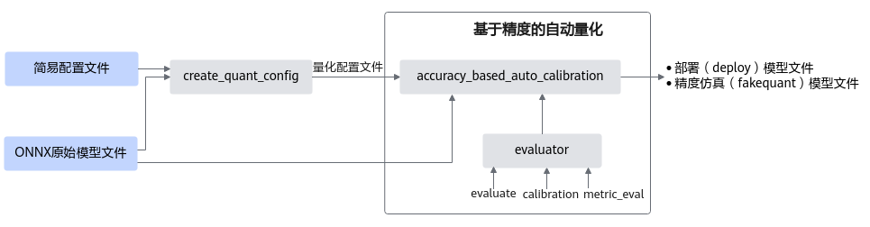

主要流程如下：

1.  <a name="li1620271314520"></a>调用[create\_quant\_config](create_quant_config-28.md)生成量化配置文件，然后调用[accuracy\_based\_auto\_calibration](accuracy_based_auto_calibration-31.md)进行基于精度的自动量化。
2.  <a name="li23141824486"></a>调用[accuracy\_based\_auto\_calibration](accuracy_based_auto_calibration-31.md)中由用户传入的evaluator实例进行精度测试，得到原始模型精度。

    该过程还会调用[accuracy\_based\_auto\_calibration](accuracy_based_auto_calibration-31.md)中的量化策略strategy模块，输出初始化的quant config量化配置文件，该文件记录所有层都可以进行量化。

3.  使用用户传入的初始量化配置文件（[1](#li1620271314520)中调用[create\_quant\_config](create_quant_config-28.md)生成的）对模型进行训练后量化，得到量化后fake quant模型的精度。
4.  原始模型精度与量化后fake quant模型精度进行比较，如果精度达标，则输出量化后的部署模型和fake quant模型，如果不达标，则进行基于精度的自动量化流程：
    1.  进行原始ONNX网络的推理， dump出每一层的输入activation数据，缓存起来。
    2.  利用训练后量化的量化因子构造量化层的单算子网络，利用缓存的activation数据计算量化后fake quant单算子网络的输出数据和原始ONNX单算子网络输出的余弦相似度。
    3.  <a name="li411322192712"></a>将余弦相似度的列表传给[accuracy\_based\_auto\_calibration](accuracy_based_auto_calibration-31.md)中的量化策略strategy模块，strategy模块基于[2](#li23141824486)中生成的初始化的量化配置文件，输出回退某些层后的新的quant config量化配置文件。
    4.  根据quant config量化配置文件重新进行训练后量化，得到回退后的fake quant模型。
    5.  调用[accuracy\_based\_auto\_calibration](accuracy_based_auto_calibration-31.md)中的evaluator模块进行回退后的fake quant模型精度测试，查看精度是否达标：
        -   如果达标，则输出回退后的fake quant模型以及部署模型。
        -   如果不达标，则将余弦相似度排序最差的层回退，再次进行[4.c](#li411322192712)，输出新的量化配置。
        -   如果回退所有层后精度仍不达标，则不生成量化模型。

[accuracy\_based\_auto\_calibration](accuracy_based_auto_calibration-31.md)接口内部基于精度的自动量化流程如[图2](#fig17197132717303)所示。

**图 2**  自动量化流程<a name="fig17197132717303"></a>  


**调用示例<a name="section8613115123318"></a>**

本示例演示使用AMCT进行基于精度的自动量化流程。该过程需要用户实现一个模型推理得到精度的回调函数，由于AMCT需要基于回调函数返回的精度数据进行量化层的筛选，因此回调函数的返回数值应尽可能反映模型的精度。

> **说明：** 
>-   如下示例标有“由用户补充处理”的步骤，需要用户根据自己的模型和数据集进行补充处理，示例中仅为示例代码。
>-   如下示例调用AMCT的部分，函数入参请根据实际情况进行调整。

1.  导入AMCT包。

    ```
    import os
    import amct_onnx as amct
    from amct_onnx.common.auto_calibration import AutoCalibrationEvaluatorBase
    ```

2.  （由用户补充处理）使用原始待量化的模型和测试集，实现回调函数**calibration\(\)**、**evaluate\(\)**、**metric\_eval\(\)**。

    上述回调函数的入参要和基类AutoCalibrationEvaluatorBase保持一致。其中：

    -   calibration\(\)完成校准的推理。
    -   evaluate\(\)完成模型的精度测试过程。
    -   metric\_eval\(\)完成原始模型和量化fake quant模型的精度损失评估，当精度损失小于预期值时返回True，否则返回False。

    ```
    class ModelEvaluator(AutoCalibrationEvaluatorBase):
         # The evaluator for model
        def __init__(self, *args, **kwargs):
            # 成员变量初始化
            # 设置预期精度损失，此处请替换为具体的数值
            self.diff = expected_acc_loss
            pass
    
        def calibration(self, model_file):
            # 进行模型的校准推理，推理的batch数要和量化配置的batch_num一致
            pass
    
        def evaluate(self, model_file):
            # evaluate the input models, get the eval metric of model
            pass
    
        def metric_eval(self, original_metric, new_metric):
            # 评估原始模型精度和量化模型精度的精度损失是否满足预期，满足返回True, 精度损失数据；否则返回False, 精度损失数据
            loss = original_metric - new_metric
            if loss < self.diff:
                return True, loss
            return False, loss
    ```

3.  （由用户补充处理）根据模型确定模型输入文件。

    ```
    model_file = os.path.realpath(user_model_file)
    ```

4.  调用AMCT，进行基于精度的自动量化。
    1.  生成量化配置。

        ```
        config_json_file = './config.json'
        skip_layers = []
        batch_num = 1
        activation_offset = True
        amct.create_quant_config(config_json_file, model_file,
                                  skip_layers, batch_num, activation_offset)
        
        scale_offset_record_file = os.path.join(TMP, 'scale_offset_record.txt')
        result_path = os.path.join(RESULT, 'model')
        ```

    2.  初始化Evaluator。

        ```
        evaluator = AutoCalibrationEvaluator()
        ```

    3.  进行基于精度的量化配置自动搜索。

        ```
        amct.accuracy_based_auto_calibration(
                model_file=model_file,
                model_evaluator=evaluator,
                config_file=config_json_file,
                record_file=scale_offset_record_file,
                save_dir=result_path,
                strategy='BinarySearch',
                sensitivity='CosineSimilarity'
        )
        ```

### 手工量化<a name="ZH-CN_TOPIC_0000002505904537"></a>

均匀量化是指量化后的数据比较均匀地分布在某个数值空间中，例如INT8量化就是用只有8比特的INT8数据来表示32比特的float32数据或16比特的float16数据，将float32/float16的卷积运算过程（乘加运算）转换为INT8的卷积运算，加速运算和实现模型压缩；均匀的INT8量化则是量化后数据比较均匀地分布在INT8的数值空间\[-128, 127\]中。
非均匀量化是指量化后的数据在某个数值空间中的分布是不均匀的。非均匀量化过程中，会根据待量化数据的概率分布来对均匀量化后的数据分布进一步进行根据目标压缩率（保留数值量/原始量化数值量）的聚类操作。相较于均匀量化，非均匀量化在进一步压缩数据信息量的基础上尽可能的保留高概率分布的数据信息，从而减小压缩后的数据信息丢失。
执行训练后量化特性的精度如果不满足要求，可以尝试手动调整config.json文件中的参数，本节给出调整的原则，以及参数解释。

#### 均匀量化<a name="ZH-CN_TOPIC_0000002505904495"></a>

均匀量化是指量化后的数据比较均匀地分布在某个数值空间中，例如INT8量化就是用只有8比特的INT8数据来表示32比特的float32数据或16比特的float16数据，将float32/float16的卷积运算过程（乘加运算）转换为INT8的卷积运算，加速运算和实现模型压缩；均匀的INT8量化则是量化后数据比较均匀地分布在INT8的数值空间\[-128, 127\]中。

均匀量化支持量化的层以及约束如下，量化示例请参见[样例列表](样例列表.md)。

**表 1**  均匀量化支持的层以及约束

<a name="table061924413214"></a>
<table><thead align="left"><tr id="row1061954442118"><th class="cellrowborder" valign="top" width="16.93%" id="mcps1.2.3.1.1"><p id="p861918442214"><a name="p861918442214"></a><a name="p861918442214"></a>支持的层类型</p>
</th>
<th class="cellrowborder" valign="top" width="83.07%" id="mcps1.2.3.1.2"><p id="p1561944411219"><a name="p1561944411219"></a><a name="p1561944411219"></a>约束</p>
</th>
</tr>
</thead>
<tbody><tr id="row1327613116407"><td class="cellrowborder" valign="top" width="16.93%" headers="mcps1.2.3.1.1 "><p id="p1217412012188"><a name="p1217412012188"></a><a name="p1217412012188"></a>Conv</p>
</td>
<td class="cellrowborder" valign="top" width="83.07%" headers="mcps1.2.3.1.2 "><p id="p549219271228"><a name="p549219271228"></a><a name="p549219271228"></a>支持3维或4维输入，且权重类型为constant或Initializer的量化。</p>
</td>
</tr>
<tr id="row12620444182118"><td class="cellrowborder" valign="top" width="16.93%" headers="mcps1.2.3.1.1 "><p id="p262012447215"><a name="p262012447215"></a><a name="p262012447215"></a>ConvTranspose</p>
</td>
<td class="cellrowborder" valign="top" width="83.07%" headers="mcps1.2.3.1.2 "><p id="p3593941102015"><a name="p3593941102015"></a><a name="p3593941102015"></a>仅支持3维或4维输入，且权重类型为constant。</p>
</td>
</tr>
<tr id="row16257822121914"><td class="cellrowborder" valign="top" width="16.93%" headers="mcps1.2.3.1.1 "><p id="p104992289190"><a name="p104992289190"></a><a name="p104992289190"></a>Gemm</p>
</td>
<td class="cellrowborder" valign="top" width="83.07%" headers="mcps1.2.3.1.2 "><p id="p11499228181920"><a name="p11499228181920"></a><a name="p11499228181920"></a>transpose_a=false、Alpha=Beta=1.0；权重类型为constant或Initializer。</p>
</td>
</tr>
<tr id="row146081113112113"><td class="cellrowborder" valign="top" width="16.93%" headers="mcps1.2.3.1.1 "><p id="p83004135919"><a name="p83004135919"></a><a name="p83004135919"></a>GRU</p>
</td>
<td class="cellrowborder" valign="top" width="83.07%" headers="mcps1.2.3.1.2 "><p id="p10489151191110"><a name="p10489151191110"></a><a name="p10489151191110"></a>约束请参见<a href="#table7839113721219">表3</a>。</p>
<p id="p10489141131118"><a name="p10489141131118"></a><a name="p10489141131118"></a>如果执行<a href="基于精度的自动量化-19.md">基于精度的自动量化</a>，该算子只能量化，不能进行回退；</p>
</td>
</tr>
<tr id="row12522163553712"><td class="cellrowborder" valign="top" width="16.93%" headers="mcps1.2.3.1.1 "><p id="p115238359379"><a name="p115238359379"></a><a name="p115238359379"></a>LSTM</p>
</td>
<td class="cellrowborder" valign="top" width="83.07%" headers="mcps1.2.3.1.2 "><p id="p205231035183715"><a name="p205231035183715"></a><a name="p205231035183715"></a>约束请参见<a href="#table2094365917522">表2</a>。</p>
<p id="p13215357155912"><a name="p13215357155912"></a><a name="p13215357155912"></a>如果执行<a href="基于精度的自动量化-19.md">基于精度的自动量化</a>，该算子只能量化，不能进行回退；</p>
</td>
</tr>
<tr id="row1217462019182"><td class="cellrowborder" valign="top" width="16.93%" headers="mcps1.2.3.1.1 "><p id="p1877881416218"><a name="p1877881416218"></a><a name="p1877881416218"></a>MatMul</p>
</td>
<td class="cellrowborder" valign="top" width="83.07%" headers="mcps1.2.3.1.2 "><a name="ul957014194218"></a><a name="ul957014194218"></a><ul id="ul957014194218"><li>当第二路输入为常量const时，仅支持2-6维；权重类型为constant或Initializer。<a name="ul230445942412"></a><a name="ul230445942412"></a><ul id="ul230445942412"><li>数据（activation）支持INT8量化，权重（weight）支持INT8量化。</li><li>数据（activation）支持per-tensor量化，权重（weight）支持per-tensor量化。</li><li>数据（activation）支持对称非对称量化，权重（weight）支持对称量化。</li></ul>
</li><li>当两路输入都为变量tensor时，仅支持INT8对称量化。</li></ul>
</td>
</tr>
</tbody>
</table>

**表 2**  LSTM算子约束

<a name="table2094365917522"></a>
<table><thead align="left"><tr id="row53550105319"><th class="cellrowborder" valign="top" width="11.93%" id="mcps1.2.4.1.1"><p id="p435120205313"><a name="p435120205313"></a><a name="p435120205313"></a>类型</p>
</th>
<th class="cellrowborder" valign="top" width="17.96%" id="mcps1.2.4.1.2"><p id="p7355065318"><a name="p7355065318"></a><a name="p7355065318"></a>输入/参数名称</p>
</th>
<th class="cellrowborder" valign="top" width="70.11%" id="mcps1.2.4.1.3"><p id="p17351006532"><a name="p17351006532"></a><a name="p17351006532"></a>要求</p>
</th>
</tr>
</thead>
<tbody><tr id="row036506532"><td class="cellrowborder" rowspan="7" valign="top" width="11.93%" headers="mcps1.2.4.1.1 "><p id="p1736104531"><a name="p1736104531"></a><a name="p1736104531"></a>输入约束</p>
</td>
<td class="cellrowborder" valign="top" width="17.96%" headers="mcps1.2.4.1.2 "><p id="p63620165316"><a name="p63620165316"></a><a name="p63620165316"></a>X</p>
</td>
<td class="cellrowborder" valign="top" width="70.11%" headers="mcps1.2.4.1.3 "><p id="p8369015532"><a name="p8369015532"></a><a name="p8369015532"></a>X输入第一维长度必须为1（对应sequence_lens限制），否则在IFMR/HFMG算子中抛出异常。</p>
</td>
</tr>
<tr id="row4363018536"><td class="cellrowborder" valign="top" headers="mcps1.2.4.1.1 "><p id="p20362011538"><a name="p20362011538"></a><a name="p20362011538"></a>initial_h</p>
</td>
<td class="cellrowborder" valign="top" headers="mcps1.2.4.1.2 "><p id="p153670165317"><a name="p153670165317"></a><a name="p153670165317"></a>必须有对应输入，且该输入不能连接Const节点或者Const子图。</p>
</td>
</tr>
<tr id="row64231215162615"><td class="cellrowborder" valign="top" headers="mcps1.2.4.1.1 "><p id="p94245156262"><a name="p94245156262"></a><a name="p94245156262"></a>initial_c</p>
</td>
<td class="cellrowborder" valign="top" headers="mcps1.2.4.1.2 "><p id="p1142414153261"><a name="p1142414153261"></a><a name="p1142414153261"></a>必须有对应输入，且该输入不能连接Const节点或者Const子图。</p>
</td>
</tr>
<tr id="row23611011530"><td class="cellrowborder" valign="top" headers="mcps1.2.4.1.1 "><p id="p163640105318"><a name="p163640105318"></a><a name="p163640105318"></a>sequence_lens</p>
</td>
<td class="cellrowborder" valign="top" headers="mcps1.2.4.1.2 "><p id="p173615045312"><a name="p173615045312"></a><a name="p173615045312"></a>必须无对应输入。</p>
</td>
</tr>
<tr id="row0361807539"><td class="cellrowborder" valign="top" headers="mcps1.2.4.1.1 "><p id="p113615025312"><a name="p113615025312"></a><a name="p113615025312"></a>P</p>
</td>
<td class="cellrowborder" valign="top" headers="mcps1.2.4.1.2 "><p id="p93612085310"><a name="p93612085310"></a><a name="p93612085310"></a>必须无对应输入。</p>
</td>
</tr>
<tr id="row83640205311"><td class="cellrowborder" valign="top" headers="mcps1.2.4.1.1 "><p id="p153618015532"><a name="p153618015532"></a><a name="p153618015532"></a>W</p>
</td>
<td class="cellrowborder" valign="top" headers="mcps1.2.4.1.2 "><p id="p153612015531"><a name="p153612015531"></a><a name="p153612015531"></a>类型为constant/initializer，且输入第一维为1（对应num_direction限制）。</p>
</td>
</tr>
<tr id="row12361012539"><td class="cellrowborder" valign="top" headers="mcps1.2.4.1.1 "><p id="p8363012530"><a name="p8363012530"></a><a name="p8363012530"></a>R</p>
</td>
<td class="cellrowborder" valign="top" headers="mcps1.2.4.1.2 "><p id="p836180185319"><a name="p836180185319"></a><a name="p836180185319"></a>类型为constant/initializer，且输入第一维为1（对应num_direction限制）。</p>
</td>
</tr>
<tr id="row4371108530"><td class="cellrowborder" rowspan="7" valign="top" width="11.93%" headers="mcps1.2.4.1.1 "><p id="p173717035311"><a name="p173717035311"></a><a name="p173717035311"></a>属性约束</p>
</td>
<td class="cellrowborder" valign="top" width="17.96%" headers="mcps1.2.4.1.2 "><p id="p737180175320"><a name="p737180175320"></a><a name="p737180175320"></a>activation_alpha</p>
</td>
<td class="cellrowborder" valign="top" width="70.11%" headers="mcps1.2.4.1.3 "><p id="p8373010537"><a name="p8373010537"></a><a name="p8373010537"></a>必须不指定对应属性。</p>
</td>
</tr>
<tr id="row93710125317"><td class="cellrowborder" valign="top" headers="mcps1.2.4.1.1 "><p id="p183719013531"><a name="p183719013531"></a><a name="p183719013531"></a>activation_beta</p>
</td>
<td class="cellrowborder" valign="top" headers="mcps1.2.4.1.2 "><p id="p36164207813"><a name="p36164207813"></a><a name="p36164207813"></a>必须不指定对应属性。</p>
</td>
</tr>
<tr id="row16377035310"><td class="cellrowborder" valign="top" headers="mcps1.2.4.1.1 "><p id="p93710011535"><a name="p93710011535"></a><a name="p93710011535"></a>activations</p>
</td>
<td class="cellrowborder" valign="top" headers="mcps1.2.4.1.2 "><p id="p86268201387"><a name="p86268201387"></a><a name="p86268201387"></a>必须不指定对应属性。</p>
</td>
</tr>
<tr id="row73710055319"><td class="cellrowborder" valign="top" headers="mcps1.2.4.1.1 "><p id="p133716016535"><a name="p133716016535"></a><a name="p133716016535"></a>clip</p>
</td>
<td class="cellrowborder" valign="top" headers="mcps1.2.4.1.2 "><p id="p2632122015816"><a name="p2632122015816"></a><a name="p2632122015816"></a>必须不指定对应属性。</p>
</td>
</tr>
<tr id="row15371008538"><td class="cellrowborder" valign="top" headers="mcps1.2.4.1.1 "><p id="p14375010532"><a name="p14375010532"></a><a name="p14375010532"></a>direction</p>
</td>
<td class="cellrowborder" valign="top" headers="mcps1.2.4.1.2 "><p id="p20381013535"><a name="p20381013535"></a><a name="p20381013535"></a>必须不指定对应属性，或者为forward（同默认值）。</p>
</td>
</tr>
<tr id="row7381202537"><td class="cellrowborder" valign="top" headers="mcps1.2.4.1.1 "><p id="p163840195315"><a name="p163840195315"></a><a name="p163840195315"></a>input_forget</p>
</td>
<td class="cellrowborder" valign="top" headers="mcps1.2.4.1.2 "><p id="p17386065311"><a name="p17386065311"></a><a name="p17386065311"></a>必须不指定对应属性，或者为0（同默认值）。</p>
</td>
</tr>
<tr id="row11388010531"><td class="cellrowborder" valign="top" headers="mcps1.2.4.1.1 "><p id="p7388017539"><a name="p7388017539"></a><a name="p7388017539"></a>layout</p>
</td>
<td class="cellrowborder" valign="top" headers="mcps1.2.4.1.2 "><p id="p33860105318"><a name="p33860105318"></a><a name="p33860105318"></a>必须不指定对应属性，或者为0（同默认值）。</p>
</td>
</tr>
<tr id="row74736142715"><td class="cellrowborder" rowspan="3" valign="top" width="11.93%" headers="mcps1.2.4.1.1 "><p id="p124786142710"><a name="p124786142710"></a><a name="p124786142710"></a>输出约束</p>
<p id="p210813817278"><a name="p210813817278"></a><a name="p210813817278"></a></p>
<p id="p1190812911279"><a name="p1190812911279"></a><a name="p1190812911279"></a></p>
</td>
<td class="cellrowborder" valign="top" width="17.96%" headers="mcps1.2.4.1.2 "><p id="p145813149276"><a name="p145813149276"></a><a name="p145813149276"></a>Y</p>
</td>
<td class="cellrowborder" valign="top" width="70.11%" headers="mcps1.2.4.1.3 "><p id="p135861410271"><a name="p135861410271"></a><a name="p135861410271"></a>必须有对应输出。</p>
</td>
</tr>
<tr id="row191089802719"><td class="cellrowborder" valign="top" headers="mcps1.2.4.1.1 "><p id="p17591414172715"><a name="p17591414172715"></a><a name="p17591414172715"></a>Y_h</p>
</td>
<td class="cellrowborder" valign="top" headers="mcps1.2.4.1.2 "><p id="p11411959149"><a name="p11411959149"></a><a name="p11411959149"></a>必须有对应输出。</p>
</td>
</tr>
<tr id="row16908149142711"><td class="cellrowborder" valign="top" headers="mcps1.2.4.1.1 "><p id="p12593149278"><a name="p12593149278"></a><a name="p12593149278"></a>Y_c</p>
</td>
<td class="cellrowborder" valign="top" headers="mcps1.2.4.1.2 "><p id="p156814591247"><a name="p156814591247"></a><a name="p156814591247"></a>必须有对应输出。</p>
</td>
</tr>
</tbody>
</table>

**表 3**  GRU算子约束

<a name="table7839113721219"></a>
<table><thead align="left"><tr id="row11909143711122"><th class="cellrowborder" valign="top" width="11.86%" id="mcps1.2.4.1.1"><p id="p290919373127"><a name="p290919373127"></a><a name="p290919373127"></a>类型</p>
</th>
<th class="cellrowborder" valign="top" width="17.93%" id="mcps1.2.4.1.2"><p id="p990963791212"><a name="p990963791212"></a><a name="p990963791212"></a>输入/参数名称</p>
</th>
<th class="cellrowborder" valign="top" width="70.21%" id="mcps1.2.4.1.3"><p id="p5909237111219"><a name="p5909237111219"></a><a name="p5909237111219"></a>要求</p>
</th>
</tr>
</thead>
<tbody><tr id="row3909143711123"><td class="cellrowborder" rowspan="5" valign="top" width="11.86%" headers="mcps1.2.4.1.1 "><p id="p49091337141211"><a name="p49091337141211"></a><a name="p49091337141211"></a>输入约束</p>
</td>
<td class="cellrowborder" valign="top" width="17.93%" headers="mcps1.2.4.1.2 "><p id="p209092376125"><a name="p209092376125"></a><a name="p209092376125"></a>X</p>
</td>
<td class="cellrowborder" valign="top" width="70.21%" headers="mcps1.2.4.1.3 "><p id="p99099373125"><a name="p99099373125"></a><a name="p99099373125"></a>X输入第一维长度必须为1（对应sequence_lens限制），否则在IFMR/HFMG算子中会抛出异常。</p>
</td>
</tr>
<tr id="row149091737191213"><td class="cellrowborder" valign="top" headers="mcps1.2.4.1.1 "><p id="p1890914376126"><a name="p1890914376126"></a><a name="p1890914376126"></a>initial_h</p>
</td>
<td class="cellrowborder" valign="top" headers="mcps1.2.4.1.2 "><p id="p49096379121"><a name="p49096379121"></a><a name="p49096379121"></a>必须有对应输入，必须与外部输入关联（直接或间接）。</p>
</td>
</tr>
<tr id="row1890923791210"><td class="cellrowborder" valign="top" headers="mcps1.2.4.1.1 "><p id="p99098377126"><a name="p99098377126"></a><a name="p99098377126"></a>sequence_lens</p>
</td>
<td class="cellrowborder" valign="top" headers="mcps1.2.4.1.2 "><p id="p691016376121"><a name="p691016376121"></a><a name="p691016376121"></a>必须无对应输入。</p>
</td>
</tr>
<tr id="row209101737101219"><td class="cellrowborder" valign="top" headers="mcps1.2.4.1.1 "><p id="p891019376128"><a name="p891019376128"></a><a name="p891019376128"></a>W</p>
</td>
<td class="cellrowborder" valign="top" headers="mcps1.2.4.1.2 "><p id="p199101237171218"><a name="p199101237171218"></a><a name="p199101237171218"></a>类型为constant/initializer，且输入第一维为1（对应num_directions限制）。</p>
</td>
</tr>
<tr id="row6910103781214"><td class="cellrowborder" valign="top" headers="mcps1.2.4.1.1 "><p id="p69101937191217"><a name="p69101937191217"></a><a name="p69101937191217"></a>R</p>
</td>
<td class="cellrowborder" valign="top" headers="mcps1.2.4.1.2 "><p id="p7910173751213"><a name="p7910173751213"></a><a name="p7910173751213"></a>类型为constant/initializer，且输入第一维为1（对应num_directions限制）。</p>
</td>
</tr>
<tr id="row1391063771214"><td class="cellrowborder" rowspan="6" valign="top" width="11.86%" headers="mcps1.2.4.1.1 "><p id="p791083715121"><a name="p791083715121"></a><a name="p791083715121"></a>属性约束</p>
</td>
<td class="cellrowborder" valign="top" width="17.93%" headers="mcps1.2.4.1.2 "><p id="p16910173731218"><a name="p16910173731218"></a><a name="p16910173731218"></a>activation_alpha</p>
</td>
<td class="cellrowborder" valign="top" width="70.21%" headers="mcps1.2.4.1.3 "><p id="p1091016375126"><a name="p1091016375126"></a><a name="p1091016375126"></a>必须不指定对应属性。</p>
</td>
</tr>
<tr id="row5910137151219"><td class="cellrowborder" valign="top" headers="mcps1.2.4.1.1 "><p id="p4910637161215"><a name="p4910637161215"></a><a name="p4910637161215"></a>activation_beta</p>
</td>
<td class="cellrowborder" valign="top" headers="mcps1.2.4.1.2 "><p id="p109108373129"><a name="p109108373129"></a><a name="p109108373129"></a>必须不指定对应属性。</p>
</td>
</tr>
<tr id="row391043717121"><td class="cellrowborder" valign="top" headers="mcps1.2.4.1.1 "><p id="p8910143701210"><a name="p8910143701210"></a><a name="p8910143701210"></a>activations</p>
</td>
<td class="cellrowborder" valign="top" headers="mcps1.2.4.1.2 "><p id="p79101137191218"><a name="p79101137191218"></a><a name="p79101137191218"></a>必须不指定对应属性。</p>
</td>
</tr>
<tr id="row1591083711216"><td class="cellrowborder" valign="top" headers="mcps1.2.4.1.1 "><p id="p1791073710127"><a name="p1791073710127"></a><a name="p1791073710127"></a>direction</p>
</td>
<td class="cellrowborder" valign="top" headers="mcps1.2.4.1.2 "><p id="p109101637101217"><a name="p109101637101217"></a><a name="p109101637101217"></a>必须不指定对应属性，或者为forward（同默认值）。</p>
</td>
</tr>
<tr id="row891043712124"><td class="cellrowborder" valign="top" headers="mcps1.2.4.1.1 "><p id="p13910937131219"><a name="p13910937131219"></a><a name="p13910937131219"></a>layout</p>
</td>
<td class="cellrowborder" valign="top" headers="mcps1.2.4.1.2 "><p id="p1791003719126"><a name="p1791003719126"></a><a name="p1791003719126"></a>必须不指定对应属性，或者为0（同默认值）。</p>
</td>
</tr>
<tr id="row19910163751217"><td class="cellrowborder" valign="top" headers="mcps1.2.4.1.1 "><p id="p891114370124"><a name="p891114370124"></a><a name="p891114370124"></a>linear_before_reset</p>
</td>
<td class="cellrowborder" valign="top" headers="mcps1.2.4.1.2 "><p id="p39111937181212"><a name="p39111937181212"></a><a name="p39111937181212"></a>仅支持配置为非0值的场景，将所有非0值在部署图中设置为1。</p>
</td>
</tr>
<tr id="row1911183731219"><td class="cellrowborder" rowspan="2" valign="top" width="11.86%" headers="mcps1.2.4.1.1 "><p id="p189111237161213"><a name="p189111237161213"></a><a name="p189111237161213"></a>输出约束</p>
</td>
<td class="cellrowborder" valign="top" width="17.93%" headers="mcps1.2.4.1.2 "><p id="p99111237121213"><a name="p99111237121213"></a><a name="p99111237121213"></a>Y</p>
</td>
<td class="cellrowborder" valign="top" width="70.21%" headers="mcps1.2.4.1.3 "><p id="p1591183712125"><a name="p1591183712125"></a><a name="p1591183712125"></a>必须有对应输出。</p>
</td>
</tr>
<tr id="row1091193713120"><td class="cellrowborder" valign="top" headers="mcps1.2.4.1.1 "><p id="p8911937151215"><a name="p8911937151215"></a><a name="p8911937151215"></a>Y_h</p>
</td>
<td class="cellrowborder" valign="top" headers="mcps1.2.4.1.2 "><p id="p1891113716121"><a name="p1891113716121"></a><a name="p1891113716121"></a>必须有对应输出。</p>
</td>
</tr>
</tbody>
</table>

**接口调用流程<a name="section1218465794111"></a>**

均匀量化接口调用流程如[图1](#fig153281318152013)所示：

**图 1**  均匀量化接口调用流程<a name="fig153281318152013"></a>  
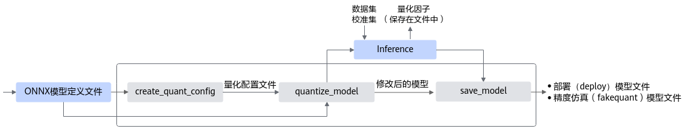

蓝色部分为用户实现，灰色部分为用户调用AMCT提供的API实现，使用流程如下：

1.  用户准备ONNX原始模型，然后使用[create\_quant\_config](create_quant_config-28.md)生成量化配置文件。
2.  根据ONNX模型和量化配置文件，即可调用[quantize\_model](quantize_model-29.md)接口对原始ONNX模型进行量化前优化，包括Conv+BN融合等，插入权重量化算子，进行权重量化；插入数据量化算子，得到校准模型。
3.  用户基于ONNX Runtime以及校准集，执行校准模型推理完成数据量化，并将量化因子输出到文件中。
4.  最后用户可以调用[save\_model](save_model-30.md)接口保存量化后的模型，包括可在ONNX执行框架ONNX Runtime环境中进行精度仿真的模型文件和可部署在NPU IP加速器的模型文件。
    -   精度仿真模型文件：模型名中包含fake\_quant，可以在ONNX执行框架ONNX Runtime进行精度仿真。

        fake\_quant模型主要用于验证量化后模型的精度，可以在ONNX Runtime环境下运行。进行前向推理的计算过程中，在fake\_quant模型中对卷积层等的输入数据和权重进行了量化反量化的操作，来模拟量化后的计算结果，从而快速验证量化后模型的精度。如下图所示，以INT8量化为例，Quant层、Conv卷积层和DeQuant层之间的数据都是float32数据类型的，其中Quant层将数据量化到INT8又反量化为float32，权重也是量化到INT8又反量化为float32，实际卷积层的计算是基于float32数据类型的，该模型用于ONNX Runtime环境验证量化后模型的精度，不能够用于ATC工具转换成om模型。

        **图 2**  fake\_quant模型<a name="fig830317361367"></a>  
        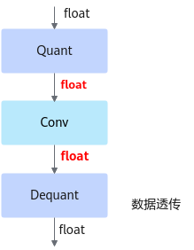

    -   部署模型文件：模型名中包含deploy，经过ATC转换工具转换后可部署到NPU IP加速器。

        以INT8量化为例，deploy模型由于已经将权重等转换成为了INT8、INT32类型，因此不能在ONNX Runtime环境上执行推理计算。如下图所示，deploy模型的AscendQuant层将float32的输入数据量化为INT8，作为卷积层的输入，权重也是使用INT8数据类型作为计算，在deploy模型中的卷积层的计算是基于INT8、INT32数据类型的，输出为INT32数据类型经过AscendDeQuant层转换成float32数据类型传输给下一个网络层。

        **图 3**  deploy模型<a name="fig32095209306"></a>  
        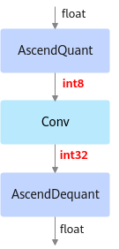

**调用示例<a name="section14158923425"></a>**

本章节详细给出训练后量化的模板代码解析说明，通过解读该代码，用户可以详细了解AMCT的工作流程以及原理，方便用户基于已有模板代码进行修改，以便适配其他网络模型的量化。训练后量化主要包括如下几个步骤：

1.  准备训练好的模型和数据集。
2.  在原始ONNX Runtime环境中验证模型精度以及环境是否正常。
3.  编写训练后量化脚本调用AMCT  API。
4.  执行训练后量化脚本。
5.  在原始ONNX Runtime环境中验证量化后仿真模型精度。

如下流程详细演示如何编写脚本调用AMCT  API进行模型量化。

> **说明：** 
>-   如下示例标有“由用户补充处理”的步骤，需要用户根据自己的模型和数据集进行补充处理，示例中仅为示例代码。
>-   如下示例调用AMCT的部分，函数入参请根据实际情况进行调整。

1.  导入AMCT包，并通过[设置环境变量](设置环境变量.md)日志级别。

    ```
    import amct_onnx as amct
    ```

2.  <a name="li154865592110"></a>（可选，由用户补充处理）在ONNX Runtime环境中验证推理脚本及环境。

    建议使用原始待量化的模型和测试集，在ONNX Runtime环境下推理，验证环境、推理脚本是否正常。

    推荐执行该步骤，请确保原始模型可以完成推理且精度正常；执行该步骤时，可以使用部分测试集，减少运行时间。

    ```
    user_do_inference(ori_model, test_data, test_iterations)
    ```

3.  调用AMCT，量化模型。
    1.  生成量化配置。

        ```
        config_file = './tmp/config.json'
        skip_layers = []
        batch_num = 1
        amct.create_quant_config(config_file=config_file,
        			 model_file=ori_model,
        			 skip_layers=skip_layers,
        			 batch_num=batch_num)
        ```

    2.  修改图，在图中插入数据量化，权重量化等相关的算子，用于计算量化相关参数。

        ```
        record_file = './tmp/record.txt'
        modified_model = './tmp/modified_model.onnx'
        amct.quantize_model(config_file=config_file,
                            model_file=ori_model,
                            modified_onnx_file=modified_model,
                            record_file=record_file)
        ```

    3.  （由用户补充处理）使用修改后的图在校准集上做模型推理，找到量化因子。

        该步骤执行时，需要注意如下两点：

        1.  校准集及其预处理过程数据要与模型匹配，以保证量化的精度。
        2.  前向推理次数为batch\_num，如果次数不足，由于校准算子没有将量化因子输出到record文件中，会导致后续读取record校验失败。

        若校准过程中有错误信息，则可以尝试参见[校准过程中提示"IFMR node. Name:'layer\_ifmr\_op' Status Message: std::bad\_alloc"信息](校准过程中提示-IFMR-node-Name-layer_ifmr_op-Status-Message-std-bad_alloc-信息.md)或[校准过程中出现"killed"信息](校准过程中出现-killed-信息.md)进行处理。

        若校准执行过程中提示"IfmrQuantWithOffset scale is illegal"，则请参见[校准执行过程中提示“\[IfmrQuantWithoutOffset\]scale is illegal”](校准执行过程中提示-IfmrQuantWithoutOffset-scale-is-illegal.md)处理。

        ```
        user_do_inference(modified_onnx_file, calibration_data, batch_num)
        ```

    4.  保存模型。

        根据量化因子以及修改后的模型，调用[save\_model](save_model-30.md)接口，插入AscendQuant、AscendDequant等算子，保存为量化模型。

        ```
        quant_model_path = './results/user_model'
        amct.save_model(modified_onnx_file=modified_model,
                        record_file=record_file,
                        save_path=quant_model_path)
        ```

4.  （可选，由用户补充处理）基于ONNX Runtime的环境，使用量化后模型（quant\_model）在测试集（test\_data）上做推理，测试量化后仿真模型的精度。

    使用量化后仿真模型精度与[2](#li154865592110)中的原始精度做对比，可以观察量化对精度的影响。

    ```
    quant_model = './results/user_model_fake_quant_model.onnx'
    user_do_inference(quant_model, test_data, test_iterations)
    ```

    如果量化后仿真模型在CPU推理速度，相较于原始模型推理速度变慢，则可以尝试通过设置如下环境变量解决：

    ```
    #设置执行期间使用的线程数
    export OMP_NUM_THREADS=8
    ```

    环境变量的取值，跟模型数据量大小，运行环境的CPU数量相关，比如Resnet101模型，数据量大小为10W量级，线程数可以设置为8。

#### 非均匀量化**\(不支持该特性\)**<a name="ZH-CN_TOPIC_0000002473744618"></a>

非均匀量化是指量化后的数据在某个数值空间中的分布是不均匀的。非均匀量化过程中，会根据待量化数据的概率分布来对均匀量化后的数据分布进一步进行根据目标压缩率（保留数值量/原始量化数值量）的聚类操作。相较于均匀量化，非均匀量化在进一步压缩数据信息量的基础上尽可能的保留高概率分布的数据信息，从而减小压缩后的数据信息丢失。

> **说明：** 
>**由于硬件约束，该版本不建议使用非均匀量化的功能，获取不到性能收益。**

模型在NPU IP加速器上推理时，可通过非均匀量化提高权重压缩率（需要与ATC工具配合，通过编译时使能权重压缩），降低权重传输开销，进一步提升推理性能。非均匀量化后，如果精度仿真模型在原始ONNX Runtime环境中推理精度不满足要求，可通过调整非均匀量化配置文件config.json中的参数来恢复模型精度，调整方法请参见[手工调优](手工调优-22.md)。

非均匀量化支持量化的层以及约束如下，量化示例请参见[样例列表](样例列表.md)。

**表 1**  非均匀量化支持量化的层以及约束

<a name="table32131022111318"></a>
<table><thead align="left"><tr id="row9214202215138"><th class="cellrowborder" valign="top" width="35.43%" id="mcps1.2.3.1.1"><p id="p1921472241319"><a name="p1921472241319"></a><a name="p1921472241319"></a>支持的层类型</p>
</th>
<th class="cellrowborder" valign="top" width="64.57000000000001%" id="mcps1.2.3.1.2"><p id="p122141822101318"><a name="p122141822101318"></a><a name="p122141822101318"></a>约束</p>
</th>
</tr>
</thead>
<tbody><tr id="row9187847174910"><td class="cellrowborder" valign="top" width="35.43%" headers="mcps1.2.3.1.1 "><p id="p39081049165019"><a name="p39081049165019"></a><a name="p39081049165019"></a>Conv：卷积层</p>
</td>
<td class="cellrowborder" valign="top" width="64.57000000000001%" headers="mcps1.2.3.1.2 "><p id="p290844912501"><a name="p290844912501"></a><a name="p290844912501"></a>dilation为1、group为1、filter维度为4</p>
</td>
</tr>
<tr id="row665516158182"><td class="cellrowborder" valign="top" width="35.43%" headers="mcps1.2.3.1.1 "><p id="p4215122181312"><a name="p4215122181312"></a><a name="p4215122181312"></a>Gemm：广义矩阵乘</p>
</td>
<td class="cellrowborder" valign="top" width="64.57000000000001%" headers="mcps1.2.3.1.2 "><p id="p6214112220139"><a name="p6214112220139"></a><a name="p6214112220139"></a>transpose_a=false、Alpha=Beta=1.0</p>
</td>
</tr>
</tbody>
</table>

**实现流程<a name="section2069517501319"></a>**

静态非均匀量化实现原理同[均匀量化](均匀量化-21.md)，简要流程如[图1](#fig632614881115)所示。

**图 1**  非均匀量化流程图<a name="fig632614881115"></a>  


详细流程说明如下：

1.  <a name="li7933268523"></a>参见[均匀量化](均匀量化-21.md)章节获取均匀量化的部署模型和精度仿真模型。
2.  <a name="li56016231522"></a>参见《ATC离线模型编译工具用户指南》将[1](#li7933268523)中生成的部署模型转换成JSON文件，该JSON文件记录了量化后模型的融合信息，同时也携带了支持weight压缩特性层的信息（通过fe\_weight\_compress字段识别）。
3.  如果要进行weight压缩，则参见[训练后量化简易配置文件](训练后量化简易配置文件-35.md)章节获取非均匀量化简易配置文件，然后获取[2](#li56016231522)生成的量化后模型的融合json文件进行非均匀量化。

    非均匀量化过程中，会根据融合JSON文件，获取原始模型中哪些层支持weight压缩，然后重新生成非均匀量化的部署模型和量化配置文件。

4.  查看非均匀量化后，精度仿真模型在ONNX Runtime环境中推理精度是否满足要求，如果不满足要求，则需要调整非均匀量化配置文件config.json中的参数，然后重新进行非均匀量化，直至满足精度要求。调整方法请参见[手工调优](手工调优-22.md)。

#### 手工调优<a name="ZH-CN_TOPIC_0000002473904536"></a>

执行训练后量化特性的精度如果不满足要求，可以尝试手动调整config.json文件中的参数，本节给出调整的原则，以及参数解释。

**调优流程<a name="section958410213558"></a>**

通过[create\_quant\_config](create_quant_config-28.md)接口生成的config.json文件中的默认配置进行量化，若量化后的推理精度不满足要求，则可调整量化配置重复量化，直至精度满足要求。本节详细介绍手动调优流程，调整对象是训练后量化配置文件config.json中的参数，主要涉及3个阶段：

1.  调整校准使用的数据量。
2.  跳过量化某些层。
3.  调整量化算法及参数。

具体步骤如下：

1.  根据[create\_quant\_config](create_quant_config-28.md)接口生成的默认配置进行量化。若精度满足要求，则调参结束，否则进行[2](#zh-cn_topic_0240188709_li1043716142619)。
2.  <a name="zh-cn_topic_0240188709_li1043716142619"></a>手动修改batch\_num，调整校准使用的数据量。

    batch\_num控制量化使用数据的batch数目，可根据batch大小以及量化需要使用的图片数量调整。通常情况下：

    batch\_num越大，量化过程中使用的数据样本越多，量化后精度损失越小；但过多的数据并不会带来精度的提升，反而会占用较多的内存，降低量化的速度，并可能引起内存、显存、线程资源不足等情况；因此，建议batch\_num\*batch\_size为16或32（batch\_size表示每个batch使用的图片数量）。

3.  若按照[2](#zh-cn_topic_0240188709_li1043716142619)中的量化配置进行量化后，精度满足要求，则调参结束，否则进行[\#ZH-CN\_TOPIC\_0000002473904536/li718684715113](#li718684715113)。
4.  手动修改activation\_quant\_params和weight\_quant\_params，调整量化算法及参数：

    算法参数意义请参见[量化配置文件](#section681313491301)中的参数说明部分，算法说明请参见[训练后量化算法](训练后量化算法.md)。

5.  若按照4中的量化配置进行量化后，精度满足要求，则调参结束，否则表明量化对精度影响很大。

**图 1**  调参流程<a name="zh-cn_topic_0240188709_fig10376759162410"></a>  


**量化配置文件<a name="section681313491301"></a>**

如果通过[create\_quant\_config](create_quant_config-28.md)接口生成的config.json量化配置文件，推理精度不满足要求，则需要参见该章节不断调整config.json文件中的内容（用户修改JSON文件时，请确保层名唯一），直至精度满足要求，json量化配置文件样例请参见接口中的[调用示例](create_quant_config-28.md#zh-cn_topic_0240187365_section64231658994)部分。

配置文件中参数说明如下：

**表 1**  version参数说明

<a name="zh-cn_topic_0240188722_table2626104713369"></a>
<table><tbody><tr id="zh-cn_topic_0240188722_row116261847163611"><th class="firstcol" valign="top" width="20.96%" id="mcps1.2.3.1.1"><p id="zh-cn_topic_0240188722_p462654715365"><a name="zh-cn_topic_0240188722_p462654715365"></a><a name="zh-cn_topic_0240188722_p462654715365"></a>作用</p>
</th>
<td class="cellrowborder" valign="top" width="79.03999999999999%" headers="mcps1.2.3.1.1 "><p id="zh-cn_topic_0240188722_p16269472361"><a name="zh-cn_topic_0240188722_p16269472361"></a><a name="zh-cn_topic_0240188722_p16269472361"></a>控制量化配置文件版本号</p>
</td>
</tr>
<tr id="zh-cn_topic_0240188722_row362684710366"><th class="firstcol" valign="top" width="20.96%" id="mcps1.2.3.2.1"><p id="zh-cn_topic_0240188722_p762684713611"><a name="zh-cn_topic_0240188722_p762684713611"></a><a name="zh-cn_topic_0240188722_p762684713611"></a>类型</p>
</th>
<td class="cellrowborder" valign="top" width="79.03999999999999%" headers="mcps1.2.3.2.1 "><p id="zh-cn_topic_0240188722_p19626124713367"><a name="zh-cn_topic_0240188722_p19626124713367"></a><a name="zh-cn_topic_0240188722_p19626124713367"></a>int</p>
</td>
</tr>
<tr id="zh-cn_topic_0240188722_row146267479367"><th class="firstcol" valign="top" width="20.96%" id="mcps1.2.3.3.1"><p id="zh-cn_topic_0240188722_p18626194711368"><a name="zh-cn_topic_0240188722_p18626194711368"></a><a name="zh-cn_topic_0240188722_p18626194711368"></a>取值范围</p>
</th>
<td class="cellrowborder" valign="top" width="79.03999999999999%" headers="mcps1.2.3.3.1 "><p id="zh-cn_topic_0240188722_p186261147193612"><a name="zh-cn_topic_0240188722_p186261147193612"></a><a name="zh-cn_topic_0240188722_p186261147193612"></a>1</p>
</td>
</tr>
<tr id="zh-cn_topic_0240188722_row7626194719361"><th class="firstcol" valign="top" width="20.96%" id="mcps1.2.3.4.1"><p id="zh-cn_topic_0240188722_p1462644712368"><a name="zh-cn_topic_0240188722_p1462644712368"></a><a name="zh-cn_topic_0240188722_p1462644712368"></a>参数说明</p>
</th>
<td class="cellrowborder" valign="top" width="79.03999999999999%" headers="mcps1.2.3.4.1 "><p id="zh-cn_topic_0240188722_p156261247113612"><a name="zh-cn_topic_0240188722_p156261247113612"></a><a name="zh-cn_topic_0240188722_p156261247113612"></a>目前仅有一个版本号1。</p>
</td>
</tr>
<tr id="zh-cn_topic_0240188722_row17626144713363"><th class="firstcol" valign="top" width="20.96%" id="mcps1.2.3.5.1"><p id="zh-cn_topic_0240188722_p1462634743614"><a name="zh-cn_topic_0240188722_p1462634743614"></a><a name="zh-cn_topic_0240188722_p1462634743614"></a>推荐配置</p>
</th>
<td class="cellrowborder" valign="top" width="79.03999999999999%" headers="mcps1.2.3.5.1 "><p id="zh-cn_topic_0240188722_p1162664743620"><a name="zh-cn_topic_0240188722_p1162664743620"></a><a name="zh-cn_topic_0240188722_p1162664743620"></a>1</p>
</td>
</tr>
<tr id="zh-cn_topic_0240188722_row311394219392"><th class="firstcol" valign="top" width="20.96%" id="mcps1.2.3.6.1"><p id="zh-cn_topic_0240188722_p1811484213910"><a name="zh-cn_topic_0240188722_p1811484213910"></a><a name="zh-cn_topic_0240188722_p1811484213910"></a>可选或者必选</p>
</th>
<td class="cellrowborder" valign="top" width="79.03999999999999%" headers="mcps1.2.3.6.1 "><p id="zh-cn_topic_0240188722_p17114742143918"><a name="zh-cn_topic_0240188722_p17114742143918"></a><a name="zh-cn_topic_0240188722_p17114742143918"></a>可选</p>
</td>
</tr>
</tbody>
</table>

**表 2**  batch\_num参数说明

<a name="zh-cn_topic_0240188002_table1993174915423"></a>
<table><tbody><tr id="zh-cn_topic_0240188002_row0944492423"><th class="firstcol" valign="top" width="21.349999999999998%" id="mcps1.2.3.1.1"><p id="zh-cn_topic_0240188002_p294134994210"><a name="zh-cn_topic_0240188002_p294134994210"></a><a name="zh-cn_topic_0240188002_p294134994210"></a>作用</p>
</th>
<td class="cellrowborder" valign="top" width="78.64999999999999%" headers="mcps1.2.3.1.1 "><p id="zh-cn_topic_0240188002_p694164934219"><a name="zh-cn_topic_0240188002_p694164934219"></a><a name="zh-cn_topic_0240188002_p694164934219"></a>控制量化使用多少个batch的数据。</p>
</td>
</tr>
<tr id="zh-cn_topic_0240188002_row294249104214"><th class="firstcol" valign="top" width="21.349999999999998%" id="mcps1.2.3.2.1"><p id="zh-cn_topic_0240188002_p1794164974216"><a name="zh-cn_topic_0240188002_p1794164974216"></a><a name="zh-cn_topic_0240188002_p1794164974216"></a><span>类型</span></p>
</th>
<td class="cellrowborder" valign="top" width="78.64999999999999%" headers="mcps1.2.3.2.1 "><p id="zh-cn_topic_0240188002_p1894449164210"><a name="zh-cn_topic_0240188002_p1894449164210"></a><a name="zh-cn_topic_0240188002_p1894449164210"></a>int</p>
</td>
</tr>
<tr id="zh-cn_topic_0240188002_row199420495426"><th class="firstcol" valign="top" width="21.349999999999998%" id="mcps1.2.3.3.1"><p id="zh-cn_topic_0240188002_p39419491427"><a name="zh-cn_topic_0240188002_p39419491427"></a><a name="zh-cn_topic_0240188002_p39419491427"></a><span>取值范围</span></p>
</th>
<td class="cellrowborder" valign="top" width="78.64999999999999%" headers="mcps1.2.3.3.1 "><p id="zh-cn_topic_0240188002_p694134954217"><a name="zh-cn_topic_0240188002_p694134954217"></a><a name="zh-cn_topic_0240188002_p694134954217"></a>大于0</p>
</td>
</tr>
<tr id="zh-cn_topic_0240188002_row394164944213"><th class="firstcol" valign="top" width="21.349999999999998%" id="mcps1.2.3.4.1"><p id="zh-cn_topic_0240188002_p1694104916421"><a name="zh-cn_topic_0240188002_p1694104916421"></a><a name="zh-cn_topic_0240188002_p1694104916421"></a>参数说明</p>
</th>
<td class="cellrowborder" valign="top" width="78.64999999999999%" headers="mcps1.2.3.4.1 "><p id="zh-cn_topic_0240188002_p159444919429"><a name="zh-cn_topic_0240188002_p159444919429"></a><a name="zh-cn_topic_0240188002_p159444919429"></a>如果不配置，则使用默认值1，建议校准集图片数量不超过50张，根据batch的大小batch_size计算相应的batch_num数值。</p>
<p id="zh-cn_topic_0240188002_p1223319101118"><a name="zh-cn_topic_0240188002_p1223319101118"></a><a name="zh-cn_topic_0240188002_p1223319101118"></a>batch_num*batch_size为量化使用的校准集图片数量。</p>
<p id="zh-cn_topic_0240188002_p201320014422"><a name="zh-cn_topic_0240188002_p201320014422"></a><a name="zh-cn_topic_0240188002_p201320014422"></a>其中batch_size为每个batch所用的图片数量。</p>
</td>
</tr>
<tr id="zh-cn_topic_0240188002_row8941849114212"><th class="firstcol" valign="top" width="21.349999999999998%" id="mcps1.2.3.5.1"><p id="zh-cn_topic_0240188002_p19945496428"><a name="zh-cn_topic_0240188002_p19945496428"></a><a name="zh-cn_topic_0240188002_p19945496428"></a>推荐配置</p>
</th>
<td class="cellrowborder" valign="top" width="78.64999999999999%" headers="mcps1.2.3.5.1 "><p id="zh-cn_topic_0240188002_p10941249164219"><a name="zh-cn_topic_0240188002_p10941249164219"></a><a name="zh-cn_topic_0240188002_p10941249164219"></a>1</p>
</td>
</tr>
<tr id="zh-cn_topic_0240188002_row194104974210"><th class="firstcol" valign="top" width="21.349999999999998%" id="mcps1.2.3.6.1"><p id="zh-cn_topic_0240188002_p694174913424"><a name="zh-cn_topic_0240188002_p694174913424"></a><a name="zh-cn_topic_0240188002_p694174913424"></a>必选或可选</p>
</th>
<td class="cellrowborder" valign="top" width="78.64999999999999%" headers="mcps1.2.3.6.1 "><p id="zh-cn_topic_0240188002_p89524910428"><a name="zh-cn_topic_0240188002_p89524910428"></a><a name="zh-cn_topic_0240188002_p89524910428"></a>可选</p>
</td>
</tr>
</tbody>
</table>

**表 3**  activation\_offset参数说明

<a name="zh-cn_topic_0240188002_table9951049114210"></a>
<table><tbody><tr id="zh-cn_topic_0240188002_row129514490428"><th class="firstcol" valign="top" width="21.349999999999998%" id="mcps1.2.3.1.1"><p id="zh-cn_topic_0240188002_p3951149184213"><a name="zh-cn_topic_0240188002_p3951149184213"></a><a name="zh-cn_topic_0240188002_p3951149184213"></a>作用</p>
</th>
<td class="cellrowborder" valign="top" width="78.64999999999999%" headers="mcps1.2.3.1.1 "><p id="p168261724123812"><a name="p168261724123812"></a><a name="p168261724123812"></a>控制数据量化是对称量化还是非对称量化。全局配置参数。</p>
<p id="p1128963273816"><a name="p1128963273816"></a><a name="p1128963273816"></a>若配置文件中同时存在activation_offset和asymmetric参数，asymmetric参数优先级&gt;activation_offset参数。</p>
</td>
</tr>
<tr id="zh-cn_topic_0240188002_row18951449164219"><th class="firstcol" valign="top" width="21.349999999999998%" id="mcps1.2.3.2.1"><p id="zh-cn_topic_0240188002_p0951493420"><a name="zh-cn_topic_0240188002_p0951493420"></a><a name="zh-cn_topic_0240188002_p0951493420"></a>类型</p>
</th>
<td class="cellrowborder" valign="top" width="78.64999999999999%" headers="mcps1.2.3.2.1 "><p id="zh-cn_topic_0240188002_p99534916427"><a name="zh-cn_topic_0240188002_p99534916427"></a><a name="zh-cn_topic_0240188002_p99534916427"></a>bool</p>
</td>
</tr>
<tr id="zh-cn_topic_0240188002_row189516493421"><th class="firstcol" valign="top" width="21.349999999999998%" id="mcps1.2.3.3.1"><p id="zh-cn_topic_0240188002_p1895649144219"><a name="zh-cn_topic_0240188002_p1895649144219"></a><a name="zh-cn_topic_0240188002_p1895649144219"></a>取值范围</p>
</th>
<td class="cellrowborder" valign="top" width="78.64999999999999%" headers="mcps1.2.3.3.1 "><p id="zh-cn_topic_0240188002_p59574994218"><a name="zh-cn_topic_0240188002_p59574994218"></a><a name="zh-cn_topic_0240188002_p59574994218"></a>true或false</p>
</td>
</tr>
<tr id="zh-cn_topic_0240188002_row169584954213"><th class="firstcol" valign="top" width="21.349999999999998%" id="mcps1.2.3.4.1"><p id="zh-cn_topic_0240188002_p12959499422"><a name="zh-cn_topic_0240188002_p12959499422"></a><a name="zh-cn_topic_0240188002_p12959499422"></a>参数说明</p>
</th>
<td class="cellrowborder" valign="top" width="78.64999999999999%" headers="mcps1.2.3.4.1 "><a name="ul11492132182611"></a><a name="ul11492132182611"></a><ul id="ul11492132182611"><li>true：数据量化时为非对称量化。</li><li>false：数据量化时为对称量化。</li></ul>
</td>
</tr>
<tr id="zh-cn_topic_0240188002_row139564944214"><th class="firstcol" valign="top" width="21.349999999999998%" id="mcps1.2.3.5.1"><p id="zh-cn_topic_0240188002_p59524916426"><a name="zh-cn_topic_0240188002_p59524916426"></a><a name="zh-cn_topic_0240188002_p59524916426"></a>推荐配置</p>
</th>
<td class="cellrowborder" valign="top" width="78.64999999999999%" headers="mcps1.2.3.5.1 "><p id="zh-cn_topic_0240188002_p169674919424"><a name="zh-cn_topic_0240188002_p169674919424"></a><a name="zh-cn_topic_0240188002_p169674919424"></a>true</p>
</td>
</tr>
<tr id="zh-cn_topic_0240188002_row496164924211"><th class="firstcol" valign="top" width="21.349999999999998%" id="mcps1.2.3.6.1"><p id="zh-cn_topic_0240188002_p139613497421"><a name="zh-cn_topic_0240188002_p139613497421"></a><a name="zh-cn_topic_0240188002_p139613497421"></a>必选或可选</p>
</th>
<td class="cellrowborder" valign="top" width="78.64999999999999%" headers="mcps1.2.3.6.1 "><p id="zh-cn_topic_0240188002_p1096154916421"><a name="zh-cn_topic_0240188002_p1096154916421"></a><a name="zh-cn_topic_0240188002_p1096154916421"></a>可选</p>
</td>
</tr>
</tbody>
</table>

**表 4**  joint\_quant参数说明

<a name="table1140810561"></a>
<table><tbody><tr id="row340813015613"><th class="firstcol" valign="top" width="21.349999999999998%" id="mcps1.2.3.1.1"><p id="p104091902619"><a name="p104091902619"></a><a name="p104091902619"></a>作用</p>
</th>
<td class="cellrowborder" valign="top" width="78.64999999999999%" headers="mcps1.2.3.1.1 "><p id="p104091102062"><a name="p104091102062"></a><a name="p104091102062"></a>是否进行Eltwise联合量化。</p>
</td>
</tr>
<tr id="row84092001961"><th class="firstcol" valign="top" width="21.349999999999998%" id="mcps1.2.3.2.1"><p id="p1640990366"><a name="p1640990366"></a><a name="p1640990366"></a>类型</p>
</th>
<td class="cellrowborder" valign="top" width="78.64999999999999%" headers="mcps1.2.3.2.1 "><p id="p44098017617"><a name="p44098017617"></a><a name="p44098017617"></a>bool</p>
</td>
</tr>
<tr id="row1140913013614"><th class="firstcol" valign="top" width="21.349999999999998%" id="mcps1.2.3.3.1"><p id="p9409301669"><a name="p9409301669"></a><a name="p9409301669"></a>取值范围</p>
</th>
<td class="cellrowborder" valign="top" width="78.64999999999999%" headers="mcps1.2.3.3.1 "><p id="p17409402061"><a name="p17409402061"></a><a name="p17409402061"></a>true或false</p>
</td>
</tr>
<tr id="row164091701762"><th class="firstcol" valign="top" width="21.349999999999998%" id="mcps1.2.3.4.1"><p id="p114091700612"><a name="p114091700612"></a><a name="p114091700612"></a>参数说明</p>
</th>
<td class="cellrowborder" valign="top" width="78.64999999999999%" headers="mcps1.2.3.4.1 "><a name="ul3537144914114"></a><a name="ul3537144914114"></a><ul id="ul3537144914114"><li>true：进行Eltwise联合量化。</li><li>false：关闭联合量化功能。</li></ul>
</td>
</tr>
<tr id="row164091304615"><th class="firstcol" valign="top" width="21.349999999999998%" id="mcps1.2.3.5.1"><p id="p15409130767"><a name="p15409130767"></a><a name="p15409130767"></a>推荐配置</p>
</th>
<td class="cellrowborder" valign="top" width="78.64999999999999%" headers="mcps1.2.3.5.1 "><p id="p174091305614"><a name="p174091305614"></a><a name="p174091305614"></a>false</p>
</td>
</tr>
<tr id="row17409702617"><th class="firstcol" valign="top" width="21.349999999999998%" id="mcps1.2.3.6.1"><p id="p640920013620"><a name="p640920013620"></a><a name="p640920013620"></a>必选或可选</p>
</th>
<td class="cellrowborder" valign="top" width="78.64999999999999%" headers="mcps1.2.3.6.1 "><p id="p740910010612"><a name="p740910010612"></a><a name="p740910010612"></a>可选</p>
</td>
</tr>
</tbody>
</table>

**表 5**  do\_fusion参数说明

<a name="table9868105620512"></a>
<table><tbody><tr id="row108683561257"><th class="firstcol" valign="top" width="21.25%" id="mcps1.2.3.1.1"><p id="p208681156158"><a name="p208681156158"></a><a name="p208681156158"></a>作用</p>
</th>
<td class="cellrowborder" valign="top" width="78.75%" headers="mcps1.2.3.1.1 "><p id="p20412381073"><a name="p20412381073"></a><a name="p20412381073"></a>是否开启融合功能。</p>
</td>
</tr>
<tr id="row48685563515"><th class="firstcol" valign="top" width="21.25%" id="mcps1.2.3.2.1"><p id="p10868256059"><a name="p10868256059"></a><a name="p10868256059"></a>类型</p>
</th>
<td class="cellrowborder" valign="top" width="78.75%" headers="mcps1.2.3.2.1 "><p id="p58681756659"><a name="p58681756659"></a><a name="p58681756659"></a>bool</p>
</td>
</tr>
<tr id="row7869356054"><th class="firstcol" valign="top" width="21.25%" id="mcps1.2.3.3.1"><p id="p1586985616513"><a name="p1586985616513"></a><a name="p1586985616513"></a>取值范围</p>
</th>
<td class="cellrowborder" valign="top" width="78.75%" headers="mcps1.2.3.3.1 "><p id="p138165258720"><a name="p138165258720"></a><a name="p138165258720"></a>true或false</p>
</td>
</tr>
<tr id="row14869556159"><th class="firstcol" valign="top" width="21.25%" id="mcps1.2.3.4.1"><p id="p586913561757"><a name="p586913561757"></a><a name="p586913561757"></a>参数说明</p>
</th>
<td class="cellrowborder" valign="top" width="78.75%" headers="mcps1.2.3.4.1 "><a name="ul1032259115110"></a><a name="ul1032259115110"></a><ul id="ul1032259115110"><li>true：开启融合功能。</li><li>false：不开启融合功能。</li></ul>
<p id="p11115132091816"><a name="p11115132091816"></a><a name="p11115132091816"></a>当前仅支持Conv+BN融合。</p>
</td>
</tr>
<tr id="row68692566513"><th class="firstcol" valign="top" width="21.25%" id="mcps1.2.3.5.1"><p id="p16869956256"><a name="p16869956256"></a><a name="p16869956256"></a>推荐配置</p>
</th>
<td class="cellrowborder" valign="top" width="78.75%" headers="mcps1.2.3.5.1 "><p id="p1486912563512"><a name="p1486912563512"></a><a name="p1486912563512"></a>true</p>
</td>
</tr>
<tr id="row118691556053"><th class="firstcol" valign="top" width="21.25%" id="mcps1.2.3.6.1"><p id="p086911565512"><a name="p086911565512"></a><a name="p086911565512"></a>可选或必选</p>
</th>
<td class="cellrowborder" valign="top" width="78.75%" headers="mcps1.2.3.6.1 "><p id="p1286914567516"><a name="p1286914567516"></a><a name="p1286914567516"></a>可选</p>
</td>
</tr>
</tbody>
</table>

**表 6**  skip\_fusion\_layers参数说明

<a name="table1098019224612"></a>
<table><tbody><tr id="row109801522763"><th class="firstcol" valign="top" width="21.25%" id="mcps1.2.3.1.1"><p id="p198092215618"><a name="p198092215618"></a><a name="p198092215618"></a>作用</p>
</th>
<td class="cellrowborder" valign="top" width="78.75%" headers="mcps1.2.3.1.1 "><p id="p107159541274"><a name="p107159541274"></a><a name="p107159541274"></a>跳过可融合的层。</p>
</td>
</tr>
<tr id="row1598115221363"><th class="firstcol" valign="top" width="21.25%" id="mcps1.2.3.2.1"><p id="p16981182210619"><a name="p16981182210619"></a><a name="p16981182210619"></a>类型</p>
</th>
<td class="cellrowborder" valign="top" width="78.75%" headers="mcps1.2.3.2.1 "><p id="p1930820365514"><a name="p1930820365514"></a><a name="p1930820365514"></a>string</p>
</td>
</tr>
<tr id="row99818221967"><th class="firstcol" valign="top" width="21.25%" id="mcps1.2.3.3.1"><p id="p169811226611"><a name="p169811226611"></a><a name="p169811226611"></a>取值范围</p>
</th>
<td class="cellrowborder" valign="top" width="78.75%" headers="mcps1.2.3.3.1 "><p id="p030823625118"><a name="p030823625118"></a><a name="p030823625118"></a>可融合层的层名。当前仅支持Conv+BN融合。</p>
</td>
</tr>
<tr id="row398112226614"><th class="firstcol" valign="top" width="21.25%" id="mcps1.2.3.4.1"><p id="p11981122210615"><a name="p11981122210615"></a><a name="p11981122210615"></a>参数说明</p>
</th>
<td class="cellrowborder" valign="top" width="78.75%" headers="mcps1.2.3.4.1 "><p id="p330813363513"><a name="p330813363513"></a><a name="p330813363513"></a>不需要做融合的层。</p>
</td>
</tr>
<tr id="row69814229618"><th class="firstcol" valign="top" width="21.25%" id="mcps1.2.3.5.1"><p id="p39819221620"><a name="p39819221620"></a><a name="p39819221620"></a>推荐配置</p>
</th>
<td class="cellrowborder" valign="top" width="78.75%" headers="mcps1.2.3.5.1 "><p id="p6308536115120"><a name="p6308536115120"></a><a name="p6308536115120"></a>-</p>
</td>
</tr>
<tr id="row1998115223611"><th class="firstcol" valign="top" width="21.25%" id="mcps1.2.3.6.1"><p id="p1098116221464"><a name="p1098116221464"></a><a name="p1098116221464"></a>可选或必选</p>
</th>
<td class="cellrowborder" valign="top" width="78.75%" headers="mcps1.2.3.6.1 "><p id="p1030813365511"><a name="p1030813365511"></a><a name="p1030813365511"></a>可选</p>
</td>
</tr>
</tbody>
</table>

**表 7**  layer\_config参数说明

<a name="zh-cn_topic_0240188002_table597149164211"></a>
<table><tbody><tr id="zh-cn_topic_0240188002_row3982499420"><th class="firstcol" valign="top" width="21.349999999999998%" id="mcps1.2.3.1.1"><p id="zh-cn_topic_0240188002_p19981049174216"><a name="zh-cn_topic_0240188002_p19981049174216"></a><a name="zh-cn_topic_0240188002_p19981049174216"></a>作用</p>
</th>
<td class="cellrowborder" valign="top" width="78.64999999999999%" headers="mcps1.2.3.1.1 "><p id="zh-cn_topic_0240188002_p0992049114220"><a name="zh-cn_topic_0240188002_p0992049114220"></a><a name="zh-cn_topic_0240188002_p0992049114220"></a>指定某个网络层的量化配置。</p>
</td>
</tr>
<tr id="zh-cn_topic_0240188002_row139910496428"><th class="firstcol" valign="top" width="21.349999999999998%" id="mcps1.2.3.2.1"><p id="zh-cn_topic_0240188002_p16991149194212"><a name="zh-cn_topic_0240188002_p16991149194212"></a><a name="zh-cn_topic_0240188002_p16991149194212"></a>类型</p>
</th>
<td class="cellrowborder" valign="top" width="78.64999999999999%" headers="mcps1.2.3.2.1 "><p id="zh-cn_topic_0240188002_p1699174944218"><a name="zh-cn_topic_0240188002_p1699174944218"></a><a name="zh-cn_topic_0240188002_p1699174944218"></a>object</p>
</td>
</tr>
<tr id="zh-cn_topic_0240188002_row11991494422"><th class="firstcol" valign="top" width="21.349999999999998%" id="mcps1.2.3.3.1"><p id="zh-cn_topic_0240188002_p199917499424"><a name="zh-cn_topic_0240188002_p199917499424"></a><a name="zh-cn_topic_0240188002_p199917499424"></a>取值范围</p>
</th>
<td class="cellrowborder" valign="top" width="78.64999999999999%" headers="mcps1.2.3.3.1 "><p id="zh-cn_topic_0240188002_p59994964210"><a name="zh-cn_topic_0240188002_p59994964210"></a><a name="zh-cn_topic_0240188002_p59994964210"></a>-</p>
</td>
</tr>
<tr id="zh-cn_topic_0240188002_row9100154913424"><th class="firstcol" valign="top" width="21.349999999999998%" id="mcps1.2.3.4.1"><p id="zh-cn_topic_0240188002_p1610211491423"><a name="zh-cn_topic_0240188002_p1610211491423"></a><a name="zh-cn_topic_0240188002_p1610211491423"></a><span>参数说明</span></p>
</th>
<td class="cellrowborder" valign="top" width="78.64999999999999%" headers="mcps1.2.3.4.1 "><p id="zh-cn_topic_0240188002_p1610224984216"><a name="zh-cn_topic_0240188002_p1610224984216"></a><a name="zh-cn_topic_0240188002_p1610224984216"></a><span>参数内部包含如下参数：</span></p>
<a name="zh-cn_topic_0240188002_ul131041949174214"></a><a name="zh-cn_topic_0240188002_ul131041949174214"></a><ul id="zh-cn_topic_0240188002_ul131041949174214"><li>quant_enable</li><li>activation_quant_params</li><li>weight_quant_params</li></ul>
</td>
</tr>
<tr id="zh-cn_topic_0240188002_row310514492425"><th class="firstcol" valign="top" width="21.349999999999998%" id="mcps1.2.3.5.1"><p id="zh-cn_topic_0240188002_p101051149114212"><a name="zh-cn_topic_0240188002_p101051149114212"></a><a name="zh-cn_topic_0240188002_p101051149114212"></a><span>推荐配置</span></p>
</th>
<td class="cellrowborder" valign="top" width="78.64999999999999%" headers="mcps1.2.3.5.1 "><p id="zh-cn_topic_0240188002_p14105149164216"><a name="zh-cn_topic_0240188002_p14105149164216"></a><a name="zh-cn_topic_0240188002_p14105149164216"></a>-</p>
</td>
</tr>
<tr id="zh-cn_topic_0240188002_row1010584913423"><th class="firstcol" valign="top" width="21.349999999999998%" id="mcps1.2.3.6.1"><p id="zh-cn_topic_0240188002_p10105049144220"><a name="zh-cn_topic_0240188002_p10105049144220"></a><a name="zh-cn_topic_0240188002_p10105049144220"></a>必选或可选</p>
</th>
<td class="cellrowborder" valign="top" width="78.64999999999999%" headers="mcps1.2.3.6.1 "><p id="zh-cn_topic_0240188002_p181051490427"><a name="zh-cn_topic_0240188002_p181051490427"></a><a name="zh-cn_topic_0240188002_p181051490427"></a>可选</p>
</td>
</tr>
</tbody>
</table>

**表 8**  quant\_enable参数说明

<a name="zh-cn_topic_0240188002_table9105154944219"></a>
<table><tbody><tr id="zh-cn_topic_0240188002_row2105449124216"><th class="firstcol" valign="top" width="21.349999999999998%" id="mcps1.2.3.1.1"><p id="zh-cn_topic_0240188002_p61051849124214"><a name="zh-cn_topic_0240188002_p61051849124214"></a><a name="zh-cn_topic_0240188002_p61051849124214"></a>作用</p>
</th>
<td class="cellrowborder" valign="top" width="78.64999999999999%" headers="mcps1.2.3.1.1 "><p id="zh-cn_topic_0240188002_p1910520496429"><a name="zh-cn_topic_0240188002_p1910520496429"></a><a name="zh-cn_topic_0240188002_p1910520496429"></a>该层是否做量化。</p>
</td>
</tr>
<tr id="zh-cn_topic_0240188002_row71051491425"><th class="firstcol" valign="top" width="21.349999999999998%" id="mcps1.2.3.2.1"><p id="zh-cn_topic_0240188002_p1610554910428"><a name="zh-cn_topic_0240188002_p1610554910428"></a><a name="zh-cn_topic_0240188002_p1610554910428"></a><span>类型</span></p>
</th>
<td class="cellrowborder" valign="top" width="78.64999999999999%" headers="mcps1.2.3.2.1 "><p id="zh-cn_topic_0240188002_p1106114914425"><a name="zh-cn_topic_0240188002_p1106114914425"></a><a name="zh-cn_topic_0240188002_p1106114914425"></a>bool</p>
</td>
</tr>
<tr id="zh-cn_topic_0240188002_row141061749144215"><th class="firstcol" valign="top" width="21.349999999999998%" id="mcps1.2.3.3.1"><p id="zh-cn_topic_0240188002_p61066491428"><a name="zh-cn_topic_0240188002_p61066491428"></a><a name="zh-cn_topic_0240188002_p61066491428"></a><span>取值范围</span></p>
</th>
<td class="cellrowborder" valign="top" width="78.64999999999999%" headers="mcps1.2.3.3.1 "><p id="zh-cn_topic_0240188002_p161061549144216"><a name="zh-cn_topic_0240188002_p161061549144216"></a><a name="zh-cn_topic_0240188002_p161061549144216"></a>true或false</p>
</td>
</tr>
<tr id="zh-cn_topic_0240188002_row310615491425"><th class="firstcol" valign="top" width="21.349999999999998%" id="mcps1.2.3.4.1"><p id="zh-cn_topic_0240188002_p101061049114215"><a name="zh-cn_topic_0240188002_p101061049114215"></a><a name="zh-cn_topic_0240188002_p101061049114215"></a>参数说明</p>
</th>
<td class="cellrowborder" valign="top" width="78.64999999999999%" headers="mcps1.2.3.4.1 "><a name="ul13521339155120"></a><a name="ul13521339155120"></a><ul id="ul13521339155120"><li>true：量化该层。</li><li>false：不量化该层。</li></ul>
</td>
</tr>
<tr id="zh-cn_topic_0240188002_row1110624918422"><th class="firstcol" valign="top" width="21.349999999999998%" id="mcps1.2.3.5.1"><p id="zh-cn_topic_0240188002_p1010614964211"><a name="zh-cn_topic_0240188002_p1010614964211"></a><a name="zh-cn_topic_0240188002_p1010614964211"></a><span>推荐配置</span></p>
</th>
<td class="cellrowborder" valign="top" width="78.64999999999999%" headers="mcps1.2.3.5.1 "><p id="zh-cn_topic_0240188002_p11106194920426"><a name="zh-cn_topic_0240188002_p11106194920426"></a><a name="zh-cn_topic_0240188002_p11106194920426"></a>true</p>
</td>
</tr>
<tr id="zh-cn_topic_0240188002_row8106104964219"><th class="firstcol" valign="top" width="21.349999999999998%" id="mcps1.2.3.6.1"><p id="zh-cn_topic_0240188002_p1710614974215"><a name="zh-cn_topic_0240188002_p1710614974215"></a><a name="zh-cn_topic_0240188002_p1710614974215"></a>必选或可选</p>
</th>
<td class="cellrowborder" valign="top" width="78.64999999999999%" headers="mcps1.2.3.6.1 "><p id="zh-cn_topic_0240188002_p10106349204212"><a name="zh-cn_topic_0240188002_p10106349204212"></a><a name="zh-cn_topic_0240188002_p10106349204212"></a>可选</p>
</td>
</tr>
</tbody>
</table>

**表 9**  dmq\_balancer\_param参数说明

<a name="table71745135336"></a>
<table><tbody><tr id="row16174813193319"><th class="firstcol" valign="top" width="21.349999999999998%" id="mcps1.2.3.1.1"><p id="p1175101313331"><a name="p1175101313331"></a><a name="p1175101313331"></a>作用</p>
</th>
<td class="cellrowborder" valign="top" width="78.64999999999999%" headers="mcps1.2.3.1.1 "><p id="p12175201323319"><a name="p12175201323319"></a><a name="p12175201323319"></a>DMQ均衡算法中的迁移强度。</p>
</td>
</tr>
<tr id="row817551312338"><th class="firstcol" valign="top" width="21.349999999999998%" id="mcps1.2.3.2.1"><p id="p1917513137339"><a name="p1917513137339"></a><a name="p1917513137339"></a><span>类型</span></p>
</th>
<td class="cellrowborder" valign="top" width="78.64999999999999%" headers="mcps1.2.3.2.1 "><p id="p37291410133717"><a name="p37291410133717"></a><a name="p37291410133717"></a>float</p>
</td>
</tr>
<tr id="row1017511320330"><th class="firstcol" valign="top" width="21.349999999999998%" id="mcps1.2.3.3.1"><p id="p51751135334"><a name="p51751135334"></a><a name="p51751135334"></a><span>取值范围</span></p>
</th>
<td class="cellrowborder" valign="top" width="78.64999999999999%" headers="mcps1.2.3.3.1 "><p id="p582111673812"><a name="p582111673812"></a><a name="p582111673812"></a>[0.2, 0.8]</p>
</td>
</tr>
<tr id="row17175713173311"><th class="firstcol" valign="top" width="21.349999999999998%" id="mcps1.2.3.4.1"><p id="p118111393314"><a name="p118111393314"></a><a name="p118111393314"></a>参数说明</p>
</th>
<td class="cellrowborder" valign="top" width="78.64999999999999%" headers="mcps1.2.3.4.1 "><p id="p513117514346"><a name="p513117514346"></a><a name="p513117514346"></a>代表将activation数据上的量化难度迁移至weight权重的程度，数据分布的离群值越大迁移强度应设置较小。</p>
</td>
</tr>
<tr id="row1318111310337"><th class="firstcol" valign="top" width="21.349999999999998%" id="mcps1.2.3.5.1"><p id="p2181131315338"><a name="p2181131315338"></a><a name="p2181131315338"></a><span>推荐配置</span></p>
</th>
<td class="cellrowborder" valign="top" width="78.64999999999999%" headers="mcps1.2.3.5.1 "><p id="p1618281303310"><a name="p1618281303310"></a><a name="p1618281303310"></a>0.5</p>
</td>
</tr>
<tr id="row21821513133310"><th class="firstcol" valign="top" width="21.349999999999998%" id="mcps1.2.3.6.1"><p id="p1718231373317"><a name="p1718231373317"></a><a name="p1718231373317"></a>必选或可选</p>
</th>
<td class="cellrowborder" valign="top" width="78.64999999999999%" headers="mcps1.2.3.6.1 "><p id="p3182111393314"><a name="p3182111393314"></a><a name="p3182111393314"></a>可选</p>
</td>
</tr>
</tbody>
</table>

**表 10**  activation\_quant\_params参数说明

<a name="zh-cn_topic_0240188002_table1106164914218"></a>
<table><tbody><tr id="zh-cn_topic_0240188002_row1310710496428"><th class="firstcol" valign="top" width="21.349999999999998%" id="mcps1.2.3.1.1"><p id="zh-cn_topic_0240188002_p181071749154218"><a name="zh-cn_topic_0240188002_p181071749154218"></a><a name="zh-cn_topic_0240188002_p181071749154218"></a>作用</p>
</th>
<td class="cellrowborder" valign="top" width="78.64999999999999%" headers="mcps1.2.3.1.1 "><p id="zh-cn_topic_0240188002_p15107194934212"><a name="zh-cn_topic_0240188002_p15107194934212"></a><a name="zh-cn_topic_0240188002_p15107194934212"></a>该层数据量化的参数。</p>
</td>
</tr>
<tr id="zh-cn_topic_0240188002_row171071549124219"><th class="firstcol" valign="top" width="21.349999999999998%" id="mcps1.2.3.2.1"><p id="zh-cn_topic_0240188002_p1210784934213"><a name="zh-cn_topic_0240188002_p1210784934213"></a><a name="zh-cn_topic_0240188002_p1210784934213"></a><span>类型</span></p>
</th>
<td class="cellrowborder" valign="top" width="78.64999999999999%" headers="mcps1.2.3.2.1 "><p id="zh-cn_topic_0240188002_p710844904219"><a name="zh-cn_topic_0240188002_p710844904219"></a><a name="zh-cn_topic_0240188002_p710844904219"></a>object</p>
</td>
</tr>
<tr id="zh-cn_topic_0240188002_row61082049194213"><th class="firstcol" valign="top" width="21.349999999999998%" id="mcps1.2.3.3.1"><p id="zh-cn_topic_0240188002_p12108114915423"><a name="zh-cn_topic_0240188002_p12108114915423"></a><a name="zh-cn_topic_0240188002_p12108114915423"></a><span>取值范围</span></p>
</th>
<td class="cellrowborder" valign="top" width="78.64999999999999%" headers="mcps1.2.3.3.1 "><p id="zh-cn_topic_0240188002_p910934911424"><a name="zh-cn_topic_0240188002_p910934911424"></a><a name="zh-cn_topic_0240188002_p910934911424"></a>-</p>
</td>
</tr>
<tr id="zh-cn_topic_0240188002_row151093498424"><th class="firstcol" valign="top" width="21.349999999999998%" id="mcps1.2.3.4.1"><p id="zh-cn_topic_0240188002_p310964964219"><a name="zh-cn_topic_0240188002_p310964964219"></a><a name="zh-cn_topic_0240188002_p310964964219"></a><span>参数说明</span></p>
</th>
<td class="cellrowborder" valign="top" width="78.64999999999999%" headers="mcps1.2.3.4.1 "><p id="zh-cn_topic_0240188002_p3109194917426"><a name="zh-cn_topic_0240188002_p3109194917426"></a><a name="zh-cn_topic_0240188002_p3109194917426"></a><span>activation_quant_params内部包含如下参数，IFMR算法相关参数与</span>HFMG算法相关参数在同一层中不能同时出现：</p>
<a name="ul2041339173710"></a><a name="ul2041339173710"></a><ul id="ul2041339173710"><li>IFMR数据量化算法涉及参数：<a name="zh-cn_topic_0240188002_ul5109194913426"></a><a name="zh-cn_topic_0240188002_ul5109194913426"></a><ul id="zh-cn_topic_0240188002_ul5109194913426"><li>max_percentile</li><li><span>min_percentile</span></li><li>search_range</li><li>search_step</li><li>act_algo</li><li>num_bits</li><li>asymmetric</li></ul>
</li><li>HFMG数据量化算法涉及参数：<a name="ul987033263710"></a><a name="ul987033263710"></a><ul id="ul987033263710"><li>act_algo</li><li>num_of_bins</li><li>num_bits</li><li>asymmetric</li></ul>
</li></ul>
</td>
</tr>
<tr id="zh-cn_topic_0240188002_row910984944210"><th class="firstcol" valign="top" width="21.349999999999998%" id="mcps1.2.3.5.1"><p id="zh-cn_topic_0240188002_p9109549164220"><a name="zh-cn_topic_0240188002_p9109549164220"></a><a name="zh-cn_topic_0240188002_p9109549164220"></a><span>推荐配置</span></p>
</th>
<td class="cellrowborder" valign="top" width="78.64999999999999%" headers="mcps1.2.3.5.1 "><p id="zh-cn_topic_0240188002_p10109749114219"><a name="zh-cn_topic_0240188002_p10109749114219"></a><a name="zh-cn_topic_0240188002_p10109749114219"></a>-</p>
</td>
</tr>
<tr id="zh-cn_topic_0240188002_row11109649154214"><th class="firstcol" valign="top" width="21.349999999999998%" id="mcps1.2.3.6.1"><p id="zh-cn_topic_0240188002_p810994910422"><a name="zh-cn_topic_0240188002_p810994910422"></a><a name="zh-cn_topic_0240188002_p810994910422"></a>必选或可选</p>
</th>
<td class="cellrowborder" valign="top" width="78.64999999999999%" headers="mcps1.2.3.6.1 "><p id="zh-cn_topic_0240188002_p81091549174210"><a name="zh-cn_topic_0240188002_p81091549174210"></a><a name="zh-cn_topic_0240188002_p81091549174210"></a>可选</p>
</td>
</tr>
</tbody>
</table>

**表 11**  weight\_quant\_params参数说明

<a name="zh-cn_topic_0240188002_table41099497422"></a>
<table><tbody><tr id="zh-cn_topic_0240188002_row7110149114213"><th class="firstcol" valign="top" width="20.52%" id="mcps1.2.3.1.1"><p id="zh-cn_topic_0240188002_p8110154914218"><a name="zh-cn_topic_0240188002_p8110154914218"></a><a name="zh-cn_topic_0240188002_p8110154914218"></a>作用</p>
</th>
<td class="cellrowborder" valign="top" width="79.47999999999999%" headers="mcps1.2.3.1.1 "><p id="zh-cn_topic_0240188002_p4110144974216"><a name="zh-cn_topic_0240188002_p4110144974216"></a><a name="zh-cn_topic_0240188002_p4110144974216"></a>该层权重量化的参数。</p>
</td>
</tr>
<tr id="zh-cn_topic_0240188002_row511084915425"><th class="firstcol" valign="top" width="20.52%" id="mcps1.2.3.2.1"><p id="zh-cn_topic_0240188002_p1711034920429"><a name="zh-cn_topic_0240188002_p1711034920429"></a><a name="zh-cn_topic_0240188002_p1711034920429"></a>类型</p>
</th>
<td class="cellrowborder" valign="top" width="79.47999999999999%" headers="mcps1.2.3.2.1 "><p id="zh-cn_topic_0240188002_p2110184934216"><a name="zh-cn_topic_0240188002_p2110184934216"></a><a name="zh-cn_topic_0240188002_p2110184934216"></a>object</p>
</td>
</tr>
<tr id="zh-cn_topic_0240188002_row14110949114219"><th class="firstcol" valign="top" width="20.52%" id="mcps1.2.3.3.1"><p id="zh-cn_topic_0240188002_p511017497427"><a name="zh-cn_topic_0240188002_p511017497427"></a><a name="zh-cn_topic_0240188002_p511017497427"></a><span>取值范围</span></p>
</th>
<td class="cellrowborder" valign="top" width="79.47999999999999%" headers="mcps1.2.3.3.1 "><p id="zh-cn_topic_0240188002_p1611044919422"><a name="zh-cn_topic_0240188002_p1611044919422"></a><a name="zh-cn_topic_0240188002_p1611044919422"></a>-</p>
</td>
</tr>
<tr id="zh-cn_topic_0240188002_row10110849174215"><th class="firstcol" valign="top" width="20.52%" id="mcps1.2.3.4.1"><p id="zh-cn_topic_0240188002_p311010490425"><a name="zh-cn_topic_0240188002_p311010490425"></a><a name="zh-cn_topic_0240188002_p311010490425"></a><span>参数说明</span></p>
</th>
<td class="cellrowborder" valign="top" width="79.47999999999999%" headers="mcps1.2.3.4.1 "><a name="ul633112419459"></a><a name="ul633112419459"></a><ul id="ul633112419459"><li>均匀量化场景，包括如下参数：<a name="ul76391953135412"></a><a name="ul76391953135412"></a><ul id="ul76391953135412"><li>num_bits</li><li>wts_algo</li><li>channel_wise</li></ul>
</li></ul>
</td>
</tr>
<tr id="zh-cn_topic_0240188002_row7110134911422"><th class="firstcol" valign="top" width="20.52%" id="mcps1.2.3.5.1"><p id="zh-cn_topic_0240188002_p611012493427"><a name="zh-cn_topic_0240188002_p611012493427"></a><a name="zh-cn_topic_0240188002_p611012493427"></a><span>推荐配置</span></p>
</th>
<td class="cellrowborder" valign="top" width="79.47999999999999%" headers="mcps1.2.3.5.1 "><p id="zh-cn_topic_0240188002_p51111049114211"><a name="zh-cn_topic_0240188002_p51111049114211"></a><a name="zh-cn_topic_0240188002_p51111049114211"></a>-</p>
</td>
</tr>
<tr id="zh-cn_topic_0240188002_row191112499424"><th class="firstcol" valign="top" width="20.52%" id="mcps1.2.3.6.1"><p id="zh-cn_topic_0240188002_p8111184954215"><a name="zh-cn_topic_0240188002_p8111184954215"></a><a name="zh-cn_topic_0240188002_p8111184954215"></a>必选或可选</p>
</th>
<td class="cellrowborder" valign="top" width="79.47999999999999%" headers="mcps1.2.3.6.1 "><p id="zh-cn_topic_0240188002_p911116497423"><a name="zh-cn_topic_0240188002_p911116497423"></a><a name="zh-cn_topic_0240188002_p911116497423"></a>可选</p>
</td>
</tr>
</tbody>
</table>

**表 12**  num\_bits参数说明

<a name="table843315412593"></a>
<table><tbody><tr id="row743317549597"><th class="firstcol" valign="top" width="20.52%" id="mcps1.2.3.1.1"><p id="p19433205412598"><a name="p19433205412598"></a><a name="p19433205412598"></a>作用</p>
</th>
<td class="cellrowborder" valign="top" width="79.47999999999999%" headers="mcps1.2.3.1.1 "><p id="p6433195419598"><a name="p6433195419598"></a><a name="p6433195419598"></a>量化位宽。</p>
</td>
</tr>
<tr id="row943355417593"><th class="firstcol" valign="top" width="20.52%" id="mcps1.2.3.2.1"><p id="p1443465418595"><a name="p1443465418595"></a><a name="p1443465418595"></a><span>类型</span></p>
</th>
<td class="cellrowborder" valign="top" width="79.47999999999999%" headers="mcps1.2.3.2.1 "><p id="p5434854155918"><a name="p5434854155918"></a><a name="p5434854155918"></a>int</p>
</td>
</tr>
<tr id="row2434105415594"><th class="firstcol" valign="top" width="20.52%" id="mcps1.2.3.3.1"><p id="p13434115405916"><a name="p13434115405916"></a><a name="p13434115405916"></a><span>取值范围</span></p>
</th>
<td class="cellrowborder" valign="top" width="79.47999999999999%" headers="mcps1.2.3.3.1 "><p id="p8434854105914"><a name="p8434854105914"></a><a name="p8434854105914"></a>8或16</p>
</td>
</tr>
<tr id="row10434135414594"><th class="firstcol" valign="top" width="20.52%" id="mcps1.2.3.4.1"><p id="p743495495913"><a name="p743495495913"></a><a name="p743495495913"></a><span>参数说明</span></p>
</th>
<td class="cellrowborder" valign="top" width="79.47999999999999%" headers="mcps1.2.3.4.1 "><p id="p135891417116"><a name="p135891417116"></a><a name="p135891417116"></a>当前支持配置为8/16，表示采用INT8/INT16量化位宽。</p>
</td>
</tr>
<tr id="row18435125416596"><th class="firstcol" valign="top" width="20.52%" id="mcps1.2.3.5.1"><p id="p11435954165919"><a name="p11435954165919"></a><a name="p11435954165919"></a><span>推荐配置</span></p>
</th>
<td class="cellrowborder" valign="top" width="79.47999999999999%" headers="mcps1.2.3.5.1 "><p id="p943565405919"><a name="p943565405919"></a><a name="p943565405919"></a>-</p>
</td>
</tr>
<tr id="row1743510544597"><th class="firstcol" valign="top" width="20.52%" id="mcps1.2.3.6.1"><p id="p15435175485919"><a name="p15435175485919"></a><a name="p15435175485919"></a>必选或可选</p>
</th>
<td class="cellrowborder" valign="top" width="79.47999999999999%" headers="mcps1.2.3.6.1 "><p id="p44357542598"><a name="p44357542598"></a><a name="p44357542598"></a>必选</p>
</td>
</tr>
</tbody>
</table>

**表 13**  act\_algo参数说明

<a name="table14530541105619"></a>
<table><tbody><tr id="row4530194145620"><th class="firstcol" valign="top" width="20.52%" id="mcps1.2.3.1.1"><p id="p17530164135613"><a name="p17530164135613"></a><a name="p17530164135613"></a>作用</p>
</th>
<td class="cellrowborder" valign="top" width="79.47999999999999%" headers="mcps1.2.3.1.1 "><p id="p12530141145615"><a name="p12530141145615"></a><a name="p12530141145615"></a>数据量化算法。</p>
</td>
</tr>
<tr id="row17530194117562"><th class="firstcol" valign="top" width="20.52%" id="mcps1.2.3.2.1"><p id="p2053114411560"><a name="p2053114411560"></a><a name="p2053114411560"></a><span>类型</span></p>
</th>
<td class="cellrowborder" valign="top" width="79.47999999999999%" headers="mcps1.2.3.2.1 "><p id="p1531941195618"><a name="p1531941195618"></a><a name="p1531941195618"></a>string</p>
</td>
</tr>
<tr id="row1453118416563"><th class="firstcol" valign="top" width="20.52%" id="mcps1.2.3.3.1"><p id="p1253104119568"><a name="p1253104119568"></a><a name="p1253104119568"></a><span>取值范围</span></p>
</th>
<td class="cellrowborder" valign="top" width="79.47999999999999%" headers="mcps1.2.3.3.1 "><p id="p15190145571"><a name="p15190145571"></a><a name="p15190145571"></a>ifmr或者hfmg</p>
</td>
</tr>
<tr id="row853104118568"><th class="firstcol" valign="top" width="20.52%" id="mcps1.2.3.4.1"><p id="p2531104114568"><a name="p2531104114568"></a><a name="p2531104114568"></a><span>参数说明</span></p>
</th>
<td class="cellrowborder" valign="top" width="79.47999999999999%" headers="mcps1.2.3.4.1 "><p id="p5231143755711"><a name="p5231143755711"></a><a name="p5231143755711"></a>IFMR数据量化算法：ifmr</p>
<p id="p5271145810572"><a name="p5271145810572"></a><a name="p5271145810572"></a>HFMG数据量化算法：hfmg</p>
</td>
</tr>
<tr id="row453110419569"><th class="firstcol" valign="top" width="20.52%" id="mcps1.2.3.5.1"><p id="p3531194125614"><a name="p3531194125614"></a><a name="p3531194125614"></a><span>推荐配置</span></p>
</th>
<td class="cellrowborder" valign="top" width="79.47999999999999%" headers="mcps1.2.3.5.1 "><p id="p05321941125618"><a name="p05321941125618"></a><a name="p05321941125618"></a>-</p>
</td>
</tr>
<tr id="row175321941135610"><th class="firstcol" valign="top" width="20.52%" id="mcps1.2.3.6.1"><p id="p95321441105612"><a name="p95321441105612"></a><a name="p95321441105612"></a>必选或可选</p>
</th>
<td class="cellrowborder" valign="top" width="79.47999999999999%" headers="mcps1.2.3.6.1 "><p id="p165325412567"><a name="p165325412567"></a><a name="p165325412567"></a>可选</p>
</td>
</tr>
</tbody>
</table>

**表 14**  asymmetric参数说明

<a name="table9528173141517"></a>
<table><tbody><tr id="row8528233157"><th class="firstcol" valign="top" width="21.349999999999998%" id="mcps1.2.3.1.1"><p id="p852813311159"><a name="p852813311159"></a><a name="p852813311159"></a>作用</p>
</th>
<td class="cellrowborder" valign="top" width="78.64999999999999%" headers="mcps1.2.3.1.1 "><p id="p20528153111517"><a name="p20528153111517"></a><a name="p20528153111517"></a>控制数据量化是对称量化还是非对称量化。用于控制逐层量化算法的选择。</p>
<p id="p14211144214385"><a name="p14211144214385"></a><a name="p14211144214385"></a>若配置文件中同时存在activation_offset和asymmetric参数，asymmetric参数优先级&gt;activation_offset参数。</p>
</td>
</tr>
<tr id="row652816320159"><th class="firstcol" valign="top" width="21.349999999999998%" id="mcps1.2.3.2.1"><p id="p16529831152"><a name="p16529831152"></a><a name="p16529831152"></a>类型</p>
</th>
<td class="cellrowborder" valign="top" width="78.64999999999999%" headers="mcps1.2.3.2.1 "><p id="p1529103181515"><a name="p1529103181515"></a><a name="p1529103181515"></a>bool</p>
</td>
</tr>
<tr id="row1152983101517"><th class="firstcol" valign="top" width="21.349999999999998%" id="mcps1.2.3.3.1"><p id="p1752963191510"><a name="p1752963191510"></a><a name="p1752963191510"></a>取值范围</p>
</th>
<td class="cellrowborder" valign="top" width="78.64999999999999%" headers="mcps1.2.3.3.1 "><p id="p652917311151"><a name="p652917311151"></a><a name="p652917311151"></a>true或false</p>
</td>
</tr>
<tr id="row6529439151"><th class="firstcol" valign="top" width="21.349999999999998%" id="mcps1.2.3.4.1"><p id="p75299361513"><a name="p75299361513"></a><a name="p75299361513"></a>参数说明</p>
</th>
<td class="cellrowborder" valign="top" width="78.64999999999999%" headers="mcps1.2.3.4.1 "><a name="ul152963121514"></a><a name="ul152963121514"></a><ul id="ul152963121514"><li>true：数据量化时为非对称量化。</li><li>false：数据量化时为对称量化。</li></ul>
</td>
</tr>
<tr id="row145298351511"><th class="firstcol" valign="top" width="21.349999999999998%" id="mcps1.2.3.5.1"><p id="p17529236158"><a name="p17529236158"></a><a name="p17529236158"></a>推荐配置</p>
</th>
<td class="cellrowborder" valign="top" width="78.64999999999999%" headers="mcps1.2.3.5.1 "><p id="p1352917391519"><a name="p1352917391519"></a><a name="p1352917391519"></a>true</p>
</td>
</tr>
<tr id="row135297311154"><th class="firstcol" valign="top" width="21.349999999999998%" id="mcps1.2.3.6.1"><p id="p1152919312158"><a name="p1152919312158"></a><a name="p1152919312158"></a>必选或可选</p>
</th>
<td class="cellrowborder" valign="top" width="78.64999999999999%" headers="mcps1.2.3.6.1 "><p id="p1052915391510"><a name="p1052915391510"></a><a name="p1052915391510"></a>可选</p>
</td>
</tr>
</tbody>
</table>

**表 15**  max\_percentile参数说明

<a name="zh-cn_topic_0240188002_table21111149194212"></a>
<table><tbody><tr id="zh-cn_topic_0240188002_row1711118493423"><th class="firstcol" valign="top" width="20.630000000000003%" id="mcps1.2.3.1.1"><p id="zh-cn_topic_0240188002_p1811174974215"><a name="zh-cn_topic_0240188002_p1811174974215"></a><a name="zh-cn_topic_0240188002_p1811174974215"></a>作用</p>
</th>
<td class="cellrowborder" valign="top" width="79.36999999999999%" headers="mcps1.2.3.1.1 "><p id="zh-cn_topic_0240188002_zh-cn_topic_0171620822_p15573501614"><a name="zh-cn_topic_0240188002_zh-cn_topic_0171620822_p15573501614"></a><a name="zh-cn_topic_0240188002_zh-cn_topic_0171620822_p15573501614"></a><span>IFMR数据量化算法中，最大值搜索位置参数。</span></p>
</td>
</tr>
<tr id="zh-cn_topic_0240188002_row1711194917429"><th class="firstcol" valign="top" width="20.630000000000003%" id="mcps1.2.3.2.1"><p id="zh-cn_topic_0240188002_p811111491421"><a name="zh-cn_topic_0240188002_p811111491421"></a><a name="zh-cn_topic_0240188002_p811111491421"></a><span>类型</span></p>
</th>
<td class="cellrowborder" valign="top" width="79.36999999999999%" headers="mcps1.2.3.2.1 "><p id="zh-cn_topic_0240188002_p14111144994215"><a name="zh-cn_topic_0240188002_p14111144994215"></a><a name="zh-cn_topic_0240188002_p14111144994215"></a><span>float</span></p>
</td>
</tr>
<tr id="zh-cn_topic_0240188002_row11121149164219"><th class="firstcol" valign="top" width="20.630000000000003%" id="mcps1.2.3.3.1"><p id="zh-cn_topic_0240188002_p161121349164212"><a name="zh-cn_topic_0240188002_p161121349164212"></a><a name="zh-cn_topic_0240188002_p161121349164212"></a><span>取值范围</span></p>
</th>
<td class="cellrowborder" valign="top" width="79.36999999999999%" headers="mcps1.2.3.3.1 "><p id="zh-cn_topic_0240188002_p9112449194210"><a name="zh-cn_topic_0240188002_p9112449194210"></a><a name="zh-cn_topic_0240188002_p9112449194210"></a>(0.5,1]</p>
</td>
</tr>
<tr id="zh-cn_topic_0240188002_row2112349134219"><th class="firstcol" valign="top" width="20.630000000000003%" id="mcps1.2.3.4.1"><p id="zh-cn_topic_0240188002_p131121249134215"><a name="zh-cn_topic_0240188002_p131121249134215"></a><a name="zh-cn_topic_0240188002_p131121249134215"></a>参数说明</p>
</th>
<td class="cellrowborder" valign="top" width="79.36999999999999%" headers="mcps1.2.3.4.1 "><p id="zh-cn_topic_0240188002_p2518182681514"><a name="zh-cn_topic_0240188002_p2518182681514"></a><a name="zh-cn_topic_0240188002_p2518182681514"></a><span>在从大到小排序的一组数中，决定取第多少大的数，比如有</span><span>100</span><span>个数，</span><span>1.0</span><span>表示取第</span><span>100-100*1.0=0</span><span>，对应的就是第一个大的数。</span></p>
<p id="zh-cn_topic_0240188002_p811274914216"><a name="zh-cn_topic_0240188002_p811274914216"></a><a name="zh-cn_topic_0240188002_p811274914216"></a>对待量化的数据做截断处理时，该值越大，说明截断的上边界越接近待量化数据的最大值。</p>
</td>
</tr>
<tr id="zh-cn_topic_0240188002_row21125493429"><th class="firstcol" valign="top" width="20.630000000000003%" id="mcps1.2.3.5.1"><p id="zh-cn_topic_0240188002_p9112174974214"><a name="zh-cn_topic_0240188002_p9112174974214"></a><a name="zh-cn_topic_0240188002_p9112174974214"></a><span>推荐配置</span></p>
</th>
<td class="cellrowborder" valign="top" width="79.36999999999999%" headers="mcps1.2.3.5.1 "><p id="zh-cn_topic_0240188002_p181122049204214"><a name="zh-cn_topic_0240188002_p181122049204214"></a><a name="zh-cn_topic_0240188002_p181122049204214"></a>0.999999</p>
</td>
</tr>
<tr id="zh-cn_topic_0240188002_row17112164913423"><th class="firstcol" valign="top" width="20.630000000000003%" id="mcps1.2.3.6.1"><p id="zh-cn_topic_0240188002_p15112174920423"><a name="zh-cn_topic_0240188002_p15112174920423"></a><a name="zh-cn_topic_0240188002_p15112174920423"></a>必选或可选</p>
</th>
<td class="cellrowborder" valign="top" width="79.36999999999999%" headers="mcps1.2.3.6.1 "><p id="zh-cn_topic_0240188002_p11121449194220"><a name="zh-cn_topic_0240188002_p11121449194220"></a><a name="zh-cn_topic_0240188002_p11121449194220"></a>可选</p>
</td>
</tr>
</tbody>
</table>

**表 16**  min\_percentile参数说明

<a name="zh-cn_topic_0240188002_table81121349164210"></a>
<table><tbody><tr id="zh-cn_topic_0240188002_row13112104924219"><th class="firstcol" valign="top" width="20.52%" id="mcps1.2.3.1.1"><p id="zh-cn_topic_0240188002_p2011274934216"><a name="zh-cn_topic_0240188002_p2011274934216"></a><a name="zh-cn_topic_0240188002_p2011274934216"></a>作用</p>
</th>
<td class="cellrowborder" valign="top" width="79.47999999999999%" headers="mcps1.2.3.1.1 "><p id="zh-cn_topic_0240188002_p1047333518552"><a name="zh-cn_topic_0240188002_p1047333518552"></a><a name="zh-cn_topic_0240188002_p1047333518552"></a><span>IFMR数据量化算法中，最小值搜索位置</span>参数。</p>
</td>
</tr>
<tr id="zh-cn_topic_0240188002_row13112164974211"><th class="firstcol" valign="top" width="20.52%" id="mcps1.2.3.2.1"><p id="zh-cn_topic_0240188002_p311264916426"><a name="zh-cn_topic_0240188002_p311264916426"></a><a name="zh-cn_topic_0240188002_p311264916426"></a><span>类型</span></p>
</th>
<td class="cellrowborder" valign="top" width="79.47999999999999%" headers="mcps1.2.3.2.1 "><p id="zh-cn_topic_0240188002_p1911344915420"><a name="zh-cn_topic_0240188002_p1911344915420"></a><a name="zh-cn_topic_0240188002_p1911344915420"></a>float</p>
</td>
</tr>
<tr id="zh-cn_topic_0240188002_row3113449204220"><th class="firstcol" valign="top" width="20.52%" id="mcps1.2.3.3.1"><p id="zh-cn_topic_0240188002_p2113204917421"><a name="zh-cn_topic_0240188002_p2113204917421"></a><a name="zh-cn_topic_0240188002_p2113204917421"></a><span>取值范围</span></p>
</th>
<td class="cellrowborder" valign="top" width="79.47999999999999%" headers="mcps1.2.3.3.1 "><p id="zh-cn_topic_0240188002_p011316492420"><a name="zh-cn_topic_0240188002_p011316492420"></a><a name="zh-cn_topic_0240188002_p011316492420"></a>(0.5,1]</p>
</td>
</tr>
<tr id="zh-cn_topic_0240188002_row171131049154212"><th class="firstcol" valign="top" width="20.52%" id="mcps1.2.3.4.1"><p id="zh-cn_topic_0240188002_p11113174944211"><a name="zh-cn_topic_0240188002_p11113174944211"></a><a name="zh-cn_topic_0240188002_p11113174944211"></a>参数说明</p>
</th>
<td class="cellrowborder" valign="top" width="79.47999999999999%" headers="mcps1.2.3.4.1 "><p id="zh-cn_topic_0240188002_p2082735115146"><a name="zh-cn_topic_0240188002_p2082735115146"></a><a name="zh-cn_topic_0240188002_p2082735115146"></a><span>在从小到大排序的一组数中，决定取第多少小的数，比如有</span><span>100</span><span>个数，</span><span>1.0</span><span>表示取第</span><span>100-100*1.0=0</span><span>，对应的就是第一个小的数。</span></p>
<p id="zh-cn_topic_0240188002_p15400171119157"><a name="zh-cn_topic_0240188002_p15400171119157"></a><a name="zh-cn_topic_0240188002_p15400171119157"></a>对待量化的数据做截断处理时，该值越大，说明截断的下边界越接近待量化数据的最小值。</p>
</td>
</tr>
<tr id="zh-cn_topic_0240188002_row2113849184218"><th class="firstcol" valign="top" width="20.52%" id="mcps1.2.3.5.1"><p id="zh-cn_topic_0240188002_p1811364994213"><a name="zh-cn_topic_0240188002_p1811364994213"></a><a name="zh-cn_topic_0240188002_p1811364994213"></a><span>推荐配置</span></p>
</th>
<td class="cellrowborder" valign="top" width="79.47999999999999%" headers="mcps1.2.3.5.1 "><p id="zh-cn_topic_0240188002_p911324912427"><a name="zh-cn_topic_0240188002_p911324912427"></a><a name="zh-cn_topic_0240188002_p911324912427"></a>0.999999</p>
</td>
</tr>
<tr id="zh-cn_topic_0240188002_row151131849114219"><th class="firstcol" valign="top" width="20.52%" id="mcps1.2.3.6.1"><p id="zh-cn_topic_0240188002_p711304916429"><a name="zh-cn_topic_0240188002_p711304916429"></a><a name="zh-cn_topic_0240188002_p711304916429"></a>必选或可选</p>
</th>
<td class="cellrowborder" valign="top" width="79.47999999999999%" headers="mcps1.2.3.6.1 "><p id="zh-cn_topic_0240188002_p8113134914215"><a name="zh-cn_topic_0240188002_p8113134914215"></a><a name="zh-cn_topic_0240188002_p8113134914215"></a>可选</p>
</td>
</tr>
</tbody>
</table>

**表 17**  search\_range参数说明

<a name="zh-cn_topic_0240188002_table16114114994220"></a>
<table><tbody><tr id="zh-cn_topic_0240188002_row41141749104219"><th class="firstcol" valign="top" width="20.52%" id="mcps1.2.3.1.1"><p id="zh-cn_topic_0240188002_p6114949184219"><a name="zh-cn_topic_0240188002_p6114949184219"></a><a name="zh-cn_topic_0240188002_p6114949184219"></a>作用</p>
</th>
<td class="cellrowborder" valign="top" width="79.47999999999999%" headers="mcps1.2.3.1.1 "><p id="p151191040112320"><a name="p151191040112320"></a><a name="p151191040112320"></a>IFMR数据量化算法中，控制量化因子的搜索范围[search_range_start, search_range_end]。</p>
</td>
</tr>
<tr id="zh-cn_topic_0240188002_row511474912426"><th class="firstcol" valign="top" width="20.52%" id="mcps1.2.3.2.1"><p id="zh-cn_topic_0240188002_p19114154994210"><a name="zh-cn_topic_0240188002_p19114154994210"></a><a name="zh-cn_topic_0240188002_p19114154994210"></a><span>类型</span></p>
</th>
<td class="cellrowborder" valign="top" width="79.47999999999999%" headers="mcps1.2.3.2.1 "><p id="p101951353443"><a name="p101951353443"></a><a name="p101951353443"></a>list，列表中两个元素类型为float。</p>
</td>
</tr>
<tr id="zh-cn_topic_0240188002_row1511454924217"><th class="firstcol" valign="top" width="20.52%" id="mcps1.2.3.3.1"><p id="zh-cn_topic_0240188002_p141149498424"><a name="zh-cn_topic_0240188002_p141149498424"></a><a name="zh-cn_topic_0240188002_p141149498424"></a><span>取值范围</span></p>
</th>
<td class="cellrowborder" valign="top" width="79.47999999999999%" headers="mcps1.2.3.3.1 "><p id="p151959352442"><a name="p151959352442"></a><a name="p151959352442"></a>0&lt;search_range_start&lt;search_range_end</p>
</td>
</tr>
<tr id="zh-cn_topic_0240188002_row7114449104220"><th class="firstcol" valign="top" width="20.52%" id="mcps1.2.3.4.1"><p id="zh-cn_topic_0240188002_p181141949124212"><a name="zh-cn_topic_0240188002_p181141949124212"></a><a name="zh-cn_topic_0240188002_p181141949124212"></a><span>参数说明</span></p>
</th>
<td class="cellrowborder" valign="top" width="79.47999999999999%" headers="mcps1.2.3.4.1 "><p id="p2019543584419"><a name="p2019543584419"></a><a name="p2019543584419"></a>控制截断的上边界的浮动范围。</p>
<a name="ul1019563544418"></a><a name="ul1019563544418"></a><ul id="ul1019563544418"><li>search_range_start：<span>决定搜索开始的位置</span>。</li><li>search_range_end：<span>决定搜索结束的位置</span>。</li></ul>
</td>
</tr>
<tr id="zh-cn_topic_0240188002_row17115144916422"><th class="firstcol" valign="top" width="20.52%" id="mcps1.2.3.5.1"><p id="zh-cn_topic_0240188002_p3115749174210"><a name="zh-cn_topic_0240188002_p3115749174210"></a><a name="zh-cn_topic_0240188002_p3115749174210"></a><span>推荐配置</span></p>
</th>
<td class="cellrowborder" valign="top" width="79.47999999999999%" headers="mcps1.2.3.5.1 "><p id="p81961835144412"><a name="p81961835144412"></a><a name="p81961835144412"></a>[0.7,1.3]</p>
</td>
</tr>
<tr id="zh-cn_topic_0240188002_row13115114912422"><th class="firstcol" valign="top" width="20.52%" id="mcps1.2.3.6.1"><p id="zh-cn_topic_0240188002_p8115104913424"><a name="zh-cn_topic_0240188002_p8115104913424"></a><a name="zh-cn_topic_0240188002_p8115104913424"></a>必选或可选</p>
</th>
<td class="cellrowborder" valign="top" width="79.47999999999999%" headers="mcps1.2.3.6.1 "><p id="p7196183520448"><a name="p7196183520448"></a><a name="p7196183520448"></a>可选</p>
</td>
</tr>
</tbody>
</table>

**表 18**  search\_step参数说明

<a name="zh-cn_topic_0240188002_table4116144911429"></a>
<table><tbody><tr id="zh-cn_topic_0240188002_row191164492426"><th class="firstcol" valign="top" width="20.52%" id="mcps1.2.3.1.1"><p id="zh-cn_topic_0240188002_p12117184915425"><a name="zh-cn_topic_0240188002_p12117184915425"></a><a name="zh-cn_topic_0240188002_p12117184915425"></a>作用</p>
</th>
<td class="cellrowborder" valign="top" width="79.47999999999999%" headers="mcps1.2.3.1.1 "><p id="zh-cn_topic_0240188002_p111814492426"><a name="zh-cn_topic_0240188002_p111814492426"></a><a name="zh-cn_topic_0240188002_p111814492426"></a>IFMR数据量化算法中，控制量化因子的搜索步长。</p>
</td>
</tr>
<tr id="zh-cn_topic_0240188002_row5118449204214"><th class="firstcol" valign="top" width="20.52%" id="mcps1.2.3.2.1"><p id="zh-cn_topic_0240188002_p811834964210"><a name="zh-cn_topic_0240188002_p811834964210"></a><a name="zh-cn_topic_0240188002_p811834964210"></a>类型</p>
</th>
<td class="cellrowborder" valign="top" width="79.47999999999999%" headers="mcps1.2.3.2.1 "><p id="zh-cn_topic_0240188002_p11118114919423"><a name="zh-cn_topic_0240188002_p11118114919423"></a><a name="zh-cn_topic_0240188002_p11118114919423"></a>float</p>
</td>
</tr>
<tr id="zh-cn_topic_0240188002_row61181649184211"><th class="firstcol" valign="top" width="20.52%" id="mcps1.2.3.3.1"><p id="zh-cn_topic_0240188002_p12118124964211"><a name="zh-cn_topic_0240188002_p12118124964211"></a><a name="zh-cn_topic_0240188002_p12118124964211"></a>取值范围</p>
</th>
<td class="cellrowborder" valign="top" width="79.47999999999999%" headers="mcps1.2.3.3.1 "><p id="zh-cn_topic_0240188002_p181184492427"><a name="zh-cn_topic_0240188002_p181184492427"></a><a name="zh-cn_topic_0240188002_p181184492427"></a>(0,  (search_range_end-search_range_start)]</p>
</td>
</tr>
<tr id="zh-cn_topic_0240188002_row14118164915427"><th class="firstcol" valign="top" width="20.52%" id="mcps1.2.3.4.1"><p id="zh-cn_topic_0240188002_p1911874954219"><a name="zh-cn_topic_0240188002_p1911874954219"></a><a name="zh-cn_topic_0240188002_p1911874954219"></a>参数说明</p>
</th>
<td class="cellrowborder" valign="top" width="79.47999999999999%" headers="mcps1.2.3.4.1 "><p id="zh-cn_topic_0240188002_p17119164954213"><a name="zh-cn_topic_0240188002_p17119164954213"></a><a name="zh-cn_topic_0240188002_p17119164954213"></a>控制截断的上边界的浮动范围步长，值越小，浮动步长越小。</p>
</td>
</tr>
<tr id="zh-cn_topic_0240188002_row13119124920425"><th class="firstcol" valign="top" width="20.52%" id="mcps1.2.3.5.1"><p id="zh-cn_topic_0240188002_p911917495423"><a name="zh-cn_topic_0240188002_p911917495423"></a><a name="zh-cn_topic_0240188002_p911917495423"></a><span>推荐配置</span></p>
</th>
<td class="cellrowborder" valign="top" width="79.47999999999999%" headers="mcps1.2.3.5.1 "><p id="zh-cn_topic_0240188002_p1911914912428"><a name="zh-cn_topic_0240188002_p1911914912428"></a><a name="zh-cn_topic_0240188002_p1911914912428"></a>0.01</p>
</td>
</tr>
<tr id="zh-cn_topic_0240188002_row011994914218"><th class="firstcol" valign="top" width="20.52%" id="mcps1.2.3.6.1"><p id="zh-cn_topic_0240188002_p1611920497425"><a name="zh-cn_topic_0240188002_p1611920497425"></a><a name="zh-cn_topic_0240188002_p1611920497425"></a>必选或可选</p>
</th>
<td class="cellrowborder" valign="top" width="79.47999999999999%" headers="mcps1.2.3.6.1 "><p id="zh-cn_topic_0240188002_p511994910423"><a name="zh-cn_topic_0240188002_p511994910423"></a><a name="zh-cn_topic_0240188002_p511994910423"></a>可选</p>
</td>
</tr>
</tbody>
</table>

**表 19**  num\_of\_bins参数说明

<a name="table1875524217587"></a>
<table><tbody><tr id="row37551942105813"><th class="firstcol" valign="top" width="20.52%" id="mcps1.2.3.1.1"><p id="p5756134235815"><a name="p5756134235815"></a><a name="p5756134235815"></a>作用</p>
</th>
<td class="cellrowborder" valign="top" width="79.47999999999999%" headers="mcps1.2.3.1.1 "><p id="p1796548105920"><a name="p1796548105920"></a><a name="p1796548105920"></a>HFMG数据量化算法用于调整直方图的bin（直方图中的一个最小单位直方图形）数目。</p>
</td>
</tr>
<tr id="row675614216580"><th class="firstcol" valign="top" width="20.52%" id="mcps1.2.3.2.1"><p id="p1675684217584"><a name="p1675684217584"></a><a name="p1675684217584"></a><span>类型</span></p>
</th>
<td class="cellrowborder" valign="top" width="79.47999999999999%" headers="mcps1.2.3.2.1 "><p id="p177968482596"><a name="p177968482596"></a><a name="p177968482596"></a>unsigned int</p>
</td>
</tr>
<tr id="row2756164265814"><th class="firstcol" valign="top" width="20.52%" id="mcps1.2.3.3.1"><p id="p57561442105816"><a name="p57561442105816"></a><a name="p57561442105816"></a><span>取值范围</span></p>
</th>
<td class="cellrowborder" valign="top" width="79.47999999999999%" headers="mcps1.2.3.3.1 "><p id="p187967484594"><a name="p187967484594"></a><a name="p187967484594"></a>{1024, 2048, 4096, 8192}</p>
</td>
</tr>
<tr id="row5756124225815"><th class="firstcol" valign="top" width="20.52%" id="mcps1.2.3.4.1"><p id="p17757194217581"><a name="p17757194217581"></a><a name="p17757194217581"></a><span>参数说明</span></p>
</th>
<td class="cellrowborder" valign="top" width="79.47999999999999%" headers="mcps1.2.3.4.1 "><p id="p6796948145917"><a name="p6796948145917"></a><a name="p6796948145917"></a>num_of_bins数值越大，直方图拟合原始数据分布的能力越强，可能获得更佳的量化效果，但训练后量化过程的耗时也会更长。</p>
</td>
</tr>
<tr id="row16757742145818"><th class="firstcol" valign="top" width="20.52%" id="mcps1.2.3.5.1"><p id="p1575713426583"><a name="p1575713426583"></a><a name="p1575713426583"></a><span>推荐配置</span></p>
</th>
<td class="cellrowborder" valign="top" width="79.47999999999999%" headers="mcps1.2.3.5.1 "><p id="p1179616484591"><a name="p1179616484591"></a><a name="p1179616484591"></a>4096</p>
</td>
</tr>
<tr id="row7757642155817"><th class="firstcol" valign="top" width="20.52%" id="mcps1.2.3.6.1"><p id="p4758134217582"><a name="p4758134217582"></a><a name="p4758134217582"></a>必选或可选</p>
</th>
<td class="cellrowborder" valign="top" width="79.47999999999999%" headers="mcps1.2.3.6.1 "><p id="p1779615484593"><a name="p1779615484593"></a><a name="p1779615484593"></a>HFMG算法量化场景下，该参数可选。</p>
</td>
</tr>
</tbody>
</table>

**表 20**  wts\_algo参数说明

<a name="table1845148114717"></a>
<table><tbody><tr id="row54527864713"><th class="firstcol" valign="top" width="20.52%" id="mcps1.2.3.1.1"><p id="p1345216813478"><a name="p1345216813478"></a><a name="p1345216813478"></a>作用</p>
</th>
<td class="cellrowborder" valign="top" width="79.47999999999999%" headers="mcps1.2.3.1.1 "><p id="p1645217810478"><a name="p1645217810478"></a><a name="p1645217810478"></a>权重量化算法</p>
</td>
</tr>
<tr id="row194521812479"><th class="firstcol" valign="top" width="20.52%" id="mcps1.2.3.2.1"><p id="p1245318884717"><a name="p1245318884717"></a><a name="p1245318884717"></a><span>类型</span></p>
</th>
<td class="cellrowborder" valign="top" width="79.47999999999999%" headers="mcps1.2.3.2.1 "><p id="p64531785473"><a name="p64531785473"></a><a name="p64531785473"></a>string</p>
</td>
</tr>
<tr id="row1145338154715"><th class="firstcol" valign="top" width="20.52%" id="mcps1.2.3.3.1"><p id="p164532816477"><a name="p164532816477"></a><a name="p164532816477"></a><span>取值范围</span></p>
</th>
<td class="cellrowborder" valign="top" width="79.47999999999999%" headers="mcps1.2.3.3.1 "><p id="p188318148481"><a name="p188318148481"></a><a name="p188318148481"></a>arq_quantize</p>
</td>
</tr>
<tr id="row345398124719"><th class="firstcol" valign="top" width="20.52%" id="mcps1.2.3.4.1"><p id="p445314874710"><a name="p445314874710"></a><a name="p445314874710"></a><span>参数说明</span></p>
</th>
<td class="cellrowborder" valign="top" width="79.47999999999999%" headers="mcps1.2.3.4.1 "><p id="p87021917114917"><a name="p87021917114917"></a><a name="p87021917114917"></a>ARQ权重量化算法：arq_quantize</p>
</td>
</tr>
<tr id="row2045416894711"><th class="firstcol" valign="top" width="20.52%" id="mcps1.2.3.5.1"><p id="p1645418114713"><a name="p1645418114713"></a><a name="p1645418114713"></a><span>推荐配置</span></p>
</th>
<td class="cellrowborder" valign="top" width="79.47999999999999%" headers="mcps1.2.3.5.1 "><p id="p745416814717"><a name="p745416814717"></a><a name="p745416814717"></a>-</p>
</td>
</tr>
<tr id="row6454385476"><th class="firstcol" valign="top" width="20.52%" id="mcps1.2.3.6.1"><p id="p1445418874710"><a name="p1445418874710"></a><a name="p1445418874710"></a>必选或可选</p>
</th>
<td class="cellrowborder" valign="top" width="79.47999999999999%" headers="mcps1.2.3.6.1 "><p id="p174543811479"><a name="p174543811479"></a><a name="p174543811479"></a>可选</p>
</td>
</tr>
</tbody>
</table>

**表 21**  channel\_wise搜索相关参数说明

<a name="zh-cn_topic_0240188002_table20119449114211"></a>
<table><tbody><tr id="zh-cn_topic_0240188002_row1312004914427"><th class="firstcol" valign="top" width="20.52%" id="mcps1.2.3.1.1"><p id="zh-cn_topic_0240188002_p212034912427"><a name="zh-cn_topic_0240188002_p212034912427"></a><a name="zh-cn_topic_0240188002_p212034912427"></a>作用</p>
</th>
<td class="cellrowborder" valign="top" width="79.47999999999999%" headers="mcps1.2.3.1.1 "><p id="zh-cn_topic_0240188002_p412015494425"><a name="zh-cn_topic_0240188002_p412015494425"></a><a name="zh-cn_topic_0240188002_p412015494425"></a>ARQ权重量化算法中，是否对每个channel采用不同的量化因子。</p>
</td>
</tr>
<tr id="zh-cn_topic_0240188002_row1112014498421"><th class="firstcol" valign="top" width="20.52%" id="mcps1.2.3.2.1"><p id="zh-cn_topic_0240188002_p1212054934216"><a name="zh-cn_topic_0240188002_p1212054934216"></a><a name="zh-cn_topic_0240188002_p1212054934216"></a><span>类型</span></p>
</th>
<td class="cellrowborder" valign="top" width="79.47999999999999%" headers="mcps1.2.3.2.1 "><p id="zh-cn_topic_0240188002_p1120124919429"><a name="zh-cn_topic_0240188002_p1120124919429"></a><a name="zh-cn_topic_0240188002_p1120124919429"></a>bool</p>
</td>
</tr>
<tr id="zh-cn_topic_0240188002_row13120104916422"><th class="firstcol" valign="top" width="20.52%" id="mcps1.2.3.3.1"><p id="zh-cn_topic_0240188002_p141201049104216"><a name="zh-cn_topic_0240188002_p141201049104216"></a><a name="zh-cn_topic_0240188002_p141201049104216"></a><span>取值范围</span></p>
</th>
<td class="cellrowborder" valign="top" width="79.47999999999999%" headers="mcps1.2.3.3.1 "><p id="zh-cn_topic_0240188002_p212094914428"><a name="zh-cn_topic_0240188002_p212094914428"></a><a name="zh-cn_topic_0240188002_p212094914428"></a>true或false</p>
</td>
</tr>
<tr id="zh-cn_topic_0240188002_row17120249164211"><th class="firstcol" valign="top" width="20.52%" id="mcps1.2.3.4.1"><p id="zh-cn_topic_0240188002_p1912018499427"><a name="zh-cn_topic_0240188002_p1912018499427"></a><a name="zh-cn_topic_0240188002_p1912018499427"></a><span>参数说明</span></p>
</th>
<td class="cellrowborder" valign="top" width="79.47999999999999%" headers="mcps1.2.3.4.1 "><a name="zh-cn_topic_0240188002_ul1212114910429"></a><a name="zh-cn_topic_0240188002_ul1212114910429"></a><ul id="zh-cn_topic_0240188002_ul1212114910429"><li>true：每个channel独立量化，量化因子不同。</li><li>false：所有channel同时量化，共享量化因子。</li></ul>
</td>
</tr>
<tr id="zh-cn_topic_0240188002_row312154964217"><th class="firstcol" valign="top" width="20.52%" id="mcps1.2.3.5.1"><p id="zh-cn_topic_0240188002_p61211449144215"><a name="zh-cn_topic_0240188002_p61211449144215"></a><a name="zh-cn_topic_0240188002_p61211449144215"></a><span>推荐配置</span></p>
</th>
<td class="cellrowborder" valign="top" width="79.47999999999999%" headers="mcps1.2.3.5.1 "><p id="zh-cn_topic_0240188002_p1112154954214"><a name="zh-cn_topic_0240188002_p1112154954214"></a><a name="zh-cn_topic_0240188002_p1112154954214"></a>true</p>
</td>
</tr>
<tr id="zh-cn_topic_0240188002_row41211549174220"><th class="firstcol" valign="top" width="20.52%" id="mcps1.2.3.6.1"><p id="zh-cn_topic_0240188002_p131211249104219"><a name="zh-cn_topic_0240188002_p131211249104219"></a><a name="zh-cn_topic_0240188002_p131211249104219"></a>必选或可选</p>
</th>
<td class="cellrowborder" valign="top" width="79.47999999999999%" headers="mcps1.2.3.6.1 "><p id="zh-cn_topic_0240188002_p151212493424"><a name="zh-cn_topic_0240188002_p151212493424"></a><a name="zh-cn_topic_0240188002_p151212493424"></a>可选</p>
</td>
</tr>
</tbody>
</table>

**表 22**  tensor\_quantize参数说明

<a name="table1748787135811"></a>
<table><tbody><tr id="row19487107105811"><th class="firstcol" valign="top" width="21.349999999999998%" id="mcps1.2.3.1.1"><p id="p548797195814"><a name="p548797195814"></a><a name="p548797195814"></a>作用</p>
</th>
<td class="cellrowborder" valign="top" width="78.64999999999999%" headers="mcps1.2.3.1.1 "><p id="p648757125811"><a name="p648757125811"></a><a name="p648757125811"></a>指定某个网络层的量化配置。</p>
</td>
</tr>
<tr id="row144881715813"><th class="firstcol" valign="top" width="21.349999999999998%" id="mcps1.2.3.2.1"><p id="p144883711585"><a name="p144883711585"></a><a name="p144883711585"></a>类型</p>
</th>
<td class="cellrowborder" valign="top" width="78.64999999999999%" headers="mcps1.2.3.2.1 "><p id="p448818775816"><a name="p448818775816"></a><a name="p448818775816"></a>object</p>
</td>
</tr>
<tr id="row1948810785815"><th class="firstcol" valign="top" width="21.349999999999998%" id="mcps1.2.3.3.1"><p id="p1448811735815"><a name="p1448811735815"></a><a name="p1448811735815"></a>取值范围</p>
</th>
<td class="cellrowborder" valign="top" width="78.64999999999999%" headers="mcps1.2.3.3.1 "><p id="p948937185818"><a name="p948937185818"></a><a name="p948937185818"></a>-</p>
</td>
</tr>
<tr id="row194892713581"><th class="firstcol" valign="top" width="21.349999999999998%" id="mcps1.2.3.4.1"><p id="p74897719587"><a name="p74897719587"></a><a name="p74897719587"></a><span>参数说明</span></p>
</th>
<td class="cellrowborder" valign="top" width="78.64999999999999%" headers="mcps1.2.3.4.1 "><p id="p748957165814"><a name="p748957165814"></a><a name="p748957165814"></a><span>参数内部包含如下参数：</span></p>
<a name="ul848977115818"></a><a name="ul848977115818"></a><ul id="ul848977115818"><li>layer_name</li><li>input_index</li><li>activation_quant_params</li></ul>
</td>
</tr>
<tr id="row1148910710583"><th class="firstcol" valign="top" width="21.349999999999998%" id="mcps1.2.3.5.1"><p id="p1548987135817"><a name="p1548987135817"></a><a name="p1548987135817"></a><span>推荐配置</span></p>
</th>
<td class="cellrowborder" valign="top" width="78.64999999999999%" headers="mcps1.2.3.5.1 "><p id="p194891725810"><a name="p194891725810"></a><a name="p194891725810"></a>-</p>
</td>
</tr>
<tr id="row20490127205817"><th class="firstcol" valign="top" width="21.349999999999998%" id="mcps1.2.3.6.1"><p id="p1249012795818"><a name="p1249012795818"></a><a name="p1249012795818"></a>必选或可选</p>
</th>
<td class="cellrowborder" valign="top" width="78.64999999999999%" headers="mcps1.2.3.6.1 "><p id="p104908775817"><a name="p104908775817"></a><a name="p104908775817"></a>可选</p>
</td>
</tr>
</tbody>
</table>

**表 23**  layer\_name参数说明

<a name="table9695846708"></a>
<table><tbody><tr id="row2069617462002"><th class="firstcol" valign="top" width="20.52%" id="mcps1.2.3.1.1"><p id="p166961846300"><a name="p166961846300"></a><a name="p166961846300"></a>作用</p>
</th>
<td class="cellrowborder" valign="top" width="79.47999999999999%" headers="mcps1.2.3.1.1 "><p id="p1669634617015"><a name="p1669634617015"></a><a name="p1669634617015"></a>需要对节点输入Tensor进行训练后量化的节点名称。</p>
</td>
</tr>
<tr id="row1569674619018"><th class="firstcol" valign="top" width="20.52%" id="mcps1.2.3.2.1"><p id="p06961746108"><a name="p06961746108"></a><a name="p06961746108"></a><span>类型</span></p>
</th>
<td class="cellrowborder" valign="top" width="79.47999999999999%" headers="mcps1.2.3.2.1 "><p id="p1696146506"><a name="p1696146506"></a><a name="p1696146506"></a>string</p>
</td>
</tr>
<tr id="row3697946205"><th class="firstcol" valign="top" width="20.52%" id="mcps1.2.3.3.1"><p id="p1269794619011"><a name="p1269794619011"></a><a name="p1269794619011"></a><span>取值范围</span></p>
</th>
<td class="cellrowborder" valign="top" width="79.47999999999999%" headers="mcps1.2.3.3.1 "><p id="p10697646500"><a name="p10697646500"></a><a name="p10697646500"></a>-</p>
</td>
</tr>
<tr id="row46971468015"><th class="firstcol" valign="top" width="20.52%" id="mcps1.2.3.4.1"><p id="p869715461907"><a name="p869715461907"></a><a name="p869715461907"></a><span>参数说明</span></p>
</th>
<td class="cellrowborder" valign="top" width="79.47999999999999%" headers="mcps1.2.3.4.1 "><p id="p191022119216"><a name="p191022119216"></a><a name="p191022119216"></a>当前仅支持对MaxPool算子的输入Tensor进行量化。</p>
</td>
</tr>
<tr id="row46971146102"><th class="firstcol" valign="top" width="20.52%" id="mcps1.2.3.5.1"><p id="p176981046502"><a name="p176981046502"></a><a name="p176981046502"></a><span>推荐配置</span></p>
</th>
<td class="cellrowborder" valign="top" width="79.47999999999999%" headers="mcps1.2.3.5.1 "><p id="p8698184616015"><a name="p8698184616015"></a><a name="p8698184616015"></a>-</p>
</td>
</tr>
<tr id="row186981946605"><th class="firstcol" valign="top" width="20.52%" id="mcps1.2.3.6.1"><p id="p669815469011"><a name="p669815469011"></a><a name="p669815469011"></a>必选或可选</p>
</th>
<td class="cellrowborder" valign="top" width="79.47999999999999%" headers="mcps1.2.3.6.1 "><p id="p106981146702"><a name="p106981146702"></a><a name="p106981146702"></a>必选</p>
</td>
</tr>
</tbody>
</table>

**表 24**  input\_index参数说明

<a name="table1263517191318"></a>
<table><tbody><tr id="row063515191735"><th class="firstcol" valign="top" width="20.52%" id="mcps1.2.3.1.1"><p id="p06351193318"><a name="p06351193318"></a><a name="p06351193318"></a>作用</p>
</th>
<td class="cellrowborder" valign="top" width="79.47999999999999%" headers="mcps1.2.3.1.1 "><p id="p8635151911310"><a name="p8635151911310"></a><a name="p8635151911310"></a>需要对节点输入Tensor进行训练后量化的节点的输入索引。</p>
</td>
</tr>
<tr id="row463514199310"><th class="firstcol" valign="top" width="20.52%" id="mcps1.2.3.2.1"><p id="p146358191534"><a name="p146358191534"></a><a name="p146358191534"></a><span>类型</span></p>
</th>
<td class="cellrowborder" valign="top" width="79.47999999999999%" headers="mcps1.2.3.2.1 "><p id="p16353191333"><a name="p16353191333"></a><a name="p16353191333"></a>uint32</p>
</td>
</tr>
<tr id="row10636161911313"><th class="firstcol" valign="top" width="20.52%" id="mcps1.2.3.3.1"><p id="p263610191316"><a name="p263610191316"></a><a name="p263610191316"></a><span>取值范围</span></p>
</th>
<td class="cellrowborder" valign="top" width="79.47999999999999%" headers="mcps1.2.3.3.1 "><p id="p18636151913313"><a name="p18636151913313"></a><a name="p18636151913313"></a>-</p>
</td>
</tr>
<tr id="row86364191531"><th class="firstcol" valign="top" width="20.52%" id="mcps1.2.3.4.1"><p id="p166364191838"><a name="p166364191838"></a><a name="p166364191838"></a><span>参数说明</span></p>
</th>
<td class="cellrowborder" valign="top" width="79.47999999999999%" headers="mcps1.2.3.4.1 "><p id="p4636141919313"><a name="p4636141919313"></a><a name="p4636141919313"></a>节点的输入索引。</p>
</td>
</tr>
<tr id="row1263610199310"><th class="firstcol" valign="top" width="20.52%" id="mcps1.2.3.5.1"><p id="p9636719333"><a name="p9636719333"></a><a name="p9636719333"></a><span>推荐配置</span></p>
</th>
<td class="cellrowborder" valign="top" width="79.47999999999999%" headers="mcps1.2.3.5.1 "><p id="p563731918310"><a name="p563731918310"></a><a name="p563731918310"></a>-</p>
</td>
</tr>
<tr id="row1863718190316"><th class="firstcol" valign="top" width="20.52%" id="mcps1.2.3.6.1"><p id="p106378191137"><a name="p106378191137"></a><a name="p106378191137"></a>必选或可选</p>
</th>
<td class="cellrowborder" valign="top" width="79.47999999999999%" headers="mcps1.2.3.6.1 "><p id="p463761916314"><a name="p463761916314"></a><a name="p463761916314"></a>必选</p>
</td>
</tr>
</tbody>
</table>

## 扩展更多特性<a name="ZH-CN_TOPIC_0000002473744610"></a>

如果用户已经使用ONNX原生的QuanitzeLinear、DequantizeLinear算子实现量化功能（以下简称QAT模型），但是该模型无法使用ATC工具转成适配NPU IP加速器的离线模型，则需要借助本节提供的功能，将该QAT模型适配成CANN量化模型格式。然后才能使用ATC工具，将CANN量化模型转成适配NPU IP加速器的离线模型。
在一些数据分布不均匀的场景，由于离群值的影响，对数据进行per-tensor量化得到的结果误差较大，而per-channel量化可以获得更低的误差。但由于当前硬件不支持数据per-channel量化，仅支持权重per-channel量化；在该背景下AMCT设计出一套方法，本节将给出详细介绍。

### QAT模型适配CANN模型<a name="ZH-CN_TOPIC_0000002473904554"></a>

如果用户已经使用ONNX原生的QuanitzeLinear、DequantizeLinear算子实现量化功能（以下简称QAT模型），但是该模型无法使用ATC工具转成适配NPU IP加速器的离线模型，则需要借助本节提供的功能，将该QAT模型适配成CANN量化模型格式。然后才能使用ATC工具，将CANN量化模型转成适配NPU IP加速器的离线模型。

**表 1**  支持的场景及约束

<a name="table24527165014"></a>
<table><thead align="left"><tr id="row104528169015"><th class="cellrowborder" valign="top" width="46.19461946194619%" id="mcps1.2.4.1.1"><p id="p1045310160010"><a name="p1045310160010"></a><a name="p1045310160010"></a>场景</p>
</th>
<th class="cellrowborder" valign="top" width="13.421342134213424%" id="mcps1.2.4.1.2"><p id="p1345371618018"><a name="p1345371618018"></a><a name="p1345371618018"></a>支持的层类型</p>
</th>
<th class="cellrowborder" valign="top" width="40.384038403840385%" id="mcps1.2.4.1.3"><p id="p164532016507"><a name="p164532016507"></a><a name="p164532016507"></a>约束</p>
</th>
</tr>
</thead>
<tbody><tr id="row245318167010"><td class="cellrowborder" valign="top" width="46.19461946194619%" headers="mcps1.2.4.1.1 "><p id="p191618429011"><a name="p191618429011"></a><a name="p191618429011"></a>QuanitzeLinear-DequantizeLinear图结构对被量化算子的输入和权重同时进行量化，输入侧量化算子替换成AscendQuant，对常量类型权重侧根据目标数据类型离线进行量化，输出侧插入AscendDequant算子进行反量化</p>
</td>
<td class="cellrowborder" valign="top" width="13.421342134213424%" headers="mcps1.2.4.1.2 "><a name="ul108616151313"></a><a name="ul108616151313"></a><ul id="ul108616151313"><li>Conv</li><li>Gemm</li><li>ConvTranspose</li><li>MatMul单输入</li><li>LSTM</li><li>GRU</li></ul>
</td>
<td class="cellrowborder" valign="top" width="40.384038403840385%" headers="mcps1.2.4.1.3 "><a name="ul6186195212510"></a><a name="ul6186195212510"></a><ul id="ul6186195212510"><li>层约束请参见<a href="均匀量化-21.md">均匀量化</a>。</li><li>Conv、ConvTranspose：仅支持权重per-channel、per-tensor量化。</li><li>Gemm：仅支持权重per-tensor量化</li><li>MatMul单输入：仅支持权重per-tensor量化，权重仅支持2维常量</li><li>对LSTM，GRU算子的权重进行per-tensor量化时，因QuantizeLinear/DequantizeLinear算子的限制，y_scale和y_zero_point的长度需要与权重的out_channel轴大小相等。</li></ul>
</td>
</tr>
<tr id="row9453916301"><td class="cellrowborder" valign="top" width="46.19461946194619%" headers="mcps1.2.4.1.1 "><p id="p1645314162003"><a name="p1645314162003"></a><a name="p1645314162003"></a>QuanitzeLinear-DequantizeLinear图结构对算子的其中一路或两路输入进行量化，在算子输入侧将量化算子替换为AscendQuant-AscendAntiquant</p>
</td>
<td class="cellrowborder" valign="top" width="13.421342134213424%" headers="mcps1.2.4.1.2 "><p id="p64535163011"><a name="p64535163011"></a><a name="p64535163011"></a>Add</p>
</td>
<td class="cellrowborder" valign="top" width="40.384038403840385%" headers="mcps1.2.4.1.3 "><p id="p345318161407"><a name="p345318161407"></a><a name="p345318161407"></a>Add：仅支持per-tensor量化</p>
</td>
</tr>
<tr id="row124534164014"><td class="cellrowborder" valign="top" width="46.19461946194619%" headers="mcps1.2.4.1.1 "><p id="p845314168016"><a name="p845314168016"></a><a name="p845314168016"></a>QuanitzeLinear算子为非中间层output算子，且为单输出：模型适配时，不需要和DequantizeLinear配对，适配过程中会将QuantizeLinear算子替换成AscendQuant，对模型输出进行量化（单输出）</p>
</td>
<td class="cellrowborder" valign="top" width="13.421342134213424%" headers="mcps1.2.4.1.2 "><p id="p184531161001"><a name="p184531161001"></a><a name="p184531161001"></a>-</p>
</td>
<td class="cellrowborder" valign="top" width="40.384038403840385%" headers="mcps1.2.4.1.3 "><p id="p678384722316"><a name="p678384722316"></a><a name="p678384722316"></a>-</p>
</td>
</tr>
</tbody>
</table>

注意：

-   若QuantizeLinear不为output算子：仅支持对QAT模型中包含QuantizeLinear和DequantizeLinear两类FakeQuant层结构的模型进行适配，且仅权重支持per-channel量化，成对的QuantizeLinear、DequantizeLinear层需要存在相同的量化因子。
-   针对QAT模型中的QuantizeLinear算子，有如下约束：
    -   执行per-channel量化时，属性axis只支持1。
    -   根据y\_zero\_point类型不同，执行不同的量化方式，其他数据类型不支持：

        -   若为INT8/UINT8，则执行INT8量化。
        -   若为INT16/UINT16，则执行INT16量化。

        > **说明：** 
        >由于AMCT\_ONNX目前支持的最高Opset版本为v16，该版本QuantizeLinear算子的y\_zero\_point输入类型不支持INT16/UINT16，可以通过如下两种方式执行数据INT16量化：
        >-   生成Opset版本为v21的原始模型后，将Opset版本修改为v16，并将ir\_version修改为当前环境中ONNX Runtime版本支持的ir\_version。
        >-   生成Opset版本v16的原始模型，手动修改QuantizeLinear算子的y\_zero\_point数据类型，将数据类型修改为INT16/UINT16。

**适配原理<a name="section11760132719274"></a>**

适配原理如[图1](#fig15930136155719)所示。蓝色部分为用户实现，灰色部分为用户调用AMCT提供的[convert\_qat\_model](convert_qat_model.md)实现，用户在ONNX QAT网络推理的代码中导入库，并在特定的位置调用相应API，即可实现适配功能。具体适配示例请参见[样例列表](样例列表.md)。

**图 1**  QAT模型适配CANN模型<a name="fig15930136155719"></a>  
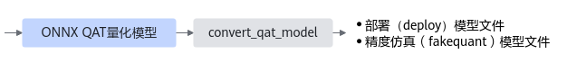

**调用示例<a name="section2590131417497"></a>**

本示例演示了如何将ONNX的QAT量化模型通过AMCT适配为CANN量化模型格式。

> **说明：** 
>-   如下示例标有“由用户补充处理”的步骤，需要用户根据自己的模型和数据集进行补充处理，示例中仅为示例代码。
>-   如下示例调用AMCT的部分，函数入参请根据实际情况进行调整。

1.  导入AMCT包，并通过[设置环境变量](设置环境变量.md)日志级别。

    ```
    import amct_onnx as amct
    ```

2.  <a name="li1581368161319"></a>（可选，由用户补充处理）在ONNX Runtime环境中验证推理脚本及环境。

    建议使用原始待量化的模型和测试集，在ONNX Runtime环境下推理，验证环境、推理脚本是否正常。

    推荐执行该步骤，请确保原始模型可以完成推理且精度正常；执行该步骤时，可以使用部分测试集，减少运行时间。

    ```
    user_do_inference(ori_model, test_data, test_iterations)
    ```

3.  调用AMCT中的[convert\_qat\_model](convert_qat_model.md)接口，执行模型适配。

    该接口内部会将待适配的模型解析为graph形式，完成图的预处理操作\>修改解析后的图结构，插入AscendQuant、AscendDequant等算子，保存为量化模型。

    ```
    model_file = "./pre_model/mobilenet_v2_qat.onnx"
    save_path="./results/model"
    amct.convert_qat_model(model_file, save_path)
    ```

4.  （可选，由用户补充处理）使用量化后模型和测试集，在ONNX Runtime环境下推理，测试量化后的仿真模型精度。

    使用量化后仿真模型精度与[2](#li1581368161319)中的原始精度做对比，可以观察量化对精度的影响。

    ```
    quant_model = './results/user_model_fake_quant_model.onnx'
    user_do_inference(quant_model, test_data, test_iterations)
    ```

    如果模式适配后，deploy部署模型和fakequant精度仿真模型推理精度和原始模型推理精度相比差异较大，原因是deploy模型上板推理需要对bias做量化，fakequant模型推理会对bias做量化反量化，可能与原始模型中的bias存在差异，从而导致了上述精度的差异；该场景下，建议用户先对原始模型的bias进行量化反量化操作，然后再进行模型适配，进行量化反量化的公式如下：

    round\(bias/\(scale\_d\*scale\_w\)\)\*\(scale\_d\*scale\_w\)

### 量化数据均衡预处理<a name="ZH-CN_TOPIC_0000002473744570"></a>

在一些数据分布不均匀的场景，由于离群值的影响，对数据进行per-tensor量化得到的结果误差较大，而per-channel量化可以获得更低的误差。但由于当前硬件不支持数据per-channel量化，仅支持权重per-channel量化；在该背景下AMCT设计出一套方法，本节将给出详细介绍。

通过数据均衡预处理接口计算出均衡因子，将模型数据与权重进行数学等价换算，均衡模型数据与权重的分布，将数据的量化难度迁移一部分至权重，从而降低量化误差。

**表 1**  支持的层以及约束

<a name="table32131022111318"></a>
<table><thead align="left"><tr id="row9214202215138"><th class="cellrowborder" valign="top" width="30.580000000000002%" id="mcps1.2.4.1.1"><p id="p1921472241319"><a name="p1921472241319"></a><a name="p1921472241319"></a>支持的层类型</p>
</th>
<th class="cellrowborder" valign="top" width="32.57%" id="mcps1.2.4.1.2"><p id="p122141822101318"><a name="p122141822101318"></a><a name="p122141822101318"></a>约束</p>
</th>
<th class="cellrowborder" valign="top" width="36.85%" id="mcps1.2.4.1.3"><p id="p421411228138"><a name="p421411228138"></a><a name="p421411228138"></a>备注</p>
</th>
</tr>
</thead>
<tbody><tr id="row1521462251317"><td class="cellrowborder" valign="top" width="30.580000000000002%" headers="mcps1.2.4.1.1 "><p id="p1021414226138"><a name="p1021414226138"></a><a name="p1021414226138"></a>Conv：卷积层</p>
</td>
<td class="cellrowborder" valign="top" width="32.57%" headers="mcps1.2.4.1.2 "><p id="p11723420508"><a name="p11723420508"></a><a name="p11723420508"></a>支持4维或5维输入场景下的量化</p>
</td>
<td class="cellrowborder" rowspan="4" valign="top" width="36.85%" headers="mcps1.2.4.1.3 "><p id="p381615103334"><a name="p381615103334"></a><a name="p381615103334"></a>复用层（共用weight）不支持预处理均衡量化。</p>
<p id="p1430201644510"><a name="p1430201644510"></a><a name="p1430201644510"></a></p>
<p id="p343051619454"><a name="p343051619454"></a><a name="p343051619454"></a></p>
<p id="p11431416154519"><a name="p11431416154519"></a><a name="p11431416154519"></a></p>
</td>
</tr>
<tr id="row6215022181311"><td class="cellrowborder" valign="top" headers="mcps1.2.4.1.1 "><p id="p4215122181312"><a name="p4215122181312"></a><a name="p4215122181312"></a>Gemm：广义矩阵乘</p>
</td>
<td class="cellrowborder" valign="top" headers="mcps1.2.4.1.2 "><p id="p6214112220139"><a name="p6214112220139"></a><a name="p6214112220139"></a>transpose_a=false、Alpha=Beta=1.0</p>
</td>
</tr>
<tr id="row6215102221319"><td class="cellrowborder" valign="top" headers="mcps1.2.4.1.1 "><p id="p1421510225139"><a name="p1421510225139"></a><a name="p1421510225139"></a>MatMul：全连接层</p>
</td>
<td class="cellrowborder" valign="top" headers="mcps1.2.4.1.2 "><p id="p97071057182018"><a name="p97071057182018"></a><a name="p97071057182018"></a>当权重维度为2时，才支持量化</p>
</td>
</tr>
<tr id="row9996538185614"><td class="cellrowborder" valign="top" headers="mcps1.2.4.1.1 "><p id="p119991538115615"><a name="p119991538115615"></a><a name="p119991538115615"></a>ConvTranspose：转置卷积层</p>
</td>
<td class="cellrowborder" valign="top" headers="mcps1.2.4.1.2 "><p id="p198959153119"><a name="p198959153119"></a><a name="p198959153119"></a>仅支持4维输入场景下的量化</p>
</td>
</tr>
</tbody>
</table>

**接口调用流程<a name="section1218465794111"></a>**

均衡预处理接口调用流程如[图1](#fig153281318152013)所示：

**图 1**  均衡预处理接口调用流程<a name="fig153281318152013"></a>  
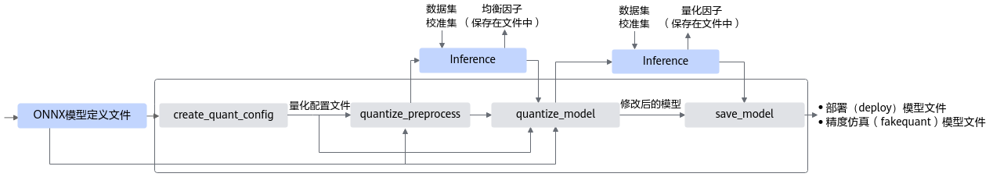

蓝色部分为用户实现，灰色部分为用户调用AMCT提供的API实现，使用流程如下：

1.  用户准备ONNX原始模型，并在简易配置文件_dmp\_quant.cfg_中设置dmq参数（简易配置文件配置参数请参见[训练后量化简易配置文件](训练后量化简易配置文件-35.md)），然后将配置文件传入[create\_quant\_config](create_quant_config-28.md)。
2.  根据ONNX模型和量化配置文件，即可调用[quantize\_preprocess](quantize_preprocess-32.md)接口对原始ONNX模型进行量化前优化：均衡量化，将数据的量化难度迁移到权重量化。
3.  用户基于ONNX Runtime以及校准集，执行**一次**校准模型推理完成均衡量化，并将均衡因子输出到record文件中。
4.  根据ONNX模型、量化配置文件和record，即可调用[quantize\_model](quantize_model-29.md)接口对原始ONNX模型进行量化前优化，包括Conv+BN融合等，插入权重量化算子，进行权重量化；插入数据量化算子，得到校准模型。
5.  用户基于ONNX Runtime以及校准集，执行校准模型推理完成数据量化，并将量化因子输出到文件中。
6.  最后用户可以调用[save\_model](save_model-30.md)接口保存量化后的模型，包括可在ONNX执行框架ONNX Runtime环境中进行精度仿真的模型文件和可部署在NPU IP加速器的模型文件。

**调用示例<a name="section421534918119"></a>**

> **说明：** 
>-   如下示例标有“由用户补充处理”的步骤，需要用户根据自己的模型和数据集进行补充处理，示例中仅为示例代码。
>-   如下示例调用AMCT的部分，函数入参请根据实际情况进行调整。

1.  导入AMCT包，并通过[设置环境变量](设置环境变量.md)日志级别。

    ```
    import amct_onnx as amct
    ```

2.  <a name="li154865592110"></a>（可选，由用户补充处理）在ONNX Runtime环境中验证推理脚本及环境。

    建议使用原始待量化的模型和测试集，在ONNX Runtime环境下推理，验证环境、推理脚本是否正常。

    推荐执行该步骤，请确保原始模型可以完成推理且精度正常；执行该步骤时，可以使用部分测试集，减少运行时间。

    ```
    user_do_inference(ori_model, test_data, test_iterations)
    ```

3.  调用AMCT，量化模型。
    1.  生成量化配置。

        用户在简易配置文件_dmp\_quant.cfg_中设置dmq参数，并将配置文件通过config\_defination参数传入[create\_quant\_config](create_quant_config-28.md)。

        ```
        config_defination = os.path.join(PATH, 'dmp_quant.cfg')
        config_file = './tmp/config.json'
        skip_layers = []
        batch_num = 1
        amct.create_quant_config(config_file=config_file,
        			        model=ori_model,
                                        input_data=ori_model_input_data,
        			        skip_layers=skip_layers,
        			        batch_num=batch_num,
                                        config_defination=config_defination)
        ```

    2.  修改图，在图中插入均衡量化算子，用于计算均衡量化因子。

        ```
        record_file = './tmp/record.txt'
        modified_model = './tmp/modified_model.onnx'
        amct.quantize_preprocess(config_file=config_file,
                                       record_file=record_file,
                                       model_file=ori_model,
                                       modified_onnx_file=modified_model)
        ```

    3.  （由用户补充处理）使用修改后的图在校准集上做模型推理，找到均衡量化因子。

        该步骤执行时，需要注意如下两点：

        1.  校准集及其预处理过程数据要与模型匹配，以保证量化的精度。
        2.  前向推理的次数为1，如果次数超过1次，每执行一次推理，record中均衡量化因子会被记录一次，后续过程会失败。

        ```
        user_do_inference(modified_onnx_file, calibration_data, test_iterations=1)
        ```

    4.  修改图，在图中插入数据量化，权重量化等相关的算子，用于计算量化相关参数。

        ```
        modified_model = './tmp/modified_model.onnx'
        amct.quantize_model(config_file=config_file,
                                  model_file=ori_model,
                                  modified_onnx_file=modified_model,
                                  record_file=record_file)
        ```

    5.  （由用户补充处理）使用修改后的图在校准集上做模型推理，找到量化因子。

        该步骤执行时，需要注意如下两点：

        1.  校准集及其预处理过程数据要与模型匹配，以保证量化的精度。
        2.  前向推理的次数为batch\_num，如果次数不够，后续过程会失败。

        若校准过程中有错误信息，则可以尝试参见[校准过程中提示"IFMR node. Name:'layer\_ifmr\_op' Status Message: std::bad\_alloc"信息](校准过程中提示-IFMR-node-Name-layer_ifmr_op-Status-Message-std-bad_alloc-信息.md)或[校准过程中出现"killed"信息](校准过程中出现-killed-信息.md)进行处理。

        ```
        user_do_inference(modified_onnx_file, calibration_data, batch_num)
        ```

    6.  保存模型。

        根据量化因子以及修改后的模型，调用[save\_model](save_model-30.md)接口，插入AscendQuant、AscendDequant等算子，保存为量化模型。

        ```
        quant_model_path = './results/user_model'
        amct.save_model(modified_onnx_file=modified_model,
                              record_file=record_file,
                              save_path=quant_model_path)
        ```

4.  （可选，由用户补充处理）基于ONNX Runtime的环境，使用量化后模型（quant\_model）在测试集（test\_data）上做推理，测试量化后仿真模型的精度。

    使用量化后仿真模型精度与[2](#li154865592110)中的原始精度做对比，可以观察量化对精度的影响。

    ```
    quant_model = './results/user_model_fake_quant_model.onnx'
    user_do_inference(quant_model, test_data, test_iterations)
    ```

## 接口说明<a name="ZH-CN_TOPIC_0000002505904591"></a>


### 整体约束和接口列表<a name="ZH-CN_TOPIC_0000002506024587"></a>

**整体约束<a name="section9843123082213"></a>**

-   若接口中存在需要用户输入文件路径的参数，请确保输入路径正确，AMCT不会对路径做安全校验。
-   若接口中存在需要用户输入文件路径的参数，重新执行量化时，该参数相关取值将会被覆盖；量化打屏日志中也会有相关文件被覆盖的warning风险提示信息。

**接口列表<a name="section97871745172212"></a>**

<a name="table56729509238"></a>
<table><thead align="left"><tr id="row3672165052313"><th class="cellrowborder" valign="top" width="11.581158115811581%" id="mcps1.1.4.1.1"><p id="p6672155010238"><a name="p6672155010238"></a><a name="p6672155010238"></a>分类</p>
</th>
<th class="cellrowborder" valign="top" width="20.052005200520053%" id="mcps1.1.4.1.2"><p id="p9672165020232"><a name="p9672165020232"></a><a name="p9672165020232"></a>接口名称</p>
</th>
<th class="cellrowborder" valign="top" width="68.36683668366837%" id="mcps1.1.4.1.3"><p id="p56724507235"><a name="p56724507235"></a><a name="p56724507235"></a>功能描述</p>
</th>
</tr>
</thead>
<tbody><tr id="row667265019238"><td class="cellrowborder" rowspan="5" valign="top" width="11.581158115811581%" headers="mcps1.1.4.1.1 "><p id="p367315032317"><a name="p367315032317"></a><a name="p367315032317"></a>训练后量化接口</p>
</td>
<td class="cellrowborder" valign="top" width="20.052005200520053%" headers="mcps1.1.4.1.2 "><p id="p14232155472412"><a name="p14232155472412"></a><a name="p14232155472412"></a><a href="create_quant_config-28.md">create_quant_config</a></p>
</td>
<td class="cellrowborder" valign="top" width="68.36683668366837%" headers="mcps1.1.4.1.3 "><p id="p2673135042314"><a name="p2673135042314"></a><a name="p2673135042314"></a>根据图的结构找到所有可量化的层，自动生成量化配置文件，并将可量化层的量化配置信息写入文件。</p>
</td>
</tr>
<tr id="row1967395032310"><td class="cellrowborder" valign="top" headers="mcps1.1.4.1.1 "><p id="p72321454132412"><a name="p72321454132412"></a><a name="p72321454132412"></a><a href="quantize_model-29.md">quantize_model</a></p>
</td>
<td class="cellrowborder" valign="top" headers="mcps1.1.4.1.2 "><p id="p16732509234"><a name="p16732509234"></a><a name="p16732509234"></a>将输入的待量化的图结构按照给定的量化配置文件进行量化处理，在传入的图结构中插入权重量化，以及数据量化等相关的算子，生成量化因子记录文件record_file，返回修改后的ONNX校准模<span>型</span>。</p>
</td>
</tr>
<tr id="row166731450172318"><td class="cellrowborder" valign="top" headers="mcps1.1.4.1.1 "><p id="p523295416242"><a name="p523295416242"></a><a name="p523295416242"></a><a href="save_model-30.md">save_model</a></p>
</td>
<td class="cellrowborder" valign="top" headers="mcps1.1.4.1.2 "><p id="p1673450132313"><a name="p1673450132313"></a><a name="p1673450132313"></a>根据量化因子记录文件record_file以及修改后的模型，调用该接口，插入AscendQuant、AscendDequant等算子，然后保存为可以在ONNX Runtime环境进行精度仿真的fake_quant模型，和可以在<span id="zh-cn_topic_0000002506024507_ph10338182343120"><a name="zh-cn_topic_0000002506024507_ph10338182343120"></a><a name="zh-cn_topic_0000002506024507_ph10338182343120"></a>NPU IP加速器</span>做推理的deploy模型。</p>
</td>
</tr>
<tr id="row16673850112316"><td class="cellrowborder" valign="top" headers="mcps1.1.4.1.1 "><p id="p15232175419244"><a name="p15232175419244"></a><a name="p15232175419244"></a><a href="accuracy_based_auto_calibration-31.md">accuracy_based_auto_calibration</a></p>
</td>
<td class="cellrowborder" valign="top" headers="mcps1.1.4.1.2 "><p id="p6673125012311"><a name="p6673125012311"></a><a name="p6673125012311"></a>根据用户输入的模型、配置文件进行自动的校准过程，搜索得到一个满足目标精度的量化配置，输出可以在ONNX Runtime环境下做精度仿真的fake_quant模型，和可在<span id="zh-cn_topic_0000002473744688_zh-cn_topic_0240188713_ph1555712386204"><a name="zh-cn_topic_0000002473744688_zh-cn_topic_0240188713_ph1555712386204"></a><a name="zh-cn_topic_0000002473744688_zh-cn_topic_0240188713_ph1555712386204"></a>NPU IP加速器</span>上做推理的deploy模型。</p>
</td>
</tr>
<tr id="row15551132517325"><td class="cellrowborder" valign="top" headers="mcps1.1.4.1.1 "><p id="p823218540248"><a name="p823218540248"></a><a name="p823218540248"></a><a href="quantize_preprocess-32.md">quantize_preprocess</a></p>
</td>
<td class="cellrowborder" valign="top" headers="mcps1.1.4.1.2 "><p id="p11673145092319"><a name="p11673145092319"></a><a name="p11673145092319"></a>量化数据均衡预处理接口，将输入的待量化的图结构按照给定的量化配置文件进行训练后量化预处理，在传入的图结构中插入均衡量化算子，生成均衡量化因子记录文件record_file，返回修改后的ONNX校准模<span>型</span>。</p>
</td>
</tr>
<tr id="row1067385014232"><td class="cellrowborder" valign="top" width="11.581158115811581%" headers="mcps1.1.4.1.1 "><p id="p467355032315"><a name="p467355032315"></a><a name="p467355032315"></a>模型适配接口</p>
</td>
<td class="cellrowborder" valign="top" width="20.052005200520053%" headers="mcps1.1.4.1.2 "><p id="p17673145052316"><a name="p17673145052316"></a><a name="p17673145052316"></a><a href="convert_qat_model.md">convert_qat_model</a></p>
</td>
<td class="cellrowborder" valign="top" width="68.36683668366837%" headers="mcps1.1.4.1.3 "><p id="p17673205019239"><a name="p17673205019239"></a><a name="p17673205019239"></a>将ONNX量化模型适配为CANN支持的量化模型。</p>
</td>
</tr>
</tbody>
</table>

### 训练后量化接口<a name="ZH-CN_TOPIC_0000002506024565"></a>


#### create\_quant\_config<a name="ZH-CN_TOPIC_0000002506024457"></a>

**产品支持情况<a name="section185612964420"></a>**

<a name="zh-cn_topic_0000002505904555_table38301303189"></a>
<table><thead align="left"><tr id="zh-cn_topic_0000002505904555_row20831180131817"><th class="cellrowborder" valign="top" width="57.99999999999999%" id="mcps1.1.3.1.1"><p id="zh-cn_topic_0000002505904555_p1883113061818"><a name="zh-cn_topic_0000002505904555_p1883113061818"></a><a name="zh-cn_topic_0000002505904555_p1883113061818"></a>产品</p>
</th>
<th class="cellrowborder" align="center" valign="top" width="42%" id="mcps1.1.3.1.2"><p id="zh-cn_topic_0000002505904555_p783113012187"><a name="zh-cn_topic_0000002505904555_p783113012187"></a><a name="zh-cn_topic_0000002505904555_p783113012187"></a>是否支持</p>
</th>
</tr>
</thead>
<tbody><tr id="zh-cn_topic_0000002505904555_row1466941011819"><td class="cellrowborder" valign="top" width="57.99999999999999%" headers="mcps1.1.3.1.1 "><p id="zh-cn_topic_0000002505904555_p146702104188"><a name="zh-cn_topic_0000002505904555_p146702104188"></a><a name="zh-cn_topic_0000002505904555_p146702104188"></a><span id="zh-cn_topic_0000002505904555_ph1577265511916"><a name="zh-cn_topic_0000002505904555_ph1577265511916"></a><a name="zh-cn_topic_0000002505904555_ph1577265511916"></a>IPV350</span></p>
</td>
<td class="cellrowborder" align="center" valign="top" width="42%" headers="mcps1.1.3.1.2 "><p id="zh-cn_topic_0000002505904555_p12400144361011"><a name="zh-cn_topic_0000002505904555_p12400144361011"></a><a name="zh-cn_topic_0000002505904555_p12400144361011"></a>√</p>
</td>
</tr>
</tbody>
</table>

**功能说明<a name="zh-cn_topic_0240187365_section15406195619561"></a>**

根据图的结构找到所有可量化的层，自动生成量化配置文件，并将可量化层的量化配置信息写入文件。

**函数原型<a name="zh-cn_topic_0240187365_zh-cn_topic_0122830089_section428121323411"></a>**

```
create_quant_config(config_file, model_file, skip_layers=None, batch_num=1, activation_offset=True, config_defination=None, updated_model=None)
```

**参数说明<a name="zh-cn_topic_0240187365_zh-cn_topic_0122830089_section795991810344"></a>**

<a name="zh-cn_topic_0240187365_zh-cn_topic_0122830089_table438764393513"></a>
<table><thead align="left"><tr id="zh-cn_topic_0240187365_zh-cn_topic_0122830089_row53871743113510"><th class="cellrowborder" valign="top" width="11.459999999999999%" id="mcps1.1.4.1.1"><p id="zh-cn_topic_0240187365_zh-cn_topic_0122830089_p1438834363520"><a name="zh-cn_topic_0240187365_zh-cn_topic_0122830089_p1438834363520"></a><a name="zh-cn_topic_0240187365_zh-cn_topic_0122830089_p1438834363520"></a>参数名</p>
</th>
<th class="cellrowborder" valign="top" width="7.4399999999999995%" id="mcps1.1.4.1.2"><p id="zh-cn_topic_0240187365_p1769255516412"><a name="zh-cn_topic_0240187365_p1769255516412"></a><a name="zh-cn_topic_0240187365_p1769255516412"></a>输入/输出</p>
</th>
<th class="cellrowborder" valign="top" width="81.10000000000001%" id="mcps1.1.4.1.3"><p id="zh-cn_topic_0240187365_p15231205416325"><a name="zh-cn_topic_0240187365_p15231205416325"></a><a name="zh-cn_topic_0240187365_p15231205416325"></a>说明</p>
</th>
</tr>
</thead>
<tbody><tr id="zh-cn_topic_0240187365_zh-cn_topic_0122830089_row2038874343514"><td class="cellrowborder" valign="top" width="11.459999999999999%" headers="mcps1.1.4.1.1 "><p id="zh-cn_topic_0240187365_p8886819105313"><a name="zh-cn_topic_0240187365_p8886819105313"></a><a name="zh-cn_topic_0240187365_p8886819105313"></a>config_file</p>
</td>
<td class="cellrowborder" valign="top" width="7.4399999999999995%" headers="mcps1.1.4.1.2 "><p id="zh-cn_topic_0240187365_p8693185517417"><a name="zh-cn_topic_0240187365_p8693185517417"></a><a name="zh-cn_topic_0240187365_p8693185517417"></a>输入</p>
</td>
<td class="cellrowborder" valign="top" width="81.10000000000001%" headers="mcps1.1.4.1.3 "><p id="p918510322117"><a name="p918510322117"></a><a name="p918510322117"></a>含义：待生成的量化配置文件存放路径及名称。如果存放路径下已经存在该文件，则调用该接口时会覆盖已有文件。</p>
<p id="zh-cn_topic_0240187365_p11225740182619"><a name="zh-cn_topic_0240187365_p11225740182619"></a><a name="zh-cn_topic_0240187365_p11225740182619"></a>数据类型：string</p>
</td>
</tr>
<tr id="row550615345319"><td class="cellrowborder" valign="top" width="11.459999999999999%" headers="mcps1.1.4.1.1 "><p id="p1448192019326"><a name="p1448192019326"></a><a name="p1448192019326"></a>model_file</p>
</td>
<td class="cellrowborder" valign="top" width="7.4399999999999995%" headers="mcps1.1.4.1.2 "><p id="p150610539536"><a name="p150610539536"></a><a name="p150610539536"></a>输入</p>
</td>
<td class="cellrowborder" valign="top" width="81.10000000000001%" headers="mcps1.1.4.1.3 "><p id="p1907386111"><a name="p1907386111"></a><a name="p1907386111"></a>含义：待量化的ONNX模型文件。该模型必须是基于ONNX opset11生成的模型，并且能够在ONNX Runtime 1.5.2上完成推理。</p>
<p id="p1550745314533"><a name="p1550745314533"></a><a name="p1550745314533"></a>数据类型：string</p>
</td>
</tr>
<tr id="zh-cn_topic_0240187365_row2997141123911"><td class="cellrowborder" valign="top" width="11.459999999999999%" headers="mcps1.1.4.1.1 "><p id="zh-cn_topic_0240187365_p99979413397"><a name="zh-cn_topic_0240187365_p99979413397"></a><a name="zh-cn_topic_0240187365_p99979413397"></a>skip_layers</p>
</td>
<td class="cellrowborder" valign="top" width="7.4399999999999995%" headers="mcps1.1.4.1.2 "><p id="zh-cn_topic_0240187365_p10997194193915"><a name="zh-cn_topic_0240187365_p10997194193915"></a><a name="zh-cn_topic_0240187365_p10997194193915"></a>输入</p>
</td>
<td class="cellrowborder" valign="top" width="81.10000000000001%" headers="mcps1.1.4.1.3 "><p id="p55639398116"><a name="p55639398116"></a><a name="p55639398116"></a>含义：可量化但不需要量化的层名。</p>
<p id="zh-cn_topic_0240187365_p163711335174212"><a name="zh-cn_topic_0240187365_p163711335174212"></a><a name="zh-cn_topic_0240187365_p163711335174212"></a>默认值：None</p>
<p id="zh-cn_topic_0240187365_p355615248166"><a name="zh-cn_topic_0240187365_p355615248166"></a><a name="zh-cn_topic_0240187365_p355615248166"></a>数据类型：list，列表中元素类型为string</p>
<p id="p167685264181"><a name="p167685264181"></a><a name="p167685264181"></a>使用约束：如果使用简易配置文件作为入参，则该参数需要在简易配置文件中设置，此时输入参数中该参数配置不生效。</p>
</td>
</tr>
<tr id="zh-cn_topic_0240187365_row13558046183914"><td class="cellrowborder" valign="top" width="11.459999999999999%" headers="mcps1.1.4.1.1 "><p id="zh-cn_topic_0240187365_p455834616397"><a name="zh-cn_topic_0240187365_p455834616397"></a><a name="zh-cn_topic_0240187365_p455834616397"></a>batch_num</p>
</td>
<td class="cellrowborder" valign="top" width="7.4399999999999995%" headers="mcps1.1.4.1.2 "><p id="zh-cn_topic_0240187365_p855954603911"><a name="zh-cn_topic_0240187365_p855954603911"></a><a name="zh-cn_topic_0240187365_p855954603911"></a>输入</p>
</td>
<td class="cellrowborder" valign="top" width="81.10000000000001%" headers="mcps1.1.4.1.3 "><p id="p2237641151110"><a name="p2237641151110"></a><a name="p2237641151110"></a>含义：量化使用的batch数量，即使用多少个batch的数据生成量化因子。</p>
<p id="zh-cn_topic_0240187365_p3913143317168"><a name="zh-cn_topic_0240187365_p3913143317168"></a><a name="zh-cn_topic_0240187365_p3913143317168"></a>数据类型：int</p>
<p id="zh-cn_topic_0240187365_p12301331144210"><a name="zh-cn_topic_0240187365_p12301331144210"></a><a name="zh-cn_topic_0240187365_p12301331144210"></a>取值范围：大于0的整数</p>
<p id="zh-cn_topic_0240187365_p8171152811"><a name="zh-cn_topic_0240187365_p8171152811"></a><a name="zh-cn_topic_0240187365_p8171152811"></a>默认值：1</p>
<p id="p1587011717593"><a name="p1587011717593"></a><a name="p1587011717593"></a>使用约束：</p>
<a name="ul14325189145918"></a><a name="ul14325189145918"></a><ul id="ul14325189145918"><li>batch_num不宜过大，batch_num与batch_size的乘积为量化过程中使用的图片数量，过多的图片会占用较大的内存。</li><li>如果使用简易配置文件作为入参，则该参数需要在简易配置文件中设置，此时输入参数中该参数配置不生效。</li></ul>
</td>
</tr>
<tr id="zh-cn_topic_0240187365_row473005916274"><td class="cellrowborder" valign="top" width="11.459999999999999%" headers="mcps1.1.4.1.1 "><p id="zh-cn_topic_0240187365_p146233804215"><a name="zh-cn_topic_0240187365_p146233804215"></a><a name="zh-cn_topic_0240187365_p146233804215"></a>activation_offset</p>
</td>
<td class="cellrowborder" valign="top" width="7.4399999999999995%" headers="mcps1.1.4.1.2 "><p id="zh-cn_topic_0240187365_p1546220381429"><a name="zh-cn_topic_0240187365_p1546220381429"></a><a name="zh-cn_topic_0240187365_p1546220381429"></a>输入</p>
</td>
<td class="cellrowborder" valign="top" width="81.10000000000001%" headers="mcps1.1.4.1.3 "><p id="p2086294316114"><a name="p2086294316114"></a><a name="p2086294316114"></a>含义：数据量化是否带offset。</p>
<p id="zh-cn_topic_0240187365_p6462103818429"><a name="zh-cn_topic_0240187365_p6462103818429"></a><a name="zh-cn_topic_0240187365_p6462103818429"></a>默认值：True</p>
<p id="zh-cn_topic_0240187365_p1588701864411"><a name="zh-cn_topic_0240187365_p1588701864411"></a><a name="zh-cn_topic_0240187365_p1588701864411"></a>数据类型：bool</p>
<p id="p1058415385916"><a name="p1058415385916"></a><a name="p1058415385916"></a>使用约束：如果使用简易配置文件作为入参，则该参数需要在简易配置文件中设置，此时输入参数中该参数配置不生效。</p>
</td>
</tr>
<tr id="row8672528631"><td class="cellrowborder" valign="top" width="11.459999999999999%" headers="mcps1.1.4.1.1 "><p id="zh-cn_topic_0240188739_p12612155914458"><a name="zh-cn_topic_0240188739_p12612155914458"></a><a name="zh-cn_topic_0240188739_p12612155914458"></a>config_defination</p>
</td>
<td class="cellrowborder" valign="top" width="7.4399999999999995%" headers="mcps1.1.4.1.2 "><p id="zh-cn_topic_0240188739_p46121659184520"><a name="zh-cn_topic_0240188739_p46121659184520"></a><a name="zh-cn_topic_0240188739_p46121659184520"></a>输入</p>
</td>
<td class="cellrowborder" valign="top" width="81.10000000000001%" headers="mcps1.1.4.1.3 "><p id="p88614651118"><a name="p88614651118"></a><a name="p88614651118"></a>含义：基于calibration_config_onnx.proto文件生成的简易量化配置文件<em id="zh-cn_topic_0240188739_i04991385212"><a name="zh-cn_topic_0240188739_i04991385212"></a><a name="zh-cn_topic_0240188739_i04991385212"></a>quant</em>.cfg，*.proto文件所在路径为：<em id="zh-cn_topic_0240188739_i13405105118558"><a name="zh-cn_topic_0240188739_i13405105118558"></a><a name="zh-cn_topic_0240188739_i13405105118558"></a><span id="ph817993414715"><a name="ph817993414715"></a><a name="ph817993414715"></a>AMCT</span>安装目录</em>/amct_onnx/proto/。*.proto文件参数解释以及生成的<em id="zh-cn_topic_0240188739_i8781171513315"><a name="zh-cn_topic_0240188739_i8781171513315"></a><a name="zh-cn_topic_0240188739_i8781171513315"></a>quant</em>.cfg简易量化配置文件样例请参见<a href="训练后量化简易配置文件-35.md">训练后量化简易配置文件</a>。</p>
<p id="zh-cn_topic_0240188739_p1944053764718"><a name="zh-cn_topic_0240188739_p1944053764718"></a><a name="zh-cn_topic_0240188739_p1944053764718"></a>默认值：None</p>
<p id="zh-cn_topic_0240188739_p86121059144513"><a name="zh-cn_topic_0240188739_p86121059144513"></a><a name="zh-cn_topic_0240188739_p86121059144513"></a>数据类型：string</p>
<p id="zh-cn_topic_0240188739_p337494234812"><a name="zh-cn_topic_0240188739_p337494234812"></a><a name="zh-cn_topic_0240188739_p337494234812"></a>使用约束：当取值为None时，使用输入参数生成配置文件；否则，忽略输入的其他量化参数（skip_layers，batch_num，activation_offset），根据简易量化配置文件参数config_defination生成JSON格式的配置文件。</p>
</td>
</tr>
<tr id="row69487158416"><td class="cellrowborder" valign="top" width="11.459999999999999%" headers="mcps1.1.4.1.1 "><p id="p39489151946"><a name="p39489151946"></a><a name="p39489151946"></a>updated_model</p>
</td>
<td class="cellrowborder" valign="top" width="7.4399999999999995%" headers="mcps1.1.4.1.2 "><p id="p199482158411"><a name="p199482158411"></a><a name="p199482158411"></a>输入</p>
</td>
<td class="cellrowborder" valign="top" width="81.10000000000001%" headers="mcps1.1.4.1.3 "><p id="p16942174771117"><a name="p16942174771117"></a><a name="p16942174771117"></a>含义：如果配置，会去更新模型里节点name，没有name的会按{op_type}_{index}格式生成唯一的name，对于已有的name重复的节点会通过增加数字后缀保证name唯一，然后按配置的文件路径保存更新后的ONNX模型。</p>
<p id="p987412501055"><a name="p987412501055"></a><a name="p987412501055"></a>默认值：None</p>
<p id="p138756501515"><a name="p138756501515"></a><a name="p138756501515"></a>数据类型：string</p>
</td>
</tr>
</tbody>
</table>

**返回值说明<a name="zh-cn_topic_0240187365_zh-cn_topic_0122830089_section293415513458"></a>**

无

**调用示例<a name="zh-cn_topic_0240187365_section64231658994"></a>**

```
import amct_onnx as amct

model_file = "resnet101.onnx"
# 生成量化配置文件
amct.create_quant_config(config_file="./configs/config.json",
                         model_file=model_file,
                         skip_layers=None,
                         batch_num=1,
                         activation_offset=True)
```

落盘文件说明：生成JSON格式的量化配置文件，样例如下（重新执行量化时，该接口输出的量化配置文件将会被覆盖）：

-   均匀量化配置文件（数据量化使用[IFMR数据量化算法](IFMR数据量化算法.md)）

    ```
    {
        "version":1,
        "batch_num":2,
        "activation_offset":true,
        "joint_quant":false,
        "do_fusion":true,
        "skip_fusion_layers":[],
        "tensor_quantize":[
          {
             "layer_name": "maxpool_ld_default",
             "input_index":0,
             "activation_quant_params":{
                 "num_bits":16,
                 "max_percentile":0.999999,
                 "min_percentile":0.999999,
                 "search_range":[
                     0.7,
                    1.3
                 ],
                 "search_step":0.01,
                 "act_algo":"ifmr",
                 "asymmetric":false
              }
           }
        ],
        "layer_name1":{
            "quant_enable":true,
            "dmq_balancer_param":0.5,
            "activation_quant_params":{
                "num_bits":16,
                "max_percentile":0.999999,
                "min_percentile":0.999999,
                "search_range":[
                    0.7,
                    1.3
                ],
                "search_step":0.01,
                "act_algo":"ifmr",
                "asymmetric":false
            },
            "weight_quant_params":{
                "num_bits":8,
                "wts_algo":"arq_quantize",
                "channel_wise":true
            }
        },
        "layer_name2":{
            "quant_enable":true,
            "dmq_balancer_param":0.5,
            "activation_quant_params":{
                "num_bits":16,
                "max_percentile":0.999999,
                "min_percentile":0.999999,
                "search_range":[
                    0.7,
                    1.3
                ],
                "search_step":0.01,
                "act_algo":"ifmr",
                "asymmetric":false
            },
            "weight_quant_params":{
                "num_bits":8,
                "wts_algo":"arq_quantize",
                "channel_wise":false
            }
        }
    }
    ```

-   均匀量化配置文件（数据量化使用[HFMG数据量化算法](HFMG数据量化算法.md)）

    ```
    {
        "version":1,
        "batch_num":2,
        "activation_offset":true,
        "do_fusion":true,
        "skip_fusion_layers":[],
        "tensor_quantize":[
          {
             "layer_name": "maxpool_ld_default",
             "input_index":0,
             "activation_quant_params":{
                 "num_bits":16,
                 "max_percentile":0.999999,
                 "min_percentile":0.999999,
                 "search_range":[
                     0.7,
                    1.3
                 ],
                 "search_step":0.01
                 "act_algo":"hfmg"
                 "asymmetric":false
              }
           }
        ],
        "layer_name1":{
            "quant_enable":true,
            "dmq_balancer_param":0.5,
            "activation_quant_params":{
                "num_bits":16,
                "act_algo":"hfmg",
                "num_of_bins":4096
                "asymmetric":false
            },
            "weight_quant_params":{
                "num_bits":8,
                "wts_algo":"arq_quantize",
                "channel_wise":true
            }
        }
    }
    ```

#### quantize\_model<a name="ZH-CN_TOPIC_0000002473744554"></a>

**产品支持情况<a name="section185612964420"></a>**

<a name="zh-cn_topic_0000002505904555_table38301303189"></a>
<table><thead align="left"><tr id="zh-cn_topic_0000002505904555_row20831180131817"><th class="cellrowborder" valign="top" width="57.99999999999999%" id="mcps1.1.3.1.1"><p id="zh-cn_topic_0000002505904555_p1883113061818"><a name="zh-cn_topic_0000002505904555_p1883113061818"></a><a name="zh-cn_topic_0000002505904555_p1883113061818"></a>产品</p>
</th>
<th class="cellrowborder" align="center" valign="top" width="42%" id="mcps1.1.3.1.2"><p id="zh-cn_topic_0000002505904555_p783113012187"><a name="zh-cn_topic_0000002505904555_p783113012187"></a><a name="zh-cn_topic_0000002505904555_p783113012187"></a>是否支持</p>
</th>
</tr>
</thead>
<tbody><tr id="zh-cn_topic_0000002505904555_row1466941011819"><td class="cellrowborder" valign="top" width="57.99999999999999%" headers="mcps1.1.3.1.1 "><p id="zh-cn_topic_0000002505904555_p146702104188"><a name="zh-cn_topic_0000002505904555_p146702104188"></a><a name="zh-cn_topic_0000002505904555_p146702104188"></a><span id="zh-cn_topic_0000002505904555_ph1577265511916"><a name="zh-cn_topic_0000002505904555_ph1577265511916"></a><a name="zh-cn_topic_0000002505904555_ph1577265511916"></a>IPV350</span></p>
</td>
<td class="cellrowborder" align="center" valign="top" width="42%" headers="mcps1.1.3.1.2 "><p id="zh-cn_topic_0000002505904555_p12400144361011"><a name="zh-cn_topic_0000002505904555_p12400144361011"></a><a name="zh-cn_topic_0000002505904555_p12400144361011"></a>√</p>
</td>
</tr>
</tbody>
</table>

**功能说明<a name="zh-cn_topic_0240187994_section15406195619561"></a>**

将输入的待量化的图结构按照给定的量化配置文件进行量化处理，在传入的图结构中插入权重量化，以及数据量化等相关的算子，生成量化因子记录文件record\_file，返回修改后的ONNX校准模型。

**函数原型<a name="zh-cn_topic_0240187994_zh-cn_topic_0122830089_section428121323411"></a>**

```
quantize_model(config_file, model_file, modified_onnx_file, record_file)
```

**参数说明<a name="zh-cn_topic_0240187994_zh-cn_topic_0122830089_section795991810344"></a>**

<a name="zh-cn_topic_0240187994_zh-cn_topic_0122830089_table438764393513"></a>
<table><thead align="left"><tr id="zh-cn_topic_0240187994_zh-cn_topic_0122830089_row53871743113510"><th class="cellrowborder" valign="top" width="13.541354135413542%" id="mcps1.1.4.1.1"><p id="zh-cn_topic_0240187994_zh-cn_topic_0122830089_p1438834363520"><a name="zh-cn_topic_0240187994_zh-cn_topic_0122830089_p1438834363520"></a><a name="zh-cn_topic_0240187994_zh-cn_topic_0122830089_p1438834363520"></a>参数名</p>
</th>
<th class="cellrowborder" valign="top" width="7.190719071907191%" id="mcps1.1.4.1.2"><p id="zh-cn_topic_0240187994_p1769255516412"><a name="zh-cn_topic_0240187994_p1769255516412"></a><a name="zh-cn_topic_0240187994_p1769255516412"></a>输入/输出</p>
</th>
<th class="cellrowborder" valign="top" width="79.26792679267926%" id="mcps1.1.4.1.3"><p id="zh-cn_topic_0240187994_p15231205416325"><a name="zh-cn_topic_0240187994_p15231205416325"></a><a name="zh-cn_topic_0240187994_p15231205416325"></a>说明</p>
</th>
</tr>
</thead>
<tbody><tr id="zh-cn_topic_0240187994_row32991154514"><td class="cellrowborder" valign="top" width="13.541354135413542%" headers="mcps1.1.4.1.1 "><p id="zh-cn_topic_0240187994_p11214202165418"><a name="zh-cn_topic_0240187994_p11214202165418"></a><a name="zh-cn_topic_0240187994_p11214202165418"></a>config_file</p>
</td>
<td class="cellrowborder" valign="top" width="7.190719071907191%" headers="mcps1.1.4.1.2 "><p id="zh-cn_topic_0240187994_p8693185517417"><a name="zh-cn_topic_0240187994_p8693185517417"></a><a name="zh-cn_topic_0240187994_p8693185517417"></a>输入</p>
</td>
<td class="cellrowborder" valign="top" width="79.26792679267926%" headers="mcps1.1.4.1.3 "><p id="p08851329161318"><a name="p08851329161318"></a><a name="p08851329161318"></a>含义：用户生成的量化配置文件，用于指定模型network中量化层的配置情况。</p>
<p id="zh-cn_topic_0240187994_p131301850191420"><a name="zh-cn_topic_0240187994_p131301850191420"></a><a name="zh-cn_topic_0240187994_p131301850191420"></a>数据类型：string</p>
</td>
</tr>
<tr id="row9860112616920"><td class="cellrowborder" valign="top" width="13.541354135413542%" headers="mcps1.1.4.1.1 "><p id="p1686018261290"><a name="p1686018261290"></a><a name="p1686018261290"></a>model_file</p>
</td>
<td class="cellrowborder" valign="top" width="7.190719071907191%" headers="mcps1.1.4.1.2 "><p id="p886018267910"><a name="p886018267910"></a><a name="p886018267910"></a>输入</p>
</td>
<td class="cellrowborder" valign="top" width="79.26792679267926%" headers="mcps1.1.4.1.3 "><p id="p4672173710137"><a name="p4672173710137"></a><a name="p4672173710137"></a>含义：用户原始ONNX模型文件或者通过<a href="create_quant_config-28.md">create_quant_config</a>生成的updated模型。</p>
<p id="p486011266916"><a name="p486011266916"></a><a name="p486011266916"></a>数据类型：string</p>
</td>
</tr>
<tr id="row87261172575"><td class="cellrowborder" valign="top" width="13.541354135413542%" headers="mcps1.1.4.1.1 "><p id="p67261617135720"><a name="p67261617135720"></a><a name="p67261617135720"></a>modified_onnx_file</p>
</td>
<td class="cellrowborder" valign="top" width="7.190719071907191%" headers="mcps1.1.4.1.2 "><p id="p67266176576"><a name="p67266176576"></a><a name="p67266176576"></a>输入</p>
</td>
<td class="cellrowborder" valign="top" width="79.26792679267926%" headers="mcps1.1.4.1.3 "><p id="p20103539201314"><a name="p20103539201314"></a><a name="p20103539201314"></a>含义：文件名，用于存储待执行数据量化的ONNX校准模型。</p>
<p id="p1072601710573"><a name="p1072601710573"></a><a name="p1072601710573"></a>数据类型：string</p>
</td>
</tr>
<tr id="zh-cn_topic_0240187994_row4537142419283"><td class="cellrowborder" valign="top" width="13.541354135413542%" headers="mcps1.1.4.1.1 "><p id="zh-cn_topic_0240187994_p1353832472811"><a name="zh-cn_topic_0240187994_p1353832472811"></a><a name="zh-cn_topic_0240187994_p1353832472811"></a>record_file</p>
</td>
<td class="cellrowborder" valign="top" width="7.190719071907191%" headers="mcps1.1.4.1.2 "><p id="zh-cn_topic_0240187994_p1153815249285"><a name="zh-cn_topic_0240187994_p1153815249285"></a><a name="zh-cn_topic_0240187994_p1153815249285"></a>输入</p>
</td>
<td class="cellrowborder" valign="top" width="79.26792679267926%" headers="mcps1.1.4.1.3 "><p id="p1143412407133"><a name="p1143412407133"></a><a name="p1143412407133"></a>含义：量化因子记录文件路径及名称。</p>
<p id="zh-cn_topic_0240187994_p12538152410286"><a name="zh-cn_topic_0240187994_p12538152410286"></a><a name="zh-cn_topic_0240187994_p12538152410286"></a>数据类型：string</p>
</td>
</tr>
</tbody>
</table>

**返回值说明<a name="zh-cn_topic_0240187994_zh-cn_topic_0122830089_section293415513458"></a>**

无

**调用示例<a name="zh-cn_topic_0240187994_section542843616112"></a>**

```
import amct_onnx as amct

model_file = "resnet101.onnx"
scale_offset_record_file = os.path.join(TMP, 'scale_offset_record.txt')
modified_model = os.path.join(TMP, 'modified_model.onnx')
config_file="./configs/config.json"
# 插入量化API
amct.quantize_model(config_file,
                    model_file,
                    modified_model,
                    scale_offset_record_file)
```

#### save\_model<a name="ZH-CN_TOPIC_0000002506024507"></a>

**产品支持情况<a name="section185612964420"></a>**

<a name="zh-cn_topic_0000002505904555_table38301303189"></a>
<table><thead align="left"><tr id="zh-cn_topic_0000002505904555_row20831180131817"><th class="cellrowborder" valign="top" width="57.99999999999999%" id="mcps1.1.3.1.1"><p id="zh-cn_topic_0000002505904555_p1883113061818"><a name="zh-cn_topic_0000002505904555_p1883113061818"></a><a name="zh-cn_topic_0000002505904555_p1883113061818"></a>产品</p>
</th>
<th class="cellrowborder" align="center" valign="top" width="42%" id="mcps1.1.3.1.2"><p id="zh-cn_topic_0000002505904555_p783113012187"><a name="zh-cn_topic_0000002505904555_p783113012187"></a><a name="zh-cn_topic_0000002505904555_p783113012187"></a>是否支持</p>
</th>
</tr>
</thead>
<tbody><tr id="zh-cn_topic_0000002505904555_row1466941011819"><td class="cellrowborder" valign="top" width="57.99999999999999%" headers="mcps1.1.3.1.1 "><p id="zh-cn_topic_0000002505904555_p146702104188"><a name="zh-cn_topic_0000002505904555_p146702104188"></a><a name="zh-cn_topic_0000002505904555_p146702104188"></a><span id="zh-cn_topic_0000002505904555_ph1577265511916"><a name="zh-cn_topic_0000002505904555_ph1577265511916"></a><a name="zh-cn_topic_0000002505904555_ph1577265511916"></a>IPV350</span></p>
</td>
<td class="cellrowborder" align="center" valign="top" width="42%" headers="mcps1.1.3.1.2 "><p id="zh-cn_topic_0000002505904555_p12400144361011"><a name="zh-cn_topic_0000002505904555_p12400144361011"></a><a name="zh-cn_topic_0000002505904555_p12400144361011"></a>√</p>
</td>
</tr>
</tbody>
</table>

**功能说明<a name="zh-cn_topic_0240188006_section15406195619561"></a>**

根据量化因子记录文件record\_file以及修改后的模型，调用该接口，插入AscendQuant、AscendDequant等算子，然后保存为可以在ONNX Runtime环境进行精度仿真的fake\_quant模型，和可以在NPU IP加速器做推理的deploy模型。

**约束说明<a name="zh-cn_topic_0240188006_section1443392021419"></a>**

-   在网络推理的batch数目达到batch\_num后，再调用该接口，否则量化因子不正确，量化结果不正确。
-   该接口只接收[quantize\_model](quantize_model-29.md)接口产生的ONNX类型模型文件。
-   该接口需要输入量化因子记录文件，量化因子记录文件在[quantize\_model](quantize_model-29.md)阶段生成，在模型推理阶段填充有效值。

**函数原型<a name="zh-cn_topic_0240188006_zh-cn_topic_0122830089_section428121323411"></a>**

```
save_model(modified_onnx_file, record_file, save_path)
```

**参数说明<a name="zh-cn_topic_0240188006_zh-cn_topic_0122830089_section795991810344"></a>**

<a name="zh-cn_topic_0240188006_zh-cn_topic_0122830089_table438764393513"></a>
<table><thead align="left"><tr id="zh-cn_topic_0240188006_zh-cn_topic_0122830089_row53871743113510"><th class="cellrowborder" valign="top" width="13.239999999999998%" id="mcps1.1.4.1.1"><p id="zh-cn_topic_0240188006_zh-cn_topic_0122830089_p1438834363520"><a name="zh-cn_topic_0240188006_zh-cn_topic_0122830089_p1438834363520"></a><a name="zh-cn_topic_0240188006_zh-cn_topic_0122830089_p1438834363520"></a>参数名</p>
</th>
<th class="cellrowborder" valign="top" width="7.16%" id="mcps1.1.4.1.2"><p id="zh-cn_topic_0240188006_p1769255516412"><a name="zh-cn_topic_0240188006_p1769255516412"></a><a name="zh-cn_topic_0240188006_p1769255516412"></a>输入/输出</p>
</th>
<th class="cellrowborder" valign="top" width="79.60000000000001%" id="mcps1.1.4.1.3"><p id="zh-cn_topic_0240188006_p15231205416325"><a name="zh-cn_topic_0240188006_p15231205416325"></a><a name="zh-cn_topic_0240188006_p15231205416325"></a>说明</p>
</th>
</tr>
</thead>
<tbody><tr id="zh-cn_topic_0240188006_zh-cn_topic_0122830089_row2038874343514"><td class="cellrowborder" valign="top" width="13.239999999999998%" headers="mcps1.1.4.1.1 "><p id="p1756782410311"><a name="p1756782410311"></a><a name="p1756782410311"></a>modified_onnx_file</p>
</td>
<td class="cellrowborder" valign="top" width="7.16%" headers="mcps1.1.4.1.2 "><p id="zh-cn_topic_0240188006_p1255438123917"><a name="zh-cn_topic_0240188006_p1255438123917"></a><a name="zh-cn_topic_0240188006_p1255438123917"></a>输入</p>
</td>
<td class="cellrowborder" valign="top" width="79.60000000000001%" headers="mcps1.1.4.1.3 "><p id="p721742171410"><a name="p721742171410"></a><a name="p721742171410"></a>含义：文件名，修改后的ONNX模型文件，由<a href="quantize_model-29.md">quantize_model</a>接口输出。</p>
<p id="zh-cn_topic_0240188006_p182551638143919"><a name="zh-cn_topic_0240188006_p182551638143919"></a><a name="zh-cn_topic_0240188006_p182551638143919"></a>数据类型：string</p>
</td>
</tr>
<tr id="zh-cn_topic_0240188006_row12264154113552"><td class="cellrowborder" valign="top" width="13.239999999999998%" headers="mcps1.1.4.1.1 "><p id="zh-cn_topic_0240188006_p172650416558"><a name="zh-cn_topic_0240188006_p172650416558"></a><a name="zh-cn_topic_0240188006_p172650416558"></a>record_file</p>
</td>
<td class="cellrowborder" valign="top" width="7.16%" headers="mcps1.1.4.1.2 "><p id="zh-cn_topic_0240188006_p82657418551"><a name="zh-cn_topic_0240188006_p82657418551"></a><a name="zh-cn_topic_0240188006_p82657418551"></a>输入</p>
</td>
<td class="cellrowborder" valign="top" width="79.60000000000001%" headers="mcps1.1.4.1.3 "><p id="p1046581181517"><a name="p1046581181517"></a><a name="p1046581181517"></a>含义：量化因子记录文件路径及名称。</p>
<p id="zh-cn_topic_0240188006_p1760663182215"><a name="zh-cn_topic_0240188006_p1760663182215"></a><a name="zh-cn_topic_0240188006_p1760663182215"></a>数据类型：string</p>
</td>
</tr>
<tr id="zh-cn_topic_0240188006_row73395458557"><td class="cellrowborder" valign="top" width="13.239999999999998%" headers="mcps1.1.4.1.1 "><p id="zh-cn_topic_0240188006_p9489111813337"><a name="zh-cn_topic_0240188006_p9489111813337"></a><a name="zh-cn_topic_0240188006_p9489111813337"></a>save_path</p>
</td>
<td class="cellrowborder" valign="top" width="7.16%" headers="mcps1.1.4.1.2 "><p id="zh-cn_topic_0240188006_p934014518550"><a name="zh-cn_topic_0240188006_p934014518550"></a><a name="zh-cn_topic_0240188006_p934014518550"></a>输入</p>
</td>
<td class="cellrowborder" valign="top" width="79.60000000000001%" headers="mcps1.1.4.1.3 "><p id="p1642017781510"><a name="p1642017781510"></a><a name="p1642017781510"></a>含义：模型存放路径。该路径需要包含模型名前缀，例如./quantized_model/*<em id="zh-cn_topic_0240188713_i162671794111"><a name="zh-cn_topic_0240188713_i162671794111"></a><a name="zh-cn_topic_0240188713_i162671794111"></a>model</em>。</p>
<p id="zh-cn_topic_0240188006_p021914293368"><a name="zh-cn_topic_0240188006_p021914293368"></a><a name="zh-cn_topic_0240188006_p021914293368"></a>数据类型：string</p>
</td>
</tr>
</tbody>
</table>

**返回值说明<a name="zh-cn_topic_0240188006_zh-cn_topic_0122830089_section293415513458"></a>**

无

**调用示例<a name="zh-cn_topic_0240188006_section149503402234"></a>**

```
import amct_onnx as amct
# 进行网络推理，期间完成量化
# 由于quantize_model接口生成的校准模型中包含了AMCT新增的自定义算子，所以在执行校准集的推理时创建的onnxruntime的InferenceSession需要包含AMCT提供的SessionOptions
for i in batch_num:
    onnxruntime.InferenceSession(onnx_model, amct.AMCT_SO).run(None, {'input':input_batch})

# 插入API，将量化的模型存为onnx文件
amct.save_model(modified_onnx_file="./tmp/modified_model.onnx",
                record_file="./scale_offset_record_file.txt",
                save_path="./results/model")
```

落盘文件说明：

-   精度仿真模型文件：模型名中包含fake\_quant，可以在ONNX执行框架ONNX Runtime进行精度仿真。
-   部署模型文件：模型名中包含deploy，经过ATC转换工具转换后可部署到NPU IP加速器。
-   （可选）\*.external文件，包括\*deploy.external和\*fakequant.external：

    -   如果原始模型为非分离模式网络（不包含external data），只有保存的精度仿真模型以及部署模型文件大小\>=2GB才会生成该类文件，且与压缩后的\*.onnx模型文件生成在同级目录，用于保存Tensor中的数据，每个Tensor数据单独保存一份\*.external文件，文件名与Tensor相同，例如_conv1.weight_\_deploy.external和_conv1.weight_\_fakequant.external。
    -   如果原始模型为数据模型分离模式网络（包含external data），不论压缩后的模型文件是否\>=2GB，Tensor数据都会单独保存，即始终会生成\*.external文件（constant节点不支持转存为external\_data）。

    后续通过ATC工具加载压缩后的\*.onnx部署模型文件进行模型转换时，会自动读取同级目录下\*.external文件中的Tensor数据。

重新执行量化时，该接口输出的上述文件将会被覆盖。

#### accuracy\_based\_auto\_calibration<a name="ZH-CN_TOPIC_0000002473744688"></a>

**产品支持情况<a name="section185612964420"></a>**

<a name="zh-cn_topic_0000002505904555_table38301303189"></a>
<table><thead align="left"><tr id="zh-cn_topic_0000002505904555_row20831180131817"><th class="cellrowborder" valign="top" width="57.99999999999999%" id="mcps1.1.3.1.1"><p id="zh-cn_topic_0000002505904555_p1883113061818"><a name="zh-cn_topic_0000002505904555_p1883113061818"></a><a name="zh-cn_topic_0000002505904555_p1883113061818"></a>产品</p>
</th>
<th class="cellrowborder" align="center" valign="top" width="42%" id="mcps1.1.3.1.2"><p id="zh-cn_topic_0000002505904555_p783113012187"><a name="zh-cn_topic_0000002505904555_p783113012187"></a><a name="zh-cn_topic_0000002505904555_p783113012187"></a>是否支持</p>
</th>
</tr>
</thead>
<tbody><tr id="zh-cn_topic_0000002505904555_row1466941011819"><td class="cellrowborder" valign="top" width="57.99999999999999%" headers="mcps1.1.3.1.1 "><p id="zh-cn_topic_0000002505904555_p146702104188"><a name="zh-cn_topic_0000002505904555_p146702104188"></a><a name="zh-cn_topic_0000002505904555_p146702104188"></a><span id="zh-cn_topic_0000002505904555_ph1577265511916"><a name="zh-cn_topic_0000002505904555_ph1577265511916"></a><a name="zh-cn_topic_0000002505904555_ph1577265511916"></a>IPV350</span></p>
</td>
<td class="cellrowborder" align="center" valign="top" width="42%" headers="mcps1.1.3.1.2 "><p id="zh-cn_topic_0000002505904555_p12400144361011"><a name="zh-cn_topic_0000002505904555_p12400144361011"></a><a name="zh-cn_topic_0000002505904555_p12400144361011"></a>√</p>
</td>
</tr>
</tbody>
</table>

**功能说明<a name="zh-cn_topic_0240188739_section15406195619561"></a>**

根据用户输入的模型、配置文件进行自动的校准过程，搜索得到一个满足目标精度的量化配置，输出可以在ONNX Runtime环境下做精度仿真的fake\_quant模型，和可在NPU IP加速器上做推理的deploy模型。

**约束说明<a name="zh-cn_topic_0240188739_section1443392021419"></a>**

无。

**函数原型<a name="zh-cn_topic_0240188739_zh-cn_topic_0122830089_section428121323411"></a>**

```
accuracy_based_auto_calibration(model_file,model_evaluator,config_file,record_file,save_dir,strategy='BinarySearch',sensitivity='CosineSimilarity')
```

**参数说明<a name="zh-cn_topic_0240188739_zh-cn_topic_0122830089_section795991810344"></a>**

<a name="zh-cn_topic_0240188739_zh-cn_topic_0122830089_table438764393513"></a>
<table><thead align="left"><tr id="zh-cn_topic_0240188739_zh-cn_topic_0122830089_row53871743113510"><th class="cellrowborder" valign="top" width="10.58105810581058%" id="mcps1.1.4.1.1"><p id="zh-cn_topic_0240188739_zh-cn_topic_0122830089_p1438834363520"><a name="zh-cn_topic_0240188739_zh-cn_topic_0122830089_p1438834363520"></a><a name="zh-cn_topic_0240188739_zh-cn_topic_0122830089_p1438834363520"></a>参数名</p>
</th>
<th class="cellrowborder" valign="top" width="8.19081908190819%" id="mcps1.1.4.1.2"><p id="zh-cn_topic_0240188739_p1769255516412"><a name="zh-cn_topic_0240188739_p1769255516412"></a><a name="zh-cn_topic_0240188739_p1769255516412"></a>输入/输出</p>
</th>
<th class="cellrowborder" valign="top" width="81.22812281228123%" id="mcps1.1.4.1.3"><p id="zh-cn_topic_0240188739_p15231205416325"><a name="zh-cn_topic_0240188739_p15231205416325"></a><a name="zh-cn_topic_0240188739_p15231205416325"></a>说明</p>
</th>
</tr>
</thead>
<tbody><tr id="zh-cn_topic_0240188739_zh-cn_topic_0122830089_row2038874343514"><td class="cellrowborder" valign="top" width="10.58105810581058%" headers="mcps1.1.4.1.1 "><p id="p163296363467"><a name="p163296363467"></a><a name="p163296363467"></a>model_file</p>
</td>
<td class="cellrowborder" valign="top" width="8.19081908190819%" headers="mcps1.1.4.1.2 "><p id="p16326936194620"><a name="p16326936194620"></a><a name="p16326936194620"></a>输入</p>
</td>
<td class="cellrowborder" valign="top" width="81.22812281228123%" headers="mcps1.1.4.1.3 "><p id="p1324817021618"><a name="p1324817021618"></a><a name="p1324817021618"></a>含义：用户onnx模型文件，格式为.onnx。</p>
<p id="zh-cn_topic_0240188739_p11225740182619"><a name="zh-cn_topic_0240188739_p11225740182619"></a><a name="zh-cn_topic_0240188739_p11225740182619"></a>数据类型：string</p>
</td>
</tr>
<tr id="row1763192415510"><td class="cellrowborder" valign="top" width="10.58105810581058%" headers="mcps1.1.4.1.1 "><p id="p1727017448554"><a name="p1727017448554"></a><a name="p1727017448554"></a>model_evaluator</p>
</td>
<td class="cellrowborder" valign="top" width="8.19081908190819%" headers="mcps1.1.4.1.2 "><p id="p19270154417552"><a name="p19270154417552"></a><a name="p19270154417552"></a>输入</p>
</td>
<td class="cellrowborder" valign="top" width="81.22812281228123%" headers="mcps1.1.4.1.3 "><p id="p6661566167"><a name="p6661566167"></a><a name="p6661566167"></a>含义：自动量化进行校准和评估精度的Python实例。</p>
<p id="p227024455516"><a name="p227024455516"></a><a name="p227024455516"></a>数据类型：Python实例</p>
</td>
</tr>
<tr id="row147322675519"><td class="cellrowborder" valign="top" width="10.58105810581058%" headers="mcps1.1.4.1.1 "><p id="p112701544105513"><a name="p112701544105513"></a><a name="p112701544105513"></a>config_file</p>
</td>
<td class="cellrowborder" valign="top" width="8.19081908190819%" headers="mcps1.1.4.1.2 "><p id="p82709442556"><a name="p82709442556"></a><a name="p82709442556"></a>输入</p>
</td>
<td class="cellrowborder" valign="top" width="81.22812281228123%" headers="mcps1.1.4.1.3 "><p id="p2046118831614"><a name="p2046118831614"></a><a name="p2046118831614"></a>含义：用户生成的量化配置文件。</p>
<p id="p427074415514"><a name="p427074415514"></a><a name="p427074415514"></a>数据类型：string</p>
</td>
</tr>
<tr id="row581122875516"><td class="cellrowborder" valign="top" width="10.58105810581058%" headers="mcps1.1.4.1.1 "><p id="p6270174411554"><a name="p6270174411554"></a><a name="p6270174411554"></a>record_file</p>
</td>
<td class="cellrowborder" valign="top" width="8.19081908190819%" headers="mcps1.1.4.1.2 "><p id="p2270344115519"><a name="p2270344115519"></a><a name="p2270344115519"></a>输入</p>
</td>
<td class="cellrowborder" valign="top" width="81.22812281228123%" headers="mcps1.1.4.1.3 "><p id="p67311710131616"><a name="p67311710131616"></a><a name="p67311710131616"></a>含义：存储量化因子的路径，如果该路径下已存在文件，则会被重写。</p>
<p id="p22711144105518"><a name="p22711144105518"></a><a name="p22711144105518"></a>数据类型：string</p>
</td>
</tr>
<tr id="row18771230135514"><td class="cellrowborder" valign="top" width="10.58105810581058%" headers="mcps1.1.4.1.1 "><p id="p627114495515"><a name="p627114495515"></a><a name="p627114495515"></a>save_dir</p>
</td>
<td class="cellrowborder" valign="top" width="8.19081908190819%" headers="mcps1.1.4.1.2 "><p id="p8271184415512"><a name="p8271184415512"></a><a name="p8271184415512"></a>输入</p>
</td>
<td class="cellrowborder" valign="top" width="81.22812281228123%" headers="mcps1.1.4.1.3 "><p id="p16322191217169"><a name="p16322191217169"></a><a name="p16322191217169"></a>含义：模型存放路径。该路径需要包含模型名前缀，例如./quantized_model/*<em id="i2027174495514"><a name="i2027174495514"></a><a name="i2027174495514"></a>model</em>。</p>
<p id="p3271124435510"><a name="p3271124435510"></a><a name="p3271124435510"></a>数据类型：string</p>
</td>
</tr>
<tr id="row19569102213553"><td class="cellrowborder" valign="top" width="10.58105810581058%" headers="mcps1.1.4.1.1 "><p id="p8271104455513"><a name="p8271104455513"></a><a name="p8271104455513"></a>strategy</p>
</td>
<td class="cellrowborder" valign="top" width="8.19081908190819%" headers="mcps1.1.4.1.2 "><p id="p727117445551"><a name="p727117445551"></a><a name="p727117445551"></a>输入</p>
</td>
<td class="cellrowborder" valign="top" width="81.22812281228123%" headers="mcps1.1.4.1.3 "><p id="p578081341618"><a name="p578081341618"></a><a name="p578081341618"></a>含义：搜索满足精度要求的量化配置的策略，默认是二分法策略。</p>
<p id="p202712441551"><a name="p202712441551"></a><a name="p202712441551"></a>数据类型：string或Python实例</p>
<p id="p141261046574"><a name="p141261046574"></a><a name="p141261046574"></a>默认值：BinarySearch</p>
</td>
</tr>
<tr id="row262223511567"><td class="cellrowborder" valign="top" width="10.58105810581058%" headers="mcps1.1.4.1.1 "><p id="p1062310355567"><a name="p1062310355567"></a><a name="p1062310355567"></a>sensitivity</p>
</td>
<td class="cellrowborder" valign="top" width="8.19081908190819%" headers="mcps1.1.4.1.2 "><p id="p097993595712"><a name="p097993595712"></a><a name="p097993595712"></a>输入</p>
</td>
<td class="cellrowborder" valign="top" width="81.22812281228123%" headers="mcps1.1.4.1.3 "><p id="p1633831551614"><a name="p1633831551614"></a><a name="p1633831551614"></a>含义：评价每一层量化层对于量化敏感度的指标，默认是余弦相似度。</p>
<p id="p1797983525717"><a name="p1797983525717"></a><a name="p1797983525717"></a>数据类型：string或Python实例</p>
<p id="p67548209285"><a name="p67548209285"></a><a name="p67548209285"></a>默认值：CosineSimilarity</p>
</td>
</tr>
</tbody>
</table>

**返回值说明<a name="zh-cn_topic_0240188739_zh-cn_topic_0122830089_section293415513458"></a>**

无

**调用示例<a name="section179052217494"></a>**

```
import amct_onnx as amct
from amct_onnx.common.auto_calibration import AutoCalibrationEvaluatorBase

# You need to implement the AutoCalibrationEvaluator's calibration(), evaluate() and metric_eval() funcs
class AutoCalibrationEvaluator(AutoCalibrationEvaluatorBase):
    """ subclass of AutoCalibrationEvaluatorBase"""
    def __init__(self, target_loss, batch_num):
        super(AutoCalibrationEvaluator, self).__init__()
        self.target_loss = target_loss
        self.batch_num = batch_num

    def calibration(self, model_file):
        """ implement the calibration function of AutoCalibrationEvaluatorBase
            calibration() need to finish the calibration inference procedure
            so the inference batch num need to >= the batch_num pass to create_quant_config
        """
        onnx_forward(onnx_model=model_file, batch_size=32, iterations=self.batch_num)

    def evaluate(self, model_file):
        """ implement the evaluate function of AutoCalibrationEvaluatorBase
            params: model_file in .onnx
            return: the accuracy of input model on the eval dataset, or other metric which
                    can describe the 'accuracy' of model
        """
        top1, top5 = onnx_forward(onnx_model=model_file, batch_size=32, iterations=5)
        return top1

    def metric_eval(self, original_metric, new_metric):
        """ implement the metric_eval function of AutoCalibrationEvaluatorBase
            params: original_metric: the returned accuracy of evaluate() on non quantized model
                    new_metric: the returned accuracy of evaluate() on fake quant model
            return:
                   [0]: whether the accuracy loss between non quantized model and fake quant model
                        can satisfy the requirement
                   [1]: the accuracy loss between non quantized model and fake quant model
        """
        loss = original_metric - new_metric
        if loss * 100 < self.target_loss:
            return True, loss
        return False, loss
   ...
 
    config_json_file = os.path.join(TMP, 'config.json')
    skip_layers = []
    batch_num = 1
    model_file = "mobilenet_v2.onnx"
    amct.create_quant_config(
        config_file=config_json_file, model_file=model_file, skip_layers=skip_layers, batch_num=batch_num,
        activation_offset=True, config_defination=None)

    # 1. step1 create quant config json file
    scale_offset_record_file = os.path.join(TMP, 'scale_offset_record.txt')
    result_path = os.path.join(PATH, 'results/mobilenet_v2')

    # 2. step2 construct the instance of AutoCalibrationEvaluator
    evaluator = AutoCalibrationEvaluator(target_loss=0.5, batch_num=batch_num)

    # 3. step3 using the accuracy_based_auto_calibration to quantized the model
    amct.accuracy_based_auto_calibration(
        model_file=model_file,
        model_evaluator=evaluator,
        config_file=config_json_file,
        record_file=scale_offset_record_file,
        save_dir=result_path,
        strategy='BinarySearch',
        sensitivity='CosineSimilarity'
    )
```

落盘文件说明：

-   精度仿真模型文件：模型名中包含fake\_quant，可以在ONNX执行框架ONNX Runtime进行精度仿真。
-   部署模型文件：模型名中包含deploy，经过ATC工具转换后可部署到NPU IP加速器。
-   量化因子记录文件：在接口中的record\_file中写入量化因子。
-   敏感度信息文件：该文件记录了待量化层对于量化的敏感度信息，根据该信息进行量化回退层的选择。
-   自动量化回退历史记录文件：记录的回退层的信息。

#### quantize\_preprocess<a name="ZH-CN_TOPIC_0000002506024445"></a>

**产品支持情况<a name="section185612964420"></a>**

<a name="zh-cn_topic_0000002505904555_table38301303189"></a>
<table><thead align="left"><tr id="zh-cn_topic_0000002505904555_row20831180131817"><th class="cellrowborder" valign="top" width="57.99999999999999%" id="mcps1.1.3.1.1"><p id="zh-cn_topic_0000002505904555_p1883113061818"><a name="zh-cn_topic_0000002505904555_p1883113061818"></a><a name="zh-cn_topic_0000002505904555_p1883113061818"></a>产品</p>
</th>
<th class="cellrowborder" align="center" valign="top" width="42%" id="mcps1.1.3.1.2"><p id="zh-cn_topic_0000002505904555_p783113012187"><a name="zh-cn_topic_0000002505904555_p783113012187"></a><a name="zh-cn_topic_0000002505904555_p783113012187"></a>是否支持</p>
</th>
</tr>
</thead>
<tbody><tr id="zh-cn_topic_0000002505904555_row1466941011819"><td class="cellrowborder" valign="top" width="57.99999999999999%" headers="mcps1.1.3.1.1 "><p id="zh-cn_topic_0000002505904555_p146702104188"><a name="zh-cn_topic_0000002505904555_p146702104188"></a><a name="zh-cn_topic_0000002505904555_p146702104188"></a><span id="zh-cn_topic_0000002505904555_ph1577265511916"><a name="zh-cn_topic_0000002505904555_ph1577265511916"></a><a name="zh-cn_topic_0000002505904555_ph1577265511916"></a>IPV350</span></p>
</td>
<td class="cellrowborder" align="center" valign="top" width="42%" headers="mcps1.1.3.1.2 "><p id="zh-cn_topic_0000002505904555_p12400144361011"><a name="zh-cn_topic_0000002505904555_p12400144361011"></a><a name="zh-cn_topic_0000002505904555_p12400144361011"></a>√</p>
</td>
</tr>
</tbody>
</table>

**功能说明<a name="zh-cn_topic_0240187365_section15406195619561"></a>**

量化数据均衡预处理接口，将输入的待量化的图结构按照给定的量化配置文件进行训练后量化预处理，在传入的图结构中插入均衡量化算子，生成均衡量化因子记录文件record\_file，返回修改后的ONNX校准模型。

**函数原型<a name="zh-cn_topic_0240187365_zh-cn_topic_0122830089_section428121323411"></a>**

```
quantize_preprocess(config_file, record_file, model_file, modified_onnx_file)
```

**参数说明<a name="zh-cn_topic_0240187365_zh-cn_topic_0122830089_section795991810344"></a>**

<a name="zh-cn_topic_0240187365_zh-cn_topic_0122830089_table438764393513"></a>
<table><thead align="left"><tr id="zh-cn_topic_0240187365_zh-cn_topic_0122830089_row53871743113510"><th class="cellrowborder" valign="top" width="14.12%" id="mcps1.1.4.1.1"><p id="zh-cn_topic_0240187365_zh-cn_topic_0122830089_p1438834363520"><a name="zh-cn_topic_0240187365_zh-cn_topic_0122830089_p1438834363520"></a><a name="zh-cn_topic_0240187365_zh-cn_topic_0122830089_p1438834363520"></a>参数名</p>
</th>
<th class="cellrowborder" valign="top" width="7.22%" id="mcps1.1.4.1.2"><p id="zh-cn_topic_0240187365_p1769255516412"><a name="zh-cn_topic_0240187365_p1769255516412"></a><a name="zh-cn_topic_0240187365_p1769255516412"></a>输入/输出</p>
</th>
<th class="cellrowborder" valign="top" width="78.66%" id="mcps1.1.4.1.3"><p id="zh-cn_topic_0240187365_p15231205416325"><a name="zh-cn_topic_0240187365_p15231205416325"></a><a name="zh-cn_topic_0240187365_p15231205416325"></a>说明</p>
</th>
</tr>
</thead>
<tbody><tr id="zh-cn_topic_0240187365_zh-cn_topic_0122830089_row2038874343514"><td class="cellrowborder" valign="top" width="14.12%" headers="mcps1.1.4.1.1 "><p id="zh-cn_topic_0240187994_p11214202165418"><a name="zh-cn_topic_0240187994_p11214202165418"></a><a name="zh-cn_topic_0240187994_p11214202165418"></a>config_file</p>
</td>
<td class="cellrowborder" valign="top" width="7.22%" headers="mcps1.1.4.1.2 "><p id="zh-cn_topic_0240187994_p8693185517417"><a name="zh-cn_topic_0240187994_p8693185517417"></a><a name="zh-cn_topic_0240187994_p8693185517417"></a>输入</p>
</td>
<td class="cellrowborder" valign="top" width="78.66%" headers="mcps1.1.4.1.3 "><p id="p1979865081810"><a name="p1979865081810"></a><a name="p1979865081810"></a>含义：用户生成的量化配置文件，用于指定模型network中量化层的配置情况。</p>
<p id="zh-cn_topic_0240187994_p131301850191420"><a name="zh-cn_topic_0240187994_p131301850191420"></a><a name="zh-cn_topic_0240187994_p131301850191420"></a>数据类型：string</p>
</td>
</tr>
<tr id="zh-cn_topic_0240187365_row13558046183914"><td class="cellrowborder" valign="top" width="14.12%" headers="mcps1.1.4.1.1 "><p id="zh-cn_topic_0240187994_p1353832472811"><a name="zh-cn_topic_0240187994_p1353832472811"></a><a name="zh-cn_topic_0240187994_p1353832472811"></a>record_file</p>
</td>
<td class="cellrowborder" valign="top" width="7.22%" headers="mcps1.1.4.1.2 "><p id="zh-cn_topic_0240187994_p1153815249285"><a name="zh-cn_topic_0240187994_p1153815249285"></a><a name="zh-cn_topic_0240187994_p1153815249285"></a>输入</p>
</td>
<td class="cellrowborder" valign="top" width="78.66%" headers="mcps1.1.4.1.3 "><p id="p156840191915"><a name="p156840191915"></a><a name="p156840191915"></a>含义：均衡量化因子记录文件路径及名称。</p>
<p id="zh-cn_topic_0240187994_p12538152410286"><a name="zh-cn_topic_0240187994_p12538152410286"></a><a name="zh-cn_topic_0240187994_p12538152410286"></a>数据类型：string</p>
</td>
</tr>
<tr id="zh-cn_topic_0240187365_row473005916274"><td class="cellrowborder" valign="top" width="14.12%" headers="mcps1.1.4.1.1 "><p id="p1686018261290"><a name="p1686018261290"></a><a name="p1686018261290"></a>model_file</p>
</td>
<td class="cellrowborder" valign="top" width="7.22%" headers="mcps1.1.4.1.2 "><p id="p886018267910"><a name="p886018267910"></a><a name="p886018267910"></a>输入</p>
</td>
<td class="cellrowborder" valign="top" width="78.66%" headers="mcps1.1.4.1.3 "><p id="p178801072192"><a name="p178801072192"></a><a name="p178801072192"></a>含义：用户原始onnx模型文件或者通过<a href="create_quant_config-28.md">create_quant_config</a>生成的updated模型。</p>
<p id="p486011266916"><a name="p486011266916"></a><a name="p486011266916"></a>数据类型：string</p>
</td>
</tr>
<tr id="row8672528631"><td class="cellrowborder" valign="top" width="14.12%" headers="mcps1.1.4.1.1 "><p id="p67261617135720"><a name="p67261617135720"></a><a name="p67261617135720"></a>modified_onnx_file</p>
</td>
<td class="cellrowborder" valign="top" width="7.22%" headers="mcps1.1.4.1.2 "><p id="p67266176576"><a name="p67266176576"></a><a name="p67266176576"></a>输入</p>
</td>
<td class="cellrowborder" valign="top" width="78.66%" headers="mcps1.1.4.1.3 "><p id="p8814416161920"><a name="p8814416161920"></a><a name="p8814416161920"></a>含义：文件名，用于存储待执行数据量化的ONNX校准模型。</p>
<p id="p1072601710573"><a name="p1072601710573"></a><a name="p1072601710573"></a>数据类型：string</p>
</td>
</tr>
</tbody>
</table>

**返回值说明<a name="zh-cn_topic_0240187365_zh-cn_topic_0122830089_section293415513458"></a>**

无

**调用示例<a name="zh-cn_topic_0240187365_section64231658994"></a>**

```
import amct_onnx as amct

model_file = "resnet101.onnx"
tensor_balance_factor_record_file  = os.path.join(TMP, 'tensor_balance_factor_record.txt')
modified_model = os.path.join(TMP, 'modified_model.onnx')
config_file="./configs/config.json"
# 插入量化API
amct.quantize_preprocess(config_file,
                         tensor_balance_factor_record_file,
                         model_file,
                         modified_model)
```

### 模型适配接口<a name="ZH-CN_TOPIC_0000002473744546"></a>


#### convert\_qat\_model<a name="ZH-CN_TOPIC_0000002473904490"></a>

**产品支持情况<a name="section185612964420"></a>**

<a name="zh-cn_topic_0000002505904555_table38301303189"></a>
<table><thead align="left"><tr id="zh-cn_topic_0000002505904555_row20831180131817"><th class="cellrowborder" valign="top" width="57.99999999999999%" id="mcps1.1.3.1.1"><p id="zh-cn_topic_0000002505904555_p1883113061818"><a name="zh-cn_topic_0000002505904555_p1883113061818"></a><a name="zh-cn_topic_0000002505904555_p1883113061818"></a>产品</p>
</th>
<th class="cellrowborder" align="center" valign="top" width="42%" id="mcps1.1.3.1.2"><p id="zh-cn_topic_0000002505904555_p783113012187"><a name="zh-cn_topic_0000002505904555_p783113012187"></a><a name="zh-cn_topic_0000002505904555_p783113012187"></a>是否支持</p>
</th>
</tr>
</thead>
<tbody><tr id="zh-cn_topic_0000002505904555_row1466941011819"><td class="cellrowborder" valign="top" width="57.99999999999999%" headers="mcps1.1.3.1.1 "><p id="zh-cn_topic_0000002505904555_p146702104188"><a name="zh-cn_topic_0000002505904555_p146702104188"></a><a name="zh-cn_topic_0000002505904555_p146702104188"></a><span id="zh-cn_topic_0000002505904555_ph1577265511916"><a name="zh-cn_topic_0000002505904555_ph1577265511916"></a><a name="zh-cn_topic_0000002505904555_ph1577265511916"></a>IPV350</span></p>
</td>
<td class="cellrowborder" align="center" valign="top" width="42%" headers="mcps1.1.3.1.2 "><p id="zh-cn_topic_0000002505904555_p12400144361011"><a name="zh-cn_topic_0000002505904555_p12400144361011"></a><a name="zh-cn_topic_0000002505904555_p12400144361011"></a>√</p>
</td>
</tr>
</tbody>
</table>

**功能说明<a name="zh-cn_topic_0254208276_zh-cn_topic_0240188739_section15406195619561"></a>**

将ONNX量化模型适配为CANN支持的量化模型。

**约束说明<a name="zh-cn_topic_0254208276_zh-cn_topic_0240188739_section1443392021419"></a>**

-   若QuantizeLinear不为output算子：仅支持对QAT模型中包含QuantizeLinear和DequantizeLinear两类FakeQuant层结构的模型进行适配，且仅权重支持per-channel量化，成对的QuantizeLinear、DequantizeLinear层需要存在相同的量化因子。
-   若QuantizeLinear为非中间层的output算子，且为单输出：则模型适配时，不需要和DequantizeLinear配对，适配过程中会将QuantizeLinear算子替换成AscendQuant算子。

    > **说明：** 
    >由于ONNX原始模型中的offset值以INT32类型存储，进行算子替换时，可能会出现offset值超过INT8表示范围的情况；但是实际计算过程中，ONNX Runtime以及AMCT都会对offset做合法化处理，不会影响适配流程及结果。

**函数原型<a name="zh-cn_topic_0254208276_zh-cn_topic_0240188739_zh-cn_topic_0122830089_section428121323411"></a>**

```
convert_qat_model(model_file, save_path, record_file=None)
```

**参数说明<a name="zh-cn_topic_0254208276_zh-cn_topic_0240188739_zh-cn_topic_0122830089_section795991810344"></a>**

<a name="zh-cn_topic_0254208276_zh-cn_topic_0240188739_zh-cn_topic_0122830089_table438764393513"></a>
<table><thead align="left"><tr id="zh-cn_topic_0254208276_zh-cn_topic_0240188739_zh-cn_topic_0122830089_row53871743113510"><th class="cellrowborder" valign="top" width="10.26%" id="mcps1.1.4.1.1"><p id="zh-cn_topic_0254208276_zh-cn_topic_0240188739_zh-cn_topic_0122830089_p1438834363520"><a name="zh-cn_topic_0254208276_zh-cn_topic_0240188739_zh-cn_topic_0122830089_p1438834363520"></a><a name="zh-cn_topic_0254208276_zh-cn_topic_0240188739_zh-cn_topic_0122830089_p1438834363520"></a>参数名</p>
</th>
<th class="cellrowborder" valign="top" width="7.9%" id="mcps1.1.4.1.2"><p id="zh-cn_topic_0254208276_zh-cn_topic_0240188739_p1769255516412"><a name="zh-cn_topic_0254208276_zh-cn_topic_0240188739_p1769255516412"></a><a name="zh-cn_topic_0254208276_zh-cn_topic_0240188739_p1769255516412"></a>输入/输出</p>
</th>
<th class="cellrowborder" valign="top" width="81.84%" id="mcps1.1.4.1.3"><p id="zh-cn_topic_0254208276_zh-cn_topic_0240188739_p15231205416325"><a name="zh-cn_topic_0254208276_zh-cn_topic_0240188739_p15231205416325"></a><a name="zh-cn_topic_0254208276_zh-cn_topic_0240188739_p15231205416325"></a>说明</p>
</th>
</tr>
</thead>
<tbody><tr id="zh-cn_topic_0254208276_zh-cn_topic_0240188739_zh-cn_topic_0122830089_row2038874343514"><td class="cellrowborder" valign="top" width="10.26%" headers="mcps1.1.4.1.1 "><p id="zh-cn_topic_0240188006_p1254338193919"><a name="zh-cn_topic_0240188006_p1254338193919"></a><a name="zh-cn_topic_0240188006_p1254338193919"></a>model_file</p>
</td>
<td class="cellrowborder" valign="top" width="7.9%" headers="mcps1.1.4.1.2 "><p id="zh-cn_topic_0240188006_p1255438123917"><a name="zh-cn_topic_0240188006_p1255438123917"></a><a name="zh-cn_topic_0240188006_p1255438123917"></a>输入</p>
</td>
<td class="cellrowborder" valign="top" width="81.84%" headers="mcps1.1.4.1.3 "><p id="p9771748181916"><a name="p9771748181916"></a><a name="p9771748181916"></a>含义：待适配的.onnx格式模型文件路径。</p>
<p id="zh-cn_topic_0254208276_zh-cn_topic_0240188739_p11225740182619"><a name="zh-cn_topic_0254208276_zh-cn_topic_0240188739_p11225740182619"></a><a name="zh-cn_topic_0254208276_zh-cn_topic_0240188739_p11225740182619"></a>数据类型：string</p>
</td>
</tr>
<tr id="row1473562935412"><td class="cellrowborder" valign="top" width="10.26%" headers="mcps1.1.4.1.1 "><p id="zh-cn_topic_0254208276_p62261479586"><a name="zh-cn_topic_0254208276_p62261479586"></a><a name="zh-cn_topic_0254208276_p62261479586"></a>save_path</p>
</td>
<td class="cellrowborder" valign="top" width="7.9%" headers="mcps1.1.4.1.2 "><p id="zh-cn_topic_0254208276_p77194320377"><a name="zh-cn_topic_0254208276_p77194320377"></a><a name="zh-cn_topic_0254208276_p77194320377"></a>输入</p>
</td>
<td class="cellrowborder" valign="top" width="81.84%" headers="mcps1.1.4.1.3 "><p id="p134721453111917"><a name="p134721453111917"></a><a name="p134721453111917"></a>含义：模型存放路径。该路径需要包含模型名前缀，例如./quantized_model/<em id="i1624411228258"><a name="i1624411228258"></a><a name="i1624411228258"></a>*model</em>。</p>
<p id="zh-cn_topic_0254208276_p897818610016"><a name="zh-cn_topic_0254208276_p897818610016"></a><a name="zh-cn_topic_0254208276_p897818610016"></a>数据类型：string</p>
</td>
</tr>
<tr id="zh-cn_topic_0254208276_zh-cn_topic_0240188739_row16254133823918"><td class="cellrowborder" valign="top" width="10.26%" headers="mcps1.1.4.1.1 "><p id="p111277489290"><a name="p111277489290"></a><a name="p111277489290"></a>record_file</p>
</td>
<td class="cellrowborder" valign="top" width="7.9%" headers="mcps1.1.4.1.2 "><p id="zh-cn_topic_0254208276_p1172543213715"><a name="zh-cn_topic_0254208276_p1172543213715"></a><a name="zh-cn_topic_0254208276_p1172543213715"></a>输入</p>
</td>
<td class="cellrowborder" valign="top" width="81.84%" headers="mcps1.1.4.1.3 "><p id="p4891145431916"><a name="p4891145431916"></a><a name="p4891145431916"></a>含义：用户计算得到的量化因子记录文件路径，量化因子记录文件格式为.txt。</p>
<p id="zh-cn_topic_0254208276_p6258116903"><a name="zh-cn_topic_0254208276_p6258116903"></a><a name="zh-cn_topic_0254208276_p6258116903"></a>数据类型：string</p>
<p id="p13533630151517"><a name="p13533630151517"></a><a name="p13533630151517"></a>默认值为：None</p>
</td>
</tr>
</tbody>
</table>

**返回值说明<a name="zh-cn_topic_0254208276_zh-cn_topic_0240188739_zh-cn_topic_0122830089_section293415513458"></a>**

无

**调用示例<a name="zh-cn_topic_0254208276_section213682915617"></a>**

```
import amct_onnx as amct
model_file = "./pre_model/mobilenet_v2_qat.onnx"
save_path="./results/model"
amct.convert_qat_model(model_file, save_path)
```

落盘文件说明：

-   可用于CPU/GPU测试的fakequant模型以及用于ATC转换的deploy模型。
-   （可选）生成一个量化参数的txt格式记录文件，内部记录了完整量化层的量化参数。

## 参考信息<a name="ZH-CN_TOPIC_0000002505904571"></a>


### 工具实现的融合功能<a name="ZH-CN_TOPIC_0000002473744560"></a>

当前该工具主要实现的融合功能如下：

-   Conv+BN融合：AMCT在量化前会对模型中的"Conv+BatchNormalization"结构做Conv+BN融合，融合后的"BatchNormalization"层会被删除。
-   BatchNormalization+Mul：AMCT在量化前会对模型中的"BatchNormalization+Mul"结构做"BN+Mul"融合，融合后的"Mul"层会被删除。
-   BatchNormalization+Add：AMCT在量化前会对模型中的"BatchNormalization+Add"结构做"BN+Add"融合，融合后的"Add"层会被删除。

### 训练后量化简易配置文件<a name="ZH-CN_TOPIC_0000002473904542"></a>

calibration\_config\_onnx.proto文件参数说明如[表1](#zh-cn_topic_0240188735_table1225503375617)所示，该文件所在目录为：_AMCT安装目录_/amct\_onnx/proto/calibration\_config\_onnx.proto。

**表 1**  calibration\_config\_onnx.proto参数说明

<a name="zh-cn_topic_0240188735_table1225503375617"></a>
<table><thead align="left"><tr id="zh-cn_topic_0240188735_row11255153315614"><th class="cellrowborder" valign="top" width="10.428957104289571%" id="mcps1.2.6.1.1"><p id="zh-cn_topic_0240188735_p6255193315616"><a name="zh-cn_topic_0240188735_p6255193315616"></a><a name="zh-cn_topic_0240188735_p6255193315616"></a>消息</p>
</th>
<th class="cellrowborder" valign="top" width="6.3093690630936905%" id="mcps1.2.6.1.2"><p id="p194851125105014"><a name="p194851125105014"></a><a name="p194851125105014"></a>是否必填</p>
</th>
<th class="cellrowborder" valign="top" width="11.138886111388862%" id="mcps1.2.6.1.3"><p id="p466892519514"><a name="p466892519514"></a><a name="p466892519514"></a>类型</p>
</th>
<th class="cellrowborder" valign="top" width="11.0988901109889%" id="mcps1.2.6.1.4"><p id="zh-cn_topic_0240188735_p499481531910"><a name="zh-cn_topic_0240188735_p499481531910"></a><a name="zh-cn_topic_0240188735_p499481531910"></a>字段</p>
</th>
<th class="cellrowborder" valign="top" width="61.023897610238976%" id="mcps1.2.6.1.5"><p id="zh-cn_topic_0240188735_p122551335563"><a name="zh-cn_topic_0240188735_p122551335563"></a><a name="zh-cn_topic_0240188735_p122551335563"></a>说明</p>
</th>
</tr>
</thead>
<tbody><tr id="zh-cn_topic_0240188735_row122551133185610"><td class="cellrowborder" rowspan="14" valign="top" width="10.428957104289571%" headers="mcps1.2.6.1.1 "><p id="zh-cn_topic_0240188735_p1925513338569"><a name="zh-cn_topic_0240188735_p1925513338569"></a><a name="zh-cn_topic_0240188735_p1925513338569"></a>AMCTConfig</p>
<p id="p103957611162"><a name="p103957611162"></a><a name="p103957611162"></a></p>
</td>
<td class="cellrowborder" valign="top" width="6.3093690630936905%" headers="mcps1.2.6.1.2 "><p id="p1485162505012"><a name="p1485162505012"></a><a name="p1485162505012"></a>-</p>
</td>
<td class="cellrowborder" valign="top" width="11.138886111388862%" headers="mcps1.2.6.1.3 "><p id="p1617031410516"><a name="p1617031410516"></a><a name="p1617031410516"></a>-</p>
</td>
<td class="cellrowborder" valign="top" width="11.0988901109889%" headers="mcps1.2.6.1.4 "><p id="zh-cn_topic_0240188735_p2994161514196"><a name="zh-cn_topic_0240188735_p2994161514196"></a><a name="zh-cn_topic_0240188735_p2994161514196"></a>-</p>
</td>
<td class="cellrowborder" valign="top" width="61.023897610238976%" headers="mcps1.2.6.1.5 "><p id="zh-cn_topic_0240188735_p82551633105614"><a name="zh-cn_topic_0240188735_p82551633105614"></a><a name="zh-cn_topic_0240188735_p82551633105614"></a><span id="ph817993414715"><a name="ph817993414715"></a><a name="ph817993414715"></a>AMCT</span>训练后量化的简易配置。</p>
</td>
</tr>
<tr id="zh-cn_topic_0240188735_row9255123311566"><td class="cellrowborder" valign="top" headers="mcps1.2.6.1.1 "><p id="p11249539520"><a name="p11249539520"></a><a name="p11249539520"></a>optional</p>
</td>
<td class="cellrowborder" valign="top" headers="mcps1.2.6.1.2 "><p id="p19715115505"><a name="p19715115505"></a><a name="p19715115505"></a>uint32</p>
</td>
<td class="cellrowborder" valign="top" headers="mcps1.2.6.1.3 "><p id="zh-cn_topic_0240188735_p11994171511911"><a name="zh-cn_topic_0240188735_p11994171511911"></a><a name="zh-cn_topic_0240188735_p11994171511911"></a>batch_num</p>
</td>
<td class="cellrowborder" valign="top" headers="mcps1.2.6.1.4 "><p id="zh-cn_topic_0240188735_p32551133175612"><a name="zh-cn_topic_0240188735_p32551133175612"></a><a name="zh-cn_topic_0240188735_p32551133175612"></a>量化使用的batch数量。</p>
</td>
</tr>
<tr id="zh-cn_topic_0240188735_row11255533205611"><td class="cellrowborder" valign="top" headers="mcps1.2.6.1.1 "><p id="p142538635219"><a name="p142538635219"></a><a name="p142538635219"></a>optional</p>
</td>
<td class="cellrowborder" valign="top" headers="mcps1.2.6.1.2 "><p id="p13170131414515"><a name="p13170131414515"></a><a name="p13170131414515"></a>bool</p>
</td>
<td class="cellrowborder" valign="top" headers="mcps1.2.6.1.3 "><p id="zh-cn_topic_0240188735_p1225516334564"><a name="zh-cn_topic_0240188735_p1225516334564"></a><a name="zh-cn_topic_0240188735_p1225516334564"></a>activation_offset</p>
</td>
<td class="cellrowborder" valign="top" headers="mcps1.2.6.1.4 "><p id="p16870131617710"><a name="p16870131617710"></a><a name="p16870131617710"></a>数据量化是否带offset。全局配置参数。</p>
<a name="ul1970216412385"></a><a name="ul1970216412385"></a><ul id="ul1970216412385"><li>true：带offset，数据量化时为非对称量化。</li><li>false：不带offset，数据量化时为对称量化。</li></ul>
</td>
</tr>
<tr id="row116751031143112"><td class="cellrowborder" valign="top" headers="mcps1.2.6.1.1 "><p id="p62711337163112"><a name="p62711337163112"></a><a name="p62711337163112"></a>repeated</p>
</td>
<td class="cellrowborder" valign="top" headers="mcps1.2.6.1.2 "><p id="p16271153710317"><a name="p16271153710317"></a><a name="p16271153710317"></a>string</p>
</td>
<td class="cellrowborder" valign="top" headers="mcps1.2.6.1.3 "><p id="p1527173716314"><a name="p1527173716314"></a><a name="p1527173716314"></a>skip_layers</p>
</td>
<td class="cellrowborder" valign="top" headers="mcps1.2.6.1.4 "><p id="p6272113718317"><a name="p6272113718317"></a><a name="p6272113718317"></a>不需要量化层的层名。</p>
</td>
</tr>
<tr id="row344417284313"><td class="cellrowborder" valign="top" headers="mcps1.2.6.1.1 "><p id="p1272173743111"><a name="p1272173743111"></a><a name="p1272173743111"></a>repeated</p>
</td>
<td class="cellrowborder" valign="top" headers="mcps1.2.6.1.2 "><p id="p17272193713114"><a name="p17272193713114"></a><a name="p17272193713114"></a>string</p>
</td>
<td class="cellrowborder" valign="top" headers="mcps1.2.6.1.3 "><p id="p2272123719311"><a name="p2272123719311"></a><a name="p2272123719311"></a>skip_layer_types</p>
</td>
<td class="cellrowborder" valign="top" headers="mcps1.2.6.1.4 "><p id="p627293783116"><a name="p627293783116"></a><a name="p627293783116"></a>不需要量化的层类型。</p>
</td>
</tr>
<tr id="row21805218376"><td class="cellrowborder" valign="top" headers="mcps1.2.6.1.1 "><p id="p12181162103718"><a name="p12181162103718"></a><a name="p12181162103718"></a>optional</p>
</td>
<td class="cellrowborder" valign="top" headers="mcps1.2.6.1.2 "><p id="p1318114233711"><a name="p1318114233711"></a><a name="p1318114233711"></a>NuqConfig</p>
</td>
<td class="cellrowborder" valign="top" headers="mcps1.2.6.1.3 "><p id="p191814212373"><a name="p191814212373"></a><a name="p191814212373"></a>nuq_config</p>
</td>
<td class="cellrowborder" valign="top" headers="mcps1.2.6.1.4 "><p id="p171819263717"><a name="p171819263717"></a><a name="p171819263717"></a>非均匀量化配置。</p>
</td>
</tr>
<tr id="row46951346122620"><td class="cellrowborder" valign="top" headers="mcps1.2.6.1.1 "><p id="p36951646152613"><a name="p36951646152613"></a><a name="p36951646152613"></a>optional</p>
</td>
<td class="cellrowborder" valign="top" headers="mcps1.2.6.1.2 "><p id="p176954465262"><a name="p176954465262"></a><a name="p176954465262"></a>bool</p>
</td>
<td class="cellrowborder" valign="top" headers="mcps1.2.6.1.3 "><p id="p969564615264"><a name="p969564615264"></a><a name="p969564615264"></a>joint_quant</p>
</td>
<td class="cellrowborder" valign="top" headers="mcps1.2.6.1.4 "><p id="p498299105510"><a name="p498299105510"></a><a name="p498299105510"></a>是否进行Eltwise联合量化，默认为false，表示关闭联合量化功能。</p>
</td>
</tr>
<tr id="row982510952618"><td class="cellrowborder" valign="top" headers="mcps1.2.6.1.1 "><p id="p143081329145819"><a name="p143081329145819"></a><a name="p143081329145819"></a>optional</p>
</td>
<td class="cellrowborder" valign="top" headers="mcps1.2.6.1.2 "><p id="p153081529135813"><a name="p153081529135813"></a><a name="p153081529135813"></a>FakequantPrecisionMode</p>
</td>
<td class="cellrowborder" valign="top" headers="mcps1.2.6.1.3 "><p id="p930816292588"><a name="p930816292588"></a><a name="p930816292588"></a>fakequant_precision_mode</p>
</td>
<td class="cellrowborder" valign="top" headers="mcps1.2.6.1.4 "><p id="p1254210571348"><a name="p1254210571348"></a><a name="p1254210571348"></a>fakequant模型中quant自定义算子的scale_d数值精度模式。</p>
<a name="ul3401310203217"></a><a name="ul3401310203217"></a><ul id="ul3401310203217"><li>FORCE_FP16_QUANT：scale_d参数的数值精度转换为fp16。</li><li>空，即不配置，默认为空。scale_d参数的数值精度保持fp32。</li></ul>
</td>
</tr>
<tr id="row1422161319377"><td class="cellrowborder" valign="top" headers="mcps1.2.6.1.1 "><p id="p6422191320375"><a name="p6422191320375"></a><a name="p6422191320375"></a>optional</p>
</td>
<td class="cellrowborder" valign="top" headers="mcps1.2.6.1.2 "><p id="p134239134371"><a name="p134239134371"></a><a name="p134239134371"></a>CalibrationConfig</p>
</td>
<td class="cellrowborder" valign="top" headers="mcps1.2.6.1.3 "><p id="p74231313103710"><a name="p74231313103710"></a><a name="p74231313103710"></a>common_config</p>
</td>
<td class="cellrowborder" valign="top" headers="mcps1.2.6.1.4 "><p id="p2797259134011"><a name="p2797259134011"></a><a name="p2797259134011"></a>通用的量化配置，全局量化配置参数。若某层未被override_layer_types或者override_layer_configs重写，则使用该配置。</p>
<p id="p31455545543"><a name="p31455545543"></a><a name="p31455545543"></a>参数优先级：override_layer_configs&gt;override_layer_types&gt;common_config</p>
</td>
</tr>
<tr id="row198411100379"><td class="cellrowborder" valign="top" headers="mcps1.2.6.1.1 "><p id="p10841410123712"><a name="p10841410123712"></a><a name="p10841410123712"></a>repeated</p>
</td>
<td class="cellrowborder" valign="top" headers="mcps1.2.6.1.2 "><p id="p1841151033713"><a name="p1841151033713"></a><a name="p1841151033713"></a>OverrideLayerType</p>
</td>
<td class="cellrowborder" valign="top" headers="mcps1.2.6.1.3 "><p id="p6841191033712"><a name="p6841191033712"></a><a name="p6841191033712"></a>override_layer_types</p>
</td>
<td class="cellrowborder" valign="top" headers="mcps1.2.6.1.4 "><p id="p979765994018"><a name="p979765994018"></a><a name="p979765994018"></a>重写某一类型层的量化配置，即对哪些层进行差异化量化。</p>
<p id="p2853153415116"><a name="p2853153415116"></a><a name="p2853153415116"></a>例如全局量化配置参数配置的量化因子搜索步长为0.01，可以通过该参数对部分层进行差异化量化，可以配置搜索步长为0.02。</p>
<p id="p61370245613"><a name="p61370245613"></a><a name="p61370245613"></a>参数优先级：override_layer_configs&gt;override_layer_types&gt;common_config</p>
</td>
</tr>
<tr id="row73596813715"><td class="cellrowborder" valign="top" headers="mcps1.2.6.1.1 "><p id="p163597863717"><a name="p163597863717"></a><a name="p163597863717"></a>repeated</p>
</td>
<td class="cellrowborder" valign="top" headers="mcps1.2.6.1.2 "><p id="p1535910814376"><a name="p1535910814376"></a><a name="p1535910814376"></a>OverrideLayer</p>
</td>
<td class="cellrowborder" valign="top" headers="mcps1.2.6.1.3 "><p id="p83598815375"><a name="p83598815375"></a><a name="p83598815375"></a>override_layer_configs</p>
</td>
<td class="cellrowborder" valign="top" headers="mcps1.2.6.1.4 "><p id="p15798105944016"><a name="p15798105944016"></a><a name="p15798105944016"></a>重写某一层的量化配置，即对哪些层进行差异化量化。</p>
<p id="p4394114710214"><a name="p4394114710214"></a><a name="p4394114710214"></a>例如全局量化配置参数配置的量化因子搜索步长为0.01，可以通过该参数对部分层进行差异化量化，可以配置搜索步长为0.02。</p>
<p id="p194543485613"><a name="p194543485613"></a><a name="p194543485613"></a>参数优先级：override_layer_configs&gt;override_layer_types&gt;common_config</p>
</td>
</tr>
<tr id="row145071332133914"><td class="cellrowborder" valign="top" headers="mcps1.2.6.1.1 "><p id="p350814326395"><a name="p350814326395"></a><a name="p350814326395"></a>optional</p>
</td>
<td class="cellrowborder" valign="top" headers="mcps1.2.6.1.2 "><p id="p1650819327397"><a name="p1650819327397"></a><a name="p1650819327397"></a>bool</p>
</td>
<td class="cellrowborder" valign="top" headers="mcps1.2.6.1.3 "><p id="p9508193293911"><a name="p9508193293911"></a><a name="p9508193293911"></a>do_fusion</p>
</td>
<td class="cellrowborder" valign="top" headers="mcps1.2.6.1.4 "><p id="p07981859114018"><a name="p07981859114018"></a><a name="p07981859114018"></a>是否开启BN融合功能，默认为true，表示开启该功能。</p>
</td>
</tr>
<tr id="row12466115143717"><td class="cellrowborder" valign="top" headers="mcps1.2.6.1.1 "><p id="p84661857373"><a name="p84661857373"></a><a name="p84661857373"></a>repeated</p>
</td>
<td class="cellrowborder" valign="top" headers="mcps1.2.6.1.2 "><p id="p946614503717"><a name="p946614503717"></a><a name="p946614503717"></a>string</p>
</td>
<td class="cellrowborder" valign="top" headers="mcps1.2.6.1.3 "><p id="p1746645143715"><a name="p1746645143715"></a><a name="p1746645143715"></a>skip_fusion_layers</p>
</td>
<td class="cellrowborder" valign="top" headers="mcps1.2.6.1.4 "><p id="p1679819590407"><a name="p1679819590407"></a><a name="p1679819590407"></a>跳过BN融合的层，配置之后这些层不会进行BN融合。</p>
</td>
</tr>
<tr id="row1039406181619"><td class="cellrowborder" valign="top" headers="mcps1.2.6.1.1 "><p id="p20955181215517"><a name="p20955181215517"></a><a name="p20955181215517"></a>repeated</p>
</td>
<td class="cellrowborder" valign="top" headers="mcps1.2.6.1.2 "><p id="p795511275517"><a name="p795511275517"></a><a name="p795511275517"></a>TensorQuantize</p>
</td>
<td class="cellrowborder" valign="top" headers="mcps1.2.6.1.3 "><p id="p09551112205517"><a name="p09551112205517"></a><a name="p09551112205517"></a>tensor_quantize</p>
</td>
<td class="cellrowborder" valign="top" headers="mcps1.2.6.1.4 "><p id="p12955191217559"><a name="p12955191217559"></a><a name="p12955191217559"></a>对网络模型中指定节点的输入Tensor进行训练后量化，来提高数据搬运时的推理性能。</p>
<p id="zh-cn_topic_0000001477919420_zh-cn_topic_0000001265232114_p86531331105515"><a name="zh-cn_topic_0000001477919420_zh-cn_topic_0000001265232114_p86531331105515"></a><a name="zh-cn_topic_0000001477919420_zh-cn_topic_0000001265232114_p86531331105515"></a><strong id="b9742342105819"><a name="b9742342105819"></a><a name="b9742342105819"></a>当前仅支持对MaxPool/Add算子做tensor量化。</strong></p>
</td>
</tr>
<tr id="row133237593386"><td class="cellrowborder" rowspan="3" valign="top" width="10.428957104289571%" headers="mcps1.2.6.1.1 "><p id="p12924182873715"><a name="p12924182873715"></a><a name="p12924182873715"></a>NuqConfig</p>
</td>
<td class="cellrowborder" valign="top" width="6.3093690630936905%" headers="mcps1.2.6.1.2 "><p id="p748614251508"><a name="p748614251508"></a><a name="p748614251508"></a>-</p>
</td>
<td class="cellrowborder" valign="top" width="11.138886111388862%" headers="mcps1.2.6.1.3 "><p id="p14183191495118"><a name="p14183191495118"></a><a name="p14183191495118"></a>-</p>
</td>
<td class="cellrowborder" valign="top" width="11.0988901109889%" headers="mcps1.2.6.1.4 "><p id="zh-cn_topic_0240188735_p1034361412616"><a name="zh-cn_topic_0240188735_p1034361412616"></a><a name="zh-cn_topic_0240188735_p1034361412616"></a>-</p>
</td>
<td class="cellrowborder" valign="top" width="61.023897610238976%" headers="mcps1.2.6.1.5 "><p id="zh-cn_topic_0240188735_p1634314149616"><a name="zh-cn_topic_0240188735_p1634314149616"></a><a name="zh-cn_topic_0240188735_p1634314149616"></a>非均匀量化配置。</p>
</td>
</tr>
<tr id="row189244284378"><td class="cellrowborder" valign="top" headers="mcps1.2.6.1.1 "><p id="p89251728183716"><a name="p89251728183716"></a><a name="p89251728183716"></a>required</p>
</td>
<td class="cellrowborder" valign="top" headers="mcps1.2.6.1.2 "><p id="p19251828153719"><a name="p19251828153719"></a><a name="p19251828153719"></a>string</p>
</td>
<td class="cellrowborder" valign="top" headers="mcps1.2.6.1.3 "><p id="p10925152815371"><a name="p10925152815371"></a><a name="p10925152815371"></a>mapping_file</p>
</td>
<td class="cellrowborder" valign="top" headers="mcps1.2.6.1.4 "><p id="zh-cn_topic_0240188735_p9343151418610"><a name="zh-cn_topic_0240188735_p9343151418610"></a><a name="zh-cn_topic_0240188735_p9343151418610"></a>均匀量化后的deploy模型通过ATC工具转换得到om模型，然后通过ATC工具转换得到JSON文件，即量化后模型的融合JSON文件。</p>
</td>
</tr>
<tr id="row13549450123718"><td class="cellrowborder" valign="top" headers="mcps1.2.6.1.1 "><p id="p19550175073719"><a name="p19550175073719"></a><a name="p19550175073719"></a>optional</p>
</td>
<td class="cellrowborder" valign="top" headers="mcps1.2.6.1.2 "><p id="p1155015015372"><a name="p1155015015372"></a><a name="p1155015015372"></a>NUQuantize</p>
</td>
<td class="cellrowborder" valign="top" headers="mcps1.2.6.1.3 "><p id="p1355015003714"><a name="p1355015003714"></a><a name="p1355015003714"></a>nuq_quantize</p>
</td>
<td class="cellrowborder" valign="top" headers="mcps1.2.6.1.4 "><p id="zh-cn_topic_0240188735_p173431314464"><a name="zh-cn_topic_0240188735_p173431314464"></a><a name="zh-cn_topic_0240188735_p173431314464"></a>非均匀量化的参数。</p>
</td>
</tr>
<tr id="row1526192533311"><td class="cellrowborder" rowspan="3" valign="top" width="10.428957104289571%" headers="mcps1.2.6.1.1 "><p id="p47611242191418"><a name="p47611242191418"></a><a name="p47611242191418"></a>OverrideLayerType</p>
</td>
<td class="cellrowborder" valign="top" width="6.3093690630936905%" headers="mcps1.2.6.1.2 "><p id="p1826192573312"><a name="p1826192573312"></a><a name="p1826192573312"></a>-</p>
</td>
<td class="cellrowborder" valign="top" width="11.138886111388862%" headers="mcps1.2.6.1.3 "><p id="p5261925103311"><a name="p5261925103311"></a><a name="p5261925103311"></a>-</p>
</td>
<td class="cellrowborder" valign="top" width="11.0988901109889%" headers="mcps1.2.6.1.4 "><p id="p72762593313"><a name="p72762593313"></a><a name="p72762593313"></a>-</p>
</td>
<td class="cellrowborder" valign="top" width="61.023897610238976%" headers="mcps1.2.6.1.5 "><p id="p6909137153812"><a name="p6909137153812"></a><a name="p6909137153812"></a>重置某层类型的量化配置。</p>
</td>
</tr>
<tr id="row17134635121413"><td class="cellrowborder" valign="top" headers="mcps1.2.6.1.1 "><p id="p1476234213141"><a name="p1476234213141"></a><a name="p1476234213141"></a>required</p>
</td>
<td class="cellrowborder" valign="top" headers="mcps1.2.6.1.2 "><p id="p37627428149"><a name="p37627428149"></a><a name="p37627428149"></a>string</p>
</td>
<td class="cellrowborder" valign="top" headers="mcps1.2.6.1.3 "><p id="p6762342121414"><a name="p6762342121414"></a><a name="p6762342121414"></a>layer_type</p>
</td>
<td class="cellrowborder" valign="top" headers="mcps1.2.6.1.4 "><p id="p07621142171414"><a name="p07621142171414"></a><a name="p07621142171414"></a>支持量化的层类型的名字。</p>
</td>
</tr>
<tr id="row1029523261414"><td class="cellrowborder" valign="top" headers="mcps1.2.6.1.1 "><p id="p776213421145"><a name="p776213421145"></a><a name="p776213421145"></a>required</p>
</td>
<td class="cellrowborder" valign="top" headers="mcps1.2.6.1.2 "><p id="p0762174210140"><a name="p0762174210140"></a><a name="p0762174210140"></a>CalibrationConfig</p>
</td>
<td class="cellrowborder" valign="top" headers="mcps1.2.6.1.3 "><p id="p876212426146"><a name="p876212426146"></a><a name="p876212426146"></a>calibration_config</p>
</td>
<td class="cellrowborder" valign="top" headers="mcps1.2.6.1.4 "><p id="p19762942161410"><a name="p19762942161410"></a><a name="p19762942161410"></a>重置的量化配置。</p>
</td>
</tr>
<tr id="zh-cn_topic_0240188735_row11783104092012"><td class="cellrowborder" rowspan="3" valign="top" width="10.428957104289571%" headers="mcps1.2.6.1.1 "><p id="zh-cn_topic_0240188735_p16795192442119"><a name="zh-cn_topic_0240188735_p16795192442119"></a><a name="zh-cn_topic_0240188735_p16795192442119"></a>OverrideLayer</p>
</td>
<td class="cellrowborder" valign="top" width="6.3093690630936905%" headers="mcps1.2.6.1.2 "><p id="p165771445373"><a name="p165771445373"></a><a name="p165771445373"></a>-</p>
</td>
<td class="cellrowborder" valign="top" width="11.138886111388862%" headers="mcps1.2.6.1.3 "><p id="p4578174419376"><a name="p4578174419376"></a><a name="p4578174419376"></a>-</p>
</td>
<td class="cellrowborder" valign="top" width="11.0988901109889%" headers="mcps1.2.6.1.4 "><p id="p195781144123714"><a name="p195781144123714"></a><a name="p195781144123714"></a>-</p>
</td>
<td class="cellrowborder" valign="top" width="61.023897610238976%" headers="mcps1.2.6.1.5 "><p id="zh-cn_topic_0240188735_p278314406207"><a name="zh-cn_topic_0240188735_p278314406207"></a><a name="zh-cn_topic_0240188735_p278314406207"></a>重置某层量化配置。</p>
</td>
</tr>
<tr id="zh-cn_topic_0240188735_row10956202614283"><td class="cellrowborder" valign="top" headers="mcps1.2.6.1.1 "><p id="p19444416194419"><a name="p19444416194419"></a><a name="p19444416194419"></a>required</p>
</td>
<td class="cellrowborder" valign="top" headers="mcps1.2.6.1.2 "><p id="p1244491612447"><a name="p1244491612447"></a><a name="p1244491612447"></a>string</p>
</td>
<td class="cellrowborder" valign="top" headers="mcps1.2.6.1.3 "><p id="zh-cn_topic_0240188735_p6956152632810"><a name="zh-cn_topic_0240188735_p6956152632810"></a><a name="zh-cn_topic_0240188735_p6956152632810"></a>layer_name</p>
</td>
<td class="cellrowborder" valign="top" headers="mcps1.2.6.1.4 "><p id="zh-cn_topic_0240188735_p1195652613284"><a name="zh-cn_topic_0240188735_p1195652613284"></a><a name="zh-cn_topic_0240188735_p1195652613284"></a>被重置层的层名。</p>
</td>
</tr>
<tr id="zh-cn_topic_0240188735_row1438216329281"><td class="cellrowborder" valign="top" headers="mcps1.2.6.1.1 "><p id="p576421834412"><a name="p576421834412"></a><a name="p576421834412"></a>required</p>
</td>
<td class="cellrowborder" valign="top" headers="mcps1.2.6.1.2 "><p id="p1933192654411"><a name="p1933192654411"></a><a name="p1933192654411"></a>CalibrationConfig</p>
</td>
<td class="cellrowborder" valign="top" headers="mcps1.2.6.1.3 "><p id="zh-cn_topic_0240188735_p163821323286"><a name="zh-cn_topic_0240188735_p163821323286"></a><a name="zh-cn_topic_0240188735_p163821323286"></a>calibration_config</p>
</td>
<td class="cellrowborder" valign="top" headers="mcps1.2.6.1.4 "><p id="zh-cn_topic_0240188735_p382913237299"><a name="zh-cn_topic_0240188735_p382913237299"></a><a name="zh-cn_topic_0240188735_p382913237299"></a>重置的量化配置。</p>
</td>
</tr>
<tr id="row19638142761715"><td class="cellrowborder" rowspan="5" valign="top" width="10.428957104289571%" headers="mcps1.2.6.1.1 "><p id="p1279624216583"><a name="p1279624216583"></a><a name="p1279624216583"></a>TensorQuantize</p>
</td>
<td class="cellrowborder" valign="top" width="6.3093690630936905%" headers="mcps1.2.6.1.2 "><p id="p12796642185810"><a name="p12796642185810"></a><a name="p12796642185810"></a>-</p>
</td>
<td class="cellrowborder" valign="top" width="11.138886111388862%" headers="mcps1.2.6.1.3 "><p id="p14796124217585"><a name="p14796124217585"></a><a name="p14796124217585"></a>-</p>
</td>
<td class="cellrowborder" valign="top" width="11.0988901109889%" headers="mcps1.2.6.1.4 "><p id="p64961158145812"><a name="p64961158145812"></a><a name="p64961158145812"></a>-</p>
</td>
<td class="cellrowborder" valign="top" width="61.023897610238976%" headers="mcps1.2.6.1.5 "><p id="p1279614422581"><a name="p1279614422581"></a><a name="p1279614422581"></a>需要进行训练后量化的输入Tensor配置。</p>
</td>
</tr>
<tr id="row499817317171"><td class="cellrowborder" valign="top" headers="mcps1.2.6.1.1 "><p id="p57941240175819"><a name="p57941240175819"></a><a name="p57941240175819"></a>required</p>
</td>
<td class="cellrowborder" valign="top" headers="mcps1.2.6.1.2 "><p id="p079424014581"><a name="p079424014581"></a><a name="p079424014581"></a>string</p>
</td>
<td class="cellrowborder" valign="top" headers="mcps1.2.6.1.3 "><p id="p27941840195814"><a name="p27941840195814"></a><a name="p27941840195814"></a>layer_name</p>
</td>
<td class="cellrowborder" valign="top" headers="mcps1.2.6.1.4 "><p id="p2079474015589"><a name="p2079474015589"></a><a name="p2079474015589"></a>需要对节点输入Tensor进行训练后量化的节点名称，当前仅支持对MaxPool/Add算子的输入Tensor进行量化。</p>
</td>
</tr>
<tr id="row1680284010174"><td class="cellrowborder" valign="top" headers="mcps1.2.6.1.1 "><p id="p64161238155818"><a name="p64161238155818"></a><a name="p64161238155818"></a>required</p>
</td>
<td class="cellrowborder" valign="top" headers="mcps1.2.6.1.2 "><p id="p2041653895819"><a name="p2041653895819"></a><a name="p2041653895819"></a>uint32</p>
</td>
<td class="cellrowborder" valign="top" headers="mcps1.2.6.1.3 "><p id="p14416238105814"><a name="p14416238105814"></a><a name="p14416238105814"></a>input_index</p>
</td>
<td class="cellrowborder" valign="top" headers="mcps1.2.6.1.4 "><p id="p14171138185812"><a name="p14171138185812"></a><a name="p14171138185812"></a>需要对节点输入Tensor进行训练后量化的节点的输入索引。</p>
</td>
</tr>
<tr id="row129105292178"><td class="cellrowborder" valign="top" headers="mcps1.2.6.1.1 "><p id="p94361174592"><a name="p94361174592"></a><a name="p94361174592"></a>-</p>
</td>
<td class="cellrowborder" valign="top" headers="mcps1.2.6.1.2 "><p id="p1343615710596"><a name="p1343615710596"></a><a name="p1343615710596"></a>FMRQuantize</p>
</td>
<td class="cellrowborder" valign="top" headers="mcps1.2.6.1.3 "><p id="p134361175599"><a name="p134361175599"></a><a name="p134361175599"></a>ifmr_quantize</p>
</td>
<td class="cellrowborder" valign="top" headers="mcps1.2.6.1.4 "><p id="p1578714261917"><a name="p1578714261917"></a><a name="p1578714261917"></a>数据量化算法配置。</p>
<p id="p77582741815"><a name="p77582741815"></a><a name="p77582741815"></a>ifmr_quantize：IFMR量化算法配置。默认为IFMR量化算法。</p>
</td>
</tr>
<tr id="row38271638141713"><td class="cellrowborder" valign="top" headers="mcps1.2.6.1.1 "><p id="p989633645918"><a name="p989633645918"></a><a name="p989633645918"></a>-</p>
</td>
<td class="cellrowborder" valign="top" headers="mcps1.2.6.1.2 "><p id="p14896173605911"><a name="p14896173605911"></a><a name="p14896173605911"></a>HFMGQuantize</p>
</td>
<td class="cellrowborder" valign="top" headers="mcps1.2.6.1.3 "><p id="p1896143615915"><a name="p1896143615915"></a><a name="p1896143615915"></a>hfmg_quantize</p>
</td>
<td class="cellrowborder" valign="top" headers="mcps1.2.6.1.4 "><p id="p147879266118"><a name="p147879266118"></a><a name="p147879266118"></a>数据量化算法配置。</p>
<p id="p1787182611115"><a name="p1787182611115"></a><a name="p1787182611115"></a>hfmg_quantize：HFMG量化算法配置。</p>
</td>
</tr>
<tr id="zh-cn_topic_0240188735_row166322283234"><td class="cellrowborder" rowspan="6" valign="top" width="10.428957104289571%" headers="mcps1.2.6.1.1 "><p id="zh-cn_topic_0240188735_p9633152814236"><a name="zh-cn_topic_0240188735_p9633152814236"></a><a name="zh-cn_topic_0240188735_p9633152814236"></a>CalibrationConfig</p>
<p id="p1041813522915"><a name="p1041813522915"></a><a name="p1041813522915"></a></p>
</td>
<td class="cellrowborder" valign="top" width="6.3093690630936905%" headers="mcps1.2.6.1.2 "><p id="p134858254503"><a name="p134858254503"></a><a name="p134858254503"></a>-</p>
</td>
<td class="cellrowborder" valign="top" width="11.138886111388862%" headers="mcps1.2.6.1.3 "><p id="p1818261455119"><a name="p1818261455119"></a><a name="p1818261455119"></a>-</p>
</td>
<td class="cellrowborder" valign="top" width="11.0988901109889%" headers="mcps1.2.6.1.4 "><p id="zh-cn_topic_0240188735_p1363332811232"><a name="zh-cn_topic_0240188735_p1363332811232"></a><a name="zh-cn_topic_0240188735_p1363332811232"></a>-</p>
</td>
<td class="cellrowborder" valign="top" width="61.023897610238976%" headers="mcps1.2.6.1.5 "><p id="zh-cn_topic_0240188735_p363392862320"><a name="zh-cn_topic_0240188735_p363392862320"></a><a name="zh-cn_topic_0240188735_p363392862320"></a>Calibration量化的配置。</p>
</td>
</tr>
<tr id="zh-cn_topic_0240188735_row116226814307"><td class="cellrowborder" valign="top" headers="mcps1.2.6.1.1 "><p id="p1748519253502"><a name="p1748519253502"></a><a name="p1748519253502"></a>-</p>
</td>
<td class="cellrowborder" valign="top" headers="mcps1.2.6.1.2 "><p id="p14182171417513"><a name="p14182171417513"></a><a name="p14182171417513"></a>ARQuantize</p>
</td>
<td class="cellrowborder" valign="top" headers="mcps1.2.6.1.3 "><p id="p3275172510116"><a name="p3275172510116"></a><a name="p3275172510116"></a>arq_quantize</p>
</td>
<td class="cellrowborder" valign="top" headers="mcps1.2.6.1.4 "><p id="zh-cn_topic_0240188735_p1962317813010"><a name="zh-cn_topic_0240188735_p1962317813010"></a><a name="zh-cn_topic_0240188735_p1962317813010"></a>权重量化算法配置。</p>
<p id="p245615017124"><a name="p245615017124"></a><a name="p245615017124"></a>arq_quantize：ARQ量化算法配置。</p>
</td>
</tr>
<tr id="row123038225358"><td class="cellrowborder" valign="top" headers="mcps1.2.6.1.1 "><p id="p16302384111"><a name="p16302384111"></a><a name="p16302384111"></a>-</p>
</td>
<td class="cellrowborder" valign="top" headers="mcps1.2.6.1.2 "><p id="p1525561816115"><a name="p1525561816115"></a><a name="p1525561816115"></a>NUQuantize</p>
</td>
<td class="cellrowborder" valign="top" headers="mcps1.2.6.1.3 "><p id="p24267264114"><a name="p24267264114"></a><a name="p24267264114"></a>nuq_quantize</p>
</td>
<td class="cellrowborder" valign="top" headers="mcps1.2.6.1.4 "><p id="p5288159131219"><a name="p5288159131219"></a><a name="p5288159131219"></a>权重量化算法配置。</p>
<p id="p13302148151119"><a name="p13302148151119"></a><a name="p13302148151119"></a>nuq_quantize：非均匀量化算法配置。</p>
</td>
</tr>
<tr id="zh-cn_topic_0240188735_row9881174683115"><td class="cellrowborder" valign="top" headers="mcps1.2.6.1.1 "><p id="p1548512525015"><a name="p1548512525015"></a><a name="p1548512525015"></a>-</p>
</td>
<td class="cellrowborder" valign="top" headers="mcps1.2.6.1.2 "><p id="p1183191465111"><a name="p1183191465111"></a><a name="p1183191465111"></a>FMRQuantize</p>
</td>
<td class="cellrowborder" valign="top" headers="mcps1.2.6.1.3 "><p id="p425415411015"><a name="p425415411015"></a><a name="p425415411015"></a>ifmr_quantize</p>
</td>
<td class="cellrowborder" valign="top" headers="mcps1.2.6.1.4 "><p id="zh-cn_topic_0240188735_p1788134616316"><a name="zh-cn_topic_0240188735_p1788134616316"></a><a name="zh-cn_topic_0240188735_p1788134616316"></a>数据量化算法配置。</p>
<p id="zh-cn_topic_0240188735_p186119548317"><a name="zh-cn_topic_0240188735_p186119548317"></a><a name="zh-cn_topic_0240188735_p186119548317"></a>ifmr_quantize：IFMR量化算法配置。</p>
</td>
</tr>
<tr id="row861884215315"><td class="cellrowborder" valign="top" headers="mcps1.2.6.1.1 "><p id="p123369144483"><a name="p123369144483"></a><a name="p123369144483"></a>-</p>
</td>
<td class="cellrowborder" valign="top" headers="mcps1.2.6.1.2 "><p id="p1233691404813"><a name="p1233691404813"></a><a name="p1233691404813"></a>HFMGQuantize</p>
</td>
<td class="cellrowborder" valign="top" headers="mcps1.2.6.1.3 "><p id="p1833601494810"><a name="p1833601494810"></a><a name="p1833601494810"></a>hfmg_quantize</p>
</td>
<td class="cellrowborder" valign="top" headers="mcps1.2.6.1.4 "><p id="p13337191454814"><a name="p13337191454814"></a><a name="p13337191454814"></a>数据量化算法配置。</p>
<p id="p8424174634818"><a name="p8424174634818"></a><a name="p8424174634818"></a>hfmg_quantize：HFMG量化算法配置。</p>
</td>
</tr>
<tr id="row104181654295"><td class="cellrowborder" valign="top" headers="mcps1.2.6.1.1 "><p id="p19418125152916"><a name="p19418125152916"></a><a name="p19418125152916"></a>-</p>
</td>
<td class="cellrowborder" valign="top" headers="mcps1.2.6.1.2 "><p id="p16120183319212"><a name="p16120183319212"></a><a name="p16120183319212"></a>DMQBalancer</p>
</td>
<td class="cellrowborder" valign="top" headers="mcps1.2.6.1.3 "><p id="p21202332217"><a name="p21202332217"></a><a name="p21202332217"></a>dmq_balancer</p>
</td>
<td class="cellrowborder" valign="top" headers="mcps1.2.6.1.4 "><p id="p1953551824417"><a name="p1953551824417"></a><a name="p1953551824417"></a>均衡量化算法配置。</p>
<p id="p12535171816448"><a name="p12535171816448"></a><a name="p12535171816448"></a>dmq_balancer：DMQBalancer均衡算法配置。</p>
</td>
</tr>
<tr id="zh-cn_topic_0240188735_row13931454162310"><td class="cellrowborder" rowspan="3" valign="top" width="10.428957104289571%" headers="mcps1.2.6.1.1 "><p id="zh-cn_topic_0240188735_p133932548230"><a name="zh-cn_topic_0240188735_p133932548230"></a><a name="zh-cn_topic_0240188735_p133932548230"></a>ARQuantize</p>
<p id="p2085715217278"><a name="p2085715217278"></a><a name="p2085715217278"></a></p>
</td>
<td class="cellrowborder" valign="top" width="6.3093690630936905%" headers="mcps1.2.6.1.2 "><p id="p2485725185011"><a name="p2485725185011"></a><a name="p2485725185011"></a>-</p>
</td>
<td class="cellrowborder" valign="top" width="11.138886111388862%" headers="mcps1.2.6.1.3 "><p id="p91831214185113"><a name="p91831214185113"></a><a name="p91831214185113"></a>-</p>
</td>
<td class="cellrowborder" valign="top" width="11.0988901109889%" headers="mcps1.2.6.1.4 "><p id="zh-cn_topic_0240188735_p16393454142316"><a name="zh-cn_topic_0240188735_p16393454142316"></a><a name="zh-cn_topic_0240188735_p16393454142316"></a>-</p>
</td>
<td class="cellrowborder" valign="top" width="61.023897610238976%" headers="mcps1.2.6.1.5 "><p id="zh-cn_topic_0240188735_p7393554192316"><a name="zh-cn_topic_0240188735_p7393554192316"></a><a name="zh-cn_topic_0240188735_p7393554192316"></a>ARQ量化算法配置。算法介绍请参见<a href="ARQ权重量化算法.md">ARQ权重量化算法</a>。</p>
<p id="p1067835814383"><a name="p1067835814383"></a><a name="p1067835814383"></a>该算法与NUQuantize算法不能同时配置，若同时配置，则以配置文件中最后配置的量化算法为准。</p>
</td>
</tr>
<tr id="zh-cn_topic_0240188735_row73046209318"><td class="cellrowborder" valign="top" headers="mcps1.2.6.1.1 "><p id="p169601842123113"><a name="p169601842123113"></a><a name="p169601842123113"></a>optional</p>
</td>
<td class="cellrowborder" valign="top" headers="mcps1.2.6.1.2 "><p id="p0183111410516"><a name="p0183111410516"></a><a name="p0183111410516"></a>bool</p>
</td>
<td class="cellrowborder" valign="top" headers="mcps1.2.6.1.3 "><p id="zh-cn_topic_0240188735_p143040207319"><a name="zh-cn_topic_0240188735_p143040207319"></a><a name="zh-cn_topic_0240188735_p143040207319"></a>channel_wise</p>
</td>
<td class="cellrowborder" valign="top" headers="mcps1.2.6.1.4 "><p id="zh-cn_topic_0240188735_p3304220153114"><a name="zh-cn_topic_0240188735_p3304220153114"></a><a name="zh-cn_topic_0240188735_p3304220153114"></a>是否对每个channel采用不同的量化因子。</p>
<a name="zh-cn_topic_0240188002_ul1212114910429"></a><a name="zh-cn_topic_0240188002_ul1212114910429"></a><ul id="zh-cn_topic_0240188002_ul1212114910429"><li>true：每个channel独立量化，量化因子不同。</li><li>false：所有channel同时量化，共享量化因子。</li></ul>
</td>
</tr>
<tr id="row485718211276"><td class="cellrowborder" valign="top" headers="mcps1.2.6.1.1 "><p id="p1259332216599"><a name="p1259332216599"></a><a name="p1259332216599"></a>optional</p>
</td>
<td class="cellrowborder" valign="top" headers="mcps1.2.6.1.2 "><p id="p3593162219599"><a name="p3593162219599"></a><a name="p3593162219599"></a>uint32</p>
</td>
<td class="cellrowborder" valign="top" headers="mcps1.2.6.1.3 "><p id="p155931422185911"><a name="p155931422185911"></a><a name="p155931422185911"></a>quant_bits</p>
</td>
<td class="cellrowborder" valign="top" headers="mcps1.2.6.1.4 "><p id="p138471244328"><a name="p138471244328"></a><a name="p138471244328"></a>权重量化位宽。支持配置为INT6、INT7、INT8。</p>
<p id="p1593202215913"><a name="p1593202215913"></a><a name="p1593202215913"></a>默认为INT8量化。</p>
<p id="p1928415506299"><a name="p1928415506299"></a><a name="p1928415506299"></a>该字段配置为INT6、INT7仅支持Conv2d（Kernel shape为4的Conv算子）类型算子。</p>
<p id="p20127751467"><a name="p20127751467"></a><a name="p20127751467"></a>如果在common_config中配置quant_bits为INT6、INT7，则只对Conv2d算子生效，其他算子改为默认INT8；如果在override_layer_types中指定Conv类算子quant_bits为INT6、INT7，则只对weight dim为4场景生效。</p>
</td>
</tr>
<tr id="zh-cn_topic_0240188735_row188464215242"><td class="cellrowborder" rowspan="8" valign="top" width="10.428957104289571%" headers="mcps1.2.6.1.1 "><p id="zh-cn_topic_0240188735_p784622112414"><a name="zh-cn_topic_0240188735_p784622112414"></a><a name="zh-cn_topic_0240188735_p784622112414"></a>FMRQuantize</p>
<p id="p58701322192720"><a name="p58701322192720"></a><a name="p58701322192720"></a></p>
</td>
<td class="cellrowborder" valign="top" width="6.3093690630936905%" headers="mcps1.2.6.1.2 "><p id="p144853253508"><a name="p144853253508"></a><a name="p144853253508"></a>-</p>
</td>
<td class="cellrowborder" valign="top" width="11.138886111388862%" headers="mcps1.2.6.1.3 "><p id="p918371455114"><a name="p918371455114"></a><a name="p918371455114"></a>-</p>
</td>
<td class="cellrowborder" valign="top" width="11.0988901109889%" headers="mcps1.2.6.1.4 "><p id="zh-cn_topic_0240188735_p1984611242417"><a name="zh-cn_topic_0240188735_p1984611242417"></a><a name="zh-cn_topic_0240188735_p1984611242417"></a>-</p>
</td>
<td class="cellrowborder" valign="top" width="61.023897610238976%" headers="mcps1.2.6.1.5 "><p id="zh-cn_topic_0240188735_p58460292417"><a name="zh-cn_topic_0240188735_p58460292417"></a><a name="zh-cn_topic_0240188735_p58460292417"></a>FMR量化算法配置。算法介绍请参见<a href="IFMR数据量化算法.md">IFMR数据量化算法</a>。</p>
<p id="p16490115582220"><a name="p16490115582220"></a><a name="p16490115582220"></a>该算法与HFMGQuantize算法不能同时配置，若同时配置，则以配置文件中最后配置的量化算法为准。</p>
</td>
</tr>
<tr id="zh-cn_topic_0240188735_row8300152716336"><td class="cellrowborder" valign="top" headers="mcps1.2.6.1.1 "><p id="p129891923173117"><a name="p129891923173117"></a><a name="p129891923173117"></a>optional</p>
</td>
<td class="cellrowborder" valign="top" headers="mcps1.2.6.1.2 "><p id="p3183111418515"><a name="p3183111418515"></a><a name="p3183111418515"></a>float</p>
</td>
<td class="cellrowborder" valign="top" headers="mcps1.2.6.1.3 "><p id="zh-cn_topic_0240188735_p20300132763310"><a name="zh-cn_topic_0240188735_p20300132763310"></a><a name="zh-cn_topic_0240188735_p20300132763310"></a>search_range_start</p>
</td>
<td class="cellrowborder" valign="top" headers="mcps1.2.6.1.4 "><p id="zh-cn_topic_0240188735_p11300627183317"><a name="zh-cn_topic_0240188735_p11300627183317"></a><a name="zh-cn_topic_0240188735_p11300627183317"></a>量化因子搜索范围左边界。</p>
</td>
</tr>
<tr id="zh-cn_topic_0240188735_row1918914326335"><td class="cellrowborder" valign="top" headers="mcps1.2.6.1.1 "><p id="p182317254611"><a name="p182317254611"></a><a name="p182317254611"></a>optional</p>
</td>
<td class="cellrowborder" valign="top" headers="mcps1.2.6.1.2 "><p id="p118237212462"><a name="p118237212462"></a><a name="p118237212462"></a>float</p>
</td>
<td class="cellrowborder" valign="top" headers="mcps1.2.6.1.3 "><p id="zh-cn_topic_0240188735_p3189232123318"><a name="zh-cn_topic_0240188735_p3189232123318"></a><a name="zh-cn_topic_0240188735_p3189232123318"></a>search_range_end</p>
</td>
<td class="cellrowborder" valign="top" headers="mcps1.2.6.1.4 "><p id="zh-cn_topic_0240188735_p1954495473717"><a name="zh-cn_topic_0240188735_p1954495473717"></a><a name="zh-cn_topic_0240188735_p1954495473717"></a>量化因子搜索范围右边界。</p>
</td>
</tr>
<tr id="zh-cn_topic_0240188735_row20464636113312"><td class="cellrowborder" valign="top" headers="mcps1.2.6.1.1 "><p id="p1861918118479"><a name="p1861918118479"></a><a name="p1861918118479"></a>optional</p>
</td>
<td class="cellrowborder" valign="top" headers="mcps1.2.6.1.2 "><p id="p1461910118476"><a name="p1461910118476"></a><a name="p1461910118476"></a>float</p>
</td>
<td class="cellrowborder" valign="top" headers="mcps1.2.6.1.3 "><p id="zh-cn_topic_0240188735_p13464113615338"><a name="zh-cn_topic_0240188735_p13464113615338"></a><a name="zh-cn_topic_0240188735_p13464113615338"></a>search_step</p>
</td>
<td class="cellrowborder" valign="top" headers="mcps1.2.6.1.4 "><p id="zh-cn_topic_0240188735_p104647369332"><a name="zh-cn_topic_0240188735_p104647369332"></a><a name="zh-cn_topic_0240188735_p104647369332"></a>量化因子搜索步长。</p>
</td>
</tr>
<tr id="zh-cn_topic_0240188735_row1710933263612"><td class="cellrowborder" valign="top" headers="mcps1.2.6.1.1 "><p id="p1861412254714"><a name="p1861412254714"></a><a name="p1861412254714"></a>optional</p>
</td>
<td class="cellrowborder" valign="top" headers="mcps1.2.6.1.2 "><p id="p061418264717"><a name="p061418264717"></a><a name="p061418264717"></a>float</p>
</td>
<td class="cellrowborder" valign="top" headers="mcps1.2.6.1.3 "><p id="zh-cn_topic_0240188735_p1810983233616"><a name="zh-cn_topic_0240188735_p1810983233616"></a><a name="zh-cn_topic_0240188735_p1810983233616"></a>max_percentile</p>
</td>
<td class="cellrowborder" valign="top" headers="mcps1.2.6.1.4 "><p id="zh-cn_topic_0240188735_p161093322365"><a name="zh-cn_topic_0240188735_p161093322365"></a><a name="zh-cn_topic_0240188735_p161093322365"></a>最大值搜索位置。</p>
</td>
</tr>
<tr id="zh-cn_topic_0240188735_row26036420362"><td class="cellrowborder" valign="top" headers="mcps1.2.6.1.1 "><p id="p1075110319475"><a name="p1075110319475"></a><a name="p1075110319475"></a>optional</p>
</td>
<td class="cellrowborder" valign="top" headers="mcps1.2.6.1.2 "><p id="p117511331479"><a name="p117511331479"></a><a name="p117511331479"></a>float</p>
</td>
<td class="cellrowborder" valign="top" headers="mcps1.2.6.1.3 "><p id="zh-cn_topic_0240188735_p1060420421361"><a name="zh-cn_topic_0240188735_p1060420421361"></a><a name="zh-cn_topic_0240188735_p1060420421361"></a>min_percentile</p>
</td>
<td class="cellrowborder" valign="top" headers="mcps1.2.6.1.4 "><p id="zh-cn_topic_0240188735_p186041242183616"><a name="zh-cn_topic_0240188735_p186041242183616"></a><a name="zh-cn_topic_0240188735_p186041242183616"></a>最小值搜索位置。</p>
</td>
</tr>
<tr id="row447511375313"><td class="cellrowborder" valign="top" headers="mcps1.2.6.1.1 "><p id="p2876102645420"><a name="p2876102645420"></a><a name="p2876102645420"></a>optional</p>
</td>
<td class="cellrowborder" valign="top" headers="mcps1.2.6.1.2 "><p id="p16876102655416"><a name="p16876102655416"></a><a name="p16876102655416"></a>bool</p>
</td>
<td class="cellrowborder" valign="top" headers="mcps1.2.6.1.3 "><p id="p136291318105419"><a name="p136291318105419"></a><a name="p136291318105419"></a>asymmetric</p>
</td>
<td class="cellrowborder" valign="top" headers="mcps1.2.6.1.4 "><p id="p18570132515213"><a name="p18570132515213"></a><a name="p18570132515213"></a>是否进行对称量化。用于控制逐层量化算法的选择。</p>
<a name="ul78601245115510"></a><a name="ul78601245115510"></a><ul id="ul78601245115510"><li>true：非对称量化</li><li>false：对称量化</li></ul>
<p id="p1784404618555"><a name="p1784404618555"></a><a name="p1784404618555"></a>如果override_layer_configs、override_layer_types、common_config配置项都配置该参数，或者配置了</p>
<p id="p58430467557"><a name="p58430467557"></a><a name="p58430467557"></a>activation_offset参数，则生效优先级为：</p>
<p id="p1630711108390"><a name="p1630711108390"></a><a name="p1630711108390"></a>override_layer_configs&gt;override_layer_types&gt;common_config&gt;activation_offset</p>
</td>
</tr>
<tr id="row16870172202712"><td class="cellrowborder" valign="top" headers="mcps1.2.6.1.1 "><p id="p121262037155118"><a name="p121262037155118"></a><a name="p121262037155118"></a>optional</p>
</td>
<td class="cellrowborder" valign="top" headers="mcps1.2.6.1.2 "><p id="p812683719512"><a name="p812683719512"></a><a name="p812683719512"></a>CalibrationDataType</p>
</td>
<td class="cellrowborder" valign="top" headers="mcps1.2.6.1.3 "><p id="p16126537175117"><a name="p16126537175117"></a><a name="p16126537175117"></a>dst_type</p>
</td>
<td class="cellrowborder" valign="top" headers="mcps1.2.6.1.4 "><p id="p47171749181715"><a name="p47171749181715"></a><a name="p47171749181715"></a>量化位宽，数据量化是采用INT8量化还是INT16量化，默认为INT8量化。</p>
</td>
</tr>
<tr id="row133564963218"><td class="cellrowborder" rowspan="4" valign="top" width="10.428957104289571%" headers="mcps1.2.6.1.1 "><p id="p18771725134917"><a name="p18771725134917"></a><a name="p18771725134917"></a>HFMGQuantize</p>
<p id="p97641386274"><a name="p97641386274"></a><a name="p97641386274"></a></p>
</td>
<td class="cellrowborder" valign="top" width="6.3093690630936905%" headers="mcps1.2.6.1.2 "><p id="p56910313515"><a name="p56910313515"></a><a name="p56910313515"></a>-</p>
</td>
<td class="cellrowborder" valign="top" width="11.138886111388862%" headers="mcps1.2.6.1.3 "><p id="p146916335113"><a name="p146916335113"></a><a name="p146916335113"></a>-</p>
</td>
<td class="cellrowborder" valign="top" width="11.0988901109889%" headers="mcps1.2.6.1.4 "><p id="p196910310511"><a name="p196910310511"></a><a name="p196910310511"></a>-</p>
</td>
<td class="cellrowborder" valign="top" width="61.023897610238976%" headers="mcps1.2.6.1.5 "><p id="p16989132195213"><a name="p16989132195213"></a><a name="p16989132195213"></a>HFMG数据量化算法配置。算法介绍请参见<a href="HFMG数据量化算法.md">HFMG数据量化算法</a>。</p>
<p id="p0610538149"><a name="p0610538149"></a><a name="p0610538149"></a>该算法与FMRQuantize算法不能同时配置，若同时配置，则以配置文件中最后配置的量化算法为准。</p>
</td>
</tr>
<tr id="row14161117133217"><td class="cellrowborder" valign="top" headers="mcps1.2.6.1.1 "><p id="p3776259496"><a name="p3776259496"></a><a name="p3776259496"></a>optional</p>
</td>
<td class="cellrowborder" valign="top" headers="mcps1.2.6.1.2 "><p id="p1777172594910"><a name="p1777172594910"></a><a name="p1777172594910"></a>uint32</p>
</td>
<td class="cellrowborder" valign="top" headers="mcps1.2.6.1.3 "><p id="p1277122516495"><a name="p1277122516495"></a><a name="p1277122516495"></a>num_of_bins</p>
</td>
<td class="cellrowborder" valign="top" headers="mcps1.2.6.1.4 "><p id="p14190312023"><a name="p14190312023"></a><a name="p14190312023"></a>直方图的bin（直方图中的一个最小单位直方图形）数目，支持的范围为{1024, 2048, 4096, 8192}。</p>
<p id="p1772259498"><a name="p1772259498"></a><a name="p1772259498"></a>默认值为4096。</p>
</td>
</tr>
<tr id="row14489461337"><td class="cellrowborder" valign="top" headers="mcps1.2.6.1.1 "><p id="p31416481533"><a name="p31416481533"></a><a name="p31416481533"></a>optional</p>
</td>
<td class="cellrowborder" valign="top" headers="mcps1.2.6.1.2 "><p id="p1214134812316"><a name="p1214134812316"></a><a name="p1214134812316"></a>bool</p>
</td>
<td class="cellrowborder" valign="top" headers="mcps1.2.6.1.3 "><p id="p2141848334"><a name="p2141848334"></a><a name="p2141848334"></a>asymmetric</p>
</td>
<td class="cellrowborder" valign="top" headers="mcps1.2.6.1.4 "><p id="p199310501777"><a name="p199310501777"></a><a name="p199310501777"></a>是否进行对称量化。用于控制逐层量化算法的选择。</p>
<a name="ul12144192516498"></a><a name="ul12144192516498"></a><ul id="ul12144192516498"><li>true：非对称量化</li><li>false：对称量化</li></ul>
<p id="p5931135013717"><a name="p5931135013717"></a><a name="p5931135013717"></a>如果override_layer_configs、override_layer_types、common_config配置项都配置该参数，或者配置了</p>
<p id="p159316505717"><a name="p159316505717"></a><a name="p159316505717"></a>activation_offset参数，则生效优先级为：</p>
<p id="p119316501874"><a name="p119316501874"></a><a name="p119316501874"></a>override_layer_configs&gt;override_layer_types&gt;common_config&gt;activation_offset</p>
</td>
</tr>
<tr id="row1876343816274"><td class="cellrowborder" valign="top" headers="mcps1.2.6.1.1 "><p id="p6664132565219"><a name="p6664132565219"></a><a name="p6664132565219"></a>optional</p>
</td>
<td class="cellrowborder" valign="top" headers="mcps1.2.6.1.2 "><p id="p4664425135217"><a name="p4664425135217"></a><a name="p4664425135217"></a>CalibrationDataType</p>
</td>
<td class="cellrowborder" valign="top" headers="mcps1.2.6.1.3 "><p id="p1966420255520"><a name="p1966420255520"></a><a name="p1966420255520"></a>dst_type</p>
</td>
<td class="cellrowborder" valign="top" headers="mcps1.2.6.1.4 "><p id="p718112817568"><a name="p718112817568"></a><a name="p718112817568"></a>量化位宽，数据量化是采用INT8量化还是INT16量化，默认为INT8量化。<strong id="b5649151712294"><a name="b5649151712294"></a><a name="b5649151712294"></a></strong></p>
</td>
</tr>
<tr id="row9399185423316"><td class="cellrowborder" rowspan="3" valign="top" width="10.428957104289571%" headers="mcps1.2.6.1.1 "><p id="zh-cn_topic_0240188735_p1225910501962"><a name="zh-cn_topic_0240188735_p1225910501962"></a><a name="zh-cn_topic_0240188735_p1225910501962"></a>NUQuantize</p>
</td>
<td class="cellrowborder" valign="top" width="6.3093690630936905%" headers="mcps1.2.6.1.2 "><p id="p10392320164712"><a name="p10392320164712"></a><a name="p10392320164712"></a>-</p>
</td>
<td class="cellrowborder" valign="top" width="11.138886111388862%" headers="mcps1.2.6.1.3 "><p id="p2563922194713"><a name="p2563922194713"></a><a name="p2563922194713"></a>-</p>
</td>
<td class="cellrowborder" valign="top" width="11.0988901109889%" headers="mcps1.2.6.1.4 "><p id="zh-cn_topic_0240188735_p1025910501619"><a name="zh-cn_topic_0240188735_p1025910501619"></a><a name="zh-cn_topic_0240188735_p1025910501619"></a>-</p>
</td>
<td class="cellrowborder" valign="top" width="61.023897610238976%" headers="mcps1.2.6.1.5 "><p id="zh-cn_topic_0240188735_p92595503611"><a name="zh-cn_topic_0240188735_p92595503611"></a><a name="zh-cn_topic_0240188735_p92595503611"></a>非均匀量化算法配置。算法介绍请参见<a href="NUQ权重量化算法.md">NUQ权重量化算法</a>。</p>
<p id="p13869115913911"><a name="p13869115913911"></a><a name="p13869115913911"></a>该算法与ARQuantize算法不能同时配置，若同时配置，则以配置文件中最后配置的量化算法为准。</p>
</td>
</tr>
<tr id="row382755813331"><td class="cellrowborder" valign="top" headers="mcps1.2.6.1.1 "><p id="p1561915010369"><a name="p1561915010369"></a><a name="p1561915010369"></a>optional</p>
</td>
<td class="cellrowborder" valign="top" headers="mcps1.2.6.1.2 "><p id="p1232111674713"><a name="p1232111674713"></a><a name="p1232111674713"></a>uint32</p>
</td>
<td class="cellrowborder" valign="top" headers="mcps1.2.6.1.3 "><p id="zh-cn_topic_0240188735_p92592501620"><a name="zh-cn_topic_0240188735_p92592501620"></a><a name="zh-cn_topic_0240188735_p92592501620"></a>num_steps</p>
</td>
<td class="cellrowborder" valign="top" headers="mcps1.2.6.1.4 "><p id="zh-cn_topic_0240188735_p1259050661"><a name="zh-cn_topic_0240188735_p1259050661"></a><a name="zh-cn_topic_0240188735_p1259050661"></a>非均匀量化的台阶数。</p>
</td>
</tr>
<tr id="row10763156193314"><td class="cellrowborder" valign="top" headers="mcps1.2.6.1.1 "><p id="p2063511063615"><a name="p2063511063615"></a><a name="p2063511063615"></a>optional</p>
</td>
<td class="cellrowborder" valign="top" headers="mcps1.2.6.1.2 "><p id="p198291964476"><a name="p198291964476"></a><a name="p198291964476"></a>uint32</p>
</td>
<td class="cellrowborder" valign="top" headers="mcps1.2.6.1.3 "><p id="zh-cn_topic_0240188735_p1125917506610"><a name="zh-cn_topic_0240188735_p1125917506610"></a><a name="zh-cn_topic_0240188735_p1125917506610"></a>num_of_iteration</p>
</td>
<td class="cellrowborder" valign="top" headers="mcps1.2.6.1.4 "><p id="zh-cn_topic_0240188735_p12598501762"><a name="zh-cn_topic_0240188735_p12598501762"></a><a name="zh-cn_topic_0240188735_p12598501762"></a>非均匀量化优化的迭代次数。</p>
</td>
</tr>
<tr id="row5613154073017"><td class="cellrowborder" rowspan="2" valign="top" width="10.428957104289571%" headers="mcps1.2.6.1.1 "><p id="p840510452217"><a name="p840510452217"></a><a name="p840510452217"></a>DMQBalancer</p>
<p id="p293011014513"><a name="p293011014513"></a><a name="p293011014513"></a></p>
<p id="p11769342123019"><a name="p11769342123019"></a><a name="p11769342123019"></a></p>
</td>
<td class="cellrowborder" valign="top" width="6.3093690630936905%" headers="mcps1.2.6.1.2 "><p id="p8790111624517"><a name="p8790111624517"></a><a name="p8790111624517"></a>-</p>
</td>
<td class="cellrowborder" valign="top" width="11.138886111388862%" headers="mcps1.2.6.1.3 "><p id="p8790191614459"><a name="p8790191614459"></a><a name="p8790191614459"></a>-</p>
</td>
<td class="cellrowborder" valign="top" width="11.0988901109889%" headers="mcps1.2.6.1.4 "><p id="p47902169459"><a name="p47902169459"></a><a name="p47902169459"></a>-</p>
</td>
<td class="cellrowborder" valign="top" width="61.023897610238976%" headers="mcps1.2.6.1.5 "><p id="p8790816104515"><a name="p8790816104515"></a><a name="p8790816104515"></a>DMQ均衡算法配置。算法介绍请参见<a href="DMQ均衡算法.md">DMQ均衡算法</a>。</p>
</td>
</tr>
<tr id="row1061324020306"><td class="cellrowborder" valign="top" headers="mcps1.2.6.1.1 "><p id="p8737172034515"><a name="p8737172034515"></a><a name="p8737172034515"></a>optional</p>
</td>
<td class="cellrowborder" valign="top" headers="mcps1.2.6.1.2 "><p id="p1773702094513"><a name="p1773702094513"></a><a name="p1773702094513"></a>float</p>
</td>
<td class="cellrowborder" valign="top" headers="mcps1.2.6.1.3 "><p id="p197375208453"><a name="p197375208453"></a><a name="p197375208453"></a>migration_strength</p>
</td>
<td class="cellrowborder" valign="top" headers="mcps1.2.6.1.4 "><p id="p57370207457"><a name="p57370207457"></a><a name="p57370207457"></a>迁移强度，代表将activation数据上的量化难度迁移至weight权重的程度。支持的范围为[0.2, 0.8]，默认值0.5，数据分布的离群值越大迁移强度应设置较小。</p>
</td>
</tr>
</tbody>
</table>

-   基于该文件构造的**均匀量化简易配置文件**_quant_.cfg样例如下所示：

    ```
    # global quantize parameter
    batch_num : 2
    activation_offset : true
    joint_quant : false
    skip_layers : "Opname"
    skip_layer_types:"Optype"
    do_fusion: true
    skip_fusion_layers : "Optype"
    common_config : {
        arq_quantize : {
            channel_wise : true
            quant_bits : 7
        }
        ifmr_quantize : {
            search_range_start : 0.7
            search_range_end : 1.3
            search_step : 0.01
            max_percentile : 0.999999
            min_percentile : 0.999999
             asymmetric : true
             dst_type : INT16
        }
    }
     
    override_layer_types : {
        layer_type : "Conv2d"
        calibration_config : {
            arq_quantize : {
                channel_wise : false        
                quant_bits : 6
    
            }
            ifmr_quantize : {
                search_range_start : 0.8
                search_range_end : 1.2
                search_step : 0.02
                max_percentile : 0.999999
                min_percentile : 0.999999
                 asymmetric : false
                 dst_type : INT16
            }
        }
    }
     
    override_layer_configs : {
        layer_name : "Opname"
        calibration_config : {
            arq_quantize : {
                channel_wise : true
            }
            ifmr_quantize : {
                search_range_start : 0.8
                search_range_end : 1.2
                search_step : 0.02
                max_percentile : 0.999999
                min_percentile : 0.999999
                 asymmetric : false
                 dst_type : INT16
            }
        }
    }
    tensor_quantize {
        layer_name: "Opname"
        input_index: 0
        ifmr_quantize: {
            search_range_start : 0.7
            search_range_end : 1.3
            search_step : 0.01
            min_percentile : 0.999999
           asymmetric : false
            dst_type : INT16
           }
    }
    tensor_quantize {
        layer_name: "Opname"
        input_index: 0
    }
    ```

    如果数据量化算法使用HFMG，则上述配置文件中加粗部分可以替换成如下参考参数信息，举例如下（如下配置信息只是样例，请根据实际情况进行修改）：

    ```
    # global quantize parameter
    activation_offset : true
    batch_num : 1
    ...
    common_config : {
        hfmg_quantize : {
            num_of_bins : 4096
             asymmetric : false
             dst_type : INT16
        }
    ...
    }
    ```

-   基于该文件生成的**非均匀量化简易配置文件**_quant_.cfg样例如下所示：

    ```
    # global quantize parameter
    activation_offset : true
    joint_quant : false
    batch_num : 2
    nuq_config {
        mapping_file : "./nuq_files/resnet101_quantized.json"
        nuq_quantize : {
            num_steps : 32
            num_of_iteration : 0
        }
    }
    
    common_config : {
        arq_quantize : {
            channel_wise : true
        }
        ifmr_quantize : {
            search_range_start : 0.7
            search_range_end : 1.3
            search_step : 0.01
            max_percentile : 0.999999
            min_percentile : 0.999999
             asymmetric : true
        }
    }
    
    override_layer_types : {
        layer_type : "Optype"
        calibration_config : {
            arq_quantize : {
                channel_wise : false
            }
            ifmr_quantize : {
                search_range_start : 0.7
                search_range_end : 1.3
                search_step : 0.01
                max_percentile : 0.999999
                min_percentile : 0.999999
                 asymmetric : false
            }
        }
    }
    tensor_quantize {
        layer_name: "Opname"
        input_index: 0
        ifmr_quantize: {
            search_range_start : 0.7
            search_range_end : 1.3
            search_step : 0.01
            min_percentile : 0.999999
           asymmetric : false
           }
    }
    tensor_quantize {
        layer_name: "Opname"
        input_index: 0
    }
    ```

    如果数据量化算法使用HFMG，则上述配置文件中加粗斜体部分可以替换成如下参考参数信息，举例如下（如下配置信息只是样例，请根据实际情况进行修改）：

    ```
    # global quantize parameter
    activation_offset : true
    batch_num : 1
    ...
    common_config : {
        hfmg_quantize : {
            num_of_bins : 4096
             asymmetric : false
        }
    ...
    }
    ```

-   基于该文件构造的**量化数据均衡预处理简易配置文件**_dmq\_balancer_.cfg样例如下所示：

    ```
    # global quantize parameter
    batch_num : 2
    activation_offset : true
    joint_quant : false
    skip_layers : "Opname"
    skip_layer_types:"Optype"
    do_fusion: true
    skip_fusion_layers : "Opname"
    common_config : {
        arq_quantize : {
            channel_wise : true
        }
        ifmr_quantize : {
            search_range_start : 0.7
            search_range_end : 1.3
            search_step : 0.01
            max_percentile : 0.999999
            min_percentile : 0.999999
            asymmetric : true
        }
         dmq_balancer : {
            migration_strength : 0.5
        }
    }
     
    override_layer_types : {
        layer_type : "Optype"
        calibration_config : {
            arq_quantize : {
                channel_wise : false
            }
            ifmr_quantize : {
                search_range_start : 0.8
                search_range_end : 1.2
                search_step : 0.02
                max_percentile : 0.999999
                min_percentile : 0.999999
                asymmetric : false
            }
           dmq_balancer : {
               migration_strength : 0.5
           }
        }
    }
     
    override_layer_configs : {
        layer_name : "Opname"
        calibration_config : {
            arq_quantize : {
                channel_wise : true
            }
            ifmr_quantize : {
                search_range_start : 0.8
                search_range_end : 1.2
                search_step : 0.02
                max_percentile : 0.999999
                min_percentile : 0.999999
                asymmetric : false
            }
           dmq_balancer : {
               migration_strength : 0.5
           }
        }
    }
    ```

### record记录文件<a name="ZH-CN_TOPIC_0000002506024579"></a>

record文件，为基于protobuf协议的序列化数据结构文件，记录量化因子scale/offset等，通过该文件、压缩配置文件以及原始网络模型文件，生成压缩后的模型文件。

**record原型定义<a name="section243112465511"></a>**

record文件对应的protobuf原型定义为（或查看_AMCT安装目录_/amct\_onnx/proto/scale\_offset\_record\_onnx.proto文件）：

```
syntax = "proto2";

message SingleLayerRecord {
    optional float scale_d = 1;
    optional int32 offset_d = 2;
    repeated float scale_w = 3;
    repeated int32 offset_w = 4;
    repeated uint32 shift_bit = 5;
    optional bool skip_fusion = 6 [default = true];
    optional bool is_tensor_quantize = 10 [default = false];
    repeated float tensor_balance_factor = 13;
    optional string op_data_type = 15;
    optional string act_type = 20 [default = 'INT8'];
    optional string wts_type = 21 [default = 'INT8'];

}

message MapFiledEntry {
    optional string key = 1;
    optional SingleLayerRecord value = 2;

}

message ScaleOffsetRecord {
    repeated MapFiledEntry record = 1;
}
```

参数说明如下：

<a name="zh-cn_topic_0254211904_zh-cn_topic_0240188735_table1225503375617"></a>
<table><thead align="left"><tr id="zh-cn_topic_0254211904_zh-cn_topic_0240188735_row11255153315614"><th class="cellrowborder" valign="top" width="16.878312168783122%" id="mcps1.1.6.1.1"><p id="zh-cn_topic_0254211904_zh-cn_topic_0240188735_p6255193315616"><a name="zh-cn_topic_0254211904_zh-cn_topic_0240188735_p6255193315616"></a><a name="zh-cn_topic_0254211904_zh-cn_topic_0240188735_p6255193315616"></a>消息</p>
</th>
<th class="cellrowborder" valign="top" width="7.3992600739926%" id="mcps1.1.6.1.2"><p id="zh-cn_topic_0254211904_p194851125105014"><a name="zh-cn_topic_0254211904_p194851125105014"></a><a name="zh-cn_topic_0254211904_p194851125105014"></a>是否必填</p>
</th>
<th class="cellrowborder" valign="top" width="11.42885711428857%" id="mcps1.1.6.1.3"><p id="zh-cn_topic_0254211904_p466892519514"><a name="zh-cn_topic_0254211904_p466892519514"></a><a name="zh-cn_topic_0254211904_p466892519514"></a>类型</p>
</th>
<th class="cellrowborder" valign="top" width="12.968703129687032%" id="mcps1.1.6.1.4"><p id="zh-cn_topic_0254211904_zh-cn_topic_0240188735_p499481531910"><a name="zh-cn_topic_0254211904_zh-cn_topic_0240188735_p499481531910"></a><a name="zh-cn_topic_0254211904_zh-cn_topic_0240188735_p499481531910"></a>字段</p>
</th>
<th class="cellrowborder" valign="top" width="51.32486751324868%" id="mcps1.1.6.1.5"><p id="zh-cn_topic_0254211904_zh-cn_topic_0240188735_p122551335563"><a name="zh-cn_topic_0254211904_zh-cn_topic_0240188735_p122551335563"></a><a name="zh-cn_topic_0254211904_zh-cn_topic_0240188735_p122551335563"></a>说明</p>
</th>
</tr>
</thead>
<tbody><tr id="zh-cn_topic_0254211904_row173077381744"><td class="cellrowborder" rowspan="12" valign="top" width="16.878312168783122%" headers="mcps1.1.6.1.1 "><p id="zh-cn_topic_0254211904_p1574404011413"><a name="zh-cn_topic_0254211904_p1574404011413"></a><a name="zh-cn_topic_0254211904_p1574404011413"></a>SingleLayerRecord</p>
<p id="p17141154172610"><a name="p17141154172610"></a><a name="p17141154172610"></a></p>
<p id="p998205117262"><a name="p998205117262"></a><a name="p998205117262"></a></p>
</td>
<td class="cellrowborder" valign="top" width="7.3992600739926%" headers="mcps1.1.6.1.2 "><p id="zh-cn_topic_0254211904_p193082381940"><a name="zh-cn_topic_0254211904_p193082381940"></a><a name="zh-cn_topic_0254211904_p193082381940"></a>-</p>
</td>
<td class="cellrowborder" valign="top" width="11.42885711428857%" headers="mcps1.1.6.1.3 "><p id="zh-cn_topic_0254211904_p193081538144"><a name="zh-cn_topic_0254211904_p193081538144"></a><a name="zh-cn_topic_0254211904_p193081538144"></a>-</p>
</td>
<td class="cellrowborder" valign="top" width="12.968703129687032%" headers="mcps1.1.6.1.4 "><p id="zh-cn_topic_0254211904_p830813384414"><a name="zh-cn_topic_0254211904_p830813384414"></a><a name="zh-cn_topic_0254211904_p830813384414"></a>-</p>
</td>
<td class="cellrowborder" valign="top" width="51.32486751324868%" headers="mcps1.1.6.1.5 "><p id="zh-cn_topic_0254211904_p16308193812419"><a name="zh-cn_topic_0254211904_p16308193812419"></a><a name="zh-cn_topic_0254211904_p16308193812419"></a>包含了量化层所需要的所有量化因子记录信息。</p>
</td>
</tr>
<tr id="zh-cn_topic_0254211904_zh-cn_topic_0240188735_row9255123311566"><td class="cellrowborder" valign="top" headers="mcps1.1.6.1.1 "><p id="zh-cn_topic_0254211904_p11249539520"><a name="zh-cn_topic_0254211904_p11249539520"></a><a name="zh-cn_topic_0254211904_p11249539520"></a>optional</p>
</td>
<td class="cellrowborder" valign="top" headers="mcps1.1.6.1.2 "><p id="zh-cn_topic_0254211904_p19715115505"><a name="zh-cn_topic_0254211904_p19715115505"></a><a name="zh-cn_topic_0254211904_p19715115505"></a>float</p>
</td>
<td class="cellrowborder" valign="top" headers="mcps1.1.6.1.3 "><p id="zh-cn_topic_0254211904_p99717119610"><a name="zh-cn_topic_0254211904_p99717119610"></a><a name="zh-cn_topic_0254211904_p99717119610"></a>scale_d</p>
</td>
<td class="cellrowborder" valign="top" headers="mcps1.1.6.1.4 "><p id="zh-cn_topic_0254211904_zh-cn_topic_0240188735_p32551133175612"><a name="zh-cn_topic_0254211904_zh-cn_topic_0240188735_p32551133175612"></a><a name="zh-cn_topic_0254211904_zh-cn_topic_0240188735_p32551133175612"></a>数据量化scale因子，仅支持对数据进行统一量化。</p>
</td>
</tr>
<tr id="zh-cn_topic_0254211904_zh-cn_topic_0240188735_row11255533205611"><td class="cellrowborder" valign="top" headers="mcps1.1.6.1.1 "><p id="zh-cn_topic_0254211904_p142538635219"><a name="zh-cn_topic_0254211904_p142538635219"></a><a name="zh-cn_topic_0254211904_p142538635219"></a>optional</p>
</td>
<td class="cellrowborder" valign="top" headers="mcps1.1.6.1.2 "><p id="zh-cn_topic_0254211904_p13170131414515"><a name="zh-cn_topic_0254211904_p13170131414515"></a><a name="zh-cn_topic_0254211904_p13170131414515"></a>int32</p>
</td>
<td class="cellrowborder" valign="top" headers="mcps1.1.6.1.3 "><p id="zh-cn_topic_0254211904_p1277111618610"><a name="zh-cn_topic_0254211904_p1277111618610"></a><a name="zh-cn_topic_0254211904_p1277111618610"></a>offset_d</p>
</td>
<td class="cellrowborder" valign="top" headers="mcps1.1.6.1.4 "><p id="zh-cn_topic_0254211904_p1655910371085"><a name="zh-cn_topic_0254211904_p1655910371085"></a><a name="zh-cn_topic_0254211904_p1655910371085"></a>数据量化offset因子，仅支持对数据进行统一量化。</p>
</td>
</tr>
<tr id="zh-cn_topic_0254211904_row1188315112516"><td class="cellrowborder" valign="top" headers="mcps1.1.6.1.1 "><p id="zh-cn_topic_0254211904_p5530513151314"><a name="zh-cn_topic_0254211904_p5530513151314"></a><a name="zh-cn_topic_0254211904_p5530513151314"></a>repeated</p>
</td>
<td class="cellrowborder" valign="top" headers="mcps1.1.6.1.2 "><p id="zh-cn_topic_0254211904_p1011820184911"><a name="zh-cn_topic_0254211904_p1011820184911"></a><a name="zh-cn_topic_0254211904_p1011820184911"></a>float</p>
</td>
<td class="cellrowborder" valign="top" headers="mcps1.1.6.1.3 "><p id="zh-cn_topic_0254211904_p2212018491"><a name="zh-cn_topic_0254211904_p2212018491"></a><a name="zh-cn_topic_0254211904_p2212018491"></a>scale_w</p>
</td>
<td class="cellrowborder" valign="top" headers="mcps1.1.6.1.4 "><p id="p813434617333"><a name="p813434617333"></a><a name="p813434617333"></a>权重量化scale因子，支持标量（对当前层的权重进行统一量化），向量（对当前层的权重按channel_wise方式进行量化）两种模式，仅支持Conv2d类型进行channel_wise量化模式。</p>
</td>
</tr>
<tr id="zh-cn_topic_0254211904_zh-cn_topic_0240188735_row62551533115615"><td class="cellrowborder" valign="top" headers="mcps1.1.6.1.1 "><p id="zh-cn_topic_0254211904_p1525819172139"><a name="zh-cn_topic_0254211904_p1525819172139"></a><a name="zh-cn_topic_0254211904_p1525819172139"></a>repeated</p>
</td>
<td class="cellrowborder" valign="top" headers="mcps1.1.6.1.2 "><p id="zh-cn_topic_0254211904_p418281410510"><a name="zh-cn_topic_0254211904_p418281410510"></a><a name="zh-cn_topic_0254211904_p418281410510"></a>int32</p>
</td>
<td class="cellrowborder" valign="top" headers="mcps1.1.6.1.3 "><p id="zh-cn_topic_0254211904_zh-cn_topic_0240188735_p525553375617"><a name="zh-cn_topic_0254211904_zh-cn_topic_0240188735_p525553375617"></a><a name="zh-cn_topic_0254211904_zh-cn_topic_0240188735_p525553375617"></a>offset_w</p>
</td>
<td class="cellrowborder" valign="top" headers="mcps1.1.6.1.4 "><p id="zh-cn_topic_0254211904_p3721162210918"><a name="zh-cn_topic_0254211904_p3721162210918"></a><a name="zh-cn_topic_0254211904_p3721162210918"></a>权重量化offset因子，同scale_w一样支持标量和向量两种模式，且需要同scale_w维度一致，当前不支持权重带offset量化模式，offset_w仅支持0。</p>
</td>
</tr>
<tr id="zh-cn_topic_0254211904_zh-cn_topic_0240188735_row1925643313563"><td class="cellrowborder" valign="top" headers="mcps1.1.6.1.1 "><p id="zh-cn_topic_0254211904_p1443019141315"><a name="zh-cn_topic_0254211904_p1443019141315"></a><a name="zh-cn_topic_0254211904_p1443019141315"></a>repeated</p>
</td>
<td class="cellrowborder" valign="top" headers="mcps1.1.6.1.2 "><p id="zh-cn_topic_0254211904_p17182151405117"><a name="zh-cn_topic_0254211904_p17182151405117"></a><a name="zh-cn_topic_0254211904_p17182151405117"></a>uint32</p>
</td>
<td class="cellrowborder" valign="top" headers="mcps1.1.6.1.3 "><p id="zh-cn_topic_0254211904_p63418167714"><a name="zh-cn_topic_0254211904_p63418167714"></a><a name="zh-cn_topic_0254211904_p63418167714"></a>shift_bit</p>
</td>
<td class="cellrowborder" valign="top" headers="mcps1.1.6.1.4 "><p id="zh-cn_topic_0240188735_p12567334561"><a name="zh-cn_topic_0240188735_p12567334561"></a><a name="zh-cn_topic_0240188735_p12567334561"></a>移位因子。只有<a href="训练后量化简易配置文件-35.md">训练后量化简易配置文件</a>配置了joint_quant参数，shift_bit参数才会写入record文件。</p>
</td>
</tr>
<tr id="row1882674045513"><td class="cellrowborder" valign="top" headers="mcps1.1.6.1.1 "><p id="p1662584120719"><a name="p1662584120719"></a><a name="p1662584120719"></a>optional</p>
</td>
<td class="cellrowborder" valign="top" headers="mcps1.1.6.1.2 "><p id="p76254411871"><a name="p76254411871"></a><a name="p76254411871"></a>bool</p>
</td>
<td class="cellrowborder" valign="top" headers="mcps1.1.6.1.3 "><p id="p14625104118719"><a name="p14625104118719"></a><a name="p14625104118719"></a>skip_fusion</p>
</td>
<td class="cellrowborder" valign="top" headers="mcps1.1.6.1.4 "><p id="p1730743410118"><a name="p1730743410118"></a><a name="p1730743410118"></a>配置当前层是否要跳过Conv+BN融合，默认为false，即当前层要做上述融合。</p>
</td>
</tr>
<tr id="row189651433132316"><td class="cellrowborder" valign="top" headers="mcps1.1.6.1.1 "><p id="p184101840162315"><a name="p184101840162315"></a><a name="p184101840162315"></a>optional</p>
</td>
<td class="cellrowborder" valign="top" headers="mcps1.1.6.1.2 "><p id="p16410740202320"><a name="p16410740202320"></a><a name="p16410740202320"></a>bool</p>
</td>
<td class="cellrowborder" valign="top" headers="mcps1.1.6.1.3 "><p id="p119671338239"><a name="p119671338239"></a><a name="p119671338239"></a>is_tensor_quantize</p>
</td>
<td class="cellrowborder" valign="top" headers="mcps1.1.6.1.4 "><p id="p1142249950"><a name="p1142249950"></a><a name="p1142249950"></a>标识当前record文件中Tensor的量化记录，默认为false，表示该条record记录为非Tensor量化记录。</p>
</td>
</tr>
<tr id="row2127203711463"><td class="cellrowborder" valign="top" headers="mcps1.1.6.1.1 "><p id="p107512024112318"><a name="p107512024112318"></a><a name="p107512024112318"></a>repeated</p>
</td>
<td class="cellrowborder" valign="top" headers="mcps1.1.6.1.2 "><p id="p1075172418237"><a name="p1075172418237"></a><a name="p1075172418237"></a>float</p>
</td>
<td class="cellrowborder" valign="top" headers="mcps1.1.6.1.3 "><p id="p19751192415238"><a name="p19751192415238"></a><a name="p19751192415238"></a>tensor_balance_factor</p>
</td>
<td class="cellrowborder" valign="top" headers="mcps1.1.6.1.4 "><p id="p87511624112310"><a name="p87511624112310"></a><a name="p87511624112310"></a>均衡量化因子。<strong id="b3381917194714"><a name="b3381917194714"></a><a name="b3381917194714"></a>该字段仅量化数据均衡预处理场景使用。</strong></p>
</td>
</tr>
<tr id="row19501193715315"><td class="cellrowborder" valign="top" headers="mcps1.1.6.1.1 "><p id="p2502143715319"><a name="p2502143715319"></a><a name="p2502143715319"></a>optional</p>
</td>
<td class="cellrowborder" valign="top" headers="mcps1.1.6.1.2 "><p id="p3502037123117"><a name="p3502037123117"></a><a name="p3502037123117"></a>string</p>
</td>
<td class="cellrowborder" valign="top" headers="mcps1.1.6.1.3 "><p id="p2050273716310"><a name="p2050273716310"></a><a name="p2050273716310"></a>op_data_type</p>
</td>
<td class="cellrowborder" valign="top" headers="mcps1.1.6.1.4 "><p id="p19502173793116"><a name="p19502173793116"></a><a name="p19502173793116"></a>算子的输入数据类型。包括FLOAT16和FLOAT32两种类型。</p>
</td>
</tr>
<tr id="row9714154192616"><td class="cellrowborder" valign="top" headers="mcps1.1.6.1.1 "><p id="p12408102910209"><a name="p12408102910209"></a><a name="p12408102910209"></a>optional</p>
</td>
<td class="cellrowborder" valign="top" headers="mcps1.1.6.1.2 "><p id="p740812992014"><a name="p740812992014"></a><a name="p740812992014"></a>string</p>
</td>
<td class="cellrowborder" valign="top" headers="mcps1.1.6.1.3 "><p id="p734414101207"><a name="p734414101207"></a><a name="p734414101207"></a>act_type</p>
</td>
<td class="cellrowborder" valign="top" headers="mcps1.1.6.1.4 "><p id="p334419103208"><a name="p334419103208"></a><a name="p334419103208"></a>数据量化位宽，包括INT8和INT16两种量化类型。<strong id="b1043485110298"><a name="b1043485110298"></a><a name="b1043485110298"></a></strong></p>
</td>
</tr>
<tr id="row1398118511269"><td class="cellrowborder" valign="top" headers="mcps1.1.6.1.1 "><p id="p4561339192014"><a name="p4561339192014"></a><a name="p4561339192014"></a>optional</p>
</td>
<td class="cellrowborder" valign="top" headers="mcps1.1.6.1.2 "><p id="p6566394200"><a name="p6566394200"></a><a name="p6566394200"></a>string</p>
</td>
<td class="cellrowborder" valign="top" headers="mcps1.1.6.1.3 "><p id="p12450151332014"><a name="p12450151332014"></a><a name="p12450151332014"></a>wts_type</p>
</td>
<td class="cellrowborder" valign="top" headers="mcps1.1.6.1.4 "><p id="p10450313192011"><a name="p10450313192011"></a><a name="p10450313192011"></a>权重量化位宽。</p>
<p id="p127181322142310"><a name="p127181322142310"></a><a name="p127181322142310"></a>当前INT6、INT7量化后的量化因子仍保存为INT8类型。</p>
</td>
</tr>
<tr id="row22775011386"><td class="cellrowborder" rowspan="2" valign="top" width="16.878312168783122%" headers="mcps1.1.6.1.1 "><p id="zh-cn_topic_0254211904_zh-cn_topic_0240188735_p1925513338569"><a name="zh-cn_topic_0254211904_zh-cn_topic_0240188735_p1925513338569"></a><a name="zh-cn_topic_0254211904_zh-cn_topic_0240188735_p1925513338569"></a>ScaleOffsetRecord</p>
<p id="p1731316519381"><a name="p1731316519381"></a><a name="p1731316519381"></a></p>
</td>
<td class="cellrowborder" valign="top" width="7.3992600739926%" headers="mcps1.1.6.1.2 "><p id="zh-cn_topic_0254211904_p1485162505012"><a name="zh-cn_topic_0254211904_p1485162505012"></a><a name="zh-cn_topic_0254211904_p1485162505012"></a>-</p>
</td>
<td class="cellrowborder" valign="top" width="11.42885711428857%" headers="mcps1.1.6.1.3 "><p id="zh-cn_topic_0254211904_p1617031410516"><a name="zh-cn_topic_0254211904_p1617031410516"></a><a name="zh-cn_topic_0254211904_p1617031410516"></a>-</p>
</td>
<td class="cellrowborder" valign="top" width="12.968703129687032%" headers="mcps1.1.6.1.4 "><p id="zh-cn_topic_0254211904_zh-cn_topic_0240188735_p2994161514196"><a name="zh-cn_topic_0254211904_zh-cn_topic_0240188735_p2994161514196"></a><a name="zh-cn_topic_0254211904_zh-cn_topic_0240188735_p2994161514196"></a>-</p>
</td>
<td class="cellrowborder" valign="top" width="51.32486751324868%" headers="mcps1.1.6.1.5 "><p id="zh-cn_topic_0254211904_p379618813416"><a name="zh-cn_topic_0254211904_p379618813416"></a><a name="zh-cn_topic_0254211904_p379618813416"></a>map结构，为保证兼容性，采用离散的map结构。</p>
</td>
</tr>
<tr id="row968505773713"><td class="cellrowborder" valign="top" headers="mcps1.1.6.1.1 "><p id="zh-cn_topic_0254211904_p12920144517214"><a name="zh-cn_topic_0254211904_p12920144517214"></a><a name="zh-cn_topic_0254211904_p12920144517214"></a>repeated</p>
</td>
<td class="cellrowborder" valign="top" headers="mcps1.1.6.1.2 "><p id="zh-cn_topic_0254211904_p15971151155016"><a name="zh-cn_topic_0254211904_p15971151155016"></a><a name="zh-cn_topic_0254211904_p15971151155016"></a>MapFiledEntry</p>
</td>
<td class="cellrowborder" valign="top" headers="mcps1.1.6.1.3 "><p id="zh-cn_topic_0254211904_p178974205413"><a name="zh-cn_topic_0254211904_p178974205413"></a><a name="zh-cn_topic_0254211904_p178974205413"></a>record</p>
</td>
<td class="cellrowborder" valign="top" headers="mcps1.1.6.1.4 "><p id="zh-cn_topic_0254211904_p171331312158"><a name="zh-cn_topic_0254211904_p171331312158"></a><a name="zh-cn_topic_0254211904_p171331312158"></a>每个record对应一个量化层的量化因子记录；record包括两个成员：</p>
<a name="zh-cn_topic_0254211904_ul1115801910512"></a><a name="zh-cn_topic_0254211904_ul1115801910512"></a><ul id="zh-cn_topic_0254211904_ul1115801910512"><li>key为所记录量化层的layer name。</li><li>value对应SingleLayerRecord定义的具体量化因子。</li></ul>
</td>
</tr>
<tr id="row3869163719462"><td class="cellrowborder" rowspan="2" valign="top" width="16.878312168783122%" headers="mcps1.1.6.1.1 "><p id="p8869113717464"><a name="p8869113717464"></a><a name="p8869113717464"></a>MapFiledEntry</p>
</td>
<td class="cellrowborder" valign="top" width="7.3992600739926%" headers="mcps1.1.6.1.2 "><p id="p8869237104612"><a name="p8869237104612"></a><a name="p8869237104612"></a>optional</p>
</td>
<td class="cellrowborder" valign="top" width="11.42885711428857%" headers="mcps1.1.6.1.3 "><p id="p198699373461"><a name="p198699373461"></a><a name="p198699373461"></a>string</p>
</td>
<td class="cellrowborder" valign="top" width="12.968703129687032%" headers="mcps1.1.6.1.4 "><p id="p486916373463"><a name="p486916373463"></a><a name="p486916373463"></a>key</p>
</td>
<td class="cellrowborder" valign="top" width="51.32486751324868%" headers="mcps1.1.6.1.5 "><p id="p118698372465"><a name="p118698372465"></a><a name="p118698372465"></a>层名。</p>
</td>
</tr>
<tr id="row111471914463"><td class="cellrowborder" valign="top" headers="mcps1.1.6.1.1 "><p id="p12115819204614"><a name="p12115819204614"></a><a name="p12115819204614"></a>optional</p>
</td>
<td class="cellrowborder" valign="top" headers="mcps1.1.6.1.2 "><p id="p3115201994619"><a name="p3115201994619"></a><a name="p3115201994619"></a>SingleLayerRecord</p>
</td>
<td class="cellrowborder" valign="top" headers="mcps1.1.6.1.3 "><p id="p511511917461"><a name="p511511917461"></a><a name="p511511917461"></a>value</p>
</td>
<td class="cellrowborder" valign="top" headers="mcps1.1.6.1.4 "><p id="p81151019184619"><a name="p81151019184619"></a><a name="p81151019184619"></a>量化因子配置。</p>
</td>
</tr>
</tbody>
</table>

**对于optional字段，由于protobuf协议未对重复出现的值报错，而是采用覆盖处理，因此出现重复配置的optional字段内容时会默认保留最后一次配置的值，需要用户自己保证文件的正确性**。

**record记录文件<a name="section7318152611815"></a>**

最终生成的record文件格式为_record.txt_，文件内容根据特性不同划分如下。

-   量化特性record文件

    对于一般量化层配置需要包含scale\_d、offset\_d、scale\_w、offset\_w、shift\_bit参数，文件内容示例如下：

    ```
    record {
      key: "conv"
      value {
        shift_bit: 1              //只有训练后量化简易配置文件配置了joint_quant参数，record文件中才会记录shift_bit信息
        scale_d: 0.0798481479
        offset_d: 1
        op_data_type: 'FLOAT32'
        scale_w: 0.007364662
        scale_w: 0.0069018262
        offset_w: 0
        offset_w: 0
        skip_fusion: true
        act_type: "INT16"
        wts_type: "INT8"
      }
    }
    record {
      key: "maxpool_ld_default:0"
      value {
        scale_d: 0.00392156886
        offset_d: -128
        op_data_type: 'FLOAT32'
        is_tensor_quantize: true
      }
    }
    ```

-   量化数据均衡预处理特性record文件，内容示例如下：

    ```
    record {
      key: "matmul_1"
      value {
        scale_d: 0.00784554612
        offset_d: -1
        op_data_type: 'FLOAT32'
        scale_w: 0.00778095098
        offset_w: 0
        shift_bit: 2                   //只有[训练后量化简易配置文件](训练后量化简易配置文件-35.md)配置了joint_quant参数，record文件中才会记录shift_bit信息
        tensor_balance_factor: 0.948409557
        tensor_balance_factor: 0.984379828
      }
    }
    record {
      key: "conv_1"
      value {
        scale_d: 0.00759239076
        offset_d: -4
        op_data_type: 'FLOAT32'
        scale_w: 0.0075149606
        offset_w: 0
        shift_bit: 1
        tensor_balance_factor: 1.04744744
        tensor_balance_factor: 1.44586647
      }
    }
    ```

# AMCT（TensorFlow）\(不支持\)<a name="ZH-CN_TOPIC_0000002506024491"></a>


张量分解通过分解卷积核的张量，将一个卷积转化成两个小卷积的堆叠来降低推理开销，如用户模型中存在大量卷积，且卷积核shape普遍大于\(64, 64, 3, 3\)时推荐使用张量分解。


## 量化<a name="ZH-CN_TOPIC_0000002506024541"></a>

本章节详细介绍AMCT量化场景，以及每个场景下的功能。


### 简介<a name="ZH-CN_TOPIC_0000002473744578"></a>

本章节详细介绍AMCT量化场景，以及每个场景下的功能。

**量化分类<a name="section370702213812"></a>**

量化根据**是否需要重训练**，分为[训练后量化](训练后量化-39.md)（Post-Training Quantization，简称PTQ）和[量化感知训练](量化感知训练-45.md)（Quantization-Aware Training，简称QAT），概念解释请参见[量化](基本概念.md#section156622039376)。

-   **训练后量化**

    根据量化后是否手动调优量化配置文件，分为[手工量化](手工量化-42.md)和[自动量化](自动量化-40.md)。训练后量化使用的量化算法请参见[训练后量化算法](训练后量化算法.md)。

    根据**是否对权重数据进行压缩**又分为[均匀量化](均匀量化-43.md)和[非均匀量化](非均匀量化.md)。如果量化后的精度不满足要求，则可以进行[自动量化](自动量化-40.md)或[手工调优](手工调优-44.md)，推荐使用自动量化。

-   **量化感知训练**

    量化感知训练当前仅支持对float32数据类型的网络模型进行量化。量化感知训练使用的量化算法请参见[量化感知训练算法](量化感知训练算法.md)。

    当前**仅支持手工量化**，如果量化后的精度不满足要求，可以进行[手工调优](手工调优-44.md)。

**相关概念<a name="section187997493383"></a>**

量化过程中使用的相关术语解释如下：

**表 1**  量化过程中的相关概念

<a name="table5930140134811"></a>
<table><thead align="left"><tr id="row159319019487"><th class="cellrowborder" valign="top" width="14.44%" id="mcps1.2.3.1.1"><p id="p17932130104810"><a name="p17932130104810"></a><a name="p17932130104810"></a>术语</p>
</th>
<th class="cellrowborder" valign="top" width="85.56%" id="mcps1.2.3.1.2"><p id="p1593250134816"><a name="p1593250134816"></a><a name="p1593250134816"></a>解释</p>
</th>
</tr>
</thead>
<tbody><tr id="row179328024818"><td class="cellrowborder" valign="top" width="14.44%" headers="mcps1.2.3.1.1 "><p id="p59322014810"><a name="p59322014810"></a><a name="p59322014810"></a>数据量化和权重量化</p>
</td>
<td class="cellrowborder" valign="top" width="85.56%" headers="mcps1.2.3.1.2 "><p id="p1595425218485"><a name="p1595425218485"></a><a name="p1595425218485"></a>训练后量化和量化感知训练，根据量化对象不同，又分为数据（activation）量化和权重（weight）量化。</p>
<p id="p3954552174814"><a name="p3954552174814"></a><a name="p3954552174814"></a>当前<span id="ph29542528481"><a name="ph29542528481"></a><a name="ph29542528481"></a>NPU IP加速器</span>支持数据（activation）做对称/非对称量化，权重（weight）仅支持做对称量化（量化根据量化后数据中心点是否为0可以分为对称量化、非对称量化，详细的量化算法原理请参见<a href="量化算法原理.md">量化算法原理</a>）。</p>
<a name="ul459925184911"></a><a name="ul459925184911"></a><ul id="ul459925184911"><li><strong id="zh-cn_topic_0000001312482513_b8917324173810"><a name="zh-cn_topic_0000001312482513_b8917324173810"></a><a name="zh-cn_topic_0000001312482513_b8917324173810"></a>数据（activation）量化</strong><p id="zh-cn_topic_0000001312482513_p323811518377"><a name="zh-cn_topic_0000001312482513_p323811518377"></a><a name="zh-cn_topic_0000001312482513_p323811518377"></a>数据量化是指根据数据的数值分布情况，将输入的数据（activation）处理到低比特。每一层的数据分布是未知且巨大的，只能在前向过程（推理或者训练）中确定，因此数据量化是基于推理或者训练过程的。</p>
<a name="zh-cn_topic_0000001312482513_ul102385153373"></a><a name="zh-cn_topic_0000001312482513_ul102385153373"></a><ul id="zh-cn_topic_0000001312482513_ul102385153373"><li>训练后量化场景：通过在线量化的方式，修改用户推理模型，在待量化层位置插入旁路量化节点，采集待量化层输入数据，然后校准得到数据量化因子scale、offset。在推理时一般使用少量数据集，代表所有数据集的分布，简单快速。</li></ul>
<a name="zh-cn_topic_0000001312482513_ul1123813153377"></a><a name="zh-cn_topic_0000001312482513_ul1123813153377"></a><ul id="zh-cn_topic_0000001312482513_ul1123813153377"><li>量化感知训练场景：对数据量化因子scale/offset的训练过程，正向的过程采用scale/offset对数据进行量化；反向的过程则根据反向梯度去计算更新数据量化因子scale/offset。</li></ul>
</li><li><strong id="zh-cn_topic_0000001312482513_b632452293814"><a name="zh-cn_topic_0000001312482513_b632452293814"></a><a name="zh-cn_topic_0000001312482513_b632452293814"></a>权重（weight）量化</strong><p id="zh-cn_topic_0000001312482513_p1586917576371"><a name="zh-cn_topic_0000001312482513_p1586917576371"></a><a name="zh-cn_topic_0000001312482513_p1586917576371"></a>权重量化是指根据权重的数值分布情况，将权重处理到低比特。</p>
<a name="zh-cn_topic_0000001312482513_ul20151116193810"></a><a name="zh-cn_topic_0000001312482513_ul20151116193810"></a><ul id="zh-cn_topic_0000001312482513_ul20151116193810"><li>训练后量化场景：通过离线量化的方式，直接从用户推理模型中读取权重数据，然后调用量化算法对权重进行量化，并将量化后数据写回到模型当中，并参与数据量化。</li><li>量化感知训练场景：采用训练weights的方案，正向的过程中对原始浮点权重进行量化，然后计算得到量化的权重参与前向推理计算；反向的过程中将接收到的梯度用于更新原始浮点权重。</li></ul>
</li></ul>
</td>
</tr>
<tr id="row1693240114819"><td class="cellrowborder" valign="top" width="14.44%" headers="mcps1.2.3.1.1 "><p id="p49327012482"><a name="p49327012482"></a><a name="p49327012482"></a>量化位宽</p>
</td>
<td class="cellrowborder" valign="top" width="85.56%" headers="mcps1.2.3.1.2 "><p id="p747871511522"><a name="p747871511522"></a><a name="p747871511522"></a>量化根据量化后低比特位宽大小分为常见的INT8、INT4、INT16、Binary量化等，当前版本仅支持INT8、INT16量化。</p>
<a name="ul151952048175212"></a><a name="ul151952048175212"></a><ul id="ul151952048175212"><li><strong id="b81109221848"><a name="b81109221848"></a><a name="b81109221848"></a>INT8量化</strong>：使用8比特的INT8数据来表示32比特的float32数据，将float32的卷积运算过程（乘加运算）转换为INT8的卷积运算，加速运算和实现模型压缩。</li><li><strong id="b1578364319418"><a name="b1578364319418"></a><a name="b1578364319418"></a>INT4量化</strong>：使用4比特的INT4数据来表示32比特的float32数据。相较于INT8量化，INT4量化可以实现更优的量化效果，但可能带来更大的精度损失，因此可以通过量化感知训练来提高最终的量化模型精度，但将更为耗时。</li><li><strong id="b4118114610417"><a name="b4118114610417"></a><a name="b4118114610417"></a>INT16量化</strong>：使用16比特的INT16数据来表示32比特的float32数据，将float32的卷积运算过程（乘加运算）转换为INT16的卷积运算，加速运算和实现模型压缩。INT8量化精度无法满足要求的场景，建议尝试使用INT16量化。当前版本INT16量化的非对称量化功能可能存在精度问题，建议出现问题时改为对称量化。</li></ul>
</td>
</tr>
<tr id="row7932110124819"><td class="cellrowborder" valign="top" width="14.44%" headers="mcps1.2.3.1.1 "><p id="p793280114813"><a name="p793280114813"></a><a name="p793280114813"></a>测试数据集</p>
</td>
<td class="cellrowborder" valign="top" width="85.56%" headers="mcps1.2.3.1.2 "><p id="zh-cn_topic_0000001312482513_p124131509020"><a name="zh-cn_topic_0000001312482513_p124131509020"></a><a name="zh-cn_topic_0000001312482513_p124131509020"></a>数据集的子集，用于最终测试模型的效果。</p>
</td>
</tr>
<tr id="row1593319064812"><td class="cellrowborder" valign="top" width="14.44%" headers="mcps1.2.3.1.1 "><p id="p893314012483"><a name="p893314012483"></a><a name="p893314012483"></a>校准</p>
</td>
<td class="cellrowborder" valign="top" width="85.56%" headers="mcps1.2.3.1.2 "><p id="zh-cn_topic_0000001312482513_p19933140164810"><a name="zh-cn_topic_0000001312482513_p19933140164810"></a><a name="zh-cn_topic_0000001312482513_p19933140164810"></a>训练后量化场景中，做前向推理获取数据量化因子的过程。</p>
</td>
</tr>
<tr id="row9933604482"><td class="cellrowborder" valign="top" width="14.44%" headers="mcps1.2.3.1.1 "><p id="p1293319014819"><a name="p1293319014819"></a><a name="p1293319014819"></a>校准数据集</p>
</td>
<td class="cellrowborder" valign="top" width="85.56%" headers="mcps1.2.3.1.2 "><p id="zh-cn_topic_0000001312482513_p11617182011111"><a name="zh-cn_topic_0000001312482513_p11617182011111"></a><a name="zh-cn_topic_0000001312482513_p11617182011111"></a>训练后量化场景中，做前向推理使用的数据集。该数据集的分布代表着所有数据集的分布，获取校准集时应该具有代表性，推荐使用测试集的子集作为校准数据集。如果数据集不是模型匹配的数据集或者代表性不够，则根据校准集计算得到的量化因子，在全数据集上表现较差，量化损失大，量化后精度低。</p>
</td>
</tr>
<tr id="row1455648165412"><td class="cellrowborder" valign="top" width="14.44%" headers="mcps1.2.3.1.1 "><p id="p65519487544"><a name="p65519487544"></a><a name="p65519487544"></a>训练数据集</p>
</td>
<td class="cellrowborder" valign="top" width="85.56%" headers="mcps1.2.3.1.2 "><p id="zh-cn_topic_0000001312482513_p556164814543"><a name="zh-cn_topic_0000001312482513_p556164814543"></a><a name="zh-cn_topic_0000001312482513_p556164814543"></a>数据集的子集，基于用户训练网络中的数据集，用于对模型进行训练。</p>
</td>
</tr>
<tr id="row250995245410"><td class="cellrowborder" valign="top" width="14.44%" headers="mcps1.2.3.1.1 "><p id="p1250955219544"><a name="p1250955219544"></a><a name="p1250955219544"></a>量化因子</p>
</td>
<td class="cellrowborder" valign="top" width="85.56%" headers="mcps1.2.3.1.2 "><p id="zh-cn_topic_0000001312482513_p43165614110"><a name="zh-cn_topic_0000001312482513_p43165614110"></a><a name="zh-cn_topic_0000001312482513_p43165614110"></a>将浮点数量化为整数的参数，包括缩放因子（scale），偏移量（offset）。</p>
<p id="zh-cn_topic_0000001312482513_p13319562110"><a name="zh-cn_topic_0000001312482513_p13319562110"></a><a name="zh-cn_topic_0000001312482513_p13319562110"></a>将浮点数量化为整数（以INT8为例）的公式如下：</p>
<p id="zh-cn_topic_0000001312482513_p1539565110"><a name="zh-cn_topic_0000001312482513_p1539565110"></a><a name="zh-cn_topic_0000001312482513_p1539565110"></a><a name="zh-cn_topic_0000001312482513_image102691537101212"></a><a name="zh-cn_topic_0000001312482513_image102691537101212"></a><span></span></p>
</td>
</tr>
<tr id="row14365105055412"><td class="cellrowborder" valign="top" width="14.44%" headers="mcps1.2.3.1.1 "><p id="p11365250185418"><a name="p11365250185418"></a><a name="p11365250185418"></a>scale</p>
</td>
<td class="cellrowborder" valign="top" width="85.56%" headers="mcps1.2.3.1.2 "><p id="p425314108218"><a name="p425314108218"></a><a name="p425314108218"></a>量化因子，浮点数的缩放因子，该参数又分为：</p>
<a name="ul102531510821"></a><a name="ul102531510821"></a><ul id="ul102531510821"><li>scale_d：数据量化scale因子，仅支持对数据进行统一量化。</li><li>scale_w：权重量化scale因子，支持标量（对当前层的权重进行统一量化），向量（对当前层的权重按channel_wise方式进行量化）两种模式。关于参数的更多说明请参见<a href="record记录文件-93.md">record记录文件</a>。</li></ul>
</td>
</tr>
<tr id="row729651395516"><td class="cellrowborder" valign="top" width="14.44%" headers="mcps1.2.3.1.1 "><p id="p42977137557"><a name="p42977137557"></a><a name="p42977137557"></a>offset</p>
</td>
<td class="cellrowborder" valign="top" width="85.56%" headers="mcps1.2.3.1.2 "><p id="p42181923728"><a name="p42181923728"></a><a name="p42181923728"></a>量化因子，偏移量，该参数又分为：</p>
<a name="ul321912235210"></a><a name="ul321912235210"></a><ul id="ul321912235210"><li>offset_d：数据量化offset因子，仅支持对数据进行统一量化。</li><li>offset_w：权重量化offset因子，同scale_w一样支持标量和向量两种模式，且需要同scale_w维度一致。关于参数的更多说明请参见<a href="record记录文件-93.md">record记录文件</a>。</li></ul>
</td>
</tr>
<tr id="row0952191615517"><td class="cellrowborder" valign="top" width="14.44%" headers="mcps1.2.3.1.1 "><p id="p1895241695518"><a name="p1895241695518"></a><a name="p1895241695518"></a>量化敏感度</p>
</td>
<td class="cellrowborder" valign="top" width="85.56%" headers="mcps1.2.3.1.2 "><p id="p1320415372217"><a name="p1320415372217"></a><a name="p1320415372217"></a>模型在不同数据精度下，计算结果是有差异的，正常情况下，数据精度越高计算越准确，网络模型的推理结果越准确，而使用量化方法降低网络模型或者某层的数据精度后，会影响模型推理的精度。为了评估这种影响，引入量化敏感度的概念。</p>
<p id="p1020423715216"><a name="p1020423715216"></a><a name="p1020423715216"></a>量化敏感度用于评价网络模型或者可量化层受量化影响大小。通过比较网络的输出或者某层的输出在量化前后的差异来计算量化敏感度，常见的指标有MSE（Mean Square Error，均方误差），余弦相似度等。</p>
</td>
</tr>
<tr id="row131121925515"><td class="cellrowborder" valign="top" width="14.44%" headers="mcps1.2.3.1.1 "><p id="p831419115510"><a name="p831419115510"></a><a name="p831419115510"></a>比特复杂度</p>
</td>
<td class="cellrowborder" valign="top" width="85.56%" headers="mcps1.2.3.1.2 "><p id="p1040318517213"><a name="p1040318517213"></a><a name="p1040318517213"></a>对模型中的某层来说，浮点计算量为Flops。而比特复杂度（bitops）则综合了浮点计算量和数据精度，描述在不同的数据精度下（比如，float32/float16/INT8/INT4），计算资源存在的差异。</p>
<p id="p1932994681218"><a name="p1932994681218"></a><a name="p1932994681218"></a>具体计算方法如下，其中Flops为浮点计算量，act_bit为数据的数据精度，wts_bit为权重的数据精度。</p>
<p id="p84033510212"><a name="p84033510212"></a><a name="p84033510212"></a><a name="image161731119138"></a><a name="image161731119138"></a><span></span></p>
</td>
</tr>
</tbody>
</table>

### 训练后量化<a name="ZH-CN_TOPIC_0000002505904489"></a>


#### 自动量化<a name="ZH-CN_TOPIC_0000002473744642"></a>

基于精度的自动量化是为了方便用户在对量化精度有一定要求时所采用的方法。该功能能够在保证用户所需的模型精度前提下，自动搜索模型的量化配置并执行训练后量化的流程，最终生成满足精度要求的量化模型。

##### 基于精度的自动量化<a name="ZH-CN_TOPIC_0000002506024545"></a>

基于精度的自动量化是为了方便用户在对量化精度有一定要求时所采用的方法。该功能能够在保证用户所需的模型精度前提下，自动搜索模型的量化配置并执行训练后量化的流程，最终生成满足精度要求的量化模型。

基于精度的自动量化基本原理与[手工量化](手工量化-42.md)相同，但是用户无需手动调整量化配置文件，大大简化了优化流程，提高了量化效率。量化支持的层以及约束请参见[均匀量化](均匀量化-43.md)，量化示例请参见[样例列表](样例列表.md)。

**接口调用流程<a name="section1670217518442"></a>**

接口调用流程如[图1](#fig07111638185113)所示。

**图 1**  自动量化接口调用流程<a name="fig07111638185113"></a>  
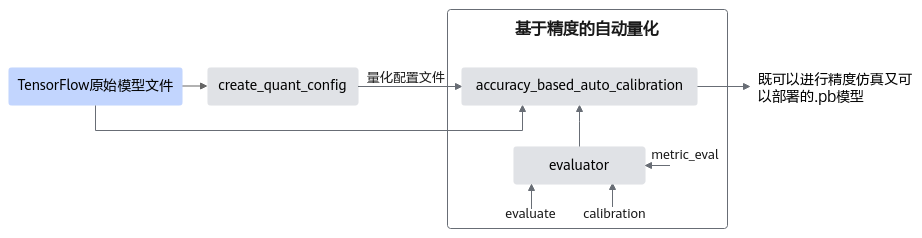

主要流程如下：

1.  <a name="li1620271314520"></a>调用[create\_quant\_config](create_quant_config-68.md)生成量化配置文件，然后调用[accuracy\_based\_auto\_calibration](accuracy_based_auto_calibration-71.md)进行基于精度的自动量化。
2.  <a name="li1098712181516"></a>调用[accuracy\_based\_auto\_calibration](accuracy_based_auto_calibration-71.md)中由用户传入的evaluator实例进行精度测试，得到原始模型精度。

    该过程还会调用[accuracy\_based\_auto\_calibration](accuracy_based_auto_calibration-71.md)中的量化策略strategy模块，输出初始化的quant config量化配置文件，该文件记录所有层都可以进行量化。

3.  使用用户传入的初始量化配置文件（[1](#li1620271314520)中调用[create\_quant\_config](create_quant_config-68.md)生成的）对模型进行量化，得到量化后fake quant模型的精度。
4.  原始模型精度与量化后fake quant模型精度进行比较，如果精度达标，则输出量化后的部署模型和fake quant模型，如果不达标，则进行基于精度的量化流程：
    1.  进行原始TensorFlow网络的推理， dump出每一层的输入activation数据，缓存起来。
    2.  利用calibration量化后的量化因子构造量化层的单算子网络，利用缓存的activation计算量化后fake quant单算子网络的输出数据和原始TensorFlow单算子网络输出的余弦相似度。
    3.  <a name="li411322192712"></a>将余弦相似度的列表传给[accuracy\_based\_auto\_calibration](accuracy_based_auto_calibration-71.md)中的量化策略strategy模块，strategy模块基于[2](#li1098712181516)中生成的初始化的量化配置文件，输出回退某些层后的新的quant config量化配置文件。
    4.  根据quant config量化配置文件重新进行训练后量化，得到回退后的fake quant模型。
    5.  调用[accuracy\_based\_auto\_calibration](accuracy_based_auto_calibration-71.md)中的evaluator模块进行回退后的fake quant模型精度测试，查看精度是否达标：
        -   如果达标，则输出回退后的fake quant模型以及部署模型。
        -   如果不达标，则将余弦相似度排序最差的层回退，则再次进行[4.c](#li411322192712)，输出新的量化配置。
        -   如果回退所有层后精度仍不达标，则不生成量化模型。

[accuracy\_based\_auto\_calibration](accuracy_based_auto_calibration-71.md)接口内部基于精度的自动量化流程如[图2](#fig17197132717303)所示。

**图 2**  基于精度的自动量化流程<a name="fig17197132717303"></a>  


**调用示例<a name="section051021014411"></a>**

本示例演示了使用AMCT进行基于精度的自动量化流程。该过程需要用户实现一个模型推理得到精度的回调函数。由于AMCT需要基于回调函数返回的精度数据进行量化层的筛选，因此回调函数的返回数值应尽可能反映模型的精度。

> **说明：** 
>-   如下示例标有“由用户补充处理”的步骤，需要用户根据自己的模型和数据集进行补充处理，示例中仅为示例代码。
>-   如下示例调用AMCT的部分，函数入参请根据实际情况进行调整。

1.  导入AMCT包，设置日志级别。

    ```
    import amct_tensorflow as amct
    from amct_tensorflow.common.auto_calibration import AutoCalibrationEvaluatorBase
    amct.set_logging_level(print_level="info", save_level="info")
    ```

2.  （由用户补充处理）使用原始待量化的模型和测试集，实现回调函数**calibration\(\)、evaluate\(\)、metric\_eval\(\)。**

    上述回调函数的入参要和基类AutoCalibrationEvaluatorBase保持一致。其中：

    -   calibration\(\)完成校准的推理。
    -   evaluate\(\)完成模型的精度测试过程。
    -   metric\_eval\(\)完成原始模型和量化fake quant模型的精度损失评估，当精度损失小于预期值时返回True，否则返回False。

    ```
    class ModelEvaluator(AutoCalibrationEvaluatorBase):
          # The evaluator for model
        def __init__(self, *args, **kwargs):
            # 做成员变量初始化
            # 设置预期精度损失，此处请替换为具体的数值
            self.diff = expected_acc_loss 
            pass
    
        def calibration(self, graph, outputs):
            # 进行模型的校准推理，推理的batch数要和量化配置的batch_num一致
            pass
    
    
        def evaluate(self, graph, outputs): # pylint: disable=R0914
            # evaluate the input models, get the eval metric of model
            pass
    
        def metric_eval(self, original_metric, new_metric):
            # 评估原始模型精度和量化模型精度的精度损失是否满足预期，满足返回True，精度损失数据；否则返回False，精度损失数据
            loss = original_metric - new_metric
            if loss < self.diff:
                return True, loss
            return False, loss
    ```

3.  （由用户补充处理）根据模型user\_model.pb，准备好图结构tf.Graph。

    ```
    ori_graph = user_load_graph()
    ```

4.  调用AMCT工具，进行基于精度的自动量化。
    1.  生成量化配置。

        ```
        config_file = './tmp/config.json'
        skip_layers = []
        batch_num = 1
        amct.create_quant_config(config_file=config_file,
        			 graph=ori_graph,
        			 skip_layers=skip_layers,
        			 batch_num=batch_num)
        ```

    2.  初始化evaluator。

        ```
        evaluator = ModelEvaluator()
        ```

    3.  进行基于精度的量化配置自动搜索。

        ```
        amct.accuracy_based_auto_calibration(ori_pb_model, outputs, record_file, config_file, save_dir, evaluator)
        ```

#### 手工量化<a name="ZH-CN_TOPIC_0000002473744630"></a>

均匀量化是指量化后的数据比较均匀地分布在某个数值空间中，例如INT8量化就是用只有8比特的INT8数据来表示32比特的float32数据或16比特的float16数据，将float32/float16的卷积运算过程（乘加运算）转换为INT8的卷积运算，加速运算和实现模型压缩；均匀的INT8量化则是量化后数据比较均匀地分布在INT8的数值空间\[-128, 127\]中。
非均匀量化是指量化后的数据在某个数值空间中的分布是不均匀的。非均匀量化过程中，会根据待量化数据的概率分布来对均匀量化后的数据分布进一步进行根据目标压缩率（保留数值量/原始量化数值量）的聚类操作。相较于均匀量化，非均匀量化在进一步压缩数据信息量的基础上尽可能的保留高概率分布的数据信息，从而减小压缩后的数据信息丢失。
执行训练后量化特性的精度如果不满足要求，可以尝试手动调整config.json文件中的参数，本节给出调整的原则，以及参数解释。

##### 均匀量化<a name="ZH-CN_TOPIC_0000002506024569"></a>

均匀量化是指量化后的数据比较均匀地分布在某个数值空间中，例如INT8量化就是用只有8比特的INT8数据来表示32比特的float32数据或16比特的float16数据，将float32/float16的卷积运算过程（乘加运算）转换为INT8的卷积运算，加速运算和实现模型压缩；均匀的INT8量化则是量化后数据比较均匀地分布在INT8的数值空间\[-128, 127\]中。

如果均匀量化后的模型精度无法满足要求，则需要进行[基于精度的自动量化](基于精度的自动量化-41.md)或[量化感知训练](量化感知训练-45.md)或[手工调优](手工调优-44.md)。

均匀量化支持量化的层以及约束如下，量化示例请参见[样例列表](样例列表.md)。

**表 1**  均匀量化支持的层以及约束

<a name="table061924413214"></a>
<table><thead align="left"><tr id="row1061954442118"><th class="cellrowborder" valign="top" width="19.53%" id="mcps1.2.3.1.1"><p id="p861918442214"><a name="p861918442214"></a><a name="p861918442214"></a>支持的层类型</p>
</th>
<th class="cellrowborder" valign="top" width="80.47%" id="mcps1.2.3.1.2"><p id="p1561944411219"><a name="p1561944411219"></a><a name="p1561944411219"></a>约束</p>
</th>
</tr>
</thead>
<tbody><tr id="row12620444182118"><td class="cellrowborder" valign="top" width="19.53%" headers="mcps1.2.3.1.1 "><p id="p262012447215"><a name="p262012447215"></a><a name="p262012447215"></a>MatMul</p>
</td>
<td class="cellrowborder" valign="top" width="80.47%" headers="mcps1.2.3.1.2 "><p id="p46205447213"><a name="p46205447213"></a><a name="p46205447213"></a>transpose_a=False、transpose_b=False、adjoint_a=False、adjoint_b=False。</p>
</td>
</tr>
<tr id="row1362014446215"><td class="cellrowborder" valign="top" width="19.53%" headers="mcps1.2.3.1.1 "><p id="p13620944192120"><a name="p13620944192120"></a><a name="p13620944192120"></a>Conv2D</p>
</td>
<td class="cellrowborder" valign="top" width="80.47%" headers="mcps1.2.3.1.2 "><p id="p462074414216"><a name="p462074414216"></a><a name="p462074414216"></a>weight的输入来源不含有placeholder等可动态变化的节点，且weight的节点类型只能是const。</p>
</td>
</tr>
<tr id="row1156311415155"><td class="cellrowborder" valign="top" width="19.53%" headers="mcps1.2.3.1.1 "><p id="p25634421511"><a name="p25634421511"></a><a name="p25634421511"></a>Conv2DBackpropInput</p>
</td>
<td class="cellrowborder" valign="top" width="80.47%" headers="mcps1.2.3.1.2 "><a name="ul736812222328"></a><a name="ul736812222328"></a><ul id="ul736812222328"><li>dalition为1。</li><li>weight的输入来源不含有placeholder等可动态变化的节点，且weight的节点类型只能是const。</li></ul>
</td>
</tr>
<tr id="row9552114851516"><td class="cellrowborder" valign="top" width="19.53%" headers="mcps1.2.3.1.1 "><p id="p11552174891511"><a name="p11552174891511"></a><a name="p11552174891511"></a>DepthwiseConv2dNative</p>
</td>
<td class="cellrowborder" valign="top" width="80.47%" headers="mcps1.2.3.1.2 "><a name="ul23441932175111"></a><a name="ul23441932175111"></a><ul id="ul23441932175111"><li>weight的输入来源不含有placeholder等可动态变化的节点，且weight的节点类型只能是const。</li><li>TensorFlow 1.15版本和2.6.5版本，TensorFlow官方存在已知问题：DepthwiseConv2dNative算子在dilation&gt;1时，CPU/GPU推理结果存在bug，并非<span id="ph8164830115110"><a name="ph8164830115110"></a><a name="ph8164830115110"></a>AMCT</span>本身问题。</li></ul>
</td>
</tr>
<tr id="row149151071494"><td class="cellrowborder" valign="top" width="19.53%" headers="mcps1.2.3.1.1 "><p id="p2630101344918"><a name="p2630101344918"></a><a name="p2630101344918"></a>Conv1D</p>
</td>
<td class="cellrowborder" valign="top" width="80.47%" headers="mcps1.2.3.1.2 "><p id="p169150754910"><a name="p169150754910"></a><a name="p169150754910"></a>TensorFlow支持tf.nn.Conv1D构图，在pb模型中转换为extend_dims算子+Conv2D算子+Unsqueeze算子的组合。</p>
</td>
</tr>
</tbody>
</table>

**接口调用流程<a name="section1554611063615"></a>**

均匀量化接口调用流程如[图1](#fig153281318152013)所示。

**图 1**  均匀量化接口调用流程<a name="fig153281318152013"></a>  
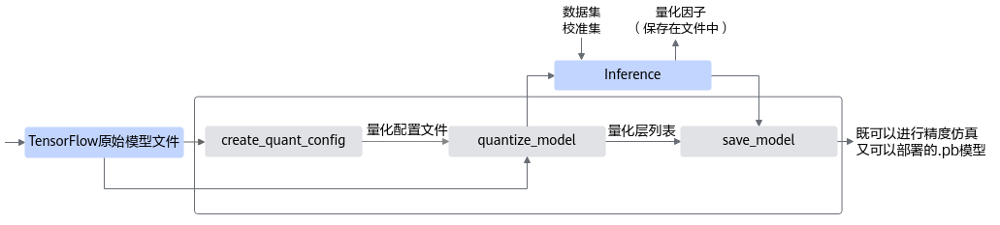

蓝色部分为用户实现，灰色部分为用户调用AMCT提供的API实现，用户在TensorFlow原始网络推理的代码中导入库，并在特定的位置调用相应API，即可实现量化功能。工具运行流程如下：

1.  用户首先构造TensorFlow的原始模型，然后使用[create\_quant\_config](create_quant_config-68.md)接口生成量化配置文件。
2.  <a name="li63251496319"></a>根据TensorFlow模型和量化配置文件，即可调用[quantize\_model](quantize_model-69.md)接口对原始TensorFlow模型进行优化，修改后的模型中插入数据量化、权重量化等相关算子，用于计算量化相关参数。
3.  用户使用[2](#li63251496319)输出的修改后的模型，借助AMCT提供的数据集和校准集，在TensorFlow环境中进行inference，可以得到量化因子。

    其中数据集用于在TensorFlow环境中对模型进行推理时，测试量化数据的精度；校准集用来产生量化因子，保证精度。

4.  最后用户可以调用[save\_model](save_model-70.md)接口，插入AscendQuant、AscendDequant等算子，保存为量化模型，该模型既可在TensorFlow环境中进行精度仿真又可以在NPU IP加速器部署。

**调用示例<a name="section1231991121611"></a>**

本章节详细给出训练后量化的模板代码解析说明，通过解读该代码，用户可以详细了解AMCT的工作流程以及原理，方便用户基于已有模板代码进行修改，以便适配其他网络模型的量化。训练后量化主要包括如下几个步骤：

1.  准备训练好的模型和数据集。
2.  在原始TensorFlow环境中验证模型精度以及环境是否正常。
3.  编写训练后量化脚本调用AMCT  API。
4.  执行训练后量化脚本。
5.  在原始TensorFlow环境中验证量化后仿真模型精度。

如下流程详细演示如何编写脚本调用AMCT  API进行模型量化。

> **说明：** 
>-   如下示例标有“由用户补充处理”的步骤，需要用户根据自己的模型和数据集进行补充处理，示例中仅为示例代码。
>-   如下示例调用AMCT的部分，函数入参请根据实际情况进行调整。

1.  导入AMCT包，设置日志级别。

    ```
    import amct_tensorflow as amct
    amct.set_logging_level(print_level='info', save_level='info')
    ```

2.  <a name="li6785737629"></a>（可选，由用户补充处理）在TensorFlow原始环境中验证推理脚本及环境。

    建议使用原始待量化的模型和测试集，在TensorFlow环境下推理，验证环境、推理脚本是否正常。

    推荐执行该步骤，请确保原始模型可以完成推理且精度正常；执行该步骤时，可以使用部分测试集，减少运行时间。

    ```
    user_do_inference(ori_model, test_data, test_iterations) 
    ```

3.  （由用户补充处理）根据模型user\_model.pb，准备好图结构tf.Graph。

    ```
    ori_graph = user_load_graph()
    ```

4.  调用AMCT，量化模型。
    1.  生成量化配置。

        ```
        config_file = './tmp/config.json'
        skip_layers = []
        batch_num = 1
        amct.create_quant_config(config_file=config_file,
        			 graph=ori_graph,
        			 skip_layers=skip_layers,
        			 batch_num=batch_num)
        ```

    2.  修改图，在图中插入数据量化，权重量化等相关的算子，用于计算量化相关参数。

        ```
        record_file = './tmp/record.txt'
        amct.quantize_model(graph=ori_graph,
                            config_file=config_file,
                            record_file=record_file)
        ```

        使用AMCT调用[quantize\_model](quantize_model-69.md)接口对用户的原始TensorFlow模型进行图修改时，由于插入了searchN层导致尾层输出节点发生改变的场景，可以参见[TensorFlow网络模型由于AMCT导致输出节点改变，如何通过修改量化脚本进行后续的量化动作](TensorFlow网络模型由于AMCT导致输出节点改变-如何通过修改量化脚本进行后续的量化动作.md)进行处理。如果量化过程存在空tensor输入报错信息，请参见[使用训练后量化进行量化时，量化过程存在空tensor输入报错信息](使用训练后量化进行量化时-量化过程存在空tensor输入报错信息.md)进行处理。

    3.  （由用户补充处理）使用修改后的图在校准集上做模型推理，找到量化因子。

        该步骤执行时，需要注意如下两点：

        1.  校准集及其预处理过程数据要与模型匹配，以保证量化的精度。
        2.  前向推理次数为batch\_num，如果次数不足，由于校准算子没有将量化因子输出到record文件中，会导致后续读取record校验失败。

        ```
        user_do_inference(ori_graph, calibration_data, batch_num)
        ```

        若校准时提示“Invalid argument: You must feed a value for placeholder tensor \*\*”，请参见[校准时提示“Invalid argument: You must feed a value for placeholder tensor \*\*”](校准时提示-Invalid-argument-You-must-feed-a-value-for-placeholder-tensor.md)进行处理。

        若校准过程中如果提示“xxx calculate scale failed”错误信息，请参见[IFMR数据量化时，存在"inf或NaN值"或"xxx calculate scale failed"，量化过程报错](IFMR数据量化时-存在-inf或NaN值-或-xxx-calculate-scale-failed-量化过程报错.md)。

    4.  保存模型。

        根据量化因子，调用[save\_model](save_model-70.md)接口，插入AscendQuant、AscendDequant等算子，保存为量化模型。

        ```
        quant_model_path = './results/user_model'
        amct.save_model(pb_model='user_model.pb',
                        outputs=['user_model_outputs0', 'user_model_outputs1'],
                        record_file=record_file,
                        save_path=quant_model_path)
        ```

        保存模型时提示“RuntimeError: cannot find shift\_bit of layer \*\* in record\_file”，则请参见[保存模型时提示“RuntimeError: record\_file is empty, no layers to be quantized”](保存模型时提示-RuntimeError-record_file-is-empty-no-layers-to-be-quantized.md)进行处理。

5.  （可选，由用户补充处理）使用量化后模型user\_model\_quantized.pb和测试集（test\_data），在TensorFlow环境下推理，测试量化后的仿真模型精度。

    使用量化后仿真模型精度与[2](#li6785737629)中的原始精度做对比，可以观察量化对精度的影响。

    ```
    quant_model = './results/user_model_quantized.pb'
    user_do_inference(quant_model, test_data, test_iterations)
    ```

##### 非均匀量化<a name="ZH-CN_TOPIC_0000002473904604"></a>

非均匀量化是指量化后的数据在某个数值空间中的分布是不均匀的。非均匀量化过程中，会根据待量化数据的概率分布来对均匀量化后的数据分布进一步进行根据目标压缩率（保留数值量/原始量化数值量）的聚类操作。相较于均匀量化，非均匀量化在进一步压缩数据信息量的基础上尽可能的保留高概率分布的数据信息，从而减小压缩后的数据信息丢失。

> **说明：** 
>**由于硬件约束，该版本不建议使用非均匀量化的功能，获取不到性能收益。**

模型在NPU IP加速器上推理时，可通过非均匀量化提高权重压缩率（需要与ATC工具配合，通过编译时使能权重压缩），降低权重传输开销，进一步提升推理性能。非均匀量化后，如果精度仿真模型在原始TensorFlow环境中推理精度不满足要求，可通过调整非均匀量化配置文件config.json中的参数来恢复模型精度，调整方法请参见[手工调优](手工调优-44.md)。

非均匀量化支持量化的层以及约束如下，量化示例请参见[样例列表](样例列表.md)。

**表 1**  非均匀量化支持的层以及约束

<a name="table32131022111318"></a>
<table><thead align="left"><tr id="row9214202215138"><th class="cellrowborder" valign="top" width="15.21%" id="mcps1.2.4.1.1"><p id="p1921472241319"><a name="p1921472241319"></a><a name="p1921472241319"></a>支持的层类型</p>
</th>
<th class="cellrowborder" valign="top" width="27.450000000000003%" id="mcps1.2.4.1.2"><p id="p122141822101318"><a name="p122141822101318"></a><a name="p122141822101318"></a>约束</p>
</th>
<th class="cellrowborder" valign="top" width="57.34%" id="mcps1.2.4.1.3"><p id="p421411228138"><a name="p421411228138"></a><a name="p421411228138"></a>备注</p>
</th>
</tr>
</thead>
<tbody><tr id="row192301547124816"><td class="cellrowborder" valign="top" width="15.21%" headers="mcps1.2.4.1.1 "><p id="p16595125118491"><a name="p16595125118491"></a><a name="p16595125118491"></a>MatMul</p>
</td>
<td class="cellrowborder" valign="top" width="27.450000000000003%" headers="mcps1.2.4.1.2 "><p id="p2231124717486"><a name="p2231124717486"></a><a name="p2231124717486"></a>transpose属性为false</p>
</td>
<td class="cellrowborder" valign="top" width="57.34%" headers="mcps1.2.4.1.3 "><p id="p423115479486"><a name="p423115479486"></a><a name="p423115479486"></a>weight的输入来源不含有placeholder等可动态变化的节点，且weight的节点类型只能是const。</p>
</td>
</tr>
<tr id="row19856950134811"><td class="cellrowborder" valign="top" width="15.21%" headers="mcps1.2.4.1.1 "><p id="p185951511498"><a name="p185951511498"></a><a name="p185951511498"></a>Conv2D</p>
</td>
<td class="cellrowborder" valign="top" width="27.450000000000003%" headers="mcps1.2.4.1.2 "><p id="p16899111114416"><a name="p16899111114416"></a><a name="p16899111114416"></a>-</p>
</td>
<td class="cellrowborder" valign="top" width="57.34%" headers="mcps1.2.4.1.3 "><p id="p1835957191216"><a name="p1835957191216"></a><a name="p1835957191216"></a>weight的输入来源不含有placeholder等可动态变化的节点，且weight的节点类型只能是const。</p>
</td>
</tr>
</tbody>
</table>

**实现流程<a name="section886791515582"></a>**

静态非均匀量化实现原理同[均匀量化](均匀量化-43.md)，简要流程如[图1](#fig632614881115)所示。

**图 1**  非均匀量化流程图<a name="fig632614881115"></a>  


详细流程说明如下：

1.  <a name="li7933268523"></a>参见[均匀量化](均匀量化-43.md)章节获取均匀量化的部署模型和精度仿真模型。
2.  <a name="li18641543121411"></a>参见《ATC离线模型编译工具用户指南》将[1](#li7933268523)中生成的部署模型转换成JSON文件，该JSON文件记录了量化后模型的融合信息，同时也携带了支持weight压缩特性层的信息（通过fe\_weight\_compress字段识别）。
3.  如果要进行weight压缩，则参见[训练后量化简易配置文件](训练后量化简易配置文件-91.md)章节获取非均匀量化简易配置文件，然后获取[2](#li18641543121411)生成的量化后模型的融合JSON文件进行非均匀量化。

    非均匀量化过程中，会根据融合JSON文件，获取原始模型中哪些层支持weight压缩，然后重新生成非均匀量化的部署模型和量化配置文件。

4.  查看非均匀量化后，精度仿真模型在原始TensorFlow环境中推理精度是否满足要求，如果不满足要求，则需要手动调整非均匀量化配置文件config.json中的参数，然后重新进行非均匀量化，直至满足精度要求。调整方法请参见[手工调优](手工调优-44.md)。

##### 手工调优<a name="ZH-CN_TOPIC_0000002473744702"></a>

执行训练后量化特性的精度如果不满足要求，可以尝试手动调整config.json文件中的参数，本节给出调整的原则，以及参数解释。

**调优流程<a name="section14595122916474"></a>**

通过[create\_quant\_config](create_quant_config-68.md)接口生成的config.json文件中的默认配置（示例请参见[量化配置文件](#section103421728142813)）进行量化，若量化后的推理精度不满足要求，则可调整量化配置重复量化，直至精度满足要求。本节详细介绍手动调优流程，调整对象是训练后量化配置文件config.json中的参数，主要涉及3个阶段：

1.  调整校准使用的数据量。
2.  跳过量化某些层。
3.  调整量化算法及参数。

具体步骤如下：

1.  根据[create\_quant\_config](create_quant_config-68.md)接口生成的默认配置进行量化。若精度满足要求，则调参结束，否则进行[2](#zh-cn_topic_0000001312722617_zh-cn_topic_0240188709_li1043716142619)。
2.  <a name="zh-cn_topic_0000001312722617_zh-cn_topic_0240188709_li1043716142619"></a>手动修改batch\_num，调整校准使用的数据量。

    batch\_num控制量化使用数据的batch数目，可根据batch大小以及量化需要使用的图片数量调整。通常情况下：

    batch\_num越大，量化过程中使用的数据样本越多，量化后精度损失越小；但过多的数据并不会带来精度的提升，反而会占用较多的内存，降低量化的速度，并可能引起内存、显存、线程资源不足等情况；因此，建议batch\_num\*batch\_size为16或32（batch\_size表示每个batch使用的图片数量）。

3.  若按照[2](#zh-cn_topic_0000001312722617_zh-cn_topic_0240188709_li1043716142619)中的量化配置进行量化后，精度满足要求，则调参结束，否则进行[4](#zh-cn_topic_0000001312722617_li718684715113)。
4.  <a name="zh-cn_topic_0000001312722617_li718684715113"></a>手动修改quant\_enable，跳过量化某些层。

    quant\_enable可以指定该层是否量化，取值为true时量化该层，取值为false时不量化该层，将该层的配置删除也可跳过该层量化。

    在整网精度不达标的时候需要识别出网络中的量化敏感层（量化后误差显著增大），然后取消对量化敏感层的量化动作，识别量化敏感层有两种方法：

    1.  依据网络模型结构，一般网络中首层、尾层以及参数量偏少的层，量化后精度会有较大的下降。
    2.  通过精度比对工具，逐层比对原始模型和量化后模型输出误差（例如以余弦相似度作为标准，需要相似度达到0.99以上），找到误差较大的层，优先对其进行回退。

5.  若按照[4](#zh-cn_topic_0000001312722617_li718684715113)中的量化配置进行量化后，精度满足要求，则调参结束，否则进行[6](#zh-cn_topic_0000001312722617_zh-cn_topic_0240188709_li2044613162372)。
6.  <a name="zh-cn_topic_0000001312722617_zh-cn_topic_0240188709_li2044613162372"></a>手动修改activation\_quant\_params和weight\_quant\_params，调整量化算法及参数：

    算法参数意义请参见[量化配置文件](#section103421728142813)中的参数说明部分，算法说明请参见[训练后量化算法](训练后量化算法.md)。

7.  若按照[6](#zh-cn_topic_0000001312722617_zh-cn_topic_0240188709_li2044613162372)中的量化配置进行量化后，精度满足要求，则调参结束，否则表明量化对精度影响很大，不能进行量化，去除量化配置。

**图 1**  调参流程<a name="zh-cn_topic_0240188709_fig10376759162410"></a>  


**量化配置文件<a name="section103421728142813"></a>**

如果通过[create\_quant\_config](create_quant_config-68.md)接口生成的config.json量化配置文件，推理精度不满足要求，则需要参见该章节不断调整config.json文件中的内容（用户修改JSON文件时，请确保层名唯一），直至精度满足要求，JSON量化配置文件样例请参见接口中的[调用示例](create_quant_config-68.md#zh-cn_topic_0240187365_section64231658994)部分。

配置文件中参数说明如下：

**表 1**  version参数说明

<a name="zh-cn_topic_0240188722_table2626104713369"></a>
<table><tbody><tr id="zh-cn_topic_0240188722_row116261847163611"><th class="firstcol" valign="top" width="20.96%" id="mcps1.2.3.1.1"><p id="zh-cn_topic_0240188722_p462654715365"><a name="zh-cn_topic_0240188722_p462654715365"></a><a name="zh-cn_topic_0240188722_p462654715365"></a>作用</p>
</th>
<td class="cellrowborder" valign="top" width="79.03999999999999%" headers="mcps1.2.3.1.1 "><p id="zh-cn_topic_0240188722_p16269472361"><a name="zh-cn_topic_0240188722_p16269472361"></a><a name="zh-cn_topic_0240188722_p16269472361"></a>控制量化配置文件版本号。</p>
</td>
</tr>
<tr id="zh-cn_topic_0240188722_row362684710366"><th class="firstcol" valign="top" width="20.96%" id="mcps1.2.3.2.1"><p id="zh-cn_topic_0240188722_p762684713611"><a name="zh-cn_topic_0240188722_p762684713611"></a><a name="zh-cn_topic_0240188722_p762684713611"></a>类型</p>
</th>
<td class="cellrowborder" valign="top" width="79.03999999999999%" headers="mcps1.2.3.2.1 "><p id="zh-cn_topic_0240188722_p19626124713367"><a name="zh-cn_topic_0240188722_p19626124713367"></a><a name="zh-cn_topic_0240188722_p19626124713367"></a>int</p>
</td>
</tr>
<tr id="zh-cn_topic_0240188722_row146267479367"><th class="firstcol" valign="top" width="20.96%" id="mcps1.2.3.3.1"><p id="zh-cn_topic_0240188722_p18626194711368"><a name="zh-cn_topic_0240188722_p18626194711368"></a><a name="zh-cn_topic_0240188722_p18626194711368"></a>取值范围</p>
</th>
<td class="cellrowborder" valign="top" width="79.03999999999999%" headers="mcps1.2.3.3.1 "><p id="zh-cn_topic_0240188722_p186261147193612"><a name="zh-cn_topic_0240188722_p186261147193612"></a><a name="zh-cn_topic_0240188722_p186261147193612"></a>1</p>
</td>
</tr>
<tr id="zh-cn_topic_0240188722_row7626194719361"><th class="firstcol" valign="top" width="20.96%" id="mcps1.2.3.4.1"><p id="zh-cn_topic_0240188722_p1462644712368"><a name="zh-cn_topic_0240188722_p1462644712368"></a><a name="zh-cn_topic_0240188722_p1462644712368"></a>参数说明</p>
</th>
<td class="cellrowborder" valign="top" width="79.03999999999999%" headers="mcps1.2.3.4.1 "><p id="zh-cn_topic_0240188722_p156261247113612"><a name="zh-cn_topic_0240188722_p156261247113612"></a><a name="zh-cn_topic_0240188722_p156261247113612"></a>目前仅有一个版本号1。</p>
</td>
</tr>
<tr id="zh-cn_topic_0240188722_row17626144713363"><th class="firstcol" valign="top" width="20.96%" id="mcps1.2.3.5.1"><p id="zh-cn_topic_0240188722_p1462634743614"><a name="zh-cn_topic_0240188722_p1462634743614"></a><a name="zh-cn_topic_0240188722_p1462634743614"></a>推荐配置</p>
</th>
<td class="cellrowborder" valign="top" width="79.03999999999999%" headers="mcps1.2.3.5.1 "><p id="zh-cn_topic_0240188722_p1162664743620"><a name="zh-cn_topic_0240188722_p1162664743620"></a><a name="zh-cn_topic_0240188722_p1162664743620"></a>1</p>
</td>
</tr>
<tr id="zh-cn_topic_0240188722_row311394219392"><th class="firstcol" valign="top" width="20.96%" id="mcps1.2.3.6.1"><p id="zh-cn_topic_0240188722_p1811484213910"><a name="zh-cn_topic_0240188722_p1811484213910"></a><a name="zh-cn_topic_0240188722_p1811484213910"></a>可选或者必选</p>
</th>
<td class="cellrowborder" valign="top" width="79.03999999999999%" headers="mcps1.2.3.6.1 "><p id="zh-cn_topic_0240188722_p17114742143918"><a name="zh-cn_topic_0240188722_p17114742143918"></a><a name="zh-cn_topic_0240188722_p17114742143918"></a>可选</p>
</td>
</tr>
</tbody>
</table>

**表 2**  batch\_num参数说明

<a name="zh-cn_topic_0240188002_table1993174915423"></a>
<table><tbody><tr id="zh-cn_topic_0240188002_row0944492423"><th class="firstcol" valign="top" width="21.349999999999998%" id="mcps1.2.3.1.1"><p id="zh-cn_topic_0240188002_p294134994210"><a name="zh-cn_topic_0240188002_p294134994210"></a><a name="zh-cn_topic_0240188002_p294134994210"></a>作用</p>
</th>
<td class="cellrowborder" valign="top" width="78.64999999999999%" headers="mcps1.2.3.1.1 "><p id="zh-cn_topic_0240188002_p694164934219"><a name="zh-cn_topic_0240188002_p694164934219"></a><a name="zh-cn_topic_0240188002_p694164934219"></a>控制量化使用多少个batch的数据。</p>
</td>
</tr>
<tr id="zh-cn_topic_0240188002_row294249104214"><th class="firstcol" valign="top" width="21.349999999999998%" id="mcps1.2.3.2.1"><p id="zh-cn_topic_0240188002_p1794164974216"><a name="zh-cn_topic_0240188002_p1794164974216"></a><a name="zh-cn_topic_0240188002_p1794164974216"></a><span>类型</span></p>
</th>
<td class="cellrowborder" valign="top" width="78.64999999999999%" headers="mcps1.2.3.2.1 "><p id="zh-cn_topic_0240188002_p1894449164210"><a name="zh-cn_topic_0240188002_p1894449164210"></a><a name="zh-cn_topic_0240188002_p1894449164210"></a>int</p>
</td>
</tr>
<tr id="zh-cn_topic_0240188002_row199420495426"><th class="firstcol" valign="top" width="21.349999999999998%" id="mcps1.2.3.3.1"><p id="zh-cn_topic_0240188002_p39419491427"><a name="zh-cn_topic_0240188002_p39419491427"></a><a name="zh-cn_topic_0240188002_p39419491427"></a><span>取值范围</span></p>
</th>
<td class="cellrowborder" valign="top" width="78.64999999999999%" headers="mcps1.2.3.3.1 "><p id="zh-cn_topic_0240188002_p694134954217"><a name="zh-cn_topic_0240188002_p694134954217"></a><a name="zh-cn_topic_0240188002_p694134954217"></a>大于0</p>
</td>
</tr>
<tr id="zh-cn_topic_0240188002_row394164944213"><th class="firstcol" valign="top" width="21.349999999999998%" id="mcps1.2.3.4.1"><p id="zh-cn_topic_0240188002_p1694104916421"><a name="zh-cn_topic_0240188002_p1694104916421"></a><a name="zh-cn_topic_0240188002_p1694104916421"></a>参数说明</p>
</th>
<td class="cellrowborder" valign="top" width="78.64999999999999%" headers="mcps1.2.3.4.1 "><p id="zh-cn_topic_0240188002_p159444919429"><a name="zh-cn_topic_0240188002_p159444919429"></a><a name="zh-cn_topic_0240188002_p159444919429"></a>如果不配置，则使用默认值1，建议校准集图片数量不超过50张，根据batch的大小batch_size计算相应的batch_num数值。</p>
<p id="zh-cn_topic_0240188002_p1223319101118"><a name="zh-cn_topic_0240188002_p1223319101118"></a><a name="zh-cn_topic_0240188002_p1223319101118"></a>batch_num*batch_size为量化使用的校准集图片数量。</p>
<p id="zh-cn_topic_0240188002_p201320014422"><a name="zh-cn_topic_0240188002_p201320014422"></a><a name="zh-cn_topic_0240188002_p201320014422"></a>其中batch_size为每个batch所用的图片数量。</p>
</td>
</tr>
<tr id="zh-cn_topic_0240188002_row8941849114212"><th class="firstcol" valign="top" width="21.349999999999998%" id="mcps1.2.3.5.1"><p id="zh-cn_topic_0240188002_p19945496428"><a name="zh-cn_topic_0240188002_p19945496428"></a><a name="zh-cn_topic_0240188002_p19945496428"></a>推荐配置</p>
</th>
<td class="cellrowborder" valign="top" width="78.64999999999999%" headers="mcps1.2.3.5.1 "><p id="zh-cn_topic_0240188002_p10941249164219"><a name="zh-cn_topic_0240188002_p10941249164219"></a><a name="zh-cn_topic_0240188002_p10941249164219"></a>1</p>
</td>
</tr>
<tr id="zh-cn_topic_0240188002_row194104974210"><th class="firstcol" valign="top" width="21.349999999999998%" id="mcps1.2.3.6.1"><p id="zh-cn_topic_0240188002_p694174913424"><a name="zh-cn_topic_0240188002_p694174913424"></a><a name="zh-cn_topic_0240188002_p694174913424"></a>必选或可选</p>
</th>
<td class="cellrowborder" valign="top" width="78.64999999999999%" headers="mcps1.2.3.6.1 "><p id="zh-cn_topic_0240188002_p89524910428"><a name="zh-cn_topic_0240188002_p89524910428"></a><a name="zh-cn_topic_0240188002_p89524910428"></a>可选</p>
</td>
</tr>
</tbody>
</table>

**表 3**  activation\_offset参数说明

<a name="zh-cn_topic_0240188002_table9951049114210"></a>
<table><tbody><tr id="zh-cn_topic_0240188002_row129514490428"><th class="firstcol" valign="top" width="21.349999999999998%" id="mcps1.2.3.1.1"><p id="zh-cn_topic_0240188002_p3951149184213"><a name="zh-cn_topic_0240188002_p3951149184213"></a><a name="zh-cn_topic_0240188002_p3951149184213"></a>作用</p>
</th>
<td class="cellrowborder" valign="top" width="78.64999999999999%" headers="mcps1.2.3.1.1 "><p id="p168261724123812"><a name="p168261724123812"></a><a name="p168261724123812"></a>控制数据量化是对称量化还是非对称量化。全局配置参数。</p>
<p id="p1627525917341"><a name="p1627525917341"></a><a name="p1627525917341"></a>若配置文件中同时存在activation_offset和asymmetric参数，asymmetric参数优先级&gt;activation_offset参数。</p>
</td>
</tr>
<tr id="zh-cn_topic_0240188002_row18951449164219"><th class="firstcol" valign="top" width="21.349999999999998%" id="mcps1.2.3.2.1"><p id="zh-cn_topic_0240188002_p0951493420"><a name="zh-cn_topic_0240188002_p0951493420"></a><a name="zh-cn_topic_0240188002_p0951493420"></a>类型</p>
</th>
<td class="cellrowborder" valign="top" width="78.64999999999999%" headers="mcps1.2.3.2.1 "><p id="zh-cn_topic_0240188002_p99534916427"><a name="zh-cn_topic_0240188002_p99534916427"></a><a name="zh-cn_topic_0240188002_p99534916427"></a>bool</p>
</td>
</tr>
<tr id="zh-cn_topic_0240188002_row189516493421"><th class="firstcol" valign="top" width="21.349999999999998%" id="mcps1.2.3.3.1"><p id="zh-cn_topic_0240188002_p1895649144219"><a name="zh-cn_topic_0240188002_p1895649144219"></a><a name="zh-cn_topic_0240188002_p1895649144219"></a>取值范围</p>
</th>
<td class="cellrowborder" valign="top" width="78.64999999999999%" headers="mcps1.2.3.3.1 "><p id="zh-cn_topic_0240188002_p59574994218"><a name="zh-cn_topic_0240188002_p59574994218"></a><a name="zh-cn_topic_0240188002_p59574994218"></a>true或false</p>
</td>
</tr>
<tr id="zh-cn_topic_0240188002_row169584954213"><th class="firstcol" valign="top" width="21.349999999999998%" id="mcps1.2.3.4.1"><p id="zh-cn_topic_0240188002_p12959499422"><a name="zh-cn_topic_0240188002_p12959499422"></a><a name="zh-cn_topic_0240188002_p12959499422"></a>参数说明</p>
</th>
<td class="cellrowborder" valign="top" width="78.64999999999999%" headers="mcps1.2.3.4.1 "><a name="ul11492132182611"></a><a name="ul11492132182611"></a><ul id="ul11492132182611"><li>true：数据量化时为非对称量化。</li><li>false：数据量化时为对称量化。</li></ul>
</td>
</tr>
<tr id="zh-cn_topic_0240188002_row139564944214"><th class="firstcol" valign="top" width="21.349999999999998%" id="mcps1.2.3.5.1"><p id="zh-cn_topic_0240188002_p59524916426"><a name="zh-cn_topic_0240188002_p59524916426"></a><a name="zh-cn_topic_0240188002_p59524916426"></a>推荐配置</p>
</th>
<td class="cellrowborder" valign="top" width="78.64999999999999%" headers="mcps1.2.3.5.1 "><p id="zh-cn_topic_0240188002_p169674919424"><a name="zh-cn_topic_0240188002_p169674919424"></a><a name="zh-cn_topic_0240188002_p169674919424"></a>true</p>
</td>
</tr>
<tr id="zh-cn_topic_0240188002_row496164924211"><th class="firstcol" valign="top" width="21.349999999999998%" id="mcps1.2.3.6.1"><p id="zh-cn_topic_0240188002_p139613497421"><a name="zh-cn_topic_0240188002_p139613497421"></a><a name="zh-cn_topic_0240188002_p139613497421"></a>必选或可选</p>
</th>
<td class="cellrowborder" valign="top" width="78.64999999999999%" headers="mcps1.2.3.6.1 "><p id="zh-cn_topic_0240188002_p1096154916421"><a name="zh-cn_topic_0240188002_p1096154916421"></a><a name="zh-cn_topic_0240188002_p1096154916421"></a>可选</p>
</td>
</tr>
</tbody>
</table>

**表 4**  joint\_quant参数说明

<a name="table1140810561"></a>
<table><tbody><tr id="row340813015613"><th class="firstcol" valign="top" width="21.349999999999998%" id="mcps1.2.3.1.1"><p id="p104091902619"><a name="p104091902619"></a><a name="p104091902619"></a>作用</p>
</th>
<td class="cellrowborder" valign="top" width="78.64999999999999%" headers="mcps1.2.3.1.1 "><p id="p104091102062"><a name="p104091102062"></a><a name="p104091102062"></a>是否进行Eltwise联合量化。</p>
</td>
</tr>
<tr id="row84092001961"><th class="firstcol" valign="top" width="21.349999999999998%" id="mcps1.2.3.2.1"><p id="p1640990366"><a name="p1640990366"></a><a name="p1640990366"></a>类型</p>
</th>
<td class="cellrowborder" valign="top" width="78.64999999999999%" headers="mcps1.2.3.2.1 "><p id="p44098017617"><a name="p44098017617"></a><a name="p44098017617"></a>bool</p>
</td>
</tr>
<tr id="row1140913013614"><th class="firstcol" valign="top" width="21.349999999999998%" id="mcps1.2.3.3.1"><p id="p9409301669"><a name="p9409301669"></a><a name="p9409301669"></a>取值范围</p>
</th>
<td class="cellrowborder" valign="top" width="78.64999999999999%" headers="mcps1.2.3.3.1 "><p id="p17409402061"><a name="p17409402061"></a><a name="p17409402061"></a>true或false</p>
</td>
</tr>
<tr id="row164091701762"><th class="firstcol" valign="top" width="21.349999999999998%" id="mcps1.2.3.4.1"><p id="p114091700612"><a name="p114091700612"></a><a name="p114091700612"></a>参数说明</p>
</th>
<td class="cellrowborder" valign="top" width="78.64999999999999%" headers="mcps1.2.3.4.1 "><a name="ul3537144914114"></a><a name="ul3537144914114"></a><ul id="ul3537144914114"><li>true：进行Eltwise联合量化。</li><li>false：关闭联合量化功能。</li></ul>
</td>
</tr>
<tr id="row164091304615"><th class="firstcol" valign="top" width="21.349999999999998%" id="mcps1.2.3.5.1"><p id="p15409130767"><a name="p15409130767"></a><a name="p15409130767"></a>推荐配置</p>
</th>
<td class="cellrowborder" valign="top" width="78.64999999999999%" headers="mcps1.2.3.5.1 "><p id="p174091305614"><a name="p174091305614"></a><a name="p174091305614"></a>false</p>
</td>
</tr>
<tr id="row17409702617"><th class="firstcol" valign="top" width="21.349999999999998%" id="mcps1.2.3.6.1"><p id="p640920013620"><a name="p640920013620"></a><a name="p640920013620"></a>必选或可选</p>
</th>
<td class="cellrowborder" valign="top" width="78.64999999999999%" headers="mcps1.2.3.6.1 "><p id="p740910010612"><a name="p740910010612"></a><a name="p740910010612"></a>可选</p>
</td>
</tr>
</tbody>
</table>

**表 5**  do\_fusion参数说明

<a name="table9868105620512"></a>
<table><tbody><tr id="row108683561257"><th class="firstcol" valign="top" width="21.25%" id="mcps1.2.3.1.1"><p id="p208681156158"><a name="p208681156158"></a><a name="p208681156158"></a>作用</p>
</th>
<td class="cellrowborder" valign="top" width="78.75%" headers="mcps1.2.3.1.1 "><p id="p20412381073"><a name="p20412381073"></a><a name="p20412381073"></a>是否开启融合功能。</p>
</td>
</tr>
<tr id="row48685563515"><th class="firstcol" valign="top" width="21.25%" id="mcps1.2.3.2.1"><p id="p10868256059"><a name="p10868256059"></a><a name="p10868256059"></a>类型</p>
</th>
<td class="cellrowborder" valign="top" width="78.75%" headers="mcps1.2.3.2.1 "><p id="p58681756659"><a name="p58681756659"></a><a name="p58681756659"></a>bool</p>
</td>
</tr>
<tr id="row7869356054"><th class="firstcol" valign="top" width="21.25%" id="mcps1.2.3.3.1"><p id="p1586985616513"><a name="p1586985616513"></a><a name="p1586985616513"></a>取值范围</p>
</th>
<td class="cellrowborder" valign="top" width="78.75%" headers="mcps1.2.3.3.1 "><p id="p138165258720"><a name="p138165258720"></a><a name="p138165258720"></a>true或false</p>
</td>
</tr>
<tr id="row14869556159"><th class="firstcol" valign="top" width="21.25%" id="mcps1.2.3.4.1"><p id="p586913561757"><a name="p586913561757"></a><a name="p586913561757"></a>参数说明</p>
</th>
<td class="cellrowborder" valign="top" width="78.75%" headers="mcps1.2.3.4.1 "><a name="ul133779461302"></a><a name="ul133779461302"></a><ul id="ul133779461302"><li>true：开启融合功能。</li><li>false：不开启融合功能。</li></ul>
<p id="p25275543397"><a name="p25275543397"></a><a name="p25275543397"></a>当前支持融合的层以及融合规则请参见<a href="工具实现的融合功能-90.md">工具实现的融合功能</a>。</p>
</td>
</tr>
<tr id="row68692566513"><th class="firstcol" valign="top" width="21.25%" id="mcps1.2.3.5.1"><p id="p16869956256"><a name="p16869956256"></a><a name="p16869956256"></a>推荐配置</p>
</th>
<td class="cellrowborder" valign="top" width="78.75%" headers="mcps1.2.3.5.1 "><p id="p1486912563512"><a name="p1486912563512"></a><a name="p1486912563512"></a>true</p>
</td>
</tr>
<tr id="row118691556053"><th class="firstcol" valign="top" width="21.25%" id="mcps1.2.3.6.1"><p id="p086911565512"><a name="p086911565512"></a><a name="p086911565512"></a>可选或必选</p>
</th>
<td class="cellrowborder" valign="top" width="78.75%" headers="mcps1.2.3.6.1 "><p id="p1286914567516"><a name="p1286914567516"></a><a name="p1286914567516"></a>可选</p>
</td>
</tr>
</tbody>
</table>

**表 6**  skip\_fusion\_layers参数说明

<a name="table1098019224612"></a>
<table><tbody><tr id="row109801522763"><th class="firstcol" valign="top" width="21.25%" id="mcps1.2.3.1.1"><p id="p198092215618"><a name="p198092215618"></a><a name="p198092215618"></a>作用</p>
</th>
<td class="cellrowborder" valign="top" width="78.75%" headers="mcps1.2.3.1.1 "><p id="p107159541274"><a name="p107159541274"></a><a name="p107159541274"></a>跳过可融合的层。</p>
</td>
</tr>
<tr id="row1598115221363"><th class="firstcol" valign="top" width="21.25%" id="mcps1.2.3.2.1"><p id="p16981182210619"><a name="p16981182210619"></a><a name="p16981182210619"></a>类型</p>
</th>
<td class="cellrowborder" valign="top" width="78.75%" headers="mcps1.2.3.2.1 "><p id="p498112221662"><a name="p498112221662"></a><a name="p498112221662"></a>string</p>
</td>
</tr>
<tr id="row99818221967"><th class="firstcol" valign="top" width="21.25%" id="mcps1.2.3.3.1"><p id="p169811226611"><a name="p169811226611"></a><a name="p169811226611"></a>取值范围</p>
</th>
<td class="cellrowborder" valign="top" width="78.75%" headers="mcps1.2.3.3.1 "><p id="p1881619383456"><a name="p1881619383456"></a><a name="p1881619383456"></a>可融合层的层名。</p>
<p id="p1644166188"><a name="p1644166188"></a><a name="p1644166188"></a>当前支持融合的层以及融合规则请参见<a href="工具实现的融合功能-90.md">工具实现的融合功能</a>。</p>
</td>
</tr>
<tr id="row398112226614"><th class="firstcol" valign="top" width="21.25%" id="mcps1.2.3.4.1"><p id="p11981122210615"><a name="p11981122210615"></a><a name="p11981122210615"></a>参数说明</p>
</th>
<td class="cellrowborder" valign="top" width="78.75%" headers="mcps1.2.3.4.1 "><p id="p1798172212618"><a name="p1798172212618"></a><a name="p1798172212618"></a>不需要做融合的层。</p>
</td>
</tr>
<tr id="row69814229618"><th class="firstcol" valign="top" width="21.25%" id="mcps1.2.3.5.1"><p id="p39819221620"><a name="p39819221620"></a><a name="p39819221620"></a>推荐配置</p>
</th>
<td class="cellrowborder" valign="top" width="78.75%" headers="mcps1.2.3.5.1 "><p id="p29813226614"><a name="p29813226614"></a><a name="p29813226614"></a>-</p>
</td>
</tr>
<tr id="row1998115223611"><th class="firstcol" valign="top" width="21.25%" id="mcps1.2.3.6.1"><p id="p1098116221464"><a name="p1098116221464"></a><a name="p1098116221464"></a>可选或必选</p>
</th>
<td class="cellrowborder" valign="top" width="78.75%" headers="mcps1.2.3.6.1 "><p id="p1398113221063"><a name="p1398113221063"></a><a name="p1398113221063"></a>可选</p>
</td>
</tr>
</tbody>
</table>

**表 7**  layer\_config参数说明

<a name="zh-cn_topic_0240188002_table597149164211"></a>
<table><tbody><tr id="zh-cn_topic_0240188002_row3982499420"><th class="firstcol" valign="top" width="21.349999999999998%" id="mcps1.2.3.1.1"><p id="zh-cn_topic_0240188002_p19981049174216"><a name="zh-cn_topic_0240188002_p19981049174216"></a><a name="zh-cn_topic_0240188002_p19981049174216"></a>作用</p>
</th>
<td class="cellrowborder" valign="top" width="78.64999999999999%" headers="mcps1.2.3.1.1 "><p id="zh-cn_topic_0240188002_p0992049114220"><a name="zh-cn_topic_0240188002_p0992049114220"></a><a name="zh-cn_topic_0240188002_p0992049114220"></a>指定某个网络层的量化配置。</p>
</td>
</tr>
<tr id="zh-cn_topic_0240188002_row139910496428"><th class="firstcol" valign="top" width="21.349999999999998%" id="mcps1.2.3.2.1"><p id="zh-cn_topic_0240188002_p16991149194212"><a name="zh-cn_topic_0240188002_p16991149194212"></a><a name="zh-cn_topic_0240188002_p16991149194212"></a>类型</p>
</th>
<td class="cellrowborder" valign="top" width="78.64999999999999%" headers="mcps1.2.3.2.1 "><p id="zh-cn_topic_0240188002_p1699174944218"><a name="zh-cn_topic_0240188002_p1699174944218"></a><a name="zh-cn_topic_0240188002_p1699174944218"></a>object</p>
</td>
</tr>
<tr id="zh-cn_topic_0240188002_row11991494422"><th class="firstcol" valign="top" width="21.349999999999998%" id="mcps1.2.3.3.1"><p id="zh-cn_topic_0240188002_p199917499424"><a name="zh-cn_topic_0240188002_p199917499424"></a><a name="zh-cn_topic_0240188002_p199917499424"></a>取值范围</p>
</th>
<td class="cellrowborder" valign="top" width="78.64999999999999%" headers="mcps1.2.3.3.1 "><p id="zh-cn_topic_0240188002_p59994964210"><a name="zh-cn_topic_0240188002_p59994964210"></a><a name="zh-cn_topic_0240188002_p59994964210"></a>-</p>
</td>
</tr>
<tr id="zh-cn_topic_0240188002_row9100154913424"><th class="firstcol" valign="top" width="21.349999999999998%" id="mcps1.2.3.4.1"><p id="zh-cn_topic_0240188002_p1610211491423"><a name="zh-cn_topic_0240188002_p1610211491423"></a><a name="zh-cn_topic_0240188002_p1610211491423"></a><span>参数说明</span></p>
</th>
<td class="cellrowborder" valign="top" width="78.64999999999999%" headers="mcps1.2.3.4.1 "><p id="zh-cn_topic_0240188002_p1610224984216"><a name="zh-cn_topic_0240188002_p1610224984216"></a><a name="zh-cn_topic_0240188002_p1610224984216"></a><span>参数内部包含如下参数：</span></p>
<a name="zh-cn_topic_0240188002_ul131041949174214"></a><a name="zh-cn_topic_0240188002_ul131041949174214"></a><ul id="zh-cn_topic_0240188002_ul131041949174214"><li>quant_enable</li><li>activation_quant_params</li><li>weight_quant_params</li></ul>
</td>
</tr>
<tr id="zh-cn_topic_0240188002_row310514492425"><th class="firstcol" valign="top" width="21.349999999999998%" id="mcps1.2.3.5.1"><p id="zh-cn_topic_0240188002_p101051149114212"><a name="zh-cn_topic_0240188002_p101051149114212"></a><a name="zh-cn_topic_0240188002_p101051149114212"></a><span>推荐配置</span></p>
</th>
<td class="cellrowborder" valign="top" width="78.64999999999999%" headers="mcps1.2.3.5.1 "><p id="zh-cn_topic_0240188002_p14105149164216"><a name="zh-cn_topic_0240188002_p14105149164216"></a><a name="zh-cn_topic_0240188002_p14105149164216"></a>-</p>
</td>
</tr>
<tr id="zh-cn_topic_0240188002_row1010584913423"><th class="firstcol" valign="top" width="21.349999999999998%" id="mcps1.2.3.6.1"><p id="zh-cn_topic_0240188002_p10105049144220"><a name="zh-cn_topic_0240188002_p10105049144220"></a><a name="zh-cn_topic_0240188002_p10105049144220"></a>必选或可选</p>
</th>
<td class="cellrowborder" valign="top" width="78.64999999999999%" headers="mcps1.2.3.6.1 "><p id="zh-cn_topic_0240188002_p181051490427"><a name="zh-cn_topic_0240188002_p181051490427"></a><a name="zh-cn_topic_0240188002_p181051490427"></a>可选</p>
</td>
</tr>
</tbody>
</table>

**表 8**  quant\_enable参数说明

<a name="zh-cn_topic_0240188002_table9105154944219"></a>
<table><tbody><tr id="zh-cn_topic_0240188002_row2105449124216"><th class="firstcol" valign="top" width="21.349999999999998%" id="mcps1.2.3.1.1"><p id="zh-cn_topic_0240188002_p61051849124214"><a name="zh-cn_topic_0240188002_p61051849124214"></a><a name="zh-cn_topic_0240188002_p61051849124214"></a>作用</p>
</th>
<td class="cellrowborder" valign="top" width="78.64999999999999%" headers="mcps1.2.3.1.1 "><p id="zh-cn_topic_0240188002_p1910520496429"><a name="zh-cn_topic_0240188002_p1910520496429"></a><a name="zh-cn_topic_0240188002_p1910520496429"></a>该层是否做量化。</p>
</td>
</tr>
<tr id="zh-cn_topic_0240188002_row71051491425"><th class="firstcol" valign="top" width="21.349999999999998%" id="mcps1.2.3.2.1"><p id="zh-cn_topic_0240188002_p1610554910428"><a name="zh-cn_topic_0240188002_p1610554910428"></a><a name="zh-cn_topic_0240188002_p1610554910428"></a><span>类型</span></p>
</th>
<td class="cellrowborder" valign="top" width="78.64999999999999%" headers="mcps1.2.3.2.1 "><p id="zh-cn_topic_0240188002_p1106114914425"><a name="zh-cn_topic_0240188002_p1106114914425"></a><a name="zh-cn_topic_0240188002_p1106114914425"></a>bool</p>
</td>
</tr>
<tr id="zh-cn_topic_0240188002_row141061749144215"><th class="firstcol" valign="top" width="21.349999999999998%" id="mcps1.2.3.3.1"><p id="zh-cn_topic_0240188002_p61066491428"><a name="zh-cn_topic_0240188002_p61066491428"></a><a name="zh-cn_topic_0240188002_p61066491428"></a><span>取值范围</span></p>
</th>
<td class="cellrowborder" valign="top" width="78.64999999999999%" headers="mcps1.2.3.3.1 "><p id="zh-cn_topic_0240188002_p161061549144216"><a name="zh-cn_topic_0240188002_p161061549144216"></a><a name="zh-cn_topic_0240188002_p161061549144216"></a>true或false</p>
</td>
</tr>
<tr id="zh-cn_topic_0240188002_row310615491425"><th class="firstcol" valign="top" width="21.349999999999998%" id="mcps1.2.3.4.1"><p id="zh-cn_topic_0240188002_p101061049114215"><a name="zh-cn_topic_0240188002_p101061049114215"></a><a name="zh-cn_topic_0240188002_p101061049114215"></a>参数说明</p>
</th>
<td class="cellrowborder" valign="top" width="78.64999999999999%" headers="mcps1.2.3.4.1 "><a name="ul10238101374311"></a><a name="ul10238101374311"></a><ul id="ul10238101374311"><li>true：量化该层。</li><li>false：不量化该层。</li></ul>
</td>
</tr>
<tr id="zh-cn_topic_0240188002_row1110624918422"><th class="firstcol" valign="top" width="21.349999999999998%" id="mcps1.2.3.5.1"><p id="zh-cn_topic_0240188002_p1010614964211"><a name="zh-cn_topic_0240188002_p1010614964211"></a><a name="zh-cn_topic_0240188002_p1010614964211"></a><span>推荐配置</span></p>
</th>
<td class="cellrowborder" valign="top" width="78.64999999999999%" headers="mcps1.2.3.5.1 "><p id="zh-cn_topic_0240188002_p11106194920426"><a name="zh-cn_topic_0240188002_p11106194920426"></a><a name="zh-cn_topic_0240188002_p11106194920426"></a>true</p>
</td>
</tr>
<tr id="zh-cn_topic_0240188002_row8106104964219"><th class="firstcol" valign="top" width="21.349999999999998%" id="mcps1.2.3.6.1"><p id="zh-cn_topic_0240188002_p1710614974215"><a name="zh-cn_topic_0240188002_p1710614974215"></a><a name="zh-cn_topic_0240188002_p1710614974215"></a>必选或可选</p>
</th>
<td class="cellrowborder" valign="top" width="78.64999999999999%" headers="mcps1.2.3.6.1 "><p id="zh-cn_topic_0240188002_p10106349204212"><a name="zh-cn_topic_0240188002_p10106349204212"></a><a name="zh-cn_topic_0240188002_p10106349204212"></a>可选</p>
</td>
</tr>
</tbody>
</table>

**表 9**  dmq\_balancer\_param参数说明

<a name="table71745135336"></a>
<table><tbody><tr id="row16174813193319"><th class="firstcol" valign="top" width="21.349999999999998%" id="mcps1.2.3.1.1"><p id="p1175101313331"><a name="p1175101313331"></a><a name="p1175101313331"></a>作用</p>
</th>
<td class="cellrowborder" valign="top" width="78.64999999999999%" headers="mcps1.2.3.1.1 "><p id="p12175201323319"><a name="p12175201323319"></a><a name="p12175201323319"></a>DMQ均衡算法中的迁移强度。</p>
</td>
</tr>
<tr id="row817551312338"><th class="firstcol" valign="top" width="21.349999999999998%" id="mcps1.2.3.2.1"><p id="p1917513137339"><a name="p1917513137339"></a><a name="p1917513137339"></a><span>类型</span></p>
</th>
<td class="cellrowborder" valign="top" width="78.64999999999999%" headers="mcps1.2.3.2.1 "><p id="p37291410133717"><a name="p37291410133717"></a><a name="p37291410133717"></a>float</p>
</td>
</tr>
<tr id="row1017511320330"><th class="firstcol" valign="top" width="21.349999999999998%" id="mcps1.2.3.3.1"><p id="p51751135334"><a name="p51751135334"></a><a name="p51751135334"></a><span>取值范围</span></p>
</th>
<td class="cellrowborder" valign="top" width="78.64999999999999%" headers="mcps1.2.3.3.1 "><p id="p582111673812"><a name="p582111673812"></a><a name="p582111673812"></a>[0.2, 0.8]</p>
</td>
</tr>
<tr id="row17175713173311"><th class="firstcol" valign="top" width="21.349999999999998%" id="mcps1.2.3.4.1"><p id="p118111393314"><a name="p118111393314"></a><a name="p118111393314"></a>参数说明</p>
</th>
<td class="cellrowborder" valign="top" width="78.64999999999999%" headers="mcps1.2.3.4.1 "><p id="p513117514346"><a name="p513117514346"></a><a name="p513117514346"></a>代表将activation数据上的量化难度迁移至weight权重的程度，数据分布的离群值越大迁移强度应设置较小。</p>
</td>
</tr>
<tr id="row1318111310337"><th class="firstcol" valign="top" width="21.349999999999998%" id="mcps1.2.3.5.1"><p id="p2181131315338"><a name="p2181131315338"></a><a name="p2181131315338"></a><span>推荐配置</span></p>
</th>
<td class="cellrowborder" valign="top" width="78.64999999999999%" headers="mcps1.2.3.5.1 "><p id="p1618281303310"><a name="p1618281303310"></a><a name="p1618281303310"></a>0.5</p>
</td>
</tr>
<tr id="row21821513133310"><th class="firstcol" valign="top" width="21.349999999999998%" id="mcps1.2.3.6.1"><p id="p1718231373317"><a name="p1718231373317"></a><a name="p1718231373317"></a>必选或可选</p>
</th>
<td class="cellrowborder" valign="top" width="78.64999999999999%" headers="mcps1.2.3.6.1 "><p id="p3182111393314"><a name="p3182111393314"></a><a name="p3182111393314"></a>可选</p>
</td>
</tr>
</tbody>
</table>

**表 10**  activation\_quant\_params参数说明

<a name="zh-cn_topic_0240188002_table1106164914218"></a>
<table><tbody><tr id="zh-cn_topic_0240188002_row1310710496428"><th class="firstcol" valign="top" width="21.349999999999998%" id="mcps1.2.3.1.1"><p id="zh-cn_topic_0240188002_p181071749154218"><a name="zh-cn_topic_0240188002_p181071749154218"></a><a name="zh-cn_topic_0240188002_p181071749154218"></a>作用</p>
</th>
<td class="cellrowborder" valign="top" width="78.64999999999999%" headers="mcps1.2.3.1.1 "><p id="zh-cn_topic_0240188002_p15107194934212"><a name="zh-cn_topic_0240188002_p15107194934212"></a><a name="zh-cn_topic_0240188002_p15107194934212"></a>该层数据量化的参数。</p>
</td>
</tr>
<tr id="zh-cn_topic_0240188002_row171071549124219"><th class="firstcol" valign="top" width="21.349999999999998%" id="mcps1.2.3.2.1"><p id="zh-cn_topic_0240188002_p1210784934213"><a name="zh-cn_topic_0240188002_p1210784934213"></a><a name="zh-cn_topic_0240188002_p1210784934213"></a><span>类型</span></p>
</th>
<td class="cellrowborder" valign="top" width="78.64999999999999%" headers="mcps1.2.3.2.1 "><p id="zh-cn_topic_0240188002_p710844904219"><a name="zh-cn_topic_0240188002_p710844904219"></a><a name="zh-cn_topic_0240188002_p710844904219"></a>object</p>
</td>
</tr>
<tr id="zh-cn_topic_0240188002_row61082049194213"><th class="firstcol" valign="top" width="21.349999999999998%" id="mcps1.2.3.3.1"><p id="zh-cn_topic_0240188002_p12108114915423"><a name="zh-cn_topic_0240188002_p12108114915423"></a><a name="zh-cn_topic_0240188002_p12108114915423"></a><span>取值范围</span></p>
</th>
<td class="cellrowborder" valign="top" width="78.64999999999999%" headers="mcps1.2.3.3.1 "><p id="zh-cn_topic_0240188002_p910934911424"><a name="zh-cn_topic_0240188002_p910934911424"></a><a name="zh-cn_topic_0240188002_p910934911424"></a>-</p>
</td>
</tr>
<tr id="zh-cn_topic_0240188002_row151093498424"><th class="firstcol" valign="top" width="21.349999999999998%" id="mcps1.2.3.4.1"><p id="zh-cn_topic_0240188002_p310964964219"><a name="zh-cn_topic_0240188002_p310964964219"></a><a name="zh-cn_topic_0240188002_p310964964219"></a><span>参数说明</span></p>
</th>
<td class="cellrowborder" valign="top" width="78.64999999999999%" headers="mcps1.2.3.4.1 "><p id="zh-cn_topic_0240188002_p3109194917426"><a name="zh-cn_topic_0240188002_p3109194917426"></a><a name="zh-cn_topic_0240188002_p3109194917426"></a><span>activation_quant_params内部包含如下参数，IFMR算法相关参数与</span>HFMG算法相关参数在同一层中不能同时出现：</p>
<a name="ul2041339173710"></a><a name="ul2041339173710"></a><ul id="ul2041339173710"><li>IFMR数据量化算法涉及参数：<a name="zh-cn_topic_0240188002_ul5109194913426"></a><a name="zh-cn_topic_0240188002_ul5109194913426"></a><ul id="zh-cn_topic_0240188002_ul5109194913426"><li>max_percentile</li><li><span>min_percentile</span></li><li>search_range</li><li>search_step</li><li>act_algo</li><li>num_bits</li><li>asymmetric</li></ul>
</li><li>HFMG数据量化算法涉及参数：<a name="ul987033263710"></a><a name="ul987033263710"></a><ul id="ul987033263710"><li>act_algo</li><li>num_of_bins</li><li>num_bits</li><li>asymmetric</li></ul>
</li></ul>
</td>
</tr>
<tr id="zh-cn_topic_0240188002_row910984944210"><th class="firstcol" valign="top" width="21.349999999999998%" id="mcps1.2.3.5.1"><p id="zh-cn_topic_0240188002_p9109549164220"><a name="zh-cn_topic_0240188002_p9109549164220"></a><a name="zh-cn_topic_0240188002_p9109549164220"></a><span>推荐配置</span></p>
</th>
<td class="cellrowborder" valign="top" width="78.64999999999999%" headers="mcps1.2.3.5.1 "><p id="zh-cn_topic_0240188002_p10109749114219"><a name="zh-cn_topic_0240188002_p10109749114219"></a><a name="zh-cn_topic_0240188002_p10109749114219"></a>-</p>
</td>
</tr>
<tr id="zh-cn_topic_0240188002_row11109649154214"><th class="firstcol" valign="top" width="21.349999999999998%" id="mcps1.2.3.6.1"><p id="zh-cn_topic_0240188002_p810994910422"><a name="zh-cn_topic_0240188002_p810994910422"></a><a name="zh-cn_topic_0240188002_p810994910422"></a>必选或可选</p>
</th>
<td class="cellrowborder" valign="top" width="78.64999999999999%" headers="mcps1.2.3.6.1 "><p id="zh-cn_topic_0240188002_p81091549174210"><a name="zh-cn_topic_0240188002_p81091549174210"></a><a name="zh-cn_topic_0240188002_p81091549174210"></a>可选</p>
</td>
</tr>
</tbody>
</table>

**表 11**  weight\_quant\_params参数说明

<a name="zh-cn_topic_0240188002_table41099497422"></a>
<table><tbody><tr id="zh-cn_topic_0240188002_row7110149114213"><th class="firstcol" valign="top" width="20.52%" id="mcps1.2.3.1.1"><p id="zh-cn_topic_0240188002_p8110154914218"><a name="zh-cn_topic_0240188002_p8110154914218"></a><a name="zh-cn_topic_0240188002_p8110154914218"></a>作用</p>
</th>
<td class="cellrowborder" valign="top" width="79.47999999999999%" headers="mcps1.2.3.1.1 "><p id="zh-cn_topic_0240188002_p4110144974216"><a name="zh-cn_topic_0240188002_p4110144974216"></a><a name="zh-cn_topic_0240188002_p4110144974216"></a>该层权重量化的参数。</p>
</td>
</tr>
<tr id="zh-cn_topic_0240188002_row511084915425"><th class="firstcol" valign="top" width="20.52%" id="mcps1.2.3.2.1"><p id="zh-cn_topic_0240188002_p1711034920429"><a name="zh-cn_topic_0240188002_p1711034920429"></a><a name="zh-cn_topic_0240188002_p1711034920429"></a>类型</p>
</th>
<td class="cellrowborder" valign="top" width="79.47999999999999%" headers="mcps1.2.3.2.1 "><p id="zh-cn_topic_0240188002_p2110184934216"><a name="zh-cn_topic_0240188002_p2110184934216"></a><a name="zh-cn_topic_0240188002_p2110184934216"></a>object</p>
</td>
</tr>
<tr id="zh-cn_topic_0240188002_row14110949114219"><th class="firstcol" valign="top" width="20.52%" id="mcps1.2.3.3.1"><p id="zh-cn_topic_0240188002_p511017497427"><a name="zh-cn_topic_0240188002_p511017497427"></a><a name="zh-cn_topic_0240188002_p511017497427"></a><span>取值范围</span></p>
</th>
<td class="cellrowborder" valign="top" width="79.47999999999999%" headers="mcps1.2.3.3.1 "><p id="zh-cn_topic_0240188002_p1611044919422"><a name="zh-cn_topic_0240188002_p1611044919422"></a><a name="zh-cn_topic_0240188002_p1611044919422"></a>-</p>
</td>
</tr>
<tr id="zh-cn_topic_0240188002_row10110849174215"><th class="firstcol" valign="top" width="20.52%" id="mcps1.2.3.4.1"><p id="zh-cn_topic_0240188002_p311010490425"><a name="zh-cn_topic_0240188002_p311010490425"></a><a name="zh-cn_topic_0240188002_p311010490425"></a><span>参数说明</span></p>
</th>
<td class="cellrowborder" valign="top" width="79.47999999999999%" headers="mcps1.2.3.4.1 "><a name="ul633112419459"></a><a name="ul633112419459"></a><ul id="ul633112419459"><li>均匀量化场景，包括如下参数：<a name="ul76391953135412"></a><a name="ul76391953135412"></a><ul id="ul76391953135412"><li>num_bits</li><li>wts_algo</li><li>channel_wise</li></ul>
</li></ul>
</td>
</tr>
<tr id="zh-cn_topic_0240188002_row7110134911422"><th class="firstcol" valign="top" width="20.52%" id="mcps1.2.3.5.1"><p id="zh-cn_topic_0240188002_p611012493427"><a name="zh-cn_topic_0240188002_p611012493427"></a><a name="zh-cn_topic_0240188002_p611012493427"></a><span>推荐配置</span></p>
</th>
<td class="cellrowborder" valign="top" width="79.47999999999999%" headers="mcps1.2.3.5.1 "><p id="zh-cn_topic_0240188002_p51111049114211"><a name="zh-cn_topic_0240188002_p51111049114211"></a><a name="zh-cn_topic_0240188002_p51111049114211"></a>-</p>
</td>
</tr>
<tr id="zh-cn_topic_0240188002_row191112499424"><th class="firstcol" valign="top" width="20.52%" id="mcps1.2.3.6.1"><p id="zh-cn_topic_0240188002_p8111184954215"><a name="zh-cn_topic_0240188002_p8111184954215"></a><a name="zh-cn_topic_0240188002_p8111184954215"></a>必选或可选</p>
</th>
<td class="cellrowborder" valign="top" width="79.47999999999999%" headers="mcps1.2.3.6.1 "><p id="zh-cn_topic_0240188002_p911116497423"><a name="zh-cn_topic_0240188002_p911116497423"></a><a name="zh-cn_topic_0240188002_p911116497423"></a>可选</p>
</td>
</tr>
</tbody>
</table>

**表 12**  num\_bits参数说明

<a name="table843315412593"></a>
<table><tbody><tr id="row743317549597"><th class="firstcol" valign="top" width="20.52%" id="mcps1.2.3.1.1"><p id="p19433205412598"><a name="p19433205412598"></a><a name="p19433205412598"></a>作用</p>
</th>
<td class="cellrowborder" valign="top" width="79.47999999999999%" headers="mcps1.2.3.1.1 "><p id="p6433195419598"><a name="p6433195419598"></a><a name="p6433195419598"></a>量化位宽。</p>
</td>
</tr>
<tr id="row943355417593"><th class="firstcol" valign="top" width="20.52%" id="mcps1.2.3.2.1"><p id="p1443465418595"><a name="p1443465418595"></a><a name="p1443465418595"></a><span>类型</span></p>
</th>
<td class="cellrowborder" valign="top" width="79.47999999999999%" headers="mcps1.2.3.2.1 "><p id="p5434854155918"><a name="p5434854155918"></a><a name="p5434854155918"></a>int</p>
</td>
</tr>
<tr id="row2434105415594"><th class="firstcol" valign="top" width="20.52%" id="mcps1.2.3.3.1"><p id="p13434115405916"><a name="p13434115405916"></a><a name="p13434115405916"></a><span>取值范围</span></p>
</th>
<td class="cellrowborder" valign="top" width="79.47999999999999%" headers="mcps1.2.3.3.1 "><p id="p8434854105914"><a name="p8434854105914"></a><a name="p8434854105914"></a>8或16</p>
</td>
</tr>
<tr id="row10434135414594"><th class="firstcol" valign="top" width="20.52%" id="mcps1.2.3.4.1"><p id="p743495495913"><a name="p743495495913"></a><a name="p743495495913"></a><span>参数说明</span></p>
</th>
<td class="cellrowborder" valign="top" width="79.47999999999999%" headers="mcps1.2.3.4.1 "><p id="p17146111822611"><a name="p17146111822611"></a><a name="p17146111822611"></a>INT8量化精度无法满足要求的场景，建议尝试使用INT16量化。</p>
</td>
</tr>
<tr id="row18435125416596"><th class="firstcol" valign="top" width="20.52%" id="mcps1.2.3.5.1"><p id="p11435954165919"><a name="p11435954165919"></a><a name="p11435954165919"></a><span>推荐配置</span></p>
</th>
<td class="cellrowborder" valign="top" width="79.47999999999999%" headers="mcps1.2.3.5.1 "><p id="p943565405919"><a name="p943565405919"></a><a name="p943565405919"></a>-</p>
</td>
</tr>
<tr id="row1743510544597"><th class="firstcol" valign="top" width="20.52%" id="mcps1.2.3.6.1"><p id="p15435175485919"><a name="p15435175485919"></a><a name="p15435175485919"></a>必选或可选</p>
</th>
<td class="cellrowborder" valign="top" width="79.47999999999999%" headers="mcps1.2.3.6.1 "><p id="p44357542598"><a name="p44357542598"></a><a name="p44357542598"></a>必选</p>
</td>
</tr>
</tbody>
</table>

**表 13**  act\_algo参数说明

<a name="table14530541105619"></a>
<table><tbody><tr id="row4530194145620"><th class="firstcol" valign="top" width="20.52%" id="mcps1.2.3.1.1"><p id="p17530164135613"><a name="p17530164135613"></a><a name="p17530164135613"></a>作用</p>
</th>
<td class="cellrowborder" valign="top" width="79.47999999999999%" headers="mcps1.2.3.1.1 "><p id="p12530141145615"><a name="p12530141145615"></a><a name="p12530141145615"></a>数据量化算法。</p>
</td>
</tr>
<tr id="row17530194117562"><th class="firstcol" valign="top" width="20.52%" id="mcps1.2.3.2.1"><p id="p2053114411560"><a name="p2053114411560"></a><a name="p2053114411560"></a><span>类型</span></p>
</th>
<td class="cellrowborder" valign="top" width="79.47999999999999%" headers="mcps1.2.3.2.1 "><p id="p1531941195618"><a name="p1531941195618"></a><a name="p1531941195618"></a>string</p>
</td>
</tr>
<tr id="row1453118416563"><th class="firstcol" valign="top" width="20.52%" id="mcps1.2.3.3.1"><p id="p1253104119568"><a name="p1253104119568"></a><a name="p1253104119568"></a><span>取值范围</span></p>
</th>
<td class="cellrowborder" valign="top" width="79.47999999999999%" headers="mcps1.2.3.3.1 "><p id="p15190145571"><a name="p15190145571"></a><a name="p15190145571"></a>ifmr或者hfmg</p>
</td>
</tr>
<tr id="row853104118568"><th class="firstcol" valign="top" width="20.52%" id="mcps1.2.3.4.1"><p id="p2531104114568"><a name="p2531104114568"></a><a name="p2531104114568"></a><span>参数说明</span></p>
</th>
<td class="cellrowborder" valign="top" width="79.47999999999999%" headers="mcps1.2.3.4.1 "><p id="p5231143755711"><a name="p5231143755711"></a><a name="p5231143755711"></a>IFMR数据量化算法：ifmr</p>
<p id="p5271145810572"><a name="p5271145810572"></a><a name="p5271145810572"></a>HFMG数据量化算法：hfmg</p>
</td>
</tr>
<tr id="row453110419569"><th class="firstcol" valign="top" width="20.52%" id="mcps1.2.3.5.1"><p id="p3531194125614"><a name="p3531194125614"></a><a name="p3531194125614"></a><span>推荐配置</span></p>
</th>
<td class="cellrowborder" valign="top" width="79.47999999999999%" headers="mcps1.2.3.5.1 "><p id="p05321941125618"><a name="p05321941125618"></a><a name="p05321941125618"></a>-</p>
</td>
</tr>
<tr id="row175321941135610"><th class="firstcol" valign="top" width="20.52%" id="mcps1.2.3.6.1"><p id="p95321441105612"><a name="p95321441105612"></a><a name="p95321441105612"></a>必选或可选</p>
</th>
<td class="cellrowborder" valign="top" width="79.47999999999999%" headers="mcps1.2.3.6.1 "><p id="p165325412567"><a name="p165325412567"></a><a name="p165325412567"></a>可选</p>
</td>
</tr>
</tbody>
</table>

**表 14**  asymmetric参数说明

<a name="table9528173141517"></a>
<table><tbody><tr id="row8528233157"><th class="firstcol" valign="top" width="21.349999999999998%" id="mcps1.2.3.1.1"><p id="p852813311159"><a name="p852813311159"></a><a name="p852813311159"></a>作用</p>
</th>
<td class="cellrowborder" valign="top" width="78.64999999999999%" headers="mcps1.2.3.1.1 "><p id="p20528153111517"><a name="p20528153111517"></a><a name="p20528153111517"></a>控制数据量化是对称量化还是非对称量化。用于控制逐层量化算法的选择。</p>
<p id="p25831530183717"><a name="p25831530183717"></a><a name="p25831530183717"></a>若配置文件中同时存在activation_offset和asymmetric参数，asymmetric参数优先级&gt;activation_offset参数。</p>
</td>
</tr>
<tr id="row652816320159"><th class="firstcol" valign="top" width="21.349999999999998%" id="mcps1.2.3.2.1"><p id="p16529831152"><a name="p16529831152"></a><a name="p16529831152"></a>类型</p>
</th>
<td class="cellrowborder" valign="top" width="78.64999999999999%" headers="mcps1.2.3.2.1 "><p id="p1529103181515"><a name="p1529103181515"></a><a name="p1529103181515"></a>bool</p>
</td>
</tr>
<tr id="row1152983101517"><th class="firstcol" valign="top" width="21.349999999999998%" id="mcps1.2.3.3.1"><p id="p1752963191510"><a name="p1752963191510"></a><a name="p1752963191510"></a>取值范围</p>
</th>
<td class="cellrowborder" valign="top" width="78.64999999999999%" headers="mcps1.2.3.3.1 "><p id="p652917311151"><a name="p652917311151"></a><a name="p652917311151"></a>true或false</p>
</td>
</tr>
<tr id="row6529439151"><th class="firstcol" valign="top" width="21.349999999999998%" id="mcps1.2.3.4.1"><p id="p75299361513"><a name="p75299361513"></a><a name="p75299361513"></a>参数说明</p>
</th>
<td class="cellrowborder" valign="top" width="78.64999999999999%" headers="mcps1.2.3.4.1 "><a name="ul152963121514"></a><a name="ul152963121514"></a><ul id="ul152963121514"><li>true：数据量化时为非对称量化。</li><li>false：数据量化时为对称量化。</li></ul>
</td>
</tr>
<tr id="row145298351511"><th class="firstcol" valign="top" width="21.349999999999998%" id="mcps1.2.3.5.1"><p id="p17529236158"><a name="p17529236158"></a><a name="p17529236158"></a>推荐配置</p>
</th>
<td class="cellrowborder" valign="top" width="78.64999999999999%" headers="mcps1.2.3.5.1 "><p id="p1352917391519"><a name="p1352917391519"></a><a name="p1352917391519"></a>true</p>
</td>
</tr>
<tr id="row135297311154"><th class="firstcol" valign="top" width="21.349999999999998%" id="mcps1.2.3.6.1"><p id="p1152919312158"><a name="p1152919312158"></a><a name="p1152919312158"></a>必选或可选</p>
</th>
<td class="cellrowborder" valign="top" width="78.64999999999999%" headers="mcps1.2.3.6.1 "><p id="p1052915391510"><a name="p1052915391510"></a><a name="p1052915391510"></a>可选</p>
</td>
</tr>
</tbody>
</table>

**表 15**  max\_percentile参数说明

<a name="zh-cn_topic_0240188002_table21111149194212"></a>
<table><tbody><tr id="zh-cn_topic_0240188002_row1711118493423"><th class="firstcol" valign="top" width="20.630000000000003%" id="mcps1.2.3.1.1"><p id="zh-cn_topic_0240188002_p1811174974215"><a name="zh-cn_topic_0240188002_p1811174974215"></a><a name="zh-cn_topic_0240188002_p1811174974215"></a>作用</p>
</th>
<td class="cellrowborder" valign="top" width="79.36999999999999%" headers="mcps1.2.3.1.1 "><p id="zh-cn_topic_0240188002_zh-cn_topic_0171620822_p15573501614"><a name="zh-cn_topic_0240188002_zh-cn_topic_0171620822_p15573501614"></a><a name="zh-cn_topic_0240188002_zh-cn_topic_0171620822_p15573501614"></a>IFMR数据量化算法中，最大值搜索位置参数。</p>
</td>
</tr>
<tr id="zh-cn_topic_0240188002_row1711194917429"><th class="firstcol" valign="top" width="20.630000000000003%" id="mcps1.2.3.2.1"><p id="zh-cn_topic_0240188002_p811111491421"><a name="zh-cn_topic_0240188002_p811111491421"></a><a name="zh-cn_topic_0240188002_p811111491421"></a><span>类型</span></p>
</th>
<td class="cellrowborder" valign="top" width="79.36999999999999%" headers="mcps1.2.3.2.1 "><p id="zh-cn_topic_0240188002_p14111144994215"><a name="zh-cn_topic_0240188002_p14111144994215"></a><a name="zh-cn_topic_0240188002_p14111144994215"></a><span>float</span></p>
</td>
</tr>
<tr id="zh-cn_topic_0240188002_row11121149164219"><th class="firstcol" valign="top" width="20.630000000000003%" id="mcps1.2.3.3.1"><p id="zh-cn_topic_0240188002_p161121349164212"><a name="zh-cn_topic_0240188002_p161121349164212"></a><a name="zh-cn_topic_0240188002_p161121349164212"></a><span>取值范围</span></p>
</th>
<td class="cellrowborder" valign="top" width="79.36999999999999%" headers="mcps1.2.3.3.1 "><p id="zh-cn_topic_0240188002_p9112449194210"><a name="zh-cn_topic_0240188002_p9112449194210"></a><a name="zh-cn_topic_0240188002_p9112449194210"></a>(0.5,1]</p>
</td>
</tr>
<tr id="zh-cn_topic_0240188002_row2112349134219"><th class="firstcol" valign="top" width="20.630000000000003%" id="mcps1.2.3.4.1"><p id="zh-cn_topic_0240188002_p131121249134215"><a name="zh-cn_topic_0240188002_p131121249134215"></a><a name="zh-cn_topic_0240188002_p131121249134215"></a>参数说明</p>
</th>
<td class="cellrowborder" valign="top" width="79.36999999999999%" headers="mcps1.2.3.4.1 "><p id="zh-cn_topic_0240188002_p2518182681514"><a name="zh-cn_topic_0240188002_p2518182681514"></a><a name="zh-cn_topic_0240188002_p2518182681514"></a><span>在从大到小排序的一组数中，决定取第多少大的数，比如有</span><span>100</span><span>个数，</span><span>1.0</span><span>表示取第</span><span>100-100*1.0=0</span><span>，对应的就是第一个大的数。</span></p>
<p id="zh-cn_topic_0240188002_p811274914216"><a name="zh-cn_topic_0240188002_p811274914216"></a><a name="zh-cn_topic_0240188002_p811274914216"></a>对待量化的数据做截断处理时，该值越大，说明截断的上边界越接近待量化数据的最大值。</p>
</td>
</tr>
<tr id="zh-cn_topic_0240188002_row21125493429"><th class="firstcol" valign="top" width="20.630000000000003%" id="mcps1.2.3.5.1"><p id="zh-cn_topic_0240188002_p9112174974214"><a name="zh-cn_topic_0240188002_p9112174974214"></a><a name="zh-cn_topic_0240188002_p9112174974214"></a><span>推荐配置</span></p>
</th>
<td class="cellrowborder" valign="top" width="79.36999999999999%" headers="mcps1.2.3.5.1 "><p id="zh-cn_topic_0240188002_p181122049204214"><a name="zh-cn_topic_0240188002_p181122049204214"></a><a name="zh-cn_topic_0240188002_p181122049204214"></a>0.999999</p>
</td>
</tr>
<tr id="zh-cn_topic_0240188002_row17112164913423"><th class="firstcol" valign="top" width="20.630000000000003%" id="mcps1.2.3.6.1"><p id="zh-cn_topic_0240188002_p15112174920423"><a name="zh-cn_topic_0240188002_p15112174920423"></a><a name="zh-cn_topic_0240188002_p15112174920423"></a>必选或可选</p>
</th>
<td class="cellrowborder" valign="top" width="79.36999999999999%" headers="mcps1.2.3.6.1 "><p id="zh-cn_topic_0240188002_p11121449194220"><a name="zh-cn_topic_0240188002_p11121449194220"></a><a name="zh-cn_topic_0240188002_p11121449194220"></a>可选</p>
</td>
</tr>
</tbody>
</table>

**表 16**  min\_percentile参数说明

<a name="zh-cn_topic_0240188002_table81121349164210"></a>
<table><tbody><tr id="zh-cn_topic_0240188002_row13112104924219"><th class="firstcol" valign="top" width="20.52%" id="mcps1.2.3.1.1"><p id="zh-cn_topic_0240188002_p2011274934216"><a name="zh-cn_topic_0240188002_p2011274934216"></a><a name="zh-cn_topic_0240188002_p2011274934216"></a>作用</p>
</th>
<td class="cellrowborder" valign="top" width="79.47999999999999%" headers="mcps1.2.3.1.1 "><p id="zh-cn_topic_0240188002_p1047333518552"><a name="zh-cn_topic_0240188002_p1047333518552"></a><a name="zh-cn_topic_0240188002_p1047333518552"></a><span>IFMR数据量化算法中，最小值搜索位置</span>参数。</p>
</td>
</tr>
<tr id="zh-cn_topic_0240188002_row13112164974211"><th class="firstcol" valign="top" width="20.52%" id="mcps1.2.3.2.1"><p id="zh-cn_topic_0240188002_p311264916426"><a name="zh-cn_topic_0240188002_p311264916426"></a><a name="zh-cn_topic_0240188002_p311264916426"></a><span>类型</span></p>
</th>
<td class="cellrowborder" valign="top" width="79.47999999999999%" headers="mcps1.2.3.2.1 "><p id="zh-cn_topic_0240188002_p1911344915420"><a name="zh-cn_topic_0240188002_p1911344915420"></a><a name="zh-cn_topic_0240188002_p1911344915420"></a>float</p>
</td>
</tr>
<tr id="zh-cn_topic_0240188002_row3113449204220"><th class="firstcol" valign="top" width="20.52%" id="mcps1.2.3.3.1"><p id="zh-cn_topic_0240188002_p2113204917421"><a name="zh-cn_topic_0240188002_p2113204917421"></a><a name="zh-cn_topic_0240188002_p2113204917421"></a><span>取值范围</span></p>
</th>
<td class="cellrowborder" valign="top" width="79.47999999999999%" headers="mcps1.2.3.3.1 "><p id="zh-cn_topic_0240188002_p011316492420"><a name="zh-cn_topic_0240188002_p011316492420"></a><a name="zh-cn_topic_0240188002_p011316492420"></a>(0.5,1]</p>
</td>
</tr>
<tr id="zh-cn_topic_0240188002_row171131049154212"><th class="firstcol" valign="top" width="20.52%" id="mcps1.2.3.4.1"><p id="zh-cn_topic_0240188002_p11113174944211"><a name="zh-cn_topic_0240188002_p11113174944211"></a><a name="zh-cn_topic_0240188002_p11113174944211"></a>参数说明</p>
</th>
<td class="cellrowborder" valign="top" width="79.47999999999999%" headers="mcps1.2.3.4.1 "><p id="zh-cn_topic_0240188002_p2082735115146"><a name="zh-cn_topic_0240188002_p2082735115146"></a><a name="zh-cn_topic_0240188002_p2082735115146"></a><span>在从小到大排序的一组数中，决定取第多少小的数，比如有</span><span>100</span><span>个数，</span><span>1.0</span><span>表示取第</span><span>100-100*1.0=0</span><span>，对应的就是第一个小的数。</span></p>
<p id="zh-cn_topic_0240188002_p15400171119157"><a name="zh-cn_topic_0240188002_p15400171119157"></a><a name="zh-cn_topic_0240188002_p15400171119157"></a>对待量化的数据做截断处理时，该值越大，说明截断的下边界越接近待量化数据的最小值。</p>
</td>
</tr>
<tr id="zh-cn_topic_0240188002_row2113849184218"><th class="firstcol" valign="top" width="20.52%" id="mcps1.2.3.5.1"><p id="zh-cn_topic_0240188002_p1811364994213"><a name="zh-cn_topic_0240188002_p1811364994213"></a><a name="zh-cn_topic_0240188002_p1811364994213"></a><span>推荐配置</span></p>
</th>
<td class="cellrowborder" valign="top" width="79.47999999999999%" headers="mcps1.2.3.5.1 "><p id="zh-cn_topic_0240188002_p911324912427"><a name="zh-cn_topic_0240188002_p911324912427"></a><a name="zh-cn_topic_0240188002_p911324912427"></a>0.999999</p>
</td>
</tr>
<tr id="zh-cn_topic_0240188002_row151131849114219"><th class="firstcol" valign="top" width="20.52%" id="mcps1.2.3.6.1"><p id="zh-cn_topic_0240188002_p711304916429"><a name="zh-cn_topic_0240188002_p711304916429"></a><a name="zh-cn_topic_0240188002_p711304916429"></a>必选或可选</p>
</th>
<td class="cellrowborder" valign="top" width="79.47999999999999%" headers="mcps1.2.3.6.1 "><p id="zh-cn_topic_0240188002_p8113134914215"><a name="zh-cn_topic_0240188002_p8113134914215"></a><a name="zh-cn_topic_0240188002_p8113134914215"></a>可选</p>
</td>
</tr>
</tbody>
</table>

**表 17**  search\_range参数说明

<a name="zh-cn_topic_0240188002_table16114114994220"></a>
<table><tbody><tr id="zh-cn_topic_0240188002_row41141749104219"><th class="firstcol" valign="top" width="20.52%" id="mcps1.2.3.1.1"><p id="zh-cn_topic_0240188002_p6114949184219"><a name="zh-cn_topic_0240188002_p6114949184219"></a><a name="zh-cn_topic_0240188002_p6114949184219"></a>作用</p>
</th>
<td class="cellrowborder" valign="top" width="79.47999999999999%" headers="mcps1.2.3.1.1 "><p id="zh-cn_topic_0240188002_p1611454904215"><a name="zh-cn_topic_0240188002_p1611454904215"></a><a name="zh-cn_topic_0240188002_p1611454904215"></a>IFMR数据量化算法中，控制量化因子的搜索范围[search_range_start, search_range_end]。</p>
</td>
</tr>
<tr id="zh-cn_topic_0240188002_row511474912426"><th class="firstcol" valign="top" width="20.52%" id="mcps1.2.3.2.1"><p id="zh-cn_topic_0240188002_p19114154994210"><a name="zh-cn_topic_0240188002_p19114154994210"></a><a name="zh-cn_topic_0240188002_p19114154994210"></a><span>类型</span></p>
</th>
<td class="cellrowborder" valign="top" width="79.47999999999999%" headers="mcps1.2.3.2.1 "><p id="zh-cn_topic_0240188002_p2114849164216"><a name="zh-cn_topic_0240188002_p2114849164216"></a><a name="zh-cn_topic_0240188002_p2114849164216"></a>list，列表中两个元素类型为float。</p>
</td>
</tr>
<tr id="zh-cn_topic_0240188002_row1511454924217"><th class="firstcol" valign="top" width="20.52%" id="mcps1.2.3.3.1"><p id="zh-cn_topic_0240188002_p141149498424"><a name="zh-cn_topic_0240188002_p141149498424"></a><a name="zh-cn_topic_0240188002_p141149498424"></a><span>取值范围</span></p>
</th>
<td class="cellrowborder" valign="top" width="79.47999999999999%" headers="mcps1.2.3.3.1 "><p id="zh-cn_topic_0240188002_p11114174974217"><a name="zh-cn_topic_0240188002_p11114174974217"></a><a name="zh-cn_topic_0240188002_p11114174974217"></a>0&lt;search_range_start&lt;search_range_end</p>
</td>
</tr>
<tr id="zh-cn_topic_0240188002_row7114449104220"><th class="firstcol" valign="top" width="20.52%" id="mcps1.2.3.4.1"><p id="zh-cn_topic_0240188002_p181141949124212"><a name="zh-cn_topic_0240188002_p181141949124212"></a><a name="zh-cn_topic_0240188002_p181141949124212"></a><span>参数说明</span></p>
</th>
<td class="cellrowborder" valign="top" width="79.47999999999999%" headers="mcps1.2.3.4.1 "><p id="zh-cn_topic_0240188002_p7114124984219"><a name="zh-cn_topic_0240188002_p7114124984219"></a><a name="zh-cn_topic_0240188002_p7114124984219"></a>控制截断的上边界的浮动范围。</p>
<a name="zh-cn_topic_0240188002_ul9826184716161"></a><a name="zh-cn_topic_0240188002_ul9826184716161"></a><ul id="zh-cn_topic_0240188002_ul9826184716161"><li>search_range_start：<span>决定搜索开始的位置</span>。</li><li>search_range_end：<span>决定搜索结束的位置</span>。</li></ul>
</td>
</tr>
<tr id="zh-cn_topic_0240188002_row17115144916422"><th class="firstcol" valign="top" width="20.52%" id="mcps1.2.3.5.1"><p id="zh-cn_topic_0240188002_p3115749174210"><a name="zh-cn_topic_0240188002_p3115749174210"></a><a name="zh-cn_topic_0240188002_p3115749174210"></a><span>推荐配置</span></p>
</th>
<td class="cellrowborder" valign="top" width="79.47999999999999%" headers="mcps1.2.3.5.1 "><p id="zh-cn_topic_0240188002_p1811574944219"><a name="zh-cn_topic_0240188002_p1811574944219"></a><a name="zh-cn_topic_0240188002_p1811574944219"></a>[0.7,1.3]</p>
</td>
</tr>
<tr id="zh-cn_topic_0240188002_row13115114912422"><th class="firstcol" valign="top" width="20.52%" id="mcps1.2.3.6.1"><p id="zh-cn_topic_0240188002_p8115104913424"><a name="zh-cn_topic_0240188002_p8115104913424"></a><a name="zh-cn_topic_0240188002_p8115104913424"></a>必选或可选</p>
</th>
<td class="cellrowborder" valign="top" width="79.47999999999999%" headers="mcps1.2.3.6.1 "><p id="zh-cn_topic_0240188002_p011517492427"><a name="zh-cn_topic_0240188002_p011517492427"></a><a name="zh-cn_topic_0240188002_p011517492427"></a>可选</p>
</td>
</tr>
</tbody>
</table>

**表 18**  search\_step参数说明

<a name="zh-cn_topic_0240188002_table4116144911429"></a>
<table><tbody><tr id="zh-cn_topic_0240188002_row191164492426"><th class="firstcol" valign="top" width="20.52%" id="mcps1.2.3.1.1"><p id="zh-cn_topic_0240188002_p12117184915425"><a name="zh-cn_topic_0240188002_p12117184915425"></a><a name="zh-cn_topic_0240188002_p12117184915425"></a>作用</p>
</th>
<td class="cellrowborder" valign="top" width="79.47999999999999%" headers="mcps1.2.3.1.1 "><p id="zh-cn_topic_0240188002_p111814492426"><a name="zh-cn_topic_0240188002_p111814492426"></a><a name="zh-cn_topic_0240188002_p111814492426"></a>IFMR数据量化算法中，控制量化因子的搜索步长。</p>
</td>
</tr>
<tr id="zh-cn_topic_0240188002_row5118449204214"><th class="firstcol" valign="top" width="20.52%" id="mcps1.2.3.2.1"><p id="zh-cn_topic_0240188002_p811834964210"><a name="zh-cn_topic_0240188002_p811834964210"></a><a name="zh-cn_topic_0240188002_p811834964210"></a>类型</p>
</th>
<td class="cellrowborder" valign="top" width="79.47999999999999%" headers="mcps1.2.3.2.1 "><p id="zh-cn_topic_0240188002_p11118114919423"><a name="zh-cn_topic_0240188002_p11118114919423"></a><a name="zh-cn_topic_0240188002_p11118114919423"></a>float</p>
</td>
</tr>
<tr id="zh-cn_topic_0240188002_row61181649184211"><th class="firstcol" valign="top" width="20.52%" id="mcps1.2.3.3.1"><p id="zh-cn_topic_0240188002_p12118124964211"><a name="zh-cn_topic_0240188002_p12118124964211"></a><a name="zh-cn_topic_0240188002_p12118124964211"></a>取值范围</p>
</th>
<td class="cellrowborder" valign="top" width="79.47999999999999%" headers="mcps1.2.3.3.1 "><p id="zh-cn_topic_0240188002_p181184492427"><a name="zh-cn_topic_0240188002_p181184492427"></a><a name="zh-cn_topic_0240188002_p181184492427"></a>(0, (search_range_end-search_range_start)]</p>
</td>
</tr>
<tr id="zh-cn_topic_0240188002_row14118164915427"><th class="firstcol" valign="top" width="20.52%" id="mcps1.2.3.4.1"><p id="zh-cn_topic_0240188002_p1911874954219"><a name="zh-cn_topic_0240188002_p1911874954219"></a><a name="zh-cn_topic_0240188002_p1911874954219"></a>参数说明</p>
</th>
<td class="cellrowborder" valign="top" width="79.47999999999999%" headers="mcps1.2.3.4.1 "><p id="zh-cn_topic_0240188002_p17119164954213"><a name="zh-cn_topic_0240188002_p17119164954213"></a><a name="zh-cn_topic_0240188002_p17119164954213"></a>控制截断的上边界的浮动范围步长，值越小，浮动步长越小。</p>
</td>
</tr>
<tr id="zh-cn_topic_0240188002_row13119124920425"><th class="firstcol" valign="top" width="20.52%" id="mcps1.2.3.5.1"><p id="zh-cn_topic_0240188002_p911917495423"><a name="zh-cn_topic_0240188002_p911917495423"></a><a name="zh-cn_topic_0240188002_p911917495423"></a><span>推荐配置</span></p>
</th>
<td class="cellrowborder" valign="top" width="79.47999999999999%" headers="mcps1.2.3.5.1 "><p id="zh-cn_topic_0240188002_p1911914912428"><a name="zh-cn_topic_0240188002_p1911914912428"></a><a name="zh-cn_topic_0240188002_p1911914912428"></a>0.01</p>
</td>
</tr>
<tr id="zh-cn_topic_0240188002_row011994914218"><th class="firstcol" valign="top" width="20.52%" id="mcps1.2.3.6.1"><p id="zh-cn_topic_0240188002_p1611920497425"><a name="zh-cn_topic_0240188002_p1611920497425"></a><a name="zh-cn_topic_0240188002_p1611920497425"></a>必选或可选</p>
</th>
<td class="cellrowborder" valign="top" width="79.47999999999999%" headers="mcps1.2.3.6.1 "><p id="zh-cn_topic_0240188002_p511994910423"><a name="zh-cn_topic_0240188002_p511994910423"></a><a name="zh-cn_topic_0240188002_p511994910423"></a>可选</p>
</td>
</tr>
</tbody>
</table>

**表 19**  num\_of\_bins参数说明

<a name="table1875524217587"></a>
<table><tbody><tr id="row37551942105813"><th class="firstcol" valign="top" width="20.52%" id="mcps1.2.3.1.1"><p id="p5756134235815"><a name="p5756134235815"></a><a name="p5756134235815"></a>作用</p>
</th>
<td class="cellrowborder" valign="top" width="79.47999999999999%" headers="mcps1.2.3.1.1 "><p id="p1796548105920"><a name="p1796548105920"></a><a name="p1796548105920"></a>HFMG数据量化算法用于调整直方图的bin（直方图中的一个最小单位直方图形）数目。</p>
</td>
</tr>
<tr id="row675614216580"><th class="firstcol" valign="top" width="20.52%" id="mcps1.2.3.2.1"><p id="p1675684217584"><a name="p1675684217584"></a><a name="p1675684217584"></a><span>类型</span></p>
</th>
<td class="cellrowborder" valign="top" width="79.47999999999999%" headers="mcps1.2.3.2.1 "><p id="p177968482596"><a name="p177968482596"></a><a name="p177968482596"></a>unsigned int</p>
</td>
</tr>
<tr id="row2756164265814"><th class="firstcol" valign="top" width="20.52%" id="mcps1.2.3.3.1"><p id="p57561442105816"><a name="p57561442105816"></a><a name="p57561442105816"></a><span>取值范围</span></p>
</th>
<td class="cellrowborder" valign="top" width="79.47999999999999%" headers="mcps1.2.3.3.1 "><p id="p187967484594"><a name="p187967484594"></a><a name="p187967484594"></a>{1024, 2048, 4096, 8192}</p>
</td>
</tr>
<tr id="row5756124225815"><th class="firstcol" valign="top" width="20.52%" id="mcps1.2.3.4.1"><p id="p17757194217581"><a name="p17757194217581"></a><a name="p17757194217581"></a><span>参数说明</span></p>
</th>
<td class="cellrowborder" valign="top" width="79.47999999999999%" headers="mcps1.2.3.4.1 "><p id="p6796948145917"><a name="p6796948145917"></a><a name="p6796948145917"></a>num_of_bins数值越大，直方图拟合原始数据分布的能力越强，可能获得更佳的量化效果，但训练后量化过程的耗时也会更长。</p>
</td>
</tr>
<tr id="row16757742145818"><th class="firstcol" valign="top" width="20.52%" id="mcps1.2.3.5.1"><p id="p1575713426583"><a name="p1575713426583"></a><a name="p1575713426583"></a><span>推荐配置</span></p>
</th>
<td class="cellrowborder" valign="top" width="79.47999999999999%" headers="mcps1.2.3.5.1 "><p id="p1179616484591"><a name="p1179616484591"></a><a name="p1179616484591"></a>4096</p>
</td>
</tr>
<tr id="row7757642155817"><th class="firstcol" valign="top" width="20.52%" id="mcps1.2.3.6.1"><p id="p4758134217582"><a name="p4758134217582"></a><a name="p4758134217582"></a>必选或可选</p>
</th>
<td class="cellrowborder" valign="top" width="79.47999999999999%" headers="mcps1.2.3.6.1 "><p id="p1779615484593"><a name="p1779615484593"></a><a name="p1779615484593"></a>HFMG算法量化场景下，该参数可选。</p>
</td>
</tr>
</tbody>
</table>

**表 20**  wts\_algo参数说明

<a name="table1845148114717"></a>
<table><tbody><tr id="row54527864713"><th class="firstcol" valign="top" width="20.52%" id="mcps1.2.3.1.1"><p id="p1345216813478"><a name="p1345216813478"></a><a name="p1345216813478"></a>作用</p>
</th>
<td class="cellrowborder" valign="top" width="79.47999999999999%" headers="mcps1.2.3.1.1 "><p id="p1645217810478"><a name="p1645217810478"></a><a name="p1645217810478"></a>权重量化算法。</p>
</td>
</tr>
<tr id="row194521812479"><th class="firstcol" valign="top" width="20.52%" id="mcps1.2.3.2.1"><p id="p1245318884717"><a name="p1245318884717"></a><a name="p1245318884717"></a><span>类型</span></p>
</th>
<td class="cellrowborder" valign="top" width="79.47999999999999%" headers="mcps1.2.3.2.1 "><p id="p64531785473"><a name="p64531785473"></a><a name="p64531785473"></a>string</p>
</td>
</tr>
<tr id="row1145338154715"><th class="firstcol" valign="top" width="20.52%" id="mcps1.2.3.3.1"><p id="p164532816477"><a name="p164532816477"></a><a name="p164532816477"></a><span>取值范围</span></p>
</th>
<td class="cellrowborder" valign="top" width="79.47999999999999%" headers="mcps1.2.3.3.1 "><p id="p188318148481"><a name="p188318148481"></a><a name="p188318148481"></a>arq_quantize</p>
</td>
</tr>
<tr id="row345398124719"><th class="firstcol" valign="top" width="20.52%" id="mcps1.2.3.4.1"><p id="p445314874710"><a name="p445314874710"></a><a name="p445314874710"></a><span>参数说明</span></p>
</th>
<td class="cellrowborder" valign="top" width="79.47999999999999%" headers="mcps1.2.3.4.1 "><p id="p87021917114917"><a name="p87021917114917"></a><a name="p87021917114917"></a>均匀量化取值：arq_quantize</p>
</td>
</tr>
<tr id="row2045416894711"><th class="firstcol" valign="top" width="20.52%" id="mcps1.2.3.5.1"><p id="p1645418114713"><a name="p1645418114713"></a><a name="p1645418114713"></a><span>推荐配置</span></p>
</th>
<td class="cellrowborder" valign="top" width="79.47999999999999%" headers="mcps1.2.3.5.1 "><p id="p745416814717"><a name="p745416814717"></a><a name="p745416814717"></a>-</p>
</td>
</tr>
<tr id="row6454385476"><th class="firstcol" valign="top" width="20.52%" id="mcps1.2.3.6.1"><p id="p1445418874710"><a name="p1445418874710"></a><a name="p1445418874710"></a>必选或可选</p>
</th>
<td class="cellrowborder" valign="top" width="79.47999999999999%" headers="mcps1.2.3.6.1 "><p id="p174543811479"><a name="p174543811479"></a><a name="p174543811479"></a>可选</p>
</td>
</tr>
</tbody>
</table>

**表 21**  channel\_wise搜索相关参数说明

<a name="zh-cn_topic_0240188002_table20119449114211"></a>
<table><tbody><tr id="zh-cn_topic_0240188002_row1312004914427"><th class="firstcol" valign="top" width="20.52%" id="mcps1.2.3.1.1"><p id="zh-cn_topic_0240188002_p212034912427"><a name="zh-cn_topic_0240188002_p212034912427"></a><a name="zh-cn_topic_0240188002_p212034912427"></a>作用</p>
</th>
<td class="cellrowborder" valign="top" width="79.47999999999999%" headers="mcps1.2.3.1.1 "><p id="zh-cn_topic_0240188002_p412015494425"><a name="zh-cn_topic_0240188002_p412015494425"></a><a name="zh-cn_topic_0240188002_p412015494425"></a>ARQ权重量化算法中，是否对每个channel采用不同的量化因子。</p>
</td>
</tr>
<tr id="zh-cn_topic_0240188002_row1112014498421"><th class="firstcol" valign="top" width="20.52%" id="mcps1.2.3.2.1"><p id="zh-cn_topic_0240188002_p1212054934216"><a name="zh-cn_topic_0240188002_p1212054934216"></a><a name="zh-cn_topic_0240188002_p1212054934216"></a><span>类型</span></p>
</th>
<td class="cellrowborder" valign="top" width="79.47999999999999%" headers="mcps1.2.3.2.1 "><p id="zh-cn_topic_0240188002_p1120124919429"><a name="zh-cn_topic_0240188002_p1120124919429"></a><a name="zh-cn_topic_0240188002_p1120124919429"></a>bool</p>
</td>
</tr>
<tr id="zh-cn_topic_0240188002_row13120104916422"><th class="firstcol" valign="top" width="20.52%" id="mcps1.2.3.3.1"><p id="zh-cn_topic_0240188002_p141201049104216"><a name="zh-cn_topic_0240188002_p141201049104216"></a><a name="zh-cn_topic_0240188002_p141201049104216"></a><span>取值范围</span></p>
</th>
<td class="cellrowborder" valign="top" width="79.47999999999999%" headers="mcps1.2.3.3.1 "><p id="zh-cn_topic_0240188002_p212094914428"><a name="zh-cn_topic_0240188002_p212094914428"></a><a name="zh-cn_topic_0240188002_p212094914428"></a>true或false</p>
</td>
</tr>
<tr id="zh-cn_topic_0240188002_row17120249164211"><th class="firstcol" valign="top" width="20.52%" id="mcps1.2.3.4.1"><p id="zh-cn_topic_0240188002_p1912018499427"><a name="zh-cn_topic_0240188002_p1912018499427"></a><a name="zh-cn_topic_0240188002_p1912018499427"></a><span>参数说明</span></p>
</th>
<td class="cellrowborder" valign="top" width="79.47999999999999%" headers="mcps1.2.3.4.1 "><a name="zh-cn_topic_0240188002_ul1212114910429"></a><a name="zh-cn_topic_0240188002_ul1212114910429"></a><ul id="zh-cn_topic_0240188002_ul1212114910429"><li>true：每个channel独立量化，量化因子不同。</li><li>false：所有channel同时量化，共享量化因子。</li></ul>
</td>
</tr>
<tr id="zh-cn_topic_0240188002_row312154964217"><th class="firstcol" valign="top" width="20.52%" id="mcps1.2.3.5.1"><p id="zh-cn_topic_0240188002_p61211449144215"><a name="zh-cn_topic_0240188002_p61211449144215"></a><a name="zh-cn_topic_0240188002_p61211449144215"></a><span>推荐配置</span></p>
</th>
<td class="cellrowborder" valign="top" width="79.47999999999999%" headers="mcps1.2.3.5.1 "><p id="zh-cn_topic_0240188002_p1112154954214"><a name="zh-cn_topic_0240188002_p1112154954214"></a><a name="zh-cn_topic_0240188002_p1112154954214"></a>true</p>
</td>
</tr>
<tr id="zh-cn_topic_0240188002_row41211549174220"><th class="firstcol" valign="top" width="20.52%" id="mcps1.2.3.6.1"><p id="zh-cn_topic_0240188002_p131211249104219"><a name="zh-cn_topic_0240188002_p131211249104219"></a><a name="zh-cn_topic_0240188002_p131211249104219"></a>必选或可选</p>
</th>
<td class="cellrowborder" valign="top" width="79.47999999999999%" headers="mcps1.2.3.6.1 "><p id="zh-cn_topic_0240188002_p151212493424"><a name="zh-cn_topic_0240188002_p151212493424"></a><a name="zh-cn_topic_0240188002_p151212493424"></a>可选</p>
</td>
</tr>
</tbody>
</table>

### 量化感知训练<a name="ZH-CN_TOPIC_0000002506024581"></a>

本节详细介绍量化感知训练支持的量化层，接口调用流程和示例。
执行量化感知训练特性后的精度如果不满足要求，可以尝试手动调整config.json文件中的参数，本节给出调整的原则，以及参数解释。

#### 量化流程<a name="ZH-CN_TOPIC_0000002506024429"></a>

本节详细介绍量化感知训练支持的量化层，接口调用流程和示例。

量化感知训练当前仅支持对float32数据类型的网络模型进行量化。量化感知训练支持量化的层以及约束如下，量化示例请参见[样例列表](样例列表.md)。

**表 1**  量化感知训练支持的层以及约束

<a name="table151175131181"></a>
<table><thead align="left"><tr id="row61178136184"><th class="cellrowborder" valign="top" width="20.28%" id="mcps1.2.3.1.1"><p id="p19117161310182"><a name="p19117161310182"></a><a name="p19117161310182"></a>支持的层类型</p>
</th>
<th class="cellrowborder" valign="top" width="79.72%" id="mcps1.2.3.1.2"><p id="p9117111341815"><a name="p9117111341815"></a><a name="p9117111341815"></a>约束</p>
</th>
</tr>
</thead>
<tbody><tr id="row4117613121819"><td class="cellrowborder" valign="top" width="20.28%" headers="mcps1.2.3.1.1 "><p id="p011821321816"><a name="p011821321816"></a><a name="p011821321816"></a>MatMul</p>
</td>
<td class="cellrowborder" valign="top" width="79.72%" headers="mcps1.2.3.1.2 "><p id="p1332317184017"><a name="p1332317184017"></a><a name="p1332317184017"></a>transpose_a=False、transpose_b=False、adjoint_a=False、adjoint_b=False。</p>
</td>
</tr>
<tr id="row13118181318183"><td class="cellrowborder" valign="top" width="20.28%" headers="mcps1.2.3.1.1 "><p id="p6118201381816"><a name="p6118201381816"></a><a name="p6118201381816"></a>Conv2D</p>
</td>
<td class="cellrowborder" valign="top" width="79.72%" headers="mcps1.2.3.1.2 "><p id="p1311891341816"><a name="p1311891341816"></a><a name="p1311891341816"></a>由于硬件约束，原始模型中输入通道数Cin&lt;=16时不建议进行量化感知训练，否则可能会导致量化后的部署模型推理时精度下降。</p>
</td>
</tr>
<tr id="row171182013171814"><td class="cellrowborder" valign="top" width="20.28%" headers="mcps1.2.3.1.1 "><p id="p411813131184"><a name="p411813131184"></a><a name="p411813131184"></a>DepthwiseConv2dNative</p>
</td>
<td class="cellrowborder" valign="top" width="79.72%" headers="mcps1.2.3.1.2 "><a name="ul5794152942816"></a><a name="ul5794152942816"></a><ul id="ul5794152942816"><li>由于硬件约束，原始模型中输入通道数Cin&lt;=16时不建议进行量化感知训练，否则可能会导致量化后的部署模型推理时精度下降。</li><li>TensorFlow 1.15版本和2.6.5版本，TensorFlow官方存在已知问题：DepthwiseConv2dNative算子在dilation&gt;1时，CPU/GPU推理结果存在bug，并非<span id="ph1518515171511"><a name="ph1518515171511"></a><a name="ph1518515171511"></a>AMCT</span>本身问题。</li></ul>
</td>
</tr>
<tr id="row20118713131815"><td class="cellrowborder" valign="top" width="20.28%" headers="mcps1.2.3.1.1 "><p id="p1311817137181"><a name="p1311817137181"></a><a name="p1311817137181"></a>Conv2DBackpropInput</p>
</td>
<td class="cellrowborder" valign="top" width="79.72%" headers="mcps1.2.3.1.2 "><a name="ul5468123012014"></a><a name="ul5468123012014"></a><ul id="ul5468123012014"><li>dilation为1。</li><li>由于硬件约束，原始模型中输入通道数Cin&lt;=16时不建议进行量化感知训练，否则可能会导致量化后的部署模型推理时精度下降。</li></ul>
</td>
</tr>
<tr id="row7118181310182"><td class="cellrowborder" valign="top" width="20.28%" headers="mcps1.2.3.1.1 "><p id="p1611817131181"><a name="p1611817131181"></a><a name="p1611817131181"></a>AvgPool</p>
</td>
<td class="cellrowborder" valign="top" width="79.72%" headers="mcps1.2.3.1.2 "><p id="p1211961311184"><a name="p1211961311184"></a><a name="p1211961311184"></a>-</p>
</td>
</tr>
<tr id="row2066019204271"><td class="cellrowborder" valign="top" width="20.28%" headers="mcps1.2.3.1.1 "><p id="p2630101344918"><a name="p2630101344918"></a><a name="p2630101344918"></a>Conv1D</p>
</td>
<td class="cellrowborder" valign="top" width="79.72%" headers="mcps1.2.3.1.2 "><p id="p169150754910"><a name="p169150754910"></a><a name="p169150754910"></a>TensorFlow支持tf.nn.Conv1D构图，在pb模型中转换为extend_dims算子+Conv2D算子+Unsqueeze算子的组合。</p>
</td>
</tr>
</tbody>
</table>

**接口调用流程<a name="section599010205919"></a>**

量化感知训练接口调用流程如[图1](#fig153281318152013)所示，如下流程中的训练环境借助TensorFlow框架的CPU/GPU环境，在该开源框架的推理脚本基础上，调用AMCT  API完成模型压缩，压缩后的部署模型需要使用ATC工具转换成适配NPU IP加速器的离线模型后，然后才能在NPU IP加速器上实现推理：

**图 1**  接口调用流程<a name="fig153281318152013"></a>  
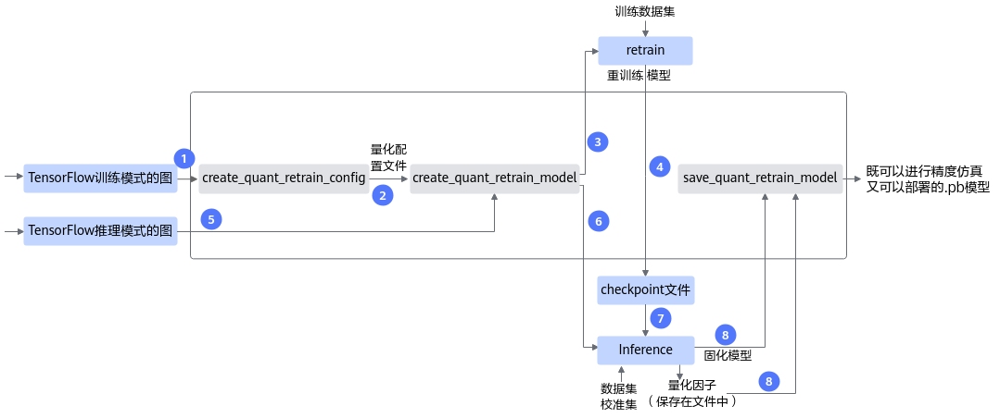

蓝色部分为用户实现，灰色部分为用户调用AMCT提供的API实现，用户在TensorFlow原始网络推理的代码中导入库，并在特定的位置调用相应API，即可实现量化功能。

简要流程如下：

1.  用户构造训练模式的图结构，然后调用[create\_quant\_retrain\_config](create_quant_retrain_config-74.md)接口生成量化配置文件。
2.  调用[create\_quant\_retrain\_model](create_quant_retrain_model-75.md)图修改接口，根据量化配置文件对训练的图进行量化前的图结构修改：插入数据量化，权重量化相关算子等。
3.  训练模型，将参数保存为checkpoint文件。
4.  调用[create\_quant\_retrain\_model](create_quant_retrain_model-75.md)接口，对推理模式的图进行修改：插入数据量化，权重量化相关算子等。
5.  恢复训练参数，加载ckpt文件，推理量化的输出节点，将量化因子写入record文件，并将推理图固化为pb模型。
6.  调用[save\_quant\_retrain\_model](save_quant_retrain_model-76.md)接口，插入AscendQuant/AscendDequant等量化算子，保存量化模型。

**调用示例<a name="section491085453516"></a>**

> **说明：** 
>1.  如下示例标有“由用户补充处理”的步骤，需要用户根据自己的模型和数据集进行补充处理，示例中仅为示例代码。
>2.  调用AMCT的部分，函数入参可以根据实际情况进行调整。量化感知训练基于用户的训练过程，请确保已经有基于TensorFlow环境进行训练的脚本，并且训练后的精度正常。

1.  导入AMCT包，设置日志级别。

    ```
    import amct_tensorflow as amct
    amct.set_logging_level(print_level='info', save_level='info')
    ```

2.  <a name="li12406163445412"></a>（可选，由用户补充处理）创建图并读取训练好的参数，在TensorFlow环境下推理，验证环境、推理脚本是否正常。

    推荐执行该步骤，以确保原始模型可以完成推理且精度正常；执行该步骤时，可以使用部分测试集，减少运行时间。

    ```
    user_test_evaluate_model(evaluate_model, test_data)
    ```

3.  （由用户补充处理）创建训练图。

    ```
    train_graph = user_load_train_graph()
    ```

4.  调用AMCT，执行带量化参数的训练流程。
    1.  生成量化配置。

        用户基于构造的训练模式的图结构（BN的is\_training参数为True），调用[create\_quant\_retrain\_config](create_quant_retrain_config-74.md)接口生成量化配置文件（对应[图1](#fig153281318152013)中的序号1）。

        ```
        config_file = './tmp/config.json'
        simple_cfg = './retrain.cfg'
        amct.create_quant_retrain_config(config_file=config_file,
                                         graph=train_graph,
                                         config_defination=simple_cfg)
        ```

    2.  <a name="li99803197163"></a>修改训练模式的图。

        调用量化图修改接口[create\_quant\_retrain\_model](create_quant_retrain_model-75.md)，根据量化配置文件对训练的图进行量化前的图结构修改：在图中插入数据量化、权重量化等相关算子，用于计算量化相关参数（对应[图1](#fig153281318152013)中的序号2）。

        ```
        record_file = './tmp/record.txt'
        retrain_ops = amct.create_quant_retrain_model(graph=train_graph,
        					      config_file=config_file,
        					      record_file=record_file)
        ```

    3.  （由用户补充处理）使用修改后的图，创建反向梯度，在训练集上做训练，训练量化因子。
        1.  使用修改后的图，调用自适应学习率优化器（RMSPropOptimizer）建立反向梯度图。该步骤需要在[4.b](#li99803197163)后执行。

            ```
                optimizer = tf.compat.v1.train.RMSPropOptimizer(
                    ARGS.learning_rate, momentum=ARGS.momentum)
                train_op = optimizer.minimize(loss)
            ```

        1.  创建会话，进行模型的训练，并将训练后的参数保存为checkpoint文件（对应[图1](#fig153281318152013)中的序号3，4）。

            注意：从训练好的checkpoint恢复模型参数后再训练；训练中保存的参数应该包括量化因子：前batch\_num次训练后会生成量化因子，如果训练次数少于batch\_num会导致失败。

            ```
            with tf.Session() as sess:
                 sess.run(tf.compat.v1.global_variables_initializer())
                 sess.run(outputs)
                 #将训练后的参数保存为checkpoint文件
                 saver_save.save(sess, retrain_ckpt, global_step=0)
            ```

5.  （由用户补充处理）创建推理图。

    ```
    test_graph = user_load_test_graph()
    ```

6.  调用AMCT，实现量化感知训练。
    1.  修改推理模式的图。

        用户基于构造的推理模式的图结构（BN的is\_training参数为False），调用量化图修改接口[create\_quant\_retrain\_model](create_quant_retrain_model-75.md)，根据量化配置文件对推理的图进行量化前的图结构修改：在图中插入数据量化、权重量化等相关算子（对应[图1](#fig153281318152013)中的序号5）。

        ```
        record_file = './tmp/record.txt'
        retrain_ops = amct.create_quant_retrain_model(graph=train_graph,
        					      config_file=config_file,
        					      record_file=record_file)
        ```

    1.  （由用户补充处理）创建会话，恢复训练参数，推理量化的输出节点（retrain\_ops\[-1\]），将量化因子写入record文件，并将推理图固化为pb模型（对应[图1](#fig153281318152013)中的序号6，7）。

        说明：推理和恢复的参数要在同一session中，推理执行的是retrain\_ops\[-1\]的输出tensor；推理图固化为pb模型时，包含训练好的参数。

        ```
        variables_to_restore = tf.compat.v1.global_variables()
        saver_restore = tf.compat.v1.train.Saver(variables_to_restore)
        with tf.Session() as sess:
             sess.run(tf.compat.v1.global_variables_initializer())
             #恢复训练参数
             saver_restore.restore(sess, retrain_ckpt)
             #推理量化的输出节点（retrain_ops[-1]），将量化因子写入record文件
             sess.run(retrain_ops[-1])
             #固化pb模型
             constant_graph = tf.compat.v1.graph_util.convert_variables_to_constants(
                  sess, eval_graph.as_graph_def(), [output.name[:-2] for output in outputs])
             with tf.io.gfile.GFile(frozen_quant_eval_pb, 'wb') as f:
                  f.write(constant_graph.SerializeToString())
        ```

    2.  保存量化模型。

        根据量化因子以及pb文件，调用[save\_quant\_retrain\_model](save_quant_retrain_model-76.md)接口，插入AscendQuant、AscendDequant等算子，保存为量化模型（对应[图1](#fig153281318152013)中的序号8）。

        ```
        quant_model_path = './result/user_model'
        amct.save_quant_retrain_model(pb_model=trained_pb,
                                      outputs=user_model_outputs,
                                      record_file=record_file,
                                      save_path=quant_model_path)
        ```

7.  （可选，由用户补充处理）使用量化后模型user\_model\_quantized.pb和测试集，在TensorFlow环境下推理，测试量化后的仿真模型精度。

    使用量化后仿真模型精度与[2](#li12406163445412)中的原始精度做对比，可以观察量化对精度的影响。

    ```
    quant_model = './results/user_model_quantized.pb'
    user_do_inference(quant_model, test_data)
    ```

#### 手工调优<a name="ZH-CN_TOPIC_0000002473744682"></a>

执行量化感知训练特性后的精度如果不满足要求，可以尝试手动调整config.json文件中的参数，本节给出调整的原则，以及参数解释。

**调优流程<a name="section15504194811512"></a>**

通过[create\_quant\_retrain\_config](create_quant_retrain_config-74.md)接口生成的config.json文件中的默认配置进行量化，若量化后的推理精度不满足要求，则按照如下步骤调整量化配置文件中的参数。

1.  根据[create\_quant\_retrain\_config](create_quant_retrain_config-74.md)接口生成的默认配置进行量化。若精度满足要求，则调参结束，否则进行[2](#li1680816326283)。
2.  <a name="li1680816326283"></a>INT8量化场景下，可以将部分量化层取消量化，即将其"retrain\_enable"参数修改为"false"，通常模型首尾层对推理结果影响较大，故建议优先取消首尾层的量化；如果用户有推荐的clip\_max和clip\_min的参数取值，则可以按照如下方式修改量化配置文件：

    ```
    {
        "version":1,
        "batch_num":1,
        "inference/Conv2D":{
            "retrain_enable":true,
            "retrain_data_config":{
                "algo":"ulq_quantize",
                "clip_max":3.0,
                "clip_min":-3.0
            },
            "retrain_weight_config":{
                "algo":"arq_retrain",
                "channel_wise":true
            }
        },
        "inference/Conv2D_1":{
            "retrain_enable":true,
            "retrain_data_config":{
                "algo":"ulq_quantize",
                "clip_max":3.0,
                "clip_min":-3.0
            },
            "retrain_weight_config":{
                "algo":"arq_retrain",
                "channel_wise":true
            }
        }
    }
    ```

3.  完成配置后，精度满足要求则调参结束；否则表明量化感知训练对精度影响很大，不能进行量化感知训练，去除量化感知训练配置。

**量化配置文件<a name="section1893463733618"></a>**

如果通过[create\_quant\_retrain\_config](create_quant_retrain_config-74.md)接口生成的config.json量化感知训练配置文件，推理精度不满足要求，则需要参见该章节不断调整config.json文件中的内容，直至精度满足要求，该文件部分内容样例请参见接口中的[调用示例](create_quant_retrain_config.md#zh-cn_topic_0240188739_section64231658994)部分（用户修改JSON文件时，请确保层名唯一）。配置文件中参数说明如下：

**表 1**  version参数说明

<a name="table1933120499584"></a>
<table><tbody><tr id="row2410154917588"><th class="firstcol" valign="top" width="29.459999999999997%" id="mcps1.2.3.1.1"><p id="p5410154919582"><a name="p5410154919582"></a><a name="p5410154919582"></a>作用</p>
</th>
<td class="cellrowborder" valign="top" width="70.54%" headers="mcps1.2.3.1.1 "><p id="p341012497587"><a name="p341012497587"></a><a name="p341012497587"></a>控制量化配置文件版本号。</p>
</td>
</tr>
<tr id="row1410184918581"><th class="firstcol" valign="top" width="29.459999999999997%" id="mcps1.2.3.2.1"><p id="p14410144912584"><a name="p14410144912584"></a><a name="p14410144912584"></a>类型</p>
</th>
<td class="cellrowborder" valign="top" width="70.54%" headers="mcps1.2.3.2.1 "><p id="p12410104910587"><a name="p12410104910587"></a><a name="p12410104910587"></a>int</p>
</td>
</tr>
<tr id="row1441024919580"><th class="firstcol" valign="top" width="29.459999999999997%" id="mcps1.2.3.3.1"><p id="p134106498581"><a name="p134106498581"></a><a name="p134106498581"></a>取值范围</p>
</th>
<td class="cellrowborder" valign="top" width="70.54%" headers="mcps1.2.3.3.1 "><p id="p18410174905818"><a name="p18410174905818"></a><a name="p18410174905818"></a>1</p>
</td>
</tr>
<tr id="row15410194985816"><th class="firstcol" valign="top" width="29.459999999999997%" id="mcps1.2.3.4.1"><p id="p20410184910588"><a name="p20410184910588"></a><a name="p20410184910588"></a>参数说明</p>
</th>
<td class="cellrowborder" valign="top" width="70.54%" headers="mcps1.2.3.4.1 "><p id="p34105493582"><a name="p34105493582"></a><a name="p34105493582"></a>目前仅有一个版本号1。</p>
</td>
</tr>
<tr id="row17410174919583"><th class="firstcol" valign="top" width="29.459999999999997%" id="mcps1.2.3.5.1"><p id="p2041010499589"><a name="p2041010499589"></a><a name="p2041010499589"></a>推荐配置</p>
</th>
<td class="cellrowborder" valign="top" width="70.54%" headers="mcps1.2.3.5.1 "><p id="p5410194915589"><a name="p5410194915589"></a><a name="p5410194915589"></a>1</p>
</td>
</tr>
<tr id="row841010493589"><th class="firstcol" valign="top" width="29.459999999999997%" id="mcps1.2.3.6.1"><p id="p94101149125820"><a name="p94101149125820"></a><a name="p94101149125820"></a>必选或可选</p>
</th>
<td class="cellrowborder" valign="top" width="70.54%" headers="mcps1.2.3.6.1 "><p id="p1041094913584"><a name="p1041094913584"></a><a name="p1041094913584"></a>可选</p>
</td>
</tr>
</tbody>
</table>

**表 2**  batch\_num参数说明

<a name="table75661855114614"></a>
<table><tbody><tr id="row15567125564611"><th class="firstcol" valign="top" width="29.509999999999998%" id="mcps1.2.3.1.1"><p id="p256715594618"><a name="p256715594618"></a><a name="p256715594618"></a>作用</p>
</th>
<td class="cellrowborder" valign="top" width="70.49%" headers="mcps1.2.3.1.1 "><p id="p1863882464713"><a name="p1863882464713"></a><a name="p1863882464713"></a>控制量化感知训练推理阶段使用多少个batch的数据。</p>
</td>
</tr>
<tr id="row5567165511461"><th class="firstcol" valign="top" width="29.509999999999998%" id="mcps1.2.3.2.1"><p id="p1567145544610"><a name="p1567145544610"></a><a name="p1567145544610"></a>类型</p>
</th>
<td class="cellrowborder" valign="top" width="70.49%" headers="mcps1.2.3.2.1 "><p id="p656735513467"><a name="p656735513467"></a><a name="p656735513467"></a>int</p>
</td>
</tr>
<tr id="row25671155154619"><th class="firstcol" valign="top" width="29.509999999999998%" id="mcps1.2.3.3.1"><p id="p25677559460"><a name="p25677559460"></a><a name="p25677559460"></a>取值范围</p>
</th>
<td class="cellrowborder" valign="top" width="70.49%" headers="mcps1.2.3.3.1 "><p id="p1894544117474"><a name="p1894544117474"></a><a name="p1894544117474"></a>大于0</p>
</td>
</tr>
<tr id="row13567145524613"><th class="firstcol" valign="top" width="29.509999999999998%" id="mcps1.2.3.4.1"><p id="p145671455204617"><a name="p145671455204617"></a><a name="p145671455204617"></a>参数说明</p>
</th>
<td class="cellrowborder" valign="top" width="70.49%" headers="mcps1.2.3.4.1 "><p id="p1623395912474"><a name="p1623395912474"></a><a name="p1623395912474"></a>如果不配置，则使用默认值1，建议校准集图片数量不超过50张，根据batch的大小，batch_size计算相应的batch_num数值。</p>
<p id="p123305934719"><a name="p123305934719"></a><a name="p123305934719"></a>batch_num*batch_size为量化使用的校准集图片数量。</p>
<p id="p323318594473"><a name="p323318594473"></a><a name="p323318594473"></a>其中batch_size为每个batch所用的图片数量。</p>
</td>
</tr>
<tr id="row175674556468"><th class="firstcol" valign="top" width="29.509999999999998%" id="mcps1.2.3.5.1"><p id="p19567155574615"><a name="p19567155574615"></a><a name="p19567155574615"></a>推荐配置</p>
</th>
<td class="cellrowborder" valign="top" width="70.49%" headers="mcps1.2.3.5.1 "><p id="p45671555134613"><a name="p45671555134613"></a><a name="p45671555134613"></a>1</p>
</td>
</tr>
<tr id="row056716559466"><th class="firstcol" valign="top" width="29.509999999999998%" id="mcps1.2.3.6.1"><p id="p356775511466"><a name="p356775511466"></a><a name="p356775511466"></a>必选或可选</p>
</th>
<td class="cellrowborder" valign="top" width="70.49%" headers="mcps1.2.3.6.1 "><p id="p156725512460"><a name="p156725512460"></a><a name="p156725512460"></a>可选</p>
</td>
</tr>
</tbody>
</table>

**表 3**  retrain\_enable参数说明

<a name="table4499101514598"></a>
<table><tbody><tr id="row75841715185920"><th class="firstcol" valign="top" width="29.509999999999998%" id="mcps1.2.3.1.1"><p id="p15584101575915"><a name="p15584101575915"></a><a name="p15584101575915"></a>作用</p>
</th>
<td class="cellrowborder" valign="top" width="70.49%" headers="mcps1.2.3.1.1 "><p id="p1658414155596"><a name="p1658414155596"></a><a name="p1658414155596"></a>该层是否进行量化感知训练。</p>
</td>
</tr>
<tr id="row058416153590"><th class="firstcol" valign="top" width="29.509999999999998%" id="mcps1.2.3.2.1"><p id="p1358413155596"><a name="p1358413155596"></a><a name="p1358413155596"></a>类型</p>
</th>
<td class="cellrowborder" valign="top" width="70.49%" headers="mcps1.2.3.2.1 "><p id="p2584015105915"><a name="p2584015105915"></a><a name="p2584015105915"></a>bool</p>
</td>
</tr>
<tr id="row958417153595"><th class="firstcol" valign="top" width="29.509999999999998%" id="mcps1.2.3.3.1"><p id="p175840158598"><a name="p175840158598"></a><a name="p175840158598"></a>取值范围</p>
</th>
<td class="cellrowborder" valign="top" width="70.49%" headers="mcps1.2.3.3.1 "><p id="p16584111517591"><a name="p16584111517591"></a><a name="p16584111517591"></a>true或false</p>
</td>
</tr>
<tr id="row155847155595"><th class="firstcol" valign="top" width="29.509999999999998%" id="mcps1.2.3.4.1"><p id="p85846153595"><a name="p85846153595"></a><a name="p85846153595"></a>参数说明</p>
</th>
<td class="cellrowborder" valign="top" width="70.49%" headers="mcps1.2.3.4.1 "><a name="ul10936154516332"></a><a name="ul10936154516332"></a><ul id="ul10936154516332"><li>true：该层需要进行量化感知训练。</li><li>false：该层不进行量化感知训练。</li></ul>
</td>
</tr>
<tr id="row19584171525916"><th class="firstcol" valign="top" width="29.509999999999998%" id="mcps1.2.3.5.1"><p id="p1758417157597"><a name="p1758417157597"></a><a name="p1758417157597"></a>推荐配置</p>
</th>
<td class="cellrowborder" valign="top" width="70.49%" headers="mcps1.2.3.5.1 "><p id="p1658481519592"><a name="p1658481519592"></a><a name="p1658481519592"></a>true</p>
</td>
</tr>
<tr id="row1584161525915"><th class="firstcol" valign="top" width="29.509999999999998%" id="mcps1.2.3.6.1"><p id="p18584161525919"><a name="p18584161525919"></a><a name="p18584161525919"></a>必选或可选</p>
</th>
<td class="cellrowborder" valign="top" width="70.49%" headers="mcps1.2.3.6.1 "><p id="p158519158597"><a name="p158519158597"></a><a name="p158519158597"></a>可选</p>
</td>
</tr>
</tbody>
</table>

**表 4**  retrain\_data\_config参数说明

<a name="table295313665910"></a>
<table><tbody><tr id="row35993775914"><th class="firstcol" valign="top" width="29.759999999999998%" id="mcps1.2.3.1.1"><p id="p205933755911"><a name="p205933755911"></a><a name="p205933755911"></a>作用</p>
</th>
<td class="cellrowborder" valign="top" width="70.24000000000001%" headers="mcps1.2.3.1.1 "><p id="p1759837175919"><a name="p1759837175919"></a><a name="p1759837175919"></a>该层数据量化配置。</p>
</td>
</tr>
<tr id="row459183710598"><th class="firstcol" valign="top" width="29.759999999999998%" id="mcps1.2.3.2.1"><p id="p15943713598"><a name="p15943713598"></a><a name="p15943713598"></a>类型</p>
</th>
<td class="cellrowborder" valign="top" width="70.24000000000001%" headers="mcps1.2.3.2.1 "><p id="p359193715916"><a name="p359193715916"></a><a name="p359193715916"></a>object</p>
</td>
</tr>
<tr id="row85953716596"><th class="firstcol" valign="top" width="29.759999999999998%" id="mcps1.2.3.3.1"><p id="p205983717598"><a name="p205983717598"></a><a name="p205983717598"></a>取值范围</p>
</th>
<td class="cellrowborder" valign="top" width="70.24000000000001%" headers="mcps1.2.3.3.1 "><p id="p1959113720598"><a name="p1959113720598"></a><a name="p1959113720598"></a>-</p>
</td>
</tr>
<tr id="row45993718596"><th class="firstcol" valign="top" width="29.759999999999998%" id="mcps1.2.3.4.1"><p id="p559123715917"><a name="p559123715917"></a><a name="p559123715917"></a>参数说明</p>
</th>
<td class="cellrowborder" valign="top" width="70.24000000000001%" headers="mcps1.2.3.4.1 "><p id="p727754111012"><a name="p727754111012"></a><a name="p727754111012"></a>包含如下参数：</p>
<a name="ul68351742201012"></a><a name="ul68351742201012"></a><ul id="ul68351742201012"><li>algo：量化算法选择，默认是ulq_quantize。</li><li>clip_max：截断量化算法上限，默认不选。</li><li>clip_min：截断量化算法下限，默认不选。</li><li>fixed_min：截断量化算法最小值固定为0，默认不选。</li><li>dst_type：用以选择INT8或INT4量化位宽，默认为INT8。</li></ul>
</td>
</tr>
<tr id="row559113713595"><th class="firstcol" valign="top" width="29.759999999999998%" id="mcps1.2.3.5.1"><p id="p1859183705914"><a name="p1859183705914"></a><a name="p1859183705914"></a>推荐配置</p>
</th>
<td class="cellrowborder" valign="top" width="70.24000000000001%" headers="mcps1.2.3.5.1 "><p id="p125903705913"><a name="p125903705913"></a><a name="p125903705913"></a>-</p>
</td>
</tr>
<tr id="row859103775914"><th class="firstcol" valign="top" width="29.759999999999998%" id="mcps1.2.3.6.1"><p id="p259103711595"><a name="p259103711595"></a><a name="p259103711595"></a>必选或可选</p>
</th>
<td class="cellrowborder" valign="top" width="70.24000000000001%" headers="mcps1.2.3.6.1 "><p id="p16590373599"><a name="p16590373599"></a><a name="p16590373599"></a>可选</p>
</td>
</tr>
</tbody>
</table>

**表 5**  retrain\_weight\_config参数说明

<a name="table8436159205910"></a>
<table><tbody><tr id="row1452275913591"><th class="firstcol" valign="top" width="30.14%" id="mcps1.2.3.1.1"><p id="p45221959115918"><a name="p45221959115918"></a><a name="p45221959115918"></a>作用</p>
</th>
<td class="cellrowborder" valign="top" width="69.86%" headers="mcps1.2.3.1.1 "><p id="p1252215935915"><a name="p1252215935915"></a><a name="p1252215935915"></a>该层权重量化配置。</p>
</td>
</tr>
<tr id="row19522145965915"><th class="firstcol" valign="top" width="30.14%" id="mcps1.2.3.2.1"><p id="p1852215917591"><a name="p1852215917591"></a><a name="p1852215917591"></a>类型</p>
</th>
<td class="cellrowborder" valign="top" width="69.86%" headers="mcps1.2.3.2.1 "><p id="p1852219596595"><a name="p1852219596595"></a><a name="p1852219596595"></a>object</p>
</td>
</tr>
<tr id="row11522185911599"><th class="firstcol" valign="top" width="30.14%" id="mcps1.2.3.3.1"><p id="p145225597594"><a name="p145225597594"></a><a name="p145225597594"></a>取值范围</p>
</th>
<td class="cellrowborder" valign="top" width="69.86%" headers="mcps1.2.3.3.1 "><p id="p2522159135920"><a name="p2522159135920"></a><a name="p2522159135920"></a>-</p>
</td>
</tr>
<tr id="row205221559105919"><th class="firstcol" valign="top" width="30.14%" id="mcps1.2.3.4.1"><p id="p12522165935911"><a name="p12522165935911"></a><a name="p12522165935911"></a>参数说明</p>
</th>
<td class="cellrowborder" valign="top" width="69.86%" headers="mcps1.2.3.4.1 "><p id="p17933820151112"><a name="p17933820151112"></a><a name="p17933820151112"></a>包含如下参数：</p>
<a name="ul13748202351116"></a><a name="ul13748202351116"></a><ul id="ul13748202351116"><li>algo：量化算法选择，默认是arq_retrain</li><li>channel_wise</li></ul>
</td>
</tr>
<tr id="row20522759115911"><th class="firstcol" valign="top" width="30.14%" id="mcps1.2.3.5.1"><p id="p7522959115911"><a name="p7522959115911"></a><a name="p7522959115911"></a>推荐配置</p>
</th>
<td class="cellrowborder" valign="top" width="69.86%" headers="mcps1.2.3.5.1 "><p id="p1352265919591"><a name="p1352265919591"></a><a name="p1352265919591"></a>-</p>
</td>
</tr>
<tr id="row2522195912593"><th class="firstcol" valign="top" width="30.14%" id="mcps1.2.3.6.1"><p id="p12522155955910"><a name="p12522155955910"></a><a name="p12522155955910"></a>必选或可选</p>
</th>
<td class="cellrowborder" valign="top" width="69.86%" headers="mcps1.2.3.6.1 "><p id="p7522759105918"><a name="p7522759105918"></a><a name="p7522759105918"></a>可选</p>
</td>
</tr>
</tbody>
</table>

**表 6**  algo参数说明

<a name="table16511191903"></a>
<table><tbody><tr id="row11351719107"><th class="firstcol" valign="top" width="30.020000000000003%" id="mcps1.2.3.1.1"><p id="p81352194014"><a name="p81352194014"></a><a name="p81352194014"></a>作用</p>
</th>
<td class="cellrowborder" valign="top" width="69.98%" headers="mcps1.2.3.1.1 "><p id="p11359192003"><a name="p11359192003"></a><a name="p11359192003"></a>该层选择使用的量化算法。</p>
</td>
</tr>
<tr id="row41353191201"><th class="firstcol" valign="top" width="30.020000000000003%" id="mcps1.2.3.2.1"><p id="p51351719900"><a name="p51351719900"></a><a name="p51351719900"></a>类型</p>
</th>
<td class="cellrowborder" valign="top" width="69.98%" headers="mcps1.2.3.2.1 "><p id="p813515190015"><a name="p813515190015"></a><a name="p813515190015"></a>object</p>
</td>
</tr>
<tr id="row51357191903"><th class="firstcol" valign="top" width="30.020000000000003%" id="mcps1.2.3.3.1"><p id="p111350191400"><a name="p111350191400"></a><a name="p111350191400"></a>取值范围</p>
</th>
<td class="cellrowborder" valign="top" width="69.98%" headers="mcps1.2.3.3.1 "><p id="p11355191907"><a name="p11355191907"></a><a name="p11355191907"></a>-</p>
</td>
</tr>
<tr id="row1913611192016"><th class="firstcol" valign="top" width="30.020000000000003%" id="mcps1.2.3.4.1"><p id="p14136101917017"><a name="p14136101917017"></a><a name="p14136101917017"></a>参数说明</p>
</th>
<td class="cellrowborder" valign="top" width="69.98%" headers="mcps1.2.3.4.1 "><a name="ul12852131315124"></a><a name="ul12852131315124"></a><ul id="ul12852131315124"><li>ulq_quantize：ulq截断上下限量化算法。</li><li>arq_retrain：arq量化算法。</li></ul>
</td>
</tr>
<tr id="row813613194017"><th class="firstcol" valign="top" width="30.020000000000003%" id="mcps1.2.3.5.1"><p id="p1136219806"><a name="p1136219806"></a><a name="p1136219806"></a>推荐配置</p>
</th>
<td class="cellrowborder" valign="top" width="69.98%" headers="mcps1.2.3.5.1 "><p id="p891753512124"><a name="p891753512124"></a><a name="p891753512124"></a>数据量化使用ulq_quantize，权重量化使用arq_retrain。</p>
</td>
</tr>
<tr id="row9136719007"><th class="firstcol" valign="top" width="30.020000000000003%" id="mcps1.2.3.6.1"><p id="p2136171915018"><a name="p2136171915018"></a><a name="p2136171915018"></a>必选或可选</p>
</th>
<td class="cellrowborder" valign="top" width="69.98%" headers="mcps1.2.3.6.1 "><p id="p2136519602"><a name="p2136519602"></a><a name="p2136519602"></a>可选</p>
</td>
</tr>
</tbody>
</table>

**表 7**  channel\_wise参数说明

<a name="table19960439106"></a>
<table><tbody><tr id="row19630401702"><th class="firstcol" valign="top" width="30.330000000000002%" id="mcps1.2.3.1.1"><p id="p16630401405"><a name="p16630401405"></a><a name="p16630401405"></a>作用</p>
</th>
<td class="cellrowborder" valign="top" width="69.67%" headers="mcps1.2.3.1.1 "><p id="p18631740902"><a name="p18631740902"></a><a name="p18631740902"></a>是否对每个channel采用不同的量化因子。</p>
</td>
</tr>
<tr id="row6631403012"><th class="firstcol" valign="top" width="30.330000000000002%" id="mcps1.2.3.2.1"><p id="p2639401605"><a name="p2639401605"></a><a name="p2639401605"></a>类型</p>
</th>
<td class="cellrowborder" valign="top" width="69.67%" headers="mcps1.2.3.2.1 "><p id="p7641340708"><a name="p7641340708"></a><a name="p7641340708"></a>bool</p>
</td>
</tr>
<tr id="row176416405012"><th class="firstcol" valign="top" width="30.330000000000002%" id="mcps1.2.3.3.1"><p id="p1364154019019"><a name="p1364154019019"></a><a name="p1364154019019"></a>取值范围</p>
</th>
<td class="cellrowborder" valign="top" width="69.67%" headers="mcps1.2.3.3.1 "><p id="p06474012018"><a name="p06474012018"></a><a name="p06474012018"></a>true或false</p>
</td>
</tr>
<tr id="row11644401600"><th class="firstcol" valign="top" width="30.330000000000002%" id="mcps1.2.3.4.1"><p id="p2647406019"><a name="p2647406019"></a><a name="p2647406019"></a>参数说明</p>
</th>
<td class="cellrowborder" valign="top" width="69.67%" headers="mcps1.2.3.4.1 "><a name="ul145214136711"></a><a name="ul145214136711"></a><ul id="ul145214136711"><li>true：每个channel独立量化，量化因子不同。</li><li>false：每个channel同时量化，共享量化因子。</li></ul>
</td>
</tr>
<tr id="row5644406018"><th class="firstcol" valign="top" width="30.330000000000002%" id="mcps1.2.3.5.1"><p id="p12644401701"><a name="p12644401701"></a><a name="p12644401701"></a>推荐配置</p>
</th>
<td class="cellrowborder" valign="top" width="69.67%" headers="mcps1.2.3.5.1 "><p id="p12641040401"><a name="p12641040401"></a><a name="p12641040401"></a>true</p>
</td>
</tr>
<tr id="row9649401506"><th class="firstcol" valign="top" width="30.330000000000002%" id="mcps1.2.3.6.1"><p id="p16444012018"><a name="p16444012018"></a><a name="p16444012018"></a>必选或可选</p>
</th>
<td class="cellrowborder" valign="top" width="69.67%" headers="mcps1.2.3.6.1 "><p id="p106444019018"><a name="p106444019018"></a><a name="p106444019018"></a>可选</p>
</td>
</tr>
</tbody>
</table>

**表 8**  fixed\_min参数说明

<a name="table1459214218113"></a>
<table><tbody><tr id="row273316210110"><th class="firstcol" valign="top" width="30.4%" id="mcps1.2.3.1.1"><p id="p2734529111"><a name="p2734529111"></a><a name="p2734529111"></a>作用</p>
</th>
<td class="cellrowborder" valign="top" width="69.6%" headers="mcps1.2.3.1.1 "><p id="p9796912758"><a name="p9796912758"></a><a name="p9796912758"></a>设置数据量化算法下限的开关。</p>
</td>
</tr>
<tr id="row1573418219111"><th class="firstcol" valign="top" width="30.4%" id="mcps1.2.3.2.1"><p id="p7734122712"><a name="p7734122712"></a><a name="p7734122712"></a>类型</p>
</th>
<td class="cellrowborder" valign="top" width="69.6%" headers="mcps1.2.3.2.1 "><p id="p1573412218119"><a name="p1573412218119"></a><a name="p1573412218119"></a>bool</p>
</td>
</tr>
<tr id="row573414213113"><th class="firstcol" valign="top" width="30.4%" id="mcps1.2.3.3.1"><p id="p473414214110"><a name="p473414214110"></a><a name="p473414214110"></a>取值范围</p>
</th>
<td class="cellrowborder" valign="top" width="69.6%" headers="mcps1.2.3.3.1 "><p id="p37341321010"><a name="p37341321010"></a><a name="p37341321010"></a>true或false</p>
</td>
</tr>
<tr id="row97341522015"><th class="firstcol" valign="top" width="30.4%" id="mcps1.2.3.4.1"><p id="p177341821611"><a name="p177341821611"></a><a name="p177341821611"></a>参数说明</p>
</th>
<td class="cellrowborder" valign="top" width="69.6%" headers="mcps1.2.3.4.1 "><a name="ul2060616411812"></a><a name="ul2060616411812"></a><ul id="ul2060616411812"><li>true：数据量化算法固定下限，并且下限为0。</li><li>false：数据量化算法不固定下限。</li></ul>
<p id="p126671643181416"><a name="p126671643181416"></a><a name="p126671643181416"></a>如果不选此项，amct根据图的结构自动设置。</p>
<p id="p1446794731520"><a name="p1446794731520"></a><a name="p1446794731520"></a>如果选择此项，并且网络模型量化层的前一层是relu层，则该参数需要手动设置为true，如果为非relu层，则要手动设置为false。</p>
</td>
</tr>
<tr id="row9734521119"><th class="firstcol" valign="top" width="30.4%" id="mcps1.2.3.5.1"><p id="p5734623111"><a name="p5734623111"></a><a name="p5734623111"></a>推荐配置</p>
</th>
<td class="cellrowborder" valign="top" width="69.6%" headers="mcps1.2.3.5.1 "><p id="p47340218119"><a name="p47340218119"></a><a name="p47340218119"></a>不选此项</p>
</td>
</tr>
<tr id="row07341224118"><th class="firstcol" valign="top" width="30.4%" id="mcps1.2.3.6.1"><p id="p173417211112"><a name="p173417211112"></a><a name="p173417211112"></a>必选或可选</p>
</th>
<td class="cellrowborder" valign="top" width="69.6%" headers="mcps1.2.3.6.1 "><p id="p15734128116"><a name="p15734128116"></a><a name="p15734128116"></a>可选</p>
</td>
</tr>
</tbody>
</table>

**表 9**  clip\_max参数说明

<a name="table15662152613113"></a>
<table><tbody><tr id="row1884192620114"><th class="firstcol" valign="top" width="30.78%" id="mcps1.2.3.1.1"><p id="p15841926411"><a name="p15841926411"></a><a name="p15841926411"></a>作用</p>
</th>
<td class="cellrowborder" valign="top" width="69.22%" headers="mcps1.2.3.1.1 "><p id="p158412268115"><a name="p158412268115"></a><a name="p158412268115"></a>数据量化算法上限。</p>
</td>
</tr>
<tr id="row20841192612115"><th class="firstcol" valign="top" width="30.78%" id="mcps1.2.3.2.1"><p id="p8841132617118"><a name="p8841132617118"></a><a name="p8841132617118"></a>类型</p>
</th>
<td class="cellrowborder" valign="top" width="69.22%" headers="mcps1.2.3.2.1 "><p id="p1841926412"><a name="p1841926412"></a><a name="p1841926412"></a>float</p>
</td>
</tr>
<tr id="row7841132616113"><th class="firstcol" valign="top" width="30.78%" id="mcps1.2.3.3.1"><p id="p98411626218"><a name="p98411626218"></a><a name="p98411626218"></a>取值范围</p>
</th>
<td class="cellrowborder" valign="top" width="69.22%" headers="mcps1.2.3.3.1 "><p id="p1628854314316"><a name="p1628854314316"></a><a name="p1628854314316"></a>clip_max&gt;0</p>
<p id="p5540113223113"><a name="p5540113223113"></a><a name="p5540113223113"></a>根据不同层activation的数据分布找到最大值max，推荐取值范围为：</p>
<p id="p1951711211463"><a name="p1951711211463"></a><a name="p1951711211463"></a>0.3*max~1.7*max</p>
</td>
</tr>
<tr id="row28412026112"><th class="firstcol" valign="top" width="30.78%" id="mcps1.2.3.4.1"><p id="p184116261613"><a name="p184116261613"></a><a name="p184116261613"></a>参数说明</p>
</th>
<td class="cellrowborder" valign="top" width="69.22%" headers="mcps1.2.3.4.1 "><p id="p784192610116"><a name="p784192610116"></a><a name="p784192610116"></a>截断上下限数据量化算法，如果选择此项则固定算法截断上限。如果不选此项，通过ifmr算法学习获取上限。</p>
</td>
</tr>
<tr id="row1384115264120"><th class="firstcol" valign="top" width="30.78%" id="mcps1.2.3.5.1"><p id="p88411265115"><a name="p88411265115"></a><a name="p88411265115"></a>推荐配置</p>
</th>
<td class="cellrowborder" valign="top" width="69.22%" headers="mcps1.2.3.5.1 "><p id="p188411726716"><a name="p188411726716"></a><a name="p188411726716"></a>不选此项</p>
</td>
</tr>
<tr id="row5841182617115"><th class="firstcol" valign="top" width="30.78%" id="mcps1.2.3.6.1"><p id="p10841102613112"><a name="p10841102613112"></a><a name="p10841102613112"></a>必选或可选</p>
</th>
<td class="cellrowborder" valign="top" width="69.22%" headers="mcps1.2.3.6.1 "><p id="p15842172615111"><a name="p15842172615111"></a><a name="p15842172615111"></a>可选</p>
</td>
</tr>
</tbody>
</table>

**表 10**  clip\_min参数说明

<a name="table1988120453112"></a>
<table><tbody><tr id="row159518451718"><th class="firstcol" valign="top" width="30.84%" id="mcps1.2.3.1.1"><p id="p169511945018"><a name="p169511945018"></a><a name="p169511945018"></a>作用</p>
</th>
<td class="cellrowborder" valign="top" width="69.16%" headers="mcps1.2.3.1.1 "><p id="p595117451316"><a name="p595117451316"></a><a name="p595117451316"></a>数据量化算法下限。</p>
</td>
</tr>
<tr id="row159519452115"><th class="firstcol" valign="top" width="30.84%" id="mcps1.2.3.2.1"><p id="p159527451915"><a name="p159527451915"></a><a name="p159527451915"></a>类型</p>
</th>
<td class="cellrowborder" valign="top" width="69.16%" headers="mcps1.2.3.2.1 "><p id="p695213459114"><a name="p695213459114"></a><a name="p695213459114"></a>float</p>
</td>
</tr>
<tr id="row195216451916"><th class="firstcol" valign="top" width="30.84%" id="mcps1.2.3.3.1"><p id="p295217450114"><a name="p295217450114"></a><a name="p295217450114"></a>取值范围</p>
</th>
<td class="cellrowborder" valign="top" width="69.16%" headers="mcps1.2.3.3.1 "><p id="p189461558113113"><a name="p189461558113113"></a><a name="p189461558113113"></a>clip_min&lt;0</p>
<p id="p663113717614"><a name="p663113717614"></a><a name="p663113717614"></a>根据不同层activation的数据分布找到最小值min，推荐取值范围为：</p>
<p id="p206311137166"><a name="p206311137166"></a><a name="p206311137166"></a>0.3*min~1.7*min</p>
</td>
</tr>
<tr id="row1695244517115"><th class="firstcol" valign="top" width="30.84%" id="mcps1.2.3.4.1"><p id="p89522451612"><a name="p89522451612"></a><a name="p89522451612"></a>参数说明</p>
</th>
<td class="cellrowborder" valign="top" width="69.16%" headers="mcps1.2.3.4.1 "><p id="p1895217453114"><a name="p1895217453114"></a><a name="p1895217453114"></a>截断上下限数据量化算法，如果选择此项则固定算法截断下限。如果不选此项，通过ifmr算法学习获取下限。</p>
</td>
</tr>
<tr id="row18952164511118"><th class="firstcol" valign="top" width="30.84%" id="mcps1.2.3.5.1"><p id="p159521045517"><a name="p159521045517"></a><a name="p159521045517"></a>推荐配置</p>
</th>
<td class="cellrowborder" valign="top" width="69.16%" headers="mcps1.2.3.5.1 "><p id="p59521545716"><a name="p59521545716"></a><a name="p59521545716"></a>不选此项</p>
</td>
</tr>
<tr id="row9952245118"><th class="firstcol" valign="top" width="30.84%" id="mcps1.2.3.6.1"><p id="p49522451211"><a name="p49522451211"></a><a name="p49522451211"></a>必选或可选</p>
</th>
<td class="cellrowborder" valign="top" width="69.16%" headers="mcps1.2.3.6.1 "><p id="p395214459119"><a name="p395214459119"></a><a name="p395214459119"></a>可选</p>
</td>
</tr>
</tbody>
</table>

**表 11**  dst\_type参数说明

<a name="table139781115205"></a>
<table><tbody><tr id="row119791515102"><th class="firstcol" valign="top" width="30.84%" id="mcps1.2.3.1.1"><p id="p197912151904"><a name="p197912151904"></a><a name="p197912151904"></a>作用</p>
</th>
<td class="cellrowborder" valign="top" width="69.16%" headers="mcps1.2.3.1.1 "><p id="p1797911155015"><a name="p1797911155015"></a><a name="p1797911155015"></a>量化位宽的类型。</p>
</td>
</tr>
<tr id="row197913151001"><th class="firstcol" valign="top" width="30.84%" id="mcps1.2.3.2.1"><p id="p15980161511011"><a name="p15980161511011"></a><a name="p15980161511011"></a>类型</p>
</th>
<td class="cellrowborder" valign="top" width="69.16%" headers="mcps1.2.3.2.1 "><p id="p18980315006"><a name="p18980315006"></a><a name="p18980315006"></a>string</p>
</td>
</tr>
<tr id="row159801151604"><th class="firstcol" valign="top" width="30.84%" id="mcps1.2.3.3.1"><p id="p129801715706"><a name="p129801715706"></a><a name="p129801715706"></a>取值范围</p>
</th>
<td class="cellrowborder" valign="top" width="69.16%" headers="mcps1.2.3.3.1 "><p id="p1684619615"><a name="p1684619615"></a><a name="p1684619615"></a>INT8或INT4，默认为INT8，<strong id="b1265356155013"><a name="b1265356155013"></a><a name="b1265356155013"></a>当前版本仅支持INT8量化</strong>。</p>
</td>
</tr>
<tr id="row179807151805"><th class="firstcol" valign="top" width="30.84%" id="mcps1.2.3.4.1"><p id="p169806156011"><a name="p169806156011"></a><a name="p169806156011"></a>参数说明</p>
</th>
<td class="cellrowborder" valign="top" width="69.16%" headers="mcps1.2.3.4.1 "><p id="p16847145315215"><a name="p16847145315215"></a><a name="p16847145315215"></a>量化时用于选择是INT8量化还是INT4量化。</p>
</td>
</tr>
<tr id="row1898112151405"><th class="firstcol" valign="top" width="30.84%" id="mcps1.2.3.5.1"><p id="p49812015801"><a name="p49812015801"></a><a name="p49812015801"></a>推荐配置</p>
</th>
<td class="cellrowborder" valign="top" width="69.16%" headers="mcps1.2.3.5.1 "><p id="p398118151606"><a name="p398118151606"></a><a name="p398118151606"></a>-</p>
</td>
</tr>
<tr id="row09810151202"><th class="firstcol" valign="top" width="30.84%" id="mcps1.2.3.6.1"><p id="p69811115109"><a name="p69811115109"></a><a name="p69811115109"></a>必选或可选</p>
</th>
<td class="cellrowborder" valign="top" width="69.16%" headers="mcps1.2.3.6.1 "><p id="p89821515602"><a name="p89821515602"></a><a name="p89821515602"></a>可选</p>
</td>
</tr>
</tbody>
</table>

## 稀疏<a name="ZH-CN_TOPIC_0000002506024529"></a>


### 通道稀疏<a name="ZH-CN_TOPIC_0000002506024577"></a>


#### 自动通道稀疏搜索<a name="ZH-CN_TOPIC_0000002506024559"></a>

当前通道稀疏支持对不同的层做不同稀疏率的稀疏处理，但逐层设置稀疏率对用户的使用门槛较高，对于某一层，如何选择稀疏率（即配置中的prune\_ratio）是比较困难的，手工尝试的配置需要进行重训练，耗费时间多。针对上述问题，引入自动通道稀疏搜索特性，根据用户模型来计算各通道的稀疏敏感度（影响精度）以及稀疏收益（影响性能），然后搜索策略依据稀疏敏感度和稀疏收益来搜索最优的逐层通道稀疏率，以平衡精度和性能。
介绍自动通道稀疏搜索特性的接口调用流程和调用示例。

##### 简介<a name="ZH-CN_TOPIC_0000002473744530"></a>

当前通道稀疏支持对不同的层做不同稀疏率的稀疏处理，但逐层设置稀疏率对用户的使用门槛较高，对于某一层，如何选择稀疏率（即配置中的prune\_ratio）是比较困难的，手工尝试的配置需要进行重训练，耗费时间多。针对上述问题，引入自动通道稀疏搜索特性，根据用户模型来计算各通道的稀疏敏感度（影响精度）以及稀疏收益（影响性能），然后搜索策略依据稀疏敏感度和稀疏收益来搜索最优的逐层通道稀疏率，以平衡精度和性能。

> **说明：** 
>**说明：当前版本该特性为试用特性，不支持应用于商用产品中。**

-   稀疏敏感度：稀疏敏感度定义为当前通道稀疏后对整网精度的影响估计，稀疏敏感度越大代表当前通道稀疏后整网精度损失越大，默认算法根据loss\(w - w<sub>i</sub>\)的泰勒展开计算通道稀疏敏感度。支持用户自定义计算方式。裁剪第i个通道后，稀疏敏感度计算公式如下：

    

    采用近似估计的方法对loss\(w - w<sub>i</sub>\)进行泰勒展开，目前考虑到计算量只算一阶。

-   稀疏收益：当前通道的稀疏收益用比特复杂度表示，为计算量化Flops与计算比特位宽之积：

    

    其中，Flops为浮点计算量，act\_bit为数据的数据精度，wts\_bit为权重的数据精度。

自动通道稀疏搜索流程如[图1](#fig164988405559)所示，支持稀疏的层以及规格请参见[表1](稀疏流程-53.md#table151175131181)。

**图 1**  自动通道稀疏搜索流程<a name="fig164988405559"></a>  


各流程简要说明如下：

1.  初始化：初始化动作首先需要解析用户模型以及稀疏配置（可选），分析网络中可通道稀疏层及其对应的通道稀疏配置（是否有用户指定配置稀疏率），生成通道稀疏配置生成的搜索空间：解析用户目标压缩率配置。
    -   搜索空间：为支持通道稀疏的层，但是没有通过override\_layer\_configs或者override\_layer\_types配置稀疏率。
    -   压缩率：定义为原模型比特复杂度与稀疏后模型比特复杂度之比。

2.  敏感度计算：计算每个通道的稀疏敏感度，内置基于损失估计的敏感度计算方法，使用泰勒展开的一次项估计裁剪该通道后网络loss的变化；支持用户自定义敏感度计算方法。
3.  比特复杂度计算：计算每个通道的比特复杂度，视为通道的稀疏收益。
4.  通道稀疏率配置搜索：默认采用[自动通道稀疏搜索算法](自动通道稀疏搜索算法.md)，搜索满足用户指定压缩率的最优通道稀疏率配置；支持用户自定义求解器。

    > **说明：** 
    >自动通道稀疏搜索特性只是生成通道稀疏的简易配置文件，若想得到最终稀疏后模型，还需要进行[手工稀疏](手工稀疏-52.md)，将上述生成的简易配置文件作为入参传入通道稀疏。

##### 搜索流程<a name="ZH-CN_TOPIC_0000002505904513"></a>

介绍自动通道稀疏搜索特性的接口调用流程和调用示例。

**接口调用流程<a name="section1417932865914"></a>**

接口调用流程如[图1](#fig4716121613268)所示，蓝色部分为用户实现，灰色部分为用户调用AMCT提供的API实现。稀疏示例请参见[样例列表](样例列表.md)。

用户准备好TensorFlow的训练模型、自动通道稀疏搜索配置文件和校准数据，调用[auto\_channel\_prune\_search](auto_channel_prune_search-81.md)，根据压缩率、各通道的稀疏敏感度以及稀疏收益，执行自动通道稀疏搜索，得到可用作通道稀疏的简易配置文件。其中，sensitivity模块与search\_alg模块用户可以自定义或者使用接口内部默认方法。

-   sensitivity模块实现计算各通道的稀疏敏感度。
-   search\_alg模块实现了基于通道敏感度与通道稀疏收益进行稀疏通道搜索的过程。

**图 1**  调用流程<a name="fig4716121613268"></a>  
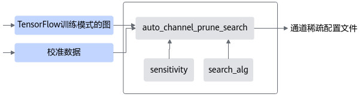

**调用示例<a name="section2080413191461"></a>**

本示例演示了使用AMCT进行自动通道稀疏搜索的流程，该过程需要用户传入tensorflow训练模式的图与校准数据，用户可选择自定义实现sensitivity模块与search\_alg模块。

> **说明：** 
>-   如下示例标有“由用户补充处理”的步骤，需要用户根据自己的模型和数据集进行补充处理，示例中仅为示例代码。
>-   如下示例调用AMCT的部分，函数入参请根据实际情况进行调整。

1.  导入AMCT包，设置日志级别。

    ```
    import amct_tensorflow as amct
    amct.set_logging_level(print_level="info", save_level="info")
    ```

2.  （可选，由用户补充处理）实现sensitivity模块，获取各个layer各通道的敏感度，为后续的搜索算法提供数据。可参考系统默认sensitivity模块：_AMCT安装目录_

    amct\_tensorflow/interface/auto\_channel\_prune\_search.py下的TaylorLossSensitivity方法，简要流程如下：

    ```
    from amct.common.auto_prune.sensitivity_base import SensitivityBase
    
    class Sensitivity(SensitivityBase)
        def __init__(self)
            pass
        def setup_initialization(self, graph_tuple, input_data, test_iteration, output_nodes=None):
            # 必要的初始化
            # graph_tuple (graph, graph_info)
            pass
        def get_sensitivity(self, search_records):
            # 获取敏感度方法，计算后写到record中
            pass
    ```

3.  （可选，由用户补充处理）实现搜索算法search\_alg模块，需要用户实现channel\_prune\_search内部回调接口，根据通道敏感度与通道稀疏收益进行稀疏通道搜索。可参考系统默认search\_alg模块：_AMCT安装目录_/amct\_tensorflow/common/auto\_prune/search\_channel\_base.py文件中GreedySearch方法。

    ```
    from amct.common.auto_prune.search_channel_base import SearchChannelBase
    
    class Search(SearchChannelBase)
        def __init__(self)
            # 初始化
            pass
    
        def channel_prune_search(self, graph_info, search_records, prune_config):
            """
            输入：
            graph_info: dict，包含图中各算子的通道数量与比特复杂度信息，可用于计算压缩率
            search_records: protobuf对象，包含待搜索的可稀疏层
            prune_config: 三元组-目标压缩率（float）、昇腾亲和优化开关（bool）、单层最大稀疏率（float）
            输出：
            dict，key为待搜索的可稀疏层层名，value为01组成的list，对应该通道是否应稀疏
            """
            pass
    ```

4.  （可选，由用户补充处理）创建图并读取训练好的参数，在TensorFlow环境下推理，验证环境、推理脚本是否正常。

    推荐执行该步骤，以确保原始模型可以完成推理且精度正常；执行该步骤时，可以使用部分测试集，减少运行时间。

    ```
    user_test_evaluate_model(evaluate_model, test_data)
    ```

5.  （由用户补充处理）创建训练图，构造校准数据。

    ```
    train_graph = user_load_train_graph()
    input_data = []
    for _ in range(test_iteration):
        input_data.append(user_load_feed_dict())
    ```

6.  调用AMCT，进行自动通道稀疏搜索。

    ```
    output_prune_cfg = './prune.cfg'
    amct.auto_channel_prune_search(
        graph=train_graph, 
        output_nodes=user_model_outputs, 
        config=cfg_file, 
        input_data=input_data,
        output_cfg=output_prune_cfg,
        sensitivity='TaylorLossSensitivity',
        search_alg='GreedySearch')
    ```

#### 手工稀疏<a name="ZH-CN_TOPIC_0000002473744678"></a>

本节介绍手工稀疏特性支持的稀疏层，接口调用流程和调用示例。
稀疏后，如果精度不满足要求，可以参见本节提供的方法进行调优。

##### 稀疏流程<a name="ZH-CN_TOPIC_0000002505904629"></a>

本节介绍手工稀疏特性支持的稀疏层，接口调用流程和调用示例。

AMCT目前主要支持基于重训练的通道稀疏模型压缩特性，稀疏示例请参见[样例列表](样例列表.md)\>TensorFlow\>通道稀疏（手工稀疏）。支持通道稀疏的层以及约束如下：

**表 1**  通道稀疏支持的层以及约束

<a name="table151175131181"></a>
<table><thead align="left"><tr id="row61178136184"><th class="cellrowborder" valign="top" width="19.77%" id="mcps1.2.3.1.1"><p id="p19117161310182"><a name="p19117161310182"></a><a name="p19117161310182"></a>支持的层类型</p>
</th>
<th class="cellrowborder" valign="top" width="80.23%" id="mcps1.2.3.1.2"><p id="p9117111341815"><a name="p9117111341815"></a><a name="p9117111341815"></a>约束</p>
</th>
</tr>
</thead>
<tbody><tr id="row4117613121819"><td class="cellrowborder" valign="top" width="19.77%" headers="mcps1.2.3.1.1 "><p id="p011821321816"><a name="p011821321816"></a><a name="p011821321816"></a>MatMul</p>
</td>
<td class="cellrowborder" valign="top" width="80.23%" headers="mcps1.2.3.1.2 "><p id="p311841312188"><a name="p311841312188"></a><a name="p311841312188"></a>transpose_a=False、transpose_b=True/False、adjoint_a=False、adjoint_b=True/False</p>
<p id="p17298111713715"><a name="p17298111713715"></a><a name="p17298111713715"></a>权重数据类型为float32，float64</p>
</td>
</tr>
<tr id="row13118181318183"><td class="cellrowborder" valign="top" width="19.77%" headers="mcps1.2.3.1.1 "><p id="p6118201381816"><a name="p6118201381816"></a><a name="p6118201381816"></a>Conv2D</p>
</td>
<td class="cellrowborder" valign="top" width="80.23%" headers="mcps1.2.3.1.2 "><a name="ul14230134319196"></a><a name="ul14230134319196"></a><ul id="ul14230134319196"><li>权重数据类型为float32，float64</li><li>weight的输入来源不含有placeholder等可动态变化的节点，且weight的节点类型只能是const</li></ul>
</td>
</tr>
</tbody>
</table>

**接口调用流程<a name="section599010205919"></a>**

通道稀疏功能接口调用流程如下图所示，如下流程中的训练环境借助TensorFlow框架的CPU/GPU环境，在该开源框架的推理脚本基础上，调用AMCT  API完成模型压缩，压缩后的部署模型需要使用ATC工具转换成适配NPU IP加速器的离线模型后，然后才能在NPU IP加速器上实现推理：

**图 1**  通道稀疏接口调用流程<a name="fig153281318152013"></a>  
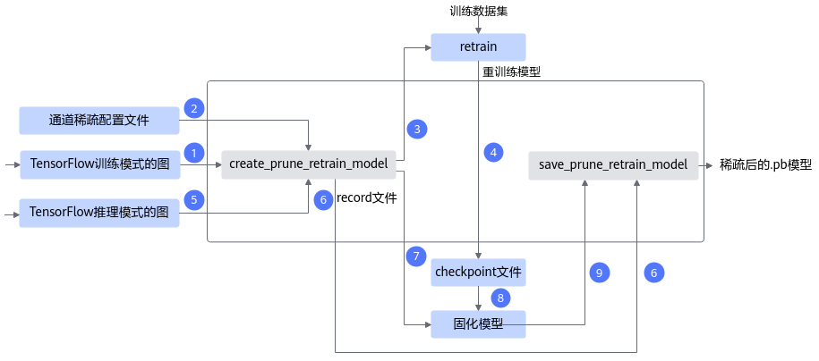

蓝色部分为用户实现，灰色部分为用户调用AMCT提供的API实现，用户在TensorFlow原始网络推理的代码中导入库，并在特定的位置调用相应API，即可实现稀疏功能。

简要流程如下：

1.  <a name="li1486264910589"></a>用户构造训练模式的图结构，调用[create\_prune\_retrain\_model](create_prune_retrain_model-78.md)接口，根据稀疏配置文件对训练的图进行稀疏前的图结构修改：在图结构中插入mask稀疏算子。
2.  训练模型，将训练后的参数保存为checkpoint文件。
3.  用户构造推理模式的图结构，调用稀疏图修改接口[create\_prune\_retrain\_model](create_prune_retrain_model-78.md)，同时根据配置文件对推理的图进行稀疏前的图结构修改：在图结构中插入mask稀疏算子；同时生成记录稀疏信息的record文件。
4.  创建会话，恢复训练参数，并将推理图固化为pb模型。
5.  调用稀疏图保存接口[save\_prune\_retrain\_model](save_prune_retrain_model-79.md)，根据record文件以及固化模型，导出通道裁剪后的pb推理模型，同时删除插入的mask稀疏算子。

**调用示例<a name="section491085453516"></a>**

> **说明：** 
>1.  如下示例标有“由用户补充处理”的步骤，需要用户根据自己的模型和数据集进行补充处理，示例中仅为示例代码。
>2.  调用AMCT的部分，函数入参可以根据实际情况进行调整。量化感知训练基于用户的训练过程，请确保已经有基于TensorFlow环境进行训练的脚本，并且训练后的精度正常。

1.  导入AMCT包，设置日志级别。

    ```
    import amct_tensorflow as amct
    amct.set_logging_level(print_level='info', save_level='info')
    ```

2.  <a name="li12406163445412"></a>（可选，由用户补充处理）创建图并读取训练好的参数，在TensorFlow环境下推理，验证环境、推理脚本是否正常。

    推荐执行该步骤，以确保原始模型可以完成推理且精度正常；执行该步骤时，可以使用部分测试集，减少运行时间。

    ```
    user_test_evaluate_model(evaluate_model, test_data)
    ```

3.  （由用户补充处理）创建训练图。

    ```
    train_graph = user_load_train_graph()
    ```

4.  <a name="li114061346543"></a>调用AMCT，执行带稀疏算子的训练流程。
    1.  在训练图中插入稀疏算子。

        用户基于构造的训练模式的图结构（BN的is\_training参数为True） ，调用[create\_prune\_retrain\_model](create_prune_retrain_model-78.md)接口（对应[图1](#fig153281318152013)中的序号1），根据稀疏配置文件（对应[图1](#fig153281318152013)中的序号2）对训练的图进行稀疏前的图结构修改。[create\_prune\_retrain\_model](create_prune_retrain_model-78.md)接口会在图结构中插入mask算子，达到推理时伪稀疏的效果。稀疏配置文件需要参见[量化感知训练简易配置文件](量化感知训练简易配置文件-92.md)自行构造。

        ```
        record_file = './tmp/record.txt'
        simple_cfg = './retrain.cfg'
        amct.create_prune_retrain_model(graph=train_graph,
                                        outputs=user_model_outputs,
        			        record_file=record_file,
                                        config_defination=simple_cfg)
        ```

        > **说明：** 
        >由于tf.graph不具有直接删减通道的能力，修改网络中某一个算子的规格，TensorFlow会校验图结构的正确性，导致无法删减通道。因此TensorFlow通过增加mask算子，训练时通过mask算子来屏蔽掉被稀疏通道对整网训练的影响。

    2.  （由用户补充处理）使用修改后的图，创建反向梯度，在训练集上做训练。
        1.  使用修改后的图，创建反向梯度。

            调用自适应学习率优化器（比如RMSPropOptimizer）建立反向梯度图（该步骤需要在[1](#li1486264910589)后执行）。

            ```
            optimizer = tf.compat.v1.train.RMSPropOptimizer(
                ARGS.learning_rate, momentum=ARGS.momentum)
            train_op = optimizer.minimize(loss)
            ```

        2.  训练模型。

            创建会话，进行模型的训练，将训练后的参数保存为checkpoint文件，并得到稀疏算子的结果（对应[图1](#fig153281318152013)中的序号3，4）。

            ```
            with tf.Session() as sess:
                 sess.run(tf.compat.v1.global_variables_initializer())
                 sess.run(outputs)
                 #将训练后的参数保存为checkpoint文件
                 saver_save.save(sess, retrain_ckpt, global_step=0)
            ```

5.  （由用户补充处理）创建推理图。

    ```
    test_graph = user_load_test_graph()
    ```

6.  调用AMCT，实现通道稀疏。
    1.  先在推理图中插入稀疏算子。

        用户基于构建的推理模式的图结构（BN的is\_training参数为False），调用稀疏图修改接口[create\_prune\_retrain\_model](create_prune_retrain_model-78.md)，同时根据配置文件对推理的图进行稀疏前的图结构修改（对应[图1](#fig153281318152013)中的序号5），同时生成记录稀疏信息的record文件（对应[图1](#fig153281318152013)中的序号6）。

        ```
        record_file = './tmp/record.txt'
        simple_cfg = './retrain.cfg'
        amct.create_prune_retrain_model(graph=test_graph,
                                        outputs=user_model_outputs,
        			        record_file=record_file,
                                        config_defination=simple_cfg)
        ```

    2.  恢复[4](#li114061346543)中训练得到的checkpoint权重并固化为pb模型。

        创建会话，恢复训练参数，并将推理图固化为pb模型（对应[图1](#fig153281318152013)中的序号7， 8）。

        ```
        variables_to_restore = tf.compat.v1.global_variables()
        saver_restore = tf.compat.v1.train.Saver(variables_to_restore)
        with tf.Session() as sess:
             sess.run(tf.compat.v1.global_variables_initializer())
             #恢复训练参数
             saver_restore.restore(sess, retrain_ckpt)
             #固化pb模型
             constant_graph = tf.compat.v1.graph_util.convert_variables_to_constants(
                  sess, eval_graph.as_graph_def(), [output.name[:-2] for output in outputs])
             with tf.io.gfile.GFile(masked_pb_path, 'wb') as f:
                  f.write(constant_graph.SerializeToString())
        ```

    3.  保存模型，删除插入的mask稀疏算子，并实现通道稀疏。

        根据record文件以及固化模型，导出通道裁剪后的pb推理模型（对应[图1](#fig153281318152013)中的序号6，9）。

        ```
        pruned_model_path = './result/user_model'
        amct.save_prune_retrain_model(pb_model=masked_pb_path,
                                      outputs=user_model_outputs,
                                      record_file=record_file,
                                      save_path=pruned_model_path)
        ```

7.  （可选，由用户补充处理）使用稀疏后模型user\_model\_pruned.pb和测试集，在TensorFlow的环境下推理，测试稀疏后的仿真模型精度。

    使用稀疏后仿真模型精度与[2](#li12406163445412)中的原始精度做对比，可以观察稀疏对精度的影响。

    ```
    pruned_model = './results/user_model_pruned.pb'
    user_do_inference(pruned_model, test_data)
    ```

##### 手工调优<a name="ZH-CN_TOPIC_0000002473904478"></a>

稀疏后，如果精度不满足要求，可以参见本节提供的方法进行调优。

如果按照某组配置稀疏模型后，经过重训练精度未满足要求，则可以修改简易配置文件（文件配置请参见[量化感知训练简易配置文件](量化感知训练简易配置文件-92.md)）重新稀疏模型并重训练。常用的方法包括：

-   调整稀疏率，由简易配置文件中的**prune\_ratio**参数控制，用户可尝试减小稀疏率并重新进行稀疏来进行调试。
-   某些层不做稀疏，由简易配置文件中的**regular\_prune\_skip\_layers**参数控制，通过该参数配置不需要稀疏的层。

### 4选2结构化稀疏<a name="ZH-CN_TOPIC_0000002473744540"></a>

本节介绍4选2结构化稀疏支持的层，接口调用流程和调用示例。
稀疏后，如果精度不满足要求，可以参见本节提供的方法进行调优。

#### 稀疏流程<a name="ZH-CN_TOPIC_0000002506024481"></a>

本节介绍4选2结构化稀疏支持的层，接口调用流程和调用示例。

**由于硬件约束，该芯片不支持4选2结构化稀疏特性：使能后获取不到性能收益。**

AMCT支持基于重训练的4选2结构化稀疏特性，稀疏示例请参见[样例列表](样例列表.md)。该特性支持的层以及约束如下：

**表 1**  4选2结构化稀疏支持的层以及约束

<a name="table151175131181"></a>
<table><thead align="left"><tr id="row61178136184"><th class="cellrowborder" valign="top" width="19.56%" id="mcps1.2.4.1.1"><p id="p19117161310182"><a name="p19117161310182"></a><a name="p19117161310182"></a>支持的层类型</p>
</th>
<th class="cellrowborder" valign="top" width="21.060000000000002%" id="mcps1.2.4.1.2"><p id="p9117111341815"><a name="p9117111341815"></a><a name="p9117111341815"></a>约束</p>
</th>
<th class="cellrowborder" valign="top" width="59.38%" id="mcps1.2.4.1.3"><p id="p326292016202"><a name="p326292016202"></a><a name="p326292016202"></a>备注</p>
</th>
</tr>
</thead>
<tbody><tr id="row4117613121819"><td class="cellrowborder" valign="top" width="19.56%" headers="mcps1.2.4.1.1 "><p id="p011821321816"><a name="p011821321816"></a><a name="p011821321816"></a>MatMul</p>
</td>
<td class="cellrowborder" valign="top" width="21.060000000000002%" headers="mcps1.2.4.1.2 "><p id="p311841312188"><a name="p311841312188"></a><a name="p311841312188"></a>transpose_a=False</p>
<p id="p17298111713715"><a name="p17298111713715"></a><a name="p17298111713715"></a>权重数据类型为float32、float64</p>
</td>
<td class="cellrowborder" valign="top" width="59.38%" headers="mcps1.2.4.1.3 "><p id="p6262720112016"><a name="p6262720112016"></a><a name="p6262720112016"></a>-</p>
</td>
</tr>
<tr id="row13118181318183"><td class="cellrowborder" valign="top" width="19.56%" headers="mcps1.2.4.1.1 "><p id="p6118201381816"><a name="p6118201381816"></a><a name="p6118201381816"></a>Conv2D</p>
</td>
<td class="cellrowborder" valign="top" width="21.060000000000002%" headers="mcps1.2.4.1.2 "><p id="p02561743143720"><a name="p02561743143720"></a><a name="p02561743143720"></a>权重数据类型为float32、float64</p>
</td>
<td class="cellrowborder" rowspan="2" valign="top" width="59.38%" headers="mcps1.2.4.1.3 "><p id="p1469132881614"><a name="p1469132881614"></a><a name="p1469132881614"></a>weight的输入来源不含有placeholder等可动态变化的节点，且weight的节点类型只能是const。</p>
</td>
</tr>
<tr id="row428173983112"><td class="cellrowborder" valign="top" headers="mcps1.2.4.1.1 "><p id="p162821039203111"><a name="p162821039203111"></a><a name="p162821039203111"></a>Conv2DBackpropInput</p>
</td>
<td class="cellrowborder" valign="top" headers="mcps1.2.4.1.2 "><p id="p6282239163118"><a name="p6282239163118"></a><a name="p6282239163118"></a>-</p>
</td>
</tr>
</tbody>
</table>

**接口调用流程<a name="section599010205919"></a>**

4选2结构化稀疏功能接口调用流程如下图所示，如下流程中的训练环境借助TensorFlow框架的CPU/GPU环境，在该开源框架的推理脚本基础上，调用AMCT  API完成模型压缩，压缩后的部署模型需要使用ATC工具转换成适配NPU IP加速器的离线模型后，然后才能在NPU IP加速器上实现推理：

**图 1**  4选2结构化稀疏接口调用流程<a name="fig153281318152013"></a>  
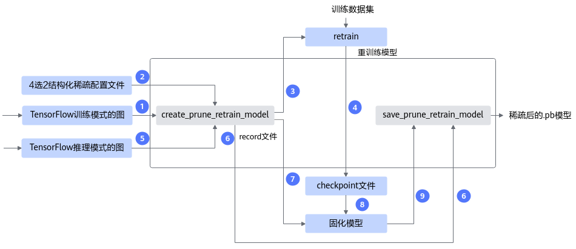

蓝色部分为用户实现，灰色部分为用户调用AMCT提供的API实现，用户在TensorFlow原始网络推理的代码中导入库，并在特定的位置调用相应API，即可实现稀疏功能。

简要流程如下：

1.  用户构造训练模式的图结构，调用[create\_prune\_retrain\_model](create_prune_retrain_model-78.md)接口，根据稀疏配置文件对训练的图进行稀疏前的图结构修改：在图结构中插入4选2结构化稀疏算子。
2.  训练模型，将训练后的参数保存为checkpoint文件。
3.  用户构造推理模式的图结构，调用稀疏图修改接口[create\_prune\_retrain\_model](create_prune_retrain_model-78.md)，同时根据配置文件对推理的图进行稀疏前的图结构修改：在图结构中插入4选2结构化稀疏算子；同时生成记录稀疏信息的record文件。
4.  创建会话，恢复训练参数，并将推理图固化为pb模型。
5.  调用稀疏图保存接口[save\_prune\_retrain\_model](save_prune_retrain_model-79.md)，根据record文件以及固化模型，导出通道裁剪后的pb推理模型，同时删除插入的4选2结构化稀疏算子。

**调用示例<a name="section95091708484"></a>**

> **说明：** 
>1.  如下示例标有“由用户补充处理”的步骤，需要用户根据自己的模型和数据集进行补充处理，示例中仅为示例代码。
>2.  调用AMCT的部分，函数入参可以根据实际情况进行调整。量化感知训练基于用户的训练过程，请确保已经有基于TensorFlow环境进行训练的脚本，并且训练后的精度正常。

1.  导入AMCT包，设置日志级别。

    ```
    import amct_tensorflow as amct
    amct.set_logging_level(print_level='info', save_level='info')
    ```

2.  <a name="li12406163445412"></a>（可选，由用户补充处理）创建图并读取训练好的参数，在TensorFlow环境下推理，验证环境、推理脚本是否正常。

    推荐执行该步骤，以确保原始模型可以完成推理且精度正常；执行该步骤时，可以使用部分测试集，减少运行时间。

    ```
    user_test_evaluate_model(evaluate_model, test_data)
    ```

3.  （由用户补充处理）创建训练图。

    ```
    train_graph = user_load_train_graph()
    ```

4.  <a name="li114061346543"></a>调用AMCT，执行带稀疏算子的训练流程。
    1.  在训练图中插入稀疏算子。

        用户基于构造的训练模式的图结构（BN的is\_training参数为True），调用[create\_prune\_retrain\_model](create_prune_retrain_model-78.md)接口（对应[图1](#fig153281318152013)中的序号1），根据稀疏配置文件（对应[图1](#fig153281318152013)中的序号2）对训练的图进行稀疏前的图结构修改。[create\_prune\_retrain\_model](create_prune_retrain_model-78.md)接口会在图结构中插入4选2结构化稀疏算子，达到推理时伪稀疏的效果。稀疏配置文件需要参见[量化感知训练简易配置文件](量化感知训练简易配置文件-92.md)自行构造。

        ```
        record_file = './tmp/record.txt'
        simple_cfg = './retrain.cfg'
        amct.create_prune_retrain_model(graph=train_graph,
                                        outputs=user_model_outputs,
        			        record_file=record_file,
                                        config_defination=simple_cfg)
        ```

    2.  （由用户补充处理）使用修改后的图，创建反向梯度，在训练集上做训练。
        1.  使用修改后的图，创建反向梯度。

            调用自适应学习率优化器（比如RMSPropOptimizer）建立反向梯度图（该步骤需要在[1](稀疏流程-53.md#li1486264910589)后执行）。

            ```
            optimizer = tf.compat.v1.train.RMSPropOptimizer(
                ARGS.learning_rate, momentum=ARGS.momentum)
            train_op = optimizer.minimize(loss)
            ```

        2.  训练模型。

            创建会话，进行模型的训练，将训练后的参数保存为checkpoint文件，并得到稀疏算子的结果（对应[图1](#fig153281318152013)中的序号3，4）。

            ```
            with tf.Session() as sess:
                 sess.run(tf.compat.v1.global_variables_initializer())
                 sess.run(outputs)
                 #将训练后的参数保存为checkpoint文件
                 saver_save.save(sess, retrain_ckpt, global_step=0)
            ```

5.  （由用户补充处理）创建推理图。

    ```
    test_graph = user_load_test_graph()
    ```

6.  调用AMCT，实现4选2稀疏。
    1.  先在推理图中插入稀疏算子。

        用户基于构建的推理模式的图结构（BN的is\_training参数为False），调用稀疏图修改接口[create\_prune\_retrain\_model](create_prune_retrain_model-78.md)，同时根据配置文件对推理的图进行稀疏前的图结构修改（对应[图1](#fig153281318152013)中的序号5），同时生成记录稀疏信息的record文件（对应[图1](#fig153281318152013)中的序号6）。

        ```
        record_file = './tmp/record.txt'
        simple_cfg = './retrain.cfg'
        amct.create_prune_retrain_model(graph=test_graph,
                                        outputs=user_model_outputs,
        			        record_file=record_file,
                                        config_defination=simple_cfg)
        ```

    2.  恢复[4](#li114061346543)中训练得到的checkpoint权重并固化为pb模型。

        创建会话，恢复训练参数，并将推理图固化为pb模型（对应[图1](#fig153281318152013)中的序号7， 8）。

        ```
        variables_to_restore = tf.compat.v1.global_variables()
        saver_restore = tf.compat.v1.train.Saver(variables_to_restore)
        with tf.Session() as sess:
             sess.run(tf.compat.v1.global_variables_initializer())
             #恢复训练参数
             saver_restore.restore(sess, retrain_ckpt)
             #固化pb模型
             constant_graph = tf.compat.v1.graph_util.convert_variables_to_constants(
                  sess, eval_graph.as_graph_def(), [output.name[:-2] for output in outputs])
             with tf.io.gfile.GFile(masked_pb_path, 'wb') as f:
                  f.write(constant_graph.SerializeToString())
        ```

    3.  保存模型，删除插入的结构化稀疏算子，实现稀疏。

        根据record文件以及固化模型，导出4选2结构化稀疏后的pb推理模型（对应[图1](#fig153281318152013)中的序号6，9）。

        ```
        pruned_model_path = './result/user_model'
        amct.save_prune_retrain_model(pb_model=masked_pb_path,
                                      outputs=user_model_outputs,
                                      record_file=record_file,
                                      save_path=pruned_model_path)
        ```

7.  （可选，由用户补充处理）使用稀疏后模型user\_model\_pruned.pb和测试集，在TensorFlow的环境下推理，测试稀疏后的仿真模型精度。

    使用稀疏后仿真模型精度与[2](#li12406163445412)中的原始精度做对比，可以观察稀疏对精度的影响。

    ```
    pruned_model = './results/user_model_pruned.pb'
    user_do_inference(pruned_model, test_data)
    ```

#### 手工调优<a name="ZH-CN_TOPIC_0000002505904655"></a>

稀疏后，如果精度不满足要求，可以参见本节提供的方法进行调优。

如果按照某组配置稀疏模型后，经过重训练精度未满足要求，则可以修改简易配置文件（文件配置请参见[量化感知训练简易配置文件](量化感知训练简易配置文件-92.md)）重新稀疏模型并重训练。常用的方法包括：

-   调整更新间隔（计算哪些元素被保留的间隔），由简易配置文件中的**update\_freq**参数控制，用户可尝试将更新间隔改为正整数并重新进行稀疏来进行调试，一般来说更新间隔越小精度收益越大。
-   某些层不做稀疏，由简易配置文件中的**regular\_prune\_skip\_layers**参数控制，通过该参数配置不需要稀疏的层。

## 组合压缩<a name="ZH-CN_TOPIC_0000002505904639"></a>

组合压缩是针对同一个网络模型，既进行量化又进行稀疏的操作，具体支持什么样的组合压缩方式，本章节给出详细介绍。
本节介绍组合压缩特性的接口调用流程和调用示例。

### 简介<a name="ZH-CN_TOPIC_0000002506024443"></a>

组合压缩是针对同一个网络模型，既进行量化又进行稀疏的操作，具体支持什么样的组合压缩方式，本章节给出详细介绍。

**组合压缩方式<a name="section19961121117253"></a>**

目前组合压缩支持如下组合方式，使用AMCT进行压缩时，每层可压缩算子每次只能选择其中一种组合压缩方式，简要流程如[图1](#fig107338715219)所示。

-   [通道稀疏](通道稀疏-48.md)+[量化感知训练](量化感知训练-45.md)  INT8量化
-   [4选2结构化稀疏](4选2结构化稀疏-55.md)+[量化感知训练](量化感知训练-45.md)  INT8量化

当前组合压缩特性的压缩配置由用户手动处理（故又称之为静态组合压缩，压缩配置文件配置方法请参见[量化感知训练简易配置文件](量化感知训练简易配置文件-92.md)），通过手动设置全局量化位宽和稀疏率（通道稀疏比例）或更新4选2稀疏的间隔，实现模型自动压缩。组合压缩示例请参见[样例列表](样例列表.md)。

支持组合压缩的层以及约束请分别参见[通道稀疏](通道稀疏-48.md)下的[表1](稀疏流程-53.md#table151175131181)、[4选2结构化稀疏](4选2结构化稀疏-55.md)下的[表1](稀疏流程-56.md#table151175131181)或[量化感知训练](量化感知训练-45.md)下的[表1](量化流程-46.md#table151175131181)。

**图 1**  组合压缩简要流程<a name="fig107338715219"></a>  


**组合压缩场景介绍<a name="section19560191619244"></a>**

当前组合压缩支持如下几种场景，实际使用时，可以通过简易配置文件中的参数进行控制。如下场景中的整网量化指[量化感知训练](量化感知训练-45.md)，其中：

-   整网量化：

    -   整网（全局）量化配置参数：retrain\_data\_quant\_config/retrain\_weight\_quant\_config
    -   部分层差异化配置参数：override\_layer\_configs或override\_layer\_types

    参数优先级：override\_layer\_configs\>override\_layer\_types\>retrain\_data\_quant\_config/retrain\_weight\_quant\_config

-   整网稀疏：包括通道稀疏和4选2结构化稀疏，使用时二选一。

    -   整网（全局）稀疏配置参数：prune\_config
    -   部分层差异化稀疏参数：override\_layer\_configs或override\_layer\_types

    参数优先级：override\_layer\_configs\>override\_layer\_types\>retrain\_data\_quant\_config/retrain\_weight\_quant\_config

关于上述参数的详细解释请参见[量化感知训练简易配置文件](量化感知训练简易配置文件-92.md)。

**表 1**  组合压缩场景介绍

<a name="table1841654916270"></a>
<table><thead align="left"><tr id="row3417134942711"><th class="cellrowborder" valign="top" width="19.14191419141914%" id="mcps1.2.4.1.1"><p id="p641794972716"><a name="p641794972716"></a><a name="p641794972716"></a>组合压缩场景</p>
</th>
<th class="cellrowborder" valign="top" width="51.27512751275128%" id="mcps1.2.4.1.2"><p id="p17417114911276"><a name="p17417114911276"></a><a name="p17417114911276"></a>配置参数</p>
</th>
<th class="cellrowborder" valign="top" width="29.58295829582958%" id="mcps1.2.4.1.3"><p id="p146370141022"><a name="p146370141022"></a><a name="p146370141022"></a>说明</p>
</th>
</tr>
</thead>
<tbody><tr id="row19417549112711"><td class="cellrowborder" valign="top" width="19.14191419141914%" headers="mcps1.2.4.1.1 "><p id="p124171149182711"><a name="p124171149182711"></a><a name="p124171149182711"></a>整网量化+整网稀疏</p>
</td>
<td class="cellrowborder" valign="top" width="51.27512751275128%" headers="mcps1.2.4.1.2 "><a name="ul189333368587"></a><a name="ul189333368587"></a><ul id="ul189333368587"><li>量化参数：retrain_data_quant_config/retrain_weight_quant_config</li><li>稀疏参数：prune_config</li></ul>
<p id="p11121392577"><a name="p11121392577"></a><a name="p11121392577"></a>不配置override_layer_configs或override_layer_types</p>
</td>
<td class="cellrowborder" valign="top" width="29.58295829582958%" headers="mcps1.2.4.1.3 "><p id="p10387131415315"><a name="p10387131415315"></a><a name="p10387131415315"></a>-</p>
</td>
</tr>
<tr id="row6418104912278"><td class="cellrowborder" valign="top" width="19.14191419141914%" headers="mcps1.2.4.1.1 "><p id="p2418104912271"><a name="p2418104912271"></a><a name="p2418104912271"></a>部分层差异化量化+整网稀疏</p>
</td>
<td class="cellrowborder" valign="top" width="51.27512751275128%" headers="mcps1.2.4.1.2 "><a name="ul1961884514588"></a><a name="ul1961884514588"></a><ul id="ul1961884514588"><li>量化参数：retrain_data_quant_config/retrain_weight_quant_config+override_layer_configs或override_layer_types</li><li>稀疏参数：prune_config</li></ul>
</td>
<td class="cellrowborder" valign="top" width="29.58295829582958%" headers="mcps1.2.4.1.3 "><p id="p18418104922711"><a name="p18418104922711"></a><a name="p18418104922711"></a>配置特性参数时，首先要指定全局配置，否则该特性不使能。</p>
</td>
</tr>
<tr id="row104181492272"><td class="cellrowborder" valign="top" width="19.14191419141914%" headers="mcps1.2.4.1.1 "><p id="p1041811493272"><a name="p1041811493272"></a><a name="p1041811493272"></a>整网量化+部分层差异化稀疏</p>
</td>
<td class="cellrowborder" valign="top" width="51.27512751275128%" headers="mcps1.2.4.1.2 "><a name="ul7935131418596"></a><a name="ul7935131418596"></a><ul id="ul7935131418596"><li>量化参数：retrain_data_quant_config/retrain_weight_quant_config</li><li>稀疏参数：prune_config+override_layer_configs或override_layer_types</li></ul>
</td>
<td class="cellrowborder" valign="top" width="29.58295829582958%" headers="mcps1.2.4.1.3 "><p id="p113296231735"><a name="p113296231735"></a><a name="p113296231735"></a>配置特性参数时，首先要指定全局配置，否则该特性不使能。</p>
</td>
</tr>
<tr id="row2418104914273"><td class="cellrowborder" valign="top" width="19.14191419141914%" headers="mcps1.2.4.1.1 "><p id="p441844932719"><a name="p441844932719"></a><a name="p441844932719"></a>部分层量化+部分层差异化稀疏</p>
</td>
<td class="cellrowborder" valign="top" width="51.27512751275128%" headers="mcps1.2.4.1.2 "><a name="ul19449126706"></a><a name="ul19449126706"></a><ul id="ul19449126706"><li>量化参数：retrain_data_quant_config/retrain_weight_quant_config+override_layer_configs或override_layer_types</li><li>稀疏参数：prune_config+override_layer_configs或override_layer_types</li></ul>
</td>
<td class="cellrowborder" valign="top" width="29.58295829582958%" headers="mcps1.2.4.1.3 "><p id="p4158172415318"><a name="p4158172415318"></a><a name="p4158172415318"></a>配置特性参数时，首先要指定全局配置，否则该特性不使能。</p>
</td>
</tr>
<tr id="row141864913279"><td class="cellrowborder" valign="top" width="19.14191419141914%" headers="mcps1.2.4.1.1 "><p id="p17418154942719"><a name="p17418154942719"></a><a name="p17418154942719"></a>整网量化</p>
</td>
<td class="cellrowborder" valign="top" width="51.27512751275128%" headers="mcps1.2.4.1.2 "><p id="p1969818452012"><a name="p1969818452012"></a><a name="p1969818452012"></a>retrain_data_quant_config/retrain_weight_quant_config</p>
<p id="p151467471206"><a name="p151467471206"></a><a name="p151467471206"></a>不配置override_layer_configs或override_layer_types</p>
</td>
<td class="cellrowborder" valign="top" width="29.58295829582958%" headers="mcps1.2.4.1.3 "><p id="p041864916271"><a name="p041864916271"></a><a name="p041864916271"></a>-</p>
</td>
</tr>
<tr id="row0418449192712"><td class="cellrowborder" valign="top" width="19.14191419141914%" headers="mcps1.2.4.1.1 "><p id="p5418249162714"><a name="p5418249162714"></a><a name="p5418249162714"></a>部分层差异化量化</p>
</td>
<td class="cellrowborder" valign="top" width="51.27512751275128%" headers="mcps1.2.4.1.2 "><p id="p341919495279"><a name="p341919495279"></a><a name="p341919495279"></a>retrain_data_quant_config/retrain_weight_quant_config+override_layer_configs或override_layer_types</p>
</td>
<td class="cellrowborder" valign="top" width="29.58295829582958%" headers="mcps1.2.4.1.3 "><p id="p135712271031"><a name="p135712271031"></a><a name="p135712271031"></a>配置特性参数时，首先要指定全局配置，否则该特性不使能。</p>
</td>
</tr>
<tr id="row74191249152720"><td class="cellrowborder" valign="top" width="19.14191419141914%" headers="mcps1.2.4.1.1 "><p id="p104194493272"><a name="p104194493272"></a><a name="p104194493272"></a>整网稀疏</p>
</td>
<td class="cellrowborder" valign="top" width="51.27512751275128%" headers="mcps1.2.4.1.2 "><p id="p3419849142717"><a name="p3419849142717"></a><a name="p3419849142717"></a>prune_config</p>
<p id="p250381119119"><a name="p250381119119"></a><a name="p250381119119"></a>不配置override_layer_configs或override_layer_types</p>
</td>
<td class="cellrowborder" valign="top" width="29.58295829582958%" headers="mcps1.2.4.1.3 "><p id="p124190499278"><a name="p124190499278"></a><a name="p124190499278"></a>-</p>
</td>
</tr>
<tr id="row10181133810426"><td class="cellrowborder" valign="top" width="19.14191419141914%" headers="mcps1.2.4.1.1 "><p id="p181811138154214"><a name="p181811138154214"></a><a name="p181811138154214"></a>部分层差异化稀疏</p>
</td>
<td class="cellrowborder" valign="top" width="51.27512751275128%" headers="mcps1.2.4.1.2 "><p id="p137714231911"><a name="p137714231911"></a><a name="p137714231911"></a>prune_config+override_layer_configs或override_layer_types</p>
</td>
<td class="cellrowborder" valign="top" width="29.58295829582958%" headers="mcps1.2.4.1.3 "><p id="p187228733"><a name="p187228733"></a><a name="p187228733"></a>配置特性参数时，首先要指定全局配置，否则该特性不使能。</p>
</td>
</tr>
</tbody>
</table>

### 压缩流程<a name="ZH-CN_TOPIC_0000002506024459"></a>

本节介绍组合压缩特性的接口调用流程和调用示例。

**接口调用流程<a name="section17532571297"></a>**

组合压缩接口调用流程如下图所示，如下流程中的训练环境借助TensorFlow框架的CPU/GPU环境，在该开源框架的推理脚本基础上，调用AMCT  API完成模型压缩，压缩后的部署模型需要使用ATC工具转换成适配NPU IP加速器的离线模型后，然后才能在NPU IP加速器上实现推理：

**图 1**  组合压缩接口调用流程<a name="fig13505182621118"></a>  
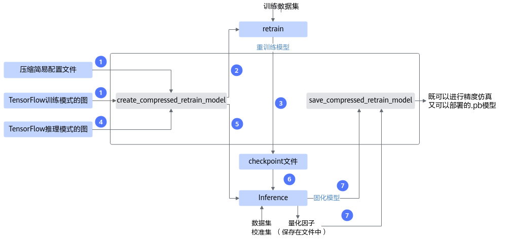

蓝色部分为用户实现，灰色部分为用户调用AMCT提供的API实现，用户在TensorFlow原始网络推理的代码中导入库，并在特定的位置调用相应API，即可实现压缩功能。

简要流程如下：

1.  用户构造训练模式的图结构，调用压缩图修改接口[create\_compressed\_retrain\_model](create_compressed_retrain_model-83.md)，根据简易配置文件对训练的图进行压缩前的图结构修改：插入通道稀疏或4选2结构化稀疏（稀疏方式二选一）以及量化感知训练的算子。
2.  训练模型，将训练后的参数保存为checkpoint文件。
3.  用户构建推理模式的图结构，调用压缩图修改接口[create\_compressed\_retrain\_model](create_compressed_retrain_model-83.md)，根据量化配置文件对推理的图进行压缩前的图结构修改，插入通道稀疏或4选2结构化稀疏（稀疏方式二选一）以及量化感知训练的算子。
4.  恢复训练参数，推理量化的输出节点，将量化因子写入record文件，并将推理图固化为pb模型。
5.  调用压缩图保存接口[save\_compressed\_retrain\_model](save_compressed_retrain_model-84.md)，根据稀疏和量化因子记录文件以及固化模型，保存为组合压缩的模型。

**调用示例<a name="section491085453516"></a>**

> **说明：** 
>1.  如下示例标有“由用户补充处理”的步骤，需要用户根据自己的模型和数据集进行补充处理，示例中仅为示例代码。
>2.  调用AMCT的部分，函数入参可以根据实际情况进行调整。量化感知训练基于用户的训练过程，请确保已经有基于TensorFlow环境进行训练的脚本，并且训练后的精度正常。

1.  导入AMCT包，设置日志级别。

    ```
    import amct_tensorflow as amct
    amct.set_logging_level(print_level='info', save_level='info')
    ```

2.  <a name="li12406163445412"></a>（可选，由用户补充处理）创建图并读取训练好的参数，在TensorFlow环境下推理，验证环境、推理脚本是否正常。

    推荐执行该步骤，以确保原始模型可以完成推理且精度正常；执行该步骤时，可以使用部分测试集，减少运行时间。

    ```
    user_test_evaluate_model(evaluate_model, test_data)
    ```

3.  （由用户补充处理）创建训练图。

    ```
    train_graph = user_load_train_graph()
    ```

4.  调用AMCT，执行带稀疏算子和量化参数的训练流程。
    1.  <a name="li99803197163"></a>修改图，在图中插入稀疏和量化相关的算子。

        调用压缩图修改接口[create\_compressed\_retrain\_model](create_compressed_retrain_model-83.md)，根据简易配置文件与用户原始模型对训练的图进行压缩前的图结构修改，插入通道稀疏或4选2结构化稀疏（稀疏方式二选一）以及量化感知训练的算子，生成用于组合压缩训练的图结构（对应[图1](#fig13505182621118)中的序号1）。

        ```
        record_file = './tmp/record.txt'
        retrain_ops = amct.create_compressed_retrain_model(graph=train_graph,
                                                                  config_defination=simple_cfg,
                                                                  outputs=user_model_outputs,
        			                                  record_file=record_file)
        ```

    2.  （由用户补充处理）使用修改后的图，创建反向梯度，在训练集上做训练，训练模型参数与量化因子。
        1.  使用修改后的图，创建反向梯度。该步骤需要在[4.a](#li99803197163)后执行。

            调用自适应学习率优化器（RMSPropOptimizer）建立反向梯度图。

            ```
                optimizer = tf.compat.v1.train.RMSPropOptimizer(
                    ARGS.learning_rate, momentum=ARGS.momentum)
                train_op = optimizer.minimize(loss)
            ```

        2.  创建会话，进行模型的训练，并将训练后的参数保存为checkpoint文件（对应[图1](#fig13505182621118)中的序号2，3）。

            注意：从训练好的checkpoint恢复模型参数后再训练；训练中保存的参数应该包括量化因子：前batch\_num次训练后会生成量化因子，如果训练次数少于batch\_num会导致失败。

            ```
            with tf.Session() as sess:
                 sess.run(tf.compat.v1.global_variables_initializer())
                 sess.run(outputs)
                 #将训练后的参数保存为checkpoint文件
                 saver_save.save(sess, retrain_ckpt, global_step=0)
            ```

5.  （由用户补充处理）创建推理图。

    ```
    test_graph = user_load_test_graph()
    ```

6.  调用AMCT，执行组合压缩流程。
    1.  修改推理模式的图。

        用户构建推理模式的图结构（BN的is\_training参数为False），调用组合压缩图修改接口[create\_compressed\_retrain\_model](create_compressed_retrain_model-83.md)，根据量化配置文件对推理的图进行压缩前的图结构修改，插入通道稀疏或4选2结构化稀疏（稀疏方式二选一）与量化感知训练的算子，用于后续模型固化与精度推理，同时生成记录稀疏信息和量化因子的record文件（对应[图1](#fig13505182621118)中的序号4，5）。

    2.  （由用户补充处理）创建会话，恢复训练参数，推理量化的输出节点（retrain\_ops\[-1\]），将量化因子写入record文件，并将推理图固化为pb模型（对应[图1](#fig13505182621118)中的序号6，7）。

        说明：推理和恢复的参数要在同一session中，推理执行的是retrain\_ops\[-1\]的输出tensor；推理图固化为pb模型时，包含训练好的参数。

        ```
        variables_to_restore = tf.compat.v1.global_variables()
        saver_restore = tf.compat.v1.train.Saver(variables_to_restore)
        with tf.Session() as sess:
             sess.run(tf.compat.v1.global_variables_initializer())
             #恢复训练参数
             saver_restore.restore(sess, retrain_ckpt)
             #将量化因子写入record文件，说明：如用户未使能任何量化功能则无需执行此步骤，直接执行下一步
             sess.run(retrain_ops[-1])
             #固化pb模型
             constant_graph = tf.compat.v1.graph_util.convert_variables_to_constants(
                  sess, eval_graph.as_graph_def(), [output.name[:-2] for output in outputs])
             with tf.io.gfile.GFile(frozen_quant_eval_pb, 'wb') as f:
                  f.write(constant_graph.SerializeToString())
        ```

    3.  保存组合压缩模型。

        根据稀疏和量化因子记录文件以及固化模型，删除插入的稀疏算子，插入AscendQuant、AscendDequant等量化算子，保存组合压缩模型。

        ```
        compressed_model_path = './result/user_model'
        amct.save_compressed_retrain_model(pb_model=trained_pb,
                                                  outputs=user_model_outputs,
                                                  record_file=record_file,
                                                  save_path=compressed_model_path)
        ```

7.  （可选，由用户补充处理）使用组合压缩后的模型user\_model\_compressed.pb和测试集，在TensorFlow的环境下推理，测试组合压缩后的仿真模型精度。

    使用组合压缩后的仿真模型精度与[2](#li12406163445412)中的原始精度做对比，可以观察组合压缩对精度的影响。

    ```
    compressed_model = './results/user_model_compressed.pb'
    user_do_inference(compressed_model, test_data)
    ```

### 手工调优<a name="ZH-CN_TOPIC_0000002505904663"></a>

组合压缩后，如果模型精度不满足要求，需要参见[稀疏](稀疏.md)下的手工调优章节和[量化感知训练](量化感知训练-45.md)下的[手工调优](手工调优-47.md)章节分别进行调优。

## 张量分解<a name="ZH-CN_TOPIC_0000002506024557"></a>

张量分解通过分解卷积核的张量，将一个卷积转化成两个小卷积的堆叠来降低推理开销，如用户模型中存在大量卷积，且卷积核shape普遍大于\(64, 64, 3, 3\)时推荐使用张量分解。

目前仅支持满足如下条件的卷积进行分解：

-   group=1、dilation=\(1,1\)、stride<3
-   kernel\_h\>2、kernel\_w\>2

卷积是否分解由AMCT自动判断，即便满足上述条件，也不一定会分解。

例如，用户使用的TensorFlow原始模型中存在Conv2D层，并且该层满足上述条件，才有可能将相应的Conv2D层分解成两个Conv2D层；然后使用AMCT转换成可以在NPU IP加速器部署的量化模型，以便在模型推理时获得更好的性能。

**该场景为可选操作**，用户自行决定是否进行原始模型的分解。

**分解约束<a name="section1298920238126"></a>**

如果Conv2D层的shape过大，会造成分解时间过长或分解异常中止，为防止出现该情况，执行分解动作前，请先参见如下约束或参考数据：

-   **分解工具性能参考数据：**

    -   CPU: Intel\(R\) Xeon\(R\) CPU E5-2699 v4 @ 2.20GHz
    -   内存: 512G

    分解单层卷积：

    -   shape\(512, 512, 5, 5\)，大约耗时25秒。
    -   shape\(1024, 1024, 3, 3\)，大约耗时16秒。
    -   shape\(1024, 1024, 5, 5\)，大约耗时78秒。
    -   shape\(2048, 2048, 3, 3\)，大约耗时63秒。
    -   shape\(2048, 2048, 5, 5\)，大约耗时430秒。

-   **内存超限风险提醒**：

    分解大卷积核存在内存超限风险参考数值：shape为\(2048, 2048, 5, 5\)的卷积核约占用32G内存。

**接口调用流程<a name="section19110132317522"></a>**

接口调用流程如[图1](#fig15333994308)所示，具体分解示例请参见[样例列表](样例列表.md)。

**图 1**  接口调用流程<a name="fig15333994308"></a>  
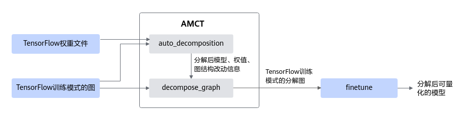

具体流程如下：

1.  <a name="li152611610312"></a>根据用户提供的TensorFlow模型文件，调用[auto\_decomposition](auto_decomposition-86.md)生成张量分解后的模型文件。
2.  在TensorFlow训练模式的图的基础上，调用[decompose\_graph](decompose_graph.md)加载[1](#li152611610312)输出的图结构改动信息\(\*.pkl\)分解训练代码中的图，并加载[1](#li152611610312)输出的分解后的模型权重文件，输出训练模式的分解图。
3.  对分解后的模型进行fine-tune，输出可以进行量化的模型。后续可以进行[训练后量化](训练后量化-39.md)或者[量化感知训练](量化感知训练-45.md)。

[图2](#fig727011012510)为resnet\_v2\_50网络模型分解前后的示意图。

**图 2**  模型分解前后示意图<a name="fig727011012510"></a>  
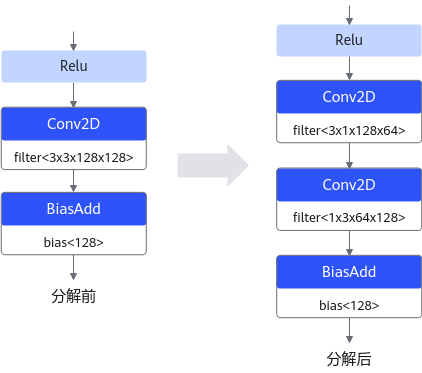

**调用示例<a name="section1532215358526"></a>**

1.  <a name="li127685227562"></a>调用[auto\_decomposition](auto_decomposition-86.md)分解已有TensorFlow模型。

    ```
    from amct_tensorflow.tensor_decompose import auto_decomposition
    meta_path = "src_path/xxx.meta"     # meta文件路径
    ckpt_path = "src_path/xxx"          # ckpt文件路径，例如，原始模型文件为src_path下的xxx.data-XXXXX-of-XXXXX和xxx.index，则设该路径为src_path/xxx
    save_path = "decomposed_path/xxx"   # 保存分解后模型的路径，如设为decomposed_path/xxx，则会在decomposed_path下生成xxx.data-XXXXX-of-XXXXX等文件
    auto_decomposition(meta_path, ckpt_path, save_path)  # 执行张量分解
    ```

2.  修改已有训练代码，调用[decompose\_graph](decompose_graph.md)分解代码中的图，加载分解后的权重进行fine-tune。

    根据实际训练代码从如下Session方式和Estimator方式中选择一种。

    > **说明：** 
    >\(\*\)表示用户已有的代码；...表示用户已有代码的省略，如下所列代码仅做示例，实际用户代码可能不同，请根据实际情况进行调整。

    -   Session方式

        ```
        from amct_tensorflow.tensor_decompose import decompose_graph
        save_path = "decom_path/xxx"                        # 保存分解后模型的路径。即第1步中的save_path。
        # ...
        net_output = build_net(net_input, ...)              # (*)构建网络的图
        decompose_graph(save_path)                          # 对构建出的图进行分解，请注意该步骤必须插入在构建网络图之后、应用优化器之前
        variables_to_restore = tf.global_variables()        # 网络图中的所有变量
        restorer = tf.train.Saver(variables_to_restore)     # 设置网络图中的变量为要加载的变量
        loss = build_loss(net_output, ...)                  # (*)构造loss
        optimizer = build_optimizer(...)                    # (*)构造优化器
        train_op = optimizer.minimize(loss, ...)            # (*)应用优化器优化loss
        # ...
        variables_to_init = [v for v in tf.global_variables() if v not in variables_to_restore]  # 不会加载的变量
        init = tf.variables_initializer(variables_to_init)  # 为不会加载的变量准备初始化
        with tf.Session() as sess:                          # (*)训练用Session
            sess.run(init)                                  # 初始化不会加载的变量
            restorer.restore(sess, save_path)               # 从分解后的模型权重中加载要加载的变量
        # ...
        ```

    -   Estimator方式

        ```
        from amct_tensorflow.tensor_decompose import decompose_graph
        save_path = "decom_path/xxx"                  # 保存分解后模型的路径，即[1](#li127685227562)中的save_path
        # ...
        def model_fn(features, labels, ...):          # (*)Estimator的模型函数
            net_output = build_net(net_input, ...)    # (*)构建网络的图
            decompose_graph(save_path)                # 对构建出的图进行分解，请注意该步骤必须插入在构建网络图之后、应用优化器之前
            loss = build_loss(net_output, ...)        # (*)构造loss
            optimizer = build_optimizer(...)          # (*)构造优化器
            train_op = optimizer.minimize(loss, ...)  # (*)应用优化器优化loss
        # ...
        estimator = tf.estimator.Estimator(model_fn, warm_start_from=save_path, ...)  # (*)构造Estimator，通过warm_start_from参数加载分解后的模型权重
        # ...
        ```

## 扩展更多特性<a name="ZH-CN_TOPIC_0000002473904526"></a>


在一些数据分布不均匀的场景，由于离群值的影响，对数据进行per-tensor量化得到的结果误差较大，而per-channel量化可以获得更低的误差。但由于当前硬件不支持数据per-channel量化，仅支持权重per-channel量化；在该背景下AMCT设计出一套方法，本节将给出详细介绍。

### 模型适配<a name="ZH-CN_TOPIC_0000002473744576"></a>

如果用户有自己计算得到的量化因子以及TensorFlow原始模型，该模型无法直接使用ATC工具转成适配NPU IP加速器的离线模型，需要借助该章节提供的功能，将其转成CANN量化模型格式，然后才能使用ATC工具，将CANN量化模型转成适配NPU IP加速器的离线模型。
如果用户使用TensorFlow框架的原始模型已经做了量化功能（以下简称QAT模型），但是该模型无法使用ATC工具转成适配NPU IP加速器的离线模型，需要借助本节提供的功能，将该QAT模型适配成CANN量化模型格式。然后才能使用ATC工具，将CANN量化模型转成适配NPU IP加速器的离线模型。

#### convert\_model接口模型适配<a name="ZH-CN_TOPIC_0000002506024447"></a>

如果用户有自己计算得到的量化因子以及TensorFlow原始模型，该模型无法直接使用ATC工具转成适配NPU IP加速器的离线模型，需要借助该章节提供的功能，将其转成CANN量化模型格式，然后才能使用ATC工具，将CANN量化模型转成适配NPU IP加速器的离线模型。

**适配原理<a name="section1554611063615"></a>**

适配原理如下图所示，蓝色部分为用户实现，灰色部分为用户调用AMCT提供的[convert\_model](convert_model.md)接口实现，用户在TensorFlow原始网络推理的代码中导入库，并在特定的位置调用相应API，即可实现模型适配功能。该场景下的适配样例请参见[样例列表](样例列表.md)。

**图 1**  模型适配原理<a name="fig153281318152013"></a>  
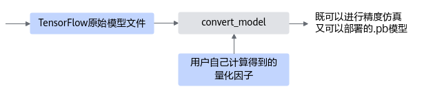

**调用示例<a name="section1231991121611"></a>**

本示例演示如何使用[convert\_model](convert_model.md)接口对原始模型进行适配。

> **说明：** 
>1.  如下示例标有“由用户补充处理”的步骤，需要用户根据自己的模型和数据集进行补充处理，示例中仅为示例代码。
>2.  如果用户需要基于如下代码，对其他模型进行量化，需要准备原始未量化的模型，将用户自己准备的量化因子转换为量化因子记录文件。

1.  导入AMCT包，设置日志级别。

    ```
    import amct_tensorflow as amct
    amct.set_logging_level(print_level='info', save_level='info')
    ```

2.  <a name="li2196136537"></a>（可选，由用户补充处理）建议使用原始待量化的模型和测试集，在TensorFlow环境下推理，验证环境、推理脚本是否正常。

    推荐执行该步骤，以确保原始模型可以完成推理且精度正常；执行该步骤时，可以使用部分测试集，减少运行时间。

    ```
    user_do_inference(ori_model, test_data) 
    ```

3.  调用AMCT中的[convert\_model](convert_model.md)接口，进行模型适配。

    该接口内部会将pb格式的模型解析为graph形式，完成图的预处理操作\>解析用户传入的量化因子文件\>然后根据量化因子和修改后的图结构，插入AscendQuant、AscendDequant等算子，保存为量化模型。

    ```
    quant_model_path = './results/user_model'
    record_file = './results/record.txt'
    amct.convert_model(pb_model=ori_model,
    		   outputs=ori_model_outputs,
           		   record_file=record_file,
    		   save_path=quant_model_path)
    ```

4.  （可选，由用户补充处理）使用量化后模型user\_model\_quantized.pb和测试集，在TensorFlow环境下推理，测试量化后的仿真模型精度。

    使用量化后仿真模型精度与[2](#li2196136537)中的原始精度做对比，可以观察量化对精度的影响。

    ```
    quant_model = './results/user_model_quantized.pb'
    user_do_inference(quant_model, test_data)
    ```

#### QAT模型适配CANN模型<a name="ZH-CN_TOPIC_0000002505904575"></a>

如果用户使用TensorFlow框架的原始模型已经做了量化功能（以下简称QAT模型），但是该模型无法使用ATC工具转成适配NPU IP加速器的离线模型，需要借助本节提供的功能，将该QAT模型适配成CANN量化模型格式。然后才能使用ATC工具，将CANN量化模型转成适配NPU IP加速器的离线模型。

转换约束如下：

-   当前仅支持对QAT模型中包含FakeQuantWithMinMaxVars、FakeQuantWithMinMaxVarsPerChannel（仅权重支持）两类FakeQuant层结构的模型进行适配。
-   当前仅支持Conv2D、MatMul、DepthwiseConv2dNative、Conv2dBackpropInput、AvgPool类型层匹配fake\_quant节点并进行适配，层约束请参见[均匀量化](均匀量化-43.md)。

**适配原理<a name="section11760132719274"></a>**

适配原理如下图所示，蓝色部分为用户实现，灰色部分为用户调用AMCT提供的[convert\_qat\_model](convert_qat_model-88.md)接口实现，用户在TensorFlow QAT网络推理的代码中导入库，并在特定的位置调用相应API，即可实现适配功能。QAT模型当前不支持[自动量化](自动量化-40.md)功能。详细适配样例请参见[样例列表](样例列表.md)，您也可以获取命令行方式的示例，快速体验其功能。

**图 1**  QAT模型适配CANN模型<a name="fig15930136155719"></a>  


**调用示例<a name="section13837142193412"></a>**

本示例演示了如何将TensorFlow的QAT量化模型通过AMCT适配为CANN量化模型格式。

> **说明：** 
>-   如下示例标有“由用户补充处理”的步骤，需要用户根据自己的模型和数据集进行补充处理，示例中仅为示例代码。
>-   如下示例调用AMCT的部分，函数入参请根据实际情况进行调整。

1.  导入AMCT包，设置日志级别。

    ```
    import amct_tensorflow as amct
    amct.set_logging_level(print_level='info', save_level='info')
    ```

2.  <a name="li1269533320562"></a>（可选，由用户补充处理）建议使用原始待量化的模型和测试集，在TensorFlow环境下推理，验证环境、推理脚本是否正常。

    推荐执行该步骤，以确保原始模型可以完成推理且精度正常；执行该步骤时，可以使用部分测试集，减少运行时间。

    ```
    user_do_inference(ori_qat_model, test_data)
    ```

3.  调用AMCT中的[convert\_qat\_model](convert_qat_model-88.md)接口，执行模型适配。

    该接口内部会将pb格式的模型解析为graph形式，完成图的预处理操作\>修改解析后的图结构，插入AscendQuant、AscendDequant等算子，保存为量化模型。

    ```
    quant_model_path = './results/user_model'
    record_file = './results/record.txt'
    amct.convert_qat_model(pb_model=ori_qat_model,
    		       outputs=ori_qat_model_outputs,
    		       save_path=quant_model_path,
                           record_file=record_file)
    ```

4.  （可选，由用户补充处理）使用量化后模型user\_model\_quantized.pb和测试集，在TensorFlow的环境下推理，测试量化后的仿真模型精度。

    使用量化后仿真模型精度与[2](#li1269533320562)中的原始精度做对比，可以观察量化对精度的影响。

    ```
    quant_model = './results/user_model_quantized.pb'
    user_do_inference(quant_model, test_data)
    ```

### 量化数据均衡预处理<a name="ZH-CN_TOPIC_0000002506024453"></a>

在一些数据分布不均匀的场景，由于离群值的影响，对数据进行per-tensor量化得到的结果误差较大，而per-channel量化可以获得更低的误差。但由于当前硬件不支持数据per-channel量化，仅支持权重per-channel量化；在该背景下AMCT设计出一套方法，本节将给出详细介绍。

通过数据均衡预处理接口计算出均衡因子，将模型数据与权重进行数学等价换算，均衡模型数据与权重的分布，将数据的量化难度迁移一部分至权重，从而降低量化误差。该特性支持的层及约束如下：

**表 1**  支持的层以及约束

<a name="table32131022111318"></a>
<table><thead align="left"><tr id="row9214202215138"><th class="cellrowborder" valign="top" width="21.872187218721873%" id="mcps1.2.4.1.1"><p id="p1921472241319"><a name="p1921472241319"></a><a name="p1921472241319"></a>支持的层类型</p>
</th>
<th class="cellrowborder" valign="top" width="36.9036903690369%" id="mcps1.2.4.1.2"><p id="p122141822101318"><a name="p122141822101318"></a><a name="p122141822101318"></a>约束</p>
</th>
<th class="cellrowborder" valign="top" width="41.22412241224123%" id="mcps1.2.4.1.3"><p id="p421411228138"><a name="p421411228138"></a><a name="p421411228138"></a>备注</p>
</th>
</tr>
</thead>
<tbody><tr id="row7214182271318"><td class="cellrowborder" valign="top" width="21.872187218721873%" headers="mcps1.2.4.1.1 "><p id="p32146222139"><a name="p32146222139"></a><a name="p32146222139"></a>MatMul</p>
</td>
<td class="cellrowborder" valign="top" width="36.9036903690369%" headers="mcps1.2.4.1.2 "><p id="p162141722111314"><a name="p162141722111314"></a><a name="p162141722111314"></a>transpose_a=False、transpose_b=False、adjoint_a=False、adjoint_b=False</p>
</td>
<td class="cellrowborder" rowspan="5" valign="top" width="41.22412241224123%" headers="mcps1.2.4.1.3 "><p id="p12141322161318"><a name="p12141322161318"></a><a name="p12141322161318"></a>weight的输入来源不含有placeholder等可动态变化的节点，且weight的节点类型只能是const。</p>
</td>
</tr>
<tr id="row1521462251317"><td class="cellrowborder" valign="top" headers="mcps1.2.4.1.1 "><p id="p1021414226138"><a name="p1021414226138"></a><a name="p1021414226138"></a>Conv2D</p>
</td>
<td class="cellrowborder" valign="top" headers="mcps1.2.4.1.2 "><p id="p8417519168"><a name="p8417519168"></a><a name="p8417519168"></a>-</p>
</td>
</tr>
<tr id="row182597490146"><td class="cellrowborder" valign="top" headers="mcps1.2.4.1.1 "><p id="p992417546146"><a name="p992417546146"></a><a name="p992417546146"></a>Conv3D</p>
</td>
<td class="cellrowborder" valign="top" headers="mcps1.2.4.1.2 "><p id="p16924754181418"><a name="p16924754181418"></a><a name="p16924754181418"></a>dilation_d为1，dilation_h/dilation_w &gt;= 1</p>
</td>
</tr>
<tr id="row6215022181311"><td class="cellrowborder" valign="top" headers="mcps1.2.4.1.1 "><p id="p4215122181312"><a name="p4215122181312"></a><a name="p4215122181312"></a>DepthwiseConv2dNative</p>
</td>
<td class="cellrowborder" valign="top" headers="mcps1.2.4.1.2 "><p id="p6214112220139"><a name="p6214112220139"></a><a name="p6214112220139"></a>dilation为1</p>
</td>
</tr>
<tr id="row6215102221319"><td class="cellrowborder" valign="top" headers="mcps1.2.4.1.1 "><p id="p1421510225139"><a name="p1421510225139"></a><a name="p1421510225139"></a>Conv2DBackpropInput</p>
</td>
<td class="cellrowborder" valign="top" headers="mcps1.2.4.1.2 "><p id="p121512281311"><a name="p121512281311"></a><a name="p121512281311"></a>dilation为1</p>
</td>
</tr>
</tbody>
</table>

**接口调用流程<a name="section1554611063615"></a>**

均衡预处理接口调用流程如[图1](#fig153281318152013)所示。

**图 1**  均衡预处理接口调用流程<a name="fig153281318152013"></a>  
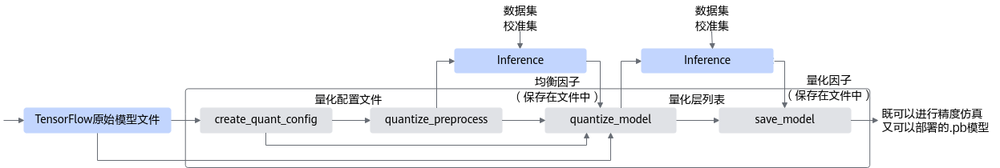

蓝色部分为用户实现，灰色部分为用户调用AMCT提供的API实现，用户在TensorFlow原始网络推理的代码中导入库，并在特定的位置调用相应API，即可实现量化功能。工具运行流程如下：

1.  用户首先构造TensorFlow的原始模型，并在简易配置文件_dmp\_quant.cfg_中设置dmq参数（简易配置文件配置参数请参见[训练后量化简易配置文件](训练后量化简易配置文件-91.md)），然后将配置文件传入[create\_quant\_config](create_quant_config-68.md)。
2.  <a name="li365854135210"></a>根据TensorFlow模型和量化配置文件，调用[quantize\_preprocess](quantize_preprocess-72.md)接口，对原始TensorFlow模型插入均衡量化相关算子，用于计算均衡量化相关参数。
3.  用户使用[2](#li365854135210)输出的修改后的模型，借助AMCT提供的数据集和校准集，在TensorFlow环境中进行inference，可以得到均衡因子。

    其中数据集用于在TensorFlow环境中对模型进行推理时，测试量化数据的精度；校准集用来产生均衡因子，保证精度。

4.  <a name="li63251496319"></a>根据TensorFlow模型和量化配置文件，调用[quantize\_model](quantize_model-69.md)接口对原始TensorFlow模型进行优化，修改后的模型中插入数据量化、权重量化等相关算子，用于计算量化相关参数。
5.  用户使用[4](#li63251496319)输出的修改后的模型，借助AMCT提供的数据集和校准集，在TensorFlow环境中进行inference，可以得到量化因子。
6.  最后用户可以调用[save\_model](save_model-70.md)接口，插入AscendQuant、AscendDequant等算子，保存为量化模型，该模型既可在TensorFlow环境中进行精度仿真又可以在NPU IP加速器部署。

**调用示例<a name="section6349114711496"></a>**

本章节详细给出量化数据均衡预处理的模板代码解析说明，通过解读该代码，用户可以详细了解AMCT的工作流程以及原理，方便用户基于已有模板代码进行修改，以便适配其他网络模型。

> **说明：** 
>-   如下示例标有“由用户补充处理”的步骤，需要用户根据自己的模型和数据集进行补充处理，示例中仅为示例代码。
>-   如下示例调用AMCT的部分，函数入参请根据实际情况进行调整。

1.  导入AMCT包，设置日志级别。

    ```
    import amct_tensorflow as amct
    amct.set_logging_level(print_level='info', save_level='info')
    ```

2.  <a name="li6785737629"></a>（可选，由用户补充处理）在TensorFlow原始环境中验证推理脚本及环境。

    建议使用原始待量化的模型和测试集，在TensorFlow环境下推理，验证环境、推理脚本是否正常。

    推荐执行该步骤，请确保原始模型可以完成推理且精度正常；执行该步骤时，可以使用部分测试集，减少运行时间。

    ```
    user_do_inference(ori_model, test_data, test_iterations) 
    ```

3.  （由用户补充处理）根据模型user\_model.pb，准备好图结构tf.Graph。

    ```
    ori_graph = user_load_graph()
    ```

4.  调用AMCT，量化模型。
    1.  生成量化配置。

        用户在简易配置文件_dmp\_quant.cfg_中设置dmq参数，并将配置文件通过config\_defination参数传入[create\_quant\_config](create_quant_config-68.md)。

        ```
        config_defination = os.path.join(PATH, 'dmp_quant.cfg')
        config_file = './tmp/config.json'
        skip_layers = []
        batch_num = 1
        amct.create_quant_config(config_file=config_file,
        			 graph=ori_graph,
        			 skip_layers=skip_layers,
        			 batch_num=batch_num,
                                 config_defination=config_defination)
        ```

    2.  修改图，在图中插入均衡量化相关的算子，用于计算均衡量化相关参数。

        ```
        record_file = './tmp/record.txt'
        amct.quantize_preprocess(graph=ori_graph,
                            config_file=config_file,
                            record_file=record_file)
        ```

        使用AMCT调用[quantize\_model](quantize_model-69.md)接口对用户的原始TensorFlow模型进行图修改时，由于插入了searchN层导致尾层输出节点发生改变的场景，可以参见[TensorFlow网络模型由于AMCT导致输出节点改变，如何通过修改量化脚本进行后续的量化动作](TensorFlow网络模型由于AMCT导致输出节点改变-如何通过修改量化脚本进行后续的量化动作.md)进行处理。如果量化过程存在空tensor输入报错信息，请参见[使用训练后量化进行量化时，量化过程存在空tensor输入报错信息](使用训练后量化进行量化时-量化过程存在空tensor输入报错信息.md)进行处理。

    3.  （由用户补充处理）使用修改后的图在校准集上做模型推理，计算均衡量化因子。

        该步骤执行时，需要注意如下两点：

        1.  校准集及其预处理过程数据要与模型匹配，以保证量化的精度。
        2.  前向推理的次数为1，如果次数超出1，后续过程会失败。

        ```
        user_do_inference(ori_graph, calibration_data, batch_num)
        ```

        校准时提示“Invalid argument: You must feed a value for placeholder tensor \*\*”，则请参见[校准时提示“Invalid argument: You must feed a value for placeholder tensor \*\*”](校准时提示-Invalid-argument-You-must-feed-a-value-for-placeholder-tensor.md)进行处理。

    4.  重新载入原始模型，基于原始模型进行修改，在图中插入数据量化，权重量化等相关的算子，用于计算量化相关参数。

        ```
        ori_graph = user_load_graph()
        amct.quantize_model(graph=ori_graph,
                            config_file=config_file,
                            record_file=record_file)
        ```

        使用AMCT调用[quantize\_model](quantize_model-69.md)接口对用户的原始TensorFlow模型进行图修改时，由于插入了searchN层导致尾层输出节点发生改变的场景，可以参见[TensorFlow网络模型由于AMCT导致输出节点改变，如何通过修改量化脚本进行后续的量化动作](TensorFlow网络模型由于AMCT导致输出节点改变-如何通过修改量化脚本进行后续的量化动作.md)进行处理。如果量化过程存在空tensor输入报错信息，请参见[使用训练后量化进行量化时，量化过程存在空tensor输入报错信息](使用训练后量化进行量化时-量化过程存在空tensor输入报错信息.md)进行处理。

    5.  （由用户补充处理）使用修改后的图在校准集上做模型推理，找到量化因子。

        该步骤执行时，需要注意如下两点：

        1.  校准集及其预处理过程数据要与模型匹配，以保证量化的精度。
        2.  前向推理的次数为batch\_num，如果次数不够，后续过程会失败。

        ```
        user_do_inference(ori_graph, calibration_data, batch_num)
        ```

        校准时提示“Invalid argument: You must feed a value for placeholder tensor \*\*”，则请参见[校准时提示“Invalid argument: You must feed a value for placeholder tensor \*\*”](校准时提示-Invalid-argument-You-must-feed-a-value-for-placeholder-tensor.md)进行处理。

    6.  保存模型。

        根据量化因子，调用[save\_model](save_model-70.md)接口，插入AscendQuant、AscendDequant等算子，保存为量化模型。

        ```
        quant_model_path = './results/user_model'
        amct.save_model(pb_model='user_model.pb',
                        outputs=['user_model_outputs0', 'user_model_outputs1'],
                        record_file=record_file,
                        save_path=quant_model_path)
        ```

        保存模型时提示“RuntimeError: cannot find shift\_bit of layer \*\* in record\_file”，则请参见[保存模型时提示“RuntimeError: record\_file is empty, no layers to be quantized”](保存模型时提示-RuntimeError-record_file-is-empty-no-layers-to-be-quantized.md)进行处理。

5.  （可选，由用户补充处理）使用量化后模型user\_model\_quantized.pb和测试集（test\_data），在TensorFlow环境下推理，测试量化后的仿真模型精度。

    使用量化后仿真模型精度与[2](#li6785737629)中的原始精度做对比，可以观察量化对精度的影响。

    ```
    quant_model = './results/user_model_quantized.pb'
    user_do_inference(quant_model, test_data, test_iterations)
    ```

## 接口说明<a name="ZH-CN_TOPIC_0000002473904602"></a>


### 整体约束和接口列表<a name="ZH-CN_TOPIC_0000002505904581"></a>

**整体约束<a name="section168901920144111"></a>**

-   若接口中存在需要用户输入文件路径的参数，请确保输入路径正确，AMCT不会对路径做安全校验。
-   若接口中存在需要用户输入文件路径的参数，重新执行量化时，该参数相关取值将会被覆盖；量化打屏日志中也会有相关文件被覆盖的warning风险提示信息。

**接口列表<a name="section1981813514110"></a>**

<a name="table2087618710426"></a>
<table><thead align="left"><tr id="row972017159424"><th class="cellrowborder" valign="top" width="12.709999999999999%" id="mcps1.1.4.1.1"><p id="p1035516624612"><a name="p1035516624612"></a><a name="p1035516624612"></a>分类</p>
</th>
<th class="cellrowborder" valign="top" width="20.71%" id="mcps1.1.4.1.2"><p id="p1592915316450"><a name="p1592915316450"></a><a name="p1592915316450"></a>接口名称</p>
</th>
<th class="cellrowborder" valign="top" width="66.58%" id="mcps1.1.4.1.3"><p id="p892995316457"><a name="p892995316457"></a><a name="p892995316457"></a>功能描述</p>
</th>
</tr>
</thead>
<tbody><tr id="row29025754220"><td class="cellrowborder" rowspan="2" valign="top" width="12.709999999999999%" headers="mcps1.1.4.1.1 "><p id="p149029715428"><a name="p149029715428"></a><a name="p149029715428"></a>公共接口</p>
</td>
<td class="cellrowborder" valign="top" width="20.71%" headers="mcps1.1.4.1.2 "><p id="p1890219784215"><a name="p1890219784215"></a><a name="p1890219784215"></a><a href="set_logging_level.md">set_logging_level</a></p>
</td>
<td class="cellrowborder" valign="top" width="66.58%" headers="mcps1.1.4.1.3 "><p id="p3796431104214"><a name="p3796431104214"></a><a name="p3796431104214"></a>设置信息输出的级别，其中信息包括打印在屏幕上的信息以及保存到amct_log/amct_tensorflow.log文件中的信息。</p>
</td>
</tr>
<tr id="row1590214715427"><td class="cellrowborder" valign="top" headers="mcps1.1.4.1.1 "><p id="p190216715426"><a name="p190216715426"></a><a name="p190216715426"></a><a href="GraphEvaluator.md">GraphEvaluator</a></p>
</td>
<td class="cellrowborder" valign="top" headers="mcps1.1.4.1.2 "><p id="p1779613115428"><a name="p1779613115428"></a><a name="p1779613115428"></a>针对某一个模型，根据模型的bin类型输入数据，提供一个Python实例，可对该模型执行校准和推理的评估器。</p>
</td>
</tr>
<tr id="row690210714216"><td class="cellrowborder" rowspan="5" valign="top" width="12.709999999999999%" headers="mcps1.1.4.1.1 "><p id="p20902872427"><a name="p20902872427"></a><a name="p20902872427"></a>训练后量化接口</p>
<p id="p114731940125414"><a name="p114731940125414"></a><a name="p114731940125414"></a></p>
</td>
<td class="cellrowborder" valign="top" width="20.71%" headers="mcps1.1.4.1.2 "><p id="p1790211712421"><a name="p1790211712421"></a><a name="p1790211712421"></a><a href="create_quant_config-68.md">create_quant_config</a></p>
</td>
<td class="cellrowborder" valign="top" width="66.58%" headers="mcps1.1.4.1.3 "><p id="p1796183117426"><a name="p1796183117426"></a><a name="p1796183117426"></a>训练后量化接口，根据图的结构找到所有可量化的层，自动生成量化配置文件，并将可量化层的量化配置信息写入文件。</p>
</td>
</tr>
<tr id="row29028764211"><td class="cellrowborder" valign="top" headers="mcps1.1.4.1.1 "><p id="p12902127174211"><a name="p12902127174211"></a><a name="p12902127174211"></a><a href="quantize_model-69.md">quantize_model</a></p>
</td>
<td class="cellrowborder" valign="top" headers="mcps1.1.4.1.2 "><p id="p7796143118424"><a name="p7796143118424"></a><a name="p7796143118424"></a>训练后量化接口，将输入的待量化的图结构按照给定的量化配置文件进行量化处理，在传入的图结构中插入量化相关的算子，生成量化因子记录文件record_file，并返回量化处理新增的算子列表。</p>
</td>
</tr>
<tr id="row390214724217"><td class="cellrowborder" valign="top" headers="mcps1.1.4.1.1 "><p id="p109021077421"><a name="p109021077421"></a><a name="p109021077421"></a><a href="save_model-70.md">save_model</a></p>
</td>
<td class="cellrowborder" valign="top" headers="mcps1.1.4.1.2 "><p id="p4796143115425"><a name="p4796143115425"></a><a name="p4796143115425"></a>训练后量化接口，根据量化因子记录文件record_file和用户待量化的原始pb模型，插入AscendQuant、AscendDequant等算子，然后保存为既可以在TensorFlow环境进行精度仿真又可以在<span id="zh-cn_topic_0000002473904574_ph133141316122319"><a name="zh-cn_topic_0000002473904574_ph133141316122319"></a><a name="zh-cn_topic_0000002473904574_ph133141316122319"></a>NPU IP加速器</span>做离线推理的pb模型文件。</p>
</td>
</tr>
<tr id="row14902174425"><td class="cellrowborder" valign="top" headers="mcps1.1.4.1.1 "><p id="p129031779429"><a name="p129031779429"></a><a name="p129031779429"></a><a href="accuracy_based_auto_calibration-71.md">accuracy_based_auto_calibration</a></p>
</td>
<td class="cellrowborder" valign="top" headers="mcps1.1.4.1.2 "><p id="p6796631204215"><a name="p6796631204215"></a><a name="p6796631204215"></a>根据用户输入的模型、配置文件进行自动的校准过程，搜索得到一个满足目标精度的量化配置，输出既可以在TensorFlow环境下做精度仿真的fake_quant模型又可在<span id="zh-cn_topic_0000002505904511_zh-cn_topic_0240188713_ph1555712386204"><a name="zh-cn_topic_0000002505904511_zh-cn_topic_0240188713_ph1555712386204"></a><a name="zh-cn_topic_0000002505904511_zh-cn_topic_0240188713_ph1555712386204"></a>NPU IP加速器</span>上做推理的deploy模型。</p>
</td>
</tr>
<tr id="row71571632165416"><td class="cellrowborder" valign="top" headers="mcps1.1.4.1.1 "><p id="p29031177422"><a name="p29031177422"></a><a name="p29031177422"></a><a href="quantize_preprocess-72.md">quantize_preprocess</a></p>
</td>
<td class="cellrowborder" valign="top" headers="mcps1.1.4.1.2 "><p id="p1079611315429"><a name="p1079611315429"></a><a name="p1079611315429"></a>量化数据均衡预处理接口，将输入的待量化的图结构按照给定的量化配置文件进行量化预处理（当前仅支持均衡量化），在传入的图结构中插入均衡量化相关的算子，生成均衡因子记录文件record_file，供后续quantize_model阶段读取。</p>
</td>
</tr>
<tr id="row2903157134210"><td class="cellrowborder" rowspan="3" valign="top" width="12.709999999999999%" headers="mcps1.1.4.1.1 "><p id="p19903197134213"><a name="p19903197134213"></a><a name="p19903197134213"></a>量化感知训练接口</p>
</td>
<td class="cellrowborder" valign="top" width="20.71%" headers="mcps1.1.4.1.2 "><p id="p1190315713424"><a name="p1190315713424"></a><a name="p1190315713424"></a><a href="create_quant_retrain_config-74.md">create_quant_retrain_config</a></p>
</td>
<td class="cellrowborder" valign="top" width="66.58%" headers="mcps1.1.4.1.3 "><p id="p97971631104215"><a name="p97971631104215"></a><a name="p97971631104215"></a>量化感知训练接口，根据图的结构找到所有可量化的层，自动生成量化配置文件，并将可量化层的量化配置信息写入配置文件。</p>
</td>
</tr>
<tr id="row090315713425"><td class="cellrowborder" valign="top" headers="mcps1.1.4.1.1 "><p id="p690320744216"><a name="p690320744216"></a><a name="p690320744216"></a><a href="create_quant_retrain_model-75.md">create_quant_retrain_model</a></p>
</td>
<td class="cellrowborder" valign="top" headers="mcps1.1.4.1.2 "><p id="p4797153110423"><a name="p4797153110423"></a><a name="p4797153110423"></a>量化感知训练接口，根据用户设置的量化配置文件对图结构进行量化处理，该函数在config_file指定的层插入数据和weights伪量化层，将修改后的网络存为新的模型文件。</p>
</td>
</tr>
<tr id="row590320717422"><td class="cellrowborder" valign="top" headers="mcps1.1.4.1.1 "><p id="p2903127204214"><a name="p2903127204214"></a><a name="p2903127204214"></a><a href="save_quant_retrain_model-76.md">save_quant_retrain_model</a></p>
</td>
<td class="cellrowborder" valign="top" headers="mcps1.1.4.1.2 "><p id="p879763113422"><a name="p879763113422"></a><a name="p879763113422"></a>量化感知训练接口，根据用户最终的重训练好的模型，插入AscendQuant、AscendDequant等算子，生成最终既可以进行精度仿真又可以进行部署的模型。</p>
</td>
</tr>
<tr id="row1190311720426"><td class="cellrowborder" rowspan="2" valign="top" width="12.709999999999999%" headers="mcps1.1.4.1.1 "><p id="p9903137124217"><a name="p9903137124217"></a><a name="p9903137124217"></a>稀疏接口</p>
</td>
<td class="cellrowborder" valign="top" width="20.71%" headers="mcps1.1.4.1.2 "><p id="p7903107144217"><a name="p7903107144217"></a><a name="p7903107144217"></a><a href="create_prune_retrain_model-78.md">create_prune_retrain_model</a></p>
</td>
<td class="cellrowborder" valign="top" width="66.58%" headers="mcps1.1.4.1.3 "><p id="p67971531114216"><a name="p67971531114216"></a><a name="p67971531114216"></a>通道稀疏或4选2结构化稀疏接口，两种稀疏特性每次只能使能一个。</p>
</td>
</tr>
<tr id="row1190319715424"><td class="cellrowborder" valign="top" headers="mcps1.1.4.1.1 "><p id="p179031878428"><a name="p179031878428"></a><a name="p179031878428"></a><a href="save_prune_retrain_model-79.md">save_prune_retrain_model</a></p>
</td>
<td class="cellrowborder" valign="top" headers="mcps1.1.4.1.2 "><p id="p13797113111425"><a name="p13797113111425"></a><a name="p13797113111425"></a>通道稀疏或4选2结构化稀疏接口，两种稀疏特性每次只能使能一个。</p>
</td>
</tr>
<tr id="row1390367184212"><td class="cellrowborder" valign="top" width="12.709999999999999%" headers="mcps1.1.4.1.1 "><p id="p990317718420"><a name="p990317718420"></a><a name="p990317718420"></a>自动通道稀疏搜索接口</p>
</td>
<td class="cellrowborder" valign="top" width="20.71%" headers="mcps1.1.4.1.2 "><p id="p14903177204214"><a name="p14903177204214"></a><a name="p14903177204214"></a><a href="auto_channel_prune_search-81.md">auto_channel_prune_search</a></p>
</td>
<td class="cellrowborder" valign="top" width="66.58%" headers="mcps1.1.4.1.3 "><p id="p137978317423"><a name="p137978317423"></a><a name="p137978317423"></a>自动通道稀疏搜索接口，根据用户模型来计算各通道的稀疏敏感度（影响精度）以及稀疏收益（影响性能），然后搜索策略依据该输入来搜索最优的逐层通道稀疏率，以平衡精度和性能。最终输出一个配置文件。</p>
</td>
</tr>
<tr id="row1190367184216"><td class="cellrowborder" rowspan="2" valign="top" width="12.709999999999999%" headers="mcps1.1.4.1.1 "><p id="p16903970424"><a name="p16903970424"></a><a name="p16903970424"></a>组合压缩接口</p>
</td>
<td class="cellrowborder" valign="top" width="20.71%" headers="mcps1.1.4.1.2 "><p id="p169031278424"><a name="p169031278424"></a><a name="p169031278424"></a><a href="create_compressed_retrain_model-83.md">create_compressed_retrain_model</a></p>
</td>
<td class="cellrowborder" valign="top" width="66.58%" headers="mcps1.1.4.1.3 "><p id="p10797193113423"><a name="p10797193113423"></a><a name="p10797193113423"></a>静态组合压缩接口，根据用户设置的压缩配置文件对图结构先进行稀疏（通道稀疏或者4选2结构化稀疏，二选一），后插入量化相关的算子，并返回修改后的图。</p>
</td>
</tr>
<tr id="row690310716423"><td class="cellrowborder" valign="top" headers="mcps1.1.4.1.1 "><p id="p1990311714429"><a name="p1990311714429"></a><a name="p1990311714429"></a><a href="save_compressed_retrain_model-84.md">save_compressed_retrain_model</a></p>
</td>
<td class="cellrowborder" valign="top" headers="mcps1.1.4.1.2 "><p id="p17971031184213"><a name="p17971031184213"></a><a name="p17971031184213"></a>静态组合压缩接口，根据用户最终重训练好的模型，生成最终静态组合压缩模型。</p>
</td>
</tr>
<tr id="row99035774218"><td class="cellrowborder" rowspan="2" valign="top" width="12.709999999999999%" headers="mcps1.1.4.1.1 "><p id="p17903107174213"><a name="p17903107174213"></a><a name="p17903107174213"></a>张量分解接口</p>
</td>
<td class="cellrowborder" valign="top" width="20.71%" headers="mcps1.1.4.1.2 "><p id="p1790318794216"><a name="p1790318794216"></a><a name="p1790318794216"></a><a href="auto_decomposition-86.md">auto_decomposition</a></p>
</td>
<td class="cellrowborder" valign="top" width="66.58%" headers="mcps1.1.4.1.3 "><p id="p87971531124213"><a name="p87971531124213"></a><a name="p87971531124213"></a>根据用户提供的TensorFlow模型文件，生成张量分解后的模型文件。</p>
</td>
</tr>
<tr id="row69034713422"><td class="cellrowborder" valign="top" headers="mcps1.1.4.1.1 "><p id="p490313719425"><a name="p490313719425"></a><a name="p490313719425"></a><a href="decompose_graph.md">decompose_graph</a></p>
</td>
<td class="cellrowborder" valign="top" headers="mcps1.1.4.1.2 "><p id="p479720313420"><a name="p479720313420"></a><a name="p479720313420"></a>分解训练代码中的图，用于对分解后的模型进行fine-tune（微调）。</p>
</td>
</tr>
<tr id="row11903147174216"><td class="cellrowborder" rowspan="2" valign="top" width="12.709999999999999%" headers="mcps1.1.4.1.1 "><p id="p890319784211"><a name="p890319784211"></a><a name="p890319784211"></a>模型适配接口</p>
</td>
<td class="cellrowborder" valign="top" width="20.71%" headers="mcps1.1.4.1.2 "><p id="p1690319784214"><a name="p1690319784214"></a><a name="p1690319784214"></a><a href="convert_model.md">convert_model</a></p>
</td>
<td class="cellrowborder" valign="top" width="66.58%" headers="mcps1.1.4.1.3 "><p id="p15797203114214"><a name="p15797203114214"></a><a name="p15797203114214"></a>根据用户自己计算得到的量化因子以及TensorFlow模型，适配成既可以在<span id="zh-cn_topic_0000002473904496_zh-cn_topic_0254208276_ph1842019245216"><a name="zh-cn_topic_0000002473904496_zh-cn_topic_0254208276_ph1842019245216"></a><a name="zh-cn_topic_0000002473904496_zh-cn_topic_0254208276_ph1842019245216"></a>NPU IP加速器</span>上部署的模型又可以在TensorFlow环境下进行精度仿真的量化模型。</p>
</td>
</tr>
<tr id="row89031475428"><td class="cellrowborder" valign="top" headers="mcps1.1.4.1.1 "><p id="p1690319717424"><a name="p1690319717424"></a><a name="p1690319717424"></a><a href="convert_qat_model-88.md">convert_qat_model</a></p>
</td>
<td class="cellrowborder" valign="top" headers="mcps1.1.4.1.2 "><p id="p11797631184215"><a name="p11797631184215"></a><a name="p11797631184215"></a>根据TensorFlow的QAT量化模型，适配成分别可以在CPU、GPU上进行精度仿真和<span id="zh-cn_topic_0000002473904558_ph111714243115"><a name="zh-cn_topic_0000002473904558_ph111714243115"></a><a name="zh-cn_topic_0000002473904558_ph111714243115"></a>NPU IP加速器</span>上部署的量化模型。</p>
</td>
</tr>
</tbody>
</table>

### 公共接口<a name="ZH-CN_TOPIC_0000002473744616"></a>


#### set\_logging\_level<a name="ZH-CN_TOPIC_0000002506024521"></a>

**产品支持情况<a name="section185612964420"></a>**

<a name="zh-cn_topic_0000002505904555_table38301303189"></a>
<table><thead align="left"><tr id="zh-cn_topic_0000002505904555_row20831180131817"><th class="cellrowborder" valign="top" width="57.99999999999999%" id="mcps1.1.3.1.1"><p id="zh-cn_topic_0000002505904555_p1883113061818"><a name="zh-cn_topic_0000002505904555_p1883113061818"></a><a name="zh-cn_topic_0000002505904555_p1883113061818"></a>产品</p>
</th>
<th class="cellrowborder" align="center" valign="top" width="42%" id="mcps1.1.3.1.2"><p id="zh-cn_topic_0000002505904555_p783113012187"><a name="zh-cn_topic_0000002505904555_p783113012187"></a><a name="zh-cn_topic_0000002505904555_p783113012187"></a>是否支持</p>
</th>
</tr>
</thead>
<tbody><tr id="zh-cn_topic_0000002505904555_row1466941011819"><td class="cellrowborder" valign="top" width="57.99999999999999%" headers="mcps1.1.3.1.1 "><p id="zh-cn_topic_0000002505904555_p146702104188"><a name="zh-cn_topic_0000002505904555_p146702104188"></a><a name="zh-cn_topic_0000002505904555_p146702104188"></a><span id="zh-cn_topic_0000002505904555_ph1577265511916"><a name="zh-cn_topic_0000002505904555_ph1577265511916"></a><a name="zh-cn_topic_0000002505904555_ph1577265511916"></a>IPV350</span></p>
</td>
<td class="cellrowborder" align="center" valign="top" width="42%" headers="mcps1.1.3.1.2 "><p id="zh-cn_topic_0000002505904555_p12400144361011"><a name="zh-cn_topic_0000002505904555_p12400144361011"></a><a name="zh-cn_topic_0000002505904555_p12400144361011"></a>√</p>
</td>
</tr>
</tbody>
</table>

**功能说明<a name="zh-cn_topic_0240187991_section15406195619561"></a>**

设置信息输出的级别，其中信息包括打印在屏幕上的信息以及保存到amct\_log/amct\_tensorflow.log文件中的信息。

**函数原型<a name="zh-cn_topic_0240187991_zh-cn_topic_0122830089_section428121323411"></a>**

```
set_logging_level(print_level='info', save_level='info')
```

**参数说明<a name="zh-cn_topic_0240187991_zh-cn_topic_0122830089_section795991810344"></a>**

<a name="zh-cn_topic_0240187991_zh-cn_topic_0122830089_table438764393513"></a>
<table><thead align="left"><tr id="zh-cn_topic_0240187991_zh-cn_topic_0122830089_row53871743113510"><th class="cellrowborder" valign="top" width="8.3%" id="mcps1.1.4.1.1"><p id="zh-cn_topic_0240187991_zh-cn_topic_0122830089_p1438834363520"><a name="zh-cn_topic_0240187991_zh-cn_topic_0122830089_p1438834363520"></a><a name="zh-cn_topic_0240187991_zh-cn_topic_0122830089_p1438834363520"></a>参数名</p>
</th>
<th class="cellrowborder" valign="top" width="8.62%" id="mcps1.1.4.1.2"><p id="zh-cn_topic_0240187991_p1769255516412"><a name="zh-cn_topic_0240187991_p1769255516412"></a><a name="zh-cn_topic_0240187991_p1769255516412"></a>输入/输出</p>
</th>
<th class="cellrowborder" valign="top" width="83.08%" id="mcps1.1.4.1.3"><p id="zh-cn_topic_0240187991_p15231205416325"><a name="zh-cn_topic_0240187991_p15231205416325"></a><a name="zh-cn_topic_0240187991_p15231205416325"></a>说明</p>
</th>
</tr>
</thead>
<tbody><tr id="zh-cn_topic_0240187991_zh-cn_topic_0122830089_row2038874343514"><td class="cellrowborder" valign="top" width="8.3%" headers="mcps1.1.4.1.1 "><p id="zh-cn_topic_0240187991_p812210419425"><a name="zh-cn_topic_0240187991_p812210419425"></a><a name="zh-cn_topic_0240187991_p812210419425"></a>print_level</p>
</td>
<td class="cellrowborder" valign="top" width="8.62%" headers="mcps1.1.4.1.2 "><p id="zh-cn_topic_0240187991_p12121144104217"><a name="zh-cn_topic_0240187991_p12121144104217"></a><a name="zh-cn_topic_0240187991_p12121144104217"></a>输入</p>
</td>
<td class="cellrowborder" valign="top" width="83.08%" headers="mcps1.1.4.1.3 "><p id="p194459631711"><a name="p194459631711"></a><a name="p194459631711"></a>含义：控制打印信息的级别。</p>
<a name="zh-cn_topic_0240187991_ul24868441462"></a><a name="zh-cn_topic_0240187991_ul24868441462"></a><ul id="zh-cn_topic_0240187991_ul24868441462"><li>debug：输出DEBUG/INFO/WARNING/ERROR级别的运行信息。</li><li>info：输出INFO/WARNING/ERROR级别的运行信息。</li><li>warning：输出WARNING/ERROR级别的运行信息。</li><li>error：输出ERROR级别的运行信息。</li></ul>
<p id="zh-cn_topic_0240187991_p511784164220"><a name="zh-cn_topic_0240187991_p511784164220"></a><a name="zh-cn_topic_0240187991_p511784164220"></a>默认值为：info</p>
<p id="zh-cn_topic_0240187991_p1853003232412"><a name="zh-cn_topic_0240187991_p1853003232412"></a><a name="zh-cn_topic_0240187991_p1853003232412"></a>数据类型：string</p>
</td>
</tr>
<tr id="zh-cn_topic_0240187991_row32991154514"><td class="cellrowborder" valign="top" width="8.3%" headers="mcps1.1.4.1.1 "><p id="zh-cn_topic_0240187991_p1511518414212"><a name="zh-cn_topic_0240187991_p1511518414212"></a><a name="zh-cn_topic_0240187991_p1511518414212"></a>save_level</p>
</td>
<td class="cellrowborder" valign="top" width="8.62%" headers="mcps1.1.4.1.2 "><p id="zh-cn_topic_0240187991_p14114194164214"><a name="zh-cn_topic_0240187991_p14114194164214"></a><a name="zh-cn_topic_0240187991_p14114194164214"></a>输入</p>
</td>
<td class="cellrowborder" valign="top" width="83.08%" headers="mcps1.1.4.1.3 "><p id="p4634812141720"><a name="p4634812141720"></a><a name="p4634812141720"></a>含义：控制quant_info.log中保存信息的级别。</p>
<a name="ul15229528171710"></a><a name="ul15229528171710"></a><ul id="ul15229528171710"><li>debug：输出DEBUG/INFO/WARNING/ERROR级别的运行信息。</li><li>info：输出INFO/WARNING/ERROR级别的运行信息。</li><li>warning：输出WARNING/ERROR级别的运行信息。</li><li>error：输出ERROR级别的运行信息。</li></ul>
<p id="zh-cn_topic_0240187991_p167661558172417"><a name="zh-cn_topic_0240187991_p167661558172417"></a><a name="zh-cn_topic_0240187991_p167661558172417"></a>默认值为：info</p>
<p id="zh-cn_topic_0240187991_p1976745812243"><a name="zh-cn_topic_0240187991_p1976745812243"></a><a name="zh-cn_topic_0240187991_p1976745812243"></a>数据类型：string</p>
</td>
</tr>
</tbody>
</table>

<a name="zh-cn_topic_0240187991_table1332501419"></a>
<table><thead align="left"><tr id="zh-cn_topic_0240187991_row15331506413"><th class="cellrowborder" valign="top" width="16.86%" id="mcps1.1.3.1.1"><p id="zh-cn_topic_0240187991_p912915564412"><a name="zh-cn_topic_0240187991_p912915564412"></a><a name="zh-cn_topic_0240187991_p912915564412"></a>信息级别</p>
</th>
<th class="cellrowborder" valign="top" width="83.14%" id="mcps1.1.3.1.2"><p id="zh-cn_topic_0240187991_p11292562411"><a name="zh-cn_topic_0240187991_p11292562411"></a><a name="zh-cn_topic_0240187991_p11292562411"></a>信息描述</p>
</th>
</tr>
</thead>
<tbody><tr id="zh-cn_topic_0240187991_row16334501948"><td class="cellrowborder" valign="top" width="16.86%" headers="mcps1.1.3.1.1 "><p id="zh-cn_topic_0240187991_p5129145614420"><a name="zh-cn_topic_0240187991_p5129145614420"></a><a name="zh-cn_topic_0240187991_p5129145614420"></a>DEBUG</p>
</td>
<td class="cellrowborder" valign="top" width="83.14%" headers="mcps1.1.3.1.2 "><p id="zh-cn_topic_0240187991_p21291256143"><a name="zh-cn_topic_0240187991_p21291256143"></a><a name="zh-cn_topic_0240187991_p21291256143"></a>详细的量化处理信息，包含量化因子（scale/offset）以及相关调试信息。</p>
</td>
</tr>
<tr id="zh-cn_topic_0240187991_row5347502412"><td class="cellrowborder" valign="top" width="16.86%" headers="mcps1.1.3.1.1 "><p id="zh-cn_topic_0240187991_p17129256346"><a name="zh-cn_topic_0240187991_p17129256346"></a><a name="zh-cn_topic_0240187991_p17129256346"></a>INFO</p>
</td>
<td class="cellrowborder" valign="top" width="83.14%" headers="mcps1.1.3.1.2 "><p id="zh-cn_topic_0240187991_p1812912561147"><a name="zh-cn_topic_0240187991_p1812912561147"></a><a name="zh-cn_topic_0240187991_p1812912561147"></a>概要的量化处理信息，包含量化的层名、bn融合等信息。</p>
</td>
</tr>
<tr id="zh-cn_topic_0240187991_row123413500413"><td class="cellrowborder" valign="top" width="16.86%" headers="mcps1.1.3.1.1 "><p id="zh-cn_topic_0240187991_p111291556143"><a name="zh-cn_topic_0240187991_p111291556143"></a><a name="zh-cn_topic_0240187991_p111291556143"></a>WARNING</p>
</td>
<td class="cellrowborder" valign="top" width="83.14%" headers="mcps1.1.3.1.2 "><p id="zh-cn_topic_0240187991_p912995610414"><a name="zh-cn_topic_0240187991_p912995610414"></a><a name="zh-cn_topic_0240187991_p912995610414"></a>量化处理过程中的警告信息。</p>
</td>
</tr>
<tr id="zh-cn_topic_0240187991_row534145017419"><td class="cellrowborder" valign="top" width="16.86%" headers="mcps1.1.3.1.1 "><p id="zh-cn_topic_0240187991_p612912568416"><a name="zh-cn_topic_0240187991_p612912568416"></a><a name="zh-cn_topic_0240187991_p612912568416"></a>ERROR</p>
</td>
<td class="cellrowborder" valign="top" width="83.14%" headers="mcps1.1.3.1.2 "><p id="zh-cn_topic_0240187991_p12129135615411"><a name="zh-cn_topic_0240187991_p12129135615411"></a><a name="zh-cn_topic_0240187991_p12129135615411"></a>量化处理过程中的错误信息。</p>
</td>
</tr>
</tbody>
</table>

信息级别不区分大小写，即Info、info、INFO均为有效取值。

**返回值说明<a name="zh-cn_topic_0240187991_zh-cn_topic_0122830089_section293415513458"></a>**

无

**调用示例<a name="zh-cn_topic_0240187991_section149503402234"></a>**

```
import amct_tensorflow as amct
amct.set_logging_level(print_level="info", save_level="info")
amct.quantize_model(
     graph=tf.get_default_graph(),
     config_file="./configs/config.json",
     record_file="./record_scale_offset.txt")
   ...
amct.save_model(pb_model="./user_model.pb",
                outputs=["model/outputs"],
                record_file="./record_scale_offset.txt",
                save_path="./inference/model")
```

#### GraphEvaluator<a name="ZH-CN_TOPIC_0000002505904487"></a>

**产品支持情况<a name="section185612964420"></a>**

<a name="zh-cn_topic_0000002505904555_table38301303189"></a>
<table><thead align="left"><tr id="zh-cn_topic_0000002505904555_row20831180131817"><th class="cellrowborder" valign="top" width="57.99999999999999%" id="mcps1.1.3.1.1"><p id="zh-cn_topic_0000002505904555_p1883113061818"><a name="zh-cn_topic_0000002505904555_p1883113061818"></a><a name="zh-cn_topic_0000002505904555_p1883113061818"></a>产品</p>
</th>
<th class="cellrowborder" align="center" valign="top" width="42%" id="mcps1.1.3.1.2"><p id="zh-cn_topic_0000002505904555_p783113012187"><a name="zh-cn_topic_0000002505904555_p783113012187"></a><a name="zh-cn_topic_0000002505904555_p783113012187"></a>是否支持</p>
</th>
</tr>
</thead>
<tbody><tr id="zh-cn_topic_0000002505904555_row1466941011819"><td class="cellrowborder" valign="top" width="57.99999999999999%" headers="mcps1.1.3.1.1 "><p id="zh-cn_topic_0000002505904555_p146702104188"><a name="zh-cn_topic_0000002505904555_p146702104188"></a><a name="zh-cn_topic_0000002505904555_p146702104188"></a><span id="zh-cn_topic_0000002505904555_ph1577265511916"><a name="zh-cn_topic_0000002505904555_ph1577265511916"></a><a name="zh-cn_topic_0000002505904555_ph1577265511916"></a>IPV350</span></p>
</td>
<td class="cellrowborder" align="center" valign="top" width="42%" headers="mcps1.1.3.1.2 "><p id="zh-cn_topic_0000002505904555_p12400144361011"><a name="zh-cn_topic_0000002505904555_p12400144361011"></a><a name="zh-cn_topic_0000002505904555_p12400144361011"></a>√</p>
</td>
</tr>
</tbody>
</table>

**功能说明<a name="zh-cn_topic_0240187994_section15406195619561"></a>**

针对某一个模型，根据模型的bin类型输入数据，提供一个Python实例，可对该模型执行校准和推理的评估器。

**函数原型<a name="zh-cn_topic_0240187994_zh-cn_topic_0122830089_section428121323411"></a>**

```
class GraphEvaluator(AutoCalibrationEvaluatorBase):
def __init__(self, data_dir, input_shape, data_types):
```

**参数说明<a name="zh-cn_topic_0240187994_zh-cn_topic_0122830089_section795991810344"></a>**

<a name="zh-cn_topic_0240187994_zh-cn_topic_0122830089_table438764393513"></a>
<table><thead align="left"><tr id="zh-cn_topic_0240187994_zh-cn_topic_0122830089_row53871743113510"><th class="cellrowborder" valign="top" width="10.31%" id="mcps1.1.4.1.1"><p id="zh-cn_topic_0240187994_zh-cn_topic_0122830089_p1438834363520"><a name="zh-cn_topic_0240187994_zh-cn_topic_0122830089_p1438834363520"></a><a name="zh-cn_topic_0240187994_zh-cn_topic_0122830089_p1438834363520"></a>参数名</p>
</th>
<th class="cellrowborder" valign="top" width="9.229999999999999%" id="mcps1.1.4.1.2"><p id="zh-cn_topic_0240187994_p1769255516412"><a name="zh-cn_topic_0240187994_p1769255516412"></a><a name="zh-cn_topic_0240187994_p1769255516412"></a>输入/输出</p>
</th>
<th class="cellrowborder" valign="top" width="80.46%" id="mcps1.1.4.1.3"><p id="p19911124613711"><a name="p19911124613711"></a><a name="p19911124613711"></a>说明</p>
</th>
</tr>
</thead>
<tbody><tr id="row8680426943"><td class="cellrowborder" valign="top" width="10.31%" headers="mcps1.1.4.1.1 "><p id="p12818830740"><a name="p12818830740"></a><a name="p12818830740"></a>data_dir</p>
</td>
<td class="cellrowborder" valign="top" width="9.229999999999999%" headers="mcps1.1.4.1.2 "><p id="p128185303416"><a name="p128185303416"></a><a name="p128185303416"></a>输入</p>
</td>
<td class="cellrowborder" valign="top" width="80.46%" headers="mcps1.1.4.1.3 "><p id="p584153118185"><a name="p584153118185"></a><a name="p584153118185"></a>含义：与模型匹配的bin格式数据集路径。</p>
<p id="p9912946779"><a name="p9912946779"></a><a name="p9912946779"></a>数据类型：string</p>
<p id="p10881253527"><a name="p10881253527"></a><a name="p10881253527"></a>参数值格式："data/input1/;data/input2/"</p>
<p id="p1241012377217"><a name="p1241012377217"></a><a name="p1241012377217"></a>使用约束：</p>
<a name="zh-cn_topic_0000001135587500_ul14146154111109"></a><a name="zh-cn_topic_0000001135587500_ul14146154111109"></a><ul id="zh-cn_topic_0000001135587500_ul14146154111109"><li>路径支持大小写字母（a-z，A-Z）、数字（0-9）、下划线（_）、中划线（-）、句点（.）、中文字符。</li><li>若模型有多个输入，且每个输入有多个batch数据，则不同的输入数据必须存储在不同的目录中，目录中文件的名称必须按照升序排序。所有的输入数据路径必须放在双引号中，节点中间使用英文分号分隔。</li><li>单个bin文件中存储的数组shape需要和input_shape中输入的shape相匹配，例如：单张图片bin存储的数组shape为1x224x224x3，则input_shape中输入的必须为1x224x224x3；如需多个bin做量化，则可通过调整batch_num取值实现。</li></ul>
</td>
</tr>
<tr id="zh-cn_topic_0240187994_row32991154514"><td class="cellrowborder" valign="top" width="10.31%" headers="mcps1.1.4.1.1 "><p id="zh-cn_topic_0240187994_p1254338193919"><a name="zh-cn_topic_0240187994_p1254338193919"></a><a name="zh-cn_topic_0240187994_p1254338193919"></a>input_shape</p>
</td>
<td class="cellrowborder" valign="top" width="9.229999999999999%" headers="mcps1.1.4.1.2 "><p id="zh-cn_topic_0240187994_p1255438123917"><a name="zh-cn_topic_0240187994_p1255438123917"></a><a name="zh-cn_topic_0240187994_p1255438123917"></a>输入</p>
</td>
<td class="cellrowborder" valign="top" width="80.46%" headers="mcps1.1.4.1.3 "><p id="p1275673520180"><a name="p1275673520180"></a><a name="p1275673520180"></a>含义：模型输入的shape信息。</p>
<p id="p9912144617713"><a name="p9912144617713"></a><a name="p9912144617713"></a>数据类型：string</p>
<p id="p44111151944"><a name="p44111151944"></a><a name="p44111151944"></a>参数值格式："input_name1:n1,c1,h1,w1;input_name2:n2,c2,h2,w2"。</p>
<p id="p18687175419410"><a name="p18687175419410"></a><a name="p18687175419410"></a>使用约束：指定的节点必须放在双引号中，节点中间使用英文分号分隔。</p>
</td>
</tr>
<tr id="zh-cn_topic_0240187994_row4537142419283"><td class="cellrowborder" valign="top" width="10.31%" headers="mcps1.1.4.1.1 "><p id="p196984129618"><a name="p196984129618"></a><a name="p196984129618"></a>data_types</p>
</td>
<td class="cellrowborder" valign="top" width="9.229999999999999%" headers="mcps1.1.4.1.2 "><p id="zh-cn_topic_0240187994_p1153815249285"><a name="zh-cn_topic_0240187994_p1153815249285"></a><a name="zh-cn_topic_0240187994_p1153815249285"></a>输入</p>
</td>
<td class="cellrowborder" valign="top" width="80.46%" headers="mcps1.1.4.1.3 "><p id="p26161440171813"><a name="p26161440171813"></a><a name="p26161440171813"></a>含义：输入数据的类型。</p>
<p id="p6912174617711"><a name="p6912174617711"></a><a name="p6912174617711"></a>数据类型：string</p>
<p id="p21059815512"><a name="p21059815512"></a><a name="p21059815512"></a>参数值格式："float32;float64"</p>
<p id="p26158361957"><a name="p26158361957"></a><a name="p26158361957"></a>使用约束：若模型有多个输入，且数据类型不同，则需要分别指定不同输入的数据类型，指定的输入数据类型必须按照输入节点顺序依次放在双引号中，所有的输入数据类型必须放在双引号中，中间使用英文分号分隔。</p>
</td>
</tr>
</tbody>
</table>

**返回值说明<a name="zh-cn_topic_0240187994_zh-cn_topic_0122830089_section293415513458"></a>**

一个Python实例。

**调用示例<a name="zh-cn_topic_0240187994_section542843616112"></a>**

```
import amct_tensorflow as amct

evaluator = amct.GraphEvaluator(
    data_dir="./data/input_bin/", 
    input_shape="input:32,3,224,224",
    data_types="float32")
```

### 训练后量化接口<a name="ZH-CN_TOPIC_0000002505904529"></a>


#### create\_quant\_config<a name="ZH-CN_TOPIC_0000002473744606"></a>

**产品支持情况<a name="section185612964420"></a>**

<a name="zh-cn_topic_0000002505904555_table38301303189"></a>
<table><thead align="left"><tr id="zh-cn_topic_0000002505904555_row20831180131817"><th class="cellrowborder" valign="top" width="57.99999999999999%" id="mcps1.1.3.1.1"><p id="zh-cn_topic_0000002505904555_p1883113061818"><a name="zh-cn_topic_0000002505904555_p1883113061818"></a><a name="zh-cn_topic_0000002505904555_p1883113061818"></a>产品</p>
</th>
<th class="cellrowborder" align="center" valign="top" width="42%" id="mcps1.1.3.1.2"><p id="zh-cn_topic_0000002505904555_p783113012187"><a name="zh-cn_topic_0000002505904555_p783113012187"></a><a name="zh-cn_topic_0000002505904555_p783113012187"></a>是否支持</p>
</th>
</tr>
</thead>
<tbody><tr id="zh-cn_topic_0000002505904555_row1466941011819"><td class="cellrowborder" valign="top" width="57.99999999999999%" headers="mcps1.1.3.1.1 "><p id="zh-cn_topic_0000002505904555_p146702104188"><a name="zh-cn_topic_0000002505904555_p146702104188"></a><a name="zh-cn_topic_0000002505904555_p146702104188"></a><span id="zh-cn_topic_0000002505904555_ph1577265511916"><a name="zh-cn_topic_0000002505904555_ph1577265511916"></a><a name="zh-cn_topic_0000002505904555_ph1577265511916"></a>IPV350</span></p>
</td>
<td class="cellrowborder" align="center" valign="top" width="42%" headers="mcps1.1.3.1.2 "><p id="zh-cn_topic_0000002505904555_p12400144361011"><a name="zh-cn_topic_0000002505904555_p12400144361011"></a><a name="zh-cn_topic_0000002505904555_p12400144361011"></a>√</p>
</td>
</tr>
</tbody>
</table>

**功能说明<a name="zh-cn_topic_0240187365_section15406195619561"></a>**

训练后量化接口，根据图的结构找到所有可量化的层，自动生成量化配置文件，并将可量化层的量化配置信息写入文件。

**函数原型<a name="zh-cn_topic_0240187365_zh-cn_topic_0122830089_section428121323411"></a>**

```
create_quant_config(config_file, graph, skip_layers=None, batch_num=1, activation_offset=True, config_defination=None)
```

**参数说明<a name="zh-cn_topic_0240187365_zh-cn_topic_0122830089_section795991810344"></a>**

<a name="zh-cn_topic_0240187365_zh-cn_topic_0122830089_table438764393513"></a>
<table><thead align="left"><tr id="zh-cn_topic_0240187365_zh-cn_topic_0122830089_row53871743113510"><th class="cellrowborder" valign="top" width="10.54%" id="mcps1.1.4.1.1"><p id="zh-cn_topic_0240187365_zh-cn_topic_0122830089_p1438834363520"><a name="zh-cn_topic_0240187365_zh-cn_topic_0122830089_p1438834363520"></a><a name="zh-cn_topic_0240187365_zh-cn_topic_0122830089_p1438834363520"></a>参数名</p>
</th>
<th class="cellrowborder" valign="top" width="7.580000000000001%" id="mcps1.1.4.1.2"><p id="zh-cn_topic_0240187365_p1769255516412"><a name="zh-cn_topic_0240187365_p1769255516412"></a><a name="zh-cn_topic_0240187365_p1769255516412"></a>输入/输出</p>
</th>
<th class="cellrowborder" valign="top" width="81.88%" id="mcps1.1.4.1.3"><p id="zh-cn_topic_0240187365_p15231205416325"><a name="zh-cn_topic_0240187365_p15231205416325"></a><a name="zh-cn_topic_0240187365_p15231205416325"></a>说明</p>
</th>
</tr>
</thead>
<tbody><tr id="zh-cn_topic_0240187365_zh-cn_topic_0122830089_row2038874343514"><td class="cellrowborder" valign="top" width="10.54%" headers="mcps1.1.4.1.1 "><p id="zh-cn_topic_0240187365_p8886819105313"><a name="zh-cn_topic_0240187365_p8886819105313"></a><a name="zh-cn_topic_0240187365_p8886819105313"></a>config_file</p>
</td>
<td class="cellrowborder" valign="top" width="7.580000000000001%" headers="mcps1.1.4.1.2 "><p id="zh-cn_topic_0240187365_p8693185517417"><a name="zh-cn_topic_0240187365_p8693185517417"></a><a name="zh-cn_topic_0240187365_p8693185517417"></a>输入</p>
</td>
<td class="cellrowborder" valign="top" width="81.88%" headers="mcps1.1.4.1.3 "><p id="p965614330209"><a name="p965614330209"></a><a name="p965614330209"></a>含义：待生成的量化配置文件存放路径及名称。</p>
<p id="p0621205862012"><a name="p0621205862012"></a><a name="p0621205862012"></a>如果存放路径下已经存在该文件，则调用该接口时会覆盖已有文件。</p>
<p id="zh-cn_topic_0240187365_p11225740182619"><a name="zh-cn_topic_0240187365_p11225740182619"></a><a name="zh-cn_topic_0240187365_p11225740182619"></a>数据类型：string</p>
</td>
</tr>
<tr id="zh-cn_topic_0240187365_row16254133823918"><td class="cellrowborder" valign="top" width="10.54%" headers="mcps1.1.4.1.1 "><p id="zh-cn_topic_0240187365_p1254338193919"><a name="zh-cn_topic_0240187365_p1254338193919"></a><a name="zh-cn_topic_0240187365_p1254338193919"></a>graph</p>
</td>
<td class="cellrowborder" valign="top" width="7.580000000000001%" headers="mcps1.1.4.1.2 "><p id="zh-cn_topic_0240187365_p1255438123917"><a name="zh-cn_topic_0240187365_p1255438123917"></a><a name="zh-cn_topic_0240187365_p1255438123917"></a>输入</p>
</td>
<td class="cellrowborder" valign="top" width="81.88%" headers="mcps1.1.4.1.3 "><p id="p1813014012019"><a name="p1813014012019"></a><a name="p1813014012019"></a>含义：用户传入的待量化模型的tf.Graph图。</p>
<p id="zh-cn_topic_0240187365_p182551638143919"><a name="zh-cn_topic_0240187365_p182551638143919"></a><a name="zh-cn_topic_0240187365_p182551638143919"></a>数据类型：tf.Graph</p>
</td>
</tr>
<tr id="zh-cn_topic_0240187365_row2997141123911"><td class="cellrowborder" valign="top" width="10.54%" headers="mcps1.1.4.1.1 "><p id="zh-cn_topic_0240187365_p99979413397"><a name="zh-cn_topic_0240187365_p99979413397"></a><a name="zh-cn_topic_0240187365_p99979413397"></a>skip_layers</p>
</td>
<td class="cellrowborder" valign="top" width="7.580000000000001%" headers="mcps1.1.4.1.2 "><p id="zh-cn_topic_0240187365_p10997194193915"><a name="zh-cn_topic_0240187365_p10997194193915"></a><a name="zh-cn_topic_0240187365_p10997194193915"></a>输入</p>
</td>
<td class="cellrowborder" valign="top" width="81.88%" headers="mcps1.1.4.1.3 "><p id="p89552414205"><a name="p89552414205"></a><a name="p89552414205"></a>含义：tf.Graph图中不需要量化层的层名。</p>
<p id="zh-cn_topic_0240187365_p163711335174212"><a name="zh-cn_topic_0240187365_p163711335174212"></a><a name="zh-cn_topic_0240187365_p163711335174212"></a>默认值：None</p>
<p id="zh-cn_topic_0240187365_p355615248166"><a name="zh-cn_topic_0240187365_p355615248166"></a><a name="zh-cn_topic_0240187365_p355615248166"></a>数据类型：list，列表中元素类型为string，比如['op1','op2','op3']</p>
<p id="p167685264181"><a name="p167685264181"></a><a name="p167685264181"></a>使用约束：如果使用简易配置文件作为入参，则该参数需要在简易配置文件中设置，此时输入参数中该参数配置不生效。</p>
</td>
</tr>
<tr id="zh-cn_topic_0240187365_row13558046183914"><td class="cellrowborder" valign="top" width="10.54%" headers="mcps1.1.4.1.1 "><p id="zh-cn_topic_0240187365_p455834616397"><a name="zh-cn_topic_0240187365_p455834616397"></a><a name="zh-cn_topic_0240187365_p455834616397"></a>batch_num</p>
</td>
<td class="cellrowborder" valign="top" width="7.580000000000001%" headers="mcps1.1.4.1.2 "><p id="zh-cn_topic_0240187365_p855954603911"><a name="zh-cn_topic_0240187365_p855954603911"></a><a name="zh-cn_topic_0240187365_p855954603911"></a>输入</p>
</td>
<td class="cellrowborder" valign="top" width="81.88%" headers="mcps1.1.4.1.3 "><p id="p105645449202"><a name="p105645449202"></a><a name="p105645449202"></a>含义：量化使用的batch数量，即使用多少个batch的数据生成量化因子。</p>
<p id="zh-cn_topic_0240187365_p3913143317168"><a name="zh-cn_topic_0240187365_p3913143317168"></a><a name="zh-cn_topic_0240187365_p3913143317168"></a>数据类型：int</p>
<p id="zh-cn_topic_0240187365_p12301331144210"><a name="zh-cn_topic_0240187365_p12301331144210"></a><a name="zh-cn_topic_0240187365_p12301331144210"></a>取值范围：大于0的整数</p>
<p id="zh-cn_topic_0240187365_p8171152811"><a name="zh-cn_topic_0240187365_p8171152811"></a><a name="zh-cn_topic_0240187365_p8171152811"></a>默认值：1</p>
<p id="p7725184193715"><a name="p7725184193715"></a><a name="p7725184193715"></a>使用约束：</p>
<a name="ul144008619373"></a><a name="ul144008619373"></a><ul id="ul144008619373"><li>batch_num不宜过大，batch_num与batch_size的乘积为量化过程中使用的图片数量，过多的图片会占用较大的内存。</li><li>如果使用简易配置文件作为入参，则该参数需要在简易配置文件中设置，此时输入参数中该参数配置不生效。</li></ul>
</td>
</tr>
<tr id="zh-cn_topic_0240187365_row473005916274"><td class="cellrowborder" valign="top" width="10.54%" headers="mcps1.1.4.1.1 "><p id="zh-cn_topic_0240187365_p146233804215"><a name="zh-cn_topic_0240187365_p146233804215"></a><a name="zh-cn_topic_0240187365_p146233804215"></a>activation_offset</p>
</td>
<td class="cellrowborder" valign="top" width="7.580000000000001%" headers="mcps1.1.4.1.2 "><p id="zh-cn_topic_0240187365_p1546220381429"><a name="zh-cn_topic_0240187365_p1546220381429"></a><a name="zh-cn_topic_0240187365_p1546220381429"></a>输入</p>
</td>
<td class="cellrowborder" valign="top" width="81.88%" headers="mcps1.1.4.1.3 "><p id="p14629154612010"><a name="p14629154612010"></a><a name="p14629154612010"></a>含义：数据量化是否带offset。</p>
<p id="zh-cn_topic_0240187365_p6462103818429"><a name="zh-cn_topic_0240187365_p6462103818429"></a><a name="zh-cn_topic_0240187365_p6462103818429"></a>默认值：True</p>
<p id="zh-cn_topic_0240187365_p1588701864411"><a name="zh-cn_topic_0240187365_p1588701864411"></a><a name="zh-cn_topic_0240187365_p1588701864411"></a>数据类型：bool</p>
<p id="p157821310378"><a name="p157821310378"></a><a name="p157821310378"></a>使用约束：如果使用简易配置文件作为入参，则该参数需要在简易配置文件中设置，此时输入参数中该参数配置不生效。</p>
</td>
</tr>
<tr id="row8672528631"><td class="cellrowborder" valign="top" width="10.54%" headers="mcps1.1.4.1.1 "><p id="zh-cn_topic_0240188739_p12612155914458"><a name="zh-cn_topic_0240188739_p12612155914458"></a><a name="zh-cn_topic_0240188739_p12612155914458"></a>config_defination</p>
</td>
<td class="cellrowborder" valign="top" width="7.580000000000001%" headers="mcps1.1.4.1.2 "><p id="zh-cn_topic_0240188739_p46121659184520"><a name="zh-cn_topic_0240188739_p46121659184520"></a><a name="zh-cn_topic_0240188739_p46121659184520"></a>输入</p>
</td>
<td class="cellrowborder" valign="top" width="81.88%" headers="mcps1.1.4.1.3 "><p id="p1488444811206"><a name="p1488444811206"></a><a name="p1488444811206"></a>含义：训练后量化简易配置文件。</p>
<p id="zh-cn_topic_0240188739_p8612165914516"><a name="zh-cn_topic_0240188739_p8612165914516"></a><a name="zh-cn_topic_0240188739_p8612165914516"></a>基于calibration_config_tf.proto文件生成的简易量化配置文件<em id="zh-cn_topic_0240188739_i04991385212"><a name="zh-cn_topic_0240188739_i04991385212"></a><a name="zh-cn_topic_0240188739_i04991385212"></a>quant</em>.cfg，*.proto文件所在路径为：<em id="zh-cn_topic_0240188739_i13405105118558"><a name="zh-cn_topic_0240188739_i13405105118558"></a><a name="zh-cn_topic_0240188739_i13405105118558"></a><span id="ph2538725141110"><a name="ph2538725141110"></a><a name="ph2538725141110"></a>AMCT</span>安装目录</em>/amct_tensorflow/proto/。*.proto文件参数解释以及生成的<em id="zh-cn_topic_0240188739_i8781171513315"><a name="zh-cn_topic_0240188739_i8781171513315"></a><a name="zh-cn_topic_0240188739_i8781171513315"></a>quant</em>.cfg简易量化配置文件样例请参见<a href="训练后量化简易配置文件-91.md">训练后量化简易配置文件</a>。</p>
<p id="zh-cn_topic_0240188739_p1944053764718"><a name="zh-cn_topic_0240188739_p1944053764718"></a><a name="zh-cn_topic_0240188739_p1944053764718"></a>默认值：None</p>
<p id="zh-cn_topic_0240188739_p86121059144513"><a name="zh-cn_topic_0240188739_p86121059144513"></a><a name="zh-cn_topic_0240188739_p86121059144513"></a>数据类型：string</p>
<p id="p193149514234"><a name="p193149514234"></a><a name="p193149514234"></a>使用约束：当取值为None时，使用输入参数生成配置文件；否则，忽略输入的其他量化参数（skip_layers，batch_num，activation_offset），根据简易量化配置文件参数config_defination生成JSON格式的配置文件。</p>
</td>
</tr>
</tbody>
</table>

**返回值说明<a name="zh-cn_topic_0240187365_zh-cn_topic_0122830089_section293415513458"></a>**

无

**调用示例<a name="zh-cn_topic_0240187365_section64231658994"></a>**

```
import amct_tensorflow as amct
# 建立待量化的网络图结构
network = build_network()
# 生成量化配置文件
amct.create_quant_config(config_file="./configs/config.json",
                    graph=tf.get_default_graph(),
                    skip_layers=None,
                    batch_num=1,
                    activation_offset=True)
```

生成的JSON格式的量化配置文件样例如下（重新执行量化时，该接口输出的量化配置文件将会被覆盖）：

-   均匀量化配置文件（数据量化使用[IFMR数据量化算法](IFMR数据量化算法.md)）

    ```
    {
        "version":1,
        "batch_num":1,
        "activation_offset":true,
        "joint_quant":false,
        "do_fusion":true,
        "skip_fusion_layers":[],
        "tensor_quantize":[
            {
                "layer_name": "MaxPool",
                "input_index": 0,
                "activation_quant_params":{
                    "num_bits":16,
    	        "act_algo":"hfmg",
    	        "num_of_bins":4096,
                    "asymmetric":false
                 }
    	}
        ]
        "MobilenetV2/Conv/Conv2D":{
            "quant_enable":true,
            "dmq_balancer_param":0.5,
            "activation_quant_params":{
                "num_bits":16,               
                "max_percentile":0.999999,
                "min_percentile":0.999999,
                "search_range":[
                    0.7,
                    1.3
                ],
                "search_step":0.01,
                "act_algo":"ifmr",
                "asymmetric":false
            },
            "weight_quant_params":{
                "num_bits":8,
                "wts_algo":"arq_quantize",
                "channel_wise":true
            }
        },
        "MobilenetV2/Logits/AvgPool":{
            "quant_enable":true,
            "dmq_balancer_param":0.5,
            "activation_quant_params":{
                "num_bits":16,
                "max_percentile":0.999999,
                "min_percentile":0.999999,
                "search_range":[
                    0.7,
                    1.3
                ],
                "search_step":0.01,
                "act_algo":"ifmr",
                "asymmetric":false
            },
            "weight_quant_params":{
                "num_bits":8,
                "wts_algo":"arq_quantize",
                "channel_wise":false
            }
        }
    }
    ```

-   均匀量化配置文件（数据量化使用[HFMG数据量化算法](HFMG数据量化算法.md)）

    ```
    {
        "version":1,
        "batch_num":2,
        "activation_offset":true,
        "joint_quant":false,
        "do_fusion":true,
        "skip_fusion_layers":[],
        "MobilenetV2/Conv_1/Conv2D":{
            "quant_enable":true,
            "dmq_balancer_param":0.5,
            "activation_quant_params":{
                "num_bits":16,
                "act_algo":"hfmg",
                "num_of_bins":4096
                "asymmetric":false
            },
            "weight_quant_params":{
                "num_bits":8,
                "wts_algo":"arq_quantize",
                "channel_wise":true
            }
        }
    }
    ```

#### quantize\_model<a name="ZH-CN_TOPIC_0000002473744676"></a>

**产品支持情况<a name="section185612964420"></a>**

<a name="zh-cn_topic_0000002505904555_table38301303189"></a>
<table><thead align="left"><tr id="zh-cn_topic_0000002505904555_row20831180131817"><th class="cellrowborder" valign="top" width="57.99999999999999%" id="mcps1.1.3.1.1"><p id="zh-cn_topic_0000002505904555_p1883113061818"><a name="zh-cn_topic_0000002505904555_p1883113061818"></a><a name="zh-cn_topic_0000002505904555_p1883113061818"></a>产品</p>
</th>
<th class="cellrowborder" align="center" valign="top" width="42%" id="mcps1.1.3.1.2"><p id="zh-cn_topic_0000002505904555_p783113012187"><a name="zh-cn_topic_0000002505904555_p783113012187"></a><a name="zh-cn_topic_0000002505904555_p783113012187"></a>是否支持</p>
</th>
</tr>
</thead>
<tbody><tr id="zh-cn_topic_0000002505904555_row1466941011819"><td class="cellrowborder" valign="top" width="57.99999999999999%" headers="mcps1.1.3.1.1 "><p id="zh-cn_topic_0000002505904555_p146702104188"><a name="zh-cn_topic_0000002505904555_p146702104188"></a><a name="zh-cn_topic_0000002505904555_p146702104188"></a><span id="zh-cn_topic_0000002505904555_ph1577265511916"><a name="zh-cn_topic_0000002505904555_ph1577265511916"></a><a name="zh-cn_topic_0000002505904555_ph1577265511916"></a>IPV350</span></p>
</td>
<td class="cellrowborder" align="center" valign="top" width="42%" headers="mcps1.1.3.1.2 "><p id="zh-cn_topic_0000002505904555_p12400144361011"><a name="zh-cn_topic_0000002505904555_p12400144361011"></a><a name="zh-cn_topic_0000002505904555_p12400144361011"></a>√</p>
</td>
</tr>
</tbody>
</table>

**功能说明<a name="zh-cn_topic_0240187994_section15406195619561"></a>**

训练后量化接口，将输入的待量化的图结构按照给定的量化配置文件进行量化处理，在传入的图结构中插入量化相关的算子，生成量化因子记录文件record\_file，并返回量化处理新增的算子列表。

**函数原型<a name="zh-cn_topic_0240187994_zh-cn_topic_0122830089_section428121323411"></a>**

```
quant_add_ops = quantize_model(graph, config_file, record_file, calib_outputs=None)
```

**参数说明<a name="zh-cn_topic_0240187994_zh-cn_topic_0122830089_section795991810344"></a>**

<a name="zh-cn_topic_0240187994_zh-cn_topic_0122830089_table438764393513"></a>
<table><thead align="left"><tr id="zh-cn_topic_0240187994_zh-cn_topic_0122830089_row53871743113510"><th class="cellrowborder" valign="top" width="11.85%" id="mcps1.1.4.1.1"><p id="zh-cn_topic_0240187994_zh-cn_topic_0122830089_p1438834363520"><a name="zh-cn_topic_0240187994_zh-cn_topic_0122830089_p1438834363520"></a><a name="zh-cn_topic_0240187994_zh-cn_topic_0122830089_p1438834363520"></a>参数名</p>
</th>
<th class="cellrowborder" valign="top" width="6.529999999999999%" id="mcps1.1.4.1.2"><p id="zh-cn_topic_0240187994_p1769255516412"><a name="zh-cn_topic_0240187994_p1769255516412"></a><a name="zh-cn_topic_0240187994_p1769255516412"></a>输入/输出</p>
</th>
<th class="cellrowborder" valign="top" width="81.62%" id="mcps1.1.4.1.3"><p id="zh-cn_topic_0240187994_p15231205416325"><a name="zh-cn_topic_0240187994_p15231205416325"></a><a name="zh-cn_topic_0240187994_p15231205416325"></a>说明</p>
</th>
</tr>
</thead>
<tbody><tr id="zh-cn_topic_0240187994_zh-cn_topic_0122830089_row2038874343514"><td class="cellrowborder" valign="top" width="11.85%" headers="mcps1.1.4.1.1 "><p id="zh-cn_topic_0240187994_p1254338193919"><a name="zh-cn_topic_0240187994_p1254338193919"></a><a name="zh-cn_topic_0240187994_p1254338193919"></a>graph</p>
</td>
<td class="cellrowborder" valign="top" width="6.529999999999999%" headers="mcps1.1.4.1.2 "><p id="zh-cn_topic_0240187994_p1255438123917"><a name="zh-cn_topic_0240187994_p1255438123917"></a><a name="zh-cn_topic_0240187994_p1255438123917"></a>输入</p>
</td>
<td class="cellrowborder" valign="top" width="81.62%" headers="mcps1.1.4.1.3 "><p id="p1974191717255"><a name="p1974191717255"></a><a name="p1974191717255"></a>含义：用户传入的待量化模型的tf.Graph图。</p>
<p id="zh-cn_topic_0240187994_p12694183451412"><a name="zh-cn_topic_0240187994_p12694183451412"></a><a name="zh-cn_topic_0240187994_p12694183451412"></a>数据类型：tf.Graph</p>
</td>
</tr>
<tr id="zh-cn_topic_0240187994_row32991154514"><td class="cellrowborder" valign="top" width="11.85%" headers="mcps1.1.4.1.1 "><p id="zh-cn_topic_0240187994_p11214202165418"><a name="zh-cn_topic_0240187994_p11214202165418"></a><a name="zh-cn_topic_0240187994_p11214202165418"></a>config_file</p>
</td>
<td class="cellrowborder" valign="top" width="6.529999999999999%" headers="mcps1.1.4.1.2 "><p id="zh-cn_topic_0240187994_p8693185517417"><a name="zh-cn_topic_0240187994_p8693185517417"></a><a name="zh-cn_topic_0240187994_p8693185517417"></a>输入</p>
</td>
<td class="cellrowborder" valign="top" width="81.62%" headers="mcps1.1.4.1.3 "><p id="p1827902419254"><a name="p1827902419254"></a><a name="p1827902419254"></a>含义：用户生成的量化配置文件，用于指定模型tf.Graph图中量化层的配置情况。</p>
<p id="zh-cn_topic_0240187994_p131301850191420"><a name="zh-cn_topic_0240187994_p131301850191420"></a><a name="zh-cn_topic_0240187994_p131301850191420"></a>数据类型：string</p>
</td>
</tr>
<tr id="zh-cn_topic_0240187994_row4537142419283"><td class="cellrowborder" valign="top" width="11.85%" headers="mcps1.1.4.1.1 "><p id="zh-cn_topic_0240187994_p1353832472811"><a name="zh-cn_topic_0240187994_p1353832472811"></a><a name="zh-cn_topic_0240187994_p1353832472811"></a>record_file</p>
</td>
<td class="cellrowborder" valign="top" width="6.529999999999999%" headers="mcps1.1.4.1.2 "><p id="zh-cn_topic_0240187994_p1153815249285"><a name="zh-cn_topic_0240187994_p1153815249285"></a><a name="zh-cn_topic_0240187994_p1153815249285"></a>输入</p>
</td>
<td class="cellrowborder" valign="top" width="81.62%" headers="mcps1.1.4.1.3 "><p id="p6674122522519"><a name="p6674122522519"></a><a name="p6674122522519"></a>含义：量化因子记录文件路径及名称。</p>
<p id="zh-cn_topic_0240187994_p12538152410286"><a name="zh-cn_topic_0240187994_p12538152410286"></a><a name="zh-cn_topic_0240187994_p12538152410286"></a>数据类型：string</p>
</td>
</tr>
<tr id="row11407916203914"><td class="cellrowborder" valign="top" width="11.85%" headers="mcps1.1.4.1.1 "><p id="p3407141663917"><a name="p3407141663917"></a><a name="p3407141663917"></a>calib_outputs</p>
</td>
<td class="cellrowborder" valign="top" width="6.529999999999999%" headers="mcps1.1.4.1.2 "><p id="p569175564020"><a name="p569175564020"></a><a name="p569175564020"></a>输入</p>
</td>
<td class="cellrowborder" valign="top" width="81.62%" headers="mcps1.1.4.1.3 "><p id="p823642711252"><a name="p823642711252"></a><a name="p823642711252"></a>含义：graph输出算子列表。</p>
<p id="p16683244112519"><a name="p16683244112519"></a><a name="p16683244112519"></a>当改图导致尾层输出节点变化，则输出列表也随之更新。</p>
<p id="p6407201683911"><a name="p6407201683911"></a><a name="p6407201683911"></a>数据类型：list</p>
<p id="p955813500414"><a name="p955813500414"></a><a name="p955813500414"></a>默认值：None</p>
</td>
</tr>
<tr id="zh-cn_topic_0240187994_row16699145218274"><td class="cellrowborder" valign="top" width="11.85%" headers="mcps1.1.4.1.1 "><p id="zh-cn_topic_0240187994_p8700135202714"><a name="zh-cn_topic_0240187994_p8700135202714"></a><a name="zh-cn_topic_0240187994_p8700135202714"></a>quant_add_ops</p>
</td>
<td class="cellrowborder" valign="top" width="6.529999999999999%" headers="mcps1.1.4.1.2 "><p id="zh-cn_topic_0240187994_p137001352152710"><a name="zh-cn_topic_0240187994_p137001352152710"></a><a name="zh-cn_topic_0240187994_p137001352152710"></a>返回值</p>
</td>
<td class="cellrowborder" valign="top" width="81.62%" headers="mcps1.1.4.1.3 "><p id="p1355062918257"><a name="p1355062918257"></a><a name="p1355062918257"></a>含义：量化插入的算子变量列表。</p>
<p id="zh-cn_topic_0240187994_p1470045222713"><a name="zh-cn_topic_0240187994_p1470045222713"></a><a name="zh-cn_topic_0240187994_p1470045222713"></a>数据类型：list，列表中元素类型为tf.Variable</p>
<div class="note" id="zh-cn_topic_0240187994_note16877184164916"><a name="zh-cn_topic_0240187994_note16877184164916"></a><a name="zh-cn_topic_0240187994_note16877184164916"></a><span class="notetitle"> 说明： </span><div class="notebody"><p id="zh-cn_topic_0240187994_p077325635011"><a name="zh-cn_topic_0240187994_p077325635011"></a><a name="zh-cn_topic_0240187994_p077325635011"></a>该列表中的变量值无法在模型训练参数文件中找到，故模型训练参数直接恢复会出现变量无法找到的错误，因此需要在模型训练参数恢复之前，将</p>
<p id="zh-cn_topic_0240187994_p1377335615012"><a name="zh-cn_topic_0240187994_p1377335615012"></a><a name="zh-cn_topic_0240187994_p1377335615012"></a>quant_add_ops列表中的变量值从恢复列表中剔除，具体的剔除方法请参见<a href="插入量化算子后-如何恢复模型训练参数.md">插入量化算子后，如何恢复模型训练参数</a>。</p>
</div></div>
</td>
</tr>
</tbody>
</table>

**返回值说明<a name="zh-cn_topic_0240187994_zh-cn_topic_0122830089_section293415513458"></a>**

网络中量化的层名信息列表。

[quantize\_model](quantize_model-69.md)对图做了融合，则网络的输出节点会发生变化。例如，Conv+BN（或Conv+BiasAdd+BN）融合后为Conv+BiasAdd，BN等价的输出节点为BiasAdd节点。

**调用示例<a name="zh-cn_topic_0240187994_section542843616112"></a>**

```
import amct_tensorflow as amct
# 建立待量化的网络结构
network = build_network()

# 插入量化API
amct.quantize_model(
      graph=tf.get_default_graph(),
      config_file="./configs/config.json",
      record_file="./record_scale_offset.txt")
```

#### save\_model<a name="ZH-CN_TOPIC_0000002473904574"></a>

**产品支持情况<a name="section185612964420"></a>**

<a name="zh-cn_topic_0000002505904555_table38301303189"></a>
<table><thead align="left"><tr id="zh-cn_topic_0000002505904555_row20831180131817"><th class="cellrowborder" valign="top" width="57.99999999999999%" id="mcps1.1.3.1.1"><p id="zh-cn_topic_0000002505904555_p1883113061818"><a name="zh-cn_topic_0000002505904555_p1883113061818"></a><a name="zh-cn_topic_0000002505904555_p1883113061818"></a>产品</p>
</th>
<th class="cellrowborder" align="center" valign="top" width="42%" id="mcps1.1.3.1.2"><p id="zh-cn_topic_0000002505904555_p783113012187"><a name="zh-cn_topic_0000002505904555_p783113012187"></a><a name="zh-cn_topic_0000002505904555_p783113012187"></a>是否支持</p>
</th>
</tr>
</thead>
<tbody><tr id="zh-cn_topic_0000002505904555_row1466941011819"><td class="cellrowborder" valign="top" width="57.99999999999999%" headers="mcps1.1.3.1.1 "><p id="zh-cn_topic_0000002505904555_p146702104188"><a name="zh-cn_topic_0000002505904555_p146702104188"></a><a name="zh-cn_topic_0000002505904555_p146702104188"></a><span id="zh-cn_topic_0000002505904555_ph1577265511916"><a name="zh-cn_topic_0000002505904555_ph1577265511916"></a><a name="zh-cn_topic_0000002505904555_ph1577265511916"></a>IPV350</span></p>
</td>
<td class="cellrowborder" align="center" valign="top" width="42%" headers="mcps1.1.3.1.2 "><p id="zh-cn_topic_0000002505904555_p12400144361011"><a name="zh-cn_topic_0000002505904555_p12400144361011"></a><a name="zh-cn_topic_0000002505904555_p12400144361011"></a>√</p>
</td>
</tr>
</tbody>
</table>

**功能说明<a name="zh-cn_topic_0240188006_section15406195619561"></a>**

训练后量化接口，根据量化因子记录文件record\_file和用户待量化的原始pb模型，插入AscendQuant、AscendDequant等算子，然后保存为既可以在TensorFlow环境进行精度仿真又可以在NPU IP加速器做离线推理的pb模型文件。

**函数原型<a name="zh-cn_topic_0240188006_zh-cn_topic_0122830089_section428121323411"></a>**

```
save_model(pb_model, outputs, record_file, save_path)
```

**参数说明<a name="zh-cn_topic_0240188006_zh-cn_topic_0122830089_section795991810344"></a>**

<a name="zh-cn_topic_0240188006_zh-cn_topic_0122830089_table438764393513"></a>
<table><thead align="left"><tr id="zh-cn_topic_0240188006_zh-cn_topic_0122830089_row53871743113510"><th class="cellrowborder" valign="top" width="10.56%" id="mcps1.1.4.1.1"><p id="zh-cn_topic_0240188006_zh-cn_topic_0122830089_p1438834363520"><a name="zh-cn_topic_0240188006_zh-cn_topic_0122830089_p1438834363520"></a><a name="zh-cn_topic_0240188006_zh-cn_topic_0122830089_p1438834363520"></a>参数名</p>
</th>
<th class="cellrowborder" valign="top" width="6.819999999999999%" id="mcps1.1.4.1.2"><p id="zh-cn_topic_0240188006_p1769255516412"><a name="zh-cn_topic_0240188006_p1769255516412"></a><a name="zh-cn_topic_0240188006_p1769255516412"></a>输入/输出</p>
</th>
<th class="cellrowborder" valign="top" width="82.62%" id="mcps1.1.4.1.3"><p id="zh-cn_topic_0240188006_p15231205416325"><a name="zh-cn_topic_0240188006_p15231205416325"></a><a name="zh-cn_topic_0240188006_p15231205416325"></a>说明</p>
</th>
</tr>
</thead>
<tbody><tr id="zh-cn_topic_0240188006_zh-cn_topic_0122830089_row2038874343514"><td class="cellrowborder" valign="top" width="10.56%" headers="mcps1.1.4.1.1 "><p id="zh-cn_topic_0240188006_p1254338193919"><a name="zh-cn_topic_0240188006_p1254338193919"></a><a name="zh-cn_topic_0240188006_p1254338193919"></a>pb_model</p>
</td>
<td class="cellrowborder" valign="top" width="6.819999999999999%" headers="mcps1.1.4.1.2 "><p id="zh-cn_topic_0240188006_p1255438123917"><a name="zh-cn_topic_0240188006_p1255438123917"></a><a name="zh-cn_topic_0240188006_p1255438123917"></a>输入</p>
</td>
<td class="cellrowborder" valign="top" width="82.62%" headers="mcps1.1.4.1.3 "><p id="p134410239562"><a name="p134410239562"></a><a name="p134410239562"></a>含义：用户待量化的原始pb模型文件。</p>
<p id="zh-cn_topic_0240188006_p182551638143919"><a name="zh-cn_topic_0240188006_p182551638143919"></a><a name="zh-cn_topic_0240188006_p182551638143919"></a>数据类型：string</p>
</td>
</tr>
<tr id="zh-cn_topic_0240188006_row32991154514"><td class="cellrowborder" valign="top" width="10.56%" headers="mcps1.1.4.1.1 "><p id="zh-cn_topic_0240188006_p038204695613"><a name="zh-cn_topic_0240188006_p038204695613"></a><a name="zh-cn_topic_0240188006_p038204695613"></a>outputs</p>
</td>
<td class="cellrowborder" valign="top" width="6.819999999999999%" headers="mcps1.1.4.1.2 "><p id="zh-cn_topic_0240188006_p8693185517417"><a name="zh-cn_topic_0240188006_p8693185517417"></a><a name="zh-cn_topic_0240188006_p8693185517417"></a>输入</p>
</td>
<td class="cellrowborder" valign="top" width="82.62%" headers="mcps1.1.4.1.3 "><p id="p10893202919568"><a name="p10893202919568"></a><a name="p10893202919568"></a>含义：graph中输出算子的列表。</p>
<p id="zh-cn_topic_0240188006_p11225740182619"><a name="zh-cn_topic_0240188006_p11225740182619"></a><a name="zh-cn_topic_0240188006_p11225740182619"></a>数据类型：list，列表中元素类型为string</p>
</td>
</tr>
<tr id="zh-cn_topic_0240188006_row12264154113552"><td class="cellrowborder" valign="top" width="10.56%" headers="mcps1.1.4.1.1 "><p id="zh-cn_topic_0240188006_p172650416558"><a name="zh-cn_topic_0240188006_p172650416558"></a><a name="zh-cn_topic_0240188006_p172650416558"></a>record_file</p>
</td>
<td class="cellrowborder" valign="top" width="6.819999999999999%" headers="mcps1.1.4.1.2 "><p id="zh-cn_topic_0240188006_p82657418551"><a name="zh-cn_topic_0240188006_p82657418551"></a><a name="zh-cn_topic_0240188006_p82657418551"></a>输入</p>
</td>
<td class="cellrowborder" valign="top" width="82.62%" headers="mcps1.1.4.1.3 "><p id="p1854215323569"><a name="p1854215323569"></a><a name="p1854215323569"></a>含义：量化因子记录文件路径及名称。通过该文件、量化配置文件以及原始pb模型文件，生成量化后的模型文件。</p>
<p id="zh-cn_topic_0240188006_p1760663182215"><a name="zh-cn_topic_0240188006_p1760663182215"></a><a name="zh-cn_topic_0240188006_p1760663182215"></a>数据类型：string</p>
</td>
</tr>
<tr id="zh-cn_topic_0240188006_row73395458557"><td class="cellrowborder" valign="top" width="10.56%" headers="mcps1.1.4.1.1 "><p id="zh-cn_topic_0240188006_p9489111813337"><a name="zh-cn_topic_0240188006_p9489111813337"></a><a name="zh-cn_topic_0240188006_p9489111813337"></a>save_path</p>
</td>
<td class="cellrowborder" valign="top" width="6.819999999999999%" headers="mcps1.1.4.1.2 "><p id="zh-cn_topic_0240188006_p934014518550"><a name="zh-cn_topic_0240188006_p934014518550"></a><a name="zh-cn_topic_0240188006_p934014518550"></a>输入</p>
</td>
<td class="cellrowborder" valign="top" width="82.62%" headers="mcps1.1.4.1.3 "><p id="p790712338565"><a name="p790712338565"></a><a name="p790712338565"></a>含义：模型存放路径。</p>
<p id="p125286509563"><a name="p125286509563"></a><a name="p125286509563"></a>该路径需要包含模型名前缀，例如./quantized_model/*<em id="zh-cn_topic_0240188713_i162671794111"><a name="zh-cn_topic_0240188713_i162671794111"></a><a name="zh-cn_topic_0240188713_i162671794111"></a>model</em>。</p>
<p id="zh-cn_topic_0240188006_p021914293368"><a name="zh-cn_topic_0240188006_p021914293368"></a><a name="zh-cn_topic_0240188006_p021914293368"></a>数据类型：string</p>
</td>
</tr>
</tbody>
</table>

**返回值说明<a name="zh-cn_topic_0240188006_zh-cn_topic_0122830089_section293415513458"></a>**

无

**约束说明<a name="zh-cn_topic_0240188006_section1443392021419"></a>**

-   在网络推理的batch数目达到batch\_num后，再调用该接口，否则量化因子不正确，量化结果不正确。
-   该接口只接收pb类型的模型文件，用户需要将待量化模型提前转换为pb类型。
-   该接口需要输入量化因子记录文件，量化因子记录文件在[quantize\_model](quantize_model-69.md)阶段生成，在模型推理阶段填充有效值。

**调用示例<a name="zh-cn_topic_0240188006_section149503402234"></a>**

```
import amct_tensorflow as amct
# 进行网络推理，期间完成量化
for i in batch_num:
    sess.run(outputs, feed_dict={inputs: inputs_data})
# 插入API，将量化的模型存为PB文件
amct.save_model(pb_model="./user_model.pb",
                outputs=["model/outputs"],
                record_file="./record_scale_offset.txt",
                save_path="./inference/model")
```

落盘的量化后的模型：既可以在TensorFlow环境进行精度仿真又可以在NPU IP加速器做离线推理的pb模型文件。重新执行量化时，该接口输出的上述文件将会被覆盖。

#### accuracy\_based\_auto\_calibration<a name="ZH-CN_TOPIC_0000002505904511"></a>

**产品支持情况<a name="section185612964420"></a>**

<a name="zh-cn_topic_0000002505904555_table38301303189"></a>
<table><thead align="left"><tr id="zh-cn_topic_0000002505904555_row20831180131817"><th class="cellrowborder" valign="top" width="57.99999999999999%" id="mcps1.1.3.1.1"><p id="zh-cn_topic_0000002505904555_p1883113061818"><a name="zh-cn_topic_0000002505904555_p1883113061818"></a><a name="zh-cn_topic_0000002505904555_p1883113061818"></a>产品</p>
</th>
<th class="cellrowborder" align="center" valign="top" width="42%" id="mcps1.1.3.1.2"><p id="zh-cn_topic_0000002505904555_p783113012187"><a name="zh-cn_topic_0000002505904555_p783113012187"></a><a name="zh-cn_topic_0000002505904555_p783113012187"></a>是否支持</p>
</th>
</tr>
</thead>
<tbody><tr id="zh-cn_topic_0000002505904555_row1466941011819"><td class="cellrowborder" valign="top" width="57.99999999999999%" headers="mcps1.1.3.1.1 "><p id="zh-cn_topic_0000002505904555_p146702104188"><a name="zh-cn_topic_0000002505904555_p146702104188"></a><a name="zh-cn_topic_0000002505904555_p146702104188"></a><span id="zh-cn_topic_0000002505904555_ph1577265511916"><a name="zh-cn_topic_0000002505904555_ph1577265511916"></a><a name="zh-cn_topic_0000002505904555_ph1577265511916"></a>IPV350</span></p>
</td>
<td class="cellrowborder" align="center" valign="top" width="42%" headers="mcps1.1.3.1.2 "><p id="zh-cn_topic_0000002505904555_p12400144361011"><a name="zh-cn_topic_0000002505904555_p12400144361011"></a><a name="zh-cn_topic_0000002505904555_p12400144361011"></a>√</p>
</td>
</tr>
</tbody>
</table>

**功能说明<a name="zh-cn_topic_0240188739_section15406195619561"></a>**

根据用户输入的模型、配置文件进行自动的校准过程，搜索得到一个满足目标精度的量化配置，输出既可以在TensorFlow环境下做精度仿真的fake\_quant模型又可在NPU IP加速器上做推理的deploy模型。

**函数原型<a name="zh-cn_topic_0240188739_zh-cn_topic_0122830089_section428121323411"></a>**

```
accuracy_based_auto_calibration(model_file,outputs,record_file,config_file,save_dir,evaluator,strategy='BinarySearch',sensitivity='CosineSimilarity')
```

**参数说明<a name="zh-cn_topic_0240188739_zh-cn_topic_0122830089_section795991810344"></a>**

<a name="zh-cn_topic_0240188739_zh-cn_topic_0122830089_table438764393513"></a>
<table><thead align="left"><tr id="zh-cn_topic_0240188739_zh-cn_topic_0122830089_row53871743113510"><th class="cellrowborder" valign="top" width="10.908909109089091%" id="mcps1.1.4.1.1"><p id="zh-cn_topic_0240188739_zh-cn_topic_0122830089_p1438834363520"><a name="zh-cn_topic_0240188739_zh-cn_topic_0122830089_p1438834363520"></a><a name="zh-cn_topic_0240188739_zh-cn_topic_0122830089_p1438834363520"></a>参数名</p>
</th>
<th class="cellrowborder" valign="top" width="7.1592840715928405%" id="mcps1.1.4.1.2"><p id="zh-cn_topic_0240188739_p1769255516412"><a name="zh-cn_topic_0240188739_p1769255516412"></a><a name="zh-cn_topic_0240188739_p1769255516412"></a>输入/输出</p>
</th>
<th class="cellrowborder" valign="top" width="81.93180681931807%" id="mcps1.1.4.1.3"><p id="zh-cn_topic_0240188739_p15231205416325"><a name="zh-cn_topic_0240188739_p15231205416325"></a><a name="zh-cn_topic_0240188739_p15231205416325"></a>说明</p>
</th>
</tr>
</thead>
<tbody><tr id="zh-cn_topic_0240188739_zh-cn_topic_0122830089_row2038874343514"><td class="cellrowborder" valign="top" width="10.908909109089091%" headers="mcps1.1.4.1.1 "><p id="p163296363467"><a name="p163296363467"></a><a name="p163296363467"></a>model_file</p>
</td>
<td class="cellrowborder" valign="top" width="7.1592840715928405%" headers="mcps1.1.4.1.2 "><p id="p16326936194620"><a name="p16326936194620"></a><a name="p16326936194620"></a>输入</p>
</td>
<td class="cellrowborder" valign="top" width="81.93180681931807%" headers="mcps1.1.4.1.3 "><p id="p10996123514586"><a name="p10996123514586"></a><a name="p10996123514586"></a>含义：用户未量化的TensorFlow模型的定义文件，格式为.pb。</p>
<p id="zh-cn_topic_0240188739_p11225740182619"><a name="zh-cn_topic_0240188739_p11225740182619"></a><a name="zh-cn_topic_0240188739_p11225740182619"></a>数据类型：string</p>
</td>
</tr>
<tr id="row1763192415510"><td class="cellrowborder" valign="top" width="10.908909109089091%" headers="mcps1.1.4.1.1 "><p id="p156911330192714"><a name="p156911330192714"></a><a name="p156911330192714"></a>outputs</p>
</td>
<td class="cellrowborder" valign="top" width="7.1592840715928405%" headers="mcps1.1.4.1.2 "><p id="p5689203012717"><a name="p5689203012717"></a><a name="p5689203012717"></a>输入</p>
</td>
<td class="cellrowborder" valign="top" width="81.93180681931807%" headers="mcps1.1.4.1.3 "><p id="p197041842155819"><a name="p197041842155819"></a><a name="p197041842155819"></a>含义：输出节点的字符串列表。</p>
<p id="p8316111392915"><a name="p8316111392915"></a><a name="p8316111392915"></a>数据类型：string</p>
</td>
</tr>
<tr id="row147322675519"><td class="cellrowborder" valign="top" width="10.908909109089091%" headers="mcps1.1.4.1.1 "><p id="p112701544105513"><a name="p112701544105513"></a><a name="p112701544105513"></a>config_file</p>
</td>
<td class="cellrowborder" valign="top" width="7.1592840715928405%" headers="mcps1.1.4.1.2 "><p id="p82709442556"><a name="p82709442556"></a><a name="p82709442556"></a>输入</p>
</td>
<td class="cellrowborder" valign="top" width="81.93180681931807%" headers="mcps1.1.4.1.3 "><p id="p19101444165820"><a name="p19101444165820"></a><a name="p19101444165820"></a>含义：用户生成的量化配置文件。</p>
<p id="p427074415514"><a name="p427074415514"></a><a name="p427074415514"></a>数据类型：string</p>
</td>
</tr>
<tr id="row581122875516"><td class="cellrowborder" valign="top" width="10.908909109089091%" headers="mcps1.1.4.1.1 "><p id="p6270174411554"><a name="p6270174411554"></a><a name="p6270174411554"></a>record_file</p>
</td>
<td class="cellrowborder" valign="top" width="7.1592840715928405%" headers="mcps1.1.4.1.2 "><p id="p2270344115519"><a name="p2270344115519"></a><a name="p2270344115519"></a>输入</p>
</td>
<td class="cellrowborder" valign="top" width="81.93180681931807%" headers="mcps1.1.4.1.3 "><p id="p62511345145812"><a name="p62511345145812"></a><a name="p62511345145812"></a>含义：存储量化因子的路径，如果该路径下已存在文件，则会被重写。</p>
<p id="p22711144105518"><a name="p22711144105518"></a><a name="p22711144105518"></a>数据类型：string</p>
</td>
</tr>
<tr id="row18771230135514"><td class="cellrowborder" valign="top" width="10.908909109089091%" headers="mcps1.1.4.1.1 "><p id="p627114495515"><a name="p627114495515"></a><a name="p627114495515"></a>save_dir</p>
</td>
<td class="cellrowborder" valign="top" width="7.1592840715928405%" headers="mcps1.1.4.1.2 "><p id="p8271184415512"><a name="p8271184415512"></a><a name="p8271184415512"></a>输入</p>
</td>
<td class="cellrowborder" valign="top" width="81.93180681931807%" headers="mcps1.1.4.1.3 "><p id="p958819462583"><a name="p958819462583"></a><a name="p958819462583"></a>含义：模型存放路径。</p>
<p id="p5541161535918"><a name="p5541161535918"></a><a name="p5541161535918"></a>该路径需要包含模型名前缀，例如./quantized_model/*<em id="i2027174495514"><a name="i2027174495514"></a><a name="i2027174495514"></a>model</em>。</p>
<p id="p3271124435510"><a name="p3271124435510"></a><a name="p3271124435510"></a>数据类型：string</p>
</td>
</tr>
<tr id="row19666102612276"><td class="cellrowborder" valign="top" width="10.908909109089091%" headers="mcps1.1.4.1.1 "><p id="p1727017448554"><a name="p1727017448554"></a><a name="p1727017448554"></a>evaluator</p>
</td>
<td class="cellrowborder" valign="top" width="7.1592840715928405%" headers="mcps1.1.4.1.2 "><p id="p19270154417552"><a name="p19270154417552"></a><a name="p19270154417552"></a>输入</p>
</td>
<td class="cellrowborder" valign="top" width="81.93180681931807%" headers="mcps1.1.4.1.3 "><p id="p1477814855815"><a name="p1477814855815"></a><a name="p1477814855815"></a>含义：自动量化进行校准和评估精度的Python实例。</p>
<p id="p227024455516"><a name="p227024455516"></a><a name="p227024455516"></a>数据类型：Python实例</p>
</td>
</tr>
<tr id="row19569102213553"><td class="cellrowborder" valign="top" width="10.908909109089091%" headers="mcps1.1.4.1.1 "><p id="p8271104455513"><a name="p8271104455513"></a><a name="p8271104455513"></a>strategy</p>
</td>
<td class="cellrowborder" valign="top" width="7.1592840715928405%" headers="mcps1.1.4.1.2 "><p id="p727117445551"><a name="p727117445551"></a><a name="p727117445551"></a>输入</p>
</td>
<td class="cellrowborder" valign="top" width="81.93180681931807%" headers="mcps1.1.4.1.3 "><p id="p19301185075813"><a name="p19301185075813"></a><a name="p19301185075813"></a>含义：搜索满足精度要求的量化配置的策略，默认是二分法策略。</p>
<p id="p202712441551"><a name="p202712441551"></a><a name="p202712441551"></a>数据类型：string或Python实例</p>
<p id="p141261046574"><a name="p141261046574"></a><a name="p141261046574"></a>默认值：BinarySearch</p>
</td>
</tr>
<tr id="row262223511567"><td class="cellrowborder" valign="top" width="10.908909109089091%" headers="mcps1.1.4.1.1 "><p id="p1062310355567"><a name="p1062310355567"></a><a name="p1062310355567"></a>sensitivity</p>
</td>
<td class="cellrowborder" valign="top" width="7.1592840715928405%" headers="mcps1.1.4.1.2 "><p id="p097993595712"><a name="p097993595712"></a><a name="p097993595712"></a>输入</p>
</td>
<td class="cellrowborder" valign="top" width="81.93180681931807%" headers="mcps1.1.4.1.3 "><p id="p43576528588"><a name="p43576528588"></a><a name="p43576528588"></a>含义：评价每一层量化层对于量化敏感度的指标，默认是余弦相似度。</p>
<p id="p1797983525717"><a name="p1797983525717"></a><a name="p1797983525717"></a>数据类型：string或Python实例</p>
<p id="p1762015217283"><a name="p1762015217283"></a><a name="p1762015217283"></a>默认值：CosineSimilarity</p>
</td>
</tr>
</tbody>
</table>

**返回值说明<a name="zh-cn_topic_0240188739_zh-cn_topic_0122830089_section293415513458"></a>**

无

**调用示例<a name="section179052217494"></a>**

```
import amct_tensorflow as amct
from amct_tensorflow.accuracy_based_auto_calibration import accuracy_based_auto_calibration

def main():
    args_check(args)
    outputs = [PREDICTIONS]
    record_file = os.path.join(RESULT_DIR, 'record.txt')
    config_file = os.path.join(RESULT_DIR, 'config.json')
    with tf.io.gfile.GFile(args.model, mode='rb') as model:
        graph_def = tf.compat.v1.GraphDef()
        graph_def.ParseFromString(model.read())
    tf.import_graph_def(graph_def, name='')
    graph = tf.compat.v1.get_default_graph()
    amct.create_quant_config(config_file, graph)
    save_dir = os.path.join(RESULT_DIR, 'MobileNetV2')
    evaluator = MobileNetV2Evaluator(args.dataset, args.keyword, args.num_parallel_reads, args.batch_size)
    accuracy_based_auto_calibration(args.model, outputs, record_file, config_file, save_dir, evaluator)
```

落盘文件说明：

-   既可以在TensorFlow环境进行精度仿真又可以在NPU IP加速器做推理的pb模型文件。
-   量化因子记录文件、量化配置文件、层相似度文件以及自动量化回退历史记录文件。

#### quantize\_preprocess<a name="ZH-CN_TOPIC_0000002473904460"></a>

**产品支持情况<a name="section185612964420"></a>**

<a name="zh-cn_topic_0000002505904555_table38301303189"></a>
<table><thead align="left"><tr id="zh-cn_topic_0000002505904555_row20831180131817"><th class="cellrowborder" valign="top" width="57.99999999999999%" id="mcps1.1.3.1.1"><p id="zh-cn_topic_0000002505904555_p1883113061818"><a name="zh-cn_topic_0000002505904555_p1883113061818"></a><a name="zh-cn_topic_0000002505904555_p1883113061818"></a>产品</p>
</th>
<th class="cellrowborder" align="center" valign="top" width="42%" id="mcps1.1.3.1.2"><p id="zh-cn_topic_0000002505904555_p783113012187"><a name="zh-cn_topic_0000002505904555_p783113012187"></a><a name="zh-cn_topic_0000002505904555_p783113012187"></a>是否支持</p>
</th>
</tr>
</thead>
<tbody><tr id="zh-cn_topic_0000002505904555_row1466941011819"><td class="cellrowborder" valign="top" width="57.99999999999999%" headers="mcps1.1.3.1.1 "><p id="zh-cn_topic_0000002505904555_p146702104188"><a name="zh-cn_topic_0000002505904555_p146702104188"></a><a name="zh-cn_topic_0000002505904555_p146702104188"></a><span id="zh-cn_topic_0000002505904555_ph1577265511916"><a name="zh-cn_topic_0000002505904555_ph1577265511916"></a><a name="zh-cn_topic_0000002505904555_ph1577265511916"></a>IPV350</span></p>
</td>
<td class="cellrowborder" align="center" valign="top" width="42%" headers="mcps1.1.3.1.2 "><p id="zh-cn_topic_0000002505904555_p12400144361011"><a name="zh-cn_topic_0000002505904555_p12400144361011"></a><a name="zh-cn_topic_0000002505904555_p12400144361011"></a>√</p>
</td>
</tr>
</tbody>
</table>

**功能说明<a name="zh-cn_topic_0240187365_section15406195619561"></a>**

量化数据均衡预处理接口，将输入的待量化的图结构按照给定的量化配置文件进行量化预处理（当前仅支持均衡量化），在传入的图结构中插入均衡量化相关的算子，生成均衡因子记录文件record\_file，供后续quantize\_model阶段读取。

**函数原型<a name="zh-cn_topic_0240187365_zh-cn_topic_0122830089_section428121323411"></a>**

```
quantized_preprocess(graph, config_file, record_file, outputs=None)
```

**参数说明<a name="zh-cn_topic_0240187365_zh-cn_topic_0122830089_section795991810344"></a>**

<a name="zh-cn_topic_0240187365_zh-cn_topic_0122830089_table438764393513"></a>
<table><thead align="left"><tr id="zh-cn_topic_0240187365_zh-cn_topic_0122830089_row53871743113510"><th class="cellrowborder" valign="top" width="7.62%" id="mcps1.1.4.1.1"><p id="zh-cn_topic_0240187365_zh-cn_topic_0122830089_p1438834363520"><a name="zh-cn_topic_0240187365_zh-cn_topic_0122830089_p1438834363520"></a><a name="zh-cn_topic_0240187365_zh-cn_topic_0122830089_p1438834363520"></a>参数名</p>
</th>
<th class="cellrowborder" valign="top" width="7.88%" id="mcps1.1.4.1.2"><p id="zh-cn_topic_0240187365_p1769255516412"><a name="zh-cn_topic_0240187365_p1769255516412"></a><a name="zh-cn_topic_0240187365_p1769255516412"></a>输入/输出</p>
</th>
<th class="cellrowborder" valign="top" width="84.5%" id="mcps1.1.4.1.3"><p id="zh-cn_topic_0240187365_p15231205416325"><a name="zh-cn_topic_0240187365_p15231205416325"></a><a name="zh-cn_topic_0240187365_p15231205416325"></a>说明</p>
</th>
</tr>
</thead>
<tbody><tr id="zh-cn_topic_0240187365_zh-cn_topic_0122830089_row2038874343514"><td class="cellrowborder" valign="top" width="7.62%" headers="mcps1.1.4.1.1 "><p id="zh-cn_topic_0240187994_p1254338193919"><a name="zh-cn_topic_0240187994_p1254338193919"></a><a name="zh-cn_topic_0240187994_p1254338193919"></a>graph</p>
</td>
<td class="cellrowborder" valign="top" width="7.88%" headers="mcps1.1.4.1.2 "><p id="zh-cn_topic_0240187994_p1255438123917"><a name="zh-cn_topic_0240187994_p1255438123917"></a><a name="zh-cn_topic_0240187994_p1255438123917"></a>输入</p>
</td>
<td class="cellrowborder" valign="top" width="84.5%" headers="mcps1.1.4.1.3 "><p id="p1435213471338"><a name="p1435213471338"></a><a name="p1435213471338"></a>含义：用户传入的待量化模型的tf.Graph图。</p>
<p id="zh-cn_topic_0240187994_p12694183451412"><a name="zh-cn_topic_0240187994_p12694183451412"></a><a name="zh-cn_topic_0240187994_p12694183451412"></a>数据类型：tf.Graph</p>
</td>
</tr>
<tr id="zh-cn_topic_0240187365_row16254133823918"><td class="cellrowborder" valign="top" width="7.62%" headers="mcps1.1.4.1.1 "><p id="zh-cn_topic_0240187994_p11214202165418"><a name="zh-cn_topic_0240187994_p11214202165418"></a><a name="zh-cn_topic_0240187994_p11214202165418"></a>config_file</p>
</td>
<td class="cellrowborder" valign="top" width="7.88%" headers="mcps1.1.4.1.2 "><p id="zh-cn_topic_0240187994_p8693185517417"><a name="zh-cn_topic_0240187994_p8693185517417"></a><a name="zh-cn_topic_0240187994_p8693185517417"></a>输入</p>
</td>
<td class="cellrowborder" valign="top" width="84.5%" headers="mcps1.1.4.1.3 "><p id="p1421455319315"><a name="p1421455319315"></a><a name="p1421455319315"></a>含义：用户生成的量化配置文件，用于指定模型tf.Graph图中量化层的配置情况。</p>
<p id="zh-cn_topic_0240187994_p131301850191420"><a name="zh-cn_topic_0240187994_p131301850191420"></a><a name="zh-cn_topic_0240187994_p131301850191420"></a>数据类型：string</p>
</td>
</tr>
<tr id="zh-cn_topic_0240187365_row2997141123911"><td class="cellrowborder" valign="top" width="7.62%" headers="mcps1.1.4.1.1 "><p id="zh-cn_topic_0240187994_p1353832472811"><a name="zh-cn_topic_0240187994_p1353832472811"></a><a name="zh-cn_topic_0240187994_p1353832472811"></a>record_file</p>
</td>
<td class="cellrowborder" valign="top" width="7.88%" headers="mcps1.1.4.1.2 "><p id="zh-cn_topic_0240187994_p1153815249285"><a name="zh-cn_topic_0240187994_p1153815249285"></a><a name="zh-cn_topic_0240187994_p1153815249285"></a>输入</p>
</td>
<td class="cellrowborder" valign="top" width="84.5%" headers="mcps1.1.4.1.3 "><p id="p13450135513312"><a name="p13450135513312"></a><a name="p13450135513312"></a>含义：均衡因子记录文件路径及名称。</p>
<p id="zh-cn_topic_0240187994_p12538152410286"><a name="zh-cn_topic_0240187994_p12538152410286"></a><a name="zh-cn_topic_0240187994_p12538152410286"></a>数据类型：string</p>
</td>
</tr>
<tr id="zh-cn_topic_0240187365_row13558046183914"><td class="cellrowborder" valign="top" width="7.62%" headers="mcps1.1.4.1.1 "><p id="p3407141663917"><a name="p3407141663917"></a><a name="p3407141663917"></a>outputs</p>
</td>
<td class="cellrowborder" valign="top" width="7.88%" headers="mcps1.1.4.1.2 "><p id="p569175564020"><a name="p569175564020"></a><a name="p569175564020"></a>输入</p>
</td>
<td class="cellrowborder" valign="top" width="84.5%" headers="mcps1.1.4.1.3 "><p id="p1219910575319"><a name="p1219910575319"></a><a name="p1219910575319"></a>含义：graph输出算子列表。</p>
<p id="p179382151414"><a name="p179382151414"></a><a name="p179382151414"></a>当改图导致尾层输出节点变化，则输出列表也随之更新。</p>
<p id="p6407201683911"><a name="p6407201683911"></a><a name="p6407201683911"></a>数据类型：list</p>
<p id="p955813500414"><a name="p955813500414"></a><a name="p955813500414"></a>默认值：None</p>
</td>
</tr>
</tbody>
</table>

**调用示例<a name="zh-cn_topic_0240187365_section64231658994"></a>**

```
import amct_tensorflow as amct
# 建立待量化的网络结构
network = build_network()

# 插入量化API
amct.quantized_preprocess(
      graph=tf.get_default_graph(),
      config_file="./configs/config.json",
      record_file="./record_scale_offset.txt")
```

### 量化感知训练接口<a name="ZH-CN_TOPIC_0000002473904560"></a>


#### create\_quant\_retrain\_config<a name="ZH-CN_TOPIC_0000002473744602"></a>

**产品支持情况<a name="section185612964420"></a>**

<a name="zh-cn_topic_0000002505904637_table38301303189"></a>
<table><thead align="left"><tr id="zh-cn_topic_0000002505904637_row20831180131817"><th class="cellrowborder" valign="top" width="57.99999999999999%" id="mcps1.1.3.1.1"><p id="zh-cn_topic_0000002505904637_p1883113061818"><a name="zh-cn_topic_0000002505904637_p1883113061818"></a><a name="zh-cn_topic_0000002505904637_p1883113061818"></a>产品</p>
</th>
<th class="cellrowborder" align="center" valign="top" width="42%" id="mcps1.1.3.1.2"><p id="zh-cn_topic_0000002505904637_p783113012187"><a name="zh-cn_topic_0000002505904637_p783113012187"></a><a name="zh-cn_topic_0000002505904637_p783113012187"></a>是否支持</p>
</th>
</tr>
</thead>
<tbody><tr id="zh-cn_topic_0000002505904637_row1466941011819"><td class="cellrowborder" valign="top" width="57.99999999999999%" headers="mcps1.1.3.1.1 "><p id="zh-cn_topic_0000002505904637_p146702104188"><a name="zh-cn_topic_0000002505904637_p146702104188"></a><a name="zh-cn_topic_0000002505904637_p146702104188"></a><span id="zh-cn_topic_0000002505904637_ph1577265511916"><a name="zh-cn_topic_0000002505904637_ph1577265511916"></a><a name="zh-cn_topic_0000002505904637_ph1577265511916"></a>IPV350</span></p>
</td>
<td class="cellrowborder" align="center" valign="top" width="42%" headers="mcps1.1.3.1.2 "><a name="zh-cn_topic_0000002505904637_ul1353191613477"></a><a name="zh-cn_topic_0000002505904637_ul1353191613477"></a><ul id="zh-cn_topic_0000002505904637_ul1353191613477"><li>INT8量化：√</li></ul>
</td>
</tr>
</tbody>
</table>

**功能说明<a name="zh-cn_topic_0240188739_section15406195619561"></a>**

量化感知训练接口，根据图的结构找到所有可量化的层，自动生成量化配置文件，并将可量化层的量化配置信息写入配置文件。

**函数原型<a name="zh-cn_topic_0240188739_zh-cn_topic_0122830089_section428121323411"></a>**

```
create_quant_retrain_config(config_file, graph, config_defination=None)
```

**参数说明<a name="zh-cn_topic_0240188739_zh-cn_topic_0122830089_section795991810344"></a>**

<a name="zh-cn_topic_0240188739_zh-cn_topic_0122830089_table438764393513"></a>
<table><thead align="left"><tr id="zh-cn_topic_0240188739_zh-cn_topic_0122830089_row53871743113510"><th class="cellrowborder" valign="top" width="12.24%" id="mcps1.1.4.1.1"><p id="zh-cn_topic_0240188739_zh-cn_topic_0122830089_p1438834363520"><a name="zh-cn_topic_0240188739_zh-cn_topic_0122830089_p1438834363520"></a><a name="zh-cn_topic_0240188739_zh-cn_topic_0122830089_p1438834363520"></a>参数名</p>
</th>
<th class="cellrowborder" valign="top" width="7.580000000000001%" id="mcps1.1.4.1.2"><p id="zh-cn_topic_0240188739_p1769255516412"><a name="zh-cn_topic_0240188739_p1769255516412"></a><a name="zh-cn_topic_0240188739_p1769255516412"></a>输入/输出</p>
</th>
<th class="cellrowborder" valign="top" width="80.17999999999999%" id="mcps1.1.4.1.3"><p id="zh-cn_topic_0240188739_p15231205416325"><a name="zh-cn_topic_0240188739_p15231205416325"></a><a name="zh-cn_topic_0240188739_p15231205416325"></a>说明</p>
</th>
</tr>
</thead>
<tbody><tr id="zh-cn_topic_0240188739_zh-cn_topic_0122830089_row2038874343514"><td class="cellrowborder" valign="top" width="12.24%" headers="mcps1.1.4.1.1 "><p id="zh-cn_topic_0240188739_p0246102972414"><a name="zh-cn_topic_0240188739_p0246102972414"></a><a name="zh-cn_topic_0240188739_p0246102972414"></a>config_file</p>
</td>
<td class="cellrowborder" valign="top" width="7.580000000000001%" headers="mcps1.1.4.1.2 "><p id="zh-cn_topic_0240188739_p8693185517417"><a name="zh-cn_topic_0240188739_p8693185517417"></a><a name="zh-cn_topic_0240188739_p8693185517417"></a>输入</p>
</td>
<td class="cellrowborder" valign="top" width="80.17999999999999%" headers="mcps1.1.4.1.3 "><p id="p5544853943"><a name="p5544853943"></a><a name="p5544853943"></a>含义：待生成的量化感知训练配置文件存放路径及名称。</p>
<p id="zh-cn_topic_0240187365_p13728133863011"><a name="zh-cn_topic_0240187365_p13728133863011"></a><a name="zh-cn_topic_0240187365_p13728133863011"></a>如果存放路径下已经存在该文件，则调用该接口时会覆盖已有文件。</p>
<p id="zh-cn_topic_0240188739_p11225740182619"><a name="zh-cn_topic_0240188739_p11225740182619"></a><a name="zh-cn_topic_0240188739_p11225740182619"></a>数据类型：string</p>
</td>
</tr>
<tr id="zh-cn_topic_0240188739_row21251438195"><td class="cellrowborder" valign="top" width="12.24%" headers="mcps1.1.4.1.1 "><p id="p1744063921611"><a name="p1744063921611"></a><a name="p1744063921611"></a>graph</p>
</td>
<td class="cellrowborder" valign="top" width="7.580000000000001%" headers="mcps1.1.4.1.2 "><p id="zh-cn_topic_0240188739_p112544313192"><a name="zh-cn_topic_0240188739_p112544313192"></a><a name="zh-cn_topic_0240188739_p112544313192"></a>输入</p>
</td>
<td class="cellrowborder" valign="top" width="80.17999999999999%" headers="mcps1.1.4.1.3 "><p id="p420371257"><a name="p420371257"></a><a name="p420371257"></a>含义：用户传入的待量化模型的tf.Graph图。</p>
<p id="zh-cn_topic_0240187365_p182551638143919"><a name="zh-cn_topic_0240187365_p182551638143919"></a><a name="zh-cn_topic_0240187365_p182551638143919"></a>数据类型：tf.Graph</p>
</td>
</tr>
<tr id="zh-cn_topic_0240188739_row16254133823918"><td class="cellrowborder" valign="top" width="12.24%" headers="mcps1.1.4.1.1 "><p id="p13289744171614"><a name="p13289744171614"></a><a name="p13289744171614"></a>config_defination</p>
</td>
<td class="cellrowborder" valign="top" width="7.580000000000001%" headers="mcps1.1.4.1.2 "><p id="zh-cn_topic_0240188739_p1255438123917"><a name="zh-cn_topic_0240188739_p1255438123917"></a><a name="zh-cn_topic_0240188739_p1255438123917"></a>输入</p>
</td>
<td class="cellrowborder" valign="top" width="80.17999999999999%" headers="mcps1.1.4.1.3 "><p id="p1443213214516"><a name="p1443213214516"></a><a name="p1443213214516"></a>含义：量化感知训练简易配置文件。</p>
<p id="p4435183911710"><a name="p4435183911710"></a><a name="p4435183911710"></a>基于retrain_config_tf.proto文件生成的简易配置文件quant.cfg，*.proto文件所在路径为：<em id="i54361539151713"><a name="i54361539151713"></a><a name="i54361539151713"></a><span id="ph2538725141110"><a name="ph2538725141110"></a><a name="ph2538725141110"></a>AMCT</span>安装目录</em>/amct_tensorflow/proto/。*.proto文件参数解释以及生成的<em id="i4436203912171"><a name="i4436203912171"></a><a name="i4436203912171"></a>quant</em>.cfg简易量化配置文件样例请参见<a href="量化感知训练简易配置文件-92.md">量化感知训练简易配置文件</a>。</p>
<p id="p1265175316176"><a name="p1265175316176"></a><a name="p1265175316176"></a>数据类型：string</p>
<p id="p105595461211"><a name="p105595461211"></a><a name="p105595461211"></a>默认值：None</p>
</td>
</tr>
</tbody>
</table>

**返回值说明<a name="zh-cn_topic_0240188739_zh-cn_topic_0122830089_section293415513458"></a>**

无

**调用示例<a name="zh-cn_topic_0240188739_section64231658994"></a>**

```
PATH, _ = os.path.split(os.path.realpath(__file__))
config_path = os.path.join(PATH, 'resnet50_config.json')
simple_config = './retrain/retrain.cfg'
graph = tf.compat.v1.get_default_graph()
amct.create_quant_retrain_config(config_path, graph, simple_config)
```

生成的JSON格式的量化感知训练配置文件样例如下（重新执行量化感知训练时，该接口输出的配置文件将会被覆盖）：

```
{
    "version":1,
    "batch_num":1,
    "conv1":{
        "retrain_enable":true,
        "retrain_data_config":{
            "algo":"ulq_quantize",
            "dst_type":"INT8"
        },
        "retrain_weight_config":{
            "algo":"arq_retrain",
            "channel_wise":true,
            "dst_type":"INT8"
        }
    },
    "conv2_1/expand":{
        "retrain_enable":true,
        "retrain_data_config":{
            "algo":"ulq_quantize",
            "dst_type":"INT8"
        },
        "retrain_weight_config":{
            "algo":"arq_retrain",
            "channel_wise":true,
            "dst_type":"INT8"
        }
    }
}
```

#### create\_quant\_retrain\_model<a name="ZH-CN_TOPIC_0000002506024567"></a>

**产品支持情况<a name="section185612964420"></a>**

<a name="zh-cn_topic_0000002505904637_table38301303189"></a>
<table><thead align="left"><tr id="zh-cn_topic_0000002505904637_row20831180131817"><th class="cellrowborder" valign="top" width="57.99999999999999%" id="mcps1.1.3.1.1"><p id="zh-cn_topic_0000002505904637_p1883113061818"><a name="zh-cn_topic_0000002505904637_p1883113061818"></a><a name="zh-cn_topic_0000002505904637_p1883113061818"></a>产品</p>
</th>
<th class="cellrowborder" align="center" valign="top" width="42%" id="mcps1.1.3.1.2"><p id="zh-cn_topic_0000002505904637_p783113012187"><a name="zh-cn_topic_0000002505904637_p783113012187"></a><a name="zh-cn_topic_0000002505904637_p783113012187"></a>是否支持</p>
</th>
</tr>
</thead>
<tbody><tr id="zh-cn_topic_0000002505904637_row1466941011819"><td class="cellrowborder" valign="top" width="57.99999999999999%" headers="mcps1.1.3.1.1 "><p id="zh-cn_topic_0000002505904637_p146702104188"><a name="zh-cn_topic_0000002505904637_p146702104188"></a><a name="zh-cn_topic_0000002505904637_p146702104188"></a><span id="zh-cn_topic_0000002505904637_ph1577265511916"><a name="zh-cn_topic_0000002505904637_ph1577265511916"></a><a name="zh-cn_topic_0000002505904637_ph1577265511916"></a>IPV350</span></p>
</td>
<td class="cellrowborder" align="center" valign="top" width="42%" headers="mcps1.1.3.1.2 "><a name="zh-cn_topic_0000002505904637_ul1353191613477"></a><a name="zh-cn_topic_0000002505904637_ul1353191613477"></a><ul id="zh-cn_topic_0000002505904637_ul1353191613477"><li>INT8量化：√</li></ul>
</td>
</tr>
</tbody>
</table>

**功能说明<a name="section1967812361118"></a>**

量化感知训练接口，根据用户设置的量化配置文件对图结构进行量化处理，该函数在config\_file指定的层插入数据和weights伪量化层，将修改后的网络存为新的模型文件。

**函数原型<a name="section1646910421123"></a>**

```
retrain_ops = create_quant_retrain_model(graph, config_file, record_file)
```

**参数说明<a name="section68360474214"></a>**

<a name="zh-cn_topic_0240188739_zh-cn_topic_0122830089_table438764393513"></a>
<table><thead align="left"><tr id="zh-cn_topic_0240188739_zh-cn_topic_0122830089_row53871743113510"><th class="cellrowborder" valign="top" width="9.509049095090491%" id="mcps1.1.4.1.1"><p id="zh-cn_topic_0240188739_zh-cn_topic_0122830089_p1438834363520"><a name="zh-cn_topic_0240188739_zh-cn_topic_0122830089_p1438834363520"></a><a name="zh-cn_topic_0240188739_zh-cn_topic_0122830089_p1438834363520"></a>参数名</p>
</th>
<th class="cellrowborder" valign="top" width="7.899210078992101%" id="mcps1.1.4.1.2"><p id="zh-cn_topic_0240188739_p1769255516412"><a name="zh-cn_topic_0240188739_p1769255516412"></a><a name="zh-cn_topic_0240188739_p1769255516412"></a>输入/输出</p>
</th>
<th class="cellrowborder" valign="top" width="82.5917408259174%" id="mcps1.1.4.1.3"><p id="zh-cn_topic_0240188739_p15231205416325"><a name="zh-cn_topic_0240188739_p15231205416325"></a><a name="zh-cn_topic_0240188739_p15231205416325"></a>说明</p>
</th>
</tr>
</thead>
<tbody><tr id="zh-cn_topic_0240188739_row21251438195"><td class="cellrowborder" valign="top" width="9.509049095090491%" headers="mcps1.1.4.1.1 "><p id="zh-cn_topic_0240188739_p412594361918"><a name="zh-cn_topic_0240188739_p412594361918"></a><a name="zh-cn_topic_0240188739_p412594361918"></a>graph</p>
</td>
<td class="cellrowborder" valign="top" width="7.899210078992101%" headers="mcps1.1.4.1.2 "><p id="zh-cn_topic_0240188739_p112544313192"><a name="zh-cn_topic_0240188739_p112544313192"></a><a name="zh-cn_topic_0240188739_p112544313192"></a>输入</p>
</td>
<td class="cellrowborder" valign="top" width="82.5917408259174%" headers="mcps1.1.4.1.3 "><p id="p7865409124"><a name="p7865409124"></a><a name="p7865409124"></a>含义：用户传入的待量化模型的tf.Graph图。</p>
<p id="zh-cn_topic_0240187994_p12694183451412"><a name="zh-cn_topic_0240187994_p12694183451412"></a><a name="zh-cn_topic_0240187994_p12694183451412"></a>数据类型：tf.Graph</p>
</td>
</tr>
<tr id="row8698208107"><td class="cellrowborder" valign="top" width="9.509049095090491%" headers="mcps1.1.4.1.1 "><p id="p56988012101"><a name="p56988012101"></a><a name="p56988012101"></a>config_file</p>
</td>
<td class="cellrowborder" valign="top" width="7.899210078992101%" headers="mcps1.1.4.1.2 "><p id="p169810010109"><a name="p169810010109"></a><a name="p169810010109"></a>输入</p>
</td>
<td class="cellrowborder" valign="top" width="82.5917408259174%" headers="mcps1.1.4.1.3 "><p id="p1481104881217"><a name="p1481104881217"></a><a name="p1481104881217"></a>含义：用户生成的量化感知训练配置文件，用于指定模型tf.Graph图中量化感知训练层的配置情况。</p>
<p id="p13698100121019"><a name="p13698100121019"></a><a name="p13698100121019"></a>数据类型：string</p>
</td>
</tr>
<tr id="row115491241114910"><td class="cellrowborder" valign="top" width="9.509049095090491%" headers="mcps1.1.4.1.1 "><p id="p12304946104919"><a name="p12304946104919"></a><a name="p12304946104919"></a>record_file</p>
</td>
<td class="cellrowborder" valign="top" width="7.899210078992101%" headers="mcps1.1.4.1.2 "><p id="p430414612491"><a name="p430414612491"></a><a name="p430414612491"></a>输入</p>
</td>
<td class="cellrowborder" valign="top" width="82.5917408259174%" headers="mcps1.1.4.1.3 "><p id="p184251650161212"><a name="p184251650161212"></a><a name="p184251650161212"></a>含义：量化因子记录文件路径。</p>
<p id="p730484634913"><a name="p730484634913"></a><a name="p730484634913"></a>数据类型：string</p>
</td>
</tr>
</tbody>
</table>

**返回值说明<a name="section82579541221"></a>**

量化感知训练新增的层名变量列表，类型为list，列表中元素类型为tf.Variable。

**调用示例<a name="section113671543311"></a>**

```
retrain_ops = amct.create_quant_retrain_model(graph, config_file, record_file)
```

#### save\_quant\_retrain\_model<a name="ZH-CN_TOPIC_0000002506024455"></a>

**产品支持情况<a name="section185612964420"></a>**

<a name="zh-cn_topic_0000002505904637_table38301303189"></a>
<table><thead align="left"><tr id="zh-cn_topic_0000002505904637_row20831180131817"><th class="cellrowborder" valign="top" width="57.99999999999999%" id="mcps1.1.3.1.1"><p id="zh-cn_topic_0000002505904637_p1883113061818"><a name="zh-cn_topic_0000002505904637_p1883113061818"></a><a name="zh-cn_topic_0000002505904637_p1883113061818"></a>产品</p>
</th>
<th class="cellrowborder" align="center" valign="top" width="42%" id="mcps1.1.3.1.2"><p id="zh-cn_topic_0000002505904637_p783113012187"><a name="zh-cn_topic_0000002505904637_p783113012187"></a><a name="zh-cn_topic_0000002505904637_p783113012187"></a>是否支持</p>
</th>
</tr>
</thead>
<tbody><tr id="zh-cn_topic_0000002505904637_row1466941011819"><td class="cellrowborder" valign="top" width="57.99999999999999%" headers="mcps1.1.3.1.1 "><p id="zh-cn_topic_0000002505904637_p146702104188"><a name="zh-cn_topic_0000002505904637_p146702104188"></a><a name="zh-cn_topic_0000002505904637_p146702104188"></a><span id="zh-cn_topic_0000002505904637_ph1577265511916"><a name="zh-cn_topic_0000002505904637_ph1577265511916"></a><a name="zh-cn_topic_0000002505904637_ph1577265511916"></a>IPV350</span></p>
</td>
<td class="cellrowborder" align="center" valign="top" width="42%" headers="mcps1.1.3.1.2 "><a name="zh-cn_topic_0000002505904637_ul1353191613477"></a><a name="zh-cn_topic_0000002505904637_ul1353191613477"></a><ul id="zh-cn_topic_0000002505904637_ul1353191613477"><li>INT8量化：√</li></ul>
</td>
</tr>
</tbody>
</table>

**功能说明<a name="section1967812361118"></a>**

量化感知训练接口，根据用户最终的重训练好的模型，插入AscendQuant、AscendDequant等算子，生成最终既可以进行精度仿真又可以进行部署的模型。

**函数原型<a name="section1646910421123"></a>**

```
save_quant_retrain_model(pb_model, outputs, record_file, save_path)
```

**参数说明<a name="section68360474214"></a>**

<a name="zh-cn_topic_0240188739_zh-cn_topic_0122830089_table438764393513"></a>
<table><thead align="left"><tr id="zh-cn_topic_0240188739_zh-cn_topic_0122830089_row53871743113510"><th class="cellrowborder" valign="top" width="10.9%" id="mcps1.1.4.1.1"><p id="zh-cn_topic_0240188739_zh-cn_topic_0122830089_p1438834363520"><a name="zh-cn_topic_0240188739_zh-cn_topic_0122830089_p1438834363520"></a><a name="zh-cn_topic_0240188739_zh-cn_topic_0122830089_p1438834363520"></a>参数名</p>
</th>
<th class="cellrowborder" valign="top" width="8.25%" id="mcps1.1.4.1.2"><p id="zh-cn_topic_0240188739_p1769255516412"><a name="zh-cn_topic_0240188739_p1769255516412"></a><a name="zh-cn_topic_0240188739_p1769255516412"></a>输入/输出</p>
</th>
<th class="cellrowborder" valign="top" width="80.85%" id="mcps1.1.4.1.3"><p id="p9798162521419"><a name="p9798162521419"></a><a name="p9798162521419"></a>说明</p>
</th>
</tr>
</thead>
<tbody><tr id="zh-cn_topic_0240188739_row21251438195"><td class="cellrowborder" valign="top" width="10.9%" headers="mcps1.1.4.1.1 "><p id="p952319118316"><a name="p952319118316"></a><a name="p952319118316"></a>pb_model</p>
</td>
<td class="cellrowborder" valign="top" width="8.25%" headers="mcps1.1.4.1.2 "><p id="p20453193413170"><a name="p20453193413170"></a><a name="p20453193413170"></a>输入</p>
</td>
<td class="cellrowborder" valign="top" width="80.85%" headers="mcps1.1.4.1.3 "><p id="p1844652914148"><a name="p1844652914148"></a><a name="p1844652914148"></a>含义：重训练后保存的pb模型。</p>
<p id="zh-cn_topic_0240188739_p7125143121916"><a name="zh-cn_topic_0240188739_p7125143121916"></a><a name="zh-cn_topic_0240188739_p7125143121916"></a>数据类型：string</p>
</td>
</tr>
<tr id="row8698208107"><td class="cellrowborder" valign="top" width="10.9%" headers="mcps1.1.4.1.1 "><p id="p743517341177"><a name="p743517341177"></a><a name="p743517341177"></a>outputs</p>
</td>
<td class="cellrowborder" valign="top" width="8.25%" headers="mcps1.1.4.1.2 "><p id="p1432113414178"><a name="p1432113414178"></a><a name="p1432113414178"></a>输入</p>
</td>
<td class="cellrowborder" valign="top" width="80.85%" headers="mcps1.1.4.1.3 "><p id="p470111321170"><a name="p470111321170"></a><a name="p470111321170"></a>含义：用户模型的输出。</p>
<p id="zh-cn_topic_0240188006_p11225740182619"><a name="zh-cn_topic_0240188006_p11225740182619"></a><a name="zh-cn_topic_0240188006_p11225740182619"></a>数据类型：list，列表中元素类型为string，例如[output1,output2,...]。</p>
</td>
</tr>
<tr id="row13545154512917"><td class="cellrowborder" valign="top" width="10.9%" headers="mcps1.1.4.1.1 "><p id="p19356165432913"><a name="p19356165432913"></a><a name="p19356165432913"></a>record_file</p>
</td>
<td class="cellrowborder" valign="top" width="8.25%" headers="mcps1.1.4.1.2 "><p id="p2356954142919"><a name="p2356954142919"></a><a name="p2356954142919"></a>输入</p>
</td>
<td class="cellrowborder" valign="top" width="80.85%" headers="mcps1.1.4.1.3 "><p id="p875643917171"><a name="p875643917171"></a><a name="p875643917171"></a>含义：存储量化因子的文件。通过该文件以及原始pb模型文件，生成量化后的模型文件。</p>
<p id="p935665422911"><a name="p935665422911"></a><a name="p935665422911"></a>数据类型：string</p>
</td>
</tr>
<tr id="row1378518333554"><td class="cellrowborder" valign="top" width="10.9%" headers="mcps1.1.4.1.1 "><p id="p104181534171711"><a name="p104181534171711"></a><a name="p104181534171711"></a>save_path</p>
</td>
<td class="cellrowborder" valign="top" width="8.25%" headers="mcps1.1.4.1.2 "><p id="p7414123441718"><a name="p7414123441718"></a><a name="p7414123441718"></a>输入</p>
</td>
<td class="cellrowborder" valign="top" width="80.85%" headers="mcps1.1.4.1.3 "><p id="p645024151719"><a name="p645024151719"></a><a name="p645024151719"></a>含义：模型存放路径。</p>
<p id="p114501517182314"><a name="p114501517182314"></a><a name="p114501517182314"></a>该路径需要包含模型名前缀，例如./quantized_model/*<em id="zh-cn_topic_0240188713_i162671794111"><a name="zh-cn_topic_0240188713_i162671794111"></a><a name="zh-cn_topic_0240188713_i162671794111"></a>model</em>。</p>
<p id="p2078553317559"><a name="p2078553317559"></a><a name="p2078553317559"></a>数据类型：string</p>
</td>
</tr>
</tbody>
</table>

**返回值说明<a name="section82579541221"></a>**

无

**调用示例<a name="section167014019141"></a>**

```
amct.save_quant_retrain_model(FLAGS.checkpoint_path+'/output_graph.pb',output_node_names, record_file, FLAGS.checkpoint_path+'/resnet50')
```

保存的量化后的文件，既可以在TensorFlow环境进行精度仿真又可以在NPU IP加速器做推理的pb模型文件。

重新执行量化感知训练功能时，该接口输出的上述文件将会被覆盖。

### 稀疏接口<a name="ZH-CN_TOPIC_0000002473744596"></a>


#### create\_prune\_retrain\_model<a name="ZH-CN_TOPIC_0000002506024489"></a>

**产品支持情况<a name="section18210163319189"></a>**

<a name="zh-cn_topic_0000002473744624_table38301303189"></a>
<table><thead align="left"><tr id="zh-cn_topic_0000002473744624_row20831180131817"><th class="cellrowborder" valign="top" width="57.99999999999999%" id="mcps1.1.3.1.1"><p id="zh-cn_topic_0000002473744624_p1883113061818"><a name="zh-cn_topic_0000002473744624_p1883113061818"></a><a name="zh-cn_topic_0000002473744624_p1883113061818"></a>产品</p>
</th>
<th class="cellrowborder" align="left" valign="top" width="42%" id="mcps1.1.3.1.2"><p id="zh-cn_topic_0000002473744624_p783113012187"><a name="zh-cn_topic_0000002473744624_p783113012187"></a><a name="zh-cn_topic_0000002473744624_p783113012187"></a>是否支持</p>
</th>
</tr>
</thead>
<tbody><tr id="zh-cn_topic_0000002473744624_row1466941011819"><td class="cellrowborder" valign="top" width="57.99999999999999%" headers="mcps1.1.3.1.1 "><p id="zh-cn_topic_0000002473744624_p146702104188"><a name="zh-cn_topic_0000002473744624_p146702104188"></a><a name="zh-cn_topic_0000002473744624_p146702104188"></a><span id="zh-cn_topic_0000002473744624_ph1577265511916"><a name="zh-cn_topic_0000002473744624_ph1577265511916"></a><a name="zh-cn_topic_0000002473744624_ph1577265511916"></a>IPV350</span></p>
</td>
<td class="cellrowborder" align="left" valign="top" width="42%" headers="mcps1.1.3.1.2 "><a name="zh-cn_topic_0000002473744624_ul1764457113719"></a><a name="zh-cn_topic_0000002473744624_ul1764457113719"></a><ul id="zh-cn_topic_0000002473744624_ul1764457113719"><li>通道稀疏：x</li><li>4选2结构化稀疏接口：x</li></ul>
</td>
</tr>
</tbody>
</table>

**注：上述4选2结构化稀疏特性，标记“x”的产品，调用接口不会报错，但是获取不到性能收益。**

**功能说明<a name="section1967812361118"></a>**

通道稀疏或4选2结构化稀疏接口，两种稀疏特性每次只能使能一个。

-   通道稀疏场景：根据用户设置的稀疏配置文件对图结构进行稀疏处理，该函数在图结构中插入通道稀疏mask算子，达到推理时伪稀疏的效果。
-   4选2结构化稀疏：根据用户设置的稀疏配置文件对图结构进行稀疏处理，该函数在图结构中插入4选2结构化稀疏算子，达到推理时伪稀疏的效果。

**函数原型<a name="section1646910421123"></a>**

```
create_prune_retrain_model(graph, outputs, record_file, config_defination)
```

**参数说明<a name="section68360474214"></a>**

<a name="zh-cn_topic_0240188739_zh-cn_topic_0122830089_table438764393513"></a>
<table><thead align="left"><tr id="zh-cn_topic_0240188739_zh-cn_topic_0122830089_row53871743113510"><th class="cellrowborder" valign="top" width="13.120000000000001%" id="mcps1.1.4.1.1"><p id="zh-cn_topic_0240188739_zh-cn_topic_0122830089_p1438834363520"><a name="zh-cn_topic_0240188739_zh-cn_topic_0122830089_p1438834363520"></a><a name="zh-cn_topic_0240188739_zh-cn_topic_0122830089_p1438834363520"></a>参数名</p>
</th>
<th class="cellrowborder" valign="top" width="7.39%" id="mcps1.1.4.1.2"><p id="zh-cn_topic_0240188739_p1769255516412"><a name="zh-cn_topic_0240188739_p1769255516412"></a><a name="zh-cn_topic_0240188739_p1769255516412"></a>输入/输出</p>
</th>
<th class="cellrowborder" valign="top" width="79.49000000000001%" id="mcps1.1.4.1.3"><p id="zh-cn_topic_0240188739_p15231205416325"><a name="zh-cn_topic_0240188739_p15231205416325"></a><a name="zh-cn_topic_0240188739_p15231205416325"></a>说明</p>
</th>
</tr>
</thead>
<tbody><tr id="zh-cn_topic_0240188739_row21251438195"><td class="cellrowborder" valign="top" width="13.120000000000001%" headers="mcps1.1.4.1.1 "><p id="zh-cn_topic_0240188739_p412594361918"><a name="zh-cn_topic_0240188739_p412594361918"></a><a name="zh-cn_topic_0240188739_p412594361918"></a>graph</p>
</td>
<td class="cellrowborder" valign="top" width="7.39%" headers="mcps1.1.4.1.2 "><p id="zh-cn_topic_0240188739_p112544313192"><a name="zh-cn_topic_0240188739_p112544313192"></a><a name="zh-cn_topic_0240188739_p112544313192"></a>输入</p>
</td>
<td class="cellrowborder" valign="top" width="79.49000000000001%" headers="mcps1.1.4.1.3 "><p id="p8571127122614"><a name="p8571127122614"></a><a name="p8571127122614"></a>含义：用户传入的待稀疏模型的tf.Graph图。</p>
<p id="zh-cn_topic_0240187994_p12694183451412"><a name="zh-cn_topic_0240187994_p12694183451412"></a><a name="zh-cn_topic_0240187994_p12694183451412"></a>数据类型：tf.Graph</p>
</td>
</tr>
<tr id="row1881817142403"><td class="cellrowborder" valign="top" width="13.120000000000001%" headers="mcps1.1.4.1.1 "><p id="p202041027143912"><a name="p202041027143912"></a><a name="p202041027143912"></a>outputs</p>
</td>
<td class="cellrowborder" valign="top" width="7.39%" headers="mcps1.1.4.1.2 "><p id="p1421401119168"><a name="p1421401119168"></a><a name="p1421401119168"></a>输入</p>
</td>
<td class="cellrowborder" valign="top" width="79.49000000000001%" headers="mcps1.1.4.1.3 "><p id="p15857013162615"><a name="p15857013162615"></a><a name="p15857013162615"></a>含义：用户模型的输出。</p>
<p id="zh-cn_topic_0240188006_p11225740182619"><a name="zh-cn_topic_0240188006_p11225740182619"></a><a name="zh-cn_topic_0240188006_p11225740182619"></a>数据类型：list，列表中元素类型为string，例如[output1,output2,...]。</p>
</td>
</tr>
<tr id="row115491241114910"><td class="cellrowborder" valign="top" width="13.120000000000001%" headers="mcps1.1.4.1.1 "><p id="p12304946104919"><a name="p12304946104919"></a><a name="p12304946104919"></a>record_file</p>
</td>
<td class="cellrowborder" valign="top" width="7.39%" headers="mcps1.1.4.1.2 "><p id="p430414612491"><a name="p430414612491"></a><a name="p430414612491"></a>输入</p>
</td>
<td class="cellrowborder" valign="top" width="79.49000000000001%" headers="mcps1.1.4.1.3 "><p id="p42258156264"><a name="p42258156264"></a><a name="p42258156264"></a>含义：记录稀疏信息的文件路径及名称，记录通道稀疏结点间的级联关系或记录4选2稀疏的节点。</p>
<p id="p730484634913"><a name="p730484634913"></a><a name="p730484634913"></a>数据类型：string</p>
</td>
</tr>
<tr id="row82131119163"><td class="cellrowborder" valign="top" width="13.120000000000001%" headers="mcps1.1.4.1.1 "><p id="p56988012101"><a name="p56988012101"></a><a name="p56988012101"></a>config_defination</p>
</td>
<td class="cellrowborder" valign="top" width="7.39%" headers="mcps1.1.4.1.2 "><p id="p169810010109"><a name="p169810010109"></a><a name="p169810010109"></a>输入</p>
</td>
<td class="cellrowborder" valign="top" width="79.49000000000001%" headers="mcps1.1.4.1.3 "><p id="p2602121662617"><a name="p2602121662617"></a><a name="p2602121662617"></a>含义：用户提供的稀疏配置文件，用于指定模型tf.Graph图中各层稀疏配置情况。</p>
<p id="p4435183911710"><a name="p4435183911710"></a><a name="p4435183911710"></a>基于retrain_config_tf.proto文件生成的简易配置文件<em id="i37264185718"><a name="i37264185718"></a><a name="i37264185718"></a>prune</em>.cfg，*.proto文件所在路径为：<em id="i54361539151713"><a name="i54361539151713"></a><a name="i54361539151713"></a><span id="ph2538725141110"><a name="ph2538725141110"></a><a name="ph2538725141110"></a>AMCT</span>安装目录</em>/amct_tensorflow/proto/。</p>
<p id="p11166135582616"><a name="p11166135582616"></a><a name="p11166135582616"></a>*.proto文件参数解释以及生成的<em id="i4436203912171"><a name="i4436203912171"></a><a name="i4436203912171"></a>prune</em>.cfg稀疏配置文件样例请参见<a href="量化感知训练简易配置文件-92.md">量化感知训练简易配置文件</a>。</p>
<p id="p13698100121019"><a name="p13698100121019"></a><a name="p13698100121019"></a>数据类型：string</p>
</td>
</tr>
</tbody>
</table>

**返回值说明<a name="section82579541221"></a>**

无

**调用示例<a name="section113671543311"></a>**

```
amct.create_prune_retrain_model(graph, [operation_name_1, operation_name_2], './tmp/record.txt', './tmp/sample_prune.cfg')
```

#### save\_prune\_retrain\_model<a name="ZH-CN_TOPIC_0000002473904480"></a>

**产品支持情况<a name="section18210163319189"></a>**

<a name="zh-cn_topic_0000002473744624_table38301303189"></a>
<table><thead align="left"><tr id="zh-cn_topic_0000002473744624_row20831180131817"><th class="cellrowborder" valign="top" width="57.99999999999999%" id="mcps1.1.3.1.1"><p id="zh-cn_topic_0000002473744624_p1883113061818"><a name="zh-cn_topic_0000002473744624_p1883113061818"></a><a name="zh-cn_topic_0000002473744624_p1883113061818"></a>产品</p>
</th>
<th class="cellrowborder" align="left" valign="top" width="42%" id="mcps1.1.3.1.2"><p id="zh-cn_topic_0000002473744624_p783113012187"><a name="zh-cn_topic_0000002473744624_p783113012187"></a><a name="zh-cn_topic_0000002473744624_p783113012187"></a>是否支持</p>
</th>
</tr>
</thead>
<tbody><tr id="zh-cn_topic_0000002473744624_row1466941011819"><td class="cellrowborder" valign="top" width="57.99999999999999%" headers="mcps1.1.3.1.1 "><p id="zh-cn_topic_0000002473744624_p146702104188"><a name="zh-cn_topic_0000002473744624_p146702104188"></a><a name="zh-cn_topic_0000002473744624_p146702104188"></a><span id="zh-cn_topic_0000002473744624_ph1577265511916"><a name="zh-cn_topic_0000002473744624_ph1577265511916"></a><a name="zh-cn_topic_0000002473744624_ph1577265511916"></a>IPV350</span></p>
</td>
<td class="cellrowborder" align="left" valign="top" width="42%" headers="mcps1.1.3.1.2 "><a name="zh-cn_topic_0000002473744624_ul1764457113719"></a><a name="zh-cn_topic_0000002473744624_ul1764457113719"></a><ul id="zh-cn_topic_0000002473744624_ul1764457113719"><li>通道稀疏：x</li><li>4选2结构化稀疏接口：x</li></ul>
</td>
</tr>
</tbody>
</table>

**注：上述4选2结构化稀疏特性，标记“x”的产品，调用接口不会报错，但是获取不到性能收益。**

**功能说明<a name="section1967812361118"></a>**

通道稀疏或4选2结构化稀疏接口，两种稀疏特性每次只能使能一个。

-   通道稀疏场景：根据用户最终的重训练好的带mask算子的模型，生成最终实现通道裁剪的稀疏模型，并删除mask算子。
-   4选2结构化稀疏场景：根据用户最终的重训练好的带4选2结构化稀疏算子的模型，生成最终的稀疏模型，并删除结构化稀疏算子。

**函数原型<a name="section1646910421123"></a>**

```
save_prune_retrain_model(pb_model, outputs, record_file, save_path)
```

**参数说明<a name="section68360474214"></a>**

<a name="zh-cn_topic_0240188739_zh-cn_topic_0122830089_table438764393513"></a>
<table><thead align="left"><tr id="zh-cn_topic_0240188739_zh-cn_topic_0122830089_row53871743113510"><th class="cellrowborder" valign="top" width="8.97%" id="mcps1.1.4.1.1"><p id="zh-cn_topic_0240188739_zh-cn_topic_0122830089_p1438834363520"><a name="zh-cn_topic_0240188739_zh-cn_topic_0122830089_p1438834363520"></a><a name="zh-cn_topic_0240188739_zh-cn_topic_0122830089_p1438834363520"></a>参数名</p>
</th>
<th class="cellrowborder" valign="top" width="7.670000000000001%" id="mcps1.1.4.1.2"><p id="zh-cn_topic_0240188739_p1769255516412"><a name="zh-cn_topic_0240188739_p1769255516412"></a><a name="zh-cn_topic_0240188739_p1769255516412"></a>输入/输出</p>
</th>
<th class="cellrowborder" valign="top" width="83.36%" id="mcps1.1.4.1.3"><p id="zh-cn_topic_0240188739_p15231205416325"><a name="zh-cn_topic_0240188739_p15231205416325"></a><a name="zh-cn_topic_0240188739_p15231205416325"></a>说明</p>
</th>
</tr>
</thead>
<tbody><tr id="zh-cn_topic_0240188739_row21251438195"><td class="cellrowborder" valign="top" width="8.97%" headers="mcps1.1.4.1.1 "><p id="p952319118316"><a name="p952319118316"></a><a name="p952319118316"></a>pb_model</p>
</td>
<td class="cellrowborder" valign="top" width="7.670000000000001%" headers="mcps1.1.4.1.2 "><p id="p20453193413170"><a name="p20453193413170"></a><a name="p20453193413170"></a>输入</p>
</td>
<td class="cellrowborder" valign="top" width="83.36%" headers="mcps1.1.4.1.3 "><p id="p1431152517274"><a name="p1431152517274"></a><a name="p1431152517274"></a>含义：带有稀疏算子的推理pb模型，其参数由重训练checkpoint恢复。</p>
<p id="zh-cn_topic_0240188739_p7125143121916"><a name="zh-cn_topic_0240188739_p7125143121916"></a><a name="zh-cn_topic_0240188739_p7125143121916"></a>数据类型：string</p>
</td>
</tr>
<tr id="row8698208107"><td class="cellrowborder" valign="top" width="8.97%" headers="mcps1.1.4.1.1 "><p id="p743517341177"><a name="p743517341177"></a><a name="p743517341177"></a>outputs</p>
</td>
<td class="cellrowborder" valign="top" width="7.670000000000001%" headers="mcps1.1.4.1.2 "><p id="p1432113414178"><a name="p1432113414178"></a><a name="p1432113414178"></a>输入</p>
</td>
<td class="cellrowborder" valign="top" width="83.36%" headers="mcps1.1.4.1.3 "><p id="p830812342271"><a name="p830812342271"></a><a name="p830812342271"></a>含义：用户模型的输出。</p>
<p id="zh-cn_topic_0240188006_p11225740182619"><a name="zh-cn_topic_0240188006_p11225740182619"></a><a name="zh-cn_topic_0240188006_p11225740182619"></a>数据类型：list，列表中元素类型为string，例如[output1,output2,...]。</p>
</td>
</tr>
<tr id="row13545154512917"><td class="cellrowborder" valign="top" width="8.97%" headers="mcps1.1.4.1.1 "><p id="p19356165432913"><a name="p19356165432913"></a><a name="p19356165432913"></a>record_file</p>
</td>
<td class="cellrowborder" valign="top" width="7.670000000000001%" headers="mcps1.1.4.1.2 "><p id="p2356954142919"><a name="p2356954142919"></a><a name="p2356954142919"></a>输入</p>
</td>
<td class="cellrowborder" valign="top" width="83.36%" headers="mcps1.1.4.1.3 "><p id="p183601836162715"><a name="p183601836162715"></a><a name="p183601836162715"></a>含义：记录稀疏信息的文件路径及名称。</p>
<p id="p935665422911"><a name="p935665422911"></a><a name="p935665422911"></a>数据类型：string</p>
</td>
</tr>
<tr id="row1378518333554"><td class="cellrowborder" valign="top" width="8.97%" headers="mcps1.1.4.1.1 "><p id="p104181534171711"><a name="p104181534171711"></a><a name="p104181534171711"></a>save_path</p>
</td>
<td class="cellrowborder" valign="top" width="7.670000000000001%" headers="mcps1.1.4.1.2 "><p id="p7414123441718"><a name="p7414123441718"></a><a name="p7414123441718"></a>输入</p>
</td>
<td class="cellrowborder" valign="top" width="83.36%" headers="mcps1.1.4.1.3 "><p id="p9866124042710"><a name="p9866124042710"></a><a name="p9866124042710"></a>含义：模型存放路径。</p>
<p id="p15755772714"><a name="p15755772714"></a><a name="p15755772714"></a>该路径需要包含模型名前缀，例如./prune_model/*<em id="zh-cn_topic_0240188713_i162671794111"><a name="zh-cn_topic_0240188713_i162671794111"></a><a name="zh-cn_topic_0240188713_i162671794111"></a>model</em>。</p>
<p id="p2078553317559"><a name="p2078553317559"></a><a name="p2078553317559"></a>数据类型：string</p>
</td>
</tr>
</tbody>
</table>

**返回值说明<a name="section82579541221"></a>**

无

**调用示例<a name="section167014019141"></a>**

```
amct.save_prune_retrain_model(masked_pb_path, [operation_name_1, operation_name_2], './tmp/record.txt', './pb_model/final_model')
```

落盘文件为：实现稀疏的pb模型。

### 自动通道稀疏搜索接口<a name="ZH-CN_TOPIC_0000002506024497"></a>


#### auto\_channel\_prune\_search<a name="ZH-CN_TOPIC_0000002506024475"></a>

**产品支持情况<a name="section185612964420"></a>**

<a name="zh-cn_topic_0000002505904555_table38301303189"></a>
<table><thead align="left"><tr id="zh-cn_topic_0000002505904555_row20831180131817"><th class="cellrowborder" valign="top" width="57.99999999999999%" id="mcps1.1.3.1.1"><p id="zh-cn_topic_0000002505904555_p1883113061818"><a name="zh-cn_topic_0000002505904555_p1883113061818"></a><a name="zh-cn_topic_0000002505904555_p1883113061818"></a>产品</p>
</th>
<th class="cellrowborder" align="center" valign="top" width="42%" id="mcps1.1.3.1.2"><p id="zh-cn_topic_0000002505904555_p783113012187"><a name="zh-cn_topic_0000002505904555_p783113012187"></a><a name="zh-cn_topic_0000002505904555_p783113012187"></a>是否支持</p>
</th>
</tr>
</thead>
<tbody><tr id="zh-cn_topic_0000002505904555_row1466941011819"><td class="cellrowborder" valign="top" width="57.99999999999999%" headers="mcps1.1.3.1.1 "><p id="zh-cn_topic_0000002505904555_p146702104188"><a name="zh-cn_topic_0000002505904555_p146702104188"></a><a name="zh-cn_topic_0000002505904555_p146702104188"></a><span id="zh-cn_topic_0000002505904555_ph1577265511916"><a name="zh-cn_topic_0000002505904555_ph1577265511916"></a><a name="zh-cn_topic_0000002505904555_ph1577265511916"></a>IPV350</span></p>
</td>
<td class="cellrowborder" align="center" valign="top" width="42%" headers="mcps1.1.3.1.2 "><p id="zh-cn_topic_0000002505904555_p12400144361011"><a name="zh-cn_topic_0000002505904555_p12400144361011"></a><a name="zh-cn_topic_0000002505904555_p12400144361011"></a>√</p>
</td>
</tr>
</tbody>
</table>

**功能说明<a name="zh-cn_topic_0254208276_zh-cn_topic_0240188739_section15406195619561"></a>**

自动通道稀疏搜索接口，根据用户模型来计算各通道的稀疏敏感度（影响精度）以及稀疏收益（影响性能），然后搜索策略依据该输入来搜索最优的逐层通道稀疏率，以平衡精度和性能。最终输出一个配置文件。

**函数原型<a name="zh-cn_topic_0254208276_zh-cn_topic_0240188739_zh-cn_topic_0122830089_section428121323411"></a>**

```
auto_channel_prune_search(graph, output_nodes, config, input_data, output_cfg, sensitivity, search_alg)
```

**参数说明<a name="zh-cn_topic_0254208276_zh-cn_topic_0240188739_zh-cn_topic_0122830089_section795991810344"></a>**

<a name="zh-cn_topic_0254208276_zh-cn_topic_0240188739_zh-cn_topic_0122830089_table438764393513"></a>
<table><thead align="left"><tr id="zh-cn_topic_0254208276_zh-cn_topic_0240188739_zh-cn_topic_0122830089_row53871743113510"><th class="cellrowborder" valign="top" width="12.47%" id="mcps1.1.4.1.1"><p id="zh-cn_topic_0254208276_zh-cn_topic_0240188739_zh-cn_topic_0122830089_p1438834363520"><a name="zh-cn_topic_0254208276_zh-cn_topic_0240188739_zh-cn_topic_0122830089_p1438834363520"></a><a name="zh-cn_topic_0254208276_zh-cn_topic_0240188739_zh-cn_topic_0122830089_p1438834363520"></a>参数名</p>
</th>
<th class="cellrowborder" valign="top" width="9.43%" id="mcps1.1.4.1.2"><p id="zh-cn_topic_0254208276_zh-cn_topic_0240188739_p1769255516412"><a name="zh-cn_topic_0254208276_zh-cn_topic_0240188739_p1769255516412"></a><a name="zh-cn_topic_0254208276_zh-cn_topic_0240188739_p1769255516412"></a>输入/输出</p>
</th>
<th class="cellrowborder" valign="top" width="78.10000000000001%" id="mcps1.1.4.1.3"><p id="zh-cn_topic_0254208276_zh-cn_topic_0240188739_p15231205416325"><a name="zh-cn_topic_0254208276_zh-cn_topic_0240188739_p15231205416325"></a><a name="zh-cn_topic_0254208276_zh-cn_topic_0240188739_p15231205416325"></a>说明</p>
</th>
</tr>
</thead>
<tbody><tr id="zh-cn_topic_0254208276_zh-cn_topic_0240188739_zh-cn_topic_0122830089_row2038874343514"><td class="cellrowborder" valign="top" width="12.47%" headers="mcps1.1.4.1.1 "><p id="p1586914264474"><a name="p1586914264474"></a><a name="p1586914264474"></a>graph</p>
</td>
<td class="cellrowborder" valign="top" width="9.43%" headers="mcps1.1.4.1.2 "><p id="p168681026184710"><a name="p168681026184710"></a><a name="p168681026184710"></a>输入</p>
</td>
<td class="cellrowborder" valign="top" width="78.10000000000001%" headers="mcps1.1.4.1.3 "><p id="p9979720142811"><a name="p9979720142811"></a><a name="p9979720142811"></a>含义：待稀疏的、包含自动微分的tf.Graph训练图。</p>
<p id="zh-cn_topic_0254208276_zh-cn_topic_0240188739_p11225740182619"><a name="zh-cn_topic_0254208276_zh-cn_topic_0240188739_p11225740182619"></a><a name="zh-cn_topic_0254208276_zh-cn_topic_0240188739_p11225740182619"></a>数据类型：tf.Graph</p>
</td>
</tr>
<tr id="row79201926368"><td class="cellrowborder" valign="top" width="12.47%" headers="mcps1.1.4.1.1 "><p id="p182941433365"><a name="p182941433365"></a><a name="p182941433365"></a>output_nodes</p>
</td>
<td class="cellrowborder" valign="top" width="9.43%" headers="mcps1.1.4.1.2 "><p id="p1929419331668"><a name="p1929419331668"></a><a name="p1929419331668"></a>输入</p>
</td>
<td class="cellrowborder" valign="top" width="78.10000000000001%" headers="mcps1.1.4.1.3 "><p id="p6833846192919"><a name="p6833846192919"></a><a name="p6833846192919"></a>含义：模型输出节点的名称。</p>
<p id="p16294113312618"><a name="p16294113312618"></a><a name="p16294113312618"></a>数据类型：list，列表中元素类型为string</p>
</td>
</tr>
<tr id="row13348191611917"><td class="cellrowborder" valign="top" width="12.47%" headers="mcps1.1.4.1.1 "><p id="p1785212266471"><a name="p1785212266471"></a><a name="p1785212266471"></a>config</p>
</td>
<td class="cellrowborder" valign="top" width="9.43%" headers="mcps1.1.4.1.2 "><p id="p175011134411"><a name="p175011134411"></a><a name="p175011134411"></a>输入</p>
</td>
<td class="cellrowborder" valign="top" width="78.10000000000001%" headers="mcps1.1.4.1.3 "><p id="p1541984817296"><a name="p1541984817296"></a><a name="p1541984817296"></a>含义：自动通道稀疏搜索配置文件路径。</p>
<p id="p4435183911710"><a name="p4435183911710"></a><a name="p4435183911710"></a>基于basic_info.proto文件中的AutoChannelPruneConfig生成的简易配置文件，*.proto文件所在路径为：<em id="i54361539151713"><a name="i54361539151713"></a><a name="i54361539151713"></a><span id="ph2538725141110"><a name="ph2538725141110"></a><a name="ph2538725141110"></a>AMCT</span>安装目录</em>/amct_tensorflow/proto/。</p>
<p id="p3100123643010"><a name="p3100123643010"></a><a name="p3100123643010"></a>*.proto文件参数解释以及生成的自动通道稀疏搜索配置文件样例请参见<a href="自动通道稀疏搜索简易配置文件说明.md">自动通道稀疏搜索简易配置文件说明</a>。</p>
<p id="p1543455424113"><a name="p1543455424113"></a><a name="p1543455424113"></a>数据类型：string</p>
</td>
</tr>
<tr id="row56401431115"><td class="cellrowborder" valign="top" width="12.47%" headers="mcps1.1.4.1.1 "><p id="p17641123201113"><a name="p17641123201113"></a><a name="p17641123201113"></a>input_data</p>
</td>
<td class="cellrowborder" valign="top" width="9.43%" headers="mcps1.1.4.1.2 "><p id="p76411936117"><a name="p76411936117"></a><a name="p76411936117"></a>输入</p>
</td>
<td class="cellrowborder" valign="top" width="78.10000000000001%" headers="mcps1.1.4.1.3 "><p id="p1736195018294"><a name="p1736195018294"></a><a name="p1736195018294"></a>含义：用户提供的校准数据。</p>
<p id="p186419320114"><a name="p186419320114"></a><a name="p186419320114"></a>数据类型：list，内容为对应的feed_dict数据</p>
</td>
</tr>
<tr id="zh-cn_topic_0254208276_zh-cn_topic_0240188739_row21251438195"><td class="cellrowborder" valign="top" width="12.47%" headers="mcps1.1.4.1.1 "><p id="p487821312913"><a name="p487821312913"></a><a name="p487821312913"></a>output_cfg</p>
</td>
<td class="cellrowborder" valign="top" width="9.43%" headers="mcps1.1.4.1.2 "><p id="p810515371917"><a name="p810515371917"></a><a name="p810515371917"></a>输入</p>
</td>
<td class="cellrowborder" valign="top" width="78.10000000000001%" headers="mcps1.1.4.1.3 "><p id="p16319152102910"><a name="p16319152102910"></a><a name="p16319152102910"></a>含义：输出的最终的通道稀疏配置文件路径。</p>
<p id="p89686200106"><a name="p89686200106"></a><a name="p89686200106"></a>数据类型：string</p>
</td>
</tr>
<tr id="zh-cn_topic_0254208276_zh-cn_topic_0240188739_row16254133823918"><td class="cellrowborder" valign="top" width="12.47%" headers="mcps1.1.4.1.1 "><p id="p285812654718"><a name="p285812654718"></a><a name="p285812654718"></a>sensitivity</p>
</td>
<td class="cellrowborder" valign="top" width="9.43%" headers="mcps1.1.4.1.2 "><p id="p18491181320411"><a name="p18491181320411"></a><a name="p18491181320411"></a>输入</p>
</td>
<td class="cellrowborder" valign="top" width="78.10000000000001%" headers="mcps1.1.4.1.3 "><p id="p76371353132911"><a name="p76371353132911"></a><a name="p76371353132911"></a>含义：敏感度计算方法。</p>
<p id="p64303542418"><a name="p64303542418"></a><a name="p64303542418"></a>数据类型：string或</p>
<p id="p142761825141913"><a name="p142761825141913"></a><a name="p142761825141913"></a>SensitivityBase的子类，string为<span id="ph14757825174317"><a name="ph14757825174317"></a><a name="ph14757825174317"></a>AMCT</span>已有的方法，目前可选为'TaylorLossSensitivity'；子类为SensitivityBase的子类的实例化，可由用户来继承定义。默认为'TaylorLossSensitivity'。</p>
</td>
</tr>
<tr id="row22610479916"><td class="cellrowborder" valign="top" width="12.47%" headers="mcps1.1.4.1.1 "><p id="p526217471690"><a name="p526217471690"></a><a name="p526217471690"></a>search_alg</p>
</td>
<td class="cellrowborder" valign="top" width="9.43%" headers="mcps1.1.4.1.2 "><p id="p149701928101817"><a name="p149701928101817"></a><a name="p149701928101817"></a>输入</p>
</td>
<td class="cellrowborder" valign="top" width="78.10000000000001%" headers="mcps1.1.4.1.3 "><p id="p11449355142912"><a name="p11449355142912"></a><a name="p11449355142912"></a>含义：待稀疏的通道搜索方法。</p>
<p id="p613275510219"><a name="p613275510219"></a><a name="p613275510219"></a>数据类型：string或</p>
<p id="p81321955182116"><a name="p81321955182116"></a><a name="p81321955182116"></a>SearchChannelBase的子类，string为<span id="ph6261819124911"><a name="ph6261819124911"></a><a name="ph6261819124911"></a>AMCT</span>已有的方法，目前可选为'GreedySearch'；子类为SearchChannelBase的子类的实例化，可由用户来继承定义。默认为'GreedySearch'。</p>
</td>
</tr>
</tbody>
</table>

**返回值说明<a name="zh-cn_topic_0254208276_zh-cn_topic_0240188739_zh-cn_topic_0122830089_section293415513458"></a>**

无

**调用示例<a name="zh-cn_topic_0254208276_section213682915617"></a>**

```
import amct_tensorflow as amct
#构造feed_dict数据
input_data = np.random.uniform(-10, 10, (2, 14, 14, 64)).astype(np.str_)
feed_dict = [{'input:0': input_data}]

amct.auto_channel_prune_search(
     graph=graph, 
     output_nodes=[operation_name_1, operation_name_2],
     config='./tmp/sample.cfg', 
     input_data=feed_dict,  
     output_cfg='./tmp/output.cfg', 
     sensitivity='TaylorLossSensitivity', 
     search_alg='GreedySearch')
```

落盘文件：自动通道稀疏配置文件，该文件需要传给通道稀疏接口完成后续的业务。

### 组合压缩接口<a name="ZH-CN_TOPIC_0000002473904534"></a>


#### create\_compressed\_retrain\_model<a name="ZH-CN_TOPIC_0000002506024441"></a>

**产品支持情况<a name="section329012164010"></a>**

<a name="zh-cn_topic_0000002505904523_table38301303189"></a>
<table><thead align="left"><tr id="zh-cn_topic_0000002505904523_row20831180131817"><th class="cellrowborder" valign="top" width="47.92%" id="mcps1.1.3.1.1"><p id="zh-cn_topic_0000002505904523_p1883113061818"><a name="zh-cn_topic_0000002505904523_p1883113061818"></a><a name="zh-cn_topic_0000002505904523_p1883113061818"></a>产品</p>
</th>
<th class="cellrowborder" align="left" valign="top" width="52.080000000000005%" id="mcps1.1.3.1.2"><p id="zh-cn_topic_0000002505904523_p783113012187"><a name="zh-cn_topic_0000002505904523_p783113012187"></a><a name="zh-cn_topic_0000002505904523_p783113012187"></a>是否支持</p>
</th>
</tr>
</thead>
<tbody><tr id="zh-cn_topic_0000002505904523_row1466941011819"><td class="cellrowborder" valign="top" width="47.92%" headers="mcps1.1.3.1.1 "><p id="zh-cn_topic_0000002505904523_p146702104188"><a name="zh-cn_topic_0000002505904523_p146702104188"></a><a name="zh-cn_topic_0000002505904523_p146702104188"></a><span id="zh-cn_topic_0000002505904523_ph1577265511916"><a name="zh-cn_topic_0000002505904523_ph1577265511916"></a><a name="zh-cn_topic_0000002505904523_ph1577265511916"></a>IPV350</span></p>
</td>
<td class="cellrowborder" align="left" valign="top" width="52.080000000000005%" headers="mcps1.1.3.1.2 "><a name="zh-cn_topic_0000002505904523_ul15732164017318"></a><a name="zh-cn_topic_0000002505904523_ul15732164017318"></a><ul id="zh-cn_topic_0000002505904523_ul15732164017318"><li>量化感知训练：<a name="zh-cn_topic_0000002505904523_ul10837184013717"></a><a name="zh-cn_topic_0000002505904523_ul10837184013717"></a><ul id="zh-cn_topic_0000002505904523_ul10837184013717"><li>INT8量化：x</li></ul>
</li></ul>
<a name="zh-cn_topic_0000002505904523_ul1764457113719"></a><a name="zh-cn_topic_0000002505904523_ul1764457113719"></a><ul id="zh-cn_topic_0000002505904523_ul1764457113719"><li>通道稀疏：x</li><li>4选2结构化稀疏：x</li></ul>
</td>
</tr>
</tbody>
</table>

**注：特性中标记“x”的产品，调用接口不会报错，但是获取不到性能收益。**

**功能说明<a name="zh-cn_topic_0254208276_zh-cn_topic_0240188739_section15406195619561"></a>**

静态组合压缩接口，根据用户设置的压缩配置文件对图结构先进行稀疏（通道稀疏或者4选2结构化稀疏，二选一），后插入量化相关的算子，并返回修改后的图。

**函数原型<a name="zh-cn_topic_0254208276_zh-cn_topic_0240188739_zh-cn_topic_0122830089_section428121323411"></a>**

```
quant_add_ops = create_compressed_retrain_model(graph, config_defination, outputs, record_file)
```

**参数说明<a name="zh-cn_topic_0254208276_zh-cn_topic_0240188739_zh-cn_topic_0122830089_section795991810344"></a>**

<a name="zh-cn_topic_0254208276_zh-cn_topic_0240188739_zh-cn_topic_0122830089_table438764393513"></a>
<table><thead align="left"><tr id="zh-cn_topic_0254208276_zh-cn_topic_0240188739_zh-cn_topic_0122830089_row53871743113510"><th class="cellrowborder" valign="top" width="13.059999999999999%" id="mcps1.1.4.1.1"><p id="zh-cn_topic_0254208276_zh-cn_topic_0240188739_zh-cn_topic_0122830089_p1438834363520"><a name="zh-cn_topic_0254208276_zh-cn_topic_0240188739_zh-cn_topic_0122830089_p1438834363520"></a><a name="zh-cn_topic_0254208276_zh-cn_topic_0240188739_zh-cn_topic_0122830089_p1438834363520"></a>参数名</p>
</th>
<th class="cellrowborder" valign="top" width="8.690000000000001%" id="mcps1.1.4.1.2"><p id="zh-cn_topic_0254208276_zh-cn_topic_0240188739_p1769255516412"><a name="zh-cn_topic_0254208276_zh-cn_topic_0240188739_p1769255516412"></a><a name="zh-cn_topic_0254208276_zh-cn_topic_0240188739_p1769255516412"></a>输入/输出</p>
</th>
<th class="cellrowborder" valign="top" width="78.25%" id="mcps1.1.4.1.3"><p id="zh-cn_topic_0254208276_zh-cn_topic_0240188739_p15231205416325"><a name="zh-cn_topic_0254208276_zh-cn_topic_0240188739_p15231205416325"></a><a name="zh-cn_topic_0254208276_zh-cn_topic_0240188739_p15231205416325"></a>说明</p>
</th>
</tr>
</thead>
<tbody><tr id="zh-cn_topic_0254208276_zh-cn_topic_0240188739_zh-cn_topic_0122830089_row2038874343514"><td class="cellrowborder" valign="top" width="13.059999999999999%" headers="mcps1.1.4.1.1 "><p id="p1586914264474"><a name="p1586914264474"></a><a name="p1586914264474"></a>graph</p>
</td>
<td class="cellrowborder" valign="top" width="8.690000000000001%" headers="mcps1.1.4.1.2 "><p id="p168681026184710"><a name="p168681026184710"></a><a name="p168681026184710"></a>输入</p>
</td>
<td class="cellrowborder" valign="top" width="78.25%" headers="mcps1.1.4.1.3 "><p id="p1944081533315"><a name="p1944081533315"></a><a name="p1944081533315"></a>含义：待稀疏的tf.Graph图。</p>
<p id="zh-cn_topic_0254208276_zh-cn_topic_0240188739_p11225740182619"><a name="zh-cn_topic_0254208276_zh-cn_topic_0240188739_p11225740182619"></a><a name="zh-cn_topic_0254208276_zh-cn_topic_0240188739_p11225740182619"></a>数据类型：tf.Graph</p>
</td>
</tr>
<tr id="row13348191611917"><td class="cellrowborder" valign="top" width="13.059999999999999%" headers="mcps1.1.4.1.1 "><p id="p1785212266471"><a name="p1785212266471"></a><a name="p1785212266471"></a>config_defination</p>
</td>
<td class="cellrowborder" valign="top" width="8.690000000000001%" headers="mcps1.1.4.1.2 "><p id="p175011134411"><a name="p175011134411"></a><a name="p175011134411"></a>输入</p>
</td>
<td class="cellrowborder" valign="top" width="78.25%" headers="mcps1.1.4.1.3 "><p id="p13711122103312"><a name="p13711122103312"></a><a name="p13711122103312"></a>含义：静态组合压缩简易配置文件路径。</p>
<p id="p521181384212"><a name="p521181384212"></a><a name="p521181384212"></a>用户提供的组合压缩配置文件，用于指定模型tf.Graph图中各层压缩配置情况。</p>
<p id="p4435183911710"><a name="p4435183911710"></a><a name="p4435183911710"></a>基于retrain_config_tf.proto文件生成的简易配置文件<em id="i497145210579"><a name="i497145210579"></a><a name="i497145210579"></a>compressed</em>.cfg，*.proto文件所在路径为：<em id="i54361539151713"><a name="i54361539151713"></a><a name="i54361539151713"></a><span id="ph2538725141110"><a name="ph2538725141110"></a><a name="ph2538725141110"></a>AMCT</span>安装目录</em>/amct_tensorflow/proto/。</p>
<p id="p1210145473311"><a name="p1210145473311"></a><a name="p1210145473311"></a>*.proto文件参数解释以及生成的<em id="i665875142211"><a name="i665875142211"></a><a name="i665875142211"></a>compressed</em>.cfg简易配置文件样例请参见<a href="量化感知训练简易配置文件-92.md">量化感知训练简易配置文件</a>。</p>
<p id="p1543455424113"><a name="p1543455424113"></a><a name="p1543455424113"></a>数据类型：string</p>
</td>
</tr>
<tr id="zh-cn_topic_0254208276_zh-cn_topic_0240188739_row21251438195"><td class="cellrowborder" valign="top" width="13.059999999999999%" headers="mcps1.1.4.1.1 "><p id="p1686462612479"><a name="p1686462612479"></a><a name="p1686462612479"></a>outputs</p>
</td>
<td class="cellrowborder" valign="top" width="8.690000000000001%" headers="mcps1.1.4.1.2 "><p id="p13482131324113"><a name="p13482131324113"></a><a name="p13482131324113"></a>输入</p>
</td>
<td class="cellrowborder" valign="top" width="78.25%" headers="mcps1.1.4.1.3 "><p id="p12809112316332"><a name="p12809112316332"></a><a name="p12809112316332"></a>含义：模型输出节点的名称。</p>
<p id="p12421175414419"><a name="p12421175414419"></a><a name="p12421175414419"></a>数据类型：list，列表中元素类型为string</p>
</td>
</tr>
<tr id="zh-cn_topic_0254208276_zh-cn_topic_0240188739_row16254133823918"><td class="cellrowborder" valign="top" width="13.059999999999999%" headers="mcps1.1.4.1.1 "><p id="p285812654718"><a name="p285812654718"></a><a name="p285812654718"></a>record_file</p>
</td>
<td class="cellrowborder" valign="top" width="8.690000000000001%" headers="mcps1.1.4.1.2 "><p id="p18491181320411"><a name="p18491181320411"></a><a name="p18491181320411"></a>输入</p>
</td>
<td class="cellrowborder" valign="top" width="78.25%" headers="mcps1.1.4.1.3 "><p id="p19127102523319"><a name="p19127102523319"></a><a name="p19127102523319"></a>含义：待记录稀疏和量化因子文件路径及名称。</p>
<p id="p64303542418"><a name="p64303542418"></a><a name="p64303542418"></a>数据类型：string</p>
</td>
</tr>
</tbody>
</table>

**返回值说明<a name="zh-cn_topic_0254208276_zh-cn_topic_0240188739_zh-cn_topic_0122830089_section293415513458"></a>**

组合压缩插入的算子变量列表，类型为list，列表中元素类型为tf.Variable。

**约束说明<a name="zh-cn_topic_0254208276_zh-cn_topic_0240188739_section1443392021419"></a>**

组合压缩配置文件至少存在一个配置：稀疏配置或者量化配置。

**调用示例<a name="zh-cn_topic_0254208276_section213682915617"></a>**

```
import amct_tensorflow as amct
amct.create_compressed_retrain_model(graph, './tmp/sample.cfg', [operation_name_1, operation_name_2], './tmp/record.txt')
```

落盘文件：

-   插入稀疏和量化算子的图。
-   记录稀疏信息和量化因子的record文件

#### save\_compressed\_retrain\_model<a name="ZH-CN_TOPIC_0000002473904596"></a>

**产品支持情况<a name="section329012164010"></a>**

<a name="zh-cn_topic_0000002505904523_table38301303189"></a>
<table><thead align="left"><tr id="zh-cn_topic_0000002505904523_row20831180131817"><th class="cellrowborder" valign="top" width="47.92%" id="mcps1.1.3.1.1"><p id="zh-cn_topic_0000002505904523_p1883113061818"><a name="zh-cn_topic_0000002505904523_p1883113061818"></a><a name="zh-cn_topic_0000002505904523_p1883113061818"></a>产品</p>
</th>
<th class="cellrowborder" align="left" valign="top" width="52.080000000000005%" id="mcps1.1.3.1.2"><p id="zh-cn_topic_0000002505904523_p783113012187"><a name="zh-cn_topic_0000002505904523_p783113012187"></a><a name="zh-cn_topic_0000002505904523_p783113012187"></a>是否支持</p>
</th>
</tr>
</thead>
<tbody><tr id="zh-cn_topic_0000002505904523_row1466941011819"><td class="cellrowborder" valign="top" width="47.92%" headers="mcps1.1.3.1.1 "><p id="zh-cn_topic_0000002505904523_p146702104188"><a name="zh-cn_topic_0000002505904523_p146702104188"></a><a name="zh-cn_topic_0000002505904523_p146702104188"></a><span id="zh-cn_topic_0000002505904523_ph1577265511916"><a name="zh-cn_topic_0000002505904523_ph1577265511916"></a><a name="zh-cn_topic_0000002505904523_ph1577265511916"></a>IPV350</span></p>
</td>
<td class="cellrowborder" align="left" valign="top" width="52.080000000000005%" headers="mcps1.1.3.1.2 "><a name="zh-cn_topic_0000002505904523_ul15732164017318"></a><a name="zh-cn_topic_0000002505904523_ul15732164017318"></a><ul id="zh-cn_topic_0000002505904523_ul15732164017318"><li>量化感知训练：<a name="zh-cn_topic_0000002505904523_ul10837184013717"></a><a name="zh-cn_topic_0000002505904523_ul10837184013717"></a><ul id="zh-cn_topic_0000002505904523_ul10837184013717"><li>INT8量化：x</li></ul>
</li></ul>
<a name="zh-cn_topic_0000002505904523_ul1764457113719"></a><a name="zh-cn_topic_0000002505904523_ul1764457113719"></a><ul id="zh-cn_topic_0000002505904523_ul1764457113719"><li>通道稀疏：x</li><li>4选2结构化稀疏：x</li></ul>
</td>
</tr>
</tbody>
</table>

**注：特性中标记“x”的产品，调用接口不会报错，但是获取不到性能收益。**

**功能说明<a name="zh-cn_topic_0254208276_zh-cn_topic_0240188739_section15406195619561"></a>**

静态组合压缩接口，根据用户最终重训练好的模型，生成最终静态组合压缩模型。

**函数原型<a name="zh-cn_topic_0254208276_zh-cn_topic_0240188739_zh-cn_topic_0122830089_section428121323411"></a>**

```
save_compressed_retrain_model(pb_model, outputs, record_file, save_path)
```

**参数说明<a name="zh-cn_topic_0254208276_zh-cn_topic_0240188739_zh-cn_topic_0122830089_section795991810344"></a>**

<a name="zh-cn_topic_0254208276_zh-cn_topic_0240188739_zh-cn_topic_0122830089_table438764393513"></a>
<table><thead align="left"><tr id="zh-cn_topic_0254208276_zh-cn_topic_0240188739_zh-cn_topic_0122830089_row53871743113510"><th class="cellrowborder" valign="top" width="9.379999999999999%" id="mcps1.1.4.1.1"><p id="zh-cn_topic_0254208276_zh-cn_topic_0240188739_zh-cn_topic_0122830089_p1438834363520"><a name="zh-cn_topic_0254208276_zh-cn_topic_0240188739_zh-cn_topic_0122830089_p1438834363520"></a><a name="zh-cn_topic_0254208276_zh-cn_topic_0240188739_zh-cn_topic_0122830089_p1438834363520"></a>参数名</p>
</th>
<th class="cellrowborder" valign="top" width="6.660000000000001%" id="mcps1.1.4.1.2"><p id="zh-cn_topic_0254208276_zh-cn_topic_0240188739_p1769255516412"><a name="zh-cn_topic_0254208276_zh-cn_topic_0240188739_p1769255516412"></a><a name="zh-cn_topic_0254208276_zh-cn_topic_0240188739_p1769255516412"></a>输入/输出</p>
</th>
<th class="cellrowborder" valign="top" width="83.96000000000001%" id="mcps1.1.4.1.3"><p id="zh-cn_topic_0254208276_zh-cn_topic_0240188739_p15231205416325"><a name="zh-cn_topic_0254208276_zh-cn_topic_0240188739_p15231205416325"></a><a name="zh-cn_topic_0254208276_zh-cn_topic_0240188739_p15231205416325"></a>说明</p>
</th>
</tr>
</thead>
<tbody><tr id="zh-cn_topic_0254208276_zh-cn_topic_0240188739_zh-cn_topic_0122830089_row2038874343514"><td class="cellrowborder" valign="top" width="9.379999999999999%" headers="mcps1.1.4.1.1 "><p id="p2037144954719"><a name="p2037144954719"></a><a name="p2037144954719"></a>pb_model</p>
</td>
<td class="cellrowborder" valign="top" width="6.660000000000001%" headers="mcps1.1.4.1.2 "><p id="p13482131324113"><a name="p13482131324113"></a><a name="p13482131324113"></a>输入</p>
</td>
<td class="cellrowborder" valign="top" width="83.96000000000001%" headers="mcps1.1.4.1.3 "><p id="p1168101614367"><a name="p1168101614367"></a><a name="p1168101614367"></a>含义：带稀疏与量化算子的推理模式pb模型。</p>
<p id="p9607425115012"><a name="p9607425115012"></a><a name="p9607425115012"></a>数据类型：string</p>
</td>
</tr>
<tr id="zh-cn_topic_0254208276_zh-cn_topic_0240188739_row21251438195"><td class="cellrowborder" valign="top" width="9.379999999999999%" headers="mcps1.1.4.1.1 "><p id="p030144910477"><a name="p030144910477"></a><a name="p030144910477"></a>outputs</p>
</td>
<td class="cellrowborder" valign="top" width="6.660000000000001%" headers="mcps1.1.4.1.2 "><p id="p18491181320411"><a name="p18491181320411"></a><a name="p18491181320411"></a>输入</p>
</td>
<td class="cellrowborder" valign="top" width="83.96000000000001%" headers="mcps1.1.4.1.3 "><p id="p18895172473610"><a name="p18895172473610"></a><a name="p18895172473610"></a>含义：graph中输出算子的列表。</p>
<p id="p14613132545017"><a name="p14613132545017"></a><a name="p14613132545017"></a>数据类型：list，列表中元素类型为string</p>
</td>
</tr>
<tr id="zh-cn_topic_0254208276_zh-cn_topic_0240188739_row16254133823918"><td class="cellrowborder" valign="top" width="9.379999999999999%" headers="mcps1.1.4.1.1 "><p id="p2251249164710"><a name="p2251249164710"></a><a name="p2251249164710"></a>record_file</p>
</td>
<td class="cellrowborder" valign="top" width="6.660000000000001%" headers="mcps1.1.4.1.2 "><p id="p175011134411"><a name="p175011134411"></a><a name="p175011134411"></a>输入</p>
</td>
<td class="cellrowborder" valign="top" width="83.96000000000001%" headers="mcps1.1.4.1.3 "><p id="p155192278361"><a name="p155192278361"></a><a name="p155192278361"></a>含义：稀疏和量化因子记录文件路径及名称。</p>
<p id="p17619162585010"><a name="p17619162585010"></a><a name="p17619162585010"></a>数据类型：string</p>
</td>
</tr>
<tr id="zh-cn_topic_0254208276_zh-cn_topic_0240188739_row2997141123911"><td class="cellrowborder" valign="top" width="9.379999999999999%" headers="mcps1.1.4.1.1 "><p id="p620114944718"><a name="p620114944718"></a><a name="p620114944718"></a>save_path</p>
</td>
<td class="cellrowborder" valign="top" width="6.660000000000001%" headers="mcps1.1.4.1.2 "><p id="p141811497475"><a name="p141811497475"></a><a name="p141811497475"></a>输入</p>
</td>
<td class="cellrowborder" valign="top" width="83.96000000000001%" headers="mcps1.1.4.1.3 "><p id="p5998182817360"><a name="p5998182817360"></a><a name="p5998182817360"></a>含义：保存压缩模型的路径。</p>
<p id="p13991102216372"><a name="p13991102216372"></a><a name="p13991102216372"></a>该路径需要包含模型名前缀，例如./compressed_model/*<em id="zh-cn_topic_0240188713_i162671794111"><a name="zh-cn_topic_0240188713_i162671794111"></a><a name="zh-cn_topic_0240188713_i162671794111"></a>model</em>。</p>
<p id="p3624142513506"><a name="p3624142513506"></a><a name="p3624142513506"></a>数据类型：string</p>
</td>
</tr>
</tbody>
</table>

**返回值说明<a name="zh-cn_topic_0254208276_zh-cn_topic_0240188739_zh-cn_topic_0122830089_section293415513458"></a>**

无

**调用示例<a name="zh-cn_topic_0254208276_section84541912143711"></a>**

```
import amct_tensorflow as amct
amct.save_compressed_retrain_model(masked_pb_path, [operation_name_1, operation_name_2], './tmp/record.txt', './pb_model/final_model')
```

落盘文件：压缩后的模型，该模型既可以在TensorFlow环境进行精度仿真又可以在NPU IP加速器做推理。

### 张量分解接口<a name="ZH-CN_TOPIC_0000002473744550"></a>


#### auto\_decomposition<a name="ZH-CN_TOPIC_0000002473904494"></a>

**产品支持情况<a name="section185612964420"></a>**

<a name="zh-cn_topic_0000002505904555_table38301303189"></a>
<table><thead align="left"><tr id="zh-cn_topic_0000002505904555_row20831180131817"><th class="cellrowborder" valign="top" width="57.99999999999999%" id="mcps1.1.3.1.1"><p id="zh-cn_topic_0000002505904555_p1883113061818"><a name="zh-cn_topic_0000002505904555_p1883113061818"></a><a name="zh-cn_topic_0000002505904555_p1883113061818"></a>产品</p>
</th>
<th class="cellrowborder" align="center" valign="top" width="42%" id="mcps1.1.3.1.2"><p id="zh-cn_topic_0000002505904555_p783113012187"><a name="zh-cn_topic_0000002505904555_p783113012187"></a><a name="zh-cn_topic_0000002505904555_p783113012187"></a>是否支持</p>
</th>
</tr>
</thead>
<tbody><tr id="zh-cn_topic_0000002505904555_row1466941011819"><td class="cellrowborder" valign="top" width="57.99999999999999%" headers="mcps1.1.3.1.1 "><p id="zh-cn_topic_0000002505904555_p146702104188"><a name="zh-cn_topic_0000002505904555_p146702104188"></a><a name="zh-cn_topic_0000002505904555_p146702104188"></a><span id="zh-cn_topic_0000002505904555_ph1577265511916"><a name="zh-cn_topic_0000002505904555_ph1577265511916"></a><a name="zh-cn_topic_0000002505904555_ph1577265511916"></a>IPV350</span></p>
</td>
<td class="cellrowborder" align="center" valign="top" width="42%" headers="mcps1.1.3.1.2 "><p id="zh-cn_topic_0000002505904555_p12400144361011"><a name="zh-cn_topic_0000002505904555_p12400144361011"></a><a name="zh-cn_topic_0000002505904555_p12400144361011"></a>√</p>
</td>
</tr>
</tbody>
</table>

**功能说明<a name="zh-cn_topic_0240188739_section15406195619561"></a>**

根据用户提供的TensorFlow模型文件，生成张量分解后的模型文件。

**函数原型<a name="zh-cn_topic_0240188739_zh-cn_topic_0122830089_section428121323411"></a>**

```
add_ops = auto_decomposition(meta_path, ckpt_path, save_path)
```

**参数说明<a name="zh-cn_topic_0240188739_zh-cn_topic_0122830089_section795991810344"></a>**

<a name="zh-cn_topic_0240188739_zh-cn_topic_0122830089_table438764393513"></a>
<table><thead align="left"><tr id="zh-cn_topic_0240188739_zh-cn_topic_0122830089_row53871743113510"><th class="cellrowborder" valign="top" width="10.52%" id="mcps1.1.4.1.1"><p id="zh-cn_topic_0240188739_zh-cn_topic_0122830089_p1438834363520"><a name="zh-cn_topic_0240188739_zh-cn_topic_0122830089_p1438834363520"></a><a name="zh-cn_topic_0240188739_zh-cn_topic_0122830089_p1438834363520"></a>参数名</p>
</th>
<th class="cellrowborder" valign="top" width="8.19%" id="mcps1.1.4.1.2"><p id="zh-cn_topic_0240188739_p1769255516412"><a name="zh-cn_topic_0240188739_p1769255516412"></a><a name="zh-cn_topic_0240188739_p1769255516412"></a>输入/输出</p>
</th>
<th class="cellrowborder" valign="top" width="81.28999999999999%" id="mcps1.1.4.1.3"><p id="zh-cn_topic_0240188739_p15231205416325"><a name="zh-cn_topic_0240188739_p15231205416325"></a><a name="zh-cn_topic_0240188739_p15231205416325"></a>说明</p>
</th>
</tr>
</thead>
<tbody><tr id="zh-cn_topic_0240188739_zh-cn_topic_0122830089_row2038874343514"><td class="cellrowborder" valign="top" width="10.52%" headers="mcps1.1.4.1.1 "><p id="p163296363467"><a name="p163296363467"></a><a name="p163296363467"></a>meta_path</p>
</td>
<td class="cellrowborder" valign="top" width="8.19%" headers="mcps1.1.4.1.2 "><p id="p16326936194620"><a name="p16326936194620"></a><a name="p16326936194620"></a>输入</p>
</td>
<td class="cellrowborder" valign="top" width="81.28999999999999%" headers="mcps1.1.4.1.3 "><p id="p182601534118"><a name="p182601534118"></a><a name="p182601534118"></a>含义：待分解的TensorFlow模型定义文件路径，格式为.meta。</p>
<p id="zh-cn_topic_0240188739_p11225740182619"><a name="zh-cn_topic_0240188739_p11225740182619"></a><a name="zh-cn_topic_0240188739_p11225740182619"></a>数据类型：string</p>
<div class="note" id="note121781648558"><a name="note121781648558"></a><a name="note121781648558"></a><span class="notetitle"> 说明： </span><div class="notebody"><p id="p15255174518324"><a name="p15255174518324"></a><a name="p15255174518324"></a>请确保.meta能被<a href="https://www.tensorflow.org/api_docs/python/tf/compat/v1/train/import_meta_graph" target="_blank" rel="noopener noreferrer">tf.compat.v1.train.import_meta_graph</a>正常加载。</p>
<p id="p965414344577"><a name="p965414344577"></a><a name="p965414344577"></a>例如：对于使用horovod训练得到的meta文件，必须执行<strong id="b782141233215"><a name="b782141233215"></a><a name="b782141233215"></a>import horovod.tensorflow</strong>才能被auto_decomposition接口调用。</p>
</div></div>
</td>
</tr>
<tr id="zh-cn_topic_0240188739_row21251438195"><td class="cellrowborder" valign="top" width="10.52%" headers="mcps1.1.4.1.1 "><p id="p679084764614"><a name="p679084764614"></a><a name="p679084764614"></a>ckpt_path</p>
</td>
<td class="cellrowborder" valign="top" width="8.19%" headers="mcps1.1.4.1.2 "><p id="p6690203419464"><a name="p6690203419464"></a><a name="p6690203419464"></a>输入</p>
</td>
<td class="cellrowborder" valign="top" width="81.28999999999999%" headers="mcps1.1.4.1.3 "><p id="p9575142111419"><a name="p9575142111419"></a><a name="p9575142111419"></a>含义：待分解的TensorFlow模型权重文件路径，该参数为.data-<em id="i1067792792920"><a name="i1067792792920"></a><a name="i1067792792920"></a>X</em><em id="i0677102742912"><a name="i0677102742912"></a><a name="i0677102742912"></a>XXXX</em>-of-<em id="i511353052915"><a name="i511353052915"></a><a name="i511353052915"></a>X</em><em id="i2113133011299"><a name="i2113133011299"></a><a name="i2113133011299"></a>XXXX</em>文件与.index文件的共同前缀路径。</p>
<p id="p101751115440"><a name="p101751115440"></a><a name="p101751115440"></a>例如上述两个文件分别为path/model-200.data-00000-of-00001和path/model-200.index，</p>
<p id="p5886151115426"><a name="p5886151115426"></a><a name="p5886151115426"></a>则ckpt_path取值为path/model-200。</p>
<p id="p16659115502"><a name="p16659115502"></a><a name="p16659115502"></a>数据类型：string</p>
</td>
</tr>
<tr id="zh-cn_topic_0240188739_row16254133823918"><td class="cellrowborder" valign="top" width="10.52%" headers="mcps1.1.4.1.1 "><p id="p117561752104612"><a name="p117561752104612"></a><a name="p117561752104612"></a>save_path</p>
</td>
<td class="cellrowborder" valign="top" width="8.19%" headers="mcps1.1.4.1.2 "><p id="p146799340466"><a name="p146799340466"></a><a name="p146799340466"></a>输入</p>
</td>
<td class="cellrowborder" valign="top" width="81.28999999999999%" headers="mcps1.1.4.1.3 "><p id="p1638142516419"><a name="p1638142516419"></a><a name="p1638142516419"></a>含义：张量分解后所得文件的保存路径，将生成以该路径为前缀的.data-<em id="i79081517112511"><a name="i79081517112511"></a><a name="i79081517112511"></a>X</em><em id="i19087175257"><a name="i19087175257"></a><a name="i19087175257"></a>XXXX</em>-of-<em id="i49081717102512"><a name="i49081717102512"></a><a name="i49081717102512"></a>X</em><em id="i15908131772519"><a name="i15908131772519"></a><a name="i15908131772519"></a>XXXX</em>等文件。</p>
<p id="p395983563612"><a name="p395983563612"></a><a name="p395983563612"></a>例如该参数设置为path/model，则生成的.data-<em id="i9114850134615"><a name="i9114850134615"></a><a name="i9114850134615"></a>X</em><em id="i7114850134612"><a name="i7114850134612"></a><a name="i7114850134612"></a>XXXX</em>-of-<em id="i31141150174619"><a name="i31141150174619"></a><a name="i31141150174619"></a>X</em><em id="i1611425084616"><a name="i1611425084616"></a><a name="i1611425084616"></a>XXXX</em>文件与.index等文件为：</p>
<p id="p678917131469"><a name="p678917131469"></a><a name="p678917131469"></a>path/model.data-<em id="i1656181334716"><a name="i1656181334716"></a><a name="i1656181334716"></a>X</em><em id="i18561131318472"><a name="i18561131318472"></a><a name="i18561131318472"></a>XXXX</em>-of-<em id="i2561141384710"><a name="i2561141384710"></a><a name="i2561141384710"></a>X</em><em id="i6616122219478"><a name="i6616122219478"></a><a name="i6616122219478"></a>XXXX</em>和path/model.index。</p>
<p id="p6258116903"><a name="p6258116903"></a><a name="p6258116903"></a>数据类型：string</p>
</td>
</tr>
</tbody>
</table>

**返回值说明<a name="zh-cn_topic_0240188739_zh-cn_topic_0122830089_section293415513458"></a>**

张量分解后新添加卷积层的名字的列表，类型为list。

**约束说明<a name="zh-cn_topic_0240188739_section1443392021419"></a>**

-   用户提供用于分解的原始TensorFlow模型，需要保证各模型文件配套使用，即模型定义（.meta）、模型权重（.data-_X__XXXX_-of-_X__XXXX_）及权重索引文件（.index）需配套。
-   用户调用张量分解接口函数，输入原始模型路径以及模型分解后的保存路径，接口函数对符合分解条件的卷积层进行自动分解，约束请参见[分解约束](张量分解.md#section1298920238126)。

**调用示例<a name="section179052217494"></a>**

```
from amct_tensorflow.tensor_decompose import auto_decomposition
auto_decomposition(meta_path='src_path/model.meta',
                   ckpt_path='src_path/model',
                   save_path='decomposed_path/model'
)
```

落盘文件：

-   checkpoint：checkpoint列表文件。
-   .meta：张量分解后的模型定义文件。
-   .data-00000-of-00001：张量分解后的权重文件。
-   .index：张量分解后的权重文件索引。
-   .pkl：分解时图结构的改动信息文件，用于[decompose\_graph](decompose_graph.md)接口修改原训练代码中的图。

#### decompose\_graph<a name="ZH-CN_TOPIC_0000002473744628"></a>

**产品支持情况<a name="section185612964420"></a>**

<a name="zh-cn_topic_0000002505904555_table38301303189"></a>
<table><thead align="left"><tr id="zh-cn_topic_0000002505904555_row20831180131817"><th class="cellrowborder" valign="top" width="57.99999999999999%" id="mcps1.1.3.1.1"><p id="zh-cn_topic_0000002505904555_p1883113061818"><a name="zh-cn_topic_0000002505904555_p1883113061818"></a><a name="zh-cn_topic_0000002505904555_p1883113061818"></a>产品</p>
</th>
<th class="cellrowborder" align="center" valign="top" width="42%" id="mcps1.1.3.1.2"><p id="zh-cn_topic_0000002505904555_p783113012187"><a name="zh-cn_topic_0000002505904555_p783113012187"></a><a name="zh-cn_topic_0000002505904555_p783113012187"></a>是否支持</p>
</th>
</tr>
</thead>
<tbody><tr id="zh-cn_topic_0000002505904555_row1466941011819"><td class="cellrowborder" valign="top" width="57.99999999999999%" headers="mcps1.1.3.1.1 "><p id="zh-cn_topic_0000002505904555_p146702104188"><a name="zh-cn_topic_0000002505904555_p146702104188"></a><a name="zh-cn_topic_0000002505904555_p146702104188"></a><span id="zh-cn_topic_0000002505904555_ph1577265511916"><a name="zh-cn_topic_0000002505904555_ph1577265511916"></a><a name="zh-cn_topic_0000002505904555_ph1577265511916"></a>IPV350</span></p>
</td>
<td class="cellrowborder" align="center" valign="top" width="42%" headers="mcps1.1.3.1.2 "><p id="zh-cn_topic_0000002505904555_p12400144361011"><a name="zh-cn_topic_0000002505904555_p12400144361011"></a><a name="zh-cn_topic_0000002505904555_p12400144361011"></a>√</p>
</td>
</tr>
</tbody>
</table>

**功能说明<a name="zh-cn_topic_0240188739_section15406195619561"></a>**

分解训练代码中的图，用于对分解后的模型进行fine-tune（微调）。

**函数原型<a name="zh-cn_topic_0240188739_zh-cn_topic_0122830089_section428121323411"></a>**

```
add_ops = decompose_graph(save_path, graph=None)
```

**参数说明<a name="zh-cn_topic_0240188739_zh-cn_topic_0122830089_section795991810344"></a>**

<a name="zh-cn_topic_0240188739_zh-cn_topic_0122830089_table438764393513"></a>
<table><thead align="left"><tr id="zh-cn_topic_0240188739_zh-cn_topic_0122830089_row53871743113510"><th class="cellrowborder" valign="top" width="9.99%" id="mcps1.1.4.1.1"><p id="zh-cn_topic_0240188739_zh-cn_topic_0122830089_p1438834363520"><a name="zh-cn_topic_0240188739_zh-cn_topic_0122830089_p1438834363520"></a><a name="zh-cn_topic_0240188739_zh-cn_topic_0122830089_p1438834363520"></a>参数名</p>
</th>
<th class="cellrowborder" valign="top" width="8.03%" id="mcps1.1.4.1.2"><p id="zh-cn_topic_0240188739_p1769255516412"><a name="zh-cn_topic_0240188739_p1769255516412"></a><a name="zh-cn_topic_0240188739_p1769255516412"></a>输入/输出</p>
</th>
<th class="cellrowborder" valign="top" width="81.98%" id="mcps1.1.4.1.3"><p id="zh-cn_topic_0240188739_p15231205416325"><a name="zh-cn_topic_0240188739_p15231205416325"></a><a name="zh-cn_topic_0240188739_p15231205416325"></a>说明</p>
</th>
</tr>
</thead>
<tbody><tr id="zh-cn_topic_0240188739_zh-cn_topic_0122830089_row2038874343514"><td class="cellrowborder" valign="top" width="9.99%" headers="mcps1.1.4.1.1 "><p id="p163296363467"><a name="p163296363467"></a><a name="p163296363467"></a>save_path</p>
</td>
<td class="cellrowborder" valign="top" width="8.03%" headers="mcps1.1.4.1.2 "><p id="p16326936194620"><a name="p16326936194620"></a><a name="p16326936194620"></a>输入</p>
</td>
<td class="cellrowborder" valign="top" width="81.98%" headers="mcps1.1.4.1.3 "><p id="p320434917425"><a name="p320434917425"></a><a name="p320434917425"></a>含义：<a href="auto_decomposition-86.md">auto_decomposition</a>张量分解后所得文件的保存路径。</p>
<p id="zh-cn_topic_0240188739_p11225740182619"><a name="zh-cn_topic_0240188739_p11225740182619"></a><a name="zh-cn_topic_0240188739_p11225740182619"></a>数据类型：string</p>
</td>
</tr>
<tr id="zh-cn_topic_0240188739_row21251438195"><td class="cellrowborder" valign="top" width="9.99%" headers="mcps1.1.4.1.1 "><p id="p679084764614"><a name="p679084764614"></a><a name="p679084764614"></a>graph</p>
</td>
<td class="cellrowborder" valign="top" width="8.03%" headers="mcps1.1.4.1.2 "><p id="p6690203419464"><a name="p6690203419464"></a><a name="p6690203419464"></a>输入</p>
</td>
<td class="cellrowborder" valign="top" width="81.98%" headers="mcps1.1.4.1.3 "><p id="p432115548426"><a name="p432115548426"></a><a name="p432115548426"></a>含义：待分解的图，可选。如果不输入或为None，则会对当前图进行分解。</p>
<p id="p121651126203013"><a name="p121651126203013"></a><a name="p121651126203013"></a>数据类型：tf.Graph</p>
<p id="p3612453113911"><a name="p3612453113911"></a><a name="p3612453113911"></a>默认值：None</p>
</td>
</tr>
<tr id="row6604171813187"><td class="cellrowborder" valign="top" width="9.99%" headers="mcps1.1.4.1.1 "><p id="p29218344172"><a name="p29218344172"></a><a name="p29218344172"></a>add_ops</p>
</td>
<td class="cellrowborder" valign="top" width="8.03%" headers="mcps1.1.4.1.2 "><p id="p7929341177"><a name="p7929341177"></a><a name="p7929341177"></a>返回值</p>
</td>
<td class="cellrowborder" valign="top" width="81.98%" headers="mcps1.1.4.1.3 "><p id="p4588155510422"><a name="p4588155510422"></a><a name="p4588155510422"></a>含义：张量分解后新添加卷积层的名字的列表。</p>
<p id="p293193421715"><a name="p293193421715"></a><a name="p293193421715"></a>数据类型：list</p>
</td>
</tr>
</tbody>
</table>

**返回值说明<a name="zh-cn_topic_0240188739_zh-cn_topic_0122830089_section293415513458"></a>**

张量分解后新添加卷积层的名字的列表。

**约束说明<a name="zh-cn_topic_0240188739_section1443392021419"></a>**

-   用户已经使用[auto\_decomposition](auto_decomposition-86.md)接口成功分解模型。
-   需基于训练代码使用该接口，且必须保证[auto\_decomposition](auto_decomposition-86.md)接口分解的模型文件是基于该训练代码得到的。
-   该接口只会修改图，但不会修改已经引用卷积的变量，假如一个卷积在被分解前已经被某个变量引用，则不应再使用该变量。

**调用示例<a name="section179052217494"></a>**

用户训练代码中：

```
from amct_tensorflow.tensor_decompose import decompose_graph
# 构造网络的图的用户代码...
decompose_graph(save_path='decomposed_path/model')
# 构造并应用优化器的用户代码...
# ...
# 在训练前加载分解后模型权重的代码（由用户补充处理）...
```

### 模型适配接口<a name="ZH-CN_TOPIC_0000002506024553"></a>


#### convert\_model<a name="ZH-CN_TOPIC_0000002473904496"></a>

**产品支持情况<a name="section185612964420"></a>**

<a name="zh-cn_topic_0000002505904555_table38301303189"></a>
<table><thead align="left"><tr id="zh-cn_topic_0000002505904555_row20831180131817"><th class="cellrowborder" valign="top" width="57.99999999999999%" id="mcps1.1.3.1.1"><p id="zh-cn_topic_0000002505904555_p1883113061818"><a name="zh-cn_topic_0000002505904555_p1883113061818"></a><a name="zh-cn_topic_0000002505904555_p1883113061818"></a>产品</p>
</th>
<th class="cellrowborder" align="center" valign="top" width="42%" id="mcps1.1.3.1.2"><p id="zh-cn_topic_0000002505904555_p783113012187"><a name="zh-cn_topic_0000002505904555_p783113012187"></a><a name="zh-cn_topic_0000002505904555_p783113012187"></a>是否支持</p>
</th>
</tr>
</thead>
<tbody><tr id="zh-cn_topic_0000002505904555_row1466941011819"><td class="cellrowborder" valign="top" width="57.99999999999999%" headers="mcps1.1.3.1.1 "><p id="zh-cn_topic_0000002505904555_p146702104188"><a name="zh-cn_topic_0000002505904555_p146702104188"></a><a name="zh-cn_topic_0000002505904555_p146702104188"></a><span id="zh-cn_topic_0000002505904555_ph1577265511916"><a name="zh-cn_topic_0000002505904555_ph1577265511916"></a><a name="zh-cn_topic_0000002505904555_ph1577265511916"></a>IPV350</span></p>
</td>
<td class="cellrowborder" align="center" valign="top" width="42%" headers="mcps1.1.3.1.2 "><p id="zh-cn_topic_0000002505904555_p12400144361011"><a name="zh-cn_topic_0000002505904555_p12400144361011"></a><a name="zh-cn_topic_0000002505904555_p12400144361011"></a>√</p>
</td>
</tr>
</tbody>
</table>

**功能说明<a name="zh-cn_topic_0254208276_zh-cn_topic_0240188739_section15406195619561"></a>**

根据用户自己计算得到的量化因子以及TensorFlow模型，适配成既可以在NPU IP加速器上部署的模型又可以在TensorFlow环境下进行精度仿真的量化模型。

**函数原型<a name="zh-cn_topic_0254208276_zh-cn_topic_0240188739_zh-cn_topic_0122830089_section428121323411"></a>**

```
convert_model(pb_model, outputs, record_file, save_path)
```

**参数说明<a name="zh-cn_topic_0254208276_zh-cn_topic_0240188739_zh-cn_topic_0122830089_section795991810344"></a>**

<a name="zh-cn_topic_0254208276_zh-cn_topic_0240188739_zh-cn_topic_0122830089_table438764393513"></a>
<table><thead align="left"><tr id="zh-cn_topic_0254208276_zh-cn_topic_0240188739_zh-cn_topic_0122830089_row53871743113510"><th class="cellrowborder" valign="top" width="8.83%" id="mcps1.1.4.1.1"><p id="zh-cn_topic_0254208276_zh-cn_topic_0240188739_zh-cn_topic_0122830089_p1438834363520"><a name="zh-cn_topic_0254208276_zh-cn_topic_0240188739_zh-cn_topic_0122830089_p1438834363520"></a><a name="zh-cn_topic_0254208276_zh-cn_topic_0240188739_zh-cn_topic_0122830089_p1438834363520"></a>参数名</p>
</th>
<th class="cellrowborder" valign="top" width="7.91%" id="mcps1.1.4.1.2"><p id="zh-cn_topic_0254208276_zh-cn_topic_0240188739_p1769255516412"><a name="zh-cn_topic_0254208276_zh-cn_topic_0240188739_p1769255516412"></a><a name="zh-cn_topic_0254208276_zh-cn_topic_0240188739_p1769255516412"></a>输入/输出</p>
</th>
<th class="cellrowborder" valign="top" width="83.26%" id="mcps1.1.4.1.3"><p id="zh-cn_topic_0254208276_zh-cn_topic_0240188739_p15231205416325"><a name="zh-cn_topic_0254208276_zh-cn_topic_0240188739_p15231205416325"></a><a name="zh-cn_topic_0254208276_zh-cn_topic_0240188739_p15231205416325"></a>说明</p>
</th>
</tr>
</thead>
<tbody><tr id="zh-cn_topic_0254208276_zh-cn_topic_0240188739_zh-cn_topic_0122830089_row2038874343514"><td class="cellrowborder" valign="top" width="8.83%" headers="mcps1.1.4.1.1 "><p id="zh-cn_topic_0240188006_p1254338193919"><a name="zh-cn_topic_0240188006_p1254338193919"></a><a name="zh-cn_topic_0240188006_p1254338193919"></a>pb_model</p>
</td>
<td class="cellrowborder" valign="top" width="7.91%" headers="mcps1.1.4.1.2 "><p id="zh-cn_topic_0240188006_p1255438123917"><a name="zh-cn_topic_0240188006_p1255438123917"></a><a name="zh-cn_topic_0240188006_p1255438123917"></a>输入</p>
</td>
<td class="cellrowborder" valign="top" width="83.26%" headers="mcps1.1.4.1.3 "><p id="p3856822174511"><a name="p3856822174511"></a><a name="p3856822174511"></a>含义：用户待适配的原始pb模型文件。</p>
<p id="zh-cn_topic_0254208276_zh-cn_topic_0240188739_p11225740182619"><a name="zh-cn_topic_0254208276_zh-cn_topic_0240188739_p11225740182619"></a><a name="zh-cn_topic_0254208276_zh-cn_topic_0240188739_p11225740182619"></a>数据类型：string</p>
</td>
</tr>
<tr id="zh-cn_topic_0254208276_zh-cn_topic_0240188739_row21251438195"><td class="cellrowborder" valign="top" width="8.83%" headers="mcps1.1.4.1.1 "><p id="zh-cn_topic_0240188006_p038204695613"><a name="zh-cn_topic_0240188006_p038204695613"></a><a name="zh-cn_topic_0240188006_p038204695613"></a>outputs</p>
</td>
<td class="cellrowborder" valign="top" width="7.91%" headers="mcps1.1.4.1.2 "><p id="zh-cn_topic_0240188006_p8693185517417"><a name="zh-cn_topic_0240188006_p8693185517417"></a><a name="zh-cn_topic_0240188006_p8693185517417"></a>输入</p>
</td>
<td class="cellrowborder" valign="top" width="83.26%" headers="mcps1.1.4.1.3 "><p id="p112841269459"><a name="p112841269459"></a><a name="p112841269459"></a>含义：graph中输出算子的列表。</p>
<p id="zh-cn_topic_0254208276_p16659115502"><a name="zh-cn_topic_0254208276_p16659115502"></a><a name="zh-cn_topic_0254208276_p16659115502"></a>数据类型：list</p>
</td>
</tr>
<tr id="zh-cn_topic_0254208276_zh-cn_topic_0240188739_row16254133823918"><td class="cellrowborder" valign="top" width="8.83%" headers="mcps1.1.4.1.1 "><p id="p111277489290"><a name="p111277489290"></a><a name="p111277489290"></a>record_file</p>
</td>
<td class="cellrowborder" valign="top" width="7.91%" headers="mcps1.1.4.1.2 "><p id="zh-cn_topic_0254208276_p1172543213715"><a name="zh-cn_topic_0254208276_p1172543213715"></a><a name="zh-cn_topic_0254208276_p1172543213715"></a>输入</p>
</td>
<td class="cellrowborder" valign="top" width="83.26%" headers="mcps1.1.4.1.3 "><p id="p9420192914452"><a name="p9420192914452"></a><a name="p9420192914452"></a>含义：用户计算得到的量化因子记录文件路径，量化因子记录文件格式为.txt。</p>
<p id="zh-cn_topic_0254208276_p6258116903"><a name="zh-cn_topic_0254208276_p6258116903"></a><a name="zh-cn_topic_0254208276_p6258116903"></a>数据类型：string</p>
</td>
</tr>
<tr id="zh-cn_topic_0254208276_zh-cn_topic_0240188739_row2997141123911"><td class="cellrowborder" valign="top" width="8.83%" headers="mcps1.1.4.1.1 "><p id="zh-cn_topic_0254208276_p62261479586"><a name="zh-cn_topic_0254208276_p62261479586"></a><a name="zh-cn_topic_0254208276_p62261479586"></a>save_path</p>
</td>
<td class="cellrowborder" valign="top" width="7.91%" headers="mcps1.1.4.1.2 "><p id="zh-cn_topic_0254208276_p77194320377"><a name="zh-cn_topic_0254208276_p77194320377"></a><a name="zh-cn_topic_0254208276_p77194320377"></a>输入</p>
</td>
<td class="cellrowborder" valign="top" width="83.26%" headers="mcps1.1.4.1.3 "><p id="p36583318455"><a name="p36583318455"></a><a name="p36583318455"></a>含义：模型存放路径。该路径需要包含模型名前缀，例如./quantized_model/<em id="i1624411228258"><a name="i1624411228258"></a><a name="i1624411228258"></a>*model</em>。</p>
<p id="zh-cn_topic_0254208276_p897818610016"><a name="zh-cn_topic_0254208276_p897818610016"></a><a name="zh-cn_topic_0254208276_p897818610016"></a>数据类型：string</p>
</td>
</tr>
</tbody>
</table>

**返回值说明<a name="zh-cn_topic_0254208276_zh-cn_topic_0240188739_zh-cn_topic_0122830089_section293415513458"></a>**

无

**约束说明<a name="zh-cn_topic_0254208276_zh-cn_topic_0240188739_section1443392021419"></a>**

-   用户模型需要保证和量化因子记录文件配套，例如用户对Conv+BN结构先进行融合再计算得到融合Conv的量化因子，则所提供用于转换的原始TensorFlow模型中Conv+BN结构也需要预先进行融合。
-   量化因子记录文件格式及记录内容需要严格符合AMCT定义要求，详细信息请参见[record记录文件](record记录文件-93.md)。
-   仅支持对AMCT支持量化的层：卷积层（Conv2D）、全连接层（MatMul）、深度可分离卷积层（DepthwiseConv2dNative，dilation为1）、反卷积层（Conv2DBackpropInput，dilation为1）、平均下采样层AvgPool。
-   该接口支持对用户模型中的Conv+BN、Depthwise\_Conv+BN、Group\_Conv+BN融合结构进行融合，且可逐层配置是否做融合。
-   仅支持输入原始浮点数模型进行适配，不支持用户对包含量化工具插入自定义层（QuantIfmr层、QuantArq层、SearchN层、AscendQuant层、AscendDequant层、AscendAntiQuant层、AscendWeightQuant层）的模型进行适配。

**调用示例<a name="zh-cn_topic_0254208276_section213682915617"></a>**

```
import amct_tensorflow as amct
convert_model(pb_model='./user_model.pb',
              outputs=["model/outputs"],
              record_file='./record_quantized.txt',
              save_path='./quantized_model/model')
```

落盘文件：既可以在TensorFlow环境进行精度仿真又可以在NPU IP加速器做离线推理的pb模型文件。

重新执行适配时，该接口输出的上述文件将会被覆盖。

#### convert\_qat\_model<a name="ZH-CN_TOPIC_0000002473904558"></a>

**产品支持情况<a name="section185612964420"></a>**

<a name="zh-cn_topic_0000002505904555_table38301303189"></a>
<table><thead align="left"><tr id="zh-cn_topic_0000002505904555_row20831180131817"><th class="cellrowborder" valign="top" width="57.99999999999999%" id="mcps1.1.3.1.1"><p id="zh-cn_topic_0000002505904555_p1883113061818"><a name="zh-cn_topic_0000002505904555_p1883113061818"></a><a name="zh-cn_topic_0000002505904555_p1883113061818"></a>产品</p>
</th>
<th class="cellrowborder" align="center" valign="top" width="42%" id="mcps1.1.3.1.2"><p id="zh-cn_topic_0000002505904555_p783113012187"><a name="zh-cn_topic_0000002505904555_p783113012187"></a><a name="zh-cn_topic_0000002505904555_p783113012187"></a>是否支持</p>
</th>
</tr>
</thead>
<tbody><tr id="zh-cn_topic_0000002505904555_row1466941011819"><td class="cellrowborder" valign="top" width="57.99999999999999%" headers="mcps1.1.3.1.1 "><p id="zh-cn_topic_0000002505904555_p146702104188"><a name="zh-cn_topic_0000002505904555_p146702104188"></a><a name="zh-cn_topic_0000002505904555_p146702104188"></a><span id="zh-cn_topic_0000002505904555_ph1577265511916"><a name="zh-cn_topic_0000002505904555_ph1577265511916"></a><a name="zh-cn_topic_0000002505904555_ph1577265511916"></a>IPV350</span></p>
</td>
<td class="cellrowborder" align="center" valign="top" width="42%" headers="mcps1.1.3.1.2 "><p id="zh-cn_topic_0000002505904555_p12400144361011"><a name="zh-cn_topic_0000002505904555_p12400144361011"></a><a name="zh-cn_topic_0000002505904555_p12400144361011"></a>√</p>
</td>
</tr>
</tbody>
</table>

**功能说明<a name="zh-cn_topic_0254208276_zh-cn_topic_0240188739_section15406195619561"></a>**

根据TensorFlow的QAT量化模型，适配成分别可以在CPU、GPU上进行精度仿真和NPU IP加速器上部署的量化模型。

**函数原型<a name="zh-cn_topic_0254208276_zh-cn_topic_0240188739_zh-cn_topic_0122830089_section428121323411"></a>**

```
convert_qat_model(pb_model, outputs, save_path, record_file=None)
```

**参数说明<a name="zh-cn_topic_0254208276_zh-cn_topic_0240188739_zh-cn_topic_0122830089_section795991810344"></a>**

<a name="zh-cn_topic_0254208276_zh-cn_topic_0240188739_zh-cn_topic_0122830089_table438764393513"></a>
<table><thead align="left"><tr id="zh-cn_topic_0254208276_zh-cn_topic_0240188739_zh-cn_topic_0122830089_row53871743113510"><th class="cellrowborder" valign="top" width="10.86%" id="mcps1.1.4.1.1"><p id="zh-cn_topic_0254208276_zh-cn_topic_0240188739_zh-cn_topic_0122830089_p1438834363520"><a name="zh-cn_topic_0254208276_zh-cn_topic_0240188739_zh-cn_topic_0122830089_p1438834363520"></a><a name="zh-cn_topic_0254208276_zh-cn_topic_0240188739_zh-cn_topic_0122830089_p1438834363520"></a>参数名</p>
</th>
<th class="cellrowborder" valign="top" width="8.77%" id="mcps1.1.4.1.2"><p id="zh-cn_topic_0254208276_zh-cn_topic_0240188739_p1769255516412"><a name="zh-cn_topic_0254208276_zh-cn_topic_0240188739_p1769255516412"></a><a name="zh-cn_topic_0254208276_zh-cn_topic_0240188739_p1769255516412"></a>输入/输出</p>
</th>
<th class="cellrowborder" valign="top" width="80.36999999999999%" id="mcps1.1.4.1.3"><p id="zh-cn_topic_0254208276_zh-cn_topic_0240188739_p15231205416325"><a name="zh-cn_topic_0254208276_zh-cn_topic_0240188739_p15231205416325"></a><a name="zh-cn_topic_0254208276_zh-cn_topic_0240188739_p15231205416325"></a>说明</p>
</th>
</tr>
</thead>
<tbody><tr id="zh-cn_topic_0254208276_zh-cn_topic_0240188739_zh-cn_topic_0122830089_row2038874343514"><td class="cellrowborder" valign="top" width="10.86%" headers="mcps1.1.4.1.1 "><p id="zh-cn_topic_0240188006_p1254338193919"><a name="zh-cn_topic_0240188006_p1254338193919"></a><a name="zh-cn_topic_0240188006_p1254338193919"></a>pb_model</p>
</td>
<td class="cellrowborder" valign="top" width="8.77%" headers="mcps1.1.4.1.2 "><p id="zh-cn_topic_0240188006_p1255438123917"><a name="zh-cn_topic_0240188006_p1255438123917"></a><a name="zh-cn_topic_0240188006_p1255438123917"></a>输入</p>
</td>
<td class="cellrowborder" valign="top" width="80.36999999999999%" headers="mcps1.1.4.1.3 "><p id="p143321420164616"><a name="p143321420164616"></a><a name="p143321420164616"></a>含义：待适配的QAT模型路径。</p>
<p id="zh-cn_topic_0254208276_zh-cn_topic_0240188739_p11225740182619"><a name="zh-cn_topic_0254208276_zh-cn_topic_0240188739_p11225740182619"></a><a name="zh-cn_topic_0254208276_zh-cn_topic_0240188739_p11225740182619"></a>数据类型：string</p>
</td>
</tr>
<tr id="zh-cn_topic_0254208276_zh-cn_topic_0240188739_row21251438195"><td class="cellrowborder" valign="top" width="10.86%" headers="mcps1.1.4.1.1 "><p id="zh-cn_topic_0240188006_p038204695613"><a name="zh-cn_topic_0240188006_p038204695613"></a><a name="zh-cn_topic_0240188006_p038204695613"></a>outputs</p>
</td>
<td class="cellrowborder" valign="top" width="8.77%" headers="mcps1.1.4.1.2 "><p id="zh-cn_topic_0240188006_p8693185517417"><a name="zh-cn_topic_0240188006_p8693185517417"></a><a name="zh-cn_topic_0240188006_p8693185517417"></a>输入</p>
</td>
<td class="cellrowborder" valign="top" width="80.36999999999999%" headers="mcps1.1.4.1.3 "><p id="p173591827114612"><a name="p173591827114612"></a><a name="p173591827114612"></a>含义：graph中输出算子的列表。</p>
<p id="zh-cn_topic_0254208276_p16659115502"><a name="zh-cn_topic_0254208276_p16659115502"></a><a name="zh-cn_topic_0254208276_p16659115502"></a>数据类型：list</p>
</td>
</tr>
<tr id="zh-cn_topic_0254208276_zh-cn_topic_0240188739_row16254133823918"><td class="cellrowborder" valign="top" width="10.86%" headers="mcps1.1.4.1.1 "><p id="p111277489290"><a name="p111277489290"></a><a name="p111277489290"></a>record_file</p>
</td>
<td class="cellrowborder" valign="top" width="8.77%" headers="mcps1.1.4.1.2 "><p id="zh-cn_topic_0254208276_p1172543213715"><a name="zh-cn_topic_0254208276_p1172543213715"></a><a name="zh-cn_topic_0254208276_p1172543213715"></a>输入</p>
</td>
<td class="cellrowborder" valign="top" width="80.36999999999999%" headers="mcps1.1.4.1.3 "><p id="p168648282462"><a name="p168648282462"></a><a name="p168648282462"></a>含义：用户计算得到的量化因子记录文件路径，量化因子记录文件格式为.txt。</p>
<p id="zh-cn_topic_0254208276_p6258116903"><a name="zh-cn_topic_0254208276_p6258116903"></a><a name="zh-cn_topic_0254208276_p6258116903"></a>数据类型：string</p>
<p id="p13533630151517"><a name="p13533630151517"></a><a name="p13533630151517"></a>默认值为：None</p>
</td>
</tr>
<tr id="zh-cn_topic_0254208276_zh-cn_topic_0240188739_row2997141123911"><td class="cellrowborder" valign="top" width="10.86%" headers="mcps1.1.4.1.1 "><p id="zh-cn_topic_0254208276_p62261479586"><a name="zh-cn_topic_0254208276_p62261479586"></a><a name="zh-cn_topic_0254208276_p62261479586"></a>save_path</p>
</td>
<td class="cellrowborder" valign="top" width="8.77%" headers="mcps1.1.4.1.2 "><p id="zh-cn_topic_0254208276_p77194320377"><a name="zh-cn_topic_0254208276_p77194320377"></a><a name="zh-cn_topic_0254208276_p77194320377"></a>输入</p>
</td>
<td class="cellrowborder" valign="top" width="80.36999999999999%" headers="mcps1.1.4.1.3 "><p id="p158911303463"><a name="p158911303463"></a><a name="p158911303463"></a>含义：模型存放路径。该路径需要包含模型名前缀，例如./quantized_model/<em id="i1624411228258"><a name="i1624411228258"></a><a name="i1624411228258"></a>*model</em>。</p>
<p id="zh-cn_topic_0254208276_p897818610016"><a name="zh-cn_topic_0254208276_p897818610016"></a><a name="zh-cn_topic_0254208276_p897818610016"></a>数据类型：string</p>
</td>
</tr>
</tbody>
</table>

**返回值说明<a name="zh-cn_topic_0254208276_zh-cn_topic_0240188739_zh-cn_topic_0122830089_section293415513458"></a>**

graph中输出算子的列表。

**约束说明<a name="zh-cn_topic_0254208276_zh-cn_topic_0240188739_section1443392021419"></a>**

仅支持适配含有FakeQuantWithMinMaxVars和FakeQuantWithMinMaxVarsPerchannel算子的TensorFlow模型，格式为.pb。

**调用示例<a name="zh-cn_topic_0254208276_section213682915617"></a>**

```
import amct_tensorflow as amct
convert_qat_model(pb_model, outputs, save_path)
```

落盘文件：既可以在TensorFlow环境进行精度仿真又可以在NPU IP加速器做离线推理的pb模型文件。

重新执行适配时，该接口输出的上述文件将会被覆盖。

## 参考信息<a name="ZH-CN_TOPIC_0000002473904492"></a>


### 工具实现的融合功能<a name="ZH-CN_TOPIC_0000002473744588"></a>

当前该工具主要实现的融合功能，分为如下几类（如下融合场景中涉及的单个算子，需要先满足各个压缩场景比如[量化](量化-37.md)、[组合压缩](组合压缩.md)等的约束条件）：

-   Conv+BN融合：
    -   AMCT在量化前会对模型中的"Conv2D/Conv3D+BatchNorm"结构做Conv+BN融合，融合后的"BatchNorm"层会被删除。
    -   AMCT在量化前会识别模型中的"Conv2D+BatchToSpace+BN"结构，检测到Channel一致时会调整为"Conv2D+BN+BatchToSpace"结构，然后进行Conv+BN融合，融合后的"BatchNorm"层会被删除。

-   Depthwise\_Conv+BN融合：AMCT在量化前会对模型中的"DepthwiseConv2dNative+BatchNorm"结构做Depthwise\_Conv+BN融合，融合后的"BatchNorm"层会被删除。
-   OP+\(BiasAdd\)+Mul融合：AMCT在量化前会对模型中的“Conv2D/Conv3D/MatMul/DepthwiseConv2dNative/Conv2DBackpropInput+Mul”和“Conv2D/MatMul/DepthwiseConv2d/Conv2DBackpropInput+BiasAdd+Mul”结构做OP+\(BiasAdd\)+Mul融合，融合后的“Mul”层会被删除。

    该场景下，要求Mul的另外一路输入为Const类型，且Shape为空。

-   Group\_conv+BN融合：如果模型中使用"Split+多路Conv2D/Conv3D+ ConcatV2（或Concat，且Concat在C轴）"表示Group\_conv，AMCT在量化前会对模型中"Group\_conv+BatchNorm"结构做融合，融合后的"BatchNorm"层会被删除。

    BN支持融合的算子类型为FusedBatchNorm、FusedBatchNormV2和FusedBatchNormV3。

-   requant融合（Relu6无法做Requant融合，需替换为Relu）：由于Relu6算子在Relu的基础上增加了对6以上数值的截断，同时量化过程中也会对输入浮点数进行截断，故Relu6+Ascendquant与Relu+Ascendquant存在等价的场景可以进行替换。基于该背景AMCT对量化部署模型中的Relu6+Ascendquant算子等价替换为Relu+Ascendquant。
-   OP+Add融合（算子替换）：当Add/AddV2算子的一路为常量，且不能与placeholder节点的关联，另一路为如下类型的算子，Add/AddV2会替换成BiasAdd算子，以便进行后续的Bias量化：
    -   Conv2d/Conv3d：Add是标量，或者多维数组，或者最后一个轴和cout轴长度对齐的一维数组。
    -   DepthwiseConv2dNative：Add是标量，或者多维数组，或者最后一个轴和cout轴长度对齐的一维数组。
    -   Conv2DBackpropInput：Add是标量，或者多维数组，或者最后一个轴和cout轴长度对齐的一维数组。
    -   MatMul：Add与Matmul的cout轴长度对齐，Add算子其他轴均是1。
    -   BatchMatMul：Add是常量、一维或者其他轴长度均为1，最后一个轴长度与cout对齐。

-   MatMul+BN融合：
    -   MatMul算子要满足如下条件，并且第二个Reshape算子输出的shape和MatMul输出Tensor shape要一致，示例如[图1](#fig10904144218174)所示。

        -   不带biasadd，format为NHWC，shape不固定
        -   不带biasadd，format为NCHW，shape不固定
        -   不带biasadd，format为NHWC，shape固定
        -   不带biasadd，format为NCHW，shape固定
        -   带biasadd，format为NHWC，shape不固定
        -   带biasadd，format为NCHW，shape不固定
        -   带biasadd，format为NHWC，shape固定
        -   带biasadd，format为NCHW，shape固定

        **图 1**  MatMul+BN融合场景<a name="fig10904144218174"></a>  
        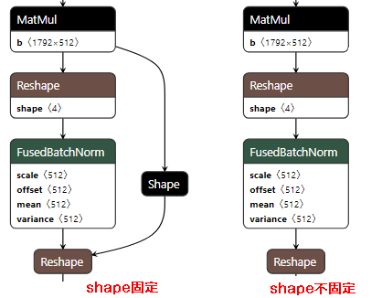

    -   BN支持融合的算子类型为FusedBatchNorm、FusedBatchNormV2和FusedBatchNormV3。

-   BN小算子融合为FusedBatchNormV3大算子：仅训练后量化支持，并且只有Conv+BN或者Conv+BiasAdd+BN结构才会触发BN小算子融合为大算子，若TensorFlow版本为1.15.0，则只支持BN小算子输入为4维的场景；若TensorFlow版本为2.6.3，则支持BN小算子输入为4维、5维的场景，并且5维场景下上述结构中的Conv算子必须为Conv3D。

    AMCT对[tf.keras.layers.BatchNormalization](https://www.tensorflow.org/api_docs/python/tf/keras/layers/BatchNormalization)产生的小算子结构的BN进行匹配，并且将匹配到的小算子BN结构替换为大算子的BN结构，具体支持的小算子BN结构的场景如下所示：

    -   [tf.keras.layers.BatchNormalization](https://www.tensorflow.org/api_docs/python/tf/keras/layers/BatchNormalization)接口满足：入参fused=False，调用参数inputs，training=False，融合前后网络结构图为：

        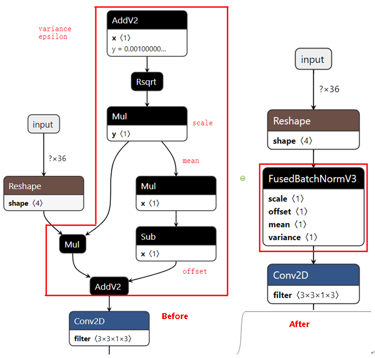

    -   [tf.keras.layers.BatchNormalization](https://www.tensorflow.org/api_docs/python/tf/keras/layers/BatchNormalization)接口满足：入参fused=False、center=False，调用参数inputs，training=False，融合前后网络结构图为：

        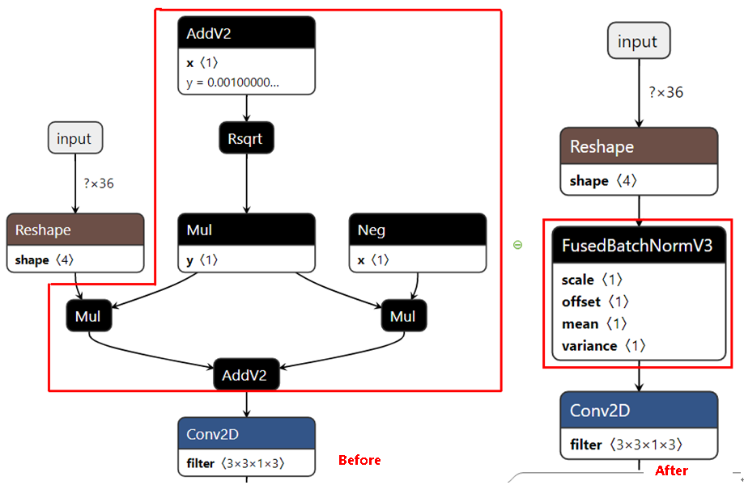

    -   [tf.keras.layers.BatchNormalization](https://www.tensorflow.org/api_docs/python/tf/keras/layers/BatchNormalization)接口满足：入参fused=False，scale=False，调用参数inputs，training=False，融合前后网络结构图为：

        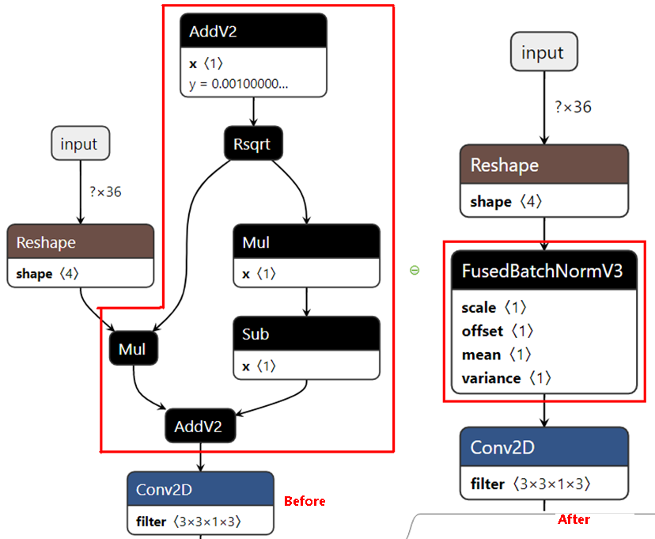

    -   [tf.keras.layers.BatchNormalization](https://www.tensorflow.org/api_docs/python/tf/keras/layers/BatchNormalization)接口满足：入参fused=False，scale=False，center=False，调用参数inputs，training=False，融合前后网络结构图为：

        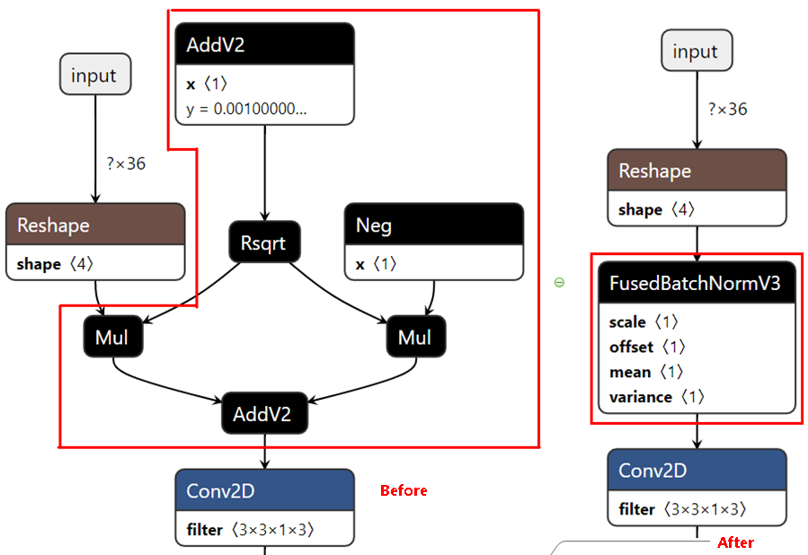

### 训练后量化简易配置文件<a name="ZH-CN_TOPIC_0000002473904552"></a>

calibration\_config\_tf.proto文件参数说明如[表1](#zh-cn_topic_0240188735_table1225503375617)所示，该文件所在目录为：_AMCT安装目录_/amct\_tensorflow/proto/calibration\_config\_tf.proto。

**表 1**  calibration\_config\_tf.proto参数说明

<a name="zh-cn_topic_0240188735_table1225503375617"></a>
<table><thead align="left"><tr id="zh-cn_topic_0240188735_row11255153315614"><th class="cellrowborder" valign="top" width="10.31896810318968%" id="mcps1.2.6.1.1"><p id="zh-cn_topic_0240188735_p6255193315616"><a name="zh-cn_topic_0240188735_p6255193315616"></a><a name="zh-cn_topic_0240188735_p6255193315616"></a>消息</p>
</th>
<th class="cellrowborder" valign="top" width="5.77942205779422%" id="mcps1.2.6.1.2"><p id="p194851125105014"><a name="p194851125105014"></a><a name="p194851125105014"></a>是否必填</p>
</th>
<th class="cellrowborder" valign="top" width="9.419058094190582%" id="mcps1.2.6.1.3"><p id="p466892519514"><a name="p466892519514"></a><a name="p466892519514"></a>类型</p>
</th>
<th class="cellrowborder" valign="top" width="14.48855114488551%" id="mcps1.2.6.1.4"><p id="zh-cn_topic_0240188735_p499481531910"><a name="zh-cn_topic_0240188735_p499481531910"></a><a name="zh-cn_topic_0240188735_p499481531910"></a>字段</p>
</th>
<th class="cellrowborder" valign="top" width="59.99400059994%" id="mcps1.2.6.1.5"><p id="zh-cn_topic_0240188735_p122551335563"><a name="zh-cn_topic_0240188735_p122551335563"></a><a name="zh-cn_topic_0240188735_p122551335563"></a>说明</p>
</th>
</tr>
</thead>
<tbody><tr id="zh-cn_topic_0240188735_row122551133185610"><td class="cellrowborder" rowspan="15" valign="top" width="10.31896810318968%" headers="mcps1.2.6.1.1 "><p id="zh-cn_topic_0240188735_p1925513338569"><a name="zh-cn_topic_0240188735_p1925513338569"></a><a name="zh-cn_topic_0240188735_p1925513338569"></a>AMCTConfig</p>
</td>
<td class="cellrowborder" valign="top" width="5.77942205779422%" headers="mcps1.2.6.1.2 "><p id="p1485162505012"><a name="p1485162505012"></a><a name="p1485162505012"></a>-</p>
</td>
<td class="cellrowborder" valign="top" width="9.419058094190582%" headers="mcps1.2.6.1.3 "><p id="p1617031410516"><a name="p1617031410516"></a><a name="p1617031410516"></a>-</p>
</td>
<td class="cellrowborder" valign="top" width="14.48855114488551%" headers="mcps1.2.6.1.4 "><p id="zh-cn_topic_0240188735_p2994161514196"><a name="zh-cn_topic_0240188735_p2994161514196"></a><a name="zh-cn_topic_0240188735_p2994161514196"></a>-</p>
</td>
<td class="cellrowborder" valign="top" width="59.99400059994%" headers="mcps1.2.6.1.5 "><p id="zh-cn_topic_0240188735_p82551633105614"><a name="zh-cn_topic_0240188735_p82551633105614"></a><a name="zh-cn_topic_0240188735_p82551633105614"></a><span id="ph2538725141110"><a name="ph2538725141110"></a><a name="ph2538725141110"></a>AMCT</span>训练后量化的简易配置。</p>
</td>
</tr>
<tr id="zh-cn_topic_0240188735_row9255123311566"><td class="cellrowborder" valign="top" headers="mcps1.2.6.1.1 "><p id="p11249539520"><a name="p11249539520"></a><a name="p11249539520"></a>optional</p>
</td>
<td class="cellrowborder" valign="top" headers="mcps1.2.6.1.2 "><p id="p19715115505"><a name="p19715115505"></a><a name="p19715115505"></a>uint32</p>
</td>
<td class="cellrowborder" valign="top" headers="mcps1.2.6.1.3 "><p id="zh-cn_topic_0240188735_p11994171511911"><a name="zh-cn_topic_0240188735_p11994171511911"></a><a name="zh-cn_topic_0240188735_p11994171511911"></a>batch_num</p>
</td>
<td class="cellrowborder" valign="top" headers="mcps1.2.6.1.4 "><p id="zh-cn_topic_0240188735_p32551133175612"><a name="zh-cn_topic_0240188735_p32551133175612"></a><a name="zh-cn_topic_0240188735_p32551133175612"></a>量化使用的batch数量。</p>
</td>
</tr>
<tr id="zh-cn_topic_0240188735_row11255533205611"><td class="cellrowborder" valign="top" headers="mcps1.2.6.1.1 "><p id="p142538635219"><a name="p142538635219"></a><a name="p142538635219"></a>optional</p>
</td>
<td class="cellrowborder" valign="top" headers="mcps1.2.6.1.2 "><p id="p13170131414515"><a name="p13170131414515"></a><a name="p13170131414515"></a>bool</p>
</td>
<td class="cellrowborder" valign="top" headers="mcps1.2.6.1.3 "><p id="zh-cn_topic_0240188735_p1225516334564"><a name="zh-cn_topic_0240188735_p1225516334564"></a><a name="zh-cn_topic_0240188735_p1225516334564"></a>activation_offset</p>
</td>
<td class="cellrowborder" valign="top" headers="mcps1.2.6.1.4 "><p id="p6987185216212"><a name="p6987185216212"></a><a name="p6987185216212"></a>数据量化是否带offset。全局配置参数。</p>
<a name="ul1970216412385"></a><a name="ul1970216412385"></a><ul id="ul1970216412385"><li>true：带offset，数据量化时为非对称量化。</li><li>false：不带offset，数据量化时为对称量化。</li></ul>
</td>
</tr>
<tr id="row18626218543"><td class="cellrowborder" valign="top" headers="mcps1.2.6.1.1 "><p id="p18630211544"><a name="p18630211544"></a><a name="p18630211544"></a>optional</p>
</td>
<td class="cellrowborder" valign="top" headers="mcps1.2.6.1.2 "><p id="p96352105416"><a name="p96352105416"></a><a name="p96352105416"></a>bool</p>
</td>
<td class="cellrowborder" valign="top" headers="mcps1.2.6.1.3 "><p id="p76362113547"><a name="p76362113547"></a><a name="p76362113547"></a>joint_quant</p>
</td>
<td class="cellrowborder" valign="top" headers="mcps1.2.6.1.4 "><p id="p498299105510"><a name="p498299105510"></a><a name="p498299105510"></a>是否进行Eltwise联合量化，默认为false，表示关闭联合量化功能。</p>
<p id="p84767519133"><a name="p84767519133"></a><a name="p84767519133"></a>开启后对部分网络可能会存在性能提升但是精度下降的问题。</p>
</td>
</tr>
<tr id="row116751031143112"><td class="cellrowborder" valign="top" headers="mcps1.2.6.1.1 "><p id="p62711337163112"><a name="p62711337163112"></a><a name="p62711337163112"></a>repeated</p>
</td>
<td class="cellrowborder" valign="top" headers="mcps1.2.6.1.2 "><p id="p16271153710317"><a name="p16271153710317"></a><a name="p16271153710317"></a>string</p>
</td>
<td class="cellrowborder" valign="top" headers="mcps1.2.6.1.3 "><p id="p1527173716314"><a name="p1527173716314"></a><a name="p1527173716314"></a>skip_layers</p>
</td>
<td class="cellrowborder" valign="top" headers="mcps1.2.6.1.4 "><p id="p6272113718317"><a name="p6272113718317"></a><a name="p6272113718317"></a>不需要量化层的层名。</p>
</td>
</tr>
<tr id="row344417284313"><td class="cellrowborder" valign="top" headers="mcps1.2.6.1.1 "><p id="p1272173743111"><a name="p1272173743111"></a><a name="p1272173743111"></a>repeated</p>
</td>
<td class="cellrowborder" valign="top" headers="mcps1.2.6.1.2 "><p id="p17272193713114"><a name="p17272193713114"></a><a name="p17272193713114"></a>string</p>
</td>
<td class="cellrowborder" valign="top" headers="mcps1.2.6.1.3 "><p id="p2272123719311"><a name="p2272123719311"></a><a name="p2272123719311"></a>skip_layer_types</p>
</td>
<td class="cellrowborder" valign="top" headers="mcps1.2.6.1.4 "><p id="p627293783116"><a name="p627293783116"></a><a name="p627293783116"></a>不需要量化的层类型。</p>
</td>
</tr>
<tr id="row915511321118"><td class="cellrowborder" valign="top" headers="mcps1.2.6.1.1 "><p id="p7561154811110"><a name="p7561154811110"></a><a name="p7561154811110"></a>repeated</p>
</td>
<td class="cellrowborder" valign="top" headers="mcps1.2.6.1.2 "><p id="p156184820114"><a name="p156184820114"></a><a name="p156184820114"></a>string</p>
</td>
<td class="cellrowborder" valign="top" headers="mcps1.2.6.1.3 "><p id="p915623221114"><a name="p915623221114"></a><a name="p915623221114"></a>skip_approximation_layers</p>
</td>
<td class="cellrowborder" valign="top" headers="mcps1.2.6.1.4 "><p id="p68175293016"><a name="p68175293016"></a><a name="p68175293016"></a>不需要近似校准的层名。</p>
<p id="p815610322112"><a name="p815610322112"></a><a name="p815610322112"></a><strong id="b93491713173318"><a name="b93491713173318"></a><a name="b93491713173318"></a>该版本不支持近似校准特性。</strong></p>
</td>
</tr>
<tr id="row054022661412"><td class="cellrowborder" valign="top" headers="mcps1.2.6.1.1 "><p id="p11540926131416"><a name="p11540926131416"></a><a name="p11540926131416"></a>optional</p>
</td>
<td class="cellrowborder" valign="top" headers="mcps1.2.6.1.2 "><p id="p0540926171413"><a name="p0540926171413"></a><a name="p0540926171413"></a>FakequantPrecisionMode</p>
</td>
<td class="cellrowborder" valign="top" headers="mcps1.2.6.1.3 "><p id="p1054042691418"><a name="p1054042691418"></a><a name="p1054042691418"></a>fakequant_precision_mode</p>
</td>
<td class="cellrowborder" valign="top" headers="mcps1.2.6.1.4 "><p id="p1254210571348"><a name="p1254210571348"></a><a name="p1254210571348"></a>fakequant模型中quant自定义算子的scale_d数值精度模式。</p>
<a name="ul3401310203217"></a><a name="ul3401310203217"></a><ul id="ul3401310203217"><li>FORCE_FP16_QUANT：scale_d参数的数值转换为float16精度，数值类型是float32。</li><li>空，即不配置，默认为空。scale_d参数的数值保持float32精度。</li></ul>
</td>
</tr>
<tr id="row14499162916302"><td class="cellrowborder" valign="top" headers="mcps1.2.6.1.1 "><p id="p25001294300"><a name="p25001294300"></a><a name="p25001294300"></a>optional</p>
</td>
<td class="cellrowborder" valign="top" headers="mcps1.2.6.1.2 "><p id="p450042993016"><a name="p450042993016"></a><a name="p450042993016"></a>NuqConfig</p>
</td>
<td class="cellrowborder" valign="top" headers="mcps1.2.6.1.3 "><p id="p1500112911307"><a name="p1500112911307"></a><a name="p1500112911307"></a>nuq_config</p>
</td>
<td class="cellrowborder" valign="top" headers="mcps1.2.6.1.4 "><p id="p9500152953018"><a name="p9500152953018"></a><a name="p9500152953018"></a>非均匀量化配置。</p>
</td>
</tr>
<tr id="row1422161319377"><td class="cellrowborder" valign="top" headers="mcps1.2.6.1.1 "><p id="p6422191320375"><a name="p6422191320375"></a><a name="p6422191320375"></a>optional</p>
</td>
<td class="cellrowborder" valign="top" headers="mcps1.2.6.1.2 "><p id="p134239134371"><a name="p134239134371"></a><a name="p134239134371"></a>CalibrationConfig</p>
</td>
<td class="cellrowborder" valign="top" headers="mcps1.2.6.1.3 "><p id="p74231313103710"><a name="p74231313103710"></a><a name="p74231313103710"></a>common_config</p>
</td>
<td class="cellrowborder" valign="top" headers="mcps1.2.6.1.4 "><p id="p2797259134011"><a name="p2797259134011"></a><a name="p2797259134011"></a>通用的量化配置，全局量化配置参数。若某层未被override_layer_types或者override_layer_configs重写，则使用该配置。</p>
<p id="p31455545543"><a name="p31455545543"></a><a name="p31455545543"></a>参数优先级：override_layer_configs&gt;override_layer_types&gt;common_config</p>
</td>
</tr>
<tr id="row198411100379"><td class="cellrowborder" valign="top" headers="mcps1.2.6.1.1 "><p id="p10841410123712"><a name="p10841410123712"></a><a name="p10841410123712"></a>repeated</p>
</td>
<td class="cellrowborder" valign="top" headers="mcps1.2.6.1.2 "><p id="p1841151033713"><a name="p1841151033713"></a><a name="p1841151033713"></a>OverrideLayerType</p>
</td>
<td class="cellrowborder" valign="top" headers="mcps1.2.6.1.3 "><p id="p6841191033712"><a name="p6841191033712"></a><a name="p6841191033712"></a>override_layer_types</p>
</td>
<td class="cellrowborder" valign="top" headers="mcps1.2.6.1.4 "><p id="p979765994018"><a name="p979765994018"></a><a name="p979765994018"></a>重写某一类型层的量化配置，即对哪些层进行差异化量化。</p>
<p id="p2853153415116"><a name="p2853153415116"></a><a name="p2853153415116"></a>例如全局量化配置参数配置的量化因子搜索步长为0.01，可以通过该参数对部分层进行差异化量化，可以配置搜索步长为0.02。</p>
<p id="p61370245613"><a name="p61370245613"></a><a name="p61370245613"></a>参数优先级：override_layer_configs&gt;override_layer_types&gt;common_config</p>
</td>
</tr>
<tr id="row73596813715"><td class="cellrowborder" valign="top" headers="mcps1.2.6.1.1 "><p id="p163597863717"><a name="p163597863717"></a><a name="p163597863717"></a>repeated</p>
</td>
<td class="cellrowborder" valign="top" headers="mcps1.2.6.1.2 "><p id="p1535910814376"><a name="p1535910814376"></a><a name="p1535910814376"></a>OverrideLayer</p>
</td>
<td class="cellrowborder" valign="top" headers="mcps1.2.6.1.3 "><p id="p83598815375"><a name="p83598815375"></a><a name="p83598815375"></a>override_layer_configs</p>
</td>
<td class="cellrowborder" valign="top" headers="mcps1.2.6.1.4 "><p id="p15798105944016"><a name="p15798105944016"></a><a name="p15798105944016"></a>重写某一层的量化配置，即对哪些层进行差异化量化。</p>
<p id="p4394114710214"><a name="p4394114710214"></a><a name="p4394114710214"></a>例如全局量化配置参数配置的量化因子搜索步长为0.01，可以通过该参数对部分层进行差异化量化，可以配置搜索步长为0.02。</p>
<p id="p194543485613"><a name="p194543485613"></a><a name="p194543485613"></a>参数优先级：override_layer_configs&gt;override_layer_types&gt;common_config</p>
</td>
</tr>
<tr id="row145071332133914"><td class="cellrowborder" valign="top" headers="mcps1.2.6.1.1 "><p id="p350814326395"><a name="p350814326395"></a><a name="p350814326395"></a>optional</p>
</td>
<td class="cellrowborder" valign="top" headers="mcps1.2.6.1.2 "><p id="p1650819327397"><a name="p1650819327397"></a><a name="p1650819327397"></a>bool</p>
</td>
<td class="cellrowborder" valign="top" headers="mcps1.2.6.1.3 "><p id="p9508193293911"><a name="p9508193293911"></a><a name="p9508193293911"></a>do_fusion</p>
</td>
<td class="cellrowborder" valign="top" headers="mcps1.2.6.1.4 "><p id="p07981859114018"><a name="p07981859114018"></a><a name="p07981859114018"></a>是否开启BN融合功能，默认为true，表示开启该功能。</p>
</td>
</tr>
<tr id="row12466115143717"><td class="cellrowborder" valign="top" headers="mcps1.2.6.1.1 "><p id="p84661857373"><a name="p84661857373"></a><a name="p84661857373"></a>repeated</p>
</td>
<td class="cellrowborder" valign="top" headers="mcps1.2.6.1.2 "><p id="p946614503717"><a name="p946614503717"></a><a name="p946614503717"></a>string</p>
</td>
<td class="cellrowborder" valign="top" headers="mcps1.2.6.1.3 "><p id="p1746645143715"><a name="p1746645143715"></a><a name="p1746645143715"></a>skip_fusion_layers</p>
</td>
<td class="cellrowborder" valign="top" headers="mcps1.2.6.1.4 "><p id="p1679819590407"><a name="p1679819590407"></a><a name="p1679819590407"></a>跳过BN融合的层，配置之后这些层不会进行BN融合。</p>
</td>
</tr>
<tr id="row1595420128552"><td class="cellrowborder" valign="top" headers="mcps1.2.6.1.1 "><p id="p20955181215517"><a name="p20955181215517"></a><a name="p20955181215517"></a>repeated</p>
</td>
<td class="cellrowborder" valign="top" headers="mcps1.2.6.1.2 "><p id="p795511275517"><a name="p795511275517"></a><a name="p795511275517"></a>TensorQuantize</p>
</td>
<td class="cellrowborder" valign="top" headers="mcps1.2.6.1.3 "><p id="p09551112205517"><a name="p09551112205517"></a><a name="p09551112205517"></a>tensor_quantize</p>
</td>
<td class="cellrowborder" valign="top" headers="mcps1.2.6.1.4 "><p id="p12955191217559"><a name="p12955191217559"></a><a name="p12955191217559"></a>对网络模型中指定节点的输入Tensor进行训练后量化，来提高数据搬运时的推理性能。</p>
<p id="p33511926131419"><a name="p33511926131419"></a><a name="p33511926131419"></a><strong id="b9742342105819"><a name="b9742342105819"></a><a name="b9742342105819"></a>当前仅支持对MaxPool/Add算子做tensor量化。</strong></p>
</td>
</tr>
<tr id="row3653144091411"><td class="cellrowborder" rowspan="3" valign="top" width="10.31896810318968%" headers="mcps1.2.6.1.1 "><p id="p1065454021412"><a name="p1065454021412"></a><a name="p1065454021412"></a>NuqConfig</p>
</td>
<td class="cellrowborder" valign="top" width="5.77942205779422%" headers="mcps1.2.6.1.2 "><p id="p748614251508"><a name="p748614251508"></a><a name="p748614251508"></a>-</p>
</td>
<td class="cellrowborder" valign="top" width="9.419058094190582%" headers="mcps1.2.6.1.3 "><p id="p14183191495118"><a name="p14183191495118"></a><a name="p14183191495118"></a>-</p>
</td>
<td class="cellrowborder" valign="top" width="14.48855114488551%" headers="mcps1.2.6.1.4 "><p id="zh-cn_topic_0240188735_p1034361412616"><a name="zh-cn_topic_0240188735_p1034361412616"></a><a name="zh-cn_topic_0240188735_p1034361412616"></a>-</p>
</td>
<td class="cellrowborder" valign="top" width="59.99400059994%" headers="mcps1.2.6.1.5 "><p id="zh-cn_topic_0240188735_p1634314149616"><a name="zh-cn_topic_0240188735_p1634314149616"></a><a name="zh-cn_topic_0240188735_p1634314149616"></a>非均匀量化配置。</p>
</td>
</tr>
<tr id="row17202744101418"><td class="cellrowborder" valign="top" headers="mcps1.2.6.1.1 "><p id="p14486525115017"><a name="p14486525115017"></a><a name="p14486525115017"></a>required</p>
</td>
<td class="cellrowborder" valign="top" headers="mcps1.2.6.1.2 "><p id="p01831314135113"><a name="p01831314135113"></a><a name="p01831314135113"></a>string</p>
</td>
<td class="cellrowborder" valign="top" headers="mcps1.2.6.1.3 "><p id="zh-cn_topic_0240188735_p334341411614"><a name="zh-cn_topic_0240188735_p334341411614"></a><a name="zh-cn_topic_0240188735_p334341411614"></a>mapping_file</p>
</td>
<td class="cellrowborder" valign="top" headers="mcps1.2.6.1.4 "><p id="zh-cn_topic_0240188735_p9343151418610"><a name="zh-cn_topic_0240188735_p9343151418610"></a><a name="zh-cn_topic_0240188735_p9343151418610"></a>均匀量化后的deploy模型通过ATC工具转换得到的OM模型，通过ATC工具转换得到的JSON文件，即量化后模型的融合JSON文件。</p>
</td>
</tr>
<tr id="row1498035111419"><td class="cellrowborder" valign="top" headers="mcps1.2.6.1.1 "><p id="p19348132920354"><a name="p19348132920354"></a><a name="p19348132920354"></a>optional</p>
</td>
<td class="cellrowborder" valign="top" headers="mcps1.2.6.1.2 "><p id="p318341425114"><a name="p318341425114"></a><a name="p318341425114"></a>NUQuantize</p>
</td>
<td class="cellrowborder" valign="top" headers="mcps1.2.6.1.3 "><p id="zh-cn_topic_0240188735_p133438142614"><a name="zh-cn_topic_0240188735_p133438142614"></a><a name="zh-cn_topic_0240188735_p133438142614"></a>nuq_quantize</p>
</td>
<td class="cellrowborder" valign="top" headers="mcps1.2.6.1.4 "><p id="zh-cn_topic_0240188735_p173431314464"><a name="zh-cn_topic_0240188735_p173431314464"></a><a name="zh-cn_topic_0240188735_p173431314464"></a>非均匀量化的参数。</p>
</td>
</tr>
<tr id="row217331810374"><td class="cellrowborder" rowspan="3" valign="top" width="10.31896810318968%" headers="mcps1.2.6.1.1 "><p id="p47611242191418"><a name="p47611242191418"></a><a name="p47611242191418"></a>OverrideLayerType</p>
</td>
<td class="cellrowborder" valign="top" width="5.77942205779422%" headers="mcps1.2.6.1.2 "><p id="p674923163711"><a name="p674923163711"></a><a name="p674923163711"></a>-</p>
</td>
<td class="cellrowborder" valign="top" width="9.419058094190582%" headers="mcps1.2.6.1.3 "><p id="p1474943115377"><a name="p1474943115377"></a><a name="p1474943115377"></a>-</p>
</td>
<td class="cellrowborder" valign="top" width="14.48855114488551%" headers="mcps1.2.6.1.4 "><p id="p12750163118370"><a name="p12750163118370"></a><a name="p12750163118370"></a>-</p>
</td>
<td class="cellrowborder" valign="top" width="59.99400059994%" headers="mcps1.2.6.1.5 "><p id="p6909137153812"><a name="p6909137153812"></a><a name="p6909137153812"></a>重置某层类型的量化配置。</p>
</td>
</tr>
<tr id="row17134635121413"><td class="cellrowborder" valign="top" headers="mcps1.2.6.1.1 "><p id="p1476234213141"><a name="p1476234213141"></a><a name="p1476234213141"></a>required</p>
</td>
<td class="cellrowborder" valign="top" headers="mcps1.2.6.1.2 "><p id="p37627428149"><a name="p37627428149"></a><a name="p37627428149"></a>string</p>
</td>
<td class="cellrowborder" valign="top" headers="mcps1.2.6.1.3 "><p id="p6762342121414"><a name="p6762342121414"></a><a name="p6762342121414"></a>layer_type</p>
</td>
<td class="cellrowborder" valign="top" headers="mcps1.2.6.1.4 "><p id="p07621142171414"><a name="p07621142171414"></a><a name="p07621142171414"></a>支持量化的层类型的名字。</p>
</td>
</tr>
<tr id="row1029523261414"><td class="cellrowborder" valign="top" headers="mcps1.2.6.1.1 "><p id="p776213421145"><a name="p776213421145"></a><a name="p776213421145"></a>required</p>
</td>
<td class="cellrowborder" valign="top" headers="mcps1.2.6.1.2 "><p id="p0762174210140"><a name="p0762174210140"></a><a name="p0762174210140"></a>CalibrationConfig</p>
</td>
<td class="cellrowborder" valign="top" headers="mcps1.2.6.1.3 "><p id="p876212426146"><a name="p876212426146"></a><a name="p876212426146"></a>calibration_config</p>
</td>
<td class="cellrowborder" valign="top" headers="mcps1.2.6.1.4 "><p id="p19762942161410"><a name="p19762942161410"></a><a name="p19762942161410"></a>重置的量化配置。</p>
</td>
</tr>
<tr id="zh-cn_topic_0240188735_row11783104092012"><td class="cellrowborder" rowspan="3" valign="top" width="10.31896810318968%" headers="mcps1.2.6.1.1 "><p id="zh-cn_topic_0240188735_p16795192442119"><a name="zh-cn_topic_0240188735_p16795192442119"></a><a name="zh-cn_topic_0240188735_p16795192442119"></a>OverrideLayer</p>
</td>
<td class="cellrowborder" valign="top" width="5.77942205779422%" headers="mcps1.2.6.1.2 "><p id="p9485142585010"><a name="p9485142585010"></a><a name="p9485142585010"></a>-</p>
</td>
<td class="cellrowborder" valign="top" width="9.419058094190582%" headers="mcps1.2.6.1.3 "><p id="p15182214175118"><a name="p15182214175118"></a><a name="p15182214175118"></a>-</p>
</td>
<td class="cellrowborder" valign="top" width="14.48855114488551%" headers="mcps1.2.6.1.4 "><p id="zh-cn_topic_0240188735_p37831240102014"><a name="zh-cn_topic_0240188735_p37831240102014"></a><a name="zh-cn_topic_0240188735_p37831240102014"></a>-</p>
</td>
<td class="cellrowborder" valign="top" width="59.99400059994%" headers="mcps1.2.6.1.5 "><p id="zh-cn_topic_0240188735_p278314406207"><a name="zh-cn_topic_0240188735_p278314406207"></a><a name="zh-cn_topic_0240188735_p278314406207"></a>重置某层量化配置。</p>
</td>
</tr>
<tr id="zh-cn_topic_0240188735_row10956202614283"><td class="cellrowborder" valign="top" headers="mcps1.2.6.1.1 "><p id="p19444416194419"><a name="p19444416194419"></a><a name="p19444416194419"></a>required</p>
</td>
<td class="cellrowborder" valign="top" headers="mcps1.2.6.1.2 "><p id="p1244491612447"><a name="p1244491612447"></a><a name="p1244491612447"></a>string</p>
</td>
<td class="cellrowborder" valign="top" headers="mcps1.2.6.1.3 "><p id="zh-cn_topic_0240188735_p6956152632810"><a name="zh-cn_topic_0240188735_p6956152632810"></a><a name="zh-cn_topic_0240188735_p6956152632810"></a>layer_name</p>
</td>
<td class="cellrowborder" valign="top" headers="mcps1.2.6.1.4 "><p id="zh-cn_topic_0240188735_p1195652613284"><a name="zh-cn_topic_0240188735_p1195652613284"></a><a name="zh-cn_topic_0240188735_p1195652613284"></a>被重置层的层名。</p>
</td>
</tr>
<tr id="zh-cn_topic_0240188735_row1438216329281"><td class="cellrowborder" valign="top" headers="mcps1.2.6.1.1 "><p id="p576421834412"><a name="p576421834412"></a><a name="p576421834412"></a>required</p>
</td>
<td class="cellrowborder" valign="top" headers="mcps1.2.6.1.2 "><p id="p1933192654411"><a name="p1933192654411"></a><a name="p1933192654411"></a>CalibrationConfig</p>
</td>
<td class="cellrowborder" valign="top" headers="mcps1.2.6.1.3 "><p id="zh-cn_topic_0240188735_p163821323286"><a name="zh-cn_topic_0240188735_p163821323286"></a><a name="zh-cn_topic_0240188735_p163821323286"></a>calibration_config</p>
</td>
<td class="cellrowborder" valign="top" headers="mcps1.2.6.1.4 "><p id="zh-cn_topic_0240188735_p382913237299"><a name="zh-cn_topic_0240188735_p382913237299"></a><a name="zh-cn_topic_0240188735_p382913237299"></a>重置的量化配置。</p>
</td>
</tr>
<tr id="row079614217588"><td class="cellrowborder" rowspan="5" valign="top" width="10.31896810318968%" headers="mcps1.2.6.1.1 "><p id="p1279624216583"><a name="p1279624216583"></a><a name="p1279624216583"></a>TensorQuantize</p>
</td>
<td class="cellrowborder" valign="top" width="5.77942205779422%" headers="mcps1.2.6.1.2 "><p id="p12796642185810"><a name="p12796642185810"></a><a name="p12796642185810"></a>-</p>
</td>
<td class="cellrowborder" valign="top" width="9.419058094190582%" headers="mcps1.2.6.1.3 "><p id="p14796124217585"><a name="p14796124217585"></a><a name="p14796124217585"></a>-</p>
</td>
<td class="cellrowborder" valign="top" width="14.48855114488551%" headers="mcps1.2.6.1.4 "><p id="p64961158145812"><a name="p64961158145812"></a><a name="p64961158145812"></a>-</p>
</td>
<td class="cellrowborder" valign="top" width="59.99400059994%" headers="mcps1.2.6.1.5 "><p id="p1279614422581"><a name="p1279614422581"></a><a name="p1279614422581"></a>需要进行训练后量化的输入Tensor配置。</p>
</td>
</tr>
<tr id="row279434019581"><td class="cellrowborder" valign="top" headers="mcps1.2.6.1.1 "><p id="p57941240175819"><a name="p57941240175819"></a><a name="p57941240175819"></a>required</p>
</td>
<td class="cellrowborder" valign="top" headers="mcps1.2.6.1.2 "><p id="p079424014581"><a name="p079424014581"></a><a name="p079424014581"></a>string</p>
</td>
<td class="cellrowborder" valign="top" headers="mcps1.2.6.1.3 "><p id="p27941840195814"><a name="p27941840195814"></a><a name="p27941840195814"></a>layer_name</p>
</td>
<td class="cellrowborder" valign="top" headers="mcps1.2.6.1.4 "><p id="p2079474015589"><a name="p2079474015589"></a><a name="p2079474015589"></a>需要对节点输入Tensor进行训练后量化的节点名称，当前仅支持对MaxPool/Add算子的输入Tensor进行量化。</p>
</td>
</tr>
<tr id="row194161738145810"><td class="cellrowborder" valign="top" headers="mcps1.2.6.1.1 "><p id="p64161238155818"><a name="p64161238155818"></a><a name="p64161238155818"></a>required</p>
</td>
<td class="cellrowborder" valign="top" headers="mcps1.2.6.1.2 "><p id="p2041653895819"><a name="p2041653895819"></a><a name="p2041653895819"></a>uint32</p>
</td>
<td class="cellrowborder" valign="top" headers="mcps1.2.6.1.3 "><p id="p14416238105814"><a name="p14416238105814"></a><a name="p14416238105814"></a>input_index</p>
</td>
<td class="cellrowborder" valign="top" headers="mcps1.2.6.1.4 "><p id="p14171138185812"><a name="p14171138185812"></a><a name="p14171138185812"></a>需要对节点输入Tensor进行训练后量化的节点的输入索引。</p>
</td>
</tr>
<tr id="row243618745914"><td class="cellrowborder" valign="top" headers="mcps1.2.6.1.1 "><p id="p94361174592"><a name="p94361174592"></a><a name="p94361174592"></a>-</p>
</td>
<td class="cellrowborder" valign="top" headers="mcps1.2.6.1.2 "><p id="p1343615710596"><a name="p1343615710596"></a><a name="p1343615710596"></a>FMRQuantize</p>
</td>
<td class="cellrowborder" valign="top" headers="mcps1.2.6.1.3 "><p id="p134361175599"><a name="p134361175599"></a><a name="p134361175599"></a>ifmr_quantize</p>
</td>
<td class="cellrowborder" valign="top" headers="mcps1.2.6.1.4 "><p id="p1578714261917"><a name="p1578714261917"></a><a name="p1578714261917"></a>数据量化算法配置。</p>
<p id="p77582741815"><a name="p77582741815"></a><a name="p77582741815"></a>ifmr_quantize：IFMR量化算法配置。默认为IFMR量化算法。</p>
</td>
</tr>
<tr id="row289683655917"><td class="cellrowborder" valign="top" headers="mcps1.2.6.1.1 "><p id="p989633645918"><a name="p989633645918"></a><a name="p989633645918"></a>-</p>
</td>
<td class="cellrowborder" valign="top" headers="mcps1.2.6.1.2 "><p id="p14896173605911"><a name="p14896173605911"></a><a name="p14896173605911"></a>HFMGQuantize</p>
</td>
<td class="cellrowborder" valign="top" headers="mcps1.2.6.1.3 "><p id="p1896143615915"><a name="p1896143615915"></a><a name="p1896143615915"></a>hfmg_quantize</p>
</td>
<td class="cellrowborder" valign="top" headers="mcps1.2.6.1.4 "><p id="p147879266118"><a name="p147879266118"></a><a name="p147879266118"></a>数据量化算法配置。</p>
<p id="p1787182611115"><a name="p1787182611115"></a><a name="p1787182611115"></a>hfmg_quantize：HFMG量化算法配置。</p>
</td>
</tr>
<tr id="zh-cn_topic_0240188735_row166322283234"><td class="cellrowborder" rowspan="6" valign="top" width="10.31896810318968%" headers="mcps1.2.6.1.1 "><p id="zh-cn_topic_0240188735_p9633152814236"><a name="zh-cn_topic_0240188735_p9633152814236"></a><a name="zh-cn_topic_0240188735_p9633152814236"></a>CalibrationConfig</p>
<p id="p594982923516"><a name="p594982923516"></a><a name="p594982923516"></a></p>
</td>
<td class="cellrowborder" valign="top" width="5.77942205779422%" headers="mcps1.2.6.1.2 "><p id="p134858254503"><a name="p134858254503"></a><a name="p134858254503"></a>-</p>
</td>
<td class="cellrowborder" valign="top" width="9.419058094190582%" headers="mcps1.2.6.1.3 "><p id="p1818261455119"><a name="p1818261455119"></a><a name="p1818261455119"></a>-</p>
</td>
<td class="cellrowborder" valign="top" width="14.48855114488551%" headers="mcps1.2.6.1.4 "><p id="zh-cn_topic_0240188735_p1363332811232"><a name="zh-cn_topic_0240188735_p1363332811232"></a><a name="zh-cn_topic_0240188735_p1363332811232"></a>-</p>
</td>
<td class="cellrowborder" valign="top" width="59.99400059994%" headers="mcps1.2.6.1.5 "><p id="zh-cn_topic_0240188735_p363392862320"><a name="zh-cn_topic_0240188735_p363392862320"></a><a name="zh-cn_topic_0240188735_p363392862320"></a>Calibration量化的配置。</p>
</td>
</tr>
<tr id="zh-cn_topic_0240188735_row116226814307"><td class="cellrowborder" valign="top" headers="mcps1.2.6.1.1 "><p id="p1748519253502"><a name="p1748519253502"></a><a name="p1748519253502"></a>-</p>
</td>
<td class="cellrowborder" valign="top" headers="mcps1.2.6.1.2 "><p id="p14182171417513"><a name="p14182171417513"></a><a name="p14182171417513"></a>ARQuantize</p>
</td>
<td class="cellrowborder" valign="top" headers="mcps1.2.6.1.3 "><p id="p3275172510116"><a name="p3275172510116"></a><a name="p3275172510116"></a>arq_quantize</p>
</td>
<td class="cellrowborder" valign="top" headers="mcps1.2.6.1.4 "><p id="zh-cn_topic_0240188735_p1962317813010"><a name="zh-cn_topic_0240188735_p1962317813010"></a><a name="zh-cn_topic_0240188735_p1962317813010"></a>权重量化算法配置。</p>
<p id="p245615017124"><a name="p245615017124"></a><a name="p245615017124"></a>arq_quantize：ARQ量化算法配置。</p>
</td>
</tr>
<tr id="row20599154914312"><td class="cellrowborder" valign="top" headers="mcps1.2.6.1.1 "><p id="p11600134920315"><a name="p11600134920315"></a><a name="p11600134920315"></a>-</p>
</td>
<td class="cellrowborder" valign="top" headers="mcps1.2.6.1.2 "><p id="p360110492312"><a name="p360110492312"></a><a name="p360110492312"></a>NUQuantize</p>
</td>
<td class="cellrowborder" valign="top" headers="mcps1.2.6.1.3 "><p id="p14601249203112"><a name="p14601249203112"></a><a name="p14601249203112"></a>nuq_quantize</p>
</td>
<td class="cellrowborder" valign="top" headers="mcps1.2.6.1.4 "><p id="p5288159131219"><a name="p5288159131219"></a><a name="p5288159131219"></a>权重量化算法配置。</p>
<p id="p13302148151119"><a name="p13302148151119"></a><a name="p13302148151119"></a>nuq_quantize：非均匀量化算法配置。</p>
</td>
</tr>
<tr id="zh-cn_topic_0240188735_row9881174683115"><td class="cellrowborder" valign="top" headers="mcps1.2.6.1.1 "><p id="p1548512525015"><a name="p1548512525015"></a><a name="p1548512525015"></a>-</p>
</td>
<td class="cellrowborder" valign="top" headers="mcps1.2.6.1.2 "><p id="p1183191465111"><a name="p1183191465111"></a><a name="p1183191465111"></a>FMRQuantize</p>
</td>
<td class="cellrowborder" valign="top" headers="mcps1.2.6.1.3 "><p id="p425415411015"><a name="p425415411015"></a><a name="p425415411015"></a>ifmr_quantize</p>
</td>
<td class="cellrowborder" valign="top" headers="mcps1.2.6.1.4 "><p id="zh-cn_topic_0240188735_p1788134616316"><a name="zh-cn_topic_0240188735_p1788134616316"></a><a name="zh-cn_topic_0240188735_p1788134616316"></a>数据量化算法配置。</p>
<p id="zh-cn_topic_0240188735_p186119548317"><a name="zh-cn_topic_0240188735_p186119548317"></a><a name="zh-cn_topic_0240188735_p186119548317"></a>ifmr_quantize：IFMR量化算法配置。</p>
</td>
</tr>
<tr id="row18335914184813"><td class="cellrowborder" valign="top" headers="mcps1.2.6.1.1 "><p id="p123369144483"><a name="p123369144483"></a><a name="p123369144483"></a>-</p>
</td>
<td class="cellrowborder" valign="top" headers="mcps1.2.6.1.2 "><p id="p1233691404813"><a name="p1233691404813"></a><a name="p1233691404813"></a>HFMGQuantize</p>
</td>
<td class="cellrowborder" valign="top" headers="mcps1.2.6.1.3 "><p id="p1833601494810"><a name="p1833601494810"></a><a name="p1833601494810"></a>hfmg_quantize</p>
</td>
<td class="cellrowborder" valign="top" headers="mcps1.2.6.1.4 "><p id="p13337191454814"><a name="p13337191454814"></a><a name="p13337191454814"></a>数据量化算法配置。</p>
<p id="p8424174634818"><a name="p8424174634818"></a><a name="p8424174634818"></a>hfmg_quantize：HFMG量化算法配置。</p>
</td>
</tr>
<tr id="row1994972983515"><td class="cellrowborder" valign="top" headers="mcps1.2.6.1.1 "><p id="p394912297356"><a name="p394912297356"></a><a name="p394912297356"></a>-</p>
</td>
<td class="cellrowborder" valign="top" headers="mcps1.2.6.1.2 "><p id="p2949122911358"><a name="p2949122911358"></a><a name="p2949122911358"></a>DMQBalancer</p>
</td>
<td class="cellrowborder" valign="top" headers="mcps1.2.6.1.3 "><p id="p0949192919355"><a name="p0949192919355"></a><a name="p0949192919355"></a>dmq_balancer</p>
</td>
<td class="cellrowborder" valign="top" headers="mcps1.2.6.1.4 "><p id="p59491529153515"><a name="p59491529153515"></a><a name="p59491529153515"></a>均衡算法配置。</p>
<p id="p718615292360"><a name="p718615292360"></a><a name="p718615292360"></a>dmq_balancer：DMQBalancer均衡算法配置。</p>
</td>
</tr>
<tr id="zh-cn_topic_0240188735_row13931454162310"><td class="cellrowborder" rowspan="3" valign="top" width="10.31896810318968%" headers="mcps1.2.6.1.1 "><p id="zh-cn_topic_0240188735_p133932548230"><a name="zh-cn_topic_0240188735_p133932548230"></a><a name="zh-cn_topic_0240188735_p133932548230"></a>ARQuantize</p>
</td>
<td class="cellrowborder" valign="top" width="5.77942205779422%" headers="mcps1.2.6.1.2 "><p id="p2485725185011"><a name="p2485725185011"></a><a name="p2485725185011"></a>-</p>
</td>
<td class="cellrowborder" valign="top" width="9.419058094190582%" headers="mcps1.2.6.1.3 "><p id="p91831214185113"><a name="p91831214185113"></a><a name="p91831214185113"></a>-</p>
</td>
<td class="cellrowborder" valign="top" width="14.48855114488551%" headers="mcps1.2.6.1.4 "><p id="zh-cn_topic_0240188735_p16393454142316"><a name="zh-cn_topic_0240188735_p16393454142316"></a><a name="zh-cn_topic_0240188735_p16393454142316"></a>-</p>
</td>
<td class="cellrowborder" valign="top" width="59.99400059994%" headers="mcps1.2.6.1.5 "><p id="zh-cn_topic_0240188735_p7393554192316"><a name="zh-cn_topic_0240188735_p7393554192316"></a><a name="zh-cn_topic_0240188735_p7393554192316"></a>ARQ权重量化算法配置。算法介绍请参见<a href="ARQ权重量化算法.md">ARQ权重量化算法</a>。</p>
<p id="p1067835814383"><a name="p1067835814383"></a><a name="p1067835814383"></a>该算法与NUQuantize算法不能同时配置，若同时配置，则以配置文件中最后配置的量化算法为准。</p>
</td>
</tr>
<tr id="zh-cn_topic_0240188735_row73046209318"><td class="cellrowborder" valign="top" headers="mcps1.2.6.1.1 "><p id="p169601842123113"><a name="p169601842123113"></a><a name="p169601842123113"></a>optional</p>
</td>
<td class="cellrowborder" valign="top" headers="mcps1.2.6.1.2 "><p id="p0183111410516"><a name="p0183111410516"></a><a name="p0183111410516"></a>bool</p>
</td>
<td class="cellrowborder" valign="top" headers="mcps1.2.6.1.3 "><p id="zh-cn_topic_0240188735_p143040207319"><a name="zh-cn_topic_0240188735_p143040207319"></a><a name="zh-cn_topic_0240188735_p143040207319"></a>channel_wise</p>
</td>
<td class="cellrowborder" valign="top" headers="mcps1.2.6.1.4 "><p id="zh-cn_topic_0240188735_p3304220153114"><a name="zh-cn_topic_0240188735_p3304220153114"></a><a name="zh-cn_topic_0240188735_p3304220153114"></a>是否对每个channel采用不同的量化因子。</p>
<a name="zh-cn_topic_0240188002_ul1212114910429"></a><a name="zh-cn_topic_0240188002_ul1212114910429"></a><ul id="zh-cn_topic_0240188002_ul1212114910429"><li>true：每个channel独立量化，量化因子不同。</li><li>false：所有channel同时量化，共享量化因子。</li></ul>
</td>
</tr>
<tr id="row157509134155"><td class="cellrowborder" valign="top" headers="mcps1.2.6.1.1 "><p id="p157501313181511"><a name="p157501313181511"></a><a name="p157501313181511"></a>optional</p>
</td>
<td class="cellrowborder" valign="top" headers="mcps1.2.6.1.2 "><p id="p77508139153"><a name="p77508139153"></a><a name="p77508139153"></a>uint32</p>
</td>
<td class="cellrowborder" valign="top" headers="mcps1.2.6.1.3 "><p id="p87501013201517"><a name="p87501013201517"></a><a name="p87501013201517"></a>quant_bits</p>
</td>
<td class="cellrowborder" valign="top" headers="mcps1.2.6.1.4 "><p id="p138471244328"><a name="p138471244328"></a><a name="p138471244328"></a>权重量化位宽。支持配置为INT6、INT7、INT8。</p>
<p id="p1593202215913"><a name="p1593202215913"></a><a name="p1593202215913"></a>默认为INT8量化。</p>
<p id="p894111615316"><a name="p894111615316"></a><a name="p894111615316"></a>该字段配置为INT6、INT7仅支持Conv2d类型算子。</p>
<p id="p125211939124714"><a name="p125211939124714"></a><a name="p125211939124714"></a>如果在common_config中配置quant_bits为INT6、INT7，则只对Conv2d算子生效，其他算子改为默认INT8。</p>
</td>
</tr>
<tr id="zh-cn_topic_0240188735_row188464215242"><td class="cellrowborder" rowspan="8" valign="top" width="10.31896810318968%" headers="mcps1.2.6.1.1 "><p id="zh-cn_topic_0240188735_p784622112414"><a name="zh-cn_topic_0240188735_p784622112414"></a><a name="zh-cn_topic_0240188735_p784622112414"></a>FMRQuantize</p>
<p id="p18126153725115"><a name="p18126153725115"></a><a name="p18126153725115"></a></p>
</td>
<td class="cellrowborder" valign="top" width="5.77942205779422%" headers="mcps1.2.6.1.2 "><p id="p144853253508"><a name="p144853253508"></a><a name="p144853253508"></a>-</p>
</td>
<td class="cellrowborder" valign="top" width="9.419058094190582%" headers="mcps1.2.6.1.3 "><p id="p918371455114"><a name="p918371455114"></a><a name="p918371455114"></a>-</p>
</td>
<td class="cellrowborder" valign="top" width="14.48855114488551%" headers="mcps1.2.6.1.4 "><p id="zh-cn_topic_0240188735_p1984611242417"><a name="zh-cn_topic_0240188735_p1984611242417"></a><a name="zh-cn_topic_0240188735_p1984611242417"></a>-</p>
</td>
<td class="cellrowborder" valign="top" width="59.99400059994%" headers="mcps1.2.6.1.5 "><p id="zh-cn_topic_0240188735_p58460292417"><a name="zh-cn_topic_0240188735_p58460292417"></a><a name="zh-cn_topic_0240188735_p58460292417"></a>FMR数据量化算法配置。算法介绍请参见<a href="IFMR数据量化算法.md">IFMR数据量化算法</a>。</p>
<p id="p7878114317410"><a name="p7878114317410"></a><a name="p7878114317410"></a>该算法与HFMGQuantize算法不能同时配置，若同时配置，则以配置文件中最后配置的量化算法为准。</p>
</td>
</tr>
<tr id="zh-cn_topic_0240188735_row8300152716336"><td class="cellrowborder" valign="top" headers="mcps1.2.6.1.1 "><p id="p129891923173117"><a name="p129891923173117"></a><a name="p129891923173117"></a>optional</p>
</td>
<td class="cellrowborder" valign="top" headers="mcps1.2.6.1.2 "><p id="p3183111418515"><a name="p3183111418515"></a><a name="p3183111418515"></a>float</p>
</td>
<td class="cellrowborder" valign="top" headers="mcps1.2.6.1.3 "><p id="zh-cn_topic_0240188735_p20300132763310"><a name="zh-cn_topic_0240188735_p20300132763310"></a><a name="zh-cn_topic_0240188735_p20300132763310"></a>search_range_start</p>
</td>
<td class="cellrowborder" valign="top" headers="mcps1.2.6.1.4 "><p id="zh-cn_topic_0240188735_p11300627183317"><a name="zh-cn_topic_0240188735_p11300627183317"></a><a name="zh-cn_topic_0240188735_p11300627183317"></a>量化因子搜索范围左边界。</p>
</td>
</tr>
<tr id="zh-cn_topic_0240188735_row1918914326335"><td class="cellrowborder" valign="top" headers="mcps1.2.6.1.1 "><p id="p182317254611"><a name="p182317254611"></a><a name="p182317254611"></a>optional</p>
</td>
<td class="cellrowborder" valign="top" headers="mcps1.2.6.1.2 "><p id="p118237212462"><a name="p118237212462"></a><a name="p118237212462"></a>float</p>
</td>
<td class="cellrowborder" valign="top" headers="mcps1.2.6.1.3 "><p id="zh-cn_topic_0240188735_p3189232123318"><a name="zh-cn_topic_0240188735_p3189232123318"></a><a name="zh-cn_topic_0240188735_p3189232123318"></a>search_range_end</p>
</td>
<td class="cellrowborder" valign="top" headers="mcps1.2.6.1.4 "><p id="zh-cn_topic_0240188735_p1954495473717"><a name="zh-cn_topic_0240188735_p1954495473717"></a><a name="zh-cn_topic_0240188735_p1954495473717"></a>量化因子搜索范围右边界。</p>
</td>
</tr>
<tr id="zh-cn_topic_0240188735_row20464636113312"><td class="cellrowborder" valign="top" headers="mcps1.2.6.1.1 "><p id="p1861918118479"><a name="p1861918118479"></a><a name="p1861918118479"></a>optional</p>
</td>
<td class="cellrowborder" valign="top" headers="mcps1.2.6.1.2 "><p id="p1461910118476"><a name="p1461910118476"></a><a name="p1461910118476"></a>float</p>
</td>
<td class="cellrowborder" valign="top" headers="mcps1.2.6.1.3 "><p id="zh-cn_topic_0240188735_p13464113615338"><a name="zh-cn_topic_0240188735_p13464113615338"></a><a name="zh-cn_topic_0240188735_p13464113615338"></a>search_step</p>
</td>
<td class="cellrowborder" valign="top" headers="mcps1.2.6.1.4 "><p id="zh-cn_topic_0240188735_p104647369332"><a name="zh-cn_topic_0240188735_p104647369332"></a><a name="zh-cn_topic_0240188735_p104647369332"></a>量化因子搜索步长。</p>
</td>
</tr>
<tr id="zh-cn_topic_0240188735_row1710933263612"><td class="cellrowborder" valign="top" headers="mcps1.2.6.1.1 "><p id="p1861412254714"><a name="p1861412254714"></a><a name="p1861412254714"></a>optional</p>
</td>
<td class="cellrowborder" valign="top" headers="mcps1.2.6.1.2 "><p id="p061418264717"><a name="p061418264717"></a><a name="p061418264717"></a>float</p>
</td>
<td class="cellrowborder" valign="top" headers="mcps1.2.6.1.3 "><p id="zh-cn_topic_0240188735_p1810983233616"><a name="zh-cn_topic_0240188735_p1810983233616"></a><a name="zh-cn_topic_0240188735_p1810983233616"></a>max_percentile</p>
</td>
<td class="cellrowborder" valign="top" headers="mcps1.2.6.1.4 "><p id="zh-cn_topic_0240188735_p161093322365"><a name="zh-cn_topic_0240188735_p161093322365"></a><a name="zh-cn_topic_0240188735_p161093322365"></a>最大值搜索位置。</p>
</td>
</tr>
<tr id="zh-cn_topic_0240188735_row26036420362"><td class="cellrowborder" valign="top" headers="mcps1.2.6.1.1 "><p id="p1075110319475"><a name="p1075110319475"></a><a name="p1075110319475"></a>optional</p>
</td>
<td class="cellrowborder" valign="top" headers="mcps1.2.6.1.2 "><p id="p117511331479"><a name="p117511331479"></a><a name="p117511331479"></a>float</p>
</td>
<td class="cellrowborder" valign="top" headers="mcps1.2.6.1.3 "><p id="zh-cn_topic_0240188735_p1060420421361"><a name="zh-cn_topic_0240188735_p1060420421361"></a><a name="zh-cn_topic_0240188735_p1060420421361"></a>min_percentile</p>
</td>
<td class="cellrowborder" valign="top" headers="mcps1.2.6.1.4 "><p id="zh-cn_topic_0240188735_p186041242183616"><a name="zh-cn_topic_0240188735_p186041242183616"></a><a name="zh-cn_topic_0240188735_p186041242183616"></a>最小值搜索位置。</p>
</td>
</tr>
<tr id="row1662813182544"><td class="cellrowborder" valign="top" headers="mcps1.2.6.1.1 "><p id="p2876102645420"><a name="p2876102645420"></a><a name="p2876102645420"></a>optional</p>
</td>
<td class="cellrowborder" valign="top" headers="mcps1.2.6.1.2 "><p id="p16876102655416"><a name="p16876102655416"></a><a name="p16876102655416"></a>bool</p>
</td>
<td class="cellrowborder" valign="top" headers="mcps1.2.6.1.3 "><p id="p136291318105419"><a name="p136291318105419"></a><a name="p136291318105419"></a>asymmetric</p>
</td>
<td class="cellrowborder" valign="top" headers="mcps1.2.6.1.4 "><p id="p1862961819548"><a name="p1862961819548"></a><a name="p1862961819548"></a>是否进行非对称量化。用于控制逐层量化算法的选择。</p>
<a name="ul78601245115510"></a><a name="ul78601245115510"></a><ul id="ul78601245115510"><li>true：非对称量化</li><li>false：对称量化</li></ul>
<p id="p87514351822"><a name="p87514351822"></a><a name="p87514351822"></a>如果override_layer_configs、override_layer_types、common_config配置项都配置该参数，或者配置了</p>
<p id="p1275113351022"><a name="p1275113351022"></a><a name="p1275113351022"></a>activation_offset参数，则生效优先级为：</p>
<p id="p575133517212"><a name="p575133517212"></a><a name="p575133517212"></a>override_layer_configs&gt;override_layer_types&gt;common_config&gt;activation_offset</p>
</td>
</tr>
<tr id="row16125163755119"><td class="cellrowborder" valign="top" headers="mcps1.2.6.1.1 "><p id="p121262037155118"><a name="p121262037155118"></a><a name="p121262037155118"></a>optional</p>
</td>
<td class="cellrowborder" valign="top" headers="mcps1.2.6.1.2 "><p id="p812683719512"><a name="p812683719512"></a><a name="p812683719512"></a>CalibrationDataType</p>
</td>
<td class="cellrowborder" valign="top" headers="mcps1.2.6.1.3 "><p id="p16126537175117"><a name="p16126537175117"></a><a name="p16126537175117"></a>dst_type</p>
</td>
<td class="cellrowborder" valign="top" headers="mcps1.2.6.1.4 "><p id="p47171749181715"><a name="p47171749181715"></a><a name="p47171749181715"></a>量化位宽，数据量化是采用INT8量化还是INT16量化，默认为INT8量化。</p>
</td>
</tr>
<tr id="row76918315513"><td class="cellrowborder" rowspan="4" valign="top" width="10.31896810318968%" headers="mcps1.2.6.1.1 "><p id="p18771725134917"><a name="p18771725134917"></a><a name="p18771725134917"></a>HFMGQuantize</p>
<p id="p1890310451512"><a name="p1890310451512"></a><a name="p1890310451512"></a></p>
</td>
<td class="cellrowborder" valign="top" width="5.77942205779422%" headers="mcps1.2.6.1.2 "><p id="p56910313515"><a name="p56910313515"></a><a name="p56910313515"></a>-</p>
</td>
<td class="cellrowborder" valign="top" width="9.419058094190582%" headers="mcps1.2.6.1.3 "><p id="p146916335113"><a name="p146916335113"></a><a name="p146916335113"></a>-</p>
</td>
<td class="cellrowborder" valign="top" width="14.48855114488551%" headers="mcps1.2.6.1.4 "><p id="p196910310511"><a name="p196910310511"></a><a name="p196910310511"></a>-</p>
</td>
<td class="cellrowborder" valign="top" width="59.99400059994%" headers="mcps1.2.6.1.5 "><p id="p16989132195213"><a name="p16989132195213"></a><a name="p16989132195213"></a>HFMG数据量化算法配置。算法介绍请参见<a href="HFMG数据量化算法.md">HFMG数据量化算法</a>。</p>
<p id="p0610538149"><a name="p0610538149"></a><a name="p0610538149"></a>该算法与FMRQuantize算法不能同时配置，若同时配置，则以配置文件中最后配置的量化算法为准。</p>
</td>
</tr>
<tr id="row13771925174912"><td class="cellrowborder" valign="top" headers="mcps1.2.6.1.1 "><p id="p3776259496"><a name="p3776259496"></a><a name="p3776259496"></a>optional</p>
</td>
<td class="cellrowborder" valign="top" headers="mcps1.2.6.1.2 "><p id="p1777172594910"><a name="p1777172594910"></a><a name="p1777172594910"></a>uint32</p>
</td>
<td class="cellrowborder" valign="top" headers="mcps1.2.6.1.3 "><p id="p1277122516495"><a name="p1277122516495"></a><a name="p1277122516495"></a>num_of_bins</p>
</td>
<td class="cellrowborder" valign="top" headers="mcps1.2.6.1.4 "><p id="p14190312023"><a name="p14190312023"></a><a name="p14190312023"></a>直方图的bin（直方图中的一个最小单位直方图形）数目，支持的范围为{1024, 2048, 4096, 8192}。</p>
<p id="p1772259498"><a name="p1772259498"></a><a name="p1772259498"></a>默认值为4096。</p>
</td>
</tr>
<tr id="row1115261912560"><td class="cellrowborder" valign="top" headers="mcps1.2.6.1.1 "><p id="p6425426185615"><a name="p6425426185615"></a><a name="p6425426185615"></a>optional</p>
</td>
<td class="cellrowborder" valign="top" headers="mcps1.2.6.1.2 "><p id="p1425192614561"><a name="p1425192614561"></a><a name="p1425192614561"></a>bool</p>
</td>
<td class="cellrowborder" valign="top" headers="mcps1.2.6.1.3 "><p id="p10426132610560"><a name="p10426132610560"></a><a name="p10426132610560"></a>asymmetric</p>
</td>
<td class="cellrowborder" valign="top" headers="mcps1.2.6.1.4 "><p id="p18570132515213"><a name="p18570132515213"></a><a name="p18570132515213"></a>是否进行非对称量化。用于控制逐层量化算法的选择。</p>
<a name="ul85709254217"></a><a name="ul85709254217"></a><ul id="ul85709254217"><li>true：非对称量化</li><li>false：对称量化</li></ul>
<p id="p1784404618555"><a name="p1784404618555"></a><a name="p1784404618555"></a>如果override_layer_configs、override_layer_types、common_config配置项都配置该参数，或者配置了</p>
<p id="p58430467557"><a name="p58430467557"></a><a name="p58430467557"></a>activation_offset参数，则生效优先级为：</p>
<p id="p1630711108390"><a name="p1630711108390"></a><a name="p1630711108390"></a>override_layer_configs&gt;override_layer_types&gt;common_config&gt;activation_offset</p>
</td>
</tr>
<tr id="row20902445105111"><td class="cellrowborder" valign="top" headers="mcps1.2.6.1.1 "><p id="p6664132565219"><a name="p6664132565219"></a><a name="p6664132565219"></a>optional</p>
</td>
<td class="cellrowborder" valign="top" headers="mcps1.2.6.1.2 "><p id="p4664425135217"><a name="p4664425135217"></a><a name="p4664425135217"></a>CalibrationDataType</p>
</td>
<td class="cellrowborder" valign="top" headers="mcps1.2.6.1.3 "><p id="p1966420255520"><a name="p1966420255520"></a><a name="p1966420255520"></a>dst_type</p>
</td>
<td class="cellrowborder" valign="top" headers="mcps1.2.6.1.4 "><p id="p718112817568"><a name="p718112817568"></a><a name="p718112817568"></a>量化位宽，数据量化是采用INT8量化还是INT16量化，默认为INT8量化。</p>
</td>
</tr>
<tr id="row1915441615346"><td class="cellrowborder" rowspan="3" valign="top" width="10.31896810318968%" headers="mcps1.2.6.1.1 "><p id="p15718143563218"><a name="p15718143563218"></a><a name="p15718143563218"></a>NUQuantize</p>
</td>
<td class="cellrowborder" valign="top" width="5.77942205779422%" headers="mcps1.2.6.1.2 "><p id="p415571615347"><a name="p415571615347"></a><a name="p415571615347"></a>-</p>
</td>
<td class="cellrowborder" valign="top" width="9.419058094190582%" headers="mcps1.2.6.1.3 "><p id="p7155191623414"><a name="p7155191623414"></a><a name="p7155191623414"></a>-</p>
</td>
<td class="cellrowborder" valign="top" width="14.48855114488551%" headers="mcps1.2.6.1.4 "><p id="p15155616143411"><a name="p15155616143411"></a><a name="p15155616143411"></a>-</p>
</td>
<td class="cellrowborder" valign="top" width="59.99400059994%" headers="mcps1.2.6.1.5 "><p id="zh-cn_topic_0240188735_p92595503611"><a name="zh-cn_topic_0240188735_p92595503611"></a><a name="zh-cn_topic_0240188735_p92595503611"></a>非均匀权重量化算法配置。算法介绍请参见<a href="NUQ权重量化算法.md">NUQ权重量化算法</a>。</p>
<p id="p7621440143919"><a name="p7621440143919"></a><a name="p7621440143919"></a>该算法与ARQuantize算法不能同时配置，若同时配置，则以配置文件中最后配置的量化算法为准。</p>
</td>
</tr>
<tr id="row18717635173218"><td class="cellrowborder" valign="top" headers="mcps1.2.6.1.1 "><p id="p89831349173214"><a name="p89831349173214"></a><a name="p89831349173214"></a>optional</p>
</td>
<td class="cellrowborder" valign="top" headers="mcps1.2.6.1.2 "><p id="p8718435193213"><a name="p8718435193213"></a><a name="p8718435193213"></a>uint32</p>
</td>
<td class="cellrowborder" valign="top" headers="mcps1.2.6.1.3 "><p id="p16718133513328"><a name="p16718133513328"></a><a name="p16718133513328"></a>num_steps</p>
</td>
<td class="cellrowborder" valign="top" headers="mcps1.2.6.1.4 "><p id="zh-cn_topic_0256895274_zh-cn_topic_0240188735_p1259050661"><a name="zh-cn_topic_0256895274_zh-cn_topic_0240188735_p1259050661"></a><a name="zh-cn_topic_0256895274_zh-cn_topic_0240188735_p1259050661"></a>非均匀量化的台阶数。当前仅支持设置为16和32。</p>
</td>
</tr>
<tr id="row1196604803216"><td class="cellrowborder" valign="top" headers="mcps1.2.6.1.1 "><p id="p698394916326"><a name="p698394916326"></a><a name="p698394916326"></a>optional</p>
</td>
<td class="cellrowborder" valign="top" headers="mcps1.2.6.1.2 "><p id="p1096654818321"><a name="p1096654818321"></a><a name="p1096654818321"></a>uint32</p>
</td>
<td class="cellrowborder" valign="top" headers="mcps1.2.6.1.3 "><p id="p89667488329"><a name="p89667488329"></a><a name="p89667488329"></a>num_of_iteration</p>
</td>
<td class="cellrowborder" valign="top" headers="mcps1.2.6.1.4 "><p id="zh-cn_topic_0256895274_zh-cn_topic_0240188735_p12598501762"><a name="zh-cn_topic_0256895274_zh-cn_topic_0240188735_p12598501762"></a><a name="zh-cn_topic_0256895274_zh-cn_topic_0240188735_p12598501762"></a>非均匀量化优化的迭代次数。当前仅支持设置为{0,1,2,3,4,5}，0表示没有迭代。</p>
</td>
</tr>
<tr id="row13560112510371"><td class="cellrowborder" rowspan="2" valign="top" width="10.31896810318968%" headers="mcps1.2.6.1.1 "><p id="p34194912378"><a name="p34194912378"></a><a name="p34194912378"></a>DMQBalancer</p>
<p id="p124616490379"><a name="p124616490379"></a><a name="p124616490379"></a></p>
</td>
<td class="cellrowborder" valign="top" width="5.77942205779422%" headers="mcps1.2.6.1.2 "><p id="p1441204983719"><a name="p1441204983719"></a><a name="p1441204983719"></a>-</p>
</td>
<td class="cellrowborder" valign="top" width="9.419058094190582%" headers="mcps1.2.6.1.3 "><p id="p144194917379"><a name="p144194917379"></a><a name="p144194917379"></a>-</p>
</td>
<td class="cellrowborder" valign="top" width="14.48855114488551%" headers="mcps1.2.6.1.4 "><p id="p541184903716"><a name="p541184903716"></a><a name="p541184903716"></a>-</p>
</td>
<td class="cellrowborder" valign="top" width="59.99400059994%" headers="mcps1.2.6.1.5 "><p id="p184110495378"><a name="p184110495378"></a><a name="p184110495378"></a>DMQ均衡算法配置。算法介绍请参见<a href="DMQ均衡算法.md">DMQ均衡算法</a>。</p>
</td>
</tr>
<tr id="row115617253379"><td class="cellrowborder" valign="top" headers="mcps1.2.6.1.1 "><p id="p84144903719"><a name="p84144903719"></a><a name="p84144903719"></a>optional</p>
</td>
<td class="cellrowborder" valign="top" headers="mcps1.2.6.1.2 "><p id="p296062012381"><a name="p296062012381"></a><a name="p296062012381"></a>float</p>
</td>
<td class="cellrowborder" valign="top" headers="mcps1.2.6.1.3 "><p id="p16411649133715"><a name="p16411649133715"></a><a name="p16411649133715"></a>migration_strength</p>
</td>
<td class="cellrowborder" valign="top" headers="mcps1.2.6.1.4 "><p id="p57370207457"><a name="p57370207457"></a><a name="p57370207457"></a>迁移强度，代表将activation数据上的量化难度迁移至weight权重的程度。支持的范围为[0.2, 0.8]，默认值0.5，数据分布的离群值越大迁移强度应设置较小。</p>
</td>
</tr>
</tbody>
</table>

-   基于该文件构造的**均匀量化简易配置文件**_quant_.cfg样例如下所示：

    ```
    # global quantize parameter
    batch_num : 2
    activation_offset : true
    joint_quant : false
    skip_layers : "Opname"
    skip_layer_types:"Optype"
    do_fusion: true
    skip_fusion_layers : "Opname"
    common_config : {
        arq_quantize : {
            channel_wise : true
            quant_bits : 7
        }
        ifmr_quantize : {
            search_range_start : 0.7
            search_range_end : 1.3
            search_step : 0.01
            max_percentile : 0.999999
            min_percentile : 0.999999
            asymmetric : true
             dst_type : INT16
        }
    }
     
    override_layer_types : {
        layer_type : "Conv2D"
        calibration_config : {
            arq_quantize : {
                channel_wise : false
                quant_bits : 6
            }
            ifmr_quantize : {
                search_range_start : 0.8
                search_range_end : 1.2
                search_step : 0.02
                max_percentile : 0.999999
                min_percentile : 0.999999
                asymmetric : false
                 dst_type : INT16
            }
        }
    }
     
    override_layer_configs : {
        layer_name : "Opname"
        calibration_config : {
            arq_quantize : {
                channel_wise : true
            }
            ifmr_quantize : {
                search_range_start : 0.8
                search_range_end : 1.2
                search_step : 0.02
                max_percentile : 0.999999
                min_percentile : 0.999999
                asymmetric : false
                 dst_type : INT16
            }
        }
    }
    tensor_quantize {
        layer_name: "Opname"
        input_index: 0
        ifmr_quantize: {
            search_range_start : 0.7
            search_range_end : 1.3
            search_step : 0.01
            min_percentile : 0.999999
           asymmetric : false
            dst_type : INT16
           }
    }
    tensor_quantize {
        layer_name: "Opname"
        input_index: 0
    }
    ```

    如果数据量化算法使用HFMG，则上述配置文件中加粗部分可以替换成如下参考参数信息，举例如下（如下配置信息只是样例，请根据实际情况进行修改）：

    ```
    # global quantize parameter
    activation_offset : true
    batch_num : 1
    ...
    common_config : {
        hfmg_quantize : {
            num_of_bins : 4096
            asymmetric : false
             dst_type : INT16
        }
    ...
    }
    ```

-   基于该文件构造的**非均匀量化简易配置文件**_quant_.cfg样例如下所示：

    ```
    # global quantize parameter
    activation_offset : true
    joint_quant : false
    batch_num : 2
    nuq_config {
        mapping_file : "nuq_files/resnet50_quantized.json"
        nuq_quantize : {
            num_steps : 32
            num_of_iteration : 0
        }
    }
    
    common_config : {
        arq_quantize : {
            channel_wise : true
        }
        ifmr_quantize : {
            search_range_start : 0.7
            search_range_end : 1.3
            search_step : 0.01
            max_percentile : 0.999999
            min_percentile : 0.999999
            asymmetric : true
        }
    }
    
    override_layer_types : {
        layer_type : "Optype"
        calibration_config : {
            arq_quantize : {
                channel_wise : false
            }
            ifmr_quantize : {
                search_range_start : 0.7
                search_range_end : 1.3
                search_step : 0.01
                max_percentile : 0.999999
                min_percentile : 0.999999
                asymmetric : false
            }
        }
    }
    tensor_quantize {
        layer_name: "Opname"
        input_index: 0
        ifmr_quantize: {
            search_range_start : 0.7
            search_range_end : 1.3
            search_step : 0.01
            min_percentile : 0.999999
           asymmetric : false
           }
    }
    tensor_quantize {
        layer_name: "Opname"
        input_index: 0
    }
    ```

    如果数据量化算法使用HFMG，则上述配置文件中加粗部分可以替换成如下参考参数信息，举例如下（如下配置信息只是样例，请根据实际情况进行修改）：

    ```
    # global quantize parameter
    activation_offset : true
    batch_num : 1
    ...
    common_config : {
        hfmg_quantize : {
            num_of_bins : 4096
            asymmetric : false
        }
    ...
    }
    ```

-   基于该文件构造的**量化数据均衡预处理简易配置文件**_dmq\_balancer_.cfg配置文件样例如下：

    ```
    # global quantize parameter
    activation_offset : true
    batch_num : 1
    ...
    common_config : {
        dmq_balancer : {
            migration_strength : 0.5
        }
    ...
    }
    ```

### 量化感知训练简易配置文件<a name="ZH-CN_TOPIC_0000002473744644"></a>

retrain\_config\_tf.proto文件参数说明如[表1](#zh-cn_topic_0240188735_table1225503375617)所示，该文件所在目录为：_AMCT安装目录_/amct\_tensorflow/proto/retrain\_config\_tf.proto。

**该文件可以配置出量化感知训练简易配置文件、稀疏简易配置文件，组合压缩简易配置文件，用户根据场景进行配置**。

**表 1**  retrain\_config\_tf.proto参数说明

<a name="zh-cn_topic_0240188735_table1225503375617"></a>
<table><thead align="left"><tr id="zh-cn_topic_0240188735_row11255153315614"><th class="cellrowborder" valign="top" width="13.508649135086493%" id="mcps1.2.6.1.1"><p id="zh-cn_topic_0240188735_p6255193315616"><a name="zh-cn_topic_0240188735_p6255193315616"></a><a name="zh-cn_topic_0240188735_p6255193315616"></a>消息</p>
</th>
<th class="cellrowborder" valign="top" width="10.408959104089591%" id="mcps1.2.6.1.2"><p id="p194851125105014"><a name="p194851125105014"></a><a name="p194851125105014"></a>是否必填</p>
</th>
<th class="cellrowborder" valign="top" width="15.90840915908409%" id="mcps1.2.6.1.3"><p id="p466892519514"><a name="p466892519514"></a><a name="p466892519514"></a>类型</p>
</th>
<th class="cellrowborder" valign="top" width="15.588441155884414%" id="mcps1.2.6.1.4"><p id="zh-cn_topic_0240188735_p499481531910"><a name="zh-cn_topic_0240188735_p499481531910"></a><a name="zh-cn_topic_0240188735_p499481531910"></a>字段</p>
</th>
<th class="cellrowborder" valign="top" width="44.58554144585541%" id="mcps1.2.6.1.5"><p id="zh-cn_topic_0240188735_p122551335563"><a name="zh-cn_topic_0240188735_p122551335563"></a><a name="zh-cn_topic_0240188735_p122551335563"></a>说明</p>
</th>
</tr>
</thead>
<tbody><tr id="zh-cn_topic_0240188735_row122551133185610"><td class="cellrowborder" rowspan="14" valign="top" width="13.508649135086493%" headers="mcps1.2.6.1.1 "><p id="zh-cn_topic_0240188735_p1925513338569"><a name="zh-cn_topic_0240188735_p1925513338569"></a><a name="zh-cn_topic_0240188735_p1925513338569"></a>AMCTRetrainConfig</p>
</td>
<td class="cellrowborder" valign="top" width="10.408959104089591%" headers="mcps1.2.6.1.2 "><p id="p1485162505012"><a name="p1485162505012"></a><a name="p1485162505012"></a>-</p>
</td>
<td class="cellrowborder" valign="top" width="15.90840915908409%" headers="mcps1.2.6.1.3 "><p id="p1617031410516"><a name="p1617031410516"></a><a name="p1617031410516"></a>-</p>
</td>
<td class="cellrowborder" valign="top" width="15.588441155884414%" headers="mcps1.2.6.1.4 "><p id="zh-cn_topic_0240188735_p2994161514196"><a name="zh-cn_topic_0240188735_p2994161514196"></a><a name="zh-cn_topic_0240188735_p2994161514196"></a>-</p>
</td>
<td class="cellrowborder" valign="top" width="44.58554144585541%" headers="mcps1.2.6.1.5 "><p id="zh-cn_topic_0240188735_p82551633105614"><a name="zh-cn_topic_0240188735_p82551633105614"></a><a name="zh-cn_topic_0240188735_p82551633105614"></a><span id="ph2538725141110"><a name="ph2538725141110"></a><a name="ph2538725141110"></a>AMCT</span>量化感知训练的简易配置。</p>
</td>
</tr>
<tr id="row3388391966"><td class="cellrowborder" valign="top" headers="mcps1.2.6.1.1 "><p id="p112187245443"><a name="p112187245443"></a><a name="p112187245443"></a>repeated</p>
</td>
<td class="cellrowborder" valign="top" headers="mcps1.2.6.1.2 "><p id="p16218102415441"><a name="p16218102415441"></a><a name="p16218102415441"></a>string</p>
</td>
<td class="cellrowborder" valign="top" headers="mcps1.2.6.1.3 "><p id="p18218524114415"><a name="p18218524114415"></a><a name="p18218524114415"></a>skip_layers</p>
</td>
<td class="cellrowborder" valign="top" headers="mcps1.2.6.1.4 "><p id="p9218924114420"><a name="p9218924114420"></a><a name="p9218924114420"></a>按层名跳过哪些层不进行压缩。全局参数，方便后续拓展其他特性场景下可同时跳过的层，比如下述拓展的quant_skip_layers参数、regular_prune_skip_layers参数，则通过skip_layers参数可以同时配置两个特性场景下需要跳过的层。而无需在quant_skip_layers和regular_prune_skip_layers参数中分别配置。</p>
<p id="p8244141942917"><a name="p8244141942917"></a><a name="p8244141942917"></a>若同时配置了skip_layers和quant_skip_layers参数，或skip_layers和regular_prune_skip_layers参数，则取两者并集。</p>
</td>
</tr>
<tr id="row5147111613611"><td class="cellrowborder" valign="top" headers="mcps1.2.6.1.1 "><p id="p15481827144413"><a name="p15481827144413"></a><a name="p15481827144413"></a>repeated</p>
</td>
<td class="cellrowborder" valign="top" headers="mcps1.2.6.1.2 "><p id="p54811327134414"><a name="p54811327134414"></a><a name="p54811327134414"></a>string</p>
</td>
<td class="cellrowborder" valign="top" headers="mcps1.2.6.1.3 "><p id="p11481162711442"><a name="p11481162711442"></a><a name="p11481162711442"></a>skip_layer_types</p>
</td>
<td class="cellrowborder" valign="top" headers="mcps1.2.6.1.4 "><p id="p829720510115"><a name="p829720510115"></a><a name="p829720510115"></a>按层类型跳过哪些层不进行压缩。全局参数，方便后续拓展其他特性场景下可同时跳过的层，比如下述拓展的quant_skip_types参数、regular_prune_skip_types参数，则通过skip_layer_types参数可以同时配置两个特性场景下需要跳过的层。而无需在quant_skip_types和regular_prune_skip_types参数中分别配置。</p>
<p id="p9401431133114"><a name="p9401431133114"></a><a name="p9401431133114"></a>若同时配置了skip_layer_types和quant_skip_types参数，或skip_layer_types和regular_prune_skip_types参数，则取两者并集。</p>
</td>
</tr>
<tr id="row834551420612"><td class="cellrowborder" valign="top" headers="mcps1.2.6.1.1 "><p id="p183393054412"><a name="p183393054412"></a><a name="p183393054412"></a>repeated</p>
</td>
<td class="cellrowborder" valign="top" headers="mcps1.2.6.1.2 "><p id="p283373084415"><a name="p283373084415"></a><a name="p283373084415"></a>RetrainOverrideLayer</p>
</td>
<td class="cellrowborder" valign="top" headers="mcps1.2.6.1.3 "><p id="p2833113013443"><a name="p2833113013443"></a><a name="p2833113013443"></a>override_layer_configs</p>
</td>
<td class="cellrowborder" valign="top" headers="mcps1.2.6.1.4 "><p id="p7833193064415"><a name="p7833193064415"></a><a name="p7833193064415"></a>按层名重写哪些层，即对哪些层进行差异化压缩。</p>
<p id="p14204438183011"><a name="p14204438183011"></a><a name="p14204438183011"></a>例如全局量化配置参数配置的量化位宽为INT8，可以通过该参数对部分层进行差异化量化，可以配置为INT4量化。<strong id="b56041830102016"><a name="b56041830102016"></a><a name="b56041830102016"></a>当前版本仅支持INT8量化</strong>。</p>
<p id="p3289174615465"><a name="p3289174615465"></a><a name="p3289174615465"></a>参数优先级为：</p>
<a name="ul471255217464"></a><a name="ul471255217464"></a><ul id="ul471255217464"><li>量化场景：override_layer_configs&gt;override_layer_types&gt;retrain_data_quant_config/retrain_weight_quant_config</li><li>稀疏场景：override_layer_configs&gt;override_layer_types&gt;prune_config</li></ul>
</td>
</tr>
<tr id="row11569611163"><td class="cellrowborder" valign="top" headers="mcps1.2.6.1.1 "><p id="p11894113894416"><a name="p11894113894416"></a><a name="p11894113894416"></a>repeated</p>
</td>
<td class="cellrowborder" valign="top" headers="mcps1.2.6.1.2 "><p id="p17894123817449"><a name="p17894123817449"></a><a name="p17894123817449"></a>RetrainOverrideLayerType</p>
</td>
<td class="cellrowborder" valign="top" headers="mcps1.2.6.1.3 "><p id="p5894153819449"><a name="p5894153819449"></a><a name="p5894153819449"></a>override_layer_types</p>
</td>
<td class="cellrowborder" valign="top" headers="mcps1.2.6.1.4 "><p id="p6894938144418"><a name="p6894938144418"></a><a name="p6894938144418"></a>按层类型重写哪些层，即对哪些层进行差异化压缩。</p>
<p id="p24851712113217"><a name="p24851712113217"></a><a name="p24851712113217"></a>例如全局量化配置参数配置的量化位宽为INT8，可以通过该参数对部分层进行差异化量化，可以配置为INT4量化。<strong id="b173069185817"><a name="b173069185817"></a><a name="b173069185817"></a>当前版本仅支持INT8量化</strong>。</p>
<p id="p79981423114814"><a name="p79981423114814"></a><a name="p79981423114814"></a>参数优先级为：</p>
<a name="ul1765922611489"></a><a name="ul1765922611489"></a><ul id="ul1765922611489"><li>量化场景：override_layer_configs&gt;override_layer_types&gt;retrain_data_quant_config/retrain_weight_quant_config</li><li>稀疏场景：override_layer_configs&gt;override_layer_types&gt;prune_config</li></ul>
</td>
</tr>
<tr id="row9112746134318"><td class="cellrowborder" valign="top" headers="mcps1.2.6.1.1 "><p id="p11540926131416"><a name="p11540926131416"></a><a name="p11540926131416"></a>optional</p>
</td>
<td class="cellrowborder" valign="top" headers="mcps1.2.6.1.2 "><p id="p0540926171413"><a name="p0540926171413"></a><a name="p0540926171413"></a>FakequantPrecisionMode</p>
</td>
<td class="cellrowborder" valign="top" headers="mcps1.2.6.1.3 "><p id="p1054042691418"><a name="p1054042691418"></a><a name="p1054042691418"></a>fakequant_precision_mode</p>
</td>
<td class="cellrowborder" valign="top" headers="mcps1.2.6.1.4 "><p id="p1254210571348"><a name="p1254210571348"></a><a name="p1254210571348"></a>fakequant模型中quant自定义算子的scale_d数值精度模式。</p>
<a name="ul3401310203217"></a><a name="ul3401310203217"></a><ul id="ul3401310203217"><li>FORCE_FP16_QUANT：scale_d参数的数值转换为float16精度，数值类型是float32。</li><li>空，即不配置，默认为空。scale_d参数的数值保持float32精度。</li></ul>
</td>
</tr>
<tr id="row1738792813549"><td class="cellrowborder" valign="top" headers="mcps1.2.6.1.1 "><p id="p938892817541"><a name="p938892817541"></a><a name="p938892817541"></a>optional</p>
</td>
<td class="cellrowborder" valign="top" headers="mcps1.2.6.1.2 "><p id="p113881528155412"><a name="p113881528155412"></a><a name="p113881528155412"></a>uint32</p>
</td>
<td class="cellrowborder" valign="top" headers="mcps1.2.6.1.3 "><p id="p183881328125417"><a name="p183881328125417"></a><a name="p183881328125417"></a>batch_num</p>
</td>
<td class="cellrowborder" valign="top" headers="mcps1.2.6.1.4 "><p id="p938816282543"><a name="p938816282543"></a><a name="p938816282543"></a>量化使用的batch数量。</p>
</td>
</tr>
<tr id="row23612610447"><td class="cellrowborder" valign="top" headers="mcps1.2.6.1.1 "><p id="p193621662444"><a name="p193621662444"></a><a name="p193621662444"></a>required</p>
</td>
<td class="cellrowborder" valign="top" headers="mcps1.2.6.1.2 "><p id="p23621968447"><a name="p23621968447"></a><a name="p23621968447"></a>RetrainDataQuantConfig</p>
</td>
<td class="cellrowborder" valign="top" headers="mcps1.2.6.1.3 "><p id="p183621644414"><a name="p183621644414"></a><a name="p183621644414"></a>retrain_data_quant_config</p>
</td>
<td class="cellrowborder" valign="top" headers="mcps1.2.6.1.4 "><p id="p193621260447"><a name="p193621260447"></a><a name="p193621260447"></a>量化感知训练数据量化配置参数。全局量化配置参数。</p>
<p id="p1468523716344"><a name="p1468523716344"></a><a name="p1468523716344"></a>参数优先级为：override_layer_configs&gt;override_layer_types&gt;retrain_data_quant_config/retrain_weight_quant_config</p>
</td>
</tr>
<tr id="row468062044418"><td class="cellrowborder" valign="top" headers="mcps1.2.6.1.1 "><p id="p96801020114415"><a name="p96801020114415"></a><a name="p96801020114415"></a>required</p>
</td>
<td class="cellrowborder" valign="top" headers="mcps1.2.6.1.2 "><p id="p168032016441"><a name="p168032016441"></a><a name="p168032016441"></a>RetrainWeightQuantConfig</p>
</td>
<td class="cellrowborder" valign="top" headers="mcps1.2.6.1.3 "><p id="p1368019204448"><a name="p1368019204448"></a><a name="p1368019204448"></a>retrain_weight_quant_config</p>
</td>
<td class="cellrowborder" valign="top" headers="mcps1.2.6.1.4 "><p id="p20680132018441"><a name="p20680132018441"></a><a name="p20680132018441"></a>量化感知训练权重量化配置参数。全局量化配置参数。</p>
<p id="p1191764012342"><a name="p1191764012342"></a><a name="p1191764012342"></a>参数优先级为：override_layer_configs&gt;override_layer_types&gt;retrain_data_quant_config/retrain_weight_quant_config</p>
</td>
</tr>
<tr id="row172182024194419"><td class="cellrowborder" valign="top" headers="mcps1.2.6.1.1 "><p id="p2011511274810"><a name="p2011511274810"></a><a name="p2011511274810"></a>repeated</p>
</td>
<td class="cellrowborder" valign="top" headers="mcps1.2.6.1.2 "><p id="p15115524488"><a name="p15115524488"></a><a name="p15115524488"></a>string</p>
</td>
<td class="cellrowborder" valign="top" headers="mcps1.2.6.1.3 "><p id="p132355834817"><a name="p132355834817"></a><a name="p132355834817"></a>quant_skip_layers</p>
</td>
<td class="cellrowborder" valign="top" headers="mcps1.2.6.1.4 "><p id="p411515215487"><a name="p411515215487"></a><a name="p411515215487"></a>按层名跳过不需要量化的层。量化场景下使用的参数。</p>
<p id="p524872363211"><a name="p524872363211"></a><a name="p524872363211"></a>若同时配置了skip_layers和quant_skip_layers参数，则取两者并集。</p>
</td>
</tr>
<tr id="row2828930174410"><td class="cellrowborder" valign="top" headers="mcps1.2.6.1.1 "><p id="p1011517294819"><a name="p1011517294819"></a><a name="p1011517294819"></a>repeated</p>
</td>
<td class="cellrowborder" valign="top" headers="mcps1.2.6.1.2 "><p id="p131151274811"><a name="p131151274811"></a><a name="p131151274811"></a>string</p>
</td>
<td class="cellrowborder" valign="top" headers="mcps1.2.6.1.3 "><p id="p1611517224810"><a name="p1611517224810"></a><a name="p1611517224810"></a>quant_skip_types</p>
</td>
<td class="cellrowborder" valign="top" headers="mcps1.2.6.1.4 "><p id="p14115152194819"><a name="p14115152194819"></a><a name="p14115152194819"></a>按层类型跳过不需要量化的层。量化场景下使用的参数。</p>
<p id="p9166455153210"><a name="p9166455153210"></a><a name="p9166455153210"></a>若同时配置了skip_layer_types和quant_skip_types参数，则取两者并集。</p>
</td>
</tr>
<tr id="row19866901818"><td class="cellrowborder" valign="top" headers="mcps1.2.6.1.1 "><p id="p150214695214"><a name="p150214695214"></a><a name="p150214695214"></a>optional</p>
</td>
<td class="cellrowborder" valign="top" headers="mcps1.2.6.1.2 "><p id="p6326161415515"><a name="p6326161415515"></a><a name="p6326161415515"></a>PruneConfig</p>
</td>
<td class="cellrowborder" valign="top" headers="mcps1.2.6.1.3 "><p id="p732613147515"><a name="p732613147515"></a><a name="p732613147515"></a>prune_config</p>
</td>
<td class="cellrowborder" valign="top" headers="mcps1.2.6.1.4 "><p id="p10326161418515"><a name="p10326161418515"></a><a name="p10326161418515"></a>稀疏配置。全局稀疏配置参数。</p>
<p id="p14840278498"><a name="p14840278498"></a><a name="p14840278498"></a>参数优先级为：override_layer_configs&gt;override_layer_types&gt;prune_config</p>
</td>
</tr>
<tr id="row7481132720449"><td class="cellrowborder" valign="top" headers="mcps1.2.6.1.1 "><p id="p56147138714"><a name="p56147138714"></a><a name="p56147138714"></a>repeated</p>
</td>
<td class="cellrowborder" valign="top" headers="mcps1.2.6.1.2 "><p id="p136144131271"><a name="p136144131271"></a><a name="p136144131271"></a>string</p>
</td>
<td class="cellrowborder" valign="top" headers="mcps1.2.6.1.3 "><p id="p28051271869"><a name="p28051271869"></a><a name="p28051271869"></a>regular_prune_skip_layers</p>
</td>
<td class="cellrowborder" valign="top" headers="mcps1.2.6.1.4 "><p id="p15800152718615"><a name="p15800152718615"></a><a name="p15800152718615"></a>按层名跳过不需要稀疏的层。稀疏场景下使用的参数。</p>
<p id="p1123117299327"><a name="p1123117299327"></a><a name="p1123117299327"></a>若同时配置了skip_layer和regular_prune_skip_layers参数，则取两者并集。</p>
</td>
</tr>
<tr id="row138921638154418"><td class="cellrowborder" valign="top" headers="mcps1.2.6.1.1 "><p id="p176143131717"><a name="p176143131717"></a><a name="p176143131717"></a>repeated</p>
</td>
<td class="cellrowborder" valign="top" headers="mcps1.2.6.1.2 "><p id="p1261461319713"><a name="p1261461319713"></a><a name="p1261461319713"></a>string</p>
</td>
<td class="cellrowborder" valign="top" headers="mcps1.2.6.1.3 "><p id="p1290815399612"><a name="p1290815399612"></a><a name="p1290815399612"></a>regular_prune_skip_types</p>
</td>
<td class="cellrowborder" valign="top" headers="mcps1.2.6.1.4 "><p id="p68963399615"><a name="p68963399615"></a><a name="p68963399615"></a>按层类型跳过不需要稀疏的层。稀疏场景下使用的参数。</p>
<p id="p092614683313"><a name="p092614683313"></a><a name="p092614683313"></a>若同时配置了skip_layer_types和regular_prune_skip_types参数，则取两者并集。</p>
</td>
</tr>
<tr id="row835113511449"><td class="cellrowborder" rowspan="2" valign="top" width="13.508649135086493%" headers="mcps1.2.6.1.1 "><p id="p2351035174414"><a name="p2351035174414"></a><a name="p2351035174414"></a>RetrainDataQuantConfig</p>
</td>
<td class="cellrowborder" valign="top" width="10.408959104089591%" headers="mcps1.2.6.1.2 "><p id="p435113554413"><a name="p435113554413"></a><a name="p435113554413"></a>-</p>
</td>
<td class="cellrowborder" valign="top" width="15.90840915908409%" headers="mcps1.2.6.1.3 "><p id="p143543514449"><a name="p143543514449"></a><a name="p143543514449"></a>-</p>
</td>
<td class="cellrowborder" valign="top" width="15.588441155884414%" headers="mcps1.2.6.1.4 "><p id="p33516355446"><a name="p33516355446"></a><a name="p33516355446"></a>-</p>
</td>
<td class="cellrowborder" valign="top" width="44.58554144585541%" headers="mcps1.2.6.1.5 "><p id="p1358112517220"><a name="p1358112517220"></a><a name="p1358112517220"></a>量化感知训练数据量化配置。</p>
</td>
</tr>
<tr id="row66701120490"><td class="cellrowborder" valign="top" headers="mcps1.2.6.1.1 "><p id="p106717184920"><a name="p106717184920"></a><a name="p106717184920"></a>-</p>
</td>
<td class="cellrowborder" valign="top" headers="mcps1.2.6.1.2 "><p id="p10671141134911"><a name="p10671141134911"></a><a name="p10671141134911"></a>ActULQquantize</p>
</td>
<td class="cellrowborder" valign="top" headers="mcps1.2.6.1.3 "><p id="p767119119493"><a name="p767119119493"></a><a name="p767119119493"></a>ulq_quantize</p>
</td>
<td class="cellrowborder" valign="top" headers="mcps1.2.6.1.4 "><p id="p767110164914"><a name="p767110164914"></a><a name="p767110164914"></a>数据量化的算法，目前仅支持ULQ。</p>
</td>
</tr>
<tr id="row27126389467"><td class="cellrowborder" rowspan="4" valign="top" width="13.508649135086493%" headers="mcps1.2.6.1.1 "><p id="p14712838104614"><a name="p14712838104614"></a><a name="p14712838104614"></a>ActULQquantize</p>
<p id="p4156172421616"><a name="p4156172421616"></a><a name="p4156172421616"></a></p>
</td>
<td class="cellrowborder" valign="top" width="10.408959104089591%" headers="mcps1.2.6.1.2 "><p id="p371283864612"><a name="p371283864612"></a><a name="p371283864612"></a>-</p>
</td>
<td class="cellrowborder" valign="top" width="15.90840915908409%" headers="mcps1.2.6.1.3 "><p id="p11712103813467"><a name="p11712103813467"></a><a name="p11712103813467"></a>-</p>
</td>
<td class="cellrowborder" valign="top" width="15.588441155884414%" headers="mcps1.2.6.1.4 "><p id="p13712123824620"><a name="p13712123824620"></a><a name="p13712123824620"></a>-</p>
</td>
<td class="cellrowborder" valign="top" width="44.58554144585541%" headers="mcps1.2.6.1.5 "><p id="p6712538104620"><a name="p6712538104620"></a><a name="p6712538104620"></a>ULQ数据量化算法参数。算法介绍请参见<a href="ULQ数据量化算法.md">ULQ数据量化算法</a>。</p>
</td>
</tr>
<tr id="row650283010416"><td class="cellrowborder" valign="top" headers="mcps1.2.6.1.1 "><p id="p1015622491618"><a name="p1015622491618"></a><a name="p1015622491618"></a>optional</p>
</td>
<td class="cellrowborder" valign="top" headers="mcps1.2.6.1.2 "><p id="p17812182818426"><a name="p17812182818426"></a><a name="p17812182818426"></a>DataType</p>
</td>
<td class="cellrowborder" valign="top" headers="mcps1.2.6.1.3 "><p id="p14156172421615"><a name="p14156172421615"></a><a name="p14156172421615"></a>dst_type</p>
</td>
<td class="cellrowborder" valign="top" headers="mcps1.2.6.1.4 "><p id="p171562241169"><a name="p171562241169"></a><a name="p171562241169"></a>用以选择INT8或INT4量化位宽，默认为INT8。<strong id="b1049994655718"><a name="b1049994655718"></a><a name="b1049994655718"></a>当前版本仅支持INT8量化</strong>。</p>
</td>
</tr>
<tr id="row17632182254916"><td class="cellrowborder" valign="top" headers="mcps1.2.6.1.1 "><p id="p1563272213491"><a name="p1563272213491"></a><a name="p1563272213491"></a>optional</p>
</td>
<td class="cellrowborder" valign="top" headers="mcps1.2.6.1.2 "><p id="p763282217493"><a name="p763282217493"></a><a name="p763282217493"></a>ClipMaxMin</p>
</td>
<td class="cellrowborder" valign="top" headers="mcps1.2.6.1.3 "><p id="p16337222490"><a name="p16337222490"></a><a name="p16337222490"></a>clip_max_min</p>
</td>
<td class="cellrowborder" valign="top" headers="mcps1.2.6.1.4 "><p id="p463372224914"><a name="p463372224914"></a><a name="p463372224914"></a>初始化的上下限值，如果不配置，默认用ifmr进行初始化。</p>
</td>
</tr>
<tr id="row2086612605014"><td class="cellrowborder" valign="top" headers="mcps1.2.6.1.1 "><p id="p8867963502"><a name="p8867963502"></a><a name="p8867963502"></a>optional</p>
</td>
<td class="cellrowborder" valign="top" headers="mcps1.2.6.1.2 "><p id="p08671969506"><a name="p08671969506"></a><a name="p08671969506"></a>bool</p>
</td>
<td class="cellrowborder" valign="top" headers="mcps1.2.6.1.3 "><p id="p188679619509"><a name="p188679619509"></a><a name="p188679619509"></a>fixed_min</p>
</td>
<td class="cellrowborder" valign="top" headers="mcps1.2.6.1.4 "><p id="p138678625013"><a name="p138678625013"></a><a name="p138678625013"></a>是否下限不学习且固定为0。默认ReLu后为true，其他为false。</p>
</td>
</tr>
<tr id="row19982124274611"><td class="cellrowborder" rowspan="3" valign="top" width="13.508649135086493%" headers="mcps1.2.6.1.1 "><p id="p6983242154619"><a name="p6983242154619"></a><a name="p6983242154619"></a>ClipMaxMin</p>
</td>
<td class="cellrowborder" valign="top" width="10.408959104089591%" headers="mcps1.2.6.1.2 "><p id="p298314294618"><a name="p298314294618"></a><a name="p298314294618"></a>-</p>
</td>
<td class="cellrowborder" valign="top" width="15.90840915908409%" headers="mcps1.2.6.1.3 "><p id="p998317423461"><a name="p998317423461"></a><a name="p998317423461"></a>-</p>
</td>
<td class="cellrowborder" valign="top" width="15.588441155884414%" headers="mcps1.2.6.1.4 "><p id="p1098314284620"><a name="p1098314284620"></a><a name="p1098314284620"></a>-</p>
</td>
<td class="cellrowborder" valign="top" width="44.58554144585541%" headers="mcps1.2.6.1.5 "><p id="p8983124213468"><a name="p8983124213468"></a><a name="p8983124213468"></a>初始上下限。</p>
</td>
</tr>
<tr id="row485785615017"><td class="cellrowborder" valign="top" headers="mcps1.2.6.1.1 "><p id="p15327557172014"><a name="p15327557172014"></a><a name="p15327557172014"></a>required</p>
</td>
<td class="cellrowborder" valign="top" headers="mcps1.2.6.1.2 "><p id="p08571556195010"><a name="p08571556195010"></a><a name="p08571556195010"></a>float</p>
</td>
<td class="cellrowborder" valign="top" headers="mcps1.2.6.1.3 "><p id="p1485765613504"><a name="p1485765613504"></a><a name="p1485765613504"></a>clip_max</p>
</td>
<td class="cellrowborder" valign="top" headers="mcps1.2.6.1.4 "><p id="p985785605011"><a name="p985785605011"></a><a name="p985785605011"></a>初始上限值。</p>
</td>
</tr>
<tr id="row4421551105019"><td class="cellrowborder" valign="top" headers="mcps1.2.6.1.1 "><p id="p4611659192019"><a name="p4611659192019"></a><a name="p4611659192019"></a>required</p>
</td>
<td class="cellrowborder" valign="top" headers="mcps1.2.6.1.2 "><p id="p84221251195017"><a name="p84221251195017"></a><a name="p84221251195017"></a>float</p>
</td>
<td class="cellrowborder" valign="top" headers="mcps1.2.6.1.3 "><p id="p342205185013"><a name="p342205185013"></a><a name="p342205185013"></a>clip_min</p>
</td>
<td class="cellrowborder" valign="top" headers="mcps1.2.6.1.4 "><p id="p1242245111501"><a name="p1242245111501"></a><a name="p1242245111501"></a>初始下限值。</p>
</td>
</tr>
<tr id="row1903547104616"><td class="cellrowborder" rowspan="3" valign="top" width="13.508649135086493%" headers="mcps1.2.6.1.1 "><p id="p17903747154615"><a name="p17903747154615"></a><a name="p17903747154615"></a>RetrainWeightQuantConfig</p>
<p id="p168313604313"><a name="p168313604313"></a><a name="p168313604313"></a></p>
</td>
<td class="cellrowborder" valign="top" width="10.408959104089591%" headers="mcps1.2.6.1.2 "><p id="p1290316473462"><a name="p1290316473462"></a><a name="p1290316473462"></a>-</p>
</td>
<td class="cellrowborder" valign="top" width="15.90840915908409%" headers="mcps1.2.6.1.3 "><p id="p1990354714612"><a name="p1990354714612"></a><a name="p1990354714612"></a>-</p>
</td>
<td class="cellrowborder" valign="top" width="15.588441155884414%" headers="mcps1.2.6.1.4 "><p id="p16903547134615"><a name="p16903547134615"></a><a name="p16903547134615"></a>-</p>
</td>
<td class="cellrowborder" valign="top" width="44.58554144585541%" headers="mcps1.2.6.1.5 "><p id="p89031347134617"><a name="p89031347134617"></a><a name="p89031347134617"></a>量化感知训练权重量化配置。</p>
</td>
</tr>
<tr id="row34911413523"><td class="cellrowborder" valign="top" headers="mcps1.2.6.1.1 "><p id="p1749291115215"><a name="p1749291115215"></a><a name="p1749291115215"></a>-</p>
</td>
<td class="cellrowborder" valign="top" headers="mcps1.2.6.1.2 "><p id="p1049219185211"><a name="p1049219185211"></a><a name="p1049219185211"></a>ARQRetrain</p>
</td>
<td class="cellrowborder" valign="top" headers="mcps1.2.6.1.3 "><p id="p949211145217"><a name="p949211145217"></a><a name="p949211145217"></a>arq_retrain</p>
</td>
<td class="cellrowborder" valign="top" headers="mcps1.2.6.1.4 "><p id="p54929165210"><a name="p54929165210"></a><a name="p54929165210"></a>ARQ权重量化算法。</p>
</td>
</tr>
<tr id="row168313620436"><td class="cellrowborder" valign="top" headers="mcps1.2.6.1.1 "><p id="p483111674316"><a name="p483111674316"></a><a name="p483111674316"></a>-</p>
</td>
<td class="cellrowborder" valign="top" headers="mcps1.2.6.1.2 "><p id="p1383118611436"><a name="p1383118611436"></a><a name="p1383118611436"></a>WtsULQRetrain</p>
</td>
<td class="cellrowborder" valign="top" headers="mcps1.2.6.1.3 "><p id="p1883110654314"><a name="p1883110654314"></a><a name="p1883110654314"></a>ulq_retrain</p>
</td>
<td class="cellrowborder" valign="top" headers="mcps1.2.6.1.4 "><p id="p952365884315"><a name="p952365884315"></a><a name="p952365884315"></a>ULQ权重量化算法。</p>
</td>
</tr>
<tr id="row118213572512"><td class="cellrowborder" rowspan="3" valign="top" width="13.508649135086493%" headers="mcps1.2.6.1.1 "><p id="p7182557125116"><a name="p7182557125116"></a><a name="p7182557125116"></a>ARQRetrain</p>
<p id="p386884751720"><a name="p386884751720"></a><a name="p386884751720"></a></p>
</td>
<td class="cellrowborder" valign="top" width="10.408959104089591%" headers="mcps1.2.6.1.2 "><p id="p1118213572511"><a name="p1118213572511"></a><a name="p1118213572511"></a>-</p>
</td>
<td class="cellrowborder" valign="top" width="15.90840915908409%" headers="mcps1.2.6.1.3 "><p id="p41827576517"><a name="p41827576517"></a><a name="p41827576517"></a>-</p>
</td>
<td class="cellrowborder" valign="top" width="15.588441155884414%" headers="mcps1.2.6.1.4 "><p id="p8183175795111"><a name="p8183175795111"></a><a name="p8183175795111"></a>-</p>
</td>
<td class="cellrowborder" valign="top" width="44.58554144585541%" headers="mcps1.2.6.1.5 "><p id="p41831257135111"><a name="p41831257135111"></a><a name="p41831257135111"></a>ARQ权重量化算法参数。算法介绍请参见<a href="ARQ权重量化算法-127.md">ARQ权重量化算法</a>。</p>
</td>
</tr>
<tr id="row1295611814413"><td class="cellrowborder" valign="top" headers="mcps1.2.6.1.1 "><p id="p9716349171711"><a name="p9716349171711"></a><a name="p9716349171711"></a>optional</p>
</td>
<td class="cellrowborder" valign="top" headers="mcps1.2.6.1.2 "><p id="p1719533654412"><a name="p1719533654412"></a><a name="p1719533654412"></a>DataType</p>
</td>
<td class="cellrowborder" valign="top" headers="mcps1.2.6.1.3 "><p id="p201954368449"><a name="p201954368449"></a><a name="p201954368449"></a>dst_type</p>
</td>
<td class="cellrowborder" valign="top" headers="mcps1.2.6.1.4 "><p id="p47171749181715"><a name="p47171749181715"></a><a name="p47171749181715"></a>量化位宽，用以选择INT8量化还是INT4量化，默认为INT8量化。<strong id="b19217133314482"><a name="b19217133314482"></a><a name="b19217133314482"></a>当前版本仅支持INT8量化。</strong></p>
</td>
</tr>
<tr id="row123036212479"><td class="cellrowborder" valign="top" headers="mcps1.2.6.1.1 "><p id="p137001312122112"><a name="p137001312122112"></a><a name="p137001312122112"></a>optional</p>
</td>
<td class="cellrowborder" valign="top" headers="mcps1.2.6.1.2 "><p id="p53031221144718"><a name="p53031221144718"></a><a name="p53031221144718"></a>bool</p>
</td>
<td class="cellrowborder" valign="top" headers="mcps1.2.6.1.3 "><p id="p173031621174711"><a name="p173031621174711"></a><a name="p173031621174711"></a>channel_wise</p>
</td>
<td class="cellrowborder" valign="top" headers="mcps1.2.6.1.4 "><p id="p73031121184714"><a name="p73031121184714"></a><a name="p73031121184714"></a>是否做channel wise的arq。</p>
</td>
</tr>
<tr id="row177716513447"><td class="cellrowborder" rowspan="3" valign="top" width="13.508649135086493%" headers="mcps1.2.6.1.1 "><p id="p197771751114412"><a name="p197771751114412"></a><a name="p197771751114412"></a>WtsULQRetrain</p>
</td>
<td class="cellrowborder" valign="top" width="10.408959104089591%" headers="mcps1.2.6.1.2 "><p id="p117776515441"><a name="p117776515441"></a><a name="p117776515441"></a>-</p>
</td>
<td class="cellrowborder" valign="top" width="15.90840915908409%" headers="mcps1.2.6.1.3 "><p id="p3777155194413"><a name="p3777155194413"></a><a name="p3777155194413"></a>-</p>
</td>
<td class="cellrowborder" valign="top" width="15.588441155884414%" headers="mcps1.2.6.1.4 "><p id="p1877775184417"><a name="p1877775184417"></a><a name="p1877775184417"></a>-</p>
</td>
<td class="cellrowborder" valign="top" width="44.58554144585541%" headers="mcps1.2.6.1.5 "><p id="p8281113418465"><a name="p8281113418465"></a><a name="p8281113418465"></a>ULQ权重量化算法参数。算法介绍请参见<a href="ULQ数据量化算法.md">ULQ数据量化算法</a>。</p>
</td>
</tr>
<tr id="row15782149124416"><td class="cellrowborder" valign="top" headers="mcps1.2.6.1.1 "><p id="p15702317164512"><a name="p15702317164512"></a><a name="p15702317164512"></a>optional</p>
</td>
<td class="cellrowborder" valign="top" headers="mcps1.2.6.1.2 "><p id="p2070261794518"><a name="p2070261794518"></a><a name="p2070261794518"></a>DataType</p>
</td>
<td class="cellrowborder" valign="top" headers="mcps1.2.6.1.3 "><p id="p15702717194514"><a name="p15702717194514"></a><a name="p15702717194514"></a>dst_type</p>
</td>
<td class="cellrowborder" valign="top" headers="mcps1.2.6.1.4 "><p id="p445819218192"><a name="p445819218192"></a><a name="p445819218192"></a>量化位宽，用以选择INT8量化还是INT4量化，默认为INT8量化。<strong id="b119715955810"><a name="b119715955810"></a><a name="b119715955810"></a>当前版本仅支持INT8量化</strong>。</p>
</td>
</tr>
<tr id="row2527193334516"><td class="cellrowborder" valign="top" headers="mcps1.2.6.1.1 "><p id="p852743310452"><a name="p852743310452"></a><a name="p852743310452"></a>optional</p>
</td>
<td class="cellrowborder" valign="top" headers="mcps1.2.6.1.2 "><p id="p2770151194511"><a name="p2770151194511"></a><a name="p2770151194511"></a>bool</p>
</td>
<td class="cellrowborder" valign="top" headers="mcps1.2.6.1.3 "><p id="p9770175117456"><a name="p9770175117456"></a><a name="p9770175117456"></a>channel_wise</p>
</td>
<td class="cellrowborder" valign="top" headers="mcps1.2.6.1.4 "><p id="p1977013514458"><a name="p1977013514458"></a><a name="p1977013514458"></a>是否做channel wise的ulq。</p>
</td>
</tr>
<tr id="row4706041144711"><td class="cellrowborder" rowspan="5" valign="top" width="13.508649135086493%" headers="mcps1.2.6.1.1 "><p id="p470619419472"><a name="p470619419472"></a><a name="p470619419472"></a>RetrainOverrideLayer</p>
</td>
<td class="cellrowborder" valign="top" width="10.408959104089591%" headers="mcps1.2.6.1.2 "><p id="p1170610419472"><a name="p1170610419472"></a><a name="p1170610419472"></a>-</p>
</td>
<td class="cellrowborder" valign="top" width="15.90840915908409%" headers="mcps1.2.6.1.3 "><p id="p1370644154716"><a name="p1370644154716"></a><a name="p1370644154716"></a>-</p>
</td>
<td class="cellrowborder" valign="top" width="15.588441155884414%" headers="mcps1.2.6.1.4 "><p id="p1970618411472"><a name="p1970618411472"></a><a name="p1970618411472"></a>-</p>
</td>
<td class="cellrowborder" valign="top" width="44.58554144585541%" headers="mcps1.2.6.1.5 "><p id="p070616416472"><a name="p070616416472"></a><a name="p070616416472"></a>重写的层配置。</p>
</td>
</tr>
<tr id="row36791757135318"><td class="cellrowborder" valign="top" headers="mcps1.2.6.1.1 "><p id="p26792571537"><a name="p26792571537"></a><a name="p26792571537"></a>required</p>
</td>
<td class="cellrowborder" valign="top" headers="mcps1.2.6.1.2 "><p id="p1667925716533"><a name="p1667925716533"></a><a name="p1667925716533"></a>string</p>
</td>
<td class="cellrowborder" valign="top" headers="mcps1.2.6.1.3 "><p id="p167965718534"><a name="p167965718534"></a><a name="p167965718534"></a>layer_name</p>
</td>
<td class="cellrowborder" valign="top" headers="mcps1.2.6.1.4 "><p id="p467965710535"><a name="p467965710535"></a><a name="p467965710535"></a>层名。</p>
</td>
</tr>
<tr id="row47391115411"><td class="cellrowborder" valign="top" headers="mcps1.2.6.1.1 "><p id="p8517230115410"><a name="p8517230115410"></a><a name="p8517230115410"></a>required</p>
</td>
<td class="cellrowborder" valign="top" headers="mcps1.2.6.1.2 "><p id="p2073711115412"><a name="p2073711115412"></a><a name="p2073711115412"></a>RetrainDataQuantConfig</p>
</td>
<td class="cellrowborder" valign="top" headers="mcps1.2.6.1.3 "><p id="p177361118549"><a name="p177361118549"></a><a name="p177361118549"></a>retrain_data_quant_config</p>
</td>
<td class="cellrowborder" valign="top" headers="mcps1.2.6.1.4 "><p id="p147371155412"><a name="p147371155412"></a><a name="p147371155412"></a>重写的数据层量化参数。</p>
</td>
</tr>
<tr id="row1334152175418"><td class="cellrowborder" valign="top" headers="mcps1.2.6.1.1 "><p id="p156753125418"><a name="p156753125418"></a><a name="p156753125418"></a>required</p>
</td>
<td class="cellrowborder" valign="top" headers="mcps1.2.6.1.2 "><p id="p23418211544"><a name="p23418211544"></a><a name="p23418211544"></a>RetrainWeightQuantConfig</p>
</td>
<td class="cellrowborder" valign="top" headers="mcps1.2.6.1.3 "><p id="p13413265416"><a name="p13413265416"></a><a name="p13413265416"></a>retrain_weight_quant_config</p>
</td>
<td class="cellrowborder" valign="top" headers="mcps1.2.6.1.4 "><p id="p1934162195416"><a name="p1934162195416"></a><a name="p1934162195416"></a>重写的权重层量化参数。</p>
</td>
</tr>
<tr id="row6119942477"><td class="cellrowborder" valign="top" headers="mcps1.2.6.1.1 "><p id="p161201544477"><a name="p161201544477"></a><a name="p161201544477"></a>optional</p>
</td>
<td class="cellrowborder" valign="top" headers="mcps1.2.6.1.2 "><p id="p21203434710"><a name="p21203434710"></a><a name="p21203434710"></a>PruneConfig</p>
</td>
<td class="cellrowborder" valign="top" headers="mcps1.2.6.1.3 "><p id="p112016454710"><a name="p112016454710"></a><a name="p112016454710"></a>prune_config</p>
</td>
<td class="cellrowborder" valign="top" headers="mcps1.2.6.1.4 "><p id="p512011411476"><a name="p512011411476"></a><a name="p512011411476"></a>重写的稀疏配置参数。</p>
</td>
</tr>
<tr id="row101343874717"><td class="cellrowborder" rowspan="5" valign="top" width="13.508649135086493%" headers="mcps1.2.6.1.1 "><p id="p171363810472"><a name="p171363810472"></a><a name="p171363810472"></a>RetrainOverrideLayerType</p>
</td>
<td class="cellrowborder" valign="top" width="10.408959104089591%" headers="mcps1.2.6.1.2 "><p id="p3133387471"><a name="p3133387471"></a><a name="p3133387471"></a>-</p>
</td>
<td class="cellrowborder" valign="top" width="15.90840915908409%" headers="mcps1.2.6.1.3 "><p id="p414938134712"><a name="p414938134712"></a><a name="p414938134712"></a>-</p>
</td>
<td class="cellrowborder" valign="top" width="15.588441155884414%" headers="mcps1.2.6.1.4 "><p id="p11414386476"><a name="p11414386476"></a><a name="p11414386476"></a>-</p>
</td>
<td class="cellrowborder" valign="top" width="44.58554144585541%" headers="mcps1.2.6.1.5 "><p id="p1114123811478"><a name="p1114123811478"></a><a name="p1114123811478"></a>重写的层类型配置。</p>
</td>
</tr>
<tr id="row372413817554"><td class="cellrowborder" valign="top" headers="mcps1.2.6.1.1 "><p id="p7736142519558"><a name="p7736142519558"></a><a name="p7736142519558"></a>required</p>
</td>
<td class="cellrowborder" valign="top" headers="mcps1.2.6.1.2 "><p id="p572613805511"><a name="p572613805511"></a><a name="p572613805511"></a>string</p>
</td>
<td class="cellrowborder" valign="top" headers="mcps1.2.6.1.3 "><p id="p167268818559"><a name="p167268818559"></a><a name="p167268818559"></a>layer_type</p>
</td>
<td class="cellrowborder" valign="top" headers="mcps1.2.6.1.4 "><p id="p137260825513"><a name="p137260825513"></a><a name="p137260825513"></a>层类型。</p>
</td>
</tr>
<tr id="row884420120551"><td class="cellrowborder" valign="top" headers="mcps1.2.6.1.1 "><p id="p27371325115514"><a name="p27371325115514"></a><a name="p27371325115514"></a>required</p>
</td>
<td class="cellrowborder" valign="top" headers="mcps1.2.6.1.2 "><p id="p28451012155515"><a name="p28451012155515"></a><a name="p28451012155515"></a>RetrainDataQuantConfig</p>
</td>
<td class="cellrowborder" valign="top" headers="mcps1.2.6.1.3 "><p id="p28455122550"><a name="p28455122550"></a><a name="p28455122550"></a>retrain_data_quant_config</p>
</td>
<td class="cellrowborder" valign="top" headers="mcps1.2.6.1.4 "><p id="p1845112145511"><a name="p1845112145511"></a><a name="p1845112145511"></a>重写的数据层量化参数。</p>
</td>
</tr>
<tr id="row969710176559"><td class="cellrowborder" valign="top" headers="mcps1.2.6.1.1 "><p id="p873718256558"><a name="p873718256558"></a><a name="p873718256558"></a>required</p>
</td>
<td class="cellrowborder" valign="top" headers="mcps1.2.6.1.2 "><p id="p1770061710558"><a name="p1770061710558"></a><a name="p1770061710558"></a>RetrainWeightQuantConfig</p>
</td>
<td class="cellrowborder" valign="top" headers="mcps1.2.6.1.3 "><p id="p67004178554"><a name="p67004178554"></a><a name="p67004178554"></a>retrain_weight_quant_config</p>
</td>
<td class="cellrowborder" valign="top" headers="mcps1.2.6.1.4 "><p id="p87004178556"><a name="p87004178556"></a><a name="p87004178556"></a>重写的权重层量化参数。</p>
</td>
</tr>
<tr id="row238908112112"><td class="cellrowborder" valign="top" headers="mcps1.2.6.1.1 "><p id="p105481683304"><a name="p105481683304"></a><a name="p105481683304"></a>optional</p>
</td>
<td class="cellrowborder" valign="top" headers="mcps1.2.6.1.2 "><p id="p17548587304"><a name="p17548587304"></a><a name="p17548587304"></a>PruneConfig</p>
</td>
<td class="cellrowborder" valign="top" headers="mcps1.2.6.1.3 "><p id="p154816893012"><a name="p154816893012"></a><a name="p154816893012"></a>prune_config</p>
</td>
<td class="cellrowborder" valign="top" headers="mcps1.2.6.1.4 "><p id="p10548584301"><a name="p10548584301"></a><a name="p10548584301"></a>重写的稀疏配置参数。</p>
</td>
</tr>
<tr id="row26408137217"><td class="cellrowborder" rowspan="3" valign="top" width="13.508649135086493%" headers="mcps1.2.6.1.1 "><p id="p1416871533018"><a name="p1416871533018"></a><a name="p1416871533018"></a>PruneConfig</p>
</td>
<td class="cellrowborder" valign="top" width="10.408959104089591%" headers="mcps1.2.6.1.2 "><p id="p7168161515300"><a name="p7168161515300"></a><a name="p7168161515300"></a>-</p>
</td>
<td class="cellrowborder" valign="top" width="15.90840915908409%" headers="mcps1.2.6.1.3 "><p id="p8168115103019"><a name="p8168115103019"></a><a name="p8168115103019"></a>-</p>
</td>
<td class="cellrowborder" valign="top" width="15.588441155884414%" headers="mcps1.2.6.1.4 "><p id="p171689151305"><a name="p171689151305"></a><a name="p171689151305"></a>-</p>
</td>
<td class="cellrowborder" valign="top" width="44.58554144585541%" headers="mcps1.2.6.1.5 "><p id="p1816818156308"><a name="p1816818156308"></a><a name="p1816818156308"></a>稀疏的配置。</p>
</td>
</tr>
<tr id="row8140143217"><td class="cellrowborder" valign="top" headers="mcps1.2.6.1.1 "><p id="p1426812181300"><a name="p1426812181300"></a><a name="p1426812181300"></a>-</p>
</td>
<td class="cellrowborder" valign="top" headers="mcps1.2.6.1.2 "><p id="p162684182303"><a name="p162684182303"></a><a name="p162684182303"></a>FilterPruner</p>
</td>
<td class="cellrowborder" valign="top" headers="mcps1.2.6.1.3 "><p id="p162681218113018"><a name="p162681218113018"></a><a name="p162681218113018"></a>filter_pruner</p>
</td>
<td class="cellrowborder" valign="top" headers="mcps1.2.6.1.4 "><p id="p5268191810300"><a name="p5268191810300"></a><a name="p5268191810300"></a>filter（输出维度通道）稀疏的配置。</p>
</td>
</tr>
<tr id="row0294149104820"><td class="cellrowborder" valign="top" headers="mcps1.2.6.1.1 "><p id="p729418994812"><a name="p729418994812"></a><a name="p729418994812"></a>-</p>
</td>
<td class="cellrowborder" valign="top" headers="mcps1.2.6.1.2 "><p id="p19294129174816"><a name="p19294129174816"></a><a name="p19294129174816"></a>NOutOfMPruner</p>
</td>
<td class="cellrowborder" valign="top" headers="mcps1.2.6.1.3 "><p id="p3294693487"><a name="p3294693487"></a><a name="p3294693487"></a>n_out_of_m_pruner</p>
</td>
<td class="cellrowborder" valign="top" headers="mcps1.2.6.1.4 "><p id="p1529439134817"><a name="p1529439134817"></a><a name="p1529439134817"></a>4选2稀疏的配置。</p>
<p id="p141261724253"><a name="p141261724253"></a><a name="p141261724253"></a><strong id="b196411321313"><a name="b196411321313"></a><a name="b196411321313"></a>由于硬件约束，该芯片不支持4选2结构化稀疏特性：使能后获取不到性能收益。</strong></p>
</td>
</tr>
<tr id="row1618051419217"><td class="cellrowborder" rowspan="2" valign="top" width="13.508649135086493%" headers="mcps1.2.6.1.1 "><p id="p167537204302"><a name="p167537204302"></a><a name="p167537204302"></a>FilterPruner</p>
</td>
<td class="cellrowborder" valign="top" width="10.408959104089591%" headers="mcps1.2.6.1.2 "><p id="p4753220183010"><a name="p4753220183010"></a><a name="p4753220183010"></a>-</p>
</td>
<td class="cellrowborder" valign="top" width="15.90840915908409%" headers="mcps1.2.6.1.3 "><p id="p107532020143018"><a name="p107532020143018"></a><a name="p107532020143018"></a>-</p>
</td>
<td class="cellrowborder" valign="top" width="15.588441155884414%" headers="mcps1.2.6.1.4 "><p id="p1175315209307"><a name="p1175315209307"></a><a name="p1175315209307"></a>-</p>
</td>
<td class="cellrowborder" valign="top" width="44.58554144585541%" headers="mcps1.2.6.1.5 "><p id="p075317206301"><a name="p075317206301"></a><a name="p075317206301"></a>filter稀疏的配置。</p>
</td>
</tr>
<tr id="row13345814122114"><td class="cellrowborder" valign="top" headers="mcps1.2.6.1.1 "><p id="p152631924173014"><a name="p152631924173014"></a><a name="p152631924173014"></a>-</p>
</td>
<td class="cellrowborder" valign="top" headers="mcps1.2.6.1.2 "><p id="p526319241303"><a name="p526319241303"></a><a name="p526319241303"></a>BalancedL2NormFilterPruner</p>
</td>
<td class="cellrowborder" valign="top" headers="mcps1.2.6.1.3 "><p id="p18263162463011"><a name="p18263162463011"></a><a name="p18263162463011"></a>balanced_l2_norm_filter_prune</p>
</td>
<td class="cellrowborder" valign="top" headers="mcps1.2.6.1.4 "><p id="p02631724113012"><a name="p02631724113012"></a><a name="p02631724113012"></a>BalancedL2Norm算法，算法介绍请参见<a href="手工通道稀疏算法.md">手工通道稀疏算法</a>。</p>
</td>
</tr>
<tr id="row2512121418216"><td class="cellrowborder" rowspan="3" valign="top" width="13.508649135086493%" headers="mcps1.2.6.1.1 "><p id="p7391162453918"><a name="p7391162453918"></a><a name="p7391162453918"></a>BalancedL2NormFilterPruner</p>
</td>
<td class="cellrowborder" valign="top" width="10.408959104089591%" headers="mcps1.2.6.1.2 "><p id="p139142483915"><a name="p139142483915"></a><a name="p139142483915"></a>-</p>
</td>
<td class="cellrowborder" valign="top" width="15.90840915908409%" headers="mcps1.2.6.1.3 "><p id="p12391152453910"><a name="p12391152453910"></a><a name="p12391152453910"></a>-</p>
</td>
<td class="cellrowborder" valign="top" width="15.588441155884414%" headers="mcps1.2.6.1.4 "><p id="p17391224143915"><a name="p17391224143915"></a><a name="p17391224143915"></a>-</p>
</td>
<td class="cellrowborder" valign="top" width="44.58554144585541%" headers="mcps1.2.6.1.5 "><p id="p16391182443916"><a name="p16391182443916"></a><a name="p16391182443916"></a>BalancedL2Norm算法的配置。</p>
</td>
</tr>
<tr id="row15672614182111"><td class="cellrowborder" valign="top" headers="mcps1.2.6.1.1 "><p id="p10575143818399"><a name="p10575143818399"></a><a name="p10575143818399"></a>required</p>
</td>
<td class="cellrowborder" valign="top" headers="mcps1.2.6.1.2 "><p id="p18575038183913"><a name="p18575038183913"></a><a name="p18575038183913"></a>float</p>
</td>
<td class="cellrowborder" valign="top" headers="mcps1.2.6.1.3 "><p id="p1357593818390"><a name="p1357593818390"></a><a name="p1357593818390"></a>prune_ratio</p>
</td>
<td class="cellrowborder" valign="top" headers="mcps1.2.6.1.4 "><p id="p5575193820398"><a name="p5575193820398"></a><a name="p5575193820398"></a>稀疏率，被稀疏的filter数量与filter总数量的比值。推荐配置为0.2，即20%的输出通道将被裁剪。</p>
</td>
</tr>
<tr id="row083111413217"><td class="cellrowborder" valign="top" headers="mcps1.2.6.1.1 "><p id="p1495834814312"><a name="p1495834814312"></a><a name="p1495834814312"></a>optional</p>
</td>
<td class="cellrowborder" valign="top" headers="mcps1.2.6.1.2 "><p id="p1595817485435"><a name="p1595817485435"></a><a name="p1595817485435"></a>bool</p>
</td>
<td class="cellrowborder" valign="top" headers="mcps1.2.6.1.3 "><p id="p12958114811434"><a name="p12958114811434"></a><a name="p12958114811434"></a>ascend_optimized</p>
</td>
<td class="cellrowborder" valign="top" headers="mcps1.2.6.1.4 "><p id="p1095864884311"><a name="p1095864884311"></a><a name="p1095864884311"></a>是否做昇腾亲和优化，如果稀疏后的模型要部署在<span id="ph8545943164612"><a name="ph8545943164612"></a><a name="ph8545943164612"></a>NPU IP加速器</span>上，建议此项配置为true。</p>
</td>
</tr>
<tr id="row13327181499"><td class="cellrowborder" rowspan="2" valign="top" width="13.508649135086493%" headers="mcps1.2.6.1.1 "><p id="p17327158174917"><a name="p17327158174917"></a><a name="p17327158174917"></a>NOutOfMPruner</p>
</td>
<td class="cellrowborder" valign="top" width="10.408959104089591%" headers="mcps1.2.6.1.2 "><p id="p11328881495"><a name="p11328881495"></a><a name="p11328881495"></a>-</p>
</td>
<td class="cellrowborder" valign="top" width="15.90840915908409%" headers="mcps1.2.6.1.3 "><p id="p19328188124913"><a name="p19328188124913"></a><a name="p19328188124913"></a>-</p>
</td>
<td class="cellrowborder" valign="top" width="15.588441155884414%" headers="mcps1.2.6.1.4 "><p id="p9328108154914"><a name="p9328108154914"></a><a name="p9328108154914"></a>-</p>
</td>
<td class="cellrowborder" valign="top" width="44.58554144585541%" headers="mcps1.2.6.1.5 "><p id="p183284834919"><a name="p183284834919"></a><a name="p183284834919"></a>4选2稀疏的配置。</p>
</td>
</tr>
<tr id="row360602215497"><td class="cellrowborder" valign="top" headers="mcps1.2.6.1.1 "><p id="p260617227491"><a name="p260617227491"></a><a name="p260617227491"></a>-</p>
</td>
<td class="cellrowborder" valign="top" headers="mcps1.2.6.1.2 "><p id="p6606112210498"><a name="p6606112210498"></a><a name="p6606112210498"></a>L1SelectivePruner</p>
</td>
<td class="cellrowborder" valign="top" headers="mcps1.2.6.1.3 "><p id="p1606132210497"><a name="p1606132210497"></a><a name="p1606132210497"></a>l1_selective_prune</p>
</td>
<td class="cellrowborder" valign="top" headers="mcps1.2.6.1.4 "><p id="p460752224919"><a name="p460752224919"></a><a name="p460752224919"></a>L1SelectivePrune算法，算法介绍请参见<a href="4选2结构化稀疏算法.md">4选2结构化稀疏算法</a>。</p>
</td>
</tr>
<tr id="row63071726114911"><td class="cellrowborder" rowspan="3" valign="top" width="13.508649135086493%" headers="mcps1.2.6.1.1 "><p id="p173074260497"><a name="p173074260497"></a><a name="p173074260497"></a>L1SelectivePruner</p>
</td>
<td class="cellrowborder" valign="top" width="10.408959104089591%" headers="mcps1.2.6.1.2 "><p id="p14308526144910"><a name="p14308526144910"></a><a name="p14308526144910"></a>-</p>
</td>
<td class="cellrowborder" valign="top" width="15.90840915908409%" headers="mcps1.2.6.1.3 "><p id="p163081426124918"><a name="p163081426124918"></a><a name="p163081426124918"></a>-</p>
</td>
<td class="cellrowborder" valign="top" width="15.588441155884414%" headers="mcps1.2.6.1.4 "><p id="p0308102618499"><a name="p0308102618499"></a><a name="p0308102618499"></a>-</p>
</td>
<td class="cellrowborder" valign="top" width="44.58554144585541%" headers="mcps1.2.6.1.5 "><p id="p14308102615491"><a name="p14308102615491"></a><a name="p14308102615491"></a>L1SelectivePrune算法的配置。</p>
</td>
</tr>
<tr id="row207091918114916"><td class="cellrowborder" valign="top" headers="mcps1.2.6.1.1 "><p id="p12710191811495"><a name="p12710191811495"></a><a name="p12710191811495"></a>optional</p>
</td>
<td class="cellrowborder" valign="top" headers="mcps1.2.6.1.2 "><p id="p2710818164918"><a name="p2710818164918"></a><a name="p2710818164918"></a>NOutOfMType</p>
</td>
<td class="cellrowborder" valign="top" headers="mcps1.2.6.1.3 "><p id="p471081813494"><a name="p471081813494"></a><a name="p471081813494"></a>n_out_of_m_type</p>
</td>
<td class="cellrowborder" valign="top" headers="mcps1.2.6.1.4 "><p id="li1249420013282p0"><a name="li1249420013282p0"></a><a name="li1249420013282p0"></a>目前仅支持M4N2，即每4个连续权重中保留2个权重。</p>
</td>
</tr>
<tr id="row174641226105015"><td class="cellrowborder" valign="top" headers="mcps1.2.6.1.1 "><p id="p16464926125015"><a name="p16464926125015"></a><a name="p16464926125015"></a>optional</p>
</td>
<td class="cellrowborder" valign="top" headers="mcps1.2.6.1.2 "><p id="p9464122605019"><a name="p9464122605019"></a><a name="p9464122605019"></a>uint32</p>
</td>
<td class="cellrowborder" valign="top" headers="mcps1.2.6.1.3 "><p id="p646432675017"><a name="p646432675017"></a><a name="p646432675017"></a>update_freq</p>
</td>
<td class="cellrowborder" valign="top" headers="mcps1.2.6.1.4 "><p id="p246432685013"><a name="p246432685013"></a><a name="p246432685013"></a>更新4选2稀疏的间隔。update_freq=0时仅在第一个batch更新4选2稀疏的选择，update_freq=2时每2个batch更新一次，以此类推。默认为0。</p>
</td>
</tr>
</tbody>
</table>

-   基于该文件构造的**量化感知训练简易配置文件**_quant_.cfg样例如下所示：

    ```
    # global quantize parameter
     retrain_data_quant_config: {
         ulq_quantize: {
             clip_max_min: {
                 clip_max: 6.0
                 clip_min: -6.0
             }
             dst_type: INT8
         }
     }
    
     retrain_weight_quant_config: {
         arq_retrain: {
             channel_wise: true
             dst_type: INT8
         }
     }
    
     skip_layers: "conv_1"
    
     override_layer_types : {
         layer_type: "Optype"
         retrain_weight_quant_config: {
             arq_retrain: {
                channel_wise: false
                dst_type: INT8
             }
         }
     }
    
     override_layer_configs : {    
        layer_name: "Opname"   
        retrain_weight_quant_config: {        
           arq_retrain: {   
              channel_wise: false
              dst_type: INT8
             }   
           }
    }
    ```

-   基于该文件构造的**通道稀疏简易配置文件**_prune_.cfg样例如下所示：

    ```
    # global prune parameter
    prune_config{
        filter_pruner {
            balanced_l2_norm_filter_prune {
                prune_ratio: 0.3
                ascend_optimized: True
            }
        }
    }
    
    # skip layers
    regular_prune_skip_layers: "Opname"
    regular_prune_skip_layers: "Opname"
    
    # overide specific layers
    override_layer_configs: {
        layer_name: "Opname"
        prune_config : {
            filter_pruner: {
                balanced_l2_norm_filter_prune: {
                    prune_ratio: 0.5
                    ascend_optimized: True
                }
            }
        }
    }
    ```

-   基于该文件构造的**4选2结构化稀疏简易配置文件**_selective\_prune_.cfg样例如下所示：

    ```
    # global prune parameter
    prune_config{
        n_out_of_m_pruner {
            l1_selective_prune {
                n_out_of_m_type: M4N2
                update_freq: 0
            }
        }
    }
    
    # skip layers
    regular_prune_skip_layers: "Opname"
    regular_prune_skip_layers: "Opname"
    
    # overide specific layers
    override_layer_configs: {
        layer_name: "Opname"
        prune_config : {
            n_out_of_m_pruner: {
                l1_selective_prune: {
                    n_out_of_m_type: M4N2
                    update_freq: 1
                }
            }
        }
    }
    ```

-   基于该文件构造的**组合压缩（通道稀疏+INT8量化）简易配置文件**_compressed1_.cfg样例如下所示：

    ```
    prune_config : {
        filter_pruner : {
            balanced_l2_norm_filter_prune : {
                prune_ratio : 0.3
                ascend_optimized: True
            }
        }
    }
    # skip_layers: "skip_layers_name_0"
    skip_layer_types: "Optype"
    
    quant_skip_layers: "Opname"
    quant_skip_types: "Optype"
    
    retrain_weight_quant_config: {
        arq_retrain: {
        channel_wise: true
        dst_type: INT8
        }
    }
    
    override_layer_types : {
        layer_type: "Optype"
        retrain_weight_quant_config: {
            arq_retrain: {
            channel_wise: false
            dst_type: INT8
            }
        }
        retrain_data_quant_config : {
            ulq_quantize : {
                clip_max_min : {
                    clip_max : 6.0
                    clip_min : -6.0
                }
            }
        }
        prune_config : {
            filter_pruner : {
                balanced_l2_norm_filter_prune : {
                    prune_ratio : 0.5
                    ascend_optimized: True
                }
            }
        }
    }
    ```

-   基于该文件构造的**组合压缩（4选2结构化稀疏+INT8量化）简易配置文件**_compressed2_.cfg样例如下所示：

    ```
    prune_config{
        n_out_of_m_pruner {
            l1_selective_prune {
                n_out_of_m_type: M4N2
                update_freq: 0
            }
        }
    }
    # skip_layers: "skip_layers_name_0"
    skip_layer_types: "Optype"
    
    quant_skip_layers: "Opname"
    quant_skip_types: "Optype"
    
    retrain_weight_quant_config: {
        arq_retrain: {
        channel_wise: true
        dst_type: INT8
        }
    }
    
    override_layer_types : {
        layer_type: "Optype"
        retrain_weight_quant_config: {
            arq_retrain: {
            channel_wise: false
            dst_type: INT8
            }
        }
        retrain_data_quant_config : {
            ulq_quantize : {
                clip_max_min : {
                    clip_max : 6.0
                    clip_min : -6.0
                }
            }
        }
        prune_config{
            n_out_of_m_pruner {
                l1_selective_prune {
                    n_out_of_m_type: M4N2
                    update_freq: 1
                }
            }
        }
    }
    ```

### 自动通道稀疏搜索简易配置文件说明<a name="ZH-CN_TOPIC_0000002473744538"></a>

自动通道稀疏搜索的相关配置说明存在于basic\_info.proto文件中，该文件所在目录为：_AMCT__安装目录_/amct\_tensorflow/proto/basic\_info.proto。文件内容如下所示：

<a name="zh-cn_topic_0240188735_table1225503375617"></a>
<table><thead align="left"><tr id="zh-cn_topic_0240188735_row11255153315614"><th class="cellrowborder" valign="top" width="15.818418158184183%" id="mcps1.1.6.1.1"><p id="zh-cn_topic_0240188735_p6255193315616"><a name="zh-cn_topic_0240188735_p6255193315616"></a><a name="zh-cn_topic_0240188735_p6255193315616"></a>消息</p>
</th>
<th class="cellrowborder" valign="top" width="8.729127087291271%" id="mcps1.1.6.1.2"><p id="p194851125105014"><a name="p194851125105014"></a><a name="p194851125105014"></a>是否必填</p>
</th>
<th class="cellrowborder" valign="top" width="8.7991200879912%" id="mcps1.1.6.1.3"><p id="p466892519514"><a name="p466892519514"></a><a name="p466892519514"></a>类型</p>
</th>
<th class="cellrowborder" valign="top" width="13.338666133386662%" id="mcps1.1.6.1.4"><p id="zh-cn_topic_0240188735_p499481531910"><a name="zh-cn_topic_0240188735_p499481531910"></a><a name="zh-cn_topic_0240188735_p499481531910"></a>字段</p>
</th>
<th class="cellrowborder" valign="top" width="53.314668533146694%" id="mcps1.1.6.1.5"><p id="zh-cn_topic_0240188735_p122551335563"><a name="zh-cn_topic_0240188735_p122551335563"></a><a name="zh-cn_topic_0240188735_p122551335563"></a>说明</p>
</th>
</tr>
</thead>
<tbody><tr id="zh-cn_topic_0240188735_row122551133185610"><td class="cellrowborder" rowspan="6" valign="top" width="15.818418158184183%" headers="mcps1.1.6.1.1 "><p id="zh-cn_topic_0240188735_p1925513338569"><a name="zh-cn_topic_0240188735_p1925513338569"></a><a name="zh-cn_topic_0240188735_p1925513338569"></a>AutoMixedPrecisionConfig</p>
</td>
<td class="cellrowborder" valign="top" width="8.729127087291271%" headers="mcps1.1.6.1.2 "><p id="p1485162505012"><a name="p1485162505012"></a><a name="p1485162505012"></a>-</p>
</td>
<td class="cellrowborder" valign="top" width="8.7991200879912%" headers="mcps1.1.6.1.3 "><p id="p1617031410516"><a name="p1617031410516"></a><a name="p1617031410516"></a>-</p>
</td>
<td class="cellrowborder" valign="top" width="13.338666133386662%" headers="mcps1.1.6.1.4 "><p id="zh-cn_topic_0240188735_p2994161514196"><a name="zh-cn_topic_0240188735_p2994161514196"></a><a name="zh-cn_topic_0240188735_p2994161514196"></a>-</p>
</td>
<td class="cellrowborder" valign="top" width="53.314668533146694%" headers="mcps1.1.6.1.5 "><p id="zh-cn_topic_0240188735_p82551633105614"><a name="zh-cn_topic_0240188735_p82551633105614"></a><a name="zh-cn_topic_0240188735_p82551633105614"></a><span id="ph244511481409"><a name="ph244511481409"></a><a name="ph244511481409"></a>AMCT</span>自动混合精度搜索简易配置。<strong id="zh-cn_topic_0000002045875562_b19115185224910"><a name="zh-cn_topic_0000002045875562_b19115185224910"></a><a name="zh-cn_topic_0000002045875562_b19115185224910"></a>当前版本暂不支持该特性。</strong></p>
</td>
</tr>
<tr id="row96311527496"><td class="cellrowborder" valign="top" headers="mcps1.1.6.1.1 "><p id="p112187245443"><a name="p112187245443"></a><a name="p112187245443"></a>optional</p>
</td>
<td class="cellrowborder" valign="top" headers="mcps1.1.6.1.2 "><p id="p16218102415441"><a name="p16218102415441"></a><a name="p16218102415441"></a>float</p>
</td>
<td class="cellrowborder" valign="top" headers="mcps1.1.6.1.3 "><p id="p18218524114415"><a name="p18218524114415"></a><a name="p18218524114415"></a>compress_ratio</p>
</td>
<td class="cellrowborder" valign="top" headers="mcps1.1.6.1.4 "><p id="p8244141942917"><a name="p8244141942917"></a><a name="p8244141942917"></a>压缩率。以所有可量化层的计算量为基准压缩的倍数。</p>
</td>
</tr>
<tr id="row2905315135013"><td class="cellrowborder" valign="top" headers="mcps1.1.6.1.1 "><p id="p183393054412"><a name="p183393054412"></a><a name="p183393054412"></a>repeated</p>
</td>
<td class="cellrowborder" valign="top" headers="mcps1.1.6.1.2 "><p id="p283373084415"><a name="p283373084415"></a><a name="p283373084415"></a>QuantBitLimit</p>
</td>
<td class="cellrowborder" valign="top" headers="mcps1.1.6.1.3 "><p id="p2833113013443"><a name="p2833113013443"></a><a name="p2833113013443"></a>quant_bit_limit</p>
</td>
<td class="cellrowborder" valign="top" headers="mcps1.1.6.1.4 "><p id="p7833193064415"><a name="p7833193064415"></a><a name="p7833193064415"></a>指定某些层的量化位宽搜索范围。</p>
</td>
</tr>
<tr id="row3894313105014"><td class="cellrowborder" valign="top" headers="mcps1.1.6.1.1 "><p id="p11894113894416"><a name="p11894113894416"></a><a name="p11894113894416"></a>optional</p>
</td>
<td class="cellrowborder" valign="top" headers="mcps1.1.6.1.2 "><p id="p17894123817449"><a name="p17894123817449"></a><a name="p17894123817449"></a>string</p>
</td>
<td class="cellrowborder" valign="top" headers="mcps1.1.6.1.3 "><p id="p5894153819449"><a name="p5894153819449"></a><a name="p5894153819449"></a>ptq_cfg</p>
</td>
<td class="cellrowborder" valign="top" headers="mcps1.1.6.1.4 "><p id="p2038713216175"><a name="p2038713216175"></a><a name="p2038713216175"></a>用户配置的训练后量化简易配置文件，执行校准过程中用于获取INT4、INT8量化位宽下的量化因子。</p>
<p id="p6894938144418"><a name="p6894938144418"></a><a name="p6894938144418"></a>若不配置，则采用训练后量化默认配置。</p>
</td>
</tr>
<tr id="row1910222725412"><td class="cellrowborder" valign="top" headers="mcps1.1.6.1.1 "><p id="p168381635155416"><a name="p168381635155416"></a><a name="p168381635155416"></a>optional</p>
</td>
<td class="cellrowborder" valign="top" headers="mcps1.1.6.1.2 "><p id="p113881528155412"><a name="p113881528155412"></a><a name="p113881528155412"></a>int64</p>
</td>
<td class="cellrowborder" valign="top" headers="mcps1.1.6.1.3 "><p id="p1541810414595"><a name="p1541810414595"></a><a name="p1541810414595"></a>test_iteration</p>
</td>
<td class="cellrowborder" valign="top" headers="mcps1.1.6.1.4 "><p id="p938816282543"><a name="p938816282543"></a><a name="p938816282543"></a>dump数据的batch数目，根据这些数据来衡量量化的影响以及计算量。数据量应该具有代表性。</p>
</td>
</tr>
<tr id="row1024683315815"><td class="cellrowborder" valign="top" headers="mcps1.1.6.1.1 "><p id="p2246733165815"><a name="p2246733165815"></a><a name="p2246733165815"></a>optional</p>
</td>
<td class="cellrowborder" valign="top" headers="mcps1.1.6.1.2 "><p id="p224693316585"><a name="p224693316585"></a><a name="p224693316585"></a>string</p>
</td>
<td class="cellrowborder" valign="top" headers="mcps1.1.6.1.3 "><p id="p14246163315586"><a name="p14246163315586"></a><a name="p14246163315586"></a>override_qat_cfg</p>
</td>
<td class="cellrowborder" valign="top" headers="mcps1.1.6.1.4 "><p id="p162461133195817"><a name="p162461133195817"></a><a name="p162461133195817"></a>用户配置的量化感知训练简易配置文件，自动混合精度搜索输出会覆盖其层的位宽，其余参数保持不变。</p>
<p id="p135012028191713"><a name="p135012028191713"></a><a name="p135012028191713"></a>若不配置，则采用量化感知训练简易配置文件说明(.proto格式)   ，生成带有量化位宽信息的cfg格式配置文件。</p>
</td>
</tr>
<tr id="row10838214165614"><td class="cellrowborder" rowspan="6" valign="top" width="15.818418158184183%" headers="mcps1.1.6.1.1 "><p id="p1772863191517"><a name="p1772863191517"></a><a name="p1772863191517"></a>AutoChannelPruneConfig</p>
</td>
<td class="cellrowborder" valign="top" width="8.729127087291271%" headers="mcps1.1.6.1.2 "><p id="p13136183020565"><a name="p13136183020565"></a><a name="p13136183020565"></a>-</p>
</td>
<td class="cellrowborder" valign="top" width="8.7991200879912%" headers="mcps1.1.6.1.3 "><p id="p7136530195617"><a name="p7136530195617"></a><a name="p7136530195617"></a>-</p>
</td>
<td class="cellrowborder" valign="top" width="13.338666133386662%" headers="mcps1.1.6.1.4 "><p id="p113623095612"><a name="p113623095612"></a><a name="p113623095612"></a>-</p>
</td>
<td class="cellrowborder" valign="top" width="53.314668533146694%" headers="mcps1.1.6.1.5 "><p id="p1713633035616"><a name="p1713633035616"></a><a name="p1713633035616"></a><span id="ph18136630175615"><a name="ph18136630175615"></a><a name="ph18136630175615"></a>AMCT</span>自动通道稀疏搜索简易配置。</p>
</td>
</tr>
<tr id="row7728163120153"><td class="cellrowborder" valign="top" headers="mcps1.1.6.1.1 "><p id="p16728153191519"><a name="p16728153191519"></a><a name="p16728153191519"></a>required</p>
</td>
<td class="cellrowborder" valign="top" headers="mcps1.1.6.1.2 "><p id="p107281131111519"><a name="p107281131111519"></a><a name="p107281131111519"></a>float</p>
</td>
<td class="cellrowborder" valign="top" headers="mcps1.1.6.1.3 "><p id="p12728131141515"><a name="p12728131141515"></a><a name="p12728131141515"></a>compress_ratio</p>
</td>
<td class="cellrowborder" valign="top" headers="mcps1.1.6.1.4 "><p id="p14729113118158"><a name="p14729113118158"></a><a name="p14729113118158"></a>压缩率。以所有可量化层的计算量为基准压缩的倍数。</p>
</td>
</tr>
<tr id="row144521540201512"><td class="cellrowborder" valign="top" headers="mcps1.1.6.1.1 "><p id="p2730115111616"><a name="p2730115111616"></a><a name="p2730115111616"></a>optional</p>
</td>
<td class="cellrowborder" valign="top" headers="mcps1.1.6.1.2 "><p id="p0452114061511"><a name="p0452114061511"></a><a name="p0452114061511"></a>bool</p>
</td>
<td class="cellrowborder" valign="top" headers="mcps1.1.6.1.3 "><p id="p184531240151513"><a name="p184531240151513"></a><a name="p184531240151513"></a>ascend_optimized</p>
</td>
<td class="cellrowborder" valign="top" headers="mcps1.1.6.1.4 "><p id="p1095864884311"><a name="p1095864884311"></a><a name="p1095864884311"></a>是否做昇腾亲和优化，如果稀疏后的模型要部署在<span id="ph8545943164612"><a name="ph8545943164612"></a><a name="ph8545943164612"></a>NPU IP加速器</span>上，建议此项配置为true。</p>
</td>
</tr>
<tr id="row5453940171518"><td class="cellrowborder" valign="top" headers="mcps1.1.6.1.1 "><p id="p167611251121611"><a name="p167611251121611"></a><a name="p167611251121611"></a>optional</p>
</td>
<td class="cellrowborder" valign="top" headers="mcps1.1.6.1.2 "><p id="p6453134018156"><a name="p6453134018156"></a><a name="p6453134018156"></a>float</p>
</td>
<td class="cellrowborder" valign="top" headers="mcps1.1.6.1.3 "><p id="p1445310408151"><a name="p1445310408151"></a><a name="p1445310408151"></a>max_prune_ratio</p>
</td>
<td class="cellrowborder" valign="top" headers="mcps1.1.6.1.4 "><p id="p144531540191516"><a name="p144531540191516"></a><a name="p144531540191516"></a>单层最大稀疏率，限定接口输出的稀疏配置中稀疏率的最大值，默认为1。</p>
</td>
</tr>
<tr id="row16764229181512"><td class="cellrowborder" valign="top" headers="mcps1.1.6.1.1 "><p id="p279512513164"><a name="p279512513164"></a><a name="p279512513164"></a>optional</p>
</td>
<td class="cellrowborder" valign="top" headers="mcps1.1.6.1.2 "><p id="p5764129191511"><a name="p5764129191511"></a><a name="p5764129191511"></a>int64</p>
</td>
<td class="cellrowborder" valign="top" headers="mcps1.1.6.1.3 "><p id="p12765229171515"><a name="p12765229171515"></a><a name="p12765229171515"></a>test_iteration</p>
</td>
<td class="cellrowborder" valign="top" headers="mcps1.1.6.1.4 "><p id="p14765122921518"><a name="p14765122921518"></a><a name="p14765122921518"></a>输入测试数据的batch数量。</p>
</td>
</tr>
<tr id="row589591715203"><td class="cellrowborder" valign="top" headers="mcps1.1.6.1.1 "><p id="p68961117192013"><a name="p68961117192013"></a><a name="p68961117192013"></a>optional</p>
</td>
<td class="cellrowborder" valign="top" headers="mcps1.1.6.1.2 "><p id="p1989614174203"><a name="p1989614174203"></a><a name="p1989614174203"></a>string</p>
</td>
<td class="cellrowborder" valign="top" headers="mcps1.1.6.1.3 "><p id="p1589617173209"><a name="p1589617173209"></a><a name="p1589617173209"></a>override_prune_cfg</p>
</td>
<td class="cellrowborder" valign="top" headers="mcps1.1.6.1.4 "><p id="p88961317102012"><a name="p88961317102012"></a><a name="p88961317102012"></a>用户配置的指定通道稀疏简易配置文件，仅允许包含skip与override配置，配置的层将沿用指定的配置，不会被自动通道稀疏搜索接口重写。</p>
</td>
</tr>
<tr id="row774018651417"><td class="cellrowborder" rowspan="3" valign="top" width="15.818418158184183%" headers="mcps1.1.6.1.1 "><p id="p574026141414"><a name="p574026141414"></a><a name="p574026141414"></a>QuantBitLimit</p>
</td>
<td class="cellrowborder" valign="top" width="8.729127087291271%" headers="mcps1.1.6.1.2 "><p id="p13740186181411"><a name="p13740186181411"></a><a name="p13740186181411"></a>-</p>
</td>
<td class="cellrowborder" valign="top" width="8.7991200879912%" headers="mcps1.1.6.1.3 "><p id="p874086141417"><a name="p874086141417"></a><a name="p874086141417"></a>-</p>
</td>
<td class="cellrowborder" valign="top" width="13.338666133386662%" headers="mcps1.1.6.1.4 "><p id="p774020611146"><a name="p774020611146"></a><a name="p774020611146"></a>-</p>
</td>
<td class="cellrowborder" valign="top" width="53.314668533146694%" headers="mcps1.1.6.1.5 "><p id="p2074017612143"><a name="p2074017612143"></a><a name="p2074017612143"></a>指定某些层的量化位宽搜索范围。</p>
</td>
</tr>
<tr id="row12728334101417"><td class="cellrowborder" valign="top" headers="mcps1.1.6.1.1 "><p id="p19728143418149"><a name="p19728143418149"></a><a name="p19728143418149"></a>optional</p>
</td>
<td class="cellrowborder" valign="top" headers="mcps1.1.6.1.2 "><p id="p8728153491419"><a name="p8728153491419"></a><a name="p8728153491419"></a>string</p>
</td>
<td class="cellrowborder" valign="top" headers="mcps1.1.6.1.3 "><p id="p1729133421419"><a name="p1729133421419"></a><a name="p1729133421419"></a>layer_name</p>
</td>
<td class="cellrowborder" valign="top" headers="mcps1.1.6.1.4 "><p id="p8729123417149"><a name="p8729123417149"></a><a name="p8729123417149"></a>层名。</p>
</td>
</tr>
<tr id="row778144351417"><td class="cellrowborder" valign="top" headers="mcps1.1.6.1.1 "><p id="p1279124311414"><a name="p1279124311414"></a><a name="p1279124311414"></a>repeated</p>
</td>
<td class="cellrowborder" valign="top" headers="mcps1.1.6.1.2 "><p id="p1079164311146"><a name="p1079164311146"></a><a name="p1079164311146"></a>DataType</p>
</td>
<td class="cellrowborder" valign="top" headers="mcps1.1.6.1.3 "><p id="p2791643181418"><a name="p2791643181418"></a><a name="p2791643181418"></a>data_range</p>
</td>
<td class="cellrowborder" valign="top" headers="mcps1.1.6.1.4 "><p id="p177984318144"><a name="p177984318144"></a><a name="p177984318144"></a>量化位宽范围。</p>
</td>
</tr>
<tr id="row1280415861711"><td class="cellrowborder" rowspan="4" valign="top" width="15.818418158184183%" headers="mcps1.1.6.1.1 "><p id="p11804458141710"><a name="p11804458141710"></a><a name="p11804458141710"></a>DataType</p>
</td>
<td class="cellrowborder" valign="top" width="8.729127087291271%" headers="mcps1.1.6.1.2 "><p id="p12805125881715"><a name="p12805125881715"></a><a name="p12805125881715"></a>-</p>
</td>
<td class="cellrowborder" valign="top" width="8.7991200879912%" headers="mcps1.1.6.1.3 "><p id="p1980511589175"><a name="p1980511589175"></a><a name="p1980511589175"></a>-</p>
</td>
<td class="cellrowborder" valign="top" width="13.338666133386662%" headers="mcps1.1.6.1.4 "><p id="p1280575861710"><a name="p1280575861710"></a><a name="p1280575861710"></a>-</p>
</td>
<td class="cellrowborder" valign="top" width="53.314668533146694%" headers="mcps1.1.6.1.5 "><p id="p98051358141716"><a name="p98051358141716"></a><a name="p98051358141716"></a>量化位宽范围。枚举类型。<strong id="b7349167181412"><a name="b7349167181412"></a><a name="b7349167181412"></a>当前版本仅支持INT8量化</strong>。</p>
</td>
</tr>
<tr id="row39403711911"><td class="cellrowborder" valign="top" headers="mcps1.1.6.1.1 "><p id="p4941337101910"><a name="p4941337101910"></a><a name="p4941337101910"></a>-</p>
</td>
<td class="cellrowborder" valign="top" headers="mcps1.1.6.1.2 "><p id="p1594203761910"><a name="p1594203761910"></a><a name="p1594203761910"></a>-</p>
</td>
<td class="cellrowborder" valign="top" headers="mcps1.1.6.1.3 "><p id="p139413379190"><a name="p139413379190"></a><a name="p139413379190"></a>FLOAT</p>
</td>
<td class="cellrowborder" valign="top" headers="mcps1.1.6.1.4 "><p id="p8945378196"><a name="p8945378196"></a><a name="p8945378196"></a>浮点，不量化。</p>
</td>
</tr>
<tr id="row119454031916"><td class="cellrowborder" valign="top" headers="mcps1.1.6.1.1 "><p id="p169494017191"><a name="p169494017191"></a><a name="p169494017191"></a>-</p>
</td>
<td class="cellrowborder" valign="top" headers="mcps1.1.6.1.2 "><p id="p394140101910"><a name="p394140101910"></a><a name="p394140101910"></a>-</p>
</td>
<td class="cellrowborder" valign="top" headers="mcps1.1.6.1.3 "><p id="p109484091918"><a name="p109484091918"></a><a name="p109484091918"></a>INT8</p>
</td>
<td class="cellrowborder" valign="top" headers="mcps1.1.6.1.4 "><p id="p1894640121914"><a name="p1894640121914"></a><a name="p1894640121914"></a>INT8量化。</p>
</td>
</tr>
<tr id="row922215429192"><td class="cellrowborder" valign="top" headers="mcps1.1.6.1.1 "><p id="p112224421193"><a name="p112224421193"></a><a name="p112224421193"></a>-</p>
</td>
<td class="cellrowborder" valign="top" headers="mcps1.1.6.1.2 "><p id="p2022244211917"><a name="p2022244211917"></a><a name="p2022244211917"></a>-</p>
</td>
<td class="cellrowborder" valign="top" headers="mcps1.1.6.1.3 "><p id="p822224213193"><a name="p822224213193"></a><a name="p822224213193"></a>INT4</p>
</td>
<td class="cellrowborder" valign="top" headers="mcps1.1.6.1.4 "><p id="p15222942131911"><a name="p15222942131911"></a><a name="p15222942131911"></a>INT4量化。</p>
</td>
</tr>
</tbody>
</table>

基于该文件构造的**自动通道稀疏搜索简易配置文件**_amc_.cfg样例如下所示：

```
compress_ratio: 1.5
ascend_optimized: true
max_prune_ratio: 0.8
test_iteration: 1
override_prune_cfg: 'your/path/to/override_channel_prune.cfg'
```

### record记录文件<a name="ZH-CN_TOPIC_0000002473904476"></a>

record文件，为基于protobuf协议的序列化数据结构文件，记录量化场景量化因子scale/offset，稀疏场景各稀疏层间的级联关系等，通过该文件、压缩配置文件以及原始网络模型文件，生成压缩后的模型文件。

**convert\_model接口record原型定义<a name="section198709383191"></a>**

[convert\_model](convert_model.md)接口场景record文件对应的protobuf原型定义为（或查看_AMCT安装目录_/amct\_tensorflow/proto/scale\_offset\_record\_tf.proto文件）：

```
syntax = "proto2";
package AMCTTensorflow;

// this proto is designed for convert_model API
message SingleLayerRecord {
    optional float scale_d = 1;
    optional int32 offset_d = 2;
    repeated float scale_w = 3;
    repeated int32 offset_w = 4;
    // convert_model does not support this field [shift_bit] yet
    repeated uint32 shift_bit = 5;
    optional bool skip_fusion = 9 [default = false];
    optional string act_type = 14 [default = 'INT8'];
    optional string wts_type = 15 [default = 'INT8'];

}

message MapFiledEntry {
    optional string key = 1;
    optional SingleLayerRecord value = 2;
}

message ScaleOffsetRecord {
    repeated MapFiledEntry record = 1;
}
```

该场景下对应参数说明如下：

<a name="table39931558112217"></a>
<table><thead align="left"><tr id="row20993105815225"><th class="cellrowborder" valign="top" width="10.918908109189083%" id="mcps1.1.6.1.1"><p id="p4993105815221"><a name="p4993105815221"></a><a name="p4993105815221"></a>消息</p>
</th>
<th class="cellrowborder" valign="top" width="7.3992600739926%" id="mcps1.1.6.1.2"><p id="p14993858182216"><a name="p14993858182216"></a><a name="p14993858182216"></a>是否必填</p>
</th>
<th class="cellrowborder" valign="top" width="10.078992100789922%" id="mcps1.1.6.1.3"><p id="p19993105813224"><a name="p19993105813224"></a><a name="p19993105813224"></a>类型</p>
</th>
<th class="cellrowborder" valign="top" width="7.16928307169283%" id="mcps1.1.6.1.4"><p id="p4993125802211"><a name="p4993125802211"></a><a name="p4993125802211"></a>字段</p>
</th>
<th class="cellrowborder" valign="top" width="64.43355664433557%" id="mcps1.1.6.1.5"><p id="p1999325812228"><a name="p1999325812228"></a><a name="p1999325812228"></a>说明</p>
</th>
</tr>
</thead>
<tbody><tr id="row1993195811223"><td class="cellrowborder" rowspan="9" valign="top" width="10.918908109189083%" headers="mcps1.1.6.1.1 "><p id="p10993115815225"><a name="p10993115815225"></a><a name="p10993115815225"></a>SingleLayerRecord</p>
</td>
<td class="cellrowborder" valign="top" width="7.3992600739926%" headers="mcps1.1.6.1.2 "><p id="p499365872211"><a name="p499365872211"></a><a name="p499365872211"></a>-</p>
</td>
<td class="cellrowborder" valign="top" width="10.078992100789922%" headers="mcps1.1.6.1.3 "><p id="p29948581229"><a name="p29948581229"></a><a name="p29948581229"></a>-</p>
</td>
<td class="cellrowborder" valign="top" width="7.16928307169283%" headers="mcps1.1.6.1.4 "><p id="p1799425817223"><a name="p1799425817223"></a><a name="p1799425817223"></a>-</p>
</td>
<td class="cellrowborder" valign="top" width="64.43355664433557%" headers="mcps1.1.6.1.5 "><p id="p10994858172213"><a name="p10994858172213"></a><a name="p10994858172213"></a>包含了量化层所需要的所有量化因子记录信息。</p>
</td>
</tr>
<tr id="row499425816229"><td class="cellrowborder" valign="top" headers="mcps1.1.6.1.1 "><p id="p199941358162218"><a name="p199941358162218"></a><a name="p199941358162218"></a>optional</p>
</td>
<td class="cellrowborder" valign="top" headers="mcps1.1.6.1.2 "><p id="p14994125852218"><a name="p14994125852218"></a><a name="p14994125852218"></a>float</p>
</td>
<td class="cellrowborder" valign="top" headers="mcps1.1.6.1.3 "><p id="p199419585228"><a name="p199419585228"></a><a name="p199419585228"></a>scale_d</p>
</td>
<td class="cellrowborder" valign="top" headers="mcps1.1.6.1.4 "><p id="p1299415818226"><a name="p1299415818226"></a><a name="p1299415818226"></a>数据量化scale因子，仅支持对数据进行统一量化。</p>
</td>
</tr>
<tr id="row149941582220"><td class="cellrowborder" valign="top" headers="mcps1.1.6.1.1 "><p id="p189941258112211"><a name="p189941258112211"></a><a name="p189941258112211"></a>optional</p>
</td>
<td class="cellrowborder" valign="top" headers="mcps1.1.6.1.2 "><p id="p499475872210"><a name="p499475872210"></a><a name="p499475872210"></a>int32</p>
</td>
<td class="cellrowborder" valign="top" headers="mcps1.1.6.1.3 "><p id="p10994758112210"><a name="p10994758112210"></a><a name="p10994758112210"></a>offset_d</p>
</td>
<td class="cellrowborder" valign="top" headers="mcps1.1.6.1.4 "><p id="p17994165852214"><a name="p17994165852214"></a><a name="p17994165852214"></a>数据量化offset因子，仅支持对数据进行统一量化。</p>
</td>
</tr>
<tr id="row099485810229"><td class="cellrowborder" valign="top" headers="mcps1.1.6.1.1 "><p id="p499413581225"><a name="p499413581225"></a><a name="p499413581225"></a>repeated</p>
</td>
<td class="cellrowborder" valign="top" headers="mcps1.1.6.1.2 "><p id="p799615820223"><a name="p799615820223"></a><a name="p799615820223"></a>float</p>
</td>
<td class="cellrowborder" valign="top" headers="mcps1.1.6.1.3 "><p id="p899635872218"><a name="p899635872218"></a><a name="p899635872218"></a>scale_w</p>
</td>
<td class="cellrowborder" valign="top" headers="mcps1.1.6.1.4 "><p id="p1999655812213"><a name="p1999655812213"></a><a name="p1999655812213"></a>权重量化scale因子，支持标量（对当前层的权重进行统一量化），向量（对当前层的权重按channel_wise方式进行量化）两种模式，仅支持卷积层(Conv2D)、Depthwise卷积层（DepthwiseConv2dNative）、反卷积层（Conv2DBackpropInput）类型进行channel_wise量化模式。</p>
</td>
</tr>
<tr id="row3996105813225"><td class="cellrowborder" valign="top" headers="mcps1.1.6.1.1 "><p id="p29961558142214"><a name="p29961558142214"></a><a name="p29961558142214"></a>repeated</p>
</td>
<td class="cellrowborder" valign="top" headers="mcps1.1.6.1.2 "><p id="p149967589225"><a name="p149967589225"></a><a name="p149967589225"></a>int32</p>
</td>
<td class="cellrowborder" valign="top" headers="mcps1.1.6.1.3 "><p id="p3996145852216"><a name="p3996145852216"></a><a name="p3996145852216"></a>offset_w</p>
</td>
<td class="cellrowborder" valign="top" headers="mcps1.1.6.1.4 "><p id="p9996758142216"><a name="p9996758142216"></a><a name="p9996758142216"></a>权重量化offset因子，同scale_w一样支持标量和向量两种模式，且需要同scale_w维度一致，当前不支持权重带offset量化模式，offset_w仅支持0。</p>
</td>
</tr>
<tr id="row2996155819224"><td class="cellrowborder" valign="top" headers="mcps1.1.6.1.1 "><p id="p1399695832217"><a name="p1399695832217"></a><a name="p1399695832217"></a>repeated</p>
</td>
<td class="cellrowborder" valign="top" headers="mcps1.1.6.1.2 "><p id="p899745817225"><a name="p899745817225"></a><a name="p899745817225"></a>uint32</p>
</td>
<td class="cellrowborder" valign="top" headers="mcps1.1.6.1.3 "><p id="p999795842213"><a name="p999795842213"></a><a name="p999795842213"></a>shift_bit</p>
</td>
<td class="cellrowborder" valign="top" headers="mcps1.1.6.1.4 "><p id="p499745822210"><a name="p499745822210"></a><a name="p499745822210"></a>移位因子。<a href="convert_model.md">convert_model</a>接口场景下预留字段，当前不支持，不需要配置。</p>
</td>
</tr>
<tr id="row099755882215"><td class="cellrowborder" valign="top" headers="mcps1.1.6.1.1 "><p id="p0997135815221"><a name="p0997135815221"></a><a name="p0997135815221"></a>optional</p>
</td>
<td class="cellrowborder" valign="top" headers="mcps1.1.6.1.2 "><p id="p16997155882220"><a name="p16997155882220"></a><a name="p16997155882220"></a>bool</p>
</td>
<td class="cellrowborder" valign="top" headers="mcps1.1.6.1.3 "><p id="p15997135819229"><a name="p15997135819229"></a><a name="p15997135819229"></a>skip_fusion</p>
</td>
<td class="cellrowborder" valign="top" headers="mcps1.1.6.1.4 "><p id="p29971858112219"><a name="p29971858112219"></a><a name="p29971858112219"></a>配置当前层是否要跳过Conv+BN融合、Depthwise_Conv+BN融合、Group_conv+BN融合、BatchNorm融合，默认为false，即当前层要做上述融合。</p>
</td>
</tr>
<tr id="row122001947185"><td class="cellrowborder" valign="top" headers="mcps1.1.6.1.1 "><p id="p192000441816"><a name="p192000441816"></a><a name="p192000441816"></a>optional</p>
</td>
<td class="cellrowborder" valign="top" headers="mcps1.1.6.1.2 "><p id="p1220020441810"><a name="p1220020441810"></a><a name="p1220020441810"></a>string</p>
</td>
<td class="cellrowborder" valign="top" headers="mcps1.1.6.1.3 "><p id="p5200174151818"><a name="p5200174151818"></a><a name="p5200174151818"></a>act_type</p>
</td>
<td class="cellrowborder" valign="top" headers="mcps1.1.6.1.4 "><p id="p168901649181910"><a name="p168901649181910"></a><a name="p168901649181910"></a>数据量化位宽，当前仅支持配置为INT8<strong id="b9890194981911"><a name="b9890194981911"></a><a name="b9890194981911"></a>。</strong></p>
</td>
</tr>
<tr id="row88821919111816"><td class="cellrowborder" valign="top" headers="mcps1.1.6.1.1 "><p id="p1788221915185"><a name="p1788221915185"></a><a name="p1788221915185"></a>optional</p>
</td>
<td class="cellrowborder" valign="top" headers="mcps1.1.6.1.2 "><p id="p1688241941818"><a name="p1688241941818"></a><a name="p1688241941818"></a>string</p>
</td>
<td class="cellrowborder" valign="top" headers="mcps1.1.6.1.3 "><p id="p18821119131811"><a name="p18821119131811"></a><a name="p18821119131811"></a>wts_type</p>
</td>
<td class="cellrowborder" valign="top" headers="mcps1.1.6.1.4 "><p id="p16890249171910"><a name="p16890249171910"></a><a name="p16890249171910"></a>权重量化位宽。当前仅支持配置为INT8。</p>
</td>
</tr>
<tr id="row14997125812227"><td class="cellrowborder" rowspan="2" valign="top" width="10.918908109189083%" headers="mcps1.1.6.1.1 "><p id="p4997165814227"><a name="p4997165814227"></a><a name="p4997165814227"></a>ScaleOffsetRecord</p>
<p id="p89974588222"><a name="p89974588222"></a><a name="p89974588222"></a></p>
</td>
<td class="cellrowborder" valign="top" width="7.3992600739926%" headers="mcps1.1.6.1.2 "><p id="p899718588229"><a name="p899718588229"></a><a name="p899718588229"></a>-</p>
</td>
<td class="cellrowborder" valign="top" width="10.078992100789922%" headers="mcps1.1.6.1.3 "><p id="p59972586222"><a name="p59972586222"></a><a name="p59972586222"></a>-</p>
</td>
<td class="cellrowborder" valign="top" width="7.16928307169283%" headers="mcps1.1.6.1.4 "><p id="p799716582228"><a name="p799716582228"></a><a name="p799716582228"></a>-</p>
</td>
<td class="cellrowborder" valign="top" width="64.43355664433557%" headers="mcps1.1.6.1.5 "><p id="p109971258102216"><a name="p109971258102216"></a><a name="p109971258102216"></a>map结构，为保证兼容性，采用离散的map结构。</p>
</td>
</tr>
<tr id="row599795862213"><td class="cellrowborder" valign="top" headers="mcps1.1.6.1.1 "><p id="p89983580221"><a name="p89983580221"></a><a name="p89983580221"></a>repeated</p>
</td>
<td class="cellrowborder" valign="top" headers="mcps1.1.6.1.2 "><p id="p1199810588225"><a name="p1199810588225"></a><a name="p1199810588225"></a>MapFiledEntry</p>
</td>
<td class="cellrowborder" valign="top" headers="mcps1.1.6.1.3 "><p id="p199983581222"><a name="p199983581222"></a><a name="p199983581222"></a>record</p>
</td>
<td class="cellrowborder" valign="top" headers="mcps1.1.6.1.4 "><p id="p13998758162216"><a name="p13998758162216"></a><a name="p13998758162216"></a>每个record对应一个量化层的量化因子记录；record包括两个成员：</p>
<a name="ul20998195813227"></a><a name="ul20998195813227"></a><ul id="ul20998195813227"><li>key为所记录量化层的layer name。</li><li>value对应SingleLayerRecord定义的具体量化因子。</li></ul>
</td>
</tr>
<tr id="row699818584223"><td class="cellrowborder" rowspan="2" valign="top" width="10.918908109189083%" headers="mcps1.1.6.1.1 "><p id="p999820582225"><a name="p999820582225"></a><a name="p999820582225"></a>MapFiledEntry</p>
</td>
<td class="cellrowborder" valign="top" width="7.3992600739926%" headers="mcps1.1.6.1.2 "><p id="p9998158192217"><a name="p9998158192217"></a><a name="p9998158192217"></a>optional</p>
</td>
<td class="cellrowborder" valign="top" width="10.078992100789922%" headers="mcps1.1.6.1.3 "><p id="p1099835862218"><a name="p1099835862218"></a><a name="p1099835862218"></a>string</p>
</td>
<td class="cellrowborder" valign="top" width="7.16928307169283%" headers="mcps1.1.6.1.4 "><p id="p19981258162212"><a name="p19981258162212"></a><a name="p19981258162212"></a>key</p>
</td>
<td class="cellrowborder" valign="top" width="64.43355664433557%" headers="mcps1.1.6.1.5 "><p id="p8998658102211"><a name="p8998658102211"></a><a name="p8998658102211"></a>层名。</p>
</td>
</tr>
<tr id="row19981058122210"><td class="cellrowborder" valign="top" headers="mcps1.1.6.1.1 "><p id="p3998058182216"><a name="p3998058182216"></a><a name="p3998058182216"></a>optional</p>
</td>
<td class="cellrowborder" valign="top" headers="mcps1.1.6.1.2 "><p id="p15999175842211"><a name="p15999175842211"></a><a name="p15999175842211"></a>SingleLayerRecord</p>
</td>
<td class="cellrowborder" valign="top" headers="mcps1.1.6.1.3 "><p id="p1599915815226"><a name="p1599915815226"></a><a name="p1599915815226"></a>value</p>
</td>
<td class="cellrowborder" valign="top" headers="mcps1.1.6.1.4 "><p id="p599925882217"><a name="p599925882217"></a><a name="p599925882217"></a>量化因子配置。</p>
</td>
</tr>
</tbody>
</table>

**对于optional字段，由于protobuf协议未对重复出现的值报错，而是采用覆盖处理，因此出现重复配置的optional字段内容时会默认保留最后一次配置的值，需要用户自己保证文件的正确性**。

**量化、稀疏场景record原型定义<a name="section5911124615196"></a>**

量化或稀疏场景record文件对应的protobuf原型定义为（或查看_AMCT安装目录_/amct\_tensorflow/proto/inner\_scale\_offset\_record\_tf.proto文件）：

```
syntax = "proto2";
import "amct_tensorflow/proto/basic_info.proto";
package AMCTTensorflow;

// this proto is designed for amct tools
message InnerSingleLayerRecord {
    optional float scale_d = 1;
    optional int32 offset_d = 2;
    repeated float scale_w = 3;
    repeated int32 offset_w = 4;
    repeated uint32 shift_bit = 5;
    // the cluster of nuq, only nuq layer has this field;
    repeated int32 cluster = 6;
    optional bool skip_fusion = 9 [default = false];
    optional string dst_type = 10 [default = 'INT8'];
    repeated string prune_producer = 11;
    repeated string prune_consumer = 12;
    repeated float tensor_balance_factor = 13;
    optional string act_type = 14 [default = 'INT8'];
    optional string wts_type = 15 [default = 'INT8'];
}

message InnerMapFiledEntry {
    optional string key = 1;
    optional InnerSingleLayerRecord value = 2;
}

message InnerScaleOffsetRecord {
    repeated InnerMapFiledEntry record = 1;
    repeated PruneRecord prune_record = 2;
}

message PruneRecord {
    repeated PruneNode producer = 1;
    repeated PruneNode consumer = 2;
    optional PruneNode selective_prune = 3;
}

message PruneNode {
    required string name = 1;
    repeated AMCTProto.AttrProto attr = 2;
}
```

该场景下对应参数说明如下：

<a name="table474292420234"></a>
<table><thead align="left"><tr id="row19743524112318"><th class="cellrowborder" valign="top" width="11.798820117988202%" id="mcps1.1.6.1.1"><p id="p207431824112318"><a name="p207431824112318"></a><a name="p207431824112318"></a>消息</p>
</th>
<th class="cellrowborder" valign="top" width="5.9994000599940005%" id="mcps1.1.6.1.2"><p id="p19743924112319"><a name="p19743924112319"></a><a name="p19743924112319"></a>是否必填</p>
</th>
<th class="cellrowborder" valign="top" width="11.188881111888811%" id="mcps1.1.6.1.3"><p id="p9743112422318"><a name="p9743112422318"></a><a name="p9743112422318"></a>类型</p>
</th>
<th class="cellrowborder" valign="top" width="11.078892110788921%" id="mcps1.1.6.1.4"><p id="p474342410234"><a name="p474342410234"></a><a name="p474342410234"></a>字段</p>
</th>
<th class="cellrowborder" valign="top" width="59.93400659934007%" id="mcps1.1.6.1.5"><p id="p57431324182319"><a name="p57431324182319"></a><a name="p57431324182319"></a>说明</p>
</th>
</tr>
</thead>
<tbody><tr id="row1874372415235"><td class="cellrowborder" rowspan="14" valign="top" width="11.798820117988202%" headers="mcps1.1.6.1.1 "><p id="p11743162452310"><a name="p11743162452310"></a><a name="p11743162452310"></a>InnerSingleLayerRecord</p>
<p id="p117431724182310"><a name="p117431724182310"></a><a name="p117431724182310"></a></p>
<p id="p7743624192315"><a name="p7743624192315"></a><a name="p7743624192315"></a></p>
<p id="p434419105201"><a name="p434419105201"></a><a name="p434419105201"></a></p>
<p id="p15450513122019"><a name="p15450513122019"></a><a name="p15450513122019"></a></p>
</td>
<td class="cellrowborder" valign="top" width="5.9994000599940005%" headers="mcps1.1.6.1.2 "><p id="p37431124122316"><a name="p37431124122316"></a><a name="p37431124122316"></a>-</p>
</td>
<td class="cellrowborder" valign="top" width="11.188881111888811%" headers="mcps1.1.6.1.3 "><p id="p12744192432310"><a name="p12744192432310"></a><a name="p12744192432310"></a>-</p>
</td>
<td class="cellrowborder" valign="top" width="11.078892110788921%" headers="mcps1.1.6.1.4 "><p id="p3744162414233"><a name="p3744162414233"></a><a name="p3744162414233"></a>-</p>
</td>
<td class="cellrowborder" valign="top" width="59.93400659934007%" headers="mcps1.1.6.1.5 "><p id="p374432416234"><a name="p374432416234"></a><a name="p374432416234"></a>包含了量化层所需要的所有量化因子记录信息。</p>
</td>
</tr>
<tr id="row1274416247235"><td class="cellrowborder" valign="top" headers="mcps1.1.6.1.1 "><p id="p12744524202310"><a name="p12744524202310"></a><a name="p12744524202310"></a>optional</p>
</td>
<td class="cellrowborder" valign="top" headers="mcps1.1.6.1.2 "><p id="p174419246234"><a name="p174419246234"></a><a name="p174419246234"></a>float</p>
</td>
<td class="cellrowborder" valign="top" headers="mcps1.1.6.1.3 "><p id="p157445241233"><a name="p157445241233"></a><a name="p157445241233"></a>scale_d</p>
</td>
<td class="cellrowborder" valign="top" headers="mcps1.1.6.1.4 "><p id="p67441424112315"><a name="p67441424112315"></a><a name="p67441424112315"></a>数据量化scale因子，仅支持对数据进行统一量化。</p>
</td>
</tr>
<tr id="row1974472413232"><td class="cellrowborder" valign="top" headers="mcps1.1.6.1.1 "><p id="p87441924122312"><a name="p87441924122312"></a><a name="p87441924122312"></a>optional</p>
</td>
<td class="cellrowborder" valign="top" headers="mcps1.1.6.1.2 "><p id="p157441024152315"><a name="p157441024152315"></a><a name="p157441024152315"></a>int32</p>
</td>
<td class="cellrowborder" valign="top" headers="mcps1.1.6.1.3 "><p id="p137440245236"><a name="p137440245236"></a><a name="p137440245236"></a>offset_d</p>
</td>
<td class="cellrowborder" valign="top" headers="mcps1.1.6.1.4 "><p id="p1374452413238"><a name="p1374452413238"></a><a name="p1374452413238"></a>数据量化offset因子，仅支持对数据进行统一量化。</p>
</td>
</tr>
<tr id="row1574462472319"><td class="cellrowborder" valign="top" headers="mcps1.1.6.1.1 "><p id="p474522492316"><a name="p474522492316"></a><a name="p474522492316"></a>repeated</p>
</td>
<td class="cellrowborder" valign="top" headers="mcps1.1.6.1.2 "><p id="p274512247231"><a name="p274512247231"></a><a name="p274512247231"></a>float</p>
</td>
<td class="cellrowborder" valign="top" headers="mcps1.1.6.1.3 "><p id="p774510249235"><a name="p774510249235"></a><a name="p774510249235"></a>scale_w</p>
</td>
<td class="cellrowborder" valign="top" headers="mcps1.1.6.1.4 "><p id="p374513249237"><a name="p374513249237"></a><a name="p374513249237"></a>权重量化scale因子，支持标量（对当前层的权重进行统一量化），向量（对当前层的权重按channel_wise方式进行量化）两种模式，仅支持卷积层(Conv2D)、Depthwise卷积层（DepthwiseConv2dNative）、反卷积层（Conv2DBackpropInput）类型进行channel_wise量化模式。</p>
</td>
</tr>
<tr id="row27455244239"><td class="cellrowborder" valign="top" headers="mcps1.1.6.1.1 "><p id="p674542412311"><a name="p674542412311"></a><a name="p674542412311"></a>repeated</p>
</td>
<td class="cellrowborder" valign="top" headers="mcps1.1.6.1.2 "><p id="p474592413232"><a name="p474592413232"></a><a name="p474592413232"></a>int32</p>
</td>
<td class="cellrowborder" valign="top" headers="mcps1.1.6.1.3 "><p id="p15745524172311"><a name="p15745524172311"></a><a name="p15745524172311"></a>offset_w</p>
</td>
<td class="cellrowborder" valign="top" headers="mcps1.1.6.1.4 "><p id="p6745112418236"><a name="p6745112418236"></a><a name="p6745112418236"></a>权重量化offset因子，同scale_w一样支持标量和向量两种模式，且需要同scale_w维度一致，当前不支持权重带offset量化模式，offset_w仅支持0。</p>
</td>
</tr>
<tr id="row19745524112314"><td class="cellrowborder" valign="top" headers="mcps1.1.6.1.1 "><p id="p7745162422314"><a name="p7745162422314"></a><a name="p7745162422314"></a>repeated</p>
</td>
<td class="cellrowborder" valign="top" headers="mcps1.1.6.1.2 "><p id="p1174582410232"><a name="p1174582410232"></a><a name="p1174582410232"></a>uint32</p>
</td>
<td class="cellrowborder" valign="top" headers="mcps1.1.6.1.3 "><p id="p17461324122314"><a name="p17461324122314"></a><a name="p17461324122314"></a>shift_bit</p>
</td>
<td class="cellrowborder" valign="top" headers="mcps1.1.6.1.4 "><p id="p12746824172310"><a name="p12746824172310"></a><a name="p12746824172310"></a>移位因子。只有<a href="训练后量化简易配置文件-91.md">训练后量化简易配置文件</a>配置了joint_quant参数，shift_bit参数才会写入record文件。</p>
</td>
</tr>
<tr id="row27466247233"><td class="cellrowborder" valign="top" headers="mcps1.1.6.1.1 "><p id="p474622422320"><a name="p474622422320"></a><a name="p474622422320"></a>repeated</p>
</td>
<td class="cellrowborder" valign="top" headers="mcps1.1.6.1.2 "><p id="p174611247232"><a name="p174611247232"></a><a name="p174611247232"></a>int32</p>
</td>
<td class="cellrowborder" valign="top" headers="mcps1.1.6.1.3 "><p id="p6746142452311"><a name="p6746142452311"></a><a name="p6746142452311"></a>cluster</p>
</td>
<td class="cellrowborder" valign="top" headers="mcps1.1.6.1.4 "><p id="p1274642410231"><a name="p1274642410231"></a><a name="p1274642410231"></a>聚类中心。只有非均匀量化场景下需要使能该字段，不支持该字段。</p>
</td>
</tr>
<tr id="row674672419237"><td class="cellrowborder" valign="top" headers="mcps1.1.6.1.1 "><p id="p16749724162315"><a name="p16749724162315"></a><a name="p16749724162315"></a>optional</p>
</td>
<td class="cellrowborder" valign="top" headers="mcps1.1.6.1.2 "><p id="p18750102419238"><a name="p18750102419238"></a><a name="p18750102419238"></a>bool</p>
</td>
<td class="cellrowborder" valign="top" headers="mcps1.1.6.1.3 "><p id="p37507244235"><a name="p37507244235"></a><a name="p37507244235"></a>skip_fusion</p>
</td>
<td class="cellrowborder" valign="top" headers="mcps1.1.6.1.4 "><p id="p15750324192319"><a name="p15750324192319"></a><a name="p15750324192319"></a>配置当前层是否要跳过Conv+BN融合、Depthwise_Conv+BN融合、Group_conv+BN融合、BatchNorm融合，默认为false，即当前层要做上述融合。</p>
</td>
</tr>
<tr id="row375014248232"><td class="cellrowborder" valign="top" headers="mcps1.1.6.1.1 "><p id="p1675010245237"><a name="p1675010245237"></a><a name="p1675010245237"></a>optional</p>
</td>
<td class="cellrowborder" valign="top" headers="mcps1.1.6.1.2 "><p id="p47501424152316"><a name="p47501424152316"></a><a name="p47501424152316"></a>string</p>
</td>
<td class="cellrowborder" valign="top" headers="mcps1.1.6.1.3 "><p id="p5750142492314"><a name="p5750142492314"></a><a name="p5750142492314"></a>dst_type</p>
</td>
<td class="cellrowborder" valign="top" headers="mcps1.1.6.1.4 "><p id="p1375082411232"><a name="p1375082411232"></a><a name="p1375082411232"></a>量化位宽，包括INT8和INT4两种量化类型。<strong id="b274541410473"><a name="b274541410473"></a><a name="b274541410473"></a>该字段仅量化感知训练场景使用。当前版本仅支持INT8量化</strong>。</p>
</td>
</tr>
<tr id="row184173310363"><td class="cellrowborder" valign="top" headers="mcps1.1.6.1.1 "><p id="p4417193173620"><a name="p4417193173620"></a><a name="p4417193173620"></a>repeated</p>
</td>
<td class="cellrowborder" valign="top" headers="mcps1.1.6.1.2 "><p id="p54173313364"><a name="p54173313364"></a><a name="p54173313364"></a>string</p>
</td>
<td class="cellrowborder" valign="top" headers="mcps1.1.6.1.3 "><p id="p134171731133617"><a name="p134171731133617"></a><a name="p134171731133617"></a>prune_producer</p>
</td>
<td class="cellrowborder" valign="top" headers="mcps1.1.6.1.4 "><p id="p1980092618371"><a name="p1980092618371"></a><a name="p1980092618371"></a>稀疏的producer，可稀疏节点间级联关系的根节点。<strong id="b2404171394"><a name="b2404171394"></a><a name="b2404171394"></a>该字段仅稀疏场景下使用。</strong></p>
</td>
</tr>
<tr id="row1335473363614"><td class="cellrowborder" valign="top" headers="mcps1.1.6.1.1 "><p id="p18354153323611"><a name="p18354153323611"></a><a name="p18354153323611"></a>repeated</p>
</td>
<td class="cellrowborder" valign="top" headers="mcps1.1.6.1.2 "><p id="p335417334368"><a name="p335417334368"></a><a name="p335417334368"></a>string</p>
</td>
<td class="cellrowborder" valign="top" headers="mcps1.1.6.1.3 "><p id="p163541433183617"><a name="p163541433183617"></a><a name="p163541433183617"></a>prune_consumer</p>
</td>
<td class="cellrowborder" valign="top" headers="mcps1.1.6.1.4 "><p id="p17800163116374"><a name="p17800163116374"></a><a name="p17800163116374"></a>稀疏的consumer，可稀疏节点间级联关系的下游节点。<strong id="b185536518397"><a name="b185536518397"></a><a name="b185536518397"></a>该字段仅稀疏场景下使用。</strong></p>
</td>
</tr>
<tr id="row107501424122315"><td class="cellrowborder" valign="top" headers="mcps1.1.6.1.1 "><p id="p107512024112318"><a name="p107512024112318"></a><a name="p107512024112318"></a>repeated</p>
</td>
<td class="cellrowborder" valign="top" headers="mcps1.1.6.1.2 "><p id="p1075172418237"><a name="p1075172418237"></a><a name="p1075172418237"></a>float</p>
</td>
<td class="cellrowborder" valign="top" headers="mcps1.1.6.1.3 "><p id="p19751192415238"><a name="p19751192415238"></a><a name="p19751192415238"></a>tensor_balance_factor</p>
</td>
<td class="cellrowborder" valign="top" headers="mcps1.1.6.1.4 "><p id="p87511624112310"><a name="p87511624112310"></a><a name="p87511624112310"></a>均衡量化因子。<strong id="b3381917194714"><a name="b3381917194714"></a><a name="b3381917194714"></a>该字段仅量化数据均衡预处理场景使用。</strong></p>
</td>
</tr>
<tr id="row1134341012206"><td class="cellrowborder" valign="top" headers="mcps1.1.6.1.1 "><p id="p12408102910209"><a name="p12408102910209"></a><a name="p12408102910209"></a>optional</p>
</td>
<td class="cellrowborder" valign="top" headers="mcps1.1.6.1.2 "><p id="p740812992014"><a name="p740812992014"></a><a name="p740812992014"></a>string</p>
</td>
<td class="cellrowborder" valign="top" headers="mcps1.1.6.1.3 "><p id="p734414101207"><a name="p734414101207"></a><a name="p734414101207"></a>act_type</p>
</td>
<td class="cellrowborder" valign="top" headers="mcps1.1.6.1.4 "><p id="p334419103208"><a name="p334419103208"></a><a name="p334419103208"></a>数据量化位宽，包括INT8和INT16两种量化类型。<strong id="b16694109131016"><a name="b16694109131016"></a><a name="b16694109131016"></a>该字段仅训练后量化场景使用。</strong></p>
</td>
</tr>
<tr id="row8449121322018"><td class="cellrowborder" valign="top" headers="mcps1.1.6.1.1 "><p id="p4561339192014"><a name="p4561339192014"></a><a name="p4561339192014"></a>optional</p>
</td>
<td class="cellrowborder" valign="top" headers="mcps1.1.6.1.2 "><p id="p6566394200"><a name="p6566394200"></a><a name="p6566394200"></a>string</p>
</td>
<td class="cellrowborder" valign="top" headers="mcps1.1.6.1.3 "><p id="p12450151332014"><a name="p12450151332014"></a><a name="p12450151332014"></a>wts_type</p>
</td>
<td class="cellrowborder" valign="top" headers="mcps1.1.6.1.4 "><p id="p10450313192011"><a name="p10450313192011"></a><a name="p10450313192011"></a>权重量化位宽。<strong id="b126953911018"><a name="b126953911018"></a><a name="b126953911018"></a>该字段仅训练后量化场景使用。</strong></p>
<p id="p2035843819264"><a name="p2035843819264"></a><a name="p2035843819264"></a>当前INT6、INT7量化后的量化因子仍保存为INT8类型。</p>
</td>
</tr>
<tr id="row6751102492312"><td class="cellrowborder" rowspan="3" valign="top" width="11.798820117988202%" headers="mcps1.1.6.1.1 "><p id="p47517248235"><a name="p47517248235"></a><a name="p47517248235"></a>InnerScaleOffsetRecord</p>
</td>
<td class="cellrowborder" valign="top" width="5.9994000599940005%" headers="mcps1.1.6.1.2 "><p id="p9751122472316"><a name="p9751122472316"></a><a name="p9751122472316"></a>-</p>
</td>
<td class="cellrowborder" valign="top" width="11.188881111888811%" headers="mcps1.1.6.1.3 "><p id="p575122402317"><a name="p575122402317"></a><a name="p575122402317"></a>-</p>
</td>
<td class="cellrowborder" valign="top" width="11.078892110788921%" headers="mcps1.1.6.1.4 "><p id="p675212492314"><a name="p675212492314"></a><a name="p675212492314"></a>-</p>
</td>
<td class="cellrowborder" valign="top" width="59.93400659934007%" headers="mcps1.1.6.1.5 "><p id="p8752142462318"><a name="p8752142462318"></a><a name="p8752142462318"></a>map结构，为保证兼容性，采用离散的map结构。</p>
</td>
</tr>
<tr id="row6752152420238"><td class="cellrowborder" valign="top" headers="mcps1.1.6.1.1 "><p id="p19752152411233"><a name="p19752152411233"></a><a name="p19752152411233"></a>repeated</p>
</td>
<td class="cellrowborder" valign="top" headers="mcps1.1.6.1.2 "><p id="p3752324142311"><a name="p3752324142311"></a><a name="p3752324142311"></a>InnerMapFiledEntry</p>
</td>
<td class="cellrowborder" valign="top" headers="mcps1.1.6.1.3 "><p id="p167522243231"><a name="p167522243231"></a><a name="p167522243231"></a>record</p>
</td>
<td class="cellrowborder" valign="top" headers="mcps1.1.6.1.4 "><p id="p375252422316"><a name="p375252422316"></a><a name="p375252422316"></a>每个record对应一个量化层的量化因子记录；record包括两个成员：</p>
<a name="ul3752112442319"></a><a name="ul3752112442319"></a><ul id="ul3752112442319"><li>key为所记录量化层的layer name。</li><li>value对应SingleLayerRecord定义的具体量化因子。</li></ul>
</td>
</tr>
<tr id="row6752132413235"><td class="cellrowborder" valign="top" headers="mcps1.1.6.1.1 "><p id="p18752102422314"><a name="p18752102422314"></a><a name="p18752102422314"></a>repeated</p>
</td>
<td class="cellrowborder" valign="top" headers="mcps1.1.6.1.2 "><p id="p1752152422315"><a name="p1752152422315"></a><a name="p1752152422315"></a>PruneRecord</p>
</td>
<td class="cellrowborder" valign="top" headers="mcps1.1.6.1.3 "><p id="p11753192492319"><a name="p11753192492319"></a><a name="p11753192492319"></a>prune_record</p>
</td>
<td class="cellrowborder" valign="top" headers="mcps1.1.6.1.4 "><p id="p07531124122311"><a name="p07531124122311"></a><a name="p07531124122311"></a>稀疏信息的记录。</p>
</td>
</tr>
<tr id="row6753624102310"><td class="cellrowborder" rowspan="2" valign="top" width="11.798820117988202%" headers="mcps1.1.6.1.1 "><p id="p1375362417233"><a name="p1375362417233"></a><a name="p1375362417233"></a>InnerMapFiledEntry</p>
</td>
<td class="cellrowborder" valign="top" width="5.9994000599940005%" headers="mcps1.1.6.1.2 "><p id="p19753102417233"><a name="p19753102417233"></a><a name="p19753102417233"></a>optional</p>
</td>
<td class="cellrowborder" valign="top" width="11.188881111888811%" headers="mcps1.1.6.1.3 "><p id="p875342412314"><a name="p875342412314"></a><a name="p875342412314"></a>string</p>
</td>
<td class="cellrowborder" valign="top" width="11.078892110788921%" headers="mcps1.1.6.1.4 "><p id="p37534246235"><a name="p37534246235"></a><a name="p37534246235"></a>key</p>
</td>
<td class="cellrowborder" valign="top" width="59.93400659934007%" headers="mcps1.1.6.1.5 "><p id="p675342482319"><a name="p675342482319"></a><a name="p675342482319"></a>层名。</p>
</td>
</tr>
<tr id="row675342410232"><td class="cellrowborder" valign="top" headers="mcps1.1.6.1.1 "><p id="p3753102412311"><a name="p3753102412311"></a><a name="p3753102412311"></a>optional</p>
</td>
<td class="cellrowborder" valign="top" headers="mcps1.1.6.1.2 "><p id="p4753162432315"><a name="p4753162432315"></a><a name="p4753162432315"></a>InnerSingleLayerRecord</p>
</td>
<td class="cellrowborder" valign="top" headers="mcps1.1.6.1.3 "><p id="p67531924142314"><a name="p67531924142314"></a><a name="p67531924142314"></a>value</p>
</td>
<td class="cellrowborder" valign="top" headers="mcps1.1.6.1.4 "><p id="p107541424122318"><a name="p107541424122318"></a><a name="p107541424122318"></a>量化因子配置。</p>
</td>
</tr>
<tr id="row67547248238"><td class="cellrowborder" rowspan="4" valign="top" width="11.798820117988202%" headers="mcps1.1.6.1.1 "><p id="p9754124142315"><a name="p9754124142315"></a><a name="p9754124142315"></a>PruneRecord</p>
<p id="p77540247239"><a name="p77540247239"></a><a name="p77540247239"></a></p>
</td>
<td class="cellrowborder" valign="top" width="5.9994000599940005%" headers="mcps1.1.6.1.2 "><p id="p1075413242231"><a name="p1075413242231"></a><a name="p1075413242231"></a>-</p>
</td>
<td class="cellrowborder" valign="top" width="11.188881111888811%" headers="mcps1.1.6.1.3 "><p id="p175422412318"><a name="p175422412318"></a><a name="p175422412318"></a>-</p>
</td>
<td class="cellrowborder" valign="top" width="11.078892110788921%" headers="mcps1.1.6.1.4 "><p id="p1875452482316"><a name="p1875452482316"></a><a name="p1875452482316"></a>-</p>
</td>
<td class="cellrowborder" valign="top" width="59.93400659934007%" headers="mcps1.1.6.1.5 "><p id="p19754142422315"><a name="p19754142422315"></a><a name="p19754142422315"></a>稀疏信息的记录。</p>
</td>
</tr>
<tr id="row5754142418234"><td class="cellrowborder" valign="top" headers="mcps1.1.6.1.1 "><p id="p37541924112314"><a name="p37541924112314"></a><a name="p37541924112314"></a>repeated</p>
</td>
<td class="cellrowborder" valign="top" headers="mcps1.1.6.1.2 "><p id="p1475462419236"><a name="p1475462419236"></a><a name="p1475462419236"></a>PruneNode</p>
</td>
<td class="cellrowborder" valign="top" headers="mcps1.1.6.1.3 "><p id="p18754192411235"><a name="p18754192411235"></a><a name="p18754192411235"></a>producer</p>
</td>
<td class="cellrowborder" valign="top" headers="mcps1.1.6.1.4 "><p id="p12754182410239"><a name="p12754182410239"></a><a name="p12754182410239"></a>稀疏的producer，可稀疏结点间级联关系的根节点。</p>
<p id="p127541924192317"><a name="p127541924192317"></a><a name="p127541924192317"></a>例如conv1&gt;bn&gt;relu&gt;conv2都可以稀疏，且bn、relu、conv2都会受到conv1稀疏的影响，则bn、relu、conv2是conv1的consumer；conv1是bn、relu、conv2的producer。</p>
</td>
</tr>
<tr id="row1175482410231"><td class="cellrowborder" valign="top" headers="mcps1.1.6.1.1 "><p id="p1175512249237"><a name="p1175512249237"></a><a name="p1175512249237"></a>repeated</p>
</td>
<td class="cellrowborder" valign="top" headers="mcps1.1.6.1.2 "><p id="p147551324112316"><a name="p147551324112316"></a><a name="p147551324112316"></a>PruneNode</p>
</td>
<td class="cellrowborder" valign="top" headers="mcps1.1.6.1.3 "><p id="p14755524182319"><a name="p14755524182319"></a><a name="p14755524182319"></a>consumer</p>
</td>
<td class="cellrowborder" valign="top" headers="mcps1.1.6.1.4 "><p id="p127552243236"><a name="p127552243236"></a><a name="p127552243236"></a>稀疏的consumer，可稀疏结点间级联关系的下游节点。</p>
<p id="p187551624192318"><a name="p187551624192318"></a><a name="p187551624192318"></a>例如conv1&gt;bn&gt;relu&gt;conv2都可以稀疏，且bn、relu、conv2都会受到conv1稀疏的影响，则bn、relu、conv2是conv1的consumer；conv1是bn、relu、conv2的producer。</p>
</td>
</tr>
<tr id="row7755142412317"><td class="cellrowborder" valign="top" headers="mcps1.1.6.1.1 "><p id="p8755172482310"><a name="p8755172482310"></a><a name="p8755172482310"></a>optional</p>
</td>
<td class="cellrowborder" valign="top" headers="mcps1.1.6.1.2 "><p id="p3755112402312"><a name="p3755112402312"></a><a name="p3755112402312"></a>PruneNode</p>
</td>
<td class="cellrowborder" valign="top" headers="mcps1.1.6.1.3 "><p id="p8755142482317"><a name="p8755142482317"></a><a name="p8755142482317"></a>selective_prune</p>
</td>
<td class="cellrowborder" valign="top" headers="mcps1.1.6.1.4 "><p id="p87551424102316"><a name="p87551424102316"></a><a name="p87551424102316"></a>4选2结构化稀疏节点。</p>
<p id="p141261724253"><a name="p141261724253"></a><a name="p141261724253"></a><strong id="b196411321313"><a name="b196411321313"></a><a name="b196411321313"></a>由于硬件约束，该芯片不支持4选2结构化稀疏特性：使能后获取不到性能收益。</strong></p>
</td>
</tr>
<tr id="row67561424142313"><td class="cellrowborder" rowspan="3" valign="top" width="11.798820117988202%" headers="mcps1.1.6.1.1 "><p id="p375622412316"><a name="p375622412316"></a><a name="p375622412316"></a>PruneNode</p>
</td>
<td class="cellrowborder" valign="top" width="5.9994000599940005%" headers="mcps1.1.6.1.2 "><p id="p14756924102310"><a name="p14756924102310"></a><a name="p14756924102310"></a>-</p>
</td>
<td class="cellrowborder" valign="top" width="11.188881111888811%" headers="mcps1.1.6.1.3 "><p id="p1875618243232"><a name="p1875618243232"></a><a name="p1875618243232"></a>-</p>
</td>
<td class="cellrowborder" valign="top" width="11.078892110788921%" headers="mcps1.1.6.1.4 "><p id="p20756524102314"><a name="p20756524102314"></a><a name="p20756524102314"></a>-</p>
</td>
<td class="cellrowborder" valign="top" width="59.93400659934007%" headers="mcps1.1.6.1.5 "><p id="p5756192415233"><a name="p5756192415233"></a><a name="p5756192415233"></a>稀疏的节点。</p>
</td>
</tr>
<tr id="row14756724142316"><td class="cellrowborder" valign="top" headers="mcps1.1.6.1.1 "><p id="p147569246235"><a name="p147569246235"></a><a name="p147569246235"></a>required</p>
</td>
<td class="cellrowborder" valign="top" headers="mcps1.1.6.1.2 "><p id="p19757142419238"><a name="p19757142419238"></a><a name="p19757142419238"></a>string</p>
</td>
<td class="cellrowborder" valign="top" headers="mcps1.1.6.1.3 "><p id="p3757924192311"><a name="p3757924192311"></a><a name="p3757924192311"></a>name</p>
</td>
<td class="cellrowborder" valign="top" headers="mcps1.1.6.1.4 "><p id="p1575792412231"><a name="p1575792412231"></a><a name="p1575792412231"></a>节点名称。</p>
</td>
</tr>
<tr id="row137575244234"><td class="cellrowborder" valign="top" headers="mcps1.1.6.1.1 "><p id="p175713242239"><a name="p175713242239"></a><a name="p175713242239"></a>repeated</p>
</td>
<td class="cellrowborder" valign="top" headers="mcps1.1.6.1.2 "><p id="p675722462310"><a name="p675722462310"></a><a name="p675722462310"></a>AMCTProto.AttrProto</p>
</td>
<td class="cellrowborder" valign="top" headers="mcps1.1.6.1.3 "><p id="p67572243236"><a name="p67572243236"></a><a name="p67572243236"></a>attr</p>
</td>
<td class="cellrowborder" valign="top" headers="mcps1.1.6.1.4 "><p id="p1375718243239"><a name="p1375718243239"></a><a name="p1375718243239"></a>节点属性。</p>
</td>
</tr>
</tbody>
</table>

**对于optional字段，由于protobuf协议未对重复出现的值报错，而是采用覆盖处理，因此出现重复配置的optional字段内容时会默认保留最后一次配置的值，需要用户自己保证文件的正确性**。

**record记录文件<a name="section1870020230246"></a>**

最终生成的record文件格式为_record.txt_，文件内容根据特性不同划分如下。

-   训练后量化特性record文件

    ```
    record {
      key: "conv2d/Conv2D"
      value {
        scale_d: 1.541161146e-05
        offset_d: -32768
        scale_w: 0.007854792
        scale_w: 0.0077705383
        offset_w: 0
        offset_w: 0
        shift_bit: 12         //只有[训练后量化简易配置文件](训练后量化简易配置文件-91.md)配置了joint_quant参数，record文件中才会记录shift_bit信息
        shift_bit: 13
        act_type: "INT16"
        wts_type: "INT8"
      }
    }
    ```

-   量化感知训练特性record文件

    对于一般量化层配置需要包含scale\_d、offset\_d、scale\_w、offset\_w、shift\_bit参数，对于AvgPool因为没有权重，因此不能配置scale\_w、offset\_w参数。文件内容示例如下（如下示例以inner\_scale\_offset\_record.proto原型文件对应的量化因子为例进行说明）：

    ```
    record {
      key: "fc4/Tensordot/MatMul"
      value {
        scale_d: 0.0798481479
        offset_d: 1
        scale_w: 0.00297622895
        offset_w: 0
        shift_bit: 1
        dst_type: "INT8"
      }
    }
    record {
      key: "conv2d/Conv2D"
      value {
        scale_d: 0.00392156886
        offset_d: -128
        scale_w: 0.00106807391
        scale_w: 0.00104224426
        offset_w: 0
        offset_w: 0
        shift_bit: 1
        shift_bit: 1
        dst_type: "INT8"
      }
    }
    ```

-   量化数据均衡预处理特性record文件，内容示例如下：

    ```
    record {
      key: "matmul_1"
      value {
        scale_d: 0.00784554612
        offset_d: -1
        scale_w: 0.00778095098
        offset_w: 0
        shift_bit: 2
        tensor_balance_factor: 0.948409557
        tensor_balance_factor: 0.984379828
      }
    }
    record {
      key: "conv_1"
      value {
        scale_d: 0.00759239076
        offset_d: -4
        scale_w: 0.0075149606
        offset_w: 0
        shift_bit: 1
        tensor_balance_factor: 1.04744744
        tensor_balance_factor: 1.44586647
      }
    }
    ```

-   通道稀疏特性record文件记录各稀疏层间的级联关系，文件内容示例如下：

    ```
    prune_record {
      producer {
        name: "conv_1"
        attr {
          name: "type"
          type: STRING
          s: "Conv2D"
        }
        attr {
          name: "begin"
          type: INT
          i: 0
        }
        attr {
          name: "end"
          type: INT
          i: 64
        }
      }
      consumer {
        name: "BN_1"
        attr {
          name: "type"
          type: STRING
          s: "FusedBatchNormV3"
        }
        attr {
          name: "begin"
          type: INT
          i: 0
        }
        attr {
          name: "end"
          type: INT
          i: 64
        }
      }
    }
    ```

-   结构化稀疏特性record文件内容示例如下：

    ```
    prune_record {
      selective_prune {
        name: "conv2d/Conv2D"
        attr {
          name: "mask_shape"
          type: INTS
          ints: 3
          ints: 3
          ints: 3
          ints: 32
        }
      }
    }
    ```

### 开源网络模型分解数据参考<a name="ZH-CN_TOPIC_0000002473744700"></a>

精度指标：分类：top1 ACC\(%\)，检测: mAP\(%\)，分割: DSC\(%\)。fine-tune学习率从原始学习率的0.1倍开始降低。

<a name="table11663104011224"></a>
<table><thead align="left"><tr id="row1424014182216"><th class="cellrowborder" valign="top" width="16.666666666666664%" id="mcps1.1.7.1.1"><p id="p6240194162210"><a name="p6240194162210"></a><a name="p6240194162210"></a>模型</p>
</th>
<th class="cellrowborder" valign="top" width="16.666666666666664%" id="mcps1.1.7.1.2"><p id="p6240541112219"><a name="p6240541112219"></a><a name="p6240541112219"></a>任务类型</p>
</th>
<th class="cellrowborder" valign="top" width="16.666666666666664%" id="mcps1.1.7.1.3"><p id="p4240174111222"><a name="p4240174111222"></a><a name="p4240174111222"></a>数据集</p>
</th>
<th class="cellrowborder" valign="top" width="16.666666666666664%" id="mcps1.1.7.1.4"><p id="p1424014418224"><a name="p1424014418224"></a><a name="p1424014418224"></a>基线精度</p>
</th>
<th class="cellrowborder" valign="top" width="16.666666666666664%" id="mcps1.1.7.1.5"><p id="p1524019410228"><a name="p1524019410228"></a><a name="p1524019410228"></a>分解后精度</p>
</th>
<th class="cellrowborder" valign="top" width="16.666666666666664%" id="mcps1.1.7.1.6"><p id="p124014122214"><a name="p124014122214"></a><a name="p124014122214"></a>分解后fine-tune精度</p>
</th>
</tr>
</thead>
<tbody><tr id="row20240174142212"><td class="cellrowborder" valign="top" width="16.666666666666664%" headers="mcps1.1.7.1.1 "><p id="p1240164162217"><a name="p1240164162217"></a><a name="p1240164162217"></a><strong id="b42411217162319"><a name="b42411217162319"></a><a name="b42411217162319"></a>ResNet18</strong></p>
</td>
<td class="cellrowborder" valign="top" width="16.666666666666664%" headers="mcps1.1.7.1.2 "><p id="p224094112213"><a name="p224094112213"></a><a name="p224094112213"></a>分类</p>
</td>
<td class="cellrowborder" valign="top" width="16.666666666666664%" headers="mcps1.1.7.1.3 "><p id="p0241241172219"><a name="p0241241172219"></a><a name="p0241241172219"></a>ImageNet</p>
</td>
<td class="cellrowborder" valign="top" width="16.666666666666664%" headers="mcps1.1.7.1.4 "><p id="p324119412228"><a name="p324119412228"></a><a name="p324119412228"></a>70.66</p>
</td>
<td class="cellrowborder" valign="top" width="16.666666666666664%" headers="mcps1.1.7.1.5 "><p id="p18241174162217"><a name="p18241174162217"></a><a name="p18241174162217"></a>44.02</p>
</td>
<td class="cellrowborder" valign="top" width="16.666666666666664%" headers="mcps1.1.7.1.6 "><p id="p19241164115226"><a name="p19241164115226"></a><a name="p19241164115226"></a>70.34</p>
</td>
</tr>
<tr id="row122411541172216"><td class="cellrowborder" valign="top" width="16.666666666666664%" headers="mcps1.1.7.1.1 "><p id="p0241134116221"><a name="p0241134116221"></a><a name="p0241134116221"></a><strong id="b1424551782313"><a name="b1424551782313"></a><a name="b1424551782313"></a>ResNet34</strong></p>
</td>
<td class="cellrowborder" valign="top" width="16.666666666666664%" headers="mcps1.1.7.1.2 "><p id="p924115416229"><a name="p924115416229"></a><a name="p924115416229"></a>分类</p>
</td>
<td class="cellrowborder" valign="top" width="16.666666666666664%" headers="mcps1.1.7.1.3 "><p id="p1241441152215"><a name="p1241441152215"></a><a name="p1241441152215"></a>ImageNet</p>
</td>
<td class="cellrowborder" valign="top" width="16.666666666666664%" headers="mcps1.1.7.1.4 "><p id="p2024104162218"><a name="p2024104162218"></a><a name="p2024104162218"></a>74.2</p>
</td>
<td class="cellrowborder" valign="top" width="16.666666666666664%" headers="mcps1.1.7.1.5 "><p id="p5241154119220"><a name="p5241154119220"></a><a name="p5241154119220"></a>54.92</p>
</td>
<td class="cellrowborder" valign="top" width="16.666666666666664%" headers="mcps1.1.7.1.6 "><p id="p10241164110225"><a name="p10241164110225"></a><a name="p10241164110225"></a>74.15</p>
</td>
</tr>
<tr id="row624116416229"><td class="cellrowborder" valign="top" width="16.666666666666664%" headers="mcps1.1.7.1.1 "><p id="p3241114172214"><a name="p3241114172214"></a><a name="p3241114172214"></a><strong id="b1024591752316"><a name="b1024591752316"></a><a name="b1024591752316"></a>ResNet50</strong></p>
</td>
<td class="cellrowborder" valign="top" width="16.666666666666664%" headers="mcps1.1.7.1.2 "><p id="p22411841132215"><a name="p22411841132215"></a><a name="p22411841132215"></a>分类</p>
</td>
<td class="cellrowborder" valign="top" width="16.666666666666664%" headers="mcps1.1.7.1.3 "><p id="p192411041192214"><a name="p192411041192214"></a><a name="p192411041192214"></a>ImageNet</p>
</td>
<td class="cellrowborder" valign="top" width="16.666666666666664%" headers="mcps1.1.7.1.4 "><p id="p6241164118229"><a name="p6241164118229"></a><a name="p6241164118229"></a>75.6</p>
</td>
<td class="cellrowborder" valign="top" width="16.666666666666664%" headers="mcps1.1.7.1.5 "><p id="p6241114115222"><a name="p6241114115222"></a><a name="p6241114115222"></a>73.64</p>
</td>
<td class="cellrowborder" valign="top" width="16.666666666666664%" headers="mcps1.1.7.1.6 "><p id="p424184192215"><a name="p424184192215"></a><a name="p424184192215"></a>75.91</p>
</td>
</tr>
<tr id="row172411741182219"><td class="cellrowborder" valign="top" width="16.666666666666664%" headers="mcps1.1.7.1.1 "><p id="p10241174122215"><a name="p10241174122215"></a><a name="p10241174122215"></a><strong id="b20246111722311"><a name="b20246111722311"></a><a name="b20246111722311"></a>ResNet101</strong></p>
</td>
<td class="cellrowborder" valign="top" width="16.666666666666664%" headers="mcps1.1.7.1.2 "><p id="p4241104111229"><a name="p4241104111229"></a><a name="p4241104111229"></a>分类</p>
</td>
<td class="cellrowborder" valign="top" width="16.666666666666664%" headers="mcps1.1.7.1.3 "><p id="p14241104114221"><a name="p14241104114221"></a><a name="p14241104114221"></a>ImageNet</p>
</td>
<td class="cellrowborder" valign="top" width="16.666666666666664%" headers="mcps1.1.7.1.4 "><p id="p14241184116222"><a name="p14241184116222"></a><a name="p14241184116222"></a>78.52</p>
</td>
<td class="cellrowborder" valign="top" width="16.666666666666664%" headers="mcps1.1.7.1.5 "><p id="p192419419228"><a name="p192419419228"></a><a name="p192419419228"></a>76.97</p>
</td>
<td class="cellrowborder" valign="top" width="16.666666666666664%" headers="mcps1.1.7.1.6 "><p id="p424164113227"><a name="p424164113227"></a><a name="p424164113227"></a>78.24</p>
</td>
</tr>
<tr id="row1624164116224"><td class="cellrowborder" valign="top" width="16.666666666666664%" headers="mcps1.1.7.1.1 "><p id="p1024116418227"><a name="p1024116418227"></a><a name="p1024116418227"></a><strong id="b12248017132317"><a name="b12248017132317"></a><a name="b12248017132317"></a>InceptionV3</strong></p>
</td>
<td class="cellrowborder" valign="top" width="16.666666666666664%" headers="mcps1.1.7.1.2 "><p id="p102411441152217"><a name="p102411441152217"></a><a name="p102411441152217"></a>分类</p>
</td>
<td class="cellrowborder" valign="top" width="16.666666666666664%" headers="mcps1.1.7.1.3 "><p id="p1224115412222"><a name="p1224115412222"></a><a name="p1224115412222"></a>ImageNet</p>
</td>
<td class="cellrowborder" valign="top" width="16.666666666666664%" headers="mcps1.1.7.1.4 "><p id="p824114417226"><a name="p824114417226"></a><a name="p824114417226"></a>77.98</p>
</td>
<td class="cellrowborder" valign="top" width="16.666666666666664%" headers="mcps1.1.7.1.5 "><p id="p182412041152215"><a name="p182412041152215"></a><a name="p182412041152215"></a>76.95</p>
</td>
<td class="cellrowborder" valign="top" width="16.666666666666664%" headers="mcps1.1.7.1.6 "><p id="p724254114226"><a name="p724254114226"></a><a name="p724254114226"></a>77.78</p>
</td>
</tr>
<tr id="row624216418221"><td class="cellrowborder" valign="top" width="16.666666666666664%" headers="mcps1.1.7.1.1 "><p id="p124284102219"><a name="p124284102219"></a><a name="p124284102219"></a><strong id="b22485178239"><a name="b22485178239"></a><a name="b22485178239"></a>SSD</strong></p>
</td>
<td class="cellrowborder" valign="top" width="16.666666666666664%" headers="mcps1.1.7.1.2 "><p id="p112420416226"><a name="p112420416226"></a><a name="p112420416226"></a>检测</p>
</td>
<td class="cellrowborder" valign="top" width="16.666666666666664%" headers="mcps1.1.7.1.3 "><p id="p1424212417224"><a name="p1424212417224"></a><a name="p1424212417224"></a>coco2017</p>
</td>
<td class="cellrowborder" valign="top" width="16.666666666666664%" headers="mcps1.1.7.1.4 "><p id="p8242114172214"><a name="p8242114172214"></a><a name="p8242114172214"></a>27.2</p>
</td>
<td class="cellrowborder" valign="top" width="16.666666666666664%" headers="mcps1.1.7.1.5 "><p id="p15242134162210"><a name="p15242134162210"></a><a name="p15242134162210"></a>24.2</p>
</td>
<td class="cellrowborder" valign="top" width="16.666666666666664%" headers="mcps1.1.7.1.6 "><p id="p82427413222"><a name="p82427413222"></a><a name="p82427413222"></a>27.9</p>
</td>
</tr>
<tr id="row924264115226"><td class="cellrowborder" valign="top" width="16.666666666666664%" headers="mcps1.1.7.1.1 "><p id="p1624254119225"><a name="p1624254119225"></a><a name="p1624254119225"></a><strong id="b1624911174236"><a name="b1624911174236"></a><a name="b1624911174236"></a>faster-rcnn</strong></p>
</td>
<td class="cellrowborder" valign="top" width="16.666666666666664%" headers="mcps1.1.7.1.2 "><p id="p11242141172220"><a name="p11242141172220"></a><a name="p11242141172220"></a>检测</p>
</td>
<td class="cellrowborder" valign="top" width="16.666666666666664%" headers="mcps1.1.7.1.3 "><p id="p17242154172214"><a name="p17242154172214"></a><a name="p17242154172214"></a>coco2017</p>
</td>
<td class="cellrowborder" valign="top" width="16.666666666666664%" headers="mcps1.1.7.1.4 "><p id="p1624215419226"><a name="p1624215419226"></a><a name="p1624215419226"></a>32.5</p>
</td>
<td class="cellrowborder" valign="top" width="16.666666666666664%" headers="mcps1.1.7.1.5 "><p id="p13242641202216"><a name="p13242641202216"></a><a name="p13242641202216"></a>31</p>
</td>
<td class="cellrowborder" valign="top" width="16.666666666666664%" headers="mcps1.1.7.1.6 "><p id="p92421419225"><a name="p92421419225"></a><a name="p92421419225"></a>32.2</p>
</td>
</tr>
<tr id="row324214112214"><td class="cellrowborder" valign="top" width="16.666666666666664%" headers="mcps1.1.7.1.1 "><p id="p724224118221"><a name="p724224118221"></a><a name="p724224118221"></a><strong id="b10251161714231"><a name="b10251161714231"></a><a name="b10251161714231"></a>mask-rcnn</strong></p>
</td>
<td class="cellrowborder" valign="top" width="16.666666666666664%" headers="mcps1.1.7.1.2 "><p id="p3242641202212"><a name="p3242641202212"></a><a name="p3242641202212"></a>检测</p>
</td>
<td class="cellrowborder" valign="top" width="16.666666666666664%" headers="mcps1.1.7.1.3 "><p id="p82421418226"><a name="p82421418226"></a><a name="p82421418226"></a>coco2017</p>
</td>
<td class="cellrowborder" valign="top" width="16.666666666666664%" headers="mcps1.1.7.1.4 "><p id="p424211411223"><a name="p424211411223"></a><a name="p424211411223"></a>37.9</p>
</td>
<td class="cellrowborder" valign="top" width="16.666666666666664%" headers="mcps1.1.7.1.5 "><p id="p102421541162213"><a name="p102421541162213"></a><a name="p102421541162213"></a>36.8</p>
</td>
<td class="cellrowborder" valign="top" width="16.666666666666664%" headers="mcps1.1.7.1.6 "><p id="p10242144102218"><a name="p10242144102218"></a><a name="p10242144102218"></a>38</p>
</td>
</tr>
<tr id="row14242114192216"><td class="cellrowborder" valign="top" width="16.666666666666664%" headers="mcps1.1.7.1.1 "><p id="p6242441192214"><a name="p6242441192214"></a><a name="p6242441192214"></a><strong id="b15252131742314"><a name="b15252131742314"></a><a name="b15252131742314"></a>UNet</strong></p>
</td>
<td class="cellrowborder" valign="top" width="16.666666666666664%" headers="mcps1.1.7.1.2 "><p id="p182421141102216"><a name="p182421141102216"></a><a name="p182421141102216"></a>分割</p>
</td>
<td class="cellrowborder" valign="top" width="16.666666666666664%" headers="mcps1.1.7.1.3 "><p id="p1524214142219"><a name="p1524214142219"></a><a name="p1524214142219"></a>SSTEM</p>
</td>
<td class="cellrowborder" valign="top" width="16.666666666666664%" headers="mcps1.1.7.1.4 "><p id="p42421941132216"><a name="p42421941132216"></a><a name="p42421941132216"></a>87.63</p>
</td>
<td class="cellrowborder" valign="top" width="16.666666666666664%" headers="mcps1.1.7.1.5 "><p id="p424274111226"><a name="p424274111226"></a><a name="p424274111226"></a>85.05</p>
</td>
<td class="cellrowborder" valign="top" width="16.666666666666664%" headers="mcps1.1.7.1.6 "><p id="p1924211418227"><a name="p1924211418227"></a><a name="p1924211418227"></a>87.57</p>
</td>
</tr>
</tbody>
</table>

### 源码包编译为whl包，以whl包形式安装AMCT<a name="ZH-CN_TOPIC_0000002473744534"></a>

如果用户AMCT安装服务器缺少源码编译安装时的某些依赖，则用户可以将源码包编译为whl包，然后进行安装，方法如下：

1.  安装编译所需wheel依赖。

    执行**pip3 list**命令检查所列软件中是否包括wheel，若有请忽略该步骤，否则执行如下命令进行安装：

    ```
    pip3 install wheel --user
    ```

2.  解压TensorFlow框架安装包。

    ```
    tar -zxvf amct_tensorflow-{version}-py3-none-linux_{arch}.tar.gz
    ```

3.  编译whl包。

    进入解压后的目录，执行如下命令进行编译：

    ```
    cd amct_tensorflow-{version}  && python3 setup.py bdist_wheel
    ```

    编译完成后，在dist目录下生成所需的whl包。

4.  以whl包形式安装AMCT。

    ```
    pip3 install amct_tensorflow-{version}-py3-none-any.whl --user
    ```

    若出现如下信息则说明工具安装成功。

    ```
    Successfully installed amct-tensorflow-{version}
    ```

# AMCT（Caffe）\(不支持\)<a name="ZH-CN_TOPIC_0000002473744592"></a>


张量分解通过分解卷积核的张量，将一个卷积转化成两个小卷积的堆叠来降低推理开销，如用户模型中存在大量卷积，且卷积核shape普遍大于\(64, 64, 3, 3\)时推荐使用张量分解。
如果用户有自己计算得到的量化因子以及Caffe原始模型，该模型无法直接使用ATC工具转成适配NPU IP加速器的离线模型，需要借助该章节提供的功能，将其转成CANN量化模型格式，然后才能使用ATC工具，将CANN量化模型转成适配NPU IP加速器的离线模型。


## 量化<a name="ZH-CN_TOPIC_0000002505904545"></a>

本章节详细介绍AMCT量化场景，以及每个场景下的功能。


### 简介<a name="ZH-CN_TOPIC_0000002473904570"></a>

本章节详细介绍AMCT量化场景，以及每个场景下的功能。

**量化分类<a name="section136734415582"></a>**

量化根据是否需要重训练，分为[训练后量化](训练后量化-96.md)（Post-Training Quantization，简称PTQ）和[量化感知训练](量化感知训练-102.md)（Quantization-Aware Training，简称QAT），概念解释请参见[量化](基本概念.md#section156622039376)。

-   **训练后量化**

    根据量化后是否手动调优量化配置文件，分为[手工量化](手工量化-98.md)和[自动量化](基于精度的自动量化-97.md)。训练后量化支持的量化算法请参见[训练后量化算法](训练后量化算法.md)。

    根据**是否对权重数据进行压缩**又分为[均匀量化](均匀量化-99.md)和[非均匀量化](非均匀量化-100.md)。如果量化后的精度不满足要求，则可以进行[自动量化](基于精度的自动量化-97.md)或[手工调优](手工调优-101.md)，推荐使用自动量化。

-   **量化感知训练**

    当前**仅支持手工量化**，如果量化后的精度不满足要求，则可以进行[手工调优](手工调优-104.md)。量化感知训练支持的量化算法请参见[量化感知训练算法](量化感知训练算法.md)。

**相关概念<a name="section12670193416589"></a>**

量化过程中使用的相关术语解释如下：

**表 1**  量化过程中的相关概念

<a name="table49208019363"></a>
<table><thead align="left"><tr id="row79211063611"><th class="cellrowborder" valign="top" width="15.989999999999998%" id="mcps1.2.3.1.1"><p id="p1992170143615"><a name="p1992170143615"></a><a name="p1992170143615"></a>术语</p>
</th>
<th class="cellrowborder" valign="top" width="84.00999999999999%" id="mcps1.2.3.1.2"><p id="p7921140183619"><a name="p7921140183619"></a><a name="p7921140183619"></a>解释</p>
</th>
</tr>
</thead>
<tbody><tr id="row1392115012363"><td class="cellrowborder" valign="top" width="15.989999999999998%" headers="mcps1.2.3.1.1 "><p id="p492117016367"><a name="p492117016367"></a><a name="p492117016367"></a>数据量化和权重量化</p>
</td>
<td class="cellrowborder" valign="top" width="84.00999999999999%" headers="mcps1.2.3.1.2 "><p id="p9719194223816"><a name="p9719194223816"></a><a name="p9719194223816"></a>训练后量化和量化感知训练，根据量化对象不同，又分为数据（activation）量化和权重（weight）量化。</p>
<p id="p1598514315383"><a name="p1598514315383"></a><a name="p1598514315383"></a>当前<span id="ph8821184493813"><a name="ph8821184493813"></a><a name="ph8821184493813"></a>NPU IP加速器</span>支持数据（activation）做对称/非对称量化，权重（weight）仅支持做对称量化（量化根据量化后数据中心点是否为0可以分为对称量化、非对称量化，详细的量化算法原理请参见<a href="量化算法原理.md">量化算法原理</a>）。</p>
<a name="ul198501120173719"></a><a name="ul198501120173719"></a><ul id="ul198501120173719"><li><strong id="zh-cn_topic_0000002473744578_zh-cn_topic_0000001312482513_b8917324173810"><a name="zh-cn_topic_0000002473744578_zh-cn_topic_0000001312482513_b8917324173810"></a><a name="zh-cn_topic_0000002473744578_zh-cn_topic_0000001312482513_b8917324173810"></a>数据（activation）量化</strong><p id="zh-cn_topic_0000002473744578_zh-cn_topic_0000001312482513_p323811518377"><a name="zh-cn_topic_0000002473744578_zh-cn_topic_0000001312482513_p323811518377"></a><a name="zh-cn_topic_0000002473744578_zh-cn_topic_0000001312482513_p323811518377"></a>数据量化是指根据数据的数值分布情况，将输入的数据（activation）处理到低比特。每一层的数据分布是未知且巨大的，只能在前向过程（推理或者训练）中确定，因此数据量化是基于推理或者训练过程的。</p>
<a name="zh-cn_topic_0000002473744578_zh-cn_topic_0000001312482513_ul102385153373"></a><a name="zh-cn_topic_0000002473744578_zh-cn_topic_0000001312482513_ul102385153373"></a><ul id="zh-cn_topic_0000002473744578_zh-cn_topic_0000001312482513_ul102385153373"><li>训练后量化场景：通过在线量化的方式，修改用户推理模型，在待量化层位置插入旁路量化节点，采集待量化层输入数据，然后校准得到数据量化因子scale、offset。在推理时一般使用少量数据集，代表所有数据集的分布，简单快速。</li></ul>
<a name="zh-cn_topic_0000002473744578_zh-cn_topic_0000001312482513_ul1123813153377"></a><a name="zh-cn_topic_0000002473744578_zh-cn_topic_0000001312482513_ul1123813153377"></a><ul id="zh-cn_topic_0000002473744578_zh-cn_topic_0000001312482513_ul1123813153377"><li>量化感知训练场景：对数据量化因子scale/offset的训练过程，正向的过程采用scale/offset对数据进行量化；反向的过程则根据反向梯度去计算更新数据量化因子scale/offset。</li></ul>
</li><li><strong id="zh-cn_topic_0000002473744578_zh-cn_topic_0000001312482513_b632452293814"><a name="zh-cn_topic_0000002473744578_zh-cn_topic_0000001312482513_b632452293814"></a><a name="zh-cn_topic_0000002473744578_zh-cn_topic_0000001312482513_b632452293814"></a>权重（weight）量化</strong><p id="zh-cn_topic_0000002473744578_zh-cn_topic_0000001312482513_p1586917576371"><a name="zh-cn_topic_0000002473744578_zh-cn_topic_0000001312482513_p1586917576371"></a><a name="zh-cn_topic_0000002473744578_zh-cn_topic_0000001312482513_p1586917576371"></a>权重量化是指根据权重的数值分布情况，将权重处理到低比特。</p>
<a name="zh-cn_topic_0000002473744578_zh-cn_topic_0000001312482513_ul20151116193810"></a><a name="zh-cn_topic_0000002473744578_zh-cn_topic_0000001312482513_ul20151116193810"></a><ul id="zh-cn_topic_0000002473744578_zh-cn_topic_0000001312482513_ul20151116193810"><li>训练后量化场景：通过离线量化的方式，直接从用户推理模型中读取权重数据，然后调用量化算法对权重进行量化，并将量化后数据写回到模型当中，并参与数据量化。</li><li>量化感知训练场景：采用训练weights的方案，正向的过程中对原始浮点权重进行量化，然后计算得到量化的权重参与前向推理计算；反向的过程中将接收到的梯度用于更新原始浮点权重。</li></ul>
</li></ul>
</td>
</tr>
<tr id="row149216014367"><td class="cellrowborder" valign="top" width="15.989999999999998%" headers="mcps1.2.3.1.1 "><p id="p793280114813"><a name="p793280114813"></a><a name="p793280114813"></a>测试数据集</p>
</td>
<td class="cellrowborder" valign="top" width="84.00999999999999%" headers="mcps1.2.3.1.2 "><p id="zh-cn_topic_0000002473744578_zh-cn_topic_0000001312482513_p124131509020"><a name="zh-cn_topic_0000002473744578_zh-cn_topic_0000001312482513_p124131509020"></a><a name="zh-cn_topic_0000002473744578_zh-cn_topic_0000001312482513_p124131509020"></a>数据集的子集，用于最终测试模型的效果。</p>
</td>
</tr>
<tr id="row292190163617"><td class="cellrowborder" valign="top" width="15.989999999999998%" headers="mcps1.2.3.1.1 "><p id="p893314012483"><a name="p893314012483"></a><a name="p893314012483"></a>校准</p>
</td>
<td class="cellrowborder" valign="top" width="84.00999999999999%" headers="mcps1.2.3.1.2 "><p id="zh-cn_topic_0000002473744578_zh-cn_topic_0000001312482513_p19933140164810"><a name="zh-cn_topic_0000002473744578_zh-cn_topic_0000001312482513_p19933140164810"></a><a name="zh-cn_topic_0000002473744578_zh-cn_topic_0000001312482513_p19933140164810"></a>训练后量化场景中，做前向推理获取数据量化因子的过程。</p>
</td>
</tr>
<tr id="row692111014369"><td class="cellrowborder" valign="top" width="15.989999999999998%" headers="mcps1.2.3.1.1 "><p id="p1293319014819"><a name="p1293319014819"></a><a name="p1293319014819"></a>校准数据集</p>
</td>
<td class="cellrowborder" valign="top" width="84.00999999999999%" headers="mcps1.2.3.1.2 "><p id="zh-cn_topic_0000002473744578_zh-cn_topic_0000001312482513_p11617182011111"><a name="zh-cn_topic_0000002473744578_zh-cn_topic_0000001312482513_p11617182011111"></a><a name="zh-cn_topic_0000002473744578_zh-cn_topic_0000001312482513_p11617182011111"></a>训练后量化场景中，做前向推理使用的数据集。该数据集的分布代表着所有数据集的分布，获取校准集时应该具有代表性，推荐使用测试集的子集作为校准数据集。如果数据集不是模型匹配的数据集或者代表性不够，则根据校准集计算得到的量化因子，在全数据集上表现较差，量化损失大，量化后精度低。</p>
</td>
</tr>
<tr id="row11991112254017"><td class="cellrowborder" valign="top" width="15.989999999999998%" headers="mcps1.2.3.1.1 "><p id="p65519487544"><a name="p65519487544"></a><a name="p65519487544"></a>训练数据集</p>
</td>
<td class="cellrowborder" valign="top" width="84.00999999999999%" headers="mcps1.2.3.1.2 "><p id="zh-cn_topic_0000002473744578_zh-cn_topic_0000001312482513_p556164814543"><a name="zh-cn_topic_0000002473744578_zh-cn_topic_0000001312482513_p556164814543"></a><a name="zh-cn_topic_0000002473744578_zh-cn_topic_0000001312482513_p556164814543"></a>数据集的子集，基于用户训练网络中的数据集，用于对模型进行训练。</p>
</td>
</tr>
<tr id="row14307726174017"><td class="cellrowborder" valign="top" width="15.989999999999998%" headers="mcps1.2.3.1.1 "><p id="p1250955219544"><a name="p1250955219544"></a><a name="p1250955219544"></a>量化因子</p>
</td>
<td class="cellrowborder" valign="top" width="84.00999999999999%" headers="mcps1.2.3.1.2 "><p id="zh-cn_topic_0000002473744578_zh-cn_topic_0000001312482513_p43165614110"><a name="zh-cn_topic_0000002473744578_zh-cn_topic_0000001312482513_p43165614110"></a><a name="zh-cn_topic_0000002473744578_zh-cn_topic_0000001312482513_p43165614110"></a>将浮点数量化为整数的参数，包括缩放因子（scale），偏移量（offset）。</p>
<p id="zh-cn_topic_0000002473744578_zh-cn_topic_0000001312482513_p13319562110"><a name="zh-cn_topic_0000002473744578_zh-cn_topic_0000001312482513_p13319562110"></a><a name="zh-cn_topic_0000002473744578_zh-cn_topic_0000001312482513_p13319562110"></a>将浮点数量化为整数（以INT8为例）的公式如下：</p>
<p id="zh-cn_topic_0000002473744578_zh-cn_topic_0000001312482513_p1539565110"><a name="zh-cn_topic_0000002473744578_zh-cn_topic_0000001312482513_p1539565110"></a><a name="zh-cn_topic_0000002473744578_zh-cn_topic_0000001312482513_p1539565110"></a><a name="zh-cn_topic_0000002473744578_zh-cn_topic_0000001312482513_image102691537101212"></a><a name="zh-cn_topic_0000002473744578_zh-cn_topic_0000001312482513_image102691537101212"></a><span></span></p>
</td>
</tr>
<tr id="row1563514283401"><td class="cellrowborder" valign="top" width="15.989999999999998%" headers="mcps1.2.3.1.1 "><p id="p11365250185418"><a name="p11365250185418"></a><a name="p11365250185418"></a>scale</p>
</td>
<td class="cellrowborder" valign="top" width="84.00999999999999%" headers="mcps1.2.3.1.2 "><p id="p425314108218"><a name="p425314108218"></a><a name="p425314108218"></a>量化因子，浮点数的缩放因子，该参数又分为：</p>
<a name="ul102531510821"></a><a name="ul102531510821"></a><ul id="ul102531510821"><li>scale_d：数据量化scale因子，仅支持对数据进行统一量化。</li><li>scale_w：权重量化scale因子，支持标量（对当前层的权重进行统一量化），向量（对当前层的权重按channel_wise方式进行量化）两种模式。关于参数的更多说明请参见<a href="record记录文件-126.md">record记录文件</a>。</li></ul>
</td>
</tr>
<tr id="row18601435114117"><td class="cellrowborder" valign="top" width="15.989999999999998%" headers="mcps1.2.3.1.1 "><p id="p42977137557"><a name="p42977137557"></a><a name="p42977137557"></a>offset</p>
</td>
<td class="cellrowborder" valign="top" width="84.00999999999999%" headers="mcps1.2.3.1.2 "><p id="p42181923728"><a name="p42181923728"></a><a name="p42181923728"></a>量化因子，偏移量，该参数又分为：</p>
<a name="ul321912235210"></a><a name="ul321912235210"></a><ul id="ul321912235210"><li>offset_d：数据量化offset因子，仅支持对数据进行统一量化。</li><li>offset_w：权重量化offset因子，同scale_w一样支持标量和向量两种模式，且需要同scale_w维度一致。关于参数的更多说明请参见<a href="record记录文件-126.md">record记录文件</a>。</li></ul>
</td>
</tr>
</tbody>
</table>

### 训练后量化<a name="ZH-CN_TOPIC_0000002473744584"></a>

基于精度的自动量化是为了方便用户在对量化精度有一定要求时所使用的功能。该方法能够在保证用户所需的模型精度前提下，自动搜索模型的量化配置并执行训练后量化的流程，最终生成满足精度要求的量化模型。

#### 基于精度的自动量化<a name="ZH-CN_TOPIC_0000002473904446"></a>

基于精度的自动量化是为了方便用户在对量化精度有一定要求时所使用的功能。该方法能够在保证用户所需的模型精度前提下，自动搜索模型的量化配置并执行训练后量化的流程，最终生成满足精度要求的量化模型。

基于精度的自动量化基本原理与[手工量化](手工量化-98.md)相同，但是用户无需手动调整量化配置文件，大大简化了优化流程，提高量化效率。量化示例请参见[样例列表](样例列表.md)。

**接口调用流程<a name="section17727122713324"></a>**

接口调用流程如下图所示。

**图 1**  自动量化接口调用流程<a name="fig07111638185113"></a>  
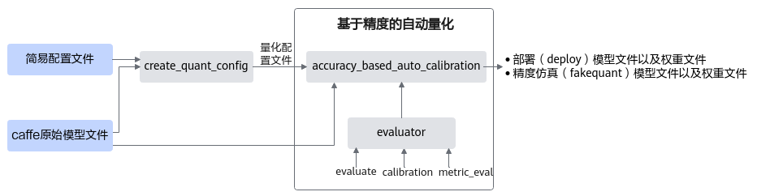

主要流程如下：

1.  <a name="li1620271314520"></a>调用[create\_quant\_config](create_quant_config-110.md)生成量化配置文件，然后调用[accuracy\_based\_auto\_calibration](accuracy_based_auto_calibration-113.md)进行基于精度的自动量化。
2.  <a name="li23141824486"></a>调用[accuracy\_based\_auto\_calibration](accuracy_based_auto_calibration-113.md)中由用户传入的evaluator实例进行精度测试，得到原始模型精度。

    该过程还会调用[accuracy\_based\_auto\_calibration](accuracy_based_auto_calibration-113.md)中的量化策略strategy模块，输出初始化的quant config量化配置文件，该文件记录所有层都可以进行量化。

3.  使用用户传入的初始量化配置文件（[1](#li1620271314520)中调用[create\_quant\_config](create_quant_config-110.md)生成的）对模型进行训练后量化，得到量化后fake quant模型的精度。
4.  原始模型精度与量化后fake quant模型精度进行比较，如果精度达标，则输出量化后的部署模型和fake quant模型，如果不达标，则进行基于精度的自动量化流程：
    1.  进行原始Caffe网络的推理， dump出每一层的输入activation数据，缓存起来；
    2.  利用训练后量化的量化因子构造量化层的单算子网络，利用缓存的activation数据计算量化后fake quant单算子网络的输出数据和原始Caffe单算子网络输出的余弦相似度。
    3.  <a name="li411322192712"></a>将余弦相似度的列表传给[accuracy\_based\_auto\_calibration](accuracy_based_auto_calibration-113.md)中的量化策略strategy模块，strategy模块基于[2](#li23141824486)中生成的初始化的量化配置文件，输出回退某些层后的新的quant config量化配置文件。
    4.  根据quant config量化配置文件重新进行训练后量化，得到回退后的fake quant模型。
    5.  调用[accuracy\_based\_auto\_calibration](accuracy_based_auto_calibration-113.md)中的evaluator模块进行回退后的fake quant模型精度测试，查看精度是否达标：
        -   如果达标，则输出回退后的fake quant模型以及部署模型。
        -   如果不达标，则将余弦相似度排序最差的层回退，再次进行[4.c](#li411322192712)，输出新的量化配置。
        -   如果回退所有层后精度仍不达标，则不生成量化模型。

[accuracy\_based\_auto\_calibration](accuracy_based_auto_calibration-113.md)接口内部基于精度的自动量化流程如[图2](#fig17197132717303)所示。

**图 2**  自动量化流程<a name="fig17197132717303"></a>  
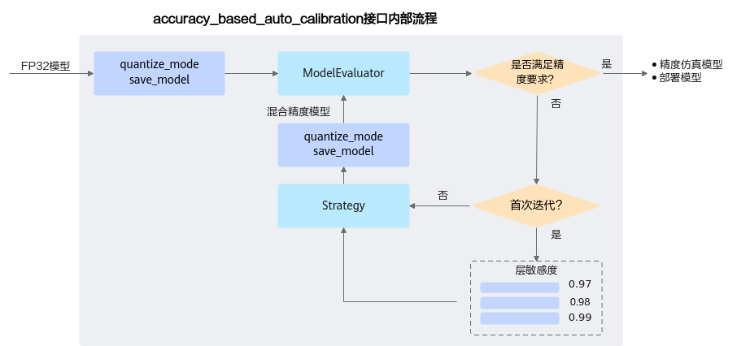

**调用示例<a name="section8613115123318"></a>**

本示例演示使用AMCT进行基于精度的自动量化流程。该过程需要用户实现一个模型推理得到精度的回调函数，由于AMCT需要基于回调函数返回的精度数据进行量化层的筛选，因此回调函数的返回数值应尽可能反映模型的精度。

> **说明：** 
>-   如下示例标有“由用户补充处理”的步骤，需要用户根据自己的模型和数据集进行补充处理，示例中仅为示例代码。
>-   如下示例调用AMCT的部分，函数入参请根据实际情况进行调整。

1.  导入AMCT包。

    ```
    import os
    import amct_caffe as amct
    from amct_caffe.common.auto_calibration import AutoCalibrationEvaluatorBase
    ```

2.  （由用户补充处理）使用原始待量化的模型和测试集，实现回调函数**calibration\(\)**、**evaluate\(\)**、**metric\_eval\(\)**。

    上述回调函数的入参要和基类AutoCalibrationEvaluatorBase保持一致。其中：

    -   calibration\(\)完成校准的推理。
    -   evaluate\(\)完成模型的精度测试过程。
    -   metric\_eval\(\)完成原始模型和量化fake quant模型的精度损失评估，当精度损失小于预期值时返回True，否则返回False。

    ```
    class ModelEvaluator(AutoCalibrationEvaluatorBase):
         # The evaluator for model
        def __init__(self, *args, **kwargs):
            # 成员变量初始化
            # 设置预期精度损失，此处请替换为具体的数值
            self.diff = expected_acc_loss
            pass
    
        def calibration(self, model_file, weights_file):
            # 进行模型的校准推理，推理的batch数要和量化配置的batch_num一致
            pass
    
        def evaluate(self, model_file, weights_file):
            # evaluate the input models, get the eval metric of model
            pass
    
        def metric_eval(self, original_metric, new_metric):
            # 评估原始模型精度和量化模型精度的精度损失是否满足预期，满足返回True, 精度损失数据；否则返回False, 精度损失数据
            loss = original_metric - new_metric
            if loss < self.diff:
                return True, loss
            return False, loss
    ```

3.  （由用户补充处理）根据模型确定模型输入文件。

    ```
    model_file = os.path.realpath(user_model_file)
    weights_file = os.path.realpath(user_weights_file)
    ```

4.  调用AMCT，进行基于精度的自动量化。
    1.  生成量化配置。

        ```
        config_json_file = './config.json'
        skip_layers = []
        batch_num = 1
        activation_offset = True
        amct.create_quant_config(config_json_file, model_file, weights_file,
                                  skip_layers, batch_num, activation_offset)
        
        scale_offset_record_file = os.path.join(TMP, 'scale_offset_record.txt')
        result_path = os.path.join(RESULT, 'model')
        ```

    2.  初始化Evaluator。

        ```
        evaluator = AutoCalibrationEvaluator()
        ```

    3.  进行基于精度的量化配置自动搜索。

        ```
        amct.accuracy_based_auto_calibration(
            model_file,
            weights_file,
            evaluator,
            config_json_file,
            scale_offset_record_file,
            result_path)
        ```

#### 手工量化<a name="ZH-CN_TOPIC_0000002473744648"></a>

均匀量化是指量化后的数据比较均匀地分布在某个数值空间中，例如INT8量化就是用只有8比特的INT8数据来表示32比特的float32数据，将float32的卷积运算过程（乘加运算）转换为INT8的卷积运算，加速运算和实现模型压缩；均匀的INT8量化则是量化后数据比较均匀地分布在INT8的数值空间\[-128, 127\]中。
非均匀量化是指量化后的数据在某个数值空间中的分布是不均匀的。非均匀量化过程中，会根据待量化数据的概率分布来对均匀量化后的数据分布进一步进行根据目标压缩率（保留数值量/原始量化数值量）的聚类操作。相较于均匀量化，非均匀量化在进一步压缩数据信息量的基础上尽可能的保留高概率分布的数据信息，从而减小压缩后的数据信息丢失。
执行训练后量化特性的精度如果不满足要求，可以尝试手动调整config.json文件中的参数，本节给出调整的原则，以及参数解释。

##### 均匀量化<a name="ZH-CN_TOPIC_0000002505904515"></a>

均匀量化是指量化后的数据比较均匀地分布在某个数值空间中，例如INT8量化就是用只有8比特的INT8数据来表示32比特的float32数据，将float32的卷积运算过程（乘加运算）转换为INT8的卷积运算，加速运算和实现模型压缩；均匀的INT8量化则是量化后数据比较均匀地分布在INT8的数值空间\[-128, 127\]中。

如果均匀量化后的模型精度无法满足要求，则需要进行[量化感知训练](量化感知训练-102.md)或[基于精度的自动量化](基于精度的自动量化-97.md)或[手工调优](手工调优-101.md)。

均匀量化支持量化的层以及约束如下，量化示例请参见[样例列表](样例列表.md)。

**表 1**  均匀量化支持的层以及约束

<a name="table32131022111318"></a>
<table><thead align="left"><tr id="row9214202215138"><th class="cellrowborder" valign="top" width="10.87108710871087%" id="mcps1.2.4.1.1"><p id="p18743192313370"><a name="p18743192313370"></a><a name="p18743192313370"></a>量化方式</p>
</th>
<th class="cellrowborder" valign="top" width="32.373237323732376%" id="mcps1.2.4.1.2"><p id="p11224164312447"><a name="p11224164312447"></a><a name="p11224164312447"></a>支持的层类型</p>
</th>
<th class="cellrowborder" valign="top" width="56.75567556755675%" id="mcps1.2.4.1.3"><p id="p122141822101318"><a name="p122141822101318"></a><a name="p122141822101318"></a>约束</p>
</th>
</tr>
</thead>
<tbody><tr id="row7214182271318"><td class="cellrowborder" rowspan="4" valign="top" width="10.87108710871087%" headers="mcps1.2.4.1.1 "><p id="p37431523153719"><a name="p37431523153719"></a><a name="p37431523153719"></a>均匀量化</p>
</td>
<td class="cellrowborder" valign="top" width="32.373237323732376%" headers="mcps1.2.4.1.2 "><p id="p32146222139"><a name="p32146222139"></a><a name="p32146222139"></a>InnerProduct：全连接层</p>
</td>
<td class="cellrowborder" valign="top" width="56.75567556755675%" headers="mcps1.2.4.1.3 "><p id="p162141722111314"><a name="p162141722111314"></a><a name="p162141722111314"></a>transpose属性为false，axis为1</p>
</td>
</tr>
<tr id="row1521462251317"><td class="cellrowborder" valign="top" headers="mcps1.2.4.1.1 "><p id="p1021414226138"><a name="p1021414226138"></a><a name="p1021414226138"></a>Convolution：卷积层</p>
</td>
<td class="cellrowborder" valign="top" headers="mcps1.2.4.1.2 "><p id="p13818151473914"><a name="p13818151473914"></a><a name="p13818151473914"></a>filter维度为4</p>
</td>
</tr>
<tr id="row6215102221319"><td class="cellrowborder" valign="top" headers="mcps1.2.4.1.1 "><p id="p1421510225139"><a name="p1421510225139"></a><a name="p1421510225139"></a>Deconvolution：反卷积层</p>
</td>
<td class="cellrowborder" valign="top" headers="mcps1.2.4.1.2 "><p id="p1369615211391"><a name="p1369615211391"></a><a name="p1369615211391"></a>dilation为1、filter维度为4</p>
</td>
</tr>
<tr id="row172673541413"><td class="cellrowborder" valign="top" headers="mcps1.2.4.1.1 "><p id="p1626717516146"><a name="p1626717516146"></a><a name="p1626717516146"></a>Pooling：平均下采样层</p>
</td>
<td class="cellrowborder" valign="top" headers="mcps1.2.4.1.2 "><p id="p1079211286392"><a name="p1079211286392"></a><a name="p1079211286392"></a>下采样方式为AVE，且非global pooling</p>
</td>
</tr>
</tbody>
</table>

**接口调用流程<a name="section11245174911561"></a>**

均匀量化接口调用流程如[图1](#zh-cn_topic_0240188734_fig1150702418492)所示，均匀量化不支持多个GPU同时运行。

**图 1**  均匀量化接口调用流程<a name="zh-cn_topic_0240188734_fig1150702418492"></a>  
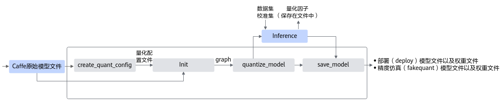

蓝色部分为用户实现，灰色部分为用户调用AMCT提供的API实现，用户在Caffe原始网络推理的代码中导入库，并在特定的位置调用相应API，即可实现量化功能。工具运行流程如下：

1.  用户首先构造Caffe的原始模型，然后使用[create\_quant\_config](create_quant_config-110.md)生成量化配置文件。
2.  根据Caffe模型和量化配置文件，调用[init](init.md)接口，初始化工具，配置量化因子存储文件，将模型解析为图结构graph。
3.  <a name="li1791017125567"></a>调用[quantize\_model](quantize_model-111.md)接口对原始Caffe模型的图结构graph进行优化，修改后的图中插入数据量化、权重量化等相关算子，用于计算量化相关参数。
4.  用户使用[3](#li1791017125567)输出的修改后的模型，借助AMCT提供的数据集和校准集，在Caffe环境中进行inference，可以得到量化因子。

    其中数据集用于在Caffe环境中对模型进行推理时，测试量化数据的精度；校准集用来产生量化因子，保证精度。

5.  最后用户可以调用[save\_model](save_model-112.md)接口，插入AscendQuant、AscendDequant等量化算子，保存量化模型：包括可在Caffe环境中进行精度仿真的模型文件和权重文件，以及可部署在NPU IP加速器的模型文件和权重文件。
    -   精度仿真模型文件：文件名中包含fake\_quant，模型可在Caffe环境下做推理实现量化精度仿真。

        fake\_quant模型主要用于验证量化后模型的精度，可以在Caffe框架下运行。进行前向推理的计算过程中，在fake\_quant模型中对卷积层等的输入数据和权重进行了量化反量化的操作，来模拟量化后的计算结果，从而快速验证量化后模型的精度。如下图所示，Quant层、Convolution卷积层和DeQuant层之间的数据都是float32数据类型的，其中Quant层将数据量化到INT8又反量化为float32，权重也是量化到INT8又反量化为float32，实际卷积层的计算是基于float32数据类型的，该模型用于在Caffe框架验证量化后模型的精度，不能够用于ATC工具转换成om模型。

        **图 2**  fake\_quant模型<a name="fig830317361367"></a>  
        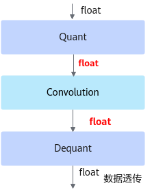

    -   部署模型文件：文件名中包含deploy，模型经过ATC工具转换后可部署到NPU IP加速器上。

        deploy模型由于已经将权重等转换成为了INT8、INT32类型，因此不能在Caffe框架上执行推理计算。如下图所示，deploy模型的AscendQuant层将float32的输入数据量化为INT8，作为卷积层的输入，权重也是使用INT8数据类型作为计算，在deploy模型中的卷积层的计算是基于INT8、INT32数据类型的，输出为INT32数据类型经过AscendDequant层转换成float32数据类型传输给下一个网络层。

        **图 3**  deploy模型<a name="fig32095209306"></a>  
        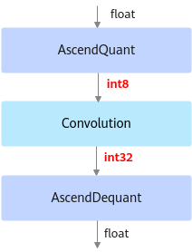

**调用示例<a name="section28382395299"></a>**

本章节详细给出训练后量化的模板代码解析说明，通过解读该代码，用户可以详细了解AMCT的工作流程以及原理，方便用户基于已有模板代码进行修改，以便适配其他网络模型的量化。训练后量化主要包括如下几个步骤：

1.  准备训练好的模型和数据集。
2.  在原始Caffe环境中验证模型精度以及环境是否正常。
3.  编写训练后量化脚本调用AMCT  API。
4.  执行训练后量化脚本。
5.  在原始Caffe环境中验证量化后仿真模型精度。

如下流程详细演示如何编写脚本调用AMCT  API进行模型量化。

> **说明：** 
>-   如下示例标有“由用户补充处理”的步骤，需要用户根据自己的模型和数据集进行补充处理，示例中仅为示例代码。
>-   如下示例调用AMCT的部分，函数入参请根据实际情况进行调整。

1.  导入AMCT包，并通过[环境变量设置](环境变量设置.md)日志级别。

    ```
    import amct_caffe as amct
    ```

2.  设置运行设备模式。

    AMCT支持CPU或GPU运行模式，所使用的API分别是[set\_cpu\_mode](set_cpu_mode.md)和[set\_gpu\_mode](set_gpu_mode.md)，其中GPU模式与Caffe框架相关，在此模式下，多GPU device的选择是通过Caffe的API caffe.set\_mode\_gpu\(\)和caffe.set\_device\(args.gpu\_id\)来实现的，因此需要先配置Caffe的运行设备模式，再配置AMCT的设备模式。另外因为此处已经指定了运行设备，模型推理函数中无需再次配置运行设备，代码样例如下：

    ```
    if args.gpu_id is not None and not args.cpu_mode:
            caffe.set_mode_gpu()
            caffe.set_device(args.gpu_id)
            amct.set_gpu_mode()
        else:
            caffe.set_mode_cpu()
    ```

3.  （可选，由用户补充处理）在Caffe原始环境中验证推理脚本及环境。

    建议首先运行下Caffe框架下原始模型推理，验证推理脚本及环境是否正常：

    ```
    # Run original model without quantize test
        if args.pre_test:
            run_caffe_model(args.model_file, args.weights_file, args.iterations)
            print('[INFO]Run %s without quantize success!' %(args.model_name))
            return
    ```

4.  调用AMCT，量化模型。
    1.  解析用户模型，生成全量量化配置文件。

        有两种方法生成量化配置文件：

        -   通过简易配置文件生成，则需要指定config\_defination参数的输入，其余入参将无效，可以不用输入。
        -   使用API入参指定量化参数skip\_layers、batch\_num、activation\_offset来生成量化配置文件，默认为API方式。代码样例如下：

            ```
                # Generate quantize configurations
                config_json_file = 'tmp/config.json'
                batch_num = 2
                if args.cfg_define is not None:
                    amct.create_quant_config(config_json_file,
                                             args.model_file,
                                             args.weights_file,
                                             config_defination=args.cfg_define)
                else:
                    skip_layers = []
                    amct.create_quant_config(config_json_file,
                                             args.model_file,
                                             args.weights_file,
                                             skip_layers,
                                             batch_num)
            ```

    2.  初始化AMCT，读取用户全量量化配置文件、解析用户模型文件、生成用户内部修改模型的Graph IR。

        ```
            # Phase0: Init amct task
            scale_offset_record_file = 'tmp/scale_offset_record.txt'
            graph = amct.init(config_json_file,
                              args.model_file,
                              args.weights_file,
                              scale_offset_record_file)
        ```

    3.  执行图融合、执行权重离线量化以及插入数据量化层得到校准模型，从而在后续calibration推理过程中执行数据量化动作。

        ```
            # Phase1: Do conv+bn+scale fusion, weights calibration and fake
            #         quantize, insert data-quantize layer
            modified_model_file = 'tmp/modified_model.prototxt'
            modified_weights_file = 'tmp/modified_model.caffemodel'
            amct.quantize_model(graph, modified_model_file, modified_weights_file)
        ```

    4.  （由用户补充处理）执行校准模型推理，完成数据量化。

        该步骤所需要的推理iterations数量需要大于等于设置用于数据量化的batch\_num参数。

        ```
        # Phase2: run caffe model to do activation calibration
            run_caffe_model(modified_model_file, modified_weights_file, batch_num)
        ```

        校准执行过程中提示"IfmrQuantWithOffset scale is illegal"，则请参见[校准执行过程中提示"IfmrQuantCalibration with offset scale is illegal"或"IfmrQuantCalibration without offset scale is illegal"](校准执行过程中提示-IfmrQuantCalibration-with-offset-scale-is-illegal-或-IfmrQuantCalibration-without-offset-sc.md)处理。

    5.  保存量化模型。

        根据量化因子以及修改后的图结构，调用[save\_model](save_model-112.md)接口，插入AscendQuant、AscendDequant等算子，并保存得到最终的量化部署模型（deploy）和量化仿真模型（fake\_quant）。

        ```
            # Phase3: save final model, one for caffe do fake quant test, one
            #         deploy model for ATC
            result_path = 'results/%s' %(args.model_name)
            amct.save_model(graph, 'Both', result_path)
        ```

        如果保存模型时，提示Error: Cannot find scale\_d of layer '\*\*' in record file信息，则请参见[量化执行过程中提示“Check scale and offset record file record.txt failed”](量化执行过程中提示-Check-scale-and-offset-record-file-record-txtfailed.md)处理。

5.  （可选，由用户补充处理）执行量化仿真模型（fake\_quant）推理，测试量化后模型精度。

    ```
        # Phase4: if need test quantized model, uncomment to do final fake quant
        #         model test.
        fake_quant_model = 'results/{0}_fake_quant_model.prototxt'.format(args.model_name)
        fake_quant_weights = 'results/{0}_fake_quant_weights.caffemodel'.format(args.model_name)
        run_caffe_model(fake_quant_model, fake_quant_weights, args.iterations)
    ```

**如果用户想借助上述sample代码，量化自己的模型，则需要参见如下步骤修改部分代码：**

1.  修改执行入参代码。

    用于传入AMCT所使用的执行入参（该步骤非必须，用户可使用任意方式实现类似功能，也可以直接将参数写到sample样例代码里面）。代码样例如下：

    ```
        class Args(object):
            """struct for Args"""
            def __init__(self):
                self.model_name = '' # Caffe model name as prefix to save model
                self.model_file = ''  # user caffe model txt define file
                self.weights_file = '' # user caffe model binary weights file
                self.cpu = True # If True, force to CPU mode, else set to False
                self.gpu_id = 0 # Set the gpu id to use
                self.pre_test = False # Set true to run original model test, set
                                      # False to run quantize with amct_caffe tool
                self.iterations = 5 # Iteration to run caffe model
                self.cfg_define = None # If None use
    
        args = Args()
        #############################user modified start#########################
        """User set basic info to use amct_caffe tool
        """
        # e.g.
        args.model_name = 'ResNet50'
        args.model_file = 'pre_model/ResNet-50-deploy.prototxt'
        args.weights_file = 'pre_model/ResNet-50-model.caffemodel'
        args.cpu = True
        args.gpu_id = None
        args.pre_test = False
        args.iterations = 5
        args.cfg_define = None
        #############################user modified end###########################
    ```

2.  修改执行Caffe模型推理的代码：

    代码样例如下：

    ```
    def run_caffe_model(model_file, weights_file, iterations):
        """run caffe model forward"""
        net = caffe.Net(model_file, weights_file, caffe.TEST)
        #############################user modified start#########################
        """User modified to execute caffe model forward
        """
        # # e.g.
        # for iter_num in range(iterations):
        #     data = get_data()
        #     forward_kwargs = {'data': data}
        #     blobs_out = net.forward(**forward_kwargs)
        #     # if have label and need check network forward result
        #     post_process(blobs_out)
        # return
        #############################user modified end###########################
    ```

    代码解析如下，需要用户根据具体业务网络实现对传入模型的推理工作：

    1.  加载传入模型文件，得到Caffe Net示例（推理时设置phase为caffe.TEST）：

        ```
             net = caffe.Net(model_file, weights_file, caffe.TEST)
        ```

    2.  根据入参的iterations来循环执行指定次数推理。
    3.  获取每次推理所需要的网络数据，需要根据具体业务网络完成数据预处理操作（例如ResNet50，一般需要将YUV图片转换为RGB，然后缩放到224尺寸，再减去各通道均值）；然后通过字典的形式，根据网络输入的blob名称来构建相应的输入，如果有多个输入，则分别按照key\(blob名称\):value\(numpy数组\)的格式构建相应输入：

        ```
            data = get_data()
            forward_kwargs = {'data': data}
        ```

    4.  执行一次网络的前向推理，并获取网络的输出：

        ```
            blobs_out = net.forward(**forward_kwargs)
        ```

    5.  Caffe执行Net的输出blobs\_out也是以字典格式存储的输出结果，例如\{'prob1': blob1, 'prob2':blob2\}，如果要获取输出，可直接按照指定的blob名称获取对应的blob数据结构。
    6.  （可选）如果用户需要测试网络的输出，可按上述形式获取对应的数据，然后计算分类或者检测结果等；该步骤非AMCT需要，AMCT仅需执行网络推理拿到所有网络中间层数据即可，对于网络的最终计算结果用户可自行选择是否需要进行后处理。

        ```
            post_process(blobs_out)
        ```

##### 非均匀量化<a name="ZH-CN_TOPIC_0000002473904550"></a>

非均匀量化是指量化后的数据在某个数值空间中的分布是不均匀的。非均匀量化过程中，会根据待量化数据的概率分布来对均匀量化后的数据分布进一步进行根据目标压缩率（保留数值量/原始量化数值量）的聚类操作。相较于均匀量化，非均匀量化在进一步压缩数据信息量的基础上尽可能的保留高概率分布的数据信息，从而减小压缩后的数据信息丢失。

> **说明：** 
>**由于硬件约束，该版本不建议使用非均匀量化的功能，获取不到性能收益。**

模型在NPU IP加速器上推理时，可通过非均匀量化提高权重压缩率（需要与ATC工具配合，通过编译时使能权重压缩），降低权重传输开销，进一步提升推理性能。非均匀量化后，如果精度仿真模型在原始Caffe环境中推理精度不满足要求，可通过调整非均匀量化配置文件config.json中的参数来恢复模型精度，根据是否自动调整量化配置文件，非均匀量化又分为静态非均匀量化和自动非均匀量化。

-   静态非均匀量化：需要用户参见[手工调优](手工调优-101.md)章节手动调整相应参数。详细量化过程请参见[样例列表](样例列表.md)\>非均匀量化\>静态非均匀量化。
-   自动非均匀量化：由AMCT自动搜索出一个量化配置，在满足给出的精度损失要求前提下使得量化后的模型压缩率更高。该场景下用户需要基于给出的自动非均匀量化基类（AutoNuqEvaluatorBase）实现一个子类，需要实现eval\_model\(_self_,  _model\_file_,  _weights\_file_,  _batch\_num_\)和is\_satisfied\(_self_,  _original\_metric_,  _new\_metric_\)两个方法：

    -   **eval\_mode**l根据输入的模型和batch\_num进行数据前处理、模型推理、数据后处理，得到模型的评估结果，要求返回的评估结果唯一，如分类网络的top1，检测网络的mAP等，同时也可以是指标的加权结果。
    -   **is\_satisfied**用于判断量化后的模型是否达到了精度损失的要求，如果达到了则返回True，否则返回False；如分类网络的top1用小数表示，则判断条件可以写作if \(original\_metric - new\_metric\) \* 100 < 1，表示精度的损失要小于1个百分点。

    详细量化示例请参见[样例列表](样例列表.md)\>非均匀量化\>自动非均匀量化。

非均匀量化支持量化的层以及约束如下：

**表 1**  非均匀量化支持的层以及约束

<a name="table32131022111318"></a>
<table><thead align="left"><tr id="row9214202215138"><th class="cellrowborder" valign="top" width="10.87108710871087%" id="mcps1.2.4.1.1"><p id="p18743192313370"><a name="p18743192313370"></a><a name="p18743192313370"></a>量化方式</p>
</th>
<th class="cellrowborder" valign="top" width="33.24332433243324%" id="mcps1.2.4.1.2"><p id="p128814486442"><a name="p128814486442"></a><a name="p128814486442"></a>支持的层类型</p>
</th>
<th class="cellrowborder" valign="top" width="55.88558855885588%" id="mcps1.2.4.1.3"><p id="p122141822101318"><a name="p122141822101318"></a><a name="p122141822101318"></a>约束</p>
</th>
</tr>
</thead>
<tbody><tr id="row165450153816"><td class="cellrowborder" rowspan="2" valign="top" width="10.87108710871087%" headers="mcps1.2.4.1.1 "><p id="p138708818383"><a name="p138708818383"></a><a name="p138708818383"></a>非均匀量化</p>
</td>
<td class="cellrowborder" valign="top" width="33.24332433243324%" headers="mcps1.2.4.1.2 "><p id="p6224302406"><a name="p6224302406"></a><a name="p6224302406"></a>Convolution：卷积层</p>
</td>
<td class="cellrowborder" valign="top" width="55.88558855885588%" headers="mcps1.2.4.1.3 "><p id="p18541204385"><a name="p18541204385"></a><a name="p18541204385"></a>dilation为1、group为1、filter维度为4</p>
</td>
</tr>
<tr id="row1983015137386"><td class="cellrowborder" valign="top" headers="mcps1.2.4.1.1 "><p id="p138691853408"><a name="p138691853408"></a><a name="p138691853408"></a>InnerProduct：全连接层</p>
</td>
<td class="cellrowborder" valign="top" headers="mcps1.2.4.1.2 "><p id="p58301913153810"><a name="p58301913153810"></a><a name="p58301913153810"></a>transpose属性为false，axis为1</p>
</td>
</tr>
</tbody>
</table>

**接口调用流程<a name="section1193272123218"></a>**

非均匀量化接口调用流程如[图1](#fig884718234329)所示。非均匀量化不支持多个GPU同时运行。

**图 1**  非均匀量化接口调用流程<a name="fig884718234329"></a>  
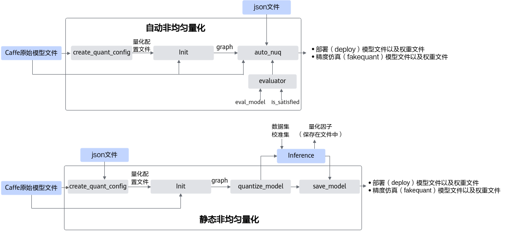

下面以自动非均匀量化为例介绍主要流程，静态非均匀量化流程请参见[均匀量化](均匀量化-99.md)。

1.  用户首先构造Caffe的原始模型，然后使用[create\_quant\_config](create_quant_config-110.md)生成量化配置文件。
2.  根据Caffe模型和量化配置文件，调用[init](init.md)接口，初始化工具，配置量化因子存储文件，将模型解析为图结构graph。
3.  根据原始模型文件、通过ATC工具转换的JSON文件（该文件携带了支持weight压缩特性层的信息，通过fe\_weight\_compress字段识别）调用[auto\_nuq](auto_nuq.md)进行自动非均匀量化，该过程中会调用由用户传入的evaluator实例进行精度测试，得到原始模型精度。

简要流程如[图2](#zh-cn_topic_0240453534_fig1427064017304)所示。

**图 2**  非均匀量化流程图<a name="zh-cn_topic_0240453534_fig1427064017304"></a>  
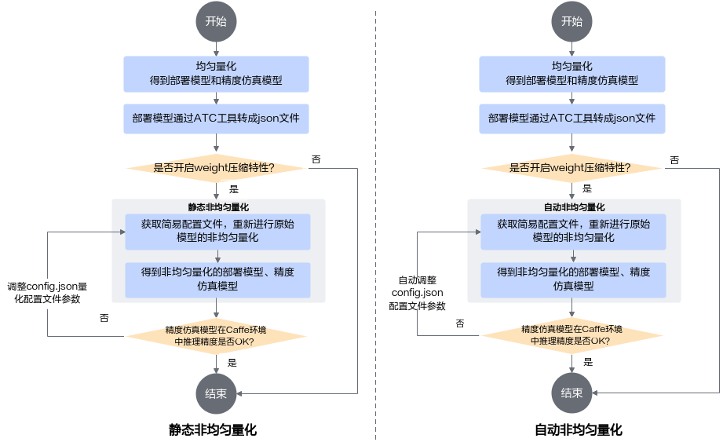

**调用示例<a name="section18769639135513"></a>**

1.  导入AMCT包。

    ```
    import amct_caffe as amct
    from amct_caffe.auto_nuq import AutoNuqEvaluatorBase
    ```

1.  根据给定的AutoNuqEvaluatorBase基类实现一个子类，需要实现能够得到模型精度的评估方法**eval\_model**和判断当前的量化后模型是否精度达标的**is\_satisfied**方法。

    ```
    class AutoNuqEvaluator(AutoNuqEvaluatorBase):
        # Auto Nuq Evaluator
        def __init__(self, evaluate_batch_num):
            super().__init__(self)
            self.evaluate_batch_num = evaluate_batch_num
    ```

    1.  实现模型精度评估方法**eval\_model。**

        **eval\_mode**l根据输入的模型和batch\_num进行数据前处理、模型推理、数据后处理，得到模型的评估结果，要求返回的评估结果唯一，如分类网络的top1，检测网络的mAP等，同时也可以是指标的加权结果。

        ```
            def eval_model(self, model_file, weights_file, batch_num):
                return do_benchmark_test(QUANT_ARGS, model_file, weights_file, batch_num)
        ```

    2.  实现精度损失的评估方法**is\_satisfied**。

        **is\_satisfied**用于判断量化后的模型是否达到了精度损失的要求，如果达到了则返回True，否则返回False；如分类网络的top1用小数表示，则判断条件可以写作if \(original\_metric - new\_metric\) \*100 < 1，表示精度的损失要小于1个百分点。

        -   original\_metric代表原始未量化模型精度。
        -   new\_metric代表量化后fake quant模型精度，根据精度损失是否满足阈值返回True或False。

        ```
            def is_satisfied(self, original_metric, new_metric):
                # the loss of top1 acc need to be less than 1%
                if (original_metric - new_metric) * 100 < 1:
                    return True
                return False
        ```

2.  生成量化配置文件。

    ```
        config_json_file = os.path.join(TMP, 'config.json')
        skip_layers = []
        batch_num = 2
        activation_offset = True
    
        # do weights calibration with non uniform quantize configure
        amct.create_quant_config(
            config_json_file, args.model_file, args.weights_file, skip_layers,
            batch_num, activation_offset, args.cfg_define)
    
        scale_offset_record_file = os.path.join(TMP, 'scale_offset_record.txt')
        result_path = os.path.join(RESULT, 'ResNet50')
    
    ```

3.  开始自动非均匀量化流程。

    ```
        evaluator = AutoNuqEvaluator(args.iterations)
        amct.auto_nuq(
            args.model_file,
            args.weights_file,
            evaluator,
            config_json_file,
            scale_offset_record_file,
            result_path)
    ```

##### 手工调优<a name="ZH-CN_TOPIC_0000002473904546"></a>

执行训练后量化特性的精度如果不满足要求，可以尝试手动调整config.json文件中的参数，本节给出调整的原则，以及参数解释。

**调优流程<a name="section7821141819480"></a>**

通过[create\_quant\_config](create_quant_config-110.md)接口生成的config.json文件中的默认配置进行量化，若量化后的推理精度不满足要求，则可调整量化配置重复量化，直至精度满足要求。本节详细介绍手动调优流程，调整对象是训练后量化配置文件config.json中的参数，主要涉及3个阶段：

1.  调整校准使用的数据量。
2.  跳过量化某些层。
3.  调整量化算法及参数。

具体步骤如下：

1.  根据[create\_quant\_config](create_quant_config-110.md)接口生成的默认配置进行量化。若精度满足要求，则调参结束，否则进行[2](#zh-cn_topic_0240188709_li1043716142619)。
2.  <a name="zh-cn_topic_0240188709_li1043716142619"></a>手动修改batch\_num，调整校准使用的数据量。

    batch\_num控制量化使用数据的batch数目，可根据batch大小以及量化需要使用的图片数量调整。通常情况下：

    batch\_num越大，量化过程中使用的数据样本越多，量化后精度损失越小；但过多的数据并不会带来精度的提升，反而会占用较多的内存，降低量化的速度，并可能引起内存、显存、线程资源不足等情况；因此，建议batch\_num\*batch\_size为16或32（batch\_size表示每个batch使用的图片数量）。

3.  若按照[2](#zh-cn_topic_0240188709_li1043716142619)中的量化配置进行量化后，精度满足要求，则调参结束，否则进行[4](#li718684715113)。
4.  <a name="li718684715113"></a>手动修改quant\_enable，跳过量化某些层。

    quant\_enable可以指定该层是否量化，取值为true时量化该层，取值为false时不量化该层，将该层的配置删除也可跳过该层量化。

    在整网精度不达标的时候需要识别出网络中的量化敏感层（量化后误差显著增大），然后取消对量化敏感层的量化动作，识别量化敏感层有两种方法：

    1.  依据网络模型结构，一般网络中首层、尾层以及参数量偏少的层，量化后精度会有较大的下降。
    2.  通过精度比对工具，逐层比对原始模型和量化后模型输出误差（例如以余弦相似度作为标准，需要相似度达到0.99以上），找到误差较大的层，优先对其进行回退。

5.  若按照[4](#li718684715113)中的量化配置进行量化后，精度满足要求，则调参结束，否则进行[6](#zh-cn_topic_0240188709_li2044613162372)。
6.  <a name="zh-cn_topic_0240188709_li2044613162372"></a>手动修改activation\_quant\_params和weight\_quant\_params，调整量化算法及参数：

    算法参数意义请参见[量化配置文件](#section14476195271612)中的参数说明部分，算法说明请参见[训练后量化算法](训练后量化算法.md)。

7.  若按照[6](#zh-cn_topic_0240188709_li2044613162372)中的量化配置进行量化后，精度满足要求，则调参结束，否则表明量化对精度影响很大，不能进行量化，去除量化配置。

**图 1**  调参流程<a name="zh-cn_topic_0240188709_fig10376759162410"></a>  


**量化配置文件<a name="section14476195271612"></a>**

如果通过[create\_quant\_config](create_quant_config-110.md)接口生成的config.json量化配置文件，推理精度不满足要求，则需要参见该章节不断调整config.json文件中的内容（用户修改JSON文件时，请确保层名唯一），直至精度满足要求，JSON量化配置文件样例请参见接口中的[调用示例](create_quant_config-110.md#zh-cn_topic_0240188739_section64231658994)部分。配置文件中参数说明如下：

**表 1**  version参数说明

<a name="zh-cn_topic_0240188722_table2626104713369"></a>
<table><tbody><tr id="zh-cn_topic_0240188722_row116261847163611"><th class="firstcol" valign="top" width="20.65%" id="mcps1.2.3.1.1"><p id="zh-cn_topic_0240188722_p462654715365"><a name="zh-cn_topic_0240188722_p462654715365"></a><a name="zh-cn_topic_0240188722_p462654715365"></a>作用</p>
</th>
<td class="cellrowborder" valign="top" width="79.35%" headers="mcps1.2.3.1.1 "><p id="zh-cn_topic_0240188722_p16269472361"><a name="zh-cn_topic_0240188722_p16269472361"></a><a name="zh-cn_topic_0240188722_p16269472361"></a>控制量化配置文件版本号。</p>
</td>
</tr>
<tr id="zh-cn_topic_0240188722_row362684710366"><th class="firstcol" valign="top" width="20.65%" id="mcps1.2.3.2.1"><p id="zh-cn_topic_0240188722_p762684713611"><a name="zh-cn_topic_0240188722_p762684713611"></a><a name="zh-cn_topic_0240188722_p762684713611"></a>类型</p>
</th>
<td class="cellrowborder" valign="top" width="79.35%" headers="mcps1.2.3.2.1 "><p id="zh-cn_topic_0240188722_p19626124713367"><a name="zh-cn_topic_0240188722_p19626124713367"></a><a name="zh-cn_topic_0240188722_p19626124713367"></a>int</p>
</td>
</tr>
<tr id="zh-cn_topic_0240188722_row146267479367"><th class="firstcol" valign="top" width="20.65%" id="mcps1.2.3.3.1"><p id="zh-cn_topic_0240188722_p18626194711368"><a name="zh-cn_topic_0240188722_p18626194711368"></a><a name="zh-cn_topic_0240188722_p18626194711368"></a>取值范围</p>
</th>
<td class="cellrowborder" valign="top" width="79.35%" headers="mcps1.2.3.3.1 "><p id="zh-cn_topic_0240188722_p186261147193612"><a name="zh-cn_topic_0240188722_p186261147193612"></a><a name="zh-cn_topic_0240188722_p186261147193612"></a>1</p>
</td>
</tr>
<tr id="zh-cn_topic_0240188722_row7626194719361"><th class="firstcol" valign="top" width="20.65%" id="mcps1.2.3.4.1"><p id="zh-cn_topic_0240188722_p1462644712368"><a name="zh-cn_topic_0240188722_p1462644712368"></a><a name="zh-cn_topic_0240188722_p1462644712368"></a>参数说明</p>
</th>
<td class="cellrowborder" valign="top" width="79.35%" headers="mcps1.2.3.4.1 "><p id="zh-cn_topic_0240188722_p156261247113612"><a name="zh-cn_topic_0240188722_p156261247113612"></a><a name="zh-cn_topic_0240188722_p156261247113612"></a>目前仅有一个版本号1。</p>
</td>
</tr>
<tr id="zh-cn_topic_0240188722_row17626144713363"><th class="firstcol" valign="top" width="20.65%" id="mcps1.2.3.5.1"><p id="zh-cn_topic_0240188722_p1462634743614"><a name="zh-cn_topic_0240188722_p1462634743614"></a><a name="zh-cn_topic_0240188722_p1462634743614"></a>推荐配置</p>
</th>
<td class="cellrowborder" valign="top" width="79.35%" headers="mcps1.2.3.5.1 "><p id="zh-cn_topic_0240188722_p1162664743620"><a name="zh-cn_topic_0240188722_p1162664743620"></a><a name="zh-cn_topic_0240188722_p1162664743620"></a>1</p>
</td>
</tr>
<tr id="zh-cn_topic_0240188722_row311394219392"><th class="firstcol" valign="top" width="20.65%" id="mcps1.2.3.6.1"><p id="zh-cn_topic_0240188722_p1811484213910"><a name="zh-cn_topic_0240188722_p1811484213910"></a><a name="zh-cn_topic_0240188722_p1811484213910"></a>可选或者必选</p>
</th>
<td class="cellrowborder" valign="top" width="79.35%" headers="mcps1.2.3.6.1 "><p id="zh-cn_topic_0240188722_p17114742143918"><a name="zh-cn_topic_0240188722_p17114742143918"></a><a name="zh-cn_topic_0240188722_p17114742143918"></a>可选</p>
</td>
</tr>
</tbody>
</table>

**表 2**  batch\_num参数说明

<a name="zh-cn_topic_0240188722_table1993174915423"></a>
<table><tbody><tr id="zh-cn_topic_0240188722_row0944492423"><th class="firstcol" valign="top" width="21.349999999999998%" id="mcps1.2.3.1.1"><p id="zh-cn_topic_0240188722_p294134994210"><a name="zh-cn_topic_0240188722_p294134994210"></a><a name="zh-cn_topic_0240188722_p294134994210"></a>作用</p>
</th>
<td class="cellrowborder" valign="top" width="78.64999999999999%" headers="mcps1.2.3.1.1 "><p id="zh-cn_topic_0240188722_p694164934219"><a name="zh-cn_topic_0240188722_p694164934219"></a><a name="zh-cn_topic_0240188722_p694164934219"></a>控制量化使用多少个batch的数据。</p>
</td>
</tr>
<tr id="zh-cn_topic_0240188722_row294249104214"><th class="firstcol" valign="top" width="21.349999999999998%" id="mcps1.2.3.2.1"><p id="zh-cn_topic_0240188722_p1794164974216"><a name="zh-cn_topic_0240188722_p1794164974216"></a><a name="zh-cn_topic_0240188722_p1794164974216"></a><span>类型</span></p>
</th>
<td class="cellrowborder" valign="top" width="78.64999999999999%" headers="mcps1.2.3.2.1 "><p id="zh-cn_topic_0240188722_p1894449164210"><a name="zh-cn_topic_0240188722_p1894449164210"></a><a name="zh-cn_topic_0240188722_p1894449164210"></a>int</p>
</td>
</tr>
<tr id="zh-cn_topic_0240188722_row199420495426"><th class="firstcol" valign="top" width="21.349999999999998%" id="mcps1.2.3.3.1"><p id="zh-cn_topic_0240188722_p39419491427"><a name="zh-cn_topic_0240188722_p39419491427"></a><a name="zh-cn_topic_0240188722_p39419491427"></a><span>取值范围</span></p>
</th>
<td class="cellrowborder" valign="top" width="78.64999999999999%" headers="mcps1.2.3.3.1 "><p id="zh-cn_topic_0240188722_p694134954217"><a name="zh-cn_topic_0240188722_p694134954217"></a><a name="zh-cn_topic_0240188722_p694134954217"></a>大于0</p>
</td>
</tr>
<tr id="zh-cn_topic_0240188722_row394164944213"><th class="firstcol" valign="top" width="21.349999999999998%" id="mcps1.2.3.4.1"><p id="zh-cn_topic_0240188722_p1694104916421"><a name="zh-cn_topic_0240188722_p1694104916421"></a><a name="zh-cn_topic_0240188722_p1694104916421"></a>参数说明</p>
</th>
<td class="cellrowborder" valign="top" width="78.64999999999999%" headers="mcps1.2.3.4.1 "><p id="zh-cn_topic_0240188722_p159444919429"><a name="zh-cn_topic_0240188722_p159444919429"></a><a name="zh-cn_topic_0240188722_p159444919429"></a>如果不配置，则使用默认值1，建议校准集图片数量不超过50张，根据batch的大小batch_size计算相应的batch_num数值。</p>
<p id="zh-cn_topic_0240188722_p1223319101118"><a name="zh-cn_topic_0240188722_p1223319101118"></a><a name="zh-cn_topic_0240188722_p1223319101118"></a>batch_num*batch_size为量化使用的校准集图片数量。</p>
<p id="zh-cn_topic_0240188722_p201320014422"><a name="zh-cn_topic_0240188722_p201320014422"></a><a name="zh-cn_topic_0240188722_p201320014422"></a>其中batch_size为每个batch所用的图片数量。</p>
</td>
</tr>
<tr id="zh-cn_topic_0240188722_row8941849114212"><th class="firstcol" valign="top" width="21.349999999999998%" id="mcps1.2.3.5.1"><p id="zh-cn_topic_0240188722_p19945496428"><a name="zh-cn_topic_0240188722_p19945496428"></a><a name="zh-cn_topic_0240188722_p19945496428"></a>推荐配置</p>
</th>
<td class="cellrowborder" valign="top" width="78.64999999999999%" headers="mcps1.2.3.5.1 "><p id="zh-cn_topic_0240188722_p10941249164219"><a name="zh-cn_topic_0240188722_p10941249164219"></a><a name="zh-cn_topic_0240188722_p10941249164219"></a>1</p>
</td>
</tr>
<tr id="zh-cn_topic_0240188722_row194104974210"><th class="firstcol" valign="top" width="21.349999999999998%" id="mcps1.2.3.6.1"><p id="zh-cn_topic_0240188722_p694174913424"><a name="zh-cn_topic_0240188722_p694174913424"></a><a name="zh-cn_topic_0240188722_p694174913424"></a>必选或可选</p>
</th>
<td class="cellrowborder" valign="top" width="78.64999999999999%" headers="mcps1.2.3.6.1 "><p id="zh-cn_topic_0240188722_p89524910428"><a name="zh-cn_topic_0240188722_p89524910428"></a><a name="zh-cn_topic_0240188722_p89524910428"></a>可选</p>
</td>
</tr>
</tbody>
</table>

**表 3**  activation\_offset参数说明

<a name="zh-cn_topic_0240188722_table9951049114210"></a>
<table><tbody><tr id="zh-cn_topic_0240188722_row129514490428"><th class="firstcol" valign="top" width="21.349999999999998%" id="mcps1.2.3.1.1"><p id="zh-cn_topic_0240188722_p3951149184213"><a name="zh-cn_topic_0240188722_p3951149184213"></a><a name="zh-cn_topic_0240188722_p3951149184213"></a>作用</p>
</th>
<td class="cellrowborder" valign="top" width="78.64999999999999%" headers="mcps1.2.3.1.1 "><p id="p168261724123812"><a name="p168261724123812"></a><a name="p168261724123812"></a>控制数据量化是对称量化还是非对称量化。全局配置参数。</p>
<p id="p1378733113919"><a name="p1378733113919"></a><a name="p1378733113919"></a>若配置文件中同时存在activation_offset和asymmetric参数，asymmetric参数优先级&gt;activation_offset参数。</p>
</td>
</tr>
<tr id="zh-cn_topic_0240188722_row18951449164219"><th class="firstcol" valign="top" width="21.349999999999998%" id="mcps1.2.3.2.1"><p id="zh-cn_topic_0240188722_p0951493420"><a name="zh-cn_topic_0240188722_p0951493420"></a><a name="zh-cn_topic_0240188722_p0951493420"></a>类型</p>
</th>
<td class="cellrowborder" valign="top" width="78.64999999999999%" headers="mcps1.2.3.2.1 "><p id="zh-cn_topic_0240188002_p99534916427"><a name="zh-cn_topic_0240188002_p99534916427"></a><a name="zh-cn_topic_0240188002_p99534916427"></a>bool</p>
</td>
</tr>
<tr id="zh-cn_topic_0240188722_row189516493421"><th class="firstcol" valign="top" width="21.349999999999998%" id="mcps1.2.3.3.1"><p id="zh-cn_topic_0240188722_p1895649144219"><a name="zh-cn_topic_0240188722_p1895649144219"></a><a name="zh-cn_topic_0240188722_p1895649144219"></a>取值范围</p>
</th>
<td class="cellrowborder" valign="top" width="78.64999999999999%" headers="mcps1.2.3.3.1 "><p id="zh-cn_topic_0240188002_p59574994218"><a name="zh-cn_topic_0240188002_p59574994218"></a><a name="zh-cn_topic_0240188002_p59574994218"></a>true或false</p>
</td>
</tr>
<tr id="zh-cn_topic_0240188722_row169584954213"><th class="firstcol" valign="top" width="21.349999999999998%" id="mcps1.2.3.4.1"><p id="zh-cn_topic_0240188722_p12959499422"><a name="zh-cn_topic_0240188722_p12959499422"></a><a name="zh-cn_topic_0240188722_p12959499422"></a>参数说明</p>
</th>
<td class="cellrowborder" valign="top" width="78.64999999999999%" headers="mcps1.2.3.4.1 "><a name="ul11492132182611"></a><a name="ul11492132182611"></a><ul id="ul11492132182611"><li>true：数据量化时为非对称量化。</li><li>false：数据量化时为对称量化。</li></ul>
</td>
</tr>
<tr id="zh-cn_topic_0240188722_row139564944214"><th class="firstcol" valign="top" width="21.349999999999998%" id="mcps1.2.3.5.1"><p id="zh-cn_topic_0240188722_p59524916426"><a name="zh-cn_topic_0240188722_p59524916426"></a><a name="zh-cn_topic_0240188722_p59524916426"></a>推荐配置</p>
</th>
<td class="cellrowborder" valign="top" width="78.64999999999999%" headers="mcps1.2.3.5.1 "><p id="zh-cn_topic_0240188722_p169674919424"><a name="zh-cn_topic_0240188722_p169674919424"></a><a name="zh-cn_topic_0240188722_p169674919424"></a>true</p>
</td>
</tr>
<tr id="zh-cn_topic_0240188722_row496164924211"><th class="firstcol" valign="top" width="21.349999999999998%" id="mcps1.2.3.6.1"><p id="zh-cn_topic_0240188722_p139613497421"><a name="zh-cn_topic_0240188722_p139613497421"></a><a name="zh-cn_topic_0240188722_p139613497421"></a>必选或可选</p>
</th>
<td class="cellrowborder" valign="top" width="78.64999999999999%" headers="mcps1.2.3.6.1 "><p id="zh-cn_topic_0240188722_p1096154916421"><a name="zh-cn_topic_0240188722_p1096154916421"></a><a name="zh-cn_topic_0240188722_p1096154916421"></a>可选</p>
</td>
</tr>
</tbody>
</table>

**表 4**  joint\_quant参数说明

<a name="table1140810561"></a>
<table><tbody><tr id="row340813015613"><th class="firstcol" valign="top" width="21.349999999999998%" id="mcps1.2.3.1.1"><p id="p104091902619"><a name="p104091902619"></a><a name="p104091902619"></a>作用</p>
</th>
<td class="cellrowborder" valign="top" width="78.64999999999999%" headers="mcps1.2.3.1.1 "><p id="p104091102062"><a name="p104091102062"></a><a name="p104091102062"></a>是否进行Eltwise联合量化。</p>
</td>
</tr>
<tr id="row84092001961"><th class="firstcol" valign="top" width="21.349999999999998%" id="mcps1.2.3.2.1"><p id="p1640990366"><a name="p1640990366"></a><a name="p1640990366"></a>类型</p>
</th>
<td class="cellrowborder" valign="top" width="78.64999999999999%" headers="mcps1.2.3.2.1 "><p id="p44098017617"><a name="p44098017617"></a><a name="p44098017617"></a>bool</p>
</td>
</tr>
<tr id="row1140913013614"><th class="firstcol" valign="top" width="21.349999999999998%" id="mcps1.2.3.3.1"><p id="p9409301669"><a name="p9409301669"></a><a name="p9409301669"></a>取值范围</p>
</th>
<td class="cellrowborder" valign="top" width="78.64999999999999%" headers="mcps1.2.3.3.1 "><p id="p17409402061"><a name="p17409402061"></a><a name="p17409402061"></a>true或false</p>
</td>
</tr>
<tr id="row164091701762"><th class="firstcol" valign="top" width="21.349999999999998%" id="mcps1.2.3.4.1"><p id="p114091700612"><a name="p114091700612"></a><a name="p114091700612"></a>参数说明</p>
</th>
<td class="cellrowborder" valign="top" width="78.64999999999999%" headers="mcps1.2.3.4.1 "><a name="ul3537144914114"></a><a name="ul3537144914114"></a><ul id="ul3537144914114"><li>true：进行Eltwise联合量化。</li><li>false：关闭联合量化功能。</li></ul>
</td>
</tr>
<tr id="row164091304615"><th class="firstcol" valign="top" width="21.349999999999998%" id="mcps1.2.3.5.1"><p id="p15409130767"><a name="p15409130767"></a><a name="p15409130767"></a>推荐配置</p>
</th>
<td class="cellrowborder" valign="top" width="78.64999999999999%" headers="mcps1.2.3.5.1 "><p id="p174091305614"><a name="p174091305614"></a><a name="p174091305614"></a>false</p>
</td>
</tr>
<tr id="row17409702617"><th class="firstcol" valign="top" width="21.349999999999998%" id="mcps1.2.3.6.1"><p id="p640920013620"><a name="p640920013620"></a><a name="p640920013620"></a>必选或可选</p>
</th>
<td class="cellrowborder" valign="top" width="78.64999999999999%" headers="mcps1.2.3.6.1 "><p id="p740910010612"><a name="p740910010612"></a><a name="p740910010612"></a>可选</p>
</td>
</tr>
</tbody>
</table>

**表 5**  do\_fusion参数说明

<a name="table9868105620512"></a>
<table><tbody><tr id="row108683561257"><th class="firstcol" valign="top" width="21.25%" id="mcps1.2.3.1.1"><p id="p208681156158"><a name="p208681156158"></a><a name="p208681156158"></a>作用</p>
</th>
<td class="cellrowborder" valign="top" width="78.75%" headers="mcps1.2.3.1.1 "><p id="p20412381073"><a name="p20412381073"></a><a name="p20412381073"></a>是否开启融合功能。</p>
</td>
</tr>
<tr id="row48685563515"><th class="firstcol" valign="top" width="21.25%" id="mcps1.2.3.2.1"><p id="p10868256059"><a name="p10868256059"></a><a name="p10868256059"></a>类型</p>
</th>
<td class="cellrowborder" valign="top" width="78.75%" headers="mcps1.2.3.2.1 "><p id="p58681756659"><a name="p58681756659"></a><a name="p58681756659"></a>bool</p>
</td>
</tr>
<tr id="row7869356054"><th class="firstcol" valign="top" width="21.25%" id="mcps1.2.3.3.1"><p id="p1586985616513"><a name="p1586985616513"></a><a name="p1586985616513"></a>取值范围</p>
</th>
<td class="cellrowborder" valign="top" width="78.75%" headers="mcps1.2.3.3.1 "><p id="p138165258720"><a name="p138165258720"></a><a name="p138165258720"></a>true或false</p>
</td>
</tr>
<tr id="row14869556159"><th class="firstcol" valign="top" width="21.25%" id="mcps1.2.3.4.1"><p id="p586913561757"><a name="p586913561757"></a><a name="p586913561757"></a>参数说明</p>
</th>
<td class="cellrowborder" valign="top" width="78.75%" headers="mcps1.2.3.4.1 "><a name="ul133779461302"></a><a name="ul133779461302"></a><ul id="ul133779461302"><li>true：开启融合功能。</li><li>false：不开启融合功能。</li></ul>
<p id="p25275543397"><a name="p25275543397"></a><a name="p25275543397"></a>当前支持融合的层以及融合规则请参见<a href="工具实现的融合功能-123.md">工具实现的融合功能</a>。</p>
</td>
</tr>
<tr id="row68692566513"><th class="firstcol" valign="top" width="21.25%" id="mcps1.2.3.5.1"><p id="p16869956256"><a name="p16869956256"></a><a name="p16869956256"></a>推荐配置</p>
</th>
<td class="cellrowborder" valign="top" width="78.75%" headers="mcps1.2.3.5.1 "><p id="p1486912563512"><a name="p1486912563512"></a><a name="p1486912563512"></a>true</p>
</td>
</tr>
<tr id="row118691556053"><th class="firstcol" valign="top" width="21.25%" id="mcps1.2.3.6.1"><p id="p086911565512"><a name="p086911565512"></a><a name="p086911565512"></a>可选或必选</p>
</th>
<td class="cellrowborder" valign="top" width="78.75%" headers="mcps1.2.3.6.1 "><p id="p1286914567516"><a name="p1286914567516"></a><a name="p1286914567516"></a>可选</p>
</td>
</tr>
</tbody>
</table>

**表 6**  skip\_fusion\_layers参数说明

<a name="table1098019224612"></a>
<table><tbody><tr id="row109801522763"><th class="firstcol" valign="top" width="21.25%" id="mcps1.2.3.1.1"><p id="p198092215618"><a name="p198092215618"></a><a name="p198092215618"></a>作用</p>
</th>
<td class="cellrowborder" valign="top" width="78.75%" headers="mcps1.2.3.1.1 "><p id="p107159541274"><a name="p107159541274"></a><a name="p107159541274"></a>跳过可融合的层。</p>
</td>
</tr>
<tr id="row1598115221363"><th class="firstcol" valign="top" width="21.25%" id="mcps1.2.3.2.1"><p id="p16981182210619"><a name="p16981182210619"></a><a name="p16981182210619"></a>类型</p>
</th>
<td class="cellrowborder" valign="top" width="78.75%" headers="mcps1.2.3.2.1 "><p id="p498112221662"><a name="p498112221662"></a><a name="p498112221662"></a>string</p>
</td>
</tr>
<tr id="row99818221967"><th class="firstcol" valign="top" width="21.25%" id="mcps1.2.3.3.1"><p id="p169811226611"><a name="p169811226611"></a><a name="p169811226611"></a>取值范围</p>
</th>
<td class="cellrowborder" valign="top" width="78.75%" headers="mcps1.2.3.3.1 "><p id="p1881619383456"><a name="p1881619383456"></a><a name="p1881619383456"></a>可融合层的层名。</p>
<p id="p1644166188"><a name="p1644166188"></a><a name="p1644166188"></a>当前支持融合的层以及融合规则请参见<a href="工具实现的融合功能-123.md">工具实现的融合功能</a>。</p>
</td>
</tr>
<tr id="row398112226614"><th class="firstcol" valign="top" width="21.25%" id="mcps1.2.3.4.1"><p id="p11981122210615"><a name="p11981122210615"></a><a name="p11981122210615"></a>参数说明</p>
</th>
<td class="cellrowborder" valign="top" width="78.75%" headers="mcps1.2.3.4.1 "><p id="p1798172212618"><a name="p1798172212618"></a><a name="p1798172212618"></a>不需要做融合的层。</p>
</td>
</tr>
<tr id="row69814229618"><th class="firstcol" valign="top" width="21.25%" id="mcps1.2.3.5.1"><p id="p39819221620"><a name="p39819221620"></a><a name="p39819221620"></a>推荐配置</p>
</th>
<td class="cellrowborder" valign="top" width="78.75%" headers="mcps1.2.3.5.1 "><p id="p29813226614"><a name="p29813226614"></a><a name="p29813226614"></a>-</p>
</td>
</tr>
<tr id="row1998115223611"><th class="firstcol" valign="top" width="21.25%" id="mcps1.2.3.6.1"><p id="p1098116221464"><a name="p1098116221464"></a><a name="p1098116221464"></a>可选或必选</p>
</th>
<td class="cellrowborder" valign="top" width="78.75%" headers="mcps1.2.3.6.1 "><p id="p1398113221063"><a name="p1398113221063"></a><a name="p1398113221063"></a>可选</p>
</td>
</tr>
</tbody>
</table>

**表 7**  layer\_config参数说明

<a name="zh-cn_topic_0240188722_table597149164211"></a>
<table><tbody><tr id="zh-cn_topic_0240188722_row3982499420"><th class="firstcol" valign="top" width="21.349999999999998%" id="mcps1.2.3.1.1"><p id="zh-cn_topic_0240188722_p19981049174216"><a name="zh-cn_topic_0240188722_p19981049174216"></a><a name="zh-cn_topic_0240188722_p19981049174216"></a>作用</p>
</th>
<td class="cellrowborder" valign="top" width="78.64999999999999%" headers="mcps1.2.3.1.1 "><p id="zh-cn_topic_0240188722_p0992049114220"><a name="zh-cn_topic_0240188722_p0992049114220"></a><a name="zh-cn_topic_0240188722_p0992049114220"></a>指定某个网络层的量化配置。</p>
</td>
</tr>
<tr id="zh-cn_topic_0240188722_row139910496428"><th class="firstcol" valign="top" width="21.349999999999998%" id="mcps1.2.3.2.1"><p id="zh-cn_topic_0240188722_p16991149194212"><a name="zh-cn_topic_0240188722_p16991149194212"></a><a name="zh-cn_topic_0240188722_p16991149194212"></a>类型</p>
</th>
<td class="cellrowborder" valign="top" width="78.64999999999999%" headers="mcps1.2.3.2.1 "><p id="zh-cn_topic_0240188722_p1699174944218"><a name="zh-cn_topic_0240188722_p1699174944218"></a><a name="zh-cn_topic_0240188722_p1699174944218"></a>object</p>
</td>
</tr>
<tr id="zh-cn_topic_0240188722_row11991494422"><th class="firstcol" valign="top" width="21.349999999999998%" id="mcps1.2.3.3.1"><p id="zh-cn_topic_0240188722_p199917499424"><a name="zh-cn_topic_0240188722_p199917499424"></a><a name="zh-cn_topic_0240188722_p199917499424"></a>取值范围</p>
</th>
<td class="cellrowborder" valign="top" width="78.64999999999999%" headers="mcps1.2.3.3.1 "><p id="zh-cn_topic_0240188722_p59994964210"><a name="zh-cn_topic_0240188722_p59994964210"></a><a name="zh-cn_topic_0240188722_p59994964210"></a>-</p>
</td>
</tr>
<tr id="zh-cn_topic_0240188722_row9100154913424"><th class="firstcol" valign="top" width="21.349999999999998%" id="mcps1.2.3.4.1"><p id="zh-cn_topic_0240188722_p1610211491423"><a name="zh-cn_topic_0240188722_p1610211491423"></a><a name="zh-cn_topic_0240188722_p1610211491423"></a><span>参数说明</span></p>
</th>
<td class="cellrowborder" valign="top" width="78.64999999999999%" headers="mcps1.2.3.4.1 "><p id="zh-cn_topic_0240188722_p1610224984216"><a name="zh-cn_topic_0240188722_p1610224984216"></a><a name="zh-cn_topic_0240188722_p1610224984216"></a><span>参数内部包含如下参数：</span></p>
<a name="zh-cn_topic_0240188722_ul131041949174214"></a><a name="zh-cn_topic_0240188722_ul131041949174214"></a><ul id="zh-cn_topic_0240188722_ul131041949174214"><li>quant_enable</li><li>activation_quant_params</li><li>weight_quant_params</li></ul>
</td>
</tr>
<tr id="zh-cn_topic_0240188722_row310514492425"><th class="firstcol" valign="top" width="21.349999999999998%" id="mcps1.2.3.5.1"><p id="zh-cn_topic_0240188722_p101051149114212"><a name="zh-cn_topic_0240188722_p101051149114212"></a><a name="zh-cn_topic_0240188722_p101051149114212"></a><span>推荐配置</span></p>
</th>
<td class="cellrowborder" valign="top" width="78.64999999999999%" headers="mcps1.2.3.5.1 "><p id="zh-cn_topic_0240188722_p14105149164216"><a name="zh-cn_topic_0240188722_p14105149164216"></a><a name="zh-cn_topic_0240188722_p14105149164216"></a>-</p>
</td>
</tr>
<tr id="zh-cn_topic_0240188722_row1010584913423"><th class="firstcol" valign="top" width="21.349999999999998%" id="mcps1.2.3.6.1"><p id="zh-cn_topic_0240188722_p10105049144220"><a name="zh-cn_topic_0240188722_p10105049144220"></a><a name="zh-cn_topic_0240188722_p10105049144220"></a>必选或可选</p>
</th>
<td class="cellrowborder" valign="top" width="78.64999999999999%" headers="mcps1.2.3.6.1 "><p id="zh-cn_topic_0240188722_p181051490427"><a name="zh-cn_topic_0240188722_p181051490427"></a><a name="zh-cn_topic_0240188722_p181051490427"></a>可选</p>
</td>
</tr>
</tbody>
</table>

**表 8**  quant\_enable参数说明

<a name="zh-cn_topic_0240188722_table9105154944219"></a>
<table><tbody><tr id="zh-cn_topic_0240188722_row2105449124216"><th class="firstcol" valign="top" width="21.349999999999998%" id="mcps1.2.3.1.1"><p id="zh-cn_topic_0240188722_p61051849124214"><a name="zh-cn_topic_0240188722_p61051849124214"></a><a name="zh-cn_topic_0240188722_p61051849124214"></a>作用</p>
</th>
<td class="cellrowborder" valign="top" width="78.64999999999999%" headers="mcps1.2.3.1.1 "><p id="zh-cn_topic_0240188722_p1910520496429"><a name="zh-cn_topic_0240188722_p1910520496429"></a><a name="zh-cn_topic_0240188722_p1910520496429"></a>该层是否做量化。</p>
</td>
</tr>
<tr id="zh-cn_topic_0240188722_row71051491425"><th class="firstcol" valign="top" width="21.349999999999998%" id="mcps1.2.3.2.1"><p id="zh-cn_topic_0240188722_p1610554910428"><a name="zh-cn_topic_0240188722_p1610554910428"></a><a name="zh-cn_topic_0240188722_p1610554910428"></a><span>类型</span></p>
</th>
<td class="cellrowborder" valign="top" width="78.64999999999999%" headers="mcps1.2.3.2.1 "><p id="zh-cn_topic_0240188722_p1106114914425"><a name="zh-cn_topic_0240188722_p1106114914425"></a><a name="zh-cn_topic_0240188722_p1106114914425"></a>bool</p>
</td>
</tr>
<tr id="zh-cn_topic_0240188722_row141061749144215"><th class="firstcol" valign="top" width="21.349999999999998%" id="mcps1.2.3.3.1"><p id="zh-cn_topic_0240188722_p61066491428"><a name="zh-cn_topic_0240188722_p61066491428"></a><a name="zh-cn_topic_0240188722_p61066491428"></a><span>取值范围</span></p>
</th>
<td class="cellrowborder" valign="top" width="78.64999999999999%" headers="mcps1.2.3.3.1 "><p id="zh-cn_topic_0240188722_p161061549144216"><a name="zh-cn_topic_0240188722_p161061549144216"></a><a name="zh-cn_topic_0240188722_p161061549144216"></a>true或false</p>
</td>
</tr>
<tr id="zh-cn_topic_0240188722_row310615491425"><th class="firstcol" valign="top" width="21.349999999999998%" id="mcps1.2.3.4.1"><p id="zh-cn_topic_0240188722_p101061049114215"><a name="zh-cn_topic_0240188722_p101061049114215"></a><a name="zh-cn_topic_0240188722_p101061049114215"></a>参数说明</p>
</th>
<td class="cellrowborder" valign="top" width="78.64999999999999%" headers="mcps1.2.3.4.1 "><a name="ul10238101374311"></a><a name="ul10238101374311"></a><ul id="ul10238101374311"><li>true：量化该层。</li><li>false：不量化该层。</li></ul>
</td>
</tr>
<tr id="zh-cn_topic_0240188722_row1110624918422"><th class="firstcol" valign="top" width="21.349999999999998%" id="mcps1.2.3.5.1"><p id="zh-cn_topic_0240188722_p1010614964211"><a name="zh-cn_topic_0240188722_p1010614964211"></a><a name="zh-cn_topic_0240188722_p1010614964211"></a><span>推荐配置</span></p>
</th>
<td class="cellrowborder" valign="top" width="78.64999999999999%" headers="mcps1.2.3.5.1 "><p id="zh-cn_topic_0240188722_p11106194920426"><a name="zh-cn_topic_0240188722_p11106194920426"></a><a name="zh-cn_topic_0240188722_p11106194920426"></a>true</p>
</td>
</tr>
<tr id="zh-cn_topic_0240188722_row8106104964219"><th class="firstcol" valign="top" width="21.349999999999998%" id="mcps1.2.3.6.1"><p id="zh-cn_topic_0240188722_p1710614974215"><a name="zh-cn_topic_0240188722_p1710614974215"></a><a name="zh-cn_topic_0240188722_p1710614974215"></a>必选或可选</p>
</th>
<td class="cellrowborder" valign="top" width="78.64999999999999%" headers="mcps1.2.3.6.1 "><p id="zh-cn_topic_0240188722_p10106349204212"><a name="zh-cn_topic_0240188722_p10106349204212"></a><a name="zh-cn_topic_0240188722_p10106349204212"></a>可选</p>
</td>
</tr>
</tbody>
</table>

**表 9**  activation\_quant\_params参数说明

<a name="zh-cn_topic_0240188722_table1106164914218"></a>
<table><tbody><tr id="zh-cn_topic_0240188722_row1310710496428"><th class="firstcol" valign="top" width="21.349999999999998%" id="mcps1.2.3.1.1"><p id="zh-cn_topic_0240188722_p181071749154218"><a name="zh-cn_topic_0240188722_p181071749154218"></a><a name="zh-cn_topic_0240188722_p181071749154218"></a>作用</p>
</th>
<td class="cellrowborder" valign="top" width="78.64999999999999%" headers="mcps1.2.3.1.1 "><p id="zh-cn_topic_0240188002_p15107194934212"><a name="zh-cn_topic_0240188002_p15107194934212"></a><a name="zh-cn_topic_0240188002_p15107194934212"></a>该层数据量化的参数。</p>
</td>
</tr>
<tr id="zh-cn_topic_0240188722_row171071549124219"><th class="firstcol" valign="top" width="21.349999999999998%" id="mcps1.2.3.2.1"><p id="zh-cn_topic_0240188722_p1210784934213"><a name="zh-cn_topic_0240188722_p1210784934213"></a><a name="zh-cn_topic_0240188722_p1210784934213"></a><span>类型</span></p>
</th>
<td class="cellrowborder" valign="top" width="78.64999999999999%" headers="mcps1.2.3.2.1 "><p id="zh-cn_topic_0240188002_p710844904219"><a name="zh-cn_topic_0240188002_p710844904219"></a><a name="zh-cn_topic_0240188002_p710844904219"></a>object</p>
</td>
</tr>
<tr id="zh-cn_topic_0240188722_row61082049194213"><th class="firstcol" valign="top" width="21.349999999999998%" id="mcps1.2.3.3.1"><p id="zh-cn_topic_0240188722_p12108114915423"><a name="zh-cn_topic_0240188722_p12108114915423"></a><a name="zh-cn_topic_0240188722_p12108114915423"></a><span>取值范围</span></p>
</th>
<td class="cellrowborder" valign="top" width="78.64999999999999%" headers="mcps1.2.3.3.1 "><p id="zh-cn_topic_0240188002_p910934911424"><a name="zh-cn_topic_0240188002_p910934911424"></a><a name="zh-cn_topic_0240188002_p910934911424"></a>-</p>
</td>
</tr>
<tr id="zh-cn_topic_0240188722_row151093498424"><th class="firstcol" valign="top" width="21.349999999999998%" id="mcps1.2.3.4.1"><p id="zh-cn_topic_0240188722_p310964964219"><a name="zh-cn_topic_0240188722_p310964964219"></a><a name="zh-cn_topic_0240188722_p310964964219"></a><span>参数说明</span></p>
</th>
<td class="cellrowborder" valign="top" width="78.64999999999999%" headers="mcps1.2.3.4.1 "><p id="zh-cn_topic_0240188002_p3109194917426"><a name="zh-cn_topic_0240188002_p3109194917426"></a><a name="zh-cn_topic_0240188002_p3109194917426"></a><span>activation_quant_params内部包含如下参数，IFMR算法相关参数与</span>HFMG算法相关参数在同一层中不能同时出现：</p>
<a name="ul2041339173710"></a><a name="ul2041339173710"></a><ul id="ul2041339173710"><li>IFMR数据量化算法涉及参数：<a name="zh-cn_topic_0240188002_ul5109194913426"></a><a name="zh-cn_topic_0240188002_ul5109194913426"></a><ul id="zh-cn_topic_0240188002_ul5109194913426"><li>max_percentile</li><li><span>min_percentile</span></li><li>search_range</li><li>search_step</li><li>act_algo</li><li>asymmetric</li></ul>
</li><li>HFMG数据量化算法涉及参数：<a name="ul987033263710"></a><a name="ul987033263710"></a><ul id="ul987033263710"><li>act_algo</li><li>num_of_bins</li><li>asymmetric</li></ul>
</li></ul>
</td>
</tr>
<tr id="zh-cn_topic_0240188722_row910984944210"><th class="firstcol" valign="top" width="21.349999999999998%" id="mcps1.2.3.5.1"><p id="zh-cn_topic_0240188722_p9109549164220"><a name="zh-cn_topic_0240188722_p9109549164220"></a><a name="zh-cn_topic_0240188722_p9109549164220"></a><span>推荐配置</span></p>
</th>
<td class="cellrowborder" valign="top" width="78.64999999999999%" headers="mcps1.2.3.5.1 "><p id="zh-cn_topic_0240188722_p10109749114219"><a name="zh-cn_topic_0240188722_p10109749114219"></a><a name="zh-cn_topic_0240188722_p10109749114219"></a>-</p>
</td>
</tr>
<tr id="zh-cn_topic_0240188722_row11109649154214"><th class="firstcol" valign="top" width="21.349999999999998%" id="mcps1.2.3.6.1"><p id="zh-cn_topic_0240188722_p810994910422"><a name="zh-cn_topic_0240188722_p810994910422"></a><a name="zh-cn_topic_0240188722_p810994910422"></a>必选或可选</p>
</th>
<td class="cellrowborder" valign="top" width="78.64999999999999%" headers="mcps1.2.3.6.1 "><p id="zh-cn_topic_0240188722_p81091549174210"><a name="zh-cn_topic_0240188722_p81091549174210"></a><a name="zh-cn_topic_0240188722_p81091549174210"></a>可选</p>
</td>
</tr>
</tbody>
</table>

**表 10**  weight\_quant\_params参数说明

<a name="zh-cn_topic_0240188722_table41099497422"></a>
<table><tbody><tr id="zh-cn_topic_0240188722_row7110149114213"><th class="firstcol" valign="top" width="20.52%" id="mcps1.2.3.1.1"><p id="zh-cn_topic_0240188722_p8110154914218"><a name="zh-cn_topic_0240188722_p8110154914218"></a><a name="zh-cn_topic_0240188722_p8110154914218"></a>作用</p>
</th>
<td class="cellrowborder" valign="top" width="79.47999999999999%" headers="mcps1.2.3.1.1 "><p id="zh-cn_topic_0240188722_p4110144974216"><a name="zh-cn_topic_0240188722_p4110144974216"></a><a name="zh-cn_topic_0240188722_p4110144974216"></a>该层权重量化的参数。</p>
</td>
</tr>
<tr id="zh-cn_topic_0240188722_row511084915425"><th class="firstcol" valign="top" width="20.52%" id="mcps1.2.3.2.1"><p id="zh-cn_topic_0240188722_p1711034920429"><a name="zh-cn_topic_0240188722_p1711034920429"></a><a name="zh-cn_topic_0240188722_p1711034920429"></a>类型</p>
</th>
<td class="cellrowborder" valign="top" width="79.47999999999999%" headers="mcps1.2.3.2.1 "><p id="zh-cn_topic_0240188722_p2110184934216"><a name="zh-cn_topic_0240188722_p2110184934216"></a><a name="zh-cn_topic_0240188722_p2110184934216"></a>object</p>
</td>
</tr>
<tr id="zh-cn_topic_0240188722_row14110949114219"><th class="firstcol" valign="top" width="20.52%" id="mcps1.2.3.3.1"><p id="zh-cn_topic_0240188722_p511017497427"><a name="zh-cn_topic_0240188722_p511017497427"></a><a name="zh-cn_topic_0240188722_p511017497427"></a><span>取值范围</span></p>
</th>
<td class="cellrowborder" valign="top" width="79.47999999999999%" headers="mcps1.2.3.3.1 "><p id="zh-cn_topic_0240188722_p1611044919422"><a name="zh-cn_topic_0240188722_p1611044919422"></a><a name="zh-cn_topic_0240188722_p1611044919422"></a>-</p>
</td>
</tr>
<tr id="zh-cn_topic_0240188722_row10110849174215"><th class="firstcol" valign="top" width="20.52%" id="mcps1.2.3.4.1"><p id="zh-cn_topic_0240188722_p311010490425"><a name="zh-cn_topic_0240188722_p311010490425"></a><a name="zh-cn_topic_0240188722_p311010490425"></a><span>参数说明</span></p>
</th>
<td class="cellrowborder" valign="top" width="79.47999999999999%" headers="mcps1.2.3.4.1 "><a name="ul633112419459"></a><a name="ul633112419459"></a><ul id="ul633112419459"><li>均匀量化场景，包括如下参数：<a name="ul76391953135412"></a><a name="ul76391953135412"></a><ul id="ul76391953135412"><li>wts_algo</li><li>channel_wise</li></ul>
</li></ul>
</td>
</tr>
<tr id="zh-cn_topic_0240188722_row7110134911422"><th class="firstcol" valign="top" width="20.52%" id="mcps1.2.3.5.1"><p id="zh-cn_topic_0240188722_p611012493427"><a name="zh-cn_topic_0240188722_p611012493427"></a><a name="zh-cn_topic_0240188722_p611012493427"></a><span>推荐配置</span></p>
</th>
<td class="cellrowborder" valign="top" width="79.47999999999999%" headers="mcps1.2.3.5.1 "><p id="zh-cn_topic_0240188722_p51111049114211"><a name="zh-cn_topic_0240188722_p51111049114211"></a><a name="zh-cn_topic_0240188722_p51111049114211"></a>-</p>
</td>
</tr>
<tr id="zh-cn_topic_0240188722_row191112499424"><th class="firstcol" valign="top" width="20.52%" id="mcps1.2.3.6.1"><p id="zh-cn_topic_0240188722_p8111184954215"><a name="zh-cn_topic_0240188722_p8111184954215"></a><a name="zh-cn_topic_0240188722_p8111184954215"></a>必选或可选</p>
</th>
<td class="cellrowborder" valign="top" width="79.47999999999999%" headers="mcps1.2.3.6.1 "><p id="zh-cn_topic_0240188722_p911116497423"><a name="zh-cn_topic_0240188722_p911116497423"></a><a name="zh-cn_topic_0240188722_p911116497423"></a>可选</p>
</td>
</tr>
</tbody>
</table>

**表 11**  act\_algo参数说明

<a name="table14530541105619"></a>
<table><tbody><tr id="row4530194145620"><th class="firstcol" valign="top" width="20.52%" id="mcps1.2.3.1.1"><p id="p17530164135613"><a name="p17530164135613"></a><a name="p17530164135613"></a>作用</p>
</th>
<td class="cellrowborder" valign="top" width="79.47999999999999%" headers="mcps1.2.3.1.1 "><p id="p12530141145615"><a name="p12530141145615"></a><a name="p12530141145615"></a>数据量化算法。</p>
</td>
</tr>
<tr id="row17530194117562"><th class="firstcol" valign="top" width="20.52%" id="mcps1.2.3.2.1"><p id="p2053114411560"><a name="p2053114411560"></a><a name="p2053114411560"></a><span>类型</span></p>
</th>
<td class="cellrowborder" valign="top" width="79.47999999999999%" headers="mcps1.2.3.2.1 "><p id="p1531941195618"><a name="p1531941195618"></a><a name="p1531941195618"></a>string</p>
</td>
</tr>
<tr id="row1453118416563"><th class="firstcol" valign="top" width="20.52%" id="mcps1.2.3.3.1"><p id="p1253104119568"><a name="p1253104119568"></a><a name="p1253104119568"></a><span>取值范围</span></p>
</th>
<td class="cellrowborder" valign="top" width="79.47999999999999%" headers="mcps1.2.3.3.1 "><p id="p15190145571"><a name="p15190145571"></a><a name="p15190145571"></a>ifmr或者hfmg</p>
</td>
</tr>
<tr id="row853104118568"><th class="firstcol" valign="top" width="20.52%" id="mcps1.2.3.4.1"><p id="p2531104114568"><a name="p2531104114568"></a><a name="p2531104114568"></a><span>参数说明</span></p>
</th>
<td class="cellrowborder" valign="top" width="79.47999999999999%" headers="mcps1.2.3.4.1 "><p id="p5231143755711"><a name="p5231143755711"></a><a name="p5231143755711"></a>IFMR数据量化算法：ifmr</p>
<p id="p5271145810572"><a name="p5271145810572"></a><a name="p5271145810572"></a>HFMG数据量化算法：hfmg</p>
</td>
</tr>
<tr id="row453110419569"><th class="firstcol" valign="top" width="20.52%" id="mcps1.2.3.5.1"><p id="p3531194125614"><a name="p3531194125614"></a><a name="p3531194125614"></a><span>推荐配置</span></p>
</th>
<td class="cellrowborder" valign="top" width="79.47999999999999%" headers="mcps1.2.3.5.1 "><p id="p05321941125618"><a name="p05321941125618"></a><a name="p05321941125618"></a>-</p>
</td>
</tr>
<tr id="row175321941135610"><th class="firstcol" valign="top" width="20.52%" id="mcps1.2.3.6.1"><p id="p95321441105612"><a name="p95321441105612"></a><a name="p95321441105612"></a>必选或可选</p>
</th>
<td class="cellrowborder" valign="top" width="79.47999999999999%" headers="mcps1.2.3.6.1 "><p id="p165325412567"><a name="p165325412567"></a><a name="p165325412567"></a>可选</p>
</td>
</tr>
</tbody>
</table>

**表 12**  asymmetric参数说明

<a name="table9528173141517"></a>
<table><tbody><tr id="row8528233157"><th class="firstcol" valign="top" width="21.349999999999998%" id="mcps1.2.3.1.1"><p id="p852813311159"><a name="p852813311159"></a><a name="p852813311159"></a>作用</p>
</th>
<td class="cellrowborder" valign="top" width="78.64999999999999%" headers="mcps1.2.3.1.1 "><p id="p20528153111517"><a name="p20528153111517"></a><a name="p20528153111517"></a>控制数据量化是对称量化还是非对称量化。用于控制逐层量化算法的选择。</p>
<p id="p13935341123912"><a name="p13935341123912"></a><a name="p13935341123912"></a>若配置文件中同时存在activation_offset和asymmetric参数，asymmetric参数优先级&gt;activation_offset参数。</p>
</td>
</tr>
<tr id="row652816320159"><th class="firstcol" valign="top" width="21.349999999999998%" id="mcps1.2.3.2.1"><p id="p16529831152"><a name="p16529831152"></a><a name="p16529831152"></a>类型</p>
</th>
<td class="cellrowborder" valign="top" width="78.64999999999999%" headers="mcps1.2.3.2.1 "><p id="p1529103181515"><a name="p1529103181515"></a><a name="p1529103181515"></a>bool</p>
</td>
</tr>
<tr id="row1152983101517"><th class="firstcol" valign="top" width="21.349999999999998%" id="mcps1.2.3.3.1"><p id="p1752963191510"><a name="p1752963191510"></a><a name="p1752963191510"></a>取值范围</p>
</th>
<td class="cellrowborder" valign="top" width="78.64999999999999%" headers="mcps1.2.3.3.1 "><p id="p652917311151"><a name="p652917311151"></a><a name="p652917311151"></a>true或false</p>
</td>
</tr>
<tr id="row6529439151"><th class="firstcol" valign="top" width="21.349999999999998%" id="mcps1.2.3.4.1"><p id="p75299361513"><a name="p75299361513"></a><a name="p75299361513"></a>参数说明</p>
</th>
<td class="cellrowborder" valign="top" width="78.64999999999999%" headers="mcps1.2.3.4.1 "><a name="ul152963121514"></a><a name="ul152963121514"></a><ul id="ul152963121514"><li>true：数据量化时为非对称量化。</li><li>false：数据量化时为对称量化。</li></ul>
</td>
</tr>
<tr id="row145298351511"><th class="firstcol" valign="top" width="21.349999999999998%" id="mcps1.2.3.5.1"><p id="p17529236158"><a name="p17529236158"></a><a name="p17529236158"></a>推荐配置</p>
</th>
<td class="cellrowborder" valign="top" width="78.64999999999999%" headers="mcps1.2.3.5.1 "><p id="p1352917391519"><a name="p1352917391519"></a><a name="p1352917391519"></a>true</p>
</td>
</tr>
<tr id="row135297311154"><th class="firstcol" valign="top" width="21.349999999999998%" id="mcps1.2.3.6.1"><p id="p1152919312158"><a name="p1152919312158"></a><a name="p1152919312158"></a>必选或可选</p>
</th>
<td class="cellrowborder" valign="top" width="78.64999999999999%" headers="mcps1.2.3.6.1 "><p id="p1052915391510"><a name="p1052915391510"></a><a name="p1052915391510"></a>可选</p>
</td>
</tr>
</tbody>
</table>

**表 13**  max\_percentile参数说明

<a name="zh-cn_topic_0240188722_table21111149194212"></a>
<table><tbody><tr id="zh-cn_topic_0240188722_row1711118493423"><th class="firstcol" valign="top" width="20.630000000000003%" id="mcps1.2.3.1.1"><p id="zh-cn_topic_0240188722_p1811174974215"><a name="zh-cn_topic_0240188722_p1811174974215"></a><a name="zh-cn_topic_0240188722_p1811174974215"></a>作用</p>
</th>
<td class="cellrowborder" valign="top" width="79.36999999999999%" headers="mcps1.2.3.1.1 "><p id="zh-cn_topic_0240188722_zh-cn_topic_0171620822_p15573501614"><a name="zh-cn_topic_0240188722_zh-cn_topic_0171620822_p15573501614"></a><a name="zh-cn_topic_0240188722_zh-cn_topic_0171620822_p15573501614"></a><span>IFMR数据量化算法中，最大值搜索位置参数。</span></p>
</td>
</tr>
<tr id="zh-cn_topic_0240188722_row1711194917429"><th class="firstcol" valign="top" width="20.630000000000003%" id="mcps1.2.3.2.1"><p id="zh-cn_topic_0240188722_p811111491421"><a name="zh-cn_topic_0240188722_p811111491421"></a><a name="zh-cn_topic_0240188722_p811111491421"></a><span>类型</span></p>
</th>
<td class="cellrowborder" valign="top" width="79.36999999999999%" headers="mcps1.2.3.2.1 "><p id="zh-cn_topic_0240188722_p14111144994215"><a name="zh-cn_topic_0240188722_p14111144994215"></a><a name="zh-cn_topic_0240188722_p14111144994215"></a><span>float</span></p>
</td>
</tr>
<tr id="zh-cn_topic_0240188722_row11121149164219"><th class="firstcol" valign="top" width="20.630000000000003%" id="mcps1.2.3.3.1"><p id="zh-cn_topic_0240188722_p161121349164212"><a name="zh-cn_topic_0240188722_p161121349164212"></a><a name="zh-cn_topic_0240188722_p161121349164212"></a><span>取值范围</span></p>
</th>
<td class="cellrowborder" valign="top" width="79.36999999999999%" headers="mcps1.2.3.3.1 "><p id="zh-cn_topic_0240188722_p9112449194210"><a name="zh-cn_topic_0240188722_p9112449194210"></a><a name="zh-cn_topic_0240188722_p9112449194210"></a>(0.5,1]</p>
</td>
</tr>
<tr id="zh-cn_topic_0240188722_row2112349134219"><th class="firstcol" valign="top" width="20.630000000000003%" id="mcps1.2.3.4.1"><p id="zh-cn_topic_0240188722_p131121249134215"><a name="zh-cn_topic_0240188722_p131121249134215"></a><a name="zh-cn_topic_0240188722_p131121249134215"></a>参数说明</p>
</th>
<td class="cellrowborder" valign="top" width="79.36999999999999%" headers="mcps1.2.3.4.1 "><p id="zh-cn_topic_0240188722_p2518182681514"><a name="zh-cn_topic_0240188722_p2518182681514"></a><a name="zh-cn_topic_0240188722_p2518182681514"></a><span>在从大到小排序的一组数中，决定取第多少大的数，比如有</span><span>100</span><span>个数，</span><span>1.0</span><span>表示取第</span><span>100-100*1.0=0</span><span>，对应的就是第一个大的数。</span></p>
<p id="zh-cn_topic_0240188722_p811274914216"><a name="zh-cn_topic_0240188722_p811274914216"></a><a name="zh-cn_topic_0240188722_p811274914216"></a>对待量化的数据做截断处理时，该值越大，说明截断的上边界越接近待量化数据的最大值。</p>
</td>
</tr>
<tr id="zh-cn_topic_0240188722_row21125493429"><th class="firstcol" valign="top" width="20.630000000000003%" id="mcps1.2.3.5.1"><p id="zh-cn_topic_0240188722_p9112174974214"><a name="zh-cn_topic_0240188722_p9112174974214"></a><a name="zh-cn_topic_0240188722_p9112174974214"></a><span>推荐配置</span></p>
</th>
<td class="cellrowborder" valign="top" width="79.36999999999999%" headers="mcps1.2.3.5.1 "><p id="zh-cn_topic_0240188722_p181122049204214"><a name="zh-cn_topic_0240188722_p181122049204214"></a><a name="zh-cn_topic_0240188722_p181122049204214"></a>0.999999</p>
</td>
</tr>
<tr id="zh-cn_topic_0240188722_row17112164913423"><th class="firstcol" valign="top" width="20.630000000000003%" id="mcps1.2.3.6.1"><p id="zh-cn_topic_0240188722_p15112174920423"><a name="zh-cn_topic_0240188722_p15112174920423"></a><a name="zh-cn_topic_0240188722_p15112174920423"></a>必选或可选</p>
</th>
<td class="cellrowborder" valign="top" width="79.36999999999999%" headers="mcps1.2.3.6.1 "><p id="zh-cn_topic_0240188722_p11121449194220"><a name="zh-cn_topic_0240188722_p11121449194220"></a><a name="zh-cn_topic_0240188722_p11121449194220"></a>可选</p>
</td>
</tr>
</tbody>
</table>

**表 14**  min\_percentile参数说明

<a name="zh-cn_topic_0240188722_table81121349164210"></a>
<table><tbody><tr id="zh-cn_topic_0240188722_row13112104924219"><th class="firstcol" valign="top" width="20.52%" id="mcps1.2.3.1.1"><p id="zh-cn_topic_0240188722_p2011274934216"><a name="zh-cn_topic_0240188722_p2011274934216"></a><a name="zh-cn_topic_0240188722_p2011274934216"></a>作用</p>
</th>
<td class="cellrowborder" valign="top" width="79.47999999999999%" headers="mcps1.2.3.1.1 "><p id="zh-cn_topic_0240188002_p1047333518552"><a name="zh-cn_topic_0240188002_p1047333518552"></a><a name="zh-cn_topic_0240188002_p1047333518552"></a><span>IFMR数据量化算法中，最小值搜索位置</span>参数。</p>
</td>
</tr>
<tr id="zh-cn_topic_0240188722_row13112164974211"><th class="firstcol" valign="top" width="20.52%" id="mcps1.2.3.2.1"><p id="zh-cn_topic_0240188722_p311264916426"><a name="zh-cn_topic_0240188722_p311264916426"></a><a name="zh-cn_topic_0240188722_p311264916426"></a><span>类型</span></p>
</th>
<td class="cellrowborder" valign="top" width="79.47999999999999%" headers="mcps1.2.3.2.1 "><p id="zh-cn_topic_0240188722_p1911344915420"><a name="zh-cn_topic_0240188722_p1911344915420"></a><a name="zh-cn_topic_0240188722_p1911344915420"></a>float</p>
</td>
</tr>
<tr id="zh-cn_topic_0240188722_row3113449204220"><th class="firstcol" valign="top" width="20.52%" id="mcps1.2.3.3.1"><p id="zh-cn_topic_0240188722_p2113204917421"><a name="zh-cn_topic_0240188722_p2113204917421"></a><a name="zh-cn_topic_0240188722_p2113204917421"></a><span>取值范围</span></p>
</th>
<td class="cellrowborder" valign="top" width="79.47999999999999%" headers="mcps1.2.3.3.1 "><p id="zh-cn_topic_0240188722_p011316492420"><a name="zh-cn_topic_0240188722_p011316492420"></a><a name="zh-cn_topic_0240188722_p011316492420"></a>(0.5,1]</p>
</td>
</tr>
<tr id="zh-cn_topic_0240188722_row171131049154212"><th class="firstcol" valign="top" width="20.52%" id="mcps1.2.3.4.1"><p id="zh-cn_topic_0240188722_p11113174944211"><a name="zh-cn_topic_0240188722_p11113174944211"></a><a name="zh-cn_topic_0240188722_p11113174944211"></a>参数说明</p>
</th>
<td class="cellrowborder" valign="top" width="79.47999999999999%" headers="mcps1.2.3.4.1 "><p id="zh-cn_topic_0240188722_p2082735115146"><a name="zh-cn_topic_0240188722_p2082735115146"></a><a name="zh-cn_topic_0240188722_p2082735115146"></a><span>在从小到大排序的一组数中，决定取第多少小的数，比如有</span><span>100</span><span>个数，</span><span>1.0</span><span>表示取第</span><span>100-100*1.0=0</span><span>，对应的就是第一个小的数。</span></p>
<p id="zh-cn_topic_0240188722_p15400171119157"><a name="zh-cn_topic_0240188722_p15400171119157"></a><a name="zh-cn_topic_0240188722_p15400171119157"></a>对待量化的数据做截断处理时，该值越大，说明截断的下边界越接近待量化数据的最小值。</p>
</td>
</tr>
<tr id="zh-cn_topic_0240188722_row2113849184218"><th class="firstcol" valign="top" width="20.52%" id="mcps1.2.3.5.1"><p id="zh-cn_topic_0240188722_p1811364994213"><a name="zh-cn_topic_0240188722_p1811364994213"></a><a name="zh-cn_topic_0240188722_p1811364994213"></a><span>推荐配置</span></p>
</th>
<td class="cellrowborder" valign="top" width="79.47999999999999%" headers="mcps1.2.3.5.1 "><p id="zh-cn_topic_0240188722_p911324912427"><a name="zh-cn_topic_0240188722_p911324912427"></a><a name="zh-cn_topic_0240188722_p911324912427"></a>0.999999</p>
</td>
</tr>
<tr id="zh-cn_topic_0240188722_row151131849114219"><th class="firstcol" valign="top" width="20.52%" id="mcps1.2.3.6.1"><p id="zh-cn_topic_0240188722_p711304916429"><a name="zh-cn_topic_0240188722_p711304916429"></a><a name="zh-cn_topic_0240188722_p711304916429"></a>必选或可选</p>
</th>
<td class="cellrowborder" valign="top" width="79.47999999999999%" headers="mcps1.2.3.6.1 "><p id="zh-cn_topic_0240188722_p8113134914215"><a name="zh-cn_topic_0240188722_p8113134914215"></a><a name="zh-cn_topic_0240188722_p8113134914215"></a>可选</p>
</td>
</tr>
</tbody>
</table>

**表 15**  search\_range参数说明

<a name="zh-cn_topic_0240188722_table16114114994220"></a>
<table><tbody><tr id="zh-cn_topic_0240188722_row41141749104219"><th class="firstcol" valign="top" width="20.52%" id="mcps1.2.3.1.1"><p id="zh-cn_topic_0240188722_p6114949184219"><a name="zh-cn_topic_0240188722_p6114949184219"></a><a name="zh-cn_topic_0240188722_p6114949184219"></a>作用</p>
</th>
<td class="cellrowborder" valign="top" width="79.47999999999999%" headers="mcps1.2.3.1.1 "><p id="zh-cn_topic_0240188722_p1611454904215"><a name="zh-cn_topic_0240188722_p1611454904215"></a><a name="zh-cn_topic_0240188722_p1611454904215"></a>IFMR数据量化算法中，控制量化因子的搜索范围[search_range_start, search_range_end]。</p>
</td>
</tr>
<tr id="zh-cn_topic_0240188722_row511474912426"><th class="firstcol" valign="top" width="20.52%" id="mcps1.2.3.2.1"><p id="zh-cn_topic_0240188722_p19114154994210"><a name="zh-cn_topic_0240188722_p19114154994210"></a><a name="zh-cn_topic_0240188722_p19114154994210"></a><span>类型</span></p>
</th>
<td class="cellrowborder" valign="top" width="79.47999999999999%" headers="mcps1.2.3.2.1 "><p id="zh-cn_topic_0240188722_p2114849164216"><a name="zh-cn_topic_0240188722_p2114849164216"></a><a name="zh-cn_topic_0240188722_p2114849164216"></a>list，列表中两个元素类型为float</p>
</td>
</tr>
<tr id="zh-cn_topic_0240188722_row1511454924217"><th class="firstcol" valign="top" width="20.52%" id="mcps1.2.3.3.1"><p id="zh-cn_topic_0240188722_p141149498424"><a name="zh-cn_topic_0240188722_p141149498424"></a><a name="zh-cn_topic_0240188722_p141149498424"></a><span>取值范围</span></p>
</th>
<td class="cellrowborder" valign="top" width="79.47999999999999%" headers="mcps1.2.3.3.1 "><p id="zh-cn_topic_0240188722_p11114174974217"><a name="zh-cn_topic_0240188722_p11114174974217"></a><a name="zh-cn_topic_0240188722_p11114174974217"></a>0&lt;search_range_start&lt;search_range_end</p>
</td>
</tr>
<tr id="zh-cn_topic_0240188722_row7114449104220"><th class="firstcol" valign="top" width="20.52%" id="mcps1.2.3.4.1"><p id="zh-cn_topic_0240188722_p181141949124212"><a name="zh-cn_topic_0240188722_p181141949124212"></a><a name="zh-cn_topic_0240188722_p181141949124212"></a><span>参数说明</span></p>
</th>
<td class="cellrowborder" valign="top" width="79.47999999999999%" headers="mcps1.2.3.4.1 "><p id="zh-cn_topic_0240188722_p7114124984219"><a name="zh-cn_topic_0240188722_p7114124984219"></a><a name="zh-cn_topic_0240188722_p7114124984219"></a>控制截断的上边界的浮动范围。</p>
<a name="zh-cn_topic_0240188722_ul9826184716161"></a><a name="zh-cn_topic_0240188722_ul9826184716161"></a><ul id="zh-cn_topic_0240188722_ul9826184716161"><li>search_range_start：决定搜索开始的位置。</li><li>search_range_end：决定搜索结束的位置。</li></ul>
</td>
</tr>
<tr id="zh-cn_topic_0240188722_row17115144916422"><th class="firstcol" valign="top" width="20.52%" id="mcps1.2.3.5.1"><p id="zh-cn_topic_0240188722_p3115749174210"><a name="zh-cn_topic_0240188722_p3115749174210"></a><a name="zh-cn_topic_0240188722_p3115749174210"></a><span>推荐配置</span></p>
</th>
<td class="cellrowborder" valign="top" width="79.47999999999999%" headers="mcps1.2.3.5.1 "><p id="zh-cn_topic_0240188722_p1811574944219"><a name="zh-cn_topic_0240188722_p1811574944219"></a><a name="zh-cn_topic_0240188722_p1811574944219"></a>[0.7,1.3]</p>
</td>
</tr>
<tr id="zh-cn_topic_0240188722_row13115114912422"><th class="firstcol" valign="top" width="20.52%" id="mcps1.2.3.6.1"><p id="zh-cn_topic_0240188722_p8115104913424"><a name="zh-cn_topic_0240188722_p8115104913424"></a><a name="zh-cn_topic_0240188722_p8115104913424"></a>必选或可选</p>
</th>
<td class="cellrowborder" valign="top" width="79.47999999999999%" headers="mcps1.2.3.6.1 "><p id="zh-cn_topic_0240188722_p011517492427"><a name="zh-cn_topic_0240188722_p011517492427"></a><a name="zh-cn_topic_0240188722_p011517492427"></a>可选</p>
</td>
</tr>
</tbody>
</table>

**表 16**  search\_step参数说明

<a name="zh-cn_topic_0240188722_table4116144911429"></a>
<table><tbody><tr id="zh-cn_topic_0240188722_row191164492426"><th class="firstcol" valign="top" width="20.52%" id="mcps1.2.3.1.1"><p id="zh-cn_topic_0240188722_p12117184915425"><a name="zh-cn_topic_0240188722_p12117184915425"></a><a name="zh-cn_topic_0240188722_p12117184915425"></a>作用</p>
</th>
<td class="cellrowborder" valign="top" width="79.47999999999999%" headers="mcps1.2.3.1.1 "><p id="zh-cn_topic_0240188722_p111814492426"><a name="zh-cn_topic_0240188722_p111814492426"></a><a name="zh-cn_topic_0240188722_p111814492426"></a>IFMR数据量化算法中，控制量化因子的搜索步长。</p>
</td>
</tr>
<tr id="zh-cn_topic_0240188722_row5118449204214"><th class="firstcol" valign="top" width="20.52%" id="mcps1.2.3.2.1"><p id="zh-cn_topic_0240188722_p811834964210"><a name="zh-cn_topic_0240188722_p811834964210"></a><a name="zh-cn_topic_0240188722_p811834964210"></a>类型</p>
</th>
<td class="cellrowborder" valign="top" width="79.47999999999999%" headers="mcps1.2.3.2.1 "><p id="zh-cn_topic_0240188722_p11118114919423"><a name="zh-cn_topic_0240188722_p11118114919423"></a><a name="zh-cn_topic_0240188722_p11118114919423"></a>float</p>
</td>
</tr>
<tr id="zh-cn_topic_0240188722_row61181649184211"><th class="firstcol" valign="top" width="20.52%" id="mcps1.2.3.3.1"><p id="zh-cn_topic_0240188722_p12118124964211"><a name="zh-cn_topic_0240188722_p12118124964211"></a><a name="zh-cn_topic_0240188722_p12118124964211"></a>取值范围</p>
</th>
<td class="cellrowborder" valign="top" width="79.47999999999999%" headers="mcps1.2.3.3.1 "><p id="zh-cn_topic_0240188722_p181184492427"><a name="zh-cn_topic_0240188722_p181184492427"></a><a name="zh-cn_topic_0240188722_p181184492427"></a>(0, (search_range_end-search_range_start)]</p>
</td>
</tr>
<tr id="zh-cn_topic_0240188722_row14118164915427"><th class="firstcol" valign="top" width="20.52%" id="mcps1.2.3.4.1"><p id="zh-cn_topic_0240188722_p1911874954219"><a name="zh-cn_topic_0240188722_p1911874954219"></a><a name="zh-cn_topic_0240188722_p1911874954219"></a>参数说明</p>
</th>
<td class="cellrowborder" valign="top" width="79.47999999999999%" headers="mcps1.2.3.4.1 "><p id="zh-cn_topic_0240188722_p17119164954213"><a name="zh-cn_topic_0240188722_p17119164954213"></a><a name="zh-cn_topic_0240188722_p17119164954213"></a>控制截断的上边界的浮动范围步长，值越小，浮动步长越小。</p>
<p id="p1863301145212"><a name="p1863301145212"></a><a name="p1863301145212"></a>搜索次数search_iteration=(search_range_end-search_range_start)/search_step，如果搜索次数过大，搜索时间会很长，该场景下将会导致类似进程卡死的问题。</p>
</td>
</tr>
<tr id="zh-cn_topic_0240188722_row13119124920425"><th class="firstcol" valign="top" width="20.52%" id="mcps1.2.3.5.1"><p id="zh-cn_topic_0240188722_p911917495423"><a name="zh-cn_topic_0240188722_p911917495423"></a><a name="zh-cn_topic_0240188722_p911917495423"></a><span>推荐配置</span></p>
</th>
<td class="cellrowborder" valign="top" width="79.47999999999999%" headers="mcps1.2.3.5.1 "><p id="zh-cn_topic_0240188722_p1911914912428"><a name="zh-cn_topic_0240188722_p1911914912428"></a><a name="zh-cn_topic_0240188722_p1911914912428"></a>0.01</p>
</td>
</tr>
<tr id="zh-cn_topic_0240188722_row011994914218"><th class="firstcol" valign="top" width="20.52%" id="mcps1.2.3.6.1"><p id="zh-cn_topic_0240188722_p1611920497425"><a name="zh-cn_topic_0240188722_p1611920497425"></a><a name="zh-cn_topic_0240188722_p1611920497425"></a>必选或可选</p>
</th>
<td class="cellrowborder" valign="top" width="79.47999999999999%" headers="mcps1.2.3.6.1 "><p id="zh-cn_topic_0240188722_p511994910423"><a name="zh-cn_topic_0240188722_p511994910423"></a><a name="zh-cn_topic_0240188722_p511994910423"></a>可选</p>
</td>
</tr>
</tbody>
</table>

**表 17**  num\_of\_bins参数说明

<a name="table1875524217587"></a>
<table><tbody><tr id="row37551942105813"><th class="firstcol" valign="top" width="20.5%" id="mcps1.2.3.1.1"><p id="p5756134235815"><a name="p5756134235815"></a><a name="p5756134235815"></a>作用</p>
</th>
<td class="cellrowborder" valign="top" width="79.5%" headers="mcps1.2.3.1.1 "><p id="p1796548105920"><a name="p1796548105920"></a><a name="p1796548105920"></a>HFMG数据量化算法用于调整直方图的bin（直方图中的一个最小单位直方图形）数目。</p>
</td>
</tr>
<tr id="row675614216580"><th class="firstcol" valign="top" width="20.5%" id="mcps1.2.3.2.1"><p id="p1675684217584"><a name="p1675684217584"></a><a name="p1675684217584"></a><span>类型</span></p>
</th>
<td class="cellrowborder" valign="top" width="79.5%" headers="mcps1.2.3.2.1 "><p id="p177968482596"><a name="p177968482596"></a><a name="p177968482596"></a>unsigned int</p>
</td>
</tr>
<tr id="row2756164265814"><th class="firstcol" valign="top" width="20.5%" id="mcps1.2.3.3.1"><p id="p57561442105816"><a name="p57561442105816"></a><a name="p57561442105816"></a><span>取值范围</span></p>
</th>
<td class="cellrowborder" valign="top" width="79.5%" headers="mcps1.2.3.3.1 "><p id="p187967484594"><a name="p187967484594"></a><a name="p187967484594"></a>{1024, 2048, 4096, 8192}</p>
</td>
</tr>
<tr id="row5756124225815"><th class="firstcol" valign="top" width="20.5%" id="mcps1.2.3.4.1"><p id="p17757194217581"><a name="p17757194217581"></a><a name="p17757194217581"></a><span>参数说明</span></p>
</th>
<td class="cellrowborder" valign="top" width="79.5%" headers="mcps1.2.3.4.1 "><p id="p6796948145917"><a name="p6796948145917"></a><a name="p6796948145917"></a>num_of_bins数值越大，直方图拟合原始数据分布的能力越强，可能获得更佳的量化效果，但训练后量化过程的耗时也会更长。</p>
</td>
</tr>
<tr id="row16757742145818"><th class="firstcol" valign="top" width="20.5%" id="mcps1.2.3.5.1"><p id="p1575713426583"><a name="p1575713426583"></a><a name="p1575713426583"></a><span>推荐配置</span></p>
</th>
<td class="cellrowborder" valign="top" width="79.5%" headers="mcps1.2.3.5.1 "><p id="p1179616484591"><a name="p1179616484591"></a><a name="p1179616484591"></a>4096</p>
</td>
</tr>
<tr id="row7757642155817"><th class="firstcol" valign="top" width="20.5%" id="mcps1.2.3.6.1"><p id="p4758134217582"><a name="p4758134217582"></a><a name="p4758134217582"></a>必选或可选</p>
</th>
<td class="cellrowborder" valign="top" width="79.5%" headers="mcps1.2.3.6.1 "><p id="p1779615484593"><a name="p1779615484593"></a><a name="p1779615484593"></a>HFMG算法量化场景下，该参数可选。</p>
</td>
</tr>
</tbody>
</table>

**表 18**  wts\_algo参数说明

<a name="table1845148114717"></a>
<table><tbody><tr id="row54527864713"><th class="firstcol" valign="top" width="20.52%" id="mcps1.2.3.1.1"><p id="p1345216813478"><a name="p1345216813478"></a><a name="p1345216813478"></a>作用</p>
</th>
<td class="cellrowborder" valign="top" width="79.47999999999999%" headers="mcps1.2.3.1.1 "><p id="p1645217810478"><a name="p1645217810478"></a><a name="p1645217810478"></a>权重量化算法。</p>
</td>
</tr>
<tr id="row194521812479"><th class="firstcol" valign="top" width="20.52%" id="mcps1.2.3.2.1"><p id="p1245318884717"><a name="p1245318884717"></a><a name="p1245318884717"></a><span>类型</span></p>
</th>
<td class="cellrowborder" valign="top" width="79.47999999999999%" headers="mcps1.2.3.2.1 "><p id="p64531785473"><a name="p64531785473"></a><a name="p64531785473"></a>string</p>
</td>
</tr>
<tr id="row1145338154715"><th class="firstcol" valign="top" width="20.52%" id="mcps1.2.3.3.1"><p id="p164532816477"><a name="p164532816477"></a><a name="p164532816477"></a><span>取值范围</span></p>
</th>
<td class="cellrowborder" valign="top" width="79.47999999999999%" headers="mcps1.2.3.3.1 "><p id="p188318148481"><a name="p188318148481"></a><a name="p188318148481"></a>arq_quantize</p>
</td>
</tr>
<tr id="row345398124719"><th class="firstcol" valign="top" width="20.52%" id="mcps1.2.3.4.1"><p id="p445314874710"><a name="p445314874710"></a><a name="p445314874710"></a><span>参数说明</span></p>
</th>
<td class="cellrowborder" valign="top" width="79.47999999999999%" headers="mcps1.2.3.4.1 "><p id="p87021917114917"><a name="p87021917114917"></a><a name="p87021917114917"></a>ARQ权重量化算法：arq_quantize</p>
</td>
</tr>
<tr id="row2045416894711"><th class="firstcol" valign="top" width="20.52%" id="mcps1.2.3.5.1"><p id="p1645418114713"><a name="p1645418114713"></a><a name="p1645418114713"></a><span>推荐配置</span></p>
</th>
<td class="cellrowborder" valign="top" width="79.47999999999999%" headers="mcps1.2.3.5.1 "><p id="p745416814717"><a name="p745416814717"></a><a name="p745416814717"></a>-</p>
</td>
</tr>
<tr id="row6454385476"><th class="firstcol" valign="top" width="20.52%" id="mcps1.2.3.6.1"><p id="p1445418874710"><a name="p1445418874710"></a><a name="p1445418874710"></a>必选或可选</p>
</th>
<td class="cellrowborder" valign="top" width="79.47999999999999%" headers="mcps1.2.3.6.1 "><p id="p174543811479"><a name="p174543811479"></a><a name="p174543811479"></a>可选</p>
</td>
</tr>
</tbody>
</table>

**表 19**  channel\_wise参数说明

<a name="zh-cn_topic_0240188722_table20119449114211"></a>
<table><tbody><tr id="zh-cn_topic_0240188722_row1312004914427"><th class="firstcol" valign="top" width="20.52%" id="mcps1.2.3.1.1"><p id="zh-cn_topic_0240188722_p212034912427"><a name="zh-cn_topic_0240188722_p212034912427"></a><a name="zh-cn_topic_0240188722_p212034912427"></a>作用</p>
</th>
<td class="cellrowborder" valign="top" width="79.47999999999999%" headers="mcps1.2.3.1.1 "><p id="zh-cn_topic_0240188002_p412015494425"><a name="zh-cn_topic_0240188002_p412015494425"></a><a name="zh-cn_topic_0240188002_p412015494425"></a>ARQ权重量化算法中，是否对每个channel采用不同的量化因子。</p>
</td>
</tr>
<tr id="zh-cn_topic_0240188722_row1112014498421"><th class="firstcol" valign="top" width="20.52%" id="mcps1.2.3.2.1"><p id="zh-cn_topic_0240188722_p1212054934216"><a name="zh-cn_topic_0240188722_p1212054934216"></a><a name="zh-cn_topic_0240188722_p1212054934216"></a><span>类型</span></p>
</th>
<td class="cellrowborder" valign="top" width="79.47999999999999%" headers="mcps1.2.3.2.1 "><p id="zh-cn_topic_0240188002_p1120124919429"><a name="zh-cn_topic_0240188002_p1120124919429"></a><a name="zh-cn_topic_0240188002_p1120124919429"></a>bool</p>
</td>
</tr>
<tr id="zh-cn_topic_0240188722_row13120104916422"><th class="firstcol" valign="top" width="20.52%" id="mcps1.2.3.3.1"><p id="zh-cn_topic_0240188722_p141201049104216"><a name="zh-cn_topic_0240188722_p141201049104216"></a><a name="zh-cn_topic_0240188722_p141201049104216"></a><span>取值范围</span></p>
</th>
<td class="cellrowborder" valign="top" width="79.47999999999999%" headers="mcps1.2.3.3.1 "><p id="zh-cn_topic_0240188002_p212094914428"><a name="zh-cn_topic_0240188002_p212094914428"></a><a name="zh-cn_topic_0240188002_p212094914428"></a>true或false</p>
</td>
</tr>
<tr id="zh-cn_topic_0240188722_row17120249164211"><th class="firstcol" valign="top" width="20.52%" id="mcps1.2.3.4.1"><p id="zh-cn_topic_0240188722_p1912018499427"><a name="zh-cn_topic_0240188722_p1912018499427"></a><a name="zh-cn_topic_0240188722_p1912018499427"></a><span>参数说明</span></p>
</th>
<td class="cellrowborder" valign="top" width="79.47999999999999%" headers="mcps1.2.3.4.1 "><a name="zh-cn_topic_0240188002_ul1212114910429"></a><a name="zh-cn_topic_0240188002_ul1212114910429"></a><ul id="zh-cn_topic_0240188002_ul1212114910429"><li>true：每个channel独立量化，量化因子不同。</li><li>false：所有channel同时量化，共享量化因子。</li></ul>
</td>
</tr>
<tr id="zh-cn_topic_0240188722_row312154964217"><th class="firstcol" valign="top" width="20.52%" id="mcps1.2.3.5.1"><p id="zh-cn_topic_0240188722_p61211449144215"><a name="zh-cn_topic_0240188722_p61211449144215"></a><a name="zh-cn_topic_0240188722_p61211449144215"></a><span>推荐配置</span></p>
</th>
<td class="cellrowborder" valign="top" width="79.47999999999999%" headers="mcps1.2.3.5.1 "><p id="zh-cn_topic_0240188722_p1112154954214"><a name="zh-cn_topic_0240188722_p1112154954214"></a><a name="zh-cn_topic_0240188722_p1112154954214"></a>true</p>
</td>
</tr>
<tr id="zh-cn_topic_0240188722_row41211549174220"><th class="firstcol" valign="top" width="20.52%" id="mcps1.2.3.6.1"><p id="zh-cn_topic_0240188722_p131211249104219"><a name="zh-cn_topic_0240188722_p131211249104219"></a><a name="zh-cn_topic_0240188722_p131211249104219"></a>必选或可选</p>
</th>
<td class="cellrowborder" valign="top" width="79.47999999999999%" headers="mcps1.2.3.6.1 "><p id="zh-cn_topic_0240188722_p151212493424"><a name="zh-cn_topic_0240188722_p151212493424"></a><a name="zh-cn_topic_0240188722_p151212493424"></a>可选</p>
</td>
</tr>
</tbody>
</table>

### 量化感知训练<a name="ZH-CN_TOPIC_0000002473904488"></a>

本节详细介绍量化感知训练支持的量化层，接口调用流程和示例。
执行量化感知训练特性后的精度如果不满足要求，可以尝试手动调整config.json文件中的参数，本节给出调整的原则，以及参数解释。

#### 量化流程<a name="ZH-CN_TOPIC_0000002473744670"></a>

本节详细介绍量化感知训练支持的量化层，接口调用流程和示例。

量化示例请参见[样例列表](样例列表.md)。量化感知训练支持量化的层以及约束如下：

**表 1**  量化感知训练支持的层以及约束

<a name="table151175131181"></a>
<table><thead align="left"><tr id="row61178136184"><th class="cellrowborder" valign="top" width="50%" id="mcps1.2.3.1.1"><p id="p1921472241319"><a name="p1921472241319"></a><a name="p1921472241319"></a>支持的层类型</p>
</th>
<th class="cellrowborder" valign="top" width="50%" id="mcps1.2.3.1.2"><p id="p9117111341815"><a name="p9117111341815"></a><a name="p9117111341815"></a>约束</p>
</th>
</tr>
</thead>
<tbody><tr id="row4117613121819"><td class="cellrowborder" valign="top" width="50%" headers="mcps1.2.3.1.1 "><p id="p011821321816"><a name="p011821321816"></a><a name="p011821321816"></a>InnerProduct：全连接层</p>
</td>
<td class="cellrowborder" valign="top" width="50%" headers="mcps1.2.3.1.2 "><p id="p148810974320"><a name="p148810974320"></a><a name="p148810974320"></a>transpose属性为false，axis为1</p>
</td>
</tr>
<tr id="row13118181318183"><td class="cellrowborder" valign="top" width="50%" headers="mcps1.2.3.1.1 "><p id="p6118201381816"><a name="p6118201381816"></a><a name="p6118201381816"></a>Convolution：卷积层</p>
</td>
<td class="cellrowborder" valign="top" width="50%" headers="mcps1.2.3.1.2 "><p id="p15488396434"><a name="p15488396434"></a><a name="p15488396434"></a>filter维度为4</p>
</td>
</tr>
<tr id="row20118713131815"><td class="cellrowborder" valign="top" width="50%" headers="mcps1.2.3.1.1 "><p id="p1311817137181"><a name="p1311817137181"></a><a name="p1311817137181"></a>Deconvolution：反卷积层</p>
</td>
<td class="cellrowborder" valign="top" width="50%" headers="mcps1.2.3.1.2 "><p id="p048816910434"><a name="p048816910434"></a><a name="p048816910434"></a>group为1、dilation为1、filter维度为4</p>
</td>
</tr>
<tr id="row7118181310182"><td class="cellrowborder" valign="top" width="50%" headers="mcps1.2.3.1.1 "><p id="p1611817131181"><a name="p1611817131181"></a><a name="p1611817131181"></a>Pooling：平均下采样层</p>
</td>
<td class="cellrowborder" valign="top" width="50%" headers="mcps1.2.3.1.2 "><p id="p17488209174315"><a name="p17488209174315"></a><a name="p17488209174315"></a>下采样方式为AVE，且非global pooling</p>
</td>
</tr>
</tbody>
</table>

**接口调用流程<a name="section13387168802"></a>**

量化感知训练接口调用流程如[图1](#zh-cn_topic_0240188734_fig1150702418492)所示，如下流程中的训练环境借助Caffe框架的CPU/GPU环境，在该开源框架的推理脚本基础上，调用AMCT  API完成模型压缩，压缩后的部署模型需要使用ATC工具转换成适配NPU IP加速器的离线模型后，然后才能在NPU IP加速器上实现推理：

**图 1**  量化感知训练接口调用流程<a name="zh-cn_topic_0240188734_fig1150702418492"></a>  
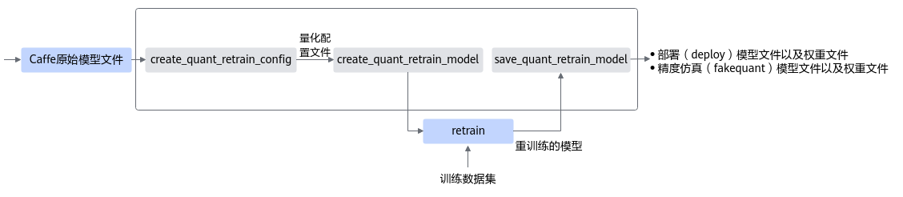

蓝色部分为用户实现，灰色部分为用户调用AMCT提供的API实现，用户在Caffe原始网络推理的代码中导入库，并在特定的位置调用相应API，即可实现量化功能：

1.  用户首先构造Caffe的原始模型，然后使用[create\_quant\_retrain\_config](create_quant_retrain_config-115.md)生成量化配置文件。
2.  调用[create\_quant\_retrain\_model](create_quant_retrain_model-116.md)接口对原始Caffe模型进行优化，修改后的模型中插入数据量化、权重量化等相关算子，用于计算量化相关参数；用户使用该模型借助AMCT提供的数据集和校准集，在Caffe环境中进行重训练，可以得到量化因子。
3.  执行Caffe train流程，并配置solver，在训练过程中增加TEST过程，并配置TEST iteration数目大于量化配置文件中batch\_num数目。
4.  最后用户调用[save\_quant\_retrain\_model](save_quant_retrain_model-117.md)接口，插入AscendQuant、AscendDequant等量化算子，保存量化模型：包括可在Caffe环境中进行精度仿真的模型文件和权重文件，以及可部署在NPU IP加速器的模型文件和权重文件。

**调用示例<a name="section1873101124111"></a>**

> **说明：** 
>1.  量化感知训练场景下对训练过程的建议：
>    量化后的训练过程，设置需要与原始训练过程的配置基本保持一致，主要调整如下两点：
>    -   epoch数：需调整为原始epoch数的1/4\~原始epoch数的1/3。
>    -   学习率：需调整为初始学习率的1/100左右。
>2.  如下示例标有“由用户补充处理”的步骤，需要用户根据自己的模型和数据集进行补充处理，示例中仅为示例代码。
>3.  调用AMCT的部分，函数入参可以根据实际情况进行调整。量化感知训练基于用户的训练过程，请确保已经有基于Caffe环境进行训练的脚本，并且训练后的精度正常。

1.  导入AMCT包，并通过[环境变量设置](环境变量设置.md)日志级别。

    ```
    import amct_caffe as amct
    ```

2.  设置设备运行模式。

    AMCT支持CPU或GPU运行模式，若选择GPU模式，需要先设置Caffe的GPU运行设备模式，再设置AMCT的设备模式；另外因为此处已经指定了运行设备，模型推理函数中无需再次配置运行设备：

    ```
    if 'gpu':
        caffe.set_mod_gpu()
        caffe.set_device(gpu_id)
        amct.set_gpu_mode()
    else:
        caffe.set_mode_cpu()
    ```

3.  <a name="li10202343705"></a>（可选，由用户补充处理）使用原始待量化的模型和测试集，在Caffe环境下推理，验证环境、推理脚本是否正常。

    推荐执行该步骤，请确保原始模型可以完成推理且精度正常；执行该步骤时，可以使用部分测试集，减少运行时间。

    ```
    user_test_model(ori_model_file, ori_weights_file, test_data, test_iterations)
    ```

4.  调用AMCT，量化模型。
    1.  生成量化配置文件。

        ```
        config_file = './tmp/config.json'
        amct_caffe.create_quant_retrain_config(config_file=config_file, 
                                               model_file=ori_model_file,
                                               weights_file=ori_weights_file)
        ```

    2.  修改模型，插入伪量化层并存为新的模型文件。

        根据量化配置文件对模型进行修改，插入数据量化、权重量化等相关算子，用于计算量化相关参数。

        ```
        modified_model_file = './tmp/modified_model.prototxt'
        modified_weights_file = './tmp/modified_model.caffemodel'
        scale_offset_record_file = './tmp/record.txt'
        amct_caffe.create_quant_retrain_model(model_file=ori_model_file,
        				      weights_file=ori_weights_file,
                                              config_file=config_file,
                                              modified_model_file=modified_model_file,
        				      modified_weights_file=modified_weights_file,
                                              scale_offset_record_file=scale_offset_record_file)
        ```

    3.  （由用户补充处理）使用修改后的模型，创建反向梯度，在训练集上做训练，训练量化因子。
        1.  在solver.prototxt中增加TEST phase（test\_interval \> 0，test\_iter \> 0），以触发在TEST phase中执行移位因子N的搜索动作，并且关闭预测test\_initialization=false，避免误触发移位因子N的搜索计算。

            solver.prototxt文件需要包含参数示例如下：

            ```
            test_iter: 1
            test_interval: 4
            base_lr: 9.999999747378752e-05
            max_iter: 4
            lr_policy: "step"
            gamma: 0.10000000149011612
            momentum: 0.8999999761581421
            weight_decay: 9.999999747378752e-05
            stepsize: 10
            snapshot: 4
            net: "$HOME/amct_path/sample/resnet50/tmp/modified_model.prototxt"
            test_initialization: false
            ```

            -   test\_iter：repeated参数，指定每次TEST执行的测试的迭代次数，由于移位因子N需要在该过程中执行，因此该数目需要大于等于移位因子N的参数batch\_num，否则会由于数据不足，移位因子N计算失败。test\_iter\*batch\_size为每次测试的图片数。
            -   test\_interval：两次测试之间TEST的训练次数，每执行test\_interval次训练迭代后会执行TEST过程，该参数默认为0，**建议配置为max\_iter的因子**，sample中配置test\_interval==max\_iter，即仅完成训练后执行一次TEST。
            -   max\_iter：训练最大迭代次数。
            -   net：训练使用的模型，Caffe支持配置一个net分别用于TRAIN，TEST（通过算子内phase来区分不同模式需要执行的算子），也可以通过分别指定train\_net，test\_net来指定不同phase执行的模型；AMCT仅产生了一个模型，通过算子内部phase来区分不同模式，因子仅支持net，不支持配置train\_net，test\_net。
            -   test\_initialization：是否要在训练之前执行原始模型的TEST，数据类型为bool型，默认为True，即执行一次预测试；若设置为True，初始化参数为0，计算出的移位因子N错误，因此需要关掉预测试，即需要配置test\_initialization = False。
            -   base\_lr、lr\_policy、gamma几个参数用于控制学习策略，即learning\_rate如何变化。
            -   momentum：上一次梯度更新的权重。
            -   weight\_decay：权重衰减项，防止过拟合的一个参数。
            -   snapshot：快照，将训练出来的model和solver状态进行保存，snapshot用于设置训练多少次后进行保存。

        2.  训练模型。

            ```
            user_train_model(modified_model_file, modified_weights_file, train_data)
            ```

            训练过程中数据量化算子训练得到量化上下限clip\_max、clip\_min，保存到算子blob中，权重量化算子执行量化参数学习，并保存更新后的参数至模型中：前batch\_num次训练后会生成量化因子，如果训练次数少于batch\_num会导致失败。

    4.  保存模型。

        根据量化因子以及用户重训练好的模型，调用**save\_quant\_retrain\_model**接口，插入AscendQuant、AscendDequant等算子，保存为deploy和fake-quant量化模型。

        ```
        quant_model_path = './result/user_model'
        amct.save_quant_retrain_model(retrained_model_file=modified_model_file,
                                      retrained_weights_file=modified_weights_file,
                                      save_type='Both',
                                      save_path=quant_model_path,
                                      scale_offset_record_file=scale_offset_record_file,
                                      config_file=config_file)
        ```

5.  （可选，由用户补充处理）使用量化后模型fake\_quant\_model、fake\_quant\_weights和测试集，在Caffe环境下推理，测试量化后的仿真模型精度。

    使用量化后仿真模型精度与[3](#li10202343705)中的原始精度做对比，可以观察量化对精度的影响。

    ```
    fake_quant_model = './result/user_model_fake_quant_model.prototxt'
    fake_quant_weights = './result/user_model_fake_quant_weights.caffemodel'
    user_test_model(fake_quant_model, fake_quant_weights, test_data, test_iterations)
    ```

#### 手工调优<a name="ZH-CN_TOPIC_0000002473904486"></a>

执行量化感知训练特性后的精度如果不满足要求，可以尝试手动调整config.json文件中的参数，本节给出调整的原则，以及参数解释。

**调优流程<a name="section19345631185113"></a>**

通过[create\_quant\_retrain\_config](create_quant_retrain_config-115.md)接口生成的config.json文件中的默认配置进行量化，若量化后的推理精度不满足要求，则需要按照如下步骤不断调整训练后量化配置文件config.json中的参数，直至精度满足要求。

1.  根据[create\_quant\_retrain\_config](create_quant_retrain_config-115.md)接口生成的默认配置进行量化。若精度满足要求，则调参结束，否则进行[2](#li17583144018387)。
2.  <a name="li17583144018387"></a>将部分量化层取消量化，即将其"retrain\_enable"参数修改为"false"。通常模型首尾层对推理结果影响较大，故建议优先取消首尾层的量化。

    如果用户有推荐的clip\_max和clip\_min的参数取值，则可以按照如下方式修改量化配置文件：

    ```
    {
        "version":1,
        "layername1":{
            "retrain_enable":true,
            "retrain_data_config":{
                "algo":"ulq_quantize",
                "clip_max":3.0,
                "clip_min":-3.0
            },
            "retrain_weight_config":{
                "algo":"arq_retrain",
                "channel_wise":true
            }
        },
        "layername2":{
            "retrain_enable":true,
            "retrain_data_config":{
                "algo":"ulq_quantize",
                "clip_max":3.0,
                "clip_min":-3.0
            },
            "retrain_weight_config":{
                "algo":"arq_retrain",
                "channel_wise":true
            }
        }
    }
    ```

3.  完成配置后，精度满足要求则调参结束；否则表明量化感知训练对精度影响很大，不能进行量化感知训练，去除量化感知训练配置。

**量化配置文件<a name="section1180063544518"></a>**

通过[create\_quant\_retrain\_config](create_quant_retrain_config-115.md)接口生成的config.json量化感知训练配置文件，部分内容样例请参见[调用示例](create_quant_retrain_config-115.md#zh-cn_topic_0240188739_section9850164918476)（用户修改JSON文件时，请确保层名唯一）。配置文件中参数说明如下，其中[表7](#table1459214218113)\~[表9](#table1988120453112)的参数说明在手动调整量化配置文件时才会使用。

**表 1**  version参数说明

<a name="table1933120499584"></a>
<table><tbody><tr id="row2410154917588"><th class="firstcol" valign="top" width="29.459999999999997%" id="mcps1.2.3.1.1"><p id="p5410154919582"><a name="p5410154919582"></a><a name="p5410154919582"></a>作用</p>
</th>
<td class="cellrowborder" valign="top" width="70.54%" headers="mcps1.2.3.1.1 "><p id="p341012497587"><a name="p341012497587"></a><a name="p341012497587"></a>控制量化配置文件版本号。</p>
</td>
</tr>
<tr id="row1410184918581"><th class="firstcol" valign="top" width="29.459999999999997%" id="mcps1.2.3.2.1"><p id="p14410144912584"><a name="p14410144912584"></a><a name="p14410144912584"></a>类型</p>
</th>
<td class="cellrowborder" valign="top" width="70.54%" headers="mcps1.2.3.2.1 "><p id="p12410104910587"><a name="p12410104910587"></a><a name="p12410104910587"></a>int</p>
</td>
</tr>
<tr id="row1441024919580"><th class="firstcol" valign="top" width="29.459999999999997%" id="mcps1.2.3.3.1"><p id="p134106498581"><a name="p134106498581"></a><a name="p134106498581"></a>取值范围</p>
</th>
<td class="cellrowborder" valign="top" width="70.54%" headers="mcps1.2.3.3.1 "><p id="p18410174905818"><a name="p18410174905818"></a><a name="p18410174905818"></a>1</p>
</td>
</tr>
<tr id="row15410194985816"><th class="firstcol" valign="top" width="29.459999999999997%" id="mcps1.2.3.4.1"><p id="p20410184910588"><a name="p20410184910588"></a><a name="p20410184910588"></a>参数说明</p>
</th>
<td class="cellrowborder" valign="top" width="70.54%" headers="mcps1.2.3.4.1 "><p id="p34105493582"><a name="p34105493582"></a><a name="p34105493582"></a>目前仅有一个版本号1。</p>
</td>
</tr>
<tr id="row17410174919583"><th class="firstcol" valign="top" width="29.459999999999997%" id="mcps1.2.3.5.1"><p id="p2041010499589"><a name="p2041010499589"></a><a name="p2041010499589"></a>推荐配置</p>
</th>
<td class="cellrowborder" valign="top" width="70.54%" headers="mcps1.2.3.5.1 "><p id="p5410194915589"><a name="p5410194915589"></a><a name="p5410194915589"></a>1</p>
</td>
</tr>
<tr id="row841010493589"><th class="firstcol" valign="top" width="29.459999999999997%" id="mcps1.2.3.6.1"><p id="p94101149125820"><a name="p94101149125820"></a><a name="p94101149125820"></a>必选或可选</p>
</th>
<td class="cellrowborder" valign="top" width="70.54%" headers="mcps1.2.3.6.1 "><p id="p1041094913584"><a name="p1041094913584"></a><a name="p1041094913584"></a>可选</p>
</td>
</tr>
</tbody>
</table>

**表 2**  retrain\_enable参数说明

<a name="table4499101514598"></a>
<table><tbody><tr id="row75841715185920"><th class="firstcol" valign="top" width="29.509999999999998%" id="mcps1.2.3.1.1"><p id="p15584101575915"><a name="p15584101575915"></a><a name="p15584101575915"></a>作用</p>
</th>
<td class="cellrowborder" valign="top" width="70.49%" headers="mcps1.2.3.1.1 "><p id="p1658414155596"><a name="p1658414155596"></a><a name="p1658414155596"></a>该层是否进行量化感知训练。</p>
</td>
</tr>
<tr id="row058416153590"><th class="firstcol" valign="top" width="29.509999999999998%" id="mcps1.2.3.2.1"><p id="p1358413155596"><a name="p1358413155596"></a><a name="p1358413155596"></a>类型</p>
</th>
<td class="cellrowborder" valign="top" width="70.49%" headers="mcps1.2.3.2.1 "><p id="p2584015105915"><a name="p2584015105915"></a><a name="p2584015105915"></a>bool</p>
</td>
</tr>
<tr id="row958417153595"><th class="firstcol" valign="top" width="29.509999999999998%" id="mcps1.2.3.3.1"><p id="p175840158598"><a name="p175840158598"></a><a name="p175840158598"></a>取值范围</p>
</th>
<td class="cellrowborder" valign="top" width="70.49%" headers="mcps1.2.3.3.1 "><p id="p16584111517591"><a name="p16584111517591"></a><a name="p16584111517591"></a>true或false</p>
</td>
</tr>
<tr id="row155847155595"><th class="firstcol" valign="top" width="29.509999999999998%" id="mcps1.2.3.4.1"><p id="p85846153595"><a name="p85846153595"></a><a name="p85846153595"></a>参数说明</p>
</th>
<td class="cellrowborder" valign="top" width="70.49%" headers="mcps1.2.3.4.1 "><a name="ul1361715281278"></a><a name="ul1361715281278"></a><ul id="ul1361715281278"><li>true：该层需要进行量化感知训练</li><li>false：该层不进行量化感知训练。</li></ul>
</td>
</tr>
<tr id="row19584171525916"><th class="firstcol" valign="top" width="29.509999999999998%" id="mcps1.2.3.5.1"><p id="p1758417157597"><a name="p1758417157597"></a><a name="p1758417157597"></a>推荐配置</p>
</th>
<td class="cellrowborder" valign="top" width="70.49%" headers="mcps1.2.3.5.1 "><p id="p1658481519592"><a name="p1658481519592"></a><a name="p1658481519592"></a>true</p>
</td>
</tr>
<tr id="row1584161525915"><th class="firstcol" valign="top" width="29.509999999999998%" id="mcps1.2.3.6.1"><p id="p18584161525919"><a name="p18584161525919"></a><a name="p18584161525919"></a>必选或可选</p>
</th>
<td class="cellrowborder" valign="top" width="70.49%" headers="mcps1.2.3.6.1 "><p id="p158519158597"><a name="p158519158597"></a><a name="p158519158597"></a>可选</p>
</td>
</tr>
</tbody>
</table>

**表 3**  retrain\_data\_config参数说明

<a name="table295313665910"></a>
<table><tbody><tr id="row35993775914"><th class="firstcol" valign="top" width="29.759999999999998%" id="mcps1.2.3.1.1"><p id="p205933755911"><a name="p205933755911"></a><a name="p205933755911"></a>作用</p>
</th>
<td class="cellrowborder" valign="top" width="70.24000000000001%" headers="mcps1.2.3.1.1 "><p id="p1759837175919"><a name="p1759837175919"></a><a name="p1759837175919"></a>该层数据量化配置。</p>
</td>
</tr>
<tr id="row459183710598"><th class="firstcol" valign="top" width="29.759999999999998%" id="mcps1.2.3.2.1"><p id="p15943713598"><a name="p15943713598"></a><a name="p15943713598"></a>类型</p>
</th>
<td class="cellrowborder" valign="top" width="70.24000000000001%" headers="mcps1.2.3.2.1 "><p id="p359193715916"><a name="p359193715916"></a><a name="p359193715916"></a>object</p>
</td>
</tr>
<tr id="row85953716596"><th class="firstcol" valign="top" width="29.759999999999998%" id="mcps1.2.3.3.1"><p id="p205983717598"><a name="p205983717598"></a><a name="p205983717598"></a>取值范围</p>
</th>
<td class="cellrowborder" valign="top" width="70.24000000000001%" headers="mcps1.2.3.3.1 "><p id="p1959113720598"><a name="p1959113720598"></a><a name="p1959113720598"></a>-</p>
</td>
</tr>
<tr id="row45993718596"><th class="firstcol" valign="top" width="29.759999999999998%" id="mcps1.2.3.4.1"><p id="p559123715917"><a name="p559123715917"></a><a name="p559123715917"></a>参数说明</p>
</th>
<td class="cellrowborder" valign="top" width="70.24000000000001%" headers="mcps1.2.3.4.1 "><p id="p727754111012"><a name="p727754111012"></a><a name="p727754111012"></a>包含如下参数：</p>
<a name="ul68351742201012"></a><a name="ul68351742201012"></a><ul id="ul68351742201012"><li>algo：量化算法选择，默认是ulq_quantize。</li><li>clip_max：截断量化算法上限，默认不选。</li><li>clip_min：截断量化算法下限，默认不选。</li><li>fixed_min：截断量化算法最小值固定为0，默认不选。</li></ul>
</td>
</tr>
<tr id="row559113713595"><th class="firstcol" valign="top" width="29.759999999999998%" id="mcps1.2.3.5.1"><p id="p1859183705914"><a name="p1859183705914"></a><a name="p1859183705914"></a>推荐配置</p>
</th>
<td class="cellrowborder" valign="top" width="70.24000000000001%" headers="mcps1.2.3.5.1 "><p id="p125903705913"><a name="p125903705913"></a><a name="p125903705913"></a>-</p>
</td>
</tr>
<tr id="row859103775914"><th class="firstcol" valign="top" width="29.759999999999998%" id="mcps1.2.3.6.1"><p id="p259103711595"><a name="p259103711595"></a><a name="p259103711595"></a>必选或可选</p>
</th>
<td class="cellrowborder" valign="top" width="70.24000000000001%" headers="mcps1.2.3.6.1 "><p id="p16590373599"><a name="p16590373599"></a><a name="p16590373599"></a>可选</p>
</td>
</tr>
</tbody>
</table>

**表 4**  retrain\_weight\_config参数说明

<a name="table8436159205910"></a>
<table><tbody><tr id="row1452275913591"><th class="firstcol" valign="top" width="30.14%" id="mcps1.2.3.1.1"><p id="p45221959115918"><a name="p45221959115918"></a><a name="p45221959115918"></a>作用</p>
</th>
<td class="cellrowborder" valign="top" width="69.86%" headers="mcps1.2.3.1.1 "><p id="p1252215935915"><a name="p1252215935915"></a><a name="p1252215935915"></a>该层权重量化配置。</p>
</td>
</tr>
<tr id="row19522145965915"><th class="firstcol" valign="top" width="30.14%" id="mcps1.2.3.2.1"><p id="p1852215917591"><a name="p1852215917591"></a><a name="p1852215917591"></a>类型</p>
</th>
<td class="cellrowborder" valign="top" width="69.86%" headers="mcps1.2.3.2.1 "><p id="p1852219596595"><a name="p1852219596595"></a><a name="p1852219596595"></a>object</p>
</td>
</tr>
<tr id="row11522185911599"><th class="firstcol" valign="top" width="30.14%" id="mcps1.2.3.3.1"><p id="p145225597594"><a name="p145225597594"></a><a name="p145225597594"></a>取值范围</p>
</th>
<td class="cellrowborder" valign="top" width="69.86%" headers="mcps1.2.3.3.1 "><p id="p2522159135920"><a name="p2522159135920"></a><a name="p2522159135920"></a>-</p>
</td>
</tr>
<tr id="row205221559105919"><th class="firstcol" valign="top" width="30.14%" id="mcps1.2.3.4.1"><p id="p12522165935911"><a name="p12522165935911"></a><a name="p12522165935911"></a>参数说明</p>
</th>
<td class="cellrowborder" valign="top" width="69.86%" headers="mcps1.2.3.4.1 "><p id="p17933820151112"><a name="p17933820151112"></a><a name="p17933820151112"></a>包含如下参数：</p>
<a name="ul13748202351116"></a><a name="ul13748202351116"></a><ul id="ul13748202351116"><li>algo：量化算法选择，默认是arq_retrain</li><li>channel_wise</li></ul>
</td>
</tr>
<tr id="row20522759115911"><th class="firstcol" valign="top" width="30.14%" id="mcps1.2.3.5.1"><p id="p7522959115911"><a name="p7522959115911"></a><a name="p7522959115911"></a>推荐配置</p>
</th>
<td class="cellrowborder" valign="top" width="69.86%" headers="mcps1.2.3.5.1 "><p id="p1352265919591"><a name="p1352265919591"></a><a name="p1352265919591"></a>-</p>
</td>
</tr>
<tr id="row2522195912593"><th class="firstcol" valign="top" width="30.14%" id="mcps1.2.3.6.1"><p id="p12522155955910"><a name="p12522155955910"></a><a name="p12522155955910"></a>必选或可选</p>
</th>
<td class="cellrowborder" valign="top" width="69.86%" headers="mcps1.2.3.6.1 "><p id="p7522759105918"><a name="p7522759105918"></a><a name="p7522759105918"></a>可选</p>
</td>
</tr>
</tbody>
</table>

**表 5**  algo参数说明

<a name="table16511191903"></a>
<table><tbody><tr id="row11351719107"><th class="firstcol" valign="top" width="30.020000000000003%" id="mcps1.2.3.1.1"><p id="p81352194014"><a name="p81352194014"></a><a name="p81352194014"></a>作用</p>
</th>
<td class="cellrowborder" valign="top" width="69.98%" headers="mcps1.2.3.1.1 "><p id="p11359192003"><a name="p11359192003"></a><a name="p11359192003"></a>该层选择使用的量化算法。</p>
</td>
</tr>
<tr id="row41353191201"><th class="firstcol" valign="top" width="30.020000000000003%" id="mcps1.2.3.2.1"><p id="p51351719900"><a name="p51351719900"></a><a name="p51351719900"></a>类型</p>
</th>
<td class="cellrowborder" valign="top" width="69.98%" headers="mcps1.2.3.2.1 "><p id="p813515190015"><a name="p813515190015"></a><a name="p813515190015"></a>object</p>
</td>
</tr>
<tr id="row51357191903"><th class="firstcol" valign="top" width="30.020000000000003%" id="mcps1.2.3.3.1"><p id="p111350191400"><a name="p111350191400"></a><a name="p111350191400"></a>取值范围</p>
</th>
<td class="cellrowborder" valign="top" width="69.98%" headers="mcps1.2.3.3.1 "><p id="p11355191907"><a name="p11355191907"></a><a name="p11355191907"></a>-</p>
</td>
</tr>
<tr id="row1913611192016"><th class="firstcol" valign="top" width="30.020000000000003%" id="mcps1.2.3.4.1"><p id="p14136101917017"><a name="p14136101917017"></a><a name="p14136101917017"></a>参数说明</p>
</th>
<td class="cellrowborder" valign="top" width="69.98%" headers="mcps1.2.3.4.1 "><a name="ul12852131315124"></a><a name="ul12852131315124"></a><ul id="ul12852131315124"><li>ulq_quantize：ulq截断上下限量化算法。</li><li>arq_retrain：arq量化算法。</li></ul>
</td>
</tr>
<tr id="row813613194017"><th class="firstcol" valign="top" width="30.020000000000003%" id="mcps1.2.3.5.1"><p id="p1136219806"><a name="p1136219806"></a><a name="p1136219806"></a>推荐配置</p>
</th>
<td class="cellrowborder" valign="top" width="69.98%" headers="mcps1.2.3.5.1 "><p id="p891753512124"><a name="p891753512124"></a><a name="p891753512124"></a>数据量化使用ulq_quantize，权重量化使用arq_retrain。</p>
</td>
</tr>
<tr id="row9136719007"><th class="firstcol" valign="top" width="30.020000000000003%" id="mcps1.2.3.6.1"><p id="p2136171915018"><a name="p2136171915018"></a><a name="p2136171915018"></a>必选或可选</p>
</th>
<td class="cellrowborder" valign="top" width="69.98%" headers="mcps1.2.3.6.1 "><p id="p2136519602"><a name="p2136519602"></a><a name="p2136519602"></a>可选</p>
</td>
</tr>
</tbody>
</table>

**表 6**  channel\_wise参数说明

<a name="table19960439106"></a>
<table><tbody><tr id="row19630401702"><th class="firstcol" valign="top" width="30.330000000000002%" id="mcps1.2.3.1.1"><p id="p16630401405"><a name="p16630401405"></a><a name="p16630401405"></a>作用</p>
</th>
<td class="cellrowborder" valign="top" width="69.67%" headers="mcps1.2.3.1.1 "><p id="p18631740902"><a name="p18631740902"></a><a name="p18631740902"></a>是否对每个channel采用不同的量化因子。</p>
</td>
</tr>
<tr id="row6631403012"><th class="firstcol" valign="top" width="30.330000000000002%" id="mcps1.2.3.2.1"><p id="p2639401605"><a name="p2639401605"></a><a name="p2639401605"></a>类型</p>
</th>
<td class="cellrowborder" valign="top" width="69.67%" headers="mcps1.2.3.2.1 "><p id="p7641340708"><a name="p7641340708"></a><a name="p7641340708"></a>bool</p>
</td>
</tr>
<tr id="row176416405012"><th class="firstcol" valign="top" width="30.330000000000002%" id="mcps1.2.3.3.1"><p id="p1364154019019"><a name="p1364154019019"></a><a name="p1364154019019"></a>取值范围</p>
</th>
<td class="cellrowborder" valign="top" width="69.67%" headers="mcps1.2.3.3.1 "><p id="p06474012018"><a name="p06474012018"></a><a name="p06474012018"></a>true或false</p>
</td>
</tr>
<tr id="row11644401600"><th class="firstcol" valign="top" width="30.330000000000002%" id="mcps1.2.3.4.1"><p id="p2647406019"><a name="p2647406019"></a><a name="p2647406019"></a>参数说明</p>
</th>
<td class="cellrowborder" valign="top" width="69.67%" headers="mcps1.2.3.4.1 "><a name="ul145214136711"></a><a name="ul145214136711"></a><ul id="ul145214136711"><li>true：每个channel独立量化，量化因子不同。</li><li>false：每个channel同时量化，共享量化因子。</li></ul>
</td>
</tr>
<tr id="row5644406018"><th class="firstcol" valign="top" width="30.330000000000002%" id="mcps1.2.3.5.1"><p id="p12644401701"><a name="p12644401701"></a><a name="p12644401701"></a>推荐配置</p>
</th>
<td class="cellrowborder" valign="top" width="69.67%" headers="mcps1.2.3.5.1 "><p id="p12641040401"><a name="p12641040401"></a><a name="p12641040401"></a>true</p>
</td>
</tr>
<tr id="row9649401506"><th class="firstcol" valign="top" width="30.330000000000002%" id="mcps1.2.3.6.1"><p id="p16444012018"><a name="p16444012018"></a><a name="p16444012018"></a>必选或可选</p>
</th>
<td class="cellrowborder" valign="top" width="69.67%" headers="mcps1.2.3.6.1 "><p id="p106444019018"><a name="p106444019018"></a><a name="p106444019018"></a>可选</p>
</td>
</tr>
</tbody>
</table>

**表 7**  fixed\_min参数说明

<a name="table1459214218113"></a>
<table><tbody><tr id="row273316210110"><th class="firstcol" valign="top" width="30.4%" id="mcps1.2.3.1.1"><p id="p2734529111"><a name="p2734529111"></a><a name="p2734529111"></a>作用</p>
</th>
<td class="cellrowborder" valign="top" width="69.6%" headers="mcps1.2.3.1.1 "><p id="p9796912758"><a name="p9796912758"></a><a name="p9796912758"></a>设置数据量化算法下限的开关。</p>
</td>
</tr>
<tr id="row1573418219111"><th class="firstcol" valign="top" width="30.4%" id="mcps1.2.3.2.1"><p id="p7734122712"><a name="p7734122712"></a><a name="p7734122712"></a>类型</p>
</th>
<td class="cellrowborder" valign="top" width="69.6%" headers="mcps1.2.3.2.1 "><p id="p1573412218119"><a name="p1573412218119"></a><a name="p1573412218119"></a>bool</p>
</td>
</tr>
<tr id="row573414213113"><th class="firstcol" valign="top" width="30.4%" id="mcps1.2.3.3.1"><p id="p473414214110"><a name="p473414214110"></a><a name="p473414214110"></a>取值范围</p>
</th>
<td class="cellrowborder" valign="top" width="69.6%" headers="mcps1.2.3.3.1 "><p id="p37341321010"><a name="p37341321010"></a><a name="p37341321010"></a>true或false</p>
</td>
</tr>
<tr id="row97341522015"><th class="firstcol" valign="top" width="30.4%" id="mcps1.2.3.4.1"><p id="p177341821611"><a name="p177341821611"></a><a name="p177341821611"></a>参数说明</p>
</th>
<td class="cellrowborder" valign="top" width="69.6%" headers="mcps1.2.3.4.1 "><a name="ul2060616411812"></a><a name="ul2060616411812"></a><ul id="ul2060616411812"><li>true：数据量化算法固定下限，并且下限为0。</li><li>false：数据量化算法不固定下限。</li></ul>
<p id="p126671643181416"><a name="p126671643181416"></a><a name="p126671643181416"></a>如果不选此项，amct根据图的结构自动设置。</p>
<p id="p1446794731520"><a name="p1446794731520"></a><a name="p1446794731520"></a>如果选择此项，并且网络模型量化层的前一层是relu层，则该参数需要手动设置为true，如果为非relu层，则要手动设置为false。</p>
</td>
</tr>
<tr id="row9734521119"><th class="firstcol" valign="top" width="30.4%" id="mcps1.2.3.5.1"><p id="p5734623111"><a name="p5734623111"></a><a name="p5734623111"></a>推荐配置</p>
</th>
<td class="cellrowborder" valign="top" width="69.6%" headers="mcps1.2.3.5.1 "><p id="p47340218119"><a name="p47340218119"></a><a name="p47340218119"></a>不选此项</p>
</td>
</tr>
<tr id="row07341224118"><th class="firstcol" valign="top" width="30.4%" id="mcps1.2.3.6.1"><p id="p173417211112"><a name="p173417211112"></a><a name="p173417211112"></a>必选或可选</p>
</th>
<td class="cellrowborder" valign="top" width="69.6%" headers="mcps1.2.3.6.1 "><p id="p15734128116"><a name="p15734128116"></a><a name="p15734128116"></a>可选</p>
</td>
</tr>
</tbody>
</table>

**表 8**  clip\_max参数说明

<a name="table15662152613113"></a>
<table><tbody><tr id="row1884192620114"><th class="firstcol" valign="top" width="30.78%" id="mcps1.2.3.1.1"><p id="p15841926411"><a name="p15841926411"></a><a name="p15841926411"></a>作用</p>
</th>
<td class="cellrowborder" valign="top" width="69.22%" headers="mcps1.2.3.1.1 "><p id="p158412268115"><a name="p158412268115"></a><a name="p158412268115"></a>数据量化算法上限。</p>
</td>
</tr>
<tr id="row20841192612115"><th class="firstcol" valign="top" width="30.78%" id="mcps1.2.3.2.1"><p id="p8841132617118"><a name="p8841132617118"></a><a name="p8841132617118"></a>类型</p>
</th>
<td class="cellrowborder" valign="top" width="69.22%" headers="mcps1.2.3.2.1 "><p id="p1841926412"><a name="p1841926412"></a><a name="p1841926412"></a>float</p>
</td>
</tr>
<tr id="row7841132616113"><th class="firstcol" valign="top" width="30.78%" id="mcps1.2.3.3.1"><p id="p98411626218"><a name="p98411626218"></a><a name="p98411626218"></a>取值范围</p>
</th>
<td class="cellrowborder" valign="top" width="69.22%" headers="mcps1.2.3.3.1 "><p id="p1628854314316"><a name="p1628854314316"></a><a name="p1628854314316"></a>clip_max&gt;0</p>
<p id="p5540113223113"><a name="p5540113223113"></a><a name="p5540113223113"></a>根据不同层activation的数据分布找到最大值max，推荐取值范围为：</p>
<p id="p1951711211463"><a name="p1951711211463"></a><a name="p1951711211463"></a>0.3*max~1.7*max</p>
</td>
</tr>
<tr id="row28412026112"><th class="firstcol" valign="top" width="30.78%" id="mcps1.2.3.4.1"><p id="p184116261613"><a name="p184116261613"></a><a name="p184116261613"></a>参数说明</p>
</th>
<td class="cellrowborder" valign="top" width="69.22%" headers="mcps1.2.3.4.1 "><p id="p784192610116"><a name="p784192610116"></a><a name="p784192610116"></a>截断上下限数据量化算法，如果选择此项则固定算法截断上限。如果不选此项，通过ifmr算法学习获取上限。</p>
</td>
</tr>
<tr id="row1384115264120"><th class="firstcol" valign="top" width="30.78%" id="mcps1.2.3.5.1"><p id="p88411265115"><a name="p88411265115"></a><a name="p88411265115"></a>推荐配置</p>
</th>
<td class="cellrowborder" valign="top" width="69.22%" headers="mcps1.2.3.5.1 "><p id="p188411726716"><a name="p188411726716"></a><a name="p188411726716"></a>不选此项</p>
</td>
</tr>
<tr id="row5841182617115"><th class="firstcol" valign="top" width="30.78%" id="mcps1.2.3.6.1"><p id="p10841102613112"><a name="p10841102613112"></a><a name="p10841102613112"></a>必选或可选</p>
</th>
<td class="cellrowborder" valign="top" width="69.22%" headers="mcps1.2.3.6.1 "><p id="p15842172615111"><a name="p15842172615111"></a><a name="p15842172615111"></a>可选</p>
</td>
</tr>
</tbody>
</table>

**表 9**  clip\_min参数说明

<a name="table1988120453112"></a>
<table><tbody><tr id="row159518451718"><th class="firstcol" valign="top" width="30.84%" id="mcps1.2.3.1.1"><p id="p169511945018"><a name="p169511945018"></a><a name="p169511945018"></a>作用</p>
</th>
<td class="cellrowborder" valign="top" width="69.16%" headers="mcps1.2.3.1.1 "><p id="p595117451316"><a name="p595117451316"></a><a name="p595117451316"></a>数据量化算法下限。</p>
</td>
</tr>
<tr id="row159519452115"><th class="firstcol" valign="top" width="30.84%" id="mcps1.2.3.2.1"><p id="p159527451915"><a name="p159527451915"></a><a name="p159527451915"></a>类型</p>
</th>
<td class="cellrowborder" valign="top" width="69.16%" headers="mcps1.2.3.2.1 "><p id="p25425199451"><a name="p25425199451"></a><a name="p25425199451"></a>float</p>
</td>
</tr>
<tr id="row195216451916"><th class="firstcol" valign="top" width="30.84%" id="mcps1.2.3.3.1"><p id="p295217450114"><a name="p295217450114"></a><a name="p295217450114"></a>取值范围</p>
</th>
<td class="cellrowborder" valign="top" width="69.16%" headers="mcps1.2.3.3.1 "><p id="p189461558113113"><a name="p189461558113113"></a><a name="p189461558113113"></a>clip_min&lt;0</p>
<p id="p663113717614"><a name="p663113717614"></a><a name="p663113717614"></a>根据不同层activation的数据分布找到最小值min，推荐取值范围为：</p>
<p id="p206311137166"><a name="p206311137166"></a><a name="p206311137166"></a>0.3*min~1.7*min</p>
</td>
</tr>
<tr id="row1695244517115"><th class="firstcol" valign="top" width="30.84%" id="mcps1.2.3.4.1"><p id="p89522451612"><a name="p89522451612"></a><a name="p89522451612"></a>参数说明</p>
</th>
<td class="cellrowborder" valign="top" width="69.16%" headers="mcps1.2.3.4.1 "><p id="p1895217453114"><a name="p1895217453114"></a><a name="p1895217453114"></a>截断上下限数据量化算法，如果选择此项则固定算法截断下限。如果不选此项，通过ifmr算法学习获取下限。</p>
</td>
</tr>
<tr id="row18952164511118"><th class="firstcol" valign="top" width="30.84%" id="mcps1.2.3.5.1"><p id="p159521045517"><a name="p159521045517"></a><a name="p159521045517"></a>推荐配置</p>
</th>
<td class="cellrowborder" valign="top" width="69.16%" headers="mcps1.2.3.5.1 "><p id="p59521545716"><a name="p59521545716"></a><a name="p59521545716"></a>不选此项</p>
</td>
</tr>
<tr id="row9952245118"><th class="firstcol" valign="top" width="30.84%" id="mcps1.2.3.6.1"><p id="p49522451211"><a name="p49522451211"></a><a name="p49522451211"></a>必选或可选</p>
</th>
<td class="cellrowborder" valign="top" width="69.16%" headers="mcps1.2.3.6.1 "><p id="p395214459119"><a name="p395214459119"></a><a name="p395214459119"></a>可选</p>
</td>
</tr>
</tbody>
</table>

## 张量分解<a name="ZH-CN_TOPIC_0000002506024513"></a>

张量分解通过分解卷积核的张量，将一个卷积转化成两个小卷积的堆叠来降低推理开销，如用户模型中存在大量卷积，且卷积核shape普遍大于\(64, 64, 3, 3\)时推荐使用张量分解。

目前仅支持满足如下条件的卷积进行分解：

-   group=1、dilation=\(1,1\)、stride<3
-   kernel\_h\>2、kernel\_w\>2

例如，用户使用的Caffe原始模型中存在Convolution层，并且该层满足上述条件，才有可能将相应的Convolution层分解成两个Convolution层，然后使用AMCT转换成可以在NPU IP加速器部署的量化模型，以便在模型推理时获得更好的性能。

该场景为可选操作，用户自行决定是否进行原始模型的分解。

**分解约束<a name="section02903242261"></a>**

如果Convolution层的shape过大，会造成分解时间过长或分解异常中止，为防止出现该情况，执行分解动作前，请先参见如下约束或参考数据：

-   **分解工具性能参考数据：**

    -   CPU: Intel\(R\) Xeon\(R\) CPU E5-2699 v4 @ 2.20GHz
    -   内存: 512G

    分解单层卷积：

    -   shape\(512, 512, 5, 5\)，大约耗时25秒。
    -   shape\(1024, 1024, 3, 3\)，大约耗时16秒。
    -   shape\(1024, 1024, 5, 5\)，大约耗时78秒。
    -   shape\(2048, 2048, 3, 3\)，大约耗时63秒。
    -   shape\(2048, 2048, 5, 5\)，大约耗时430秒。

-   **内存超限风险提醒**：

    分解大卷积核存在内存超限风险参考数值：shape为\(2048, 2048, 5, 5\)的卷积核约占用32G内存。

**接口调用流程<a name="section1297414361113"></a>**

接口调用流程如[图1](#fig17111191832012)所示，分解示例请参见[样例列表](样例列表.md)。

**图 1**  张量分解接口调用流程<a name="fig17111191832012"></a>  


具体流程如下：

1.  根据用户提供的Caffe原始模型，调用[auto\_decomposition](auto_decomposition-121.md)生成张量分解后的模型文件以及权重文件。
2.  对分解后的模型进行fine-tune，输出分解后的模型，如果要对该模型进行量化，则请参见[训练后量化](训练后量化-96.md)或者[量化感知训练](量化感知训练-102.md)。

[图2](#fig727011012510)为resnet50网络模型分解前后的示意图。

**图 2**  模型分解前后示意图<a name="fig727011012510"></a>  
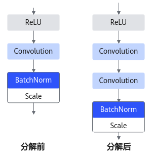

**调用示例<a name="section20471459778"></a>**

```
# 导入相关模块
from amct_caffe.tensor_decompose import auto_decomposition

# 待分解模型文件
model_file = 'src_path/xxx.prototxt'    
# 待分解权值文件        
weights_file = 'src_path/xxx.caffemodel'  
# 分解后保存的模型文件        
new_model_file = 'decomposed_path/xxx.prototxt'   
# 分解后保存的权值文件  
new_weights_file = 'decomposed_path/xxx.caffemodel' 

# 执行张量分解
auto_decomposition(model_file=model_file, weights_file=weights_file,
                   new_model_file=new_model_file, new_weights_file=new_weights_file)
```

## 扩展更多特性（模型适配）<a name="ZH-CN_TOPIC_0000002473904512"></a>

如果用户有自己计算得到的量化因子以及Caffe原始模型，该模型无法直接使用ATC工具转成适配NPU IP加速器的离线模型，需要借助该章节提供的功能，将其转成CANN量化模型格式，然后才能使用ATC工具，将CANN量化模型转成适配NPU IP加速器的离线模型。

**适配原理<a name="section11245174911561"></a>**

适配原理如下图所示，蓝色部分为用户实现，灰色部分为用户调用AMCT提供的[convert\_model](convert_model-119.md)实现，用户在Caffe原始网络推理的代码中导入库，并在特定的位置调用相应API，即可实现模型适配功能。该场景下的适配示例请参见[样例列表](样例列表.md)\>模型适配。

**图 1**  模型适配原理<a name="zh-cn_topic_0240188734_fig1150702418492"></a>  
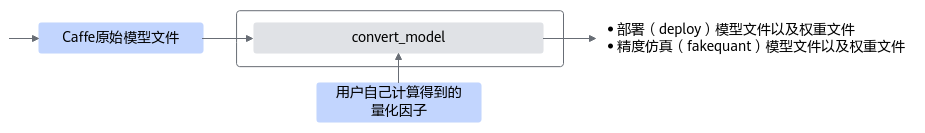

**调用示例<a name="section28382395299"></a>**

> **说明：** 
>1.  如下示例标有“由用户补充处理”的步骤，需要用户根据自己的模型和数据集进行补充处理，示例中仅为示例代码。
>2.  如果用户需要基于如下代码，对其他模型进行量化，需要准备原始未量化的模型，将用户自己准备的量化因子转换为量化因子记录文件。

1.  导入AMCT包，并通过[环境变量设置](环境变量设置.md)日志级别。

    ```
    import amct_caffe as amct
    ```

2.  设置设备运行模式。

    AMCT支持CPU或GPU运行模式，若选择GPU模式，需要先设置Caffe的GPU运行设备模式，再设置AMCT的设备模式；另外因为此处已经指定了运行设备，模型推理函数中无需再次配置运行设备：

    ```
    if 'gpu':
        caffe.set_mod_gpu()
        caffe.set_device(gpu_id)
        amct.set_gpu_mode()
    else:
        caffe.set_mode_cpu()
    ```

3.  <a name="li519719373575"></a>（可选，由用户补充处理）使用原始待量化的模型和测试集，在Caffe环境下推理，验证环境、推理脚本是否正常。

    推荐执行该步骤，请确保原始模型可以完成推理且精度正常；执行该步骤时，可以使用部分测试集，减少运行时间。

    ```
    user_test_model(ori_model_file, ori_weights_file, test_data, test_iterations)
    ```

4.  调用[convert\_model](convert_model-119.md)接口，进行模型适配。

    该接口内部会将原始模型解析为graph形式，完成图的预处理操作\>解析用户传入的量化因子文件\>然后根据量化因子和修改后的图结构，插入AscendQuant、AscendDequant等算子，保存为量化模型。

    ```
    quant_model_path = './result/user_model'
    record_file = './result/record.txt'
    amct.convert_model(model_file=ori_model_file,
    		   weights_file=ori_weights_file,
    		   scale_offset_record_file=record_file,
    		   save_path=quant_model_path)
    ```

5.  （可选，由用户补充处理）使用量化后模型fake\_quant\_model、fake\_quant\_weights和测试集，在Caffe环境下推理，测试量化后的仿真模型精度。

    使用量化后仿真模型精度与[3](#li519719373575)中的原始精度做对比，可以观察量化对精度的影响。

    ```
    fake_quant_model = './result/user_model_fake_quant_model.prototxt'
    fake_quant_weights = './result/user_model_fake_quant_weights.caffemodel'
    user_test_model(fake_quant_model, fake_quant_weights, test_data, test_iterations)
    ```

## 接口说明<a name="ZH-CN_TOPIC_0000002473904504"></a>


### 整体约束和接口列表<a name="ZH-CN_TOPIC_0000002473904586"></a>

**整体约束<a name="section51305271119"></a>**

-   若接口中存在需要用户输入文件路径的参数，请确保输入路径正确，AMCT不会对路径做安全校验。
-   若接口中存在需要用户输入文件路径的参数，重新执行量化时，该参数相关取值将会被覆盖；量化打屏日志中也会有相关文件被覆盖的warning风险提示信息。

**接口列表<a name="section218318449115"></a>**

<a name="table18468165916110"></a>
<table><thead align="left"><tr id="row1948385912113"><th class="cellrowborder" valign="top" width="11.43%" id="mcps1.1.4.1.1"><p id="p1035516624612"><a name="p1035516624612"></a><a name="p1035516624612"></a>分类</p>
</th>
<th class="cellrowborder" valign="top" width="23.200000000000003%" id="mcps1.1.4.1.2"><p id="p1592915316450"><a name="p1592915316450"></a><a name="p1592915316450"></a>接口名称</p>
</th>
<th class="cellrowborder" valign="top" width="65.36999999999999%" id="mcps1.1.4.1.3"><p id="p892995316457"><a name="p892995316457"></a><a name="p892995316457"></a>功能描述</p>
</th>
</tr>
</thead>
<tbody><tr id="row1248317594118"><td class="cellrowborder" rowspan="2" valign="top" width="11.43%" headers="mcps1.1.4.1.1 "><p id="p248318597111"><a name="p248318597111"></a><a name="p248318597111"></a>公共接口</p>
</td>
<td class="cellrowborder" valign="top" width="23.200000000000003%" headers="mcps1.1.4.1.2 "><p id="p134831759510"><a name="p134831759510"></a><a name="p134831759510"></a><a href="set_gpu_mode.md">set_gpu_mode</a></p>
</td>
<td class="cellrowborder" valign="top" width="65.36999999999999%" headers="mcps1.1.4.1.3 "><p id="p182113191626"><a name="p182113191626"></a><a name="p182113191626"></a>调用该接口之后，<span id="zh-cn_topic_0000002505904507_ph2538725141110"><a name="zh-cn_topic_0000002505904507_ph2538725141110"></a><a name="zh-cn_topic_0000002505904507_ph2538725141110"></a>AMCT</span>执行权重量化的时候，会使用GPU进行加速。</p>
</td>
</tr>
<tr id="row748316592113"><td class="cellrowborder" valign="top" headers="mcps1.1.4.1.1 "><p id="p5483459114"><a name="p5483459114"></a><a name="p5483459114"></a><a href="set_cpu_mode.md">set_cpu_mode</a></p>
</td>
<td class="cellrowborder" valign="top" headers="mcps1.1.4.1.2 "><p id="p121120192025"><a name="p121120192025"></a><a name="p121120192025"></a>调用该接口之后，<span id="zh-cn_topic_0000002473744710_ph2538725141110"><a name="zh-cn_topic_0000002473744710_ph2538725141110"></a><a name="zh-cn_topic_0000002473744710_ph2538725141110"></a>AMCT</span>执行权重量化的时候，使用CPU进行计算。</p>
</td>
</tr>
<tr id="row9483135916118"><td class="cellrowborder" rowspan="6" valign="top" width="11.43%" headers="mcps1.1.4.1.1 "><p id="p14831359315"><a name="p14831359315"></a><a name="p14831359315"></a>训练后量化接口</p>
</td>
<td class="cellrowborder" valign="top" width="23.200000000000003%" headers="mcps1.1.4.1.2 "><p id="p154835591113"><a name="p154835591113"></a><a name="p154835591113"></a><a href="create_quant_config-110.md">create_quant_config</a></p>
</td>
<td class="cellrowborder" valign="top" width="65.36999999999999%" headers="mcps1.1.4.1.3 "><p id="p182111519622"><a name="p182111519622"></a><a name="p182111519622"></a>训练后量化接口，根据图的结构找到所有可量化的层，自动生成量化配置文件，并将可量化层的量化配置信息写入配置文件。</p>
</td>
</tr>
<tr id="row164834595119"><td class="cellrowborder" valign="top" headers="mcps1.1.4.1.1 "><p id="p1948315917114"><a name="p1948315917114"></a><a name="p1948315917114"></a><a href="init.md">init</a></p>
</td>
<td class="cellrowborder" valign="top" headers="mcps1.1.4.1.2 "><p id="p72116191821"><a name="p72116191821"></a><a name="p72116191821"></a>训练后量化接口，用于初始化<span id="zh-cn_topic_0000002473904590_ph2538725141110"><a name="zh-cn_topic_0000002473904590_ph2538725141110"></a><a name="zh-cn_topic_0000002473904590_ph2538725141110"></a>AMCT</span>，记录存储量化因子的文件，解析用户模型为图结构graph，供<a href="quantize_model-111.md">quantize_model</a>和<a href="save_model-112.md">save_model</a>使用。</p>
</td>
</tr>
<tr id="row348315591315"><td class="cellrowborder" valign="top" headers="mcps1.1.4.1.1 "><p id="p104830591115"><a name="p104830591115"></a><a name="p104830591115"></a><a href="quantize_model-111.md">quantize_model</a></p>
</td>
<td class="cellrowborder" valign="top" headers="mcps1.1.4.1.2 "><p id="p2211919725"><a name="p2211919725"></a><a name="p2211919725"></a>训练后量化接口，根据用户设置的量化配置文件对图结构进行量化处理，该函数在config_file指定的层插入权重量化层，完成权重量化，并插入数据量化层，将修改后的网络存为新的模型文件。</p>
</td>
</tr>
<tr id="row34830591814"><td class="cellrowborder" valign="top" headers="mcps1.1.4.1.1 "><p id="p15483859111"><a name="p15483859111"></a><a name="p15483859111"></a><a href="save_model-112.md">save_model</a></p>
</td>
<td class="cellrowborder" valign="top" headers="mcps1.1.4.1.2 "><p id="p32118191926"><a name="p32118191926"></a><a name="p32118191926"></a>训练后量化接口，根据修改后的图结构，插入AscendQuant、AscendDequant等算子，将模型保存为可以做推理的文件，支持保存为可在Caffe环境下做精度仿真的fake_quant模型，和可在<span id="zh-cn_topic_0000002473904576_zh-cn_topic_0240188713_ph1555712386204"><a name="zh-cn_topic_0000002473904576_zh-cn_topic_0240188713_ph1555712386204"></a><a name="zh-cn_topic_0000002473904576_zh-cn_topic_0240188713_ph1555712386204"></a>NPU IP加速器</span>上做推理的deploy模型。</p>
</td>
</tr>
<tr id="row248320591413"><td class="cellrowborder" valign="top" headers="mcps1.1.4.1.1 "><p id="p134837591012"><a name="p134837591012"></a><a name="p134837591012"></a><a href="auto_nuq.md">auto_nuq</a></p>
</td>
<td class="cellrowborder" valign="top" headers="mcps1.1.4.1.2 "><p id="p121119190215"><a name="p121119190215"></a><a name="p121119190215"></a>训练后量化接口，根据用户输入的模型、配置文件进行自动非均匀量化，搜索得到一个满足目标精度的非均匀量化配置，输出可以在Caffe环境下做精度仿真的fake_quant模型，和可在<span id="zh-cn_topic_0000002506024571_zh-cn_topic_0240188713_ph1555712386204"><a name="zh-cn_topic_0000002506024571_zh-cn_topic_0240188713_ph1555712386204"></a><a name="zh-cn_topic_0000002506024571_zh-cn_topic_0240188713_ph1555712386204"></a>NPU IP加速器</span>上做在线推理的deploy模型。</p>
</td>
</tr>
<tr id="row6483859614"><td class="cellrowborder" valign="top" headers="mcps1.1.4.1.1 "><p id="p348345918116"><a name="p348345918116"></a><a name="p348345918116"></a><a href="accuracy_based_auto_calibration-113.md">accuracy_based_auto_calibration</a></p>
</td>
<td class="cellrowborder" valign="top" headers="mcps1.1.4.1.2 "><p id="p1821121915218"><a name="p1821121915218"></a><a name="p1821121915218"></a>根据用户输入的模型、配置文件进行自动的校准过程，搜索得到一个满足目标精度的量化配置，输出可以在Caffe环境下做精度仿真的fake_quant模型，和可在<span id="zh-cn_topic_0000002473744692_zh-cn_topic_0240188713_ph1555712386204"><a name="zh-cn_topic_0000002473744692_zh-cn_topic_0240188713_ph1555712386204"></a><a name="zh-cn_topic_0000002473744692_zh-cn_topic_0240188713_ph1555712386204"></a>NPU IP加速器</span>上做推理的deploy模型。</p>
</td>
</tr>
<tr id="row1448325918110"><td class="cellrowborder" rowspan="3" valign="top" width="11.43%" headers="mcps1.1.4.1.1 "><p id="p1348315596112"><a name="p1348315596112"></a><a name="p1348315596112"></a>量化感知训练接口</p>
</td>
<td class="cellrowborder" valign="top" width="23.200000000000003%" headers="mcps1.1.4.1.2 "><p id="p1248313593116"><a name="p1248313593116"></a><a name="p1248313593116"></a><a href="create_quant_retrain_config-115.md">create_quant_retrain_config</a></p>
</td>
<td class="cellrowborder" valign="top" width="65.36999999999999%" headers="mcps1.1.4.1.3 "><p id="p1421111195216"><a name="p1421111195216"></a><a name="p1421111195216"></a>量化感知训练接口，根据图的结构找到所有可量化的层，自动生成量化配置文件，并将可量化层的量化配置信息写入配置文件。</p>
</td>
</tr>
<tr id="row548318591019"><td class="cellrowborder" valign="top" headers="mcps1.1.4.1.1 "><p id="p2048305918112"><a name="p2048305918112"></a><a name="p2048305918112"></a><a href="create_quant_retrain_model-116.md">create_quant_retrain_model</a></p>
</td>
<td class="cellrowborder" valign="top" headers="mcps1.1.4.1.2 "><p id="p16211191913210"><a name="p16211191913210"></a><a name="p16211191913210"></a>量化感知训练接口，根据用户设置的量化配置文件对图结构进行量化处理，该函数在config_file指定的层插入数据和weights伪量化层，将修改后的网络存为新的模型文件。</p>
</td>
</tr>
<tr id="row54833595113"><td class="cellrowborder" valign="top" headers="mcps1.1.4.1.1 "><p id="p6483659918"><a name="p6483659918"></a><a name="p6483659918"></a><a href="save_quant_retrain_model-117.md">save_quant_retrain_model</a></p>
</td>
<td class="cellrowborder" valign="top" headers="mcps1.1.4.1.2 "><p id="p142119192026"><a name="p142119192026"></a><a name="p142119192026"></a>量化感知训练接口，根据用户最终的重训练好的模型，插入AscendQuant、AscendDequant等算子，生成最终fake quant仿真模型和deploy部署模型。</p>
</td>
</tr>
<tr id="row548312593111"><td class="cellrowborder" valign="top" width="11.43%" headers="mcps1.1.4.1.1 "><p id="p1048315598117"><a name="p1048315598117"></a><a name="p1048315598117"></a>模型适配接口</p>
</td>
<td class="cellrowborder" valign="top" width="23.200000000000003%" headers="mcps1.1.4.1.2 "><p id="p148412592110"><a name="p148412592110"></a><a name="p148412592110"></a><a href="convert_model-119.md">convert_model</a></p>
</td>
<td class="cellrowborder" valign="top" width="65.36999999999999%" headers="mcps1.1.4.1.3 "><p id="p1211119622"><a name="p1211119622"></a><a name="p1211119622"></a>根据用户自己计算得到的量化因子以及Caffe模型，适配成可以在<span id="zh-cn_topic_0000002473744660_ph1842019245216"><a name="zh-cn_topic_0000002473744660_ph1842019245216"></a><a name="zh-cn_topic_0000002473744660_ph1842019245216"></a>NPU IP加速器</span>上做在线推理的Deploy量化部署模型和可以在Caffe环境下进行精度仿真的Fakequant量化模型。</p>
</td>
</tr>
<tr id="row15484959017"><td class="cellrowborder" valign="top" width="11.43%" headers="mcps1.1.4.1.1 "><p id="p134842591514"><a name="p134842591514"></a><a name="p134842591514"></a>张量分解接口</p>
</td>
<td class="cellrowborder" valign="top" width="23.200000000000003%" headers="mcps1.1.4.1.2 "><p id="p14484205914110"><a name="p14484205914110"></a><a name="p14484205914110"></a><a href="auto_decomposition-121.md">auto_decomposition</a></p>
</td>
<td class="cellrowborder" valign="top" width="65.36999999999999%" headers="mcps1.1.4.1.3 "><p id="p182111319326"><a name="p182111319326"></a><a name="p182111319326"></a>根据用户提供的Caffe原始模型（.prototxt和.caffemodel），生成张量分解后的模型文件以及权重文件。</p>
</td>
</tr>
</tbody>
</table>

### 公共接口<a name="ZH-CN_TOPIC_0000002506024433"></a>


#### set\_gpu\_mode<a name="ZH-CN_TOPIC_0000002505904507"></a>

**产品支持情况<a name="section197451857688"></a>**

<a name="table38301303189"></a>
<table><thead align="left"><tr id="row20831180131817"><th class="cellrowborder" valign="top" width="57.99999999999999%" id="mcps1.1.3.1.1"><p id="p1883113061818"><a name="p1883113061818"></a><a name="p1883113061818"></a>产品</p>
</th>
<th class="cellrowborder" align="center" valign="top" width="42%" id="mcps1.1.3.1.2"><p id="p783113012187"><a name="p783113012187"></a><a name="p783113012187"></a>是否支持</p>
</th>
</tr>
</thead>
<tbody><tr id="row1466941011819"><td class="cellrowborder" valign="top" width="57.99999999999999%" headers="mcps1.1.3.1.1 "><p id="p146702104188"><a name="p146702104188"></a><a name="p146702104188"></a><span id="ph1577265511916"><a name="ph1577265511916"></a><a name="ph1577265511916"></a>IPV350</span></p>
</td>
<td class="cellrowborder" align="center" valign="top" width="42%" headers="mcps1.1.3.1.2 "><p id="p7670131016189"><a name="p7670131016189"></a><a name="p7670131016189"></a>x</p>
</td>
</tr>
</tbody>
</table>

**功能说明<a name="zh-cn_topic_0240320366_section15406195619561"></a>**

调用该接口之后，AMCT执行权重量化的时候，会使用GPU进行加速。

**函数原型<a name="zh-cn_topic_0240320366_zh-cn_topic_0122830089_section428121323411"></a>**

```
set_gpu_mode()
```

**参数说明<a name="zh-cn_topic_0240320366_section1781973710568"></a>**

无

**返回值说明<a name="zh-cn_topic_0240320366_zh-cn_topic_0122830089_section293415513458"></a>**

无

**约束说明<a name="zh-cn_topic_0240320366_section1443392021419"></a>**

-   用户有GPU环境，且支持CUDA10.0。该接口不支持选择GPU卡，用户可以通过CUDA环境变量\(CUDA\_VISIBLE\_DEVICES\)来选择GPU卡，或者使用pycaffe的set\_device\(\)接口来选择GPU卡。
-   如果既不调用[set\_gpu\_mode](set_gpu_mode.md)接口也不调用[set\_cpu\_mode](set_cpu_mode.md)接口。AMCT默认使用CPU进行权重的量化。

**调用示例<a name="zh-cn_topic_0240320366_section542843616112"></a>**

```
import amct_caffe as amct
amct.set_gpu_mode()
```

#### set\_cpu\_mode<a name="ZH-CN_TOPIC_0000002473744710"></a>

**产品支持情况<a name="section79169493184"></a>**

<a name="zh-cn_topic_0000002505904507_table38301303189"></a>
<table><thead align="left"><tr id="zh-cn_topic_0000002505904507_row20831180131817"><th class="cellrowborder" valign="top" width="57.99999999999999%" id="mcps1.1.3.1.1"><p id="zh-cn_topic_0000002505904507_p1883113061818"><a name="zh-cn_topic_0000002505904507_p1883113061818"></a><a name="zh-cn_topic_0000002505904507_p1883113061818"></a>产品</p>
</th>
<th class="cellrowborder" align="center" valign="top" width="42%" id="mcps1.1.3.1.2"><p id="zh-cn_topic_0000002505904507_p783113012187"><a name="zh-cn_topic_0000002505904507_p783113012187"></a><a name="zh-cn_topic_0000002505904507_p783113012187"></a>是否支持</p>
</th>
</tr>
</thead>
<tbody><tr id="zh-cn_topic_0000002505904507_row1466941011819"><td class="cellrowborder" valign="top" width="57.99999999999999%" headers="mcps1.1.3.1.1 "><p id="zh-cn_topic_0000002505904507_p146702104188"><a name="zh-cn_topic_0000002505904507_p146702104188"></a><a name="zh-cn_topic_0000002505904507_p146702104188"></a><span id="zh-cn_topic_0000002505904507_ph1577265511916"><a name="zh-cn_topic_0000002505904507_ph1577265511916"></a><a name="zh-cn_topic_0000002505904507_ph1577265511916"></a>IPV350</span></p>
</td>
<td class="cellrowborder" align="center" valign="top" width="42%" headers="mcps1.1.3.1.2 "><p id="zh-cn_topic_0000002505904507_p7670131016189"><a name="zh-cn_topic_0000002505904507_p7670131016189"></a><a name="zh-cn_topic_0000002505904507_p7670131016189"></a>x</p>
</td>
</tr>
</tbody>
</table>

**功能说明<a name="zh-cn_topic_0240320367_section15406195619561"></a>**

调用该接口之后，AMCT执行权重量化的时候，使用CPU进行计算。

**函数原型<a name="zh-cn_topic_0240320367_zh-cn_topic_0122830089_section428121323411"></a>**

```
set_cpu_mode()
```

**参数说明<a name="zh-cn_topic_0240320367_section1781973710568"></a>**

无

**返回值说明<a name="zh-cn_topic_0240320367_zh-cn_topic_0122830089_section293415513458"></a>**

无

**约束说明<a name="zh-cn_topic_0240320366_section1443392021419"></a>**

如果既不调用[set\_gpu\_mode](set_gpu_mode.md)接口也不调用[set\_cpu\_mode](set_cpu_mode.md)接口。AMCT默认使用CPU进行权重的量化。

**调用示例<a name="zh-cn_topic_0240320367_section542843616112"></a>**

```
import amct_caffe as amct
amct.set_cpu_mode()
```

### 训练后量化接口<a name="ZH-CN_TOPIC_0000002505904657"></a>


#### create\_quant\_config<a name="ZH-CN_TOPIC_0000002473904498"></a>

**产品支持情况<a name="section79169493184"></a>**

<a name="zh-cn_topic_0000002505904507_table38301303189"></a>
<table><thead align="left"><tr id="zh-cn_topic_0000002505904507_row20831180131817"><th class="cellrowborder" valign="top" width="57.99999999999999%" id="mcps1.1.3.1.1"><p id="zh-cn_topic_0000002505904507_p1883113061818"><a name="zh-cn_topic_0000002505904507_p1883113061818"></a><a name="zh-cn_topic_0000002505904507_p1883113061818"></a>产品</p>
</th>
<th class="cellrowborder" align="center" valign="top" width="42%" id="mcps1.1.3.1.2"><p id="zh-cn_topic_0000002505904507_p783113012187"><a name="zh-cn_topic_0000002505904507_p783113012187"></a><a name="zh-cn_topic_0000002505904507_p783113012187"></a>是否支持</p>
</th>
</tr>
</thead>
<tbody><tr id="zh-cn_topic_0000002505904507_row1466941011819"><td class="cellrowborder" valign="top" width="57.99999999999999%" headers="mcps1.1.3.1.1 "><p id="zh-cn_topic_0000002505904507_p146702104188"><a name="zh-cn_topic_0000002505904507_p146702104188"></a><a name="zh-cn_topic_0000002505904507_p146702104188"></a><span id="zh-cn_topic_0000002505904507_ph1577265511916"><a name="zh-cn_topic_0000002505904507_ph1577265511916"></a><a name="zh-cn_topic_0000002505904507_ph1577265511916"></a>IPV350</span></p>
</td>
<td class="cellrowborder" align="center" valign="top" width="42%" headers="mcps1.1.3.1.2 "><p id="zh-cn_topic_0000002505904507_p7670131016189"><a name="zh-cn_topic_0000002505904507_p7670131016189"></a><a name="zh-cn_topic_0000002505904507_p7670131016189"></a>x</p>
</td>
</tr>
</tbody>
</table>

**功能说明<a name="zh-cn_topic_0240188739_section15406195619561"></a>**

训练后量化接口，根据图的结构找到所有可量化的层，自动生成量化配置文件，并将可量化层的量化配置信息写入配置文件。

**函数原型<a name="zh-cn_topic_0240188739_zh-cn_topic_0122830089_section428121323411"></a>**

```
create_quant_config(config_file, model_file, weights_file, skip_layers=None, batch_num=1, activation_offset=True, config_defination=None)
```

**参数说明<a name="zh-cn_topic_0240188739_zh-cn_topic_0122830089_section795991810344"></a>**

<a name="zh-cn_topic_0240188739_zh-cn_topic_0122830089_table438764393513"></a>
<table><thead align="left"><tr id="zh-cn_topic_0240188739_zh-cn_topic_0122830089_row53871743113510"><th class="cellrowborder" valign="top" width="13.350000000000001%" id="mcps1.1.4.1.1"><p id="zh-cn_topic_0240188739_zh-cn_topic_0122830089_p1438834363520"><a name="zh-cn_topic_0240188739_zh-cn_topic_0122830089_p1438834363520"></a><a name="zh-cn_topic_0240188739_zh-cn_topic_0122830089_p1438834363520"></a>参数名</p>
</th>
<th class="cellrowborder" valign="top" width="8.06%" id="mcps1.1.4.1.2"><p id="zh-cn_topic_0240188739_p1769255516412"><a name="zh-cn_topic_0240188739_p1769255516412"></a><a name="zh-cn_topic_0240188739_p1769255516412"></a>输入/输出</p>
</th>
<th class="cellrowborder" valign="top" width="78.59%" id="mcps1.1.4.1.3"><p id="zh-cn_topic_0240188739_p15231205416325"><a name="zh-cn_topic_0240188739_p15231205416325"></a><a name="zh-cn_topic_0240188739_p15231205416325"></a>说明</p>
</th>
</tr>
</thead>
<tbody><tr id="zh-cn_topic_0240188739_zh-cn_topic_0122830089_row2038874343514"><td class="cellrowborder" valign="top" width="13.350000000000001%" headers="mcps1.1.4.1.1 "><p id="zh-cn_topic_0240188739_p0246102972414"><a name="zh-cn_topic_0240188739_p0246102972414"></a><a name="zh-cn_topic_0240188739_p0246102972414"></a>config_file</p>
</td>
<td class="cellrowborder" valign="top" width="8.06%" headers="mcps1.1.4.1.2 "><p id="zh-cn_topic_0240188739_p8693185517417"><a name="zh-cn_topic_0240188739_p8693185517417"></a><a name="zh-cn_topic_0240188739_p8693185517417"></a>输入</p>
</td>
<td class="cellrowborder" valign="top" width="78.59%" headers="mcps1.1.4.1.3 "><p id="p824014320273"><a name="p824014320273"></a><a name="p824014320273"></a>含义：待生成的量化配置文件存放路径及名称。如果存放路径下已经存在该文件，则调用该接口时会覆盖已有文件。</p>
<p id="zh-cn_topic_0240188739_p11225740182619"><a name="zh-cn_topic_0240188739_p11225740182619"></a><a name="zh-cn_topic_0240188739_p11225740182619"></a>数据类型：string</p>
</td>
</tr>
<tr id="zh-cn_topic_0240188739_row21251438195"><td class="cellrowborder" valign="top" width="13.350000000000001%" headers="mcps1.1.4.1.1 "><p id="zh-cn_topic_0240188739_p412594361918"><a name="zh-cn_topic_0240188739_p412594361918"></a><a name="zh-cn_topic_0240188739_p412594361918"></a>model_file</p>
</td>
<td class="cellrowborder" valign="top" width="8.06%" headers="mcps1.1.4.1.2 "><p id="zh-cn_topic_0240188739_p112544313192"><a name="zh-cn_topic_0240188739_p112544313192"></a><a name="zh-cn_topic_0240188739_p112544313192"></a>输入</p>
</td>
<td class="cellrowborder" valign="top" width="78.59%" headers="mcps1.1.4.1.3 "><p id="p1925671152711"><a name="p1925671152711"></a><a name="p1925671152711"></a>含义：用户Caffe模型的定义文件，格式为.prototxt。</p>
<p id="zh-cn_topic_0240188739_p7125143121916"><a name="zh-cn_topic_0240188739_p7125143121916"></a><a name="zh-cn_topic_0240188739_p7125143121916"></a>数据类型：string</p>
</td>
</tr>
<tr id="zh-cn_topic_0240188739_row16254133823918"><td class="cellrowborder" valign="top" width="13.350000000000001%" headers="mcps1.1.4.1.1 "><p id="zh-cn_topic_0240188739_p1254338193919"><a name="zh-cn_topic_0240188739_p1254338193919"></a><a name="zh-cn_topic_0240188739_p1254338193919"></a>weights_file</p>
</td>
<td class="cellrowborder" valign="top" width="8.06%" headers="mcps1.1.4.1.2 "><p id="zh-cn_topic_0240188739_p1255438123917"><a name="zh-cn_topic_0240188739_p1255438123917"></a><a name="zh-cn_topic_0240188739_p1255438123917"></a>输入</p>
</td>
<td class="cellrowborder" valign="top" width="78.59%" headers="mcps1.1.4.1.3 "><p id="p65421312132711"><a name="p65421312132711"></a><a name="p65421312132711"></a>含义：用户训练好的Caffe模型权重文件，格式为.caffemodel。</p>
<p id="zh-cn_topic_0240188739_p182551638143919"><a name="zh-cn_topic_0240188739_p182551638143919"></a><a name="zh-cn_topic_0240188739_p182551638143919"></a>数据类型：string</p>
</td>
</tr>
<tr id="zh-cn_topic_0240188739_row2997141123911"><td class="cellrowborder" valign="top" width="13.350000000000001%" headers="mcps1.1.4.1.1 "><p id="zh-cn_topic_0240188739_p99979413397"><a name="zh-cn_topic_0240188739_p99979413397"></a><a name="zh-cn_topic_0240188739_p99979413397"></a>skip_layers</p>
</td>
<td class="cellrowborder" valign="top" width="8.06%" headers="mcps1.1.4.1.2 "><p id="zh-cn_topic_0240188739_p10997194193915"><a name="zh-cn_topic_0240188739_p10997194193915"></a><a name="zh-cn_topic_0240188739_p10997194193915"></a>输入</p>
</td>
<td class="cellrowborder" valign="top" width="78.59%" headers="mcps1.1.4.1.3 "><p id="p4352152277"><a name="p4352152277"></a><a name="p4352152277"></a>含义：可量化但不需要量化层的层名。</p>
<p id="zh-cn_topic_0240188739_p163711335174212"><a name="zh-cn_topic_0240188739_p163711335174212"></a><a name="zh-cn_topic_0240188739_p163711335174212"></a>默认值：None</p>
<p id="zh-cn_topic_0240188739_p355615248166"><a name="zh-cn_topic_0240188739_p355615248166"></a><a name="zh-cn_topic_0240188739_p355615248166"></a>数据类型：list，列表中元素类型为string</p>
<p id="p167685264181"><a name="p167685264181"></a><a name="p167685264181"></a>使用约束：如果使用简易配置文件作为入参，则该参数需要在简易配置文件中设置，此时输入参数中该参数配置不生效。</p>
</td>
</tr>
<tr id="zh-cn_topic_0240188739_row13558046183914"><td class="cellrowborder" valign="top" width="13.350000000000001%" headers="mcps1.1.4.1.1 "><p id="zh-cn_topic_0240188739_p455834616397"><a name="zh-cn_topic_0240188739_p455834616397"></a><a name="zh-cn_topic_0240188739_p455834616397"></a>batch_num</p>
</td>
<td class="cellrowborder" valign="top" width="8.06%" headers="mcps1.1.4.1.2 "><p id="zh-cn_topic_0240188739_p855954603911"><a name="zh-cn_topic_0240188739_p855954603911"></a><a name="zh-cn_topic_0240188739_p855954603911"></a>输入</p>
</td>
<td class="cellrowborder" valign="top" width="78.59%" headers="mcps1.1.4.1.3 "><p id="p148821616142717"><a name="p148821616142717"></a><a name="p148821616142717"></a>含义：量化使用的batch数量，即使用多少个batch的数据生成量化因子。</p>
<p id="zh-cn_topic_0240188739_p3913143317168"><a name="zh-cn_topic_0240188739_p3913143317168"></a><a name="zh-cn_topic_0240188739_p3913143317168"></a>数据类型：int</p>
<p id="zh-cn_topic_0240188739_p12301331144210"><a name="zh-cn_topic_0240188739_p12301331144210"></a><a name="zh-cn_topic_0240188739_p12301331144210"></a>取值范围：大于0的整数</p>
<p id="zh-cn_topic_0240188739_p8171152811"><a name="zh-cn_topic_0240188739_p8171152811"></a><a name="zh-cn_topic_0240188739_p8171152811"></a>默认值：1</p>
<p id="p10684185310252"><a name="p10684185310252"></a><a name="p10684185310252"></a>使用约束：</p>
<a name="ul7123556152512"></a><a name="ul7123556152512"></a><ul id="ul7123556152512"><li>batch_num不宜过大，batch_num与batch_size的乘积为量化过程中使用的图片数量，过多的图片会占用较大的内存。</li><li>如果使用简易配置文件作为入参，则该参数需要在简易配置文件中设置，此时输入参数中该参数配置不生效。</li></ul>
</td>
</tr>
<tr id="zh-cn_topic_0240188739_row1035613714220"><td class="cellrowborder" valign="top" width="13.350000000000001%" headers="mcps1.1.4.1.1 "><p id="zh-cn_topic_0240188739_p146233804215"><a name="zh-cn_topic_0240188739_p146233804215"></a><a name="zh-cn_topic_0240188739_p146233804215"></a>activation_offset</p>
</td>
<td class="cellrowborder" valign="top" width="8.06%" headers="mcps1.1.4.1.2 "><p id="zh-cn_topic_0240188739_p1546220381429"><a name="zh-cn_topic_0240188739_p1546220381429"></a><a name="zh-cn_topic_0240188739_p1546220381429"></a>输入</p>
</td>
<td class="cellrowborder" valign="top" width="78.59%" headers="mcps1.1.4.1.3 "><p id="p20797419122716"><a name="p20797419122716"></a><a name="p20797419122716"></a>含义：数据量化是否带offset。</p>
<p id="zh-cn_topic_0240188739_p6462103818429"><a name="zh-cn_topic_0240188739_p6462103818429"></a><a name="zh-cn_topic_0240188739_p6462103818429"></a>默认值：True</p>
<p id="zh-cn_topic_0240188739_p1588701864411"><a name="zh-cn_topic_0240188739_p1588701864411"></a><a name="zh-cn_topic_0240188739_p1588701864411"></a>数据类型：bool</p>
<p id="p95401535266"><a name="p95401535266"></a><a name="p95401535266"></a>使用约束：如果使用简易配置文件作为入参，则该参数需要在简易配置文件中设置，此时输入参数中该参数配置不生效。</p>
</td>
</tr>
<tr id="zh-cn_topic_0240188739_row196128595458"><td class="cellrowborder" valign="top" width="13.350000000000001%" headers="mcps1.1.4.1.1 "><p id="zh-cn_topic_0240188739_p12612155914458"><a name="zh-cn_topic_0240188739_p12612155914458"></a><a name="zh-cn_topic_0240188739_p12612155914458"></a>config_defination</p>
</td>
<td class="cellrowborder" valign="top" width="8.06%" headers="mcps1.1.4.1.2 "><p id="zh-cn_topic_0240188739_p46121659184520"><a name="zh-cn_topic_0240188739_p46121659184520"></a><a name="zh-cn_topic_0240188739_p46121659184520"></a>输入</p>
</td>
<td class="cellrowborder" valign="top" width="78.59%" headers="mcps1.1.4.1.3 "><p id="p2053192292712"><a name="p2053192292712"></a><a name="p2053192292712"></a>含义：基于calibration_config_caffe.proto文件生成的简易量化配置文件<em id="zh-cn_topic_0240188739_i04991385212"><a name="zh-cn_topic_0240188739_i04991385212"></a><a name="zh-cn_topic_0240188739_i04991385212"></a>quant</em>.cfg，*.proto文件所在路径为：<em id="zh-cn_topic_0240188739_i13405105118558"><a name="zh-cn_topic_0240188739_i13405105118558"></a><a name="zh-cn_topic_0240188739_i13405105118558"></a><span id="ph2538725141110"><a name="ph2538725141110"></a><a name="ph2538725141110"></a>AMCT</span>安装目录</em>/amct_caffe/proto/。*.proto文件参数解释以及生成的<em id="zh-cn_topic_0240188739_i8781171513315"><a name="zh-cn_topic_0240188739_i8781171513315"></a><a name="zh-cn_topic_0240188739_i8781171513315"></a>quant</em>.cfg简易量化配置文件样例请参见<a href="训练后量化简易配置文件-124.md">训练后量化简易配置文件</a>。</p>
<p id="zh-cn_topic_0240188739_p1944053764718"><a name="zh-cn_topic_0240188739_p1944053764718"></a><a name="zh-cn_topic_0240188739_p1944053764718"></a>默认值：None</p>
<p id="zh-cn_topic_0240188739_p86121059144513"><a name="zh-cn_topic_0240188739_p86121059144513"></a><a name="zh-cn_topic_0240188739_p86121059144513"></a>数据类型：字符串</p>
<p id="zh-cn_topic_0240188739_p337494234812"><a name="zh-cn_topic_0240188739_p337494234812"></a><a name="zh-cn_topic_0240188739_p337494234812"></a>使用约束：当取值为None时，使用输入参数生成配置文件；否则，忽略输入的其他量化参数（skip_layers，batch_num，activation_offset），根据简易配置文件参数config_defination生成JSON格式的配置文件。</p>
</td>
</tr>
</tbody>
</table>

**返回值说明<a name="zh-cn_topic_0240188739_zh-cn_topic_0122830089_section293415513458"></a>**

无

**约束说明<a name="zh-cn_topic_0240188739_section1443392021419"></a>**

由于数据格式转换，生成的量化配置文件中与简易配置文件中的量化参数，数值上不完全一致，但不影响精度。

**调用示例<a name="zh-cn_topic_0240188739_section64231658994"></a>**

```
from amct_caffe import create_quant_config
# 通过参数来生成量化配置文件
create_quant_config(config_file="./configs/config.json",
                    model_file="./pretrained_model/model.prototxt",
                    weights_file="./pretrained_model/model.caffemodel",
                    skip_layers=None,
                    batch_num=1,
                    activation_offset=True)
# 通过简易配置文件来生成量化配置文件
create_quant_config(config_file="./configs/config.json",
                    model_file="./pretrained_model/model.prototxt",
                    weights_file="./pretrained_model/model.caffemodel",
                    config_defination="./configs/quant.cfg")
```

落盘文件说明：

生成一个JSON格式的量化配置文件，样例如下（重新执行量化时，该接口输出的量化配置文件将会被覆盖）。

-   均匀量化配置文件（数据量化使用[IFMR数据量化算法](IFMR数据量化算法.md)）

    ```
    {
        "version":1,
        "batch_num":2,
        "activation_offset":true,
        "joint_quant":false,
        "do_fusion":true,
        "skip_fusion_layers":[],
        "conv1":{
            "quant_enable":true,
            "activation_quant_params":{
                "max_percentile":0.999999,
                "min_percentile":0.999999,
                "search_range":[
                    0.7,
                    1.3
                ],
                "search_step":0.01,
                "act_algo":"ifmr",
                "asymmetric":false
            },
            "weight_quant_params":{
                "wts_algo":"arq_quantize",
                "channel_wise":true
            }
        },
        "conv2":{
            "quant_enable":true,
            "activation_quant_params":{
                "max_percentile":0.999999,
                "min_percentile":0.999999,
                "search_range":[
                    0.7,
                    1.3
                ],
                "search_step":0.01,
                "act_algo":"ifmr",
                "asymmetric":false
            },
            "weight_quant_params":{
                "wts_algo":"arq_quantize",
                "channel_wise":false
            }
         }
    }
    ```

-   均匀量化配置文件（数据量化使用[HFMG数据量化算法](HFMG数据量化算法.md)）

    ```
    {
        "version":1,
        "batch_num":2,
        "activation_offset":true,
        "joint_quant":false,
        "do_fusion":true,
        "skip_fusion_layers":[],
        "conv1":{
            "quant_enable":true,
            "activation_quant_params":{
                "act_algo":"hfmg",
                "num_of_bins":4096
                "asymmetric":false
            },
            "weight_quant_params":{
                "wts_algo":"arq_quantize",
                "channel_wise":true
            }
        }
    }
    ```

#### init<a name="ZH-CN_TOPIC_0000002473904590"></a>

**产品支持情况<a name="section79169493184"></a>**

<a name="zh-cn_topic_0000002505904507_table38301303189"></a>
<table><thead align="left"><tr id="zh-cn_topic_0000002505904507_row20831180131817"><th class="cellrowborder" valign="top" width="57.99999999999999%" id="mcps1.1.3.1.1"><p id="zh-cn_topic_0000002505904507_p1883113061818"><a name="zh-cn_topic_0000002505904507_p1883113061818"></a><a name="zh-cn_topic_0000002505904507_p1883113061818"></a>产品</p>
</th>
<th class="cellrowborder" align="center" valign="top" width="42%" id="mcps1.1.3.1.2"><p id="zh-cn_topic_0000002505904507_p783113012187"><a name="zh-cn_topic_0000002505904507_p783113012187"></a><a name="zh-cn_topic_0000002505904507_p783113012187"></a>是否支持</p>
</th>
</tr>
</thead>
<tbody><tr id="zh-cn_topic_0000002505904507_row1466941011819"><td class="cellrowborder" valign="top" width="57.99999999999999%" headers="mcps1.1.3.1.1 "><p id="zh-cn_topic_0000002505904507_p146702104188"><a name="zh-cn_topic_0000002505904507_p146702104188"></a><a name="zh-cn_topic_0000002505904507_p146702104188"></a><span id="zh-cn_topic_0000002505904507_ph1577265511916"><a name="zh-cn_topic_0000002505904507_ph1577265511916"></a><a name="zh-cn_topic_0000002505904507_ph1577265511916"></a>IPV350</span></p>
</td>
<td class="cellrowborder" align="center" valign="top" width="42%" headers="mcps1.1.3.1.2 "><p id="zh-cn_topic_0000002505904507_p7670131016189"><a name="zh-cn_topic_0000002505904507_p7670131016189"></a><a name="zh-cn_topic_0000002505904507_p7670131016189"></a>x</p>
</td>
</tr>
</tbody>
</table>

**功能说明<a name="zh-cn_topic_0240188729_section10359181319574"></a>**

训练后量化接口，用于初始化AMCT，记录存储量化因子的文件，解析用户模型为图结构graph，供[quantize\_model](quantize_model-111.md)和[save\_model](save_model-112.md)使用。

**函数原型<a name="zh-cn_topic_0240188729_section57818239575"></a>**

```
graph = init(config_file, model_file, weights_file, scale_offset_record_file)
```

**参数说明<a name="zh-cn_topic_0240188729_section386943165719"></a>**

<a name="zh-cn_topic_0240188729_table1179118187211"></a>
<table><thead align="left"><tr id="zh-cn_topic_0240188729_row147911218102115"><th class="cellrowborder" valign="top" width="15.07849215078492%" id="mcps1.1.4.1.1"><p id="zh-cn_topic_0240188729_p5441163002113"><a name="zh-cn_topic_0240188729_p5441163002113"></a><a name="zh-cn_topic_0240188729_p5441163002113"></a>参数名</p>
</th>
<th class="cellrowborder" valign="top" width="7.719228077192282%" id="mcps1.1.4.1.2"><p id="zh-cn_topic_0240188729_p1179101842118"><a name="zh-cn_topic_0240188729_p1179101842118"></a><a name="zh-cn_topic_0240188729_p1179101842118"></a>输入/输出</p>
</th>
<th class="cellrowborder" valign="top" width="77.20227977202279%" id="mcps1.1.4.1.3"><p id="zh-cn_topic_0240188729_p1479171832120"><a name="zh-cn_topic_0240188729_p1479171832120"></a><a name="zh-cn_topic_0240188729_p1479171832120"></a>说明</p>
</th>
</tr>
</thead>
<tbody><tr id="zh-cn_topic_0240188729_row19791181818210"><td class="cellrowborder" valign="top" width="15.07849215078492%" headers="mcps1.1.4.1.1 "><p id="zh-cn_topic_0240188729_p1879141813217"><a name="zh-cn_topic_0240188729_p1879141813217"></a><a name="zh-cn_topic_0240188729_p1879141813217"></a>config_file</p>
</td>
<td class="cellrowborder" valign="top" width="7.719228077192282%" headers="mcps1.1.4.1.2 "><p id="zh-cn_topic_0240188729_p97911418122117"><a name="zh-cn_topic_0240188729_p97911418122117"></a><a name="zh-cn_topic_0240188729_p97911418122117"></a>输入</p>
</td>
<td class="cellrowborder" valign="top" width="77.20227977202279%" headers="mcps1.1.4.1.3 "><p id="p1854217416289"><a name="p1854217416289"></a><a name="p1854217416289"></a>含义：用户生成的量化配置文件。</p>
<p id="zh-cn_topic_0240188729_p8791201816215"><a name="zh-cn_topic_0240188729_p8791201816215"></a><a name="zh-cn_topic_0240188729_p8791201816215"></a>数据类型：string</p>
</td>
</tr>
<tr id="zh-cn_topic_0240188729_row127911718122110"><td class="cellrowborder" valign="top" width="15.07849215078492%" headers="mcps1.1.4.1.1 "><p id="zh-cn_topic_0240188729_p479131872116"><a name="zh-cn_topic_0240188729_p479131872116"></a><a name="zh-cn_topic_0240188729_p479131872116"></a>model_file</p>
</td>
<td class="cellrowborder" valign="top" width="7.719228077192282%" headers="mcps1.1.4.1.2 "><p id="zh-cn_topic_0240188729_p9791101852118"><a name="zh-cn_topic_0240188729_p9791101852118"></a><a name="zh-cn_topic_0240188729_p9791101852118"></a>输入</p>
</td>
<td class="cellrowborder" valign="top" width="77.20227977202279%" headers="mcps1.1.4.1.3 "><p id="p341110489286"><a name="p341110489286"></a><a name="p341110489286"></a>含义：用户Caffe模型的定义文件，格式为.prototxt，与<a href="create_quant_config-110.md">create_quant_config</a>中的model_file保持一致</p>
<p id="zh-cn_topic_0240188729_p1479131810219"><a name="zh-cn_topic_0240188729_p1479131810219"></a><a name="zh-cn_topic_0240188729_p1479131810219"></a>数据类型：string</p>
<p id="p771944517"><a name="p771944517"></a><a name="p771944517"></a>使用约束：model_file中包含的用于推理的层，LayerParameter设置满足推理要求，比如BatchNorm层的use_global_stats必须设置为1。</p>
</td>
</tr>
<tr id="zh-cn_topic_0240188729_row15791171815217"><td class="cellrowborder" valign="top" width="15.07849215078492%" headers="mcps1.1.4.1.1 "><p id="zh-cn_topic_0240188729_p10791141872114"><a name="zh-cn_topic_0240188729_p10791141872114"></a><a name="zh-cn_topic_0240188729_p10791141872114"></a>weights_file</p>
</td>
<td class="cellrowborder" valign="top" width="7.719228077192282%" headers="mcps1.1.4.1.2 "><p id="zh-cn_topic_0240188729_p6791118102112"><a name="zh-cn_topic_0240188729_p6791118102112"></a><a name="zh-cn_topic_0240188729_p6791118102112"></a>输入</p>
</td>
<td class="cellrowborder" valign="top" width="77.20227977202279%" headers="mcps1.1.4.1.3 "><p id="p252219712920"><a name="p252219712920"></a><a name="p252219712920"></a>含义：用户训练好的Caffe模型文件，格式为.caffemodel，与<a href="create_quant_config-110.md">create_quant_config</a>中的weights_file保持一致。</p>
<p id="p0980449202817"><a name="p0980449202817"></a><a name="p0980449202817"></a>数据类型：string</p>
</td>
</tr>
<tr id="zh-cn_topic_0240188729_row6791718122116"><td class="cellrowborder" valign="top" width="15.07849215078492%" headers="mcps1.1.4.1.1 "><p id="zh-cn_topic_0240188729_p679117183213"><a name="zh-cn_topic_0240188729_p679117183213"></a><a name="zh-cn_topic_0240188729_p679117183213"></a>scale_offset_record_file</p>
</td>
<td class="cellrowborder" valign="top" width="7.719228077192282%" headers="mcps1.1.4.1.2 "><p id="zh-cn_topic_0240188729_p879114180213"><a name="zh-cn_topic_0240188729_p879114180213"></a><a name="zh-cn_topic_0240188729_p879114180213"></a>输入</p>
</td>
<td class="cellrowborder" valign="top" width="77.20227977202279%" headers="mcps1.1.4.1.3 "><p id="p735719511287"><a name="p735719511287"></a><a name="p735719511287"></a>含义：存储量化因子的文件，文件如果不存在，则会被创建，否则会被清空。</p>
<p id="zh-cn_topic_0240188729_p1179101816218"><a name="zh-cn_topic_0240188729_p1179101816218"></a><a name="zh-cn_topic_0240188729_p1179101816218"></a>数据类型：string</p>
</td>
</tr>
</tbody>
</table>

**返回值说明<a name="zh-cn_topic_0240188729_section5178942205718"></a>**

graph：用户模型解析出来的图结构。

**调用示例<a name="zh-cn_topic_0240188729_section11600124911571"></a>**

```
from amct_caffe import init
# 初始化工具
graph = init(config_file="./configs/config.json",
             model_file="./pretrained_model/model.prototxt",
             weights_file="./pretrained_model/model.caffemodel",
             scale_offset_record_file="./recording.txt")
```

落盘文件说明：量化因子文件，重新执行量化时，该接口输出的存储量化因子文件将会被覆盖。

#### quantize\_model<a name="ZH-CN_TOPIC_0000002505904625"></a>

**产品支持情况<a name="section79169493184"></a>**

<a name="zh-cn_topic_0000002505904507_table38301303189"></a>
<table><thead align="left"><tr id="zh-cn_topic_0000002505904507_row20831180131817"><th class="cellrowborder" valign="top" width="57.99999999999999%" id="mcps1.1.3.1.1"><p id="zh-cn_topic_0000002505904507_p1883113061818"><a name="zh-cn_topic_0000002505904507_p1883113061818"></a><a name="zh-cn_topic_0000002505904507_p1883113061818"></a>产品</p>
</th>
<th class="cellrowborder" align="center" valign="top" width="42%" id="mcps1.1.3.1.2"><p id="zh-cn_topic_0000002505904507_p783113012187"><a name="zh-cn_topic_0000002505904507_p783113012187"></a><a name="zh-cn_topic_0000002505904507_p783113012187"></a>是否支持</p>
</th>
</tr>
</thead>
<tbody><tr id="zh-cn_topic_0000002505904507_row1466941011819"><td class="cellrowborder" valign="top" width="57.99999999999999%" headers="mcps1.1.3.1.1 "><p id="zh-cn_topic_0000002505904507_p146702104188"><a name="zh-cn_topic_0000002505904507_p146702104188"></a><a name="zh-cn_topic_0000002505904507_p146702104188"></a><span id="zh-cn_topic_0000002505904507_ph1577265511916"><a name="zh-cn_topic_0000002505904507_ph1577265511916"></a><a name="zh-cn_topic_0000002505904507_ph1577265511916"></a>IPV350</span></p>
</td>
<td class="cellrowborder" align="center" valign="top" width="42%" headers="mcps1.1.3.1.2 "><p id="zh-cn_topic_0000002505904507_p7670131016189"><a name="zh-cn_topic_0000002505904507_p7670131016189"></a><a name="zh-cn_topic_0000002505904507_p7670131016189"></a>x</p>
</td>
</tr>
</tbody>
</table>

**功能说明<a name="zh-cn_topic_0240188712_section15406195619561"></a>**

训练后量化接口，根据用户设置的量化配置文件对图结构进行量化处理，该函数在config\_file指定的层插入权重量化层，完成权重量化，并插入数据量化层，将修改后的网络存为新的模型文件。

**函数原型<a name="zh-cn_topic_0240188712_zh-cn_topic_0122830089_section428121323411"></a>**

```
quantize_model(graph, modified_model_file, modified_weights_file)
```

**参数说明<a name="zh-cn_topic_0240188712_zh-cn_topic_0122830089_section795991810344"></a>**

<a name="zh-cn_topic_0240188712_zh-cn_topic_0122830089_table438764393513"></a>
<table><thead align="left"><tr id="zh-cn_topic_0240188712_zh-cn_topic_0122830089_row53871743113510"><th class="cellrowborder" valign="top" width="13.68%" id="mcps1.1.4.1.1"><p id="zh-cn_topic_0240188712_zh-cn_topic_0122830089_p1438834363520"><a name="zh-cn_topic_0240188712_zh-cn_topic_0122830089_p1438834363520"></a><a name="zh-cn_topic_0240188712_zh-cn_topic_0122830089_p1438834363520"></a>参数名</p>
</th>
<th class="cellrowborder" valign="top" width="8.44%" id="mcps1.1.4.1.2"><p id="zh-cn_topic_0240188712_p1769255516412"><a name="zh-cn_topic_0240188712_p1769255516412"></a><a name="zh-cn_topic_0240188712_p1769255516412"></a>输入/输出</p>
</th>
<th class="cellrowborder" valign="top" width="77.88000000000001%" id="mcps1.1.4.1.3"><p id="zh-cn_topic_0240188712_p15231205416325"><a name="zh-cn_topic_0240188712_p15231205416325"></a><a name="zh-cn_topic_0240188712_p15231205416325"></a>使用限制</p>
</th>
</tr>
</thead>
<tbody><tr id="zh-cn_topic_0240188712_zh-cn_topic_0122830089_row2038874343514"><td class="cellrowborder" valign="top" width="13.68%" headers="mcps1.1.4.1.1 "><p id="zh-cn_topic_0240188712_p1254338193919"><a name="zh-cn_topic_0240188712_p1254338193919"></a><a name="zh-cn_topic_0240188712_p1254338193919"></a>graph</p>
</td>
<td class="cellrowborder" valign="top" width="8.44%" headers="mcps1.1.4.1.2 "><p id="zh-cn_topic_0240188712_p1255438123917"><a name="zh-cn_topic_0240188712_p1255438123917"></a><a name="zh-cn_topic_0240188712_p1255438123917"></a>输入</p>
</td>
<td class="cellrowborder" valign="top" width="77.88000000000001%" headers="mcps1.1.4.1.3 "><p id="p534922133520"><a name="p534922133520"></a><a name="p534922133520"></a>含义：用户模型经过init接口解析出来的图结构。</p>
<p id="zh-cn_topic_0240188712_p12694183451412"><a name="zh-cn_topic_0240188712_p12694183451412"></a><a name="zh-cn_topic_0240188712_p12694183451412"></a>数据类型：工具自定义的数据结构Graph</p>
</td>
</tr>
<tr id="zh-cn_topic_0240188712_row32991154514"><td class="cellrowborder" valign="top" width="13.68%" headers="mcps1.1.4.1.1 "><p id="zh-cn_topic_0240188712_p0246102972414"><a name="zh-cn_topic_0240188712_p0246102972414"></a><a name="zh-cn_topic_0240188712_p0246102972414"></a>modified_model_file</p>
</td>
<td class="cellrowborder" valign="top" width="8.44%" headers="mcps1.1.4.1.2 "><p id="zh-cn_topic_0240188712_p8693185517417"><a name="zh-cn_topic_0240188712_p8693185517417"></a><a name="zh-cn_topic_0240188712_p8693185517417"></a>输入</p>
</td>
<td class="cellrowborder" valign="top" width="77.88000000000001%" headers="mcps1.1.4.1.3 "><p id="p13526182813355"><a name="p13526182813355"></a><a name="p13526182813355"></a>含义：文件名，用于存储插入量化层的Caffe模型定义文件（格式为.prototxt）。</p>
<p id="zh-cn_topic_0240188712_p131301850191420"><a name="zh-cn_topic_0240188712_p131301850191420"></a><a name="zh-cn_topic_0240188712_p131301850191420"></a>数据类型：string</p>
</td>
</tr>
<tr id="zh-cn_topic_0240188712_row1743545111322"><td class="cellrowborder" valign="top" width="13.68%" headers="mcps1.1.4.1.1 "><p id="zh-cn_topic_0240188712_p1443517514326"><a name="zh-cn_topic_0240188712_p1443517514326"></a><a name="zh-cn_topic_0240188712_p1443517514326"></a>modified_weights_file</p>
</td>
<td class="cellrowborder" valign="top" width="8.44%" headers="mcps1.1.4.1.2 "><p id="zh-cn_topic_0240188712_p5435951103213"><a name="zh-cn_topic_0240188712_p5435951103213"></a><a name="zh-cn_topic_0240188712_p5435951103213"></a>输入</p>
</td>
<td class="cellrowborder" valign="top" width="77.88000000000001%" headers="mcps1.1.4.1.3 "><p id="p11212183003517"><a name="p11212183003517"></a><a name="p11212183003517"></a>含义：文件名，用于存储插入量化层的Caffe模型权重文件（格式为.caffemodel）。</p>
<p id="zh-cn_topic_0240188712_p1143685113322"><a name="zh-cn_topic_0240188712_p1143685113322"></a><a name="zh-cn_topic_0240188712_p1143685113322"></a>数据类型：string</p>
</td>
</tr>
</tbody>
</table>

**返回值说明<a name="zh-cn_topic_0240188712_zh-cn_topic_0122830089_section293415513458"></a>**

无

**调用示例<a name="zh-cn_topic_0240188712_section542843616112"></a>**

```
from amct_caffe import quantize_model
# 插入量化API
quantize_model(graph=graph,
               modified_model_file="./quantized_model/modified_model.prototxt",
               modified_weights_file="./quantized_model/modified_model.caffemodel")
```

落盘文件说明：

-   量化因子：在[init](init.md)接口中的scale\_offset\_record\_file中写入量化层的权重量化因子（scale\_w，offset\_w）。
-   modified\_model\_file：修改后模型的定义文件，在原始模型上插入了量化层。

-   modified\_weights\_file：修改后模型的权重文件，在原始模型上插入了量化层。

重新执行量化时，该接口输出的文件将会被覆盖。

#### save\_model<a name="ZH-CN_TOPIC_0000002473904576"></a>

**产品支持情况<a name="section79169493184"></a>**

<a name="zh-cn_topic_0000002505904507_table38301303189"></a>
<table><thead align="left"><tr id="zh-cn_topic_0000002505904507_row20831180131817"><th class="cellrowborder" valign="top" width="57.99999999999999%" id="mcps1.1.3.1.1"><p id="zh-cn_topic_0000002505904507_p1883113061818"><a name="zh-cn_topic_0000002505904507_p1883113061818"></a><a name="zh-cn_topic_0000002505904507_p1883113061818"></a>产品</p>
</th>
<th class="cellrowborder" align="center" valign="top" width="42%" id="mcps1.1.3.1.2"><p id="zh-cn_topic_0000002505904507_p783113012187"><a name="zh-cn_topic_0000002505904507_p783113012187"></a><a name="zh-cn_topic_0000002505904507_p783113012187"></a>是否支持</p>
</th>
</tr>
</thead>
<tbody><tr id="zh-cn_topic_0000002505904507_row1466941011819"><td class="cellrowborder" valign="top" width="57.99999999999999%" headers="mcps1.1.3.1.1 "><p id="zh-cn_topic_0000002505904507_p146702104188"><a name="zh-cn_topic_0000002505904507_p146702104188"></a><a name="zh-cn_topic_0000002505904507_p146702104188"></a><span id="zh-cn_topic_0000002505904507_ph1577265511916"><a name="zh-cn_topic_0000002505904507_ph1577265511916"></a><a name="zh-cn_topic_0000002505904507_ph1577265511916"></a>IPV350</span></p>
</td>
<td class="cellrowborder" align="center" valign="top" width="42%" headers="mcps1.1.3.1.2 "><p id="zh-cn_topic_0000002505904507_p7670131016189"><a name="zh-cn_topic_0000002505904507_p7670131016189"></a><a name="zh-cn_topic_0000002505904507_p7670131016189"></a>x</p>
</td>
</tr>
</tbody>
</table>

**功能说明<a name="zh-cn_topic_0240188713_section15406195619561"></a>**

训练后量化接口，根据修改后的图结构，插入AscendQuant、AscendDequant等算子，将模型保存为可以做推理的文件，支持保存为可在Caffe环境下做精度仿真的fake\_quant模型，和可在NPU IP加速器上做推理的deploy模型。

**函数原型<a name="zh-cn_topic_0240188713_zh-cn_topic_0122830089_section428121323411"></a>**

```
save_model(graph, save_type, save_path)
```

**参数说明<a name="zh-cn_topic_0240188713_zh-cn_topic_0122830089_section795991810344"></a>**

<a name="zh-cn_topic_0240188713_zh-cn_topic_0122830089_table438764393513"></a>
<table><thead align="left"><tr id="zh-cn_topic_0240188713_zh-cn_topic_0122830089_row53871743113510"><th class="cellrowborder" valign="top" width="8.200000000000001%" id="mcps1.1.4.1.1"><p id="zh-cn_topic_0240188713_zh-cn_topic_0122830089_p1438834363520"><a name="zh-cn_topic_0240188713_zh-cn_topic_0122830089_p1438834363520"></a><a name="zh-cn_topic_0240188713_zh-cn_topic_0122830089_p1438834363520"></a>参数名</p>
</th>
<th class="cellrowborder" valign="top" width="8.459999999999999%" id="mcps1.1.4.1.2"><p id="zh-cn_topic_0240188713_p1769255516412"><a name="zh-cn_topic_0240188713_p1769255516412"></a><a name="zh-cn_topic_0240188713_p1769255516412"></a>输入/输出</p>
</th>
<th class="cellrowborder" valign="top" width="83.34%" id="mcps1.1.4.1.3"><p id="zh-cn_topic_0240188713_p15231205416325"><a name="zh-cn_topic_0240188713_p15231205416325"></a><a name="zh-cn_topic_0240188713_p15231205416325"></a>说明</p>
</th>
</tr>
</thead>
<tbody><tr id="zh-cn_topic_0240188713_zh-cn_topic_0122830089_row2038874343514"><td class="cellrowborder" valign="top" width="8.200000000000001%" headers="mcps1.1.4.1.1 "><p id="zh-cn_topic_0240188713_p1254338193919"><a name="zh-cn_topic_0240188713_p1254338193919"></a><a name="zh-cn_topic_0240188713_p1254338193919"></a>graph</p>
</td>
<td class="cellrowborder" valign="top" width="8.459999999999999%" headers="mcps1.1.4.1.2 "><p id="zh-cn_topic_0240188713_p1255438123917"><a name="zh-cn_topic_0240188713_p1255438123917"></a><a name="zh-cn_topic_0240188713_p1255438123917"></a>输入</p>
</td>
<td class="cellrowborder" valign="top" width="83.34%" headers="mcps1.1.4.1.3 "><p id="p873618914369"><a name="p873618914369"></a><a name="p873618914369"></a>含义：经过quantize_model接口修改后的图结构。</p>
<p id="zh-cn_topic_0240188713_p182551638143919"><a name="zh-cn_topic_0240188713_p182551638143919"></a><a name="zh-cn_topic_0240188713_p182551638143919"></a>数据类型：工具自定义的数据结构Graph</p>
</td>
</tr>
<tr id="zh-cn_topic_0240188713_row32991154514"><td class="cellrowborder" valign="top" width="8.200000000000001%" headers="mcps1.1.4.1.1 "><p id="zh-cn_topic_0240188713_p038204695613"><a name="zh-cn_topic_0240188713_p038204695613"></a><a name="zh-cn_topic_0240188713_p038204695613"></a>save_type</p>
</td>
<td class="cellrowborder" valign="top" width="8.459999999999999%" headers="mcps1.1.4.1.2 "><p id="zh-cn_topic_0240188713_p8693185517417"><a name="zh-cn_topic_0240188713_p8693185517417"></a><a name="zh-cn_topic_0240188713_p8693185517417"></a>输入</p>
</td>
<td class="cellrowborder" valign="top" width="83.34%" headers="mcps1.1.4.1.3 "><p id="p1870101363616"><a name="p1870101363616"></a><a name="p1870101363616"></a>含义：保存模型的类型：</p>
<a name="zh-cn_topic_0240188713_ul5546759102012"></a><a name="zh-cn_topic_0240188713_ul5546759102012"></a><ul id="zh-cn_topic_0240188713_ul5546759102012"><li>Fakequant表示存储精度仿真模型。</li><li>Deploy表示存储可在<span id="zh-cn_topic_0240188713_ph104635131597"><a name="zh-cn_topic_0240188713_ph104635131597"></a><a name="zh-cn_topic_0240188713_ph104635131597"></a>NPU IP加速器</span>做推理的部署模型。</li><li>Both表示两种模型都进行存储。</li></ul>
<p id="zh-cn_topic_0240188713_p11225740182619"><a name="zh-cn_topic_0240188713_p11225740182619"></a><a name="zh-cn_topic_0240188713_p11225740182619"></a>数据类型：string</p>
</td>
</tr>
<tr id="zh-cn_topic_0240188713_row12264154113552"><td class="cellrowborder" valign="top" width="8.200000000000001%" headers="mcps1.1.4.1.1 "><p id="zh-cn_topic_0240188713_p172650416558"><a name="zh-cn_topic_0240188713_p172650416558"></a><a name="zh-cn_topic_0240188713_p172650416558"></a>save_path</p>
</td>
<td class="cellrowborder" valign="top" width="8.459999999999999%" headers="mcps1.1.4.1.2 "><p id="zh-cn_topic_0240188713_p82657418551"><a name="zh-cn_topic_0240188713_p82657418551"></a><a name="zh-cn_topic_0240188713_p82657418551"></a>输入</p>
</td>
<td class="cellrowborder" valign="top" width="83.34%" headers="mcps1.1.4.1.3 "><p id="p1613372243611"><a name="p1613372243611"></a><a name="p1613372243611"></a>含义：模型存放路径。该路径需要包含模型名前缀，例如./quantized_model/*<em id="zh-cn_topic_0240188713_i162671794111"><a name="zh-cn_topic_0240188713_i162671794111"></a><a name="zh-cn_topic_0240188713_i162671794111"></a>model</em>。</p>
<p id="zh-cn_topic_0240188713_p1760663182215"><a name="zh-cn_topic_0240188713_p1760663182215"></a><a name="zh-cn_topic_0240188713_p1760663182215"></a>数据类型：string</p>
</td>
</tr>
</tbody>
</table>

**返回值说明<a name="zh-cn_topic_0240188713_zh-cn_topic_0122830089_section293415513458"></a>**

无

**约束说明<a name="zh-cn_topic_0240188713_section1443392021419"></a>**

-   在网络推理的batch数目达到batch\_num后，再调用save\_model接口，否则量化因子不正确，量化结果不正确。

-   由于数据格式转换，生成的部署模型中存储的量化因子（scale/offset）与计算出来的量化因子，数值上不完全一致，但不影响精度。
-   scale\_offset\_record\_file中必须有所有量化层的量化因子，否则会报错，即[quantize\_model](quantize_model-111.md)中的modified\_model\_file与modified\_weights\_file必须在Caffe环境中完成batch\_num次推理。

**调用示例<a name="zh-cn_topic_0240188713_section149503402234"></a>**

```
from amct_caffe import save_model

# 在Caffe环境中对修改后的模型做batch_num次推理，以完成量化
run_caffe_model(modified_model_file, modified_weights_file, batch_num)

# 插入API，将量化的模型存为prototxt模型文件以及caffemodel权重文件，在./quantized_model中生成五个文件：model_fake_quant_model.prototxt，model_fake_quant_weights.caffemodel,model_deploy_model.prototxt，model_deploy_weights.caffemodel，model_quant.json。
save_model(graph=graph,
           save_type="Both",
           save_path="./quantized_model/model")
```

落盘文件说明：

-   精度仿真模型文件：一个模型定义文件，一个模型权重文件，文件名中包含fake\_quant；模型可在Caffe环境下做推理实现量化精度仿真。
-   部署模型文件：一个模型定义文件，一个模型权重文件，文件名中包含deploy；模型经过ATC工具转换后可部署到NPU IP加速器上。
-   量化信息文件：该文件记录了AMCT插入的量化算子位置以及算子融合信息，用于量化后的模型进行精度比对使用。

重新执行量化时，该接口输出的上述文件将会被覆盖。

#### auto\_nuq<a name="ZH-CN_TOPIC_0000002506024571"></a>

**产品支持情况<a name="section197451857688"></a>**

<a name="table38301303189"></a>
<table><thead align="left"><tr id="row20831180131817"><th class="cellrowborder" valign="top" width="51.03%" id="mcps1.1.3.1.1"><p id="p1883113061818"><a name="p1883113061818"></a><a name="p1883113061818"></a>产品</p>
</th>
<th class="cellrowborder" align="center" valign="top" width="48.97%" id="mcps1.1.3.1.2"><p id="p783113012187"><a name="p783113012187"></a><a name="p783113012187"></a>是否支持</p>
</th>
</tr>
</thead>
<tbody><tr id="row1466941011819"><td class="cellrowborder" valign="top" width="51.03%" headers="mcps1.1.3.1.1 "><p id="p146702104188"><a name="p146702104188"></a><a name="p146702104188"></a><span id="ph1577265511916"><a name="ph1577265511916"></a><a name="ph1577265511916"></a>IPV350</span></p>
</td>
<td class="cellrowborder" align="center" valign="top" width="48.97%" headers="mcps1.1.3.1.2 "><p id="zh-cn_topic_0000002025263409_p7670131016189"><a name="zh-cn_topic_0000002025263409_p7670131016189"></a><a name="zh-cn_topic_0000002025263409_p7670131016189"></a>x</p>
</td>
</tr>
</tbody>
</table>

**注：标记“x”的产品，调用接口不会报错，但是获取不到性能收益。**

**功能说明<a name="zh-cn_topic_0240320367_section15406195619561"></a>**

训练后量化接口，根据用户输入的模型、配置文件进行自动非均匀量化，搜索得到一个满足目标精度的非均匀量化配置，输出可以在Caffe环境下做精度仿真的fake\_quant模型，和可在NPU IP加速器上做在线推理的deploy模型。

**函数原型<a name="zh-cn_topic_0240320367_zh-cn_topic_0122830089_section428121323411"></a>**

```
auto_nuq(model_file,  weights_file, nuq_evaluator, config_file, scale_offset_record_file, save_dir)
```

**参数说明<a name="zh-cn_topic_0240320367_section1781973710568"></a>**

<a name="zh-cn_topic_0240188713_zh-cn_topic_0122830089_table438764393513"></a>
<table><thead align="left"><tr id="zh-cn_topic_0240188713_zh-cn_topic_0122830089_row53871743113510"><th class="cellrowborder" valign="top" width="14.91%" id="mcps1.1.4.1.1"><p id="zh-cn_topic_0240188713_zh-cn_topic_0122830089_p1438834363520"><a name="zh-cn_topic_0240188713_zh-cn_topic_0122830089_p1438834363520"></a><a name="zh-cn_topic_0240188713_zh-cn_topic_0122830089_p1438834363520"></a>参数名</p>
</th>
<th class="cellrowborder" valign="top" width="6.92%" id="mcps1.1.4.1.2"><p id="zh-cn_topic_0240188713_p1769255516412"><a name="zh-cn_topic_0240188713_p1769255516412"></a><a name="zh-cn_topic_0240188713_p1769255516412"></a>输入/输出</p>
</th>
<th class="cellrowborder" valign="top" width="78.17%" id="mcps1.1.4.1.3"><p id="zh-cn_topic_0240188713_p15231205416325"><a name="zh-cn_topic_0240188713_p15231205416325"></a><a name="zh-cn_topic_0240188713_p15231205416325"></a>说明</p>
</th>
</tr>
</thead>
<tbody><tr id="zh-cn_topic_0240188713_zh-cn_topic_0122830089_row2038874343514"><td class="cellrowborder" valign="top" width="14.91%" headers="mcps1.1.4.1.1 "><p id="zh-cn_topic_0240188713_p1254338193919"><a name="zh-cn_topic_0240188713_p1254338193919"></a><a name="zh-cn_topic_0240188713_p1254338193919"></a>model_file</p>
</td>
<td class="cellrowborder" valign="top" width="6.92%" headers="mcps1.1.4.1.2 "><p id="zh-cn_topic_0240188713_p1255438123917"><a name="zh-cn_topic_0240188713_p1255438123917"></a><a name="zh-cn_topic_0240188713_p1255438123917"></a>输入</p>
</td>
<td class="cellrowborder" valign="top" width="78.17%" headers="mcps1.1.4.1.3 "><p id="p1320813138388"><a name="p1320813138388"></a><a name="p1320813138388"></a>含义：用户Caffe模型的定义文件，格式为.prototxt。</p>
<p id="p2024171175720"><a name="p2024171175720"></a><a name="p2024171175720"></a>数据类型：string</p>
</td>
</tr>
<tr id="zh-cn_topic_0240188713_row32991154514"><td class="cellrowborder" valign="top" width="14.91%" headers="mcps1.1.4.1.1 "><p id="zh-cn_topic_0240188713_p038204695613"><a name="zh-cn_topic_0240188713_p038204695613"></a><a name="zh-cn_topic_0240188713_p038204695613"></a>weights_file</p>
</td>
<td class="cellrowborder" valign="top" width="6.92%" headers="mcps1.1.4.1.2 "><p id="zh-cn_topic_0240188713_p8693185517417"><a name="zh-cn_topic_0240188713_p8693185517417"></a><a name="zh-cn_topic_0240188713_p8693185517417"></a>输入</p>
</td>
<td class="cellrowborder" valign="top" width="78.17%" headers="mcps1.1.4.1.3 "><p id="p98228188383"><a name="p98228188383"></a><a name="p98228188383"></a>含义：用户训练好的Caffe模型权重文件，格式为.caffemodel。</p>
<p id="zh-cn_topic_0240188713_p11225740182619"><a name="zh-cn_topic_0240188713_p11225740182619"></a><a name="zh-cn_topic_0240188713_p11225740182619"></a>数据类型：string</p>
</td>
</tr>
<tr id="row135810228568"><td class="cellrowborder" valign="top" width="14.91%" headers="mcps1.1.4.1.1 "><p id="p85942245617"><a name="p85942245617"></a><a name="p85942245617"></a>nuq_evaluator</p>
</td>
<td class="cellrowborder" valign="top" width="6.92%" headers="mcps1.1.4.1.2 "><p id="p25912225562"><a name="p25912225562"></a><a name="p25912225562"></a>输入</p>
</td>
<td class="cellrowborder" valign="top" width="78.17%" headers="mcps1.1.4.1.3 "><p id="p11299922183815"><a name="p11299922183815"></a><a name="p11299922183815"></a>含义：自动非均匀量化评估的Python实例。</p>
<p id="p559192245611"><a name="p559192245611"></a><a name="p559192245611"></a>数据类型：Python实例</p>
</td>
</tr>
<tr id="row170711713561"><td class="cellrowborder" valign="top" width="14.91%" headers="mcps1.1.4.1.1 "><p id="p77073173563"><a name="p77073173563"></a><a name="p77073173563"></a>config_file</p>
</td>
<td class="cellrowborder" valign="top" width="6.92%" headers="mcps1.1.4.1.2 "><p id="p17212184555815"><a name="p17212184555815"></a><a name="p17212184555815"></a>输入</p>
</td>
<td class="cellrowborder" valign="top" width="78.17%" headers="mcps1.1.4.1.3 "><p id="p1875632012385"><a name="p1875632012385"></a><a name="p1875632012385"></a>含义：用户生成的量化配置文件。</p>
<p id="p1334610424583"><a name="p1334610424583"></a><a name="p1334610424583"></a>数据类型：string</p>
</td>
</tr>
<tr id="row48884110567"><td class="cellrowborder" valign="top" width="14.91%" headers="mcps1.1.4.1.1 "><p id="p48898117568"><a name="p48898117568"></a><a name="p48898117568"></a>scale_offset_record_file</p>
</td>
<td class="cellrowborder" valign="top" width="6.92%" headers="mcps1.1.4.1.2 "><p id="p13889201118566"><a name="p13889201118566"></a><a name="p13889201118566"></a>输入</p>
</td>
<td class="cellrowborder" valign="top" width="78.17%" headers="mcps1.1.4.1.3 "><p id="p5121172420382"><a name="p5121172420382"></a><a name="p5121172420382"></a>含义：存储量化因子的文件，如果该文件存在，会被重写。</p>
<p id="p19871124015589"><a name="p19871124015589"></a><a name="p19871124015589"></a>数据类型：string</p>
</td>
</tr>
<tr id="zh-cn_topic_0240188713_row12264154113552"><td class="cellrowborder" valign="top" width="14.91%" headers="mcps1.1.4.1.1 "><p id="zh-cn_topic_0240188713_p172650416558"><a name="zh-cn_topic_0240188713_p172650416558"></a><a name="zh-cn_topic_0240188713_p172650416558"></a>save_dir</p>
</td>
<td class="cellrowborder" valign="top" width="6.92%" headers="mcps1.1.4.1.2 "><p id="zh-cn_topic_0240188713_p82657418551"><a name="zh-cn_topic_0240188713_p82657418551"></a><a name="zh-cn_topic_0240188713_p82657418551"></a>输入</p>
</td>
<td class="cellrowborder" valign="top" width="78.17%" headers="mcps1.1.4.1.3 "><p id="p1496572515387"><a name="p1496572515387"></a><a name="p1496572515387"></a>含义：模型存放路径。该路径需要包含模型名前缀，例如./quantized_model/*<em id="zh-cn_topic_0240188713_i162671794111"><a name="zh-cn_topic_0240188713_i162671794111"></a><a name="zh-cn_topic_0240188713_i162671794111"></a>model</em>。</p>
<p id="zh-cn_topic_0240188713_p1760663182215"><a name="zh-cn_topic_0240188713_p1760663182215"></a><a name="zh-cn_topic_0240188713_p1760663182215"></a>数据类型：string</p>
</td>
</tr>
</tbody>
</table>

**返回值说明<a name="zh-cn_topic_0240320367_zh-cn_topic_0122830089_section293415513458"></a>**

无

**调用示例<a name="section145971422380"></a>**

```
import amct_caffe as amct    
from amct_caffe.auto_nuq import AutoNuqEvaluatorBase

class AutoNuqEvaluator(AutoNuqEvaluatorBase):
    def __init__(self, evaluate_batch_num):
        self.evaluate_batch_num = evaluate_batch_num
    def eval_model(self, model_file, weights_file, batch_num):
        return do_benchmark_test(args, model_file, weights_file, batch_num)
    def is_satisfied(self, original_metric, new_metric):
        # the loss of top1 acc need to be less than 1%
        if (original_metric - new_metric) *100<1:
            return True
        return False

evaluator = AutoNuqEvaluator(1000)
amct.auto_nuq(
        model_file,
        weights_file,
        evaluator,
        config_json_file,
        scale_offset_record_file,
        './results/Resnet50')
```

落盘文件说明：

-   精度仿真模型文件：一个模型定义文件，一个模型权重文件，文件名中包含fake\_quant；模型可在Caffe环境下做推理实现量化精度仿真。
-   部署模型文件：一个模型定义文件，一个模型权重文件，文件名中包含deploy；模型经过ATC工具转换后可部署到NPU IP加速器上。
-   量化因子记录文件：在接口中的scale\_offset\_record\_file中写入量化层的权重量化因子（scale\_w，offset\_w）。
-   非均匀量化信息记录文件：该文件记录了哪些层做了非均匀量化。
-   量化信息文件：该文件记录了AMCT插入的量化算子位置以及算子融合信息，用于量化后的模型进行精度比对使用。

重新执行量化时，该接口输出的上述文件将会被覆盖。

#### accuracy\_based\_auto\_calibration<a name="ZH-CN_TOPIC_0000002473744692"></a>

**产品支持情况<a name="section79169493184"></a>**

<a name="zh-cn_topic_0000002505904507_table38301303189"></a>
<table><thead align="left"><tr id="zh-cn_topic_0000002505904507_row20831180131817"><th class="cellrowborder" valign="top" width="57.99999999999999%" id="mcps1.1.3.1.1"><p id="zh-cn_topic_0000002505904507_p1883113061818"><a name="zh-cn_topic_0000002505904507_p1883113061818"></a><a name="zh-cn_topic_0000002505904507_p1883113061818"></a>产品</p>
</th>
<th class="cellrowborder" align="center" valign="top" width="42%" id="mcps1.1.3.1.2"><p id="zh-cn_topic_0000002505904507_p783113012187"><a name="zh-cn_topic_0000002505904507_p783113012187"></a><a name="zh-cn_topic_0000002505904507_p783113012187"></a>是否支持</p>
</th>
</tr>
</thead>
<tbody><tr id="zh-cn_topic_0000002505904507_row1466941011819"><td class="cellrowborder" valign="top" width="57.99999999999999%" headers="mcps1.1.3.1.1 "><p id="zh-cn_topic_0000002505904507_p146702104188"><a name="zh-cn_topic_0000002505904507_p146702104188"></a><a name="zh-cn_topic_0000002505904507_p146702104188"></a><span id="zh-cn_topic_0000002505904507_ph1577265511916"><a name="zh-cn_topic_0000002505904507_ph1577265511916"></a><a name="zh-cn_topic_0000002505904507_ph1577265511916"></a>IPV350</span></p>
</td>
<td class="cellrowborder" align="center" valign="top" width="42%" headers="mcps1.1.3.1.2 "><p id="zh-cn_topic_0000002505904507_p7670131016189"><a name="zh-cn_topic_0000002505904507_p7670131016189"></a><a name="zh-cn_topic_0000002505904507_p7670131016189"></a>x</p>
</td>
</tr>
</tbody>
</table>

**功能说明<a name="zh-cn_topic_0240188739_section15406195619561"></a>**

根据用户输入的模型、配置文件进行自动的校准过程，搜索得到一个满足目标精度的量化配置，输出可以在Caffe环境下做精度仿真的fake\_quant模型，和可在NPU IP加速器上做推理的deploy模型。

**约束说明<a name="zh-cn_topic_0240188739_section1443392021419"></a>**

无。

**函数原型<a name="zh-cn_topic_0240188739_zh-cn_topic_0122830089_section428121323411"></a>**

```
accuracy_based_auto_calibration(model_file,weights_file,model_evaluator,config_file,record_file,save_dir,strategy='BinarySearch',sensitivity='CosineSimilarity')
```

**参数说明<a name="zh-cn_topic_0240188739_zh-cn_topic_0122830089_section795991810344"></a>**

<a name="zh-cn_topic_0240188739_zh-cn_topic_0122830089_table438764393513"></a>
<table><thead align="left"><tr id="zh-cn_topic_0240188739_zh-cn_topic_0122830089_row53871743113510"><th class="cellrowborder" valign="top" width="14.280000000000001%" id="mcps1.1.4.1.1"><p id="zh-cn_topic_0240188739_zh-cn_topic_0122830089_p1438834363520"><a name="zh-cn_topic_0240188739_zh-cn_topic_0122830089_p1438834363520"></a><a name="zh-cn_topic_0240188739_zh-cn_topic_0122830089_p1438834363520"></a>参数名</p>
</th>
<th class="cellrowborder" valign="top" width="7.89%" id="mcps1.1.4.1.2"><p id="zh-cn_topic_0240188739_p1769255516412"><a name="zh-cn_topic_0240188739_p1769255516412"></a><a name="zh-cn_topic_0240188739_p1769255516412"></a>输入/输出</p>
</th>
<th class="cellrowborder" valign="top" width="77.83%" id="mcps1.1.4.1.3"><p id="zh-cn_topic_0240188739_p15231205416325"><a name="zh-cn_topic_0240188739_p15231205416325"></a><a name="zh-cn_topic_0240188739_p15231205416325"></a>说明</p>
</th>
</tr>
</thead>
<tbody><tr id="zh-cn_topic_0240188739_zh-cn_topic_0122830089_row2038874343514"><td class="cellrowborder" valign="top" width="14.280000000000001%" headers="mcps1.1.4.1.1 "><p id="p163296363467"><a name="p163296363467"></a><a name="p163296363467"></a>model_file</p>
</td>
<td class="cellrowborder" valign="top" width="7.89%" headers="mcps1.1.4.1.2 "><p id="p16326936194620"><a name="p16326936194620"></a><a name="p16326936194620"></a>输入</p>
</td>
<td class="cellrowborder" valign="top" width="77.83%" headers="mcps1.1.4.1.3 "><p id="p188722026173913"><a name="p188722026173913"></a><a name="p188722026173913"></a>含义：用户Caffe模型的定义文件，格式为.prototxt。</p>
<p id="zh-cn_topic_0240188739_p11225740182619"><a name="zh-cn_topic_0240188739_p11225740182619"></a><a name="zh-cn_topic_0240188739_p11225740182619"></a>数据类型：string</p>
</td>
</tr>
<tr id="zh-cn_topic_0240188739_row21251438195"><td class="cellrowborder" valign="top" width="14.280000000000001%" headers="mcps1.1.4.1.1 "><p id="p2070073484619"><a name="p2070073484619"></a><a name="p2070073484619"></a>weights_file</p>
</td>
<td class="cellrowborder" valign="top" width="7.89%" headers="mcps1.1.4.1.2 "><p id="p6690203419464"><a name="p6690203419464"></a><a name="p6690203419464"></a>输入</p>
</td>
<td class="cellrowborder" valign="top" width="77.83%" headers="mcps1.1.4.1.3 "><p id="p7439193393918"><a name="p7439193393918"></a><a name="p7439193393918"></a>含义：用户训练好的Caffe模型权重文件，格式为.caffemodel。</p>
<p id="p16659115502"><a name="p16659115502"></a><a name="p16659115502"></a>数据类型：string</p>
</td>
</tr>
<tr id="row1763192415510"><td class="cellrowborder" valign="top" width="14.280000000000001%" headers="mcps1.1.4.1.1 "><p id="p1727017448554"><a name="p1727017448554"></a><a name="p1727017448554"></a>model_evaluator</p>
</td>
<td class="cellrowborder" valign="top" width="7.89%" headers="mcps1.1.4.1.2 "><p id="p19270154417552"><a name="p19270154417552"></a><a name="p19270154417552"></a>输入</p>
</td>
<td class="cellrowborder" valign="top" width="77.83%" headers="mcps1.1.4.1.3 "><p id="p127241434103911"><a name="p127241434103911"></a><a name="p127241434103911"></a>含义：自动量化进行校准和评估精度的Python实例。</p>
<p id="p227024455516"><a name="p227024455516"></a><a name="p227024455516"></a>数据类型：Python实例</p>
</td>
</tr>
<tr id="row147322675519"><td class="cellrowborder" valign="top" width="14.280000000000001%" headers="mcps1.1.4.1.1 "><p id="p112701544105513"><a name="p112701544105513"></a><a name="p112701544105513"></a>config_file</p>
</td>
<td class="cellrowborder" valign="top" width="7.89%" headers="mcps1.1.4.1.2 "><p id="p82709442556"><a name="p82709442556"></a><a name="p82709442556"></a>输入</p>
</td>
<td class="cellrowborder" valign="top" width="77.83%" headers="mcps1.1.4.1.3 "><p id="p161122365398"><a name="p161122365398"></a><a name="p161122365398"></a>含义：用户生成的量化配置文件。</p>
<p id="p427074415514"><a name="p427074415514"></a><a name="p427074415514"></a>数据类型：string</p>
</td>
</tr>
<tr id="row581122875516"><td class="cellrowborder" valign="top" width="14.280000000000001%" headers="mcps1.1.4.1.1 "><p id="p6270174411554"><a name="p6270174411554"></a><a name="p6270174411554"></a>record_file</p>
</td>
<td class="cellrowborder" valign="top" width="7.89%" headers="mcps1.1.4.1.2 "><p id="p2270344115519"><a name="p2270344115519"></a><a name="p2270344115519"></a>输入</p>
</td>
<td class="cellrowborder" valign="top" width="77.83%" headers="mcps1.1.4.1.3 "><p id="p1356673720392"><a name="p1356673720392"></a><a name="p1356673720392"></a>含义：存储量化因子的路径，如果该路径下已存在文件，则会被重写。</p>
<p id="p22711144105518"><a name="p22711144105518"></a><a name="p22711144105518"></a>数据类型：string</p>
</td>
</tr>
<tr id="row18771230135514"><td class="cellrowborder" valign="top" width="14.280000000000001%" headers="mcps1.1.4.1.1 "><p id="p627114495515"><a name="p627114495515"></a><a name="p627114495515"></a>save_dir</p>
</td>
<td class="cellrowborder" valign="top" width="7.89%" headers="mcps1.1.4.1.2 "><p id="p8271184415512"><a name="p8271184415512"></a><a name="p8271184415512"></a>输入</p>
</td>
<td class="cellrowborder" valign="top" width="77.83%" headers="mcps1.1.4.1.3 "><p id="p587923863913"><a name="p587923863913"></a><a name="p587923863913"></a>含义：模型存放路径。该路径需要包含模型名前缀，例如./quantized_model/*<em id="i2027174495514"><a name="i2027174495514"></a><a name="i2027174495514"></a>model</em>。</p>
<p id="p3271124435510"><a name="p3271124435510"></a><a name="p3271124435510"></a>数据类型：string</p>
</td>
</tr>
<tr id="row19569102213553"><td class="cellrowborder" valign="top" width="14.280000000000001%" headers="mcps1.1.4.1.1 "><p id="p8271104455513"><a name="p8271104455513"></a><a name="p8271104455513"></a>strategy</p>
</td>
<td class="cellrowborder" valign="top" width="7.89%" headers="mcps1.1.4.1.2 "><p id="p727117445551"><a name="p727117445551"></a><a name="p727117445551"></a>输入</p>
</td>
<td class="cellrowborder" valign="top" width="77.83%" headers="mcps1.1.4.1.3 "><p id="p191066411395"><a name="p191066411395"></a><a name="p191066411395"></a>含义：搜索满足精度要求的量化配置的策略，默认是二分法策略。</p>
<p id="p202712441551"><a name="p202712441551"></a><a name="p202712441551"></a>数据类型：string或Python实例</p>
<p id="p141261046574"><a name="p141261046574"></a><a name="p141261046574"></a>默认值：BinarySearch</p>
</td>
</tr>
<tr id="row262223511567"><td class="cellrowborder" valign="top" width="14.280000000000001%" headers="mcps1.1.4.1.1 "><p id="p1062310355567"><a name="p1062310355567"></a><a name="p1062310355567"></a>sensitivity</p>
</td>
<td class="cellrowborder" valign="top" width="7.89%" headers="mcps1.1.4.1.2 "><p id="p097993595712"><a name="p097993595712"></a><a name="p097993595712"></a>输入</p>
</td>
<td class="cellrowborder" valign="top" width="77.83%" headers="mcps1.1.4.1.3 "><p id="p386814424396"><a name="p386814424396"></a><a name="p386814424396"></a>含义：评价每一层量化层对于量化敏感度的指标，默认是余弦相似度。</p>
<p id="p1797983525717"><a name="p1797983525717"></a><a name="p1797983525717"></a>数据类型：string或Python实例</p>
<p id="p67548209285"><a name="p67548209285"></a><a name="p67548209285"></a>默认值：CosineSimilarity</p>
</td>
</tr>
</tbody>
</table>

**返回值说明<a name="zh-cn_topic_0240188739_zh-cn_topic_0122830089_section293415513458"></a>**

无

**调用示例<a name="section84541912143711"></a>**

```
import amct_caffe as amct 
from amct_caffe.common.auto_calibration import AutoCalibrationEvaluatorBase
from amct_caffe.common.auto_calibration import BinarySearchStrategy
from amct_caffe.common.auto_calibration import CosineSimilaritySensitivity
class AutoCalibrationEvaluator(AutoCalibrationEvaluatorBase):
    def __init__(self):
        """
            evaluate_batch_num is the needed batch num for evaluating
            the model. Larger evaluate_batch_num is recommended, because
            the evaluation metric of input model can be more precise
            with larger eval dataset.
        """
        super().__init__()
 
    def calibration(self, model_file, weights_file):
        """"
        Function:
            do the calibration with model
        Parameter:
            model_file: the prototxt model define file of caffe model
            weights_file: the binary caffemodel file of caffe model
        """
        run_caffe_model(args, model_file, weights_file, CALIBRATION_BATCH_NUM)
 
    def evaluate(self, model_file, weights_file):
        """"
        Function:
            evaluate the model with batch_num of data, return the eval
            metric of the input model, such as top1 for classification
            model, mAP for detection model and so on.
        Parameter:
            model_file: the prototxt model define file of caffe model
            weights_file: the binary caffemodel file of caffe model
        """
        return do_benchmark_test(args, model_file, weights_file, args.iterations)
 
    def metric_eval(self, original_metric, new_metric):
        """
        Function:
            whether the metric of new fake quant model can satisfy the
            requirement
        Parameter:
            original_metric: the metric of non quantized model
            new_metric: the metric of new quantized model
        """
        # the loss of top1 acc need to be less than 0.2%
        loss = original_metric - new_metric
        if loss * 100 < 0.2:
            return True, loss
        return False, loss
 
    # step 1: create the quant config file
    config_json_file = './config.json'
    skip_layers = []
    batch_num = CALIBRATION_BATCH_NUM
    activation_offset = True
    amct.create_quant_config(config_json_file, model_file, weights_file,
                        skip_layers, batch_num, activation_offset)
 
    scale_offset_record_file = os.path.join(TMP, 'scale_offset_record.txt')
    result_path = os.path.join(RESULT, 'MobileNetV2')
    evaluator = AutoCalibrationEvaluator()
 
    # step 2: start the accuracy_based_auto_calibration process
    amct.accuracy_based_auto_calibration(
        args.model_file,
        args.weights_file,
        evaluator,
        config_json_file,
        scale_offset_record_file,
        result_path)
```

落盘文件说明：

-   精度仿真模型文件：一个模型定义文件，一个模型权重文件，文件名中包含fake\_quant；模型可在Caffe环境下做推理实现量化精度仿真。
-   部署模型文件：一个模型定义文件，一个模型权重文件，文件名中包含deploy；模型经过ATC工具转换后可部署到NPU IP加速器上。
-   量化因子记录文件：在接口中的record\_file中写入量化层的权重量化因子（scale\_w，offset\_w）。
-   量化信息文件：该文件记录了AMCT插入的量化算子位置以及算子融合信息，用于量化后的模型进行精度比对使用。
-   敏感度信息文件：该文件记录了待量化层对于量化的敏感度信息，根据该信息进行量化回退层的选择。
-   自动量化回退历史记录文件：记录的回退层的信息。

### 量化感知训练接口<a name="ZH-CN_TOPIC_0000002505904539"></a>


#### create\_quant\_retrain\_config<a name="ZH-CN_TOPIC_0000002506024485"></a>

**产品支持情况<a name="section79169493184"></a>**

<a name="zh-cn_topic_0000002505904507_table38301303189"></a>
<table><thead align="left"><tr id="zh-cn_topic_0000002505904507_row20831180131817"><th class="cellrowborder" valign="top" width="57.99999999999999%" id="mcps1.1.3.1.1"><p id="zh-cn_topic_0000002505904507_p1883113061818"><a name="zh-cn_topic_0000002505904507_p1883113061818"></a><a name="zh-cn_topic_0000002505904507_p1883113061818"></a>产品</p>
</th>
<th class="cellrowborder" align="center" valign="top" width="42%" id="mcps1.1.3.1.2"><p id="zh-cn_topic_0000002505904507_p783113012187"><a name="zh-cn_topic_0000002505904507_p783113012187"></a><a name="zh-cn_topic_0000002505904507_p783113012187"></a>是否支持</p>
</th>
</tr>
</thead>
<tbody><tr id="zh-cn_topic_0000002505904507_row1466941011819"><td class="cellrowborder" valign="top" width="57.99999999999999%" headers="mcps1.1.3.1.1 "><p id="zh-cn_topic_0000002505904507_p146702104188"><a name="zh-cn_topic_0000002505904507_p146702104188"></a><a name="zh-cn_topic_0000002505904507_p146702104188"></a><span id="zh-cn_topic_0000002505904507_ph1577265511916"><a name="zh-cn_topic_0000002505904507_ph1577265511916"></a><a name="zh-cn_topic_0000002505904507_ph1577265511916"></a>IPV350</span></p>
</td>
<td class="cellrowborder" align="center" valign="top" width="42%" headers="mcps1.1.3.1.2 "><p id="zh-cn_topic_0000002505904507_p7670131016189"><a name="zh-cn_topic_0000002505904507_p7670131016189"></a><a name="zh-cn_topic_0000002505904507_p7670131016189"></a>x</p>
</td>
</tr>
</tbody>
</table>

**功能说明<a name="zh-cn_topic_0240188739_section15406195619561"></a>**

量化感知训练接口，根据图的结构找到所有可量化的层，自动生成量化配置文件，并将可量化层的量化配置信息写入配置文件。

**约束说明<a name="zh-cn_topic_0240188739_section1443392021419"></a>**

无。

**函数原型<a name="zh-cn_topic_0240188739_zh-cn_topic_0122830089_section428121323411"></a>**

```
create_quant_retrain_config(config_file, model_file, weights_file, config_defination=None)
```

**参数说明<a name="zh-cn_topic_0240188739_zh-cn_topic_0122830089_section795991810344"></a>**

<a name="zh-cn_topic_0240188739_zh-cn_topic_0122830089_table438764393513"></a>
<table><thead align="left"><tr id="zh-cn_topic_0240188739_zh-cn_topic_0122830089_row53871743113510"><th class="cellrowborder" valign="top" width="12.91129112911291%" id="mcps1.1.4.1.1"><p id="zh-cn_topic_0240188739_zh-cn_topic_0122830089_p1438834363520"><a name="zh-cn_topic_0240188739_zh-cn_topic_0122830089_p1438834363520"></a><a name="zh-cn_topic_0240188739_zh-cn_topic_0122830089_p1438834363520"></a>参数名</p>
</th>
<th class="cellrowborder" valign="top" width="7.490749074907491%" id="mcps1.1.4.1.2"><p id="zh-cn_topic_0240188739_p1769255516412"><a name="zh-cn_topic_0240188739_p1769255516412"></a><a name="zh-cn_topic_0240188739_p1769255516412"></a>输入/输出</p>
</th>
<th class="cellrowborder" valign="top" width="79.5979597959796%" id="mcps1.1.4.1.3"><p id="zh-cn_topic_0240188739_p15231205416325"><a name="zh-cn_topic_0240188739_p15231205416325"></a><a name="zh-cn_topic_0240188739_p15231205416325"></a>说明</p>
</th>
</tr>
</thead>
<tbody><tr id="zh-cn_topic_0240188739_zh-cn_topic_0122830089_row2038874343514"><td class="cellrowborder" valign="top" width="12.91129112911291%" headers="mcps1.1.4.1.1 "><p id="zh-cn_topic_0240188739_p0246102972414"><a name="zh-cn_topic_0240188739_p0246102972414"></a><a name="zh-cn_topic_0240188739_p0246102972414"></a>config_file</p>
</td>
<td class="cellrowborder" valign="top" width="7.490749074907491%" headers="mcps1.1.4.1.2 "><p id="zh-cn_topic_0240188739_p8693185517417"><a name="zh-cn_topic_0240188739_p8693185517417"></a><a name="zh-cn_topic_0240188739_p8693185517417"></a>输入</p>
</td>
<td class="cellrowborder" valign="top" width="79.5979597959796%" headers="mcps1.1.4.1.3 "><p id="p4604930194118"><a name="p4604930194118"></a><a name="p4604930194118"></a>含义：待生成的量化感知训练配置文件存放路径及名称。</p>
<p id="p1068175484117"><a name="p1068175484117"></a><a name="p1068175484117"></a>如果存放路径下已经存在该文件，则调用该接口时会覆盖已有文件。</p>
<p id="zh-cn_topic_0240188739_p11225740182619"><a name="zh-cn_topic_0240188739_p11225740182619"></a><a name="zh-cn_topic_0240188739_p11225740182619"></a>数据类型：string</p>
</td>
</tr>
<tr id="zh-cn_topic_0240188739_row21251438195"><td class="cellrowborder" valign="top" width="12.91129112911291%" headers="mcps1.1.4.1.1 "><p id="zh-cn_topic_0240188739_p412594361918"><a name="zh-cn_topic_0240188739_p412594361918"></a><a name="zh-cn_topic_0240188739_p412594361918"></a>model_file</p>
</td>
<td class="cellrowborder" valign="top" width="7.490749074907491%" headers="mcps1.1.4.1.2 "><p id="zh-cn_topic_0240188739_p112544313192"><a name="zh-cn_topic_0240188739_p112544313192"></a><a name="zh-cn_topic_0240188739_p112544313192"></a>输入</p>
</td>
<td class="cellrowborder" valign="top" width="79.5979597959796%" headers="mcps1.1.4.1.3 "><p id="p196671437124113"><a name="p196671437124113"></a><a name="p196671437124113"></a>含义：Caffe原始模型的定义文件，格式为.prototxt。</p>
<p id="zh-cn_topic_0240188739_p7125143121916"><a name="zh-cn_topic_0240188739_p7125143121916"></a><a name="zh-cn_topic_0240188739_p7125143121916"></a>数据类型：string</p>
</td>
</tr>
<tr id="zh-cn_topic_0240188739_row16254133823918"><td class="cellrowborder" valign="top" width="12.91129112911291%" headers="mcps1.1.4.1.1 "><p id="zh-cn_topic_0240188739_p1254338193919"><a name="zh-cn_topic_0240188739_p1254338193919"></a><a name="zh-cn_topic_0240188739_p1254338193919"></a>weights_file</p>
</td>
<td class="cellrowborder" valign="top" width="7.490749074907491%" headers="mcps1.1.4.1.2 "><p id="zh-cn_topic_0240188739_p1255438123917"><a name="zh-cn_topic_0240188739_p1255438123917"></a><a name="zh-cn_topic_0240188739_p1255438123917"></a>输入</p>
</td>
<td class="cellrowborder" valign="top" width="79.5979597959796%" headers="mcps1.1.4.1.3 "><p id="p152371939154112"><a name="p152371939154112"></a><a name="p152371939154112"></a>含义：Caffe原始模型权重文件，格式为.caffemodel。</p>
<p id="zh-cn_topic_0240188739_p182551638143919"><a name="zh-cn_topic_0240188739_p182551638143919"></a><a name="zh-cn_topic_0240188739_p182551638143919"></a>数据类型：string</p>
</td>
</tr>
<tr id="row1378518333554"><td class="cellrowborder" valign="top" width="12.91129112911291%" headers="mcps1.1.4.1.1 "><p id="p14785733185510"><a name="p14785733185510"></a><a name="p14785733185510"></a>config_defination</p>
</td>
<td class="cellrowborder" valign="top" width="7.490749074907491%" headers="mcps1.1.4.1.2 "><p id="p197853336551"><a name="p197853336551"></a><a name="p197853336551"></a>输入</p>
</td>
<td class="cellrowborder" valign="top" width="79.5979597959796%" headers="mcps1.1.4.1.3 "><p id="p57151443184111"><a name="p57151443184111"></a><a name="p57151443184111"></a>含义：基于retrain_config_caffe.proto文件生成的简易配置文件quant.cfg，*.proto文件所在路径为：<em id="zh-cn_topic_0240188739_i13405105118558"><a name="zh-cn_topic_0240188739_i13405105118558"></a><a name="zh-cn_topic_0240188739_i13405105118558"></a><span id="ph2538725141110"><a name="ph2538725141110"></a><a name="ph2538725141110"></a>AMCT</span>安装目录</em>/amct_caffe/proto/。*.proto文件参数解释以及生成的<em id="zh-cn_topic_0240188739_i8781171513315"><a name="zh-cn_topic_0240188739_i8781171513315"></a><a name="zh-cn_topic_0240188739_i8781171513315"></a>quant</em>.cfg简易量化配置文件样例请参见<a href="量化感知训练简易配置文件-125.md">量化感知训练简易配置文件</a>。</p>
<p id="p138481314163814"><a name="p138481314163814"></a><a name="p138481314163814"></a>默认值：None。</p>
<p id="p2078553317559"><a name="p2078553317559"></a><a name="p2078553317559"></a>数据类型：string</p>
<p id="zh-cn_topic_0240188739_p337494234812"><a name="zh-cn_topic_0240188739_p337494234812"></a><a name="zh-cn_topic_0240188739_p337494234812"></a>使用约束：当取值为None时，使用输入参数生成配置文件；否则根据量化感知训练简易配置文件参数config_defination生成JSON格式的配置文件。</p>
</td>
</tr>
</tbody>
</table>

**返回值说明<a name="zh-cn_topic_0240188739_zh-cn_topic_0122830089_section293415513458"></a>**

无

**调用示例<a name="zh-cn_topic_0240188739_section9850164918476"></a>**

```
from amct_caffe import amct
retrain_simple = 'retrain/retrain.cfg'
model_file = 'resnet50_train.prototxt'
weights_file = 'ResNet-50-model.caffemodel'
config_json_file = './config.json'
amct.create_quant_retrain_config(config_json_file, model_file, weights_file, retrain_simple)
```

落盘文件说明：

生成一个JSON格式的量化感知训练配置文件（重新执行量化感知训练时，该接口输出的配置文件将会被覆盖）。样例如下：

```
{
    "version":1,
    "conv1":{
        "retrain_enable":true,
        "retrain_data_config":{
            "algo":"ulq_quantize"
        },
        "retrain_weight_config":{
            "algo":"arq_retrain",
            "channel_wise":true
        }
    },
    "conv2_1/expand":{
        "retrain_enable":true,
        "retrain_data_config":{
            "algo":"ulq_quantize"
        },
        "retrain_weight_config":{
            "algo":"arq_retrain",
            "channel_wise":true
        }
    },
    "conv2_1/dwise":{
        "retrain_enable":true,
        "retrain_data_config":{
            "algo":"ulq_quantize"
        },
        "retrain_weight_config":{
            "algo":"arq_retrain",
            "channel_wise":true
        }
    },
}
```

#### create\_quant\_retrain\_model<a name="ZH-CN_TOPIC_0000002506024561"></a>

**产品支持情况<a name="section79169493184"></a>**

<a name="zh-cn_topic_0000002505904507_table38301303189"></a>
<table><thead align="left"><tr id="zh-cn_topic_0000002505904507_row20831180131817"><th class="cellrowborder" valign="top" width="57.99999999999999%" id="mcps1.1.3.1.1"><p id="zh-cn_topic_0000002505904507_p1883113061818"><a name="zh-cn_topic_0000002505904507_p1883113061818"></a><a name="zh-cn_topic_0000002505904507_p1883113061818"></a>产品</p>
</th>
<th class="cellrowborder" align="center" valign="top" width="42%" id="mcps1.1.3.1.2"><p id="zh-cn_topic_0000002505904507_p783113012187"><a name="zh-cn_topic_0000002505904507_p783113012187"></a><a name="zh-cn_topic_0000002505904507_p783113012187"></a>是否支持</p>
</th>
</tr>
</thead>
<tbody><tr id="zh-cn_topic_0000002505904507_row1466941011819"><td class="cellrowborder" valign="top" width="57.99999999999999%" headers="mcps1.1.3.1.1 "><p id="zh-cn_topic_0000002505904507_p146702104188"><a name="zh-cn_topic_0000002505904507_p146702104188"></a><a name="zh-cn_topic_0000002505904507_p146702104188"></a><span id="zh-cn_topic_0000002505904507_ph1577265511916"><a name="zh-cn_topic_0000002505904507_ph1577265511916"></a><a name="zh-cn_topic_0000002505904507_ph1577265511916"></a>IPV350</span></p>
</td>
<td class="cellrowborder" align="center" valign="top" width="42%" headers="mcps1.1.3.1.2 "><p id="zh-cn_topic_0000002505904507_p7670131016189"><a name="zh-cn_topic_0000002505904507_p7670131016189"></a><a name="zh-cn_topic_0000002505904507_p7670131016189"></a>x</p>
</td>
</tr>
</tbody>
</table>

**功能说明<a name="section1967812361118"></a>**

量化感知训练接口，根据用户设置的量化配置文件对图结构进行量化处理，该函数在config\_file指定的层插入数据和weights伪量化层，将修改后的网络存为新的模型文件。

**函数原型<a name="section1646910421123"></a>**

```
create_quant_retrain_model(model_file, weights_file, config_file, modified_model_file, modified_weights_file, scale_offset_record_file)
```

**参数说明<a name="section68360474214"></a>**

<a name="zh-cn_topic_0240188739_zh-cn_topic_0122830089_table438764393513"></a>
<table><thead align="left"><tr id="zh-cn_topic_0240188739_zh-cn_topic_0122830089_row53871743113510"><th class="cellrowborder" valign="top" width="16.59%" id="mcps1.1.4.1.1"><p id="zh-cn_topic_0240188739_zh-cn_topic_0122830089_p1438834363520"><a name="zh-cn_topic_0240188739_zh-cn_topic_0122830089_p1438834363520"></a><a name="zh-cn_topic_0240188739_zh-cn_topic_0122830089_p1438834363520"></a>参数名</p>
</th>
<th class="cellrowborder" valign="top" width="8.28%" id="mcps1.1.4.1.2"><p id="zh-cn_topic_0240188739_p1769255516412"><a name="zh-cn_topic_0240188739_p1769255516412"></a><a name="zh-cn_topic_0240188739_p1769255516412"></a>输入/输出</p>
</th>
<th class="cellrowborder" valign="top" width="75.13%" id="mcps1.1.4.1.3"><p id="zh-cn_topic_0240188739_p15231205416325"><a name="zh-cn_topic_0240188739_p15231205416325"></a><a name="zh-cn_topic_0240188739_p15231205416325"></a>说明</p>
</th>
</tr>
</thead>
<tbody><tr id="zh-cn_topic_0240188739_row21251438195"><td class="cellrowborder" valign="top" width="16.59%" headers="mcps1.1.4.1.1 "><p id="zh-cn_topic_0240188739_p412594361918"><a name="zh-cn_topic_0240188739_p412594361918"></a><a name="zh-cn_topic_0240188739_p412594361918"></a>model_file</p>
</td>
<td class="cellrowborder" valign="top" width="8.28%" headers="mcps1.1.4.1.2 "><p id="zh-cn_topic_0240188739_p112544313192"><a name="zh-cn_topic_0240188739_p112544313192"></a><a name="zh-cn_topic_0240188739_p112544313192"></a>输入</p>
</td>
<td class="cellrowborder" valign="top" width="75.13%" headers="mcps1.1.4.1.3 "><p id="p388916464314"><a name="p388916464314"></a><a name="p388916464314"></a>含义：用户Caffe模型的定义文件，格式为.prototxt。</p>
<p id="zh-cn_topic_0240188739_p7125143121916"><a name="zh-cn_topic_0240188739_p7125143121916"></a><a name="zh-cn_topic_0240188739_p7125143121916"></a>数据类型：string</p>
</td>
</tr>
<tr id="zh-cn_topic_0240188739_row16254133823918"><td class="cellrowborder" valign="top" width="16.59%" headers="mcps1.1.4.1.1 "><p id="zh-cn_topic_0240188739_p1254338193919"><a name="zh-cn_topic_0240188739_p1254338193919"></a><a name="zh-cn_topic_0240188739_p1254338193919"></a>weights_file</p>
</td>
<td class="cellrowborder" valign="top" width="8.28%" headers="mcps1.1.4.1.2 "><p id="zh-cn_topic_0240188739_p1255438123917"><a name="zh-cn_topic_0240188739_p1255438123917"></a><a name="zh-cn_topic_0240188739_p1255438123917"></a>输入</p>
</td>
<td class="cellrowborder" valign="top" width="75.13%" headers="mcps1.1.4.1.3 "><p id="p1553188154311"><a name="p1553188154311"></a><a name="p1553188154311"></a>含义：用户训练好的Caffe模型权重文件，格式为.caffemodel。</p>
<p id="zh-cn_topic_0240188739_p182551638143919"><a name="zh-cn_topic_0240188739_p182551638143919"></a><a name="zh-cn_topic_0240188739_p182551638143919"></a>数据类型：string</p>
</td>
</tr>
<tr id="row8698208107"><td class="cellrowborder" valign="top" width="16.59%" headers="mcps1.1.4.1.1 "><p id="p56988012101"><a name="p56988012101"></a><a name="p56988012101"></a>config_file</p>
</td>
<td class="cellrowborder" valign="top" width="8.28%" headers="mcps1.1.4.1.2 "><p id="p169810010109"><a name="p169810010109"></a><a name="p169810010109"></a>输入</p>
</td>
<td class="cellrowborder" valign="top" width="75.13%" headers="mcps1.1.4.1.3 "><p id="p4253169144315"><a name="p4253169144315"></a><a name="p4253169144315"></a>含义：量化配置文件。</p>
<p id="p13698100121019"><a name="p13698100121019"></a><a name="p13698100121019"></a>数据类型：string</p>
</td>
</tr>
<tr id="row1378518333554"><td class="cellrowborder" valign="top" width="16.59%" headers="mcps1.1.4.1.1 "><p id="p17722231499"><a name="p17722231499"></a><a name="p17722231499"></a>modified_model_file</p>
</td>
<td class="cellrowborder" valign="top" width="8.28%" headers="mcps1.1.4.1.2 "><p id="p197853336551"><a name="p197853336551"></a><a name="p197853336551"></a>输入</p>
</td>
<td class="cellrowborder" valign="top" width="75.13%" headers="mcps1.1.4.1.3 "><p id="p20102820144318"><a name="p20102820144318"></a><a name="p20102820144318"></a>含义：文件名，用于存储插入量化感知训练层的Caffe模型定义文件（格式为.prototxt）。</p>
<p id="p2078553317559"><a name="p2078553317559"></a><a name="p2078553317559"></a>数据类型：string</p>
</td>
</tr>
<tr id="row692610321099"><td class="cellrowborder" valign="top" width="16.59%" headers="mcps1.1.4.1.1 "><p id="p179272328917"><a name="p179272328917"></a><a name="p179272328917"></a>modified_weights_file</p>
</td>
<td class="cellrowborder" valign="top" width="8.28%" headers="mcps1.1.4.1.2 "><p id="p149271932293"><a name="p149271932293"></a><a name="p149271932293"></a>输入</p>
</td>
<td class="cellrowborder" valign="top" width="75.13%" headers="mcps1.1.4.1.3 "><p id="p692632112435"><a name="p692632112435"></a><a name="p692632112435"></a>含义：文件名，用于存储插入量化感知训练层的Caffe模型权重文件（格式为.caffemodel）。</p>
<p id="p1692718321796"><a name="p1692718321796"></a><a name="p1692718321796"></a>数据类型：string</p>
</td>
</tr>
<tr id="row61572401426"><td class="cellrowborder" valign="top" width="16.59%" headers="mcps1.1.4.1.1 "><p id="p1440523441719"><a name="p1440523441719"></a><a name="p1440523441719"></a>scale_offset_record_file</p>
</td>
<td class="cellrowborder" valign="top" width="8.28%" headers="mcps1.1.4.1.2 "><p id="p104021134151715"><a name="p104021134151715"></a><a name="p104021134151715"></a>输入</p>
</td>
<td class="cellrowborder" valign="top" width="75.13%" headers="mcps1.1.4.1.3 "><p id="p191914563437"><a name="p191914563437"></a><a name="p191914563437"></a>含义：存储量化因子的文件。</p>
<p id="p11931341184215"><a name="p11931341184215"></a><a name="p11931341184215"></a>数据类型：string</p>
</td>
</tr>
</tbody>
</table>

**返回值说明<a name="section82579541221"></a>**

无

**调用示例<a name="section113671543311"></a>**

```
from amct_caffe import amct
model_file = 'resnet50_train.prototxt'
weights_file = 'ResNet-50-model.caffemodel'
modified_model_file = './tmp/modified_model.prototxt'
modified_weights_file = './tmp/modified_model.caffemodel'
config_json_file = './config.json'
scale_offset_record_file = './record.txt'
amct.create_quant_retrain_model( model_file, weights_file, config_json_file,  modified_model_file, modified_weights_file, scale_offset_record_file)
```

落盘文件说明：

-   modified\_model\_file：修改后模型的定义文件，在原始模型上插入了量化感知训练层。
-   modified\_weights\_file：修改后模型的权重文件，在原始模型上插入了量化感知训练层。

#### save\_quant\_retrain\_model<a name="ZH-CN_TOPIC_0000002505904647"></a>

**产品支持情况<a name="section79169493184"></a>**

<a name="zh-cn_topic_0000002505904507_table38301303189"></a>
<table><thead align="left"><tr id="zh-cn_topic_0000002505904507_row20831180131817"><th class="cellrowborder" valign="top" width="57.99999999999999%" id="mcps1.1.3.1.1"><p id="zh-cn_topic_0000002505904507_p1883113061818"><a name="zh-cn_topic_0000002505904507_p1883113061818"></a><a name="zh-cn_topic_0000002505904507_p1883113061818"></a>产品</p>
</th>
<th class="cellrowborder" align="center" valign="top" width="42%" id="mcps1.1.3.1.2"><p id="zh-cn_topic_0000002505904507_p783113012187"><a name="zh-cn_topic_0000002505904507_p783113012187"></a><a name="zh-cn_topic_0000002505904507_p783113012187"></a>是否支持</p>
</th>
</tr>
</thead>
<tbody><tr id="zh-cn_topic_0000002505904507_row1466941011819"><td class="cellrowborder" valign="top" width="57.99999999999999%" headers="mcps1.1.3.1.1 "><p id="zh-cn_topic_0000002505904507_p146702104188"><a name="zh-cn_topic_0000002505904507_p146702104188"></a><a name="zh-cn_topic_0000002505904507_p146702104188"></a><span id="zh-cn_topic_0000002505904507_ph1577265511916"><a name="zh-cn_topic_0000002505904507_ph1577265511916"></a><a name="zh-cn_topic_0000002505904507_ph1577265511916"></a>IPV350</span></p>
</td>
<td class="cellrowborder" align="center" valign="top" width="42%" headers="mcps1.1.3.1.2 "><p id="zh-cn_topic_0000002505904507_p7670131016189"><a name="zh-cn_topic_0000002505904507_p7670131016189"></a><a name="zh-cn_topic_0000002505904507_p7670131016189"></a>x</p>
</td>
</tr>
</tbody>
</table>

**功能说明<a name="section1967812361118"></a>**

量化感知训练接口，根据用户最终的重训练好的模型，插入AscendQuant、AscendDequant等算子，生成最终fake quant仿真模型和deploy部署模型。

**约束说明<a name="section8681037529"></a>**

无。

**函数原型<a name="section1646910421123"></a>**

```
save_quant_retrain_model(retrained_model_file, retrained_weights_file, save_type, save_path, scale_offset_record_file = None, config_file = None)
```

**参数说明<a name="section68360474214"></a>**

<a name="zh-cn_topic_0240188739_zh-cn_topic_0122830089_table438764393513"></a>
<table><thead align="left"><tr id="zh-cn_topic_0240188739_zh-cn_topic_0122830089_row53871743113510"><th class="cellrowborder" valign="top" width="15.101510151015102%" id="mcps1.1.4.1.1"><p id="zh-cn_topic_0240188739_zh-cn_topic_0122830089_p1438834363520"><a name="zh-cn_topic_0240188739_zh-cn_topic_0122830089_p1438834363520"></a><a name="zh-cn_topic_0240188739_zh-cn_topic_0122830089_p1438834363520"></a>参数名</p>
</th>
<th class="cellrowborder" valign="top" width="7.710771077107712%" id="mcps1.1.4.1.2"><p id="zh-cn_topic_0240188739_p1769255516412"><a name="zh-cn_topic_0240188739_p1769255516412"></a><a name="zh-cn_topic_0240188739_p1769255516412"></a>输入/输出</p>
</th>
<th class="cellrowborder" valign="top" width="77.18771877187719%" id="mcps1.1.4.1.3"><p id="zh-cn_topic_0240188739_p15231205416325"><a name="zh-cn_topic_0240188739_p15231205416325"></a><a name="zh-cn_topic_0240188739_p15231205416325"></a>说明</p>
</th>
</tr>
</thead>
<tbody><tr id="zh-cn_topic_0240188739_row21251438195"><td class="cellrowborder" valign="top" width="15.101510151015102%" headers="mcps1.1.4.1.1 "><p id="p8456734161714"><a name="p8456734161714"></a><a name="p8456734161714"></a>retrained_model_file</p>
</td>
<td class="cellrowborder" valign="top" width="7.710771077107712%" headers="mcps1.1.4.1.2 "><p id="p20453193413170"><a name="p20453193413170"></a><a name="p20453193413170"></a>输入</p>
</td>
<td class="cellrowborder" valign="top" width="77.18771877187719%" headers="mcps1.1.4.1.3 "><p id="p1826418388446"><a name="p1826418388446"></a><a name="p1826418388446"></a>含义：用户重训练好的Caffe模型的定义文件，格式为.prototxt。</p>
<p id="zh-cn_topic_0240188739_p7125143121916"><a name="zh-cn_topic_0240188739_p7125143121916"></a><a name="zh-cn_topic_0240188739_p7125143121916"></a>数据类型：string</p>
<p id="p1430685024617"><a name="p1430685024617"></a><a name="p1430685024617"></a>使用约束：retrained_model_file中包含的用于推理的层，LayerParameter设置满足推理要求，比如BatchNorm层的use_global_stats必须设置为1。</p>
</td>
</tr>
<tr id="zh-cn_topic_0240188739_row16254133823918"><td class="cellrowborder" valign="top" width="15.101510151015102%" headers="mcps1.1.4.1.1 "><p id="p174441334151719"><a name="p174441334151719"></a><a name="p174441334151719"></a>retrained_weights_file</p>
</td>
<td class="cellrowborder" valign="top" width="7.710771077107712%" headers="mcps1.1.4.1.2 "><p id="p13441193412174"><a name="p13441193412174"></a><a name="p13441193412174"></a>输入</p>
</td>
<td class="cellrowborder" valign="top" width="77.18771877187719%" headers="mcps1.1.4.1.3 "><p id="p917010429441"><a name="p917010429441"></a><a name="p917010429441"></a>含义：用户重训练好的Caffe模型的权重文件，格式为.caffemodel。</p>
<p id="zh-cn_topic_0240188739_p182551638143919"><a name="zh-cn_topic_0240188739_p182551638143919"></a><a name="zh-cn_topic_0240188739_p182551638143919"></a>数据类型：string</p>
</td>
</tr>
<tr id="row8698208107"><td class="cellrowborder" valign="top" width="15.101510151015102%" headers="mcps1.1.4.1.1 "><p id="p743517341177"><a name="p743517341177"></a><a name="p743517341177"></a>save_type</p>
</td>
<td class="cellrowborder" valign="top" width="7.710771077107712%" headers="mcps1.1.4.1.2 "><p id="p1432113414178"><a name="p1432113414178"></a><a name="p1432113414178"></a>输入</p>
</td>
<td class="cellrowborder" valign="top" width="77.18771877187719%" headers="mcps1.1.4.1.3 "><p id="p777314462447"><a name="p777314462447"></a><a name="p777314462447"></a>含义：保存模型的类型：</p>
<a name="ul21252042458"></a><a name="ul21252042458"></a><ul id="ul21252042458"><li>Fakequant表明存储精度仿真模型。</li><li>Deploy表示存储可在<span id="zh-cn_topic_0240188713_ph104635131597"><a name="zh-cn_topic_0240188713_ph104635131597"></a><a name="zh-cn_topic_0240188713_ph104635131597"></a>NPU IP加速器</span>做推理的部署模型。</li><li>Both表示两种模型都进行存储。</li></ul>
<p id="p13698100121019"><a name="p13698100121019"></a><a name="p13698100121019"></a>数据类型：string</p>
</td>
</tr>
<tr id="row1378518333554"><td class="cellrowborder" valign="top" width="15.101510151015102%" headers="mcps1.1.4.1.1 "><p id="p104181534171711"><a name="p104181534171711"></a><a name="p104181534171711"></a>save_path</p>
</td>
<td class="cellrowborder" valign="top" width="7.710771077107712%" headers="mcps1.1.4.1.2 "><p id="p7414123441718"><a name="p7414123441718"></a><a name="p7414123441718"></a>输入</p>
</td>
<td class="cellrowborder" valign="top" width="77.18771877187719%" headers="mcps1.1.4.1.3 "><p id="p19118194812444"><a name="p19118194812444"></a><a name="p19118194812444"></a>含义：模型存放路径。</p>
<p id="p625115116452"><a name="p625115116452"></a><a name="p625115116452"></a>该路径需要包含模型名前缀，例如./quantized_model/*<em id="zh-cn_topic_0240188713_i162671794111"><a name="zh-cn_topic_0240188713_i162671794111"></a><a name="zh-cn_topic_0240188713_i162671794111"></a>model</em>。</p>
<p id="p2078553317559"><a name="p2078553317559"></a><a name="p2078553317559"></a>数据类型：string</p>
</td>
</tr>
<tr id="row692610321099"><td class="cellrowborder" valign="top" width="15.101510151015102%" headers="mcps1.1.4.1.1 "><p id="p1440523441719"><a name="p1440523441719"></a><a name="p1440523441719"></a>scale_offset_record_file</p>
</td>
<td class="cellrowborder" valign="top" width="7.710771077107712%" headers="mcps1.1.4.1.2 "><p id="p104021134151715"><a name="p104021134151715"></a><a name="p104021134151715"></a>输入</p>
</td>
<td class="cellrowborder" valign="top" width="77.18771877187719%" headers="mcps1.1.4.1.3 "><p id="p93223491444"><a name="p93223491444"></a><a name="p93223491444"></a>含义：存储量化因子的文件。</p>
<p id="p1692718321796"><a name="p1692718321796"></a><a name="p1692718321796"></a>数据类型：string。默认已初始化，传None</p>
</td>
</tr>
<tr id="row12395157151718"><td class="cellrowborder" valign="top" width="15.101510151015102%" headers="mcps1.1.4.1.1 "><p id="p173951057101711"><a name="p173951057101711"></a><a name="p173951057101711"></a>config_file</p>
</td>
<td class="cellrowborder" valign="top" width="7.710771077107712%" headers="mcps1.1.4.1.2 "><p id="p113951457151720"><a name="p113951457151720"></a><a name="p113951457151720"></a>输入</p>
</td>
<td class="cellrowborder" valign="top" width="77.18771877187719%" headers="mcps1.1.4.1.3 "><p id="p1604195011447"><a name="p1604195011447"></a><a name="p1604195011447"></a>含义：量化配置文件。</p>
<p id="p193951357201715"><a name="p193951357201715"></a><a name="p193951357201715"></a>数据类型：string。默认已初始化，传None</p>
</td>
</tr>
</tbody>
</table>

**返回值说明<a name="section82579541221"></a>**

无

**调用示例<a name="section167014019141"></a>**

```
from amct_caffe import amct
retrained_model_file =  './pre_model/retrained_resnet50.prototxt'
retrained_weights_file = './pre_model/resnet50_solver_iter_35000.caffemodel'
scale_offset_record_file = './record.txt'
# 插入API，将重训练的模型保存为prototxt模型文件以及caffemodel权重文件，在./result中生成四个文件：model_fake_quant_model.prototxt，model_fake_quant_weights.caffemodel，model_deploy_model.prototxt，model_deploy_weights.prototxt
amct.save_quant_retrain_model(retrained_model_file, retrained_weights_file, 'Both', './result/model', scale_offset_record_file, config_json_file)
```

落盘文件说明：

-   精度仿真模型文件：一个模型定义文件，一个模型权重文件，文件名中包含fake\_quant；模型可在Caffe环境下做推理实现量化精度仿真。
-   部署模型文件：一个模型定义文件，一个模型权重文件，文件名中包含deploy；模型经过ATC工具转换后可部署到NPU IP加速器上。

### 模型适配接口<a name="ZH-CN_TOPIC_0000002505904619"></a>


#### convert\_model<a name="ZH-CN_TOPIC_0000002473744660"></a>

**产品支持情况<a name="section79169493184"></a>**

<a name="zh-cn_topic_0000002505904507_table38301303189"></a>
<table><thead align="left"><tr id="zh-cn_topic_0000002505904507_row20831180131817"><th class="cellrowborder" valign="top" width="57.99999999999999%" id="mcps1.1.3.1.1"><p id="zh-cn_topic_0000002505904507_p1883113061818"><a name="zh-cn_topic_0000002505904507_p1883113061818"></a><a name="zh-cn_topic_0000002505904507_p1883113061818"></a>产品</p>
</th>
<th class="cellrowborder" align="center" valign="top" width="42%" id="mcps1.1.3.1.2"><p id="zh-cn_topic_0000002505904507_p783113012187"><a name="zh-cn_topic_0000002505904507_p783113012187"></a><a name="zh-cn_topic_0000002505904507_p783113012187"></a>是否支持</p>
</th>
</tr>
</thead>
<tbody><tr id="zh-cn_topic_0000002505904507_row1466941011819"><td class="cellrowborder" valign="top" width="57.99999999999999%" headers="mcps1.1.3.1.1 "><p id="zh-cn_topic_0000002505904507_p146702104188"><a name="zh-cn_topic_0000002505904507_p146702104188"></a><a name="zh-cn_topic_0000002505904507_p146702104188"></a><span id="zh-cn_topic_0000002505904507_ph1577265511916"><a name="zh-cn_topic_0000002505904507_ph1577265511916"></a><a name="zh-cn_topic_0000002505904507_ph1577265511916"></a>IPV350</span></p>
</td>
<td class="cellrowborder" align="center" valign="top" width="42%" headers="mcps1.1.3.1.2 "><p id="zh-cn_topic_0000002505904507_p7670131016189"><a name="zh-cn_topic_0000002505904507_p7670131016189"></a><a name="zh-cn_topic_0000002505904507_p7670131016189"></a>x</p>
</td>
</tr>
</tbody>
</table>

**功能说明<a name="zh-cn_topic_0240188739_section15406195619561"></a>**

根据用户自己计算得到的量化因子以及Caffe模型，适配成可以在NPU IP加速器上做在线推理的Deploy量化部署模型和可以在Caffe环境下进行精度仿真的Fakequant量化模型。

**函数原型<a name="zh-cn_topic_0240188739_zh-cn_topic_0122830089_section428121323411"></a>**

```
convert_model(model_file,weights_file,scale_offset_record_file,save_path)
```

**参数说明<a name="zh-cn_topic_0240188739_zh-cn_topic_0122830089_section795991810344"></a>**

<a name="zh-cn_topic_0240188739_zh-cn_topic_0122830089_table438764393513"></a>
<table><thead align="left"><tr id="zh-cn_topic_0240188739_zh-cn_topic_0122830089_row53871743113510"><th class="cellrowborder" valign="top" width="14.549999999999999%" id="mcps1.1.4.1.1"><p id="zh-cn_topic_0240188739_zh-cn_topic_0122830089_p1438834363520"><a name="zh-cn_topic_0240188739_zh-cn_topic_0122830089_p1438834363520"></a><a name="zh-cn_topic_0240188739_zh-cn_topic_0122830089_p1438834363520"></a>参数名</p>
</th>
<th class="cellrowborder" valign="top" width="8.649999999999999%" id="mcps1.1.4.1.2"><p id="zh-cn_topic_0240188739_p1769255516412"><a name="zh-cn_topic_0240188739_p1769255516412"></a><a name="zh-cn_topic_0240188739_p1769255516412"></a>输入/输出</p>
</th>
<th class="cellrowborder" valign="top" width="76.8%" id="mcps1.1.4.1.3"><p id="zh-cn_topic_0240188739_p15231205416325"><a name="zh-cn_topic_0240188739_p15231205416325"></a><a name="zh-cn_topic_0240188739_p15231205416325"></a>说明</p>
</th>
</tr>
</thead>
<tbody><tr id="zh-cn_topic_0240188739_zh-cn_topic_0122830089_row2038874343514"><td class="cellrowborder" valign="top" width="14.549999999999999%" headers="mcps1.1.4.1.1 "><p id="p177881931185810"><a name="p177881931185810"></a><a name="p177881931185810"></a>model_file</p>
</td>
<td class="cellrowborder" valign="top" width="8.649999999999999%" headers="mcps1.1.4.1.2 "><p id="zh-cn_topic_0240188739_p8693185517417"><a name="zh-cn_topic_0240188739_p8693185517417"></a><a name="zh-cn_topic_0240188739_p8693185517417"></a>输入</p>
</td>
<td class="cellrowborder" valign="top" width="76.8%" headers="mcps1.1.4.1.3 "><p id="p430474813455"><a name="p430474813455"></a><a name="p430474813455"></a>含义：用户Caffe模型的定义文件，格式为.prototxt。</p>
<p id="zh-cn_topic_0240188739_p11225740182619"><a name="zh-cn_topic_0240188739_p11225740182619"></a><a name="zh-cn_topic_0240188739_p11225740182619"></a>数据类型：string</p>
<p id="p61011159185214"><a name="p61011159185214"></a><a name="p61011159185214"></a>使用约束：model_file中包含的用于推理的层，LayerParameter设置满足推理要求，比如BatchNorm层的use_global_stats必须设置为1。</p>
</td>
</tr>
<tr id="zh-cn_topic_0240188739_row21251438195"><td class="cellrowborder" valign="top" width="14.549999999999999%" headers="mcps1.1.4.1.1 "><p id="p12458836135812"><a name="p12458836135812"></a><a name="p12458836135812"></a>weights_file</p>
</td>
<td class="cellrowborder" valign="top" width="8.649999999999999%" headers="mcps1.1.4.1.2 "><p id="p1730123243720"><a name="p1730123243720"></a><a name="p1730123243720"></a>输入</p>
</td>
<td class="cellrowborder" valign="top" width="76.8%" headers="mcps1.1.4.1.3 "><p id="p17603125516451"><a name="p17603125516451"></a><a name="p17603125516451"></a>含义：用户训练好的Caffe模型权重文件，格式为.caffemodel。</p>
<p id="p16659115502"><a name="p16659115502"></a><a name="p16659115502"></a>数据类型：string</p>
</td>
</tr>
<tr id="zh-cn_topic_0240188739_row16254133823918"><td class="cellrowborder" valign="top" width="14.549999999999999%" headers="mcps1.1.4.1.1 "><p id="p19927414586"><a name="p19927414586"></a><a name="p19927414586"></a>scale_offset_record_file</p>
</td>
<td class="cellrowborder" valign="top" width="8.649999999999999%" headers="mcps1.1.4.1.2 "><p id="p1172543213715"><a name="p1172543213715"></a><a name="p1172543213715"></a>输入</p>
</td>
<td class="cellrowborder" valign="top" width="76.8%" headers="mcps1.1.4.1.3 "><p id="p10645165919453"><a name="p10645165919453"></a><a name="p10645165919453"></a>含义：用户计算得到的量化因子记录文件，格式为.txt。</p>
<p id="p6258116903"><a name="p6258116903"></a><a name="p6258116903"></a>数据类型：string</p>
</td>
</tr>
<tr id="zh-cn_topic_0240188739_row2997141123911"><td class="cellrowborder" valign="top" width="14.549999999999999%" headers="mcps1.1.4.1.1 "><p id="p62261479586"><a name="p62261479586"></a><a name="p62261479586"></a>save_path</p>
</td>
<td class="cellrowborder" valign="top" width="8.649999999999999%" headers="mcps1.1.4.1.2 "><p id="p77194320377"><a name="p77194320377"></a><a name="p77194320377"></a>输入</p>
</td>
<td class="cellrowborder" valign="top" width="76.8%" headers="mcps1.1.4.1.3 "><p id="p1387221114618"><a name="p1387221114618"></a><a name="p1387221114618"></a>含义：模型存放路径。该路径需要包含模型名前缀，例如./quantized_model/<em id="i6441944175918"><a name="i6441944175918"></a><a name="i6441944175918"></a>*model</em>。</p>
<p id="p897818610016"><a name="p897818610016"></a><a name="p897818610016"></a>数据类型：string</p>
</td>
</tr>
</tbody>
</table>

**返回值说明<a name="zh-cn_topic_0240188739_zh-cn_topic_0122830089_section293415513458"></a>**

无

**约束说明<a name="zh-cn_topic_0240188739_section1443392021419"></a>**

-   用户模型需要保证和量化因子记录文件配套，例如用户对Conv+BN+Scale结构先进行融合再计算得到融合Conv的量化因子，则所提供用于转换的原始caffe模型中Conv+BN+Scale结构也需要预先进行融合。
-   量化因子记录文件格式及记录内容需要严格符合AMCT定义要求，详细信息请参见[record记录文件](record记录文件-126.md)。
-   仅支持对AMCT支持量化的层：全连接层（InnerProduct：transpose属性为true或axis!=1都不进行量化）、卷积层（Convolution：filter维度为4）、反卷积层（Deconvolution：group为1、dilation为1、filter维度为4）、平均下采样层（Pooling：下采样方式为AVE，且非global pooling）。
-   该接口支持对用户模型中的Conv+BN+Scale结构进行融合，且可逐层配置是否做融合。
-   仅支持输入原始浮点数模型进行适配，不支持用户对已量化模型（包含量化工具插入的Quant、DeQuant、AntiQuant层，或参数已量化为INT8，INT32类型）进行二次量化。

**调用示例<a name="section213682915617"></a>**

```
from amct_caffe import convert_model
convert_model(model_file='ResNet-50-deploy.prototxt',
              weights_file='ResNet-50-weights.caffemodel',
              scale_offset_record_file='record.txt',
              save_path='./quantized_model/model')
```

落盘文件说明：

-   精度仿真模型文件：一个模型定义文件，一个模型权重文件，文件名中包含fake\_quant；模型可在Caffe环境下做推理实现量化精度仿真。
-   部署模型文件：一个模型定义文件，一个模型权重文件，文件名中包含deploy；模型经过ATC工具转换后可部署到NPU IP加速器上。
-   量化信息文件：该文件记录了AMCT插入的量化算子位置以及算子融合信息，用于量化后的模型进行精度比对使用。

重新执行适配时，该接口输出的上述文件将会被覆盖。

### 张量分解接口<a name="ZH-CN_TOPIC_0000002506024573"></a>


#### auto\_decomposition<a name="ZH-CN_TOPIC_0000002506024537"></a>

**产品支持情况<a name="section79169493184"></a>**

<a name="zh-cn_topic_0000002505904507_table38301303189"></a>
<table><thead align="left"><tr id="zh-cn_topic_0000002505904507_row20831180131817"><th class="cellrowborder" valign="top" width="57.99999999999999%" id="mcps1.1.3.1.1"><p id="zh-cn_topic_0000002505904507_p1883113061818"><a name="zh-cn_topic_0000002505904507_p1883113061818"></a><a name="zh-cn_topic_0000002505904507_p1883113061818"></a>产品</p>
</th>
<th class="cellrowborder" align="center" valign="top" width="42%" id="mcps1.1.3.1.2"><p id="zh-cn_topic_0000002505904507_p783113012187"><a name="zh-cn_topic_0000002505904507_p783113012187"></a><a name="zh-cn_topic_0000002505904507_p783113012187"></a>是否支持</p>
</th>
</tr>
</thead>
<tbody><tr id="zh-cn_topic_0000002505904507_row1466941011819"><td class="cellrowborder" valign="top" width="57.99999999999999%" headers="mcps1.1.3.1.1 "><p id="zh-cn_topic_0000002505904507_p146702104188"><a name="zh-cn_topic_0000002505904507_p146702104188"></a><a name="zh-cn_topic_0000002505904507_p146702104188"></a><span id="zh-cn_topic_0000002505904507_ph1577265511916"><a name="zh-cn_topic_0000002505904507_ph1577265511916"></a><a name="zh-cn_topic_0000002505904507_ph1577265511916"></a>IPV350</span></p>
</td>
<td class="cellrowborder" align="center" valign="top" width="42%" headers="mcps1.1.3.1.2 "><p id="zh-cn_topic_0000002505904507_p7670131016189"><a name="zh-cn_topic_0000002505904507_p7670131016189"></a><a name="zh-cn_topic_0000002505904507_p7670131016189"></a>x</p>
</td>
</tr>
</tbody>
</table>

**功能说明<a name="zh-cn_topic_0240188739_section15406195619561"></a>**

根据用户提供的Caffe原始模型（.prototxt和.caffemodel），生成张量分解后的模型文件以及权重文件。

**函数原型<a name="zh-cn_topic_0240188739_zh-cn_topic_0122830089_section428121323411"></a>**

```
auto_decomposition(model_file,weights_file,new_model_file,new_weights_file)
```

**参数说明<a name="zh-cn_topic_0240188739_zh-cn_topic_0122830089_section795991810344"></a>**

<a name="zh-cn_topic_0240188739_zh-cn_topic_0122830089_table438764393513"></a>
<table><thead align="left"><tr id="zh-cn_topic_0240188739_zh-cn_topic_0122830089_row53871743113510"><th class="cellrowborder" valign="top" width="12.751275127512752%" id="mcps1.1.4.1.1"><p id="zh-cn_topic_0240188739_zh-cn_topic_0122830089_p1438834363520"><a name="zh-cn_topic_0240188739_zh-cn_topic_0122830089_p1438834363520"></a><a name="zh-cn_topic_0240188739_zh-cn_topic_0122830089_p1438834363520"></a>参数名</p>
</th>
<th class="cellrowborder" valign="top" width="7.620762076207621%" id="mcps1.1.4.1.2"><p id="zh-cn_topic_0240188739_p1769255516412"><a name="zh-cn_topic_0240188739_p1769255516412"></a><a name="zh-cn_topic_0240188739_p1769255516412"></a>输入/输出</p>
</th>
<th class="cellrowborder" valign="top" width="79.62796279627963%" id="mcps1.1.4.1.3"><p id="zh-cn_topic_0240188739_p15231205416325"><a name="zh-cn_topic_0240188739_p15231205416325"></a><a name="zh-cn_topic_0240188739_p15231205416325"></a>说明</p>
</th>
</tr>
</thead>
<tbody><tr id="zh-cn_topic_0240188739_zh-cn_topic_0122830089_row2038874343514"><td class="cellrowborder" valign="top" width="12.751275127512752%" headers="mcps1.1.4.1.1 "><p id="p163296363467"><a name="p163296363467"></a><a name="p163296363467"></a>model_file</p>
</td>
<td class="cellrowborder" valign="top" width="7.620762076207621%" headers="mcps1.1.4.1.2 "><p id="p16326936194620"><a name="p16326936194620"></a><a name="p16326936194620"></a>输入</p>
</td>
<td class="cellrowborder" valign="top" width="79.62796279627963%" headers="mcps1.1.4.1.3 "><p id="p1082313714612"><a name="p1082313714612"></a><a name="p1082313714612"></a>含义：用户Caffe模型的定义文件，格式为.prototxt。</p>
<p id="zh-cn_topic_0240188739_p11225740182619"><a name="zh-cn_topic_0240188739_p11225740182619"></a><a name="zh-cn_topic_0240188739_p11225740182619"></a>数据类型：string</p>
</td>
</tr>
<tr id="zh-cn_topic_0240188739_row21251438195"><td class="cellrowborder" valign="top" width="12.751275127512752%" headers="mcps1.1.4.1.1 "><p id="p2070073484619"><a name="p2070073484619"></a><a name="p2070073484619"></a>weights_file</p>
</td>
<td class="cellrowborder" valign="top" width="7.620762076207621%" headers="mcps1.1.4.1.2 "><p id="p6690203419464"><a name="p6690203419464"></a><a name="p6690203419464"></a>输入</p>
</td>
<td class="cellrowborder" valign="top" width="79.62796279627963%" headers="mcps1.1.4.1.3 "><p id="p3984643164613"><a name="p3984643164613"></a><a name="p3984643164613"></a>含义：用户训练好的Caffe模型权重文件，格式为.caffemodel。</p>
<p id="p16659115502"><a name="p16659115502"></a><a name="p16659115502"></a>数据类型：string</p>
</td>
</tr>
<tr id="zh-cn_topic_0240188739_row16254133823918"><td class="cellrowborder" valign="top" width="12.751275127512752%" headers="mcps1.1.4.1.1 "><p id="p1568219349461"><a name="p1568219349461"></a><a name="p1568219349461"></a>new_model_file</p>
</td>
<td class="cellrowborder" valign="top" width="7.620762076207621%" headers="mcps1.1.4.1.2 "><p id="p146799340466"><a name="p146799340466"></a><a name="p146799340466"></a>输入</p>
</td>
<td class="cellrowborder" valign="top" width="79.62796279627963%" headers="mcps1.1.4.1.3 "><p id="p1933934564616"><a name="p1933934564616"></a><a name="p1933934564616"></a>含义：张量分解后的Caffe模型定义文件，格式为.prototxt，例如xx_tensor_decomposition.prototxt。</p>
<p id="p6258116903"><a name="p6258116903"></a><a name="p6258116903"></a>数据类型：string</p>
</td>
</tr>
<tr id="zh-cn_topic_0240188739_row2997141123911"><td class="cellrowborder" valign="top" width="12.751275127512752%" headers="mcps1.1.4.1.1 "><p id="p126662340461"><a name="p126662340461"></a><a name="p126662340461"></a>new_weights_file</p>
</td>
<td class="cellrowborder" valign="top" width="7.620762076207621%" headers="mcps1.1.4.1.2 "><p id="p14664534134618"><a name="p14664534134618"></a><a name="p14664534134618"></a>输入</p>
</td>
<td class="cellrowborder" valign="top" width="79.62796279627963%" headers="mcps1.1.4.1.3 "><p id="p1882394812468"><a name="p1882394812468"></a><a name="p1882394812468"></a>含义：张量分解后的Caffe模型权重文件，格式为.caffemodel，例如xx_tensor_decomposition.caffemodel。</p>
<p id="p897818610016"><a name="p897818610016"></a><a name="p897818610016"></a>数据类型：string</p>
</td>
</tr>
</tbody>
</table>

**返回值说明<a name="zh-cn_topic_0240188739_zh-cn_topic_0122830089_section293415513458"></a>**

无

**约束说明<a name="zh-cn_topic_0240188739_section1443392021419"></a>**

-   用户提供用于转换的原始Caffe模型，需要保证prototxt文件和caffemodel配套。
-   用户调用张量分解接口函数，输入原始模型路径以及模型分解后的保存路径，接口函数对符合分解条件的卷积层进行自动分解，约束请参见[分解约束](张量分解-105.md#section02903242261)。

**调用示例<a name="section179052217494"></a>**

```
from amct_caffe.tensor_decompose import auto_decomposition
auto_decomposition(model_file='ResNet-50-deploy.prototxt',
                  weights_file='ResNet-50-weights.caffemodel',
                  new_model_file='ResNet-50-deploy_tensor_decomposition.prototxt',
                  new_weights_file='ResNet-50-deploy_tensor_decomposition.caffemodel')
```

落盘文件说明：

-   张量分解后的模型定义文件，格式为.prototxt。
-   张量分解后的模型权重文件，格式为.caffemodel。

## 参考信息<a name="ZH-CN_TOPIC_0000002505904597"></a>


### proto合并原理<a name="ZH-CN_TOPIC_0000002473744658"></a>

合并原理如[图1](#fig1679315923010)所示，其中：

-   AMCT（Ascend Model Compression Toolkit）：昇腾模型压缩工具，简称AMCT。
-   ATC（Ascend Tensor Compiler）：昇腾张量编译器，即模型转换工具。

各proto文件说明：

-   custom.proto：用户自行准备的自定义文件。
-   amct\_custom.proto：AMCT提供的文件，包括AMCT自定义层以及caffe-master相较于Caffe1.0的更新层。
-   caffe.proto：ATC软件包中内置的文件，该文件相较于Caffe1.0版本的caffe.proto，增加了ATC自定义层及调整了编号顺序。该文件同步合入AMCT软件包。

**图 1**  proto合并原理<a name="fig1679315923010"></a>  
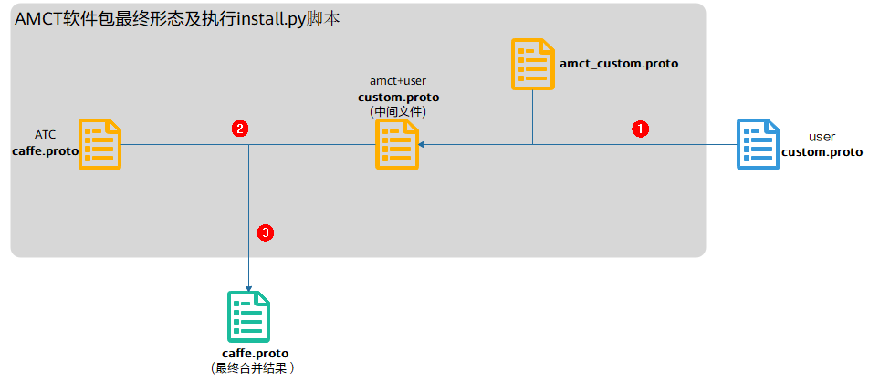

合并流程以及原则：

1.  用户准备自定义的custom.proto，执行AMCT提供的install.py脚本，该脚本会将用户的custom.proto与AMCT提供的amct\_custom.proto进行合并，生成中间文件custom.proto。
    -   如果custom.proto和amct\_custom.proto存在算子编号冲突的场景，则报错，提示用户修改custom.proto的算子编号。
    -   如果custom.proto和amct\_custom.proto存在算子名相同的场景，则报错，提示用户修改custom.proto的算子名。

2.  将生成的中间文件custom.proto与ATC软件包中的caffe.proto进行合并，生成最终的caffe.proto。
    -   如果custom.proto和caffe.proto存在算子编号冲突的场景，则报错，提示用户修改custom.proto的算子编号。
    -   如果custom.proto和caffe.proto存在算子名相同的场景，做去重处理，以custom.proto为准。

3.  最后会根据用户指定的caffe\_dir路径，找到用户Caffe工程下的caffe.proto文件，对其进行备份后替换。

> **说明：** 
>-   amct\_custom.proto中的编号从200000开始（包括200000）。
>-   caffe.proto中ATC自定义层的编号区间段为：\[5000,200000\)。
>-   custom.proto中用户自定义层编号建议区间段小于5000，并且不与ATC提供的caffe.proto中的内置编号冲突。

### 工具实现的融合功能<a name="ZH-CN_TOPIC_0000002473744690"></a>

当前该工具主要实现的是BN融合功能，分为如下几类（如下融合场景中涉及的单个算子，需要先满足[量化](量化-94.md)场景下的约束条件）：

-   Conv+BN+Scale融合：AMCT在量化前会对模型中的"Convolution+BatchNorm+Scale"结构做Conv+BN+Scale融合，融合后的"BatchNorm"、"Scale"层会被删除。
-   Deconv+BN+Scale融合：AMCT在量化前会对模型中的"Deconvolution+BatchNorm+Scale"结构做Deconv+BN+Scale融合，融合后的"BatchNorm"、"Scale"层会被删除。
-   BN+Scale+Conv融合：仅训练后量化支持，AMCT在量化前会对模型中的"BatchNorm+Scale+Convolution"结构做BN+Scale+Conv融合，融合后的"BatchNorm"、"Scale"层会被删除。
-   FC+BN+Scale融合：仅训练后量化支持，AMCT在量化前会对模型中的"InnerProduct+BatchNorm+Scale"结构做FC+BN+Scale融合，融合后的"BatchNorm"、"Scale"层会被删除。

### 训练后量化简易配置文件<a name="ZH-CN_TOPIC_0000002473744542"></a>

calibration\_config\_caffe.proto文件参数说明如[表1](#zh-cn_topic_0240188735_table1225503375617)所示，该文件所在目录为：_AMCT安装目录_/amct\_caffe/proto/calibration\_config\_caffe.proto。

**表 1**  calibration\_config\_caffe.proto参数说明

<a name="zh-cn_topic_0240188735_table1225503375617"></a>
<table><thead align="left"><tr id="zh-cn_topic_0240188735_row11255153315614"><th class="cellrowborder" valign="top" width="12.87871212878712%" id="mcps1.2.6.1.1"><p id="zh-cn_topic_0240188735_p6255193315616"><a name="zh-cn_topic_0240188735_p6255193315616"></a><a name="zh-cn_topic_0240188735_p6255193315616"></a>消息</p>
</th>
<th class="cellrowborder" valign="top" width="6.9993000699930015%" id="mcps1.2.6.1.2"><p id="p194851125105014"><a name="p194851125105014"></a><a name="p194851125105014"></a>是否必填</p>
</th>
<th class="cellrowborder" valign="top" width="12.468753124687531%" id="mcps1.2.6.1.3"><p id="p466892519514"><a name="p466892519514"></a><a name="p466892519514"></a>类型</p>
</th>
<th class="cellrowborder" valign="top" width="14.588541145885412%" id="mcps1.2.6.1.4"><p id="zh-cn_topic_0240188735_p499481531910"><a name="zh-cn_topic_0240188735_p499481531910"></a><a name="zh-cn_topic_0240188735_p499481531910"></a>字段</p>
</th>
<th class="cellrowborder" valign="top" width="53.064693530646935%" id="mcps1.2.6.1.5"><p id="zh-cn_topic_0240188735_p122551335563"><a name="zh-cn_topic_0240188735_p122551335563"></a><a name="zh-cn_topic_0240188735_p122551335563"></a>说明</p>
</th>
</tr>
</thead>
<tbody><tr id="zh-cn_topic_0240188735_row122551133185610"><td class="cellrowborder" rowspan="14" valign="top" width="12.87871212878712%" headers="mcps1.2.6.1.1 "><p id="zh-cn_topic_0240188735_p1925513338569"><a name="zh-cn_topic_0240188735_p1925513338569"></a><a name="zh-cn_topic_0240188735_p1925513338569"></a>AMCTConfig</p>
</td>
<td class="cellrowborder" valign="top" width="6.9993000699930015%" headers="mcps1.2.6.1.2 "><p id="p1485162505012"><a name="p1485162505012"></a><a name="p1485162505012"></a>-</p>
</td>
<td class="cellrowborder" valign="top" width="12.468753124687531%" headers="mcps1.2.6.1.3 "><p id="p1617031410516"><a name="p1617031410516"></a><a name="p1617031410516"></a>-</p>
</td>
<td class="cellrowborder" valign="top" width="14.588541145885412%" headers="mcps1.2.6.1.4 "><p id="zh-cn_topic_0240188735_p2994161514196"><a name="zh-cn_topic_0240188735_p2994161514196"></a><a name="zh-cn_topic_0240188735_p2994161514196"></a>-</p>
</td>
<td class="cellrowborder" valign="top" width="53.064693530646935%" headers="mcps1.2.6.1.5 "><p id="zh-cn_topic_0240188735_p82551633105614"><a name="zh-cn_topic_0240188735_p82551633105614"></a><a name="zh-cn_topic_0240188735_p82551633105614"></a><span id="ph2538725141110"><a name="ph2538725141110"></a><a name="ph2538725141110"></a>AMCT</span>训练后量化的简易配置。</p>
</td>
</tr>
<tr id="zh-cn_topic_0240188735_row9255123311566"><td class="cellrowborder" valign="top" headers="mcps1.2.6.1.1 "><p id="p11249539520"><a name="p11249539520"></a><a name="p11249539520"></a>optional</p>
</td>
<td class="cellrowborder" valign="top" headers="mcps1.2.6.1.2 "><p id="p19715115505"><a name="p19715115505"></a><a name="p19715115505"></a>uint32</p>
</td>
<td class="cellrowborder" valign="top" headers="mcps1.2.6.1.3 "><p id="zh-cn_topic_0240188735_p11994171511911"><a name="zh-cn_topic_0240188735_p11994171511911"></a><a name="zh-cn_topic_0240188735_p11994171511911"></a>batch_num</p>
</td>
<td class="cellrowborder" valign="top" headers="mcps1.2.6.1.4 "><p id="zh-cn_topic_0240188735_p32551133175612"><a name="zh-cn_topic_0240188735_p32551133175612"></a><a name="zh-cn_topic_0240188735_p32551133175612"></a>量化使用的batch数量。</p>
</td>
</tr>
<tr id="zh-cn_topic_0240188735_row11255533205611"><td class="cellrowborder" valign="top" headers="mcps1.2.6.1.1 "><p id="p142538635219"><a name="p142538635219"></a><a name="p142538635219"></a>optional</p>
</td>
<td class="cellrowborder" valign="top" headers="mcps1.2.6.1.2 "><p id="p13170131414515"><a name="p13170131414515"></a><a name="p13170131414515"></a>bool</p>
</td>
<td class="cellrowborder" valign="top" headers="mcps1.2.6.1.3 "><p id="zh-cn_topic_0240188735_p1225516334564"><a name="zh-cn_topic_0240188735_p1225516334564"></a><a name="zh-cn_topic_0240188735_p1225516334564"></a>activation_offset</p>
</td>
<td class="cellrowborder" valign="top" headers="mcps1.2.6.1.4 "><p id="zh-cn_topic_0240188735_p425513312563"><a name="zh-cn_topic_0240188735_p425513312563"></a><a name="zh-cn_topic_0240188735_p425513312563"></a>数据量化是否带offset。全局配置参数。</p>
<a name="ul1970216412385"></a><a name="ul1970216412385"></a><ul id="ul1970216412385"><li>true：带offset，数据量化时为非对称量化。</li><li>false：不带offset，数据量化时为对称量化。</li></ul>
</td>
</tr>
<tr id="row19335160115712"><td class="cellrowborder" valign="top" headers="mcps1.2.6.1.1 "><p id="p18630211544"><a name="p18630211544"></a><a name="p18630211544"></a>optional</p>
</td>
<td class="cellrowborder" valign="top" headers="mcps1.2.6.1.2 "><p id="p96352105416"><a name="p96352105416"></a><a name="p96352105416"></a>bool</p>
</td>
<td class="cellrowborder" valign="top" headers="mcps1.2.6.1.3 "><p id="p76362113547"><a name="p76362113547"></a><a name="p76362113547"></a>joint_quant</p>
</td>
<td class="cellrowborder" valign="top" headers="mcps1.2.6.1.4 "><p id="p72423617119"><a name="p72423617119"></a><a name="p72423617119"></a>是否进行Eltwise联合量化，默认为false，表示关闭联合量化功能。</p>
</td>
</tr>
<tr id="row116751031143112"><td class="cellrowborder" valign="top" headers="mcps1.2.6.1.1 "><p id="p62711337163112"><a name="p62711337163112"></a><a name="p62711337163112"></a>repeated</p>
</td>
<td class="cellrowborder" valign="top" headers="mcps1.2.6.1.2 "><p id="p16271153710317"><a name="p16271153710317"></a><a name="p16271153710317"></a>string</p>
</td>
<td class="cellrowborder" valign="top" headers="mcps1.2.6.1.3 "><p id="p1527173716314"><a name="p1527173716314"></a><a name="p1527173716314"></a>skip_layers</p>
</td>
<td class="cellrowborder" valign="top" headers="mcps1.2.6.1.4 "><p id="p6272113718317"><a name="p6272113718317"></a><a name="p6272113718317"></a>不需要量化层的层名。</p>
</td>
</tr>
<tr id="row344417284313"><td class="cellrowborder" valign="top" headers="mcps1.2.6.1.1 "><p id="p1272173743111"><a name="p1272173743111"></a><a name="p1272173743111"></a>repeated</p>
</td>
<td class="cellrowborder" valign="top" headers="mcps1.2.6.1.2 "><p id="p17272193713114"><a name="p17272193713114"></a><a name="p17272193713114"></a>string</p>
</td>
<td class="cellrowborder" valign="top" headers="mcps1.2.6.1.3 "><p id="p2272123719311"><a name="p2272123719311"></a><a name="p2272123719311"></a>skip_layer_types</p>
</td>
<td class="cellrowborder" valign="top" headers="mcps1.2.6.1.4 "><p id="p627293783116"><a name="p627293783116"></a><a name="p627293783116"></a>不需要量化的层类型。</p>
</td>
</tr>
<tr id="row1286275433520"><td class="cellrowborder" valign="top" headers="mcps1.2.6.1.1 "><p id="p1848522510505"><a name="p1848522510505"></a><a name="p1848522510505"></a>optional</p>
</td>
<td class="cellrowborder" valign="top" headers="mcps1.2.6.1.2 "><p id="p1182141415512"><a name="p1182141415512"></a><a name="p1182141415512"></a>NuqConfig</p>
</td>
<td class="cellrowborder" valign="top" headers="mcps1.2.6.1.3 "><p id="p462719260914"><a name="p462719260914"></a><a name="p462719260914"></a>nuq_config</p>
</td>
<td class="cellrowborder" valign="top" headers="mcps1.2.6.1.4 "><p id="p206277261693"><a name="p206277261693"></a><a name="p206277261693"></a>非均匀量化配置。</p>
</td>
</tr>
<tr id="row1422161319377"><td class="cellrowborder" valign="top" headers="mcps1.2.6.1.1 "><p id="p6422191320375"><a name="p6422191320375"></a><a name="p6422191320375"></a>optional</p>
</td>
<td class="cellrowborder" valign="top" headers="mcps1.2.6.1.2 "><p id="p134239134371"><a name="p134239134371"></a><a name="p134239134371"></a>CalibrationConfig</p>
</td>
<td class="cellrowborder" valign="top" headers="mcps1.2.6.1.3 "><p id="p74231313103710"><a name="p74231313103710"></a><a name="p74231313103710"></a>common_config</p>
</td>
<td class="cellrowborder" valign="top" headers="mcps1.2.6.1.4 "><p id="p2797259134011"><a name="p2797259134011"></a><a name="p2797259134011"></a>通用的量化配置，全局量化配置参数。若某层未被override_layer_types或者override_layer_configs重写，则使用该配置。</p>
<p id="p31455545543"><a name="p31455545543"></a><a name="p31455545543"></a>参数优先级：override_layer_configs&gt;override_layer_types&gt;common_config</p>
</td>
</tr>
<tr id="row198411100379"><td class="cellrowborder" valign="top" headers="mcps1.2.6.1.1 "><p id="p10841410123712"><a name="p10841410123712"></a><a name="p10841410123712"></a>repeated</p>
</td>
<td class="cellrowborder" valign="top" headers="mcps1.2.6.1.2 "><p id="p1841151033713"><a name="p1841151033713"></a><a name="p1841151033713"></a>OverrideLayerType</p>
</td>
<td class="cellrowborder" valign="top" headers="mcps1.2.6.1.3 "><p id="p6841191033712"><a name="p6841191033712"></a><a name="p6841191033712"></a>override_layer_types</p>
</td>
<td class="cellrowborder" valign="top" headers="mcps1.2.6.1.4 "><p id="p979765994018"><a name="p979765994018"></a><a name="p979765994018"></a>重写某一类型层的量化配置，即对哪些层进行差异化量化。</p>
<p id="p2853153415116"><a name="p2853153415116"></a><a name="p2853153415116"></a>例如全局量化配置参数配置的量化因子搜索步长为0.01，可以通过该参数对部分层进行差异化量化，可以配置搜索步长为0.02。</p>
<p id="p61370245613"><a name="p61370245613"></a><a name="p61370245613"></a>参数优先级：override_layer_configs&gt;override_layer_types&gt;common_config</p>
</td>
</tr>
<tr id="row73596813715"><td class="cellrowborder" valign="top" headers="mcps1.2.6.1.1 "><p id="p163597863717"><a name="p163597863717"></a><a name="p163597863717"></a>repeated</p>
</td>
<td class="cellrowborder" valign="top" headers="mcps1.2.6.1.2 "><p id="p1535910814376"><a name="p1535910814376"></a><a name="p1535910814376"></a>OverrideLayer</p>
</td>
<td class="cellrowborder" valign="top" headers="mcps1.2.6.1.3 "><p id="p83598815375"><a name="p83598815375"></a><a name="p83598815375"></a>override_layer_configs</p>
</td>
<td class="cellrowborder" valign="top" headers="mcps1.2.6.1.4 "><p id="p15798105944016"><a name="p15798105944016"></a><a name="p15798105944016"></a>重写某一层的量化配置，即对哪些层进行差异化量化。</p>
<p id="p4394114710214"><a name="p4394114710214"></a><a name="p4394114710214"></a>例如全局量化配置参数配置的量化因子搜索步长为0.01，可以通过该参数对部分层进行差异化量化，可以配置搜索步长为0.02。</p>
<p id="p194543485613"><a name="p194543485613"></a><a name="p194543485613"></a>参数优先级：override_layer_configs&gt;override_layer_types&gt;common_config</p>
</td>
</tr>
<tr id="row145071332133914"><td class="cellrowborder" valign="top" headers="mcps1.2.6.1.1 "><p id="p350814326395"><a name="p350814326395"></a><a name="p350814326395"></a>optional</p>
</td>
<td class="cellrowborder" valign="top" headers="mcps1.2.6.1.2 "><p id="p1650819327397"><a name="p1650819327397"></a><a name="p1650819327397"></a>bool</p>
</td>
<td class="cellrowborder" valign="top" headers="mcps1.2.6.1.3 "><p id="p9508193293911"><a name="p9508193293911"></a><a name="p9508193293911"></a>do_fusion</p>
</td>
<td class="cellrowborder" valign="top" headers="mcps1.2.6.1.4 "><p id="p07981859114018"><a name="p07981859114018"></a><a name="p07981859114018"></a>是否开启BN融合功能，默认为true，表示开启该功能。</p>
</td>
</tr>
<tr id="row12466115143717"><td class="cellrowborder" valign="top" headers="mcps1.2.6.1.1 "><p id="p84661857373"><a name="p84661857373"></a><a name="p84661857373"></a>repeated</p>
</td>
<td class="cellrowborder" valign="top" headers="mcps1.2.6.1.2 "><p id="p946614503717"><a name="p946614503717"></a><a name="p946614503717"></a>string</p>
</td>
<td class="cellrowborder" valign="top" headers="mcps1.2.6.1.3 "><p id="p1746645143715"><a name="p1746645143715"></a><a name="p1746645143715"></a>skip_fusion_layers</p>
</td>
<td class="cellrowborder" valign="top" headers="mcps1.2.6.1.4 "><p id="p1679819590407"><a name="p1679819590407"></a><a name="p1679819590407"></a>跳过BN融合的层，配置之后这些层不会进行BN融合。</p>
</td>
</tr>
<tr id="zh-cn_topic_0240188735_row62551533115615"><td class="cellrowborder" valign="top" headers="mcps1.2.6.1.1 "><p id="p248532518508"><a name="p248532518508"></a><a name="p248532518508"></a>optional</p>
</td>
<td class="cellrowborder" valign="top" headers="mcps1.2.6.1.2 "><p id="p418281410510"><a name="p418281410510"></a><a name="p418281410510"></a>CalibrationConfig</p>
</td>
<td class="cellrowborder" valign="top" headers="mcps1.2.6.1.3 "><p id="zh-cn_topic_0240188735_p525553375617"><a name="zh-cn_topic_0240188735_p525553375617"></a><a name="zh-cn_topic_0240188735_p525553375617"></a>conv_calibration_config</p>
</td>
<td class="cellrowborder" valign="top" headers="mcps1.2.6.1.4 "><p id="zh-cn_topic_0240188735_p22551933145619"><a name="zh-cn_topic_0240188735_p22551933145619"></a><a name="zh-cn_topic_0240188735_p22551933145619"></a>卷积层的量化配置，适用于所有未被重新配置的卷积层和反卷积层。Deprecated，不推荐用户使用。</p>
</td>
</tr>
<tr id="zh-cn_topic_0240188735_row1925643313563"><td class="cellrowborder" valign="top" headers="mcps1.2.6.1.1 "><p id="p104851825165011"><a name="p104851825165011"></a><a name="p104851825165011"></a>optional</p>
</td>
<td class="cellrowborder" valign="top" headers="mcps1.2.6.1.2 "><p id="p17182151405117"><a name="p17182151405117"></a><a name="p17182151405117"></a>CalibrationConfig</p>
</td>
<td class="cellrowborder" valign="top" headers="mcps1.2.6.1.3 "><p id="zh-cn_topic_0240188735_p16994215171911"><a name="zh-cn_topic_0240188735_p16994215171911"></a><a name="zh-cn_topic_0240188735_p16994215171911"></a>fc_calibration_config</p>
</td>
<td class="cellrowborder" valign="top" headers="mcps1.2.6.1.4 "><p id="zh-cn_topic_0240188735_p12567334561"><a name="zh-cn_topic_0240188735_p12567334561"></a><a name="zh-cn_topic_0240188735_p12567334561"></a>全连接层和平均下采样pooling层的量化配置，适用于所有未被重新配置的全连接层和平均下采样pooling层。Deprecated，不推荐用户使用。</p>
</td>
</tr>
<tr id="row36245133539"><td class="cellrowborder" rowspan="3" valign="top" width="12.87871212878712%" headers="mcps1.2.6.1.1 "><p id="zh-cn_topic_0240188735_p734312144619"><a name="zh-cn_topic_0240188735_p734312144619"></a><a name="zh-cn_topic_0240188735_p734312144619"></a>NuqConfig</p>
</td>
<td class="cellrowborder" valign="top" width="6.9993000699930015%" headers="mcps1.2.6.1.2 "><p id="p748614251508"><a name="p748614251508"></a><a name="p748614251508"></a>-</p>
</td>
<td class="cellrowborder" valign="top" width="12.468753124687531%" headers="mcps1.2.6.1.3 "><p id="p14183191495118"><a name="p14183191495118"></a><a name="p14183191495118"></a>-</p>
</td>
<td class="cellrowborder" valign="top" width="14.588541145885412%" headers="mcps1.2.6.1.4 "><p id="zh-cn_topic_0240188735_p1034361412616"><a name="zh-cn_topic_0240188735_p1034361412616"></a><a name="zh-cn_topic_0240188735_p1034361412616"></a>-</p>
</td>
<td class="cellrowborder" valign="top" width="53.064693530646935%" headers="mcps1.2.6.1.5 "><p id="zh-cn_topic_0240188735_p1634314149616"><a name="zh-cn_topic_0240188735_p1634314149616"></a><a name="zh-cn_topic_0240188735_p1634314149616"></a>非均匀量化配置。</p>
</td>
</tr>
<tr id="row498661710539"><td class="cellrowborder" valign="top" headers="mcps1.2.6.1.1 "><p id="p14486525115017"><a name="p14486525115017"></a><a name="p14486525115017"></a>required</p>
</td>
<td class="cellrowborder" valign="top" headers="mcps1.2.6.1.2 "><p id="p01831314135113"><a name="p01831314135113"></a><a name="p01831314135113"></a>string</p>
</td>
<td class="cellrowborder" valign="top" headers="mcps1.2.6.1.3 "><p id="zh-cn_topic_0240188735_p334341411614"><a name="zh-cn_topic_0240188735_p334341411614"></a><a name="zh-cn_topic_0240188735_p334341411614"></a>mapping_file</p>
</td>
<td class="cellrowborder" valign="top" headers="mcps1.2.6.1.4 "><p id="zh-cn_topic_0240188735_p9343151418610"><a name="zh-cn_topic_0240188735_p9343151418610"></a><a name="zh-cn_topic_0240188735_p9343151418610"></a>均匀量化后的deploy模型通过ATC工具转换得到的om模型，然后通过ATC工具转换得到JSON文件，即量化后模型的融合JSON文件。</p>
</td>
</tr>
<tr id="row591691515531"><td class="cellrowborder" valign="top" headers="mcps1.2.6.1.1 "><p id="p19348132920354"><a name="p19348132920354"></a><a name="p19348132920354"></a>optional</p>
</td>
<td class="cellrowborder" valign="top" headers="mcps1.2.6.1.2 "><p id="p318341425114"><a name="p318341425114"></a><a name="p318341425114"></a>NUQuantize</p>
</td>
<td class="cellrowborder" valign="top" headers="mcps1.2.6.1.3 "><p id="zh-cn_topic_0240188735_p133438142614"><a name="zh-cn_topic_0240188735_p133438142614"></a><a name="zh-cn_topic_0240188735_p133438142614"></a>nuq_quantize</p>
</td>
<td class="cellrowborder" valign="top" headers="mcps1.2.6.1.4 "><p id="zh-cn_topic_0240188735_p173431314464"><a name="zh-cn_topic_0240188735_p173431314464"></a><a name="zh-cn_topic_0240188735_p173431314464"></a>非均匀量化的参数。</p>
</td>
</tr>
<tr id="row1390797113814"><td class="cellrowborder" rowspan="3" valign="top" width="12.87871212878712%" headers="mcps1.2.6.1.1 "><p id="p158351217151616"><a name="p158351217151616"></a><a name="p158351217151616"></a>OverrideLayerType</p>
</td>
<td class="cellrowborder" valign="top" width="6.9993000699930015%" headers="mcps1.2.6.1.2 "><p id="p4549131512384"><a name="p4549131512384"></a><a name="p4549131512384"></a>-</p>
</td>
<td class="cellrowborder" valign="top" width="12.468753124687531%" headers="mcps1.2.6.1.3 "><p id="p6549181518384"><a name="p6549181518384"></a><a name="p6549181518384"></a>-</p>
</td>
<td class="cellrowborder" valign="top" width="14.588541145885412%" headers="mcps1.2.6.1.4 "><p id="p1549191523820"><a name="p1549191523820"></a><a name="p1549191523820"></a>-</p>
</td>
<td class="cellrowborder" valign="top" width="53.064693530646935%" headers="mcps1.2.6.1.5 "><p id="p6909137153812"><a name="p6909137153812"></a><a name="p6909137153812"></a>重置某层类型的量化配置。</p>
</td>
</tr>
<tr id="row1374641171613"><td class="cellrowborder" valign="top" headers="mcps1.2.6.1.1 "><p id="p138359179163"><a name="p138359179163"></a><a name="p138359179163"></a>required</p>
</td>
<td class="cellrowborder" valign="top" headers="mcps1.2.6.1.2 "><p id="p183561711169"><a name="p183561711169"></a><a name="p183561711169"></a>string</p>
</td>
<td class="cellrowborder" valign="top" headers="mcps1.2.6.1.3 "><p id="p18835417111617"><a name="p18835417111617"></a><a name="p18835417111617"></a>layer_type</p>
</td>
<td class="cellrowborder" valign="top" headers="mcps1.2.6.1.4 "><p id="p168354179162"><a name="p168354179162"></a><a name="p168354179162"></a>支持量化的层类型的名字。</p>
</td>
</tr>
<tr id="row137071882161"><td class="cellrowborder" valign="top" headers="mcps1.2.6.1.1 "><p id="p1583621713165"><a name="p1583621713165"></a><a name="p1583621713165"></a>required</p>
</td>
<td class="cellrowborder" valign="top" headers="mcps1.2.6.1.2 "><p id="p16836131781615"><a name="p16836131781615"></a><a name="p16836131781615"></a>CalibrationConfig</p>
</td>
<td class="cellrowborder" valign="top" headers="mcps1.2.6.1.3 "><p id="p683614171162"><a name="p683614171162"></a><a name="p683614171162"></a>calibration_config</p>
</td>
<td class="cellrowborder" valign="top" headers="mcps1.2.6.1.4 "><p id="p08362017171618"><a name="p08362017171618"></a><a name="p08362017171618"></a>重置的量化配置。</p>
</td>
</tr>
<tr id="zh-cn_topic_0240188735_row11783104092012"><td class="cellrowborder" rowspan="3" valign="top" width="12.87871212878712%" headers="mcps1.2.6.1.1 "><p id="zh-cn_topic_0240188735_p16795192442119"><a name="zh-cn_topic_0240188735_p16795192442119"></a><a name="zh-cn_topic_0240188735_p16795192442119"></a>OverrideLayer</p>
</td>
<td class="cellrowborder" valign="top" width="6.9993000699930015%" headers="mcps1.2.6.1.2 "><p id="p9485142585010"><a name="p9485142585010"></a><a name="p9485142585010"></a>-</p>
</td>
<td class="cellrowborder" valign="top" width="12.468753124687531%" headers="mcps1.2.6.1.3 "><p id="p15182214175118"><a name="p15182214175118"></a><a name="p15182214175118"></a>-</p>
</td>
<td class="cellrowborder" valign="top" width="14.588541145885412%" headers="mcps1.2.6.1.4 "><p id="zh-cn_topic_0240188735_p37831240102014"><a name="zh-cn_topic_0240188735_p37831240102014"></a><a name="zh-cn_topic_0240188735_p37831240102014"></a>-</p>
</td>
<td class="cellrowborder" valign="top" width="53.064693530646935%" headers="mcps1.2.6.1.5 "><p id="zh-cn_topic_0240188735_p278314406207"><a name="zh-cn_topic_0240188735_p278314406207"></a><a name="zh-cn_topic_0240188735_p278314406207"></a>重置某层量化配置。</p>
</td>
</tr>
<tr id="zh-cn_topic_0240188735_row10956202614283"><td class="cellrowborder" valign="top" headers="mcps1.2.6.1.1 "><p id="p19444416194419"><a name="p19444416194419"></a><a name="p19444416194419"></a>required</p>
</td>
<td class="cellrowborder" valign="top" headers="mcps1.2.6.1.2 "><p id="p1244491612447"><a name="p1244491612447"></a><a name="p1244491612447"></a>string</p>
</td>
<td class="cellrowborder" valign="top" headers="mcps1.2.6.1.3 "><p id="zh-cn_topic_0240188735_p6956152632810"><a name="zh-cn_topic_0240188735_p6956152632810"></a><a name="zh-cn_topic_0240188735_p6956152632810"></a>layer_name</p>
</td>
<td class="cellrowborder" valign="top" headers="mcps1.2.6.1.4 "><p id="zh-cn_topic_0240188735_p1195652613284"><a name="zh-cn_topic_0240188735_p1195652613284"></a><a name="zh-cn_topic_0240188735_p1195652613284"></a>被重置层的层名。</p>
</td>
</tr>
<tr id="zh-cn_topic_0240188735_row1438216329281"><td class="cellrowborder" valign="top" headers="mcps1.2.6.1.1 "><p id="p576421834412"><a name="p576421834412"></a><a name="p576421834412"></a>required</p>
</td>
<td class="cellrowborder" valign="top" headers="mcps1.2.6.1.2 "><p id="p1933192654411"><a name="p1933192654411"></a><a name="p1933192654411"></a>CalibrationConfig</p>
</td>
<td class="cellrowborder" valign="top" headers="mcps1.2.6.1.3 "><p id="zh-cn_topic_0240188735_p163821323286"><a name="zh-cn_topic_0240188735_p163821323286"></a><a name="zh-cn_topic_0240188735_p163821323286"></a>calibration_config</p>
</td>
<td class="cellrowborder" valign="top" headers="mcps1.2.6.1.4 "><p id="zh-cn_topic_0240188735_p382913237299"><a name="zh-cn_topic_0240188735_p382913237299"></a><a name="zh-cn_topic_0240188735_p382913237299"></a>重置的量化配置。</p>
</td>
</tr>
<tr id="zh-cn_topic_0240188735_row166322283234"><td class="cellrowborder" rowspan="5" valign="top" width="12.87871212878712%" headers="mcps1.2.6.1.1 "><p id="zh-cn_topic_0240188735_p9633152814236"><a name="zh-cn_topic_0240188735_p9633152814236"></a><a name="zh-cn_topic_0240188735_p9633152814236"></a>CalibrationConfig</p>
</td>
<td class="cellrowborder" valign="top" width="6.9993000699930015%" headers="mcps1.2.6.1.2 "><p id="p134858254503"><a name="p134858254503"></a><a name="p134858254503"></a>-</p>
</td>
<td class="cellrowborder" valign="top" width="12.468753124687531%" headers="mcps1.2.6.1.3 "><p id="p1818261455119"><a name="p1818261455119"></a><a name="p1818261455119"></a>-</p>
</td>
<td class="cellrowborder" valign="top" width="14.588541145885412%" headers="mcps1.2.6.1.4 "><p id="zh-cn_topic_0240188735_p1363332811232"><a name="zh-cn_topic_0240188735_p1363332811232"></a><a name="zh-cn_topic_0240188735_p1363332811232"></a>-</p>
</td>
<td class="cellrowborder" valign="top" width="53.064693530646935%" headers="mcps1.2.6.1.5 "><p id="zh-cn_topic_0240188735_p363392862320"><a name="zh-cn_topic_0240188735_p363392862320"></a><a name="zh-cn_topic_0240188735_p363392862320"></a>Calibration量化的配置。</p>
</td>
</tr>
<tr id="zh-cn_topic_0240188735_row116226814307"><td class="cellrowborder" valign="top" headers="mcps1.2.6.1.1 "><p id="p1748519253502"><a name="p1748519253502"></a><a name="p1748519253502"></a>-</p>
</td>
<td class="cellrowborder" valign="top" headers="mcps1.2.6.1.2 "><p id="p14182171417513"><a name="p14182171417513"></a><a name="p14182171417513"></a>ARQuantize</p>
</td>
<td class="cellrowborder" valign="top" headers="mcps1.2.6.1.3 "><p id="p3275172510116"><a name="p3275172510116"></a><a name="p3275172510116"></a>arq_quantize</p>
</td>
<td class="cellrowborder" valign="top" headers="mcps1.2.6.1.4 "><p id="zh-cn_topic_0240188735_p1962317813010"><a name="zh-cn_topic_0240188735_p1962317813010"></a><a name="zh-cn_topic_0240188735_p1962317813010"></a>权重量化算法配置。</p>
<p id="p245615017124"><a name="p245615017124"></a><a name="p245615017124"></a>arq_quantize：ARQ量化算法配置。</p>
</td>
</tr>
<tr id="row19301178141112"><td class="cellrowborder" valign="top" headers="mcps1.2.6.1.1 "><p id="p16302384111"><a name="p16302384111"></a><a name="p16302384111"></a>-</p>
</td>
<td class="cellrowborder" valign="top" headers="mcps1.2.6.1.2 "><p id="p1525561816115"><a name="p1525561816115"></a><a name="p1525561816115"></a>NUQuantize</p>
</td>
<td class="cellrowborder" valign="top" headers="mcps1.2.6.1.3 "><p id="p24267264114"><a name="p24267264114"></a><a name="p24267264114"></a>nuq_quantize</p>
</td>
<td class="cellrowborder" valign="top" headers="mcps1.2.6.1.4 "><p id="p5288159131219"><a name="p5288159131219"></a><a name="p5288159131219"></a>权重量化算法配置。</p>
<p id="p13302148151119"><a name="p13302148151119"></a><a name="p13302148151119"></a>nuq_quantize：非均匀量化算法配置。</p>
</td>
</tr>
<tr id="zh-cn_topic_0240188735_row9881174683115"><td class="cellrowborder" valign="top" headers="mcps1.2.6.1.1 "><p id="p1548512525015"><a name="p1548512525015"></a><a name="p1548512525015"></a>-</p>
</td>
<td class="cellrowborder" valign="top" headers="mcps1.2.6.1.2 "><p id="p1183191465111"><a name="p1183191465111"></a><a name="p1183191465111"></a>FMRQuantize</p>
</td>
<td class="cellrowborder" valign="top" headers="mcps1.2.6.1.3 "><p id="p425415411015"><a name="p425415411015"></a><a name="p425415411015"></a>ifmr_quantize</p>
</td>
<td class="cellrowborder" valign="top" headers="mcps1.2.6.1.4 "><p id="zh-cn_topic_0240188735_p1788134616316"><a name="zh-cn_topic_0240188735_p1788134616316"></a><a name="zh-cn_topic_0240188735_p1788134616316"></a>数据量化算法配置。</p>
<p id="zh-cn_topic_0240188735_p186119548317"><a name="zh-cn_topic_0240188735_p186119548317"></a><a name="zh-cn_topic_0240188735_p186119548317"></a>ifmr_quantize：IFMR量化算法配置。</p>
</td>
</tr>
<tr id="row999914316331"><td class="cellrowborder" valign="top" headers="mcps1.2.6.1.1 "><p id="p123369144483"><a name="p123369144483"></a><a name="p123369144483"></a>-</p>
</td>
<td class="cellrowborder" valign="top" headers="mcps1.2.6.1.2 "><p id="p1233691404813"><a name="p1233691404813"></a><a name="p1233691404813"></a>HFMGQuantize</p>
</td>
<td class="cellrowborder" valign="top" headers="mcps1.2.6.1.3 "><p id="p1833601494810"><a name="p1833601494810"></a><a name="p1833601494810"></a>hfmg_quantize</p>
</td>
<td class="cellrowborder" valign="top" headers="mcps1.2.6.1.4 "><p id="p13337191454814"><a name="p13337191454814"></a><a name="p13337191454814"></a>数据量化算法配置。</p>
<p id="p8424174634818"><a name="p8424174634818"></a><a name="p8424174634818"></a>hfmg_quantize：HFMG量化算法配置。</p>
</td>
</tr>
<tr id="zh-cn_topic_0240188735_row13931454162310"><td class="cellrowborder" rowspan="2" valign="top" width="12.87871212878712%" headers="mcps1.2.6.1.1 "><p id="zh-cn_topic_0240188735_p133932548230"><a name="zh-cn_topic_0240188735_p133932548230"></a><a name="zh-cn_topic_0240188735_p133932548230"></a>ARQuantize</p>
</td>
<td class="cellrowborder" valign="top" width="6.9993000699930015%" headers="mcps1.2.6.1.2 "><p id="p2485725185011"><a name="p2485725185011"></a><a name="p2485725185011"></a>-</p>
</td>
<td class="cellrowborder" valign="top" width="12.468753124687531%" headers="mcps1.2.6.1.3 "><p id="p91831214185113"><a name="p91831214185113"></a><a name="p91831214185113"></a>-</p>
</td>
<td class="cellrowborder" valign="top" width="14.588541145885412%" headers="mcps1.2.6.1.4 "><p id="zh-cn_topic_0240188735_p16393454142316"><a name="zh-cn_topic_0240188735_p16393454142316"></a><a name="zh-cn_topic_0240188735_p16393454142316"></a>-</p>
</td>
<td class="cellrowborder" valign="top" width="53.064693530646935%" headers="mcps1.2.6.1.5 "><p id="zh-cn_topic_0240188735_p7393554192316"><a name="zh-cn_topic_0240188735_p7393554192316"></a><a name="zh-cn_topic_0240188735_p7393554192316"></a>ARQ量化算法配置。算法介绍请参见<a href="ARQ权重量化算法.md">ARQ权重量化算法</a>。</p>
</td>
</tr>
<tr id="zh-cn_topic_0240188735_row73046209318"><td class="cellrowborder" valign="top" headers="mcps1.2.6.1.1 "><p id="p4725124117352"><a name="p4725124117352"></a><a name="p4725124117352"></a>optional</p>
</td>
<td class="cellrowborder" valign="top" headers="mcps1.2.6.1.2 "><p id="p0183111410516"><a name="p0183111410516"></a><a name="p0183111410516"></a>bool</p>
</td>
<td class="cellrowborder" valign="top" headers="mcps1.2.6.1.3 "><p id="zh-cn_topic_0240188735_p143040207319"><a name="zh-cn_topic_0240188735_p143040207319"></a><a name="zh-cn_topic_0240188735_p143040207319"></a>channel_wise</p>
</td>
<td class="cellrowborder" valign="top" headers="mcps1.2.6.1.4 "><p id="zh-cn_topic_0240188735_p3304220153114"><a name="zh-cn_topic_0240188735_p3304220153114"></a><a name="zh-cn_topic_0240188735_p3304220153114"></a>是否对每个channel采用不同的量化因子。</p>
</td>
</tr>
<tr id="zh-cn_topic_0240188735_row188464215242"><td class="cellrowborder" rowspan="7" valign="top" width="12.87871212878712%" headers="mcps1.2.6.1.1 "><p id="zh-cn_topic_0240188735_p784622112414"><a name="zh-cn_topic_0240188735_p784622112414"></a><a name="zh-cn_topic_0240188735_p784622112414"></a>FMRQuantize</p>
<p id="p290810126"><a name="p290810126"></a><a name="p290810126"></a></p>
</td>
<td class="cellrowborder" valign="top" width="6.9993000699930015%" headers="mcps1.2.6.1.2 "><p id="p144853253508"><a name="p144853253508"></a><a name="p144853253508"></a>-</p>
</td>
<td class="cellrowborder" valign="top" width="12.468753124687531%" headers="mcps1.2.6.1.3 "><p id="p918371455114"><a name="p918371455114"></a><a name="p918371455114"></a>-</p>
</td>
<td class="cellrowborder" valign="top" width="14.588541145885412%" headers="mcps1.2.6.1.4 "><p id="zh-cn_topic_0240188735_p1984611242417"><a name="zh-cn_topic_0240188735_p1984611242417"></a><a name="zh-cn_topic_0240188735_p1984611242417"></a>-</p>
</td>
<td class="cellrowborder" valign="top" width="53.064693530646935%" headers="mcps1.2.6.1.5 "><p id="zh-cn_topic_0240188735_p58460292417"><a name="zh-cn_topic_0240188735_p58460292417"></a><a name="zh-cn_topic_0240188735_p58460292417"></a>FMR数据量化算法配置。算法介绍请参见<a href="IFMR数据量化算法.md">IFMR数据量化算法</a>。</p>
<p id="p9947590011"><a name="p9947590011"></a><a name="p9947590011"></a>该算法与HFMGQuantize算法不能同时配置，若同时配置，则以配置文件中最后配置的量化算法为准。</p>
</td>
</tr>
<tr id="zh-cn_topic_0240188735_row8300152716336"><td class="cellrowborder" valign="top" headers="mcps1.2.6.1.1 "><p id="p2531705362"><a name="p2531705362"></a><a name="p2531705362"></a>optional</p>
</td>
<td class="cellrowborder" valign="top" headers="mcps1.2.6.1.2 "><p id="p3183111418515"><a name="p3183111418515"></a><a name="p3183111418515"></a>float</p>
</td>
<td class="cellrowborder" valign="top" headers="mcps1.2.6.1.3 "><p id="zh-cn_topic_0240188735_p20300132763310"><a name="zh-cn_topic_0240188735_p20300132763310"></a><a name="zh-cn_topic_0240188735_p20300132763310"></a>search_range_start</p>
</td>
<td class="cellrowborder" valign="top" headers="mcps1.2.6.1.4 "><p id="zh-cn_topic_0240188735_p11300627183317"><a name="zh-cn_topic_0240188735_p11300627183317"></a><a name="zh-cn_topic_0240188735_p11300627183317"></a>量化因子搜索范围左边界。</p>
</td>
</tr>
<tr id="zh-cn_topic_0240188735_row1918914326335"><td class="cellrowborder" valign="top" headers="mcps1.2.6.1.1 "><p id="p115431901361"><a name="p115431901361"></a><a name="p115431901361"></a>optional</p>
</td>
<td class="cellrowborder" valign="top" headers="mcps1.2.6.1.2 "><p id="p118237212462"><a name="p118237212462"></a><a name="p118237212462"></a>float</p>
</td>
<td class="cellrowborder" valign="top" headers="mcps1.2.6.1.3 "><p id="zh-cn_topic_0240188735_p3189232123318"><a name="zh-cn_topic_0240188735_p3189232123318"></a><a name="zh-cn_topic_0240188735_p3189232123318"></a>search_range_end</p>
</td>
<td class="cellrowborder" valign="top" headers="mcps1.2.6.1.4 "><p id="zh-cn_topic_0240188735_p1954495473717"><a name="zh-cn_topic_0240188735_p1954495473717"></a><a name="zh-cn_topic_0240188735_p1954495473717"></a>量化因子搜索范围右边界。</p>
</td>
</tr>
<tr id="zh-cn_topic_0240188735_row20464636113312"><td class="cellrowborder" valign="top" headers="mcps1.2.6.1.1 "><p id="p55551014366"><a name="p55551014366"></a><a name="p55551014366"></a>optional</p>
</td>
<td class="cellrowborder" valign="top" headers="mcps1.2.6.1.2 "><p id="p1461910118476"><a name="p1461910118476"></a><a name="p1461910118476"></a>float</p>
</td>
<td class="cellrowborder" valign="top" headers="mcps1.2.6.1.3 "><p id="zh-cn_topic_0240188735_p13464113615338"><a name="zh-cn_topic_0240188735_p13464113615338"></a><a name="zh-cn_topic_0240188735_p13464113615338"></a>search_step</p>
</td>
<td class="cellrowborder" valign="top" headers="mcps1.2.6.1.4 "><p id="zh-cn_topic_0240188735_p104647369332"><a name="zh-cn_topic_0240188735_p104647369332"></a><a name="zh-cn_topic_0240188735_p104647369332"></a>量化因子搜索步长。</p>
</td>
</tr>
<tr id="zh-cn_topic_0240188735_row1710933263612"><td class="cellrowborder" valign="top" headers="mcps1.2.6.1.1 "><p id="p0570140133610"><a name="p0570140133610"></a><a name="p0570140133610"></a>optional</p>
</td>
<td class="cellrowborder" valign="top" headers="mcps1.2.6.1.2 "><p id="p061418264717"><a name="p061418264717"></a><a name="p061418264717"></a>float</p>
</td>
<td class="cellrowborder" valign="top" headers="mcps1.2.6.1.3 "><p id="zh-cn_topic_0240188735_p1810983233616"><a name="zh-cn_topic_0240188735_p1810983233616"></a><a name="zh-cn_topic_0240188735_p1810983233616"></a>max_percentile</p>
</td>
<td class="cellrowborder" valign="top" headers="mcps1.2.6.1.4 "><p id="zh-cn_topic_0240188735_p161093322365"><a name="zh-cn_topic_0240188735_p161093322365"></a><a name="zh-cn_topic_0240188735_p161093322365"></a>最大值搜索位置。</p>
</td>
</tr>
<tr id="zh-cn_topic_0240188735_row26036420362"><td class="cellrowborder" valign="top" headers="mcps1.2.6.1.1 "><p id="p55859019367"><a name="p55859019367"></a><a name="p55859019367"></a>optional</p>
</td>
<td class="cellrowborder" valign="top" headers="mcps1.2.6.1.2 "><p id="p117511331479"><a name="p117511331479"></a><a name="p117511331479"></a>float</p>
</td>
<td class="cellrowborder" valign="top" headers="mcps1.2.6.1.3 "><p id="zh-cn_topic_0240188735_p1060420421361"><a name="zh-cn_topic_0240188735_p1060420421361"></a><a name="zh-cn_topic_0240188735_p1060420421361"></a>min_percentile</p>
</td>
<td class="cellrowborder" valign="top" headers="mcps1.2.6.1.4 "><p id="zh-cn_topic_0240188735_p186041242183616"><a name="zh-cn_topic_0240188735_p186041242183616"></a><a name="zh-cn_topic_0240188735_p186041242183616"></a>最小值搜索位置。</p>
</td>
</tr>
<tr id="row79081304219"><td class="cellrowborder" valign="top" headers="mcps1.2.6.1.1 "><p id="p2876102645420"><a name="p2876102645420"></a><a name="p2876102645420"></a>optional</p>
</td>
<td class="cellrowborder" valign="top" headers="mcps1.2.6.1.2 "><p id="p16876102655416"><a name="p16876102655416"></a><a name="p16876102655416"></a>bool</p>
</td>
<td class="cellrowborder" valign="top" headers="mcps1.2.6.1.3 "><p id="p136291318105419"><a name="p136291318105419"></a><a name="p136291318105419"></a>asymmetric</p>
</td>
<td class="cellrowborder" valign="top" headers="mcps1.2.6.1.4 "><p id="p1862961819548"><a name="p1862961819548"></a><a name="p1862961819548"></a>是否进行对称量化。用于控制逐层量化算法的选择。</p>
<a name="ul78601245115510"></a><a name="ul78601245115510"></a><ul id="ul78601245115510"><li>true：非对称量化</li><li>false：对称量化</li></ul>
<p id="p1784404618555"><a name="p1784404618555"></a><a name="p1784404618555"></a>如果override_layer_configs、override_layer_types、common_config配置项都配置该参数，或者配置了</p>
<p id="p58430467557"><a name="p58430467557"></a><a name="p58430467557"></a>activation_offset参数，则生效优先级为：</p>
<p id="p1630711108390"><a name="p1630711108390"></a><a name="p1630711108390"></a>override_layer_configs&gt;override_layer_types&gt;common_config&gt;activation_offset</p>
</td>
</tr>
<tr id="zh-cn_topic_0240188735_row207890521559"><td class="cellrowborder" rowspan="3" valign="top" width="12.87871212878712%" headers="mcps1.2.6.1.1 "><p id="p18771725134917"><a name="p18771725134917"></a><a name="p18771725134917"></a>HFMGQuantize</p>
</td>
<td class="cellrowborder" valign="top" width="6.9993000699930015%" headers="mcps1.2.6.1.2 "><p id="p56910313515"><a name="p56910313515"></a><a name="p56910313515"></a>-</p>
</td>
<td class="cellrowborder" valign="top" width="12.468753124687531%" headers="mcps1.2.6.1.3 "><p id="p146916335113"><a name="p146916335113"></a><a name="p146916335113"></a>-</p>
</td>
<td class="cellrowborder" valign="top" width="14.588541145885412%" headers="mcps1.2.6.1.4 "><p id="p196910310511"><a name="p196910310511"></a><a name="p196910310511"></a>-</p>
</td>
<td class="cellrowborder" valign="top" width="53.064693530646935%" headers="mcps1.2.6.1.5 "><p id="p16989132195213"><a name="p16989132195213"></a><a name="p16989132195213"></a>HFMG数据量化算法配置。算法介绍请参见<a href="HFMG数据量化算法.md">HFMG数据量化算法</a>。</p>
<p id="p0610538149"><a name="p0610538149"></a><a name="p0610538149"></a>该算法与FMRQuantize算法不能同时配置，若同时配置，则以配置文件中最后配置的量化算法为准。</p>
</td>
</tr>
<tr id="zh-cn_topic_0240188735_row45221208619"><td class="cellrowborder" valign="top" headers="mcps1.2.6.1.1 "><p id="p3776259496"><a name="p3776259496"></a><a name="p3776259496"></a>optional</p>
</td>
<td class="cellrowborder" valign="top" headers="mcps1.2.6.1.2 "><p id="p1777172594910"><a name="p1777172594910"></a><a name="p1777172594910"></a>uint32</p>
</td>
<td class="cellrowborder" valign="top" headers="mcps1.2.6.1.3 "><p id="p1277122516495"><a name="p1277122516495"></a><a name="p1277122516495"></a>num_of_bins</p>
</td>
<td class="cellrowborder" valign="top" headers="mcps1.2.6.1.4 "><p id="p14190312023"><a name="p14190312023"></a><a name="p14190312023"></a>直方图的bin（直方图中的一个最小单位直方图形）数目，支持的范围为{1024, 2048, 4096, 8192}。</p>
<p id="p1772259498"><a name="p1772259498"></a><a name="p1772259498"></a>默认值为4096。</p>
</td>
</tr>
<tr id="row5634910023"><td class="cellrowborder" valign="top" headers="mcps1.2.6.1.1 "><p id="p16349114221"><a name="p16349114221"></a><a name="p16349114221"></a>optional</p>
</td>
<td class="cellrowborder" valign="top" headers="mcps1.2.6.1.2 "><p id="p1634917145217"><a name="p1634917145217"></a><a name="p1634917145217"></a>bool</p>
</td>
<td class="cellrowborder" valign="top" headers="mcps1.2.6.1.3 "><p id="p4349131413216"><a name="p4349131413216"></a><a name="p4349131413216"></a>symmetric</p>
</td>
<td class="cellrowborder" valign="top" headers="mcps1.2.6.1.4 "><p id="p3349161410220"><a name="p3349161410220"></a><a name="p3349161410220"></a>是否进行对称量化。用于控制逐层量化算法的选择。</p>
<a name="ul130914155019"></a><a name="ul130914155019"></a><ul id="ul130914155019"><li>true：非对称量化</li><li>false：对称量化</li></ul>
<p id="p07432067590"><a name="p07432067590"></a><a name="p07432067590"></a>如果override_layer_configs、override_layer_types、common_config配置项都配置该参数，或者配置了</p>
<p id="p5743156195916"><a name="p5743156195916"></a><a name="p5743156195916"></a>activation_offset参数，则生效优先级为：</p>
<p id="p174476125912"><a name="p174476125912"></a><a name="p174476125912"></a>override_layer_configs&gt;override_layer_types&gt;common_config&gt;activation_offset</p>
</td>
</tr>
<tr id="row1681216147564"><td class="cellrowborder" rowspan="3" valign="top" width="12.87871212878712%" headers="mcps1.2.6.1.1 "><p id="zh-cn_topic_0240188735_p1225910501962"><a name="zh-cn_topic_0240188735_p1225910501962"></a><a name="zh-cn_topic_0240188735_p1225910501962"></a>NUQuantize</p>
</td>
<td class="cellrowborder" valign="top" width="6.9993000699930015%" headers="mcps1.2.6.1.2 "><p id="p10392320164712"><a name="p10392320164712"></a><a name="p10392320164712"></a>-</p>
</td>
<td class="cellrowborder" valign="top" width="12.468753124687531%" headers="mcps1.2.6.1.3 "><p id="p2563922194713"><a name="p2563922194713"></a><a name="p2563922194713"></a>-</p>
</td>
<td class="cellrowborder" valign="top" width="14.588541145885412%" headers="mcps1.2.6.1.4 "><p id="zh-cn_topic_0240188735_p1025910501619"><a name="zh-cn_topic_0240188735_p1025910501619"></a><a name="zh-cn_topic_0240188735_p1025910501619"></a>-</p>
</td>
<td class="cellrowborder" valign="top" width="53.064693530646935%" headers="mcps1.2.6.1.5 "><p id="zh-cn_topic_0240188735_p92595503611"><a name="zh-cn_topic_0240188735_p92595503611"></a><a name="zh-cn_topic_0240188735_p92595503611"></a>非均匀量化算法配置。算法介绍请参见<a href="NUQ权重量化算法.md">NUQ权重量化算法</a>。</p>
</td>
</tr>
<tr id="row3237171745610"><td class="cellrowborder" valign="top" headers="mcps1.2.6.1.1 "><p id="p1561915010369"><a name="p1561915010369"></a><a name="p1561915010369"></a>optional</p>
</td>
<td class="cellrowborder" valign="top" headers="mcps1.2.6.1.2 "><p id="p1232111674713"><a name="p1232111674713"></a><a name="p1232111674713"></a>uint32</p>
</td>
<td class="cellrowborder" valign="top" headers="mcps1.2.6.1.3 "><p id="zh-cn_topic_0240188735_p92592501620"><a name="zh-cn_topic_0240188735_p92592501620"></a><a name="zh-cn_topic_0240188735_p92592501620"></a>num_steps</p>
</td>
<td class="cellrowborder" valign="top" headers="mcps1.2.6.1.4 "><p id="zh-cn_topic_0240188735_p1259050661"><a name="zh-cn_topic_0240188735_p1259050661"></a><a name="zh-cn_topic_0240188735_p1259050661"></a>非均匀量化的台阶数。</p>
</td>
</tr>
<tr id="row8139142015611"><td class="cellrowborder" valign="top" headers="mcps1.2.6.1.1 "><p id="p2063511063615"><a name="p2063511063615"></a><a name="p2063511063615"></a>optional</p>
</td>
<td class="cellrowborder" valign="top" headers="mcps1.2.6.1.2 "><p id="p198291964476"><a name="p198291964476"></a><a name="p198291964476"></a>uint32</p>
</td>
<td class="cellrowborder" valign="top" headers="mcps1.2.6.1.3 "><p id="zh-cn_topic_0240188735_p1125917506610"><a name="zh-cn_topic_0240188735_p1125917506610"></a><a name="zh-cn_topic_0240188735_p1125917506610"></a>num_of_iteration</p>
</td>
<td class="cellrowborder" valign="top" headers="mcps1.2.6.1.4 "><p id="zh-cn_topic_0240188735_p12598501762"><a name="zh-cn_topic_0240188735_p12598501762"></a><a name="zh-cn_topic_0240188735_p12598501762"></a>非均匀量化优化的迭代次数。</p>
</td>
</tr>
</tbody>
</table>

-   基于该文件构造的**均匀量化简易配置文件**_quant_.cfg样例如下所示：

    ```
    # global quantize parameter
    batch_num : 2
    activation_offset : true
    joint_quant : false
    skip_layers : "Opname"
    skip_layer_types:"Optype"
    do_fusion: true
    skip_fusion_layers : "Opname"
    common_config : {
        arq_quantize : {
            channel_wise : true
        }
        ifmr_quantize : {
            search_range_start : 0.7
            search_range_end : 1.3
            search_step : 0.01
            max_percentile : 0.999999
            min_percentile : 0.999999
             asymmetric : true
        }
    }
     
    override_layer_types : {
        layer_type : "Optype"
        calibration_config : {
            arq_quantize : {
                channel_wise : false
            }
            ifmr_quantize : {
                search_range_start : 0.8
                search_range_end : 1.2
                search_step : 0.02
                max_percentile : 0.999999
                min_percentile : 0.999999
                  asymmetric : false
            }
        }
    }
     
    override_layer_configs : {
        layer_name : "Opname"
        calibration_config : {
            arq_quantize : {
                channel_wise : true
            }
            ifmr_quantize : {
                search_range_start : 0.8
                search_range_end : 1.2
                search_step : 0.02
                max_percentile : 0.999999
                min_percentile : 0.999999
                  asymmetric : false
            }
        }
    }
    ```

    如果数据量化算法使用HFMG，则上述配置文件中加粗部分可以替换成如下参考参数信息，举例如下（如下配置信息只是样例，请根据实际情况进行修改）：

    ```
    # global quantize parameter
    activation_offset : true
    batch_num : 1
    ...
    common_config : {
        hfmg_quantize : {
            num_of_bins : 4096
             asymmetric : false
        }
    ...
    }
    ```

### 量化感知训练简易配置文件<a name="ZH-CN_TOPIC_0000002506024593"></a>

retrain\_config\_caffe.proto文件参数说明如[表1](#zh-cn_topic_0240188735_table1225503375617)所示，该文件所在目录为：_AMCT安装目录_/amct\_caffe/proto/retrain\_config\_caffe.proto。

**表 1**  retrain\_config\_caffe.proto参数说明

<a name="zh-cn_topic_0240188735_table1225503375617"></a>
<table><thead align="left"><tr id="zh-cn_topic_0240188735_row11255153315614"><th class="cellrowborder" valign="top" width="14.688531146885312%" id="mcps1.2.6.1.1"><p id="zh-cn_topic_0240188735_p6255193315616"><a name="zh-cn_topic_0240188735_p6255193315616"></a><a name="zh-cn_topic_0240188735_p6255193315616"></a>消息</p>
</th>
<th class="cellrowborder" valign="top" width="8.45915408459154%" id="mcps1.2.6.1.2"><p id="p194851125105014"><a name="p194851125105014"></a><a name="p194851125105014"></a>是否必填</p>
</th>
<th class="cellrowborder" valign="top" width="16.82831716828317%" id="mcps1.2.6.1.3"><p id="p466892519514"><a name="p466892519514"></a><a name="p466892519514"></a>类型</p>
</th>
<th class="cellrowborder" valign="top" width="16.60833916608339%" id="mcps1.2.6.1.4"><p id="zh-cn_topic_0240188735_p499481531910"><a name="zh-cn_topic_0240188735_p499481531910"></a><a name="zh-cn_topic_0240188735_p499481531910"></a>字段</p>
</th>
<th class="cellrowborder" valign="top" width="43.41565843415658%" id="mcps1.2.6.1.5"><p id="zh-cn_topic_0240188735_p122551335563"><a name="zh-cn_topic_0240188735_p122551335563"></a><a name="zh-cn_topic_0240188735_p122551335563"></a>说明</p>
</th>
</tr>
</thead>
<tbody><tr id="zh-cn_topic_0240188735_row122551133185610"><td class="cellrowborder" rowspan="10" valign="top" width="14.688531146885312%" headers="mcps1.2.6.1.1 "><p id="zh-cn_topic_0240188735_p1925513338569"><a name="zh-cn_topic_0240188735_p1925513338569"></a><a name="zh-cn_topic_0240188735_p1925513338569"></a>AMCTRetrainConfig</p>
</td>
<td class="cellrowborder" valign="top" width="8.45915408459154%" headers="mcps1.2.6.1.2 "><p id="p1485162505012"><a name="p1485162505012"></a><a name="p1485162505012"></a>-</p>
</td>
<td class="cellrowborder" valign="top" width="16.82831716828317%" headers="mcps1.2.6.1.3 "><p id="p1617031410516"><a name="p1617031410516"></a><a name="p1617031410516"></a>-</p>
</td>
<td class="cellrowborder" valign="top" width="16.60833916608339%" headers="mcps1.2.6.1.4 "><p id="zh-cn_topic_0240188735_p2994161514196"><a name="zh-cn_topic_0240188735_p2994161514196"></a><a name="zh-cn_topic_0240188735_p2994161514196"></a>-</p>
</td>
<td class="cellrowborder" valign="top" width="43.41565843415658%" headers="mcps1.2.6.1.5 "><p id="zh-cn_topic_0240188735_p82551633105614"><a name="zh-cn_topic_0240188735_p82551633105614"></a><a name="zh-cn_topic_0240188735_p82551633105614"></a><span id="ph2538725141110"><a name="ph2538725141110"></a><a name="ph2538725141110"></a>AMCT</span>量化感知训练的简易配置。</p>
</td>
</tr>
<tr id="row98601548164514"><td class="cellrowborder" valign="top" headers="mcps1.2.6.1.1 "><p id="p112187245443"><a name="p112187245443"></a><a name="p112187245443"></a>repeated</p>
</td>
<td class="cellrowborder" valign="top" headers="mcps1.2.6.1.2 "><p id="p16218102415441"><a name="p16218102415441"></a><a name="p16218102415441"></a>string</p>
</td>
<td class="cellrowborder" valign="top" headers="mcps1.2.6.1.3 "><p id="p18218524114415"><a name="p18218524114415"></a><a name="p18218524114415"></a>skip_layers</p>
</td>
<td class="cellrowborder" valign="top" headers="mcps1.2.6.1.4 "><p id="p9218924114420"><a name="p9218924114420"></a><a name="p9218924114420"></a>按层名跳过哪些层。全局参数，方便后续拓展其他特性场景下可同时跳过的层，比如下述拓展的quant_skip_layers参数，若后续又拓展了xxx_skip_layers参数，则通过skip_layers参数可以同时配置两个特性场景下需要跳过的层。而无需在quant_skip_layers和xxx_skip_layers参数中分别配置。</p>
<p id="p20168202195319"><a name="p20168202195319"></a><a name="p20168202195319"></a>若同时配置了skip_layers和quant_skip_layers参数，则取两者并集。</p>
</td>
</tr>
<tr id="row12935435174511"><td class="cellrowborder" valign="top" headers="mcps1.2.6.1.1 "><p id="p15481827144413"><a name="p15481827144413"></a><a name="p15481827144413"></a>repeated</p>
</td>
<td class="cellrowborder" valign="top" headers="mcps1.2.6.1.2 "><p id="p54811327134414"><a name="p54811327134414"></a><a name="p54811327134414"></a>string</p>
</td>
<td class="cellrowborder" valign="top" headers="mcps1.2.6.1.3 "><p id="p11481162711442"><a name="p11481162711442"></a><a name="p11481162711442"></a>skip_layer_types</p>
</td>
<td class="cellrowborder" valign="top" headers="mcps1.2.6.1.4 "><p id="p829720510115"><a name="p829720510115"></a><a name="p829720510115"></a>按层类型跳过哪些层（当前版本不支持）。全局参数，方便后续拓展其他特性场景下可同时跳过的层，比如下述拓展的quant_skip_types参数，若后续又拓展了xxx_skip_types参数，则通过skip_layer_types参数可以同时配置两个特性场景下需要跳过的层。而无需在quant_skip_types和xxx_skip_types参数中分别配置。</p>
<p id="p17878135145718"><a name="p17878135145718"></a><a name="p17878135145718"></a>若同时配置了skip_layer_types和quant_skip_types参数，则取两者并集。</p>
</td>
</tr>
<tr id="row1211612145473"><td class="cellrowborder" valign="top" headers="mcps1.2.6.1.1 "><p id="p183393054412"><a name="p183393054412"></a><a name="p183393054412"></a>repeated</p>
</td>
<td class="cellrowborder" valign="top" headers="mcps1.2.6.1.2 "><p id="p283373084415"><a name="p283373084415"></a><a name="p283373084415"></a>RetrainOverrideLayer</p>
</td>
<td class="cellrowborder" valign="top" headers="mcps1.2.6.1.3 "><p id="p2833113013443"><a name="p2833113013443"></a><a name="p2833113013443"></a>override_layer_configs</p>
</td>
<td class="cellrowborder" valign="top" headers="mcps1.2.6.1.4 "><p id="p7833193064415"><a name="p7833193064415"></a><a name="p7833193064415"></a>按层名重写哪些层，即对哪些层进行差异化压缩。</p>
<p id="p24851712113217"><a name="p24851712113217"></a><a name="p24851712113217"></a>例如全局量化配置参数配置的初始上下限值为[-0.6,0.6]，可以通过该参数对部分层进行差异化量化，可以配置为[-0.3,0.3]。</p>
<p id="p3289174615465"><a name="p3289174615465"></a><a name="p3289174615465"></a>参数优先级为：</p>
<a name="ul471255217464"></a><a name="ul471255217464"></a><ul id="ul471255217464"><li>量化场景：override_layer_configs&gt;override_layer_types&gt;retrain_data_quant_config/retrain_weight_quant_config</li><li>稀疏场景：override_layer_configs&gt;override_layer_types&gt;prune_config</li></ul>
</td>
</tr>
<tr id="row0855161111472"><td class="cellrowborder" valign="top" headers="mcps1.2.6.1.1 "><p id="p11894113894416"><a name="p11894113894416"></a><a name="p11894113894416"></a>repeated</p>
</td>
<td class="cellrowborder" valign="top" headers="mcps1.2.6.1.2 "><p id="p17894123817449"><a name="p17894123817449"></a><a name="p17894123817449"></a>RetrainOverrideLayerType</p>
</td>
<td class="cellrowborder" valign="top" headers="mcps1.2.6.1.3 "><p id="p5894153819449"><a name="p5894153819449"></a><a name="p5894153819449"></a>override_layer_types</p>
</td>
<td class="cellrowborder" valign="top" headers="mcps1.2.6.1.4 "><p id="p6894938144418"><a name="p6894938144418"></a><a name="p6894938144418"></a>按层类型重写哪些层，即对哪些层进行差异化压缩。</p>
<p id="p68081731133920"><a name="p68081731133920"></a><a name="p68081731133920"></a>例如全局量化配置参数配置的初始上下限值为[-0.6,0.6]，可以通过该参数对部分层进行差异化量化，可以配置为[-0.3,0.3]。</p>
<p id="p79981423114814"><a name="p79981423114814"></a><a name="p79981423114814"></a>参数优先级为：</p>
<a name="ul1765922611489"></a><a name="ul1765922611489"></a><ul id="ul1765922611489"><li>量化场景：override_layer_configs&gt;override_layer_types&gt;retrain_data_quant_config/retrain_weight_quant_config</li><li>稀疏场景：override_layer_configs&gt;override_layer_types&gt;prune_config</li></ul>
</td>
</tr>
<tr id="row2076915355474"><td class="cellrowborder" valign="top" headers="mcps1.2.6.1.1 "><p id="p11249539520"><a name="p11249539520"></a><a name="p11249539520"></a>optional</p>
</td>
<td class="cellrowborder" valign="top" headers="mcps1.2.6.1.2 "><p id="p19715115505"><a name="p19715115505"></a><a name="p19715115505"></a>uint32</p>
</td>
<td class="cellrowborder" valign="top" headers="mcps1.2.6.1.3 "><p id="zh-cn_topic_0240188735_p11994171511911"><a name="zh-cn_topic_0240188735_p11994171511911"></a><a name="zh-cn_topic_0240188735_p11994171511911"></a>batch_num</p>
</td>
<td class="cellrowborder" valign="top" headers="mcps1.2.6.1.4 "><p id="zh-cn_topic_0240188735_p32551133175612"><a name="zh-cn_topic_0240188735_p32551133175612"></a><a name="zh-cn_topic_0240188735_p32551133175612"></a>量化使用的batch数量。</p>
</td>
</tr>
<tr id="row23612610447"><td class="cellrowborder" valign="top" headers="mcps1.2.6.1.1 "><p id="p193621662444"><a name="p193621662444"></a><a name="p193621662444"></a>required</p>
</td>
<td class="cellrowborder" valign="top" headers="mcps1.2.6.1.2 "><p id="p23621968447"><a name="p23621968447"></a><a name="p23621968447"></a>RetrainDataQuantConfig</p>
</td>
<td class="cellrowborder" valign="top" headers="mcps1.2.6.1.3 "><p id="p183621644414"><a name="p183621644414"></a><a name="p183621644414"></a>retrain_data_quant_config</p>
</td>
<td class="cellrowborder" valign="top" headers="mcps1.2.6.1.4 "><p id="p193621260447"><a name="p193621260447"></a><a name="p193621260447"></a>量化感知训练数据量化配置参数。全局量化配置参数。</p>
<p id="p1468523716344"><a name="p1468523716344"></a><a name="p1468523716344"></a>参数优先级为：override_layer_configs&gt;override_layer_types&gt;retrain_data_quant_config/retrain_weight_quant_config</p>
</td>
</tr>
<tr id="row468062044418"><td class="cellrowborder" valign="top" headers="mcps1.2.6.1.1 "><p id="p96801020114415"><a name="p96801020114415"></a><a name="p96801020114415"></a>required</p>
</td>
<td class="cellrowborder" valign="top" headers="mcps1.2.6.1.2 "><p id="p168032016441"><a name="p168032016441"></a><a name="p168032016441"></a>RetrainWeightQuantConfig</p>
</td>
<td class="cellrowborder" valign="top" headers="mcps1.2.6.1.3 "><p id="p1368019204448"><a name="p1368019204448"></a><a name="p1368019204448"></a>retrain_weight_quant_config</p>
</td>
<td class="cellrowborder" valign="top" headers="mcps1.2.6.1.4 "><p id="p20680132018441"><a name="p20680132018441"></a><a name="p20680132018441"></a>量化感知训练权重量化配置参数。全局量化配置参数。</p>
<p id="p1191764012342"><a name="p1191764012342"></a><a name="p1191764012342"></a>参数优先级为：override_layer_configs&gt;override_layer_types&gt;retrain_data_quant_config/retrain_weight_quant_config</p>
</td>
</tr>
<tr id="row172182024194419"><td class="cellrowborder" valign="top" headers="mcps1.2.6.1.1 "><p id="p2011511274810"><a name="p2011511274810"></a><a name="p2011511274810"></a>repeated</p>
</td>
<td class="cellrowborder" valign="top" headers="mcps1.2.6.1.2 "><p id="p15115524488"><a name="p15115524488"></a><a name="p15115524488"></a>string</p>
</td>
<td class="cellrowborder" valign="top" headers="mcps1.2.6.1.3 "><p id="p132355834817"><a name="p132355834817"></a><a name="p132355834817"></a>quant_skip_layers</p>
</td>
<td class="cellrowborder" valign="top" headers="mcps1.2.6.1.4 "><p id="p411515215487"><a name="p411515215487"></a><a name="p411515215487"></a>按层名跳过不需要量化的层。量化场景下使用的参数。</p>
<p id="p1311516315575"><a name="p1311516315575"></a><a name="p1311516315575"></a>若同时配置了skip_layers和quant_skip_layers参数，则取两者并集。</p>
</td>
</tr>
<tr id="row2828930174410"><td class="cellrowborder" valign="top" headers="mcps1.2.6.1.1 "><p id="p1011517294819"><a name="p1011517294819"></a><a name="p1011517294819"></a>repeated</p>
</td>
<td class="cellrowborder" valign="top" headers="mcps1.2.6.1.2 "><p id="p131151274811"><a name="p131151274811"></a><a name="p131151274811"></a>string</p>
</td>
<td class="cellrowborder" valign="top" headers="mcps1.2.6.1.3 "><p id="p1611517224810"><a name="p1611517224810"></a><a name="p1611517224810"></a>quant_skip_types</p>
</td>
<td class="cellrowborder" valign="top" headers="mcps1.2.6.1.4 "><p id="p14115152194819"><a name="p14115152194819"></a><a name="p14115152194819"></a>按层类型跳过不需要量化的层（当前版本不支持）。量化场景下使用的参数。</p>
<p id="p13217171411583"><a name="p13217171411583"></a><a name="p13217171411583"></a>若同时配置了skip_layer_types和quant_skip_types参数，则取两者并集。</p>
</td>
</tr>
<tr id="row835113511449"><td class="cellrowborder" rowspan="2" valign="top" width="14.688531146885312%" headers="mcps1.2.6.1.1 "><p id="p2351035174414"><a name="p2351035174414"></a><a name="p2351035174414"></a>RetrainDataQuantConfig</p>
</td>
<td class="cellrowborder" valign="top" width="8.45915408459154%" headers="mcps1.2.6.1.2 "><p id="p435113554413"><a name="p435113554413"></a><a name="p435113554413"></a>-</p>
</td>
<td class="cellrowborder" valign="top" width="16.82831716828317%" headers="mcps1.2.6.1.3 "><p id="p143543514449"><a name="p143543514449"></a><a name="p143543514449"></a>-</p>
</td>
<td class="cellrowborder" valign="top" width="16.60833916608339%" headers="mcps1.2.6.1.4 "><p id="p33516355446"><a name="p33516355446"></a><a name="p33516355446"></a>-</p>
</td>
<td class="cellrowborder" valign="top" width="43.41565843415658%" headers="mcps1.2.6.1.5 "><p id="p8358351449"><a name="p8358351449"></a><a name="p8358351449"></a>量化感知训练数据量化参数配置。</p>
</td>
</tr>
<tr id="row66701120490"><td class="cellrowborder" valign="top" headers="mcps1.2.6.1.1 "><p id="p106717184920"><a name="p106717184920"></a><a name="p106717184920"></a>-</p>
</td>
<td class="cellrowborder" valign="top" headers="mcps1.2.6.1.2 "><p id="p10671141134911"><a name="p10671141134911"></a><a name="p10671141134911"></a>ULQuantize</p>
</td>
<td class="cellrowborder" valign="top" headers="mcps1.2.6.1.3 "><p id="p767119119493"><a name="p767119119493"></a><a name="p767119119493"></a>ulq_quantize</p>
</td>
<td class="cellrowborder" valign="top" headers="mcps1.2.6.1.4 "><p id="p767110164914"><a name="p767110164914"></a><a name="p767110164914"></a>数据量化算法，目前仅支持ulq。</p>
</td>
</tr>
<tr id="row27126389467"><td class="cellrowborder" rowspan="3" valign="top" width="14.688531146885312%" headers="mcps1.2.6.1.1 "><p id="p14712838104614"><a name="p14712838104614"></a><a name="p14712838104614"></a>ULQuantize</p>
</td>
<td class="cellrowborder" valign="top" width="8.45915408459154%" headers="mcps1.2.6.1.2 "><p id="p371283864612"><a name="p371283864612"></a><a name="p371283864612"></a>-</p>
</td>
<td class="cellrowborder" valign="top" width="16.82831716828317%" headers="mcps1.2.6.1.3 "><p id="p11712103813467"><a name="p11712103813467"></a><a name="p11712103813467"></a>-</p>
</td>
<td class="cellrowborder" valign="top" width="16.60833916608339%" headers="mcps1.2.6.1.4 "><p id="p13712123824620"><a name="p13712123824620"></a><a name="p13712123824620"></a>-</p>
</td>
<td class="cellrowborder" valign="top" width="43.41565843415658%" headers="mcps1.2.6.1.5 "><p id="p6712538104620"><a name="p6712538104620"></a><a name="p6712538104620"></a>ULQ量化算法配置。算法介绍请参见<a href="ULQ数据量化算法.md">ULQ数据量化算法</a>。</p>
</td>
</tr>
<tr id="row17632182254916"><td class="cellrowborder" valign="top" headers="mcps1.2.6.1.1 "><p id="p1563272213491"><a name="p1563272213491"></a><a name="p1563272213491"></a>optional</p>
</td>
<td class="cellrowborder" valign="top" headers="mcps1.2.6.1.2 "><p id="p763282217493"><a name="p763282217493"></a><a name="p763282217493"></a>ClipMaxMin</p>
</td>
<td class="cellrowborder" valign="top" headers="mcps1.2.6.1.3 "><p id="p16337222490"><a name="p16337222490"></a><a name="p16337222490"></a>clip_max_min</p>
</td>
<td class="cellrowborder" valign="top" headers="mcps1.2.6.1.4 "><p id="p463372224914"><a name="p463372224914"></a><a name="p463372224914"></a>初始化的上下限值，如果不配置，默认用ifmr进行初始化。</p>
</td>
</tr>
<tr id="row2086612605014"><td class="cellrowborder" valign="top" headers="mcps1.2.6.1.1 "><p id="p8867963502"><a name="p8867963502"></a><a name="p8867963502"></a>optional</p>
</td>
<td class="cellrowborder" valign="top" headers="mcps1.2.6.1.2 "><p id="p08671969506"><a name="p08671969506"></a><a name="p08671969506"></a>bool</p>
</td>
<td class="cellrowborder" valign="top" headers="mcps1.2.6.1.3 "><p id="p188679619509"><a name="p188679619509"></a><a name="p188679619509"></a>fixed_min</p>
</td>
<td class="cellrowborder" valign="top" headers="mcps1.2.6.1.4 "><p id="p138678625013"><a name="p138678625013"></a><a name="p138678625013"></a>是否下限不学习且固定为0。默认ReLu后为true，其他为false。</p>
</td>
</tr>
<tr id="row19982124274611"><td class="cellrowborder" rowspan="3" valign="top" width="14.688531146885312%" headers="mcps1.2.6.1.1 "><p id="p6983242154619"><a name="p6983242154619"></a><a name="p6983242154619"></a>ClipMaxMin</p>
</td>
<td class="cellrowborder" valign="top" width="8.45915408459154%" headers="mcps1.2.6.1.2 "><p id="p298314294618"><a name="p298314294618"></a><a name="p298314294618"></a>-</p>
</td>
<td class="cellrowborder" valign="top" width="16.82831716828317%" headers="mcps1.2.6.1.3 "><p id="p998317423461"><a name="p998317423461"></a><a name="p998317423461"></a>-</p>
</td>
<td class="cellrowborder" valign="top" width="16.60833916608339%" headers="mcps1.2.6.1.4 "><p id="p1098314284620"><a name="p1098314284620"></a><a name="p1098314284620"></a>-</p>
</td>
<td class="cellrowborder" valign="top" width="43.41565843415658%" headers="mcps1.2.6.1.5 "><p id="p8983124213468"><a name="p8983124213468"></a><a name="p8983124213468"></a>初始上下限。</p>
</td>
</tr>
<tr id="row485785615017"><td class="cellrowborder" valign="top" headers="mcps1.2.6.1.1 "><p id="p48574561506"><a name="p48574561506"></a><a name="p48574561506"></a>required</p>
</td>
<td class="cellrowborder" valign="top" headers="mcps1.2.6.1.2 "><p id="p08571556195010"><a name="p08571556195010"></a><a name="p08571556195010"></a>float</p>
</td>
<td class="cellrowborder" valign="top" headers="mcps1.2.6.1.3 "><p id="p1485765613504"><a name="p1485765613504"></a><a name="p1485765613504"></a>clip_max</p>
</td>
<td class="cellrowborder" valign="top" headers="mcps1.2.6.1.4 "><p id="p985785605011"><a name="p985785605011"></a><a name="p985785605011"></a>初始上限值。</p>
</td>
</tr>
<tr id="row4421551105019"><td class="cellrowborder" valign="top" headers="mcps1.2.6.1.1 "><p id="p18422145117506"><a name="p18422145117506"></a><a name="p18422145117506"></a>required</p>
</td>
<td class="cellrowborder" valign="top" headers="mcps1.2.6.1.2 "><p id="p84221251195017"><a name="p84221251195017"></a><a name="p84221251195017"></a>float</p>
</td>
<td class="cellrowborder" valign="top" headers="mcps1.2.6.1.3 "><p id="p342205185013"><a name="p342205185013"></a><a name="p342205185013"></a>clip_min</p>
</td>
<td class="cellrowborder" valign="top" headers="mcps1.2.6.1.4 "><p id="p1242245111501"><a name="p1242245111501"></a><a name="p1242245111501"></a>初始下限值。</p>
</td>
</tr>
<tr id="row1903547104616"><td class="cellrowborder" rowspan="2" valign="top" width="14.688531146885312%" headers="mcps1.2.6.1.1 "><p id="p17903747154615"><a name="p17903747154615"></a><a name="p17903747154615"></a>RetrainWeightQuantConfig</p>
</td>
<td class="cellrowborder" valign="top" width="8.45915408459154%" headers="mcps1.2.6.1.2 "><p id="p1290316473462"><a name="p1290316473462"></a><a name="p1290316473462"></a>-</p>
</td>
<td class="cellrowborder" valign="top" width="16.82831716828317%" headers="mcps1.2.6.1.3 "><p id="p1990354714612"><a name="p1990354714612"></a><a name="p1990354714612"></a>-</p>
</td>
<td class="cellrowborder" valign="top" width="16.60833916608339%" headers="mcps1.2.6.1.4 "><p id="p16903547134615"><a name="p16903547134615"></a><a name="p16903547134615"></a>-</p>
</td>
<td class="cellrowborder" valign="top" width="43.41565843415658%" headers="mcps1.2.6.1.5 "><p id="p89031347134617"><a name="p89031347134617"></a><a name="p89031347134617"></a>量化感知训练权重量化参数配置。</p>
</td>
</tr>
<tr id="row34911413523"><td class="cellrowborder" valign="top" headers="mcps1.2.6.1.1 "><p id="p1749291115215"><a name="p1749291115215"></a><a name="p1749291115215"></a>-</p>
</td>
<td class="cellrowborder" valign="top" headers="mcps1.2.6.1.2 "><p id="p1049219185211"><a name="p1049219185211"></a><a name="p1049219185211"></a>ARQRetrain</p>
</td>
<td class="cellrowborder" valign="top" headers="mcps1.2.6.1.3 "><p id="p949211145217"><a name="p949211145217"></a><a name="p949211145217"></a>arq_retrain</p>
</td>
<td class="cellrowborder" valign="top" headers="mcps1.2.6.1.4 "><p id="p54929165210"><a name="p54929165210"></a><a name="p54929165210"></a>权重量化算法，目前仅支持arq。</p>
</td>
</tr>
<tr id="row118213572512"><td class="cellrowborder" rowspan="2" valign="top" width="14.688531146885312%" headers="mcps1.2.6.1.1 "><p id="p7182557125116"><a name="p7182557125116"></a><a name="p7182557125116"></a>ARQRetrain</p>
</td>
<td class="cellrowborder" valign="top" width="8.45915408459154%" headers="mcps1.2.6.1.2 "><p id="p1118213572511"><a name="p1118213572511"></a><a name="p1118213572511"></a>-</p>
</td>
<td class="cellrowborder" valign="top" width="16.82831716828317%" headers="mcps1.2.6.1.3 "><p id="p41827576517"><a name="p41827576517"></a><a name="p41827576517"></a>-</p>
</td>
<td class="cellrowborder" valign="top" width="16.60833916608339%" headers="mcps1.2.6.1.4 "><p id="p8183175795111"><a name="p8183175795111"></a><a name="p8183175795111"></a>-</p>
</td>
<td class="cellrowborder" valign="top" width="43.41565843415658%" headers="mcps1.2.6.1.5 "><p id="p41831257135111"><a name="p41831257135111"></a><a name="p41831257135111"></a>ARQ量化算法配置。算法介绍请参见<a href="ARQ权重量化算法-127.md">ARQ权重量化算法</a>。</p>
</td>
</tr>
<tr id="row123036212479"><td class="cellrowborder" valign="top" headers="mcps1.2.6.1.1 "><p id="p11303142110471"><a name="p11303142110471"></a><a name="p11303142110471"></a>required</p>
</td>
<td class="cellrowborder" valign="top" headers="mcps1.2.6.1.2 "><p id="p53031221144718"><a name="p53031221144718"></a><a name="p53031221144718"></a>bool</p>
</td>
<td class="cellrowborder" valign="top" headers="mcps1.2.6.1.3 "><p id="p173031621174711"><a name="p173031621174711"></a><a name="p173031621174711"></a>channel_wise</p>
</td>
<td class="cellrowborder" valign="top" headers="mcps1.2.6.1.4 "><p id="p73031121184714"><a name="p73031121184714"></a><a name="p73031121184714"></a>是否做channel wise的arq。</p>
</td>
</tr>
<tr id="row4706041144711"><td class="cellrowborder" rowspan="4" valign="top" width="14.688531146885312%" headers="mcps1.2.6.1.1 "><p id="p470619419472"><a name="p470619419472"></a><a name="p470619419472"></a>RetrainOverrideLayer</p>
</td>
<td class="cellrowborder" valign="top" width="8.45915408459154%" headers="mcps1.2.6.1.2 "><p id="p1170610419472"><a name="p1170610419472"></a><a name="p1170610419472"></a>-</p>
</td>
<td class="cellrowborder" valign="top" width="16.82831716828317%" headers="mcps1.2.6.1.3 "><p id="p1370644154716"><a name="p1370644154716"></a><a name="p1370644154716"></a>-</p>
</td>
<td class="cellrowborder" valign="top" width="16.60833916608339%" headers="mcps1.2.6.1.4 "><p id="p1970618411472"><a name="p1970618411472"></a><a name="p1970618411472"></a>-</p>
</td>
<td class="cellrowborder" valign="top" width="43.41565843415658%" headers="mcps1.2.6.1.5 "><p id="p070616416472"><a name="p070616416472"></a><a name="p070616416472"></a>重写的层配置。</p>
</td>
</tr>
<tr id="row36791757135318"><td class="cellrowborder" valign="top" headers="mcps1.2.6.1.1 "><p id="p26792571537"><a name="p26792571537"></a><a name="p26792571537"></a>required</p>
</td>
<td class="cellrowborder" valign="top" headers="mcps1.2.6.1.2 "><p id="p1667925716533"><a name="p1667925716533"></a><a name="p1667925716533"></a>string</p>
</td>
<td class="cellrowborder" valign="top" headers="mcps1.2.6.1.3 "><p id="p167965718534"><a name="p167965718534"></a><a name="p167965718534"></a>layer_name</p>
</td>
<td class="cellrowborder" valign="top" headers="mcps1.2.6.1.4 "><p id="p467965710535"><a name="p467965710535"></a><a name="p467965710535"></a>层名。</p>
</td>
</tr>
<tr id="row47391115411"><td class="cellrowborder" valign="top" headers="mcps1.2.6.1.1 "><p id="p8517230115410"><a name="p8517230115410"></a><a name="p8517230115410"></a>required</p>
</td>
<td class="cellrowborder" valign="top" headers="mcps1.2.6.1.2 "><p id="p2073711115412"><a name="p2073711115412"></a><a name="p2073711115412"></a>RetrainDataQuantConfig</p>
</td>
<td class="cellrowborder" valign="top" headers="mcps1.2.6.1.3 "><p id="p177361118549"><a name="p177361118549"></a><a name="p177361118549"></a>retrain_data_quant_config</p>
</td>
<td class="cellrowborder" valign="top" headers="mcps1.2.6.1.4 "><p id="p147371155412"><a name="p147371155412"></a><a name="p147371155412"></a>重写的数据层量化参数。</p>
</td>
</tr>
<tr id="row1334152175418"><td class="cellrowborder" valign="top" headers="mcps1.2.6.1.1 "><p id="p156753125418"><a name="p156753125418"></a><a name="p156753125418"></a>required</p>
</td>
<td class="cellrowborder" valign="top" headers="mcps1.2.6.1.2 "><p id="p23418211544"><a name="p23418211544"></a><a name="p23418211544"></a>RetrainWeightQuantConfig</p>
</td>
<td class="cellrowborder" valign="top" headers="mcps1.2.6.1.3 "><p id="p13413265416"><a name="p13413265416"></a><a name="p13413265416"></a>retrain_weight_quant_config</p>
</td>
<td class="cellrowborder" valign="top" headers="mcps1.2.6.1.4 "><p id="p1934162195416"><a name="p1934162195416"></a><a name="p1934162195416"></a>重写的权重层量化参数。</p>
</td>
</tr>
<tr id="row101343874717"><td class="cellrowborder" rowspan="4" valign="top" width="14.688531146885312%" headers="mcps1.2.6.1.1 "><p id="p171363810472"><a name="p171363810472"></a><a name="p171363810472"></a>RetrainOverrideLayerType</p>
</td>
<td class="cellrowborder" valign="top" width="8.45915408459154%" headers="mcps1.2.6.1.2 "><p id="p3133387471"><a name="p3133387471"></a><a name="p3133387471"></a>-</p>
</td>
<td class="cellrowborder" valign="top" width="16.82831716828317%" headers="mcps1.2.6.1.3 "><p id="p414938134712"><a name="p414938134712"></a><a name="p414938134712"></a>-</p>
</td>
<td class="cellrowborder" valign="top" width="16.60833916608339%" headers="mcps1.2.6.1.4 "><p id="p11414386476"><a name="p11414386476"></a><a name="p11414386476"></a>-</p>
</td>
<td class="cellrowborder" valign="top" width="43.41565843415658%" headers="mcps1.2.6.1.5 "><p id="p1114123811478"><a name="p1114123811478"></a><a name="p1114123811478"></a>重写的层类型配置。</p>
</td>
</tr>
<tr id="row372413817554"><td class="cellrowborder" valign="top" headers="mcps1.2.6.1.1 "><p id="p7736142519558"><a name="p7736142519558"></a><a name="p7736142519558"></a>required</p>
</td>
<td class="cellrowborder" valign="top" headers="mcps1.2.6.1.2 "><p id="p572613805511"><a name="p572613805511"></a><a name="p572613805511"></a>string</p>
</td>
<td class="cellrowborder" valign="top" headers="mcps1.2.6.1.3 "><p id="p167268818559"><a name="p167268818559"></a><a name="p167268818559"></a>layer_type</p>
</td>
<td class="cellrowborder" valign="top" headers="mcps1.2.6.1.4 "><p id="p137260825513"><a name="p137260825513"></a><a name="p137260825513"></a>层类型。</p>
</td>
</tr>
<tr id="row884420120551"><td class="cellrowborder" valign="top" headers="mcps1.2.6.1.1 "><p id="p27371325115514"><a name="p27371325115514"></a><a name="p27371325115514"></a>required</p>
</td>
<td class="cellrowborder" valign="top" headers="mcps1.2.6.1.2 "><p id="p28451012155515"><a name="p28451012155515"></a><a name="p28451012155515"></a>RetrainDataQuantConfig</p>
</td>
<td class="cellrowborder" valign="top" headers="mcps1.2.6.1.3 "><p id="p28455122550"><a name="p28455122550"></a><a name="p28455122550"></a>retrain_data_quant_config</p>
</td>
<td class="cellrowborder" valign="top" headers="mcps1.2.6.1.4 "><p id="p1845112145511"><a name="p1845112145511"></a><a name="p1845112145511"></a>重写的数据层量化参数。</p>
</td>
</tr>
<tr id="row969710176559"><td class="cellrowborder" valign="top" headers="mcps1.2.6.1.1 "><p id="p873718256558"><a name="p873718256558"></a><a name="p873718256558"></a>required</p>
</td>
<td class="cellrowborder" valign="top" headers="mcps1.2.6.1.2 "><p id="p1770061710558"><a name="p1770061710558"></a><a name="p1770061710558"></a>RetrainWeightQuantConfig</p>
</td>
<td class="cellrowborder" valign="top" headers="mcps1.2.6.1.3 "><p id="p67004178554"><a name="p67004178554"></a><a name="p67004178554"></a>retrain_weight_quant_config</p>
</td>
<td class="cellrowborder" valign="top" headers="mcps1.2.6.1.4 "><p id="p87004178556"><a name="p87004178556"></a><a name="p87004178556"></a>重写的权重层量化参数。</p>
</td>
</tr>
</tbody>
</table>

基于该文件构造的**量化感知训练简易配置文件**_quant_.cfg样例如下所示：

```
# global quantize parameter
 retrain_data_quant_config: {
     ulq_quantize: {
         clip_max_min: {
             clip_max: 6.0
             clip_min: -6.0
         }
     }
 }

 retrain_weight_quant_config: {
     arq_retrain: {
         channel_wise: true
     }
 }

 skip_layers: "conv_1"

 override_layer_types : {
     layer_type: "InnerProduct"
     retrain_weight_quant_config: {
         arq_retrain: {
            channel_wise: false
         }
     }
 }

 override_layer_configs : {   
     layer_name: "fc_5"   
     retrain_weight_quant_config: {        
         arq_retrain: {   
            channel_wise: false
         }    
      }
}
```

### record记录文件<a name="ZH-CN_TOPIC_0000002473744562"></a>

record文件，为基于protobuf协议的序列化数据结构文件，记录量化因子scale/offset等，通过该文件、压缩配置文件以及原始网络模型文件，生成压缩后的模型文件。

**record原型定义<a name="section9693161531618"></a>**

record文件对应的protobuf原型定义为：

```
message SingleLayerRecord {
    optional float scale_d = 1;
    optional int32 offset_d = 2;
    repeated float scale_w = 3;
    repeated int32 offset_w = 4;
    repeated uint32 shift_bit = 5;
    optional uint32 channels = 6;
    optional uint32 height = 7;
    optional uint32 width = 8;
    optional bool skip_fusion = 9 [default = false];
}
message ScaleOffsetRecord {
    message MapFiledEntry {
        optional string key = 1;
        optional SingleLayerRecord value = 2;
    }
    repeated MapFiledEntry record = 1;
}
```

参数说明如下：

<a name="zh-cn_topic_0240188735_table1225503375617"></a>
<table><thead align="left"><tr id="zh-cn_topic_0240188735_row11255153315614"><th class="cellrowborder" valign="top" width="15.358464153584642%" id="mcps1.1.6.1.1"><p id="zh-cn_topic_0240188735_p6255193315616"><a name="zh-cn_topic_0240188735_p6255193315616"></a><a name="zh-cn_topic_0240188735_p6255193315616"></a>消息</p>
</th>
<th class="cellrowborder" valign="top" width="10.16898310168983%" id="mcps1.1.6.1.2"><p id="p194851125105014"><a name="p194851125105014"></a><a name="p194851125105014"></a>是否必填</p>
</th>
<th class="cellrowborder" valign="top" width="11.648835116488351%" id="mcps1.1.6.1.3"><p id="p466892519514"><a name="p466892519514"></a><a name="p466892519514"></a>类型</p>
</th>
<th class="cellrowborder" valign="top" width="8.079192080791922%" id="mcps1.1.6.1.4"><p id="zh-cn_topic_0240188735_p499481531910"><a name="zh-cn_topic_0240188735_p499481531910"></a><a name="zh-cn_topic_0240188735_p499481531910"></a>字段</p>
</th>
<th class="cellrowborder" valign="top" width="54.74452554744526%" id="mcps1.1.6.1.5"><p id="zh-cn_topic_0240188735_p122551335563"><a name="zh-cn_topic_0240188735_p122551335563"></a><a name="zh-cn_topic_0240188735_p122551335563"></a>说明</p>
</th>
</tr>
</thead>
<tbody><tr id="zh-cn_topic_0240188735_row122551133185610"><td class="cellrowborder" rowspan="2" valign="top" width="15.358464153584642%" headers="mcps1.1.6.1.1 "><p id="zh-cn_topic_0240188735_p1925513338569"><a name="zh-cn_topic_0240188735_p1925513338569"></a><a name="zh-cn_topic_0240188735_p1925513338569"></a>ScaleOffsetRecord</p>
</td>
<td class="cellrowborder" valign="top" width="10.16898310168983%" headers="mcps1.1.6.1.2 "><p id="p1485162505012"><a name="p1485162505012"></a><a name="p1485162505012"></a>-</p>
</td>
<td class="cellrowborder" valign="top" width="11.648835116488351%" headers="mcps1.1.6.1.3 "><p id="p1617031410516"><a name="p1617031410516"></a><a name="p1617031410516"></a>-</p>
</td>
<td class="cellrowborder" valign="top" width="8.079192080791922%" headers="mcps1.1.6.1.4 "><p id="zh-cn_topic_0240188735_p2994161514196"><a name="zh-cn_topic_0240188735_p2994161514196"></a><a name="zh-cn_topic_0240188735_p2994161514196"></a>-</p>
</td>
<td class="cellrowborder" valign="top" width="54.74452554744526%" headers="mcps1.1.6.1.5 "><p id="p379618813416"><a name="p379618813416"></a><a name="p379618813416"></a>map结构，为保证兼容性，采用离散的map结构。</p>
</td>
</tr>
<tr id="row137922315912"><td class="cellrowborder" valign="top" headers="mcps1.1.6.1.1 "><p id="p12920144517214"><a name="p12920144517214"></a><a name="p12920144517214"></a>repeated</p>
</td>
<td class="cellrowborder" valign="top" headers="mcps1.1.6.1.2 "><p id="p15971151155016"><a name="p15971151155016"></a><a name="p15971151155016"></a>MapFiledEntry</p>
</td>
<td class="cellrowborder" valign="top" headers="mcps1.1.6.1.3 "><p id="p178974205413"><a name="p178974205413"></a><a name="p178974205413"></a>record</p>
</td>
<td class="cellrowborder" valign="top" headers="mcps1.1.6.1.4 "><p id="p171331312158"><a name="p171331312158"></a><a name="p171331312158"></a>每个record对应一个量化层的量化因子记录；record包括两个成员：</p>
<a name="ul1115801910512"></a><a name="ul1115801910512"></a><ul id="ul1115801910512"><li>key为所记录量化层的layer name。</li><li>value对应SingleLayerRecord定义的具体量化因子。</li></ul>
</td>
</tr>
<tr id="row173077381744"><td class="cellrowborder" rowspan="10" valign="top" width="15.358464153584642%" headers="mcps1.1.6.1.1 "><p id="p1574404011413"><a name="p1574404011413"></a><a name="p1574404011413"></a>SingleLayerRecord</p>
</td>
<td class="cellrowborder" valign="top" width="10.16898310168983%" headers="mcps1.1.6.1.2 "><p id="p193082381940"><a name="p193082381940"></a><a name="p193082381940"></a>-</p>
</td>
<td class="cellrowborder" valign="top" width="11.648835116488351%" headers="mcps1.1.6.1.3 "><p id="p193081538144"><a name="p193081538144"></a><a name="p193081538144"></a>-</p>
</td>
<td class="cellrowborder" valign="top" width="8.079192080791922%" headers="mcps1.1.6.1.4 "><p id="p830813384414"><a name="p830813384414"></a><a name="p830813384414"></a>-</p>
</td>
<td class="cellrowborder" valign="top" width="54.74452554744526%" headers="mcps1.1.6.1.5 "><p id="p16308193812419"><a name="p16308193812419"></a><a name="p16308193812419"></a>包含了量化层所需要的所有量化因子记录信息。</p>
</td>
</tr>
<tr id="zh-cn_topic_0240188735_row9255123311566"><td class="cellrowborder" valign="top" headers="mcps1.1.6.1.1 "><p id="p11249539520"><a name="p11249539520"></a><a name="p11249539520"></a>optional</p>
</td>
<td class="cellrowborder" valign="top" headers="mcps1.1.6.1.2 "><p id="p19715115505"><a name="p19715115505"></a><a name="p19715115505"></a>float</p>
</td>
<td class="cellrowborder" valign="top" headers="mcps1.1.6.1.3 "><p id="p99717119610"><a name="p99717119610"></a><a name="p99717119610"></a>scale_d</p>
</td>
<td class="cellrowborder" valign="top" headers="mcps1.1.6.1.4 "><p id="zh-cn_topic_0240188735_p32551133175612"><a name="zh-cn_topic_0240188735_p32551133175612"></a><a name="zh-cn_topic_0240188735_p32551133175612"></a>数据量化scale因子，仅支持对数据进行统一量化。</p>
</td>
</tr>
<tr id="zh-cn_topic_0240188735_row11255533205611"><td class="cellrowborder" valign="top" headers="mcps1.1.6.1.1 "><p id="p142538635219"><a name="p142538635219"></a><a name="p142538635219"></a>optional</p>
</td>
<td class="cellrowborder" valign="top" headers="mcps1.1.6.1.2 "><p id="p13170131414515"><a name="p13170131414515"></a><a name="p13170131414515"></a>int32</p>
</td>
<td class="cellrowborder" valign="top" headers="mcps1.1.6.1.3 "><p id="p1277111618610"><a name="p1277111618610"></a><a name="p1277111618610"></a>offset_d</p>
</td>
<td class="cellrowborder" valign="top" headers="mcps1.1.6.1.4 "><p id="p1655910371085"><a name="p1655910371085"></a><a name="p1655910371085"></a>数据量化offset因子，仅支持对数据进行统一量化。</p>
</td>
</tr>
<tr id="row1188315112516"><td class="cellrowborder" valign="top" headers="mcps1.1.6.1.1 "><p id="p5530513151314"><a name="p5530513151314"></a><a name="p5530513151314"></a>repeated</p>
</td>
<td class="cellrowborder" valign="top" headers="mcps1.1.6.1.2 "><p id="p1011820184911"><a name="p1011820184911"></a><a name="p1011820184911"></a>float</p>
</td>
<td class="cellrowborder" valign="top" headers="mcps1.1.6.1.3 "><p id="p2212018491"><a name="p2212018491"></a><a name="p2212018491"></a>scale_w</p>
</td>
<td class="cellrowborder" valign="top" headers="mcps1.1.6.1.4 "><p id="p421420194914"><a name="p421420194914"></a><a name="p421420194914"></a>权重量化scale因子，支持标量（对当前层的权重进行统一量化），向量（对当前层的权重按channel_wise方式进行量化）两种模式，仅支持卷积层（Convolution），反卷积层（Deconvolution）类型进行channel_wise量化模式。</p>
</td>
</tr>
<tr id="zh-cn_topic_0240188735_row62551533115615"><td class="cellrowborder" valign="top" headers="mcps1.1.6.1.1 "><p id="p1525819172139"><a name="p1525819172139"></a><a name="p1525819172139"></a>repeated</p>
</td>
<td class="cellrowborder" valign="top" headers="mcps1.1.6.1.2 "><p id="p418281410510"><a name="p418281410510"></a><a name="p418281410510"></a>int32</p>
</td>
<td class="cellrowborder" valign="top" headers="mcps1.1.6.1.3 "><p id="zh-cn_topic_0240188735_p525553375617"><a name="zh-cn_topic_0240188735_p525553375617"></a><a name="zh-cn_topic_0240188735_p525553375617"></a>offset_w</p>
</td>
<td class="cellrowborder" valign="top" headers="mcps1.1.6.1.4 "><p id="p3721162210918"><a name="p3721162210918"></a><a name="p3721162210918"></a>权重量化offset因子，同scale_w一样支持标量和向量两种模式，且需要同scale_w维度一致，当前不支持权重带offset量化模式，offset_w仅支持0。</p>
</td>
</tr>
<tr id="zh-cn_topic_0240188735_row1925643313563"><td class="cellrowborder" valign="top" headers="mcps1.1.6.1.1 "><p id="p1443019141315"><a name="p1443019141315"></a><a name="p1443019141315"></a>repeated</p>
</td>
<td class="cellrowborder" valign="top" headers="mcps1.1.6.1.2 "><p id="p17182151405117"><a name="p17182151405117"></a><a name="p17182151405117"></a>uint32</p>
</td>
<td class="cellrowborder" valign="top" headers="mcps1.1.6.1.3 "><p id="p63418167714"><a name="p63418167714"></a><a name="p63418167714"></a>shift_bit</p>
</td>
<td class="cellrowborder" valign="top" headers="mcps1.1.6.1.4 "><p id="zh-cn_topic_0240188735_p12567334561"><a name="zh-cn_topic_0240188735_p12567334561"></a><a name="zh-cn_topic_0240188735_p12567334561"></a>移位因子。<a href="convert_model-119.md">convert_model</a>接口场景下预留字段，当前不支持，不需要配置。</p>
</td>
</tr>
<tr id="row56277269919"><td class="cellrowborder" valign="top" headers="mcps1.1.6.1.1 "><p id="p1848522510505"><a name="p1848522510505"></a><a name="p1848522510505"></a>optional</p>
</td>
<td class="cellrowborder" valign="top" headers="mcps1.1.6.1.2 "><p id="p11973114814128"><a name="p11973114814128"></a><a name="p11973114814128"></a>uint32</p>
</td>
<td class="cellrowborder" valign="top" headers="mcps1.1.6.1.3 "><p id="p69681121376"><a name="p69681121376"></a><a name="p69681121376"></a>channels</p>
</td>
<td class="cellrowborder" valign="top" headers="mcps1.1.6.1.4 "><p id="p9847958493"><a name="p9847958493"></a><a name="p9847958493"></a>由于<span id="ph10766749184512"><a name="ph10766749184512"></a><a name="ph10766749184512"></a>AMCT</span>不支持整网infer_shape，需要配置当前层的输入shape信息，该字段用于配置输入的channel大小；</p>
</td>
</tr>
<tr id="zh-cn_topic_0240188735_row15256173325617"><td class="cellrowborder" valign="top" headers="mcps1.1.6.1.1 "><p id="p1648582516502"><a name="p1648582516502"></a><a name="p1648582516502"></a>optional</p>
</td>
<td class="cellrowborder" valign="top" headers="mcps1.1.6.1.2 "><p id="p105271051141212"><a name="p105271051141212"></a><a name="p105271051141212"></a>uint32</p>
</td>
<td class="cellrowborder" valign="top" headers="mcps1.1.6.1.3 "><p id="p87054301972"><a name="p87054301972"></a><a name="p87054301972"></a>height</p>
</td>
<td class="cellrowborder" valign="top" headers="mcps1.1.6.1.4 "><p id="p48010558109"><a name="p48010558109"></a><a name="p48010558109"></a>由于<span id="ph750065317454"><a name="ph750065317454"></a><a name="ph750065317454"></a>AMCT</span>不支持整网infer_shape，需要配置当前层的输入shape信息，该字段用于配置输入的height大小。</p>
</td>
</tr>
<tr id="zh-cn_topic_0240188735_row51915241380"><td class="cellrowborder" valign="top" headers="mcps1.1.6.1.1 "><p id="p22222871310"><a name="p22222871310"></a><a name="p22222871310"></a>optional</p>
</td>
<td class="cellrowborder" valign="top" headers="mcps1.1.6.1.2 "><p id="p155202538124"><a name="p155202538124"></a><a name="p155202538124"></a>uint32</p>
</td>
<td class="cellrowborder" valign="top" headers="mcps1.1.6.1.3 "><p id="zh-cn_topic_0240188735_p131911241986"><a name="zh-cn_topic_0240188735_p131911241986"></a><a name="zh-cn_topic_0240188735_p131911241986"></a>width</p>
</td>
<td class="cellrowborder" valign="top" headers="mcps1.1.6.1.4 "><p id="p676814261111"><a name="p676814261111"></a><a name="p676814261111"></a>由于<span id="ph470613555452"><a name="ph470613555452"></a><a name="ph470613555452"></a>AMCT</span>不支持整网infer_shape，需要配置当前层的输入shape信息，该字段用于配置输入的width大小。</p>
</td>
</tr>
<tr id="row862594114718"><td class="cellrowborder" valign="top" headers="mcps1.1.6.1.1 "><p id="p1662584120719"><a name="p1662584120719"></a><a name="p1662584120719"></a>optional</p>
</td>
<td class="cellrowborder" valign="top" headers="mcps1.1.6.1.2 "><p id="p76254411871"><a name="p76254411871"></a><a name="p76254411871"></a>bool</p>
</td>
<td class="cellrowborder" valign="top" headers="mcps1.1.6.1.3 "><p id="p14625104118719"><a name="p14625104118719"></a><a name="p14625104118719"></a>skip_fusion</p>
</td>
<td class="cellrowborder" valign="top" headers="mcps1.1.6.1.4 "><p id="p1730743410118"><a name="p1730743410118"></a><a name="p1730743410118"></a>配置当前层是否要跳过Conv+BN+Scale、Deconv+BN+Scale、BN+Scale+Conv、FC+BN+Scale融合操作，默认为false，即当前层要做上述融合。</p>
</td>
</tr>
</tbody>
</table>

**对于optional字段，由于protobuf协议未对重复出现的值报错，而是采用覆盖处理，因此出现重复配置的optional字段内容时会默认保留最后一次配置的值，需要用户自己保证文件的正确性**。

**record记录文件<a name="section1870020230246"></a>**

最终生成的record文件格式为_record.txt_。对于一般量化层配置需要包含scale\_d、offset\_d、scale\_w、offset\_w、channels、height、width、shift\_bit参数，对于AVE Pooling因为没有权重，因此不能配置scale\_w、offset\_w参数。量化因子record文件内容示例如下：

```
record {
    key: "conv1"
    value: {
        scale_d: 0.01424
        offset_d: -128
        scale_w: 0.43213
        scale_w: 0.78163
        scale_w: 1.03213
        offset_w: 0
        offset_w: 0
        offset_w: 0
        shift_bit: 1
        shift_bit: 1
        shift_bit: 1
        channels:3
        height: 144
        width: 144
        skip_fusion: true
    }
}
record {
    key: "pool1"
    value: {
        scale_d: 0.532532
        offset_d: 13
        channels:256
        height: 32
        width: 32
    }
}
record {
    key: "fc1"
    value: {
        scale_d: 0.37532
        offset_d: -67
        scale_w: 0.876221
        offset_w: 0
        shift_bit: 1
        channels:1024
        height: 1
        width: 1
    }
}
```

# 命令行参数说明<a name="ZH-CN_TOPIC_0000002505904649"></a>

以下涉及TensorFlow、Caffe的参数IPV350不支持

本节给出命令行场景所使用的参数概览。


## 概览<a name="ZH-CN_TOPIC_0000002505904617"></a>

本节给出命令行场景所使用的参数概览。

> **须知：** 
>-   如果通过**amct\__xxx_  calibration --help**命令查询出的参数未解释在[表1](#table1067912451813)，则说明该参数预留或适用于其他芯片版本，用户无需关注。
>-   使用amct\__xxx_命令行进行量化时，命令有两种方式，用户根据实际情况进行选择：
>    -   **amct\__xxx_  calibration  param1=value1 param2=value2 ...**（value值前面不能有空格，否则会导致截断，param取的value值为空）
>    -   **amct\__xxx_  calibration  param1 value1 param2 value2 ...**
>**_xxx_请替换为具体框架名称：caffe、tensorflow、onnx**。

**表 1**  参数概览

<a name="table1067912451813"></a>
<table><thead align="left"><tr id="row27328416182"><th class="cellrowborder" valign="top" width="12.839999999999998%" id="mcps1.2.5.1.1"><p id="p1973215416185"><a name="p1973215416185"></a><a name="p1973215416185"></a>参数项</p>
</th>
<th class="cellrowborder" valign="top" width="48.3%" id="mcps1.2.5.1.2"><p id="p17732114131812"><a name="p17732114131812"></a><a name="p17732114131812"></a>参数说明</p>
</th>
<th class="cellrowborder" valign="top" width="14.62%" id="mcps1.2.5.1.3"><p id="p142493051310"><a name="p142493051310"></a><a name="p142493051310"></a>使用框架/网络</p>
</th>
<th class="cellrowborder" valign="top" width="24.240000000000002%" id="mcps1.2.5.1.4"><p id="p19280174861314"><a name="p19280174861314"></a><a name="p19280174861314"></a>使用场景</p>
</th>
</tr>
</thead>
<tbody><tr id="row18772172804710"><td class="cellrowborder" valign="top" width="12.839999999999998%" headers="mcps1.2.5.1.1 "><p id="p7442111273812"><a name="p7442111273812"></a><a name="p7442111273812"></a><a href="--help或--h.md">--help或--h</a></p>
</td>
<td class="cellrowborder" valign="top" width="48.3%" headers="mcps1.2.5.1.2 "><p id="p75918161337"><a name="p75918161337"></a><a name="p75918161337"></a>打印帮助信息。</p>
</td>
<td class="cellrowborder" valign="top" width="14.62%" headers="mcps1.2.5.1.3 "><a name="ul13574121518149"></a><a name="ul13574121518149"></a><ul id="ul13574121518149"><li>Caffe</li><li>TensorFlow</li><li>ONNX</li></ul>
</td>
<td class="cellrowborder" valign="top" width="24.240000000000002%" headers="mcps1.2.5.1.4 "><a name="ul466251314203"></a><a name="ul466251314203"></a><ul id="ul466251314203"><li>训练后量化：可选</li><li>QAT模型适配CANN模型：可选</li></ul>
</td>
</tr>
<tr id="row111611640318"><td class="cellrowborder" valign="top" width="12.839999999999998%" headers="mcps1.2.5.1.1 "><p id="p41611741738"><a name="p41611741738"></a><a name="p41611741738"></a><a href="--model.md">--model</a></p>
</td>
<td class="cellrowborder" valign="top" width="48.3%" headers="mcps1.2.5.1.2 "><p id="p11360145814124"><a name="p11360145814124"></a><a name="p11360145814124"></a>待量化网络的模型文件路径与文件名：</p>
<a name="ul13891131041317"></a><a name="ul13891131041317"></a><ul id="ul13891131041317"><li>Caffe：格式为.prototxt。</li><li>TensorFlow：格式为.pb。</li><li>ONNX：格式为.onnx。</li></ul>
</td>
<td class="cellrowborder" valign="top" width="14.62%" headers="mcps1.2.5.1.3 "><a name="ul18643091414"></a><a name="ul18643091414"></a><ul id="ul18643091414"><li>Caffe</li><li>TensorFlow</li><li>ONNX</li></ul>
</td>
<td class="cellrowborder" valign="top" width="24.240000000000002%" headers="mcps1.2.5.1.4 "><a name="ul35333293206"></a><a name="ul35333293206"></a><ul id="ul35333293206"><li>训练后量化：必填</li><li>QAT模型适配CANN模型：必填</li></ul>
</td>
</tr>
<tr id="row143651112432"><td class="cellrowborder" valign="top" width="12.839999999999998%" headers="mcps1.2.5.1.1 "><p id="p33654121837"><a name="p33654121837"></a><a name="p33654121837"></a><a href="--weights.md">--weights</a></p>
</td>
<td class="cellrowborder" valign="top" width="48.3%" headers="mcps1.2.5.1.2 "><p id="p13844248101312"><a name="p13844248101312"></a><a name="p13844248101312"></a>待量化网络的权重文件路径与文件名，格式为.caffemodel。该参数仅适用于Caffe框架模型。</p>
</td>
<td class="cellrowborder" valign="top" width="14.62%" headers="mcps1.2.5.1.3 "><a name="ul18917305140"></a><a name="ul18917305140"></a><ul id="ul18917305140"><li>Caffe</li></ul>
</td>
<td class="cellrowborder" valign="top" width="24.240000000000002%" headers="mcps1.2.5.1.4 "><a name="ul11114610219"></a><a name="ul11114610219"></a><ul id="ul11114610219"><li>训练后量化：必填</li></ul>
</td>
</tr>
<tr id="row6901646115019"><td class="cellrowborder" valign="top" width="12.839999999999998%" headers="mcps1.2.5.1.1 "><p id="p122304921212"><a name="p122304921212"></a><a name="p122304921212"></a><a href="--outputs.md">--outputs</a></p>
</td>
<td class="cellrowborder" valign="top" width="48.3%" headers="mcps1.2.5.1.2 "><p id="zh-cn_topic_0000001135419860_p13844248101312"><a name="zh-cn_topic_0000001135419860_p13844248101312"></a><a name="zh-cn_topic_0000001135419860_p13844248101312"></a>指定原始模型输出Tensor的名称。</p>
</td>
<td class="cellrowborder" valign="top" width="14.62%" headers="mcps1.2.5.1.3 "><a name="ul113230111417"></a><a name="ul113230111417"></a><ul id="ul113230111417"><li>TensorFlow</li></ul>
</td>
<td class="cellrowborder" valign="top" width="24.240000000000002%" headers="mcps1.2.5.1.4 "><a name="ul153895510209"></a><a name="ul153895510209"></a><ul id="ul153895510209"><li>训练后量化：必填</li><li>QAT模型适配CANN模型：必填</li></ul>
</td>
</tr>
<tr id="row125911816133"><td class="cellrowborder" valign="top" width="12.839999999999998%" headers="mcps1.2.5.1.1 "><p id="p859115161138"><a name="p859115161138"></a><a name="p859115161138"></a><a href="--save_path.md">--save_path</a></p>
</td>
<td class="cellrowborder" valign="top" width="48.3%" headers="mcps1.2.5.1.2 "><p id="zh-cn_topic_0240188713_p192651411559"><a name="zh-cn_topic_0240188713_p192651411559"></a><a name="zh-cn_topic_0240188713_p192651411559"></a>量化后模型的存放路径。</p>
</td>
<td class="cellrowborder" valign="top" width="14.62%" headers="mcps1.2.5.1.3 "><a name="ul011193016149"></a><a name="ul011193016149"></a><ul id="ul011193016149"><li>Caffe</li><li>TensorFlow</li><li>ONNX</li></ul>
</td>
<td class="cellrowborder" valign="top" width="24.240000000000002%" headers="mcps1.2.5.1.4 "><a name="ul1528764320202"></a><a name="ul1528764320202"></a><ul id="ul1528764320202"><li>训练后量化：必填</li><li>QAT模型适配CANN模型：必填</li></ul>
</td>
</tr>
<tr id="row3775125095312"><td class="cellrowborder" valign="top" width="12.839999999999998%" headers="mcps1.2.5.1.1 "><p id="p16053196319"><a name="p16053196319"></a><a name="p16053196319"></a><a href="--input_shape.md">--input_shape</a></p>
</td>
<td class="cellrowborder" valign="top" width="48.3%" headers="mcps1.2.5.1.2 "><p id="p10605419732"><a name="p10605419732"></a><a name="p10605419732"></a>指定模型输入的shape，该shape需要与数据集处理后输入数据shape一致。</p>
<p id="p1042419271116"><a name="p1042419271116"></a><a name="p1042419271116"></a>若未使用<a href="--evaluator.md">--evaluator</a>参数，则该参数必填。</p>
</td>
<td class="cellrowborder" valign="top" width="14.62%" headers="mcps1.2.5.1.3 "><a name="ul215143081417"></a><a name="ul215143081417"></a><ul id="ul215143081417"><li>Caffe</li><li>TensorFlow</li><li>ONNX</li></ul>
</td>
<td class="cellrowborder" valign="top" width="24.240000000000002%" headers="mcps1.2.5.1.4 "><a name="ul103091318214"></a><a name="ul103091318214"></a><ul id="ul103091318214"><li>训练后量化：可选</li><li>QAT模型适配CANN模型：不适用</li></ul>
</td>
</tr>
<tr id="row16715454155218"><td class="cellrowborder" valign="top" width="12.839999999999998%" headers="mcps1.2.5.1.1 "><p id="p35481222637"><a name="p35481222637"></a><a name="p35481222637"></a><a href="--batch_num.md">--batch_num</a></p>
</td>
<td class="cellrowborder" valign="top" width="48.3%" headers="mcps1.2.5.1.2 "><p id="p11548122335"><a name="p11548122335"></a><a name="p11548122335"></a>训练后量化推理阶段的batch数。</p>
</td>
<td class="cellrowborder" valign="top" width="14.62%" headers="mcps1.2.5.1.3 "><a name="ul1628143021413"></a><a name="ul1628143021413"></a><ul id="ul1628143021413"><li>Caffe</li><li>TensorFlow</li><li>ONNX</li></ul>
</td>
<td class="cellrowborder" valign="top" width="24.240000000000002%" headers="mcps1.2.5.1.4 "><a name="ul7346923192111"></a><a name="ul7346923192111"></a><ul id="ul7346923192111"><li>训练后量化：可选</li><li>QAT模型适配CANN模型：不适用</li></ul>
</td>
</tr>
<tr id="row133275116529"><td class="cellrowborder" valign="top" width="12.839999999999998%" headers="mcps1.2.5.1.1 "><p id="p1154810226312"><a name="p1154810226312"></a><a name="p1154810226312"></a><a href="--calibration_config.md">--calibration_config</a></p>
</td>
<td class="cellrowborder" valign="top" width="48.3%" headers="mcps1.2.5.1.2 "><p id="p1554818222316"><a name="p1554818222316"></a><a name="p1554818222316"></a>训练后量化简易配置文件路径与文件名。</p>
</td>
<td class="cellrowborder" valign="top" width="14.62%" headers="mcps1.2.5.1.3 "><a name="ul22623091413"></a><a name="ul22623091413"></a><ul id="ul22623091413"><li>Caffe</li><li>TensorFlow</li><li>ONNX</li></ul>
</td>
<td class="cellrowborder" valign="top" width="24.240000000000002%" headers="mcps1.2.5.1.4 "><a name="ul183441623172114"></a><a name="ul183441623172114"></a><ul id="ul183441623172114"><li>训练后量化：可选</li><li>QAT模型适配CANN模型：不适用</li></ul>
</td>
</tr>
<tr id="row17606119937"><td class="cellrowborder" valign="top" width="12.839999999999998%" headers="mcps1.2.5.1.1 "><p id="p631289111617"><a name="p631289111617"></a><a name="p631289111617"></a><a href="--data_dir.md">--data_dir</a></p>
</td>
<td class="cellrowborder" valign="top" width="48.3%" headers="mcps1.2.5.1.2 "><p id="p379313114191"><a name="p379313114191"></a><a name="p379313114191"></a>与模型匹配的bin格式数据集路径。</p>
<p id="p66062195318"><a name="p66062195318"></a><a name="p66062195318"></a>若未使用<a href="--evaluator.md">--evaluator</a>参数，则该参数必填。</p>
</td>
<td class="cellrowborder" valign="top" width="14.62%" headers="mcps1.2.5.1.3 "><a name="ul31815304142"></a><a name="ul31815304142"></a><ul id="ul31815304142"><li>Caffe</li><li>TensorFlow</li><li>ONNX</li></ul>
</td>
<td class="cellrowborder" valign="top" width="24.240000000000002%" headers="mcps1.2.5.1.4 "><a name="ul143381623142120"></a><a name="ul143381623142120"></a><ul id="ul143381623142120"><li>训练后量化：可选</li><li>QAT模型适配CANN模型：不适用</li></ul>
</td>
</tr>
<tr id="row12546112215315"><td class="cellrowborder" valign="top" width="12.839999999999998%" headers="mcps1.2.5.1.1 "><p id="p1354714229310"><a name="p1354714229310"></a><a name="p1354714229310"></a><a href="--data_types.md">--data_types</a></p>
</td>
<td class="cellrowborder" valign="top" width="48.3%" headers="mcps1.2.5.1.2 "><p id="p17223153716196"><a name="p17223153716196"></a><a name="p17223153716196"></a>输入数据的类型。</p>
<p id="p054714227318"><a name="p054714227318"></a><a name="p054714227318"></a>若未使用<a href="--evaluator.md">--evaluator</a>参数，则该参数必填。</p>
</td>
<td class="cellrowborder" valign="top" width="14.62%" headers="mcps1.2.5.1.3 "><a name="ul62073017147"></a><a name="ul62073017147"></a><ul id="ul62073017147"><li>Caffe</li><li>TensorFlow</li><li>ONNX</li></ul>
</td>
<td class="cellrowborder" valign="top" width="24.240000000000002%" headers="mcps1.2.5.1.4 "><a name="ul2340223142112"></a><a name="ul2340223142112"></a><ul id="ul2340223142112"><li>训练后量化：可选</li><li>QAT模型适配CANN模型：不适用</li></ul>
</td>
</tr>
<tr id="row254717221734"><td class="cellrowborder" valign="top" width="12.839999999999998%" headers="mcps1.2.5.1.1 "><p id="p15547722537"><a name="p15547722537"></a><a name="p15547722537"></a><a href="--evaluator.md">--evaluator</a></p>
</td>
<td class="cellrowborder" valign="top" width="48.3%" headers="mcps1.2.5.1.2 "><p id="p16985195321914"><a name="p16985195321914"></a><a name="p16985195321914"></a>基于"Evaluator"基类并且包含evaluator评估器的Python脚本。</p>
<p id="p954872214316"><a name="p954872214316"></a><a name="p954872214316"></a>该参数与<a href="--input_shape.md">--input_shape</a>、<a href="--data_dir.md">--data_dir</a>、<a href="--data_types.md">--data_types</a>不能同时使用。</p>
</td>
<td class="cellrowborder" valign="top" width="14.62%" headers="mcps1.2.5.1.3 "><a name="ul122320305141"></a><a name="ul122320305141"></a><ul id="ul122320305141"><li>Caffe</li><li>TensorFlow</li><li>ONNX</li></ul>
</td>
<td class="cellrowborder" valign="top" width="24.240000000000002%" headers="mcps1.2.5.1.4 "><a name="ul5342192362115"></a><a name="ul5342192362115"></a><ul id="ul5342192362115"><li>训练后量化：可选</li><li>QAT模型适配CANN模型：不适用</li></ul>
</td>
</tr>
<tr id="row1869522255211"><td class="cellrowborder" valign="top" width="12.839999999999998%" headers="mcps1.2.5.1.1 "><p id="p171071550103418"><a name="p171071550103418"></a><a name="p171071550103418"></a><a href="--gpu_id.md">--gpu_id</a></p>
</td>
<td class="cellrowborder" valign="top" width="48.3%" headers="mcps1.2.5.1.2 "><p id="p5107175053410"><a name="p5107175053410"></a><a name="p5107175053410"></a>指定使用GPU进行量化。</p>
</td>
<td class="cellrowborder" valign="top" width="14.62%" headers="mcps1.2.5.1.3 "><a name="ul193033021419"></a><a name="ul193033021419"></a><ul id="ul193033021419"><li>Caffe</li></ul>
</td>
<td class="cellrowborder" valign="top" width="24.240000000000002%" headers="mcps1.2.5.1.4 "><a name="ul85461130192111"></a><a name="ul85461130192111"></a><ul id="ul85461130192111"><li>训练后量化：可选</li></ul>
</td>
</tr>
</tbody>
</table>

## 总体选项<a name="ZH-CN_TOPIC_0000002505904603"></a>


### --help或--h<a name="ZH-CN_TOPIC_0000002473904524"></a>

**功能说明<a name="zh-cn_topic_0243420057_section1380101816519"></a>**

显示帮助信息。

**关联参数<a name="zh-cn_topic_0243420057_section1735011462517"></a>**

无。

**参数取值<a name="zh-cn_topic_0243420057_section1046811955215"></a>**

无。

**推荐配置及收益<a name="section116691479451"></a>**

无。

**示例<a name="zh-cn_topic_0243420057_section85411163533"></a>**

-   Caffe框架

    ```
    amct_caffe calibration --help
    ```

-   TensorFlow框架
    -   训练后量化场景：

        ```
        amct_tensorflow calibration --help
        ```

    -   QAT模型适配CANN模型场景：

        ```
        amct_tensorflow convert --help
        ```

-   ONNX网络
    -   训练后量化场景：

        ```
        amct_onnx calibration --help
        ```

    -   QAT模型适配CANN模型场景：

        ```
        amct_onnx convert --help
        ```

**依赖约束<a name="zh-cn_topic_0243420057_section53841119122710"></a>**

无。

## 必选参数<a name="ZH-CN_TOPIC_0000002473744620"></a>


### --model<a name="ZH-CN_TOPIC_0000002473744672"></a>

**功能说明<a name="zh-cn_topic_0243420057_section1380101816519"></a>**

待量化网络模型文件路径与文件名。

**关联参数<a name="zh-cn_topic_0243420057_section1735011462517"></a>**

针对Caffe框架网络模型，需要和[--weights](--weights.md)参数配合使用。

**参数取值<a name="zh-cn_topic_0243420057_section1046811955215"></a>**

**参数值：**模型文件路径与文件名。

**参数值格式：**路径和文件名：支持大小写字母（a-z，A-Z）、数字（0-9）、下划线（\_）、中划线（-）、句点（.）、中文字符。

**推荐配置及收益<a name="section116691479451"></a>**

无。

**示例<a name="zh-cn_topic_0243420057_section85411163533"></a>**

-   Caffe框架网络模型

    ```
    --model=$HOME/test/ResNet-50-deploy.prototxt --weights=$HOME/test/ResNet-50-model.caffemodel
    ```

-   TensorFlow框架网络模型

    ```
    --model=$HOME/test/resnet_v1_50.pb
    ```

-   ONNX网络模型

    ```
    --model=$HOME/test/resnet101_v11.onnx
    ```

**使用约束<a name="zh-cn_topic_0243420057_section53841119122710"></a>**

该参数训练后量化场景和QAT模型适配CANN模型场景都必填。

### --weights<a name="ZH-CN_TOPIC_0000002473904510"></a>

**功能说明<a name="zh-cn_topic_0243420057_section1380101816519"></a>**

待量化网络权重文件路径与文件名。

**关联参数<a name="zh-cn_topic_0243420057_section1735011462517"></a>**

需要和[--model](--model.md)参数配合使用，**该参数仅适用于Caffe框架模型**。

**参数取值<a name="zh-cn_topic_0243420057_section1046811955215"></a>**

**参数值：**权重文件路径与文件名。

**参数值格式：**路径和文件名：支持大小写字母（a-z，A-Z）、数字（0-9）、下划线（\_）、中划线（-）、句点（.）、中文字符。

**推荐配置及收益<a name="section116691479451"></a>**

无。

**示例<a name="zh-cn_topic_0243420057_section85411163533"></a>**

```
--model=$HOME/test/ResNet-50-deploy.prototxt --weights=$HOME/test/ResNet-50-model.caffemodel
```

**依赖约束<a name="zh-cn_topic_0243420057_section53841119122710"></a>**

无。

### --outputs<a name="ZH-CN_TOPIC_0000002473904470"></a>

**功能说明<a name="zh-cn_topic_0000001120938081_zh-cn_topic_0243420057_section1380101816519"></a>**

**该参数仅适用于TensorFlow框架网络模型。**

指定原始模型输出Tensor的名称。

**关联参数<a name="zh-cn_topic_0000001120938081_zh-cn_topic_0243420057_section1735011462517"></a>**

无。

**参数取值<a name="zh-cn_topic_0000001120938081_zh-cn_topic_0243420057_section1046811955215"></a>**

**参数值：**原始模型输出Tensor的名称。

**参数值格式：**Tensor名称必须符合"<op\_name\>:<output\_index\>"格式，其中op\_name表示算子名，output\_index表示输出索引，即第几个输出。

**推荐配置及收益<a name="zh-cn_topic_0000001120938081_section116691479451"></a>**

无。

**示例<a name="zh-cn_topic_0000001120938081_zh-cn_topic_0243420057_section85411163533"></a>**

```
--outputs="Reshape_1:0"
```

**使用约束<a name="zh-cn_topic_0000001120938081_zh-cn_topic_0243420057_section53841119122710"></a>**

该参数训练后量化场景和QAT模型适配CANN模型场景都必填。

### --save\_path<a name="ZH-CN_TOPIC_0000002506024463"></a>

**功能说明<a name="zh-cn_topic_0243420057_section1380101816519"></a>**

量化后模型的存放路径。

**关联参数<a name="zh-cn_topic_0243420057_section1735011462517"></a>**

无。

**参数取值<a name="zh-cn_topic_0243420057_section1046811955215"></a>**

**参数值：**量化后模型的存放路径。

**参数值约束：**

-   路径无需用户提前创建，量化过程中会自动创建；该路径需要包含模型名前缀，例如："./results/_model\_prefix_"。
-   路径和文件名：支持大小写字母（a-z，A-Z）、数字（0-9）、下划线（\_）、中划线（-）、句点（.）、中文字符。

**推荐配置及收益<a name="section116691479451"></a>**

无。

**示例<a name="zh-cn_topic_0243420057_section85411163533"></a>**

```
--save_path=./results/ResNet-50
```

**使用约束<a name="zh-cn_topic_0243420057_section53841119122710"></a>**

该参数训练后量化场景和QAT模型适配CANN模型场景都必填。

## 可选参数<a name="ZH-CN_TOPIC_0000002473904482"></a>


### --input\_shape<a name="ZH-CN_TOPIC_0000002473744662"></a>

**功能说明<a name="zh-cn_topic_0243420057_section1380101816519"></a>**

指定模型输入的shape，该shape需要与数据集处理后输入数据shape一致。

**关联参数<a name="zh-cn_topic_0243420057_section1735011462517"></a>**

若未使用[--evaluator](--evaluator.md)参数，则该参数必填。

**参数取值<a name="zh-cn_topic_0243420057_section1046811955215"></a>**

**参数值：**模型输入的shape信息。

**参数值格式：**"input\_name1:n1,c1,h1,w1;input\_name2:n2,c2,h2,w2"。

**参数值约束：**指定的节点必须放在双引号中，节点中间使用英文分号分隔。input\_name必须是转换前的网络模型中的节点名称。

**推荐配置及收益<a name="section116691479451"></a>**

无。

**示例<a name="zh-cn_topic_0243420057_section85411163533"></a>**

```
--input_shape="input_name1:n1,c1,h1,w1;input_name2:n2,c2,h2,w2"
```

**使用约束<a name="zh-cn_topic_0243420057_section53841119122710"></a>**

-   如果模型的shape不固定，例如"input\_name1:?,h,w,c"，其中“?“为每个batch使用的图片数量，该场景下图片数量要等于处理成bin格式数据集的图片数量。
-   该参数只在训练后量化场景使用。

### --batch\_num<a name="ZH-CN_TOPIC_0000002473744608"></a>

**功能说明<a name="zh-cn_topic_0243420057_section1380101816519"></a>**

训练后量化推理阶段的batch数。

**关联参数<a name="zh-cn_topic_0243420057_section1735011462517"></a>**

该参数与[--calibration\_config](--calibration_config.md)不能同时使用。

**参数取值<a name="zh-cn_topic_0243420057_section1046811955215"></a>**

**参数值：**推理阶段的batch数。

**参数值约束：**无。

**参数默认值**：1

**推荐配置及收益<a name="section116691479451"></a>**

无。

**示例<a name="zh-cn_topic_0243420057_section85411163533"></a>**

```
--batch_num=1
```

**使用约束<a name="zh-cn_topic_0243420057_section53841119122710"></a>**

该参数只在训练后量化场景使用。

### --calibration\_config<a name="ZH-CN_TOPIC_0000002505904585"></a>

**功能说明<a name="zh-cn_topic_0243420057_section1380101816519"></a>**

训练后量化简易配置文件路径与文件名。

如果用户自己构造了训练后量化简易配置文件：即用户自行决定哪些层进行量化，哪些层不量化，则需要使用该参数。

**关联参数<a name="zh-cn_topic_0243420057_section1735011462517"></a>**

该参数不能与[--batch\_num](--batch_num.md)参数同时使用。

**参数取值<a name="zh-cn_topic_0243420057_section1046811955215"></a>**

**参数值：**量化简易配置文件路径与文件名。

**参数值约束：**路径和文件名：支持大小写字母（a-z，A-Z）、数字（0-9）、下划线（\_）、中划线（-）、句点（.）、中文字符。

**参数默认值**：None

**推荐配置及收益<a name="section116691479451"></a>**

无。

**示例<a name="zh-cn_topic_0243420057_section85411163533"></a>**

```
--calibration_config=./config.cfg
```

文件样例如下所示，以Caffe框架为例，参数说明请参见[表1](训练后量化简易配置文件-124.md#zh-cn_topic_0240188735_table1225503375617)。（如下文件中的所有参数取值都为示例，请根据实际情况进行修改）

```
# global quantize parameter
batch_num : 2
activation_offset : true
joint_quant : false
skip_layers : "conv_1"
skip_layer_types:"Convolution"
do_fusion: true
skip_fusion_layers : "conv_1"
common_config : {
    arq_quantize : {
        channel_wise : true
    }
    ifmr_quantize : {
        search_range_start : 0.7
        search_range_end : 1.3
        search_step : 0.01
        max_percentile : 0.999999
        min_percentile : 0.999999
    }
}
 
override_layer_types : {
    layer_type : "InnerProduct"
    calibration_config : {
        arq_quantize : {
            channel_wise : false
        }
        ifmr_quantize : {
            search_range_start : 0.8
            search_range_end : 1.2
            search_step : 0.02
            max_percentile : 0.999999
            min_percentile : 0.999999
        }
    }
}
```

**使用约束<a name="zh-cn_topic_0243420057_section53841119122710"></a>**

该参数只在训练后量化场景使用。

### --data\_dir<a name="ZH-CN_TOPIC_0000002505904627"></a>

**功能说明<a name="zh-cn_topic_0243420057_section1380101816519"></a>**

与模型匹配的bin格式数据集路径。

**关联参数<a name="zh-cn_topic_0243420057_section1735011462517"></a>**

若未使用[--evaluator](--evaluator.md)参数，则该参数必填。

**参数取值<a name="zh-cn_topic_0243420057_section1046811955215"></a>**

**参数值：**bin格式数据集路径。

**参数值约束：**

-   路径支持大小写字母（a-z，A-Z）、数字（0-9）、下划线（\_）、中划线（-）、句点（.）、中文字符。
-   若模型有多个输入，且每个输入有多个batch数据，则不同的输入数据必须存储在不同的目录中，目录中文件的名称必须按照升序排序。所有的输入数据路径必须放在双引号中，节点中间使用英文分号分隔。

**推荐配置及收益<a name="section116691479451"></a>**

无。

**示例<a name="zh-cn_topic_0243420057_section85411163533"></a>**

```
--data_dir="data/input1/;data/input2/"
```

input1和input2目录中，数据文件名举例为input1batch1.bin、input1batch2.bin；input2batch1.bin、input2batch2.bin，文件名称按照升序进行排列。

**使用约束<a name="zh-cn_topic_0243420057_section53841119122710"></a>**

该参数只在训练后量化场景使用。

### --data\_types<a name="ZH-CN_TOPIC_0000002473904508"></a>

**功能说明<a name="zh-cn_topic_0243420057_section1380101816519"></a>**

输入数据的类型。

**关联参数<a name="zh-cn_topic_0243420057_section1735011462517"></a>**

若未使用[--evaluator](--evaluator.md)参数，则该参数必填。

**参数取值<a name="zh-cn_topic_0243420057_section1046811955215"></a>**

**参数值：**模型输入数据的类型。

**参数值格式：**"float32;float64"。

**参数值约束：**若模型有多个输入，且数据类型不同，则需要分别指定不同输入的数据类型，指定的输入数据类型必须按照输入节点顺序依次放在双引号中，所有的输入数据类型必须放在双引号中，中间使用英文分号分隔。

**推荐配置及收益<a name="section116691479451"></a>**

无。

**示例<a name="zh-cn_topic_0243420057_section85411163533"></a>**

```
--data_types="float32"
```

**使用约束<a name="zh-cn_topic_0243420057_section53841119122710"></a>**

该参数只在训练后量化场景使用。

### --evaluator<a name="ZH-CN_TOPIC_0000002473744706"></a>

**功能说明<a name="zh-cn_topic_0243420057_section1380101816519"></a>**

基于"Evaluator"基类并且包含evaluator评估器的Python脚本。

如果用户没有获取到模型匹配的bin格式数据集，或者用户想使用自己的脚本进行训练后量化，则需要使用该参数。

**关联参数<a name="zh-cn_topic_0243420057_section1735011462517"></a>**

该参数与[--input\_shape](--input_shape.md)、[--data\_dir](--data_dir.md)、[--data\_types](--data_types.md)不能同时使用。

**参数取值<a name="zh-cn_topic_0243420057_section1046811955215"></a>**

**参数值：**包含evaluator评估器的Python脚本。

**参数值约束：**无

**推荐配置及收益<a name="section116691479451"></a>**

无。

**示例<a name="zh-cn_topic_0243420057_section85411163533"></a>**

```
--evaluator=EVALUATOR.py
```

脚本样例如下，用户需要使用原始待量化的模型和测试集，实现回调函数**calibration\(\)。**其中，calibration\(\)用于完成校准的推理。

```
class ModelEvaluator(AutoCalibrationEvaluatorBase):
     # The evaluator for model

    def calibration(self, model_file, weights_file):
        # 进行模型的校准推理，推理的batch数要和量化配置的batch_num一致
```

**使用约束<a name="zh-cn_topic_0243420057_section53841119122710"></a>**

该参数只在训练后量化场景使用。

### --gpu\_id<a name="ZH-CN_TOPIC_0000002473744704"></a>

**功能说明<a name="zh-cn_topic_0243420057_section1380101816519"></a>**

**该参数仅适用于Caffe框架网络模型。**

指定使用GPU进行量化，不使用该参数，则默认使用CPU进行量化。

**关联参数<a name="zh-cn_topic_0243420057_section1735011462517"></a>**

无。

**参数取值<a name="zh-cn_topic_0243420057_section1046811955215"></a>**

**参数值：**可用的GPU ID，用户可以通过**nvidia-smi**命令查询可用的GPU。

**参数值约束：**使用该参数时，请确保根据[安装前准备](安装前准备.md)已经安装CUDA软件包。

**参数默认值**：无

**推荐配置及收益<a name="section116691479451"></a>**

无。

**示例<a name="zh-cn_topic_0243420057_section85411163533"></a>**

```
--gpu_id=1
```

**依赖约束<a name="zh-cn_topic_0243420057_section53841119122710"></a>**

无。

# 样例列表<a name="ZH-CN_TOPIC_0000002473904606"></a>

**表 1**  Sample列表

<a name="table148819356441"></a>
<table><thead align="left"><tr id="row7881113513447"><th class="cellrowborder" valign="top" width="7.5200000000000005%" id="mcps1.2.4.1.1"><p id="p176524492514"><a name="p176524492514"></a><a name="p176524492514"></a>框架</p>
</th>
<th class="cellrowborder" valign="top" width="25.47%" id="mcps1.2.4.1.2"><p id="p12881335104412"><a name="p12881335104412"></a><a name="p12881335104412"></a>特性</p>
</th>
<th class="cellrowborder" valign="top" width="67.01%" id="mcps1.2.4.1.3"><p id="p128813352443"><a name="p128813352443"></a><a name="p128813352443"></a>获取链接</p>
</th>
</tr>
</thead>
<tbody><tr id="row1297919251475"><td class="cellrowborder" rowspan="12" valign="top" width="7.5200000000000005%" headers="mcps1.2.4.1.1 "><p id="p876511445252"><a name="p876511445252"></a><a name="p876511445252"></a>PyTorch</p>
</td>
<td class="cellrowborder" valign="top" width="25.47%" headers="mcps1.2.4.1.2 "><p id="p559619403211"><a name="p559619403211"></a><a name="p559619403211"></a>基于精度的自动量化</p>
</td>
<td class="cellrowborder" valign="top" width="67.01%" headers="mcps1.2.4.1.3 "><p id="p156701731966"><a name="p156701731966"></a><a name="p156701731966"></a><span id="ph473118816424"><a name="ph473118816424"></a><a name="ph473118816424"></a>单击<a href="https://gitee.com/ascend/samples/tree/master/python/level1_single_api/9_amct/amct_pytorch/auto_calibration" target="_blank" rel="noopener noreferrer">auto_calibration</a>获取样例，参见README执行相关操作。</span></p>
</td>
</tr>
<tr id="row1688283594416"><td class="cellrowborder" valign="top" headers="mcps1.2.4.1.1 "><p id="p21561338616"><a name="p21561338616"></a><a name="p21561338616"></a>均匀量化</p>
</td>
<td class="cellrowborder" valign="top" headers="mcps1.2.4.1.2 "><p id="p1032518111266"><a name="p1032518111266"></a><a name="p1032518111266"></a><span id="ph45711312164212"><a name="ph45711312164212"></a><a name="ph45711312164212"></a>单击<a href="https://gitee.com/ascend/samples/tree/master/python/level1_single_api/9_amct/amct_pytorch/calibration" target="_blank" rel="noopener noreferrer">calibration</a>获取样例，参见README执行相关操作。</span></p>
</td>
</tr>
<tr id="row1288283544414"><td class="cellrowborder" valign="top" headers="mcps1.2.4.1.1 "><p id="p161551138611"><a name="p161551138611"></a><a name="p161551138611"></a>非均匀量化</p>
</td>
<td class="cellrowborder" valign="top" headers="mcps1.2.4.1.2 "><p id="p134145181561"><a name="p134145181561"></a><a name="p134145181561"></a><span id="ph1988281484215"><a name="ph1988281484215"></a><a name="ph1988281484215"></a>单击<a href="https://gitee.com/ascend/samples/tree/master/python/level1_single_api/9_amct/amct_pytorch/calibration_nuq" target="_blank" rel="noopener noreferrer">calibration_nuq</a>获取样例，参见README执行相关操作。</span></p>
</td>
</tr>
<tr id="row3764198162219"><td class="cellrowborder" valign="top" headers="mcps1.2.4.1.1 "><p id="p157651887225"><a name="p157651887225"></a><a name="p157651887225"></a>量化感知训练</p>
</td>
<td class="cellrowborder" valign="top" headers="mcps1.2.4.1.2 "><p id="p14614122314613"><a name="p14614122314613"></a><a name="p14614122314613"></a><span id="ph763212161429"><a name="ph763212161429"></a><a name="ph763212161429"></a>单击<a href="https://gitee.com/ascend/samples/tree/master/python/level1_single_api/9_amct/amct_pytorch/retrain" target="_blank" rel="noopener noreferrer">retrain</a>获取样例，参见README执行相关操作。</span></p>
</td>
</tr>
<tr id="row1028084881817"><td class="cellrowborder" valign="top" headers="mcps1.2.4.1.1 "><p id="p12280648151817"><a name="p12280648151817"></a><a name="p12280648151817"></a>自动通道稀疏搜索</p>
</td>
<td class="cellrowborder" valign="top" headers="mcps1.2.4.1.2 "><p id="p62954305615"><a name="p62954305615"></a><a name="p62954305615"></a><span id="ph12493117164219"><a name="ph12493117164219"></a><a name="ph12493117164219"></a>单击<a href="https://gitee.com/ascend/samples/tree/master/python/level1_single_api/9_amct/amct_pytorch/auto_channel_prune" target="_blank" rel="noopener noreferrer">auto_channel_prune</a>获取样例，参见README执行相关操作。</span></p>
</td>
</tr>
<tr id="row142396754718"><td class="cellrowborder" valign="top" headers="mcps1.2.4.1.1 "><p id="p173881334171916"><a name="p173881334171916"></a><a name="p173881334171916"></a>通道稀疏</p>
</td>
<td class="cellrowborder" valign="top" headers="mcps1.2.4.1.2 "><p id="p15597939468"><a name="p15597939468"></a><a name="p15597939468"></a><span id="ph2281418124217"><a name="ph2281418124217"></a><a name="ph2281418124217"></a>单击<a href="https://gitee.com/ascend/samples/tree/master/python/level1_single_api/9_amct/amct_pytorch/channel_prune" target="_blank" rel="noopener noreferrer">channel_prune</a>获取样例，参见README执行相关操作。</span></p>
</td>
</tr>
<tr id="row38221832102010"><td class="cellrowborder" valign="top" headers="mcps1.2.4.1.1 "><p id="p782283272018"><a name="p782283272018"></a><a name="p782283272018"></a>4选2结构化稀疏</p>
</td>
<td class="cellrowborder" valign="top" headers="mcps1.2.4.1.2 "><p id="p1210114714614"><a name="p1210114714614"></a><a name="p1210114714614"></a><span id="ph158172199421"><a name="ph158172199421"></a><a name="ph158172199421"></a>单击<a href="https://gitee.com/ascend/samples/tree/master/python/level1_single_api/9_amct/amct_pytorch/selective_prune" target="_blank" rel="noopener noreferrer">selective_prune</a>获取样例，参见README执行相关操作。</span></p>
</td>
</tr>
<tr id="row19277212122018"><td class="cellrowborder" valign="top" headers="mcps1.2.4.1.1 "><p id="p162771712182014"><a name="p162771712182014"></a><a name="p162771712182014"></a>组合压缩</p>
</td>
<td class="cellrowborder" valign="top" headers="mcps1.2.4.1.2 "><p id="p149621154465"><a name="p149621154465"></a><a name="p149621154465"></a><span id="ph389942011427"><a name="ph389942011427"></a><a name="ph389942011427"></a>单击<a href="https://gitee.com/ascend/samples/tree/master/python/level1_single_api/9_amct/amct_pytorch/mix_compression" target="_blank" rel="noopener noreferrer">mix_compression</a>获取样例，参见README执行相关操作。</span></p>
</td>
</tr>
<tr id="row450513187479"><td class="cellrowborder" valign="top" headers="mcps1.2.4.1.1 "><p id="p5864131692110"><a name="p5864131692110"></a><a name="p5864131692110"></a>张量分解</p>
</td>
<td class="cellrowborder" valign="top" headers="mcps1.2.4.1.2 "><p id="p19724727713"><a name="p19724727713"></a><a name="p19724727713"></a><span id="ph37676215426"><a name="ph37676215426"></a><a name="ph37676215426"></a>单击<a href="https://gitee.com/ascend/samples/tree/master/python/level1_single_api/9_amct/amct_pytorch/tensor_decompose" target="_blank" rel="noopener noreferrer">tensor_decompose</a>获取样例，参见README执行相关操作。</span></p>
</td>
</tr>
<tr id="row1723815274215"><td class="cellrowborder" valign="top" headers="mcps1.2.4.1.1 "><p id="p684563192215"><a name="p684563192215"></a><a name="p684563192215"></a>单算子模式的量化感知训练</p>
</td>
<td class="cellrowborder" valign="top" headers="mcps1.2.4.1.2 "><p id="p14992171210712"><a name="p14992171210712"></a><a name="p14992171210712"></a><span id="ph10301142264219"><a name="ph10301142264219"></a><a name="ph10301142264219"></a>单击<a href="https://gitee.com/ascend/samples/tree/master/python/level1_single_api/9_amct/amct_pytorch/retrain_qat_op" target="_blank" rel="noopener noreferrer">retrain_qat_op</a>获取样例，参见README执行相关操作。</span></p>
</td>
</tr>
<tr id="row37343919213"><td class="cellrowborder" valign="top" headers="mcps1.2.4.1.1 "><p id="p1473193919212"><a name="p1473193919212"></a><a name="p1473193919212"></a>逐层蒸馏</p>
</td>
<td class="cellrowborder" valign="top" headers="mcps1.2.4.1.2 "><p id="p6848152314713"><a name="p6848152314713"></a><a name="p6848152314713"></a><span id="ph13893112304216"><a name="ph13893112304216"></a><a name="ph13893112304216"></a>单击<a href="https://gitee.com/ascend/samples/tree/master/python/level1_single_api/9_amct/amct_pytorch/distillation" target="_blank" rel="noopener noreferrer">distillation</a>获取样例，参见README执行相关操作。</span></p>
</td>
</tr>
<tr id="row1919621714388"><td class="cellrowborder" valign="top" headers="mcps1.2.4.1.1 "><p id="p31977179387"><a name="p31977179387"></a><a name="p31977179387"></a>ADA自适应舍入量化</p>
</td>
<td class="cellrowborder" valign="top" headers="mcps1.2.4.1.2 "><p id="p1719712177385"><a name="p1719712177385"></a><a name="p1719712177385"></a><span id="ph10587193416460"><a name="ph10587193416460"></a><a name="ph10587193416460"></a>单击<a href="https://gitee.com/ascend/samples/tree/master/python/level1_single_api/9_amct/amct_pytorch/ada_round_calibration" target="_blank" rel="noopener noreferrer">ada_round_calibration</a>获取样例，参见README执行相关操作。</span></p>
</td>
</tr>
<tr id="row441813202615"><td class="cellrowborder" rowspan="5" valign="top" width="7.5200000000000005%" headers="mcps1.2.4.1.1 "><p id="p1741812292613"><a name="p1741812292613"></a><a name="p1741812292613"></a>ONNX</p>
</td>
<td class="cellrowborder" valign="top" width="25.47%" headers="mcps1.2.4.1.2 "><p id="p1915714381611"><a name="p1915714381611"></a><a name="p1915714381611"></a>命令行方式量化</p>
<a name="ul17759194717318"></a><a name="ul17759194717318"></a><ul id="ul17759194717318"><li>使用命令行方式进行训练后量化</li><li>使用命令行方式进行QAT模型适配CANN模型</li></ul>
</td>
<td class="cellrowborder" valign="top" width="67.01%" headers="mcps1.2.4.1.3 "><p id="p772915475713"><a name="p772915475713"></a><a name="p772915475713"></a><span id="ph18307132634213"><a name="ph18307132634213"></a><a name="ph18307132634213"></a>单击<a href="https://gitee.com/ascend/samples/tree/master/python/level1_single_api/9_amct/amct_onnx/cmd" target="_blank" rel="noopener noreferrer">cmd</a>获取样例，参见README执行命令行方式量化。</span></p>
</td>
</tr>
<tr id="row19216114172616"><td class="cellrowborder" valign="top" headers="mcps1.2.4.1.1 "><p id="p14169128172611"><a name="p14169128172611"></a><a name="p14169128172611"></a>基于精度的自动量化</p>
</td>
<td class="cellrowborder" valign="top" headers="mcps1.2.4.1.2 "><p id="p16705115919718"><a name="p16705115919718"></a><a name="p16705115919718"></a><span id="ph877862634219"><a name="ph877862634219"></a><a name="ph877862634219"></a>单击<a href="https://gitee.com/ascend/samples/tree/master/python/level1_single_api/9_amct/amct_onnx/accuracy_based_auto_calibration" target="_blank" rel="noopener noreferrer">accuracy_based_auto_calibration</a>获取样例，参见README执行基于精度的自动量化。</span></p>
</td>
</tr>
<tr id="row579711519269"><td class="cellrowborder" valign="top" headers="mcps1.2.4.1.1 "><p id="p16169122842612"><a name="p16169122842612"></a><a name="p16169122842612"></a>均匀量化</p>
</td>
<td class="cellrowborder" valign="top" headers="mcps1.2.4.1.2 "><p id="p7596898814"><a name="p7596898814"></a><a name="p7596898814"></a><span id="ph13362727154212"><a name="ph13362727154212"></a><a name="ph13362727154212"></a>单击<a href="https://gitee.com/ascend/samples/tree/master/python/level1_single_api/9_amct/amct_onnx/calibration" target="_blank" rel="noopener noreferrer">calibration</a>获取样例，参见README执行均匀量化。</span></p>
</td>
</tr>
<tr id="row8960129122612"><td class="cellrowborder" valign="top" headers="mcps1.2.4.1.1 "><p id="p20169728192614"><a name="p20169728192614"></a><a name="p20169728192614"></a>非均匀量化</p>
</td>
<td class="cellrowborder" valign="top" headers="mcps1.2.4.1.2 "><p id="p46884191382"><a name="p46884191382"></a><a name="p46884191382"></a><span id="ph17882127134213"><a name="ph17882127134213"></a><a name="ph17882127134213"></a>单击<a href="https://gitee.com/ascend/samples/tree/master/python/level1_single_api/9_amct/amct_onnx/calibration_nuq" target="_blank" rel="noopener noreferrer">calibration_nuq</a>获取样例，参见README执行非均匀量化。</span></p>
</td>
</tr>
<tr id="row996115912266"><td class="cellrowborder" valign="top" headers="mcps1.2.4.1.1 "><p id="p25582245210"><a name="p25582245210"></a><a name="p25582245210"></a>QAT模型适配CANN模型</p>
</td>
<td class="cellrowborder" valign="top" headers="mcps1.2.4.1.2 "><p id="p267512281688"><a name="p267512281688"></a><a name="p267512281688"></a><span id="ph4425172917424"><a name="ph4425172917424"></a><a name="ph4425172917424"></a>单击<a href="https://gitee.com/ascend/samples/tree/master/python/level1_single_api/9_amct/amct_onnx/convert_qat2ascend" target="_blank" rel="noopener noreferrer">convert_qat2ascend</a>获取样例，参见README将QAT模型转成CANN模型。</span></p>
</td>
</tr>
<tr id="row12961198265"><td class="cellrowborder" rowspan="12" valign="top" width="7.5200000000000005%" headers="mcps1.2.4.1.1 "><p id="p159618902616"><a name="p159618902616"></a><a name="p159618902616"></a>TensorFlow</p>
</td>
<td class="cellrowborder" valign="top" width="25.47%" headers="mcps1.2.4.1.2 "><p id="p181251442268"><a name="p181251442268"></a><a name="p181251442268"></a>命令行方式量化</p>
<a name="ul10125144472610"></a><a name="ul10125144472610"></a><ul id="ul10125144472610"><li>使用命令行方式进行训练后量化</li><li>使用命令行方式进行QAT模型适配CANN模型</li></ul>
</td>
<td class="cellrowborder" valign="top" width="67.01%" headers="mcps1.2.4.1.3 "><p id="p113919380819"><a name="p113919380819"></a><a name="p113919380819"></a><span id="ph1098630184218"><a name="ph1098630184218"></a><a name="ph1098630184218"></a>单击<a href="https://gitee.com/ascend/samples/tree/master/python/level1_single_api/9_amct/amct_tensorflow/cmd" target="_blank" rel="noopener noreferrer">cmd</a>获取样例，参见README执行相关操作。</span></p>
</td>
</tr>
<tr id="row734101342618"><td class="cellrowborder" valign="top" headers="mcps1.2.4.1.1 "><p id="p6126544152615"><a name="p6126544152615"></a><a name="p6126544152615"></a>基于精度的自动量化</p>
</td>
<td class="cellrowborder" valign="top" headers="mcps1.2.4.1.2 "><p id="p16303045581"><a name="p16303045581"></a><a name="p16303045581"></a><span id="ph1854912308425"><a name="ph1854912308425"></a><a name="ph1854912308425"></a>单击<a href="https://gitee.com/ascend/samples/tree/master/python/level1_single_api/9_amct/amct_tensorflow/auto_calibration" target="_blank" rel="noopener noreferrer">auto_calibration</a>获取样例，参见README执行相关操作。</span></p>
</td>
</tr>
<tr id="row43421317263"><td class="cellrowborder" valign="top" headers="mcps1.2.4.1.1 "><p id="p41268446261"><a name="p41268446261"></a><a name="p41268446261"></a>均匀量化</p>
</td>
<td class="cellrowborder" valign="top" headers="mcps1.2.4.1.2 "><p id="p1422713534819"><a name="p1422713534819"></a><a name="p1422713534819"></a><span id="ph619616314429"><a name="ph619616314429"></a><a name="ph619616314429"></a>单击<a href="https://gitee.com/ascend/samples/tree/master/python/level1_single_api/9_amct/amct_tensorflow/calibration" target="_blank" rel="noopener noreferrer">calibration</a>获取样例，参见README执行相关操作。</span></p>
</td>
</tr>
<tr id="row134913142611"><td class="cellrowborder" valign="top" headers="mcps1.2.4.1.1 "><p id="p191262445263"><a name="p191262445263"></a><a name="p191262445263"></a>非均匀量化</p>
</td>
<td class="cellrowborder" valign="top" headers="mcps1.2.4.1.2 "><p id="p113611811491"><a name="p113611811491"></a><a name="p113611811491"></a><span id="ph2062713174211"><a name="ph2062713174211"></a><a name="ph2062713174211"></a>单击<a href="https://gitee.com/ascend/samples/tree/master/python/level1_single_api/9_amct/amct_tensorflow/calibration_nuq" target="_blank" rel="noopener noreferrer">calibration_nuq</a>获取样例，参见README执行相关操作。</span></p>
</td>
</tr>
<tr id="row15351137262"><td class="cellrowborder" valign="top" headers="mcps1.2.4.1.1 "><p id="p3126194410266"><a name="p3126194410266"></a><a name="p3126194410266"></a>量化感知训练</p>
</td>
<td class="cellrowborder" valign="top" headers="mcps1.2.4.1.2 "><p id="p536591010918"><a name="p536591010918"></a><a name="p536591010918"></a><span id="ph95311232194210"><a name="ph95311232194210"></a><a name="ph95311232194210"></a>单击<a href="https://gitee.com/ascend/samples/tree/master/python/level1_single_api/9_amct/amct_tensorflow/retrain" target="_blank" rel="noopener noreferrer">retrain</a>获取样例，参见README执行相关操作。</span></p>
</td>
</tr>
<tr id="row1423141617265"><td class="cellrowborder" valign="top" headers="mcps1.2.4.1.1 "><p id="p81269440267"><a name="p81269440267"></a><a name="p81269440267"></a>自动通道稀疏搜索</p>
</td>
<td class="cellrowborder" valign="top" headers="mcps1.2.4.1.2 "><p id="p99751617192"><a name="p99751617192"></a><a name="p99751617192"></a><span id="ph711043311426"><a name="ph711043311426"></a><a name="ph711043311426"></a>单击<a href="https://gitee.com/ascend/samples/tree/master/python/level1_single_api/9_amct/amct_tensorflow/auto_channel_prune" target="_blank" rel="noopener noreferrer">auto_channel_prune</a>获取样例，参见README执行相关操作。</span></p>
</td>
</tr>
<tr id="row20232181662614"><td class="cellrowborder" valign="top" headers="mcps1.2.4.1.1 "><p id="p207571656115220"><a name="p207571656115220"></a><a name="p207571656115220"></a>通道稀疏（手工稀疏）</p>
</td>
<td class="cellrowborder" valign="top" headers="mcps1.2.4.1.2 "><p id="p83026251692"><a name="p83026251692"></a><a name="p83026251692"></a><span id="ph1064983334211"><a name="ph1064983334211"></a><a name="ph1064983334211"></a>单击<a href="https://gitee.com/ascend/samples/tree/master/python/level1_single_api/9_amct/amct_tensorflow/channel_prune" target="_blank" rel="noopener noreferrer">channel_prune</a>获取样例，参见README执行相关操作。</span></p>
</td>
</tr>
<tr id="row11232191616262"><td class="cellrowborder" valign="top" headers="mcps1.2.4.1.1 "><p id="p11262044162612"><a name="p11262044162612"></a><a name="p11262044162612"></a>4选2结构化稀疏</p>
</td>
<td class="cellrowborder" valign="top" headers="mcps1.2.4.1.2 "><p id="p176230321598"><a name="p176230321598"></a><a name="p176230321598"></a><span id="ph10103135134212"><a name="ph10103135134212"></a><a name="ph10103135134212"></a>单击<a href="https://gitee.com/ascend/samples/tree/master/python/level1_single_api/9_amct/amct_tensorflow/selective_prune" target="_blank" rel="noopener noreferrer">selective_prune</a>获取样例，参见README执行相关操作。</span></p>
</td>
</tr>
<tr id="row1623261618261"><td class="cellrowborder" valign="top" headers="mcps1.2.4.1.1 "><p id="p6126144182614"><a name="p6126144182614"></a><a name="p6126144182614"></a>组合压缩</p>
</td>
<td class="cellrowborder" valign="top" headers="mcps1.2.4.1.2 "><p id="p053711408913"><a name="p053711408913"></a><a name="p053711408913"></a><span id="ph11704935124218"><a name="ph11704935124218"></a><a name="ph11704935124218"></a>单击<a href="https://gitee.com/ascend/samples/tree/master/python/level1_single_api/9_amct/amct_tensorflow/mix_compression" target="_blank" rel="noopener noreferrer">mix_compression</a>获取样例，参见README执行相关操作。</span></p>
</td>
</tr>
<tr id="row023201615262"><td class="cellrowborder" valign="top" headers="mcps1.2.4.1.1 "><p id="p15126244152612"><a name="p15126244152612"></a><a name="p15126244152612"></a>张量分解</p>
</td>
<td class="cellrowborder" valign="top" headers="mcps1.2.4.1.2 "><p id="p011919494914"><a name="p011919494914"></a><a name="p011919494914"></a><span id="ph435210368422"><a name="ph435210368422"></a><a name="ph435210368422"></a>单击<a href="https://gitee.com/ascend/samples/tree/master/python/level1_single_api/9_amct/amct_tensorflow/tensor_decompose" target="_blank" rel="noopener noreferrer">tensor_decompose</a>获取样例，参见README执行相关操作。</span></p>
</td>
</tr>
<tr id="row1923291614266"><td class="cellrowborder" valign="top" headers="mcps1.2.4.1.1 "><p id="p4420174705311"><a name="p4420174705311"></a><a name="p4420174705311"></a>convert_model接口模型适配</p>
</td>
<td class="cellrowborder" valign="top" headers="mcps1.2.4.1.2 "><p id="p9235157091"><a name="p9235157091"></a><a name="p9235157091"></a><span id="ph15802637164213"><a name="ph15802637164213"></a><a name="ph15802637164213"></a>单击<a href="https://gitee.com/ascend/samples/tree/master/python/level1_single_api/9_amct/amct_tensorflow/convert_model" target="_blank" rel="noopener noreferrer">convert_model</a>获取样例，参见README执行相关操作。</span></p>
</td>
</tr>
<tr id="row2023211615262"><td class="cellrowborder" valign="top" headers="mcps1.2.4.1.1 "><p id="p479313312531"><a name="p479313312531"></a><a name="p479313312531"></a>QAT模型适配CANN模型</p>
</td>
<td class="cellrowborder" valign="top" headers="mcps1.2.4.1.2 "><p id="p16410646109"><a name="p16410646109"></a><a name="p16410646109"></a><span id="ph16668389428"><a name="ph16668389428"></a><a name="ph16668389428"></a>单击<a href="https://gitee.com/ascend/samples/tree/master/python/level1_single_api/9_amct/amct_tensorflow/convert_qat2ascend" target="_blank" rel="noopener noreferrer">convert_qat2ascend</a>获取样例，参见README执行相关操作。</span></p>
</td>
</tr>
<tr id="row143511319261"><td class="cellrowborder" rowspan="7" valign="top" width="7.5200000000000005%" headers="mcps1.2.4.1.1 "><p id="p183516138262"><a name="p183516138262"></a><a name="p183516138262"></a>Caffe</p>
</td>
<td class="cellrowborder" valign="top" width="25.47%" headers="mcps1.2.4.1.2 "><p id="p19465152918278"><a name="p19465152918278"></a><a name="p19465152918278"></a>命令行方式量化</p>
</td>
<td class="cellrowborder" valign="top" width="67.01%" headers="mcps1.2.4.1.3 "><p id="p8557111341020"><a name="p8557111341020"></a><a name="p8557111341020"></a><span id="ph635117402421"><a name="ph635117402421"></a><a name="ph635117402421"></a>单击<a href="https://gitee.com/ascend/samples/tree/master/python/level1_single_api/9_amct/amct_caffe/cmd" target="_blank" rel="noopener noreferrer">cmd</a>获取样例，参见README执行相关操作。</span></p>
</td>
</tr>
<tr id="row37561259271"><td class="cellrowborder" valign="top" headers="mcps1.2.4.1.1 "><p id="p1746592922718"><a name="p1746592922718"></a><a name="p1746592922718"></a>基于精度的自动量化</p>
</td>
<td class="cellrowborder" valign="top" headers="mcps1.2.4.1.2 "><p id="p599142014107"><a name="p599142014107"></a><a name="p599142014107"></a><span id="ph201234412424"><a name="ph201234412424"></a><a name="ph201234412424"></a>单击<a href="https://gitee.com/ascend/samples/tree/master/python/level1_single_api/9_amct/amct_caffe/auto_calibration" target="_blank" rel="noopener noreferrer">auto_calibration</a>获取样例，参见README执行相关操作。</span></p>
</td>
</tr>
<tr id="row3191163172713"><td class="cellrowborder" valign="top" headers="mcps1.2.4.1.1 "><p id="p1146502914274"><a name="p1146502914274"></a><a name="p1146502914274"></a>均匀量化</p>
</td>
<td class="cellrowborder" valign="top" headers="mcps1.2.4.1.2 "><p id="p111683284108"><a name="p111683284108"></a><a name="p111683284108"></a><span id="ph084214116427"><a name="ph084214116427"></a><a name="ph084214116427"></a>单击<a href="https://gitee.com/ascend/samples/tree/master/python/level1_single_api/9_amct/amct_caffe/calibration" target="_blank" rel="noopener noreferrer">calibration</a>获取样例，参见README执行相关操作。</span></p>
</td>
</tr>
<tr id="row205665101273"><td class="cellrowborder" valign="top" headers="mcps1.2.4.1.1 "><p id="p19465102911277"><a name="p19465102911277"></a><a name="p19465102911277"></a>非均匀量化</p>
</td>
<td class="cellrowborder" valign="top" headers="mcps1.2.4.1.2 "><a name="ul176971926115512"></a><a name="ul176971926115512"></a><ul id="ul176971926115512"><li><span id="zh-cn_topic_0000002473904214_ph361163814404"><a name="zh-cn_topic_0000002473904214_ph361163814404"></a><a name="zh-cn_topic_0000002473904214_ph361163814404"></a>自动非均匀量化：单击<a href="https://gitee.com/ascend/samples/tree/master/python/level1_single_api/9_amct/amct_caffe/auto_calibration_nuq" target="_blank" rel="noopener noreferrer">auto_calibration_nuq</a>获取样例，参见README执行相关操作。</span></li><li><span id="zh-cn_topic_0000002473904214_ph5621538134011"><a name="zh-cn_topic_0000002473904214_ph5621538134011"></a><a name="zh-cn_topic_0000002473904214_ph5621538134011"></a>静态非均匀量化：单击<a href="https://gitee.com/ascend/samples/tree/master/python/level1_single_api/9_amct/amct_caffe/calibration_nuq" target="_blank" rel="noopener noreferrer">calibration_nuq</a>获取样例，参见README执行相关操作。</span></li></ul>
</td>
</tr>
<tr id="row85662010142715"><td class="cellrowborder" valign="top" headers="mcps1.2.4.1.1 "><p id="p16465112902717"><a name="p16465112902717"></a><a name="p16465112902717"></a>量化感知训练</p>
</td>
<td class="cellrowborder" valign="top" headers="mcps1.2.4.1.2 "><p id="p592715217116"><a name="p592715217116"></a><a name="p592715217116"></a><span id="ph177271043124214"><a name="ph177271043124214"></a><a name="ph177271043124214"></a>单击<a href="https://gitee.com/ascend/samples/tree/master/python/level1_single_api/9_amct/amct_caffe/retrain" target="_blank" rel="noopener noreferrer">retrain</a>获取样例，参见README执行相关操作。</span></p>
</td>
</tr>
<tr id="row16566210182712"><td class="cellrowborder" valign="top" headers="mcps1.2.4.1.1 "><p id="p24659294272"><a name="p24659294272"></a><a name="p24659294272"></a>张量分解</p>
</td>
<td class="cellrowborder" valign="top" headers="mcps1.2.4.1.2 "><p id="p957314132111"><a name="p957314132111"></a><a name="p957314132111"></a><span id="ph75811244164213"><a name="ph75811244164213"></a><a name="ph75811244164213"></a>单击<a href="https://gitee.com/ascend/samples/tree/master/python/level1_single_api/9_amct/amct_caffe/tensor_decompose" target="_blank" rel="noopener noreferrer">tensor_decompose</a>获取样例，参见README执行相关操作。</span></p>
</td>
</tr>
<tr id="row15513181413279"><td class="cellrowborder" valign="top" headers="mcps1.2.4.1.1 "><p id="p1146562910271"><a name="p1146562910271"></a><a name="p1146562910271"></a>模型适配</p>
</td>
<td class="cellrowborder" valign="top" headers="mcps1.2.4.1.2 "><p id="p25676211118"><a name="p25676211118"></a><a name="p25676211118"></a><span id="ph2097094517427"><a name="ph2097094517427"></a><a name="ph2097094517427"></a>单击<a href="https://gitee.com/ascend/samples/tree/master/python/level1_single_api/9_amct/amct_caffe/convert_model" target="_blank" rel="noopener noreferrer">convert_model</a>获取样例，参见README执行相关操作。</span></p>
</td>
</tr>
</tbody>
</table>

# FAQ<a name="ZH-CN_TOPIC_0000002473904450"></a>


## 安装python3-tk时提示错误信息<a name="ZH-CN_TOPIC_0000002505904505"></a>

**问题现象描述<a name="zh-cn_topic_0000001312642573_zh-cn_topic_0243443001_section227513289417"></a>**

安装python3-tk依赖时，提示如下错误提示信息：

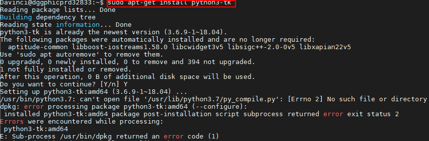

**原因分析<a name="section734943065816"></a>**

从上述报错信息看“\[Errno 2\] No such file or directory dpkg ...”可能是缺少py\_compile.py文件导致的。

**解决措施<a name="zh-cn_topic_0000001312642573_zh-cn_topic_0243443001_section653815413102"></a>**

将缺失的文件py\_compile.py复制到/usr/lib/python3.7路径，然后重新安装。

```
cp /usr/local/python3.7.5/lib/python3.7/py_compile.py  /usr/lib/python3.7
```

/usr/local/python3.7.5/lib/python3.7/py\_compile.py请以该文件所在实际路径进行替换。

## 校准执行过程中提示“\[IFMR\]: Do layer xxx data calibration failed!”<a name="ZH-CN_TOPIC_0000002473744712"></a>

**问题现象描述<a name="zh-cn_topic_0242998989_section128039317589"></a>**

在调用PyTorch框架执行中间校准模型推理过程中，由于输入数据范围不合法，导致量化算法计算得到的scale不合理，从而校准过程失败，终止校准流程。

**原因分析<a name="zh-cn_topic_0242998989_section1920814915813"></a>**

原始数据不在范围：（其中_EPSILON_包括DBL\_EPSILON double类型，FLT\_EPSILON float类型，当前使用的是FLT\_EPSILON类型）

AMCT量化支持计算得到的最大，因为在NPU IP加速器量化动作做的是乘法计算：  ，如果scale大于，会小于_FLT\_EPSILON_，此时量化后结果就不可信。因此AMCT量化算法仅支持原始数据范围在内进行量化，否则会提示不支持并提示错误信息。

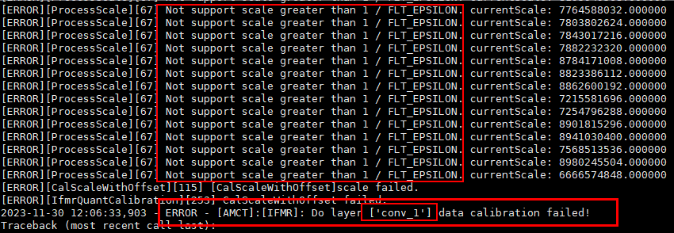

**解决措施<a name="section195521225164415"></a>**

根据提示信息，跳过日志中的量化层，例如上述提示信息中的conv\_1层。

## 编译并安装自定义算子包时提示"AttributeError: module ‘onnxruntime’ has no attribute ‘SessionOption’"信息<a name="ZH-CN_TOPIC_0000002473904594"></a>

**问题现象描述<a name="section4859954192413"></a>**

安装AMCT过程中，编译并安装自定义算子包时，出现"AttributeError: module  'onnxruntime' has no attribute 'SessionOption' "错误，编译过程中止，AMCT无法使用。

**原因分析<a name="section128511582243"></a>**

Python环境中的ONNX Runtime库异常或者版本不满足要求，没有SessionOption属性。

**解决措施<a name="section12185944255"></a>**

1.  首先确认ONNX Runtime的版本是否为环境所要求的（详情请参见[系统要求和环境检查](系统要求和环境检查.md)），若不是，则请安装正确版本。
2.  在Python环境中import onnxruntime查看其版本（version）和路径（path），若仍旧提示AttributeError，则说明ONNX Runtime未正确安装，请参见如下命令强制重新安装ONNX Runtime。

    ```
    pip3 install --force-reinstall onnxruntime==1.x.x --user
    ```

    造成ONNX Runtime未正确安装的原因可能是用户同时安装了onnxruntime和onnxruntime\_gpu，卸载其中一个版本，导致另一个也无法正常使用。

## 校准过程中提示"IFMR node. Name:'layer\_ifmr\_op' Status Message: std::bad\_alloc"信息<a name="ZH-CN_TOPIC_0000002473904578"></a>

**问题现象描述<a name="section1246245032512"></a>**

训练后量化校准过程中，对某层进行量化，提示内存错误"IFMR node. Name:'layer\_ifmr\_op' Status Message: std::bad\_alloc "。

**原因分析<a name="section111925552519"></a>**

相较于环境中的CPU或者GPU存储，量化时使用的数据量过大，导致内存错误。

**解决措施<a name="section1388135702514"></a>**

1.  减少校准所用的数据量，即降低batch\_size或者batch\_num，可直接使用batch\_size \* batch\_num的最小值尝试量化。
2.  如果网络中仅个别层的feature map很大，出现内存错误，则可以跳过该层，不对其进行量化。

## 校准过程中出现"killed"信息<a name="ZH-CN_TOPIC_0000002506024527"></a>

**问题现象描述<a name="section10942112616269"></a>**

校准过程中，出现“killed”信息。

**原因分析<a name="section813453019266"></a>**

相较于环境中的CPU或者GPU存储，量化时使用的数据量过大，导致内存错误。

**解决措施<a name="section111271233132614"></a>**

1.  减少校准所用的数据量，即降低batch\_size或者batch\_num，可直接使用batch\_size \* batch\_num的最小值尝试量化。
2.  如果网络中仅个别层的featuremap很大，出现内存错误，则可以跳过该层，不对其进行量化。

## QDQ格式模型推理过程中出现ONNXRuntimeError报错<a name="ZH-CN_TOPIC_0000002473744604"></a>

**问题现象描述<a name="section156391359132417"></a>**

QDQ（Quantize and DeQuantize）格式模型，比如从TensorFlow转换或从PyTorch导出的量化感知训练（QAT）模型，在ONNX Runtime1.8.0及以上的CPU版本环境下推理，出现类似下图的ONNXRuntimeError报错。（QDQ格式模型具体介绍请参见[Link](https://onnxruntime.ai/docs/performance/quantization.html)）

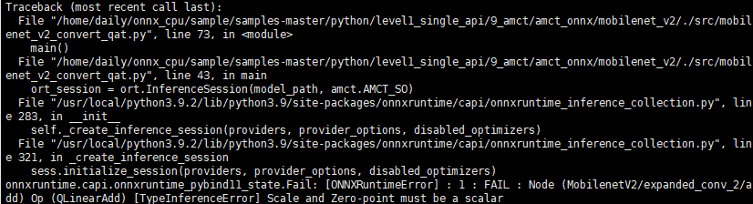

**原因分析<a name="section1717575314914"></a>**

ONNX Runtime为了提高性能，提供了多种图优化方式，默认情况下，启用所有优化。在执行优化过程中，模型和ONNX Runtime版本间存在不兼容问题，导致上述报错。

**解决措施<a name="section33341398254"></a>**

调用InferenceSession函数执行推理时，配置入参SessionOptions的图优化级别属性值为ORT\_DISABLE\_ALL，禁用所有优化。

```
import onnxruntime as ort
import amct_onnx as amct

amct.AMCT_SO.graph_optimization_level = ort.GraphOptimizationLevel.ORT_DISABLE_ALL
ort_session = ort.InferenceSession('model.onnx', amct.AMCT_SO)
...
```

## 校准执行过程中提示“\[IfmrQuantWithoutOffset\]scale is illegal”<a name="ZH-CN_TOPIC_0000002506024499"></a>

**问题现象描述<a name="section1660510486419"></a>**

在调用ONNX Runtime框架执行中间校准模型推理过程中，由于输入数据范围不合法，导致量化算法计算得到的scale不合理，从而校准过程失败，终止校准流程。

**原因分析<a name="section489814561144"></a>**

原始数据不在范围：（其中_EPSILON_包括DBL\_EPSILON double类型，FLT\_EPSILON float类型，当前使用的是FLT\_EPSILON类型）

AMCT量化支持计算得到的最大，因为在NPU IP加速器量化动作做的是乘法计算：  ，如果scale大于，会小于_FLT\_EPSILON_，此时量化后结果就不可信。因此AMCT量化算法仅支持原始数据范围在内进行量化，否则会提示不支持并提示错误信息。

```
[ERROR][IfmrQuantWithoutOffset][183] [IfmrQuantWithoutOffset]scale is illegal.
[ERROR][ProcessScale][64] Not support scale greater than 1 / FLT_EPSILON. currentScale: 1513411575808.000000
[ERROR][IfmrQuantWithoutOffset][183] [IfmrQuantWithoutOffset]scale is illegal.
[ERROR][ProcessScale][64] Not support scale greater than 1 / FLT_EPSILON. currentScale: 1492095991808.000000
[ERROR][CalScaleWithoutOffset][146] [CalScaleWithoutOffset]scale failed.
[ERROR][IfmrQuantCalibration][264] CalScaleWithoutOffset failed.
[ERROR][DoCalibration][126] Do IFMR calibration failed, error code: -65519.
Traceback (most recent call last):
  File "/g/daily/xxx/bin/amct_onnx", line 8, in <module>
    sys.exit(main())
  File "/g/daily/xxx/lib/python3.9/site-packages/amct_onnx/cmd_line_tools/command.py", line 159, in main
    calibration_function(args_var)
  File "/g/daily/xxx/lib/python3.9/site-packages/amct_onnx/cmd_line_tools/command.py", line 113, in calibration_function
    amct.save_model(
  File "/g/daily/xxx/lib/python3.9/site-packages/amct_onnx/common/utils/check_params.py", line 43, in wrapper
    return func(*args, **kwargs)
  File "/g/daily/xxx/lib/python3.9/site-packages/amct_onnx/quantize_tool.py", line 277, in save_model
    RecordFileParser.cmp_config(records)
  File "/g/daily/xxx/lib/python3.9/site-packages/amct_onnx/parser/parse_record_file.py", line 96, in cmp_config
    raise RuntimeError(
RuntimeError: batchmatmul_7 is quantizable in config but has no record in record_file
```

**解决措施<a name="section31861013510"></a>**

根据提示信息，跳过日志中的量化层，例如上述提示信息中的**batchmatmul\_7**层。

## 量化校准过程中因数据量过大导致报错<a name="ZH-CN_TOPIC_0000002505904527"></a>

**问题现象描述<a name="zh-cn_topic_0240187995_section16296124062319"></a>**

-   场景1：积攒数据的size过大溢出

    失败信息显示如下：

    ```
    tensorflow.python.framework.errors_impl.InvalidArgumentError: Check failed: size <= tensorflow::kint32max (2684354560 vs. 2147483647)
    ```

-   场景2：内存/显存溢出

    AMCT在使用过程中会额外申请内存/显存的部分资源，在内存/显存资源紧张的情况下，会出现资源申请失败的情况，导致系统抛出资源申请失败的信息。

    常见的系统资源申请失败的信息如下所示：

    CPU运行环境下，内存申请失败的部分信息显示如下：

    ```
    MemoryError: Unable to allocate array with shape (1048576, 102400) and data type float32
    ```

    GPU运行环境下，显存申请失败的部分信息显示如下：

    ```
    ResourceExhaustedError (see above for traceback): OOM when allocating tensor with shape[1,1073741824] and type int32 on /job:localhost/replica:0/task:0/device:GPU:0 by allocator G
             [[node TopKV2_1 (defined at test_input_big_tensor.py:30)  = TopKV2[T=DT_FLOAT, sorted=true, _device="/job:localhost/replica:0/task:0/device:GPU:0"](Reshape, Cast_1/_5)]]
    Hint: If you want to see a list of allocated tensors when OOM happens, add report_tensor_allocations_upon_oom to RunOptions for current allocation info.
             [[{{node QuantIfmr/_17}} = _Recv[client_terminated=false, recv_device="/job:localhost/replica:0/task:0/device:CPU:0", send_device="/job:localhost/replica:0/task:0/device:arnation=1, tensor_name="edge_55_QuantIfmr", tensor_type=DT_FLOAT, _device="/job:localhost/replica:0/task:0/device:CPU:0"]()]]
    Hint: If you want to see a list of allocated tensors when OOM happens, add report_tensor_allocations_upon_oom to RunOptions for current allocation info.
    ```

-   场景3：因量化进程占用内存过大，导致系统内存不足，出现Out of memory问题，进程被系统终止，出现类似下图的“killed”报错信息。

    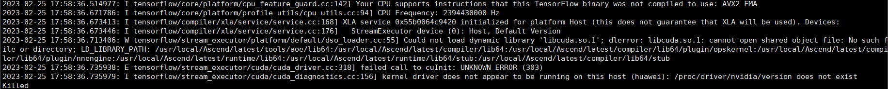

    通过如下命令查看系统日志，有“oom-kill”报错信息。

    ```
    vi /var/log/messages
    ```

    系统日志报错如下：

    ```
    169  kernel:  0 678327  python3  
    170 Feb 27 03:30:38 kernel: [2599806.621086] oom-kill:constraint=CONSTRAINT_NONE,nodemask=(null) ,cpuset=/,mems_allowed=0-1,global_oom,task_memcg=/user.slice/user-0.slice/session-7474.scope,task=amct_tensorflow,pid=678157,uid=0
    171 Feb 27 03:30:38 kernel: [2599809.519800] oom_reaper: reaped process 678157 (amct_tensorflow), now anon-rss:0kB, file-rss:0kB, shmem-rss:0kB
    ```

**解决措施<a name="zh-cn_topic_0240187995_section195301453236"></a>**

建议用户适当减小量化使用的batch\_num，由于硬件资源的不同，减小batch\_num之后仍可能发生资源申请失败情况，建议用户将量化选择的batch\_num以及每batch的size继续调低，或者选用硬件资源更加充足的平台进行量化处理。

如果上述方案仍旧无法解决问题，则可以尝试使用HFMG算法解决，即参见[训练后量化简易配置文件](训练后量化简易配置文件-91.md)构造包含HFMG算法的简易配置文件，重新进行量化。

## IFMR数据量化时，存在"inf或NaN值"或"xxx calculate scale failed"，量化过程报错<a name="ZH-CN_TOPIC_0000002473904448"></a>

**问题现象描述<a name="section87011615315"></a>**

在调用TensorFlow框架执行中间校准模型推理过程中，由于输入数据范围不合法，导致量化算法计算得到的scale不合理，从而校准过程失败，终止校准流程。

-   IFMR数据量化时，存在inf或NaN值，量化报错如下：

    ```
    tensorflow.python.framework.errors_impl.InvalidArgumentError: 2 root error(s) found.
      (0) Invalid argument: Error: Exit Infinite value before data quantization! : Tensor had NaN values
    	 [[{{node CheckNumerics_33}}]]
    	 [[detector/yolo-v3-tiny/Conv_2/act_quant/act_quant_IFMR/cond/StringFormat/Switch/_69]]
      (1) Invalid argument: Error: Exit Infinite value before data quantization! : Tensor had NaN values
    	 [[{{node CheckNumerics_33}}]]
    0 successful operations.
    0 derived errors ignored.
    
    During handling of the above exception, another exception occurred:
    ```

-   calculate scale failed量化报错：

    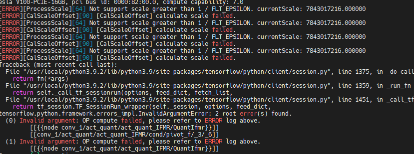

**原因分析<a name="section66905367121"></a>**

针对“calculate scale failed”原因分析如下：

原始数据不在范围：（其中_EPSILON_包括DBL\_EPSILON double类型，FLT\_EPSILON float类型，当前使用的是FLT\_EPSILON类型）

AMCT量化支持计算得到的最大，因为在NPU IP加速器量化动作做的是乘法计算：  ，如果scale大于，会小于_FLT\_EPSILON_，此时量化后结果就不可信。因此AMCT量化算法仅支持原始数据范围在内进行量化，否则会提示不支持并提示错误信息。

**解决措施<a name="section8947121217312"></a>**

根据提示信息，跳过日志中的量化层，例如上述提示信息中的Conv\_2层。

## 量化过程中提示某层bias量化超出int32范围<a name="ZH-CN_TOPIC_0000002506024603"></a>

**问题现象描述<a name="section131719552229"></a>**

量化过程中提示某层bias量化超出int32范围，提示信息如下：

```
tensorflow.python.framework.errors_impl.InvalidArgumentError: 2 root error(s) found.
  (0) Invalid argument: assertion failed: [Quantized bias of layer \"FlowNetS/decoding/deconv5_0/conv2d_transpose\" exceed int32 range: [-2147483648.0, 2147483647.0], please add it to skip layer.] [Condition x <= y did not hold element-wise:] [x (FlowNetS/decoding/deconv5_0/bias_quant/Round:0) = ] [3.35433197e+12 3.35244296e+12 3.352325e+12...] [y (FlowNetS/decoding/deconv5_0/bias_quant/assert_less_equal/y:0) = ] [2.14748365e+09]
	 [[{{node FlowNetS/decoding/deconv5_0/bias_quant/assert_less_equal/Assert/AssertGuard/Assert}}]]
	 [[FlowNetS/decoding/deconv5_0/bias_quant/Cast/_61]]
  (1) Invalid argument: assertion failed: [Quantized bias of layer \"FlowNetS/decoding/deconv5_0/conv2d_transpose\" exceed int32 range: [-2147483648.0, 2147483647.0], please add it to skip layer.] [Condition x <= y did not hold element-wise:] [x (FlowNetS/decoding/deconv5_0/bias_quant/Round:0) = ] [3.35433197e+12 3.35244296e+12 3.352325e+12...] [y (FlowNetS/decoding/deconv5_0/bias_quant/assert_less_equal/y:0) = ] [2.14748365e+09]
	 [[{{node FlowNetS/decoding/deconv5_0/bias_quant/assert_less_equal/Assert/AssertGuard/Assert}}]]
0 successful operations.
0 derived errors ignored.
```

**原因分析<a name="section14269013238"></a>**

scale\_w、scale\_d取值都较小、bias过大，导致bias量化超出int32的范围。

**解决措施<a name="section1318128152317"></a>**

根据提示信息，跳过日志中的量化层，例如上述提示信息中的conv2d\_transpose层。

## 校准时提示“Invalid argument: You must feed a value for placeholder tensor \*\*”<a name="ZH-CN_TOPIC_0000002506024605"></a>

**问题现象描述<a name="section1551736486"></a>**

训练后量化场景，修改模型后执行校准过程时，使用原始模型的输入输出做推理，报错提示必须给一个占位符输入数据，校准过程中断。提示信息如下：

```
Traceback (most recent call last):
  File "xxx/site-packages/tensorflow_core/python/client/session.py", line 1365, in _do_call
    return fn(*args)
  File "xxx/site-packages/tensorflow_core/python/client/session.py", line 1350, in _run_fn
    target_list, run_metadata
  File "xxx/site-packages/tensorflow_core/python/client/session.py", line 1443, in _call_tf_sessionrun
    run_metadata
tensorflow.python.framework.errors_impl.InvalidArgumentError: 2 root error(s) found.
  (0) Invalid argument: You must feed a value for placeholder tensor 'input' with dtype float and shape [1,32,32,10]
         [[{{node input}}]]
         [[ConstantFoldingCtrl/conv1/search_n_quant/search_n_quant_SEARCHN/cond/Switch_0/_22]]
  (1) Invalid argument: You must feed a value for placeholder tensor 'input' with dtype float and shape [1,32,32,10]
         [[{{node input}}]]
```

**原因分析<a name="section17343142210483"></a>**

调用[quantize\_model](quantize_model-69.md)处理用户的图结构时，会进行融合、替换等图操作，可能改变用户模型的输出，将原有的输出节点与placeholder连接。

**解决措施<a name="section199381228114815"></a>**

该场景下调用[quantize\_model](quantize_model-69.md)时，会有warning信息提示输出节点发生变化，在执行校准的过程中，根据提示信息，修改输出节点即可。

## 保存模型时提示“RuntimeError: record\_file is empty, no layers to be quantized”<a name="ZH-CN_TOPIC_0000002473744632"></a>

**问题现象描述<a name="section10839148174914"></a>**

训练后量化场景，量化因子记录文件中无法找到某层的shift\_bit字段，无法进行后续量化模型保存动作，量化流程终止。提示信息如下：

```
Traceback (most recent call last):
  File "./GenAIModel/amt/tools/tmp_amct_tools.py", line 457, in wrapper
    func(*args, **kwargs)
  File "/raid/AMCT/demo/new_project/test/test_tf_iter37_d16w8.py", line 1806, in test_xxx
    run_case(config, acc=True)
  File "/raid/AMCT/demo/new_project/test/test_tf_iter37_d16w8.py", line 130, in run_case
    res = tf_api_compress(model, input_data, quant_cfg=quant_cfg,data_config=data_config, nuq=nuq, per_channel=per_channel)
  File "./GenAIModel/amt/model_process/infer_quant.py", line 754, in tf_api_compress
    save_model(model, out_puts, record_file, f'{save_path}/{case_name}' )
  File "/raid/AMCT/daily/daily_env/lib/python3.9/site-packages/amct_tensorflow/common/utils/check_params.py", line 43, in wrapper
    return func(*args, **kwargs)
  File "/raid/AMCT/daily/daily_env/lib/python3.9/site-packages/amct_tensorflow/interface/save_model.py", line 68, in save_model
    save_model_inner(pb_model, outputs, record_file, save_path)
  File "/raid/AMCT/daily/daily_env/lib/python3.9/site-packages/amct_tensorflow/interface/save_model.py", line 102, in save_model_inner
    raise RuntimeError(
RuntimeError: record_file is empty, no layers to be quantized. please ensure calibration is finished by checking information!
```

**原因分析<a name="section1717575314914"></a>**

网络的尾层节点为量化节点时，如果量化推理时不修改推理的输出节点，则会导致该问题。此场景下，调用[quantize\_model](quantize_model-69.md)时，会有warning信息提示输出节点发生变化。

**解决措施<a name="section1587265711498"></a>**

该场景下调用[quantize\_model](quantize_model-69.md)时，会有warning信息提示输出节点发生变化，在执行校准的过程中，根据提示信息，修改输出节点即可。

## 使用训练后量化进行量化时，量化过程存在空tensor输入报错信息<a name="ZH-CN_TOPIC_0000002473744654"></a>

**问题现象描述<a name="section6821240835"></a>**

执行训练后量化时，存在空tensor输入报错信息，详细报错信息如下：

```
[ERROR][QuantIfmrInternelGpu][114] Empty pointer, all input tensor is empty
[ERROR][QuantIfmrInternelGpu][114] Empty pointer, all input tensor is empty
[ERROR][QuantIfmrInternelGpu][114] Empty pointer, all input tensor is empty
[ERROR][QuantIfmrInternelGpu][114] Empty pointer, all input tensor is empty
[ERROR][QuantIfmrInternelGpu][114] Empty pointer, all input tensor is empty
[ERROR][QuantIfmrInternelGpu][114] Empty pointer, all input tensor is empty
2022-07-02 22:11:36.232362: I tensorflow/core/kernels/logging_ops.cc:166 Do layer multilevel_roi_align/roi_level5/roi_align/AvgPool activation calibration with ifmr success!
```

**原因分析<a name="section2221845639"></a>**

输入数据不是真实数据集。

**解决措施<a name="section123680501733"></a>**

请使用真实数据集进行训练后量化。

## 导入amct\_tensorflow时，提示“ModuleNotFoundError: No module named npu\_bridge”<a name="ZH-CN_TOPIC_0000002506024465"></a>

**问题现象描述<a name="section1533701113439"></a>**

导入amct\_tensorflow时，在Python环境中找不到npu\_bridge模块，导致导入失败，无法使用AMCT。

**原因分析<a name="section9484191504318"></a>**

amct\_tensorflow依赖在线推理环境中的软件包，出现该问题是因为环境中CANN软件包安装不全。

**解决措施<a name="section12744219164319"></a>**

参见《安装指南》重新安装CANN软件包。

## 使用命令行方式安装Caffe环境失败<a name="ZH-CN_TOPIC_0000002505904665"></a>

**问题现象描述<a name="zh-cn_topic_0242989513_zh-cn_topic_0242987768_section570617467161"></a>**

使用命令行方式安装Caffe环境时，提示类似"/usr/bin/python3.7: can't open file '/usr/lib/python3.7/py\_compile.py': \[Error 2\] No such file or directory"信息，导致Caffe环境安装失败。

**原因分析<a name="zh-cn_topic_0242989513_zh-cn_topic_0242987768_section142861955131613"></a>**

AMCT安装时，要求先安装Python3.7.5，但是Caffe1.0使用命令行方式安装时，会去寻找py\_compile.py，该文件只在Python低级别版本3.6或者2.7上存在，在3.7.5版本上不存在。

**解决措施<a name="zh-cn_topic_0242989513_zh-cn_topic_0242987768_section178194219173"></a>**

安装Python3.7.5时，增加如下软链接或将/usr/local/python3.7.5/lib/python3.7路径下的py\_compile.py文件复制到/usr/lib/python3.7路径下，然后重新使用命令行方式安装Caffe环境。

执行如下命令设置软链接：

```
sudo ln -s /usr/local/python3.7.5/lib/python3.7 /usr/lib/python3.7 
```

执行上述软链接时如果提示链接已经存在，则可以先执行如下命令删除原有链接然后重新执行。

```
sudo rm -rf  /usr/lib/python3.7
```

## 执行proto合并时提示ERROR信息<a name="ZH-CN_TOPIC_0000002473744558"></a>

**问题现象描述1：用户message定义和AMCT自定义层冲突<a name="section196952772416"></a>**

用户自定义custom.proto内容如下，其中定义的QuantParameter层信息与amct\_custom.proto中定义的重复：

```
message LayerParameter {
  optional QuantParameter quant_param = 208;
  optional ReLU6Parameter relu6_param = 1000000;
  optional ROIPoolingParameter roi_pooling_param = 8266711;
}

message ReLU6Parameter {
  optional float negative_slope = 1 [default = 0];
}

message ROIPoolingParameter {
  // Pad, kernel size, and stride are all given as a single value for equal
  // dimensions in height and width or as Y, X pairs.
  optional uint32 pooled_h = 1 [default = 0]; // The pooled output height
  optional uint32 pooled_w = 2 [default = 0]; // The pooled output width
  // Multiplicative spatial scale factor to translate ROI coords from their
  // input scale to the scale used when pooling
  optional float spatial_scale = 3 [default = 1];
}

message QuantParameter {  
  optional bool with_offset = 1;
  optional float scale = 2;
  optional bytes offset = 3;
  optional string object_layer = 4;
}
```

执行proto合并时报错信息如下：

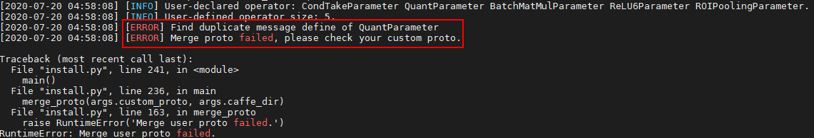

**解决措施1<a name="section16979135182418"></a>**

根据提示信息，用户自行修改自定义的message信息。

**问题现象描述2：用户自定义在LayerParameter中编号和AMCT编号冲突<a name="section1337585292413"></a>**

用户自定义custom.proto内容如下，其中定义的LayerParameter编号与amct\_custom.proto中编号重复：

```
message LayerParameter {
  optional QuantParameter quant_param = 208;
  optional ReLU6Parameter relu6_param = 1000000;
  optional ROIPoolingParameter roi_pooling_param = 8266711;
}

message ReLU6Parameter {
  optional float negative_slope = 1 [default = 0];
}

message ROIPoolingParameter {
  // Pad, kernel size, and stride are all given as a single value for equal
  // dimensions in height and width or as Y, X pairs.
  optional uint32 pooled_h = 1 [default = 0]; // The pooled output height
  optional uint32 pooled_w = 2 [default = 0]; // The pooled output width
  // Multiplicative spatial scale factor to translate ROI coords from their
  // input scale to the scale used when pooling
  optional float spatial_scale = 3 [default = 1];
}
```

执行proto合并时报错信息如下：

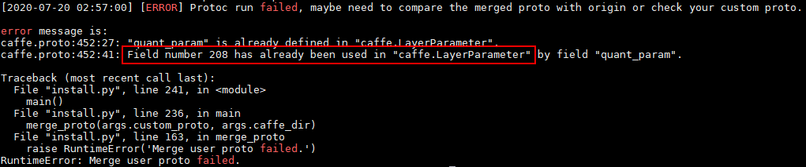

**解决措施2<a name="section9560195514240"></a>**

用户根据提示信息修改custom.proto中自定义的算子编号。

**问题现象描述3：用户自定义在LayerParameter中编号和ATC编号冲突<a name="section1450712315019"></a>**

用户自定义custom.proto内容如下，其中定义的LayerParameter编号与ATC中的caffe.proto中编号重复：

```
message LayerParameter {
  optional ReLU6Parameter relu6_param = 206;
  optional ROIPoolingParameter roi_pooling_param = 8266711;
}

message ReLU6Parameter {
  optional float negative_slope = 1 [default = 0];
}

message ROIPoolingParameter {
  // Pad, kernel size, and stride are all given as a single value for equal
  // dimensions in height and width or as Y, X pairs.
  optional uint32 pooled_h = 1 [default = 0]; // The pooled output height
  optional uint32 pooled_w = 2 [default = 0]; // The pooled output width
  // Multiplicative spatial scale factor to translate ROI coords from their
  // input scale to the scale used when pooling
  optional float spatial_scale = 3 [default = 1];
}
```

执行proto合并时报错信息如下：

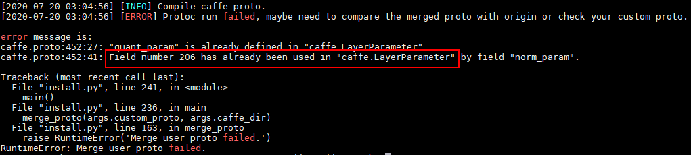

**解决措施3<a name="section9778181000"></a>**

用户根据提示信息修改custom.proto中自定义的算子编号。

**问题现象描述4：用户message定义和ATC自定义层冲突<a name="section1199913245011"></a>**

用户自定义custom.proto内容如下，其中定义的NormalizeParameter层信息与caffe.proto中定义的重复：

```
message LayerParameter {
  optional ReLU6Parameter relu6_param = 1000000;
  optional ROIPoolingParameter roi_pooling_param = 8266711;
  optional NormalizeParameter norm_param = 206; 
}

message ReLU6Parameter {
  optional float negative_slope = 1 [default = 0];
}

message ROIPoolingParameter {
  // Pad, kernel size, and stride are all given as a single value for equal
  // dimensions in height and width or as Y, X pairs.
  optional uint32 pooled_h = 1 [default = 0]; // The pooled output height
  optional uint32 pooled_w = 2 [default = 0]; // The pooled output width
  // Multiplicative spatial scale factor to translate ROI coords from their
  // input scale to the scale used when pooling
  optional float spatial_scale = 3 [default = 1];
}
message NormalizeParameter {  
    optional bool across_spatial = 1 [default = true];  
    // Initial value of scale. Default is 1.0 for all  
    optional FillerParameter scale_filler = 2;  
    // Whether or not scale parameters are shared across channels.  
    optional bool channel_shared = 3 [default = true];  
    // Epsilon for not dividing by zero while normalizing variance  
    optional float eps = 4 [default = 1e-10]; 
}
```

执行proto合并时无错误提示信息，默认会覆盖ATC内置message定义，以custom.proto为准，提示信息如下：

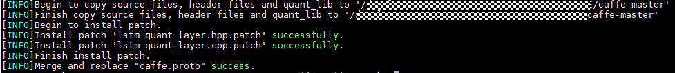

**解决措施4<a name="section1582512311808"></a>**

无。

## 校准执行过程中提示"IfmrQuantCalibration with offset scale is illegal"或"IfmrQuantCalibration without offset scale is illegal"<a name="ZH-CN_TOPIC_0000002473904562"></a>

**问题现象描述<a name="zh-cn_topic_0242998989_section128039317589"></a>**

在调用Caffe框架执行中间校准模型推理过程中，由于输入数据范围不合法，导致量化算法计算得到的scale不合理，从而校准过程失败，终止Caffe校准流程。

**原因分析<a name="zh-cn_topic_0242998989_section1920814915813"></a>**

1.  数据范围 \[-inf , +inf\]：

    因为AMCT的量化算法需要强制过零点，所以计算出的scale也就是inf/255=inf，该情况下量化因子后续无法承载，因此量化算法会提示错误信息，不支持该数据范围。

    1.  场景1

        ```
        I0513 16:12:37.508546 80719 ifmr_layer.cu:58] Doing layer: "Convolution1" calibration, already store 1/1 data.
        I0513 16:12:37.508558 80719 ifmr_layer.cu:65] Start to do ifmr quant.
        [ERROR][ProcessScale][48] Not support scale is +inf.
        [ERROR][IfmrQuantCalibration][338] IfmrQuantCalibration with offset scale is illegal.
        [ERROR][IfmrQuantInternel][462] IfmrQuantInternel calibration failed.
        F0513 16:12:37.535028 80719 ifmr_layer.cu:70] Check failed: ret == 0 (-65519 vs. 0) Do IFMR calibration failed
        *** Check failure stack trace: ***
        Aborted
        ```

    2.  场景2

        ```
        I0513 16:14:48.173506 81053 ifmr_layer.cu:58] Doing layer: "Convolution1" calibration, already store 1/1 data.
        I0513 16:14:48.173519 81053 ifmr_layer.cu:65] Start to do ifmr quant.
        [ERROR][ProcessScale][48] Not support scale is +inf.
        [ERROR][IfmrQuantCalibration][359] IfmrQuantCalibration without offset scale is illegal.
        [ERROR][IfmrQuantInternel][462] IfmrQuantInternel calibration failed.
        F0513 16:14:48.199769 81053 ifmr_layer.cu:70] Check failed: ret == 0 (-65519 vs. 0) Do IFMR calibration failed
        *** Check failure stack trace: ***
        Aborted
        ```

2.  数据范围：（其中_EPSILON_包括DBL\_EPSILON double类型，FLT\_EPSILON float类型，当前使用的是FLT\_EPSILON类型）

    AMCT量化支持计算得到的最大，因为在NPU IP加速器量化动作做的是乘法计算：  ，如果scale大于，会小于_FLT\_EPSILON_，此时量化后结果就不可信。因此AMCT量化算法仅支持原始数据范围在内进行量化，否则会提示不支持并提示错误信息。

    ```
    2021-05-11 09:25:42,222 - INFO - [AMCT]:[WeightsCalibrationPass]: Do layer 'Convolution1[arq_quantize]' weights calibration success!
    2021-05-11 09:25:42,222 - INFO - [AMCT]:[Optimizer]: Do <class 'amct_caffe.optimizer.insert_ifmr_layer.InsertIFMRLayerPass'>
    2021-05-11 09:25:42,223 - INFO - [AMCT]:[Optimizer]: Do <class 'amct_caffe.optimizer.lstm_calibration_replace.LSTMCalibrationReplacePass'>
    2021-05-11 09:25:42,223 - INFO - [AMCT]:[Optimizer]: Do <class 'amct_caffe.optimizer.insert_searchn_layer.InsertSearchNLayerPass'>
    2021-05-11 09:25:42,223 - INFO - [AMCT]:[Graph]: Doing whole model dump...
    2021-05-11 09:25:42,225 - INFO - [AMCT]:[Utils]: The weights_file is saved in xx/data/AMCT15_CAFFE_GPU_GPU_FAQ_LEVEL1_TC_001/AMCT15_CAFFE_GPU_GPU_FAQ_LEVEL1_TC_001_tmp.caffemodel
    2021-05-11 09:25:42,226 - INFO - [AMCT]:[Utils]: The model_file is saved in xx/data/AMCT15_CAFFE_GPU_GPU_FAQ_LEVEL1_TC_001/AMCT15_CAFFE_GPU_GPU_FAQ_LEVEL1_TC_001_tmp.prototxt
    [ERROR][ProcessScale][52] Not support scale greater than 1 / FLT_EPSILON.
    [ERROR][IfmrQuantCalibration][338] IfmrQuantCalibration with offset scale is illegal.
    [ERROR][IfmrQuantInternel][462] IfmrQuantInternel calibration failed.
    WARNING: Logging before InitGoogleLogging() is written to STDERR
    F0511 09:25:42.292863 80432 ifmr_layer.cu:70] Check failed: ret == 0 (-65519 vs. 0) Do IFMR calibration failed
    *** Check failure stack trace: ***
    Aborted
    ```

**解决措施<a name="section195521225164415"></a>**

根据提示信息，跳过日志中的量化层，例如上述提示信息中的Convolution1层。

## 量化执行过程中提示“Check scale and offset record file  _record.txt _failed”<a name="ZH-CN_TOPIC_0000002473744590"></a>

**问题现象描述<a name="zh-cn_topic_0240188715_section164285367415"></a>**

量化过程中调用[save\_model](save_model-112.md)接口保存量化模型时，需要读取calibration阶段计算得到的数据量化参数scale\_d，offset\_d，如果未能在相应的记录文件中找到对应参数，则无法进行后续量化模型保存动作。因此AMCT会抛出上述错误，并终止流程。现象如下：

```
2021-05-11 09:29:18,138 - INFO - [AMCT]:[Optimizer]: Do <class 'amct_caffe.optimizer.check_record_scale_offset.CheckRecordScaleOffsetPass'>
2021-05-11 09:29:18,138 - ERROR - [AMCT]:[AMCT]: Cannot find scale_d,offset_d,channels,height,width of layer:Convolution1
2021-05-11 09:29:18,138 - ERROR - [AMCT]:[AMCT]: Check scale and offset record file xx/data/AMCT_CAFFE_GPU_GPU_FAQ/AMCT_CAFFE_GPU_GPU_FAQ_record.txt failed
2021-05-11 09:29:18,138 - ERROR - [AMCT]:[AMCT]: There may be something wrong while doing calibration
2021-05-11 09:29:18,138 - ERROR - [AMCT]:[AMCT]: Please check caffe log
Traceback (most recent call last):
  File "test_caffe_faq.py", line 32, in <module>
    main()
  File "test_caffe_faq.py", line 28, in main
    gen_amct_model(case,json_flag = True) 
  File "../caffe_lib/calibration_test/code/gen_amct_model.py", line 102, in gen_amct_model
    save_model(graph, mode, AMCT_PATH+case_name)
  File "xx/amct/lib/python3.7/site-packages/amct_caffe/common/utils/check_params.py", line 43, in wrapper
    return func(*args, **kwargs)
  File "xx/amct/lib/python3.7/site-packages/amct_caffe/quantize_tool.py", line 190, in save_model
    optimizer.do_optimizer(graph)
  File "xx/amct/lib/python3.7/site-packages/amct_caffe/optimizer/graph_optimizer.py", line 60, in do_optimizer
    graph_pass.run(graph)
  File "xx/amct/lib/python3.7/site-packages/amct_caffe/optimizer/check_record_scale_offset.py", line 103, in run
    raise RuntimeError('Check file {} failed.'.format(record_file))
RuntimeError: Check file xx/data/AMCT15_CAFFE_GPU_GPU_FAQ/AMCT15_CAFFE_GPU_GPU_FAQ_record.txt failed.
```

**原因分析<a name="zh-cn_topic_0240188715_section29011040104118"></a>**

保存scale\_d和offset\_d参数是在用户执行calibration动作时（调用Caffe框架执行calibration模型做前向计算时），AMCT在calibration模型中插入的IFMR层做的动作，而IFMR层需要先攒够用户指定batch\_num数据后再进行一次量化计算得到scale\_d和offset\_d。导致**RuntimeError:  _Check file record.txt _failed**错误的原因主要分为两类：

1.  **执行Caffe做inference错误**：该问题可能原因有很多种，例如用户编译的Caffe本身有问题，calibration模型存在问题，未能找到相应数据集等等。**用户可以通过查看Caffe框架本身抛出的异常信息来查看**。
2.  **用户提供的校准集数据量不满足设置的batch\_num所需要的数据量**：例如用户仅提供了一个batch的数据用作校准集，但设置了batch\_num=2，这样在做calibration过程中，IFMR层未攒满足够的数据，不能执行量化操作，也就未能计算得到scale\_d和offset\_d，也会触发上述错误。用户可以通过查看IFMR在量化过程中打印的进程信息来排查，IFMR层会显示已经攒的数据量：

    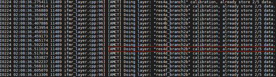

    当攒够指定数据量后，会触发量化操作：

    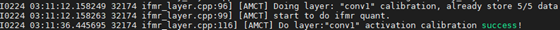

    直至出现**Do layer:_"conv1"_  activation calibration success!**信息才表示完成了当前层的量化动作。

**解决措施<a name="zh-cn_topic_0240188715_section16466174417417"></a>**

1.  根据Caffe框架抛出的具体错误来相应进行修复。
2.  适当增加校准集数据量或者降低量化算法batch\_num配置（但降低batch\_num可能会导致量化后模型精度下降，需要慎重考虑）直至满足校准集数据量大于等于_\`_batch\_num设置。

## 使用Ubuntu 20.04安装Caffe环境时，出现CUDA和GCC版本不匹配的编译报错<a name="ZH-CN_TOPIC_0000002473744636"></a>

**问题现象描述<a name="section1138681034313"></a>**

使用Ubuntu 20.04安装Caffe环境时，出现类似如下信息的编译报错：

**/usr/local/cuda-10.0/include/crt/host\_config.h:129:2: error: \#error --unsupported GNU version! Gcc versions later than7 are not supported!**

**原因分析<a name="section9866103484"></a>**

Ubuntu 20.04默认GCC版本为GCC9，如果使用10.0版本CUDA软件，因其配套GCC7版本，会报不支持GCC7以上的版本，需要对默认的GCC版本进行降级。

**解决措施<a name="section138081858464"></a>**

安装低版本GCC（以GCC7为例），并将其链接到CUDA bin文件安装目录下，保证环境同时安装GCC7和GCC9时，CUDA编译可以找到正确的GCC版本。下文中的_/usr/local/cuda-10.0_仅作为示例，请以CUDA实际安装路径为准。

```
sudo apt-get install g++-7 -y
sudo ln -s /usr/bin/gcc-7 /usr/local/cuda-10.0/bin/gcc
sudo ln -s /usr/bin/g++-7 /usr/local/cuda-10.0/bin/g++
```

# 附录<a name="ZH-CN_TOPIC_0000002505904543"></a>


## 安装Python3.9.2（Ubuntu）<a name="ZH-CN_TOPIC_0000002473904514"></a>

1.  检查系统是否安装满足版本要求的Python开发环境（具体要求请参见[系统要求和环境检查](系统要求和环境检查.md)，该章节以环境上需要使用Python 3.9.2为例进行说明）。

    执行命令**python3 --version**，如果返回信息满足Python版本要求（3.9.0\~ 3.9.2），则该章节请忽略，否则参见如下步骤安装对应的Python版本。

2.  安装Python依赖的包。

    ```
    sudo apt-get install -y make zlib1g zlib1g-dev build-essential libbz2-dev libsqlite3-dev libssl-dev libxslt1-dev libffi-dev openssl python3-tk
    ```

    libsqlite3-dev需要在Python安装之前安装，如果用户操作系统已经安装Python环境，在此之后再安装libsqlite3-dev，则需要重新编译Python环境。如果安装python3-tk失败，请参见[安装python3-tk时提示错误信息](安装python3-tk时提示错误信息.md)解决。

3.  安装Python3.9.2。
    1.  使用wget下载Python3.9.2源码包，可以下载到AMCT所在服务器任意目录，命令为：

        ```
        wget https://www.python.org/ftp/python/3.9.2/Python-3.9.2.tgz
        ```

    2.  进入下载后的目录，解压源码包，命令为：

        ```
        tar -zxvf Python-3.9.2.tgz
        ```

    3.  进入解压后的文件夹，执行配置、编译和安装命令：

        ```
        cd Python-3.9.2
        ./configure --prefix=/usr/local/python3.9.2 --with-ssl-default-suites=openssl --enable-shared CFLAGS=-fPIC
        make
        sudo make install
        ```

        其中“--prefix“参数用于指定Python安装路径，用户根据实际情况进行修改，“--enable-shared“参数用于编译出动态库。

        本手册以--prefix=/usr/local/python3.9.2路径为例进行说明。执行配置、编译和安装命令后，安装包在/usr/local/python3.9.2路径。

    4.  设置Python3.9.2环境变量。
        1.  如果Python安装用户为root：

            该场景下AMCT使用root用户进行安装，请在当前终端窗口直接执行如下命令设置环境变量。

            ```
            #用于设置Python3.9.2库文件路径
            export LD_LIBRARY_PATH=/usr/local/python3.9.2/lib:$LD_LIBRARY_PATH
            #如果用户环境存在多个Python3版本，则指定使用Python3.9.2版本
            export PATH=/usr/local/python3.9.2/bin:$PATH
            ```

            > **须知：** 
            >运行用户是root，不建议修改.bashrc，否则可能会影响其它系统提供的Python工具的使用，如果仍想使用系统默认工具，则请重新开启终端窗口。

        2.  如果Python安装用户为非root：

            该场景下AMCT使用非root用户进行安装，请以非root用户在任意目录下执行**vi \~/.bashrc**命令，打开**.bashrc**文件，在文件最后一行后面添加如下内容。

            ```
            #用于设置Python3.9.2库文件路径
            export LD_LIBRARY_PATH=/usr/local/python3.9.2/lib:$LD_LIBRARY_PATH
            #如果用户环境存在多个Python3版本，则指定使用Python3.9.2版本
            export PATH=/usr/local/python3.9.2/bin:$PATH
            ```

            保存文件后，执行**source \~/.bashrc**命令使其立即生效。

4.  安装完成之后，执行如下命令查看安装版本，如果返回相关版本信息，则说明安装成功。

    ```
    python3 --version
    pip3  --version
    ```

## 压缩算法<a name="ZH-CN_TOPIC_0000002505904491"></a>


### 量化算法原理<a name="ZH-CN_TOPIC_0000002506024501"></a>

量化常用的算法有二值化、线性量化、对数量化，线性量化又可根据是否有offset细分为对称\(Symmetric\)，非对称\(Asymmetric\)两种。AMCT与昇腾芯片配套的是采用线性量化方式，并将对称和非对称量化方式进行了归一，以INT8量化为例，其应用表达式为：


对于量化层数据和权重分别需要提供量化因子scale（浮点数的缩放因子），offset（偏移量）两项，支持的取值范围为：

-   
-   

下面介绍上述表达式的由来。

**对称量化算法原理<a name="section1059041191910"></a>**

原始高精度数据和量化后INT8数据的转换为：，其中scale是float32的浮点数，为了能够表示正负数，采用signed INT8的数据类型，通过原始高精度数据转换到INT8数据的操作如下，其中round为取整函数，量化算法需要确定的数值即为常数scale：


对权值和数据的量化可以归结为寻找scale的过程，由于为有符号数，要保证正负数值表示范围的对称性，因此对所有数据首先进行取绝对值的操作，使待量化数据的范围变换为，再来确定scale。由于INT8在正数范围内能表示的数值范围为\[0,127\]，因此scale可以通过如下方式计算得到：


确定了scale之后，INT8数据对应的表示范围为，量化操作即为对量化数据以进行饱和，即超过范围的数据饱和到边界值，然后进行公式所示量化操作即可。

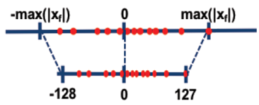

**非对称量化算法原理<a name="section3183194510206"></a>**

与对称量化算法主要区别在于数据转换的方式不同，如下，同样需要确定scale与offset这两个常数。


确定后通过原始高精度数据计算得到UINT8数据的转换，即为如下公式所示：


其中，scale是float32浮点数，为unsigned INT8定点数，offset是INT8定点数，其表示的数据范围为。若待量化数据的取值范围为，则scale和offset的计算方式如下：

、

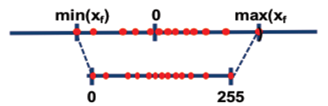

**量化数据格式归一<a name="section1627913182316"></a>**

AMCT采用的是归一的量化数据格式，即**量化数据格式归一：**

通过将非对称量化公式通过简单的数据变换，可以使得量化后的数据与对称量化算法在**数据格式**上保持一致，**均为int格式**。具体变换过程如下：

以INT8量化为例进行说明，公式符号与之前保持一致，输入原始高精度浮点数据为，原始量化后的定点数为，量化scale，原始量化（算法要求强制过零点，否则可能会出现精度问题），原始量化的计算原理公式如下：


其中。通过上述变换，可以将量化数据也转成INT8格式。确定scale和变换后的offset'后，通过原始高精度浮点数据计算得到INT8数据的转换，即为如下公式所示：


### 训练后量化算法<a name="ZH-CN_TOPIC_0000002473744552"></a>


#### ARQ权重量化算法<a name="ZH-CN_TOPIC_0000002505904611"></a>

ARQ （Adaptive Range Quantization）算法是对权重直接量化的算法。该算法提供了两种方式，channel\_wise（是否对每个channel采用不同的量化因子，以PyTorch框架为例，参数解释请参见[表20](手工调优.md#zh-cn_topic_0240188002_table20119449114211)）量化和非channel\_wise量化，量化原理图如下所示：

**图 1**  非channel\_wise量化<a name="fig7600113961719"></a>  
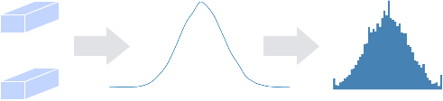

**图 2**  channel\_wise量化<a name="fig6351104815177"></a>  
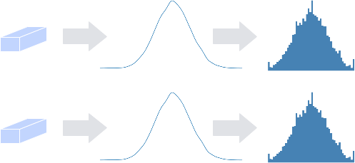

量化配置中ARQuantize（以PyTorch框架为例，参数解释请参见[表1](训练后量化简易配置文件.md#zh-cn_topic_0240188735_table1225503375617)）提供的参数channel\_wise用来选择量化方式：

-   channel\_wise为False时，选择[图1](#fig7600113961719)量化方式，所有filter一起分析数据分布，进行量化，某一层的所有不同channel共用一个量化因子。
-   channel\_wise为True时，选择[图2](#fig6351104815177)的量化方式，每个filter独立做数据分析，进行量化，同一层的每个channel有独立的量化因子。

一般来说，每一个filter独立进行量化，即进行[图2](#fig6351104815177)的量化，量化精度较高；如果每个filter的数据量比较少，量化效果会比较差，此时推荐使用[图1](#fig7600113961719)的量化。

注意：全连接层、平均下采样层Pooling（下采样方式为AVE，且非global pooling）没有channel，设置channel\_wise为True时，会提示错误信息。

#### ADA权重量化算法<a name="ZH-CN_TOPIC_0000002473744598"></a>

在对神经网络进行量化时，主要方法是将每个浮点权重分配给其最接近的定点值。但这不是最佳的量化策略。本文引入的AdaRound\(Adaptive Rounding\)，**一种用于训练后量化的更好的权重舍入机制，它可以适应数据和任务损失，**并且仅需要少量未标记的数据。

ADA权重量化算法用于PTQ流程，由于量化后的权重舍入模式会影响模型精度，ADA主要是对舍入模式进行微调，针对每个量化数据自适应向上或向下舍入模式，需要未标记的数据进行训练调优以确定不同的舍入模式。整体流程如下图所示，先将权重用KL散度算法计算weight初始量化因子scale和offset，然后使用无标签的数据进行训练，调整weight的舍入模式。

**图 1**  ADA权重量化算法<a name="fig432315576612"></a>  
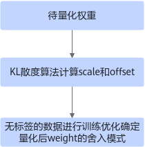

量化后的weight计算公式如下：

，其中n和p分别是量化后的上下界。

训练过程主要是对alpha参数进行优化，目标是使得h\(alpha\)等于0或1：

，其中和是伸缩参数，分别取值为1.1和-0.1。

将原始weight量化，量化完成后加上h\(alpha\)将其反量化，将反量化的weight引入最后的算子计算中，最终输出带量化误差的结果：


损失函数计算如下：


正则项（Loss函数的后半部分），用以约束h\(alpha\)向0和1两个值收敛，在迭代初期较大值可以使得正则项对整体损失的影响比重变大，就会促使优化过程快速调整h\(alpha\)，接近最优解的区域。迭代后期，此时h\(alpha\)已经处于最优解区域，使用较小，不会因为微小的参数变动导致正则项剧烈变化，从而让模型在微调参数时更加稳健，避免因过度调整而错过最优解，使h\(alpha\)逼近最优解。

#### NUQ权重量化算法<a name="ZH-CN_TOPIC_0000002473904572"></a>

该算法用于训练后量化下的非均匀量化场景。

NUQ（Non Uniform Quantization）是对权重非等间距量化的一种方法，均匀量化将权重数据从32比特量化到8比特，NUQ在此基础上挑选部分量化台阶。权重压缩后会带来精度损失，为了在指定的压缩目标下获得最小的精度损失，算法使用了搜索的方式来查找最小损失的压缩方式。量化配置中通过NUQuantize（以PyTorch框架为例，参数解释请参见[表1](训练后量化简易配置文件.md#zh-cn_topic_0240188735_table1225503375617)）来控制NUQ算法。

-   num\_steps用于指定压缩目标，值越小，压缩率越高，但精度损失会更大，反之则相反。
-   num\_of\_iteration代表搜索过程迭代次数，一般来说值越大，精度越高，但计算时间会指数级上升，建议使用默认值。

#### IFMR数据量化算法<a name="ZH-CN_TOPIC_0000002506024539"></a>

IFMR（Input Feature Map Reconstruction）算法在某个数据分布下，通过搜索的方式确定最佳量化方式。该算法用于训练后量化场景，量化原理图如下所示：

**图 1**  IFMR数据量化算法<a name="fig11850413154412"></a>  
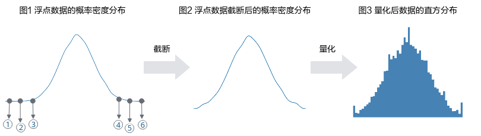

上图中序号\[1,3\]代表\[clip\_min\_start, clip\_min\_end\]、2代表clip\_min、 \[4,6\]代表\[clip\_max\_start, clip\_max\_end\]、5代表clip\_max。

该算法中量化过程分为两步，如[图1](#fig11850413154412)所示，第一步，将浮点数截断到\[clip\_min, clip\_max\]范围，即[图1](#fig11850413154412)中的\[2,5\]点；第二步，将浮点数据量化到int范围。通常情况下，数据分布处于边界附近的数值比较稀疏，均可做截断处理，以提高量化精度。

为获得最佳量化效果，可以不断改变截断范围\[clip\_min, clip\_max\]，选择量化效果最好的一组范围作为最终的量化结果。IFMR算法中，clip\_min和clip\_max用来设置搜索范围和搜索步长，遍历查询得到最优的量化效果。量化配置中FMRQuantize（以PyTorch框架为例，参数解释请参见[表1](训练后量化简易配置文件.md#zh-cn_topic_0240188735_table1225503375617)）提供的参数则用来调整截断范围。

-   clip\_min（即[图1](#fig11850413154412)中的序号2）的遍历取值范围为\[clip\_min\_start, clip\_min\_end\] （即[图1](#fig11850413154412)中的\[1,3\]），步长为search\_step。
-   clip\_max（即[图1](#fig11850413154412)中的序号5）的遍历取值范围为\[clip\_max\_start, clip\_max\_end\] （即[图1](#fig11850413154412)中的\[4,6\]），步长为search\_step。

在数据降序序列中，根据min\_percentile参数获得clip\_min\_init，从而得到clip\_min\_start、clip\_min\_end参数，其中：

-   clip\_min\_start =clip\_min\_init\*search\_range\_start
-   clip\_min\_end= clip\_min\_init\* search\_range\_end

在数据升序序列中，根据max\_percentile参数获得clip\_max\_init，从而得到clip\_max\_start、clip\_max\_end参数，其中：

-   clip\_max\_start =clip\_max\_init\*search\_range\_start
-   clip\_max\_end=clip\_max\_init\* search\_range\_end

通常情况下，搜索范围\[clip\_min\_start, clip\_min\_end\]越大、搜索步长search\_step越小，可能获得更高的量化精度，但量化耗时更多。

#### HFMG数据量化算法<a name="ZH-CN_TOPIC_0000002473904622"></a>

该算法用于训练后量化场景。

HFMG（Histogram Feature Map Glutton）算法通过直方图的方式来记录激活数据的数据分布，通过搜索的方式确定最佳的量化截断位置。量化原理如下所示：

1.  第一步根据输入激活数据创建直方图。
2.  若有更多batch的数据则对每个batch的数据创建一个直方图，然后进行直方图合并的操作，如[图1](#fig1126323519407)所示。
3.  基于激活数据的直方图根据搜索的方式确定数据的截断点，如[图2](#fig1419882412)所示。

该量化算法的数据放在内存中，和[IFMR数据量化算法](IFMR数据量化算法.md)相比，更节省内存。该算法与IFMR数据量化算法同一层不能同时配置。

create\_quant\_config接口量化默认使用的为IFMR数据量化算法，如果想使用HFMG数据量化算法，则只能通过create\_quant\_config接口config\_defination参数配置简易配置文件方式实现。

**图 1**  直方图合并过程<a name="fig1126323519407"></a>  
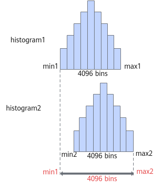

**图 2**  搜索得到最优的左右截断位置<a name="fig1419882412"></a>  
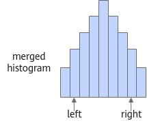

如果未获得最优的量化效果，则可以改变直方图的bin个数（直方图中的一个最小单位直方图形），选择量化误差更小的一组参数作为最终的量化结果。HFMG算法中，num\_of\_bins配置参数用来调整直方图的bin的数目，参数说明请参见**训练后量化简易配置文件\>HFMGQuantize**的配置参数。通常情况下，num\_of\_bins数值越大，直方图拟合原始数据分布的能力越强，可能获得更佳的量化效果，但训练后量化过程的耗时也会更长。

#### DMQ均衡算法<a name="ZH-CN_TOPIC_0000002505904609"></a>

该算法用于训练后量化场景。

DMQ（Diagonal Matrix Quantization Balancer）在计算量化因子之前对数据进行均衡处理，将数据的量化难度转移一部分至权重。如下图所示，X为数据，W为权重。

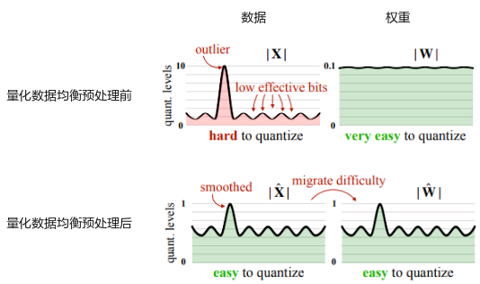

均衡原理为：

1.  针对待量化算子的输入数据的每个通道，计算出均衡因子。
2.  将数据除以均衡因子，同时权重乘以均衡因子，使得待量化算子的计算结果在均衡前后是数学等价的。

### 量化感知训练算法<a name="ZH-CN_TOPIC_0000002473904484"></a>


#### ARQ权重量化算法<a name="ZH-CN_TOPIC_0000002506024551"></a>

该场景下的原理同训练后量化算法中的[ARQ权重量化算法](ARQ权重量化算法.md)，量化配置中ARQRetrain参数解释请参见[表1](量化感知训练简易配置文件.md#zh-cn_topic_0240188735_table1225503375617)（以PyTorch框架为例）。

#### ULQ数据量化算法<a name="ZH-CN_TOPIC_0000002506024525"></a>

该算法用于量化感知训练场景。

ULQ（Universal Linear Quantization）算法在训练过程中不断训练量化因子，以减少量化损失。该算法初始化时会对数值做量化（包含截断），对初始化敏感。量化配置中ULQuantize（以PyTorch框架为例，参数解释请参见[表1](量化感知训练简易配置文件.md#zh-cn_topic_0240188735_table1225503375617)）来控制ULQ算法。

-   clip\_max\_min为初始化的截断范围，clip\_min为截断下限，clip\_max为截断上限，可根据数据的范围来设置，不设置则使用AMCT自带的默认方式初始化。
-   fixed\_min表示在训练过程中，是否将截断下限设置为0。例如，当量化层的前一层是ReLU层，则数据范围为\[0, +inf\]，此场景下数据量化可以设置fixed\_min为true，表示截断下限始终为0。

### 稀疏算法<a name="ZH-CN_TOPIC_0000002505904483"></a>


#### 自动通道稀疏搜索算法<a name="ZH-CN_TOPIC_0000002473904544"></a>

自动通道稀疏搜索默认采用的搜索算法为贪婪搜索算法，在给定模型计算量约束下，自动选择每一层可删除的、较为合适的通道（价值排序靠后的通道），降低通道稀疏对模型经过Fine-tune精度损失的影响。

该问题为组合优化问题，建模为背包问题，已知所有物品各自的价值v<sub>i</sub>和重量F<sub>i</sub>，求背包容量C下能够装下总价值最多的物品，可以用公式表示为：

最大化：

受限于：

其中，v<sub>i</sub>相当于稀疏敏感度；F<sub>i</sub>为比特复杂度；b为通道稀疏方案，即该通道是否保留；C为用户设置的压缩率。

对于通道稀疏任务，重量F<sub>i</sub>为第i个通道的计算量，v<sub>i</sub>为裁剪第i个通道后网络w的损失函数变化：


其中，loss\(w - w<sub>i</sub>\)可以通过一阶或者二阶泰勒展开式来做近似估计。

根据用户给定的目标稀疏率，计算每一层每一通道的价值密度（稀疏敏感度/比特复杂度），全局排序后挑选出价值密度最低的一批通道进行裁剪，通过上述的组合优化方法完成求解，达成搜索任务。

#### 手工通道稀疏算法<a name="ZH-CN_TOPIC_0000002506024469"></a>

AMCT使用的通道稀疏算法为BalancedL2Norm，该算法通过计算权重各个filter（输出维度通道）的L2范数（各元素的平方和然后求平方根），对输出通道进行重要性排序并裁剪重要性较低的通道，即重要性低的通道优先被稀疏，原理下图所示：

**图 1**  通道稀疏算法原理<a name="fig856211635614"></a>  
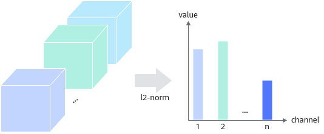

稀疏配置文件中通过BalancedL2NormFilterPruner字段（以PyTorch框架为例，参数解释请参见[量化感知训练简易配置文件](量化感知训练简易配置文件.md)）来控制BalancedL2Norm算法。

-   prune\_ratio：稀疏率，是被稀疏的filter数量与filter总数量的比值，稀疏化的程度由稀疏率控制，例如0.3的稀疏率表示30%的输出通道将被裁剪。
-   ascend\_optimized：昇腾亲和优化，当前使用的为16对齐的优化方案，开启16对齐后，稀疏后保留的通道数将向16的倍数对齐。例如原始通道有20个，配置稀疏率为0.25并不开启16对齐时，稀疏后保留通道数为15；若相同稀疏率但开启16对齐，则稀疏后保留通道数为16；该配置可以提高稀疏后的模型在NPU IP加速器上的推理性能。

#### 4选2结构化稀疏算法<a name="ZH-CN_TOPIC_0000002505904503"></a>

AMCT使用的4选2结构化稀疏算法为L1SelectivePrune，通过比较权重的l1值即绝对值来决定保留哪些权重，每4个连续的权重中保留l1值最大的2个权重。

稀疏配置文件中通过L1SelectivePruner字段（以PyTorch框架为例，参数解释请参见[量化感知训练简易配置文件](量化感知训练简易配置文件.md)）来控制L1SelectivePrune算法。

-   update\_freq：更新4选2稀疏的间隔，计算哪些元素被保留的间隔。在重训练的过程中，权重会随着每个训练batch发生改变，对应的l1值排序可能会变化，比如本来保留的是4个元素中的前两个元素，更新之后可能变成第1，第3个元素保留。

    update\_freq=0时表示训练时仅在第一个batch计算哪些元素被保留，update\_freq=2时，表示训练时每2个batch计算哪些元素被保留，以此类推。默认为0。

-   n\_out\_of\_m\_type：目前仅支持M4N2，即每4个连续权重中保留2个权重。

### 蒸馏算法<a name="ZH-CN_TOPIC_0000002506024523"></a>

蒸馏量化的思想是将量化模型作为学生模型，原始模型作为教师模型，通过引导量化模型“模仿”浮点模型从而获得更好的精度结果。蒸馏量化，仅需要少量无标签数据集，即可以在较短的量化时间内达到较好的精度结果。

量化蒸馏的步骤：

1.  量化原始模型，得到结构与浮点模型相同的量化模型。
2.  将若干级联的量化层划分为一个蒸馏单元。
3.  以浮点蒸馏模块的输出作为soft label，对量化蒸馏模块进行fine-tune。
4.  完成所有的模块蒸馏，得到精度更优的量化模型。

    **图 1**  蒸馏示意图<a name="fig275521214542"></a>  
    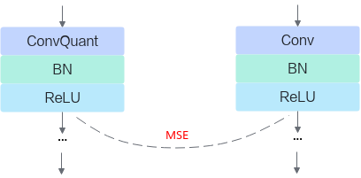

## 源码包编译为whl包，以whl包形式安装AMCT<a name="ZH-CN_TOPIC_0000002473904584"></a>

如果用户AMCT安装服务器缺少源码编译安装时的某些依赖，则用户可以将源码包编译为whl包，然后进行安装，方法如下，如下步骤以编译并安装AMCT（TensorFlow）为例进行说明。

1.  安装编译所需wheel依赖。

    执行**pip3 list**命令检查所列软件中是否包括wheel，若有请忽略该步骤，否则执行如下命令进行安装：

    ```
    pip3 install wheel --user
    ```

2.  解压TensorFlow框架安装包。

    ```
    tar -zxvf amct_tensorflow-{version}-py3-none-linux_{arch}.tar.gz
    ```

3.  编译whl包。

    进入解压后的目录，执行如下命令进行编译：

    ```
    cd amct_tensorflow-{version}  && python3 setup.py bdist_wheel
    ```

    编译完成后，在dist目录下生成所需的whl包。

4.  以whl包形式安装AMCT。

    ```
    pip3 install amct_tensorflow-{version}-py3-none-any.whl --user
    ```

    若出现如下信息则说明工具安装成功。

    ```
    Successfully installed amct-tensorflow-{version}
    ```

## TensorFlow网络模型由于AMCT导致输出节点改变，如何通过修改量化脚本进行后续的量化动作<a name="ZH-CN_TOPIC_0000002505904519"></a>

**背景信息<a name="section19540121916469"></a>**

使用AMCT调用[quantize\_model](quantize_model-69.md)接口对用户的原始TensorFlow模型进行图修改时，由于插入了searchN层导致尾层输出节点发生改变。该场景下，需要用户根据提示信息，将推理时的输出节点替换为新的输出节点的名称；AMCT量化过程中的日志信息给出了网络输出节点变化前后的节点名称，需要用户根据提示信息，自行修改量化脚本。

进行图修改时，导致尾层输出节点发生改变的场景有如下几种情况：

-   场景1：网络模型的尾层为Add/AddV2，且Add加数的维度为一维，满足BiasAdd的功能

    **图 1**  尾层为Add/AddV2<a name="fig390666182114"></a>  
    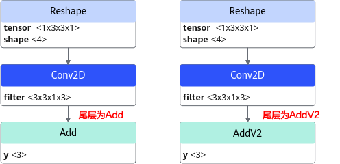

    -   尾层为Add时，图修改时的提示信息为：

        ```
        2020-09-01 09:31:04,896 - WARNING - [AMCT]:[replace_add_pass]: Replace ADD at the end of the network! You need to replace the old output node by the new output node in inference process! 
        >>>>>>>>>>>>>>>>>>>>>>>>>>>>>>The name of the old output node is 'Add:0'
        <<<<<<<<<<<<<<<<<<<<<<<<<<<<<<The name of the new output node is 'bias_add/BiasAdd:0'
        2020-09-01 09:31:04,979 - WARNING - [AMCT]:[quantize_model]: Insert searchN operator at the end of the network! You need to replace the old output node by the new output node in inference process! 
        >>>>>>>>>>>>>>>>>>>>>>>>>>>>>>The name of the old output node is 'bias_add/BiasAdd:0'   //网络输出节点变化前的节点名称
        <<<<<<<<<<<<<<<<<<<<<<<<<<<<<<The name of the new output node is 'search_n_quant/search_n_quant_SEARCHN/Identity:0'  //网络输出节点变化后的节点名称
        ```

    -   尾层为AddV2时，图修改时的提示信息为：

        ```
        2020-09-01 09:32:42,281 - WARNING - [AMCT]:[replace_add_pass]: Replace ADD at the end of the network! You need to replace the old output node by the new output node in inference process! 
        >>>>>>>>>>>>>>>>>>>>>>>>>>>>>>The name of the old output node is 'add:0'
        <<<<<<<<<<<<<<<<<<<<<<<<<<<<<<The name of the new output node is 'bias_add/BiasAdd:0'
        2020-09-01 09:32:42,362 - WARNING - [AMCT]:[quantize_model]: Insert searchN operator at the end of the network! You need to replace the old output node by the new output node in inference process! 
        >>>>>>>>>>>>>>>>>>>>>>>>>>>>>>The name of the old output node is 'bias_add/BiasAdd:0'   //网络输出节点变化前的节点名称
        <<<<<<<<<<<<<<<<<<<<<<<<<<<<<<The name of the new output node is 'search_n_quant/search_n_quant_SEARCHN/Identity:0'   //网络输出节点变化后的节点名称
        ```

-   场景2：网络的尾层为BiasAdd，且其前面为Conv2D、DepthwiseConv2dNative、Conv2DBackpropInput、MatMul中的一种

    **图 2**  网络的尾层为BiasAdd，且其前面为Conv2D<a name="fig16298303314"></a>  
    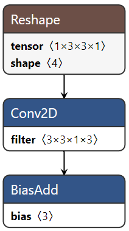

    该场景下，图修改时的提示信息为：

    ```
    2020-09-01 09:39:26,130 - WARNING - [AMCT]:[quantize_model]: Insert searchN operator at the end of the network! You need to replace the old output node by the new output node in inference process! 
    >>>>>>>>>>>>>>>>>>>>>>>>>>>>>>The name of the old output node is 'BiasAdd:0'   //网络输出节点变化前的节点名称
    <<<<<<<<<<<<<<<<<<<<<<<<<<<<<<The name of the new output node is 'search_n_quant/search_n_quant_SEARCHN/Identity:0'   //网络输出节点变化后的节点名称
    ```

-   场景3：网络的尾层为Conv2D、DepthwiseConv2dNative、Conv2DBackpropInput、MatMul、AvgPool中的一种

    **图 3**  网络的尾层为Conv2D<a name="fig11453224153615"></a>  
    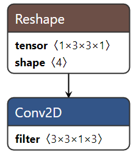

    该场景下，图修改时的提示信息为：

    ```
    2020-09-01 09:40:28,717 - WARNING - [AMCT]:[quantize_model]: Insert searchN operator at the end of the network! You need to replace the old output node by the new output node in inference process! 
    >>>>>>>>>>>>>>>>>>>>>>>>>>>>>>The name of the old output node is 'Conv2D:0'   //网络输出节点变化前的节点名称
    <<<<<<<<<<<<<<<<<<<<<<<<<<<<<<The name of the new output node is 'search_n_quant/search_n_quant_SEARCHN/Identity:0'  //网络输出节点变化后的节点名称
    ```

-   场景4：网络的尾层为FusedBatchNorm\\FusedBatchNormV2\\FusedBatchNormV3中的一种，且其前面为Conv2D+\(BiasAdd\)或DepthwiseConv2dNative+\(BiasAdd\)

    **图 4**  尾层为FusedBatchNormV3<a name="fig1447136163815"></a>  
    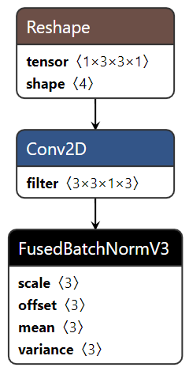

    该场景下，图修改时的提示信息为：

    ```
    2020-09-01 09:44:08,637 - WARNING - [AMCT]:[conv_bn_fusion_pass]: Fused BN at the end of the network! You need to replace the old output node by the new output node in inference process! 
    >>>>>>>>>>>>>>>>>>>>>>>>>>>>>>The name of the old output node is 'batch_normalization/FusedBatchNormV3:0'
    <<<<<<<<<<<<<<<<<<<<<<<<<<<<<<The name of the new output node is 'bias_add:0'
    2020-09-01 09:44:08,717 - WARNING - [AMCT]:[quantize_model]: Insert searchN operator at the end of the network! You need to replace the old output node by the new output node in inference process! 
    >>>>>>>>>>>>>>>>>>>>>>>>>>>>>>The name of the old output node is 'bias_add:0'   //网络输出节点变化前的节点名称
    <<<<<<<<<<<<<<<<<<<<<<<<<<<<<<The name of the new output node is 'search_n_quant/search_n_quant_SEARCHN/Identity:0'   //网络输出节点变化后的节点名称
    ```

-   场景5：网络的尾层为BN小算子结构，且其输入的为4维数据

    **图 5**  尾层为BN小算子结构<a name="fig72804586409"></a>  
    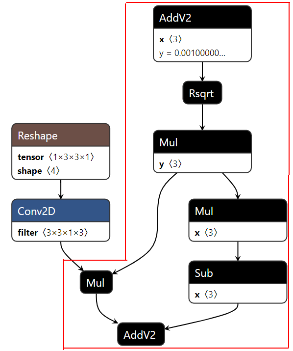

    该场景下，图修改时的提示信息为：

    ```
    2020-09-01 09:46:46,426 - WARNING - [AMCT]:[replace_bn_pass]: Replace BN at the end of the network! You need to replace the old output node by the new output node in inference process! 
    >>>>>>>>>>>>>>>>>>>>>>>>>>>>>>The name of the old output node is 'batch_normalization/batchnorm/add_1:0'
    <<<<<<<<<<<<<<<<<<<<<<<<<<<<<<The name of the new output node is 'batch_normalization/batchnorm/bn_replace/batch_normalization/FusedBatchNormV3:0'
    2020-09-01 09:46:46,439 - WARNING - [AMCT]:[conv_bn_fusion_pass]: Fused BN at the end of the network! You need to replace the old output node by the new output node in inference process! 
    >>>>>>>>>>>>>>>>>>>>>>>>>>>>>>The name of the old output node is 'batch_normalization/batchnorm/bn_replace/batch_normalization/FusedBatchNormV3:0'
    <<<<<<<<<<<<<<<<<<<<<<<<<<<<<<The name of the new output node is 'bias_add:0'
    2020-09-01 09:46:46,518 - WARNING - [AMCT]:[quantize_model]: Insert searchN operator at the end of the network! You need to replace the old output node by the new output node in inference process! 
    >>>>>>>>>>>>>>>>>>>>>>>>>>>>>>The name of the old output node is 'bias_add:0'   //网络输出节点变化前的节点名称
    <<<<<<<<<<<<<<<<<<<<<<<<<<<<<<The name of the new output node is 'search_n_quant/search_n_quant_SEARCHN/Identity:0'   //网络输出节点变化后的节点名称
    ```

**脚本修改<a name="section16546524134611"></a>**

如果调用quantize\_model接口对用户的原始TensorFlow模型进行图修改时，由于在网络最后插入了searchN层导致尾层输出节点发生改变，需要用户根据日志信息，修改量化脚本，将网络推理过程中的输出节点替换为新的节点名称，修改方法如下：

修改前的量化脚本（如下脚本只是样例，请以实际量化的模型为准）：

```
import tensorflow as tf
import amct_tensorflow as amct

def load_pb(model_name):
    with tf.gfile.GFile(model_name, "rb") as f:
        graph_def = tf.GraphDef()
        graph_def.ParseFromString(f.read())
    tf.import_graph_def(graph_def, name='')

def main():
    # 网络pb文件的名字
    model_name = './pb_model/case_1_1.pb'
    # 网络量化推理输出节点的名字
    infer_output_name = 'Add:0'
    # 网络保存量化模型的输出节点的名字
    save_output_name = 'Add:0'


    # 载入网络的pb文件
    load_pb(model_name)
    # 获取网络的图结构
    graph = tf.get_default_graph()


    # 生成量化配置文件
    amct.create_quant_config(
        config_file='./configs/config.json',
        graph=graph)
    # 插入量化相关算子
    amct.quantize_model(
        graph=graph,
        config_file='./configs/config.json',
        record_file='./configs/record_scale_offset.txt')


    # 执行网络的推理过程
    with tf.Session() as sess:
        output_tensor = graph.get_tensor_by_name(infer_output_name)
        sess.run(tf.global_variables_initializer())
        sess.run(output_tensor)


    # 保存量化后的pb模型文件
    amct.save_model(
        pb_model=model_name,
        outputs=[save_output_name[:-2]],
        record_file='./configs/record_scale_offset.txt',
        save_path='./pb_model/case_1_1')


if __name__ == '__main__':
    main()
```

修改后的量化脚本：

```
import tensorflow as tf
import amct_tensorflow as amct

def load_pb(model_name):
    with tf.gfile.GFile(model_name, "rb") as f:
        graph_def = tf.GraphDef()
        graph_def.ParseFromString(f.read())
    tf.import_graph_def(graph_def, name='')

def main():
    # 网络pb文件的名字
    model_name = './pb_model/case_1_1.pb'
    # 网络量化推理输出节点的名字，需要替换为日志打印的网络输出节点变化后的节点名称
    infer_output_name = 'search_n_quant/search_n_quant_SEARCHN/Identity:0' 
    # 网络保存量化模型的输出节点的名字
    save_output_name = 'Add:0'


    # 载入网络的pb文件
    load_pb(model_name)
    # 获取网络的图结构
    graph = tf.get_default_graph()


    # 生成量化配置文件
    amct.create_quant_config(
        config_file='./configs/config.json',
        graph=graph)
    # 插入量化相关算子
    amct.quantize_model(
        graph=graph,
        config_file='./configs/config.json',
        record_file='./configs/record_scale_offset.txt')


    # 执行网络的推理过程
    with tf.Session() as sess:
        output_tensor = graph.get_tensor_by_name(infer_output_name)
        sess.run(tf.global_variables_initializer())
        sess.run(output_tensor)


    # 保存量化后的pb模型文件
    amct.save_model(
        pb_model=model_name,
        outputs=[save_output_name[:-2]],
        record_file='./configs/record_scale_offset.txt',
        save_path='./pb_model/case_1_1')


if __name__ == '__main__':
    main()
```

## 插入量化算子后，如何恢复模型训练参数<a name="ZH-CN_TOPIC_0000002473744640"></a>

用户调用[quantize\_model](quantize_model-69.md)接口在传入的图中插入量化相关的变量op列表（quant\_add\_ops），该列表中的变量值无法在模型训练参数文件中找到，故模型训练参数直接恢复会出现变量无法找到的错误，因此需要在模型参数恢复之前，将quant\_add\_ops列表中的变量值从恢复列表中剔除，具体的剔除方法如下：

1.  **影子变量恢复情况**

    ```
    # 1.获取所有变量的{变量名：变量值}对应字典variables_dict
    variables_ema = tf.train.ExponentialMovingAverage(moving_average_decay)
    variables_dict = variables_ema.variables_to_restore()
    
    # 2.定义需要恢复的变量的{变量名：变量值}对应字典params_need_load
    params_need_load = dict()
    
    # 3.基于quant_add_ops从variables_dict中找寻需要恢复的变量
    for key, value in variables_dict.items():
        if value not in quant_add_ops:
            params_need_load[key] = value
    
    # 4.恢复变量
    loader = tf.train.Saver(params_need_load)
    loader.restore(sess, FLAGS.checkpoint)
    ```

2.  **非影子变量恢复的情况**

    ```
    # 1.获取所有变量的{变量名：变量值}对应字典variables_dict
    variables_global = tf.global_variables()
    variables_dict = dict()
    for var in variables_global:
        variables_dict[var.name[:-2]] = var
    
    # 2.定义需要恢复的变量的{变量名：变量值}对应字典params_need_load
    params_need_load = dict()
    
    # 3.基于quant_add_ops从variables_dict中找寻需要恢复的变量
    for key, value in variables_dict.items():
        if value not in quant_add_ops:
           params_need_load[key] = value
    
    # 4.恢复变量
    loader = tf.train.Saver(params_need_load)
    loader.restore(sess, FLAGS.checkpoint)
    ```

