# 学习向导<a name="ZH-CN_TOPIC_0000002473745758"></a>

本文档用于指导开发者如何使用ATC（Ascend Tensor Compiler，简称ATC）工具进行模型转换，得到适配NPU IP加速器的离线模型。通过本文档您可以达成以下目标：

-   了解不同框架原始网络模型转成NPU IP加速器离线模型的方法。
-   能够基于本文档中的参数，转成满足不同定制要求的离线模型。

熟悉Linux基本命令，对机器学习、深度学习有一定了解的人员，可以更好地理解本文档。

**针对新手<a name="section16759134714143"></a>**

<a name="table5894730202615"></a>
<table><thead align="left"><tr id="row589415309267"><th class="cellrowborder" valign="top" width="36.52%" id="mcps1.1.4.1.1"><p id="p158943302266"><a name="p158943302266"></a><a name="p158943302266"></a><strong id="b12360134344318"><a name="b12360134344318"></a><a name="b12360134344318"></a><a href="快速入门.md">快速入门</a></strong></p>
</th>
<th class="cellrowborder" valign="top" width="32.14%" id="mcps1.1.4.1.2"><p id="p207791317916"><a name="p207791317916"></a><a name="p207791317916"></a><strong id="b1177131312910"><a name="b1177131312910"></a><a name="b1177131312910"></a><a href="ATC简介.md">ATC简介</a></strong></p>
</th>
<th class="cellrowborder" valign="top" width="31.34%" id="mcps1.1.4.1.3"><p id="p992341081813"><a name="p992341081813"></a><a name="p992341081813"></a><strong id="b1578443831217"><a name="b1578443831217"></a><a name="b1578443831217"></a><a href="初级功能.md">初级功能</a></strong></p>
</th>
</tr>
</thead>
<tbody><tr id="row198951530152617"><td class="cellrowborder" valign="top" width="36.52%" headers="mcps1.1.4.1.1 "><p id="p1928135351017"><a name="p1928135351017"></a><a name="p1928135351017"></a>本章节以ATC工具支持的所有框架网络模型为例，简单介绍如何进行基础功能的模型转换。</p>
</td>
<td class="cellrowborder" valign="top" width="32.14%" headers="mcps1.1.4.1.2 "><p id="p12187131183"><a name="p12187131183"></a><a name="p12187131183"></a>介绍ATC工具功能架构、运行流程以及关键概念。</p>
</td>
<td class="cellrowborder" valign="top" width="31.34%" headers="mcps1.1.4.1.3 "><p id="p9524194641019"><a name="p9524194641019"></a><a name="p9524194641019"></a>介绍ATC工具的初级功能，比如将模型转成JSON文件查看参数信息，离线模型支持动态BatchSize、动态分辨率，以及如何组合各种ATC参数转换成满足要求的离线模型等。</p>
</td>
</tr>
</tbody>
</table>

**适合专家<a name="section790616415152"></a>**

<a name="table7906204141512"></a>
<table><thead align="left"><tr id="row179069420156"><th class="cellrowborder" valign="top" width="37.120000000000005%" id="mcps1.1.4.1.1"><p id="p1823932191318"><a name="p1823932191318"></a><a name="p1823932191318"></a><strong id="b6239321151320"><a name="b6239321151320"></a><a name="b6239321151320"></a><a href="AIPP使能(该版本不支持AIPP特性).md">AIPP使能(该版本不支持AIPP特性)</a></strong></p>
</th>
<th class="cellrowborder" valign="top" width="31.720000000000002%" id="mcps1.1.4.1.2"><p id="p37731224121316"><a name="p37731224121316"></a><a name="p37731224121316"></a><strong id="b1773924101311"><a name="b1773924101311"></a><a name="b1773924101311"></a><a href="单算子模型转换(该版本不支持单算子特性).md">单算子模型转换(该版本不支持单算子特性)</a></strong></p>
</th>
<th class="cellrowborder" valign="top" width="31.160000000000004%" id="mcps1.1.4.1.3"><p id="p0453429181317"><a name="p0453429181317"></a><a name="p0453429181317"></a><strong id="b8914212142618"><a name="b8914212142618"></a><a name="b8914212142618"></a><a href="专题.md">专题</a></strong></p>
</th>
</tr>
</thead>
<tbody><tr id="row99082042152"><td class="cellrowborder" valign="top" width="37.120000000000005%" headers="mcps1.1.4.1.1 "><p id="p47821053223"><a name="p47821053223"></a><a name="p47821053223"></a>介绍什么是AIPP、模型转换时如何使能AIPP、根据配置文件模板如何构造AIPP配置文件，以及根据色域转换功能如何输出满足要求的图片数据等功能，并给出典型场景下的配置示例。<strong id="b14805240447"><a name="b14805240447"></a><a name="b14805240447"></a><span id="ph02301539164212"><a name="ph02301539164212"></a><a name="ph02301539164212"></a>IPV350</span>不支持该特性</strong>。</p>
</td>
<td class="cellrowborder" valign="top" width="31.720000000000002%" headers="mcps1.1.4.1.2 "><p id="p2773192411139"><a name="p2773192411139"></a><a name="p2773192411139"></a>介绍什么是单算子描述文件、如何构造单算子描述文件，以及如何将该文件转成适配<span id="ph53331659101910"><a name="ph53331659101910"></a><a name="ph53331659101910"></a>NPU IP加速器</span>的离线模型，用于验证单算子功能。<strong id="b10177850163318"><a name="b10177850163318"></a><a name="b10177850163318"></a><span id="ph1617717508330"><a name="ph1617717508330"></a><a name="ph1617717508330"></a>IPV350</span>不支持该特性</strong>。</p>
</td>
<td class="cellrowborder" valign="top" width="31.160000000000004%" headers="mcps1.1.4.1.3 "><p id="p12724161471612"><a name="p12724161471612"></a><a name="p12724161471612"></a>介绍Caffe、TensorFlow等模型在某些无法直接使用ATC工具的场景，如何通过定制修改模型，来实现顺利使用ATC工具的功能。<strong id="b43193131629"><a name="b43193131629"></a><a name="b43193131629"></a><span id="ph153196131929"><a name="ph153196131929"></a><a name="ph153196131929"></a>IPV350</span>不支持该特性。</strong></p>
</td>
</tr>
</tbody>
</table>

# ATC简介<a name="ZH-CN_TOPIC_0000002473745734"></a>

介绍ATC工具的功能架构以及使用ATC工具过程中遇到的一些术语或者缩略语。
ATC工具运行前需要准备环境和模型，本节给出ATC工具的运行流程以及和各组件的交互流程。

## ATC工具介绍<a name="ZH-CN_TOPIC_0000002505905747"></a>

介绍ATC工具的功能架构以及使用ATC工具过程中遇到的一些术语或者缩略语。

**ATC简介<a name="section198161811184811"></a>**

昇腾张量编译器（Ascend Tensor Compiler，简称ATC）是异构计算架构CANN体系下的模型转换工具，它可以将开源框架的网络模型以及Ascend IR定义的单算子描述文件（JSON格式）转换为NPU IP加速器支持的.om/exeom\(IPV350\)格式离线模型。其功能架构如[图1](#fig496511151075)所示。

模型转换过程中，ATC会进行算子调度优化、权重数据重排、内存使用优化等具体操作，对原始的深度学习模型进行进一步的调优，从而满足部署场景下的高性能需求，使其能够高效执行在NPU IP加速器上。

**图 1**  ATC工具功能架构<a name="fig496511151075"></a>  
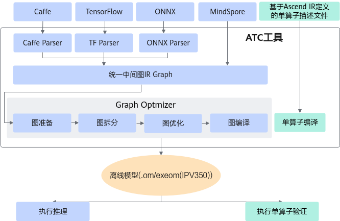

其中：

-   开源框架网络模型场景：
    1.  开源框架网络模型经过Parser解析后，转换为中间态IR Graph。
    2.  中间态IR经过图准备、图拆分、图优化、图编译等一系列操作后，转成适配NPU IP加速器的离线模型（此处图指网络模型拓扑图）。
    3.  转换后的离线模型上传到板端环境，通过**AscendCL接口加载模型文件**实现推理过程，详细流程请参见《AscendCL应用开发指南 \(C&C++\)》中的“模型管理”章节。

-   单算子描述文件场景：**\(该版本不支持单算子特性\)**

    Ascend IR定义的单算子描述文件（JSON格式）通过ATC工具进行单算子编译后，转成适配NPU IP加速器的单算子离线模型，然后上传到板端环境，通过**AscendCL接口加载单算子模型文件**用于验证单算子功能，详细流程请参见《AscendCL应用开发指南 \(C&C++\)》中的“单算子调用 \>  [单算子模型执行](https://www.hiascend.com/document/detail/zh/canncommercial/82RC1/API/appdevgapi/aclcppdevg_03_0245.html)”章节。

    关于单算子描述文件的详细配置说明请参见[单算子模型转换\(该版本不支持单算子特性\)](单算子模型转换(该版本不支持单算子特性).md)章节。

**关键概念<a name="section246214434421"></a>**

**表 1**  概念介绍

<a name="table109941656134210"></a>
<table><thead align="left"><tr id="row29951156194219"><th class="cellrowborder" valign="top" width="11.17%" id="mcps1.2.3.1.1"><p id="p59871952113013"><a name="p59871952113013"></a><a name="p59871952113013"></a>概念</p>
</th>
<th class="cellrowborder" valign="top" width="88.83%" id="mcps1.2.3.1.2"><p id="p1498717521306"><a name="p1498717521306"></a><a name="p1498717521306"></a>描述</p>
</th>
</tr>
</thead>
<tbody><tr id="row11995145664216"><td class="cellrowborder" valign="top" width="11.17%" headers="mcps1.2.3.1.1 "><p id="p13995185614429"><a name="p13995185614429"></a><a name="p13995185614429"></a>GE</p>
</td>
<td class="cellrowborder" valign="top" width="88.83%" headers="mcps1.2.3.1.2 "><p id="p1299545618427"><a name="p1299545618427"></a><a name="p1299545618427"></a>Graph Engine，图引擎，是计算图编译和运行的控制中心，提供图优化、图编译管理以及图执行控制等功能。GE通过统一的图开发接口提供多种AI框架的支持，不同AI框架的计算图可以实现到Ascend图的转换。原图优化时，GE内部会进行整图优化。</p>
</td>
</tr>
<tr id="row1899525619427"><td class="cellrowborder" valign="top" width="11.17%" headers="mcps1.2.3.1.1 "><p id="p11995145616426"><a name="p11995145616426"></a><a name="p11995145616426"></a>YUV420SP</p>
</td>
<td class="cellrowborder" valign="top" width="88.83%" headers="mcps1.2.3.1.2 "><p id="p799565620428"><a name="p799565620428"></a><a name="p799565620428"></a>有损图像颜色编码格式，常用为YUV420SP_UV、YUV420SP_VU两种格式。</p>
</td>
</tr>
<tr id="row17995115619422"><td class="cellrowborder" valign="top" width="11.17%" headers="mcps1.2.3.1.1 "><p id="p18900154824319"><a name="p18900154824319"></a><a name="p18900154824319"></a>数据排布格式（Format）</p>
</td>
<td class="cellrowborder" valign="top" width="88.83%" headers="mcps1.2.3.1.2 "><p id="p899585694220"><a name="p899585694220"></a><a name="p899585694220"></a>Format为数据的物理排布格式，定义了解读数据的维度，比如1D、2D、3D、4D、5D等。</p>
</td>
</tr>
<tr id="row15995175610429"><td class="cellrowborder" valign="top" width="11.17%" headers="mcps1.2.3.1.1 "><p id="p799555674210"><a name="p799555674210"></a><a name="p799555674210"></a>NCHW和NHWC</p>
</td>
<td class="cellrowborder" valign="top" width="88.83%" headers="mcps1.2.3.1.2 "><p id="p45714342717"><a name="p45714342717"></a><a name="p45714342717"></a>在深度学习框架中，多维数据通过多维数组存储，比如卷积神经网络的特征图（Feature Map）通常用四维数组保存，即4D，4D格式解释如下：</p>
<a name="ul18429184342713"></a><a name="ul18429184342713"></a><ul id="ul18429184342713"><li>N：Batch数量，例如图像的数目。</li><li>H：Height，特征图高度，即垂直高度方向的像素个数。</li><li>W：Width，特征图宽度，即水平宽度方向的像素个数。</li><li>C：Channels，特征图通道，例如彩色RGB图像的Channels为3。</li></ul>
<p id="p65371818183116"><a name="p65371818183116"></a><a name="p65371818183116"></a>由于数据只能线性存储，因此这四个维度有对应的顺序。不同深度学习框架会按照不同的顺序存储特征图数据，比如TensorFlow中，排列顺序为[Batch, Height, Width, Channels]，即NHWC。</p>
<p id="p359713914274"><a name="p359713914274"></a><a name="p359713914274"></a>如<a href="#fig185971639142719">图2</a>所示，以一张格式为RGB的图片为例，NCHW中，C排列在外层，每个通道内，像素紧挨在一起，实际存储的是“<span>RRRRRRGGGGGGBBBBBB</span>”，即同一通道的所有像素值顺序存储在一起；而NHWC中C排列在最内层，每个通道内，像素间隔挨在一起，实际存储的则是“<span>RGBRGBRGBRGBRGBRGB</span>”，即多个通道的同一位置的像素值顺序存储在一起。</p>
<div class="fignone" id="fig185971639142719"><a name="fig185971639142719"></a><a name="fig185971639142719"></a><span class="figcap"><b>图1 </b>NCHW和NHWC</span><br><a name="image189886415297"></a><a name="image189886415297"></a><span></span></div>
</td>
</tr>
<tr id="row973819525449"><td class="cellrowborder" valign="top" width="11.17%" headers="mcps1.2.3.1.1 "><p id="p197381521448"><a name="p197381521448"></a><a name="p197381521448"></a>NC1HWC0</p>
</td>
<td class="cellrowborder" valign="top" width="88.83%" headers="mcps1.2.3.1.2 "><p id="p6698434205116"><a name="p6698434205116"></a><a name="p6698434205116"></a><span id="ph13777174465017"><a name="ph13777174465017"></a><a name="ph13777174465017"></a>NPU IP加速器</span>中，为了提高通用矩阵乘法（GEMM）运算数据块的访问效率，所有张量数据统一采用NC1HWC0的五维数据格式。</p>
<p id="p1059171332418"><a name="p1059171332418"></a><a name="p1059171332418"></a>其中C0与微架构强相关，是一个矩阵单元处理单边数据量，一个矩阵单元处理32B*32B的数据，单边是32B；例如数据类型为float16（2字节）时，C0=32/2=16，数据类型为float32（4字节）时，C0=32/4=8。</p>
<p id="p185110383503"><a name="p185110383503"></a><a name="p185110383503"></a>C1=(C+C0-1)/C0，如果结果不整除，向下取整。</p>
<p id="p176537168410"><a name="p176537168410"></a><a name="p176537168410"></a>NHWC/NCHW -&gt; NC1HWC0的转换过程为：将数据在C维度进行分割，变成C1份NHWC0/NC0HW，再将C1份NHWC0/NC0HW在内存中连续排列成NC1HWC0，其格式转换示意图如下图所示。</p>
<div class="fignone" id="fig74491949461"><a name="fig74491949461"></a><a name="fig74491949461"></a><span class="figcap"><b>图2 </b>NC1HWC0</span><br><a name="image101871918132918"></a><a name="image101871918132918"></a><span>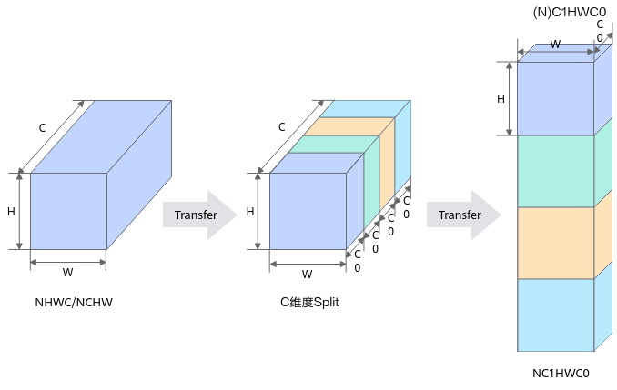</span></div>
<a name="ul143619369710"></a><a name="ul143619369710"></a><ul id="ul143619369710"><li>NHWC -&gt; NC1HWC0的转换公式如下：<pre class="screen" id="screen16922208101120"><a name="screen16922208101120"></a><a name="screen16922208101120"></a>Tensor.reshape( [N, H, W, C1, C0]).transpose( [0, 3, 1, 2, 4] )</pre>
</li><li>NCHW -&gt; NC1HWC0的转换公式如下：<pre class="screen" id="screen156144164117"><a name="screen156144164117"></a><a name="screen156144164117"></a>Tensor.reshape( [N, C1, C0, H, W]).transpose( [0, 1, 3, 4, 2] )</pre>
</li></ul>
</td>
</tr>
<tr id="row115281227451"><td class="cellrowborder" valign="top" width="11.17%" headers="mcps1.2.3.1.1 "><p id="p75291224513"><a name="p75291224513"></a><a name="p75291224513"></a>FRACTAL_Z</p>
</td>
<td class="cellrowborder" valign="top" width="88.83%" headers="mcps1.2.3.1.2 "><p id="p3884178101517"><a name="p3884178101517"></a><a name="p3884178101517"></a>FRACTAL_Z是用于定义卷积权重的数据格式，由FT Matrix（FT：Filter，卷积核）变换得到。FRACTAL_Z是送往Cube的最终数据格式，采用“C1HW,N1,N0,C0”的4维数据排布。</p>
<p id="p1973132484714"><a name="p1973132484714"></a><a name="p1973132484714"></a>数据有两层Tiling，如下图所示：</p>
<p id="p10162253104711"><a name="p10162253104711"></a><a name="p10162253104711"></a><a name="image526324910485"></a><a name="image526324910485"></a><span>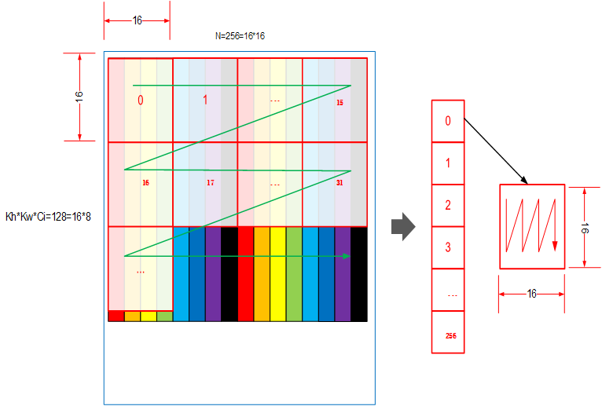</span></p>
<p id="p192081311124916"><a name="p192081311124916"></a><a name="p192081311124916"></a>第一层与Cube的Size相关，数据按照列的方向连续（小n）；第二层与矩阵的Size相关，数据按照行的方向连续（大Z）。</p>
<p id="p82781018155019"><a name="p82781018155019"></a><a name="p82781018155019"></a>例如：HWCN = (2, 2, 32, 32)，将其变成FRACTAL_Z( C1HW, N1, N0, C0 ) = (8, 2, 16, 16)。</p>
<p id="p735219610518"><a name="p735219610518"></a><a name="p735219610518"></a>HWCN变换FRACTAL_Z的过程为：</p>
<pre class="screen" id="screen883481711513"><a name="screen883481711513"></a><a name="screen883481711513"></a>Tensor.padding([ [0,0], [0,0], [0,(C0–C%C0)%C0], [0,(N0–N%N0)%N0] ]).reshape( [H, W, C1, C0, N1, N0]).transpose( [2, 0, 1, 4, 5, 3] ).reshape( [C1*H*W, N1, N0, C0])</pre>
<p id="p1352866515"><a name="p1352866515"></a><a name="p1352866515"></a>NCHW变换FRACTAL_Z的过程为：</p>
<pre class="screen" id="screen419018228511"><a name="screen419018228511"></a><a name="screen419018228511"></a>Tensor.padding([ [0,(N0–N%N0)%N0], [0,(C0–C%C0)%C0], [0,0], [0,0] ]).reshape( [N1, N0, C1, C0, H, W,]).transpose( [2, 4, 5, 0, 1, 3] ).reshape( [C1*H*W, N1, N0, C0])</pre>
</td>
</tr>
<tr id="row1869606114511"><td class="cellrowborder" valign="top" width="11.17%" headers="mcps1.2.3.1.1 "><p id="p469712612450"><a name="p469712612450"></a><a name="p469712612450"></a>FRACTAL_NZ</p>
</td>
<td class="cellrowborder" valign="top" width="88.83%" headers="mcps1.2.3.1.2 "><p id="p186833191373"><a name="p186833191373"></a><a name="p186833191373"></a>FRACTAL_NZ是分形格式，如Feature Map的数据存储，在cube单元计算时，输出矩阵的数据格式为NW1H1H0W0。整个矩阵被分为（H1*W1）个分形，按照column major排布，形状如N字形；每个分形内部有（H0*W0）个元素，按照row major排布，形状如z字形。考虑到数据排布格式，将NW1H1H0W0数据格式称为Nz（大N小z）格式。其中，H0,W0表示一个分形的大小，示意图如下所示：</p>
<p id="p8791339205310"><a name="p8791339205310"></a><a name="p8791339205310"></a><a name="image1233611149495"></a><a name="image1233611149495"></a><span>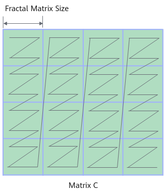</span></p>
<p id="p519730113413"><a name="p519730113413"></a><a name="p519730113413"></a>ND –&gt; FRACTAL_NZ的变换过程为：</p>
<pre class="screen" id="screen125889355343"><a name="screen125889355343"></a><a name="screen125889355343"></a>(..., N, H, W )-&gt;pad-&gt;(..., N, H1*H0, W1*W0)-&gt;reshape-&gt;(..., N, H1, H0, W1, W0)-&gt;transpose-&gt;(..., N, W1, H1, H0, W0)</pre>
</td>
</tr>
<tr id="row16631144104511"><td class="cellrowborder" valign="top" width="11.17%" headers="mcps1.2.3.1.1 "><p id="p1563117434518"><a name="p1563117434518"></a><a name="p1563117434518"></a>知识库</p>
</td>
<td class="cellrowborder" valign="top" width="88.83%" headers="mcps1.2.3.1.2 "><p id="p93334451378"><a name="p93334451378"></a><a name="p93334451378"></a>知识库是算子调优时，经过上板验证，获得算子真实性能后，存储的调优后的策略，方便后续算子编译中直接使用。</p>
</td>
</tr>
</tbody>
</table>

## 调用流程<a name="ZH-CN_TOPIC_0000002506025629"></a>

ATC工具运行前需要准备环境和模型，本节给出ATC工具的运行流程以及和各组件的交互流程。

**运行流程<a name="section7891195011461"></a>**

运行流程如[图1](#fig12482161192220)所示。

**图 1**  运行流程<a name="fig12482161192220"></a>  
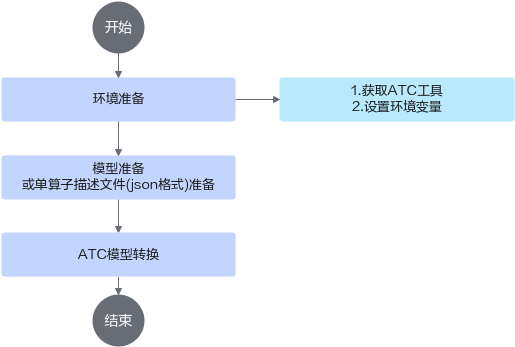

1.  使用ATC工具之前，请先在开发环境安装CANN软件包，获取相关路径下的ATC工具，然后设置环境变量，详细说明请参见[准备环境](准备环境.md)。
2.  准备要进行转换的模型，并上传到开发环境。
3.  使用ATC工具进行模型转换，模型转换过程中使用的参数请参见[参数说明](参数说明.md)。

**模型转换交互流程<a name="section154844580484"></a>**

下面以开源框架网络模型转换为om离线模型为例，详细介绍模型转换过程中与周边模块的交互流程。

根据网络模型中算子计算单元的不同，分为AI Core算子和AI CPU算子：AI Core算子是指在NPU IP加速器的核心计算单元上执行的算子，而AI CPU算子则是在AI CPU计算单元上执行的算子。**\(该版本不支持AI CPU相关特性\)**

在AI Core算子、AI CPU算子的模型转换交互流程中，虽然都涉及图准备、图拆分、图优化、图编译等节点，但由于两者的计算单元不同，因此涉及交互的内部模块也有所不同，请参见下图。

关于算子类型、基本概念等详细介绍请参见《TBE&AI CPU算子开发指南》。如果用户使用的网络模型中有自定义算子，也请优先参见上述手册开发部署好自定义算子，模型转换时会优先去查找自定义算子库匹配模型文件中的算子；若匹配失败，则会去查找内置算子库。

-   AI Core算子模型转换交互流程

    **图 2**  AI Core算子模型转换交互流程<a name="fig57471318664"></a>  
    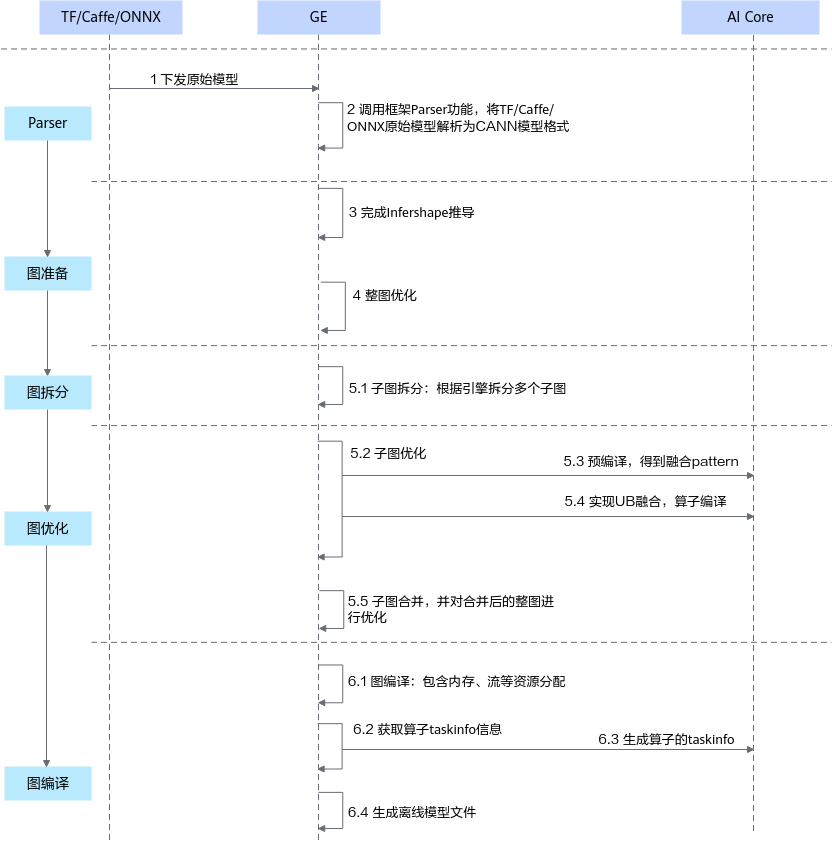

    1.  调用框架Parser功能，将主流框架的模型格式转换成CANN模型格式。
    2.  图准备阶段：该阶段会完成原图优化以及Infershape推导（设置算子输出的shape和dtype）等功能。
    3.  图拆分阶段：GE（Graph Engine，图引擎）根据引擎拆分多个子图。
    4.  图优化阶段：GE将拆分后的子图进行优化，优化时按照当前子图流程对AI Core算子进行预编译和UB（Unified Buffer）融合，然后根据算子信息库中算子信息找到算子实现将其编译成算子kernel（算子的\*.o与\*.json），最后将优化后子图返回给GE。

        优化后的子图合并为整图，再进行整图优化。

    5.  图编译阶段：GE进行图编译，包含内存分配、流资源分配等，图编译完成之后生成适配NPU IP加速器的离线模型文件（\*.om/exeom\(IPV350\)）。

# 准备环境<a name="ZH-CN_TOPIC_0000002505905727"></a>

**获取ATC工具<a name="section11940191920527"></a>**

进行模型转换前，请先在开发环境安装CANN软件包，详情可参见《安装指南》，安装完成后，ATC工具安装在“$\{INSTALL\_DIR\}/bin”目录。其中，$\{INSTALL\_DIR\}请替换为CANN软件安装后文件存储路径。以root安装举例，安装后文件默认存储路径为：/usr/local/Ascend/latest。

**设置环境变量<a name="section11988234125210"></a>**

> **须知：** 
>-   使用export方式设置环境变量后，环境变量只在当前窗口有效。
>-   使用ATC工具进行模型转换的过程中，会自动将ATC工具所在位置“../python/site-packages”目录下算子编译依赖的Python库写入PYTHONPATH环境变量。
>    若算子实现时用户引入了上述依赖外的其他Python依赖，请自行添加PYTHONPATH的环境变量，配置引入的Python依赖所在路径，如下所示：
>    export PYTHONPATH=_xxxx_:$PYTHONPATH

1.  **必选环境变量**

    -   **设置公共环境变量**

        安装CANN软件后，使用CANN运行用户进行编译、运行时，需要以CANN运行用户登录环境，执行如下环境变量：

        ```
        source ${INSTALL_DIR}/bin/setenv.bash
        ```

        其中，$\{INSTALL\_DIR\}请替换为CANN软件安装后文件存储路径。以root安装举例，安装后文件默认存储路径为：/usr/local/Ascend/latest。

    -   **设置Python相关环境变量**

        模型编译依赖Python，以Python3.7.5为例，请以CANN软件包运行用户执行如下命令设置Python3.7.5相关环境变量。

        ```
        #如果用户环境存在多个python3版本，则指定使用python3.7.5版本
        export PATH=/usr/local/python3.7.5/bin:$PATH
        #设置python3.7.5库文件路径
        export LD_LIBRARY_PATH=/usr/local/python3.7.5/lib:$LD_LIBRARY_PATH
        ```

    上述环境变量只在当前窗口生效，用户可以将上述命令写入\~/.bashrc文件，使其永久生效，方法如下：

    1.  以安装用户在任意目录下执行**vi \~/.bashrc**，在该文件最后添加上述内容。
    2.  保存文件中，执行**source \~/.bashrc**使环境变量生效。

2.  **可选环境变量**
    1.  日志落盘、打屏与重定向。
        -   **日志重定向**：

            如果不想日志落盘，而是重定向到文件，则模型转换前需要设置上述的日志打屏环境变量，并且atc命令需要设置[--log](--log.md)参数（不能设置为null），样例如下：

            ```
            atc xxx --log=debug >log.txt
            ```

    1.  开启**算子并行编译**功能。

        若网络模型较大，模型转换过程中，可设置如下环境变量，开启算子的并行编译功能。

        ```
        export TE_PARALLEL_COMPILER=xx
        ```

        TE\_PARALLEL\_COMPILER的值代表算子编译进程数（配置为整数），取值范围为1\~32，默认值为8，当取值大于1时开启算子的并行编译功能。建议不超过：CPU核数\*80%/NPU IP加速器个数（IPV350无NPU加速器，加速器个数默认值为1）。其中NPU IP加速器个数查询方法如下\(IPV350不支持\)：

        在安装NPU IP加速器的环境中执行“**npu-smi info -l**”命令，回显信息中的Total Count即为对应的个数。

    2.  打印模型转换过程中**各阶段的图描述信息**。

        ```
        export DUMP_GE_GRAPH=1
        ```

        上述环境变量控制dump图的内容多少，取值如下：

        -   1：包含连边关系和数据信息的全量dump。
        -   2：不含有权重等数据的基本版dump。
        -   3：只显示节点关系的精简版dump。

        设置上述环境变量后，还可以设置如下环境变量，控制dump图的个数。

        ```
        export DUMP_GRAPH_LEVEL=2
        ```

        此环境变量只有在DUMP\_GE\_GRAPH开启时才生效，并且默认为2；支持如下两种配置方式，两种方式均是控制图落盘的个数，用户可以按需使用，注意两种配置方式不支持混合使用：

        -   配置数值，取值如下：
            -   1：dump所有图。
            -   2：dump除子图外的所有图。
            -   3：dump最后的生成图，即经过GE（Graph Engine，图引擎）优化、编译后的图。
            -   4：dump最早的生成图，即经过GE解析映射算子后，给到软件栈的编译入口图，此时图结构尚未经过GE的编译优化。

        -   配置按照|分隔的字符串，配置如下：

            例如配置为"aa|bb"，则表示dump出名称包含aa和bb的图，aa和bb需要指定为图编译流程中的合法字符串，合法字符串的获取可以从全量的dump图得到。

        设置上述环境变量后，在执行atc命令的当前路径会生成如下文件：

        -   ge\_onnx\*.pbtxt：基于ONNX的模型描述结构，可以使用Netron等可视化软件打开。
        -   ge\_proto\*.txt：protobuf格式存储的文本文件，该文件可以转成JSON格式文件方便用户定位问题。该文件与ge\_onnx\*.pbtxt一般成对出现，但是ge\_proto\*.txt比ge\_onnx\*.pbtxt文件会多string类型的属性信息，因此ge\_proto\*.txt显示的更完整，用户选择其中一种文件打开即可。

            由于ge\_proto\*.txt文件结构相比ge\_onnx\*.pbtxt已经做了文件大小的优化，因此DUMP\_GE\_GRAPH环境变量设置为2或3，对ge\_proto\*.txt文件效果相同，都显示为不含有权重等数据的基本版dump。

        上述每个文件对应模型编译过程中的一个步骤，每个文件中包括完成该步骤所涉及的所有算子，关于dump图的详细信息请参见[dump图详细信息](dump图详细信息.md)。

    3.  **更多可选环境变量请参见**《[环境变量参考](https://www.hiascend.com/document/detail/zh/canncommercial/82RC1/maintenref/envvar/envref_07_0001.html)》。

# 快速入门<a name="ZH-CN_TOPIC_0000002473905644"></a>

本章节以各框架下模型转换为例，演示如何快速转换一个离线模型。

> **须知：** 
>-   **版本兼容性说明：**
>    -   低版本的CANN软件包环境上转换出的离线模型，支持在高版本的CANN软件包环境上运行，兼容4个版本周期。
>    -   动态shape场景\(IPV350不支持\)：若用户使用6.0.1之前的CANN版本进行的模型转换，无法在6.0.1及之后CANN版本进行推理，需要使用6.0.1及之后匹配的CANN版本重新进行模型转换。如果用户想查看已有离线模型使用的ATC工具等基础版本信息，则请参见[借助离线模型查看软件基础版本号（IPV350不支持）](借助离线模型查看软件基础版本号（IPV350不支持）.md)。
>-   如果模型转换时，用户使用了设置网络模型精度参数[--precision\_mode](--precision_mode.md)或[--precision\_mode\_v2](--precision_mode_v2.md)：
>    -   上述两个参数默认都为性能优先，后续推理时可能会导致精度溢出问题。如果推理时出现精度问题，可以参见《AscendCL应用开发指南 \(C&C++\)》手册的“精度/性能优化 \>  [模型推理精度提升建议](https://www.hiascend.com/document/detail/zh/canncommercial/82RC1/appdevg/acldevg/aclcppdevg_000098.html)”进行定位。
>    -   如果用户聚焦精度问题，可以修改为其他取值，比如--precision\_mode设置为must\_keep\_origin\_dtype或--precision\_mode\_v2设置为origin。

**开源框架的TensorFlow网络模型转换成离线模型（IPV350不支持）<a name="section1345219166103"></a>**

1.  获取TensorFlow网络模型。

    单击[Link](https://gitee.com/ascend/ModelZoo-TensorFlow/tree/master/TensorFlow/contrib/cv/resnet50_for_TensorFlow)，根据页面提示获取ResNet50网络的模型文件（\*.pb），并以CANN软件包运行用户将获取的文件上传至开发环境任意目录，例如上传到$HOME_/module__/_目录下。

2.  执行如下命令生成离线模型。（如下命令中使用的目录以及文件均为样例，请以实际为准）

    ```
    atc --model=$HOME/module/resnet50_tensorflow*.pb --framework=3 --output=$HOME/module/out/tf_resnet50 --soc_version=<soc_version>   
    ```

    -   --model：ResNet50网络模型文件所在路径。
    -   --framework：原始框架类型，3表示TensorFlow。
    -   --output：生成的离线模型路径。
    -   --soc\_version：NPU IP加速器的型号。

    关于参数的详细解释请参见[参数说明](参数说明.md)，请使用与芯片名相对应的_<soc\_version\>_取值进行模型转换，然后再进行推理，具体使用芯片查询方法请参见[--soc\_version](--soc_version.md)。

3.  若提示如下信息，则说明模型转换成功。

    ```
    ATC run success, welcome to the next use.
    ```

    成功执行命令后，在--output参数指定的路径下，可查看离线模型（如：tf\_resnet50.om）。

**ONNX网络模型转换成离线模型<a name="section1645421681020"></a>**

1.  获取ONNX网络模型。

    单击[Link](https://gitee.com/ascend/ModelZoo-PyTorch/tree/master/ACL_PyTorch/built-in/cv/Resnet50_Pytorch_Infer)进入ModelZoo页面，查看README.md中“快速上手\>模型推理”章节获取\*.onnx模型文件，再以CANN软件包运行用户将获取的文件上传至开发环境任意目录，例如上传到$HOME_/module__/_目录下。

2.  执行如下命令生成离线模型。（如下命令中使用的目录以及文件均为样例，请以实际为准）

    ```
    atc --model=$HOME/module/resnet50*.onnx --framework=5 --output=$HOME/module/out/onnx_resnet50 --soc_version=<soc_version>  
    ```

    -   --model：Resnet50网络模型文件所在路径。
    -   --framework：原始框架类型，5表示ONNX。
    -   --output：生成的离线模型路径。
    -   --soc\_version：NPU IP加速器的型号。

    关于参数的详细解释请参见[参数说明](参数说明.md)，请使用与芯片名相对应的_<soc\_version\>_取值进行模型转换，然后再进行推理，具体使用芯片查询方法请参见[--soc\_version](--soc_version.md)。

3.  若提示如下信息，则说明模型转换成功。

    ```
    ATC run success, welcome to the next use.
    ```

    成功执行命令后，在--output参数指定的路径下，可查看离线模型（如：onnx\_resnet50.om）。

**开源框架的Caffe网络模型转换成离线模型（IPV350不支持）<a name="section18984205411303"></a>**

1.  获取Caffe网络模型。

    您可以从以下链接中获取ResNet-50网络的模型文件（\*.prototxt）、权重文件（\*.caffemodel），并以CANN软件包运行用户将获取的文件上传至开发环境任意目录，例如上传到$HOME_/module__/_目录下。

    -   ResNet-50网络的模型文件（\*.prototxt）：单击[Link](https://obs-9be7.obs.cn-east-2.myhuaweicloud.com/003_Atc_Models/AE/ATC%20Model/resnet50/resnet50.prototxt)下载该文件。
    -   ResNet-50网络的权重文件（\*.caffemodel）：单击[Link](https://obs-9be7.obs.cn-east-2.myhuaweicloud.com/003_Atc_Models/AE/ATC%20Model/resnet50/resnet50.caffemodel)下载该文件。

2.  执行如下命令生成离线模型。（如下命令中使用的目录以及文件均为样例，请以实际为准）

    ```
    atc --model=$HOME/module/resnet50.prototxt --weight=$HOME/module/resnet50.caffemodel --framework=0 --output=$HOME/module/out/caffe_resnet50 --soc_version=<soc_version>  
    ```

    -   --model：ResNet-50网络模型文件所在路径。
    -   --weight：ResNet-50网络权重文件所在路径。
    -   --framework：原始框架类型，0表示Caffe。
    -   --output：生成的离线模型路径。
    -   --soc\_version：NPU IP加速器的型号。

    关于参数的详细解释请参见[参数说明](参数说明.md)，请使用与芯片名相对应的_<soc\_version\>_取值进行模型转换，然后再进行推理，具体使用芯片查询方法请参见[--soc\_version](--soc_version.md)。

3.  若提示如下信息，则说明模型转换成功。

    ```
    ATC run success, welcome to the next use.
    ```

    成功执行命令后，在--output参数指定的路径下，可查看离线模型（如：caffe\_resnet50.om）。

# 初级功能<a name="ZH-CN_TOPIC_0000002473905698"></a>


## 原始模型文件或离线模型转成JSON文件<a name="ZH-CN_TOPIC_0000002506025665"></a>

**场景介绍<a name="section3988131415815"></a>**

如果用户不方便查看原始模型或离线模型的参数信息时，可以将原始模型或离线模型转成JSON文件进行查看。

**转换方法<a name="section6187182119812"></a>**

本章节以TensorFlow框架ResNet50网络模型为例进行演示，单击[Link](https://gitee.com/ascend/ModelZoo-TensorFlow/tree/master/TensorFlow/contrib/cv/resnet50_for_TensorFlow)，根据页面提示获取ResNet50网络模型文件（\*.pb）。

-   原始模型文件转JSON文件

    命令示例如下：

    ```
    atc --mode=1 --om=$HOME/module/resnet50_tensorflow*.pb  --json=$HOME/module/out/tf_resnet50.json  --framework=3
    ```

    -   --mode：运行模式，1表示原始模型文件或离线模型转JSON，此处特指原始模型文件转JSON。
    -   --om：指定**ResNet50网络模型文件**所在路径。
    -   --json：转换为JSON格式的文件路径和文件名。
    -   --framework：原始框架类型，3表示TensorFlow。

-   离线模型转JSON文件\(IPV350不支持\)

    该场景的前提是用户根据[开源框架的TensorFlow网络模型转换成离线模型（IPV350不支持）](快速入门.md#section1345219166103)已经得到了om离线模型文件，命令示例如下：

    ```
    atc --mode=1 --om=$HOME/module/out/tf_resnet50.om  --json=$HOME/module/out/tf_resnet50.json
    ```

    -   --mode：运行模式，1表示原始模型文件或离线模型转JSON，此处特指离线模型文件转JSON。
    -   --om：指定**离线模型文件**所在路径。

关于参数的详细解释请参见[参数说明](参数说明.md)。若提示如下信息，则说明转换成功，。

```
ATC run success, welcome to the next use.
```

成功执行命令后，在--json参数指定的路径下，可查看转换后的JSON文件信息，如下为部分JSON片段：

```
{
  "node": [
    {
      "attr": [
        {
          "key": "shape",
          "value": {
            "shape": {
              "dim": [
                {
                  "size": 1
                },
                {
                  "size": 224
                },
                {
                  "size": 224
                },
                {
                  "size": 3
                }
              ]
            }
          }
        },
        {
          "key": "dtype",
          "value": {
            "type": "DT_FLOAT"
          }
        }
      ],
      "name": "Placeholder",
      "op": "Placeholder"
    },
```

## 离线模型支持动态BatchSize/动态分辨率<a name="ZH-CN_TOPIC_0000002473745720"></a>

**该版本不支持动态BatchSize和动态分辨率特性。**

**场景介绍<a name="section143409361114"></a>**

某些推理场景，如检测出目标后再执行目标识别网络，由于目标个数不固定导致目标识别网络输入BatchSize不固定。如果每次推理都按照最大的BatchSize或最大分辨率进行计算，会造成计算资源浪费。

为此，ATC工具提供了[--dynamic\_batch\_size](--dynamic_batch_size.md)参数设置BatchSize档位；提供了[--dynamic\_image\_size](--dynamic_image_size.md)参数设置分辨率档位。

**转换方法<a name="section0206154110120"></a>**

如下转换示例以TensorFlow框架ResNet50网络模型为例进行演示，单击[Link](https://gitee.com/ascend/ModelZoo-TensorFlow/tree/master/TensorFlow/contrib/cv/resnet50_for_TensorFlow)，根据页面提示获取ResNet50网络的模型文件（\*.pb）。

1.  以CANN软件包运行用户登录开发环境，将模型文件（\*.pb）上传到开发环境任意路径，例如上传到$HOME_/module__/_目录下。
2.  执行如下命令生成离线模型。（如下命令中使用的目录以及文件均为样例，请以实际为准）

    -   动态BatchSize

        ```
        atc --model=$HOME/module/resnet50_tensorflow*.pb  --framework=3 --output=$HOME/module/out/tf_resnet50 --soc_version=<soc_version> --input_shape="Placeholder:-1,224,224,3"  --dynamic_batch_size="1,2,4,8"  
        ```

    -   动态分辨率

        ```
        atc --model=$HOME/module/resnet50_tensorflow*.pb  --framework=3 --output=$HOME/module/out/tf_resnet50 --soc_version=<soc_version>  --input_shape="Placeholder:1,-1,-1,3"  --dynamic_image_size="224,224;448,448"  
        ```

    关键参数解释如下：

    -   --dynamic\_batch\_size：设置动态BatchSize参数。
    -   --dynamic\_image\_size：设置输入图片的动态分辨率参数。
    -   --input\_shape：指定模型输入数据的shape，配合--dynamic\_batch\_size或--dynamic\_image\_size参数使用。
    -   --model：ResNet50网络模型文件所在路径。
    -   --framework：原始框架类型，3表示TensorFlow。

    关于参数的详细解释请参见[参数说明](参数说明.md)。若提示如下信息，则说明模型转换成功，。

    ```
    ATC run success, welcome to the next use.
    ```

    成功执行命令后，在--output参数指定的路径下，可查看离线模型（如：tf\_resnet50.om）。

    模型转换完成后，在生成的om/exeom\(IPV350\)离线模型中，会新增一个输入（如[图1](#fig59591430133215)中红框中的Data输入），在模型推理时通过该新增的输入提供具体的Batch值（或分辨率值）。例如，a输入的BatchSize是动态的（或分辨率是动态的），在om离线模型中，会有与a对应的b输入来描述a的BatchSize（或分辨率取值）。

    **图 1**  包含动态BatchSize功能的离线模型<a name="fig59591430133215"></a>  
    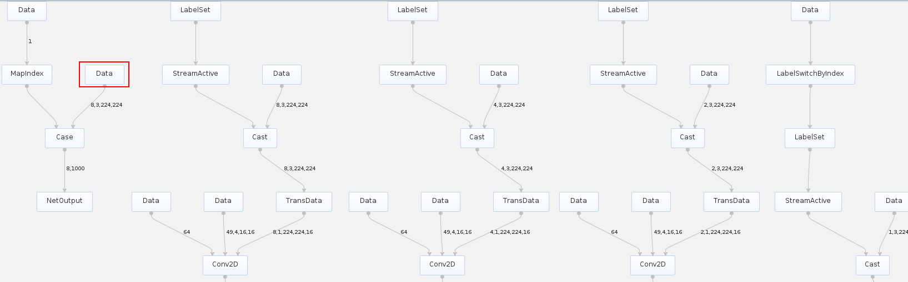

## 离线模型支持动态维度<a name="ZH-CN_TOPIC_0000002473905690"></a>

**该版本不支持动态维度特性。**

**场景介绍<a name="section1559003420213"></a>**

为支持Transformer等网络模型在输入Tensor维度不确定的场景，ATC工具提供了[--dynamic\_dims](--dynamic_dims.md)参数实现ND格式下任意维度的档位设置。ND表示支持任意格式。

**转换方法<a name="section31372415213"></a>**

本章节以TensorFlow框架ResNet50网络模型为例进行演示，单击[Link](https://gitee.com/ascend/ModelZoo-TensorFlow/tree/master/TensorFlow/contrib/cv/resnet50_for_TensorFlow)，根据页面提示获取ResNet50网络模型文件（\*.pb）。

1.  以CANN软件包运行用户登录开发环境，将模型文件上传到开发环境任意路径，例如上传到$HOME_/module__/_目录下。
2.  执行如下命令生成离线模型。（如下命令中使用的目录以及文件均为样例，请以实际为准）

    ```
    atc --model=$HOME/module/resnet50_tensorflow*.pb --framework=3 --output=$HOME/module/out/tf_resnet50 --soc_version=<soc_version>  --input_shape="Placeholder:-1,-1,-1,3" --dynamic_dims="1,224,224;8,448,448" --input_format=ND
    ```

    关键参数解释如下：

    -   --dynamic\_dims：设置ND格式下动态维度档位。
    -   --input\_shape：指定模型输入数据的shape，配合--dynamic\_dims参数使用。
    -   --input\_format：指定Format为ND格式。
    -   --model：ResNet50网络模型文件所在路径。
    -   --framework：原始框架类型，3表示TensorFlow。

    关于参数的详细解释请参见[参数说明](参数说明.md)。若提示如下信息，则说明模型转换成功，。

    ```
    ATC run success, welcome to the next use.
    ```

    成功执行命令后，在--output参数指定的路径下，可查看离线模型。

    模型转换完成后，在生成的om离线模型中，会新增一个输入（如[图1](#fig1112521964513)中红框中的Data输入），在模型推理时通过该新增的输入提供具体的维度值。例如，a输入的维度为动态的，在om离线模型中，会有与a对应的b输入来描述a的维度值。

    **图 1**  包含动态维度的离线模型<a name="fig1112521964513"></a>  
    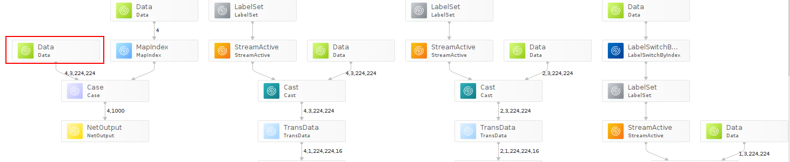

## 自定义离线模型的输入输出数据类型<a name="ZH-CN_TOPIC_0000002473745782"></a>

**场景介绍<a name="section17274441344"></a>**

模型转换时支持指定网络的输入节点、输出节点的DataType、Format、模型转换支持精度选择等关键参数。

假如，针对TensorFlow框架ResNet-50网络模型，要求转换后离线模型的输入数据为Float16类型，指定_MaxPoolWithArgmax_算子作为输出算子（对应的节点名称为fp32\_vars/MaxPoolWithArgmax），并且指定该输出节点的数据类型为FP16。该场景下就需要分别使用[--input\_fp16\_nodes](--input_fp16_nodes.md)、[--out\_nodes](--out_nodes.md)、[--output\_type](--output_type.md)等参数来实现上述功能。

**转换方法<a name="section4972910413"></a>**

本章节以TensorFlow框架ResNet50网络模型为例进行演示，单击[Link](https://gitee.com/ascend/ModelZoo-TensorFlow/tree/master/TensorFlow/contrib/cv/resnet50_for_TensorFlow)，根据页面提示获取ResNet50网络模型文件（\*.pb）。

1.  以CANN软件包运行用户登录开发环境，将模型文件（\*.pb）上传到开发环境任意路径，例如上传到$HOME_/module__/_目录下。
2.  执行如下命令生成离线模型。（如下命令中使用的目录以及文件均为样例，请以实际为准）

    ```
    atc --model=$HOME/module/resnet50_tensorflow_1.7.pb  --framework=3 --output=$HOME/module/out/tf_resnet50 --soc_version=<soc_version>  --input_fp16_nodes="Placeholder" --out_nodes="fp32_vars/MaxPoolWithArgmax:0" --output_type="fp32_vars/MaxPoolWithArgmax:0:FP16"  
    ```

    关键参数解释如下：

    -   --input\_fp16\_nodes：指定输入数据类型为Float16。
    -   --out\_nodes：指定MaxPoolWithArgmax算子作为模型的输出。
    -   --output\_type：指定输出节点的数据类型为Float16。
    -   --model：ResNet50网络模型文件所在路径。
    -   --framework：原始框架类型，3表示TensorFlow。

    关于参数的详细解释请参见[参数说明](参数说明.md)。若提示如下信息，则说明模型转换成功，。

    ```
    ATC run success, welcome to the next use.
    ```

    成功执行命令后，在output参数指定的路径下，可查看离线模型（如：tf\_resnet50.om/exeom\(IPV350\)）。[图1](#fig964118341146)为_MaxPoolWithArgmax_算子作为模型输出算子的示意图（下图使用Netron可视化软件打开）。

    **图 1**  指定某个算子为离线模型输出<a name="fig964118341146"></a>  
    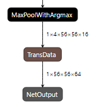

## 借助离线模型查看软件基础版本号（IPV350不支持）<a name="ZH-CN_TOPIC_0000002473905680"></a>

**场景介绍<a name="section11300747162914"></a>**

不同CANN软件包版本，由于软件功能差异，所转换出的离线模型功能也有差异，该场景下建议用户使用匹配CANN软件版本的ATC工具重新进行模型转换。假如用户已有转换好的离线模型，想查看使用的CANN软件包基础版本号，则可以参见本章节完成。

**查看方法<a name="section8350111382"></a>**

1.  获取已经转换好的离线模型，例如_tf\_resnet50.om_，并以CANN软件包运行用户将其上传至开发环境任意目录，例如上传到$HOME_/module__/_目录下。
2.  将离线模型转成JSON文件：

    ```
    atc --mode=1 --om=$HOME/module/tf_resnet50.om  --json=$HOME/module/out/tf_resnet50.json
    ```

    -   --om：指定**离线模型文件**_tf\_resnet50.om_所在路径。
    -   --json：转换为JSON格式的文件路径和文件名。

    在转换后的JSON文件中，可以查看原始模型转换为离线模型时，使用的基础版本号，示例如下（如下为部分JSON片段），_<version\>_即为展示的版本号信息：

    ```
       {
          "key": "opp_version",
          "value": {
            "s": "<version>"
          }
        },
        ... ...
        {
          "key": "atc_version",
          "value": {
            "s": "<version>"
          }
        },
        ... ...
        { 
           "key": "atc_cmdline",
           "value": {
             "s": "xxx/atc.bin --model ./resnet50_tensorflow*.pb  --framework 3 --output ./out/tf_resnet50 --soc_version <soc_version>"
           }
         },
        ... ...
        {
          "key": "soc_version",
          "value": {
            "s": "<soc_version>"
           }
         },
    ```

# 高级功能<a name="ZH-CN_TOPIC_0000002473745760"></a>


## AIPP使能**\(该版本不支持AIPP特性\)**<a name="ZH-CN_TOPIC_0000002506025631"></a>

本节介绍什么是AIPP，AIPP分类以及包括的特性。

通过在模型转换过程中开启AIPP功能，可以在推理之前就完成所有的数据处理；由于用的是专门的加速模块实现并保证性能，从而可以不让图像处理成为推理阶段的瓶颈，图像处理方式比较灵活。本章节给出如何在模型转换阶段开启AIPP功能。
AIPP提供了更为方便的图像格式转换方式：色域转换，用于将输入的图片格式，转换为模型需要的图片格式，一旦确认了AIPP处理前与AIPP处理后的图片格式，即可确定色域转换相关的参数值（**matrix\_r\*c\*配置项的值是固定的，不需要调整**）。
归一化就是要把需要处理的数据经过处理后限制在一定范围内，方便后面数据的处理。AIPP支持的归一化设置，通过减均值和乘系数的操作完成，这样的能力不仅能用于常规的归一化，还能用于不同数据格式的转化。

如果有配置AIPP，无论静态AIPP还是动态AIPP，最终生成离线模型的输入大小（即input\_size）均会被Crop、Padding等操作影响。本节给出对模型输入大小的约束说明。
AIPP配置文件通过本章节给出的模板进行配置，内容需要满足prototxt格式，用户根据场景决定配置哪些参数，修改为合适的取值另存后供模型转换使用；使用配置模板之前需要先查看相关约束。

### 什么是AIPP<a name="ZH-CN_TOPIC_0000002473905686"></a>

本节介绍什么是AIPP，AIPP分类以及包括的特性。

**该版本不支持AIPP特性。**

AIPP（Artificial Intelligence Pre-Processing）人工智能预处理，用于在AI Core上完成数据预处理，包括改变图像尺寸、色域转换（转换图像格式）、减均值/乘系数（改变图像像素），数据预处理之后再进行真正的模型推理。

AIPP根据配置方式不同，分为静态AIPP和动态AIPP；如果要将原始图片输出为满足推理要求的图片格式，则需要使用色域转换功能；如果要输出固定大小的图片，则需要使用AIPP提供的Crop（抠图）、Padding（补边）功能。

**静态AIPP和动态AIPP<a name="section7609124110407"></a>**

在使能AIPP功能时，您只能选择静态AIPP或动态AIPP方式来处理图片，不能同时配置静态AIPP和动态AIPP两种方式，使能AIPP时可以通过**aipp\_mode**参数控制。具体配置示例请参见[AIPP配置示例](AIPP配置示例.md)，关于参数解释请参见[配置文件模板](配置文件模板.md)。

-   静态AIPP：模型转换时设置AIPP模式为静态，同时设置AIPP参数，模型生成后，AIPP参数值被保存在离线模型中，每次模型推理过程采用固定的AIPP预处理参数进行处理，而且在之后的推理过程中无法通过业务代码进行直接的修改。

    如果使用静态AIPP方式，多batch情况下共用同一份AIPP参数。

-   动态AIPP：模型转换时设置AIPP模式为动态，每次在执行推理前，根据需求动态修改AIPP参数值，然后在模型执行时可使用不同的AIPP参数。动态AIPP参数值会根据需求在不同的业务场景下选用合适的参数（如不同摄像头采用不同的归一化参数，输入图片格式需要兼容YUV420和RGB等）。

    如果模型转换时设置了动态AIPP，则使用应用工程进行模型推理时，需要在AscendCL提供的**aclmdlExecute**接口之前，调用**aclmdlSetInputAIPP**接口，设置模型推理的动态AIPP数据。接口详细说明请参见《AscendCL应用开发指南 \(C&C++\)》手册中的“acl API参考 \> 模型管理 \> 模型执行”。

    如果使用动态AIPP方式，多batch使用不同的参数，体现在动态参数结构体中，每个batch可以配置不同的crop等参数。关于动态参数结构体，请参见[动态AIPP的参数输入结构](动态AIPP配置示例.md#section748641713327)。

**色域转换<a name="section37710517321"></a>**

色域转换，用于将输入的图片格式，转换为模型需要的图片格式，在使能AIPP功能时，通过**csc\_switch**参数控制色域转换功能是否开启，参数解释请参见[配置文件模板](配置文件模板.md)。

一旦确认了AIPP处理前与AIPP处理后的图片格式，即可确定色域转换其他相关的参数值，本文提供相关模板可以供用户使用，无需再次修改，配置示例请参见[色域转换配置说明](色域转换配置说明.md)。

**改变图像尺寸<a name="section432313918816"></a>**

AIPP功能中的改变图像尺寸操作由Crop（抠图）、Padding（补边）完成，分别对应配置模板中的crop、padding参数。参数解释请参见[配置文件模板](配置文件模板.md)。

关于该功能的详细说明以及AIPP参数配置示例请参见[Crop/Padding配置说明](Crop-Padding配置说明.md)。

### AIPP配置示例<a name="ZH-CN_TOPIC_0000002473905682"></a>

AIPP配置文件支持定义多组AIPP配置，对不同的模型输入进行不同的AIPP处理，配置多组AIPP参数时，将一组AIPP配置放到一个aipp\_op配置项里；如果模型只有一个输入，则只需要配置第一组aipp\_op即可。
AIPP配置文件支持定义多组AIPP配置，对不同的模型输入进行不同的AIPP处理，配置多组AIPP参数时，将一组AIPP配置放到一个aipp\_op配置项里；如果模型只有一个输入，则只需要配置第一组aipp\_op即可。

#### 静态AIPP配置示例<a name="ZH-CN_TOPIC_0000002505905699"></a>

AIPP配置文件支持定义多组AIPP配置，对不同的模型输入进行不同的AIPP处理，配置多组AIPP参数时，将一组AIPP配置放到一个aipp\_op配置项里；如果模型只有一个输入，则只需要配置第一组aipp\_op即可。

如下示例以网络模型为多输入时进行说明：

> **须知：** 
>-   静态AIPP+动态shape场景：模型转换时，通过[--insert\_op\_conf](--insert_op_conf.md)参数设置了静态AIPP，又通过[--input\_shape](--input_shape.md)设置了动态shape，则：
>    如果模型只有一个输入，该场景不支持；如果模型有多个输入，则必须对不同的输入节点进行设置，比如一个输入节点设置静态AIPP，另外一个节点设置动态shape。
>-   如果模型转换时，用户设置了[--dynamic\_image\_size](--dynamic_image_size.md)动态分辨率参数，即输入图片的宽和高不确定，同时又通过[--insert\_op\_conf](--insert_op_conf.md)参数设置了静态AIPP功能：该场景下，AIPP配置文件中不能开启Crop和Padding功能，并且需要将配置文件中的src\_image\_size\_w和src\_image\_size\_h取值设置为0。

-   使用related\_input\_rank参数标识，对模型第几个输入进行AIPP处理，如下配置定义了两组AIPP参数，分别对模型第一个和第二个输入进行AIPP处理：

    ```
    aipp_op {
           aipp_mode : static
           related_input_rank : 0  # 标识对第1个输入进行AIPP处理
           src_image_size_w : 608
           src_image_size_h : 608
           crop : false
           input_format : YUV420SP_U8
           csc_switch : true
           rbuv_swap_switch : false
           matrix_r0c0 : 298
           matrix_r0c1 : 0
           matrix_r0c2 : 409
           matrix_r1c0 : 298
           matrix_r1c1 : -100
           matrix_r1c2 : -208
           matrix_r2c0 : 298
           matrix_r2c1 : 516
           matrix_r2c2 : 0
           input_bias_0 : 16
           input_bias_1 : 128
           input_bias_2 : 128
           mean_chn_0 : 104
           mean_chn_1 : 117
           mean_chn_2 : 123
    }
    aipp_op {
           aipp_mode : static
           related_input_rank : 1   # 标识对第2个输入进行AIPP处理
           src_image_size_w : 608
           src_image_size_h : 608
           crop : false
           input_format : YUV420SP_U8
           csc_switch : true
           rbuv_swap_switch : false
           matrix_r0c0 : 298
           matrix_r0c1 : 0
           matrix_r0c2 : 409
           matrix_r1c0 : 298
           matrix_r1c1 : -100
           matrix_r1c2 : -208
           matrix_r2c0 : 298
           matrix_r2c1 : 516
           matrix_r2c2 : 0
           input_bias_0 : 16
           input_bias_1 : 128
           input_bias_2 : 128
           mean_chn_0 : 104
           mean_chn_1 : 117
           mean_chn_2 : 123
    }
    ```

#### 动态AIPP配置示例<a name="ZH-CN_TOPIC_0000002473745730"></a>

AIPP配置文件支持定义多组AIPP配置，对不同的模型输入进行不同的AIPP处理，配置多组AIPP参数时，将一组AIPP配置放到一个aipp\_op配置项里；如果模型只有一个输入，则只需要配置第一组aipp\_op即可。

如下示例以网络模型为多输入时进行说明。

**配置示例<a name="section11723921143117"></a>**

> **须知：** 
>-   如果模型转换时，用户设置了[--dynamic\_batch\_size](--dynamic_batch_size.md)动态Batch档位参数，同时又通过[--insert\_op\_conf](--insert_op_conf.md)参数配置了动态AIPP功能：
>    实际推理时，调用**aclmdlSetInputAIPP**接口，设置动态AIPP相关参数值时，需确保batchSize要设置为最大Batch数。接口详细说明请参见《AscendCL应用开发指南 \(C&C++\)》手册中的“acl API参考 \> 模型管理 \> 模型执行 \>  [aclmdlSetInputAIPP](https://www.hiascend.com/document/detail/zh/canncommercial/82RC1/API/appdevgapi/aclcppdevg_03_0308.html)”。
>-   如果模型转换时，用户设置了[--dynamic\_image\_size](--dynamic_image_size.md)动态分辨率参数，同时又通过[--insert\_op\_conf](--insert_op_conf.md)参数配置了动态AIPP功能：
>    实际推理时，调用**aclmdlSetInputAIPP**接口，设置动态AIPP相关参数值时，不能开启Crop和Padding功能。该场景下，还需要确保通过aclmdlSetInputAIPP接口设置的宽和高与**aclmdlSetDynamicHWSize**接口设置的宽、高相等，都必须设置成动态分辨率最大档位的宽、高。接口详细说明请参见《AscendCL应用开发指南 \(C&C++\)》手册中的“acl API参考 \> 模型管理 \> 模型执行”章节。
>-   如果模型转换时，用户设置了[--input\_shape](--input_shape.md)动态shape范围参数，同时又通过[--insert\_op\_conf](--insert_op_conf.md)参数配置了AIPP功能，则AIPP输出的宽和高要在[--input\_shape](--input_shape.md)所设置的范围内。

动态AIPP场景下，用户无需手动配置csc\_switch、rbuv\_swap\_switch等参数，根据如下配置文件配置好相关参数后，模型转换时，ATC会为动态AIPP新增一个模型输入（以下简称AippData）。

实际推理时，需要调用**aclmdlSetInputAIPP**接口，设置动态AIPP相关参数值，然后传给上述新增的AippData，AippData根据传入的参数值构造的结构体为[动态AIPP的参数输入结构](#section748641713327)，该结构体无需用户手动处理。接口详细说明请参见《AscendCL应用开发指南 \(C&C++\)》手册中的“acl API参考 \> 模型管理 \> 模型执行 \>  [aclmdlSetInputAIPP](https://www.hiascend.com/document/detail/zh/canncommercial/82RC1/API/appdevgapi/aclcppdevg_03_0308.html)”。

```
aipp_op
{
    aipp_mode: dynamic
    related_input_rank: 0       # 标识对第1个输入进行AIPP处理
    max_src_image_size: 752640  # 输入图像最大的size，参数必填
}
aipp_op
{
    aipp_mode: dynamic
    related_input_rank: 1         # 标识对第2个输入进行AIPP处理
    max_src_image_size: 752640    # 输入图像最大的size，参数必填
}
```

**动态AIPP的参数输入结构<a name="section748641713327"></a>**

根据[配置示例](#section11723921143117)配置好动态AIPP文件后，模型推理时为动态AIPP新增模型输入（AippData）传入参数值后，自动形成的结构体如下，该结构体无需用户手动处理：

```
typedef struct tagAippDynamicBatchPara
{
    int8_t cropSwitch;              //crop switch
    int8_t scfSwitch;               //resize switch
    int8_t paddingSwitch;   // 0: unable padding, 
                           // 1: padding config value,sfr_filling_hblank_ch0 ~    sfr_filling_hblank_ch2
                          // 2: padding source picture data, single row/collumn copy
                          // 3: padding source picture data, block copy
                          // 4: padding source picture data, mirror copy
    int8_t rotateSwitch;  //rotate switch，0: non-rotate，1: rotate 90°clockwise，2: rotate 180°clockwise，3: rotate 270° clockwise
    int8_t reserve[4];
    int32_t cropStartPosW;          //the start horizontal position of cropping
    int32_t cropStartPosH;          //the start vertical position of cropping
    int32_t cropSizeW;              //crop width
    int32_t cropSizeH;              //crop height
    int32_t scfInputSizeW;          //input width of scf
    int32_t scfInputSizeH;          //input height of scf
    int32_t scfOutputSizeW;         //output width of scf
    int32_t scfOutputSizeH;         //output height of scf
    int32_t paddingSizeTop;         //top padding size
    int32_t paddingSizeBottom;      //bottom padding size
    int32_t paddingSizeLeft;        //left padding size
    int32_t paddingSizeRight;       //right padding size
    int16_t dtcPixelMeanChn0;       //mean value of channel 0
    int16_t dtcPixelMeanChn1;       //mean value of channel 1
    int16_t dtcPixelMeanChn2;       //mean value of channel 2
    int16_t dtcPixelMeanChn3;       //mean value of channel 3
    uint16_t dtcPixelMinChn0;       //min value of channel 0
    uint16_t dtcPixelMinChn1;       //min value of channel 1
    uint16_t dtcPixelMinChn2;       //min value of channel 2
    uint16_t dtcPixelMinChn3;       //min value of channel 3
    uint16_t dtcPixelVarReciChn0;   //sfr_dtc_pixel_variance_reci_ch0
    uint16_t dtcPixelVarReciChn1;   //sfr_dtc_pixel_variance_reci_ch1
    uint16_t dtcPixelVarReciChn2;   //sfr_dtc_pixel_variance_reci_ch2
    uint16_t dtcPixelVarReciChn3;   //sfr_dtc_pixel_variance_reci_ch3
    int8_t reserve1[16];            //32B assign, for ub copy
}kAippDynamicBatchPara;
typedef struct tagAippDynamicPara
{
    uint8_t inputFormat;        //input format：YUV420SP_U8/XRGB8888_U8/RGB888_U8
    //uint8_t outDataType; //output data type: CC_DATA_HALF,CC_DATA_INT8, CC_DATA_UINT8
    int8_t cscSwitch;               //csc switch
    int8_t rbuvSwapSwitch;          //rb/ub swap switch
    int8_t axSwapSwitch;            //RGBA->ARGB, YUVA->AYUV swap switch
    int8_t batchNum;                //batch parameter number
    int8_t reserve1[3];
    int32_t srcImageSizeW;          //source image width
    int32_t srcImageSizeH;          //source image height
    int16_t cscMatrixR0C0;          //csc_matrix_r0_c0
    int16_t cscMatrixR0C1;          //csc_matrix_r0_c1
    int16_t cscMatrixR0C2;          //csc_matrix_r0_c2
    int16_t cscMatrixR1C0;          //csc_matrix_r1_c0
    int16_t cscMatrixR1C1;          //csc_matrix_r1_c1
    int16_t cscMatrixR1C2;          //csc_matrix_r1_c2
    int16_t cscMatrixR2C0;          //csc_matrix_r2_c0
    int16_t cscMatrixR2C1;          //csc_matrix_r2_c1
    int16_t cscMatrixR2C2;          //csc_matrix_r2_c2
    int16_t reserve2[3];
    uint8_t cscOutputBiasR0;   //output bias for RGB to YUV, element of row 0, unsigned number
    uint8_t cscOutputBiasR1;   //output bias for RGB to YUV, element of row 1, unsigned number
    uint8_t cscOutputBiasR2;   //output bias for RGB to YUV, element of row 2, unsigned number
    uint8_t cscInputBiasR0;    //input bias for YUV to RGB, element of row 0, unsigned number
    uint8_t cscInputBiasR1;    //input bias for YUV to RGB, element of row 1, unsigned number
    uint8_t cscInputBiasR2;    //input bias for YUV to RGB, element of row 2, unsigned number
    uint8_t reserve3[2];
    int8_t reserve4[16];            //32B assign, for ub copy
    kAippDynamicBatchPara aippBatchPara;  //allow transfer several batch para.
} kAippDynamicPara;
```

### 如何使能AIPP<a name="ZH-CN_TOPIC_0000002473905660"></a>

通过在模型转换过程中开启AIPP功能，可以在推理之前就完成所有的数据处理；由于用的是专门的加速模块实现并保证性能，从而可以不让图像处理成为推理阶段的瓶颈，图像处理方式比较灵活。本章节给出如何在模型转换阶段开启AIPP功能。

本章节以TensorFlow框架ResNet50网络模型为例，演示如何通过模型转换使能静态AIPP功能，使能AIPP功能后，若实际提供给模型推理的测试图片不满足要求（包括图片格式，图片尺寸等），经过模型转换后，会输出满足模型要求的图片，并将该信息固化到转换后的离线模型中（模型转换后AIPP功能会以Aipp算子形式插入离线模型中）。

ResNet50网络模型要求的图片格式为RGB，图片尺寸为224\*224，另外，假设提供给模型推理的测试图片尺寸为250\*250，图片格式为YUV420SP，有效数据区域从左上角\(0, 0\)像素开始，使能AIPP过程中所需操作如[表1](#table9187133403215)分析所示。

**表 1**  场景分析

<a name="table9187133403215"></a>
<table><thead align="left"><tr id="row10188173443216"><th class="cellrowborder" valign="top" width="10.660000000000002%" id="mcps1.2.5.1.1"><p id="p118873423214"><a name="p118873423214"></a><a name="p118873423214"></a>分类</p>
</th>
<th class="cellrowborder" valign="top" width="20.110000000000003%" id="mcps1.2.5.1.2"><p id="p1267373343419"><a name="p1267373343419"></a><a name="p1267373343419"></a>ResNet50网络模型要求</p>
</th>
<th class="cellrowborder" valign="top" width="21.330000000000002%" id="mcps1.2.5.1.3"><p id="p15188113418329"><a name="p15188113418329"></a><a name="p15188113418329"></a>实际提供给模型推理的测试图片</p>
</th>
<th class="cellrowborder" valign="top" width="47.900000000000006%" id="mcps1.2.5.1.4"><p id="p111886345326"><a name="p111886345326"></a><a name="p111886345326"></a>所需操作</p>
</th>
</tr>
</thead>
<tbody><tr id="row55483449322"><td class="cellrowborder" valign="top" width="10.660000000000002%" headers="mcps1.2.5.1.1 "><p id="p14188163493217"><a name="p14188163493217"></a><a name="p14188163493217"></a>图片格式</p>
</td>
<td class="cellrowborder" valign="top" width="20.110000000000003%" headers="mcps1.2.5.1.2 "><p id="p185480442322"><a name="p185480442322"></a><a name="p185480442322"></a>RGB</p>
</td>
<td class="cellrowborder" valign="top" width="21.330000000000002%" headers="mcps1.2.5.1.3 "><p id="p654804415329"><a name="p654804415329"></a><a name="p654804415329"></a>YUV420SP</p>
</td>
<td class="cellrowborder" valign="top" width="47.900000000000006%" headers="mcps1.2.5.1.4 "><p id="p11548204415323"><a name="p11548204415323"></a><a name="p11548204415323"></a>该场景下需要开启AIPP的色域转换功能，将YUV420SP格式转成模型要求的RGB格式，关于色域转换功能详细说明请参见<a href="色域转换配置说明.md">色域转换配置说明</a>。</p>
</td>
</tr>
<tr id="row21449473326"><td class="cellrowborder" valign="top" width="10.660000000000002%" headers="mcps1.2.5.1.1 "><p id="p91441747183216"><a name="p91441747183216"></a><a name="p91441747183216"></a>图片尺寸</p>
</td>
<td class="cellrowborder" valign="top" width="20.110000000000003%" headers="mcps1.2.5.1.2 "><p id="p1157945532219"><a name="p1157945532219"></a><a name="p1157945532219"></a>224*224</p>
</td>
<td class="cellrowborder" valign="top" width="21.330000000000002%" headers="mcps1.2.5.1.3 "><p id="p1114454763210"><a name="p1114454763210"></a><a name="p1114454763210"></a>250*250</p>
</td>
<td class="cellrowborder" valign="top" width="47.900000000000006%" headers="mcps1.2.5.1.4 "><p id="p5144154753213"><a name="p5144154753213"></a><a name="p5144154753213"></a>提供的测试图片尺寸250*250大于224*224，该场景下需要开启AIPP抠图功能，并且抠图起始位置水平、垂直方向坐标load_start_pos_h、load_start_pos_w为0，执行推理时，将从(0, 0)点开始选取224*224区域的数据。</p>
</td>
</tr>
</tbody>
</table>

详细实现步骤如下：

1.  获取TensorFlow网络模型。

    单击[Link](https://gitee.com/ascend/ModelZoo-TensorFlow/tree/master/TensorFlow/contrib/cv/resnet50_for_TensorFlow)，根据页面提示获取ResNet50网络的模型文件（\*.pb），并以CANN软件包运行用户将获取的文件上传至开发环境任意目录，例如上传到$HOME_/module__/_目录下。

2.  构造AIPP配置文件_insert\_op.cfg_。

    静态AIPP配置模板主要由如下几部分组成：AIPP配置模式（静态AIPP或者动态AIPP），原始图片信息（包括图片格式，以及图片尺寸），改变图片尺寸（抠图，补边）、色域转换功能等，如下分别介绍如何进行配置。

    1.  AIPP配置模式由aipp\_mode参数决定，静态场景下的配置示例如下：

        ```
               aipp_mode : static           #static表示配置为静态AIPP
        ```

    2.  配置原始图片信息。

        ```
               input_format : YUV420SP_U8     #输入给AIPP的原始图片格式
               src_image_size_w : 250         #输入给AIPP的原始图片宽高
               src_image_size_h : 250
        ```

    3.  改变图片尺寸。

        改变图片尺寸由抠图和补边等功能完成，本示例需要配置抠图起始位置，抠图后的图片大小等信息，若抠图后图片尺寸仍旧不满足模型要求，还需要配置补边功能。

        而AIPP提供了更为方便的配置方式，就是若开启抠图功能，并且不配置补边功能，抠图大小可以取值为0或者不配置，此时抠图大小的宽和高来自模型--input\_shape中的宽和高。本示例中我们不配置抠图大小，配置示例如下：

        ```
               crop: true                     #抠图开关，用于改变图片尺寸
               load_start_pos_h: 0            #抠图起始位置水平、垂直方向坐标
               load_start_pos_w: 0
        ```

    4.  色域转换功能。

        色域转换功能由csc\_switch参数控制，并通过色域转换系数matrix\_r\*c\*、通道交换rbuv\_swap\_switch等参数配合使用。AIPP提供了一个比较方便的功能，就是一旦确认了AIPP处理前与AIPP处理后的图片格式，即可确定色域转换相关的参数值，**用户无需修改**，即上述参数都可以直接从模板中进行复制，模板示例以及更多配置模板请参见[色域转换配置说明](色域转换配置说明.md)。如下为该场景下的配置示例：

        ```
               csc_switch : true              #色域转换开关，true表示开启色域转换
               rbuv_swap_switch : false       #通道交换开关（R通道与B通道交换开关/U通道与V通道交换），本例中不涉及两个通道的交换，故设置为false，默认为false
               matrix_r0c0 : 256              #色域转换系数
               matrix_r0c1 : 0
               matrix_r0c2 : 359
               matrix_r1c0 : 256
               matrix_r1c1 : -88
               matrix_r1c2 : -183
               matrix_r2c0 : 256
               matrix_r2c1 : 454
               matrix_r2c2 : 0
               input_bias_0 : 0
               input_bias_1 : 128
               input_bias_2 : 128
        ```

    将上述所有的参数组合到_insert\_op.cfg_文件中，即为我们需要构造的AIPP配置文件，完整示例如下：

    ```
    aipp_op {
           aipp_mode : static             #AIPP配置模式
           input_format : YUV420SP_U8     #输入给AIPP的原始图片格式
           src_image_size_w : 250         #输入给AIPP的原始图片宽高
           src_image_size_h : 250
           crop: true                     #抠图开关，用于改变图片尺寸
           load_start_pos_h: 0            #抠图起始位置水平、垂直方向坐标
           load_start_pos_w: 0
           csc_switch : true              #色域转换开关，true表示开启色域转换
           rbuv_swap_switch : false       #通道交换开关
           matrix_r0c0 : 256              #色域转换系数，用户无需修改
           matrix_r0c1 : 0
           matrix_r0c2 : 359
           matrix_r1c0 : 256
           matrix_r1c1 : -88
           matrix_r1c2 : -183
           matrix_r2c0 : 256
           matrix_r2c1 : 454
           matrix_r2c2 : 0
           input_bias_0 : 0
           input_bias_1 : 128
           input_bias_2 : 128
    }
    ```

    您可以根据[AIPP配置示例](AIPP配置示例.md)或[典型场景样例参考](典型场景样例参考.md)章节获取更多场景AIPP配置示例，如果上述示例仍旧无法满足要求，则需要参见[配置文件模板](配置文件模板.md)自行构造配置文件。将上述_insert\_op.cfg_文件上传到ATC工具所在Linux服务器。

3.  atc命令中加入[--insert\_op\_conf](--insert_op_conf.md)参数，用于插入aipp预处理算子，执行如下命令生成离线模型。（如下命令中使用的目录以及文件均为样例，请以实际为准）

    ```
    atc --model=$HOME/module/resnet50_tensorflow*.pb --framework=3 --output=$HOME/module/out/tf_resnet50 --soc_version=<soc_version> --insert_op_conf=$HOME/module/insert_op.cfg  
    ```

    关于参数的详细解释以及使用方法请参见[参数说明](参数说明.md)。若提示如下信息，则说明模型转换成功。

    ```
    ATC run success, welcome to the next use.
    ```

    成功执行命令后，在--output参数指定的路径下，可查看离线模型（如：_tf\_resnet50_.om）。

4.  （可选）如果用户想查看转换后离线模型中Aipp算子的相关信息，则可以将上述离线模型转成JSON文件查看，命令如下：

    ```
    atc --mode=1 --om=$HOME/module/out/tf_resnet50.om  --json=$HOME/module/out/tf_resnet50.json
    ```

    如下为JSON文件中带有aipp信息的样例（如下样例中所有aipp属性值都为样例，请以用户实际构造的配置文件为准）：

    ```
    {
                  "key": "aipp",
                  "value": {
                    "func": {
                      "attr": [
                        {
                          "key": "mean_chn_0",
                          "value": {
                            "i": 0
                          }
                        },
                        {
                          "key": "mean_chn_1",
                          "value": {
                            "i": 0
                          }
                        },
                        {
                          "key": "mean_chn_2",
                          "value": {
                            "i": 0
                          }
                        },
                        {
                          "key": "mean_chn_3",
                          "value": {
                            "i": 0
                          }
                        },
                        {
                          "key": "csc_switch",
                          "value": {
                            "b": true
                          }
                        },
                        {
                          "key": "input_format",
                          "value": {
                            "i": 1
                          }
                        },
                        {
                          "key": "input_bias_0",
                          "value": {
                            "i": 0
                          }
                        },
                        {
                          "key": "input_bias_1",
                          "value": {
                            "i": 128
                          }
                        },
                        {
                          "key": "input_bias_2",
                          "value": {
                            "i": 128
                          }
                        },
                        {
                          "key": "aipp_mode",
                          "value": {
                            "i": 1
                          }
                        },
                        {
                          "key": "src_image_size_h",
                          "value": {
                            "i": 250
                          }
                        },
                        {
                          "key": "crop_size_h",
                          "value": {
                            "i": 0
                          }
                        },
                        {
                          "key": "matrix_r0c0",
                          "value": {
                            "i": 256
                          }
                        },
                        {
                          "key": "matrix_r0c1",
                          "value": {
                            "i": 0
                          }
                        },
                        {
                          "key": "matrix_r0c2",
                          "value": {
                            "i": 359
                          }
                        },
                        {
                          "key": "src_image_size_w",
                          "value": {
                            "i": 250
                          }
                        },
                        {
                          "key": "crop_size_w",
                          "value": {
                            "i": 0
                          }
                        },
                        {
                          "key": "rbuv_swap_switch",
                          "value": {
                            "b": false
                          }
                        },
                        {
                          "key": "padding",
                          "value": {
                            "b": false
                          }
                        },
                        {
                          "key": "ax_swap_switch",
                          "value": {
                            "b": false
                          }
                        },
                        {
                          "key": "top_padding_size",
                          "value": {
                            "i": 0
                          }
                        },
                        {
                          "key": "matrix_r1c0",
                          "value": {
                            "i": 256
                          }
                        },
                        {
                          "key": "matrix_r1c1",
                          "value": {
                            "i": -88
                          }
                        },
                        {
                          "key": "matrix_r1c2",
                          "value": {
                            "i": -183
                          }
                        },
                        {
                          "key": "resize",
                          "value": {
                            "b": false
                          }
                        },
                        {
                          "key": "resize_output_h",
                          "value": {
                            "i": 0
                          }
                        },
                        {
                          "key": "related_input_rank",
                          "value": {
                            "i": 0
                          }
                        },
                        {
                          "key": "load_start_pos_h",
                          "value": {
                            "i": 0
                          }
                        },
                        {
                          "key": "matrix_r2c0",
                          "value": {
                            "i": 256
                          }
                        },
                        {
                          "key": "matrix_r2c1",
                          "value": {
                            "i": 454
                          }
                        },
                        {
                          "key": "matrix_r2c2",
                          "value": {
                            "i": 0
                          }
                        },
                        {
                          "key": "resize_output_w",
                          "value": {
                            "i": 0
                          }
                        },
                        {
                          "key": "var_reci_chn_0",
                          "value": {
                            "f": "1"
                          }
                        },
                        {
                          "key": "var_reci_chn_1",
                          "value": {
                            "f": "1"
                          }
                        },
                        {
                          "key": "var_reci_chn_2",
                          "value": {
                            "f": "1"
                          }
                        },
                        {
                          "key": "load_start_pos_w",
                          "value": {
                            "i": 0
                          }
                        },
                        {
                          "key": "var_reci_chn_3",
                          "value": {
                            "f": "1"
                          }
                        },
                        {
                          "key": "single_line_mode",
                          "value": {
                            "b": false
                          }
                        },
                        {
                          "key": "output_bias_0",
                          "value": {
                            "i": 16
                          }
                        },
                        {
                          "key": "output_bias_1",
                          "value": {
                            "i": 128
                          }
                        },
                        {
                          "key": "output_bias_2",
                          "value": {
                            "i": 128
                          }
                        },
                        {
                          "key": "right_padding_size",
                          "value": {
                            "i": 0
                          }
                        },
                        {
                          "key": "bottom_padding_size",
                          "value": {
                            "i": 0
                          }
                        },
                        {
                          "key": "min_chn_0",
                          "value": {
                            "f": "0"
                          }
                        },
                        {
                          "key": "min_chn_1",
                          "value": {
                            "f": "0"
                          }
                        },
                        {
                          "key": "min_chn_2",
                          "value": {
                            "f": "0"
                          }
                        },
                        {
                          "key": "min_chn_3",
                          "value": {
                            "f": "0"
                          }
                        },
                        {
                          "key": "crop",
                          "value": {
                            "b": false
                          }
                        },
                        {
                          "key": "cpadding_value",
                          "value": {
                            "f": "0"
                          }
                        },
                        {
                          "key": "left_padding_size",
                          "value": {
                            "i": 0
                          }
                        }
                      ]
                    }
                  }
                }
    ```

### 色域转换配置说明<a name="ZH-CN_TOPIC_0000002505905751"></a>

AIPP提供了更为方便的图像格式转换方式：色域转换，用于将输入的图片格式，转换为模型需要的图片格式，一旦确认了AIPP处理前与AIPP处理后的图片格式，即可确定色域转换相关的参数值（**matrix\_r\*c\*配置项的值是固定的，不需要调整**）。

例如：将视频解码后的YUV格式数据转为RGB格式。而根据不同的彩色视频数字化标准又可以将视频格式分为BT-601标准清晰度视频格式（定义于SDTV标准中）和BT-709高清晰度视频格式（定义于HDTV标准中）。两种视频格式又分为NARROW和WIDE，其中：

NARROW取值范围为：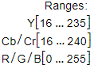，WIDE取值范围为：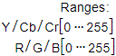

关于如何判断输入数据的标准，请参见[使用AIPP色域转换模型时如何判断视频流的格式标准](zh-cn_topic_0000002505905741.md)。

YUV格式的数据转为RGB格式可以视作如下公式展示的矩阵乘法，这其中的转换矩阵就是待配置的参数和偏移量。

```
# YUV转BGR：
| B |   | matrix_r0c0 matrix_r0c1 matrix_r0c2 | | Y - input_bias_0 |
| G | = | matrix_r1c0 matrix_r1c1 matrix_r1c2 | | U - input_bias_1 | >> 8
| R |   | matrix_r2c0 matrix_r2c1 matrix_r2c2 | | V - input_bias_2 |
```

在AIPP处理前，针对模型输入的图片或视频（各颜色编码方式，如YUV420SP\_U8、RGB888\_U8等），当前给出BT-601NARROW、BT-601WIDE、BT-709NARROW、BT-709WIDE几种典型场景下的色域转换配置。

**色域转换概览<a name="section516417571818"></a>**

支持的色域转换配置如[表1](#table7261812101917)所示。

**表 1**  色域转换概览表

<a name="table7261812101917"></a>
<table><thead align="left"><tr id="row102614127198"><th class="cellrowborder" valign="top" width="20.3%" id="mcps1.2.5.1.1"><p id="p6261151201919"><a name="p6261151201919"></a><a name="p6261151201919"></a>支持的色域转换列表</p>
</th>
<th class="cellrowborder" valign="top" width="20.75%" id="mcps1.2.5.1.2"><p id="p16261812111919"><a name="p16261812111919"></a><a name="p16261812111919"></a>支持的色域转换列表</p>
</th>
<th class="cellrowborder" valign="top" width="31.75%" id="mcps1.2.5.1.3"><p id="p1126181210192"><a name="p1126181210192"></a><a name="p1126181210192"></a>支持的色域转换列表</p>
</th>
<th class="cellrowborder" valign="top" width="27.200000000000003%" id="mcps1.2.5.1.4"><p id="p8852298178"><a name="p8852298178"></a><a name="p8852298178"></a>支持的色域转换列表</p>
</th>
</tr>
</thead>
<tbody><tr id="row215804782117"><td class="cellrowborder" valign="top" width="20.3%" headers="mcps1.2.5.1.1 "><p id="p19253651192217"><a name="p19253651192217"></a><a name="p19253651192217"></a><a href="#zh-cn_topic_0215161415_zh-cn_topic_0171619674_section197331271474">YUV420SP_U8转YUV444</a></p>
</td>
<td class="cellrowborder" valign="top" width="20.75%" headers="mcps1.2.5.1.2 "><p id="p1912719213232"><a name="p1912719213232"></a><a name="p1912719213232"></a><a href="#zh-cn_topic_0215161415_section46417391814">RGB888_U8转BGR</a></p>
</td>
<td class="cellrowborder" valign="top" width="31.75%" headers="mcps1.2.5.1.3 "><p id="p1548102542312"><a name="p1548102542312"></a><a name="p1548102542312"></a><a href="#zh-cn_topic_0215161415_section17293626163712">XRGB8888_U8转BGR</a></p>
</td>
<td class="cellrowborder" valign="top" width="27.200000000000003%" headers="mcps1.2.5.1.4 "><p id="p7301144815171"><a name="p7301144815171"></a><a name="p7301144815171"></a><a href="#section1215854519198">RGB888_U8转FP32 RGB</a></p>
</td>
</tr>
<tr id="row1447849182119"><td class="cellrowborder" valign="top" width="20.3%" headers="mcps1.2.5.1.1 "><p id="p925395142215"><a name="p925395142215"></a><a name="p925395142215"></a><a href="#zh-cn_topic_0215161415_section191031834145514">YUV420SP_U8转YVU444</a></p>
</td>
<td class="cellrowborder" valign="top" width="20.75%" headers="mcps1.2.5.1.2 "><p id="p51278232312"><a name="p51278232312"></a><a name="p51278232312"></a><a href="#zh-cn_topic_0215161415_zh-cn_topic_0171619674_section18591546141619">RGB888_U8转YUV444</a></p>
</td>
<td class="cellrowborder" valign="top" width="31.75%" headers="mcps1.2.5.1.3 "><p id="p13499253232"><a name="p13499253232"></a><a name="p13499253232"></a><a href="#zh-cn_topic_0215161415_section7910171104011">XRGB8888_U8转YUV444</a></p>
</td>
<td class="cellrowborder" valign="top" width="27.200000000000003%" headers="mcps1.2.5.1.4 "><p id="p11852197178"><a name="p11852197178"></a><a name="p11852197178"></a>-</p>
</td>
</tr>
<tr id="row12649195172115"><td class="cellrowborder" valign="top" width="20.3%" headers="mcps1.2.5.1.1 "><p id="p0253205112218"><a name="p0253205112218"></a><a name="p0253205112218"></a><a href="#zh-cn_topic_0215161415_zh-cn_topic_0171619674_section12811164213476">YUV420SP_U8转RGB</a></p>
</td>
<td class="cellrowborder" valign="top" width="20.75%" headers="mcps1.2.5.1.2 "><p id="p1912715222318"><a name="p1912715222318"></a><a name="p1912715222318"></a><a href="#zh-cn_topic_0215161415_zh-cn_topic_0171619674_section1477542611914">RGB888_U8转YVU444</a></p>
</td>
<td class="cellrowborder" valign="top" width="31.75%" headers="mcps1.2.5.1.3 "><p id="p1849112511230"><a name="p1849112511230"></a><a name="p1849112511230"></a><a href="#zh-cn_topic_0215161415_section12137202265816">XRGB8888_U8转YVU444</a></p>
</td>
<td class="cellrowborder" valign="top" width="27.200000000000003%" headers="mcps1.2.5.1.4 "><p id="p1985212910178"><a name="p1985212910178"></a><a name="p1985212910178"></a>-</p>
</td>
</tr>
<tr id="row181171535132113"><td class="cellrowborder" valign="top" width="20.3%" headers="mcps1.2.5.1.1 "><p id="p1725417515229"><a name="p1725417515229"></a><a name="p1725417515229"></a><a href="#zh-cn_topic_0215161415_section18534143175818">YUV420SP_U8转BGR</a></p>
</td>
<td class="cellrowborder" valign="top" width="20.75%" headers="mcps1.2.5.1.2 "><p id="p1712714213234"><a name="p1712714213234"></a><a name="p1712714213234"></a><a href="#zh-cn_topic_0215161415_zh-cn_topic_0171619674_section1960653216220">RGB888_U8转GRAY</a></p>
</td>
<td class="cellrowborder" valign="top" width="31.75%" headers="mcps1.2.5.1.3 "><p id="p149102532313"><a name="p149102532313"></a><a name="p149102532313"></a><a href="#zh-cn_topic_0215161415_section1767075712011">XRGB8888_U8转GRAY</a></p>
</td>
<td class="cellrowborder" valign="top" width="27.200000000000003%" headers="mcps1.2.5.1.4 "><p id="p38529911718"><a name="p38529911718"></a><a name="p38529911718"></a>-</p>
</td>
</tr>
<tr id="row4976113215219"><td class="cellrowborder" valign="top" width="20.3%" headers="mcps1.2.5.1.1 "><p id="p1725465192218"><a name="p1725465192218"></a><a name="p1725465192218"></a><a href="#section107873461455">YUV420SP_U8转GRAY</a></p>
</td>
<td class="cellrowborder" valign="top" width="20.75%" headers="mcps1.2.5.1.2 "><p id="p527818112231"><a name="p527818112231"></a><a name="p527818112231"></a><a href="#section27898406419">BGR888_U8转GRAY</a></p>
</td>
<td class="cellrowborder" valign="top" width="31.75%" headers="mcps1.2.5.1.3 "><p id="p1496252232"><a name="p1496252232"></a><a name="p1496252232"></a><a href="#section175118311962">XBGR8888_U8转GRAY</a></p>
</td>
<td class="cellrowborder" valign="top" width="27.200000000000003%" headers="mcps1.2.5.1.4 "><p id="p7853692172"><a name="p7853692172"></a><a name="p7853692172"></a>-</p>
</td>
</tr>
<tr id="row71981823572"><td class="cellrowborder" valign="top" width="20.3%" headers="mcps1.2.5.1.1 "><p id="p17254105172212"><a name="p17254105172212"></a><a name="p17254105172212"></a><a href="#zh-cn_topic_0215161415_section20711175617013">YVU420SP_U8转RGB</a></p>
</td>
<td class="cellrowborder" valign="top" width="20.75%" headers="mcps1.2.5.1.2 "><p id="p8278101162310"><a name="p8278101162310"></a><a name="p8278101162310"></a><a href="#zh-cn_topic_0215161415_section4776133874813">BGR888_U8转RGB</a></p>
</td>
<td class="cellrowborder" valign="top" width="31.75%" headers="mcps1.2.5.1.3 "><p id="p349625102318"><a name="p349625102318"></a><a name="p349625102318"></a><a href="#section121202018297">RGBX8888_U8转GRAY</a></p>
</td>
<td class="cellrowborder" valign="top" width="27.200000000000003%" headers="mcps1.2.5.1.4 "><p id="p885319916176"><a name="p885319916176"></a><a name="p885319916176"></a>-</p>
</td>
</tr>
<tr id="row15279057152117"><td class="cellrowborder" valign="top" width="20.3%" headers="mcps1.2.5.1.1 "><p id="p225495114222"><a name="p225495114222"></a><a name="p225495114222"></a><a href="#zh-cn_topic_0215161415_section179021412563">YVU420SP_U8转BGR</a></p>
</td>
<td class="cellrowborder" valign="top" width="20.75%" headers="mcps1.2.5.1.2 "><p id="p727821111239"><a name="p727821111239"></a><a name="p727821111239"></a><a href="#zh-cn_topic_0215161415_section8223122312491">BGR888_U8转BGR</a></p>
</td>
<td class="cellrowborder" valign="top" width="31.75%" headers="mcps1.2.5.1.3 "><p id="p114972512313"><a name="p114972512313"></a><a name="p114972512313"></a><a href="#section1610327151015">BGRX8888_U8转GRAY</a></p>
</td>
<td class="cellrowborder" valign="top" width="27.200000000000003%" headers="mcps1.2.5.1.4 "><p id="p1785359171719"><a name="p1785359171719"></a><a name="p1785359171719"></a>-</p>
</td>
</tr>
<tr id="row1227945719215"><td class="cellrowborder" valign="top" width="20.3%" headers="mcps1.2.5.1.1 "><p id="p162541651182211"><a name="p162541651182211"></a><a name="p162541651182211"></a><a href="#zh-cn_topic_0215161415_zh-cn_topic_0171619674_section154391927161319">RGB888_U8转RGB</a></p>
</td>
<td class="cellrowborder" valign="top" width="20.75%" headers="mcps1.2.5.1.2 "><p id="p0278411132315"><a name="p0278411132315"></a><a name="p0278411132315"></a><a href="#zh-cn_topic_0215161415_section19291102413471">XRGB8888_U8转RGB</a></p>
</td>
<td class="cellrowborder" valign="top" width="31.75%" headers="mcps1.2.5.1.3 "><p id="p14982519233"><a name="p14982519233"></a><a name="p14982519233"></a><a href="#section17621033195717">YUV400_U8转GRAY</a></p>
</td>
<td class="cellrowborder" valign="top" width="27.200000000000003%" headers="mcps1.2.5.1.4 "><p id="p208535916175"><a name="p208535916175"></a><a name="p208535916175"></a>-</p>
</td>
</tr>
</tbody>
</table>

**YUV420SP\_U8转YUV444<a name="zh-cn_topic_0215161415_zh-cn_topic_0171619674_section197331271474"></a>**

```
aipp_op {
    aipp_mode: static
    input_format : YUV420SP_U8
    csc_switch : false
    rbuv_swap_switch : false
}
```

**YUV420SP\_U8转YVU444<a name="zh-cn_topic_0215161415_section191031834145514"></a>**

```
aipp_op {
    aipp_mode: static
    input_format : YUV420SP_U8
    csc_switch : false
    rbuv_swap_switch : true
}
```

**YUV420SP\_U8转RGB<a name="zh-cn_topic_0215161415_zh-cn_topic_0171619674_section12811164213476"></a>**

-   输入数据为BT-601NARROW视频

    <a name="table114665215219"></a>
    <table><thead align="left"><tr id="row111467521214"><th class="cellrowborder" valign="top" width="100%" id="mcps1.1.2.1.1"><p id="p111471452202117"><a name="p111471452202117"></a><a name="p111471452202117"></a>BT-601NARROW</p>
    </th>
    </tr>
    </thead>
    <tbody><tr id="row191473529212"><td class="cellrowborder" valign="top" width="100%" headers="mcps1.1.2.1.1 "><pre class="screen" id="screen121471952162119"><a name="screen121471952162119"></a><a name="screen121471952162119"></a>aipp_op {
        aipp_mode: static
        input_format : YUV420SP_U8
        csc_switch : true
        rbuv_swap_switch : false
        matrix_r0c0 : 298
        matrix_r0c1 : 0
        matrix_r0c2 : 409
        matrix_r1c0 : 298
        matrix_r1c1 : -100
        matrix_r1c2 : -208
        matrix_r2c0 : 298
        matrix_r2c1 : 516
        matrix_r2c2 : 0
        input_bias_0 : 16
        input_bias_1 : 128
        input_bias_2 : 128
    }</pre>
    </td>
    </tr>
    </tbody>
    </table>

-   输入数据为BT-601WIDE视频

    <a name="table1844596152216"></a>
    <table><thead align="left"><tr id="row18446866225"><th class="cellrowborder" valign="top" width="100%" id="mcps1.1.2.1.1"><p id="p154462617227"><a name="p154462617227"></a><a name="p154462617227"></a>BT-601WIDE</p>
    </th>
    </tr>
    </thead>
    <tbody><tr id="row3446136172210"><td class="cellrowborder" valign="top" width="100%" headers="mcps1.1.2.1.1 "><pre class="screen" id="screen1444611614227"><a name="screen1444611614227"></a><a name="screen1444611614227"></a>aipp_op {
        aipp_mode: static
        input_format : YUV420SP_U8
        csc_switch : true
        rbuv_swap_switch : false
        matrix_r0c0 : 256
        matrix_r0c1 : 0
        matrix_r0c2 : 359
        matrix_r1c0 : 256
        matrix_r1c1 : -88
        matrix_r1c2 : -183
        matrix_r2c0 : 256
        matrix_r2c1 : 454
        matrix_r2c2 : 0
        input_bias_0 : 0
        input_bias_1 : 128
        input_bias_2 : 128
    }</pre>
    </td>
    </tr>
    </tbody>
    </table>

-   输入数据为BT-709NARROW视频

    <a name="table16308111510222"></a>
    <table><thead align="left"><tr id="row130811155228"><th class="cellrowborder" valign="top" width="100%" id="mcps1.1.2.1.1"><p id="p1130951512225"><a name="p1130951512225"></a><a name="p1130951512225"></a>BT-709NARROW</p>
    </th>
    </tr>
    </thead>
    <tbody><tr id="row193097159222"><td class="cellrowborder" valign="top" width="100%" headers="mcps1.1.2.1.1 "><pre class="screen" id="screen73091915172210"><a name="screen73091915172210"></a><a name="screen73091915172210"></a>aipp_op {
        aipp_mode: static
        input_format : YUV420SP_U8
        csc_switch : true
        rbuv_swap_switch : false
        matrix_r0c0 : 298
        matrix_r0c1 : 0
        matrix_r0c2 : 459
        matrix_r1c0 : 298
        matrix_r1c1 : -55
        matrix_r1c2 : -136
        matrix_r2c0 : 298
        matrix_r2c1 : 541
        matrix_r2c2 : 0
        input_bias_0 : 16
        input_bias_1 : 128
        input_bias_2 : 128
    }</pre>
    </td>
    </tr>
    </tbody>
    </table>

-   输入数据为BT-709WIDE视频

    <a name="table152743265225"></a>
    <table><thead align="left"><tr id="row1727420268224"><th class="cellrowborder" valign="top" width="100%" id="mcps1.1.2.1.1"><p id="p142741126152214"><a name="p142741126152214"></a><a name="p142741126152214"></a>BT-709WIDE</p>
    </th>
    </tr>
    </thead>
    <tbody><tr id="row627422612215"><td class="cellrowborder" valign="top" width="100%" headers="mcps1.1.2.1.1 "><pre class="screen" id="screen6274926172213"><a name="screen6274926172213"></a><a name="screen6274926172213"></a>aipp_op {
        aipp_mode: static
        input_format : YUV420SP_U8
        csc_switch : true
        rbuv_swap_switch : false
        matrix_r0c0 : 256
        matrix_r0c1 : 0
        matrix_r0c2 : 403
        matrix_r1c0 : 256
        matrix_r1c1 : -48
        matrix_r1c2 : -120
        matrix_r2c0 : 256
        matrix_r2c1 : 475
        matrix_r2c2 : 0
        input_bias_0 : 0
        input_bias_1 : 128
        input_bias_2 : 128
    }</pre>
    </td>
    </tr>
    </tbody>
    </table>

**YUV420SP\_U8转BGR<a name="zh-cn_topic_0215161415_section18534143175818"></a>**

-   输入数据为BT-601NARROW视频

    <a name="table1276571915564"></a>
    <table><thead align="left"><tr id="row3765161925619"><th class="cellrowborder" valign="top" width="100%" id="mcps1.1.2.1.1"><p id="zh-cn_topic_0215161415_zh-cn_topic_0171619674_p1135321604"><a name="zh-cn_topic_0215161415_zh-cn_topic_0171619674_p1135321604"></a><a name="zh-cn_topic_0215161415_zh-cn_topic_0171619674_p1135321604"></a>BT-601NARROW</p>
    </th>
    </tr>
    </thead>
    <tbody><tr id="row1076561985611"><td class="cellrowborder" valign="top" width="100%" headers="mcps1.1.2.1.1 "><pre class="screen" id="zh-cn_topic_0215161415_zh-cn_topic_0171619674_screen1987615469010"><a name="zh-cn_topic_0215161415_zh-cn_topic_0171619674_screen1987615469010"></a><a name="zh-cn_topic_0215161415_zh-cn_topic_0171619674_screen1987615469010"></a>aipp_op {
        aipp_mode: static
        input_format : YUV420SP_U8
        csc_switch : true
        rbuv_swap_switch : false
        matrix_r0c0 : 298
        matrix_r0c1 : 516
        matrix_r0c2 : 0
        matrix_r1c0 : 298
        matrix_r1c1 : -100
        matrix_r1c2 : -208
        matrix_r2c0 : 298
        matrix_r2c1 : 0
        matrix_r2c2 : 409
        input_bias_0 : 16
        input_bias_1 : 128
        input_bias_2 : 128
    }</pre>
    </td>
    </tr>
    </tbody>
    </table>

-   输入数据为BT-601WIDE视频

    <a name="table1261193585614"></a>
    <table><thead align="left"><tr id="row106123354568"><th class="cellrowborder" valign="top" width="100%" id="mcps1.1.2.1.1"><p id="zh-cn_topic_0215161415_p151868720319"><a name="zh-cn_topic_0215161415_p151868720319"></a><a name="zh-cn_topic_0215161415_p151868720319"></a>BT-601WIDE</p>
    </th>
    </tr>
    </thead>
    <tbody><tr id="row9612183575617"><td class="cellrowborder" valign="top" width="100%" headers="mcps1.1.2.1.1 "><pre class="screen" id="zh-cn_topic_0215161415_screen209012014311"><a name="zh-cn_topic_0215161415_screen209012014311"></a><a name="zh-cn_topic_0215161415_screen209012014311"></a>aipp_op {
        aipp_mode: static
        input_format : YUV420SP_U8
        csc_switch : true
        rbuv_swap_switch : false
        matrix_r0c0 : 256
        matrix_r0c1 : 454
        matrix_r0c2 : 0
        matrix_r1c0 : 256
        matrix_r1c1 : -88
        matrix_r1c2 : -183
        matrix_r2c0 : 256
        matrix_r2c1 : 0
        matrix_r2c2 : 359
        input_bias_0 : 0
        input_bias_1 : 128
        input_bias_2 : 128
    }</pre>
    </td>
    </tr>
    </tbody>
    </table>

-   输入数据为BT-709NARROW视频

    <a name="table20884174475610"></a>
    <table><thead align="left"><tr id="row78841344205620"><th class="cellrowborder" valign="top" width="100%" id="mcps1.1.2.1.1"><p id="zh-cn_topic_0215161415_p95410348595"><a name="zh-cn_topic_0215161415_p95410348595"></a><a name="zh-cn_topic_0215161415_p95410348595"></a>BT-709NARROW</p>
    </th>
    </tr>
    </thead>
    <tbody><tr id="row6884544125612"><td class="cellrowborder" valign="top" width="100%" headers="mcps1.1.2.1.1 "><pre class="screen" id="zh-cn_topic_0215161415_screen1949331320"><a name="zh-cn_topic_0215161415_screen1949331320"></a><a name="zh-cn_topic_0215161415_screen1949331320"></a>aipp_op {
        aipp_mode: static
        input_format : YUV420SP_U8
        csc_switch : true
        rbuv_swap_switch : false
        matrix_r0c0 : 298
        matrix_r0c1 : 541
        matrix_r0c2 : 0
        matrix_r1c0 : 298
        matrix_r1c1 : -55
        matrix_r1c2 : -136
        matrix_r2c0 : 298
        matrix_r2c1 : 0
        matrix_r2c2 : 459
        input_bias_0 : 16
        input_bias_1 : 128
        input_bias_2 : 128
    }</pre>
    </td>
    </tr>
    </tbody>
    </table>

-   输入数据为BT-709WIDE视频

    <a name="table2066514035711"></a>
    <table><thead align="left"><tr id="row466530175718"><th class="cellrowborder" valign="top" width="100%" id="mcps1.1.2.1.1"><p id="zh-cn_topic_0215161415_p179599114313"><a name="zh-cn_topic_0215161415_p179599114313"></a><a name="zh-cn_topic_0215161415_p179599114313"></a>BT-709WIDE</p>
    </th>
    </tr>
    </thead>
    <tbody><tr id="row126667016571"><td class="cellrowborder" valign="top" width="100%" headers="mcps1.1.2.1.1 "><pre class="screen" id="zh-cn_topic_0215161415_screen1854317551034"><a name="zh-cn_topic_0215161415_screen1854317551034"></a><a name="zh-cn_topic_0215161415_screen1854317551034"></a>aipp_op {
        aipp_mode: static
        input_format : YUV420SP_U8
        csc_switch : true
        rbuv_swap_switch : false
        matrix_r0c0 : 256
        matrix_r0c1 : 475
        matrix_r0c2 : 0
        matrix_r1c0 : 256
        matrix_r1c1 : -48
        matrix_r1c2 : -120
        matrix_r2c0 : 256
        matrix_r2c1 : 0
        matrix_r2c2 : 403
        input_bias_0 : 0
        input_bias_1 : 128
        input_bias_2 : 128
    }</pre>
    </td>
    </tr>
    </tbody>
    </table>

**YUV420SP\_U8转GRAY<a name="section107873461455"></a>**

```
aipp_op {
    aipp_mode: static
    input_format : YUV420SP_U8
    csc_switch : true
    rbuv_swap_switch : false
    matrix_r0c0 : 256
    matrix_r0c1 : 0
    matrix_r0c2 : 0
    matrix_r1c0 : 0
    matrix_r1c1 : 0
    matrix_r1c2 : 0
    matrix_r2c0 : 0
    matrix_r2c1 : 0
    matrix_r2c2 : 0
    input_bias_0 : 0
    input_bias_1 : 0
    input_bias_2 : 0
}
```

**YVU420SP\_U8转RGB<a name="zh-cn_topic_0215161415_section20711175617013"></a>**

-   输入数据为BT-601NARROW视频

    <a name="table135214331656"></a>
    <table><thead align="left"><tr id="row165216331956"><th class="cellrowborder" valign="top" width="100%" id="mcps1.1.2.1.1"><p id="zh-cn_topic_0215161415_p147568514013"><a name="zh-cn_topic_0215161415_p147568514013"></a><a name="zh-cn_topic_0215161415_p147568514013"></a>BT-601NARROW</p>
    </th>
    </tr>
    </thead>
    <tbody><tr id="row55221331054"><td class="cellrowborder" valign="top" width="100%" headers="mcps1.1.2.1.1 "><pre class="screen" id="zh-cn_topic_0215161415_screen15757951009"><a name="zh-cn_topic_0215161415_screen15757951009"></a><a name="zh-cn_topic_0215161415_screen15757951009"></a>aipp_op {
        aipp_mode: static
        input_format : YUV420SP_U8
        csc_switch : true
        rbuv_swap_switch : true
        matrix_r0c0 : 298
        matrix_r0c1 : 0
        matrix_r0c2 : 409
        matrix_r1c0 : 298
        matrix_r1c1 : -100
        matrix_r1c2 : -208
        matrix_r2c0 : 298
        matrix_r2c1 : 516
        matrix_r2c2 : 0
        input_bias_0 : 16
        input_bias_1 : 128
        input_bias_2 : 128
    }</pre>
    </td>
    </tr>
    </tbody>
    </table>

-   输入数据为BT-601WIDE视频

    <a name="table747914552512"></a>
    <table><thead align="left"><tr id="row1347911551654"><th class="cellrowborder" valign="top" width="100%" id="mcps1.1.2.1.1"><p id="zh-cn_topic_0215161415_p875618511809"><a name="zh-cn_topic_0215161415_p875618511809"></a><a name="zh-cn_topic_0215161415_p875618511809"></a>BT-601WIDE</p>
    </th>
    </tr>
    </thead>
    <tbody><tr id="row10480205514510"><td class="cellrowborder" valign="top" width="100%" headers="mcps1.1.2.1.1 "><pre class="screen" id="zh-cn_topic_0215161415_screen20757165120010"><a name="zh-cn_topic_0215161415_screen20757165120010"></a><a name="zh-cn_topic_0215161415_screen20757165120010"></a>aipp_op {
        aipp_mode: static
        input_format : YUV420SP_U8
        csc_switch : true
        rbuv_swap_switch : true
        matrix_r0c0 : 256
        matrix_r0c1 : 0
        matrix_r0c2 : 359
        matrix_r1c0 : 256
        matrix_r1c1 : -88
        matrix_r1c2 : -183
        matrix_r2c0 : 256
        matrix_r2c1 : 454
        matrix_r2c2 : 0
        input_bias_0 : 0
        input_bias_1 : 128
        input_bias_2 : 128
    }</pre>
    </td>
    </tr>
    </tbody>
    </table>

-   输入数据为BT-709NARROW视频

    <a name="table186431269619"></a>
    <table><thead align="left"><tr id="row1064310617612"><th class="cellrowborder" valign="top" width="100%" id="mcps1.1.2.1.1"><p id="zh-cn_topic_0215161415_p87565511103"><a name="zh-cn_topic_0215161415_p87565511103"></a><a name="zh-cn_topic_0215161415_p87565511103"></a>BT-709NARROW</p>
    </th>
    </tr>
    </thead>
    <tbody><tr id="row11644164616"><td class="cellrowborder" valign="top" width="100%" headers="mcps1.1.2.1.1 "><pre class="screen" id="zh-cn_topic_0215161415_screen187583511909"><a name="zh-cn_topic_0215161415_screen187583511909"></a><a name="zh-cn_topic_0215161415_screen187583511909"></a>aipp_op {
        aipp_mode: static
        input_format : YUV420SP_U8
        csc_switch : true
        rbuv_swap_switch : true
        matrix_r0c0 : 298
        matrix_r0c1 : 0
        matrix_r0c2 : 459
        matrix_r1c0 : 298
        matrix_r1c1 : -55
        matrix_r1c2 : -136
        matrix_r2c0 : 298
        matrix_r2c1 : 541
        matrix_r2c2 : 0
        input_bias_0 : 16
        input_bias_1 : 128
        input_bias_2 : 128
    }</pre>
    </td>
    </tr>
    </tbody>
    </table>

-   输入数据为BT-709WIDE视频

    <a name="table1361121810616"></a>
    <table><thead align="left"><tr id="row143621118862"><th class="cellrowborder" valign="top" width="100%" id="mcps1.1.2.1.1"><p id="zh-cn_topic_0215161415_p1375619511802"><a name="zh-cn_topic_0215161415_p1375619511802"></a><a name="zh-cn_topic_0215161415_p1375619511802"></a>BT-709WIDE</p>
    </th>
    </tr>
    </thead>
    <tbody><tr id="row936211814612"><td class="cellrowborder" valign="top" width="100%" headers="mcps1.1.2.1.1 "><pre class="screen" id="zh-cn_topic_0215161415_screen1575813511000"><a name="zh-cn_topic_0215161415_screen1575813511000"></a><a name="zh-cn_topic_0215161415_screen1575813511000"></a>aipp_op {
        aipp_mode: static
        input_format : YUV420SP_U8
        csc_switch : true
        rbuv_swap_switch : true
        matrix_r0c0 : 256
        matrix_r0c1 : 0
        matrix_r0c2 : 403
        matrix_r1c0 : 256
        matrix_r1c1 : -48
        matrix_r1c2 : -120
        matrix_r2c0 : 256
        matrix_r2c1 : 475
        matrix_r2c2 : 0
        input_bias_0 : 0
        input_bias_1 : 128
        input_bias_2 : 128
    }</pre>
    </td>
    </tr>
    </tbody>
    </table>

**YVU420SP\_U8转BGR<a name="zh-cn_topic_0215161415_section179021412563"></a>**

-   输入数据为BT-601NARROW视频

    <a name="table5923861972"></a>
    <table><thead align="left"><tr id="row129241661676"><th class="cellrowborder" valign="top" width="100%" id="mcps1.1.2.1.1"><p id="zh-cn_topic_0215161415_p1957591665"><a name="zh-cn_topic_0215161415_p1957591665"></a><a name="zh-cn_topic_0215161415_p1957591665"></a>BT-601NARROW</p>
    </th>
    </tr>
    </thead>
    <tbody><tr id="row109241563718"><td class="cellrowborder" valign="top" width="100%" headers="mcps1.1.2.1.1 "><pre class="screen" id="zh-cn_topic_0215161415_screen1258291862"><a name="zh-cn_topic_0215161415_screen1258291862"></a><a name="zh-cn_topic_0215161415_screen1258291862"></a>aipp_op {
        aipp_mode: static
        input_format : YUV420SP_U8
        csc_switch : true
        rbuv_swap_switch : true
        matrix_r0c0 : 298
        matrix_r0c1 : 516
        matrix_r0c2 : 0
        matrix_r1c0 : 298
        matrix_r1c1 : -100
        matrix_r1c2 : -208
        matrix_r2c0 : 298
        matrix_r2c1 : 0
        matrix_r2c2 : 409
        input_bias_0 : 16
        input_bias_1 : 128
        input_bias_2 : 128
    }</pre>
    </td>
    </tr>
    </tbody>
    </table>

-   输入数据为BT-601WIDE视频

    <a name="table1789418179717"></a>
    <table><thead align="left"><tr id="row38948178719"><th class="cellrowborder" valign="top" width="100%" id="mcps1.1.2.1.1"><p id="zh-cn_topic_0215161415_p158694611"><a name="zh-cn_topic_0215161415_p158694611"></a><a name="zh-cn_topic_0215161415_p158694611"></a>BT-601WIDE</p>
    </th>
    </tr>
    </thead>
    <tbody><tr id="row98941117075"><td class="cellrowborder" valign="top" width="100%" headers="mcps1.1.2.1.1 "><pre class="screen" id="zh-cn_topic_0215161415_screen1259149269"><a name="zh-cn_topic_0215161415_screen1259149269"></a><a name="zh-cn_topic_0215161415_screen1259149269"></a>aipp_op {
        aipp_mode: static
        input_format : YUV420SP_U8
        csc_switch : true
        rbuv_swap_switch : true
        matrix_r0c0 : 256
        matrix_r0c1 : 454
        matrix_r0c2 : 0
        matrix_r1c0 : 256
        matrix_r1c1 : -88
        matrix_r1c2 : -183
        matrix_r2c0 : 256
        matrix_r2c1 : 0
        matrix_r2c2 : 359
        input_bias_0 : 0
        input_bias_1 : 128
        input_bias_2 : 128
    }</pre>
    </td>
    </tr>
    </tbody>
    </table>

-   输入数据为BT-709NARROW视频

    <a name="table1710517288710"></a>
    <table><thead align="left"><tr id="row12106112818710"><th class="cellrowborder" valign="top" width="100%" id="mcps1.1.2.1.1"><p id="zh-cn_topic_0215161415_p175859268"><a name="zh-cn_topic_0215161415_p175859268"></a><a name="zh-cn_topic_0215161415_p175859268"></a>BT-709NARROW</p>
    </th>
    </tr>
    </thead>
    <tbody><tr id="row131061528075"><td class="cellrowborder" valign="top" width="100%" headers="mcps1.1.2.1.1 "><pre class="screen" id="zh-cn_topic_0215161415_screen19600919619"><a name="zh-cn_topic_0215161415_screen19600919619"></a><a name="zh-cn_topic_0215161415_screen19600919619"></a>aipp_op {
        aipp_mode: static
        input_format : YUV420SP_U8
        csc_switch : true
        rbuv_swap_switch : true
        matrix_r0c0 : 298
        matrix_r0c1 : 541
        matrix_r0c2 : 0
        matrix_r1c0 : 298
        matrix_r1c1 : -55
        matrix_r1c2 : -136
        matrix_r2c0 : 298
        matrix_r2c1 : 0
        matrix_r2c2 : 459
        input_bias_0 : 16
        input_bias_1 : 128
        input_bias_2 : 128
    }</pre>
    </td>
    </tr>
    </tbody>
    </table>

-   输入数据为BT-709WIDE视频

    <a name="table249411398713"></a>
    <table><thead align="left"><tr id="row44941339574"><th class="cellrowborder" valign="top" width="100%" id="mcps1.1.2.1.1"><p id="zh-cn_topic_0215161415_p158891767"><a name="zh-cn_topic_0215161415_p158891767"></a><a name="zh-cn_topic_0215161415_p158891767"></a>BT-709WIDE</p>
    </th>
    </tr>
    </thead>
    <tbody><tr id="row1449515391273"><td class="cellrowborder" valign="top" width="100%" headers="mcps1.1.2.1.1 "><pre class="screen" id="zh-cn_topic_0215161415_screen126159669"><a name="zh-cn_topic_0215161415_screen126159669"></a><a name="zh-cn_topic_0215161415_screen126159669"></a>aipp_op {
        aipp_mode: static
        input_format : YUV420SP_U8
        csc_switch : true
        rbuv_swap_switch : true
        matrix_r0c0 : 256
        matrix_r0c1 : 475
        matrix_r0c2 : 0
        matrix_r1c0 : 256
        matrix_r1c1 : -48
        matrix_r1c2 : -120
        matrix_r2c0 : 256
        matrix_r2c1 : 0
        matrix_r2c2 : 403
        input_bias_0 : 0
        input_bias_1 : 128
        input_bias_2 : 128
    }</pre>
    </td>
    </tr>
    </tbody>
    </table>

**RGB888\_U8转RGB<a name="zh-cn_topic_0215161415_zh-cn_topic_0171619674_section154391927161319"></a>**

```
aipp_op {
    aipp_mode: static
    input_format : RGB888_U8
    csc_switch : false
    rbuv_swap_switch : false
}
```

**RGB888\_U8转BGR<a name="zh-cn_topic_0215161415_section46417391814"></a>**

```
aipp_op {
    aipp_mode : static
    input_format : RGB888_U8
    csc_switch : false
    rbuv_swap_switch : true
}
```

**RGB888\_U8转YUV444<a name="zh-cn_topic_0215161415_zh-cn_topic_0171619674_section18591546141619"></a>**

-   输入数据为BT-601NARROW视频

    <a name="table4742151033918"></a>
    <table><thead align="left"><tr id="row774391014391"><th class="cellrowborder" valign="top" width="100%" id="mcps1.1.2.1.1"><p id="zh-cn_topic_0215161415_zh-cn_topic_0171619674_p36842431270"><a name="zh-cn_topic_0215161415_zh-cn_topic_0171619674_p36842431270"></a><a name="zh-cn_topic_0215161415_zh-cn_topic_0171619674_p36842431270"></a>BT-601NARROW</p>
    </th>
    </tr>
    </thead>
    <tbody><tr id="row1174351014397"><td class="cellrowborder" valign="top" width="100%" headers="mcps1.1.2.1.1 "><pre class="screen" id="zh-cn_topic_0215161415_zh-cn_topic_0171619674_screen568515431676"><a name="zh-cn_topic_0215161415_zh-cn_topic_0171619674_screen568515431676"></a><a name="zh-cn_topic_0215161415_zh-cn_topic_0171619674_screen568515431676"></a>aipp_op {
        aipp_mode: static
        input_format : RGB888_U8
        csc_switch : true
        rbuv_swap_switch : false
        matrix_r0c0 : 66
        matrix_r0c1 : 129
        matrix_r0c2 : 25
        matrix_r1c0 : -38
        matrix_r1c1 : -74
        matrix_r1c2 : 112
        matrix_r2c0 : 112
        matrix_r2c1 : -94
        matrix_r2c2 : -18
        output_bias_0 : 16
        output_bias_1 : 128
        output_bias_2 : 128
    }</pre>
    </td>
    </tr>
    </tbody>
    </table>

-   输入数据为BT-601WIDE视频

    <a name="table1522152110395"></a>
    <table><thead align="left"><tr id="row13523102117391"><th class="cellrowborder" valign="top" width="100%" id="mcps1.1.2.1.1"><p id="zh-cn_topic_0215161415_p5591182641920"><a name="zh-cn_topic_0215161415_p5591182641920"></a><a name="zh-cn_topic_0215161415_p5591182641920"></a>BT-601WIDE</p>
    </th>
    </tr>
    </thead>
    <tbody><tr id="row9523152118398"><td class="cellrowborder" valign="top" width="100%" headers="mcps1.1.2.1.1 "><pre class="screen" id="zh-cn_topic_0215161415_screen18183161921415"><a name="zh-cn_topic_0215161415_screen18183161921415"></a><a name="zh-cn_topic_0215161415_screen18183161921415"></a>aipp_op {
        aipp_mode: static
        input_format : RGB888_U8
        csc_switch : true
        rbuv_swap_switch : false
        matrix_r0c0 : 77
        matrix_r0c1 : 150
        matrix_r0c2 : 29
        matrix_r1c0 : -43
        matrix_r1c1 : -85
        matrix_r1c2 : 128
        matrix_r2c0 : 128
        matrix_r2c1 : -107
        matrix_r2c2 : -21
        output_bias_0 : 0
        output_bias_1 : 128
        output_bias_2 : 128
    }</pre>
    </td>
    </tr>
    </tbody>
    </table>

-   输入数据为BT-709NARROW视频

    <a name="table78233183915"></a>
    <table><thead align="left"><tr id="row983203114399"><th class="cellrowborder" valign="top" width="100%" id="mcps1.1.2.1.1"><p id="zh-cn_topic_0215161415_p14577113017"><a name="zh-cn_topic_0215161415_p14577113017"></a><a name="zh-cn_topic_0215161415_p14577113017"></a>BT-709NARROW</p>
    </th>
    </tr>
    </thead>
    <tbody><tr id="row118353114395"><td class="cellrowborder" valign="top" width="100%" headers="mcps1.1.2.1.1 "><pre class="screen" id="zh-cn_topic_0215161415_screen16105193615220"><a name="zh-cn_topic_0215161415_screen16105193615220"></a><a name="zh-cn_topic_0215161415_screen16105193615220"></a>aipp_op {
        aipp_mode: static
        input_format : RGB888_U8
        csc_switch : true
        rbuv_swap_switch : false
        matrix_r0c0 : 47
        matrix_r0c1 : 157
        matrix_r0c2 : 16
        matrix_r1c0 : -26
        matrix_r1c1 : -87
        matrix_r1c2 : 112
        matrix_r2c0 : 112
        matrix_r2c1 : -102
        matrix_r2c2 : -10
        output_bias_0 : 16
        output_bias_1 : 128
        output_bias_2 : 128
    }</pre>
    </td>
    </tr>
    </tbody>
    </table>

-   输入数据为BT-709WIDE视频

    <a name="table121542424017"></a>
    <table><thead align="left"><tr id="row8155144194012"><th class="cellrowborder" valign="top" width="100%" id="mcps1.1.2.1.1"><p id="zh-cn_topic_0215161415_p226815325190"><a name="zh-cn_topic_0215161415_p226815325190"></a><a name="zh-cn_topic_0215161415_p226815325190"></a>BT-709WIDE</p>
    </th>
    </tr>
    </thead>
    <tbody><tr id="row41551642402"><td class="cellrowborder" valign="top" width="100%" headers="mcps1.1.2.1.1 "><pre class="screen" id="zh-cn_topic_0215161415_screen163771136171312"><a name="zh-cn_topic_0215161415_screen163771136171312"></a><a name="zh-cn_topic_0215161415_screen163771136171312"></a>aipp_op {
        aipp_mode: static
        input_format : RGB888_U8
        csc_switch : true
        rbuv_swap_switch : false
        matrix_r0c0 : 55
        matrix_r0c1 : 183
        matrix_r0c2 : 19
        matrix_r1c0 : -29
        matrix_r1c1 : -99
        matrix_r1c2 : 128
        matrix_r2c0 : 128
        matrix_r2c1 : -116
        matrix_r2c2 : -12
        output_bias_0 : 0
        output_bias_1 : 128
        output_bias_2 : 128
    }</pre>
    </td>
    </tr>
    </tbody>
    </table>

**RGB888\_U8转YVU444<a name="zh-cn_topic_0215161415_zh-cn_topic_0171619674_section1477542611914"></a>**

-   输入数据为BT-601NARROW视频

    <a name="table627414487418"></a>
    <table><thead align="left"><tr id="row12741948164110"><th class="cellrowborder" valign="top" width="100%" id="mcps1.1.2.1.1"><p id="zh-cn_topic_0215161415_zh-cn_topic_0171619674_p1973951012107"><a name="zh-cn_topic_0215161415_zh-cn_topic_0171619674_p1973951012107"></a><a name="zh-cn_topic_0215161415_zh-cn_topic_0171619674_p1973951012107"></a>BT-601NARROW</p>
    </th>
    </tr>
    </thead>
    <tbody><tr id="row927594884116"><td class="cellrowborder" valign="top" width="100%" headers="mcps1.1.2.1.1 "><pre class="screen" id="zh-cn_topic_0215161415_zh-cn_topic_0171619674_screen1374061014109"><a name="zh-cn_topic_0215161415_zh-cn_topic_0171619674_screen1374061014109"></a><a name="zh-cn_topic_0215161415_zh-cn_topic_0171619674_screen1374061014109"></a>aipp_op {
        aipp_mode: static
        input_format : RGB888_U8
        csc_switch : true
        rbuv_swap_switch : false
        matrix_r0c0 : 66
        matrix_r0c1 : 129
        matrix_r0c2 : 25
        matrix_r1c0 : 112
        matrix_r1c1 : -94
        matrix_r1c2 : -18
        matrix_r2c0 : -38
        matrix_r2c1 : -74
        matrix_r2c2 : 112
        output_bias_0 : 16
        output_bias_1 : 128
        output_bias_2 : 128
    }</pre>
    </td>
    </tr>
    </tbody>
    </table>

-   输入数据为BT-601WIDE视频

    <a name="table10603105811417"></a>
    <table><thead align="left"><tr id="row5603165834110"><th class="cellrowborder" valign="top" width="100%" id="mcps1.1.2.1.1"><p id="zh-cn_topic_0215161415_p996024413150"><a name="zh-cn_topic_0215161415_p996024413150"></a><a name="zh-cn_topic_0215161415_p996024413150"></a>BT-601WIDE</p>
    </th>
    </tr>
    </thead>
    <tbody><tr id="row13604145810411"><td class="cellrowborder" valign="top" width="100%" headers="mcps1.1.2.1.1 "><pre class="screen" id="zh-cn_topic_0215161415_screen12934757171712"><a name="zh-cn_topic_0215161415_screen12934757171712"></a><a name="zh-cn_topic_0215161415_screen12934757171712"></a>aipp_op {
        aipp_mode: static
        input_format : RGB888_U8
        csc_switch : true
        rbuv_swap_switch : false
        matrix_r0c0 : 77
        matrix_r0c1 : 150
        matrix_r0c2 : 29
        matrix_r1c0 : 128
        matrix_r1c1 : -107
        matrix_r1c2 : -21
        matrix_r2c0 : -43
        matrix_r2c1 : -85
        matrix_r2c2 : 128
        output_bias_0 : 0
        output_bias_1 : 128
        output_bias_2 : 128
    }</pre>
    </td>
    </tr>
    </tbody>
    </table>

-   输入数据为BT-709NARROW视频

    <a name="table7920181724217"></a>
    <table><thead align="left"><tr id="row9920201719427"><th class="cellrowborder" valign="top" width="100%" id="mcps1.1.2.1.1"><p id="zh-cn_topic_0215161415_p15892111315519"><a name="zh-cn_topic_0215161415_p15892111315519"></a><a name="zh-cn_topic_0215161415_p15892111315519"></a>BT-709NARROW</p>
    </th>
    </tr>
    </thead>
    <tbody><tr id="row13920617154219"><td class="cellrowborder" valign="top" width="100%" headers="mcps1.1.2.1.1 "><pre class="screen" id="zh-cn_topic_0215161415_screen19658372510"><a name="zh-cn_topic_0215161415_screen19658372510"></a><a name="zh-cn_topic_0215161415_screen19658372510"></a>aipp_op {
        aipp_mode: static
        input_format : RGB888_U8
        csc_switch : true
        rbuv_swap_switch : false
        matrix_r0c0 : 47
        matrix_r0c1 : 157
        matrix_r0c2 : 16
        matrix_r1c0 : 112
        matrix_r1c1 : -102
        matrix_r1c2 : -10
        matrix_r2c0 : -26
        matrix_r2c1 : -87
        matrix_r2c2 : 112
        output_bias_0 : 16
        output_bias_1 : 128
        output_bias_2 : 128
    }</pre>
    </td>
    </tr>
    </tbody>
    </table>

-   输入数据为BT-709WIDE视频

    <a name="table10498112834211"></a>
    <table><thead align="left"><tr id="row154981828134215"><th class="cellrowborder" valign="top" width="100%" id="mcps1.1.2.1.1"><p id="zh-cn_topic_0215161415_p137521138101913"><a name="zh-cn_topic_0215161415_p137521138101913"></a><a name="zh-cn_topic_0215161415_p137521138101913"></a>BT-709WIDE</p>
    </th>
    </tr>
    </thead>
    <tbody><tr id="row3499172812422"><td class="cellrowborder" valign="top" width="100%" headers="mcps1.1.2.1.1 "><pre class="screen" id="zh-cn_topic_0215161415_screen9746164411814"><a name="zh-cn_topic_0215161415_screen9746164411814"></a><a name="zh-cn_topic_0215161415_screen9746164411814"></a>aipp_op {
        aipp_mode: static
        input_format : RGB888_U8
        csc_switch : true
        rbuv_swap_switch : false
        matrix_r0c0 : 55
        matrix_r0c1 : 183
        matrix_r0c2 : 19
        matrix_r1c0 : 128
        matrix_r1c1 : -116
        matrix_r1c2 : -12
        matrix_r2c0 : -29
        matrix_r2c1 : -99
        matrix_r2c2 : 128
        output_bias_0 : 0
        output_bias_1 : 128
        output_bias_2 : 128
    }</pre>
    </td>
    </tr>
    </tbody>
    </table>

**RGB888\_U8转GRAY<a name="zh-cn_topic_0215161415_zh-cn_topic_0171619674_section1960653216220"></a>**

```
aipp_op {
    aipp_mode: static
    input_format : RGB888_U8
    csc_switch : true
    rbuv_swap_switch : false
    matrix_r0c0 : 76
    matrix_r0c1 : 150
    matrix_r0c2 : 30
    matrix_r1c0 : 0
    matrix_r1c1 : 0
    matrix_r1c2 : 0
    matrix_r2c0 : 0
    matrix_r2c1 : 0
    matrix_r2c2 : 0
    output_bias_0 : 0
    output_bias_1 : 0
    output_bias_2 : 0
}
```

**BGR888\_U8转GRAY<a name="section27898406419"></a>**

```
aipp_op {
    aipp_mode: static
    input_format : RGB888_U8
    csc_switch : true
    rbuv_swap_switch : true
    matrix_r0c0 : 76
    matrix_r0c1 : 150
    matrix_r0c2 : 30
    matrix_r1c0 : 0
    matrix_r1c1 : 0
    matrix_r1c2 : 0
    matrix_r2c0 : 0
    matrix_r2c1 : 0
    matrix_r2c2 : 0
    output_bias_0 : 0
    output_bias_1 : 0
    output_bias_2 : 0
}
```

**BGR888\_U8转RGB<a name="zh-cn_topic_0215161415_section4776133874813"></a>**

```
aipp_op {
    aipp_mode: static
    input_format : RGB888_U8
    csc_switch : false
    rbuv_swap_switch : true
}
```

**BGR888\_U8转BGR<a name="zh-cn_topic_0215161415_section8223122312491"></a>**

```
aipp_op {
    aipp_mode: static
    input_format : RGB888_U8
    csc_switch : false
    rbuv_swap_switch : false
}
```

**XRGB8888\_U8转RGB<a name="zh-cn_topic_0215161415_section19291102413471"></a>**

```
aipp_op {
    aipp_mode: static
    input_format : XRGB8888_U8
    csc_switch : false
    rbuv_swap_switch : false
    ax_swap_switch : true
}
```

**XRGB8888\_U8转BGR<a name="zh-cn_topic_0215161415_section17293626163712"></a>**

```
aipp_op {
aipp_mode : static
input_format : XRGB8888_U8
csc_switch : false
rbuv_swap_switch : true
ax_swap_switch : true
}
```

**XRGB8888\_U8转YUV444<a name="zh-cn_topic_0215161415_section7910171104011"></a>**

-   输入数据为BT-601NARROW视频

    <a name="table373875012449"></a>
    <table><thead align="left"><tr id="row673811509444"><th class="cellrowborder" valign="top" width="100%" id="mcps1.1.2.1.1"><p id="zh-cn_topic_0215161415_p434211844018"><a name="zh-cn_topic_0215161415_p434211844018"></a><a name="zh-cn_topic_0215161415_p434211844018"></a>BT-601NARROW</p>
    </th>
    </tr>
    </thead>
    <tbody><tr id="row147391650134412"><td class="cellrowborder" valign="top" width="100%" headers="mcps1.1.2.1.1 "><pre class="screen" id="zh-cn_topic_0215161415_screen53431982408"><a name="zh-cn_topic_0215161415_screen53431982408"></a><a name="zh-cn_topic_0215161415_screen53431982408"></a>aipp_op {
        aipp_mode: static
        input_format : XRGB8888_U8
        csc_switch : true
        rbuv_swap_switch : false
        ax_swap_switch : true
        matrix_r0c0 : 66
        matrix_r0c1 : 129
        matrix_r0c2 : 25
        matrix_r1c0 : -38
        matrix_r1c1 : -74
        matrix_r1c2 : 112
        matrix_r2c0 : 112
        matrix_r2c1 : -94
        matrix_r2c2 : -18
        output_bias_0 : 16
        output_bias_1 : 128
        output_bias_2 : 128
    }</pre>
    </td>
    </tr>
    </tbody>
    </table>

-   输入数据为BT-601WIDE视频

    <a name="table111082023451"></a>
    <table><thead align="left"><tr id="row181084254516"><th class="cellrowborder" valign="top" width="100%" id="mcps1.1.2.1.1"><p id="zh-cn_topic_0215161415_p63421485403"><a name="zh-cn_topic_0215161415_p63421485403"></a><a name="zh-cn_topic_0215161415_p63421485403"></a>BT-601WIDE</p>
    </th>
    </tr>
    </thead>
    <tbody><tr id="row4108112204517"><td class="cellrowborder" valign="top" width="100%" headers="mcps1.1.2.1.1 "><pre class="screen" id="zh-cn_topic_0215161415_screen12344108184014"><a name="zh-cn_topic_0215161415_screen12344108184014"></a><a name="zh-cn_topic_0215161415_screen12344108184014"></a>aipp_op {
        aipp_mode: static
        input_format : XRGB8888_U8
        csc_switch : true
        rbuv_swap_switch : false
        ax_swap_switch : true
        matrix_r0c0 : 77
        matrix_r0c1 : 150
        matrix_r0c2 : 29
        matrix_r1c0 : -43
        matrix_r1c1 : -85
        matrix_r1c2 : 128
        matrix_r2c0 : 128
        matrix_r2c1 : -107
        matrix_r2c2 : -21
        output_bias_0 : 0
        output_bias_1 : 128
        output_bias_2 : 128
    }</pre>
    </td>
    </tr>
    </tbody>
    </table>

-   输入数据为BT-709NARROW视频

    <a name="table154167124458"></a>
    <table><thead align="left"><tr id="row5416191213458"><th class="cellrowborder" valign="top" width="100%" id="mcps1.1.2.1.1"><p id="zh-cn_topic_0215161415_p1034216804013"><a name="zh-cn_topic_0215161415_p1034216804013"></a><a name="zh-cn_topic_0215161415_p1034216804013"></a>BT-709NARROW</p>
    </th>
    </tr>
    </thead>
    <tbody><tr id="row114171512194518"><td class="cellrowborder" valign="top" width="100%" headers="mcps1.1.2.1.1 "><pre class="screen" id="zh-cn_topic_0215161415_screen15345198104016"><a name="zh-cn_topic_0215161415_screen15345198104016"></a><a name="zh-cn_topic_0215161415_screen15345198104016"></a>aipp_op {
        aipp_mode: static
        input_format : XRGB8888_U8
        csc_switch : true
        rbuv_swap_switch : false
        ax_swap_switch : true
        matrix_r0c0 : 47
        matrix_r0c1 : 157
        matrix_r0c2 : 16
        matrix_r1c0 : -26
        matrix_r1c1 : -87
        matrix_r1c2 : 112
        matrix_r2c0 : 112
        matrix_r2c1 : -102
        matrix_r2c2 : -10
        output_bias_0 : 16
        output_bias_1 : 128
        output_bias_2 : 128
    }</pre>
    </td>
    </tr>
    </tbody>
    </table>

-   输入数据为BT-709WIDE视频

    <a name="table3685162474520"></a>
    <table><thead align="left"><tr id="row36861724124511"><th class="cellrowborder" valign="top" width="100%" id="mcps1.1.2.1.1"><p id="zh-cn_topic_0215161415_p53423815405"><a name="zh-cn_topic_0215161415_p53423815405"></a><a name="zh-cn_topic_0215161415_p53423815405"></a>BT-709WIDE</p>
    </th>
    </tr>
    </thead>
    <tbody><tr id="row0686102417459"><td class="cellrowborder" valign="top" width="100%" headers="mcps1.1.2.1.1 "><pre class="screen" id="zh-cn_topic_0215161415_screen53451381405"><a name="zh-cn_topic_0215161415_screen53451381405"></a><a name="zh-cn_topic_0215161415_screen53451381405"></a>aipp_op {
        aipp_mode: static
        input_format : XRGB8888_U8
        csc_switch : true
        rbuv_swap_switch : false
        ax_swap_switch : true
        matrix_r0c0 : 55
        matrix_r0c1 : 183
        matrix_r0c2 : 19
        matrix_r1c0 : -29
        matrix_r1c1 : -99
        matrix_r1c2 : 128
        matrix_r2c0 : 128
        matrix_r2c1 : -116
        matrix_r2c2 : -12
        output_bias_0 : 0
        output_bias_1 : 128
        output_bias_2 : 128
    }</pre>
    </td>
    </tr>
    </tbody>
    </table>

**XRGB8888\_U8转YVU444<a name="zh-cn_topic_0215161415_section12137202265816"></a>**

-   输入数据为BT-601NARROW视频

    <a name="table1229714374618"></a>
    <table><thead align="left"><tr id="row42976433463"><th class="cellrowborder" valign="top" width="100%" id="mcps1.1.2.1.1"><p id="zh-cn_topic_0215161415_p10865141785820"><a name="zh-cn_topic_0215161415_p10865141785820"></a><a name="zh-cn_topic_0215161415_p10865141785820"></a>BT-601NARROW</p>
    </th>
    </tr>
    </thead>
    <tbody><tr id="row1229844312468"><td class="cellrowborder" valign="top" width="100%" headers="mcps1.1.2.1.1 "><pre class="screen" id="zh-cn_topic_0215161415_screen1986721795814"><a name="zh-cn_topic_0215161415_screen1986721795814"></a><a name="zh-cn_topic_0215161415_screen1986721795814"></a>aipp_op {
        aipp_mode: static
        input_format : XRGB8888_U8
        csc_switch : true
        rbuv_swap_switch : false
        ax_swap_switch : true
        matrix_r0c0 : 66
        matrix_r0c1 : 129
        matrix_r0c2 : 25
        matrix_r1c0 : 112
        matrix_r1c1 : -94
        matrix_r1c2 : -18
        matrix_r2c0 : -38
        matrix_r2c1 : -74
        matrix_r2c2 : 112
        output_bias_0 : 16
        output_bias_1 : 128
        output_bias_2 : 128
    }</pre>
    </td>
    </tr>
    </tbody>
    </table>

-   输入数据为BT-601WIDE视频

    <a name="table7941552174610"></a>
    <table><thead align="left"><tr id="row4942175284615"><th class="cellrowborder" valign="top" width="100%" id="mcps1.1.2.1.1"><p id="zh-cn_topic_0215161415_p8865171775815"><a name="zh-cn_topic_0215161415_p8865171775815"></a><a name="zh-cn_topic_0215161415_p8865171775815"></a>BT-601WIDE</p>
    </th>
    </tr>
    </thead>
    <tbody><tr id="row189421352144613"><td class="cellrowborder" valign="top" width="100%" headers="mcps1.1.2.1.1 "><pre class="screen" id="zh-cn_topic_0215161415_screen198698172582"><a name="zh-cn_topic_0215161415_screen198698172582"></a><a name="zh-cn_topic_0215161415_screen198698172582"></a>aipp_op {
        aipp_mode: static
        input_format : XRGB8888_U8
        csc_switch : true
        rbuv_swap_switch : false
        ax_swap_switch : true
        matrix_r0c0 : 77
        matrix_r0c1 : 150
        matrix_r0c2 : 29
        matrix_r1c0 : 128
        matrix_r1c1 : -107
        matrix_r1c2 : -21
        matrix_r2c0 : -43
        matrix_r2c1 : -85
        matrix_r2c2 : 128
        output_bias_0 : 0
        output_bias_1 : 128
        output_bias_2 : 128
    }</pre>
    </td>
    </tr>
    </tbody>
    </table>

-   输入数据为BT-709NARROW视频

    <a name="table2771777472"></a>
    <table><thead align="left"><tr id="row277113716477"><th class="cellrowborder" valign="top" width="100%" id="mcps1.1.2.1.1"><p id="zh-cn_topic_0215161415_p1786512174581"><a name="zh-cn_topic_0215161415_p1786512174581"></a><a name="zh-cn_topic_0215161415_p1786512174581"></a>BT-709NARROW</p>
    </th>
    </tr>
    </thead>
    <tbody><tr id="row8772874479"><td class="cellrowborder" valign="top" width="100%" headers="mcps1.1.2.1.1 "><pre class="screen" id="zh-cn_topic_0215161415_screen7871161775810"><a name="zh-cn_topic_0215161415_screen7871161775810"></a><a name="zh-cn_topic_0215161415_screen7871161775810"></a>aipp_op {
        aipp_mode: static
        input_format : XRGB8888_U8
        csc_switch : true
        rbuv_swap_switch : false
        ax_swap_switch : true
        matrix_r0c0 : 47
        matrix_r0c1 : 157
        matrix_r0c2 : 16
        matrix_r1c0 : 112
        matrix_r1c1 : -102
        matrix_r1c2 : -10
        matrix_r2c0 : -26
        matrix_r2c1 : -87
        matrix_r2c2 : 112
        output_bias_0 : 16
        output_bias_1 : 128
        output_bias_2 : 128
    }</pre>
    </td>
    </tr>
    </tbody>
    </table>

-   输入数据为BT-709WIDE视频

    <a name="table20870151744710"></a>
    <table><thead align="left"><tr id="row15870151716472"><th class="cellrowborder" valign="top" width="100%" id="mcps1.1.2.1.1"><p id="zh-cn_topic_0215161415_p138651117105811"><a name="zh-cn_topic_0215161415_p138651117105811"></a><a name="zh-cn_topic_0215161415_p138651117105811"></a>BT-709WIDE</p>
    </th>
    </tr>
    </thead>
    <tbody><tr id="row118700179478"><td class="cellrowborder" valign="top" width="100%" headers="mcps1.1.2.1.1 "><pre class="screen" id="zh-cn_topic_0215161415_screen487231785815"><a name="zh-cn_topic_0215161415_screen487231785815"></a><a name="zh-cn_topic_0215161415_screen487231785815"></a>aipp_op {
        aipp_mode: static
        input_format :<em id="zh-cn_topic_0215161415_i6300174112147"><a name="zh-cn_topic_0215161415_i6300174112147"></a><a name="zh-cn_topic_0215161415_i6300174112147"></a> </em>XRGB8888_U8
        csc_switch : true
        rbuv_swap_switch : false
        ax_swap_switch : true
        matrix_r0c0 : 55
        matrix_r0c1 : 183
        matrix_r0c2 : 19
        matrix_r1c0 : 128
        matrix_r1c1 : -116
        matrix_r1c2 : -12
        matrix_r2c0 : -29
        matrix_r2c1 : -99
        matrix_r2c2 : 128
        output_bias_0 : 0
        output_bias_1 : 128
        output_bias_2 : 128
    }</pre>
    </td>
    </tr>
    </tbody>
    </table>

**XRGB8888\_U8转GRAY<a name="zh-cn_topic_0215161415_section1767075712011"></a>**

```
aipp_op {
    aipp_mode: static
    input_format : XRGB8888_U8
    csc_switch : true
    rbuv_swap_switch : false
    ax_swap_switch : true
    matrix_r0c0 : 76
    matrix_r0c1 : 150
    matrix_r0c2 : 30
    matrix_r1c0 : 0
    matrix_r1c1 : 0
    matrix_r1c2 : 0
    matrix_r2c0 : 0
    matrix_r2c1 : 0
    matrix_r2c2 : 0
    output_bias_0 : 0
    output_bias_1 : 0
    output_bias_2 : 0
}
```

**XBGR8888\_U8转GRAY<a name="section175118311962"></a>**

```
aipp_op {
    aipp_mode: static
    input_format : XRGB8888_U8
    csc_switch : true
    rbuv_swap_switch : true
    ax_swap_switch : true
    matrix_r0c0 : 76
    matrix_r0c1 : 150
    matrix_r0c2 : 30
    matrix_r1c0 : 0
    matrix_r1c1 : 0
    matrix_r1c2 : 0
    matrix_r2c0 : 0
    matrix_r2c1 : 0
    matrix_r2c2 : 0
    output_bias_0 : 0
    output_bias_1 : 0
    output_bias_2 : 0
}
```

**RGBX8888\_U8转GRAY<a name="section121202018297"></a>**

```
aipp_op {
    aipp_mode: static
    input_format : XRGB8888_U8
    csc_switch : true
    rbuv_swap_switch : false
    ax_swap_switch : false
    matrix_r0c0 : 76
    matrix_r0c1 : 150
    matrix_r0c2 : 30
    matrix_r1c0 : 0
    matrix_r1c1 : 0
    matrix_r1c2 : 0
    matrix_r2c0 : 0
    matrix_r2c1 : 0
    matrix_r2c2 : 0
    output_bias_0 : 0
    output_bias_1 : 0
    output_bias_2 : 0
}
```

**BGRX8888\_U8转GRAY<a name="section1610327151015"></a>**

```
aipp_op {
    aipp_mode: static
    input_format : XRGB8888_U8
    csc_switch : true
    rbuv_swap_switch : true
    ax_swap_switch : false
    matrix_r0c0 : 76
    matrix_r0c1 : 150
    matrix_r0c2 : 30
    matrix_r1c0 : 0
    matrix_r1c1 : 0
    matrix_r1c2 : 0
    matrix_r2c0 : 0
    matrix_r2c1 : 0
    matrix_r2c2 : 0
    output_bias_0 : 0
    output_bias_1 : 0
    output_bias_2 : 0
}
```

**YUV400\_U8转GRAY<a name="section17621033195717"></a>**

```
aipp_op {
    aipp_mode: static
    input_format : YUV400_U8
    csc_switch : false  
}
```

**RGB888\_U8转FP32 RGB<a name="section1215854519198"></a>**

```
aipp_op {
    aipp_mode: static
    related_input_rank: 0
    input_format : RGB888_U8
    src_image_size_w : 640
    src_image_size_h : 640
    mean_chn_0 : 0
    mean_chn_1 : 0
    mean_chn_2 : 0
    var_reci_chn_0 : 1.0
    var_reci_chn_1 : 1.0
    var_reci_chn_2 : 1.0
}
```

### 归一化配置说明<a name="ZH-CN_TOPIC_0000002506025661"></a>

归一化就是要把需要处理的数据经过处理后限制在一定范围内，方便后面数据的处理。AIPP支持的归一化设置，通过减均值和乘系数的操作完成，这样的能力不仅能用于常规的归一化，还能用于不同数据格式的转化。

比如在由uint8转为fp16时，其转换可以视作如下公式。其中，mean\_chn\_i表示每个通道的均值，min\_chn\_i表示每个通道的最小值，var\_reci\_chn\_i表示每个通道方差的倒数，各通道的这三个值都是需要进行配置的参数。

```
pixel_out_chx(i)=[pixel_in_chx(i)-mean_chn_i-min_chn_i]*var_reci_chn_i
```

### Crop/Padding配置说明<a name="ZH-CN_TOPIC_0000002505905717"></a>

原图大小为srcImageSizeW、srcImageSizeH的图像经过图像预处理后变为模型预期的dstImageSizeW、dstImageSizeH图像尺寸。

> **说明：** 
>图中实线框表示当前图片size，虚线框表示经过右侧箭头上的AIPP操作处理后的图片size。

从执行角度看，我们需要在配置文件中指出裁剪的起始位置左上点坐标loadStartPosW、loadStartPosH以及裁剪后的图像大小crop\_size\_w、crop\_size\_h。在padding环节，我们需要指明在裁剪后的图像四周padding的尺寸，即left\_padding\_size、right\_padding\_size、top\_padding\_size和bottom\_padding\_size。而经过图像尺寸改变之后最终图片大小，需要跟模型文件输入的图像大小即**--input\_shape**中的宽和高相等。

对于YUV420SP\_U8图片类型，load\_start\_pos\_w、load\_start\_pos\_h参数必须配置为偶数。配置样例如下：

```
aipp_op {
    aipp_mode: static
    input_format: YUV420SP_U8

    src_image_size_w: 320  
    src_image_size_h: 240

    crop: true
    load_start_pos_w: 10
    load_start_pos_h: 20
    crop_size_w: 50
    crop_size_h: 60

    padding: true
    left_padding_size: 20
    right_padding_size: 15
    top_padding_size: 20
    bottom_padding_size: 15
    padding_value: 0

}
```

### AIPP对模型输入大小的校验说明<a name="ZH-CN_TOPIC_0000002473905664"></a>

如果有配置AIPP，无论静态AIPP还是动态AIPP，最终生成离线模型的输入大小（即input\_size）均会被Crop、Padding等操作影响。本节给出对模型输入大小的约束说明。

假设模型的Batch数量为N（如果为动态batch场景，N为最大档位数的取值），模型输入图片的宽为src\_image\_size\_w，高为src\_image\_size\_h，最后模型输入的Size的计算公式如下所示。

**静态AIPP对模型输入大小的校验<a name="section19612141782514"></a>**

不支持该特性。

**动态AIPP对模型输入大小的校验<a name="section364768132619"></a>**

不支持该特性。

如果为动态AIPP，模型转换时，ATC会为动态AIPP新增一个模型输入，用于接收模型推理阶段通过调用**aclmdlSetInputAIPP**接口后传入的AIPP参数，该场景下新增输入节点大小计算公式如下，接口详细说明请参见《AscendCL应用开发指南 \(C&C++\)》手册中的“acl API参考 \> 模型管理 \> 模型执行 \>  [aclmdlSetInputAIPP](https://www.hiascend.com/document/detail/zh/canncommercial/82RC1/API/appdevgapi/aclcppdevg_03_0308.html)”。

```
sizeof(kAippDynamicPara) - sizeof(kAippDynamicBatchPara) + batch_count * sizeof(kAippDynamicBatchPara)
```

kAippDynamicPara以及kAippDynamicBatchPara参数解释请参见[动态AIPP的参数输入结构](动态AIPP配置示例.md#section748641713327)。

### 配置文件模板<a name="ZH-CN_TOPIC_0000002473745780"></a>

AIPP配置文件通过本章节给出的模板进行配置，内容需要满足prototxt格式，用户根据场景决定配置哪些参数，修改为合适的取值另存后供模型转换使用；使用配置模板之前需要先查看相关约束。

**模板使用整体约束<a name="section11946447104711"></a>**

1.  **使用配置文件模板时，请将需要配置的参数去注释，并改为合适的值。**
2.  **模板中参数取值都为默认值，实际使用时，如果配置文件中某些参数未配置，则模型转换时自动设置成该模板中相应参数的默认值。**
3.  **静态AIPP场景下，input\_format属性为必选属性，其余属性均为可选配置，如果未配置，则模型转换时自动设置成该模板中相应参数的默认值。**
4.  **由于硬件处理逻辑的限制，配置文件中的参数有如下处理顺序要求：通道交换（rbuv\_swap\_switch）\>图像裁剪（crop ）\> 色域转换（通道交换） \> 数据减均值/归一化 \> 图像边缘填充（padding）。**
5.  AIPP当前支持色域转换、图像裁剪、减均值、乘系数、通道交换、单行模式的能力，**输入图片的类型仅支持RAW和UINT8格式**。
6.  若输入图片为RGB（由R、G、B三个分量组成的图片），其对应的输入、输出通道顺序，从高地址到低地址依次为：\{R,G,B\}。
7.  动态AIPP的参数每次推理需要计算，计算需要耗时，所以动态AIPP的性能比静态AIPP性能要差。
8.  经过AIPP处理后的图片，统一采用NC1HWC0的五维数据格式进行存储：

    以原始模型要求的图片为RGB（由R、G、B三个分量组成的图片）为例进行说明，配置了AIPP功能场景下：

    -   ONNX框架数据格式只能设置为NCHW（数据存储格式为RRRRRRGGGGGGBBBBBB）
    -   TensorFlow框架数据格式只能设置为NHWC（数据存储格式为RGBRGBRGBRGBRGBRGB）或NCHW（数据存储格式为RRRRRRGGGGGGBBBBBB）。

    实际提供的图片经过AIPP色域转换功能处理后，输出的离线模型中图片为RGB，并以NC1HWC0五维数据格式进行存储（关于NC1HWC0详细介绍请参见[关键概念](ATC工具介绍.md#section246214434421)）：若AIPP输出数据类型为FP16，则C0=16，从高位到低位依次为R,G,B，其余位数补0；C1=1。

9.  模型转换是否开启AIPP功能，执行推理业务时，对输入图片数据的要求：
    -   模型转换时开启AIPP：在进行推理业务时，输入图片数据要求为NHWC排布，该场景下最终与AIPP连接的输入节点的格式被强制改成NHWC，可能与模型转换命令中[--input\_format](--input_format.md)参数指定的格式不一致。
    -   模型转换时没有开启AIPP：在进行推理业务时，模型的Format需与输入图片的Format保持一致。例如，输入图片的Format为NHWC，但某模型默认的Format为NCHW，此时输入图片和模型的Format不一致，用户可在模型转换时指定[--input\_format](--input_format.md)调整模型的Format，也可以选择符合模型要求的输入图片。

10. 对于输入图像格式YUV420SP，根据UV分量顺序不同，YUV420SP又分为YUV420SP\_UV\(NV12\)和YUV420SP\_VU\(NV21\)，分别对应[色域转换配置说明](色域转换配置说明.md)中的YUV420SP\_U8、YVU420SP\_U8，默认为YUV420SP\_UV\(NV12\)。

    对于AIPP配置文件中的input\_format参数，需始终配置为NV12格式（YUV420SP\_U8），通过rbuv\_swap\_switch参数控制实际提供给AIPP的图片格式：

    -   若rbuv\_swap\_switch设置为false，则实际提供的图片格式为YUV420SP\_U8。
    -   若rbuv\_swap\_switch设置为true，则实际提供的图片格式为YVU420SP\_U8。

11. AIPP不同图像格式对应C轴取值约束。

    **表 1**  不同图像格式对应C轴取值

    <a name="table321015124112"></a>
    <table><thead align="left"><tr id="row42114554112"><th class="cellrowborder" valign="top" width="50%" id="mcps1.2.3.1.1"><p id="p2021114514414"><a name="p2021114514414"></a><a name="p2021114514414"></a><strong id="b1489001744119"><a name="b1489001744119"></a><a name="b1489001744119"></a>AIPP的输入图像格式(input_format)</strong></p>
    </th>
    <th class="cellrowborder" valign="top" width="50%" id="mcps1.2.3.1.2"><p id="p162111858415"><a name="p162111858415"></a><a name="p162111858415"></a>C轴取值</p>
    </th>
    </tr>
    </thead>
    <tbody><tr id="row192111556411"><td class="cellrowborder" valign="top" width="50%" headers="mcps1.2.3.1.1 "><p id="p1221113516410"><a name="p1221113516410"></a><a name="p1221113516410"></a>YUV420SP_U8</p>
    </td>
    <td class="cellrowborder" valign="top" width="50%" headers="mcps1.2.3.1.2 "><p id="p1021110516415"><a name="p1021110516415"></a><a name="p1021110516415"></a>C=1</p>
    </td>
    </tr>
    <tr id="row1152418146420"><td class="cellrowborder" valign="top" width="50%" headers="mcps1.2.3.1.1 "><p id="p12525121416429"><a name="p12525121416429"></a><a name="p12525121416429"></a>RGB888_U8</p>
    </td>
    <td class="cellrowborder" valign="top" width="50%" headers="mcps1.2.3.1.2 "><p id="p1252591444216"><a name="p1252591444216"></a><a name="p1252591444216"></a>C=3</p>
    </td>
    </tr>
    <tr id="row45541216164218"><td class="cellrowborder" valign="top" width="50%" headers="mcps1.2.3.1.1 "><p id="p955551615428"><a name="p955551615428"></a><a name="p955551615428"></a>XRGB8888_U8</p>
    </td>
    <td class="cellrowborder" valign="top" width="50%" headers="mcps1.2.3.1.2 "><p id="p145551716204218"><a name="p145551716204218"></a><a name="p145551716204218"></a>C=4</p>
    </td>
    </tr>
    <tr id="row621117516414"><td class="cellrowborder" valign="top" width="50%" headers="mcps1.2.3.1.1 "><p id="p2211185174113"><a name="p2211185174113"></a><a name="p2211185174113"></a>YUV400_U8</p>
    </td>
    <td class="cellrowborder" valign="top" width="50%" headers="mcps1.2.3.1.2 "><p id="p635616292029"><a name="p635616292029"></a><a name="p635616292029"></a>C=1</p>
    </td>
    </tr>
    </tbody>
    </table>

12. AIPP针对各种图像格式的典型参数配置如下表所示。

    **表 2**  各种图像格式的典型参数配置

    <a name="table14764555132813"></a>
    <table><thead align="left"><tr id="row15765115514288"><th class="cellrowborder" valign="top" width="16.580000000000002%" id="mcps1.2.6.1.1"><p id="p4479171311292"><a name="p4479171311292"></a><a name="p4479171311292"></a><strong id="b1947913131290"><a name="b1947913131290"></a><a name="b1947913131290"></a>AIPP的输入图像格式(input_format)</strong></p>
    </th>
    <th class="cellrowborder" valign="top" width="10.459999999999999%" id="mcps1.2.6.1.2"><p id="p10480161313299"><a name="p10480161313299"></a><a name="p10480161313299"></a><strong id="b7480613102919"><a name="b7480613102919"></a><a name="b7480613102919"></a>输入图像内存排布格式</strong></p>
    </th>
    <th class="cellrowborder" valign="top" width="13.28%" id="mcps1.2.6.1.3"><p id="p5480181342915"><a name="p5480181342915"></a><a name="p5480181342915"></a><strong id="b74806132294"><a name="b74806132294"></a><a name="b74806132294"></a>对应原始输入图像格式</strong></p>
    </th>
    <th class="cellrowborder" valign="top" width="9.24%" id="mcps1.2.6.1.4"><p id="p2480111382911"><a name="p2480111382911"></a><a name="p2480111382911"></a><strong id="b948091315295"><a name="b948091315295"></a><a name="b948091315295"></a>AIPP输出格式</strong></p>
    </th>
    <th class="cellrowborder" valign="top" width="50.44%" id="mcps1.2.6.1.5"><p id="p1048020134297"><a name="p1048020134297"></a><a name="p1048020134297"></a><strong id="b54802013102919"><a name="b54802013102919"></a><a name="b54802013102919"></a>关于AIPP配置文件中相关参数的说明</strong></p>
    </th>
    </tr>
    </thead>
    <tbody><tr id="row876695582812"><td class="cellrowborder" valign="top" width="16.580000000000002%" headers="mcps1.2.6.1.1 "><p id="p4544679299"><a name="p4544679299"></a><a name="p4544679299"></a>RGB888_U8</p>
    </td>
    <td class="cellrowborder" valign="top" width="10.459999999999999%" headers="mcps1.2.6.1.2 "><p id="p35442772915"><a name="p35442772915"></a><a name="p35442772915"></a>NHWC</p>
    </td>
    <td class="cellrowborder" valign="top" width="13.28%" headers="mcps1.2.6.1.3 "><p id="p135445716298"><a name="p135445716298"></a><a name="p135445716298"></a>RGB package</p>
    </td>
    <td class="cellrowborder" valign="top" width="9.24%" headers="mcps1.2.6.1.4 "><p id="p55441716297"><a name="p55441716297"></a><a name="p55441716297"></a>NC1HWC0</p>
    </td>
    <td class="cellrowborder" valign="top" width="50.44%" headers="mcps1.2.6.1.5 "><p id="p55441577295"><a name="p55441577295"></a><a name="p55441577295"></a>rbuv_swap_switch通常设置为false</p>
    </td>
    </tr>
    <tr id="row876625512285"><td class="cellrowborder" valign="top" width="16.580000000000002%" headers="mcps1.2.6.1.1 "><p id="p1554418782910"><a name="p1554418782910"></a><a name="p1554418782910"></a>RGB888_U8</p>
    </td>
    <td class="cellrowborder" valign="top" width="10.459999999999999%" headers="mcps1.2.6.1.2 "><p id="p7545878296"><a name="p7545878296"></a><a name="p7545878296"></a>NHWC</p>
    </td>
    <td class="cellrowborder" valign="top" width="13.28%" headers="mcps1.2.6.1.3 "><p id="p754519752914"><a name="p754519752914"></a><a name="p754519752914"></a>BGR package</p>
    </td>
    <td class="cellrowborder" valign="top" width="9.24%" headers="mcps1.2.6.1.4 "><p id="p1054519713290"><a name="p1054519713290"></a><a name="p1054519713290"></a>NC1HWC0</p>
    </td>
    <td class="cellrowborder" valign="top" width="50.44%" headers="mcps1.2.6.1.5 "><p id="p454517792919"><a name="p454517792919"></a><a name="p454517792919"></a>rbuv_swap_switch通常设置为true，内部先转为RGB package再做后续处理</p>
    </td>
    </tr>
    <tr id="row6766145519283"><td class="cellrowborder" valign="top" width="16.580000000000002%" headers="mcps1.2.6.1.1 "><p id="p145456712299"><a name="p145456712299"></a><a name="p145456712299"></a>YUV420SP_U8</p>
    </td>
    <td class="cellrowborder" valign="top" width="10.459999999999999%" headers="mcps1.2.6.1.2 "><p id="p05451679290"><a name="p05451679290"></a><a name="p05451679290"></a>/</p>
    </td>
    <td class="cellrowborder" valign="top" width="13.28%" headers="mcps1.2.6.1.3 "><p id="p1545197162920"><a name="p1545197162920"></a><a name="p1545197162920"></a>YUV420 sp NV12 8bit</p>
    </td>
    <td class="cellrowborder" valign="top" width="9.24%" headers="mcps1.2.6.1.4 "><p id="p554517719292"><a name="p554517719292"></a><a name="p554517719292"></a>NC1HWC0</p>
    </td>
    <td class="cellrowborder" valign="top" width="50.44%" headers="mcps1.2.6.1.5 "><p id="p205464742914"><a name="p205464742914"></a><a name="p205464742914"></a>rbuv_swap_switch通常设置为false</p>
    </td>
    </tr>
    <tr id="row108576132911"><td class="cellrowborder" valign="top" width="16.580000000000002%" headers="mcps1.2.6.1.1 "><p id="p4546117112912"><a name="p4546117112912"></a><a name="p4546117112912"></a>YUV420SP_U8</p>
    </td>
    <td class="cellrowborder" valign="top" width="10.459999999999999%" headers="mcps1.2.6.1.2 "><p id="p2054677202917"><a name="p2054677202917"></a><a name="p2054677202917"></a>/</p>
    </td>
    <td class="cellrowborder" valign="top" width="13.28%" headers="mcps1.2.6.1.3 "><p id="p1954610722910"><a name="p1954610722910"></a><a name="p1954610722910"></a>YUV420 sp NV21 8bit</p>
    </td>
    <td class="cellrowborder" valign="top" width="9.24%" headers="mcps1.2.6.1.4 "><p id="p16546197142915"><a name="p16546197142915"></a><a name="p16546197142915"></a>NC1HWC0</p>
    </td>
    <td class="cellrowborder" valign="top" width="50.44%" headers="mcps1.2.6.1.5 "><p id="p195461477296"><a name="p195461477296"></a><a name="p195461477296"></a>rbuv_swap_switch通常设置为true，内部先转为NV12格式再做后续处理</p>
    </td>
    </tr>
    <tr id="row138882311290"><td class="cellrowborder" valign="top" width="16.580000000000002%" headers="mcps1.2.6.1.1 "><p id="p14546167162920"><a name="p14546167162920"></a><a name="p14546167162920"></a>YUV400_U8</p>
    </td>
    <td class="cellrowborder" valign="top" width="10.459999999999999%" headers="mcps1.2.6.1.2 "><p id="p9546374290"><a name="p9546374290"></a><a name="p9546374290"></a>NHWC</p>
    </td>
    <td class="cellrowborder" valign="top" width="13.28%" headers="mcps1.2.6.1.3 "><p id="p45473762918"><a name="p45473762918"></a><a name="p45473762918"></a>灰度图</p>
    </td>
    <td class="cellrowborder" valign="top" width="9.24%" headers="mcps1.2.6.1.4 "><p id="p65471879295"><a name="p65471879295"></a><a name="p65471879295"></a>NC1HWC0</p>
    </td>
    <td class="cellrowborder" valign="top" width="50.44%" headers="mcps1.2.6.1.5 "><p id="p6547373297"><a name="p6547373297"></a><a name="p6547373297"></a>/</p>
    </td>
    </tr>
    <tr id="row1046812214290"><td class="cellrowborder" valign="top" width="16.580000000000002%" headers="mcps1.2.6.1.1 "><p id="p1222593119297"><a name="p1222593119297"></a><a name="p1222593119297"></a>XRGB8888_U8</p>
    </td>
    <td class="cellrowborder" valign="top" width="10.459999999999999%" headers="mcps1.2.6.1.2 "><p id="p92261831192915"><a name="p92261831192915"></a><a name="p92261831192915"></a>NHWC</p>
    </td>
    <td class="cellrowborder" valign="top" width="13.28%" headers="mcps1.2.6.1.3 "><a name="ul12265317290"></a><a name="ul12265317290"></a><ul id="ul12265317290"><li>XRGB package</li><li>XBGR package</li><li>RGBX package</li><li>BGRX package</li></ul>
    </td>
    <td class="cellrowborder" valign="top" width="9.24%" headers="mcps1.2.6.1.4 "><p id="p12226831152910"><a name="p12226831152910"></a><a name="p12226831152910"></a>NC1HWC0</p>
    </td>
    <td class="cellrowborder" valign="top" width="50.44%" headers="mcps1.2.6.1.5 "><a name="ul12226193122918"></a><a name="ul12226193122918"></a><ul id="ul12226193122918"><li>XRGB package<p id="p2226133111297"><a name="p2226133111297"></a><a name="p2226133111297"></a>rbuv_swap_switch通常设置为false，ax_swap_switch通常设置为true</p>
    </li><li>XBGR package<p id="p12226183142918"><a name="p12226183142918"></a><a name="p12226183142918"></a>rbuv_swap_switch通常设置为true，ax_swap_switch通常设置为true，内部先转为XRGB package再做后续处理</p>
    </li><li>RGBX package<p id="p122261831192912"><a name="p122261831192912"></a><a name="p122261831192912"></a>rbuv_swap_switch通常设置为false，ax_swap_switch通常设置为false，内部先转为XRGB package再做后续处理</p>
    </li><li>BGRX package<p id="p7227931152919"><a name="p7227931152919"></a><a name="p7227931152919"></a>rbuv_swap_switch通常设置为true，ax_swap_switch通常设置为false，内部先转为XRGB package再做后续处理</p>
    </li></ul>
    </td>
    </tr>
    </tbody>
    </table>

**配置文件模板<a name="section55025714483"></a>**

```
# AIPP的配置以aipp_op开始，标识这是一个AIPP算子的配置，aipp_op支持配置多个
aipp_op {

#========================= 全局设置（start） ===========================================================================================================================================================
# aipp_mode指定了AIPP的模式，必须配置
# 类型：enum
# 取值范围：dynamic/static，dynamic表示动态AIPP，static表示静态AIPP
aipp_mode:  

# related_input_rank参数为可选，标识对模型的第几个输入做AIPP处理，从0开始，默认为0。例如模型有两个输入，需要对第2个输入做AIPP，则配置related_input_rank为1。
# 类型：整型
# 配置范围 >= 0
related_input_rank: 0

#========================= 全局设置（end） =============================================================================================================================================================

#========================= 动态AIPP需设置，静态AIPP无需设置（start） ===================================================================================================================================
# 输入图像最大的size，动态AIPP必须配置（如果为动态batch场景，N为最大档位数的取值）
# 类型：int
max_src_image_size: 0
# 若输入图像格式为YUV420SP_U8，则max_src_image_size>=N * src_image_size_w * src_image_size_h * 1.5。
# 若输入图像格式为，则max_src_image_size>=N * src_image_size_w * src_image_size_h * 4。
# 若输入图像格式为RGB888_U8，则max_src_image_size>=N * src_image_size_w * src_image_size_h * 3。

# 是否支持旋转，保留字段，暂不支持该功能
# 类型：bool
# 取值范围：true/false，true表示支持旋转，false表示不支持旋转
support_rotation: false
#========================= 动态AIPP需设置，静态AIPP无需设置（end） =======================================================================================================================================

#========================= 静态AIPP需设置，动态AIPP无需设置（start）======================================================================================================================================
# 输入图像格式，必选
# 类型: enum
input_format: 
# 说明：模型转换完毕后，在对应的om离线模型文件中，上述参数分别以枚举值呈现。

# 原始图像的宽度、高度
# 类型：int32
# 取值范围&约束：宽度取值范围为[2,4096]或0；高度取值范围为[1,4096]或0，对于YUV420SP_U8类型的图像，要求原始图像的宽和高取值是偶数
src_image_size_w: 0
src_image_size_h: 0
# 说明：请根据实际图片的宽、高配置src_image_size_w和src_image_size_h；只有crop，padding功能都没有开启的场景，src_image_size_w和src_image_size_h才能取值为0或不配置，该场景下会取网络模型输入定义的w和h，并且网络模型输入定义的w取值范围为[2,4096]，h取值范围为[1,4096]。
# C方向的填充值，保留字段，暂不支持该功能
# 类型： float16
# 取值范围：[-65504, 65504]
cpadding_value: 0.0

#========= crop参数设置（配置样例请参见AIPP配置 > Crop/Padding配置说明） =========
# AIPP处理图片时是否支持抠图
# 类型：bool
# 取值范围：true/false，true表示支持，false表示不支持
crop: false

# 抠图起始位置水平、垂直方向坐标，抠图大小为网络输入定义的w和h
# 类型：int32
# 取值范围&约束： [0,4095]
# 说明：load_start_pos_w<src_image_size_w，load_start_pos_h<src_image_size_h
load_start_pos_w: 0
load_start_pos_h: 0

# 抠图后的图像size
# 类型：int32
# 取值范围&约束： [0,4096]、load_start_pos_w + crop_size_w <= src_image_size_w、load_start_pos_h + crop_size_h <= src_image_size_h
crop_size_w: 0
crop_size_h: 0
说明：若开启抠图功能，并且没有配置padding，该场景下crop_size_w和crop_size_h才能取值为0或不配置，此时抠图大小（crop_size[W|H]）的宽和高取值来自模型文件--input_shape中的宽和高，并且--input_shape中的宽和高取值范围为[1,4096]。

# 抠图约束如下：
# 若input_format取值为其他值，对load_start_pos_w、load_start_pos_h无约束。
# 若开启抠图功能，则src_image_size[W|H] >= crop_size[W|H]+load_start_pos[W|H]。


#================================== resize参数设置 ================================
# AIPP处理图片时是否支持缩放
# 类型：bool
# 取值范围：true/false，true表示支持，false表示不支持
resize: false
 
# 缩放后图像的宽度和高度
# 类型：int32
# 取值范围&约束：resize_output_h：[16,4096]或0；resize_output_w：[16,1920]或0；resize_output_w/resize_input_w∈[1/16,16]、resize_output_h/resize_input_h∈[1/16,16]
resize_output_w: 0
resize_output_h: 0
# 说明：若开启了缩放功能，并且没有配置padding，该场景下resize_output_w和resize_output_h才能取值为0或不配置，此时缩放后图像的宽和高取值来自模型文件--input_shape中的宽和高，并且--input_shape中的高取值范围为[16,4096]，宽取值范围为[16,1920]。


#======== padding参数设置（配置样例请参见AIPP配置 > Crop/Padding配置说明） =========
# AIPP处理图片时padding使能开关
# 类型：bool
# 取值范围：true/false，true表示支持，false表示不支持
padding: false
 
# H和W的填充值，静态AIPP配置
# 类型： int32
# 取值范围：[0,32]
left_padding_size: 0
right_padding_size: 0
top_padding_size: 0
bottom_padding_size: 0
# 说明：AIPP经过padding后，输出的H和W要与模型需要的H和W保持一致

# 上下左右方向上padding的像素取值，静态AIPP配置
# 类型：uint8/int8/float16
# 取值范围分别为：[0,255]、[-128, 127]、[-65504, 65504]
padding_value: 0
# 说明：该参数取值需要与最终AIPP输出图片的数据类型保持一致。


#================================ rotation参数设置 ==================================
# AIPP处理图片时的旋转角度，保留字段，暂不支持该功能
# 类型：uint8
# 范围：{0, 1, 2, 3} 0不旋转，1顺时针90°，2顺时针180°，3顺时针270°
rotation_angle: 0


#========= 色域转换参数设置（配置样例请参见AIPP配置 > 色域转换配置说明） =============
# 色域转换开关，静态AIPP配置
# 类型：bool
# 取值范围：true/false，true表示开启色域转换，false表示关闭
csc_switch: false

# R通道与B通道交换开关/U通道与V通道交换开关
# 类型：bool
# 取值范围：true/false，true表示开启通道交换，false表示关闭
rbuv_swap_switch :false

# RGBA->ARGB, YUVA->AYUV交换开关
# 类型：bool
# 取值范围：true/false，true表示开启，false表示关闭
ax_swap_switch: false

# 单行处理模式（只处理抠图后的第一行）开关，保留字段，暂不支持该功能
# 类型：bool
# 取值范围：true/false，true表示开启单行处理模式，false表示关闭
single_line_mode: false

# 若色域转换开关为false，则本功能不起作用。
# 若输入图片通道数为4，则忽略A通道或X通道。
# YUV转BGR：
# | B |   | matrix_r0c0 matrix_r0c1 matrix_r0c2 | | Y - input_bias_0 |
# | G | = | matrix_r1c0 matrix_r1c1 matrix_r1c2 | | U - input_bias_1 | >> 8
# | R |   | matrix_r2c0 matrix_r2c1 matrix_r2c2 | | V - input_bias_2 |
# BGR转YUV：
# | Y |   | matrix_r0c0 matrix_r0c1 matrix_r0c2 | | B |        | output_bias_0 |
# | U | = | matrix_r1c0 matrix_r1c1 matrix_r1c2 | | G | >> 8 + | output_bias_1 |
# | V |   | matrix_r2c0 matrix_r2c1 matrix_r2c2 | | R |        | output_bias_2 |

# 3*3 CSC矩阵元素
# 类型：int16
# 取值范围：[-32677 ,32676] 
matrix_r0c0: 298
matrix_r0c1: 516
matrix_r0c2: 0
matrix_r1c0: 298
matrix_r1c1: -100
matrix_r1c2: -208
matrix_r2c0: 298
matrix_r2c1: 0
matrix_r2c2: 409

# RGB转YUV时的输出偏移
# 类型：uint8
# 取值范围：[0, 255]
output_bias_0: 16
output_bias_1: 128
output_bias_2: 128

# YUV转RGB时的输入偏移
# 类型：uint8
# 取值范围：[0, 255]
input_bias_0: 16
input_bias_1: 128
input_bias_2: 128


#============================== 减均值、乘系数设置 =================================
# 计算规则如下：
# 当uint8->uint8时，本功能不起作用
# 当uint8->fp16时，pixel_out_chx(i) = [pixel_in_chx(i) – mean_chn_i – min_chn_i] * var_reci_chn_i

# 每个通道的均值
# 类型：uint8
# 取值范围：[0, 255]
mean_chn_0: 0
mean_chn_1: 0
mean_chn_2: 0
mean_chn_3: 0

# 每个通道的最小值
# 类型：float16
# 取值范围：[0, 255]
min_chn_0: 0.0
min_chn_1: 0.0
min_chn_2: 0.0
min_chn_3: 0.0

# 每个通道方差的倒数
# 类型：float16
# 取值范围：[-65504, 65504]
var_reci_chn_0: 1.0
var_reci_chn_1: 1.0
var_reci_chn_2: 1.0
var_reci_chn_3: 1.0

#========================= 静态AIPP需设置，动态AIPP无需设置（end）=====================================================================================================================================

}
```

### 典型场景样例参考<a name="ZH-CN_TOPIC_0000002506025653"></a>


#### YUV400\_U8转GRAY格式<a name="ZH-CN_TOPIC_0000002505905733"></a>

-   **场景说明**：

    AIPP输入图像格式为YUV400\_U8、输出图像格式为GRAY，输入图像尺寸为224\*224，有效数据区域从左上角\(0, 0\)像素开始；原始网络模型的C=1，H和W均为220。

-   **该场景下涉及以下AIPP配置**：
    -   开启抠图功能参数crop；
    -   抠图起始位置水平、垂直方向坐标load\_start\_pos\_h、load\_start\_pos\_w为0；
    -   无需配置crop\_size\_w和crop\_size\_h参数，此时抠图大小（crop\_size\[W|H\]）的宽和高取值来自模型转换时**--input\_shape**参数中的宽和高，将从\(0, 0\)点开始选取220\*220区域的数据；
    -   无需配置色域转换开关csc\_switch，并且对于同一个原始网络模型，如果AIPP输入的是YUV420SP\_U8图像，则可以使用同一套AIPP配置，即只取了Y通道的数据。

-   **AIPP配置文件示例如下：**

    ```
    aipp_op{
        aipp_mode: static
        csc_switch: false
        crop: true
        input_format: YUV400_U8
        load_start_pos_h: 0
        load_start_pos_w: 0
        src_image_size_w: 224
        src_image_size_h: 224
        # 归一化系数需要根据用户模型实际需求配置，如下所列常见值仅作为示例
        mean_chn_0: 128
        min_chn_0: 0.0
        var_reci_chn_0: 0.00390625
    }
    ```

#### YUV420SP\_U8转BGR格式<a name="ZH-CN_TOPIC_0000002506025635"></a>

-   **场景说明：**

    AIPP输入图像格式为YUV420SP\_U8（NV12）、输出图像格式为BGR，输入图像尺寸为256\*256；原始网络模型的C=3，H和W与AIPP输入图像尺寸相同。

-   **该场景涉及以下AIPP配置：**
    -   无需配置抠图功能参数crop；
    -   需要配置色域转换开关csc\_switch和相应的CSC矩阵参数。

-   **AIPP配置文件示例如下：**

    ```
    aipp_op {
        aipp_mode: static
        input_format: YUV420SP_U8
        csc_switch: true
        # 如果输入的是YVU420SP_U8（NV21）图像，则需要将rbuv_swap_switch参数设置为true
        rbuv_swap_switch: false
        related_input_rank: 0
        src_image_size_w: 256
        src_image_size_h: 256
        crop: false
        matrix_r0c0: 298
        matrix_r0c1: 516
        matrix_r0c2: 0
        matrix_r1c0: 298
        matrix_r1c1: -100
        matrix_r1c2: -208
        matrix_r2c0: 298
        matrix_r2c1: 0
        matrix_r2c2: 409
        input_bias_0: 16
        input_bias_1: 128
        input_bias_2: 128
        # 归一化系数需要根据用户模型实际需求配置，如下所列常见值仅作为示例
        # 归一化系数应用于色域转换和通道交换之后的通道
        mean_chn_0: 104
        mean_chn_1: 117
        mean_chn_2: 123
        min_chn_0: 0.0
        min_chn_1: 0.0
        min_chn_2: 0.0
        var_reci_chn_0: 1.0
        var_reci_chn_1: 1.0
        var_reci_chn_2: 1.0
    }
    ```

#### RGB888\_U8转RGB（或BGR）格式<a name="ZH-CN_TOPIC_0000002473745772"></a>

-   **场景说明：**

    AIPP输入图像格式为RGB888\_U8、输出图像格式为RGB，输入图像尺寸为250\*250，有效数据区域从左上角\(0, 0\)像素开始；原始网络模型的C=3，H和W均为240。

-   **该场景下涉及以下AIPP配置：**
    -   开启抠图功能参数crop；
    -   抠图起始位置水平、垂直方向坐标load\_start\_pos\_h、load\_start\_pos\_w为0；
    -   无需配置crop\_size\_w和crop\_size\_h参数，此时抠图大小（crop\_size\[W|H\]）的宽和高取值来自模型转换时**--input\_shape**参数中的宽和高，将从\(0, 0\)点开始选取240\*240区域的数据；
    -   无需配置通道交换开关参数rbuv\_swap\_switch、色域转换开关参数csc\_switch和CSC矩阵参数。

-   **AIPP配置文件示例如下：**

    ```
    aipp_op {
        aipp_mode: static
        input_format: RGB888_U8
        csc_switch: false
        related_input_rank: 0
        src_image_size_w: 250
        src_image_size_h: 250
        crop: true
        load_start_pos_w: 0
        load_start_pos_h: 0
        # 如果原始模型需要的是BGR格式，则需要将rbuv_swap_switch参数设置为true
        rbuv_swap_switch: false
        # 归一化系数需要根据用户模型实际需求配置，此处取默认值，即不改变像素的值
        # 若配置归一化系数，将应用于通道交换之后的通道
    }
    ```

## 单算子模型转换**\(该版本不支持单算子特性\)**<a name="ZH-CN_TOPIC_0000002505905745"></a>


本节给出单算子描述文件转成离线模型的详细步骤。

### 什么是单算子描述文件<a name="ZH-CN_TOPIC_0000002505905723"></a>

单算子描述文件是基于Ascend IR定义的单个算子的定义文件，包括算子的输入、输出及属性等信息，借助该文件转换成适配昇腾AI处理器的离线模型适配NPU IP加速器的离线模型后，可以验证单算子的功能。

单算子描述文件是由OpDesc数组构成的JSON文件，参数构成以及解释如下：

**表 1**  OpDesc参数说明

<a name="table544010519133"></a>
<table><thead align="left"><tr id="row54861657138"><th class="cellrowborder" valign="top" width="10.63%" id="mcps1.2.5.1.1"><p id="p1748610531315"><a name="p1748610531315"></a><a name="p1748610531315"></a>属性名</p>
</th>
<th class="cellrowborder" valign="top" width="10.6%" id="mcps1.2.5.1.2"><p id="p1748685171310"><a name="p1748685171310"></a><a name="p1748685171310"></a>类型</p>
</th>
<th class="cellrowborder" valign="top" width="70.76%" id="mcps1.2.5.1.3"><p id="p134861521310"><a name="p134861521310"></a><a name="p134861521310"></a>说明</p>
</th>
<th class="cellrowborder" valign="top" width="8.01%" id="mcps1.2.5.1.4"><p id="p248645161316"><a name="p248645161316"></a><a name="p248645161316"></a>是否必填</p>
</th>
</tr>
</thead>
<tbody><tr id="row136493575105"><td class="cellrowborder" valign="top" width="10.63%" headers="mcps1.2.5.1.1 "><p id="p1365005715105"><a name="p1365005715105"></a><a name="p1365005715105"></a>compile_flag</p>
</td>
<td class="cellrowborder" valign="top" width="10.6%" headers="mcps1.2.5.1.2 "><p id="p20650205701014"><a name="p20650205701014"></a><a name="p20650205701014"></a>INT32</p>
</td>
<td class="cellrowborder" valign="top" width="70.76%" headers="mcps1.2.5.1.3 "><p id="p164791954143818"><a name="p164791954143818"></a><a name="p164791954143818"></a><strong id="b169192091396"><a name="b169192091396"></a><a name="b169192091396"></a>该参数废弃，不建议使用，后续版本将会删除。</strong></p>
<p id="p14342122771710"><a name="p14342122771710"></a><a name="p14342122771710"></a>编译类型。取值如下：</p>
<a name="ul97931829151713"></a><a name="ul97931829151713"></a><ul id="ul97931829151713"><li>0：表示进行精确编译。精确编译是指按照用户指定的维度信息、在编译时系统内部不做任何转义直接编译，其中，AI CPU算子不受该标记影响。</li><li>1：表示进行模糊编译。模糊编译是指对于支持动态Shape的算子，在编译时系统内部对可变维度做了泛化后再进行编译。如果用户无法获取算子的Shape范围，又想编译一次达到多次执行推理的目的时，可以使用模糊编译特性。</li></ul>
<p id="p139919361361"><a name="p139919361361"></a><a name="p139919361361"></a>默认值为0。</p>
<p id="p555611310149"><a name="p555611310149"></a><a name="p555611310149"></a>使用约束：当前仅支持transformer网络模型涉及的算子。</p>
</td>
<td class="cellrowborder" valign="top" width="8.01%" headers="mcps1.2.5.1.4 "><p id="p465015711018"><a name="p465015711018"></a><a name="p465015711018"></a>否</p>
</td>
</tr>
<tr id="row24861159134"><td class="cellrowborder" valign="top" width="10.63%" headers="mcps1.2.5.1.1 "><p id="p94861551135"><a name="p94861551135"></a><a name="p94861551135"></a>op</p>
</td>
<td class="cellrowborder" valign="top" width="10.6%" headers="mcps1.2.5.1.2 "><p id="p1848685191311"><a name="p1848685191311"></a><a name="p1848685191311"></a>string</p>
</td>
<td class="cellrowborder" valign="top" width="70.76%" headers="mcps1.2.5.1.3 "><p id="p84861752133"><a name="p84861752133"></a><a name="p84861752133"></a>算子类型。</p>
</td>
<td class="cellrowborder" valign="top" width="8.01%" headers="mcps1.2.5.1.4 "><p id="p348625101310"><a name="p348625101310"></a><a name="p348625101310"></a>是</p>
</td>
</tr>
<tr id="row918493293610"><td class="cellrowborder" valign="top" width="10.63%" headers="mcps1.2.5.1.1 "><p id="p16184432133619"><a name="p16184432133619"></a><a name="p16184432133619"></a>name</p>
</td>
<td class="cellrowborder" valign="top" width="10.6%" headers="mcps1.2.5.1.2 "><p id="p9184832163619"><a name="p9184832163619"></a><a name="p9184832163619"></a>string</p>
</td>
<td class="cellrowborder" valign="top" width="70.76%" headers="mcps1.2.5.1.3 "><p id="p18184113219368"><a name="p18184113219368"></a><a name="p18184113219368"></a>单算子模型文件的名称。</p>
<p id="p5183121193819"><a name="p5183121193819"></a><a name="p5183121193819"></a>如果不设置name参数，则模型文件名的命名规则默认为：序号_算子类型_输入的描述(dataType_format_shape)_输出的描述(dataType_format_shape)，例如，0_Add_3_2_3_3_3_2_3_3_3_2_3_3.om。</p>
<p id="p1331123916183"><a name="p1331123916183"></a><a name="p1331123916183"></a>dataType以及format对应枚举值请从<span id="ph1071143921812"><a name="ph1071143921812"></a><a name="ph1071143921812"></a>${INSTALL_DIR}</span>/include/graph/types.h文件中查看，枚举值依次递增。其中，<span id="ph1271153921813"><a name="ph1271153921813"></a><a name="ph1271153921813"></a>${INSTALL_DIR}请替换为CANN软件安装后文件存储路径。以root安装举例，安装后文件默认存储路径为：/usr/local/Ascend/latest。</span> </p>
</td>
<td class="cellrowborder" valign="top" width="8.01%" headers="mcps1.2.5.1.4 "><p id="p11184183216361"><a name="p11184183216361"></a><a name="p11184183216361"></a>否</p>
</td>
</tr>
<tr id="row164866514134"><td class="cellrowborder" valign="top" width="10.63%" headers="mcps1.2.5.1.1 "><p id="p14866518131"><a name="p14866518131"></a><a name="p14866518131"></a>input_desc</p>
</td>
<td class="cellrowborder" valign="top" width="10.6%" headers="mcps1.2.5.1.2 "><p id="p154861551313"><a name="p154861551313"></a><a name="p154861551313"></a>TensorDesc数组</p>
</td>
<td class="cellrowborder" valign="top" width="70.76%" headers="mcps1.2.5.1.3 "><p id="p1348612581315"><a name="p1348612581315"></a><a name="p1348612581315"></a>算子输入描述。</p>
</td>
<td class="cellrowborder" valign="top" width="8.01%" headers="mcps1.2.5.1.4 "><p id="p114863513138"><a name="p114863513138"></a><a name="p114863513138"></a>是</p>
</td>
</tr>
<tr id="row154862517136"><td class="cellrowborder" valign="top" width="10.63%" headers="mcps1.2.5.1.1 "><p id="p1848645101311"><a name="p1848645101311"></a><a name="p1848645101311"></a>output_desc</p>
</td>
<td class="cellrowborder" valign="top" width="10.6%" headers="mcps1.2.5.1.2 "><p id="p1548610517134"><a name="p1548610517134"></a><a name="p1548610517134"></a>TensorDesc数组</p>
</td>
<td class="cellrowborder" valign="top" width="70.76%" headers="mcps1.2.5.1.3 "><p id="p348616511137"><a name="p348616511137"></a><a name="p348616511137"></a>算子输出描述。</p>
</td>
<td class="cellrowborder" valign="top" width="8.01%" headers="mcps1.2.5.1.4 "><p id="p548614518137"><a name="p548614518137"></a><a name="p548614518137"></a>是</p>
</td>
</tr>
<tr id="row15486145171311"><td class="cellrowborder" valign="top" width="10.63%" headers="mcps1.2.5.1.1 "><p id="p348618571318"><a name="p348618571318"></a><a name="p348618571318"></a>attr</p>
</td>
<td class="cellrowborder" valign="top" width="10.6%" headers="mcps1.2.5.1.2 "><p id="p164871159136"><a name="p164871159136"></a><a name="p164871159136"></a>Attr数组</p>
</td>
<td class="cellrowborder" valign="top" width="70.76%" headers="mcps1.2.5.1.3 "><p id="p948712512134"><a name="p948712512134"></a><a name="p948712512134"></a>算子属性。</p>
</td>
<td class="cellrowborder" valign="top" width="8.01%" headers="mcps1.2.5.1.4 "><p id="p1948719517136"><a name="p1948719517136"></a><a name="p1948719517136"></a>否</p>
</td>
</tr>
</tbody>
</table>

**表 2**  TensorDesc数组参数说明

<a name="table19531731161419"></a>
<table><thead align="left"><tr id="row762523116148"><th class="cellrowborder" valign="top" width="10.861086108610861%" id="mcps1.2.4.1.1"><p id="p962693119141"><a name="p962693119141"></a><a name="p962693119141"></a>属性名</p>
</th>
<th class="cellrowborder" valign="top" width="10.681068106810681%" id="mcps1.2.4.1.2"><p id="p14626143151418"><a name="p14626143151418"></a><a name="p14626143151418"></a>类型</p>
</th>
<th class="cellrowborder" valign="top" width="78.45784578457845%" id="mcps1.2.4.1.3"><p id="p156261031181416"><a name="p156261031181416"></a><a name="p156261031181416"></a>说明</p>
</th>
</tr>
</thead>
<tbody><tr id="row16737132755913"><td class="cellrowborder" valign="top" width="10.861086108610861%" headers="mcps1.2.4.1.1 "><p id="p1738152765912"><a name="p1738152765912"></a><a name="p1738152765912"></a>dynamic_input</p>
</td>
<td class="cellrowborder" valign="top" width="10.681068106810681%" headers="mcps1.2.4.1.2 "><p id="p4950151807"><a name="p4950151807"></a><a name="p4950151807"></a>string</p>
</td>
<td class="cellrowborder" valign="top" width="78.45784578457845%" headers="mcps1.2.4.1.3 "><p id="p8512193925917"><a name="p8512193925917"></a><a name="p8512193925917"></a>可选。动态输入，取值必须和算子信息库中该算子定义的输入name相同。</p>
<p id="p745864833811"><a name="p745864833811"></a><a name="p745864833811"></a>该参数用于设置算子动态输入的分组与动态输入的个数，例如算子原型定义中某算子的动态输入为：</p>
<p id="p209311233393"><a name="p209311233393"></a><a name="p209311233393"></a>.DYNAMIC_INPUT(x,...)</p>
<p id="p293143163914"><a name="p293143163914"></a><a name="p293143163914"></a>.DYNAMIC_INPUT(y,...)</p>
<p id="p152491118144015"><a name="p152491118144015"></a><a name="p152491118144015"></a>则表示动态输入有两组，分别为x，y。每一组的输入个数，根据dynamic_input的个数确定。具体设置原则可以参见TensorDesc数组中<strong id="b1340920221613"><a name="b1340920221613"></a><a name="b1340920221613"></a>name</strong>参数的说明。</p>
<a name="ul146761049003"></a><a name="ul146761049003"></a><ul id="ul146761049003"><li>如果构造的单算子描述文件中已经设置过name参数，则该参数可选。</li><li>如果构造的单算子描述文件中没有name参数，则该参数必填。</li><li>如果同时存在dynamic_input和name参数，则以name参数设置的为准。</li></ul>
</td>
</tr>
<tr id="row662673116147"><td class="cellrowborder" valign="top" width="10.861086108610861%" headers="mcps1.2.4.1.1 "><p id="p56261131111420"><a name="p56261131111420"></a><a name="p56261131111420"></a>format</p>
</td>
<td class="cellrowborder" valign="top" width="10.681068106810681%" headers="mcps1.2.4.1.2 "><p id="p7626631101414"><a name="p7626631101414"></a><a name="p7626631101414"></a>string</p>
</td>
<td class="cellrowborder" valign="top" width="78.45784578457845%" headers="mcps1.2.4.1.3 "><p id="p1918615231745"><a name="p1918615231745"></a><a name="p1918615231745"></a>必填。Tensor计算过程中实际使用的格式，又称运行时格式，对应Device上计算使用的格式。</p>
<p id="p136261231161414"><a name="p136261231161414"></a><a name="p136261231161414"></a>当前支持的Format格式以及对应的枚举如下：</p>
<a name="ul138439254152"></a><a name="ul138439254152"></a><ul id="ul138439254152"><li>NCHW: 0</li><li>NHWC: 1</li><li>ND: 2，表示支持任意格式。</li><li>NC1HWC0: 3，5维数据格式。</li><li>FRACTAL_Z: 4，用于定义卷积权重的数据格式。</li><li>FRACTAL_NZ: 29，分形格式。关于上述Format详细解释请参见<a href="ATC工具介绍.md#section246214434421">关键概念</a>。</li><li>RESERVED: 40，当存在可选输入，且可选输入没有输入数据时，则必须将可选输入的Format配置为RESERVED，同时将type配置为UNDEFINED；若可选输入有输入数据时，则按其输入数据的format、type配置即可。</li></ul>
<p id="p1664831385818"><a name="p1664831385818"></a><a name="p1664831385818"></a>模型转换完毕，上述Format在对应om离线模型文件名中以对应的枚举呈现，例如若输入为NHWC格式，则展示为1。</p>
</td>
</tr>
<tr id="row13201025121211"><td class="cellrowborder" valign="top" width="10.861086108610861%" headers="mcps1.2.4.1.1 "><p id="p321182515128"><a name="p321182515128"></a><a name="p321182515128"></a>origin_format</p>
</td>
<td class="cellrowborder" valign="top" width="10.681068106810681%" headers="mcps1.2.4.1.2 "><p id="p142112518121"><a name="p142112518121"></a><a name="p142112518121"></a>string</p>
</td>
<td class="cellrowborder" valign="top" width="78.45784578457845%" headers="mcps1.2.4.1.3 "><p id="p7212254126"><a name="p7212254126"></a><a name="p7212254126"></a>可选。Tensor输入时的原始格式，指未经任何转换的原始图像格式。</p>
<p id="p185720462160"><a name="p185720462160"></a><a name="p185720462160"></a>不带此字段时，默认Tensor计算过程中使用的Format与原始Format一致。</p>
</td>
</tr>
<tr id="row15353376344"><td class="cellrowborder" valign="top" width="10.861086108610861%" headers="mcps1.2.4.1.1 "><p id="p2935540293"><a name="p2935540293"></a><a name="p2935540293"></a>name</p>
</td>
<td class="cellrowborder" valign="top" width="10.681068106810681%" headers="mcps1.2.4.1.2 "><p id="p793514472920"><a name="p793514472920"></a><a name="p793514472920"></a>string</p>
</td>
<td class="cellrowborder" valign="top" width="78.45784578457845%" headers="mcps1.2.4.1.3 "><p id="p17954153610584"><a name="p17954153610584"></a><a name="p17954153610584"></a>可选。Tensor的名称。算子的输入为动态输入时，需要设置该字段。</p>
<p id="p865674132917"><a name="p865674132917"></a><a name="p865674132917"></a>该参数用于设置每一组动态输入中，具体输入的名称，每一个输入名称为算子原型中定义的输入名称+编号，编号根据dynamic_input的个数确定，从0开始依次递增。</p>
<a name="ul366375817576"></a><a name="ul366375817576"></a><ul id="ul366375817576"><li>如果构造的单算子描述文件中已经设置过dynamic_input参数，则该参数可选。</li><li>如果构造的单算子描述文件中没有dynamic_input参数，则该参数必填。</li><li>如果同时存在dynamic_input和name参数，则以name参数设置的为准。</li></ul>
</td>
</tr>
<tr id="row1772562910331"><td class="cellrowborder" valign="top" width="10.861086108610861%" headers="mcps1.2.4.1.1 "><p id="p0627123121417"><a name="p0627123121417"></a><a name="p0627123121417"></a>shape</p>
</td>
<td class="cellrowborder" valign="top" width="10.681068106810681%" headers="mcps1.2.4.1.2 "><p id="p1362713118148"><a name="p1362713118148"></a><a name="p1362713118148"></a>int数组</p>
</td>
<td class="cellrowborder" valign="top" width="78.45784578457845%" headers="mcps1.2.4.1.3 "><p id="p1362843101413"><a name="p1362843101413"></a><a name="p1362843101413"></a>必填。Tensor计算过程中实际使用的Shape，例如[1, 224, 224, 3]，实际Shape乘积不能超过int32最大值（2147483647）。</p>
<a name="ul01511620123019"></a><a name="ul01511620123019"></a><ul id="ul01511620123019"><li>静态Shape场景：<p id="p9456153463817"><a name="p9456153463817"></a><a name="p9456153463817"></a>Shape维度以及取值都为固定值，该场景下不需要再配置shape_range参数。</p>
</li><li>Shape为常量场景：<p id="p939142313366"><a name="p939142313366"></a><a name="p939142313366"></a>如果希望指定算子输入、输出Shape为标量，则该参数需要设置为"[]"形式，比如"shape": []。该场景下不需要再配置shape_range参数。</p>
</li><li>动态Shape场景，Shape取值有如下场景：<a name="ul131042037143513"></a><a name="ul131042037143513"></a><ul id="ul131042037143513"><li>Shape维度确定，但是某一维度的取值不确定，则该不确定的维度取值设置为“-1”，例如[16,-1,20,-1]，该场景下还需要与shape_range参数配合使用，用于给出“-1”维度的取值范围。例如：<pre class="screen" id="screen104198218416"><a name="screen104198218416"></a><a name="screen104198218416"></a>        "shape": [-1,16],
        "shape_range": [[0,32]],</pre>
</li><li>Shape维度也不确定，该场景下Shape取值为“-2”，例如"shape": [-2]，该场景下不需要配置shape_range参数<strong id="b126921411151417"><a name="b126921411151417"></a><a name="b126921411151417"></a>（当前版本暂不支持）</strong>。</li></ul>
<p id="p8415101833720"><a name="p8415101833720"></a><a name="p8415101833720"></a>动态Shape算子执行场景下，算子执行环境中的算子库包安装版本（包名为CANN-opp-*-linux.*.run，命名中的*为版本号或架构类型）需与算子模型编译环境的版本一致，否则在加载算子时会报错。详情可参见<a href="算子库包版本问题导致加载单算子失败.md">算子库包版本问题导致加载单算子失败</a></p>
</li></ul>
</td>
</tr>
<tr id="row1556720426335"><td class="cellrowborder" valign="top" width="10.861086108610861%" headers="mcps1.2.4.1.1 "><p id="p1178692711719"><a name="p1178692711719"></a><a name="p1178692711719"></a>origin_shape</p>
</td>
<td class="cellrowborder" valign="top" width="10.681068106810681%" headers="mcps1.2.4.1.2 "><p id="p17786102711711"><a name="p17786102711711"></a><a name="p17786102711711"></a>string</p>
</td>
<td class="cellrowborder" valign="top" width="78.45784578457845%" headers="mcps1.2.4.1.3 "><p id="p10786142791713"><a name="p10786142791713"></a><a name="p10786142791713"></a>可选。Tensor输入时的原始Shape。</p>
<p id="p67864273175"><a name="p67864273175"></a><a name="p67864273175"></a>不带此字段时，默认Tensor计算过程中使用的Shape与原始Shape一致。</p>
</td>
</tr>
<tr id="row146261331171420"><td class="cellrowborder" valign="top" width="10.861086108610861%" headers="mcps1.2.4.1.1 "><p id="p1562683116142"><a name="p1562683116142"></a><a name="p1562683116142"></a>type</p>
</td>
<td class="cellrowborder" valign="top" width="10.681068106810681%" headers="mcps1.2.4.1.2 "><p id="p186274316148"><a name="p186274316148"></a><a name="p186274316148"></a>string</p>
</td>
<td class="cellrowborder" valign="top" width="78.45784578457845%" headers="mcps1.2.4.1.3 "><p id="p1362793114147"><a name="p1362793114147"></a><a name="p1362793114147"></a>必填。Tensor的数据类型，支持的type以及对应的枚举如下：</p>
<a name="ul928784116153"></a><a name="ul928784116153"></a><ul id="ul928784116153"><li>bool: 12</li><li>int8: 2</li><li>uint8: 4</li><li>int16: 6</li><li>uint16: 7</li><li>int32: 3</li><li>uint32: 8</li><li>int64: 9</li><li>uint64: 10</li><li>float16/fp16/half: 1</li><li>float/float32: 0</li><li>double: 11</li><li>complex32: 33</li><li>complex64: 16</li><li>complex128: 17</li><li>uint1: 30</li><li>bfloat16: 27</li><li>int4: 29</li><li>UNDEFINED: 28，当存在可选输入，且可选输入没有输入数据时，则必须将可选输入的type配置为UNDEFINED，同时将format配置为RESERVED；若可选输入有输入数据时，则按其输入数据的format、type配置即可。</li></ul>
<p id="p1921724384817"><a name="p1921724384817"></a><a name="p1921724384817"></a>模型转换完毕，上述type在对应om离线模型文件名中以对应的枚举呈现，例如若输入为int8类型，则展示为2。</p>
</td>
</tr>
<tr id="row35761635161415"><td class="cellrowborder" valign="top" width="10.861086108610861%" headers="mcps1.2.4.1.1 "><p id="p657723531416"><a name="p657723531416"></a><a name="p657723531416"></a>shape_range</p>
</td>
<td class="cellrowborder" valign="top" width="10.681068106810681%" headers="mcps1.2.4.1.2 "><p id="p19577123541417"><a name="p19577123541417"></a><a name="p19577123541417"></a>int[2]数组</p>
</td>
<td class="cellrowborder" valign="top" width="78.45784578457845%" headers="mcps1.2.4.1.3 "><p id="p17577835161413"><a name="p17577835161413"></a><a name="p17577835161413"></a>可选。Shape为动态时（不包括-2场景），unknow shape的取值范围。</p>
<p id="p153395409238"><a name="p153395409238"></a><a name="p153395409238"></a>例如，若Shape取值为[16,-1,20,-1]：其中的-1表示unknow shape。</p>
<p id="p191509307269"><a name="p191509307269"></a><a name="p191509307269"></a>shape_range取值为[1,128],[1,-1]：[1,128]表示从1到128的取值范围，对应Shape参数中第一个-1；[1,-1]表示从1到无穷大的取值范围，对应Shape参数中第二个-1。</p>
</td>
</tr>
<tr id="row1989719507350"><td class="cellrowborder" valign="top" width="10.861086108610861%" headers="mcps1.2.4.1.1 "><p id="p1689815011352"><a name="p1689815011352"></a><a name="p1689815011352"></a>is_const</p>
</td>
<td class="cellrowborder" valign="top" width="10.681068106810681%" headers="mcps1.2.4.1.2 "><p id="p889811503353"><a name="p889811503353"></a><a name="p889811503353"></a>bool</p>
</td>
<td class="cellrowborder" valign="top" width="78.45784578457845%" headers="mcps1.2.4.1.3 "><p id="p1089835023517"><a name="p1089835023517"></a><a name="p1089835023517"></a>可选，表示输入是否为常量：</p>
<a name="ul12394131053116"></a><a name="ul12394131053116"></a><ul id="ul12394131053116"><li>true：常量。</li><li>false：默认值，非常量。</li></ul>
</td>
</tr>
<tr id="row562975315359"><td class="cellrowborder" valign="top" width="10.861086108610861%" headers="mcps1.2.4.1.1 "><p id="p1463035323514"><a name="p1463035323514"></a><a name="p1463035323514"></a>const_value</p>
</td>
<td class="cellrowborder" valign="top" width="10.681068106810681%" headers="mcps1.2.4.1.2 "><p id="p46307539355"><a name="p46307539355"></a><a name="p46307539355"></a>list</p>
</td>
<td class="cellrowborder" valign="top" width="78.45784578457845%" headers="mcps1.2.4.1.3 "><p id="p621625313401"><a name="p621625313401"></a><a name="p621625313401"></a>可选，常量取值。</p>
<p id="p1963095316355"><a name="p1963095316355"></a><a name="p1963095316355"></a>当前仅支持一维list配置，list中具体配置个数由Shape取值决定。例如，Shape取值为2，则<strong id="b163481348194015"><a name="b163481348194015"></a><a name="b163481348194015"></a>const_value</strong>中列表个数为2。</p>
<p id="p19306227533"><a name="p19306227533"></a><a name="p19306227533"></a>取值类型由type决定，假设type取值为float16，则单算子编译时会自动将const_value中的取值转换为float16格式的取值。</p>
</td>
</tr>
</tbody>
</table>

**表 3**  Attr数组参数说明

<a name="table55063464172"></a>
<table><thead align="left"><tr id="row75661464174"><th class="cellrowborder" valign="top" width="10.798920107989202%" id="mcps1.2.4.1.1"><p id="p1056644651712"><a name="p1056644651712"></a><a name="p1056644651712"></a>属性名</p>
</th>
<th class="cellrowborder" valign="top" width="12.768723127687231%" id="mcps1.2.4.1.2"><p id="p11566204612174"><a name="p11566204612174"></a><a name="p11566204612174"></a>类型</p>
</th>
<th class="cellrowborder" valign="top" width="76.43235676432356%" id="mcps1.2.4.1.3"><p id="p75661463171"><a name="p75661463171"></a><a name="p75661463171"></a>说明</p>
</th>
</tr>
</thead>
<tbody><tr id="row7566174651710"><td class="cellrowborder" valign="top" width="10.798920107989202%" headers="mcps1.2.4.1.1 "><p id="p125661146121715"><a name="p125661146121715"></a><a name="p125661146121715"></a>name</p>
</td>
<td class="cellrowborder" valign="top" width="12.768723127687231%" headers="mcps1.2.4.1.2 "><p id="p1756694681717"><a name="p1756694681717"></a><a name="p1756694681717"></a>string</p>
</td>
<td class="cellrowborder" valign="top" width="76.43235676432356%" headers="mcps1.2.4.1.3 "><p id="p15566194620172"><a name="p15566194620172"></a><a name="p15566194620172"></a>必填。属性名。</p>
</td>
</tr>
<tr id="row12566164616177"><td class="cellrowborder" valign="top" width="10.798920107989202%" headers="mcps1.2.4.1.1 "><p id="p1456684615171"><a name="p1456684615171"></a><a name="p1456684615171"></a>type</p>
</td>
<td class="cellrowborder" valign="top" width="12.768723127687231%" headers="mcps1.2.4.1.2 "><p id="p2566134610177"><a name="p2566134610177"></a><a name="p2566134610177"></a>string</p>
</td>
<td class="cellrowborder" valign="top" width="76.43235676432356%" headers="mcps1.2.4.1.3 "><p id="p13566346101711"><a name="p13566346101711"></a><a name="p13566346101711"></a>必填。属性值的类型，支持的类型有：</p>
<a name="ul321804922114"></a><a name="ul321804922114"></a><ul id="ul321804922114"><li>bool</li><li>int</li><li>float</li><li>string</li><li>list_bool</li><li>list_int</li><li>list_float</li><li>list_string</li><li>list_list_int</li><li>data_type</li></ul>
</td>
</tr>
<tr id="row115661146161711"><td class="cellrowborder" valign="top" width="10.798920107989202%" headers="mcps1.2.4.1.1 "><p id="p1856634661711"><a name="p1856634661711"></a><a name="p1856634661711"></a>value</p>
</td>
<td class="cellrowborder" valign="top" width="12.768723127687231%" headers="mcps1.2.4.1.2 "><p id="p1566194614172"><a name="p1566194614172"></a><a name="p1566194614172"></a>由type的取值决定</p>
</td>
<td class="cellrowborder" valign="top" width="76.43235676432356%" headers="mcps1.2.4.1.3 "><p id="p2567184610176"><a name="p2567184610176"></a><a name="p2567184610176"></a>必填。属性值，根据type不同，属性值不同，举例如下：</p>
<a name="ul6641182352214"></a><a name="ul6641182352214"></a><ul id="ul6641182352214"><li>bool: true/false</li><li>int: 10</li><li>float: 1.0</li><li>string: "NCHW"</li><li>list_bool: [false, true]</li><li>list_int: [1, 224, 224, 3]</li><li>list_float: [1.0, 0.0]</li><li>list_string: ["str1","str2"]</li><li>list_list_int: [[1, 3, 5, 7], [2, 4, 6, 8]]</li><li>data_type: "DT_FLOAT"或该枚举值对应的数字，例如0。<p id="p13579646174612"><a name="p13579646174612"></a><a name="p13579646174612"></a>其他取值请参见<span id="ph10562197165916"><a name="ph10562197165916"></a><a name="ph10562197165916"></a>${INSTALL_DIR}</span>/include/graph/types.h中DataType的枚举值或枚举值对应的数字。其中，<span id="ph6271182434611"><a name="ph6271182434611"></a><a name="ph6271182434611"></a>${INSTALL_DIR}请替换为CANN软件安装后文件存储路径。以root安装举例，安装后文件默认存储路径为：/usr/local/Ascend/latest。</span></p>
</li></ul>
</td>
</tr>
</tbody>
</table>

### 配置文件样例<a name="ZH-CN_TOPIC_0000002505905691"></a>

不同输入或者不同Format场景，单算子描述文件配置不同，本章节给出各场景的配置示例。
描述文件支持定义多组算子JSON文件配置，一组配置包括算子类型、算子输入和输出信息、视算子情况决定是否包括属性信息。
动态Shape场景，单算子描述文件根据场景不同，内容也有差异，本章节就给出不同场景下的配置样例。

#### 单算子描述文件配置<a name="ZH-CN_TOPIC_0000002506025651"></a>

不同输入或者不同Format场景，单算子描述文件配置不同，本章节给出各场景的配置示例。

本章节中的单算子是基于Ascend IR定义的，描述文件为JSON格式。关于JSON描述文件中各参数的解释请参见[表1](什么是单算子描述文件.md#table544010519133)，关于单算子的Ascend IR定义请参见《AOL算子加速库接口参考》  \>“[CANN算子规格说明](https://www.hiascend.com/document/detail/zh/canncommercial/82RC1/API/aolapi/operatorlist_00094.html)”  。

-   **Format为ND：**

    该示例中的单算子转换后的离线模型为：add.om

    ```
    [
        {
          "op": "Add",
          "name": "add",
          "input_desc": [
            {
              "format": "ND",
              "shape": [3,3],
              "type": "int32"
            },
            {
              "format": "ND",
              "shape": [3,3],
              "type": "int32"
            }
          ],
          "output_desc": [
            {
              "format": "ND",
              "shape": [3,3],
              "type": "int32"
            }
          ]
        }
    ]
    ```

-   **Format为NCHW：**

    该示例中的单算子转换后的离线模型为：conv2d.om

    ```
    [
     {
       "op": "Conv2D",  
       "name": "conv2d",
       "input_desc": [     
         {        
           "format": "NCHW",      
           "shape": [1, 3, 16, 16],     
           "type": "float16"     
         },      
         {       
           "format": "NCHW",       
           "shape": [3, 3, 3, 3],        
           "type": "float16"       
         }     
       ],    
       "output_desc": [     
         {     
           "format": "NCHW",        
           "shape": [1, 3, 16, 16],     
           "type": "float16"      
         }    
       ],   
       "attr": [      
           {       
             "name": "strides",       
             "type": "list_int",       
             "value": [1, 1, 1, 1]    
           },     
           {       
             "name": "pads",      
             "type": "list_int",      
             "value": [1, 1, 1, 1]     
           },      
           {        
             "name": "dilations",      
             "type": "list_int",     
             "value": [1, 1, 1, 1]    
           }  
       ]  
     } 
     ]
    ```

-   **Tensor计算过程中使用的Format与原始Format不同**

    ATC模型转换时，会将**origin\_format**与**origin\_shape**转成离线模型需要的**format**与**shape**。

    该示例中的单算子转换后的离线模型为：add.om

    ```
    [
      {
        "op": "Add",
        "name": "add",
        "input_desc": [
          {
            "format": "NC1HWC0",
            "origin_format": "NCHW",
            "shape": [8, 1, 16, 4, 16],
            "origin_shape": [8, 16, 16, 4],
            "type": "float16"
          },
          {
            "format": "NC1HWC0",
            "origin_format": "NCHW",
            "shape": [8, 1, 16, 4, 16],
            "origin_shape": [8, 16, 16, 4],
            "type": "float16"
          }
        ],
        "output_desc": [
          {
            "format": "NC1HWC0",
            "origin_format": "NCHW",
            "shape": [8, 1, 16, 4, 16],
            "origin_shape": [8, 16, 16, 4],
            "type": "float16"
          }
        ]
      }
    ]
    ```

-   **输入指定为常量**

    该场景下，支持设置为常量的输入，新增**is\_const**和**const\_value**两个参数，分别表示是否为常量以及常量取值，**const\_value**当前仅支持一维list配置，具体配置个数由shape取值决定，例如，如下样例中shape为2，则**const\_value**中列表个数为2；**const\_value**中取值类型由type决定，假设type取值为float16，则单算子编译时会自动将**const\_value**中的取值转换为float16格式的取值。

    该示例中的单算子转换后的离线模型为：resizeBilinearV2.om

    ```
    [
      {
        "op": "ResizeBilinearV2",
        "name": "resizeBilinearV2",
        "input_desc": [
          {
            "format": "NHWC",
            "name": "x",
            "shape": [
              4,
              16,
              16,
              16
            ],
            "type": "float16"
          },
          {
            "format": "NHWC",
            "is_const": true,
            "const_value": [49, 49],
            "name": "size",
            "shape": [
              2
            ],
            "type": "int32"
          }
        ],
        "output_desc": [
          {
            "format": "NHWC",
            "name": "y",
            "shape": [
              4,
              48,
              48,
              16
            ],
            "type": "float"
          }
        ],
    	"attr": [
          {
            "name": "align_corners",
            "type": "bool",
            "value": false
          },
          {
            "name": "half_pixel_centers",
            "type": "bool",
            "value": false
          }
        ]
      }
    ]
    ```

-   **可选输入（optional input）：**

    当存在可选输入，且可选输入没有输入数据时，则必须将可选输入的format配置为RESERVED，同时将type配置为UNDEFINED；若可选输入有输入数据时，则按其输入数据的format、type配置即可。

    该示例中的单算子转换后的离线模型为：matMulV2.om

    ```
    [
      {
        "op": "MatMulV2",
        "name": "matMulV2",
        "input_desc": [
          {
            "format": "ND",
            "shape": [16, 16],
            "type": "float"
          },
          {
            "format": "ND",
            "shape": [16, 16],
            "type": "float"
          },
          {
            "format": "RESERVED",
            "shape": [],
            "type": "UNDEFINED"
          },
          {
            "format": "RESERVED",
            "shape": [],
            "type": "UNDEFINED"
          }
        ],
        "attr": [
        {  
            "name": "transpose_x1",
            "type": "bool",
            "value": false
        },
        {
            "name": "transpose_x2",
            "type": "bool",
            "value": false
        }
        ],
        "output_desc": [
          {
            "format": "ND",
            "shape": [16, 16],
            "type": "float"
          }
    	]
      }
    ]
    
    ```

-   **输入个数不确定（动态输入场景）**：

    该场景下，单算子的输入个数不确定。此处以AddN单算子为例。该示例中的单算子转换后的离线模型为：addN.om

    -   构造的单算子JSON文件使用动态输入dynamic\_input参数，而不使用Tensor的名称name参数。

        该场景下算子的dynamic\_input取值必须和算子信息库中该算子定义的输入name的取值相同。具体设置几个输入，由AddN单算子描述文件属性参数中**N**的取值决定，用户可以自行修改输入的个数，但是必须和属性中N的取值匹配。（该说明仅针对AddN算子生效，其他动态输入算子的约束以具体算子为准。）

        ```
        [
            {
                "op": "AddN",
                "name": "addN",
                "input_desc": [
                    {
                        "dynamic_input": "x",
                        "format": "NCHW",
                        "shape": [1,3,166,166],
                        "type": "float32"
                    },
                    {
                        "dynamic_input": "x",
                        "format": "NCHW",
                        "shape": [1,3,166,166],
                        "type": "int32"
                    },
                    {
                        "dynamic_input": "x",
                        "format": "NCHW",
                        "shape": [1,3,166,166],
                        "type": "float32"
                    }
                ],
                "output_desc": [
                    {
                        "format": "NCHW",
                        "shape": [1,3,166,166],
                        "type": "float32"
                    }
                ],
                "attr": [
                    {
                        "name": "N",
                        "type": "int",
                        "value": 3
                    }
                ]
            }
        ]
        ```

    -   构造的单算子JSON文件使用Tensor的名称name参数，而不使用动态输入dynamic\_input参数。

        该场景下算子的name取值必须和算子原型定义中算子的输入名称相同，根据输入的个数自动生成x0、x1、x2……。具体设置几个Tensor名称，由AddN单算子描述文件属性参数中**N**的取值决定，用户可以自行修改Tensor名称的个数，但是必须和属性中N的取值匹配，例如N取值为3，则name取值分别设置为x0、x1、x2。（该说明仅针对AddN算子生效，其他动态输入算子的约束以具体算子为准。）

        ```
        [
            {
                "op": "AddN",
                "name": "addN",
                "input_desc": [
                    {
        		"name":"x0",
                        "format": "NCHW",
                        "shape": [1,3,166,166],
                        "type": "float32"
                    },
                    {
        		"name":"x1",
                        "format": "NCHW",
                        "shape": [1,3,166,166],
                        "type": "int32"
                    },
                    {
        		"name":"x2",
                        "format": "NCHW",
                        "shape": [1,3,166,166],
                        "type": "float32",
        
                    }
                ],
                "output_desc": [
                    {
                        "format": "NCHW",
                        "shape": [1,3,166,166],
                        "type": "float32"
                    }
                ],
                "attr": [
                    {
                        "name": "N",
                        "type": "int",
                        "value": 3
                    }
                ]
            }
        ]
        ```

#### 多组算子描述文件配置<a name="ZH-CN_TOPIC_0000002506025675"></a>

描述文件支持定义多组算子JSON文件配置，一组配置包括算子类型、算子输入和输出信息、视算子情况决定是否包括属性信息。

如果JSON文件配置了多组算子，则模型转换完成后，会生成多组算子对应的om离线模型文件。如下配置文件只是样例，请根据实际情况进行修改。

```
[
  {
    "op": "MatMul",
    "name": "matMul01",
    "input_desc": [
      {
        "format": "ND",
        "shape": [
          16,
          16
        ],
        "type": "float16"
      },
    ... ...
    ],
    "output_desc": [
      {
        "format": "ND",
        "shape": [
          16,
          16
        ],
        "type": "float16"
      }
    ],
    "attr": [
      {
        "name": "alpha",
        "type": "float",
        "value": 1.0
      },
    ... ...
    ]
  },
  {
    "op": "MatMul",
    "name": "matMul02",
    "input_desc": [
      {
        "format": "ND",
        "shape": [
          256,
          256
        ],
        "type": "float16"
      },
    ... ...
    ],
    "output_desc": [
      {
        "format": "ND",
        "shape": [
          256,
          256
        ],
        "type": "float16"
      }
    ],
    "attr": [
      {
        "name": "alpha",
        "type": "float",
        "value": 1.0
      },
    ... ...
    ]
  }
]
```

#### 动态Shape单算子描述文件配置<a name="ZH-CN_TOPIC_0000002473905650"></a>

动态Shape场景，单算子描述文件根据场景不同，内容也有差异，本章节就给出不同场景下的配置样例。

-   模型编译时不指定Shape，模型执行时根据输入静态Shape，能推导出具体输出Shape：

    ```
    [
      {
        "op": "Add",
        "name": "add",
        "input_desc": [
          {
            "format": "ND",
            "shape": [-1,16],
            "shape_range": [[0, 32]],
            "type": "int64"
          },
          {
            "format": "ND",
            "shape": [-1,16],
            "shape_range": [[0, 32]],
            "type": "int64"
          }
        ],
        "output_desc": [
          {
            "format": "ND",
            "shape": [-1,16],
            "shape_range": [[0,32]],
            "type": "int64"
          }
        ]
      }
    ]
    ```

-   模型编译时不指定Shape，模型执行时根据输入静态Shape和常量，能推导出具体输出Shape：

    ```
    [
      {
        "op": "TopK",
        "name": "topK",
        "input_desc": [
          {
            "format": "ND",
            "shape": [-1],
           "shape_range": [[1,-1]],
            "type": "int32"
          },
          {
            "format": "ND",
            "shape": [],      #推理时会传入常量
            "type": "int32"
          }
        ],
        "output_desc": [
          {
            "format": "ND",
            "shape": [-1],
            "shape_range": [[1,-1]],
            "type": "int32"
          },
    	  {
            "format": "ND",
            "shape": [-1],
            "shape_range": [[1,-1]],
            "type": "int32"
          }],
          "attr": [
          {
            "name": "sorted",
            "type": "bool",
            "value": true
          }
        ]
      }
    ]
    ```

-   模型编译时不指定Shape，模型执行时根据输入静态Shape，无法得到算子的准确输出Shape，但可以得到输出Shape的范围。

    该场景下在输出参数output\_desc中将算子输出TensorDesc中Shape为动态维度的纬度值记为“-1”，并对其“-1”的维度给出shape\_range取值范围：

    ```
    [
      {
        "op": "Where",
        "name": "where",
        "input_desc": [
          {
            "format": "ND",
            "shape": [-1],
            "shape_range": [[1,-1]],
            "type": "int32"
          }
        ],
        "output_desc": [
          {
            "format": "ND",
            "shape": [-1, 1],
            "shape_range": [[1,-1]],
            "type": "int64"
          }
        ]
      }
    ]
    ```

### 如何将算子描述文件转成离线模型<a name="ZH-CN_TOPIC_0000002473745728"></a>

本节给出单算子描述文件转成离线模型的详细步骤。

1.  参见[什么是单算子描述文件](什么是单算子描述文件.md)中的参数解释以及[配置文件样例](配置文件样例.md)构造单算子描述文件。本章节以构造format为ND的Add单算子add.json为例进行说明。
2.  以CANN软件包运行用户，将步骤1构造的单算子描述文件上传到开发环境任意目录，例如_$HOME/singleop/_目录下。
3.  执行如下命令生成离线模型。（如下命令中使用的目录以及文件均为样例，请以实际为准）

    ```
    atc --singleop=$HOME/singleop/add.json --output=$HOME/singleop/out/op_model --soc_version=<soc_version>
    ```

    -   --singleop：用于指定_add.json_单算子描述文件。
    -   --output：转换后的离线模型存放路径。
    -   --soc\_version：NPU IP加速器的型号。

    关于参数的详细解释请参见[参数说明](参数说明.md)。

4.  若提示如下信息，则说明模型转换成功。若模型转换失败，请参见《故障处理》\>  “[错误码参考](https://www.hiascend.com/document/detail/zh/canncommercial/82RC1/maintenref/troubleshooting/troubleshooting_0225.html)”章节进行辅助定位。

    ```
    ATC run success, welcome to the next use.
    ```

    成功执行命令后，在output参数指定的路径下，可查看离线模型文件\*.om。

# 参数说明<a name="ZH-CN_TOPIC_0000002473905670"></a>

使用ATC工具转换模型之前，首先查看使用工具过程中的一些限制，然后借助本章节提供的参数概览功能，可以快速预览相关参数。


## 参数概览<a name="ZH-CN_TOPIC_0000002505905715"></a>

使用ATC工具转换模型之前，首先查看使用工具过程中的一些限制，然后借助本章节提供的参数概览功能，可以快速预览相关参数。

**总体约束<a name="section202521571648"></a>**

在进行模型转换前，请务必查看如下约束要求：

-   支持原始框架类型为TensorFlow\(IPV035不支持\)、MindSpore\(IPV035不支持\)、ONNX的模型转换：
    -   当原始框架类型为MindSpore\(IPV035不支持\)、ONNX时，输入数据类型为FP32\(IPV035不支持\)、FP16、UINT8（通过配置数据预处理[--insert\_op\_conf](--insert_op_conf.md)实现）。
    -   当原始框架类型为TensorFlow\(IPV035不支持\)时，输入数据类型为FP16、FP32、UINT8、INT32、INT64、BOOL。

-   模型中的所有层算子除const算子外，输入和输出需要满足dim!=0。
-   只支持《AOL算子加速库接口参考》\>“[CANN算子规格说明](https://www.hiascend.com/document/detail/zh/canncommercial/82RC1/API/aolapi/operatorlist_00094.html)”中的算子，并需满足算子限制条件。
-   由于软件约束（动态shape场景下暂不支持输入数据为DT\_INT8），量化后的部署模型使用ATC工具进行模型转换时，不能使用动态shape相关参数，例如[--dynamic\_batch\_size](--dynamic_batch_size.md)和[--dynamic\_image\_size](--dynamic_image_size.md)等，否则模型转换会失败。
-   使用AMCT工具量化后的部署模型，使用ATC工具进行模型转换时，不能再使用高精度特性，比如不能再通过[--precision\_mode](--precision_mode.md)参数配置**force\_fp32**或**must\_keep\_origin\_dtype（原图fp32输入）**；不能再通过[--precision\_mode\_v2](--precision_mode_v2.md)参数配置**origin**；不能通过[--op\_precision\_mode](--op_precision_mode.md)配置**high\_precision**参数等。在高精度模式下设置量化参数，既拿不到量化的性能收益，也拿不到高精度模式的精度收益。

**参数概览<a name="section6351244132417"></a>**

> **须知：** 
>-   **如果通过atc --help命令查询出的参数未解释在[表1](#table5440191217385)，则说明该参数预留或适用于其他产品，用户无需关注。**
>-   使用atc命令进行模型转换时，命令有两种方式，用户根据实际情况进行选择，本手册以选择第一种方式为例进行说明：
>    -   **atc param1=value1 param2=value2 ...**（value值前面不能有空格，否则会导致截断，param取的value值为空）
>    -   **atc param1 value1 param2 value2 ...**
>-   使用ATC参数时，参数名支持以**--**作为前缀（例如--help），也支持以**-**作为前缀（例如-help），当使用**-**作为前缀时，在执行atc命令时，会自动转换为**--**。本文的参数名均以**--**前缀为例。
>-   使用ATC参数时，参数名称支持以下划线连接两个字符串（例如soc\_version），也支持以中划线连接两个字符串（例如soc-version）。本文的参数名称均以下划线连接两个字符串（例如soc\_version）为例。
>-   [表1](#table5440191217385)中的“是否必选”列，需要根据--mode取值具体区分。

**表 1**  ATC参数概览

<a name="table5440191217385"></a>
<table><thead align="left"><tr id="row17441612143813"><th class="cellrowborder" valign="top" width="25.213814008877343%" id="mcps1.2.5.1.1"><p id="p234775081519"><a name="p234775081519"></a><a name="p234775081519"></a>ATC参数名称</p>
</th>
<th class="cellrowborder" valign="top" width="48.598029663310605%" id="mcps1.2.5.1.2"><p id="p134710508151"><a name="p134710508151"></a><a name="p134710508151"></a>参数简述（具体说明见参数描述章节）</p>
</th>
<th class="cellrowborder" valign="top" width="8.476778174732056%" id="mcps1.2.5.1.3"><p id="zh-cn_topic_0221674006_zh-cn_topic_0162519416_p1478462391616"><a name="zh-cn_topic_0221674006_zh-cn_topic_0162519416_p1478462391616"></a><a name="zh-cn_topic_0221674006_zh-cn_topic_0162519416_p1478462391616"></a>是否必选（--mode=0或3时）</p>
</th>
<th class="cellrowborder" valign="top" width="17.711378153080005%" id="mcps1.2.5.1.4"><p id="zh-cn_topic_0221674006_zh-cn_topic_0162519416_p164172616448"><a name="zh-cn_topic_0221674006_zh-cn_topic_0162519416_p164172616448"></a><a name="zh-cn_topic_0221674006_zh-cn_topic_0162519416_p164172616448"></a>默认值</p>
</th>
</tr>
</thead>
<tbody><tr id="row1939122919220"><td class="cellrowborder" valign="top" width="25.213814008877343%" headers="mcps1.2.5.1.1 "><p id="p7442111273812"><a name="p7442111273812"></a><a name="p7442111273812"></a><a href="--help或--h.md">--help或--h</a></p>
</td>
<td class="cellrowborder" valign="top" width="48.598029663310605%" headers="mcps1.2.5.1.2 "><p id="zh-cn_topic_0221674006_zh-cn_topic_0162519416_p193451544161518"><a name="zh-cn_topic_0221674006_zh-cn_topic_0162519416_p193451544161518"></a><a name="zh-cn_topic_0221674006_zh-cn_topic_0162519416_p193451544161518"></a>显示帮助信息。</p>
</td>
<td class="cellrowborder" valign="top" width="8.476778174732056%" headers="mcps1.2.5.1.3 "><p id="zh-cn_topic_0221674006_zh-cn_topic_0162519416_p934554418154"><a name="zh-cn_topic_0221674006_zh-cn_topic_0162519416_p934554418154"></a><a name="zh-cn_topic_0221674006_zh-cn_topic_0162519416_p934554418154"></a>否</p>
</td>
<td class="cellrowborder" valign="top" width="17.711378153080005%" headers="mcps1.2.5.1.4 "><p id="zh-cn_topic_0221674006_zh-cn_topic_0162519416_p1534511446154"><a name="zh-cn_topic_0221674006_zh-cn_topic_0162519416_p1534511446154"></a><a name="zh-cn_topic_0221674006_zh-cn_topic_0162519416_p1534511446154"></a>不涉及</p>
</td>
</tr>
<tr id="row195481447818"><td class="cellrowborder" valign="top" width="25.213814008877343%" headers="mcps1.2.5.1.1 "><p id="p18577115916395"><a name="p18577115916395"></a><a name="p18577115916395"></a><a href="--mode.md">--mode</a></p>
</td>
<td class="cellrowborder" valign="top" width="48.598029663310605%" headers="mcps1.2.5.1.2 "><p id="zh-cn_topic_0221674006_zh-cn_topic_0162519416_p1435014442155"><a name="zh-cn_topic_0221674006_zh-cn_topic_0162519416_p1435014442155"></a><a name="zh-cn_topic_0221674006_zh-cn_topic_0162519416_p1435014442155"></a>运行模式。</p>
</td>
<td class="cellrowborder" valign="top" width="8.476778174732056%" headers="mcps1.2.5.1.3 "><p id="p2577165912396"><a name="p2577165912396"></a><a name="p2577165912396"></a>否</p>
</td>
<td class="cellrowborder" valign="top" width="17.711378153080005%" headers="mcps1.2.5.1.4 "><p id="p11577165933914"><a name="p11577165933914"></a><a name="p11577165933914"></a>0</p>
</td>
</tr>
<tr id="row87556522207"><td class="cellrowborder" valign="top" width="25.213814008877343%" headers="mcps1.2.5.1.1 "><p id="p744210125386"><a name="p744210125386"></a><a name="p744210125386"></a><a href="--framework.md">--framework</a></p>
</td>
<td class="cellrowborder" valign="top" width="48.598029663310605%" headers="mcps1.2.5.1.2 "><p id="p54429128382"><a name="p54429128382"></a><a name="p54429128382"></a>原始框架类型。</p>
</td>
<td class="cellrowborder" valign="top" width="8.476778174732056%" headers="mcps1.2.5.1.3 "><p id="zh-cn_topic_0221674006_zh-cn_topic_0162519416_p2034564451518"><a name="zh-cn_topic_0221674006_zh-cn_topic_0162519416_p2034564451518"></a><a name="zh-cn_topic_0221674006_zh-cn_topic_0162519416_p2034564451518"></a>是</p>
</td>
<td class="cellrowborder" valign="top" width="17.711378153080005%" headers="mcps1.2.5.1.4 "><p id="zh-cn_topic_0221674006_zh-cn_topic_0162519416_p1734564419153"><a name="zh-cn_topic_0221674006_zh-cn_topic_0162519416_p1734564419153"></a><a name="zh-cn_topic_0221674006_zh-cn_topic_0162519416_p1734564419153"></a>不涉及</p>
</td>
</tr>
<tr id="row244201273812"><td class="cellrowborder" valign="top" width="25.213814008877343%" headers="mcps1.2.5.1.1 "><p id="p16442312173812"><a name="p16442312173812"></a><a name="p16442312173812"></a><a href="--model.md">--model</a></p>
</td>
<td class="cellrowborder" valign="top" width="48.598029663310605%" headers="mcps1.2.5.1.2 "><p id="p1344261213382"><a name="p1344261213382"></a><a name="p1344261213382"></a>原始模型文件路径与文件名。</p>
</td>
<td class="cellrowborder" valign="top" width="8.476778174732056%" headers="mcps1.2.5.1.3 "><p id="p9442101215388"><a name="p9442101215388"></a><a name="p9442101215388"></a>是</p>
</td>
<td class="cellrowborder" valign="top" width="17.711378153080005%" headers="mcps1.2.5.1.4 "><p id="p339245117389"><a name="p339245117389"></a><a name="p339245117389"></a>不涉及</p>
</td>
</tr>
<tr id="row844251217385"><td class="cellrowborder" valign="top" width="25.213814008877343%" headers="mcps1.2.5.1.1 "><p id="p94421712173813"><a name="p94421712173813"></a><a name="p94421712173813"></a><a href="--weight.md">--weight</a></p>
</td>
<td class="cellrowborder" valign="top" width="48.598029663310605%" headers="mcps1.2.5.1.2 "><p id="p1644201213817"><a name="p1644201213817"></a><a name="p1644201213817"></a>权重文件路径与文件名。</p>
</td>
<td class="cellrowborder" valign="top" width="8.476778174732056%" headers="mcps1.2.5.1.3 "><p id="zh-cn_topic_0221674006_zh-cn_topic_0162519416_p12357144417159"><a name="zh-cn_topic_0221674006_zh-cn_topic_0162519416_p12357144417159"></a><a name="zh-cn_topic_0221674006_zh-cn_topic_0162519416_p12357144417159"></a>否</p>
</td>
<td class="cellrowborder" valign="top" width="17.711378153080005%" headers="mcps1.2.5.1.4 "><p id="zh-cn_topic_0221674006_zh-cn_topic_0162519416_p735764481510"><a name="zh-cn_topic_0221674006_zh-cn_topic_0162519416_p735764481510"></a><a name="zh-cn_topic_0221674006_zh-cn_topic_0162519416_p735764481510"></a>不涉及</p>
</td>
</tr>
<tr id="row670811141416"><td class="cellrowborder" valign="top" width="25.213814008877343%" headers="mcps1.2.5.1.1 "><p id="p128923318407"><a name="p128923318407"></a><a name="p128923318407"></a><a href="--input_format.md">--input_format</a></p>
</td>
<td class="cellrowborder" valign="top" width="48.598029663310605%" headers="mcps1.2.5.1.2 "><p id="zh-cn_topic_0221674006_p149687173226"><a name="zh-cn_topic_0221674006_p149687173226"></a><a name="zh-cn_topic_0221674006_p149687173226"></a>输入数据格式。</p>
</td>
<td class="cellrowborder" valign="top" width="8.476778174732056%" headers="mcps1.2.5.1.3 "><p id="zh-cn_topic_0221674006_zh-cn_topic_0162519416_p18348124416153"><a name="zh-cn_topic_0221674006_zh-cn_topic_0162519416_p18348124416153"></a><a name="zh-cn_topic_0221674006_zh-cn_topic_0162519416_p18348124416153"></a>否</p>
</td>
<td class="cellrowborder" valign="top" width="17.711378153080005%" headers="mcps1.2.5.1.4 "><p id="zh-cn_topic_0221674006_zh-cn_topic_0162519416_p5348644181517"><a name="zh-cn_topic_0221674006_zh-cn_topic_0162519416_p5348644181517"></a><a name="zh-cn_topic_0221674006_zh-cn_topic_0162519416_p5348644181517"></a>MindSpore、ONNX默认为NCHW；TensorFlow默认为NHWC</p>
</td>
</tr>
<tr id="row1442181210387"><td class="cellrowborder" valign="top" width="25.213814008877343%" headers="mcps1.2.5.1.1 "><p id="p244215124387"><a name="p244215124387"></a><a name="p244215124387"></a><a href="--input_shape.md">--input_shape</a></p>
</td>
<td class="cellrowborder" valign="top" width="48.598029663310605%" headers="mcps1.2.5.1.2 "><p id="zh-cn_topic_0221674006_p138732345191"><a name="zh-cn_topic_0221674006_p138732345191"></a><a name="zh-cn_topic_0221674006_p138732345191"></a>模型输入数据的shape。</p>
</td>
<td class="cellrowborder" valign="top" width="8.476778174732056%" headers="mcps1.2.5.1.3 "><p id="zh-cn_topic_0221674006_zh-cn_topic_0162519416_p15349124491519"><a name="zh-cn_topic_0221674006_zh-cn_topic_0162519416_p15349124491519"></a><a name="zh-cn_topic_0221674006_zh-cn_topic_0162519416_p15349124491519"></a>否</p>
</td>
<td class="cellrowborder" valign="top" width="17.711378153080005%" headers="mcps1.2.5.1.4 "><p id="zh-cn_topic_0221674006_zh-cn_topic_0162519416_p1834912441154"><a name="zh-cn_topic_0221674006_zh-cn_topic_0162519416_p1834912441154"></a><a name="zh-cn_topic_0221674006_zh-cn_topic_0162519416_p1834912441154"></a>不涉及</p>
</td>
</tr>
<tr id="row1690110317144"><td class="cellrowborder" valign="top" width="25.213814008877343%" headers="mcps1.2.5.1.1 "><p id="p79209142401"><a name="p79209142401"></a><a name="p79209142401"></a><a href="--dynamic_batch_size.md">--dynamic_batch_size</a></p>
</td>
<td class="cellrowborder" valign="top" width="48.598029663310605%" headers="mcps1.2.5.1.2 "><p id="zh-cn_topic_0221674006_p1181634351613"><a name="zh-cn_topic_0221674006_p1181634351613"></a><a name="zh-cn_topic_0221674006_p1181634351613"></a>设置动态batch档位参数，适用于执行推理时，每次处理图片数量不固定的场景。</p>
</td>
<td class="cellrowborder" valign="top" width="8.476778174732056%" headers="mcps1.2.5.1.3 "><p id="zh-cn_topic_0221674006_p5362113891417"><a name="zh-cn_topic_0221674006_p5362113891417"></a><a name="zh-cn_topic_0221674006_p5362113891417"></a>否</p>
</td>
<td class="cellrowborder" valign="top" width="17.711378153080005%" headers="mcps1.2.5.1.4 "><p id="zh-cn_topic_0221674006_p183621238131412"><a name="zh-cn_topic_0221674006_p183621238131412"></a><a name="zh-cn_topic_0221674006_p183621238131412"></a>不涉及</p>
</td>
</tr>
<tr id="row8825203311145"><td class="cellrowborder" valign="top" width="25.213814008877343%" headers="mcps1.2.5.1.1 "><p id="p3920171420404"><a name="p3920171420404"></a><a name="p3920171420404"></a><a href="--dynamic_image_size.md">--dynamic_image_size</a></p>
</td>
<td class="cellrowborder" valign="top" width="48.598029663310605%" headers="mcps1.2.5.1.2 "><p id="p1892011434012"><a name="p1892011434012"></a><a name="p1892011434012"></a>设置输入图片的动态分辨率参数。适用于执行推理时，每次处理图片宽和高不固定的场景。</p>
</td>
<td class="cellrowborder" valign="top" width="8.476778174732056%" headers="mcps1.2.5.1.3 "><p id="zh-cn_topic_0221674006_p7525314545"><a name="zh-cn_topic_0221674006_p7525314545"></a><a name="zh-cn_topic_0221674006_p7525314545"></a>否</p>
</td>
<td class="cellrowborder" valign="top" width="17.711378153080005%" headers="mcps1.2.5.1.4 "><p id="zh-cn_topic_0221674006_p252581145419"><a name="zh-cn_topic_0221674006_p252581145419"></a><a name="zh-cn_topic_0221674006_p252581145419"></a>不涉及</p>
</td>
</tr>
<tr id="row87281729101412"><td class="cellrowborder" valign="top" width="25.213814008877343%" headers="mcps1.2.5.1.1 "><p id="p14920414154015"><a name="p14920414154015"></a><a name="p14920414154015"></a><a href="--dynamic_dims.md">--dynamic_dims</a></p>
</td>
<td class="cellrowborder" valign="top" width="48.598029663310605%" headers="mcps1.2.5.1.2 "><p id="p12426940161419"><a name="p12426940161419"></a><a name="p12426940161419"></a>设置ND格式下动态维度的档位。适用于执行推理时，每次处理任意维度的场景。</p>
</td>
<td class="cellrowborder" valign="top" width="8.476778174732056%" headers="mcps1.2.5.1.3 "><p id="p7426114051415"><a name="p7426114051415"></a><a name="p7426114051415"></a>否</p>
</td>
<td class="cellrowborder" valign="top" width="17.711378153080005%" headers="mcps1.2.5.1.4 "><p id="p114261740131411"><a name="p114261740131411"></a><a name="p114261740131411"></a>不涉及</p>
</td>
</tr>
<tr id="row388211715215"><td class="cellrowborder" valign="top" width="25.213814008877343%" headers="mcps1.2.5.1.1 "><p id="p9576125903914"><a name="p9576125903914"></a><a name="p9576125903914"></a><a href="--om.md">--om</a></p>
</td>
<td class="cellrowborder" valign="top" width="48.598029663310605%" headers="mcps1.2.5.1.2 "><p id="p14576559113912"><a name="p14576559113912"></a><a name="p14576559113912"></a>需要转换为JSON格式的<span id="ph510818478584"><a name="ph510818478584"></a><a name="ph510818478584"></a>离线模型</span>或原始模型文件的路径和文件名。</p>
</td>
<td class="cellrowborder" valign="top" width="8.476778174732056%" headers="mcps1.2.5.1.3 "><p id="zh-cn_topic_0221674006_zh-cn_topic_0162519416_p1435024421512"><a name="zh-cn_topic_0221674006_zh-cn_topic_0162519416_p1435024421512"></a><a name="zh-cn_topic_0221674006_zh-cn_topic_0162519416_p1435024421512"></a>否</p>
</td>
<td class="cellrowborder" valign="top" width="17.711378153080005%" headers="mcps1.2.5.1.4 "><p id="zh-cn_topic_0221674006_zh-cn_topic_0162519416_p103501544161510"><a name="zh-cn_topic_0221674006_zh-cn_topic_0162519416_p103501544161510"></a><a name="zh-cn_topic_0221674006_zh-cn_topic_0162519416_p103501544161510"></a>不涉及</p>
</td>
</tr>
<tr id="row741744314819"><td class="cellrowborder" valign="top" width="25.213814008877343%" headers="mcps1.2.5.1.1 "><p id="p94421212153819"><a name="p94421212153819"></a><a name="p94421212153819"></a><a href="--singleop.md">--singleop</a></p>
</td>
<td class="cellrowborder" valign="top" width="48.598029663310605%" headers="mcps1.2.5.1.2 "><p id="p12442912133815"><a name="p12442912133815"></a><a name="p12442912133815"></a>单算子定义文件，将单个算子JSON文件转换成适配<span id="ph682575243418"><a name="ph682575243418"></a><a name="ph682575243418"></a>NPU IP加速器</span>的离线模型。</p>
</td>
<td class="cellrowborder" valign="top" width="8.476778174732056%" headers="mcps1.2.5.1.3 "><p id="zh-cn_topic_0221674006_p184355261403"><a name="zh-cn_topic_0221674006_p184355261403"></a><a name="zh-cn_topic_0221674006_p184355261403"></a>否</p>
</td>
<td class="cellrowborder" valign="top" width="17.711378153080005%" headers="mcps1.2.5.1.4 "><p id="zh-cn_topic_0221674006_p15890933114116"><a name="zh-cn_topic_0221674006_p15890933114116"></a><a name="zh-cn_topic_0221674006_p15890933114116"></a>不涉及</p>
</td>
</tr>
<tr id="row1146663191511"><td class="cellrowborder" valign="top" width="25.213814008877343%" headers="mcps1.2.5.1.1 "><p id="p744221219381"><a name="p744221219381"></a><a name="p744221219381"></a><a href="--output.md">--output</a></p>
</td>
<td class="cellrowborder" valign="top" width="48.598029663310605%" headers="mcps1.2.5.1.2 "><a name="ul1618152817361"></a><a name="ul1618152817361"></a><ul id="ul1618152817361"><li>如果是开源框架的网络模型，存放转换后的离线模型的路径以及文件名。</li><li>如果是单算子描述文件，存放转换后的单算子模型的路径。</li></ul>
</td>
<td class="cellrowborder" valign="top" width="8.476778174732056%" headers="mcps1.2.5.1.3 "><p id="zh-cn_topic_0221674006_zh-cn_topic_0162519416_p1535134411156"><a name="zh-cn_topic_0221674006_zh-cn_topic_0162519416_p1535134411156"></a><a name="zh-cn_topic_0221674006_zh-cn_topic_0162519416_p1535134411156"></a>是</p>
</td>
<td class="cellrowborder" valign="top" width="17.711378153080005%" headers="mcps1.2.5.1.4 "><p id="zh-cn_topic_0221674006_zh-cn_topic_0162519416_p835184411157"><a name="zh-cn_topic_0221674006_zh-cn_topic_0162519416_p835184411157"></a><a name="zh-cn_topic_0221674006_zh-cn_topic_0162519416_p835184411157"></a>不涉及</p>
</td>
</tr>
<tr id="row5965103321517"><td class="cellrowborder" valign="top" width="25.213814008877343%" headers="mcps1.2.5.1.1 "><p id="p199201514144011"><a name="p199201514144011"></a><a name="p199201514144011"></a><a href="--output_type.md">--output_type</a></p>
</td>
<td class="cellrowborder" valign="top" width="48.598029663310605%" headers="mcps1.2.5.1.2 "><p id="zh-cn_topic_0221674006_p185212414269"><a name="zh-cn_topic_0221674006_p185212414269"></a><a name="zh-cn_topic_0221674006_p185212414269"></a>指定网络输出数据类型或指定某个输出节点的输出类型。</p>
</td>
<td class="cellrowborder" valign="top" width="8.476778174732056%" headers="mcps1.2.5.1.3 "><p id="zh-cn_topic_0221674006_p1885211418264"><a name="zh-cn_topic_0221674006_p1885211418264"></a><a name="zh-cn_topic_0221674006_p1885211418264"></a>否</p>
</td>
<td class="cellrowborder" valign="top" width="17.711378153080005%" headers="mcps1.2.5.1.4 "><p id="zh-cn_topic_0221674006_p1385211432617"><a name="zh-cn_topic_0221674006_p1385211432617"></a><a name="zh-cn_topic_0221674006_p1385211432617"></a>不涉及</p>
</td>
</tr>
<tr id="row174621629171519"><td class="cellrowborder" valign="top" width="25.213814008877343%" headers="mcps1.2.5.1.1 "><p id="p62021597404"><a name="p62021597404"></a><a name="p62021597404"></a><a href="--check_report.md">--check_report</a></p>
</td>
<td class="cellrowborder" valign="top" width="48.598029663310605%" headers="mcps1.2.5.1.2 "><p id="p8203159184020"><a name="p8203159184020"></a><a name="p8203159184020"></a>预检结果保存文件路径和文件名。</p>
</td>
<td class="cellrowborder" valign="top" width="8.476778174732056%" headers="mcps1.2.5.1.3 "><p id="zh-cn_topic_0221674006_zh-cn_topic_0162519416_p15344154418152"><a name="zh-cn_topic_0221674006_zh-cn_topic_0162519416_p15344154418152"></a><a name="zh-cn_topic_0221674006_zh-cn_topic_0162519416_p15344154418152"></a>否</p>
</td>
<td class="cellrowborder" valign="top" width="17.711378153080005%" headers="mcps1.2.5.1.4 "><p id="zh-cn_topic_0221674006_zh-cn_topic_0162519416_p434474414155"><a name="zh-cn_topic_0221674006_zh-cn_topic_0162519416_p434474414155"></a><a name="zh-cn_topic_0221674006_zh-cn_topic_0162519416_p434474414155"></a>执行atc命令当前路径生成check_result.json</p>
</td>
</tr>
<tr id="row117575451611"><td class="cellrowborder" valign="top" width="25.213814008877343%" headers="mcps1.2.5.1.1 "><p id="p357715993916"><a name="p357715993916"></a><a name="p357715993916"></a><a href="--json.md">--json</a></p>
</td>
<td class="cellrowborder" valign="top" width="48.598029663310605%" headers="mcps1.2.5.1.2 "><p id="p14577155911399"><a name="p14577155911399"></a><a name="p14577155911399"></a><span id="ph085311121288"><a name="ph085311121288"></a><a name="ph085311121288"></a>离线模型</span>或原始模型文件转换为JSON格式文件的路径和文件名。</p>
</td>
<td class="cellrowborder" valign="top" width="8.476778174732056%" headers="mcps1.2.5.1.3 "><p id="zh-cn_topic_0221674006_zh-cn_topic_0162519416_p334917441153"><a name="zh-cn_topic_0221674006_zh-cn_topic_0162519416_p334917441153"></a><a name="zh-cn_topic_0221674006_zh-cn_topic_0162519416_p334917441153"></a>否</p>
</td>
<td class="cellrowborder" valign="top" width="17.711378153080005%" headers="mcps1.2.5.1.4 "><p id="zh-cn_topic_0221674006_zh-cn_topic_0162519416_p335054414154"><a name="zh-cn_topic_0221674006_zh-cn_topic_0162519416_p335054414154"></a><a name="zh-cn_topic_0221674006_zh-cn_topic_0162519416_p335054414154"></a>不涉及</p>
</td>
</tr>
<tr id="row4878163522314"><td class="cellrowborder" valign="top" width="25.213814008877343%" headers="mcps1.2.5.1.1 "><p id="p58781735122318"><a name="p58781735122318"></a><a name="p58781735122318"></a><a href="--host_env_os.md">--host_env_os</a></p>
</td>
<td class="cellrowborder" valign="top" width="48.598029663310605%" headers="mcps1.2.5.1.2 "><p id="p787863512313"><a name="p787863512313"></a><a name="p787863512313"></a>若模型编译环境的操作系统及其架构与模型运行环境不一致时，则需使用本参数设置模型运行环境的操作系统类型。</p>
</td>
<td class="cellrowborder" valign="top" width="8.476778174732056%" headers="mcps1.2.5.1.3 "><p id="p28781735122320"><a name="p28781735122320"></a><a name="p28781735122320"></a>否</p>
</td>
<td class="cellrowborder" valign="top" width="17.711378153080005%" headers="mcps1.2.5.1.4 "><p id="p28781035182311"><a name="p28781035182311"></a><a name="p28781035182311"></a>执行<strong id="b1111826194019"><a name="b1111826194019"></a><a name="b1111826194019"></a>atc --help</strong>命令查看<span class="parmname" id="parmname15195123716445"><a name="parmname15195123716445"></a><a name="parmname15195123716445"></a>“--host_env_os”</span>参数的默认值或查看<span id="ph10562197165916"><a name="ph10562197165916"></a><a name="ph10562197165916"></a>${INSTALL_DIR}</span>/opp/scene.info文件中的取值</p>
</td>
</tr>
<tr id="row17478193912235"><td class="cellrowborder" valign="top" width="25.213814008877343%" headers="mcps1.2.5.1.1 "><p id="p174781390231"><a name="p174781390231"></a><a name="p174781390231"></a><a href="--host_env_cpu.md">--host_env_cpu</a></p>
</td>
<td class="cellrowborder" valign="top" width="48.598029663310605%" headers="mcps1.2.5.1.2 "><p id="p747883910239"><a name="p747883910239"></a><a name="p747883910239"></a>若模型编译环境的操作系统及其架构与模型运行环境不一致时，则需使用本参数设置模型运行环境的操作系统架构。</p>
</td>
<td class="cellrowborder" valign="top" width="8.476778174732056%" headers="mcps1.2.5.1.3 "><p id="p10478103919239"><a name="p10478103919239"></a><a name="p10478103919239"></a>否</p>
</td>
<td class="cellrowborder" valign="top" width="17.711378153080005%" headers="mcps1.2.5.1.4 "><p id="p11478173992316"><a name="p11478173992316"></a><a name="p11478173992316"></a>执行<strong id="b1950124919414"><a name="b1950124919414"></a><a name="b1950124919414"></a>atc --help</strong>命令查看<span class="parmname" id="parmname13216115954410"><a name="parmname13216115954410"></a><a name="parmname13216115954410"></a>“--host_env_cpu”</span>参数的默认值或查看<span id="ph12505499415"><a name="ph12505499415"></a><a name="ph12505499415"></a>${INSTALL_DIR}</span>/opp/scene.info文件中的取值</p>
</td>
</tr>
<tr id="row167795294165"><td class="cellrowborder" valign="top" width="25.213814008877343%" headers="mcps1.2.5.1.1 "><p id="p574681912407"><a name="p574681912407"></a><a name="p574681912407"></a><a href="--soc_version.md">--soc_version</a></p>
</td>
<td class="cellrowborder" valign="top" width="48.598029663310605%" headers="mcps1.2.5.1.2 "><p id="p1474611944017"><a name="p1474611944017"></a><a name="p1474611944017"></a>模型转换时指定芯片版本。</p>
</td>
<td class="cellrowborder" valign="top" width="8.476778174732056%" headers="mcps1.2.5.1.3 "><p id="zh-cn_topic_0221674006_p861832220443"><a name="zh-cn_topic_0221674006_p861832220443"></a><a name="zh-cn_topic_0221674006_p861832220443"></a>是</p>
</td>
<td class="cellrowborder" valign="top" width="17.711378153080005%" headers="mcps1.2.5.1.4 "><p id="zh-cn_topic_0221674006_p161802210443"><a name="zh-cn_topic_0221674006_p161802210443"></a><a name="zh-cn_topic_0221674006_p161802210443"></a>不涉及</p>
</td>
</tr>
<tr id="row62421435101611"><td class="cellrowborder" valign="top" width="25.213814008877343%" headers="mcps1.2.5.1.1 "><p id="p14746101994018"><a name="p14746101994018"></a><a name="p14746101994018"></a><a href="--aicore_num.md">--aicore_num</a></p>
</td>
<td class="cellrowborder" valign="top" width="48.598029663310605%" headers="mcps1.2.5.1.2 "><p id="p17746171924013"><a name="p17746171924013"></a><a name="p17746171924013"></a>设置模型编译时使用的aicore数目。</p>
</td>
<td class="cellrowborder" valign="top" width="8.476778174732056%" headers="mcps1.2.5.1.3 "><p id="zh-cn_topic_0221674006_p1886124074119"><a name="zh-cn_topic_0221674006_p1886124074119"></a><a name="zh-cn_topic_0221674006_p1886124074119"></a>否</p>
</td>
<td class="cellrowborder" valign="top" width="17.711378153080005%" headers="mcps1.2.5.1.4 "><p id="zh-cn_topic_0221674006_p1886114064117"><a name="zh-cn_topic_0221674006_p1886114064117"></a><a name="zh-cn_topic_0221674006_p1886114064117"></a>默认值为最大值</p>
</td>
</tr>
<tr id="row74781222101620"><td class="cellrowborder" valign="top" width="25.213814008877343%" headers="mcps1.2.5.1.1 "><p id="p82032984012"><a name="p82032984012"></a><a name="p82032984012"></a><a href="--out_nodes.md">--out_nodes</a></p>
</td>
<td class="cellrowborder" valign="top" width="48.598029663310605%" headers="mcps1.2.5.1.2 "><p id="zh-cn_topic_0221674006_p261895016611"><a name="zh-cn_topic_0221674006_p261895016611"></a><a name="zh-cn_topic_0221674006_p261895016611"></a>指定输出节点。</p>
</td>
<td class="cellrowborder" valign="top" width="8.476778174732056%" headers="mcps1.2.5.1.3 "><p id="zh-cn_topic_0221674006_p66193501668"><a name="zh-cn_topic_0221674006_p66193501668"></a><a name="zh-cn_topic_0221674006_p66193501668"></a>否</p>
</td>
<td class="cellrowborder" valign="top" width="17.711378153080005%" headers="mcps1.2.5.1.4 "><p id="zh-cn_topic_0221674006_p18619165020615"><a name="zh-cn_topic_0221674006_p18619165020615"></a><a name="zh-cn_topic_0221674006_p18619165020615"></a>不涉及</p>
</td>
</tr>
<tr id="row7521220141618"><td class="cellrowborder" valign="top" width="25.213814008877343%" headers="mcps1.2.5.1.1 "><p id="p720379204016"><a name="p720379204016"></a><a name="p720379204016"></a><a href="--input_fp16_nodes.md">--input_fp16_nodes</a></p>
</td>
<td class="cellrowborder" valign="top" width="48.598029663310605%" headers="mcps1.2.5.1.2 "><p id="p10203149204012"><a name="p10203149204012"></a><a name="p10203149204012"></a>指定输入数据类型为FP16的输入节点名称。</p>
</td>
<td class="cellrowborder" valign="top" width="8.476778174732056%" headers="mcps1.2.5.1.3 "><p id="zh-cn_topic_0221674006_p8487174063617"><a name="zh-cn_topic_0221674006_p8487174063617"></a><a name="zh-cn_topic_0221674006_p8487174063617"></a>否</p>
</td>
<td class="cellrowborder" valign="top" width="17.711378153080005%" headers="mcps1.2.5.1.4 "><p id="zh-cn_topic_0221674006_p1948810401364"><a name="zh-cn_topic_0221674006_p1948810401364"></a><a name="zh-cn_topic_0221674006_p1948810401364"></a>不涉及</p>
</td>
</tr>
<tr id="row10960201731616"><td class="cellrowborder" valign="top" width="25.213814008877343%" headers="mcps1.2.5.1.1 "><p id="p1830144919391"><a name="p1830144919391"></a><a name="p1830144919391"></a><a href="--insert_op_conf.md">--insert_op_conf</a></p>
</td>
<td class="cellrowborder" valign="top" width="48.598029663310605%" headers="mcps1.2.5.1.2 "><p id="zh-cn_topic_0221674006_zh-cn_topic_0162519416_p3406825151816"><a name="zh-cn_topic_0221674006_zh-cn_topic_0162519416_p3406825151816"></a><a name="zh-cn_topic_0221674006_zh-cn_topic_0162519416_p3406825151816"></a>插入算子的配置文件路径与文件名，例如aipp预处理算子。</p>
</td>
<td class="cellrowborder" valign="top" width="8.476778174732056%" headers="mcps1.2.5.1.3 "><p id="zh-cn_topic_0221674006_zh-cn_topic_0162519416_p6407325131810"><a name="zh-cn_topic_0221674006_zh-cn_topic_0162519416_p6407325131810"></a><a name="zh-cn_topic_0221674006_zh-cn_topic_0162519416_p6407325131810"></a>否</p>
</td>
<td class="cellrowborder" valign="top" width="17.711378153080005%" headers="mcps1.2.5.1.4 "><p id="zh-cn_topic_0221674006_zh-cn_topic_0162519416_p640712591818"><a name="zh-cn_topic_0221674006_zh-cn_topic_0162519416_p640712591818"></a><a name="zh-cn_topic_0221674006_zh-cn_topic_0162519416_p640712591818"></a>不涉及</p>
</td>
</tr>
<tr id="row2386152994313"><td class="cellrowborder" valign="top" width="25.213814008877343%" headers="mcps1.2.5.1.1 "><p id="p61281318302"><a name="p61281318302"></a><a name="p61281318302"></a><a href="--external_weight.md">--external_weight</a></p>
</td>
<td class="cellrowborder" valign="top" width="48.598029663310605%" headers="mcps1.2.5.1.2 "><p id="p161281612301"><a name="p161281612301"></a><a name="p161281612301"></a>生成om离线模型时，是否将原始网络中的Const/Constant节点的权重保存在单独的文件中，同时将节点类型转换为FileConstant类型。</p>
</td>
<td class="cellrowborder" valign="top" width="8.476778174732056%" headers="mcps1.2.5.1.3 "><p id="p71281914304"><a name="p71281914304"></a><a name="p71281914304"></a>否</p>
</td>
<td class="cellrowborder" valign="top" width="17.711378153080005%" headers="mcps1.2.5.1.4 "><p id="p41282113017"><a name="p41282113017"></a><a name="p41282113017"></a>0</p>
</td>
</tr>
<tr id="row17850204673916"><td class="cellrowborder" valign="top" width="25.213814008877343%" headers="mcps1.2.5.1.1 "><p id="p1965825514394"><a name="p1965825514394"></a><a name="p1965825514394"></a><a href="--op_name_map.md">--op_name_map</a></p>
</td>
<td class="cellrowborder" valign="top" width="48.598029663310605%" headers="mcps1.2.5.1.2 "><p id="p1797381945310"><a name="p1797381945310"></a><a name="p1797381945310"></a>扩展算子（非标准算子）映射配置文件路径和文件名，不同的网络中某扩展算子的功能不同，可以指定该扩展算子到具体网络中实际运行的扩展算子的映射。</p>
</td>
<td class="cellrowborder" valign="top" width="8.476778174732056%" headers="mcps1.2.5.1.3 "><p id="zh-cn_topic_0221674006_zh-cn_topic_0162519416_p2351644171515"><a name="zh-cn_topic_0221674006_zh-cn_topic_0162519416_p2351644171515"></a><a name="zh-cn_topic_0221674006_zh-cn_topic_0162519416_p2351644171515"></a>否</p>
</td>
<td class="cellrowborder" valign="top" width="17.711378153080005%" headers="mcps1.2.5.1.4 "><p id="zh-cn_topic_0221674006_zh-cn_topic_0162519416_p1335117446156"><a name="zh-cn_topic_0221674006_zh-cn_topic_0162519416_p1335117446156"></a><a name="zh-cn_topic_0221674006_zh-cn_topic_0162519416_p1335117446156"></a>不涉及</p>
</td>
</tr>
<tr id="row112914912399"><td class="cellrowborder" valign="top" width="25.213814008877343%" headers="mcps1.2.5.1.1 "><p id="p72031292401"><a name="p72031292401"></a><a name="p72031292401"></a><a href="--is_input_adjust_hw_layout.md">--is_input_adjust_hw_layout</a></p>
</td>
<td class="cellrowborder" valign="top" width="48.598029663310605%" headers="mcps1.2.5.1.2 "><p id="p9203159114013"><a name="p9203159114013"></a><a name="p9203159114013"></a>用于指定网络输入数据类型是否为FP16，数据格式是否为NC1HWC0。</p>
</td>
<td class="cellrowborder" valign="top" width="8.476778174732056%" headers="mcps1.2.5.1.3 "><p id="zh-cn_topic_0221674006_p108386613352"><a name="zh-cn_topic_0221674006_p108386613352"></a><a name="zh-cn_topic_0221674006_p108386613352"></a>否</p>
</td>
<td class="cellrowborder" valign="top" width="17.711378153080005%" headers="mcps1.2.5.1.4 "><p id="zh-cn_topic_0221674006_p5838116113518"><a name="zh-cn_topic_0221674006_p5838116113518"></a><a name="zh-cn_topic_0221674006_p5838116113518"></a>false</p>
</td>
</tr>
<tr id="row465855510391"><td class="cellrowborder" valign="top" width="25.213814008877343%" headers="mcps1.2.5.1.1 "><p id="p17204159134010"><a name="p17204159134010"></a><a name="p17204159134010"></a><a href="--is_output_adjust_hw_layout.md">--is_output_adjust_hw_layout</a></p>
</td>
<td class="cellrowborder" valign="top" width="48.598029663310605%" headers="mcps1.2.5.1.2 "><p id="p420439164018"><a name="p420439164018"></a><a name="p420439164018"></a>用于指定网络输出的数据类型是否为FP16，数据格式是否为NC1HWC0。</p>
</td>
<td class="cellrowborder" valign="top" width="8.476778174732056%" headers="mcps1.2.5.1.3 "><p id="zh-cn_topic_0221674006_p96038715416"><a name="zh-cn_topic_0221674006_p96038715416"></a><a name="zh-cn_topic_0221674006_p96038715416"></a>否</p>
</td>
<td class="cellrowborder" valign="top" width="17.711378153080005%" headers="mcps1.2.5.1.4 "><p id="zh-cn_topic_0221674006_p12603127749"><a name="zh-cn_topic_0221674006_p12603127749"></a><a name="zh-cn_topic_0221674006_p12603127749"></a>false</p>
</td>
</tr>
<tr id="row28673267536"><td class="cellrowborder" valign="top" width="25.213814008877343%" headers="mcps1.2.5.1.1 "><p id="p16746191964019"><a name="p16746191964019"></a><a name="p16746191964019"></a><a href="--buffer_optimize.md">--buffer_optimize</a></p>
</td>
<td class="cellrowborder" valign="top" width="48.598029663310605%" headers="mcps1.2.5.1.2 "><p id="p19190141644615"><a name="p19190141644615"></a><a name="p19190141644615"></a>是否开启数据缓存优化。</p>
</td>
<td class="cellrowborder" valign="top" width="8.476778174732056%" headers="mcps1.2.5.1.3 "><p id="p148342218427"><a name="p148342218427"></a><a name="p148342218427"></a>否</p>
</td>
<td class="cellrowborder" valign="top" width="17.711378153080005%" headers="mcps1.2.5.1.4 "><p id="p1583222194216"><a name="p1583222194216"></a><a name="p1583222194216"></a>l2_optimize</p>
</td>
</tr>
<tr id="row965817556396"><td class="cellrowborder" valign="top" width="25.213814008877343%" headers="mcps1.2.5.1.1 "><p id="p1720369184015"><a name="p1720369184015"></a><a name="p1720369184015"></a><a href="--disable_reuse_memory.md">--disable_reuse_memory</a></p>
</td>
<td class="cellrowborder" valign="top" width="48.598029663310605%" headers="mcps1.2.5.1.2 "><p id="p132031093403"><a name="p132031093403"></a><a name="p132031093403"></a>内存复用开关。</p>
</td>
<td class="cellrowborder" valign="top" width="8.476778174732056%" headers="mcps1.2.5.1.3 "><p id="zh-cn_topic_0221674006_p12344610145915"><a name="zh-cn_topic_0221674006_p12344610145915"></a><a name="zh-cn_topic_0221674006_p12344610145915"></a>否</p>
</td>
<td class="cellrowborder" valign="top" width="17.711378153080005%" headers="mcps1.2.5.1.4 "><p id="zh-cn_topic_0221674006_p1634418109592"><a name="zh-cn_topic_0221674006_p1634418109592"></a><a name="zh-cn_topic_0221674006_p1634418109592"></a>0</p>
</td>
</tr>
<tr id="row9819166185413"><td class="cellrowborder" valign="top" width="25.213814008877343%" headers="mcps1.2.5.1.1 "><p id="p13921014124011"><a name="p13921014124011"></a><a name="p13921014124011"></a><a href="--enable_scope_fusion_passes.md">--enable_scope_fusion_passes</a></p>
</td>
<td class="cellrowborder" valign="top" width="48.598029663310605%" headers="mcps1.2.5.1.2 "><p id="p89211114164011"><a name="p89211114164011"></a><a name="p89211114164011"></a>指定编译时需要生效的融合规则列表。</p>
</td>
<td class="cellrowborder" valign="top" width="8.476778174732056%" headers="mcps1.2.5.1.3 "><p id="p18685119141618"><a name="p18685119141618"></a><a name="p18685119141618"></a>否</p>
</td>
<td class="cellrowborder" valign="top" width="17.711378153080005%" headers="mcps1.2.5.1.4 "><p id="p26851619151616"><a name="p26851619151616"></a><a name="p26851619151616"></a>不涉及</p>
</td>
</tr>
<tr id="row121451418564"><td class="cellrowborder" valign="top" width="25.213814008877343%" headers="mcps1.2.5.1.1 "><p id="p6747161934016"><a name="p6747161934016"></a><a name="p6747161934016"></a><a href="--fusion_switch_file.md">--fusion_switch_file</a></p>
</td>
<td class="cellrowborder" valign="top" width="48.598029663310605%" headers="mcps1.2.5.1.2 "><p id="p474711916408"><a name="p474711916408"></a><a name="p474711916408"></a>融合开关配置文件路径以及文件名。</p>
</td>
<td class="cellrowborder" valign="top" width="8.476778174732056%" headers="mcps1.2.5.1.3 "><p id="zh-cn_topic_0221674006_p92931057153014"><a name="zh-cn_topic_0221674006_p92931057153014"></a><a name="zh-cn_topic_0221674006_p92931057153014"></a>否</p>
</td>
<td class="cellrowborder" valign="top" width="17.711378153080005%" headers="mcps1.2.5.1.4 "><p id="zh-cn_topic_0221674006_p13293957173014"><a name="zh-cn_topic_0221674006_p13293957173014"></a><a name="zh-cn_topic_0221674006_p13293957173014"></a>不涉及</p>
</td>
</tr>
<tr id="row1820211994019"><td class="cellrowborder" valign="top" width="25.213814008877343%" headers="mcps1.2.5.1.1 "><p id="p774701984016"><a name="p774701984016"></a><a name="p774701984016"></a><a href="--enable_small_channel.md">--enable_small_channel</a></p>
</td>
<td class="cellrowborder" valign="top" width="48.598029663310605%" headers="mcps1.2.5.1.2 "><p id="p1453816184222"><a name="p1453816184222"></a><a name="p1453816184222"></a>是否使能small channel的优化，使能后在channel&lt;=4的首层卷积会有性能收益。</p>
</td>
<td class="cellrowborder" valign="top" width="8.476778174732056%" headers="mcps1.2.5.1.3 "><p id="zh-cn_topic_0221674006_p17575131593617"><a name="zh-cn_topic_0221674006_p17575131593617"></a><a name="zh-cn_topic_0221674006_p17575131593617"></a>否</p>
</td>
<td class="cellrowborder" valign="top" width="17.711378153080005%" headers="mcps1.2.5.1.4 "><p id="zh-cn_topic_0221674006_p3575151523612"><a name="zh-cn_topic_0221674006_p3575151523612"></a><a name="zh-cn_topic_0221674006_p3575151523612"></a>0</p>
</td>
</tr>
<tr id="row771654515611"><td class="cellrowborder" valign="top" width="25.213814008877343%" headers="mcps1.2.5.1.1 "><p id="p42866384122"><a name="p42866384122"></a><a name="p42866384122"></a><a href="--quant_dumpable.md">--quant_dumpable</a></p>
</td>
<td class="cellrowborder" valign="top" width="48.598029663310605%" headers="mcps1.2.5.1.2 "><p id="p1528693851212"><a name="p1528693851212"></a><a name="p1528693851212"></a>是否采集量化算子的dump数据。</p>
</td>
<td class="cellrowborder" valign="top" width="8.476778174732056%" headers="mcps1.2.5.1.3 "><p id="p8287143820121"><a name="p8287143820121"></a><a name="p8287143820121"></a>否</p>
</td>
<td class="cellrowborder" valign="top" width="17.711378153080005%" headers="mcps1.2.5.1.4 "><p id="p828717382124"><a name="p828717382124"></a><a name="p828717382124"></a>0</p>
</td>
</tr>
<tr id="row126951232588"><td class="cellrowborder" valign="top" width="25.213814008877343%" headers="mcps1.2.5.1.1 "><p id="p125473474417"><a name="p125473474417"></a><a name="p125473474417"></a><a href="--compression_optimize_conf.md">--compression_optimize_conf</a></p>
</td>
<td class="cellrowborder" valign="top" width="48.598029663310605%" headers="mcps1.2.5.1.2 "><p id="p205471546448"><a name="p205471546448"></a><a name="p205471546448"></a>压缩优化功能配置文件路径以及文件名。</p>
</td>
<td class="cellrowborder" valign="top" width="8.476778174732056%" headers="mcps1.2.5.1.3 "><p id="p554734134413"><a name="p554734134413"></a><a name="p554734134413"></a>否</p>
</td>
<td class="cellrowborder" valign="top" width="17.711378153080005%" headers="mcps1.2.5.1.4 "><p id="p65472042442"><a name="p65472042442"></a><a name="p65472042442"></a>不涉及</p>
</td>
</tr>
<tr id="row2936157105817"><td class="cellrowborder" valign="top" width="25.213814008877343%" headers="mcps1.2.5.1.1 "><p id="p1665462313379"><a name="p1665462313379"></a><a name="p1665462313379"></a><a href="--mdl_bank_path.md">--mdl_bank_path</a></p>
</td>
<td class="cellrowborder" valign="top" width="48.598029663310605%" headers="mcps1.2.5.1.2 "><p id="p1365411238373"><a name="p1365411238373"></a><a name="p1365411238373"></a>加载模型调优后自定义知识库的路径。</p>
</td>
<td class="cellrowborder" valign="top" width="8.476778174732056%" headers="mcps1.2.5.1.3 "><p id="p965402310377"><a name="p965402310377"></a><a name="p965402310377"></a>否</p>
</td>
<td class="cellrowborder" valign="top" width="17.711378153080005%" headers="mcps1.2.5.1.4 "><p id="p1065402314371"><a name="p1065402314371"></a><a name="p1065402314371"></a>${HOME}/Ascend/latest/data/aoe/custom/graph/<span id="ph3725518171818"><a name="ph3725518171818"></a><a name="ph3725518171818"></a><em id="zh-cn_topic_0000002045882146_i79331727136"><a name="zh-cn_topic_0000002045882146_i79331727136"></a><a name="zh-cn_topic_0000002045882146_i79331727136"></a>&lt;soc_version&gt;</em></span></p>
</td>
</tr>
<tr id="row1345248115312"><td class="cellrowborder" valign="top" width="25.213814008877343%" headers="mcps1.2.5.1.1 "><p id="p104537895312"><a name="p104537895312"></a><a name="p104537895312"></a><a href="--oo_level.md">--oo_level</a></p>
</td>
<td class="cellrowborder" valign="top" width="48.598029663310605%" headers="mcps1.2.5.1.2 "><p id="p4453178105314"><a name="p4453178105314"></a><a name="p4453178105314"></a>图编译多级选项优化。</p>
</td>
<td class="cellrowborder" valign="top" width="8.476778174732056%" headers="mcps1.2.5.1.3 "><p id="p14453382531"><a name="p14453382531"></a><a name="p14453382531"></a>否</p>
</td>
<td class="cellrowborder" valign="top" width="17.711378153080005%" headers="mcps1.2.5.1.4 "><p id="p16453178105316"><a name="p16453178105316"></a><a name="p16453178105316"></a>O3</p>
</td>
</tr>
<tr id="row165338101532"><td class="cellrowborder" valign="top" width="25.213814008877343%" headers="mcps1.2.5.1.1 "><p id="p105331310165314"><a name="p105331310165314"></a><a name="p105331310165314"></a><a href="--oo_constant_folding.md">--oo_constant_folding</a></p>
</td>
<td class="cellrowborder" valign="top" width="48.598029663310605%" headers="mcps1.2.5.1.2 "><p id="p753310103533"><a name="p753310103533"></a><a name="p753310103533"></a>是否开启常量折叠优化。</p>
</td>
<td class="cellrowborder" valign="top" width="8.476778174732056%" headers="mcps1.2.5.1.3 "><p id="p76961886548"><a name="p76961886548"></a><a name="p76961886548"></a>否</p>
</td>
<td class="cellrowborder" valign="top" width="17.711378153080005%" headers="mcps1.2.5.1.4 "><p id="p3533310205319"><a name="p3533310205319"></a><a name="p3533310205319"></a>true</p>
</td>
</tr>
<tr id="row741871210534"><td class="cellrowborder" valign="top" width="25.213814008877343%" headers="mcps1.2.5.1.1 "><p id="p14181812115319"><a name="p14181812115319"></a><a name="p14181812115319"></a><a href="--oo_dead_code_elimination.md">--oo_dead_code_elimination</a></p>
</td>
<td class="cellrowborder" valign="top" width="48.598029663310605%" headers="mcps1.2.5.1.2 "><p id="p74186129537"><a name="p74186129537"></a><a name="p74186129537"></a>是否开启死边消除优化。</p>
</td>
<td class="cellrowborder" valign="top" width="8.476778174732056%" headers="mcps1.2.5.1.3 "><p id="p197053895415"><a name="p197053895415"></a><a name="p197053895415"></a>否</p>
</td>
<td class="cellrowborder" valign="top" width="17.711378153080005%" headers="mcps1.2.5.1.4 "><p id="p4418812185320"><a name="p4418812185320"></a><a name="p4418812185320"></a>true</p>
</td>
</tr>
<tr id="row71514755611"><td class="cellrowborder" valign="top" width="25.213814008877343%" headers="mcps1.2.5.1.1 "><p id="p116167175615"><a name="p116167175615"></a><a name="p116167175615"></a><a href="--topo_sorting_mode.md">--topo_sorting_mode</a></p>
</td>
<td class="cellrowborder" valign="top" width="48.598029663310605%" headers="mcps1.2.5.1.2 "><p id="p181612717563"><a name="p181612717563"></a><a name="p181612717563"></a>对算子进行图模式编译时，可选择的不同的图遍历模式。</p>
</td>
<td class="cellrowborder" valign="top" width="8.476778174732056%" headers="mcps1.2.5.1.3 "><p id="p181611715617"><a name="p181611715617"></a><a name="p181611715617"></a>否</p>
</td>
<td class="cellrowborder" valign="top" width="17.711378153080005%" headers="mcps1.2.5.1.4 "><p id="p416127135611"><a name="p416127135611"></a><a name="p416127135611"></a>1</p>
</td>
</tr>
<tr id="row72039964017"><td class="cellrowborder" valign="top" width="25.213814008877343%" headers="mcps1.2.5.1.1 "><p id="p1665805518399"><a name="p1665805518399"></a><a name="p1665805518399"></a><a href="--precision_mode.md">--precision_mode</a></p>
</td>
<td class="cellrowborder" valign="top" width="48.598029663310605%" headers="mcps1.2.5.1.2 "><p id="p12658125512397"><a name="p12658125512397"></a><a name="p12658125512397"></a>设置网络模型的精度模式。</p>
</td>
<td class="cellrowborder" valign="top" width="8.476778174732056%" headers="mcps1.2.5.1.3 "><p id="zh-cn_topic_0221674006_p1025222615157"><a name="zh-cn_topic_0221674006_p1025222615157"></a><a name="zh-cn_topic_0221674006_p1025222615157"></a>否</p>
</td>
<td class="cellrowborder" valign="top" width="17.711378153080005%" headers="mcps1.2.5.1.4 "><p id="p187672294273"><a name="p187672294273"></a><a name="p187672294273"></a>force_fp16</p>
</td>
</tr>
<tr id="row21551327183820"><td class="cellrowborder" valign="top" width="25.213814008877343%" headers="mcps1.2.5.1.1 "><p id="p1315602753816"><a name="p1315602753816"></a><a name="p1315602753816"></a><a href="--precision_mode_v2.md">--precision_mode_v2</a></p>
</td>
<td class="cellrowborder" valign="top" width="48.598029663310605%" headers="mcps1.2.5.1.2 "><p id="p9157449123818"><a name="p9157449123818"></a><a name="p9157449123818"></a>设置网络模型的精度模式。与<a href="--precision_mode.md">--precision_mode</a>不能同时使用，推荐使用--precision_mode_v2。</p>
</td>
<td class="cellrowborder" valign="top" width="8.476778174732056%" headers="mcps1.2.5.1.3 "><p id="p9156327193818"><a name="p9156327193818"></a><a name="p9156327193818"></a>否</p>
</td>
<td class="cellrowborder" valign="top" width="17.711378153080005%" headers="mcps1.2.5.1.4 "><p id="p13156192793810"><a name="p13156192793810"></a><a name="p13156192793810"></a>fp16</p>
</td>
</tr>
<tr id="row1461114552719"><td class="cellrowborder" valign="top" width="25.213814008877343%" headers="mcps1.2.5.1.1 "><p id="p12462145192718"><a name="p12462145192718"></a><a name="p12462145192718"></a><a href="--op_precision_mode.md">--op_precision_mode</a></p>
</td>
<td class="cellrowborder" valign="top" width="48.598029663310605%" headers="mcps1.2.5.1.2 "><p id="p7462134532719"><a name="p7462134532719"></a><a name="p7462134532719"></a>设置具体某个算子的精度模式，通过该参数可以为不同的算子设置不同的精度模式。</p>
</td>
<td class="cellrowborder" valign="top" width="8.476778174732056%" headers="mcps1.2.5.1.3 "><p id="p1246294517273"><a name="p1246294517273"></a><a name="p1246294517273"></a>否</p>
</td>
<td class="cellrowborder" valign="top" width="17.711378153080005%" headers="mcps1.2.5.1.4 "><p id="p144620457274"><a name="p144620457274"></a><a name="p144620457274"></a>不涉及</p>
</td>
</tr>
<tr id="row72942408472"><td class="cellrowborder" valign="top" width="25.213814008877343%" headers="mcps1.2.5.1.1 "><p id="p993482716347"><a name="p993482716347"></a><a name="p993482716347"></a><a href="--modify_mixlist.md">--modify_mixlist</a></p>
</td>
<td class="cellrowborder" valign="top" width="48.598029663310605%" headers="mcps1.2.5.1.2 "><p id="p89345275340"><a name="p89345275340"></a><a name="p89345275340"></a>混合精度场景下，修改算子使用混合精度名单。</p>
</td>
<td class="cellrowborder" valign="top" width="8.476778174732056%" headers="mcps1.2.5.1.3 "><p id="p10934327163414"><a name="p10934327163414"></a><a name="p10934327163414"></a>否</p>
</td>
<td class="cellrowborder" valign="top" width="17.711378153080005%" headers="mcps1.2.5.1.4 "><p id="p15935162719344"><a name="p15935162719344"></a><a name="p15935162719344"></a>不涉及</p>
</td>
</tr>
<tr id="row16164104264711"><td class="cellrowborder" valign="top" width="25.213814008877343%" headers="mcps1.2.5.1.1 "><p id="p116162164322"><a name="p116162164322"></a><a name="p116162164322"></a><a href="--optypelist_for_implmode.md">--optypelist_for_implmode</a></p>
</td>
<td class="cellrowborder" valign="top" width="48.598029663310605%" headers="mcps1.2.5.1.2 "><p id="p15616181653213"><a name="p15616181653213"></a><a name="p15616181653213"></a>设置optype列表中算子的实现模式，算子实现模式包括high_precision、high_performance两种。</p>
</td>
<td class="cellrowborder" valign="top" width="8.476778174732056%" headers="mcps1.2.5.1.3 "><p id="p1261611653213"><a name="p1261611653213"></a><a name="p1261611653213"></a>否</p>
</td>
<td class="cellrowborder" valign="top" width="17.711378153080005%" headers="mcps1.2.5.1.4 "><p id="p061691683217"><a name="p061691683217"></a><a name="p061691683217"></a>不涉及</p>
</td>
</tr>
<tr id="row14153164594720"><td class="cellrowborder" valign="top" width="25.213814008877343%" headers="mcps1.2.5.1.1 "><p id="p20241658205212"><a name="p20241658205212"></a><a name="p20241658205212"></a><a href="--keep_dtype.md">--keep_dtype</a></p>
</td>
<td class="cellrowborder" valign="top" width="48.598029663310605%" headers="mcps1.2.5.1.2 "><p id="p1824105814520"><a name="p1824105814520"></a><a name="p1824105814520"></a>通过配置文件指定原始模型中特定算子的数据类型在模型编译过程中保持不变。</p>
</td>
<td class="cellrowborder" valign="top" width="8.476778174732056%" headers="mcps1.2.5.1.3 "><p id="p124185875214"><a name="p124185875214"></a><a name="p124185875214"></a>否</p>
</td>
<td class="cellrowborder" valign="top" width="17.711378153080005%" headers="mcps1.2.5.1.4 "><p id="p1241115815526"><a name="p1241115815526"></a><a name="p1241115815526"></a>不涉及</p>
</td>
</tr>
<tr id="row14933102723414"><td class="cellrowborder" valign="top" width="25.213814008877343%" headers="mcps1.2.5.1.1 "><p id="p10114152915469"><a name="p10114152915469"></a><a name="p10114152915469"></a><a href="--customize_dtypes.md">--customize_dtypes</a></p>
</td>
<td class="cellrowborder" valign="top" width="48.598029663310605%" headers="mcps1.2.5.1.2 "><p id="p16114162964613"><a name="p16114162964613"></a><a name="p16114162964613"></a>模型编译时自定义算子的计算精度。</p>
</td>
<td class="cellrowborder" valign="top" width="8.476778174732056%" headers="mcps1.2.5.1.3 "><p id="p21147291462"><a name="p21147291462"></a><a name="p21147291462"></a>否</p>
</td>
<td class="cellrowborder" valign="top" width="17.711378153080005%" headers="mcps1.2.5.1.4 "><p id="p411418295469"><a name="p411418295469"></a><a name="p411418295469"></a>不涉及</p>
</td>
</tr>
<tr id="row208181458144815"><td class="cellrowborder" valign="top" width="25.213814008877343%" headers="mcps1.2.5.1.1 "><p id="p138571773418"><a name="p138571773418"></a><a name="p138571773418"></a><a href="--op_bank_path.md">--op_bank_path</a></p>
</td>
<td class="cellrowborder" valign="top" width="48.598029663310605%" headers="mcps1.2.5.1.2 "><p id="p163851017173418"><a name="p163851017173418"></a><a name="p163851017173418"></a>加载AOE调优后自定义知识库的路径。</p>
</td>
<td class="cellrowborder" valign="top" width="8.476778174732056%" headers="mcps1.2.5.1.3 "><p id="p23851217203418"><a name="p23851217203418"></a><a name="p23851217203418"></a>否</p>
</td>
<td class="cellrowborder" valign="top" width="17.711378153080005%" headers="mcps1.2.5.1.4 "><p id="p36841631123010"><a name="p36841631123010"></a><a name="p36841631123010"></a>默认自定义知识库路径$HOME/Ascend/latest/data/aoe/custom/op</p>
</td>
</tr>
<tr id="row209231233144312"><td class="cellrowborder" valign="top" width="25.213814008877343%" headers="mcps1.2.5.1.1 "><p id="p159241633174315"><a name="p159241633174315"></a><a name="p159241633174315"></a><a href="--is_weight_clip.md">--is_weight_clip</a></p>
</td>
<td class="cellrowborder" valign="top" width="48.598029663310605%" headers="mcps1.2.5.1.2 "><p id="p79251333154319"><a name="p79251333154319"></a><a name="p79251333154319"></a>是否对浮点类型权重数据进行裁剪。</p>
</td>
<td class="cellrowborder" valign="top" width="8.476778174732056%" headers="mcps1.2.5.1.3 "><p id="p159251233134318"><a name="p159251233134318"></a><a name="p159251233134318"></a>否</p>
</td>
<td class="cellrowborder" valign="top" width="17.711378153080005%" headers="mcps1.2.5.1.4 "><p id="p99251833124310"><a name="p99251833124310"></a><a name="p99251833124310"></a>1</p>
</td>
</tr>
<tr id="row274610192401"><td class="cellrowborder" valign="top" width="25.213814008877343%" headers="mcps1.2.5.1.1 "><p id="p12577205917391"><a name="p12577205917391"></a><a name="p12577205917391"></a><a href="--dump_mode.md">--dump_mode</a></p>
</td>
<td class="cellrowborder" valign="top" width="48.598029663310605%" headers="mcps1.2.5.1.2 "><p id="p1257711598395"><a name="p1257711598395"></a><a name="p1257711598395"></a>是否生成带shape信息的JSON文件。</p>
</td>
<td class="cellrowborder" valign="top" width="8.476778174732056%" headers="mcps1.2.5.1.3 "><p id="p10831419154019"><a name="p10831419154019"></a><a name="p10831419154019"></a>否</p>
</td>
<td class="cellrowborder" valign="top" width="17.711378153080005%" headers="mcps1.2.5.1.4 "><p id="p1683112196403"><a name="p1683112196403"></a><a name="p1683112196403"></a>0</p>
</td>
</tr>
<tr id="row374611934011"><td class="cellrowborder" valign="top" width="25.213814008877343%" headers="mcps1.2.5.1.1 "><p id="p885110465396"><a name="p885110465396"></a><a name="p885110465396"></a><a href="--log.md">--log</a></p>
</td>
<td class="cellrowborder" valign="top" width="48.598029663310605%" headers="mcps1.2.5.1.2 "><p id="p4851154618391"><a name="p4851154618391"></a><a name="p4851154618391"></a>设置ATC模型转换过程中显示日志的级别。</p>
</td>
<td class="cellrowborder" valign="top" width="8.476778174732056%" headers="mcps1.2.5.1.3 "><p id="p1520765618329"><a name="p1520765618329"></a><a name="p1520765618329"></a>否</p>
</td>
<td class="cellrowborder" valign="top" width="17.711378153080005%" headers="mcps1.2.5.1.4 "><p id="p124464121012"><a name="p124464121012"></a><a name="p124464121012"></a>null</p>
</td>
</tr>
<tr id="row0792115195610"><td class="cellrowborder" valign="top" width="25.213814008877343%" headers="mcps1.2.5.1.1 "><p id="p127819398366"><a name="p127819398366"></a><a name="p127819398366"></a><a href="--display_model_info.md">--display_model_info</a></p>
</td>
<td class="cellrowborder" valign="top" width="48.598029663310605%" headers="mcps1.2.5.1.2 "><p id="p20793392367"><a name="p20793392367"></a><a name="p20793392367"></a>模型编译时或对已有的离线模型，查询模型占用的关键资源信息、编译与运行环境等信息。</p>
</td>
<td class="cellrowborder" valign="top" width="8.476778174732056%" headers="mcps1.2.5.1.3 "><p id="p147913390367"><a name="p147913390367"></a><a name="p147913390367"></a>否</p>
</td>
<td class="cellrowborder" valign="top" width="17.711378153080005%" headers="mcps1.2.5.1.4 "><p id="p179143933614"><a name="p179143933614"></a><a name="p179143933614"></a>0</p>
</td>
</tr>
<tr id="row116703361910"><td class="cellrowborder" valign="top" width="25.213814008877343%" headers="mcps1.2.5.1.1 "><p id="p1067110381916"><a name="p1067110381916"></a><a name="p1067110381916"></a><a href="--op_compiler_cache_mode.md">--op_compiler_cache_mode</a></p>
</td>
<td class="cellrowborder" valign="top" width="48.598029663310605%" headers="mcps1.2.5.1.2 "><p id="p567143181916"><a name="p567143181916"></a><a name="p567143181916"></a>用于配置算子编译磁盘缓存模式。</p>
</td>
<td class="cellrowborder" valign="top" width="8.476778174732056%" headers="mcps1.2.5.1.3 "><p id="p126278279243"><a name="p126278279243"></a><a name="p126278279243"></a>否</p>
</td>
<td class="cellrowborder" valign="top" width="17.711378153080005%" headers="mcps1.2.5.1.4 "><p id="p8671637192"><a name="p8671637192"></a><a name="p8671637192"></a>disable</p>
</td>
</tr>
<tr id="row10278620199"><td class="cellrowborder" valign="top" width="25.213814008877343%" headers="mcps1.2.5.1.1 "><p id="p1327766195"><a name="p1327766195"></a><a name="p1327766195"></a><a href="--op_compiler_cache_dir.md">--op_compiler_cache_dir</a></p>
</td>
<td class="cellrowborder" valign="top" width="48.598029663310605%" headers="mcps1.2.5.1.2 "><p id="p3275601918"><a name="p3275601918"></a><a name="p3275601918"></a>用于配置算子编译磁盘缓存的目录。</p>
</td>
<td class="cellrowborder" valign="top" width="8.476778174732056%" headers="mcps1.2.5.1.3 "><p id="p14652182714245"><a name="p14652182714245"></a><a name="p14652182714245"></a>否</p>
</td>
<td class="cellrowborder" valign="top" width="17.711378153080005%" headers="mcps1.2.5.1.4 "><p id="p2287611916"><a name="p2287611916"></a><a name="p2287611916"></a>$HOME/atc_data</p>
</td>
</tr>
<tr id="row1191041185711"><td class="cellrowborder" valign="top" width="25.213814008877343%" headers="mcps1.2.5.1.1 "><p id="p187346145912"><a name="p187346145912"></a><a name="p187346145912"></a><a href="--op_debug_level.md">--op_debug_level</a></p>
</td>
<td class="cellrowborder" valign="top" width="48.598029663310605%" headers="mcps1.2.5.1.2 "><p id="p17733620590"><a name="p17733620590"></a><a name="p17733620590"></a>TBE算子编译debug功能开关。</p>
</td>
<td class="cellrowborder" valign="top" width="8.476778174732056%" headers="mcps1.2.5.1.3 "><p id="p073667596"><a name="p073667596"></a><a name="p073667596"></a>否</p>
</td>
<td class="cellrowborder" valign="top" width="17.711378153080005%" headers="mcps1.2.5.1.4 "><p id="p574664598"><a name="p574664598"></a><a name="p574664598"></a>0</p>
</td>
</tr>
<tr id="row1641517810579"><td class="cellrowborder" valign="top" width="25.213814008877343%" headers="mcps1.2.5.1.1 "><p id="p1887512437529"><a name="p1887512437529"></a><a name="p1887512437529"></a><a href="--op_debug_config.md">--op_debug_config</a></p>
</td>
<td class="cellrowborder" valign="top" width="48.598029663310605%" headers="mcps1.2.5.1.2 "><p id="p387514375214"><a name="p387514375214"></a><a name="p387514375214"></a>使能Global Memory（DDR）内存检测功能的配置文件路径及文件名。</p>
</td>
<td class="cellrowborder" valign="top" width="8.476778174732056%" headers="mcps1.2.5.1.3 "><p id="p1787514317526"><a name="p1787514317526"></a><a name="p1787514317526"></a>否</p>
</td>
<td class="cellrowborder" valign="top" width="17.711378153080005%" headers="mcps1.2.5.1.4 "><p id="p38751843205218"><a name="p38751843205218"></a><a name="p38751843205218"></a>不涉及</p>
</td>
</tr>
<tr id="row17288121011571"><td class="cellrowborder" valign="top" width="25.213814008877343%" headers="mcps1.2.5.1.1 "><p id="p592515921817"><a name="p592515921817"></a><a name="p592515921817"></a><a href="--debug_dir.md">--debug_dir</a></p>
</td>
<td class="cellrowborder" valign="top" width="48.598029663310605%" headers="mcps1.2.5.1.2 "><p id="p11925155971810"><a name="p11925155971810"></a><a name="p11925155971810"></a>用于配置保存模型转换、网络迁移过程中算子编译生成的调试相关过程文件的路径，包括算子.o/.json/.cce等文件。</p>
</td>
<td class="cellrowborder" valign="top" width="8.476778174732056%" headers="mcps1.2.5.1.3 "><p id="p1092512597183"><a name="p1092512597183"></a><a name="p1092512597183"></a>否</p>
</td>
<td class="cellrowborder" valign="top" width="17.711378153080005%" headers="mcps1.2.5.1.4 "><p id="p99254595186"><a name="p99254595186"></a><a name="p99254595186"></a>./kernel_meta</p>
</td>
</tr>
<tr id="row37743912364"><td class="cellrowborder" valign="top" width="25.213814008877343%" headers="mcps1.2.5.1.1 "><p id="p1048857163411"><a name="p1048857163411"></a><a name="p1048857163411"></a><a href="--atomic_clean_policy.md">--atomic_clean_policy</a></p>
</td>
<td class="cellrowborder" valign="top" width="48.598029663310605%" headers="mcps1.2.5.1.2 "><p id="p1948827103415"><a name="p1948827103415"></a><a name="p1948827103415"></a>是否集中清理网络中所有memset算子（含有memset属性的算子都是memset算子）占用的内存。</p>
</td>
<td class="cellrowborder" valign="top" width="8.476778174732056%" headers="mcps1.2.5.1.3 "><p id="p1648857193417"><a name="p1648857193417"></a><a name="p1648857193417"></a>否</p>
</td>
<td class="cellrowborder" valign="top" width="17.711378153080005%" headers="mcps1.2.5.1.4 "><p id="p15488878343"><a name="p15488878343"></a><a name="p15488878343"></a>0</p>
</td>
</tr>
<tr id="row69325313576"><td class="cellrowborder" valign="top" width="25.213814008877343%" headers="mcps1.2.5.1.1 "><p id="p0404236203218"><a name="p0404236203218"></a><a name="p0404236203218"></a><a href="--status_check.md">--status_check</a></p>
</td>
<td class="cellrowborder" valign="top" width="48.598029663310605%" headers="mcps1.2.5.1.2 "><p id="zh-cn_topic_0000001312473877_p12811196142117"><a name="zh-cn_topic_0000001312473877_p12811196142117"></a><a name="zh-cn_topic_0000001312473877_p12811196142117"></a>控制编译算子时是否添加溢出检测逻辑。</p>
</td>
<td class="cellrowborder" valign="top" width="8.476778174732056%" headers="mcps1.2.5.1.3 "><p id="p2404173623215"><a name="p2404173623215"></a><a name="p2404173623215"></a>否</p>
</td>
<td class="cellrowborder" valign="top" width="17.711378153080005%" headers="mcps1.2.5.1.4 "><p id="p340563693212"><a name="p340563693212"></a><a name="p340563693212"></a>0</p>
</td>
</tr>
<tr id="row1563105795816"><td class="cellrowborder" valign="top" width="25.213814008877343%" headers="mcps1.2.5.1.1 "><p id="p13631457175815"><a name="p13631457175815"></a><a name="p13631457175815"></a><a href="--export_compile_stat.md">--export_compile_stat</a></p>
</td>
<td class="cellrowborder" valign="top" width="48.598029663310605%" headers="mcps1.2.5.1.2 "><p id="p1763125716584"><a name="p1763125716584"></a><a name="p1763125716584"></a>配置图编译过程中是否生成算子融合信息（包括图融合和UB融合）的结果文件fusion_result.json。</p>
</td>
<td class="cellrowborder" valign="top" width="8.476778174732056%" headers="mcps1.2.5.1.3 "><p id="p1763257205812"><a name="p1763257205812"></a><a name="p1763257205812"></a>否</p>
</td>
<td class="cellrowborder" valign="top" width="17.711378153080005%" headers="mcps1.2.5.1.4 "><p id="p12631457125810"><a name="p12631457125810"></a><a name="p12631457125810"></a>1</p>
</td>
</tr>
<tr id="row819452742110"><td class="cellrowborder" valign="top" width="25.213814008877343%" headers="mcps1.2.5.1.1 "><p id="p154108263112"><a name="p154108263112"></a><a name="p154108263112"></a><a href="--op_select_implmode.md">--op_select_implmode</a></p>
</td>
<td class="cellrowborder" valign="top" width="48.598029663310605%" headers="mcps1.2.5.1.2 "><p id="p1382503016395"><a name="p1382503016395"></a><a name="p1382503016395"></a><strong id="b338014426456"><a name="b338014426456"></a><a name="b338014426456"></a>该参数功能已经不演进，后续版本会废弃，推荐使用<a href="--op_precision_mode.md">--op_precision_mode</a>参数。</strong></p>
<p id="p1241016211312"><a name="p1241016211312"></a><a name="p1241016211312"></a>设置网络模型中算子是高精度实现模式还是高性能实现模式。</p>
</td>
<td class="cellrowborder" valign="top" width="8.476778174732056%" headers="mcps1.2.5.1.3 "><p id="p174107213110"><a name="p174107213110"></a><a name="p174107213110"></a>否</p>
</td>
<td class="cellrowborder" valign="top" width="17.711378153080005%" headers="mcps1.2.5.1.4 "><p id="p114107220315"><a name="p114107220315"></a><a name="p114107220315"></a>high_performance</p>
</td>
</tr>
<tr id="row18892927163219"><td class="cellrowborder" valign="top" width="25.213814008877343%" headers="mcps1.2.5.1.1 "><p id="p48931727113218"><a name="p48931727113218"></a><a name="p48931727113218"></a><a href="--shape_generalized_build_mode.md">--shape_generalized_build_mode</a></p>
</td>
<td class="cellrowborder" valign="top" width="48.598029663310605%" headers="mcps1.2.5.1.2 "><p id="zh-cn_topic_0000001312633917_p18531243102910"><a name="zh-cn_topic_0000001312633917_p18531243102910"></a><a name="zh-cn_topic_0000001312633917_p18531243102910"></a>图编译时Shape的编译方式。</p>
<p id="p142611195810"><a name="p142611195810"></a><a name="p142611195810"></a><strong id="b10921153475817"><a name="b10921153475817"></a><a name="b10921153475817"></a>该参数后续版本会废弃，请勿使用。</strong></p>
</td>
<td class="cellrowborder" valign="top" width="8.476778174732056%" headers="mcps1.2.5.1.3 "><p id="p158938276324"><a name="p158938276324"></a><a name="p158938276324"></a>否</p>
</td>
<td class="cellrowborder" valign="top" width="17.711378153080005%" headers="mcps1.2.5.1.4 "><p id="p689411273328"><a name="p689411273328"></a><a name="p689411273328"></a>shape_precise</p>
</td>
</tr>
</tbody>
</table>

## 基础功能参数<a name="ZH-CN_TOPIC_0000002473744390"></a>


### 总体选项<a name="ZH-CN_TOPIC_0000002473904362"></a>


#### --help或--h<a name="ZH-CN_TOPIC_0000002473904326"></a>

**产品支持情况<a name="section197451857688"></a>**

<a name="table38301303189"></a>
<table><thead align="left"><tr id="row20831180131817"><th class="cellrowborder" valign="top" width="57.99999999999999%" id="mcps1.1.3.1.1"><p id="p1883113061818"><a name="p1883113061818"></a><a name="p1883113061818"></a>产品</p>
</th>
<th class="cellrowborder" align="center" valign="top" width="42%" id="mcps1.1.3.1.2"><p id="p783113012187"><a name="p783113012187"></a><a name="p783113012187"></a>是否支持</p>
</th>
</tr>
</thead>
<tbody><tr id="row1466941011819"><td class="cellrowborder" valign="top" width="57.99999999999999%" headers="mcps1.1.3.1.1 "><p id="p146702104188"><a name="p146702104188"></a><a name="p146702104188"></a><span id="ph198371415105513"><a name="ph198371415105513"></a><a name="ph198371415105513"></a>IPV350</span></p>
</td>
<td class="cellrowborder" align="center" valign="top" width="42%" headers="mcps1.1.3.1.2 "><p id="p7670131016189"><a name="p7670131016189"></a><a name="p7670131016189"></a>√</p>
</td>
</tr>
</tbody>
</table>

**功能说明<a name="zh-cn_topic_0243420057_section1380101816519"></a>**

显示帮助信息。

**关联参数<a name="zh-cn_topic_0243420057_section1735011462517"></a>**

无。

**参数取值<a name="zh-cn_topic_0243420057_section1046811955215"></a>**

无。

**推荐配置及收益<a name="section116691479451"></a>**

无。

**示例<a name="zh-cn_topic_0243420057_section85411163533"></a>**

```
atc --help
```

返回的部分信息如下所示：

```
ATC start working now, please wait for a moment.
usage: atc <args>
generate offline model example:
atc --model=./alexnet.prototxt --weight=./alexnet.caffemodel --framework=0 --output=./domi --soc_version=<soc_version>
generate offline model for single op example:
atc --singleop=./op_list.json --output=./op_model --soc_version=<soc_version>

===== Basic Functionality =====
[General]
  --h/help            Show this help message
... ...
```

**依赖约束<a name="zh-cn_topic_0243420057_section53841119122710"></a>**

无。

#### --mode<a name="ZH-CN_TOPIC_0000002506024333"></a>

**产品支持情况<a name="section139815552554"></a>**

<a name="zh-cn_topic_0000002473904326_table38301303189"></a>
<table><thead align="left"><tr id="zh-cn_topic_0000002473904326_row20831180131817"><th class="cellrowborder" valign="top" width="57.99999999999999%" id="mcps1.1.3.1.1"><p id="zh-cn_topic_0000002473904326_p1883113061818"><a name="zh-cn_topic_0000002473904326_p1883113061818"></a><a name="zh-cn_topic_0000002473904326_p1883113061818"></a>产品</p>
</th>
<th class="cellrowborder" align="center" valign="top" width="42%" id="mcps1.1.3.1.2"><p id="zh-cn_topic_0000002473904326_p783113012187"><a name="zh-cn_topic_0000002473904326_p783113012187"></a><a name="zh-cn_topic_0000002473904326_p783113012187"></a>是否支持</p>
</th>
</tr>
</thead>
<tbody><tr id="zh-cn_topic_0000002473904326_row1466941011819"><td class="cellrowborder" valign="top" width="57.99999999999999%" headers="mcps1.1.3.1.1 "><p id="zh-cn_topic_0000002473904326_p146702104188"><a name="zh-cn_topic_0000002473904326_p146702104188"></a><a name="zh-cn_topic_0000002473904326_p146702104188"></a><span id="zh-cn_topic_0000002473904326_ph198371415105513"><a name="zh-cn_topic_0000002473904326_ph198371415105513"></a><a name="zh-cn_topic_0000002473904326_ph198371415105513"></a>IPV350</span></p>
</td>
<td class="cellrowborder" align="center" valign="top" width="42%" headers="mcps1.1.3.1.2 "><p id="zh-cn_topic_0000002473904326_p7670131016189"><a name="zh-cn_topic_0000002473904326_p7670131016189"></a><a name="zh-cn_topic_0000002473904326_p7670131016189"></a>√</p>
</td>
</tr>
</tbody>
</table>

**功能说明<a name="zh-cn_topic_0243420057_section1380101816519"></a>**

运行模式。

**关联参数<a name="zh-cn_topic_0243420057_section1735011462517"></a>**

-   若[--mode](--mode.md)取值为1或5，则需要与[--om](--om.md)、[--json](--json.md)参数配合使用。如果将原始模型文件转换成带shape信息的JSON文件，则还需要与[--dump\_mode](--dump_mode.md)参数配合使用。
-   若[--mode](--mode.md)取值为6，则只需要与[--om](--om.md)参数配合使用。
-   若[--mode](--mode.md)取值为3，需要自行指定预检结果保存路径时，需要与[--check\_report](--check_report.md)参数配合使用。
-   若[--soc\_version](--soc_version.md)取值为Ascend035，则该参数仅支持配置为30。

**参数取值<a name="zh-cn_topic_0243420057_section1046811955215"></a>**

**参数值：**

-   0：（默认值）生成适配昇腾AI处理器的离线模型适配NPU IP加速器的离线模型，模型文件格式为\*.om。
-   1：离线模型或原始模型文件转JSON文件，方便查看模型中的参数信息。
-   3：仅做预检，检查模型文件的内容是否合法。
-   5：dump图结构文件转JSON文件，用于解析图编译过程中产生的dump图结构（ge\_proto\*.txt格式文件，ge\_onnx\*.pbtxt暂不支持），然后将dump图结构转换成JSON文件，方便用户定位。
-   6：针对已有的**离线模型**，显示模型信息，包括模型占用的关键资源信息、编译与运行环境等信息。
-   30：生成适配昇腾AI处理器的离线模型适配NPU IP加速器的离线模型，模型文件格式为\*.exeom，同时生成图调试信息文件\*.dbg，用于dump、profiling的图调试。\*.om模型和\*.exeom模型的对比如下：
    -   \*.om文件不感知具体的硬件调度能力、包含中间态的抽象数据结构，在模型加载阶段，再根据具体执行平台的调度特性，生成运行时数据结构。
    -   \*.exeom文件感知具体的硬件调度能力、包含目标执行平台的运行时数据结构（这些数据以二进制的形式保存在\*.exeom文件中），在模型加载阶段，加载恢复二进制内容，根据用户应用程序传递的数据区地址，或实际申请到的数据地址，刷新二进制中的地址指针值后，将二进制内容直接拷贝至Device，达到提升模型加载性能、降低模型加载内存峰值占用的效果。**在一些资源受限的场景，建议使用\*.exeom模型文件，增强产品的商用竞争力。**

**参数值约束：**

若[--mode](--mode.md)取值为5，需要设置相关环境变量，先获取dump图结构文件，方法请参见[2.c](准备环境.md#li17580195613191)。设置完环境变量，模型转换完毕，在执行atc命令的当前路径会生成相应的图结构文件。

**推荐配置及收益<a name="section116691479451"></a>**

无。

**示例<a name="zh-cn_topic_0243420057_section85411163533"></a>**

-   参数值取值为0：

    ```
    atc --mode=0 --framework=3 --model=$HOME/module/resnet50_tensorflow*.pb  --output=$HOME/module/out/tf_resnet50  --soc_version=<soc_version>  
    ```

-   参数值取值为1：
    -   离线模型转换为JSON文件

        ```
        --mode=1 --om=$HOME/module/out/tf_resnet50.om  --json=$HOME/module/out/tf_resnet50.json
        ```

    -   原始模型文件转换为JSON文件

        ```
        --mode=1 --om=$HOME/module/resnet50_tensorflow*.pb  --json=$HOME/module/out/tf_resnet50.json  --framework=3
        ```

-   参数值取值为3：

    ```
    atc --mode=3 --framework=3 --model=$HOME/module/resnet50_tensorflow*.pb --soc_version=<soc_version> 
    ```

    执行完毕，在当前路径生成预检结果文件check\_result.json。

-   参数值取值为5：

    ```
    --mode=5 --om=$HOME/module/ge_proto_00000000_PreRunBegin.txt --json=$HOME/module/out/ge_proto.json
    ```

-   参数值取值为6：

    ```
    atc --mode=6 --om=$HOME/module/out/tf_resnet50.om
    ```

    命令执行完毕，屏幕会打印类似如下信息：

    ```
    ============ Display Model Info start ============
    # 模型转换使用的atc命令
    Original Atc command line: ${INSTALL_DIR}/bin/atc.bin --model=$HOME/module/resnet50_tensorflow*.pb  --framework=3 --output=$HOME/module/out/tf_resnet50 --soc_version=<soc_version> --display_model_info=1
    # ATC软件版本信息、soc_version版本信息、原始框架信息
    system   info: atc_version[xxx], soc_version[xxx], framework_type[xxx].
    # 运行时的占用内存、权重大小、逻辑stream数目、event数目
    resource info: memory_size[xxx B], weight_size[xxx B], stream_num[xxx], event_num[xxx].
    # 离线模型文件中各分区大小、包括ModelDef、权重、tbe_kernels、task_info、so占用的大小等
    om       info: modeldef_size[xxx B], weight_data_size[xxx B], tbe_kernels_size[xxx B], cust_aicpu_kernel_store_size[xxx B], task_info_size[xxx B], so_store_size[xxx B].
    ============ Display Model Info end   ============
    ```

-   参数值取值为30：

    ```
    atc --mode=30 --framework=3 --model=$HOME/module/resnet50_tensorflow*.pb  --output=$HOME/module/out/tf_resnet50  --soc_version=<soc_version>
    ```

**依赖约束<a name="zh-cn_topic_0243420057_section53841119122710"></a>**

无。

### 输入选项<a name="ZH-CN_TOPIC_0000002506024321"></a>


#### --framework<a name="ZH-CN_TOPIC_0000002473904356"></a>

**产品支持情况<a name="section139815552554"></a>**

<a name="zh-cn_topic_0000002473904326_table38301303189"></a>
<table><thead align="left"><tr id="zh-cn_topic_0000002473904326_row20831180131817"><th class="cellrowborder" valign="top" width="57.99999999999999%" id="mcps1.1.3.1.1"><p id="zh-cn_topic_0000002473904326_p1883113061818"><a name="zh-cn_topic_0000002473904326_p1883113061818"></a><a name="zh-cn_topic_0000002473904326_p1883113061818"></a>产品</p>
</th>
<th class="cellrowborder" align="center" valign="top" width="42%" id="mcps1.1.3.1.2"><p id="zh-cn_topic_0000002473904326_p783113012187"><a name="zh-cn_topic_0000002473904326_p783113012187"></a><a name="zh-cn_topic_0000002473904326_p783113012187"></a>是否支持</p>
</th>
</tr>
</thead>
<tbody><tr id="zh-cn_topic_0000002473904326_row1466941011819"><td class="cellrowborder" valign="top" width="57.99999999999999%" headers="mcps1.1.3.1.1 "><p id="zh-cn_topic_0000002473904326_p146702104188"><a name="zh-cn_topic_0000002473904326_p146702104188"></a><a name="zh-cn_topic_0000002473904326_p146702104188"></a><span id="zh-cn_topic_0000002473904326_ph198371415105513"><a name="zh-cn_topic_0000002473904326_ph198371415105513"></a><a name="zh-cn_topic_0000002473904326_ph198371415105513"></a>IPV350</span></p>
</td>
<td class="cellrowborder" align="center" valign="top" width="42%" headers="mcps1.1.3.1.2 "><p id="zh-cn_topic_0000002473904326_p7670131016189"><a name="zh-cn_topic_0000002473904326_p7670131016189"></a><a name="zh-cn_topic_0000002473904326_p7670131016189"></a>√</p>
</td>
</tr>
</tbody>
</table>

**功能说明<a name="zh-cn_topic_0243420057_section1380101816519"></a>**

原始网络模型框架类型。

**该版本仅支持ONNX框架。**

**关联参数<a name="zh-cn_topic_0243420057_section1735011462517"></a>**

无。

**参数取值<a name="zh-cn_topic_0243420057_section1046811955215"></a>**

**参数值：**

-   1：MindSpore框架\*.air格式的模型文件或TorchAir通过export导出的标准\*.air格式文件
-   3：TensorFlow
-   5：ONNX

**参数值约束：**

-   当[--mode](--mode.md)为1时，该参数可选，可以指定TensorFlow、ONNX原始模型转成JSON文件，不指定时默认为离线模型转JSON文件，如果指定时需要保证[--om](--om.md)模型和[--framework](--framework.md)类型对应一致，例如：

    ```
    --mode=1 --framework=3 --om=$HOME/module/resnet50_tensorflow*.pb
    --mode=1 --framework=5 --om=$HOME/module/resnet50.onnx
    ```

-   当[--mode](--mode.md)为0或3时，该参数必选，可以指定TensorFlow、MindSpore或ONNX。
-   当取值为3时，即为TensorFlow框架网络模型，只支持FrozenGraphDef格式，即尾缀为pb的模型文件，pb文件采用protobuf格式存储，网络模型和权重数据都存储在同一个文件中。
-   当取值为5时，即为ONNX格式网络模型，支持ai.onnx算子域中opset v11\~v15版本的算子；而PyTorch框架的pth模型，可以转化为ONNX格式的模型或者通过TorchAir export导出标准的\*.air格式文件，然后才能进行模型转换。
-   当取值为1，且为MindSpore框架网络模型时，请务必查看如下限制：
    -   模型转换时，仅支持后缀为\*.air的模型文件；
    -   [--mode](--mode.md)只支持配置为0；
    -   [--input\_format](--input_format.md)只支持配置为NCHW，配置其它值无效，但模型转换成功；
    -   MindSpore框架下，使用[--input\_shape](--input_shape.md)、[--out\_nodes](--out_nodes.md)、[--is\_output\_adjust\_hw\_layout](--is_output_adjust_hw_layout.md)、[--input\_fp16\_nodes](--input_fp16_nodes.md)、[--is\_input\_adjust\_hw\_layout](--is_input_adjust_hw_layout.md)、[--op\_name\_map](--op_name_map.md)参数不生效，但模型转换成功；
    -   当模型大小超过2G时，在MindSpore框架中保存模型时会同时生成\*.air文件、weight文件夹及其中的权重文件，在模型转换时，需要将weight文件夹与\*.air文件存放在同级目录下，否则模型转换报错。

**推荐配置及收益<a name="section116691479451"></a>**

无。

**示例<a name="zh-cn_topic_0243420057_section85411163533"></a>**

-   ONNX网络模型：

    ```
    --mode=0 --framework=5 --model=$HOME/module/resnet50.onnx --output=$HOME/module/out/onnx_resnet50 --soc_version=<soc_version>  
    ```

-   TensorFlow框架：

    ```
    --mode=0 --framework=3 --model=$HOME/module/resnet50_tensorflow*.pb --output=$HOME/module/out/tf_resnet50 --soc_version=<soc_version>  
    ```

-   \*.air格式的模型文件：

    ```
    --mode=0 --framework=1 --model=$HOME/module/ResNet50.air --output=$HOME/module/out/ResNet50_mindspore --soc_version=<soc_version> 
    ```

**使用约束<a name="zh-cn_topic_0243420057_section53841119122710"></a>**

-   针对TensorFlow框架原始网络模型，如果存在控制流算子（比如Switch/Merge/LoopCond/Case/While等），该类网络模型不能直接使用ATC工具进行模型转换，需要先将控制流算子的网络模型转成函数类算子的网络模型，然后利用ATC工具转换成适配昇腾AI处理器的离线模型适配NPU IP加速器的离线模型，详细转换方式请参见[定制网络修改（TensorFlow）](定制网络修改（TensorFlow）.md)。

#### --model<a name="ZH-CN_TOPIC_0000002473744434"></a>

**产品支持情况<a name="section139815552554"></a>**

<a name="zh-cn_topic_0000002473904326_table38301303189"></a>
<table><thead align="left"><tr id="zh-cn_topic_0000002473904326_row20831180131817"><th class="cellrowborder" valign="top" width="57.99999999999999%" id="mcps1.1.3.1.1"><p id="zh-cn_topic_0000002473904326_p1883113061818"><a name="zh-cn_topic_0000002473904326_p1883113061818"></a><a name="zh-cn_topic_0000002473904326_p1883113061818"></a>产品</p>
</th>
<th class="cellrowborder" align="center" valign="top" width="42%" id="mcps1.1.3.1.2"><p id="zh-cn_topic_0000002473904326_p783113012187"><a name="zh-cn_topic_0000002473904326_p783113012187"></a><a name="zh-cn_topic_0000002473904326_p783113012187"></a>是否支持</p>
</th>
</tr>
</thead>
<tbody><tr id="zh-cn_topic_0000002473904326_row1466941011819"><td class="cellrowborder" valign="top" width="57.99999999999999%" headers="mcps1.1.3.1.1 "><p id="zh-cn_topic_0000002473904326_p146702104188"><a name="zh-cn_topic_0000002473904326_p146702104188"></a><a name="zh-cn_topic_0000002473904326_p146702104188"></a><span id="zh-cn_topic_0000002473904326_ph198371415105513"><a name="zh-cn_topic_0000002473904326_ph198371415105513"></a><a name="zh-cn_topic_0000002473904326_ph198371415105513"></a>IPV350</span></p>
</td>
<td class="cellrowborder" align="center" valign="top" width="42%" headers="mcps1.1.3.1.2 "><p id="zh-cn_topic_0000002473904326_p7670131016189"><a name="zh-cn_topic_0000002473904326_p7670131016189"></a><a name="zh-cn_topic_0000002473904326_p7670131016189"></a>√</p>
</td>
</tr>
</tbody>
</table>

**功能说明<a name="zh-cn_topic_0243420057_section1380101816519"></a>**

原始网络模型文件路径与文件名。

**关联参数<a name="zh-cn_topic_0243420057_section1735011462517"></a>**

当原始模型为Caffe框架时，需要和[--weight](--weight.md)参数配合使用。

**参数取值<a name="zh-cn_topic_0243420057_section1046811955215"></a>**

**参数值：**模型文件路径与文件名。

**参数值格式：**路径和文件名：支持大小写字母（a-z，A-Z）、数字（0-9）、下划线（\_）、短横线（-）、句点（.）、中文汉字。

**推荐配置及收益<a name="section116691479451"></a>**

无。

**示例<a name="zh-cn_topic_0243420057_section85411163533"></a>**

```
--model=$HOME/module/resnet50_tensorflow*.pb
```

**依赖约束<a name="zh-cn_topic_0243420057_section53841119122710"></a>**

无。

#### --weight<a name="ZH-CN_TOPIC_0000002505904373"></a>

**产品支持情况<a name="section197451857688"></a>**

<a name="table38301303189"></a>
<table><thead align="left"><tr id="row20831180131817"><th class="cellrowborder" valign="top" width="57.99999999999999%" id="mcps1.1.3.1.1"><p id="p1883113061818"><a name="p1883113061818"></a><a name="p1883113061818"></a>产品</p>
</th>
<th class="cellrowborder" align="center" valign="top" width="42%" id="mcps1.1.3.1.2"><p id="p783113012187"><a name="p783113012187"></a><a name="p783113012187"></a>是否支持</p>
</th>
</tr>
</thead>
<tbody><tr id="row1466941011819"><td class="cellrowborder" valign="top" width="57.99999999999999%" headers="mcps1.1.3.1.1 "><p id="p146702104188"><a name="p146702104188"></a><a name="p146702104188"></a><span id="ph198371415105513"><a name="ph198371415105513"></a><a name="ph198371415105513"></a>IPV350</span></p>
</td>
<td class="cellrowborder" align="center" valign="top" width="42%" headers="mcps1.1.3.1.2 "><p id="p7670131016189"><a name="p7670131016189"></a><a name="p7670131016189"></a>x</p>
</td>
</tr>
</tbody>
</table>

**功能说明<a name="zh-cn_topic_0243420057_section1380101816519"></a>**

原始网络模型权重文件路径与文件名，当原始网络模型是Caffe时需要指定。

**关联参数<a name="zh-cn_topic_0243420057_section1735011462517"></a>**

当原始模型为Caffe框架时，需要和[--model](--model.md)参数配合使用。

**参数取值<a name="zh-cn_topic_0243420057_section1046811955215"></a>**

**参数值：**权重文件路径与文件名。

**参数值格式：**路径和文件名：支持大小写字母（a-z，A-Z）、数字（0-9）、下划线（\_）、短横线（-）、句点（.）、中文汉字。

**推荐配置及收益<a name="section116691479451"></a>**

无。

**示例<a name="zh-cn_topic_0243420057_section85411163533"></a>**

```
atc --mode=0 --model=$HOME/module/resnet50.prototxt --weight=$HOME/module/resnet50.caffemodel --framework=0 --soc_version=<soc_version>  --output=$HOME/module/out/caffe_resnet50
```

**依赖约束<a name="zh-cn_topic_0243420057_section53841119122710"></a>**

无。

#### --input\_format<a name="ZH-CN_TOPIC_0000002473904340"></a>

**产品支持情况<a name="section139815552554"></a>**

<a name="zh-cn_topic_0000002473904326_table38301303189"></a>
<table><thead align="left"><tr id="zh-cn_topic_0000002473904326_row20831180131817"><th class="cellrowborder" valign="top" width="57.99999999999999%" id="mcps1.1.3.1.1"><p id="zh-cn_topic_0000002473904326_p1883113061818"><a name="zh-cn_topic_0000002473904326_p1883113061818"></a><a name="zh-cn_topic_0000002473904326_p1883113061818"></a>产品</p>
</th>
<th class="cellrowborder" align="center" valign="top" width="42%" id="mcps1.1.3.1.2"><p id="zh-cn_topic_0000002473904326_p783113012187"><a name="zh-cn_topic_0000002473904326_p783113012187"></a><a name="zh-cn_topic_0000002473904326_p783113012187"></a>是否支持</p>
</th>
</tr>
</thead>
<tbody><tr id="zh-cn_topic_0000002473904326_row1466941011819"><td class="cellrowborder" valign="top" width="57.99999999999999%" headers="mcps1.1.3.1.1 "><p id="zh-cn_topic_0000002473904326_p146702104188"><a name="zh-cn_topic_0000002473904326_p146702104188"></a><a name="zh-cn_topic_0000002473904326_p146702104188"></a><span id="zh-cn_topic_0000002473904326_ph198371415105513"><a name="zh-cn_topic_0000002473904326_ph198371415105513"></a><a name="zh-cn_topic_0000002473904326_ph198371415105513"></a>IPV350</span></p>
</td>
<td class="cellrowborder" align="center" valign="top" width="42%" headers="mcps1.1.3.1.2 "><p id="zh-cn_topic_0000002473904326_p7670131016189"><a name="zh-cn_topic_0000002473904326_p7670131016189"></a><a name="zh-cn_topic_0000002473904326_p7670131016189"></a>√</p>
</td>
</tr>
</tbody>
</table>

**功能说明<a name="zh-cn_topic_0243420057_section1380101816519"></a>**

指定模型输入数据的格式。

**关联参数<a name="zh-cn_topic_0243420057_section1735011462517"></a>**

无。

**参数取值<a name="zh-cn_topic_0243420057_section1046811955215"></a>**

**参数值**：

-   当原始框架为ONNX时，支持NCHW、NCDHW、ND（表示支持任意维度格式，N<=4）三种格式，默认为NCHW。
-   当原始框架是TensorFlow时，支持NCHW、NHWC、ND、NCDHW、NDHWC五种输入格式，默认为NHWC。
    -   如果TensorFlow模型是通过ONNX模型转换工具输出的，则该参数必填，且值为NCHW。
    -   如果原始模型中含有带data\_format入参的算子，则该参数必填，推荐取值为ND，模型转换过程中会根据data\_format属性的算子，推导出具体的format。若用户无法确定输入数据格式，则推荐指定为ND。

-   当原始框架为MindSpore时，只支持配置为NCHW，设置为其它值无效，但模型转换成功。

**参数默认值**：MindSpore、ONNX默认为NCHW；TensorFlow默认为NHWC。

**参数值约束**：

-   如果模型转换时开启AIPP，在进行推理业务时，输入图片数据要求为NHWC排布，该场景下最终与AIPP连接的输入节点的格式被强制改成NHWC，可能与atc模型转换命令中[--input\_format](--input_format.md)参数指定的格式不一致。
-   如果同时配置了[--insert\_op\_conf](--insert_op_conf.md)参数，则[--input\_format](--input_format.md)参数只能配置为NCHW、NHWC。
-   若模型有多个输入，不同输入需要设置为相同的数据格式。

**推荐配置及收益<a name="section116691479451"></a>**

无。

**示例<a name="zh-cn_topic_0243420057_section85411163533"></a>**

```
--input_format=NCHW
```

**依赖约束<a name="zh-cn_topic_0243420057_section53841119122710"></a>**

无。

#### --input\_shape<a name="ZH-CN_TOPIC_0000002473744428"></a>

**产品支持情况<a name="section139815552554"></a>**

<a name="zh-cn_topic_0000002473904326_table38301303189"></a>
<table><thead align="left"><tr id="zh-cn_topic_0000002473904326_row20831180131817"><th class="cellrowborder" valign="top" width="57.99999999999999%" id="mcps1.1.3.1.1"><p id="zh-cn_topic_0000002473904326_p1883113061818"><a name="zh-cn_topic_0000002473904326_p1883113061818"></a><a name="zh-cn_topic_0000002473904326_p1883113061818"></a>产品</p>
</th>
<th class="cellrowborder" align="center" valign="top" width="42%" id="mcps1.1.3.1.2"><p id="zh-cn_topic_0000002473904326_p783113012187"><a name="zh-cn_topic_0000002473904326_p783113012187"></a><a name="zh-cn_topic_0000002473904326_p783113012187"></a>是否支持</p>
</th>
</tr>
</thead>
<tbody><tr id="zh-cn_topic_0000002473904326_row1466941011819"><td class="cellrowborder" valign="top" width="57.99999999999999%" headers="mcps1.1.3.1.1 "><p id="zh-cn_topic_0000002473904326_p146702104188"><a name="zh-cn_topic_0000002473904326_p146702104188"></a><a name="zh-cn_topic_0000002473904326_p146702104188"></a><span id="zh-cn_topic_0000002473904326_ph198371415105513"><a name="zh-cn_topic_0000002473904326_ph198371415105513"></a><a name="zh-cn_topic_0000002473904326_ph198371415105513"></a>IPV350</span></p>
</td>
<td class="cellrowborder" align="center" valign="top" width="42%" headers="mcps1.1.3.1.2 "><p id="zh-cn_topic_0000002473904326_p7670131016189"><a name="zh-cn_topic_0000002473904326_p7670131016189"></a><a name="zh-cn_topic_0000002473904326_p7670131016189"></a>√</p>
</td>
</tr>
</tbody>
</table>

**功能说明<a name="zh-cn_topic_0243420057_section1380101816519"></a>**

指定模型输入数据的shape。

**关联参数<a name="zh-cn_topic_0243420057_section1735011462517"></a>**

动态分档场景，需要配合使用[--dynamic\_batch\_size](--dynamic_batch_size.md)（设置BatchSize档位）或[--dynamic\_image\_size](--dynamic_image_size.md)（设置分辨率档位）或[--dynamic\_dims](--dynamic_dims.md)（设置指定维度档位）参数。

**参数取值<a name="zh-cn_topic_0243420057_section1046811955215"></a>**

**参数值：**

-   原始模型为静态shape，--input\_shape参数为**可选**配置
    -   若模型为单个输入，则shape样例为"input\_name:n,c,h,w"。
    -   若模型有多个输入，shape之间使用英文分号分隔，样例为"input\_name1:n1,c1,h1,w1**;**input\_name2:n2,c2,h2,w2"。

-   原始模型为动态shape，--input\_shape参数**必须**配置

    若原始模型中输入数据的某个或某些维度值不固定，当前支持通过设置动态分档或设置shape范围两种方式转换模型：

    -   设置动态分档，包括设置BatchSize档位、设置分辨率档位、设置指定维度档位。

        设置--input\_shape参数时，将对应维度值设置为-1，同时配合使用[--dynamic\_batch\_size](--dynamic_batch_size.md)（设置BatchSize档位）或[--dynamic\_image\_size](--dynamic_image_size.md)（设置分辨率档位）或[--dynamic\_dims](--dynamic_dims.md)（设置指定维度档位）参数。

    -   设置shape范围（动态shape）。IPV350**不支持设置shape范围**。

        设置--input\_shape参数时，可将对应维度的值设置为范围，例如1\~10，**设置的range值范围必须有效**。

        如果用户不想指定维度的范围或具体取值，则可以将其设置为-1，模型执行时该维度被解析为\>=0的任意取值。

-   原始模型shape为标量
    -   非动态分档场景：

        shape为标量的输入，可选配置，例如模型有两个输入，input\_name1为标量，即shape为"\[\]"形式，input\_name2输入shape样例为\[n2,c2,h2,w2\]，则shape信息为"**input\_name1:;**input\_name2:n2,c2,h2,w2"；标量的输入如果配置，则配置为空。

    -   动态分档场景：

        如果模型输入中既有标量shape，又有支持动态分档的shape，则标量输入不能忽略，必须配置。例如模型有三个输入，分别为A:\[-1,c1,h1,w1\]、B:\[\]、C:\[n2,c2,h2,w2\]，则shape信息为"A:-1,c1,h1,w1;**B:;**C:n2,c2,h2,w2"，标量输入B必须配置。

**参数值约束：**

-   若模型有多个输入，则指定的节点必须放在双引号中，不同输入之间使用**英文分号**分隔，input\_name必须是转换前的网络模型中的节点名称。
-   若原始模型中输入数据的某个维度值不固定（例如input\_name1:？,h,w,c），通过Netron等可视化软件打开模型之后，输入信息样例如下：

    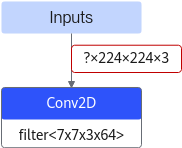

    该场景下--input\_shape参数必填，并可以进行如下操作：

    -   静态shape，将维度值设置为固定取值，例如，input\_name1:**1**,h,w,c，用于将输入数据某个维度不固定的原始模型转换为固定维度的离线模型。
    -   设置shape分档，例如设置为“-1”，与[--dynamic\_batch\_size](--dynamic_batch_size.md)参数配合使用。

-   设置shape范围时，若设置为-1，表示此维度可以使用\>=0的任意取值，该场景下取值上限为int64数据类型表示范围，但受限于host和device侧物理内存的大小，用户可以通过增大内存来支持。
-   若使用该参数时，同时通过[--insert\_op\_conf](--insert_op_conf.md)设置了AIPP功能，则AIPP输出图片的宽和高要在本参数所设置的范围内。

**推荐配置及收益<a name="section116691479451"></a>**

无。

**示例<a name="zh-cn_topic_0243420057_section85411163533"></a>**

-   静态shape，--input\_shape可选配置

    例如某网络的输入shape信息，输入1**：**input\_0\_0 \[16,32,208,208\]，输入2：input\_1\_0 \[16,64,208,208\]，则--input\_shape的配置信息为：

    ```
    --input_shape="input_0_0:16,32,208,208;input_1_0:16,64,208,208"
    ```

-   动态shape，--input\_shape必须配置
    -   设置BatchSize档位的示例，请参见[--dynamic\_batch\_size](--dynamic_batch_size.md)。
    -   设置分辨率档位的示例，请参见[--dynamic\_image\_size](--dynamic_image_size.md)。
    -   设置指定维度档位的示例，请参见[--dynamic\_dims](--dynamic_dims.md)。
    -   设置shape范围的示例：

        ```
        --input_shape="input_0_0:1~10,32,208,208;input_1_0:16,64,100~208,100~208"
        ```

-   shape为标量
    -   非动态分档场景

        shape为标量的输入，可选配置。例如模型有两个输入，**input\_name1**为标量，input\_name2输入shape为\[16,32,208,208\]，配置示例为：

        ```
        --input_shape="input_name1:;input_name2:16,32,208,208"
        ```

        上述示例中的**input\_name1**为可选配置**。**

    -   动态分档场景

        shape为标量的输入，必须配置。例如模型有三个输入，shape信息分别为A:\[-1,32,208,208\]、**B:\[\]**、C:\[16,64,208,208\]，则配置示例为（A为动态分档输入，此处以设置BatchSize档位为例）：

        ```
        --input_shape="A:-1,32,208,208;B:;C:16,64,208,208"  --dynamic_batch_size="1,2,4"
        ```

**依赖约束<a name="zh-cn_topic_0243420057_section53841119122710"></a>**

-   **使用约束：**
    -   如果用户通过[--input\_shape](--input_shape.md)设置了动态shape范围参数，同时又通过[--insert\_op\_conf](--insert_op_conf.md)参数配置了动态AIPP功能，则AIPP输出的宽和高要在[--input\_shape](--input_shape.md)所设置的范围内。
    -   如果用户通过[--input\_shape](--input_shape.md)设置了动态shape范围参数，同时又通过[--insert\_op\_conf](--insert_op_conf.md)参数配置了静态AIPP功能，则：

        如果模型只有一个输入，该场景不支持；如果模型有多个输入，则必须对不同的输入节点进行设置，比如一个输入节点设置静态AIPP，另外一个节点设置动态shape。

-   **接口约束：**

    如果模型转换时通过该参数设置了shape的范围，使用应用工程进行模型推理时，需在**aclmdlExecute**接口之前，调用**aclmdlSetDatasetTensorDesc**接口，用于设置真实的输入Tensor描述信息（输入shape范围）；模型执行之后，调用**aclmdlGetDatasetTensorDesc**接口获取模型动态输出的Tensor描述信息；再进一步调用**aclTensorDesc**下的操作接口获取输出Tensor数据占用的内存大小、Tensor的Format信息、Tensor的维度信息等。

    关于**aclmdlSetDatasetTensorDesc**、**aclmdlGetDatasetTensorDesc**等接口的具体使用方法，请参见《AscendCL应用开发指南 \(C&C++\)》手册“acl API参考”章节。

#### --dynamic\_batch\_size<a name="ZH-CN_TOPIC_0000002473744402"></a>

**产品支持情况<a name="section197451857688"></a>**

<a name="table38301303189"></a>
<table><thead align="left"><tr id="row20831180131817"><th class="cellrowborder" valign="top" width="57.99999999999999%" id="mcps1.1.3.1.1"><p id="p1883113061818"><a name="p1883113061818"></a><a name="p1883113061818"></a>产品</p>
</th>
<th class="cellrowborder" align="center" valign="top" width="42%" id="mcps1.1.3.1.2"><p id="p783113012187"><a name="p783113012187"></a><a name="p783113012187"></a>是否支持</p>
</th>
</tr>
</thead>
<tbody><tr id="row1466941011819"><td class="cellrowborder" valign="top" width="57.99999999999999%" headers="mcps1.1.3.1.1 "><p id="p146702104188"><a name="p146702104188"></a><a name="p146702104188"></a><span id="ph198371415105513"><a name="ph198371415105513"></a><a name="ph198371415105513"></a>IPV350</span></p>
</td>
<td class="cellrowborder" align="center" valign="top" width="42%" headers="mcps1.1.3.1.2 "><p id="p7670131016189"><a name="p7670131016189"></a><a name="p7670131016189"></a>x</p>
</td>
</tr>
</tbody>
</table>

**功能说明<a name="zh-cn_topic_0243420057_section1380101816519"></a>**

**该版本不支持动态BatchSize特性。**

设置动态BatchSize参数，适用于执行推理时，每次处理图片或者句子数量不固定的场景。

在某些推理场景，如检测出目标后再执行目标识别网络，由于目标个数不固定导致目标识别网络输入BatchSize不固定。如果每次推理都按照最大的BatchSize或最大分辨率进行计算，会造成计算资源浪费。因此，推理需要支持动态BatchSize和动态分辨率的场景，使用ATC工具时，通过该参数设置支持的BatchSize，通过[--dynamic\_image\_size](--dynamic_image_size.md)参数设置支持的分辨率档位。

模型转换完成后，在生成的om离线模型中，会新增一个输入，在模型推理时通过该新增的输入提供具体的BatchSize值。例如，a输入的BatchSize是动态的，在om离线模型中，会有与a对应的b输入来描述a的具体BatchSize。

**关联参数<a name="zh-cn_topic_0243420057_section1735011462517"></a>**

该参数需要与[--input\_shape](--input_shape.md)配合使用，不能与[--dynamic\_image\_size](--dynamic_image_size.md)、[--dynamic\_dims](--dynamic_dims.md)同时使用。且只支持N在shape首位的场景，即shape的第一位设置为"-1"。如果N在非首位场景下，请使用[--dynamic\_dims](--dynamic_dims.md)参数进行设置。

**参数取值<a name="zh-cn_topic_0243420057_section1046811955215"></a>**

**参数值：**档位数，例如"1,2,4,8"。

**参数值格式：**指定的参数必须放在双引号中，档位之间使用英文逗号分隔。

**参数值约束：**

-   档位数取值范围为\(1,100\]，即必须设置至少2个档位，最多支持100档配置；每个档位数值建议限制为：\[1\~2048\]。
-   如果用户设置的档位数值过大或档位过多，在运行环境执行推理时，建议执行**swapoff -a**命令关闭swap交换区间作为内存的功能，防止出现由于内存不足，将swap交换空间作为内存继续调用，导致运行环境异常缓慢的情况。

**推荐配置及收益<a name="section116691479451"></a>**

-   如果用户设置的档位数值过大或档位过多，可能会导致模型转换失败，此时建议用户减少档位或调低档位数值。
-   CV（计算机视觉）类的网络，[--dynamic\_batch\_size](--dynamic_batch_size.md)建议取值为8、16档位，该场景下的网络性能比单个BatchSize更优（8、16档位只是建议取值，实际使用时还请以实际测试结果为准）。
-   OCR/NLP（文字识别/自然语言处理）类网络，[--dynamic\_batch\_size](--dynamic_batch_size.md)档位取值建议为16的整数倍（该档位值只是建议取值，实际使用时还请以实际测试结果为准）。

**示例<a name="zh-cn_topic_0243420057_section85411163533"></a>**

```
--input_shape="data:-1,3,416,416;img_info:-1,4"  --dynamic_batch_size="1,2,4,8"
```

其中，“--input\_shape“中的“-1“表示设置动态BatchSize。则ATC在模型编译时，支持的输入组合档数分别为：

第0档：data\(1,3,416,416\)+img\_info\(1,4\)

第1档：data\(2,3,416,416\)+img\_info\(2,4\)

第2档：data\(4,3,416,416\)+img\_info\(4,4\)

第3档：data\(8,3,416,416\)+img\_info\(8,4\)

**依赖约束<a name="zh-cn_topic_0243420057_section53841119122710"></a>**

-   **使用约束：**
    -   不支持含有过程动态shape算子（网络中间层shape不固定）的网络。
    -   如果用户设置了动态BatchSize，同时又通过[--insert\_op\_conf](--insert_op_conf.md)参数设置了动态AIPP功能：

        实际推理时，调用**aclmdlSetInputAIPP**接口设置动态AIPP相关参数值时，需确保batchSize要设置为最大Batch数。接口详细说明请参见《AscendCL应用开发指南 \(C&C++\)》手册中的“acl API参考 \> 模型管理 \> 模型执行 \>  [aclmdlSetInputAIPP](https://www.hiascend.com/document/detail/zh/canncommercial/82RC1/API/appdevgapi/aclcppdevg_03_0308.html)”。

    -   通过该参数设置动态BatchSize特性后，生成的离线模型网络结构会与固定BatchSize场景下的不同，推理性能可能存在差异。

-   **接口约束：**

    如果模型转换时通过该参数设置了动态BatchSize，则使用应用工程进行推理时，在**模型执行**接口之前：

    -   使用**aclmdlSetDynamicBatchSize**接口，用于设置真实的BatchSize档位。
    -   不使用**aclmdlSetDynamicBatchSize**接口，则模型执行时，默认按照BatchSize设置范围的最大值进行赋值。

    接口详细说明请参见《AscendCL应用开发指南 \(C&C++\)》手册中的“acl API参考 \> 模型管理 \> 模型执行 \>  [aclmdlSetDynamicBatchSize](https://www.hiascend.com/document/detail/zh/canncommercial/82RC1/API/appdevgapi/aclcppdevg_03_0306.html)”。

#### --dynamic\_image\_size<a name="ZH-CN_TOPIC_0000002473904322"></a>

**产品支持情况<a name="section2085912413012"></a>**

<a name="zh-cn_topic_0000002473744402_table38301303189"></a>
<table><thead align="left"><tr id="zh-cn_topic_0000002473744402_row20831180131817"><th class="cellrowborder" valign="top" width="57.99999999999999%" id="mcps1.1.3.1.1"><p id="zh-cn_topic_0000002473744402_p1883113061818"><a name="zh-cn_topic_0000002473744402_p1883113061818"></a><a name="zh-cn_topic_0000002473744402_p1883113061818"></a>产品</p>
</th>
<th class="cellrowborder" align="center" valign="top" width="42%" id="mcps1.1.3.1.2"><p id="zh-cn_topic_0000002473744402_p783113012187"><a name="zh-cn_topic_0000002473744402_p783113012187"></a><a name="zh-cn_topic_0000002473744402_p783113012187"></a>是否支持</p>
</th>
</tr>
</thead>
<tbody><tr id="zh-cn_topic_0000002473744402_row1466941011819"><td class="cellrowborder" valign="top" width="57.99999999999999%" headers="mcps1.1.3.1.1 "><p id="zh-cn_topic_0000002473744402_p146702104188"><a name="zh-cn_topic_0000002473744402_p146702104188"></a><a name="zh-cn_topic_0000002473744402_p146702104188"></a><span id="zh-cn_topic_0000002473744402_ph198371415105513"><a name="zh-cn_topic_0000002473744402_ph198371415105513"></a><a name="zh-cn_topic_0000002473744402_ph198371415105513"></a>IPV350</span></p>
</td>
<td class="cellrowborder" align="center" valign="top" width="42%" headers="mcps1.1.3.1.2 "><p id="zh-cn_topic_0000002473744402_p7670131016189"><a name="zh-cn_topic_0000002473744402_p7670131016189"></a><a name="zh-cn_topic_0000002473744402_p7670131016189"></a>x</p>
</td>
</tr>
</tbody>
</table>

**功能说明<a name="zh-cn_topic_0243420057_section1380101816519"></a>**

**该版本不支持动态分辨率特性。**

设置输入图片的动态分辨率参数。适用于执行推理时，每次处理图片宽和高不固定的场景。

**关联参数<a name="zh-cn_topic_0243420057_section1735011462517"></a>**

-   该参数需要与[--input\_shape](--input_shape.md)配合使用，不能与[--dynamic\_batch\_size](--dynamic_batch_size.md)、[--dynamic\_dims](--dynamic_dims.md)同时使用。
-   使用该参数设置动态分辨率时，[--input\_format](--input_format.md)参数只支持配置为NCHW、NHWC；其他format场景下，设置分辨率请使用[--dynamic\_dims](--dynamic_dims.md)参数。

**参数取值<a name="zh-cn_topic_0243420057_section1046811955215"></a>**

**参数值：**动态分辨率参数，例如"imagesize1\_height,imagesize1\_width;imagesize2\_height,imagesize2\_width"。

**参数值格式：**指定的参数必须放在双引号中，档位之间英文**分号**分隔，每档内参数使用英文**逗号**分隔。

**参数值约束：**

-   档位数取值范围为\(1,100\]，即必须设置至少2个档位，最多支持100档配置。
-   如果用户设置的分辨率数值过大或档位过多，在运行环境执行推理时，建议执行**swapoff -a**命令关闭swap交换区间作为内存的功能，防止出现由于内存不足，将swap交换空间作为内存继续调用，导致运行环境异常缓慢的情况。

**推荐配置及收益<a name="section116691479451"></a>**

如果用户设置的分辨率数值过大或档位过多，可能会导致模型转换失败，此时建议用户减少档位或调低档位数值。

**示例<a name="zh-cn_topic_0243420057_section85411163533"></a>**

```
--input_shape="data:8,3,-1,-1;img_info:8,4,-1,-1"  --dynamic_image_size="416,416;832,832"
```

其中，“--input\_shape“中的“-1“表示设置动态分辨率。则ATC在编译模型时，支持的输入组合档数分别为：

第0档：data\(8,3,416,416\)+img\_info\(8,4,416,416\)

第1档：data\(8,3,832,832\)+img\_info\(8,4,832,832\)

**依赖约束<a name="zh-cn_topic_0243420057_section53841119122710"></a>**

-   **使用约束：**
    -   不支持含有过程动态shape算子（网络中间层shape不固定）的网络。
    -   如果用户设置了动态分辨率，则请确保不同档位的分辨率能在原生框架下正常推理。
    -   如果用户设置了动态分辨率，实际推理时，使用的数据集图片大小需要与具体使用的分辨率相匹配。
    -   如果用户设置了动态分辨率，即输入图片的宽和高不确定，同时又通过[--insert\_op\_conf](--insert_op_conf.md)参数设置了静态AIPP功能：该场景下，AIPP配置文件中不能开启Crop和Padding功能，并且需要将配置文件中的src\_image\_size\_w和src\_image\_size\_h取值设置为0。
    -   如果用户设置了动态分辨率，同时又通过[--insert\_op\_conf](--insert_op_conf.md)参数设置了动态AIPP功能：

        实际推理时，调用**aclmdlSetInputAIPP**接口，设置动态AIPP相关参数值时，不能开启Crop和Padding功能。该场景下，还需要确保通过aclmdlSetInputAIPP接口设置的宽和高与**aclmdlSetDynamicHWSize**接口设置的宽、高相等，都必须设置成动态分辨率最大档位的宽、高。

        接口详细说明请参见《AscendCL应用开发指南 \(C&C++\)》手册中的“acl API参考 \> 模型管理 \> 模型执行”章节。

    -   通过该参数设置动态分辨率特性后，生成的离线模型网络结构会与固定分辨率场景下的不同，推理性能可能存在差异。

-   **接口约束：**

    如果模型转换时通过该参数设置了动态分辨率，则使用应用工程进行模型推理时，在**模型执行**接口之前：

    -   使用**aclmdlSetDynamicHWSize**接口，用于设置真实的分辨率，且实际推理时，使用的数据集图片大小需要与具体使用的分辨率相匹配。
    -   不使用**aclmdlSetDynamicHWSize**接口，则模型执行时，默认按照动态分辨率设置范围的最大档位宽、高进行赋值。

    接口详细说明请参见《AscendCL应用开发指南 \(C&C++\)》手册中的“acl API参考 \> 模型管理 \> 模型执行 \>  [aclmdlSetDynamicHWSize](https://www.hiascend.com/document/detail/zh/canncommercial/82RC1/API/appdevgapi/aclcppdevg_03_0307.html)”。

#### --dynamic\_dims<a name="ZH-CN_TOPIC_0000002506024303"></a>

**产品支持情况<a name="section197451857688"></a>**

<a name="table38301303189"></a>
<table><thead align="left"><tr id="row20831180131817"><th class="cellrowborder" valign="top" width="57.99999999999999%" id="mcps1.1.3.1.1"><p id="p1883113061818"><a name="p1883113061818"></a><a name="p1883113061818"></a>产品</p>
</th>
<th class="cellrowborder" align="center" valign="top" width="42%" id="mcps1.1.3.1.2"><p id="p783113012187"><a name="p783113012187"></a><a name="p783113012187"></a>是否支持</p>
</th>
</tr>
</thead>
<tbody><tr id="row1466941011819"><td class="cellrowborder" valign="top" width="57.99999999999999%" headers="mcps1.1.3.1.1 "><p id="p146702104188"><a name="p146702104188"></a><a name="p146702104188"></a><span id="ph198371415105513"><a name="ph198371415105513"></a><a name="ph198371415105513"></a>IPV350</span></p>
</td>
<td class="cellrowborder" align="center" valign="top" width="42%" headers="mcps1.1.3.1.2 "><p id="p522519556313"><a name="p522519556313"></a><a name="p522519556313"></a>x</p>
</td>
</tr>
</tbody>
</table>

**功能说明<a name="zh-cn_topic_0243420057_section1380101816519"></a>**

设置ND格式下动态维度的档位。适用于执行推理时，每次处理任意维度的场景。

为支持Transformer等网络在输入格式的维度不确定的场景，通过该参数实现ND格式下任意维度的档位设置。ND表示支持任意格式。

**关联参数<a name="zh-cn_topic_0243420057_section1735011462517"></a>**

该参数需要与[--input\_shape](--input_shape.md)、[--input\_format](--input_format.md)配合使用，不能与[--dynamic\_batch\_size](--dynamic_batch_size.md)、[--dynamic\_image\_size](--dynamic_image_size.md)、[--insert\_op\_conf](--insert_op_conf.md)同时使用。

**参数取值<a name="zh-cn_topic_0243420057_section1046811955215"></a>**

**参数值：**通过"dim1,dim2,dim3;dim4,dim5,dim6;dim7,dim8,dim9"的形式设置。

**参数值格式：**所有档位必须放在双引号中，档位之间使用英文**分号**分隔，每档内参数使用英文**逗号**分隔；每档内的dim值与[--input\_shape](--input_shape.md)参数中的-1标识的参数依次对应，[--input\_shape](--input_shape.md)参数中有几个-1，则每档必须设置几个维度。

**参数值约束：**

-   档位数取值范围为\(1,100\]，即必须设置至少2个档位，最多支持100档配置，建议配置为3\~4档。

**推荐配置及收益<a name="section116691479451"></a>**

无。

**示例<a name="zh-cn_topic_0243420057_section85411163533"></a>**

-   若网络模型只有一个输入：

    每档中的dim值与[--input\_shape](--input_shape.md)参数中的-1标识的参数依次对应，[--input\_shape](--input_shape.md)参数中有几个-1，则每档必须设置几个维度。例如：

    ATC参数取值为：

    ```
    --input_shape="data:1,-1"  --dynamic_dims="4;8;16;64" --input_format=ND
    ```

    则ATC在编译模型时，支持的data算子的shape为1,4; 1,8; 1,16; 1,64。

    ATC参数取值为：

    ```
    --input_shape="data:1,-1,-1"  --dynamic_dims="1,2;3,4;5,6;7,8" --input_format=ND
    ```

    则ATC在编译模型时，支持的data算子的shape为1,1,2; 1,3,4; 1,5,6; 1,7,8。

-   若网络模型有多个输入：

    每档中的dim值与网络模型输入参数中的-1标识的参数依次对应，网络模型输入参数中有几个-1，则每档必须设置几个维度。例如网络模型有三个输入，分别为data\(1,1,40,T\)，label\(1,T\)，mask\(T,T\) ，其中T为动态可变。则配置示例为：

    ```
    --input_shape="data:1,1,40,-1;label:1,-1;mask:-1,-1"  --dynamic_dims="20,20,1,1;40,40,2,2;80,60,4,4" --input_format=ND
    ```

    在ATC编译模型时，支持的输入dims组合档数分别为：

    第0档：data\(1,1,40,20\)+label\(1,20\)+mask\(1,1\)

    第1档：data\(1,1,40,40\)+label\(1,40\)+mask\(2,2\)

    第2档：data\(1,1,40,80\)+label\(1,60\)+mask\(4,4\)

**依赖约束<a name="zh-cn_topic_0243420057_section53841119122710"></a>**

-   **使用约束：**

    不支持含有过程动态shape算子（网络中间层shape不固定）的网络。

-   **接口约束：**

    如果模型转换时通过该参数设置了动态维度，则使用应用工程进行模型推理时，在**模型执行**接口之前：

    -   使用**aclmdlSetInputDynamicDims**接口，用于设置真实的维度。
    -   不使用**aclmdlSetInputDynamicDims**接口，则模型执行时，默认按照动态维度设置范围的最大值进行赋值。

    接口详细说明请参见《AscendCL应用开发指南 \(C&C++\)》手册中的“acl API参考 \> 模型管理 \> 模型执行 \>  [aclmdlSetInputDynamicDims](https://www.hiascend.com/document/detail/zh/canncommercial/82RC1/API/appdevgapi/aclcppdevg_03_0312.html)”章节。

#### --om<a name="ZH-CN_TOPIC_0000002473744394"></a>

**产品支持情况<a name="section197451857688"></a>**

<a name="table38301303189"></a>
<table><thead align="left"><tr id="row20831180131817"><th class="cellrowborder" valign="top" width="57.99999999999999%" id="mcps1.1.3.1.1"><p id="p1883113061818"><a name="p1883113061818"></a><a name="p1883113061818"></a>产品</p>
</th>
<th class="cellrowborder" align="center" valign="top" width="42%" id="mcps1.1.3.1.2"><p id="p783113012187"><a name="p783113012187"></a><a name="p783113012187"></a>是否支持</p>
</th>
</tr>
</thead>
<tbody><tr id="row1466941011819"><td class="cellrowborder" valign="top" width="57.99999999999999%" headers="mcps1.1.3.1.1 "><p id="p146702104188"><a name="p146702104188"></a><a name="p146702104188"></a><span id="ph198371415105513"><a name="ph198371415105513"></a><a name="ph198371415105513"></a>IPV350</span></p>
</td>
<td class="cellrowborder" align="center" valign="top" width="42%" headers="mcps1.1.3.1.2 "><p id="p522519556313"><a name="p522519556313"></a><a name="p522519556313"></a>x</p>
</td>
</tr>
</tbody>
</table>

**功能说明<a name="zh-cn_topic_0243420057_section1380101816519"></a>**

离线模型（.om）、原始模型文件（例如Caffe框架的.prototxt，TensorFlow框架的.pb等）、GE dump图结构文件（.txt）的路径和文件名。

**关联参数<a name="zh-cn_topic_0243420057_section1735011462517"></a>**

-   若[--mode](--mode.md)取值为1：
    -   离线模型转换为JSON文件

        --om需要与[--mode](--mode.md)=1、[--json](--json.md)参数配合使用。

    -   原始模型文件转换为JSON文件

        --om需要与[--mode](--mode.md)=1、[--json](--json.md)、[--framework](--framework.md)参数配合使用。

-   若[--mode](--mode.md)取值为5：

    GE dump图结构文件转JSON文件，--om需要与[--mode](--mode.md)=5、[--json](--json.md)参数配合使用。

-   若[--mode](--mode.md)取值为6：

    针对已有的**离线模型**，显示模型信息等信息，则--om只需要与[--mode](--mode.md)参数配合使用。

**参数取值<a name="zh-cn_topic_0243420057_section1046811955215"></a>**

**参数值：**离线模型（.om）、原始模型文件（例如Caffe框架的.prototxt，TensorFlow框架的.pb）或GE dump图结构文件（.txt）的路径。

**参数值格式：**路径和文件名：支持大小写字母（a-z，A-Z）、数字（0-9）、下划线（\_）、短横线（-）、句点（.）、中文汉字。

**推荐配置及收益<a name="section116691479451"></a>**

无。

**示例<a name="zh-cn_topic_0243420057_section85411163533"></a>**

-   若[--mode](--mode.md)取值为1
    -   离线模型转换为JSON文件

        ```
        --mode=1 --om=$HOME/module/out/tf_resnet50.om  --json=$HOME/module/out/tf_resnet50.json
        ```

    -   原始模型文件转换为JSON文件

        ```
        --mode=1 --om=$HOME/module/resnet50_tensorflow*.pb  --json=$HOME/module/out/tf_resnet50.json  --framework=3
        ```

-   若[--mode](--mode.md)取值为5

    ```
    --mode=5 --om=$HOME/module/ge_proto_00000000_PreRunBegin.txt --json=$HOME/module/out/ge_proto.json
    ```

-   若[--mode](--mode.md)取值为6

    ```
    atc --mode=6 --om=$HOME/module/out/tf_resnet50.om
    ```

**依赖约束<a name="zh-cn_topic_0243420057_section53841119122710"></a>**

无。

#### --singleop<a name="ZH-CN_TOPIC_0000002505904403"></a>

**产品支持情况<a name="section1364472413412"></a>**

<a name="zh-cn_topic_0000002473744402_table38301303189"></a>
<table><thead align="left"><tr id="zh-cn_topic_0000002473744402_row20831180131817"><th class="cellrowborder" valign="top" width="57.99999999999999%" id="mcps1.1.3.1.1"><p id="zh-cn_topic_0000002473744402_p1883113061818"><a name="zh-cn_topic_0000002473744402_p1883113061818"></a><a name="zh-cn_topic_0000002473744402_p1883113061818"></a>产品</p>
</th>
<th class="cellrowborder" align="center" valign="top" width="42%" id="mcps1.1.3.1.2"><p id="zh-cn_topic_0000002473744402_p783113012187"><a name="zh-cn_topic_0000002473744402_p783113012187"></a><a name="zh-cn_topic_0000002473744402_p783113012187"></a>是否支持</p>
</th>
</tr>
</thead>
<tbody><tr id="zh-cn_topic_0000002473744402_row1466941011819"><td class="cellrowborder" valign="top" width="57.99999999999999%" headers="mcps1.1.3.1.1 "><p id="zh-cn_topic_0000002473744402_p146702104188"><a name="zh-cn_topic_0000002473744402_p146702104188"></a><a name="zh-cn_topic_0000002473744402_p146702104188"></a><span id="zh-cn_topic_0000002473744402_ph198371415105513"><a name="zh-cn_topic_0000002473744402_ph198371415105513"></a><a name="zh-cn_topic_0000002473744402_ph198371415105513"></a>IPV350</span></p>
</td>
<td class="cellrowborder" align="center" valign="top" width="42%" headers="mcps1.1.3.1.2 "><p id="zh-cn_topic_0000002473744402_p7670131016189"><a name="zh-cn_topic_0000002473744402_p7670131016189"></a><a name="zh-cn_topic_0000002473744402_p7670131016189"></a>x</p>
</td>
</tr>
</tbody>
</table>

**功能说明<a name="zh-cn_topic_0243420057_section1380101816519"></a>**

**该版本不支持单算子特性。**

单算子描述文件，将单个算子描述文件（JSON格式）转换成适配NPU IP加速器的离线模型，以便进行后续的单算子功能验证。

兼容性说明：

动态shape算子场景，om离线模型转换环境的CANN软件包版本，必须与产品运行环境的CANN软件包版本相同。

**关联参数<a name="zh-cn_topic_0243420057_section1735011462517"></a>**

使用该参数时，只有如下参数可以配合使用，其中[--output](--output.md)、[--soc\_version](--soc_version.md)为必填。

**参数取值<a name="zh-cn_topic_0243420057_section1046811955215"></a>**

**参数值：**单算子描述文件（JSON格式）格式以及参数配置请参见[单算子模型转换\(该版本不支持单算子特性\)](单算子模型转换(该版本不支持单算子特性).md)。

**参数值约束：**该参数指定的单算子都是基于Ascend IR定义的，关于单算子的详细定义请参见《AOL算子加速库接口参考》  中的“[CANN算子规格说明](https://www.hiascend.com/document/detail/zh/canncommercial/82RC1/API/aolapi/operatorlist_00094.html)”章节。

**推荐配置及收益<a name="section116691479451"></a>**

无。

**示例<a name="zh-cn_topic_0243420057_section85411163533"></a>**

下面以Add单算子为例进行说明，该单算子对应的描述文件为_add.json_  ，将该文件上传到ATC工具所在服务器任意目录，例如上传到_$HOME/singleop_，使用示例如下：

```
--singleop=$HOME/singleop/add.json --output=$HOME/singleop/out/op_model  --soc_version=<soc_version>
```

**依赖约束<a name="zh-cn_topic_0243420057_section53841119122710"></a>**

-   使用约束

    单算子JSON文件转换成离线模型场景，如果希望模型转换时只使用TBE算子（不查找AI CPU算子，找不到TBE算子则报错），还需设置如下环境变量：

    ```
    export ASCEND_ENGINE_PATH=${INSTALL_DIR}/lib64/plugin/opskernel/libfe.so:${INSTALL_DIR}/lib64/plugin/opskernel/libge_local_engine.so:${INSTALL_DIR}/lib64/plugin/opskernel/librts_engine.so
    ```

    执行上述命令后，如果用户想要执行其他操作，需要删除上述环境变量：执行**unset ASCEND\_ENGINE\_PATH**命令，使其失效。

-   接口约束

    单算子描述文件转换后的om离线模型文件，使用应用工程进行模型推理时，需调用AscendCL接口加载算子模型（例如**aclopSetModelDir**接口），最后调用AscendCL接口执行算子（例如**aclopExecuteV2**接口）。

    接口详细说明请参见《AscendCL应用开发指南 \(C&C++\)》手册中的“acl API参考 \> 单算子调用 \> 单算子模型执行”章节。

### 输出选项<a name="ZH-CN_TOPIC_0000002473904332"></a>


#### --output<a name="ZH-CN_TOPIC_0000002506024347"></a>

**产品支持情况<a name="section139815552554"></a>**

<a name="zh-cn_topic_0000002473904326_table38301303189"></a>
<table><thead align="left"><tr id="zh-cn_topic_0000002473904326_row20831180131817"><th class="cellrowborder" valign="top" width="57.99999999999999%" id="mcps1.1.3.1.1"><p id="zh-cn_topic_0000002473904326_p1883113061818"><a name="zh-cn_topic_0000002473904326_p1883113061818"></a><a name="zh-cn_topic_0000002473904326_p1883113061818"></a>产品</p>
</th>
<th class="cellrowborder" align="center" valign="top" width="42%" id="mcps1.1.3.1.2"><p id="zh-cn_topic_0000002473904326_p783113012187"><a name="zh-cn_topic_0000002473904326_p783113012187"></a><a name="zh-cn_topic_0000002473904326_p783113012187"></a>是否支持</p>
</th>
</tr>
</thead>
<tbody><tr id="zh-cn_topic_0000002473904326_row1466941011819"><td class="cellrowborder" valign="top" width="57.99999999999999%" headers="mcps1.1.3.1.1 "><p id="zh-cn_topic_0000002473904326_p146702104188"><a name="zh-cn_topic_0000002473904326_p146702104188"></a><a name="zh-cn_topic_0000002473904326_p146702104188"></a><span id="zh-cn_topic_0000002473904326_ph198371415105513"><a name="zh-cn_topic_0000002473904326_ph198371415105513"></a><a name="zh-cn_topic_0000002473904326_ph198371415105513"></a>IPV350</span></p>
</td>
<td class="cellrowborder" align="center" valign="top" width="42%" headers="mcps1.1.3.1.2 "><p id="zh-cn_topic_0000002473904326_p7670131016189"><a name="zh-cn_topic_0000002473904326_p7670131016189"></a><a name="zh-cn_topic_0000002473904326_p7670131016189"></a>√</p>
</td>
</tr>
</tbody>
</table>

**功能说明<a name="zh-cn_topic_0243420057_section1380101816519"></a>**

-   如果是开源框架的网络模型：

    存放转换后的离线模型的路径以及文件名，例如：_$HOME/module__/out/tf\_resnet50_，转换后的模型文件名以指定的为准，自动以.om后缀结尾，例如：_tf\_resnet50_.om或_tf\_resnet50\_<os\>\_<arch\>_.om，若.om文件名中包含操作系统及架构，则该文件只能在该操作系统及架构的运行环境中使用。

-   如果是单算子描述文件（JSON格式）：

    存放转换后的单算子模型的路径，例如：_$HOME/__singleop/out/op\_model_。转换后的模型文件命名规则默认为：序号\_算子类型\_输入的描述\(dataType\_format\_shape\)\_输出的描述\(dataType\_format\_shape\)，如果不采用默认命名规则，可以通过单算子描述文件中的name属性指定模型文件名。

**关联参数<a name="zh-cn_topic_0243420057_section1735011462517"></a>**

若使用atc命令转换出来的om离线模型文件名中含操作系统及架构，但操作系统及其架构与模型运行环境不一致时，则需要与[--host\_env\_os](--host_env_os.md)、[--host\_env\_cpu](--host_env_cpu.md)参数配合使用，设置模型运行环境的操作系统类型及架构。

**参数取值<a name="zh-cn_topic_0243420057_section1046811955215"></a>**

**参数值：**

-   如果是开源框架的网络模型：存放转换后的离线模型的路径以及文件名。
-   如果是单算子描述文件（JSON格式）：存放转换后的单算子模型的路径。

**参数值格式：**路径和文件名：支持大小写字母（a-z，A-Z）、数字（0-9）、下划线（\_）、短横线（-）、句点（.）、中文汉字。

**推荐配置及收益<a name="section116691479451"></a>**

无。

**示例<a name="zh-cn_topic_0243420057_section85411163533"></a>**

-   TF框架网络模型：

    ```
    --output=$HOME/module/out/tf_resnet50
    ```

-   ONNX网络模型：

    ```
    --output=$HOME/module/out/onnx_resnet50
    ```

-   单算子描述文件：

    ```
    --output=$HOME/singleop/out/op_model
    ```

**依赖约束<a name="zh-cn_topic_0243420057_section53841119122710"></a>**

无。

#### --output\_type<a name="ZH-CN_TOPIC_0000002505904375"></a>

**产品支持情况<a name="section139815552554"></a>**

<a name="zh-cn_topic_0000002473904326_table38301303189"></a>
<table><thead align="left"><tr id="zh-cn_topic_0000002473904326_row20831180131817"><th class="cellrowborder" valign="top" width="57.99999999999999%" id="mcps1.1.3.1.1"><p id="zh-cn_topic_0000002473904326_p1883113061818"><a name="zh-cn_topic_0000002473904326_p1883113061818"></a><a name="zh-cn_topic_0000002473904326_p1883113061818"></a>产品</p>
</th>
<th class="cellrowborder" align="center" valign="top" width="42%" id="mcps1.1.3.1.2"><p id="zh-cn_topic_0000002473904326_p783113012187"><a name="zh-cn_topic_0000002473904326_p783113012187"></a><a name="zh-cn_topic_0000002473904326_p783113012187"></a>是否支持</p>
</th>
</tr>
</thead>
<tbody><tr id="zh-cn_topic_0000002473904326_row1466941011819"><td class="cellrowborder" valign="top" width="57.99999999999999%" headers="mcps1.1.3.1.1 "><p id="zh-cn_topic_0000002473904326_p146702104188"><a name="zh-cn_topic_0000002473904326_p146702104188"></a><a name="zh-cn_topic_0000002473904326_p146702104188"></a><span id="zh-cn_topic_0000002473904326_ph198371415105513"><a name="zh-cn_topic_0000002473904326_ph198371415105513"></a><a name="zh-cn_topic_0000002473904326_ph198371415105513"></a>IPV350</span></p>
</td>
<td class="cellrowborder" align="center" valign="top" width="42%" headers="mcps1.1.3.1.2 "><p id="zh-cn_topic_0000002473904326_p7670131016189"><a name="zh-cn_topic_0000002473904326_p7670131016189"></a><a name="zh-cn_topic_0000002473904326_p7670131016189"></a>√</p>
</td>
</tr>
</tbody>
</table>

**功能说明<a name="zh-cn_topic_0243420057_section1380101816519"></a>**

指定网络输出数据类型或指定某个输出节点的输出类型。

**关联参数<a name="zh-cn_topic_0243420057_section1735011462517"></a>**

若指定某个输出节点的输出类型，则需要和[--out\_nodes](--out_nodes.md)参数配合使用。

**参数取值<a name="zh-cn_topic_0243420057_section1046811955215"></a>**

**参数值：**

-   FP32\(IPV350不支持\)：推荐分类网络、检测网络使用。
-   UINT8：图像超分辨率网络，推荐使用，推理性能更好。
-   FP16：推荐分类网络、检测网络使用。通常用于一个网络输出作为另一个网络输入场景。
-   INT8

**参数值约束：**

模型转换完毕，在对应的om离线模型文件中，数据类型以DT\_FLOAT或DT\_UINT8或DT\_FLOAT16或DT\_INT8值呈现。

若在模型转换时不指定网络具体输出数据类型，则以原始网络模型最后一层输出的算子数据类型为准；若指定了类型，则以该参数指定的类型为准，此时[--is\_output\_adjust\_hw\_layout](--is_output_adjust_hw_layout.md)参数指定的类型不生效。

**推荐配置及收益<a name="section116691479451"></a>**

无。

**示例<a name="zh-cn_topic_0243420057_section85411163533"></a>**

-   指定网络输出数据类型

    ```
    --output_type=FP32
    ```

-   指定某个输出节点的输出数据类型

    例如：--output\_type="node1:0:FP16;node2:0:FP32"，表示node1节点第一个输出设置为FP16，node2第一个节点输出设置为FP32。指定的节点必须放在双引号中，节点中间使用英文分号分隔。

    该场景下，该参数需要与[--out\_nodes](--out_nodes.md)参数配合使用。

    ```
    --model=$HOME/module/resnet50_tensorflow*.pb --framework=3 --output=$HOME/module/out/tf_resnet50  --soc_version=<soc_version>  --output_type="conv1:0:FP16"  --out_nodes="conv1:0"
    ```

**依赖约束<a name="zh-cn_topic_0243420057_section53841119122710"></a>**

无。

#### --check\_report<a name="ZH-CN_TOPIC_0000002473744430"></a>

**产品支持情况<a name="section139815552554"></a>**

<a name="zh-cn_topic_0000001312713973_table38301303189"></a>
<table><thead align="left"><tr id="zh-cn_topic_0000001312713973_row20831180131817"><th class="cellrowborder" valign="top" width="57.99999999999999%" id="mcps1.1.3.1.1"><p id="zh-cn_topic_0000001312713973_p1883113061818"><a name="zh-cn_topic_0000001312713973_p1883113061818"></a><a name="zh-cn_topic_0000001312713973_p1883113061818"></a>产品</p>
</th>
<th class="cellrowborder" align="center" valign="top" width="42%" id="mcps1.1.3.1.2"><p id="zh-cn_topic_0000001312713973_p783113012187"><a name="zh-cn_topic_0000001312713973_p783113012187"></a><a name="zh-cn_topic_0000001312713973_p783113012187"></a>是否支持</p>
</th>
</tr>
</thead>
<tbody><tr id="zh-cn_topic_0000001312713973_row1466941011819"><td class="cellrowborder" valign="top" width="57.99999999999999%" headers="mcps1.1.3.1.1 "><p id="zh-cn_topic_0000001312713973_p146702104188"><a name="zh-cn_topic_0000001312713973_p146702104188"></a><a name="zh-cn_topic_0000001312713973_p146702104188"></a><span id="zh-cn_topic_0000001312713973_ph198371415105513"><a name="zh-cn_topic_0000001312713973_ph198371415105513"></a><a name="zh-cn_topic_0000001312713973_ph198371415105513"></a>IPV350</span></p>
</td>
<td class="cellrowborder" align="center" valign="top" width="42%" headers="mcps1.1.3.1.2 "><p id="p147953017371"><a name="p147953017371"></a><a name="p147953017371"></a>x</p>
</td>
</tr>
</tbody>
</table>

**功能说明<a name="zh-cn_topic_0243420057_section1380101816519"></a>**

用于配置预检结果保存文件路径和文件名。

**关联参数<a name="zh-cn_topic_0243420057_section1735011462517"></a>**

[--mode](--mode.md)：当[--mode](--mode.md)=0时解析图失败时或[--mode](--mode.md)=3仅做预检时，通过该参数指定预检结果文件的保存路径。

**参数取值<a name="zh-cn_topic_0243420057_section1046811955215"></a>**

**参数值：**预检结果文件路径和文件名。

**参数值格式：**路径和文件名：支持大小写字母（a-z，A-Z）、数字（0-9）、下划线（\_）、短横线（-）、句点（.）、中文汉字。

**参数默认值：**执行atc命令当前路径生成check\_result.json

**推荐配置及收益<a name="section116691479451"></a>**

无。

**示例<a name="zh-cn_topic_0243420057_section85411163533"></a>**

```
--check_report=$HOME/module/out/check_result.json
```

**使用约束<a name="zh-cn_topic_0243420057_section53841119122710"></a>**

预检结果文件存储路径，除[--check\_report](--check_report.md)参数设置的方式外，还可以配置环境变量ASCEND\_WORK\_PATH，几种方式优先级为

配置参数“--check\_report”\>环境变量ASCEND\_WORK\_PATH\>默认存储路径（执行atc命令当前路径）。

关于环境变量ASCEND\_WORK\_PATH的详细说明请参见《[环境变量参考](https://www.hiascend.com/document/detail/zh/canncommercial/82RC1/maintenref/envvar/envref_07_0001.html)》。

#### --json<a name="ZH-CN_TOPIC_0000002473904354"></a>

**产品支持情况<a name="section139815552554"></a>**

<a name="zh-cn_topic_0000002473744430_zh-cn_topic_0000001312713973_table38301303189"></a>
<table><thead align="left"><tr id="zh-cn_topic_0000002473744430_zh-cn_topic_0000001312713973_row20831180131817"><th class="cellrowborder" valign="top" width="57.99999999999999%" id="mcps1.1.3.1.1"><p id="zh-cn_topic_0000002473744430_zh-cn_topic_0000001312713973_p1883113061818"><a name="zh-cn_topic_0000002473744430_zh-cn_topic_0000001312713973_p1883113061818"></a><a name="zh-cn_topic_0000002473744430_zh-cn_topic_0000001312713973_p1883113061818"></a>产品</p>
</th>
<th class="cellrowborder" align="center" valign="top" width="42%" id="mcps1.1.3.1.2"><p id="zh-cn_topic_0000002473744430_zh-cn_topic_0000001312713973_p783113012187"><a name="zh-cn_topic_0000002473744430_zh-cn_topic_0000001312713973_p783113012187"></a><a name="zh-cn_topic_0000002473744430_zh-cn_topic_0000001312713973_p783113012187"></a>是否支持</p>
</th>
</tr>
</thead>
<tbody><tr id="zh-cn_topic_0000002473744430_zh-cn_topic_0000001312713973_row1466941011819"><td class="cellrowborder" valign="top" width="57.99999999999999%" headers="mcps1.1.3.1.1 "><p id="zh-cn_topic_0000002473744430_zh-cn_topic_0000001312713973_p146702104188"><a name="zh-cn_topic_0000002473744430_zh-cn_topic_0000001312713973_p146702104188"></a><a name="zh-cn_topic_0000002473744430_zh-cn_topic_0000001312713973_p146702104188"></a><span id="zh-cn_topic_0000002473744430_zh-cn_topic_0000001312713973_ph198371415105513"><a name="zh-cn_topic_0000002473744430_zh-cn_topic_0000001312713973_ph198371415105513"></a><a name="zh-cn_topic_0000002473744430_zh-cn_topic_0000001312713973_ph198371415105513"></a>IPV350</span></p>
</td>
<td class="cellrowborder" align="center" valign="top" width="42%" headers="mcps1.1.3.1.2 "><p id="zh-cn_topic_0000002473744430_p147953017371"><a name="zh-cn_topic_0000002473744430_p147953017371"></a><a name="zh-cn_topic_0000002473744430_p147953017371"></a>x</p>
</td>
</tr>
</tbody>
</table>

**功能说明<a name="zh-cn_topic_0243420057_section1380101816519"></a>**

离线模型、原始模型文件、GE dump图结构文件转换为JSON文件的路径和文件名。

如果是已有的离线模型转换为JSON文件，在转换后的文件中还可以查看原始模型转换为该离线模型时，使用的基础版本号（比如ATC软件版本信息，OPP算子包版本信息等）以及当时模型转换使用的atc命令。

**关联参数<a name="zh-cn_topic_0243420057_section1735011462517"></a>**

-   离线模型转换为JSON文件

    该参数需要与[--mode](--mode.md)=1、[--om](--om.md)参数配合使用。

-   原始模型文件转换为JSON文件

    该参数需要与[--mode](--mode.md)=1、[--om](--om.md)参数、[--framework](--framework.md)配合使用。

    原始模型为MindSpore框架时，即--framework=1时，不支持转换为JSON文件。

-   GE dump图结构文件转JSON文件

    该参数需要与[--mode](--mode.md)=5、[--om](--om.md)参数配合使用。

    仅支持dump出的ge\_proto\*.txt格式文件转成JSON文件。

**参数取值<a name="zh-cn_topic_0243420057_section1046811955215"></a>**

**参数值：**JSON文件的路径和文件名。

**参数值格式：**路径和文件名：支持大小写字母（a-z，A-Z）、数字（0-9）、下划线（\_）、短横线（-）、句点（.）、中文汉字。

**推荐配置及收益<a name="section116691479451"></a>**

无。

**示例<a name="zh-cn_topic_0243420057_section85411163533"></a>**

-   离线模型转换为JSON文件

    ```
    --mode=1 --om=$HOME/module/out/tf_resnet50.om  --json=$HOME/module/out/tf_resnet50.json
    ```

-   原始模型文件转换为JSON文件

    ```
    --mode=1 --om=$HOME/module/resnet50_tensorflow*.pb  --json=$HOME/module/out/tf_resnet50.json  --framework=3
    ```

-   GE dump图结构文件转JSON文件

    ```
    --mode=5 --om=$HOME/module/ge_proto_00000000_PreRunBegin.txt --json=$HOME/module/out/ge_proto.json
    ```

**依赖约束<a name="zh-cn_topic_0243420057_section53841119122710"></a>**

无。

#### --host\_env\_os<a name="ZH-CN_TOPIC_0000002473744420"></a>

**产品支持情况<a name="section139815552554"></a>**

<a name="zh-cn_topic_0000002473904326_table38301303189"></a>
<table><thead align="left"><tr id="zh-cn_topic_0000002473904326_row20831180131817"><th class="cellrowborder" valign="top" width="57.99999999999999%" id="mcps1.1.3.1.1"><p id="zh-cn_topic_0000002473904326_p1883113061818"><a name="zh-cn_topic_0000002473904326_p1883113061818"></a><a name="zh-cn_topic_0000002473904326_p1883113061818"></a>产品</p>
</th>
<th class="cellrowborder" align="center" valign="top" width="42%" id="mcps1.1.3.1.2"><p id="zh-cn_topic_0000002473904326_p783113012187"><a name="zh-cn_topic_0000002473904326_p783113012187"></a><a name="zh-cn_topic_0000002473904326_p783113012187"></a>是否支持</p>
</th>
</tr>
</thead>
<tbody><tr id="zh-cn_topic_0000002473904326_row1466941011819"><td class="cellrowborder" valign="top" width="57.99999999999999%" headers="mcps1.1.3.1.1 "><p id="zh-cn_topic_0000002473904326_p146702104188"><a name="zh-cn_topic_0000002473904326_p146702104188"></a><a name="zh-cn_topic_0000002473904326_p146702104188"></a><span id="zh-cn_topic_0000002473904326_ph198371415105513"><a name="zh-cn_topic_0000002473904326_ph198371415105513"></a><a name="zh-cn_topic_0000002473904326_ph198371415105513"></a>IPV350</span></p>
</td>
<td class="cellrowborder" align="center" valign="top" width="42%" headers="mcps1.1.3.1.2 "><p id="zh-cn_topic_0000002473904326_p7670131016189"><a name="zh-cn_topic_0000002473904326_p7670131016189"></a><a name="zh-cn_topic_0000002473904326_p7670131016189"></a>√</p>
</td>
</tr>
</tbody>
</table>

**功能说明<a name="zh-cn_topic_0243420057_section1380101816519"></a>**

若模型编译环境的操作系统及其架构与模型运行环境不一致时，则需使用本参数设置模型运行环境的操作系统类型。

如果不设置，则默认取模型编译环境的操作系统类型，即ATC工具所在环境的操作系统类型。

**关联参数<a name="zh-cn_topic_0243420057_section1735011462517"></a>**

如果模型编译环境的操作系统及其架构与模型运行环境不一致，需要与[--host\_env\_cpu](--host_env_cpu.md)参数配合使用，通过--host\_env\_os参数设置操作系统类型、通过[--host\_env\_cpu](--host_env_cpu.md)参数设置操作系统架构。

**参数取值<a name="zh-cn_topic_0243420057_section1046811955215"></a>**

**参数值：**执行**atc --help**命令查看“--host\_env\_os“参数支持的所有取值。

**参数默认值：**执行**atc --help**命令查看“--host\_env\_os“参数的默认值或查看$\{INSTALL\_DIR\}/opp/scene.info文件中的取值。

$\{INSTALL\_DIR\}请替换为CANN软件安装后文件存储路径。以root安装举例，安装后文件默认存储路径为：/usr/local/Ascend/latest。

**推荐配置及收益<a name="section116691479451"></a>**

无。

**示例<a name="zh-cn_topic_0243420057_section85411163533"></a>**

```
--host_env_os=linux --host_env_cpu=x86_64
```

-   若转换后的离线模型包含操作系统类型、架构，例如：_xxx\_linux\_x86\_64_.om，则说明该模型运行的环境只能是_x86\_64_架构的_Linux_操作系统。
-   若转换后的离线模型不包含操作系统类型、架构，例如：_xxx_.om，则说明CANN软件包所支持的操作系统，都支持该模型运行。

**依赖约束<a name="zh-cn_topic_0243420057_section53841119122710"></a>**

无。

#### --host\_env\_cpu<a name="ZH-CN_TOPIC_0000002473904338"></a>

**产品支持情况<a name="section139815552554"></a>**

<a name="zh-cn_topic_0000002473904326_table38301303189"></a>
<table><thead align="left"><tr id="zh-cn_topic_0000002473904326_row20831180131817"><th class="cellrowborder" valign="top" width="57.99999999999999%" id="mcps1.1.3.1.1"><p id="zh-cn_topic_0000002473904326_p1883113061818"><a name="zh-cn_topic_0000002473904326_p1883113061818"></a><a name="zh-cn_topic_0000002473904326_p1883113061818"></a>产品</p>
</th>
<th class="cellrowborder" align="center" valign="top" width="42%" id="mcps1.1.3.1.2"><p id="zh-cn_topic_0000002473904326_p783113012187"><a name="zh-cn_topic_0000002473904326_p783113012187"></a><a name="zh-cn_topic_0000002473904326_p783113012187"></a>是否支持</p>
</th>
</tr>
</thead>
<tbody><tr id="zh-cn_topic_0000002473904326_row1466941011819"><td class="cellrowborder" valign="top" width="57.99999999999999%" headers="mcps1.1.3.1.1 "><p id="zh-cn_topic_0000002473904326_p146702104188"><a name="zh-cn_topic_0000002473904326_p146702104188"></a><a name="zh-cn_topic_0000002473904326_p146702104188"></a><span id="zh-cn_topic_0000002473904326_ph198371415105513"><a name="zh-cn_topic_0000002473904326_ph198371415105513"></a><a name="zh-cn_topic_0000002473904326_ph198371415105513"></a>IPV350</span></p>
</td>
<td class="cellrowborder" align="center" valign="top" width="42%" headers="mcps1.1.3.1.2 "><p id="zh-cn_topic_0000002473904326_p7670131016189"><a name="zh-cn_topic_0000002473904326_p7670131016189"></a><a name="zh-cn_topic_0000002473904326_p7670131016189"></a>√</p>
</td>
</tr>
</tbody>
</table>

**功能说明<a name="zh-cn_topic_0243420057_section1380101816519"></a>**

若模型编译环境的操作系统及其架构与模型运行环境不一致时，则需使用本参数设置模型运行环境的操作系统架构。

如果不设置，则默认取模型编译环境的操作系统架构，即ATC工具所在环境的操作系统架构。

**关联参数<a name="zh-cn_topic_0243420057_section1735011462517"></a>**

如果模型编译环境的操作系统及其架构与模型运行环境不一致，需要与[--host\_env\_os](--host_env_os.md)参数配合使用，通过[--host\_env\_os](--host_env_os.md)参数设置操作系统类型、通过--host\_env\_cpu参数设置操作系统架构。

**参数取值<a name="zh-cn_topic_0243420057_section1046811955215"></a>**

**参数值：**执行**atc --help**命令查看“--host\_env\_cpu“参数支持的所有取值。

**参数默认值**：执行**atc --help**命令查看“--host\_env\_cpu“参数的默认值或查看$\{INSTALL\_DIR\}/opp/scene.info文件中的取值。

$\{INSTALL\_DIR\}请替换为CANN软件安装后文件存储路径。以root安装举例，安装后文件默认存储路径为：/usr/local/Ascend/latest。

**推荐配置及收益<a name="section116691479451"></a>**

无。

**示例<a name="zh-cn_topic_0243420057_section85411163533"></a>**

```
--host_env_os=linux --host_env_cpu=x86_64
```

-   若转换后的离线模型包含操作系统类型、架构，例如：_xxx\_linux\_x86\_64_.om，则说明该模型运行的环境只能是_x86\_64_架构的_Linux_操作系统。
-   若转换后的离线模型不包含操作系统类型、架构，例如：_xxx_.om，则说明CANN软件包所支持的操作系统，都支持该模型运行。

**依赖约束<a name="zh-cn_topic_0243420057_section53841119122710"></a>**

无。

### 目标芯片选项<a name="ZH-CN_TOPIC_0000002473744410"></a>


#### --soc\_version<a name="ZH-CN_TOPIC_0000002506024313"></a>

**产品支持情况<a name="section139815552554"></a>**

<a name="zh-cn_topic_0000002473904326_table38301303189"></a>
<table><thead align="left"><tr id="zh-cn_topic_0000002473904326_row20831180131817"><th class="cellrowborder" valign="top" width="57.99999999999999%" id="mcps1.1.3.1.1"><p id="zh-cn_topic_0000002473904326_p1883113061818"><a name="zh-cn_topic_0000002473904326_p1883113061818"></a><a name="zh-cn_topic_0000002473904326_p1883113061818"></a>产品</p>
</th>
<th class="cellrowborder" align="center" valign="top" width="42%" id="mcps1.1.3.1.2"><p id="zh-cn_topic_0000002473904326_p783113012187"><a name="zh-cn_topic_0000002473904326_p783113012187"></a><a name="zh-cn_topic_0000002473904326_p783113012187"></a>是否支持</p>
</th>
</tr>
</thead>
<tbody><tr id="zh-cn_topic_0000002473904326_row1466941011819"><td class="cellrowborder" valign="top" width="57.99999999999999%" headers="mcps1.1.3.1.1 "><p id="zh-cn_topic_0000002473904326_p146702104188"><a name="zh-cn_topic_0000002473904326_p146702104188"></a><a name="zh-cn_topic_0000002473904326_p146702104188"></a><span id="zh-cn_topic_0000002473904326_ph198371415105513"><a name="zh-cn_topic_0000002473904326_ph198371415105513"></a><a name="zh-cn_topic_0000002473904326_ph198371415105513"></a>IPV350</span></p>
</td>
<td class="cellrowborder" align="center" valign="top" width="42%" headers="mcps1.1.3.1.2 "><p id="zh-cn_topic_0000002473904326_p7670131016189"><a name="zh-cn_topic_0000002473904326_p7670131016189"></a><a name="zh-cn_topic_0000002473904326_p7670131016189"></a>√</p>
</td>
</tr>
</tbody>
</table>

**功能说明<a name="zh-cn_topic_0243420057_section1380101816519"></a>**

配置模型在推理运行阶段所使用的NPU IP加速器型号。

模型转换阶段不依赖NPU IP加速器，但是转换时使用的--soc\_version取值，必须为转换后模型运行阶段所使用的NPU IP加速器型号。

兼容性说明：

-   不同产品，只要--soc\_version取值相同，则只需转换一次模型，即可分别在这些产品上进行部署运行。
-   部署运行环境要求：请确保产品运行环境的CANN软件包版本不低于转换om离线模型时转换环境的CANN软件包版本。
-   低版本的CANN软件包环境上转换出的om离线模型，支持在高版本的CANN软件包环境上运行，兼容4个版本周期。

**关联参数<a name="zh-cn_topic_0243420057_section1735011462517"></a>**

无。

**参数取值<a name="section13456520193111"></a>**

Ascend035

**推荐配置及收益<a name="section116691479451"></a>**

无。

**示例<a name="section7267220111210"></a>**

IPV350使用示例：

```
--soc_version=Ascend035
```

**依赖约束<a name="zh-cn_topic_0243420057_section53841119122710"></a>**

无。

#### --aicore\_num<a name="ZH-CN_TOPIC_0000002506024317"></a>

**产品支持情况<a name="section197451857688"></a>**

<a name="table38301303189"></a>
<table><thead align="left"><tr id="row20831180131817"><th class="cellrowborder" valign="top" width="57.99999999999999%" id="mcps1.1.3.1.1"><p id="p1883113061818"><a name="p1883113061818"></a><a name="p1883113061818"></a>产品</p>
</th>
<th class="cellrowborder" align="center" valign="top" width="42%" id="mcps1.1.3.1.2"><p id="p783113012187"><a name="p783113012187"></a><a name="p783113012187"></a>是否支持</p>
</th>
</tr>
</thead>
<tbody><tr id="row1466941011819"><td class="cellrowborder" valign="top" width="57.99999999999999%" headers="mcps1.1.3.1.1 "><p id="p146702104188"><a name="p146702104188"></a><a name="p146702104188"></a><span id="ph198371415105513"><a name="ph198371415105513"></a><a name="ph198371415105513"></a>IPV350</span></p>
</td>
<td class="cellrowborder" align="center" valign="top" width="42%" headers="mcps1.1.3.1.2 "><p id="p16902844165916"><a name="p16902844165916"></a><a name="p16902844165916"></a>√</p>
</td>
</tr>
</tbody>
</table>

**功能说明<a name="zh-cn_topic_0243420057_section1380101816519"></a>**

用于配置模型编译时使用的AI Core核数。

**关联参数<a name="zh-cn_topic_0243420057_section1735011462517"></a>**

无。

**参数取值<a name="section1760313250482"></a>**

**参数值：**"整数1|整数2"，中间使用“|”分割：

-   **场景2**：针对如下产品，仅需配置整数1，配置格式为："整数1|"，配置整数2不会生效，表示算子编译时使用的AI Core核数：

    IPV350

**参数值约束**：

-   针对参数值中的场景2：

    不同产品型号NPU IP加速器包含的最大AI Core数量可从"$\{INSTALL\_DIR\}/_<arch\>_-linux/data/platform\_config/_xxx_.ini"文件查看，如下所示，说明NPU IP加速器上存在10个AI Core。

    ```
    [SoCInfo]
    # AI Core默认值，默认值即为最大值
    ai_core_cnt=10
    vector_core_cnt=8
    ```

-   如果配置该参数的同时启用了算子编译缓存功能（[--op\_compiler\_cache\_mode](--op_compiler_cache_mode.md)参数配置为“enable”或者“force”），此参数仅在首次编译时生效。若您想在非首次编译时生效该参数，需要清理编译磁盘的缓存。

其中，$\{INSTALL\_DIR\}请替换为CANN软件安装后文件存储路径。以root安装举例，安装后文件默认存储路径为：/usr/local/Ascend/latest。_<arch\>_表示具体操作系统架构，_xxx_请根据实际产品型号进行选择。

**推荐配置及收益<a name="section116691479451"></a>**

无。

**示例<a name="zh-cn_topic_0243420057_section85411163533"></a>**

-   场景2配置示例

    ```
    --aicore_num="10|"
    ```

**依赖约束<a name="zh-cn_topic_0243420057_section53841119122710"></a>**

无。

## 高级功能参数<a name="ZH-CN_TOPIC_0000002473904352"></a>


### 功能配置选项<a name="ZH-CN_TOPIC_0000002505904393"></a>


#### --out\_nodes<a name="ZH-CN_TOPIC_0000002505904383"></a>

**产品支持情况<a name="section139815552554"></a>**

<a name="zh-cn_topic_0000002473904326_table38301303189"></a>
<table><thead align="left"><tr id="zh-cn_topic_0000002473904326_row20831180131817"><th class="cellrowborder" valign="top" width="57.99999999999999%" id="mcps1.1.3.1.1"><p id="zh-cn_topic_0000002473904326_p1883113061818"><a name="zh-cn_topic_0000002473904326_p1883113061818"></a><a name="zh-cn_topic_0000002473904326_p1883113061818"></a>产品</p>
</th>
<th class="cellrowborder" align="center" valign="top" width="42%" id="mcps1.1.3.1.2"><p id="zh-cn_topic_0000002473904326_p783113012187"><a name="zh-cn_topic_0000002473904326_p783113012187"></a><a name="zh-cn_topic_0000002473904326_p783113012187"></a>是否支持</p>
</th>
</tr>
</thead>
<tbody><tr id="zh-cn_topic_0000002473904326_row1466941011819"><td class="cellrowborder" valign="top" width="57.99999999999999%" headers="mcps1.1.3.1.1 "><p id="zh-cn_topic_0000002473904326_p146702104188"><a name="zh-cn_topic_0000002473904326_p146702104188"></a><a name="zh-cn_topic_0000002473904326_p146702104188"></a><span id="zh-cn_topic_0000002473904326_ph198371415105513"><a name="zh-cn_topic_0000002473904326_ph198371415105513"></a><a name="zh-cn_topic_0000002473904326_ph198371415105513"></a>IPV350</span></p>
</td>
<td class="cellrowborder" align="center" valign="top" width="42%" headers="mcps1.1.3.1.2 "><p id="zh-cn_topic_0000002473904326_p7670131016189"><a name="zh-cn_topic_0000002473904326_p7670131016189"></a><a name="zh-cn_topic_0000002473904326_p7670131016189"></a>√</p>
</td>
</tr>
</tbody>
</table>

**功能说明<a name="zh-cn_topic_0243420057_section1380101816519"></a>**

指定某层输出节点（算子）作为网络模型的输出或指定网络模型输出的名称。

如果不指定输出节点，则模型的输出默认为最后一层的算子信息，如果指定，则以指定的为准。某些情况下，用户想要查看中间层算子输出，即可以在模型转换时通过该参数指定输出某层算子，模型转换后，在相应om离线模型文件最后即可以看到指定输出算子的参数信息，如果通过om离线模型文件无法查看，则可以将其转换成JSON格式后查看。

**关联参数<a name="zh-cn_topic_0243420057_section1735011462517"></a>**

当[--framework](--framework.md)取值为1，且为MindSpore框架网络模型时，设置本参数无效，但模型转换成功。

**参数取值<a name="zh-cn_topic_0243420057_section1046811955215"></a>**

**参数值：**

-   指定网络模型中的节点（node\_name）名称

    若指定多个输出节点，则多个输出节点的名称必须放在双引号中，中间使用英文分号分隔。node\_name必须是模型转换前的网络模型中的节点名称，冒号后的数字表示第几个输出，例如node\_name1:0，表示节点名称为node\_name1的第1个输出。

-   指定网络模型输出的名称（output的name）（该场景仅支持ONNX网络模型）

    若指定多个输出，则多个输出的name必须放在双引号中，中间使用英文分号分隔。output必须是网络模型的输出。

**参数值约束：**

1.  参数值中的三种方式，使用时只能取其一，不能同时存在。
2.  若参数值取值为网络模型输出的名称（output的name），该种方式仅限于ONNX网络模型。

**推荐配置及收益<a name="section116691479451"></a>**

无。

**示例<a name="zh-cn_topic_0243420057_section85411163533"></a>**

-   参数值取网络模型中节点（node\_name）的名称

    ```
    --out_nodes="node_name1:0;node_name1:1;node_name2:0"
    ```

-   参数值取网络模型输出的名称（output的name）

    ```
    --out_nodes="output1;output2;output3"
    ```

**依赖约束<a name="zh-cn_topic_0243420057_section53841119122710"></a>**

无。

#### --input\_fp16\_nodes<a name="ZH-CN_TOPIC_0000002473904316"></a>

**产品支持情况<a name="section139815552554"></a>**

<a name="zh-cn_topic_0000002473904326_table38301303189"></a>
<table><thead align="left"><tr id="zh-cn_topic_0000002473904326_row20831180131817"><th class="cellrowborder" valign="top" width="57.99999999999999%" id="mcps1.1.3.1.1"><p id="zh-cn_topic_0000002473904326_p1883113061818"><a name="zh-cn_topic_0000002473904326_p1883113061818"></a><a name="zh-cn_topic_0000002473904326_p1883113061818"></a>产品</p>
</th>
<th class="cellrowborder" align="center" valign="top" width="42%" id="mcps1.1.3.1.2"><p id="zh-cn_topic_0000002473904326_p783113012187"><a name="zh-cn_topic_0000002473904326_p783113012187"></a><a name="zh-cn_topic_0000002473904326_p783113012187"></a>是否支持</p>
</th>
</tr>
</thead>
<tbody><tr id="zh-cn_topic_0000002473904326_row1466941011819"><td class="cellrowborder" valign="top" width="57.99999999999999%" headers="mcps1.1.3.1.1 "><p id="zh-cn_topic_0000002473904326_p146702104188"><a name="zh-cn_topic_0000002473904326_p146702104188"></a><a name="zh-cn_topic_0000002473904326_p146702104188"></a><span id="zh-cn_topic_0000002473904326_ph198371415105513"><a name="zh-cn_topic_0000002473904326_ph198371415105513"></a><a name="zh-cn_topic_0000002473904326_ph198371415105513"></a>IPV350</span></p>
</td>
<td class="cellrowborder" align="center" valign="top" width="42%" headers="mcps1.1.3.1.2 "><p id="zh-cn_topic_0000002473904326_p7670131016189"><a name="zh-cn_topic_0000002473904326_p7670131016189"></a><a name="zh-cn_topic_0000002473904326_p7670131016189"></a>√</p>
</td>
</tr>
</tbody>
</table>

**功能说明<a name="zh-cn_topic_0243420057_section1380101816519"></a>**

指定输入数据类型为float16的输入节点名称。

**关联参数<a name="zh-cn_topic_0243420057_section1735011462517"></a>**

-   若配置了该参数，则不能对同一个输入节点同时使用[--insert\_op\_conf](--insert_op_conf.md)参数。
-   当[--framework](--framework.md)取值为1，且为MindSpore框架网络模型时，设置本参数无效，但模型转换成功。

**参数取值<a name="zh-cn_topic_0243420057_section1046811955215"></a>**

**参数值：**数据类型为float16的输入节点名称。

**参数值约束：**指定的节点有多个时，必须放在双引号中，节点中间使用**英文分号**分隔。

**推荐配置及收益<a name="section116691479451"></a>**

无。

**示例<a name="zh-cn_topic_0243420057_section85411163533"></a>**

```
--input_fp16_nodes="node_name1;node_name2"
```

**依赖约束<a name="zh-cn_topic_0243420057_section53841119122710"></a>**

无。

#### --insert\_op\_conf<a name="ZH-CN_TOPIC_0000002505904371"></a>

**产品支持情况<a name="section139815552554"></a>**

<a name="zh-cn_topic_0000002473744430_zh-cn_topic_0000001312713973_table38301303189"></a>
<table><thead align="left"><tr id="zh-cn_topic_0000002473744430_zh-cn_topic_0000001312713973_row20831180131817"><th class="cellrowborder" valign="top" width="57.99999999999999%" id="mcps1.1.3.1.1"><p id="zh-cn_topic_0000002473744430_zh-cn_topic_0000001312713973_p1883113061818"><a name="zh-cn_topic_0000002473744430_zh-cn_topic_0000001312713973_p1883113061818"></a><a name="zh-cn_topic_0000002473744430_zh-cn_topic_0000001312713973_p1883113061818"></a>产品</p>
</th>
<th class="cellrowborder" align="center" valign="top" width="42%" id="mcps1.1.3.1.2"><p id="zh-cn_topic_0000002473744430_zh-cn_topic_0000001312713973_p783113012187"><a name="zh-cn_topic_0000002473744430_zh-cn_topic_0000001312713973_p783113012187"></a><a name="zh-cn_topic_0000002473744430_zh-cn_topic_0000001312713973_p783113012187"></a>是否支持</p>
</th>
</tr>
</thead>
<tbody><tr id="zh-cn_topic_0000002473744430_zh-cn_topic_0000001312713973_row1466941011819"><td class="cellrowborder" valign="top" width="57.99999999999999%" headers="mcps1.1.3.1.1 "><p id="zh-cn_topic_0000002473744430_zh-cn_topic_0000001312713973_p146702104188"><a name="zh-cn_topic_0000002473744430_zh-cn_topic_0000001312713973_p146702104188"></a><a name="zh-cn_topic_0000002473744430_zh-cn_topic_0000001312713973_p146702104188"></a><span id="zh-cn_topic_0000002473744430_zh-cn_topic_0000001312713973_ph198371415105513"><a name="zh-cn_topic_0000002473744430_zh-cn_topic_0000001312713973_ph198371415105513"></a><a name="zh-cn_topic_0000002473744430_zh-cn_topic_0000001312713973_ph198371415105513"></a>IPV350</span></p>
</td>
<td class="cellrowborder" align="center" valign="top" width="42%" headers="mcps1.1.3.1.2 "><p id="zh-cn_topic_0000002473744430_p147953017371"><a name="zh-cn_topic_0000002473744430_p147953017371"></a><a name="zh-cn_topic_0000002473744430_p147953017371"></a>x</p>
</td>
</tr>
</tbody>
</table>

**功能说明<a name="zh-cn_topic_0243420057_section1380101816519"></a>**

插入算子的配置文件路径与文件名，例如AIPP预处理算子。**该版本不支持AIPP特性。**

若使用该参数后，输入数据类型为UINT8。

**关联参数<a name="zh-cn_topic_0243420057_section1735011462517"></a>**

-   若配置了该参数，则不能对同一个输入节点同时使用[--input\_fp16\_nodes](--input_fp16_nodes.md)参数。

**参数取值<a name="zh-cn_topic_0243420057_section1046811955215"></a>**

**参数值：**插入算子的配置文件路径与文件名。

**参数值格式：**路径和文件名：支持大小写字母（a-z，A-Z）、数字（0-9）、下划线（\_）、短横线（-）、句点（.）、中文汉字。

**参数值约束：**文件后缀不局限于.cfg格式，但是配置文件中的内容需要满足prototxt格式。

**推荐配置及收益<a name="section116691479451"></a>**

无。

**示例<a name="zh-cn_topic_0243420057_section85411163533"></a>**

下面以插入AIPP预处理算子为例进行说明，配置文件内容示例如下（文件名为举例为：_insert\_op.cfg_）。

```
aipp_op {
    aipp_mode:static
    input_format:YUV420SP_U8
    csc_switch:true
    var_reci_chn_0:0.00392157
    var_reci_chn_1:0.00392157
    var_reci_chn_2:0.00392157
}
```

将配置好的_insert\_op.cfg_文件上传到ATC工具所在服务器任意目录，例如上传到_$HOME/module_，使用示例如下：

```
--insert_op_conf=$HOME/module/insert_op.cfg
```

**依赖约束<a name="zh-cn_topic_0243420057_section53841119122710"></a>**

-   如果用户设置了**静态AIPP**功能，同时又通过[--input\_shape](--input_shape.md)设置了动态shape范围参数，则：

    如果模型只有一个输入，该场景不支持；如果模型有多个输入，则必须对不同的输入节点进行设置，比如一个输入节点设置静态AIPP，另外一个节点设置动态shape。

-   如果用户设置了**静态AIPP**功能，同时又通过[--dynamic\_image\_size](--dynamic_image_size.md)设置了动态分辨率（输入图片的宽和高不确定）：

    该场景下，AIPP配置文件中不能开启Crop和Padding功能，并且需要将配置文件中的src\_image\_size\_w和src\_image\_size\_h取值设置为0。

-   如果用户设置了**动态AIPP**功能，同时又通过[--input\_shape](--input_shape.md)设置了动态shape范围参数，则AIPP输出的宽和高要在[--input\_shape](--input_shape.md)所设置的范围内。
-   如果用户设置了**动态AIPP**功能，同时又通过[--dynamic\_batch\_size](--dynamic_batch_size.md)设置了动态BatchSize：

    实际推理时，调用**aclmdlSetInputAIPP**接口设置动态AIPP相关参数值时，需确保batchSize要设置为最大Batch数。接口详细说明请参见《AscendCL应用开发指南 \(C&C++\)》手册中的“acl API参考 \> 模型管理 \> 模型执行 \>  [aclmdlSetInputAIPP](https://www.hiascend.com/document/detail/zh/canncommercial/82RC1/API/appdevgapi/aclcppdevg_03_0308.html)”。

-   如果用户设置了**动态AIPP**功能，同时又通过[--dynamic\_image\_size](--dynamic_image_size.md)设置了动态分辨率（输入图片的宽和高不确定）：

    实际推理时，调用**aclmdlSetInputAIPP**接口，设置动态AIPP相关参数值时，不能开启Crop和Padding功能。该场景下，还需要确保通过aclmdlSetInputAIPP接口设置的宽和高与**aclmdlSetDynamicHWSize**接口设置的宽、高相等，都必须设置成动态分辨率最大档位的宽、高。接口详细说明请参见《AscendCL应用开发指南 \(C&C++\)》手册中的“acl API参考 \> 模型管理 \> 模型执行”。

#### --external\_weight<a name="ZH-CN_TOPIC_0000002473904318"></a>

**产品支持情况<a name="section139815552554"></a>**

<a name="zh-cn_topic_0000002473904326_table38301303189"></a>
<table><thead align="left"><tr id="zh-cn_topic_0000002473904326_row20831180131817"><th class="cellrowborder" valign="top" width="57.99999999999999%" id="mcps1.1.3.1.1"><p id="zh-cn_topic_0000002473904326_p1883113061818"><a name="zh-cn_topic_0000002473904326_p1883113061818"></a><a name="zh-cn_topic_0000002473904326_p1883113061818"></a>产品</p>
</th>
<th class="cellrowborder" align="center" valign="top" width="42%" id="mcps1.1.3.1.2"><p id="zh-cn_topic_0000002473904326_p783113012187"><a name="zh-cn_topic_0000002473904326_p783113012187"></a><a name="zh-cn_topic_0000002473904326_p783113012187"></a>是否支持</p>
</th>
</tr>
</thead>
<tbody><tr id="zh-cn_topic_0000002473904326_row1466941011819"><td class="cellrowborder" valign="top" width="57.99999999999999%" headers="mcps1.1.3.1.1 "><p id="zh-cn_topic_0000002473904326_p146702104188"><a name="zh-cn_topic_0000002473904326_p146702104188"></a><a name="zh-cn_topic_0000002473904326_p146702104188"></a><span id="zh-cn_topic_0000002473904326_ph198371415105513"><a name="zh-cn_topic_0000002473904326_ph198371415105513"></a><a name="zh-cn_topic_0000002473904326_ph198371415105513"></a>IPV350</span></p>
</td>
<td class="cellrowborder" align="center" valign="top" width="42%" headers="mcps1.1.3.1.2 "><p id="zh-cn_topic_0000002473904326_p7670131016189"><a name="zh-cn_topic_0000002473904326_p7670131016189"></a><a name="zh-cn_topic_0000002473904326_p7670131016189"></a>√</p>
</td>
</tr>
</tbody>
</table>

**功能说明<a name="zh-cn_topic_0243420057_section1380101816519"></a>**

生成om离线模型文件时，是否将原始网络中的Const/Constant节点的权重外置，同时将节点类型转换为FileConstant类型。

离线场景，如果模型权重较大且环境对om离线模型大小有限制，建议开启外置权重将权重单独保存，来减小om大小。

**关联参数<a name="zh-cn_topic_0243420057_section1735011462517"></a>**

需要和[--output](--output.md)参数配合使用，生成的权重文件保存在与om离线模型文件同层级的weight目录下，权重文件以weight\_+hash值命名。

**参数取值<a name="zh-cn_topic_0243420057_section1046811955215"></a>**

-   0：（默认值）权重不外置，直接保存在om离线模型文件中。
-   1：权重外置，将网络中所有的Const/Constant节点的权重文件落盘，并将节点类型转换为FileConstant类型；权重文件以weight\_+hash值命名。

**推荐配置及收益<a name="section116691479451"></a>**

无。

**示例<a name="zh-cn_topic_0243420057_section85411163533"></a>**

以ONNX网络模型为例：

```
atc --framework=5 --model=$HOME/module/resnet50.onnx --output=$HOME/module/out/onnx_resnet50 --soc_version=<soc_version>  --external_weight=1
```

**依赖约束<a name="zh-cn_topic_0243420057_section53841119122710"></a>**

权重外置场景，在使用AscendCL接口开发推理应用、加载模型时：

-   若使用**aclmdlLoadFromFile**接口加载模型，需将权重文件保存在与om离线模型文件同层级的weight目录下。
-   若使用**aclmdlSetConfigOpt和aclmdlLoadWithConfig**接口加载模型，对权重外置目录没有要求，后续加载模型时，通过**aclmdlLoadWithConfig**接口指定权重外置目录。

接口详细说明请参见《AscendCL应用开发指南 \(C&C++\)》手册中的“acl API参考 \>模型管理 \> 模型加载和卸载”章节。

#### --op\_name\_map<a name="ZH-CN_TOPIC_0000002505904369"></a>

**产品支持情况<a name="section197451857688"></a>**

<a name="table38301303189"></a>
<table><thead align="left"><tr id="row20831180131817"><th class="cellrowborder" valign="top" width="57.99999999999999%" id="mcps1.1.3.1.1"><p id="p1883113061818"><a name="p1883113061818"></a><a name="p1883113061818"></a>产品</p>
</th>
<th class="cellrowborder" align="center" valign="top" width="42%" id="mcps1.1.3.1.2"><p id="p783113012187"><a name="p783113012187"></a><a name="p783113012187"></a>是否支持</p>
</th>
</tr>
</thead>
<tbody><tr id="row1466941011819"><td class="cellrowborder" valign="top" width="57.99999999999999%" headers="mcps1.1.3.1.1 "><p id="p146702104188"><a name="p146702104188"></a><a name="p146702104188"></a><span id="ph198371415105513"><a name="ph198371415105513"></a><a name="ph198371415105513"></a>IPV350</span></p>
</td>
<td class="cellrowborder" align="center" valign="top" width="42%" headers="mcps1.1.3.1.2 "><p id="p7670131016189"><a name="p7670131016189"></a><a name="p7670131016189"></a>x</p>
</td>
</tr>
</tbody>
</table>

**功能说明<a name="zh-cn_topic_0243420057_section1380101816519"></a>**

扩展算子（非标准算子）映射配置文件路径和文件名，不同的网络中某扩展算子的功能不同，可以指定该扩展算子到具体网络中实际运行的扩展算子的映射。

**关联参数<a name="zh-cn_topic_0243420057_section1735011462517"></a>**

当[--framework](--framework.md)取值为1，且为MindSpore框架网络模型时，设置本参数无效，但模型转换成功。

**参数取值<a name="zh-cn_topic_0243420057_section1046811955215"></a>**

**参数值：**扩展算子映射配置文件路径和文件名。

**参数值格式：**路径和文件名：支持大小写字母（a-z，A-Z）、数字（0-9）、下划线（\_）、短横线（-）、句点（.）、中文汉字。

**推荐配置及收益<a name="section116691479451"></a>**

无。

**示例<a name="zh-cn_topic_0243420057_section85411163533"></a>**

扩展算子映射配置文件内容示例如下（文件名举例为：_opname\_map.cfg_）：

```
OpA:Network1OpA
```

将配置好的_opname\_map.cfg_上传到ATC工具所在服务器任意目录，例如上传到_$HOME/module_，使用示例如下：

```
--op_name_map=$HOME/module/opname_map.cfg
```

**依赖约束<a name="zh-cn_topic_0243420057_section53841119122710"></a>**

无。

#### --is\_input\_adjust\_hw\_layout<a name="ZH-CN_TOPIC_0000002473744440"></a>

**产品支持情况<a name="section139815552554"></a>**

<a name="zh-cn_topic_0000002473904326_table38301303189"></a>
<table><thead align="left"><tr id="zh-cn_topic_0000002473904326_row20831180131817"><th class="cellrowborder" valign="top" width="57.99999999999999%" id="mcps1.1.3.1.1"><p id="zh-cn_topic_0000002473904326_p1883113061818"><a name="zh-cn_topic_0000002473904326_p1883113061818"></a><a name="zh-cn_topic_0000002473904326_p1883113061818"></a>产品</p>
</th>
<th class="cellrowborder" align="center" valign="top" width="42%" id="mcps1.1.3.1.2"><p id="zh-cn_topic_0000002473904326_p783113012187"><a name="zh-cn_topic_0000002473904326_p783113012187"></a><a name="zh-cn_topic_0000002473904326_p783113012187"></a>是否支持</p>
</th>
</tr>
</thead>
<tbody><tr id="zh-cn_topic_0000002473904326_row1466941011819"><td class="cellrowborder" valign="top" width="57.99999999999999%" headers="mcps1.1.3.1.1 "><p id="zh-cn_topic_0000002473904326_p146702104188"><a name="zh-cn_topic_0000002473904326_p146702104188"></a><a name="zh-cn_topic_0000002473904326_p146702104188"></a><span id="zh-cn_topic_0000002473904326_ph198371415105513"><a name="zh-cn_topic_0000002473904326_ph198371415105513"></a><a name="zh-cn_topic_0000002473904326_ph198371415105513"></a>IPV350</span></p>
</td>
<td class="cellrowborder" align="center" valign="top" width="42%" headers="mcps1.1.3.1.2 "><p id="zh-cn_topic_0000002473904326_p7670131016189"><a name="zh-cn_topic_0000002473904326_p7670131016189"></a><a name="zh-cn_topic_0000002473904326_p7670131016189"></a>√</p>
</td>
</tr>
</tbody>
</table>

**功能说明<a name="zh-cn_topic_0243420057_section1380101816519"></a>**

与[--input\_fp16\_nodes](--input_fp16_nodes.md)参数配合使用，指定网络模型输入数据类型为float16、数据格式为NC1HWC0。单独配置本参数无效，但模型转换成功。

**关联参数<a name="zh-cn_topic_0243420057_section1735011462517"></a>**

-   --is\_input\_adjust\_hw\_layout参数设置为true，需要与[--input\_fp16\_nodes](--input_fp16_nodes.md)参数配合使用，通过--input\_fp16\_nodes参数指定的节点输入数据类型为float16、输入数据格式为NC1HWC0。

    --is\_input\_adjust\_hw\_layout参数取值个数必须和--input\_fp16\_nodes参数指定节点个数匹配，多个参数取值使用英文逗号分割。

-   当[--framework](--framework.md)取值为1，且为MindSpore框架网络模型时，设置本参数无效，但模型转换成功。

**参数取值<a name="zh-cn_topic_0243420057_section1046811955215"></a>**

-   true：指定网络模型输入数据类型为float16、数据格式为NC1HWC0。
-   false：（默认值）不指定。

**推荐配置及收益<a name="section116691479451"></a>**

无。

**示例<a name="zh-cn_topic_0243420057_section85411163533"></a>**

-   若--input\_fp16\_nodes配置了一个节点：

    ```
    atc --model=$HOME/module/resnet50_tensorflow*.pb --framework=3 --output=$HOME/module/out/tf_resnet50 --is_input_adjust_hw_layout=true  --input_fp16_nodes="data" --soc_version=<soc_version>
    ```

-   若--input\_fp16\_nodes配置了多个节点：

    ```
    atc --model=$HOME/module/resnet50_tensorflow*.pb --framework=3 --output=$HOME/module/out/tf_resnet50 --is_input_adjust_hw_layout="true,true"  --input_fp16_nodes="data1;data2" --soc_version=<soc_version>
    ```

**依赖约束<a name="zh-cn_topic_0243420057_section53841119122710"></a>**

无。

#### --is\_output\_adjust\_hw\_layout<a name="ZH-CN_TOPIC_0000002506024311"></a>

**产品支持情况<a name="section139815552554"></a>**

<a name="zh-cn_topic_0000002473904326_table38301303189"></a>
<table><thead align="left"><tr id="zh-cn_topic_0000002473904326_row20831180131817"><th class="cellrowborder" valign="top" width="57.99999999999999%" id="mcps1.1.3.1.1"><p id="zh-cn_topic_0000002473904326_p1883113061818"><a name="zh-cn_topic_0000002473904326_p1883113061818"></a><a name="zh-cn_topic_0000002473904326_p1883113061818"></a>产品</p>
</th>
<th class="cellrowborder" align="center" valign="top" width="42%" id="mcps1.1.3.1.2"><p id="zh-cn_topic_0000002473904326_p783113012187"><a name="zh-cn_topic_0000002473904326_p783113012187"></a><a name="zh-cn_topic_0000002473904326_p783113012187"></a>是否支持</p>
</th>
</tr>
</thead>
<tbody><tr id="zh-cn_topic_0000002473904326_row1466941011819"><td class="cellrowborder" valign="top" width="57.99999999999999%" headers="mcps1.1.3.1.1 "><p id="zh-cn_topic_0000002473904326_p146702104188"><a name="zh-cn_topic_0000002473904326_p146702104188"></a><a name="zh-cn_topic_0000002473904326_p146702104188"></a><span id="zh-cn_topic_0000002473904326_ph198371415105513"><a name="zh-cn_topic_0000002473904326_ph198371415105513"></a><a name="zh-cn_topic_0000002473904326_ph198371415105513"></a>IPV350</span></p>
</td>
<td class="cellrowborder" align="center" valign="top" width="42%" headers="mcps1.1.3.1.2 "><p id="zh-cn_topic_0000002473904326_p7670131016189"><a name="zh-cn_topic_0000002473904326_p7670131016189"></a><a name="zh-cn_topic_0000002473904326_p7670131016189"></a>√</p>
</td>
</tr>
</tbody>
</table>

**功能说明<a name="zh-cn_topic_0243420057_section1380101816519"></a>**

与[--out\_nodes](--out_nodes.md)参数配合使用，指定网络模型输出数据类型为float16、数据格式为NC1HWC0。单独配置本参数无效，但模型转换成功。

**关联参数<a name="zh-cn_topic_0243420057_section1735011462517"></a>**

-   --is\_output\_adjust\_hw\_layout参数设置为true，需要与[--out\_nodes](--out_nodes.md)参数配合使用，通过--out\_nodes参数指定的节点输出数据类型为float16、输出数据格式为NC1HWC0。

    --is\_output\_adjust\_hw\_layout参数取值个数必须和--out\_nodes参数指定节点个数匹配，多个参数取值使用英文逗号分割。

-   当[--framework](--framework.md)取值为1，且为MindSpore框架网络模型时，设置本参数无效，但模型转换成功。

**参数取值<a name="zh-cn_topic_0243420057_section1046811955215"></a>**

-   true：指定网络模型输出数据类型为float16、数据格式为NC1HWC0。
-   false：（默认值）不指定。

**推荐配置及收益<a name="section116691479451"></a>**

无。

**示例<a name="zh-cn_topic_0243420057_section85411163533"></a>**

-   若--out\_nodes配置了一个节点

    ```
    atc --model=$HOME/module/resnet50_tensorflow*.pb --framework=3 --output=$HOME/module/out/tf_resnet50 --is_output_adjust_hw_layout=true  --out_nodes="prob:0" --soc_version=<soc_version>
    ```

-   若--out\_nodes配置了多个节点

    ```
    atc --model=$HOME/module/resnet50_tensorflow*.pb --framework=3 --output=$HOME/module/out/tf_resnet50 --is_output_adjust_hw_layout="true,true"  --out_nodes="prob:0;prob:1" --soc_version=<soc_version>
    ```

**依赖约束<a name="zh-cn_topic_0243420057_section53841119122710"></a>**

无。

### 模型调优选项<a name="ZH-CN_TOPIC_0000002473904358"></a>


#### --buffer\_optimize<a name="ZH-CN_TOPIC_0000002473744422"></a>

**产品支持情况<a name="section139815552554"></a>**

<a name="zh-cn_topic_0000002473904326_table38301303189"></a>
<table><thead align="left"><tr id="zh-cn_topic_0000002473904326_row20831180131817"><th class="cellrowborder" valign="top" width="57.99999999999999%" id="mcps1.1.3.1.1"><p id="zh-cn_topic_0000002473904326_p1883113061818"><a name="zh-cn_topic_0000002473904326_p1883113061818"></a><a name="zh-cn_topic_0000002473904326_p1883113061818"></a>产品</p>
</th>
<th class="cellrowborder" align="center" valign="top" width="42%" id="mcps1.1.3.1.2"><p id="zh-cn_topic_0000002473904326_p783113012187"><a name="zh-cn_topic_0000002473904326_p783113012187"></a><a name="zh-cn_topic_0000002473904326_p783113012187"></a>是否支持</p>
</th>
</tr>
</thead>
<tbody><tr id="zh-cn_topic_0000002473904326_row1466941011819"><td class="cellrowborder" valign="top" width="57.99999999999999%" headers="mcps1.1.3.1.1 "><p id="zh-cn_topic_0000002473904326_p146702104188"><a name="zh-cn_topic_0000002473904326_p146702104188"></a><a name="zh-cn_topic_0000002473904326_p146702104188"></a><span id="zh-cn_topic_0000002473904326_ph198371415105513"><a name="zh-cn_topic_0000002473904326_ph198371415105513"></a><a name="zh-cn_topic_0000002473904326_ph198371415105513"></a>IPV350</span></p>
</td>
<td class="cellrowborder" align="center" valign="top" width="42%" headers="mcps1.1.3.1.2 "><p id="zh-cn_topic_0000002473904326_p7670131016189"><a name="zh-cn_topic_0000002473904326_p7670131016189"></a><a name="zh-cn_topic_0000002473904326_p7670131016189"></a>√</p>
</td>
</tr>
</tbody>
</table>

**功能说明<a name="zh-cn_topic_0243420057_section1380101816519"></a>**

数据缓存优化开关。

**关联参数<a name="zh-cn_topic_0243420057_section1735011462517"></a>**

无。

**参数取值<a name="zh-cn_topic_0243420057_section1046811955215"></a>**

**参数值：**

-   l1\_optimize：表示开启l1优化。当前版本该参数无效，等同于off\_optimize。
-   l2\_optimize：（默认值）表示开启l2优化。
-   off\_optimize：表示关闭数据缓存优化。

其中，l1表示L1 Buffer，通用内部存储，是AI Core内比较大的一块数据中转区，可暂存AI Core中需要反复使用的一些数据从而减少从总线读写的次数；l2表示L2 Buffer，表示外部存储；AI Core需要把外部存储中的数据加载到内部存储中，才能完成相应的计算。

**推荐配置及收益<a name="section116691479451"></a>**

建议打开数据缓存优化功能：开启数据缓存优化可提高计算效率、提升性能，但由于部分算子在实现上可能存在未考虑的场景，导致影响精度，因此在出现精度问题时可以尝试关闭数据缓存优化。如果关闭数据缓存优化功能后，精度达标，则需要识别出问题算子，反馈给技术支持进一步分析、解决算子问题；解决算子问题后，建议仍旧保持开启数据缓存优化功能。

**示例<a name="zh-cn_topic_0243420057_section85411163533"></a>**

```
--buffer_optimize=l2_optimize
```

**依赖约束<a name="zh-cn_topic_0243420057_section53841119122710"></a>**

无。

#### --disable\_reuse\_memory<a name="ZH-CN_TOPIC_0000002506024327"></a>

**产品支持情况<a name="section139815552554"></a>**

<a name="zh-cn_topic_0000002473904326_table38301303189"></a>
<table><thead align="left"><tr id="zh-cn_topic_0000002473904326_row20831180131817"><th class="cellrowborder" valign="top" width="57.99999999999999%" id="mcps1.1.3.1.1"><p id="zh-cn_topic_0000002473904326_p1883113061818"><a name="zh-cn_topic_0000002473904326_p1883113061818"></a><a name="zh-cn_topic_0000002473904326_p1883113061818"></a>产品</p>
</th>
<th class="cellrowborder" align="center" valign="top" width="42%" id="mcps1.1.3.1.2"><p id="zh-cn_topic_0000002473904326_p783113012187"><a name="zh-cn_topic_0000002473904326_p783113012187"></a><a name="zh-cn_topic_0000002473904326_p783113012187"></a>是否支持</p>
</th>
</tr>
</thead>
<tbody><tr id="zh-cn_topic_0000002473904326_row1466941011819"><td class="cellrowborder" valign="top" width="57.99999999999999%" headers="mcps1.1.3.1.1 "><p id="zh-cn_topic_0000002473904326_p146702104188"><a name="zh-cn_topic_0000002473904326_p146702104188"></a><a name="zh-cn_topic_0000002473904326_p146702104188"></a><span id="zh-cn_topic_0000002473904326_ph198371415105513"><a name="zh-cn_topic_0000002473904326_ph198371415105513"></a><a name="zh-cn_topic_0000002473904326_ph198371415105513"></a>IPV350</span></p>
</td>
<td class="cellrowborder" align="center" valign="top" width="42%" headers="mcps1.1.3.1.2 "><p id="zh-cn_topic_0000002473904326_p7670131016189"><a name="zh-cn_topic_0000002473904326_p7670131016189"></a><a name="zh-cn_topic_0000002473904326_p7670131016189"></a>√</p>
</td>
</tr>
</tbody>
</table>

**功能说明<a name="zh-cn_topic_0243420057_section1380101816519"></a>**

内存复用开关。

内存复用是指按照生命周期和内存大小，把不冲突的内存重复使用，来降低网络内存占用。

**关联参数<a name="zh-cn_topic_0243420057_section1735011462517"></a>**

无。

**参数取值<a name="zh-cn_topic_0243420057_section1046811955215"></a>**

-   0：（默认值）开启内存复用。
-   1：关闭内存复用。如果网络模型较大，关闭内存复用开关，会造成后续推理时Device侧内存不复用，从而导致内存不足。

**推荐配置及收益<a name="section116691479451"></a>**

无。

**示例<a name="zh-cn_topic_0243420057_section85411163533"></a>**

```
--disable_reuse_memory=0
```

**依赖约束<a name="zh-cn_topic_0243420057_section53841119122710"></a>**

在内存复用场景下（默认开启内存复用），支持基于指定算子（节点名称/算子类型）单独分配内存。通过OP\_NO\_REUSE\_MEM环境变量指定要单独分配的一个或多个节点，支持混合配置。配置多个节点时，中间通过英文逗号\(“,”\)隔开。详细说明请参见《[环境变量参考](https://www.hiascend.com/document/detail/zh/canncommercial/82RC1/maintenref/envvar/envref_07_0001.html)》。

-   基于节点名称配置

    节点名称需要配置为转换为CANN平台网络后的节点名称，节点名称可以通过设置DUMP\_GE\_GRAPH环境变量，在导出的ge\_onnx\_xxx\_Build.pbtxt最终图中查看“name”字段获取。

    ```
    export OP_NO_REUSE_MEM=gradients/logits/semantic/kernel/Regularizer/l2_regularizer_grad/Mul_1,resnet_v1_50/conv1_1/BatchNorm/AssignMovingAvg2
    ```

-   基于算子类型配置

    ```
    export OP_NO_REUSE_MEM=FusedMulAddN,BatchNorm
    ```

-   混合配置

    ```
    export OP_NO_REUSE_MEM=FusedMulAddN,resnet_v1_50/conv1_1/BatchNorm/AssignMovingAvg
    ```

#### --enable\_scope\_fusion\_passes<a name="ZH-CN_TOPIC_0000002506024341"></a>

**产品支持情况<a name="section139815552554"></a>**

<a name="zh-cn_topic_0000002473904326_table38301303189"></a>
<table><thead align="left"><tr id="zh-cn_topic_0000002473904326_row20831180131817"><th class="cellrowborder" valign="top" width="57.99999999999999%" id="mcps1.1.3.1.1"><p id="zh-cn_topic_0000002473904326_p1883113061818"><a name="zh-cn_topic_0000002473904326_p1883113061818"></a><a name="zh-cn_topic_0000002473904326_p1883113061818"></a>产品</p>
</th>
<th class="cellrowborder" align="center" valign="top" width="42%" id="mcps1.1.3.1.2"><p id="zh-cn_topic_0000002473904326_p783113012187"><a name="zh-cn_topic_0000002473904326_p783113012187"></a><a name="zh-cn_topic_0000002473904326_p783113012187"></a>是否支持</p>
</th>
</tr>
</thead>
<tbody><tr id="zh-cn_topic_0000002473904326_row1466941011819"><td class="cellrowborder" valign="top" width="57.99999999999999%" headers="mcps1.1.3.1.1 "><p id="zh-cn_topic_0000002473904326_p146702104188"><a name="zh-cn_topic_0000002473904326_p146702104188"></a><a name="zh-cn_topic_0000002473904326_p146702104188"></a><span id="zh-cn_topic_0000002473904326_ph198371415105513"><a name="zh-cn_topic_0000002473904326_ph198371415105513"></a><a name="zh-cn_topic_0000002473904326_ph198371415105513"></a>IPV350</span></p>
</td>
<td class="cellrowborder" align="center" valign="top" width="42%" headers="mcps1.1.3.1.2 "><p id="zh-cn_topic_0000002473904326_p7670131016189"><a name="zh-cn_topic_0000002473904326_p7670131016189"></a><a name="zh-cn_topic_0000002473904326_p7670131016189"></a>√</p>
</td>
</tr>
</tbody>
</table>

**功能说明<a name="zh-cn_topic_0243420057_section1380101816519"></a>**

指定编译时需要生效的Scope融合规则列表。

无论是内置还是用户自定义的Scope融合规则，都分为如下两类：

-   通用融合规则（General）：各网络通用的Scope融合规则；默认生效，不支持用户更改。
-   定制化融合规则（Non-General）：特定网络适用的Scope融合规则；默认不生效，用户可以通过[--enable\_scope\_fusion\_passes](--enable_scope_fusion_passes.md)指定生效的融合规则列表。

当前支持的融合规则请参见《TensorFlow Parser Scope融合规则参考》。

**关联参数<a name="zh-cn_topic_0243420057_section1735011462517"></a>**

无。

**参数取值<a name="zh-cn_topic_0243420057_section1046811955215"></a>**

**参数值：**注册的融合规则名称。

**参数值格式：**允许传入多个规则列表，中间使用英文逗号分隔，例如ScopePass1,ScopePass2,...。

**推荐配置及收益<a name="section116691479451"></a>**

无。

**示例<a name="zh-cn_topic_0243420057_section85411163533"></a>**

```
--enable_scope_fusion_passes=ScopePass1,ScopePass2
```

**使用约束<a name="zh-cn_topic_0243420057_section53841119122710"></a>**

该参数只适用于TensorFlow网络模型。如果要查看模型转换过程中融合规则相关的日志信息，则[--log](--log.md)至少要设置为warning级别。

#### --fusion\_switch\_file<a name="ZH-CN_TOPIC_0000002506024309"></a>

**产品支持情况<a name="section139815552554"></a>**

<a name="zh-cn_topic_0000002473904326_table38301303189"></a>
<table><thead align="left"><tr id="zh-cn_topic_0000002473904326_row20831180131817"><th class="cellrowborder" valign="top" width="57.99999999999999%" id="mcps1.1.3.1.1"><p id="zh-cn_topic_0000002473904326_p1883113061818"><a name="zh-cn_topic_0000002473904326_p1883113061818"></a><a name="zh-cn_topic_0000002473904326_p1883113061818"></a>产品</p>
</th>
<th class="cellrowborder" align="center" valign="top" width="42%" id="mcps1.1.3.1.2"><p id="zh-cn_topic_0000002473904326_p783113012187"><a name="zh-cn_topic_0000002473904326_p783113012187"></a><a name="zh-cn_topic_0000002473904326_p783113012187"></a>是否支持</p>
</th>
</tr>
</thead>
<tbody><tr id="zh-cn_topic_0000002473904326_row1466941011819"><td class="cellrowborder" valign="top" width="57.99999999999999%" headers="mcps1.1.3.1.1 "><p id="zh-cn_topic_0000002473904326_p146702104188"><a name="zh-cn_topic_0000002473904326_p146702104188"></a><a name="zh-cn_topic_0000002473904326_p146702104188"></a><span id="zh-cn_topic_0000002473904326_ph198371415105513"><a name="zh-cn_topic_0000002473904326_ph198371415105513"></a><a name="zh-cn_topic_0000002473904326_ph198371415105513"></a>IPV350</span></p>
</td>
<td class="cellrowborder" align="center" valign="top" width="42%" headers="mcps1.1.3.1.2 "><p id="zh-cn_topic_0000002473904326_p7670131016189"><a name="zh-cn_topic_0000002473904326_p7670131016189"></a><a name="zh-cn_topic_0000002473904326_p7670131016189"></a>√</p>
</td>
</tr>
</tbody>
</table>

**功能说明<a name="zh-cn_topic_0243420057_section1380101816519"></a>**

融合规则（包括图融合和UB融合）开关配置文件路径以及文件名，通过该参数**关闭**配置文件中指定的融合规则。

-   图融合：是FE根据融合规则进行改图的过程。图融合用融合后算子替换图中融合前算子，提升计算效率。图融合的场景如下：
    -   在某一些算子的数学计算量可以进行优化的情况下，可以进行图融合，融合后可以节省计算时间。例如：conv+biasAdd，可以融合成一个算子，直接在L0C中完成累加，从而省去add的计算过程。
    -   在融合后的计算过程可以通过硬件指令加速的情况下，可以进行图融合，融合后能够加速。例如：conv+biasAdd的累加过程，就是通过L0C中的累加功能进行加速的，可以通过图融合完成。

-   UB融合：UB即NPU IP加速器上的Unified Buffer，UB融合指A算子的计算结果在Unified Buffer上，需要搬移到Global Memory。B算子再执行时，需要将A算子的输出由Global Memory再搬移到Unified Buffer，进行B的计算逻辑，计算完之后，又从Unified Buffer搬移回Global Memory。

    从这个过程会发现A的结果从Unified Buffer-\>Global Memory-\>Unified Buffer-\>Global Memory。这个经过Global Memory进行数据搬移的过程是浪费的，因此将A和B算子合并成一个算子，省去了数据搬移的过程叫UB融合。UB融合可以减少整网中数据搬移的时间（Global Memory\>Unified Buffer，Unified Buffer-\>Global Memory），提高运算效率，有效降低带宽。

**关联参数<a name="zh-cn_topic_0243420057_section1735011462517"></a>**

无。

**参数取值<a name="zh-cn_topic_0243420057_section1046811955215"></a>**

**参数值：**配置文件路径以及文件名。

**参数值格式：**路径和文件名：支持大小写字母（a-z，A-Z）、数字（0-9）、下划线（\_）、短横线（-）、句点（.）、中文汉字。

**参数值约束**：

系统内置的图融合和UB融合规则，均为默认开启，用户可以根据需要通过该参数关闭指定的融合规则。当前可以关闭的融合规则请参见《图融合和UB融合规则参考》，由于系统机制，其他融合规则无法关闭。

**推荐配置及收益<a name="section116691479451"></a>**

无。

**示例<a name="zh-cn_topic_0243420057_section85411163533"></a>**

-   **场景1：逐条配置待关闭融合规则**

    配置文件样例如下，冒号前面为融合规则名，后面字段表示融合规则是否开启（融合规则开关配置文件名举例为_fusion\_switch.cfg_）：

    ```
    xxxFusionPass:off
    yyyFusionPass:off
    ....
    ```

-   **场景2：一键式关闭融合规则**

    该参数支持用户一键式关闭融合规则，配置文件样例如下：

    ```
    {
        "Switch":{
            "GraphFusion":{
                "ALL":"off"
            },
            "UBFusion":{
                "ALL":"off"
             }
        }
    }
    ```

    说明：

    1.  关闭某些融合规则可能会导致功能问题，因此此处的一键式关闭仅关闭系统部分融合规则，而不是全部融合规则。
    2.  一键式关闭融合规则时，可以同时开启部分融合规则，样例如下：

        ```
        {
            "Switch":{
                "GraphFusion":{
                    "ALL":"off",
                    "SoftmaxFusionPass":"on"
                },
                "UBFusion":{
                    "ALL":"off",
                    "TbePool2dQuantFusionPass":"on"
                }
            }
        }
        ```

将上述配置好的_fusion\_switch.cfg_文件上传到ATC工具所在服务器任意目录，例如上传到_$HOME/module_，使用示例如下：

```
--fusion_switch_file=$HOME/module/fusion_switch.cfg
```

模型转换完毕，根据[--export\_compile\_stat](--export_compile_stat.md)参数的取值，决定是否生成算子融合信息结果文件"fusion\_result.json"。

该文件用于记录图编译过程中除去fusion\_switch.cfg文件中关闭的融合规则外，仍旧使用的融合规则，其中，"match\_times"字段表示模型转换过程中匹配到的融合规则次数，"effect\_times"字段表示实际生效的次数。如果未配置[--fusion\_switch\_file](--fusion_switch_file.md)参数，则生成的"fusion\_result.json"文件中记录模型转换过程中匹配到的所有融合规则。

**使用约束<a name="zh-cn_topic_0243420057_section53841119122710"></a>**

-   若网络模型中Convolution算子的“group“属性取值==模型文件prototxt中“num\_output“属性的取值，则上述配置文件中**_Vxxx_RequantFusionPass**必须打开。
-   AMCT对原始框架模型进行量化时，会插入量化和反量化算子，而使用ATC工具进行模型转换过程中，会对插入的量化和反量化算子进行融合，此情况下再进行量化后模型dump结果与原始模型dump结果的比对可能不准确，因此如果用户想使用AMCT量化后的模型进行精度比对，则需要通过[--fusion\_switch\_file](--fusion_switch_file.md)参数关闭部分融合功能，该场景下需要关闭的融合规则如下：

    融合规则简述如下，详细描述请参见《图融合和UB融合规则参考》。

    -   ConvConcatFusionPass

        图融合规则，支持conv2d\*N+concat算子的图融合规则，conv2d后面可以连接dequant和Relu类算子。

    -   SplitConvConcatFusionPass

        图融合规则，支持split+conv2d\*N+concat算子的融合规则，conv2d后面可以连接dequant和Relu类算子。

    -   TbeEltwiseQuantFusionPass

        UB融合规则，支持elemwise+quant算子的UB融合，quant算子为可选节点。

    -   TbeConvDequantVaddReluQuantFusionPass

        UB融合规则，量化场景下，对Conv-dequant-vadd-relu-quant连续的节点，标记UB融合，提升推理性能。

    -   TbeConvDequantVaddReluFusionPass

        UB融合规则，支持conv2d+dequant+vadd+relu/conv2d+dequant+\(leakyrelu\)+vadd算子的融合节点。

    -   TbeConvDequantQuantFusionPass

        UB融合规则，量化场景下，对Conv-dequant-quant连续的节点，标记UB融合，提升推理性能。

    -   TbeDepthwiseConvDequantFusionPass

        UB融合规则，支持depthwiseConv2d+dequant+\(relu/mul\)+quant/depthwiseConv2d+dequant+\(sigmoid\)+mul/depthwiseConv2d+requant/depthwiseConv2d+\(power+relu6+power\)+elemwise+\(quant\)算子的融合节点。

    -   TbeFullyconnectionElemwiseDequantFusionPass

        UB融合规则，支持如下两种形式的融合：

        1.  静态shape场景BatchMatMul/BatchMatMulV2 + elemwise的融合。
        2.  静态shape场景MatMul/MatMulV2/BatchMatMul/BatchMatMulV2 + AscendDequant + elemwise1\(+ elemwise2\)的融合。

    -   TbeConv2DAddMulQuantPass

        UB融合规则，支持conv+dequant+add+quant融合，add算子除quant外还必须有另两路任意输出才可以进行融合。

    -   TbePool2dQuantFusionPass

        UB融合规则，量化场景下，对Pool2d-quant连续的节点，标记UB融合，提升推理性能。

    -   TbeCommonRules0FusionPass

        UB融合规则，支持StridedRead+Conv2D+dequant+elemwise+quant+StridedWrite算子的UB融合，除Conv2D外，其他节点都是可选节点。

    -   TbeCommonRules2FusionPass

        UB融合规则，支持StridedRead+Conv2D+dequant+elemwise+quant+StridedWrite算子的UB融合，除Conv2D外，其他节点都是可选节点；elemwise支持多输出场景下的融合。

#### --enable\_small\_channel<a name="ZH-CN_TOPIC_0000002473744426"></a>

**产品支持情况<a name="section139815552554"></a>**

<a name="zh-cn_topic_0000002473904326_table38301303189"></a>
<table><thead align="left"><tr id="zh-cn_topic_0000002473904326_row20831180131817"><th class="cellrowborder" valign="top" width="57.99999999999999%" id="mcps1.1.3.1.1"><p id="zh-cn_topic_0000002473904326_p1883113061818"><a name="zh-cn_topic_0000002473904326_p1883113061818"></a><a name="zh-cn_topic_0000002473904326_p1883113061818"></a>产品</p>
</th>
<th class="cellrowborder" align="center" valign="top" width="42%" id="mcps1.1.3.1.2"><p id="zh-cn_topic_0000002473904326_p783113012187"><a name="zh-cn_topic_0000002473904326_p783113012187"></a><a name="zh-cn_topic_0000002473904326_p783113012187"></a>是否支持</p>
</th>
</tr>
</thead>
<tbody><tr id="zh-cn_topic_0000002473904326_row1466941011819"><td class="cellrowborder" valign="top" width="57.99999999999999%" headers="mcps1.1.3.1.1 "><p id="zh-cn_topic_0000002473904326_p146702104188"><a name="zh-cn_topic_0000002473904326_p146702104188"></a><a name="zh-cn_topic_0000002473904326_p146702104188"></a><span id="zh-cn_topic_0000002473904326_ph198371415105513"><a name="zh-cn_topic_0000002473904326_ph198371415105513"></a><a name="zh-cn_topic_0000002473904326_ph198371415105513"></a>IPV350</span></p>
</td>
<td class="cellrowborder" align="center" valign="top" width="42%" headers="mcps1.1.3.1.2 "><p id="zh-cn_topic_0000002473904326_p7670131016189"><a name="zh-cn_topic_0000002473904326_p7670131016189"></a><a name="zh-cn_topic_0000002473904326_p7670131016189"></a>√</p>
</td>
</tr>
</tbody>
</table>

**功能说明<a name="zh-cn_topic_0243420057_section1380101816519"></a>**

是否使能small channel的优化，使能后在channel<=4的卷积层会有性能收益。建议用户在推理场景下打开此开关。

**关联参数<a name="zh-cn_topic_0243420057_section1735011462517"></a>**

该参数使能后，建议与[--insert\_op\_conf](--insert_op_conf.md)参数（AIPP功能）配合使用，可以获得更优的性能。

在配合使用时，由于软件约束，只能和静态AIPP配合使用，不能和动态AIPP配合使用。

**参数取值<a name="zh-cn_topic_0243420057_section1046811955215"></a>**

**参数值：**

-   0：（默认值）关闭，模型推理时关闭small channel优化。
-   1：使能，模型推理时使能small channel优化。

**参数值约束：**如果模型Input的channel<=4，建议开启该参数，并配合静态AIPP（[--insert\_op\_conf](--insert_op_conf.md)）使用，可获得更优的性能；如果开启之后出现性能下降，建议进行Tiling调优。

**推荐配置及收益<a name="section116691479451"></a>**

无。

**示例<a name="zh-cn_topic_0243420057_section85411163533"></a>**

```
--enable_small_channel=1
```

**使用约束<a name="zh-cn_topic_0243420057_section53841119122710"></a>**

该参数使能后，建议与AIPP功能[--insert\_op\_conf](--insert_op_conf.md)同时使用，否则可能没有收益。

#### --quant\_dumpable<a name="ZH-CN_TOPIC_0000002473744416"></a>

**产品支持情况<a name="section197451857688"></a>**

<a name="table38301303189"></a>
<table><thead align="left"><tr id="row20831180131817"><th class="cellrowborder" valign="top" width="57.99999999999999%" id="mcps1.1.3.1.1"><p id="p1883113061818"><a name="p1883113061818"></a><a name="p1883113061818"></a>产品</p>
</th>
<th class="cellrowborder" align="center" valign="top" width="42%" id="mcps1.1.3.1.2"><p id="p783113012187"><a name="p783113012187"></a><a name="p783113012187"></a>是否支持</p>
</th>
</tr>
</thead>
<tbody><tr id="row1466941011819"><td class="cellrowborder" valign="top" width="57.99999999999999%" headers="mcps1.1.3.1.1 "><p id="p146702104188"><a name="p146702104188"></a><a name="p146702104188"></a><span id="ph198371415105513"><a name="ph198371415105513"></a><a name="ph198371415105513"></a>IPV350</span></p>
</td>
<td class="cellrowborder" align="center" valign="top" width="42%" headers="mcps1.1.3.1.2 "><p id="p147953017371"><a name="p147953017371"></a><a name="p147953017371"></a>x</p>
</td>
</tr>
</tbody>
</table>

**功能说明<a name="zh-cn_topic_0243420057_section1380101816519"></a>**

是否采集量化算子的dump数据。

参考《AscendCL应用开发指南 \(C&C++\)》手册中的“精度/性能优化 \>  [模型推理精度提升建议](https://www.hiascend.com/document/detail/zh/canncommercial/82RC1/appdevg/acldevg/aclcppdevg_000098.html)”章节进行精度定位时，如果存在AMCT量化后的模型，该模型转成om离线模型时，图编译过程中可能优化量化算子的输入输出，从而影响量化算子dump数据的导出，例如：两个被量化的卷积计算，中间输出被优化为int8的量化后输出。

为此引入--quant\_dumpable参数，使能该参数后，量化算子的输入输出不做融合，并且会插入transdata算子，还原原始模型的格式，从而能采集到量化算子的dump数据。

**关联参数<a name="zh-cn_topic_0243420057_section1735011462517"></a>**

无。

**参数取值<a name="section138966176215"></a>**

-   0：（默认值）图编译过程中可能优化量化算子的输入输出，此时无法获取量化算子的dump数据。
-   1：开启此配置后，可确保能够采集量化算子的dump数据。

**推荐配置及收益<a name="section116691479451"></a>**

开启Data Dump的场景下，建议该参数设置为1，确保可以采集量化算子的dump数据。

**示例<a name="zh-cn_topic_0243420057_section85411163533"></a>**

```
--quant_dumpable=1
```

#### --compression\_optimize\_conf<a name="ZH-CN_TOPIC_0000002506024305"></a>

**产品支持情况<a name="section197451857688"></a>**

<a name="table38301303189"></a>
<table><thead align="left"><tr id="row20831180131817"><th class="cellrowborder" valign="top" width="57.99999999999999%" id="mcps1.1.3.1.1"><p id="p1883113061818"><a name="p1883113061818"></a><a name="p1883113061818"></a>产品</p>
</th>
<th class="cellrowborder" align="center" valign="top" width="42%" id="mcps1.1.3.1.2"><p id="p783113012187"><a name="p783113012187"></a><a name="p783113012187"></a>是否支持</p>
</th>
</tr>
</thead>
<tbody><tr id="row1466941011819"><td class="cellrowborder" valign="top" width="57.99999999999999%" headers="mcps1.1.3.1.1 "><p id="p146702104188"><a name="p146702104188"></a><a name="p146702104188"></a><span id="ph198371415105513"><a name="ph198371415105513"></a><a name="ph198371415105513"></a>IPV350</span></p>
</td>
<td class="cellrowborder" align="center" valign="top" width="42%" headers="mcps1.1.3.1.2 "><p id="p147953017371"><a name="p147953017371"></a><a name="p147953017371"></a>x</p>
</td>
</tr>
</tbody>
</table>

**功能说明<a name="zh-cn_topic_0243420057_section1380101816519"></a>**

压缩优化功能配置文件路径以及文件名，通过该参数使能配置文件中指定的压缩优化特性，从而提升网络性能。**IPV350不支持该特性**。

**关联参数<a name="zh-cn_topic_0243420057_section1735011462517"></a>**

若通过该参数配置了**calibration**量化特性，则不能再使用高精度特性，比如不能再通过[--precision\_mode](--precision_mode.md)参数配置**force\_fp32**或**must\_keep\_origin\_dtype（原图fp32输入）**；不能再通过[--precision\_mode\_v2](--precision_mode_v2.md)参数配置**origin**；不能通过[--op\_precision\_mode](--op_precision_mode.md)配置**high\_precision**参数等。在高精度模式下设置量化参数，既拿不到量化的性能收益，也拿不到高精度模式的精度收益。

**参数取值<a name="zh-cn_topic_0243420057_section1046811955215"></a>**

**参数值：**配置文件路径以及文件名。

**参数值格式：**路径和文件名：支持大小写字母（a-z，A-Z）、数字（0-9）、下划线（\_）、短横线（-）、句点（.）、中文汉字。

**参数值约束：**

当前仅支持配置如下两种压缩方式，用户根据实际情况决定配置哪种压缩方式：

```
calibration: 
{
    input_data_dir: ./data.bin,d2.bin
    input_shape: in:16,16;in1:16,16
    config_file: simple_config.cfg
    infer_soc: xxxxxx
    infer_aicore_num: 10
    log: info
}
```

其中：

-   **calibration**：训练后量化，是指在模型训练结束之后进行的量化，对训练后模型中的权重由浮点数（当前支持float32/float16）量化到低比特整数（比如int8），并通过少量校准数据基于推理过程对数据（activation）进行校准量化，进而加速模型推理速度。训练后量化简单易用，只需少量校准数据，适用于追求高易用性和缺乏训练资源的场景。训练后量化的样例请单击[Link](https://gitee.com/ascend/samples/tree/master/python/level1_single_api/9_amct/atc)获取。

    各参数说明如下，

    -   input\_data\_dir：必选配置，模型输入校准数据的bin文件路径。若模型有多个输入，则多个输入的bin数据文件以英文逗号分隔。校准数据集用来计算量化参数，获取校准集时应该具有代表性，推荐使用测试集的子集作为校准数据集。校准数据的bin文件的生成方式可以参考[链接](https://gitee.com/ascend/samples/blob/master/python/level1_single_api/9_amct/amct_caffe/cmd/src/process_data.py)。
    -   input\_shape：必选配置，模型输入校准数据的shape信息，例如：input\_name1:n1,c1,h1,w1;input\_name2:n2,c2,h2,w2，节点中间使用英文分号分隔。
    -   config\_file：可选配置，训练后量化简易配置文件，该文件配置示例以及参数解释请参见[简易配置文件](量化简易配置文件.md)。
    -   infer\_soc：必选配置，进行训练后量化校准推理时，所使用的芯片名称，
    -   log：可选配置，设置训练后量化时的日志等级，该参数只控制训练后量化过程中显示的日志级别，默认显示info级别：

        -   debug：输出debug/info/warning/error/event级别的日志信息。
        -   info：输出info/warning/error/event级别的日志信息。
        -   warning：输出warning/error/event级别的日志信息。
        -   error：输出error/event级别的日志信息。

        此外，训练后量化过程中的日志打屏以及日志落盘信息由**AMCT\_LOG\_DUMP**环境变量进行控制：

        -   **export AMCT\_LOG\_DUMP=1**：日志打印到屏幕，并落盘到当前路径的amct\_log\__时间戳_/amct\_acl.log文件中，不保存量化因子record文件和graph文件。
        -   **export AMCT\_LOG\_DUMP=2**：将日志落盘到当前路径的amct\_log\__时间戳_/amct\_acl.log文件中，并保存量化因子record文件_。_
        -   **export AMCT\_LOG\_DUMP=3**：将日志落盘到当前路径的amct\_log\__时间戳_/amct\_acl.log文件中，并保存量化因子record文件和graph文件_。_

        为防止日志文件、record文件、graph文件持续落盘导致磁盘被写满，请及时清理这些文件。

        如果用户配置了**ASCEND\_WORK\_PATH**环境变量，则上述日志、量化因子record文件和graph文件存储到该环境变量指定的路径下，例如ASCEND\_WORK\_PATH=/home/test，则存储路径为：/home/test/amct\_acl/amct\_log\__\{pid\}_\__时间戳_。其中，amct\_acl模型转换过程中会自动创建，_\{pid\}_为进程号。

        > **说明：** 
        >上述日志文件、record文件、graph文件重新执行量化时会被覆盖，请用户自行进行保存。此外，由于生成的日志文件大小和所要量化模型层数有关，请用户确保ATC工具所在服务器有足够空间：
        >以量化resnet101模型为例，日志级别设置为INFO，日志文件大小为12KB左右，中间临时文件大小为260MB左右；日志级别设置为DEBUG，日志文件大小为390KB左右，中间临时文件大小为430MB左右。

**参数默认值：**无。

**推荐配置及收益<a name="section116691479451"></a>**

无

**示例<a name="zh-cn_topic_0243420057_section85411163533"></a>**

假设压缩优化功能配置文件名称为_compression\_optimize.cfg_，文件内容配置示例如下：

```
calibration: 
{
    input_data_dir: ./data.bin,d2.bin
    input_shape: in:16,16;in1:16,16
    config_file: simple_config.cfg
    infer_soc: xxxxxx
    infer_aicore_num: 10
    log: info
}
```

将该文件上传到ATC工具所在服务器，例如上传到_$HOME/module_，使用示例如下：

```
--compression_optimize_conf=$HOME/module/compression_optimize.cfg
```

开启量化功能后，模型转换时提示“build\_main build graph\[infer\_graph\_info\] failed”，请参见[开启量化功能，模型转换时提示“build\_main build graph\[infer\_graph\_info\] failed”](开启量化功能-模型转换时提示-build_main-build-graph-infer_graph_info-failed.md)。

**依赖约束<a name="zh-cn_topic_0243420057_section53841119122710"></a>**

-   使用该参数中的**enable\_first\_layer\_quantization**特性时，请确保使用的模型是由AMCT进行量化操作后输出的部署模型。
-   使用配置文件中的calibration进行训练后量化功能时，ATC工具会调用AMCT量化接口执行相关操作，原理图如下：

    **图 1**  训练后量化原理简图<a name="fig1025144313553"></a>  
    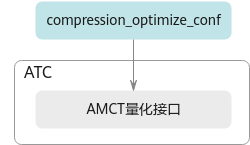

#### --mdl\_bank\_path<a name="ZH-CN_TOPIC_0000002505904365"></a>

**产品支持情况<a name="section197451857688"></a>**

<a name="table38301303189"></a>
<table><thead align="left"><tr id="row20831180131817"><th class="cellrowborder" valign="top" width="57.99999999999999%" id="mcps1.1.3.1.1"><p id="p1883113061818"><a name="p1883113061818"></a><a name="p1883113061818"></a>产品</p>
</th>
<th class="cellrowborder" align="center" valign="top" width="42%" id="mcps1.1.3.1.2"><p id="p783113012187"><a name="p783113012187"></a><a name="p783113012187"></a>是否支持</p>
</th>
</tr>
</thead>
<tbody><tr id="row1466941011819"><td class="cellrowborder" valign="top" width="57.99999999999999%" headers="mcps1.1.3.1.1 "><p id="p146702104188"><a name="p146702104188"></a><a name="p146702104188"></a><span id="ph198371415105513"><a name="ph198371415105513"></a><a name="ph198371415105513"></a>IPV350</span></p>
</td>
<td class="cellrowborder" align="center" valign="top" width="42%" headers="mcps1.1.3.1.2 "><p id="p147953017371"><a name="p147953017371"></a><a name="p147953017371"></a>x</p>
</td>
</tr>
</tbody>
</table>

**功能说明<a name="zh-cn_topic_0243420057_section1380101816519"></a>**

**该版本不支持子图调优特性。**

加载子图调优后自定义知识库的路径。

子图调优详情请参见《AOE调优工具用户指南》。

**关联参数<a name="zh-cn_topic_0243420057_section1735011462517"></a>**

该参数需要与[--buffer\_optimize](--buffer_optimize.md)参数配合使用，仅在数据缓存优化开关打开的情况下生效，通过利用高速缓存[--buffer\_optimize](--buffer_optimize.md)暂存数据的方式，达到提升性能的目的。

**参数取值<a name="zh-cn_topic_0243420057_section1046811955215"></a>**

**参数值：**子图调优后自定义知识库路径。

**参数值格式：**支持大小写字母（a-z，A-Z）、数字（0-9）、下划线（\_）、中划线（-）、句点（.）。

**参数默认值：**$HOME/Ascend/latest/data/aoe/custom/graph/_<soc\_version\>_

**推荐配置及收益<a name="section116691479451"></a>**

无。

**示例<a name="zh-cn_topic_0243420057_section85411163533"></a>**

例如子图调优后自定义知识库的路径为$HOME/custom\_module\_bank，则使用示例为：

**依赖约束<a name="zh-cn_topic_0243420057_section53841119122710"></a>**

加载子图调优后自定义知识库路径优先级：[--mdl\_bank\_path](--mdl_bank_path.md)参数加载路径\>**TUNE\_BANK\_PATH**环境变量设置路径\>默认子图调优后自定义知识库路径。

1.  如果模型转换前，通过**TUNE\_BANK\_PATH**环境变量指定了子图调优自定义知识库路径，模型转换时又通过[--mdl\_bank\_path](--mdl_bank_path.md)参数加载了自定义知识库路径，该场景下以[--mdl\_bank\_path](--mdl_bank_path.md)参数加载的路径为准，**TUNE\_BANK\_PATH**环境变量设置的路径不生效。
2.  [--mdl\_bank\_path](--mdl_bank_path.md)参数和环境变量指定路径都不生效或无可用自定义知识库，则使用默认自定义知识库路径。
3.  如果上述路径下都无可用的自定义知识库，则atc工具会查找子图调优内置知识库，该路径为：$\{INSTALL\_DIR\}/compiler/data/fusion\_strategy/built-in

#### --oo\_level<a name="ZH-CN_TOPIC_0000002473904350"></a>

**产品支持情况<a name="section139815552554"></a>**

<a name="zh-cn_topic_0000002473904326_table38301303189"></a>
<table><thead align="left"><tr id="zh-cn_topic_0000002473904326_row20831180131817"><th class="cellrowborder" valign="top" width="57.99999999999999%" id="mcps1.1.3.1.1"><p id="zh-cn_topic_0000002473904326_p1883113061818"><a name="zh-cn_topic_0000002473904326_p1883113061818"></a><a name="zh-cn_topic_0000002473904326_p1883113061818"></a>产品</p>
</th>
<th class="cellrowborder" align="center" valign="top" width="42%" id="mcps1.1.3.1.2"><p id="zh-cn_topic_0000002473904326_p783113012187"><a name="zh-cn_topic_0000002473904326_p783113012187"></a><a name="zh-cn_topic_0000002473904326_p783113012187"></a>是否支持</p>
</th>
</tr>
</thead>
<tbody><tr id="zh-cn_topic_0000002473904326_row1466941011819"><td class="cellrowborder" valign="top" width="57.99999999999999%" headers="mcps1.1.3.1.1 "><p id="zh-cn_topic_0000002473904326_p146702104188"><a name="zh-cn_topic_0000002473904326_p146702104188"></a><a name="zh-cn_topic_0000002473904326_p146702104188"></a><span id="zh-cn_topic_0000002473904326_ph198371415105513"><a name="zh-cn_topic_0000002473904326_ph198371415105513"></a><a name="zh-cn_topic_0000002473904326_ph198371415105513"></a>IPV350</span></p>
</td>
<td class="cellrowborder" align="center" valign="top" width="42%" headers="mcps1.1.3.1.2 "><p id="zh-cn_topic_0000002473904326_p7670131016189"><a name="zh-cn_topic_0000002473904326_p7670131016189"></a><a name="zh-cn_topic_0000002473904326_p7670131016189"></a>√</p>
</td>
</tr>
</tbody>
</table>

**功能说明<a name="zh-cn_topic_0243420057_section1380101816519"></a>**

**调试功能扩展参数，当前不支持应用于商用产品中。**

图编译多级优化选项，包括子图优化、整图优化、静态Shape模型下沉等。

静态Shape模型下沉：静态Shape模型在编译时即可确定所有算子的输入输出Shape，完成模型级内存编排、算子的Tiling计算等Host侧计算，在模型加载时整体下发到Device流上，但不立即执行，通过下发模型执行Task触发模型中所有Task的执行。

**关联参数<a name="zh-cn_topic_0243420057_section1735011462517"></a>**

无。

**参数取值<a name="zh-cn_topic_0243420057_section1046811955215"></a>**

-   O1：会关闭所有图融合和UB融合PASS，只做促成静态下沉的相关优化，如InferShape（进行输出Tensor的shape推导）、常量折叠、死边消除等。
-   O3：（默认值）开启所有优化。

**推荐配置及收益<a name="section116691479451"></a>**

无。

**示例<a name="zh-cn_topic_0243420057_section85411163533"></a>**

```
--oo_level=O1
```

**使用约束<a name="zh-cn_topic_0243420057_section53841119122710"></a>**

取值为O1时，会关闭所有图融合和UB融合PASS，只开启静态下沉的相关PASS，但是如下路径文件中的图融合PASS，由于关闭后会有功能问题，会默认开启：

“$\{INSTALL\_DIR\}/x86\_64-linux/lib64/plugin/opskernel/fusion\_pass/config/fusion\_config.json”文件中"ExceptionalPassOfO1Level"字段下的所有图融合PASS。

其中$\{INSTALL\_DIR\}请替换为CANN软件安装后文件存储路径。以root安装举例，安装后文件默认存储路径为：/usr/local/Ascend/latest。

#### --oo\_constant\_folding<a name="ZH-CN_TOPIC_0000002506024331"></a>

**产品支持情况<a name="section139815552554"></a>**

<a name="zh-cn_topic_0000002473904326_table38301303189"></a>
<table><thead align="left"><tr id="zh-cn_topic_0000002473904326_row20831180131817"><th class="cellrowborder" valign="top" width="57.99999999999999%" id="mcps1.1.3.1.1"><p id="zh-cn_topic_0000002473904326_p1883113061818"><a name="zh-cn_topic_0000002473904326_p1883113061818"></a><a name="zh-cn_topic_0000002473904326_p1883113061818"></a>产品</p>
</th>
<th class="cellrowborder" align="center" valign="top" width="42%" id="mcps1.1.3.1.2"><p id="zh-cn_topic_0000002473904326_p783113012187"><a name="zh-cn_topic_0000002473904326_p783113012187"></a><a name="zh-cn_topic_0000002473904326_p783113012187"></a>是否支持</p>
</th>
</tr>
</thead>
<tbody><tr id="zh-cn_topic_0000002473904326_row1466941011819"><td class="cellrowborder" valign="top" width="57.99999999999999%" headers="mcps1.1.3.1.1 "><p id="zh-cn_topic_0000002473904326_p146702104188"><a name="zh-cn_topic_0000002473904326_p146702104188"></a><a name="zh-cn_topic_0000002473904326_p146702104188"></a><span id="zh-cn_topic_0000002473904326_ph198371415105513"><a name="zh-cn_topic_0000002473904326_ph198371415105513"></a><a name="zh-cn_topic_0000002473904326_ph198371415105513"></a>IPV350</span></p>
</td>
<td class="cellrowborder" align="center" valign="top" width="42%" headers="mcps1.1.3.1.2 "><p id="zh-cn_topic_0000002473904326_p7670131016189"><a name="zh-cn_topic_0000002473904326_p7670131016189"></a><a name="zh-cn_topic_0000002473904326_p7670131016189"></a>√</p>
</td>
</tr>
</tbody>
</table>

**功能说明<a name="zh-cn_topic_0243420057_section1380101816519"></a>**

**调试功能扩展参数，当前不支持应用于商用产品中。**

是否开启常量折叠优化。

常量折叠是将计算图中可以预先确定输出值的节点替换成常量，并对计算图进行一些结构简化的操作。

**关联参数<a name="zh-cn_topic_0243420057_section1735011462517"></a>**

无。

**参数取值<a name="zh-cn_topic_0243420057_section1046811955215"></a>**

**参数值：**

-   true：（默认值）开启常量折叠优化。
-   false：关闭常量折叠优化。

**推荐配置及收益<a name="section116691479451"></a>**

无。

**示例<a name="zh-cn_topic_0243420057_section85411163533"></a>**

```
--oo_constant_folding=true
```

**使用约束<a name="zh-cn_topic_0243420057_section53841119122710"></a>**

无

#### --oo\_dead\_code\_elimination<a name="ZH-CN_TOPIC_0000002505904385"></a>

**产品支持情况<a name="section139815552554"></a>**

<a name="zh-cn_topic_0000002473904326_table38301303189"></a>
<table><thead align="left"><tr id="zh-cn_topic_0000002473904326_row20831180131817"><th class="cellrowborder" valign="top" width="57.99999999999999%" id="mcps1.1.3.1.1"><p id="zh-cn_topic_0000002473904326_p1883113061818"><a name="zh-cn_topic_0000002473904326_p1883113061818"></a><a name="zh-cn_topic_0000002473904326_p1883113061818"></a>产品</p>
</th>
<th class="cellrowborder" align="center" valign="top" width="42%" id="mcps1.1.3.1.2"><p id="zh-cn_topic_0000002473904326_p783113012187"><a name="zh-cn_topic_0000002473904326_p783113012187"></a><a name="zh-cn_topic_0000002473904326_p783113012187"></a>是否支持</p>
</th>
</tr>
</thead>
<tbody><tr id="zh-cn_topic_0000002473904326_row1466941011819"><td class="cellrowborder" valign="top" width="57.99999999999999%" headers="mcps1.1.3.1.1 "><p id="zh-cn_topic_0000002473904326_p146702104188"><a name="zh-cn_topic_0000002473904326_p146702104188"></a><a name="zh-cn_topic_0000002473904326_p146702104188"></a><span id="zh-cn_topic_0000002473904326_ph198371415105513"><a name="zh-cn_topic_0000002473904326_ph198371415105513"></a><a name="zh-cn_topic_0000002473904326_ph198371415105513"></a>IPV350</span></p>
</td>
<td class="cellrowborder" align="center" valign="top" width="42%" headers="mcps1.1.3.1.2 "><p id="zh-cn_topic_0000002473904326_p7670131016189"><a name="zh-cn_topic_0000002473904326_p7670131016189"></a><a name="zh-cn_topic_0000002473904326_p7670131016189"></a>√</p>
</td>
</tr>
</tbody>
</table>

**功能说明<a name="zh-cn_topic_0243420057_section1380101816519"></a>**

**调试功能扩展参数，当前不支持应用于商用产品中。**

是否开启死边消除优化。

死边消除：switch死边消除，switch的pred输入（1号输入）为const节点时，根据const的值消除其中一条分支：const为true时，消除false分支；const为false时，消除true分支。

**关联参数<a name="zh-cn_topic_0243420057_section1735011462517"></a>**

无。

**参数取值<a name="zh-cn_topic_0243420057_section1046811955215"></a>**

-   true：（默认值）开启死边消除优化。
-   false：关闭死边消除优化。

**推荐配置及收益<a name="section116691479451"></a>**

无。

**示例<a name="zh-cn_topic_0243420057_section85411163533"></a>**

```
--oo_dead_code_elimination=true
```

**使用约束<a name="zh-cn_topic_0243420057_section53841119122710"></a>**

无。

#### --topo\_sorting\_mode<a name="ZH-CN_TOPIC_0000002473904324"></a>

**产品支持情况<a name="section139815552554"></a>**

<a name="zh-cn_topic_0000002473904326_table38301303189"></a>
<table><thead align="left"><tr id="zh-cn_topic_0000002473904326_row20831180131817"><th class="cellrowborder" valign="top" width="57.99999999999999%" id="mcps1.1.3.1.1"><p id="zh-cn_topic_0000002473904326_p1883113061818"><a name="zh-cn_topic_0000002473904326_p1883113061818"></a><a name="zh-cn_topic_0000002473904326_p1883113061818"></a>产品</p>
</th>
<th class="cellrowborder" align="center" valign="top" width="42%" id="mcps1.1.3.1.2"><p id="zh-cn_topic_0000002473904326_p783113012187"><a name="zh-cn_topic_0000002473904326_p783113012187"></a><a name="zh-cn_topic_0000002473904326_p783113012187"></a>是否支持</p>
</th>
</tr>
</thead>
<tbody><tr id="zh-cn_topic_0000002473904326_row1466941011819"><td class="cellrowborder" valign="top" width="57.99999999999999%" headers="mcps1.1.3.1.1 "><p id="zh-cn_topic_0000002473904326_p146702104188"><a name="zh-cn_topic_0000002473904326_p146702104188"></a><a name="zh-cn_topic_0000002473904326_p146702104188"></a><span id="zh-cn_topic_0000002473904326_ph198371415105513"><a name="zh-cn_topic_0000002473904326_ph198371415105513"></a><a name="zh-cn_topic_0000002473904326_ph198371415105513"></a>IPV350</span></p>
</td>
<td class="cellrowborder" align="center" valign="top" width="42%" headers="mcps1.1.3.1.2 "><p id="zh-cn_topic_0000002473904326_p7670131016189"><a name="zh-cn_topic_0000002473904326_p7670131016189"></a><a name="zh-cn_topic_0000002473904326_p7670131016189"></a>√</p>
</td>
</tr>
</tbody>
</table>

**功能说明<a name="zh-cn_topic_0243420057_section1380101816519"></a>**

对算子进行图模式编译时，可选择的不同图遍历模式。

**关联参数<a name="zh-cn_topic_0243420057_section1735011462517"></a>**

无

**参数取值<a name="zh-cn_topic_0243420057_section1046811955215"></a>**

-   0：BFS，Breadth First Search，广度优先遍历策略。搜索算法的一种，与DFS类似，从某个状态出发，搜索所有可以到达的状态；与DFS的区别是，BFS是一层层进行遍历。
-   1：（默认值）DFS，Depth First Search，深度优先遍历策略。搜索算法的一种，从某个状态开始，不断转移状态直到无法转移，然后回退到前一步的状态，继续转移到其他状态，按此重复，直到找到最终解。
-   2：RDFS，Reverse DFS，反向深度优先遍历策略。
-   3：StableRDFS，稳定拓扑序策略，针对图里已有的算子，不会改变其计算顺序；针对图里新增的算子，使用RDFS遍历策略。

**推荐配置及收益<a name="section116691479451"></a>**

无。

**示例<a name="zh-cn_topic_0243420057_section85411163533"></a>**

```
--topo_sorting_mode=3
```

**使用约束<a name="zh-cn_topic_0243420057_section53841119122710"></a>**

模型转换过程中如果加载了自定义知识库路径，上述图遍历模式的改变可能会影响调优结果，建议重新进行调优，详情请参见《AOE调优工具用户指南》。

### 算子调优选项<a name="ZH-CN_TOPIC_0000002473744438"></a>


#### --precision\_mode<a name="ZH-CN_TOPIC_0000002505904407"></a>

**产品支持情况<a name="section197451857688"></a>**

<a name="table38301303189"></a>
<table><thead align="left"><tr id="row20831180131817"><th class="cellrowborder" valign="top" width="57.99999999999999%" id="mcps1.1.3.1.1"><p id="p1883113061818"><a name="p1883113061818"></a><a name="p1883113061818"></a>产品</p>
</th>
<th class="cellrowborder" align="center" valign="top" width="42%" id="mcps1.1.3.1.2"><p id="p783113012187"><a name="p783113012187"></a><a name="p783113012187"></a>是否支持</p>
</th>
</tr>
</thead>
<tbody><tr id="row1466941011819"><td class="cellrowborder" valign="top" width="57.99999999999999%" headers="mcps1.1.3.1.1 "><p id="p146702104188"><a name="p146702104188"></a><a name="p146702104188"></a><span id="ph198371415105513"><a name="ph198371415105513"></a><a name="ph198371415105513"></a>IPV350</span></p>
</td>
<td class="cellrowborder" align="center" valign="top" width="42%" headers="mcps1.1.3.1.2 "><p id="p147953017371"><a name="p147953017371"></a><a name="p147953017371"></a>x</p>
</td>
</tr>
</tbody>
</table>

**功能说明<a name="zh-cn_topic_0243420057_section1380101816519"></a>**

设置网络模型的精度模式。

**关联参数<a name="zh-cn_topic_0243420057_section1735011462517"></a>**

-   该参数不能与[--precision\_mode\_v2](--precision_mode_v2.md)参数同时使用，建议使用--precision\_mode\_v2参数，--precision\_mode\_v2是新版本中新增的，选项值语义更清晰，便于理解。
-   当取值为**allow\_mix\_precision**时，如果用户想要在内置优化策略基础上进行调整，自行指定哪些算子允许降精度，哪些算子不允许降精度，则需要参见[--modify\_mixlist](--modify_mixlist.md)参数设置。
-   推理场景下，使用[--precision\_mode](--precision_mode.md)参数设置整个网络模型的精度模式，可能会有个别算子存在性能或精度问题，该场景下可以使用[--keep\_dtype](--keep_dtype.md)参数，使原始网络模型编译时保持个别算子的计算精度不变，但[--precision\_mode](--precision_mode.md)参数取值为**must\_keep\_origin\_dtype**时，[--keep\_dtype](--keep_dtype.md)不生效。

**参数取值<a name="zh-cn_topic_0243420057_section1046811955215"></a>**

**参数值：**

-   **force\_fp32/cube\_fp16in\_fp32out：**

    配置为force\_fp32或cube\_fp16in\_fp32out，效果等同，系统内部都会根据矩阵类算子或矢量类算子，来选择不同的处理方式。cube\_fp16in\_fp32out为新版本中新增的，对于矩阵计算类算子，该选项语义更清晰。

    -   对于矩阵计算类算子，系统内部会按算子实现的支持情况处理：
        1.  优先选择输入数据类型为float16且输出数据类型为float32；
        2.  如果1中的场景不支持，则选择输入数据类型为float32且输出数据类型为float32；
        3.  如果2中的场景不支持，则选择输入数据类型为float16且输出数据类型为float16；
        4.  如果3中的场景不支持，则报错。

    -   对于矢量计算类算子，表示网络模型中算子支持float16和float32时，强制选择float32，若原图精度为float16，也会强制转为float32。

        如果网络模型中存在部分算子实现不支持float32，比如某算子仅支持float16类型，则该参数不生效，仍然使用支持的float16；如果该算子不支持float32，且又配置了黑名单（precision\_reduce = false），则会使用float32的AI CPU算子；如果AI CPU算子也不支持，则执行报错。

-   **force\_fp16（默认值）：**

    表示网络模型中算子支持float16和float32时，强制选择float16。

-   **allow\_fp32\_to\_fp16：**
    -   对于矩阵类算子，使用float16。
    -   对于矢量类算子，优先保持原图精度，如果网络模型中算子支持float32，则保留原始精度float32，如果网络模型中算子不支持float32，则直接降低精度到float16。

-   **must\_keep\_origin\_dtype：**

    保持原图精度。**该版本不支持bfloat16类型。**

    -   如果原图中某算子精度为float16，AI Core中该算子的实现不支持float16、仅支持float32和bfloat16，则系统内部会自动采用高精度float32。
    -   如果原图中某算子精度为float16，AI Core中该算子的实现不支持float16、仅支持bfloat16，则会使用float16的AI CPU算子；如果AI CPU算子也不支持，则执行报错。
    -   如果原图中某算子精度为float32，AI Core中该算子的实现不支持float32类型、仅支持float16类型，则会使用float32的AI CPU算子；如果AI CPU算子也不支持，则执行报错。

-   **allow\_mix\_precision/allow\_mix\_precision\_fp16**：

    配置为allow\_mix\_precision或allow\_mix\_precision\_fp16，效果等同，均表示使用混合精度float16和float32数据类型来处理神经网络的过程。allow\_mix\_precision\_fp16为新版本中新增的，语义更清晰，便于理解。

    针对网络模型中float32数据类型的算子，按照内置的优化策略，自动将部分float32的算子降低精度到float16，从而在精度损失很小的情况下提升系统性能并减少内存使用。

    若配置了该种模式，则可以在$\{INSTALL\_DIR\}/opp/built-in/op\_impl/ai\_core/tbe/config/_xxx_/aic-_xxx_-ops-info.json内置优化策略文件中查看“precision\_reduce“参数的取值：

    -   若取值为true（白名单），则表示允许将当前float32类型的算子，降低精度到float16。
    -   若取值为false（黑名单），则不允许将当前float32类型的算子降低精度到float16，相应算子仍旧使用float32精度。
    -   若网络模型中算子没有配置该参数（灰名单），当前算子的混合精度处理机制和前一个算子保持一致，即如果前一个算子支持降精度处理，当前算子也支持降精度；如果前一个算子不允许降精度，当前算子也不支持降精度。

上述路径中的$\{INSTALL\_DIR\}请替换为CANN软件安装后文件存储路径。以root安装举例，安装后文件默认存储路径为：/usr/local/Ascend/latest。_xxx_请根据实际产品型号进行选择。

**参数值约束：**

-   该参数默认为性能优先，后续推理时可能会导致精度溢出问题。如果推理时出现精度问题，可以参见《AscendCL应用开发指南 \(C&C++\)》章节的“精度/性能优化 \>  [模型推理精度提升建议](https://www.hiascend.com/document/detail/zh/canncommercial/82RC1/appdevg/acldevg/aclcppdevg_000098.html)”进行定位。
-   如果用户聚焦精度问题，可以修改为其他取值，比如**must\_keep\_origin\_dtype。**

**推荐配置及收益<a name="section116691479451"></a>**

所配置的精度模式不同，网络模型精度以及性能有所不同，具体为：

精度高低排序：force\_fp32\>must\_keep\_origin\_dtype\>allow\_fp32\_to\_fp16\>allow\_mix\_precision\>force\_fp16

性能优劣排序：force\_fp16\>=allow\_mix\_precision\>allow\_fp32\_to\_fp16\>must\_keep\_origin\_dtype\>force\_fp32

**示例<a name="zh-cn_topic_0243420057_section85411163533"></a>**

```
--precision_mode=force_fp16
```

#### --precision\_mode\_v2<a name="ZH-CN_TOPIC_0000002473744424"></a>

**产品支持情况<a name="section197451857688"></a>**

<a name="table38301303189"></a>
<table><thead align="left"><tr id="row20831180131817"><th class="cellrowborder" valign="top" width="57.99999999999999%" id="mcps1.1.3.1.1"><p id="p1883113061818"><a name="p1883113061818"></a><a name="p1883113061818"></a>产品</p>
</th>
<th class="cellrowborder" align="center" valign="top" width="42%" id="mcps1.1.3.1.2"><p id="p783113012187"><a name="p783113012187"></a><a name="p783113012187"></a>是否支持</p>
</th>
</tr>
</thead>
<tbody><tr id="row1466941011819"><td class="cellrowborder" valign="top" width="57.99999999999999%" headers="mcps1.1.3.1.1 "><p id="p146702104188"><a name="p146702104188"></a><a name="p146702104188"></a><span id="ph198371415105513"><a name="ph198371415105513"></a><a name="ph198371415105513"></a>IPV350</span></p>
</td>
<td class="cellrowborder" align="center" valign="top" width="42%" headers="mcps1.1.3.1.2 "><p id="p147953017371"><a name="p147953017371"></a><a name="p147953017371"></a>x</p>
</td>
</tr>
</tbody>
</table>

**功能说明<a name="zh-cn_topic_0243420057_section1380101816519"></a>**

设置网络模型的精度模式。

**关联参数<a name="zh-cn_topic_0243420057_section1735011462517"></a>**

-   该参数不能与[--precision\_mode](--precision_mode.md)参数同时使用，建议使用[--precision\_mode\_v2](--precision_mode_v2.md)参数，--precision\_mode\_v2是新版本中新增的，选项值语义更清晰，便于理解。
-   当取值为**mixed\_float16**时，如果用户想要在内置优化策略基础上进行调整，自行指定哪些算子允许降精度，哪些算子不允许降精度，则需要参见[--modify\_mixlist](--modify_mixlist.md)参数设置。
-   推理场景下，使用[--precision\_mode\_v2](--precision_mode_v2.md)参数设置整个网络模型的精度模式，可能会有个别算子存在性能或精度问题，该场景下可以使用[--keep\_dtype](--keep_dtype.md)参数，使原始网络模型编译时保持个别算子的计算精度不变，但[--precision\_mode\_v2](--precision_mode_v2.md)参数取值为**origin**时，[--keep\_dtype](--keep_dtype.md)不生效。

**参数取值<a name="zh-cn_topic_0243420057_section1046811955215"></a>**

-   **fp16（默认值）**：

    算子支持float16和float32数据类型时，强制选择float16。

-   **origin**：

    保持原图精度。**该版本不支持bfloat16类型。**

    -   如果原图中某算子精度为float16，AI Core中该算子的实现不支持float16、仅支持float32和bfloat16，则系统内部会自动采用高精度float32。
    -   如果原图中某算子精度为float16，AI Core中该算子的实现不支持float16、仅支持bfloat16，则会使用float16的AI CPU算子；如果AI CPU算子也不支持，则执行报错。
    -   如果原图中某算子精度为float32，AI Core中该算子的实现不支持float32类型、仅支持float16类型，则会使用float32的AI CPU算子；如果AI CPU算子也不支持，则执行报错。

-   **cube\_fp16in\_fp32out**：

    算子既支持float32又支持float16数据类型时，系统内部根据算子类型不同，选择不同的处理方式。

    -   对于矩阵计算类算子，系统内部会按算子实现的支持情况处理：
        1.  优先选择输入数据类型为float16且输出数据类型为float32；
        2.  如果1中的场景不支持，则选择输入数据类型为float32且输出数据类型为float32；
        3.  如果2中的场景不支持，则选择输入数据类型为float16且输出数据类型为float16；
        4.  如果3中的场景不支持，则报错。

    -   对于矢量计算类算子，表示网络模型中算子支持float16和float32时，强制选择float32，若原图精度为float16，也会强制转为float32。

        如果网络模型中存在部分算子实现不支持float32，比如某算子仅支持float16类型，则该参数不生效，仍然使用支持的float16；如果该算子不支持float32，且又配置了黑名单（precision\_reduce = false），则会使用float32的AI CPU算子；如果AI CPU算子也不支持，则执行报错。

-   **mixed\_float16**：

    表示使用混合精度float16和float32数据类型来处理神经网络。针对网络模型中float32数据类型的算子，按照内置的优化策略，自动将部分float32的算子降低精度到float16，从而在精度损失很小的情况下提升系统性能并减少内存使用。

    若配置了该种模式，则可以在$\{INSTALL\_DIR\}/opp/built-in/op\_impl/ai\_core/tbe/config/_xxx_/aic-_xxx_-ops-info.json内置优化策略文件中查看“precision\_reduce“参数的取值：

    -   若取值为true（白名单），则表示允许将当前float32类型的算子，降低精度到float16。
    -   若取值为false（黑名单），则不允许将当前float32类型的算子降低精度到float16，相应算子仍旧使用float32精度。
    -   若网络模型中算子没有配置该参数（灰名单），当前算子的混合精度处理机制和前一个算子保持一致，即如果前一个算子支持降精度处理，当前算子也支持降精度；如果前一个算子不允许降精度，当前算子也不支持降精度。

-   **mixed\_hif8：**开启自动混合精度功能，表示混合使用hifloat8（此数据类型介绍可参见[Link](https://arxiv.org/abs/2409.16626?context=cs.AR)）、float16和float32数据类型来处理神经网络。针对网络模型中float16和float32数据类型的算子，按照内置的优化策略，自动将部分float16和float32的算子降低精度到hifloat8，从而在精度损失很小的情况下提升系统性能并减少内存使用。**当前版本不支持该选项。**

    若配置了该种模式，则可以在$\{INSTALL\_DIR\}/opp/built-in/op\_impl/ai\_core/tbe/config/_xxx_/aic-_xxx_-ops-info.json内置优化策略文件中查看“**precision\_reduce**”参数的取值：

    -   若取值为true（白名单），则表示允许将当前float16和float32类型的算子，降低精度到hifloat8。
    -   若取值为false（黑名单），则不允许将当前float16和float32类型的算子降低精度到hifloat8，相应算子仍旧使用float16和float32精度。
    -   若网络模型中算子没有配置该参数（灰名单），当前算子的混合精度处理机制和前一个算子保持一致，即如果前一个算子支持降精度处理，当前算子也支持降精度；如果前一个算子不允许降精度，当前算子也不支持降精度。

-   **cube\_hif8**：表示若网络模型中的cube算子既支持hifloat8，又支持float16或float32数据类型时，强制选择hifloat8数据类型。****当前版本不支持该选项。****

上述路径中的$\{INSTALL\_DIR\}请替换为CANN软件安装后文件存储路径。以root安装举例，安装后文件默认存储路径为：/usr/local/Ascend/latest。_xxx_请根据实际产品型号进行选择。

**参数值约束：**

-   该参数默认为性能优先，后续推理时可能会导致精度溢出问题。如果推理时出现精度问题，可以参见《AscendCL应用开发指南 \(C&C++\)》章节的“精度/性能优化 \>  [模型推理精度提升建议](https://www.hiascend.com/document/detail/zh/canncommercial/82RC1/appdevg/acldevg/aclcppdevg_000098.html)”进行定位。
-   如果用户聚焦精度问题，可以修改为其他取值，比如**origin。**

**推荐配置及收益<a name="section116691479451"></a>**

所配置的精度模式不同，网络模型精度以及性能有所不同，具体为：

精度高低排序：origin\>mixed\_float16\>fp16；性能优劣排序：fp16\>=mixed\_float16\>origin

**示例<a name="zh-cn_topic_0243420057_section85411163533"></a>**

```
--precision_mode_v2=fp16
```

#### --op\_precision\_mode<a name="ZH-CN_TOPIC_0000002473904346"></a>

**产品支持情况<a name="section197451857688"></a>**

<a name="table38301303189"></a>
<table><thead align="left"><tr id="row20831180131817"><th class="cellrowborder" valign="top" width="57.99999999999999%" id="mcps1.1.3.1.1"><p id="p1883113061818"><a name="p1883113061818"></a><a name="p1883113061818"></a>产品</p>
</th>
<th class="cellrowborder" align="center" valign="top" width="42%" id="mcps1.1.3.1.2"><p id="p783113012187"><a name="p783113012187"></a><a name="p783113012187"></a>是否支持</p>
</th>
</tr>
</thead>
<tbody><tr id="row1466941011819"><td class="cellrowborder" valign="top" width="57.99999999999999%" headers="mcps1.1.3.1.1 "><p id="p146702104188"><a name="p146702104188"></a><a name="p146702104188"></a><span id="ph198371415105513"><a name="ph198371415105513"></a><a name="ph198371415105513"></a>IPV350</span></p>
</td>
<td class="cellrowborder" align="center" valign="top" width="42%" headers="mcps1.1.3.1.2 "><p id="p147953017371"><a name="p147953017371"></a><a name="p147953017371"></a>x</p>
</td>
</tr>
</tbody>
</table>

**功能说明<a name="section51732732312"></a>**

设置指定算子内部处理时的精度模式，支持指定一个算子或多个算子。

**关联参数<a name="section1636915304237"></a>**

-   该参数不能与[--op\_select\_implmode](--op_select_implmode.md)、[--optypelist\_for\_implmode](--optypelist_for_implmode.md)参数同时使用，若三个参数同时配置，则只有[--op\_precision\_mode](--op_precision_mode.md)参数指定的模式生效。

关联参数示意图如[图1](#fig102051535171014)所示。

**图 1**  关联参数示意图<a name="fig102051535171014"></a>  
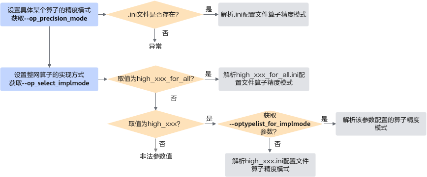

设置具体算子精度模式场景下：

1.  首先读取[--op\_precision\_mode](--op_precision_mode.md)参数，校验该参数的ini配置文件是否存在，若存在则解析文件并读取算子的精度模式，否则上报异常。
2.  [--op\_precision\_mode](--op_precision_mode.md)不存在则读取[--op\_select\_implmode](--op_select_implmode.md)参数：
    1.  首先检测是否配置为high\_xxx\_for\_all参数，若是则解析high\_xxx\_for\_all.ini文件并读取算子的精度模式。
    2.  若配置为high\_xxx参数，则检测是否配置[--optypelist\_for\_implmode](--optypelist_for_implmode.md)参数，若是，则读取该参数配置的算子精度模式；否则解析high\_xxx.ini文件并读取算子的精度模式。

**参数取值<a name="section38651638142318"></a>**

**参数值：**设置算子精度模式的配置文件（.ini格式）路径以及文件名，配置文件中支持设置如下精度模式：

-   high\_precision：表示高精度。
-   high\_performance：表示高性能。
-   support\_out\_of\_bound\_index：表示对gather、scatter和segment类算子的indices输入进行越界校验，校验会降低算子的执行性能。
-   keep\_fp16：算子内部处理时使用FP16数据类型功能，该场景下FP16数据类型不会自动转换为FP32数据类型；若使用FP32计算时性能不满足预期，同时精度要求不高情况下，可以选择keep\_fp16模式，**牺牲精度提升性能，不建议使用该低精度模式**。
-   super\_performance：表示超高性能，和高性能相比，在算法计算公式上进行了优化。

具体某个算子支持配置的精度/性能模式取值，可以通过CANN软件安装后文件存储路径的opp/built-in/op\_impl/ai\_core/tbe/impl\_mode/all\_ops\_impl\_mode.ini文件查看。

**参数值格式：**路径和文件名：支持大小写字母（a-z，A-Z）、数字（0-9）、下划线（\_）、短横线（-）、句点（.）、中文汉字。

**参数值约束**：

-   当前仅支持通过.ini配置文件方式设置算子精度，配置文件中的内容以key-value（算子类型=精度模式）形式呈现，每一行设置一个算子的精度模式。
-   算子类型必须为基于Ascend IR定义的算子的OpType，算子类型查看方法请参见[如何确定原始框架网络模型中的算子与NPU IP加速器支持的算子的对应关系](如何确定原始框架网络模型中的算子与NPU-IP加速器支持的算子的对应关系.md)。

**推荐配置及收益<a name="section116691479451"></a>**

-   该参数不建议配置，若使用高性能或者高精度模式，网络性能或者精度不是最优，则可以使用该参数，通过配置ini文件调整具体某个算子的精度模式。
-   通过该参数加载的ini配置文件，建议使用[--op\_select\_implmode](--op_select_implmode.md)参数用户另存后的ini配置文件，详情请参见[推荐配置及收益](--op_select_implmode.md#section116691479451)。

**示例<a name="zh-cn_topic_0243420057_section85411163533"></a>**

构造算子精度模式配置文件_op\_precision.ini_，并在该文件中按照算子类型、节点名称设置精度模式，每一行设置一个算子类型或节点名称的精度模式**，按节点名称设置精度模式的优先级高于按算子类型**。

配置样例如下：

```
[ByOpType]
optype1=high_precision
optype2=high_performance
optype4=support_out_of_bound_index

[ByNodeName]
nodename1=high_precision
nodename2=high_performance
nodename4=support_out_of_bound_index
```

将配置好的_op\_precision.ini_文件上传到ATC工具所在服务器任意目录，例如上传到_$HOME/conf_，使用示例如下：

```
--op_precision_mode=$HOME/conf/op_precision.ini
```

**依赖约束<a name="zh-cn_topic_0243420057_section53841119122710"></a>**

无。

#### --modify\_mixlist<a name="ZH-CN_TOPIC_0000002506024329"></a>

**产品支持情况<a name="section197451857688"></a>**

<a name="table38301303189"></a>
<table><thead align="left"><tr id="row20831180131817"><th class="cellrowborder" valign="top" width="57.99999999999999%" id="mcps1.1.3.1.1"><p id="p1883113061818"><a name="p1883113061818"></a><a name="p1883113061818"></a>产品</p>
</th>
<th class="cellrowborder" align="center" valign="top" width="42%" id="mcps1.1.3.1.2"><p id="p783113012187"><a name="p783113012187"></a><a name="p783113012187"></a>是否支持</p>
</th>
</tr>
</thead>
<tbody><tr id="row1466941011819"><td class="cellrowborder" valign="top" width="57.99999999999999%" headers="mcps1.1.3.1.1 "><p id="p146702104188"><a name="p146702104188"></a><a name="p146702104188"></a><span id="ph198371415105513"><a name="ph198371415105513"></a><a name="ph198371415105513"></a>IPV350</span></p>
</td>
<td class="cellrowborder" align="center" valign="top" width="42%" headers="mcps1.1.3.1.2 "><p id="p147953017371"><a name="p147953017371"></a><a name="p147953017371"></a>x</p>
</td>
</tr>
</tbody>
</table>

**功能说明<a name="zh-cn_topic_0243420057_section1380101816519"></a>**

混合精度场景下，**修改**算子使用的混合精度黑白灰名单，自行指定哪些算子允许降精度，哪些算子不允许降精度。

黑白灰名单，可从“$\{INSTALL\_DIR\}/opp/built-in/op\_impl/ai\_core/tbe/config/_xxx_/aic-_xxx_-ops-info.json”内置优化策略文件中查看“precision\_reduce“参数下的flag参数值：（其中，$\{INSTALL\_DIR\}请替换为CANN软件安装后文件存储路径。以root安装举例，安装后文件默认存储路径为：/usr/local/Ascend/latest。_xxx_请根据实际产品型号进行选择。）

-   若取值为true（白名单），表示混合精度模式下，**允许**降低精度。
-   若取值为false（黑名单），表示混合精度模式下，**不允许**降低精度。
-   不配置该参数（灰名单），表示混合精度模式下，当前算子的混合精度处理机制和前一个算子保持一致，即如果前一个算子支持降精度处理，当前算子也支持降精度；如果前一个算子不允许降精度，当前算子也不支持降精度。

**关联参数<a name="zh-cn_topic_0243420057_section1735011462517"></a>**

开启混合精度方式：

-   [--precision\_mode](--precision_mode.md)参数设置为allow\_mix\_precision、allow\_mix\_precision\_fp16。
-   [--precision\_mode\_v2](--precision_mode_v2.md)参数设置为mixed\_float16。

    与[--precision\_mode](--precision_mode.md)参数不能同时配置，建议使用[--precision\_mode\_v2](--precision_mode_v2.md)。

**参数取值<a name="section84981647155710"></a>**

**参数值：**混合精度名单路径以及文件名。

**参数值格式：**路径和文件名：支持大小写字母（a-z，A-Z）、数字（0-9）、下划线（\_）、短横线（-）、句点（.）、中文汉字。

**参数值约束**：

-   名单格式为\*.json格式，文件中的算子列表由用户指定，多个算子使用英文逗号分隔。
-   配置的算子类型必须为基于Ascend IR定义的算子的OpType，算子类型查看方法请参见[如何确定原始框架网络模型中的算子与NPU IP加速器支持的算子的对应关系](如何确定原始框架网络模型中的算子与NPU-IP加速器支持的算子的对应关系.md)。

**推荐配置及收益<a name="section116691479451"></a>**

无。

**示例<a name="zh-cn_topic_0243420057_section85411163533"></a>**

黑白灰名单查询示例如下，flag参数值为true表示白名单，为false表示黑名单，不配置flag参数表示灰名单：

```
"Conv2D":{
    ......
    "precision_reduce":{
        "flag":"true"
     },
    ......
}
```

混合精度名单样例如下，_ops\_info.json为文件名示例_，_OpTypeA_、_OpTypeB_、_OpTypeC_、_OpTypeD为算子示例_。

```
{
  "black-list": {                  // 黑名单
     "to-remove": [                // 黑名单算子转换为灰名单算子，配置该参数时，请确保被转换的算子已经存在于黑名单中
     "OpTypeA"
     ],
     "to-add": [                   // 白名单或灰名单算子转换为黑名单算子
     "OpTypeB"
     ]
  },
  "white-list": {                  // 白名单
     "to-remove": [                // 白名单算子转换为灰名单算子，配置该参数时，请确保被转换的算子已经存在于白名单中
     "OpTypeC"
     ],
     "to-add": [                   // 黑名单或灰名单算子转换为白名单算子
     "OpTypeD"
     ]
  }
}
```

-   假设算子A默认在白名单中，如果您希望将该算子配置为黑名单算子，则配置示例和系统处理逻辑为：
    1.  将该算子添加到黑名单中：

        ```
        {
          "black-list": { 
             "to-add": ["A"]
          }
        }
        ```

        则系统会将该算子从白名单中删除，并添加到黑名单中，最终该算子在黑名单中。

    2.  将该算子从白名单中删除，同时添加到黑名单中：

        ```
        {
          "black-list": {
             "to-add": ["A"]
          }
          "white-list": {
             "to-remove": ["A"]
          }
        }
        ```

        则系统会将该算子从白名单中删除，并添加到黑名单中，最终该算子在黑名单中。

-   对于只从黑/白名单中删除，而不添加到白/黑名单的场景，系统会将该算子添加到灰名单中，配置示例如下（例如，从白名单删除某个算子）：

    ```
    {
      "white-list": {
         "to-remove": ["A"]
      }
    }
    ```

    则系统会将该算子从白名单中删除，然后添加到灰名单中，最终该算子在灰名单中。

将配置好的_ops\_info.json_文件上传到ATC工具所在服务器任意目录，例如上传到_$HOME/module_，使用示例如下：

```
--precision_mode=allow_mix_precision  --modify_mixlist=$HOME/module/ops_info.json
```

**依赖约束<a name="zh-cn_topic_0243420057_section53841119122710"></a>**

无。

#### --optypelist\_for\_implmode<a name="ZH-CN_TOPIC_0000002473744406"></a>

**产品支持情况<a name="section197451857688"></a>**

<a name="table38301303189"></a>
<table><thead align="left"><tr id="row20831180131817"><th class="cellrowborder" valign="top" width="57.99999999999999%" id="mcps1.1.3.1.1"><p id="p1883113061818"><a name="p1883113061818"></a><a name="p1883113061818"></a>产品</p>
</th>
<th class="cellrowborder" align="center" valign="top" width="42%" id="mcps1.1.3.1.2"><p id="p783113012187"><a name="p783113012187"></a><a name="p783113012187"></a>是否支持</p>
</th>
</tr>
</thead>
<tbody><tr id="row1466941011819"><td class="cellrowborder" valign="top" width="57.99999999999999%" headers="mcps1.1.3.1.1 "><p id="p146702104188"><a name="p146702104188"></a><a name="p146702104188"></a><span id="ph198371415105513"><a name="ph198371415105513"></a><a name="ph198371415105513"></a>IPV350</span></p>
</td>
<td class="cellrowborder" align="center" valign="top" width="42%" headers="mcps1.1.3.1.2 "><p id="p3456810191313"><a name="p3456810191313"></a><a name="p3456810191313"></a>x</p>
</td>
</tr>
</tbody>
</table>

**功能说明<a name="zh-cn_topic_0243420057_section1380101816519"></a>**

设置optype列表中算子的实现模式，算子实现模式包括high\_precision、high\_performance两种。

**关联参数<a name="zh-cn_topic_0243420057_section1735011462517"></a>**

-   该参数需要与[--op\_select\_implmode](--op_select_implmode.md)参数配合使用，通过[--optypelist\_for\_implmode](--optypelist_for_implmode.md)参数设置的算子，统一使用[--op\_select\_implmode](--op_select_implmode.md)参数指定的实现模式，不能为列表中的每个算子设置不同的实现模式。
-   该参数配合[--op\_select\_implmode](--op_select_implmode.md)参数使用时，不能与[--op\_precision\_mode](--op_precision_mode.md)参数同时使用，若同时配置，则只有[--op\_precision\_mode](--op_precision_mode.md)参数指定的模式生效。上述参数配合运行流程请参见[图1](--op_precision_mode.md#fig102051535171014)。

**参数取值<a name="zh-cn_topic_0243420057_section1046811955215"></a>**

**参数值：**算子列表。

参**数值约束：**

-   该列表中的算子OpType必须为基于Ascend IR定义的算子的OpType，算子类型查看方法请参见[如何确定原始框架网络模型中的算子与NPU IP加速器支持的算子的对应关系](如何确定原始框架网络模型中的算子与NPU-IP加速器支持的算子的对应关系.md)。
-   该列表中的算子使用[--op\_select\_implmode](--op_select_implmode.md)参数指定的实现模式，且仅支持指定为high\_precision、high\_performance两种模式，多个算子使用英文逗号进行分隔。
-   该参数仅对指定的算子生效，不指定的算子按照默认实现方式选择。

**推荐配置及收益<a name="section116691479451"></a>**

无。

**示例<a name="zh-cn_topic_0243420057_section85411163533"></a>**

```
--op_select_implmode=high_precision  --optypelist_for_implmode=Pooling,SoftmaxV2
```

上述配置示例表示对Pooling、SoftmaxV2算子使用统一的高精度模式，未指定算子使用算子的默认实现方式。

**依赖约束<a name="zh-cn_topic_0243420057_section53841119122710"></a>**

无。

#### --keep\_dtype<a name="ZH-CN_TOPIC_0000002473744436"></a>

**产品支持情况<a name="section197451857688"></a>**

<a name="table38301303189"></a>
<table><thead align="left"><tr id="row20831180131817"><th class="cellrowborder" valign="top" width="57.99999999999999%" id="mcps1.1.3.1.1"><p id="p1883113061818"><a name="p1883113061818"></a><a name="p1883113061818"></a>产品</p>
</th>
<th class="cellrowborder" align="center" valign="top" width="42%" id="mcps1.1.3.1.2"><p id="p783113012187"><a name="p783113012187"></a><a name="p783113012187"></a>是否支持</p>
</th>
</tr>
</thead>
<tbody><tr id="row1466941011819"><td class="cellrowborder" valign="top" width="57.99999999999999%" headers="mcps1.1.3.1.1 "><p id="p146702104188"><a name="p146702104188"></a><a name="p146702104188"></a><span id="ph198371415105513"><a name="ph198371415105513"></a><a name="ph198371415105513"></a>IPV350</span></p>
</td>
<td class="cellrowborder" align="center" valign="top" width="42%" headers="mcps1.1.3.1.2 "><p id="p147953017371"><a name="p147953017371"></a><a name="p147953017371"></a>x</p>
</td>
</tr>
</tbody>
</table>

**功能说明<a name="zh-cn_topic_0243420057_section1380101816519"></a>**

通过配置文件指定原始模型中特定算子的数据类型在模型编译过程中保持不变。

推理场景下，使用[--precision\_mode](--precision_mode.md)或[--precision\_mode\_v2](--precision_mode_v2.md)参数设置整个网络模型的精度模式，可能会有个别算子存在性能或精度问题，为此引入[--keep\_dtype](--keep_dtype.md)参数，保持原始网络模型编译时个别算子的计算精度不变，若原始网络模型中算子的计算精度，在NPU IP加速器上不支持，则系统内部会自动采用算子支持的高精度来计算。

**关联参数<a name="zh-cn_topic_0243420057_section1735011462517"></a>**

-   该参数需要与[--precision\_mode](--precision_mode.md)或[--precision\_mode\_v2](--precision_mode_v2.md)参数配合使用，但当[--precision\_mode](--precision_mode.md)取值为must\_keep\_origin\_dtype或[--precision\_mode\_v2](--precision_mode_v2.md)取值为origin时，--keep\_dtype参数不生效。
-   [--customize\_dtypes](--customize_dtypes.md)参数与[--keep\_dtype](--keep_dtype.md)参数都用于设置算子的计算精度，若涉及需提升模型推理精度的场景，建议先使用[--keep\_dtype](--keep_dtype.md)参数保持原图精度，若精度依然得不到提升，可以尝试使用[--customize\_dtypes](--customize_dtypes.md)参数自定义某个或某些算子的计算精度。

    但需注意，使用[--customize\_dtypes](--customize_dtypes.md)参数且通过配置算子名称的方式，可能会由于内部模型优化过程中的融合、拆分等操作导致算子名称发生变化，进而导致配置不生效，未达到提升精度的目的，可进一步获取日志定位问题，关于日志的详细说明请参见《日志参考》。

-   若同时使用了[--customize\_dtypes](--customize_dtypes.md)参数与[--keep\_dtype](--keep_dtype.md)参数，则以[--customize\_dtypes](--customize_dtypes.md)参数设置的精度为准。

**参数取值<a name="zh-cn_topic_0243420057_section1046811955215"></a>**

**参数值：**算子配置文件路径以及文件名，配置文件中列举需保持计算精度的算子名称或算子类型，每个算子单独一行。

**参数值约束：**若为算子类型，则以**OpType::typeName**格式进行配置，每个OpType单独一行，且算子OpType必须为基于Ascend IR定义的算子的OpType，算子类型查看方法请参见[如何确定原始框架网络模型中的算子与NPU IP加速器支持的算子的对应关系](如何确定原始框架网络模型中的算子与NPU-IP加速器支持的算子的对应关系.md)。

**参数值格式：**路径和文件名：支持大小写字母（a-z，A-Z）、数字（0-9）、下划线（\_）、短横线（-）、句点（.）、中文汉字。

**推荐配置及收益<a name="section116691479451"></a>**

无。

**示例<a name="zh-cn_topic_0243420057_section85411163533"></a>**

-   若配置文件中为算子名称，则配置样例如下（文件名举例为_exceptionlist.cfg_）：

    ```
    Opname1
    Opname2
    …
    ```

-   若配置文件中为算子类型，则配置样例为（文件名举例为_exceptionlist.cfg_）：

    ```
    OpType::TypeName1
    OpType::TypeName2
    …
    ```

以TensorFlow ResNet50网络模型中的Relu算子为例，其对应的Ascend IR定义的算子类型为Relu，配置样例如下：

```
#算子名称配置样例：
fp32_vars/Relu
#算子类型配置样例：
OpType::Relu
```

将配置好的_exceptionlist.cfg_文件上传到ATC工具所在服务器任意目录，例如上传到$HOME，使用示例如下：

```
--keep_dtype=$HOME/exceptionlist.cfg --precision_mode=force_fp16
```

模型编译时，_exceptionlist.cfg_文件中的算子，保持原始网络模型精度，即精度不会改变，其余网络模型中的算子以[--precision\_mode](--precision_mode.md)或[--precision\_mode\_v2](--precision_mode_v2.md)参数指定的精度模式进行编译。

**依赖约束<a name="zh-cn_topic_0243420057_section53841119122710"></a>**

无。

#### --customize\_dtypes<a name="ZH-CN_TOPIC_0000002505904389"></a>

**产品支持情况<a name="section197451857688"></a>**

<a name="table38301303189"></a>
<table><thead align="left"><tr id="row20831180131817"><th class="cellrowborder" valign="top" width="57.99999999999999%" id="mcps1.1.3.1.1"><p id="p1883113061818"><a name="p1883113061818"></a><a name="p1883113061818"></a>产品</p>
</th>
<th class="cellrowborder" align="center" valign="top" width="42%" id="mcps1.1.3.1.2"><p id="p783113012187"><a name="p783113012187"></a><a name="p783113012187"></a>是否支持</p>
</th>
</tr>
</thead>
<tbody><tr id="row1466941011819"><td class="cellrowborder" valign="top" width="57.99999999999999%" headers="mcps1.1.3.1.1 "><p id="p146702104188"><a name="p146702104188"></a><a name="p146702104188"></a><span id="ph198371415105513"><a name="ph198371415105513"></a><a name="ph198371415105513"></a>IPV350</span></p>
</td>
<td class="cellrowborder" align="center" valign="top" width="42%" headers="mcps1.1.3.1.2 "><p id="p147953017371"><a name="p147953017371"></a><a name="p147953017371"></a>x</p>
</td>
</tr>
</tbody>
</table>

**功能说明<a name="zh-cn_topic_0243420057_section1380101816519"></a>**

模型编译时自定义某个或某些算子的计算精度。

**关联参数<a name="zh-cn_topic_0243420057_section1735011462517"></a>**

-   若本参数与[--precision\_mode](--precision_mode.md)或[--precision\_mode\_v2](--precision_mode_v2.md)配合使用时，除本参数指定的算子，模型中其它算子按[--precision\_mode](--precision_mode.md)或[--precision\_mode\_v2](--precision_mode_v2.md)参数配置的精度模式来编译。
-   [--customize\_dtypes](--customize_dtypes.md)参数与[--keep\_dtype](--keep_dtype.md)参数都用于设置算子的计算精度，若涉及需提升模型推理精度的场景，建议先使用[--keep\_dtype](--keep_dtype.md)参数保持原图精度，若精度依然得不到提升，可以尝试使用[--customize\_dtypes](--customize_dtypes.md)参数自定义某个或某些算子的计算精度。

    但需注意，使用[--customize\_dtypes](--customize_dtypes.md)参数且通过配置算子名称的方式，可能会由于内部模型优化过程中的融合、拆分等操作导致算子名称发生变化，进而导致配置不生效，未达到提升精度的目的，可进一步获取日志定位问题，关于日志的详细说明请参见《日志参考》。

-   若同时使用了[--customize\_dtypes](--customize_dtypes.md)参数与[--keep\_dtype](--keep_dtype.md)参数，则以[--customize\_dtypes](--customize_dtypes.md)参数设置的精度为准。

**参数取值<a name="zh-cn_topic_0243420057_section1046811955215"></a>**

**参数值：**算子配置文件路径以及文件名，配置文件中列举需要自定义计算精度的算子名称或算子类型，每个算子单独一行。

**参数值约束：**

-   若为算子名称，以**Opname::InputDtype:dtype1,...,OutputDtype:dtype1,...**格式进行配置，每个Opname单独一行，dtype1，dtype2...需要与可设置计算精度的算子输入，算子输出的个数一一对应**。**
-   若为算子类型，以**OpType::TypeName:InputDtype:dtype1,...,OutputDtype:dtype1,...**格式进行配置，每个OpType单独一行，dtype1，dtype2...需要与可设置计算精度的算子输入，算子输出的个数一一对应，且算子OpType必须为基于Ascend IR定义的算子的OpType，算子类型查看方法请参见[如何确定原始框架网络模型中的算子与NPU IP加速器支持的算子的对应关系](如何确定原始框架网络模型中的算子与NPU-IP加速器支持的算子的对应关系.md)。
-   对于同一个算子，如果同时配置了**Opname**和**OpType**的配置项，编译时以**Opname**的配置项为准。
-   使用该参数指定某个算子的计算精度时，如果模型转换过程中该算子被融合掉，则该算子指定的计算精度不生效。

**参数值格式：**路径和文件名：支持大小写字母（a-z，A-Z）、数字（0-9）、下划线（\_）、短横线（-）、句点（.）、英文冒号\(:\)、中文汉字。

**推荐配置及收益<a name="section116691479451"></a>**

无。

**示例<a name="zh-cn_topic_0243420057_section85411163533"></a>**

-   若配置文件中为算子名称，则配置样例为（文件名举例为_customize\_dtypes.cfg_）：

    ```
    Opname1::InputDtype:dtype1,dtype2,...,OutputDtype:dtype1,...
    Opname2::InputDtype:dtype1,dtype2,...,OutputDtype:dtype1,...
    ```

-   若配置文件中为算子类型，则配置样例为（文件名举例为_customize\_dtypes.cfg_）：

    ```
    OpType::TypeName1:InputDtype:dtype1,dtype2,...,OutputDtype:dtype1,...
    OpType::TypeName2:InputDtype:dtype1,dtype2,...,OutputDtype:dtype1,...
    ```

算子具体支持的计算精度可以从《AOL算子加速库接口参考》  \> “CANN算子规格说明”中查看。

以TensorFlow ResNet50网络模型中的Relu算子为例，其对应的Ascend IR定义的算子类型为Relu，该算子输入和输出只有一个，该配置样例如下：

-   算子名称配置样例：

    ```
    fp32_vars/Relu::InputDtype:float16,OutputDtype:int8
    ```

-   算子类型配置样例：

    ```
    OpType::Relu:InputDtype:float16,OutputDtype:int8
    ```

将配置好的_customize\_dtypes.cfg_文件上传到ATC工具所在服务器任意目录，例如上传到$HOME，使用示例如下：

```
--customize_dtypes=$HOME/customize_dtypes.cfg --precision_mode=force_fp16
```

模型编译时，_customize\_dtypes.cfg_文件中的算子，使用指定的计算精度，其余网络模型中的算子以[--precision\_mode](--precision_mode.md)或[--precision\_mode\_v2](--precision_mode_v2.md)参数指定的精度模式进行编译。

**使用约束<a name="zh-cn_topic_0243420057_section53841119122710"></a>**

1.  使用该参数指定算子的计算精度，由于其优先级高于[--precision\_mode](--precision_mode.md)或[--precision\_mode\_v2](--precision_mode_v2.md)、[--keep\_dtype](--keep_dtype.md)参数，可能会导致后续推理精度或者性能的下降。
2.  使用该参数指定算子的计算精度，如果指定的精度算子本身不支持，则会导致模型编译失败。

#### --op\_bank\_path<a name="ZH-CN_TOPIC_0000002473744414"></a>

**产品支持情况<a name="section19559524104414"></a>**

<a name="zh-cn_topic_0000002505904365_table38301303189"></a>
<table><thead align="left"><tr id="zh-cn_topic_0000002505904365_row20831180131817"><th class="cellrowborder" valign="top" width="57.99999999999999%" id="mcps1.1.3.1.1"><p id="zh-cn_topic_0000002505904365_p1883113061818"><a name="zh-cn_topic_0000002505904365_p1883113061818"></a><a name="zh-cn_topic_0000002505904365_p1883113061818"></a>产品</p>
</th>
<th class="cellrowborder" align="center" valign="top" width="42%" id="mcps1.1.3.1.2"><p id="zh-cn_topic_0000002505904365_p783113012187"><a name="zh-cn_topic_0000002505904365_p783113012187"></a><a name="zh-cn_topic_0000002505904365_p783113012187"></a>是否支持</p>
</th>
</tr>
</thead>
<tbody><tr id="zh-cn_topic_0000002505904365_row1466941011819"><td class="cellrowborder" valign="top" width="57.99999999999999%" headers="mcps1.1.3.1.1 "><p id="zh-cn_topic_0000002505904365_p146702104188"><a name="zh-cn_topic_0000002505904365_p146702104188"></a><a name="zh-cn_topic_0000002505904365_p146702104188"></a><span id="zh-cn_topic_0000002505904365_ph198371415105513"><a name="zh-cn_topic_0000002505904365_ph198371415105513"></a><a name="zh-cn_topic_0000002505904365_ph198371415105513"></a>IPV350</span></p>
</td>
<td class="cellrowborder" align="center" valign="top" width="42%" headers="mcps1.1.3.1.2 "><p id="zh-cn_topic_0000002505904365_p147953017371"><a name="zh-cn_topic_0000002505904365_p147953017371"></a><a name="zh-cn_topic_0000002505904365_p147953017371"></a>x</p>
</td>
</tr>
</tbody>
</table>

**功能说明<a name="zh-cn_topic_0243420057_section1380101816519"></a>**

**该版本不支持算子调优特性。**

加载算子调优后自定义知识库的路径。

算子调优详情请参见《AOE调优工具用户指南》。

**参数取值<a name="zh-cn_topic_0243420057_section1046811955215"></a>**

**参数值：**算子调优后自定义知识库路径。

**参数值格式：**支持大小写字母（a-z，A-Z）、数字（0-9）、下划线（\_）、中划线（-）、句点（.）。

**参数默认值：**默认自定义知识库路径$HOME/Ascend/latest/data/aoe/custom/op

**推荐配置及收益<a name="section116691479451"></a>**

无。

**示例<a name="section71747372217"></a>**

例如算子调优后自定义知识库的路径为$HOME/custom\_tune\_bank，则使用示例为：

```
--op_bank_path=$HOME/custom_tune_bank
```

**使用约束<a name="zh-cn_topic_0243420057_section53841119122710"></a>**

加载算子调优后自定义知识库路径优先级：**TUNE\_BANK\_PATH**环境变量设置路径\>[--op\_bank\_path](--op_bank_path.md)参数加载路径\>默认算子调优后自定义知识库路径。

1.  如果模型转换前，通过**TUNE\_BANK\_PATH**环境变量指定了算子调优自定义知识库路径，模型转换时又通过[--op\_bank\_path](--op_bank_path.md)参数加载了自定义知识库路径，该场景下以**TUNE\_BANK\_PATH**环境变量设置的路径为准，[--op\_bank\_path](--op_bank_path.md)参数加载的路径不生效。
2.  [--op\_bank\_path](--op_bank_path.md)参数和环境变量指定路径都不生效前提下，使用默认自定义知识库路径。
3.  如果上述路径下都无可用的自定义知识库，则ATC工具会查找算子调优内置知识库。

#### --is\_weight\_clip<a name="ZH-CN_TOPIC_0000002473904364"></a>

**产品支持情况<a name="section139815552554"></a>**

<a name="zh-cn_topic_0000002473904326_table38301303189"></a>
<table><thead align="left"><tr id="zh-cn_topic_0000002473904326_row20831180131817"><th class="cellrowborder" valign="top" width="57.99999999999999%" id="mcps1.1.3.1.1"><p id="zh-cn_topic_0000002473904326_p1883113061818"><a name="zh-cn_topic_0000002473904326_p1883113061818"></a><a name="zh-cn_topic_0000002473904326_p1883113061818"></a>产品</p>
</th>
<th class="cellrowborder" align="center" valign="top" width="42%" id="mcps1.1.3.1.2"><p id="zh-cn_topic_0000002473904326_p783113012187"><a name="zh-cn_topic_0000002473904326_p783113012187"></a><a name="zh-cn_topic_0000002473904326_p783113012187"></a>是否支持</p>
</th>
</tr>
</thead>
<tbody><tr id="zh-cn_topic_0000002473904326_row1466941011819"><td class="cellrowborder" valign="top" width="57.99999999999999%" headers="mcps1.1.3.1.1 "><p id="zh-cn_topic_0000002473904326_p146702104188"><a name="zh-cn_topic_0000002473904326_p146702104188"></a><a name="zh-cn_topic_0000002473904326_p146702104188"></a><span id="zh-cn_topic_0000002473904326_ph198371415105513"><a name="zh-cn_topic_0000002473904326_ph198371415105513"></a><a name="zh-cn_topic_0000002473904326_ph198371415105513"></a>IPV350</span></p>
</td>
<td class="cellrowborder" align="center" valign="top" width="42%" headers="mcps1.1.3.1.2 "><p id="zh-cn_topic_0000002473904326_p7670131016189"><a name="zh-cn_topic_0000002473904326_p7670131016189"></a><a name="zh-cn_topic_0000002473904326_p7670131016189"></a>√</p>
</td>
</tr>
</tbody>
</table>

**功能说明<a name="zh-cn_topic_0243420057_section1380101816519"></a>**

浮点类型权重数据高位转低位时，是否对数据进行裁剪。

若原始模型权重数据类型为高位（比如float32），模型转换过程中会插入Cast算子进行数据类型转换，将高位（比如float32）类型转换为低位（比如float16）类型，该场景下可能会存在数据溢出，而通过使能--is\_weight\_clip参数，在Cast算子前对高位（比如float32）类型数据进行裁剪，可以保证数据不溢出。

**关联参数<a name="zh-cn_topic_0243420057_section1735011462517"></a>**

无。

**参数取值<a name="zh-cn_topic_0243420057_section1046811955215"></a>**

-   0：不裁剪。
-   1：（默认值）裁剪。

**推荐配置及收益<a name="section116691479451"></a>**

无。

**示例<a name="zh-cn_topic_0243420057_section85411163533"></a>**

```
--is_weight_clip=1
```

**依赖约束<a name="zh-cn_topic_0243420057_section53841119122710"></a>**

无。

### 调试选项<a name="ZH-CN_TOPIC_0000002473744396"></a>


#### --dump\_mode<a name="ZH-CN_TOPIC_0000002506024349"></a>

**产品支持情况<a name="section139815552554"></a>**

<a name="zh-cn_topic_0000002473904326_table38301303189"></a>
<table><thead align="left"><tr id="zh-cn_topic_0000002473904326_row20831180131817"><th class="cellrowborder" valign="top" width="57.99999999999999%" id="mcps1.1.3.1.1"><p id="zh-cn_topic_0000002473904326_p1883113061818"><a name="zh-cn_topic_0000002473904326_p1883113061818"></a><a name="zh-cn_topic_0000002473904326_p1883113061818"></a>产品</p>
</th>
<th class="cellrowborder" align="center" valign="top" width="42%" id="mcps1.1.3.1.2"><p id="zh-cn_topic_0000002473904326_p783113012187"><a name="zh-cn_topic_0000002473904326_p783113012187"></a><a name="zh-cn_topic_0000002473904326_p783113012187"></a>是否支持</p>
</th>
</tr>
</thead>
<tbody><tr id="zh-cn_topic_0000002473904326_row1466941011819"><td class="cellrowborder" valign="top" width="57.99999999999999%" headers="mcps1.1.3.1.1 "><p id="zh-cn_topic_0000002473904326_p146702104188"><a name="zh-cn_topic_0000002473904326_p146702104188"></a><a name="zh-cn_topic_0000002473904326_p146702104188"></a><span id="zh-cn_topic_0000002473904326_ph198371415105513"><a name="zh-cn_topic_0000002473904326_ph198371415105513"></a><a name="zh-cn_topic_0000002473904326_ph198371415105513"></a>IPV350</span></p>
</td>
<td class="cellrowborder" align="center" valign="top" width="42%" headers="mcps1.1.3.1.2 "><p id="zh-cn_topic_0000002473904326_p7670131016189"><a name="zh-cn_topic_0000002473904326_p7670131016189"></a><a name="zh-cn_topic_0000002473904326_p7670131016189"></a>√</p>
</td>
</tr>
</tbody>
</table>

**功能说明<a name="zh-cn_topic_0243420057_section1380101816519"></a>**

是否生成带shape信息的JSON文件。

**关联参数<a name="zh-cn_topic_0243420057_section1735011462517"></a>**

该参数需要与[--json](--json.md)、[--mode](--mode.md)=1、[--framework](--framework.md)、[--om](--om.md)参数（需要为原始模型文件，如果为Caffe框架模型文件，还需要增加[--weight](--weight.md)参数）配合使用。

**参数取值<a name="zh-cn_topic_0243420057_section1046811955215"></a>**

-   0：（默认值）生成不带shape信息的JSON文件。
-   1：生成带shape信息的JSON文件。

**推荐配置及收益<a name="section116691479451"></a>**

无。

**示例<a name="zh-cn_topic_0243420057_section85411163533"></a>**

```
atc --mode=1 --om=$HOME/module/resnet50_tensorflow*.pb  --json=$HOME/module/out/tf_resnet50.json  --framework=3  --dump_mode=1
```

**依赖约束<a name="zh-cn_topic_0243420057_section53841119122710"></a>**

无。

#### --log<a name="ZH-CN_TOPIC_0000002473744392"></a>

**产品支持情况<a name="section139815552554"></a>**

<a name="zh-cn_topic_0000002473904326_table38301303189"></a>
<table><thead align="left"><tr id="zh-cn_topic_0000002473904326_row20831180131817"><th class="cellrowborder" valign="top" width="57.99999999999999%" id="mcps1.1.3.1.1"><p id="zh-cn_topic_0000002473904326_p1883113061818"><a name="zh-cn_topic_0000002473904326_p1883113061818"></a><a name="zh-cn_topic_0000002473904326_p1883113061818"></a>产品</p>
</th>
<th class="cellrowborder" align="center" valign="top" width="42%" id="mcps1.1.3.1.2"><p id="zh-cn_topic_0000002473904326_p783113012187"><a name="zh-cn_topic_0000002473904326_p783113012187"></a><a name="zh-cn_topic_0000002473904326_p783113012187"></a>是否支持</p>
</th>
</tr>
</thead>
<tbody><tr id="zh-cn_topic_0000002473904326_row1466941011819"><td class="cellrowborder" valign="top" width="57.99999999999999%" headers="mcps1.1.3.1.1 "><p id="zh-cn_topic_0000002473904326_p146702104188"><a name="zh-cn_topic_0000002473904326_p146702104188"></a><a name="zh-cn_topic_0000002473904326_p146702104188"></a><span id="zh-cn_topic_0000002473904326_ph198371415105513"><a name="zh-cn_topic_0000002473904326_ph198371415105513"></a><a name="zh-cn_topic_0000002473904326_ph198371415105513"></a>IPV350</span></p>
</td>
<td class="cellrowborder" align="center" valign="top" width="42%" headers="mcps1.1.3.1.2 "><p id="zh-cn_topic_0000002473904326_p7670131016189"><a name="zh-cn_topic_0000002473904326_p7670131016189"></a><a name="zh-cn_topic_0000002473904326_p7670131016189"></a>√</p>
</td>
</tr>
</tbody>
</table>

**功能说明<a name="zh-cn_topic_0243420057_section1380101816519"></a>**

设置ATC模型转换过程中日志的级别。

**关联参数<a name="zh-cn_topic_0243420057_section1735011462517"></a>**

无。

**参数取值<a name="section1256964414351"></a>**

**调试日志**，支持设置如下级别：

-   debug：输出debug/info/warning/error级别的调试日志信息。
-   info：输出info/warning/error级别的调试日志信息。
-   warning：输出warning/error级别的调试日志信息。
-   error：输出/error级别的调试日志信息。
-   null：（默认值）不输出调试日志。

**运行日志**默认会输出info/warning/error/event级别日志，不支持级别调整。**安全日志**默认输出debug/info/warning/error级别日志，不支持级别调整。

**推荐配置及收益<a name="zh-cn_topic_0243420057_section1046811955215"></a>**

无。

**示例<a name="zh-cn_topic_0243420057_section85411163533"></a>**

```
--log=debug
```

如果模型转换失败，则可以通过分析日志定位问题。日志格式如下，更多日志信息请参见《日志参考》（IPV350**不支持该手册中的特性**）。

```
[Level] ModuleName(PID,PName):DateTimeMS [FileName:LineNumber]LogContent
```

各字段解释如下：

**表 1**  日志字段说明

<a name="zh-cn_topic_0225421598_table970441113131"></a>
<table><thead align="left"><tr id="zh-cn_topic_0225421598_row12706191110135"><th class="cellrowborder" valign="top" width="25.790000000000003%" id="mcps1.2.3.1.1"><p id="zh-cn_topic_0225421598_p17706121171311"><a name="zh-cn_topic_0225421598_p17706121171311"></a><a name="zh-cn_topic_0225421598_p17706121171311"></a>字段</p>
</th>
<th class="cellrowborder" valign="top" width="74.21%" id="mcps1.2.3.1.2"><p id="zh-cn_topic_0225421598_p117061711201310"><a name="zh-cn_topic_0225421598_p117061711201310"></a><a name="zh-cn_topic_0225421598_p117061711201310"></a>说明</p>
</th>
</tr>
</thead>
<tbody><tr id="zh-cn_topic_0225421598_row248251311920"><td class="cellrowborder" valign="top" width="25.790000000000003%" headers="mcps1.2.3.1.1 "><p id="zh-cn_topic_0225421598_p154833131596"><a name="zh-cn_topic_0225421598_p154833131596"></a><a name="zh-cn_topic_0225421598_p154833131596"></a>Level</p>
</td>
<td class="cellrowborder" valign="top" width="74.21%" headers="mcps1.2.3.1.2 "><p id="zh-cn_topic_0225421598_p95291147174110"><a name="zh-cn_topic_0225421598_p95291147174110"></a><a name="zh-cn_topic_0225421598_p95291147174110"></a>日志级别。调试日志存在4种日志级别：ERROR、WARNING、INFO、DEBUG。</p>
</td>
</tr>
<tr id="zh-cn_topic_0225421598_row26961771014"><td class="cellrowborder" valign="top" width="25.790000000000003%" headers="mcps1.2.3.1.1 "><p id="zh-cn_topic_0225421598_p458515165101"><a name="zh-cn_topic_0225421598_p458515165101"></a><a name="zh-cn_topic_0225421598_p458515165101"></a>ModuleName</p>
</td>
<td class="cellrowborder" valign="top" width="74.21%" headers="mcps1.2.3.1.2 "><p id="zh-cn_topic_0225421598_p19585716121017"><a name="zh-cn_topic_0225421598_p19585716121017"></a><a name="zh-cn_topic_0225421598_p19585716121017"></a>产生日志的模块的名称。</p>
</td>
</tr>
<tr id="zh-cn_topic_0225421598_row119915547102"><td class="cellrowborder" valign="top" width="25.790000000000003%" headers="mcps1.2.3.1.1 "><p id="zh-cn_topic_0225421598_p59912054121019"><a name="zh-cn_topic_0225421598_p59912054121019"></a><a name="zh-cn_topic_0225421598_p59912054121019"></a>PID</p>
</td>
<td class="cellrowborder" valign="top" width="74.21%" headers="mcps1.2.3.1.2 "><p id="zh-cn_topic_0225421598_p179911454181020"><a name="zh-cn_topic_0225421598_p179911454181020"></a><a name="zh-cn_topic_0225421598_p179911454181020"></a>进程ID。</p>
</td>
</tr>
<tr id="zh-cn_topic_0225421598_row1747943121114"><td class="cellrowborder" valign="top" width="25.790000000000003%" headers="mcps1.2.3.1.1 "><p id="zh-cn_topic_0225421598_p194791732114"><a name="zh-cn_topic_0225421598_p194791732114"></a><a name="zh-cn_topic_0225421598_p194791732114"></a>PName</p>
</td>
<td class="cellrowborder" valign="top" width="74.21%" headers="mcps1.2.3.1.2 "><p id="zh-cn_topic_0225421598_p164791320111"><a name="zh-cn_topic_0225421598_p164791320111"></a><a name="zh-cn_topic_0225421598_p164791320111"></a>进程名称。</p>
</td>
</tr>
<tr id="zh-cn_topic_0225421598_row2706101117135"><td class="cellrowborder" valign="top" width="25.790000000000003%" headers="mcps1.2.3.1.1 "><p id="zh-cn_topic_0225421598_p3891647181319"><a name="zh-cn_topic_0225421598_p3891647181319"></a><a name="zh-cn_topic_0225421598_p3891647181319"></a>DateTimeMS</p>
</td>
<td class="cellrowborder" valign="top" width="74.21%" headers="mcps1.2.3.1.2 "><p id="p108831215595"><a name="p108831215595"></a><a name="p108831215595"></a>日志打印时间，格式为：yyyy-mm-dd-hh:mm:ss.SSS.SSS。</p>
</td>
</tr>
<tr id="zh-cn_topic_0225421598_row0281455252"><td class="cellrowborder" valign="top" width="25.790000000000003%" headers="mcps1.2.3.1.1 "><p id="zh-cn_topic_0225421598_p246164616563"><a name="zh-cn_topic_0225421598_p246164616563"></a><a name="zh-cn_topic_0225421598_p246164616563"></a>FileName:LineNumber</p>
</td>
<td class="cellrowborder" valign="top" width="74.21%" headers="mcps1.2.3.1.2 "><p id="zh-cn_topic_0225421598_p2461546155616"><a name="zh-cn_topic_0225421598_p2461546155616"></a><a name="zh-cn_topic_0225421598_p2461546155616"></a>调用日志打印接口的文件及对应的行号。</p>
</td>
</tr>
<tr id="zh-cn_topic_0225421598_row1570661161316"><td class="cellrowborder" valign="top" width="25.790000000000003%" headers="mcps1.2.3.1.1 "><p id="zh-cn_topic_0225421598_p690347101310"><a name="zh-cn_topic_0225421598_p690347101310"></a><a name="zh-cn_topic_0225421598_p690347101310"></a>LogContent</p>
</td>
<td class="cellrowborder" valign="top" width="74.21%" headers="mcps1.2.3.1.2 "><p id="zh-cn_topic_0225421598_p5909472132"><a name="zh-cn_topic_0225421598_p5909472132"></a><a name="zh-cn_topic_0225421598_p5909472132"></a>各模块具体的日志内容。</p>
</td>
</tr>
</tbody>
</table>

样例如下：

```
[INFO] FE(30741,atc.bin):2021-12-09-16:10:22.539.141 [fe_type_utils.cc:52]30741 GetRealPath:"path /usr/local/Ascend/opp/built-in/op_impl/ai_core/tbe/config/ascendxxx is not exist."
[WARNING] FE(30741,atc.bin):2021-12-09-16:10:22.539.146 [sub_op_info_store.cc:52]30741 Initialize:"The config file[/usr/local/Ascend/opp/built-in/op_impl/ai_core/tbe/config/ascendxxx] of op information library[tbe-builtin] is not existed. "
[ERROR] GE(30741,atc.bin):2021-12-09-16:10:22.539.201 [error_manager.cc:263]30741 ReportErrMessage: [INIT][OPS_KER][Report][Error]error_code: W21000, arg path is not existed in map
```

问题定位思路：

**表 2**  问题定位思路

<a name="table48809552519"></a>
<table><thead align="left"><tr id="row18805551357"><th class="cellrowborder" valign="top" width="13.71%" id="mcps1.2.4.1.1"><p id="p158808550517"><a name="p158808550517"></a><a name="p158808550517"></a>字段</p>
</th>
<th class="cellrowborder" valign="top" width="18.16%" id="mcps1.2.4.1.2"><p id="p20880185513513"><a name="p20880185513513"></a><a name="p20880185513513"></a>说明</p>
</th>
<th class="cellrowborder" valign="top" width="68.13%" id="mcps1.2.4.1.3"><p id="p22905511490"><a name="p22905511490"></a><a name="p22905511490"></a>解决思路</p>
</th>
</tr>
</thead>
<tbody><tr id="row178803552516"><td class="cellrowborder" valign="top" width="13.71%" headers="mcps1.2.4.1.1 "><p id="p13406171310718"><a name="p13406171310718"></a><a name="p13406171310718"></a>GE</p>
</td>
<td class="cellrowborder" valign="top" width="18.16%" headers="mcps1.2.4.1.2 "><p id="p388018551759"><a name="p388018551759"></a><a name="p388018551759"></a>GE图编译或校验问题。</p>
</td>
<td class="cellrowborder" valign="top" width="68.13%" headers="mcps1.2.4.1.3 "><p id="p629016514912"><a name="p629016514912"></a><a name="p629016514912"></a>校验类报错，通常会给出明确的错误原因，此时需要针对性的修改模型转换使用的参数，以满足相关要求。</p>
</td>
</tr>
<tr id="row1988019553517"><td class="cellrowborder" valign="top" width="13.71%" headers="mcps1.2.4.1.1 "><p id="p58807559514"><a name="p58807559514"></a><a name="p58807559514"></a>FE</p>
</td>
<td class="cellrowborder" valign="top" width="18.16%" headers="mcps1.2.4.1.2 "><p id="p588117551559"><a name="p588117551559"></a><a name="p588117551559"></a>算子融合问题。</p>
</td>
<td class="cellrowborder" valign="top" width="68.13%" headers="mcps1.2.4.1.3 "><p id="p192901951591"><a name="p192901951591"></a><a name="p192901951591"></a>无。</p>
</td>
</tr>
<tr id="row18881355556"><td class="cellrowborder" valign="top" width="13.71%" headers="mcps1.2.4.1.1 "><p id="p38819551357"><a name="p38819551357"></a><a name="p38819551357"></a>TEFUSION</p>
</td>
<td class="cellrowborder" valign="top" width="18.16%" headers="mcps1.2.4.1.2 "><a name="ul1281204120597"></a><a name="ul1281204120597"></a><ul id="ul1281204120597"><li>算子预编译/编译问题。</li><li>融合算子编译问题。</li></ul>
</td>
<td class="cellrowborder" valign="top" width="68.13%" headers="mcps1.2.4.1.3 "><p id="p42906514916"><a name="p42906514916"></a><a name="p42906514916"></a>常见错误信息以及解决思路：</p>
<a name="ol18913143015509"></a><a name="ol18913143015509"></a><ol id="ol18913143015509"><li>ModuleNotFoundError: No module named 'decorator'<p id="p14591122817519"><a name="p14591122817519"></a><a name="p14591122817519"></a>解决思路：根据提示信息安装pip包。</p>
</li><li>ModuleNotFoundError: No module named 'te'<p id="p54295497523"><a name="p54295497523"></a><a name="p54295497523"></a>解决思路：安装ATC工具所在软件包时，安装命令没有使用--pylocal，建议使用该参数重新安装相应软件包。</p>
</li></ol>
</td>
</tr>
<tr id="row11528212813"><td class="cellrowborder" valign="top" width="13.71%" headers="mcps1.2.4.1.1 "><p id="p652814110811"><a name="p652814110811"></a><a name="p652814110811"></a>TBE</p>
</td>
<td class="cellrowborder" valign="top" width="18.16%" headers="mcps1.2.4.1.2 "><p id="p1852841188"><a name="p1852841188"></a><a name="p1852841188"></a>算子编译问题。</p>
</td>
<td class="cellrowborder" valign="top" width="68.13%" headers="mcps1.2.4.1.3 "><p id="p129015511299"><a name="p129015511299"></a><a name="p129015511299"></a>无。</p>
</td>
</tr>
</tbody>
</table>

**依赖约束<a name="zh-cn_topic_0243420057_section53841119122710"></a>**

-   **日志重定向**：

    如果不想日志落盘，而是重定向到文件，则模型转换前需要设置上述的日志打屏环境变量，并且atc命令需要设置[--log](--log.md)参数（不能设置为null），样例如下：

    ```
    atc xxx --log=debug >log.txt
    ```

#### --display\_model\_info<a name="ZH-CN_TOPIC_0000002473904360"></a>

**产品支持情况<a name="section139815552554"></a>**

<a name="zh-cn_topic_0000002473744430_zh-cn_topic_0000001312713973_table38301303189"></a>
<table><thead align="left"><tr id="zh-cn_topic_0000002473744430_zh-cn_topic_0000001312713973_row20831180131817"><th class="cellrowborder" valign="top" width="57.99999999999999%" id="mcps1.1.3.1.1"><p id="zh-cn_topic_0000002473744430_zh-cn_topic_0000001312713973_p1883113061818"><a name="zh-cn_topic_0000002473744430_zh-cn_topic_0000001312713973_p1883113061818"></a><a name="zh-cn_topic_0000002473744430_zh-cn_topic_0000001312713973_p1883113061818"></a>产品</p>
</th>
<th class="cellrowborder" align="center" valign="top" width="42%" id="mcps1.1.3.1.2"><p id="zh-cn_topic_0000002473744430_zh-cn_topic_0000001312713973_p783113012187"><a name="zh-cn_topic_0000002473744430_zh-cn_topic_0000001312713973_p783113012187"></a><a name="zh-cn_topic_0000002473744430_zh-cn_topic_0000001312713973_p783113012187"></a>是否支持</p>
</th>
</tr>
</thead>
<tbody><tr id="zh-cn_topic_0000002473744430_zh-cn_topic_0000001312713973_row1466941011819"><td class="cellrowborder" valign="top" width="57.99999999999999%" headers="mcps1.1.3.1.1 "><p id="zh-cn_topic_0000002473744430_zh-cn_topic_0000001312713973_p146702104188"><a name="zh-cn_topic_0000002473744430_zh-cn_topic_0000001312713973_p146702104188"></a><a name="zh-cn_topic_0000002473744430_zh-cn_topic_0000001312713973_p146702104188"></a><span id="zh-cn_topic_0000002473744430_zh-cn_topic_0000001312713973_ph198371415105513"><a name="zh-cn_topic_0000002473744430_zh-cn_topic_0000001312713973_ph198371415105513"></a><a name="zh-cn_topic_0000002473744430_zh-cn_topic_0000001312713973_ph198371415105513"></a>IPV350</span></p>
</td>
<td class="cellrowborder" align="center" valign="top" width="42%" headers="mcps1.1.3.1.2 "><p id="zh-cn_topic_0000002473744430_p147953017371"><a name="zh-cn_topic_0000002473744430_p147953017371"></a><a name="zh-cn_topic_0000002473744430_p147953017371"></a>x</p>
</td>
</tr>
</tbody>
</table>

**功能说明<a name="zh-cn_topic_0243420057_section1380101816519"></a>**

编译原始框架网络模型时，查询模型占用的关键资源信息、编译与运行环境等信息，查询出的信息直接在屏幕打印显示。

**关联参数<a name="zh-cn_topic_0243420057_section1735011462517"></a>**

无。

**参数取值<a name="zh-cn_topic_0243420057_section1046811955215"></a>**

**参数值：**

-   0：（默认值）关闭查询功能。
-   1：打开查询功能。

**参数值约束：**该参数不支持单算子描述文件转离线模型时信息的查看。

**推荐配置及收益<a name="section116691479451"></a>**

无。

**示例<a name="zh-cn_topic_0243420057_section85411163533"></a>**

下面示例以TensorFlow框架网络模型为例进行说明：

```
atc --model=$HOME/module/resnet50_tensorflow*.pb  --framework=3 --output=$HOME/module/out/tf_resnet50 --soc_version=<soc_version> --display_model_info=1 
```

命令执行完毕，屏幕会打印类似如下信息：

```
============ Display Model Info start ============
# 模型转换使用的atc命令
Original Atc command line: ${INSTALL_DIR}/bin/atc.bin --model=$HOME/module/resnet50_tensorflow*.pb  --framework=3 --output=$HOME/module/out/tf_resnet50 --soc_version=<soc_version> --display_model_info=1
# ATC软件版本信息、soc_version版本信息、原始框架信息
system   info: atc_version[xxx], soc_version[xxx], framework_type[xxx].
# 运行时的占用内存、权重大小、逻辑stream数目、event数目
resource info: memory_size[xxx B], weight_size[xxx B], stream_num[xxx], event_num[xxx].
# 离线模型文件中各分区大小、包括ModelDef、权重、tbe_kernels、task_info、so占用的大小等
om       info: modeldef_size[xxx B], weight_data_size[xxx B], tbe_kernels_size[xxx B], cust_aicpu_kernel_store_size[xxx B], task_info_size[xxx B], so_store_size[xxx B].
============ Display Model Info end   ============
```

**依赖约束<a name="zh-cn_topic_0243420057_section53841119122710"></a>**

无。

#### --op\_compiler\_cache\_mode<a name="ZH-CN_TOPIC_0000002505904381"></a>

**产品支持情况<a name="section139815552554"></a>**

<a name="zh-cn_topic_0000002473904326_table38301303189"></a>
<table><thead align="left"><tr id="zh-cn_topic_0000002473904326_row20831180131817"><th class="cellrowborder" valign="top" width="57.99999999999999%" id="mcps1.1.3.1.1"><p id="zh-cn_topic_0000002473904326_p1883113061818"><a name="zh-cn_topic_0000002473904326_p1883113061818"></a><a name="zh-cn_topic_0000002473904326_p1883113061818"></a>产品</p>
</th>
<th class="cellrowborder" align="center" valign="top" width="42%" id="mcps1.1.3.1.2"><p id="zh-cn_topic_0000002473904326_p783113012187"><a name="zh-cn_topic_0000002473904326_p783113012187"></a><a name="zh-cn_topic_0000002473904326_p783113012187"></a>是否支持</p>
</th>
</tr>
</thead>
<tbody><tr id="zh-cn_topic_0000002473904326_row1466941011819"><td class="cellrowborder" valign="top" width="57.99999999999999%" headers="mcps1.1.3.1.1 "><p id="zh-cn_topic_0000002473904326_p146702104188"><a name="zh-cn_topic_0000002473904326_p146702104188"></a><a name="zh-cn_topic_0000002473904326_p146702104188"></a><span id="zh-cn_topic_0000002473904326_ph198371415105513"><a name="zh-cn_topic_0000002473904326_ph198371415105513"></a><a name="zh-cn_topic_0000002473904326_ph198371415105513"></a>IPV350</span></p>
</td>
<td class="cellrowborder" align="center" valign="top" width="42%" headers="mcps1.1.3.1.2 "><p id="zh-cn_topic_0000002473904326_p7670131016189"><a name="zh-cn_topic_0000002473904326_p7670131016189"></a><a name="zh-cn_topic_0000002473904326_p7670131016189"></a>√</p>
</td>
</tr>
</tbody>
</table>

**功能说明<a name="zh-cn_topic_0243420057_section1380101816519"></a>**

用于配置算子编译磁盘缓存模式。

**关联参数<a name="zh-cn_topic_0243420057_section1735011462517"></a>**

如果要自行指定算子编译磁盘缓存的路径，则需要通过[--op\_compiler\_cache\_dir](--op_compiler_cache_dir.md)参数指定。

**参数取值<a name="zh-cn_topic_0243420057_section1046811955215"></a>**

**参数值：**

-   enable：表示启用算子编译缓存。启用后可以避免针对相同编译参数及算子参数的算子重复编译，从而提升编译速度。
-   force：启用算子编译缓存功能，区别于enable模式，force模式下会强制刷新缓存，即先删除已有缓存，再重新编译并加入缓存。比如当用户的python变更、依赖库变更、算子调优后知识库变更等，需要先指定为force用于先清理已有的缓存，后续再修改为enable模式，以避免每次编译时都强制刷新缓存。
-   disable：（默认值）表示禁用算子编译缓存，算子重新编译。

**参数值约束：**

1.  由于force选项会先删除已有缓存，所以不建议在程序并行编译时设置，否则可能会导致其他模型使用的缓存内容被清除而导致失败。
2.  建议模型最终发布时设置编译缓存选项为disable或者force。
3.  如果算子调优后知识库变更，则需要通过设置为force来刷新缓存，否则无法应用新的调优知识库，从而导致调优应用执行失败。
4.  调试开关打开的场景下：
    -   [--op\_debug\_level](--op_debug_level.md)配置非0值：会忽略--op\_compiler\_cache\_mode参数的配置，不启用算子编译缓存功能，算子全部重新编译。
    -   [--op\_debug\_config](--op_debug_config.md)配置非空，且**未配置op\_debug\_list字段**，会忽略--op\_compiler\_cache\_mode参数的配置，不启用算子编译缓存功能，算子全部重新编译。
    -   [--op\_debug\_config](--op_debug_config.md)配置非空，且**配置文件中配置了op\_debug\_list字段**：
        -   列表中的算子，忽略--op\_compiler\_cache\_mode参数的配置继续重新编译。
        -   列表外的算子，如果--op\_compiler\_cache\_mode参数配置为enable或force，则启用缓存功能；若配置为disable，则不启用缓存功能，仍旧重新编译。

**推荐配置及收益<a name="section116691479451"></a>**

推荐配置为enable：启用后可以避免针对相同编译参数及算子参数的算子重复编译，从而提升编译速度。

**示例<a name="zh-cn_topic_0243420057_section85411163533"></a>**

```
--op_compiler_cache_mode=enable --op_compiler_cache_dir=$HOME/atc_data/kernel_cache --op_debug_level=0
```

**使用约束<a name="zh-cn_topic_0243420057_section53841119122710"></a>**

启用算子编译缓存功能时，可以通过**配置文件**（ATC工具运行后，会在[--op\_compiler\_cache\_dir](--op_compiler_cache_dir.md)参数指定的路径下自动生成op\_cache.ini配置文件）、**环境变量**两种方式来设置缓存文件夹的磁盘空间大小：

1.  通过配置文件op\_cache.ini设置

    若op\_cache.ini文件不存在，则需要手动创建。打开该文件，增加如下信息：

    ```
    #配置文件格式，必须包含，自动生成的文件中默认包括如下信息，手动创建时，需要输入
    [op_compiler_cache]
    #限制某个芯片下缓存文件夹的磁盘空间的大小，默认值为500，取值需为整数，单位为MB
    max_op_cache_size=500
    #设置需要保留缓存的空间大小比例，取值范围：[1,100]，默认值为50，单位为百分比；例如取值为80表示缓存空间不足时，删除缓存文件，保留80%缓存空间
    remain_cache_size_ratio=50    
    ```

    -   上述文件中的max\_op\_cache\_size和remain\_cache\_size\_ratio参数取值都有效时，op\_cache.ini文件才会生效。
    -   当编译缓存文件大小超过“max\_op\_cache\_size”的设置值，且超过半小时缓存文件未被访问时，缓存文件就会老化（算子编译时，不会因为编译缓存文件大小超过设置值而中断，所以当“max\_op\_cache\_size”设置过小时，会出现实际编译缓存文件大小超过此设置值的情况）。
    -   若需要关闭编译缓存老化功能，可将“max\_op\_cache\_size”设置为“-1”，此时访问算子缓存时不会更新访问时间，算子编译缓存不会老化，磁盘空间使用默认大小500MB。
    -   若多个使用者使用相同的缓存路径，建议使用配置文件的方式进行设置，该场景下op\_cache.ini文件会影响所有使用者。

2.  通过环境变量设置

    该场景下，开发者可以通过环境变量ASCEND\_MAX\_OP\_CACHE\_SIZE来限制某个芯片下缓存文件夹的磁盘空间的大小，当编译缓存空间大小达到ASCEND\_MAX\_OP\_CACHE\_SIZE设置的取值，且超过半个小时缓存文件未被访问时，缓存文件就会老化。可通过环境变量ASCEND\_REMAIN\_CACHE\_SIZE\_RATIO设置需要保留缓存的空间大小比例。

    配置示例如下：

    ```
    # ASCEND_MAX_OP_CACHE_SIZE环境变量默认值为500，取值需为整数，单位为MB
    export ASCEND_MAX_OP_CACHE_SIZE=500
    # ASCEND_REMAIN_CACHE_SIZE_RATIO环境变量取值范围：[1,100]，默认值为50，单位为百分比；例如取值为80表示缓存空间不足时，删除缓存文件，保留80%缓存空间
    export ASCEND_REMAIN_CACHE_SIZE_RATIO=50
    ```

    -   通过环境变量配置，只对当前用户生效。
    -   若需要关闭编译缓存老化功能，可将环境变量“**ASCEND\_MAX\_OP\_CACHE\_SIZE**”设置为“-1”，此时访问算子缓存时不会更新访问时间，算子编译缓存不会老化，磁盘空间使用默认大小500MB。

**若同时配置了op\_cache.ini文件和环境变量，则优先读取op\_cache.ini文件中的配置项，若op\_cache.ini文件和环境变量都未设置，则读取系统默认值：默认磁盘空间大小500MB，默认保留缓存的空间50%。**

#### --op\_compiler\_cache\_dir<a name="ZH-CN_TOPIC_0000002505904391"></a>

**产品支持情况<a name="section139815552554"></a>**

<a name="zh-cn_topic_0000002473904326_table38301303189"></a>
<table><thead align="left"><tr id="zh-cn_topic_0000002473904326_row20831180131817"><th class="cellrowborder" valign="top" width="57.99999999999999%" id="mcps1.1.3.1.1"><p id="zh-cn_topic_0000002473904326_p1883113061818"><a name="zh-cn_topic_0000002473904326_p1883113061818"></a><a name="zh-cn_topic_0000002473904326_p1883113061818"></a>产品</p>
</th>
<th class="cellrowborder" align="center" valign="top" width="42%" id="mcps1.1.3.1.2"><p id="zh-cn_topic_0000002473904326_p783113012187"><a name="zh-cn_topic_0000002473904326_p783113012187"></a><a name="zh-cn_topic_0000002473904326_p783113012187"></a>是否支持</p>
</th>
</tr>
</thead>
<tbody><tr id="zh-cn_topic_0000002473904326_row1466941011819"><td class="cellrowborder" valign="top" width="57.99999999999999%" headers="mcps1.1.3.1.1 "><p id="zh-cn_topic_0000002473904326_p146702104188"><a name="zh-cn_topic_0000002473904326_p146702104188"></a><a name="zh-cn_topic_0000002473904326_p146702104188"></a><span id="zh-cn_topic_0000002473904326_ph198371415105513"><a name="zh-cn_topic_0000002473904326_ph198371415105513"></a><a name="zh-cn_topic_0000002473904326_ph198371415105513"></a>IPV350</span></p>
</td>
<td class="cellrowborder" align="center" valign="top" width="42%" headers="mcps1.1.3.1.2 "><p id="zh-cn_topic_0000002473904326_p7670131016189"><a name="zh-cn_topic_0000002473904326_p7670131016189"></a><a name="zh-cn_topic_0000002473904326_p7670131016189"></a>√</p>
</td>
</tr>
</tbody>
</table>

**功能说明<a name="zh-cn_topic_0243420057_section1380101816519"></a>**

用于配置算子编译磁盘缓存的路径。

**关联参数<a name="zh-cn_topic_0243420057_section1735011462517"></a>**

如果要自行指定算子编译磁盘缓存的路径，需--op\_compiler\_cache\_dir与[--op\_compiler\_cache\_mode](--op_compiler_cache_mode.md)参数配合使用。

**参数取值<a name="zh-cn_topic_0243420057_section1046811955215"></a>**

**参数值：**存放算子编译磁盘缓存的路径。

**参数值格式：**路径支持大小写字母（a-z，A-Z）、数字（0-9）、下划线（\_）、短横线（-）、句点（.）、中文汉字。

**参数值约束**：

-   如果[--op\_compiler\_cache\_dir](--op_compiler_cache_dir.md)参数指定的路径存在且有效，则在指定的路径下自动创建子目录kernel\_cache；如果指定的路径不存在但路径有效，则先自动创建目录，然后在该路径下自动创建子目录kernel\_cache。
-   用户请不要在**默认缓存目录**下存放其他自有内容，自有内容在软件包安装或升级时会同默认缓存目录一并被删除。
-   通过该参数指定的**非默认缓存目录**无法删除（软件包安装或升级时不会被删除）。

**参数默认值：**$HOME/atc\_data

**推荐配置及收益<a name="section116691479451"></a>**

无。

**示例<a name="zh-cn_topic_0243420057_section85411163533"></a>**

```
--op_compiler_cache_dir=$HOME/atc_data --op_compiler_cache_mode=enable
```

**使用约束<a name="zh-cn_topic_0243420057_section53841119122710"></a>**

算子编译磁盘缓存路径，除[--op\_compiler\_cache\_dir](--op_compiler_cache_dir.md)参数设置的方式外，还可以配置环境变量ASCEND\_CACHE\_PATH，几种方式优先级为

配置参数“[--op\_compiler\_cache\_dir](--op_compiler_cache_dir.md)”\>环境变量ASCEND\_CACHE\_PATH\>默认存储路径。

关于环境变量ASCEND\_CACHE\_PATH的详细说明请参见《[环境变量参考](https://www.hiascend.com/document/detail/zh/canncommercial/82RC1/maintenref/envvar/envref_07_0001.html)》。

#### --op\_debug\_level<a name="ZH-CN_TOPIC_0000002506024315"></a>

**产品支持情况<a name="section139815552554"></a>**

<a name="zh-cn_topic_0000002473904326_table38301303189"></a>
<table><thead align="left"><tr id="zh-cn_topic_0000002473904326_row20831180131817"><th class="cellrowborder" valign="top" width="57.99999999999999%" id="mcps1.1.3.1.1"><p id="zh-cn_topic_0000002473904326_p1883113061818"><a name="zh-cn_topic_0000002473904326_p1883113061818"></a><a name="zh-cn_topic_0000002473904326_p1883113061818"></a>产品</p>
</th>
<th class="cellrowborder" align="center" valign="top" width="42%" id="mcps1.1.3.1.2"><p id="zh-cn_topic_0000002473904326_p783113012187"><a name="zh-cn_topic_0000002473904326_p783113012187"></a><a name="zh-cn_topic_0000002473904326_p783113012187"></a>是否支持</p>
</th>
</tr>
</thead>
<tbody><tr id="zh-cn_topic_0000002473904326_row1466941011819"><td class="cellrowborder" valign="top" width="57.99999999999999%" headers="mcps1.1.3.1.1 "><p id="zh-cn_topic_0000002473904326_p146702104188"><a name="zh-cn_topic_0000002473904326_p146702104188"></a><a name="zh-cn_topic_0000002473904326_p146702104188"></a><span id="zh-cn_topic_0000002473904326_ph198371415105513"><a name="zh-cn_topic_0000002473904326_ph198371415105513"></a><a name="zh-cn_topic_0000002473904326_ph198371415105513"></a>IPV350</span></p>
</td>
<td class="cellrowborder" align="center" valign="top" width="42%" headers="mcps1.1.3.1.2 "><p id="zh-cn_topic_0000002473904326_p7670131016189"><a name="zh-cn_topic_0000002473904326_p7670131016189"></a><a name="zh-cn_topic_0000002473904326_p7670131016189"></a>√</p>
</td>
</tr>
</tbody>
</table>

**功能说明<a name="zh-cn_topic_0243420057_section1380101816519"></a>**

算子debug功能开关。

**关联参数<a name="zh-cn_topic_0243420057_section1735011462517"></a>**

如果要自行指定算子编译的过程文件存放路径，需--op\_debug\_level（取值为非0）与[--debug\_dir](--debug_dir.md)配合使用。

**参数取值<a name="zh-cn_topic_0243420057_section1046811955215"></a>**

**参数值：**

-   0：（默认值）不开启算子debug功能，在当前执行路径**不生成**算子编译目录kernel\_meta。
-   1：开启算子debug功能，在当前执行路径生成kernel\_meta文件夹，并在该文件夹下**生成**\*.o（算子二进制文件）、\*.json文件（算子描述文件）和TBE指令映射文件（算子cce文件\*.cce和python-cce映射文件\*\_loc.json），用于后续分析AICore Error问题。
-   2：开启算子debug功能，在当前执行路径生成kernel\_meta文件夹，并在该文件夹下**生成**\*.o（算子二进制文件）、\*.json文件（算子描述文件）和TBE指令映射文件（算子cce文件\*.cce和python-cce映射文件\*\_loc.json），用于后续分析AICore Error问题，同时设置为2，还会关闭编译优化开关、开启ccec调试功能（ccec编译器选项设置为-O0-g）。
-   3：不开启算子debug功能，在当前执行路径生成kernel\_meta文件夹，并在该文件夹中**生成**\*.o（算子二进制文件）和\*.json文件（算子描述文件），分析算子问题时可参考。
-   4：不开启算子debug功能，在当前执行路径生成kernel\_meta文件夹，并在该文件夹下**生成**\*.o（算子二进制文件）、\*.json文件（算子描述文件）、TBE指令映射文件（算子cce文件\*.cce）和UB融合计算描述文件（\{$kernel\_name\}\_compute.json），可在分析算子问题时进行问题复现、精度比对时使用。

**参数值约束：**

-   进行模型转换时，建议配置为0、3或4。如果需要定位AICore Error问题，则需要将参数值设置为1或2。设置为1或2后，由于加入了调试功能，会导致网络性能下降。
-   若--op\_debug\_level配置为0，同时配置了[--op\_debug\_config](--op_debug_config.md)参数，该场景下在执行atc命令当前路径**会保留**算子编译目录kernel\_meta。
-   若--op\_debug\_level配置为0，同时设置了NPU\_COLLECT\_PATH环境变量，则会**始终保留**编译目录kernel\_meta；若设置了ASCEND\_WORK\_PATH环境变量，则保留在该环境变量指定路径下，若无ASCEND\_WORK\_PATH环境变量，则保留在当前执行路径。
-   配置为2（即开启ccec编译选项）时，会导致算子Kernel（\*.o文件）大小增大。动态Shape场景下，由于算子编译时会遍历可能的Shape场景，因此可能会导致算子Kernel文件过大而无法进行编译，此种场景下，建议不要配置ccec编译选项。

    由于算子Kernel文件过大而无法编译的报错日志示例如下：

    ```
    message:link error ld.lld: error: InputSection too large for range extension thunk ./kernel_meta_xxxxx.o
    ```

-   debug功能开关打开场景下，若模型中含有如下通算融合算子，算子编译目录kernel\_meta中，不会生成下述算子的\*.o、\*.json、\*.cce文件。

    MatMulAllReduce

    MatMulAllReduceAddRmsNorm

    AllGatherMatMul

    MatMulReduceScatter

    AlltoAllAllGatherBatchMatMul

    BatchMatMulReduceScatterAlltoAll

**推荐配置及收益<a name="section116691479451"></a>**

无。

**示例<a name="zh-cn_topic_0243420057_section85411163533"></a>**

```
--op_debug_level=1
```

**使用约束<a name="zh-cn_topic_0243420057_section53841119122710"></a>**

-   算子编译生成的调试文件存储路径，除[--debug\_dir](--debug_dir.md)参数设置的方式外，还可以配置环境变量ASCEND\_WORK\_PATH，几种方式优先级为：配置参数“[--debug\_dir](--debug_dir.md)”\>环境变量ASCEND\_WORK\_PATH \>默认存储路径。

    关于ASCEND\_WORK\_PATH的详细说明请参见《[环境变量参考](https://www.hiascend.com/document/detail/zh/canncommercial/82RC1/maintenref/envvar/envref_07_0001.html)》。

-   该参数优先级高于算子编译接口（TBE DSL的build接口或者TBE TIK的BuildCCE接口）中的**tbe\_debug\_level**的值。

#### --op\_debug\_config<a name="ZH-CN_TOPIC_0000002506024351"></a>

**产品支持情况<a name="section139815552554"></a>**

<a name="zh-cn_topic_0000002473904326_table38301303189"></a>
<table><thead align="left"><tr id="zh-cn_topic_0000002473904326_row20831180131817"><th class="cellrowborder" valign="top" width="57.99999999999999%" id="mcps1.1.3.1.1"><p id="zh-cn_topic_0000002473904326_p1883113061818"><a name="zh-cn_topic_0000002473904326_p1883113061818"></a><a name="zh-cn_topic_0000002473904326_p1883113061818"></a>产品</p>
</th>
<th class="cellrowborder" align="center" valign="top" width="42%" id="mcps1.1.3.1.2"><p id="zh-cn_topic_0000002473904326_p783113012187"><a name="zh-cn_topic_0000002473904326_p783113012187"></a><a name="zh-cn_topic_0000002473904326_p783113012187"></a>是否支持</p>
</th>
</tr>
</thead>
<tbody><tr id="zh-cn_topic_0000002473904326_row1466941011819"><td class="cellrowborder" valign="top" width="57.99999999999999%" headers="mcps1.1.3.1.1 "><p id="zh-cn_topic_0000002473904326_p146702104188"><a name="zh-cn_topic_0000002473904326_p146702104188"></a><a name="zh-cn_topic_0000002473904326_p146702104188"></a><span id="zh-cn_topic_0000002473904326_ph198371415105513"><a name="zh-cn_topic_0000002473904326_ph198371415105513"></a><a name="zh-cn_topic_0000002473904326_ph198371415105513"></a>IPV350</span></p>
</td>
<td class="cellrowborder" align="center" valign="top" width="42%" headers="mcps1.1.3.1.2 "><p id="zh-cn_topic_0000002473904326_p7670131016189"><a name="zh-cn_topic_0000002473904326_p7670131016189"></a><a name="zh-cn_topic_0000002473904326_p7670131016189"></a>√</p>
</td>
</tr>
</tbody>
</table>

**功能说明<a name="zh-cn_topic_0243420057_section1380101816519"></a>**

使能Global Memory（DDR）内存检测功能的配置文件路径及文件名。

**关联参数<a name="zh-cn_topic_0243420057_section1735011462517"></a>**

无。

**参数取值<a name="zh-cn_topic_0243420057_section1046811955215"></a>**

**参数值：**配置文件路径及文件名。

**参数值格式：**路径和文件名：支持大小写字母（a-z，A-Z）、数字（0-9）、下划线（\_）、短横线（-）、句点（.）、中文汉字。

**参数值约束：**

配置文件中支持配置如下选项，多个选项使用英文逗号分隔。

-   **oom**：算子**执行**过程中，检测Global Memory是否内存越界。
    -   配置该选项，算子编译时，在当前执行路径算子编译生成的kernel\_meta文件夹中保留.o（算子二进制文件）和.json文件（算子描述文件）。
    -   使用该选项后，在算子编译过程中会加入如下的检测逻辑，用户可以通过再使用**dump\_cce**参数，在生成的.cce文件中查看如下的代码。

        ```
        inline __aicore__ void  CheckInvalidAccessOfDDR(xxx) {
            if (access_offset < 0 || access_offset + access_extent > ddr_size) {
                if (read_or_write == 1) {
                    trap(0X5A5A0001);
                } else {
                    trap(0X5A5A0002);
                }
            }
        }
        ```

-   **dump\_cce**：算子编译时，在当前执行路径算子编译生成的kernel\_meta文件夹中保留算子cce文件\*.cce，以及.o（算子二进制文件）和.json文件（算子描述文件）。
-   **dump\_loc**：算子编译时，在当前执行路径算子编译生成的kernel\_meta文件夹中保留python-cce映射文件\*\_loc.json，以及.o（算子二进制文件）和.json文件（算子描述文件）。
-   **ccec\_O0**：算子编译时，开启ccec编译器选项-O0，配置该选项**不会**对调试信息执行优化操作，用于后续分析AI Core Error问题。
-   **ccec\_g**：算子编译时，开启ccec编译器选项-g，配置该选项**会**对调试信息执行优化操作，用于后续分析AI Core Error问题。
-   **check\_flag**：算子**执行**时，检测算子内部流水线同步信号是否匹配。
    -   配置该选项，算子编译时，在当前执行路径算子编译生成的kernel\_meta文件夹中保留.o（算子二进制文件）和.json文件（算子描述文件）。
    -   使用该选项后，在算子编译过程中会加入如下的检测逻辑，用户可以通过再使用**dump\_cce**参数，在生成的.cce文件中查看如下的代码。

        ```
          set_flag(PIPE_MTE3, PIPE_MTE2, EVENT_ID0);
          set_flag(PIPE_MTE3, PIPE_MTE2, EVENT_ID1);
          set_flag(PIPE_MTE3, PIPE_MTE2, EVENT_ID2);
          set_flag(PIPE_MTE3, PIPE_MTE2, EVENT_ID3);
          ....
          pipe_barrier(PIPE_MTE3);
          pipe_barrier(PIPE_MTE2);
          pipe_barrier(PIPE_M);
          pipe_barrier(PIPE_V);
          pipe_barrier(PIPE_MTE1);
          pipe_barrier(PIPE_ALL);
          wait_flag(PIPE_MTE3, PIPE_MTE2, EVENT_ID0);
          wait_flag(PIPE_MTE3, PIPE_MTE2, EVENT_ID1);
          wait_flag(PIPE_MTE3, PIPE_MTE2, EVENT_ID2);
          wait_flag(PIPE_MTE3, PIPE_MTE2, EVENT_ID3);
          ...
        ```

        实际执行推理过程中，如果确实存在算子内部流水线同步信号不匹配，则最终会在**有问题的算子处超时报错，并终止程序**，报错信息示例为：

        ```
        Aicore kernel execute failed, ..., fault kernel_name=算子名,...
        rtStreamSynchronizeWithTimeout execute failed....
        ```

> **说明：** 
>-   配置ccec编译选项（即ccec\_O0、ccec\_g选项）时，会导致算子Kernel（\*.o文件）大小增大。动态Shape场景下，由于算子编译时会遍历可能的Shape场景，因此可能会导致算子Kernel文件过大而无法进行编译，此种场景下，建议不要配置ccec编译选项。
>    由于算子Kernel文件过大而无法编译的报错日志示例如下：
>    ```
>    message:link error ld.lld: error: InputSection too large for range extension thunk ./kernel_meta_xxxxx.o:
>    ```
>-   ccec编译器选项ccec\_O0和oom不能同时开启，可能会导致AICore Error报错，报错信息示例如下：
>    ```
>    ...there is an aivec error exception, core id is 49, error code = 0x4 ...
>    ```
>-   若配置NPU\_COLLECT\_PATH环境变量，不支持打开“检测Global Memory是否内存越界”的开关（--op\_debug\_config配置为oom），否则编译出来的模型文件或算子kernel包在使用时会报错。
>-   配置编译选项oom、dump\_cce、dump\_loc时，若模型中含有如下通算融合算子，算子编译目录kernel\_meta中，不会生成下述算子的\*.o、\*.json、\*.cce文件。
>    MatMulAllReduce
>    MatMulAllReduceAddRmsNorm
>    AllGatherMatMul
>    MatMulReduceScatter
>    AlltoAllAllGatherBatchMatMul
>    BatchMatMulReduceScatterAlltoAll

**推荐配置及收益<a name="section116691479451"></a>**

无。

**示例<a name="zh-cn_topic_0243420057_section85411163533"></a>**

假设使能Global Memory内存检测功能的配置文件名称为_gm\_debug.cfg_，文件内容配置示例如下：

```
op_debug_config=ccec_g,oom
```

将该文件上传到ATC工具所在服务器，例如上传到_$HOME/module_，使用示例如下：

```
--op_debug_config=$HOME/module/gm_debug.cfg
```

**使用约束<a name="zh-cn_topic_0243420057_section53841119122710"></a>**

算子编译时，如果用户不想编译所有AI Core算子，而是指定某些AI Core算子进行编译，则需要在上述_gm\_debug.cfg_配置文件中新增**op\_debug\_list**字段，算子编译时，只编译该列表指定的算子，并按照op\_debug\_config配置的选项进行编译。**op\_debug\_list**字段要求如下：

-   支持指定算子名称或者算子类型。
-   算子之间使用英文逗号分隔，若为算子类型，则以**OpType::typeName**格式进行配置，支持算子类型和算子名称混合配置。
-   要编译的算子，必须放在--op\_debug\_config参数指定的配置文件中。算子类型必须为基于Ascend IR定义的算子的类型，算子类型查看方法请参见[如何确定原始框架网络模型中的算子与NPU IP加速器支持的算子的对应关系](如何确定原始框架网络模型中的算子与NPU-IP加速器支持的算子的对应关系.md)。

配置示例如下：

在--op\_debug\_config参数指定的配置文件（例如_gm\_debug.cfg_）中增加如下信息：

```
op_debug_config=ccec_g,oom
op_debug_list=GatherV2,OpType::ReduceSum
```

将该文件上传到ATC工具所在服务器，例如上传到_$HOME/module_，使用示例如下：

```
--op_debug_config=$HOME/module/gm_debug.cfg
```

实际模型转换时，_GatherV2,ReduceSum_算子按照ccec\_g,oom选项进行编译。

#### --debug\_dir<a name="ZH-CN_TOPIC_0000002473744408"></a>

**产品支持情况<a name="section139815552554"></a>**

<a name="zh-cn_topic_0000002473904326_table38301303189"></a>
<table><thead align="left"><tr id="zh-cn_topic_0000002473904326_row20831180131817"><th class="cellrowborder" valign="top" width="57.99999999999999%" id="mcps1.1.3.1.1"><p id="zh-cn_topic_0000002473904326_p1883113061818"><a name="zh-cn_topic_0000002473904326_p1883113061818"></a><a name="zh-cn_topic_0000002473904326_p1883113061818"></a>产品</p>
</th>
<th class="cellrowborder" align="center" valign="top" width="42%" id="mcps1.1.3.1.2"><p id="zh-cn_topic_0000002473904326_p783113012187"><a name="zh-cn_topic_0000002473904326_p783113012187"></a><a name="zh-cn_topic_0000002473904326_p783113012187"></a>是否支持</p>
</th>
</tr>
</thead>
<tbody><tr id="zh-cn_topic_0000002473904326_row1466941011819"><td class="cellrowborder" valign="top" width="57.99999999999999%" headers="mcps1.1.3.1.1 "><p id="zh-cn_topic_0000002473904326_p146702104188"><a name="zh-cn_topic_0000002473904326_p146702104188"></a><a name="zh-cn_topic_0000002473904326_p146702104188"></a><span id="zh-cn_topic_0000002473904326_ph198371415105513"><a name="zh-cn_topic_0000002473904326_ph198371415105513"></a><a name="zh-cn_topic_0000002473904326_ph198371415105513"></a>IPV350</span></p>
</td>
<td class="cellrowborder" align="center" valign="top" width="42%" headers="mcps1.1.3.1.2 "><p id="zh-cn_topic_0000002473904326_p7670131016189"><a name="zh-cn_topic_0000002473904326_p7670131016189"></a><a name="zh-cn_topic_0000002473904326_p7670131016189"></a>√</p>
</td>
</tr>
</tbody>
</table>

**功能说明<a name="zh-cn_topic_0243420057_section1380101816519"></a>**

用于配置模型转换过程中算子编译生成的调试相关过程文件的路径。

过程文件包括但不限于算子.o（算子二进制文件）、.json（算子描述文件）、.cce等文件，具体生成的文件以[--op\_debug\_level](--op_debug_level.md)参数设置的取值为准。

**关联参数<a name="zh-cn_topic_0243420057_section1735011462517"></a>**

如果要自行指定算子编译的过程文件存放路径，需--debug\_dir参数与[--op\_debug\_level](--op_debug_level.md)（取值为非0）参数配合使用。

**参数取值<a name="zh-cn_topic_0243420057_section1046811955215"></a>**

**参数值：**算子编译生成的调试相关文件的路径。

**参数值格式：**路径支持大小写字母（a-z，A-Z）、数字（0-9）、下划线（\_）、短横线（-）、句点（.）、中文汉字。

**参数值约束**：如果使用该参数，则在执行atc命令之前，请先创建该参数要指定的目录。

**参数默认值**：在执行atc命令的当前路径./kernel\_meta文件夹中生成算子编译的过程文件。

**推荐配置及收益<a name="section116691479451"></a>**

无。

**示例<a name="zh-cn_topic_0243420057_section85411163533"></a>**

例如创建的目录名为debug\_info，则执行命令为：

```
--debug_dir=$HOME/module/out/debug_info --op_debug_level=1
```

**使用约束<a name="zh-cn_topic_0243420057_section53841119122710"></a>**

算子编译生成的调试文件存储路径，除[--debug\_dir](--debug_dir.md)参数设置的方式外，还可以配置环境变量ASCEND\_WORK\_PATH，几种方式优先级为：配置参数“[--debug\_dir](--debug_dir.md)”\>环境变量ASCEND\_WORK\_PATH \>默认存储路径。

关于环境变量ASCEND\_WORK\_PATH的详细说明请参见《[环境变量参考](https://www.hiascend.com/document/detail/zh/canncommercial/82RC1/maintenref/envvar/envref_07_0001.html)》。

#### --atomic\_clean\_policy<a name="ZH-CN_TOPIC_0000002505904379"></a>

**产品支持情况<a name="section139815552554"></a>**

<a name="zh-cn_topic_0000002473904326_table38301303189"></a>
<table><thead align="left"><tr id="zh-cn_topic_0000002473904326_row20831180131817"><th class="cellrowborder" valign="top" width="57.99999999999999%" id="mcps1.1.3.1.1"><p id="zh-cn_topic_0000002473904326_p1883113061818"><a name="zh-cn_topic_0000002473904326_p1883113061818"></a><a name="zh-cn_topic_0000002473904326_p1883113061818"></a>产品</p>
</th>
<th class="cellrowborder" align="center" valign="top" width="42%" id="mcps1.1.3.1.2"><p id="zh-cn_topic_0000002473904326_p783113012187"><a name="zh-cn_topic_0000002473904326_p783113012187"></a><a name="zh-cn_topic_0000002473904326_p783113012187"></a>是否支持</p>
</th>
</tr>
</thead>
<tbody><tr id="zh-cn_topic_0000002473904326_row1466941011819"><td class="cellrowborder" valign="top" width="57.99999999999999%" headers="mcps1.1.3.1.1 "><p id="zh-cn_topic_0000002473904326_p146702104188"><a name="zh-cn_topic_0000002473904326_p146702104188"></a><a name="zh-cn_topic_0000002473904326_p146702104188"></a><span id="zh-cn_topic_0000002473904326_ph198371415105513"><a name="zh-cn_topic_0000002473904326_ph198371415105513"></a><a name="zh-cn_topic_0000002473904326_ph198371415105513"></a>IPV350</span></p>
</td>
<td class="cellrowborder" align="center" valign="top" width="42%" headers="mcps1.1.3.1.2 "><p id="zh-cn_topic_0000002473904326_p7670131016189"><a name="zh-cn_topic_0000002473904326_p7670131016189"></a><a name="zh-cn_topic_0000002473904326_p7670131016189"></a>√</p>
</td>
</tr>
</tbody>
</table>

**功能说明<a name="zh-cn_topic_0243420057_section1380101816519"></a>**

是否集中清理网络中所有memset算子（含有memset属性的算子都是memset算子）占用的内存。

**关联参数<a name="zh-cn_topic_0243420057_section1735011462517"></a>**

无。

**参数取值<a name="zh-cn_topic_0243420057_section1046811955215"></a>**

-   0：（默认值）集中清理。
-   1：单独清理，对网络中每一个memset算子进行单独清理。当网络中memset算子内存过大时建议使用此种清理方式，对降低使用内存有明显效果，但可能会导致一定的性能损耗。

**推荐配置及收益<a name="section116691479451"></a>**

无。

**示例<a name="zh-cn_topic_0243420057_section85411163533"></a>**

设置memset算子清理策略为单独清理，使用示例如下：

```
--atomic_clean_policy=1
```

**使用约束<a name="zh-cn_topic_0243420057_section53841119122710"></a>**

无。

#### --status\_check<a name="ZH-CN_TOPIC_0000002473744400"></a>

**产品支持情况<a name="section197451857688"></a>**

<a name="table38301303189"></a>
<table><thead align="left"><tr id="row20831180131817"><th class="cellrowborder" valign="top" width="57.99999999999999%" id="mcps1.1.3.1.1"><p id="p1883113061818"><a name="p1883113061818"></a><a name="p1883113061818"></a>产品</p>
</th>
<th class="cellrowborder" align="center" valign="top" width="42%" id="mcps1.1.3.1.2"><p id="p783113012187"><a name="p783113012187"></a><a name="p783113012187"></a>是否支持</p>
</th>
</tr>
</thead>
<tbody><tr id="row1466941011819"><td class="cellrowborder" valign="top" width="57.99999999999999%" headers="mcps1.1.3.1.1 "><p id="p146702104188"><a name="p146702104188"></a><a name="p146702104188"></a><span id="ph198371415105513"><a name="ph198371415105513"></a><a name="ph198371415105513"></a>IPV350</span></p>
</td>
<td class="cellrowborder" align="center" valign="top" width="42%" headers="mcps1.1.3.1.2 "><p id="p47876136188"><a name="p47876136188"></a><a name="p47876136188"></a>√</p>
</td>
</tr>
</tbody>
</table>

**功能说明<a name="zh-cn_topic_0243420057_section1380101816519"></a>**

控制编译算子时是否添加溢出检测逻辑。

当模型计算精度有问题，并且怀疑是模型中算子有计算溢出时，模型编译时可以通过使能该参数，添加编译算子时的溢出检测逻辑，然后重新编译模型。

**关联参数<a name="zh-cn_topic_0243420057_section1735011462517"></a>**

使用该参数时，建议与[--op\_debug\_level](--op_debug_level.md)参数配合使用，这样在生成的算子\*.cce文件中，可以查看是否加入了溢出检测逻辑，加入了溢出检测逻辑的代码样例如下：

```
  if (status_overflow[0]) {
    xxxxxx
}
```

**参数取值<a name="zh-cn_topic_0243420057_section1046811955215"></a>**

-   0：（默认值）不使能，算子编译时不添加溢出检测逻辑。
-   1：使能，算子编译时添加溢出检测逻辑。

**示例<a name="zh-cn_topic_0243420057_section85411163533"></a>**

```
--status_check=1
```

**使用约束<a name="zh-cn_topic_0243420057_section53841119122710"></a>**

使用[--status\_check](--status_check.md)参数只是在模型编译后生成的算子\*.cce文件中加入了溢出检测逻辑，如果想查看具体哪些算子有溢出，则需要配合模型推理过程中提供的**aclInit**接口，在该接口入参的JSON配置文件中打开“dump\_debug”开关，接口详细说明请参见《AscendCL应用开发指南 \(C&C++\)》中的“acl API参考 \> 系统配置 \>  [aclInit](https://www.hiascend.com/document/detail/zh/canncommercial/82RC1/API/appdevgapi/aclcppdevg_03_0022.html)”章节。

#### --export\_compile\_stat<a name="ZH-CN_TOPIC_0000002506024345"></a>

**产品支持情况<a name="section139815552554"></a>**

<a name="zh-cn_topic_0000002473904326_table38301303189"></a>
<table><thead align="left"><tr id="zh-cn_topic_0000002473904326_row20831180131817"><th class="cellrowborder" valign="top" width="57.99999999999999%" id="mcps1.1.3.1.1"><p id="zh-cn_topic_0000002473904326_p1883113061818"><a name="zh-cn_topic_0000002473904326_p1883113061818"></a><a name="zh-cn_topic_0000002473904326_p1883113061818"></a>产品</p>
</th>
<th class="cellrowborder" align="center" valign="top" width="42%" id="mcps1.1.3.1.2"><p id="zh-cn_topic_0000002473904326_p783113012187"><a name="zh-cn_topic_0000002473904326_p783113012187"></a><a name="zh-cn_topic_0000002473904326_p783113012187"></a>是否支持</p>
</th>
</tr>
</thead>
<tbody><tr id="zh-cn_topic_0000002473904326_row1466941011819"><td class="cellrowborder" valign="top" width="57.99999999999999%" headers="mcps1.1.3.1.1 "><p id="zh-cn_topic_0000002473904326_p146702104188"><a name="zh-cn_topic_0000002473904326_p146702104188"></a><a name="zh-cn_topic_0000002473904326_p146702104188"></a><span id="zh-cn_topic_0000002473904326_ph198371415105513"><a name="zh-cn_topic_0000002473904326_ph198371415105513"></a><a name="zh-cn_topic_0000002473904326_ph198371415105513"></a>IPV350</span></p>
</td>
<td class="cellrowborder" align="center" valign="top" width="42%" headers="mcps1.1.3.1.2 "><p id="zh-cn_topic_0000002473904326_p7670131016189"><a name="zh-cn_topic_0000002473904326_p7670131016189"></a><a name="zh-cn_topic_0000002473904326_p7670131016189"></a>√</p>
</td>
</tr>
</tbody>
</table>

**功能说明<a name="zh-cn_topic_0243420057_section1380101816519"></a>**

配置图编译过程中**是否生成**算子融合信息（包括图融合和UB融合）的结果文件fusion\_result.json。

该文件用于记录图编译过程中使用的融合规则，文件中：

-   session\_and\_graph\_id\__xx\_xx_：表示融合结果所属线程和图编号。
-   graph\_fusion：表示图融合。
-   ub\_fusion：表示UB融合。
-   match\_times：表示图编译过程中匹配到的融合规则次数。
-   effect\_times：表示实际生效的次数。
-   repository\_hit\_times：优化UB融合知识库命中的次数。

**关联参数<a name="zh-cn_topic_0243420057_section1735011462517"></a>**

该参数用于生成算子融合信息，而[--fusion\_switch\_file](--fusion_switch_file.md)参数可以关闭指定的融合规则，关闭的融合规则，不会在fusion\_result.json文件中呈现。

**参数取值<a name="zh-cn_topic_0243420057_section1046811955215"></a>**

-   0：不生成算子融合信息结果文件。
-   1：（默认值）程序运行正常退出时，生成算子融合信息结果文件。
-   2：图编译完成时，生成算子融合信息结果文件。即如果图编译已完成，后续程序提前中断，也会生成算子融合信息结果文件。

若未设置ASCEND\_WORK\_PATH环境变量，结果文件默认生成在执行atc命令的当前路径；若设置了ASCEND\_WORK\_PATH环境变量，则保存路径为：$ASCEND\_WORK\_PATH/FE/$\{进程号\}/fusion\_result.json。环境变量详细说明请参见《[环境变量参考](https://www.hiascend.com/document/detail/zh/canncommercial/82RC1/maintenref/envvar/envref_07_0001.html)》。

**示例<a name="zh-cn_topic_0243420057_section85411163533"></a>**

```
--export_compile_stat=1
```

**使用约束<a name="zh-cn_topic_0243420057_section53841119122710"></a>**

无。

## 后续版本废弃参数<a name="ZH-CN_TOPIC_0000002505904413"></a>


### --op\_select\_implmode<a name="ZH-CN_TOPIC_0000002506024301"></a>

**功能说明<a name="zh-cn_topic_0243420057_section1380101816519"></a>**

**该参数功能已经不演进，后续版本会废弃，推荐使用[--op\_precision\_mode](--op_precision_mode.md)参数。**

NPU IP加速器部分内置算子有高精度和高性能实现方式，用户可以通过该参数配置模型编译时算子选择哪种实现方式。

高精度是指在float16输入场景，通过泰勒展开/牛顿迭代等手段进一步提升算子的精度；高性能是指在float16输入的情况下，不影响网络精度前提的最优性能实现。

**关联参数<a name="zh-cn_topic_0243420057_section1735011462517"></a>**

无。

**参数取值<a name="zh-cn_topic_0243420057_section1046811955215"></a>**

-   **high\_precision**：表示算子采用高精度实现模式。

    该选项采用系统内置的配置文件设置算子实现模式，内置配置文件路径为$\{INSTALL\_DIR\}/opp/built-in/op\_impl/ai\_core/tbe/impl\_mode/high\_precision.ini。

    为保持兼容，该参数仅对high\_precision.ini文件中算子列表生效，通过该列表可以控制算子生效的范围并保证之前版本的网络模型不受影响。

-   **high\_performance**：（默认值）表示算子采用高性能实现模式。

    该选项采用系统内置的配置文件设置算子实现模式，内置配置文件路径为$\{INSTALL\_DIR\}/opp/built-in/op\_impl/ai\_core/tbe/impl\_mode/high\_performance.ini。

    为保持兼容，该参数仅对high\_performance.ini文件中算子列表生效，通过该列表可以控制算子生效的范围并保证之前版本的网络模型不受影响。

-   **high\_precision\_for\_all**：表示算子采用高精度实现模式。

    该选项采用系统内置的配置文件设置算子实现模式，内置配置文件路径为$\{INSTALL\_DIR\}/opp/built-in/op\_impl/ai\_core/tbe/impl\_mode/high\_precision\_for\_all.ini，该文件中列表后续可能会跟随版本更新。

    **该实现模式不保证兼容**，如果后续新的软件包中有算子新增了实现模式（即配置文件中新增了某个算子的实现模式），之前版本使用high\_precision\_for\_all的网络模型，在新版本上性能可能会下降。

上述实现模式，根据算子的dtype进行区分。$\{INSTALL\_DIR\}请替换为CANN软件安装后文件存储路径。以root安装举例，安装后文件默认存储路径为：/usr/local/Ascend/latest。

**推荐配置及收益<a name="section116691479451"></a>**

**不建议用户使用--op\_select\_implmode参数设置算子的实现模式，该参数仅作为调测使用**，推荐通过[--op\_precision\_mode](--op_precision_mode.md)参数加载ini配置文件方式设置算子精度模式：

-   如果用户对性能有更高要求，则建议优先使用**high\_performance\_for\_all**参数，若经过验证性能满足要求，则建议用户复制一份high\_performance\_for\_all.ini文件，并且重命名为“_网络模型_.ini”文件，跟随网络使用，不同网络模型使用不同的ini文件，后续模型转换时，可以直接使用[--op\_precision\_mode](--op_precision_mode.md)参数加载保存的“_网络模型_.ini”配置文件。
-   如果用户对精度有更高要求，则建议优先使用**high\_precision\_for\_all**参数，若经过验证精度满足要求，则建议用户复制一份high\_precision\_for\_all.ini文件，并且重命名为“_网络模型_.ini”文件，跟随网络使用，不同网络模型使用不同的ini文件，后续模型转换时，可以直接使用[--op\_precision\_mode](--op_precision_mode.md)参数加载保存的“_网络模型_.ini”配置文件。
-   如果用户在使用**high\_performance\_for\_all**时，虽然性能得到很大的提升，但是发现精度不满足要求，发现是由于xxx算子使用了高性能模式引起的，则需要复制一份high\_performance\_for\_all.ini文件，重命名为"_网络模型_.ini"文件，并将文件中该xxx算子的实现模式调整为高精度模式，后续模型转换时，直接使用[--op\_precision\_mode](--op_precision_mode.md)参数加载“_网络模型_.ini”配置文件。
-   如果用户在使用**high\_precision\_for\_all**时，虽然精度得到很大的提升，但是发现性能下降较厉害，发现是由于xxx算子使用了高精度模式引起的，则需要复制一份high\_precision\_for\_all.ini文件，重命名为"_网络模型_.ini"文件，并将文件中该xxx算子的实现模式调整为高性能模式，后续模型转换时，直接使用[--op\_precision\_mode](--op_precision_mode.md)参数加载“_网络模型_.ini”配置文件。

high\_\*.ini文件中算子的实现模式以all\_ops\_impl\_mode.ini文件（路径为$\{INSTALL\_DIR\}/opp/built-in/op\_impl/ai\_core/tbe/impl\_mode）所列出的为准，不在该文件中的实现模式不支持配置。

上述路径中的$\{INSTALL\_DIR\}请替换为CANN软件安装后文件存储路径。以root安装举例，安装后文件默认存储路径为：/usr/local/Ascend/latest。

**示例<a name="zh-cn_topic_0243420057_section85411163533"></a>**

```
--op_select_implmode=high_precision
```

**使用约束<a name="zh-cn_topic_0243420057_section53841119122710"></a>**

-   如果有新支持精度模式的算子也选择高性能或者高精度模式，又不想破坏已有网络的精度或性能，则可以通过如下两种方式进行配置：
    -   通过[--optypelist\_for\_implmode](--optypelist_for_implmode.md)参数指定新增的具体算子

        ```
        --op_select_implmode=high_precision  --optypelist_for_implmode=算子optype
        ```

    -   通过[--op\_precision\_mode](--op_precision_mode.md)参数设置算子的精度模式

        构造算子精度模式配置文件_op\_precision.ini_，并在该文件中设置算子的精度模式，每一行设置一个算子的精度模式，样例如下：

        ```
        optype1=high_precision
        optype2=high_performance
        ```

        将配置好的_op\_precision.ini_文件上传到ATC工具所在服务器任意目录，例如上传到_$HOME/conf_，使用示例如下：

        ```
        --op_precision_mode=$HOME/conf/op_precision.ini
        ```

-   [--op\_select\_implmode](--op_select_implmode.md)参数表示设置网络模型中所有算子的高精度或高性能模式，如果算子实现了高精度和高性能，则运行时选择[--op\_select\_implmode](--op_select_implmode.md)参数指定的模式；如果算子只实现了一种，则按照算子实现的方式运行，例如：

    某个算子当前只支持高精度，而[--op\_select\_implmode](--op_select_implmode.md)设置为高性能，则[--op\_select\_implmode](--op_select_implmode.md)参数对于该算子不生效，使用该算子当前实现的高精度方式运行。

### --shape\_generalized\_build\_mode<a name="ZH-CN_TOPIC_0000002505904367"></a>

**功能说明<a name="zh-cn_topic_0243420057_section1380101816519"></a>**

**该参数后续版本会废弃，请勿使用。**

图编译时Shape的编译方式。

**关联参数<a name="zh-cn_topic_0243420057_section1735011462517"></a>**

该参数不能与[--dynamic\_batch\_size](--dynamic_batch_size.md)、[--dynamic\_image\_size](--dynamic_image_size.md)、[--dynamic\_dims](--dynamic_dims.md)同时使用。

**参数取值<a name="zh-cn_topic_0243420057_section1046811955215"></a>**

**参数值：**

-   shape\_generalized：模糊编译，在编译时系统内部对可变维度做了泛化后再进行编译。如果算子Shape是固定，则可变维度会修改为-1（维度不变，例如原来Shape为4维，模糊编译后仍为4维）进行编译。

    该参数使用场景为：用户想编译一次达到多次执行推理的目的时，可以使用模糊编译特性。

-   shape\_precise：（默认值）精确编译，是指按照用户指定的维度信息、在编译时系统内部不做任何转义直接编译。

**参数值约束：**如果算子本身不支持动态Shape、只支持静态Shape（无可变维度），此时按照静态Shape编译算子，不按模糊编译做泛化。

[图1](#fig196737509372)为编译的两种方式。

**图 1**  编译模式<a name="fig196737509372"></a>  
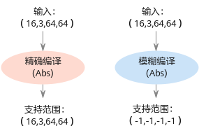

**推荐配置及收益<a name="section116691479451"></a>**

无。

**示例<a name="zh-cn_topic_0243420057_section85411163533"></a>**

```
--shape_generalized_build_mode=shape_generalized
```

**使用约束<a name="zh-cn_topic_0243420057_section53841119122710"></a>**

如果模型转换时通过该参数设置了模糊编译，则使用应用工程进行模型推理时，需要在**aclmdlExecute**接口之前，增加**aclmdlSetDatasetTensorDesc**接口，用于设置真实的shape取值。

接口详细说明请参见《AscendCL应用开发指南 \(C&C++\)》手册“AscendCL API参考”章节。

# 专题<a name="ZH-CN_TOPIC_0000002506025671"></a>


## 定制网络修改（TensorFlow）<a name="ZH-CN_TOPIC_0000002473905654"></a>

**该版本不支持TensorFlow**


### 概述<a name="ZH-CN_TOPIC_0000002473745776"></a>

**简介<a name="section113624541541"></a>**

本章节介绍如何使用TensorFlow的xlacompile工具，将有控制流算子的网络模型（如[图1](#fig11471353102515)所示）转成函数类算子的网络模型（如[图2](#fig1654165515255)所示），然后利用ATC工具转换成适配昇腾AI处理器的离线模型适配NPU IP加速器的离线模型。

**图 1**  有控制流算子的网络模型<a name="fig11471353102515"></a>  
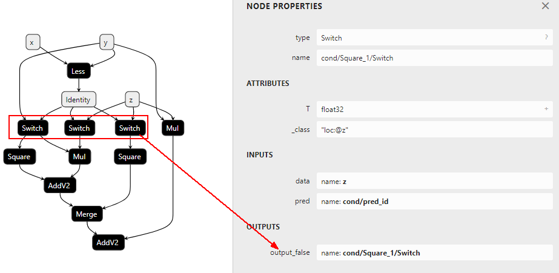

**图 2**  函数类算子的网络模型<a name="fig1654165515255"></a>  
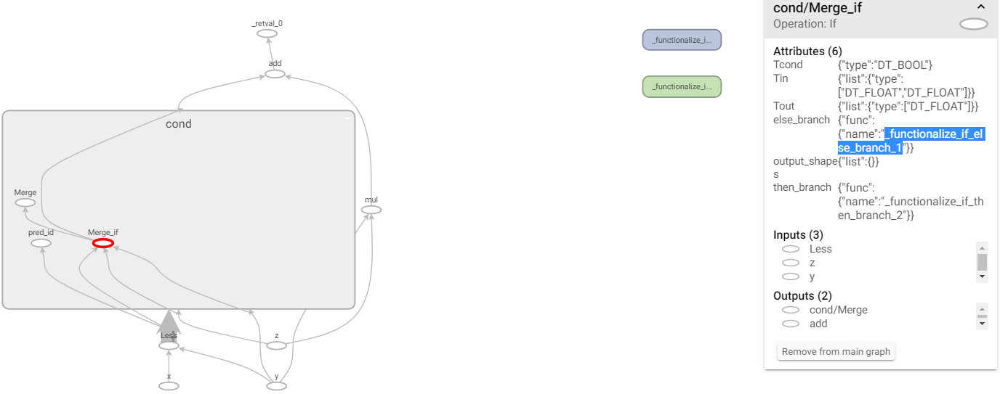

**使用前提<a name="section1561169654"></a>**

-   确保ATC工具所在服务器能连接网络。
-   安装bazel编译工具。

    请参见[https://docs.bazel.build/versions/master/install-ubuntu.html](https://docs.bazel.build/versions/master/install-ubuntu.html)官方地址安装bazel编译工具。

-   安装TensorFlow以及依赖future。

    ATC安装路径下的func2graph.py脚本依赖TensorFlow，使用**pip3.7.5 list**查看列表中是否有TensorFlow依赖，若有则不用安装，否则执行如下命令安装：

    ```
    pip3.7.5 install tensorflow==1.15 --user
    ```

    bazel编译工具依赖python，请使用**pip3.7.5 list**命令查看是否安装future、patch，若有则不用安装，否则执行如下命令安装：

    ```
    pip3.7.5 install future --user
    pip3.7.5 install patch --user
    pip3.7.5 install numpy --user
    ```

    如果执行上述命令时无法连接网络，且提示“Could not find a version that satisfies the requirement xxx”，请参见[使用pip3.7.5 install软件时提示" Could not find a version that satisfies the requirement xxx"](使用pip3-7-5-install软件时提示-Could-not-find-a-version-that-satisfies-the-requirement-xxx.md)解决。

### 编译可执行文件<a name="ZH-CN_TOPIC_0000002505905711"></a>

请以ATC软件包安装用户进行如下操作：

1.  从[https://github.com/tensorflow/tensorflow/archive/v1.15.0.tar.gz](https://github.com/tensorflow/tensorflow/archive/v1.15.0.tar.gz)链接下载Tensorflow源码，然后将下载的源码上传到ATC工具所在Linux服务器任意目录。
2.  登录Linux服务器，切换到Tensorflow源码所在路径，执行如下命令解压源码包：

    ```
    tar -zxvf tensorflow-1.15.0.tar.gz
    ```

3.  进入解压后的tensorflow-1.15.0，安装补丁。

    参见[获取xlacompile.patch补丁文件](获取xlacompile-patch补丁文件.md)获取**xlacompile.patch**补丁，然后上传到Linux服务器tensorflow-1.15.0路径下，执行如下命令安装补丁：

    ```
    patch -p1 < xlacompile.patch
    ```

4.  切换到tensorflow-1.15.0目录，执行如下命令编译**xlacompile**工具：

    ```
    bazel build --config=monolithic //tensorflow/compiler/aot:xlacompile
    ```

    若出现类似如下信息，则说明编译成功，编译大约需要10分钟左右；若编译失败，请参见[使用bazel编译工具编译时提示“An error occurred during the fetch of repository 'io\_bazel\_rules\_docker'”，编译失败](使用bazel编译工具编译时提示-An-error-occurred-during-the-fetch-of-repository-io_bazel_rules_docker-编译失败.md)解决。

    ```
    Target //tensorflow/compiler/aot:xlacompile up-to-date:
      bazel-bin/tensorflow/compiler/aot/xlacompile
    INFO: Elapsed time: 214.550s, Critical Path: 73.38s
    INFO: 1511 processes: 1511 local.
    INFO: Build completed successfully, 1513 total actions
    ```

    编译成功后，会在$HOME/.cache/bazel/\_bazel\__test_/_abd37aaac8a380ca5a3f13938322fcb2_/external/org\_tensorflow/bazel-out/k8-opt/bin/tensorflow/compiler/aot路径生成**xlacompile**可执行文件（该路径只是样例，请以用户实际编译后的为准）。

    **xlacompile**可执行文件用于将控制流算子的网络模型转成函数类算子的网络模型。

5.  切换到tensorflow-1.15.0目录，执行如下命令编译**summarize\_graph**工具：

    ```
    bazel build --config=monolithic -c opt //tensorflow/tools/graph_transforms:summarize_graph
    ```

    若出现类似如下信息，则说明编译成功：

    ```
    Target //tensorflow/tools/graph_transforms:summarize_graph up-to-date:
      bazel-bin/tensorflow/tools/graph_transforms/summarize_graph
    INFO: Elapsed time: 70.474s, Critical Path: 53.16s
    INFO: 1028 processes: 1028 local.
    INFO: Build completed successfully, 1053 total actions
    ```

    编译成功后，会在$HOME/.cache/bazel/\_bazel\__test_/_abd37aaac8a380ca5a3f13938322fcb2_/execroot/org\_tensorflow/bazel-out/k8-opt/bin/tensorflow/tools/graph\_transforms路径生成**summarize\_graph**可执行文件（该路径只是样例，请以用户实际编译后的为准）。

    **summarize\_graph**可执行文件用来查看有控制流算子网络模型的输入输出节点，方便用户构造config.pbtxt输入输出配置文件。

### 转换模型<a name="ZH-CN_TOPIC_0000002506025643"></a>

下面以Switch\_v1.pb网络模型为例进行说明，演示如何将有控制流算子网络模型转换成函数类算子网络模型，然后通过ATC工具转换成适配昇腾AI处理器的离线模型适配NPU IP加速器的离线模型。请先参见[获取Switch\_v1.pb网络模型](获取Switch_v1-pb网络模型.md)获取Switch\_v1.pb网络模型。

1.  <a name="li667512164526"></a>获取控制流算子网络模型的输出。

    切换到**summarize\_graph**可执行文件所在路径，执行如下命令：

    ```
    ./summarize_graph --in_graph=/home/test/module/Switch_v1.pb
    ```

    若返回如下信息，则说明执行成功：

    ```
    Found 3 possible inputs: (name=x, type=float(1), shape=<unknown>) (name=y, type=float(1), shape=<unknown>) (name=z, type=float(1), shape=<unknown>)
    No variables spotted.
    Found 1 possible outputs: (name=add, op=AddV2)
    Found 0 (0) const parameters, 0 (0) variable parameters, and 0 control_edges
    Op types used: 3 Placeholder, 3 Switch, 2 AddV2, 2 Mul, 2 Square, 1 Identity, 1 Less, 1 Merge
    To use with tensorflow/tools/benchmark:benchmark_model try these arguments:
    bazel run tensorflow/tools/benchmark:benchmark_model -- --graph=/home/test/module/Switch_v1.pb --show_flops --input_layer=x,y,z --input_layer_type=float,float,float --input_layer_shape=:: --output_layer=add
    ```

2.  构造config.pbtxt输出配置文件。

    在任意路径执行**vim config.pbtxt**命令创建config.pbtxt文件，本示例以在$HOME/module路径创建为例进行说明。

    根据[1](#li667512164526)所示，该网络模型有一个输出，构造的config.pbtxt配置文件样例如下（如下配置文件只是样例，需要用户根据实际情况修改输出算子的name，其中fetch表示输出）：

    ```
    fetch {
      id { node_name: "add" }
    }
    ```

    配置完成后，保存文件并退出。

3.  生成函数类算子网络模型的配置文件。

    在任意路径执行如下命令设置**xlacompile**命令执行过程中的打屏日志信息：

    ```
    export TF_CPP_MIN_LOG_LEVEL=0
    export TF_CPP_MIN_VLOG_LEVEL=1
    ```

    切换到**xlacompile**可执行文件所在路径，执行如下命令：

    ```
    ./xlacompile --graph=/home/test/module/Switch_v1.pb --config=/home/test/module/config.pbtxt --output=/home/test/module/Switch_v1_v2
    ```

    如果提示“Successfully convert ...“信息，则说明转换成功。切换到**--output**参数指定的路径，可以看到如下输出文件：

    ```
    -rw-rw-r-- 1 test test 1236 Jun 20 17:13 Switch_v1_v2.pb
    -rw-rw-r-- 1 test test 4803 Jun 20 17:13 Switch_v1_v2.pbtxt
    ```

4.  函数类算子网络模型生成graph子图。后续使用ATC工具进行模型转换时，需要使用该文件生成子图。

    在任意路径执行如下命令，将函数类算子网络模型生成子图：

    ```
    python3.7.5 ${INSTALL_DIR}/compiler/python/func2graph/func2graph.py -m /home/test/module/Switch_v1_v2.pb
    ```

    若提示如下信息，则说明生成成功。

    ```
    graph_def_file:  /home/test/module/graph_def_library.pbtxt
    INFO: Convert to subgraphs successfully.
    ```

5.  函数类算子网络模型转换成适配昇腾AI处理器的离线模型。

    参见[设置环境变量](准备环境.md#section11988234125210)设置ATC工具执行时需设置的环境变量，然后执行如下命令进行模型转换：

    ```
    atc --model=/home/test/module/Switch_v1_v2.pb --framework=3 --output=/home/test/module/out/Switch_v1_v2_to_om --soc_version=<soc_version>
    ```

    若提示如下信息，则说明模型转换成功：

    ```
    ATC run success, welcome to the next use.
    ```

    成功执行命令后，在**--output**参数指定的路径下，可查看模型文件。

### FAQ<a name="ZH-CN_TOPIC_0000002473745732"></a>


#### 使用bazel编译工具编译时提示“An error occurred during the fetch of repository 'io\_bazel\_rules\_docker'”，编译失败<a name="ZH-CN_TOPIC_0000002473745762"></a>

**问题描述<a name="section631655183620"></a>**

使用**bazel build --config=monolithic //tensorflow/compiler/aot:xlacompilebazel build**命令编译过程中，提示“ERROR: An error occurred during the fetch of repository 'io\_bazel\_rules\_docker'”，检查服务器，能够连接网络，但仍旧提示如下错误信息：

```
ERROR: An error occurred during the fetch of repository 'io_bazel_rules_docker':
   java.io.IOException: Error downloading [https://github.com/bazelbuild/rules_docker/releases/download/v0.14.3/rules_docker-v0.14.3.tar.gz] to /home/test/.cache/bazel/_bazel_test/abd37aaac8a380ca5a3f13938322fcb2/external/io_bazel_rules_docker/rules_docker-v0.14.3.tar.gz: PKIX path building failed: sun.security.provider.certpath.SunCertPathBuilderException: unable to find valid certification path to requested target
ERROR: no such package '@io_bazel_rules_docker//repositories': java.io.IOException: Error downloading [https://github.com/bazelbuild/rules_docker/releases/download/v0.14.3/rules_docker-v0.14.3.tar.gz] to /home/test/.cache/bazel/_bazel_test/abd37aaac8a380ca5a3f13938322fcb2/external/io_bazel_rules_docker/rules_docker-v0.14.3.tar.gz: PKIX path building failed: sun.security.provider.certpath.SunCertPathBuilderException: unable to find valid certification path to requested target
INFO: Elapsed time: 24.586s
INFO: 0 processes.
FAILED: Build did NOT complete successfully (0 packages loaded)
```

**解决方案<a name="section1659565693619"></a>**

如果连网情况下，仍旧提示上述无法下载压缩包的问题，则请参见如下方法解决：

1.  将如下链接中的附件下载到本地，然后上传到linux服务器任意路径，例如上传到$HOME/bazel\_tools路径。

    ```
    https://github.com/bazelbuild/rules_docker/releases/download/v0.14.3/rules_docker-v0.14.3.tar.gz
    https://github.com/bazelbuild/bazel-skylib/releases/download/0.8.0/bazel-skylib.0.8.0.tar.gz
    https://github.com/bazelbuild/rules_swift/releases/download/0.11.1/rules_swift.0.11.1.tar.gz
    https://github.com/llvm-mirror/llvm/archive/7a7e03f906aada0cf4b749b51213fe5784eeff84.tar.gz
    ```

    则上述文件在linux服务器绝对路径为：

    ```
    /home/test/bazel_tools/rules_docker-v0.14.3.tar.gz
    /home/test/bazel_tools/bazel-skylib.0.8.0.tar.gz
    /home/test/bazel_tools/rules_swift.0.11.1.tar.gz
    /home/test/bazel_tools/llvm-7a7e03f906aada0cf4b749b51213fe5784eeff84.tar.gz
    ```

2.  修改bazel编译工具相关文件中的下载链接：
    1.  切换到tensorflow-1.15.0目录，使用**vi WORKSPACE**命令打开WORKSPACE，修改该文件中的下载链接，将下载链接修改为linux服务器绝对路径地址：

        ```
        bazel_toolchains_repositories()
        http_archive(
            name = "io_bazel_rules_docker",
            sha256 = "6287241e033d247e9da5ff705dd6ef526bac39ae82f3d17de1b69f8cb313f9cd",
            strip_prefix = "rules_docker-0.14.3",
            urls = ["file:///home/test/bazel_tools/rules_docker-v0.14.3.tar.gz"],
        )
        
        load(
            "@io_bazel_rules_docker//repositories:repositories.bzl",
            container_repositories = "repositories",
        )
        container_repositories()
        
        load("//third_party/toolchains/preconfig/generate:workspace.bzl",
             "remote_config_workspace")
        remote_config_workspace()
        
        # Apple and Swift rules.
        http_archive(
            name = "build_bazel_rules_apple",
            sha256 = "6efdde60c91724a2be7f89b0c0a64f01138a45e63ba5add2dca2645d981d23a1",
            urls = ["https://github.com/bazelbuild/rules_apple/releases/download/0.17.2/rules_apple.0.17.2.tar.gz"],
        )  # https://github.com/bazelbuild/rules_apple/releases
        http_archive(
            name = "build_bazel_rules_swift",
            sha256 = "96a86afcbdab215f8363e65a10cf023b752e90b23abf02272c4fc668fcb70311",
            urls = ["file:///home/test/bazel_tools/rules_swift.0.11.1.tar.gz"],
        )  # https://github.com/bazelbuild/rules_swift/releases
        ```

        保存文件并退出。

    2.  修改tensorflow-1.15.0/tensorflow路径下**workspace.bzl**文件中llvm对应的链接：

        ```
            # TODO(phawkins): currently, this rule uses an unofficial LLVM mirror.
            # Switch to an official source of snapshots if/when possible.
            tf_http_archive(
                name = "llvm",
                build_file = clean_dep("//third_party/llvm:llvm.autogenerated.BUILD"),
                sha256 = "599b89411df88b9e2be40b019e7ab0f7c9c10dd5ab1c948cd22e678cc8f8f352",
                strip_prefix = "llvm-7a7e03f906aada0cf4b749b51213fe5784eeff84",
                urls = [
                    "https://mirror.bazel.build/github.com/llvm-mirror/llvm/archive/7a7e03f906aada0cf4b749b51213fe5784eeff84.tar.gz",
                    "file:///home/test/bazel_tools/llvm-7a7e03f906aada0cf4b749b51213fe5784eeff84.tar.gz",
                ],
            )
        ```

    3.  修改完成后，重新切换到tensorflow-1.15.0目录，执行如下命令编译**xlacompile**工具：

        ```
        bazel build --config=monolithic //tensorflow/compiler/aot:xlacompile
        ```

        若提示“ERROR: An error occurred during the fetch of repository 'bazel\_skylib':“，则进入下一步继续修改bazel\_skylib相关的文件。

    4.  修改**.cache目录**中的相关链接：

        切换到$HOME目录，使用**grep -r  bazel-skylib.0.8.0  .cache/**命令查看**.cache**目录哪个文件引用**bazel-skylib.0.8.0.tar.gz**的url，根据返回信息，进入引用该url文件所在的目录，例如.cache/bazel/\_bazel\__test_/_abd37aaac8a380ca5a3f13938322fcb2_/external/io\_bazel\_rules\_closure/closure/**repositories.bzl**（该路径只是样例，请以用户实际编译后的为准）

        打开该文件，将其中的url改为：

        ```
        file:///home/test/bazel_tools/bazel-skylib.0.8.0.tar.gz
        ```

        保存文件并退出。

#### 使用pip3.7.5 install软件时提示" Could not find a version that satisfies the requirement xxx"<a name="ZH-CN_TOPIC_0000002473905658"></a>

**问题描述<a name="zh-cn_topic_0257336021_zh-cn_topic_0249939452_zh-cn_topic_0231558534_section9469135018572"></a>**

安装依赖时，使用**pip3.7.5 install xxx**命令安装相关软件时提示无法连接网络，且提示"Could not find a version that satisfies the requirement xxx"，使用**apt-get update**命令检查源可用。提示信息如下图所示。

**图 1**  使用pip3.7.5安装软件提示信息<a name="zh-cn_topic_0257336021_zh-cn_topic_0249939452_zh-cn_topic_0231558534_fig5203103019101"></a>  
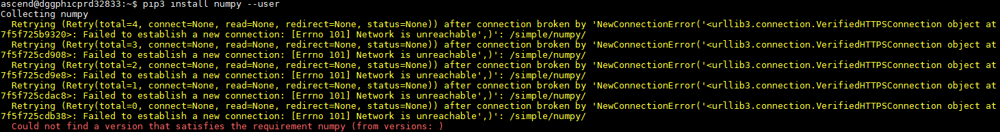

**可能原因<a name="zh-cn_topic_0257336021_zh-cn_topic_0249939452_zh-cn_topic_0231558534_section728245614576"></a>**

没有配置pip源。

**解决方法<a name="zh-cn_topic_0257336021_zh-cn_topic_0249939452_zh-cn_topic_0231558534_section880017413588"></a>**

配置pip源，配置方法如下：

1.  使用ATC软件包安装用户，执行如下命令：

    ```
    cd ~/.pip
    ```

    如果提示目录不存在，则执行如下命令创建：

    ```
    mkdir ~/.pip 
    cd ~/.pip
    ```

    在.pip目录下创建pip.conf文件，命令为：

    ```
    touch pip.conf
    ```

2.  编辑pip.conf文件。

    使用**vi pip.conf**命令打开pip.conf文件，写入如下内容后，保存文件并退出：

    ```
    [global]
    #可用的源，请根据实际情况进行替换。
    index-url=http://xxx
    [install]
    #可信主机，请根据实际情况进行替换。
    trusted-host=xxx
    ```

#### 获取Switch\_v1.pb网络模型<a name="ZH-CN_TOPIC_0000002505905701"></a>

1.  将如下文件中的脚本复制到.py文件中，例如复制到_Switch\_v1.py_文件中。

    ```
    import os
    import numpy as np
    import tensorflow as tf
    
    x = tf.compat.v1.placeholder(tf.float32, name='x')
    y = tf.compat.v1.placeholder(tf.float32, name='y')
    z = tf.compat.v1.placeholder(tf.float32, name='z')
    
    
    def then_branch(x, y, z):
        m = tf.square(x)
        return m + tf.multiply(y, z)
    
    def else_branch(x, y, z):
        m = tf.pow(x, y)
        return m - tf.div(y, z)
    
    # 控制流算子使用入口，执行脚本之后，在图中生成对应的V1控制流算子
    def testDefun(x, y, z):
        return tf.cond(pred=x < y, true_fn=lambda: then_branch(x, y, z), false_fn=lambda: else_branch(x, y, z)), y
    
    def testCase(x, y, z):
        a, b = testDefun(x, y, z)
        return a + b * z
    
    
    with tf.compat.v1.Session() as sess:
        result = sess.run(testCase(x, y, z), feed_dict={x: 1., y: .6, z: .2})
    
        with tf.io.gfile.GFile('./Switch_v1.pb', 'wb') as f:
            f.write(sess.graph_def.SerializeToString())
    
    ```

2.  切换到_Switch\_v1.py_脚本所在目录，执行如下命令生成Switch\_v1.pb网络模型：

    ```
    python3.7.5 Switch_v1.py
    ```

    命令执行完毕，在当前目录会生成Switch\_v1.pb网络模型。

#### 获取xlacompile.patch补丁文件<a name="ZH-CN_TOPIC_0000002473905668"></a>

用户安装完xlacompile.patch补丁，编译成xlacompile工具后，该工具可以将有控制流的V1网络模型转成函数类的V2网络模型。

将如下代码复制到文件中，并另存为xlacompile.patch，然后上传到Linux服务器tensorflow-1.15.0路径下：

```
---
 WORKSPACE                                      |   7 +
 tensorflow/compiler/aot/BUILD                  |  27 ++++
 tensorflow/compiler/aot/xlacompile_main.cc     | 170 +++++++++++++++++++++
 tensorflow/compiler/tf2xla/tf2xla.cc           |   6 +
 tensorflow/compiler/tf2xla/tf2xla.h            |   4 +
 5 files changed, 195 insertions(+)
 create mode 100644 tensorflow/compiler/aot/xlacompile_main.cc

diff --git a/WORKSPACE b/WORKSPACE
index 74ea14d..d2265f9 100644
--- a/WORKSPACE
+++ b/WORKSPACE
@@ -34,6 +34,13 @@ load(

 bazel_toolchains_repositories()

+http_archive(
+    name = "io_bazel_rules_docker",
+    sha256 = "6287241e033d247e9da5ff705dd6ef526bac39ae82f3d17de1b69f8cb313f9cd",
+    strip_prefix = "rules_docker-0.14.3",
+    urls = ["https://github.com/bazelbuild/rules_docker/releases/download/v0.14.3/rules_docker-v0.14.3.tar.gz"],
+)
+
 load(
     "@io_bazel_rules_docker//repositories:repositories.bzl",
     container_repositories = "repositories",

diff --git a/tensorflow/compiler/aot/BUILD b/tensorflow/compiler/aot/BUILD
index f871115..b2620db 100644
--- a/tensorflow/compiler/aot/BUILD
+++ b/tensorflow/compiler/aot/BUILD
@@ -106,6 +106,33 @@ cc_library(
     ],
 )

+tf_cc_binary(
+    name = "xlacompile",
+    visibility = ["//visibility:public"],
+    deps = [":xlacompile_main"],
+)
+
+cc_library(
+    name = "xlacompile_main",
+    srcs = ["xlacompile_main.cc"],
+    visibility = ["//visibility:public"],
+    deps = [
+        ":tfcompile_lib",
+        "//tensorflow/compiler/tf2xla:tf2xla_proto",
+        "//tensorflow/compiler/tf2xla:tf2xla_util",
+        "//tensorflow/compiler/xla:debug_options_flags",
+        "//tensorflow/compiler/xla/service:compiler",
+        "//tensorflow/core:core_cpu",
+        "//tensorflow/core:core_cpu_internal",
+        "//tensorflow/core:framework",
+        "//tensorflow/core:framework_internal",
+        "//tensorflow/core:graph",
+        "//tensorflow/core:lib",
+        "//tensorflow/core:protos_all_cc",
+        "@com_google_absl//absl/strings",
+    ],
+)
+
 # NOTE: Most end-to-end tests are in the "tests" subdirectory, to ensure that
 # tfcompile.bzl correctly handles usage from outside of the package that it is
 # defined in.

diff --git a/tensorflow/compiler/aot/xlacompile_main.cc b/tensorflow/compiler/aot/xlacompile_main.cc
new file mode 100644
index 0000000..bc795ef
--- /dev/null
+++ b/tensorflow/compiler/aot/xlacompile_main.cc
@@ -0,0 +1,170 @@
+/* Copyright 2017 The TensorFlow Authors. All Rights Reserved.
+
+Licensed under the Apache License, Version 2.0 (the "License");
+you may not use this file except in compliance with the License.
+You may obtain a copy of the License at
+
+    http://www.apache.org/licenses/LICENSE-2.0
+
+Unless required by applicable law or agreed to in writing, software
+distributed under the License is distributed on an "AS IS" BASIS,
+WITHOUT WARRANTIES OR CONDITIONS OF ANY KIND, either express or implied.
+See the License for the specific language governing permissions and
+limitations under the License.
+==============================================================================*/
+
+#include <memory>
+#include <string>
+#include <utility>
+#include <vector>
+#include <map>
+
+#include "tensorflow/compiler/aot/flags.h"
+#include "tensorflow/compiler/tf2xla/tf2xla.h"
+#include "tensorflow/compiler/tf2xla/tf2xla_util.h"
+#include "tensorflow/core/platform/init_main.h"
+
+namespace tensorflow {
+namespace xlacompile {
+
+const char kUsageHeader[] =
+    "xlacompile performs ahead-of-time compilation of a TensorFlow graph,\n"
+    "resulting in an object file compiled for your target architecture, and a\n"
+    "header file that gives access to the functionality in the object file.\n"
+    "A typical invocation looks like this:\n"
+    "\n"
+    "   $ xlacompile --graph=mygraph.pb --config=config.pbtxt --output=output.pbtxt\n"
+    "\n";
+
+void AppendMainFlags(std::vector<Flag>* flag_list, tfcompile::MainFlags* flags) {
+  const std::vector<Flag> tmp = {
+      {"graph", &flags->graph,
+       "Input GraphDef file. If the file ends in '.pbtxt' it is expected to "
+       "be in the human-readable proto text format, otherwise it is expected "
+       "to be in the proto binary format."},
+      {"config", &flags->config,
+       "Input file containing Config proto. If the file ends in '.pbtxt' it "
+       "is expected to be in the human-readable proto text format, otherwise "
+       "it is expected to be in the proto binary format."},
+      {"output", &flags->out_session_module,
+       "Output session module proto. Will generate '.pb' and '.pbtxt' file."},
+  };
+  flag_list->insert(flag_list->end(), tmp.begin(), tmp.end());
+}
+
+Status ReadProtoFile(const string& fname, protobuf::Message* proto) {
+  if (absl::EndsWith(fname, ".pbtxt")) {
+    return ReadTextProto(Env::Default(), fname, proto);
+  } else {
+    return ReadBinaryProto(Env::Default(), fname, proto);
+  }
+}
+
+Status Main(tfcompile::MainFlags& flags) {
+  // Process config.
+  tf2xla::Config config;
+  if (flags.config.empty()) {
+    return errors::InvalidArgument("Must specify --config");
+  }
+  TF_RETURN_IF_ERROR(ReadProtoFile(flags.config, &config));
+  TF_RETURN_IF_ERROR(ValidateConfig(config));
+  if (flags.dump_fetch_nodes) {
+    std::set<string> nodes;
+    for (const tf2xla::Fetch& fetch : config.fetch()) {
+      nodes.insert(fetch.id().node_name());
+    }
+    std::cout << absl::StrJoin(nodes, ",");
+    return Status::OK();
+  }
+
+  // Read and initialize the graph.
+  if (flags.graph.empty()) {
+    return errors::InvalidArgument("Must specify --graph");
+  }
+  if (flags.out_session_module.empty()) {
+    return errors::InvalidArgument("Must specify --output");
+  }
+
+  string output_pb_bin = flags.out_session_module + ".pb";
+  string output_pb_txt = flags.out_session_module + ".pbtxt";
+  if (output_pb_bin == flags.config || output_pb_bin == flags.graph ||
+      output_pb_txt == flags.config || output_pb_txt == flags.graph) {
+    return errors::InvalidArgument("Must different --config --graph --output");
+  }
+
+  GraphDef graph_def;
+  TF_RETURN_IF_ERROR(ReadProtoFile(flags.graph, &graph_def));
+  std::unique_ptr<Graph> graph;
+  TF_RETURN_IF_ERROR(ConvertGraphDefToXla(graph_def, config, graph));
+
+  std::map<string, string> arg_name_maps;
+  GraphDef new_graph_def;
+  graph->ToGraphDef(&new_graph_def);
+  // Delete _class attribute for: expects to be colocated with unknown node
+  for (int i = 0; i < new_graph_def.node_size(); ++i) {
+    NodeDef *node = new_graph_def.mutable_node(i);
+    node->mutable_attr()->erase("_class");
+    if (node->op() == "_Retval") {
+      node->set_name(absl::StrCat(node->attr().at("index").i(), "_Retval"));
+    }
+    if (node->op() == "_Arg") {
+      const string name = node->name();
+      node->set_name(absl::StrCat(node->attr().at("index").i(), "_Arg"));
+      arg_name_maps[name] = node->name();
+    }
+  }
+
+  for (int i = 0; i < new_graph_def.node_size() && !arg_name_maps.empty(); ++i) {
+    NodeDef *node = new_graph_def.mutable_node(i);
+    for (int j = 0; j < node->input_size(); ++j) {
+      auto it = arg_name_maps.find(node->input(j));
+      if (it != arg_name_maps.end()) {
+        *node->mutable_input(j) = it->second;
+      }
+    }
+  }
+
+  TF_RETURN_IF_ERROR(WriteBinaryProto(Env::Default(), output_pb_bin, new_graph_def));
+  std::cerr << "Successfully convert: " << output_pb_bin << "\n";
+  TF_RETURN_IF_ERROR(WriteTextProto(Env::Default(), output_pb_txt, new_graph_def));
+  std::cerr << "Successfully convert: " << output_pb_txt << "\n";
+  return Status::OK();
+}
+
+}  // end namespace xlacompile
+}  // end namespace tensorflow
+
+int main(int argc, char** argv) {
+  tensorflow::tfcompile::MainFlags flags;
+  flags.target_triple = "x86_64-pc-linux";
+  flags.out_function_object = "out_model.o";
+  flags.out_metadata_object = "out_helper.o";
+  flags.out_header = "out.h";
+  flags.entry_point = "entry";
+
+  std::vector<tensorflow::Flag> flag_list;
+  tensorflow::xlacompile::AppendMainFlags(&flag_list, &flags);
+
+  tensorflow::string usage = tensorflow::xlacompile::kUsageHeader;
+  usage += tensorflow::Flags::Usage(argv[0], flag_list);
+  if (argc > 1 && absl::string_view(argv[1]) == "--help") {
+    std::cerr << usage << "\n";
+    return 0;
+  }
+  bool parsed_flags_ok = tensorflow::Flags::Parse(&argc, argv, flag_list);
+  QCHECK(parsed_flags_ok) << "\n" << usage;
+
+  tensorflow::port::InitMain(usage.c_str(), &argc, &argv);
+  QCHECK(argc == 1) << "\nERROR: This command does not take any arguments "
+                       "other than flags\n\n"
+                    << usage;
+  tensorflow::Status status = tensorflow::xlacompile::Main(flags);
+  if (status.code() == tensorflow::error::INVALID_ARGUMENT) {
+    std::cerr << "INVALID ARGUMENTS: " << status.error_message() << "\n\n"
+              << usage;
+    return 1;
+  } else {
+    TF_QCHECK_OK(status);
+  }
+  return 0;
+}

diff --git a/tensorflow/compiler/tf2xla/tf2xla.cc b/tensorflow/compiler/tf2xla/tf2xla.cc
index 3c2b256..3872776 100644
--- a/tensorflow/compiler/tf2xla/tf2xla.cc
+++ b/tensorflow/compiler/tf2xla/tf2xla.cc
@@ -410,4 +410,10 @@ Status ConvertGraphDefToXla(const GraphDef& graph_def,
   return Status::OK();
 }

+Status ConvertGraphDefToXla(const GraphDef &graph_def,
+                            const tf2xla::Config &config,
+                            std::unique_ptr<Graph> &graph) {
+  return InitGraph(graph_def, config, &graph);
+}
+
 }  // namespace tensorflow

diff --git a/tensorflow/compiler/tf2xla/tf2xla.h b/tensorflow/compiler/tf2xla/tf2xla.h
index 432a12a..969500c 100644
--- a/tensorflow/compiler/tf2xla/tf2xla.h
+++ b/tensorflow/compiler/tf2xla/tf2xla.h
@@ -20,6 +20,7 @@ limitations under the License.
 #include "tensorflow/compiler/xla/client/client.h"
 #include "tensorflow/compiler/xla/client/xla_computation.h"
 #include "tensorflow/core/framework/graph.pb.h"
+#include "tensorflow/core/graph/graph.h"

 namespace tensorflow {

@@ -34,6 +35,9 @@ Status ConvertGraphDefToXla(const GraphDef& graph_def,
                             const tf2xla::Config& config, xla::Client* client,
                             xla::XlaComputation* computation);

+Status ConvertGraphDefToXla(const GraphDef &graph_def,
+                            const tf2xla::Config &config,
+                            std::unique_ptr<Graph> &graph);
 }  // namespace tensorflow

 #endif  // TENSORFLOW_COMPILER_TF2XLA_TF2XLA_H_

--
1.8.3.1

```

# 参考<a name="ZH-CN_TOPIC_0000002473745736"></a>


本章节给出不同框架可量化的层以及相关约束。
如果要自动控制量化过程，比如控制哪些层是否量化、控制使用什么量化算法，则可以通过本章节构造的cfg配置文件实现。

## dump图详细信息<a name="ZH-CN_TOPIC_0000002506025647"></a>

模型转换前，通过设置如下环境变量，dump出编译过程中的模型图，用户可以通过查看dump图观察模型的变化：

```
export DUMP_GE_GRAPH=1      #控制dump图的内容多少
export DUMP_GRAPH_LEVEL=1   #控制dump图的个数
```

在执行atc命令的当前路径会生成如下文件，关于环境变量的详细介绍请参见[2](准备环境.md#li08257136548)。

-   ge\_onnx\*.pbtxt：基于ONNX的模型描述结构，可以使用Netron等可视化软件打开。
-   ge\_proto\*.txt：protobuf格式存储的文本文件，该文件可以转成JSON格式文件方便用户定位问题。该文件与ge\_onnx\*.pbtxt一般成对出现，但是ge\_proto\*.txt比ge\_onnx\*.pbtxt文件会多string类型的属性信息，因此ge\_proto\*.txt显示的更完整，用户选择其中一种文件打开即可。

    由于ge\_proto\*.txt文件结构相比ge\_onnx\*.pbtxt已经做了文件大小的优化，因此DUMP\_GE\_GRAPH环境变量设置为2或3，对ge\_proto\*.txt文件效果相同，都显示为不含有权重等数据的基本版dump。

上述每个文件对应模型编译过程中的一个步骤，比如以ge\_onnx\__00000001_\_graph\_0\_PreRunBegin.pbtxt开始，以ge\_onnx\__00000078_\_graph\_0\_PreRunAfterBuild.pbtxt结尾。每个文件中包括完成该步骤所涉及的所有算子，关于dump图每个阶段的子图详细作用请参见[表1](#table5117209452)（每个模型生成的dump子图可能不一致，但是主流程基本一致）。

**表 1**  dump图详细信息说明

<a name="table5117209452"></a>
<table><thead align="left"><tr id="row12182024513"><th class="cellrowborder" valign="top" width="44.220846233230134%" id="mcps1.2.3.1.1"><p id="p1211206454"><a name="p1211206454"></a><a name="p1211206454"></a>子图名称</p>
</th>
<th class="cellrowborder" valign="top" width="55.77915376676986%" id="mcps1.2.3.1.2"><p id="p1521020144516"><a name="p1521020144516"></a><a name="p1521020144516"></a>所处阶段描述</p>
</th>
</tr>
</thead>
<tbody><tr id="row1957424131219"><td class="cellrowborder" valign="top" width="44.220846233230134%" headers="mcps1.2.3.1.1 "><p id="p1957474114120"><a name="p1957474114120"></a><a name="p1957474114120"></a>ge_proto_<em id="i129552139196"><a name="i129552139196"></a><a name="i129552139196"></a>xxxx</em>_FlowGraphPreRunBegin.txt</p>
</td>
<td class="cellrowborder" valign="top" width="55.77915376676986%" headers="mcps1.2.3.1.2 "><p id="p14574241141218"><a name="p14574241141218"></a><a name="p14574241141218"></a>FlowModelBuild前的图</p>
</td>
</tr>
<tr id="row11652043151211"><td class="cellrowborder" valign="top" width="44.220846233230134%" headers="mcps1.2.3.1.1 "><p id="p1861310527458"><a name="p1861310527458"></a><a name="p1861310527458"></a>ge_proto_<em id="i1406111791913"><a name="i1406111791913"></a><a name="i1406111791913"></a>xxxx</em>_AfterFlowGraphPartition.txt</p>
</td>
<td class="cellrowborder" valign="top" width="55.77915376676986%" headers="mcps1.2.3.1.2 "><p id="p14396165894511"><a name="p14396165894511"></a><a name="p14396165894511"></a>flow切分后的图(flow切分是应用于DataFlow中的切分方式)</p>
</td>
</tr>
<tr id="row1692551411451"><td class="cellrowborder" valign="top" width="44.220846233230134%" headers="mcps1.2.3.1.1 "><p id="p1761317524455"><a name="p1761317524455"></a><a name="p1761317524455"></a>ge_proto_<em id="i88062194195"><a name="i88062194195"></a><a name="i88062194195"></a>xxxx</em>_AfterParallelPartitioner.txt</p>
</td>
<td class="cellrowborder" valign="top" width="55.77915376676986%" headers="mcps1.2.3.1.2 "><p id="p639619588455"><a name="p639619588455"></a><a name="p639619588455"></a>pipeline并行切分后的图(这里的pipeline指后端推理场景的PP，当前应该没有商用化场景)</p>
</td>
</tr>
<tr id="row1496393364519"><td class="cellrowborder" valign="top" width="44.220846233230134%" headers="mcps1.2.3.1.1 "><p id="p20172253135015"><a name="p20172253135015"></a><a name="p20172253135015"></a>ge_proto_<em id="i135841010115916"><a name="i135841010115916"></a><a name="i135841010115916"></a>xxxx</em>_PreRunBegin.txt</p>
</td>
<td class="cellrowborder" valign="top" width="55.77915376676986%" headers="mcps1.2.3.1.2 "><p id="p117285318508"><a name="p117285318508"></a><a name="p117285318508"></a>用户自定义优化处理之后的图结构</p>
</td>
</tr>
<tr id="row121020134513"><td class="cellrowborder" valign="top" width="44.220846233230134%" headers="mcps1.2.3.1.1 "><p id="p617275310502"><a name="p617275310502"></a><a name="p617275310502"></a>ge_proto_<em id="i13254195614588"><a name="i13254195614588"></a><a name="i13254195614588"></a>xxxx</em>_RunCustomPassBegin.txt</p>
</td>
<td class="cellrowborder" valign="top" width="55.77915376676986%" headers="mcps1.2.3.1.2 "><p id="p41721053165016"><a name="p41721053165016"></a><a name="p41721053165016"></a>用户自定义pass入口图</p>
</td>
</tr>
<tr id="row1939444204513"><td class="cellrowborder" valign="top" width="44.220846233230134%" headers="mcps1.2.3.1.1 "><p id="p177734282464"><a name="p177734282464"></a><a name="p177734282464"></a>ge_proto_<em id="i6961113517195"><a name="i6961113517195"></a><a name="i6961113517195"></a>xxxx</em>_RunCustomPassEnd.txt</p>
</td>
<td class="cellrowborder" valign="top" width="55.77915376676986%" headers="mcps1.2.3.1.2 "><p id="p169396442459"><a name="p169396442459"></a><a name="p169396442459"></a>用户自定义pass出口图</p>
</td>
</tr>
<tr id="row167121346124514"><td class="cellrowborder" valign="top" width="44.220846233230134%" headers="mcps1.2.3.1.1 "><p id="p207731928154616"><a name="p207731928154616"></a><a name="p207731928154616"></a>ge_proto_<em id="i14835203819196"><a name="i14835203819196"></a><a name="i14835203819196"></a>xxxx</em>_PreRunAfterInitPreparation.txt</p>
</td>
<td class="cellrowborder" valign="top" width="55.77915376676986%" headers="mcps1.2.3.1.2 "><p id="p1938842114810"><a name="p1938842114810"></a><a name="p1938842114810"></a>经历了图准备阶段所有初始化处理之后的图结构</p>
</td>
</tr>
<tr id="row14844503469"><td class="cellrowborder" valign="top" width="44.220846233230134%" headers="mcps1.2.3.1.1 "><p id="p1517265317505"><a name="p1517265317505"></a><a name="p1517265317505"></a>ge_proto_<em id="i166133126597"><a name="i166133126597"></a><a name="i166133126597"></a>xxxx</em>_PrepareAfterCheckAndUpdateInput.txt</p>
</td>
<td class="cellrowborder" valign="top" width="55.77915376676986%" headers="mcps1.2.3.1.2 "><p id="p8172115335018"><a name="p8172115335018"></a><a name="p8172115335018"></a>校验并更新图输入数据处理之后的图结构</p>
</td>
</tr>
<tr id="row78453012466"><td class="cellrowborder" valign="top" width="44.220846233230134%" headers="mcps1.2.3.1.1 "><p id="p91736538507"><a name="p91736538507"></a><a name="p91736538507"></a>ge_proto_<em id="i92740141599"><a name="i92740141599"></a><a name="i92740141599"></a>xxxx</em>_PrepareAfterPropagateFormatIfNeed.txt</p>
</td>
<td class="cellrowborder" valign="top" width="55.77915376676986%" headers="mcps1.2.3.1.2 "><p id="p171733538501"><a name="p171733538501"></a><a name="p171733538501"></a>单算子模式下，对算子做format推导处理之后的图结构</p>
</td>
</tr>
<tr id="row78458044612"><td class="cellrowborder" valign="top" width="44.220846233230134%" headers="mcps1.2.3.1.1 "><p id="p5176125325012"><a name="p5176125325012"></a><a name="p5176125325012"></a>ge_proto_<em id="i2791017185918"><a name="i2791017185918"></a><a name="i2791017185918"></a>xxxx</em>_OptimizeGraph_TagNoConstFoldingAfter.txt</p>
</td>
<td class="cellrowborder" valign="top" width="55.77915376676986%" headers="mcps1.2.3.1.2 "><p id="p179291527111415"><a name="p179291527111415"></a><a name="p179291527111415"></a>量化场景使用，FE会给算子打上不做常量折叠标签，GE在执行常量折叠时会判断此标签，如果存在，则不执行常量折叠</p>
</td>
</tr>
<tr id="row1184519014611"><td class="cellrowborder" valign="top" width="44.220846233230134%" headers="mcps1.2.3.1.1 "><p id="p1817675310502"><a name="p1817675310502"></a><a name="p1817675310502"></a>ge_proto_<em id="i20142132213599"><a name="i20142132213599"></a><a name="i20142132213599"></a>xxxx</em>_PreRunAfterOptimizeGraphPrepare.txt</p>
</td>
<td class="cellrowborder" valign="top" width="55.77915376676986%" headers="mcps1.2.3.1.2 "><p id="p1217675318504"><a name="p1217675318504"></a><a name="p1217675318504"></a>经过各算子信息库原图准备处理（OptimizeGraphPrepare接口调用）之后的图结构</p>
</td>
</tr>
<tr id="row128451607469"><td class="cellrowborder" valign="top" width="44.220846233230134%" headers="mcps1.2.3.1.1 "><p id="p21762532502"><a name="p21762532502"></a><a name="p21762532502"></a>ge_proto_<em id="i2087611234596"><a name="i2087611234596"></a><a name="i2087611234596"></a>xxxx</em>_PreRunAfterHandleSummaryOp.txt</p>
</td>
<td class="cellrowborder" valign="top" width="55.77915376676986%" headers="mcps1.2.3.1.2 "><p id="p18177105335011"><a name="p18177105335011"></a><a name="p18177105335011"></a>对Summary节点做处理之后的图结构</p>
</td>
</tr>
<tr id="row18461108467"><td class="cellrowborder" valign="top" width="44.220846233230134%" headers="mcps1.2.3.1.1 "><p id="p111772534503"><a name="p111772534503"></a><a name="p111772534503"></a>ge_proto_<em id="i86011525115916"><a name="i86011525115916"></a><a name="i86011525115916"></a>xxxx</em>_PrepareAfterGraphEquivalentTransformation.txt</p>
</td>
<td class="cellrowborder" valign="top" width="55.77915376676986%" headers="mcps1.2.3.1.2 "><p id="p1317718534503"><a name="p1317718534503"></a><a name="p1317718534503"></a>将For循环图结构同等替换成While循环图结构处理之后的图结构</p>
</td>
</tr>
<tr id="row18846504464"><td class="cellrowborder" valign="top" width="44.220846233230134%" headers="mcps1.2.3.1.1 "><p id="p1917735385011"><a name="p1917735385011"></a><a name="p1917735385011"></a>ge_proto_<em id="i21488279594"><a name="i21488279594"></a><a name="i21488279594"></a>xxxx</em>_PrepareAfterProcessOutput.txt</p>
</td>
<td class="cellrowborder" valign="top" width="55.77915376676986%" headers="mcps1.2.3.1.2 "><p id="p1177145305010"><a name="p1177145305010"></a><a name="p1177145305010"></a>对图数据进行相关处理之后的图结构</p>
</td>
</tr>
<tr id="row118618613107"><td class="cellrowborder" valign="top" width="44.220846233230134%" headers="mcps1.2.3.1.1 "><p id="p7235123645012"><a name="p7235123645012"></a><a name="p7235123645012"></a>ge_proto_<em id="i7297453151917"><a name="i7297453151917"></a><a name="i7297453151917"></a>xxxx</em>_PrepareAfterOptimizeAfterGraphNormalization.txt</p>
</td>
<td class="cellrowborder" valign="top" width="55.77915376676986%" headers="mcps1.2.3.1.2 "><p id="p4804104875017"><a name="p4804104875017"></a><a name="p4804104875017"></a>图标准化后图优化操作出口图</p>
</td>
</tr>
<tr id="row15846150104614"><td class="cellrowborder" valign="top" width="44.220846233230134%" headers="mcps1.2.3.1.1 "><p id="p141771953125020"><a name="p141771953125020"></a><a name="p141771953125020"></a>ge_proto_<em id="i1286133035913"><a name="i1286133035913"></a><a name="i1286133035913"></a>xxxx</em>_PrepareAfterProcessMultiBatch.txt</p>
</td>
<td class="cellrowborder" valign="top" width="55.77915376676986%" headers="mcps1.2.3.1.2 "><p id="p317713530502"><a name="p317713530502"></a><a name="p317713530502"></a>在动态档位开关下，对图结构做相关处理之后的图结构</p>
</td>
</tr>
<tr id="row16617848468"><td class="cellrowborder" valign="top" width="44.220846233230134%" headers="mcps1.2.3.1.1 "><p id="p5177175385014"><a name="p5177175385014"></a><a name="p5177175385014"></a>ge_proto_<em id="i16613163216594"><a name="i16613163216594"></a><a name="i16613163216594"></a>xxxx</em>_PrepareAfterInsertAipp.txt</p>
</td>
<td class="cellrowborder" valign="top" width="55.77915376676986%" headers="mcps1.2.3.1.2 "><p id="p2177145385013"><a name="p2177145385013"></a><a name="p2177145385013"></a>在配置了aipp参数下，对图进行aipp相关处理之后的图结构</p>
</td>
</tr>
<tr id="row784531217913"><td class="cellrowborder" valign="top" width="44.220846233230134%" headers="mcps1.2.3.1.1 "><p id="p0235173615016"><a name="p0235173615016"></a><a name="p0235173615016"></a>ge_proto_<em id="i1515114032012"><a name="i1515114032012"></a><a name="i1515114032012"></a>xxxx</em>_PrepareAfterProcessAippNodesDataFormat.txt</p>
</td>
<td class="cellrowborder" valign="top" width="55.77915376676986%" headers="mcps1.2.3.1.2 "><p id="p108041482500"><a name="p108041482500"></a><a name="p108041482500"></a>aipp节点格式刷新出口图</p>
</td>
</tr>
<tr id="row10954182115910"><td class="cellrowborder" valign="top" width="44.220846233230134%" headers="mcps1.2.3.1.1 "><p id="p17235103618505"><a name="p17235103618505"></a><a name="p17235103618505"></a>ge_proto_<em id="i05371512015"><a name="i05371512015"></a><a name="i05371512015"></a>xxxx</em>_PreRunAfterNormalizeGraph.txt</p>
</td>
<td class="cellrowborder" valign="top" width="55.77915376676986%" headers="mcps1.2.3.1.2 "><p id="p148041248155014"><a name="p148041248155014"></a><a name="p148041248155014"></a>图标准化出口图</p>
</td>
</tr>
<tr id="row8258715495"><td class="cellrowborder" valign="top" width="44.220846233230134%" headers="mcps1.2.3.1.1 "><p id="p19235236135013"><a name="p19235236135013"></a><a name="p19235236135013"></a>ge_proto_<em id="i163575110204"><a name="i163575110204"></a><a name="i163575110204"></a>xxxx</em>_PreRunAfterOptimizeGraphInit.txt</p>
</td>
<td class="cellrowborder" valign="top" width="55.77915376676986%" headers="mcps1.2.3.1.2 "><p id="p138041148155018"><a name="p138041148155018"></a><a name="p138041148155018"></a>图优化初始化出口图</p>
</td>
</tr>
<tr id="row46171944469"><td class="cellrowborder" valign="top" width="44.220846233230134%" headers="mcps1.2.3.1.1 "><p id="p4177165395018"><a name="p4177165395018"></a><a name="p4177165395018"></a>ge_proto_<em id="i144081234165913"><a name="i144081234165913"></a><a name="i144081234165913"></a>xxxx</em>_PrepareAfterProcessBeforeInfershape.txt</p>
</td>
<td class="cellrowborder" valign="top" width="55.77915376676986%" headers="mcps1.2.3.1.2 "><p id="p1917765315506"><a name="p1917765315506"></a><a name="p1917765315506"></a>对条件算子进行死边消除处理之后的图结构</p>
</td>
</tr>
<tr id="row2617184194615"><td class="cellrowborder" valign="top" width="44.220846233230134%" headers="mcps1.2.3.1.1 "><p id="p917845355012"><a name="p917845355012"></a><a name="p917845355012"></a>ge_proto_<em id="i7939203565913"><a name="i7939203565913"></a><a name="i7939203565913"></a>xxxx</em>_after_first_inferformat.txt</p>
</td>
<td class="cellrowborder" valign="top" width="55.77915376676986%" headers="mcps1.2.3.1.2 "><p id="p1417875325017"><a name="p1417875325017"></a><a name="p1417875325017"></a>经过全图inferformat处理之后的图结构</p>
</td>
</tr>
<tr id="row1870718894618"><td class="cellrowborder" valign="top" width="44.220846233230134%" headers="mcps1.2.3.1.1 "><p id="p1178105315010"><a name="p1178105315010"></a><a name="p1178105315010"></a>ge_proto_<em id="i1440143755912"><a name="i1440143755912"></a><a name="i1440143755912"></a>xxxx</em>_after_infershape.txt</p>
</td>
<td class="cellrowborder" valign="top" width="55.77915376676986%" headers="mcps1.2.3.1.2 "><p id="p9178165385011"><a name="p9178165385011"></a><a name="p9178165385011"></a>经过全图infershape处理之后的图结构，会伴随常量折叠</p>
</td>
</tr>
<tr id="row147079844619"><td class="cellrowborder" valign="top" width="44.220846233230134%" headers="mcps1.2.3.1.1 "><p id="p617812532503"><a name="p617812532503"></a><a name="p617812532503"></a>ge_proto_<em id="i3349164165910"><a name="i3349164165910"></a><a name="i3349164165910"></a>xxxx</em>_PrepareAfterInferFormatAndShape.txt</p>
</td>
<td class="cellrowborder" valign="top" width="55.77915376676986%" headers="mcps1.2.3.1.2 "><p id="p8178185385019"><a name="p8178185385019"></a><a name="p8178185385019"></a>经历完所有inferformat与infershape处理之后的图结构，与上图间经历了第二次全图inferformat</p>
</td>
</tr>
<tr id="row4707188104619"><td class="cellrowborder" valign="top" width="44.220846233230134%" headers="mcps1.2.3.1.1 "><p id="p7178115314509"><a name="p7178115314509"></a><a name="p7178115314509"></a>ge_proto_<em id="i1773324216599"><a name="i1773324216599"></a><a name="i1773324216599"></a>xxxx</em>_PrepareAfterCtrlFlowPreProcess.txt</p>
</td>
<td class="cellrowborder" valign="top" width="55.77915376676986%" headers="mcps1.2.3.1.2 "><p id="p1117875395017"><a name="p1117875395017"></a><a name="p1117875395017"></a>对条件算子做预处理之后的图结构</p>
</td>
</tr>
<tr id="row103053208466"><td class="cellrowborder" valign="top" width="44.220846233230134%" headers="mcps1.2.3.1.1 "><p id="p41781953155018"><a name="p41781953155018"></a><a name="p41781953155018"></a>ge_proto_<em id="i12505104425911"><a name="i12505104425911"></a><a name="i12505104425911"></a>xxxx</em>_PrepareAfterGetDynamicOutputShape.txt</p>
</td>
<td class="cellrowborder" valign="top" width="55.77915376676986%" headers="mcps1.2.3.1.2 "><p id="p517845314509"><a name="p517845314509"></a><a name="p517845314509"></a>动态档位下，对图输出做处理之后的图结构</p>
</td>
</tr>
<tr id="row052515389461"><td class="cellrowborder" valign="top" width="44.220846233230134%" headers="mcps1.2.3.1.1 "><p id="p817825395015"><a name="p817825395015"></a><a name="p817825395015"></a>ge_proto_<em id="i021618464596"><a name="i021618464596"></a><a name="i021618464596"></a>xxxx</em>_PrepareAfterProcessAippStage2.txt</p>
</td>
<td class="cellrowborder" valign="top" width="55.77915376676986%" headers="mcps1.2.3.1.2 "><p id="p4179353175012"><a name="p4179353175012"></a><a name="p4179353175012"></a>在aipp模式下，对图输入节点做相关处理之后的图结构</p>
</td>
</tr>
<tr id="row8525203854615"><td class="cellrowborder" valign="top" width="44.220846233230134%" headers="mcps1.2.3.1.1 "><p id="p81791853125012"><a name="p81791853125012"></a><a name="p81791853125012"></a>ge_proto_<em id="i18608134895915"><a name="i18608134895915"></a><a name="i18608134895915"></a>xxxx</em>_PrepareAfterPrepareOptimize.txt</p>
</td>
<td class="cellrowborder" valign="top" width="55.77915376676986%" headers="mcps1.2.3.1.2 "><p id="p161791453125014"><a name="p161791453125014"></a><a name="p161791453125014"></a>在图准备阶段，做相关优化处理之后的图结构</p>
</td>
</tr>
<tr id="row45253384465"><td class="cellrowborder" valign="top" width="44.220846233230134%" headers="mcps1.2.3.1.1 "><p id="p11179115318509"><a name="p11179115318509"></a><a name="p11179115318509"></a>ge_proto_<em id="i1121350115916"><a name="i1121350115916"></a><a name="i1121350115916"></a>xxxx</em>_PreRunAfterPrepare.txt</p>
</td>
<td class="cellrowborder" valign="top" width="55.77915376676986%" headers="mcps1.2.3.1.2 "><p id="p9179115316508"><a name="p9179115316508"></a><a name="p9179115316508"></a>目前和上张图相同，经历过所有图准备处理之后的图结构</p>
</td>
</tr>
<tr id="row652573884617"><td class="cellrowborder" valign="top" width="44.220846233230134%" headers="mcps1.2.3.1.1 "><p id="p518075365010"><a name="p518075365010"></a><a name="p518075365010"></a>ge_proto_<em id="i1770485185917"><a name="i1770485185917"></a><a name="i1770485185917"></a>xxxx</em>_OptimizeQuantGraph_FeGraphFusionAfter.txt</p>
</td>
<td class="cellrowborder" valign="top" width="55.77915376676986%" headers="mcps1.2.3.1.2 "><p id="p69934612379"><a name="p69934612379"></a><a name="p69934612379"></a>图优化阶段的量化流程结束后的图结构</p>
</td>
</tr>
<tr id="row1852543834615"><td class="cellrowborder" valign="top" width="44.220846233230134%" headers="mcps1.2.3.1.1 "><p id="p131803531502"><a name="p131803531502"></a><a name="p131803531502"></a>ge_proto_<em id="i1675613534592"><a name="i1675613534592"></a><a name="i1675613534592"></a>xxxx</em>_OptimizeOriginalGraph_FeGraphFusionAfter.txt</p>
</td>
<td class="cellrowborder" valign="top" width="55.77915376676986%" headers="mcps1.2.3.1.2 "><p id="p13991846133711"><a name="p13991846133711"></a><a name="p13991846133711"></a>图融合流程结束后的图结构</p>
</td>
</tr>
<tr id="row052673844613"><td class="cellrowborder" valign="top" width="44.220846233230134%" headers="mcps1.2.3.1.1 "><p id="p8180145311504"><a name="p8180145311504"></a><a name="p8180145311504"></a>ge_proto_<em id="i14512205545915"><a name="i14512205545915"></a><a name="i14512205545915"></a>xxxx</em>_OptimizeOriginalGraph_FeTopoSortingAfter.txt</p>
</td>
<td class="cellrowborder" valign="top" width="55.77915376676986%" headers="mcps1.2.3.1.2 "><p id="p179911466378"><a name="p179911466378"></a><a name="p179911466378"></a>图融合后进行拓扑排序，排查融合后是否成环的图结构</p>
</td>
</tr>
<tr id="row165266382464"><td class="cellrowborder" valign="top" width="44.220846233230134%" headers="mcps1.2.3.1.1 "><p id="p118065318507"><a name="p118065318507"></a><a name="p118065318507"></a>ge_proto_<em id="i712818575594"><a name="i712818575594"></a><a name="i712818575594"></a>xxxx</em>_PreRunAfterOptimizeOriginalGraph.txt</p>
</td>
<td class="cellrowborder" valign="top" width="55.77915376676986%" headers="mcps1.2.3.1.2 "><p id="p1318017531505"><a name="p1318017531505"></a><a name="p1318017531505"></a>经过各算子信息库原图优化处理（OptimizeOriginalGraph接口调用）之后的图结构</p>
</td>
</tr>
<tr id="row7526838184614"><td class="cellrowborder" valign="top" width="44.220846233230134%" headers="mcps1.2.3.1.1 "><p id="p1518012535509"><a name="p1518012535509"></a><a name="p1518012535509"></a>ge_proto_<em id="i113911959125911"><a name="i113911959125911"></a><a name="i113911959125911"></a>xxxx</em>_PrepareAfterUpdateInputOutputByUserOptions.txt</p>
</td>
<td class="cellrowborder" valign="top" width="55.77915376676986%" headers="mcps1.2.3.1.2 "><p id="p17180753145018"><a name="p17180753145018"></a><a name="p17180753145018"></a>根据用户参数，对图输入输出做相关处理之后的图结构</p>
</td>
</tr>
<tr id="row165264387463"><td class="cellrowborder" valign="top" width="44.220846233230134%" headers="mcps1.2.3.1.1 "><p id="p518025316505"><a name="p518025316505"></a><a name="p518025316505"></a>ge_proto_<em id="i55171911304"><a name="i55171911304"></a><a name="i55171911304"></a>xxxx</em>_PrepareAfterUpdateVariableFormats.txt</p>
</td>
<td class="cellrowborder" valign="top" width="55.77915376676986%" headers="mcps1.2.3.1.2 "><p id="p4180553135017"><a name="p4180553135017"></a><a name="p4180553135017"></a>对变量的Format进行相关处理之后的图结构</p>
</td>
</tr>
<tr id="row2526113884613"><td class="cellrowborder" valign="top" width="44.220846233230134%" headers="mcps1.2.3.1.1 "><p id="p18180135315503"><a name="p18180135315503"></a><a name="p18180135315503"></a>ge_proto_<em id="i15581741201"><a name="i15581741201"></a><a name="i15581741201"></a>xxxx</em>_PreRunAfterPrepareRunningFormatRefiner.txt</p>
</td>
<td class="cellrowborder" valign="top" width="55.77915376676986%" headers="mcps1.2.3.1.2 "><p id="p1818105325014"><a name="p1818105325014"></a><a name="p1818105325014"></a>与上图相同</p>
</td>
</tr>
<tr id="row1295492975319"><td class="cellrowborder" valign="top" width="44.220846233230134%" headers="mcps1.2.3.1.1 "><p id="p13954629145316"><a name="p13954629145316"></a><a name="p13954629145316"></a>ge_proto_<em id="i195061426142018"><a name="i195061426142018"></a><a name="i195061426142018"></a>xxxx</em>_BeforeOptimizeOriginalGraphJudgeInsert.txt</p>
</td>
<td class="cellrowborder" valign="top" width="55.77915376676986%" headers="mcps1.2.3.1.2 "><p id="p295492955317"><a name="p295492955317"></a><a name="p295492955317"></a>op_judge流程的入口图</p>
</td>
</tr>
<tr id="row48013203613"><td class="cellrowborder" valign="top" width="44.220846233230134%" headers="mcps1.2.3.1.1 "><p id="p6801208611"><a name="p6801208611"></a><a name="p6801208611"></a>OptimizeOriginalGraph_FeOpDtypeJudgeAfter.txt</p>
</td>
<td class="cellrowborder" valign="top" width="55.77915376676986%" headers="mcps1.2.3.1.2 "><p id="p115471119713"><a name="p115471119713"></a><a name="p115471119713"></a>精度模式选择后的图</p>
</td>
</tr>
<tr id="row1542914222060"><td class="cellrowborder" valign="top" width="44.220846233230134%" headers="mcps1.2.3.1.1 "><p id="p17429522568"><a name="p17429522568"></a><a name="p17429522568"></a>OptimizeOriginalGraph_FeOpFormatJudgeAfter.txt</p>
</td>
<td class="cellrowborder" valign="top" width="55.77915376676986%" headers="mcps1.2.3.1.2 "><p id="p17692681074"><a name="p17692681074"></a><a name="p17692681074"></a>格式选择后完整opjudge的图</p>
</td>
</tr>
<tr id="row1640713524613"><td class="cellrowborder" valign="top" width="44.220846233230134%" headers="mcps1.2.3.1.1 "><p id="p2018185345020"><a name="p2018185345020"></a><a name="p2018185345020"></a>ge_proto_<em id="i0898973016"><a name="i0898973016"></a><a name="i0898973016"></a>xxxx</em>_OptimizeOriginalGraph_FeDistHeavyFormatAfter.txt</p>
</td>
<td class="cellrowborder" valign="top" width="55.77915376676986%" headers="mcps1.2.3.1.2 "><p id="p74761501383"><a name="p74761501383"></a><a name="p74761501383"></a>重型算子扩散后的图结构</p>
</td>
</tr>
<tr id="row7407135154617"><td class="cellrowborder" valign="top" width="44.220846233230134%" headers="mcps1.2.3.1.1 "><p id="p61811253185014"><a name="p61811253185014"></a><a name="p61811253185014"></a>ge_proto_<em id="i2425169500"><a name="i2425169500"></a><a name="i2425169500"></a>xxxx</em>_OptimizeOriginalGraph_FeInsertTransNodeAfter.txt</p>
</td>
<td class="cellrowborder" valign="top" width="55.77915376676986%" headers="mcps1.2.3.1.2 "><p id="p54761301384"><a name="p54761301384"></a><a name="p54761301384"></a>插入转换算子后的图结构</p>
</td>
</tr>
<tr id="row340713351467"><td class="cellrowborder" valign="top" width="44.220846233230134%" headers="mcps1.2.3.1.1 "><p id="p19181153165010"><a name="p19181153165010"></a><a name="p19181153165010"></a>ge_proto_<em id="i1098618101010"><a name="i1098618101010"></a><a name="i1098618101010"></a>xxxx</em>_PreRunAfterRefineRunningFormat.txt</p>
</td>
<td class="cellrowborder" valign="top" width="55.77915376676986%" headers="mcps1.2.3.1.2 "><p id="p1618115318505"><a name="p1618115318505"></a><a name="p1618115318505"></a>经过各算子信息库优化处理（OptimizeOriginalGraphJudgeInsert接口调用）之后的图结构</p>
</td>
</tr>
<tr id="row11407435174619"><td class="cellrowborder" valign="top" width="44.220846233230134%" headers="mcps1.2.3.1.1 "><p id="p21811953155010"><a name="p21811953155010"></a><a name="p21811953155010"></a>ge_proto_<em id="i6724713509"><a name="i6724713509"></a><a name="i6724713509"></a>xxxx</em>_PreRunAfterSubexpressionMigration.txt</p>
</td>
<td class="cellrowborder" valign="top" width="55.77915376676986%" headers="mcps1.2.3.1.2 "><p id="p191816533508"><a name="p191816533508"></a><a name="p191816533508"></a>动态分档场景下公共子表达式提取之后的图结构</p>
</td>
</tr>
<tr id="row2055095765316"><td class="cellrowborder" valign="top" width="44.220846233230134%" headers="mcps1.2.3.1.1 "><p id="p1162210514542"><a name="p1162210514542"></a><a name="p1162210514542"></a>ge_proto_<em id="i164621833122017"><a name="i164621833122017"></a><a name="i164621833122017"></a>xxxx</em>_before_SameTransdataBreadthFusionPass.txt</p>
</td>
<td class="cellrowborder" valign="top" width="55.77915376676986%" headers="mcps1.2.3.1.2 "><p id="p1462215145414"><a name="p1462215145414"></a><a name="p1462215145414"></a>SameTransdataBreadthFusionPass入口图</p>
</td>
</tr>
<tr id="row0288459115318"><td class="cellrowborder" valign="top" width="44.220846233230134%" headers="mcps1.2.3.1.1 "><p id="p186226512546"><a name="p186226512546"></a><a name="p186226512546"></a>ge_proto_<em id="i1529543917201"><a name="i1529543917201"></a><a name="i1529543917201"></a>xxxx</em>_after_SameTransdataBreadthFusionPass.txt</p>
</td>
<td class="cellrowborder" valign="top" width="55.77915376676986%" headers="mcps1.2.3.1.2 "><p id="p7622657543"><a name="p7622657543"></a><a name="p7622657543"></a>SameTransdataBreadthFusionPass出口图</p>
</td>
</tr>
<tr id="row1440713350463"><td class="cellrowborder" valign="top" width="44.220846233230134%" headers="mcps1.2.3.1.1 "><p id="p14181453195019"><a name="p14181453195019"></a><a name="p14181453195019"></a>ge_proto_<em id="i04791015606"><a name="i04791015606"></a><a name="i04791015606"></a>xxxx</em>_OptimizeStage1_1.txt</p>
</td>
<td class="cellrowborder" valign="top" width="55.77915376676986%" headers="mcps1.2.3.1.2 "><p id="p1518135315016"><a name="p1518135315016"></a><a name="p1518135315016"></a>图优化1_1阶段处理之后的图结构</p>
</td>
</tr>
<tr id="row11408435124618"><td class="cellrowborder" valign="top" width="44.220846233230134%" headers="mcps1.2.3.1.1 "><p id="p51812053155019"><a name="p51812053155019"></a><a name="p51812053155019"></a>ge_proto_<em id="i1517051720015"><a name="i1517051720015"></a><a name="i1517051720015"></a>xxxx</em>_OptimizeStage1_2.txt</p>
</td>
<td class="cellrowborder" valign="top" width="55.77915376676986%" headers="mcps1.2.3.1.2 "><p id="p151821153165018"><a name="p151821153165018"></a><a name="p151821153165018"></a>图优化1_2阶段处理之后的图结构</p>
</td>
</tr>
<tr id="row134087354462"><td class="cellrowborder" valign="top" width="44.220846233230134%" headers="mcps1.2.3.1.1 "><p id="p41821253105019"><a name="p41821253105019"></a><a name="p41821253105019"></a>ge_proto_<em id="i1823311910010"><a name="i1823311910010"></a><a name="i1823311910010"></a>xxxx</em>_PreRunAfterOptimize1.txt</p>
</td>
<td class="cellrowborder" valign="top" width="55.77915376676986%" headers="mcps1.2.3.1.2 "><p id="p1518218534509"><a name="p1518218534509"></a><a name="p1518218534509"></a>所有图优化1阶段处理之后的图结构</p>
</td>
</tr>
<tr id="row8408183554612"><td class="cellrowborder" valign="top" width="44.220846233230134%" headers="mcps1.2.3.1.1 "><p id="p5182165355015"><a name="p5182165355015"></a><a name="p5182165355015"></a>ge_proto_<em id="i1677522111019"><a name="i1677522111019"></a><a name="i1677522111019"></a>xxxx</em>_PreRunAfterOptimizeAfterStage1.txt</p>
</td>
<td class="cellrowborder" valign="top" width="55.77915376676986%" headers="mcps1.2.3.1.2 "><p id="p5182135314507"><a name="p5182135314507"></a><a name="p5182135314507"></a>经过各算子信息库优化处理（OptimizeAfterStage1接口调用）之后的图结构</p>
</td>
</tr>
<tr id="row11409123594610"><td class="cellrowborder" valign="top" width="44.220846233230134%" headers="mcps1.2.3.1.1 "><p id="p19182125395016"><a name="p19182125395016"></a><a name="p19182125395016"></a>ge_proto_<em id="i753822313011"><a name="i753822313011"></a><a name="i753822313011"></a>xxxx</em>_PreRunAfterInferShape2.txt</p>
</td>
<td class="cellrowborder" valign="top" width="55.77915376676986%" headers="mcps1.2.3.1.2 "><p id="p121821253175015"><a name="p121821253175015"></a><a name="p121821253175015"></a>第二次infershape处理之后的图结构</p>
</td>
</tr>
<tr id="row164091635104618"><td class="cellrowborder" valign="top" width="44.220846233230134%" headers="mcps1.2.3.1.1 "><p id="p318255314503"><a name="p318255314503"></a><a name="p318255314503"></a>ge_proto_<em id="i451225704"><a name="i451225704"></a><a name="i451225704"></a>xxxx</em>_AfterPipelinePartition.txt</p>
</td>
<td class="cellrowborder" valign="top" width="55.77915376676986%" headers="mcps1.2.3.1.2 "><p id="p11827534503"><a name="p11827534503"></a><a name="p11827534503"></a>为本地队列流水做图拆分之后的图结构</p>
</td>
</tr>
<tr id="row181841642165716"><td class="cellrowborder" valign="top" width="44.220846233230134%" headers="mcps1.2.3.1.1 "><p id="p6862110105818"><a name="p6862110105818"></a><a name="p6862110105818"></a>ge_proto_<em id="i141521353142017"><a name="i141521353142017"></a><a name="i141521353142017"></a>xxxx</em>_BeforeStagePartition.txt</p>
</td>
<td class="cellrowborder" valign="top" width="55.77915376676986%" headers="mcps1.2.3.1.2 "><p id="p1186212015814"><a name="p1186212015814"></a><a name="p1186212015814"></a>stage切分前的图</p>
</td>
</tr>
<tr id="row585244315717"><td class="cellrowborder" valign="top" width="44.220846233230134%" headers="mcps1.2.3.1.1 "><p id="p1286219020586"><a name="p1286219020586"></a><a name="p1286219020586"></a>ge_proto_<em id="i4311758182019"><a name="i4311758182019"></a><a name="i4311758182019"></a>xxxx</em>_AfterStagePartition.txt</p>
</td>
<td class="cellrowborder" valign="top" width="55.77915376676986%" headers="mcps1.2.3.1.2 "><p id="p14862170155810"><a name="p14862170155810"></a><a name="p14862170155810"></a>stage切分后的图</p>
</td>
</tr>
<tr id="row6335204565718"><td class="cellrowborder" valign="top" width="44.220846233230134%" headers="mcps1.2.3.1.1 "><p id="p1186230125818"><a name="p1186230125818"></a><a name="p1186230125818"></a>ge_proto_<em id="i31231811216"><a name="i31231811216"></a><a name="i31231811216"></a>xxxx</em>_AfterEnginePlacer.txt</p>
</td>
<td class="cellrowborder" valign="top" width="55.77915376676986%" headers="mcps1.2.3.1.2 "><p id="p1386219015816"><a name="p1386219015816"></a><a name="p1386219015816"></a>引擎选择完成后的图</p>
</td>
</tr>
<tr id="row3626165235716"><td class="cellrowborder" valign="top" width="44.220846233230134%" headers="mcps1.2.3.1.1 "><p id="p208627017582"><a name="p208627017582"></a><a name="p208627017582"></a>ge_proto_<em id="i392113512120"><a name="i392113512120"></a><a name="i392113512120"></a>xxxx</em>_Before_DSP.txt</p>
</td>
<td class="cellrowborder" valign="top" width="55.77915376676986%" headers="mcps1.2.3.1.2 "><p id="p286211010580"><a name="p286211010580"></a><a name="p286211010580"></a>动静模型拆分前的图</p>
</td>
</tr>
<tr id="row1713565685713"><td class="cellrowborder" valign="top" width="44.220846233230134%" headers="mcps1.2.3.1.1 "><p id="p1286215065811"><a name="p1286215065811"></a><a name="p1286215065811"></a>ge_proto_<em id="i96277810218"><a name="i96277810218"></a><a name="i96277810218"></a>xxxx</em>_After_DSP.txt</p>
</td>
<td class="cellrowborder" valign="top" width="55.77915376676986%" headers="mcps1.2.3.1.2 "><p id="p1086220205817"><a name="p1086220205817"></a><a name="p1086220205817"></a>动静模型拆分后的图</p>
</td>
</tr>
<tr id="row114099359468"><td class="cellrowborder" valign="top" width="44.220846233230134%" headers="mcps1.2.3.1.1 "><p id="p1118215317500"><a name="p1118215317500"></a><a name="p1118215317500"></a>ge_proto_<em id="i1116271706"><a name="i1116271706"></a><a name="i1116271706"></a>xxxx</em>_AfterDynamicShapePartition.txt</p>
</td>
<td class="cellrowborder" valign="top" width="55.77915376676986%" headers="mcps1.2.3.1.2 "><p id="p12183135325016"><a name="p12183135325016"></a><a name="p12183135325016"></a>动态shape图拆分之后的图结构</p>
</td>
</tr>
<tr id="row640903518466"><td class="cellrowborder" valign="top" width="44.220846233230134%" headers="mcps1.2.3.1.1 "><p id="p7183145319503"><a name="p7183145319503"></a><a name="p7183145319503"></a>ge_proto_<em id="i1882952813019"><a name="i1882952813019"></a><a name="i1882952813019"></a>xxxx</em>_MergedComputeGraphAfterCompositeEnginePartition.txt</p>
</td>
<td class="cellrowborder" valign="top" width="55.77915376676986%" headers="mcps1.2.3.1.2 "><p id="p6183553115019"><a name="p6183553115019"></a><a name="p6183553115019"></a>经历对立子图拆分与子图优化处理之后的合并图结构</p>
</td>
</tr>
<tr id="row7410635124612"><td class="cellrowborder" valign="top" width="44.220846233230134%" headers="mcps1.2.3.1.1 "><p id="p1518313531500"><a name="p1518313531500"></a><a name="p1518313531500"></a>ge_proto_<em id="i14211330104"><a name="i14211330104"></a><a name="i14211330104"></a>xxxx</em>_partition0_rank0_inputNodeGraph_AtomicEnginePartitioning.txt</p>
</td>
<td class="cellrowborder" valign="top" width="55.77915376676986%" headers="mcps1.2.3.1.2 "><p id="p11877349143016"><a name="p11877349143016"></a><a name="p11877349143016"></a>原子引擎规则图拆分后，输入节点子图的图结构</p>
</td>
</tr>
<tr id="row94101635194614"><td class="cellrowborder" valign="top" width="44.220846233230134%" headers="mcps1.2.3.1.1 "><p id="p7183125320503"><a name="p7183125320503"></a><a name="p7183125320503"></a>ge_proto_<em id="i12576734203"><a name="i12576734203"></a><a name="i12576734203"></a>xxxx</em>_partition0_rank1_new_sub_graph1_AtomicEnginePartitioning.txt</p>
</td>
<td class="cellrowborder" valign="top" width="55.77915376676986%" headers="mcps1.2.3.1.2 "><p id="p10877154973016"><a name="p10877154973016"></a><a name="p10877154973016"></a>原子引擎规则图拆分后，子图1的图结构</p>
</td>
</tr>
<tr id="row641083510467"><td class="cellrowborder" valign="top" width="44.220846233230134%" headers="mcps1.2.3.1.1 "><p id="p19183153195016"><a name="p19183153195016"></a><a name="p19183153195016"></a>ge_proto_<em id="i18463193613011"><a name="i18463193613011"></a><a name="i18463193613011"></a>xxxx</em>_partition0_rank2_new_sub_graph110_AtomicEnginePartitioning.txt</p>
</td>
<td class="cellrowborder" valign="top" width="55.77915376676986%" headers="mcps1.2.3.1.2 "><p id="p10877144953010"><a name="p10877144953010"></a><a name="p10877144953010"></a>原子引擎规则图拆分后，子图110的图结构</p>
</td>
</tr>
<tr id="row222617121435"><td class="cellrowborder" valign="top" width="44.220846233230134%" headers="mcps1.2.3.1.1 "><p id="p35321635334"><a name="p35321635334"></a><a name="p35321635334"></a>ge_proto_<em id="i095102817213"><a name="i095102817213"></a><a name="i095102817213"></a>xxxx</em>_OptimizeSubgraphPreProc.txt</p>
</td>
<td class="cellrowborder" valign="top" width="55.77915376676986%" headers="mcps1.2.3.1.2 "><p id="p17532235235"><a name="p17532235235"></a><a name="p17532235235"></a>子图优化预处理出口图</p>
</td>
</tr>
<tr id="row1055072616318"><td class="cellrowborder" valign="top" width="44.220846233230134%" headers="mcps1.2.3.1.1 "><p id="p553212355317"><a name="p553212355317"></a><a name="p553212355317"></a>ge_proto_<em id="i17152203932120"><a name="i17152203932120"></a><a name="i17152203932120"></a>xxxx</em>_DNN_VM_RTS_OptimizeSubGraphBefore.txt</p>
</td>
<td class="cellrowborder" valign="top" width="55.77915376676986%" headers="mcps1.2.3.1.2 "><p id="p155321835131"><a name="p155321835131"></a><a name="p155321835131"></a>-</p>
</td>
</tr>
<tr id="row150082814313"><td class="cellrowborder" valign="top" width="44.220846233230134%" headers="mcps1.2.3.1.1 "><p id="p95325351630"><a name="p95325351630"></a><a name="p95325351630"></a>ge_proto_<em id="i060274252115"><a name="i060274252115"></a><a name="i060274252115"></a>xxxx</em>_DNN_VM_RTS_OptimizeSubGraphAfter.txt</p>
</td>
<td class="cellrowborder" valign="top" width="55.77915376676986%" headers="mcps1.2.3.1.2 "><p id="p1353293520310"><a name="p1353293520310"></a><a name="p1353293520310"></a>-</p>
</td>
</tr>
<tr id="row782412241038"><td class="cellrowborder" valign="top" width="44.220846233230134%" headers="mcps1.2.3.1.1 "><p id="p45327357315"><a name="p45327357315"></a><a name="p45327357315"></a>ge_proto_<em id="i1235418459211"><a name="i1235418459211"></a><a name="i1235418459211"></a>xxxx</em>_AIcoreEngine_OptimizeSubGraphBefore.txt</p>
</td>
<td class="cellrowborder" valign="top" width="55.77915376676986%" headers="mcps1.2.3.1.2 "><p id="p3532163517315"><a name="p3532163517315"></a><a name="p3532163517315"></a>AI Core子图优化入口图</p>
</td>
</tr>
<tr id="row1153922344618"><td class="cellrowborder" valign="top" width="44.220846233230134%" headers="mcps1.2.3.1.1 "><p id="p12183115305020"><a name="p12183115305020"></a><a name="p12183115305020"></a>ge_proto_<em id="i22589382006"><a name="i22589382006"></a><a name="i22589382006"></a>xxxx</em>_OptimizeSubGraphBefore.txt</p>
</td>
<td class="cellrowborder" valign="top" width="55.77915376676986%" headers="mcps1.2.3.1.2 "><p id="p015444417307"><a name="p015444417307"></a><a name="p015444417307"></a>子图优化操作前的子图结构，每张子图都有一份，同名不同序号，总个数根据子图个数确定</p>
</td>
</tr>
<tr id="row45391023184616"><td class="cellrowborder" valign="top" width="44.220846233230134%" headers="mcps1.2.3.1.1 "><p id="p11184165325016"><a name="p11184165325016"></a><a name="p11184165325016"></a>ge_proto_<em id="i157201441806"><a name="i157201441806"></a><a name="i157201441806"></a>xxxx</em>_OptimizeSubGraphAfter.txt</p>
</td>
<td class="cellrowborder" valign="top" width="55.77915376676986%" headers="mcps1.2.3.1.2 "><p id="p3154144103014"><a name="p3154144103014"></a><a name="p3154144103014"></a>子图优化操作后的子图结构，每张子图都有一份，同名不同序号，总个数根据子图个数确定</p>
</td>
</tr>
<tr id="row05401823184619"><td class="cellrowborder" valign="top" width="44.220846233230134%" headers="mcps1.2.3.1.1 "><p id="p318445315012"><a name="p318445315012"></a><a name="p318445315012"></a>ge_proto_<em id="i10182445806"><a name="i10182445806"></a><a name="i10182445806"></a>xxxx</em>_partition0_rank1_new_sub_graph1_lxfusion_input.txt</p>
</td>
<td class="cellrowborder" valign="top" width="55.77915376676986%" headers="mcps1.2.3.1.2 "><p id="p318475314509"><a name="p318475314509"></a><a name="p318475314509"></a>ATC场景和AOE baseline场景的sgat输入图</p>
</td>
</tr>
<tr id="row25408239462"><td class="cellrowborder" valign="top" width="44.220846233230134%" headers="mcps1.2.3.1.1 "><p id="p14184653185010"><a name="p14184653185010"></a><a name="p14184653185010"></a>ge_proto_<em id="i07533461804"><a name="i07533461804"></a><a name="i07533461804"></a>xxxx</em>_partition0_rank1_new_sub_graph1_after_rebuild.txt</p>
</td>
<td class="cellrowborder" valign="top" width="55.77915376676986%" headers="mcps1.2.3.1.2 "><p id="p1718410536505"><a name="p1718410536505"></a><a name="p1718410536505"></a>AOE sgat内部流程UB融合图</p>
</td>
</tr>
<tr id="row14622164441511"><td class="cellrowborder" valign="top" width="44.220846233230134%" headers="mcps1.2.3.1.1 "><p id="p1862264419153"><a name="p1862264419153"></a><a name="p1862264419153"></a>ge_proto_<em id="i92175576219"><a name="i92175576219"></a><a name="i92175576219"></a>xxxx</em>_AIcoreEngine_OptimizeSubGraphAfter.txt</p>
</td>
<td class="cellrowborder" valign="top" width="55.77915376676986%" headers="mcps1.2.3.1.2 "><p id="p11622174410159"><a name="p11622174410159"></a><a name="p11622174410159"></a>AI Core子图优化出口图</p>
</td>
</tr>
<tr id="row182721930145815"><td class="cellrowborder" valign="top" width="44.220846233230134%" headers="mcps1.2.3.1.1 "><p id="p14857133425818"><a name="p14857133425818"></a><a name="p14857133425818"></a>ge_proto_<em id="i196011059152115"><a name="i196011059152115"></a><a name="i196011059152115"></a>xxxx</em>_OptimizeSubgraphPostProc.txt</p>
</td>
<td class="cellrowborder" valign="top" width="55.77915376676986%" headers="mcps1.2.3.1.2 "><p id="p13857103415584"><a name="p13857103415584"></a><a name="p13857103415584"></a>子图优化后处理出口图</p>
</td>
</tr>
<tr id="row25401236467"><td class="cellrowborder" valign="top" width="44.220846233230134%" headers="mcps1.2.3.1.1 "><p id="p859611350137"><a name="p859611350137"></a><a name="p859611350137"></a>ge_proto_<em id="i149772049706"><a name="i149772049706"></a><a name="i149772049706"></a>xxxx</em>_mergedComputeGraph.txt</p>
</td>
<td class="cellrowborder" valign="top" width="55.77915376676986%" headers="mcps1.2.3.1.2 "><p id="p5185153135014"><a name="p5185153135014"></a><a name="p5185153135014"></a>图合并之后的图结构，与上图相同</p>
</td>
</tr>
<tr id="row11541823174611"><td class="cellrowborder" valign="top" width="44.220846233230134%" headers="mcps1.2.3.1.1 "><p id="p155962035111315"><a name="p155962035111315"></a><a name="p155962035111315"></a>ge_proto_<em id="i15632751508"><a name="i15632751508"></a><a name="i15632751508"></a>xxxx</em>_MergedComputeGraphAfterAtomicEnginePartition.txt</p>
</td>
<td class="cellrowborder" valign="top" width="55.77915376676986%" headers="mcps1.2.3.1.2 "><p id="p13185125319505"><a name="p13185125319505"></a><a name="p13185125319505"></a>经历对立原子引擎拆分与子图优化处理之后的合并图结构</p>
</td>
</tr>
<tr id="row85411923164612"><td class="cellrowborder" valign="top" width="44.220846233230134%" headers="mcps1.2.3.1.1 "><p id="p17596163513138"><a name="p17596163513138"></a><a name="p17596163513138"></a>ge_proto_<em id="i162298535013"><a name="i162298535013"></a><a name="i162298535013"></a>xxxx</em>_PreRunAfterOptimizeSubgraph.txt</p>
</td>
<td class="cellrowborder" valign="top" width="55.77915376676986%" headers="mcps1.2.3.1.2 "><p id="p1218614535501"><a name="p1218614535501"></a><a name="p1218614535501"></a>子图优化处理之后的图结构</p>
</td>
</tr>
<tr id="row854118237467"><td class="cellrowborder" valign="top" width="44.220846233230134%" headers="mcps1.2.3.1.1 "><p id="p5596173541318"><a name="p5596173541318"></a><a name="p5596173541318"></a>ge_proto_<em id="i969617541012"><a name="i969617541012"></a><a name="i969617541012"></a>xxxx</em>_OptimizeWholeGraphaicpu_tf_optimizer.txt</p>
</td>
<td class="cellrowborder" valign="top" width="55.77915376676986%" headers="mcps1.2.3.1.2 "><p id="p01871532506"><a name="p01871532506"></a><a name="p01871532506"></a>调用各引擎的原图优化接口后的图信息，OptimizeWholeGraph后为引擎名称</p>
</td>
</tr>
<tr id="row133058207465"><td class="cellrowborder" valign="top" width="44.220846233230134%" headers="mcps1.2.3.1.1 "><p id="p8597103541312"><a name="p8597103541312"></a><a name="p8597103541312"></a>ge_proto_<em id="i31671056701"><a name="i31671056701"></a><a name="i31671056701"></a>xxxx</em>_OptimizeWholeGraphaicpu_ascend_optimizer.txt</p>
</td>
<td class="cellrowborder" valign="top" width="55.77915376676986%" headers="mcps1.2.3.1.2 "><p id="p103671153202916"><a name="p103671153202916"></a><a name="p103671153202916"></a>调用各引擎的原图优化接口后的图信息，OptimizeWholeGraph后为引擎名称</p>
</td>
</tr>
<tr id="row193631219515"><td class="cellrowborder" valign="top" width="44.220846233230134%" headers="mcps1.2.3.1.1 "><p id="p166218173512"><a name="p166218173512"></a><a name="p166218173512"></a>ge_proto_<em id="i11616972213"><a name="i11616972213"></a><a name="i11616972213"></a>xxxx</em>_OptimizeWholeGraphdvpp_graph_optimizer.txt</p>
</td>
<td class="cellrowborder" valign="top" width="55.77915376676986%" headers="mcps1.2.3.1.2 "><p id="p126219179512"><a name="p126219179512"></a><a name="p126219179512"></a>整图优化dvpp优化后出口图</p>
</td>
</tr>
<tr id="row030602010466"><td class="cellrowborder" valign="top" width="44.220846233230134%" headers="mcps1.2.3.1.1 "><p id="p1597193512131"><a name="p1597193512131"></a><a name="p1597193512131"></a>ge_proto_<em id="i177745571607"><a name="i177745571607"></a><a name="i177745571607"></a>xxxx</em>_OptimizeWholeGraphAIcoreEngine.txt</p>
</td>
<td class="cellrowborder" valign="top" width="55.77915376676986%" headers="mcps1.2.3.1.2 "><p id="p193941953202918"><a name="p193941953202918"></a><a name="p193941953202918"></a>调用各引擎的原图优化接口后的图信息，OptimizeWholeGraph后为引擎名称</p>
</td>
</tr>
<tr id="row630662018469"><td class="cellrowborder" valign="top" width="44.220846233230134%" headers="mcps1.2.3.1.1 "><p id="p159743512132"><a name="p159743512132"></a><a name="p159743512132"></a>ge_proto_<em id="i101576591108"><a name="i101576591108"></a><a name="i101576591108"></a>xxxx</em>_OptimizeWholeGraphDNN_VM_RTS_GRAPH_OPTIMIZER_STORE.txt</p>
</td>
<td class="cellrowborder" valign="top" width="55.77915376676986%" headers="mcps1.2.3.1.2 "><p id="p134221753192919"><a name="p134221753192919"></a><a name="p134221753192919"></a>调用各引擎的原图优化接口后的图信息，OptimizeWholeGraph后为引擎名称</p>
</td>
</tr>
<tr id="row173065205463"><td class="cellrowborder" valign="top" width="44.220846233230134%" headers="mcps1.2.3.1.1 "><p id="p5597163514135"><a name="p5597163514135"></a><a name="p5597163514135"></a>ge_proto_<em id="i8269612112"><a name="i8269612112"></a><a name="i8269612112"></a>xxxx</em>_OptimizeWholeGraphDNN_VM_HOST_CPU_OPTIMIZER.txt</p>
</td>
<td class="cellrowborder" valign="top" width="55.77915376676986%" headers="mcps1.2.3.1.2 "><p id="p14434653192912"><a name="p14434653192912"></a><a name="p14434653192912"></a>调用各引擎的原图优化接口后的图信息，OptimizeWholeGraph后为引擎名称</p>
</td>
</tr>
<tr id="row1830614201463"><td class="cellrowborder" valign="top" width="44.220846233230134%" headers="mcps1.2.3.1.1 "><p id="p55970353132"><a name="p55970353132"></a><a name="p55970353132"></a>ge_proto_<em id="i67513211118"><a name="i67513211118"></a><a name="i67513211118"></a>xxxx</em>_PreRunAfterOptimizeWholeGraph.txt</p>
</td>
<td class="cellrowborder" valign="top" width="55.77915376676986%" headers="mcps1.2.3.1.2 "><p id="p1188853145020"><a name="p1188853145020"></a><a name="p1188853145020"></a>经过各算子信息库优化处理（OptimizeWholeGraph接口调用）之后的图结构</p>
</td>
</tr>
<tr id="row1430632034616"><td class="cellrowborder" valign="top" width="44.220846233230134%" headers="mcps1.2.3.1.1 "><p id="p059743510139"><a name="p059743510139"></a><a name="p059743510139"></a>ge_proto_<em id="i184301841911"><a name="i184301841911"></a><a name="i184301841911"></a>xxxx</em>_BeforeHandleMemConflict.txt</p>
</td>
<td class="cellrowborder" valign="top" width="55.77915376676986%" headers="mcps1.2.3.1.2 "><p id="p61881153145012"><a name="p61881153145012"></a><a name="p61881153145012"></a>处理内存冲突之前的图</p>
</td>
</tr>
<tr id="row151116421456"><td class="cellrowborder" valign="top" width="44.220846233230134%" headers="mcps1.2.3.1.1 "><p id="p9337912167"><a name="p9337912167"></a><a name="p9337912167"></a>ge_proto_<em id="i161272017192211"><a name="i161272017192211"></a><a name="i161272017192211"></a>xxxx</em>_BeforeHandleMemoryLayoutConflict.txt</p>
</td>
<td class="cellrowborder" valign="top" width="55.77915376676986%" headers="mcps1.2.3.1.2 "><p id="p53370121617"><a name="p53370121617"></a><a name="p53370121617"></a>解决内存排布冲突入口图</p>
</td>
</tr>
<tr id="row118098431452"><td class="cellrowborder" valign="top" width="44.220846233230134%" headers="mcps1.2.3.1.1 "><p id="p2337131217620"><a name="p2337131217620"></a><a name="p2337131217620"></a>ge_proto_<em id="i11238102012213"><a name="i11238102012213"></a><a name="i11238102012213"></a>xxxx</em>_PreRunAfterMemConflictProc.txt</p>
</td>
<td class="cellrowborder" valign="top" width="55.77915376676986%" headers="mcps1.2.3.1.2 "><p id="p933712121615"><a name="p933712121615"></a><a name="p933712121615"></a>解决内存读写冲突出口图</p>
</td>
</tr>
<tr id="row1306520174618"><td class="cellrowborder" valign="top" width="44.220846233230134%" headers="mcps1.2.3.1.1 "><p id="p2597203531316"><a name="p2597203531316"></a><a name="p2597203531316"></a>ge_proto_<em id="i58535519117"><a name="i58535519117"></a><a name="i58535519117"></a>xxxx</em>_PreRunAfterOptimize2.txt</p>
</td>
<td class="cellrowborder" valign="top" width="55.77915376676986%" headers="mcps1.2.3.1.2 "><p id="p1018917537509"><a name="p1018917537509"></a><a name="p1018917537509"></a>所有图优化2阶段处理之后的图结构</p>
</td>
</tr>
<tr id="row153071620154620"><td class="cellrowborder" valign="top" width="44.220846233230134%" headers="mcps1.2.3.1.1 "><p id="p1659783518135"><a name="p1659783518135"></a><a name="p1659783518135"></a>ge_proto_<em id="i107111481113"><a name="i107111481113"></a><a name="i107111481113"></a>xxxx</em>_PreRunAfterOptimizeGraphBeforeBuild.txt</p>
</td>
<td class="cellrowborder" valign="top" width="55.77915376676986%" headers="mcps1.2.3.1.2 "><p id="p1018914530504"><a name="p1018914530504"></a><a name="p1018914530504"></a>经过各算子信息库优化处理（OptimizeGraphBeforeBuild接口调用）之后的图结构</p>
</td>
</tr>
<tr id="row1030715205466"><td class="cellrowborder" valign="top" width="44.220846233230134%" headers="mcps1.2.3.1.1 "><p id="p359710355138"><a name="p359710355138"></a><a name="p359710355138"></a>ge_proto_<em id="i054415107112"><a name="i054415107112"></a><a name="i054415107112"></a>xxxx</em>_partition0_rank0_inputNodeGraph_SecondPartitioning.txt</p>
</td>
<td class="cellrowborder" valign="top" width="55.77915376676986%" headers="mcps1.2.3.1.2 "><p id="p1191732503310"><a name="p1191732503310"></a><a name="p1191732503310"></a>二拆操作后，输入节点子图的图结构</p>
</td>
</tr>
<tr id="row9307182064612"><td class="cellrowborder" valign="top" width="44.220846233230134%" headers="mcps1.2.3.1.1 "><p id="p1559715354133"><a name="p1559715354133"></a><a name="p1559715354133"></a>ge_proto_<em id="i109269111716"><a name="i109269111716"></a><a name="i109269111716"></a>xxxx</em>_partition0_rank1_new_sub_graph1_SecondPartitioning.txt</p>
</td>
<td class="cellrowborder" valign="top" width="55.77915376676986%" headers="mcps1.2.3.1.2 "><p id="p291717252339"><a name="p291717252339"></a><a name="p291717252339"></a>二拆操作后，子图1的图结构</p>
</td>
</tr>
<tr id="row143072205469"><td class="cellrowborder" valign="top" width="44.220846233230134%" headers="mcps1.2.3.1.1 "><p id="p12597935111310"><a name="p12597935111310"></a><a name="p12597935111310"></a>ge_proto_<em id="i33211813018"><a name="i33211813018"></a><a name="i33211813018"></a>xxxx</em>_partition0_rank2_new_sub_graph110_SecondPartitioning.txt</p>
</td>
<td class="cellrowborder" valign="top" width="55.77915376676986%" headers="mcps1.2.3.1.2 "><p id="p891713255336"><a name="p891713255336"></a><a name="p891713255336"></a>二拆操作后，子图2的图结构</p>
</td>
</tr>
<tr id="row33071120144612"><td class="cellrowborder" valign="top" width="44.220846233230134%" headers="mcps1.2.3.1.1 "><p id="p75975359131"><a name="p75975359131"></a><a name="p75975359131"></a>ge_proto_<em id="i13964131415116"><a name="i13964131415116"></a><a name="i13964131415116"></a>xxxx</em>_BeforePreBuildModel.txt</p>
</td>
<td class="cellrowborder" valign="top" width="55.77915376676986%" headers="mcps1.2.3.1.2 "><p id="p111921053155016"><a name="p111921053155016"></a><a name="p111921053155016"></a>经历过二次图拆分，在图编译动作处理之前的图结构</p>
</td>
</tr>
<tr id="row2707381466"><td class="cellrowborder" valign="top" width="44.220846233230134%" headers="mcps1.2.3.1.1 "><p id="p659823581320"><a name="p659823581320"></a><a name="p659823581320"></a>ge_proto_<em id="i763717162017"><a name="i763717162017"></a><a name="i763717162017"></a>xxxx</em>_AfterPreBuildModel.txt</p>
</td>
<td class="cellrowborder" valign="top" width="55.77915376676986%" headers="mcps1.2.3.1.2 "><p id="p1198115335019"><a name="p1198115335019"></a><a name="p1198115335019"></a>经历图编译前预处理动作后的图结构</p>
</td>
</tr>
<tr id="row396341617467"><td class="cellrowborder" valign="top" width="44.220846233230134%" headers="mcps1.2.3.1.1 "><p id="p159815359131"><a name="p159815359131"></a><a name="p159815359131"></a>ge_proto_<em id="i152713182018"><a name="i152713182018"></a><a name="i152713182018"></a>xxxx</em>_AfterCalcOpParam.txt</p>
</td>
<td class="cellrowborder" valign="top" width="55.77915376676986%" headers="mcps1.2.3.1.2 "><p id="p91981153135019"><a name="p91981153135019"></a><a name="p91981153135019"></a>对图中所有节点的tensor做size计算之后的图结构</p>
</td>
</tr>
<tr id="row0964161613463"><td class="cellrowborder" valign="top" width="44.220846233230134%" headers="mcps1.2.3.1.1 "><p id="p959813591318"><a name="p959813591318"></a><a name="p959813591318"></a>ge_proto_<em id="i15984919211"><a name="i15984919211"></a><a name="i15984919211"></a>xxxx</em>_BeforeAssignedLogicalStreams.txt</p>
</td>
<td class="cellrowborder" valign="top" width="55.77915376676986%" headers="mcps1.2.3.1.2 "><p id="p11198853145012"><a name="p11198853145012"></a><a name="p11198853145012"></a>在逻辑流分配处理之前的图结构</p>
</td>
</tr>
<tr id="row159642016194619"><td class="cellrowborder" valign="top" width="44.220846233230134%" headers="mcps1.2.3.1.1 "><p id="p165980357134"><a name="p165980357134"></a><a name="p165980357134"></a>ge_proto_<em id="i54721821317"><a name="i54721821317"></a><a name="i54721821317"></a>xxxx</em>_AfterAssignedLogicalStreams.txt</p>
</td>
<td class="cellrowborder" valign="top" width="55.77915376676986%" headers="mcps1.2.3.1.2 "><p id="p16198105325016"><a name="p16198105325016"></a><a name="p16198105325016"></a>完成逻辑流分配处理之后的图结构</p>
</td>
</tr>
<tr id="row396417166467"><td class="cellrowborder" valign="top" width="44.220846233230134%" headers="mcps1.2.3.1.1 "><p id="p6598143514133"><a name="p6598143514133"></a><a name="p6598143514133"></a>ge_proto_<em id="i19251723519"><a name="i19251723519"></a><a name="i19251723519"></a>xxxx</em>_BeforeRefreshRealStream.txt</p>
</td>
<td class="cellrowborder" valign="top" width="55.77915376676986%" headers="mcps1.2.3.1.2 "><p id="p1719817533505"><a name="p1719817533505"></a><a name="p1719817533505"></a>在流同步激活关系处理之前的图结构，与上图间会经历内存分配的动作</p>
</td>
</tr>
<tr id="row129641216184614"><td class="cellrowborder" valign="top" width="44.220846233230134%" headers="mcps1.2.3.1.1 "><p id="p1959811359132"><a name="p1959811359132"></a><a name="p1959811359132"></a>ge_proto_<em id="i16834172415117"><a name="i16834172415117"></a><a name="i16834172415117"></a>xxxx</em>_AfterRefreshRealStream.txt</p>
</td>
<td class="cellrowborder" valign="top" width="55.77915376676986%" headers="mcps1.2.3.1.2 "><p id="p191991553125017"><a name="p191991553125017"></a><a name="p191991553125017"></a>经历流同步激活关系处理之后的图结构</p>
</td>
</tr>
<tr id="row896511617468"><td class="cellrowborder" valign="top" width="44.220846233230134%" headers="mcps1.2.3.1.1 "><p id="p12598143515136"><a name="p12598143515136"></a><a name="p12598143515136"></a>ge_proto_<em id="i12325132620117"><a name="i12325132620117"></a><a name="i12325132620117"></a>xxxx</em>_AfterBuildModel.txt</p>
</td>
<td class="cellrowborder" valign="top" width="55.77915376676986%" headers="mcps1.2.3.1.2 "><p id="p2199185345011"><a name="p2199185345011"></a><a name="p2199185345011"></a>权重合并，生成模型基础数据之后的图结构</p>
</td>
</tr>
<tr id="row1696591664615"><td class="cellrowborder" valign="top" width="44.220846233230134%" headers="mcps1.2.3.1.1 "><p id="p16598335101314"><a name="p16598335101314"></a><a name="p16598335101314"></a>ge_proto_<em id="i588619271113"><a name="i588619271113"></a><a name="i588619271113"></a>xxxx</em>_AfterOptimizeStreamedSubGraph.txt</p>
</td>
<td class="cellrowborder" valign="top" width="55.77915376676986%" headers="mcps1.2.3.1.2 "><p id="p919955313501"><a name="p919955313501"></a><a name="p919955313501"></a>对流分配结果经过相关优化处理之后的图结构</p>
</td>
</tr>
<tr id="row149651316144610"><td class="cellrowborder" valign="top" width="44.220846233230134%" headers="mcps1.2.3.1.1 "><p id="p859883581310"><a name="p859883581310"></a><a name="p859883581310"></a>ge_proto_<em id="i16890329211"><a name="i16890329211"></a><a name="i16890329211"></a>xxxx</em>_GenerateTaskBefore.txt</p>
</td>
<td class="cellrowborder" valign="top" width="55.77915376676986%" headers="mcps1.2.3.1.2 "><p id="p111991953115017"><a name="p111991953115017"></a><a name="p111991953115017"></a>在节点生成task处理之前的图结构</p>
</td>
</tr>
<tr id="row99651716194612"><td class="cellrowborder" valign="top" width="44.220846233230134%" headers="mcps1.2.3.1.1 "><p id="p359803513135"><a name="p359803513135"></a><a name="p359803513135"></a>ge_proto_<em id="i134803311319"><a name="i134803311319"></a><a name="i134803311319"></a>xxxx</em>_GenerateTaskAfter.txt</p>
</td>
<td class="cellrowborder" valign="top" width="55.77915376676986%" headers="mcps1.2.3.1.2 "><p id="p6199165314502"><a name="p6199165314502"></a><a name="p6199165314502"></a>经历节点生成task处理之后的图结构，其中会调用各算子信息库的GenerateTask接口</p>
</td>
</tr>
<tr id="row2965616114616"><td class="cellrowborder" valign="top" width="44.220846233230134%" headers="mcps1.2.3.1.1 "><p id="p1659833511312"><a name="p1659833511312"></a><a name="p1659833511312"></a>ge_proto_<em id="i10987143514115"><a name="i10987143514115"></a><a name="i10987143514115"></a>xxxx</em>_AfterGetTask.txt</p>
</td>
<td class="cellrowborder" valign="top" width="55.77915376676986%" headers="mcps1.2.3.1.2 "><p id="p141991253175015"><a name="p141991253175015"></a><a name="p141991253175015"></a>在经历了所有task生成处理之后的图结构，与上图相同</p>
</td>
</tr>
<tr id="row1496611664617"><td class="cellrowborder" valign="top" width="44.220846233230134%" headers="mcps1.2.3.1.1 "><p id="p7598153591312"><a name="p7598153591312"></a><a name="p7598153591312"></a>ge_proto_<em id="i85317377116"><a name="i85317377116"></a><a name="i85317377116"></a>xxxx</em>_Build.txt</p>
</td>
<td class="cellrowborder" valign="top" width="55.77915376676986%" headers="mcps1.2.3.1.2 "><p id="p62001053135013"><a name="p62001053135013"></a><a name="p62001053135013"></a>完成图编译之后的图结构</p>
</td>
</tr>
<tr id="row69667163461"><td class="cellrowborder" valign="top" width="44.220846233230134%" headers="mcps1.2.3.1.1 "><p id="p17598133571318"><a name="p17598133571318"></a><a name="p17598133571318"></a>ge_proto_<em id="i10373134017117"><a name="i10373134017117"></a><a name="i10373134017117"></a>xxxx</em>_PreRunAfterBuild.txt</p>
</td>
<td class="cellrowborder" valign="top" width="55.77915376676986%" headers="mcps1.2.3.1.2 "><p id="p62001753175018"><a name="p62001753175018"></a><a name="p62001753175018"></a>与上图相同</p>
</td>
</tr>
<tr id="row265517409619"><td class="cellrowborder" valign="top" width="44.220846233230134%" headers="mcps1.2.3.1.1 "><p id="p1482914461666"><a name="p1482914461666"></a><a name="p1482914461666"></a>ge_proto_<em id="i6111163312225"><a name="i6111163312225"></a><a name="i6111163312225"></a>xxxx</em>_BeforeAttrsCompress.txt</p>
</td>
<td class="cellrowborder" valign="top" width="55.77915376676986%" headers="mcps1.2.3.1.2 "><p id="p13829746663"><a name="p13829746663"></a><a name="p13829746663"></a>离线模型压缩前的图</p>
</td>
</tr>
<tr id="row126111242868"><td class="cellrowborder" valign="top" width="44.220846233230134%" headers="mcps1.2.3.1.1 "><p id="p282911461868"><a name="p282911461868"></a><a name="p282911461868"></a>ge_proto_<em id="i473163618229"><a name="i473163618229"></a><a name="i473163618229"></a>xxxx</em>_AfterAttrsCompress.txt</p>
</td>
<td class="cellrowborder" valign="top" width="55.77915376676986%" headers="mcps1.2.3.1.2 "><p id="p128291461160"><a name="p128291461160"></a><a name="p128291461160"></a>离线模型压缩后的图</p>
</td>
</tr>
<tr id="row6545161119154"><td class="cellrowborder" valign="top" width="44.220846233230134%" headers="mcps1.2.3.1.1 "><p id="p1954591116157"><a name="p1954591116157"></a><a name="p1954591116157"></a>ge_proto_<em id="i7880124118153"><a name="i7880124118153"></a><a name="i7880124118153"></a>xxxx</em>_AfterNanoInitSwitchWeightData.txt</p>
</td>
<td class="cellrowborder" valign="top" width="55.77915376676986%" headers="mcps1.2.3.1.2 "><p id="p20545811131515"><a name="p20545811131515"></a><a name="p20545811131515"></a>nano针对条件算子（LabelSwitchByIndex/LabelGotoEx）优化后图</p>
</td>
</tr>
</tbody>
</table>

## 支持量化的层及约束<a name="ZH-CN_TOPIC_0000002473905678"></a>

本章节给出不同框架可量化的层以及相关约束。

> **说明：** 
>-   若网络模型输入数据类型或权重数据类型为Float16或混合精度类型（Float32/Float16共存），会关闭如下算子的量化功能：
>    AvgPool、Pooling、AvgPoolV2、MaxPool、MaxPoolV3、Pooling、Add、Eltwise、BatchMatMulV2（两路输入都为变量tensor）。
>-   INT16数据量化过程中，发现整网精度下降，可以通过精度比对工具，逐层比对原始模型和量化后模型输出误差（例如以余弦相似度作为标准，需要相似度达到0.99以上），找到误差较大的层，然后通过简易配置文件中的**dst\_type**参数将该层修改为INT8量化，重新进行量化。
>-   由于硬件约束，该版本不建议使用非均匀量化的功能，获取不到性能收益。

**表 1**  均匀量化支持的层及约束

<a name="zh-cn_topic_0000002473732182_table626374613373"></a>
<table><thead align="left"><tr id="zh-cn_topic_0000002473732182_row426444617372"><th class="cellrowborder" valign="top" width="10.05%" id="mcps1.2.5.1.1"><p id="zh-cn_topic_0000002473732182_p426414614378"><a name="zh-cn_topic_0000002473732182_p426414614378"></a><a name="zh-cn_topic_0000002473732182_p426414614378"></a>框架</p>
</th>
<th class="cellrowborder" valign="top" width="24.19%" id="mcps1.2.5.1.2"><p id="zh-cn_topic_0000002473732182_p826419466375"><a name="zh-cn_topic_0000002473732182_p826419466375"></a><a name="zh-cn_topic_0000002473732182_p826419466375"></a>支持的层类型</p>
</th>
<th class="cellrowborder" valign="top" width="44.83%" id="mcps1.2.5.1.3"><p id="zh-cn_topic_0000002473732182_p1264144633716"><a name="zh-cn_topic_0000002473732182_p1264144633716"></a><a name="zh-cn_topic_0000002473732182_p1264144633716"></a>约束</p>
</th>
<th class="cellrowborder" valign="top" width="20.93%" id="mcps1.2.5.1.4"><p id="zh-cn_topic_0000002473732182_p12264646113710"><a name="zh-cn_topic_0000002473732182_p12264646113710"></a><a name="zh-cn_topic_0000002473732182_p12264646113710"></a><strong id="zh-cn_topic_0000002473732182_b1426494615379"><a name="zh-cn_topic_0000002473732182_b1426494615379"></a><a name="zh-cn_topic_0000002473732182_b1426494615379"></a>对应Ascend IR定义的层</strong>类型</p>
</th>
</tr>
</thead>
<tbody><tr id="zh-cn_topic_0000002473732182_row172691746143716"><td class="cellrowborder" rowspan="4" valign="top" width="10.05%" headers="mcps1.2.5.1.1 "><p id="zh-cn_topic_0000002473732182_p1726964612379"><a name="zh-cn_topic_0000002473732182_p1726964612379"></a><a name="zh-cn_topic_0000002473732182_p1726964612379"></a>TensorFlow</p>
</td>
<td class="cellrowborder" valign="top" width="24.19%" headers="mcps1.2.5.1.2 "><p id="zh-cn_topic_0000002473732182_p152693467373"><a name="zh-cn_topic_0000002473732182_p152693467373"></a><a name="zh-cn_topic_0000002473732182_p152693467373"></a>MatMul：全连接层</p>
</td>
<td class="cellrowborder" valign="top" width="44.83%" headers="mcps1.2.5.1.3 "><a name="zh-cn_topic_0000002473732182_ul0269154683719"></a><a name="zh-cn_topic_0000002473732182_ul0269154683719"></a><ul id="zh-cn_topic_0000002473732182_ul0269154683719"><li>transpose_a为False, transpose_b为False，adjoint_a为False，adjoint_b为False</li><li>weight的输入来源不含有placeholder等可动态变化的节点</li></ul>
</td>
<td class="cellrowborder" valign="top" width="20.93%" headers="mcps1.2.5.1.4 "><p id="zh-cn_topic_0000002473732182_p10270184616378"><a name="zh-cn_topic_0000002473732182_p10270184616378"></a><a name="zh-cn_topic_0000002473732182_p10270184616378"></a>MatMulV2</p>
</td>
</tr>
<tr id="zh-cn_topic_0000002473732182_row1327018461374"><td class="cellrowborder" valign="top" headers="mcps1.2.5.1.1 "><p id="zh-cn_topic_0000002473732182_p1127014464373"><a name="zh-cn_topic_0000002473732182_p1127014464373"></a><a name="zh-cn_topic_0000002473732182_p1127014464373"></a>Conv2D：卷积层</p>
</td>
<td class="cellrowborder" valign="top" headers="mcps1.2.5.1.2 "><p id="zh-cn_topic_0000002473732182_p3270124623719"><a name="zh-cn_topic_0000002473732182_p3270124623719"></a><a name="zh-cn_topic_0000002473732182_p3270124623719"></a>weight的输入来源不含有placeholder等可动态变化的节点</p>
</td>
<td class="cellrowborder" valign="top" headers="mcps1.2.5.1.3 "><p id="zh-cn_topic_0000002473732182_p162706464373"><a name="zh-cn_topic_0000002473732182_p162706464373"></a><a name="zh-cn_topic_0000002473732182_p162706464373"></a>Conv2D</p>
</td>
</tr>
<tr id="zh-cn_topic_0000002473732182_row14270846173717"><td class="cellrowborder" valign="top" headers="mcps1.2.5.1.1 "><p id="zh-cn_topic_0000002473732182_p172701746123717"><a name="zh-cn_topic_0000002473732182_p172701746123717"></a><a name="zh-cn_topic_0000002473732182_p172701746123717"></a>Conv2DBackpropInput</p>
</td>
<td class="cellrowborder" valign="top" headers="mcps1.2.5.1.2 "><p id="zh-cn_topic_0000002473732182_p4270184611377"><a name="zh-cn_topic_0000002473732182_p4270184611377"></a><a name="zh-cn_topic_0000002473732182_p4270184611377"></a>dilation为1，weight的输入来源不含有placeholder等可动态变化的节点</p>
</td>
<td class="cellrowborder" valign="top" headers="mcps1.2.5.1.3 "><p id="zh-cn_topic_0000002473732182_p1427064653714"><a name="zh-cn_topic_0000002473732182_p1427064653714"></a><a name="zh-cn_topic_0000002473732182_p1427064653714"></a>Conv2DBackpropInput</p>
</td>
</tr>
<tr id="zh-cn_topic_0000002473732182_row427016462371"><td class="cellrowborder" valign="top" headers="mcps1.2.5.1.1 "><p id="zh-cn_topic_0000002473732182_p7270946123718"><a name="zh-cn_topic_0000002473732182_p7270946123718"></a><a name="zh-cn_topic_0000002473732182_p7270946123718"></a>DepthwiseConv2dNative</p>
</td>
<td class="cellrowborder" valign="top" headers="mcps1.2.5.1.2 "><p id="zh-cn_topic_0000002473732182_p182709468373"><a name="zh-cn_topic_0000002473732182_p182709468373"></a><a name="zh-cn_topic_0000002473732182_p182709468373"></a>weight的输入来源不含有placeholder等可动态变化的节点</p>
</td>
<td class="cellrowborder" valign="top" headers="mcps1.2.5.1.3 "><p id="zh-cn_topic_0000002473732182_p927064683720"><a name="zh-cn_topic_0000002473732182_p927064683720"></a><a name="zh-cn_topic_0000002473732182_p927064683720"></a>DepthwiseConv2D</p>
</td>
</tr>
<tr id="zh-cn_topic_0000002473732182_row227313468377"><td class="cellrowborder" valign="top" width="10.05%" headers="mcps1.2.5.1.1 "><p id="zh-cn_topic_0000002473732182_p5273946113711"><a name="zh-cn_topic_0000002473732182_p5273946113711"></a><a name="zh-cn_topic_0000002473732182_p5273946113711"></a>ONNX</p>
</td>
<td class="cellrowborder" valign="top" width="24.19%" headers="mcps1.2.5.1.2 "><p id="zh-cn_topic_0000002473732182_p327417468371"><a name="zh-cn_topic_0000002473732182_p327417468371"></a><a name="zh-cn_topic_0000002473732182_p327417468371"></a>ConvTranspose</p>
</td>
<td class="cellrowborder" valign="top" width="44.83%" headers="mcps1.2.5.1.3 "><a name="zh-cn_topic_0000002473732182_ul827417461376"></a><a name="zh-cn_topic_0000002473732182_ul827417461376"></a><ul id="zh-cn_topic_0000002473732182_ul827417461376"><li>dilation为1、filter维度为4</li><li>weight的输入来源不含有placeholder等可动态变化的节点</li></ul>
</td>
<td class="cellrowborder" valign="top" width="20.93%" headers="mcps1.2.5.1.4 "><p id="zh-cn_topic_0000002473732182_p12118455320"><a name="zh-cn_topic_0000002473732182_p12118455320"></a><a name="zh-cn_topic_0000002473732182_p12118455320"></a>Conv2DTranspose</p>
</td>
</tr>
</tbody>
</table>

**表 2**  非均匀量化支持的层及约束

<a name="zh-cn_topic_0000002473732182_zh-cn_topic_0000001528046297_table25527102481"></a>
<table><thead align="left"><tr id="zh-cn_topic_0000002473732182_zh-cn_topic_0000001528046297_row2552161054814"><th class="cellrowborder" valign="top" width="10.05%" id="mcps1.2.5.1.1"><p id="zh-cn_topic_0000002473732182_zh-cn_topic_0000001528046297_p1855231074812"><a name="zh-cn_topic_0000002473732182_zh-cn_topic_0000001528046297_p1855231074812"></a><a name="zh-cn_topic_0000002473732182_zh-cn_topic_0000001528046297_p1855231074812"></a>框架</p>
</th>
<th class="cellrowborder" valign="top" width="23.45%" id="mcps1.2.5.1.2"><p id="zh-cn_topic_0000002473732182_zh-cn_topic_0000001528046297_p1755211004820"><a name="zh-cn_topic_0000002473732182_zh-cn_topic_0000001528046297_p1755211004820"></a><a name="zh-cn_topic_0000002473732182_zh-cn_topic_0000001528046297_p1755211004820"></a>支持的层类型</p>
</th>
<th class="cellrowborder" valign="top" width="45.18%" id="mcps1.2.5.1.3"><p id="zh-cn_topic_0000002473732182_zh-cn_topic_0000001528046297_p755291013489"><a name="zh-cn_topic_0000002473732182_zh-cn_topic_0000001528046297_p755291013489"></a><a name="zh-cn_topic_0000002473732182_zh-cn_topic_0000001528046297_p755291013489"></a>约束</p>
</th>
<th class="cellrowborder" valign="top" width="21.32%" id="mcps1.2.5.1.4"><p id="zh-cn_topic_0000002473732182_zh-cn_topic_0000001528046297_p125521210144812"><a name="zh-cn_topic_0000002473732182_zh-cn_topic_0000001528046297_p125521210144812"></a><a name="zh-cn_topic_0000002473732182_zh-cn_topic_0000001528046297_p125521210144812"></a><strong id="zh-cn_topic_0000002473732182_zh-cn_topic_0000001528046297_b5552131018483"><a name="zh-cn_topic_0000002473732182_zh-cn_topic_0000001528046297_b5552131018483"></a><a name="zh-cn_topic_0000002473732182_zh-cn_topic_0000001528046297_b5552131018483"></a>对应Ascend IR定义的层</strong>类型</p>
</th>
</tr>
</thead>
<tbody><tr id="zh-cn_topic_0000002473732182_zh-cn_topic_0000001528046297_row135531810144817"><td class="cellrowborder" rowspan="2" valign="top" width="10.05%" headers="mcps1.2.5.1.1 "><p id="zh-cn_topic_0000002473732182_zh-cn_topic_0000001528046297_p2553121012481"><a name="zh-cn_topic_0000002473732182_zh-cn_topic_0000001528046297_p2553121012481"></a><a name="zh-cn_topic_0000002473732182_zh-cn_topic_0000001528046297_p2553121012481"></a>TensorFlow</p>
</td>
<td class="cellrowborder" valign="top" width="23.45%" headers="mcps1.2.5.1.2 "><p id="zh-cn_topic_0000002473732182_zh-cn_topic_0000001528046297_p155066185413"><a name="zh-cn_topic_0000002473732182_zh-cn_topic_0000001528046297_p155066185413"></a><a name="zh-cn_topic_0000002473732182_zh-cn_topic_0000001528046297_p155066185413"></a>Conv2D：卷积层</p>
</td>
<td class="cellrowborder" valign="top" width="45.18%" headers="mcps1.2.5.1.3 "><p id="zh-cn_topic_0000002473732182_zh-cn_topic_0000001528046297_p65061518140"><a name="zh-cn_topic_0000002473732182_zh-cn_topic_0000001528046297_p65061518140"></a><a name="zh-cn_topic_0000002473732182_zh-cn_topic_0000001528046297_p65061518140"></a>dilation为1</p>
</td>
<td class="cellrowborder" valign="top" width="21.32%" headers="mcps1.2.5.1.4 "><p id="zh-cn_topic_0000002473732182_zh-cn_topic_0000001528046297_p1650613184415"><a name="zh-cn_topic_0000002473732182_zh-cn_topic_0000001528046297_p1650613184415"></a><a name="zh-cn_topic_0000002473732182_zh-cn_topic_0000001528046297_p1650613184415"></a>Conv2D</p>
</td>
</tr>
<tr id="zh-cn_topic_0000002473732182_zh-cn_topic_0000001528046297_row455318101489"><td class="cellrowborder" valign="top" headers="mcps1.2.5.1.1 "><p id="zh-cn_topic_0000002473732182_zh-cn_topic_0000001528046297_p157798204324"><a name="zh-cn_topic_0000002473732182_zh-cn_topic_0000001528046297_p157798204324"></a><a name="zh-cn_topic_0000002473732182_zh-cn_topic_0000001528046297_p157798204324"></a>MatMul：全连接层</p>
</td>
<td class="cellrowborder" valign="top" headers="mcps1.2.5.1.2 "><p id="zh-cn_topic_0000002473732182_zh-cn_topic_0000001528046297_p12779220113218"><a name="zh-cn_topic_0000002473732182_zh-cn_topic_0000001528046297_p12779220113218"></a><a name="zh-cn_topic_0000002473732182_zh-cn_topic_0000001528046297_p12779220113218"></a>transpose_a为False</p>
</td>
<td class="cellrowborder" valign="top" headers="mcps1.2.5.1.3 "><p id="zh-cn_topic_0000002473732182_zh-cn_topic_0000001528046297_p67791420173215"><a name="zh-cn_topic_0000002473732182_zh-cn_topic_0000001528046297_p67791420173215"></a><a name="zh-cn_topic_0000002473732182_zh-cn_topic_0000001528046297_p67791420173215"></a>MatMulV2</p>
</td>
</tr>
<tr id="zh-cn_topic_0000002473732182_zh-cn_topic_0000001528046297_row555491084812"><td class="cellrowborder" rowspan="2" valign="top" width="10.05%" headers="mcps1.2.5.1.1 "><p id="zh-cn_topic_0000002473732182_zh-cn_topic_0000001528046297_p14554181074818"><a name="zh-cn_topic_0000002473732182_zh-cn_topic_0000001528046297_p14554181074818"></a><a name="zh-cn_topic_0000002473732182_zh-cn_topic_0000001528046297_p14554181074818"></a>ONNX</p>
</td>
<td class="cellrowborder" valign="top" width="23.45%" headers="mcps1.2.5.1.2 "><p id="zh-cn_topic_0000002473732182_zh-cn_topic_0000001528046297_p118049196301"><a name="zh-cn_topic_0000002473732182_zh-cn_topic_0000001528046297_p118049196301"></a><a name="zh-cn_topic_0000002473732182_zh-cn_topic_0000001528046297_p118049196301"></a>Conv：卷积层</p>
</td>
<td class="cellrowborder" valign="top" width="45.18%" headers="mcps1.2.5.1.3 "><p id="zh-cn_topic_0000002473732182_zh-cn_topic_0000001528046297_p16804101923013"><a name="zh-cn_topic_0000002473732182_zh-cn_topic_0000001528046297_p16804101923013"></a><a name="zh-cn_topic_0000002473732182_zh-cn_topic_0000001528046297_p16804101923013"></a>-</p>
</td>
<td class="cellrowborder" valign="top" width="21.32%" headers="mcps1.2.5.1.4 "><p id="zh-cn_topic_0000002473732182_zh-cn_topic_0000001528046297_p1805019153010"><a name="zh-cn_topic_0000002473732182_zh-cn_topic_0000001528046297_p1805019153010"></a><a name="zh-cn_topic_0000002473732182_zh-cn_topic_0000001528046297_p1805019153010"></a>Conv2D</p>
</td>
</tr>
<tr id="zh-cn_topic_0000002473732182_zh-cn_topic_0000001528046297_row18554910134812"><td class="cellrowborder" valign="top" headers="mcps1.2.5.1.1 "><p id="zh-cn_topic_0000002473732182_zh-cn_topic_0000001528046297_p146454613323"><a name="zh-cn_topic_0000002473732182_zh-cn_topic_0000001528046297_p146454613323"></a><a name="zh-cn_topic_0000002473732182_zh-cn_topic_0000001528046297_p146454613323"></a>Gemm：广义矩阵乘</p>
</td>
<td class="cellrowborder" valign="top" headers="mcps1.2.5.1.2 "><p id="zh-cn_topic_0000002473732182_zh-cn_topic_0000001528046297_p13464184610327"><a name="zh-cn_topic_0000002473732182_zh-cn_topic_0000001528046297_p13464184610327"></a><a name="zh-cn_topic_0000002473732182_zh-cn_topic_0000001528046297_p13464184610327"></a>transpose_a=false</p>
</td>
<td class="cellrowborder" valign="top" headers="mcps1.2.5.1.3 "><p id="zh-cn_topic_0000002473732182_zh-cn_topic_0000001528046297_p946417461321"><a name="zh-cn_topic_0000002473732182_zh-cn_topic_0000001528046297_p946417461321"></a><a name="zh-cn_topic_0000002473732182_zh-cn_topic_0000001528046297_p946417461321"></a>MatMulV2</p>
</td>
</tr>
</tbody>
</table>

**该版本不支持仅权重量化特性。**

**表 3**  仅权重量化场景支持的层及约束

<a name="zh-cn_topic_0000002473732182_table65541010949"></a>
<table><thead align="left"><tr id="zh-cn_topic_0000002473732182_row15555103410"><th class="cellrowborder" valign="top" width="12.001200120012001%" id="mcps1.2.7.1.1"><p id="zh-cn_topic_0000002473732182_p1755511016413"><a name="zh-cn_topic_0000002473732182_p1755511016413"></a><a name="zh-cn_topic_0000002473732182_p1755511016413"></a><strong id="zh-cn_topic_0000002473732182_b655551014414"><a name="zh-cn_topic_0000002473732182_b655551014414"></a><a name="zh-cn_topic_0000002473732182_b655551014414"></a>Ascend IR定义的层</strong>类型</p>
</th>
<th class="cellrowborder" valign="top" width="13.001300130013002%" id="mcps1.2.7.1.2"><p id="zh-cn_topic_0000002473732182_p1255513109415"><a name="zh-cn_topic_0000002473732182_p1255513109415"></a><a name="zh-cn_topic_0000002473732182_p1255513109415"></a>仅权重量化</p>
<p id="zh-cn_topic_0000002473732182_p755521011410"><a name="zh-cn_topic_0000002473732182_p755521011410"></a><a name="zh-cn_topic_0000002473732182_p755521011410"></a>权重ARQ中channel_wise=true</p>
</th>
<th class="cellrowborder" valign="top" width="11.281128112811281%" id="mcps1.2.7.1.3"><p id="zh-cn_topic_0000002473732182_p15555710845"><a name="zh-cn_topic_0000002473732182_p15555710845"></a><a name="zh-cn_topic_0000002473732182_p15555710845"></a>仅权重量化</p>
<p id="zh-cn_topic_0000002473732182_p45555105410"><a name="zh-cn_topic_0000002473732182_p45555105410"></a><a name="zh-cn_topic_0000002473732182_p45555105410"></a>权重ARQ中asymmetric=true或false</p>
</th>
<th class="cellrowborder" valign="top" width="13.06130613061306%" id="mcps1.2.7.1.4"><p id="zh-cn_topic_0000002473732182_p16555610143"><a name="zh-cn_topic_0000002473732182_p16555610143"></a><a name="zh-cn_topic_0000002473732182_p16555610143"></a>权重和数据都量化</p>
<p id="zh-cn_topic_0000002473732182_p175553101943"><a name="zh-cn_topic_0000002473732182_p175553101943"></a><a name="zh-cn_topic_0000002473732182_p175553101943"></a>权重ARQ中channel_wise=true</p>
</th>
<th class="cellrowborder" valign="top" width="14.051405140514053%" id="mcps1.2.7.1.5"><p id="zh-cn_topic_0000002473732182_p55558101249"><a name="zh-cn_topic_0000002473732182_p55558101249"></a><a name="zh-cn_topic_0000002473732182_p55558101249"></a>权重和数据都量化</p>
<p id="zh-cn_topic_0000002473732182_p955519101641"><a name="zh-cn_topic_0000002473732182_p955519101641"></a><a name="zh-cn_topic_0000002473732182_p955519101641"></a>权重ARQ中asymmetric=true</p>
</th>
<th class="cellrowborder" valign="top" width="36.6036603660366%" id="mcps1.2.7.1.6"><p id="zh-cn_topic_0000002473732182_p185551810742"><a name="zh-cn_topic_0000002473732182_p185551810742"></a><a name="zh-cn_topic_0000002473732182_p185551810742"></a>约束</p>
</th>
</tr>
</thead>
<tbody><tr id="zh-cn_topic_0000002473732182_row115562104417"><td class="cellrowborder" valign="top" width="12.001200120012001%" headers="mcps1.2.7.1.1 "><p id="zh-cn_topic_0000002473732182_p7557510045"><a name="zh-cn_topic_0000002473732182_p7557510045"></a><a name="zh-cn_topic_0000002473732182_p7557510045"></a>MatMulV2</p>
</td>
<td class="cellrowborder" valign="top" width="13.001300130013002%" headers="mcps1.2.7.1.2 "><p id="zh-cn_topic_0000002473732182_p555751013419"><a name="zh-cn_topic_0000002473732182_p555751013419"></a><a name="zh-cn_topic_0000002473732182_p555751013419"></a>√</p>
</td>
<td class="cellrowborder" valign="top" width="11.281128112811281%" headers="mcps1.2.7.1.3 "><p id="zh-cn_topic_0000002473732182_p4557310145"><a name="zh-cn_topic_0000002473732182_p4557310145"></a><a name="zh-cn_topic_0000002473732182_p4557310145"></a>true</p>
</td>
<td class="cellrowborder" valign="top" width="13.06130613061306%" headers="mcps1.2.7.1.4 "><p id="zh-cn_topic_0000002473732182_p135574101042"><a name="zh-cn_topic_0000002473732182_p135574101042"></a><a name="zh-cn_topic_0000002473732182_p135574101042"></a>×</p>
</td>
<td class="cellrowborder" valign="top" width="14.051405140514053%" headers="mcps1.2.7.1.5 "><p id="zh-cn_topic_0000002473732182_p1255761011418"><a name="zh-cn_topic_0000002473732182_p1255761011418"></a><a name="zh-cn_topic_0000002473732182_p1255761011418"></a>×</p>
</td>
<td class="cellrowborder" valign="top" width="36.6036603660366%" headers="mcps1.2.7.1.6 "><p id="zh-cn_topic_0000002473732182_p45579104416"><a name="zh-cn_topic_0000002473732182_p45579104416"></a><a name="zh-cn_topic_0000002473732182_p45579104416"></a>第二路的输入来源不含有placeholder等可动态变化的节点。</p>
</td>
</tr>
<tr id="zh-cn_topic_0000002473732182_row10558210042"><td class="cellrowborder" valign="top" width="12.001200120012001%" headers="mcps1.2.7.1.1 "><p id="zh-cn_topic_0000002473732182_p18558181012410"><a name="zh-cn_topic_0000002473732182_p18558181012410"></a><a name="zh-cn_topic_0000002473732182_p18558181012410"></a>BatchMatMulV2</p>
</td>
<td class="cellrowborder" valign="top" width="13.001300130013002%" headers="mcps1.2.7.1.2 "><p id="zh-cn_topic_0000002473732182_p1559191015414"><a name="zh-cn_topic_0000002473732182_p1559191015414"></a><a name="zh-cn_topic_0000002473732182_p1559191015414"></a>√</p>
</td>
<td class="cellrowborder" valign="top" width="11.281128112811281%" headers="mcps1.2.7.1.3 "><p id="zh-cn_topic_0000002473732182_p20559151017412"><a name="zh-cn_topic_0000002473732182_p20559151017412"></a><a name="zh-cn_topic_0000002473732182_p20559151017412"></a>true</p>
</td>
<td class="cellrowborder" valign="top" width="13.06130613061306%" headers="mcps1.2.7.1.4 "><p id="zh-cn_topic_0000002473732182_p855911012411"><a name="zh-cn_topic_0000002473732182_p855911012411"></a><a name="zh-cn_topic_0000002473732182_p855911012411"></a>×</p>
</td>
<td class="cellrowborder" valign="top" width="14.051405140514053%" headers="mcps1.2.7.1.5 "><p id="zh-cn_topic_0000002473732182_p1855981014415"><a name="zh-cn_topic_0000002473732182_p1855981014415"></a><a name="zh-cn_topic_0000002473732182_p1855981014415"></a>×</p>
</td>
<td class="cellrowborder" valign="top" width="36.6036603660366%" headers="mcps1.2.7.1.6 "><p id="zh-cn_topic_0000002473732182_p125591610341"><a name="zh-cn_topic_0000002473732182_p125591610341"></a><a name="zh-cn_topic_0000002473732182_p125591610341"></a>第二路的输入来源不含有placeholder等可动态变化的节点。</p>
</td>
</tr>
<tr id="zh-cn_topic_0000002473732182_row6364161983419"><td class="cellrowborder" valign="top" width="12.001200120012001%" headers="mcps1.2.7.1.1 "><p id="zh-cn_topic_0000002473732182_p9365111912344"><a name="zh-cn_topic_0000002473732182_p9365111912344"></a><a name="zh-cn_topic_0000002473732182_p9365111912344"></a>FFN</p>
</td>
<td class="cellrowborder" valign="top" width="13.001300130013002%" headers="mcps1.2.7.1.2 "><p id="zh-cn_topic_0000002473732182_p1466265433516"><a name="zh-cn_topic_0000002473732182_p1466265433516"></a><a name="zh-cn_topic_0000002473732182_p1466265433516"></a>√</p>
</td>
<td class="cellrowborder" valign="top" width="11.281128112811281%" headers="mcps1.2.7.1.3 "><p id="zh-cn_topic_0000002473732182_p10223102185720"><a name="zh-cn_topic_0000002473732182_p10223102185720"></a><a name="zh-cn_topic_0000002473732182_p10223102185720"></a>true和false</p>
</td>
<td class="cellrowborder" valign="top" width="13.06130613061306%" headers="mcps1.2.7.1.4 "><p id="zh-cn_topic_0000002473732182_p1612413498359"><a name="zh-cn_topic_0000002473732182_p1612413498359"></a><a name="zh-cn_topic_0000002473732182_p1612413498359"></a>×</p>
</td>
<td class="cellrowborder" valign="top" width="14.051405140514053%" headers="mcps1.2.7.1.5 "><p id="zh-cn_topic_0000002473732182_p15124154913351"><a name="zh-cn_topic_0000002473732182_p15124154913351"></a><a name="zh-cn_topic_0000002473732182_p15124154913351"></a>×</p>
</td>
<td class="cellrowborder" valign="top" width="36.6036603660366%" headers="mcps1.2.7.1.6 "><a name="zh-cn_topic_0000002473732182_ul05085118374"></a><a name="zh-cn_topic_0000002473732182_ul05085118374"></a><ul id="zh-cn_topic_0000002473732182_ul05085118374"><li>FFN算子的expert_tokens输入不为空。</li><li>FFN算子的两个权重为Float16的常量。</li><li>FFN算子的antiquant_scale1、antiquant_scale2、antiquant_offset1、antiquant_offset2四个输入为空。</li><li>权重不支持权重共享。</li></ul>
</td>
</tr>
</tbody>
</table>

其中：

-   √表示支持，×表示该场景量化会异常。
-   权重ARQ中channel\_wise=true：表示每个channel独立量化，量化因子不同。
-   权重ARQ中asymmetric
    -   true：表示权重量化使用非对称量化
    -   false：表示权重量化使用对称量化。
    -   true和false表示权重量化支持对称量化和非对称量化。

## 量化简易配置文件<a name="ZH-CN_TOPIC_0000002505905713"></a>

如果要自动控制量化过程，比如控制哪些层是否量化、控制使用什么量化算法，则可以通过本章节构造的cfg配置文件实现。

**表 1**  calibration\_config.proto参数说明

<a name="zh-cn_topic_0000002506012055_zh-cn_topic_0000001477919420_zh-cn_topic_0000001265232114_zh-cn_topic_0240188735_table1225503375617"></a>
<table><thead align="left"><tr id="zh-cn_topic_0000002506012055_zh-cn_topic_0000001477919420_zh-cn_topic_0000001265232114_zh-cn_topic_0240188735_row11255153315614"><th class="cellrowborder" valign="top" width="9.199080091990801%" id="mcps1.2.6.1.1"><p id="zh-cn_topic_0000002506012055_zh-cn_topic_0000001477919420_zh-cn_topic_0000001265232114_zh-cn_topic_0240188735_p6255193315616"><a name="zh-cn_topic_0000002506012055_zh-cn_topic_0000001477919420_zh-cn_topic_0000001265232114_zh-cn_topic_0240188735_p6255193315616"></a><a name="zh-cn_topic_0000002506012055_zh-cn_topic_0000001477919420_zh-cn_topic_0000001265232114_zh-cn_topic_0240188735_p6255193315616"></a>消息</p>
</th>
<th class="cellrowborder" valign="top" width="6.929307069293071%" id="mcps1.2.6.1.2"><p id="zh-cn_topic_0000002506012055_zh-cn_topic_0000001477919420_zh-cn_topic_0000001265232114_p194851125105014"><a name="zh-cn_topic_0000002506012055_zh-cn_topic_0000001477919420_zh-cn_topic_0000001265232114_p194851125105014"></a><a name="zh-cn_topic_0000002506012055_zh-cn_topic_0000001477919420_zh-cn_topic_0000001265232114_p194851125105014"></a>是否必填</p>
</th>
<th class="cellrowborder" valign="top" width="10.718928107189281%" id="mcps1.2.6.1.3"><p id="zh-cn_topic_0000002506012055_zh-cn_topic_0000001477919420_zh-cn_topic_0000001265232114_p466892519514"><a name="zh-cn_topic_0000002506012055_zh-cn_topic_0000001477919420_zh-cn_topic_0000001265232114_p466892519514"></a><a name="zh-cn_topic_0000002506012055_zh-cn_topic_0000001477919420_zh-cn_topic_0000001265232114_p466892519514"></a>类型</p>
</th>
<th class="cellrowborder" valign="top" width="11.748825117488252%" id="mcps1.2.6.1.4"><p id="zh-cn_topic_0000002506012055_zh-cn_topic_0000001477919420_zh-cn_topic_0000001265232114_zh-cn_topic_0240188735_p499481531910"><a name="zh-cn_topic_0000002506012055_zh-cn_topic_0000001477919420_zh-cn_topic_0000001265232114_zh-cn_topic_0240188735_p499481531910"></a><a name="zh-cn_topic_0000002506012055_zh-cn_topic_0000001477919420_zh-cn_topic_0000001265232114_zh-cn_topic_0240188735_p499481531910"></a>字段</p>
</th>
<th class="cellrowborder" valign="top" width="61.403859614038595%" id="mcps1.2.6.1.5"><p id="zh-cn_topic_0000002506012055_zh-cn_topic_0000001477919420_zh-cn_topic_0000001265232114_zh-cn_topic_0240188735_p122551335563"><a name="zh-cn_topic_0000002506012055_zh-cn_topic_0000001477919420_zh-cn_topic_0000001265232114_zh-cn_topic_0240188735_p122551335563"></a><a name="zh-cn_topic_0000002506012055_zh-cn_topic_0000001477919420_zh-cn_topic_0000001265232114_zh-cn_topic_0240188735_p122551335563"></a>说明</p>
</th>
</tr>
</thead>
<tbody><tr id="zh-cn_topic_0000002506012055_zh-cn_topic_0000001477919420_zh-cn_topic_0000001265232114_zh-cn_topic_0240188735_row122551133185610"><td class="cellrowborder" rowspan="13" valign="top" width="9.199080091990801%" headers="mcps1.2.6.1.1 "><p id="zh-cn_topic_0000002506012055_zh-cn_topic_0000001477919420_zh-cn_topic_0000001265232114_zh-cn_topic_0240188735_p1925513338569"><a name="zh-cn_topic_0000002506012055_zh-cn_topic_0000001477919420_zh-cn_topic_0000001265232114_zh-cn_topic_0240188735_p1925513338569"></a><a name="zh-cn_topic_0000002506012055_zh-cn_topic_0000001477919420_zh-cn_topic_0000001265232114_zh-cn_topic_0240188735_p1925513338569"></a>AMCTConfig</p>
<p id="zh-cn_topic_0000002506012055_p15797143934215"><a name="zh-cn_topic_0000002506012055_p15797143934215"></a><a name="zh-cn_topic_0000002506012055_p15797143934215"></a></p>
</td>
<td class="cellrowborder" valign="top" width="6.929307069293071%" headers="mcps1.2.6.1.2 "><p id="zh-cn_topic_0000002506012055_zh-cn_topic_0000001477919420_zh-cn_topic_0000001265232114_p1485162505012"><a name="zh-cn_topic_0000002506012055_zh-cn_topic_0000001477919420_zh-cn_topic_0000001265232114_p1485162505012"></a><a name="zh-cn_topic_0000002506012055_zh-cn_topic_0000001477919420_zh-cn_topic_0000001265232114_p1485162505012"></a>-</p>
</td>
<td class="cellrowborder" valign="top" width="10.718928107189281%" headers="mcps1.2.6.1.3 "><p id="zh-cn_topic_0000002506012055_zh-cn_topic_0000001477919420_zh-cn_topic_0000001265232114_p1617031410516"><a name="zh-cn_topic_0000002506012055_zh-cn_topic_0000001477919420_zh-cn_topic_0000001265232114_p1617031410516"></a><a name="zh-cn_topic_0000002506012055_zh-cn_topic_0000001477919420_zh-cn_topic_0000001265232114_p1617031410516"></a>-</p>
</td>
<td class="cellrowborder" valign="top" width="11.748825117488252%" headers="mcps1.2.6.1.4 "><p id="zh-cn_topic_0000002506012055_zh-cn_topic_0000001477919420_zh-cn_topic_0000001265232114_zh-cn_topic_0240188735_p2994161514196"><a name="zh-cn_topic_0000002506012055_zh-cn_topic_0000001477919420_zh-cn_topic_0000001265232114_zh-cn_topic_0240188735_p2994161514196"></a><a name="zh-cn_topic_0000002506012055_zh-cn_topic_0000001477919420_zh-cn_topic_0000001265232114_zh-cn_topic_0240188735_p2994161514196"></a>-</p>
</td>
<td class="cellrowborder" valign="top" width="61.403859614038595%" headers="mcps1.2.6.1.5 "><p id="zh-cn_topic_0000002506012055_zh-cn_topic_0000001477919420_zh-cn_topic_0000001265232114_zh-cn_topic_0240188735_p82551633105614"><a name="zh-cn_topic_0000002506012055_zh-cn_topic_0000001477919420_zh-cn_topic_0000001265232114_zh-cn_topic_0240188735_p82551633105614"></a><a name="zh-cn_topic_0000002506012055_zh-cn_topic_0000001477919420_zh-cn_topic_0000001265232114_zh-cn_topic_0240188735_p82551633105614"></a><span id="zh-cn_topic_0000002506012055_zh-cn_topic_0000001477919420_zh-cn_topic_0000001265232114_ph2538725141110"><a name="zh-cn_topic_0000002506012055_zh-cn_topic_0000001477919420_zh-cn_topic_0000001265232114_ph2538725141110"></a><a name="zh-cn_topic_0000002506012055_zh-cn_topic_0000001477919420_zh-cn_topic_0000001265232114_ph2538725141110"></a>AMCT</span>训练后量化的简易配置。</p>
</td>
</tr>
<tr id="zh-cn_topic_0000002506012055_zh-cn_topic_0000001477919420_zh-cn_topic_0000001265232114_zh-cn_topic_0240188735_row11255533205611"><td class="cellrowborder" valign="top" headers="mcps1.2.6.1.1 "><p id="zh-cn_topic_0000002506012055_zh-cn_topic_0000001477919420_zh-cn_topic_0000001265232114_p142538635219"><a name="zh-cn_topic_0000002506012055_zh-cn_topic_0000001477919420_zh-cn_topic_0000001265232114_p142538635219"></a><a name="zh-cn_topic_0000002506012055_zh-cn_topic_0000001477919420_zh-cn_topic_0000001265232114_p142538635219"></a>optional</p>
</td>
<td class="cellrowborder" valign="top" headers="mcps1.2.6.1.2 "><p id="zh-cn_topic_0000002506012055_zh-cn_topic_0000001477919420_zh-cn_topic_0000001265232114_p13170131414515"><a name="zh-cn_topic_0000002506012055_zh-cn_topic_0000001477919420_zh-cn_topic_0000001265232114_p13170131414515"></a><a name="zh-cn_topic_0000002506012055_zh-cn_topic_0000001477919420_zh-cn_topic_0000001265232114_p13170131414515"></a>bool</p>
</td>
<td class="cellrowborder" valign="top" headers="mcps1.2.6.1.3 "><p id="zh-cn_topic_0000002506012055_zh-cn_topic_0000001477919420_zh-cn_topic_0000001265232114_zh-cn_topic_0240188735_p1225516334564"><a name="zh-cn_topic_0000002506012055_zh-cn_topic_0000001477919420_zh-cn_topic_0000001265232114_zh-cn_topic_0240188735_p1225516334564"></a><a name="zh-cn_topic_0000002506012055_zh-cn_topic_0000001477919420_zh-cn_topic_0000001265232114_zh-cn_topic_0240188735_p1225516334564"></a>activation_offset</p>
</td>
<td class="cellrowborder" valign="top" headers="mcps1.2.6.1.4 "><p id="zh-cn_topic_0000002506012055_zh-cn_topic_0000001477919420_zh-cn_topic_0000001265232114_zh-cn_topic_0240188735_p425513312563"><a name="zh-cn_topic_0000002506012055_zh-cn_topic_0000001477919420_zh-cn_topic_0000001265232114_zh-cn_topic_0240188735_p425513312563"></a><a name="zh-cn_topic_0000002506012055_zh-cn_topic_0000001477919420_zh-cn_topic_0000001265232114_zh-cn_topic_0240188735_p425513312563"></a>数据量化是否带offset。全局配置参数。</p>
<a name="zh-cn_topic_0000002506012055_zh-cn_topic_0000001477919420_zh-cn_topic_0000001265232114_ul1970216412385"></a><a name="zh-cn_topic_0000002506012055_zh-cn_topic_0000001477919420_zh-cn_topic_0000001265232114_ul1970216412385"></a><ul id="zh-cn_topic_0000002506012055_zh-cn_topic_0000001477919420_zh-cn_topic_0000001265232114_ul1970216412385"><li>带offset：（默认值）数据量化使用非对称量化。</li><li>不带offset：数据量化使用对称量化。</li></ul>
</td>
</tr>
<tr id="zh-cn_topic_0000002506012055_zh-cn_topic_0000001477919420_zh-cn_topic_0000001265232114_row18487911161517"><td class="cellrowborder" valign="top" headers="mcps1.2.6.1.1 "><p id="zh-cn_topic_0000002506012055_zh-cn_topic_0000001477919420_zh-cn_topic_0000001265232114_p18630211544"><a name="zh-cn_topic_0000002506012055_zh-cn_topic_0000001477919420_zh-cn_topic_0000001265232114_p18630211544"></a><a name="zh-cn_topic_0000002506012055_zh-cn_topic_0000001477919420_zh-cn_topic_0000001265232114_p18630211544"></a>optional</p>
</td>
<td class="cellrowborder" valign="top" headers="mcps1.2.6.1.2 "><p id="zh-cn_topic_0000002506012055_zh-cn_topic_0000001477919420_zh-cn_topic_0000001265232114_p96352105416"><a name="zh-cn_topic_0000002506012055_zh-cn_topic_0000001477919420_zh-cn_topic_0000001265232114_p96352105416"></a><a name="zh-cn_topic_0000002506012055_zh-cn_topic_0000001477919420_zh-cn_topic_0000001265232114_p96352105416"></a>bool</p>
</td>
<td class="cellrowborder" valign="top" headers="mcps1.2.6.1.3 "><p id="zh-cn_topic_0000002506012055_zh-cn_topic_0000001477919420_zh-cn_topic_0000001265232114_p76362113547"><a name="zh-cn_topic_0000002506012055_zh-cn_topic_0000001477919420_zh-cn_topic_0000001265232114_p76362113547"></a><a name="zh-cn_topic_0000002506012055_zh-cn_topic_0000001477919420_zh-cn_topic_0000001265232114_p76362113547"></a>joint_quant</p>
</td>
<td class="cellrowborder" valign="top" headers="mcps1.2.6.1.4 "><p id="zh-cn_topic_0000002506012055_zh-cn_topic_0000001477919420_zh-cn_topic_0000001265232114_p498299105510"><a name="zh-cn_topic_0000002506012055_zh-cn_topic_0000001477919420_zh-cn_topic_0000001265232114_p498299105510"></a><a name="zh-cn_topic_0000002506012055_zh-cn_topic_0000001477919420_zh-cn_topic_0000001265232114_p498299105510"></a>是否进行Eltwise联合量化，默认为false，表示关闭联合量化功能。</p>
</td>
</tr>
<tr id="zh-cn_topic_0000002506012055_zh-cn_topic_0000001477919420_zh-cn_topic_0000001265232114_row116751031143112"><td class="cellrowborder" valign="top" headers="mcps1.2.6.1.1 "><p id="zh-cn_topic_0000002506012055_zh-cn_topic_0000001477919420_zh-cn_topic_0000001265232114_p62711337163112"><a name="zh-cn_topic_0000002506012055_zh-cn_topic_0000001477919420_zh-cn_topic_0000001265232114_p62711337163112"></a><a name="zh-cn_topic_0000002506012055_zh-cn_topic_0000001477919420_zh-cn_topic_0000001265232114_p62711337163112"></a>repeated</p>
</td>
<td class="cellrowborder" valign="top" headers="mcps1.2.6.1.2 "><p id="zh-cn_topic_0000002506012055_zh-cn_topic_0000001477919420_zh-cn_topic_0000001265232114_p16271153710317"><a name="zh-cn_topic_0000002506012055_zh-cn_topic_0000001477919420_zh-cn_topic_0000001265232114_p16271153710317"></a><a name="zh-cn_topic_0000002506012055_zh-cn_topic_0000001477919420_zh-cn_topic_0000001265232114_p16271153710317"></a>string</p>
</td>
<td class="cellrowborder" valign="top" headers="mcps1.2.6.1.3 "><p id="zh-cn_topic_0000002506012055_zh-cn_topic_0000001477919420_zh-cn_topic_0000001265232114_p1527173716314"><a name="zh-cn_topic_0000002506012055_zh-cn_topic_0000001477919420_zh-cn_topic_0000001265232114_p1527173716314"></a><a name="zh-cn_topic_0000002506012055_zh-cn_topic_0000001477919420_zh-cn_topic_0000001265232114_p1527173716314"></a>skip_layers</p>
</td>
<td class="cellrowborder" valign="top" headers="mcps1.2.6.1.4 "><p id="zh-cn_topic_0000002506012055_zh-cn_topic_0000001477919420_zh-cn_topic_0000001265232114_p6272113718317"><a name="zh-cn_topic_0000002506012055_zh-cn_topic_0000001477919420_zh-cn_topic_0000001265232114_p6272113718317"></a><a name="zh-cn_topic_0000002506012055_zh-cn_topic_0000001477919420_zh-cn_topic_0000001265232114_p6272113718317"></a>不需要量化层的层名。</p>
</td>
</tr>
<tr id="zh-cn_topic_0000002506012055_zh-cn_topic_0000001477919420_zh-cn_topic_0000001265232114_row344417284313"><td class="cellrowborder" valign="top" headers="mcps1.2.6.1.1 "><p id="zh-cn_topic_0000002506012055_zh-cn_topic_0000001477919420_zh-cn_topic_0000001265232114_p1272173743111"><a name="zh-cn_topic_0000002506012055_zh-cn_topic_0000001477919420_zh-cn_topic_0000001265232114_p1272173743111"></a><a name="zh-cn_topic_0000002506012055_zh-cn_topic_0000001477919420_zh-cn_topic_0000001265232114_p1272173743111"></a>repeated</p>
</td>
<td class="cellrowborder" valign="top" headers="mcps1.2.6.1.2 "><p id="zh-cn_topic_0000002506012055_zh-cn_topic_0000001477919420_zh-cn_topic_0000001265232114_p17272193713114"><a name="zh-cn_topic_0000002506012055_zh-cn_topic_0000001477919420_zh-cn_topic_0000001265232114_p17272193713114"></a><a name="zh-cn_topic_0000002506012055_zh-cn_topic_0000001477919420_zh-cn_topic_0000001265232114_p17272193713114"></a>string</p>
</td>
<td class="cellrowborder" valign="top" headers="mcps1.2.6.1.3 "><p id="zh-cn_topic_0000002506012055_zh-cn_topic_0000001477919420_zh-cn_topic_0000001265232114_p2272123719311"><a name="zh-cn_topic_0000002506012055_zh-cn_topic_0000001477919420_zh-cn_topic_0000001265232114_p2272123719311"></a><a name="zh-cn_topic_0000002506012055_zh-cn_topic_0000001477919420_zh-cn_topic_0000001265232114_p2272123719311"></a>skip_layer_types</p>
</td>
<td class="cellrowborder" valign="top" headers="mcps1.2.6.1.4 "><p id="zh-cn_topic_0000002506012055_zh-cn_topic_0000001477919420_zh-cn_topic_0000001265232114_p627293783116"><a name="zh-cn_topic_0000002506012055_zh-cn_topic_0000001477919420_zh-cn_topic_0000001265232114_p627293783116"></a><a name="zh-cn_topic_0000002506012055_zh-cn_topic_0000001477919420_zh-cn_topic_0000001265232114_p627293783116"></a>不需要量化的层类型。</p>
</td>
</tr>
<tr id="zh-cn_topic_0000002506012055_zh-cn_topic_0000001477919420_zh-cn_topic_0000001265232114_row14499162916302"><td class="cellrowborder" valign="top" headers="mcps1.2.6.1.1 "><p id="zh-cn_topic_0000002506012055_zh-cn_topic_0000001477919420_zh-cn_topic_0000001265232114_p25001294300"><a name="zh-cn_topic_0000002506012055_zh-cn_topic_0000001477919420_zh-cn_topic_0000001265232114_p25001294300"></a><a name="zh-cn_topic_0000002506012055_zh-cn_topic_0000001477919420_zh-cn_topic_0000001265232114_p25001294300"></a>optional</p>
</td>
<td class="cellrowborder" valign="top" headers="mcps1.2.6.1.2 "><p id="zh-cn_topic_0000002506012055_zh-cn_topic_0000001477919420_zh-cn_topic_0000001265232114_p450042993016"><a name="zh-cn_topic_0000002506012055_zh-cn_topic_0000001477919420_zh-cn_topic_0000001265232114_p450042993016"></a><a name="zh-cn_topic_0000002506012055_zh-cn_topic_0000001477919420_zh-cn_topic_0000001265232114_p450042993016"></a>int32</p>
</td>
<td class="cellrowborder" valign="top" headers="mcps1.2.6.1.3 "><p id="zh-cn_topic_0000002506012055_zh-cn_topic_0000001477919420_zh-cn_topic_0000001265232114_p1500112911307"><a name="zh-cn_topic_0000002506012055_zh-cn_topic_0000001477919420_zh-cn_topic_0000001265232114_p1500112911307"></a><a name="zh-cn_topic_0000002506012055_zh-cn_topic_0000001477919420_zh-cn_topic_0000001265232114_p1500112911307"></a>version</p>
</td>
<td class="cellrowborder" valign="top" headers="mcps1.2.6.1.4 "><p id="zh-cn_topic_0000002506012055_zh-cn_topic_0000001477919420_zh-cn_topic_0000001265232114_p9500152953018"><a name="zh-cn_topic_0000002506012055_zh-cn_topic_0000001477919420_zh-cn_topic_0000001265232114_p9500152953018"></a><a name="zh-cn_topic_0000002506012055_zh-cn_topic_0000001477919420_zh-cn_topic_0000001265232114_p9500152953018"></a>简易配置文件的版本。</p>
</td>
</tr>
<tr id="zh-cn_topic_0000002506012055_zh-cn_topic_0000001477919420_zh-cn_topic_0000001265232114_row1422161319377"><td class="cellrowborder" valign="top" headers="mcps1.2.6.1.1 "><p id="zh-cn_topic_0000002506012055_zh-cn_topic_0000001477919420_zh-cn_topic_0000001265232114_p6422191320375"><a name="zh-cn_topic_0000002506012055_zh-cn_topic_0000001477919420_zh-cn_topic_0000001265232114_p6422191320375"></a><a name="zh-cn_topic_0000002506012055_zh-cn_topic_0000001477919420_zh-cn_topic_0000001265232114_p6422191320375"></a>optional</p>
</td>
<td class="cellrowborder" valign="top" headers="mcps1.2.6.1.2 "><p id="zh-cn_topic_0000002506012055_zh-cn_topic_0000001477919420_zh-cn_topic_0000001265232114_p134239134371"><a name="zh-cn_topic_0000002506012055_zh-cn_topic_0000001477919420_zh-cn_topic_0000001265232114_p134239134371"></a><a name="zh-cn_topic_0000002506012055_zh-cn_topic_0000001477919420_zh-cn_topic_0000001265232114_p134239134371"></a>CalibrationConfig</p>
</td>
<td class="cellrowborder" valign="top" headers="mcps1.2.6.1.3 "><p id="zh-cn_topic_0000002506012055_zh-cn_topic_0000001477919420_zh-cn_topic_0000001265232114_p74231313103710"><a name="zh-cn_topic_0000002506012055_zh-cn_topic_0000001477919420_zh-cn_topic_0000001265232114_p74231313103710"></a><a name="zh-cn_topic_0000002506012055_zh-cn_topic_0000001477919420_zh-cn_topic_0000001265232114_p74231313103710"></a>common_config</p>
</td>
<td class="cellrowborder" valign="top" headers="mcps1.2.6.1.4 "><p id="zh-cn_topic_0000002506012055_zh-cn_topic_0000001477919420_zh-cn_topic_0000001265232114_p2797259134011"><a name="zh-cn_topic_0000002506012055_zh-cn_topic_0000001477919420_zh-cn_topic_0000001265232114_p2797259134011"></a><a name="zh-cn_topic_0000002506012055_zh-cn_topic_0000001477919420_zh-cn_topic_0000001265232114_p2797259134011"></a>通用的量化配置，全局量化配置参数。若某层未被override_layer_types或者override_layer_configs重写，则使用该配置。</p>
<p id="zh-cn_topic_0000002506012055_zh-cn_topic_0000001477919420_zh-cn_topic_0000001265232114_p31455545543"><a name="zh-cn_topic_0000002506012055_zh-cn_topic_0000001477919420_zh-cn_topic_0000001265232114_p31455545543"></a><a name="zh-cn_topic_0000002506012055_zh-cn_topic_0000001477919420_zh-cn_topic_0000001265232114_p31455545543"></a>参数优先级：override_layer_configs&gt;override_layer_types&gt;common_config</p>
</td>
</tr>
<tr id="zh-cn_topic_0000002506012055_zh-cn_topic_0000001477919420_zh-cn_topic_0000001265232114_row198411100379"><td class="cellrowborder" valign="top" headers="mcps1.2.6.1.1 "><p id="zh-cn_topic_0000002506012055_zh-cn_topic_0000001477919420_zh-cn_topic_0000001265232114_p10841410123712"><a name="zh-cn_topic_0000002506012055_zh-cn_topic_0000001477919420_zh-cn_topic_0000001265232114_p10841410123712"></a><a name="zh-cn_topic_0000002506012055_zh-cn_topic_0000001477919420_zh-cn_topic_0000001265232114_p10841410123712"></a>repeated</p>
</td>
<td class="cellrowborder" valign="top" headers="mcps1.2.6.1.2 "><p id="zh-cn_topic_0000002506012055_zh-cn_topic_0000001477919420_zh-cn_topic_0000001265232114_p1841151033713"><a name="zh-cn_topic_0000002506012055_zh-cn_topic_0000001477919420_zh-cn_topic_0000001265232114_p1841151033713"></a><a name="zh-cn_topic_0000002506012055_zh-cn_topic_0000001477919420_zh-cn_topic_0000001265232114_p1841151033713"></a>OverrideLayerType</p>
</td>
<td class="cellrowborder" valign="top" headers="mcps1.2.6.1.3 "><p id="zh-cn_topic_0000002506012055_zh-cn_topic_0000001477919420_zh-cn_topic_0000001265232114_p6841191033712"><a name="zh-cn_topic_0000002506012055_zh-cn_topic_0000001477919420_zh-cn_topic_0000001265232114_p6841191033712"></a><a name="zh-cn_topic_0000002506012055_zh-cn_topic_0000001477919420_zh-cn_topic_0000001265232114_p6841191033712"></a>override_layer_types</p>
</td>
<td class="cellrowborder" valign="top" headers="mcps1.2.6.1.4 "><p id="zh-cn_topic_0000002506012055_zh-cn_topic_0000001477919420_zh-cn_topic_0000001265232114_p979765994018"><a name="zh-cn_topic_0000002506012055_zh-cn_topic_0000001477919420_zh-cn_topic_0000001265232114_p979765994018"></a><a name="zh-cn_topic_0000002506012055_zh-cn_topic_0000001477919420_zh-cn_topic_0000001265232114_p979765994018"></a>重写某一类型层的量化配置，即对哪些层进行差异化量化。</p>
<p id="zh-cn_topic_0000002506012055_zh-cn_topic_0000001477919420_zh-cn_topic_0000001265232114_p2853153415116"><a name="zh-cn_topic_0000002506012055_zh-cn_topic_0000001477919420_zh-cn_topic_0000001265232114_p2853153415116"></a><a name="zh-cn_topic_0000002506012055_zh-cn_topic_0000001477919420_zh-cn_topic_0000001265232114_p2853153415116"></a>例如全局量化配置参数配置的量化因子搜索步长为0.01，可以通过该参数对部分层进行差异化量化，可以配置搜索步长为0.02。</p>
<p id="zh-cn_topic_0000002506012055_zh-cn_topic_0000001477919420_zh-cn_topic_0000001265232114_p61370245613"><a name="zh-cn_topic_0000002506012055_zh-cn_topic_0000001477919420_zh-cn_topic_0000001265232114_p61370245613"></a><a name="zh-cn_topic_0000002506012055_zh-cn_topic_0000001477919420_zh-cn_topic_0000001265232114_p61370245613"></a>参数优先级：override_layer_configs&gt;override_layer_types&gt;common_config</p>
</td>
</tr>
<tr id="zh-cn_topic_0000002506012055_zh-cn_topic_0000001477919420_zh-cn_topic_0000001265232114_row73596813715"><td class="cellrowborder" valign="top" headers="mcps1.2.6.1.1 "><p id="zh-cn_topic_0000002506012055_zh-cn_topic_0000001477919420_zh-cn_topic_0000001265232114_p163597863717"><a name="zh-cn_topic_0000002506012055_zh-cn_topic_0000001477919420_zh-cn_topic_0000001265232114_p163597863717"></a><a name="zh-cn_topic_0000002506012055_zh-cn_topic_0000001477919420_zh-cn_topic_0000001265232114_p163597863717"></a>repeated</p>
</td>
<td class="cellrowborder" valign="top" headers="mcps1.2.6.1.2 "><p id="zh-cn_topic_0000002506012055_zh-cn_topic_0000001477919420_zh-cn_topic_0000001265232114_p1535910814376"><a name="zh-cn_topic_0000002506012055_zh-cn_topic_0000001477919420_zh-cn_topic_0000001265232114_p1535910814376"></a><a name="zh-cn_topic_0000002506012055_zh-cn_topic_0000001477919420_zh-cn_topic_0000001265232114_p1535910814376"></a>OverrideLayer</p>
</td>
<td class="cellrowborder" valign="top" headers="mcps1.2.6.1.3 "><p id="zh-cn_topic_0000002506012055_zh-cn_topic_0000001477919420_zh-cn_topic_0000001265232114_p83598815375"><a name="zh-cn_topic_0000002506012055_zh-cn_topic_0000001477919420_zh-cn_topic_0000001265232114_p83598815375"></a><a name="zh-cn_topic_0000002506012055_zh-cn_topic_0000001477919420_zh-cn_topic_0000001265232114_p83598815375"></a>override_layer_configs</p>
</td>
<td class="cellrowborder" valign="top" headers="mcps1.2.6.1.4 "><p id="zh-cn_topic_0000002506012055_zh-cn_topic_0000001477919420_zh-cn_topic_0000001265232114_p15798105944016"><a name="zh-cn_topic_0000002506012055_zh-cn_topic_0000001477919420_zh-cn_topic_0000001265232114_p15798105944016"></a><a name="zh-cn_topic_0000002506012055_zh-cn_topic_0000001477919420_zh-cn_topic_0000001265232114_p15798105944016"></a>重写某一层的量化配置，即对哪些层进行差异化量化。</p>
<p id="zh-cn_topic_0000002506012055_zh-cn_topic_0000001477919420_zh-cn_topic_0000001265232114_p4394114710214"><a name="zh-cn_topic_0000002506012055_zh-cn_topic_0000001477919420_zh-cn_topic_0000001265232114_p4394114710214"></a><a name="zh-cn_topic_0000002506012055_zh-cn_topic_0000001477919420_zh-cn_topic_0000001265232114_p4394114710214"></a>例如全局量化配置参数配置的量化因子搜索步长为0.01，可以通过该参数对部分层进行差异化量化，可以配置搜索步长为0.02。</p>
<p id="zh-cn_topic_0000002506012055_zh-cn_topic_0000001477919420_zh-cn_topic_0000001265232114_p194543485613"><a name="zh-cn_topic_0000002506012055_zh-cn_topic_0000001477919420_zh-cn_topic_0000001265232114_p194543485613"></a><a name="zh-cn_topic_0000002506012055_zh-cn_topic_0000001477919420_zh-cn_topic_0000001265232114_p194543485613"></a>参数优先级：override_layer_configs&gt;override_layer_types&gt;common_config</p>
</td>
</tr>
<tr id="zh-cn_topic_0000002506012055_zh-cn_topic_0000001477919420_zh-cn_topic_0000001265232114_row145071332133914"><td class="cellrowborder" valign="top" headers="mcps1.2.6.1.1 "><p id="zh-cn_topic_0000002506012055_zh-cn_topic_0000001477919420_zh-cn_topic_0000001265232114_p350814326395"><a name="zh-cn_topic_0000002506012055_zh-cn_topic_0000001477919420_zh-cn_topic_0000001265232114_p350814326395"></a><a name="zh-cn_topic_0000002506012055_zh-cn_topic_0000001477919420_zh-cn_topic_0000001265232114_p350814326395"></a>optional</p>
</td>
<td class="cellrowborder" valign="top" headers="mcps1.2.6.1.2 "><p id="zh-cn_topic_0000002506012055_zh-cn_topic_0000001477919420_zh-cn_topic_0000001265232114_p1650819327397"><a name="zh-cn_topic_0000002506012055_zh-cn_topic_0000001477919420_zh-cn_topic_0000001265232114_p1650819327397"></a><a name="zh-cn_topic_0000002506012055_zh-cn_topic_0000001477919420_zh-cn_topic_0000001265232114_p1650819327397"></a>bool</p>
</td>
<td class="cellrowborder" valign="top" headers="mcps1.2.6.1.3 "><p id="zh-cn_topic_0000002506012055_zh-cn_topic_0000001477919420_zh-cn_topic_0000001265232114_p9508193293911"><a name="zh-cn_topic_0000002506012055_zh-cn_topic_0000001477919420_zh-cn_topic_0000001265232114_p9508193293911"></a><a name="zh-cn_topic_0000002506012055_zh-cn_topic_0000001477919420_zh-cn_topic_0000001265232114_p9508193293911"></a>do_fusion</p>
</td>
<td class="cellrowborder" valign="top" headers="mcps1.2.6.1.4 "><p id="zh-cn_topic_0000002506012055_zh-cn_topic_0000001477919420_zh-cn_topic_0000001265232114_p07981859114018"><a name="zh-cn_topic_0000002506012055_zh-cn_topic_0000001477919420_zh-cn_topic_0000001265232114_p07981859114018"></a><a name="zh-cn_topic_0000002506012055_zh-cn_topic_0000001477919420_zh-cn_topic_0000001265232114_p07981859114018"></a>是否开启BN融合功能，默认为true，表示开启该功能。</p>
</td>
</tr>
<tr id="zh-cn_topic_0000002506012055_zh-cn_topic_0000001477919420_zh-cn_topic_0000001265232114_row12466115143717"><td class="cellrowborder" valign="top" headers="mcps1.2.6.1.1 "><p id="zh-cn_topic_0000002506012055_zh-cn_topic_0000001477919420_zh-cn_topic_0000001265232114_p84661857373"><a name="zh-cn_topic_0000002506012055_zh-cn_topic_0000001477919420_zh-cn_topic_0000001265232114_p84661857373"></a><a name="zh-cn_topic_0000002506012055_zh-cn_topic_0000001477919420_zh-cn_topic_0000001265232114_p84661857373"></a>repeated</p>
</td>
<td class="cellrowborder" valign="top" headers="mcps1.2.6.1.2 "><p id="zh-cn_topic_0000002506012055_zh-cn_topic_0000001477919420_zh-cn_topic_0000001265232114_p946614503717"><a name="zh-cn_topic_0000002506012055_zh-cn_topic_0000001477919420_zh-cn_topic_0000001265232114_p946614503717"></a><a name="zh-cn_topic_0000002506012055_zh-cn_topic_0000001477919420_zh-cn_topic_0000001265232114_p946614503717"></a>string</p>
</td>
<td class="cellrowborder" valign="top" headers="mcps1.2.6.1.3 "><p id="zh-cn_topic_0000002506012055_zh-cn_topic_0000001477919420_zh-cn_topic_0000001265232114_p1746645143715"><a name="zh-cn_topic_0000002506012055_zh-cn_topic_0000001477919420_zh-cn_topic_0000001265232114_p1746645143715"></a><a name="zh-cn_topic_0000002506012055_zh-cn_topic_0000001477919420_zh-cn_topic_0000001265232114_p1746645143715"></a>skip_fusion_layers</p>
</td>
<td class="cellrowborder" valign="top" headers="mcps1.2.6.1.4 "><p id="zh-cn_topic_0000002506012055_zh-cn_topic_0000001477919420_zh-cn_topic_0000001265232114_p1679819590407"><a name="zh-cn_topic_0000002506012055_zh-cn_topic_0000001477919420_zh-cn_topic_0000001265232114_p1679819590407"></a><a name="zh-cn_topic_0000002506012055_zh-cn_topic_0000001477919420_zh-cn_topic_0000001265232114_p1679819590407"></a>跳过BN融合的层，配置之后这些层不会进行BN融合。</p>
</td>
</tr>
<tr id="zh-cn_topic_0000002506012055_zh-cn_topic_0000001477919420_zh-cn_topic_0000001265232114_row13277143181618"><td class="cellrowborder" valign="top" headers="mcps1.2.6.1.1 "><p id="zh-cn_topic_0000002506012055_zh-cn_topic_0000001477919420_zh-cn_topic_0000001265232114_p20955181215517"><a name="zh-cn_topic_0000002506012055_zh-cn_topic_0000001477919420_zh-cn_topic_0000001265232114_p20955181215517"></a><a name="zh-cn_topic_0000002506012055_zh-cn_topic_0000001477919420_zh-cn_topic_0000001265232114_p20955181215517"></a>repeated</p>
</td>
<td class="cellrowborder" valign="top" headers="mcps1.2.6.1.2 "><p id="zh-cn_topic_0000002506012055_zh-cn_topic_0000001477919420_zh-cn_topic_0000001265232114_p795511275517"><a name="zh-cn_topic_0000002506012055_zh-cn_topic_0000001477919420_zh-cn_topic_0000001265232114_p795511275517"></a><a name="zh-cn_topic_0000002506012055_zh-cn_topic_0000001477919420_zh-cn_topic_0000001265232114_p795511275517"></a>TensorQuantize</p>
</td>
<td class="cellrowborder" valign="top" headers="mcps1.2.6.1.3 "><p id="zh-cn_topic_0000002506012055_zh-cn_topic_0000001477919420_zh-cn_topic_0000001265232114_p09551112205517"><a name="zh-cn_topic_0000002506012055_zh-cn_topic_0000001477919420_zh-cn_topic_0000001265232114_p09551112205517"></a><a name="zh-cn_topic_0000002506012055_zh-cn_topic_0000001477919420_zh-cn_topic_0000001265232114_p09551112205517"></a>tensor_quantize</p>
</td>
<td class="cellrowborder" valign="top" headers="mcps1.2.6.1.4 "><p id="zh-cn_topic_0000002506012055_zh-cn_topic_0000001477919420_zh-cn_topic_0000001265232114_p12955191217559"><a name="zh-cn_topic_0000002506012055_zh-cn_topic_0000001477919420_zh-cn_topic_0000001265232114_p12955191217559"></a><a name="zh-cn_topic_0000002506012055_zh-cn_topic_0000001477919420_zh-cn_topic_0000001265232114_p12955191217559"></a>对网络模型中指定节点的输入Tensor进行训练后量化，来提高数据搬运时的推理性能。</p>
<p id="zh-cn_topic_0000002506012055_zh-cn_topic_0000001477919420_zh-cn_topic_0000001265232114_p86531331105515"><a name="zh-cn_topic_0000002506012055_zh-cn_topic_0000001477919420_zh-cn_topic_0000001265232114_p86531331105515"></a><a name="zh-cn_topic_0000002506012055_zh-cn_topic_0000001477919420_zh-cn_topic_0000001265232114_p86531331105515"></a><strong id="zh-cn_topic_0000002506012055_b189071726121212"><a name="zh-cn_topic_0000002506012055_b189071726121212"></a><a name="zh-cn_topic_0000002506012055_b189071726121212"></a>当前仅支持对MaxPool/Add/<span>Eltwise</span>算子做tensor量化。</strong></p>
</td>
</tr>
<tr id="zh-cn_topic_0000002506012055_row8796143934210"><td class="cellrowborder" valign="top" headers="mcps1.2.6.1.1 "><p id="zh-cn_topic_0000002506012055_p71871501432"><a name="zh-cn_topic_0000002506012055_p71871501432"></a><a name="zh-cn_topic_0000002506012055_p71871501432"></a>optional</p>
</td>
<td class="cellrowborder" valign="top" headers="mcps1.2.6.1.2 "><p id="zh-cn_topic_0000002506012055_p01879018439"><a name="zh-cn_topic_0000002506012055_p01879018439"></a><a name="zh-cn_topic_0000002506012055_p01879018439"></a>bool</p>
</td>
<td class="cellrowborder" valign="top" headers="mcps1.2.6.1.3 "><p id="zh-cn_topic_0000002506012055_p779718395429"><a name="zh-cn_topic_0000002506012055_p779718395429"></a><a name="zh-cn_topic_0000002506012055_p779718395429"></a>enable_auto_nuq</p>
</td>
<td class="cellrowborder" valign="top" headers="mcps1.2.6.1.4 "><p id="zh-cn_topic_0000002506012055_p018112512431"><a name="zh-cn_topic_0000002506012055_p018112512431"></a><a name="zh-cn_topic_0000002506012055_p018112512431"></a><strong id="zh-cn_topic_0000002506012055_b1771923484311"><a name="zh-cn_topic_0000002506012055_b1771923484311"></a><a name="zh-cn_topic_0000002506012055_b1771923484311"></a>由于硬件约束，该版本不建议使用非均匀量化的功能，获取不到性能收益。</strong></p>
<p id="zh-cn_topic_0000002506012055_p1885119234614"><a name="zh-cn_topic_0000002506012055_p1885119234614"></a><a name="zh-cn_topic_0000002506012055_p1885119234614"></a>是否开启权重自动非均匀量化功能。默认为false，表示不开启该功能。</p>
<p id="zh-cn_topic_0000002506012055_p15797133914217"><a name="zh-cn_topic_0000002506012055_p15797133914217"></a><a name="zh-cn_topic_0000002506012055_p15797133914217"></a>开启该功能，不影响用户已强制配置的量化层（通过简易配置文件中override_layer_configs配置的层），只会在剩余的均匀量化层中自动搜索因权重过大导致性能瓶颈的层，对其量化，提高权重的压缩率，从而达到降低带宽、提升性能的目的。</p>
<p id="zh-cn_topic_0000002506012055_p648414561590"><a name="zh-cn_topic_0000002506012055_p648414561590"></a><a name="zh-cn_topic_0000002506012055_p648414561590"></a>若某层配置了仅支持权重量化（通过weight_compress_only配置为true），在剩余的均匀量化层中搜索时，不会再搜索仅支持权重量化的层。</p>
</td>
</tr>
<tr id="zh-cn_topic_0000002506012055_zh-cn_topic_0000001477919420_zh-cn_topic_0000001265232114_row17134635121413"><td class="cellrowborder" rowspan="2" valign="top" width="9.199080091990801%" headers="mcps1.2.6.1.1 "><p id="zh-cn_topic_0000002506012055_zh-cn_topic_0000001477919420_zh-cn_topic_0000001265232114_p47611242191418"><a name="zh-cn_topic_0000002506012055_zh-cn_topic_0000001477919420_zh-cn_topic_0000001265232114_p47611242191418"></a><a name="zh-cn_topic_0000002506012055_zh-cn_topic_0000001477919420_zh-cn_topic_0000001265232114_p47611242191418"></a>OverrideLayerType</p>
</td>
<td class="cellrowborder" valign="top" width="6.929307069293071%" headers="mcps1.2.6.1.2 "><p id="zh-cn_topic_0000002506012055_zh-cn_topic_0000001477919420_zh-cn_topic_0000001265232114_p1476234213141"><a name="zh-cn_topic_0000002506012055_zh-cn_topic_0000001477919420_zh-cn_topic_0000001265232114_p1476234213141"></a><a name="zh-cn_topic_0000002506012055_zh-cn_topic_0000001477919420_zh-cn_topic_0000001265232114_p1476234213141"></a>required</p>
</td>
<td class="cellrowborder" valign="top" width="10.718928107189281%" headers="mcps1.2.6.1.3 "><p id="zh-cn_topic_0000002506012055_zh-cn_topic_0000001477919420_zh-cn_topic_0000001265232114_p37627428149"><a name="zh-cn_topic_0000002506012055_zh-cn_topic_0000001477919420_zh-cn_topic_0000001265232114_p37627428149"></a><a name="zh-cn_topic_0000002506012055_zh-cn_topic_0000001477919420_zh-cn_topic_0000001265232114_p37627428149"></a>string</p>
</td>
<td class="cellrowborder" valign="top" width="11.748825117488252%" headers="mcps1.2.6.1.4 "><p id="zh-cn_topic_0000002506012055_zh-cn_topic_0000001477919420_zh-cn_topic_0000001265232114_p6762342121414"><a name="zh-cn_topic_0000002506012055_zh-cn_topic_0000001477919420_zh-cn_topic_0000001265232114_p6762342121414"></a><a name="zh-cn_topic_0000002506012055_zh-cn_topic_0000001477919420_zh-cn_topic_0000001265232114_p6762342121414"></a>layer_type</p>
</td>
<td class="cellrowborder" valign="top" width="61.403859614038595%" headers="mcps1.2.6.1.5 "><p id="zh-cn_topic_0000002506012055_zh-cn_topic_0000001477919420_zh-cn_topic_0000001265232114_p07621142171414"><a name="zh-cn_topic_0000002506012055_zh-cn_topic_0000001477919420_zh-cn_topic_0000001265232114_p07621142171414"></a><a name="zh-cn_topic_0000002506012055_zh-cn_topic_0000001477919420_zh-cn_topic_0000001265232114_p07621142171414"></a>支持量化的层类型的名称。</p>
</td>
</tr>
<tr id="zh-cn_topic_0000002506012055_zh-cn_topic_0000001477919420_zh-cn_topic_0000001265232114_row1029523261414"><td class="cellrowborder" valign="top" headers="mcps1.2.6.1.1 "><p id="zh-cn_topic_0000002506012055_zh-cn_topic_0000001477919420_zh-cn_topic_0000001265232114_p776213421145"><a name="zh-cn_topic_0000002506012055_zh-cn_topic_0000001477919420_zh-cn_topic_0000001265232114_p776213421145"></a><a name="zh-cn_topic_0000002506012055_zh-cn_topic_0000001477919420_zh-cn_topic_0000001265232114_p776213421145"></a>required</p>
</td>
<td class="cellrowborder" valign="top" headers="mcps1.2.6.1.2 "><p id="zh-cn_topic_0000002506012055_zh-cn_topic_0000001477919420_zh-cn_topic_0000001265232114_p0762174210140"><a name="zh-cn_topic_0000002506012055_zh-cn_topic_0000001477919420_zh-cn_topic_0000001265232114_p0762174210140"></a><a name="zh-cn_topic_0000002506012055_zh-cn_topic_0000001477919420_zh-cn_topic_0000001265232114_p0762174210140"></a>CalibrationConfig</p>
</td>
<td class="cellrowborder" valign="top" headers="mcps1.2.6.1.3 "><p id="zh-cn_topic_0000002506012055_zh-cn_topic_0000001477919420_zh-cn_topic_0000001265232114_p876212426146"><a name="zh-cn_topic_0000002506012055_zh-cn_topic_0000001477919420_zh-cn_topic_0000001265232114_p876212426146"></a><a name="zh-cn_topic_0000002506012055_zh-cn_topic_0000001477919420_zh-cn_topic_0000001265232114_p876212426146"></a>calibration_config</p>
</td>
<td class="cellrowborder" valign="top" headers="mcps1.2.6.1.4 "><p id="zh-cn_topic_0000002506012055_zh-cn_topic_0000001477919420_zh-cn_topic_0000001265232114_p19762942161410"><a name="zh-cn_topic_0000002506012055_zh-cn_topic_0000001477919420_zh-cn_topic_0000001265232114_p19762942161410"></a><a name="zh-cn_topic_0000002506012055_zh-cn_topic_0000001477919420_zh-cn_topic_0000001265232114_p19762942161410"></a>重置的量化配置。</p>
</td>
</tr>
<tr id="zh-cn_topic_0000002506012055_zh-cn_topic_0000001477919420_zh-cn_topic_0000001265232114_zh-cn_topic_0240188735_row11783104092012"><td class="cellrowborder" rowspan="3" valign="top" width="9.199080091990801%" headers="mcps1.2.6.1.1 "><p id="zh-cn_topic_0000002506012055_zh-cn_topic_0000001477919420_zh-cn_topic_0000001265232114_zh-cn_topic_0240188735_p16795192442119"><a name="zh-cn_topic_0000002506012055_zh-cn_topic_0000001477919420_zh-cn_topic_0000001265232114_zh-cn_topic_0240188735_p16795192442119"></a><a name="zh-cn_topic_0000002506012055_zh-cn_topic_0000001477919420_zh-cn_topic_0000001265232114_zh-cn_topic_0240188735_p16795192442119"></a>OverrideLayer</p>
</td>
<td class="cellrowborder" valign="top" width="6.929307069293071%" headers="mcps1.2.6.1.2 "><p id="zh-cn_topic_0000002506012055_zh-cn_topic_0000001477919420_zh-cn_topic_0000001265232114_p9485142585010"><a name="zh-cn_topic_0000002506012055_zh-cn_topic_0000001477919420_zh-cn_topic_0000001265232114_p9485142585010"></a><a name="zh-cn_topic_0000002506012055_zh-cn_topic_0000001477919420_zh-cn_topic_0000001265232114_p9485142585010"></a>-</p>
</td>
<td class="cellrowborder" valign="top" width="10.718928107189281%" headers="mcps1.2.6.1.3 "><p id="zh-cn_topic_0000002506012055_zh-cn_topic_0000001477919420_zh-cn_topic_0000001265232114_p15182214175118"><a name="zh-cn_topic_0000002506012055_zh-cn_topic_0000001477919420_zh-cn_topic_0000001265232114_p15182214175118"></a><a name="zh-cn_topic_0000002506012055_zh-cn_topic_0000001477919420_zh-cn_topic_0000001265232114_p15182214175118"></a>-</p>
</td>
<td class="cellrowborder" valign="top" width="11.748825117488252%" headers="mcps1.2.6.1.4 "><p id="zh-cn_topic_0000002506012055_zh-cn_topic_0000001477919420_zh-cn_topic_0000001265232114_zh-cn_topic_0240188735_p37831240102014"><a name="zh-cn_topic_0000002506012055_zh-cn_topic_0000001477919420_zh-cn_topic_0000001265232114_zh-cn_topic_0240188735_p37831240102014"></a><a name="zh-cn_topic_0000002506012055_zh-cn_topic_0000001477919420_zh-cn_topic_0000001265232114_zh-cn_topic_0240188735_p37831240102014"></a>-</p>
</td>
<td class="cellrowborder" valign="top" width="61.403859614038595%" headers="mcps1.2.6.1.5 "><p id="zh-cn_topic_0000002506012055_zh-cn_topic_0000001477919420_zh-cn_topic_0000001265232114_zh-cn_topic_0240188735_p278314406207"><a name="zh-cn_topic_0000002506012055_zh-cn_topic_0000001477919420_zh-cn_topic_0000001265232114_zh-cn_topic_0240188735_p278314406207"></a><a name="zh-cn_topic_0000002506012055_zh-cn_topic_0000001477919420_zh-cn_topic_0000001265232114_zh-cn_topic_0240188735_p278314406207"></a>重置某层量化配置。</p>
</td>
</tr>
<tr id="zh-cn_topic_0000002506012055_zh-cn_topic_0000001477919420_zh-cn_topic_0000001265232114_zh-cn_topic_0240188735_row10956202614283"><td class="cellrowborder" valign="top" headers="mcps1.2.6.1.1 "><p id="zh-cn_topic_0000002506012055_zh-cn_topic_0000001477919420_zh-cn_topic_0000001265232114_p19444416194419"><a name="zh-cn_topic_0000002506012055_zh-cn_topic_0000001477919420_zh-cn_topic_0000001265232114_p19444416194419"></a><a name="zh-cn_topic_0000002506012055_zh-cn_topic_0000001477919420_zh-cn_topic_0000001265232114_p19444416194419"></a>required</p>
</td>
<td class="cellrowborder" valign="top" headers="mcps1.2.6.1.2 "><p id="zh-cn_topic_0000002506012055_zh-cn_topic_0000001477919420_zh-cn_topic_0000001265232114_p1244491612447"><a name="zh-cn_topic_0000002506012055_zh-cn_topic_0000001477919420_zh-cn_topic_0000001265232114_p1244491612447"></a><a name="zh-cn_topic_0000002506012055_zh-cn_topic_0000001477919420_zh-cn_topic_0000001265232114_p1244491612447"></a>string</p>
</td>
<td class="cellrowborder" valign="top" headers="mcps1.2.6.1.3 "><p id="zh-cn_topic_0000002506012055_zh-cn_topic_0000001477919420_zh-cn_topic_0000001265232114_zh-cn_topic_0240188735_p6956152632810"><a name="zh-cn_topic_0000002506012055_zh-cn_topic_0000001477919420_zh-cn_topic_0000001265232114_zh-cn_topic_0240188735_p6956152632810"></a><a name="zh-cn_topic_0000002506012055_zh-cn_topic_0000001477919420_zh-cn_topic_0000001265232114_zh-cn_topic_0240188735_p6956152632810"></a>layer_name</p>
</td>
<td class="cellrowborder" valign="top" headers="mcps1.2.6.1.4 "><p id="zh-cn_topic_0000002506012055_zh-cn_topic_0000001477919420_zh-cn_topic_0000001265232114_zh-cn_topic_0240188735_p1195652613284"><a name="zh-cn_topic_0000002506012055_zh-cn_topic_0000001477919420_zh-cn_topic_0000001265232114_zh-cn_topic_0240188735_p1195652613284"></a><a name="zh-cn_topic_0000002506012055_zh-cn_topic_0000001477919420_zh-cn_topic_0000001265232114_zh-cn_topic_0240188735_p1195652613284"></a>被重置层的层名。</p>
</td>
</tr>
<tr id="zh-cn_topic_0000002506012055_zh-cn_topic_0000001477919420_zh-cn_topic_0000001265232114_zh-cn_topic_0240188735_row1438216329281"><td class="cellrowborder" valign="top" headers="mcps1.2.6.1.1 "><p id="zh-cn_topic_0000002506012055_zh-cn_topic_0000001477919420_zh-cn_topic_0000001265232114_p576421834412"><a name="zh-cn_topic_0000002506012055_zh-cn_topic_0000001477919420_zh-cn_topic_0000001265232114_p576421834412"></a><a name="zh-cn_topic_0000002506012055_zh-cn_topic_0000001477919420_zh-cn_topic_0000001265232114_p576421834412"></a>required</p>
</td>
<td class="cellrowborder" valign="top" headers="mcps1.2.6.1.2 "><p id="zh-cn_topic_0000002506012055_zh-cn_topic_0000001477919420_zh-cn_topic_0000001265232114_p1933192654411"><a name="zh-cn_topic_0000002506012055_zh-cn_topic_0000001477919420_zh-cn_topic_0000001265232114_p1933192654411"></a><a name="zh-cn_topic_0000002506012055_zh-cn_topic_0000001477919420_zh-cn_topic_0000001265232114_p1933192654411"></a>CalibrationConfig</p>
</td>
<td class="cellrowborder" valign="top" headers="mcps1.2.6.1.3 "><p id="zh-cn_topic_0000002506012055_zh-cn_topic_0000001477919420_zh-cn_topic_0000001265232114_zh-cn_topic_0240188735_p163821323286"><a name="zh-cn_topic_0000002506012055_zh-cn_topic_0000001477919420_zh-cn_topic_0000001265232114_zh-cn_topic_0240188735_p163821323286"></a><a name="zh-cn_topic_0000002506012055_zh-cn_topic_0000001477919420_zh-cn_topic_0000001265232114_zh-cn_topic_0240188735_p163821323286"></a>calibration_config</p>
</td>
<td class="cellrowborder" valign="top" headers="mcps1.2.6.1.4 "><p id="zh-cn_topic_0000002506012055_zh-cn_topic_0000001477919420_zh-cn_topic_0000001265232114_zh-cn_topic_0240188735_p382913237299"><a name="zh-cn_topic_0000002506012055_zh-cn_topic_0000001477919420_zh-cn_topic_0000001265232114_zh-cn_topic_0240188735_p382913237299"></a><a name="zh-cn_topic_0000002506012055_zh-cn_topic_0000001477919420_zh-cn_topic_0000001265232114_zh-cn_topic_0240188735_p382913237299"></a>重置的量化配置。</p>
</td>
</tr>
<tr id="zh-cn_topic_0000002506012055_row747043815492"><td class="cellrowborder" rowspan="5" valign="top" width="9.199080091990801%" headers="mcps1.2.6.1.1 "><p id="zh-cn_topic_0000002506012055_zh-cn_topic_0000001477919420_zh-cn_topic_0000001265232114_zh-cn_topic_0240188735_p9633152814236"><a name="zh-cn_topic_0000002506012055_zh-cn_topic_0000001477919420_zh-cn_topic_0000001265232114_zh-cn_topic_0240188735_p9633152814236"></a><a name="zh-cn_topic_0000002506012055_zh-cn_topic_0000001477919420_zh-cn_topic_0000001265232114_zh-cn_topic_0240188735_p9633152814236"></a>CalibrationConfig</p>
</td>
<td class="cellrowborder" valign="top" width="6.929307069293071%" headers="mcps1.2.6.1.2 "><p id="zh-cn_topic_0000002506012055_zh-cn_topic_0000001477919420_zh-cn_topic_0000001265232114_p134858254503"><a name="zh-cn_topic_0000002506012055_zh-cn_topic_0000001477919420_zh-cn_topic_0000001265232114_p134858254503"></a><a name="zh-cn_topic_0000002506012055_zh-cn_topic_0000001477919420_zh-cn_topic_0000001265232114_p134858254503"></a>-</p>
</td>
<td class="cellrowborder" valign="top" width="10.718928107189281%" headers="mcps1.2.6.1.3 "><p id="zh-cn_topic_0000002506012055_zh-cn_topic_0000001477919420_zh-cn_topic_0000001265232114_p1818261455119"><a name="zh-cn_topic_0000002506012055_zh-cn_topic_0000001477919420_zh-cn_topic_0000001265232114_p1818261455119"></a><a name="zh-cn_topic_0000002506012055_zh-cn_topic_0000001477919420_zh-cn_topic_0000001265232114_p1818261455119"></a>-</p>
</td>
<td class="cellrowborder" valign="top" width="11.748825117488252%" headers="mcps1.2.6.1.4 "><p id="zh-cn_topic_0000002506012055_zh-cn_topic_0000001477919420_zh-cn_topic_0000001265232114_zh-cn_topic_0240188735_p1363332811232"><a name="zh-cn_topic_0000002506012055_zh-cn_topic_0000001477919420_zh-cn_topic_0000001265232114_zh-cn_topic_0240188735_p1363332811232"></a><a name="zh-cn_topic_0000002506012055_zh-cn_topic_0000001477919420_zh-cn_topic_0000001265232114_zh-cn_topic_0240188735_p1363332811232"></a>-</p>
</td>
<td class="cellrowborder" valign="top" width="61.403859614038595%" headers="mcps1.2.6.1.5 "><p id="zh-cn_topic_0000002506012055_zh-cn_topic_0000001477919420_zh-cn_topic_0000001265232114_zh-cn_topic_0240188735_p363392862320"><a name="zh-cn_topic_0000002506012055_zh-cn_topic_0000001477919420_zh-cn_topic_0000001265232114_zh-cn_topic_0240188735_p363392862320"></a><a name="zh-cn_topic_0000002506012055_zh-cn_topic_0000001477919420_zh-cn_topic_0000001265232114_zh-cn_topic_0240188735_p363392862320"></a>Calibration量化的配置。</p>
</td>
</tr>
<tr id="zh-cn_topic_0000002506012055_row11651636174915"><td class="cellrowborder" valign="top" headers="mcps1.2.6.1.1 "><p id="zh-cn_topic_0000002506012055_zh-cn_topic_0000001477919420_zh-cn_topic_0000001265232114_p1748519253502"><a name="zh-cn_topic_0000002506012055_zh-cn_topic_0000001477919420_zh-cn_topic_0000001265232114_p1748519253502"></a><a name="zh-cn_topic_0000002506012055_zh-cn_topic_0000001477919420_zh-cn_topic_0000001265232114_p1748519253502"></a>-</p>
</td>
<td class="cellrowborder" valign="top" headers="mcps1.2.6.1.2 "><p id="zh-cn_topic_0000002506012055_zh-cn_topic_0000001477919420_zh-cn_topic_0000001265232114_p14182171417513"><a name="zh-cn_topic_0000002506012055_zh-cn_topic_0000001477919420_zh-cn_topic_0000001265232114_p14182171417513"></a><a name="zh-cn_topic_0000002506012055_zh-cn_topic_0000001477919420_zh-cn_topic_0000001265232114_p14182171417513"></a>ARQuantize</p>
</td>
<td class="cellrowborder" valign="top" headers="mcps1.2.6.1.3 "><p id="zh-cn_topic_0000002506012055_zh-cn_topic_0000001477919420_zh-cn_topic_0000001265232114_p3275172510116"><a name="zh-cn_topic_0000002506012055_zh-cn_topic_0000001477919420_zh-cn_topic_0000001265232114_p3275172510116"></a><a name="zh-cn_topic_0000002506012055_zh-cn_topic_0000001477919420_zh-cn_topic_0000001265232114_p3275172510116"></a>arq_quantize</p>
</td>
<td class="cellrowborder" valign="top" headers="mcps1.2.6.1.4 "><p id="zh-cn_topic_0000002506012055_zh-cn_topic_0000001477919420_zh-cn_topic_0000001265232114_zh-cn_topic_0240188735_p1962317813010"><a name="zh-cn_topic_0000002506012055_zh-cn_topic_0000001477919420_zh-cn_topic_0000001265232114_zh-cn_topic_0240188735_p1962317813010"></a><a name="zh-cn_topic_0000002506012055_zh-cn_topic_0000001477919420_zh-cn_topic_0000001265232114_zh-cn_topic_0240188735_p1962317813010"></a>权重量化算法配置。</p>
<p id="zh-cn_topic_0000002506012055_zh-cn_topic_0000001477919420_zh-cn_topic_0000001265232114_p245615017124"><a name="zh-cn_topic_0000002506012055_zh-cn_topic_0000001477919420_zh-cn_topic_0000001265232114_p245615017124"></a><a name="zh-cn_topic_0000002506012055_zh-cn_topic_0000001477919420_zh-cn_topic_0000001265232114_p245615017124"></a>arq_quantize：ARQ量化算法配置。</p>
</td>
</tr>
<tr id="zh-cn_topic_0000002506012055_row205838419499"><td class="cellrowborder" valign="top" headers="mcps1.2.6.1.1 "><p id="zh-cn_topic_0000002506012055_zh-cn_topic_0000001477919420_zh-cn_topic_0000001265232114_p1548512525015"><a name="zh-cn_topic_0000002506012055_zh-cn_topic_0000001477919420_zh-cn_topic_0000001265232114_p1548512525015"></a><a name="zh-cn_topic_0000002506012055_zh-cn_topic_0000001477919420_zh-cn_topic_0000001265232114_p1548512525015"></a>-</p>
</td>
<td class="cellrowborder" valign="top" headers="mcps1.2.6.1.2 "><p id="zh-cn_topic_0000002506012055_zh-cn_topic_0000001477919420_zh-cn_topic_0000001265232114_p1183191465111"><a name="zh-cn_topic_0000002506012055_zh-cn_topic_0000001477919420_zh-cn_topic_0000001265232114_p1183191465111"></a><a name="zh-cn_topic_0000002506012055_zh-cn_topic_0000001477919420_zh-cn_topic_0000001265232114_p1183191465111"></a>FMRQuantize</p>
</td>
<td class="cellrowborder" valign="top" headers="mcps1.2.6.1.3 "><p id="zh-cn_topic_0000002506012055_zh-cn_topic_0000001477919420_zh-cn_topic_0000001265232114_p425415411015"><a name="zh-cn_topic_0000002506012055_zh-cn_topic_0000001477919420_zh-cn_topic_0000001265232114_p425415411015"></a><a name="zh-cn_topic_0000002506012055_zh-cn_topic_0000001477919420_zh-cn_topic_0000001265232114_p425415411015"></a>ifmr_quantize</p>
</td>
<td class="cellrowborder" valign="top" headers="mcps1.2.6.1.4 "><p id="zh-cn_topic_0000002506012055_zh-cn_topic_0000001477919420_zh-cn_topic_0000001265232114_zh-cn_topic_0240188735_p1788134616316"><a name="zh-cn_topic_0000002506012055_zh-cn_topic_0000001477919420_zh-cn_topic_0000001265232114_zh-cn_topic_0240188735_p1788134616316"></a><a name="zh-cn_topic_0000002506012055_zh-cn_topic_0000001477919420_zh-cn_topic_0000001265232114_zh-cn_topic_0240188735_p1788134616316"></a>数据量化算法配置。</p>
<p id="zh-cn_topic_0000002506012055_zh-cn_topic_0000001477919420_zh-cn_topic_0000001265232114_zh-cn_topic_0240188735_p186119548317"><a name="zh-cn_topic_0000002506012055_zh-cn_topic_0000001477919420_zh-cn_topic_0000001265232114_zh-cn_topic_0240188735_p186119548317"></a><a name="zh-cn_topic_0000002506012055_zh-cn_topic_0000001477919420_zh-cn_topic_0000001265232114_zh-cn_topic_0240188735_p186119548317"></a>ifmr_quantize：IFMR量化算法配置。</p>
</td>
</tr>
<tr id="zh-cn_topic_0000002506012055_row18666203412499"><td class="cellrowborder" valign="top" headers="mcps1.2.6.1.1 "><p id="zh-cn_topic_0000002506012055_zh-cn_topic_0000001477919420_p1655733121020"><a name="zh-cn_topic_0000002506012055_zh-cn_topic_0000001477919420_p1655733121020"></a><a name="zh-cn_topic_0000002506012055_zh-cn_topic_0000001477919420_p1655733121020"></a>-</p>
</td>
<td class="cellrowborder" valign="top" headers="mcps1.2.6.1.2 "><p id="zh-cn_topic_0000002506012055_zh-cn_topic_0000001477919420_p1525561816115"><a name="zh-cn_topic_0000002506012055_zh-cn_topic_0000001477919420_p1525561816115"></a><a name="zh-cn_topic_0000002506012055_zh-cn_topic_0000001477919420_p1525561816115"></a>NUQuantize</p>
</td>
<td class="cellrowborder" valign="top" headers="mcps1.2.6.1.3 "><p id="zh-cn_topic_0000002506012055_zh-cn_topic_0000001477919420_p24267264114"><a name="zh-cn_topic_0000002506012055_zh-cn_topic_0000001477919420_p24267264114"></a><a name="zh-cn_topic_0000002506012055_zh-cn_topic_0000001477919420_p24267264114"></a>nuq_quantize</p>
</td>
<td class="cellrowborder" valign="top" headers="mcps1.2.6.1.4 "><p id="zh-cn_topic_0000002506012055_zh-cn_topic_0000001477919420_p5288159131219"><a name="zh-cn_topic_0000002506012055_zh-cn_topic_0000001477919420_p5288159131219"></a><a name="zh-cn_topic_0000002506012055_zh-cn_topic_0000001477919420_p5288159131219"></a>权重量化算法配置。</p>
<p id="zh-cn_topic_0000002506012055_zh-cn_topic_0000001477919420_p13302148151119"><a name="zh-cn_topic_0000002506012055_zh-cn_topic_0000001477919420_p13302148151119"></a><a name="zh-cn_topic_0000002506012055_zh-cn_topic_0000001477919420_p13302148151119"></a>nuq_quantize：非均匀量化算法配置。</p>
</td>
</tr>
<tr id="zh-cn_topic_0000002506012055_row1648024675018"><td class="cellrowborder" valign="top" headers="mcps1.2.6.1.1 "><p id="zh-cn_topic_0000002506012055_p514290125117"><a name="zh-cn_topic_0000002506012055_p514290125117"></a><a name="zh-cn_topic_0000002506012055_p514290125117"></a>optional</p>
</td>
<td class="cellrowborder" valign="top" headers="mcps1.2.6.1.2 "><p id="zh-cn_topic_0000002506012055_p141428010512"><a name="zh-cn_topic_0000002506012055_p141428010512"></a><a name="zh-cn_topic_0000002506012055_p141428010512"></a>bool</p>
</td>
<td class="cellrowborder" valign="top" headers="mcps1.2.6.1.3 "><p id="zh-cn_topic_0000002506012055_p3481144605017"><a name="zh-cn_topic_0000002506012055_p3481144605017"></a><a name="zh-cn_topic_0000002506012055_p3481144605017"></a>weight_compress_only</p>
</td>
<td class="cellrowborder" valign="top" headers="mcps1.2.6.1.4 "><p id="zh-cn_topic_0000002506012055_p5162183975111"><a name="zh-cn_topic_0000002506012055_p5162183975111"></a><a name="zh-cn_topic_0000002506012055_p5162183975111"></a>是否只进行权重量化。仅权重量化场景，支持的数据类型必须为Float32，Float16。</p>
<a name="zh-cn_topic_0000002506012055_ul10574135114388"></a><a name="zh-cn_topic_0000002506012055_ul10574135114388"></a><ul id="zh-cn_topic_0000002506012055_ul10574135114388"><li>true：只进行权重量化。</li><li>false：权重和数据都量化。默认为false。</li></ul>
<p id="zh-cn_topic_0000002506012055_p864325371"><a name="zh-cn_topic_0000002506012055_p864325371"></a><a name="zh-cn_topic_0000002506012055_p864325371"></a><strong id="zh-cn_topic_0000002506012055_b788573064119"><a name="zh-cn_topic_0000002506012055_b788573064119"></a><a name="zh-cn_topic_0000002506012055_b788573064119"></a>只进行权重量化场景下，不支持同时配置IFMR数据量化和NUQ非均匀量化。</strong></p>
</td>
</tr>
<tr id="zh-cn_topic_0000002506012055_zh-cn_topic_0000001477919420_zh-cn_topic_0000001265232114_zh-cn_topic_0240188735_row13931454162310"><td class="cellrowborder" rowspan="4" valign="top" width="9.199080091990801%" headers="mcps1.2.6.1.1 "><p id="zh-cn_topic_0000002506012055_zh-cn_topic_0000001477919420_zh-cn_topic_0000001265232114_zh-cn_topic_0240188735_p133932548230"><a name="zh-cn_topic_0000002506012055_zh-cn_topic_0000001477919420_zh-cn_topic_0000001265232114_zh-cn_topic_0240188735_p133932548230"></a><a name="zh-cn_topic_0000002506012055_zh-cn_topic_0000001477919420_zh-cn_topic_0000001265232114_zh-cn_topic_0240188735_p133932548230"></a>ARQuantize</p>
<p id="zh-cn_topic_0000002506012055_p13598153755211"><a name="zh-cn_topic_0000002506012055_p13598153755211"></a><a name="zh-cn_topic_0000002506012055_p13598153755211"></a></p>
<p id="zh-cn_topic_0000002506012055_p3324655195710"><a name="zh-cn_topic_0000002506012055_p3324655195710"></a><a name="zh-cn_topic_0000002506012055_p3324655195710"></a></p>
<p id="zh-cn_topic_0000002506012055_p53241855175717"><a name="zh-cn_topic_0000002506012055_p53241855175717"></a><a name="zh-cn_topic_0000002506012055_p53241855175717"></a></p>
<p id="zh-cn_topic_0000002506012055_p6324185525717"><a name="zh-cn_topic_0000002506012055_p6324185525717"></a><a name="zh-cn_topic_0000002506012055_p6324185525717"></a></p>
</td>
<td class="cellrowborder" valign="top" width="6.929307069293071%" headers="mcps1.2.6.1.2 "><p id="zh-cn_topic_0000002506012055_zh-cn_topic_0000001477919420_zh-cn_topic_0000001265232114_p2485725185011"><a name="zh-cn_topic_0000002506012055_zh-cn_topic_0000001477919420_zh-cn_topic_0000001265232114_p2485725185011"></a><a name="zh-cn_topic_0000002506012055_zh-cn_topic_0000001477919420_zh-cn_topic_0000001265232114_p2485725185011"></a>-</p>
</td>
<td class="cellrowborder" valign="top" width="10.718928107189281%" headers="mcps1.2.6.1.3 "><p id="zh-cn_topic_0000002506012055_zh-cn_topic_0000001477919420_zh-cn_topic_0000001265232114_p91831214185113"><a name="zh-cn_topic_0000002506012055_zh-cn_topic_0000001477919420_zh-cn_topic_0000001265232114_p91831214185113"></a><a name="zh-cn_topic_0000002506012055_zh-cn_topic_0000001477919420_zh-cn_topic_0000001265232114_p91831214185113"></a>-</p>
</td>
<td class="cellrowborder" valign="top" width="11.748825117488252%" headers="mcps1.2.6.1.4 "><p id="zh-cn_topic_0000002506012055_zh-cn_topic_0000001477919420_zh-cn_topic_0000001265232114_zh-cn_topic_0240188735_p16393454142316"><a name="zh-cn_topic_0000002506012055_zh-cn_topic_0000001477919420_zh-cn_topic_0000001265232114_zh-cn_topic_0240188735_p16393454142316"></a><a name="zh-cn_topic_0000002506012055_zh-cn_topic_0000001477919420_zh-cn_topic_0000001265232114_zh-cn_topic_0240188735_p16393454142316"></a>-</p>
</td>
<td class="cellrowborder" valign="top" width="61.403859614038595%" headers="mcps1.2.6.1.5 "><p id="zh-cn_topic_0000002506012055_zh-cn_topic_0000001477919420_zh-cn_topic_0000001265232114_zh-cn_topic_0240188735_p7393554192316"><a name="zh-cn_topic_0000002506012055_zh-cn_topic_0000001477919420_zh-cn_topic_0000001265232114_zh-cn_topic_0240188735_p7393554192316"></a><a name="zh-cn_topic_0000002506012055_zh-cn_topic_0000001477919420_zh-cn_topic_0000001265232114_zh-cn_topic_0240188735_p7393554192316"></a>ARQ权重量化算法配置。</p>
</td>
</tr>
<tr id="zh-cn_topic_0000002506012055_zh-cn_topic_0000001477919420_zh-cn_topic_0000001265232114_zh-cn_topic_0240188735_row73046209318"><td class="cellrowborder" valign="top" headers="mcps1.2.6.1.1 "><p id="zh-cn_topic_0000002506012055_zh-cn_topic_0000001477919420_zh-cn_topic_0000001265232114_p169601842123113"><a name="zh-cn_topic_0000002506012055_zh-cn_topic_0000001477919420_zh-cn_topic_0000001265232114_p169601842123113"></a><a name="zh-cn_topic_0000002506012055_zh-cn_topic_0000001477919420_zh-cn_topic_0000001265232114_p169601842123113"></a>optional</p>
</td>
<td class="cellrowborder" valign="top" headers="mcps1.2.6.1.2 "><p id="zh-cn_topic_0000002506012055_zh-cn_topic_0000001477919420_zh-cn_topic_0000001265232114_p0183111410516"><a name="zh-cn_topic_0000002506012055_zh-cn_topic_0000001477919420_zh-cn_topic_0000001265232114_p0183111410516"></a><a name="zh-cn_topic_0000002506012055_zh-cn_topic_0000001477919420_zh-cn_topic_0000001265232114_p0183111410516"></a>bool</p>
</td>
<td class="cellrowborder" valign="top" headers="mcps1.2.6.1.3 "><p id="zh-cn_topic_0000002506012055_zh-cn_topic_0000001477919420_zh-cn_topic_0000001265232114_zh-cn_topic_0240188735_p143040207319"><a name="zh-cn_topic_0000002506012055_zh-cn_topic_0000001477919420_zh-cn_topic_0000001265232114_zh-cn_topic_0240188735_p143040207319"></a><a name="zh-cn_topic_0000002506012055_zh-cn_topic_0000001477919420_zh-cn_topic_0000001265232114_zh-cn_topic_0240188735_p143040207319"></a>channel_wise</p>
</td>
<td class="cellrowborder" valign="top" headers="mcps1.2.6.1.4 "><p id="zh-cn_topic_0000002506012055_zh-cn_topic_0000001477919420_zh-cn_topic_0000001265232114_zh-cn_topic_0240188735_p3304220153114"><a name="zh-cn_topic_0000002506012055_zh-cn_topic_0000001477919420_zh-cn_topic_0000001265232114_zh-cn_topic_0240188735_p3304220153114"></a><a name="zh-cn_topic_0000002506012055_zh-cn_topic_0000001477919420_zh-cn_topic_0000001265232114_zh-cn_topic_0240188735_p3304220153114"></a>是否对每个channel采用不同的量化因子。</p>
<a name="zh-cn_topic_0000002506012055_zh-cn_topic_0000001477919420_zh-cn_topic_0000001265232114_zh-cn_topic_0240188002_ul1212114910429"></a><a name="zh-cn_topic_0000002506012055_zh-cn_topic_0000001477919420_zh-cn_topic_0000001265232114_zh-cn_topic_0240188002_ul1212114910429"></a><ul id="zh-cn_topic_0000002506012055_zh-cn_topic_0000001477919420_zh-cn_topic_0000001265232114_zh-cn_topic_0240188002_ul1212114910429"><li>true：每个channel独立量化，量化因子不同。</li><li>false：所有channel同时量化，共享量化因子。</li></ul>
</td>
</tr>
<tr id="zh-cn_topic_0000002506012055_row959817376524"><td class="cellrowborder" valign="top" headers="mcps1.2.6.1.1 "><p id="zh-cn_topic_0000002506012055_p823214313527"><a name="zh-cn_topic_0000002506012055_p823214313527"></a><a name="zh-cn_topic_0000002506012055_p823214313527"></a>optional</p>
</td>
<td class="cellrowborder" valign="top" headers="mcps1.2.6.1.2 "><p id="zh-cn_topic_0000002506012055_p19232104313527"><a name="zh-cn_topic_0000002506012055_p19232104313527"></a><a name="zh-cn_topic_0000002506012055_p19232104313527"></a>bool</p>
</td>
<td class="cellrowborder" valign="top" headers="mcps1.2.6.1.3 "><p id="zh-cn_topic_0000002506012055_p659818372524"><a name="zh-cn_topic_0000002506012055_p659818372524"></a><a name="zh-cn_topic_0000002506012055_p659818372524"></a>asymmetric</p>
</td>
<td class="cellrowborder" valign="top" headers="mcps1.2.6.1.4 "><p id="zh-cn_topic_0000002506012055_p5148649134118"><a name="zh-cn_topic_0000002506012055_p5148649134118"></a><a name="zh-cn_topic_0000002506012055_p5148649134118"></a>是否对权重进行非对称量化。用于控制逐层量化算法的选择。</p>
<p id="zh-cn_topic_0000002506012055_p1862961819548"><a name="zh-cn_topic_0000002506012055_p1862961819548"></a><a name="zh-cn_topic_0000002506012055_p1862961819548"></a><strong id="zh-cn_topic_0000002506012055_b0910195521815"><a name="zh-cn_topic_0000002506012055_b0910195521815"></a><a name="zh-cn_topic_0000002506012055_b0910195521815"></a>只在weight_compress_only为true时生效，若weight_compress_only设置为false，则asymmetric只能设置为false。</strong></p>
<a name="zh-cn_topic_0000002506012055_ul78601245115510"></a><a name="zh-cn_topic_0000002506012055_ul78601245115510"></a><ul id="zh-cn_topic_0000002506012055_ul78601245115510"><li>true：权重量化使用非对称量化（offset不为0）。</li><li>false：权重量化使用对称量化（offset为0），默认为false。</li></ul>
<p id="zh-cn_topic_0000002506012055_p87514351822"><a name="zh-cn_topic_0000002506012055_p87514351822"></a><a name="zh-cn_topic_0000002506012055_p87514351822"></a>如果override_layer_configs、override_layer_types、common_config配置项都配置该参数，则生效优先级为：</p>
<p id="zh-cn_topic_0000002506012055_p575133517212"><a name="zh-cn_topic_0000002506012055_p575133517212"></a><a name="zh-cn_topic_0000002506012055_p575133517212"></a>override_layer_configs&gt;override_layer_types&gt;common_config</p>
</td>
</tr>
<tr id="zh-cn_topic_0000002506012055_row1798184285120"><td class="cellrowborder" valign="top" headers="mcps1.2.6.1.1 "><p id="zh-cn_topic_0000002506012055_p1259332216599"><a name="zh-cn_topic_0000002506012055_p1259332216599"></a><a name="zh-cn_topic_0000002506012055_p1259332216599"></a>optional</p>
</td>
<td class="cellrowborder" valign="top" headers="mcps1.2.6.1.2 "><p id="zh-cn_topic_0000002506012055_p3593162219599"><a name="zh-cn_topic_0000002506012055_p3593162219599"></a><a name="zh-cn_topic_0000002506012055_p3593162219599"></a>uint32</p>
</td>
<td class="cellrowborder" valign="top" headers="mcps1.2.6.1.3 "><p id="zh-cn_topic_0000002506012055_p155931422185911"><a name="zh-cn_topic_0000002506012055_p155931422185911"></a><a name="zh-cn_topic_0000002506012055_p155931422185911"></a>quant_bits</p>
</td>
<td class="cellrowborder" valign="top" headers="mcps1.2.6.1.4 "><p id="zh-cn_topic_0000002506012055_p138471244328"><a name="zh-cn_topic_0000002506012055_p138471244328"></a><a name="zh-cn_topic_0000002506012055_p138471244328"></a>权重量化位宽。支持配置为INT6、INT7、INT8，默认为INT8量化。</p>
<p id="zh-cn_topic_0000002506012055_p26777718459"><a name="zh-cn_topic_0000002506012055_p26777718459"></a><a name="zh-cn_topic_0000002506012055_p26777718459"></a>该字段配置为INT6、INT7仅支持Conv2d类型算子。</p>
<p id="zh-cn_topic_0000002506012055_p894111615316"><a name="zh-cn_topic_0000002506012055_p894111615316"></a><a name="zh-cn_topic_0000002506012055_p894111615316"></a>如果在common_config中配置quant_bits为INT6、INT7，则只对Conv2d算子生效，其他算子改为默认INT8。</p>
<p id="zh-cn_topic_0000002506012055_p1259891785211"><a name="zh-cn_topic_0000002506012055_p1259891785211"></a><a name="zh-cn_topic_0000002506012055_p1259891785211"></a>针对ONNX网络模型，如果在override_layer_types中指定Conv类算子quant_bits为INT6、INT7，则只对weight dim为4场景生效</p>
</td>
</tr>
<tr id="zh-cn_topic_0000002506012055_zh-cn_topic_0000001477919420_zh-cn_topic_0000001265232114_zh-cn_topic_0240188735_row188464215242"><td class="cellrowborder" rowspan="8" valign="top" width="9.199080091990801%" headers="mcps1.2.6.1.1 "><p id="zh-cn_topic_0000002506012055_zh-cn_topic_0000001477919420_zh-cn_topic_0000001265232114_zh-cn_topic_0240188735_p784622112414"><a name="zh-cn_topic_0000002506012055_zh-cn_topic_0000001477919420_zh-cn_topic_0000001265232114_zh-cn_topic_0240188735_p784622112414"></a><a name="zh-cn_topic_0000002506012055_zh-cn_topic_0000001477919420_zh-cn_topic_0000001265232114_zh-cn_topic_0240188735_p784622112414"></a>FMRQuantize</p>
<p id="zh-cn_topic_0000002506012055_p1248124821314"><a name="zh-cn_topic_0000002506012055_p1248124821314"></a><a name="zh-cn_topic_0000002506012055_p1248124821314"></a></p>
</td>
<td class="cellrowborder" valign="top" width="6.929307069293071%" headers="mcps1.2.6.1.2 "><p id="zh-cn_topic_0000002506012055_zh-cn_topic_0000001477919420_zh-cn_topic_0000001265232114_p144853253508"><a name="zh-cn_topic_0000002506012055_zh-cn_topic_0000001477919420_zh-cn_topic_0000001265232114_p144853253508"></a><a name="zh-cn_topic_0000002506012055_zh-cn_topic_0000001477919420_zh-cn_topic_0000001265232114_p144853253508"></a>-</p>
</td>
<td class="cellrowborder" valign="top" width="10.718928107189281%" headers="mcps1.2.6.1.3 "><p id="zh-cn_topic_0000002506012055_zh-cn_topic_0000001477919420_zh-cn_topic_0000001265232114_p918371455114"><a name="zh-cn_topic_0000002506012055_zh-cn_topic_0000001477919420_zh-cn_topic_0000001265232114_p918371455114"></a><a name="zh-cn_topic_0000002506012055_zh-cn_topic_0000001477919420_zh-cn_topic_0000001265232114_p918371455114"></a>-</p>
</td>
<td class="cellrowborder" valign="top" width="11.748825117488252%" headers="mcps1.2.6.1.4 "><p id="zh-cn_topic_0000002506012055_zh-cn_topic_0000001477919420_zh-cn_topic_0000001265232114_zh-cn_topic_0240188735_p1984611242417"><a name="zh-cn_topic_0000002506012055_zh-cn_topic_0000001477919420_zh-cn_topic_0000001265232114_zh-cn_topic_0240188735_p1984611242417"></a><a name="zh-cn_topic_0000002506012055_zh-cn_topic_0000001477919420_zh-cn_topic_0000001265232114_zh-cn_topic_0240188735_p1984611242417"></a>-</p>
</td>
<td class="cellrowborder" valign="top" width="61.403859614038595%" headers="mcps1.2.6.1.5 "><p id="zh-cn_topic_0000002506012055_zh-cn_topic_0000001477919420_zh-cn_topic_0000001265232114_zh-cn_topic_0240188735_p58460292417"><a name="zh-cn_topic_0000002506012055_zh-cn_topic_0000001477919420_zh-cn_topic_0000001265232114_zh-cn_topic_0240188735_p58460292417"></a><a name="zh-cn_topic_0000002506012055_zh-cn_topic_0000001477919420_zh-cn_topic_0000001265232114_zh-cn_topic_0240188735_p58460292417"></a>FMR数据量化算法配置。</p>
</td>
</tr>
<tr id="zh-cn_topic_0000002506012055_zh-cn_topic_0000001477919420_zh-cn_topic_0000001265232114_zh-cn_topic_0240188735_row8300152716336"><td class="cellrowborder" valign="top" headers="mcps1.2.6.1.1 "><p id="zh-cn_topic_0000002506012055_zh-cn_topic_0000001477919420_zh-cn_topic_0000001265232114_p129891923173117"><a name="zh-cn_topic_0000002506012055_zh-cn_topic_0000001477919420_zh-cn_topic_0000001265232114_p129891923173117"></a><a name="zh-cn_topic_0000002506012055_zh-cn_topic_0000001477919420_zh-cn_topic_0000001265232114_p129891923173117"></a>optional</p>
</td>
<td class="cellrowborder" valign="top" headers="mcps1.2.6.1.2 "><p id="zh-cn_topic_0000002506012055_zh-cn_topic_0000001477919420_zh-cn_topic_0000001265232114_p3183111418515"><a name="zh-cn_topic_0000002506012055_zh-cn_topic_0000001477919420_zh-cn_topic_0000001265232114_p3183111418515"></a><a name="zh-cn_topic_0000002506012055_zh-cn_topic_0000001477919420_zh-cn_topic_0000001265232114_p3183111418515"></a>float</p>
</td>
<td class="cellrowborder" valign="top" headers="mcps1.2.6.1.3 "><p id="zh-cn_topic_0000002506012055_zh-cn_topic_0000001477919420_zh-cn_topic_0000001265232114_zh-cn_topic_0240188735_p20300132763310"><a name="zh-cn_topic_0000002506012055_zh-cn_topic_0000001477919420_zh-cn_topic_0000001265232114_zh-cn_topic_0240188735_p20300132763310"></a><a name="zh-cn_topic_0000002506012055_zh-cn_topic_0000001477919420_zh-cn_topic_0000001265232114_zh-cn_topic_0240188735_p20300132763310"></a>search_range_start</p>
</td>
<td class="cellrowborder" valign="top" headers="mcps1.2.6.1.4 "><p id="zh-cn_topic_0000002506012055_zh-cn_topic_0000001477919420_zh-cn_topic_0000001265232114_zh-cn_topic_0240188735_p11300627183317"><a name="zh-cn_topic_0000002506012055_zh-cn_topic_0000001477919420_zh-cn_topic_0000001265232114_zh-cn_topic_0240188735_p11300627183317"></a><a name="zh-cn_topic_0000002506012055_zh-cn_topic_0000001477919420_zh-cn_topic_0000001265232114_zh-cn_topic_0240188735_p11300627183317"></a>量化因子搜索范围左边界。</p>
</td>
</tr>
<tr id="zh-cn_topic_0000002506012055_zh-cn_topic_0000001477919420_zh-cn_topic_0000001265232114_zh-cn_topic_0240188735_row1918914326335"><td class="cellrowborder" valign="top" headers="mcps1.2.6.1.1 "><p id="zh-cn_topic_0000002506012055_zh-cn_topic_0000001477919420_zh-cn_topic_0000001265232114_p182317254611"><a name="zh-cn_topic_0000002506012055_zh-cn_topic_0000001477919420_zh-cn_topic_0000001265232114_p182317254611"></a><a name="zh-cn_topic_0000002506012055_zh-cn_topic_0000001477919420_zh-cn_topic_0000001265232114_p182317254611"></a>optional</p>
</td>
<td class="cellrowborder" valign="top" headers="mcps1.2.6.1.2 "><p id="zh-cn_topic_0000002506012055_zh-cn_topic_0000001477919420_zh-cn_topic_0000001265232114_p118237212462"><a name="zh-cn_topic_0000002506012055_zh-cn_topic_0000001477919420_zh-cn_topic_0000001265232114_p118237212462"></a><a name="zh-cn_topic_0000002506012055_zh-cn_topic_0000001477919420_zh-cn_topic_0000001265232114_p118237212462"></a>float</p>
</td>
<td class="cellrowborder" valign="top" headers="mcps1.2.6.1.3 "><p id="zh-cn_topic_0000002506012055_zh-cn_topic_0000001477919420_zh-cn_topic_0000001265232114_zh-cn_topic_0240188735_p3189232123318"><a name="zh-cn_topic_0000002506012055_zh-cn_topic_0000001477919420_zh-cn_topic_0000001265232114_zh-cn_topic_0240188735_p3189232123318"></a><a name="zh-cn_topic_0000002506012055_zh-cn_topic_0000001477919420_zh-cn_topic_0000001265232114_zh-cn_topic_0240188735_p3189232123318"></a>search_range_end</p>
</td>
<td class="cellrowborder" valign="top" headers="mcps1.2.6.1.4 "><p id="zh-cn_topic_0000002506012055_zh-cn_topic_0000001477919420_zh-cn_topic_0000001265232114_zh-cn_topic_0240188735_p1954495473717"><a name="zh-cn_topic_0000002506012055_zh-cn_topic_0000001477919420_zh-cn_topic_0000001265232114_zh-cn_topic_0240188735_p1954495473717"></a><a name="zh-cn_topic_0000002506012055_zh-cn_topic_0000001477919420_zh-cn_topic_0000001265232114_zh-cn_topic_0240188735_p1954495473717"></a>量化因子搜索范围右边界。</p>
</td>
</tr>
<tr id="zh-cn_topic_0000002506012055_zh-cn_topic_0000001477919420_zh-cn_topic_0000001265232114_zh-cn_topic_0240188735_row20464636113312"><td class="cellrowborder" valign="top" headers="mcps1.2.6.1.1 "><p id="zh-cn_topic_0000002506012055_zh-cn_topic_0000001477919420_zh-cn_topic_0000001265232114_p1861918118479"><a name="zh-cn_topic_0000002506012055_zh-cn_topic_0000001477919420_zh-cn_topic_0000001265232114_p1861918118479"></a><a name="zh-cn_topic_0000002506012055_zh-cn_topic_0000001477919420_zh-cn_topic_0000001265232114_p1861918118479"></a>optional</p>
</td>
<td class="cellrowborder" valign="top" headers="mcps1.2.6.1.2 "><p id="zh-cn_topic_0000002506012055_zh-cn_topic_0000001477919420_zh-cn_topic_0000001265232114_p1461910118476"><a name="zh-cn_topic_0000002506012055_zh-cn_topic_0000001477919420_zh-cn_topic_0000001265232114_p1461910118476"></a><a name="zh-cn_topic_0000002506012055_zh-cn_topic_0000001477919420_zh-cn_topic_0000001265232114_p1461910118476"></a>float</p>
</td>
<td class="cellrowborder" valign="top" headers="mcps1.2.6.1.3 "><p id="zh-cn_topic_0000002506012055_zh-cn_topic_0000001477919420_zh-cn_topic_0000001265232114_zh-cn_topic_0240188735_p13464113615338"><a name="zh-cn_topic_0000002506012055_zh-cn_topic_0000001477919420_zh-cn_topic_0000001265232114_zh-cn_topic_0240188735_p13464113615338"></a><a name="zh-cn_topic_0000002506012055_zh-cn_topic_0000001477919420_zh-cn_topic_0000001265232114_zh-cn_topic_0240188735_p13464113615338"></a>search_step</p>
</td>
<td class="cellrowborder" valign="top" headers="mcps1.2.6.1.4 "><p id="zh-cn_topic_0000002506012055_zh-cn_topic_0000001477919420_zh-cn_topic_0000001265232114_zh-cn_topic_0240188735_p104647369332"><a name="zh-cn_topic_0000002506012055_zh-cn_topic_0000001477919420_zh-cn_topic_0000001265232114_zh-cn_topic_0240188735_p104647369332"></a><a name="zh-cn_topic_0000002506012055_zh-cn_topic_0000001477919420_zh-cn_topic_0000001265232114_zh-cn_topic_0240188735_p104647369332"></a>量化因子搜索步长。</p>
</td>
</tr>
<tr id="zh-cn_topic_0000002506012055_zh-cn_topic_0000001477919420_zh-cn_topic_0000001265232114_zh-cn_topic_0240188735_row1710933263612"><td class="cellrowborder" valign="top" headers="mcps1.2.6.1.1 "><p id="zh-cn_topic_0000002506012055_zh-cn_topic_0000001477919420_zh-cn_topic_0000001265232114_p1861412254714"><a name="zh-cn_topic_0000002506012055_zh-cn_topic_0000001477919420_zh-cn_topic_0000001265232114_p1861412254714"></a><a name="zh-cn_topic_0000002506012055_zh-cn_topic_0000001477919420_zh-cn_topic_0000001265232114_p1861412254714"></a>optional</p>
</td>
<td class="cellrowborder" valign="top" headers="mcps1.2.6.1.2 "><p id="zh-cn_topic_0000002506012055_zh-cn_topic_0000001477919420_zh-cn_topic_0000001265232114_p061418264717"><a name="zh-cn_topic_0000002506012055_zh-cn_topic_0000001477919420_zh-cn_topic_0000001265232114_p061418264717"></a><a name="zh-cn_topic_0000002506012055_zh-cn_topic_0000001477919420_zh-cn_topic_0000001265232114_p061418264717"></a>float</p>
</td>
<td class="cellrowborder" valign="top" headers="mcps1.2.6.1.3 "><p id="zh-cn_topic_0000002506012055_zh-cn_topic_0000001477919420_zh-cn_topic_0000001265232114_zh-cn_topic_0240188735_p1810983233616"><a name="zh-cn_topic_0000002506012055_zh-cn_topic_0000001477919420_zh-cn_topic_0000001265232114_zh-cn_topic_0240188735_p1810983233616"></a><a name="zh-cn_topic_0000002506012055_zh-cn_topic_0000001477919420_zh-cn_topic_0000001265232114_zh-cn_topic_0240188735_p1810983233616"></a>max_percentile</p>
</td>
<td class="cellrowborder" valign="top" headers="mcps1.2.6.1.4 "><p id="zh-cn_topic_0000002506012055_zh-cn_topic_0000001477919420_zh-cn_topic_0000001265232114_zh-cn_topic_0240188735_p161093322365"><a name="zh-cn_topic_0000002506012055_zh-cn_topic_0000001477919420_zh-cn_topic_0000001265232114_zh-cn_topic_0240188735_p161093322365"></a><a name="zh-cn_topic_0000002506012055_zh-cn_topic_0000001477919420_zh-cn_topic_0000001265232114_zh-cn_topic_0240188735_p161093322365"></a>最大值搜索位置。</p>
</td>
</tr>
<tr id="zh-cn_topic_0000002506012055_zh-cn_topic_0000001477919420_zh-cn_topic_0000001265232114_zh-cn_topic_0240188735_row26036420362"><td class="cellrowborder" valign="top" headers="mcps1.2.6.1.1 "><p id="zh-cn_topic_0000002506012055_zh-cn_topic_0000001477919420_zh-cn_topic_0000001265232114_p1075110319475"><a name="zh-cn_topic_0000002506012055_zh-cn_topic_0000001477919420_zh-cn_topic_0000001265232114_p1075110319475"></a><a name="zh-cn_topic_0000002506012055_zh-cn_topic_0000001477919420_zh-cn_topic_0000001265232114_p1075110319475"></a>optional</p>
</td>
<td class="cellrowborder" valign="top" headers="mcps1.2.6.1.2 "><p id="zh-cn_topic_0000002506012055_zh-cn_topic_0000001477919420_zh-cn_topic_0000001265232114_p117511331479"><a name="zh-cn_topic_0000002506012055_zh-cn_topic_0000001477919420_zh-cn_topic_0000001265232114_p117511331479"></a><a name="zh-cn_topic_0000002506012055_zh-cn_topic_0000001477919420_zh-cn_topic_0000001265232114_p117511331479"></a>float</p>
</td>
<td class="cellrowborder" valign="top" headers="mcps1.2.6.1.3 "><p id="zh-cn_topic_0000002506012055_zh-cn_topic_0000001477919420_zh-cn_topic_0000001265232114_zh-cn_topic_0240188735_p1060420421361"><a name="zh-cn_topic_0000002506012055_zh-cn_topic_0000001477919420_zh-cn_topic_0000001265232114_zh-cn_topic_0240188735_p1060420421361"></a><a name="zh-cn_topic_0000002506012055_zh-cn_topic_0000001477919420_zh-cn_topic_0000001265232114_zh-cn_topic_0240188735_p1060420421361"></a>min_percentile</p>
</td>
<td class="cellrowborder" valign="top" headers="mcps1.2.6.1.4 "><p id="zh-cn_topic_0000002506012055_zh-cn_topic_0000001477919420_zh-cn_topic_0000001265232114_zh-cn_topic_0240188735_p186041242183616"><a name="zh-cn_topic_0000002506012055_zh-cn_topic_0000001477919420_zh-cn_topic_0000001265232114_zh-cn_topic_0240188735_p186041242183616"></a><a name="zh-cn_topic_0000002506012055_zh-cn_topic_0000001477919420_zh-cn_topic_0000001265232114_zh-cn_topic_0240188735_p186041242183616"></a>最小值搜索位置。</p>
</td>
</tr>
<tr id="zh-cn_topic_0000002506012055_zh-cn_topic_0000001477919420_zh-cn_topic_0000001265232114_row15949173610519"><td class="cellrowborder" valign="top" headers="mcps1.2.6.1.1 "><p id="zh-cn_topic_0000002506012055_zh-cn_topic_0000001477919420_zh-cn_topic_0000001265232114_p2876102645420"><a name="zh-cn_topic_0000002506012055_zh-cn_topic_0000001477919420_zh-cn_topic_0000001265232114_p2876102645420"></a><a name="zh-cn_topic_0000002506012055_zh-cn_topic_0000001477919420_zh-cn_topic_0000001265232114_p2876102645420"></a>optional</p>
</td>
<td class="cellrowborder" valign="top" headers="mcps1.2.6.1.2 "><p id="zh-cn_topic_0000002506012055_zh-cn_topic_0000001477919420_zh-cn_topic_0000001265232114_p16876102655416"><a name="zh-cn_topic_0000002506012055_zh-cn_topic_0000001477919420_zh-cn_topic_0000001265232114_p16876102655416"></a><a name="zh-cn_topic_0000002506012055_zh-cn_topic_0000001477919420_zh-cn_topic_0000001265232114_p16876102655416"></a>bool</p>
</td>
<td class="cellrowborder" valign="top" headers="mcps1.2.6.1.3 "><p id="zh-cn_topic_0000002506012055_zh-cn_topic_0000001477919420_zh-cn_topic_0000001265232114_p136291318105419"><a name="zh-cn_topic_0000002506012055_zh-cn_topic_0000001477919420_zh-cn_topic_0000001265232114_p136291318105419"></a><a name="zh-cn_topic_0000002506012055_zh-cn_topic_0000001477919420_zh-cn_topic_0000001265232114_p136291318105419"></a>asymmetric</p>
</td>
<td class="cellrowborder" valign="top" headers="mcps1.2.6.1.4 "><p id="zh-cn_topic_0000002506012055_zh-cn_topic_0000001477919420_zh-cn_topic_0000001265232114_p1862961819548"><a name="zh-cn_topic_0000002506012055_zh-cn_topic_0000001477919420_zh-cn_topic_0000001265232114_p1862961819548"></a><a name="zh-cn_topic_0000002506012055_zh-cn_topic_0000001477919420_zh-cn_topic_0000001265232114_p1862961819548"></a>是否对数据进行非对称量化。用于控制逐层量化算法的选择。</p>
<a name="zh-cn_topic_0000002506012055_zh-cn_topic_0000001477919420_zh-cn_topic_0000001265232114_ul78601245115510"></a><a name="zh-cn_topic_0000002506012055_zh-cn_topic_0000001477919420_zh-cn_topic_0000001265232114_ul78601245115510"></a><ul id="zh-cn_topic_0000002506012055_zh-cn_topic_0000001477919420_zh-cn_topic_0000001265232114_ul78601245115510"><li>true：非对称量化</li><li>false：对称量化</li></ul>
<p id="zh-cn_topic_0000002506012055_zh-cn_topic_0000001477919420_zh-cn_topic_0000001265232114_p1784404618555"><a name="zh-cn_topic_0000002506012055_zh-cn_topic_0000001477919420_zh-cn_topic_0000001265232114_p1784404618555"></a><a name="zh-cn_topic_0000002506012055_zh-cn_topic_0000001477919420_zh-cn_topic_0000001265232114_p1784404618555"></a>如果override_layer_configs、override_layer_types、common_config配置项都配置该参数，或者配置了</p>
<p id="zh-cn_topic_0000002506012055_zh-cn_topic_0000001477919420_zh-cn_topic_0000001265232114_p58430467557"><a name="zh-cn_topic_0000002506012055_zh-cn_topic_0000001477919420_zh-cn_topic_0000001265232114_p58430467557"></a><a name="zh-cn_topic_0000002506012055_zh-cn_topic_0000001477919420_zh-cn_topic_0000001265232114_p58430467557"></a>activation_offset参数，则生效优先级为：</p>
<p id="zh-cn_topic_0000002506012055_zh-cn_topic_0000001477919420_zh-cn_topic_0000001265232114_p1630711108390"><a name="zh-cn_topic_0000002506012055_zh-cn_topic_0000001477919420_zh-cn_topic_0000001265232114_p1630711108390"></a><a name="zh-cn_topic_0000002506012055_zh-cn_topic_0000001477919420_zh-cn_topic_0000001265232114_p1630711108390"></a>override_layer_configs&gt;override_layer_types&gt;common_config&gt;activation_offset</p>
</td>
</tr>
<tr id="zh-cn_topic_0000002506012055_row1148114810131"><td class="cellrowborder" valign="top" headers="mcps1.2.6.1.1 "><p id="zh-cn_topic_0000002506012055_p121262037155118"><a name="zh-cn_topic_0000002506012055_p121262037155118"></a><a name="zh-cn_topic_0000002506012055_p121262037155118"></a>optional</p>
</td>
<td class="cellrowborder" valign="top" headers="mcps1.2.6.1.2 "><p id="zh-cn_topic_0000002506012055_p812683719512"><a name="zh-cn_topic_0000002506012055_p812683719512"></a><a name="zh-cn_topic_0000002506012055_p812683719512"></a>CalibrationDataType</p>
</td>
<td class="cellrowborder" valign="top" headers="mcps1.2.6.1.3 "><p id="zh-cn_topic_0000002506012055_p16126537175117"><a name="zh-cn_topic_0000002506012055_p16126537175117"></a><a name="zh-cn_topic_0000002506012055_p16126537175117"></a>dst_type</p>
</td>
<td class="cellrowborder" valign="top" headers="mcps1.2.6.1.4 "><p id="zh-cn_topic_0000002506012055_p47171749181715"><a name="zh-cn_topic_0000002506012055_p47171749181715"></a><a name="zh-cn_topic_0000002506012055_p47171749181715"></a>量化位宽，数据量化是采用INT8量化还是INT16量化，默认为INT8量化。当前版本INT16量化的非对称量化功能可能存在精度问题，建议出现问题时改为对称量化。</p>
</td>
</tr>
<tr id="zh-cn_topic_0000002506012055_row597143531"><td class="cellrowborder" rowspan="4" valign="top" width="9.199080091990801%" headers="mcps1.2.6.1.1 "><p id="zh-cn_topic_0000002506012055_zh-cn_topic_0000001477919420_zh-cn_topic_0000001265232114_p1279624216583"><a name="zh-cn_topic_0000002506012055_zh-cn_topic_0000001477919420_zh-cn_topic_0000001265232114_p1279624216583"></a><a name="zh-cn_topic_0000002506012055_zh-cn_topic_0000001477919420_zh-cn_topic_0000001265232114_p1279624216583"></a>TensorQuantize</p>
</td>
<td class="cellrowborder" valign="top" width="6.929307069293071%" headers="mcps1.2.6.1.2 "><p id="zh-cn_topic_0000002506012055_zh-cn_topic_0000001477919420_zh-cn_topic_0000001265232114_p12796642185810"><a name="zh-cn_topic_0000002506012055_zh-cn_topic_0000001477919420_zh-cn_topic_0000001265232114_p12796642185810"></a><a name="zh-cn_topic_0000002506012055_zh-cn_topic_0000001477919420_zh-cn_topic_0000001265232114_p12796642185810"></a>-</p>
</td>
<td class="cellrowborder" valign="top" width="10.718928107189281%" headers="mcps1.2.6.1.3 "><p id="zh-cn_topic_0000002506012055_zh-cn_topic_0000001477919420_zh-cn_topic_0000001265232114_p14796124217585"><a name="zh-cn_topic_0000002506012055_zh-cn_topic_0000001477919420_zh-cn_topic_0000001265232114_p14796124217585"></a><a name="zh-cn_topic_0000002506012055_zh-cn_topic_0000001477919420_zh-cn_topic_0000001265232114_p14796124217585"></a>-</p>
</td>
<td class="cellrowborder" valign="top" width="11.748825117488252%" headers="mcps1.2.6.1.4 "><p id="zh-cn_topic_0000002506012055_zh-cn_topic_0000001477919420_zh-cn_topic_0000001265232114_p64961158145812"><a name="zh-cn_topic_0000002506012055_zh-cn_topic_0000001477919420_zh-cn_topic_0000001265232114_p64961158145812"></a><a name="zh-cn_topic_0000002506012055_zh-cn_topic_0000001477919420_zh-cn_topic_0000001265232114_p64961158145812"></a>-</p>
</td>
<td class="cellrowborder" valign="top" width="61.403859614038595%" headers="mcps1.2.6.1.5 "><p id="zh-cn_topic_0000002506012055_zh-cn_topic_0000001477919420_zh-cn_topic_0000001265232114_p1279614422581"><a name="zh-cn_topic_0000002506012055_zh-cn_topic_0000001477919420_zh-cn_topic_0000001265232114_p1279614422581"></a><a name="zh-cn_topic_0000002506012055_zh-cn_topic_0000001477919420_zh-cn_topic_0000001265232114_p1279614422581"></a>需要进行训练后量化的输入Tensor配置。</p>
</td>
</tr>
<tr id="zh-cn_topic_0000002506012055_row92651540632"><td class="cellrowborder" valign="top" headers="mcps1.2.6.1.1 "><p id="zh-cn_topic_0000002506012055_zh-cn_topic_0000001477919420_zh-cn_topic_0000001265232114_p57941240175819"><a name="zh-cn_topic_0000002506012055_zh-cn_topic_0000001477919420_zh-cn_topic_0000001265232114_p57941240175819"></a><a name="zh-cn_topic_0000002506012055_zh-cn_topic_0000001477919420_zh-cn_topic_0000001265232114_p57941240175819"></a>required</p>
</td>
<td class="cellrowborder" valign="top" headers="mcps1.2.6.1.2 "><p id="zh-cn_topic_0000002506012055_zh-cn_topic_0000001477919420_zh-cn_topic_0000001265232114_p079424014581"><a name="zh-cn_topic_0000002506012055_zh-cn_topic_0000001477919420_zh-cn_topic_0000001265232114_p079424014581"></a><a name="zh-cn_topic_0000002506012055_zh-cn_topic_0000001477919420_zh-cn_topic_0000001265232114_p079424014581"></a>string</p>
</td>
<td class="cellrowborder" valign="top" headers="mcps1.2.6.1.3 "><p id="zh-cn_topic_0000002506012055_zh-cn_topic_0000001477919420_zh-cn_topic_0000001265232114_p27941840195814"><a name="zh-cn_topic_0000002506012055_zh-cn_topic_0000001477919420_zh-cn_topic_0000001265232114_p27941840195814"></a><a name="zh-cn_topic_0000002506012055_zh-cn_topic_0000001477919420_zh-cn_topic_0000001265232114_p27941840195814"></a>layer_name</p>
</td>
<td class="cellrowborder" valign="top" headers="mcps1.2.6.1.4 "><p id="zh-cn_topic_0000002506012055_zh-cn_topic_0000001477919420_zh-cn_topic_0000001265232114_p2079474015589"><a name="zh-cn_topic_0000002506012055_zh-cn_topic_0000001477919420_zh-cn_topic_0000001265232114_p2079474015589"></a><a name="zh-cn_topic_0000002506012055_zh-cn_topic_0000001477919420_zh-cn_topic_0000001265232114_p2079474015589"></a>需要对节点输入Tensor进行训练后量化的节点名称，当前仅支持对MaxPool算子的输入Tensor进行量化。</p>
</td>
</tr>
<tr id="zh-cn_topic_0000002506012055_row16257104219312"><td class="cellrowborder" valign="top" headers="mcps1.2.6.1.1 "><p id="zh-cn_topic_0000002506012055_zh-cn_topic_0000001477919420_zh-cn_topic_0000001265232114_p64161238155818"><a name="zh-cn_topic_0000002506012055_zh-cn_topic_0000001477919420_zh-cn_topic_0000001265232114_p64161238155818"></a><a name="zh-cn_topic_0000002506012055_zh-cn_topic_0000001477919420_zh-cn_topic_0000001265232114_p64161238155818"></a>required</p>
</td>
<td class="cellrowborder" valign="top" headers="mcps1.2.6.1.2 "><p id="zh-cn_topic_0000002506012055_zh-cn_topic_0000001477919420_zh-cn_topic_0000001265232114_p2041653895819"><a name="zh-cn_topic_0000002506012055_zh-cn_topic_0000001477919420_zh-cn_topic_0000001265232114_p2041653895819"></a><a name="zh-cn_topic_0000002506012055_zh-cn_topic_0000001477919420_zh-cn_topic_0000001265232114_p2041653895819"></a>uint32</p>
</td>
<td class="cellrowborder" valign="top" headers="mcps1.2.6.1.3 "><p id="zh-cn_topic_0000002506012055_zh-cn_topic_0000001477919420_zh-cn_topic_0000001265232114_p14416238105814"><a name="zh-cn_topic_0000002506012055_zh-cn_topic_0000001477919420_zh-cn_topic_0000001265232114_p14416238105814"></a><a name="zh-cn_topic_0000002506012055_zh-cn_topic_0000001477919420_zh-cn_topic_0000001265232114_p14416238105814"></a>input_index</p>
</td>
<td class="cellrowborder" valign="top" headers="mcps1.2.6.1.4 "><p id="zh-cn_topic_0000002506012055_zh-cn_topic_0000001477919420_zh-cn_topic_0000001265232114_p14171138185812"><a name="zh-cn_topic_0000002506012055_zh-cn_topic_0000001477919420_zh-cn_topic_0000001265232114_p14171138185812"></a><a name="zh-cn_topic_0000002506012055_zh-cn_topic_0000001477919420_zh-cn_topic_0000001265232114_p14171138185812"></a>需要对节点输入Tensor进行训练后量化的节点的输入索引。</p>
</td>
</tr>
<tr id="zh-cn_topic_0000002506012055_row421320381137"><td class="cellrowborder" valign="top" headers="mcps1.2.6.1.1 "><p id="zh-cn_topic_0000002506012055_zh-cn_topic_0000001477919420_zh-cn_topic_0000001265232114_p94361174592"><a name="zh-cn_topic_0000002506012055_zh-cn_topic_0000001477919420_zh-cn_topic_0000001265232114_p94361174592"></a><a name="zh-cn_topic_0000002506012055_zh-cn_topic_0000001477919420_zh-cn_topic_0000001265232114_p94361174592"></a>-</p>
</td>
<td class="cellrowborder" valign="top" headers="mcps1.2.6.1.2 "><p id="zh-cn_topic_0000002506012055_zh-cn_topic_0000001477919420_zh-cn_topic_0000001265232114_p1343615710596"><a name="zh-cn_topic_0000002506012055_zh-cn_topic_0000001477919420_zh-cn_topic_0000001265232114_p1343615710596"></a><a name="zh-cn_topic_0000002506012055_zh-cn_topic_0000001477919420_zh-cn_topic_0000001265232114_p1343615710596"></a>FMRQuantize</p>
</td>
<td class="cellrowborder" valign="top" headers="mcps1.2.6.1.3 "><p id="zh-cn_topic_0000002506012055_zh-cn_topic_0000001477919420_zh-cn_topic_0000001265232114_p134361175599"><a name="zh-cn_topic_0000002506012055_zh-cn_topic_0000001477919420_zh-cn_topic_0000001265232114_p134361175599"></a><a name="zh-cn_topic_0000002506012055_zh-cn_topic_0000001477919420_zh-cn_topic_0000001265232114_p134361175599"></a>ifmr_quantize</p>
</td>
<td class="cellrowborder" valign="top" headers="mcps1.2.6.1.4 "><p id="zh-cn_topic_0000002506012055_zh-cn_topic_0000001477919420_zh-cn_topic_0000001265232114_p1578714261917"><a name="zh-cn_topic_0000002506012055_zh-cn_topic_0000001477919420_zh-cn_topic_0000001265232114_p1578714261917"></a><a name="zh-cn_topic_0000002506012055_zh-cn_topic_0000001477919420_zh-cn_topic_0000001265232114_p1578714261917"></a>数据量化算法配置。</p>
<p id="zh-cn_topic_0000002506012055_zh-cn_topic_0000001477919420_zh-cn_topic_0000001265232114_p77582741815"><a name="zh-cn_topic_0000002506012055_zh-cn_topic_0000001477919420_zh-cn_topic_0000001265232114_p77582741815"></a><a name="zh-cn_topic_0000002506012055_zh-cn_topic_0000001477919420_zh-cn_topic_0000001265232114_p77582741815"></a>ifmr_quantize：IFMR量化算法配置。默认为IFMR量化算法。</p>
</td>
</tr>
<tr id="zh-cn_topic_0000002506012055_zh-cn_topic_0000001477919420_row1289524819518"><td class="cellrowborder" rowspan="3" valign="top" width="9.199080091990801%" headers="mcps1.2.6.1.1 "><p id="zh-cn_topic_0000002506012055_zh-cn_topic_0000001477919420_p201561527664"><a name="zh-cn_topic_0000002506012055_zh-cn_topic_0000001477919420_p201561527664"></a><a name="zh-cn_topic_0000002506012055_zh-cn_topic_0000001477919420_p201561527664"></a>NUQuantize</p>
</td>
<td class="cellrowborder" valign="top" width="6.929307069293071%" headers="mcps1.2.6.1.2 "><p id="zh-cn_topic_0000002506012055_zh-cn_topic_0000001477919420_p415571615347"><a name="zh-cn_topic_0000002506012055_zh-cn_topic_0000001477919420_p415571615347"></a><a name="zh-cn_topic_0000002506012055_zh-cn_topic_0000001477919420_p415571615347"></a>-</p>
</td>
<td class="cellrowborder" valign="top" width="10.718928107189281%" headers="mcps1.2.6.1.3 "><p id="zh-cn_topic_0000002506012055_zh-cn_topic_0000001477919420_p7155191623414"><a name="zh-cn_topic_0000002506012055_zh-cn_topic_0000001477919420_p7155191623414"></a><a name="zh-cn_topic_0000002506012055_zh-cn_topic_0000001477919420_p7155191623414"></a>-</p>
</td>
<td class="cellrowborder" valign="top" width="11.748825117488252%" headers="mcps1.2.6.1.4 "><p id="zh-cn_topic_0000002506012055_zh-cn_topic_0000001477919420_p15155616143411"><a name="zh-cn_topic_0000002506012055_zh-cn_topic_0000001477919420_p15155616143411"></a><a name="zh-cn_topic_0000002506012055_zh-cn_topic_0000001477919420_p15155616143411"></a>-</p>
</td>
<td class="cellrowborder" valign="top" width="61.403859614038595%" headers="mcps1.2.6.1.5 "><p id="zh-cn_topic_0000002506012055_zh-cn_topic_0000001477919420_zh-cn_topic_0240188735_p92595503611"><a name="zh-cn_topic_0000002506012055_zh-cn_topic_0000001477919420_zh-cn_topic_0240188735_p92595503611"></a><a name="zh-cn_topic_0000002506012055_zh-cn_topic_0000001477919420_zh-cn_topic_0240188735_p92595503611"></a>非均匀权重量化算法配置。</p>
</td>
</tr>
<tr id="zh-cn_topic_0000002506012055_zh-cn_topic_0000001477919420_row138119522056"><td class="cellrowborder" valign="top" headers="mcps1.2.6.1.1 "><p id="zh-cn_topic_0000002506012055_zh-cn_topic_0000001477919420_p89831349173214"><a name="zh-cn_topic_0000002506012055_zh-cn_topic_0000001477919420_p89831349173214"></a><a name="zh-cn_topic_0000002506012055_zh-cn_topic_0000001477919420_p89831349173214"></a>optional</p>
</td>
<td class="cellrowborder" valign="top" headers="mcps1.2.6.1.2 "><p id="zh-cn_topic_0000002506012055_zh-cn_topic_0000001477919420_p8718435193213"><a name="zh-cn_topic_0000002506012055_zh-cn_topic_0000001477919420_p8718435193213"></a><a name="zh-cn_topic_0000002506012055_zh-cn_topic_0000001477919420_p8718435193213"></a>uint32</p>
</td>
<td class="cellrowborder" valign="top" headers="mcps1.2.6.1.3 "><p id="zh-cn_topic_0000002506012055_zh-cn_topic_0000001477919420_p16718133513328"><a name="zh-cn_topic_0000002506012055_zh-cn_topic_0000001477919420_p16718133513328"></a><a name="zh-cn_topic_0000002506012055_zh-cn_topic_0000001477919420_p16718133513328"></a>num_steps</p>
</td>
<td class="cellrowborder" valign="top" headers="mcps1.2.6.1.4 "><p id="zh-cn_topic_0000002506012055_zh-cn_topic_0000001477919420_zh-cn_topic_0256895274_zh-cn_topic_0240188735_p1259050661"><a name="zh-cn_topic_0000002506012055_zh-cn_topic_0000001477919420_zh-cn_topic_0256895274_zh-cn_topic_0240188735_p1259050661"></a><a name="zh-cn_topic_0000002506012055_zh-cn_topic_0000001477919420_zh-cn_topic_0256895274_zh-cn_topic_0240188735_p1259050661"></a>非均匀量化的台阶数。当前仅支持设置为16和32。</p>
</td>
</tr>
<tr id="zh-cn_topic_0000002506012055_zh-cn_topic_0000001477919420_row96210578510"><td class="cellrowborder" valign="top" headers="mcps1.2.6.1.1 "><p id="zh-cn_topic_0000002506012055_zh-cn_topic_0000001477919420_p698394916326"><a name="zh-cn_topic_0000002506012055_zh-cn_topic_0000001477919420_p698394916326"></a><a name="zh-cn_topic_0000002506012055_zh-cn_topic_0000001477919420_p698394916326"></a>optional</p>
</td>
<td class="cellrowborder" valign="top" headers="mcps1.2.6.1.2 "><p id="zh-cn_topic_0000002506012055_zh-cn_topic_0000001477919420_p1096654818321"><a name="zh-cn_topic_0000002506012055_zh-cn_topic_0000001477919420_p1096654818321"></a><a name="zh-cn_topic_0000002506012055_zh-cn_topic_0000001477919420_p1096654818321"></a>uint32</p>
</td>
<td class="cellrowborder" valign="top" headers="mcps1.2.6.1.3 "><p id="zh-cn_topic_0000002506012055_zh-cn_topic_0000001477919420_p89667488329"><a name="zh-cn_topic_0000002506012055_zh-cn_topic_0000001477919420_p89667488329"></a><a name="zh-cn_topic_0000002506012055_zh-cn_topic_0000001477919420_p89667488329"></a>num_of_iteration</p>
</td>
<td class="cellrowborder" valign="top" headers="mcps1.2.6.1.4 "><p id="zh-cn_topic_0000002506012055_zh-cn_topic_0000001477919420_zh-cn_topic_0256895274_zh-cn_topic_0240188735_p12598501762"><a name="zh-cn_topic_0000002506012055_zh-cn_topic_0000001477919420_zh-cn_topic_0256895274_zh-cn_topic_0240188735_p12598501762"></a><a name="zh-cn_topic_0000002506012055_zh-cn_topic_0000001477919420_zh-cn_topic_0256895274_zh-cn_topic_0240188735_p12598501762"></a>非均匀量化优化的迭代次数。当前仅支持设置为{0,1,2,3,4,5}，0表示没有迭代。</p>
</td>
</tr>
</tbody>
</table>

-   基于该文件构造的**均匀量化简易配置文件**_quant_.cfg样例如下所示：_Optype_需要配置为基于Ascend IR定义的算子类型，详细对应关系请参见[支持量化的层及约束](支持量化的层及约束.md#ZH-CN_TOPIC_0000002473905678)。

    ```
    # global quantize parameter
    activation_offset : true
    joint_quant : false
    enable_auto_nuq : false
    version : 1
    skip_layers : "Optype"
    skip_layer_types:"Optype"
    do_fusion: true
    skip_fusion_layers : "Optype"
    common_config : {
        arq_quantize : {
            channel_wise : true
            quant_bits : 7
    
        }
        ifmr_quantize : {
            search_range_start : 0.7
            search_range_end : 1.3
            search_step : 0.01
            max_percentile : 0.999999
            min_percentile : 0.999999
            asymmetric : true
            dst_type : INT16
        }
    }
     
    override_layer_types : {
        layer_type : "Optype"
        calibration_config : {
            arq_quantize : {
                channel_wise : false
            }
            ifmr_quantize : {
                search_range_start : 0.8
                search_range_end : 1.2
                search_step : 0.02
                max_percentile : 0.999999
                min_percentile : 0.999999
                asymmetric : false
                dst_type : INT16
            }
        }
    }
     
    override_layer_configs : {
        layer_name : "Opname"
        calibration_config : {
            arq_quantize : {
                channel_wise : true
            }
            ifmr_quantize : {
                search_range_start : 0.8
                search_range_end : 1.2
                search_step : 0.02
                max_percentile : 0.999999
                min_percentile : 0.999999
                asymmetric : false
                dst_type : INT16
            }
        }
    }
    tensor_quantize {
        layer_name: "Opname"
        input_index: 0
        ifmr_quantize: {
            search_range_start : 0.7
            search_range_end : 1.3
            search_step : 0.01
            min_percentile : 0.999999
            asymmetric : false
            dst_type : INT16
           }
    }
    tensor_quantize {
        layer_name: "Opname"
        input_index: 0
    }
    ```

-   基于该文件构造的**仅权重量化简易配置文件**_quant_.cfg配置示例：

    ```
    activation_offset : true
    joint_quant : false
    version : 1
    do_fusion: true
    common_config : {
       weight_compress_only : true
        arq_quantize : {
            channel_wise : true
            asymmetric : false
                
        }
    }
     
    override_layer_types : {
        layer_type : "Optype"
        calibration_config : {
            weight_compress_only : true
            arq_quantize : {
                channel_wise : true
                asymmetric : true
                quant_bits : 6
            }
        }
    }
     
    override_layer_configs : {
        layer_name : "Opname"
        calibration_config : {
            weight_compress_only : true
            arq_quantize : {
                channel_wise : true
                asymmetric : true
            }
        }
    }
    ```

-   基于该文件构造的**非均匀量化简易配置文件**_quant_.cfg配置示例：

    ```
    # global quantize parameter
    activation_offset : true
    joint_quant : false
    enable_auto_nuq : false
    
    common_config : {
        arq_quantize : {
            channel_wise : true
        }
        ifmr_quantize : {
            search_range_start : 0.7
            search_range_end : 1.3
            search_step : 0.01
            max_percentile : 0.999999
            min_percentile : 0.999999
            asymmetric : true
        }
    }
    
    override_layer_types : {
        layer_type : "Optype"
        calibration_config : {
            arq_quantize : {
                channel_wise : false
            }
            ifmr_quantize : {
                search_range_start : 0.7
                search_range_end : 1.3
                search_step : 0.01
                max_percentile : 0.999999
                min_percentile : 0.999999
                asymmetric : false
            }
        }
    }
    override_layer_configs : {
        layer_name : "Opname"
        calibration_config : {
            nuq_quantize : {
                num_steps : 32
                num_of_iteration : 1
            }
            ifmr_quantize : {
                search_range_start : 0.8
                search_range_end : 1.2
                search_step : 0.02
                max_percentile : 0.999999
                min_percentile : 0.999999
                asymmetric : false
            }
        }
    }
    tensor_quantize {
        layer_name: "Opname"
        input_index: 0
        ifmr_quantize: {
            search_range_start : 0.7
            search_range_end : 1.3
            search_step : 0.01
            min_percentile : 0.999999
            asymmetric : false
        }
    }
    tensor_quantize {
        layer_name: "Opname"
        input_index: 0
    }
    ```

# FAQ<a name="ZH-CN_TOPIC_0000002506025659"></a>


## 如何确定原始框架网络模型中的算子与NPU IP加速器支持的算子的对应关系<a name="ZH-CN_TOPIC_0000002473745722"></a>

**问题现象描述<a name="section1631256186"></a>**

用户使用精度比对工具或者性能比对工具进行算子精度或者性能分析时，若发现某些算子精度或者性能有问题，可能会考虑使用ATC工具中的某些参数调整算子的计算精度后，重新进行模型转换然后推理，比如通过[--modify\_mixlist](--modify_mixlist.md)参数将有问题的算子配置为黑名单等，该场景下，ATC中的参数要求配置的必须为基于Ascend IR定义的算子的OpType。

那如何获取此类算子的OpType？或者如何通过原始框架网络模型中的算子，来获取我们NPU IP加速器对应支持的算子的OpType呢？

**原因分析<a name="section1476973915267"></a>**

发现某些算子精度或者性能有问题，需要对此类算子进行精度调整时，不清楚该类算子对应的Ascend IR算子是什么。

**解决措施<a name="section16959196188"></a>**

下面就给出如何获取Ascend IR算子OpType的方法：

-   如果用户正在使用Profiling工具进行算子性能分析，该场景下直接获取NPU IP加速器支持的算子类型即可，参见《性能调优工具用户指南》手册：
    1.  导出summary数据中的“AI Core和AI CPU算子数据”，文件名为“op\_summary\_\*.csv”格式。
    2.  该文件中的“OP Type”列即为NPU IP加速器支持的算子的OpType，从该列中找到有问题的算子即可。

-   如果用户正在使用精度比对工具进行算子精度分析：
    -   参见《精度调试工具用户指南》手册获取精度比对结果文件result\_\*.csv。
    -   根据该文件中的“NPUDump”列找到有问题的算子名，然后到对应dump数据文件中检索对应的OpType。

        dump数据的第一段即为NPU IP加速器支持的算子的OpType，例如下图dump数据中标红部分的算子信息：

        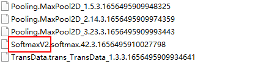

## 模型中存在不支持量化的层，量化模型失败<a name="ZH-CN_TOPIC_0000002473905648"></a>

**问题现象描述<a name="section129228525713"></a>**

**执行ATC模型转换命令时，通过--compression\_optimize\_conf参数配置模型量化（将模型中的权重由浮点数float32量化到低比特整数int8）相关的选项**，结果报错提示如下：

```
ATC start working now, please wait for a moment.
[ERROR][ProcessScale][52] Not support scale greater than 1 / FLT_EPSILON.
[ERROR][WtsArqCalibrationCpuKernel][188] ArqQuantCPU scale is illegal.
[ERROR][ArqQuant][301] WtsArqCalibrationCpuKernel of format CO_CI_KH_KW failed.
[ERROR] AMCT(14815,atc.bin):2023-04-14-12:23:19[weight_algorithm.cpp:137]Default/network-DeepLabV3/resnet-Resnet/layer4-SequentialCell/0-Bottleneck/downsample-SequentialCell/0-Conv2d/Conv2D-op311 arq weight fake quant failed!
[ERROR] AMCT(14815,atc.bin):2023-04-14-12:23:19[weight_calibration_pass.cpp:90]Fail to execute WeightFakeQuant without trans!
[ERROR] AMCT(14815,atc.bin):2023-04-14-12:23:19[weight_calibration_pass.cpp:185]layer Default/network-DeepLabV3/resnet-Resnet/layer4-SequentialCell/0-Bottleneck/downsample-SequentialCell/0-Conv2d/Conv2D-op311 run WeightFakeQuantArq failed
[ERROR] AMCT(14815,atc.bin):2023-04-14-12:23:19[graph_optimizer.cpp:43]pass run failed
[ERROR] AMCT(14815,atc.bin):2023-04-14-12:23:19[quantize_api.cpp:227]Do GenerateCalibrationGraph optimizer pass failed.
[ERROR] AMCT(14815,atc.bin):2023-04-14-12:23:19[quantize_api.cpp:363]Generate calibration Graph failed.
[ERROR] AMCT(14815,atc.bin):2023-04-14-12:23:22[inner_graph_calibration.cpp:78]Failed to execute InnerQuantizeGraph failed.
```

**原因分析<a name="section1667917303476"></a>**

通过报错提示**layer  _xxxxxx_  run WeightFakeQuantArq failed**可知，当前模型中有权重相关的层不支持量化，需要跳过这些不支持量化的层。

**解决措施<a name="section26181115719"></a>**

跳过不支持量化的层，配置方法如下：

1.  增加配置，跳过不支持量化的层。

    新增一个配置文件，文件名后缀为.cfg，例如_simple\_config.cfg_，文件内容如下，加粗部分为报错提示中不支持量化的层：

    ```
    skip_layers:"Default/network-DeepLabV3/resnet-Resnet/layer4-SequentialCell/0-Bottleneck/downsample-SequentialCell/0-Conv2d/Conv2D-op311"
    ```

    同时，在--compression\_optimize\_conf参数指定的量化配置文件中，增加config\_file参数：

    ```
    calibration:
    {
        input_data_dir: xxxxxx
        config_file: simple_config.cfg
        input_shape: xxxxxx
        infer_soc: xxxxxx
    }
    ```

2.  重新执行模型转换。
3.  重新执行推理。

    如果跳过不支持量化的层影响模型推理的结果数据，则需要用户自行调整模型，再重新量化模型。

## 量化模型时模型输入大小过大，AI Core执行任务失败，量化模型失败<a name="ZH-CN_TOPIC_0000002505905729"></a>

**问题现象描述<a name="section10365114634012"></a>**

模型转换命令示例如下，模型输入大小与input\_shape参数指定的shape有关：

```
atc --model=xxxxxx.pb --framework=3 --output=xxxxxx --soc_version=xxxxxx --input_shape="input:64,224,224,3" --input_format=NHWC --compression_optimize_conf=config/quant.cfg
```

模型转换时，报错示例如下：

```
[ERROR] AMCT(757013,atc.bin):2023-03-14-14:15:54[model_process.cpp:299]execute model failed, modelId is 1, errorCode is 507011
[ERROR] AMCT(757013,atc.bin):2023-03-14-14:15:54[sample_process.cpp:320]execute inference failed
[ERROR] AMCT(757013,atc.bin):2023-03-14-14:15:55[sample_process.cpp:275]ACL model infer failed.
[ERROR] AMCT(757013,atc.bin):2023-03-14-14:15:55[quantize_api.cpp:242]sample process failed
[ERROR] AMCT(757013,atc.bin):2023-03-14-14:15:55[quantize_api.cpp:378]Do Calibration failed.
[ERROR] AMCT(757013,atc.bin):2023-03-14-14:15:56[inner_graph_calibration.cpp:77]Failed to execute InnerQuantizeGraph failed.
ATC run failed, Please check the detail log, Try 'atc --help' for more information
EZ9999: Inner Error!
EZ9999  Aicore kernel execute failed, device_id=0, stream_id=11, report_stream_id=2, task_id=209, flip_num=0, fault kernel_name=17786444594805609729-1_0_1_vgg_16/conv1/conv1_2/Conv2D_histo, program id=206, hash=1846532111878224358.[FUNC:GetError][FILE:stream.cc][LINE:1131]
        TraceBack (most recent call last):
        Model synchronize execute failed, model_id=1![FUNC:GetStreamToSyncExecute][FILE:model.cc][LINE:630]
        rtModelExecute execute failed, reason=[the model stream execute failed][FUNC:FuncErrorReason][FILE:error_message_manage.cc][LINE:49]
        [Exec][Model]Execute model failed, ge result[507011], modelId[1][FUNC:ReportCallError][FILE:log_inner.cpp][LINE:161]
        [Exec][Model]modelId[1] execute failed, result[507011][FUNC:ReportInnerError][FILE:log_inner.cpp][LINE:145]
        An unknown error occurred. Please check the log.
```

**原因分析<a name="section879165174012"></a>**

AI Core执行任务失败，猜测可能是因为input\_shape参数处的Batch size值过大，导致AI Core上的算子执行失败。

**解决措施<a name="section10484328105015"></a>**

可将input\_shape参数处的Batch size值调小，例如：--input\_shape="**input:8,224,224,3**"，调整参数值之后，再重新转换模型。

## 量化模型时校准集数据大小与模型输入大小不匹配，量化模型失败<a name="ZH-CN_TOPIC_0000002473905696"></a>

**问题现象描述<a name="section114806818146"></a>**

**执行ATC模型转换命令时，通过--compression\_optimize\_conf参数配置模型量化（将模型中的权重由浮点数float32量化到低比特整数int8）相关的选项**，结果报错提示如下：

```
[ERROR] AMCT(21177,atc.bin):2023-04-14-14:43:17[utils_acl.cpp:133]input image size[1579014] is not equal to model input size[3158028]
[ERROR] AMCT(21177,atc.bin):2023-04-14-14:43:17[sample_process.cpp:234]memcpy device buffer failed
[ERROR] AMCT(21177,atc.bin):2023-04-14-14:43:17[sample_process.cpp:298]execute PreProcess failed
[ERROR] AMCT(21177,atc.bin):2023-04-14-14:43:17[sample_process.cpp:275]ACL model infer failed.
[ERROR] AMCT(21177,atc.bin):2023-04-14-14:43:17[quantize_api.cpp:240]sample process failed
[ERROR] AMCT(21177,atc.bin):2023-04-14-14:43:17[quantize_api.cpp:376]Do Calibration failed.
[ERROR] AMCT(21177,atc.bin):2023-04-14-14:43:20[inner_graph_calibration.cpp:78]Failed to execute InnerQuantizeGraph failed.
...
ATC run failed, Please check the detail log, Try 'atc --help' for more information
```

**原因分析<a name="section179631530105517"></a>**

通过报错提示**input image size\[xxxxxx\] is not equal to model input size\[xxxxxx\]**可知，量化模型时校准集数据大小与模型输入大小不匹配，不匹配可能是校准集数据的shape与模型输入shape不一致，也有可能是校准集数据的数据类型与模型输入数据类型不一致。

**解决措施<a name="section687116111141"></a>**

需要逐一排查校准集数据shape、数据类型与模型输入shape、数据类型是否一致。

量化时，模型输入shape通过量化配置文件中的input\_shape参数配置，模型输入数据类型需由用户从获取模型的网站获取或通过第三方软件打开模型文件查看。

## 开启量化功能，模型转换时提示“build\_main build graph\[infer\_graph\_info\] failed”<a name="ZH-CN_TOPIC_0000002506025633"></a>

**问题现象描述<a name="section1047881312330"></a>**

模型转换时，通过[--compression\_optimize\_conf](--compression_optimize_conf.md)参数配置了量化功能，结果模型转换失败，提示信息如下：

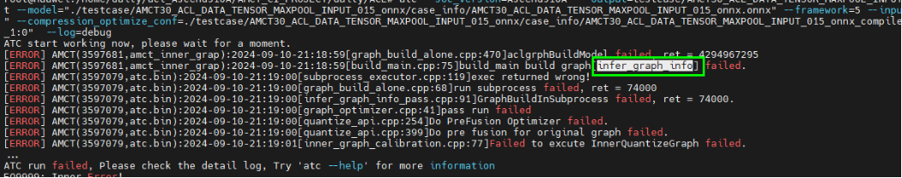

**原因分析<a name="section171321644125914"></a>**

该问题可能是原始模型编译失败。

**解决措施<a name="section138761522103311"></a>**

可以尝试将量化功能关闭，重新进行模型转换，检查出错原因；待原始模型不开启量化功能模型转换成功后，再尝试启用量化功能。

## 算子库包版本问题导致加载单算子失败<a name="ZH-CN_TOPIC_0000002473745742"></a>

**问题现象描述<a name="zh-cn_topic_0000002506023115_section128794133612"></a>**

加载单算子报错失败，日志显示如下类似信息：

```
E19999: Inner Error
E19999 The opp version of the model does not match the current opp run package, Model is [6.4.T11.0.B300], opp run package is [7.0.T3.0.B107], try to convert the om again!
```

**原因分析<a name="zh-cn_topic_0000002506023115_section20876063"></a>**

动态Shape算子场景下，单算子模型数据加载环境中的算子库包安装版本（包名为CANN-opp-\*-linux.\*.run，命名中的\*为版本号或架构类型）与om模型文件编译环境的**算子库包安装版本不一致**，导致加载算子时会报错。

**解决措施<a name="zh-cn_topic_0000002506023115_section9345112013295"></a>**

动态Shape算子场景下，单算子模型数据加载环境中的算子库包安装版本需与om模型文件编译环境的**算子库包安装版本保持一致**，出现该报错后，需排查安装版本，选择更换算子加载环境的opp包版本或更换编译算子om文件环境的opp包版本，若选择更换后者，则需要重新转换模型。

