# 前言

**概述**

本文介绍HiSpark Studio AI 插件工具，如何通过该工具进行模型量化、模型转换、模型评估，以及后续应用开发等功能。

**读者对象**

本文档主要适用于以下工程师：

-   技术支持工程师
-   AI开发工程师

**符号约定**

在本文中可能出现下列标志，它们所代表的含义如下。

<table><thead align="left"><tr id="row1530720816410"><th class="cellrowborder" valign="top" width="20.580000000000002%" id="mcps1.1.3.1.1">
<strong id="b2136615816410">符号</strong>

</th>
<th class="cellrowborder" valign="top" width="79.42%" id="mcps1.1.3.1.2">
<strong id="b5941558116410">说明</strong>

</th>
</tr>
</thead>
<tbody><tr id="row1372280416410"><td class="cellrowborder" valign="top" width="20.580000000000002%" headers="mcps1.1.3.1.1 ">

</td>
<td class="cellrowborder" valign="top" width="79.42%" headers="mcps1.1.3.1.2 ">
表示如不避免则将会导致死亡或严重伤害的具有高等级风险的危害。

</td>
</tr>
<tr id="row466863216410"><td class="cellrowborder" valign="top" width="20.580000000000002%" headers="mcps1.1.3.1.1 ">

</td>
<td class="cellrowborder" valign="top" width="79.42%" headers="mcps1.1.3.1.2 ">
表示如不避免则可能导致死亡或严重伤害的具有中等级风险的危害。

</td>
</tr>
<tr id="row123863216410"><td class="cellrowborder" valign="top" width="20.580000000000002%" headers="mcps1.1.3.1.1 ">

</td>
<td class="cellrowborder" valign="top" width="79.42%" headers="mcps1.1.3.1.2 ">
表示如不避免则可能导致轻微或中度伤害的具有低等级风险的危害。

</td>
</tr>
<tr id="row5786682116410"><td class="cellrowborder" valign="top" width="20.580000000000002%" headers="mcps1.1.3.1.1 ">

</td>
<td class="cellrowborder" valign="top" width="79.42%" headers="mcps1.1.3.1.2 ">
用于传递设备或环境安全警示信息。如不避免则可能会导致设备损坏、数据丢失、设备性能降低或其它不可预知的结果。

“须知”不涉及人身伤害。

</td>
</tr>
<tr id="row2856923116410"><td class="cellrowborder" valign="top" width="20.580000000000002%" headers="mcps1.1.3.1.1 ">

</td>
<td class="cellrowborder" valign="top" width="79.42%" headers="mcps1.1.3.1.2 ">
对正文中重点信息的补充说明。

“说明”不是安全警示信息，不涉及人身、设备及环境伤害信息。

</td>
</tr>
</tbody>
</table>

**修改记录**

<table><thead align="left"><tr id="row2942532716410"><th class="cellrowborder" valign="top" width="20.72%" id="mcps1.1.4.1.1">
<strong id="b5687322716410">文档版本</strong>

</th>
<th class="cellrowborder" valign="top" width="26.119999999999997%" id="mcps1.1.4.1.2">
<strong id="b5800814916410">发布日期</strong>

</th>
<th class="cellrowborder" valign="top" width="53.16%" id="mcps1.1.4.1.3">
<strong id="b3316380216410">修改说明</strong>

</th>
</tr>
</thead>
<tbody><tr id="row6889538125617"><td class="cellrowborder" valign="top" width="20.72%" headers="mcps1.1.4.1.1 ">
02

</td>
<td class="cellrowborder" valign="top" width="26.119999999999997%" headers="mcps1.1.4.1.2 ">
2026-04-28

</td>
<td class="cellrowborder" valign="top" width="53.16%" headers="mcps1.1.4.1.3 ">
修改Hi3322的“ <a href="#ZH-CN_TOPIC_0000002515955566">压缩历史显示界面</a> 中”Accuracy字段详细说明。

</td>
</tr>
<tr id="row5947359616410"><td class="cellrowborder" valign="top" width="20.72%" headers="mcps1.1.4.1.1 ">
01

</td>
<td class="cellrowborder" valign="top" width="26.119999999999997%" headers="mcps1.1.4.1.2 ">
2026-03-27

</td>
<td class="cellrowborder" valign="top" width="53.16%" headers="mcps1.1.4.1.3 ">
第一次正式版本发布。

</td>
</tr>
</tbody>
</table>

# HiSpark Studio AI简介

-   **[关于HiSpark Studio AI](#ZH-CN_TOPIC_0000002541284287)**  

-   **[安装方案介绍](#ZH-CN_TOPIC_0000002509764298)**  

-   **[窗口介绍](#ZH-CN_TOPIC_0000002542085605)**  

-   **[关键概念](#ZH-CN_TOPIC_0000002517388100)**  

## 关于HiSpark Studio AI

HiSpark Studio AI是面向开发者提供的超轻量级AI应用开发平台，具备高集成、高专业、高易用等特征，聚焦嵌入式AI应用场景，提供模型压缩、模型转换、应用开发、端侧部署、性能调优的全流程开发平台。

-   高集成
    -   一站式开发平台，支持模型压缩/转换/推理/部署/调试等功能。
    -   统一的IDE界面和API接口，支持CPU/NPU等芯片AI应用开发和部署。

-   高专业
    -   高效的模型压缩，支持ONNX/TFLITE等AI模型。
    -   超轻量的模型部署，支持KB级RAM嵌入式设备。

-   高易用
    -   提供VS Code插件，方便安装和使用。
    -   支持性能/精度可视化分析，方便调试。

-   功能介绍

    HiSpark Studio AI功能架构如[图1](#fig1357355818812)所示。具备核心功能有：

    -   导入ONNX/TFLITE等格式的AI模型，初始化开发环境。
    -   通过集成的NPU/CPU工具链可以进行模型压缩和转换。
    -   导入SDK并参考Sample进行用户AI应用开发。
    -   编译用户AI应用，烧录到嵌入式设备进行部署。
    -   根据串口日志检测性能精度是否达成目标。

    **图 1**  HiSpark Studio AI 功能架构  
    
    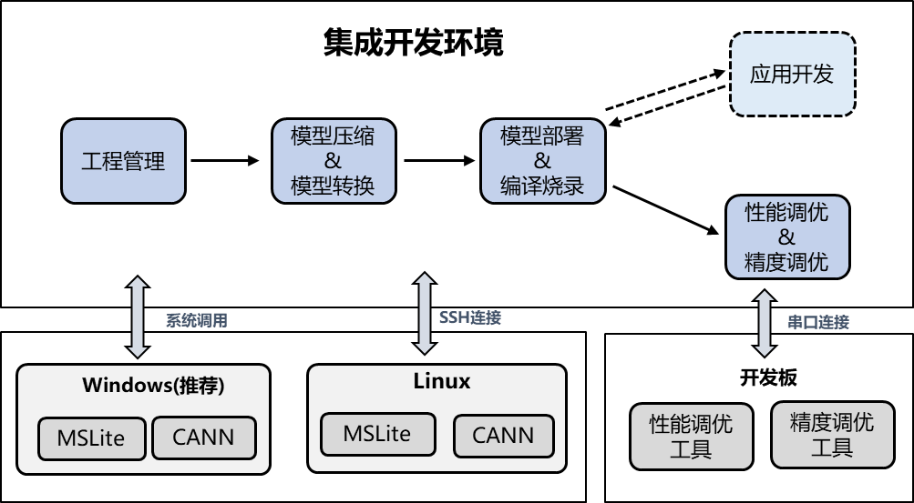

## 安装方案介绍

> **须知：** 
>若之前已经安装过DevEco相关的插件，请手动禁用或者卸载所有与DevEco相关的插件，否则会与HiSpark Studio插件功能冲突。

1.  打开VS Code插件市场。

    

2.  搜索并安装HiSpark Studio AI。

    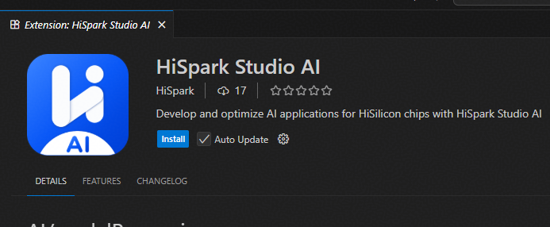

    为保证功能正常运行，还需安装HiSpark Studio插件，需安装v26.4.1版本。

    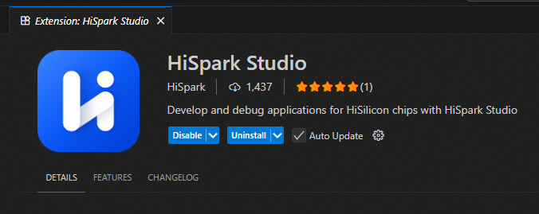

## 窗口介绍

-   **[整体窗口介绍](#ZH-CN_TOPIC_0000002510367162)**  

-   **[侧边栏](#ZH-CN_TOPIC_0000002542087149)**  

-   **[工作区](#ZH-CN_TOPIC_0000002542007157)**  

### 整体窗口介绍

HiSpark Studio AI整体窗口如[图1](#fig141565497718)所示，主要包含两个部分：

1.  侧边栏：HiSpark Studio AI功能导航栏。
2.  工作区：HiSpark Studio AI工作区。

**图 1**  HiSpark Studio AI整体窗口  
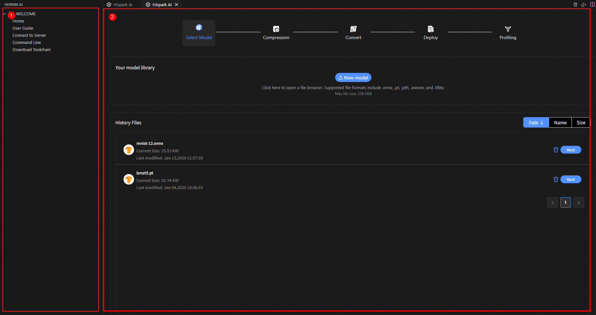

### 侧边栏

侧边栏为功能导航栏，展示了HiSpark Studio AI插件提供的五个主要功能，分别为：

1. Home（主页）：单击进入新建/导入工程，或在已打开工程的情况下进入HiSpark Studio AI模型选择主界面。

2. User Guide（用户指南）：单击在工作区打开用户指南，提供快速入门指南。

3. Connect to Server（连接服务器）：单击连接至服务器。

4. Command Line（命令行工具）：单击在命令行中运行HiSpark Studio AI的量化、转换等功能。

5. Download Toolchain（下载工具链）：单击下载运行HiSpark Studio AI插件所需要的工具链，并自动配置环境。

### 工作区

工作区为插件核心功能展示区域，详细交互逻辑请参见后续章节。

**图 1**  HiSpark Studio AI核心工作区示意图  
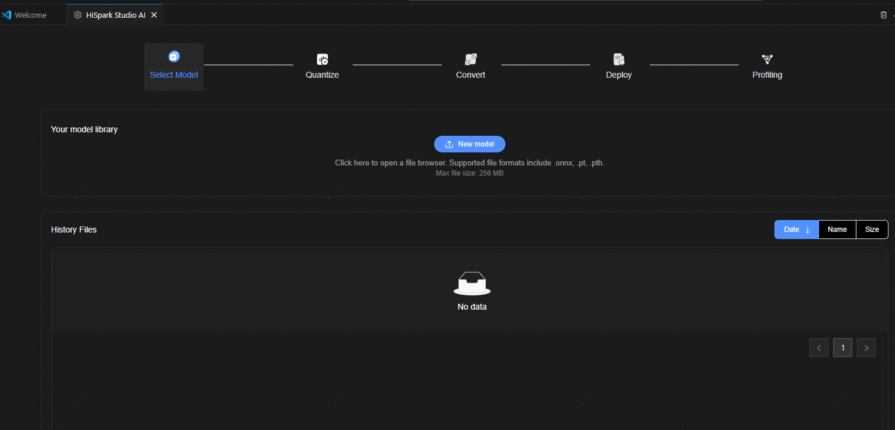

## 关键概念

本文档中涉及如下概念，在此处做统一说明。

-   **[AMCT](#ZH-CN_TOPIC_0000002548827971)**  

-   **[ATC](#ZH-CN_TOPIC_0000002548707983)**  

### AMCT

AMCT（Ascend Model Compression Toolkit，简称AMCT）是一个针对昇腾芯片的深度学习模型压缩工具包，提供量化、张量分解等多种模型压缩特性，压缩后的模型体积变小，部署到NPU IP加速器上后可使能低比特运算，提高计算效率，从而实现性能提升。有关AMCT具体操作请参考《AMCT模型压缩工具用户指南》。

### ATC

昇腾张量编译器（Ascend Tensor Compiler，简称ATC）是CANN异构计算架构体系下的模型转换工具，它可以将开源框架的网络模型转换为NPU IP加速器支持的离线模型。有关ATC具体操作请参考《ATC离线模型编译工具用户指南》。

# 数据准备与环境搭建

-   **[数据准备](#ZH-CN_TOPIC_0000002517501304)**  

-   **[环境搭建](#ZH-CN_TOPIC_0000002517341386)**  

## 数据准备

模型的训练后量化校准、量化感知训练、量化精度评估以及上板精度评估等操作需要对应数据，请按照如下格式准备数据：

-   数据存储为npy格式，每个文件对应一个与网络输出张量匹配的样本。
-   若模型有多个输出，则不同的输出必须存储在不同的目录中。同一个样本不同的输出名称需要保持一致。
-   分类任务真值存储为csv格式。包含两列sample和label，其中sample表示样本的名称，和npy文件名保持一致。label表示标签值。csv文件示例见[表1](#table55542586239)。

    **表 1**  分类真值标签csv表格示例

    
    <table><thead align="left"><tr id="row655475820236"><th class="cellrowborder" valign="top" width="50%" id="mcps1.2.3.1.1">
<strong id="b1849143165818">sample</strong>

    </th>
    <th class="cellrowborder" valign="top" width="50%" id="mcps1.2.3.1.2">
<strong id="b4591931105810">label</strong>

    </th>
    </tr>
    </thead>
    <tbody><tr id="row1555205811235"><td class="cellrowborder" valign="top" width="50%" headers="mcps1.2.3.1.1 ">
sample_00000_7.npy

    </td>
    <td class="cellrowborder" valign="top" width="50%" headers="mcps1.2.3.1.2 ">
7

    </td>
    </tr>
    <tr id="row1726132522419"><td class="cellrowborder" valign="top" width="50%" headers="mcps1.2.3.1.1 ">
sample_00001_2.npy

    </td>
    <td class="cellrowborder" valign="top" width="50%" headers="mcps1.2.3.1.2 ">
2

    </td>
    </tr>
    </tbody>
    </table>

## 环境搭建

环境配置请参考《HiSpark.AI 快速入门指南》。

# Hi3863操作指南

-   **[工程创建](#ZH-CN_TOPIC_0000002509726608)**  

-   **[模型导入](#ZH-CN_TOPIC_0000002541326603)**  

-   **[模型量化](#ZH-CN_TOPIC_0000002541286615)**  

-   **[模型转换](#ZH-CN_TOPIC_0000002509766616)**  

-   **[部署](#ZH-CN_TOPIC_0000002541345339)**  

-   **[模型调优](#ZH-CN_TOPIC_0000002509726610)**  

-   **[应用开发](#ZH-CN_TOPIC_0000002541326605)**  

## 工程创建

-   **[约束说明](#ZH-CN_TOPIC_0000002516863308)**  

-   **[界面介绍](#ZH-CN_TOPIC_0000002548503199)**  

### 约束说明

> **须知：** 
>新建工程需要满足以下条件：
>1.  用户使用WS63 SDK版本需要社区版本（[WS63社区链接](https://gitcode.com/HiSpark/fbb_ws63)） 或海思发布的商用版本。商用客户优先使用商用版本。
>2.  SDK存放路径必须为英文路径。

### 界面介绍

-   **[首页](#ZH-CN_TOPIC_0000002548691489)**  

-   **[新建工程配置界面](#ZH-CN_TOPIC_0000002517211612)**  

#### 首页

单击HiSpark Studio AI插件中的“Home”按钮，进入首页如[图1](#fig43390675013)所示。

**图 1**  HiSpark Studio AI首页  

若用户首次使用HiSpark Studio AI，单击“New Project”即可创建新项目。若用户需要项目迁移，也可以选择“Import Project”导入已有项目。

#### 新建工程配置界面

选择芯片为WS63，选择已准备好的SDK目录，工程项目目录选择SDK相同路径即可。

**图 1**  HiSpark Studio AI新建工程配置界面  

新建工程导入页面的具体逻辑如下，参数详细配置如[表1](#table1769074411309)所示。

1.  选择芯片“SOC”为WS63，“Board”为WS63，“Project Type”为Common Project通用项目。
2.  填写“Project Name”为项目名称。
3.  配置“Project Path”以及“SDK”，一般情况下，配置为下载的SDK路径。

**表 1**  新建工程参数配置

<table><thead align="left"><tr id="row1769018444306"><th class="cellrowborder" valign="top" width="26.229999999999997%" id="mcps1.2.3.1.1">
参数

</th>
<th class="cellrowborder" valign="top" width="73.77%" id="mcps1.2.3.1.2">
说明

</th>
</tr>
</thead>
<tbody><tr id="row13690144417303"><td class="cellrowborder" valign="top" width="26.229999999999997%" headers="mcps1.2.3.1.1 ">
SOC

</td>
<td class="cellrowborder" valign="top" width="73.77%" headers="mcps1.2.3.1.2 ">
AI部署工程SOC类型。

</td>
</tr>
<tr id="row15497102073518"><td class="cellrowborder" valign="top" width="26.229999999999997%" headers="mcps1.2.3.1.1 ">
Board

</td>
<td class="cellrowborder" valign="top" width="73.77%" headers="mcps1.2.3.1.2 ">
AI部署工程所用具体单板型号。

</td>
</tr>
<tr id="row176419249441"><td class="cellrowborder" valign="top" width="26.229999999999997%" headers="mcps1.2.3.1.1 ">
Project Name

</td>
<td class="cellrowborder" valign="top" width="73.77%" headers="mcps1.2.3.1.2 ">
项目名称。

</td>
</tr>
<tr id="row9587204511914"><td class="cellrowborder" valign="top" width="26.229999999999997%" headers="mcps1.2.3.1.1 ">
Project Path

</td>
<td class="cellrowborder" valign="top" width="73.77%" headers="mcps1.2.3.1.2 ">
工程配置相关文件存放路径。

</td>
</tr>
<tr id="row0675448181017"><td class="cellrowborder" valign="top" width="26.229999999999997%" headers="mcps1.2.3.1.1 ">
SDK

</td>
<td class="cellrowborder" valign="top" width="73.77%" headers="mcps1.2.3.1.2 ">
SDK文件存放路径。

</td>
</tr>
<tr id="row11454192012481"><td class="cellrowborder" valign="top" width="26.229999999999997%" headers="mcps1.2.3.1.1 ">
Finished

</td>
<td class="cellrowborder" valign="top" width="73.77%" headers="mcps1.2.3.1.2 ">
完成新建文件。

</td>
</tr>
<tr id="row866720531356"><td class="cellrowborder" valign="top" width="26.229999999999997%" headers="mcps1.2.3.1.1 ">
Cancel

</td>
<td class="cellrowborder" valign="top" width="73.77%" headers="mcps1.2.3.1.2 ">
取消新建文件。

</td>
</tr>
</tbody>
</table>

> **须知：** 
>1.  用户需要提前准备WS63 SDK解压到指定目录，一级目录包含application、tools等文件夹。
>2.  通常情况下，用户将“SDK”和“Project Path”设置为相同路径即可。如果用户有将“.hiproj”等项目文件与SDK文件夹分开放置的需求，可以创建一个新的文件夹，专门用于放置项目文件，并单独配置到“Project Path”中。

## 模型导入

模型导入主要帮助用户将本地已经训练好的ONNX模型或者TFLITE模型加载到HiSpark Studio AI中，并且记录之前的导入记录。

-   **[约束说明](#ZH-CN_TOPIC_0000002516764686)**  

-   **[界面介绍](#ZH-CN_TOPIC_0000002548164589)**  

### 约束说明

> **须知：** 
>用户导入的模型有以下约束：
>1.  ONNX模型满足Opset版本小于等于18。
>2.  TFLITE推荐版本为Tensorflow 2.13。
>3.  ONNX以及TFLITE模型中的算子必须位于列表中，具体清单请参考《HiSpark. AI 转换工具 使用指南》。
>4.  目前仅支持浮点ONNX以及TFLITE模型，量化后的模型暂时不支持。

### 界面介绍

-   **[整体界面](#ZH-CN_TOPIC_0000002516604782)**  

-   **[Linux导入配置界面（仅Linux端用户需要关注）](#ZH-CN_TOPIC_0000002548244585)**  

#### 整体界面

**图 1**  模型导入整体页面  
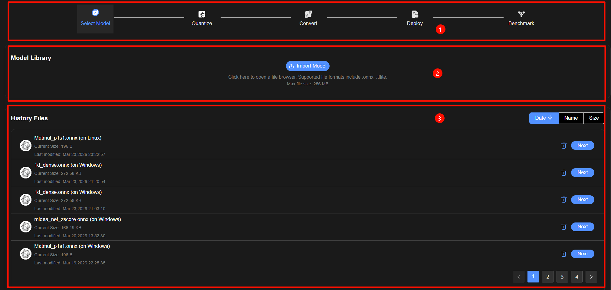

模型导入的界面如[图1](#fig15594115103619)所示。主要包含以下部分：

1.  跳转标签（Select Model -\> Quantize -\> Convert -\> Deploy -\> Benchmark），当存在历史操作记录时，完成界面的切换。
2.  模型选择页面，用于选择部署目标模型。
3.  历史模型选择记录页面，显示所有的选择过模型的大小、修改时间，并提供回溯历史步骤以及删除功能。

模型导入步骤如下：

1.  进入模型选择页面，单击“Import Model”按钮，选择对应的Mnist ONNX模型，测试模型请参考[Mnist-12.onnx](https://gitcode.com/HiSpark/hispark_ai/blob/master/src/samples/oh/lenet5/model/mnist-12.onnx)。
2.  模型导入结束，进入量化页面。

#### Linux导入配置界面（仅Linux端用户需要关注）

1.  首次单击“Import Model”按钮，需要用户填写服务器相关配置，用于连接远端服务器（需要先按照快速入门指南环境准备章节配置环境）。
2.  单击“仅命令传输 & 待定文件下载连接”按钮。

**图 1**  Linux服务器连接选项页面  
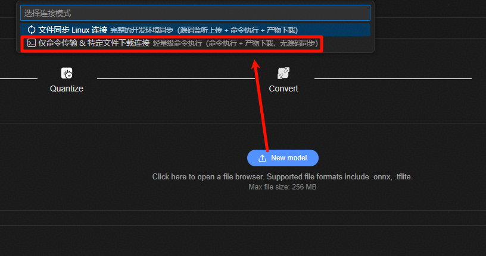

## 模型量化

-   **[约束说明](#ZH-CN_TOPIC_0000002548383197)**  

-   **[量化前提](#ZH-CN_TOPIC_0000002516703394)**  

-   **[界面介绍](#ZH-CN_TOPIC_0000002516863310)**  

### 约束说明

> **须知：** 
>在进行模型压缩前，有以下约束：
>1.  模型压缩仅针对ONNX以及TFLITE两种格式的模型。
>2.  模型压缩仅支持未进行过量化的模型，已量化完成的ONNX以及TFLITE不支持。
>3.  任何网络都会被处理为分类网络，带标签的量化精度准确率评估仅针对网络输入为\[N, D\]格式。

### 量化前提

用户需要准备模型量化的输入数据（Linux用户需要提前将数据放置到Docker环境所在的服务器上），可参考《快速入门指南》的“样例运行”章节准备。

### 界面介绍

-   **[整体界面](#ZH-CN_TOPIC_0000002548503201)**  

-   **[量化参数配置页面](#ZH-CN_TOPIC_0000002548383199)**  

-   **[量化历史配置界面](#ZH-CN_TOPIC_0000002516703396)**  

-   **[验证集精度分布直方图显示界面](#ZH-CN_TOPIC_0000002516863312)**  

#### 整体界面

**图 1**  模型量化示意图  
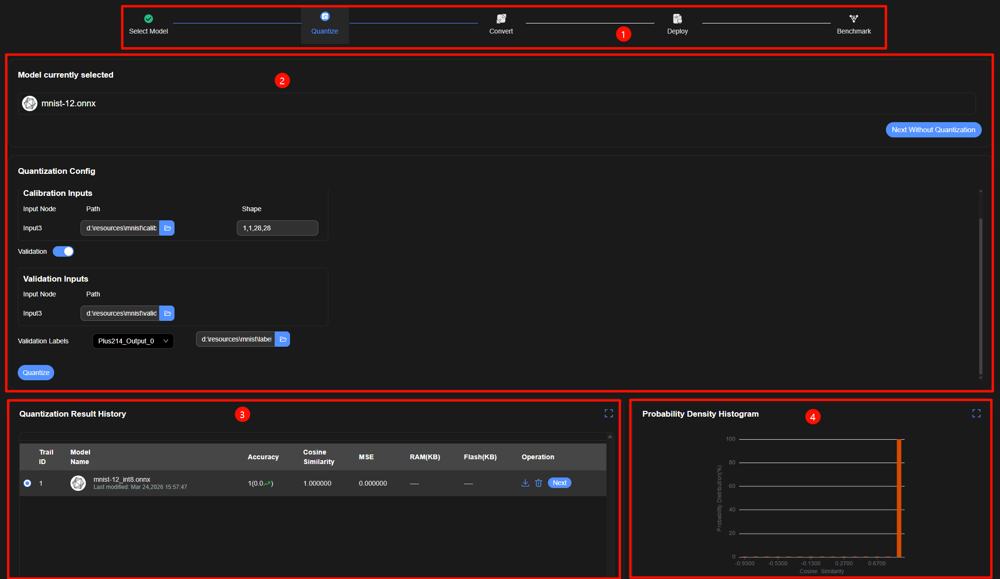

模型压缩界面如[图1](#fig156191537102517)所示，整体界面主要包含四个部分：

1. 跳转标签页面，能否跳转到该量化记录关联的前后步骤。

2. 量化参数配置界面。

3. 压缩历史显示界面，显示所有的量化网络余弦相似度、MSE、准确率等指标。

4. 样本精度分布直方图显示界面，显示验证集量化输出与浮点标杆相似度的直方图界面。

量化步骤如下：

1.  进入量化页面，配置量化参数，参数详情请参见“[量化参数配置页面](#ZH-CN_TOPIC_0000002548383199)”。

    > **说明：** 
    >量化输入数据以及验证输入数据需要输入文件夹路径，文件夹内数据保持为npy格式。
    >多输入模型不同输入文件夹内每个npy文件名称代表样本名，样本名称需要保持一致。

1.  单击“Quantize”按钮，输出量化余弦相似度、准确率以及MSE等结果；单击“Next Without Quantization”按钮，直接跳过[3](#li475115341204)和[4](#li434033051115)进入转换步骤。
2.  在量化历史配置界面与验证集精度直方图分布界面，查看量化结果。
3.  单击“Next”进入下一步。

#### 量化参数配置页面

**图 1**  模型量化参数配置界面  
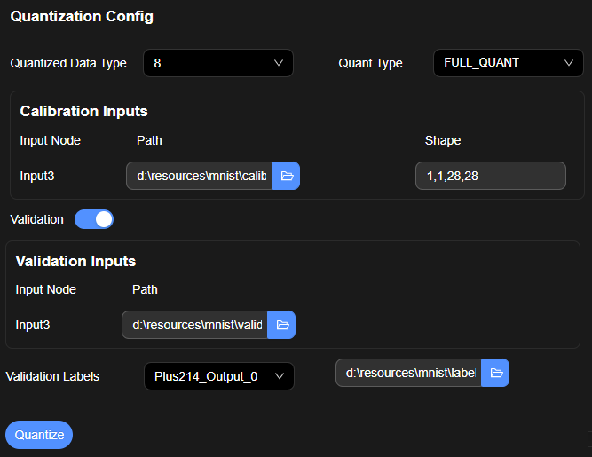

参数解释如[表1](#table1769074411309)所示。

**表 1**  量化参数配置

<table><thead align="left"><tr id="row1769018444306"><th class="cellrowborder" valign="top" width="26.229999999999997%" id="mcps1.2.3.1.1">
参数

</th>
<th class="cellrowborder" valign="top" width="73.77%" id="mcps1.2.3.1.2">
说明

</th>
</tr>
</thead>
<tbody><tr id="row13690144417303"><td class="cellrowborder" valign="top" width="26.229999999999997%" headers="mcps1.2.3.1.1 ">
Quantized Data Type

</td>
<td class="cellrowborder" valign="top" width="73.77%" headers="mcps1.2.3.1.2 ">
数据量化的数据位数。目前仅支持8bit量化，权重或激活值会转换成int8类型来参与计算。

</td>
</tr>
<tr id="row15497102073518"><td class="cellrowborder" valign="top" width="26.229999999999997%" headers="mcps1.2.3.1.1 ">
Quant Type

</td>
<td class="cellrowborder" valign="top" width="73.77%" headers="mcps1.2.3.1.2 ">
数量量化类型。目前仅支持全量化。

<ul id="ul8922547415"><li>FULL_QUANT：支持量化的算子权重以及中间层张量会被同时量化为低精度。</li></ul>
</td>
</tr>
<tr id="row176419249441"><td class="cellrowborder" valign="top" width="26.229999999999997%" headers="mcps1.2.3.1.1 ">
Calibration Inputs

</td>
<td class="cellrowborder" valign="top" width="73.77%" headers="mcps1.2.3.1.2 ">
用户在该表格中输入量化的校准数据。表格中各列的含义如下所示：

<ul id="ul1749181515018"><li>Input Node：网络输入节点的名称。</li><li>Path：校准数据的目录。目录中存放和模型输入匹配的npy文件数据。若模型有多个输入，同一个校准样本的多个输入npy文件文件名必须保持一致。</li><li>Shape（不可配置）：网络输入张量的形状。</li></ul>
</td>
</tr>
<tr id="row9587204511914"><td class="cellrowborder" valign="top" width="26.229999999999997%" headers="mcps1.2.3.1.1 ">
Validation

</td>
<td class="cellrowborder" valign="top" width="73.77%" headers="mcps1.2.3.1.2 ">
使能验证开关。当开关打开时，验证数据集输入界面展开，如<a href="#fig125691159182914">图3</a>所示。

</td>
</tr>
<tr id="row0675448181017"><td class="cellrowborder" valign="top" width="26.229999999999997%" headers="mcps1.2.3.1.1 ">
Validation Inputs

</td>
<td class="cellrowborder" valign="top" width="73.77%" headers="mcps1.2.3.1.2 ">
用户在该表格中输入量化评估网络的验证数据集。表格中各列的含义如<a href="#fig125691159182914">图3</a>所示：

<ul id="ul11478439133512"><li>Input Node：网络输入节点的名称。</li><li>Path：验证数据的目录。目录中存放和模型输入匹配的npy文件数据。若模型有多个输入，同一个验证样本的多个输入npy文件文件名必须保持一致。</li></ul>
</td>
</tr>
<tr id="row7221131203619"><td class="cellrowborder" valign="top" width="26.229999999999997%" headers="mcps1.2.3.1.1 ">
Validation Labels

</td>
<td class="cellrowborder" valign="top" width="73.77%" headers="mcps1.2.3.1.2 ">
使能开关打开后，输入含分类真值标签的csv表格文件。文件中的表格格式如<a href="#table112929412576">表2</a>所示。各列的含义如下所示：

<ul id="ul24531748114210"><li>sample：验证样本的名称。</li><li>label：验证样本的标签值。</li></ul>
</td>
</tr>
<tr id="row11454192012481"><td class="cellrowborder" valign="top" width="26.229999999999997%" headers="mcps1.2.3.1.1 ">
Quantize

</td>
<td class="cellrowborder" valign="top" width="73.77%" headers="mcps1.2.3.1.2 ">
开始量化按钮。

</td>
</tr>
</tbody>
</table>

**图 2**  跳过量化按钮  
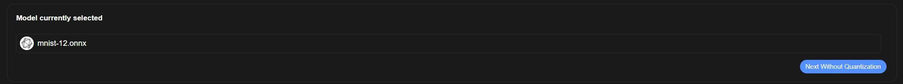

单击“Next Without Quantization”按钮，即可跳过量化步骤，直接转换成浮点模型。

**图 3**  验证数据输入页面  
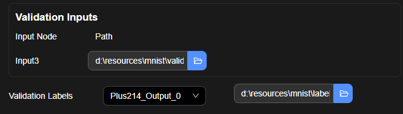

Validation Labels输入csv格式如[表2](#table112929412576)所示。

**表 2**  label.csv文件内容

<table><thead align="left"><tr id="row73010420575"><th class="cellrowborder" valign="top" width="50.12%" id="mcps1.2.3.1.1">
sample

</th>
<th class="cellrowborder" valign="top" width="49.88%" id="mcps1.2.3.1.2">
label

</th>
</tr>
</thead>
<tbody><tr id="row0301184195719"><td class="cellrowborder" valign="top" width="50.12%" headers="mcps1.2.3.1.1 ">
sample_00000_7.npy

</td>
<td class="cellrowborder" valign="top" width="49.88%" headers="mcps1.2.3.1.2 ">
7

</td>
</tr>
<tr id="row930164135710"><td class="cellrowborder" valign="top" width="50.12%" headers="mcps1.2.3.1.1 ">
sample_00001_2.npy

</td>
<td class="cellrowborder" valign="top" width="49.88%" headers="mcps1.2.3.1.2 ">
2

</td>
</tr>
</tbody>
</table>

> **说明：** 
>label.csv中为样本分类的真值标签。文件中的表格格式如[表2](#table112929412576)所示。其中sample列表示样本的名称，label列表示样本对应的真值标签。

#### 量化历史配置界面

量化历史显示窗口如[图1](#fig16878619143716)所示。

**图 1**  量化历史配置页面  
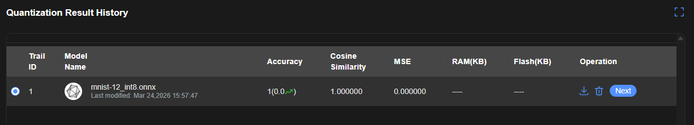

该窗口以表格的方式显示历史量化的结果。表头解释如[表1](#table17914154610556)所示。

**表 1**  历史压缩结果表头说明

<table><thead align="left"><tr id="row691494685515"><th class="cellrowborder" valign="top" width="25.929999999999996%" id="mcps1.2.3.1.1">
项目

</th>
<th class="cellrowborder" valign="top" width="74.07000000000001%" id="mcps1.2.3.1.2">
说明

</th>
</tr>
</thead>
<tbody><tr id="row09141746195518"><td class="cellrowborder" valign="top" width="25.929999999999996%" headers="mcps1.2.3.1.1 ">
Trail ID

</td>
<td class="cellrowborder" valign="top" width="74.07000000000001%" headers="mcps1.2.3.1.2 ">
网络量化结果的序号。

</td>
</tr>
<tr id="row926611014579"><td class="cellrowborder" valign="top" width="25.929999999999996%" headers="mcps1.2.3.1.1 ">
Model Name

</td>
<td class="cellrowborder" valign="top" width="74.07000000000001%" headers="mcps1.2.3.1.2 ">
网络的名称，以及模型大小和修改时间。

</td>
</tr>
<tr id="row499271165719"><td class="cellrowborder" valign="top" width="25.929999999999996%" headers="mcps1.2.3.1.1 ">
Accuracy

</td>
<td class="cellrowborder" valign="top" width="74.07000000000001%" headers="mcps1.2.3.1.2 ">
表示分类结果准确率，使用标签真值计算。

</td>
</tr>
<tr id="row844131695717"><td class="cellrowborder" valign="top" width="25.929999999999996%" headers="mcps1.2.3.1.1 ">
Cosine Similarity

</td>
<td class="cellrowborder" valign="top" width="74.07000000000001%" headers="mcps1.2.3.1.2 ">
余弦相似度，使用量化评估网络的输出和原始浮点网络的输出计算。

</td>
</tr>
<tr id="row1676132014572"><td class="cellrowborder" valign="top" width="25.929999999999996%" headers="mcps1.2.3.1.1 ">
MSE

</td>
<td class="cellrowborder" valign="top" width="74.07000000000001%" headers="mcps1.2.3.1.2 ">
均方误差，使用量化评估网络的输出和原始浮点网络的输出计算。

</td>
</tr>
<tr id="row199509591380"><td class="cellrowborder" valign="top" width="25.929999999999996%" headers="mcps1.2.3.1.1 ">
RAM(KB)

</td>
<td class="cellrowborder" valign="top" width="74.07000000000001%" headers="mcps1.2.3.1.2 ">
上板AI相关RAM内存估计。

</td>
</tr>
<tr id="row2384771999"><td class="cellrowborder" valign="top" width="25.929999999999996%" headers="mcps1.2.3.1.1 ">
FLASH(KB)

</td>
<td class="cellrowborder" valign="top" width="74.07000000000001%" headers="mcps1.2.3.1.2 ">
上板AI相关FLASH内存估计。

</td>
</tr>
<tr id="row14206152325711"><td class="cellrowborder" valign="top" width="25.929999999999996%" headers="mcps1.2.3.1.1 ">
Operation

</td>
<td class="cellrowborder" valign="top" width="74.07000000000001%" headers="mcps1.2.3.1.2 ">
操作按钮：

<ul id="ul52775178594"><li>：下载压缩结果。下载的压缩包中包含：<ul id="ul1285118481118"><li>{模型名称}.ms：量化后模型IR。</li><li>{模型名称}.cfg：量化配置。</li><li>quant_plot.json：量化评估结果文件。</li></ul>
</li><li>：删除当前记录。</li><li>：跳转到模型转换页面，在模型转换页面对当前行对应的压缩网络进行模型转换。</li></ul>
</td>
</tr>
</tbody>
</table>

#### 验证集精度分布直方图显示界面

验证集精度分布直方图显示窗口如[图1](#fig125132017185218)所示，该窗口显示验证集的余弦相似度的分布图。横轴为余弦相似度，纵轴为验证集样本的百分比。

**图 1**  验证集精度分布直方图显示界面  
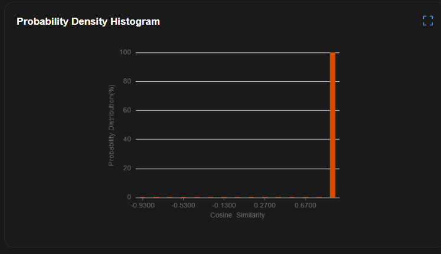

## 模型转换

-   **[约束说明](#ZH-CN_TOPIC_0000002516898190)**  

-   **[转换前提](#ZH-CN_TOPIC_0000002517058108)**  

-   **[界面介绍](#ZH-CN_TOPIC_0000002548417995)**  

### 约束说明

> **须知：** 
>WS63模型转换需要满足以下条件：
>1.  用户转换的模型格式、版本以及算子需要满足条件详见“[约束说明](#ZH-CN_TOPIC_0000002516764686)”以及“[约束说明](#ZH-CN_TOPIC_0000002548383197)”。
>2.  用户需要确保Docker容器中MSLite工具链配套环境的完备性（Windows侧用户保证toolchain文件中tools下存在“mindspore-xxx-lite-xxx.x.x-win-x64”文件夹；Linux侧用户保证Docker容器内“/usr/src/mindspore”存在对应的“mindspore-xxx-lite-xxx.x.x-linux-x64”文件夹）。

### 转换前提

用户已成功完成量化或跳过量化，且量化所用的校准数据位置不改变。

### 界面介绍

-   **[整体界面](#ZH-CN_TOPIC_0000002548538003)**  

-   **[转换参数配置页面](#ZH-CN_TOPIC_0000002516898192)**  

-   **[转换历史配置界面](#ZH-CN_TOPIC_0000002517058110)**  

-   **[内存占用分布条形图显示界面](#ZH-CN_TOPIC_0000002548417997)**  

#### 整体界面

**图 1**  模型转换整体界面  
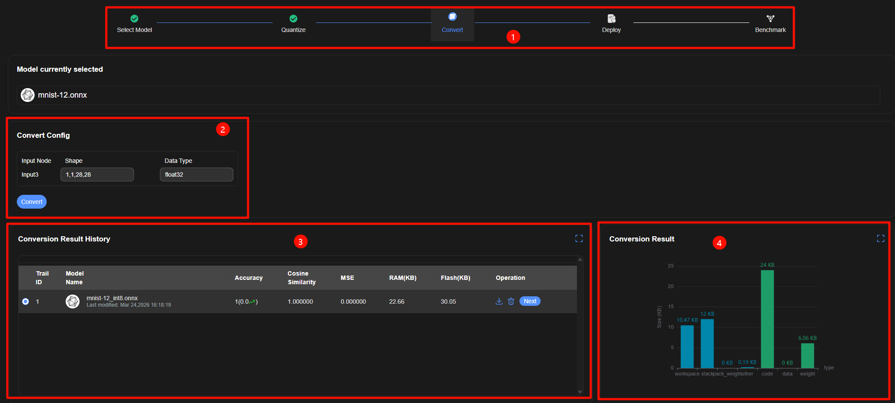

模型转换整体界面如[图1](#fig57907974019)所示，主要包含四个部分：

1. 跳转标签页面，能否跳转到该量化记录关联的前后步骤。

2. 转换参数配置界面。

3. 历史转换记录配置界面，显示所有的转换网络余弦相似度、MSE、准确率、RAM、FLASH等指标。

4. 转换结果RAM/FLASH对比界面，显示模型转换预估上板的各项RAM/FLASH估计。

转换步骤：

1.  进入转换页面，配置转换参数，参数详情详见“[转换参数配置页面](#ZH-CN_TOPIC_0000002516898192)”。

1.  单击“Convert”按钮，输出转换RAM/FLASH等结果。
2.  单击“Next”进入下一步。

#### 转换参数配置页面

**图 1**  转换参数配置页面  
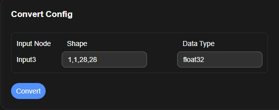

参数说明如[表1](#table1769074411309)所示。

**表 1**  转换参数配置

<table><thead align="left"><tr id="row1769018444306"><th class="cellrowborder" valign="top" width="25.019999999999996%" id="mcps1.2.3.1.1">
参数

</th>
<th class="cellrowborder" valign="top" width="74.98%" id="mcps1.2.3.1.2">
说明

</th>
</tr>
</thead>
<tbody><tr id="row13690144417303"><td class="cellrowborder" valign="top" width="25.019999999999996%" headers="mcps1.2.3.1.1 ">
Input Node（不可配置）

</td>
<td class="cellrowborder" valign="top" width="74.98%" headers="mcps1.2.3.1.2 ">
输入变量名称。

</td>
</tr>
<tr id="row15497102073518"><td class="cellrowborder" valign="top" width="25.019999999999996%" headers="mcps1.2.3.1.1 ">
Shape（不可配置）

</td>
<td class="cellrowborder" valign="top" width="74.98%" headers="mcps1.2.3.1.2 ">
输入变量形状。

</td>
</tr>
<tr id="row176419249441"><td class="cellrowborder" valign="top" width="25.019999999999996%" headers="mcps1.2.3.1.1 ">
Data Type（不可配置）

</td>
<td class="cellrowborder" valign="top" width="74.98%" headers="mcps1.2.3.1.2 ">
输入变量的数据类型。

</td>
</tr>
<tr id="row11454192012481"><td class="cellrowborder" valign="top" width="25.019999999999996%" headers="mcps1.2.3.1.1 ">
Convert

</td>
<td class="cellrowborder" valign="top" width="74.98%" headers="mcps1.2.3.1.2 ">
开始转换按钮。

</td>
</tr>
</tbody>
</table>

#### 转换历史配置界面

**图 1**  历史转换结果配置界面  
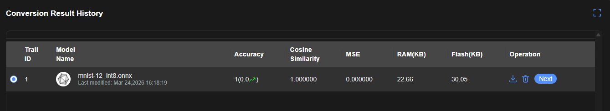

该窗口以表格的方式显示历史转换的结果。表头说明如[表1](#table17914154610556)所示。

**表 1**  历史转换结果表头说明

<table><thead align="left"><tr id="row691494685515"><th class="cellrowborder" valign="top" width="25.929999999999996%" id="mcps1.2.3.1.1">
项目

</th>
<th class="cellrowborder" valign="top" width="74.07000000000001%" id="mcps1.2.3.1.2">
说明

</th>
</tr>
</thead>
<tbody><tr id="row09141746195518"><td class="cellrowborder" valign="top" width="25.929999999999996%" headers="mcps1.2.3.1.1 ">
Trail ID

</td>
<td class="cellrowborder" valign="top" width="74.07000000000001%" headers="mcps1.2.3.1.2 ">
网络转换结果的序号。

</td>
</tr>
<tr id="row926611014579"><td class="cellrowborder" valign="top" width="25.929999999999996%" headers="mcps1.2.3.1.1 ">
Model Name

</td>
<td class="cellrowborder" valign="top" width="74.07000000000001%" headers="mcps1.2.3.1.2 ">
网络的名称，以及模型大小和修改时间。

</td>
</tr>
<tr id="row499271165719"><td class="cellrowborder" valign="top" width="25.929999999999996%" headers="mcps1.2.3.1.1 ">
Accuracy

</td>
<td class="cellrowborder" valign="top" width="74.07000000000001%" headers="mcps1.2.3.1.2 ">
表示分类结果准确率，使用标签真值计算。

准确率表示的格式：{量化模型准确率}({量化模型与原始浮点模型准确率对比})

<ul id="ul614475942616"><li>：表示量化后模型的准确率为0.99，与原始浮点网络模型相比上升0.01。</li><li>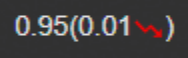：表示量化后模型的准确率为0.95，与原始浮点网络模型相比下降0.01。</li></ul>
</td>
</tr>
<tr id="row844131695717"><td class="cellrowborder" valign="top" width="25.929999999999996%" headers="mcps1.2.3.1.1 ">
Cosine Similarity

</td>
<td class="cellrowborder" valign="top" width="74.07000000000001%" headers="mcps1.2.3.1.2 ">
余弦相似度，使用量化评估网络的输出和原始浮点网络的输出计算。

</td>
</tr>
<tr id="row1676132014572"><td class="cellrowborder" valign="top" width="25.929999999999996%" headers="mcps1.2.3.1.1 ">
MSE

</td>
<td class="cellrowborder" valign="top" width="74.07000000000001%" headers="mcps1.2.3.1.2 ">
均方误差，使用量化评估网络的输出和原始浮点网络的输出计算。

</td>
</tr>
<tr id="row199509591380"><td class="cellrowborder" valign="top" width="25.929999999999996%" headers="mcps1.2.3.1.1 ">
RAM(KB)

</td>
<td class="cellrowborder" valign="top" width="74.07000000000001%" headers="mcps1.2.3.1.2 ">
上板AI相关RAM内存估计。

</td>
</tr>
<tr id="row2384771999"><td class="cellrowborder" valign="top" width="25.929999999999996%" headers="mcps1.2.3.1.1 ">
FLASH(KB)

</td>
<td class="cellrowborder" valign="top" width="74.07000000000001%" headers="mcps1.2.3.1.2 ">
上板AI相关FLASH内存估计。

</td>
</tr>
<tr id="row14206152325711"><td class="cellrowborder" valign="top" width="25.929999999999996%" headers="mcps1.2.3.1.1 ">
Operation

</td>
<td class="cellrowborder" valign="top" width="74.07000000000001%" headers="mcps1.2.3.1.2 ">
操作按钮：

<ul id="ul1211118337216"><li>：下载转换结果。下载的压缩包中包含：<ul id="ul1285118481118"><li>micro_gen文件夹：转换后的工程文件。</li><li>converter.cfg：转换配置。</li><li>convert_plot.json：转换评估结果文件。</li></ul>
</li></ul>
<ul id="ul52775178594"><li>：删除当前记录。</li><li>：跳转到部署页面，对模型进行进一步的部署与调优。</li></ul>
</td>
</tr>
</tbody>
</table>

#### 内存占用分布条形图显示界面

**图 1**  AI上板各存储占用分布  
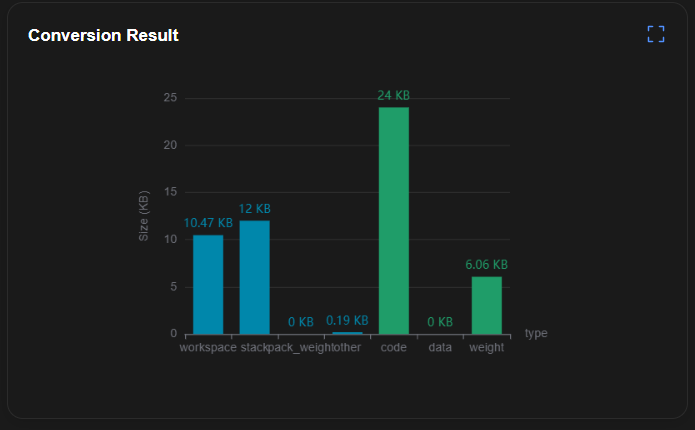

AI上板存储占比如[图1](#fig205537152214)所示，蓝色显示为RAM占用，绿色显示为FLASH占用，各参数显示具体含义如[表1](#table17914154610556)所示。

**表 1**  内存占用分布条形图各项含义

<table><thead align="left"><tr id="row691494685515"><th class="cellrowborder" valign="top" width="19.43%" id="mcps1.2.4.1.1">
项目

</th>
<th class="cellrowborder" valign="top" width="12.07%" id="mcps1.2.4.1.2">
所属类型

</th>
<th class="cellrowborder" valign="top" width="68.5%" id="mcps1.2.4.1.3">
说明

</th>
</tr>
</thead>
<tbody><tr id="row09141746195518"><td class="cellrowborder" valign="top" width="19.43%" headers="mcps1.2.4.1.1 ">
workspace

</td>
<td class="cellrowborder" valign="top" width="12.07%" headers="mcps1.2.4.1.2 ">
RAM

</td>
<td class="cellrowborder" valign="top" width="68.5%" headers="mcps1.2.4.1.3 ">
存储输入输出中间数据所需的工作空间RAM大小。

</td>
</tr>
<tr id="row926611014579"><td class="cellrowborder" valign="top" width="19.43%" headers="mcps1.2.4.1.1 ">
stack

</td>
<td class="cellrowborder" valign="top" width="12.07%" headers="mcps1.2.4.1.2 ">
RAM

</td>
<td class="cellrowborder" valign="top" width="68.5%" headers="mcps1.2.4.1.3 ">
AI推理栈空间所占用大小。

</td>
</tr>
<tr id="row499271165719"><td class="cellrowborder" valign="top" width="19.43%" headers="mcps1.2.4.1.1 ">
pack_weight

</td>
<td class="cellrowborder" valign="top" width="12.07%" headers="mcps1.2.4.1.2 ">
RAM

</td>
<td class="cellrowborder" valign="top" width="68.5%" headers="mcps1.2.4.1.3 ">
AI推理针对权重额外辅助空间占用大小。

</td>
</tr>
<tr id="row844131695717"><td class="cellrowborder" valign="top" width="19.43%" headers="mcps1.2.4.1.1 ">
other

</td>
<td class="cellrowborder" valign="top" width="12.07%" headers="mcps1.2.4.1.2 ">
RAM

</td>
<td class="cellrowborder" valign="top" width="68.5%" headers="mcps1.2.4.1.3 ">
其他对输入输出张量元信息存储占用等大小（输入输出张量名称，张量shape等）。

</td>
</tr>
<tr id="row1676132014572"><td class="cellrowborder" valign="top" width="19.43%" headers="mcps1.2.4.1.1 ">
code

</td>
<td class="cellrowborder" valign="top" width="12.07%" headers="mcps1.2.4.1.2 ">
FLASH

</td>
<td class="cellrowborder" valign="top" width="68.5%" headers="mcps1.2.4.1.3 ">
AI推理相关算子，Runtime代码段占用。

</td>
</tr>
<tr id="row199509591380"><td class="cellrowborder" valign="top" width="19.43%" headers="mcps1.2.4.1.1 ">
data

</td>
<td class="cellrowborder" valign="top" width="12.07%" headers="mcps1.2.4.1.2 ">
FLASH

</td>
<td class="cellrowborder" valign="top" width="68.5%" headers="mcps1.2.4.1.3 ">
AI推理过程中数据段占用。

</td>
</tr>
<tr id="row2384771999"><td class="cellrowborder" valign="top" width="19.43%" headers="mcps1.2.4.1.1 ">
weight

</td>
<td class="cellrowborder" valign="top" width="12.07%" headers="mcps1.2.4.1.2 ">
FLASH

</td>
<td class="cellrowborder" valign="top" width="68.5%" headers="mcps1.2.4.1.3 ">
AI推理参数FLASH存储代码段占用（非数据段）。

</td>
</tr>
</tbody>
</table>

## 部署

-   **[约束说明](#ZH-CN_TOPIC_0000002548538005)**  

-   **[界面介绍](#ZH-CN_TOPIC_0000002516898194)**  

### 约束说明

> **须知：** 
>WS63模型部署需要满足以下条件：
>用户必须已成功完成模型转换。

### 界面介绍

**图 1**  模型部署页面  
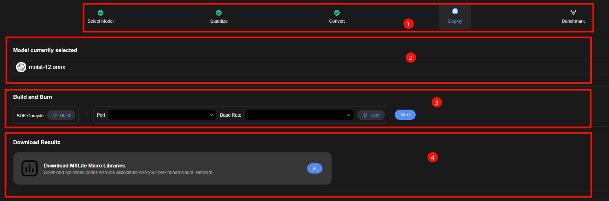

模型部署整体界面如[图1](#fig5293115453112)所示，主要包含四个部分：

1. 跳转标签页面，能否跳转到该量化记录关联的前后步骤。

2. 模型选择页面，展示已选中的模型。

3. SDK编译以及烧录页面。

4. 转换产物下载页面。

转换步骤如下：

1.  单击界面上SDK Compile右侧的“Build”按钮，进行SDK的编译。
2.  选择对应的Port以及Baud Rate，单击界面上的“Burn”按钮，完成固件烧录。

1.  单击“Next”按钮，进行下一步性能 & 精度验证。

## 模型调优

-   **[约束说明](#ZH-CN_TOPIC_0000002517058112)**  

-   **[调优前提](#ZH-CN_TOPIC_0000002548417999)**  

-   **[界面介绍](#ZH-CN_TOPIC_0000002548538007)**  

### 约束说明

> **须知：** 
>WS63模型调优需要满足以下约束条件：
>-   用户需要保证SDK的完整性，确保AI组件（Adaptor 以及 AI\_AT组件）包含在SDK中。
>-   用户需要保证单个样本的输入数据量总和小于4K。
>-   用户需要准备一块WS63单板，并且使用USB串口线与本地PC连接。

### 调优前提

用户已完成模型转换步骤。

### 界面介绍

-   **[整体界面](#ZH-CN_TOPIC_0000002516898196)**  

-   **[性能验证参数配置页面](#ZH-CN_TOPIC_0000002517058114)**  

-   **[性能验证结果配置页面](#ZH-CN_TOPIC_0000002548418001)**  

-   **[精度验证参数配置页面](#ZH-CN_TOPIC_0000002548538009)**  

-   **[精度验证结果配置页面](#ZH-CN_TOPIC_0000002516898198)**  

-   **[评估结果汇总页面](#ZH-CN_TOPIC_0000002562010663)**  

#### 整体界面

**图 1**  WS63模型调优整体页面  
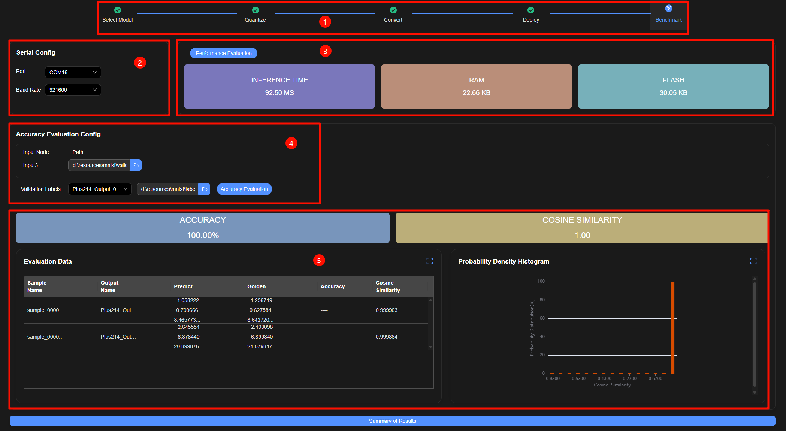

模型调优界面如[图1](#fig89471319155115)所示，主要包含五个部分：

1. 跳转标签页面，能否跳转到该量化记录关联的前后步骤。

2. 性能验证参数配置页面，配置相关的串口连接相关选项。

3. 性能验证结果评估页面，显示AI上板推理时间、RAM内存消耗、FLASH内存消耗等信息。

4. 精度验证参数配置页面，配置相关的精度验证输入数据输入等信息。

5. 精度验证结果评估页面，显示上板精度评估余弦相似度分布直方图 & 准确率等信息。

模型调优步骤如下：

1.  进入模型调优页面，选择单板连接的串口以及波特率。

1.  单击“Performance Evaluation”按钮，输出上板推理时间、RAM内存消耗、FLASH内存消耗等信息。
2.  选择Windows本地相应的验证数据输入文件夹等精度验证相关的选项。

    > **说明：** 
    >上板精度验证输入数据以及验证输入数据需要输入文件夹路径，文件夹内上板精度验证数据保持为npy格式。

3.  单击“Accuracy Evaluation”按钮，输出相关的准确率、余弦相似度分布以及上板推理的时间、精度等信息。

#### 性能验证参数配置页面

**图 1**  性能验证选项配置  
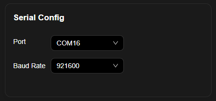

参数解释如[表1](#table1769074411309)所示。

**表 1**  转换参数配置

<table><thead align="left"><tr id="row1769018444306"><th class="cellrowborder" valign="top" width="26.3%" id="mcps1.2.3.1.1">
参数

</th>
<th class="cellrowborder" valign="top" width="73.7%" id="mcps1.2.3.1.2">
说明

</th>
</tr>
</thead>
<tbody><tr id="row13690144417303"><td class="cellrowborder" valign="top" width="26.3%" headers="mcps1.2.3.1.1 ">
Port

</td>
<td class="cellrowborder" valign="top" width="73.7%" headers="mcps1.2.3.1.2 ">
单板连接的串口号。

</td>
</tr>
<tr id="row15497102073518"><td class="cellrowborder" valign="top" width="26.3%" headers="mcps1.2.3.1.1 ">
Baud Rate

</td>
<td class="cellrowborder" valign="top" width="73.7%" headers="mcps1.2.3.1.2 ">
单板连接的波特率。

</td>
</tr>
</tbody>
</table>

#### 性能验证结果配置页面

**图 1**  性能验证结果页面  

具体每个参数含义如[表1](#table1769074411309)所示。

**表 1**  性能验证结果

<table><thead align="left"><tr id="row1769018444306"><th class="cellrowborder" valign="top" width="24.990000000000002%" id="mcps1.2.3.1.1">
参数

</th>
<th class="cellrowborder" valign="top" width="75.01%" id="mcps1.2.3.1.2">
说明

</th>
</tr>
</thead>
<tbody><tr id="row13690144417303"><td class="cellrowborder" valign="top" width="24.990000000000002%" headers="mcps1.2.3.1.1 ">
INFERENCE TIME

</td>
<td class="cellrowborder" valign="top" width="75.01%" headers="mcps1.2.3.1.2 ">
上板AI推理时间。

</td>
</tr>
<tr id="row15497102073518"><td class="cellrowborder" valign="top" width="24.990000000000002%" headers="mcps1.2.3.1.1 ">
RAM

</td>
<td class="cellrowborder" valign="top" width="75.01%" headers="mcps1.2.3.1.2 ">
上板性能验证的RAM内存消耗。

</td>
</tr>
<tr id="row142072442117"><td class="cellrowborder" valign="top" width="24.990000000000002%" headers="mcps1.2.3.1.1 ">
FLASH

</td>
<td class="cellrowborder" valign="top" width="75.01%" headers="mcps1.2.3.1.2 ">
上板性能验证的FLASH内存消耗。

</td>
</tr>
<tr id="row16051831165115"><td class="cellrowborder" valign="top" width="24.990000000000002%" headers="mcps1.2.3.1.1 ">
Performance Evaluation

</td>
<td class="cellrowborder" valign="top" width="75.01%" headers="mcps1.2.3.1.2 ">
性能验证按钮。

</td>
</tr>
</tbody>
</table>

#### 精度验证参数配置页面

**图 1**  上板精度验证配置页面  
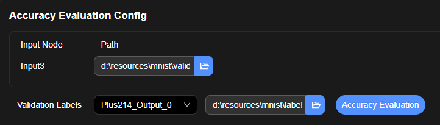

参数解释如[表1](#table1769074411309)所示。

**表 1**  转换参数配置

<table><thead align="left"><tr id="row1769018444306"><th class="cellrowborder" valign="top" width="32.1%" id="mcps1.2.3.1.1">
参数

</th>
<th class="cellrowborder" valign="top" width="67.9%" id="mcps1.2.3.1.2">
说明

</th>
</tr>
</thead>
<tbody><tr id="row138985316508"><td class="cellrowborder" valign="top" width="32.1%" headers="mcps1.2.3.1.1 ">
Input Node

</td>
<td class="cellrowborder" valign="top" width="67.9%" headers="mcps1.2.3.1.2 ">
上板精度验证输入名称。

</td>
</tr>
<tr id="row13690144417303"><td class="cellrowborder" valign="top" width="32.1%" headers="mcps1.2.3.1.1 ">
Path

</td>
<td class="cellrowborder" valign="top" width="67.9%" headers="mcps1.2.3.1.2 ">
上板精度验证输入数据文件夹路径。

</td>
</tr>
<tr id="row15497102073518"><td class="cellrowborder" valign="top" width="32.1%" headers="mcps1.2.3.1.1 ">
Validation Labels

</td>
<td class="cellrowborder" valign="top" width="67.9%" headers="mcps1.2.3.1.2 ">
上板精度验证的labels标签。

</td>
</tr>
<tr id="row1147919919148"><td class="cellrowborder" valign="top" width="32.1%" headers="mcps1.2.3.1.1 ">
Accuracy Validation

</td>
<td class="cellrowborder" valign="top" width="67.9%" headers="mcps1.2.3.1.2 ">
精度验证按钮。

</td>
</tr>
</tbody>
</table>

#### 精度验证结果配置页面

上板精度验证结果页面主要分为以下三部分：

-   准确率信息
-   逐项结果展示
-   余弦相似度分布直方图

各参数如[表1](#table1769074411309)所示。

**表 1**  上板精度验证结果说明

<table><thead align="left"><tr id="row1769018444306"><th class="cellrowborder" valign="top" width="28.68%" id="mcps1.2.4.1.1">
参数

</th>
<th class="cellrowborder" valign="top" width="32.07%" id="mcps1.2.4.1.2">
所属部分

</th>
<th class="cellrowborder" valign="top" width="39.25%" id="mcps1.2.4.1.3">
说明

</th>
</tr>
</thead>
<tbody><tr id="row13690144417303"><td class="cellrowborder" valign="top" width="28.68%" headers="mcps1.2.4.1.1 ">
ACCURACY

</td>
<td class="cellrowborder" valign="top" width="32.07%" headers="mcps1.2.4.1.2 ">
准确率信息

</td>
<td class="cellrowborder" valign="top" width="39.25%" headers="mcps1.2.4.1.3 ">
上板精度验证准确率

</td>
</tr>
<tr id="row15497102073518"><td class="cellrowborder" valign="top" width="28.68%" headers="mcps1.2.4.1.1 ">
Sample Name

</td>
<td class="cellrowborder" valign="top" width="32.07%" headers="mcps1.2.4.1.2 ">
逐项结果展示

</td>
<td class="cellrowborder" valign="top" width="39.25%" headers="mcps1.2.4.1.3 ">
样本名称

</td>
</tr>
<tr id="row19578139540"><td class="cellrowborder" valign="top" width="28.68%" headers="mcps1.2.4.1.1 ">
Output Name

</td>
<td class="cellrowborder" valign="top" width="32.07%" headers="mcps1.2.4.1.2 ">
逐项结果展示

</td>
<td class="cellrowborder" valign="top" width="39.25%" headers="mcps1.2.4.1.3 ">
指标所对应的输出名称

</td>
</tr>
<tr id="row63547222115"><td class="cellrowborder" valign="top" width="28.68%" headers="mcps1.2.4.1.1 ">
Predict

</td>
<td class="cellrowborder" valign="top" width="32.07%" headers="mcps1.2.4.1.2 ">
逐项结果展示

</td>
<td class="cellrowborder" valign="top" width="39.25%" headers="mcps1.2.4.1.3 ">
上板推理结果

</td>
</tr>
<tr id="row144111758212"><td class="cellrowborder" valign="top" width="28.68%" headers="mcps1.2.4.1.1 ">
Golden

</td>
<td class="cellrowborder" valign="top" width="32.07%" headers="mcps1.2.4.1.2 ">
逐项结果展示

</td>
<td class="cellrowborder" valign="top" width="39.25%" headers="mcps1.2.4.1.3 ">
标杆推理结果

</td>
</tr>
<tr id="row162581712115"><td class="cellrowborder" valign="top" width="28.68%" headers="mcps1.2.4.1.1 ">
Accuracy

</td>
<td class="cellrowborder" valign="top" width="32.07%" headers="mcps1.2.4.1.2 ">
逐项结果展示

</td>
<td class="cellrowborder" valign="top" width="39.25%" headers="mcps1.2.4.1.3 ">
样本所对应的准确率信息

</td>
</tr>
<tr id="row68591621152116"><td class="cellrowborder" valign="top" width="28.68%" headers="mcps1.2.4.1.1 ">
Cosine Similarity

</td>
<td class="cellrowborder" valign="top" width="32.07%" headers="mcps1.2.4.1.2 ">
逐项结果展示

</td>
<td class="cellrowborder" valign="top" width="39.25%" headers="mcps1.2.4.1.3 ">
余弦相似度

</td>
</tr>
<tr id="row1147919919148"><td class="cellrowborder" valign="top" width="28.68%" headers="mcps1.2.4.1.1 ">
Probability Density Histogram

</td>
<td class="cellrowborder" valign="top" width="32.07%" headers="mcps1.2.4.1.2 ">
余弦相似度分布直方图

</td>
<td class="cellrowborder" valign="top" width="39.25%" headers="mcps1.2.4.1.3 ">
余弦相似度分布图

</td>
</tr>
</tbody>
</table>

**图 1**  上板精度验证准确率信息  

**图 2**  上板精度验证逐项结果展示  
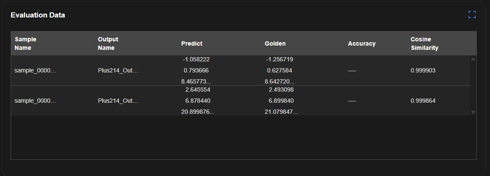

**图 3**  上板精度验证余弦相似度分布直方图  
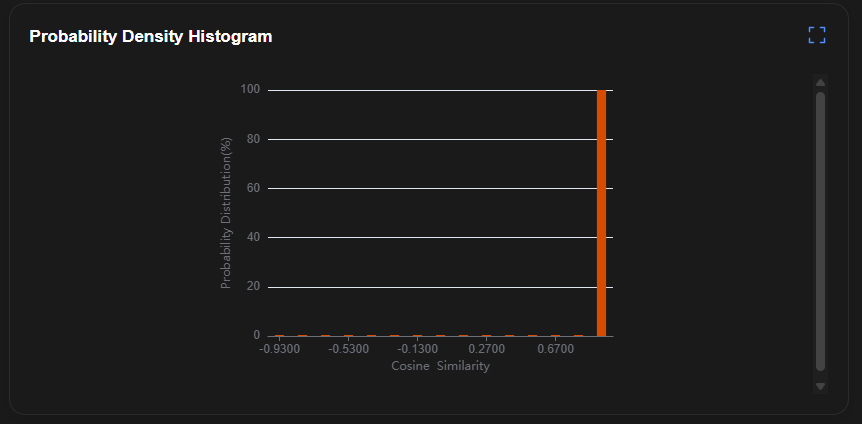

#### 评估结果汇总页面

单击“Summary of Results”按钮之后弹出评估结果汇总界面，该界面汇总每次评估的结果。如[图1](#fig495923816254)所示。

**图 1**  评估结果汇总界面  
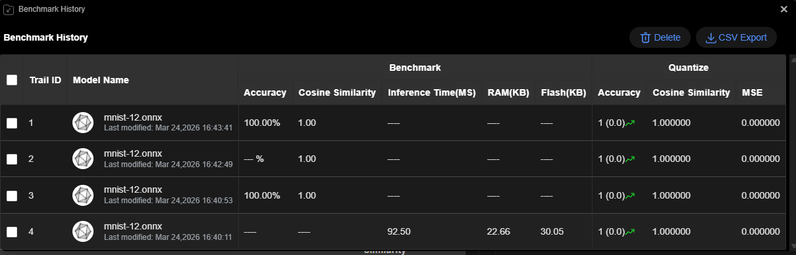

评估结果汇总界面元素说明如[表1](#table126871262713)所示。

**表 1**  评估结果界面元素说明

<table><thead align="left"><tr id="row26821219274"><th class="cellrowborder" valign="top" width="13.08%" id="mcps1.2.4.1.1">
指标

</th>
<th class="cellrowborder" valign="top" width="16.32%" id="mcps1.2.4.1.2">
指标所属部分

</th>
<th class="cellrowborder" valign="top" width="70.6%" id="mcps1.2.4.1.3">
说明

</th>
</tr>
</thead>
<tbody><tr id="row920295822719"><td class="cellrowborder" valign="top" width="13.08%" headers="mcps1.2.4.1.1 ">
Trail ID

</td>
<td class="cellrowborder" valign="top" width="16.32%" headers="mcps1.2.4.1.2 ">
----

</td>
<td class="cellrowborder" valign="top" width="70.6%" headers="mcps1.2.4.1.3 ">
评估结果序号。

</td>
</tr>
<tr id="row131301128142814"><td class="cellrowborder" valign="top" width="13.08%" headers="mcps1.2.4.1.1 ">
Model Name

</td>
<td class="cellrowborder" valign="top" width="16.32%" headers="mcps1.2.4.1.2 ">
Benchmark

</td>
<td class="cellrowborder" valign="top" width="70.6%" headers="mcps1.2.4.1.3 ">
网络的名称，以及模型大小和修改时间。

</td>
</tr>
<tr id="row4391171693915"><td class="cellrowborder" valign="top" width="13.08%" headers="mcps1.2.4.1.1 ">
Accuracy

</td>
<td class="cellrowborder" valign="top" width="16.32%" headers="mcps1.2.4.1.2 ">
Benchmark

</td>
<td class="cellrowborder" valign="top" width="70.6%" headers="mcps1.2.4.1.3 ">
模型上板精度评估的准确率。

</td>
</tr>
<tr id="row87249382281"><td class="cellrowborder" valign="top" width="13.08%" headers="mcps1.2.4.1.1 ">
Cosine Similarity

</td>
<td class="cellrowborder" valign="top" width="16.32%" headers="mcps1.2.4.1.2 ">
Benchmark

</td>
<td class="cellrowborder" valign="top" width="70.6%" headers="mcps1.2.4.1.3 ">
模型上板精度评估的平均余弦相似度，计算公式如下，其中表示模型上板推理的输出，表示原始浮点网络在Windows的输出，表示验证集样本的数量。

</td>
</tr>
<tr id="row9187175792810"><td class="cellrowborder" valign="top" width="13.08%" headers="mcps1.2.4.1.1 ">
Inference Time

</td>
<td class="cellrowborder" valign="top" width="16.32%" headers="mcps1.2.4.1.2 ">
Benchmark

</td>
<td class="cellrowborder" valign="top" width="70.6%" headers="mcps1.2.4.1.3 ">
模型性能评估上板推理的时间。

</td>
</tr>
<tr id="row71421715292"><td class="cellrowborder" valign="top" width="13.08%" headers="mcps1.2.4.1.1 ">
RAM

</td>
<td class="cellrowborder" valign="top" width="16.32%" headers="mcps1.2.4.1.2 ">
Benchmark

</td>
<td class="cellrowborder" valign="top" width="70.6%" headers="mcps1.2.4.1.3 ">
模型上板推理所占用的RAM开销。

</td>
</tr>
<tr id="row15753193722918"><td class="cellrowborder" valign="top" width="13.08%" headers="mcps1.2.4.1.1 ">
Flash

</td>
<td class="cellrowborder" valign="top" width="16.32%" headers="mcps1.2.4.1.2 ">
Benchmark

</td>
<td class="cellrowborder" valign="top" width="70.6%" headers="mcps1.2.4.1.3 ">
模型上板推理所占用的FLASH开销。

</td>
</tr>
<tr id="row627412105305"><td class="cellrowborder" valign="top" width="13.08%" headers="mcps1.2.4.1.1 ">
Accuracy

</td>
<td class="cellrowborder" valign="top" width="16.32%" headers="mcps1.2.4.1.2 ">
Quantize

</td>
<td class="cellrowborder" valign="top" width="70.6%" headers="mcps1.2.4.1.3 ">
模型量化准确率。

</td>
</tr>
<tr id="row28969270300"><td class="cellrowborder" valign="top" width="13.08%" headers="mcps1.2.4.1.1 ">
Cosine Similarity

</td>
<td class="cellrowborder" valign="top" width="16.32%" headers="mcps1.2.4.1.2 ">
Quantize

</td>
<td class="cellrowborder" valign="top" width="70.6%" headers="mcps1.2.4.1.3 ">
模型量化平均余弦相似度，计算公式如上

</td>
</tr>
<tr id="row17854435134312"><td class="cellrowborder" valign="top" width="13.08%" headers="mcps1.2.4.1.1 ">
MSE

</td>
<td class="cellrowborder" valign="top" width="16.32%" headers="mcps1.2.4.1.2 ">
Quantize

</td>
<td class="cellrowborder" valign="top" width="70.6%" headers="mcps1.2.4.1.3 ">
模型量化的均方误差，计算公式如下，其中表示模型上板推理的输出，表示原始浮点网络在Windows的输出，表示验证集样本的数量。

</td>
</tr>
</tbody>
</table>

## 应用开发

在HiSpark Studio AI中完成模型量化、转换之后，将模型导出并使用HiSpark.AI API完成应用开发。具体步骤如下。

1.  在“Deploy”页面下载转换好的Micro工程文件。

    **图 1**  下载micro工程文件  
    

2.  具体API的用法请参考文档《HiSpark.AI API开发指南》

# Hi3322操作指南

-   **[工程创建](#ZH-CN_TOPIC_0000002509766618)**  

-   **[模型导入](#ZH-CN_TOPIC_0000002509726612)**  

-   **[模型量化](#ZH-CN_TOPIC_0000002541326607)**  

-   **[模型转换](#ZH-CN_TOPIC_0000002541286619)**  

-   **[部署](#ZH-CN_TOPIC_0000002541425345)**  

-   **[模型调优](#ZH-CN_TOPIC_0000002509766620)**  

-   **[应用开发](#ZH-CN_TOPIC_0000002509726614)**  

## 工程创建

-   **[前提条件](#ZH-CN_TOPIC_0000002517226682)**  

-   **[界面介绍](#ZH-CN_TOPIC_0000002517386758)**  

### 前提条件

在工程创建前，请先获取Hi3322 SDK，并存放于本地Windows环境。SDK存放路径请勿带空格。

### 界面介绍

进入HiSpark Studio AI单击“New Project”按钮进入新建工程页面。工程创建整体界面如[图1](#fig56341651183719)所示。

**图 1**  工程创建整体界面  
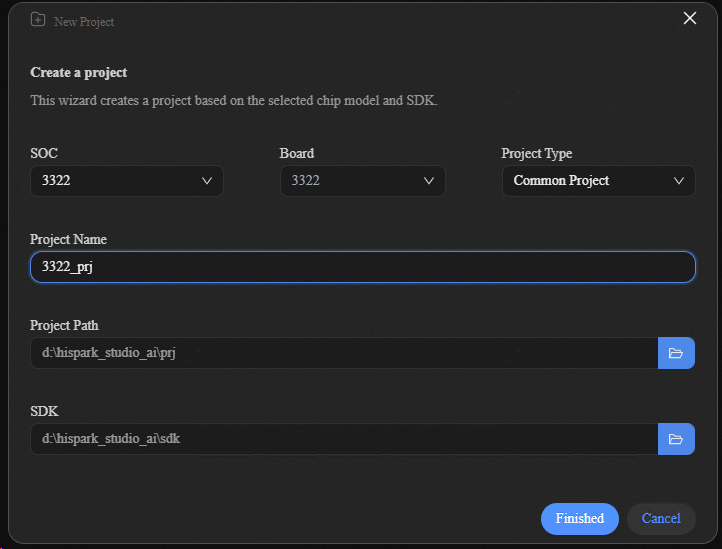

工程创建的步骤如下所示：

1.  选择3322 SOC。
2.  输入工程创建配置参数。
3.  单击“Finished”按钮。

工程创建界面元素说明如[表1](#table10967339113911)所示。

**表 1**  工程创建元素说明

<table><thead align="left"><tr id="row12968939143915"><th class="cellrowborder" valign="top" width="25.929999999999996%" id="mcps1.2.3.1.1">
元素

</th>
<th class="cellrowborder" valign="top" width="74.07000000000001%" id="mcps1.2.3.1.2">
说明

</th>
</tr>
</thead>
<tbody><tr id="row996815390394"><td class="cellrowborder" valign="top" width="25.929999999999996%" headers="mcps1.2.3.1.1 ">
SOC

</td>
<td class="cellrowborder" valign="top" width="74.07000000000001%" headers="mcps1.2.3.1.2 ">
SOC，请选择3322。

</td>
</tr>
<tr id="row531311139408"><td class="cellrowborder" valign="top" width="25.929999999999996%" headers="mcps1.2.3.1.1 ">
Board

</td>
<td class="cellrowborder" valign="top" width="74.07000000000001%" headers="mcps1.2.3.1.2 ">
单板型号。默认选择3322。

</td>
</tr>
<tr id="row1156834134020"><td class="cellrowborder" valign="top" width="25.929999999999996%" headers="mcps1.2.3.1.1 ">
Project Type

</td>
<td class="cellrowborder" valign="top" width="74.07000000000001%" headers="mcps1.2.3.1.2 ">
工程类型，请选择Common Project。

</td>
</tr>
<tr id="row879032710415"><td class="cellrowborder" valign="top" width="25.929999999999996%" headers="mcps1.2.3.1.1 ">
Project Name

</td>
<td class="cellrowborder" valign="top" width="74.07000000000001%" headers="mcps1.2.3.1.2 ">
用户自定义的工程名称。

</td>
</tr>
<tr id="row842194124114"><td class="cellrowborder" valign="top" width="25.929999999999996%" headers="mcps1.2.3.1.1 ">
Project Path

</td>
<td class="cellrowborder" valign="top" width="74.07000000000001%" headers="mcps1.2.3.1.2 ">
用户自定义的工程文件存放路径。

</td>
</tr>
<tr id="row740213585413"><td class="cellrowborder" valign="top" width="25.929999999999996%" headers="mcps1.2.3.1.1 ">
SDK

</td>
<td class="cellrowborder" valign="top" width="74.07000000000001%" headers="mcps1.2.3.1.2 ">
Hi3322 SDK存放路径。

</td>
</tr>
<tr id="row163064339427"><td class="cellrowborder" valign="top" width="25.929999999999996%" headers="mcps1.2.3.1.1 ">
Finished

</td>
<td class="cellrowborder" valign="top" width="74.07000000000001%" headers="mcps1.2.3.1.2 ">
完成创建工程按钮。

</td>
</tr>
<tr id="row154521348134217"><td class="cellrowborder" valign="top" width="25.929999999999996%" headers="mcps1.2.3.1.1 ">
Cancel

</td>
<td class="cellrowborder" valign="top" width="74.07000000000001%" headers="mcps1.2.3.1.2 ">
取消创建工程按钮。

</td>
</tr>
</tbody>
</table>

## 模型导入

-   **[约束说明](#ZH-CN_TOPIC_0000002548827023)**  

-   **[前提条件](#ZH-CN_TOPIC_0000002517387150)**  

-   **[界面介绍](#ZH-CN_TOPIC_0000002517227232)**  

### 约束说明

> **须知：** 
>在进行模型导入前，请务必查看如下约束要求：
>Hi3322平台只支持导入ONNX以及pt、pth模型。ONNX模型支持训练后量化。pt、pth模型支持量化感知训练。

### 前提条件

-   完成Linux服务器环境配置或者WSL环境配置。
-   连接Linux服务器或者WSL环境，若未完成连接，在单击“Import Model”按钮时会弹出Linux服务器或者WSL连接窗口。
-   若使用Linux服务器，将待处理的网络模型上传至Linux服务器。

### 界面介绍

模型导入界面整体界面如[图1](#fig634318418485)所示。

**图 1**  模型导入界面  

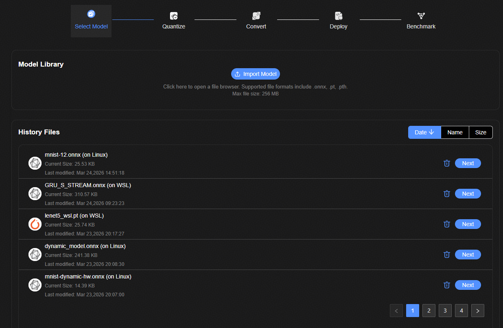

模型导入界面主要元素说明如[表1](#table31132274497)。

**表 1**  模型导入主要元素说明

<table><thead align="left"><tr id="row1511315272499"><th class="cellrowborder" valign="top" width="27.11%" id="mcps1.2.3.1.1">
元素

</th>
<th class="cellrowborder" valign="top" width="72.89%" id="mcps1.2.3.1.2">
说明

</th>
</tr>
</thead>
<tbody><tr id="row111372754913"><td class="cellrowborder" valign="top" width="27.11%" headers="mcps1.2.3.1.1 ">
Import Model

</td>
<td class="cellrowborder" valign="top" width="72.89%" headers="mcps1.2.3.1.2 ">
模型导入按钮。完成导入后自动进入模型压缩界面。

</td>
</tr>
<tr id="row19902119503"><td class="cellrowborder" valign="top" width="27.11%" headers="mcps1.2.3.1.1 ">
History Files

</td>
<td class="cellrowborder" valign="top" width="72.89%" headers="mcps1.2.3.1.2 ">
模型导入历史列表。单击“Next”按钮进入对应历史模型的模型压缩界面。

</td>
</tr>
</tbody>
</table>

## 模型量化

-   **[约束说明](#ZH-CN_TOPIC_0000002547595389)**  

-   **[量化前提](#ZH-CN_TOPIC_0000002516115476)**  

-   **[界面介绍](#ZH-CN_TOPIC_0000002547515393)**  

### 约束说明

> **须知：** 
>在进行模型压缩前，请务必查看如下约束要求：
>-   支持原始框架类型为ONNX的模型训练后量化PTQ。
>-   支持原始框架类型为PyTorch（参数后缀pt或pth）的模型量化感知训练QAT。
>-   只支持单输出分类网络计算量化评估网络的准确率。
>-   量化感知训练只支持单输入单输出分类网络。

### 量化前提

-   若使用Linux服务器，将待量化的模型、数据上传到服务器。数据格式见“[数据准备与环境搭建](#ZH-CN_TOPIC_0000002548828403)”。
-   若使用Linux服务器，并需要通过量化后仿真模型验证量化精度，请准备待量化数据；上传到服务器。数据格式见“[数据准备与环境搭建](#ZH-CN_TOPIC_0000002548828403)”。

### 界面介绍

-   **[整体界面](#ZH-CN_TOPIC_0000002515955564)**  

-   **[量化参数配置界面](#ZH-CN_TOPIC_0000002547595391)**  

-   **[压缩历史显示界面](#ZH-CN_TOPIC_0000002515955566)**  

-   **[验证集精度分布直方图显示界面](#ZH-CN_TOPIC_0000002547595393)**  

#### 整体界面

量化的整体界面如[图 量化整体界面](#fig16918198146)所示。

**图 1**  量化整体界面  

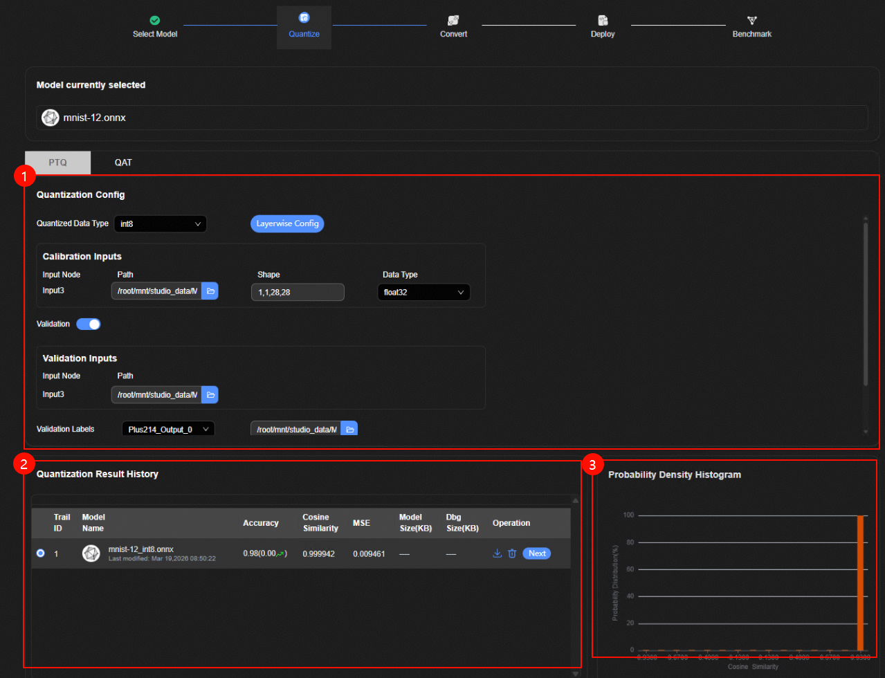

模型量化整体界面如[图1](#fig16918198146)所示，主要包含三个部分：

1.  量化参数配置界面。
2.  压缩历史显示界面，显示所有压缩的网络及其精度指标。
3.  样本精度分布直方图显示界面，显示验证集的精度分布。

执行量化步骤如下：

1.  在量化参数界面配置量化参数。
2.  单击“Quantize”按钮。
3.  压缩历史显示界面查看压缩的结果。如果使能了量化精度验证，在该表格中显示量化精度验证评估结果。
4.  如果使能了量化精度验证，在样本精度分布直方图显示界面中查看验证集精度分布直方图。
5.  压缩历史显示界面中选择待转换的量化模型，单击“Next”按钮进入模型转换界面。

#### 量化参数配置界面

-   **[训练后量化](#ZH-CN_TOPIC_0000002516115478)**  

-   **[量化感知训练](#ZH-CN_TOPIC_0000002547515395)**  

##### 训练后量化

训练后量化量化参数配置窗口如[图 量化参数配置界面](#fig157591121132916)所示。

**图 1**  训练后量化参数配置界面  

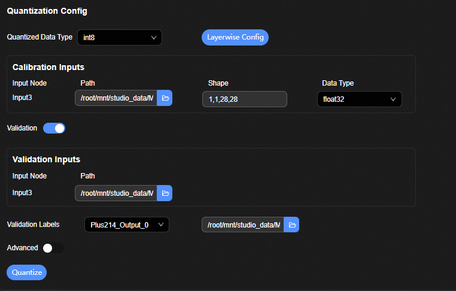

参数解释如[表1](#table1769074411309)所示。

**表 1**  训练后量化参数配置界面参数

<table><thead align="left"><tr id="row1769018444306"><th class="cellrowborder" valign="top" width="23.27%" id="mcps1.2.3.1.1">
参数

</th>
<th class="cellrowborder" valign="top" width="76.73%" id="mcps1.2.3.1.2">
说明

</th>
</tr>
</thead>
<tbody><tr id="row13690144417303"><td class="cellrowborder" valign="top" width="23.27%" headers="mcps1.2.3.1.1 ">
Quantized Data Type

</td>
<td class="cellrowborder" valign="top" width="76.73%" headers="mcps1.2.3.1.2 ">
模型量化类型。当配置为int8时，转换后模型占用空间相对较小，推理速度相对较快，精度损失相对更大。当配置为int16时，转换后模型占用空间相对较大，推理速度相对较慢，精度损失相对小。

</td>
</tr>
<tr id="row15497102073518"><td class="cellrowborder" valign="top" width="23.27%" headers="mcps1.2.3.1.1 ">
Layerwise Config

</td>
<td class="cellrowborder" valign="top" width="76.73%" headers="mcps1.2.3.1.2 ">
打开逐层量化配置窗口。逐层量化类型配置窗口如<a href="#fig9513147163811">图2</a>所示。表格中各列的含义如下所示：

<ul id="ul8922547415"><li>layer_name：层的名称。</li><li>layer_type：层的算子类型。</li><li>bit_num：用户在此列配置数据量化到的类型。</li></ul>
</td>
</tr>
<tr id="row176419249441"><td class="cellrowborder" valign="top" width="23.27%" headers="mcps1.2.3.1.1 ">
Calibration Inputs

</td>
<td class="cellrowborder" valign="top" width="76.73%" headers="mcps1.2.3.1.2 ">
用户在该表格中输入量化的校准数据。表格中各列的含义如下所示：

<ul id="ul1749181515018"><li>Input Node：网络输入节点的名称。</li><li>Path：校准数据的目录。校准数据为npy格式。</li><li>Shape：网络输入张量的形状。</li><li>DataType：网络输入张量的类型。</li></ul>
</td>
</tr>
<tr id="row9587204511914"><td class="cellrowborder" valign="top" width="23.27%" headers="mcps1.2.3.1.1 ">
validation

</td>
<td class="cellrowborder" valign="top" width="76.73%" headers="mcps1.2.3.1.2 ">
使能验证开关。当开关打开时，验证数据集输入界面展开，如<a href="#fig11646193615123">图3</a>所示。

</td>
</tr>
<tr id="row0675448181017"><td class="cellrowborder" valign="top" width="23.27%" headers="mcps1.2.3.1.1 ">
Validation Inputs

</td>
<td class="cellrowborder" valign="top" width="76.73%" headers="mcps1.2.3.1.2 ">
用户在该表格中输入量化评估网络的验证数据集。表格中各列的含义如下所示：

<ul id="ul11478439133512"><li>Input Node：网络输入节点的名称。</li><li>Path：验证数据的目录。验证数据为npy格式。</li></ul>
</td>
</tr>
<tr id="row7221131203619"><td class="cellrowborder" valign="top" width="23.27%" headers="mcps1.2.3.1.1 ">
Validation Labels

</td>
<td class="cellrowborder" valign="top" width="76.73%" headers="mcps1.2.3.1.2 ">
使能开关打开后，输入含分类真值标签的csv表格文件。

</td>
</tr>
<tr id="row13146175924311"><td class="cellrowborder" valign="top" width="23.27%" headers="mcps1.2.3.1.1 ">
Advanced

</td>
<td class="cellrowborder" valign="top" width="76.73%" headers="mcps1.2.3.1.2 ">
高级模式使能开关。当开关打开时，高级模式界面展开，如<a href="#fig232314275455">图4</a>所示。

</td>
</tr>
<tr id="row5926956114512"><td class="cellrowborder" valign="top" width="23.27%" headers="mcps1.2.3.1.1 ">
Ascend Config

</td>
<td class="cellrowborder" valign="top" width="76.73%" headers="mcps1.2.3.1.2 ">
高级模式量化配置文件输入控件。在该输入控件中输入昇腾量化配置cfg文件。昇腾量化配置文件编写格式参见文档《AMCT模型压缩工具用户指南》。单击可下载配置cfg文件模板。

在使能Ascend Config时，BitNum和Layerwise Config配置不生效。

</td>
</tr>
<tr id="row11454192012481"><td class="cellrowborder" valign="top" width="23.27%" headers="mcps1.2.3.1.1 ">
Quantize

</td>
<td class="cellrowborder" valign="top" width="76.73%" headers="mcps1.2.3.1.2 ">
开始量化按钮。

</td>
</tr>
</tbody>
</table>

**图 2**  逐层量化类型配置界面  
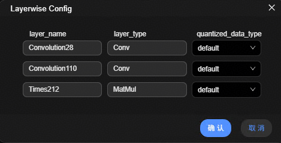

**图 3**  验证集输入界面  
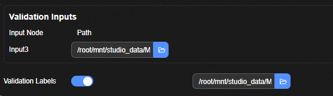

**图 4**  高级模式界面  
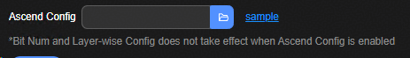

##### 量化感知训练

量化感知训练参数配置窗口如[图1](#fig189812612211)所示。

**图 1**  量化感知训练参数配置界面  

参数解释如[表1](#table1769074411309)所示。

**表 1**  量化感知训练参数配置界面参数

<table><thead align="left"><tr id="row1769018444306"><th class="cellrowborder" valign="top" width="22.45%" id="mcps1.2.3.1.1">
参数

</th>
<th class="cellrowborder" valign="top" width="77.55%" id="mcps1.2.3.1.2">
说明

</th>
</tr>
</thead>
<tbody><tr id="row13690144417303"><td class="cellrowborder" valign="top" width="22.45%" headers="mcps1.2.3.1.1 ">
Network Struction

</td>
<td class="cellrowborder" valign="top" width="77.55%" headers="mcps1.2.3.1.2 ">
网络结构输入路径。网络结构文件为一个python文件，里面含有网络结构的定义。在定义网络结构时，请满足如下约束：

<ul id="ul15198342105114"><li>网络结构类的名称固定为NNModel</li><li>当前只支持单输入和单输出网络，因此forward函数的输入输出类型为torch.Tensor</li><li>构造函数不包含除self外的其他入参，如果有其他入参请配置默认值</li></ul>

以下为LeNet5网络结构的参考实现：

<pre class="screen" id="screen167021785119">class NNModel(nn.Module):
    def __init__(self) -&gt; None:
        """Initialize network layers and components."""
        super(NNModel, self).__init__()

        self.conv1 = nn.Conv2d(1, 8, kernel_size=(5, 5), padding=2)
        self.relu1 = nn.ReLU()
        self.maxpool1 = nn.MaxPool2d(kernel_size=(2, 2), stride=(2, 2), padding=(0, 0), dilation=1, ceil_mode=False)

        self.conv2 = nn.Conv2d(8, 16, kernel_size=(5, 5), padding=2)
        self.relu2 = nn.ReLU()
        self.maxpool2 = nn.MaxPool2d(kernel_size=(3, 3), stride=(3, 3), padding=(0, 0), dilation=1, ceil_mode=False)

        self.fc = torch.nn.Linear(256, 10, bias=True)

    def forward(self, img):
        """
        Forward pass of the network.

        Args:
            x (torch.Tensor): Input tensor with shape (batch_size, 1, 28, 28)

        Returns:
            torch.Tensor: Output logits with shape (batch_size, 10)
        """
        out = self.conv1(img)
        out = self.relu1(out)
        out = self.maxpool1(out)
        out = self.conv2(out)

        out = self.relu2(out)
        out = self.maxpool2(out)
        out = out.reshape(-1, 256)
        out = self.fc(out)
        return out</pre>
</td>
</tr>
<tr id="row15497102073518"><td class="cellrowborder" valign="top" width="22.45%" headers="mcps1.2.3.1.1 ">
Input

</td>
<td class="cellrowborder" valign="top" width="77.55%" headers="mcps1.2.3.1.2 ">
Training Dataset：训练集输入数据目录。训练集输入数据为npy格式。

Validation Dataset：验证集输入数据目录。目录中存放和模型输入匹配的npy文件数据。若模型有多个输入，同一个训练样本的多个输入npy文件文件名必须保持一致。

</td>
</tr>
<tr id="row2058969135718"><td class="cellrowborder" valign="top" width="22.45%" headers="mcps1.2.3.1.1 ">
Label

</td>
<td class="cellrowborder" valign="top" width="77.55%" headers="mcps1.2.3.1.2 ">
Training Dataset：训练集真值csv文件。

Validation Dataset：验证集真值csv文件。

</td>
</tr>
<tr id="row8596131613118"><td class="cellrowborder" valign="top" width="22.45%" headers="mcps1.2.3.1.1 ">
Epoch Num

</td>
<td class="cellrowborder" valign="top" width="77.55%" headers="mcps1.2.3.1.2 ">
量化感知训练的Epoch数量。

</td>
</tr>
<tr id="row1753471018329"><td class="cellrowborder" valign="top" width="22.45%" headers="mcps1.2.3.1.1 ">
Batch Size

</td>
<td class="cellrowborder" valign="top" width="77.55%" headers="mcps1.2.3.1.2 ">
量化感知训练的Batch Size

</td>
</tr>
<tr id="row4866618133218"><td class="cellrowborder" valign="top" width="22.45%" headers="mcps1.2.3.1.1 ">
Learning Rate

</td>
<td class="cellrowborder" valign="top" width="77.55%" headers="mcps1.2.3.1.2 ">
量化感知训练时的学习率。

</td>
</tr>
<tr id="row769312712328"><td class="cellrowborder" valign="top" width="22.45%" headers="mcps1.2.3.1.1 ">
Layerwise Config

</td>
<td class="cellrowborder" valign="top" width="77.55%" headers="mcps1.2.3.1.2 ">
打开逐层量化配置窗口。逐层量化类型配置窗口如<a href="#fig89361036161014">图2</a>所示。表格中各列的含义如下所示：

<ul id="ul8922547415"><li>layer_name：层的名称。</li><li>layer_type：层的算子类型。</li><li>bit_num：用户在此列配置数据量化到的类型。</li></ul>
</td>
</tr>
<tr id="row19016324323"><td class="cellrowborder" valign="top" width="22.45%" headers="mcps1.2.3.1.1 ">
Advanced Settings

</td>
<td class="cellrowborder" valign="top" width="77.55%" headers="mcps1.2.3.1.2 ">
高级模式使能开关。当开关打开时，高级模式界面展开，如<a href="#fig57442431416">图3</a>所示。

</td>
</tr>
<tr id="row121991245201317"><td class="cellrowborder" valign="top" width="22.45%" headers="mcps1.2.3.1.1 ">
Ascend Config

</td>
<td class="cellrowborder" valign="top" width="77.55%" headers="mcps1.2.3.1.2 ">
高级模式量化配置文件输入控件。在该输入控件中输入昇腾量化配置cfg文件。昇腾量化配置文件编写格式参见文档《AMCT模型压缩工具用户指南》。单击可下载配置cfg文件模板。

在使能Ascend Config时，Layerwise Config配置不生效。

</td>
</tr>
<tr id="row592812546498"><td class="cellrowborder" valign="top" width="22.45%" headers="mcps1.2.3.1.1 ">
Quantize

</td>
<td class="cellrowborder" valign="top" width="77.55%" headers="mcps1.2.3.1.2 ">
开始量化按钮。

</td>
</tr>
</tbody>
</table>

**图 2**  量化感知训练逐层量化类型配置界面  
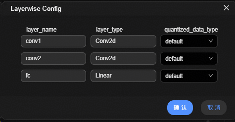

**图 3**  高级模式界面  
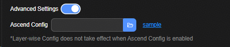

#### 压缩历史显示界面

压缩历史显示窗口如[图1](#fig17766212211)所示。

**图 1**  压缩历史显示界面  

该界面以表格的方式显示历史压缩的结果。表头解释如[表1](#table17914154610556)所示。

**表 1**  压缩历史

<table><thead align="left"><tr id="row691494685515"><th class="cellrowborder" valign="top" width="20.91%" id="mcps1.2.3.1.1">
项目

</th>
<th class="cellrowborder" valign="top" width="79.09%" id="mcps1.2.3.1.2">
说明

</th>
</tr>
</thead>
<tbody><tr id="row09141746195518"><td class="cellrowborder" valign="top" width="20.91%" headers="mcps1.2.3.1.1 ">
Trail ID

</td>
<td class="cellrowborder" valign="top" width="79.09%" headers="mcps1.2.3.1.2 ">
网络压缩结果的序号。

</td>
</tr>
<tr id="row926611014579"><td class="cellrowborder" valign="top" width="20.91%" headers="mcps1.2.3.1.1 ">
Model Name

</td>
<td class="cellrowborder" valign="top" width="79.09%" headers="mcps1.2.3.1.2 ">
网络的名称，以及修改时间。

</td>
</tr>
<tr id="row499271165719"><td class="cellrowborder" valign="top" width="20.91%" headers="mcps1.2.3.1.1 ">
Accuracy

</td>
<td class="cellrowborder" valign="top" width="79.09%" headers="mcps1.2.3.1.2 ">
表示分类结果准确率，使用标签真值计算。计算公式如下，其中表示分类正确的样本数量，表示样本的总数量。

准确率表示格式：

<pre class="screen" id="screen4381153942419">{量化模型准确率}({量化模型与原始浮点模型准确率对比})</pre>
<ul id="ul614475942616"><li>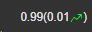：表示量化后模型的准确率为0.99，与原始浮点网络模型相比上升0.01。</li><li>：表示量化后模型的准确率为0.95，与原始浮点网络模型相比下降0.01。</li></ul>
</td>
</tr>
<tr id="row844131695717"><td class="cellrowborder" valign="top" width="20.91%" headers="mcps1.2.3.1.1 ">
Cosine Similarity

</td>
<td class="cellrowborder" valign="top" width="79.09%" headers="mcps1.2.3.1.2 ">
平均余弦相似度，计算公式如下，其中表示量化评估网络的输出，表示原始浮点网络的输出，表示验证集样本的数量。

</td>
</tr>
<tr id="row1676132014572"><td class="cellrowborder" valign="top" width="20.91%" headers="mcps1.2.3.1.1 ">
MSE

</td>
<td class="cellrowborder" valign="top" width="79.09%" headers="mcps1.2.3.1.2 ">
均方误差，计算公式如下，其中表示量化评估网络的输出，表示原始浮点网络的输出，表示验证集样本的数量。

</td>
</tr>
<tr id="row14206152325711"><td class="cellrowborder" valign="top" width="20.91%" headers="mcps1.2.3.1.1 ">
Operation

</td>
<td class="cellrowborder" valign="top" width="79.09%" headers="mcps1.2.3.1.2 ">
操作按钮：

<ul id="ul52775178594"><li>：下载压缩结果。下载的压缩包中包含：<ul id="ul1285118481118"><li>{模型名称}_deploy_model.onnx：量化部署模型，即量化后的可在昇腾 AI 处理器部署的模型文件。</li><li>{模型名称}_fake_quant_model.onnx：量化仿真模型，即量化后的可在 ONNX执行框架ONNX Runtime进行精度仿真的模型文件。</li><li>{模型名称}_quant.json：融合信息文件。</li><li>precision_output.csv：验证集各个样本的精度信息。</li></ul>
</li><li>：删除当前记录。</li><li>：跳转到模型转换页面，在模型转换页面对当前行对应的压缩网络进行模型转换。</li></ul>
</td>
</tr>
</tbody>
</table>

#### 验证集精度分布直方图显示界面

验证集精度分布直方图显示界面如[图 验证集精度分布直方图显示界面](#fig125132017185218)所示。该窗口显示验证集的余弦相似度的分布图，横轴为余弦相似度，纵轴为验证集样本的百分比。

**图 1**  验证集精度分布直方图显示界面  
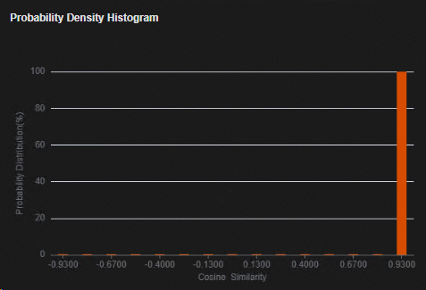

## 模型转换

-   **[整体界面](#ZH-CN_TOPIC_0000002548567951)**  

-   **[模型转换参数配置界面](#ZH-CN_TOPIC_0000002517088070)**  

-   **[转换历史显示界面](#ZH-CN_TOPIC_0000002548458355)**  

-   **[转换结果显示界面](#ZH-CN_TOPIC_0000002517098478)**  

### 整体界面

**图 1**  模型转换整体界面  
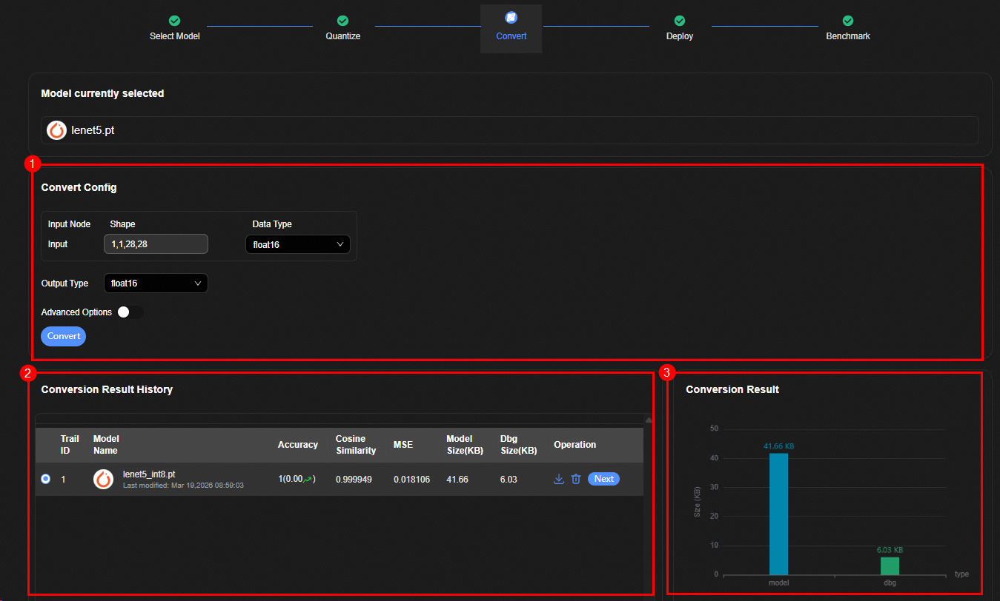

用户在模型转换界面将模型转换成昇腾NPU执行的离线模型。模型转换整体界面如[图1](#fig191831926161420)所示。主要包含三个部分：

1.  模型转换参数配置界面。
2.  转换历史显示界面，显示所有转换的网络及其相关信息。
3.  转换结果显示界面，显示转换后模型的大小。

模型转换步骤如下：

1.  在模型转换参数配置界面配置转换参数。
2.  单击“Convert”按钮。
3.  转换历史显示界面查看转换的结果。
4.  转换结果显示界面查看转换后模型的大小。
5.  转换历史显示界面选择待评估的模型，单击“Next”按钮进入部署界面。

### 模型转换参数配置界面

模型转换参数配置界面如[图1](#fig03721841143618)所示。

**图 1**  模型转换参数配置界面  
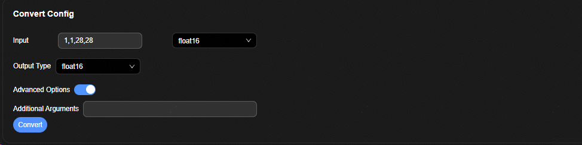

参数解释如[表1](#table82721173715)所示。

**表 1**  模型转换参数配置界面参数

<table><thead align="left"><tr id="row17271611113720"><th class="cellrowborder" valign="top" width="20.05%" id="mcps1.2.3.1.1">
参数

</th>
<th class="cellrowborder" valign="top" width="79.95%" id="mcps1.2.3.1.2">
说明

</th>
</tr>
</thead>
<tbody><tr id="row327311203719"><td class="cellrowborder" valign="top" width="20.05%" headers="mcps1.2.3.1.1 ">
Input

</td>
<td class="cellrowborder" valign="top" width="79.95%" headers="mcps1.2.3.1.2 ">
该标签显示为模型的输入节点名称。包含两个控件：

<ol id="ol960313528382"><li>输入节点张量形状。</li><li>输入节点数据类型。转换后的网络接收该数据类型的数据。</li></ol>
</td>
</tr>
<tr id="row873460174210"><td class="cellrowborder" valign="top" width="20.05%" headers="mcps1.2.3.1.1 ">
Output Type

</td>
<td class="cellrowborder" valign="top" width="79.95%" headers="mcps1.2.3.1.2 ">
输出节点数据类型。转换后的网络输出该数据类型的输出。

</td>
</tr>
<tr id="row2310111181"><td class="cellrowborder" valign="top" width="20.05%" headers="mcps1.2.3.1.1 ">
Advanced Options

</td>
<td class="cellrowborder" valign="top" width="79.95%" headers="mcps1.2.3.1.2 ">
高级模式使能开关。当开关打开时，高级模式界面展开。

</td>
</tr>
<tr id="row163268581816"><td class="cellrowborder" valign="top" width="20.05%" headers="mcps1.2.3.1.1 ">
Additional Arguments

</td>
<td class="cellrowborder" valign="top" width="79.95%" headers="mcps1.2.3.1.2 ">
扩展参数输入框。模型转换界面不支持配置，但是ATC工具支持的参数均可通过此选项进行扩展。在该输入框中用户根据实际情况输入ATC工具可用的参数。多个参数使用空格分隔。详细参数请参见《ATC离线模型编译工具用户指南》。

</td>
</tr>
<tr id="row651411425113"><td class="cellrowborder" valign="top" width="20.05%" headers="mcps1.2.3.1.1 ">
Convert

</td>
<td class="cellrowborder" valign="top" width="79.95%" headers="mcps1.2.3.1.2 ">
开始转换按钮。

</td>
</tr>
</tbody>
</table>

### 转换历史显示界面

转换历史显示界面如[图1](#fig26931136531)所示。

**图 1**  转换历史显示界面  

该界面以表格的方式显示历史转换的结果。表头说明如[表1](#table14941640115315)所示。

**表 1**  转换历史

<table><thead align="left"><tr id="row34941040165314"><th class="cellrowborder" valign="top" width="23.23%" id="mcps1.2.3.1.1">
项目

</th>
<th class="cellrowborder" valign="top" width="76.77000000000001%" id="mcps1.2.3.1.2">
说明

</th>
</tr>
</thead>
<tbody><tr id="row749464085313"><td class="cellrowborder" valign="top" width="23.23%" headers="mcps1.2.3.1.1 ">
Trail ID

</td>
<td class="cellrowborder" valign="top" width="76.77000000000001%" headers="mcps1.2.3.1.2 ">
网络转换结果的序号。

</td>
</tr>
<tr id="row11343161545419"><td class="cellrowborder" valign="top" width="23.23%" headers="mcps1.2.3.1.1 ">
Model Name

</td>
<td class="cellrowborder" valign="top" width="76.77000000000001%" headers="mcps1.2.3.1.2 ">
网络的名称，以及修改时间。

</td>
</tr>
<tr id="row149818163543"><td class="cellrowborder" valign="top" width="23.23%" headers="mcps1.2.3.1.1 ">
Accuracy

</td>
<td class="cellrowborder" valign="top" width="76.77000000000001%" headers="mcps1.2.3.1.2 ">
表示分类结果准确率，使用标签真值计算。计算公式如下，其中表示分类正确的样本数量，表示样本的总数量。

</td>
</tr>
<tr id="row191011317145410"><td class="cellrowborder" valign="top" width="23.23%" headers="mcps1.2.3.1.1 ">
Cosine Similarity

</td>
<td class="cellrowborder" valign="top" width="76.77000000000001%" headers="mcps1.2.3.1.2 ">
平均余弦相似度，计算公式如下，其中表示量化评估网络的输出，表示原始浮点网络的输出，表示验证集样本的数量。

</td>
</tr>
<tr id="row11552161735412"><td class="cellrowborder" valign="top" width="23.23%" headers="mcps1.2.3.1.1 ">
MSE

</td>
<td class="cellrowborder" valign="top" width="76.77000000000001%" headers="mcps1.2.3.1.2 ">
均方误差，计算公式如下，其中表示量化评估网络的输出，表示原始浮点网络的输出，表示验证集样本的数量。

</td>
</tr>
<tr id="row7716154415234"><td class="cellrowborder" valign="top" width="23.23%" headers="mcps1.2.3.1.1 ">
Model Size(KB)

</td>
<td class="cellrowborder" valign="top" width="76.77000000000001%" headers="mcps1.2.3.1.2 ">
转换后在昇腾AI处理器运行的离线模型文件大小。

</td>
</tr>
<tr id="row1644874782313"><td class="cellrowborder" valign="top" width="23.23%" headers="mcps1.2.3.1.1 ">
Dbg Size(KB)

</td>
<td class="cellrowborder" valign="top" width="76.77000000000001%" headers="mcps1.2.3.1.2 ">
图调试信息文件大小。

</td>
</tr>
<tr id="row073913020562"><td class="cellrowborder" valign="top" width="23.23%" headers="mcps1.2.3.1.1 ">
Operation

</td>
<td class="cellrowborder" valign="top" width="76.77000000000001%" headers="mcps1.2.3.1.2 ">
操作按钮：

<ul id="ul52775178594"><li>：下载模型转换结果。下载的压缩包中包含：<ul id="ul1285118481118"><li>convert.exeom：转换后在昇腾AI处理器运行的离线模型。</li><li>convert.dbg：图调试信息文件。</li></ul>
</li><li>：删除当前记录。</li><li>：跳转到部署页面。</li></ul>
</td>
</tr>
</tbody>
</table>

### 转换结果显示界面

转换结果显示界面如[图1](#fig1526210123512)所示。该界面以柱状图的形式显示转换后模型以及图调试信息文件的大小。

**图 1**  转换结果显示界面  
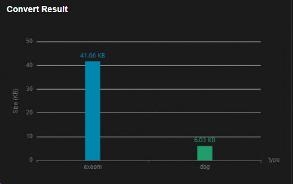

## 部署

部署界面如[图1](#fig789910546818)所示。

**图 1**  部署界面  
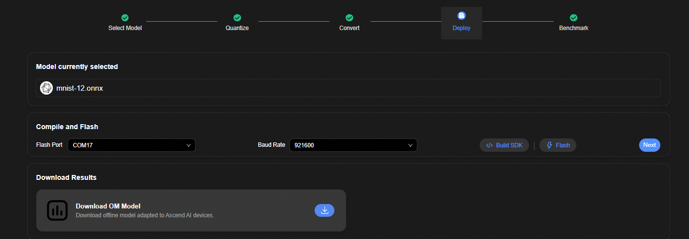

该界面主要包含Model currently selected、Build and Burn、Download Results三个部分。Build and Burn中的主要控件如[表1 Build and Burn主要控件说明](#table105181481495)所示。

**表 1**  Build and Burn主要控件说明

<table><thead align="left"><tr id="row185184483918"><th class="cellrowborder" valign="top" width="38.37%" id="mcps1.2.3.1.1">
项目

</th>
<th class="cellrowborder" valign="top" width="61.629999999999995%" id="mcps1.2.3.1.2">
说明

</th>
</tr>
</thead>
<tbody><tr id="row5518134815917"><td class="cellrowborder" valign="top" width="38.37%" headers="mcps1.2.3.1.1 ">
Burn Port

</td>
<td class="cellrowborder" valign="top" width="61.629999999999995%" headers="mcps1.2.3.1.2 ">
镜像烧录串口号。

</td>
</tr>
<tr id="row12594141775218"><td class="cellrowborder" valign="top" width="38.37%" headers="mcps1.2.3.1.1 ">
Baud Rate

</td>
<td class="cellrowborder" valign="top" width="61.629999999999995%" headers="mcps1.2.3.1.2 ">
镜像烧录波特率。

</td>
</tr>
<tr id="row1938352817578"><td class="cellrowborder" valign="top" width="38.37%" headers="mcps1.2.3.1.1 ">
Build SDK

</td>
<td class="cellrowborder" valign="top" width="61.629999999999995%" headers="mcps1.2.3.1.2 ">
开始编译SDK。

</td>
</tr>
<tr id="row74301255175711"><td class="cellrowborder" valign="top" width="38.37%" headers="mcps1.2.3.1.1 ">
Flash

</td>
<td class="cellrowborder" valign="top" width="61.629999999999995%" headers="mcps1.2.3.1.2 ">
开始镜像烧录。

</td>
</tr>
<tr id="row1750681211586"><td class="cellrowborder" valign="top" width="38.37%" headers="mcps1.2.3.1.1 ">
Next

</td>
<td class="cellrowborder" valign="top" width="61.629999999999995%" headers="mcps1.2.3.1.2 ">
进入Benchmark界面。

</td>
</tr>
</tbody>
</table>

**表 2**  Download Results主要控件说明

<table><thead align="left"><tr id="row09372710014"><th class="cellrowborder" valign="top" width="30.48%" id="mcps1.2.3.1.1">
项目

</th>
<th class="cellrowborder" valign="top" width="69.52000000000001%" id="mcps1.2.3.1.2">
说明

</th>
</tr>
</thead>
<tbody><tr id="row1293710712011"><td class="cellrowborder" valign="top" width="30.48%" headers="mcps1.2.3.1.1 ">
Download OM Model

</td>
<td class="cellrowborder" valign="top" width="69.52000000000001%" headers="mcps1.2.3.1.2 ">
单击下载按钮下载模型量化、转换结果。

</td>
</tr>
</tbody>
</table>

## 模型调优

-   **[约束说明](#ZH-CN_TOPIC_0000002516954544)**  

-   **[调优前提](#ZH-CN_TOPIC_0000002548594339)**  

-   **[界面介绍](#ZH-CN_TOPIC_0000002517114452)**  

### 约束说明

> **须知：** 
>在进行模型调优前，请务必查看如下约束要求：
>只支持单输出分类网络计算量化评估网络的准确率。

### 调优前提

-   准备精度验证数据，并保存于本地Windows环境。具体数据格式见“[数据准备与环境搭建](#ZH-CN_TOPIC_0000002548828403)”。
-   准备并连接Hi3322单板。

### 界面介绍

-   **[整体界面](#ZH-CN_TOPIC_0000002548474327)**  

-   **[串口配置界面](#ZH-CN_TOPIC_0000002516954546)**  

-   **[性能评估界面](#ZH-CN_TOPIC_0000002517218672)**  

-   **[精度评估界面](#ZH-CN_TOPIC_0000002548818475)**  

-   **[评估结果汇总界面](#ZH-CN_TOPIC_0000002517378582)**  

#### 整体界面

**图 1**  模型调优整体界面  
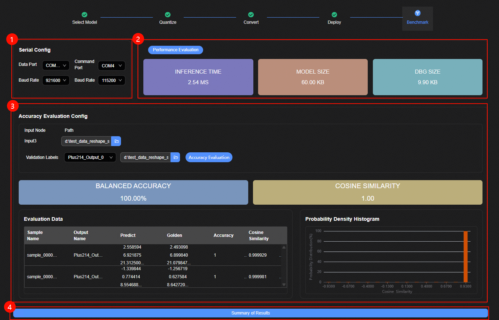

模型调优整体界面如[图1](#fig825954753619)所示，主要包含四个部分：

1.  串口配置界面。在该界面配置数据传输、烧录、命令串口和波特率。
2.  性能评估界面。
3.  精度评估界面。
4.  评估结果汇总按钮。

执行模型调优的步骤如下：

1.  配置数据传输、烧录、命令串口和波特率。
2.  可选。如需烧录镜像，单击“Flash”按钮，执行镜像烧录。
3.  可选。单击“Performance Validation”按钮，执行上板性能评估。查看性能评估结果。
4.  可选。配置精度验证数据集路径，单击“Accuracy Validation”按钮，执行上板精度评估。查看精度评估结果。
5.  单击“Summary of Results”按钮，在弹窗中查看历史评估结果。

#### 串口配置界面

用户在串口配置界面配置数据传输、命令发送串口和波特率。串口配置界面如[图1](#fig1637415227426)所示。

**图 1**  串口配置界面  
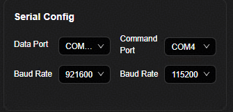

元素说明如[表1](#table1315143434513)所示。

**表 1**  串口配置界面元素说明

<table><thead align="left"><tr id="row18151934164510"><th class="cellrowborder" valign="top" width="31.1%" id="mcps1.2.3.1.1">
元素

</th>
<th class="cellrowborder" valign="top" width="68.89999999999999%" id="mcps1.2.3.1.2">
说明

</th>
</tr>
</thead>
<tbody><tr id="row111553410459"><td class="cellrowborder" valign="top" width="31.1%" headers="mcps1.2.3.1.1 ">
Data Port

</td>
<td class="cellrowborder" valign="top" width="68.89999999999999%" headers="mcps1.2.3.1.2 ">
数据传输串口号。数据传输口用于将待评估的网络模型和验证数据传送到单板。

</td>
</tr>
<tr id="row12755194814613"><td class="cellrowborder" valign="top" width="31.1%" headers="mcps1.2.3.1.1 ">
Data Port-&gt;Baudr Rate

</td>
<td class="cellrowborder" valign="top" width="68.89999999999999%" headers="mcps1.2.3.1.2 ">
数据传输串口波特率。

</td>
</tr>
<tr id="row6371155084717"><td class="cellrowborder" valign="top" width="31.1%" headers="mcps1.2.3.1.1 ">
Command Port

</td>
<td class="cellrowborder" valign="top" width="68.89999999999999%" headers="mcps1.2.3.1.2 ">
命令发送串口号。命令发送串口用于向单板发送模型推理命令。

</td>
</tr>
<tr id="row1157026154811"><td class="cellrowborder" valign="top" width="31.1%" headers="mcps1.2.3.1.1 ">
Command Port-&gt;Baud Rate

</td>
<td class="cellrowborder" valign="top" width="68.89999999999999%" headers="mcps1.2.3.1.2 ">
命令发送串口波特率。

</td>
</tr>
</tbody>
</table>

#### 性能评估界面

用户在性能评估界面触发上板性能评估，并查看性能评估结果。性能评估界面的如[图1](#fig168883129411)所示。

**图 1**  性能评估界面  
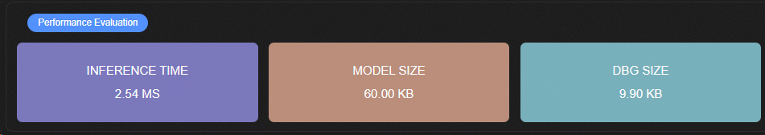

性能评估界面元素说明如[表1](#table8147195912415)所示。

**表 1**  性能评估界面元素说明

<table><thead align="left"><tr id="row1414712591549"><th class="cellrowborder" valign="top" width="31.209999999999997%" id="mcps1.2.3.1.1">
元素

</th>
<th class="cellrowborder" valign="top" width="68.78999999999999%" id="mcps1.2.3.1.2">
说明

</th>
</tr>
</thead>
<tbody><tr id="row81479591842"><td class="cellrowborder" valign="top" width="31.209999999999997%" headers="mcps1.2.3.1.1 ">
Performance Evaluation

</td>
<td class="cellrowborder" valign="top" width="68.78999999999999%" headers="mcps1.2.3.1.2 ">
开始上板精度评估按钮。

</td>
</tr>
<tr id="row139595984011"><td class="cellrowborder" valign="top" width="31.209999999999997%" headers="mcps1.2.3.1.1 ">
INFERENCE TIME

</td>
<td class="cellrowborder" valign="top" width="68.78999999999999%" headers="mcps1.2.3.1.2 ">
上板推理时间。该时间只包括模型推理时间，不包括输入输出数据的拷贝。

</td>
</tr>
<tr id="row1734698174118"><td class="cellrowborder" valign="top" width="31.209999999999997%" headers="mcps1.2.3.1.1 ">
MODEL SIZE

</td>
<td class="cellrowborder" valign="top" width="68.78999999999999%" headers="mcps1.2.3.1.2 ">
模型文件大小。

</td>
</tr>
<tr id="row66401736953"><td class="cellrowborder" valign="top" width="31.209999999999997%" headers="mcps1.2.3.1.1 ">
DBG SIZE

</td>
<td class="cellrowborder" valign="top" width="68.78999999999999%" headers="mcps1.2.3.1.2 ">
图调试信息文件大小。

</td>
</tr>
</tbody>
</table>

#### 精度评估界面

用户在精度评估界面配置精度评估验证数据、触发上板精度验证以及查看精度验证结果。精度评估界面如[图1](#fig29194371693)所示。

**图 1**  精度评估界面  
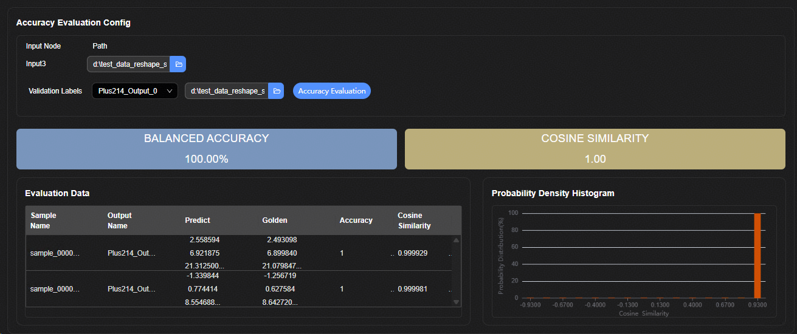

精度评估界面元素说明如[表1](#table14641101316114)所示。

**表 1**  精度评估界面元素说明

<table><thead align="left"><tr id="row66411013101118"><th class="cellrowborder" valign="top" width="29.98%" id="mcps1.2.3.1.1">
元素

</th>
<th class="cellrowborder" valign="top" width="70.02000000000001%" id="mcps1.2.3.1.2">
说明

</th>
</tr>
</thead>
<tbody><tr id="row12641121317116"><td class="cellrowborder" valign="top" width="29.98%" headers="mcps1.2.3.1.1 ">
Input Node

</td>
<td class="cellrowborder" valign="top" width="70.02000000000001%" headers="mcps1.2.3.1.2 ">
Path：验证集输入数据目录。输入文件夹路径，文件夹中包含和模型输入数据匹配的npy文件。

</td>
</tr>
<tr id="row1728540121412"><td class="cellrowborder" valign="top" width="29.98%" headers="mcps1.2.3.1.1 ">
Validation Labels

</td>
<td class="cellrowborder" valign="top" width="70.02000000000001%" headers="mcps1.2.3.1.2 ">
包含两个元素：

<ul id="ul439724081410"><li>下拉框：<ul id="ul1815795731419"><li>None：不输入分类真值标签文件。不进行准确率评估。</li><li>输出结点名称：从文件系统选择包含该节点分类真值标签的csv文件。并使用csv文件中包含的标签进行准确率计算。在选择该选项时，使能分类真值文件输入框。</li></ul>
</li><li>分类真值文件输入框：输入包含分类真值的csv文件路径。</li></ul>
</td>
</tr>
<tr id="row331245414144"><td class="cellrowborder" valign="top" width="29.98%" headers="mcps1.2.3.1.1 ">
Accuracy Evaluation

</td>
<td class="cellrowborder" valign="top" width="70.02000000000001%" headers="mcps1.2.3.1.2 ">
开始上板精度验证按钮。

</td>
</tr>
<tr id="row8623171198"><td class="cellrowborder" valign="top" width="29.98%" headers="mcps1.2.3.1.1 ">
ACCURACY

</td>
<td class="cellrowborder" valign="top" width="70.02000000000001%" headers="mcps1.2.3.1.2 ">
表示分类结果准确率，使用标签真值计算。计算公式如下，其中表示分类正确的样本数量，表示样本的总数量。

</td>
</tr>
<tr id="row19814192411435"><td class="cellrowborder" valign="top" width="29.98%" headers="mcps1.2.3.1.1 ">
Cosine Similarity

</td>
<td class="cellrowborder" valign="top" width="70.02000000000001%" headers="mcps1.2.3.1.2 ">
平均余弦相似度，计算公式如下，其中表示量化评估网络的输出，表示原始浮点网络的输出，表示验证集样本的数量。

</td>
</tr>
<tr id="row856725711199"><td class="cellrowborder" valign="top" width="29.98%" headers="mcps1.2.3.1.1 ">
Evaluation Data

</td>
<td class="cellrowborder" valign="top" width="70.02000000000001%" headers="mcps1.2.3.1.2 ">
各验证样本验证结果。表格中各项说明如<a href="#table8115238122018">表2</a>所示。

</td>
</tr>
<tr id="row32007219214"><td class="cellrowborder" valign="top" width="29.98%" headers="mcps1.2.3.1.1 ">
Probability Density Histogram

</td>
<td class="cellrowborder" valign="top" width="70.02000000000001%" headers="mcps1.2.3.1.2 ">
验证集的余弦相似度的分布图。横轴为余弦相似度，纵轴为验证集样本的百分比。

</td>
</tr>
</tbody>
</table>

**表 2**  验证样本结果说明

<table><thead align="left"><tr id="row151151438192018"><th class="cellrowborder" valign="top" width="29.42%" id="mcps1.2.3.1.1">
元素

</th>
<th class="cellrowborder" valign="top" width="70.58%" id="mcps1.2.3.1.2">
说明

</th>
</tr>
</thead>
<tbody><tr id="row31155385204"><td class="cellrowborder" valign="top" width="29.42%" headers="mcps1.2.3.1.1 ">
Sample Name

</td>
<td class="cellrowborder" valign="top" width="70.58%" headers="mcps1.2.3.1.2 ">
样本名称。

</td>
</tr>
<tr id="row15643194115225"><td class="cellrowborder" valign="top" width="29.42%" headers="mcps1.2.3.1.1 ">
Output Name

</td>
<td class="cellrowborder" valign="top" width="70.58%" headers="mcps1.2.3.1.2 ">
输出节点名称。

</td>
</tr>
<tr id="row928511578221"><td class="cellrowborder" valign="top" width="29.42%" headers="mcps1.2.3.1.1 ">
Predict

</td>
<td class="cellrowborder" valign="top" width="70.58%" headers="mcps1.2.3.1.2 ">
模型上板推理的输出。

</td>
</tr>
<tr id="row5812918239"><td class="cellrowborder" valign="top" width="29.42%" headers="mcps1.2.3.1.1 ">
Golden

</td>
<td class="cellrowborder" valign="top" width="70.58%" headers="mcps1.2.3.1.2 ">
原始浮点网络在Windows主机推理的输出。

</td>
</tr>
<tr id="row61391237122311"><td class="cellrowborder" valign="top" width="29.42%" headers="mcps1.2.3.1.1 ">
Accuracy

</td>
<td class="cellrowborder" valign="top" width="70.58%" headers="mcps1.2.3.1.2 ">
本样本的分类正确率。

</td>
</tr>
<tr id="row107321547172315"><td class="cellrowborder" valign="top" width="29.42%" headers="mcps1.2.3.1.1 ">
Cosine Similarity

</td>
<td class="cellrowborder" valign="top" width="70.58%" headers="mcps1.2.3.1.2 ">
余弦相似度，计算公式如下，其中表示模型上板推理的输出，表示原始浮点网络在Windows的输出。

</td>
</tr>
</tbody>
</table>

#### 评估结果汇总界面

单击“Summary of Results”按钮之后弹出评估结果汇总界面，该界面汇总每次评估的结果。如[图1](#fig15398321925)所示。

**图 1**  评估结果汇总界面  
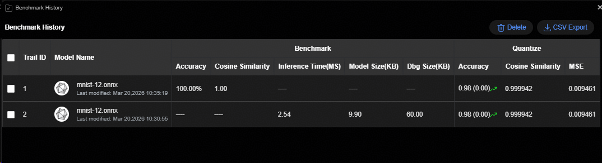

评估结果汇总界面元素说明如[表1](#table126871262713)所示。

**表 1**  评估结果界面元素说明

<table><thead align="left"><tr id="row26821219274"><th class="cellrowborder" valign="top" width="10.57%" id="mcps1.2.4.1.1">
一级元素

</th>
<th class="cellrowborder" valign="top" width="18.83%" id="mcps1.2.4.1.2">
二级元素

</th>
<th class="cellrowborder" valign="top" width="70.6%" id="mcps1.2.4.1.3">
说明

</th>
</tr>
</thead>
<tbody><tr id="row920295822719"><td class="cellrowborder" valign="top" width="10.57%" headers="mcps1.2.4.1.1 ">
Trail ID

</td>
<td class="cellrowborder" valign="top" width="18.83%" headers="mcps1.2.4.1.2 ">&nbsp;&nbsp;</td>
<td class="cellrowborder" valign="top" width="70.6%" headers="mcps1.2.4.1.3 ">
评估结果序号。

</td>
</tr>
<tr id="row131301128142814"><td class="cellrowborder" valign="top" width="10.57%" headers="mcps1.2.4.1.1 ">
Model Name

</td>
<td class="cellrowborder" valign="top" width="18.83%" headers="mcps1.2.4.1.2 ">&nbsp;&nbsp;</td>
<td class="cellrowborder" valign="top" width="70.6%" headers="mcps1.2.4.1.3 ">
网络的名称，以及修改时间。

</td>
</tr>
<tr id="row194581042144817"><td class="cellrowborder" rowspan="5" valign="top" width="10.57%" headers="mcps1.2.4.1.1 ">
Benchmark

</td>
<td class="cellrowborder" valign="top" width="18.83%" headers="mcps1.2.4.1.2 ">
Accuracy

</td>
<td class="cellrowborder" valign="top" width="70.6%" headers="mcps1.2.4.1.3 ">
表示模型上板推理结果分类结果准确率，使用标签真值计算。计算公式如下，其中表示分类正确的样本数量，表示样本的总数量。

</td>
</tr>
<tr id="row87249382281"><td class="cellrowborder" valign="top" headers="mcps1.2.4.1.1 ">
Cosine Similarity

</td>
<td class="cellrowborder" valign="top" headers="mcps1.2.4.1.2 ">
表示模型上板推理结果平均余弦相似度，计算公式如下，其中表示模型上板推理的输出，表示原始浮点网络在Windows的输出，表示验证集样本的数量。

</td>
</tr>
<tr id="row1589814107496"><td class="cellrowborder" valign="top" headers="mcps1.2.4.1.1 ">
Inference Time(MS)

</td>
<td class="cellrowborder" valign="top" headers="mcps1.2.4.1.2 ">
上板推理时间。

</td>
</tr>
<tr id="row1538583114498"><td class="cellrowborder" valign="top" headers="mcps1.2.4.1.1 ">
Model Size(KB)

</td>
<td class="cellrowborder" valign="top" headers="mcps1.2.4.1.2 ">
模型文件大小。

</td>
</tr>
<tr id="row9187175792810"><td class="cellrowborder" valign="top" headers="mcps1.2.4.1.1 ">
Dbg Size

</td>
<td class="cellrowborder" valign="top" headers="mcps1.2.4.1.2 ">
图调试信息文件大小。

</td>
</tr>
<tr id="row71421715292"><td class="cellrowborder" rowspan="2" valign="top" width="10.57%" headers="mcps1.2.4.1.1 ">
Quantize

</td>
<td class="cellrowborder" valign="top" width="18.83%" headers="mcps1.2.4.1.2 ">
Cosine Similarity

</td>
<td class="cellrowborder" valign="top" width="70.6%" headers="mcps1.2.4.1.3 ">
表示量化评估模型推理结果的平均余弦相似度，计算公式如下，其中表示模型上板推理的输出，表示原始浮点网络在Windows的输出，表示验证集样本的数量。

</td>
</tr>
<tr id="row15753193722918"><td class="cellrowborder" valign="top" headers="mcps1.2.4.1.1 ">
MSE

</td>
<td class="cellrowborder" valign="top" headers="mcps1.2.4.1.2 ">
表示量化评估模型推理结果的均方误差，计算公式如下，其中表示量化评估网络的输出，表示原始浮点网络的输出，表示验证集样本的数量。

</td>
</tr>
</tbody>
</table>

## 应用开发

在HiSpark Studio AI中完成模型量化、转换之后，将模型导出并使用HiSpark.AI API完成应用开发。具体步骤如下：

1.  在Deploy页面下载转换好的exeom模型。

    **图 1**  下载exeom模型  
    

2.  具体API的用法请参考文档《HiSpark.AI API开发指南》。

# 常见问题

-   **[服务器断连](#ZH-CN_TOPIC_0000002565416789)**  

## 服务器断连

对于Linux通路，若远程服务器在使用过程中断连，插件右下角会弹窗提示 "Lost connection to remote server" 。当远程服务器重新启动，连接恢复后，需手动在选择模型界面通过导入模型或选择已有模型的方式，重新连接一次服务器。

