# 前言<a name="ZH-CN_TOPIC_0000002513170974"></a>

**概述<a name="section4537382116410"></a>**

本文档主要描述HiSpark Studio AI for VS Code插件的安装及使用。该工具主要用于模型压缩、模型转换、应用开发、端侧部署、性能调优等。

**读者对象<a name="section4378592816410"></a>**

本文档主要适用于基于海思芯片进行嵌入式开发的相关人员：

-   软件开发工程师
-   技术支持工程师
-   硬件开发工程师
-   嵌入式爱好者

**符号约定<a name="section133020216410"></a>**

在本文中可能出现下列标志，它们所代表的含义如下。

<a name="table2622507016410"></a>
<table><thead align="left"><tr id="row1530720816410"><th class="cellrowborder" valign="top" width="20.580000000000002%" id="mcps1.1.3.1.1"><p id="p6450074116410"><a name="p6450074116410"></a><a name="p6450074116410"></a><strong id="b2136615816410"><a name="b2136615816410"></a><a name="b2136615816410"></a>符号</strong></p>
</th>
<th class="cellrowborder" valign="top" width="79.42%" id="mcps1.1.3.1.2"><p id="p5435366816410"><a name="p5435366816410"></a><a name="p5435366816410"></a><strong id="b5941558116410"><a name="b5941558116410"></a><a name="b5941558116410"></a>说明</strong></p>
</th>
</tr>
</thead>
<tbody><tr id="row1372280416410"><td class="cellrowborder" valign="top" width="20.580000000000002%" headers="mcps1.1.3.1.1 "><p id="p3734547016410"><a name="p3734547016410"></a><a name="p3734547016410"></a><a name="image2670064316410"></a><a name="image2670064316410"></a><span></span></p>
</td>
<td class="cellrowborder" valign="top" width="79.42%" headers="mcps1.1.3.1.2 "><p id="p1757432116410"><a name="p1757432116410"></a><a name="p1757432116410"></a>表示如不避免则将会导致死亡或严重伤害的具有高等级风险的危害。</p>
</td>
</tr>
<tr id="row466863216410"><td class="cellrowborder" valign="top" width="20.580000000000002%" headers="mcps1.1.3.1.1 "><p id="p1432579516410"><a name="p1432579516410"></a><a name="p1432579516410"></a><a name="image4895582316410"></a><a name="image4895582316410"></a><span></span></p>
</td>
<td class="cellrowborder" valign="top" width="79.42%" headers="mcps1.1.3.1.2 "><p id="p959197916410"><a name="p959197916410"></a><a name="p959197916410"></a>表示如不避免则可能导致死亡或严重伤害的具有中等级风险的危害。</p>
</td>
</tr>
<tr id="row123863216410"><td class="cellrowborder" valign="top" width="20.580000000000002%" headers="mcps1.1.3.1.1 "><p id="p1232579516410"><a name="p1232579516410"></a><a name="p1232579516410"></a><a name="image1235582316410"></a><a name="image1235582316410"></a><span></span></p>
</td>
<td class="cellrowborder" valign="top" width="79.42%" headers="mcps1.1.3.1.2 "><p id="p123197916410"><a name="p123197916410"></a><a name="p123197916410"></a>表示如不避免则可能导致轻微或中度伤害的具有低等级风险的危害。</p>
</td>
</tr>
<tr id="row5786682116410"><td class="cellrowborder" valign="top" width="20.580000000000002%" headers="mcps1.1.3.1.1 "><p id="p2204984716410"><a name="p2204984716410"></a><a name="p2204984716410"></a><a name="image4504446716410"></a><a name="image4504446716410"></a><span></span></p>
</td>
<td class="cellrowborder" valign="top" width="79.42%" headers="mcps1.1.3.1.2 "><p id="p4388861916410"><a name="p4388861916410"></a><a name="p4388861916410"></a>用于传递设备或环境安全警示信息。如不避免则可能会导致设备损坏、数据丢失、设备性能降低或其它不可预知的结果。</p>
<p id="p1238861916410"><a name="p1238861916410"></a><a name="p1238861916410"></a>“须知”不涉及人身伤害。</p>
</td>
</tr>
<tr id="row2856923116410"><td class="cellrowborder" valign="top" width="20.580000000000002%" headers="mcps1.1.3.1.1 "><p id="p5555360116410"><a name="p5555360116410"></a><a name="p5555360116410"></a><a name="image799324016410"></a><a name="image799324016410"></a><span></span></p>
</td>
<td class="cellrowborder" valign="top" width="79.42%" headers="mcps1.1.3.1.2 "><p id="p4612588116410"><a name="p4612588116410"></a><a name="p4612588116410"></a>对正文中重点信息的补充说明。</p>
<p id="p1232588116410"><a name="p1232588116410"></a><a name="p1232588116410"></a>“说明”不是安全警示信息，不涉及人身、设备及环境伤害信息。</p>
</td>
</tr>
</tbody>
</table>

**修改记录<a name="section2467512116410"></a>**

<a name="table1557726816410"></a>
<table><thead align="left"><tr id="row2942532716410"><th class="cellrowborder" valign="top" width="20.72%" id="mcps1.1.4.1.1"><p id="p3778275416410"><a name="p3778275416410"></a><a name="p3778275416410"></a><strong id="b5687322716410"><a name="b5687322716410"></a><a name="b5687322716410"></a>文档版本</strong></p>
</th>
<th class="cellrowborder" valign="top" width="26.25%" id="mcps1.1.4.1.2"><p id="p5627845516410"><a name="p5627845516410"></a><a name="p5627845516410"></a><strong id="b5800814916410"><a name="b5800814916410"></a><a name="b5800814916410"></a>发布日期</strong></p>
</th>
<th class="cellrowborder" valign="top" width="53.03%" id="mcps1.1.4.1.3"><p id="p2382284816410"><a name="p2382284816410"></a><a name="p2382284816410"></a><strong id="b3316380216410"><a name="b3316380216410"></a><a name="b3316380216410"></a>修改说明</strong></p>
</th>
</tr>
</thead>
<tbody><tr id="row842614031715"><td class="cellrowborder" valign="top" width="20.72%" headers="mcps1.1.4.1.1 "><p id="p1648018317170"><a name="p1648018317170"></a><a name="p1648018317170"></a>02</p>
</td>
<td class="cellrowborder" valign="top" width="26.25%" headers="mcps1.1.4.1.2 "><p id="p19480193101715"><a name="p19480193101715"></a><a name="p19480193101715"></a>2026-03-24</p>
</td>
<td class="cellrowborder" valign="top" width="53.03%" headers="mcps1.1.4.1.3 "><p id="p948011391719"><a name="p948011391719"></a><a name="p948011391719"></a>新增“<a href="Windows侧环境准备（仅Windows端用户关注）.md">Windows侧环境准备（仅Windows端用户关注）</a>、<a href="WSL环境准备（仅Windows端用户关注）.md">WSL环境准备（仅Windows端用户关注）</a>”章节。</p>
</td>
</tr>
<tr id="row5281780716410"><td class="cellrowborder" valign="top" width="20.72%" headers="mcps1.1.4.1.1 "><p id="p559mcpsimp"><a name="p559mcpsimp"></a><a name="p559mcpsimp"></a>01</p>
</td>
<td class="cellrowborder" valign="top" width="26.25%" headers="mcps1.1.4.1.2 "><p id="p561mcpsimp"><a name="p561mcpsimp"></a><a name="p561mcpsimp"></a>2026-01-26</p>
</td>
<td class="cellrowborder" valign="top" width="53.03%" headers="mcps1.1.4.1.3 "><p id="p563mcpsimp"><a name="p563mcpsimp"></a><a name="p563mcpsimp"></a>第一次正式版本发布。</p>
</td>
</tr>
</tbody>
</table>

# 简介<a name="ZH-CN_TOPIC_0000002529395379"></a>

HiSpark Studio AI是面向开发者提供的超轻量级AI应用开发平台，具备高集成、高专业、高易用等特征，聚焦嵌入式AI应用场景，提供模型压缩、模型转换、应用开发、端侧部署、性能调优的全流程开发平台。

# 开发板准备<a name="ZH-CN_TOPIC_0000002530523791"></a>

目前支持Hi3863以及Hi3322两款芯片，需要提前准备单板资源。

# 开发环境准备<a name="ZH-CN_TOPIC_0000002498683832"></a>


## HiSpark Studio AI准备<a name="ZH-CN_TOPIC_0000002538543935"></a>


### 插件安装<a name="ZH-CN_TOPIC_0000002541561749"></a>

从VS Code插件市场中安装插件：

-   安装HiSpark Studio插件

    **图 1**  HiSpark Studio插件<a name="fig3550176194110"></a>  
    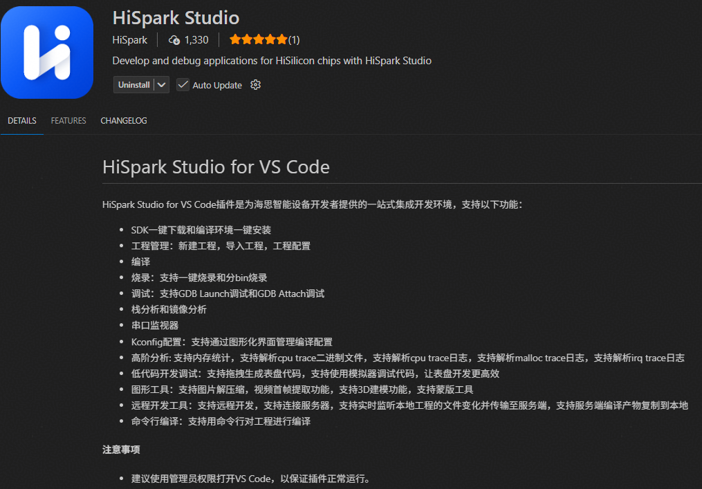

-   安装HiSpark Studio AI插件

    **图 2**  HiSpark Studio AI插件<a name="fig183312431719"></a>  
    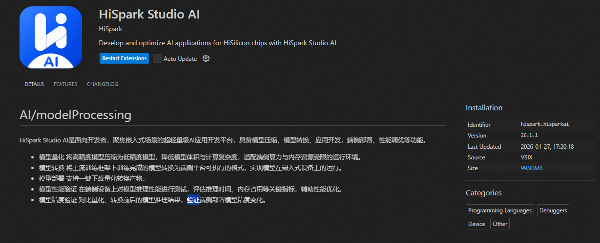

### 环境配置<a name="ZH-CN_TOPIC_0000002541521757"></a>

1.  进入HiSpark Studio AI页面，单击“Download Toolchain”按钮。

    **图 1**  Download Toolchain<a name="fig183805295175"></a>  
    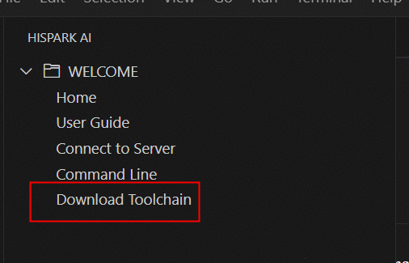

    出现如[图2](#fig96701933161720)所示界面，即表示一键下载工具链已完成。

    **图 2**  下载成功提示<a name="fig96701933161720"></a>  
    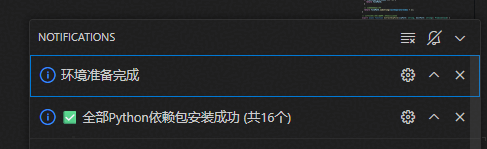


## Hi3863环境准备<a name="ZH-CN_TOPIC_0000002498843814"></a>

HiSpark Studio AI后端支持用户在Windows（推荐）和Linux环境中使用，环境准备步骤大致如[图1](#fig1429717521912)、[图2](#fig55781161195)所示。若需要使用命令行工具进行模型的量化与转换，请参考《HiSpark.AI 转换工具使用指南》 以及 《HiSpark.AI API 开发指南》，进行环境准备。

整个CPU侧环境准备步骤大致如下所示。

**图 1**  CPU环境准备（Windows侧）<a name="fig1429717521912"></a>  


**图 2**  CPU环境准备（Linux侧）<a name="fig55781161195"></a>  
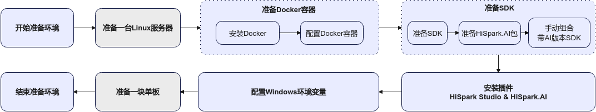


### Linux服务器端AI环境准备（仅Linux端用户关注）<a name="ZH-CN_TOPIC_0000002504198312"></a>

使用Dockerfile准备Linux服务器端AI环境。环境安装前需要从发布包获取Dockerfile文件、MSLite安装包，并将其放置在同级目录下。

Dockerfile包括Dockerfile\_mslite。Dockerfile\_mslite为基础版环境准备配置文件。

环境安装前，请先检查目录下是否包含如下文件：

```
.
├── Dockerfile_mslite
└── HiSpark.AI_xx.xx.xx-mindspore-enterprise-lite-xx.xx.xx-linux-x64.tar.gz
```

> **须知：** 
>1.  请勿将多个不同版本的MSLite包放置于该目录下。
>2.  请保持Linux服务器网络畅通。


#### Linux通路环境准备<a name="ZH-CN_TOPIC_0000002538542947"></a>

基础版环境准备前，请先保证Linux服务器安装Docker。

基础版环境准备步骤如下：

1.  执行如下命令构建Docker镜像：

    ```
    docker build -f Dockerfile_mslite -t {镜像名称}:{镜像标签} .
    ```

    如需要配置代理，请执行如下命令：

    ```
    docker build -f Dockerfile_mslite --build-arg http_proxy={http代理地址} --build-arg https_proxy={https代理地址} --build-arg no_proxy={排除代理地址} -t {镜像名称}:{镜像标签} .
    ```

    如果打印如下类似信息，表示Docker构建成功。

    ```
    Successfully built xxx
    Successfully tagged xxx
    ```

2.  执行如下命令运行容器，并关联端口及挂载文件夹：

    ```
    docker run -itd --ipc=host -p {服务器端口}:22 -v {服务器路径}:{容器路径} --name {容器名称} {镜像名称}:{镜像标签}
    ```

    其中：

    -   --ipc=host：可选，配置后容器共享宿主机的内存。
    -   -p参数：表示将服务器对应端口映射到容器的\[服务器端口\}:22端口。
    -   -v参数：表示将服务器相应路径映射到容器内的相应路径。该参数为可选参数。

3.  执行如下命令启动容器：

    ```
    docker start {容器名称}
    ```

    使用如下指令查询运行的容器，如果查询的表格中包含启动的容器，则表示启动成功。

    ```
    docker ps
    ```

4.  配置容器root密码。
    1.  使用如下命令进入容器：

        ```
        docker exec -it {容器名称} /bin/bash
        ```

    2.  配置密码：

        ```
        passwd
        ```

5.  执行如下命令测试ssh连接。按照提示输入root密码，能够顺利进入容器，则表示ssh连接正常。

    ```
    ssh root@{服务器IP地址} -p {服务器端口}
    ```

> **说明：** 
>由于镜像构建过程中使用的镜像源由基础镜像Ubuntu XX.XX决定，请用户根据基础镜像决定是否更换镜像源。更换镜像源可参考common文件夹中“Mirror\_conf.sh”中提供的示例进行修改，示例仅供参考，并不适用所有环境，请用户根据环境需要自行设置合适的镜像源。 如用户Ubuntu XX.XX中配置的镜像源在Docker镜像构建过程中无法正常下载所需软件包，请参考“Mirror\_conf.sh”修改合适的镜像源。

下述示例中，设置了http://mirrors.aliyun.com为镜像源，该镜像源并不一定适用所有的环境，请用户选择适合的镜像源进行替换。

```
 #!/bin/bash  
 # Mirror source configuration 
  
 # The following configuration of mirror sources is for reference only.  
 # You need to configure proper mirror sources based on your environment requirements. 
 # Configure the image source according to the following example to ensure that the software package can be downloaded during image construction. 
 
 ############## Modify the following information as required .################## 
 # cp -a /etc/apt/sources.list /etc/apt/sources.list.bak 
 # sed -i "s@http://.*archive.ubuntu.com@http://mirrors.aliyun.com@g" /etc/apt/sources.list 
 # sed -i "s@http://.*security.ubuntu.com@http://mirrors.aliyun.com@g" /etc/apt/sources.list 
 # mkdir -p /root/.pip/ 
 # echo '[global]' >> /root/.pip/pip.conf 
 # echo 'trusted-host=mirrors.aliyun.com' >> /root/.pip/pip.conf 
 # echo 'index-url=http://mirrors.aliyun.com/pypi/simple' >> /root/.pip/pip.conf
```

### 准备SDK<a name="ZH-CN_TOPIC_0000002536180835"></a>

1.  取Hi3863对应SDK发布包，解压SDK包到本地目录。
2.  将组件包中的“HiSpark.AI\_xx.xx.x.xxxx-adaptor.tar.gz”包解压，将adaptor以及include一级目录放置到SDK中“middleware/utils/ai\_mcu”下，目录结构如下所示：

    ```
    middleware/utils/ai_mcu
    ├─adaptor
    │  ├─cpu
    │  │  ├─dump
    │  │  ├─infer
    │  │  ├─load
    │  │  └─include
    │  └─npu
    └─include
    ```

    将at目录下at\_ai\_cmd目录放置到SDK的“middleware/utils/at”下，目录结构如下所示：

    ```
    middleware/utils/at
    ├─at_ai_cmd
    │  ├─at
    │  ├─src
    │  └─CMakeLists.txt
    ├─at_plt_cmd
    ├─at_bt_cmd
    └─...
    ```

3.  按照如下步骤修改SDK中的编译配置脚本：
    1.  在“middleware/utils/CMakeLists.txt”中加入“add\_subdirectory\_if\_exist\(ai\_mcu/adaptor/cpu\)”
    2.  在“middleware/utils/at/CMakeLists.txt”中加入“add\_subdirectory\_if\_exist\(at\_ai\_cmd\)”
    3.  在“build/config/target\_config/ws63/config.py”的ws63-liteos-app字段中的“ram\_component”选项加入“ai\_at”、“ai\_adaptor\_cpu”两个组件。

1.  修改主流程，新增AT命令注册：

    找到“application/ws63/ws63\_liteos\_application/main.c”：

    1.  在app\_task\_definition\_t结构体定义上方增加“\#include "at\_ai\_cmd\_register.h"”。

    2.  在do\_at\_cmd\_register函数中，增加“at\_ai\_cmd\_register\(\);”这一行。

## Hi3322环境准备<a name="ZH-CN_TOPIC_0000002530443753"></a>

HiSpark Studio AI后端支持用户在Windows（推荐）和Linux环境中使用，环境准备步骤大致如[图1](#fig1560816183209)、[图2](#fig1180314211206)所示。若需要使用命令行工具进行模型的量化与转换，请参考《Nano AI应用开发指导书》，进行环境准备。

**图 1**  NPU环境准备（Linux通路）<a name="fig1560816183209"></a>  
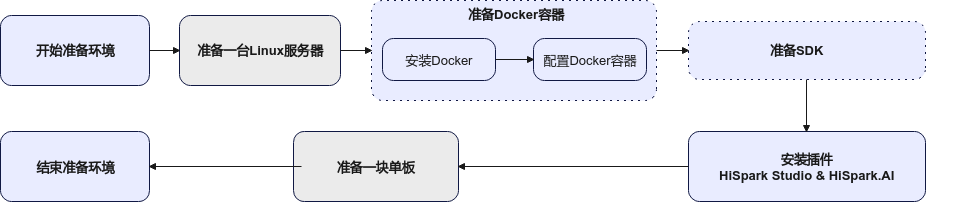

**图 2**  NPU环境准备（WSL通路）<a name="fig1180314211206"></a>  
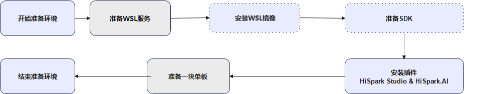


### WSL环境准备（仅Windows端用户关注）<a name="ZH-CN_TOPIC_0000002521720132"></a>

Win R，输入“optionalfeatures”。

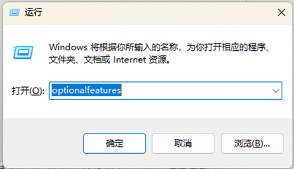

若Virtual Machine Platform/虚拟机平台选项未开启，开启并重启电脑。

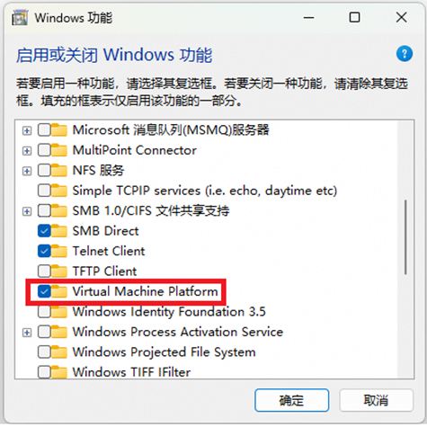

通过离线安装包[https://github.com/microsoft/WSL/releases/download/2.6.3/wsl.2.6.3.0.x64.msi](https://github.com/microsoft/WSL/releases/download/2.6.3/wsl.2.6.3.0.x64.msi)安装WSL，并下载指定[镜像](https://hispark-obs.obs.cn-east-3.myhuaweicloud.com/ubuntu-22.04-cann-26.03.1.tar.xz)。

通过以下命令安装WSL镜像：

```
wsl --install --from-file {WSL镜像路径} --location {WSL安装路径} --name {WSL_DISTRIB名称}
```

其中：

-   WSL镜像路径：为镜像所在路径。
-   WSL安装路径：用户指定的wsl安装的目标目录，
-   WSL\_DISTRIB名称：用户指定的WSL Distribution名称。 HiSpark Studio AI通过该名称连接WSL环境。在HiSpark Studio AI中，可以使用默认名称“ubuntu-22.04-cann-base”，或者指定自定义名称连接WSL环境。

如，用户的镜像存放于D盘：D://ubuntu-22.04-cann.tar.xz；安装的目标目录为“D://wsl\_location”，使用默认名称“ubuntu-22.04-cann-base”，则使用如下命令进行WSL镜像安装：

```
wsl --install --from-file D://ubuntu-22.04-cann.tar.xz --location D://wsl_location --name ubuntu-22.04-cann-base
```

安装成功后会自动进入WSL环境，如[图1](#fig13871162918439)所示。

**图 1**  安装WSL镜像<a name="fig13871162918439"></a>  
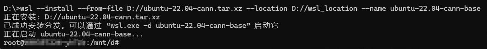

### Linux服务器端环境准备（仅Linux端用户关注）<a name="ZH-CN_TOPIC_0000002504384650"></a>

使用Dockerfile准备Linux服务器端AI环境。环境安装前需要从发布包获取Dockerfile文件、ATC安装包、AMCT安装包，并将其放置在同级目录下。

Dockerfile包括Dockerfile\_cann\_cpu和Dockerfile\_cann\_gpu。其中Dockerfile\_cann\_cpu为基础版环境准备配置文件；Dockerfile\_cann\_gpu为GPU加速版环境准备配置文件。GPU可以加速量化感知训练的效率。

环境安装前，请先检查目录下是否包含如下文件：

```
.
├── CANN-amct-{版本号}-linux.x86_64.tar.gz
├── CANN-compiler-{版本号}-linux.x86_64.run
├── CANN-opp-{版本号}-linux.x86_64.run
├── CANN-runtime-{版本号}-linux.x86_64.run
├── CANN-toolkit-{版本号}-linux.x86_64.run
└── Dockerfile_cann_cpu或Dockerfile_cann_gpu
```

> **须知：** 
>1.  请勿将多个不同版本的ATC和AMCT安装包放置于该目录下。
>2.  请保持Linux服务器网络畅通。


#### 基础版环境准备<a name="ZH-CN_TOPIC_0000002504481524"></a>

基础版环境准备前，请先保证Linux服务器安装Docker。

基础版环境准备步骤如下：

1.  执行如下命令构建Docker镜像：

    ```
    docker build -f Dockerfile_cann_cpu -t {镜像名称}:{镜像标签} .
    ```

    如需要配置代理，请执行如下命令：

    ```
    docker build -f Dockerfile_cann_cpu --build-arg http_proxy={http代理地址} --build-arg https_proxy={https代理地址} --build-arg no_proxy={排除代理地址} -t {镜像名称}:{镜像标签} .
    ```

    如果打印如下类似信息，表示Docker构建成功。

    ```
    Successfully built 61bc7fae9f9e
    Successfully tagged {镜像名称}:{镜像标签}
    ```

2.  执行如下命令运行容器，并关联端口及挂载文件夹：

    ```
    docker run -itd  --ipc=host -p {服务器端口}:22 -v {服务器路径}:{容器路径} --name {容器名称} {镜像名称}:{镜像标签}
    ```

    其中：

    -   --ipc=host：可选，配置后容器共享宿主机的内存。
    -   -p参数：表示将服务器对应端口映射到容器的\{服务器端口\}:22端口。
    -   -v参数：表示将服务器相应路径映射到容器内的相应路径。该参数为可选参数。

3.  执行如下命令启动容器：

    ```
    docker start {容器名称}
    ```

    使用如下指令查询运行的容器，如果查询的表格中包含启动的容器，则表示启动成功。

    ```
    docker ps
    ```

4.  配置容器root密码。
    -   使用如下命令进入容器：

        ```
        docker exec -it {容器名称} /bin/bash
        ```

    -   配置密码：

        ```
        passwd
        ```

5.  执行如下命令测试ssh连接。按照提示输入root密码，能够顺利进入容器，则表示ssh连接正常。

    ```
    ssh root@{服务器IP地址} -p {服务器端口}
    ```

> **说明：** 
>如遇到镜像代理未配置的网络问题，请参考“[Linux通路环境准备](Linux通路环境准备.md)”中的说明完成代理配置。

#### GPU加速版环境准备<a name="ZH-CN_TOPIC_0000002504641364"></a>

GPU加速版环境准备前，请先保证Linux服务器：

1.  安装Docker。
2.  安装GPU驱动；并保证版本号≥525。
3.  安装和配置NVIDIA Container Toolkit。

GPU加速版环境准备步骤如下：

1.  执行如下命令构建Docker镜像：

    ```
    docker build -f Dockerfile_cann_gpu -t {镜像名称}:{镜像标签} .
    ```

    如需要配置代理，请执行如下命令：

    ```
    docker build -f Dockerfile_cann_gpu --build-arg http_proxy={http代理地址} --build-arg https_proxy={https代理地址} --build-arg no_proxy={排除代理地址} -t {镜像名称}:{镜像标签} .
    ```

    如果打印如下类似信息，表示Docker构建成功。

    ```
    Successfully built 61bc7fae9f9e
    Successfully tagged {镜像名称}:{镜像标签}
    ```

2.  执行如下命令运行容器，并关联端口及挂载文件夹：

    ```
    docker run -itd --ipc=host -p {服务器端口}:22 --gpus all -v {服务器路径}:{容器路径} --name {容器名称} {镜像名称}:{镜像标签}
    ```

    其中：

    -   --ipc=host：可选，配置后容器共享宿主机的内存。
    -   -p参数：表示将服务器对应端口映射到容器的22端口。
    -   --gpus参数：表示GPU对容器可见。
    -   -v参数：表示将服务器相应路径映射到容器内的相应路径。该参数为可选参数。

3.  执行如下命令启动容器：

    ```
    docker start {容器名称}
    ```

    使用如下指令查询运行的容器，如果查询的表格中包含启动的容器，则表示启动成功。

    ```
    docker ps
    ```

4.  配置容器root密码。
    -   使用如下命令进入容器：

        ```
        docker exec -it {容器名称} /bin/bash
        ```

    -   配置密码：

        ```
        passwd
        ```

5.  在容器内执行如下命令测试GPU是否可用。

    ```
    nvidia-smi
    ```

    命令输出如[图1](#fig48521345151615)类似信息，表示GPU可用。

    **图 1**  GPU查询结果<a name="fig48521345151615"></a>  
    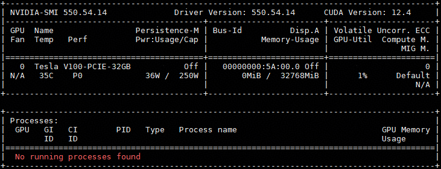

6.  在Linux服务器执行如下命令测试ssh连接。按照提示输入root密码，能够顺利进入容器，则表示ssh连接正常。

    ```
    ssh root@{服务器IP地址} -p {服务器端口}
    ```

### Windows侧Bash环境准备<a name="ZH-CN_TOPIC_0000002536184615"></a>

该小节仅针对于需要依赖bash环境才可以编译的Hi3322工程。

如果需要编译Hi3322的工程，用户需手动下载Git并将bash路径添加到环境变量中。

下载链接：[https://github.com/git-for-windows/git/releases/download/v2.48.1.windows.1/Git-2.48.1-64-bit.exe](https://github.com/git-for-windows/git/releases/download/v2.48.1.windows.1/Git-2.48.1-64-bit.exe)

如果Windows系统System32下默认有“bash.exe”，需要删除其系统下的“bash.exe”，使用安装的git下内置的“bash.exe”。

完成后，重启VS Code使新环境变量生效，即可正常编译工程。

**图 1**  删除Windows系统库的bash<a name="fig9843191112367"></a>  
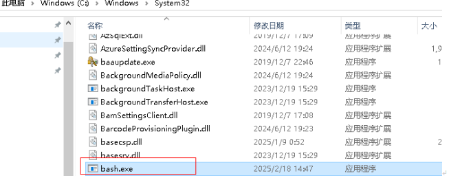

> **说明：** 
>若删除Windows系统库下的bash时提示没权限，可以在需要删除的“bash.exe”上右键单击，选择“属性”，在弹出的窗口中依次单击“安全”标签页→“高级”→单击“所有者”标签页下的“更改”按钮。选择一个新的所有者（例如当前用户），单击“应用”和“确定”。返回“安全”标签页，单击“编辑”。为当前添加的用户或组分配适当的权限（如完全控制、读取等）。点“应用”和“确定”后即可删掉选择的“bash.exe”文件。

**图 2**  配置bash.exe的删除权限<a name="fig31821532142019"></a>  
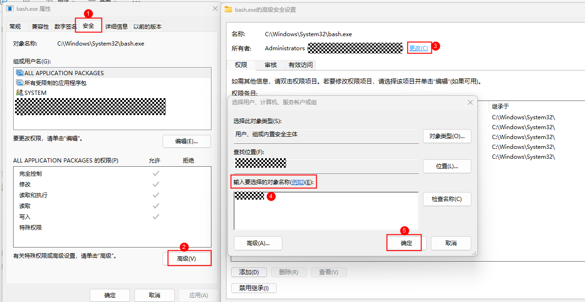

**图 3**  配置bash.exe的删除权限<a name="fig15428818151816"></a>  


**图 4**  Git安装目录下的“/usr/bin/bash”路径<a name="fig664202311363"></a>  
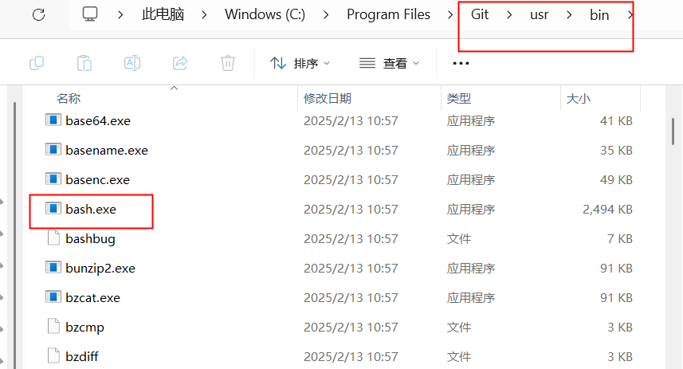

**图 5**  添加到环境变量中<a name="fig1687216294365"></a>  
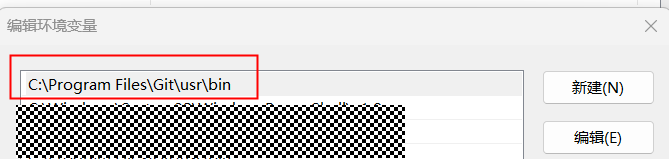

**图 6**  保证Git下的bash被调用<a name="fig14591538123614"></a>  
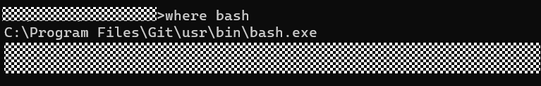

### 准备SDK<a name="ZH-CN_TOPIC_0000002545173551"></a>

取Hi3322对应SDK发布包，解压SDK包到本地目录。

# 样例运行<a name="ZH-CN_TOPIC_0000002498683834"></a>


## Hi3863样例运行<a name="ZH-CN_TOPIC_0000002530443755"></a>


### 模型与数据获取<a name="ZH-CN_TOPIC_0000002536162459"></a>

1.  模型获取，若使用Linux服务器环境，将其上传到容器内。

    进行模型量化，请点击[Link](https://gitcode.com/HiSpark/hispark_ai/blob/master/src/samples/oh/lenet5/model/mnist-12.onnx)，下载ONNX模型。

2.  点击[Link](https://gitcode.com/HiSpark/hispark_ai/blob/master/src/samples/oh/lenet5/scripts/preproc_mnist_data.py)，下载数据和预处理脚本“preproc\_mnist\_data.py”。请参考[文档](https://gitcode.com/HiSpark/hispark_ai/blob/master/src/samples/oh/lenet5/README.md)，在容器内执行该脚本，进行数据获取。请确保文件夹内包含如下数据和文件。

    ```
    .
    |-- test_data
    |   `-- npy
    |       `-- sample_00000_7.npy
    |       `-- ......
    |       `-- sample_09999_6.npy
    |   `-- bin
    |       `-- sample_00000_7.bin
    |       `-- ......
    |       `-- sample_09999_6.bin
    |   `-- label.csv
    `-- train_data
    |   `-- bin
    |       `-- sample_00000_5.bin
    |       `-- ......
    |       `-- sample_59999_8.bin
    |   `-- label.csv
    ```

    > **说明：** 
    >test\_data和train\_data目录作为数据下载和预处理脚本的输入参数，会根据用户的输入而变化。

### 新建工程与选择模型<a name="ZH-CN_TOPIC_0000002504202638"></a>

1.  进入HiSpark Studio AI插件点击home按钮，单击“New Project”按钮。

    **图 1**  New Project<a name="fig863823191810"></a>  
    

1.  选择芯片为WS63，选择已准备好的SDK目录，工程项目目录选择SDK相同路径即可。

    **图 2**  工程创建示意图<a name="fig92793334184"></a>  
    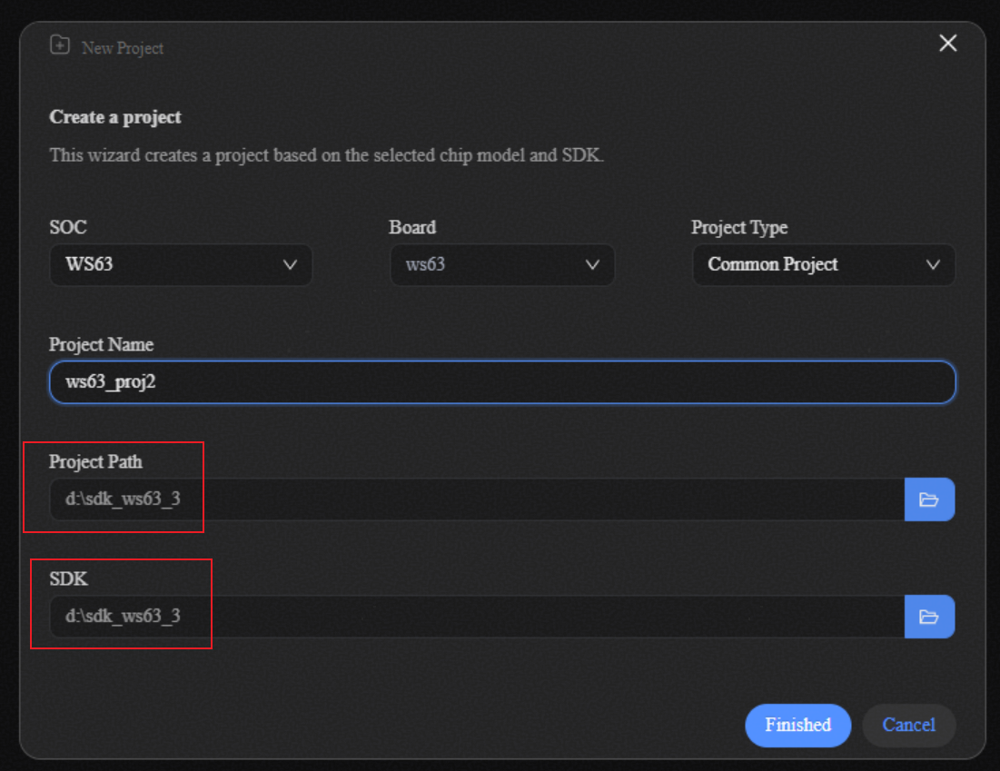

1.  进入模型选择页面，单击“Import Model”，进入模型选择窗口如[图4](#fig7559136152510)。

    **图 3**  模型导入示意图<a name="fig1768001319332"></a>  
    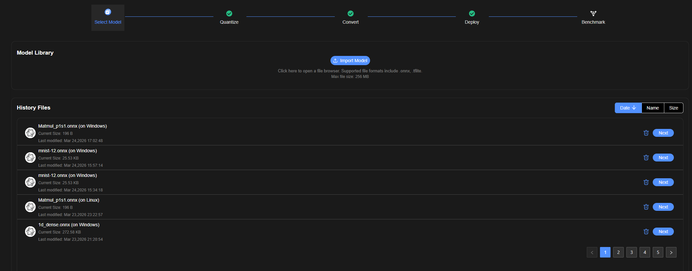

    **图 4**  模型选择类型窗口<a name="fig7559136152510"></a>  
    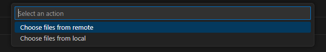

1.  选择模型文件：

    -   Windows端用户选择“Choose files from local”，从本地选择文件。
    -   Linux端用户点击“Choose files from remote”；选择“仅命令传输 & 特定文件下载连接”，输入Docker的IP、端口号、用户名、密码。成功连接一次以后，下次登录可直接选择“使用现有配置快速连接”，只需输入密码即可，界面如[图5](#fig11223101313374)所示。

    **图 5**  连接远程服务器示意图<a name="fig11223101313374"></a>  
    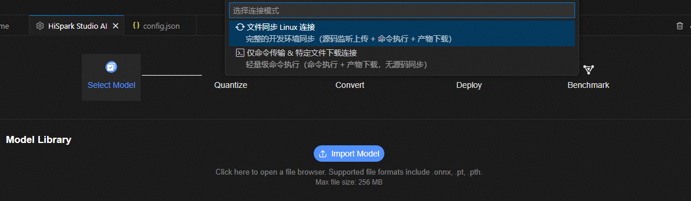

### 模型量化<a name="ZH-CN_TOPIC_0000002536042417"></a>

1.  进入模型量化页面，在Calibration Inputs选择“Input3”（模型输入名称）对应的Path选择框架；如需要进行数据验证，将Validation开关打开，选择量化数据所对应的npy文件目录路径，在Validation Inputs输入框选择“Input3”对应的Path选择框架，选择验证数据所对应的npy目录，在Validation Labels文本框选择为含标签的label文件。

    Label文件数据结构如[表1](#table112929412576)所示。

    **表 1**  label.csv文件内容

    <a name="table112929412576"></a>
    <table><thead align="left"><tr id="row73010420575"><th class="cellrowborder" valign="top" width="50.12%" id="mcps1.2.3.1.1"><p id="p1830154175715"><a name="p1830154175715"></a><a name="p1830154175715"></a>sample</p>
    </th>
    <th class="cellrowborder" valign="top" width="49.88%" id="mcps1.2.3.1.2"><p id="p1830134125710"><a name="p1830134125710"></a><a name="p1830134125710"></a>label</p>
    </th>
    </tr>
    </thead>
    <tbody><tr id="row0301184195719"><td class="cellrowborder" valign="top" width="50.12%" headers="mcps1.2.3.1.1 "><p id="p13301174175713"><a name="p13301174175713"></a><a name="p13301174175713"></a>sample_00000_7.npy</p>
    </td>
    <td class="cellrowborder" valign="top" width="49.88%" headers="mcps1.2.3.1.2 "><p id="p1630174165713"><a name="p1630174165713"></a><a name="p1630174165713"></a>7</p>
    </td>
    </tr>
    <tr id="row930164135710"><td class="cellrowborder" valign="top" width="50.12%" headers="mcps1.2.3.1.1 "><p id="p113011947579"><a name="p113011947579"></a><a name="p113011947579"></a>sample_00001_2.npy</p>
    </td>
    <td class="cellrowborder" valign="top" width="49.88%" headers="mcps1.2.3.1.2 "><p id="p930114416571"><a name="p930114416571"></a><a name="p930114416571"></a>2</p>
    </td>
    </tr>
    </tbody>
    </table>

    > **说明：** 
    >label.csv中为样本分类的真值标签。文件中的表格格式如[表1](#table112929412576)。其中sample列表示样本的名称。label列表示样本对应的真值标签。

    **图 1**  模型压缩示意图<a name="fig12143961816"></a>  
    
    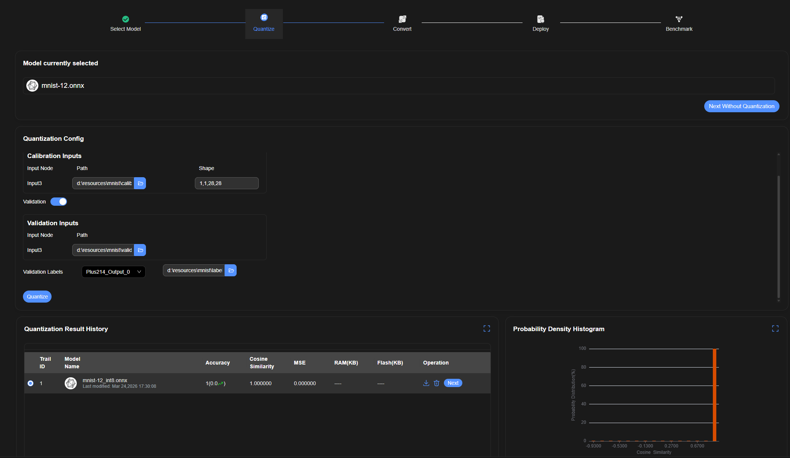

2.  单击“Quantize”按钮，输出量化余弦相似度、准确率以及MSE等结果。

### 模型转换<a name="ZH-CN_TOPIC_0000002504362470"></a>

单击“Convert”按钮，完成模型转换，输出对应的RAM以及FLASH值。

**图 1**  模型转换示意图<a name="fig094614119188"></a>  
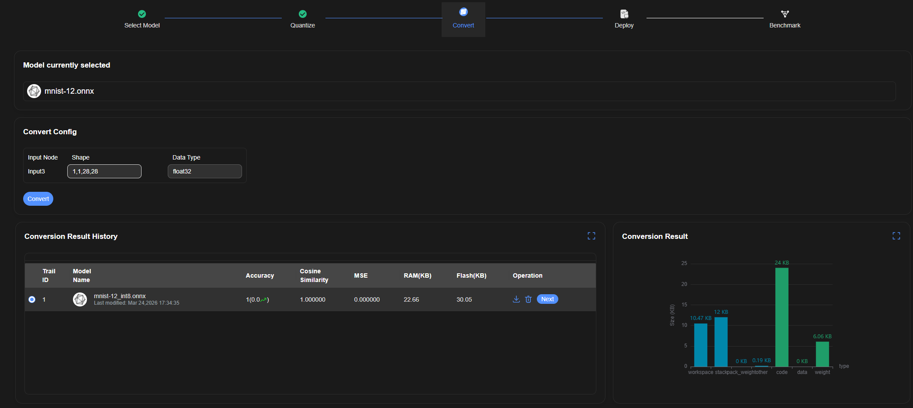

**图 2**  模型转换结果示意图（点击右上角缩放图标可放大显示）<a name="fig1776141814382"></a>  
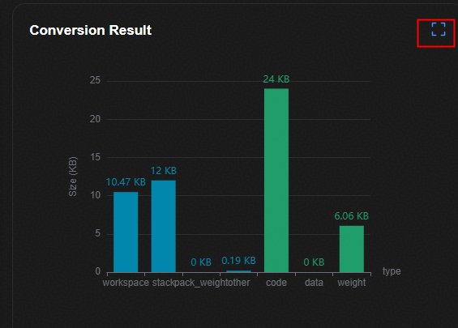

### 模型部署<a name="ZH-CN_TOPIC_0000002536162461"></a>

**图 1**  模型部署示意图<a name="fig19771845131812"></a>  

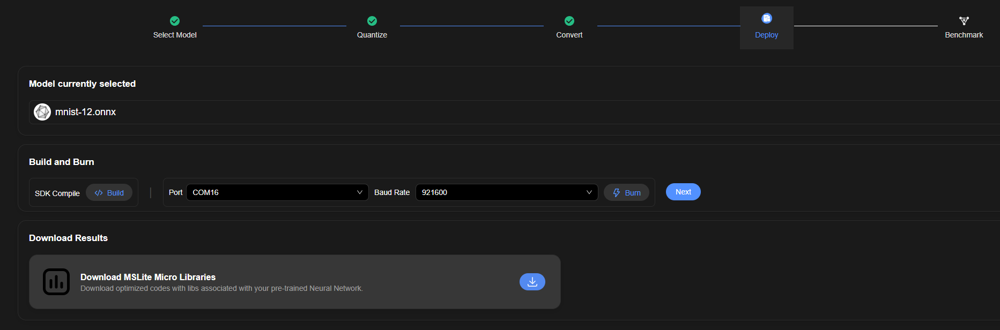

1.  单击“Build”编译SDK，选择烧录串口与波特率，单击“Burn”开始烧录。
2.  单击下方“Download Results”中的下载按钮下载前一步转换产物。
3.  全部完成后，单击“Next”进入后续评估页面。

### 性能评估和精度评估<a name="ZH-CN_TOPIC_0000002504202640"></a>

进入Benchmark模型评估页面。

**图 1**  模型评估整体示意图<a name="fig133321048161817"></a>  

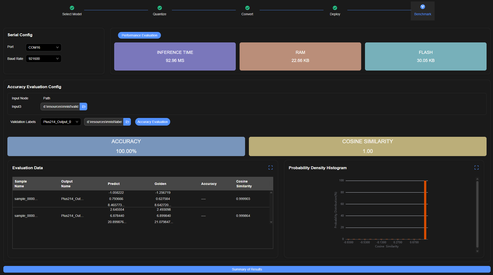

配置串口、波特率等信息，如[图2](#fig229585011181)，点击Performance Evaluation按钮，输出上板验证的推理时间、占用RAM、FLASH的值。

**图 2**  模型性能评估示意图<a name="fig229585011181"></a>  

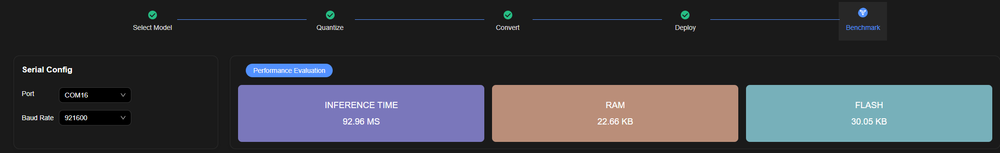

选择Accuracy Evaluation Config中对应的路径，并选择Validation Labels的label文件的值，配置项如[图3](#fig10382812161711)，单击Accuracy Evaluation按钮。

**图 3**  模型精度评估选项示意图<a name="fig10382812161711"></a>  

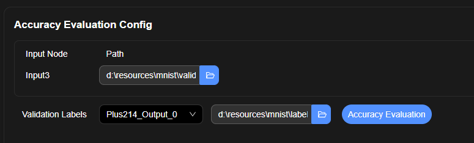

如[图4](#fig162061254121819)输出验证数据结果的余弦相似度等值。

**图 4**  模型精度评估结果示意图<a name="fig162061254121819"></a>  

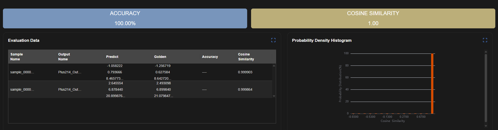

### 应用开发<a name="ZH-CN_TOPIC_0000002513173316"></a>

在HiSpark Studio AI中完成模型量化、转换之后，将模型导出并使用HiSpark.AI API完成应用开发。具体步骤如下。

1.  在“Deploy”页面下载转化好的Micro工程文件。

    **图 1**  下载micro工程文件<a name="fig1438218383119"></a>  
    

2.  具体API的用法请参考文档《HiSpark.AI API开发指南》

## Hi3322样例运行<a name="ZH-CN_TOPIC_0000002530583195"></a>

本章节以LeNet5模型为例，介绍如何使用HiSpark Studio AI工具进行模型量化、转换、性能评估以及精度评估。如果需要使用命令行工具进行如上操作，请参考《Nano AI应用开发指导书》。


### 模型与数据获取<a name="ZH-CN_TOPIC_0000002536325315"></a>

1.  模型获取。若使用LInux服务器端环境，请将模型上传到容器内。
    -   进行训练后量化PTQ，请点击[Link](https://gitcode.com/HiSpark/hispark_ai/tree/master/src/samples/oh/lenet5/model)，下载ONNX模型。
    -   进行量化感知训练QAT，请点击[Link](https://gitcode.com/HiSpark/hispark_ai/tree/master/src/samples/oh/lenet5/model)，下载PyTorch模型权重文件。

2.  点击[Link](https://gitcode.com/HiSpark/hispark_ai/blob/master/src/samples/oh/lenet5/scripts/preproc_mnist_data.py)，下载数据和预处理脚本“preproc\_mnist\_data.py”。请参考[文档](https://gitcode.com/HiSpark/hispark_ai/blob/master/src/samples/oh/lenet5/README.md)，生成数据。

    -   若使用WSL环境，通过命令“wsl -d \{WSL DISTRIB名称\}”，进入WSL环境内，并执行该脚本，进行数据获取。
    -   若使用Linux服务器端环境，在容器内执行该脚本，进行数据获取。

    请确保文件夹内包含如下数据和文件。

    ```
    .
    |-- test_data
    |   `-- npy
    |       `-- sample_00000_7.npy
    |       `-- ......
    |       `-- sample_09999_6.npy
    |   `-- label.csv
    `-- train_data
    |   `-- npy
    |       `-- sample_00000_5.npy
    |       `-- ......
    |       `-- sample_59999_8.npy
    |   `-- label.csv
    ```

    > **说明：** 
    >1.  test\_data和train\_data目录作为数据下载和预处理脚本的输入参数，会根据用户的输入而变化。
    >2.  label.csv中为样本分类的真值标签。文件中的表格格式如[表1 label.csv格式示例](#table55542586239)。其中sample列表示样本的名称。label列表示样本对应的真值标签。

    **表 1**  label.csv格式示例

    <a name="table19766710497"></a>
    <table><thead align="left"><tr id="row7766119495"><th class="cellrowborder" valign="top" width="50%" id="mcps1.2.3.1.1"><p id="p167663112491"><a name="p167663112491"></a><a name="p167663112491"></a><strong id="b17663113490"><a name="b17663113490"></a><a name="b17663113490"></a>sample</strong></p>
    </th>
    <th class="cellrowborder" valign="top" width="50%" id="mcps1.2.3.1.2"><p id="p1276620134915"><a name="p1276620134915"></a><a name="p1276620134915"></a><strong id="b17661915493"><a name="b17661915493"></a><a name="b17661915493"></a>label</strong></p>
    </th>
    </tr>
    </thead>
    <tbody><tr id="row87666134920"><td class="cellrowborder" valign="top" width="50%" headers="mcps1.2.3.1.1 "><p id="p676613184920"><a name="p676613184920"></a><a name="p676613184920"></a>sample_00000_7.npy</p>
    </td>
    <td class="cellrowborder" valign="top" width="50%" headers="mcps1.2.3.1.2 "><p id="p1676617117495"><a name="p1676617117495"></a><a name="p1676617117495"></a>7</p>
    </td>
    </tr>
    <tr id="row1076611184915"><td class="cellrowborder" valign="top" width="50%" headers="mcps1.2.3.1.1 "><p id="p676612164912"><a name="p676612164912"></a><a name="p676612164912"></a>sample_00001_2.npy</p>
    </td>
    <td class="cellrowborder" valign="top" width="50%" headers="mcps1.2.3.1.2 "><p id="p47667184915"><a name="p47667184915"></a><a name="p47667184915"></a>2</p>
    </td>
    </tr>
    </tbody>
    </table>

### 新建工程与选择模型<a name="ZH-CN_TOPIC_0000002504525512"></a>

1.  进入HiSpark Studio AI插件单击“Home”按钮，单击“Import Project”按钮进入新建工程页面。在弹出框中选择SOC类型为“3322”；选择已经下载的SDK路径；并为工程设置好名字和工程文件保存地址。

    **图 1**  新建工程页面<a name="fig186735351863"></a>  
    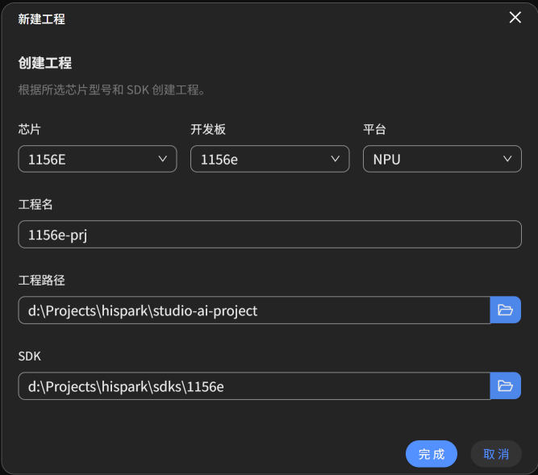

2.  单击“Finished”进入“Select Model”页面。
3.  连接远程服务器，输入Docker的IP、端口号、用户名、密码。
4.  单击“Import Model”，弹出如下选择框。

    **图 2**  选择模型<a name="fig181684355208"></a>  
    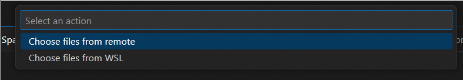

    可选择从Linux服务器或WSL（本地）选择模型。

    **图 3**  通过WSL选择本地模型<a name="fig6583642121615"></a>  
    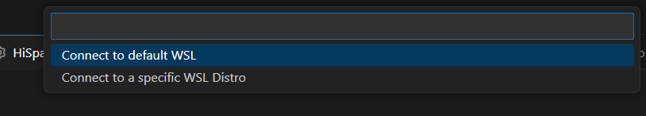

    可选用自定义名称的镜像，或默认名称镜像（默认名称为ubuntu-22.04-cann-base）

    **图 4**  通过Linux服务器选择模型<a name="fig14147163720189"></a>  
    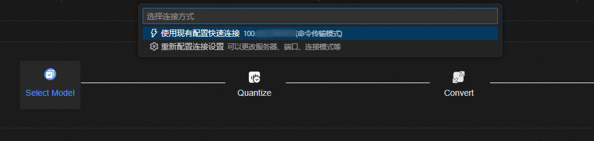

    若从Linux服务器选择模型，选择“Choose files from remote”。

    输入Docker的IP、端口号、用户名、密码。

    选择“[模型与数据获取](模型与数据获取-1.md)”章节下载的模型。

    -   进行训练后量化，请选择ONNX模型。
    -   进行量化感知训练，请选择PyTorch模型。

    > **说明：** 
    >首次连接请根据提示设置远端连接。注意端口选择映射到容器内的服务器端口。

5.  导入模型后，自动跳转到量化页面。
    -   如果导入的模型为ONNX模型，跳转到训练后量化页面。
    -   如果导入的模型为PyTorch模型，跳转到量化感知训练界面。

### 模型量化<a name="ZH-CN_TOPIC_0000002504685348"></a>

在“Quantize”页面对模型进行量化，并对量化后的评估模型进行精度验证，以帮助用户评估量化后的模型是否符合业务需求。精度验证的指标如[表1 精度验证指标](#table28001510142419)所示。

**表 1**  精度验证指标

<a name="table28001510142419"></a>
<table><thead align="left"><tr id="row780061092416"><th class="cellrowborder" valign="top" width="17.44%" id="mcps1.2.3.1.1"><p id="p8800191014243"><a name="p8800191014243"></a><a name="p8800191014243"></a>指标</p>
</th>
<th class="cellrowborder" valign="top" width="82.56%" id="mcps1.2.3.1.2"><p id="p12800161013241"><a name="p12800161013241"></a><a name="p12800161013241"></a>说明</p>
</th>
</tr>
</thead>
<tbody><tr id="row1180071082411"><td class="cellrowborder" valign="top" width="17.44%" headers="mcps1.2.3.1.1 "><p id="p8800131016242"><a name="p8800131016242"></a><a name="p8800131016242"></a>Accuracy</p>
</td>
<td class="cellrowborder" valign="top" width="82.56%" headers="mcps1.2.3.1.2 "><p id="p128001110182411"><a name="p128001110182411"></a><a name="p128001110182411"></a>表示分类结果准确率，使用标签真值计算。</p>
</td>
</tr>
<tr id="row879544498"><td class="cellrowborder" valign="top" width="17.44%" headers="mcps1.2.3.1.1 "><p id="p128135474913"><a name="p128135474913"></a><a name="p128135474913"></a>Cosine Similarity</p>
</td>
<td class="cellrowborder" valign="top" width="82.56%" headers="mcps1.2.3.1.2 "><p id="p8151115911493"><a name="p8151115911493"></a><a name="p8151115911493"></a>平均余弦相似度，使用量化评估网络的输出和原始浮点网络的输出计算。</p>
</td>
</tr>
<tr id="row894842814505"><td class="cellrowborder" valign="top" width="17.44%" headers="mcps1.2.3.1.1 "><p id="p19949228185012"><a name="p19949228185012"></a><a name="p19949228185012"></a>MSE</p>
</td>
<td class="cellrowborder" valign="top" width="82.56%" headers="mcps1.2.3.1.2 "><p id="p189491228195019"><a name="p189491228195019"></a><a name="p189491228195019"></a>均方误差，使用量化评估网络的输出和原始浮点网络的输出计算。</p>
</td>
</tr>
</tbody>
</table>

模型压缩“Quantize”页面提供训练后量化PTQ和量化感知训练QAT两种量化方式。


#### 训练后量化<a name="ZH-CN_TOPIC_0000002536445281"></a>

1.  在“Quantization Config”中配置输入参数。

    1.  “Calibration Inputs”的Path列文件选择框中输入量化校准数据：选择“[模型与数据获取](模型与数据获取-1.md)”下载的训练数据文件夹下的npy子文件夹，若当前为Linux通路，则从Linux服务器上选择文件夹，如“train\_data/npy”。若当前为WSL通路，则从Windows本地选择文件夹，如“D:\\\\train\_data\\\\npy”。
    2.  打开“Validation”开关。
    3.  在“Validation Inputs”的Path列文件选择框中输入验证数据：选择“[模型与数据获取](模型与数据获取-1.md)”下载的测试数据文件夹下的npy子文件夹。若当前为Linux通路，则从Linux服务器上选择文件夹，如“test\_data/npy”。若当前为WSL通路，则从Windows本地选择文件夹，如“D:\\\\test\_data\\\\npy”。
    4.  “Validation Labels”下拉框选择对应的输出节点。并在文件输入验证数据的真值：选择框选择“[模型与数据获取](模型与数据获取-1.md)”下载的测试数据文件夹下的“label.csv”文件。
    5.  其他参数保持默认，或按需调整。

    **图 1**  训练后量化参数配置界面<a name="fig1835962119618"></a>  
    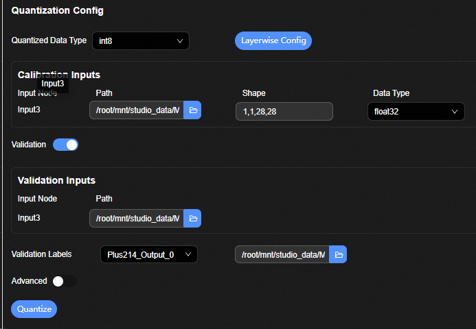

2.  单击“Quantize”按钮开始量化。“OUTPUT”中输出如下类似信息，表示量化成功。

    ```
    All quantization workflow steps completed successfully
    INFO - HiSpark.AI: SUCCESS
    ```

3.  在“Quantization Result History”中查看量化仿真模型在验证集的精度。

    **图 2**  量化结果显示界面<a name="fig98451239181411"></a>  
    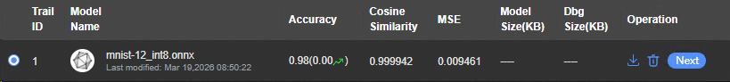

4.  在“Probability Density Histogram”窗口查看验证样本余弦相似度的分布。

    **图 3**  训练后量化评估网络在验证集的余弦相似度分布直方图<a name="fig10184535515"></a>  
    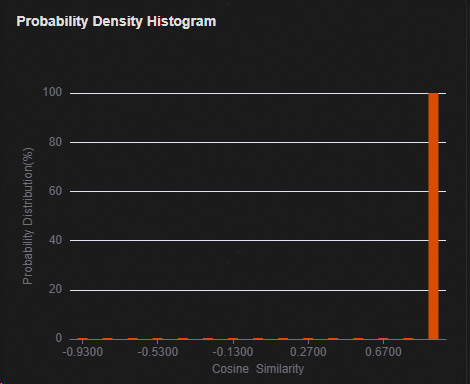

5.  在“History of Compression results”的“Operation”列单击“Next”按钮，进入模型转换页面。

#### 量化感知训练<a name="ZH-CN_TOPIC_0000002536325317"></a>

1.  配置“Quantization Config”中的输入参数

    1.  “Network Structure”文件选择框中选择结构定义的 python文件，选择完成后，后台自动触发结构解析和校验流程。网络结构定义示意如下。在网络定义时，请满足如下约束：网络结构类的名称固定为NNModel；当前只支持单输入和单输出网络，因此forward函数的输入输出类型为torch.Tensor；构造函数不包含除self外的其他入参，如果有其他入参请配置默认值。

        ```
        class NNModel(nn.Module):
            def __init__(self) -> None:
                """Initialize network layers and components."""
                super(NNModel, self).__init__()
        
                self.conv1 = nn.Conv2d(1, 8, kernel_size=(5, 5), padding=2)
                self.relu1 = nn.ReLU()
                self.maxpool1 = nn.MaxPool2d(kernel_size=(2, 2), stride=(2, 2), padding=(0, 0), dilation=1, ceil_mode=False)
        
                self.conv2 = nn.Conv2d(8, 16, kernel_size=(5, 5), padding=2)
                self.relu2 = nn.ReLU()
                self.maxpool2 = nn.MaxPool2d(kernel_size=(3, 3), stride=(3, 3), padding=(0, 0), dilation=1, ceil_mode=False)
        
                self.fc = torch.nn.Linear(256, 10, bias=True)
        
            def forward(self, img):
                """
                Forward pass of the network.
        
                Args:
                    x (torch.Tensor): Input tensor with shape (batch_size, 1, 28, 28)
        
                Returns:
                    torch.Tensor: Output logits with shape (batch_size, 10)
                """
                out = self.conv1(img)
                out = self.relu1(out)
                out = self.maxpool1(out)
                out = self.conv2(out)
        
                out = self.relu2(out)
                out = self.maxpool2(out)
                out = out.reshape(-1, 256)
                out = self.fc(out)
                return out
        ```

    2.  Input 栏的Training Dataset 文件选择框中选择“[模型与数据获取](模型与数据获取-1.md)”下载的训练数据文件夹下的npy子文件夹，若当前为Linux通路，则从Linux服务器上选择文件夹，如“train\_data/npy”，若当前为WSL通路，则从Windows本地选择文件夹，如“D:\\\\train\_data\\\\npy”。
    3.  Input栏的 Validation Dataset 文件选择框中选择“[模型与数据获取](模型与数据获取-1.md)”下载的测试数据文件夹下的npy子文件夹，如：test\_data/npy。若当前为Linux通路，则从Linux服务器上选择文件夹，如“test\_data/npy”，若当前为WSL通路，则从Windows本地选择文件夹，如“D:\\\\test\_data\\\\npy”。
    4.  Label 栏的 Training Dataset文件选择框选择“[模型与数据获取](模型与数据获取-1.md)”下载的训练数据文件夹下的“label.csv”文件。若当前为Linux通路，则从Linux服务器上选择文件，若当前为WSL通路，则从Windows本地选择文件。
    5.  Label 栏的 Validation Dataset  文件选择框选择“[模型与数据获取](模型与数据获取-1.md)”下载的测试数据文件夹下的“label.csv”文件。若当前为Linux通路，则从Linux服务器上选择文件，若当前为WSL通路，则从Windows本地选择文件。
    6.  设定训练epoch数。

        ```
        EPOCH_NUM = 1
        ```

    7.  设定训练的batch\_size。

        ```
        BATCH_SIZE = 4
        ```

    8.  设定学习率。

        ```
        LEARNING_RATE = 0.00001
        ```

    9.  其他参数保持默认，或按需调整。

    **图 1**  量化感知训练参数输入界面<a name="fig8583137172616"></a>  
    
    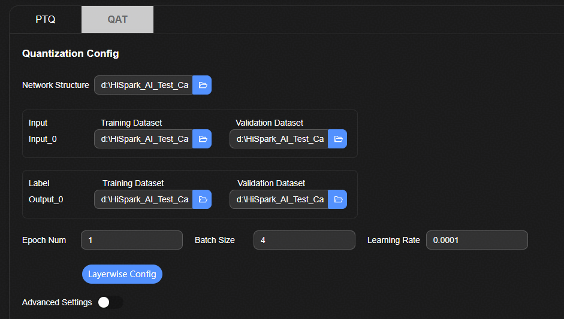

2.  单击“Quantize”按钮开始量化感知训练。“OUTPUT”框中出现如下类似信息，说明量化感知训练成功。

    ```
    All workflow steps completed successfully
    ```

3.  在“Quantization Result History”中查看量化仿真模型在验证集的精度。

    **图 2**  量化感知训练验证精度显示界面<a name="fig7162113811531"></a>  
    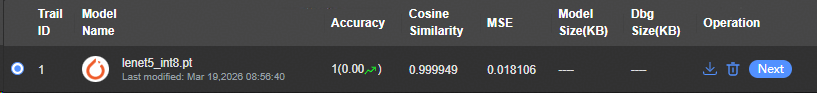

4.  在“Probability Density Histogram”窗口查看验证样本余弦相似度的分布。

    **图 3**  量化感知训练评估网络在验证集的余弦相似度分布直方图<a name="fig691357924"></a>  
    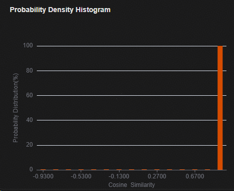

5.  在“Quantization Result History ”的“Operation”列单击“Next”按钮，进入模型转换页面。

### 模型转换<a name="ZH-CN_TOPIC_0000002506277190"></a>

在“Convert”模型转换页面将量化后的模型进行转换，得到适配NPU IP加速器的离线模型。具体步骤如下。

1.  保持默认参数，单击“Convert”按钮完成模型转换。

    **图 1**  模型转换参数输入界面<a name="fig193375115587"></a>  
    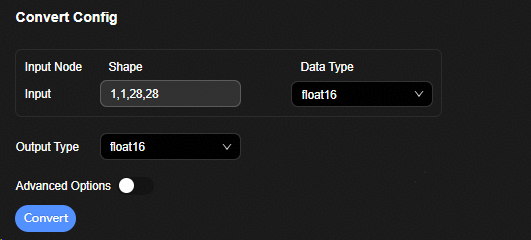

2.  在“Convert results”窗口查看转化后模型的大小。

    **图 2**  转化后模型大小图示<a name="fig177626203598"></a>  
    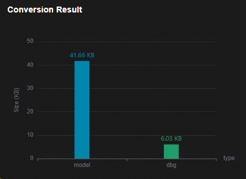

3.  在“Conversion Result History ”的“Operation”列单击“Next”按钮，进入模型部署页面。

### 模型部署<a name="ZH-CN_TOPIC_0000002504525514"></a>

**图 1**  SDK编译和进入评估页面<a name="fig65512512418"></a>  


1.  单击“Build”编译SDK，选择烧录串口与波特率，单击“Burn”开始烧录。
2.  单击下方“Download Results”中的下载按钮下载前一步转换产物。
3.  全部完成后，单击“Next”进入后续评估页面。

### 性能评估和精度评估<a name="ZH-CN_TOPIC_0000002504685350"></a>

HiSpark Studio AI提供连板性能评估和精度评估功能。在开始性能评估和精度评估前，请按照Hi3322硬件指导完成Hi3322硬件环境的准备。

-   性能评估自动将转换的模型上传到单板，在端侧推理模型并统计模型推理性能。
-   精度评估自动将转换的模型和验证集上传到单板，在端测推理模型；并和量化之前的模型以及真值标签对比，计算量化精度指标。

性能评估和精度评估的具体步骤如下。

1.  在“Serial Config”窗口配置数据传输和命令发送的端口、波特率。

    **图 1**  串口配置<a name="fig157065321908"></a>  
    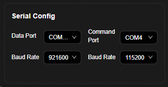

2.  单击“Performance Evaluation”按钮，完成模型上板性能验证。验证完成后，在性能验证窗口显示推理时间、和模型大小。

    **图 2**  性能验证结果<a name="fig665111488016"></a>  
    
    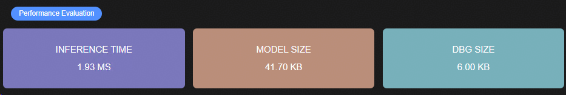

3.  在“Accuracy Evaluation Config”窗口配置精度验证数据集。
    -   将“[模型与数据获取](模型与数据获取-1.md)”下载的测试数据文件夹下的npy子文件夹，如“test\_data/npy”，拷贝到Windows侧。Accuracy Evaluation Config中对应的路径文本框中选择该文件夹。
    -   将“[模型与数据获取](模型与数据获取-1.md)”下载的测试数据文件夹下的“label.csv”文件拷贝到Windows侧。“Validation Labels” 文件选择框中选该文件。

        **图 3**  精度验证数据集配置界面<a name="fig8526185973510"></a>  
        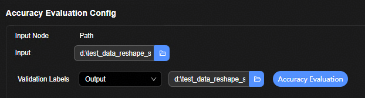

4.  单击“Accuracy Evaluation”按钮，开始上板精度验证。
5.  在“BALANCED ACCURACY”窗口查看上板精度验证的精度值。该值为使用为“label.csv”中的标签真值计算的结果。在“COSINE SIMILARITY”窗口查看样本上板推理结果和PC端浮点网络推理结果的余弦相似度。

    **图 4**  精度评估结果显示界面<a name="fig2919151812810"></a>  
    

6.  在“Evaluation Data”窗口查看验证集各个样本的验证结果。

    **图 5**  验证样本的评估精度显示界面<a name="fig5517202171220"></a>  
    
    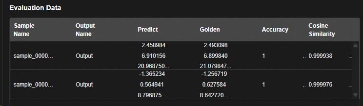

7.  在“Probability Density Histogram”窗口查看验证样本余弦相似度的分布。

    **图 6**  余弦相似度分布直方图<a name="fig108176590013"></a>  
    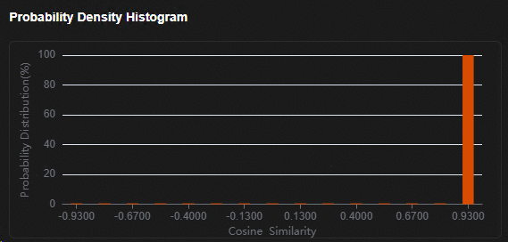

> **注意：** 
>如果端测推理时间长于预期，请检查单板设置是否正常，如单板日志等级设置。

### 应用开发<a name="ZH-CN_TOPIC_0000002507850688"></a>

在HiSpark Studio AI中完成模型量化、转换之后，将模型导出并使用HiSpark.AI API完成应用开发。具体步骤如下。

1.  在“Deploy”页面下载转化好的exeom模型。

    **图 1**  下载exeom模型<a name="fig126011912721"></a>  
    

2.  具体API的用法请参考文档《HiSpark.AI API开发指南》

# 常见错误<a name="ZH-CN_TOPIC_0000002549186481"></a>


## DebugKits弹窗告警“The board does not respond!”<a name="ZH-CN_TOPIC_0000002517746614"></a>

可能原因，Hi3322单板开启低功耗模式，请关闭低功耗模式后重试。请先手动通过SSCOM下发如下AT命令关闭低功耗模式。

```
AT^PM=0
```

