# Nano AI应用界面<a name="ZH-CN_TOPIC_0000002517015540"></a>

**图 1**  Nano软硬件架构图<a name="fig177211017312"></a>  
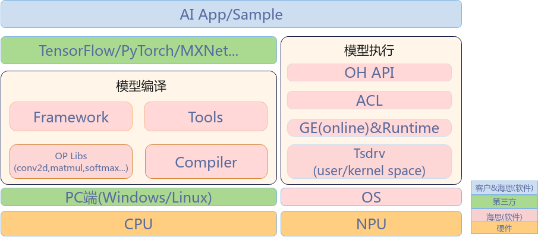

支持用户进行模型开发、部署、优化。

用户：

-   提供训练好的模型
-   开发AI App（模型执行，调用ACL接口层）
-   模型优化

海思：

-   模型编译工具链\(包括算子库、编译器、量化工具等\)
-   NPU驱动、执行态软件
-   NPU调用接口
-   NPU调用Sample

# Nano 芯片支持数据类型和典型模型性能<a name="ZH-CN_TOPIC_0000002517935726"></a>

-   使用场景：音频，感知，控制
-   支持算子：60+
-   模型类型：CNN/RNN/FIFO/Transformer
-   支持数据类型： cube s16\*s8/s8\*s8/s8\*s4，vector fp16\*fp16
-   算力：int8 16Gops@64MHz，int8 50Gops@200MHz

**表 1**  典型模型性能

<a name="table10151237132"></a>
<table><thead align="left"><tr id="row216637831"><th class="cellrowborder" align="center" valign="top" width="25%" id="mcps1.2.5.1.1"><p id="p7167374318"><a name="p7167374318"></a><a name="p7167374318"></a>典型模型</p>
</th>
<th class="cellrowborder" align="center" valign="top" width="25%" id="mcps1.2.5.1.2"><p id="p131663713310"><a name="p131663713310"></a><a name="p131663713310"></a>模型架构</p>
</th>
<th class="cellrowborder" align="center" valign="top" width="25%" id="mcps1.2.5.1.3"><p id="p141618371537"><a name="p141618371537"></a><a name="p141618371537"></a>模型大小（MB）</p>
</th>
<th class="cellrowborder" align="center" valign="top" width="25%" id="mcps1.2.5.1.4"><p id="p151673712317"><a name="p151673712317"></a><a name="p151673712317"></a>模型推理时间</p>
</th>
</tr>
</thead>
<tbody><tr id="row111653718318"><td class="cellrowborder" align="center" valign="top" width="25%" headers="mcps1.2.5.1.1 "><p id="p6160371139"><a name="p6160371139"></a><a name="p6160371139"></a>通话模型</p>
</td>
<td class="cellrowborder" align="center" valign="top" width="25%" headers="mcps1.2.5.1.2 "><p id="p12162371539"><a name="p12162371539"></a><a name="p12162371539"></a>CNN+RNN</p>
</td>
<td class="cellrowborder" align="center" valign="top" width="25%" headers="mcps1.2.5.1.3 "><p id="p1716337234"><a name="p1716337234"></a><a name="p1716337234"></a>1.3</p>
</td>
<td class="cellrowborder" align="center" valign="top" width="25%" headers="mcps1.2.5.1.4 "><p id="p9468192816519"><a name="p9468192816519"></a><a name="p9468192816519"></a>7.7ms@64MHz</p>
</td>
</tr>
<tr id="row4161379311"><td class="cellrowborder" align="center" valign="top" width="25%" headers="mcps1.2.5.1.1 "><p id="p816103714316"><a name="p816103714316"></a><a name="p816103714316"></a>唤醒模型</p>
</td>
<td class="cellrowborder" align="center" valign="top" width="25%" headers="mcps1.2.5.1.2 "><p id="p95387491062"><a name="p95387491062"></a><a name="p95387491062"></a>CNN+RNN</p>
</td>
<td class="cellrowborder" align="center" valign="top" width="25%" headers="mcps1.2.5.1.3 "><p id="p3161837236"><a name="p3161837236"></a><a name="p3161837236"></a>0.5</p>
</td>
<td class="cellrowborder" align="center" valign="top" width="25%" headers="mcps1.2.5.1.4 "><p id="p19276135713811"><a name="p19276135713811"></a><a name="p19276135713811"></a>7.2ms@64MHz</p>
</td>
</tr>
<tr id="row13167373319"><td class="cellrowborder" align="center" valign="top" width="25%" headers="mcps1.2.5.1.1 "><p id="p916137631"><a name="p916137631"></a><a name="p916137631"></a>免摘对话</p>
</td>
<td class="cellrowborder" align="center" valign="top" width="25%" headers="mcps1.2.5.1.2 "><p id="p16906105012610"><a name="p16906105012610"></a><a name="p16906105012610"></a>CNN</p>
</td>
<td class="cellrowborder" align="center" valign="top" width="25%" headers="mcps1.2.5.1.3 "><p id="p12161537532"><a name="p12161537532"></a><a name="p12161537532"></a>&lt;0.1</p>
</td>
<td class="cellrowborder" align="center" valign="top" width="25%" headers="mcps1.2.5.1.4 "><p id="p1793211794"><a name="p1793211794"></a><a name="p1793211794"></a>1.8ms@64MHz</p>
</td>
</tr>
<tr id="row5167373320"><td class="cellrowborder" align="center" valign="top" width="25%" headers="mcps1.2.5.1.1 "><p id="p21613371532"><a name="p21613371532"></a><a name="p21613371532"></a>一级kws唤醒</p>
</td>
<td class="cellrowborder" align="center" valign="top" width="25%" headers="mcps1.2.5.1.2 "><p id="p715412531566"><a name="p715412531566"></a><a name="p715412531566"></a>CNN+FIFO</p>
</td>
<td class="cellrowborder" align="center" valign="top" width="25%" headers="mcps1.2.5.1.3 "><p id="p1216173719310"><a name="p1216173719310"></a><a name="p1216173719310"></a>0.2</p>
</td>
<td class="cellrowborder" align="center" valign="top" width="25%" headers="mcps1.2.5.1.4 "><p id="p17261250917"><a name="p17261250917"></a><a name="p17261250917"></a>1.1ms@64MHz</p>
</td>
</tr>
<tr id="row111613377317"><td class="cellrowborder" align="center" valign="top" width="25%" headers="mcps1.2.5.1.1 "><p id="p101617371639"><a name="p101617371639"></a><a name="p101617371639"></a>心率</p>
</td>
<td class="cellrowborder" align="center" valign="top" width="25%" headers="mcps1.2.5.1.2 "><p id="p13988185917617"><a name="p13988185917617"></a><a name="p13988185917617"></a>CNN+RNN</p>
</td>
<td class="cellrowborder" align="center" valign="top" width="25%" headers="mcps1.2.5.1.3 "><p id="p1216537534"><a name="p1216537534"></a><a name="p1216537534"></a>0.6</p>
</td>
<td class="cellrowborder" align="center" valign="top" width="25%" headers="mcps1.2.5.1.4 "><p id="p7484291094"><a name="p7484291094"></a><a name="p7484291094"></a>2.2ms@64MHz</p>
</td>
</tr>
<tr id="row016163712315"><td class="cellrowborder" align="center" valign="top" width="25%" headers="mcps1.2.5.1.1 "><p id="p11164371732"><a name="p11164371732"></a><a name="p11164371732"></a>运动自识别</p>
</td>
<td class="cellrowborder" align="center" valign="top" width="25%" headers="mcps1.2.5.1.2 "><p id="p3567818712"><a name="p3567818712"></a><a name="p3567818712"></a>CNN</p>
</td>
<td class="cellrowborder" align="center" valign="top" width="25%" headers="mcps1.2.5.1.3 "><p id="p11683713311"><a name="p11683713311"></a><a name="p11683713311"></a>&lt;0.1</p>
</td>
<td class="cellrowborder" align="center" valign="top" width="25%" headers="mcps1.2.5.1.4 "><p id="p2357133919"><a name="p2357133919"></a><a name="p2357133919"></a>1.2ms@64MHz</p>
</td>
</tr>
<tr id="row61616371733"><td class="cellrowborder" align="center" valign="top" width="25%" headers="mcps1.2.5.1.1 "><p id="p7163371034"><a name="p7163371034"></a><a name="p7163371034"></a>惯导</p>
</td>
<td class="cellrowborder" align="center" valign="top" width="25%" headers="mcps1.2.5.1.2 "><p id="p188923101477"><a name="p188923101477"></a><a name="p188923101477"></a>CNN+RNN</p>
</td>
<td class="cellrowborder" align="center" valign="top" width="25%" headers="mcps1.2.5.1.3 "><p id="p116163717317"><a name="p116163717317"></a><a name="p116163717317"></a>0.2</p>
</td>
<td class="cellrowborder" align="center" valign="top" width="25%" headers="mcps1.2.5.1.4 "><p id="p229511162094"><a name="p229511162094"></a><a name="p229511162094"></a>4.0ms@64MHz</p>
</td>
</tr>
<tr id="row36076111069"><td class="cellrowborder" align="center" valign="top" width="25%" headers="mcps1.2.5.1.1 "><p id="p146071111860"><a name="p146071111860"></a><a name="p146071111860"></a>智慧手势</p>
</td>
<td class="cellrowborder" align="center" valign="top" width="25%" headers="mcps1.2.5.1.2 "><p id="p589521414716"><a name="p589521414716"></a><a name="p589521414716"></a>CNN</p>
</td>
<td class="cellrowborder" align="center" valign="top" width="25%" headers="mcps1.2.5.1.3 "><p id="p186071411169"><a name="p186071411169"></a><a name="p186071411169"></a>0.2</p>
</td>
<td class="cellrowborder" align="center" valign="top" width="25%" headers="mcps1.2.5.1.4 "><p id="p16581192019916"><a name="p16581192019916"></a><a name="p16581192019916"></a>2.9ms@64MHz</p>
</td>
</tr>
<tr id="row17995191313610"><td class="cellrowborder" align="center" valign="top" width="25%" headers="mcps1.2.5.1.1 "><p id="p12995513867"><a name="p12995513867"></a><a name="p12995513867"></a>降噪</p>
</td>
<td class="cellrowborder" align="center" valign="top" width="25%" headers="mcps1.2.5.1.2 "><p id="p330716173713"><a name="p330716173713"></a><a name="p330716173713"></a>CNN+RNN</p>
</td>
<td class="cellrowborder" align="center" valign="top" width="25%" headers="mcps1.2.5.1.3 "><p id="p1299512131765"><a name="p1299512131765"></a><a name="p1299512131765"></a>0.3</p>
</td>
<td class="cellrowborder" align="center" valign="top" width="25%" headers="mcps1.2.5.1.4 "><p id="p14145122612917"><a name="p14145122612917"></a><a name="p14145122612917"></a>7.1ms@64MHz</p>
</td>
</tr>
<tr id="row1974011234613"><td class="cellrowborder" align="center" valign="top" width="25%" headers="mcps1.2.5.1.1 "><p id="p874062320615"><a name="p874062320615"></a><a name="p874062320615"></a>静息心率</p>
</td>
<td class="cellrowborder" align="center" valign="top" width="25%" headers="mcps1.2.5.1.2 "><p id="p57683175711"><a name="p57683175711"></a><a name="p57683175711"></a>CNN</p>
</td>
<td class="cellrowborder" align="center" valign="top" width="25%" headers="mcps1.2.5.1.3 "><p id="p97401237611"><a name="p97401237611"></a><a name="p97401237611"></a>&lt;0.1</p>
</td>
<td class="cellrowborder" align="center" valign="top" width="25%" headers="mcps1.2.5.1.4 "><p id="p186996291299"><a name="p186996291299"></a><a name="p186996291299"></a>0.5ms@64MHz</p>
</td>
</tr>
<tr id="row1998313184615"><td class="cellrowborder" align="center" valign="top" width="25%" headers="mcps1.2.5.1.1 "><p id="p2984171816619"><a name="p2984171816619"></a><a name="p2984171816619"></a>ACC手势</p>
</td>
<td class="cellrowborder" align="center" valign="top" width="25%" headers="mcps1.2.5.1.2 "><p id="p1231618202715"><a name="p1231618202715"></a><a name="p1231618202715"></a>CNN</p>
</td>
<td class="cellrowborder" align="center" valign="top" width="25%" headers="mcps1.2.5.1.3 "><p id="p139844182618"><a name="p139844182618"></a><a name="p139844182618"></a>&lt;0.1</p>
</td>
<td class="cellrowborder" align="center" valign="top" width="25%" headers="mcps1.2.5.1.4 "><p id="p171439359911"><a name="p171439359911"></a><a name="p171439359911"></a>1.7ms@64MHz</p>
</td>
</tr>
<tr id="row419714223620"><td class="cellrowborder" align="center" valign="top" width="25%" headers="mcps1.2.5.1.1 "><p id="p019742219615"><a name="p019742219615"></a><a name="p019742219615"></a>TTS</p>
</td>
<td class="cellrowborder" align="center" valign="top" width="25%" headers="mcps1.2.5.1.2 "><p id="p72301926170"><a name="p72301926170"></a><a name="p72301926170"></a>CNN+Transformer</p>
</td>
<td class="cellrowborder" align="center" valign="top" width="25%" headers="mcps1.2.5.1.3 "><p id="p131975222619"><a name="p131975222619"></a><a name="p131975222619"></a>0.6</p>
</td>
<td class="cellrowborder" align="center" valign="top" width="25%" headers="mcps1.2.5.1.4 "><p id="p944723810919"><a name="p944723810919"></a><a name="p944723810919"></a>107ms@64MHz</p>
</td>
</tr>
<tr id="row184991420664"><td class="cellrowborder" rowspan="2" align="center" valign="top" width="25%" headers="mcps1.2.5.1.1 "><p id="p2500122012618"><a name="p2500122012618"></a><a name="p2500122012618"></a>模糊词</p>
</td>
<td class="cellrowborder" align="center" valign="top" width="25%" headers="mcps1.2.5.1.2 "><p id="p424710913812"><a name="p424710913812"></a><a name="p424710913812"></a>CNN+Transformer</p>
</td>
<td class="cellrowborder" align="center" valign="top" width="25%" headers="mcps1.2.5.1.3 "><p id="p1750082018612"><a name="p1750082018612"></a><a name="p1750082018612"></a>1.3</p>
</td>
<td class="cellrowborder" align="center" valign="top" width="25%" headers="mcps1.2.5.1.4 "><p id="p1586010420914"><a name="p1586010420914"></a><a name="p1586010420914"></a>29ms@64MHz</p>
</td>
</tr>
<tr id="row75391356770"><td class="cellrowborder" align="center" valign="top" headers="mcps1.2.5.1.1 "><p id="p178151293813"><a name="p178151293813"></a><a name="p178151293813"></a>Transformer</p>
</td>
<td class="cellrowborder" align="center" valign="top" headers="mcps1.2.5.1.2 "><p id="p6539456175"><a name="p6539456175"></a><a name="p6539456175"></a>0.7</p>
</td>
<td class="cellrowborder" align="center" valign="top" headers="mcps1.2.5.1.3 "><p id="p128303459913"><a name="p128303459913"></a><a name="p128303459913"></a>15ms@64MHz</p>
</td>
</tr>
</tbody>
</table>

# Nano AI资料清单<a name="ZH-CN_TOPIC_0000002518097118"></a>

**表 1**  Nano AI资料清单

<a name="table1881110240137"></a>
<table><thead align="left"><tr id="row14812524161320"><th class="cellrowborder" valign="top" width="13.36%" id="mcps1.2.6.1.1"><p id="p481252491318"><a name="p481252491318"></a><a name="p481252491318"></a>类型</p>
</th>
<th class="cellrowborder" valign="top" width="6.239999999999999%" id="mcps1.2.6.1.2"><p id="p1181218241130"><a name="p1181218241130"></a><a name="p1181218241130"></a>序号</p>
</th>
<th class="cellrowborder" valign="top" width="24.740000000000002%" id="mcps1.2.6.1.3"><p id="p10812224201312"><a name="p10812224201312"></a><a name="p10812224201312"></a>命名</p>
</th>
<th class="cellrowborder" valign="top" width="26.56%" id="mcps1.2.6.1.4"><p id="p18121824191314"><a name="p18121824191314"></a><a name="p18121824191314"></a>描述</p>
</th>
<th class="cellrowborder" valign="top" width="29.099999999999998%" id="mcps1.2.6.1.5"><p id="p881220244132"><a name="p881220244132"></a><a name="p881220244132"></a>路径</p>
</th>
</tr>
</thead>
<tbody><tr id="row281217243134"><td class="cellrowborder" valign="top" width="13.36%" headers="mcps1.2.6.1.1 "><p id="p2812142461315"><a name="p2812142461315"></a><a name="p2812142461315"></a>安装包</p>
</td>
<td class="cellrowborder" valign="top" width="6.239999999999999%" headers="mcps1.2.6.1.2 "><p id="p1781202417137"><a name="p1781202417137"></a><a name="p1781202417137"></a>1</p>
</td>
<td class="cellrowborder" valign="top" width="24.740000000000002%" headers="mcps1.2.6.1.3 "><p id="p125388616168"><a name="p125388616168"></a><a name="p125388616168"></a>CANN-compiler-xxx-linux.x86_64.run</p>
</td>
<td class="cellrowborder" valign="top" width="26.56%" headers="mcps1.2.6.1.4 "><p id="p1211716339179"><a name="p1211716339179"></a><a name="p1211716339179"></a>模型编译安装包</p>
</td>
<td class="cellrowborder" rowspan="5" valign="middle" width="29.099999999999998%" headers="mcps1.2.6.1.5 "><p id="p117121801914"><a name="p117121801914"></a><a name="p117121801914"></a>CMC：customer/tools/HiSpark.AI 26.xx.xx/CANN</p>
</td>
</tr>
<tr id="row13812172418135"><td class="cellrowborder" valign="top" headers="mcps1.2.6.1.1 "><p id="p1581214247133"><a name="p1581214247133"></a><a name="p1581214247133"></a>安装包</p>
</td>
<td class="cellrowborder" valign="top" headers="mcps1.2.6.1.2 "><p id="p9812162417136"><a name="p9812162417136"></a><a name="p9812162417136"></a>2</p>
</td>
<td class="cellrowborder" valign="top" headers="mcps1.2.6.1.3 "><p id="p150716103169"><a name="p150716103169"></a><a name="p150716103169"></a>CANN-opp-xxx-linux.x86_64.run</p>
</td>
<td class="cellrowborder" valign="top" headers="mcps1.2.6.1.4 "><p id="p11135144641716"><a name="p11135144641716"></a><a name="p11135144641716"></a>模型算子库安装包</p>
</td>
</tr>
<tr id="row198121124151319"><td class="cellrowborder" valign="top" headers="mcps1.2.6.1.1 "><p id="p381220246134"><a name="p381220246134"></a><a name="p381220246134"></a>安装包</p>
</td>
<td class="cellrowborder" valign="top" headers="mcps1.2.6.1.2 "><p id="p1281220247136"><a name="p1281220247136"></a><a name="p1281220247136"></a>3</p>
</td>
<td class="cellrowborder" valign="top" headers="mcps1.2.6.1.3 "><p id="p19621513121611"><a name="p19621513121611"></a><a name="p19621513121611"></a>CANN-runtime-xxx-linux.x86_64.run</p>
</td>
<td class="cellrowborder" valign="top" headers="mcps1.2.6.1.4 "><p id="p366713508177"><a name="p366713508177"></a><a name="p366713508177"></a>模型运行态安装包</p>
</td>
</tr>
<tr id="row11812202481318"><td class="cellrowborder" valign="top" headers="mcps1.2.6.1.1 "><p id="p58121724141315"><a name="p58121724141315"></a><a name="p58121724141315"></a>安装包</p>
</td>
<td class="cellrowborder" valign="top" headers="mcps1.2.6.1.2 "><p id="p138121248133"><a name="p138121248133"></a><a name="p138121248133"></a>4</p>
</td>
<td class="cellrowborder" valign="top" headers="mcps1.2.6.1.3 "><p id="p3880517161610"><a name="p3880517161610"></a><a name="p3880517161610"></a>CANN-toolkit-xxx-linux.x86_64.run</p>
</td>
<td class="cellrowborder" valign="top" headers="mcps1.2.6.1.4 "><p id="p1787925331717"><a name="p1787925331717"></a><a name="p1787925331717"></a>AI系统工具安装包</p>
</td>
</tr>
<tr id="row58121224171311"><td class="cellrowborder" valign="top" headers="mcps1.2.6.1.1 "><p id="p10812142414130"><a name="p10812142414130"></a><a name="p10812142414130"></a>安装包</p>
</td>
<td class="cellrowborder" valign="top" headers="mcps1.2.6.1.2 "><p id="p08121724161311"><a name="p08121724161311"></a><a name="p08121724161311"></a>5</p>
</td>
<td class="cellrowborder" valign="top" headers="mcps1.2.6.1.3 "><p id="p12141321111619"><a name="p12141321111619"></a><a name="p12141321111619"></a>CANN-amct-xxx-linux.x86_64.run</p>
</td>
<td class="cellrowborder" valign="top" headers="mcps1.2.6.1.4 "><p id="p1544657101712"><a name="p1544657101712"></a><a name="p1544657101712"></a>模型量化安装包</p>
</td>
</tr>
<tr id="row954715512363"><td class="cellrowborder" valign="top" width="13.36%" headers="mcps1.2.6.1.1 "><p id="p2547145173618"><a name="p2547145173618"></a><a name="p2547145173618"></a>Tools</p>
</td>
<td class="cellrowborder" valign="top" width="6.239999999999999%" headers="mcps1.2.6.1.2 "><p id="p155471519367"><a name="p155471519367"></a><a name="p155471519367"></a>6</p>
</td>
<td class="cellrowborder" valign="top" width="24.740000000000002%" headers="mcps1.2.6.1.3 "><p id="p654765118367"><a name="p654765118367"></a><a name="p654765118367"></a>DockerFile</p>
</td>
<td class="cellrowborder" valign="top" width="26.56%" headers="mcps1.2.6.1.4 "><p id="p9547185110368"><a name="p9547185110368"></a><a name="p9547185110368"></a>NPU的docker安装脚本</p>
</td>
<td class="cellrowborder" valign="top" width="29.099999999999998%" headers="mcps1.2.6.1.5 "><p id="p0547951103613"><a name="p0547951103613"></a><a name="p0547951103613"></a>CMC：customer/tools/HiSpark.AI 26.xx.xx/Tools</p>
</td>
</tr>
<tr id="row58121124151315"><td class="cellrowborder" valign="top" width="13.36%" headers="mcps1.2.6.1.1 "><p id="p118125249136"><a name="p118125249136"></a><a name="p118125249136"></a>SDK</p>
</td>
<td class="cellrowborder" valign="top" width="6.239999999999999%" headers="mcps1.2.6.1.2 "><p id="p481222412132"><a name="p481222412132"></a><a name="p481222412132"></a>7</p>
</td>
<td class="cellrowborder" valign="top" width="24.740000000000002%" headers="mcps1.2.6.1.3 "><p id="p88121624171320"><a name="p88121624171320"></a><a name="p88121624171320"></a>*.a</p>
</td>
<td class="cellrowborder" valign="top" width="26.56%" headers="mcps1.2.6.1.4 "><p id="p17148184151817"><a name="p17148184151817"></a><a name="p17148184151817"></a>NPU执行态静态库</p>
</td>
<td class="cellrowborder" valign="top" width="29.099999999999998%" headers="mcps1.2.6.1.5 "><p id="p5365172716195"><a name="p5365172716195"></a><a name="p5365172716195"></a>SDK：interim_binary/3322/libs/npu/</p>
</td>
</tr>
<tr id="row0812724141310"><td class="cellrowborder" valign="top" width="13.36%" headers="mcps1.2.6.1.1 "><p id="p3812162481315"><a name="p3812162481315"></a><a name="p3812162481315"></a>SDK</p>
</td>
<td class="cellrowborder" valign="top" width="6.239999999999999%" headers="mcps1.2.6.1.2 "><p id="p38122024111316"><a name="p38122024111316"></a><a name="p38122024111316"></a>8</p>
</td>
<td class="cellrowborder" valign="top" width="24.740000000000002%" headers="mcps1.2.6.1.3 "><p id="p164851832151614"><a name="p164851832151614"></a><a name="p164851832151614"></a>acl接口</p>
</td>
<td class="cellrowborder" valign="top" width="26.56%" headers="mcps1.2.6.1.4 "><p id="p88931678182"><a name="p88931678182"></a><a name="p88931678182"></a>NPU ACL接口</p>
</td>
<td class="cellrowborder" valign="top" width="29.099999999999998%" headers="mcps1.2.6.1.5 "><p id="p85961332193"><a name="p85961332193"></a><a name="p85961332193"></a>SDK：include/middleware/services/ai/acl/</p>
</td>
</tr>
<tr id="row16812192441319"><td class="cellrowborder" valign="top" width="13.36%" headers="mcps1.2.6.1.1 "><p id="p138121724111314"><a name="p138121724111314"></a><a name="p138121724111314"></a>SDK</p>
</td>
<td class="cellrowborder" valign="top" width="6.239999999999999%" headers="mcps1.2.6.1.2 "><p id="p18812102411131"><a name="p18812102411131"></a><a name="p18812102411131"></a>9</p>
</td>
<td class="cellrowborder" valign="top" width="24.740000000000002%" headers="mcps1.2.6.1.3 "><p id="p192651737181612"><a name="p192651737181612"></a><a name="p192651737181612"></a>ai adaptor</p>
</td>
<td class="cellrowborder" valign="top" width="26.56%" headers="mcps1.2.6.1.4 "><p id="p743121118185"><a name="p743121118185"></a><a name="p743121118185"></a>AI适配层</p>
</td>
<td class="cellrowborder" valign="top" width="29.099999999999998%" headers="mcps1.2.6.1.5 "><p id="p2013611408191"><a name="p2013611408191"></a><a name="p2013611408191"></a>CMC：customer/adaptor</p>
</td>
</tr>
<tr id="row1981382431314"><td class="cellrowborder" valign="top" width="13.36%" headers="mcps1.2.6.1.1 "><p id="p7813142416133"><a name="p7813142416133"></a><a name="p7813142416133"></a>SDK</p>
</td>
<td class="cellrowborder" valign="top" width="6.239999999999999%" headers="mcps1.2.6.1.2 "><p id="p2081352481313"><a name="p2081352481313"></a><a name="p2081352481313"></a>10</p>
</td>
<td class="cellrowborder" valign="top" width="24.740000000000002%" headers="mcps1.2.6.1.3 "><p id="p17813112412135"><a name="p17813112412135"></a><a name="p17813112412135"></a>samples</p>
</td>
<td class="cellrowborder" valign="top" width="26.56%" headers="mcps1.2.6.1.4 "><p id="p6699181431811"><a name="p6699181431811"></a><a name="p6699181431811"></a>教学类Samples</p>
</td>
<td class="cellrowborder" valign="top" width="29.099999999999998%" headers="mcps1.2.6.1.5 "><p id="p553031242017"><a name="p553031242017"></a><a name="p553031242017"></a>CMC：customer/samples</p>
</td>
</tr>
<tr id="row11813924171313"><td class="cellrowborder" valign="top" width="13.36%" headers="mcps1.2.6.1.1 "><p id="p4813112461311"><a name="p4813112461311"></a><a name="p4813112461311"></a>SDK</p>
</td>
<td class="cellrowborder" valign="top" width="6.239999999999999%" headers="mcps1.2.6.1.2 "><p id="p17813182411139"><a name="p17813182411139"></a><a name="p17813182411139"></a>11</p>
</td>
<td class="cellrowborder" valign="top" width="24.740000000000002%" headers="mcps1.2.6.1.3 "><p id="p17813172415133"><a name="p17813172415133"></a><a name="p17813172415133"></a>samples</p>
</td>
<td class="cellrowborder" valign="top" width="26.56%" headers="mcps1.2.6.1.4 "><p id="p264242020184"><a name="p264242020184"></a><a name="p264242020184"></a>行业类Samples</p>
</td>
<td class="cellrowborder" valign="top" width="29.099999999999998%" headers="mcps1.2.6.1.5 "><p id="p4176191917204"><a name="p4176191917204"></a><a name="p4176191917204"></a>SDK：application/3322/3322_ai_engine/ai_sample</p>
</td>
</tr>
<tr id="row138136244138"><td class="cellrowborder" valign="top" width="13.36%" headers="mcps1.2.6.1.1 "><p id="p1813122461314"><a name="p1813122461314"></a><a name="p1813122461314"></a>指导文档</p>
</td>
<td class="cellrowborder" valign="top" width="6.239999999999999%" headers="mcps1.2.6.1.2 "><p id="p28131524131311"><a name="p28131524131311"></a><a name="p28131524131311"></a>12</p>
</td>
<td class="cellrowborder" valign="top" width="24.740000000000002%" headers="mcps1.2.6.1.3 "><p id="p6752174901612"><a name="p6752174901612"></a><a name="p6752174901612"></a><span>模型评估脚本使用指南</span>.pdf</p>
</td>
<td class="cellrowborder" valign="top" width="26.56%" headers="mcps1.2.6.1.4 "><p id="p016218249181"><a name="p016218249181"></a><a name="p016218249181"></a>模型大小、算力评估指南</p>
</td>
<td class="cellrowborder" rowspan="9" valign="middle" width="29.099999999999998%" headers="mcps1.2.6.1.5 "><p id="p19568145417206"><a name="p19568145417206"></a><a name="p19568145417206"></a>CMC：ReleaseDoc/usermanual/HiSpark.AI26.xx.xx/cann_pdf</p>
</td>
</tr>
<tr id="row3813224101313"><td class="cellrowborder" valign="top" headers="mcps1.2.6.1.1 "><p id="p1081362419139"><a name="p1081362419139"></a><a name="p1081362419139"></a>指导文档</p>
</td>
<td class="cellrowborder" valign="top" headers="mcps1.2.6.1.2 "><p id="p5813152411131"><a name="p5813152411131"></a><a name="p5813152411131"></a>13</p>
</td>
<td class="cellrowborder" valign="top" headers="mcps1.2.6.1.3 "><p id="p6194953121612"><a name="p6194953121612"></a><a name="p6194953121612"></a>开发环境安装指南.pdf</p>
</td>
<td class="cellrowborder" valign="top" headers="mcps1.2.6.1.4 "><p id="p7272127141814"><a name="p7272127141814"></a><a name="p7272127141814"></a>开发环境安装指南（包括工具安装指南）</p>
</td>
</tr>
<tr id="row1981314242133"><td class="cellrowborder" valign="top" headers="mcps1.2.6.1.1 "><p id="p381342491319"><a name="p381342491319"></a><a name="p381342491319"></a>指导文档</p>
</td>
<td class="cellrowborder" valign="top" headers="mcps1.2.6.1.2 "><p id="p118131524101315"><a name="p118131524101315"></a><a name="p118131524101315"></a>14</p>
</td>
<td class="cellrowborder" valign="top" headers="mcps1.2.6.1.3 "><p id="p63301959131613"><a name="p63301959131613"></a><a name="p63301959131613"></a>AMCT模型压缩工具用户指南.pdf</p>
</td>
<td class="cellrowborder" valign="top" headers="mcps1.2.6.1.4 "><p id="p18446203361812"><a name="p18446203361812"></a><a name="p18446203361812"></a>模型量化指南</p>
</td>
</tr>
<tr id="row1781316249139"><td class="cellrowborder" valign="top" headers="mcps1.2.6.1.1 "><p id="p158131824151312"><a name="p158131824151312"></a><a name="p158131824151312"></a>指导文档</p>
</td>
<td class="cellrowborder" valign="top" headers="mcps1.2.6.1.2 "><p id="p5813172461315"><a name="p5813172461315"></a><a name="p5813172461315"></a>15</p>
</td>
<td class="cellrowborder" valign="top" headers="mcps1.2.6.1.3 "><p id="p276892101712"><a name="p276892101712"></a><a name="p276892101712"></a>ATC离线模型编译工具用户指南.pdf</p>
</td>
<td class="cellrowborder" valign="top" headers="mcps1.2.6.1.4 "><p id="p1778574091811"><a name="p1778574091811"></a><a name="p1778574091811"></a>模型编译指南</p>
</td>
</tr>
<tr id="row481382412139"><td class="cellrowborder" valign="top" headers="mcps1.2.6.1.1 "><p id="p3813102417139"><a name="p3813102417139"></a><a name="p3813102417139"></a>指导文档</p>
</td>
<td class="cellrowborder" valign="top" headers="mcps1.2.6.1.2 "><p id="p1813162451316"><a name="p1813162451316"></a><a name="p1813162451316"></a>16</p>
</td>
<td class="cellrowborder" valign="top" headers="mcps1.2.6.1.3 "><p id="p5774783178"><a name="p5774783178"></a><a name="p5774783178"></a>应用开发指南 (C&amp;C++).pdf</p>
</td>
<td class="cellrowborder" valign="top" headers="mcps1.2.6.1.4 "><p id="p152081245121811"><a name="p152081245121811"></a><a name="p152081245121811"></a>ACL接口及应用开发指南</p>
</td>
</tr>
<tr id="row198131324161318"><td class="cellrowborder" valign="top" headers="mcps1.2.6.1.1 "><p id="p1581322401310"><a name="p1581322401310"></a><a name="p1581322401310"></a>指导文档</p>
</td>
<td class="cellrowborder" valign="top" headers="mcps1.2.6.1.2 "><p id="p178131124151314"><a name="p178131124151314"></a><a name="p178131124151314"></a>17</p>
</td>
<td class="cellrowborder" valign="top" headers="mcps1.2.6.1.3 "><p id="p1569261218178"><a name="p1569261218178"></a><a name="p1569261218178"></a>术语和缩略语.pdf</p>
</td>
<td class="cellrowborder" valign="top" headers="mcps1.2.6.1.4 "><p id="p2792848141818"><a name="p2792848141818"></a><a name="p2792848141818"></a>文档中使用的术语和缩略词</p>
</td>
</tr>
<tr id="row18131324141319"><td class="cellrowborder" valign="top" headers="mcps1.2.6.1.1 "><p id="p198131824111318"><a name="p198131824111318"></a><a name="p198131824111318"></a>指导文档</p>
</td>
<td class="cellrowborder" valign="top" headers="mcps1.2.6.1.2 "><p id="p98131724151313"><a name="p98131724151313"></a><a name="p98131724151313"></a>18</p>
</td>
<td class="cellrowborder" valign="top" headers="mcps1.2.6.1.3 "><p id="p207791316161716"><a name="p207791316161716"></a><a name="p207791316161716"></a>环境变量参考.pdf</p>
</td>
<td class="cellrowborder" valign="top" headers="mcps1.2.6.1.4 "><p id="p196971851141817"><a name="p196971851141817"></a><a name="p196971851141817"></a>环境变量配置参考指南</p>
</td>
</tr>
<tr id="row11813122441319"><td class="cellrowborder" valign="top" headers="mcps1.2.6.1.1 "><p id="p178131324131319"><a name="p178131324131319"></a><a name="p178131324131319"></a>指导文档</p>
</td>
<td class="cellrowborder" valign="top" headers="mcps1.2.6.1.2 "><p id="p5813192416139"><a name="p5813192416139"></a><a name="p5813192416139"></a>19</p>
</td>
<td class="cellrowborder" valign="top" headers="mcps1.2.6.1.3 "><p id="p1418142010176"><a name="p1418142010176"></a><a name="p1418142010176"></a>驱动日志说明文档.pdf</p>
</td>
<td class="cellrowborder" valign="top" headers="mcps1.2.6.1.4 "><p id="p185918548187"><a name="p185918548187"></a><a name="p185918548187"></a>日志分析指南</p>
</td>
</tr>
<tr id="row3813192414134"><td class="cellrowborder" valign="top" headers="mcps1.2.6.1.1 "><p id="p1681311246135"><a name="p1681311246135"></a><a name="p1681311246135"></a>指导文档</p>
</td>
<td class="cellrowborder" valign="top" headers="mcps1.2.6.1.2 "><p id="p181316249139"><a name="p181316249139"></a><a name="p181316249139"></a>20</p>
</td>
<td class="cellrowborder" valign="top" headers="mcps1.2.6.1.3 "><p id="p1127710245171"><a name="p1127710245171"></a><a name="p1127710245171"></a>精度调试工具用户指南.pdf</p>
</td>
<td class="cellrowborder" valign="top" headers="mcps1.2.6.1.4 "><p id="p10370115901819"><a name="p10370115901819"></a><a name="p10370115901819"></a>精度调试工具（Dump）使用指南</p>
</td>
</tr>
<tr id="row1881362411318"><td class="cellrowborder" valign="top" width="13.36%" headers="mcps1.2.6.1.1 "><p id="p13813424101317"><a name="p13813424101317"></a><a name="p13813424101317"></a>指导文档</p>
</td>
<td class="cellrowborder" valign="top" width="6.239999999999999%" headers="mcps1.2.6.1.2 "><p id="p1181410249134"><a name="p1181410249134"></a><a name="p1181410249134"></a>21</p>
</td>
<td class="cellrowborder" valign="top" width="24.740000000000002%" headers="mcps1.2.6.1.3 "><p id="p1625122817175"><a name="p1625122817175"></a><a name="p1625122817175"></a>Hi3322V100 软件开发指南.pdf</p>
</td>
<td class="cellrowborder" valign="top" width="26.56%" headers="mcps1.2.6.1.4 "><p id="p881512219192"><a name="p881512219192"></a><a name="p881512219192"></a>3322版本编译、烧录指南</p>
</td>
<td class="cellrowborder" valign="top" width="29.099999999999998%" headers="mcps1.2.6.1.5 "><p id="p822115206218"><a name="p822115206218"></a><a name="p822115206218"></a>CMC：ReleaseDoc/usermanual/软件资料</p>
</td>
</tr>
<tr id="row087651881518"><td class="cellrowborder" valign="top" width="13.36%" headers="mcps1.2.6.1.1 "><p id="p17877018121513"><a name="p17877018121513"></a><a name="p17877018121513"></a>指导文档</p>
</td>
<td class="cellrowborder" valign="top" width="6.239999999999999%" headers="mcps1.2.6.1.2 "><p id="p1587719182155"><a name="p1587719182155"></a><a name="p1587719182155"></a>22</p>
</td>
<td class="cellrowborder" valign="top" width="24.740000000000002%" headers="mcps1.2.6.1.3 "><p id="p13877181811152"><a name="p13877181811152"></a><a name="p13877181811152"></a>HiSpark.AI API开发指南.docx</p>
</td>
<td class="cellrowborder" valign="top" width="26.56%" headers="mcps1.2.6.1.4 "><p id="p1987751831516"><a name="p1987751831516"></a><a name="p1987751831516"></a>HiSpark.AI API接口及应用开发指南</p>
</td>
<td class="cellrowborder" rowspan="2" valign="top" width="29.099999999999998%" headers="mcps1.2.6.1.5 "><p id="p147461040111614"><a name="p147461040111614"></a><a name="p147461040111614"></a>CMC：ReleaseDoc/usermanual/HiSpark.AI26.xx.xx/</p>
</td>
</tr>
<tr id="row1792015129166"><td class="cellrowborder" valign="top" headers="mcps1.2.6.1.1 "><p id="p18920212161619"><a name="p18920212161619"></a><a name="p18920212161619"></a>指导文档</p>
</td>
<td class="cellrowborder" valign="top" headers="mcps1.2.6.1.2 "><p id="p392071219164"><a name="p392071219164"></a><a name="p392071219164"></a>23</p>
</td>
<td class="cellrowborder" valign="top" headers="mcps1.2.6.1.3 "><p id="p99200124168"><a name="p99200124168"></a><a name="p99200124168"></a>HiSpark.AI 转换工具 使用指南.docx</p>
</td>
<td class="cellrowborder" valign="top" headers="mcps1.2.6.1.4 "><p id="p4920812111613"><a name="p4920812111613"></a><a name="p4920812111613"></a>HiSpark.AI转换工具使用指导（CPU核上使用，NPU可不关注）</p>
</td>
</tr>
</tbody>
</table>

# Nano AI应用开发流程<a name="ZH-CN_TOPIC_0000002549496971"></a>

**图 1**  Nano AI应用开发流程<a name="fig61321557400"></a>  
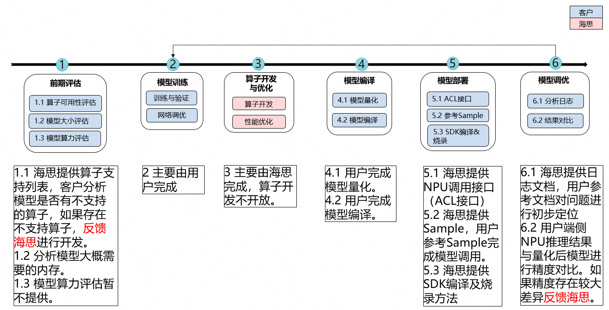


## 前期评估<a name="ZH-CN_TOPIC_0000002549502145"></a>


### 算子可用性评估<a name="ZH-CN_TOPIC_0000002518102300"></a>

-   背景&适用范围

    Nano NPU使用全新芯片架构和全新指令集，相关算子目前处于持续演进开发的过程，用户可根据下述算子支持列表提前分析模型支持性

**表 1**  算子支持列表（onnx opset: V11-V18）

<a name="table1176117118276"></a>
<table><thead align="left"><tr id="row7762121115275"><th class="cellrowborder" valign="top" width="7.37%" id="mcps1.2.5.1.1"><p id="p376218118277"><a name="p376218118277"></a><a name="p376218118277"></a>序号</p>
</th>
<th class="cellrowborder" valign="top" width="28.16%" id="mcps1.2.5.1.2"><p id="p107621311122715"><a name="p107621311122715"></a><a name="p107621311122715"></a>算子</p>
</th>
<th class="cellrowborder" valign="top" width="13.08%" id="mcps1.2.5.1.3"><p id="p1976241114273"><a name="p1976241114273"></a><a name="p1976241114273"></a>分类</p>
</th>
<th class="cellrowborder" valign="top" width="51.39%" id="mcps1.2.5.1.4"><p id="p47621118274"><a name="p47621118274"></a><a name="p47621118274"></a>备注</p>
</th>
</tr>
</thead>
<tbody><tr id="row976221112277"><td class="cellrowborder" valign="top" width="7.37%" headers="mcps1.2.5.1.1 "><p id="p1210174882719"><a name="p1210174882719"></a><a name="p1210174882719"></a>1</p>
</td>
<td class="cellrowborder" valign="top" width="28.16%" headers="mcps1.2.5.1.2 "><p id="p131064817271"><a name="p131064817271"></a><a name="p131064817271"></a>Abs</p>
</td>
<td class="cellrowborder" rowspan="2" align="center" valign="middle" width="13.08%" headers="mcps1.2.5.1.3 "><p id="p143426481878"><a name="p143426481878"></a><a name="p143426481878"></a>Vector</p>
<p id="p16167213145316"><a name="p16167213145316"></a><a name="p16167213145316"></a></p>
</td>
<td class="cellrowborder" valign="top" width="51.39%" headers="mcps1.2.5.1.4 ">&nbsp;&nbsp;</td>
</tr>
<tr id="row17762181142718"><td class="cellrowborder" valign="top" headers="mcps1.2.5.1.1 "><p id="p51024822712"><a name="p51024822712"></a><a name="p51024822712"></a>2</p>
</td>
<td class="cellrowborder" valign="top" headers="mcps1.2.5.1.2 "><p id="p1910948192720"><a name="p1910948192720"></a><a name="p1910948192720"></a><span>A</span><span>dd</span></p>
</td>
<td class="cellrowborder" valign="top" headers="mcps1.2.5.1.3 ">&nbsp;&nbsp;</td>
</tr>
<tr id="row18762151116275"><td class="cellrowborder" valign="top" width="7.37%" headers="mcps1.2.5.1.1 "><p id="p161012483274"><a name="p161012483274"></a><a name="p161012483274"></a>3</p>
</td>
<td class="cellrowborder" valign="top" width="28.16%" headers="mcps1.2.5.1.2 "><p id="p1011648162715"><a name="p1011648162715"></a><a name="p1011648162715"></a>And</p>
</td>
<td class="cellrowborder" rowspan="29" align="center" valign="middle" width="13.08%" headers="mcps1.2.5.1.3 "><p id="p11861422539"><a name="p11861422539"></a><a name="p11861422539"></a>Vector</p>
</td>
<td class="cellrowborder" valign="top" width="51.39%" headers="mcps1.2.5.1.4 ">&nbsp;&nbsp;</td>
</tr>
<tr id="row157621211172715"><td class="cellrowborder" valign="top" headers="mcps1.2.5.1.1 "><p id="p1711134812719"><a name="p1711134812719"></a><a name="p1711134812719"></a><span>4</span></p>
</td>
<td class="cellrowborder" valign="top" headers="mcps1.2.5.1.2 "><p id="p1211248112715"><a name="p1211248112715"></a><a name="p1211248112715"></a>ArgMax</p>
</td>
<td class="cellrowborder" valign="top" headers="mcps1.2.5.1.3 ">&nbsp;&nbsp;</td>
</tr>
<tr id="row37622011132711"><td class="cellrowborder" valign="top" headers="mcps1.2.5.1.1 "><p id="p41174842711"><a name="p41174842711"></a><a name="p41174842711"></a>5</p>
</td>
<td class="cellrowborder" valign="top" headers="mcps1.2.5.1.2 "><p id="p71144892711"><a name="p71144892711"></a><a name="p71144892711"></a>BatchNorm</p>
</td>
<td class="cellrowborder" valign="top" headers="mcps1.2.5.1.3 ">&nbsp;&nbsp;</td>
</tr>
<tr id="row19762311182712"><td class="cellrowborder" valign="top" headers="mcps1.2.5.1.1 "><p id="p1111548162714"><a name="p1111548162714"></a><a name="p1111548162714"></a>6</p>
</td>
<td class="cellrowborder" valign="top" headers="mcps1.2.5.1.2 "><p id="p1011114832713"><a name="p1011114832713"></a><a name="p1011114832713"></a>Cast</p>
</td>
<td class="cellrowborder" valign="top" headers="mcps1.2.5.1.3 ">&nbsp;&nbsp;</td>
</tr>
<tr id="row137621211102716"><td class="cellrowborder" valign="top" headers="mcps1.2.5.1.1 "><p id="p111118488278"><a name="p111118488278"></a><a name="p111118488278"></a>7</p>
</td>
<td class="cellrowborder" valign="top" headers="mcps1.2.5.1.2 "><p id="p13111648142717"><a name="p13111648142717"></a><a name="p13111648142717"></a>Clip</p>
</td>
<td class="cellrowborder" valign="top" headers="mcps1.2.5.1.3 ">&nbsp;&nbsp;</td>
</tr>
<tr id="row8762141132718"><td class="cellrowborder" valign="top" headers="mcps1.2.5.1.1 "><p id="p1411104813278"><a name="p1411104813278"></a><a name="p1411104813278"></a>8</p>
</td>
<td class="cellrowborder" valign="top" headers="mcps1.2.5.1.2 "><p id="p1811134817273"><a name="p1811134817273"></a><a name="p1811134817273"></a><span>C</span><span>oncat</span></p>
</td>
<td class="cellrowborder" valign="top" headers="mcps1.2.5.1.3 ">&nbsp;&nbsp;</td>
</tr>
<tr id="row17762011162714"><td class="cellrowborder" valign="top" headers="mcps1.2.5.1.1 "><p id="p9119481272"><a name="p9119481272"></a><a name="p9119481272"></a>9</p>
</td>
<td class="cellrowborder" valign="top" headers="mcps1.2.5.1.2 "><p id="p311204814270"><a name="p311204814270"></a><a name="p311204814270"></a>Constant</p>
</td>
<td class="cellrowborder" valign="top" headers="mcps1.2.5.1.3 ">&nbsp;&nbsp;</td>
</tr>
<tr id="row8762411162714"><td class="cellrowborder" valign="top" headers="mcps1.2.5.1.1 "><p id="p811154842718"><a name="p811154842718"></a><a name="p811154842718"></a>10</p>
</td>
<td class="cellrowborder" valign="top" headers="mcps1.2.5.1.2 "><p id="p21134811271"><a name="p21134811271"></a><a name="p21134811271"></a>ConstantOfShape</p>
</td>
<td class="cellrowborder" valign="top" headers="mcps1.2.5.1.3 ">&nbsp;&nbsp;</td>
</tr>
<tr id="row167621911192719"><td class="cellrowborder" valign="top" headers="mcps1.2.5.1.1 "><p id="p1811114811272"><a name="p1811114811272"></a><a name="p1811114811272"></a>11</p>
</td>
<td class="cellrowborder" valign="top" headers="mcps1.2.5.1.2 "><p id="p10111548172719"><a name="p10111548172719"></a><a name="p10111548172719"></a>DequantizeLinear</p>
</td>
<td class="cellrowborder" valign="top" headers="mcps1.2.5.1.3 "><p id="p172135411274"><a name="p172135411274"></a><a name="p172135411274"></a>pytorch反量化算子，需通过AMCT量化工具转为AscendDequant</p>
</td>
</tr>
<tr id="row12763141114271"><td class="cellrowborder" valign="top" headers="mcps1.2.5.1.1 "><p id="p311648172714"><a name="p311648172714"></a><a name="p311648172714"></a>12</p>
</td>
<td class="cellrowborder" valign="top" headers="mcps1.2.5.1.2 "><p id="p10113480271"><a name="p10113480271"></a><a name="p10113480271"></a>Elu</p>
</td>
<td class="cellrowborder" valign="top" headers="mcps1.2.5.1.3 ">&nbsp;&nbsp;</td>
</tr>
<tr id="row676310114270"><td class="cellrowborder" valign="top" headers="mcps1.2.5.1.1 "><p id="p1011134814272"><a name="p1011134814272"></a><a name="p1011134814272"></a>13</p>
</td>
<td class="cellrowborder" valign="top" headers="mcps1.2.5.1.2 "><p id="p4111489279"><a name="p4111489279"></a><a name="p4111489279"></a>Equal</p>
</td>
<td class="cellrowborder" valign="top" headers="mcps1.2.5.1.3 ">&nbsp;&nbsp;</td>
</tr>
<tr id="row137639117272"><td class="cellrowborder" valign="top" headers="mcps1.2.5.1.1 "><p id="p19111948172716"><a name="p19111948172716"></a><a name="p19111948172716"></a><span>14</span></p>
</td>
<td class="cellrowborder" valign="top" headers="mcps1.2.5.1.2 "><p id="p9111348102714"><a name="p9111348102714"></a><a name="p9111348102714"></a><span>E</span><span>xp</span></p>
</td>
<td class="cellrowborder" valign="top" headers="mcps1.2.5.1.3 ">&nbsp;&nbsp;</td>
</tr>
<tr id="row17633117274"><td class="cellrowborder" valign="top" headers="mcps1.2.5.1.1 "><p id="p191214892718"><a name="p191214892718"></a><a name="p191214892718"></a>15</p>
</td>
<td class="cellrowborder" valign="top" headers="mcps1.2.5.1.2 "><p id="p141213486279"><a name="p141213486279"></a><a name="p141213486279"></a>Gather</p>
</td>
<td class="cellrowborder" valign="top" headers="mcps1.2.5.1.3 ">&nbsp;&nbsp;</td>
</tr>
<tr id="row576361111273"><td class="cellrowborder" valign="top" headers="mcps1.2.5.1.1 "><p id="p812154882715"><a name="p812154882715"></a><a name="p812154882715"></a>16</p>
</td>
<td class="cellrowborder" valign="top" headers="mcps1.2.5.1.2 "><p id="p21244810275"><a name="p21244810275"></a><a name="p21244810275"></a>GlobalAveragePool</p>
</td>
<td class="cellrowborder" valign="top" headers="mcps1.2.5.1.3 ">&nbsp;&nbsp;</td>
</tr>
<tr id="row676319116274"><td class="cellrowborder" valign="top" headers="mcps1.2.5.1.1 "><p id="p131215485278"><a name="p131215485278"></a><a name="p131215485278"></a>17</p>
</td>
<td class="cellrowborder" valign="top" headers="mcps1.2.5.1.2 "><p id="p112948182714"><a name="p112948182714"></a><a name="p112948182714"></a>GlobalMaxPool</p>
</td>
<td class="cellrowborder" valign="top" headers="mcps1.2.5.1.3 ">&nbsp;&nbsp;</td>
</tr>
<tr id="row1763181110276"><td class="cellrowborder" valign="top" headers="mcps1.2.5.1.1 "><p id="p5121448132713"><a name="p5121448132713"></a><a name="p5121448132713"></a>18</p>
</td>
<td class="cellrowborder" valign="top" headers="mcps1.2.5.1.2 "><p id="p512204816277"><a name="p512204816277"></a><a name="p512204816277"></a>Greater</p>
</td>
<td class="cellrowborder" valign="top" headers="mcps1.2.5.1.3 ">&nbsp;&nbsp;</td>
</tr>
<tr id="row776341122718"><td class="cellrowborder" valign="top" headers="mcps1.2.5.1.1 "><p id="p1312144872711"><a name="p1312144872711"></a><a name="p1312144872711"></a>19</p>
</td>
<td class="cellrowborder" valign="top" headers="mcps1.2.5.1.2 "><p id="p91264832717"><a name="p91264832717"></a><a name="p91264832717"></a>Identity</p>
</td>
<td class="cellrowborder" valign="top" headers="mcps1.2.5.1.3 ">&nbsp;&nbsp;</td>
</tr>
<tr id="row18763131112273"><td class="cellrowborder" valign="top" headers="mcps1.2.5.1.1 "><p id="p4121648112714"><a name="p4121648112714"></a><a name="p4121648112714"></a>20</p>
</td>
<td class="cellrowborder" valign="top" headers="mcps1.2.5.1.2 "><p id="p812548122720"><a name="p812548122720"></a><a name="p812548122720"></a>InstanceNorm</p>
</td>
<td class="cellrowborder" valign="top" headers="mcps1.2.5.1.3 ">&nbsp;&nbsp;</td>
</tr>
<tr id="row107635111273"><td class="cellrowborder" valign="top" headers="mcps1.2.5.1.1 "><p id="p121284813275"><a name="p121284813275"></a><a name="p121284813275"></a>21</p>
</td>
<td class="cellrowborder" valign="top" headers="mcps1.2.5.1.2 "><p id="p21254862712"><a name="p21254862712"></a><a name="p21254862712"></a>LeakyRelu</p>
</td>
<td class="cellrowborder" valign="top" headers="mcps1.2.5.1.3 ">&nbsp;&nbsp;</td>
</tr>
<tr id="row2763191192719"><td class="cellrowborder" valign="top" headers="mcps1.2.5.1.1 "><p id="p1647691617280"><a name="p1647691617280"></a><a name="p1647691617280"></a><span>22</span></p>
</td>
<td class="cellrowborder" valign="top" headers="mcps1.2.5.1.2 "><p id="p947613167288"><a name="p947613167288"></a><a name="p947613167288"></a><span>L</span><span>og</span></p>
</td>
<td class="cellrowborder" valign="top" headers="mcps1.2.5.1.3 ">&nbsp;&nbsp;</td>
</tr>
<tr id="row5763811172710"><td class="cellrowborder" valign="top" headers="mcps1.2.5.1.1 "><p id="p84761916162813"><a name="p84761916162813"></a><a name="p84761916162813"></a><span>23</span></p>
</td>
<td class="cellrowborder" valign="top" headers="mcps1.2.5.1.2 "><p id="p1747631652815"><a name="p1747631652815"></a><a name="p1747631652815"></a><span>M</span><span>ax</span></p>
</td>
<td class="cellrowborder" valign="top" headers="mcps1.2.5.1.3 ">&nbsp;&nbsp;</td>
</tr>
<tr id="row15763161111278"><td class="cellrowborder" valign="top" headers="mcps1.2.5.1.1 "><p id="p847612169289"><a name="p847612169289"></a><a name="p847612169289"></a>24</p>
</td>
<td class="cellrowborder" valign="top" headers="mcps1.2.5.1.2 "><p id="p8477216202811"><a name="p8477216202811"></a><a name="p8477216202811"></a>MaxPool</p>
</td>
<td class="cellrowborder" valign="top" headers="mcps1.2.5.1.3 ">&nbsp;&nbsp;</td>
</tr>
<tr id="row4764611102719"><td class="cellrowborder" valign="top" headers="mcps1.2.5.1.1 "><p id="p16477171632817"><a name="p16477171632817"></a><a name="p16477171632817"></a>25</p>
</td>
<td class="cellrowborder" valign="top" headers="mcps1.2.5.1.2 "><p id="p147731652818"><a name="p147731652818"></a><a name="p147731652818"></a><span>Min</span></p>
</td>
<td class="cellrowborder" valign="top" headers="mcps1.2.5.1.3 ">&nbsp;&nbsp;</td>
</tr>
<tr id="row187641811162715"><td class="cellrowborder" valign="top" headers="mcps1.2.5.1.1 "><p id="p18477181613289"><a name="p18477181613289"></a><a name="p18477181613289"></a>26</p>
</td>
<td class="cellrowborder" valign="top" headers="mcps1.2.5.1.2 "><p id="p2477316142812"><a name="p2477316142812"></a><a name="p2477316142812"></a>Mul</p>
</td>
<td class="cellrowborder" valign="top" headers="mcps1.2.5.1.3 ">&nbsp;&nbsp;</td>
</tr>
<tr id="row276417113273"><td class="cellrowborder" valign="top" headers="mcps1.2.5.1.1 "><p id="p24771916152814"><a name="p24771916152814"></a><a name="p24771916152814"></a><span>27</span></p>
</td>
<td class="cellrowborder" valign="top" headers="mcps1.2.5.1.2 "><p id="p3477171612816"><a name="p3477171612816"></a><a name="p3477171612816"></a><span>N</span><span>eg</span></p>
</td>
<td class="cellrowborder" valign="top" headers="mcps1.2.5.1.3 ">&nbsp;&nbsp;</td>
</tr>
<tr id="row27641311132718"><td class="cellrowborder" valign="top" headers="mcps1.2.5.1.1 "><p id="p1947711652819"><a name="p1947711652819"></a><a name="p1947711652819"></a><span>28</span></p>
</td>
<td class="cellrowborder" valign="top" headers="mcps1.2.5.1.2 "><p id="p17477171616283"><a name="p17477171616283"></a><a name="p17477171616283"></a><span>O</span><span>r</span></p>
</td>
<td class="cellrowborder" valign="top" headers="mcps1.2.5.1.3 ">&nbsp;&nbsp;</td>
</tr>
<tr id="row137641111192711"><td class="cellrowborder" valign="top" headers="mcps1.2.5.1.1 "><p id="p1747771617287"><a name="p1747771617287"></a><a name="p1747771617287"></a>29</p>
</td>
<td class="cellrowborder" valign="top" headers="mcps1.2.5.1.2 "><p id="p18477181611282"><a name="p18477181611282"></a><a name="p18477181611282"></a>PRelu</p>
</td>
<td class="cellrowborder" valign="top" headers="mcps1.2.5.1.3 ">&nbsp;&nbsp;</td>
</tr>
<tr id="row47641911152719"><td class="cellrowborder" valign="top" headers="mcps1.2.5.1.1 "><p id="p6477116112813"><a name="p6477116112813"></a><a name="p6477116112813"></a>30</p>
</td>
<td class="cellrowborder" valign="top" headers="mcps1.2.5.1.2 "><p id="p114771516142819"><a name="p114771516142819"></a><a name="p114771516142819"></a>Pad</p>
</td>
<td class="cellrowborder" valign="top" headers="mcps1.2.5.1.3 ">&nbsp;&nbsp;</td>
</tr>
<tr id="row1764311112715"><td class="cellrowborder" valign="top" headers="mcps1.2.5.1.1 "><p id="p13477191662819"><a name="p13477191662819"></a><a name="p13477191662819"></a>31</p>
</td>
<td class="cellrowborder" valign="top" headers="mcps1.2.5.1.2 "><p id="p6477101682810"><a name="p6477101682810"></a><a name="p6477101682810"></a>Pow</p>
</td>
<td class="cellrowborder" valign="top" headers="mcps1.2.5.1.3 ">&nbsp;&nbsp;</td>
</tr>
<tr id="row6764151115277"><td class="cellrowborder" valign="top" width="7.37%" headers="mcps1.2.5.1.1 "><p id="p1447771612283"><a name="p1447771612283"></a><a name="p1447771612283"></a>32</p>
</td>
<td class="cellrowborder" valign="top" width="28.16%" headers="mcps1.2.5.1.2 "><p id="p14771316102818"><a name="p14771316102818"></a><a name="p14771316102818"></a><span>QuantizeLinear</span></p>
</td>
<td class="cellrowborder" rowspan="22" align="center" valign="middle" width="13.08%" headers="mcps1.2.5.1.3 "><p id="p6845132219546"><a name="p6845132219546"></a><a name="p6845132219546"></a>Vector</p>
</td>
<td class="cellrowborder" valign="top" width="51.39%" headers="mcps1.2.5.1.4 "><p id="p26901540182819"><a name="p26901540182819"></a><a name="p26901540182819"></a>pytorch量化算子，需通过AMCT量化工具转为AscendQuant</p>
</td>
</tr>
<tr id="row2764161132713"><td class="cellrowborder" valign="top" headers="mcps1.2.5.1.1 "><p id="p1147712162288"><a name="p1147712162288"></a><a name="p1147712162288"></a>33</p>
</td>
<td class="cellrowborder" valign="top" headers="mcps1.2.5.1.2 "><p id="p547791612287"><a name="p547791612287"></a><a name="p547791612287"></a>ReduceL2</p>
</td>
<td class="cellrowborder" valign="top" headers="mcps1.2.5.1.3 ">&nbsp;&nbsp;</td>
</tr>
<tr id="row10764121192719"><td class="cellrowborder" valign="top" headers="mcps1.2.5.1.1 "><p id="p947731652810"><a name="p947731652810"></a><a name="p947731652810"></a>34</p>
</td>
<td class="cellrowborder" valign="top" headers="mcps1.2.5.1.2 "><p id="p114771916172812"><a name="p114771916172812"></a><a name="p114771916172812"></a>ReduceMax</p>
</td>
<td class="cellrowborder" valign="top" headers="mcps1.2.5.1.3 ">&nbsp;&nbsp;</td>
</tr>
<tr id="row876431117274"><td class="cellrowborder" valign="top" headers="mcps1.2.5.1.1 "><p id="p64771916122812"><a name="p64771916122812"></a><a name="p64771916122812"></a>35</p>
</td>
<td class="cellrowborder" valign="top" headers="mcps1.2.5.1.2 "><p id="p8477131602814"><a name="p8477131602814"></a><a name="p8477131602814"></a>ReduceMean</p>
</td>
<td class="cellrowborder" valign="top" headers="mcps1.2.5.1.3 ">&nbsp;&nbsp;</td>
</tr>
<tr id="row157652011152715"><td class="cellrowborder" valign="top" headers="mcps1.2.5.1.1 "><p id="p0477171652815"><a name="p0477171652815"></a><a name="p0477171652815"></a>36</p>
</td>
<td class="cellrowborder" valign="top" headers="mcps1.2.5.1.2 "><p id="p94771916102811"><a name="p94771916102811"></a><a name="p94771916102811"></a>ReduceMin</p>
</td>
<td class="cellrowborder" valign="top" headers="mcps1.2.5.1.3 ">&nbsp;&nbsp;</td>
</tr>
<tr id="row076551119273"><td class="cellrowborder" valign="top" headers="mcps1.2.5.1.1 "><p id="p54771516162817"><a name="p54771516162817"></a><a name="p54771516162817"></a>37</p>
</td>
<td class="cellrowborder" valign="top" headers="mcps1.2.5.1.2 "><p id="p7477171618284"><a name="p7477171618284"></a><a name="p7477171618284"></a>ReduceSum</p>
</td>
<td class="cellrowborder" valign="top" headers="mcps1.2.5.1.3 ">&nbsp;&nbsp;</td>
</tr>
<tr id="row6765111110279"><td class="cellrowborder" valign="top" headers="mcps1.2.5.1.1 "><p id="p047710164282"><a name="p047710164282"></a><a name="p047710164282"></a>38</p>
</td>
<td class="cellrowborder" valign="top" headers="mcps1.2.5.1.2 "><p id="p144771016122810"><a name="p144771016122810"></a><a name="p144771016122810"></a>Relu</p>
</td>
<td class="cellrowborder" valign="top" headers="mcps1.2.5.1.3 ">&nbsp;&nbsp;</td>
</tr>
<tr id="row1076541132718"><td class="cellrowborder" valign="top" headers="mcps1.2.5.1.1 "><p id="p147751602816"><a name="p147751602816"></a><a name="p147751602816"></a>39</p>
</td>
<td class="cellrowborder" valign="top" headers="mcps1.2.5.1.2 "><p id="p647711672820"><a name="p647711672820"></a><a name="p647711672820"></a>Reshape</p>
</td>
<td class="cellrowborder" valign="top" headers="mcps1.2.5.1.3 ">&nbsp;&nbsp;</td>
</tr>
<tr id="row3765141111275"><td class="cellrowborder" valign="top" headers="mcps1.2.5.1.1 "><p id="p19477111615286"><a name="p19477111615286"></a><a name="p19477111615286"></a>40</p>
</td>
<td class="cellrowborder" valign="top" headers="mcps1.2.5.1.2 "><p id="p347731682815"><a name="p347731682815"></a><a name="p347731682815"></a>Round</p>
</td>
<td class="cellrowborder" valign="top" headers="mcps1.2.5.1.3 ">&nbsp;&nbsp;</td>
</tr>
<tr id="row976521119277"><td class="cellrowborder" valign="top" headers="mcps1.2.5.1.1 "><p id="p9477161692811"><a name="p9477161692811"></a><a name="p9477161692811"></a>41</p>
</td>
<td class="cellrowborder" valign="top" headers="mcps1.2.5.1.2 "><p id="p347721642814"><a name="p347721642814"></a><a name="p347721642814"></a>Shape</p>
</td>
<td class="cellrowborder" valign="top" headers="mcps1.2.5.1.3 ">&nbsp;&nbsp;</td>
</tr>
<tr id="row1976551118274"><td class="cellrowborder" valign="top" headers="mcps1.2.5.1.1 "><p id="p154771816102816"><a name="p154771816102816"></a><a name="p154771816102816"></a>42</p>
</td>
<td class="cellrowborder" valign="top" headers="mcps1.2.5.1.2 "><p id="p3477171632815"><a name="p3477171632815"></a><a name="p3477171632815"></a>Sigmoid</p>
</td>
<td class="cellrowborder" valign="top" headers="mcps1.2.5.1.3 ">&nbsp;&nbsp;</td>
</tr>
<tr id="row16765811202715"><td class="cellrowborder" valign="top" headers="mcps1.2.5.1.1 "><p id="p196475286"><a name="p196475286"></a><a name="p196475286"></a><span>43</span></p>
</td>
<td class="cellrowborder" valign="top" headers="mcps1.2.5.1.2 "><p id="p199347192814"><a name="p199347192814"></a><a name="p199347192814"></a>Slice</p>
</td>
<td class="cellrowborder" valign="top" headers="mcps1.2.5.1.3 ">&nbsp;&nbsp;</td>
</tr>
<tr id="row776521162717"><td class="cellrowborder" valign="top" headers="mcps1.2.5.1.1 "><p id="p59194712282"><a name="p59194712282"></a><a name="p59194712282"></a><span>44</span></p>
</td>
<td class="cellrowborder" valign="top" headers="mcps1.2.5.1.2 "><p id="p49134718285"><a name="p49134718285"></a><a name="p49134718285"></a>Softmax</p>
</td>
<td class="cellrowborder" valign="top" headers="mcps1.2.5.1.3 ">&nbsp;&nbsp;</td>
</tr>
<tr id="row676561152718"><td class="cellrowborder" valign="top" headers="mcps1.2.5.1.1 "><p id="p12974782811"><a name="p12974782811"></a><a name="p12974782811"></a><span>45</span></p>
</td>
<td class="cellrowborder" valign="top" headers="mcps1.2.5.1.2 "><p id="p591547172812"><a name="p591547172812"></a><a name="p591547172812"></a>SpaceToDepth</p>
</td>
<td class="cellrowborder" valign="top" headers="mcps1.2.5.1.3 ">&nbsp;&nbsp;</td>
</tr>
<tr id="row1876517118270"><td class="cellrowborder" valign="top" headers="mcps1.2.5.1.1 "><p id="p993478284"><a name="p993478284"></a><a name="p993478284"></a>46</p>
</td>
<td class="cellrowborder" valign="top" headers="mcps1.2.5.1.2 "><p id="p4984722818"><a name="p4984722818"></a><a name="p4984722818"></a>Split</p>
</td>
<td class="cellrowborder" valign="top" headers="mcps1.2.5.1.3 ">&nbsp;&nbsp;</td>
</tr>
<tr id="row4765711112717"><td class="cellrowborder" valign="top" headers="mcps1.2.5.1.1 "><p id="p791847102819"><a name="p791847102819"></a><a name="p791847102819"></a>47</p>
</td>
<td class="cellrowborder" valign="top" headers="mcps1.2.5.1.2 "><p id="p2934717281"><a name="p2934717281"></a><a name="p2934717281"></a><span>Squeeze</span></p>
</td>
<td class="cellrowborder" valign="top" headers="mcps1.2.5.1.3 ">&nbsp;&nbsp;</td>
</tr>
<tr id="row19765191110271"><td class="cellrowborder" valign="top" headers="mcps1.2.5.1.1 "><p id="p189114716282"><a name="p189114716282"></a><a name="p189114716282"></a>48</p>
</td>
<td class="cellrowborder" valign="top" headers="mcps1.2.5.1.2 "><p id="p11919474289"><a name="p11919474289"></a><a name="p11919474289"></a>Sub</p>
</td>
<td class="cellrowborder" valign="top" headers="mcps1.2.5.1.3 ">&nbsp;&nbsp;</td>
</tr>
<tr id="row177652112275"><td class="cellrowborder" valign="top" headers="mcps1.2.5.1.1 "><p id="p119124772819"><a name="p119124772819"></a><a name="p119124772819"></a>49</p>
</td>
<td class="cellrowborder" valign="top" headers="mcps1.2.5.1.2 "><p id="p15954717280"><a name="p15954717280"></a><a name="p15954717280"></a>Tanh</p>
</td>
<td class="cellrowborder" valign="top" headers="mcps1.2.5.1.3 ">&nbsp;&nbsp;</td>
</tr>
<tr id="row12766111116274"><td class="cellrowborder" valign="top" headers="mcps1.2.5.1.1 "><p id="p209174792812"><a name="p209174792812"></a><a name="p209174792812"></a>50</p>
</td>
<td class="cellrowborder" valign="top" headers="mcps1.2.5.1.2 "><p id="p1290476282"><a name="p1290476282"></a><a name="p1290476282"></a>Tile</p>
</td>
<td class="cellrowborder" valign="top" headers="mcps1.2.5.1.3 ">&nbsp;&nbsp;</td>
</tr>
<tr id="row1376681182713"><td class="cellrowborder" valign="top" headers="mcps1.2.5.1.1 "><p id="p119547142810"><a name="p119547142810"></a><a name="p119547142810"></a>51</p>
</td>
<td class="cellrowborder" valign="top" headers="mcps1.2.5.1.2 "><p id="p591947172817"><a name="p591947172817"></a><a name="p591947172817"></a>Transpose</p>
</td>
<td class="cellrowborder" valign="top" headers="mcps1.2.5.1.3 ">&nbsp;&nbsp;</td>
</tr>
<tr id="row197661111172711"><td class="cellrowborder" valign="top" headers="mcps1.2.5.1.1 "><p id="p1791347132812"><a name="p1791347132812"></a><a name="p1791347132812"></a>52</p>
</td>
<td class="cellrowborder" valign="top" headers="mcps1.2.5.1.2 "><p id="p7954715286"><a name="p7954715286"></a><a name="p7954715286"></a>Unsqueeze</p>
</td>
<td class="cellrowborder" valign="top" headers="mcps1.2.5.1.3 ">&nbsp;&nbsp;</td>
</tr>
<tr id="row27661511172713"><td class="cellrowborder" valign="top" headers="mcps1.2.5.1.1 "><p id="p2919471282"><a name="p2919471282"></a><a name="p2919471282"></a>53</p>
</td>
<td class="cellrowborder" valign="top" headers="mcps1.2.5.1.2 "><p id="p498471289"><a name="p498471289"></a><a name="p498471289"></a>Where</p>
</td>
<td class="cellrowborder" valign="top" headers="mcps1.2.5.1.3 ">&nbsp;&nbsp;</td>
</tr>
<tr id="row576611114271"><td class="cellrowborder" valign="top" width="7.37%" headers="mcps1.2.5.1.1 "><p id="p19204716289"><a name="p19204716289"></a><a name="p19204716289"></a>54</p>
</td>
<td class="cellrowborder" valign="top" width="28.16%" headers="mcps1.2.5.1.2 "><p id="p19984711289"><a name="p19984711289"></a><a name="p19984711289"></a>Conv</p>
</td>
<td class="cellrowborder" rowspan="6" align="center" valign="middle" width="13.08%" headers="mcps1.2.5.1.3 "><p id="p16660138183010"><a name="p16660138183010"></a><a name="p16660138183010"></a>Cube</p>
</td>
<td class="cellrowborder" valign="top" width="51.39%" headers="mcps1.2.5.1.4 ">&nbsp;&nbsp;</td>
</tr>
<tr id="row11766111112716"><td class="cellrowborder" valign="top" headers="mcps1.2.5.1.1 "><p id="p491247142811"><a name="p491247142811"></a><a name="p491247142811"></a>55</p>
</td>
<td class="cellrowborder" valign="top" headers="mcps1.2.5.1.2 "><p id="p1698475287"><a name="p1698475287"></a><a name="p1698475287"></a>ConvTranspose</p>
</td>
<td class="cellrowborder" valign="top" headers="mcps1.2.5.1.3 ">&nbsp;&nbsp;</td>
</tr>
<tr id="row14766131142710"><td class="cellrowborder" valign="top" headers="mcps1.2.5.1.1 "><p id="p3911477283"><a name="p3911477283"></a><a name="p3911477283"></a>56</p>
</td>
<td class="cellrowborder" valign="top" headers="mcps1.2.5.1.2 "><p id="p149547122816"><a name="p149547122816"></a><a name="p149547122816"></a>MatMul</p>
</td>
<td class="cellrowborder" valign="top" headers="mcps1.2.5.1.3 ">&nbsp;&nbsp;</td>
</tr>
<tr id="row1176611102711"><td class="cellrowborder" valign="top" headers="mcps1.2.5.1.1 "><p id="p792478282"><a name="p792478282"></a><a name="p792478282"></a>57</p>
</td>
<td class="cellrowborder" valign="top" headers="mcps1.2.5.1.2 "><p id="p1696474286"><a name="p1696474286"></a><a name="p1696474286"></a>Gemm</p>
</td>
<td class="cellrowborder" valign="top" headers="mcps1.2.5.1.3 ">&nbsp;&nbsp;</td>
</tr>
<tr id="row57661311182712"><td class="cellrowborder" valign="top" headers="mcps1.2.5.1.1 "><p id="p1795478288"><a name="p1795478288"></a><a name="p1795478288"></a>58</p>
</td>
<td class="cellrowborder" valign="top" headers="mcps1.2.5.1.2 "><p id="p1291647162813"><a name="p1291647162813"></a><a name="p1291647162813"></a>ConvInteger</p>
</td>
<td class="cellrowborder" rowspan="2" valign="top" headers="mcps1.2.5.1.3 "><p id="p1995115942814"><a name="p1995115942814"></a><a name="p1995115942814"></a>定点矩阵运算，NPU上Conv/Matmul只支持定点运算，与这两个算子等价</p>
</td>
</tr>
<tr id="row167661411152711"><td class="cellrowborder" valign="top" headers="mcps1.2.5.1.1 "><p id="p991472284"><a name="p991472284"></a><a name="p991472284"></a>59</p>
</td>
<td class="cellrowborder" valign="top" headers="mcps1.2.5.1.2 "><p id="p17913472288"><a name="p17913472288"></a><a name="p17913472288"></a>MatMulInteger</p>
</td>
</tr>
<tr id="row2766171142710"><td class="cellrowborder" valign="top" width="7.37%" headers="mcps1.2.5.1.1 "><p id="p49174716283"><a name="p49174716283"></a><a name="p49174716283"></a>60</p>
</td>
<td class="cellrowborder" valign="top" width="28.16%" headers="mcps1.2.5.1.2 "><p id="p59154715283"><a name="p59154715283"></a><a name="p59154715283"></a>QLinearConv</p>
</td>
<td class="cellrowborder" rowspan="2" align="center" valign="middle" width="13.08%" headers="mcps1.2.5.1.3 "><p id="p1434117213563"><a name="p1434117213563"></a><a name="p1434117213563"></a>Cube</p>
</td>
<td class="cellrowborder" rowspan="2" valign="top" width="51.39%" headers="mcps1.2.5.1.4 "><p id="p1895059152816"><a name="p1895059152816"></a><a name="p1895059152816"></a>量化矩阵运算，NPU上通过量化+Conv/Matmul算子实现</p>
</td>
</tr>
<tr id="row1766411162716"><td class="cellrowborder" valign="top" headers="mcps1.2.5.1.1 "><p id="p291247182817"><a name="p291247182817"></a><a name="p291247182817"></a>61</p>
</td>
<td class="cellrowborder" valign="top" headers="mcps1.2.5.1.2 "><p id="p1897478289"><a name="p1897478289"></a><a name="p1897478289"></a>QLinearMatMul</p>
</td>
</tr>
<tr id="row976681192720"><td class="cellrowborder" valign="top" width="7.37%" headers="mcps1.2.5.1.1 "><p id="p89154752820"><a name="p89154752820"></a><a name="p89154752820"></a>62</p>
</td>
<td class="cellrowborder" valign="top" width="28.16%" headers="mcps1.2.5.1.2 "><p id="p091247142818"><a name="p091247142818"></a><a name="p091247142818"></a>LSTM</p>
</td>
<td class="cellrowborder" rowspan="2" valign="middle" width="13.08%" headers="mcps1.2.5.1.3 "><p id="p1230581616302"><a name="p1230581616302"></a><a name="p1230581616302"></a>Cube和Vector融合</p>
</td>
<td class="cellrowborder" rowspan="2" valign="top" width="51.39%" headers="mcps1.2.5.1.4 "><p id="p109510596286"><a name="p109510596286"></a><a name="p109510596286"></a><span>当前支持范围：</span><span>Seq_len</span><span>=1; </span><span>Num_direction</span><span>=1</span></p>
</td>
</tr>
<tr id="row4766191117276"><td class="cellrowborder" valign="top" headers="mcps1.2.5.1.1 "><p id="p6910473288"><a name="p6910473288"></a><a name="p6910473288"></a>63</p>
</td>
<td class="cellrowborder" valign="top" headers="mcps1.2.5.1.2 "><p id="p129184712811"><a name="p129184712811"></a><a name="p129184712811"></a><span>GRU</span></p>
</td>
</tr>
</tbody>
</table>

### 模型评估<a name="ZH-CN_TOPIC_0000002549622137"></a>

**表 1**  模型评估项

<a name="table184053291215"></a>
<table><thead align="left"><tr id="row1940513291818"><th class="cellrowborder" align="center" valign="top" width="48.730000000000004%" id="mcps1.2.3.1.1"><p id="p1540511291614"><a name="p1540511291614"></a><a name="p1540511291614"></a>评估项</p>
</th>
<th class="cellrowborder" align="center" valign="top" width="51.27%" id="mcps1.2.3.1.2"><p id="p640511293116"><a name="p640511293116"></a><a name="p640511293116"></a>介绍</p>
</th>
</tr>
</thead>
<tbody><tr id="row104059291011"><td class="cellrowborder" align="center" valign="top" width="48.730000000000004%" headers="mcps1.2.3.1.1 "><p id="p1544013571314"><a name="p1544013571314"></a><a name="p1544013571314"></a>TOTAL_WEIGHT_SIZE</p>
</td>
<td class="cellrowborder" align="center" valign="top" width="51.27%" headers="mcps1.2.3.1.2 "><p id="p54401357714"><a name="p54401357714"></a><a name="p54401357714"></a>模型权重大小</p>
</td>
</tr>
<tr id="row6405182919117"><td class="cellrowborder" align="center" valign="top" width="48.730000000000004%" headers="mcps1.2.3.1.1 "><p id="p10440175712113"><a name="p10440175712113"></a><a name="p10440175712113"></a><span>TOTAL_MEM_SIZE</span></p>
</td>
<td class="cellrowborder" align="center" valign="top" width="51.27%" headers="mcps1.2.3.1.2 "><p id="p844085716111"><a name="p844085716111"></a><a name="p844085716111"></a><span>运行内存占用（</span><span>RAM</span><span>占用）</span></p>
</td>
</tr>
<tr id="row18406102910116"><td class="cellrowborder" align="center" valign="top" width="48.730000000000004%" headers="mcps1.2.3.1.1 "><p id="p1144035718115"><a name="p1144035718115"></a><a name="p1144035718115"></a><span>TOTAL_EXEOM_SIZE</span></p>
</td>
<td class="cellrowborder" align="center" valign="top" width="51.27%" headers="mcps1.2.3.1.2 "><p id="p184402571016"><a name="p184402571016"></a><a name="p184402571016"></a><span>编译模型大小（</span><span>Flash</span><span>占用）</span></p>
</td>
</tr>
<tr id="row74069296113"><td class="cellrowborder" align="center" valign="top" width="48.730000000000004%" headers="mcps1.2.3.1.1 "><p id="p844012576115"><a name="p844012576115"></a><a name="p844012576115"></a><span>TOTAL_NET_OP_TYPE</span></p>
</td>
<td class="cellrowborder" align="center" valign="top" width="51.27%" headers="mcps1.2.3.1.2 "><p id="p2440125714120"><a name="p2440125714120"></a><a name="p2440125714120"></a><span>浮点模型中包含的算子类型</span></p>
</td>
</tr>
<tr id="row1140617297117"><td class="cellrowborder" align="center" valign="top" width="48.730000000000004%" headers="mcps1.2.3.1.1 "><p id="p644075718118"><a name="p644075718118"></a><a name="p644075718118"></a><span>NOT_SUPPORT_OP_TYPE</span></p>
</td>
<td class="cellrowborder" align="center" valign="top" width="51.27%" headers="mcps1.2.3.1.2 "><p id="p74400572111"><a name="p74400572111"></a><a name="p74400572111"></a><span>NPU</span><span>在评估模型中不支持的类型（不保证精度）</span></p>
</td>
</tr>
</tbody>
</table>

脚本使用:

python3 onnx\_estimate.py -m estimate\_model\_path -p

-m onnx模型路径

-p 添加该参数时打印各层信息

**NPU模型与Onnx模型（由pytorch、TF框架模型转换）存在如下差异，评估出的数据与原始Onnx模型不一致：**

-   cube格式类型不同，对齐影响shape规格：

    **图 1**  格式类型变换<a name="fig5991151134916"></a>  
    

-   增加格式转换算子，影响算子数量：

    **图 2**  插入格式转换算子<a name="fig360151419501"></a>  
    

-   增加量化反量化算子，影响算子数量：

    **图 3**  插入量化反量化算子<a name="fig758816220508"></a>  
    

## 模型编译<a name="ZH-CN_TOPIC_0000002517940618"></a>

**图 1**  模型编译部署流程<a name="fig1588754414012"></a>  
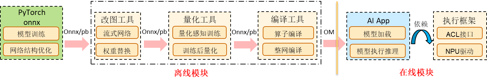

算法用户训练得到onnx模型，经过改图、量化、编译后得到可执行的exeom文件，将其部署于AI APP，调用执行框架实现加载和推理。


### 开发环境安装指南<a name="ZH-CN_TOPIC_0000002549620391"></a>

**图 1**  部署架构图<a name="fig9172516411"></a>  
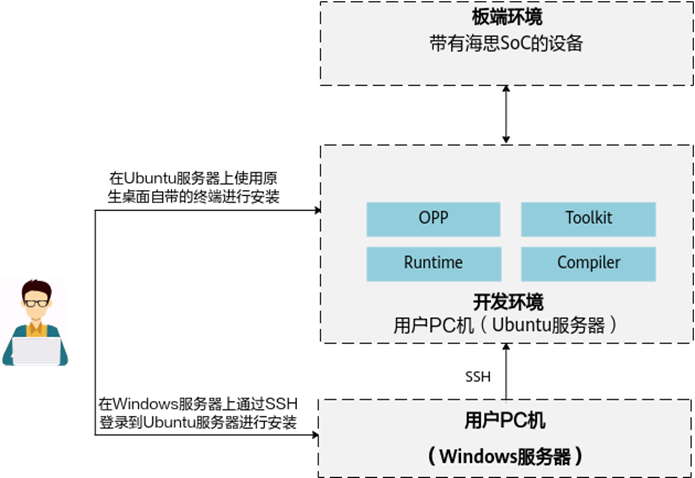

-   背景&适用范围

    开发环境是指用户开发应用程序的环境，用户在开发环境上做开发、编译、模型转换。《开发环境安装指南》手册介绍了CANN支持的操作系统、GCC、Python等版本，并详细讲解CANN软件包的安装、升级、卸载方式。详细请参考《开发环境安装指南.pdf》文档。

-   文档主要内容

    文档包括获取软件包、安装前准备、安装、常用操作（升级、解压、卸载等）、FAQ章节。

-   安装流程
    1.  准备CANN包：

        CANN-runtime-xxx-linux.x86\_64.run

        CANN-compiler-xxx-linux.x86\_64.run

        CANN-opp-xxx-linux.x86\_64.run

        CANN-toolkit-xxx-linux.x86\_64.run

    2.  解压安装

        chmod +x CANN-\*

        ./CANN-runtime-xxx-linux.x86\_64.run --full –install-path=/home/xxxxx/local/Ascend/

        ./CANN-compiler-xxx-linux.x86\_64.run --full –install-path=/home/xxxxx/local/Ascend/ --pylocal

        ./CANN-opp-xxx-linux.x86\_64.run --full –install-path=/home/xxxxx/local/Ascend/

        ./CANN-toolkit-xxx-linux.x86\_64.run --full –install-path=/home/xxxxx/local/Ascend/

    3.  设置环境变量

        source /home/xxxxx/local/Ascend/latest/bin/setenv.bash

### 模型量化<a name="ZH-CN_TOPIC_0000002518100534"></a>

-   背景

    由于Nano平台Cube指令仅支持int16/int8类型输入，故包含如MatMul、Conv等算子的网络必须经过量化才能在Nano上执行。详细请参考《AMCT模型压缩工具用户指南.pdf》文档。

-   量化算法原理

    **图 1**  对称量化<a name="fig29724122116"></a>  
    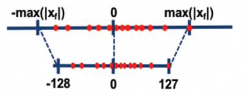

    对称量化：

    **图 2**  非对称量化<a name="fig97998214218"></a>  
    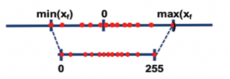

    非对称量化：

    其中，scale是float32浮点数，确定了scale之后，INT8数据对应的表示范围对称为\[- 128 \* scale, 127 \* scale\]，非对称为\[scale \* offset, scale \* \(255 + offset\)\] ，量化操作即为对量化数据以\[-128\*scale, 127\*scale\]进行饱和，即超过范围饱和到边界值。

-   量化工具安装
    1.  安装昇腾模型压缩工具

        tar –zxvf CANN-amct-7.8.t5.0.b028-linux.x86\_64.tar.gz

        cd amct/amct\_onnx

        pip3 install amct\_onnx-\{version\}-py3-none-linux\_\{arch\}.whl –user

    2.  编译并安装自定义算子包

        tar –zxvf amct\_onnx\_op.tar.gz

        cd amct\_onnx\_op && python3 setup.py build

        **若服务器不能链接网络，则需手动下载头文件放置在amct\_onnx\_op/inc下，再执行setup.py，下载链接[https://github.com/microsoft/onnxruntime/tree/v1.16.0/include/onnxruntime/core/session](https://github.com/microsoft/onnxruntime/tree/v1.16.0/include/onnxruntime/core/session)，链接版本需与onnx Runtime版本一致，包括以下头文件：**

        onnxruntime\_cxx\_api.h

        onnxruntime\_cxx\_inline.h

        onnxruntime\_c\_api.h

        onnxruntime\_session\_options\_config\_keys.h

         onnxruntime\_float16.h

-   onnx 训练后量化

    **表 1**  常见命令参数

    <a name="table1895142732920"></a>
    <table><thead align="left"><tr id="row1395212718295"><th class="cellrowborder" valign="top" width="26.83%" id="mcps1.2.4.1.1"><p id="p18307204219291"><a name="p18307204219291"></a><a name="p18307204219291"></a><span>输入参数</span></p>
    </th>
    <th class="cellrowborder" valign="top" width="39.06%" id="mcps1.2.4.1.2"><p id="p8307184212913"><a name="p8307184212913"></a><a name="p8307184212913"></a><span>说明</span></p>
    </th>
    <th class="cellrowborder" valign="top" width="34.11%" id="mcps1.2.4.1.3"><p id="p12307204232913"><a name="p12307204232913"></a><a name="p12307204232913"></a><span>支持参数范围</span></p>
    </th>
    </tr>
    </thead>
    <tbody><tr id="row39527274294"><td class="cellrowborder" valign="top" width="26.83%" headers="mcps1.2.4.1.1 "><p id="p530774232917"><a name="p530774232917"></a><a name="p530774232917"></a><span>--model</span></p>
    </td>
    <td class="cellrowborder" valign="top" width="39.06%" headers="mcps1.2.4.1.2 "><p id="p15307194212911"><a name="p15307194212911"></a><a name="p15307194212911"></a><span>待量化网络的模型文件与路径，格式为</span><span>.</span><span>onnx</span><span>--</span><span>必填参数</span></p>
    </td>
    <td class="cellrowborder" valign="top" width="34.11%" headers="mcps1.2.4.1.3 "><p id="p43077421299"><a name="p43077421299"></a><a name="p43077421299"></a>1.<span>支持大小写字母（</span><span>a-z</span><span>，</span><span>A-Z</span><span>）、数字（</span><span>0-9</span><span>）、下划线（</span><span>_</span><span>）、中划线（</span><span>-</span><span>）、句点（</span><span>.</span><span>）</span></p>
    </td>
    </tr>
    <tr id="row149529274294"><td class="cellrowborder" valign="top" width="26.83%" headers="mcps1.2.4.1.1 "><p id="p130764242918"><a name="p130764242918"></a><a name="p130764242918"></a><span>--</span><span>save_path</span></p>
    </td>
    <td class="cellrowborder" valign="top" width="39.06%" headers="mcps1.2.4.1.2 "><p id="p6307104242915"><a name="p6307104242915"></a><a name="p6307104242915"></a><span>量化后模型的存放路径</span><span>--</span><span>必填参数</span></p>
    </td>
    <td class="cellrowborder" valign="top" width="34.11%" headers="mcps1.2.4.1.3 "><p id="p19307104232913"><a name="p19307104232913"></a><a name="p19307104232913"></a>1.<span>路径需要包含模型名前缀</span></p>
    </td>
    </tr>
    <tr id="row1095220275294"><td class="cellrowborder" valign="top" width="26.83%" headers="mcps1.2.4.1.1 "><p id="p7307164242912"><a name="p7307164242912"></a><a name="p7307164242912"></a><span>--</span><span>input_shape</span></p>
    </td>
    <td class="cellrowborder" valign="top" width="39.06%" headers="mcps1.2.4.1.2 "><p id="p53071342122918"><a name="p53071342122918"></a><a name="p53071342122918"></a><span>指定模型输入数据</span><span>shape--</span><span>必填参数</span></p>
    </td>
    <td class="cellrowborder" valign="top" width="34.11%" headers="mcps1.2.4.1.3 "><p id="p83071342182917"><a name="p83071342182917"></a><a name="p83071342182917"></a>1.<span>参数格式：</span><span>"name1:n1,c1,h1,w1;name2:n2,c2,h2,w2“</span></p>
    <p id="p930718428295"><a name="p930718428295"></a><a name="p930718428295"></a>2.<span>节点必须放入双引号中，英文分号分隔</span></p>
    </td>
    </tr>
    <tr id="row16952132711290"><td class="cellrowborder" valign="top" width="26.83%" headers="mcps1.2.4.1.1 "><p id="p530710426291"><a name="p530710426291"></a><a name="p530710426291"></a><span>--</span><span>data_dir</span></p>
    </td>
    <td class="cellrowborder" valign="top" width="39.06%" headers="mcps1.2.4.1.2 "><p id="p2030714210291"><a name="p2030714210291"></a><a name="p2030714210291"></a><span>与模型匹配的</span><span>bin</span><span>格式数据集路径</span><span>--</span><span>必填参数</span></p>
    </td>
    <td class="cellrowborder" valign="top" width="34.11%" headers="mcps1.2.4.1.3 "><p id="p173081427296"><a name="p173081427296"></a><a name="p173081427296"></a>1.<span>不同输入数据存在不同目录，升序排列</span></p>
    <p id="p15308144211293"><a name="p15308144211293"></a><a name="p15308144211293"></a>2.<span>放入双引号中，英文分号分割</span></p>
    <p id="p230854213292"><a name="p230854213292"></a><a name="p230854213292"></a>3.<span>bin</span><span>文件数组</span><span>shape</span><span>与</span><span>input_shape</span><span>参数匹配</span></p>
    </td>
    </tr>
    <tr id="row1295217276294"><td class="cellrowborder" valign="top" width="26.83%" headers="mcps1.2.4.1.1 "><p id="p3308114217294"><a name="p3308114217294"></a><a name="p3308114217294"></a><span>--</span><span>data_types</span></p>
    </td>
    <td class="cellrowborder" valign="top" width="39.06%" headers="mcps1.2.4.1.2 "><p id="p430814213299"><a name="p430814213299"></a><a name="p430814213299"></a><span>模型输入数据的类型</span><span>--</span><span>必填参数</span></p>
    </td>
    <td class="cellrowborder" valign="top" width="34.11%" headers="mcps1.2.4.1.3 "><p id="p15308124272915"><a name="p15308124272915"></a><a name="p15308124272915"></a>1.<span>多个输入且类型不同时，需要分别指定</span></p>
    <p id="p53081642152913"><a name="p53081642152913"></a><a name="p53081642152913"></a>2.<span>放入双引号中，英文分号分割</span></p>
    </td>
    </tr>
    <tr id="row12953227182919"><td class="cellrowborder" valign="top" width="26.83%" headers="mcps1.2.4.1.1 "><p id="p1330824211291"><a name="p1330824211291"></a><a name="p1330824211291"></a><span>--</span><span>calibration_config</span></p>
    </td>
    <td class="cellrowborder" valign="top" width="39.06%" headers="mcps1.2.4.1.2 "><p id="p63089429298"><a name="p63089429298"></a><a name="p63089429298"></a><span>简易配置文件路径与文件名</span><span>--</span><span>可选参数</span></p>
    </td>
    <td class="cellrowborder" valign="top" width="34.11%" headers="mcps1.2.4.1.3 "><p id="p630874210290"><a name="p630874210290"></a><a name="p630874210290"></a>1.<span>支持大小写字母（</span><span>a-z</span><span>，</span><span>A-Z</span><span>）、数字（</span><span>0-9</span><span>）、下划线（</span><span>_</span><span>）、中划线（</span><span>-</span><span>）、句点（</span><span>.</span><span>）</span></p>
    </td>
    </tr>
    <tr id="row19953727192911"><td class="cellrowborder" valign="top" width="26.83%" headers="mcps1.2.4.1.1 "><p id="p10308184212298"><a name="p10308184212298"></a><a name="p10308184212298"></a><span>--</span><span>batch_num</span></p>
    </td>
    <td class="cellrowborder" valign="top" width="39.06%" headers="mcps1.2.4.1.2 "><p id="p13308642172913"><a name="p13308642172913"></a><a name="p13308642172913"></a><span>训练后量化推理阶段的</span><span>batch</span><span>数</span><span>--</span><span>可选参数</span></p>
    </td>
    <td class="cellrowborder" valign="top" width="34.11%" headers="mcps1.2.4.1.3 "><p id="p15308134215291"><a name="p15308134215291"></a><a name="p15308134215291"></a>1.<span>不能与</span><span>--</span><span>calibration_config</span><span>同时使用</span></p>
    </td>
    </tr>
    </tbody>
    </table>

    量化命令示例：

    amct\_onnxcalibration --model before\_quant.onnx --save\_path quant \_out --input\_shape“x1:1,1;x2:1,2;x3:1,3" --data\_dir“path\_x1/x1; path\_x2/x2; path\_x3/x3" --data\_types"float32;float32;float32" --calibration\_config config.cfg

    配置文件示例：

    ```
    batch_num : 2
    
    fakequant_precision_mode: FORCE_FP16_QUANT
    activation_offset : true
    
    common_config : {
         ifmr_quantize : {
             dst_type: INT8
             search_range_start : 0.7
             search_range_end : 1.3
             search_step : 0.01
             max_percentile : 0.999999
             min_percentile : 0.999999
         }
     }
    
    override_layer_types : {
         layer_type : "Gemm"
         calibration_config : {
             ifmr_quantize : {
                 search_range_start : 0.8
                 search_range_end : 1.2
                 search_step : 0.02
                 max_percentile : 0.999999
                 min_percentile : 0.999999
             }
         }
     }
    ```

-   pytorch量化感知训练

    **图 3**  调用流程<a name="fig19842047103310"></a>  
    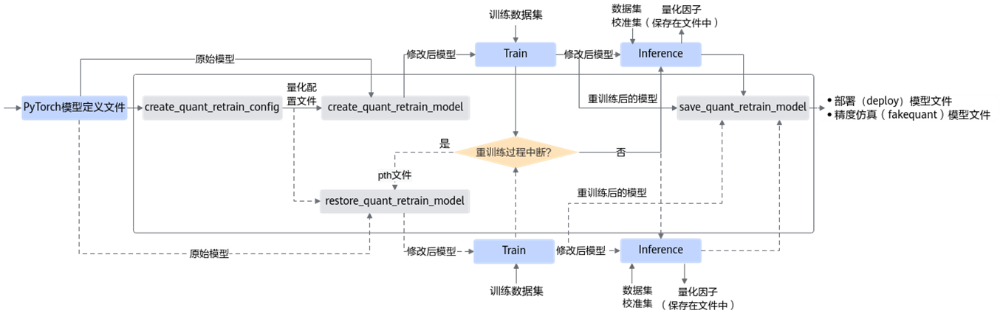

    **表 2**  内容项说明

    <a name="table64506719345"></a>
    <table><thead align="left"><tr id="row445011716349"><th class="cellrowborder" valign="top" width="33.33333333333333%" id="mcps1.2.4.1.1"><p id="p14276819153413"><a name="p14276819153413"></a><a name="p14276819153413"></a><span>内容项</span></p>
    </th>
    <th class="cellrowborder" valign="top" width="33.33333333333333%" id="mcps1.2.4.1.2"><p id="p92764198344"><a name="p92764198344"></a><a name="p92764198344"></a><span>举例</span></p>
    </th>
    <th class="cellrowborder" valign="top" width="33.33333333333333%" id="mcps1.2.4.1.3"><p id="p17276161973420"><a name="p17276161973420"></a><a name="p17276161973420"></a><span>说明</span></p>
    </th>
    </tr>
    </thead>
    <tbody><tr id="row13450177123412"><td class="cellrowborder" valign="top" width="33.33333333333333%" headers="mcps1.2.4.1.1 "><p id="p10276519143418"><a name="p10276519143418"></a><a name="p10276519143418"></a><span>batch_num</span></p>
    </td>
    <td class="cellrowborder" valign="top" width="33.33333333333333%" headers="mcps1.2.4.1.2 "><p id="p1276141918345"><a name="p1276141918345"></a><a name="p1276141918345"></a><span>batch_num</span><span>: 1</span></p>
    </td>
    <td class="cellrowborder" valign="top" width="33.33333333333333%" headers="mcps1.2.4.1.3 "><p id="p92769197344"><a name="p92769197344"></a><a name="p92769197344"></a><span>如果不配置，则使用默认值</span><span>1</span><span>，</span><span>batch_num</span><span>*</span><span>batch_size</span><span>为量化使用的校准集图片数量。</span></p>
    <p id="p1276161953416"><a name="p1276161953416"></a><a name="p1276161953416"></a><span>其中</span><span>batch_size</span><span>为每个</span><span>batch</span><span>所用的图片数量。</span></p>
    </td>
    </tr>
    <tr id="row34507783418"><td class="cellrowborder" valign="top" width="33.33333333333333%" headers="mcps1.2.4.1.1 "><p id="p527614193341"><a name="p527614193341"></a><a name="p527614193341"></a><span>retrain_data_config</span></p>
    </td>
    <td class="cellrowborder" valign="top" width="33.33333333333333%" headers="mcps1.2.4.1.2 "><p id="p16276719113411"><a name="p16276719113411"></a><a name="p16276719113411"></a><span>"retrain_data_config":{ </span></p>
    <p id="p1527641910341"><a name="p1527641910341"></a><a name="p1527641910341"></a><span>“algo”:“ulq_quantize”,</span></p>
    <p id="p17276131903419"><a name="p17276131903419"></a><a name="p17276131903419"></a><span>"clip_max":3.0, </span></p>
    <p id="p0276101915342"><a name="p0276101915342"></a><a name="p0276101915342"></a><span>"clip_min":-3.0 },</span></p>
    </td>
    <td class="cellrowborder" valign="top" width="33.33333333333333%" headers="mcps1.2.4.1.3 "><p id="p1927610190343"><a name="p1927610190343"></a><a name="p1927610190343"></a><span>algo</span><span>：量化算法选择，默认是</span><span>ulq_quantize</span><span>。</span></p>
    <p id="p627621911340"><a name="p627621911340"></a><a name="p627621911340"></a><span>clip_max</span><span>：截断量化算法上限，默认不选。</span></p>
    <p id="p127681933410"><a name="p127681933410"></a><a name="p127681933410"></a><span>clip_min</span><span>：截断量化算法下限，默认不选。</span></p>
    <p id="p1827611913349"><a name="p1827611913349"></a><a name="p1827611913349"></a><span>fixed_min</span><span>：截断量化算法最小值固定为</span><span>0</span><span>，默认不选。</span></p>
    <p id="p227621917346"><a name="p227621917346"></a><a name="p227621917346"></a><span>dst_type</span><span>：用以选择</span><span>INT8</span><span>或</span><span>INT4</span><span>量化</span><span>(IPV350</span><span>不支持</span><span>)</span><span>位宽，默认为</span><span>INT8</span><span>。</span></p>
    </td>
    </tr>
    <tr id="row134501773341"><td class="cellrowborder" valign="top" width="33.33333333333333%" headers="mcps1.2.4.1.1 "><p id="p127711199344"><a name="p127711199344"></a><a name="p127711199344"></a><span>retrain_weight_config</span></p>
    </td>
    <td class="cellrowborder" valign="top" width="33.33333333333333%" headers="mcps1.2.4.1.2 "><p id="p12277419153413"><a name="p12277419153413"></a><a name="p12277419153413"></a><span>"</span><span>retrain_weight_config</span><span>":{ </span></p>
    <p id="p15277191983410"><a name="p15277191983410"></a><a name="p15277191983410"></a><span>"</span><span>algo</span><span>":"</span><span>arq_retrain</span><span>", "</span><span>channel_wise":true</span><span> } </span></p>
    </td>
    <td class="cellrowborder" valign="top" width="33.33333333333333%" headers="mcps1.2.4.1.3 "><p id="p1727741973420"><a name="p1727741973420"></a><a name="p1727741973420"></a><span>algo</span><span>：量化算法选择，默认是</span><span>arq_retrain</span> <span>channel_wise</span></p>
    </td>
    </tr>
    <tr id="row11450197123413"><td class="cellrowborder" valign="top" width="33.33333333333333%" headers="mcps1.2.4.1.1 "><p id="p20277111911344"><a name="p20277111911344"></a><a name="p20277111911344"></a><span>channel_wise</span></p>
    </td>
    <td class="cellrowborder" valign="top" width="33.33333333333333%" headers="mcps1.2.4.1.2 "><p id="p627741911349"><a name="p627741911349"></a><a name="p627741911349"></a><span>channel_wise</span><span>: </span><span>true</span></p>
    </td>
    <td class="cellrowborder" valign="top" width="33.33333333333333%" headers="mcps1.2.4.1.3 "><p id="p122771719113420"><a name="p122771719113420"></a><a name="p122771719113420"></a><span>true</span><span>：每个</span><span>channel</span><span>独立量化，量化因子不同。</span></p>
    <p id="p4277151920347"><a name="p4277151920347"></a><a name="p4277151920347"></a><span>false</span><span>：每个</span><span>channel</span><span>同时量化，共享量化因子。</span></p>
    </td>
    </tr>
    </tbody>
    </table>

    配置文件示例：

    ```
    {
        "version":1,
        "batch_num":1,
        "layername1":{
            "retrain_enable":true,
            "retrain_data_config":{
                "algo":"ulq_quantize",
                "clip_max":3.0,
                "clip_min":-3.0
            },
            "retrain_weight_config":{
                "algo":"arq_retrain",
                "channel_wise":true
            }
        },
        "layername2":{
            "retrain_enable":true,
            "retrain_data_config":{
                "algo":"ulq_quantize",
                "clip_max":3.0,
                "clip_min":-3.0
            },
            "retrain_weight_config":{
                "algo":"arq_retrain",
                "channel_wise":true
            }
        }
    }
    ```

### 模型编译<a name="ZH-CN_TOPIC_0000002549500395"></a>

-   背景

    昇腾张量编译器 ATC\(Ascend Tensor Compiler\) 是异构计算架构CANN体系下的模型转换工具，将开源框架下的网络模型转换为昇腾AI处理器支持的exeom格式。详细请参考《ATC离线模型编译工具用户指南.pdf》文档。

-   编译命令示例

    atc --mode=30 --framework=5 --soc\_version=Ascend035A --model=matmul\_sample.onnx --output=matmul --input\_fp16\_nodes="x" --output\_type=FP16（Nano系列 mode需配置为30， onnx时 framework需配置为5 ）

**表 1**  常见命令参数

<a name="table1763184810263"></a>
<table><thead align="left"><tr id="row1633486266"><th class="cellrowborder" valign="top" width="20.25202520252025%" id="mcps1.2.4.1.1"><p id="p73821515277"><a name="p73821515277"></a><a name="p73821515277"></a><span>输入参数</span></p>
</th>
<th class="cellrowborder" valign="top" width="29.762976297629763%" id="mcps1.2.4.1.2"><p id="p4382181152717"><a name="p4382181152717"></a><a name="p4382181152717"></a><span>说明</span></p>
</th>
<th class="cellrowborder" valign="top" width="49.984998499849986%" id="mcps1.2.4.1.3"><p id="p93827122711"><a name="p93827122711"></a><a name="p93827122711"></a><span>支持参数范围</span></p>
</th>
</tr>
</thead>
<tbody><tr id="row964648102617"><td class="cellrowborder" valign="top" width="20.25202520252025%" headers="mcps1.2.4.1.1 "><p id="p6382111132713"><a name="p6382111132713"></a><a name="p6382111132713"></a><span>--framework</span></p>
</td>
<td class="cellrowborder" valign="top" width="29.762976297629763%" headers="mcps1.2.4.1.2 "><p id="p1138215112713"><a name="p1138215112713"></a><a name="p1138215112713"></a><span>原始网络模型框架类型</span><span>--</span><span>必选参数</span></p>
</td>
<td class="cellrowborder" valign="top" width="49.984998499849986%" headers="mcps1.2.4.1.3 "><p id="p203821117276"><a name="p203821117276"></a><a name="p203821117276"></a><span>ONNX: --framework=5</span></p>
</td>
</tr>
<tr id="row264648172612"><td class="cellrowborder" valign="top" width="20.25202520252025%" headers="mcps1.2.4.1.1 "><p id="p1438213192718"><a name="p1438213192718"></a><a name="p1438213192718"></a><span>--model</span></p>
</td>
<td class="cellrowborder" valign="top" width="29.762976297629763%" headers="mcps1.2.4.1.2 "><p id="p738315172710"><a name="p738315172710"></a><a name="p738315172710"></a><span>原始网络模型路径与文件名</span><span>--</span><span>必选参数</span></p>
</td>
<td class="cellrowborder" valign="top" width="49.984998499849986%" headers="mcps1.2.4.1.3 "><p id="p53839112719"><a name="p53839112719"></a><a name="p53839112719"></a><span>支持大小写字母（</span><span>a-z</span><span>，</span><span>A-Z</span><span>）、数字（</span><span>0-9</span><span>）、下划线 （</span><span>_</span><span>）、中划线（</span><span>-</span><span>）、句点（</span><span>.</span><span>）</span></p>
</td>
</tr>
<tr id="row1164648102616"><td class="cellrowborder" valign="top" width="20.25202520252025%" headers="mcps1.2.4.1.1 "><p id="p103832117278"><a name="p103832117278"></a><a name="p103832117278"></a><span>--output</span></p>
</td>
<td class="cellrowborder" valign="top" width="29.762976297629763%" headers="mcps1.2.4.1.2 "><p id="p173833116278"><a name="p173833116278"></a><a name="p173833116278"></a><span>转换后模型路径及文件名</span><span>--</span><span>必选参数</span></p>
</td>
<td class="cellrowborder" valign="top" width="49.984998499849986%" headers="mcps1.2.4.1.3 "><p id="p038315192720"><a name="p038315192720"></a><a name="p038315192720"></a><span>支持大小写字母（</span><span>a-z</span><span>，</span><span>A-Z</span><span>）、数字（</span><span>0-9</span><span>）、下划线 （</span><span>_</span><span>）、中划线（</span><span>-</span><span>）、句点（</span><span>.</span><span>）</span></p>
</td>
</tr>
<tr id="row46434817260"><td class="cellrowborder" valign="top" width="20.25202520252025%" headers="mcps1.2.4.1.1 "><p id="p038381192711"><a name="p038381192711"></a><a name="p038381192711"></a><span>--</span><span>soc_version</span></p>
</td>
<td class="cellrowborder" valign="top" width="29.762976297629763%" headers="mcps1.2.4.1.2 "><p id="p173836116274"><a name="p173836116274"></a><a name="p173836116274"></a><span>模型转换时指定芯片版本</span><span>--</span><span>必选参数</span></p>
</td>
<td class="cellrowborder" valign="top" width="49.984998499849986%" headers="mcps1.2.4.1.3 "><p id="p113831319270"><a name="p113831319270"></a><a name="p113831319270"></a><span>Ascend035A</span><span>、</span><span>Ascend035B</span></p>
</td>
</tr>
<tr id="row166424842611"><td class="cellrowborder" valign="top" width="20.25202520252025%" headers="mcps1.2.4.1.1 "><p id="p1538313110276"><a name="p1538313110276"></a><a name="p1538313110276"></a><span>--input_fp16_nodes</span></p>
</td>
<td class="cellrowborder" valign="top" width="29.762976297629763%" headers="mcps1.2.4.1.2 "><p id="p138314110276"><a name="p138314110276"></a><a name="p138314110276"></a><span>指定输入数据类型为</span><span>FP16</span><span>的输入节点名称</span></p>
</td>
<td class="cellrowborder" valign="top" width="49.984998499849986%" headers="mcps1.2.4.1.3 "><p id="p038317142718"><a name="p038317142718"></a><a name="p038317142718"></a><span>Nano</span><span>上为必选参数，所有浮点类型输入节点均需添加，以</span><span>”;”</span><span>隔开</span></p>
</td>
</tr>
<tr id="row12641548162617"><td class="cellrowborder" valign="top" width="20.25202520252025%" headers="mcps1.2.4.1.1 "><p id="p73831514277"><a name="p73831514277"></a><a name="p73831514277"></a><span>--</span><span>output_type</span></p>
</td>
<td class="cellrowborder" valign="top" width="29.762976297629763%" headers="mcps1.2.4.1.2 "><p id="p1638314152718"><a name="p1638314152718"></a><a name="p1638314152718"></a><span>指定输出数据类型或某个输出节点输出类型</span></p>
</td>
<td class="cellrowborder" valign="top" width="49.984998499849986%" headers="mcps1.2.4.1.3 "><p id="p18383201142719"><a name="p18383201142719"></a><a name="p18383201142719"></a><span>Nano</span><span>上当输出为浮点类型时为必选参数，且</span><span>--</span><span>output_type</span><span>=FP16</span></p>
</td>
</tr>
<tr id="row1564194810267"><td class="cellrowborder" valign="top" width="20.25202520252025%" headers="mcps1.2.4.1.1 "><p id="p43835111274"><a name="p43835111274"></a><a name="p43835111274"></a><span>--mode</span></p>
</td>
<td class="cellrowborder" valign="top" width="29.762976297629763%" headers="mcps1.2.4.1.2 "><p id="p73831811271"><a name="p73831811271"></a><a name="p73831811271"></a><span>运行模式</span></p>
</td>
<td class="cellrowborder" valign="top" width="49.984998499849986%" headers="mcps1.2.4.1.3 "><p id="p133831114274"><a name="p133831114274"></a><a name="p133831114274"></a><span>Nano</span><span>上为必选参数且</span><span>—mode=30</span></p>
</td>
</tr>
<tr id="row764174818267"><td class="cellrowborder" valign="top" width="20.25202520252025%" headers="mcps1.2.4.1.1 "><p id="p93831116278"><a name="p93831116278"></a><a name="p93831116278"></a><span>--</span><span>input_shape</span></p>
</td>
<td class="cellrowborder" valign="top" width="29.762976297629763%" headers="mcps1.2.4.1.2 "><p id="p1638391132713"><a name="p1638391132713"></a><a name="p1638391132713"></a><span>指定模型输入数据的</span><span>shape--</span><span>可选参数</span></p>
</td>
<td class="cellrowborder" valign="top" width="49.984998499849986%" headers="mcps1.2.4.1.3 "><p id="p18384317271"><a name="p18384317271"></a><a name="p18384317271"></a><span>格式：</span><span>“input_name1:n1,c1,h1,w1;input_name2:n2,c2,h2,w2”</span><span>，</span><span>input_name</span><span>为转换前网络模型中的节点名</span></p>
</td>
</tr>
</tbody>
</table>

## 模型部署<a name="ZH-CN_TOPIC_0000002517940620"></a>


### ACL接口<a name="ZH-CN_TOPIC_0000002549620393"></a>

-   背景&适用范围

    《应用开发指南》介绍了AscendCL的主要功能、基本概念，用户通过《应用开发指南》可以快速了解AscendCL整体框架，以及提供的接口。同时，还可以通过文档中的指导，在第三方框架中调用AscendCL接口，来开发自己的APP或封装第三方库

**图 1**  目录结构<a name="fig188111519312"></a>  


-   acl API参考包含以下内容：
    1.  描述了**所有接口和数据类型**，包括个别废弃的接口和错误码，接口描述中包含了原型描述和参数说明
    2.  **头文件和库文件说明中**介绍了对应接口所在的头文件和库文件，便于编译
    3.  根据流程来介绍接口，对应流程相关接口可以在前面的**流程概述**中找到使用方法
    4.  **数据类型及其操作接口**中介绍了自定义数据类型和枚举值，以及对应的接口使用方法

**图 2**  接口描述示例<a name="fig194841341163416"></a>  
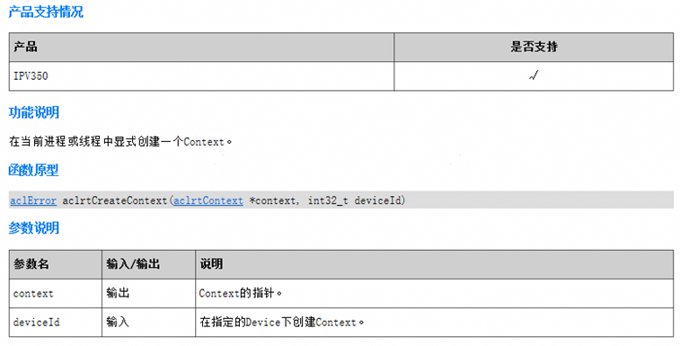

**图 3**  数据类型介绍<a name="fig36751859193411"></a>  
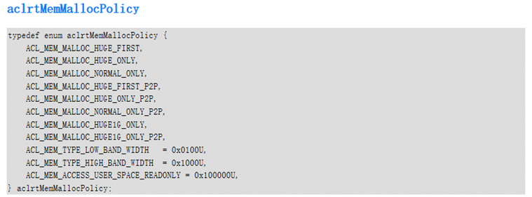

-   注意
    -   文档中会附带代码示例，所有代码示例均为关键步骤的示例，不可直接拷贝编译运行，仅供参考，详细例子可以参考Sample
    -   此文档中仅包含AscendCL的错误码和定位流程，对于部分特殊场景下的报错，需要结合驱动日志来定位问题

### 参考Sample<a name="ZH-CN_TOPIC_0000002518100536"></a>

-   背景

    对于一次完整的模型推理，需要调用多个acl接口进行实现，为方便用户快速上手开发，现提供sample供用户学习。详细示例可参考“SDK application/samples/ai\_samples”以及“SDK application/3322/3322\_ai\_engine/ai\_sample”。

-   示例路径

    ```
    application
    ├── 3322
    │   └── 3322_ai_engine
    │       └── ai_sample         // 行业sample
    │           └── public         // 开源目录
    │               ├── fuzzy_command_word       // 模糊命令词sample
    │               │   ├── files        // 必需的二进制文件
    │               │   ├── inc        // 头文件
    │               │   ├── readme.md        // 帮助文档
    │               │   └── src        // 源文件
    │               └── tts       // TTS
    │                   ├── files       // 必需的二进制文件
    │                   ├── inc       // 头文件
    │                   ├── readme.md       // 帮助文档
    │                   └── src       // 源文件
    └── samples
    └── ai_samples
    └── acl      // 教学sample
    └── matmul      // 级联matmul
    ├── build_npu.sh      // sample编译脚本
    ├── files      // 必需的二进制文件
    ├── readme.md      // 帮助文档
    └── src      // 源文件
    ```

-   行业sample
    -   模糊命令词：根据音频内容来识别语音意图，最后根据不同的语音意图输出对应的字符串，例如输入为"查看心率"，输出openheartrate
    -   TTS：接收长度为100的音素数据，将其转换为pcm数据并保存

-   教学sample
    -   级联matmul：一个简易的矩阵乘计算模型，对输入与固定值进行矩阵乘运输，得到输出。主要向用户呈现acl接口的使用方法

**图 1**  主要流程<a name="fig7764122815436"></a>  
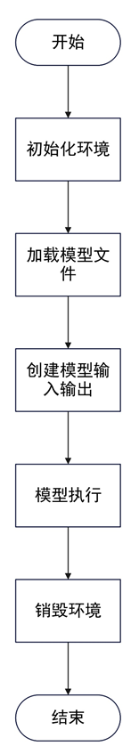

**图 2**  详细流程<a name="fig740384284313"></a>  
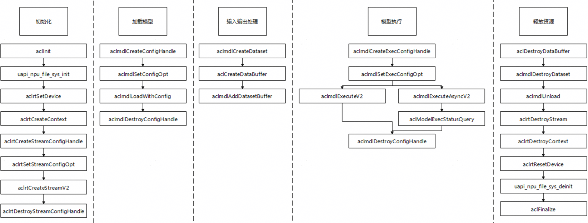

### SDK编译&烧录<a name="ZH-CN_TOPIC_0000002549500397"></a>

-   背景

    用户需要使用自己编写的代码，提供编译与烧录方法将代码运行在板端环境中

-   流程

    调用根目录下的编译脚本进行编译，执行命令./build.py 3322 –c，选择版本进行编译。编译完成后，在output/3322/fwpkg目录下获取镜像文件，使用burntool工具将镜像文件烧录到板子中

-   示例

    若用户需要将自己的代码添加到版本中，需要进行以下操作

    假设用户将代码编写在根目录下的mycode目录下

    1.  编写mycode目录下的CMakeLists.txt文件，添加代码set\(COMPONENT\_NAME "MyCode"\)
    2.  修改mycode目录同级的CMakeLists.txt文件，添加代码add\_subdirectory\_if\_exist\(mycode\)
    3.  修改编译配置文件，在对应版本中添加自定义代码仓

        例如：需要将代码编入3322-wstp-app版本中，参考/build/config/target\_config/3322/config.py，可知该版本的base\_target\_name为target\_standard\_3322\_application\_template，在/build/config/target\_config/3322/ target\_config.py中，修改target\_standard\_3322\_application\_template的ram\_component字段，添加MyCode自定义代码仓

注意：**如果用户需要将自己的代码编译为.a文件，需要使用miniSDK，参考相关指导文档进行编译**

## 模型调优<a name="ZH-CN_TOPIC_0000002517940622"></a>


### 分析日志<a name="ZH-CN_TOPIC_0000002549620395"></a>

-   背景&适用范围
    -   在部分场景下，仅AscendCL错误码不能定位到根本原因，需要通过驱动日志来辅助定位
    -   《日志分析用户指南》中介绍了驱动日志格式，可以通过关键字来快速搜索对应的错误日志，然后通过文档中对日志的介绍，来定位问题

        详细文档可参考《驱动日志说明文档.pdf》

-   目录结构
    -   **日志分类**中介绍了驱动日志的打印等级以及模块分类，同时提供了设置打印等级的接口使用方式，可以通过设置打印等级来减少日志数量；通过模块分类来快速定位异常模块
    -   **异常场景**中列举了驱动中几个主要的异常场景，以及异常场景时的日志关键字，通过关键字匹配可以定位到当前异常的场景
    -   **典型案例**中介绍了几种异常场景下的定位过程，以及解决方法和注意事项

-   示例
    -   **日志打印等级设置接口使用示例**

        // 只打印error日志

        uapi\_npu\_dlog\_setlevel\(0x10, 3, 0\);

         // 屏蔽所有日志

        uapi\_npu\_dlog\_setlevel\(0x10, 4, 0\);

    -   **日志关键字匹配**

        在驱动初始化、模型加载、创建流、模型执行等过程中，都有资源的申请和释放，驱动内部的资源申请失败时有以下打印

        // 申请内存资源失败

        \[NDRV\]\*\*\*\*\* malloc fail

         // 申请其他资源失败，如从模型池中申请模型id失败

        \[NDRV\]\*\*\*\*\* alloc fail

    -   案例分析和解决方法

        在调用查询接口查询模型信息过程中，报以下错误

        \[NFS\]region not init

         \[NFS\]file open fail

         \[ERROR\]\[model\_segment\_load.c:24\]7:ErrorNo:545000\(GE\_ERRORNO\_STR\)\[GE\]\[MODULE\] \[open\]\[file\]

         failed, file 11111.exeom

         \[ERROR\]\[ge\_executor.c:107\]7:ErrorNo:545000\(GE\_ERRORNO\_STR\)\[GE\]\[MODULE\] Load file\[11111.exeom\] 

         failed, ret = \[145002\]

         \[model.c:205\]7:REPORT\_CALL\_ERROR query partition size failed, ge ret\[145002\]

        acl层接口返回的错误码是145002，对应错误是模型路径无效，实际上对应模型文件路径正确。从驱动错误日志可以看出，文件系统未初始化导致找不到对应的模型文件，在加载模型之前执行uapi\_npu\_file\_sys\_init即可

### 精度对比分析<a name="ZH-CN_TOPIC_0000002518100538"></a>

-   背景&适用范围

    网络遇到精度问题时可以通过dump工具导出指定层输入/输出数据，并转换为指定格式，快速定位至异常层。

    可对比融合规则关闭前后数据、标杆数据结果。

    详细文档可参考《精度调试工具用户指南.pdf》。

-   使用步骤

    **图 1**  使用步骤<a name="fig060844010487"></a>  
    

    注：dbg为编译时同步生成的文件，需放入json中dump\_path的路径下

-   解析命令

    Dump文件生成指定类型文件：

    python3 msaccucmp.py convert -d <dump\_file\> \[-t <npy/bin等\>\]

    Dump文件之间比较：

    python3 msaccucmp.py file\_compare -m my\_dump\_path –g golden\_dump\_path –out output

-   json配置示例

    ```
    {
         “dump”: {
             “dump_list”: [
                 {
                     “model_name”: “matmul_sample”,
                    “layer”:[
                        “matmul_2”
                     ]
                 }
             ],
             "dump_path": "/home/output",
             "dump_mode": "output",
             "dump_op_switch": "off",
             "dump_data": "tensor"
         }
     }
    ```

### 精度优化建议<a name="ZH-CN_TOPIC_0000002549500399"></a>

-   量化精度
    -   合适的QAT算法量化精度相比PTQ更高，因此尽量选择QAT算法
    -   Fm仅支持per\_tensor量化，weight支持per\_channel或per\_tensor量化，<u>**需尽可能保证**</u><u>**fm**</u><u>**和输入的数据分布较均匀，否则会出现较大的量化误差**</u>
    -   <u>**产品端实际的输入数据需跟量化过程使用的校准数据分布范围保持一致，否则实际数据在**</u><u>**NPU**</u><u>**上执行时会计算溢出，产生较大的误差**</u>
    -   <u>**LSTM**</u><u>**、**</u><u>**GRU**</u><u>**这类**</u><u>**RNN**</u><u>**算子使用历史数据用于当前帧计算，量化误差会随帧数累积，可降低隐藏层维度，或减少该类算子使用**</u>

-   算子计算精度
    -   累加型算子\(cumsum、reducesum\)

        <u>**减少此类算子使用，如果必须使用，应避免累加结果超出**</u><u>**fp16**</u><u>**最大表示范围**</u>，否则NPU计算时采用饱和处理方式，例如结果计算为100000，结果只显示65504，最终结果误差较大

    -   查表型算子\(tanh、sigmoid\)

        **图 1**  查表型算子<a name="fig181496266490"></a>  
        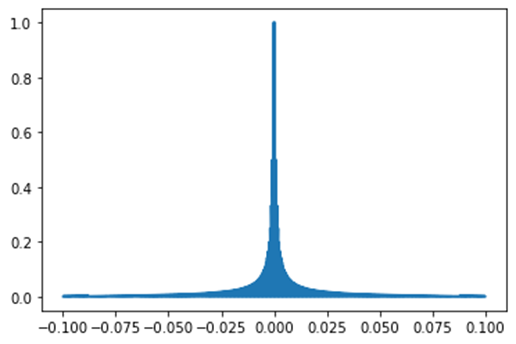

        由于数据位宽限制，对于绝对值较小的输入数据，会产生较大的相对误差，<u>**应避免数据范围较小**</u>

# FAQ<a name="ZH-CN_TOPIC_0000002549920595"></a>

-   Q：模型编译工具（ATC）中input\_fp16\_nodes、output\_type参数怎么理解，什么时候需要配置？

    A：这两个参数用于指定输入是fp16类型的节点和输出节点的数据类型；Nano NPU的Vector只支持fp16类型，<u>**当输入节点为浮点类型，应配置为**</u><u>**fp16**</u><u>**类型，输出节点中只要有一个节点为浮点就需要把**</u><u>**output\_type**</u><u>**配置为**</u><u>**fp16**</u>。

-   Q：模型中哪些层需要做量化，如果某些层数据精度对量化敏感，能否不做量化？

    A：网络中<u>**涉及矩阵运算的层，如**</u><u>**Matmul**</u><u>**、**</u><u>**Conv**</u><u>**、**</u><u>**ConvTranspose**</u><u>**、**</u><u>**LSTM**</u><u>**、**</u><u>**GRU**</u><u>**、**</u><u>**Gemm**</u><u>**等均需量化**</u>，只涉及向量运算的层不量化；<u>**是否量化由算子是否涉及矩阵运算决定**</u>，即使是精度对量化敏感的层，涉及矩阵运算也需要量化。

-   Q：量化训练过程中如何判断是否收敛，结果不收敛时如何判断是哪个算子导致？

    A：量化训练和pytorch训练一样，<u>**可以输出训练过程中的**</u><u>**Loss**</u><u>**值**</u>，从而判断是否收敛；如果不收敛，则可通过量化配置文件<u>**使某些层不量化**</u>，从而判断是否是这些层的量化导致的问题。

-   Q：LSTM、GRU算子序列长度大于1的情况是否需要将其复制成多个算子，这两类算子如果拆成小算子和一整个算子是否有差别？

    A：当前只支持序列长度为1的LSTM、GRU算子，<u>**需要将单个算子拆成多个，但权重数据共用一份**</u>；拆成小算子后会造成数据频繁搬入搬出NPU，<u>**影响性能**</u>。

-   Q：权重1M的模型，模型总的占用内存大概是多少

    A：模型占用内存由权重、算子指令、输入输出、中间层数据构成，不同的模型在算子指令和中间层数据方面可能有较大差异，可通过1.2节中的模型评估脚本进行初步评估。

-   Q：om文件有没有说明文档，能否可视化？

    A：Nano NPU使用exeom格式，该格式暂无说明文档，<u>**内部算子类型和网络结构已通过编译的方式进行隐藏，因此无法可视化**</u>，同时这种方式在一定程度上也对模型进行了一次加密。

-   Q：调用NPU时最多能创建多少个device、context，是建议使用1个context对应多个流还是多个context对应多个流？

    A：通常1个NPU就只创建1个device，<u>**按照模型优先级的数量创建**</u><u>**context**</u>，同一个优先级的网络对应1个context和1条流。

