# 简介<a name="ZH-CN_TOPIC_0000002505903679"></a>

本节介绍AscendCL的主要功能、基本概念，并给出本文档的学习顺序建议。

**AscendCL是什么？<a name="section948619116167"></a>**

**AscendCL（Ascend Computing Language）**是一套C语言API库，提供运行时管理、单算子调用、模型管理、媒体数据处理等API，能够实现利用底层硬件计算资源，在CANN平台上进行深度学习推理计算、图形图像预处理、单算子加速计算等。简单来说，**就是统一的API框架，实现对所有资源的调用**。其中，计算资源层是NPU IP加速器的硬件算力基础，主要完成神经网络的矩阵相关计算、完成控制算子/标量/向量等通用计算和执行控制功能、完成图像和视频数据的预处理。

**图 1**  逻辑架构图<a name="fig7689143134318"></a>  
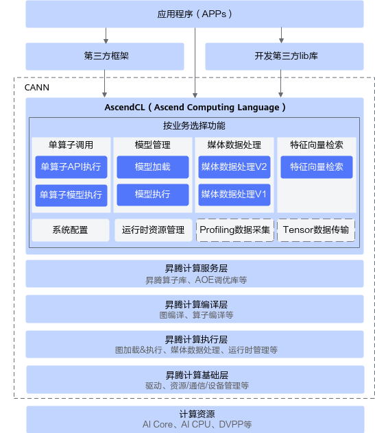

**AscendCL的应用场景**：

-   **开发应用**：用户可以直接调用AscendCL提供的接口开发图片分类应用、目标识别应用等。
-   **供第三方框架调用**：用户可以通过第三方框架调用AscendCL接口，以便使用NPU IP加速器的计算能力。
-   **供第三方开发lib库**：用户还可以使用AscendCL封装实现第三方lib库，以便提供NPU IP加速器的运行管理、资源管理等能力。

**AscendCL的优势如下：**

-   **高度抽象**：算子编译、加载、执行的API归一，相比每个算子一个API，AscendCL大幅减少API数量，降低复杂度。
-   **向后兼容**：AscendCL具备向后兼容，确保软件升级后，基于旧版本编译的程序依然可以在新版本上运行。
-   **零感知NPU IP加速器**：一套AscendCL接口可以实现应用代码统一，多款NPU IP加速器无差异。

**基本概念<a name="section232017449302"></a>**

**表 1**  概念介绍

<a name="table1598715526306"></a>
<table><thead align="left"><tr id="row1987652163011"><th class="cellrowborder" valign="top" width="26.06%" id="mcps1.2.3.1.1"><p id="p59871952113013"><a name="p59871952113013"></a><a name="p59871952113013"></a>概念</p>
</th>
<th class="cellrowborder" valign="top" width="73.94%" id="mcps1.2.3.1.2"><p id="p1498717521306"><a name="p1498717521306"></a><a name="p1498717521306"></a>描述</p>
</th>
</tr>
</thead>
<tbody><tr id="row1998725213301"><td class="cellrowborder" valign="top" width="26.06%" headers="mcps1.2.3.1.1 "><p id="p5987175218308"><a name="p5987175218308"></a><a name="p5987175218308"></a>同步/异步</p>
</td>
<td class="cellrowborder" valign="top" width="73.94%" headers="mcps1.2.3.1.2 "><p id="p15380454115"><a name="p15380454115"></a><a name="p15380454115"></a>本文中提及的同步、异步是站在调用者和执行者的角度：</p>
<a name="ul64361346101116"></a><a name="ul64361346101116"></a><ul id="ul64361346101116"><li>若在调用本文中的接口后<strong id="b1488360161320"><a name="b1488360161320"></a><a name="b1488360161320"></a>不等待</strong>Device侧的任务执行完成再返回，则表示调度是<strong id="b246215511113"><a name="b246215511113"></a><a name="b246215511113"></a>异步</strong>的。</li><li>若在调用本文中的接口后<strong id="b16826124151314"><a name="b16826124151314"></a><a name="b16826124151314"></a>需等待</strong>Device侧的任务执行完成再返回，则表示调度是<strong id="b7315515116"><a name="b7315515116"></a><a name="b7315515116"></a>同步</strong>的。</li></ul>
</td>
</tr>
<tr id="row39881252193012"><td class="cellrowborder" valign="top" width="26.06%" headers="mcps1.2.3.1.1 "><p id="p209881652113019"><a name="p209881652113019"></a><a name="p209881652113019"></a>进程/线程</p>
</td>
<td class="cellrowborder" valign="top" width="73.94%" headers="mcps1.2.3.1.2 "><p id="p10275194010145"><a name="p10275194010145"></a><a name="p10275194010145"></a>本文中提及的进程、线程，若无特别注明，则表示用户应用程序中的进程、线程。</p>
</td>
</tr>
<tr id="row799011527307"><td class="cellrowborder" valign="top" width="26.06%" headers="mcps1.2.3.1.1 "><p id="p18990165233014"><a name="p18990165233014"></a><a name="p18990165233014"></a>通道</p>
</td>
<td class="cellrowborder" valign="top" width="73.94%" headers="mcps1.2.3.1.2 "><p id="p1799015293017"><a name="p1799015293017"></a><a name="p1799015293017"></a>在RGB色彩模式下，图像通道就是指单独的红色R、绿色G、蓝色B部分。也就是说，一幅完整的图像，是由红色绿色蓝色三个通道组成的，它们共同作用产生了完整的图像。同样在HSV色系中指的是色调H，饱和度S，亮度V三个通道。</p>
</td>
</tr>
<tr id="row1699014523306"><td class="cellrowborder" valign="top" width="26.06%" headers="mcps1.2.3.1.1 "><p id="p1199095215302"><a name="p1199095215302"></a><a name="p1199095215302"></a><span id="ph140291513560"><a name="ph140291513560"></a><a name="ph140291513560"></a><term id="zh-cn_topic_0000002505906237_term15137102916374"><a name="zh-cn_topic_0000002505906237_term15137102916374"></a><a name="zh-cn_topic_0000002505906237_term15137102916374"></a>Ascend RC</term></span>形态</p>
</td>
<td class="cellrowborder" valign="top" width="73.94%" headers="mcps1.2.3.1.2 "><p id="p4990185214308"><a name="p4990185214308"></a><a name="p4990185214308"></a>以<span id="ph5172134872614"><a name="ph5172134872614"></a><a name="ph5172134872614"></a>NPU IP加速器</span>的PCIe的工作模式进行区分，如果PCIe工作在主模式，可以扩展外设，则称为<span id="ph64121715111515"><a name="ph64121715111515"></a><a name="ph64121715111515"></a><term id="zh-cn_topic_0000002505906237_term15137102916374_1"><a name="zh-cn_topic_0000002505906237_term15137102916374_1"></a><a name="zh-cn_topic_0000002505906237_term15137102916374_1"></a>Ascend RC</term></span>形态。</p>
<p id="p155641337699"><a name="p155641337699"></a><a name="p155641337699"></a><span id="ph174765315413"><a name="ph174765315413"></a><a name="ph174765315413"></a><term id="zh-cn_topic_0000002505906237_term15137102916374_2"><a name="zh-cn_topic_0000002505906237_term15137102916374_2"></a><a name="zh-cn_topic_0000002505906237_term15137102916374_2"></a>Ascend RC</term></span>形态下，产品的CPU直接运行用户指定的AI业务软件，网络摄像头、I<sup id="zh-cn_topic_0000002116424653_zh-cn_topic_0000001687495573_sup550092143115"><a name="zh-cn_topic_0000002116424653_zh-cn_topic_0000001687495573_sup550092143115"></a><a name="zh-cn_topic_0000002116424653_zh-cn_topic_0000001687495573_sup550092143115"></a>2</sup>C传感器、SPI显示器等其他外挂设备作为从设备接入产品。</p>
</td>
</tr>
</tbody>
</table>

**文档使用建议<a name="section7569173112012"></a>**

**如果您是第一次使用本文档，已了解AscendCL做什么，但还不清楚如何开发应用时，建议：**

1.  先参考《安装指南》安装固件、驱动及CANN软件。
2.  然后单击[Link](https://gitee.com/ascend/samples/tree/master/cplusplus/level2_simple_inference/1_classification/resnet50_firstapp)获取入门样例，按README.md中的指导下载样例源码、编译及运行应用等，再通过源码了解acl接口（接口名以acl开头）的关键代码逻辑。
3.  再通过[头文件和库文件说明](头文件和库文件说明.md)、[接口调用流程](接口调用流程.md)了解整体的接口分类以及接口调用流程。
4.  最后通过[模型管理](模型管理.md)章节的接口调用流程+示例代码展开学习，扩展进行其它应用的开发。

**具备C/C++语言程序开发能力、对机器学习或深度学习有一定了解的开发者，可以更好地理解本文档。**

# 准备环境<a name="ZH-CN_TOPIC_0000002506018293"></a>

部署开发环境，请参见《开发环境安装指南》。

安装CANN软件后，使用CANN运行用户进行编译、运行时，需要以CANN运行用户登录环境，执行**source  $\{INSTALL\_DIR\}/bin/setenv.bash**命令设置环境变量。$\{INSTALL\_DIR\}请替换为CANN软件安装后文件存储路径。以root安装举例，安装后文件默认存储路径为：/usr/local/Ascend/latest。

部署开发环境后，才能获取调用接口所需的头文件、编译运行接口所需的库文件。

-   从“CANN软件安装后文件存储路径/include/acl”目录下获取头文件。
-   从“CANN软件安装后文件存储路径/lib64”目录下获取库文件。

# 编程接口与调用流程<a name="ZH-CN_TOPIC_0000002473743724"></a>

本节介绍接口分类以及调用接口时依赖的头文件和库文件。
本节介绍应用开发接口调用流程。

## 头文件和库文件说明<a name="ZH-CN_TOPIC_0000002506023529"></a>

本节介绍接口分类以及调用接口时依赖的头文件和库文件。

**接口分类<a name="section1653172113319"></a>**

接口名以acl作为前缀，命名风格为：acl+_接口类别缩写_+_操作动词_+_对象_，其中操作动词和对象均采用首字母大写。下文为了描述方便，将本文中的接口统称为acl接口。

**表 1**  接口类别列表

<a name="table178173343515"></a>
<table><thead align="left"><tr id="row1987915333355"><th class="cellrowborder" valign="top" width="26.900000000000002%" id="mcps1.2.3.1.1"><p id="p20879333193513"><a name="p20879333193513"></a><a name="p20879333193513"></a>接口名前缀</p>
</th>
<th class="cellrowborder" valign="top" width="73.1%" id="mcps1.2.3.1.2"><p id="p488043315355"><a name="p488043315355"></a><a name="p488043315355"></a>描述</p>
</th>
</tr>
</thead>
<tbody><tr id="row1168614527353"><td class="cellrowborder" valign="top" width="26.900000000000002%" headers="mcps1.2.3.1.1 "><p id="p156861752103513"><a name="p156861752103513"></a><a name="p156861752103513"></a>acl</p>
</td>
<td class="cellrowborder" valign="top" width="73.1%" headers="mcps1.2.3.1.2 "><p id="p56867527351"><a name="p56867527351"></a><a name="p56867527351"></a>系统配置类接口</p>
</td>
</tr>
<tr id="row588016332353"><td class="cellrowborder" valign="top" width="26.900000000000002%" headers="mcps1.2.3.1.1 "><p id="p1588073373515"><a name="p1588073373515"></a><a name="p1588073373515"></a>aclrt</p>
</td>
<td class="cellrowborder" valign="top" width="73.1%" headers="mcps1.2.3.1.2 "><p id="p1788033319358"><a name="p1788033319358"></a><a name="p1788033319358"></a>运行时资源管理类的接口</p>
</td>
</tr>
<tr id="row11366837173619"><td class="cellrowborder" valign="top" width="26.900000000000002%" headers="mcps1.2.3.1.1 "><p id="p388063393520"><a name="p388063393520"></a><a name="p388063393520"></a>aclmdl</p>
</td>
<td class="cellrowborder" valign="top" width="73.1%" headers="mcps1.2.3.1.2 "><p id="p18880163393518"><a name="p18880163393518"></a><a name="p18880163393518"></a>模型推理类的接口</p>
</td>
</tr>
</tbody>
</table>

**调用接口依赖的头文件和库文件说明<a name="section1494913184520"></a>**

安装固件、驱动及CANN软件包后，编译、运行应用程序时才能引用到acl接口的头文件、库文件。

您需要根据实际使用的acl接口来include依赖的文件，各头文件的用途如下表所示。

acl接口的头文件在“$\{INSTALL\_DIR\}/include/”目录下，库文件在“$\{INSTALL\_DIR\}/lib64/”目录下。$\{INSTALL\_DIR\}请替换为CANN软件安装后文件存储路径。以root安装举例，安装后文件默认存储路径为：/usr/local/Ascend/latest。

> **须知：** 
>编译acl接口程序时，请按照include的头文件依赖对应的库文件，如果引用多余的so文件（例如libascendcl.a），可能导致版本功能异常或后续版本升级时存在兼容性问题。

**表 2**  头文件列表

<a name="table153417439506"></a>
<table><thead align="left"><tr id="row33416437501"><th class="cellrowborder" valign="top" width="22.509999999999998%" id="mcps1.2.4.1.1"><p id="p113444313504"><a name="p113444313504"></a><a name="p113444313504"></a>定义接口的头文件</p>
</th>
<th class="cellrowborder" valign="top" width="45.45%" id="mcps1.2.4.1.2"><p id="p1234144317507"><a name="p1234144317507"></a><a name="p1234144317507"></a>用途</p>
</th>
<th class="cellrowborder" valign="top" width="32.04%" id="mcps1.2.4.1.3"><p id="p19326171921710"><a name="p19326171921710"></a><a name="p19326171921710"></a>对应的库文件</p>
</th>
</tr>
</thead>
<tbody><tr id="row1434143195014"><td class="cellrowborder" valign="top" width="22.509999999999998%" headers="mcps1.2.4.1.1 "><p id="p15341143145013"><a name="p15341143145013"></a><a name="p15341143145013"></a>acl/acl_base.h</p>
</td>
<td class="cellrowborder" valign="top" width="45.45%" headers="mcps1.2.4.1.2 "><p id="p1034174313508"><a name="p1034174313508"></a><a name="p1034174313508"></a>用于定义基本的数据类型（例如aclDataBuffer、aclTensorDesc等）及其操作接口、枚举值（例如aclFormat）、日志管理接口等。</p>
</td>
<td class="cellrowborder" valign="top" width="32.04%" headers="mcps1.2.4.1.3 "><p id="p6831645172414"><a name="p6831645172414"></a><a name="p6831645172414"></a>libascendcl.a</p>
</td>
</tr>
<tr id="row134343185012"><td class="cellrowborder" valign="top" width="22.509999999999998%" headers="mcps1.2.4.1.1 "><p id="p15341743105019"><a name="p15341743105019"></a><a name="p15341743105019"></a>acl/acl.h</p>
</td>
<td class="cellrowborder" valign="top" width="45.45%" headers="mcps1.2.4.1.2 "><p id="p534443145011"><a name="p534443145011"></a><a name="p534443145011"></a>该头文件中已包含acl/acl_mdl.h、acl/acl_rt.h、acl/acl_op.h。包含acl.h文件后，可以引用初始化/去初始化、Device管理、Context管理、Stream管理、同步等待、内存管理、算力Group查询与设置、模型加载与执行、单算子执行（含部分接口）等接口。</p>
</td>
<td class="cellrowborder" valign="top" width="32.04%" headers="mcps1.2.4.1.3 "><p id="p12326419161717"><a name="p12326419161717"></a><a name="p12326419161717"></a>libascendcl.a</p>
</td>
</tr>
</tbody>
</table>

## 接口调用流程<a name="ZH-CN_TOPIC_0000002473743734"></a>

本节介绍应用开发接口调用流程。

**接口调用流程<a name="section1875373910448"></a>**

调用acl接口，可开发包含模型推理等功能的应用，这些功能可以独立存在，也可以组合存在。下图给出了使用acl接口开发AI应用的整体接口调用流程。

**图 1**  接口调用流程图<a name="fig133701737114610"></a>  
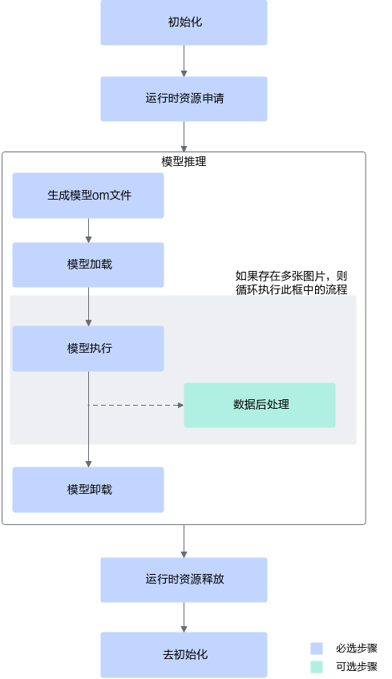

上图根据应用开发中的典型功能抽象出主要的接口调用流程，例如，如果模型对输入图片的宽高要求与用户提供的源图不一致，则需要媒体数据处理，将源图裁剪成符合模型的要求；如果需要实现模型推理的功能，则需要先加载模型，模型推理结束后，则需要卸载模型；如果模型推理后，需要从推理结果中查找最大置信度的类别标识对图片分类，则需要数据后处理。

1.  初始化。

    调用[aclInit](aclInit.md)接口实现初始化。

2.  运行时资源申请。

    具体流程，请参见[运行时资源申请与释放](运行时资源申请与释放.md)。

3.  应用业务处理。
    -   **模型推理**
        1.  模型加载：模型推理前，需要先将对应的模型加载到系统中。

            接口调用流程，请参见[模型加载](模型加载.md)。

            但加载模型前，必须要有适配昇腾AI处理器的离线模型适配NPU IP加速器的离线模型，需提前构建模型，请参见[模型构建](模型构建.md)。

        2.  模型执行：使用模型实现图片分类、目标识别等功能。

            接口调用流程，请参见[模型执行](模型执行.md)。

        3.  （可选）数据后处理：处理模型推理的结果，此处根据用户的实际需求来处理推理结果，例如用户可以将获取到的推理结果写入文件、从推理结果中找到每张图片最大置信度的类别标识等。
        4.  模型卸载：调用[aclmdlUnload](aclmdlUnload.md)接口卸载模型。

4.  运行时资源释放。

    所有数据处理都结束后，需要依次释放运行时资源，接口调用流程，请参见[运行时资源申请与释放](运行时资源申请与释放.md)。

5.  去初始化。

    调用[aclFinalize](aclFinalize.md)接口实现去初始化。

> **说明：** 
>在应用开发过程中，各环节都涉及内存的申请与释放、数据传输（通过内存复制实现）、数据类型的创建与销毁，因此未在图中一一标识，关于内存申请与释放、内存复制的接口请参见[内存管理](内存管理.md)，数据类型的创建与销毁的接口请参见[数据类型及其操作接口](数据类型及其操作接口.md)。

# 初始化与去初始化<a name="ZH-CN_TOPIC_0000002505903541"></a>

本节介绍初始化与去初始化的相关接口、注意事项，并给出示例代码。

**基本原理<a name="section429017105714"></a>**

您必须调用[aclInit](aclInit.md)接口进行初始化，配置文件内容为json格式，详细的配置内容请参见[aclInit](aclInit.md)中的描述。

如果当前的默认配置已满足需求，无需修改，可向aclInit接口中传入NULL，或者可将配置文件配置为空json串（即配置文件中只有\{\}）。向[aclInit](aclInit.md)接口中传入空指针的示例如下：

```
aclError ret = aclInit(NULL);
```

有初始化就有去初始化，在进程退出之前，需调用[aclFinalize](aclFinalize.md)接口实现去初始化。

**示例代码<a name="section011063051613"></a>**

调用接口后，需增加异常处理的分支，并记录报错日志、提示日志，此处不一一列举。以下是关键步骤的代码示例，不可以直接拷贝编译运行，仅供参考。

```
// 初始化
// 此处的..表示相对路径，相对可执行文件所在的目录
// 例如，编译出来的可执行文件存放在out目录下，此处的..就表示out目录的上一级目录
const char *aclConfigPath = "../src/acl.json";
aclError ret = aclInit(aclConfigPath);

// ......

// 去初始化
ret = aclFinalize();
// ......
```

# 运行时资源管理<a name="ZH-CN_TOPIC_0000002506023569"></a>


本节介绍运行时资源包括哪些、如何申请&释放这些资源，并给出示例代码。
本节介绍数据传输的相关接口、注意事项，并给出示例代码。
本节介绍单Stream、多Stream的创建、销毁流程，以及多Stream同步等待的流程。
本节介绍Device、Stream、Event、Notify在异步场景下的使用示例及关键接口。

## 概念说明<a name="ZH-CN_TOPIC_0000002473743620"></a>

**基本概念<a name="section232017449302"></a>**

**表 1**  概念介绍

<a name="table1598715526306"></a>
<table><thead align="left"><tr id="row1987652163011"><th class="cellrowborder" valign="top" width="26.06%" id="mcps1.2.3.1.1"><p id="p59871952113013"><a name="p59871952113013"></a><a name="p59871952113013"></a>概念</p>
</th>
<th class="cellrowborder" valign="top" width="73.94%" id="mcps1.2.3.1.2"><p id="p1498717521306"><a name="p1498717521306"></a><a name="p1498717521306"></a>描述</p>
</th>
</tr>
</thead>
<tbody><tr id="row6988105210309"><td class="cellrowborder" valign="top" width="26.06%" headers="mcps1.2.3.1.1 "><p id="p098815293016"><a name="p098815293016"></a><a name="p098815293016"></a>Device</p>
</td>
<td class="cellrowborder" valign="top" width="73.94%" headers="mcps1.2.3.1.2 "><p id="p11988252123014"><a name="p11988252123014"></a><a name="p11988252123014"></a>Device指安装了<span id="ph69881526303"><a name="ph69881526303"></a><a name="ph69881526303"></a>NPU IP加速器</span>的硬件设备，提供NN计算能力。</p>
</td>
</tr>
<tr id="row698812529306"><td class="cellrowborder" valign="top" width="26.06%" headers="mcps1.2.3.1.1 "><p id="p698805211301"><a name="p698805211301"></a><a name="p698805211301"></a>Context</p>
</td>
<td class="cellrowborder" valign="top" width="73.94%" headers="mcps1.2.3.1.2 "><p id="p12988175213301"><a name="p12988175213301"></a><a name="p12988175213301"></a>Context作为一个容器，管理了所有对象（包括Stream、Event、设备内存等）的生命周期。不同Context的Stream、不同Context的Event是完全隔离的，无法建立同步等待关系。</p>
<p id="p18575732191719"><a name="p18575732191719"></a><a name="p18575732191719"></a>显式创建Context：在进程或线程中调用<a href="aclrtCreateContext.md">aclrtCreateContext</a>接口显式创建一个Context。</p>
</td>
</tr>
<tr id="row1988052113010"><td class="cellrowborder" valign="top" width="26.06%" headers="mcps1.2.3.1.1 "><p id="p119883527309"><a name="p119883527309"></a><a name="p119883527309"></a>Stream</p>
</td>
<td class="cellrowborder" valign="top" width="73.94%" headers="mcps1.2.3.1.2 "><p id="p79631441512"><a name="p79631441512"></a><a name="p79631441512"></a>Stream用于维护一些异步操作的执行顺序，确保同一个Stream中的任务按照应用程序中的代码调用顺序在Device上执行。</p>
<p id="p86506455596"><a name="p86506455596"></a><a name="p86506455596"></a>显式创建Stream：在进程或线程中调用<a href="aclrtCreateStreamV2.md">aclrtCreateStreamV2</a>接口显式创建一个Stream。</p>
</td>
</tr>
</tbody>
</table>

**Device、Context、Stream之间的关系<a name="section111695107262"></a>**

**图 1**  Device、Context、Stream之间的关系<a name="fig278652717464"></a>  
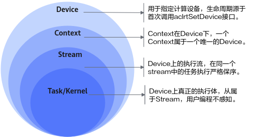

-   **Device**，表示计算设备，用户可以调用acl接口，例如[aclrtSetDevice](aclrtSetDevice.md)，指定当前线程中用于运算的设备。
-   **Context**，在Device下，一个Context一定属于一个唯一的Device。
    -   显式创建的Context，调用[aclrtCreateContext](aclrtCreateContext.md)接口会显式创建Context，调用[aclrtDestroyContext](aclrtDestroyContext.md)接口显式销毁Context。
    -   若在某一进程内创建多个Context（Context的数量与Stream相关，Stream数量有限制，请参见[aclrtCreateStreamV2](aclrtCreateStreamV2.md)），当前线程在同一时刻内只能使用其中一个Context，建议通过[aclrtSetCurrentContext](aclrtSetCurrentContext.md)接口明确指定当前线程的Context，增加程序的可维护性**。**
    -   进程内的Context是共享的，可以通过[aclrtSetCurrentContext](aclrtSetCurrentContext.md)进行切换。

-   **Stream**，是Device上的执行流，在同一个stream中的任务执行严格保序。
    -   用户可以显式创建Stream，调用[aclrtCreateStreamV2](aclrtCreateStreamV2.md)接口显式创建Stream，调用[aclrtDestroyStream](aclrtDestroyStream.md)接口显式销毁Stream。显式创建的Stream归属的Context被销毁后，会影响该Stream的使用，虽然此时Stream没有被销毁，但不可再用。

-   **Task/Kernel**，是Device上真正的任务执行体。

**线程、Context、Stream之间的关系<a name="section18842152142613"></a>**

-   一个用户线程一定会绑定一个Context，所有Device的资源使用或调度，都必须基于Context。
-   一个线程中当前会有一个唯一的Context在用，Context中已经关联了本线程要使用的Device。
-   可以通过[aclrtSetCurrentContext](aclrtSetCurrentContext.md)进行Device的快速切换。示例代码如下，仅供参考，不可以直接拷贝编译运行：

    ```
    // ......
    aclrtCreateContext(&ctx1, 0);
    aclrtCreateStreamV2(&s1, &handle1);
    /* 执行算子 */
    aclopExecuteV2(op1,...,s1);
    
    aclrtCreateContext(&ctx2,1);
    /* 在当前线程中，创建ctx2后，当前线程对应的Context切换为ctx2，后续计算任务在Device 1上进行 */
    aclrtCreateStreamV2(&s2, &handle2);
    /* 执行算子 */
    aclopExecuteV2(op2,...,s2);
    
    /* 在当前线程中，通过Context切换，使后续计算任务在对应的Device 0上进行 */
    aclrtSetCurrentContext(ctx1);
    /* 执行算子 */
    aclopExecuteV2(op3,...,s1);
    // ......
    ```

-   一个线程中可以创建多个Stream，不同的Stream上计算任务是可以并行执行；多线程场景下，推荐每个线程创建一个Stream，线程之间的Stream在Device上相互独立，每个Stream内部的任务是按照Stream下发的顺序执行。
-   多线程的调度依赖于运行应用的操作系统调度，多Stream在Device侧的调度，由Device上调度组件进行调度。

**一个进程内多个线程间的Context切换<a name="section1721432652614"></a>**

-   一个进程中可以创建多个Context，但一个线程同一时刻只能使用一个Context。
-   线程中创建的多个Context，线程缺省使用最后一次创建的Context。
-   进程内创建的多个Context，可以通过[aclrtSetCurrentContext](aclrtSetCurrentContext.md)设置当前需要使用的Context。

**图 2**  接口调用流程<a name="fig2254102111213"></a>  
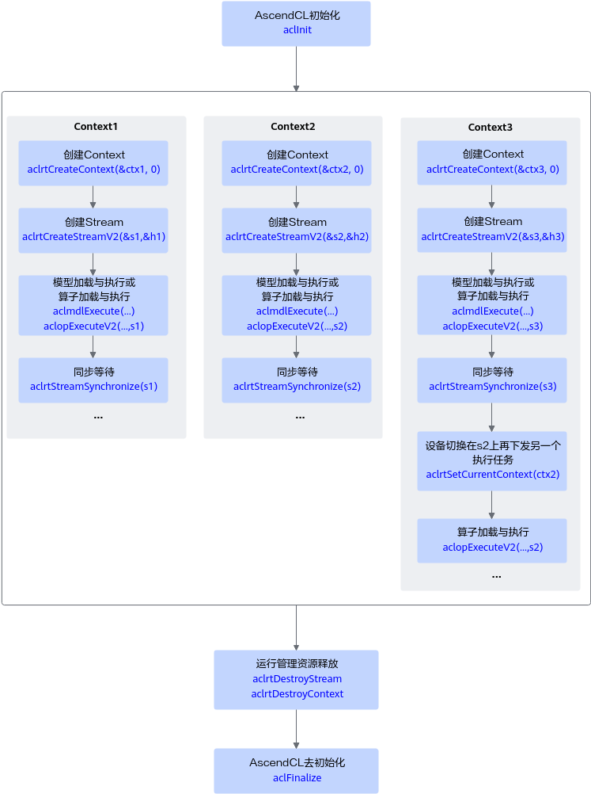

**多线程、多stream的性能说明<a name="section1676210288263"></a>**

-   线程调度依赖运行的操作系统，Stream上下发了任务后，Stream的调度由Device的调度单元调度，但如果一个进程内的多Stream上的任务在Device存在资源争抢的时候，性能可能会比单Stream低。
-   当前NPU IP加速器有不同的执行部件，如AI Core、AI CPU、Vector Core等，对应使用不同执行部件的任务，建议多Stream的创建按照算子执行引擎划分。
-   单线程多Stream与多线程多Stream（一个进程中可以包含多个线程，每个线程中一个Stream）性能上哪个更优，具体取决于应用本身的逻辑实现，一般来说前者性能略好，原因是相对后者，应用层少了线程调度开销。

## 运行时资源申请与释放<a name="ZH-CN_TOPIC_0000002506023523"></a>

本节介绍运行时资源包括哪些、如何申请&释放这些资源，并给出示例代码。

开发应用时，应用程序中必须包含运行时资源申请的代码逻辑，关于运行时资源申请的接口调用流程，请先参见[接口调用流程](接口调用流程.md)了解整体流程，再查看本节中的资源申请&释放流程说明、示例代码。

**基本原理<a name="section163329258316"></a>**

您需要按顺序依次**申请**Device、Stream等运行时资源，确保可以使用这些资源执行运算、管理任务。所有数据处理都结束后，需要按顺序依次**释放**Stream、Device等运行时资源。

关于单进程、单线程、单Stream场景如下所示：

-   单进程：一个应用程序对应一个进程。
-   单线程：不创建多个线程时，默认只有一个线程。
-   单Stream：整个开发的过程中使用同一个Stream。

    对于同一个Stream中的异步任务，会按照应用程序中任务的顺序执行任务，确保异步任务执行的顺序。

-   关于多线程、多Stream的场景请参见[Stream管理](Stream管理.md)。

**运行时资源申请流程<a name="section3144102519346"></a>**

**图 1**  运行时资源申请流程<a name="fig1094453314168"></a>  
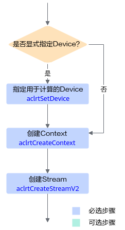

申请运行时资源时，需按顺序依次申请：Device、Context、Stream。

-   **显式指定用于运算的Device**

    依次调用[aclrtSetDevice](aclrtSetDevice.md)接口指定Device、调用[aclrtCreateContext](aclrtCreateContext.md)接口显式创建Context、调用[aclrtCreateStreamV2](aclrtCreateStreamV2.md)接口显式创建Stream。

-   **隐式指定用于运算的Device**

    调用[aclrtCreateContext](aclrtCreateContext.md)接口显式创建Context，调用[aclrtCreateStreamV2](aclrtCreateStreamV2.md)接口显式创建Stream。

    调用[aclrtCreateContext](aclrtCreateContext.md)接口显式创建Context时，传入Device ID，这时系统内部会根据该Device ID指定运行的Device。

**运行时资源释放流程<a name="section135271915203515"></a>**

**图 2**  运行时资源释放流程<a name="fig18679554438"></a>  
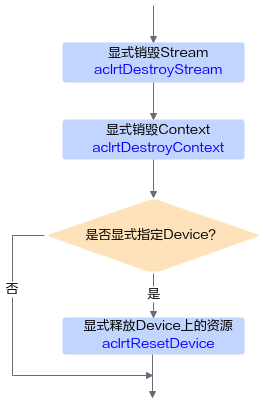

释放运行时资源时，需按顺序依次释放：Stream、Context、Device。需调用[aclrtDestroyStream](aclrtDestroyStream.md)接口释放Stream，再调用[aclrtDestroyContext](aclrtDestroyContext.md)接口释放Context。若显式调用[aclrtSetDevice](aclrtSetDevice.md)接口指定运算的Device时，还需调用[aclrtResetDevice](aclrtResetDevice.md)接口释放Device上的资源。

**示例代码<a name="section10829115517410"></a>**

调用接口后，需增加异常处理的分支，并记录报错日志、提示日志，此处不一一列举。以下是关键步骤的代码示例，不可以直接拷贝编译运行，仅供参考。

```
// 初始化变量
int32_t deviceId=0 ;
aclrtContext context;
aclrtStream stream;
extern bool g_isDevice;

// =====运行时资源申请=====
// 指定运算的Device
aclError ret = aclrtSetDevice(deviceId);

// 显式创建一个Context，用于管理Stream对象
ret = aclrtCreateContext(&context, deviceId);

// 显式创建一个Stream，此处创建Stream时以设置Stream优先级为例
// 用于维护一些异步操作的执行顺序，确保按照应用程序中的代码调用顺序执行任务
uint32_t stmPriority = 1;
aclrtStreamConfigHandle *handle = aclrtCreateStreamConfigHandle();
ret = aclrtSetStreamConfigOpt(handle, ACL_RT_STREAM_PRIORITY, &stmPriority, sizeof(stmPriority));
ret = aclrtCreateStreamV2(&stream, handle);
// =====运行时资源申请=====

// ......

// =====运行时资源释放=====
ret = aclrtDestroyStream(stream);
ret = aclrtDestroyStreamConfigHandle(handle);
ret = aclrtDestroyContext(context);
ret = aclrtResetDevice(deviceId);
// =====运行时资源释放=====

// ......
```

## 数据传输<a name="ZH-CN_TOPIC_0000002473903580"></a>

本节介绍数据传输的相关接口、注意事项，并给出示例代码。

**接口调用流程<a name="section12230714134914"></a>**

数据传输的关键接口调用流程如下：

1.  **申请内存**。
    -   Device上的内存，调用[aclrtMalloc](aclrtMalloc.md)接口申请内存。

2.  **将数据读入内存**。

    由用户自行管理数据读入内存的实现逻辑。

3.  通过内存复制实现**数据传输**。

    数据传输可以通过内存复制的方式实现，分为同步内存复制、异步内存复制：

    -   **同步**内存复制：调用[aclrtMemcpy](aclrtMemcpy.md)接口。
    -   调用同步或异步内存复制接口时，支持以下类型的复制（可单击链接查看对应类型的内存复制示例代码）：
        -   [一个Device内的数据传输](#section197001619124814)

**一个Device内的数据传输<a name="section197001619124814"></a>**

调用接口后，需增加异常处理的分支，并记录报错日志、提示日志，此处不一一列举。以下是关键步骤的代码示例，不可以直接拷贝编译运行，仅供参考。

```
// 1. 申请内存
uint64_t size = 1 * 1024 * 1024;
void* devPtrA = NULL;
void* devPtrB = NULL;
aclrtMalloc(&devPtrA, size, ACL_MEM_MALLOC_HUGE_FIRST);
aclrtMalloc(&devPtrB, size, ACL_MEM_MALLOC_HUGE_FIRST);

// 2. 申请内存后，可向内存中读入数据，该自定义函数ReadFile由用户实现
ReadFile(fileName, devPtrA, size);

// 3. 内存复制，可以选择同步或异步
// 同步内存复制，devPtrA表示Device上源内存地址指针，devPtrB表示Device上目的内存地址指针，size表示内存大小
aclrtMemcpy(devPtrB, size, devPtrA, size, ACL_MEMCPY_DEVICE_TO_DEVICE);
  
// 异步内存复制
// 显式创建一个Stream，此处创建Stream时以设置Stream优先级为例
aclrtStream stream;
uint32_t stmPriority = 1;
aclrtStreamConfigHandle *handle = aclrtCreateStreamConfigHandle();
aclrtSetStreamConfigOpt(handle, ACL_RT_STREAM_PRIORITY, &stmPriority, sizeof(stmPriority));
aclrtCreateStreamV2(&stream, handle);
aclrtMemcpyAsync(devPtrB, size, devPtrA, size, ACL_MEMCPY_DEVICE_TO_DEVICE, stream);
aclrtSynchronizeStream(stream);

// 4. 使用完内存中的数据后，需及时释放资源
aclrtDestroyStream(stream);
aclrtDestroyStreamConfigHandle(handle);
aclrtFree(devPtrA);
aclrtFree(devPtrB);

// ......
```

## Stream管理<a name="ZH-CN_TOPIC_0000002473903536"></a>

本节介绍单Stream、多Stream的创建、销毁流程，以及多Stream同步等待的流程。

在AscendCL中，Stream是一个任务队列，应用程序通过Stream来管理任务的并行，一个Stream内部的任务保序执行，即Stream根据发送过来的任务依次执行；不同Stream中的任务并行执行。

当前包含以下几种Stream管理机制：

-   [单线程单Stream](#section4111319195417)
-   [单线程多Stream](#section1498333717541)
-   [多线程多Stream](#section137381605550)

**单线程单Stream<a name="section4111319195417"></a>**

调用接口后，需增加异常处理的分支，并记录报错日志、提示日志，此处不一一列举。以下是关键步骤的代码示例，不可以直接拷贝编译运行，仅供参考。

```
#include "acl/acl.h"
// ......
int32_t deviceId = 0;
aclrtContext context;

/ 如果只创建了一个Context，线程默认将这个Context作为线程当前的Context；
// 如果是多个Context，则需要调用aclrtSetCurrentContext接口设置当前线程的Context
 aclrtCreateContext(&context, deviceId);

// 显式创建一个Stream，此处创建Stream时以设置Stream优先级为例
aclrtStream stream;
uint32_t stmPriority = 1;
aclrtStreamConfigHandle *handle = aclrtCreateStreamConfigHandle();
aclrtSetStreamConfigOpt(handle, ACL_RT_STREAM_PRIORITY, &stmPriority, sizeof(stmPriority));
aclrtCreateStreamV2(&stream, handle);

// 调用触发任务的接口，传入stream参数
aclrtMemcpyAsync(dstPtr, dstSize, srcPtr, srcSize, ACL_MEMCPY_HOST_TO_DEVICE, stream);
// 调用aclrtSynchronizeStream接口，阻塞应用程序运行，直到指定Stream中的所有任务都完成。
aclrtSynchronizeStream(stream);

// Stream使用结束后，显式销毁Stream
aclrtDestroyStream(stream);
aclrtDestroyStreamConfigHandle(handle);

aclrtDestroyContext(context);
// ......
```

**单线程多Stream<a name="section1498333717541"></a>**

调用接口后，需增加异常处理的分支，并记录报错日志、提示日志，此处不一一列举。以下是关键步骤的代码示例，不可以直接拷贝编译运行，仅供参考。

```
#include "acl/acl.h"
// ......
int32_t deviceId = 0 ;
uint32_t modelId1 = 0;
uint32_t modelId2 = 1;
aclrtContext context;
aclrtStream stream1;
aclrtStream stream2;

// 如果只创建了一个Context，线程默认将这个Context作为线程当前的Context；
// 如果是多个Context，则需要调用aclrtSetCurrentContext接口设置当前线程的Context
 aclrtCreateContext(&context, deviceId);

// 创建stream1，此处创建Stream时以设置Stream优先级为例
uint32_t stmPriority = 1;
aclrtStreamConfigHandle *handle1 = aclrtCreateStreamConfigHandle();
aclrtSetStreamConfigOpt(handle1, ACL_RT_STREAM_PRIORITY, &stmPriority, sizeof(stmPriority));
aclrtCreateStreamV2(&stream1, handle1);

// 调用触发任务的接口，例如异步模型推理，任务下发在stream1
aclmdlDataset *input1;
aclmdlDataset *output1;
aclmdlExecuteAsync(modelId1, input1, output1, stream1);

// 创建stream2，此处创建Stream时以设置Stream优先级为例
uint32_t stmPriority = 2;
aclrtStreamConfigHandle *handle2 = aclrtCreateStreamConfigHandle();
aclrtSetStreamConfigOpt(handle2, ACL_RT_STREAM_PRIORITY, &stmPriority, sizeof(stmPriority));
aclrtCreateStreamV2(&stream2, handle2);

// 调用触发任务的接口，例如异步模型推理， 任务下发在stream2
aclmdlDataset *input2;
aclmdlDataset *output2;
aclmdlExecuteAsync(modelId2, input2, output2, stream2);

// 流同步
aclrtSynchronizeStream(stream1);
aclrtSynchronizeStream(stream2);

// 释放资源
aclrtDestroyStream(stream1);
aclrtDestroyStreamConfigHandle(handle1);
aclrtDestroyStream(stream2);
aclrtDestroyStreamConfigHandle(handle2);
aclrtDestroyContext(context);
// ....
```

**多线程多Stream<a name="section137381605550"></a>**

调用接口后，需增加异常处理的分支，并记录报错日志、提示日志，此处不一一列举。以下是关键步骤的代码示例，不可以直接拷贝编译运行，仅供参考。

```
#include "acl/acl.h"
// ......
void runThread() {
    int32_t deviceId =0;
    aclrtContext context;

    // 如果只创建了一个Context，线程默认将这个Context作为线程当前的Context；
    // 如果是多个Context，则需要调用aclrtSetCurrentContext接口设置当前线程的Context
    aclrtCreateContext(&context, deviceId);

    // 显式创建一个Stream，此处创建Stream时以设置Stream优先级为例
    aclrtStream stream;
    uint32_t stmPriority = 1;
    aclrtStreamConfigHandle *handle = aclrtCreateStreamConfigHandle();
    aclrtSetStreamConfigOpt(handle, ACL_RT_STREAM_PRIORITY, &stmPriority, sizeof(stmPriority));
    aclrtCreateStreamV2(&stream, handle);

    // 调用触发任务的接口
    // ....

    // 释放资源
    aclrtDestroyStream(stream);
    aclrtDestroyStreamConfigHandle(handle1);
    aclrtDestroyContext(context);
   
}

// 创建2个线程，每个线程内部创建一个Stream
std::thread t1(runThread);
std::thread t2(runThread);
// 显式调用join函数确保结束线程
t1.join();
t2.join();
```

## 同步等待<a name="ZH-CN_TOPIC_0000002506023645"></a>

本节介绍Device、Stream、Event、Notify在异步场景下的使用示例及关键接口。

**同步机制<a name="section116341148122218"></a>**

同步机制包含以下几种：

<a name="simpletable2621173111313"></a>
<table id="simpletable2621173111313"><tr id="strow186222031193118"><td valign="top" id="stentry1662243113110"><p id="p2062215319316"><a name="p2062215319316"></a><a name="p2062215319316"></a><a href="#section8263140214">Stream内任务的同步等待示例代码</a></p>
</td>
<td valign="top" id="stentry16622143123120"><p id="p17622173112313"><a name="p17622173112313"></a><a name="p17622173112313"></a>调用<a href="aclrtSynchronizeStream.md">aclrtSynchronizeStream</a>接口，阻塞应用程序运行，直到指定Stream中的所有任务都完成。</p>
</td>
</tr>
</table>

**Stream内任务的同步等待<a name="section8263140214"></a>**

调用接口后，需增加异常处理的分支，并记录报错日志、提示日志，此处不一一列举。以下是关键步骤的代码示例，不可以直接拷贝编译运行，仅供参考。

```
#include "acl/acl.h"
// ......
// 显式创建一个Stream，此处创建Stream时以设置Stream优先级为例
aclrtStream stream;
uint32_t stmPriority = 1;
aclrtStreamConfigHandle *handle = aclrtCreateStreamConfigHandle();
aclrtSetStreamConfigOpt(handle, ACL_RT_STREAM_PRIORITY, &stmPriority, sizeof(stmPriority));
aclrtCreateStreamV2(&stream, handle);

// 调用触发任务的接口，传入stream参数
aclrtMemcpyAsync(dstPtr, dstSize, srcPtr, srcSize, ACL_MEMCPY_HOST_TO_DEVICE, stream);
// 调用aclrtSynchronizeStream接口，阻塞应用程序运行，直到指定Stream中的所有任务都完成。
aclrtSynchronizeStream(stream);

// Stream使用结束后，显式销毁Stream
aclrtDestroyStream(stream);
aclrtDestroyStreamConfigHandle(handle);
// ......
```

# 模型管理<a name="ZH-CN_TOPIC_0000002473903484"></a>

本节以模型推理为例介绍基于acl接口开发应用的流程。
推理场景下，对于开源框架的网络模型（如ONNX、TensorFlow等），不能直接在NPU IP加速器上做推理，需要先使用ATC（Ascend Tensor Compiler）工具将开源框架的网络模型转换为适配昇腾AI处理器的离线模型适配NPU IP加速器的离线模型（\*.om文件）。


## 开发流程<a name="ZH-CN_TOPIC_0000002473903528"></a>

本节以模型推理为例介绍基于acl接口开发应用的流程。

**图 1**  开发流程<a name="zh-cn_topic_0000001086879041_fig12861124123712"></a>  
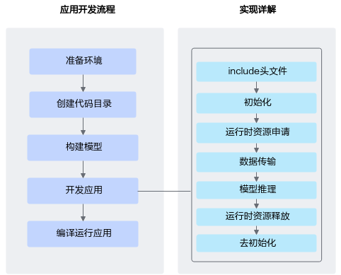

1.  **准备环境**。
2.  **创建代码目录**。

    在开发应用前，您需要先创建目录，存放代码文件、编译脚本、测试图片数据、模型文件等。

    如下仅是示例，供参考：

    ```
    ├App名称
    ├── model                 // 该目录下存放模型文件
    │   ├── xxxxxx               
    
    ├── data
    │   ├── xxx.jpg          // 测试数据
    
    ├── inc                   // 该目录下存放声明函数的头文件
    │   ├── xxx.h               
    
    ├── out                   // 该目录下存放输出结果     
    
    ├── src     
    │   ├── xxx.json         // 系统初始化的配置文件
    │   ├── CMakeLists.txt   // 编译脚本
    │   ├── xxx.cpp          // 实现文件   
    ```

3.  **构建模型**。

    模型推理场景下，必须要有适配昇腾AI处理器的离线模型适配NPU IP加速器的离线模型（\*.om文件），请参见[模型构建](模型构建.md)。

4.  **开发应用**。
    1.  初始化，请参见[初始化与去初始化](初始化与去初始化.md)。

        使用acl接口开发应用时，必须先调用[aclInit](aclInit.md)接口进行初始化，否则可能会导致后续系统内部资源初始化出错，进而导致其它业务异常。

    2.  运行时资源申请，请参见[运行时资源申请与释放](运行时资源申请与释放.md)。
    3.  数据传输，请参见[数据传输](数据传输.md)。
    4.  执行模型推理。请参见[静态Shape输入模型推理](静态Shape输入模型推理.md)。

        若需要处理模型推理的结果，还需要进行数据后处理，例如对于图片分类应用，通过数据后处理从推理结果中查找最大置信度的类别标识。

        模型推理结束后，需及时释放推理相关资源。

    5.  所有数据处理结束后，需及时释放运行时资源，请参见[运行时资源申请与释放](运行时资源申请与释放.md)。
    6.  执行去初始化，请参见[初始化与去初始化](初始化与去初始化.md)。

5.  **编译运行应用**，包括编译代码、运行应用，请参见[应用编译&运行](应用编译-运行.md)。

## 模型构建<a name="ZH-CN_TOPIC_0000002473743698"></a>

推理场景下，对于开源框架的网络模型（如ONNX、TensorFlow等），不能直接在NPU IP加速器上做推理，需要先使用ATC（Ascend Tensor Compiler）工具将开源框架的网络模型转换为适配昇腾AI处理器的离线模型适配NPU IP加速器的离线模型（\*.om文件）。

此处以ONNX框架的ResNet-50网络为例，说明如何使用ATC工具进行模型转换，详细说明请参见《ATC离线模型编译工具用户指南》。

1.  以运行用户登录开发环境。
2.  执行模型转换。

    执行以下命令，将原始模型转换为NPU IP加速器能识别的\*.om模型文件。请注意，执行命令的用户需具有命令中相关路径的可读、可写权限。以下命令中的“_**<SAMPLE\_DIR\>**_”请根据实际样例包的存放目录替换、“_**<soc\_version\>**_”请根据实际NPU IP加速器版本替换。

    ```
    cd <SAMPLE_DIR>/MyFirstApp_ONNX/model
    wget https://obs-9be7.obs.cn-east-2.myhuaweicloud.com/003_Atc_Models/resnet50/resnet50.onnx
    atc --model=resnet50.onnx --framework=5 --output=resnet50 --input_shape="actual_input_1:1,3,224,224"  --soc_version=<soc_version>
    ```

    各参数的解释如下，详细约束说明请参见《ATC离线模型编译工具用户指南》。

    -   --model：ResNet-50网络的模型文件的路径。
    -   --framework：原始框架类型。5表示ONNX。
    -   --output：resnet50.om模型文件的路径。请注意，记录保存该om模型文件的路径，后续开发应用时需要使用。
    -   --input\_shape：模型输入数据的shape。
    -   --soc\_version：NPU IP加速器的版本。

3.  （后续处理）如果想快速体验直接使用转换后的om离线模型文件进行推理，请准备好环境、om模型文件、符合模型输入要求的\*.bin格式的输入数据，单击[Link](https://gitee.com/ascend/tools/tree/master/msame)，获取**msame工具**，参考该工具配套的README，进行体验。

> **说明：** 
>-   如果模型转换时，提示有算子编译相关问题，但根据报错信息无法定位问题、需要联系技术支持时，则需设置DUMP\_GE\_GRAPH、DUMP\_GRAPH\_LEVEL环境变量，再重新转换模型，收集模型转换过程中各个阶段的图描述信息。关于环境变量以及图描述信息的说明，请参见《ATC离线模型编译工具用户指南》中的“参考 \> dump图详细信息”。
>-   如果现有网络不满足您的需求，您可以使用NPU IP加速器支持的算子、调用Ascend Graph接口自行构建自己的网络，再编译成om离线模型文件。详细说明请参见《Ascend Graph开发指南》。

## 静态Shape输入模型推理<a name="ZH-CN_TOPIC_0000002505903687"></a>

本节介绍如何加载模型，为模型执行做准备。
本节结合接口调用流程、示例代码介绍模型执行前需要准备哪些数据、模型执行接口以及模型执行之后需要释放哪些资源。
模型执行结束后，需及时卸载模型，释放模型资源。

### 模型加载<a name="ZH-CN_TOPIC_0000002506023413"></a>

本节介绍如何加载模型，为模型执行做准备。

**接口调用流程<a name="section1726715182567"></a>**

开发应用时，如果涉及整网模型推理，则应用程序中必须包含模型加载的代码逻辑，关于模型加载的接口调用流程，请先参见[接口调用流程](接口调用流程.md)了解整体流程，再查看本节中的流程说明。

AscendCL提供**两套模型加载的接口**，用户可根据编程习惯、使用场景选择对应的模型加载接口：

-   如[图1](#fig10840126123114)所示，针对不同的加载方式（从文件加载、从内存加载等），只需**设置接口中的配置参数**，适用各种加载方式，但涉及**多个接口配合使用**，分别用于创建配置对象、设置对象中的属性值、加载模型。

    **图 1**  模型加载流程（通过接口中的配置参数区分加载方式）<a name="fig10840126123114"></a>  
    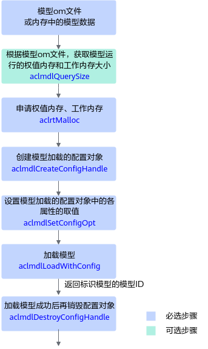

关键接口的说明如下：

-   **在模型加载前**，需要先**构建**出适配昇腾AI处理器的离线模型适配NPU IP加速器的离线模型（**\*.om文件**），构建方式请参见[模型构建](模型构建.md)。
-   当由用户管理内存时，为确保内存不浪费，在申请工作内存、权值内存前，需要调用[aclmdlQuerySize](aclmdlQuerySize.md)接口**查询**模型运行时所需**工作内存**、**权值内存的大小**。

    如果模型输入数据的Shape不确定，则不能调用[aclmdlQuerySize](aclmdlQuerySize.md)接口查询内存大小，在加载模型时，就无法由用户管理内存，因此需选择由系统管理内存的模型加载接口。

    若在构建模型时，调用Ascend Graph接口自行构建自己的网络，且没有生成om离线模型文件、只是将模型数据存放在内存中，则无法通过[aclmdlQuerySize](aclmdlQuerySize.md)接口查询内存大小。关于Ascend Graph接口的详细说明请参见《Ascend Graph开发指南》。

-   支持以下方式**加载模型**，模型加载成功后，返回标识模型的模型ID：
    -   使用[aclmdlSetConfigOpt](aclmdlSetConfigOpt.md)接口、[aclmdlLoadWithConfig](aclmdlLoadWithConfig.md)接口时，是通过配置对象中的属性来区分，在加载模型时是从文件加载，还是从内存加载，以及内存是由系统内部管理，还是由用户管理。

**示例代码<a name="section631016414616"></a>**

模型加载成功，会返回标识模型的ID，在[模型执行](模型执行.md)时需要使用该ID。

此处以从文件加载模型、由用户自行管理内存为例。

调用接口后，需增加异常处理的分支，并记录报错日志、提示日志，此处不一一列举。以下是关键步骤的代码示例，不可以直接拷贝编译运行，仅供参考。

```
// 1.初始化变量。
// 此处的..表示相对路径，相对可执行文件所在的目录
// 例如，编译出来的可执行文件存放在out目录下，此处的..就表示out目录的上一级目录
const char* omModelPath = "../model/resnet50.om";
// ......

// 2.根据模型文件获取模型执行时所需的权值内存大小、工作内存大小。
aclError ret = aclmdlQuerySize(omModelPath, &modelMemSize_, &modelWeightSize_);

// 3.根据工作内存大小，申请Device上模型执行的工作内存。
ret = aclrtMalloc(&modelMemPtr_, modelMemSize_, ACL_MEM_MALLOC_HUGE_FIRST);

// 4.根据权值内存的大小，申请Device上模型执行的权值内存。
ret = aclrtMalloc(&modelWeightPtr_, modelWeightSize_, ACL_MEM_MALLOC_HUGE_FIRST);

// 5.加载离线模型文件，由用户自行管理模型运行的内存(包括权值内存、工作内存)。
// 模型加载成功，返回标识模型的ID。
ret = aclmdlLoadFromFileWithMem(omModelPath, &modelId_, modelMemPtr_, modelMemSize_, modelWeightPtr_, modelWeightSize_);

// ......
```

### 模型执行<a name="ZH-CN_TOPIC_0000002505903595"></a>

本节结合接口调用流程、示例代码介绍模型执行前需要准备哪些数据、模型执行接口以及模型执行之后需要释放哪些资源。

**基本原理<a name="section89771331691"></a>**

开发应用时，如果涉及整网模型推理，则应用程序中必须包含模型执行的代码逻辑，关于模型执行的接口调用流程，请先参见[接口调用流程](接口调用流程.md)了解整体流程，再查看本节中的流程说明。

-   **在模型加载之后，模型执行之前**，需要准备输入、输出数据结构，将输入数据传输到模型输入数据结构的对应内存中。
-   **模型执行结束后**，若无需使用输入数据、aclmdlDesc类型、aclmdlDataset类型、aclDataBuffer类型等相关资源，需及时释放内存、销毁对应的数据类型，防止内存异常。模型可能存在多个输入、多个输出，每个输入/输出的内存地址、内存大小用aclDataBuffer类型的数据来描述，针对每个输入/输出，需调用[aclrtFree](aclrtFree.md)接口释放内存中的数据，再调用[aclDestroyDataBuffer](aclDestroyDataBuffer.md)接口销毁相应的aclDataBuffer类型。

**模型执行流程<a name="section1339116525546"></a>**

**图 1**  基本的模型推理流程<a name="fig16864141224619"></a>  
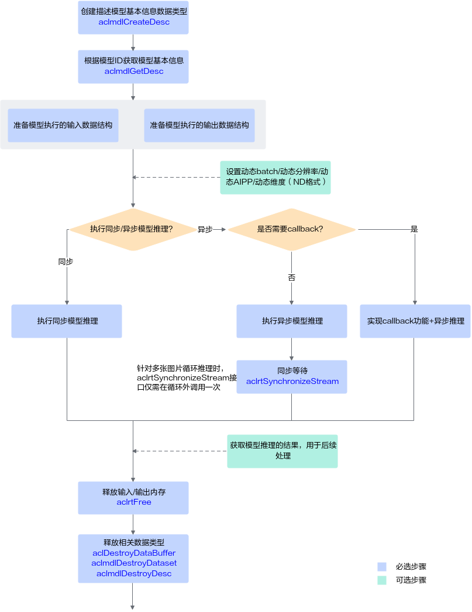

关键接口的说明如下：

1.  调用[aclmdlCreateDesc](aclmdlCreateDesc.md)接口**创建描述模型基本信息**的数据类型。
2.  调用[aclmdlGetDesc](aclmdlGetDesc.md)接口根据[模型加载](模型加载.md)中返回的模型ID**获取模型基本信息**。
3.  **准备模型执行的输入、输出数据结构**，具体流程，请参见[准备模型执行的输入/输出数据结构](#section1620016465510)。
4.  **执行模型推理**。

    对于固定的多Batch场景，需要满足batch size后，才能将输入数据发送给模型进行推理。不满足batch size时，用户需根据自己的实际场景处理。

    当前系统支持模型的同步推理和异步推理：

    -   同步推理

        调用[aclmdlExecuteV2](aclmdlExecuteV2.md)接口执行同步推理。

    -   异步推理

        调用[aclmdlExecuteAsyncV2](aclmdlExecuteAsyncV2.md)接口执行异步推理。

        但对于异步接口，还需调用[aclrtSynchronizeStream](aclrtSynchronizeStream.md)接口阻塞应用程序运行，直到指定Stream中的所有任务都完成。

5.  **获取模型推理的结果**，用于后续处理。
    -   对于同步推理，直接获取模型推理的输出数据即可。
    -   对于异步推理，在实现Callback功能时，在回调函数内获取模型推理的结果，供后续使用。

6.  **释放内存**。

    调用[aclrtFree](aclrtFree.md)接口释放Device上的内存。

7.  **释放相关数据类型的数据**。

    在模型推理结束后，需依次调用[aclDestroyDataBuffer](aclDestroyDataBuffer.md)接口、[aclmdlDestroyDataset](aclmdlDestroyDataset.md)接口及时释放描述模型输入、输出数据类型的数据。如果存在多个输入、输出，需调用多次[aclDestroyDataBuffer](aclDestroyDataBuffer.md)接口。

**准备模型执行的输入/输出数据结构<a name="section1620016465510"></a>**

AscendCL提供了以下数据类型来描述模型、描述其输入输出以及存放数据的内存，在模型执行前，需要构造好这些数据类型，作为模型执行的输入：

-   使用**aclmdlDesc**类型的数据描述模型基本信息（例如输入/输出的个数、名称、数据类型、Format、维度信息等）。

    模型加载成功后，用户可根据模型的ID，调用[aclmdlGetDesc](aclmdlGetDesc.md)接口获取该模型的描述信息，进而从模型的描述信息中获取模型输入/输出的个数、内存大小、维度信息、Format、数据类型等信息，可参见[aclmdlDesc](aclmdlDesc.md)类型下的操作接口。

-   使用**aclmdlDataset**类型的数据描述模型的输入/输出数据，模型可能存在多个输入、多个输出。

    调用[aclmdlDataset](aclmdlDataset.md)类型下的操作接口添加aclDataBuffer类型的数据、获取aclDataBuffer的个数等。

-   每个输入/输出的内存地址、内存大小用**aclDataBuffer**类型的数据来描述。

    调用[aclDataBuffer](aclDataBuffer.md)类型下的操作接口获取内存地址、内存大小等。

    **图 2**  aclmdlDataset类型与aclDataBuffer类型的关系<a name="fig1343654711811"></a>  
    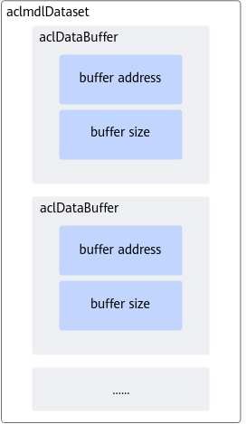

了解相关的数据类型后，可以使用这些数据类型的操作接口准备模型的输入、输出数据结构，如下图所示。

**图 3**  模型执行的输入/输出数据结构的准备流程<a name="fig83115105920"></a>  
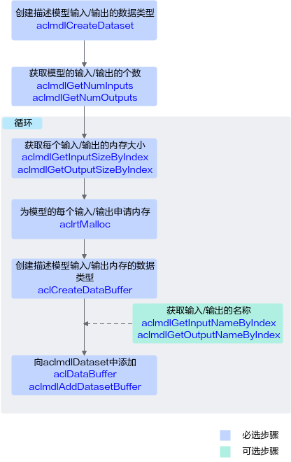

关键说明如下：

-   模型存在多个输入、输出时，用户可调用[aclmdlGetNumInputs](aclmdlGetNumInputs.md)、[aclmdlGetNumOutputs](aclmdlGetNumOutputs.md)接口获取输入、输出的个数。
-   模型每个输入、输出所需的内存大小，用户可调用[aclmdlGetInputSizeByIndex](aclmdlGetInputSizeByIndex.md)、[aclmdlGetOutputSizeByIndex](aclmdlGetOutputSizeByIndex.md)接口获取。

    如果模型的输入涉及动态Batch、动态分辨率、动态维度（ND格式）等特性，输入tensor数据的Shape支持多种档位，在模型执行前才能确定，因此该输入所需的内存大小建议用户调用[aclmdlGetInputSizeByIndex](aclmdlGetInputSizeByIndex.md)接口获取，该接口获取的是最大档位的内存，确保内存够用。

-   模型存在多个输入、输出时，用户在向aclmdlDataset中添加aclDataBuffer时，为避免顺序出错，可以先调用[aclmdlGetInputNameByIndex](aclmdlGetInputNameByIndex.md)、[aclmdlGetOutputNameByIndex](aclmdlGetOutputNameByIndex.md)接口获取输入、输出的名称，根据输入、输出名称所对应的index的顺序添加。

**示例代码<a name="section32041115297"></a>**

此处的示例代码是处理图片分类模型的输出结果，屏显每张图片的top5置信度的类别编号。用户可根据实际需求，自行实现模型推理输出数据的处理逻辑。

调用接口后，需增加异常处理的分支，并记录报错日志、提示日志，此处不一一列举。以下是关键步骤的代码示例，不可以直接拷贝编译运行，仅供参考。

```
// 1 根据模型的ID，获取该模型的描述信息。
// modelDesc_为aclmdlDesc类型。
modelDesc_ = aclmdlCreateDesc();
aclError ret = aclmdlGetDesc(modelDesc_, modelId_);

// 2 准备模型推理的输入数据结构
// (1)申请输入内存
size_t modelInputSize;
void *modelInputBuffer = nullptr;
// 当前示例代码中的模型只有一个输入，所以index为0，如果模型有多个输入，则需要先调用aclmdlGetNumInputs接口获取模型输入的数量
modelInputSize = aclmdlGetInputSizeByIndex(modelDesc_, 0);
ret = aclrtMalloc(&modelInputBuffer, modelInputSize, ACL_MEM_MALLOC_HUGE_FIRST);

// (2)准备模型的输入数据结构
// 创建aclmdlDataset类型的数据，描述模型推理的输入，input_为aclmdlDataset类型
input_ = aclmdlCreateDataset();
aclDataBuffer *inputData = aclCreateDataBuffer(modelInputBuffer, modelInputSize);
ret = aclmdlAddDatasetBuffer(input_, inputData);

// 3 准备模型推理的输出数据结构
// (1)创建aclmdlDataset类型的数据，描述模型推理的输出，output_为aclmdlDataset类型
output_ = aclmdlCreateDataset();

// (2)获取模型的输出个数.
size_t outputSize = aclmdlGetNumOutputs(modelDesc_);

// (3)循环为每个输出申请内存，并将每个输出添加到aclmdlDataset类型的数据中.
for (size_t i = 0; i < outputSize; ++i) {
    size_t buffer_size = aclmdlGetOutputSizeByIndex(modelDesc_, i);
    void *outputBuffer = nullptr;
    ret = aclrtMalloc(&outputBuffer, buffer_size, ACL_MEM_MALLOC_HUGE_FIRST);
    aclDataBuffer* outputData = aclCreateDataBuffer(outputBuffer, buffer_size);   
    ret = aclmdlAddDatasetBuffer(output_, outputData);
    }

// 4 模型执行
string testFile[] = {
        "../data/dog1_1024_683.bin",
        "../data/dog2_1024_683.bin"
    };

for (size_t index = 0; index < sizeof(testFile) / sizeof(testFile[0]); ++index) {
    // 4.1 自定义函数ReadBinFile，调用C++标准库std::ifstream中的函数读取图片文件，输出图片文件占用的内存大小inputBuffSize以及图片文件存放在内存中的地址inputBuff
    void *inputBuff = nullptr;
    uint32_t inputBuffSize = 0;
    auto ret1 = Utils::ReadBinFile(fileName, inputBuff, inputBuffSize);
    
    // 4.2 准备模型推理的输入数据
    // 在申请运行时资源时调用aclrtGetRunMode接口获取软件栈的运行模式
    // 如果运行模式为ACL_DEVICE，则g_isDevice参数值为true，表示软件栈运行在Device侧，无需传输图片数据或在Device内传输数据 ；否则，需要调用内存复制接口将数据传输到Device
    if (!g_isDevice) {
        // if app is running in host, need copy data from host to device
        // modelInputBuffer、modelInputSize分别表示模型推理输入数据的内存地址、内存大小，在输入/输出数据结构准备时申请该内存
        ret = aclrtMemcpy(modelInputBuffer, modelInputSize, inputBuff, inputBuffSize, ACL_MEMCPY_HOST_TO_DEVICE);
        (void)aclrtFreeHost(inputBuff);
    } else { // app is running in device
        ret = aclrtMemcpy(modelInputBuffer, modelInputSize, inputBuff, inputBuffSize, ACL_MEMCPY_DEVICE_TO_DEVICE);
        (void)aclrtFree(inputBuff);
    }

    // 4.3 执行模型推理
    // modelId_表示模型ID，在模型加载成功后，会返回标识模型的ID
    // input_、output_分别表示模型推理的输入、输出数据，在准备模型推理的输入、输出数据结构时已定义
    ret = aclmdlExecute(modelId_, input_, output_);
        

    // 处理模型推理的输出数据，输出top5置信度的类别编号 
    // output_表示模型执行的输出
    for (size_t i = 0; i < aclmdlGetDatasetNumBuffers(output_); ++i) {
    // 获取每个输出的内存地址和内存大小
        aclDataBuffer* dataBuffer = aclmdlGetDatasetBuffer(output_, i);
        void* data = aclGetDataBufferAddr(dataBuffer);

        size_t len = aclGetDataBufferSizeV2(dataBuffer);

        // 将内存中的数据转换为float类型
        float *outData = NULL;
        outData = reinterpret_cast<float*>(data);
        
        // 屏显每张图片的top5置信度的类别编号
        map<float, int, greater<float> > resultMap;
        for (int j = 0; j < len / sizeof(float); ++j) {
            resultMap[*outData] = j;
            outData++;
        }
        int cnt = 0;
        for (auto it = resultMap.begin(); it != resultMap.end(); ++it) {
            // print top 5
            if (++cnt > 5) {
                break;
            }

            INFO_LOG("top %d: index[%d] value[%lf]", cnt, it->second, it->first);
        }
    }
}

// 5 释放模型推理的输入、输出资源
// 释放输入资源，包括数据结构和内存
for (size_t i = 0; i < aclmdlGetDatasetNumBuffers(input_); ++i) {
        aclDataBuffer *dataBuffer = aclmdlGetDatasetBuffer(input_, i);
        (void)aclDestroyDataBuffer(dataBuffer);
}
(void)aclmdlDestroyDataset(input_);
input_ = nullptr;
aclrtFree(modelInputBuffer);

// 释放输出资源，包括数据结构和内存
for (size_t i = 0; i < aclmdlGetDatasetNumBuffers(output_); ++i) {
    aclDataBuffer* dataBuffer = aclmdlGetDatasetBuffer(output_, i);
    void* data = aclGetDataBufferAddr(dataBuffer);
    (void)aclrtFree(data);
    (void)aclDestroyDataBuffer(dataBuffer);
}

(void)aclmdlDestroyDataset(output_);
output_ = nullptr;
```

在构建模型时，若batchSize≥2（通过ATC工具的input\_shape参数设置），在推理前，需要编写一段代码，实现逻辑为：等输入数据满足batchSize（例如：batchSize=8）的要求，申请Device上的内存存放batchSize=8的数据，作为模型推理的输入。如果最后循环遍历所有的输入数据后，仍不满足batchSize 的要求，则直接将剩余数据作为模型推理的输入。

此处的示例代码以batchSize=8为例：

```
uint32_t batchSize = 8;
uint32_t deviceNum = 1;
uint32_t deviceId = 0;

// 获取模型第一个输入的大小
uint32_t modelInputSize = aclmdlGetInputSizeByIndex(modelDesc, 0);
// 获取每个Batch输入数据的大小
uint32_t singleBuffSize = modelInputSize / batchSize;

// 定义该变量，用于累加batch size是否达到8 Batch
uint32_t cnt = 0;
// 定义该变量，用于描述每个文件读入内存时的位置偏移
uint32_t pos = 0;

void* p_batchDst = NULL;
std::vector<std::string>inferFile_vec;

for (int i = 0; i < files.size(); ++i) 
        {
            // 每8个文件，申请一次Device上的内存，存放8 Batch的输入数据 
            if (cnt % batchSize == 0)
            {
                pos = 0;
                inferFile_vec.clear();
                // 申请Device上的内存
                aclrtMalloc(&p_batchDst, modelInputSize, ACL_MEM_MALLOC_HUGE_FIRST);
            }

            // TODO: 从某个目录下读入文件，计算文件大小fileSize
            
            // 根据文件大小，申请内存，存放文件数据
            aclrtMallocHost(&p_imgBuf, fileSize);

            // 将数据传输到Device的内存
            aclrtMemcpy((uint8_t *)p_batchDst + pos, fileSize, p_imgBuf, fileSize, ACL_MEMCPY_HOST_TO_DEVICE);
            pos += fileSize;
            // 及时释放不使用的内存
            aclrtFreeHost(p_imgBuf);

            // 将第i个文件存入vector中，同时cnt+1
            inferFile_vec.push_back(files[i]);
            cnt++;

            // 每8 Batch的输入数据送给模型进行推理
            if (cnt % batchSize == 0)
            {
                // TODO: 创建aclmdlDataset、aclDataBuffer类型的数据，用于描述模型的输入、输出数据
                // TODO: 调用aclmdlExecute接口执行模型推理
                // TODO: 推理结束后，调用aclrtFree接口释放Device上的内存
            }
        }

// 如果最后循环遍历所有的输入数据后，仍不满足多Batch的要求，则直接将剩余数据作为模型推理的输入。
if (cnt % batchSize != 0)
    {
            // TODO: 创建aclmdlDataset、aclDataBuffer类型的数据，用于描述模型的输入、输出数据
            // TODO: 调用aclmdlExecute接口执行模型推理
            // TODO: 推理结束后，调用aclrtFree接口释放Device上的内存
    }
```

### 模型卸载<a name="ZH-CN_TOPIC_0000002506023481"></a>

模型执行结束后，需及时卸载模型，释放模型资源。

关于模型卸载的接口调用流程，请先参见[接口调用流程](接口调用流程.md)了解整体流程，再查看本节中的流程说明。

**基本原理<a name="section1954581412191"></a>**

在模型推理结束后，还需要通过[aclmdlUnload](aclmdlUnload.md)接口卸载模型，并销毁aclmdlDesc类型的模型描述信息、释放模型运行的工作内存和权值内存。

**示例代码<a name="section57821684202"></a>**

```
// 1. 卸载模型
aclError ret = aclmdlUnload(modelId_);

// 2. 释放模型描述信息
if (modelDesc_ != nullptr) {
    (void)aclmdlDestroyDesc(modelDesc_);
    modelDesc_ = nullptr;
}

// 3. 释放模型运行的工作内存
if (modelWorkPtr_ != nullptr) {
    (void)aclrtFree(modelWorkPtr_);
    modelWorkPtr_ = nullptr;
    modelWorkSize_ = 0;
}

// 4. 释放模型运行的权值内存
if (modelWeightPtr_ != nullptr) {
    (void)aclrtFree(modelWeightPtr_);
    modelWeightPtr_ = nullptr;
    modelWeightSize_ = 0;
}
```

## 多模型串联推理<a name="ZH-CN_TOPIC_0000002473743514"></a>

多模型推理的基本流程与单模型类似，请参见[静态Shape输入模型推理](静态Shape输入模型推理.md)。

多模型推理与单模型推理在acl接口使用上的不同点如下：

-   关于模型加载，如果涉及多个模型，需调用多次模型加载接口。模型加载请参见[模型加载](模型加载.md)。
-   关于模型执行，如果涉及多个模型，需调用多次模型执行接口。模型执行请参见[模型执行](模型执行.md)。

    例如，调用[aclmdlExecuteV2](aclmdlExecuteV2.md)接口实现同步模型推理。

# 更多特性<a name="ZH-CN_TOPIC_0000002506023623"></a>

用户通过内存管理接口申请内存后，若需二次分配管理，需关注各内存接口的约束，防止出现内存越界。

## 内存二次分配管理<a name="ZH-CN_TOPIC_0000002473903598"></a>

用户通过内存管理接口申请内存后，若需二次分配管理，需关注各内存接口的约束，防止出现内存越界。

用户内存管理有两种管理方式：

-   独立内存管理，根据需要单独申请所需的内存，内存不做拆分或者二次分配。
-   内存池管理内存，用户一次性申请一块较大内存，并在使用时从这块较大内存中二次分配所需内存。

在内存二次分配时，使用如下接口从内存池申请对应内存，由于接口对申请的内存地址、大小有约束，在内存池管理时，需要关注，否则容易出现内存越界。

内存管理的总体说明请参见[总体说明](总体说明.md)。

<a name="table18224715112"></a>
<table><thead align="left"><tr id="row622117165113"><th class="cellrowborder" valign="top" width="30%" id="mcps1.1.4.1.1"><p id="p1022273518"><a name="p1022273518"></a><a name="p1022273518"></a>接口</p>
</th>
<th class="cellrowborder" valign="top" width="20%" id="mcps1.1.4.1.2"><p id="p10221676517"><a name="p10221676517"></a><a name="p10221676517"></a>用途</p>
</th>
<th class="cellrowborder" valign="top" width="50%" id="mcps1.1.4.1.3"><p id="p72210712512"><a name="p72210712512"></a><a name="p72210712512"></a>输入内存/输出内存</p>
</th>
</tr>
</thead>
<tbody><tr id="row1522578513"><td class="cellrowborder" valign="top" width="30%" headers="mcps1.1.4.1.1 "><p id="p1022879519"><a name="p1022879519"></a><a name="p1022879519"></a><a href="aclrtMalloc.md">aclrtMalloc</a></p>
</td>
<td class="cellrowborder" valign="top" width="20%" headers="mcps1.1.4.1.2 "><p id="p115271115151711"><a name="p115271115151711"></a><a name="p115271115151711"></a>在Device上分配size大小的线性内存，并通过*devPtr返回已分配内存的指针。本接口分配的内存会进行字节对齐，会对用户申请的size向上对齐成32字节整数倍后再多加32字节。</p>
</td>
<td class="cellrowborder" valign="top" width="50%" headers="mcps1.1.4.1.3 "><a name="ul1147072701012"></a><a name="ul1147072701012"></a><ul id="ul1147072701012"><li>若用户需申请大块内存并自行划分、管理内存时，建议使用aclrtMallocAlign32接口，该接口相比aclrtMalloc接口，只会对用户申请的size向上对齐成32字节整数倍，不会再多加32字节。<p id="zh-cn_topic_0000002473741904_p134461122172219"><a name="zh-cn_topic_0000002473741904_p134461122172219"></a><a name="zh-cn_topic_0000002473741904_p134461122172219"></a>不管是aclrtMalloc接口，还是aclrtMallocAlign32接口，若用户使用本接口申请大块内存并自行划分、管理内存时，每段内存需同时满足以下需求：</p>
<a name="zh-cn_topic_0000002473741904_ul244662213229"></a><a name="zh-cn_topic_0000002473741904_ul244662213229"></a><ul id="zh-cn_topic_0000002473741904_ul244662213229"><li>内存大小向上对齐成32整数倍+32字节（m=ALIGN_UP[len,32]+32字节）；</li><li>内存起始地址需满足64字节对齐（ALIGN_UP[m,64]）。</li></ul>
<div class="note" id="zh-cn_topic_0000002473741904_note54466224226"><a name="zh-cn_topic_0000002473741904_note54466224226"></a><a name="zh-cn_topic_0000002473741904_note54466224226"></a><span class="notetitle"> 说明： </span><div class="notebody"><p id="zh-cn_topic_0000002473741904_p244619229220"><a name="zh-cn_topic_0000002473741904_p244619229220"></a><a name="zh-cn_topic_0000002473741904_p244619229220"></a>len表示某段内存的大小，ALIGN_UP[len,k]表示向上按k字节对齐：((len-1)/k+1)*k。</p>
</div></div>
</li></ul>
</td>
</tr>
</tbody>
</table>

## 溢出算子数据采集及分析<a name="ZH-CN_TOPIC_0000002473743706"></a>

**前提条件<a name="section290223194712"></a>**

使用ATC工具转换模型时，需在转换命令中增加--status\_check参数，并将参数值设置为1，表示在编译算子时添加溢出检测逻辑。

关于ATC工具及其参数的详细说明，请参见《ATC离线模型编译工具用户指南》。

**采集溢出算子信息<a name="section68111254174116"></a>**

在调用[aclInit](aclInit.md)接口初始化时，在json配置文件中增加溢出算子Dump配置。

json配置文件中的示例内容如下，示例中的dump\_path以相对路径为例：

```
{
    "dump":{
        "dump_path":"output",
        "dump_debug":"on"
    }
}
```

当dump\_path配置为相对路径时，您可以在“应用可执行文件的目录/\{dump\_path\}”下查看导出的数据文件，针对每个溢出算子，会导出两个数据文件：

-   溢出算子的dump文件（文件名以\{op\_type\}开头），您可以解析该文件后获取具体出现溢出错误的算子。
-   算子溢出数据文件（文件名以Opdebug开头），您可以解析该文件后获取溢出相关信息，包括溢出算子所在的模型、AICore的status寄存器状态等。

以上两类文件的解析请参见《精度调试工具用户指南》中的“扩展功能 \> 溢出算子数据采集与解析”章节。

# 应用编译&运行<a name="ZH-CN_TOPIC_0000002473743640"></a>

完成程序代码编写后，可按照本节中的指导编译程序、执行应用。

**问题定位<a name="section14289151213513"></a>**

运行应用时如果出错，您可以获取日志文件，以便查看日志文件中详细报错。根据报错初步定位后：

-   如果是接口约束导致接口调用逻辑不对，需查看总体的[使用约束](使用约束.md)以及各接口本身的约束，再调整接口调用逻辑。

# 精度/性能优化<a name="ZH-CN_TOPIC_0000002505903663"></a>


## 调优简介<a name="ZH-CN_TOPIC_0000002505903479"></a>

本章重点介绍推理应用的精度、性能调优，由于是调优，因此在调优前，请确保已经完成了整网推理功能调测，功能不阻塞，只是推理精度错误、推理精度与标杆数据存在少量差距、模型推理性能不符合预期或待提升等问题。

-   **应用的精度问题**可能由于推理功能与其它功能之间的串接问题、整网中算子本身的精度问题等，可参考本章中的建议排查功能串接时的接口参数配置问题、借助工具获取详细数据定位分析问题。
-   **应用的性能问题**可能由于模型在NPU IP加速器上的算子适配或数据读写问题、DVPP接口使用问题等，可参考本章中的建议排查接口使用问题、借助工具优化模型、借助工具获取详细数据定位分析问题。

## 模型推理精度提升建议<a name="ZH-CN_TOPIC_0000002506023433"></a>


### 精度提升简介<a name="ZH-CN_TOPIC_0000002473743492"></a>

本文介绍整网推理场景下的精度调优流程、相关配置及典型案例等。由于是调优，因此在调优前，请确保已经完成了整网推理功能调测，功能不阻塞，只是推理精度错误，或推理精度与标杆数据存在少量差距。

在整网推理时，可能由于以下原因导致推理精度错误或者推理精度不达标：

-   整网中算子本身的精度问题，该类问题可以借助精度比对工具，根据下文中具体的问题定位流程获取各类数据后，再进行比对、分析，确认是配置问题，还是算子实现问题，再逐一解决问题。本文中会结合具体的比对、分析的案例，介绍如何比对、分析。

**图 1**  推理精度问题<a name="fig21311050164216"></a>  
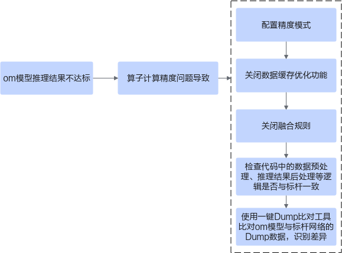

> **说明：** 
>本文中的“推理”，当前限定为使用om离线模型文件进行推理的场景。

### 算子精度导致推理结果不达标<a name="ZH-CN_TOPIC_0000002473903584"></a>


#### 问题描述<a name="ZH-CN_TOPIC_0000002505903549"></a>

推理结果不达标，包括以下两种情况：

-   算子精度导致推理结果错误，是指整网推理的功能已调通，但推理结果错误，例如目标检测网络MAP结果全0、om模型的推理结果与标杆网络的推理结果比对时余弦相似度为0。
-   算子精度导致推理精度不达标，是指整网推理的功能已调通，单次om模型的推理结果与标杆网络的推理结果比对时余弦相似度在95%以上，但数据集推理精度与标杆数据存在少量差距，例如：
    -   分类网络om模型，Top1/Top5分别为：0.90/0.70,；标杆网络Top1/Top5分别为：0.92/0.71。
    -   检测网络om模型MAP精度：0.54；标杆网络MAP精度：0.55。

#### 问题定位流程<a name="ZH-CN_TOPIC_0000002473903474"></a>

**图 1**  定位流程<a name="fig7715115914366"></a>  
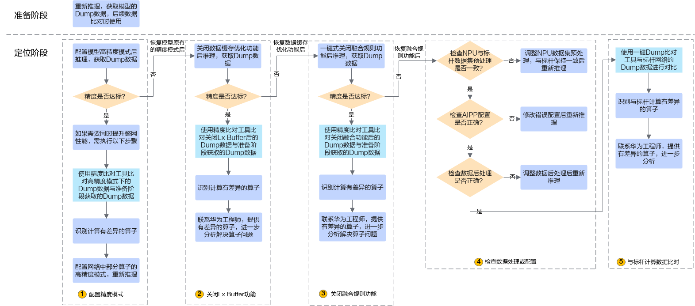

1.  <a name="li1678610773511"></a>推理结果错误，为了后续定位问题，需要重新执行推理，用于获取模型的Dump数据。

    获取模型的Dump数据，需要调用acl接口打开Dump开关，详细描述请参见《精度调试工具用户指南》。

2.  配置精度模式。
    1.  配置模型高精度模式后推理，获取模型的Dump数据。推理后，如果精度达标，则进行步骤[2.b](#li108141712131710)；如果精度不达标，则进行步骤[3](#li34501246181412)。

        配置模型高精度模式后推理，可能会影响推理性能，如果在精度达标的同时，需要保持性能，则执行[2.b](#li108141712131710)\~[2.d](#li5846847198)，配置部分算子保持原始网络中的数据类型。

        配置模型高精度模式，请参见[配置网络模型的高精度模式](配置精度模式.md#section288561634411)。

    2.  <a name="li108141712131710"></a>使用精度比对工具比对高精度模式下的Dump数据与[1](#li1678610773511)获取的Dump数据。

        工具的使用请参见《精度调试工具用户指南》。

    3.  根据[2.b](#li108141712131710)中的比对结果识别计算有差异的算子。

        一般来说，每次识别一个差异算子（首个余弦相似度较低的算子，例如低于0.95），找到差异算子后，执行[2.d](#li5846847198)推理，推理的同时获取Dump数据，用来与高精度模式下的Dump数据比对，继续找到下一个差异算子。

        需要循环执行该步骤，直至没有差异算子。

    4.  <a name="li5846847198"></a>对于有差异的算子，配置该部分算子保持原始网络中的数据类型，再重新推理。

        配置部分算子的高精度模式，请参见[配置部分算子保持原始网络中的数据类型](配置精度模式.md#section1692005315415)。

3.  <a name="li34501246181412"></a>关闭数据缓存优化功能。
    1.  恢复模型的原有精度模式后，关闭数据缓存优化功能后推理，如果精度达标，则进行步骤[3.b](#li168541437153611)；如果精度不达标，则进行步骤[4](#li2215195581410)。

        当前默认开启数据缓存优化，开启数据缓存优化可提高计算效率、提升性能，但由于部分算子在实现上可能存在未考虑的场景，导致影响精度，因此在出现精度问题时可以尝试关闭数据缓存优化。如果关闭数据缓存优化功能后，精度达标，则还是需要识别出问题算子，再联系技术支持进一步分析、解决算子问题，解决算子问题后，建议保持开启数据缓存优化。

        关闭数据缓存优化功能，请参见[关闭数据缓存优化](关闭数据缓存优化.md)。

    2.  <a name="li168541437153611"></a>使用精度比对工具比对关闭数据缓存优化功能后的Dump数据与[1](#li1678610773511)获取的Dump数据。

        工具的使用请参见《精度调试工具用户指南》。

    3.  根据[3.b](#li168541437153611)中的比对结果识别计算有差异的算子。
    4.  联系技术支持，提供有差异的算子，进一步分析。

4.  <a name="li2215195581410"></a>关闭融合规则功能。
    1.  恢复启用数据缓存优化功能，关闭融合规则功能后推理，如果精度达标，则进行步骤[4.b](#li1649922517388)；如果精度不达标，则进行步骤[5](#li295816232513)。

        当前默认开启融合规则，开启融合规则可提高计算效率、提升性能，但算子之间可能会融合，融合后的部分算子在实现上可能存在未考虑的场景，导致影响精度，因此在出现精度问题时可以尝试关闭融合规则。如果关闭融合规则功能后，精度达标，则还是需要识别出问题算子，反馈给技术支持进一步分析、解决算子问题，解决算子问题后，建议保持开启融合规则功能。

        关闭融合规则功能，请参见[关闭融合规则](关闭融合规则.md)。关闭某些融合规则可能会导致功能问题，因此在配置关闭融合规则后，系统在不影响功能的前提下关闭部分融合规则，而不是全部融合规则。

    2.  <a name="li1649922517388"></a>使用精度比对工具比对关闭融合规则后的Dump数据与[1](#li1678610773511)获取的Dump数据。

        工具的使用请参见《精度调试工具用户指南》。

    3.  根据[4.b](#li1649922517388)中的比对结果识别计算有差异的算子。
    4.  联系技术支持，提供有差异的算子，进一步分析。

5.  <a name="li295816232513"></a>检查数据处理或配置。

    推理精度不达标可能是由于数据集、AIPP、后处理方式的差异导致，需逐步进行排查，恢复启用融合规则功能后，请检查数据处理或配置，参见[检查数据处理或配置](检查数据处理或配置.md)。

    如果数据处理逻辑或数据配置有问题，则需修改后重新推理；如果数据处理逻辑或数据配置没有问题，则进行[6](#li137456817157)。

6.  <a name="li137456817157"></a>与标杆计算数据比对。
    1.  <a name="li834517172188"></a>使用精度比对工具将模型的Dump数据与标杆网络的Dump数据进行对比。

        工具的使用请参见《精度调试工具用户指南》

    2.  根据[6.a](#li834517172188)中的比对结果识别计算有差异的算子。
    3.  联系技术支持，提供有差异的算子，进一步分析。

#### 配置精度模式<a name="ZH-CN_TOPIC_0000002506023405"></a>

如果在模式转换时不指定网络模型或算子的精度模式，默认采用fp16（float16）数据类型进行计算。

配置模型高精度模式后推理，可提升精度，但可能会影响推理性能，如果在精度达标的同时，需要保持性能，则可以配置部分算子保持原始网络中的数据类型。

**配置网络模型的高精度模式<a name="section288561634411"></a>**

1.  使用ATC工具转换模型时，增加高级参数--precision\_mode，用于指定精度模式。

    参数设置如下所示，表示如果网络模型中算子支持fp32（float32），则使用fp32；如果网络模型中算子不支持fp32，则使用fp16（float16）。

    ```
    --precision_mode=allow_fp32_to_fp16
    ```

    关于该参数的详细说明请参见《ATC离线模型编译工具用户指南》中的“参数说明 \> 高级功能参数 \> 算子调优选项 \> --precision\_mode”。

2.  使用转换后的om模型重新推理。

**配置部分算子保持原始网络中的数据类型<a name="section1692005315415"></a>**

1.  使用ATC工具转换模型时，增加高级参数--keep\_dtype（指定部分算子计算时保持原始网络的数据类型）和--precision\_mode（指定网络模型的精度模式）。

    参数使用示例如下：

    ```
    --keep_dtype=$HOME/exceptionlist.cfg --precision_mode=force_fp16
    ```

    配置文件名举例为_exceptionlist.cfg_，配置文件样例如下，文件中每一行是一个算子的名称，将配置好的_exceptionlist.cfg_文件上传到ATC工具所在服务器任意目录：

    ```
    Opname1 
    Opname2 
    …
    ```

    关于该参数的详细说明请参见《ATC离线模型编译工具用户指南》中的“参数说明 \> 高级功能参数 \> 算子调优选项 \> --keep\_dtype”。

2.  使用转换后的om模型重新推理。

#### 关闭数据缓存优化<a name="ZH-CN_TOPIC_0000002473743490"></a>

如果在模型转换时不指定关闭数据缓存优化功能，当前默认开启数据缓存优化，开启数据缓存优化可提高计算效率、提升性能，但由于部分算子在实现上可能存在未考虑的场景，导致影响精度，因此在出现精度问题时可以尝试关闭数据缓存优化。

如果关闭数据缓存优化功能后，精度达标，则还是需要识别出问题算子，反馈给技术支持进一步分析、解决算子问题，解决算子问题后，建议保持开启数据缓存优化。

1.  使用ATC工具转换模型时，增加高级参数：--buffer\_optimize，用于关闭数据缓存优化。

    参数设置如下所示，：

    ```
    --buffer_optimize=off_optimize
    ```

    关于该参数的详细说明请参见《ATC离线模型编译工具用户指南》中的“参数说明 \> 高级功能参数 \> 模型调优选项 \> --buffer\_optimize”。

2.  使用转换后的om模型重新推理。

> **说明：** 
>在联系技术支持前，设置DUMP\_GE\_GRAPH、DUMP\_GRAPH\_LEVEL环境变量，重新模型转换，打印模型转换过程中各个阶段的图描述信息。关于环境变量以及图描述信息的说明，请参见《ATC离线模型编译工具用户指南》中的“参考\>dump图详细信息”。

#### 关闭融合规则<a name="ZH-CN_TOPIC_0000002473743736"></a>

如果在模型转换时不指定关闭融合规则，当前默认开启融合规则，开启融合规则可提高计算效率、提升性能，但算子之间可能会融合，融合后的部分算子在实现上可能存在未考虑的场景，导致影响精度，因此在出现精度问题时可以尝试关闭融合规则。

如果关闭融合规则功能后，精度达标，则还是需要识别出问题算子，反馈给技术支持进一步分析、解决算子问题，解决算子问题后，建议保持开启融合规则功能。

1.  使用ATC工具转换模型时，增加高级参数：--fusion\_switch\_file

    参数使用示例如下：

    ```
    --fusion_switch_file=$HOME/module/fusion_switch.cfg
    ```

    配置文件名举例为_fusion\_switch.cfg_，配置文件样例如下，将配置好的_fusion\_switch.cfg_文件上传到ATC工具所在服务器任意目录：

    ```
    {
        "Switch":{
            "GraphFusion":{
                "ALL":"off"
            },
            "UBFusion":{
                "ALL":"off"
             }
        }
    }
    ```

    关于该参数的详细说明请参见《ATC离线模型编译工具用户指南》中的“参数说明 \> 高级功能参数 \> 模型调优选项 \> --fusion\_switch\_file”。

2.  使用转换后的om模型重新推理。

> **说明：** 
>在联系技术支持前，设置DUMP\_GE\_GRAPH、DUMP\_GRAPH\_LEVEL环境变量，重新模型转换，打印模型转换过程中各个阶段的图描述信息。关于环境变量以及图描述信息的说明，请参见《ATC离线模型编译工具用户指南》中的“参考 \> dump图详细信息”。

#### 检查数据处理或配置<a name="ZH-CN_TOPIC_0000002473743634"></a>

1.  检查om模型与标杆网络推理的输入数据以及输入数据的处理是否一致，如果不一致，需调整成一致。
2.  检查AIPP配置。

    AIPP（Artificial Intelligence Pre-Processing），用于在AI Core上完成图像预处理，包括改变图像尺寸、色域转换（转换图像格式）、减均值/乘系数（改变图像像素），数据处理之后再进行真正的模型推理。

    如果AIPP配置错误可能导致模型推理的输入数据不准确，需要参见《ATC离线模型编译工具用户指南》中的“高级功能 \> AIPP使能”章节检查AIPP配置，如有不正确的AIPP配置，修改正确后，重新转换模型，再重新推理。

3.  检查om模型与标杆网络推理结果的后处理方式是否一致，如果不一致，需调整成一致。

#### 案例介绍<a name="ZH-CN_TOPIC_0000002506023507"></a>

**案例描述<a name="section1640411463342"></a>**

FastRCNN网络，模型转换时，保持默认高性能模式、force\_fp16精度模式，推理出来的精度错误，MAP结果为0。

然后，在模型转换时，设置模型的高精度模式（precision\_mode=allow\_fp32\_to\_fp16），推理出来的精度正确。

**案例分析<a name="section7561121133819"></a>**

1.  <a name="li15265112910350"></a>模型转换时保持默认高性能模式、force\_fp16精度模式，进行推理，获取该模式下的Dump数据文件。
2.  <a name="li19179193133614"></a>再次模型转换，设置模型的高精度模式（precision\_mode=allow\_fp32\_to\_fp16），再次进行推理，获取该模式下的Dump数据文件。
3.  使用精度比对工具，比对[1](#li15265112910350)与[2](#li19179193133614)中的Dump数据。

    比对结果示例如下：

    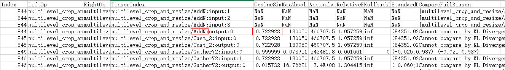

4.  从图中可以看CosineSimilarity这一列，余弦相似度算法比对出来的结果，范围是\[-1,1\]，比对的结果如果越接近1，表示两者的值越相近，越接近-1意味着两者的值越相反。对于大部分算子，值低于0.95就说明存在精度问题。

    上图中AddN算子第0个输出的余弦相似度只有0.72，说明这个算子可能存在精度问题，因此需要进一步分析该算子在高精度模式下的第0个输出的Dump数据文件（[2](#li19179193133614)中获取的Dump数据文件）。

5.  <a name="li3131552105917"></a>由于Dump数据文件无法通过文本工具直接查阅，因此在分析该Dump数据文件前，请参考《精度调试工具用户指南》的“扩展功能 \> 查看dump数据文件”章节，先将dump数据文件转换为numpy格式，再将numpy格式文件转换为txt格式文件。

    在将numpy格式文件为txt格式文件的过程中，可以获取AddN算子第0个输出的最大值、最小值，命令示例如下（**\*\*\*\*_.npy_**表示numpy格式文件的路径）：

    ```
    $ python3
    Python 3 (default, Mar  5 2020, 16:07:54)[GCC 5.4.0 20160609] on linuxType ....
    >>> import numpy as np
    >>> a = np.load("****.npy")
    >>> a.max()
    >>> 109508.0
    >>> a.min()
    >>> 70683.0
    ```

6.  从[5](#li3131552105917)获取到的AddN算子第0个输出的最大值、最小值，可以看出高精度模式下AddN算子输出tensor的最大值为109508.0，而高性能模式（fp16）下，输出tensor的最大值为65504.0（FP16能表达的最大值域范围为（-65505\~65504）），由此可以得出高精度模式下AddN算子的输出值大于fp16类型域表达范围，因此需要配置该算子走高精度模式，参见[配置部分算子保持原始网络中的数据类型](配置精度模式.md#section1692005315415)。

# acl API参考<a name="ZH-CN_TOPIC_0000002505903639"></a>


本节介绍接口分类以及调用接口时依赖的头文件和库文件。


## 废弃接口/返回码列表<a name="ZH-CN_TOPIC_0000002473901520"></a>

**接口<a name="section189061436195719"></a>**

-   [aclGetDataBufferSize](aclGetDataBufferSize（废弃）.md)接口

    此接口后续版本会废弃，请使用[aclGetDataBufferSizeV2](aclGetDataBufferSizeV2.md)接口。

**返回码<a name="section148491941155714"></a>**

-   [ACL\_ERROR\_NONE](aclError.md#table1323834101720)返回码

    此返回码后续版本会废弃，请使用[ACL\_SUCCESS](aclError.md#table1323834101720)返回码。

-   [ACL\_ERROR\_NOT\_STATIC\_AIPP](aclError.md#table1323834101720)

    此返回码后续版本会废弃，请使用[ACL\_ERROR\_GE\_AIPP\_NOT\_EXIST](aclError.md#table153902340461)返回码。

-   [ACL\_ERROR\_STREAM\_NOT\_SUBSCRIBE](aclError.md#table1323834101720)

    此返回码后续版本会废弃，请使用[ACL\_ERROR\_RT\_STREAM\_NO\_CB\_REG](aclError.md#table1089051917356)返回码。

-   [ACL\_ERROR\_THREAD\_NOT\_SUBSCRIBE](aclError.md#table1323834101720)

    此返回码后续版本会废弃，请使用[ACL\_ERROR\_RT\_THREAD\_SUBSCRIBE](aclError.md#table1089051917356)返回码。

-   [ACL\_ERROR\_WAIT\_CALLBACK\_TIMEOUT](aclError.md#table1323834101720)

    此返回码后续版本会废弃，请使用[ACL\_ERROR\_RT\_REPORT\_TIMEOUT](aclError.md#table1089051917356)返回码。

-   [ACL\_ERROR\_INVALID\_DEVICE](aclError.md#table1323834101720)

    此返回码后续版本会废弃，请使用[ACL\_ERROR\_RT\_INVALID\_DEVICEID](aclError.md#table1089051917356)返回码。

-   [ACL\_ERROR\_GROUP\_NOT\_SET](aclError.md#table1323834101720)

    此返回码后续版本会废弃，请使用[ACL\_ERROR\_RT\_GROUP\_NOT\_SET](aclError.md#table1089051917356)返回码。

-   [ACL\_ERROR\_GROUP\_NOT\_CREATE](aclError.md#table1323834101720)

    此返回码后续版本会废弃，请使用[ACL\_ERROR\_RT\_GROUP\_NOT\_CREATE](aclError.md#table1089051917356)返回码。

## 同步&异步API说明<a name="ZH-CN_TOPIC_0000002473741670"></a>

CANN支持以下几类显式同步，调用此类接口后，主机线程会阻塞直到相关的任务执行完成。

-   **流同步：例如aclrtSynchronizeStream**

    阻塞当前主机线程直到指定的Stream中完成所有下发的任务。

**对于异步接口**，主机线程调用异步接口后仅代表下发任务，在任务未完成前，异步接口已向主机线程返回成功。用户需要调用上面的显式同步接口阻塞主机线程，等待任务完成，否则可能会导致训练或推理等业务异常、Device断链掉卡等未知情况。

## 头文件和库文件说明<a name="ZH-CN_TOPIC_0000002505901269"></a>

本节介绍接口分类以及调用接口时依赖的头文件和库文件。

**接口分类<a name="zh-cn_topic_0000002506023529_section1653172113319"></a>**

接口名以acl作为前缀，命名风格为：acl+_接口类别缩写_+_操作动词_+_对象_，其中操作动词和对象均采用首字母大写。下文为了描述方便，将本文中的接口统称为acl接口。

**表 1**  接口类别列表

<a name="zh-cn_topic_0000002506023529_table178173343515"></a>
<table><thead align="left"><tr id="zh-cn_topic_0000002506023529_row1987915333355"><th class="cellrowborder" valign="top" width="26.900000000000002%" id="mcps1.2.3.1.1"><p id="zh-cn_topic_0000002506023529_p20879333193513"><a name="zh-cn_topic_0000002506023529_p20879333193513"></a><a name="zh-cn_topic_0000002506023529_p20879333193513"></a>接口名前缀</p>
</th>
<th class="cellrowborder" valign="top" width="73.1%" id="mcps1.2.3.1.2"><p id="zh-cn_topic_0000002506023529_p488043315355"><a name="zh-cn_topic_0000002506023529_p488043315355"></a><a name="zh-cn_topic_0000002506023529_p488043315355"></a>描述</p>
</th>
</tr>
</thead>
<tbody><tr id="zh-cn_topic_0000002506023529_row1168614527353"><td class="cellrowborder" valign="top" width="26.900000000000002%" headers="mcps1.2.3.1.1 "><p id="zh-cn_topic_0000002506023529_p156861752103513"><a name="zh-cn_topic_0000002506023529_p156861752103513"></a><a name="zh-cn_topic_0000002506023529_p156861752103513"></a>acl</p>
</td>
<td class="cellrowborder" valign="top" width="73.1%" headers="mcps1.2.3.1.2 "><p id="zh-cn_topic_0000002506023529_p56867527351"><a name="zh-cn_topic_0000002506023529_p56867527351"></a><a name="zh-cn_topic_0000002506023529_p56867527351"></a>系统配置类接口</p>
</td>
</tr>
<tr id="zh-cn_topic_0000002506023529_row588016332353"><td class="cellrowborder" valign="top" width="26.900000000000002%" headers="mcps1.2.3.1.1 "><p id="zh-cn_topic_0000002506023529_p1588073373515"><a name="zh-cn_topic_0000002506023529_p1588073373515"></a><a name="zh-cn_topic_0000002506023529_p1588073373515"></a>aclrt</p>
</td>
<td class="cellrowborder" valign="top" width="73.1%" headers="mcps1.2.3.1.2 "><p id="zh-cn_topic_0000002506023529_p1788033319358"><a name="zh-cn_topic_0000002506023529_p1788033319358"></a><a name="zh-cn_topic_0000002506023529_p1788033319358"></a>运行时资源管理类的接口</p>
</td>
</tr>
<tr id="zh-cn_topic_0000002506023529_row11366837173619"><td class="cellrowborder" valign="top" width="26.900000000000002%" headers="mcps1.2.3.1.1 "><p id="zh-cn_topic_0000002506023529_p388063393520"><a name="zh-cn_topic_0000002506023529_p388063393520"></a><a name="zh-cn_topic_0000002506023529_p388063393520"></a>aclmdl</p>
</td>
<td class="cellrowborder" valign="top" width="73.1%" headers="mcps1.2.3.1.2 "><p id="zh-cn_topic_0000002506023529_p18880163393518"><a name="zh-cn_topic_0000002506023529_p18880163393518"></a><a name="zh-cn_topic_0000002506023529_p18880163393518"></a>模型推理类的接口</p>
</td>
</tr>
</tbody>
</table>

**调用接口依赖的头文件和库文件说明<a name="zh-cn_topic_0000002506023529_section1494913184520"></a>**

安装固件、驱动及CANN软件包后，编译、运行应用程序时才能引用到acl接口的头文件、库文件。

您需要根据实际使用的acl接口来include依赖的文件，各头文件的用途如下表所示。

acl接口的头文件在“$\{INSTALL\_DIR\}/include/”目录下，库文件在“$\{INSTALL\_DIR\}/lib64/”目录下。$\{INSTALL\_DIR\}请替换为CANN软件安装后文件存储路径。以root安装举例，安装后文件默认存储路径为：/usr/local/Ascend/latest。

> **须知：** 
>编译acl接口程序时，请按照include的头文件依赖对应的库文件，如果引用多余的so文件（例如libascendcl.a），可能导致版本功能异常或后续版本升级时存在兼容性问题。

**表 2**  头文件列表

<a name="zh-cn_topic_0000002506023529_table153417439506"></a>
<table><thead align="left"><tr id="zh-cn_topic_0000002506023529_row33416437501"><th class="cellrowborder" valign="top" width="22.509999999999998%" id="mcps1.2.4.1.1"><p id="zh-cn_topic_0000002506023529_p113444313504"><a name="zh-cn_topic_0000002506023529_p113444313504"></a><a name="zh-cn_topic_0000002506023529_p113444313504"></a>定义接口的头文件</p>
</th>
<th class="cellrowborder" valign="top" width="45.45%" id="mcps1.2.4.1.2"><p id="zh-cn_topic_0000002506023529_p1234144317507"><a name="zh-cn_topic_0000002506023529_p1234144317507"></a><a name="zh-cn_topic_0000002506023529_p1234144317507"></a>用途</p>
</th>
<th class="cellrowborder" valign="top" width="32.04%" id="mcps1.2.4.1.3"><p id="zh-cn_topic_0000002506023529_p19326171921710"><a name="zh-cn_topic_0000002506023529_p19326171921710"></a><a name="zh-cn_topic_0000002506023529_p19326171921710"></a>对应的库文件</p>
</th>
</tr>
</thead>
<tbody><tr id="zh-cn_topic_0000002506023529_row1434143195014"><td class="cellrowborder" valign="top" width="22.509999999999998%" headers="mcps1.2.4.1.1 "><p id="zh-cn_topic_0000002506023529_p15341143145013"><a name="zh-cn_topic_0000002506023529_p15341143145013"></a><a name="zh-cn_topic_0000002506023529_p15341143145013"></a>acl/acl_base.h</p>
</td>
<td class="cellrowborder" valign="top" width="45.45%" headers="mcps1.2.4.1.2 "><p id="zh-cn_topic_0000002506023529_p1034174313508"><a name="zh-cn_topic_0000002506023529_p1034174313508"></a><a name="zh-cn_topic_0000002506023529_p1034174313508"></a>用于定义基本的数据类型（例如aclDataBuffer、aclTensorDesc等）及其操作接口、枚举值（例如aclFormat）、日志管理接口等。</p>
</td>
<td class="cellrowborder" valign="top" width="32.04%" headers="mcps1.2.4.1.3 "><p id="zh-cn_topic_0000002506023529_p6831645172414"><a name="zh-cn_topic_0000002506023529_p6831645172414"></a><a name="zh-cn_topic_0000002506023529_p6831645172414"></a>libascendcl.a</p>
</td>
</tr>
<tr id="zh-cn_topic_0000002506023529_row134343185012"><td class="cellrowborder" valign="top" width="22.509999999999998%" headers="mcps1.2.4.1.1 "><p id="zh-cn_topic_0000002506023529_p15341743105019"><a name="zh-cn_topic_0000002506023529_p15341743105019"></a><a name="zh-cn_topic_0000002506023529_p15341743105019"></a>acl/acl.h</p>
</td>
<td class="cellrowborder" valign="top" width="45.45%" headers="mcps1.2.4.1.2 "><p id="zh-cn_topic_0000002506023529_p534443145011"><a name="zh-cn_topic_0000002506023529_p534443145011"></a><a name="zh-cn_topic_0000002506023529_p534443145011"></a>该头文件中已包含acl/acl_mdl.h、acl/acl_rt.h、acl/acl_op.h。包含acl.h文件后，可以引用初始化/去初始化、Device管理、Context管理、Stream管理、同步等待、内存管理、算力Group查询与设置、模型加载与执行、单算子执行（含部分接口）等接口。</p>
</td>
<td class="cellrowborder" valign="top" width="32.04%" headers="mcps1.2.4.1.3 "><p id="zh-cn_topic_0000002506023529_p12326419161717"><a name="zh-cn_topic_0000002506023529_p12326419161717"></a><a name="zh-cn_topic_0000002506023529_p12326419161717"></a>libascendcl.a</p>
</td>
</tr>
</tbody>
</table>

## 系统配置<a name="ZH-CN_TOPIC_0000002506021783"></a>


### aclInit<a name="ZH-CN_TOPIC_0000002473901150"></a>

**产品支持情况<a name="section16107182283615"></a>**

<a name="zh-cn_topic_0000002219420921_table38301303189"></a>
<table><thead align="left"><tr id="zh-cn_topic_0000002505901461_row20831180131817"><th class="cellrowborder" valign="top" width="57.99999999999999%" id="mcps1.1.3.1.1"><p id="zh-cn_topic_0000002505901461_p1883113061818"><a name="zh-cn_topic_0000002505901461_p1883113061818"></a><a name="zh-cn_topic_0000002505901461_p1883113061818"></a><span id="zh-cn_topic_0000002505901461_ph20833205312295"><a name="zh-cn_topic_0000002505901461_ph20833205312295"></a><a name="zh-cn_topic_0000002505901461_ph20833205312295"></a>产品</span></p>
</th>
<th class="cellrowborder" align="center" valign="top" width="42%" id="mcps1.1.3.1.2"><p id="zh-cn_topic_0000002505901461_p783113012187"><a name="zh-cn_topic_0000002505901461_p783113012187"></a><a name="zh-cn_topic_0000002505901461_p783113012187"></a>是否支持</p>
</th>
</tr>
</thead>
<tbody><tr id="zh-cn_topic_0000002505901461_row1466941011819"><td class="cellrowborder" valign="top" width="57.99999999999999%" headers="mcps1.1.3.1.1 "><p id="zh-cn_topic_0000002505901461_p146702104188"><a name="zh-cn_topic_0000002505901461_p146702104188"></a><a name="zh-cn_topic_0000002505901461_p146702104188"></a><span id="zh-cn_topic_0000002505901461_ph1577265511916"><a name="zh-cn_topic_0000002505901461_ph1577265511916"></a><a name="zh-cn_topic_0000002505901461_ph1577265511916"></a>IPV350</span></p>
</td>
<td class="cellrowborder" align="center" valign="top" width="42%" headers="mcps1.1.3.1.2 "><p id="zh-cn_topic_0000002505901461_p7670131016189"><a name="zh-cn_topic_0000002505901461_p7670131016189"></a><a name="zh-cn_topic_0000002505901461_p7670131016189"></a>√</p>
</td>
</tr>
</tbody>
</table>

**功能说明<a name="section8698174414302"></a>**

初始化函数。

**函数原型<a name="section7496145153016"></a>**

```
[aclError](aclError.md) aclInit(const char *configPath)
```

**参数说明<a name="section1492335418306"></a>**

<a name="zh-cn_topic_0122830089_table438764393513"></a>
<table><thead align="left"><tr id="zh-cn_topic_0122830089_row53871743113510"><th class="cellrowborder" valign="top" width="14.000000000000002%" id="mcps1.1.4.1.1"><p id="zh-cn_topic_0122830089_p1438834363520"><a name="zh-cn_topic_0122830089_p1438834363520"></a><a name="zh-cn_topic_0122830089_p1438834363520"></a>参数名</p>
</th>
<th class="cellrowborder" valign="top" width="14.000000000000002%" id="mcps1.1.4.1.2"><p id="p1769255516412"><a name="p1769255516412"></a><a name="p1769255516412"></a>输入/输出</p>
</th>
<th class="cellrowborder" valign="top" width="72%" id="mcps1.1.4.1.3"><p id="zh-cn_topic_0122830089_p173881843143514"><a name="zh-cn_topic_0122830089_p173881843143514"></a><a name="zh-cn_topic_0122830089_p173881843143514"></a>说明</p>
</th>
</tr>
</thead>
<tbody><tr id="zh-cn_topic_0122830089_row2038874343514"><td class="cellrowborder" valign="top" width="14.000000000000002%" headers="mcps1.1.4.1.1 "><p id="zh-cn_topic_0122830089_p1088611422254"><a name="zh-cn_topic_0122830089_p1088611422254"></a><a name="zh-cn_topic_0122830089_p1088611422254"></a>configPath</p>
</td>
<td class="cellrowborder" valign="top" width="14.000000000000002%" headers="mcps1.1.4.1.2 "><p id="p8693185517417"><a name="p8693185517417"></a><a name="p8693185517417"></a>输入</p>
</td>
<td class="cellrowborder" valign="top" width="72%" headers="mcps1.1.4.1.3 "><p id="zh-cn_topic_0122830089_p19388143103518"><a name="zh-cn_topic_0122830089_p19388143103518"></a><a name="zh-cn_topic_0122830089_p19388143103518"></a>配置文件所在路径（包含文件名）的指针。配置文件内容为json格式（json文件内的“{”的层级最多为10，“[”的层级最多为10）。</p>
<p id="p7583121616331"><a name="p7583121616331"></a><a name="p7583121616331"></a>初始化时，可通过该配置文件开启或设置以下功能，如果以下的默认配置已满足需求，无需修改，可向aclInit接口中传入NULL，或者可将配置文件配置为空json串（即配置文件中只有{}）。</p>
<a name="ul1819320221213"></a><a name="ul1819320221213"></a><ul id="ul1819320221213"><li><strong id="b765110321011"><a name="b765110321011"></a><a name="b765110321011"></a>Dump信息配置</strong>，包括以下配置：<a name="ul18553134819156"></a><a name="ul18553134819156"></a><ul id="ul18553134819156"><li><strong id="b52425141413"><a name="b52425141413"></a><a name="b52425141413"></a>模型Dump配置</strong>（用于导出模型中每一层算子输入和输出数据），导出的数据用于与指定模型或算子进行比对，定位精度问题，配置示例、使用说明请参见<a href="#section197612500567">模型Dump配置示例</a>。<strong id="b1731031217301"><a name="b1731031217301"></a><a name="b1731031217301"></a>默认不启用该Dump配置。</strong><p id="p191461029713"><a name="p191461029713"></a><a name="p191461029713"></a>通过本接口启用Dump配置，需通过dump_path参数配置Dump数据的落盘路径。</p>
<p id="p33714820155"><a name="p33714820155"></a><a name="p33714820155"></a>若开启模型Dump配置、且在模型加载时加载exeom文件时，则dbg文件要存放在json配置文件中dump_path参数指定的路径下，才可以生成dump数据文件，用于后续的精度问题定位及分析。</p>
<p id="p1056516335250"><a name="p1056516335250"></a><a name="p1056516335250"></a>exeom文件以及dbg文件是在模型转换时生成，请参见<span id="ph1637372811292"><a name="ph1637372811292"></a><a name="ph1637372811292"></a>《ATC离线模型编译工具用户指南》</span>中的<span id="ph447115155911"><a name="ph447115155911"></a><a name="ph447115155911"></a>“参数说明 &gt; 基础功能参数 &gt; 总体选项 &gt; --mode”</span>。</p>
</li><li><strong id="b18244627181119"><a name="b18244627181119"></a><a name="b18244627181119"></a>异常算子Dump配置</strong>（用于导出异常算子的输入输出数据、workspace信息、Tiling信息等），导出的数据用于分析AI Core Error问题（关于AI Core Error问题的信息收集及定位，详细说明请参见<span id="ph11502547155219"><a name="ph11502547155219"></a><a name="ph11502547155219"></a>“典型故障专题 &gt; AI Core Error问题定位专题”</span>），配置示例、使用说明请参见<a href="#section1939018362581">异常算子Dump配置示例</a>。<strong id="b66991326163018"><a name="b66991326163018"></a><a name="b66991326163018"></a>默认不启用该Dump配置。</strong></li><li><strong id="b19867182215111"><a name="b19867182215111"></a><a name="b19867182215111"></a>溢出算子Dump配置</strong>（用于导出模型中溢出算子的输入和输出数据），导出的数据用于分析溢出原因，定位模型精度的问题，配置示例、使用说明请参见<a href="#section1630992613253">溢出算子Dump配置示例</a>。<strong id="b51341432143016"><a name="b51341432143016"></a><a name="b51341432143016"></a>默认不启用该Dump配置。</strong></li><li><strong id="b148766481036"><a name="b148766481036"></a><a name="b148766481036"></a>算子Dump Watch模式配置</strong>（用于开启指定算子输出数据的观察模式），在定位部分算子精度问题且已排除算子本身的计算问题后，若怀疑被其它算子踩踏内存导致精度问题，可开启Dump Watch模式，配置示例、使用说明请参见<a href="#section15574125275215">算子Dump Watch模式配置示例</a>。<strong id="b452710553310"><a name="b452710553310"></a><a name="b452710553310"></a>默认不开启Dump Watch模式。</strong></li></ul>
</li><li><strong id="b858818361419"><a name="b858818361419"></a><a name="b858818361419"></a>Profiling采集信息配置</strong>，配置示例、说明及约束请参见<span id="ph07171652004"><a name="ph07171652004"></a><a name="ph07171652004"></a>《性能调优工具用户指南》</span>中的<span id="ph54541554204113"><a name="ph54541554204113"></a><a name="ph54541554204113"></a>“性能数据其它采集方式 &gt; 使用acl.json配置文件采集性能数据”</span>。<strong id="b10530937153014"><a name="b10530937153014"></a><a name="b10530937153014"></a>默认不启用Profiling采集信息配置。</strong></li><li><strong id="b78135611911"><a name="b78135611911"></a><a name="b78135611911"></a>错误信息上报模式配置，</strong>用于控制<a href="aclGetRecentErrMsg.md">aclGetRecentErrMsg</a>接口按进程或线程级别获取错误信息，<strong id="b66461055153018"><a name="b66461055153018"></a><a name="b66461055153018"></a>默认按线程级别</strong>。配置示例请参见<a href="#section68041916171011">错误信息上报模式配置示例</a>。<strong id="b391141917408"><a name="b391141917408"></a><a name="b391141917408"></a></strong></li></ul>
<div class="note" id="note082614103138"><a name="note082614103138"></a><a name="note082614103138"></a><span class="notetitle"> 说明： </span><div class="notebody"><p id="p1702185491315"><a name="p1702185491315"></a><a name="p1702185491315"></a>建议不要同时配置dump信息和Profiling采集信息，否则dump操作会影响系统性能，导致Profiling采集的性能数据指标不准确。</p>
</div></div>
</td>
</tr>
</tbody>
</table>

**返回值说明<a name="section59071758153012"></a>**

返回0表示成功，返回其他值表示失败，请参见[aclError](aclError.md)。

**约束说明<a name="section18805428595"></a>**

-   使用acl接口开发应用时，必须先调用aclInit接口，否则可能会导致后续系统内部资源初始化出错，进而导致其它业务异常。
-   一个进程内支持多次调用aclInit接口初始化，但要求aclInit接口与[aclFinalize](aclFinalize.md)去初始化接口数量匹配，支持以下场景：
    -   成对调用aclInit、aclFinalize接口，分别实现初始化、去初始化，在每对aclInit和aclFinalize中正常处理业务，同时每次aclInit接口中的json配置都能生效：

        ```
        aclInit-->业务处理-->aclFinalize-->aclInit-->业务处理-->aclFinalize
        ```

    -   连续调用N次aclInit接口初始化，这时也需连续调用N次aclFinalize接口才能真正去初始化，且只有第一次aclInit接口中的json配置生效：

        ```
        aclInit-->aclInit-->业务处理-->aclFinalize-->aclFinalize
        ```

        该场景下，若在aclInit接口前调用1次或多次aclFinalize接口，此时不会触发去初始化流程；若调用N次aclInit接口后，调用aclFinalize接口的次数大于N，则多余的aclFinalize接口也不会触发去初始化流程。

    -   多线程场景推荐如下使用方式，否则可能导致业务异常：
        -   主线程调用aclInit和aclFinalize、子线程调模型推理等业务处理，主线程等待子线程的业务处理结束再调用aclFinalize：

            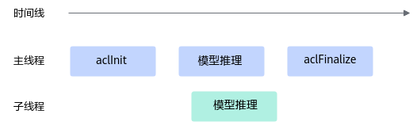

        -   各子线程均成对调aclInit和aclFinalize：

            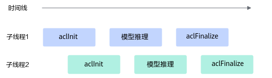

-   模型推理（同步）场景下，若开启Dump功能，只支持在一个进程中对一个或多个模型执行Dump操作，由于资源限制，其它进程中不建议启动推理程序，否则可能造成Dump异常。

    若对多个模型执行Dump操作，多个模型必须串行；

    建议单线程内对模型执行Dump操作，否则可能出现Dump数据文件路径中的序号（即data\_index）不准确，导致Dump数据存放的目录异常。

-   模型推理（异步）场景下，若开启Dump功能，建议一次异步推理、一次流同步，否则可能出现Dump数据文件路径中的序号（即data\_index）不准确，导致Dump数据存放的目录异常。

**模型Dump配置示例<a name="section197612500567"></a>**

模型Dump配置示例如下：

```
{                                                                                            
	"dump":{
		"dump_list":[                                                                        
			{	"model_name":"ResNet-101"
			},
			{                                                                                
				"model_name":"ResNet-50",
				"layer":[
				      "conv1conv1_relu",
				      "res2a_branch2ares2a_branch2a_relu",
				      "res2a_branch1",
				      "pool1"
				] 
			}  
		],  
		"dump_path":"/home/output",
                "dump_mode":"output",
		"dump_op_switch":"off",
                "dump_data":"tensor"
	}                                                                                        
}
```

**表 1**  acl.json文件格式说明

<a name="table2044611711017"></a>
<table><thead align="left"><tr id="zh-cn_topic_0000002473900860_row11302545145113"><th class="cellrowborder" valign="top" width="32.42%" id="mcps1.2.3.1.1"><p id="zh-cn_topic_0000002473900860_p9303114520512"><a name="zh-cn_topic_0000002473900860_p9303114520512"></a><a name="zh-cn_topic_0000002473900860_p9303114520512"></a>配置项</p>
</th>
<th class="cellrowborder" valign="top" width="67.58%" id="mcps1.2.3.1.2"><p id="zh-cn_topic_0000002473900860_p6303154545120"><a name="zh-cn_topic_0000002473900860_p6303154545120"></a><a name="zh-cn_topic_0000002473900860_p6303154545120"></a>参数说明</p>
</th>
</tr>
</thead>
<tbody><tr id="zh-cn_topic_0000002473900860_row43031545115118"><td class="cellrowborder" valign="top" width="32.42%" headers="mcps1.2.3.1.1 "><p id="zh-cn_topic_0000002473900860_p17303104513518"><a name="zh-cn_topic_0000002473900860_p17303104513518"></a><a name="zh-cn_topic_0000002473900860_p17303104513518"></a>dump_list</p>
</td>
<td class="cellrowborder" valign="top" width="67.58%" headers="mcps1.2.3.1.2 "><p id="zh-cn_topic_0000002473900860_p177541139275"><a name="zh-cn_topic_0000002473900860_p177541139275"></a><a name="zh-cn_topic_0000002473900860_p177541139275"></a>（必选）待dump数据的整网模型列表。</p>
<p id="zh-cn_topic_0000002473900860_p3490271324"><a name="zh-cn_topic_0000002473900860_p3490271324"></a><a name="zh-cn_topic_0000002473900860_p3490271324"></a>创建模型dump配置信息，当存在多个模型需要dump时，需要每个模型之间用英文逗号隔开。</p>
</td>
</tr>
<tr id="zh-cn_topic_0000002473900860_row530344517517"><td class="cellrowborder" valign="top" width="32.42%" headers="mcps1.2.3.1.1 "><p id="zh-cn_topic_0000002473900860_p3303154518512"><a name="zh-cn_topic_0000002473900860_p3303154518512"></a><a name="zh-cn_topic_0000002473900860_p3303154518512"></a>model_name</p>
</td>
<td class="cellrowborder" valign="top" width="67.58%" headers="mcps1.2.3.1.2 "><p id="zh-cn_topic_0000002473900860_p1332535816169"><a name="zh-cn_topic_0000002473900860_p1332535816169"></a><a name="zh-cn_topic_0000002473900860_p1332535816169"></a>模型名称，各个模型的model_name值须唯一。</p>
<a name="zh-cn_topic_0000002473900860_ul3183132413818"></a><a name="zh-cn_topic_0000002473900860_ul3183132413818"></a><ul id="zh-cn_topic_0000002473900860_ul3183132413818"><li>模型加载方式为文件加载时，填入模型文件的名称，不需要带后缀名；也可以配置为<span id="zh-cn_topic_0000002473900860_ph2091083915275"><a name="zh-cn_topic_0000002473900860_ph2091083915275"></a><a name="zh-cn_topic_0000002473900860_ph2091083915275"></a>ATC</span>模型文件转换后的json文件里的最外层"name"字段对应值。</li><li>模型加载方式为内存加载时，配置为<span id="zh-cn_topic_0000002473900860_ph1939814819182"><a name="zh-cn_topic_0000002473900860_ph1939814819182"></a><a name="zh-cn_topic_0000002473900860_ph1939814819182"></a>ATC</span>模型文件转换后的json文件里的最外层"name"字段对应值。IPV350不支持该方式。</li></ul>
</td>
</tr>
<tr id="zh-cn_topic_0000002473900860_row7303124514510"><td class="cellrowborder" valign="top" width="32.42%" headers="mcps1.2.3.1.1 "><p id="zh-cn_topic_0000002473900860_p0303114519514"><a name="zh-cn_topic_0000002473900860_p0303114519514"></a><a name="zh-cn_topic_0000002473900860_p0303114519514"></a>layer</p>
</td>
<td class="cellrowborder" valign="top" width="67.58%" headers="mcps1.2.3.1.2 "><p id="zh-cn_topic_0000002473900860_p121821523154216"><a name="zh-cn_topic_0000002473900860_p121821523154216"></a><a name="zh-cn_topic_0000002473900860_p121821523154216"></a>IO性能相对较差时，可能会出现由于数据量过大导致执行超时，所以不建议全量dump，请指定算子进行dump。通过该字段可以指定需要dump的算子名，支持指定为ATC模型转换后的算子名，也支持指定为转换前的原始算子名，配置时需注意：</p>
<a name="zh-cn_topic_0000002473900860_ul346651019174"></a><a name="zh-cn_topic_0000002473900860_ul346651019174"></a><ul id="zh-cn_topic_0000002473900860_ul346651019174"><li>需按格式配置，每行配置模型中的一个算子名，且每个算子之间用英文逗号隔开。</li><li>用户可以无需设置model_name，此时会默认dump所有model下的相应算子。如果配置了model_name，则dump对应model下的相应算子。</li><li>若指定的算子其输入涉及data算子，会同时将data算子信息dump出来；若需dump data算子，需要一并填写data节点算子的后继节点，才能dump出data节点算子数据。</li><li>当需要dump模型中所有算子时，不需要包含layer字段。</li></ul>
</td>
</tr>
<tr id="zh-cn_topic_0000002473900860_row832233011540"><td class="cellrowborder" valign="top" width="32.42%" headers="mcps1.2.3.1.1 "><p id="zh-cn_topic_0000002473900860_p732343045414"><a name="zh-cn_topic_0000002473900860_p732343045414"></a><a name="zh-cn_topic_0000002473900860_p732343045414"></a>dump_path</p>
</td>
<td class="cellrowborder" valign="top" width="67.58%" headers="mcps1.2.3.1.2 "><p id="zh-cn_topic_0000002473900860_p59442341629"><a name="zh-cn_topic_0000002473900860_p59442341629"></a><a name="zh-cn_topic_0000002473900860_p59442341629"></a>（必选）dump数据文件存储到运行环境的目录，该目录需要提前创建且确保安装时配置的运行用户具有读写权限。IPV350需要提前将编译生成的dbg文件放在该目录。</p>
<div class="p" id="zh-cn_topic_0000002473900860_p118179189219"><a name="zh-cn_topic_0000002473900860_p118179189219"></a><a name="zh-cn_topic_0000002473900860_p118179189219"></a>支持配置绝对路径或相对路径：<a name="zh-cn_topic_0000002473900860_ul463512409500"></a><a name="zh-cn_topic_0000002473900860_ul463512409500"></a><ul id="zh-cn_topic_0000002473900860_ul463512409500"><li>绝对路径配置以<span class="uicontrol" id="zh-cn_topic_0000002473900860_uicontrol6799114615013"><a name="zh-cn_topic_0000002473900860_uicontrol6799114615013"></a><a name="zh-cn_topic_0000002473900860_uicontrol6799114615013"></a>“/”</span>开头，例如：/home/output。</li><li>相对路径配置直接以目录名开始，例如：output。</li></ul>
</div>
</td>
</tr>
<tr id="zh-cn_topic_0000002473900860_row75941833105412"><td class="cellrowborder" valign="top" width="32.42%" headers="mcps1.2.3.1.1 "><p id="zh-cn_topic_0000002473900860_p65944331549"><a name="zh-cn_topic_0000002473900860_p65944331549"></a><a name="zh-cn_topic_0000002473900860_p65944331549"></a>dump_mode</p>
</td>
<td class="cellrowborder" valign="top" width="67.58%" headers="mcps1.2.3.1.2 "><p id="zh-cn_topic_0000002473900860_p816922501712"><a name="zh-cn_topic_0000002473900860_p816922501712"></a><a name="zh-cn_topic_0000002473900860_p816922501712"></a>dump数据模式。</p>
<a name="zh-cn_topic_0000002473900860_ul15173122561720"></a><a name="zh-cn_topic_0000002473900860_ul15173122561720"></a><ul id="zh-cn_topic_0000002473900860_ul15173122561720"><li>input：dump算子的输入数据。</li><li>output：dump算子的输出数据，默认取值output。</li><li>all：dump算子的输入、输出数据。<p id="zh-cn_topic_0000002473900860_p5705113510441"><a name="zh-cn_topic_0000002473900860_p5705113510441"></a><a name="zh-cn_topic_0000002473900860_p5705113510441"></a>注意，配置为all时，由于部分算子在执行过程中会修改输入数据，例如集合通信类算子HcomAllGather、HcomAllReduce等，因此系统在进行dump时，会在算子执行前dump算子输入，在算子执行后dump算子输出，这样，针对同一个算子，算子输入、输出的dump数据是分开落盘，会出现多个dump文件，在解析dump文件后，用户可通过文件内容判断是输入还是输出。</p>
</li></ul>
</td>
</tr>
<tr id="zh-cn_topic_0000002473900860_row1125610377458"><td class="cellrowborder" valign="top" width="32.42%" headers="mcps1.2.3.1.1 "><p id="zh-cn_topic_0000002473900860_p1125614379455"><a name="zh-cn_topic_0000002473900860_p1125614379455"></a><a name="zh-cn_topic_0000002473900860_p1125614379455"></a>dump_level</p>
</td>
<td class="cellrowborder" valign="top" width="67.58%" headers="mcps1.2.3.1.2 "><p id="zh-cn_topic_0000002473900860_p97008103494"><a name="zh-cn_topic_0000002473900860_p97008103494"></a><a name="zh-cn_topic_0000002473900860_p97008103494"></a>dump数据级别，取值：</p>
<a name="zh-cn_topic_0000002473900860_ul203554139495"></a><a name="zh-cn_topic_0000002473900860_ul203554139495"></a><ul id="zh-cn_topic_0000002473900860_ul203554139495"><li>op：按算子级别dump数据。</li><li>kernel：按kernel级别dump数据。</li><li>all：默认值，op和kernel级别的数据都dump。</li></ul>
<p id="zh-cn_topic_0000002473900860_p122561375459"><a name="zh-cn_topic_0000002473900860_p122561375459"></a><a name="zh-cn_topic_0000002473900860_p122561375459"></a>默认配置下，dump数据文件会比较多，例如有一些aclnn开头的dump文件，若用户对dump性能有要求或内存资源有限时，则可以将该参数设置为op级别，以便提升dump性能、精简dump数据文件数量。</p>
<div class="note" id="zh-cn_topic_0000002473900860_note18402181613154"><a name="zh-cn_topic_0000002473900860_note18402181613154"></a><a name="zh-cn_topic_0000002473900860_note18402181613154"></a><span class="notetitle"> 说明： </span><div class="notebody"><p id="zh-cn_topic_0000002473900860_p5402191615153"><a name="zh-cn_topic_0000002473900860_p5402191615153"></a><a name="zh-cn_topic_0000002473900860_p5402191615153"></a>算子是一个运算逻辑的表示（如加减乘除运算），kernel是运算逻辑真正进行计算处理的实现，需要分配具体的计算设备完成计算。</p>
</div></div>
</td>
</tr>
<tr id="zh-cn_topic_0000002473900860_row264416171415"><td class="cellrowborder" valign="top" width="32.42%" headers="mcps1.2.3.1.1 "><p id="zh-cn_topic_0000002473900860_p126446610146"><a name="zh-cn_topic_0000002473900860_p126446610146"></a><a name="zh-cn_topic_0000002473900860_p126446610146"></a>dump_step</p>
</td>
<td class="cellrowborder" valign="top" width="67.58%" headers="mcps1.2.3.1.2 "><p id="zh-cn_topic_0000002473900860_p374173918174"><a name="zh-cn_topic_0000002473900860_p374173918174"></a><a name="zh-cn_topic_0000002473900860_p374173918174"></a>指定采集哪些迭代的Dump数据。推理场景无需配置。</p>
<p id="zh-cn_topic_0000002473900860_p103835171122"><a name="zh-cn_topic_0000002473900860_p103835171122"></a><a name="zh-cn_topic_0000002473900860_p103835171122"></a>不配置该参数，默认所有迭代都会产生dump数据，数据量比较大，建议按需指定迭代。</p>
<p id="zh-cn_topic_0000002473900860_p11384141717121"><a name="zh-cn_topic_0000002473900860_p11384141717121"></a><a name="zh-cn_topic_0000002473900860_p11384141717121"></a>多个迭代用“|”分割，例如：0|5|10；也可以用“-”指定迭代范围，例如：0|3-5|10。</p>
<p id="zh-cn_topic_0000002473900860_p6788192415319"><a name="zh-cn_topic_0000002473900860_p6788192415319"></a><a name="zh-cn_topic_0000002473900860_p6788192415319"></a>配置示例：</p>
<a name="zh-cn_topic_0000002473900860_screen1890219341124"></a><a name="zh-cn_topic_0000002473900860_screen1890219341124"></a><pre class="screen" codetype="Json" id="zh-cn_topic_0000002473900860_screen1890219341124">{
	"dump":{
		"dump_list":[     
			...... 
		],  
		"dump_path":"/home/output",
                "dump_mode":"output",
		"dump_op_switch":"off",
                "dump_step": "0|3-5|10"
	}  
}</pre>
</td>
</tr>
<tr id="zh-cn_topic_0000002473900860_row73572029103213"><td class="cellrowborder" valign="top" width="32.42%" headers="mcps1.2.3.1.1 "><p id="zh-cn_topic_0000002473900860_p635742914325"><a name="zh-cn_topic_0000002473900860_p635742914325"></a><a name="zh-cn_topic_0000002473900860_p635742914325"></a>dump_data</p>
</td>
<td class="cellrowborder" valign="top" width="67.58%" headers="mcps1.2.3.1.2 "><p id="zh-cn_topic_0000002473900860_p159491257142410"><a name="zh-cn_topic_0000002473900860_p159491257142410"></a><a name="zh-cn_topic_0000002473900860_p159491257142410"></a>算子dump内容类型，取值：</p>
<a name="zh-cn_topic_0000002473900860_ul847333833517"></a><a name="zh-cn_topic_0000002473900860_ul847333833517"></a><ul id="zh-cn_topic_0000002473900860_ul847333833517"><li>tensor: dump算子数据，默认为tensor。</li><li>stats: dump算子统计数据，结果文件为csv格式，文件中包含算子名称、输入/输出的数据类型、最大值、最小值等。IPV350不支持该方式。</li></ul>
<p id="zh-cn_topic_0000002473900860_p137601044155810"><a name="zh-cn_topic_0000002473900860_p137601044155810"></a><a name="zh-cn_topic_0000002473900860_p137601044155810"></a>通常dump数据量太大并且耗时长，可以先dump算子统计数据，根据统计数据识别可能异常的算子，然后再dump算子数据。</p>
</td>
</tr>
</tbody>
</table>

**异常算子Dump配置示例<a name="section1939018362581"></a>**

通过配置dump\_scene参数值开启异常算子Dump功能，配置文件中的示例内容如下，表示开启轻量化的exception dump：

```
{
    "dump":{
        "dump_path":"output",
        "dump_scene":"aic_err_brief_dump"
    }
}
```

详细配置说明及约束如下：

-   dump\_scene参数支持如下取值：
    -   aic\_err\_brief\_dump：表示轻量化exception dump，用于导出AI Core错误算子的输入&输出、workspace数据。
    -   aic\_err\_norm\_dump：表示普通exception dump，在轻量化exception dump基础上，还会导出Shape、Data Type、Format以及属性信息。
    -   lite\_exception：表示轻量化exception dump，为了兼容旧版本，效果等同于aic\_err\_brief\_dump。

-   dump\_path是可选参数，表示导出dump文件的存储路径。

    dump文件存储路径的优先级如下：NPU\_COLLECT\_PATH环境变量 \> ASCEND\_WORK\_PATH环境变量 \> 配置文件中的dump\_path \> 应用程序的当前执行目录

    环境变量的详细描述请参见《[环境变量参考](https://www.hiascend.com/document/detail/zh/canncommercial/82RC1/maintenref/envvar/envref_07_0001.html)》。

-   将dump\_scene参数设置为aic\_err\_detail\_dump时，若需查看导出的dump文件内容，可使用msDebug工具查看文件内容，详细方法请参见《[算子开发工具用户指南](https://www.hiascend.com/document/detail/zh/canncommercial/82RC1/devaids/optool/atlasopdev_16_0002.html)》。将dump\_scene参数设置为其它参数值时，若需查看导出的dump文件内容，先将dump文件转换为numpy格式文件后，再通过Python查看numpy格式文件，详细转换步骤请参见《精度调试工具用户指南》中的“扩展功能 \> 查看dump数据文件”章节。
-   异常算子Dump配置，不能与模型Dump配置或单算子Dump配置同时开启。

**溢出算子Dump配置示例<a name="section1630992613253"></a>**

将dump\_debug参数设置为on表示开启溢出算子配置，配置文件中的示例内容如下：

```
{
    "dump":{
        "dump_path":"output",
        "dump_debug":"on"
    }
}
```

详细配置说明及约束如下：

-   不配置dump\_debug或将dump\_debug配置为off表示不开启溢出算子配置。
-   若开启溢出算子配置，则dump\_path必须配置，表示导出dump文件的存储路径。

    获取导出的数据文件后，文件的解析请参见《精度调试工具用户指南》中的“扩展功能 \> 溢出算子数据采集与解析”章节。

    dump\_path支持配置绝对路径或相对路径：

    -   绝对路径配置以“/“开头，例如：/home。
    -   相对路径配置直接以目录名开始，例如：output。

-   溢出算子Dump配置，不能与模型Dump配置或单算子Dump配置同时开启，否则会返回报错。
-   仅支持采集AI Core算子的溢出数据。

**算子Dump Watch模式配置示例<a name="section15574125275215"></a>**

将dump\_scene参数设置为watcher，开启算子Dump Watch模式，配置文件中的示例内容如下，配置效果为：（1）当执行完A算子、B算子时，会把C算子和D算子的输出Dump出来；（2）当执行完C算子、D算子时，也会把C算子和D算子的输出Dump出来。将（1）、（2）中的C算子、D算子的Dump文件进行比较，用于排查A算子、B算子是否会踩踏C算子、D算子的输出内存。

```
{
    "dump":{
        "dump_list":[
            {
                "layer":["A", "B"],
                "watcher_nodes":["C", "D"]
            }
        ],
        "dump_path":"/home/",
        "dump_mode":"output",
        "dump_scene":"watcher"
    }
}
```

详细配置说明及约束如下：

-   若开启算子Dump Watch模式，则不支持同时开启溢出算子Dump（配置dump\_debug参数）或开启单算子模型Dump（配置dump\_op\_switch参数），否则报错。
-   在dump\_list中，通过layer参数配置可能踩踏其它算子内存的算子名称，通过watcher\_nodes参数配置可能被其它算子踩踏输出内存导致精度有问题的算子名称。
    -   若不指定layer，则模型内所有支持Dump的算子在执行后，都会将watcher\_nodes中配置的算子的输出Dump出来。
    -   layer和watcher\_node处配置的算子都必须是静态图、静态子图中的算子，否则不生效。
    -   若layer和watcher\_node处配置的算子名称相同，或者layer处配置的是集合通信类算子（算子类型以Hcom开头，例如HcomAllReduce），则只导出watcher\_node中所配置算子的dump文件。
    -   对于融合算子，watcher\_node处配置的算子名称必须是融合后的算子名称，若配置融合前的算子名称，则不导出dump文件。
    -   dump\_list内暂不支持配置model\_name。

-   开启算子Dump Watch模式，则dump\_path必须配置，表示导出dump文件的存储路径。

    此处收集的dump文件无法通过文本工具直接查看其内容，若需查看dump文件内容，先将dump文件转换为numpy格式文件后，再通过Python查看numpy格式文件，详细转换步骤请参见《精度调试工具用户指南》中的“扩展功能 \> 查看dump数据文件”章节。

    dump\_path支持配置绝对路径或相对路径：

    -   绝对路径配置以“/“开头，例如：/home。
    -   相对路径配置直接以目录名开始，例如：output。

-   通过dump\_mode参数控制导出watcher\_nodes中所配置算子的哪部分数据，当前仅支持配置为output。

**错误信息上报模式配置示例<a name="section68041916171011"></a>**

err\_msg\_mode参数取值范围：0为默认值，表示按线程级别获取错误信息；1表示按进程级别获取错误信息。

配置文件中的示例内容如下：

```
{
        "err_msg_mode": "1"
}
```

**参考资源<a name="section16569183212216"></a>**

接口调用示例，参见[初始化与去初始化](初始化与去初始化.md)。

### aclFinalize<a name="ZH-CN_TOPIC_0000002506021589"></a>

**产品支持情况<a name="section16107182283615"></a>**

<a name="zh-cn_topic_0000002219420921_table38301303189"></a>
<table><thead align="left"><tr id="zh-cn_topic_0000002505901461_row20831180131817"><th class="cellrowborder" valign="top" width="57.99999999999999%" id="mcps1.1.3.1.1"><p id="zh-cn_topic_0000002505901461_p1883113061818"><a name="zh-cn_topic_0000002505901461_p1883113061818"></a><a name="zh-cn_topic_0000002505901461_p1883113061818"></a><span id="zh-cn_topic_0000002505901461_ph20833205312295"><a name="zh-cn_topic_0000002505901461_ph20833205312295"></a><a name="zh-cn_topic_0000002505901461_ph20833205312295"></a>产品</span></p>
</th>
<th class="cellrowborder" align="center" valign="top" width="42%" id="mcps1.1.3.1.2"><p id="zh-cn_topic_0000002505901461_p783113012187"><a name="zh-cn_topic_0000002505901461_p783113012187"></a><a name="zh-cn_topic_0000002505901461_p783113012187"></a>是否支持</p>
</th>
</tr>
</thead>
<tbody><tr id="zh-cn_topic_0000002505901461_row1466941011819"><td class="cellrowborder" valign="top" width="57.99999999999999%" headers="mcps1.1.3.1.1 "><p id="zh-cn_topic_0000002505901461_p146702104188"><a name="zh-cn_topic_0000002505901461_p146702104188"></a><a name="zh-cn_topic_0000002505901461_p146702104188"></a><span id="zh-cn_topic_0000002505901461_ph1577265511916"><a name="zh-cn_topic_0000002505901461_ph1577265511916"></a><a name="zh-cn_topic_0000002505901461_ph1577265511916"></a>IPV350</span></p>
</td>
<td class="cellrowborder" align="center" valign="top" width="42%" headers="mcps1.1.3.1.2 "><p id="zh-cn_topic_0000002505901461_p7670131016189"><a name="zh-cn_topic_0000002505901461_p7670131016189"></a><a name="zh-cn_topic_0000002505901461_p7670131016189"></a>√</p>
</td>
</tr>
</tbody>
</table>

**功能说明<a name="section550175018127"></a>**

去初始化函数，用于释放进程内acl接口使用的相关资源。

**函数原型<a name="section128388310138"></a>**

```
[aclError](aclError.md) aclFinalize()
```

**参数说明<a name="section53208771314"></a>**

无

**返回值说明<a name="section13334171015133"></a>**

返回0表示成功，返回其他值表示失败，请参见[aclError](aclError.md)。

**约束说明<a name="section11467146172711"></a>**

应用进程退出前，应确保已调用aclFinalize接口完成去初始化，否则可能会导致异常，例如应用进程退出时有异常报错。

不建议在析构函数中调用aclFinalize接口，否则在进程退出时可能由于单例析构顺序未知而导致进程异常退出的问题。

**参考资源<a name="section136951153811"></a>**

接口调用示例，参见[初始化与去初始化](初始化与去初始化.md)。

### aclrtGetVersion<a name="ZH-CN_TOPIC_0000002505902001"></a>

**产品支持情况<a name="section16107182283615"></a>**

<a name="zh-cn_topic_0000002219420921_table38301303189"></a>
<table><thead align="left"><tr id="zh-cn_topic_0000002505901461_row20831180131817"><th class="cellrowborder" valign="top" width="57.99999999999999%" id="mcps1.1.3.1.1"><p id="zh-cn_topic_0000002505901461_p1883113061818"><a name="zh-cn_topic_0000002505901461_p1883113061818"></a><a name="zh-cn_topic_0000002505901461_p1883113061818"></a><span id="zh-cn_topic_0000002505901461_ph20833205312295"><a name="zh-cn_topic_0000002505901461_ph20833205312295"></a><a name="zh-cn_topic_0000002505901461_ph20833205312295"></a>产品</span></p>
</th>
<th class="cellrowborder" align="center" valign="top" width="42%" id="mcps1.1.3.1.2"><p id="zh-cn_topic_0000002505901461_p783113012187"><a name="zh-cn_topic_0000002505901461_p783113012187"></a><a name="zh-cn_topic_0000002505901461_p783113012187"></a>是否支持</p>
</th>
</tr>
</thead>
<tbody><tr id="zh-cn_topic_0000002505901461_row1466941011819"><td class="cellrowborder" valign="top" width="57.99999999999999%" headers="mcps1.1.3.1.1 "><p id="zh-cn_topic_0000002505901461_p146702104188"><a name="zh-cn_topic_0000002505901461_p146702104188"></a><a name="zh-cn_topic_0000002505901461_p146702104188"></a><span id="zh-cn_topic_0000002505901461_ph1577265511916"><a name="zh-cn_topic_0000002505901461_ph1577265511916"></a><a name="zh-cn_topic_0000002505901461_ph1577265511916"></a>IPV350</span></p>
</td>
<td class="cellrowborder" align="center" valign="top" width="42%" headers="mcps1.1.3.1.2 "><p id="zh-cn_topic_0000002505901461_p7670131016189"><a name="zh-cn_topic_0000002505901461_p7670131016189"></a><a name="zh-cn_topic_0000002505901461_p7670131016189"></a>√</p>
</td>
</tr>
</tbody>
</table>

**功能说明<a name="section36583473819"></a>**

查询接口版本号，acl接口版本号命名采用：A.B.C模式，其中，A表示有不兼容修改，B表示新增接口，C表示bug修复。

**函数原型<a name="section13230182415108"></a>**

```
[aclError](aclError.md) aclrtGetVersion(int32_t *majorVersion, int32_t *minorVersion, int32_t *patchVersion)
```

**参数说明<a name="section75395119104"></a>**

<a name="zh-cn_topic_0122830089_table438764393513"></a>
<table><thead align="left"><tr id="zh-cn_topic_0122830089_row53871743113510"><th class="cellrowborder" valign="top" width="14.000000000000002%" id="mcps1.1.4.1.1"><p id="zh-cn_topic_0122830089_p1438834363520"><a name="zh-cn_topic_0122830089_p1438834363520"></a><a name="zh-cn_topic_0122830089_p1438834363520"></a>参数名</p>
</th>
<th class="cellrowborder" valign="top" width="14.000000000000002%" id="mcps1.1.4.1.2"><p id="p1769255516412"><a name="p1769255516412"></a><a name="p1769255516412"></a>输入/输出</p>
</th>
<th class="cellrowborder" valign="top" width="72%" id="mcps1.1.4.1.3"><p id="zh-cn_topic_0122830089_p173881843143514"><a name="zh-cn_topic_0122830089_p173881843143514"></a><a name="zh-cn_topic_0122830089_p173881843143514"></a>说明</p>
</th>
</tr>
</thead>
<tbody><tr id="zh-cn_topic_0122830089_row2038874343514"><td class="cellrowborder" valign="top" width="14.000000000000002%" headers="mcps1.1.4.1.1 "><p id="p2085351311410"><a name="p2085351311410"></a><a name="p2085351311410"></a>majorVersion</p>
</td>
<td class="cellrowborder" valign="top" width="14.000000000000002%" headers="mcps1.1.4.1.2 "><p id="p8693185517417"><a name="p8693185517417"></a><a name="p8693185517417"></a>输出</p>
</td>
<td class="cellrowborder" valign="top" width="72%" headers="mcps1.1.4.1.3 "><p id="p5103103751315"><a name="p5103103751315"></a><a name="p5103103751315"></a>主版本号的指针，从1开始，如果出现接口的不兼容变更时，加1。</p>
</td>
</tr>
<tr id="row92681538410"><td class="cellrowborder" valign="top" width="14.000000000000002%" headers="mcps1.1.4.1.1 "><p id="p1026914536414"><a name="p1026914536414"></a><a name="p1026914536414"></a>minorVersion</p>
</td>
<td class="cellrowborder" valign="top" width="14.000000000000002%" headers="mcps1.1.4.1.2 "><p id="p13269165319417"><a name="p13269165319417"></a><a name="p13269165319417"></a>输出</p>
</td>
<td class="cellrowborder" valign="top" width="72%" headers="mcps1.1.4.1.3 "><p id="p102694531245"><a name="p102694531245"></a><a name="p102694531245"></a>次版本号的指针，从0开始，按照迭代周期，有新增接口时加1。</p>
</td>
</tr>
<tr id="row1829552818520"><td class="cellrowborder" valign="top" width="14.000000000000002%" headers="mcps1.1.4.1.1 "><p id="p1829612812520"><a name="p1829612812520"></a><a name="p1829612812520"></a>patchVersion</p>
</td>
<td class="cellrowborder" valign="top" width="14.000000000000002%" headers="mcps1.1.4.1.2 "><p id="p132961828457"><a name="p132961828457"></a><a name="p132961828457"></a>输出</p>
</td>
<td class="cellrowborder" valign="top" width="72%" headers="mcps1.1.4.1.3 "><p id="p62966281457"><a name="p62966281457"></a><a name="p62966281457"></a>补丁版本号的指针，从0开始，表示本版本仅解决了问题，在majorVersion、minorVersion不变的情况下加1；但majorVersion、minorVersion增加的时候，patchVersion一般为0。</p>
</td>
</tr>
</tbody>
</table>

**返回值说明<a name="section25791320141317"></a>**

返回0表示成功，返回其他值表示失败，请参见[aclError](aclError.md)。

### aclGetRecentErrMsg<a name="ZH-CN_TOPIC_0000002473741246"></a>

**产品支持情况<a name="section15254644421"></a>**

<a name="zh-cn_topic_0000002219420921_table14931115524110"></a>
<table><thead align="left"><tr id="zh-cn_topic_0000002505901461_row1993118556414"><th class="cellrowborder" valign="top" width="57.99999999999999%" id="mcps1.1.3.1.1"><p id="zh-cn_topic_0000002505901461_p29315553419"><a name="zh-cn_topic_0000002505901461_p29315553419"></a><a name="zh-cn_topic_0000002505901461_p29315553419"></a><span id="zh-cn_topic_0000002505901461_ph59311455164119"><a name="zh-cn_topic_0000002505901461_ph59311455164119"></a><a name="zh-cn_topic_0000002505901461_ph59311455164119"></a>产品</span></p>
</th>
<th class="cellrowborder" align="center" valign="top" width="42%" id="mcps1.1.3.1.2"><p id="zh-cn_topic_0000002505901461_p59313557417"><a name="zh-cn_topic_0000002505901461_p59313557417"></a><a name="zh-cn_topic_0000002505901461_p59313557417"></a>是否支持</p>
</th>
</tr>
</thead>
<tbody><tr id="zh-cn_topic_0000002505901461_row20933195574112"><td class="cellrowborder" valign="top" width="57.99999999999999%" headers="mcps1.1.3.1.1 "><p id="zh-cn_topic_0000002505901461_p7933195519417"><a name="zh-cn_topic_0000002505901461_p7933195519417"></a><a name="zh-cn_topic_0000002505901461_p7933195519417"></a><span id="zh-cn_topic_0000002505901461_ph1993325517413"><a name="zh-cn_topic_0000002505901461_ph1993325517413"></a><a name="zh-cn_topic_0000002505901461_ph1993325517413"></a>IPV350</span></p>
</td>
<td class="cellrowborder" align="center" valign="top" width="42%" headers="mcps1.1.3.1.2 "><p id="zh-cn_topic_0000002505901461_p1193317559418"><a name="zh-cn_topic_0000002505901461_p1193317559418"></a><a name="zh-cn_topic_0000002505901461_p1193317559418"></a>x</p>
</td>
</tr>
</tbody>
</table>

**功能说明<a name="section36583473819"></a>**

获取并清空与本接口在同一个进程或线程中的其它acl接口调用失败时的错误描述信息。

获取进程级别、还是线程级别的错误描述信息由[aclInit](aclInit.md)接口中的err\_msg\_mode配置控制，默认线程级别。

建议在每次调用acl接口失败时都调用aclGetRecentErrMsg接口，以便获取调用acl接口异常时的错误描述信息，用于定位问题，否则可能导致错误信息堆积、丢失。同一个进程或线程中多次调用aclGetRecentErrMsg接口后，只有最后一次调用aclGetRecentErrMsg接口返回的错误描述字符串的指针有效，之前aclGetRecentErrMsg接口返回的错误描述字符串指针不能使用，否则可能导致内存非法访问。

**函数原型<a name="section13230182415108"></a>**

```
const char *aclGetRecentErrMsg()
```

**参数说明<a name="section75395119104"></a>**

无

**返回值说明<a name="section25791320141317"></a>**

返回错误描述字符串的指针。如果通过本接口获取到多条错误描述信息，最上面的错误描述信息为最新的。

获取错误描述信息失败时，返回nullptr。

## 运行时管理<a name="ZH-CN_TOPIC_0000002473742098"></a>


### Device管理<a name="ZH-CN_TOPIC_0000002505901407"></a>


#### aclrtSetDevice<a name="ZH-CN_TOPIC_0000002473901490"></a>

**产品支持情况<a name="section8178181118225"></a>**

<a name="table38301303189"></a>
<table><thead align="left"><tr id="row20831180131817"><th class="cellrowborder" valign="top" width="57.99999999999999%" id="mcps1.1.3.1.1"><p id="p1883113061818"><a name="p1883113061818"></a><a name="p1883113061818"></a><span id="ph20833205312295"><a name="ph20833205312295"></a><a name="ph20833205312295"></a>产品</span></p>
</th>
<th class="cellrowborder" align="center" valign="top" width="42%" id="mcps1.1.3.1.2"><p id="p783113012187"><a name="p783113012187"></a><a name="p783113012187"></a>是否支持</p>
</th>
</tr>
</thead>
<tbody><tr id="row1466941011819"><td class="cellrowborder" valign="top" width="57.99999999999999%" headers="mcps1.1.3.1.1 "><p id="p146702104188"><a name="p146702104188"></a><a name="p146702104188"></a><span id="ph1577265511916"><a name="ph1577265511916"></a><a name="ph1577265511916"></a>IPV350</span></p>
</td>
<td class="cellrowborder" align="center" valign="top" width="42%" headers="mcps1.1.3.1.2 "><p id="p7670131016189"><a name="p7670131016189"></a><a name="p7670131016189"></a>√</p>
</td>
</tr>
</tbody>
</table>

**功能说明<a name="section36583473819"></a>**

指定当前线程中用于运算的Device。

**函数原型<a name="section13230182415108"></a>**

```
[aclError](aclError.md) aclrtSetDevice(int32_t deviceId)
```

**参数说明<a name="section75395119104"></a>**

<a name="zh-cn_topic_0122830089_table438764393513"></a>
<table><thead align="left"><tr id="zh-cn_topic_0122830089_row53871743113510"><th class="cellrowborder" valign="top" width="14.000000000000002%" id="mcps1.1.4.1.1"><p id="zh-cn_topic_0122830089_p1438834363520"><a name="zh-cn_topic_0122830089_p1438834363520"></a><a name="zh-cn_topic_0122830089_p1438834363520"></a>参数名</p>
</th>
<th class="cellrowborder" valign="top" width="14.000000000000002%" id="mcps1.1.4.1.2"><p id="p1769255516412"><a name="p1769255516412"></a><a name="p1769255516412"></a>输入/输出</p>
</th>
<th class="cellrowborder" valign="top" width="72%" id="mcps1.1.4.1.3"><p id="zh-cn_topic_0122830089_p173881843143514"><a name="zh-cn_topic_0122830089_p173881843143514"></a><a name="zh-cn_topic_0122830089_p173881843143514"></a>说明</p>
</th>
</tr>
</thead>
<tbody><tr id="zh-cn_topic_0122830089_row2038874343514"><td class="cellrowborder" valign="top" width="14.000000000000002%" headers="mcps1.1.4.1.1 "><p id="zh-cn_topic_0122830089_p1088611422254"><a name="zh-cn_topic_0122830089_p1088611422254"></a><a name="zh-cn_topic_0122830089_p1088611422254"></a>deviceId</p>
</td>
<td class="cellrowborder" valign="top" width="14.000000000000002%" headers="mcps1.1.4.1.2 "><p id="p8693185517417"><a name="p8693185517417"></a><a name="p8693185517417"></a>输入</p>
</td>
<td class="cellrowborder" valign="top" width="72%" headers="mcps1.1.4.1.3 "><p id="zh-cn_topic_0122830089_p19388143103518"><a name="zh-cn_topic_0122830089_p19388143103518"></a><a name="zh-cn_topic_0122830089_p19388143103518"></a>Device ID。</p>
</td>
</tr>
</tbody>
</table>

**返回值说明<a name="section25791320141317"></a>**

返回0表示成功，返回其他值表示失败，请参见[aclError](aclError.md)。

**约束说明<a name="section1797013523213"></a>**

-   调用aclrtSetDevice接口指定运算的Device后，若不使用Device上的资源时，可调用[aclrtResetDevice](aclrtResetDevice.md)接口及时释放本进程使用的Device资源（若不调用这两个接口，功能上不会有问题，因为在进程退出时也会释放本进程使用的Device资源）：
    -   若调用[aclrtResetDevice](aclrtResetDevice.md)接口释放Device资源：

        aclrtResetDevice接口内部涉及引用计数的实现，建议aclrtResetDevice接口与[aclrtSetDevice](aclrtSetDevice.md)接口配对使用，aclrtSetDevice接口每被调用一次，则引用计数加一，aclrtResetDevice接口每被调用一次，则该引用计数减一，当引用计数减到0时，才会真正释放Device上的资源。

-   在不同进程或线程中支持调用aclrtSetDevice接口指定同一个Device用于运算。
-   多Device场景下，可在进程中通过aclrtSetDevice接口切换到其它Device，也可以调用[aclrtSetCurrentContext](aclrtSetCurrentContext.md)接口通过切换Context来切换Device。

**参考资源<a name="section1486558213"></a>**

接口调用流程及示例，参见[运行时资源申请与释放](运行时资源申请与释放.md)。

#### aclrtResetDevice<a name="ZH-CN_TOPIC_0000002473741968"></a>

**产品支持情况<a name="section8178181118225"></a>**

<a name="table38301303189"></a>
<table><thead align="left"><tr id="row20831180131817"><th class="cellrowborder" valign="top" width="57.99999999999999%" id="mcps1.1.3.1.1"><p id="p1883113061818"><a name="p1883113061818"></a><a name="p1883113061818"></a><span id="ph20833205312295"><a name="ph20833205312295"></a><a name="ph20833205312295"></a>产品</span></p>
</th>
<th class="cellrowborder" align="center" valign="top" width="42%" id="mcps1.1.3.1.2"><p id="p783113012187"><a name="p783113012187"></a><a name="p783113012187"></a>是否支持</p>
</th>
</tr>
</thead>
<tbody><tr id="row1466941011819"><td class="cellrowborder" valign="top" width="57.99999999999999%" headers="mcps1.1.3.1.1 "><p id="p146702104188"><a name="p146702104188"></a><a name="p146702104188"></a><span id="ph1577265511916"><a name="ph1577265511916"></a><a name="ph1577265511916"></a>IPV350</span></p>
</td>
<td class="cellrowborder" align="center" valign="top" width="42%" headers="mcps1.1.3.1.2 "><p id="p7670131016189"><a name="p7670131016189"></a><a name="p7670131016189"></a>√</p>
</td>
</tr>
</tbody>
</table>

**功能说明<a name="section36583473819"></a>**

复位当前运算的Device，释放Device上的资源。

aclrtResetDevice接口内部涉及引用计数的实现，建议aclrtResetDevice接口与[aclrtSetDevice](aclrtSetDevice.md)接口配对使用，aclrtSetDevice接口每被调用一次，则引用计数加一，aclrtResetDevice接口每被调用一次，则该引用计数减一，当引用计数减到0时，才会真正释放Device上的资源。

如果多次调用aclrtSetDevice接口而不调用aclrtResetDevice接口释放本线程使用的Device资源，功能上不会有问题，因为在进程退出时也会释放本进程使用的Device资源。

**函数原型<a name="section13230182415108"></a>**

```
[aclError](aclError.md) aclrtResetDevice(int32_t deviceId)
```

**参数说明<a name="section75395119104"></a>**

<a name="zh-cn_topic_0122830089_table438764393513"></a>
<table><thead align="left"><tr id="zh-cn_topic_0122830089_row53871743113510"><th class="cellrowborder" valign="top" width="14.000000000000002%" id="mcps1.1.4.1.1"><p id="zh-cn_topic_0122830089_p1438834363520"><a name="zh-cn_topic_0122830089_p1438834363520"></a><a name="zh-cn_topic_0122830089_p1438834363520"></a>参数名</p>
</th>
<th class="cellrowborder" valign="top" width="14.000000000000002%" id="mcps1.1.4.1.2"><p id="p1769255516412"><a name="p1769255516412"></a><a name="p1769255516412"></a>输入/输出</p>
</th>
<th class="cellrowborder" valign="top" width="72%" id="mcps1.1.4.1.3"><p id="zh-cn_topic_0122830089_p173881843143514"><a name="zh-cn_topic_0122830089_p173881843143514"></a><a name="zh-cn_topic_0122830089_p173881843143514"></a>说明</p>
</th>
</tr>
</thead>
<tbody><tr id="zh-cn_topic_0122830089_row2038874343514"><td class="cellrowborder" valign="top" width="14.000000000000002%" headers="mcps1.1.4.1.1 "><p id="zh-cn_topic_0122830089_p1088611422254"><a name="zh-cn_topic_0122830089_p1088611422254"></a><a name="zh-cn_topic_0122830089_p1088611422254"></a>deviceId</p>
</td>
<td class="cellrowborder" valign="top" width="14.000000000000002%" headers="mcps1.1.4.1.2 "><p id="p8693185517417"><a name="p8693185517417"></a><a name="p8693185517417"></a>输入</p>
</td>
<td class="cellrowborder" valign="top" width="72%" headers="mcps1.1.4.1.3 "><p id="zh-cn_topic_0122830089_p19388143103518"><a name="zh-cn_topic_0122830089_p19388143103518"></a><a name="zh-cn_topic_0122830089_p19388143103518"></a>Device ID。</p>
</td>
</tr>
</tbody>
</table>

**返回值说明<a name="section25791320141317"></a>**

返回0表示成功，返回其他值表示失败，请参见[aclError](aclError.md)。

**约束说明<a name="section17997507213"></a>**

若要复位的Device上存在显式创建的Context、Stream、Event，在复位前，建议遵循如下接口调用顺序，否则可能会导致业务异常。

**接口调用顺序：**调用[aclrtDestroyStream](aclrtDestroyStream.md)接口释放显式创建的Stream**--\>**调用[aclrtDestroyContext](aclrtDestroyContext.md)释放显式创建的Context**--\>**调用aclrtResetDevice接口

**参考资源<a name="section1486558213"></a>**

接口调用流程及示例，参见[运行时资源申请与释放](运行时资源申请与释放.md)。

#### aclrtGetDevice<a name="ZH-CN_TOPIC_0000002473741460"></a>

**产品支持情况<a name="section16107182283615"></a>**

<a name="zh-cn_topic_0000002219420921_table38301303189"></a>
<table><thead align="left"><tr id="zh-cn_topic_0000002505901461_row20831180131817"><th class="cellrowborder" valign="top" width="57.99999999999999%" id="mcps1.1.3.1.1"><p id="zh-cn_topic_0000002505901461_p1883113061818"><a name="zh-cn_topic_0000002505901461_p1883113061818"></a><a name="zh-cn_topic_0000002505901461_p1883113061818"></a><span id="zh-cn_topic_0000002505901461_ph20833205312295"><a name="zh-cn_topic_0000002505901461_ph20833205312295"></a><a name="zh-cn_topic_0000002505901461_ph20833205312295"></a>产品</span></p>
</th>
<th class="cellrowborder" align="center" valign="top" width="42%" id="mcps1.1.3.1.2"><p id="zh-cn_topic_0000002505901461_p783113012187"><a name="zh-cn_topic_0000002505901461_p783113012187"></a><a name="zh-cn_topic_0000002505901461_p783113012187"></a>是否支持</p>
</th>
</tr>
</thead>
<tbody><tr id="zh-cn_topic_0000002505901461_row1466941011819"><td class="cellrowborder" valign="top" width="57.99999999999999%" headers="mcps1.1.3.1.1 "><p id="zh-cn_topic_0000002505901461_p146702104188"><a name="zh-cn_topic_0000002505901461_p146702104188"></a><a name="zh-cn_topic_0000002505901461_p146702104188"></a><span id="zh-cn_topic_0000002505901461_ph1577265511916"><a name="zh-cn_topic_0000002505901461_ph1577265511916"></a><a name="zh-cn_topic_0000002505901461_ph1577265511916"></a>IPV350</span></p>
</td>
<td class="cellrowborder" align="center" valign="top" width="42%" headers="mcps1.1.3.1.2 "><p id="zh-cn_topic_0000002505901461_p7670131016189"><a name="zh-cn_topic_0000002505901461_p7670131016189"></a><a name="zh-cn_topic_0000002505901461_p7670131016189"></a>√</p>
</td>
</tr>
</tbody>
</table>

**功能说明<a name="section8698174414302"></a>**

获取当前正在使用的Device的ID。

**函数原型<a name="section7496145153016"></a>**

```
[aclError](aclError.md) aclrtGetDevice(int32_t *deviceId)
```

**参数说明<a name="section1492335418306"></a>**

<a name="zh-cn_topic_0122830089_table438764393513"></a>
<table><thead align="left"><tr id="zh-cn_topic_0122830089_row53871743113510"><th class="cellrowborder" valign="top" width="14.000000000000002%" id="mcps1.1.4.1.1"><p id="zh-cn_topic_0122830089_p1438834363520"><a name="zh-cn_topic_0122830089_p1438834363520"></a><a name="zh-cn_topic_0122830089_p1438834363520"></a>参数名</p>
</th>
<th class="cellrowborder" valign="top" width="14.000000000000002%" id="mcps1.1.4.1.2"><p id="p1769255516412"><a name="p1769255516412"></a><a name="p1769255516412"></a>输入/输出</p>
</th>
<th class="cellrowborder" valign="top" width="72%" id="mcps1.1.4.1.3"><p id="zh-cn_topic_0122830089_p173881843143514"><a name="zh-cn_topic_0122830089_p173881843143514"></a><a name="zh-cn_topic_0122830089_p173881843143514"></a>说明</p>
</th>
</tr>
</thead>
<tbody><tr id="zh-cn_topic_0122830089_row2038874343514"><td class="cellrowborder" valign="top" width="14.000000000000002%" headers="mcps1.1.4.1.1 "><p id="zh-cn_topic_0122830089_p1088611422254"><a name="zh-cn_topic_0122830089_p1088611422254"></a><a name="zh-cn_topic_0122830089_p1088611422254"></a>deviceId</p>
</td>
<td class="cellrowborder" valign="top" width="14.000000000000002%" headers="mcps1.1.4.1.2 "><p id="p8693185517417"><a name="p8693185517417"></a><a name="p8693185517417"></a>输出</p>
</td>
<td class="cellrowborder" valign="top" width="72%" headers="mcps1.1.4.1.3 "><p id="zh-cn_topic_0122830089_p19388143103518"><a name="zh-cn_topic_0122830089_p19388143103518"></a><a name="zh-cn_topic_0122830089_p19388143103518"></a>Device ID的指针。</p>
</td>
</tr>
</tbody>
</table>

**返回值说明<a name="section59071758153012"></a>**

返回0表示成功，返回其他值表示失败，请参见[aclError](aclError.md)。

**约束说明<a name="section9121585534"></a>**

如果没有提前指定Device，则调用aclrtGetDevice接口时，返回错误。指定Device的方式包括：调用[aclrtSetDevice](aclrtSetDevice.md)接口显式指定Device、调用[aclrtCreateContext](aclrtCreateContext.md)接口隐式指定Device。

#### aclrtGetRunMode<a name="ZH-CN_TOPIC_0000002506021737"></a>

**产品支持情况<a name="section16107182283615"></a>**

<a name="zh-cn_topic_0000002219420921_table38301303189"></a>
<table><thead align="left"><tr id="zh-cn_topic_0000002505901461_row20831180131817"><th class="cellrowborder" valign="top" width="57.99999999999999%" id="mcps1.1.3.1.1"><p id="zh-cn_topic_0000002505901461_p1883113061818"><a name="zh-cn_topic_0000002505901461_p1883113061818"></a><a name="zh-cn_topic_0000002505901461_p1883113061818"></a><span id="zh-cn_topic_0000002505901461_ph20833205312295"><a name="zh-cn_topic_0000002505901461_ph20833205312295"></a><a name="zh-cn_topic_0000002505901461_ph20833205312295"></a>产品</span></p>
</th>
<th class="cellrowborder" align="center" valign="top" width="42%" id="mcps1.1.3.1.2"><p id="zh-cn_topic_0000002505901461_p783113012187"><a name="zh-cn_topic_0000002505901461_p783113012187"></a><a name="zh-cn_topic_0000002505901461_p783113012187"></a>是否支持</p>
</th>
</tr>
</thead>
<tbody><tr id="zh-cn_topic_0000002505901461_row1466941011819"><td class="cellrowborder" valign="top" width="57.99999999999999%" headers="mcps1.1.3.1.1 "><p id="zh-cn_topic_0000002505901461_p146702104188"><a name="zh-cn_topic_0000002505901461_p146702104188"></a><a name="zh-cn_topic_0000002505901461_p146702104188"></a><span id="zh-cn_topic_0000002505901461_ph1577265511916"><a name="zh-cn_topic_0000002505901461_ph1577265511916"></a><a name="zh-cn_topic_0000002505901461_ph1577265511916"></a>IPV350</span></p>
</td>
<td class="cellrowborder" align="center" valign="top" width="42%" headers="mcps1.1.3.1.2 "><p id="zh-cn_topic_0000002505901461_p7670131016189"><a name="zh-cn_topic_0000002505901461_p7670131016189"></a><a name="zh-cn_topic_0000002505901461_p7670131016189"></a>√</p>
</td>
</tr>
</tbody>
</table>

**功能说明<a name="section1041322555815"></a>**

获取当前AI软件栈的运行模式。

**函数原型<a name="section4937192885810"></a>**

```
[aclError](aclError.md) aclrtGetRunMode([aclrtRunMode](aclrtRunMode.md) *runMode)
```

**参数说明<a name="section19228533155815"></a>**

<a name="zh-cn_topic_0122830089_table438764393513"></a>
<table><thead align="left"><tr id="zh-cn_topic_0122830089_row53871743113510"><th class="cellrowborder" valign="top" width="14.000000000000002%" id="mcps1.1.4.1.1"><p id="zh-cn_topic_0122830089_p1438834363520"><a name="zh-cn_topic_0122830089_p1438834363520"></a><a name="zh-cn_topic_0122830089_p1438834363520"></a>参数名</p>
</th>
<th class="cellrowborder" valign="top" width="14.000000000000002%" id="mcps1.1.4.1.2"><p id="p1769255516412"><a name="p1769255516412"></a><a name="p1769255516412"></a>输入/输出</p>
</th>
<th class="cellrowborder" valign="top" width="72%" id="mcps1.1.4.1.3"><p id="zh-cn_topic_0122830089_p173881843143514"><a name="zh-cn_topic_0122830089_p173881843143514"></a><a name="zh-cn_topic_0122830089_p173881843143514"></a>说明</p>
</th>
</tr>
</thead>
<tbody><tr id="zh-cn_topic_0122830089_row2038874343514"><td class="cellrowborder" valign="top" width="14.000000000000002%" headers="mcps1.1.4.1.1 "><p id="zh-cn_topic_0122830089_p1088611422254"><a name="zh-cn_topic_0122830089_p1088611422254"></a><a name="zh-cn_topic_0122830089_p1088611422254"></a>runMode</p>
</td>
<td class="cellrowborder" valign="top" width="14.000000000000002%" headers="mcps1.1.4.1.2 "><p id="p8693185517417"><a name="p8693185517417"></a><a name="p8693185517417"></a>输出</p>
</td>
<td class="cellrowborder" valign="top" width="72%" headers="mcps1.1.4.1.3 "><p id="p2366361647"><a name="p2366361647"></a><a name="p2366361647"></a>运行模式的指针。</p>
<a name="ul15792835354"></a><a name="ul15792835354"></a><ul id="ul15792835354"><li>ACL_DEVICE：AI软件栈运行在Device的Control CPU或<span id="ph1245484719123"><a name="ph1245484719123"></a><a name="ph1245484719123"></a>板端环境</span>上。</li><li>ACL_HOST：AI软件栈运行在Host CPU上。</li></ul>
</td>
</tr>
</tbody>
</table>

**返回值说明<a name="section941963755812"></a>**

返回0表示成功，返回其他值表示失败，请参见[aclError](aclError.md)。

**参考资源<a name="section1486558213"></a>**

接口调用流程及示例代码，参见[运行时资源申请与释放](运行时资源申请与释放.md)。

### Context管理<a name="ZH-CN_TOPIC_0000002473741974"></a>


#### aclrtCreateContext<a name="ZH-CN_TOPIC_0000002473901358"></a>

**产品支持情况<a name="section16107182283615"></a>**

<a name="zh-cn_topic_0000002219420921_table38301303189"></a>
<table><thead align="left"><tr id="zh-cn_topic_0000002505901461_row20831180131817"><th class="cellrowborder" valign="top" width="57.99999999999999%" id="mcps1.1.3.1.1"><p id="zh-cn_topic_0000002505901461_p1883113061818"><a name="zh-cn_topic_0000002505901461_p1883113061818"></a><a name="zh-cn_topic_0000002505901461_p1883113061818"></a><span id="zh-cn_topic_0000002505901461_ph20833205312295"><a name="zh-cn_topic_0000002505901461_ph20833205312295"></a><a name="zh-cn_topic_0000002505901461_ph20833205312295"></a>产品</span></p>
</th>
<th class="cellrowborder" align="center" valign="top" width="42%" id="mcps1.1.3.1.2"><p id="zh-cn_topic_0000002505901461_p783113012187"><a name="zh-cn_topic_0000002505901461_p783113012187"></a><a name="zh-cn_topic_0000002505901461_p783113012187"></a>是否支持</p>
</th>
</tr>
</thead>
<tbody><tr id="zh-cn_topic_0000002505901461_row1466941011819"><td class="cellrowborder" valign="top" width="57.99999999999999%" headers="mcps1.1.3.1.1 "><p id="zh-cn_topic_0000002505901461_p146702104188"><a name="zh-cn_topic_0000002505901461_p146702104188"></a><a name="zh-cn_topic_0000002505901461_p146702104188"></a><span id="zh-cn_topic_0000002505901461_ph1577265511916"><a name="zh-cn_topic_0000002505901461_ph1577265511916"></a><a name="zh-cn_topic_0000002505901461_ph1577265511916"></a>IPV350</span></p>
</td>
<td class="cellrowborder" align="center" valign="top" width="42%" headers="mcps1.1.3.1.2 "><p id="zh-cn_topic_0000002505901461_p7670131016189"><a name="zh-cn_topic_0000002505901461_p7670131016189"></a><a name="zh-cn_topic_0000002505901461_p7670131016189"></a>√</p>
</td>
</tr>
</tbody>
</table>

**功能说明<a name="section36583473819"></a>**

在当前进程或线程中显式创建一个Context。

**函数原型<a name="section13230182415108"></a>**

```
[aclError](aclError.md) aclrtCreateContext([aclrtContext](aclrtContext.md) *context, int32_t deviceId)
```

**参数说明<a name="section75395119104"></a>**

<a name="zh-cn_topic_0122830089_table438764393513"></a>
<table><thead align="left"><tr id="zh-cn_topic_0122830089_row53871743113510"><th class="cellrowborder" valign="top" width="14.000000000000002%" id="mcps1.1.4.1.1"><p id="zh-cn_topic_0122830089_p1438834363520"><a name="zh-cn_topic_0122830089_p1438834363520"></a><a name="zh-cn_topic_0122830089_p1438834363520"></a>参数名</p>
</th>
<th class="cellrowborder" valign="top" width="14.000000000000002%" id="mcps1.1.4.1.2"><p id="p1769255516412"><a name="p1769255516412"></a><a name="p1769255516412"></a>输入/输出</p>
</th>
<th class="cellrowborder" valign="top" width="72%" id="mcps1.1.4.1.3"><p id="zh-cn_topic_0122830089_p173881843143514"><a name="zh-cn_topic_0122830089_p173881843143514"></a><a name="zh-cn_topic_0122830089_p173881843143514"></a>说明</p>
</th>
</tr>
</thead>
<tbody><tr id="row16791142193514"><td class="cellrowborder" valign="top" width="14.000000000000002%" headers="mcps1.1.4.1.1 "><p id="p19750152982019"><a name="p19750152982019"></a><a name="p19750152982019"></a>context</p>
</td>
<td class="cellrowborder" valign="top" width="14.000000000000002%" headers="mcps1.1.4.1.2 "><p id="p14751102992019"><a name="p14751102992019"></a><a name="p14751102992019"></a>输出</p>
</td>
<td class="cellrowborder" valign="top" width="72%" headers="mcps1.1.4.1.3 "><p id="p14751132952011"><a name="p14751132952011"></a><a name="p14751132952011"></a>Context的指针。</p>
</td>
</tr>
<tr id="zh-cn_topic_0122830089_row2038874343514"><td class="cellrowborder" valign="top" width="14.000000000000002%" headers="mcps1.1.4.1.1 "><p id="p116115286175"><a name="p116115286175"></a><a name="p116115286175"></a>deviceId</p>
</td>
<td class="cellrowborder" valign="top" width="14.000000000000002%" headers="mcps1.1.4.1.2 "><p id="p1760828181716"><a name="p1760828181716"></a><a name="p1760828181716"></a>输入</p>
</td>
<td class="cellrowborder" valign="top" width="72%" headers="mcps1.1.4.1.3 "><p id="p11581028101716"><a name="p11581028101716"></a><a name="p11581028101716"></a>在指定的Device下创建Context。</p>
</td>
</tr>
</tbody>
</table>

**返回值说明<a name="section25791320141317"></a>**

返回0表示成功，返回其他值表示失败，请参见[aclError](aclError.md)。

**约束说明<a name="section5299718173413"></a>**

-   在某一进程中指定Device，该进程内的多个线程可共用在此Device上显式创建的Context（调用[aclrtCreateContext](aclrtCreateContext.md)接口显式创建Context）。
-   若在某一进程内创建多个Context（Context的数量与Stream相关，Stream数量有限制，请参见[aclrtCreateStreamV2](aclrtCreateStreamV2.md)），当前线程在同一时刻内只能使用其中一个Context，建议通过[aclrtSetCurrentContext](aclrtSetCurrentContext.md)接口明确指定当前线程的Context，增加程序的可维护性**。**

#### aclrtDestroyContext<a name="ZH-CN_TOPIC_0000002506021641"></a>

**产品支持情况<a name="section16107182283615"></a>**

<a name="zh-cn_topic_0000002219420921_table38301303189"></a>
<table><thead align="left"><tr id="zh-cn_topic_0000002505901461_row20831180131817"><th class="cellrowborder" valign="top" width="57.99999999999999%" id="mcps1.1.3.1.1"><p id="zh-cn_topic_0000002505901461_p1883113061818"><a name="zh-cn_topic_0000002505901461_p1883113061818"></a><a name="zh-cn_topic_0000002505901461_p1883113061818"></a><span id="zh-cn_topic_0000002505901461_ph20833205312295"><a name="zh-cn_topic_0000002505901461_ph20833205312295"></a><a name="zh-cn_topic_0000002505901461_ph20833205312295"></a>产品</span></p>
</th>
<th class="cellrowborder" align="center" valign="top" width="42%" id="mcps1.1.3.1.2"><p id="zh-cn_topic_0000002505901461_p783113012187"><a name="zh-cn_topic_0000002505901461_p783113012187"></a><a name="zh-cn_topic_0000002505901461_p783113012187"></a>是否支持</p>
</th>
</tr>
</thead>
<tbody><tr id="zh-cn_topic_0000002505901461_row1466941011819"><td class="cellrowborder" valign="top" width="57.99999999999999%" headers="mcps1.1.3.1.1 "><p id="zh-cn_topic_0000002505901461_p146702104188"><a name="zh-cn_topic_0000002505901461_p146702104188"></a><a name="zh-cn_topic_0000002505901461_p146702104188"></a><span id="zh-cn_topic_0000002505901461_ph1577265511916"><a name="zh-cn_topic_0000002505901461_ph1577265511916"></a><a name="zh-cn_topic_0000002505901461_ph1577265511916"></a>IPV350</span></p>
</td>
<td class="cellrowborder" align="center" valign="top" width="42%" headers="mcps1.1.3.1.2 "><p id="zh-cn_topic_0000002505901461_p7670131016189"><a name="zh-cn_topic_0000002505901461_p7670131016189"></a><a name="zh-cn_topic_0000002505901461_p7670131016189"></a>√</p>
</td>
</tr>
</tbody>
</table>

**功能说明<a name="section36583473819"></a>**

销毁一个Context，释放Context的资源。只能销毁通过[aclrtCreateContext](aclrtCreateContext.md)接口创建的Context。

**函数原型<a name="section13230182415108"></a>**

```
[aclError](aclError.md) aclrtDestroyContext([aclrtContext](aclrtContext.md) context)
```

**参数说明<a name="section75395119104"></a>**

<a name="zh-cn_topic_0122830089_table438764393513"></a>
<table><thead align="left"><tr id="zh-cn_topic_0122830089_row53871743113510"><th class="cellrowborder" valign="top" width="14.000000000000002%" id="mcps1.1.4.1.1"><p id="zh-cn_topic_0122830089_p1438834363520"><a name="zh-cn_topic_0122830089_p1438834363520"></a><a name="zh-cn_topic_0122830089_p1438834363520"></a>参数名</p>
</th>
<th class="cellrowborder" valign="top" width="14.000000000000002%" id="mcps1.1.4.1.2"><p id="p1769255516412"><a name="p1769255516412"></a><a name="p1769255516412"></a>输入/输出</p>
</th>
<th class="cellrowborder" valign="top" width="72%" id="mcps1.1.4.1.3"><p id="zh-cn_topic_0122830089_p173881843143514"><a name="zh-cn_topic_0122830089_p173881843143514"></a><a name="zh-cn_topic_0122830089_p173881843143514"></a>说明</p>
</th>
</tr>
</thead>
<tbody><tr id="zh-cn_topic_0122830089_row2038874343514"><td class="cellrowborder" valign="top" width="14.000000000000002%" headers="mcps1.1.4.1.1 "><p id="p116115286175"><a name="p116115286175"></a><a name="p116115286175"></a>context</p>
</td>
<td class="cellrowborder" valign="top" width="14.000000000000002%" headers="mcps1.1.4.1.2 "><p id="p1760828181716"><a name="p1760828181716"></a><a name="p1760828181716"></a>输入</p>
</td>
<td class="cellrowborder" valign="top" width="72%" headers="mcps1.1.4.1.3 "><p id="p11581028101716"><a name="p11581028101716"></a><a name="p11581028101716"></a>需销毁的Context。</p>
</td>
</tr>
</tbody>
</table>

**返回值说明<a name="section25791320141317"></a>**

返回0表示成功，返回其他值表示失败，请参见[aclError](aclError.md)。

#### aclrtSetCurrentContext<a name="ZH-CN_TOPIC_0000002473902158"></a>

**产品支持情况<a name="section16107182283615"></a>**

<a name="zh-cn_topic_0000002219420921_table38301303189"></a>
<table><thead align="left"><tr id="zh-cn_topic_0000002505901461_row20831180131817"><th class="cellrowborder" valign="top" width="57.99999999999999%" id="mcps1.1.3.1.1"><p id="zh-cn_topic_0000002505901461_p1883113061818"><a name="zh-cn_topic_0000002505901461_p1883113061818"></a><a name="zh-cn_topic_0000002505901461_p1883113061818"></a><span id="zh-cn_topic_0000002505901461_ph20833205312295"><a name="zh-cn_topic_0000002505901461_ph20833205312295"></a><a name="zh-cn_topic_0000002505901461_ph20833205312295"></a>产品</span></p>
</th>
<th class="cellrowborder" align="center" valign="top" width="42%" id="mcps1.1.3.1.2"><p id="zh-cn_topic_0000002505901461_p783113012187"><a name="zh-cn_topic_0000002505901461_p783113012187"></a><a name="zh-cn_topic_0000002505901461_p783113012187"></a>是否支持</p>
</th>
</tr>
</thead>
<tbody><tr id="zh-cn_topic_0000002505901461_row1466941011819"><td class="cellrowborder" valign="top" width="57.99999999999999%" headers="mcps1.1.3.1.1 "><p id="zh-cn_topic_0000002505901461_p146702104188"><a name="zh-cn_topic_0000002505901461_p146702104188"></a><a name="zh-cn_topic_0000002505901461_p146702104188"></a><span id="zh-cn_topic_0000002505901461_ph1577265511916"><a name="zh-cn_topic_0000002505901461_ph1577265511916"></a><a name="zh-cn_topic_0000002505901461_ph1577265511916"></a>IPV350</span></p>
</td>
<td class="cellrowborder" align="center" valign="top" width="42%" headers="mcps1.1.3.1.2 "><p id="zh-cn_topic_0000002505901461_p7670131016189"><a name="zh-cn_topic_0000002505901461_p7670131016189"></a><a name="zh-cn_topic_0000002505901461_p7670131016189"></a>√</p>
</td>
</tr>
</tbody>
</table>

**功能说明<a name="section36583473819"></a>**

设置线程的Context。

**函数原型<a name="section13230182415108"></a>**

```
[aclError](aclError.md) aclrtSetCurrentContext([aclrtContext](aclrtContext.md) context)
```

**参数说明<a name="section75395119104"></a>**

<a name="zh-cn_topic_0122830089_table438764393513"></a>
<table><thead align="left"><tr id="zh-cn_topic_0122830089_row53871743113510"><th class="cellrowborder" valign="top" width="14.000000000000002%" id="mcps1.1.4.1.1"><p id="zh-cn_topic_0122830089_p1438834363520"><a name="zh-cn_topic_0122830089_p1438834363520"></a><a name="zh-cn_topic_0122830089_p1438834363520"></a>参数名</p>
</th>
<th class="cellrowborder" valign="top" width="14.000000000000002%" id="mcps1.1.4.1.2"><p id="p1769255516412"><a name="p1769255516412"></a><a name="p1769255516412"></a>输入/输出</p>
</th>
<th class="cellrowborder" valign="top" width="72%" id="mcps1.1.4.1.3"><p id="zh-cn_topic_0122830089_p173881843143514"><a name="zh-cn_topic_0122830089_p173881843143514"></a><a name="zh-cn_topic_0122830089_p173881843143514"></a>说明</p>
</th>
</tr>
</thead>
<tbody><tr id="zh-cn_topic_0122830089_row2038874343514"><td class="cellrowborder" valign="top" width="14.000000000000002%" headers="mcps1.1.4.1.1 "><p id="p116115286175"><a name="p116115286175"></a><a name="p116115286175"></a>context</p>
</td>
<td class="cellrowborder" valign="top" width="14.000000000000002%" headers="mcps1.1.4.1.2 "><p id="p1760828181716"><a name="p1760828181716"></a><a name="p1760828181716"></a>输入</p>
</td>
<td class="cellrowborder" valign="top" width="72%" headers="mcps1.1.4.1.3 "><p id="p11581028101716"><a name="p11581028101716"></a><a name="p11581028101716"></a>指定线程当前的Context。</p>
</td>
</tr>
</tbody>
</table>

**返回值说明<a name="section25791320141317"></a>**

返回0表示成功，返回其他值表示失败，请参见[aclError](aclError.md)。

**约束说明<a name="section1390712213579"></a>**

-   支持以下场景：
    -   如果在某线程（例如：thread1）中调用[aclrtCreateContext](aclrtCreateContext.md)接口显式创建一个Context（例如：ctx1），则可以不调用aclrtSetCurrentContext接口指定该线程的Context，系统默认将ctx1作为thread1的Context。
    -   如果多次调用aclrtSetCurrentContext接口设置线程的Context，以最后一次为准。

-   若给线程设置的Context所对应的Device已经被复位，则不能将该Context设置为线程的Context，否则会导致业务异常。
-   推荐在某一线程中创建的Context，在该线程中使用。若在线程A中调用[aclrtCreateContext](aclrtCreateContext.md)接口创建Context，在线程B中使用该Context，则需由用户自行保证两个线程中同一个Context下同一个Stream中任务执行的顺序。

#### aclrtGetCurrentContext<a name="ZH-CN_TOPIC_0000002473901108"></a>

**产品支持情况<a name="section16107182283615"></a>**

<a name="zh-cn_topic_0000002219420921_table38301303189"></a>
<table><thead align="left"><tr id="zh-cn_topic_0000002505901461_row20831180131817"><th class="cellrowborder" valign="top" width="57.99999999999999%" id="mcps1.1.3.1.1"><p id="zh-cn_topic_0000002505901461_p1883113061818"><a name="zh-cn_topic_0000002505901461_p1883113061818"></a><a name="zh-cn_topic_0000002505901461_p1883113061818"></a><span id="zh-cn_topic_0000002505901461_ph20833205312295"><a name="zh-cn_topic_0000002505901461_ph20833205312295"></a><a name="zh-cn_topic_0000002505901461_ph20833205312295"></a>产品</span></p>
</th>
<th class="cellrowborder" align="center" valign="top" width="42%" id="mcps1.1.3.1.2"><p id="zh-cn_topic_0000002505901461_p783113012187"><a name="zh-cn_topic_0000002505901461_p783113012187"></a><a name="zh-cn_topic_0000002505901461_p783113012187"></a>是否支持</p>
</th>
</tr>
</thead>
<tbody><tr id="zh-cn_topic_0000002505901461_row1466941011819"><td class="cellrowborder" valign="top" width="57.99999999999999%" headers="mcps1.1.3.1.1 "><p id="zh-cn_topic_0000002505901461_p146702104188"><a name="zh-cn_topic_0000002505901461_p146702104188"></a><a name="zh-cn_topic_0000002505901461_p146702104188"></a><span id="zh-cn_topic_0000002505901461_ph1577265511916"><a name="zh-cn_topic_0000002505901461_ph1577265511916"></a><a name="zh-cn_topic_0000002505901461_ph1577265511916"></a>IPV350</span></p>
</td>
<td class="cellrowborder" align="center" valign="top" width="42%" headers="mcps1.1.3.1.2 "><p id="zh-cn_topic_0000002505901461_p7670131016189"><a name="zh-cn_topic_0000002505901461_p7670131016189"></a><a name="zh-cn_topic_0000002505901461_p7670131016189"></a>√</p>
</td>
</tr>
</tbody>
</table>

**功能说明<a name="section36583473819"></a>**

获取线程的Context。

如果用户多次调用[aclrtSetCurrentContext](aclrtSetCurrentContext.md)接口设置当前线程的Context，则获取的是最后一次设置的Context。

**函数原型<a name="section13230182415108"></a>**

```
[aclError](aclError.md) aclrtGetCurrentContext([aclrtContext](aclrtContext.md) *context)
```

**参数说明<a name="section75395119104"></a>**

<a name="zh-cn_topic_0122830089_table438764393513"></a>
<table><thead align="left"><tr id="zh-cn_topic_0122830089_row53871743113510"><th class="cellrowborder" valign="top" width="14.000000000000002%" id="mcps1.1.4.1.1"><p id="zh-cn_topic_0122830089_p1438834363520"><a name="zh-cn_topic_0122830089_p1438834363520"></a><a name="zh-cn_topic_0122830089_p1438834363520"></a>参数名</p>
</th>
<th class="cellrowborder" valign="top" width="14.000000000000002%" id="mcps1.1.4.1.2"><p id="p1769255516412"><a name="p1769255516412"></a><a name="p1769255516412"></a>输入/输出</p>
</th>
<th class="cellrowborder" valign="top" width="72%" id="mcps1.1.4.1.3"><p id="zh-cn_topic_0122830089_p173881843143514"><a name="zh-cn_topic_0122830089_p173881843143514"></a><a name="zh-cn_topic_0122830089_p173881843143514"></a>说明</p>
</th>
</tr>
</thead>
<tbody><tr id="zh-cn_topic_0122830089_row2038874343514"><td class="cellrowborder" valign="top" width="14.000000000000002%" headers="mcps1.1.4.1.1 "><p id="p116115286175"><a name="p116115286175"></a><a name="p116115286175"></a>context</p>
</td>
<td class="cellrowborder" valign="top" width="14.000000000000002%" headers="mcps1.1.4.1.2 "><p id="p1760828181716"><a name="p1760828181716"></a><a name="p1760828181716"></a>输出</p>
</td>
<td class="cellrowborder" valign="top" width="72%" headers="mcps1.1.4.1.3 "><p id="p11581028101716"><a name="p11581028101716"></a><a name="p11581028101716"></a>线程当前Context的指针。</p>
</td>
</tr>
</tbody>
</table>

**返回值说明<a name="section25791320141317"></a>**

返回0表示成功，返回其他值表示失败，请参见[aclError](aclError.md)。

### Stream管理<a name="ZH-CN_TOPIC_0000002473741616"></a>


#### aclrtCreateStreamV2<a name="ZH-CN_TOPIC_0000002506021237"></a>

**产品支持情况<a name="section8178181118225"></a>**

<a name="table38301303189"></a>
<table><thead align="left"><tr id="row20831180131817"><th class="cellrowborder" valign="top" width="57.99999999999999%" id="mcps1.1.3.1.1"><p id="p1883113061818"><a name="p1883113061818"></a><a name="p1883113061818"></a><span id="ph20833205312295"><a name="ph20833205312295"></a><a name="ph20833205312295"></a>产品</span></p>
</th>
<th class="cellrowborder" align="center" valign="top" width="42%" id="mcps1.1.3.1.2"><p id="p783113012187"><a name="p783113012187"></a><a name="p783113012187"></a>是否支持</p>
</th>
</tr>
</thead>
<tbody><tr id="row1466941011819"><td class="cellrowborder" valign="top" width="57.99999999999999%" headers="mcps1.1.3.1.1 "><p id="p146702104188"><a name="p146702104188"></a><a name="p146702104188"></a><span id="ph1577265511916"><a name="ph1577265511916"></a><a name="ph1577265511916"></a>IPV350</span></p>
</td>
<td class="cellrowborder" align="center" valign="top" width="42%" headers="mcps1.1.3.1.2 "><p id="p7670131016189"><a name="p7670131016189"></a><a name="p7670131016189"></a>√</p>
</td>
</tr>
</tbody>
</table>

**功能说明<a name="section36583473819"></a>**

创建一个Stream（IPV350最多支持4个Stream），支持创建Stream时增加Stream配置。

本接口需要配合其它接口一起使用，创建Stream，接口调用顺序如下：

1.  调用[aclrtCreateStreamConfigHandle](aclrtCreateStreamConfigHandle.md)接口创建Stream配置对象。
2.  多次调用[aclrtSetStreamConfigOpt](aclrtSetStreamConfigOpt.md)接口设置配置对象中每个属性的值。
3.  调用aclrtCreateStreamV2接口创建Stream。
4.  Stream使用完成后，调用[aclrtDestroyStreamConfigHandle](aclrtDestroyStreamConfigHandle.md)接口销毁Stream配置对象，调用[aclrtDestroyStream](aclrtDestroyStream.md)接口销毁Stream。

**函数原型<a name="section13230182415108"></a>**

```
[aclError](aclError.md) aclrtCreateStreamV2([aclrtStream](aclrtStream.md) *stream, const [aclrtStreamConfigHandle](aclrtStreamConfigHandle.md) *handle)
```

**参数说明<a name="section75395119104"></a>**

<a name="zh-cn_topic_0122830089_table438764393513"></a>
<table><thead align="left"><tr id="zh-cn_topic_0122830089_row53871743113510"><th class="cellrowborder" valign="top" width="14.000000000000002%" id="mcps1.1.4.1.1"><p id="zh-cn_topic_0122830089_p1438834363520"><a name="zh-cn_topic_0122830089_p1438834363520"></a><a name="zh-cn_topic_0122830089_p1438834363520"></a>参数名</p>
</th>
<th class="cellrowborder" valign="top" width="14.000000000000002%" id="mcps1.1.4.1.2"><p id="p1769255516412"><a name="p1769255516412"></a><a name="p1769255516412"></a>输入/输出</p>
</th>
<th class="cellrowborder" valign="top" width="72%" id="mcps1.1.4.1.3"><p id="zh-cn_topic_0122830089_p173881843143514"><a name="zh-cn_topic_0122830089_p173881843143514"></a><a name="zh-cn_topic_0122830089_p173881843143514"></a>说明</p>
</th>
</tr>
</thead>
<tbody><tr id="zh-cn_topic_0122830089_row2038874343514"><td class="cellrowborder" valign="top" width="14.000000000000002%" headers="mcps1.1.4.1.1 "><p id="p116115286175"><a name="p116115286175"></a><a name="p116115286175"></a>stream</p>
</td>
<td class="cellrowborder" valign="top" width="14.000000000000002%" headers="mcps1.1.4.1.2 "><p id="p1760828181716"><a name="p1760828181716"></a><a name="p1760828181716"></a>输出</p>
</td>
<td class="cellrowborder" valign="top" width="72%" headers="mcps1.1.4.1.3 "><p id="p11581028101716"><a name="p11581028101716"></a><a name="p11581028101716"></a>Stream的指针。</p>
</td>
</tr>
<tr id="row1893814238124"><td class="cellrowborder" valign="top" width="14.000000000000002%" headers="mcps1.1.4.1.1 "><p id="p141661531121211"><a name="p141661531121211"></a><a name="p141661531121211"></a>handle</p>
</td>
<td class="cellrowborder" valign="top" width="14.000000000000002%" headers="mcps1.1.4.1.2 "><p id="p516663131214"><a name="p516663131214"></a><a name="p516663131214"></a>输入</p>
</td>
<td class="cellrowborder" valign="top" width="72%" headers="mcps1.1.4.1.3 "><p id="p481255414379"><a name="p481255414379"></a><a name="p481255414379"></a>Stream配置对象的指针。与<a href="aclrtSetStreamConfigOpt.md">aclrtSetStreamConfigOpt</a>中的handle保持一致。</p>
</td>
</tr>
</tbody>
</table>

**返回值说明<a name="section25791320141317"></a>**

返回0表示成功，返回其他值表示失败，请参见[aclError](aclError.md)。

#### aclrtSetStreamConfigOpt<a name="ZH-CN_TOPIC_0000002506021425"></a>

**产品支持情况<a name="section8178181118225"></a>**

<a name="table38301303189"></a>
<table><thead align="left"><tr id="row20831180131817"><th class="cellrowborder" valign="top" width="57.99999999999999%" id="mcps1.1.3.1.1"><p id="p1883113061818"><a name="p1883113061818"></a><a name="p1883113061818"></a><span id="ph20833205312295"><a name="ph20833205312295"></a><a name="ph20833205312295"></a>产品</span></p>
</th>
<th class="cellrowborder" align="center" valign="top" width="42%" id="mcps1.1.3.1.2"><p id="p783113012187"><a name="p783113012187"></a><a name="p783113012187"></a>是否支持</p>
</th>
</tr>
</thead>
<tbody><tr id="row1466941011819"><td class="cellrowborder" valign="top" width="57.99999999999999%" headers="mcps1.1.3.1.1 "><p id="p146702104188"><a name="p146702104188"></a><a name="p146702104188"></a><span id="ph1577265511916"><a name="ph1577265511916"></a><a name="ph1577265511916"></a>IPV350</span></p>
</td>
<td class="cellrowborder" align="center" valign="top" width="42%" headers="mcps1.1.3.1.2 "><p id="p7670131016189"><a name="p7670131016189"></a><a name="p7670131016189"></a>√</p>
</td>
</tr>
</tbody>
</table>

**功能说明<a name="section259105813316"></a>**

设置Stream配置对象中的各属性的取值。

本接口需要配合其它接口一起使用，创建Stream，接口调用顺序如下：

1.  调用[aclrtCreateStreamConfigHandle](aclrtCreateStreamConfigHandle.md)接口创建Stream配置对象。
2.  多次调用aclrtSetStreamConfigOpt接口设置配置对象中每个属性的值。
3.  调用[aclrtCreateStreamV2](aclrtCreateStreamV2.md)接口创建Stream。
4.  Stream使用完成后，调用[aclrtDestroyStreamConfigHandle](aclrtDestroyStreamConfigHandle.md)接口销毁Stream配置对象，调用[aclrtDestroyStream](aclrtDestroyStream.md)接口销毁Stream。

**函数原型<a name="section2067518173415"></a>**

```
[aclError](aclError.md) aclrtSetStreamConfigOpt([aclrtStreamConfigHandle](aclrtStreamConfigHandle.md) *handle, [aclrtStreamConfigAttr](aclrtStreamConfigAttr.md) attr, const void *attrValue, size_t valueSize)
```

**参数说明<a name="section158061867342"></a>**

<a name="zh-cn_topic_0122830089_table438764393513"></a>
<table><thead align="left"><tr id="zh-cn_topic_0122830089_row53871743113510"><th class="cellrowborder" valign="top" width="14.000000000000002%" id="mcps1.1.4.1.1"><p id="zh-cn_topic_0122830089_p1438834363520"><a name="zh-cn_topic_0122830089_p1438834363520"></a><a name="zh-cn_topic_0122830089_p1438834363520"></a>参数名</p>
</th>
<th class="cellrowborder" valign="top" width="14.000000000000002%" id="mcps1.1.4.1.2"><p id="p1769255516412"><a name="p1769255516412"></a><a name="p1769255516412"></a>输入/输出</p>
</th>
<th class="cellrowborder" valign="top" width="72%" id="mcps1.1.4.1.3"><p id="zh-cn_topic_0122830089_p173881843143514"><a name="zh-cn_topic_0122830089_p173881843143514"></a><a name="zh-cn_topic_0122830089_p173881843143514"></a>说明</p>
</th>
</tr>
</thead>
<tbody><tr id="row1919192774810"><td class="cellrowborder" valign="top" width="14.000000000000002%" headers="mcps1.1.4.1.1 "><p id="p15161451803"><a name="p15161451803"></a><a name="p15161451803"></a>handle</p>
</td>
<td class="cellrowborder" valign="top" width="14.000000000000002%" headers="mcps1.1.4.1.2 "><p id="p115114513010"><a name="p115114513010"></a><a name="p115114513010"></a>输出</p>
</td>
<td class="cellrowborder" valign="top" width="72%" headers="mcps1.1.4.1.3 "><p id="p13605195465711"><a name="p13605195465711"></a><a name="p13605195465711"></a>Stream配置对象的指针。需提前调用<a href="aclrtCreateStreamConfigHandle.md">aclrtCreateStreamConfigHandle</a>接口创建该对象。</p>
</td>
</tr>
<tr id="row18987133142614"><td class="cellrowborder" valign="top" width="14.000000000000002%" headers="mcps1.1.4.1.1 "><p id="p598883182618"><a name="p598883182618"></a><a name="p598883182618"></a>attr</p>
</td>
<td class="cellrowborder" valign="top" width="14.000000000000002%" headers="mcps1.1.4.1.2 "><p id="p14988938265"><a name="p14988938265"></a><a name="p14988938265"></a>输入</p>
</td>
<td class="cellrowborder" valign="top" width="72%" headers="mcps1.1.4.1.3 "><p id="p159885382612"><a name="p159885382612"></a><a name="p159885382612"></a>指定需设置的属性。</p>
</td>
</tr>
<tr id="row617331362615"><td class="cellrowborder" valign="top" width="14.000000000000002%" headers="mcps1.1.4.1.1 "><p id="p51732013102614"><a name="p51732013102614"></a><a name="p51732013102614"></a>attrValue</p>
</td>
<td class="cellrowborder" valign="top" width="14.000000000000002%" headers="mcps1.1.4.1.2 "><p id="p1217331362617"><a name="p1217331362617"></a><a name="p1217331362617"></a>输入</p>
</td>
<td class="cellrowborder" valign="top" width="72%" headers="mcps1.1.4.1.3 "><p id="p41731213142610"><a name="p41731213142610"></a><a name="p41731213142610"></a>指向属性值的指针，attr对应的属性取值。</p>
<p id="p10451181712146"><a name="p10451181712146"></a><a name="p10451181712146"></a>如果属性值本身是指针，则传入该指针的地址。</p>
</td>
</tr>
<tr id="row18728717152617"><td class="cellrowborder" valign="top" width="14.000000000000002%" headers="mcps1.1.4.1.1 "><p id="p37291917112616"><a name="p37291917112616"></a><a name="p37291917112616"></a>valueSize</p>
</td>
<td class="cellrowborder" valign="top" width="14.000000000000002%" headers="mcps1.1.4.1.2 "><p id="p10729217132618"><a name="p10729217132618"></a><a name="p10729217132618"></a>输入</p>
</td>
<td class="cellrowborder" valign="top" width="72%" headers="mcps1.1.4.1.3 "><p id="p17729417122614"><a name="p17729417122614"></a><a name="p17729417122614"></a>attrValue部分的数据长度。</p>
<p id="p15101194111244"><a name="p15101194111244"></a><a name="p15101194111244"></a>用户可使用C/C++标准库的函数sizeof(*attrValue)查询数据长度。</p>
</td>
</tr>
</tbody>
</table>

**返回值说明<a name="section15770391345"></a>**

返回0表示成功，返回其他值表示失败，请参见[aclError](aclError.md)。

#### aclrtDestroyStream<a name="ZH-CN_TOPIC_0000002506022039"></a>

**产品支持情况<a name="section16107182283615"></a>**

<a name="zh-cn_topic_0000002219420921_table38301303189"></a>
<table><thead align="left"><tr id="zh-cn_topic_0000002505901461_row20831180131817"><th class="cellrowborder" valign="top" width="57.99999999999999%" id="mcps1.1.3.1.1"><p id="zh-cn_topic_0000002505901461_p1883113061818"><a name="zh-cn_topic_0000002505901461_p1883113061818"></a><a name="zh-cn_topic_0000002505901461_p1883113061818"></a><span id="zh-cn_topic_0000002505901461_ph20833205312295"><a name="zh-cn_topic_0000002505901461_ph20833205312295"></a><a name="zh-cn_topic_0000002505901461_ph20833205312295"></a>产品</span></p>
</th>
<th class="cellrowborder" align="center" valign="top" width="42%" id="mcps1.1.3.1.2"><p id="zh-cn_topic_0000002505901461_p783113012187"><a name="zh-cn_topic_0000002505901461_p783113012187"></a><a name="zh-cn_topic_0000002505901461_p783113012187"></a>是否支持</p>
</th>
</tr>
</thead>
<tbody><tr id="zh-cn_topic_0000002505901461_row1466941011819"><td class="cellrowborder" valign="top" width="57.99999999999999%" headers="mcps1.1.3.1.1 "><p id="zh-cn_topic_0000002505901461_p146702104188"><a name="zh-cn_topic_0000002505901461_p146702104188"></a><a name="zh-cn_topic_0000002505901461_p146702104188"></a><span id="zh-cn_topic_0000002505901461_ph1577265511916"><a name="zh-cn_topic_0000002505901461_ph1577265511916"></a><a name="zh-cn_topic_0000002505901461_ph1577265511916"></a>IPV350</span></p>
</td>
<td class="cellrowborder" align="center" valign="top" width="42%" headers="mcps1.1.3.1.2 "><p id="zh-cn_topic_0000002505901461_p7670131016189"><a name="zh-cn_topic_0000002505901461_p7670131016189"></a><a name="zh-cn_topic_0000002505901461_p7670131016189"></a>√</p>
</td>
</tr>
</tbody>
</table>

**功能说明<a name="section36583473819"></a>**

销毁指定Stream，销毁通过[aclrtCreateStreamV2](aclrtCreateStreamV2.md)接口创建的Stream，若Stream上有未完成的任务，会等待任务完成后再销毁Stream。

**函数原型<a name="section13230182415108"></a>**

```
[aclError](aclError.md) aclrtDestroyStream([aclrtStream](aclrtStream.md) stream)
```

**参数说明<a name="section75395119104"></a>**

<a name="zh-cn_topic_0122830089_table438764393513"></a>
<table><thead align="left"><tr id="zh-cn_topic_0122830089_row53871743113510"><th class="cellrowborder" valign="top" width="14.000000000000002%" id="mcps1.1.4.1.1"><p id="zh-cn_topic_0122830089_p1438834363520"><a name="zh-cn_topic_0122830089_p1438834363520"></a><a name="zh-cn_topic_0122830089_p1438834363520"></a>参数名</p>
</th>
<th class="cellrowborder" valign="top" width="14.000000000000002%" id="mcps1.1.4.1.2"><p id="p1769255516412"><a name="p1769255516412"></a><a name="p1769255516412"></a>输入/输出</p>
</th>
<th class="cellrowborder" valign="top" width="72%" id="mcps1.1.4.1.3"><p id="zh-cn_topic_0122830089_p173881843143514"><a name="zh-cn_topic_0122830089_p173881843143514"></a><a name="zh-cn_topic_0122830089_p173881843143514"></a>说明</p>
</th>
</tr>
</thead>
<tbody><tr id="zh-cn_topic_0122830089_row2038874343514"><td class="cellrowborder" valign="top" width="14.000000000000002%" headers="mcps1.1.4.1.1 "><p id="p116115286175"><a name="p116115286175"></a><a name="p116115286175"></a>stream</p>
</td>
<td class="cellrowborder" valign="top" width="14.000000000000002%" headers="mcps1.1.4.1.2 "><p id="p1760828181716"><a name="p1760828181716"></a><a name="p1760828181716"></a>输入</p>
</td>
<td class="cellrowborder" valign="top" width="72%" headers="mcps1.1.4.1.3 "><p id="p11581028101716"><a name="p11581028101716"></a><a name="p11581028101716"></a>待销毁的Stream。</p>
</td>
</tr>
</tbody>
</table>

**返回值说明<a name="section25791320141317"></a>**

返回0表示成功，返回其他值表示失败，请参见[aclError](aclError.md)。

**约束说明<a name="section93619317568"></a>**

-   在调用aclrtDestroyStream接口销毁指定Stream前，需要先调用[aclrtSynchronizeStream](aclrtSynchronizeStream.md)接口确保Stream中的任务都已完成。
-   调用aclrtDestroyStream接口销毁指定Stream时，需确保该Stream在当前Context下。
-   在调用aclrtDestroyStream接口销毁指定Stream时，需确保其它接口没有正在使用该Stream。

**参考资源<a name="section1486558213"></a>**

接口调用流程及示例，参见[运行时资源申请与释放](运行时资源申请与释放.md)。

#### aclrtSynchronizeStream<a name="ZH-CN_TOPIC_0000002506021885"></a>

**产品支持情况<a name="section16107182283615"></a>**

<a name="zh-cn_topic_0000002219420921_table38301303189"></a>
<table><thead align="left"><tr id="zh-cn_topic_0000002505901461_row20831180131817"><th class="cellrowborder" valign="top" width="57.99999999999999%" id="mcps1.1.3.1.1"><p id="zh-cn_topic_0000002505901461_p1883113061818"><a name="zh-cn_topic_0000002505901461_p1883113061818"></a><a name="zh-cn_topic_0000002505901461_p1883113061818"></a><span id="zh-cn_topic_0000002505901461_ph20833205312295"><a name="zh-cn_topic_0000002505901461_ph20833205312295"></a><a name="zh-cn_topic_0000002505901461_ph20833205312295"></a>产品</span></p>
</th>
<th class="cellrowborder" align="center" valign="top" width="42%" id="mcps1.1.3.1.2"><p id="zh-cn_topic_0000002505901461_p783113012187"><a name="zh-cn_topic_0000002505901461_p783113012187"></a><a name="zh-cn_topic_0000002505901461_p783113012187"></a>是否支持</p>
</th>
</tr>
</thead>
<tbody><tr id="zh-cn_topic_0000002505901461_row1466941011819"><td class="cellrowborder" valign="top" width="57.99999999999999%" headers="mcps1.1.3.1.1 "><p id="zh-cn_topic_0000002505901461_p146702104188"><a name="zh-cn_topic_0000002505901461_p146702104188"></a><a name="zh-cn_topic_0000002505901461_p146702104188"></a><span id="zh-cn_topic_0000002505901461_ph1577265511916"><a name="zh-cn_topic_0000002505901461_ph1577265511916"></a><a name="zh-cn_topic_0000002505901461_ph1577265511916"></a>IPV350</span></p>
</td>
<td class="cellrowborder" align="center" valign="top" width="42%" headers="mcps1.1.3.1.2 "><p id="zh-cn_topic_0000002505901461_p7670131016189"><a name="zh-cn_topic_0000002505901461_p7670131016189"></a><a name="zh-cn_topic_0000002505901461_p7670131016189"></a>√</p>
</td>
</tr>
</tbody>
</table>

**功能说明<a name="section36583473819"></a>**

阻塞应用程序运行，直到指定Stream中的所有任务都完成。

**函数原型<a name="section13230182415108"></a>**

```
[aclError](aclError.md) aclrtSynchronizeStream([aclrtStream](aclrtStream.md) stream)
```

**参数说明<a name="section75395119104"></a>**

<a name="zh-cn_topic_0122830089_table438764393513"></a>
<table><thead align="left"><tr id="zh-cn_topic_0122830089_row53871743113510"><th class="cellrowborder" valign="top" width="14.000000000000002%" id="mcps1.1.4.1.1"><p id="zh-cn_topic_0122830089_p1438834363520"><a name="zh-cn_topic_0122830089_p1438834363520"></a><a name="zh-cn_topic_0122830089_p1438834363520"></a>参数名</p>
</th>
<th class="cellrowborder" valign="top" width="14.000000000000002%" id="mcps1.1.4.1.2"><p id="p1769255516412"><a name="p1769255516412"></a><a name="p1769255516412"></a>输入/输出</p>
</th>
<th class="cellrowborder" valign="top" width="72%" id="mcps1.1.4.1.3"><p id="zh-cn_topic_0122830089_p173881843143514"><a name="zh-cn_topic_0122830089_p173881843143514"></a><a name="zh-cn_topic_0122830089_p173881843143514"></a>说明</p>
</th>
</tr>
</thead>
<tbody><tr id="zh-cn_topic_0122830089_row2038874343514"><td class="cellrowborder" valign="top" width="14.000000000000002%" headers="mcps1.1.4.1.1 "><p id="p116115286175"><a name="p116115286175"></a><a name="p116115286175"></a>stream</p>
</td>
<td class="cellrowborder" valign="top" width="14.000000000000002%" headers="mcps1.1.4.1.2 "><p id="p1760828181716"><a name="p1760828181716"></a><a name="p1760828181716"></a>输入</p>
</td>
<td class="cellrowborder" valign="top" width="72%" headers="mcps1.1.4.1.3 "><p id="p11581028101716"><a name="p11581028101716"></a><a name="p11581028101716"></a>指定需要完成所有任务的Stream。</p>
<p id="p879613933315"><a name="p879613933315"></a><a name="p879613933315"></a>不支持传NULL，否则返回报错。</p>
</td>
</tr>
</tbody>
</table>

**返回值说明<a name="section25791320141317"></a>**

返回0表示成功，返回其他值表示失败，请参见[aclError](aclError.md)。

**参考资源<a name="section3563193742616"></a>**

接口调用示例，参见[Stream内任务的同步等待](同步等待.md#section8263140214)。

### 内存管理<a name="ZH-CN_TOPIC_0000002506021643"></a>


#### 总体说明<a name="ZH-CN_TOPIC_0000002506022135"></a>

各产品型号在内存使用上有一些注意事项，如下表所示。

<a name="table132172320487"></a>
<table><thead align="left"><tr id="row103221023174818"><th class="cellrowborder" valign="top" width="33.87%" id="mcps1.1.3.1.1"><p id="p14322152311485"><a name="p14322152311485"></a><a name="p14322152311485"></a>型号</p>
</th>
<th class="cellrowborder" valign="top" width="66.13%" id="mcps1.1.3.1.2"><p id="p232232318483"><a name="p232232318483"></a><a name="p232232318483"></a>注意事项</p>
</th>
</tr>
</thead>
<tbody><tr id="row1985713362272"><td class="cellrowborder" valign="top" width="33.87%" headers="mcps1.1.3.1.1 "><p id="p19857103642713"><a name="p19857103642713"></a><a name="p19857103642713"></a>各型号都涉及</p>
</td>
<td class="cellrowborder" valign="top" width="66.13%" headers="mcps1.1.3.1.2 "><a name="ul278692202817"></a><a name="ul278692202817"></a><ul id="ul278692202817"><li>调用专用的内存申请接口申请出来的内存可以满足媒体数据处理的要求，也可以在其它任务中使用，例如，从性能角度，为了减少拷贝，媒体数据处理的输出作为模型推理的输入，实现内存复用。</li><li>但由于媒体数据处理访问的地址空间有限，为确保媒体数据处理时内存足够，除媒体数据处理功能外的其它功能（例如，模型加载），建议调用<a href="内存管理.md">内存管理</a>下的接口申请内存，例如<a href="aclrtMalloc.md">aclrtMalloc</a>接口等。</li></ul>
</td>
</tr>
</tbody>
</table>

#### aclrtMalloc<a name="ZH-CN_TOPIC_0000002473741904"></a>

**产品支持情况<a name="section16107182283615"></a>**

<a name="zh-cn_topic_0000002219420921_table38301303189"></a>
<table><thead align="left"><tr id="zh-cn_topic_0000002505901461_row20831180131817"><th class="cellrowborder" valign="top" width="57.99999999999999%" id="mcps1.1.3.1.1"><p id="zh-cn_topic_0000002505901461_p1883113061818"><a name="zh-cn_topic_0000002505901461_p1883113061818"></a><a name="zh-cn_topic_0000002505901461_p1883113061818"></a><span id="zh-cn_topic_0000002505901461_ph20833205312295"><a name="zh-cn_topic_0000002505901461_ph20833205312295"></a><a name="zh-cn_topic_0000002505901461_ph20833205312295"></a>产品</span></p>
</th>
<th class="cellrowborder" align="center" valign="top" width="42%" id="mcps1.1.3.1.2"><p id="zh-cn_topic_0000002505901461_p783113012187"><a name="zh-cn_topic_0000002505901461_p783113012187"></a><a name="zh-cn_topic_0000002505901461_p783113012187"></a>是否支持</p>
</th>
</tr>
</thead>
<tbody><tr id="zh-cn_topic_0000002505901461_row1466941011819"><td class="cellrowborder" valign="top" width="57.99999999999999%" headers="mcps1.1.3.1.1 "><p id="zh-cn_topic_0000002505901461_p146702104188"><a name="zh-cn_topic_0000002505901461_p146702104188"></a><a name="zh-cn_topic_0000002505901461_p146702104188"></a><span id="zh-cn_topic_0000002505901461_ph1577265511916"><a name="zh-cn_topic_0000002505901461_ph1577265511916"></a><a name="zh-cn_topic_0000002505901461_ph1577265511916"></a>IPV350</span></p>
</td>
<td class="cellrowborder" align="center" valign="top" width="42%" headers="mcps1.1.3.1.2 "><p id="zh-cn_topic_0000002505901461_p7670131016189"><a name="zh-cn_topic_0000002505901461_p7670131016189"></a><a name="zh-cn_topic_0000002505901461_p7670131016189"></a>√</p>
</td>
</tr>
</tbody>
</table>

**功能说明<a name="section36583473819"></a>**

在Device上分配size大小的线性内存，并通过\*devPtr返回已分配内存的指针，且内存首地址64字节对齐。

本接口分配的内存，会进行字节对齐，会对用户申请的size向上对齐成32字节整数倍后再多加32字节。但对于内存申请粒度为1G的大页内存，为节省大页内存，本接口会对用户申请的size仅向上对齐成32字节整数倍，不会再增加32字节。

**函数原型<a name="section13230182415108"></a>**

```
[aclError](aclError.md) aclrtMalloc(void **devPtr, size_t size, [aclrtMemMallocPolicy](aclrtMemMallocPolicy.md) policy)
```

**参数说明<a name="section75395119104"></a>**

<a name="zh-cn_topic_0122830089_table438764393513"></a>
<table><thead align="left"><tr id="zh-cn_topic_0122830089_row53871743113510"><th class="cellrowborder" valign="top" width="14.000000000000002%" id="mcps1.1.4.1.1"><p id="zh-cn_topic_0122830089_p1438834363520"><a name="zh-cn_topic_0122830089_p1438834363520"></a><a name="zh-cn_topic_0122830089_p1438834363520"></a>参数名</p>
</th>
<th class="cellrowborder" valign="top" width="14.000000000000002%" id="mcps1.1.4.1.2"><p id="p1769255516412"><a name="p1769255516412"></a><a name="p1769255516412"></a>输入/输出</p>
</th>
<th class="cellrowborder" valign="top" width="72%" id="mcps1.1.4.1.3"><p id="zh-cn_topic_0122830089_p173881843143514"><a name="zh-cn_topic_0122830089_p173881843143514"></a><a name="zh-cn_topic_0122830089_p173881843143514"></a>说明</p>
</th>
</tr>
</thead>
<tbody><tr id="row10262142717271"><td class="cellrowborder" valign="top" width="14.000000000000002%" headers="mcps1.1.4.1.1 "><p id="p118395469574"><a name="p118395469574"></a><a name="p118395469574"></a>devPtr</p>
</td>
<td class="cellrowborder" valign="top" width="14.000000000000002%" headers="mcps1.1.4.1.2 "><p id="p148391946115719"><a name="p148391946115719"></a><a name="p148391946115719"></a>输出</p>
</td>
<td class="cellrowborder" valign="top" width="72%" headers="mcps1.1.4.1.3 "><p id="p28397464578"><a name="p28397464578"></a><a name="p28397464578"></a>“Device上已分配内存的指针”的指针。</p>
</td>
</tr>
<tr id="zh-cn_topic_0122830089_row2038874343514"><td class="cellrowborder" valign="top" width="14.000000000000002%" headers="mcps1.1.4.1.1 "><p id="p039116593511"><a name="p039116593511"></a><a name="p039116593511"></a>size</p>
</td>
<td class="cellrowborder" valign="top" width="14.000000000000002%" headers="mcps1.1.4.1.2 "><p id="p16390135183518"><a name="p16390135183518"></a><a name="p16390135183518"></a>输入</p>
</td>
<td class="cellrowborder" valign="top" width="72%" headers="mcps1.1.4.1.3 "><p id="p4388859358"><a name="p4388859358"></a><a name="p4388859358"></a>申请内存的大小，单位Byte。</p>
<p id="p23858144117"><a name="p23858144117"></a><a name="p23858144117"></a>size不能为0。</p>
</td>
</tr>
<tr id="row10633135785616"><td class="cellrowborder" valign="top" width="14.000000000000002%" headers="mcps1.1.4.1.1 "><p id="p46347577562"><a name="p46347577562"></a><a name="p46347577562"></a>policy</p>
</td>
<td class="cellrowborder" valign="top" width="14.000000000000002%" headers="mcps1.1.4.1.2 "><p id="p206341857155618"><a name="p206341857155618"></a><a name="p206341857155618"></a>输入</p>
</td>
<td class="cellrowborder" valign="top" width="72%" headers="mcps1.1.4.1.3 "><p id="p19634115718563"><a name="p19634115718563"></a><a name="p19634115718563"></a>内存分配规则。</p>
<p id="p9904125815549"><a name="p9904125815549"></a><a name="p9904125815549"></a>若配置的内存分配规则超出<a href="aclrtMemMallocPolicy.md">aclrtMemMallocPolicy</a>取值范围，size≥2M时，按大页申请内存，否则按普通页申请内存。</p>
</td>
</tr>
</tbody>
</table>

**返回值说明<a name="section25791320141317"></a>**

返回0表示成功，返回其他值表示失败，请参见[aclError](aclError.md)。

**约束说明<a name="section644672282220"></a>**

-   本接口分配的内存不会对内容初始化，建议在使用内存前先调用[aclrtMemset](aclrtMemset.md)接口先初始化内存，清除内存中的随机数。
-   本接口内部不会进行隐式的Device同步或流同步。如果申请内存成功或申请内存失败会立刻返回结果。
-   使用aclrtMalloc接口申请的内存，需要通过[aclrtFree](aclrtFree.md)接口释放内存。
-   频繁调用aclrtMalloc接口申请内存、调用[aclrtFree](aclrtFree.md)接口释放内存，会损耗性能，建议用户提前做内存预先分配或二次管理，避免频繁申请/释放内存。
-   若用户需申请大块内存并自行划分、管理内存时，建议使用aclrtMallocAlign32接口，该接口相比aclrtMalloc接口，只会对用户申请的size向上对齐成32字节整数倍，不会再多加32字节。

    不管是aclrtMalloc接口，还是aclrtMallocAlign32接口，若用户使用本接口申请大块内存并自行划分、管理内存时，每段内存需同时满足以下需求：

    -   内存大小向上对齐成32整数倍+32字节（m=ALIGN\_UP\[len,32\]+32字节）；
    -   内存起始地址需满足64字节对齐（ALIGN\_UP\[m,64\]）。

    > **说明：** 
    >len表示某段内存的大小，ALIGN\_UP\[len,k\]表示向上按k字节对齐：\(\(len-1\)/k+1\)\*k。

**参考资源<a name="section102931557183812"></a>**

接口调用示例，参见[数据传输](数据传输.md)。

#### aclrtFree<a name="ZH-CN_TOPIC_0000002505901579"></a>

**产品支持情况<a name="section16107182283615"></a>**

<a name="zh-cn_topic_0000002219420921_table38301303189"></a>
<table><thead align="left"><tr id="zh-cn_topic_0000002505901461_row20831180131817"><th class="cellrowborder" valign="top" width="57.99999999999999%" id="mcps1.1.3.1.1"><p id="zh-cn_topic_0000002505901461_p1883113061818"><a name="zh-cn_topic_0000002505901461_p1883113061818"></a><a name="zh-cn_topic_0000002505901461_p1883113061818"></a><span id="zh-cn_topic_0000002505901461_ph20833205312295"><a name="zh-cn_topic_0000002505901461_ph20833205312295"></a><a name="zh-cn_topic_0000002505901461_ph20833205312295"></a>产品</span></p>
</th>
<th class="cellrowborder" align="center" valign="top" width="42%" id="mcps1.1.3.1.2"><p id="zh-cn_topic_0000002505901461_p783113012187"><a name="zh-cn_topic_0000002505901461_p783113012187"></a><a name="zh-cn_topic_0000002505901461_p783113012187"></a>是否支持</p>
</th>
</tr>
</thead>
<tbody><tr id="zh-cn_topic_0000002505901461_row1466941011819"><td class="cellrowborder" valign="top" width="57.99999999999999%" headers="mcps1.1.3.1.1 "><p id="zh-cn_topic_0000002505901461_p146702104188"><a name="zh-cn_topic_0000002505901461_p146702104188"></a><a name="zh-cn_topic_0000002505901461_p146702104188"></a><span id="zh-cn_topic_0000002505901461_ph1577265511916"><a name="zh-cn_topic_0000002505901461_ph1577265511916"></a><a name="zh-cn_topic_0000002505901461_ph1577265511916"></a>IPV350</span></p>
</td>
<td class="cellrowborder" align="center" valign="top" width="42%" headers="mcps1.1.3.1.2 "><p id="zh-cn_topic_0000002505901461_p7670131016189"><a name="zh-cn_topic_0000002505901461_p7670131016189"></a><a name="zh-cn_topic_0000002505901461_p7670131016189"></a>√</p>
</td>
</tr>
</tbody>
</table>

**功能说明<a name="section36583473819"></a>**

释放Device上的内存。

**函数原型<a name="section13230182415108"></a>**

```
[aclError](aclError.md) aclrtFree(void *devPtr)
```

**参数说明<a name="section75395119104"></a>**

<a name="zh-cn_topic_0122830089_table438764393513"></a>
<table><thead align="left"><tr id="zh-cn_topic_0122830089_row53871743113510"><th class="cellrowborder" valign="top" width="14.000000000000002%" id="mcps1.1.4.1.1"><p id="zh-cn_topic_0122830089_p1438834363520"><a name="zh-cn_topic_0122830089_p1438834363520"></a><a name="zh-cn_topic_0122830089_p1438834363520"></a>参数名</p>
</th>
<th class="cellrowborder" valign="top" width="14.000000000000002%" id="mcps1.1.4.1.2"><p id="p1769255516412"><a name="p1769255516412"></a><a name="p1769255516412"></a>输入/输出</p>
</th>
<th class="cellrowborder" valign="top" width="72%" id="mcps1.1.4.1.3"><p id="zh-cn_topic_0122830089_p173881843143514"><a name="zh-cn_topic_0122830089_p173881843143514"></a><a name="zh-cn_topic_0122830089_p173881843143514"></a>说明</p>
</th>
</tr>
</thead>
<tbody><tr id="zh-cn_topic_0122830089_row2038874343514"><td class="cellrowborder" valign="top" width="14.000000000000002%" headers="mcps1.1.4.1.1 "><p id="p039116593511"><a name="p039116593511"></a><a name="p039116593511"></a>devPtr</p>
</td>
<td class="cellrowborder" valign="top" width="14.000000000000002%" headers="mcps1.1.4.1.2 "><p id="p16390135183518"><a name="p16390135183518"></a><a name="p16390135183518"></a>输入</p>
</td>
<td class="cellrowborder" valign="top" width="72%" headers="mcps1.1.4.1.3 "><p id="p4388859358"><a name="p4388859358"></a><a name="p4388859358"></a>待释放内存的指针。</p>
<p id="p1489112835512"><a name="p1489112835512"></a><a name="p1489112835512"></a>如果传入的devPtr为空指针，本接口会返回报错。</p>
</td>
</tr>
</tbody>
</table>

**返回值说明<a name="section25791320141317"></a>**

返回0表示成功，返回其他值表示失败，请参见[aclError](aclError.md)。

**约束说明<a name="section14944143551"></a>**

-   [aclrtFree](aclrtFree.md)接口只能释放通过[aclrtMalloc](aclrtMalloc.md)接口申请的内存。
-   本接口会立刻释放传入的内存，函数内部不会进行隐式的Device同步或流同步。用户需要确保调用完本接口后不再对该内存指针进行访问。

**参考资源<a name="section102931557183812"></a>**

接口调用示例，参见[数据传输](数据传输.md)。

#### aclrtMemset<a name="ZH-CN_TOPIC_0000002506021529"></a>

**产品支持情况<a name="section16107182283615"></a>**

<a name="zh-cn_topic_0000002219420921_table38301303189"></a>
<table><thead align="left"><tr id="zh-cn_topic_0000002505901461_row20831180131817"><th class="cellrowborder" valign="top" width="57.99999999999999%" id="mcps1.1.3.1.1"><p id="zh-cn_topic_0000002505901461_p1883113061818"><a name="zh-cn_topic_0000002505901461_p1883113061818"></a><a name="zh-cn_topic_0000002505901461_p1883113061818"></a><span id="zh-cn_topic_0000002505901461_ph20833205312295"><a name="zh-cn_topic_0000002505901461_ph20833205312295"></a><a name="zh-cn_topic_0000002505901461_ph20833205312295"></a>产品</span></p>
</th>
<th class="cellrowborder" align="center" valign="top" width="42%" id="mcps1.1.3.1.2"><p id="zh-cn_topic_0000002505901461_p783113012187"><a name="zh-cn_topic_0000002505901461_p783113012187"></a><a name="zh-cn_topic_0000002505901461_p783113012187"></a>是否支持</p>
</th>
</tr>
</thead>
<tbody><tr id="zh-cn_topic_0000002505901461_row1466941011819"><td class="cellrowborder" valign="top" width="57.99999999999999%" headers="mcps1.1.3.1.1 "><p id="zh-cn_topic_0000002505901461_p146702104188"><a name="zh-cn_topic_0000002505901461_p146702104188"></a><a name="zh-cn_topic_0000002505901461_p146702104188"></a><span id="zh-cn_topic_0000002505901461_ph1577265511916"><a name="zh-cn_topic_0000002505901461_ph1577265511916"></a><a name="zh-cn_topic_0000002505901461_ph1577265511916"></a>IPV350</span></p>
</td>
<td class="cellrowborder" align="center" valign="top" width="42%" headers="mcps1.1.3.1.2 "><p id="zh-cn_topic_0000002505901461_p7670131016189"><a name="zh-cn_topic_0000002505901461_p7670131016189"></a><a name="zh-cn_topic_0000002505901461_p7670131016189"></a>√</p>
</td>
</tr>
</tbody>
</table>

**功能说明<a name="section36583473819"></a>**

初始化内存，将内存中的内容设置为指定的值。

**函数原型<a name="section13230182415108"></a>**

```
[aclError](aclError.md) aclrtMemset(void *devPtr, size_t maxCount, int32_t value, size_t count)
```

**参数说明<a name="section75395119104"></a>**

<a name="zh-cn_topic_0122830089_table438764393513"></a>
<table><thead align="left"><tr id="zh-cn_topic_0122830089_row53871743113510"><th class="cellrowborder" valign="top" width="14.000000000000002%" id="mcps1.1.4.1.1"><p id="zh-cn_topic_0122830089_p1438834363520"><a name="zh-cn_topic_0122830089_p1438834363520"></a><a name="zh-cn_topic_0122830089_p1438834363520"></a>参数名</p>
</th>
<th class="cellrowborder" valign="top" width="14.000000000000002%" id="mcps1.1.4.1.2"><p id="p1769255516412"><a name="p1769255516412"></a><a name="p1769255516412"></a>输入/输出</p>
</th>
<th class="cellrowborder" valign="top" width="72%" id="mcps1.1.4.1.3"><p id="zh-cn_topic_0122830089_p173881843143514"><a name="zh-cn_topic_0122830089_p173881843143514"></a><a name="zh-cn_topic_0122830089_p173881843143514"></a>说明</p>
</th>
</tr>
</thead>
<tbody><tr id="zh-cn_topic_0122830089_row2038874343514"><td class="cellrowborder" valign="top" width="14.000000000000002%" headers="mcps1.1.4.1.1 "><p id="p039116593511"><a name="p039116593511"></a><a name="p039116593511"></a>devPtr</p>
</td>
<td class="cellrowborder" valign="top" width="14.000000000000002%" headers="mcps1.1.4.1.2 "><p id="p16390135183518"><a name="p16390135183518"></a><a name="p16390135183518"></a>输入</p>
</td>
<td class="cellrowborder" valign="top" width="72%" headers="mcps1.1.4.1.3 "><p id="p4388859358"><a name="p4388859358"></a><a name="p4388859358"></a>内存起始地址的指针。</p>
</td>
</tr>
<tr id="row7909131293411"><td class="cellrowborder" valign="top" width="14.000000000000002%" headers="mcps1.1.4.1.1 "><p id="p1291021213420"><a name="p1291021213420"></a><a name="p1291021213420"></a>maxCount</p>
</td>
<td class="cellrowborder" valign="top" width="14.000000000000002%" headers="mcps1.1.4.1.2 "><p id="p7910212173413"><a name="p7910212173413"></a><a name="p7910212173413"></a>输入</p>
</td>
<td class="cellrowborder" valign="top" width="72%" headers="mcps1.1.4.1.3 "><p id="p491091220346"><a name="p491091220346"></a><a name="p491091220346"></a>内存的最大长度，单位Byte。</p>
</td>
</tr>
<tr id="row137987158341"><td class="cellrowborder" valign="top" width="14.000000000000002%" headers="mcps1.1.4.1.1 "><p id="p13798191516347"><a name="p13798191516347"></a><a name="p13798191516347"></a>value</p>
</td>
<td class="cellrowborder" valign="top" width="14.000000000000002%" headers="mcps1.1.4.1.2 "><p id="p17798815103410"><a name="p17798815103410"></a><a name="p17798815103410"></a>输入</p>
</td>
<td class="cellrowborder" valign="top" width="72%" headers="mcps1.1.4.1.3 "><p id="p2798415163418"><a name="p2798415163418"></a><a name="p2798415163418"></a>设置的值。</p>
</td>
</tr>
<tr id="row380419185342"><td class="cellrowborder" valign="top" width="14.000000000000002%" headers="mcps1.1.4.1.1 "><p id="p1804171893413"><a name="p1804171893413"></a><a name="p1804171893413"></a>count</p>
</td>
<td class="cellrowborder" valign="top" width="14.000000000000002%" headers="mcps1.1.4.1.2 "><p id="p680421813414"><a name="p680421813414"></a><a name="p680421813414"></a>输入</p>
</td>
<td class="cellrowborder" valign="top" width="72%" headers="mcps1.1.4.1.3 "><p id="p2804131811342"><a name="p2804131811342"></a><a name="p2804131811342"></a>需要设置为指定值的内存长度，单位Byte。</p>
</td>
</tr>
</tbody>
</table>

**返回值说明<a name="section25791320141317"></a>**

返回0表示成功，返回其他值表示失败，请参见[aclError](aclError.md)。

**约束说明<a name="section8582123742218"></a>**

本接口会立刻进行内存初始化，函数内部不会进行隐式的device同步或流同步。

#### aclrtMemcpy<a name="ZH-CN_TOPIC_0000002506021863"></a>

**产品支持情况<a name="section16107182283615"></a>**

<a name="zh-cn_topic_0000002219420921_table38301303189"></a>
<table><thead align="left"><tr id="zh-cn_topic_0000002505901461_row20831180131817"><th class="cellrowborder" valign="top" width="57.99999999999999%" id="mcps1.1.3.1.1"><p id="zh-cn_topic_0000002505901461_p1883113061818"><a name="zh-cn_topic_0000002505901461_p1883113061818"></a><a name="zh-cn_topic_0000002505901461_p1883113061818"></a><span id="zh-cn_topic_0000002505901461_ph20833205312295"><a name="zh-cn_topic_0000002505901461_ph20833205312295"></a><a name="zh-cn_topic_0000002505901461_ph20833205312295"></a>产品</span></p>
</th>
<th class="cellrowborder" align="center" valign="top" width="42%" id="mcps1.1.3.1.2"><p id="zh-cn_topic_0000002505901461_p783113012187"><a name="zh-cn_topic_0000002505901461_p783113012187"></a><a name="zh-cn_topic_0000002505901461_p783113012187"></a>是否支持</p>
</th>
</tr>
</thead>
<tbody><tr id="zh-cn_topic_0000002505901461_row1466941011819"><td class="cellrowborder" valign="top" width="57.99999999999999%" headers="mcps1.1.3.1.1 "><p id="zh-cn_topic_0000002505901461_p146702104188"><a name="zh-cn_topic_0000002505901461_p146702104188"></a><a name="zh-cn_topic_0000002505901461_p146702104188"></a><span id="zh-cn_topic_0000002505901461_ph1577265511916"><a name="zh-cn_topic_0000002505901461_ph1577265511916"></a><a name="zh-cn_topic_0000002505901461_ph1577265511916"></a>IPV350</span></p>
</td>
<td class="cellrowborder" align="center" valign="top" width="42%" headers="mcps1.1.3.1.2 "><p id="zh-cn_topic_0000002505901461_p7670131016189"><a name="zh-cn_topic_0000002505901461_p7670131016189"></a><a name="zh-cn_topic_0000002505901461_p7670131016189"></a>√</p>
</td>
</tr>
</tbody>
</table>

**功能说明<a name="section36583473819"></a>**

实现内存复制。

**函数原型<a name="section13230182415108"></a>**

```
[aclError](aclError.md) aclrtMemcpy(void *dst, size_t destMax, const void *src, size_t count, [aclrtMemcpyKind](aclrtMemcpyKind.md) kind)
```

**参数说明<a name="section75395119104"></a>**

<a name="zh-cn_topic_0122830089_table438764393513"></a>
<table><thead align="left"><tr id="zh-cn_topic_0122830089_row53871743113510"><th class="cellrowborder" valign="top" width="14.000000000000002%" id="mcps1.1.4.1.1"><p id="zh-cn_topic_0122830089_p1438834363520"><a name="zh-cn_topic_0122830089_p1438834363520"></a><a name="zh-cn_topic_0122830089_p1438834363520"></a>参数名</p>
</th>
<th class="cellrowborder" valign="top" width="14.000000000000002%" id="mcps1.1.4.1.2"><p id="p1769255516412"><a name="p1769255516412"></a><a name="p1769255516412"></a>输入/输出</p>
</th>
<th class="cellrowborder" valign="top" width="72%" id="mcps1.1.4.1.3"><p id="zh-cn_topic_0122830089_p173881843143514"><a name="zh-cn_topic_0122830089_p173881843143514"></a><a name="zh-cn_topic_0122830089_p173881843143514"></a>说明</p>
</th>
</tr>
</thead>
<tbody><tr id="zh-cn_topic_0122830089_row2038874343514"><td class="cellrowborder" valign="top" width="14.000000000000002%" headers="mcps1.1.4.1.1 "><p id="p039116593511"><a name="p039116593511"></a><a name="p039116593511"></a>dst</p>
</td>
<td class="cellrowborder" valign="top" width="14.000000000000002%" headers="mcps1.1.4.1.2 "><p id="p16390135183518"><a name="p16390135183518"></a><a name="p16390135183518"></a>输入</p>
</td>
<td class="cellrowborder" valign="top" width="72%" headers="mcps1.1.4.1.3 "><p id="p4388859358"><a name="p4388859358"></a><a name="p4388859358"></a>目的内存地址指针。</p>
</td>
</tr>
<tr id="row1141161375"><td class="cellrowborder" valign="top" width="14.000000000000002%" headers="mcps1.1.4.1.1 "><p id="p515101615378"><a name="p515101615378"></a><a name="p515101615378"></a>destMax</p>
</td>
<td class="cellrowborder" valign="top" width="14.000000000000002%" headers="mcps1.1.4.1.2 "><p id="p315216143713"><a name="p315216143713"></a><a name="p315216143713"></a>输入</p>
</td>
<td class="cellrowborder" valign="top" width="72%" headers="mcps1.1.4.1.3 "><p id="p1715161617370"><a name="p1715161617370"></a><a name="p1715161617370"></a>目的内存地址的最大内存长度，单位Byte。</p>
</td>
</tr>
<tr id="row17312161210424"><td class="cellrowborder" valign="top" width="14.000000000000002%" headers="mcps1.1.4.1.1 "><p id="p131316128428"><a name="p131316128428"></a><a name="p131316128428"></a>src</p>
</td>
<td class="cellrowborder" valign="top" width="14.000000000000002%" headers="mcps1.1.4.1.2 "><p id="p4313191215425"><a name="p4313191215425"></a><a name="p4313191215425"></a>输入</p>
</td>
<td class="cellrowborder" valign="top" width="72%" headers="mcps1.1.4.1.3 "><p id="p331381215420"><a name="p331381215420"></a><a name="p331381215420"></a>源内存地址指针。</p>
</td>
</tr>
<tr id="row1562491417421"><td class="cellrowborder" valign="top" width="14.000000000000002%" headers="mcps1.1.4.1.1 "><p id="p1462441464216"><a name="p1462441464216"></a><a name="p1462441464216"></a>count</p>
</td>
<td class="cellrowborder" valign="top" width="14.000000000000002%" headers="mcps1.1.4.1.2 "><p id="p18624814144218"><a name="p18624814144218"></a><a name="p18624814144218"></a>输入</p>
</td>
<td class="cellrowborder" valign="top" width="72%" headers="mcps1.1.4.1.3 "><p id="p10624131419429"><a name="p10624131419429"></a><a name="p10624131419429"></a>内存复制的长度，单位Byte。</p>
</td>
</tr>
<tr id="row20722916124210"><td class="cellrowborder" valign="top" width="14.000000000000002%" headers="mcps1.1.4.1.1 "><p id="p20722816124213"><a name="p20722816124213"></a><a name="p20722816124213"></a>kind</p>
</td>
<td class="cellrowborder" valign="top" width="14.000000000000002%" headers="mcps1.1.4.1.2 "><p id="p1372291694219"><a name="p1372291694219"></a><a name="p1372291694219"></a>输入</p>
</td>
<td class="cellrowborder" valign="top" width="72%" headers="mcps1.1.4.1.3 "><p id="p19722101614219"><a name="p19722101614219"></a><a name="p19722101614219"></a>内存复制的类型，预留参数，配置枚举值中的值无效，系统内部会根据源内存地址指针、目的内存地址指针判断是否可以将源地址的数据复制到目的地址，如果不可以，则系统会返回报错。</p>
</td>
</tr>
</tbody>
</table>

**返回值说明<a name="section25791320141317"></a>**

返回0表示成功，返回其他值表示失败，请参见[aclError](aclError.md)。

**约束说明<a name="section1248161172615"></a>**

-   本接口会立刻进行内存复制，函数内部不会进行隐式的device同步或流同步。

**参考资源<a name="section102931557183812"></a>**

接口调用示例，参见[数据传输](数据传输.md)。

#### aclrtGetMemInfo<a name="ZH-CN_TOPIC_0000002506022119"></a>

**产品支持情况<a name="section16107182283615"></a>**

<a name="zh-cn_topic_0000002219420921_table38301303189"></a>
<table><thead align="left"><tr id="zh-cn_topic_0000002505901461_row20831180131817"><th class="cellrowborder" valign="top" width="57.99999999999999%" id="mcps1.1.3.1.1"><p id="zh-cn_topic_0000002505901461_p1883113061818"><a name="zh-cn_topic_0000002505901461_p1883113061818"></a><a name="zh-cn_topic_0000002505901461_p1883113061818"></a><span id="zh-cn_topic_0000002505901461_ph20833205312295"><a name="zh-cn_topic_0000002505901461_ph20833205312295"></a><a name="zh-cn_topic_0000002505901461_ph20833205312295"></a>产品</span></p>
</th>
<th class="cellrowborder" align="center" valign="top" width="42%" id="mcps1.1.3.1.2"><p id="zh-cn_topic_0000002505901461_p783113012187"><a name="zh-cn_topic_0000002505901461_p783113012187"></a><a name="zh-cn_topic_0000002505901461_p783113012187"></a>是否支持</p>
</th>
</tr>
</thead>
<tbody><tr id="zh-cn_topic_0000002505901461_row1466941011819"><td class="cellrowborder" valign="top" width="57.99999999999999%" headers="mcps1.1.3.1.1 "><p id="zh-cn_topic_0000002505901461_p146702104188"><a name="zh-cn_topic_0000002505901461_p146702104188"></a><a name="zh-cn_topic_0000002505901461_p146702104188"></a><span id="zh-cn_topic_0000002505901461_ph1577265511916"><a name="zh-cn_topic_0000002505901461_ph1577265511916"></a><a name="zh-cn_topic_0000002505901461_ph1577265511916"></a>IPV350</span></p>
</td>
<td class="cellrowborder" align="center" valign="top" width="42%" headers="mcps1.1.3.1.2 "><p id="zh-cn_topic_0000002505901461_p7670131016189"><a name="zh-cn_topic_0000002505901461_p7670131016189"></a><a name="zh-cn_topic_0000002505901461_p7670131016189"></a>√</p>
</td>
</tr>
</tbody>
</table>

**功能说明<a name="section36583473819"></a>**

根据指定属性，获取Device上可用内存的空闲大小和总大小，不包括系统预留内存大小。

**函数原型<a name="section13230182415108"></a>**

```
[aclError](aclError.md) aclrtGetMemInfo([aclrtMemAttr](aclrtMemAttr.md) attr, size_t *free, size_t *total)
```

**参数说明<a name="section75395119104"></a>**

<a name="zh-cn_topic_0122830089_table438764393513"></a>
<table><thead align="left"><tr id="zh-cn_topic_0122830089_row53871743113510"><th class="cellrowborder" valign="top" width="14.000000000000002%" id="mcps1.1.4.1.1"><p id="zh-cn_topic_0122830089_p1438834363520"><a name="zh-cn_topic_0122830089_p1438834363520"></a><a name="zh-cn_topic_0122830089_p1438834363520"></a>参数名</p>
</th>
<th class="cellrowborder" valign="top" width="14.000000000000002%" id="mcps1.1.4.1.2"><p id="p1769255516412"><a name="p1769255516412"></a><a name="p1769255516412"></a>输入/输出</p>
</th>
<th class="cellrowborder" valign="top" width="72%" id="mcps1.1.4.1.3"><p id="zh-cn_topic_0122830089_p173881843143514"><a name="zh-cn_topic_0122830089_p173881843143514"></a><a name="zh-cn_topic_0122830089_p173881843143514"></a>说明</p>
</th>
</tr>
</thead>
<tbody><tr id="zh-cn_topic_0122830089_row2038874343514"><td class="cellrowborder" valign="top" width="14.000000000000002%" headers="mcps1.1.4.1.1 "><p id="p039116593511"><a name="p039116593511"></a><a name="p039116593511"></a>attr</p>
</td>
<td class="cellrowborder" valign="top" width="14.000000000000002%" headers="mcps1.1.4.1.2 "><p id="p16390135183518"><a name="p16390135183518"></a><a name="p16390135183518"></a>输入</p>
</td>
<td class="cellrowborder" valign="top" width="72%" headers="mcps1.1.4.1.3 "><p id="p23858144117"><a name="p23858144117"></a><a name="p23858144117"></a>需要查询的内存的属性值。</p>
</td>
</tr>
<tr id="row198943121925"><td class="cellrowborder" valign="top" width="14.000000000000002%" headers="mcps1.1.4.1.1 "><p id="p17896151210210"><a name="p17896151210210"></a><a name="p17896151210210"></a>free</p>
</td>
<td class="cellrowborder" valign="top" width="14.000000000000002%" headers="mcps1.1.4.1.2 "><p id="p1189618121627"><a name="p1189618121627"></a><a name="p1189618121627"></a>输出</p>
</td>
<td class="cellrowborder" valign="top" width="72%" headers="mcps1.1.4.1.3 "><p id="p128968121218"><a name="p128968121218"></a><a name="p128968121218"></a>对应属性内存空闲大小的指针，单位Byte。</p>
</td>
</tr>
<tr id="row12427111291712"><td class="cellrowborder" valign="top" width="14.000000000000002%" headers="mcps1.1.4.1.1 "><p id="p1942831251711"><a name="p1942831251711"></a><a name="p1942831251711"></a>total</p>
</td>
<td class="cellrowborder" valign="top" width="14.000000000000002%" headers="mcps1.1.4.1.2 "><p id="p14387172311714"><a name="p14387172311714"></a><a name="p14387172311714"></a>输出</p>
</td>
<td class="cellrowborder" valign="top" width="72%" headers="mcps1.1.4.1.3 "><p id="p2428141291714"><a name="p2428141291714"></a><a name="p2428141291714"></a>对应属性内存总大小的指针，单位Byte。</p>
</td>
</tr>
</tbody>
</table>

**返回值说明<a name="section25791320141317"></a>**

返回0表示成功，返回其他值表示失败，请参见[aclError](aclError.md)。

**约束说明<a name="section3162183620010"></a>**

-   调用本接口前是必须先指定用于计算的Device（例如调用aclrtSetDevice接口指定用于计算的Device），因此本接口中不体现Device ID。
-   请根据实际硬件支持的情况，选择对应属性的内存，否则调用本接口获取到的空闲大小和总大小都为0。

    **该约束适用以下型号：**

    IPV350

### 执行控制<a name="ZH-CN_TOPIC_0000002506021423"></a>


#### aclrtSubscribeReport<a name="ZH-CN_TOPIC_0000002473901736"></a>

**产品支持情况<a name="section16107182283615"></a>**

<a name="zh-cn_topic_0000002219420921_table38301303189"></a>
<table><thead align="left"><tr id="zh-cn_topic_0000002505901461_row20831180131817"><th class="cellrowborder" valign="top" width="57.99999999999999%" id="mcps1.1.3.1.1"><p id="zh-cn_topic_0000002505901461_p1883113061818"><a name="zh-cn_topic_0000002505901461_p1883113061818"></a><a name="zh-cn_topic_0000002505901461_p1883113061818"></a><span id="zh-cn_topic_0000002505901461_ph20833205312295"><a name="zh-cn_topic_0000002505901461_ph20833205312295"></a><a name="zh-cn_topic_0000002505901461_ph20833205312295"></a>产品</span></p>
</th>
<th class="cellrowborder" align="center" valign="top" width="42%" id="mcps1.1.3.1.2"><p id="zh-cn_topic_0000002505901461_p783113012187"><a name="zh-cn_topic_0000002505901461_p783113012187"></a><a name="zh-cn_topic_0000002505901461_p783113012187"></a>是否支持</p>
</th>
</tr>
</thead>
<tbody><tr id="zh-cn_topic_0000002505901461_row1466941011819"><td class="cellrowborder" valign="top" width="57.99999999999999%" headers="mcps1.1.3.1.1 "><p id="zh-cn_topic_0000002505901461_p146702104188"><a name="zh-cn_topic_0000002505901461_p146702104188"></a><a name="zh-cn_topic_0000002505901461_p146702104188"></a><span id="zh-cn_topic_0000002505901461_ph1577265511916"><a name="zh-cn_topic_0000002505901461_ph1577265511916"></a><a name="zh-cn_topic_0000002505901461_ph1577265511916"></a>IPV350</span></p>
</td>
<td class="cellrowborder" align="center" valign="top" width="42%" headers="mcps1.1.3.1.2 "><p id="zh-cn_topic_0000002505901461_p7670131016189"><a name="zh-cn_topic_0000002505901461_p7670131016189"></a><a name="zh-cn_topic_0000002505901461_p7670131016189"></a>√</p>
</td>
</tr>
</tbody>
</table>

**功能说明<a name="section93499471063"></a>**

异步任务场景下，注册处理Stream上回调函数的线程。

**本接口需与以下其它接口配合使用**，以便实现异步场景下的callback功能：

1.  定义并实现回调函数，函数原型为：typedef void \(\*aclrtCallback\)\(void \*userData\)；
2.  新建线程，在线程函数内，调用[aclrtProcessReport](aclrtProcessReport.md)接口设置超时时间（需循环调用），等待回调任务执行；
3.  调用[aclrtSubscribeReport](aclrtSubscribeReport.md)接口建立第2步中的线程和Stream的绑定关系，该Stream下发的回调函数将在绑定的线程中执行；
4.  在指定Stream上执行异步任务（例如异步推理任务）；
5.  调用[aclrtLaunchCallback](aclrtLaunchCallback.md)接口在Stream的任务队列中下发回调任务，触发第2步中注册的线程处理回调函数，每调用一次aclrtLaunchCallback接口，就会触发一次回调函数的执行；
6.  异步任务全部执行完成后，取消线程注册（[aclrtUnSubscribeReport](aclrtUnSubscribeReport.md)接口）。

**函数原型<a name="section14885205814615"></a>**

```
[aclError](aclError.md) aclrtSubscribeReport(uint64_t threadId, [aclrtStream](aclrtStream.md) stream)
```

**参数说明<a name="section31916522610"></a>**

<a name="zh-cn_topic_0122830089_table438764393513"></a>
<table><thead align="left"><tr id="zh-cn_topic_0122830089_row53871743113510"><th class="cellrowborder" valign="top" width="15%" id="mcps1.1.4.1.1"><p id="zh-cn_topic_0122830089_p1438834363520"><a name="zh-cn_topic_0122830089_p1438834363520"></a><a name="zh-cn_topic_0122830089_p1438834363520"></a>参数名</p>
</th>
<th class="cellrowborder" valign="top" width="15%" id="mcps1.1.4.1.2"><p id="p1769255516412"><a name="p1769255516412"></a><a name="p1769255516412"></a>输入/输出</p>
</th>
<th class="cellrowborder" valign="top" width="70%" id="mcps1.1.4.1.3"><p id="zh-cn_topic_0122830089_p173881843143514"><a name="zh-cn_topic_0122830089_p173881843143514"></a><a name="zh-cn_topic_0122830089_p173881843143514"></a>说明</p>
</th>
</tr>
</thead>
<tbody><tr id="zh-cn_topic_0122830089_row2038874343514"><td class="cellrowborder" valign="top" width="15%" headers="mcps1.1.4.1.1 "><p id="p411592119718"><a name="p411592119718"></a><a name="p411592119718"></a>threadId</p>
</td>
<td class="cellrowborder" valign="top" width="15%" headers="mcps1.1.4.1.2 "><p id="p41148211270"><a name="p41148211270"></a><a name="p41148211270"></a>输入</p>
</td>
<td class="cellrowborder" valign="top" width="70%" headers="mcps1.1.4.1.3 "><p id="p711219211078"><a name="p711219211078"></a><a name="p711219211078"></a>指定线程的ID。</p>
</td>
</tr>
<tr id="row94145116119"><td class="cellrowborder" valign="top" width="15%" headers="mcps1.1.4.1.1 "><p id="p144175121119"><a name="p144175121119"></a><a name="p144175121119"></a>stream</p>
</td>
<td class="cellrowborder" valign="top" width="15%" headers="mcps1.1.4.1.2 "><p id="p2413516116"><a name="p2413516116"></a><a name="p2413516116"></a>输入</p>
</td>
<td class="cellrowborder" valign="top" width="70%" headers="mcps1.1.4.1.3 "><p id="p125551171118"><a name="p125551171118"></a><a name="p125551171118"></a>指定Stream。</p>
</td>
</tr>
</tbody>
</table>

**返回值说明<a name="section17970231879"></a>**

返回0表示成功，返回其他值表示失败，请参见[aclError](aclError.md)。

**约束说明<a name="section1879118589567"></a>**

-   支持多次调用aclrtSubscribeReport接口给多个Stream（仅支持同一Device内的多个Stream）注册同一个处理回调函数的线程；
-   为确保Stream内的任务按调用顺序执行，不支持调用aclrtSubscribeReport接口给同一个Stream注册多个处理回调函数的线程；
-   同一个进程内，在不同的Device上注册回调函数的线程时，不能指定同一个线程ID。

#### aclrtLaunchCallback<a name="ZH-CN_TOPIC_0000002473901470"></a>

**产品支持情况<a name="section16107182283615"></a>**

<a name="zh-cn_topic_0000002219420921_table38301303189"></a>
<table><thead align="left"><tr id="zh-cn_topic_0000002505901461_row20831180131817"><th class="cellrowborder" valign="top" width="57.99999999999999%" id="mcps1.1.3.1.1"><p id="zh-cn_topic_0000002505901461_p1883113061818"><a name="zh-cn_topic_0000002505901461_p1883113061818"></a><a name="zh-cn_topic_0000002505901461_p1883113061818"></a><span id="zh-cn_topic_0000002505901461_ph20833205312295"><a name="zh-cn_topic_0000002505901461_ph20833205312295"></a><a name="zh-cn_topic_0000002505901461_ph20833205312295"></a>产品</span></p>
</th>
<th class="cellrowborder" align="center" valign="top" width="42%" id="mcps1.1.3.1.2"><p id="zh-cn_topic_0000002505901461_p783113012187"><a name="zh-cn_topic_0000002505901461_p783113012187"></a><a name="zh-cn_topic_0000002505901461_p783113012187"></a>是否支持</p>
</th>
</tr>
</thead>
<tbody><tr id="zh-cn_topic_0000002505901461_row1466941011819"><td class="cellrowborder" valign="top" width="57.99999999999999%" headers="mcps1.1.3.1.1 "><p id="zh-cn_topic_0000002505901461_p146702104188"><a name="zh-cn_topic_0000002505901461_p146702104188"></a><a name="zh-cn_topic_0000002505901461_p146702104188"></a><span id="zh-cn_topic_0000002505901461_ph1577265511916"><a name="zh-cn_topic_0000002505901461_ph1577265511916"></a><a name="zh-cn_topic_0000002505901461_ph1577265511916"></a>IPV350</span></p>
</td>
<td class="cellrowborder" align="center" valign="top" width="42%" headers="mcps1.1.3.1.2 "><p id="zh-cn_topic_0000002505901461_p7670131016189"><a name="zh-cn_topic_0000002505901461_p7670131016189"></a><a name="zh-cn_topic_0000002505901461_p7670131016189"></a>√</p>
</td>
</tr>
</tbody>
</table>

**功能说明<a name="section93499471063"></a>**

异步任务场景下，在Stream的任务队列中下发一个回调任务，系统内部在执行到该回调任务时，会在Stream上注册的线程（通过[aclrtSubscribeReport](aclrtSubscribeReport.md)接口注册的线程）中执行回调函数。

本接口是异步接口，调用接口成功仅表示任务下发成功，不表示任务执行成功。调用该接口后，需调用同步等待接口（例如，[aclrtSynchronizeStream](aclrtSynchronizeStream.md)）确保任务已执行完成，否则可能会导致训练或推理等业务异常、Device断链掉卡等未知情况。

**本接口需与以下其它接口配合使用**，以便实现异步场景下的callback功能：

1.  定义并实现回调函数，函数原型为：typedef void \(\*aclrtCallback\)\(void \*userData\)；
2.  新建线程，在线程函数内，调用[aclrtProcessReport](aclrtProcessReport.md)接口设置超时时间（需循环调用），等待回调任务执行；
3.  调用[aclrtSubscribeReport](aclrtSubscribeReport.md)接口建立第2步中的线程和Stream的绑定关系，该Stream下发的回调函数将在绑定的线程中执行；
4.  在指定Stream上执行异步任务（例如异步推理任务）；
5.  调用[aclrtLaunchCallback](aclrtLaunchCallback.md)接口在Stream的任务队列中下发回调任务，触发第2步中注册的线程处理回调函数，每调用一次aclrtLaunchCallback接口，就会触发一次回调函数的执行；
6.  异步任务全部执行完成后，取消线程注册（[aclrtUnSubscribeReport](aclrtUnSubscribeReport.md)接口）。

**函数原型<a name="section14885205814615"></a>**

```
[aclError](aclError.md) aclrtLaunchCallback(aclrtCallback fn, void *userData, aclrtCallbackBlockType blockType, [aclrtStream](aclrtStream.md) stream)
```

**参数说明<a name="section31916522610"></a>**

<a name="zh-cn_topic_0122830089_table438764393513"></a>
<table><thead align="left"><tr id="zh-cn_topic_0122830089_row53871743113510"><th class="cellrowborder" valign="top" width="16%" id="mcps1.1.4.1.1"><p id="zh-cn_topic_0122830089_p1438834363520"><a name="zh-cn_topic_0122830089_p1438834363520"></a><a name="zh-cn_topic_0122830089_p1438834363520"></a>参数名</p>
</th>
<th class="cellrowborder" valign="top" width="14.000000000000002%" id="mcps1.1.4.1.2"><p id="p1769255516412"><a name="p1769255516412"></a><a name="p1769255516412"></a>输入/输出</p>
</th>
<th class="cellrowborder" valign="top" width="70%" id="mcps1.1.4.1.3"><p id="zh-cn_topic_0122830089_p173881843143514"><a name="zh-cn_topic_0122830089_p173881843143514"></a><a name="zh-cn_topic_0122830089_p173881843143514"></a>说明</p>
</th>
</tr>
</thead>
<tbody><tr id="zh-cn_topic_0122830089_row2038874343514"><td class="cellrowborder" valign="top" width="16%" headers="mcps1.1.4.1.1 "><p id="p411592119718"><a name="p411592119718"></a><a name="p411592119718"></a>fn</p>
</td>
<td class="cellrowborder" valign="top" width="14.000000000000002%" headers="mcps1.1.4.1.2 "><p id="p41148211270"><a name="p41148211270"></a><a name="p41148211270"></a>输入</p>
</td>
<td class="cellrowborder" valign="top" width="70%" headers="mcps1.1.4.1.3 "><p id="p711219211078"><a name="p711219211078"></a><a name="p711219211078"></a>指定要增加的回调函数。</p>
<p id="p157461726144913"><a name="p157461726144913"></a><a name="p157461726144913"></a>回调函数的函数原型为：</p>
<pre class="screen" id="screen0695111291712"><a name="screen0695111291712"></a><a name="screen0695111291712"></a>typedef void (*aclrtCallback)(void *userData)</pre>
</td>
</tr>
<tr id="row164541114112"><td class="cellrowborder" valign="top" width="16%" headers="mcps1.1.4.1.1 "><p id="p645551154113"><a name="p645551154113"></a><a name="p645551154113"></a>userData</p>
</td>
<td class="cellrowborder" valign="top" width="14.000000000000002%" headers="mcps1.1.4.1.2 "><p id="p245521124110"><a name="p245521124110"></a><a name="p245521124110"></a>输入</p>
</td>
<td class="cellrowborder" valign="top" width="70%" headers="mcps1.1.4.1.3 "><p id="p104553164110"><a name="p104553164110"></a><a name="p104553164110"></a>待传递给回调函数的用户数据的指针。</p>
</td>
</tr>
<tr id="row151357285561"><td class="cellrowborder" valign="top" width="16%" headers="mcps1.1.4.1.1 "><p id="p4136528135610"><a name="p4136528135610"></a><a name="p4136528135610"></a>blockType</p>
</td>
<td class="cellrowborder" valign="top" width="14.000000000000002%" headers="mcps1.1.4.1.2 "><p id="p18136102865610"><a name="p18136102865610"></a><a name="p18136102865610"></a>输入</p>
</td>
<td class="cellrowborder" valign="top" width="70%" headers="mcps1.1.4.1.3 "><p id="p13137112855612"><a name="p13137112855612"></a><a name="p13137112855612"></a>指定回调任务是否阻塞本Stream上后续任务的执行。</p>
<pre class="screen" id="screen13225337185619"><a name="screen13225337185619"></a><a name="screen13225337185619"></a>typedef enum aclrtCallbackBlockType {
    ACL_CALLBACK_NO_BLOCK,  //非阻塞
    ACL_CALLBACK_BLOCK,  //阻塞
} aclrtCallbackBlockType;</pre>
</td>
</tr>
<tr id="row1239213419419"><td class="cellrowborder" valign="top" width="16%" headers="mcps1.1.4.1.1 "><p id="p143938414110"><a name="p143938414110"></a><a name="p143938414110"></a>stream</p>
</td>
<td class="cellrowborder" valign="top" width="14.000000000000002%" headers="mcps1.1.4.1.2 "><p id="p1039319410416"><a name="p1039319410416"></a><a name="p1039319410416"></a>输入</p>
</td>
<td class="cellrowborder" valign="top" width="70%" headers="mcps1.1.4.1.3 "><p id="p12393184174110"><a name="p12393184174110"></a><a name="p12393184174110"></a>指定Stream。</p>
<p id="p879613933315"><a name="p879613933315"></a><a name="p879613933315"></a>不支持传NULL，否则返回报错。</p>
</td>
</tr>
</tbody>
</table>

**返回值说明<a name="section17970231879"></a>**

返回0表示成功，返回其他值表示失败，请参见[aclError](aclError.md)。

#### aclrtProcessReport<a name="ZH-CN_TOPIC_0000002473741844"></a>

**产品支持情况<a name="section16107182283615"></a>**

<a name="zh-cn_topic_0000002219420921_table38301303189"></a>
<table><thead align="left"><tr id="zh-cn_topic_0000002505901461_row20831180131817"><th class="cellrowborder" valign="top" width="57.99999999999999%" id="mcps1.1.3.1.1"><p id="zh-cn_topic_0000002505901461_p1883113061818"><a name="zh-cn_topic_0000002505901461_p1883113061818"></a><a name="zh-cn_topic_0000002505901461_p1883113061818"></a><span id="zh-cn_topic_0000002505901461_ph20833205312295"><a name="zh-cn_topic_0000002505901461_ph20833205312295"></a><a name="zh-cn_topic_0000002505901461_ph20833205312295"></a>产品</span></p>
</th>
<th class="cellrowborder" align="center" valign="top" width="42%" id="mcps1.1.3.1.2"><p id="zh-cn_topic_0000002505901461_p783113012187"><a name="zh-cn_topic_0000002505901461_p783113012187"></a><a name="zh-cn_topic_0000002505901461_p783113012187"></a>是否支持</p>
</th>
</tr>
</thead>
<tbody><tr id="zh-cn_topic_0000002505901461_row1466941011819"><td class="cellrowborder" valign="top" width="57.99999999999999%" headers="mcps1.1.3.1.1 "><p id="zh-cn_topic_0000002505901461_p146702104188"><a name="zh-cn_topic_0000002505901461_p146702104188"></a><a name="zh-cn_topic_0000002505901461_p146702104188"></a><span id="zh-cn_topic_0000002505901461_ph1577265511916"><a name="zh-cn_topic_0000002505901461_ph1577265511916"></a><a name="zh-cn_topic_0000002505901461_ph1577265511916"></a>IPV350</span></p>
</td>
<td class="cellrowborder" align="center" valign="top" width="42%" headers="mcps1.1.3.1.2 "><p id="zh-cn_topic_0000002505901461_p7670131016189"><a name="zh-cn_topic_0000002505901461_p7670131016189"></a><a name="zh-cn_topic_0000002505901461_p7670131016189"></a>√</p>
</td>
</tr>
</tbody>
</table>

**功能说明<a name="section93499471063"></a>**

异步任务场景下，调用本接口设置超时时间，等待[aclrtLaunchCallback](aclrtLaunchCallback.md)接口下发的回调任务执行。

**本接口需与以下其它接口配合使用**，以便实现异步场景下的callback功能：

1.  定义并实现回调函数，函数原型为：typedef void \(\*aclrtCallback\)\(void \*userData\)；
2.  新建线程，在线程函数内，调用[aclrtProcessReport](aclrtProcessReport.md)接口设置超时时间（需循环调用），等待回调任务执行；
3.  调用[aclrtSubscribeReport](aclrtSubscribeReport.md)接口建立第2步中的线程和Stream的绑定关系，该Stream下发的回调函数将在绑定的线程中执行；
4.  在指定Stream上执行异步任务（例如异步推理任务）；
5.  调用[aclrtLaunchCallback](aclrtLaunchCallback.md)接口在Stream的任务队列中下发回调任务，触发第2步中注册的线程处理回调函数，每调用一次aclrtLaunchCallback接口，就会触发一次回调函数的执行；
6.  异步任务全部执行完成后，取消线程注册（[aclrtUnSubscribeReport](aclrtUnSubscribeReport.md)接口）。

**函数原型<a name="section14885205814615"></a>**

```
[aclError](aclError.md) aclrtProcessReport(int32_t timeout)
```

**参数说明<a name="section31916522610"></a>**

<a name="zh-cn_topic_0122830089_table438764393513"></a>
<table><thead align="left"><tr id="zh-cn_topic_0122830089_row53871743113510"><th class="cellrowborder" valign="top" width="16%" id="mcps1.1.4.1.1"><p id="zh-cn_topic_0122830089_p1438834363520"><a name="zh-cn_topic_0122830089_p1438834363520"></a><a name="zh-cn_topic_0122830089_p1438834363520"></a>参数名</p>
</th>
<th class="cellrowborder" valign="top" width="14.000000000000002%" id="mcps1.1.4.1.2"><p id="p1769255516412"><a name="p1769255516412"></a><a name="p1769255516412"></a>输入/输出</p>
</th>
<th class="cellrowborder" valign="top" width="70%" id="mcps1.1.4.1.3"><p id="zh-cn_topic_0122830089_p173881843143514"><a name="zh-cn_topic_0122830089_p173881843143514"></a><a name="zh-cn_topic_0122830089_p173881843143514"></a>说明</p>
</th>
</tr>
</thead>
<tbody><tr id="zh-cn_topic_0122830089_row2038874343514"><td class="cellrowborder" valign="top" width="16%" headers="mcps1.1.4.1.1 "><p id="p411592119718"><a name="p411592119718"></a><a name="p411592119718"></a>timeout</p>
</td>
<td class="cellrowborder" valign="top" width="14.000000000000002%" headers="mcps1.1.4.1.2 "><p id="p41148211270"><a name="p41148211270"></a><a name="p41148211270"></a>输入</p>
</td>
<td class="cellrowborder" valign="top" width="70%" headers="mcps1.1.4.1.3 "><p id="p711219211078"><a name="p711219211078"></a><a name="p711219211078"></a>超时时间，单位为ms。</p>
<p id="p510713011618"><a name="p510713011618"></a><a name="p510713011618"></a>取值范围：</p>
<a name="ul8812152410176"></a><a name="ul8812152410176"></a><ul id="ul8812152410176"><li>-1：表示无限等待</li><li>大于0（不包含0）：表示等待的时间</li></ul>
</td>
</tr>
</tbody>
</table>

**返回值说明<a name="section17970231879"></a>**

返回0表示成功，返回其他值表示失败，请参见[aclError](aclError.md)。

#### aclrtUnSubscribeReport<a name="ZH-CN_TOPIC_0000002473901146"></a>

**产品支持情况<a name="section16107182283615"></a>**

<a name="zh-cn_topic_0000002219420921_table38301303189"></a>
<table><thead align="left"><tr id="zh-cn_topic_0000002505901461_row20831180131817"><th class="cellrowborder" valign="top" width="57.99999999999999%" id="mcps1.1.3.1.1"><p id="zh-cn_topic_0000002505901461_p1883113061818"><a name="zh-cn_topic_0000002505901461_p1883113061818"></a><a name="zh-cn_topic_0000002505901461_p1883113061818"></a><span id="zh-cn_topic_0000002505901461_ph20833205312295"><a name="zh-cn_topic_0000002505901461_ph20833205312295"></a><a name="zh-cn_topic_0000002505901461_ph20833205312295"></a>产品</span></p>
</th>
<th class="cellrowborder" align="center" valign="top" width="42%" id="mcps1.1.3.1.2"><p id="zh-cn_topic_0000002505901461_p783113012187"><a name="zh-cn_topic_0000002505901461_p783113012187"></a><a name="zh-cn_topic_0000002505901461_p783113012187"></a>是否支持</p>
</th>
</tr>
</thead>
<tbody><tr id="zh-cn_topic_0000002505901461_row1466941011819"><td class="cellrowborder" valign="top" width="57.99999999999999%" headers="mcps1.1.3.1.1 "><p id="zh-cn_topic_0000002505901461_p146702104188"><a name="zh-cn_topic_0000002505901461_p146702104188"></a><a name="zh-cn_topic_0000002505901461_p146702104188"></a><span id="zh-cn_topic_0000002505901461_ph1577265511916"><a name="zh-cn_topic_0000002505901461_ph1577265511916"></a><a name="zh-cn_topic_0000002505901461_ph1577265511916"></a>IPV350</span></p>
</td>
<td class="cellrowborder" align="center" valign="top" width="42%" headers="mcps1.1.3.1.2 "><p id="zh-cn_topic_0000002505901461_p7670131016189"><a name="zh-cn_topic_0000002505901461_p7670131016189"></a><a name="zh-cn_topic_0000002505901461_p7670131016189"></a>√</p>
</td>
</tr>
</tbody>
</table>

**功能说明<a name="section93499471063"></a>**

异步任务场景下，取消线程注册，Stream上的回调函数不再由指定线程处理。

**本接口需与以下其它接口配合使用**，以便实现异步场景下的callback功能：

1.  定义并实现回调函数，函数原型为：typedef void \(\*aclrtCallback\)\(void \*userData\)；
2.  新建线程，在线程函数内，调用[aclrtProcessReport](aclrtProcessReport.md)接口设置超时时间（需循环调用），等待回调任务执行；
3.  调用[aclrtSubscribeReport](aclrtSubscribeReport.md)接口建立第2步中的线程和Stream的绑定关系，该Stream下发的回调函数将在绑定的线程中执行；
4.  在指定Stream上执行异步任务（例如异步推理任务）；
5.  调用[aclrtLaunchCallback](aclrtLaunchCallback.md)接口在Stream的任务队列中下发回调任务，触发第2步中注册的线程处理回调函数，每调用一次aclrtLaunchCallback接口，就会触发一次回调函数的执行；
6.  异步任务全部执行完成后，取消线程注册（[aclrtUnSubscribeReport](aclrtUnSubscribeReport.md)接口）。

**函数原型<a name="section14885205814615"></a>**

```
[aclError](aclError.md) aclrtUnSubscribeReport(uint64_t threadId, [aclrtStream](aclrtStream.md) stream)
```

**参数说明<a name="section31916522610"></a>**

<a name="zh-cn_topic_0122830089_table438764393513"></a>
<table><thead align="left"><tr id="zh-cn_topic_0122830089_row53871743113510"><th class="cellrowborder" valign="top" width="16%" id="mcps1.1.4.1.1"><p id="zh-cn_topic_0122830089_p1438834363520"><a name="zh-cn_topic_0122830089_p1438834363520"></a><a name="zh-cn_topic_0122830089_p1438834363520"></a>参数名</p>
</th>
<th class="cellrowborder" valign="top" width="14.000000000000002%" id="mcps1.1.4.1.2"><p id="p1769255516412"><a name="p1769255516412"></a><a name="p1769255516412"></a>输入/输出</p>
</th>
<th class="cellrowborder" valign="top" width="70%" id="mcps1.1.4.1.3"><p id="zh-cn_topic_0122830089_p173881843143514"><a name="zh-cn_topic_0122830089_p173881843143514"></a><a name="zh-cn_topic_0122830089_p173881843143514"></a>说明</p>
</th>
</tr>
</thead>
<tbody><tr id="zh-cn_topic_0122830089_row2038874343514"><td class="cellrowborder" valign="top" width="16%" headers="mcps1.1.4.1.1 "><p id="p5921112316549"><a name="p5921112316549"></a><a name="p5921112316549"></a>threadId</p>
</td>
<td class="cellrowborder" valign="top" width="14.000000000000002%" headers="mcps1.1.4.1.2 "><p id="p1792110237541"><a name="p1792110237541"></a><a name="p1792110237541"></a>输入</p>
</td>
<td class="cellrowborder" valign="top" width="70%" headers="mcps1.1.4.1.3 "><p id="p79219230547"><a name="p79219230547"></a><a name="p79219230547"></a>指定线程的ID。</p>
</td>
</tr>
<tr id="row12546192217543"><td class="cellrowborder" valign="top" width="16%" headers="mcps1.1.4.1.1 "><p id="p144175121119"><a name="p144175121119"></a><a name="p144175121119"></a>stream</p>
</td>
<td class="cellrowborder" valign="top" width="14.000000000000002%" headers="mcps1.1.4.1.2 "><p id="p2413516116"><a name="p2413516116"></a><a name="p2413516116"></a>输入</p>
</td>
<td class="cellrowborder" valign="top" width="70%" headers="mcps1.1.4.1.3 "><p id="p125551171118"><a name="p125551171118"></a><a name="p125551171118"></a>指定Stream。</p>
<p id="p879613933315"><a name="p879613933315"></a><a name="p879613933315"></a>不支持传NULL，否则返回报错。</p>
</td>
</tr>
</tbody>
</table>

**返回值说明<a name="section17970231879"></a>**

返回0表示成功，返回其他值表示失败，请参见[aclError](aclError.md)。

#### aclrtSubscribeHostFunc<a name="ZH-CN_TOPIC_0000002473901310"></a>

**产品支持情况<a name="section8178181118225"></a>**

<a name="table38301303189"></a>
<table><thead align="left"><tr id="row20831180131817"><th class="cellrowborder" valign="top" width="57.99999999999999%" id="mcps1.1.3.1.1"><p id="p1883113061818"><a name="p1883113061818"></a><a name="p1883113061818"></a><span id="ph20833205312295"><a name="ph20833205312295"></a><a name="ph20833205312295"></a>产品</span></p>
</th>
<th class="cellrowborder" align="center" valign="top" width="42%" id="mcps1.1.3.1.2"><p id="p783113012187"><a name="p783113012187"></a><a name="p783113012187"></a>是否支持</p>
</th>
</tr>
</thead>
<tbody><tr id="row1466941011819"><td class="cellrowborder" valign="top" width="57.99999999999999%" headers="mcps1.1.3.1.1 "><p id="p146702104188"><a name="p146702104188"></a><a name="p146702104188"></a><span id="ph5294312152912"><a name="ph5294312152912"></a><a name="ph5294312152912"></a>IPV350</span></p>
</td>
<td class="cellrowborder" align="center" valign="top" width="42%" headers="mcps1.1.3.1.2 "><p id="p7670131016189"><a name="p7670131016189"></a><a name="p7670131016189"></a>√</p>
</td>
</tr>
</tbody>
</table>

**功能说明<a name="section93499471063"></a>**

模型中有CPU算子、且调用aclmdlExecuteV2或aclmdlExecuteAsyncV2接口执行模型推理时，调用本接口注册处理Stream上回调函数的线程（线程需由用户自行创建），再配合调用[aclrtProcessHostFunc](aclrtProcessHostFunc.md)接口触发回调函数、在模型执行之后调用[aclrtUnSubscribeHostFunc](aclrtUnSubscribeHostFunc.md)接口取消注册。

**使用场景：**模型中有CPU算子、且调用aclmdlExecuteV2或aclmdlExecuteAsyncV2接口执行模型推理时，由于IPV350上的内存限制，无法支撑CPU算子的调度框架，因此需配合aclrtSubscribeHostFunc、[aclrtProcessHostFunc](aclrtProcessHostFunc.md)、[aclrtUnSubscribeHostFunc](aclrtUnSubscribeHostFunc.md)接口完成CPU算子调度，完成模型推理。

**函数原型<a name="section14885205814615"></a>**

```
[aclError](aclError.md) aclrtSubscribeHostFunc(uint64_t hostFuncThreadId, [aclrtStream](aclrtStream.md) exeStream)
```

**参数说明<a name="section31916522610"></a>**

<a name="zh-cn_topic_0122830089_table438764393513"></a>
<table><thead align="left"><tr id="zh-cn_topic_0122830089_row53871743113510"><th class="cellrowborder" valign="top" width="18%" id="mcps1.1.4.1.1"><p id="zh-cn_topic_0122830089_p1438834363520"><a name="zh-cn_topic_0122830089_p1438834363520"></a><a name="zh-cn_topic_0122830089_p1438834363520"></a>参数名</p>
</th>
<th class="cellrowborder" valign="top" width="14.000000000000002%" id="mcps1.1.4.1.2"><p id="p1769255516412"><a name="p1769255516412"></a><a name="p1769255516412"></a>输入/输出</p>
</th>
<th class="cellrowborder" valign="top" width="68%" id="mcps1.1.4.1.3"><p id="zh-cn_topic_0122830089_p173881843143514"><a name="zh-cn_topic_0122830089_p173881843143514"></a><a name="zh-cn_topic_0122830089_p173881843143514"></a>说明</p>
</th>
</tr>
</thead>
<tbody><tr id="zh-cn_topic_0122830089_row2038874343514"><td class="cellrowborder" valign="top" width="18%" headers="mcps1.1.4.1.1 "><p id="p411592119718"><a name="p411592119718"></a><a name="p411592119718"></a>hostFuncThreadId</p>
</td>
<td class="cellrowborder" valign="top" width="14.000000000000002%" headers="mcps1.1.4.1.2 "><p id="p41148211270"><a name="p41148211270"></a><a name="p41148211270"></a>输入</p>
</td>
<td class="cellrowborder" valign="top" width="68%" headers="mcps1.1.4.1.3 "><p id="p711219211078"><a name="p711219211078"></a><a name="p711219211078"></a>指定线程的ID。</p>
</td>
</tr>
<tr id="row94145116119"><td class="cellrowborder" valign="top" width="18%" headers="mcps1.1.4.1.1 "><p id="p144175121119"><a name="p144175121119"></a><a name="p144175121119"></a>exeStream</p>
</td>
<td class="cellrowborder" valign="top" width="14.000000000000002%" headers="mcps1.1.4.1.2 "><p id="p2413516116"><a name="p2413516116"></a><a name="p2413516116"></a>输入</p>
</td>
<td class="cellrowborder" valign="top" width="68%" headers="mcps1.1.4.1.3 "><p id="p125551171118"><a name="p125551171118"></a><a name="p125551171118"></a>指定Stream。</p>
<p id="p879613933315"><a name="p879613933315"></a><a name="p879613933315"></a>不支持传NULL，否则返回报错。</p>
</td>
</tr>
</tbody>
</table>

**返回值说明<a name="section17970231879"></a>**

返回0表示成功，返回其他值表示失败，请参见[aclError](aclError.md)。

**约束说明<a name="section1879118589567"></a>**

-   支持多次调用aclrtSubscribeHostFunc接口给多个Stream（仅支持同一Device内的多个Stream）注册同一个处理回调函数的线程。
-   为确保Stream内的任务按调用顺序执行，不支持调用aclrtSubscribeHostFunc接口给同一个Stream注册多个处理回调函数的线程。

#### aclrtProcessHostFunc<a name="ZH-CN_TOPIC_0000002473742208"></a>

**产品支持情况<a name="section8178181118225"></a>**

<a name="table38301303189"></a>
<table><thead align="left"><tr id="row20831180131817"><th class="cellrowborder" valign="top" width="57.99999999999999%" id="mcps1.1.3.1.1"><p id="p1883113061818"><a name="p1883113061818"></a><a name="p1883113061818"></a><span id="ph20833205312295"><a name="ph20833205312295"></a><a name="ph20833205312295"></a>产品</span></p>
</th>
<th class="cellrowborder" align="center" valign="top" width="42%" id="mcps1.1.3.1.2"><p id="p783113012187"><a name="p783113012187"></a><a name="p783113012187"></a>是否支持</p>
</th>
</tr>
</thead>
<tbody><tr id="row1466941011819"><td class="cellrowborder" valign="top" width="57.99999999999999%" headers="mcps1.1.3.1.1 "><p id="p146702104188"><a name="p146702104188"></a><a name="p146702104188"></a><span id="ph5294312152912"><a name="ph5294312152912"></a><a name="ph5294312152912"></a>IPV350</span></p>
</td>
<td class="cellrowborder" align="center" valign="top" width="42%" headers="mcps1.1.3.1.2 "><p id="p7670131016189"><a name="p7670131016189"></a><a name="p7670131016189"></a>√</p>
</td>
</tr>
</tbody>
</table>

**功能说明<a name="section93499471063"></a>**

等待指定时间后，触发回调处理，由[aclrtSubscribeHostFunc](aclrtSubscribeHostFunc.md)接口指定的线程处理回调。

线程需由用户提前自行创建，并自定义线程函数，在线程函数内调用本接口，等待指定时间后通过系统内部进行算子计算。

**函数原型<a name="section14885205814615"></a>**

```
[aclError](aclError.md) aclrtProcessHostFunc(int32_t timeout)
```

**参数说明<a name="section31916522610"></a>**

<a name="zh-cn_topic_0122830089_table438764393513"></a>
<table><thead align="left"><tr id="zh-cn_topic_0122830089_row53871743113510"><th class="cellrowborder" valign="top" width="18%" id="mcps1.1.4.1.1"><p id="zh-cn_topic_0122830089_p1438834363520"><a name="zh-cn_topic_0122830089_p1438834363520"></a><a name="zh-cn_topic_0122830089_p1438834363520"></a>参数名</p>
</th>
<th class="cellrowborder" valign="top" width="14.000000000000002%" id="mcps1.1.4.1.2"><p id="p1769255516412"><a name="p1769255516412"></a><a name="p1769255516412"></a>输入/输出</p>
</th>
<th class="cellrowborder" valign="top" width="68%" id="mcps1.1.4.1.3"><p id="zh-cn_topic_0122830089_p173881843143514"><a name="zh-cn_topic_0122830089_p173881843143514"></a><a name="zh-cn_topic_0122830089_p173881843143514"></a>说明</p>
</th>
</tr>
</thead>
<tbody><tr id="zh-cn_topic_0122830089_row2038874343514"><td class="cellrowborder" valign="top" width="18%" headers="mcps1.1.4.1.1 "><p id="p411592119718"><a name="p411592119718"></a><a name="p411592119718"></a>timeout</p>
</td>
<td class="cellrowborder" valign="top" width="14.000000000000002%" headers="mcps1.1.4.1.2 "><p id="p41148211270"><a name="p41148211270"></a><a name="p41148211270"></a>输入</p>
</td>
<td class="cellrowborder" valign="top" width="68%" headers="mcps1.1.4.1.3 "><p id="p711219211078"><a name="p711219211078"></a><a name="p711219211078"></a>超时时间，单位为ms。</p>
<p id="p510713011618"><a name="p510713011618"></a><a name="p510713011618"></a>取值范围：</p>
<a name="ul8812152410176"></a><a name="ul8812152410176"></a><ul id="ul8812152410176"><li>-1：表示无限等待</li><li>大于0（不包含0）：表示等待的时间</li></ul>
</td>
</tr>
</tbody>
</table>

**返回值说明<a name="section17970231879"></a>**

返回0表示成功，返回其他值表示失败，请参见[aclError](aclError.md)。

#### aclrtUnSubscribeHostFunc<a name="ZH-CN_TOPIC_0000002473741220"></a>

**产品支持情况<a name="section8178181118225"></a>**

<a name="table38301303189"></a>
<table><thead align="left"><tr id="row20831180131817"><th class="cellrowborder" valign="top" width="57.99999999999999%" id="mcps1.1.3.1.1"><p id="p1883113061818"><a name="p1883113061818"></a><a name="p1883113061818"></a><span id="ph20833205312295"><a name="ph20833205312295"></a><a name="ph20833205312295"></a>产品</span></p>
</th>
<th class="cellrowborder" align="center" valign="top" width="42%" id="mcps1.1.3.1.2"><p id="p783113012187"><a name="p783113012187"></a><a name="p783113012187"></a>是否支持</p>
</th>
</tr>
</thead>
<tbody><tr id="row1466941011819"><td class="cellrowborder" valign="top" width="57.99999999999999%" headers="mcps1.1.3.1.1 "><p id="p146702104188"><a name="p146702104188"></a><a name="p146702104188"></a><span id="ph5294312152912"><a name="ph5294312152912"></a><a name="ph5294312152912"></a>IPV350</span></p>
</td>
<td class="cellrowborder" align="center" valign="top" width="42%" headers="mcps1.1.3.1.2 "><p id="p7670131016189"><a name="p7670131016189"></a><a name="p7670131016189"></a>√</p>
</td>
</tr>
</tbody>
</table>

**功能说明<a name="section93499471063"></a>**

与[aclrtSubscribeHostFunc](aclrtSubscribeHostFunc.md)接口配合使用，调用模型执行接口后，调用本接口取消线程注册，Stream上的回调函数不再由指定线程处理。

**函数原型<a name="section14885205814615"></a>**

```
[aclError](aclError.md) aclrtUnSubscribeHostFunc(uint64_t hostFuncThreadId, [aclrtStream](aclrtStream.md) exeStream)
```

**参数说明<a name="section31916522610"></a>**

<a name="zh-cn_topic_0122830089_table438764393513"></a>
<table><thead align="left"><tr id="zh-cn_topic_0122830089_row53871743113510"><th class="cellrowborder" valign="top" width="18%" id="mcps1.1.4.1.1"><p id="zh-cn_topic_0122830089_p1438834363520"><a name="zh-cn_topic_0122830089_p1438834363520"></a><a name="zh-cn_topic_0122830089_p1438834363520"></a>参数名</p>
</th>
<th class="cellrowborder" valign="top" width="14.000000000000002%" id="mcps1.1.4.1.2"><p id="p1769255516412"><a name="p1769255516412"></a><a name="p1769255516412"></a>输入/输出</p>
</th>
<th class="cellrowborder" valign="top" width="68%" id="mcps1.1.4.1.3"><p id="zh-cn_topic_0122830089_p173881843143514"><a name="zh-cn_topic_0122830089_p173881843143514"></a><a name="zh-cn_topic_0122830089_p173881843143514"></a>说明</p>
</th>
</tr>
</thead>
<tbody><tr id="zh-cn_topic_0122830089_row2038874343514"><td class="cellrowborder" valign="top" width="18%" headers="mcps1.1.4.1.1 "><p id="p5921112316549"><a name="p5921112316549"></a><a name="p5921112316549"></a>hostFuncThreadId</p>
</td>
<td class="cellrowborder" valign="top" width="14.000000000000002%" headers="mcps1.1.4.1.2 "><p id="p1792110237541"><a name="p1792110237541"></a><a name="p1792110237541"></a>输入</p>
</td>
<td class="cellrowborder" valign="top" width="68%" headers="mcps1.1.4.1.3 "><p id="p79219230547"><a name="p79219230547"></a><a name="p79219230547"></a>指定线程的ID。</p>
</td>
</tr>
<tr id="row12546192217543"><td class="cellrowborder" valign="top" width="18%" headers="mcps1.1.4.1.1 "><p id="p144175121119"><a name="p144175121119"></a><a name="p144175121119"></a>exeStream</p>
</td>
<td class="cellrowborder" valign="top" width="14.000000000000002%" headers="mcps1.1.4.1.2 "><p id="p2413516116"><a name="p2413516116"></a><a name="p2413516116"></a>输入</p>
</td>
<td class="cellrowborder" valign="top" width="68%" headers="mcps1.1.4.1.3 "><p id="p125551171118"><a name="p125551171118"></a><a name="p125551171118"></a>指定Stream。</p>
<p id="p879613933315"><a name="p879613933315"></a><a name="p879613933315"></a>不支持传NULL，否则返回报错。</p>
</td>
</tr>
</tbody>
</table>

**返回值说明<a name="section17970231879"></a>**

返回0表示成功，返回其他值表示失败，请参见[aclError](aclError.md)。

## 模型管理<a name="ZH-CN_TOPIC_0000002505901281"></a>


### 模型加载和卸载<a name="ZH-CN_TOPIC_0000002473901778"></a>


#### aclmdlSetConfigOpt<a name="ZH-CN_TOPIC_0000002473741790"></a>

**产品支持情况<a name="section16107182283615"></a>**

<a name="zh-cn_topic_0000002219420921_table38301303189"></a>
<table><thead align="left"><tr id="zh-cn_topic_0000002505901461_row20831180131817"><th class="cellrowborder" valign="top" width="57.99999999999999%" id="mcps1.1.3.1.1"><p id="zh-cn_topic_0000002505901461_p1883113061818"><a name="zh-cn_topic_0000002505901461_p1883113061818"></a><a name="zh-cn_topic_0000002505901461_p1883113061818"></a><span id="zh-cn_topic_0000002505901461_ph20833205312295"><a name="zh-cn_topic_0000002505901461_ph20833205312295"></a><a name="zh-cn_topic_0000002505901461_ph20833205312295"></a>产品</span></p>
</th>
<th class="cellrowborder" align="center" valign="top" width="42%" id="mcps1.1.3.1.2"><p id="zh-cn_topic_0000002505901461_p783113012187"><a name="zh-cn_topic_0000002505901461_p783113012187"></a><a name="zh-cn_topic_0000002505901461_p783113012187"></a>是否支持</p>
</th>
</tr>
</thead>
<tbody><tr id="zh-cn_topic_0000002505901461_row1466941011819"><td class="cellrowborder" valign="top" width="57.99999999999999%" headers="mcps1.1.3.1.1 "><p id="zh-cn_topic_0000002505901461_p146702104188"><a name="zh-cn_topic_0000002505901461_p146702104188"></a><a name="zh-cn_topic_0000002505901461_p146702104188"></a><span id="zh-cn_topic_0000002505901461_ph1577265511916"><a name="zh-cn_topic_0000002505901461_ph1577265511916"></a><a name="zh-cn_topic_0000002505901461_ph1577265511916"></a>IPV350</span></p>
</td>
<td class="cellrowborder" align="center" valign="top" width="42%" headers="mcps1.1.3.1.2 "><p id="zh-cn_topic_0000002505901461_p7670131016189"><a name="zh-cn_topic_0000002505901461_p7670131016189"></a><a name="zh-cn_topic_0000002505901461_p7670131016189"></a>√</p>
</td>
</tr>
</tbody>
</table>

**功能说明<a name="section259105813316"></a>**

设置模型加载的配置对象中的各属性的取值，包括模型执行的优先级、模型的文件路径或内存地址、内存大小等。

**本接口需要与以下其它接口配合**，实现模型加载功能：

1.  调用[aclmdlCreateConfigHandle](aclmdlCreateConfigHandle.md)接口创建模型加载的配置对象。
2.  多次调用[aclmdlSetConfigOpt](aclmdlSetConfigOpt.md)接口设置配置对象中每个属性的值。
3.  调用[aclmdlLoadWithConfig](aclmdlLoadWithConfig.md)接口指定模型加载时需要的配置信息，并进行模型加载。
4.  模型加载成功后，调用[aclmdlDestroyConfigHandle](aclmdlDestroyConfigHandle.md)接口销毁。

**函数原型<a name="section2067518173415"></a>**

```
[aclError](aclError.md) aclmdlSetConfigOpt([aclmdlConfigHandle](aclmdlConfigHandle.md) *handle, [aclmdlConfigAttr](aclmdlConfigAttr.md) attr, const void *attrValue, size_t valueSize)
```

**参数说明<a name="section158061867342"></a>**

<a name="zh-cn_topic_0122830089_table438764393513"></a>
<table><thead align="left"><tr id="zh-cn_topic_0122830089_row53871743113510"><th class="cellrowborder" valign="top" width="18%" id="mcps1.1.4.1.1"><p id="zh-cn_topic_0122830089_p1438834363520"><a name="zh-cn_topic_0122830089_p1438834363520"></a><a name="zh-cn_topic_0122830089_p1438834363520"></a>参数名</p>
</th>
<th class="cellrowborder" valign="top" width="14.000000000000002%" id="mcps1.1.4.1.2"><p id="p1769255516412"><a name="p1769255516412"></a><a name="p1769255516412"></a>输入/输出</p>
</th>
<th class="cellrowborder" valign="top" width="68%" id="mcps1.1.4.1.3"><p id="zh-cn_topic_0122830089_p173881843143514"><a name="zh-cn_topic_0122830089_p173881843143514"></a><a name="zh-cn_topic_0122830089_p173881843143514"></a>说明</p>
</th>
</tr>
</thead>
<tbody><tr id="row1919192774810"><td class="cellrowborder" valign="top" width="18%" headers="mcps1.1.4.1.1 "><p id="p15161451803"><a name="p15161451803"></a><a name="p15161451803"></a>handle</p>
</td>
<td class="cellrowborder" valign="top" width="14.000000000000002%" headers="mcps1.1.4.1.2 "><p id="p115114513010"><a name="p115114513010"></a><a name="p115114513010"></a>输出</p>
</td>
<td class="cellrowborder" valign="top" width="68%" headers="mcps1.1.4.1.3 "><p id="p13605195465711"><a name="p13605195465711"></a><a name="p13605195465711"></a>模型加载的配置对象的指针。需提前调用<a href="aclmdlCreateConfigHandle.md">aclmdlCreateConfigHandle</a>接口创建该对象。</p>
</td>
</tr>
<tr id="row18987133142614"><td class="cellrowborder" valign="top" width="18%" headers="mcps1.1.4.1.1 "><p id="p598883182618"><a name="p598883182618"></a><a name="p598883182618"></a>attr</p>
</td>
<td class="cellrowborder" valign="top" width="14.000000000000002%" headers="mcps1.1.4.1.2 "><p id="p14988938265"><a name="p14988938265"></a><a name="p14988938265"></a>输入</p>
</td>
<td class="cellrowborder" valign="top" width="68%" headers="mcps1.1.4.1.3 "><p id="p159885382612"><a name="p159885382612"></a><a name="p159885382612"></a>指定需设置的属性。</p>
</td>
</tr>
<tr id="row617331362615"><td class="cellrowborder" valign="top" width="18%" headers="mcps1.1.4.1.1 "><p id="p51732013102614"><a name="p51732013102614"></a><a name="p51732013102614"></a>attrValue</p>
</td>
<td class="cellrowborder" valign="top" width="14.000000000000002%" headers="mcps1.1.4.1.2 "><p id="p1217331362617"><a name="p1217331362617"></a><a name="p1217331362617"></a>输入</p>
</td>
<td class="cellrowborder" valign="top" width="68%" headers="mcps1.1.4.1.3 "><p id="p41731213142610"><a name="p41731213142610"></a><a name="p41731213142610"></a>指向属性值的指针，attr对应的属性取值。</p>
<p id="p10451181712146"><a name="p10451181712146"></a><a name="p10451181712146"></a>如果属性值本身是指针，则传入该指针的地址。</p>
</td>
</tr>
<tr id="row18728717152617"><td class="cellrowborder" valign="top" width="18%" headers="mcps1.1.4.1.1 "><p id="p37291917112616"><a name="p37291917112616"></a><a name="p37291917112616"></a>valueSize</p>
</td>
<td class="cellrowborder" valign="top" width="14.000000000000002%" headers="mcps1.1.4.1.2 "><p id="p10729217132618"><a name="p10729217132618"></a><a name="p10729217132618"></a>输入</p>
</td>
<td class="cellrowborder" valign="top" width="68%" headers="mcps1.1.4.1.3 "><p id="p17729417122614"><a name="p17729417122614"></a><a name="p17729417122614"></a>attrValue部分的数据长度。</p>
<p id="p15101194111244"><a name="p15101194111244"></a><a name="p15101194111244"></a>用户可使用C/C++标准库的函数sizeof(*attrValue)查询数据长度。</p>
</td>
</tr>
</tbody>
</table>

**返回值说明<a name="section15770391345"></a>**

返回0表示成功，返回其他值表示失败，请参见[aclError](aclError.md)。

**参考资源<a name="section1035824101614"></a>**

使用[aclmdlSetConfigOpt](aclmdlSetConfigOpt.md)接口、[aclmdlLoadWithConfig](aclmdlLoadWithConfig.md)接口时，是通过配置对象中的属性来区分，在加载模型时是从文件加载，还是从内存加载，以及内存是由系统内部管理，还是由用户管理。

#### aclmdlLoadWithConfig<a name="ZH-CN_TOPIC_0000002473901168"></a>

**产品支持情况<a name="section16107182283615"></a>**

<a name="zh-cn_topic_0000002219420921_table38301303189"></a>
<table><thead align="left"><tr id="zh-cn_topic_0000002505901461_row20831180131817"><th class="cellrowborder" valign="top" width="57.99999999999999%" id="mcps1.1.3.1.1"><p id="zh-cn_topic_0000002505901461_p1883113061818"><a name="zh-cn_topic_0000002505901461_p1883113061818"></a><a name="zh-cn_topic_0000002505901461_p1883113061818"></a><span id="zh-cn_topic_0000002505901461_ph20833205312295"><a name="zh-cn_topic_0000002505901461_ph20833205312295"></a><a name="zh-cn_topic_0000002505901461_ph20833205312295"></a>产品</span></p>
</th>
<th class="cellrowborder" align="center" valign="top" width="42%" id="mcps1.1.3.1.2"><p id="zh-cn_topic_0000002505901461_p783113012187"><a name="zh-cn_topic_0000002505901461_p783113012187"></a><a name="zh-cn_topic_0000002505901461_p783113012187"></a>是否支持</p>
</th>
</tr>
</thead>
<tbody><tr id="zh-cn_topic_0000002505901461_row1466941011819"><td class="cellrowborder" valign="top" width="57.99999999999999%" headers="mcps1.1.3.1.1 "><p id="zh-cn_topic_0000002505901461_p146702104188"><a name="zh-cn_topic_0000002505901461_p146702104188"></a><a name="zh-cn_topic_0000002505901461_p146702104188"></a><span id="zh-cn_topic_0000002505901461_ph1577265511916"><a name="zh-cn_topic_0000002505901461_ph1577265511916"></a><a name="zh-cn_topic_0000002505901461_ph1577265511916"></a>IPV350</span></p>
</td>
<td class="cellrowborder" align="center" valign="top" width="42%" headers="mcps1.1.3.1.2 "><p id="zh-cn_topic_0000002505901461_p7670131016189"><a name="zh-cn_topic_0000002505901461_p7670131016189"></a><a name="zh-cn_topic_0000002505901461_p7670131016189"></a>√</p>
</td>
</tr>
</tbody>
</table>

**功能说明<a name="section259105813316"></a>**

指定模型加载时需要的配置信息，并进行模型加载。在加载前，请先根据模型文件的大小评估内存空间是否足够，内存空间不足，会导致应用程序异常。

**本接口需要与以下其它接口配合**，实现模型加载功能：

1.  调用[aclmdlCreateConfigHandle](aclmdlCreateConfigHandle.md)接口创建模型加载的配置对象。
2.  多次调用[aclmdlSetConfigOpt](aclmdlSetConfigOpt.md)接口设置配置对象中每个属性的值。
3.  调用[aclmdlLoadWithConfig](aclmdlLoadWithConfig.md)接口指定模型加载时需要的配置信息，并进行模型加载。
4.  模型加载成功后，调用[aclmdlDestroyConfigHandle](aclmdlDestroyConfigHandle.md)接口销毁。

**函数原型<a name="section2067518173415"></a>**

```
[aclError](aclError.md) aclmdlLoadWithConfig(const [aclmdlConfigHandle](aclmdlConfigHandle.md) *handle, uint32_t *modelId)
```

**参数说明<a name="section95959983419"></a>**

<a name="zh-cn_topic_0122830089_table438764393513"></a>
<table><thead align="left"><tr id="zh-cn_topic_0122830089_row53871743113510"><th class="cellrowborder" valign="top" width="18%" id="mcps1.1.4.1.1"><p id="zh-cn_topic_0122830089_p1438834363520"><a name="zh-cn_topic_0122830089_p1438834363520"></a><a name="zh-cn_topic_0122830089_p1438834363520"></a>参数名</p>
</th>
<th class="cellrowborder" valign="top" width="14.000000000000002%" id="mcps1.1.4.1.2"><p id="p1769255516412"><a name="p1769255516412"></a><a name="p1769255516412"></a>输入/输出</p>
</th>
<th class="cellrowborder" valign="top" width="68%" id="mcps1.1.4.1.3"><p id="zh-cn_topic_0122830089_p173881843143514"><a name="zh-cn_topic_0122830089_p173881843143514"></a><a name="zh-cn_topic_0122830089_p173881843143514"></a>说明</p>
</th>
</tr>
</thead>
<tbody><tr id="row1919192774810"><td class="cellrowborder" valign="top" width="18%" headers="mcps1.1.4.1.1 "><p id="p15161451803"><a name="p15161451803"></a><a name="p15161451803"></a>handle</p>
</td>
<td class="cellrowborder" valign="top" width="14.000000000000002%" headers="mcps1.1.4.1.2 "><p id="p115114513010"><a name="p115114513010"></a><a name="p115114513010"></a>输入</p>
</td>
<td class="cellrowborder" valign="top" width="68%" headers="mcps1.1.4.1.3 "><p id="p1217821010596"><a name="p1217821010596"></a><a name="p1217821010596"></a>模型加载的配置对象的指针。需提前调用<a href="aclmdlCreateConfigHandle.md">aclmdlCreateConfigHandle</a>接口创建该对象，与aclmdlSetConfigOpt中的handle保持一致。</p>
</td>
</tr>
<tr id="row18987133142614"><td class="cellrowborder" valign="top" width="18%" headers="mcps1.1.4.1.1 "><p id="p598883182618"><a name="p598883182618"></a><a name="p598883182618"></a>modelId</p>
</td>
<td class="cellrowborder" valign="top" width="14.000000000000002%" headers="mcps1.1.4.1.2 "><p id="p14988938265"><a name="p14988938265"></a><a name="p14988938265"></a>输出</p>
</td>
<td class="cellrowborder" valign="top" width="68%" headers="mcps1.1.4.1.3 "><p id="p1037012182337"><a name="p1037012182337"></a><a name="p1037012182337"></a>模型ID的指针。</p>
<p id="p8851114185610"><a name="p8851114185610"></a><a name="p8851114185610"></a>系统成功加载模型后会返回的模型ID。</p>
</td>
</tr>
</tbody>
</table>

**返回值说明<a name="section15770391345"></a>**

返回0表示成功，返回其他值表示失败，请参见[aclError](aclError.md)。

**参考资源<a name="section166481824133117"></a>**

使用[aclmdlSetConfigOpt](aclmdlSetConfigOpt.md)接口、[aclmdlLoadWithConfig](aclmdlLoadWithConfig.md)接口时，是通过配置对象中的属性来区分，在加载模型时是从文件加载，还是从内存加载，以及内存是由系统内部管理，还是由用户管理。

#### aclmdlUnload<a name="ZH-CN_TOPIC_0000002506022151"></a>

**产品支持情况<a name="section16107182283615"></a>**

<a name="zh-cn_topic_0000002219420921_table38301303189"></a>
<table><thead align="left"><tr id="zh-cn_topic_0000002505901461_row20831180131817"><th class="cellrowborder" valign="top" width="57.99999999999999%" id="mcps1.1.3.1.1"><p id="zh-cn_topic_0000002505901461_p1883113061818"><a name="zh-cn_topic_0000002505901461_p1883113061818"></a><a name="zh-cn_topic_0000002505901461_p1883113061818"></a><span id="zh-cn_topic_0000002505901461_ph20833205312295"><a name="zh-cn_topic_0000002505901461_ph20833205312295"></a><a name="zh-cn_topic_0000002505901461_ph20833205312295"></a>产品</span></p>
</th>
<th class="cellrowborder" align="center" valign="top" width="42%" id="mcps1.1.3.1.2"><p id="zh-cn_topic_0000002505901461_p783113012187"><a name="zh-cn_topic_0000002505901461_p783113012187"></a><a name="zh-cn_topic_0000002505901461_p783113012187"></a>是否支持</p>
</th>
</tr>
</thead>
<tbody><tr id="zh-cn_topic_0000002505901461_row1466941011819"><td class="cellrowborder" valign="top" width="57.99999999999999%" headers="mcps1.1.3.1.1 "><p id="zh-cn_topic_0000002505901461_p146702104188"><a name="zh-cn_topic_0000002505901461_p146702104188"></a><a name="zh-cn_topic_0000002505901461_p146702104188"></a><span id="zh-cn_topic_0000002505901461_ph1577265511916"><a name="zh-cn_topic_0000002505901461_ph1577265511916"></a><a name="zh-cn_topic_0000002505901461_ph1577265511916"></a>IPV350</span></p>
</td>
<td class="cellrowborder" align="center" valign="top" width="42%" headers="mcps1.1.3.1.2 "><p id="zh-cn_topic_0000002505901461_p7670131016189"><a name="zh-cn_topic_0000002505901461_p7670131016189"></a><a name="zh-cn_topic_0000002505901461_p7670131016189"></a>√</p>
</td>
</tr>
</tbody>
</table>

**功能说明<a name="section36583473819"></a>**

系统完成模型推理后，可调用本接口卸载模型，释放资源，但需确保其它接口没有正在使用该模型。

模型加载、模型执行、模型卸载的操作必须在同一个Context下（关于Context的创建请参见[aclrtSetDevice](aclrtSetDevice.md)或[aclrtCreateContext](aclrtCreateContext.md)）。

**函数原型<a name="section13230182415108"></a>**

```
[aclError](aclError.md) aclmdlUnload(uint32_t modelId)
```

**参数说明<a name="section75395119104"></a>**

<a name="zh-cn_topic_0122830089_table438764393513"></a>
<table><thead align="left"><tr id="zh-cn_topic_0122830089_row53871743113510"><th class="cellrowborder" valign="top" width="18%" id="mcps1.1.4.1.1"><p id="zh-cn_topic_0122830089_p1438834363520"><a name="zh-cn_topic_0122830089_p1438834363520"></a><a name="zh-cn_topic_0122830089_p1438834363520"></a>参数名</p>
</th>
<th class="cellrowborder" valign="top" width="14.000000000000002%" id="mcps1.1.4.1.2"><p id="p1769255516412"><a name="p1769255516412"></a><a name="p1769255516412"></a>输入/输出</p>
</th>
<th class="cellrowborder" valign="top" width="68%" id="mcps1.1.4.1.3"><p id="zh-cn_topic_0122830089_p173881843143514"><a name="zh-cn_topic_0122830089_p173881843143514"></a><a name="zh-cn_topic_0122830089_p173881843143514"></a>说明</p>
</th>
</tr>
</thead>
<tbody><tr id="zh-cn_topic_0122830089_row2038874343514"><td class="cellrowborder" valign="top" width="18%" headers="mcps1.1.4.1.1 "><p id="p039116593511"><a name="p039116593511"></a><a name="p039116593511"></a>modelId</p>
</td>
<td class="cellrowborder" valign="top" width="14.000000000000002%" headers="mcps1.1.4.1.2 "><p id="p16390135183518"><a name="p16390135183518"></a><a name="p16390135183518"></a>输入</p>
</td>
<td class="cellrowborder" valign="top" width="68%" headers="mcps1.1.4.1.3 "><p id="p4388859358"><a name="p4388859358"></a><a name="p4388859358"></a>需卸载的模型的ID。</p>
</td>
</tr>
</tbody>
</table>

**返回值说明<a name="section25791320141317"></a>**

返回0表示成功，返回其他值表示失败，请参见[aclError](aclError.md)。

**参考资源<a name="section12924113144819"></a>**

接口调用流程，参见[接口调用流程](接口调用流程.md)。

### 模型执行<a name="ZH-CN_TOPIC_0000002473741578"></a>


#### aclmdlSetExecConfigOpt<a name="ZH-CN_TOPIC_0000002506021121"></a>

**产品支持情况<a name="section16107182283615"></a>**

<a name="zh-cn_topic_0000002219420921_table38301303189"></a>
<table><thead align="left"><tr id="zh-cn_topic_0000002505901461_row20831180131817"><th class="cellrowborder" valign="top" width="57.99999999999999%" id="mcps1.1.3.1.1"><p id="zh-cn_topic_0000002505901461_p1883113061818"><a name="zh-cn_topic_0000002505901461_p1883113061818"></a><a name="zh-cn_topic_0000002505901461_p1883113061818"></a><span id="zh-cn_topic_0000002505901461_ph20833205312295"><a name="zh-cn_topic_0000002505901461_ph20833205312295"></a><a name="zh-cn_topic_0000002505901461_ph20833205312295"></a>产品</span></p>
</th>
<th class="cellrowborder" align="center" valign="top" width="42%" id="mcps1.1.3.1.2"><p id="zh-cn_topic_0000002505901461_p783113012187"><a name="zh-cn_topic_0000002505901461_p783113012187"></a><a name="zh-cn_topic_0000002505901461_p783113012187"></a>是否支持</p>
</th>
</tr>
</thead>
<tbody><tr id="zh-cn_topic_0000002505901461_row1466941011819"><td class="cellrowborder" valign="top" width="57.99999999999999%" headers="mcps1.1.3.1.1 "><p id="zh-cn_topic_0000002505901461_p146702104188"><a name="zh-cn_topic_0000002505901461_p146702104188"></a><a name="zh-cn_topic_0000002505901461_p146702104188"></a><span id="zh-cn_topic_0000002505901461_ph1577265511916"><a name="zh-cn_topic_0000002505901461_ph1577265511916"></a><a name="zh-cn_topic_0000002505901461_ph1577265511916"></a>IPV350</span></p>
</td>
<td class="cellrowborder" align="center" valign="top" width="42%" headers="mcps1.1.3.1.2 "><p id="zh-cn_topic_0000002505901461_p7670131016189"><a name="zh-cn_topic_0000002505901461_p7670131016189"></a><a name="zh-cn_topic_0000002505901461_p7670131016189"></a>√</p>
</td>
</tr>
</tbody>
</table>

**功能说明<a name="section259105813316"></a>**

设置模型执行的配置对象中的各属性的取值。

本接口需要配合其它接口一起使用，实现模型执行，接口调用顺序如下：

1.  调用[aclmdlCreateExecConfigHandle](aclmdlCreateExecConfigHandle.md)接口创建模型执行的配置对象。
2.  多次调用[aclmdlSetExecConfigOpt](aclmdlSetExecConfigOpt.md)接口设置配置对象中每个属性的值。
3.  调用[aclmdlExecuteV2](aclmdlExecuteV2.md)或[aclmdlExecuteAsyncV2](aclmdlExecuteAsyncV2.md)接口指定模型执行时需要的配置信息，并进行模型执行。
4.  模型执行成功后，调用[aclmdlDestroyExecConfigHandle](aclmdlDestroyExecConfigHandle.md)接口销毁。

**函数原型<a name="section2067518173415"></a>**

```
[aclError](aclError.md) aclmdlSetExecConfigOpt([aclmdlExecConfigHandle](aclmdlExecConfigHandle.md) *handle, [aclmdlExecConfigAttr](aclmdlExecConfigAttr.md) attr, const void *attrValue, size_t valueSize)
```

**参数说明<a name="section158061867342"></a>**

<a name="zh-cn_topic_0122830089_table438764393513"></a>
<table><thead align="left"><tr id="zh-cn_topic_0122830089_row53871743113510"><th class="cellrowborder" valign="top" width="18%" id="mcps1.1.4.1.1"><p id="zh-cn_topic_0122830089_p1438834363520"><a name="zh-cn_topic_0122830089_p1438834363520"></a><a name="zh-cn_topic_0122830089_p1438834363520"></a>参数名</p>
</th>
<th class="cellrowborder" valign="top" width="14.000000000000002%" id="mcps1.1.4.1.2"><p id="p1769255516412"><a name="p1769255516412"></a><a name="p1769255516412"></a>输入/输出</p>
</th>
<th class="cellrowborder" valign="top" width="68%" id="mcps1.1.4.1.3"><p id="zh-cn_topic_0122830089_p173881843143514"><a name="zh-cn_topic_0122830089_p173881843143514"></a><a name="zh-cn_topic_0122830089_p173881843143514"></a>说明</p>
</th>
</tr>
</thead>
<tbody><tr id="row1919192774810"><td class="cellrowborder" valign="top" width="18%" headers="mcps1.1.4.1.1 "><p id="p15161451803"><a name="p15161451803"></a><a name="p15161451803"></a>handle</p>
</td>
<td class="cellrowborder" valign="top" width="14.000000000000002%" headers="mcps1.1.4.1.2 "><p id="p115114513010"><a name="p115114513010"></a><a name="p115114513010"></a>输出</p>
</td>
<td class="cellrowborder" valign="top" width="68%" headers="mcps1.1.4.1.3 "><p id="p13605195465711"><a name="p13605195465711"></a><a name="p13605195465711"></a>模型执行的配置对象的指针。需提前调用<a href="aclmdlCreateExecConfigHandle.md">aclmdlCreateExecConfigHandle</a>接口创建该对象。</p>
</td>
</tr>
<tr id="row18987133142614"><td class="cellrowborder" valign="top" width="18%" headers="mcps1.1.4.1.1 "><p id="p598883182618"><a name="p598883182618"></a><a name="p598883182618"></a>attr</p>
</td>
<td class="cellrowborder" valign="top" width="14.000000000000002%" headers="mcps1.1.4.1.2 "><p id="p14988938265"><a name="p14988938265"></a><a name="p14988938265"></a>输入</p>
</td>
<td class="cellrowborder" valign="top" width="68%" headers="mcps1.1.4.1.3 "><p id="p159885382612"><a name="p159885382612"></a><a name="p159885382612"></a>指定需设置的属性。</p>
</td>
</tr>
<tr id="row617331362615"><td class="cellrowborder" valign="top" width="18%" headers="mcps1.1.4.1.1 "><p id="p51732013102614"><a name="p51732013102614"></a><a name="p51732013102614"></a>attrValue</p>
</td>
<td class="cellrowborder" valign="top" width="14.000000000000002%" headers="mcps1.1.4.1.2 "><p id="p1217331362617"><a name="p1217331362617"></a><a name="p1217331362617"></a>输入</p>
</td>
<td class="cellrowborder" valign="top" width="68%" headers="mcps1.1.4.1.3 "><p id="p41731213142610"><a name="p41731213142610"></a><a name="p41731213142610"></a>指向属性值的指针，attr对应的属性取值。</p>
<p id="p10451181712146"><a name="p10451181712146"></a><a name="p10451181712146"></a>如果属性值本身是指针，则传入该指针的地址。</p>
</td>
</tr>
<tr id="row18728717152617"><td class="cellrowborder" valign="top" width="18%" headers="mcps1.1.4.1.1 "><p id="p37291917112616"><a name="p37291917112616"></a><a name="p37291917112616"></a>valueSize</p>
</td>
<td class="cellrowborder" valign="top" width="14.000000000000002%" headers="mcps1.1.4.1.2 "><p id="p10729217132618"><a name="p10729217132618"></a><a name="p10729217132618"></a>输入</p>
</td>
<td class="cellrowborder" valign="top" width="68%" headers="mcps1.1.4.1.3 "><p id="p17729417122614"><a name="p17729417122614"></a><a name="p17729417122614"></a>attrValue部分的数据长度。</p>
<p id="p15101194111244"><a name="p15101194111244"></a><a name="p15101194111244"></a>用户可使用C/C++标准库的函数sizeof(*attrValue)查询数据长度。</p>
</td>
</tr>
</tbody>
</table>

**返回值说明<a name="section15770391345"></a>**

返回0表示成功，返回其他值表示失败，请参见[aclError](aclError.md)。

#### aclmdlExecuteV2<a name="ZH-CN_TOPIC_0000002473902178"></a>

**产品支持情况<a name="section16107182283615"></a>**

<a name="zh-cn_topic_0000002219420921_table38301303189"></a>
<table><thead align="left"><tr id="zh-cn_topic_0000002505901461_row20831180131817"><th class="cellrowborder" valign="top" width="57.99999999999999%" id="mcps1.1.3.1.1"><p id="zh-cn_topic_0000002505901461_p1883113061818"><a name="zh-cn_topic_0000002505901461_p1883113061818"></a><a name="zh-cn_topic_0000002505901461_p1883113061818"></a><span id="zh-cn_topic_0000002505901461_ph20833205312295"><a name="zh-cn_topic_0000002505901461_ph20833205312295"></a><a name="zh-cn_topic_0000002505901461_ph20833205312295"></a>产品</span></p>
</th>
<th class="cellrowborder" align="center" valign="top" width="42%" id="mcps1.1.3.1.2"><p id="zh-cn_topic_0000002505901461_p783113012187"><a name="zh-cn_topic_0000002505901461_p783113012187"></a><a name="zh-cn_topic_0000002505901461_p783113012187"></a>是否支持</p>
</th>
</tr>
</thead>
<tbody><tr id="zh-cn_topic_0000002505901461_row1466941011819"><td class="cellrowborder" valign="top" width="57.99999999999999%" headers="mcps1.1.3.1.1 "><p id="zh-cn_topic_0000002505901461_p146702104188"><a name="zh-cn_topic_0000002505901461_p146702104188"></a><a name="zh-cn_topic_0000002505901461_p146702104188"></a><span id="zh-cn_topic_0000002505901461_ph1577265511916"><a name="zh-cn_topic_0000002505901461_ph1577265511916"></a><a name="zh-cn_topic_0000002505901461_ph1577265511916"></a>IPV350</span></p>
</td>
<td class="cellrowborder" align="center" valign="top" width="42%" headers="mcps1.1.3.1.2 "><p id="zh-cn_topic_0000002505901461_p7670131016189"><a name="zh-cn_topic_0000002505901461_p7670131016189"></a><a name="zh-cn_topic_0000002505901461_p7670131016189"></a>√</p>
</td>
</tr>
</tbody>
</table>

**功能说明<a name="section36583473819"></a>**

根据[aclmdlSetExecConfigOpt](aclmdlSetExecConfigOpt.md)接口所配置的属性，执行模型推理，直到返回推理结果。该接口支持在执行模型推理时设置工作内存地址及大小。

本接口需要配合其它接口一起使用，实现模型执行，接口调用顺序如下：

1.  调用[aclmdlCreateExecConfigHandle](aclmdlCreateExecConfigHandle.md)接口创建模型执行的配置对象。
2.  多次调用[aclmdlSetExecConfigOpt](aclmdlSetExecConfigOpt.md)接口设置配置对象中每个属性的值。
3.  调用aclmdlExecuteV2接口指定模型执行时需要的配置信息，并进行模型执行。
4.  模型执行成功后，调用[aclmdlDestroyExecConfigHandle](aclmdlDestroyExecConfigHandle.md)接口销毁。

**函数原型<a name="section13230182415108"></a>**

```
[aclError](aclError.md) aclmdlExecuteV2(uint32_t modelId, const [aclmdlDataset](aclmdlDataset.md) *input, [aclmdlDataset](aclmdlDataset.md) *output, [aclrtStream](aclrtStream.md) stream, const [aclmdlExecConfigHandle](aclmdlExecConfigHandle.md) *handle)
```

**参数说明<a name="section75395119104"></a>**

<a name="zh-cn_topic_0122830089_table438764393513"></a>
<table><thead align="left"><tr id="zh-cn_topic_0122830089_row53871743113510"><th class="cellrowborder" valign="top" width="18%" id="mcps1.1.4.1.1"><p id="zh-cn_topic_0122830089_p1438834363520"><a name="zh-cn_topic_0122830089_p1438834363520"></a><a name="zh-cn_topic_0122830089_p1438834363520"></a>参数名</p>
</th>
<th class="cellrowborder" valign="top" width="14.000000000000002%" id="mcps1.1.4.1.2"><p id="p1769255516412"><a name="p1769255516412"></a><a name="p1769255516412"></a>输入/输出</p>
</th>
<th class="cellrowborder" valign="top" width="68%" id="mcps1.1.4.1.3"><p id="zh-cn_topic_0122830089_p173881843143514"><a name="zh-cn_topic_0122830089_p173881843143514"></a><a name="zh-cn_topic_0122830089_p173881843143514"></a>说明</p>
</th>
</tr>
</thead>
<tbody><tr id="zh-cn_topic_0122830089_row2038874343514"><td class="cellrowborder" valign="top" width="18%" headers="mcps1.1.4.1.1 "><p id="p039116593511"><a name="p039116593511"></a><a name="p039116593511"></a>modelId</p>
</td>
<td class="cellrowborder" valign="top" width="14.000000000000002%" headers="mcps1.1.4.1.2 "><p id="p16390135183518"><a name="p16390135183518"></a><a name="p16390135183518"></a>输入</p>
</td>
<td class="cellrowborder" valign="top" width="68%" headers="mcps1.1.4.1.3 "><p id="p4388859358"><a name="p4388859358"></a><a name="p4388859358"></a>指定需要执行推理的模型的ID。</p>
<p id="p14166627124315"><a name="p14166627124315"></a><a name="p14166627124315"></a>调用模型加载接口（例如<a href="aclmdlLoadWithConfig.md">aclmdlLoadWithConfig</a>接口）成功后，会返回模型ID，该ID作为本接口的输入。</p>
</td>
</tr>
<tr id="row7909131293411"><td class="cellrowborder" valign="top" width="18%" headers="mcps1.1.4.1.1 "><p id="p1291021213420"><a name="p1291021213420"></a><a name="p1291021213420"></a>input</p>
</td>
<td class="cellrowborder" valign="top" width="14.000000000000002%" headers="mcps1.1.4.1.2 "><p id="p7910212173413"><a name="p7910212173413"></a><a name="p7910212173413"></a>输入</p>
</td>
<td class="cellrowborder" valign="top" width="68%" headers="mcps1.1.4.1.3 "><p id="p491091220346"><a name="p491091220346"></a><a name="p491091220346"></a>模型推理的输入数据的指针。</p>
</td>
</tr>
<tr id="row137987158341"><td class="cellrowborder" valign="top" width="18%" headers="mcps1.1.4.1.1 "><p id="p13798191516347"><a name="p13798191516347"></a><a name="p13798191516347"></a>output</p>
</td>
<td class="cellrowborder" valign="top" width="14.000000000000002%" headers="mcps1.1.4.1.2 "><p id="p17798815103410"><a name="p17798815103410"></a><a name="p17798815103410"></a>输出</p>
</td>
<td class="cellrowborder" valign="top" width="68%" headers="mcps1.1.4.1.3 "><p id="p2798415163418"><a name="p2798415163418"></a><a name="p2798415163418"></a>模型推理的输出数据的指针。</p>
<p id="p384615205486"><a name="p384615205486"></a><a name="p384615205486"></a>调用aclCreateDataBuffer接口创建存放对应index<strong id="b5695182122512"><a name="b5695182122512"></a><a name="b5695182122512"></a>输出数据</strong>的aclDataBuffer类型时，<strong id="b17204124472514"><a name="b17204124472514"></a><a name="b17204124472514"></a>支持在data参数处传入nullptr，同时size需设置为0</strong>，表示创建一个空的aclDataBuffer类型，然后在模型执行过程中，系统<strong id="b890112719283"><a name="b890112719283"></a><a name="b890112719283"></a>内部自行计算并申请</strong>该index输出的内存。使用该方式可节省内存，但内存数据使用结束后，需由用户释放内存并重置aclDataBuffer，同时，系统内部申请内存时涉及内存拷贝，可能涉及性能损耗。</p>
<div class="p" id="p10395124017015"><a name="p10395124017015"></a><a name="p10395124017015"></a>释放内存并重置aclDataBuffer的示例代码如下：<a name="screen29751447185416"></a><a name="screen29751447185416"></a><pre class="screen" codetype="Cpp" id="screen29751447185416">aclDataBuffer *dataBuffer = aclmdlGetDatasetBuffer(output, 0); // 根据index获取对应的dataBuffer        
void *data = aclGetDataBufferAddr(dataBuffer);  // 获取data的Device指针
aclrtFree(data ); // 释放Device内存
aclUpdateDataBuffer(dataBuffer, nullptr, 0); // 重置dataBuffer里面内容，以便下次推理</pre>
</div>
</td>
</tr>
<tr id="row229015351354"><td class="cellrowborder" valign="top" width="18%" headers="mcps1.1.4.1.1 "><p id="p1129193583512"><a name="p1129193583512"></a><a name="p1129193583512"></a>stream</p>
</td>
<td class="cellrowborder" valign="top" width="14.000000000000002%" headers="mcps1.1.4.1.2 "><p id="p1329163512353"><a name="p1329163512353"></a><a name="p1329163512353"></a>输入</p>
</td>
<td class="cellrowborder" valign="top" width="68%" headers="mcps1.1.4.1.3 "><p id="p329163563513"><a name="p329163563513"></a><a name="p329163563513"></a>指定Stream。</p>
<p id="p879613933315"><a name="p879613933315"></a><a name="p879613933315"></a>不支持传NULL，否则返回报错。</p>
</td>
</tr>
<tr id="row5515544193619"><td class="cellrowborder" valign="top" width="18%" headers="mcps1.1.4.1.1 "><p id="p151554453617"><a name="p151554453617"></a><a name="p151554453617"></a>handle</p>
</td>
<td class="cellrowborder" valign="top" width="14.000000000000002%" headers="mcps1.1.4.1.2 "><p id="p251517440364"><a name="p251517440364"></a><a name="p251517440364"></a>输入</p>
</td>
<td class="cellrowborder" valign="top" width="68%" headers="mcps1.1.4.1.3 "><p id="p481255414379"><a name="p481255414379"></a><a name="p481255414379"></a>模型执行的配置对象的指针。与<a href="aclmdlSetExecConfigOpt.md">aclmdlSetExecConfigOpt</a>中的handle保持一致。</p>
</td>
</tr>
</tbody>
</table>

**返回值说明<a name="section25791320141317"></a>**

返回0表示成功，返回其他值表示失败，请参见[aclError](aclError.md)。

**约束说明<a name="section96219408320"></a>**

-   若由于业务需求，必须在多线程中使用同一个modelId，则用户线程间需加锁，保证刷新输入输出内存、保证执行是连续操作，例如：

    ```
    // 线程A的接口调用顺序：
    lock(handle1) -> aclrtMemcpy刷新输入输出内存 -> aclmdlExecute执行推理 -> unlock(handle1)
    
    // 线程B的接口调用顺序：
    lock(handle1) -> aclrtMemcpy刷新输入输出内存 -> aclmdlExecute执行推理 -> unlock(handle1)
    ```

-   存放模型输入/输出数据的Device内存，可以使用以下接口申请：[aclrtMalloc](aclrtMalloc.md)接口。

    其中：

    -   各内存申请接口的使用场景、使用约束请参见各内存申请接口的说明。
    -   由于硬件对内存有对齐和补齐要求，若用户使用这些接口申请大块内存并自行划分、管理内存时，需满足对应接口的对齐和补齐约束，请参见[内存二次分配管理](内存二次分配管理.md)。

#### aclmdlExecuteAsyncV2<a name="ZH-CN_TOPIC_0000002505901905"></a>

**产品支持情况<a name="section8178181118225"></a>**

<a name="table38301303189"></a>
<table><thead align="left"><tr id="row20831180131817"><th class="cellrowborder" valign="top" width="57.99999999999999%" id="mcps1.1.3.1.1"><p id="p1883113061818"><a name="p1883113061818"></a><a name="p1883113061818"></a><span id="ph20833205312295"><a name="ph20833205312295"></a><a name="ph20833205312295"></a>产品</span></p>
</th>
<th class="cellrowborder" align="center" valign="top" width="42%" id="mcps1.1.3.1.2"><p id="p783113012187"><a name="p783113012187"></a><a name="p783113012187"></a>是否支持</p>
</th>
</tr>
</thead>
<tbody><tr id="row1466941011819"><td class="cellrowborder" valign="top" width="57.99999999999999%" headers="mcps1.1.3.1.1 "><p id="p146702104188"><a name="p146702104188"></a><a name="p146702104188"></a><span id="ph1577265511916"><a name="ph1577265511916"></a><a name="ph1577265511916"></a>IPV350</span></p>
</td>
<td class="cellrowborder" align="center" valign="top" width="42%" headers="mcps1.1.3.1.2 "><p id="p7670131016189"><a name="p7670131016189"></a><a name="p7670131016189"></a>√</p>
</td>
</tr>
</tbody>
</table>

**功能说明<a name="section36583473819"></a>**

根据[aclmdlSetExecConfigOpt](aclmdlSetExecConfigOpt.md)所配置的属性，执行模型推理，直到返回推理结果。该接口支持在执行模型推理时设置工作内存地址及大小。异步接口。

本接口需要配合其它接口一起使用，实现模型执行，接口调用顺序如下：

1.  调用[aclmdlCreateExecConfigHandle](aclmdlCreateExecConfigHandle.md)接口创建模型执行的配置对象。
2.  多次调用[aclmdlSetExecConfigOpt](aclmdlSetExecConfigOpt.md)接口设置配置对象中每个属性的值。
3.  调用aclmdlExecuteAsyncV2接口指定模型执行时需要的配置信息，并进行模型执行。

    本接口是异步接口，调用接口成功仅表示任务下发成功，不表示任务执行成功。调用该接口后，需调用同步等待接口（例如，[aclrtSynchronizeStream](aclrtSynchronizeStream.md)）确保任务已执行完成，否则可能会导致训练或推理等业务异常、Device断链掉卡等未知情况。

4.  模型执行成功后，调用[aclmdlDestroyExecConfigHandle](aclmdlDestroyExecConfigHandle.md)接口销毁。

**函数原型<a name="section13230182415108"></a>**

```
[aclError](aclError.md) aclmdlExecuteAsyncV2(uint32_t modelId, const [aclmdlDataset](aclmdlDataset.md) *input, [aclmdlDataset](aclmdlDataset.md) *output, [aclrtStream](aclrtStream.md) stream, const [aclmdlExecConfigHandle](aclmdlExecConfigHandle.md) *handle)
```

**参数说明<a name="section75395119104"></a>**

<a name="zh-cn_topic_0122830089_table438764393513"></a>
<table><thead align="left"><tr id="zh-cn_topic_0122830089_row53871743113510"><th class="cellrowborder" valign="top" width="18%" id="mcps1.1.4.1.1"><p id="zh-cn_topic_0122830089_p1438834363520"><a name="zh-cn_topic_0122830089_p1438834363520"></a><a name="zh-cn_topic_0122830089_p1438834363520"></a>参数名</p>
</th>
<th class="cellrowborder" valign="top" width="14.000000000000002%" id="mcps1.1.4.1.2"><p id="p1769255516412"><a name="p1769255516412"></a><a name="p1769255516412"></a>输入/输出</p>
</th>
<th class="cellrowborder" valign="top" width="68%" id="mcps1.1.4.1.3"><p id="zh-cn_topic_0122830089_p173881843143514"><a name="zh-cn_topic_0122830089_p173881843143514"></a><a name="zh-cn_topic_0122830089_p173881843143514"></a>说明</p>
</th>
</tr>
</thead>
<tbody><tr id="zh-cn_topic_0122830089_row2038874343514"><td class="cellrowborder" valign="top" width="18%" headers="mcps1.1.4.1.1 "><p id="p039116593511"><a name="p039116593511"></a><a name="p039116593511"></a>modelId</p>
</td>
<td class="cellrowborder" valign="top" width="14.000000000000002%" headers="mcps1.1.4.1.2 "><p id="p16390135183518"><a name="p16390135183518"></a><a name="p16390135183518"></a>输入</p>
</td>
<td class="cellrowborder" valign="top" width="68%" headers="mcps1.1.4.1.3 "><p id="p4388859358"><a name="p4388859358"></a><a name="p4388859358"></a>指定需要执行推理的模型的ID。</p>
<p id="p57291851112517"><a name="p57291851112517"></a><a name="p57291851112517"></a>调用<a href="aclmdlLoadWithConfig.md">aclmdlLoadWithConfig</a>接口加载模型成功后，会返回模型ID。</p>
</td>
</tr>
<tr id="row7909131293411"><td class="cellrowborder" valign="top" width="18%" headers="mcps1.1.4.1.1 "><p id="p1291021213420"><a name="p1291021213420"></a><a name="p1291021213420"></a>input</p>
</td>
<td class="cellrowborder" valign="top" width="14.000000000000002%" headers="mcps1.1.4.1.2 "><p id="p7910212173413"><a name="p7910212173413"></a><a name="p7910212173413"></a>输入</p>
</td>
<td class="cellrowborder" valign="top" width="68%" headers="mcps1.1.4.1.3 "><p id="p491091220346"><a name="p491091220346"></a><a name="p491091220346"></a>模型推理的输入数据的指针。</p>
</td>
</tr>
<tr id="row137987158341"><td class="cellrowborder" valign="top" width="18%" headers="mcps1.1.4.1.1 "><p id="p13798191516347"><a name="p13798191516347"></a><a name="p13798191516347"></a>output</p>
</td>
<td class="cellrowborder" valign="top" width="14.000000000000002%" headers="mcps1.1.4.1.2 "><p id="p17798815103410"><a name="p17798815103410"></a><a name="p17798815103410"></a>输出</p>
</td>
<td class="cellrowborder" valign="top" width="68%" headers="mcps1.1.4.1.3 "><p id="p2798415163418"><a name="p2798415163418"></a><a name="p2798415163418"></a>模型推理的输出数据的指针。</p>
</td>
</tr>
<tr id="row229015351354"><td class="cellrowborder" valign="top" width="18%" headers="mcps1.1.4.1.1 "><p id="p1129193583512"><a name="p1129193583512"></a><a name="p1129193583512"></a>stream</p>
</td>
<td class="cellrowborder" valign="top" width="14.000000000000002%" headers="mcps1.1.4.1.2 "><p id="p1329163512353"><a name="p1329163512353"></a><a name="p1329163512353"></a>输入</p>
</td>
<td class="cellrowborder" valign="top" width="68%" headers="mcps1.1.4.1.3 "><p id="p329163563513"><a name="p329163563513"></a><a name="p329163563513"></a>指定Stream。</p>
<p id="p879613933315"><a name="p879613933315"></a><a name="p879613933315"></a>不支持传NULL，否则返回报错。</p>
</td>
</tr>
<tr id="row5515544193619"><td class="cellrowborder" valign="top" width="18%" headers="mcps1.1.4.1.1 "><p id="p151554453617"><a name="p151554453617"></a><a name="p151554453617"></a>handle</p>
</td>
<td class="cellrowborder" valign="top" width="14.000000000000002%" headers="mcps1.1.4.1.2 "><p id="p251517440364"><a name="p251517440364"></a><a name="p251517440364"></a>输入</p>
</td>
<td class="cellrowborder" valign="top" width="68%" headers="mcps1.1.4.1.3 "><p id="p481255414379"><a name="p481255414379"></a><a name="p481255414379"></a>模型执行的配置对象的指针。与<a href="aclmdlSetExecConfigOpt.md">aclmdlSetExecConfigOpt</a>中的handle保持一致。</p>
</td>
</tr>
</tbody>
</table>

**返回值说明<a name="section25791320141317"></a>**

返回0表示成功，返回其他值表示失败，请参见[aclError](aclError.md)。

**约束说明<a name="section96219408320"></a>**

-   对同一个modelId的模型，不能调用aclmdlExecuteAsync接口执行多Stream并发场景下的模型推理。错误示例如下，该示例中，两次aclmdlExecuteAsync接口多Stream并发执行，导致报错：

    ```
    //......
    aclmdlExecuteAsync(modelId1, input, output, stream1);
    aclmdlExecuteAsync(modelId1, input, output, stream2);
    aclrtSynchronizeStream(stream1);
    aclrtSynchronizeStream(stream2);
    //......
    ```

-   若由于业务需求，必须在多线程中使用同一个modelId，则用户线程间需加锁，保证刷新输入输出内存、保证执行是连续操作，例如：

    ```
    // 线程A的接口调用顺序：
    lock(handle1) -> aclrtMemcpyAsync(stream1)刷新输入输出内存 -> aclmdlExecuteAsync(modelId1,stream1)执行推理 -> unlock(handle1)
    
    // 线程B的接口调用顺序：
    lock(handle1) -> aclrtMemcpyAsync(stream1)刷新输入输出内存 -> aclmdlExecuteAsync(modelId1,stream1)执行推理 -> unlock(handle1)
    ```

-   若需要使用外置Allocator，则注册Allocator时的stream需与模型执行时的stream保持一致。
-   存放模型输入/输出数据的Device内存，可以使用以下接口申请：[aclrtMalloc](aclrtMalloc.md)接口。

    其中：

    -   各内存申请接口的使用场景、使用约束请参见各内存申请接口的说明。
    -   由于硬件对内存有对齐和补齐要求，若用户使用这些接口申请大块内存并自行划分、管理内存时，需满足对应接口的对齐和补齐约束，请参见[内存二次分配管理](内存二次分配管理.md)。

#### aclmdlQuerySize<a name="ZH-CN_TOPIC_0000002473741918"></a>

**产品支持情况<a name="section16107182283615"></a>**

<a name="zh-cn_topic_0000002219420921_table38301303189"></a>
<table><thead align="left"><tr id="zh-cn_topic_0000002505901461_row20831180131817"><th class="cellrowborder" valign="top" width="57.99999999999999%" id="mcps1.1.3.1.1"><p id="zh-cn_topic_0000002505901461_p1883113061818"><a name="zh-cn_topic_0000002505901461_p1883113061818"></a><a name="zh-cn_topic_0000002505901461_p1883113061818"></a><span id="zh-cn_topic_0000002505901461_ph20833205312295"><a name="zh-cn_topic_0000002505901461_ph20833205312295"></a><a name="zh-cn_topic_0000002505901461_ph20833205312295"></a>产品</span></p>
</th>
<th class="cellrowborder" align="center" valign="top" width="42%" id="mcps1.1.3.1.2"><p id="zh-cn_topic_0000002505901461_p783113012187"><a name="zh-cn_topic_0000002505901461_p783113012187"></a><a name="zh-cn_topic_0000002505901461_p783113012187"></a>是否支持</p>
</th>
</tr>
</thead>
<tbody><tr id="zh-cn_topic_0000002505901461_row1466941011819"><td class="cellrowborder" valign="top" width="57.99999999999999%" headers="mcps1.1.3.1.1 "><p id="zh-cn_topic_0000002505901461_p146702104188"><a name="zh-cn_topic_0000002505901461_p146702104188"></a><a name="zh-cn_topic_0000002505901461_p146702104188"></a><span id="zh-cn_topic_0000002505901461_ph1577265511916"><a name="zh-cn_topic_0000002505901461_ph1577265511916"></a><a name="zh-cn_topic_0000002505901461_ph1577265511916"></a>IPV350</span></p>
</td>
<td class="cellrowborder" align="center" valign="top" width="42%" headers="mcps1.1.3.1.2 "><p id="zh-cn_topic_0000002505901461_p7670131016189"><a name="zh-cn_topic_0000002505901461_p7670131016189"></a><a name="zh-cn_topic_0000002505901461_p7670131016189"></a>√</p>
</td>
</tr>
</tbody>
</table>

**功能说明<a name="section36583473819"></a>**

根据模型文件获取模型执行时所需的权值内存大小、工作内存大小。

当由用户管理内存时，为确保内存不浪费，在申请工作内存、权值内存前，需要调用本接口查询模型运行时所需工作内存、权值内存的大小。如果模型输入数据的Shape不确定，则不能调用[aclmdlQuerySize](aclmdlQuerySize.md)接口查询内存大小，在加载模型时，就无法由用户管理内存，因此需选择由系统管理内存的模型加载接口。

**函数原型<a name="section13230182415108"></a>**

```
[aclError](aclError.md) aclmdlQuerySize(const char *fileName, size_t *workSize, size_t *weightSize)
```

**参数说明<a name="section75395119104"></a>**

<a name="zh-cn_topic_0122830089_table438764393513"></a>
<table><thead align="left"><tr id="zh-cn_topic_0122830089_row53871743113510"><th class="cellrowborder" valign="top" width="18%" id="mcps1.1.4.1.1"><p id="zh-cn_topic_0122830089_p1438834363520"><a name="zh-cn_topic_0122830089_p1438834363520"></a><a name="zh-cn_topic_0122830089_p1438834363520"></a>参数名</p>
</th>
<th class="cellrowborder" valign="top" width="14.000000000000002%" id="mcps1.1.4.1.2"><p id="p1769255516412"><a name="p1769255516412"></a><a name="p1769255516412"></a>输入/输出</p>
</th>
<th class="cellrowborder" valign="top" width="68%" id="mcps1.1.4.1.3"><p id="zh-cn_topic_0122830089_p173881843143514"><a name="zh-cn_topic_0122830089_p173881843143514"></a><a name="zh-cn_topic_0122830089_p173881843143514"></a>说明</p>
</th>
</tr>
</thead>
<tbody><tr id="zh-cn_topic_0122830089_row2038874343514"><td class="cellrowborder" valign="top" width="18%" headers="mcps1.1.4.1.1 "><p id="p039116593511"><a name="p039116593511"></a><a name="p039116593511"></a>fileName</p>
</td>
<td class="cellrowborder" valign="top" width="14.000000000000002%" headers="mcps1.1.4.1.2 "><p id="p16390135183518"><a name="p16390135183518"></a><a name="p16390135183518"></a>输入</p>
</td>
<td class="cellrowborder" valign="top" width="68%" headers="mcps1.1.4.1.3 "><p id="p4388859358"><a name="p4388859358"></a><a name="p4388859358"></a>模型文件路径的指针，路径中包含文件名。运行程序（APP）的用户需要对该路径有访问权限。</p>
<p id="p195001393291"><a name="p195001393291"></a><a name="p195001393291"></a>此处的模型文件是<span id="ph1792410547486"><a name="ph1792410547486"></a><a name="ph1792410547486"></a>适配昇腾AI处理器的离线模型适配NPU IP加速器的离线模型</span>，即*.om文件。</p>
<div class="note" id="note18881136321"><a name="note18881136321"></a><a name="note18881136321"></a><span class="notetitle"> 说明： </span><div class="notebody"><p id="p947781302118"><a name="p947781302118"></a><a name="p947781302118"></a>关于如何获取om文件，请参见<span id="ph1637372811292"><a name="ph1637372811292"></a><a name="ph1637372811292"></a>《ATC离线模型编译工具用户指南》</span>中的<span id="ph447115155911"><a name="ph447115155911"></a><a name="ph447115155911"></a>“参数说明 &gt; 基础功能参数 &gt; 总体选项 &gt; --mode”</span>。</p>
</div></div>
</td>
</tr>
<tr id="row7909131293411"><td class="cellrowborder" valign="top" width="18%" headers="mcps1.1.4.1.1 "><p id="p1291021213420"><a name="p1291021213420"></a><a name="p1291021213420"></a>workSize</p>
</td>
<td class="cellrowborder" valign="top" width="14.000000000000002%" headers="mcps1.1.4.1.2 "><p id="p7910212173413"><a name="p7910212173413"></a><a name="p7910212173413"></a>输出</p>
</td>
<td class="cellrowborder" valign="top" width="68%" headers="mcps1.1.4.1.3 "><p id="p491091220346"><a name="p491091220346"></a><a name="p491091220346"></a>模型执行时所需的工作内存大小的指针，单位Byte。</p>
<p id="p1059931517479"><a name="p1059931517479"></a><a name="p1059931517479"></a>此处的内存为Device内存，而且需要用户申请和释放。</p>
</td>
</tr>
<tr id="row137987158341"><td class="cellrowborder" valign="top" width="18%" headers="mcps1.1.4.1.1 "><p id="p13798191516347"><a name="p13798191516347"></a><a name="p13798191516347"></a>weightSize</p>
</td>
<td class="cellrowborder" valign="top" width="14.000000000000002%" headers="mcps1.1.4.1.2 "><p id="p17798815103410"><a name="p17798815103410"></a><a name="p17798815103410"></a>输出</p>
</td>
<td class="cellrowborder" valign="top" width="68%" headers="mcps1.1.4.1.3 "><p id="p2798415163418"><a name="p2798415163418"></a><a name="p2798415163418"></a>模型执行时所需权值内存大小的指针，单位Byte。</p>
<p id="p1191142718474"><a name="p1191142718474"></a><a name="p1191142718474"></a>此处的内存为Device内存，而且需要用户申请和释放。</p>
</td>
</tr>
</tbody>
</table>

**返回值说明<a name="section25791320141317"></a>**

返回0表示成功，返回其他值表示失败，请参见[aclError](aclError.md)。

**参考资源<a name="section05531556104917"></a>**

接口调用流程及示例代码，参见[模型加载](模型加载.md)。

#### aclmdlQueryExeOMDesc<a name="ZH-CN_TOPIC_0000002505901685"></a>

**产品支持情况<a name="section8178181118225"></a>**

<a name="table38301303189"></a>
<table><thead align="left"><tr id="row20831180131817"><th class="cellrowborder" valign="top" width="57.99999999999999%" id="mcps1.1.3.1.1"><p id="p1883113061818"><a name="p1883113061818"></a><a name="p1883113061818"></a><span id="ph20833205312295"><a name="ph20833205312295"></a><a name="ph20833205312295"></a>产品</span></p>
</th>
<th class="cellrowborder" align="center" valign="top" width="42%" id="mcps1.1.3.1.2"><p id="p783113012187"><a name="p783113012187"></a><a name="p783113012187"></a>是否支持</p>
</th>
</tr>
</thead>
<tbody><tr id="row1466941011819"><td class="cellrowborder" valign="top" width="57.99999999999999%" headers="mcps1.1.3.1.1 "><p id="p146702104188"><a name="p146702104188"></a><a name="p146702104188"></a><span id="ph1577265511916"><a name="ph1577265511916"></a><a name="ph1577265511916"></a>IPV350</span></p>
</td>
<td class="cellrowborder" align="center" valign="top" width="42%" headers="mcps1.1.3.1.2 "><p id="p7670131016189"><a name="p7670131016189"></a><a name="p7670131016189"></a>√</p>
</td>
</tr>
</tbody>
</table>

**功能说明<a name="section36583473819"></a>**

根据模型文件获取模型执行时所需的工作内存、权值内存、模型描述信息、静态和动态shape任务等的内存大小。

**函数原型<a name="section13230182415108"></a>**

```
[aclError](aclError.md) aclmdlQueryExeOMDesc(const char *fileName, [aclmdlExeOMDesc](aclmdlExeOMDesc.md) *mdlPartitionSize)
```

**参数说明<a name="section75395119104"></a>**

<a name="zh-cn_topic_0122830089_table438764393513"></a>
<table><thead align="left"><tr id="zh-cn_topic_0122830089_row53871743113510"><th class="cellrowborder" valign="top" width="18%" id="mcps1.1.4.1.1"><p id="zh-cn_topic_0122830089_p1438834363520"><a name="zh-cn_topic_0122830089_p1438834363520"></a><a name="zh-cn_topic_0122830089_p1438834363520"></a>参数名</p>
</th>
<th class="cellrowborder" valign="top" width="14.000000000000002%" id="mcps1.1.4.1.2"><p id="p1769255516412"><a name="p1769255516412"></a><a name="p1769255516412"></a>输入/输出</p>
</th>
<th class="cellrowborder" valign="top" width="68%" id="mcps1.1.4.1.3"><p id="zh-cn_topic_0122830089_p173881843143514"><a name="zh-cn_topic_0122830089_p173881843143514"></a><a name="zh-cn_topic_0122830089_p173881843143514"></a>说明</p>
</th>
</tr>
</thead>
<tbody><tr id="zh-cn_topic_0122830089_row2038874343514"><td class="cellrowborder" valign="top" width="18%" headers="mcps1.1.4.1.1 "><p id="p7401141025317"><a name="p7401141025317"></a><a name="p7401141025317"></a>fileName</p>
</td>
<td class="cellrowborder" valign="top" width="14.000000000000002%" headers="mcps1.1.4.1.2 "><p id="p12399710175319"><a name="p12399710175319"></a><a name="p12399710175319"></a>输入</p>
</td>
<td class="cellrowborder" valign="top" width="68%" headers="mcps1.1.4.1.3 "><p id="p4388859358"><a name="p4388859358"></a><a name="p4388859358"></a>模型文件路径的指针，路径中包含文件名。运行程序（APP）的用户需要对该路径有访问权限。</p>
<p id="p195001393291"><a name="p195001393291"></a><a name="p195001393291"></a>此处的模型文件是<span id="ph1792410547486"><a name="ph1792410547486"></a><a name="ph1792410547486"></a>适配昇腾AI处理器的离线模型适配NPU IP加速器的离线模型</span>，即*.exeom文件。</p>
<div class="note" id="note18881136321"><a name="note18881136321"></a><a name="note18881136321"></a><span class="notetitle"> 说明： </span><div class="notebody"><p id="p1436602320223"><a name="p1436602320223"></a><a name="p1436602320223"></a>关于如何获取exeom文件，请参见<span id="ph1637372811292"><a name="ph1637372811292"></a><a name="ph1637372811292"></a>《ATC离线模型编译工具用户指南》</span>中的<span id="ph447115155911"><a name="ph447115155911"></a><a name="ph447115155911"></a>“参数说明 &gt; 基础功能参数 &gt; 总体选项 &gt; --mode”</span>。</p>
</div></div>
</td>
</tr>
<tr id="row7909131293411"><td class="cellrowborder" valign="top" width="18%" headers="mcps1.1.4.1.1 "><p id="p83965103538"><a name="p83965103538"></a><a name="p83965103538"></a>mdlPartitionSize</p>
</td>
<td class="cellrowborder" valign="top" width="14.000000000000002%" headers="mcps1.1.4.1.2 "><p id="p183959109535"><a name="p183959109535"></a><a name="p183959109535"></a>输出</p>
</td>
<td class="cellrowborder" valign="top" width="68%" headers="mcps1.1.4.1.3 "><p id="p83931710145315"><a name="p83931710145315"></a><a name="p83931710145315"></a>模型执行时所需的各分区大小的结构体指针，分区大小单位为Byte。</p>
</td>
</tr>
</tbody>
</table>

**返回值说明<a name="section25791320141317"></a>**

返回0表示成功，返回其他值表示失败，请参见[aclError](aclError.md)。

## 数据类型及其操作接口<a name="ZH-CN_TOPIC_0000002506021085"></a>


### aclError<a name="ZH-CN_TOPIC_0000002506022127"></a>

```
typedef int aclError;
```

> **说明：** 
>返回码定义规则：
>-   规则1：开发人员的环境异常或者代码逻辑错误，可以通过优化环境或代码逻辑的方式解决问题，此时返回码定义为1XXXXX。
>-   规则2：资源不足（Stream、内存等）、开发人员编程时使用的接口或参数与当前硬件不匹配，可以通过在编程时合理使用资源的方式解决，此时返回码定义为2XXXXX。
>-   规则3：业务功能异常，比如队列满、队列空等，此时返回码定义为3XXXXX。
>-   规则4：软硬件内部异常，包括软件内部错误、Device执行失败等，用户无法解决问题，需要将问题反馈给技术支持，此时返回码定义为5XXXXX。
>-   规则5：无法识别的错误，当前都映射为500000。

**表 1**  acl返回码列表

<a name="table1323834101720"></a>
<table><thead align="left"><tr id="row1032493451715"><th class="cellrowborder" valign="top" width="33.333333333333336%" id="mcps1.2.4.1.1"><p id="p13324143410179"><a name="p13324143410179"></a><a name="p13324143410179"></a>返回码</p>
</th>
<th class="cellrowborder" valign="top" width="33.283328332833285%" id="mcps1.2.4.1.2"><p id="p1324173418171"><a name="p1324173418171"></a><a name="p1324173418171"></a>含义</p>
</th>
<th class="cellrowborder" valign="top" width="33.383338333833386%" id="mcps1.2.4.1.3"><p id="p183241534121716"><a name="p183241534121716"></a><a name="p183241534121716"></a>可能原因及解决方法</p>
</th>
</tr>
</thead>
<tbody><tr id="row973918812519"><td class="cellrowborder" valign="top" width="33.333333333333336%" headers="mcps1.2.4.1.1 "><p id="p1373918813511"><a name="p1373918813511"></a><a name="p1373918813511"></a>static const int ACL_SUCCESS = 0;</p>
</td>
<td class="cellrowborder" valign="top" width="33.283328332833285%" headers="mcps1.2.4.1.2 "><p id="p12739682518"><a name="p12739682518"></a><a name="p12739682518"></a>执行成功。</p>
</td>
<td class="cellrowborder" valign="top" width="33.383338333833386%" headers="mcps1.2.4.1.3 "><p id="p1673911815511"><a name="p1673911815511"></a><a name="p1673911815511"></a>-</p>
</td>
</tr>
<tr id="row33247349178"><td class="cellrowborder" valign="top" width="33.333333333333336%" headers="mcps1.2.4.1.1 "><p id="p992212105318"><a name="p992212105318"></a><a name="p992212105318"></a>static const int ACL_ERROR_NONE = 0;</p>
<div class="notice" id="note2190946945"><a name="note2190946945"></a><a name="note2190946945"></a><span class="noticetitle"> 须知： </span><div class="noticebody"><p id="p121902461413"><a name="p121902461413"></a><a name="p121902461413"></a>此返回码后续版本会废弃，请使用ACL_SUCCESS返回码。</p>
</div></div>
</td>
<td class="cellrowborder" valign="top" width="33.283328332833285%" headers="mcps1.2.4.1.2 "><p id="p182291015318"><a name="p182291015318"></a><a name="p182291015318"></a>执行成功。</p>
</td>
<td class="cellrowborder" valign="top" width="33.383338333833386%" headers="mcps1.2.4.1.3 "><p id="p193241234201710"><a name="p193241234201710"></a><a name="p193241234201710"></a>-</p>
</td>
</tr>
<tr id="row1332443416172"><td class="cellrowborder" valign="top" width="33.333333333333336%" headers="mcps1.2.4.1.1 "><p id="p792212113539"><a name="p792212113539"></a><a name="p792212113539"></a>static const int ACL_ERROR_INVALID_PARAM = 100000;</p>
</td>
<td class="cellrowborder" valign="top" width="33.283328332833285%" headers="mcps1.2.4.1.2 "><p id="p2022181045319"><a name="p2022181045319"></a><a name="p2022181045319"></a>参数校验失败。</p>
</td>
<td class="cellrowborder" valign="top" width="33.383338333833386%" headers="mcps1.2.4.1.3 "><p id="p163241834151718"><a name="p163241834151718"></a><a name="p163241834151718"></a>请检查接口的入参值是否正确。</p>
</td>
</tr>
<tr id="row432417346176"><td class="cellrowborder" valign="top" width="33.333333333333336%" headers="mcps1.2.4.1.1 "><p id="p17922918534"><a name="p17922918534"></a><a name="p17922918534"></a>static const int ACL_ERROR_UNINITIALIZE = 100001;</p>
</td>
<td class="cellrowborder" valign="top" width="33.283328332833285%" headers="mcps1.2.4.1.2 "><p id="p1332493481720"><a name="p1332493481720"></a><a name="p1332493481720"></a>未初始化。</p>
</td>
<td class="cellrowborder" valign="top" width="33.383338333833386%" headers="mcps1.2.4.1.3 "><a name="ul8468615581"></a><a name="ul8468615581"></a><ul id="ul8468615581"><li>请检查是否已调用<a href="aclInit.md">aclInit</a>接口进行初始化，请确保已调用<a href="aclInit.md">aclInit</a>接口，且在其它acl接口之前调用。</li></ul>
</td>
</tr>
<tr id="row9324113411714"><td class="cellrowborder" valign="top" width="33.333333333333336%" headers="mcps1.2.4.1.1 "><p id="p19237195313"><a name="p19237195313"></a><a name="p19237195313"></a>static const int ACL_ERROR_REPEAT_INITIALIZE = 100002;</p>
</td>
<td class="cellrowborder" valign="top" width="33.283328332833285%" headers="mcps1.2.4.1.2 "><p id="p113249343171"><a name="p113249343171"></a><a name="p113249343171"></a>重复初始化或重复加载。</p>
</td>
<td class="cellrowborder" valign="top" width="33.383338333833386%" headers="mcps1.2.4.1.3 "><p id="p13246346171"><a name="p13246346171"></a><a name="p13246346171"></a>请检查是否调用对应的接口重复初始化或重复加载。</p>
</td>
</tr>
<tr id="row132413344178"><td class="cellrowborder" valign="top" width="33.333333333333336%" headers="mcps1.2.4.1.1 "><p id="p2092391195316"><a name="p2092391195316"></a><a name="p2092391195316"></a>static const int ACL_ERROR_INVALID_FILE = 100003;</p>
</td>
<td class="cellrowborder" valign="top" width="33.283328332833285%" headers="mcps1.2.4.1.2 "><p id="p13324153414177"><a name="p13324153414177"></a><a name="p13324153414177"></a>无效的文件。</p>
</td>
<td class="cellrowborder" valign="top" width="33.383338333833386%" headers="mcps1.2.4.1.3 "><p id="p15324153418171"><a name="p15324153418171"></a><a name="p15324153418171"></a>请检查文件是否存在、文件是否能被访问等。</p>
</td>
</tr>
<tr id="row161001954121916"><td class="cellrowborder" valign="top" width="33.333333333333336%" headers="mcps1.2.4.1.1 "><p id="p199231212531"><a name="p199231212531"></a><a name="p199231212531"></a>static const int ACL_ERROR_WRITE_FILE = 100004;</p>
</td>
<td class="cellrowborder" valign="top" width="33.283328332833285%" headers="mcps1.2.4.1.2 "><p id="p41001654201910"><a name="p41001654201910"></a><a name="p41001654201910"></a>写文件失败。</p>
</td>
<td class="cellrowborder" valign="top" width="33.383338333833386%" headers="mcps1.2.4.1.3 "><p id="p710014548199"><a name="p710014548199"></a><a name="p710014548199"></a>请检查文件路径是否存在、文件是否有写权限等。</p>
</td>
</tr>
<tr id="row1431195681916"><td class="cellrowborder" valign="top" width="33.333333333333336%" headers="mcps1.2.4.1.1 "><p id="p792351185310"><a name="p792351185310"></a><a name="p792351185310"></a>static const int ACL_ERROR_INVALID_FILE_SIZE = 100005;</p>
</td>
<td class="cellrowborder" valign="top" width="33.283328332833285%" headers="mcps1.2.4.1.2 "><p id="p1943145611912"><a name="p1943145611912"></a><a name="p1943145611912"></a>无效的文件大小。</p>
</td>
<td class="cellrowborder" valign="top" width="33.383338333833386%" headers="mcps1.2.4.1.3 "><p id="p12115421513"><a name="p12115421513"></a><a name="p12115421513"></a>请检查文件大小是否符合接口要求。</p>
</td>
</tr>
<tr id="row18211958131910"><td class="cellrowborder" valign="top" width="33.333333333333336%" headers="mcps1.2.4.1.1 "><p id="p692315135320"><a name="p692315135320"></a><a name="p692315135320"></a>static const int ACL_ERROR_PARSE_FILE = 100006;</p>
</td>
<td class="cellrowborder" valign="top" width="33.283328332833285%" headers="mcps1.2.4.1.2 "><p id="p982185881912"><a name="p982185881912"></a><a name="p982185881912"></a>解析文件失败。</p>
</td>
<td class="cellrowborder" valign="top" width="33.383338333833386%" headers="mcps1.2.4.1.3 "><p id="p9821175815195"><a name="p9821175815195"></a><a name="p9821175815195"></a>请检查文件内容是否合法。</p>
</td>
</tr>
<tr id="row1218211113209"><td class="cellrowborder" valign="top" width="33.333333333333336%" headers="mcps1.2.4.1.1 "><p id="p6923115536"><a name="p6923115536"></a><a name="p6923115536"></a>static const int ACL_ERROR_FILE_MISSING_ATTR = 100007;</p>
</td>
<td class="cellrowborder" valign="top" width="33.283328332833285%" headers="mcps1.2.4.1.2 "><p id="p018215117209"><a name="p018215117209"></a><a name="p018215117209"></a>文件缺失参数。</p>
</td>
<td class="cellrowborder" valign="top" width="33.383338333833386%" headers="mcps1.2.4.1.3 "><p id="p6182151152015"><a name="p6182151152015"></a><a name="p6182151152015"></a>请检查文件内容是否完整。</p>
</td>
</tr>
<tr id="row145144392019"><td class="cellrowborder" valign="top" width="33.333333333333336%" headers="mcps1.2.4.1.1 "><p id="p992351125316"><a name="p992351125316"></a><a name="p992351125316"></a>static const int ACL_ERROR_FILE_ATTR_INVALID = 100008;</p>
</td>
<td class="cellrowborder" valign="top" width="33.283328332833285%" headers="mcps1.2.4.1.2 "><p id="p15514133172012"><a name="p15514133172012"></a><a name="p15514133172012"></a>文件参数无效。</p>
</td>
<td class="cellrowborder" valign="top" width="33.383338333833386%" headers="mcps1.2.4.1.3 "><p id="p75141311209"><a name="p75141311209"></a><a name="p75141311209"></a>请检查文件中参数值是否正确。</p>
</td>
</tr>
<tr id="row154201652209"><td class="cellrowborder" valign="top" width="33.333333333333336%" headers="mcps1.2.4.1.1 "><p id="p109235195315"><a name="p109235195315"></a><a name="p109235195315"></a>static const int ACL_ERROR_INVALID_DUMP_CONFIG = 100009;</p>
</td>
<td class="cellrowborder" valign="top" width="33.283328332833285%" headers="mcps1.2.4.1.2 "><p id="p242013582012"><a name="p242013582012"></a><a name="p242013582012"></a>无效的Dump配置。</p>
</td>
<td class="cellrowborder" valign="top" width="33.383338333833386%" headers="mcps1.2.4.1.3 "><p id="p104200517209"><a name="p104200517209"></a><a name="p104200517209"></a>请检查Dump配置是否正确，详细配置请参见<span id="ph87551651806"><a name="ph87551651806"></a><a name="ph87551651806"></a>《精度调试工具用户指南》</span>。</p>
</td>
</tr>
<tr id="row6226127182017"><td class="cellrowborder" valign="top" width="33.333333333333336%" headers="mcps1.2.4.1.1 "><p id="p109231118532"><a name="p109231118532"></a><a name="p109231118532"></a>static const int ACL_ERROR_INVALID_PROFILING_CONFIG = 100010;</p>
</td>
<td class="cellrowborder" valign="top" width="33.283328332833285%" headers="mcps1.2.4.1.2 "><p id="p722617742012"><a name="p722617742012"></a><a name="p722617742012"></a>无效的Profiling配置。</p>
</td>
<td class="cellrowborder" valign="top" width="33.383338333833386%" headers="mcps1.2.4.1.3 "><p id="p1122614716208"><a name="p1122614716208"></a><a name="p1122614716208"></a>请检查Profiling配置是否正确。</p>
</td>
</tr>
<tr id="row514101219202"><td class="cellrowborder" valign="top" width="33.333333333333336%" headers="mcps1.2.4.1.1 "><p id="p49231912538"><a name="p49231912538"></a><a name="p49231912538"></a>static const int ACL_ERROR_INVALID_MODEL_ID = 100011;</p>
</td>
<td class="cellrowborder" valign="top" width="33.283328332833285%" headers="mcps1.2.4.1.2 "><p id="p81421212201"><a name="p81421212201"></a><a name="p81421212201"></a>无效的模型ID。</p>
</td>
<td class="cellrowborder" valign="top" width="33.383338333833386%" headers="mcps1.2.4.1.3 "><p id="p111411292018"><a name="p111411292018"></a><a name="p111411292018"></a>请检查模型ID是否正确、模型是否正确加载。</p>
</td>
</tr>
<tr id="row5240151492015"><td class="cellrowborder" valign="top" width="33.333333333333336%" headers="mcps1.2.4.1.1 "><p id="p10923618539"><a name="p10923618539"></a><a name="p10923618539"></a>static const int ACL_ERROR_DESERIALIZE_MODEL = 100012;</p>
</td>
<td class="cellrowborder" valign="top" width="33.283328332833285%" headers="mcps1.2.4.1.2 "><p id="p5240814122012"><a name="p5240814122012"></a><a name="p5240814122012"></a>反序列化模型失败。</p>
</td>
<td class="cellrowborder" valign="top" width="33.383338333833386%" headers="mcps1.2.4.1.3 "><p id="p1240131410204"><a name="p1240131410204"></a><a name="p1240131410204"></a>模型可能与当前版本不匹配，请重新构建模型。</p>
</td>
</tr>
<tr id="row221431816207"><td class="cellrowborder" valign="top" width="33.333333333333336%" headers="mcps1.2.4.1.1 "><p id="p4923121165310"><a name="p4923121165310"></a><a name="p4923121165310"></a>static const int ACL_ERROR_PARSE_MODEL = 100013;</p>
</td>
<td class="cellrowborder" valign="top" width="33.283328332833285%" headers="mcps1.2.4.1.2 "><p id="p52146185202"><a name="p52146185202"></a><a name="p52146185202"></a>解析模型失败。</p>
</td>
<td class="cellrowborder" valign="top" width="33.383338333833386%" headers="mcps1.2.4.1.3 "><p id="p132148186209"><a name="p132148186209"></a><a name="p132148186209"></a>模型可能与当前版本不匹配，请重新构建模型。</p>
</td>
</tr>
<tr id="row0964181062415"><td class="cellrowborder" valign="top" width="33.333333333333336%" headers="mcps1.2.4.1.1 "><p id="p2923171145312"><a name="p2923171145312"></a><a name="p2923171145312"></a>static const int ACL_ERROR_READ_MODEL_FAILURE = 100014;</p>
</td>
<td class="cellrowborder" valign="top" width="33.283328332833285%" headers="mcps1.2.4.1.2 "><p id="p0964810132412"><a name="p0964810132412"></a><a name="p0964810132412"></a>读取模型失败。</p>
</td>
<td class="cellrowborder" valign="top" width="33.383338333833386%" headers="mcps1.2.4.1.3 "><p id="p14964201062412"><a name="p14964201062412"></a><a name="p14964201062412"></a>请检查模型文件是否存在、模型文件是否能被访问等。</p>
</td>
</tr>
<tr id="row14047135243"><td class="cellrowborder" valign="top" width="33.333333333333336%" headers="mcps1.2.4.1.1 "><p id="p169234117539"><a name="p169234117539"></a><a name="p169234117539"></a>static const int ACL_ERROR_MODEL_SIZE_INVALID = 100015;</p>
</td>
<td class="cellrowborder" valign="top" width="33.283328332833285%" headers="mcps1.2.4.1.2 "><p id="p19404613112417"><a name="p19404613112417"></a><a name="p19404613112417"></a>无效的模型大小。</p>
</td>
<td class="cellrowborder" valign="top" width="33.383338333833386%" headers="mcps1.2.4.1.3 "><p id="p15404413122411"><a name="p15404413122411"></a><a name="p15404413122411"></a>模型文件无效，请重新构建模型。</p>
</td>
</tr>
<tr id="row2064581710248"><td class="cellrowborder" valign="top" width="33.333333333333336%" headers="mcps1.2.4.1.1 "><p id="p1692312115533"><a name="p1692312115533"></a><a name="p1692312115533"></a>static const int ACL_ERROR_MODEL_MISSING_ATTR = 100016;</p>
</td>
<td class="cellrowborder" valign="top" width="33.283328332833285%" headers="mcps1.2.4.1.2 "><p id="p166451117132414"><a name="p166451117132414"></a><a name="p166451117132414"></a>模型缺少参数。</p>
</td>
<td class="cellrowborder" valign="top" width="33.383338333833386%" headers="mcps1.2.4.1.3 "><p id="p106455179240"><a name="p106455179240"></a><a name="p106455179240"></a>模型可能与当前版本不匹配，请重新构建模型。</p>
</td>
</tr>
<tr id="row1956941932419"><td class="cellrowborder" valign="top" width="33.333333333333336%" headers="mcps1.2.4.1.1 "><p id="p19235114531"><a name="p19235114531"></a><a name="p19235114531"></a>static const int ACL_ERROR_MODEL_INPUT_NOT_MATCH = 100017;</p>
</td>
<td class="cellrowborder" valign="top" width="33.283328332833285%" headers="mcps1.2.4.1.2 "><p id="p2569161972413"><a name="p2569161972413"></a><a name="p2569161972413"></a>模型的输入不匹配。</p>
</td>
<td class="cellrowborder" valign="top" width="33.383338333833386%" headers="mcps1.2.4.1.3 "><p id="p195691197248"><a name="p195691197248"></a><a name="p195691197248"></a>请检查模型的输入是否正确。</p>
</td>
</tr>
<tr id="row19661192110240"><td class="cellrowborder" valign="top" width="33.333333333333336%" headers="mcps1.2.4.1.1 "><p id="p092331135311"><a name="p092331135311"></a><a name="p092331135311"></a>static const int ACL_ERROR_MODEL_OUTPUT_NOT_MATCH = 100018;</p>
</td>
<td class="cellrowborder" valign="top" width="33.283328332833285%" headers="mcps1.2.4.1.2 "><p id="p966122113245"><a name="p966122113245"></a><a name="p966122113245"></a>模型的输出不匹配。</p>
</td>
<td class="cellrowborder" valign="top" width="33.383338333833386%" headers="mcps1.2.4.1.3 "><p id="p19661142122414"><a name="p19661142122414"></a><a name="p19661142122414"></a>请检查模型的输出是否正确。</p>
</td>
</tr>
<tr id="row1445866102517"><td class="cellrowborder" valign="top" width="33.333333333333336%" headers="mcps1.2.4.1.1 "><p id="p3923212534"><a name="p3923212534"></a><a name="p3923212534"></a>static const int ACL_ERROR_MODEL_NOT_DYNAMIC = 100019;</p>
</td>
<td class="cellrowborder" valign="top" width="33.283328332833285%" headers="mcps1.2.4.1.2 "><p id="p1045812617258"><a name="p1045812617258"></a><a name="p1045812617258"></a>非动态模型。</p>
</td>
<td class="cellrowborder" valign="top" width="33.383338333833386%" headers="mcps1.2.4.1.3 "><p id="p19458261259"><a name="p19458261259"></a><a name="p19458261259"></a>请检查当前模型是否支持动态场景，如不支持，请重新构建模型。</p>
</td>
</tr>
<tr id="row35301187258"><td class="cellrowborder" valign="top" width="33.333333333333336%" headers="mcps1.2.4.1.1 "><p id="p39231419534"><a name="p39231419534"></a><a name="p39231419534"></a>static const int ACL_ERROR_OP_TYPE_NOT_MATCH = 100020;</p>
</td>
<td class="cellrowborder" valign="top" width="33.283328332833285%" headers="mcps1.2.4.1.2 "><p id="p145316802519"><a name="p145316802519"></a><a name="p145316802519"></a>单算子类型不匹配。</p>
</td>
<td class="cellrowborder" valign="top" width="33.383338333833386%" headers="mcps1.2.4.1.3 "><p id="p7531482258"><a name="p7531482258"></a><a name="p7531482258"></a>请检查算子类型是否正确。</p>
</td>
</tr>
<tr id="row1458791011259"><td class="cellrowborder" valign="top" width="33.333333333333336%" headers="mcps1.2.4.1.1 "><p id="p11923191145313"><a name="p11923191145313"></a><a name="p11923191145313"></a>static const int ACL_ERROR_OP_INPUT_NOT_MATCH = 100021;</p>
</td>
<td class="cellrowborder" valign="top" width="33.283328332833285%" headers="mcps1.2.4.1.2 "><p id="p146779223328"><a name="p146779223328"></a><a name="p146779223328"></a>单算子的输入不匹配。</p>
</td>
<td class="cellrowborder" valign="top" width="33.383338333833386%" headers="mcps1.2.4.1.3 "><p id="p145886104255"><a name="p145886104255"></a><a name="p145886104255"></a>请检查算子的输入是否正确。</p>
</td>
</tr>
<tr id="row4626171213259"><td class="cellrowborder" valign="top" width="33.333333333333336%" headers="mcps1.2.4.1.1 "><p id="p59234125315"><a name="p59234125315"></a><a name="p59234125315"></a>static const int ACL_ERROR_OP_OUTPUT_NOT_MATCH = 100022;</p>
</td>
<td class="cellrowborder" valign="top" width="33.283328332833285%" headers="mcps1.2.4.1.2 "><p id="p134152573213"><a name="p134152573213"></a><a name="p134152573213"></a>单算子的输出不匹配。</p>
</td>
<td class="cellrowborder" valign="top" width="33.383338333833386%" headers="mcps1.2.4.1.3 "><p id="p196261512192516"><a name="p196261512192516"></a><a name="p196261512192516"></a>请检查算子的输出是否正确。</p>
</td>
</tr>
<tr id="row67967157256"><td class="cellrowborder" valign="top" width="33.333333333333336%" headers="mcps1.2.4.1.1 "><p id="p1192319155320"><a name="p1192319155320"></a><a name="p1192319155320"></a>static const int ACL_ERROR_OP_ATTR_NOT_MATCH = 100023;</p>
</td>
<td class="cellrowborder" valign="top" width="33.283328332833285%" headers="mcps1.2.4.1.2 "><p id="p166102683217"><a name="p166102683217"></a><a name="p166102683217"></a>单算子的属性不匹配。</p>
</td>
<td class="cellrowborder" valign="top" width="33.383338333833386%" headers="mcps1.2.4.1.3 "><p id="p1579741552518"><a name="p1579741552518"></a><a name="p1579741552518"></a>请检查算子的属性是否正确。</p>
</td>
</tr>
<tr id="row3743101762512"><td class="cellrowborder" valign="top" width="33.333333333333336%" headers="mcps1.2.4.1.1 "><p id="p1292311125312"><a name="p1292311125312"></a><a name="p1292311125312"></a>static const int ACL_ERROR_OP_NOT_FOUND = 100024;</p>
</td>
<td class="cellrowborder" valign="top" width="33.283328332833285%" headers="mcps1.2.4.1.2 "><p id="p1192881645319"><a name="p1192881645319"></a><a name="p1192881645319"></a>单算子未找到。</p>
</td>
<td class="cellrowborder" valign="top" width="33.383338333833386%" headers="mcps1.2.4.1.3 "><p id="p12743171792511"><a name="p12743171792511"></a><a name="p12743171792511"></a>请检查算子类型是否支持。</p>
</td>
</tr>
<tr id="row754919195256"><td class="cellrowborder" valign="top" width="33.333333333333336%" headers="mcps1.2.4.1.1 "><p id="p7923181145317"><a name="p7923181145317"></a><a name="p7923181145317"></a>static const int ACL_ERROR_OP_LOAD_FAILED = 100025;</p>
</td>
<td class="cellrowborder" valign="top" width="33.283328332833285%" headers="mcps1.2.4.1.2 "><p id="p19927111625320"><a name="p19927111625320"></a><a name="p19927111625320"></a>单算子加载失败。</p>
</td>
<td class="cellrowborder" valign="top" width="33.383338333833386%" headers="mcps1.2.4.1.3 "><p id="p51451231157"><a name="p51451231157"></a><a name="p51451231157"></a>模型可能与当前版本不匹配，请重新构建单算子模型。</p>
</td>
</tr>
<tr id="row2950172716264"><td class="cellrowborder" valign="top" width="33.333333333333336%" headers="mcps1.2.4.1.1 "><p id="p092311125316"><a name="p092311125316"></a><a name="p092311125316"></a>static const int ACL_ERROR_UNSUPPORTED_DATA_TYPE = 100026;</p>
</td>
<td class="cellrowborder" valign="top" width="33.283328332833285%" headers="mcps1.2.4.1.2 "><p id="p16927171685311"><a name="p16927171685311"></a><a name="p16927171685311"></a>不支持的数据类型。</p>
</td>
<td class="cellrowborder" valign="top" width="33.383338333833386%" headers="mcps1.2.4.1.3 "><p id="p169502027122618"><a name="p169502027122618"></a><a name="p169502027122618"></a>请检查数据类型是否存在或当前是否支持。</p>
</td>
</tr>
<tr id="row316883014262"><td class="cellrowborder" valign="top" width="33.333333333333336%" headers="mcps1.2.4.1.1 "><p id="p4923812533"><a name="p4923812533"></a><a name="p4923812533"></a>static const int ACL_ERROR_FORMAT_NOT_MATCH = 100027;</p>
</td>
<td class="cellrowborder" valign="top" width="33.283328332833285%" headers="mcps1.2.4.1.2 "><p id="p1592691620530"><a name="p1592691620530"></a><a name="p1592691620530"></a>Format不匹配。</p>
</td>
<td class="cellrowborder" valign="top" width="33.383338333833386%" headers="mcps1.2.4.1.3 "><p id="p191691630102610"><a name="p191691630102610"></a><a name="p191691630102610"></a>请检查Format是否正确。</p>
</td>
</tr>
<tr id="row48071839202614"><td class="cellrowborder" valign="top" width="33.333333333333336%" headers="mcps1.2.4.1.1 "><p id="p6923912534"><a name="p6923912534"></a><a name="p6923912534"></a>static const int ACL_ERROR_INVALID_QUEUE_ID = 100032;</p>
</td>
<td class="cellrowborder" valign="top" width="33.283328332833285%" headers="mcps1.2.4.1.2 "><p id="p13924101675319"><a name="p13924101675319"></a><a name="p13924101675319"></a>无效的队列ID。</p>
</td>
<td class="cellrowborder" valign="top" width="33.383338333833386%" headers="mcps1.2.4.1.3 "><p id="p1280716396264"><a name="p1280716396264"></a><a name="p1280716396264"></a>请检查队列ID是否正确。</p>
</td>
</tr>
<tr id="row957414812714"><td class="cellrowborder" valign="top" width="33.333333333333336%" headers="mcps1.2.4.1.1 "><p id="p1192318114532"><a name="p1192318114532"></a><a name="p1192318114532"></a>static const int ACL_ERROR_REPEAT_SUBSCRIBE = 100033;</p>
</td>
<td class="cellrowborder" valign="top" width="33.283328332833285%" headers="mcps1.2.4.1.2 "><p id="p7924111611537"><a name="p7924111611537"></a><a name="p7924111611537"></a>重复订阅。</p>
</td>
<td class="cellrowborder" valign="top" width="33.383338333833386%" headers="mcps1.2.4.1.3 "><p id="p4995153311181"><a name="p4995153311181"></a><a name="p4995153311181"></a>请检查针对同一个Stream，是否重复调用<a href="aclrtSubscribeReport.md">aclrtSubscribeReport</a>接口。</p>
</td>
</tr>
<tr id="row104291250142710"><td class="cellrowborder" valign="top" width="33.333333333333336%" headers="mcps1.2.4.1.1 "><p id="p39233105310"><a name="p39233105310"></a><a name="p39233105310"></a>static const int ACL_ERROR_STREAM_NOT_SUBSCRIBE = 100034;</p>
<div class="notice" id="note6275142233314"><a name="note6275142233314"></a><a name="note6275142233314"></a><span class="noticetitle"> 须知： </span><div class="noticebody"><p id="p7275202219331"><a name="p7275202219331"></a><a name="p7275202219331"></a>此返回码后续版本会废弃，请使用<a href="#table1089051917356">ACL_ERROR_RT_STREAM_NO_CB_REG</a>返回码。</p>
</div></div>
</td>
<td class="cellrowborder" valign="top" width="33.283328332833285%" headers="mcps1.2.4.1.2 "><p id="p1492381665312"><a name="p1492381665312"></a><a name="p1492381665312"></a>Stream未订阅。</p>
</td>
<td class="cellrowborder" valign="top" width="33.383338333833386%" headers="mcps1.2.4.1.3 "><p id="p18978597185"><a name="p18978597185"></a><a name="p18978597185"></a>请检查是否已调用<a href="aclrtSubscribeReport.md">aclrtSubscribeReport</a>接口。</p>
</td>
</tr>
<tr id="row240317529277"><td class="cellrowborder" valign="top" width="33.333333333333336%" headers="mcps1.2.4.1.1 "><p id="p139239117531"><a name="p139239117531"></a><a name="p139239117531"></a>static const int ACL_ERROR_THREAD_NOT_SUBSCRIBE = 100035;</p>
<div class="notice" id="note332654673310"><a name="note332654673310"></a><a name="note332654673310"></a><span class="noticetitle"> 须知： </span><div class="noticebody"><p id="p13326124617332"><a name="p13326124617332"></a><a name="p13326124617332"></a>此返回码后续版本会废弃，请使用<a href="#table1089051917356">ACL_ERROR_RT_THREAD_SUBSCRIBE</a>返回码。</p>
</div></div>
</td>
<td class="cellrowborder" valign="top" width="33.283328332833285%" headers="mcps1.2.4.1.2 "><p id="p3921116135314"><a name="p3921116135314"></a><a name="p3921116135314"></a>线程未订阅。</p>
</td>
<td class="cellrowborder" valign="top" width="33.383338333833386%" headers="mcps1.2.4.1.3 "><p id="p5778122717205"><a name="p5778122717205"></a><a name="p5778122717205"></a>请检查是否已调用<a href="aclrtSubscribeReport.md">aclrtSubscribeReport</a>接口。</p>
</td>
</tr>
<tr id="row19225954162717"><td class="cellrowborder" valign="top" width="33.333333333333336%" headers="mcps1.2.4.1.1 "><p id="p1924161195311"><a name="p1924161195311"></a><a name="p1924161195311"></a>static const int ACL_ERROR_WAIT_CALLBACK_TIMEOUT = 100036;</p>
<div class="notice" id="note127751712113412"><a name="note127751712113412"></a><a name="note127751712113412"></a><span class="noticetitle"> 须知： </span><div class="noticebody"><p id="p18775191253412"><a name="p18775191253412"></a><a name="p18775191253412"></a>此返回码后续版本会废弃，请使用<a href="#table1089051917356">ACL_ERROR_RT_REPORT_TIMEOUT</a>返回码。</p>
</div></div>
</td>
<td class="cellrowborder" valign="top" width="33.283328332833285%" headers="mcps1.2.4.1.2 "><p id="p1646151385310"><a name="p1646151385310"></a><a name="p1646151385310"></a>等待callback超时。</p>
</td>
<td class="cellrowborder" valign="top" width="33.383338333833386%" headers="mcps1.2.4.1.3 "><p id="p62252547271"><a name="p62252547271"></a><a name="p62252547271"></a>请检查是否已调用<a href="aclrtLaunchCallback.md">aclrtLaunchCallback</a>接口下发callback任务；</p>
<p id="p991117920244"><a name="p991117920244"></a><a name="p991117920244"></a>请检查<a href="aclrtProcessReport.md">aclrtProcessReport</a>接口中超时时间是否合理；</p>
<p id="p18962331243"><a name="p18962331243"></a><a name="p18962331243"></a>请检查callback任务是否已经处理完成，如果已处理完成，但还调用<a href="aclrtProcessReport.md">aclrtProcessReport</a>接口，则需优化代码逻辑。</p>
</td>
</tr>
<tr id="row2025565682719"><td class="cellrowborder" valign="top" width="33.333333333333336%" headers="mcps1.2.4.1.1 "><p id="p69247118531"><a name="p69247118531"></a><a name="p69247118531"></a>static const int ACL_ERROR_REPEAT_FINALIZE = 100037;</p>
</td>
<td class="cellrowborder" valign="top" width="33.283328332833285%" headers="mcps1.2.4.1.2 "><p id="p13464132538"><a name="p13464132538"></a><a name="p13464132538"></a>重复去初始化。</p>
</td>
<td class="cellrowborder" valign="top" width="33.383338333833386%" headers="mcps1.2.4.1.3 "><p id="p13255165620275"><a name="p13255165620275"></a><a name="p13255165620275"></a>请检查是否重复调用<a href="aclFinalize.md">aclFinalize</a>接口进行去初始化。</p>
</td>
</tr>
<tr id="row429061325511"><td class="cellrowborder" valign="top" width="33.333333333333336%" headers="mcps1.2.4.1.1 "><p id="p9614153364517"><a name="p9614153364517"></a><a name="p9614153364517"></a>static const int ACL_ERROR_COMPILING_STUB_MODE = 100039;</p>
</td>
<td class="cellrowborder" valign="top" width="33.283328332833285%" headers="mcps1.2.4.1.2 "><p id="p20614183314458"><a name="p20614183314458"></a><a name="p20614183314458"></a>运行应用前配置的动态库路径是编译桩的路径，不是正确的动态库路径。</p>
</td>
<td class="cellrowborder" valign="top" width="33.383338333833386%" headers="mcps1.2.4.1.3 "><p id="p1661433384517"><a name="p1661433384517"></a><a name="p1661433384517"></a>请检查动态库路径的配置，确保使用运行模式的动态库。</p>
</td>
</tr>
<tr id="row8507240293"><td class="cellrowborder" valign="top" width="33.333333333333336%" headers="mcps1.2.4.1.1 "><p id="p125077405911"><a name="p125077405911"></a><a name="p125077405911"></a>static const int ACL_ERROR_INVALID_MAX_OPQUEUE_NUM_CONFIG = 148048;</p>
</td>
<td class="cellrowborder" valign="top" width="33.283328332833285%" headers="mcps1.2.4.1.2 "><p id="p850794020915"><a name="p850794020915"></a><a name="p850794020915"></a>无效的算子缓存信息老化配置。</p>
</td>
<td class="cellrowborder" valign="top" width="33.383338333833386%" headers="mcps1.2.4.1.3 "><p id="p155089402093"><a name="p155089402093"></a><a name="p155089402093"></a>请检查算子缓存信息老化配置，参考<a href="aclInit.md">aclInit</a>处的配置说明及示例。</p>
</td>
</tr>
<tr id="row1951194613499"><td class="cellrowborder" valign="top" width="33.333333333333336%" headers="mcps1.2.4.1.1 "><p id="p1938610552454"><a name="p1938610552454"></a><a name="p1938610552454"></a>static const int ACL_ERROR_INVALID_OPP_PATH = 148049;</p>
</td>
<td class="cellrowborder" valign="top" width="33.283328332833285%" headers="mcps1.2.4.1.2 "><p id="p83861955124516"><a name="p83861955124516"></a><a name="p83861955124516"></a>没有设置ASCEND_OPP_PATH环境变量，或该环境变量的值设置错误。</p>
</td>
<td class="cellrowborder" valign="top" width="33.383338333833386%" headers="mcps1.2.4.1.3 "><p id="p163862551453"><a name="p163862551453"></a><a name="p163862551453"></a>请检查是否设置ASCEND_OPP_PATH环境变量，且该环境变量的值是否为opp软件包的安装路径。</p>
</td>
</tr>
<tr id="row31486502713"><td class="cellrowborder" valign="top" width="33.333333333333336%" headers="mcps1.2.4.1.1 "><p id="p1014919512275"><a name="p1014919512275"></a><a name="p1014919512275"></a>static const int ACL_ERROR_OP_UNSUPPORTED_DYNAMIC = 148050;</p>
</td>
<td class="cellrowborder" valign="top" width="33.283328332833285%" headers="mcps1.2.4.1.2 "><p id="p8149854274"><a name="p8149854274"></a><a name="p8149854274"></a>算子不支持动态Shape。</p>
</td>
<td class="cellrowborder" valign="top" width="33.383338333833386%" headers="mcps1.2.4.1.3 "><a name="ul1506114319322"></a><a name="ul1506114319322"></a><ul id="ul1506114319322"><li>请检查单算子模型文件中该算子的Shape是否为动态，如果是动态的，需要修改为固定Shape。</li><li>请检查编译算子时，aclTensorDesc的Shape是否为动态，如果是动态的，需要按照固定Shape重新创建aclTensorDesc。</li></ul>
</td>
</tr>
<tr id="row5527134392114"><td class="cellrowborder" valign="top" width="33.333333333333336%" headers="mcps1.2.4.1.1 "><p id="p45276431217"><a name="p45276431217"></a><a name="p45276431217"></a>static const int ACL_ERROR_RELATIVE_RESOURCE_NOT_CLEARED = 148051;</p>
</td>
<td class="cellrowborder" valign="top" width="33.283328332833285%" headers="mcps1.2.4.1.2 "><p id="p7528134320217"><a name="p7528134320217"></a><a name="p7528134320217"></a>相关的资源尚未释放。</p>
</td>
<td class="cellrowborder" valign="top" width="33.383338333833386%" headers="mcps1.2.4.1.3 "><p id="p16528144315212"><a name="p16528144315212"></a><a name="p16528144315212"></a>在销毁通道描述信息时，如果相关的通道尚未销毁则返回此错误码。请检查与此通道描述信息相关联的通道是否被销毁。</p>
</td>
</tr>
<tr id="row13753113782112"><td class="cellrowborder" valign="top" width="33.333333333333336%" headers="mcps1.2.4.1.1 "><p id="p197531537122110"><a name="p197531537122110"></a><a name="p197531537122110"></a>static const int ACL_ERROR_INVALID_BUNDLE_MODEL_ID = 148053;</p>
</td>
<td class="cellrowborder" valign="top" width="33.283328332833285%" headers="mcps1.2.4.1.2 "><p id="p52311313414"><a name="p52311313414"></a><a name="p52311313414"></a>无效的模型ID。</p>
</td>
<td class="cellrowborder" valign="top" width="33.383338333833386%" headers="mcps1.2.4.1.3 "><p id="p523413163418"><a name="p523413163418"></a><a name="p523413163418"></a>请检查模型ID是否正确、模型是否正确加载。</p>
</td>
</tr>
<tr id="row13714258162712"><td class="cellrowborder" valign="top" width="33.333333333333336%" headers="mcps1.2.4.1.1 "><p id="p792420105314"><a name="p792420105314"></a><a name="p792420105314"></a>static const int ACL_ERROR_BAD_ALLOC = 200000;</p>
</td>
<td class="cellrowborder" valign="top" width="33.283328332833285%" headers="mcps1.2.4.1.2 "><p id="p124561312533"><a name="p124561312533"></a><a name="p124561312533"></a>申请内存失败。</p>
</td>
<td class="cellrowborder" valign="top" width="33.383338333833386%" headers="mcps1.2.4.1.3 "><p id="p1771411585278"><a name="p1771411585278"></a><a name="p1771411585278"></a>请检查硬件环境上的内存剩余情况。</p>
</td>
</tr>
<tr id="row985655113286"><td class="cellrowborder" valign="top" width="33.333333333333336%" headers="mcps1.2.4.1.1 "><p id="p19924101165317"><a name="p19924101165317"></a><a name="p19924101165317"></a>static const int ACL_ERROR_API_NOT_SUPPORT = 200001;</p>
</td>
<td class="cellrowborder" valign="top" width="33.283328332833285%" headers="mcps1.2.4.1.2 "><p id="p44541318532"><a name="p44541318532"></a><a name="p44541318532"></a>接口不支持。</p>
</td>
<td class="cellrowborder" valign="top" width="33.383338333833386%" headers="mcps1.2.4.1.3 "><p id="p14856051202811"><a name="p14856051202811"></a><a name="p14856051202811"></a>请检查调用的接口当前是否支持。</p>
</td>
</tr>
<tr id="row1111175410284"><td class="cellrowborder" valign="top" width="33.333333333333336%" headers="mcps1.2.4.1.1 "><p id="p492411145312"><a name="p492411145312"></a><a name="p492411145312"></a>static const int ACL_ERROR_INVALID_DEVICE = 200002;</p>
<div class="notice" id="note15690235183415"><a name="note15690235183415"></a><a name="note15690235183415"></a><span class="noticetitle"> 须知： </span><div class="noticebody"><p id="p206905354344"><a name="p206905354344"></a><a name="p206905354344"></a>此返回码后续版本会废弃，请使用<a href="#table1089051917356">ACL_ERROR_RT_INVALID_DEVICEID</a>返回码。</p>
</div></div>
</td>
<td class="cellrowborder" valign="top" width="33.283328332833285%" headers="mcps1.2.4.1.2 "><p id="p19440133538"><a name="p19440133538"></a><a name="p19440133538"></a>无效的Device。</p>
</td>
<td class="cellrowborder" valign="top" width="33.383338333833386%" headers="mcps1.2.4.1.3 "><p id="p81115414284"><a name="p81115414284"></a><a name="p81115414284"></a>请检查Device是否存在。</p>
</td>
</tr>
<tr id="row10672145513285"><td class="cellrowborder" valign="top" width="33.333333333333336%" headers="mcps1.2.4.1.1 "><p id="p592419114534"><a name="p592419114534"></a><a name="p592419114534"></a>static const int ACL_ERROR_MEMORY_ADDRESS_UNALIGNED = 200003;</p>
</td>
<td class="cellrowborder" valign="top" width="33.283328332833285%" headers="mcps1.2.4.1.2 "><p id="p1044513145310"><a name="p1044513145310"></a><a name="p1044513145310"></a>内存地址未对齐。</p>
</td>
<td class="cellrowborder" valign="top" width="33.383338333833386%" headers="mcps1.2.4.1.3 "><p id="p166721255172815"><a name="p166721255172815"></a><a name="p166721255172815"></a>请检查内存地址是否符合接口要求。</p>
</td>
</tr>
<tr id="row84705813287"><td class="cellrowborder" valign="top" width="33.333333333333336%" headers="mcps1.2.4.1.1 "><p id="p89240135317"><a name="p89240135317"></a><a name="p89240135317"></a>static const int ACL_ERROR_RESOURCE_NOT_MATCH = 200004;</p>
</td>
<td class="cellrowborder" valign="top" width="33.283328332833285%" headers="mcps1.2.4.1.2 "><p id="p194341319531"><a name="p194341319531"></a><a name="p194341319531"></a>资源不匹配。</p>
</td>
<td class="cellrowborder" valign="top" width="33.383338333833386%" headers="mcps1.2.4.1.3 "><p id="p144825818284"><a name="p144825818284"></a><a name="p144825818284"></a>请检查调用接口时，是否传入正确的Stream、Context等资源。</p>
</td>
</tr>
<tr id="row672414018291"><td class="cellrowborder" valign="top" width="33.333333333333336%" headers="mcps1.2.4.1.1 "><p id="p179243165319"><a name="p179243165319"></a><a name="p179243165319"></a>static const int ACL_ERROR_INVALID_RESOURCE_HANDLE = 200005;</p>
</td>
<td class="cellrowborder" valign="top" width="33.283328332833285%" headers="mcps1.2.4.1.2 "><p id="p124371319533"><a name="p124371319533"></a><a name="p124371319533"></a>无效的资源句柄。</p>
</td>
<td class="cellrowborder" valign="top" width="33.383338333833386%" headers="mcps1.2.4.1.3 "><p id="p16724100102913"><a name="p16724100102913"></a><a name="p16724100102913"></a>请检查调用接口时，传入的Stream、Context等资源是否已被销毁或占用。</p>
</td>
</tr>
<tr id="row195523320528"><td class="cellrowborder" valign="top" width="33.333333333333336%" headers="mcps1.2.4.1.1 "><p id="p126652010133216"><a name="p126652010133216"></a><a name="p126652010133216"></a>static const int ACL_ERROR_FEATURE_UNSUPPORTED = 200006;</p>
</td>
<td class="cellrowborder" valign="top" width="33.283328332833285%" headers="mcps1.2.4.1.2 "><p id="p14665141014324"><a name="p14665141014324"></a><a name="p14665141014324"></a>特性不支持。</p>
</td>
<td class="cellrowborder" valign="top" width="33.383338333833386%" headers="mcps1.2.4.1.3 "><p id="p20123713401"><a name="p20123713401"></a><a name="p20123713401"></a>请获取日志，联系技术支持。</p>
</td>
</tr>
<tr id="row1362013532292"><td class="cellrowborder" valign="top" width="33.333333333333336%" headers="mcps1.2.4.1.1 "><p id="p12924151115312"><a name="p12924151115312"></a><a name="p12924151115312"></a>static const int ACL_ERROR_STORAGE_OVER_LIMIT = 300000;</p>
</td>
<td class="cellrowborder" valign="top" width="33.283328332833285%" headers="mcps1.2.4.1.2 "><p id="p1842213135318"><a name="p1842213135318"></a><a name="p1842213135318"></a>超出存储上限。</p>
</td>
<td class="cellrowborder" valign="top" width="33.383338333833386%" headers="mcps1.2.4.1.3 "><p id="p196201853142917"><a name="p196201853142917"></a><a name="p196201853142917"></a>请检查硬件环境上的存储剩余情况。</p>
</td>
</tr>
<tr id="row37201255132917"><td class="cellrowborder" valign="top" width="33.333333333333336%" headers="mcps1.2.4.1.1 "><p id="p1924314531"><a name="p1924314531"></a><a name="p1924314531"></a>static const int ACL_ERROR_INTERNAL_ERROR = 500000;</p>
</td>
<td class="cellrowborder" valign="top" width="33.283328332833285%" headers="mcps1.2.4.1.2 "><p id="p642141345315"><a name="p642141345315"></a><a name="p642141345315"></a>未知内部错误。</p>
</td>
<td class="cellrowborder" valign="top" width="33.383338333833386%" headers="mcps1.2.4.1.3 "><p id="p177217555295"><a name="p177217555295"></a><a name="p177217555295"></a>请获取日志，联系技术支持。</p>
</td>
</tr>
<tr id="row1886115812294"><td class="cellrowborder" valign="top" width="33.333333333333336%" headers="mcps1.2.4.1.1 "><p id="p1292421185319"><a name="p1292421185319"></a><a name="p1292421185319"></a>static const int ACL_ERROR_FAILURE = 500001;</p>
</td>
<td class="cellrowborder" valign="top" width="33.283328332833285%" headers="mcps1.2.4.1.2 "><p id="p16411613135317"><a name="p16411613135317"></a><a name="p16411613135317"></a>内部错误。</p>
</td>
<td class="cellrowborder" valign="top" width="33.383338333833386%" headers="mcps1.2.4.1.3 "><p id="p112478438192"><a name="p112478438192"></a><a name="p112478438192"></a>请获取日志，联系技术支持。</p>
</td>
</tr>
<tr id="row174225003010"><td class="cellrowborder" valign="top" width="33.333333333333336%" headers="mcps1.2.4.1.1 "><p id="p7924181115318"><a name="p7924181115318"></a><a name="p7924181115318"></a>static const int ACL_ERROR_GE_FAILURE = 500002;</p>
</td>
<td class="cellrowborder" valign="top" width="33.283328332833285%" headers="mcps1.2.4.1.2 "><p id="p140191315314"><a name="p140191315314"></a><a name="p140191315314"></a>GE（Graph Engine）模块的错误。</p>
</td>
<td class="cellrowborder" valign="top" width="33.383338333833386%" headers="mcps1.2.4.1.3 "><p id="p93001250151913"><a name="p93001250151913"></a><a name="p93001250151913"></a>请获取日志，联系技术支持。</p>
</td>
</tr>
<tr id="row71033416305"><td class="cellrowborder" valign="top" width="33.333333333333336%" headers="mcps1.2.4.1.1 "><p id="p109240112532"><a name="p109240112532"></a><a name="p109240112532"></a>static const int ACL_ERROR_RT_FAILURE = 500003;</p>
</td>
<td class="cellrowborder" valign="top" width="33.283328332833285%" headers="mcps1.2.4.1.2 "><p id="p144061335314"><a name="p144061335314"></a><a name="p144061335314"></a>RUNTIME模块的错误。</p>
</td>
<td class="cellrowborder" valign="top" width="33.383338333833386%" headers="mcps1.2.4.1.3 "><p id="p9451195481914"><a name="p9451195481914"></a><a name="p9451195481914"></a>请获取日志，联系技术支持。</p>
</td>
</tr>
<tr id="row14390204411303"><td class="cellrowborder" valign="top" width="33.333333333333336%" headers="mcps1.2.4.1.1 "><p id="p10924515530"><a name="p10924515530"></a><a name="p10924515530"></a>static const int ACL_ERROR_DRV_FAILURE = 500004;</p>
</td>
<td class="cellrowborder" valign="top" width="33.283328332833285%" headers="mcps1.2.4.1.2 "><p id="p1139141317536"><a name="p1139141317536"></a><a name="p1139141317536"></a>Driver模块的错误。</p>
</td>
<td class="cellrowborder" valign="top" width="33.383338333833386%" headers="mcps1.2.4.1.3 "><p id="p1588745816197"><a name="p1588745816197"></a><a name="p1588745816197"></a>请获取日志，联系技术支持。</p>
</td>
</tr>
<tr id="row12693145719577"><td class="cellrowborder" valign="top" width="33.333333333333336%" headers="mcps1.2.4.1.1 "><p id="p869317576575"><a name="p869317576575"></a><a name="p869317576575"></a>static const int ACL_ERROR_PROFILING_FAILURE = 500005;</p>
</td>
<td class="cellrowborder" valign="top" width="33.283328332833285%" headers="mcps1.2.4.1.2 "><p id="p96931257105716"><a name="p96931257105716"></a><a name="p96931257105716"></a>Profiling模块的错误。</p>
</td>
<td class="cellrowborder" valign="top" width="33.383338333833386%" headers="mcps1.2.4.1.3 "><p id="p13737333206"><a name="p13737333206"></a><a name="p13737333206"></a>请获取日志，联系技术支持。</p>
</td>
</tr>
</tbody>
</table>

**表 2**  透传RUNTIME的返回码列表

<a name="table1089051917356"></a>
<table><thead align="left"><tr id="row119502010356"><th class="cellrowborder" valign="top" width="33.300000000000004%" id="mcps1.2.4.1.1"><p id="p1319552012357"><a name="p1319552012357"></a><a name="p1319552012357"></a>返回码</p>
</th>
<th class="cellrowborder" valign="top" width="33.32%" id="mcps1.2.4.1.2"><p id="p1519502063513"><a name="p1519502063513"></a><a name="p1519502063513"></a>含义</p>
</th>
<th class="cellrowborder" valign="top" width="33.379999999999995%" id="mcps1.2.4.1.3"><p id="p61956209359"><a name="p61956209359"></a><a name="p61956209359"></a>可能原因及解决方法</p>
</th>
</tr>
</thead>
<tbody><tr id="row14196132016359"><td class="cellrowborder" valign="top" width="33.300000000000004%" headers="mcps1.2.4.1.1 "><p id="p9196152033513"><a name="p9196152033513"></a><a name="p9196152033513"></a>static const int32_t ACL_ERROR_RT_PARAM_INVALID = 107000;</p>
</td>
<td class="cellrowborder" valign="top" width="33.32%" headers="mcps1.2.4.1.2 "><p id="p4196172033512"><a name="p4196172033512"></a><a name="p4196172033512"></a>参数校验失败。</p>
</td>
<td class="cellrowborder" valign="top" width="33.379999999999995%" headers="mcps1.2.4.1.3 "><p id="p1196172017355"><a name="p1196172017355"></a><a name="p1196172017355"></a>请检查接口入参是否正确。</p>
</td>
</tr>
<tr id="row619652010353"><td class="cellrowborder" valign="top" width="33.300000000000004%" headers="mcps1.2.4.1.1 "><p id="p1819622011354"><a name="p1819622011354"></a><a name="p1819622011354"></a>static const int32_t ACL_ERROR_RT_INVALID_DEVICEID = 107001;</p>
</td>
<td class="cellrowborder" valign="top" width="33.32%" headers="mcps1.2.4.1.2 "><p id="p9196162063513"><a name="p9196162063513"></a><a name="p9196162063513"></a>无效的Device ID。</p>
</td>
<td class="cellrowborder" valign="top" width="33.379999999999995%" headers="mcps1.2.4.1.3 "><p id="p14196420163512"><a name="p14196420163512"></a><a name="p14196420163512"></a>请检查Device ID是否合法。</p>
</td>
</tr>
<tr id="row719612020350"><td class="cellrowborder" valign="top" width="33.300000000000004%" headers="mcps1.2.4.1.1 "><p id="p11961420103515"><a name="p11961420103515"></a><a name="p11961420103515"></a>static const int32_t ACL_ERROR_RT_CONTEXT_NULL = 107002;</p>
</td>
<td class="cellrowborder" valign="top" width="33.32%" headers="mcps1.2.4.1.2 "><p id="p15196162013359"><a name="p15196162013359"></a><a name="p15196162013359"></a>context为空。</p>
</td>
<td class="cellrowborder" valign="top" width="33.379999999999995%" headers="mcps1.2.4.1.3 "><p id="p16196120173517"><a name="p16196120173517"></a><a name="p16196120173517"></a>请检查是否调用<a href="aclrtSetCurrentContext.md">aclrtSetCurrentContext</a>或<a href="aclrtSetDevice.md">aclrtSetDevice</a>。</p>
</td>
</tr>
<tr id="row219613202358"><td class="cellrowborder" valign="top" width="33.300000000000004%" headers="mcps1.2.4.1.1 "><p id="p3196132093518"><a name="p3196132093518"></a><a name="p3196132093518"></a>static const int32_t ACL_ERROR_RT_STREAM_CONTEXT = 107003;</p>
</td>
<td class="cellrowborder" valign="top" width="33.32%" headers="mcps1.2.4.1.2 "><p id="p51961620113519"><a name="p51961620113519"></a><a name="p51961620113519"></a>stream不在当前context内。</p>
</td>
<td class="cellrowborder" valign="top" width="33.379999999999995%" headers="mcps1.2.4.1.3 "><p id="p719612014357"><a name="p719612014357"></a><a name="p719612014357"></a>请检查stream所在的context与当前context是否一致。</p>
</td>
</tr>
<tr id="row2019652073516"><td class="cellrowborder" valign="top" width="33.300000000000004%" headers="mcps1.2.4.1.1 "><p id="p11967200356"><a name="p11967200356"></a><a name="p11967200356"></a>static const int32_t ACL_ERROR_RT_MODEL_CONTEXT = 107004;</p>
</td>
<td class="cellrowborder" valign="top" width="33.32%" headers="mcps1.2.4.1.2 "><p id="p18196192003516"><a name="p18196192003516"></a><a name="p18196192003516"></a>model不在当前context内。</p>
</td>
<td class="cellrowborder" valign="top" width="33.379999999999995%" headers="mcps1.2.4.1.3 "><p id="p1319616201350"><a name="p1319616201350"></a><a name="p1319616201350"></a>请检查加载的模型与当前context是否一致。</p>
</td>
</tr>
<tr id="row161962203356"><td class="cellrowborder" valign="top" width="33.300000000000004%" headers="mcps1.2.4.1.1 "><p id="p619612033513"><a name="p619612033513"></a><a name="p619612033513"></a>static const int32_t ACL_ERROR_RT_STREAM_MODEL = 107005;</p>
</td>
<td class="cellrowborder" valign="top" width="33.32%" headers="mcps1.2.4.1.2 "><p id="p3196420193513"><a name="p3196420193513"></a><a name="p3196420193513"></a>stream不在当前model内。</p>
</td>
<td class="cellrowborder" valign="top" width="33.379999999999995%" headers="mcps1.2.4.1.3 "><p id="p11196120203515"><a name="p11196120203515"></a><a name="p11196120203515"></a>请检查stream是否绑定过该模型。</p>
</td>
</tr>
<tr id="row12196172053512"><td class="cellrowborder" valign="top" width="33.300000000000004%" headers="mcps1.2.4.1.1 "><p id="p141961420183518"><a name="p141961420183518"></a><a name="p141961420183518"></a>static const int32_t ACL_ERROR_RT_EVENT_TIMESTAMP_INVALID = 107006;</p>
</td>
<td class="cellrowborder" valign="top" width="33.32%" headers="mcps1.2.4.1.2 "><p id="p20196122033514"><a name="p20196122033514"></a><a name="p20196122033514"></a>event时间戳无效。</p>
</td>
<td class="cellrowborder" valign="top" width="33.379999999999995%" headers="mcps1.2.4.1.3 "><p id="p6197172053512"><a name="p6197172053512"></a><a name="p6197172053512"></a>请检查event是否创建。</p>
</td>
</tr>
<tr id="row15197102015356"><td class="cellrowborder" valign="top" width="33.300000000000004%" headers="mcps1.2.4.1.1 "><p id="p419710207353"><a name="p419710207353"></a><a name="p419710207353"></a>static const int32_t ACL_ERROR_RT_EVENT_TIMESTAMP_REVERSAL = 107007;</p>
</td>
<td class="cellrowborder" valign="top" width="33.32%" headers="mcps1.2.4.1.2 "><p id="p1719722016356"><a name="p1719722016356"></a><a name="p1719722016356"></a>event时间戳反转。</p>
</td>
<td class="cellrowborder" valign="top" width="33.379999999999995%" headers="mcps1.2.4.1.3 "><p id="p1419712011357"><a name="p1419712011357"></a><a name="p1419712011357"></a>请检查event是否创建。</p>
</td>
</tr>
<tr id="row1197020103512"><td class="cellrowborder" valign="top" width="33.300000000000004%" headers="mcps1.2.4.1.1 "><p id="p21971720143516"><a name="p21971720143516"></a><a name="p21971720143516"></a>static const int32_t ACL_ERROR_RT_ADDR_UNALIGNED = 107008;</p>
</td>
<td class="cellrowborder" valign="top" width="33.32%" headers="mcps1.2.4.1.2 "><p id="p1197172033512"><a name="p1197172033512"></a><a name="p1197172033512"></a>内存地址未对齐。</p>
</td>
<td class="cellrowborder" valign="top" width="33.379999999999995%" headers="mcps1.2.4.1.3 "><p id="p7197122003514"><a name="p7197122003514"></a><a name="p7197122003514"></a>请检查所申请的内存地址是否对齐，详细内存申请接口的约束请参见<a href="内存管理.md">内存管理</a>。</p>
</td>
</tr>
<tr id="row20197142083518"><td class="cellrowborder" valign="top" width="33.300000000000004%" headers="mcps1.2.4.1.1 "><p id="p1619711205357"><a name="p1619711205357"></a><a name="p1619711205357"></a>static const int32_t ACL_ERROR_RT_FILE_OPEN = 107009;</p>
</td>
<td class="cellrowborder" valign="top" width="33.32%" headers="mcps1.2.4.1.2 "><p id="p20197112018357"><a name="p20197112018357"></a><a name="p20197112018357"></a>打开文件失败。</p>
</td>
<td class="cellrowborder" valign="top" width="33.379999999999995%" headers="mcps1.2.4.1.3 "><p id="p819732010353"><a name="p819732010353"></a><a name="p819732010353"></a>请检查文件是否存在。</p>
</td>
</tr>
<tr id="row1619742013355"><td class="cellrowborder" valign="top" width="33.300000000000004%" headers="mcps1.2.4.1.1 "><p id="p19197122083518"><a name="p19197122083518"></a><a name="p19197122083518"></a>static const int32_t ACL_ERROR_RT_FILE_WRITE = 107010;</p>
</td>
<td class="cellrowborder" valign="top" width="33.32%" headers="mcps1.2.4.1.2 "><p id="p4197920173519"><a name="p4197920173519"></a><a name="p4197920173519"></a>写文件失败。</p>
</td>
<td class="cellrowborder" valign="top" width="33.379999999999995%" headers="mcps1.2.4.1.3 "><p id="p1019782093512"><a name="p1019782093512"></a><a name="p1019782093512"></a>请检查文件是否存在或者是否具备写权限。</p>
</td>
</tr>
<tr id="row9197220153517"><td class="cellrowborder" valign="top" width="33.300000000000004%" headers="mcps1.2.4.1.1 "><p id="p141977205358"><a name="p141977205358"></a><a name="p141977205358"></a>static const int32_t ACL_ERROR_RT_STREAM_SUBSCRIBE = 107011;</p>
</td>
<td class="cellrowborder" valign="top" width="33.32%" headers="mcps1.2.4.1.2 "><p id="p61972205356"><a name="p61972205356"></a><a name="p61972205356"></a>stream未订阅或重复订阅。</p>
</td>
<td class="cellrowborder" valign="top" width="33.379999999999995%" headers="mcps1.2.4.1.3 "><p id="p11197172010359"><a name="p11197172010359"></a><a name="p11197172010359"></a>请检查当前stream是否订阅或重复订阅。</p>
</td>
</tr>
<tr id="row4197220103515"><td class="cellrowborder" valign="top" width="33.300000000000004%" headers="mcps1.2.4.1.1 "><p id="p16197520143514"><a name="p16197520143514"></a><a name="p16197520143514"></a>static const int32_t ACL_ERROR_RT_THREAD_SUBSCRIBE = 107012;</p>
</td>
<td class="cellrowborder" valign="top" width="33.32%" headers="mcps1.2.4.1.2 "><p id="p1319782013354"><a name="p1319782013354"></a><a name="p1319782013354"></a>线程未订阅或重复订阅。</p>
</td>
<td class="cellrowborder" valign="top" width="33.379999999999995%" headers="mcps1.2.4.1.3 "><p id="p15197182014352"><a name="p15197182014352"></a><a name="p15197182014352"></a>请检查当前线程是否订阅或重复订阅。</p>
</td>
</tr>
<tr id="row13198520203518"><td class="cellrowborder" valign="top" width="33.300000000000004%" headers="mcps1.2.4.1.1 "><p id="p2198820173515"><a name="p2198820173515"></a><a name="p2198820173515"></a>static const int32_t ACL_ERROR_RT_STREAM_NO_CB_REG = 107015;</p>
</td>
<td class="cellrowborder" valign="top" width="33.32%" headers="mcps1.2.4.1.2 "><p id="p151980205358"><a name="p151980205358"></a><a name="p151980205358"></a>该callback对应的stream未注册到线程。</p>
</td>
<td class="cellrowborder" valign="top" width="33.379999999999995%" headers="mcps1.2.4.1.3 "><p id="p419816205358"><a name="p419816205358"></a><a name="p419816205358"></a>请检查stream是否已经注册到线程，检查是否调用<a href="aclrtSubscribeReport.md">aclrtSubscribeReport</a>接口。</p>
</td>
</tr>
<tr id="row13198132043519"><td class="cellrowborder" valign="top" width="33.300000000000004%" headers="mcps1.2.4.1.1 "><p id="p119822023514"><a name="p119822023514"></a><a name="p119822023514"></a>static const int32_t ACL_ERROR_RT_INVALID_MEMORY_TYPE = 107016;</p>
</td>
<td class="cellrowborder" valign="top" width="33.32%" headers="mcps1.2.4.1.2 "><p id="p9198920193511"><a name="p9198920193511"></a><a name="p9198920193511"></a>无效的内存类型。</p>
</td>
<td class="cellrowborder" valign="top" width="33.379999999999995%" headers="mcps1.2.4.1.3 "><p id="p9198132053513"><a name="p9198132053513"></a><a name="p9198132053513"></a>请检查内存类型是否合法。</p>
</td>
</tr>
<tr id="row9565142495512"><td class="cellrowborder" valign="top" width="33.300000000000004%" headers="mcps1.2.4.1.1 "><p id="p1556582435510"><a name="p1556582435510"></a><a name="p1556582435510"></a>static const int32_t ACL_ERROR_RT_INVALID_HANDLE = 107017;</p>
</td>
<td class="cellrowborder" valign="top" width="33.32%" headers="mcps1.2.4.1.2 "><p id="p58926521820"><a name="p58926521820"></a><a name="p58926521820"></a>无效的资源句柄。</p>
</td>
<td class="cellrowborder" valign="top" width="33.379999999999995%" headers="mcps1.2.4.1.3 "><p id="p9566224165510"><a name="p9566224165510"></a><a name="p9566224165510"></a>检查对应输入和使用的参数是否正确.</p>
</td>
</tr>
<tr id="row1712627105517"><td class="cellrowborder" valign="top" width="33.300000000000004%" headers="mcps1.2.4.1.1 "><p id="p571202755516"><a name="p571202755516"></a><a name="p571202755516"></a>static const int32_t ACL_ERROR_RT_INVALID_MALLOC_TYPE = 107018;</p>
</td>
<td class="cellrowborder" valign="top" width="33.32%" headers="mcps1.2.4.1.2 "><p id="p1061316401415"><a name="p1061316401415"></a><a name="p1061316401415"></a>申请使用的内存类型不正确。</p>
</td>
<td class="cellrowborder" valign="top" width="33.379999999999995%" headers="mcps1.2.4.1.3 "><p id="p14712327115515"><a name="p14712327115515"></a><a name="p14712327115515"></a>检查对应输入和使用的内存类型是否正确。</p>
</td>
</tr>
<tr id="row93012519255"><td class="cellrowborder" valign="top" width="33.300000000000004%" headers="mcps1.2.4.1.1 "><p id="p4301258255"><a name="p4301258255"></a><a name="p4301258255"></a>static const int32_t ACL_ERROR_RT_WAIT_TIMEOUT = 107019;</p>
</td>
<td class="cellrowborder" valign="top" width="33.32%" headers="mcps1.2.4.1.2 "><p id="p1830113552514"><a name="p1830113552514"></a><a name="p1830113552514"></a>等待超时。</p>
</td>
<td class="cellrowborder" valign="top" width="33.379999999999995%" headers="mcps1.2.4.1.3 "><p id="p430116518258"><a name="p430116518258"></a><a name="p430116518258"></a>请尝试重新执行下发任务的接口。</p>
</td>
</tr>
<tr id="row44221131173911"><td class="cellrowborder" valign="top" width="33.300000000000004%" headers="mcps1.2.4.1.1 "><p id="p1642243163917"><a name="p1642243163917"></a><a name="p1642243163917"></a>static const int32_t ACL_ERROR_RT_TASK_TIMEOUT = 107020;</p>
</td>
<td class="cellrowborder" valign="top" width="33.32%" headers="mcps1.2.4.1.2 "><p id="p94221831193911"><a name="p94221831193911"></a><a name="p94221831193911"></a>执行任务超时。</p>
</td>
<td class="cellrowborder" valign="top" width="33.379999999999995%" headers="mcps1.2.4.1.3 "><p id="p8422431113913"><a name="p8422431113913"></a><a name="p8422431113913"></a>请排查业务编排是否合理或者设置合理的超时时间。</p>
</td>
</tr>
<tr id="row1871263675119"><td class="cellrowborder" valign="top" width="33.300000000000004%" headers="mcps1.2.4.1.1 "><p id="p5386117125816"><a name="p5386117125816"></a><a name="p5386117125816"></a>static const int32_t ACL_ERROR_RT_STREAM_ABORT = 107023;</p>
</td>
<td class="cellrowborder" valign="top" width="33.32%" headers="mcps1.2.4.1.2 "><p id="p471313365513"><a name="p471313365513"></a><a name="p471313365513"></a>正在清除Stream上的任务。</p>
</td>
<td class="cellrowborder" valign="top" width="33.379999999999995%" headers="mcps1.2.4.1.3 "><p id="p1713133617515"><a name="p1713133617515"></a><a name="p1713133617515"></a>正在清除指定Stream上的任务，不支持同步等待该Stream上的任务执行。</p>
</td>
</tr>
<tr id="row141815160315"><td class="cellrowborder" valign="top" width="33.300000000000004%" headers="mcps1.2.4.1.1 "><p id="p15921217281"><a name="p15921217281"></a><a name="p15921217281"></a>static const int32_t  ACL_ERROR_RT_STREAM_CAPTURE_IMPLICIT = 107031;</p>
</td>
<td class="cellrowborder" valign="top" width="33.32%" headers="mcps1.2.4.1.2 "><p id="p81817166316"><a name="p81817166316"></a><a name="p81817166316"></a>捕获场景下不允许使用默认Stream。</p>
</td>
<td class="cellrowborder" valign="top" width="33.379999999999995%" headers="mcps1.2.4.1.3 "><p id="p31811166316"><a name="p31811166316"></a><a name="p31811166316"></a>请尝试使用其他Stream替代默认Stream。</p>
</td>
</tr>
<tr id="row111981020103512"><td class="cellrowborder" valign="top" width="33.300000000000004%" headers="mcps1.2.4.1.1 "><p id="p10198820193511"><a name="p10198820193511"></a><a name="p10198820193511"></a>static const int32_t ACL_ERROR_RT_FEATURE_NOT_SUPPORT = 207000;</p>
</td>
<td class="cellrowborder" valign="top" width="33.32%" headers="mcps1.2.4.1.2 "><p id="p2019872093517"><a name="p2019872093517"></a><a name="p2019872093517"></a>特性不支持。</p>
</td>
<td class="cellrowborder" valign="top" width="33.379999999999995%" headers="mcps1.2.4.1.3 "><p id="p638511443201"><a name="p638511443201"></a><a name="p638511443201"></a>请获取日志，联系技术支持。</p>
</td>
</tr>
<tr id="row12198122013512"><td class="cellrowborder" valign="top" width="33.300000000000004%" headers="mcps1.2.4.1.1 "><p id="p1719842033516"><a name="p1719842033516"></a><a name="p1719842033516"></a>static const int32_t ACL_ERROR_RT_MEMORY_ALLOCATION = 207001;</p>
</td>
<td class="cellrowborder" valign="top" width="33.32%" headers="mcps1.2.4.1.2 "><p id="p719892093514"><a name="p719892093514"></a><a name="p719892093514"></a>内存申请失败。</p>
</td>
<td class="cellrowborder" valign="top" width="33.379999999999995%" headers="mcps1.2.4.1.3 "><p id="p8198142010351"><a name="p8198142010351"></a><a name="p8198142010351"></a>请检查硬件环境上的存储剩余情况。</p>
</td>
</tr>
<tr id="row201981920203515"><td class="cellrowborder" valign="top" width="33.300000000000004%" headers="mcps1.2.4.1.1 "><p id="p1719872073513"><a name="p1719872073513"></a><a name="p1719872073513"></a>static const int32_t ACL_ERROR_RT_MEMORY_FREE = 207002;</p>
</td>
<td class="cellrowborder" valign="top" width="33.32%" headers="mcps1.2.4.1.2 "><p id="p1619822016352"><a name="p1619822016352"></a><a name="p1619822016352"></a>内存释放失败。</p>
</td>
<td class="cellrowborder" valign="top" width="33.379999999999995%" headers="mcps1.2.4.1.3 "><p id="p1338919544205"><a name="p1338919544205"></a><a name="p1338919544205"></a>请获取日志，联系技术支持。</p>
</td>
</tr>
<tr id="row1995520374544"><td class="cellrowborder" valign="top" width="33.300000000000004%" headers="mcps1.2.4.1.1 "><p id="p169551237105417"><a name="p169551237105417"></a><a name="p169551237105417"></a>static const int32_t ACL_ERROR_RT_AICORE_OVER_FLOW = 207003;</p>
</td>
<td class="cellrowborder" valign="top" width="33.32%" headers="mcps1.2.4.1.2 "><p id="p149563371549"><a name="p149563371549"></a><a name="p149563371549"></a>aicore算子运算溢出。</p>
</td>
<td class="cellrowborder" valign="top" width="33.379999999999995%" headers="mcps1.2.4.1.3 "><p id="p0956143710540"><a name="p0956143710540"></a><a name="p0956143710540"></a>请检查对应的aicore算子运算是否有溢出，可以根据dump数据找到对应溢出的算子，再定位具体的算子问题。</p>
</td>
</tr>
<tr id="row82316543131"><td class="cellrowborder" valign="top" width="33.300000000000004%" headers="mcps1.2.4.1.1 "><p id="p10231154191316"><a name="p10231154191316"></a><a name="p10231154191316"></a>static const int32_t ACL_ERROR_RT_NO_DEVICE = 207004;</p>
</td>
<td class="cellrowborder" valign="top" width="33.32%" headers="mcps1.2.4.1.2 "><p id="p197521447201118"><a name="p197521447201118"></a><a name="p197521447201118"></a>Device不可用。</p>
</td>
<td class="cellrowborder" valign="top" width="33.379999999999995%" headers="mcps1.2.4.1.3 "><p id="p13231175481312"><a name="p13231175481312"></a><a name="p13231175481312"></a>请检查Device是否正常运行。</p>
</td>
</tr>
<tr id="row127461657161312"><td class="cellrowborder" valign="top" width="33.300000000000004%" headers="mcps1.2.4.1.1 "><p id="p974645710130"><a name="p974645710130"></a><a name="p974645710130"></a>static const int32_t ACL_ERROR_RT_RESOURCE_ALLOC_FAIL = 207005;</p>
</td>
<td class="cellrowborder" valign="top" width="33.32%" headers="mcps1.2.4.1.2 "><p id="p15256133361212"><a name="p15256133361212"></a><a name="p15256133361212"></a>资源申请失败。</p>
</td>
<td class="cellrowborder" valign="top" width="33.379999999999995%" headers="mcps1.2.4.1.3 "><p id="p774635711319"><a name="p774635711319"></a><a name="p774635711319"></a>请检查Stream等资源的使用情况，及时释放不用的资源。</p>
</td>
</tr>
<tr id="row3881231188"><td class="cellrowborder" valign="top" width="33.300000000000004%" headers="mcps1.2.4.1.1 "><p id="p094253618911"><a name="p094253618911"></a><a name="p094253618911"></a>static const int32_t ACL_ERROR_RT_NO_PERMISSION = 207006;</p>
</td>
<td class="cellrowborder" valign="top" width="33.32%" headers="mcps1.2.4.1.2 "><p id="p632715917135"><a name="p632715917135"></a><a name="p632715917135"></a>没有操作权限。</p>
</td>
<td class="cellrowborder" valign="top" width="33.379999999999995%" headers="mcps1.2.4.1.3 "><p id="p1884912515142"><a name="p1884912515142"></a><a name="p1884912515142"></a>请检查运行应用的用户权限是否正确。</p>
</td>
</tr>
<tr id="row61821355106"><td class="cellrowborder" valign="top" width="33.300000000000004%" headers="mcps1.2.4.1.1 "><p id="p3718753191015"><a name="p3718753191015"></a><a name="p3718753191015"></a>static const int32_t ACL_ERROR_RT_NO_NOTIFY_RESOURCE = 207009;</p>
</td>
<td class="cellrowborder" valign="top" width="33.32%" headers="mcps1.2.4.1.2 "><p id="p36381171188"><a name="p36381171188"></a><a name="p36381171188"></a>系统内部Notify资源不足。</p>
</td>
<td class="cellrowborder" valign="top" width="33.379999999999995%" headers="mcps1.2.4.1.3 "><p id="p518235191016"><a name="p518235191016"></a><a name="p518235191016"></a>媒体数据处理的并发任务太多或模型推理时消耗资源太多，建议尝试减少并发任务或卸载部分模型。</p>
</td>
</tr>
<tr id="row106206581493"><td class="cellrowborder" valign="top" width="33.300000000000004%" headers="mcps1.2.4.1.1 "><p id="p1512227151119"><a name="p1512227151119"></a><a name="p1512227151119"></a>static const int32_t ACL_ERROR_RT_NO_MODEL_RESOURCE = 207010;</p>
</td>
<td class="cellrowborder" valign="top" width="33.32%" headers="mcps1.2.4.1.2 "><p id="p12620195811911"><a name="p12620195811911"></a><a name="p12620195811911"></a>模型资源不足。</p>
</td>
<td class="cellrowborder" valign="top" width="33.379999999999995%" headers="mcps1.2.4.1.3 "><p id="p1462014581699"><a name="p1462014581699"></a><a name="p1462014581699"></a>建议卸载部分模型。</p>
</td>
</tr>
<tr id="row1112402762712"><td class="cellrowborder" valign="top" width="33.300000000000004%" headers="mcps1.2.4.1.1 "><p id="p712492711279"><a name="p712492711279"></a><a name="p712492711279"></a>static const int32_t ACL_ERROR_RT_NO_CDQ_RESOURCE = 207011;</p>
</td>
<td class="cellrowborder" valign="top" width="33.32%" headers="mcps1.2.4.1.2 "><p id="p312472712712"><a name="p312472712712"></a><a name="p312472712712"></a>Runtime内部资源不足。</p>
</td>
<td class="cellrowborder" valign="top" width="33.379999999999995%" headers="mcps1.2.4.1.3 "><p id="p138913642116"><a name="p138913642116"></a><a name="p138913642116"></a>请获取日志，联系技术支持。</p>
</td>
</tr>
<tr id="row141351922185318"><td class="cellrowborder" valign="top" width="33.300000000000004%" headers="mcps1.2.4.1.1 "><p id="p234019477537"><a name="p234019477537"></a><a name="p234019477537"></a>static const int32_t ACL_ERROR_RT_OVER_LIMIT  = 207012;</p>
</td>
<td class="cellrowborder" valign="top" width="33.32%" headers="mcps1.2.4.1.2 "><p id="p913582212539"><a name="p913582212539"></a><a name="p913582212539"></a>队列数目超出上限。</p>
</td>
<td class="cellrowborder" valign="top" width="33.379999999999995%" headers="mcps1.2.4.1.3 "><p id="p15135182285311"><a name="p15135182285311"></a><a name="p15135182285311"></a>请销毁不需要的队列之后再创建新的队列。</p>
</td>
</tr>
<tr id="row133628247537"><td class="cellrowborder" valign="top" width="33.300000000000004%" headers="mcps1.2.4.1.1 "><p id="p834114795317"><a name="p834114795317"></a><a name="p834114795317"></a>static const int32_t ACL_ERROR_RT_QUEUE_EMPTY = 207013;</p>
</td>
<td class="cellrowborder" valign="top" width="33.32%" headers="mcps1.2.4.1.2 "><p id="p8363624165319"><a name="p8363624165319"></a><a name="p8363624165319"></a>队列为空。</p>
</td>
<td class="cellrowborder" valign="top" width="33.379999999999995%" headers="mcps1.2.4.1.3 "><p id="p1363172465310"><a name="p1363172465310"></a><a name="p1363172465310"></a>不能从空队列中获取数据，请先向队列中添加数据，再获取。</p>
</td>
</tr>
<tr id="row534752613537"><td class="cellrowborder" valign="top" width="33.300000000000004%" headers="mcps1.2.4.1.1 "><p id="p12341847105313"><a name="p12341847105313"></a><a name="p12341847105313"></a>static const int32_t ACL_ERROR_RT_QUEUE_FULL  = 207014;</p>
</td>
<td class="cellrowborder" valign="top" width="33.32%" headers="mcps1.2.4.1.2 "><p id="p17347182625311"><a name="p17347182625311"></a><a name="p17347182625311"></a>队列已满。</p>
</td>
<td class="cellrowborder" valign="top" width="33.379999999999995%" headers="mcps1.2.4.1.3 "><p id="p11347226125310"><a name="p11347226125310"></a><a name="p11347226125310"></a>不能向已满的队列中添加数据，请先从队列中获取数据，再添加。</p>
</td>
</tr>
<tr id="row172191212559"><td class="cellrowborder" valign="top" width="33.300000000000004%" headers="mcps1.2.4.1.1 "><p id="p7220162135511"><a name="p7220162135511"></a><a name="p7220162135511"></a>static const int32_t ACL_ERROR_RT_REPEATED_INIT = 207015;</p>
</td>
<td class="cellrowborder" valign="top" width="33.32%" headers="mcps1.2.4.1.2 "><p id="p0220182185516"><a name="p0220182185516"></a><a name="p0220182185516"></a>队列重复初始化。</p>
</td>
<td class="cellrowborder" valign="top" width="33.379999999999995%" headers="mcps1.2.4.1.3 "><p id="p1576191175610"><a name="p1576191175610"></a><a name="p1576191175610"></a>建议初始化一次队列即可，不要重复初始化。</p>
</td>
</tr>
<tr id="row617554918015"><td class="cellrowborder" valign="top" width="33.300000000000004%" headers="mcps1.2.4.1.1 "><p id="p11175549305"><a name="p11175549305"></a><a name="p11175549305"></a>static const int32_t ACL_ERROR_RT_DEVIDE_OOM = 207018;</p>
</td>
<td class="cellrowborder" valign="top" width="33.32%" headers="mcps1.2.4.1.2 "><p id="p317510494013"><a name="p317510494013"></a><a name="p317510494013"></a>Device侧内存耗尽。</p>
</td>
<td class="cellrowborder" valign="top" width="33.379999999999995%" headers="mcps1.2.4.1.3 "><p id="p0633172010218"><a name="p0633172010218"></a><a name="p0633172010218"></a>排查Device上的内存使用情况，并根据Device上的内存规格合理规划内存的使用。</p>
</td>
</tr>
<tr id="row119872073510"><td class="cellrowborder" valign="top" width="33.300000000000004%" headers="mcps1.2.4.1.1 "><p id="p3198192063510"><a name="p3198192063510"></a><a name="p3198192063510"></a>static const int32_t ACL_ERROR_RT_INTERNAL_ERROR = 507000;</p>
</td>
<td class="cellrowborder" valign="top" width="33.32%" headers="mcps1.2.4.1.2 "><p id="p4198132003515"><a name="p4198132003515"></a><a name="p4198132003515"></a>runtime模块内部错误。</p>
</td>
<td class="cellrowborder" valign="top" width="33.379999999999995%" headers="mcps1.2.4.1.3 "><p id="p114801325192113"><a name="p114801325192113"></a><a name="p114801325192113"></a>请获取日志，联系技术支持。</p>
</td>
</tr>
<tr id="row181998206356"><td class="cellrowborder" valign="top" width="33.300000000000004%" headers="mcps1.2.4.1.1 "><p id="p19199102093516"><a name="p19199102093516"></a><a name="p19199102093516"></a>static const int32_t ACL_ERROR_RT_TS_ERROR = 507001;</p>
</td>
<td class="cellrowborder" valign="top" width="33.32%" headers="mcps1.2.4.1.2 "><p id="p11199182015359"><a name="p11199182015359"></a><a name="p11199182015359"></a>Device上的task scheduler模块内部错误。</p>
</td>
<td class="cellrowborder" valign="top" width="33.379999999999995%" headers="mcps1.2.4.1.3 "><p id="p3850335162115"><a name="p3850335162115"></a><a name="p3850335162115"></a>请获取日志，联系技术支持。</p>
</td>
</tr>
<tr id="row7199182033515"><td class="cellrowborder" valign="top" width="33.300000000000004%" headers="mcps1.2.4.1.1 "><p id="p519972043518"><a name="p519972043518"></a><a name="p519972043518"></a>static const int32_t ACL_ERROR_RT_STREAM_TASK_FULL = 507002;</p>
</td>
<td class="cellrowborder" valign="top" width="33.32%" headers="mcps1.2.4.1.2 "><p id="p1519914204358"><a name="p1519914204358"></a><a name="p1519914204358"></a>stream上的task数量满。</p>
</td>
<td class="cellrowborder" valign="top" width="33.379999999999995%" headers="mcps1.2.4.1.3 "><p id="p159516424218"><a name="p159516424218"></a><a name="p159516424218"></a>请获取日志，联系技术支持。</p>
</td>
</tr>
<tr id="row01991320123515"><td class="cellrowborder" valign="top" width="33.300000000000004%" headers="mcps1.2.4.1.1 "><p id="p519942012354"><a name="p519942012354"></a><a name="p519942012354"></a>static const int32_t ACL_ERROR_RT_STREAM_TASK_EMPTY = 507003;</p>
</td>
<td class="cellrowborder" valign="top" width="33.32%" headers="mcps1.2.4.1.2 "><p id="p20199152063512"><a name="p20199152063512"></a><a name="p20199152063512"></a>stream上的task数量为空。</p>
</td>
<td class="cellrowborder" valign="top" width="33.379999999999995%" headers="mcps1.2.4.1.3 "><p id="p1624115418216"><a name="p1624115418216"></a><a name="p1624115418216"></a>请获取日志，联系技术支持。</p>
</td>
</tr>
<tr id="row17199132043511"><td class="cellrowborder" valign="top" width="33.300000000000004%" headers="mcps1.2.4.1.1 "><p id="p819922018355"><a name="p819922018355"></a><a name="p819922018355"></a>static const int32_t ACL_ERROR_RT_STREAM_NOT_COMPLETE = 507004;</p>
</td>
<td class="cellrowborder" valign="top" width="33.32%" headers="mcps1.2.4.1.2 "><p id="p919942014351"><a name="p919942014351"></a><a name="p919942014351"></a>stream上的task未全部执行完成。</p>
</td>
<td class="cellrowborder" valign="top" width="33.379999999999995%" headers="mcps1.2.4.1.3 "><p id="p1796017514223"><a name="p1796017514223"></a><a name="p1796017514223"></a>请获取日志，联系技术支持。</p>
</td>
</tr>
<tr id="row1199152083514"><td class="cellrowborder" valign="top" width="33.300000000000004%" headers="mcps1.2.4.1.1 "><p id="p10199112023513"><a name="p10199112023513"></a><a name="p10199112023513"></a>static const int32_t ACL_ERROR_RT_END_OF_SEQUENCE = 507005;</p>
</td>
<td class="cellrowborder" valign="top" width="33.32%" headers="mcps1.2.4.1.2 "><p id="p18199152043515"><a name="p18199152043515"></a><a name="p18199152043515"></a>AI CPU上的task执行完成。</p>
</td>
<td class="cellrowborder" valign="top" width="33.379999999999995%" headers="mcps1.2.4.1.3 "><p id="p12899131962215"><a name="p12899131962215"></a><a name="p12899131962215"></a>请获取日志，联系技术支持。</p>
</td>
</tr>
<tr id="row7199220113511"><td class="cellrowborder" valign="top" width="33.300000000000004%" headers="mcps1.2.4.1.1 "><p id="p181991020173519"><a name="p181991020173519"></a><a name="p181991020173519"></a>static const int32_t ACL_ERROR_RT_EVENT_NOT_COMPLETE = 507006;</p>
</td>
<td class="cellrowborder" valign="top" width="33.32%" headers="mcps1.2.4.1.2 "><p id="p0199620113515"><a name="p0199620113515"></a><a name="p0199620113515"></a>event未完成。</p>
</td>
<td class="cellrowborder" valign="top" width="33.379999999999995%" headers="mcps1.2.4.1.3 "><p id="p196391429112215"><a name="p196391429112215"></a><a name="p196391429112215"></a>请获取日志，联系技术支持。</p>
</td>
</tr>
<tr id="row1719913209351"><td class="cellrowborder" valign="top" width="33.300000000000004%" headers="mcps1.2.4.1.1 "><p id="p10199182013516"><a name="p10199182013516"></a><a name="p10199182013516"></a>static const int32_t ACL_ERROR_RT_CONTEXT_RELEASE_ERROR = 507007;</p>
</td>
<td class="cellrowborder" valign="top" width="33.32%" headers="mcps1.2.4.1.2 "><p id="p1319992093518"><a name="p1319992093518"></a><a name="p1319992093518"></a>context释放失败。</p>
</td>
<td class="cellrowborder" valign="top" width="33.379999999999995%" headers="mcps1.2.4.1.3 "><p id="p18571183718226"><a name="p18571183718226"></a><a name="p18571183718226"></a>请获取日志，联系技术支持。</p>
</td>
</tr>
<tr id="row71999202355"><td class="cellrowborder" valign="top" width="33.300000000000004%" headers="mcps1.2.4.1.1 "><p id="p519982012356"><a name="p519982012356"></a><a name="p519982012356"></a>static const int32_t ACL_ERROR_RT_SOC_VERSION = 507008;</p>
</td>
<td class="cellrowborder" valign="top" width="33.32%" headers="mcps1.2.4.1.2 "><p id="p1319912063510"><a name="p1319912063510"></a><a name="p1319912063510"></a>获取soc version失败。</p>
</td>
<td class="cellrowborder" valign="top" width="33.379999999999995%" headers="mcps1.2.4.1.3 "><p id="p162374602211"><a name="p162374602211"></a><a name="p162374602211"></a>请获取日志，联系技术支持。</p>
</td>
</tr>
<tr id="row15199120133512"><td class="cellrowborder" valign="top" width="33.300000000000004%" headers="mcps1.2.4.1.1 "><p id="p1419911209358"><a name="p1419911209358"></a><a name="p1419911209358"></a>static const int32_t ACL_ERROR_RT_TASK_TYPE_NOT_SUPPORT = 507009;</p>
</td>
<td class="cellrowborder" valign="top" width="33.32%" headers="mcps1.2.4.1.2 "><p id="p1820032014355"><a name="p1820032014355"></a><a name="p1820032014355"></a>不支持的task类型。</p>
</td>
<td class="cellrowborder" valign="top" width="33.379999999999995%" headers="mcps1.2.4.1.3 "><p id="p162325592220"><a name="p162325592220"></a><a name="p162325592220"></a>请获取日志，联系技术支持。</p>
</td>
</tr>
<tr id="row92001920203511"><td class="cellrowborder" valign="top" width="33.300000000000004%" headers="mcps1.2.4.1.1 "><p id="p112001220123513"><a name="p112001220123513"></a><a name="p112001220123513"></a>static const int32_t ACL_ERROR_RT_LOST_HEARTBEAT = 507010;</p>
</td>
<td class="cellrowborder" valign="top" width="33.32%" headers="mcps1.2.4.1.2 "><p id="p1920072013518"><a name="p1920072013518"></a><a name="p1920072013518"></a>task scheduler丢失心跳。</p>
</td>
<td class="cellrowborder" valign="top" width="33.379999999999995%" headers="mcps1.2.4.1.3 "><p id="p128829111237"><a name="p128829111237"></a><a name="p128829111237"></a>请获取日志，联系技术支持。</p>
</td>
</tr>
<tr id="row720072023516"><td class="cellrowborder" valign="top" width="33.300000000000004%" headers="mcps1.2.4.1.1 "><p id="p12006204358"><a name="p12006204358"></a><a name="p12006204358"></a>static const int32_t ACL_ERROR_RT_MODEL_EXECUTE = 507011;</p>
</td>
<td class="cellrowborder" valign="top" width="33.32%" headers="mcps1.2.4.1.2 "><p id="p18200520143515"><a name="p18200520143515"></a><a name="p18200520143515"></a>模型执行失败。</p>
</td>
<td class="cellrowborder" valign="top" width="33.379999999999995%" headers="mcps1.2.4.1.3 "><p id="p85721611172316"><a name="p85721611172316"></a><a name="p85721611172316"></a>请获取日志，联系技术支持。</p>
</td>
</tr>
<tr id="row820062033510"><td class="cellrowborder" valign="top" width="33.300000000000004%" headers="mcps1.2.4.1.1 "><p id="p19200122017355"><a name="p19200122017355"></a><a name="p19200122017355"></a>static const int32_t ACL_ERROR_RT_REPORT_TIMEOUT = 507012;</p>
</td>
<td class="cellrowborder" valign="top" width="33.32%" headers="mcps1.2.4.1.2 "><p id="p6200132016352"><a name="p6200132016352"></a><a name="p6200132016352"></a>获取task scheduler的消息失败。</p>
</td>
<td class="cellrowborder" valign="top" width="33.379999999999995%" headers="mcps1.2.4.1.3 "><p id="p07251715133311"><a name="p07251715133311"></a><a name="p07251715133311"></a>排查接口的超时时间设置是否过短，适当增长超时时间。如果增长超时时间后，依然有超时报错，再排查日志。</p>
<p id="p54120222235"><a name="p54120222235"></a><a name="p54120222235"></a>请获取日志，联系技术支持。</p>
</td>
</tr>
<tr id="row10200182015357"><td class="cellrowborder" valign="top" width="33.300000000000004%" headers="mcps1.2.4.1.1 "><p id="p920032083519"><a name="p920032083519"></a><a name="p920032083519"></a>static const int32_t ACL_ERROR_RT_SYS_DMA = 507013;</p>
</td>
<td class="cellrowborder" valign="top" width="33.32%" headers="mcps1.2.4.1.2 "><p id="p15200220183513"><a name="p15200220183513"></a><a name="p15200220183513"></a>system dma（Direct Memory Access）硬件执行错误。</p>
</td>
<td class="cellrowborder" valign="top" width="33.379999999999995%" headers="mcps1.2.4.1.3 "><p id="p1045814298233"><a name="p1045814298233"></a><a name="p1045814298233"></a>请获取日志，联系技术支持。</p>
</td>
</tr>
<tr id="row1420062017353"><td class="cellrowborder" valign="top" width="33.300000000000004%" headers="mcps1.2.4.1.1 "><p id="p1620012018357"><a name="p1620012018357"></a><a name="p1620012018357"></a>static const int32_t ACL_ERROR_RT_AICORE_TIMEOUT = 507014;</p>
</td>
<td class="cellrowborder" valign="top" width="33.32%" headers="mcps1.2.4.1.2 "><p id="p1820010202353"><a name="p1820010202353"></a><a name="p1820010202353"></a>aicore执行超时。</p>
</td>
<td class="cellrowborder" valign="top" width="33.379999999999995%" headers="mcps1.2.4.1.3 "><p id="p98431535152313"><a name="p98431535152313"></a><a name="p98431535152313"></a>请获取日志，联系技术支持。</p>
<p id="p1200162023513"><a name="p1200162023513"></a><a name="p1200162023513"></a>日志的详细介绍，请参见<span id="ph538053154016"><a name="ph538053154016"></a><a name="ph538053154016"></a>《日志参考》</span>。</p>
</td>
</tr>
<tr id="row52001420103518"><td class="cellrowborder" valign="top" width="33.300000000000004%" headers="mcps1.2.4.1.1 "><p id="p820082073515"><a name="p820082073515"></a><a name="p820082073515"></a>static const int32_t ACL_ERROR_RT_AICORE_EXCEPTION = 507015;</p>
</td>
<td class="cellrowborder" valign="top" width="33.32%" headers="mcps1.2.4.1.2 "><p id="p1420062013516"><a name="p1420062013516"></a><a name="p1420062013516"></a>aicore执行异常。</p>
</td>
<td class="cellrowborder" valign="top" width="33.379999999999995%" headers="mcps1.2.4.1.3 "><p id="p20891149202316"><a name="p20891149202316"></a><a name="p20891149202316"></a>请获取日志，联系技术支持。</p>
</td>
</tr>
<tr id="row1720012019357"><td class="cellrowborder" valign="top" width="33.300000000000004%" headers="mcps1.2.4.1.1 "><p id="p320042083516"><a name="p320042083516"></a><a name="p320042083516"></a>static const int32_t ACL_ERROR_RT_AICORE_TRAP_EXCEPTION = 507016;</p>
</td>
<td class="cellrowborder" valign="top" width="33.32%" headers="mcps1.2.4.1.2 "><p id="p17200192013518"><a name="p17200192013518"></a><a name="p17200192013518"></a>aicore trap执行异常。</p>
</td>
<td class="cellrowborder" valign="top" width="33.379999999999995%" headers="mcps1.2.4.1.3 "><p id="p1611291316244"><a name="p1611291316244"></a><a name="p1611291316244"></a>请获取日志，联系技术支持。</p>
</td>
</tr>
<tr id="row12003201359"><td class="cellrowborder" valign="top" width="33.300000000000004%" headers="mcps1.2.4.1.1 "><p id="p5200182093513"><a name="p5200182093513"></a><a name="p5200182093513"></a>static const int32_t ACL_ERROR_RT_AICPU_TIMEOUT = 507017;</p>
</td>
<td class="cellrowborder" valign="top" width="33.32%" headers="mcps1.2.4.1.2 "><p id="p6200202019355"><a name="p6200202019355"></a><a name="p6200202019355"></a>AI CPU执行超时。</p>
</td>
<td class="cellrowborder" valign="top" width="33.379999999999995%" headers="mcps1.2.4.1.3 "><p id="p197871220162411"><a name="p197871220162411"></a><a name="p197871220162411"></a>请获取日志，联系技术支持。</p>
</td>
</tr>
<tr id="row142018207357"><td class="cellrowborder" valign="top" width="33.300000000000004%" headers="mcps1.2.4.1.1 "><p id="p9201020183513"><a name="p9201020183513"></a><a name="p9201020183513"></a>static const int32_t ACL_ERROR_RT_AICPU_EXCEPTION = 507018;</p>
</td>
<td class="cellrowborder" valign="top" width="33.32%" headers="mcps1.2.4.1.2 "><p id="p8201102013514"><a name="p8201102013514"></a><a name="p8201102013514"></a>AI CPU执行异常。</p>
</td>
<td class="cellrowborder" valign="top" width="33.379999999999995%" headers="mcps1.2.4.1.3 "><p id="p1611214285243"><a name="p1611214285243"></a><a name="p1611214285243"></a>请获取日志，联系技术支持。</p>
</td>
</tr>
<tr id="row8201102010359"><td class="cellrowborder" valign="top" width="33.300000000000004%" headers="mcps1.2.4.1.1 "><p id="p1120110200351"><a name="p1120110200351"></a><a name="p1120110200351"></a>static const int32_t ACL_ERROR_RT_AICPU_DATADUMP_RSP_ERR = 507019;</p>
</td>
<td class="cellrowborder" valign="top" width="33.32%" headers="mcps1.2.4.1.2 "><p id="p1120118207350"><a name="p1120118207350"></a><a name="p1120118207350"></a>AI CPU执行数据dump后未给task scheduler返回响应。</p>
</td>
<td class="cellrowborder" valign="top" width="33.379999999999995%" headers="mcps1.2.4.1.3 "><p id="p4770335132411"><a name="p4770335132411"></a><a name="p4770335132411"></a>请获取日志，联系技术支持。</p>
</td>
</tr>
<tr id="row0201102083512"><td class="cellrowborder" valign="top" width="33.300000000000004%" headers="mcps1.2.4.1.1 "><p id="p720122017350"><a name="p720122017350"></a><a name="p720122017350"></a>static const int32_t ACL_ERROR_RT_AICPU_MODEL_RSP_ERR = 507020;</p>
</td>
<td class="cellrowborder" valign="top" width="33.32%" headers="mcps1.2.4.1.2 "><p id="p3201520133513"><a name="p3201520133513"></a><a name="p3201520133513"></a>AI CPU执行模型后未给task scheduler返回响应。</p>
</td>
<td class="cellrowborder" valign="top" width="33.379999999999995%" headers="mcps1.2.4.1.3 "><p id="p11713445246"><a name="p11713445246"></a><a name="p11713445246"></a>请获取日志，联系技术支持。</p>
</td>
</tr>
<tr id="row7201720133513"><td class="cellrowborder" valign="top" width="33.300000000000004%" headers="mcps1.2.4.1.1 "><p id="p4201132063520"><a name="p4201132063520"></a><a name="p4201132063520"></a>static const int32_t ACL_ERROR_RT_IPC_ERROR = 507022;</p>
</td>
<td class="cellrowborder" valign="top" width="33.32%" headers="mcps1.2.4.1.2 "><p id="p11201132015358"><a name="p11201132015358"></a><a name="p11201132015358"></a>进程间通信异常。</p>
</td>
<td class="cellrowborder" valign="top" width="33.379999999999995%" headers="mcps1.2.4.1.3 "><p id="p2393115812249"><a name="p2393115812249"></a><a name="p2393115812249"></a>请获取日志，联系技术支持。</p>
</td>
</tr>
<tr id="row620113201356"><td class="cellrowborder" valign="top" width="33.300000000000004%" headers="mcps1.2.4.1.1 "><p id="p2201152019358"><a name="p2201152019358"></a><a name="p2201152019358"></a>static const int32_t ACL_ERROR_RT_MODEL_ABORT_NORMAL = 507023;</p>
</td>
<td class="cellrowborder" valign="top" width="33.32%" headers="mcps1.2.4.1.2 "><p id="p1720112033514"><a name="p1720112033514"></a><a name="p1720112033514"></a>模型退出。</p>
</td>
<td class="cellrowborder" valign="top" width="33.379999999999995%" headers="mcps1.2.4.1.3 "><p id="p16359196112520"><a name="p16359196112520"></a><a name="p16359196112520"></a>请获取日志，联系技术支持。</p>
</td>
</tr>
<tr id="row8201420163515"><td class="cellrowborder" valign="top" width="33.300000000000004%" headers="mcps1.2.4.1.1 "><p id="p6201172093519"><a name="p6201172093519"></a><a name="p6201172093519"></a>static const int32_t ACL_ERROR_RT_KERNEL_UNREGISTERING = 507024;</p>
</td>
<td class="cellrowborder" valign="top" width="33.32%" headers="mcps1.2.4.1.2 "><p id="p1320182017359"><a name="p1320182017359"></a><a name="p1320182017359"></a>算子正在去注册。</p>
</td>
<td class="cellrowborder" valign="top" width="33.379999999999995%" headers="mcps1.2.4.1.3 "><p id="p12243101432519"><a name="p12243101432519"></a><a name="p12243101432519"></a>请获取日志，联系技术支持。</p>
</td>
</tr>
<tr id="row18201102014355"><td class="cellrowborder" valign="top" width="33.300000000000004%" headers="mcps1.2.4.1.1 "><p id="p4201120133519"><a name="p4201120133519"></a><a name="p4201120133519"></a>static const int32_t ACL_ERROR_RT_RINGBUFFER_NOT_INIT = 507025;</p>
</td>
<td class="cellrowborder" valign="top" width="33.32%" headers="mcps1.2.4.1.2 "><p id="p3201720163510"><a name="p3201720163510"></a><a name="p3201720163510"></a>ringbuffer（环形缓冲区）功能未初始化。</p>
</td>
<td class="cellrowborder" valign="top" width="33.379999999999995%" headers="mcps1.2.4.1.3 "><p id="p572992114251"><a name="p572992114251"></a><a name="p572992114251"></a>请获取日志，联系技术支持。</p>
</td>
</tr>
<tr id="row2020162011351"><td class="cellrowborder" valign="top" width="33.300000000000004%" headers="mcps1.2.4.1.1 "><p id="p15202132017357"><a name="p15202132017357"></a><a name="p15202132017357"></a>static const int32_t ACL_ERROR_RT_RINGBUFFER_NO_DATA = 507026;</p>
</td>
<td class="cellrowborder" valign="top" width="33.32%" headers="mcps1.2.4.1.2 "><p id="p16202920143514"><a name="p16202920143514"></a><a name="p16202920143514"></a>ringbuffer（环形缓冲区）没有数据。</p>
</td>
<td class="cellrowborder" valign="top" width="33.379999999999995%" headers="mcps1.2.4.1.3 "><p id="p57575285254"><a name="p57575285254"></a><a name="p57575285254"></a>请获取日志，联系技术支持。</p>
</td>
</tr>
<tr id="row6202152073513"><td class="cellrowborder" valign="top" width="33.300000000000004%" headers="mcps1.2.4.1.1 "><p id="p120292015354"><a name="p120292015354"></a><a name="p120292015354"></a>static const int32_t ACL_ERROR_RT_KERNEL_LOOKUP = 507027;</p>
</td>
<td class="cellrowborder" valign="top" width="33.32%" headers="mcps1.2.4.1.2 "><p id="p10202112053518"><a name="p10202112053518"></a><a name="p10202112053518"></a>RUNTIME内部的kernel未注册。</p>
</td>
<td class="cellrowborder" valign="top" width="33.379999999999995%" headers="mcps1.2.4.1.3 "><p id="p824963802511"><a name="p824963802511"></a><a name="p824963802511"></a>请获取日志，联系技术支持。</p>
</td>
</tr>
<tr id="row142021220173517"><td class="cellrowborder" valign="top" width="33.300000000000004%" headers="mcps1.2.4.1.1 "><p id="p9202132053514"><a name="p9202132053514"></a><a name="p9202132053514"></a>static const int32_t ACL_ERROR_RT_KERNEL_DUPLICATE = 507028;</p>
</td>
<td class="cellrowborder" valign="top" width="33.32%" headers="mcps1.2.4.1.2 "><p id="p192021320133514"><a name="p192021320133514"></a><a name="p192021320133514"></a>重复注册RUNTIME内部的kernel。</p>
</td>
<td class="cellrowborder" valign="top" width="33.379999999999995%" headers="mcps1.2.4.1.3 "><p id="p34172509253"><a name="p34172509253"></a><a name="p34172509253"></a>请获取日志，联系技术支持。</p>
</td>
</tr>
<tr id="row14202182013359"><td class="cellrowborder" valign="top" width="33.300000000000004%" headers="mcps1.2.4.1.1 "><p id="p1520219200357"><a name="p1520219200357"></a><a name="p1520219200357"></a>static const int32_t ACL_ERROR_RT_DEBUG_REGISTER_FAIL = 507029;</p>
</td>
<td class="cellrowborder" valign="top" width="33.32%" headers="mcps1.2.4.1.2 "><p id="p820219200358"><a name="p820219200358"></a><a name="p820219200358"></a>debug功能注册失败。</p>
</td>
<td class="cellrowborder" valign="top" width="33.379999999999995%" headers="mcps1.2.4.1.3 "><p id="p99458132518"><a name="p99458132518"></a><a name="p99458132518"></a>请获取日志，联系技术支持。</p>
</td>
</tr>
<tr id="row1420216203352"><td class="cellrowborder" valign="top" width="33.300000000000004%" headers="mcps1.2.4.1.1 "><p id="p52021320193520"><a name="p52021320193520"></a><a name="p52021320193520"></a>static const int32_t ACL_ERROR_RT_DEBUG_UNREGISTER_FAIL = 507030;</p>
</td>
<td class="cellrowborder" valign="top" width="33.32%" headers="mcps1.2.4.1.2 "><p id="p13202520193513"><a name="p13202520193513"></a><a name="p13202520193513"></a>debug功能去注册失败。</p>
</td>
<td class="cellrowborder" valign="top" width="33.379999999999995%" headers="mcps1.2.4.1.3 "><p id="p65550819264"><a name="p65550819264"></a><a name="p65550819264"></a>请获取日志，联系技术支持。</p>
</td>
</tr>
<tr id="row11202172012358"><td class="cellrowborder" valign="top" width="33.300000000000004%" headers="mcps1.2.4.1.1 "><p id="p1920272053510"><a name="p1920272053510"></a><a name="p1920272053510"></a>static const int32_t ACL_ERROR_RT_LABEL_CONTEXT = 507031;</p>
</td>
<td class="cellrowborder" valign="top" width="33.32%" headers="mcps1.2.4.1.2 "><p id="p420222063514"><a name="p420222063514"></a><a name="p420222063514"></a>标签不在当前context内。</p>
</td>
<td class="cellrowborder" valign="top" width="33.379999999999995%" headers="mcps1.2.4.1.3 "><p id="p1836131516265"><a name="p1836131516265"></a><a name="p1836131516265"></a>请获取日志，联系技术支持。</p>
</td>
</tr>
<tr id="row82028208356"><td class="cellrowborder" valign="top" width="33.300000000000004%" headers="mcps1.2.4.1.1 "><p id="p19202720123519"><a name="p19202720123519"></a><a name="p19202720123519"></a>static const int32_t ACL_ERROR_RT_PROGRAM_USE_OUT = 507032;</p>
</td>
<td class="cellrowborder" valign="top" width="33.32%" headers="mcps1.2.4.1.2 "><p id="p1202142015357"><a name="p1202142015357"></a><a name="p1202142015357"></a>注册的program数量超过限制。</p>
</td>
<td class="cellrowborder" valign="top" width="33.379999999999995%" headers="mcps1.2.4.1.3 "><p id="p13546322132611"><a name="p13546322132611"></a><a name="p13546322132611"></a>请获取日志，联系技术支持。</p>
</td>
</tr>
<tr id="row12202122017354"><td class="cellrowborder" valign="top" width="33.300000000000004%" headers="mcps1.2.4.1.1 "><p id="p3202152013513"><a name="p3202152013513"></a><a name="p3202152013513"></a>static const int32_t ACL_ERROR_RT_DEV_SETUP_ERROR = 507033;</p>
</td>
<td class="cellrowborder" valign="top" width="33.32%" headers="mcps1.2.4.1.2 "><p id="p112021820113518"><a name="p112021820113518"></a><a name="p112021820113518"></a>Device启动失败。</p>
</td>
<td class="cellrowborder" valign="top" width="33.379999999999995%" headers="mcps1.2.4.1.3 "><p id="p1689733017262"><a name="p1689733017262"></a><a name="p1689733017262"></a>请获取日志，联系技术支持。</p>
</td>
</tr>
<tr id="row16129184094715"><td class="cellrowborder" valign="top" width="33.300000000000004%" headers="mcps1.2.4.1.1 "><p id="p8739124184812"><a name="p8739124184812"></a><a name="p8739124184812"></a>static const int32_t ACL_ERROR_RT_VECTOR_CORE_TIMEOUT        = 507034;</p>
</td>
<td class="cellrowborder" valign="top" width="33.32%" headers="mcps1.2.4.1.2 "><p id="p167162456483"><a name="p167162456483"></a><a name="p167162456483"></a>vector core执行超时。</p>
</td>
<td class="cellrowborder" valign="top" width="33.379999999999995%" headers="mcps1.2.4.1.3 "><p id="p128541739122612"><a name="p128541739122612"></a><a name="p128541739122612"></a>请获取日志，联系技术支持。</p>
</td>
</tr>
<tr id="row898543194717"><td class="cellrowborder" valign="top" width="33.300000000000004%" headers="mcps1.2.4.1.1 "><p id="p398194317472"><a name="p398194317472"></a><a name="p398194317472"></a>static const int32_t ACL_ERROR_RT_VECTOR_CORE_EXCEPTION      = 507035;</p>
</td>
<td class="cellrowborder" valign="top" width="33.32%" headers="mcps1.2.4.1.2 "><p id="p671620459482"><a name="p671620459482"></a><a name="p671620459482"></a>vector core执行异常。</p>
</td>
<td class="cellrowborder" valign="top" width="33.379999999999995%" headers="mcps1.2.4.1.3 "><p id="p17112104818268"><a name="p17112104818268"></a><a name="p17112104818268"></a>请获取日志，联系技术支持。</p>
</td>
</tr>
<tr id="row885212459473"><td class="cellrowborder" valign="top" width="33.300000000000004%" headers="mcps1.2.4.1.1 "><p id="p14852144574716"><a name="p14852144574716"></a><a name="p14852144574716"></a>static const int32_t ACL_ERROR_RT_VECTOR_CORE_TRAP_EXCEPTION = 507036;</p>
</td>
<td class="cellrowborder" valign="top" width="33.32%" headers="mcps1.2.4.1.2 "><p id="p771711459486"><a name="p771711459486"></a><a name="p771711459486"></a>vector  core trap执行异常。</p>
</td>
<td class="cellrowborder" valign="top" width="33.379999999999995%" headers="mcps1.2.4.1.3 "><p id="p637875582615"><a name="p637875582615"></a><a name="p637875582615"></a>请获取日志，联系技术支持。</p>
</td>
</tr>
<tr id="row112354972917"><td class="cellrowborder" valign="top" width="33.300000000000004%" headers="mcps1.2.4.1.1 "><p id="p912314919299"><a name="p912314919299"></a><a name="p912314919299"></a>static const int32_t ACL_ERROR_RT_CDQ_BATCH_ABNORMAL = 507037;</p>
</td>
<td class="cellrowborder" valign="top" width="33.32%" headers="mcps1.2.4.1.2 "><p id="p112384932916"><a name="p112384932916"></a><a name="p112384932916"></a>Runtime内部资源申请异常。</p>
</td>
<td class="cellrowborder" valign="top" width="33.379999999999995%" headers="mcps1.2.4.1.3 "><p id="p12481617270"><a name="p12481617270"></a><a name="p12481617270"></a>请获取日志，联系技术支持。</p>
</td>
</tr>
<tr id="row192421541193211"><td class="cellrowborder" valign="top" width="33.300000000000004%" headers="mcps1.2.4.1.1 "><p id="p3280649193212"><a name="p3280649193212"></a><a name="p3280649193212"></a>static const int32_t ACL_ERROR_RT_DIE_MODE_CHANGE_ERROR = 507038;</p>
</td>
<td class="cellrowborder" valign="top" width="33.32%" headers="mcps1.2.4.1.2 "><p id="p824224114328"><a name="p824224114328"></a><a name="p824224114328"></a>die模式修改异常，不能修改die模式。</p>
</td>
<td class="cellrowborder" valign="top" width="33.379999999999995%" headers="mcps1.2.4.1.3 "><p id="p15654111202713"><a name="p15654111202713"></a><a name="p15654111202713"></a>请获取日志，联系技术支持。</p>
</td>
</tr>
<tr id="row4645643153219"><td class="cellrowborder" valign="top" width="33.300000000000004%" headers="mcps1.2.4.1.1 "><p id="p2280144953215"><a name="p2280144953215"></a><a name="p2280144953215"></a>static const int32_t ACL_ERROR_RT_DIE_SET_ERROR = 507039;</p>
</td>
<td class="cellrowborder" valign="top" width="33.32%" headers="mcps1.2.4.1.2 "><p id="p1645114353216"><a name="p1645114353216"></a><a name="p1645114353216"></a>单die模式不能指定die。</p>
</td>
<td class="cellrowborder" valign="top" width="33.379999999999995%" headers="mcps1.2.4.1.3 "><p id="p1634219192716"><a name="p1634219192716"></a><a name="p1634219192716"></a>请获取日志，联系技术支持。</p>
</td>
</tr>
<tr id="row859574711323"><td class="cellrowborder" valign="top" width="33.300000000000004%" headers="mcps1.2.4.1.1 "><p id="p42801249153212"><a name="p42801249153212"></a><a name="p42801249153212"></a>static const int32_t ACL_ERROR_RT_INVALID_DIEID = 507040;</p>
</td>
<td class="cellrowborder" valign="top" width="33.32%" headers="mcps1.2.4.1.2 "><p id="p1959510472324"><a name="p1959510472324"></a><a name="p1959510472324"></a>指定die id错误。</p>
</td>
<td class="cellrowborder" valign="top" width="33.379999999999995%" headers="mcps1.2.4.1.3 "><p id="p1832810268279"><a name="p1832810268279"></a><a name="p1832810268279"></a>请获取日志，联系技术支持。</p>
</td>
</tr>
<tr id="row77703454329"><td class="cellrowborder" valign="top" width="33.300000000000004%" headers="mcps1.2.4.1.1 "><p id="p62801849163212"><a name="p62801849163212"></a><a name="p62801849163212"></a>static const int32_t ACL_ERROR_RT_DIE_MODE_NOT_SET = 507041;</p>
</td>
<td class="cellrowborder" valign="top" width="33.32%" headers="mcps1.2.4.1.2 "><p id="p2062241415354"><a name="p2062241415354"></a><a name="p2062241415354"></a>die模式没有设置。</p>
</td>
<td class="cellrowborder" valign="top" width="33.379999999999995%" headers="mcps1.2.4.1.3 "><p id="p2210133311275"><a name="p2210133311275"></a><a name="p2210133311275"></a>请获取日志，联系技术支持。</p>
</td>
</tr>
<tr id="row183971813184016"><td class="cellrowborder" valign="top" width="33.300000000000004%" headers="mcps1.2.4.1.1 "><p id="p1397191374011"><a name="p1397191374011"></a><a name="p1397191374011"></a>static const int32_t ACL_ERROR_RT_AICORE_TRAP_READ_OVERFLOW = 507042;</p>
</td>
<td class="cellrowborder" valign="top" width="33.32%" headers="mcps1.2.4.1.2 "><p id="p15397713154013"><a name="p15397713154013"></a><a name="p15397713154013"></a>aicore trap读越界异常。</p>
</td>
<td class="cellrowborder" valign="top" width="33.379999999999995%" headers="mcps1.2.4.1.3 "><p id="p17138941132720"><a name="p17138941132720"></a><a name="p17138941132720"></a>请获取日志，联系技术支持。</p>
</td>
</tr>
<tr id="row77361441164215"><td class="cellrowborder" valign="top" width="33.300000000000004%" headers="mcps1.2.4.1.1 "><p id="p67361541114212"><a name="p67361541114212"></a><a name="p67361541114212"></a>static const int32_t ACL_ERROR_RT_AICORE_TRAP_WRITE_OVERFLOW = 507043;</p>
</td>
<td class="cellrowborder" valign="top" width="33.32%" headers="mcps1.2.4.1.2 "><p id="p137361141124216"><a name="p137361141124216"></a><a name="p137361141124216"></a>aicore trap写越界异常。</p>
</td>
<td class="cellrowborder" valign="top" width="33.379999999999995%" headers="mcps1.2.4.1.3 "><p id="p529834952717"><a name="p529834952717"></a><a name="p529834952717"></a>请获取日志，联系技术支持。</p>
</td>
</tr>
<tr id="row198428316433"><td class="cellrowborder" valign="top" width="33.300000000000004%" headers="mcps1.2.4.1.1 "><p id="p1284217315436"><a name="p1284217315436"></a><a name="p1284217315436"></a>static const int32_t ACL_ERROR_RT_VECTOR_CORE_TRAP_READ_OVERFLOW  = 507044;</p>
</td>
<td class="cellrowborder" valign="top" width="33.32%" headers="mcps1.2.4.1.2 "><p id="p12842163144316"><a name="p12842163144316"></a><a name="p12842163144316"></a>vector core trap读越界异常。</p>
</td>
<td class="cellrowborder" valign="top" width="33.379999999999995%" headers="mcps1.2.4.1.3 "><p id="p636865722712"><a name="p636865722712"></a><a name="p636865722712"></a>请获取日志，联系技术支持。</p>
</td>
</tr>
<tr id="row1485219489434"><td class="cellrowborder" valign="top" width="33.300000000000004%" headers="mcps1.2.4.1.1 "><p id="p185218487434"><a name="p185218487434"></a><a name="p185218487434"></a>static const int32_t ACL_ERROR_RT_VECTOR_CORE_TRAP_WRITE_OVERFLOW = 507045;</p>
</td>
<td class="cellrowborder" valign="top" width="33.32%" headers="mcps1.2.4.1.2 "><p id="p885234824310"><a name="p885234824310"></a><a name="p885234824310"></a>vector core trap写越界异常。</p>
</td>
<td class="cellrowborder" valign="top" width="33.379999999999995%" headers="mcps1.2.4.1.3 "><p id="p113441367283"><a name="p113441367283"></a><a name="p113441367283"></a>请获取日志，联系技术支持。</p>
</td>
</tr>
<tr id="row1533371115715"><td class="cellrowborder" valign="top" width="33.300000000000004%" headers="mcps1.2.4.1.1 "><p id="p03333113576"><a name="p03333113576"></a><a name="p03333113576"></a>static const int32_t ACL_ERROR_RT_STREAM_SYNC_TIMEOUT = 507046;</p>
</td>
<td class="cellrowborder" valign="top" width="33.32%" headers="mcps1.2.4.1.2 "><p id="p53332111571"><a name="p53332111571"></a><a name="p53332111571"></a>在指定的超时等待事件中，指定的stream中所有任务还没有执行完成。</p>
</td>
<td class="cellrowborder" valign="top" width="33.379999999999995%" headers="mcps1.2.4.1.3 "><p id="p176791520257"><a name="p176791520257"></a><a name="p176791520257"></a>请获取日志，联系技术支持。</p>
</td>
</tr>
<tr id="row173271734575"><td class="cellrowborder" valign="top" width="33.300000000000004%" headers="mcps1.2.4.1.1 "><p id="p1832819318574"><a name="p1832819318574"></a><a name="p1832819318574"></a>static const int32_t ACL_ERROR_RT_EVENT_SYNC_TIMEOUT = 507047;</p>
</td>
<td class="cellrowborder" valign="top" width="33.32%" headers="mcps1.2.4.1.2 "><p id="p532815385718"><a name="p532815385718"></a><a name="p532815385718"></a>在指定的Event同步等待中，超过指定时间，该Event还有没有执行完。</p>
</td>
<td class="cellrowborder" valign="top" width="33.379999999999995%" headers="mcps1.2.4.1.3 "><p id="p1768017510255"><a name="p1768017510255"></a><a name="p1768017510255"></a>请获取日志，联系技术支持。</p>
</td>
</tr>
<tr id="row63791412135715"><td class="cellrowborder" valign="top" width="33.300000000000004%" headers="mcps1.2.4.1.1 "><p id="p10379141214577"><a name="p10379141214577"></a><a name="p10379141214577"></a>static const int32_t ACL_ERROR_RT_FFTS_PLUS_TIMEOUT = 507048;</p>
</td>
<td class="cellrowborder" valign="top" width="33.32%" headers="mcps1.2.4.1.2 "><p id="p9379181212576"><a name="p9379181212576"></a><a name="p9379181212576"></a>内部任务执行超时。</p>
</td>
<td class="cellrowborder" valign="top" width="33.379999999999995%" headers="mcps1.2.4.1.3 "><p id="p1340763432313"><a name="p1340763432313"></a><a name="p1340763432313"></a>请获取日志，联系技术支持。</p>
</td>
</tr>
<tr id="row14889192717574"><td class="cellrowborder" valign="top" width="33.300000000000004%" headers="mcps1.2.4.1.1 "><p id="p13889152765714"><a name="p13889152765714"></a><a name="p13889152765714"></a>static const int32_t ACL_ERROR_RT_FFTS_PLUS_EXCEPTION = 507049;</p>
</td>
<td class="cellrowborder" valign="top" width="33.32%" headers="mcps1.2.4.1.2 "><p id="p1588932713573"><a name="p1588932713573"></a><a name="p1588932713573"></a>内部任务执行异常。</p>
</td>
<td class="cellrowborder" valign="top" width="33.379999999999995%" headers="mcps1.2.4.1.3 "><p id="p9408334122314"><a name="p9408334122314"></a><a name="p9408334122314"></a>请获取日志，联系技术支持。</p>
</td>
</tr>
<tr id="row5412716175717"><td class="cellrowborder" valign="top" width="33.300000000000004%" headers="mcps1.2.4.1.1 "><p id="p74121616165711"><a name="p74121616165711"></a><a name="p74121616165711"></a>static const int32_t ACL_ERROR_RT_FFTS_PLUS_TRAP_EXCEPTION = 507050;</p>
</td>
<td class="cellrowborder" valign="top" width="33.32%" headers="mcps1.2.4.1.2 "><p id="p13413101618575"><a name="p13413101618575"></a><a name="p13413101618575"></a>内部任务trap异常。</p>
</td>
<td class="cellrowborder" valign="top" width="33.379999999999995%" headers="mcps1.2.4.1.3 "><p id="p840915340239"><a name="p840915340239"></a><a name="p840915340239"></a>请获取日志，联系技术支持。</p>
</td>
</tr>
<tr id="row1674617521259"><td class="cellrowborder" valign="top" width="33.300000000000004%" headers="mcps1.2.4.1.1 "><p id="p1218718581353"><a name="p1218718581353"></a><a name="p1218718581353"></a>static const int32_t ACL_ERROR_RT_SEND_MSG = 507051;</p>
</td>
<td class="cellrowborder" valign="top" width="33.32%" headers="mcps1.2.4.1.2 "><p id="p218716581457"><a name="p218716581457"></a><a name="p218716581457"></a>数据入队过程中消息发送失败。</p>
</td>
<td class="cellrowborder" valign="top" width="33.379999999999995%" headers="mcps1.2.4.1.3 "><p id="p518717581256"><a name="p518717581256"></a><a name="p518717581256"></a>请获取日志，联系技术支持。</p>
</td>
</tr>
<tr id="row1622812121248"><td class="cellrowborder" valign="top" width="33.300000000000004%" headers="mcps1.2.4.1.1 "><p id="p1715113179413"><a name="p1715113179413"></a><a name="p1715113179413"></a>static const int32_t ACL_ERROR_RT_COPY_DATA = 507052;</p>
</td>
<td class="cellrowborder" valign="top" width="33.32%" headers="mcps1.2.4.1.2 "><p id="p122815123416"><a name="p122815123416"></a><a name="p122815123416"></a>数据入队过程中内存拷贝失败。</p>
</td>
<td class="cellrowborder" valign="top" width="33.379999999999995%" headers="mcps1.2.4.1.3 "><p id="p5184134450"><a name="p5184134450"></a><a name="p5184134450"></a>请获取日志，联系技术支持。</p>
</td>
</tr>
<tr id="row158551353162811"><td class="cellrowborder" valign="top" width="33.300000000000004%" headers="mcps1.2.4.1.1 "><p id="p376915120202"><a name="p376915120202"></a><a name="p376915120202"></a>static const int32_t ACL_ERROR_RT_HBM_MULTI_BIT_ECC_ERROR = 507054;</p>
</td>
<td class="cellrowborder" valign="top" width="33.32%" headers="mcps1.2.4.1.2 "><p id="p94631018191710"><a name="p94631018191710"></a><a name="p94631018191710"></a>HBM比特ECC故障。</p>
</td>
<td class="cellrowborder" valign="top" width="33.379999999999995%" headers="mcps1.2.4.1.3 "><p id="p712419346302"><a name="p712419346302"></a><a name="p712419346302"></a>请获取日志，联系技术支持。</p>
</td>
</tr>
<tr id="row165422714152"><td class="cellrowborder" valign="top" width="33.300000000000004%" headers="mcps1.2.4.1.1 "><p id="p85414277152"><a name="p85414277152"></a><a name="p85414277152"></a>static const int32_t ACL_ERROR_RT_SUSPECT_DEVICE_MEM_ERROR = 507055;</p>
</td>
<td class="cellrowborder" valign="top" width="33.32%" headers="mcps1.2.4.1.2 "><p id="p145412716153"><a name="p145412716153"></a><a name="p145412716153"></a>多进程、多Device场景下，可能出现内存UCE错误。</p>
</td>
<td class="cellrowborder" valign="top" width="33.379999999999995%" headers="mcps1.2.4.1.3 "><p id="p16541627191511"><a name="p16541627191511"></a><a name="p16541627191511"></a>由于当前Device访问的对端Device内存发生故障，用户需排查对端Device进程的错误信息。</p>
</td>
</tr>
<tr id="row85141910131617"><td class="cellrowborder" valign="top" width="33.300000000000004%" headers="mcps1.2.4.1.1 "><p id="p226651518164"><a name="p226651518164"></a><a name="p226651518164"></a>static const int32_t ACL_ERROR_RT_LINK_ERROR = 507056;</p>
</td>
<td class="cellrowborder" valign="top" width="33.32%" headers="mcps1.2.4.1.2 "><p id="p851431021616"><a name="p851431021616"></a><a name="p851431021616"></a>多Device场景下，两个Device之间的通信断链。</p>
</td>
<td class="cellrowborder" valign="top" width="33.379999999999995%" headers="mcps1.2.4.1.3 "><p id="p10514111014169"><a name="p10514111014169"></a><a name="p10514111014169"></a>建议重试，若依然报错，则需检查两个Device之间的通信链路。</p>
</td>
</tr>
<tr id="row14166203521618"><td class="cellrowborder" valign="top" width="33.300000000000004%" headers="mcps1.2.4.1.1 "><p id="p73711540181618"><a name="p73711540181618"></a><a name="p73711540181618"></a>static const int32_t ACL_ERROR_RT_SUSPECT_REMOTE_ERROR = 507057;</p>
</td>
<td class="cellrowborder" valign="top" width="33.32%" headers="mcps1.2.4.1.2 "><p id="p15122422218"><a name="p15122422218"></a><a name="p15122422218"></a>多进程、多Device场景下，对端Device内存可能出现故障，或者当前Device内存访问越界。</p>
</td>
<td class="cellrowborder" valign="top" width="33.379999999999995%" headers="mcps1.2.4.1.3 "><p id="p17122132102112"><a name="p17122132102112"></a><a name="p17122132102112"></a>用户需排查对端Device进程的错误信息或当前Device的内存访问情况。</p>
</td>
</tr>
<tr id="row1920272014354"><td class="cellrowborder" valign="top" width="33.300000000000004%" headers="mcps1.2.4.1.1 "><p id="p120242010353"><a name="p120242010353"></a><a name="p120242010353"></a>static const int32_t ACL_ERROR_RT_DRV_INTERNAL_ERROR = 507899;</p>
</td>
<td class="cellrowborder" valign="top" width="33.32%" headers="mcps1.2.4.1.2 "><p id="p72031206351"><a name="p72031206351"></a><a name="p72031206351"></a>Driver模块内部错误。</p>
</td>
<td class="cellrowborder" valign="top" width="33.379999999999995%" headers="mcps1.2.4.1.3 "><p id="p079871352818"><a name="p079871352818"></a><a name="p079871352818"></a>请获取日志，联系技术支持。</p>
</td>
</tr>
<tr id="row112112812387"><td class="cellrowborder" valign="top" width="33.300000000000004%" headers="mcps1.2.4.1.1 "><p id="p610810733715"><a name="p610810733715"></a><a name="p610810733715"></a>static const int32_t ACL_ERROR_RT_AICPU_INTERNAL_ERROR = 507900;</p>
</td>
<td class="cellrowborder" valign="top" width="33.32%" headers="mcps1.2.4.1.2 "><p id="p0108177143718"><a name="p0108177143718"></a><a name="p0108177143718"></a>AI CPU模块内部错误。</p>
</td>
<td class="cellrowborder" valign="top" width="33.379999999999995%" headers="mcps1.2.4.1.3 "><p id="p1379617218283"><a name="p1379617218283"></a><a name="p1379617218283"></a>请获取日志，联系技术支持。</p>
</td>
</tr>
<tr id="row1739817321590"><td class="cellrowborder" valign="top" width="33.300000000000004%" headers="mcps1.2.4.1.1 "><p id="p1639883295920"><a name="p1639883295920"></a><a name="p1639883295920"></a>static const int32_t ACL_ERROR_RT_SOCKET_CLOSE = 507901;</p>
</td>
<td class="cellrowborder" valign="top" width="33.32%" headers="mcps1.2.4.1.2 "><p id="p44254819915"><a name="p44254819915"></a><a name="p44254819915"></a>内部HDC（Host Device Communication）会话链接断开。</p>
</td>
<td class="cellrowborder" valign="top" width="33.379999999999995%" headers="mcps1.2.4.1.3 "><p id="p106261289287"><a name="p106261289287"></a><a name="p106261289287"></a>请获取日志，联系技术支持。</p>
</td>
</tr>
<tr id="row145691824161914"><td class="cellrowborder" valign="top" width="33.300000000000004%" headers="mcps1.2.4.1.1 "><p id="p46241158161913"><a name="p46241158161913"></a><a name="p46241158161913"></a>static const int32_t ACL_ERROR_RT_AICPU_INFO_LOAD_RSP_ERR = 507902;</p>
</td>
<td class="cellrowborder" valign="top" width="33.32%" headers="mcps1.2.4.1.2 "><p id="p8569162413198"><a name="p8569162413198"></a><a name="p8569162413198"></a>AI CPU调度处理失败。</p>
</td>
<td class="cellrowborder" valign="top" width="33.379999999999995%" headers="mcps1.2.4.1.3 "><p id="p158524267202"><a name="p158524267202"></a><a name="p158524267202"></a>请获取日志，联系技术支持。</p>
</td>
</tr>
<tr id="row754414442072"><td class="cellrowborder" valign="top" width="33.300000000000004%" headers="mcps1.2.4.1.1 "><p id="p2720650778"><a name="p2720650778"></a><a name="p2720650778"></a>static const int32_t ACL_ERROR_RT_STREAM_CAPTURE_INVALIDATED = 507903;</p>
</td>
<td class="cellrowborder" valign="top" width="33.32%" headers="mcps1.2.4.1.2 "><p id="p55441544572"><a name="p55441544572"></a><a name="p55441544572"></a>模型捕获异常。</p>
</td>
<td class="cellrowborder" valign="top" width="33.379999999999995%" headers="mcps1.2.4.1.3 "><p id="p145573214810"><a name="p145573214810"></a><a name="p145573214810"></a>请获取日志，联系技术支持。</p>
</td>
</tr>
</tbody>
</table>

**表 3**  透传GE的返回码列表

<a name="table153902340461"></a>
<table><thead align="left"><tr id="row06094349464"><th class="cellrowborder" valign="top" width="33.379999999999995%" id="mcps1.2.4.1.1"><p id="p26098342461"><a name="p26098342461"></a><a name="p26098342461"></a>返回码</p>
</th>
<th class="cellrowborder" valign="top" width="33.17%" id="mcps1.2.4.1.2"><p id="p460973464611"><a name="p460973464611"></a><a name="p460973464611"></a>含义</p>
</th>
<th class="cellrowborder" valign="top" width="33.45%" id="mcps1.2.4.1.3"><p id="p361063414461"><a name="p361063414461"></a><a name="p361063414461"></a>可能原因及解决方法</p>
</th>
</tr>
</thead>
<tbody><tr id="row18610103412464"><td class="cellrowborder" valign="top" width="33.379999999999995%" headers="mcps1.2.4.1.1 "><p id="p13610434164612"><a name="p13610434164612"></a><a name="p13610434164612"></a>uint32_t ACL_ERROR_GE_PARAM_INVALID = 145000;</p>
</td>
<td class="cellrowborder" valign="top" width="33.17%" headers="mcps1.2.4.1.2 "><p id="p14610153484619"><a name="p14610153484619"></a><a name="p14610153484619"></a>参数校验失败。</p>
</td>
<td class="cellrowborder" valign="top" width="33.45%" headers="mcps1.2.4.1.3 "><p id="p10610153474614"><a name="p10610153474614"></a><a name="p10610153474614"></a>请检查接口的入参值是否正确。</p>
</td>
</tr>
<tr id="row7610134174611"><td class="cellrowborder" valign="top" width="33.379999999999995%" headers="mcps1.2.4.1.1 "><p id="p156103346466"><a name="p156103346466"></a><a name="p156103346466"></a>uint32_t ACL_ERROR_GE_EXEC_NOT_INIT = 145001;</p>
</td>
<td class="cellrowborder" valign="top" width="33.17%" headers="mcps1.2.4.1.2 "><p id="p1861053434618"><a name="p1861053434618"></a><a name="p1861053434618"></a>未初始化。</p>
</td>
<td class="cellrowborder" valign="top" width="33.45%" headers="mcps1.2.4.1.3 "><a name="ul1520614595016"></a><a name="ul1520614595016"></a><ul id="ul1520614595016"><li>请检查是否已调用<a href="aclInit.md">aclInit</a>接口进行初始化，请确保已调用<a href="aclInit.md">aclInit</a>接口，且在其它acl接口之前调用。</li></ul>
</td>
</tr>
<tr id="row961012341466"><td class="cellrowborder" valign="top" width="33.379999999999995%" headers="mcps1.2.4.1.1 "><p id="p1461033417468"><a name="p1461033417468"></a><a name="p1461033417468"></a>uint32_t ACL_ERROR_GE_EXEC_MODEL_PATH_INVALID = 145002;</p>
</td>
<td class="cellrowborder" valign="top" width="33.17%" headers="mcps1.2.4.1.2 "><p id="p161043420460"><a name="p161043420460"></a><a name="p161043420460"></a>无效的模型路径。</p>
</td>
<td class="cellrowborder" valign="top" width="33.45%" headers="mcps1.2.4.1.3 "><p id="p17610534164619"><a name="p17610534164619"></a><a name="p17610534164619"></a>请检查模型路径是否正确。</p>
</td>
</tr>
<tr id="row1861016348462"><td class="cellrowborder" valign="top" width="33.379999999999995%" headers="mcps1.2.4.1.1 "><p id="p1061023415463"><a name="p1061023415463"></a><a name="p1061023415463"></a>uint32_t ACL_ERROR_GE_EXEC_MODEL_ID_INVALID = 145003;</p>
</td>
<td class="cellrowborder" valign="top" width="33.17%" headers="mcps1.2.4.1.2 "><p id="p9610534164614"><a name="p9610534164614"></a><a name="p9610534164614"></a>无效的模型ID。</p>
</td>
<td class="cellrowborder" valign="top" width="33.45%" headers="mcps1.2.4.1.3 "><p id="p1261083419460"><a name="p1261083419460"></a><a name="p1261083419460"></a>请检查模型ID是否正确、模型是否正确加载。</p>
</td>
</tr>
<tr id="row17610834164619"><td class="cellrowborder" valign="top" width="33.379999999999995%" headers="mcps1.2.4.1.1 "><p id="p3610634134614"><a name="p3610634134614"></a><a name="p3610634134614"></a>uint32_t ACL_ERROR_GE_EXEC_MODEL_DATA_SIZE_INVALID = 145006;</p>
</td>
<td class="cellrowborder" valign="top" width="33.17%" headers="mcps1.2.4.1.2 "><p id="p061014349462"><a name="p061014349462"></a><a name="p061014349462"></a>无效的模型大小。</p>
</td>
<td class="cellrowborder" valign="top" width="33.45%" headers="mcps1.2.4.1.3 "><p id="p1293616427286"><a name="p1293616427286"></a><a name="p1293616427286"></a>模型文件无效，请重新构建模型。</p>
</td>
</tr>
<tr id="row126111034114615"><td class="cellrowborder" valign="top" width="33.379999999999995%" headers="mcps1.2.4.1.1 "><p id="p261112342462"><a name="p261112342462"></a><a name="p261112342462"></a>uint32_t ACL_ERROR_GE_EXEC_MODEL_ADDR_INVALID = 145007;</p>
</td>
<td class="cellrowborder" valign="top" width="33.17%" headers="mcps1.2.4.1.2 "><p id="p1661153415462"><a name="p1661153415462"></a><a name="p1661153415462"></a>无效的模型内存地址。</p>
</td>
<td class="cellrowborder" valign="top" width="33.45%" headers="mcps1.2.4.1.3 "><p id="p0611113418468"><a name="p0611113418468"></a><a name="p0611113418468"></a>请检查模型地址是否有效。</p>
</td>
</tr>
<tr id="row1261183494619"><td class="cellrowborder" valign="top" width="33.379999999999995%" headers="mcps1.2.4.1.1 "><p id="p461183418464"><a name="p461183418464"></a><a name="p461183418464"></a>uint32_t ACL_ERROR_GE_EXEC_MODEL_QUEUE_ID_INVALID = 145008;</p>
</td>
<td class="cellrowborder" valign="top" width="33.17%" headers="mcps1.2.4.1.2 "><p id="p15611034124618"><a name="p15611034124618"></a><a name="p15611034124618"></a>无效的队列ID。</p>
</td>
<td class="cellrowborder" valign="top" width="33.45%" headers="mcps1.2.4.1.3 "><p id="p1061103444613"><a name="p1061103444613"></a><a name="p1061103444613"></a>请检查队列ID是否正确。</p>
</td>
</tr>
<tr id="row7611193444611"><td class="cellrowborder" valign="top" width="33.379999999999995%" headers="mcps1.2.4.1.1 "><p id="p10611133416469"><a name="p10611133416469"></a><a name="p10611133416469"></a>uint32_t ACL_ERROR_GE_EXEC_LOAD_MODEL_REPEATED = 145009;</p>
</td>
<td class="cellrowborder" valign="top" width="33.17%" headers="mcps1.2.4.1.2 "><p id="p4611834114612"><a name="p4611834114612"></a><a name="p4611834114612"></a>重复初始化或重复加载。</p>
</td>
<td class="cellrowborder" valign="top" width="33.45%" headers="mcps1.2.4.1.3 "><p id="p4611173417464"><a name="p4611173417464"></a><a name="p4611173417464"></a>请检查是否调用对应的接口重复初始化或重复加载。</p>
</td>
</tr>
<tr id="row761119344460"><td class="cellrowborder" valign="top" width="33.379999999999995%" headers="mcps1.2.4.1.1 "><p id="p1961183416469"><a name="p1961183416469"></a><a name="p1961183416469"></a>uint32_t ACL_ERROR_GE_DYNAMIC_INPUT_ADDR_INVALID = 145011;</p>
</td>
<td class="cellrowborder" valign="top" width="33.17%" headers="mcps1.2.4.1.2 "><p id="p7611134114614"><a name="p7611134114614"></a><a name="p7611134114614"></a>无效的动态分档输入地址。</p>
</td>
<td class="cellrowborder" valign="top" width="33.45%" headers="mcps1.2.4.1.3 "><p id="p16114346463"><a name="p16114346463"></a><a name="p16114346463"></a>请检查动态分档输入地址。</p>
</td>
</tr>
<tr id="row1361112348461"><td class="cellrowborder" valign="top" width="33.379999999999995%" headers="mcps1.2.4.1.1 "><p id="p126111934184611"><a name="p126111934184611"></a><a name="p126111934184611"></a>uint32_t ACL_ERROR_GE_DYNAMIC_INPUT_LENGTH_INVALID = 145012;</p>
</td>
<td class="cellrowborder" valign="top" width="33.17%" headers="mcps1.2.4.1.2 "><p id="p18611034144616"><a name="p18611034144616"></a><a name="p18611034144616"></a>无效的动态分档输入长度。</p>
</td>
<td class="cellrowborder" valign="top" width="33.45%" headers="mcps1.2.4.1.3 "><p id="p116111234194616"><a name="p116111234194616"></a><a name="p116111234194616"></a>请检查动态分档输入长度。</p>
</td>
</tr>
<tr id="row2061123418468"><td class="cellrowborder" valign="top" width="33.379999999999995%" headers="mcps1.2.4.1.1 "><p id="p1761153464612"><a name="p1761153464612"></a><a name="p1761153464612"></a>uint32_t ACL_ERROR_GE_DYNAMIC_BATCH_SIZE_INVALID = 145013;</p>
</td>
<td class="cellrowborder" valign="top" width="33.17%" headers="mcps1.2.4.1.2 "><p id="p17611103410467"><a name="p17611103410467"></a><a name="p17611103410467"></a>无效的动态分档Batch大小。</p>
</td>
<td class="cellrowborder" valign="top" width="33.45%" headers="mcps1.2.4.1.3 "><p id="p1361116341463"><a name="p1361116341463"></a><a name="p1361116341463"></a>请检查动态分档Batch大小。</p>
</td>
</tr>
<tr id="row17611534114619"><td class="cellrowborder" valign="top" width="33.379999999999995%" headers="mcps1.2.4.1.1 "><p id="p761153415466"><a name="p761153415466"></a><a name="p761153415466"></a>uint32_t ACL_ERROR_GE_AIPP_BATCH_EMPTY = 145014;</p>
</td>
<td class="cellrowborder" valign="top" width="33.17%" headers="mcps1.2.4.1.2 "><p id="p1961123419465"><a name="p1961123419465"></a><a name="p1961123419465"></a>无效的AIPP batch size。</p>
</td>
<td class="cellrowborder" valign="top" width="33.45%" headers="mcps1.2.4.1.3 "><p id="p156121634194614"><a name="p156121634194614"></a><a name="p156121634194614"></a>请检查AIPP batch size是否正确。</p>
</td>
</tr>
<tr id="row1361293494619"><td class="cellrowborder" valign="top" width="33.379999999999995%" headers="mcps1.2.4.1.1 "><p id="p166128340461"><a name="p166128340461"></a><a name="p166128340461"></a>uint32_t ACL_ERROR_GE_AIPP_NOT_EXIST = 145015;</p>
</td>
<td class="cellrowborder" valign="top" width="33.17%" headers="mcps1.2.4.1.2 "><p id="p19612234114612"><a name="p19612234114612"></a><a name="p19612234114612"></a>AIPP配置不存在。</p>
</td>
<td class="cellrowborder" valign="top" width="33.45%" headers="mcps1.2.4.1.3 "><p id="p061219347467"><a name="p061219347467"></a><a name="p061219347467"></a>请检查AIPP是否配置。</p>
</td>
</tr>
<tr id="row156127348463"><td class="cellrowborder" valign="top" width="33.379999999999995%" headers="mcps1.2.4.1.1 "><p id="p12612183416469"><a name="p12612183416469"></a><a name="p12612183416469"></a>uint32_t ACL_ERROR_GE_AIPP_MODE_INVALID = 145016;</p>
</td>
<td class="cellrowborder" valign="top" width="33.17%" headers="mcps1.2.4.1.2 "><p id="p196121434124611"><a name="p196121434124611"></a><a name="p196121434124611"></a>无效的AIPP模式。</p>
</td>
<td class="cellrowborder" valign="top" width="33.45%" headers="mcps1.2.4.1.3 "><p id="p1612123416466"><a name="p1612123416466"></a><a name="p1612123416466"></a>请检查模型转换时配置的AIPP模式是否正确。</p>
</td>
</tr>
<tr id="row146121034204612"><td class="cellrowborder" valign="top" width="33.379999999999995%" headers="mcps1.2.4.1.1 "><p id="p06127348468"><a name="p06127348468"></a><a name="p06127348468"></a>uint32_t ACL_ERROR_GE_OP_TASK_TYPE_INVALID = 145017;</p>
</td>
<td class="cellrowborder" valign="top" width="33.17%" headers="mcps1.2.4.1.2 "><p id="p2061210349467"><a name="p2061210349467"></a><a name="p2061210349467"></a>无效的任务类型。</p>
</td>
<td class="cellrowborder" valign="top" width="33.45%" headers="mcps1.2.4.1.3 "><p id="p11612163420467"><a name="p11612163420467"></a><a name="p11612163420467"></a>请检查算子类型是否正确。</p>
</td>
</tr>
<tr id="row10612234114610"><td class="cellrowborder" valign="top" width="33.379999999999995%" headers="mcps1.2.4.1.1 "><p id="p12612334194614"><a name="p12612334194614"></a><a name="p12612334194614"></a>uint32_t ACL_ERROR_GE_OP_KERNEL_TYPE_INVALID = 145018;</p>
</td>
<td class="cellrowborder" valign="top" width="33.17%" headers="mcps1.2.4.1.2 "><p id="p461220341462"><a name="p461220341462"></a><a name="p461220341462"></a>无效的算子类型。</p>
</td>
<td class="cellrowborder" valign="top" width="33.45%" headers="mcps1.2.4.1.3 "><p id="p1761212344461"><a name="p1761212344461"></a><a name="p1761212344461"></a>请检查算子类型是否正确。</p>
</td>
</tr>
<tr id="row17238025120"><td class="cellrowborder" valign="top" width="33.379999999999995%" headers="mcps1.2.4.1.1 "><p id="p2642192611619"><a name="p2642192611619"></a><a name="p2642192611619"></a>uint32_t ACL_ERROR_GE_PLGMGR_PATH_INVALID = 145019;</p>
</td>
<td class="cellrowborder" valign="top" width="33.17%" headers="mcps1.2.4.1.2 "><p id="p115797260169"><a name="p115797260169"></a><a name="p115797260169"></a>无效的so文件，包括so文件的路径层级太深、so文件被误删除等情况。</p>
</td>
<td class="cellrowborder" valign="top" width="33.45%" headers="mcps1.2.4.1.3 "><p id="p134562171466"><a name="p134562171466"></a><a name="p134562171466"></a>请检查运行应用前配置的环境变量LD_LIBRARY_PATH是否正确，详细描述请参见编译运行处的操作指导。</p>
</td>
</tr>
<tr id="row12108558145016"><td class="cellrowborder" valign="top" width="33.379999999999995%" headers="mcps1.2.4.1.1 "><p id="p1364310267168"><a name="p1364310267168"></a><a name="p1364310267168"></a>uint32_t ACL_ERROR_GE_FORMAT_INVALID = 145020;</p>
</td>
<td class="cellrowborder" valign="top" width="33.17%" headers="mcps1.2.4.1.2 "><p id="p6643626201616"><a name="p6643626201616"></a><a name="p6643626201616"></a>无效的format。</p>
</td>
<td class="cellrowborder" valign="top" width="33.45%" headers="mcps1.2.4.1.3 "><p id="p16643826171619"><a name="p16643826171619"></a><a name="p16643826171619"></a>请检查Tensor数据的format是否有效。</p>
</td>
</tr>
<tr id="row16472375116"><td class="cellrowborder" valign="top" width="33.379999999999995%" headers="mcps1.2.4.1.1 "><p id="p14643726121619"><a name="p14643726121619"></a><a name="p14643726121619"></a>uint32_t ACL_ERROR_GE_SHAPE_INVALID = 145021;</p>
</td>
<td class="cellrowborder" valign="top" width="33.17%" headers="mcps1.2.4.1.2 "><p id="p15643172691615"><a name="p15643172691615"></a><a name="p15643172691615"></a>无效的shape。</p>
</td>
<td class="cellrowborder" valign="top" width="33.45%" headers="mcps1.2.4.1.3 "><p id="p1164342681611"><a name="p1164342681611"></a><a name="p1164342681611"></a>请检查Tensor数据的shape是否有效。</p>
</td>
</tr>
<tr id="row26804445113"><td class="cellrowborder" valign="top" width="33.379999999999995%" headers="mcps1.2.4.1.1 "><p id="p9643826161616"><a name="p9643826161616"></a><a name="p9643826161616"></a>uint32_t ACL_ERROR_GE_DATATYPE_INVALID = 145022;</p>
</td>
<td class="cellrowborder" valign="top" width="33.17%" headers="mcps1.2.4.1.2 "><p id="p2643112601611"><a name="p2643112601611"></a><a name="p2643112601611"></a>无效的数据类型。</p>
</td>
<td class="cellrowborder" valign="top" width="33.45%" headers="mcps1.2.4.1.3 "><p id="p464310264162"><a name="p464310264162"></a><a name="p464310264162"></a>请检查Tensor数据的数据类型是否有效。</p>
</td>
</tr>
<tr id="row2061283444618"><td class="cellrowborder" valign="top" width="33.379999999999995%" headers="mcps1.2.4.1.1 "><p id="p19612634114615"><a name="p19612634114615"></a><a name="p19612634114615"></a>uint32_t ACL_ERROR_GE_MEMORY_ALLOCATION = 245000;</p>
</td>
<td class="cellrowborder" valign="top" width="33.17%" headers="mcps1.2.4.1.2 "><p id="p116121234104616"><a name="p116121234104616"></a><a name="p116121234104616"></a>申请内存失败。</p>
</td>
<td class="cellrowborder" valign="top" width="33.45%" headers="mcps1.2.4.1.3 "><p id="p461253414468"><a name="p461253414468"></a><a name="p461253414468"></a>请检查硬件环境上的内存剩余情况。</p>
</td>
</tr>
<tr id="row09981940195111"><td class="cellrowborder" valign="top" width="33.379999999999995%" headers="mcps1.2.4.1.1 "><p id="p65501559186"><a name="p65501559186"></a><a name="p65501559186"></a>uint32_t ACL_ERROR_GE_MEMORY_OPERATE_FAILED = 245001;</p>
</td>
<td class="cellrowborder" valign="top" width="33.17%" headers="mcps1.2.4.1.2 "><p id="p1776081253718"><a name="p1776081253718"></a><a name="p1776081253718"></a>内存初始化、内存复制操作失败。</p>
</td>
<td class="cellrowborder" valign="top" width="33.45%" headers="mcps1.2.4.1.3 "><p id="p144433542372"><a name="p144433542372"></a><a name="p144433542372"></a>请检查内存地址是否正确、硬件环境上的内存是否足够等。</p>
</td>
</tr>
<tr id="row728216599435"><td class="cellrowborder" valign="top" width="33.379999999999995%" headers="mcps1.2.4.1.1 "><p id="p928285944314"><a name="p928285944314"></a><a name="p928285944314"></a>uint32_t ACL_ERROR_GE_DEVICE_MEMORY_ALLOCATION_FAILED = 245002;</p>
</td>
<td class="cellrowborder" valign="top" width="33.17%" headers="mcps1.2.4.1.2 "><p id="p17282155944315"><a name="p17282155944315"></a><a name="p17282155944315"></a>申请Device内存失败。</p>
</td>
<td class="cellrowborder" valign="top" width="33.45%" headers="mcps1.2.4.1.3 "><p id="p236693974418"><a name="p236693974418"></a><a name="p236693974418"></a>Device内存已用完，无法继续申请，请释放部分Device内存，再重新尝试。</p>
</td>
</tr>
<tr id="row146311153115112"><td class="cellrowborder" valign="top" width="33.379999999999995%" headers="mcps1.2.4.1.1 "><p id="p133681854175117"><a name="p133681854175117"></a><a name="p133681854175117"></a>uint32_t  ACL_ERROR_GE_SUBHEALTHY = 345102;</p>
</td>
<td class="cellrowborder" valign="top" width="33.17%" headers="mcps1.2.4.1.2 "><p id="p336935416514"><a name="p336935416514"></a><a name="p336935416514"></a>亚健康状态。</p>
</td>
<td class="cellrowborder" valign="top" width="33.45%" headers="mcps1.2.4.1.3 "><p id="p16369165418512"><a name="p16369165418512"></a><a name="p16369165418512"></a>设备或进程异常触发的重部署动作完成后的状态为亚健康状态，亚健康状态下可以正常调用相关接口。</p>
</td>
</tr>
<tr id="row85602012211"><td class="cellrowborder" valign="top" width="33.379999999999995%" headers="mcps1.2.4.1.1 "><p id="p194514306213"><a name="p194514306213"></a><a name="p194514306213"></a>static const uint32_t ACL_ERROR_GE_USER_RAISE_EXCEPTION = 345103;</p>
</td>
<td class="cellrowborder" valign="top" width="33.17%" headers="mcps1.2.4.1.2 "><p id="p15611201426"><a name="p15611201426"></a><a name="p15611201426"></a>用户自定义函数主动抛异常。</p>
</td>
<td class="cellrowborder" valign="top" width="33.45%" headers="mcps1.2.4.1.3 "><p id="p18561401828"><a name="p18561401828"></a><a name="p18561401828"></a>用户可根据DataFlowInfo中设置的UserData识别出来哪个输入的数据执行报错了，再根据报错排查问题。</p>
</td>
</tr>
<tr id="row162709418218"><td class="cellrowborder" valign="top" width="33.379999999999995%" headers="mcps1.2.4.1.1 "><p id="p162701941822"><a name="p162701941822"></a><a name="p162701941822"></a>static const uint32_t ACL_ERROR_GE_DATA_NOT_ALIGNED = 345104;</p>
</td>
<td class="cellrowborder" valign="top" width="33.17%" headers="mcps1.2.4.1.2 "><p id="p1327012410215"><a name="p1327012410215"></a><a name="p1327012410215"></a>数据未对齐。</p>
</td>
<td class="cellrowborder" valign="top" width="33.45%" headers="mcps1.2.4.1.3 "><p id="p1815431881011"><a name="p1815431881011"></a><a name="p1815431881011"></a>若用户自定义函数存在多个输出时，需排查用户代码中是否少设置输出，缺少输出可能会导致数据对齐异常。</p>
</td>
</tr>
<tr id="row96127342466"><td class="cellrowborder" valign="top" width="33.379999999999995%" headers="mcps1.2.4.1.1 "><p id="p66121234134612"><a name="p66121234134612"></a><a name="p66121234134612"></a>uint32_t ACL_ERROR_GE_INTERNAL_ERROR = 545000;</p>
</td>
<td class="cellrowborder" valign="top" width="33.17%" headers="mcps1.2.4.1.2 "><p id="p561211344463"><a name="p561211344463"></a><a name="p561211344463"></a>未知内部错误。</p>
</td>
<td class="cellrowborder" valign="top" width="33.45%" headers="mcps1.2.4.1.3 "><p id="p14823154215285"><a name="p14823154215285"></a><a name="p14823154215285"></a>请获取日志，联系技术支持。</p>
</td>
</tr>
<tr id="row46121834204615"><td class="cellrowborder" valign="top" width="33.379999999999995%" headers="mcps1.2.4.1.1 "><p id="p1561263494615"><a name="p1561263494615"></a><a name="p1561263494615"></a>uint32_t ACL_ERROR_GE_LOAD_MODEL = 545001;</p>
</td>
<td class="cellrowborder" valign="top" width="33.17%" headers="mcps1.2.4.1.2 "><p id="p1261212344463"><a name="p1261212344463"></a><a name="p1261212344463"></a>系统内部加载模型失败。</p>
</td>
<td class="cellrowborder" valign="top" width="33.45%" headers="mcps1.2.4.1.3 "><p id="p19259125112285"><a name="p19259125112285"></a><a name="p19259125112285"></a>请获取日志，联系技术支持。</p>
</td>
</tr>
<tr id="row46121341463"><td class="cellrowborder" valign="top" width="33.379999999999995%" headers="mcps1.2.4.1.1 "><p id="p3612334104611"><a name="p3612334104611"></a><a name="p3612334104611"></a>uint32_t ACL_ERROR_GE_EXEC_LOAD_MODEL_PARTITION_FAILED = 545002;</p>
</td>
<td class="cellrowborder" valign="top" width="33.17%" headers="mcps1.2.4.1.2 "><p id="p1561233411461"><a name="p1561233411461"></a><a name="p1561233411461"></a>系统内部加载模型失败。</p>
</td>
<td class="cellrowborder" valign="top" width="33.45%" headers="mcps1.2.4.1.3 "><p id="p95814122917"><a name="p95814122917"></a><a name="p95814122917"></a>请获取日志，联系技术支持。</p>
</td>
</tr>
<tr id="row18613143464615"><td class="cellrowborder" valign="top" width="33.379999999999995%" headers="mcps1.2.4.1.1 "><p id="p20613193464619"><a name="p20613193464619"></a><a name="p20613193464619"></a>uint32_t ACL_ERROR_GE_EXEC_LOAD_WEIGHT_PARTITION_FAILED = 545003;</p>
</td>
<td class="cellrowborder" valign="top" width="33.17%" headers="mcps1.2.4.1.2 "><p id="p1361393484615"><a name="p1361393484615"></a><a name="p1361393484615"></a>系统内部加载模型权值失败。</p>
</td>
<td class="cellrowborder" valign="top" width="33.45%" headers="mcps1.2.4.1.3 "><p id="p8802012152918"><a name="p8802012152918"></a><a name="p8802012152918"></a>请获取日志，联系技术支持。</p>
</td>
</tr>
<tr id="row36131334184615"><td class="cellrowborder" valign="top" width="33.379999999999995%" headers="mcps1.2.4.1.1 "><p id="p561353484618"><a name="p561353484618"></a><a name="p561353484618"></a>uint32_t ACL_ERROR_GE_EXEC_LOAD_TASK_PARTITION_FAILED = 545004;</p>
</td>
<td class="cellrowborder" valign="top" width="33.17%" headers="mcps1.2.4.1.2 "><p id="p1761323424611"><a name="p1761323424611"></a><a name="p1761323424611"></a>系统内部加载模型任务失败。</p>
</td>
<td class="cellrowborder" valign="top" width="33.45%" headers="mcps1.2.4.1.3 "><p id="p1346911914296"><a name="p1346911914296"></a><a name="p1346911914296"></a>请获取日志，联系技术支持。</p>
</td>
</tr>
<tr id="row56139345465"><td class="cellrowborder" valign="top" width="33.379999999999995%" headers="mcps1.2.4.1.1 "><p id="p176132345469"><a name="p176132345469"></a><a name="p176132345469"></a>uint32_t ACL_ERROR_GE_EXEC_LOAD_KERNEL_PARTITION_FAILED = 545005;</p>
</td>
<td class="cellrowborder" valign="top" width="33.17%" headers="mcps1.2.4.1.2 "><p id="p136139349463"><a name="p136139349463"></a><a name="p136139349463"></a>系统内部加载模型算子失败。</p>
</td>
<td class="cellrowborder" valign="top" width="33.45%" headers="mcps1.2.4.1.3 "><p id="p194301427132918"><a name="p194301427132918"></a><a name="p194301427132918"></a>请获取日志，联系技术支持。</p>
</td>
</tr>
<tr id="row1461383420465"><td class="cellrowborder" valign="top" width="33.379999999999995%" headers="mcps1.2.4.1.1 "><p id="p1613934184618"><a name="p1613934184618"></a><a name="p1613934184618"></a>uint32_t ACL_ERROR_GE_EXEC_RELEASE_MODEL_DATA = 545006;</p>
</td>
<td class="cellrowborder" valign="top" width="33.17%" headers="mcps1.2.4.1.2 "><p id="p661363415469"><a name="p661363415469"></a><a name="p661363415469"></a>系统内释放模型空间失败。</p>
</td>
<td class="cellrowborder" valign="top" width="33.45%" headers="mcps1.2.4.1.3 "><p id="p173611353291"><a name="p173611353291"></a><a name="p173611353291"></a>请获取日志，联系技术支持。</p>
</td>
</tr>
<tr id="row17613334124615"><td class="cellrowborder" valign="top" width="33.379999999999995%" headers="mcps1.2.4.1.1 "><p id="p10613934124616"><a name="p10613934124616"></a><a name="p10613934124616"></a>uint32_t ACL_ERROR_GE_COMMAND_HANDLE = 545007;</p>
</td>
<td class="cellrowborder" valign="top" width="33.17%" headers="mcps1.2.4.1.2 "><p id="p46138343465"><a name="p46138343465"></a><a name="p46138343465"></a>系统内命令操作失败。</p>
</td>
<td class="cellrowborder" valign="top" width="33.45%" headers="mcps1.2.4.1.3 "><p id="p10819164312919"><a name="p10819164312919"></a><a name="p10819164312919"></a>请获取日志，联系技术支持。</p>
</td>
</tr>
<tr id="row6613123414612"><td class="cellrowborder" valign="top" width="33.379999999999995%" headers="mcps1.2.4.1.1 "><p id="p261363404616"><a name="p261363404616"></a><a name="p261363404616"></a>uint32_t ACL_ERROR_GE_GET_TENSOR_INFO = 545008;</p>
</td>
<td class="cellrowborder" valign="top" width="33.17%" headers="mcps1.2.4.1.2 "><p id="p1461373411468"><a name="p1461373411468"></a><a name="p1461373411468"></a>系统内获取张量数据失败。</p>
</td>
<td class="cellrowborder" valign="top" width="33.45%" headers="mcps1.2.4.1.3 "><p id="p1040313502295"><a name="p1040313502295"></a><a name="p1040313502295"></a>请获取日志，联系技术支持。</p>
</td>
</tr>
<tr id="row136131634134612"><td class="cellrowborder" valign="top" width="33.379999999999995%" headers="mcps1.2.4.1.1 "><p id="p96131734124619"><a name="p96131734124619"></a><a name="p96131734124619"></a>uint32_t ACL_ERROR_GE_UNLOAD_MODEL = 545009;</p>
</td>
<td class="cellrowborder" valign="top" width="33.17%" headers="mcps1.2.4.1.2 "><p id="p16613153444611"><a name="p16613153444611"></a><a name="p16613153444611"></a>系统内卸载模型空间失败。</p>
</td>
<td class="cellrowborder" valign="top" width="33.45%" headers="mcps1.2.4.1.3 "><p id="p1982145811294"><a name="p1982145811294"></a><a name="p1982145811294"></a>请获取日志，联系技术支持。</p>
</td>
</tr>
<tr id="row14887143711187"><td class="cellrowborder" valign="top" width="33.379999999999995%" headers="mcps1.2.4.1.1 "><p id="p138878371184"><a name="p138878371184"></a><a name="p138878371184"></a>uint32_t ACL_ERROR_GE_MODEL_EXECUTE_TIMEOUT = 545601;</p>
</td>
<td class="cellrowborder" valign="top" width="33.17%" headers="mcps1.2.4.1.2 "><p id="p2887163771818"><a name="p2887163771818"></a><a name="p2887163771818"></a>模型执行超时</p>
</td>
<td class="cellrowborder" valign="top" width="33.45%" headers="mcps1.2.4.1.3 "><p id="p2156175781812"><a name="p2156175781812"></a><a name="p2156175781812"></a>请获取日志，联系技术支持。</p>
</td>
</tr>
<tr id="row9221181975217"><td class="cellrowborder" valign="top" width="33.379999999999995%" headers="mcps1.2.4.1.1 "><p id="p2221181965211"><a name="p2221181965211"></a><a name="p2221181965211"></a>uint32_t ACL_ERROR_GE_REDEPLOYING = 545602;</p>
</td>
<td class="cellrowborder" valign="top" width="33.17%" headers="mcps1.2.4.1.2 "><p id="p19221161915527"><a name="p19221161915527"></a><a name="p19221161915527"></a>正在重部署。</p>
</td>
<td class="cellrowborder" valign="top" width="33.45%" headers="mcps1.2.4.1.3 "><p id="p522181975211"><a name="p522181975211"></a><a name="p522181975211"></a>等待重部署动作完成后重新调用相关接口。</p>
</td>
</tr>
</tbody>
</table>

### aclDataType<a name="ZH-CN_TOPIC_0000002505901243"></a>

```
typedef enum {
    ACL_DT_UNDEFINED = -1,  //未知数据类型，默认值
    ACL_FLOAT = 0,
    ACL_FLOAT16 = 1,
    ACL_INT8 = 2,
    ACL_INT32 = 3,
    ACL_UINT8 = 4,
    ACL_INT16 = 6,
    ACL_UINT16 = 7,
    ACL_UINT32 = 8,
    ACL_INT64 = 9,
    ACL_UINT64 = 10,
    ACL_DOUBLE = 11,
    ACL_BOOL = 12,
    ACL_STRING = 13,
    ACL_COMPLEX64 = 16,
    ACL_COMPLEX128 = 17,
    ACL_BF16 = 27,
    ACL_INT4 = 29,
    ACL_UINT1 = 30,
    ACL_COMPLEX32 = 33,
    ACL_HIFLOAT8 = 34,      // 当前不支持该类型
    ACL_FLOAT8_E5M2 = 35,   // 当前不支持该类型
    ACL_FLOAT8_E4M3FN = 36, // 当前不支持该类型
    ACL_FLOAT8_E8M0 = 37,   // 当前不支持该类型
    ACL_FLOAT6_E3M2 = 38,   // 当前不支持该类型
    ACL_FLOAT6_E2M3 = 39,   // 当前不支持该类型
    ACL_FLOAT4_E2M1 = 40,   // 当前不支持该类型
    ACL_FLOAT4_E1M2 = 41,   // 当前不支持该类型
} aclDataType;
```

### aclFormat<a name="ZH-CN_TOPIC_0000002506021287"></a>

```
typedef enum {
    ACL_FORMAT_UNDEFINED = -1,
    ACL_FORMAT_NCHW = 0,
    ACL_FORMAT_NHWC = 1,
    ACL_FORMAT_ND = 2,
    ACL_FORMAT_NC1HWC0 = 3,
    ACL_FORMAT_FRACTAL_Z = 4,
    ACL_FORMAT_NC1HWC0_C04 = 12,
    ACL_FORMAT_HWCN = 16,
    ACL_FORMAT_NDHWC = 27,
    ACL_FORMAT_FRACTAL_NZ = 29,
    ACL_FORMAT_NCDHW = 30,
    ACL_FORMAT_NDC1HWC0 = 32,
    ACL_FRACTAL_Z_3D = 33,
    ACL_FORMAT_NC = 35,
    ACL_FORMAT_NCL = 47,
} aclFormat;
```

-   UNDEFINED：未知格式，默认值。
-   NCHW：4维数据格式。
-   NHWC：4维数据格式。
-   ND：表示支持任意格式，仅有Square、Tanh等这些单输入对自身处理的算子外，其它需要慎用。
-   NC1HWC0：5维数据格式。其中，C0与微架构强相关，该值等于cube单元的size，例如16；C1是将C维度按照C0切分：C1=C/C0， 若结果不整除，最后一份数据需要padding到C0。
-   FRACTAL\_Z：卷积的权重的格式。
-   NC1HWC0\_C04：5维数据格式。其中，C0固定为4，C1是将C维度按照C0切分：C1=C/C0， 若结果不整除，最后一份数据需要padding到C0。当前版本不支持。
-   HWCN：4维数据格式。
-   NDHWC：NDHWC格式。对于3维图像就需要使用带D（Depth）维度的格式。
-   FRACTAL\_NZ：内部分形格式，用户目前无需使用。
-   NCDHW：NCDHW格式。对于3维图像就需要使用带D（Depth）维度的格式。
-   NDC1HWC0：6维数据格式。相比于NC1HWC0，仅多了D（Depth）维度。
-   FRACTAL\_Z\_3D：3D卷积权重格式，例如Conv3D/MaxPool3D/AvgPool3D这些算子都需要这种格式来表达。
-   NC：2维数据格式。
-   NCL：3维数据格式。

> **说明：** 
>各维度的含义如下：N（Batch）表示批量大小、H（Height）表示特征图高度、W（Width）表示特征图宽度、C（Channels）表示特征图通道、D（Depth）表示特征图深度、L是特征图长度。

### aclrtMemMallocPolicy<a name="ZH-CN_TOPIC_0000002505902179"></a>

```
typedef enum aclrtMemMallocPolicy {
    ACL_MEM_MALLOC_HUGE_FIRST,
    ACL_MEM_MALLOC_HUGE_ONLY,
    ACL_MEM_MALLOC_NORMAL_ONLY,
    ACL_MEM_MALLOC_HUGE_FIRST_P2P,
    ACL_MEM_MALLOC_HUGE_ONLY_P2P,
    ACL_MEM_MALLOC_NORMAL_ONLY_P2P,
    ACL_MEM_MALLOC_HUGE1G_ONLY, 
    ACL_MEM_MALLOC_HUGE1G_ONLY_P2P,
    ACL_MEM_TYPE_LOW_BAND_WIDTH   = 0x0100U,
    ACL_MEM_TYPE_HIGH_BAND_WIDTH  = 0x1000U,
    ACL_MEM_ACCESS_USER_SPACE_READONLY = 0x100000U,
} aclrtMemMallocPolicy;
```

**此处支持单个枚举项，也支持多个枚举项位或：**

-   **配置单个枚举项**：
    -   若配置ACL\_MEM\_TYPE\_LOW\_BAND\_WIDTH或ACL\_MEM\_TYPE\_HIGH\_BAND\_WIDTH，则系统内部会默认采取ACL\_MEM\_MALLOC\_HUGE\_FIRST，优先申请大页。
    -   若配置除ACL\_MEM\_TYPE\_LOW\_BAND\_WIDTH、ACL\_MEM\_TYPE\_HIGH\_BAND\_WIDTH之外的其它值，则系统内部会根据硬件支持情况选择从高带宽或低带宽物理内存申请内存。

-   **配置多个枚举项位或**：

    支持这三项（ACL\_MEM\_MALLOC\_HUGE\_FIRST、ACL\_MEM\_MALLOC\_HUGE\_ONLY、ACL\_MEM\_MALLOC\_NORMAL\_ONLY）与这两项（ACL\_MEM\_TYPE\_LOW\_BAND\_WIDTH、ACL\_MEM\_TYPE\_HIGH\_BAND\_WIDTH）组合，**例如**：ACL\_MEM\_MALLOC\_HUGE\_FIRST | ACL\_MEM\_TYPE\_HIGH\_BAND\_WIDTH

**表 1**  枚举项说明

<a name="table154428882117"></a>
<table><thead align="left"><tr id="row15442178172115"><th class="cellrowborder" valign="top" width="37.169999999999995%" id="mcps1.2.3.1.1"><p id="p10442188112114"><a name="p10442188112114"></a><a name="p10442188112114"></a>枚举项</p>
</th>
<th class="cellrowborder" valign="top" width="62.83%" id="mcps1.2.3.1.2"><p id="p84426814219"><a name="p84426814219"></a><a name="p84426814219"></a>说明</p>
</th>
</tr>
</thead>
<tbody><tr id="row134425813216"><td class="cellrowborder" valign="top" width="37.169999999999995%" headers="mcps1.2.3.1.1 "><p id="p5215143820613"><a name="p5215143820613"></a><a name="p5215143820613"></a>ACL_MEM_MALLOC_HUGE_FIRST</p>
</td>
<td class="cellrowborder" valign="top" width="62.83%" headers="mcps1.2.3.1.2 "><p id="p1655182531410"><a name="p1655182531410"></a><a name="p1655182531410"></a>申请大页内存，内存申请粒度为2M，不足2M的倍数，向上2M对齐。</p>
<p id="p127390121487"><a name="p127390121487"></a><a name="p127390121487"></a>当申请的内存小于等于1M时，即使使用该内存分配规则，也是申请普通页的内存。当申请的内存大于1M时，优先申请大页内存，如果大页内存不够，则使用普通页的内存。</p>
<p id="p143332043765"><a name="p143332043765"></a><a name="p143332043765"></a></p>
</td>
</tr>
<tr id="row444313892114"><td class="cellrowborder" valign="top" width="37.169999999999995%" headers="mcps1.2.3.1.1 "><p id="p102065381266"><a name="p102065381266"></a><a name="p102065381266"></a>ACL_MEM_MALLOC_HUGE_ONLY</p>
</td>
<td class="cellrowborder" valign="top" width="62.83%" headers="mcps1.2.3.1.2 "><p id="p11460184512189"><a name="p11460184512189"></a><a name="p11460184512189"></a>申请大页内存，内存申请粒度为2M，不足2M的倍数，向上2M对齐。</p>
<p id="p29595528817"><a name="p29595528817"></a><a name="p29595528817"></a>配置该选项时，表示仅申请大页，如果大页内存不够，则返回错误。</p>
<p id="p62059383615"><a name="p62059383615"></a><a name="p62059383615"></a></p>
</td>
</tr>
<tr id="row1144315862113"><td class="cellrowborder" valign="top" width="37.169999999999995%" headers="mcps1.2.3.1.1 "><p id="p1920410389614"><a name="p1920410389614"></a><a name="p1920410389614"></a>ACL_MEM_MALLOC_NORMAL_ONLY</p>
</td>
<td class="cellrowborder" valign="top" width="62.83%" headers="mcps1.2.3.1.2 "><p id="p1420223814612"><a name="p1420223814612"></a><a name="p1420223814612"></a>仅申请普通页，如果普通页内存不够，则返回错误。</p>
</td>
</tr>
<tr id="row6443168192118"><td class="cellrowborder" valign="top" width="37.169999999999995%" headers="mcps1.2.3.1.1 "><p id="p35625331563"><a name="p35625331563"></a><a name="p35625331563"></a>ACL_MEM_MALLOC_HUGE_FIRST_P2P</p>
</td>
<td class="cellrowborder" valign="top" width="62.83%" headers="mcps1.2.3.1.2 "><p id="p794117421915"><a name="p794117421915"></a><a name="p794117421915"></a>仅两个Device之间内存复制场景下使用该选项申请大页内存，内存申请粒度为2M，不足2M的倍数，向上2M对齐。</p>
<p id="p45010332911"><a name="p45010332911"></a><a name="p45010332911"></a>配置该选项时，表示优先申请大页内存，如果大页内存不够，则使用普通页的内存。</p>
<p id="p5320637391"><a name="p5320637391"></a><a name="p5320637391"></a></p>
<p id="p10561203313616"><a name="p10561203313616"></a><a name="p10561203313616"></a>当前版本不支持该选项。</p>
</td>
</tr>
<tr id="row74431810213"><td class="cellrowborder" valign="top" width="37.169999999999995%" headers="mcps1.2.3.1.1 "><p id="p956014337618"><a name="p956014337618"></a><a name="p956014337618"></a>ACL_MEM_MALLOC_HUGE_ONLY_P2P</p>
</td>
<td class="cellrowborder" valign="top" width="62.83%" headers="mcps1.2.3.1.2 "><p id="p1360492514190"><a name="p1360492514190"></a><a name="p1360492514190"></a>仅两个Device之间内存复制场景下使用该选项申请大页内存，内存申请粒度为2M，不足2M的倍数，向上2M对齐。</p>
<p id="p443073101013"><a name="p443073101013"></a><a name="p443073101013"></a>配置该选项时，表示仅申请大页内存，如果大页内存不够，则返回错误。</p>
<p id="p123933134294"><a name="p123933134294"></a><a name="p123933134294"></a></p>
<p id="p939317136297"><a name="p939317136297"></a><a name="p939317136297"></a>当前版本不支持该选项。</p>
</td>
</tr>
<tr id="row84434816215"><td class="cellrowborder" valign="top" width="37.169999999999995%" headers="mcps1.2.3.1.1 "><p id="p15559193317611"><a name="p15559193317611"></a><a name="p15559193317611"></a>ACL_MEM_MALLOC_NORMAL_ONLY_P2P</p>
</td>
<td class="cellrowborder" valign="top" width="62.83%" headers="mcps1.2.3.1.2 "><p id="p19151102361018"><a name="p19151102361018"></a><a name="p19151102361018"></a>仅两个Device之间内存复制场景下使用该选项，表示仅申请普通页的内存。</p>
<p id="p1560142292918"><a name="p1560142292918"></a><a name="p1560142292918"></a></p>
<p id="p460172212919"><a name="p460172212919"></a><a name="p460172212919"></a>当前版本不支持该选项。</p>
</td>
</tr>
<tr id="row2851143023616"><td class="cellrowborder" valign="top" width="37.169999999999995%" headers="mcps1.2.3.1.1 "><p id="p1460091716551"><a name="p1460091716551"></a><a name="p1460091716551"></a>ACL_MEM_MALLOC_HUGE1G_ONLY</p>
</td>
<td class="cellrowborder" valign="top" width="62.83%" headers="mcps1.2.3.1.2 "><p id="p19191119424"><a name="p19191119424"></a><a name="p19191119424"></a>申请大页内存，内存申请粒度为1G，不足1G的倍数，向上1G对齐。例如申请1.9G时，按向上对齐的原则，实际会申请2G。</p>
<p id="p15164718206"><a name="p15164718206"></a><a name="p15164718206"></a>配置为该选项时，表示仅申请大页，如果大页内存不够，则返回错误。</p>
<p id="p14424264205"><a name="p14424264205"></a><a name="p14424264205"></a>该选项与ACL_MEM_MALLOC_HUGE_ONLY选项相比，ACL_MEM_MALLOC_HUGE_ONLY的内存申请粒度为2M，如果要申请1G大小的大页内存，会占用1024/2=512个页表，但ACL_MEM_MALLOC_HUGE1G_ONLY的内存申请粒度为1G，1G大页内存只占用1个页表，能有效降低页表数量，有效扩大TLB（Translation Lookaside Buffer）缓存的地址范围，从而提升离散访问的性能。</p>
<p id="p874416222518"><a name="p874416222518"></a><a name="p874416222518"></a></p>
<p id="p1637341505010"><a name="p1637341505010"></a><a name="p1637341505010"></a>当前版本不支持该选项。</p>
</td>
</tr>
<tr id="row77323329368"><td class="cellrowborder" valign="top" width="37.169999999999995%" headers="mcps1.2.3.1.1 "><p id="p4555132185513"><a name="p4555132185513"></a><a name="p4555132185513"></a>ACL_MEM_MALLOC_HUGE1G_ONLY_P2P</p>
</td>
<td class="cellrowborder" valign="top" width="62.83%" headers="mcps1.2.3.1.2 "><p id="p0176122920428"><a name="p0176122920428"></a><a name="p0176122920428"></a>仅两个Device之间内存复制场景下使用该选项申请大页内存，内存申请粒度为1G，不足1G的倍数，向上1G对齐。例如申请1.9G时，按向上对齐的原则，实际会申请2G。</p>
<p id="p49641647173214"><a name="p49641647173214"></a><a name="p49641647173214"></a>配置为该选项时，表示仅申请大页，如果大页内存不够，则返回错误。</p>
<p id="p841854219188"><a name="p841854219188"></a><a name="p841854219188"></a>该选项与ACL_MEM_MALLOC_HUGE_ONLY_P2P选项相比，ACL_MEM_MALLOC_HUGE_ONLY_P2P的内存申请粒度为2M，如果要申请1G大小的大页内存，会占用1024/2=512个页表，但ACL_MEM_MALLOC_HUGE1G_ONLY_P2P的内存申请粒度为1G，1G大页内存只占用1个页表，能有效降低页表数量，有效扩大TLB（Translation Lookaside Buffer）缓存的地址范围，从而提升离散访问的性能。</p>
<p id="p135562479303"><a name="p135562479303"></a><a name="p135562479303"></a></p>
<p id="p13556447203014"><a name="p13556447203014"></a><a name="p13556447203014"></a>当前版本不支持该选项。</p>
</td>
</tr>
<tr id="row18255111316223"><td class="cellrowborder" valign="top" width="37.169999999999995%" headers="mcps1.2.3.1.1 "><p id="p25578332065"><a name="p25578332065"></a><a name="p25578332065"></a>ACL_MEM_TYPE_LOW_BAND_WIDTH</p>
</td>
<td class="cellrowborder" valign="top" width="62.83%" headers="mcps1.2.3.1.2 "><p id="p205551433262"><a name="p205551433262"></a><a name="p205551433262"></a>从带宽低的物理内存上申请内存。</p>
</td>
</tr>
<tr id="row17511517112220"><td class="cellrowborder" valign="top" width="37.169999999999995%" headers="mcps1.2.3.1.1 "><p id="p78343160616"><a name="p78343160616"></a><a name="p78343160616"></a>ACL_MEM_TYPE_HIGH_BAND_WIDTH</p>
</td>
<td class="cellrowborder" valign="top" width="62.83%" headers="mcps1.2.3.1.2 "><p id="p1683311166619"><a name="p1683311166619"></a><a name="p1683311166619"></a>从带宽高的物理内存上申请内存。</p>
</td>
</tr>
<tr id="row19556143318579"><td class="cellrowborder" valign="top" width="37.169999999999995%" headers="mcps1.2.3.1.1 "><p id="p6556633165715"><a name="p6556633165715"></a><a name="p6556633165715"></a>ACL_MEM_ACCESS_USER_SPACE_READONLY</p>
</td>
<td class="cellrowborder" valign="top" width="62.83%" headers="mcps1.2.3.1.2 "><p id="p1799110451107"><a name="p1799110451107"></a><a name="p1799110451107"></a>用于控制申请的内存在用户态为只读，若在用户态修改此内存都会导致失败。</p>
</td>
</tr>
</tbody>
</table>

### aclrtMemcpyKind<a name="ZH-CN_TOPIC_0000002473741178"></a>

```
typedef enum aclrtMemcpyKind {
    ACL_MEMCPY_HOST_TO_HOST,     // Host内的内存复制
    ACL_MEMCPY_HOST_TO_DEVICE,   // Host到Device的内存复制
    ACL_MEMCPY_DEVICE_TO_HOST,   // Device到Host的内存复制
    ACL_MEMCPY_DEVICE_TO_DEVICE, // Device内或两个Device间的内存复制
    ACL_MEMCPY_DEFAULT,          // 由系统根据源、目的内存地址自行判断拷贝方向
    ACL_MEMCPY_HOST_TO_BUF_TO_DEVICE,   // Host到Device的内存复制，但Host内存会暂存在Runtime管理的缓存中，内存复制接口调用成功后，就可以释放Host内存 
    ACL_MEMCPY_INNER_DEVICE_TO_DEVICE,  // Device内的内存复制 
    ACL_MEMCPY_INTER_DEVICE_TO_DEVICE,  // 两个Device之间的内存复制 
} aclrtMemcpyKind;
```

### aclrtContext<a name="ZH-CN_TOPIC_0000002505902193"></a>

```
typedef void *aclrtContext;
```

### aclrtStream<a name="ZH-CN_TOPIC_0000002506021559"></a>

```
typedef void *aclrtStream;
```

### aclrtRunMode<a name="ZH-CN_TOPIC_0000002473901528"></a>

```
typedef enum aclrtRunMode {
    ACL_DEVICE,   // AI软件栈运行在Device的Control CPU或板端环境上
    ACL_HOST,     // AI软件栈运行在Host侧
} aclrtRunMode;
```

### aclmdlIODims<a name="ZH-CN_TOPIC_0000002473901450"></a>

```
#define ACL_MAX_DIM_CNT          128
#define ACL_MAX_TENSOR_NAME_LEN  128
typedef struct aclmdlIODims {
    char name[ACL_MAX_TENSOR_NAME_LEN]; // tensor name 
    size_t dimCount;                    // Shape中的维度个数，如果为标量，则维度个数为0
    int64_t dims[ACL_MAX_DIM_CNT];      // 维度信息
} aclmdlIODims;
```

### aclmdlConfigAttr<a name="ZH-CN_TOPIC_0000002505901937"></a>

```
typedef enum {
    ACL_MDL_PRIORITY_INT32 = 0,    
    ACL_MDL_LOAD_TYPE_SIZET,       
    ACL_MDL_PATH_PTR,              
    ACL_MDL_MEM_ADDR_PTR,          
    ACL_MDL_MEM_SIZET,             
    ACL_MDL_WEIGHT_ADDR_PTR,        
    ACL_MDL_WEIGHT_SIZET,          
    ACL_MDL_WORKSPACE_ADDR_PTR,     
    ACL_MDL_WORKSPACE_SIZET,        
    ACL_MDL_INPUTQ_NUM_SIZET,      
    ACL_MDL_INPUTQ_ADDR_PTR,        
    ACL_MDL_OUTPUTQ_NUM_SIZET,     
    ACL_MDL_OUTPUTQ_ADDR_PTR,      
    ACL_MDL_WORKSPACE_MEM_OPTIMIZE,
    ACL_MDL_WEIGHT_PATH_PTR,
    ACL_MDL_MODEL_DESC_PTR, 
    ACL_MDL_MODEL_DESC_SIZET,
    ACL_MDL_KERNEL_PTR, 
    ACL_MDL_KERNEL_SIZET,
    ACL_MDL_KERNEL_ARGS_PTR, 
    ACL_MDL_KERNEL_ARGS_SIZET,
    ACL_MDL_STATIC_TASK_PTR, 
    ACL_MDL_STATIC_TASK_SIZET,
    ACL_MDL_DYNAMIC_TASK_PTR,
    ACL_MDL_DYNAMIC_TASK_SIZET,
    ACL_MDL_MEM_MALLOC_POLICY_SIZET,
    ACL_MDL_FIFO_PTR,
    ACL_MDL_FIFO_SIZET,
} aclmdlConfigAttr;
```

**表 1**  模型加载选项配置

<a name="table154428882117"></a>
<table><thead align="left"><tr id="row15442178172115"><th class="cellrowborder" valign="top" width="35.96%" id="mcps1.2.3.1.1"><p id="p10442188112114"><a name="p10442188112114"></a><a name="p10442188112114"></a>选项</p>
</th>
<th class="cellrowborder" valign="top" width="64.03999999999999%" id="mcps1.2.3.1.2"><p id="p84426814219"><a name="p84426814219"></a><a name="p84426814219"></a>取值说明</p>
</th>
</tr>
</thead>
<tbody><tr id="row134425813216"><td class="cellrowborder" valign="top" width="35.96%" headers="mcps1.2.3.1.1 "><p id="p1288720491044"><a name="p1288720491044"></a><a name="p1288720491044"></a>ACL_MDL_PRIORITY_INT32</p>
</td>
<td class="cellrowborder" valign="top" width="64.03999999999999%" headers="mcps1.2.3.1.2 "><p id="p1831812301993"><a name="p1831812301993"></a><a name="p1831812301993"></a>模型执行的优先级，可选项。该选项对应的值为int32类型。</p>
<p id="p128821749845"><a name="p128821749845"></a><a name="p128821749845"></a>数字越小优先级越高，取值[0,7]，默认值为0。</p>
<p id="p895335610"><a name="p895335610"></a><a name="p895335610"></a></p>
</td>
</tr>
<tr id="row444313892114"><td class="cellrowborder" valign="top" width="35.96%" headers="mcps1.2.3.1.1 "><p id="p088324910415"><a name="p088324910415"></a><a name="p088324910415"></a>ACL_MDL_LOAD_TYPE_SIZET</p>
</td>
<td class="cellrowborder" valign="top" width="64.03999999999999%" headers="mcps1.2.3.1.2 "><p id="p104431301464"><a name="p104431301464"></a><a name="p104431301464"></a>模型加载方式，必选项。该选项对应的值为size_t类型。</p>
<p id="p45342324387"><a name="p45342324387"></a><a name="p45342324387"></a>ACL_MDL_LOAD_TYPE_SIZET（表示模型加载方式）的取值如下：</p>
<a name="ul13551822113910"></a><a name="ul13551822113910"></a><ul id="ul13551822113910"><li>ACL_MDL_LOAD_FROM_FILE<pre class="screen" id="screen1266561714015"><a name="screen1266561714015"></a><a name="screen1266561714015"></a>#define ACL_MDL_LOAD_FROM_FILE 1</pre>
</li><li>ACL_MDL_LOAD_FROM_FILE_WITH_MEM<pre class="screen" id="screen13831721164019"><a name="screen13831721164019"></a><a name="screen13831721164019"></a>#define ACL_MDL_LOAD_FROM_FILE_WITH_MEM 2</pre>
</li><li>ACL_MDL_LOAD_FROM_MEM<pre class="screen" id="screen0165924134020"><a name="screen0165924134020"></a><a name="screen0165924134020"></a>#define ACL_MDL_LOAD_FROM_MEM 3</pre>
</li><li>ACL_MDL_LOAD_FROM_MEM_WITH_MEM<pre class="screen" id="screen6984142620403"><a name="screen6984142620403"></a><a name="screen6984142620403"></a>#define ACL_MDL_LOAD_FROM_MEM_WITH_MEM 4</pre>
</li><li>ACL_MDL_LOAD_FROM_FILE_WITH_Q<pre class="screen" id="screen17936330104010"><a name="screen17936330104010"></a><a name="screen17936330104010"></a>#define ACL_MDL_LOAD_FROM_FILE_WITH_Q 5</pre>
</li><li>ACL_MDL_LOAD_FROM_MEM_WITH_Q<pre class="screen" id="screen11997917182916"><a name="screen11997917182916"></a><a name="screen11997917182916"></a>#define ACL_MDL_LOAD_FROM_MEM_WITH_Q 6</pre>
</li></ul>
<p id="p064818284164"><a name="p064818284164"></a><a name="p064818284164"></a><strong id="b16653153191812"><a name="b16653153191812"></a><a name="b16653153191812"></a>注意</strong>：如果将ACL_MDL_LOAD_TYPE_SIZET设置为ACL_MDL_LOAD_FROM_MEM，表示从内存加载模型数据，还支持使用ACL_MDL_WEIGHT_PATH_PTR选项指定权重文件目录。</p>
</td>
</tr>
<tr id="row1144315862113"><td class="cellrowborder" valign="top" width="35.96%" headers="mcps1.2.3.1.1 "><p id="p168821495411"><a name="p168821495411"></a><a name="p168821495411"></a>ACL_MDL_PATH_PTR</p>
</td>
<td class="cellrowborder" valign="top" width="64.03999999999999%" headers="mcps1.2.3.1.2 "><p id="p08791491418"><a name="p08791491418"></a><a name="p08791491418"></a>离线模型文件路径的指针，如果选择从文件加载模型，则该选项必选。</p>
</td>
</tr>
<tr id="row6443168192118"><td class="cellrowborder" valign="top" width="35.96%" headers="mcps1.2.3.1.1 "><p id="p265494514414"><a name="p265494514414"></a><a name="p265494514414"></a>ACL_MDL_MEM_ADDR_PTR</p>
</td>
<td class="cellrowborder" valign="top" width="64.03999999999999%" headers="mcps1.2.3.1.2 "><p id="p465111451746"><a name="p465111451746"></a><a name="p465111451746"></a>模型在内存中的起始地址，如果选择从内存加载模型，则该选项必选。</p>
</td>
</tr>
<tr id="row74431810213"><td class="cellrowborder" valign="top" width="35.96%" headers="mcps1.2.3.1.1 "><p id="p3482401347"><a name="p3482401347"></a><a name="p3482401347"></a>ACL_MDL_MEM_SIZET</p>
</td>
<td class="cellrowborder" valign="top" width="64.03999999999999%" headers="mcps1.2.3.1.2 "><p id="p134654012413"><a name="p134654012413"></a><a name="p134654012413"></a>模型在内存中的大小，如果选择从内存加载模型，则该选项必选，与ACL_MDL_MEM_ADDR_PTR选项配合使用。该选项对应的值为size_t类型。</p>
</td>
</tr>
<tr id="row6443882211"><td class="cellrowborder" valign="top" width="35.96%" headers="mcps1.2.3.1.1 "><p id="p1943440840"><a name="p1943440840"></a><a name="p1943440840"></a>ACL_MDL_WEIGHT_ADDR_PTR</p>
</td>
<td class="cellrowborder" valign="top" width="64.03999999999999%" headers="mcps1.2.3.1.2 "><p id="p1638740142"><a name="p1638740142"></a><a name="p1638740142"></a>Device上模型权值内存（存放权值数据）的指针，如果需要由用户管理权值内存，则该选项必选。若不配置该选项，则表示由系统管理内存。</p>
</td>
</tr>
<tr id="row84434816215"><td class="cellrowborder" valign="top" width="35.96%" headers="mcps1.2.3.1.1 "><p id="p1682193518420"><a name="p1682193518420"></a><a name="p1682193518420"></a>ACL_MDL_WEIGHT_SIZET</p>
</td>
<td class="cellrowborder" valign="top" width="64.03999999999999%" headers="mcps1.2.3.1.2 "><p id="p125042374410"><a name="p125042374410"></a><a name="p125042374410"></a>权值内存大小，单位为Byte，如果需要由用户管理权值内存，则该选项必选，与ACL_MDL_WEIGHT_ADDR_PTR选项配合使用。该选项对应的值为size_t类型。</p>
</td>
</tr>
<tr id="row18255111316223"><td class="cellrowborder" valign="top" width="35.96%" headers="mcps1.2.3.1.1 "><p id="p177183518414"><a name="p177183518414"></a><a name="p177183518414"></a>ACL_MDL_WORKSPACE_ADDR_PTR</p>
</td>
<td class="cellrowborder" valign="top" width="64.03999999999999%" headers="mcps1.2.3.1.2 "><p id="p94991371047"><a name="p94991371047"></a><a name="p94991371047"></a>Device上模型所需工作内存（存放模型执行过程中的临时数据）的指针，如果需要由用户管理工作内存，则该选项必选。若不配置该选项，则表示由系统管理内存。</p>
<p id="p1369213561457"><a name="p1369213561457"></a><a name="p1369213561457"></a>当前版本不支持该配置。</p>
</td>
</tr>
<tr id="row17511517112220"><td class="cellrowborder" valign="top" width="35.96%" headers="mcps1.2.3.1.1 "><p id="p1898853215413"><a name="p1898853215413"></a><a name="p1898853215413"></a>ACL_MDL_WORKSPACE_SIZET</p>
</td>
<td class="cellrowborder" valign="top" width="64.03999999999999%" headers="mcps1.2.3.1.2 "><p id="p149868321446"><a name="p149868321446"></a><a name="p149868321446"></a>模型所需工作内存的大小，单位为Byte，如果需要由用户管理工作内存，则该选项必选，与ACL_MDL_WORKSPACE_ADDR_PTR选项配合使用。该选项对应的值为size_t类型。</p>
<p id="p1196173614407"><a name="p1196173614407"></a><a name="p1196173614407"></a>当前版本不支持该配置。</p>
</td>
</tr>
<tr id="row104834214459"><td class="cellrowborder" valign="top" width="35.96%" headers="mcps1.2.3.1.1 "><p id="p1384415291543"><a name="p1384415291543"></a><a name="p1384415291543"></a>ACL_MDL_INPUTQ_NUM_SIZET</p>
</td>
<td class="cellrowborder" valign="top" width="64.03999999999999%" headers="mcps1.2.3.1.2 "><p id="p5824327297"><a name="p5824327297"></a><a name="p5824327297"></a>模型输入队列大小 ,带队列加载模型时，该选项必选，与ACL_MDL_INPUTQ_ADDR_PTR选项配合使用。该选项对应的值为size_t类型。</p>
<p id="p16143455239"><a name="p16143455239"></a><a name="p16143455239"></a>当前版本不支持该配置。</p>
</td>
</tr>
<tr id="row14897131819218"><td class="cellrowborder" valign="top" width="35.96%" headers="mcps1.2.3.1.1 "><p id="p18388291842"><a name="p18388291842"></a><a name="p18388291842"></a>ACL_MDL_INPUTQ_ADDR_PTR</p>
</td>
<td class="cellrowborder" valign="top" width="64.03999999999999%" headers="mcps1.2.3.1.2 "><p id="p983615299411"><a name="p983615299411"></a><a name="p983615299411"></a>模型输入队列ID的指针，带队列加载模型时，该选项必选，一个模型输入对应一个队列ID。</p>
<p id="p123614568407"><a name="p123614568407"></a><a name="p123614568407"></a>当前版本不支持该配置。</p>
</td>
</tr>
<tr id="row18907112215019"><td class="cellrowborder" valign="top" width="35.96%" headers="mcps1.2.3.1.1 "><p id="p138331029944"><a name="p138331029944"></a><a name="p138331029944"></a>ACL_MDL_OUTPUTQ_NUM_SIZET</p>
</td>
<td class="cellrowborder" valign="top" width="64.03999999999999%" headers="mcps1.2.3.1.2 "><p id="p4831129949"><a name="p4831129949"></a><a name="p4831129949"></a>模型输出队列大小，带队列加载模型时，该选项必选，与ACL_MDL_OUTPUTQ_ADDR_PTR选项配合使用。该选项对应的值为size_t类型。</p>
<p id="p17576359194010"><a name="p17576359194010"></a><a name="p17576359194010"></a>当前版本不支持该配置。</p>
</td>
</tr>
<tr id="row4457134110107"><td class="cellrowborder" valign="top" width="35.96%" headers="mcps1.2.3.1.1 "><p id="p1445719413102"><a name="p1445719413102"></a><a name="p1445719413102"></a>ACL_MDL_OUTPUTQ_ADDR_PTR</p>
</td>
<td class="cellrowborder" valign="top" width="64.03999999999999%" headers="mcps1.2.3.1.2 "><p id="p16457241141011"><a name="p16457241141011"></a><a name="p16457241141011"></a>模型输出队列ID的指针，带队列加载模型时，该选项必选，一个模型输出对应一个队列ID。</p>
<p id="p12737131754117"><a name="p12737131754117"></a><a name="p12737131754117"></a>当前版本不支持该配置。</p>
</td>
</tr>
<tr id="row184271543131015"><td class="cellrowborder" valign="top" width="35.96%" headers="mcps1.2.3.1.1 "><p id="p15428043121017"><a name="p15428043121017"></a><a name="p15428043121017"></a>ACL_MDL_WORKSPACE_MEM_OPTIMIZE</p>
</td>
<td class="cellrowborder" valign="top" width="64.03999999999999%" headers="mcps1.2.3.1.2 "><p id="p20693122311110"><a name="p20693122311110"></a><a name="p20693122311110"></a>是否开启模型工作内存优化功能，1开启，0不开启。当前版本不支持该配置。</p>
<p id="p16836031151117"><a name="p16836031151117"></a><a name="p16836031151117"></a>若关注内存规划或内存资源有限时，建议选择由系统管理内存的方式加载模型，并开启工作内存优化功能，此时工作内存中不包含存放模型输入、输出数据的内存，工作内存大小会减小，达到节省内存的目的。</p>
<p id="p18428144310109"><a name="p18428144310109"></a><a name="p18428144310109"></a>在模型执行前，还需要由用户申请存放模型输入、输出数据的内存，因此即使在模型加载时开启工作内存优化功能，也不会影响后续的模型执行。</p>
</td>
</tr>
<tr id="row1115116313523"><td class="cellrowborder" valign="top" width="35.96%" headers="mcps1.2.3.1.1 "><p id="p10151193115526"><a name="p10151193115526"></a><a name="p10151193115526"></a>ACL_MDL_WEIGHT_PATH_PTR</p>
</td>
<td class="cellrowborder" valign="top" width="64.03999999999999%" headers="mcps1.2.3.1.2 "><p id="p286715841019"><a name="p286715841019"></a><a name="p286715841019"></a>权重文件所在目录的指针。对om模型文件大小有限制的场景下，通过本参数可实现权重文件外置功能。</p>
<p id="p8383834151415"><a name="p8383834151415"></a><a name="p8383834151415"></a>如果将ACL_MDL_LOAD_TYPE_SIZET设置为ACL_MDL_LOAD_FROM_MEM，表示从内存加载模型数据，则支持使用ACL_MDL_WEIGHT_PATH_PTR指定权重文件目录。</p>
<p id="p1762216010545"><a name="p1762216010545"></a><a name="p1762216010545"></a>一般对om模型文件大小有限制或模型文件加密的场景下，需单独指定权重文件目录，但前提是需在使用ATC工具生成om文件时，将--external_weight参数设置为1（1表示将原始网络中的Const/Constant节点的权重保存在单独的文件中）。</p>
</td>
</tr>
<tr id="row1580140114118"><td class="cellrowborder" valign="top" width="35.96%" headers="mcps1.2.3.1.1 "><p id="p68080124119"><a name="p68080124119"></a><a name="p68080124119"></a>ACL_MDL_MODEL_DESC_PTR</p>
</td>
<td class="cellrowborder" valign="top" width="64.03999999999999%" headers="mcps1.2.3.1.2 "><p id="p48291487416"><a name="p48291487416"></a><a name="p48291487416"></a>存放模型描述信息的内存指针。</p>
</td>
</tr>
<tr id="row98637410415"><td class="cellrowborder" valign="top" width="35.96%" headers="mcps1.2.3.1.1 "><p id="p38639414413"><a name="p38639414413"></a><a name="p38639414413"></a>ACL_MDL_MODEL_DESC_SIZET</p>
</td>
<td class="cellrowborder" valign="top" width="64.03999999999999%" headers="mcps1.2.3.1.2 "><p id="p186901442143615"><a name="p186901442143615"></a><a name="p186901442143615"></a>存放模型描述信息所需的内存大小，单位Byte。该选项对应的值为size_t类型。</p>
<p id="p361917153415"><a name="p361917153415"></a><a name="p361917153415"></a>可提前调用<a href="aclmdlQueryExeOMDesc.md">aclmdlQueryExeOMDesc</a>接口获取存放模型描述信息所需的内存大小，且本选项需与ACL_MDL_MODEL_DESC_PTR选项配合使用。</p>
</td>
</tr>
<tr id="row19829589419"><td class="cellrowborder" valign="top" width="35.96%" headers="mcps1.2.3.1.1 "><p id="p082915814116"><a name="p082915814116"></a><a name="p082915814116"></a>ACL_MDL_KERNEL_PTR</p>
</td>
<td class="cellrowborder" valign="top" width="64.03999999999999%" headers="mcps1.2.3.1.2 "><p id="p125185415370"><a name="p125185415370"></a><a name="p125185415370"></a>存放TBE算子kernel（算子的*.o与*.json）的内存指针。</p>
</td>
</tr>
<tr id="row1619191510414"><td class="cellrowborder" valign="top" width="35.96%" headers="mcps1.2.3.1.1 "><p id="p6619141554120"><a name="p6619141554120"></a><a name="p6619141554120"></a>ACL_MDL_KERNEL_SIZET</p>
</td>
<td class="cellrowborder" valign="top" width="64.03999999999999%" headers="mcps1.2.3.1.2 "><p id="p10246540377"><a name="p10246540377"></a><a name="p10246540377"></a>存放TBE算子kernel（算子的*.o与*.json）所需的内存大小，单位Byte。该选项对应的值为size_t类型。</p>
<p id="p141336167715"><a name="p141336167715"></a><a name="p141336167715"></a>可提前调用<a href="aclmdlQueryExeOMDesc.md">aclmdlQueryExeOMDesc</a>接口获取存放TBE算子kernel（算子的*.o与*.json）所需的内存大小，且本选项需与ACL_MDL_KERNEL_PTR选项配合使用。</p>
</td>
</tr>
<tr id="row314761215415"><td class="cellrowborder" valign="top" width="35.96%" headers="mcps1.2.3.1.1 "><p id="p15147212104119"><a name="p15147212104119"></a><a name="p15147212104119"></a>ACL_MDL_KERNEL_ARGS_PTR</p>
</td>
<td class="cellrowborder" valign="top" width="64.03999999999999%" headers="mcps1.2.3.1.2 "><p id="p125009521777"><a name="p125009521777"></a><a name="p125009521777"></a>存放TBE算子kernel参数的内存指针。</p>
</td>
</tr>
<tr id="row876631354117"><td class="cellrowborder" valign="top" width="35.96%" headers="mcps1.2.3.1.1 "><p id="p476611312416"><a name="p476611312416"></a><a name="p476611312416"></a>ACL_MDL_KERNEL_ARGS_SIZET</p>
</td>
<td class="cellrowborder" valign="top" width="64.03999999999999%" headers="mcps1.2.3.1.2 "><p id="p2500652870"><a name="p2500652870"></a><a name="p2500652870"></a>存放TBE算子kernel参数所需的内存大小，单位Byte。该选项对应的值为size_t类型。</p>
<p id="p19500552570"><a name="p19500552570"></a><a name="p19500552570"></a>可提前调用<a href="aclmdlQueryExeOMDesc.md">aclmdlQueryExeOMDesc</a>接口获取存放TBE算子kernel参数所需的内存大小，且本选项需与ACL_MDL_KERNEL_ARGS_PTR选项配合使用。</p>
</td>
</tr>
<tr id="row117378694119"><td class="cellrowborder" valign="top" width="35.96%" headers="mcps1.2.3.1.1 "><p id="p127371560411"><a name="p127371560411"></a><a name="p127371560411"></a>ACL_MDL_STATIC_TASK_PTR</p>
</td>
<td class="cellrowborder" valign="top" width="64.03999999999999%" headers="mcps1.2.3.1.2 "><p id="p873719694114"><a name="p873719694114"></a><a name="p873719694114"></a>存放静态shape任务描述信息的内存指针。</p>
</td>
</tr>
<tr id="row8617181018418"><td class="cellrowborder" valign="top" width="35.96%" headers="mcps1.2.3.1.1 "><p id="p2617161020413"><a name="p2617161020413"></a><a name="p2617161020413"></a>ACL_MDL_STATIC_TASK_SIZET</p>
</td>
<td class="cellrowborder" valign="top" width="64.03999999999999%" headers="mcps1.2.3.1.2 "><p id="p1461741017411"><a name="p1461741017411"></a><a name="p1461741017411"></a>存放静态shape任务描述信息所需的内存大小，单位Byte。该选项对应的值为size_t类型。</p>
<p id="p12979152510918"><a name="p12979152510918"></a><a name="p12979152510918"></a>可提前调用<a href="aclmdlQueryExeOMDesc.md">aclmdlQueryExeOMDesc</a>接口获取存放静态shape任务描述信息所需的内存大小，且本选项需与ACL_MDL_STATIC_TASK_PTR选项配合使用。</p>
</td>
</tr>
<tr id="row13460111294316"><td class="cellrowborder" valign="top" width="35.96%" headers="mcps1.2.3.1.1 "><p id="p1946117125433"><a name="p1946117125433"></a><a name="p1946117125433"></a>ACL_MDL_DYNAMIC_TASK_PTR</p>
</td>
<td class="cellrowborder" valign="top" width="64.03999999999999%" headers="mcps1.2.3.1.2 "><p id="p00643296"><a name="p00643296"></a><a name="p00643296"></a>存放动态shape任务描述信息的内存指针。</p>
</td>
</tr>
<tr id="row16648131517437"><td class="cellrowborder" valign="top" width="35.96%" headers="mcps1.2.3.1.1 "><p id="p7648181594317"><a name="p7648181594317"></a><a name="p7648181594317"></a>ACL_MDL_DYNAMIC_TASK_SIZET</p>
</td>
<td class="cellrowborder" valign="top" width="64.03999999999999%" headers="mcps1.2.3.1.2 "><p id="p19014316920"><a name="p19014316920"></a><a name="p19014316920"></a>存放动态shape任务描述信息所需的内存大小，单位Byte。该选项对应的值为size_t类型。</p>
<p id="p12044310916"><a name="p12044310916"></a><a name="p12044310916"></a>可提前调用<a href="aclmdlQueryExeOMDesc.md">aclmdlQueryExeOMDesc</a>接口获取存放动态shape任务描述信息所需的内存大小，且本选项需与ACL_MDL_DYNAMIC_TASK_PTR选项配合使用。</p>
</td>
</tr>
<tr id="row29391413132416"><td class="cellrowborder" valign="top" width="35.96%" headers="mcps1.2.3.1.1 "><p id="p12939151302412"><a name="p12939151302412"></a><a name="p12939151302412"></a>ACL_MDL_MEM_MALLOC_POLICY_SIZET</p>
</td>
<td class="cellrowborder" valign="top" width="64.03999999999999%" headers="mcps1.2.3.1.2 "><p id="p09395139248"><a name="p09395139248"></a><a name="p09395139248"></a>内存分配规则，该选项对应的值为size_t类型。</p>
<div class="p" id="p1420215385384"><a name="p1420215385384"></a><a name="p1420215385384"></a><strong id="b28571235134818"><a name="b28571235134818"></a><a name="b28571235134818"></a>支持如下取值：</strong><a name="ul1864034064411"></a><a name="ul1864034064411"></a><ul id="ul1864034064411"><li>ACL_MEM_MALLOC_HUGE_FIRST<p id="p1839541184415"><a name="p1839541184415"></a><a name="p1839541184415"></a>当申请的内存小于等于1M时，即使使用该内存分配规则，也是申请普通页的内存。当申请的内存大于1M时，优先申请大页内存，如果大页内存不够，则使用普通页的内存。</p>
</li><li>ACL_MEM_MALLOC_HUGE_ONLY<p id="p0839541154410"><a name="p0839541154410"></a><a name="p0839541154410"></a>配置该选项时，表示仅申请大页，如果大页内存不够，则返回错误。</p>
</li><li>ACL_MEM_MALLOC_NORMAL_ONLY<p id="p6839114174410"><a name="p6839114174410"></a><a name="p6839114174410"></a>仅申请普通页，如果普通页内存不够，则返回错误。</p>
</li><li>ACL_MEM_TYPE_LOW_BAND_WIDTH<p id="p12840341204415"><a name="p12840341204415"></a><a name="p12840341204415"></a>从带宽低的物理内存上申请内存。</p>
</li><li>ACL_MEM_TYPE_HIGH_BAND_WIDTH<p id="p4840134164414"><a name="p4840134164414"></a><a name="p4840134164414"></a>从带宽高的物理内存上申请内存。</p>
</li></ul>
</div>
<p id="p12289133017491"><a name="p12289133017491"></a><a name="p12289133017491"></a></p>
<div class="p" id="p1024233524420"><a name="p1024233524420"></a><a name="p1024233524420"></a><strong id="b20341727105611"><a name="b20341727105611"></a><a name="b20341727105611"></a>此处支持单个取值，也支持多个取值位或：</strong><a name="ul177808453489"></a><a name="ul177808453489"></a><ul id="ul177808453489"><li><strong id="b141192314566"><a name="b141192314566"></a><a name="b141192314566"></a>配置单个取值</strong>：<p id="p1568103313011"><a name="p1568103313011"></a><a name="p1568103313011"></a>若配置ACL_MEM_MALLOC_HUGE_FIRST、ACL_MEM_MALLOC_HUGE_ONLY、ACL_MEM_MALLOC_NORMAL_ONLY中的其中一个，则系统内部会根据硬件支持情况选择从高带宽或低带宽物理内存申请内存；</p>
<p id="p137723216016"><a name="p137723216016"></a><a name="p137723216016"></a>若配置ACL_MEM_TYPE_LOW_BAND_WIDTH或ACL_MEM_TYPE_HIGH_BAND_WIDTH，则系统内部会默认采取ACL_MEM_MALLOC_HUGE_FIRST，优先申请大页。</p>
</li><li><strong id="b19905191935619"><a name="b19905191935619"></a><a name="b19905191935619"></a>配置多个取值位或</strong>：支持这三项（ACL_MEM_MALLOC_HUGE_FIRST、ACL_MEM_MALLOC_HUGE_ONLY、ACL_MEM_MALLOC_NORMAL_ONLY）与这两项（ACL_MEM_TYPE_LOW_BAND_WIDTH、ACL_MEM_TYPE_HIGH_BAND_WIDTH）组合，<strong id="b15791333145619"><a name="b15791333145619"></a><a name="b15791333145619"></a>例如</strong>：ACL_MEM_MALLOC_HUGE_FIRST | ACL_MEM_TYPE_HIGH_BAND_WIDTH</li></ul>
</div>
</td>
</tr>
<tr id="row64611711183120"><td class="cellrowborder" valign="top" width="35.96%" headers="mcps1.2.3.1.1 "><p id="p7461211173112"><a name="p7461211173112"></a><a name="p7461211173112"></a>ACL_MDL_FIFO_PTR</p>
</td>
<td class="cellrowborder" valign="top" width="64.03999999999999%" headers="mcps1.2.3.1.2 "><p id="p8461111113112"><a name="p8461111113112"></a><a name="p8461111113112"></a>模型级别全局内存的起始地址。此处是指Device上的内存。</p>
<p id="p1172960105916"><a name="p1172960105916"></a><a name="p1172960105916"></a>若某个模型在推理时，其每一层的输入来自上一层的输出以及前面几轮推理结果拼接而成时，则需使用模型级别的全局内存将该模型所需的输入数据保存下来，供后续推理使用。</p>
<p id="p11139171012211"><a name="p11139171012211"></a><a name="p11139171012211"></a><strong id="b54181216766"><a name="b54181216766"></a><a name="b54181216766"></a>注意事项</strong>：对于同一个模型加载一次并行执行多次推理的场景，此时可能存在多个推理任务同时访问模型级别全局内存的情况，导致推理结果异常。建议加载一次模型后，串行执行多次推理。</p>
</td>
</tr>
<tr id="row4737738143114"><td class="cellrowborder" valign="top" width="35.96%" headers="mcps1.2.3.1.1 "><p id="p673713817311"><a name="p673713817311"></a><a name="p673713817311"></a>ACL_MDL_FIFO_SIZET</p>
</td>
<td class="cellrowborder" valign="top" width="64.03999999999999%" headers="mcps1.2.3.1.2 "><p id="p0737738113111"><a name="p0737738113111"></a><a name="p0737738113111"></a>模型级别全局内存的大小，该选项对应的值为size_t类型。</p>
<p id="p934475103413"><a name="p934475103413"></a><a name="p934475103413"></a>可提前调用<a href="aclmdlQueryExeOMDesc.md">aclmdlQueryExeOMDesc</a>接口获取模型级别全局内存的大小。</p>
</td>
</tr>
</tbody>
</table>

> **说明：** 
>关于如何获取om或exeom文件，请参见《ATC离线模型编译工具用户指南》中的“参数说明 \> 基础功能参数 \> 总体选项 \> --mode”。关于om或exeom文件的区别如下：
>-   \*.om文件不感知具体的硬件调度能力、包含中间态的抽象数据结构，在模型加载阶段，再根据具体执行平台的调度特性，生成运行时数据结构。
>-   \*.exeom文件感知具体的硬件调度能力、包含目标执行平台的运行时数据结构（这些数据以二进制的形式保存在\*.exeom文件中），在模型加载阶段，加载恢复二进制内容，根据用户应用程序传递的数据区地址，或实际申请到的数据地址，刷新二进制中的地址指针值后，将二进制内容直接拷贝至Device，达到提升模型加载性能、降低模型加载内存峰值占用的效果。**在一些资源受限的场景，建议使用\*.exeom模型文件，增强产品的商用竞争力。**

### aclmdlExecConfigAttr<a name="ZH-CN_TOPIC_0000002473901524"></a>

```
typedef enum {
    ACL_MDL_STREAM_SYNC_TIMEOUT = 0,
    ACL_MDL_EVENT_SYNC_TIMEOUT,
    ACL_MDL_WORK_ADDR_PTR,
    ACL_MDL_WORK_SIZET,
    ACL_MDL_MPAIMID_SIZET,      /** param reserved */ 
    ACL_MDL_AICQOS_SIZET,       /** param reserved */ 
    ACL_MDL_AICOST_SIZET,       /** param reserved */ 
    ACL_MDL_MEC_TIMETHR_SIZET   /** param reserved */ 
} aclmdlExecConfigAttr;
```

**表 1**  枚举项说明

<a name="table154428882117"></a>
<table><thead align="left"><tr id="row15442178172115"><th class="cellrowborder" valign="top" width="29.7%" id="mcps1.2.3.1.1"><p id="p10442188112114"><a name="p10442188112114"></a><a name="p10442188112114"></a>枚举项</p>
</th>
<th class="cellrowborder" valign="top" width="70.3%" id="mcps1.2.3.1.2"><p id="p84426814219"><a name="p84426814219"></a><a name="p84426814219"></a>说明</p>
</th>
</tr>
</thead>
<tbody><tr id="row134425813216"><td class="cellrowborder" valign="top" width="29.7%" headers="mcps1.2.3.1.1 "><p id="p6388354203514"><a name="p6388354203514"></a><a name="p6388354203514"></a>ACL_MDL_STREAM_SYNC_TIMEOUT</p>
</td>
<td class="cellrowborder" valign="top" width="70.3%" headers="mcps1.2.3.1.2 "><p id="p18387554123518"><a name="p18387554123518"></a><a name="p18387554123518"></a>在执行模型推理时控制Stream任务的超时时间。该属性值为INT32类型。</p>
<p id="p14163161111313"><a name="p14163161111313"></a><a name="p14163161111313"></a>取值说明如下：</p>
<a name="ul589318220132"></a><a name="ul589318220132"></a><ul id="ul589318220132"><li>-1：表示永久等待，默认永久等待。</li><li>&gt;0：配置具体的超时时间，单位是毫秒。</li></ul>
<p id="p138371449174314"><a name="p138371449174314"></a><a name="p138371449174314"></a>当前版本不支持该配置。</p>
</td>
</tr>
<tr id="row444313892114"><td class="cellrowborder" valign="top" width="29.7%" headers="mcps1.2.3.1.1 "><p id="p638585423511"><a name="p638585423511"></a><a name="p638585423511"></a>ACL_MDL_EVENT_SYNC_TIMEOUT</p>
</td>
<td class="cellrowborder" valign="top" width="70.3%" headers="mcps1.2.3.1.2 "><p id="p183856546352"><a name="p183856546352"></a><a name="p183856546352"></a>在执行模型推理时控制Event任务的超时时间。该属性值为INT32类型。</p>
<p id="p15666105812359"><a name="p15666105812359"></a><a name="p15666105812359"></a>取值说明如下：</p>
<a name="ul10666165813510"></a><a name="ul10666165813510"></a><ul id="ul10666165813510"><li>-1：表示永久等待，默认永久等待。</li><li>&gt;0：配置具体的超时时间，单位是毫秒。</li></ul>
<p id="p1369213561457"><a name="p1369213561457"></a><a name="p1369213561457"></a>当前版本不支持该配置。</p>
</td>
</tr>
<tr id="row1144315862113"><td class="cellrowborder" valign="top" width="29.7%" headers="mcps1.2.3.1.1 "><p id="p17377254143520"><a name="p17377254143520"></a><a name="p17377254143520"></a>ACL_MDL_WORK_ADDR_PTR</p>
</td>
<td class="cellrowborder" valign="top" width="70.3%" headers="mcps1.2.3.1.2 "><p id="p9149101561113"><a name="p9149101561113"></a><a name="p9149101561113"></a>模型所需工作内存（Device上存放模型执行过程中的临时数据）的指针，由用户管理工作内存。一般用于模型一次加载、多并发执行的场景。</p>
<p id="p3832144135111"><a name="p3832144135111"></a><a name="p3832144135111"></a>如果同时配置ACL_MDL_WORK_ADDR_PTR以及<a href="aclrtStreamConfigAttr.md">aclrtStreamConfigAttr</a>中的ACL_RT_STREAM_WORK_ADDR_PTR（表示Stream上模型的工作内存），则以ACL_MDL_WORK_ADDR_PTR优先。</p>
</td>
</tr>
<tr id="row6443168192118"><td class="cellrowborder" valign="top" width="29.7%" headers="mcps1.2.3.1.1 "><p id="p73757545351"><a name="p73757545351"></a><a name="p73757545351"></a>ACL_MDL_WORK_SIZET</p>
</td>
<td class="cellrowborder" valign="top" width="70.3%" headers="mcps1.2.3.1.2 "><p id="p53742540355"><a name="p53742540355"></a><a name="p53742540355"></a>模型所需工作内存的大小，单位为Byte。一般用于模型一次加载、多并发执行的场景。</p>
</td>
</tr>
<tr id="row1032816324387"><td class="cellrowborder" valign="top" width="29.7%" headers="mcps1.2.3.1.1 "><p id="p1032819325387"><a name="p1032819325387"></a><a name="p1032819325387"></a>ACL_MDL_MPAIMID_SIZET</p>
</td>
<td class="cellrowborder" valign="top" width="70.3%" headers="mcps1.2.3.1.2 "><p id="p10328103215387"><a name="p10328103215387"></a><a name="p10328103215387"></a>预留配置。</p>
</td>
</tr>
<tr id="row74431810213"><td class="cellrowborder" valign="top" width="29.7%" headers="mcps1.2.3.1.1 "><p id="p437345453510"><a name="p437345453510"></a><a name="p437345453510"></a>ACL_MDL_AICQOS_SIZET</p>
</td>
<td class="cellrowborder" valign="top" width="70.3%" headers="mcps1.2.3.1.2 "><p id="p153721354103519"><a name="p153721354103519"></a><a name="p153721354103519"></a>预留配置。</p>
</td>
</tr>
<tr id="row6443882211"><td class="cellrowborder" valign="top" width="29.7%" headers="mcps1.2.3.1.1 "><p id="p237105453517"><a name="p237105453517"></a><a name="p237105453517"></a>ACL_MDL_AICOST_SIZET</p>
</td>
<td class="cellrowborder" valign="top" width="70.3%" headers="mcps1.2.3.1.2 "><p id="p2037010544358"><a name="p2037010544358"></a><a name="p2037010544358"></a>预留配置。</p>
</td>
</tr>
<tr id="row84434816215"><td class="cellrowborder" valign="top" width="29.7%" headers="mcps1.2.3.1.1 "><p id="p12369115410356"><a name="p12369115410356"></a><a name="p12369115410356"></a>ACL_MDL_MEC_TIMETHR_SIZET</p>
</td>
<td class="cellrowborder" valign="top" width="70.3%" headers="mcps1.2.3.1.2 "><p id="p14368125453510"><a name="p14368125453510"></a><a name="p14368125453510"></a>预留配置。</p>
</td>
</tr>
</tbody>
</table>

### aclrtStreamConfigAttr<a name="ZH-CN_TOPIC_0000002473741414"></a>

```
typedef enum {
    ACL_RT_STREAM_WORK_ADDR_PTR = 0, 
    ACL_RT_STREAM_WORK_SIZE, 
    ACL_RT_STREAM_FLAG,
    ACL_RT_STREAM_PRIORITY,
} aclrtStreamConfigAttr;
```

**表 1**  枚举项说明

<a name="table154428882117"></a>
<table><thead align="left"><tr id="row15442178172115"><th class="cellrowborder" valign="top" width="32.879999999999995%" id="mcps1.2.3.1.1"><p id="p10442188112114"><a name="p10442188112114"></a><a name="p10442188112114"></a>枚举项</p>
</th>
<th class="cellrowborder" valign="top" width="67.12%" id="mcps1.2.3.1.2"><p id="p84426814219"><a name="p84426814219"></a><a name="p84426814219"></a>说明</p>
</th>
</tr>
</thead>
<tbody><tr id="row134425813216"><td class="cellrowborder" valign="top" width="32.879999999999995%" headers="mcps1.2.3.1.1 "><p id="p88941317579"><a name="p88941317579"></a><a name="p88941317579"></a>ACL_RT_STREAM_WORK_ADDR_PTR</p>
</td>
<td class="cellrowborder" valign="top" width="67.12%" headers="mcps1.2.3.1.2 "><p id="p3832144135111"><a name="p3832144135111"></a><a name="p3832144135111"></a>某一个Stream上的模型所需工作内存（Device上存放模型执行过程中的临时数据）的指针，由用户管理工作内存。该配置主要用于多模型在同一个Stream上串行执行时想共享工作内存的场景，此时需按多个模型中最大的工作内存来申请内存，可提前使用<a href="aclmdlQuerySize.md">aclmdlQuerySize</a>查询各模型所需的工作内存大小。</p>
<p id="p16188154741118"><a name="p16188154741118"></a><a name="p16188154741118"></a>如果同时配置ACL_RT_STREAM_WORK_ADDR_PTR以及<a href="aclmdlExecConfigAttr.md">aclmdlExecConfigAttr</a>中的ACL_MDL_WORK_ADDR_PTR（表示某个模型的工作内存），则以aclmdlExecConfigAttr中的ACL_MDL_WORK_ADDR_PTR优先。</p>
</td>
</tr>
<tr id="row444313892114"><td class="cellrowborder" valign="top" width="32.879999999999995%" headers="mcps1.2.3.1.1 "><p id="p8871613205715"><a name="p8871613205715"></a><a name="p8871613205715"></a>ACL_RT_STREAM_WORK_SIZE</p>
</td>
<td class="cellrowborder" valign="top" width="67.12%" headers="mcps1.2.3.1.2 "><p id="p53742540355"><a name="p53742540355"></a><a name="p53742540355"></a>模型所需工作内存的大小，单位为Byte。</p>
</td>
</tr>
<tr id="row1144315862113"><td class="cellrowborder" valign="top" width="32.879999999999995%" headers="mcps1.2.3.1.1 "><p id="p138581355716"><a name="p138581355716"></a><a name="p138581355716"></a>ACL_RT_STREAM_FLAG</p>
</td>
<td class="cellrowborder" valign="top" width="67.12%" headers="mcps1.2.3.1.2 "><p id="p1684013175719"><a name="p1684013175719"></a><a name="p1684013175719"></a>预留配置，默认值为0。</p>
</td>
</tr>
<tr id="row6443168192118"><td class="cellrowborder" valign="top" width="32.879999999999995%" headers="mcps1.2.3.1.1 "><p id="p1783713145717"><a name="p1783713145717"></a><a name="p1783713145717"></a>ACL_RT_STREAM_PRIORITY</p>
</td>
<td class="cellrowborder" valign="top" width="67.12%" headers="mcps1.2.3.1.2 "><p id="p158251345715"><a name="p158251345715"></a><a name="p158251345715"></a>Stream的优先级，数字越小优先级越高，取值[0,7]。默认值为0。</p>
</td>
</tr>
</tbody>
</table>

### aclrtMemAttr<a name="ZH-CN_TOPIC_0000002473901992"></a>

```
typedef enum aclrtMemAttr {
    ACL_DDR_MEM,             // 大页内存+普通内存
    ACL_HBM_MEM,             // 大页内存+普通内存
    ACL_DDR_MEM_HUGE,        // 大页内存
    ACL_DDR_MEM_NORMAL,      // 普通内存
    ACL_HBM_MEM_HUGE,        // 大页内存，内存申请粒度为2M，不足2M的倍数，向上2M对齐
    ACL_HBM_MEM_NORMAL,      // 普通内存
    ACL_DDR_MEM_P2P_HUGE,    // 用于Device间数据复制的大页内存
    ACL_DDR_MEM_P2P_NORMAL,  // 用于Device间数据复制的普通内存
    ACL_HBM_MEM_P2P_HUGE,    // 用于Device间数据复制的大页内存，内存申请粒度为2M，不足2M的倍数，向上2M对齐
    ACL_HBM_MEM_P2P_NORMAL,  // 用于Device间数据复制的普通内存
    ACL_HBM_MEM_HUGE1G,      // 大页内存，内存申请粒度为1G，不足1G的倍数，向上1G对齐，当前版本不支持该选项
    ACL_HBM_MEM_P2P_HUGE1G   // 用于Device间数据复制的大页内存，内存申请粒度为1G，不足1G的倍数，向上1G对齐，当前版本不支持该选项
} aclrtMemAttr;
```

对于申请大页内存的场景，当内存申请粒度为2M时，如果要申请1G大小的大页内存，会占用1024/2=512个页表，当内存申请粒度为1G时，1G大页内存只占用1个页表，能有效降低页表数量，有效扩大TLB（Translation Lookaside Buffer）缓存的地址范围，从而提升离散访问的性能。

### aclmdlExeOMDesc<a name="ZH-CN_TOPIC_0000002505901757"></a>

```
typedef struct aclmdlExeOMDesc {
    size_t workSize;
    size_t weightSize;
    size_t modelDescSize;
    size_t kernelSize;
    size_t kernelArgsSize;
    size_t staticTaskSize;
    size_t dynamicTaskSize;
    size_t fifoTaskSize;
    size_t reserved[8];
} aclmdlExeOMDesc;
```

<a name="zh-cn_topic_0249624707_table6284194414136"></a>
<table><thead align="left"><tr id="zh-cn_topic_0249624707_row341484411134"><th class="cellrowborder" valign="top" width="20.9%" id="mcps1.1.3.1.1"><p id="zh-cn_topic_0249624707_p154141244121314"><a name="zh-cn_topic_0249624707_p154141244121314"></a><a name="zh-cn_topic_0249624707_p154141244121314"></a>成员名称</p>
</th>
<th class="cellrowborder" valign="top" width="79.10000000000001%" id="mcps1.1.3.1.2"><p id="zh-cn_topic_0249624707_p10414344151315"><a name="zh-cn_topic_0249624707_p10414344151315"></a><a name="zh-cn_topic_0249624707_p10414344151315"></a>描述</p>
</th>
</tr>
</thead>
<tbody><tr id="zh-cn_topic_0249624707_row754710296481"><td class="cellrowborder" valign="top" width="20.9%" headers="mcps1.1.3.1.1 "><p id="p106121425182514"><a name="p106121425182514"></a><a name="p106121425182514"></a>workSize</p>
</td>
<td class="cellrowborder" valign="top" width="79.10000000000001%" headers="mcps1.1.3.1.2 "><p id="p17862221817"><a name="p17862221817"></a><a name="p17862221817"></a>模型执行时所需的工作内存的大小，单位Byte。</p>
</td>
</tr>
<tr id="zh-cn_topic_0249624707_row936773214820"><td class="cellrowborder" valign="top" width="20.9%" headers="mcps1.1.3.1.1 "><p id="p0611152513258"><a name="p0611152513258"></a><a name="p0611152513258"></a>weightSize</p>
</td>
<td class="cellrowborder" valign="top" width="79.10000000000001%" headers="mcps1.1.3.1.2 "><p id="p46482404189"><a name="p46482404189"></a><a name="p46482404189"></a>模型执行时所需的权值内存的大小，单位Byte。</p>
</td>
</tr>
<tr id="zh-cn_topic_0249624707_row194149449133"><td class="cellrowborder" valign="top" width="20.9%" headers="mcps1.1.3.1.1 "><p id="p861112515256"><a name="p861112515256"></a><a name="p861112515256"></a>modelDescSize</p>
</td>
<td class="cellrowborder" valign="top" width="79.10000000000001%" headers="mcps1.1.3.1.2 "><p id="p176101325162514"><a name="p176101325162514"></a><a name="p176101325162514"></a>存放模型描述信息所需的内存大小，单位Byte。</p>
</td>
</tr>
<tr id="zh-cn_topic_0249624707_row141411445133"><td class="cellrowborder" valign="top" width="20.9%" headers="mcps1.1.3.1.1 "><p id="p1661017259251"><a name="p1661017259251"></a><a name="p1661017259251"></a>kernelSize</p>
</td>
<td class="cellrowborder" valign="top" width="79.10000000000001%" headers="mcps1.1.3.1.2 "><p id="p9609225172516"><a name="p9609225172516"></a><a name="p9609225172516"></a>存放TBE算子kernel（算子的*.o与*.json）所需的内存大小，单位Byte。</p>
</td>
</tr>
<tr id="row52491030142513"><td class="cellrowborder" valign="top" width="20.9%" headers="mcps1.1.3.1.1 "><p id="p824918308256"><a name="p824918308256"></a><a name="p824918308256"></a>kernelArgsSize</p>
</td>
<td class="cellrowborder" valign="top" width="79.10000000000001%" headers="mcps1.1.3.1.2 "><p id="p724963032514"><a name="p724963032514"></a><a name="p724963032514"></a>存放TBE算子kernel参数所需的内存大小，单位Byte。</p>
</td>
</tr>
<tr id="row9893183117257"><td class="cellrowborder" valign="top" width="20.9%" headers="mcps1.1.3.1.1 "><p id="p8893231172517"><a name="p8893231172517"></a><a name="p8893231172517"></a>staticTaskSize</p>
</td>
<td class="cellrowborder" valign="top" width="79.10000000000001%" headers="mcps1.1.3.1.2 "><p id="p1089313114257"><a name="p1089313114257"></a><a name="p1089313114257"></a>存放静态shape任务描述信息所需的内存大小，单位Byte。</p>
</td>
</tr>
<tr id="row13511152832511"><td class="cellrowborder" valign="top" width="20.9%" headers="mcps1.1.3.1.1 "><p id="p1651182832511"><a name="p1651182832511"></a><a name="p1651182832511"></a>dynamicTaskSize</p>
</td>
<td class="cellrowborder" valign="top" width="79.10000000000001%" headers="mcps1.1.3.1.2 "><p id="p151162815253"><a name="p151162815253"></a><a name="p151162815253"></a>存放动态shape任务描述信息所需的内存大小，单位Byte。</p>
</td>
</tr>
<tr id="row362475916247"><td class="cellrowborder" valign="top" width="20.9%" headers="mcps1.1.3.1.1 "><p id="p176243598240"><a name="p176243598240"></a><a name="p176243598240"></a>fifoTaskSize</p>
</td>
<td class="cellrowborder" valign="top" width="79.10000000000001%" headers="mcps1.1.3.1.2 "><p id="p16624959162418"><a name="p16624959162418"></a><a name="p16624959162418"></a>存放模型级别的全局内存大小，单位Byte。</p>
<p id="p5422144311401"><a name="p5422144311401"></a><a name="p5422144311401"></a>若某个模型在推理时，其每一层的输入来自上一层的输出以及前面几轮推理结果拼接而成时，则需使用模型级别的全局内存将该模型所需的输入数据保存下来，供后续推理使用。</p>
</td>
</tr>
<tr id="zh-cn_topic_0249624707_row941584421312"><td class="cellrowborder" valign="top" width="20.9%" headers="mcps1.1.3.1.1 "><p id="p196092025132519"><a name="p196092025132519"></a><a name="p196092025132519"></a>reserved</p>
</td>
<td class="cellrowborder" valign="top" width="79.10000000000001%" headers="mcps1.1.3.1.2 "><p id="p460842516259"><a name="p460842516259"></a><a name="p460842516259"></a>预留值。</p>
</td>
</tr>
</tbody>
</table>

### aclDataBuffer<a name="ZH-CN_TOPIC_0000002473901700"></a>


#### aclCreateDataBuffer<a name="ZH-CN_TOPIC_0000002473901660"></a>

**产品支持情况<a name="section16107182283615"></a>**

<a name="zh-cn_topic_0000002219420921_table38301303189"></a>
<table><thead align="left"><tr id="zh-cn_topic_0000002505901461_row20831180131817"><th class="cellrowborder" valign="top" width="57.99999999999999%" id="mcps1.1.3.1.1"><p id="zh-cn_topic_0000002505901461_p1883113061818"><a name="zh-cn_topic_0000002505901461_p1883113061818"></a><a name="zh-cn_topic_0000002505901461_p1883113061818"></a><span id="zh-cn_topic_0000002505901461_ph20833205312295"><a name="zh-cn_topic_0000002505901461_ph20833205312295"></a><a name="zh-cn_topic_0000002505901461_ph20833205312295"></a>产品</span></p>
</th>
<th class="cellrowborder" align="center" valign="top" width="42%" id="mcps1.1.3.1.2"><p id="zh-cn_topic_0000002505901461_p783113012187"><a name="zh-cn_topic_0000002505901461_p783113012187"></a><a name="zh-cn_topic_0000002505901461_p783113012187"></a>是否支持</p>
</th>
</tr>
</thead>
<tbody><tr id="zh-cn_topic_0000002505901461_row1466941011819"><td class="cellrowborder" valign="top" width="57.99999999999999%" headers="mcps1.1.3.1.1 "><p id="zh-cn_topic_0000002505901461_p146702104188"><a name="zh-cn_topic_0000002505901461_p146702104188"></a><a name="zh-cn_topic_0000002505901461_p146702104188"></a><span id="zh-cn_topic_0000002505901461_ph1577265511916"><a name="zh-cn_topic_0000002505901461_ph1577265511916"></a><a name="zh-cn_topic_0000002505901461_ph1577265511916"></a>IPV350</span></p>
</td>
<td class="cellrowborder" align="center" valign="top" width="42%" headers="mcps1.1.3.1.2 "><p id="zh-cn_topic_0000002505901461_p7670131016189"><a name="zh-cn_topic_0000002505901461_p7670131016189"></a><a name="zh-cn_topic_0000002505901461_p7670131016189"></a>√</p>
</td>
</tr>
</tbody>
</table>

**功能说明<a name="section36583473819"></a>**

创建aclDataBuffer类型的数据，该数据类型用于描述内存地址、大小等内存信息。

如需销毁aclDataBuffer类型的数据，请参见[aclDestroyDataBuffer](aclDestroyDataBuffer.md)。

**函数原型<a name="section13230182415108"></a>**

```
[aclDataBuffer](aclDataBuffer.md) *aclCreateDataBuffer(void *data, size_t size)
```

**参数说明<a name="section75395119104"></a>**

<a name="zh-cn_topic_0122830089_table438764393513"></a>
<table><thead align="left"><tr id="zh-cn_topic_0122830089_row53871743113510"><th class="cellrowborder" valign="top" width="18%" id="mcps1.1.4.1.1"><p id="zh-cn_topic_0122830089_p1438834363520"><a name="zh-cn_topic_0122830089_p1438834363520"></a><a name="zh-cn_topic_0122830089_p1438834363520"></a>参数名</p>
</th>
<th class="cellrowborder" valign="top" width="14.000000000000002%" id="mcps1.1.4.1.2"><p id="p1769255516412"><a name="p1769255516412"></a><a name="p1769255516412"></a>输入/输出</p>
</th>
<th class="cellrowborder" valign="top" width="68%" id="mcps1.1.4.1.3"><p id="zh-cn_topic_0122830089_p173881843143514"><a name="zh-cn_topic_0122830089_p173881843143514"></a><a name="zh-cn_topic_0122830089_p173881843143514"></a>说明</p>
</th>
</tr>
</thead>
<tbody><tr id="zh-cn_topic_0122830089_row2038874343514"><td class="cellrowborder" valign="top" width="18%" headers="mcps1.1.4.1.1 "><p id="p199798581861"><a name="p199798581861"></a><a name="p199798581861"></a>data</p>
</td>
<td class="cellrowborder" valign="top" width="14.000000000000002%" headers="mcps1.1.4.1.2 "><p id="p1897918581669"><a name="p1897918581669"></a><a name="p1897918581669"></a>输入</p>
</td>
<td class="cellrowborder" valign="top" width="68%" headers="mcps1.1.4.1.3 "><p id="p10978205810619"><a name="p10978205810619"></a><a name="p10978205810619"></a>存放数据内存地址的指针。data参数支持传入nullptr，表示创建一个空的数据类型，此时size参数值必须设置为0。</p>
<p id="p97691430304"><a name="p97691430304"></a><a name="p97691430304"></a>该内存需由用户自行管理，调用<a href="aclrtMalloc.md">aclrtMalloc</a>接口/<a href="aclrtFree.md">aclrtFree</a>接口申请/释放内存。</p>
</td>
</tr>
<tr id="row7909131293411"><td class="cellrowborder" valign="top" width="18%" headers="mcps1.1.4.1.1 "><p id="p11978155817615"><a name="p11978155817615"></a><a name="p11978155817615"></a>size</p>
</td>
<td class="cellrowborder" valign="top" width="14.000000000000002%" headers="mcps1.1.4.1.2 "><p id="p1297716581067"><a name="p1297716581067"></a><a name="p1297716581067"></a>输入</p>
</td>
<td class="cellrowborder" valign="top" width="68%" headers="mcps1.1.4.1.3 "><p id="p141361821185316"><a name="p141361821185316"></a><a name="p141361821185316"></a>内存大小，单位Byte。</p>
<p id="p138716571826"><a name="p138716571826"></a><a name="p138716571826"></a>如果用户需要使用空tensor，则在申请内存时，内存大小最小为1Byte，以保障后续业务正常运行。</p>
</td>
</tr>
</tbody>
</table>

**返回值说明<a name="section25791320141317"></a>**

返回aclDataBuffer类型的指针。

#### aclDestroyDataBuffer<a name="ZH-CN_TOPIC_0000002505902149"></a>

**产品支持情况<a name="section16107182283615"></a>**

<a name="zh-cn_topic_0000002219420921_table38301303189"></a>
<table><thead align="left"><tr id="zh-cn_topic_0000002505901461_row20831180131817"><th class="cellrowborder" valign="top" width="57.99999999999999%" id="mcps1.1.3.1.1"><p id="zh-cn_topic_0000002505901461_p1883113061818"><a name="zh-cn_topic_0000002505901461_p1883113061818"></a><a name="zh-cn_topic_0000002505901461_p1883113061818"></a><span id="zh-cn_topic_0000002505901461_ph20833205312295"><a name="zh-cn_topic_0000002505901461_ph20833205312295"></a><a name="zh-cn_topic_0000002505901461_ph20833205312295"></a>产品</span></p>
</th>
<th class="cellrowborder" align="center" valign="top" width="42%" id="mcps1.1.3.1.2"><p id="zh-cn_topic_0000002505901461_p783113012187"><a name="zh-cn_topic_0000002505901461_p783113012187"></a><a name="zh-cn_topic_0000002505901461_p783113012187"></a>是否支持</p>
</th>
</tr>
</thead>
<tbody><tr id="zh-cn_topic_0000002505901461_row1466941011819"><td class="cellrowborder" valign="top" width="57.99999999999999%" headers="mcps1.1.3.1.1 "><p id="zh-cn_topic_0000002505901461_p146702104188"><a name="zh-cn_topic_0000002505901461_p146702104188"></a><a name="zh-cn_topic_0000002505901461_p146702104188"></a><span id="zh-cn_topic_0000002505901461_ph1577265511916"><a name="zh-cn_topic_0000002505901461_ph1577265511916"></a><a name="zh-cn_topic_0000002505901461_ph1577265511916"></a>IPV350</span></p>
</td>
<td class="cellrowborder" align="center" valign="top" width="42%" headers="mcps1.1.3.1.2 "><p id="zh-cn_topic_0000002505901461_p7670131016189"><a name="zh-cn_topic_0000002505901461_p7670131016189"></a><a name="zh-cn_topic_0000002505901461_p7670131016189"></a>√</p>
</td>
</tr>
</tbody>
</table>

**功能说明<a name="section36583473819"></a>**

销毁通过[aclCreateDataBuffer](aclCreateDataBuffer.md)接口创建的aclDataBuffer类型的数据。

此处仅销毁aclDataBuffer类型的数据，调用[aclCreateDataBuffer](aclCreateDataBuffer.md)接口创建aclDataBuffer类型数据时传入的data的内存需由用户自行释放。

**函数原型<a name="section13230182415108"></a>**

```
[aclError](aclError.md) aclDestroyDataBuffer(const [aclDataBuffer](aclDataBuffer.md) *dataBuffer)
```

**参数说明<a name="section75395119104"></a>**

<a name="table3771183614564"></a>
<table><thead align="left"><tr id="row1377143675612"><th class="cellrowborder" valign="top" width="18%" id="mcps1.1.4.1.1"><p id="p10771153625613"><a name="p10771153625613"></a><a name="p10771153625613"></a>参数名</p>
</th>
<th class="cellrowborder" valign="top" width="14.000000000000002%" id="mcps1.1.4.1.2"><p id="p8771236195619"><a name="p8771236195619"></a><a name="p8771236195619"></a>输入/输出</p>
</th>
<th class="cellrowborder" valign="top" width="68%" id="mcps1.1.4.1.3"><p id="p1477111369566"><a name="p1477111369566"></a><a name="p1477111369566"></a>说明</p>
</th>
</tr>
</thead>
<tbody><tr id="row157711636195610"><td class="cellrowborder" valign="top" width="18%" headers="mcps1.1.4.1.1 "><p id="p6771113675619"><a name="p6771113675619"></a><a name="p6771113675619"></a>dataBuffer</p>
</td>
<td class="cellrowborder" valign="top" width="14.000000000000002%" headers="mcps1.1.4.1.2 "><p id="p12771163695611"><a name="p12771163695611"></a><a name="p12771163695611"></a>输入</p>
</td>
<td class="cellrowborder" valign="top" width="68%" headers="mcps1.1.4.1.3 "><p id="p177113612561"><a name="p177113612561"></a><a name="p177113612561"></a>待销毁的aclDataBuffer类型的指针。</p>
</td>
</tr>
</tbody>
</table>

**返回值说明<a name="section25791320141317"></a>**

返回0表示成功，返回其他值表示失败，请参见[aclError](aclError.md)。

#### aclGetDataBufferAddr<a name="ZH-CN_TOPIC_0000002506021979"></a>

**产品支持情况<a name="section16107182283615"></a>**

<a name="zh-cn_topic_0000002219420921_table38301303189"></a>
<table><thead align="left"><tr id="zh-cn_topic_0000002505901461_row20831180131817"><th class="cellrowborder" valign="top" width="57.99999999999999%" id="mcps1.1.3.1.1"><p id="zh-cn_topic_0000002505901461_p1883113061818"><a name="zh-cn_topic_0000002505901461_p1883113061818"></a><a name="zh-cn_topic_0000002505901461_p1883113061818"></a><span id="zh-cn_topic_0000002505901461_ph20833205312295"><a name="zh-cn_topic_0000002505901461_ph20833205312295"></a><a name="zh-cn_topic_0000002505901461_ph20833205312295"></a>产品</span></p>
</th>
<th class="cellrowborder" align="center" valign="top" width="42%" id="mcps1.1.3.1.2"><p id="zh-cn_topic_0000002505901461_p783113012187"><a name="zh-cn_topic_0000002505901461_p783113012187"></a><a name="zh-cn_topic_0000002505901461_p783113012187"></a>是否支持</p>
</th>
</tr>
</thead>
<tbody><tr id="zh-cn_topic_0000002505901461_row1466941011819"><td class="cellrowborder" valign="top" width="57.99999999999999%" headers="mcps1.1.3.1.1 "><p id="zh-cn_topic_0000002505901461_p146702104188"><a name="zh-cn_topic_0000002505901461_p146702104188"></a><a name="zh-cn_topic_0000002505901461_p146702104188"></a><span id="zh-cn_topic_0000002505901461_ph1577265511916"><a name="zh-cn_topic_0000002505901461_ph1577265511916"></a><a name="zh-cn_topic_0000002505901461_ph1577265511916"></a>IPV350</span></p>
</td>
<td class="cellrowborder" align="center" valign="top" width="42%" headers="mcps1.1.3.1.2 "><p id="zh-cn_topic_0000002505901461_p7670131016189"><a name="zh-cn_topic_0000002505901461_p7670131016189"></a><a name="zh-cn_topic_0000002505901461_p7670131016189"></a>√</p>
</td>
</tr>
</tbody>
</table>

**功能说明<a name="section36583473819"></a>**

获取aclDataBuffer类型中的数据的内存地址。

**函数原型<a name="section13230182415108"></a>**

```
void *aclGetDataBufferAddr(const [aclDataBuffer](aclDataBuffer.md) *dataBuffer)
```

**参数说明<a name="section75395119104"></a>**

<a name="table61891025195817"></a>
<table><thead align="left"><tr id="row121909259581"><th class="cellrowborder" valign="top" width="18%" id="mcps1.1.4.1.1"><p id="p1319062513583"><a name="p1319062513583"></a><a name="p1319062513583"></a>参数名</p>
</th>
<th class="cellrowborder" valign="top" width="14.000000000000002%" id="mcps1.1.4.1.2"><p id="p61904257589"><a name="p61904257589"></a><a name="p61904257589"></a>输入/输出</p>
</th>
<th class="cellrowborder" valign="top" width="68%" id="mcps1.1.4.1.3"><p id="p919018257582"><a name="p919018257582"></a><a name="p919018257582"></a>说明</p>
</th>
</tr>
</thead>
<tbody><tr id="row919012255586"><td class="cellrowborder" valign="top" width="18%" headers="mcps1.1.4.1.1 "><p id="p019052517589"><a name="p019052517589"></a><a name="p019052517589"></a>dataBuffer</p>
</td>
<td class="cellrowborder" valign="top" width="14.000000000000002%" headers="mcps1.1.4.1.2 "><p id="p31901251589"><a name="p31901251589"></a><a name="p31901251589"></a>输入</p>
</td>
<td class="cellrowborder" valign="top" width="68%" headers="mcps1.1.4.1.3 "><p id="p151903257589"><a name="p151903257589"></a><a name="p151903257589"></a>aclDataBuffer类型的指针。</p>
<p id="p1054611311408"><a name="p1054611311408"></a><a name="p1054611311408"></a>需提前调用<a href="aclCreateDataBuffer.md">aclCreateDataBuffer</a>接口创建aclDataBuffer类型的数据。</p>
</td>
</tr>
</tbody>
</table>

**返回值说明<a name="section25791320141317"></a>**

返回aclDataBuffer类型中的数据的内存地址。

#### aclGetDataBufferSize（废弃）<a name="ZH-CN_TOPIC_0000002506021605"></a>

**产品支持情况<a name="section16107182283615"></a>**

<a name="zh-cn_topic_0000002219420921_table38301303189"></a>
<table><thead align="left"><tr id="zh-cn_topic_0000002505901461_row20831180131817"><th class="cellrowborder" valign="top" width="57.99999999999999%" id="mcps1.1.3.1.1"><p id="zh-cn_topic_0000002505901461_p1883113061818"><a name="zh-cn_topic_0000002505901461_p1883113061818"></a><a name="zh-cn_topic_0000002505901461_p1883113061818"></a><span id="zh-cn_topic_0000002505901461_ph20833205312295"><a name="zh-cn_topic_0000002505901461_ph20833205312295"></a><a name="zh-cn_topic_0000002505901461_ph20833205312295"></a>产品</span></p>
</th>
<th class="cellrowborder" align="center" valign="top" width="42%" id="mcps1.1.3.1.2"><p id="zh-cn_topic_0000002505901461_p783113012187"><a name="zh-cn_topic_0000002505901461_p783113012187"></a><a name="zh-cn_topic_0000002505901461_p783113012187"></a>是否支持</p>
</th>
</tr>
</thead>
<tbody><tr id="zh-cn_topic_0000002505901461_row1466941011819"><td class="cellrowborder" valign="top" width="57.99999999999999%" headers="mcps1.1.3.1.1 "><p id="zh-cn_topic_0000002505901461_p146702104188"><a name="zh-cn_topic_0000002505901461_p146702104188"></a><a name="zh-cn_topic_0000002505901461_p146702104188"></a><span id="zh-cn_topic_0000002505901461_ph1577265511916"><a name="zh-cn_topic_0000002505901461_ph1577265511916"></a><a name="zh-cn_topic_0000002505901461_ph1577265511916"></a>IPV350</span></p>
</td>
<td class="cellrowborder" align="center" valign="top" width="42%" headers="mcps1.1.3.1.2 "><p id="zh-cn_topic_0000002505901461_p7670131016189"><a name="zh-cn_topic_0000002505901461_p7670131016189"></a><a name="zh-cn_topic_0000002505901461_p7670131016189"></a>√</p>
</td>
</tr>
</tbody>
</table>

**功能说明<a name="section36583473819"></a>**

获取aclDataBuffer类型中数据的内存大小，单位Byte。

> **须知：** 
>此接口后续版本会废弃，请使用[aclGetDataBufferSizeV2](aclGetDataBufferSizeV2.md)接口。

**函数原型<a name="section13230182415108"></a>**

```
uint32 aclGetDataBufferSize(const [aclDataBuffer](aclDataBuffer.md) *dataBuffer)
```

**参数说明<a name="section75395119104"></a>**

<a name="table1220182313110"></a>
<table><thead align="left"><tr id="row19215236111"><th class="cellrowborder" valign="top" width="18%" id="mcps1.1.4.1.1"><p id="p182116237116"><a name="p182116237116"></a><a name="p182116237116"></a>参数名</p>
</th>
<th class="cellrowborder" valign="top" width="14.000000000000002%" id="mcps1.1.4.1.2"><p id="p92192311110"><a name="p92192311110"></a><a name="p92192311110"></a>输入/输出</p>
</th>
<th class="cellrowborder" valign="top" width="68%" id="mcps1.1.4.1.3"><p id="p12213231112"><a name="p12213231112"></a><a name="p12213231112"></a>说明</p>
</th>
</tr>
</thead>
<tbody><tr id="row17211923918"><td class="cellrowborder" valign="top" width="18%" headers="mcps1.1.4.1.1 "><p id="p82111234112"><a name="p82111234112"></a><a name="p82111234112"></a>dataBuffer</p>
</td>
<td class="cellrowborder" valign="top" width="14.000000000000002%" headers="mcps1.1.4.1.2 "><p id="p102132319117"><a name="p102132319117"></a><a name="p102132319117"></a>输入</p>
</td>
<td class="cellrowborder" valign="top" width="68%" headers="mcps1.1.4.1.3 "><p id="p521723612"><a name="p521723612"></a><a name="p521723612"></a>aclDataBuffer类型的指针。</p>
<p id="p5827114164020"><a name="p5827114164020"></a><a name="p5827114164020"></a>需提前调用<a href="aclCreateDataBuffer.md">aclCreateDataBuffer</a>接口创建aclDataBuffer类型的数据。</p>
</td>
</tr>
</tbody>
</table>

**返回值说明<a name="section25791320141317"></a>**

aclDataBuffer类型中数据的内存大小。

#### aclGetDataBufferSizeV2<a name="ZH-CN_TOPIC_0000002473901428"></a>

**产品支持情况<a name="section16107182283615"></a>**

<a name="zh-cn_topic_0000002219420921_table38301303189"></a>
<table><thead align="left"><tr id="zh-cn_topic_0000002505901461_row20831180131817"><th class="cellrowborder" valign="top" width="57.99999999999999%" id="mcps1.1.3.1.1"><p id="zh-cn_topic_0000002505901461_p1883113061818"><a name="zh-cn_topic_0000002505901461_p1883113061818"></a><a name="zh-cn_topic_0000002505901461_p1883113061818"></a><span id="zh-cn_topic_0000002505901461_ph20833205312295"><a name="zh-cn_topic_0000002505901461_ph20833205312295"></a><a name="zh-cn_topic_0000002505901461_ph20833205312295"></a>产品</span></p>
</th>
<th class="cellrowborder" align="center" valign="top" width="42%" id="mcps1.1.3.1.2"><p id="zh-cn_topic_0000002505901461_p783113012187"><a name="zh-cn_topic_0000002505901461_p783113012187"></a><a name="zh-cn_topic_0000002505901461_p783113012187"></a>是否支持</p>
</th>
</tr>
</thead>
<tbody><tr id="zh-cn_topic_0000002505901461_row1466941011819"><td class="cellrowborder" valign="top" width="57.99999999999999%" headers="mcps1.1.3.1.1 "><p id="zh-cn_topic_0000002505901461_p146702104188"><a name="zh-cn_topic_0000002505901461_p146702104188"></a><a name="zh-cn_topic_0000002505901461_p146702104188"></a><span id="zh-cn_topic_0000002505901461_ph1577265511916"><a name="zh-cn_topic_0000002505901461_ph1577265511916"></a><a name="zh-cn_topic_0000002505901461_ph1577265511916"></a>IPV350</span></p>
</td>
<td class="cellrowborder" align="center" valign="top" width="42%" headers="mcps1.1.3.1.2 "><p id="zh-cn_topic_0000002505901461_p7670131016189"><a name="zh-cn_topic_0000002505901461_p7670131016189"></a><a name="zh-cn_topic_0000002505901461_p7670131016189"></a>√</p>
</td>
</tr>
</tbody>
</table>

**功能说明<a name="section36583473819"></a>**

获取aclDataBuffer类型中数据的内存大小，单位Byte。

**函数原型<a name="section13230182415108"></a>**

```
size_t aclGetDataBufferSizeV2(const [aclDataBuffer](aclDataBuffer.md) *dataBuffer)
```

**参数说明<a name="section75395119104"></a>**

<a name="table1220182313110"></a>
<table><thead align="left"><tr id="row19215236111"><th class="cellrowborder" valign="top" width="18%" id="mcps1.1.4.1.1"><p id="p182116237116"><a name="p182116237116"></a><a name="p182116237116"></a>参数名</p>
</th>
<th class="cellrowborder" valign="top" width="14.000000000000002%" id="mcps1.1.4.1.2"><p id="p92192311110"><a name="p92192311110"></a><a name="p92192311110"></a>输入/输出</p>
</th>
<th class="cellrowborder" valign="top" width="68%" id="mcps1.1.4.1.3"><p id="p12213231112"><a name="p12213231112"></a><a name="p12213231112"></a>说明</p>
</th>
</tr>
</thead>
<tbody><tr id="row17211923918"><td class="cellrowborder" valign="top" width="18%" headers="mcps1.1.4.1.1 "><p id="p82111234112"><a name="p82111234112"></a><a name="p82111234112"></a>dataBuffer</p>
</td>
<td class="cellrowborder" valign="top" width="14.000000000000002%" headers="mcps1.1.4.1.2 "><p id="p102132319117"><a name="p102132319117"></a><a name="p102132319117"></a>输入</p>
</td>
<td class="cellrowborder" valign="top" width="68%" headers="mcps1.1.4.1.3 "><p id="p521723612"><a name="p521723612"></a><a name="p521723612"></a>aclDataBuffer类型的指针。</p>
<p id="p153774519406"><a name="p153774519406"></a><a name="p153774519406"></a>需提前调用<a href="aclCreateDataBuffer.md">aclCreateDataBuffer</a>接口创建aclDataBuffer类型的数据。</p>
</td>
</tr>
</tbody>
</table>

**返回值说明<a name="section25791320141317"></a>**

aclDataBuffer类型中数据的内存大小。

### aclmdlDataset<a name="ZH-CN_TOPIC_0000002506021497"></a>


#### aclmdlCreateDataset<a name="ZH-CN_TOPIC_0000002473741256"></a>

**产品支持情况<a name="section16107182283615"></a>**

<a name="zh-cn_topic_0000002219420921_table38301303189"></a>
<table><thead align="left"><tr id="zh-cn_topic_0000002505901461_row20831180131817"><th class="cellrowborder" valign="top" width="57.99999999999999%" id="mcps1.1.3.1.1"><p id="zh-cn_topic_0000002505901461_p1883113061818"><a name="zh-cn_topic_0000002505901461_p1883113061818"></a><a name="zh-cn_topic_0000002505901461_p1883113061818"></a><span id="zh-cn_topic_0000002505901461_ph20833205312295"><a name="zh-cn_topic_0000002505901461_ph20833205312295"></a><a name="zh-cn_topic_0000002505901461_ph20833205312295"></a>产品</span></p>
</th>
<th class="cellrowborder" align="center" valign="top" width="42%" id="mcps1.1.3.1.2"><p id="zh-cn_topic_0000002505901461_p783113012187"><a name="zh-cn_topic_0000002505901461_p783113012187"></a><a name="zh-cn_topic_0000002505901461_p783113012187"></a>是否支持</p>
</th>
</tr>
</thead>
<tbody><tr id="zh-cn_topic_0000002505901461_row1466941011819"><td class="cellrowborder" valign="top" width="57.99999999999999%" headers="mcps1.1.3.1.1 "><p id="zh-cn_topic_0000002505901461_p146702104188"><a name="zh-cn_topic_0000002505901461_p146702104188"></a><a name="zh-cn_topic_0000002505901461_p146702104188"></a><span id="zh-cn_topic_0000002505901461_ph1577265511916"><a name="zh-cn_topic_0000002505901461_ph1577265511916"></a><a name="zh-cn_topic_0000002505901461_ph1577265511916"></a>IPV350</span></p>
</td>
<td class="cellrowborder" align="center" valign="top" width="42%" headers="mcps1.1.3.1.2 "><p id="zh-cn_topic_0000002505901461_p7670131016189"><a name="zh-cn_topic_0000002505901461_p7670131016189"></a><a name="zh-cn_topic_0000002505901461_p7670131016189"></a>√</p>
</td>
</tr>
</tbody>
</table>

**功能说明<a name="section0117164520431"></a>**

创建aclmdlDataset类型的数据，该数据类型用于描述模型推理时的输入数据、输出数据，模型可能存在多个输入、多个输出，每个输入/输出的内存地址、内存大小用[aclDataBuffer](aclDataBuffer.md)类型的数据来描述。

如需销毁aclmdlDataset类型的数据，请参见[aclmdlDestroyDataset](aclmdlDestroyDataset.md)。

**函数原型<a name="section133154911438"></a>**

```
[aclmdlDataset](aclmdlDataset.md) *aclmdlCreateDataset()
```

**参数说明<a name="section13616184164416"></a>**

无

**返回值说明<a name="section162895447"></a>**

返回aclmdlDataset类型的指针。

#### aclmdlDestroyDataset<a name="ZH-CN_TOPIC_0000002473741694"></a>

**产品支持情况<a name="section16107182283615"></a>**

<a name="zh-cn_topic_0000002219420921_table38301303189"></a>
<table><thead align="left"><tr id="zh-cn_topic_0000002505901461_row20831180131817"><th class="cellrowborder" valign="top" width="57.99999999999999%" id="mcps1.1.3.1.1"><p id="zh-cn_topic_0000002505901461_p1883113061818"><a name="zh-cn_topic_0000002505901461_p1883113061818"></a><a name="zh-cn_topic_0000002505901461_p1883113061818"></a><span id="zh-cn_topic_0000002505901461_ph20833205312295"><a name="zh-cn_topic_0000002505901461_ph20833205312295"></a><a name="zh-cn_topic_0000002505901461_ph20833205312295"></a>产品</span></p>
</th>
<th class="cellrowborder" align="center" valign="top" width="42%" id="mcps1.1.3.1.2"><p id="zh-cn_topic_0000002505901461_p783113012187"><a name="zh-cn_topic_0000002505901461_p783113012187"></a><a name="zh-cn_topic_0000002505901461_p783113012187"></a>是否支持</p>
</th>
</tr>
</thead>
<tbody><tr id="zh-cn_topic_0000002505901461_row1466941011819"><td class="cellrowborder" valign="top" width="57.99999999999999%" headers="mcps1.1.3.1.1 "><p id="zh-cn_topic_0000002505901461_p146702104188"><a name="zh-cn_topic_0000002505901461_p146702104188"></a><a name="zh-cn_topic_0000002505901461_p146702104188"></a><span id="zh-cn_topic_0000002505901461_ph1577265511916"><a name="zh-cn_topic_0000002505901461_ph1577265511916"></a><a name="zh-cn_topic_0000002505901461_ph1577265511916"></a>IPV350</span></p>
</td>
<td class="cellrowborder" align="center" valign="top" width="42%" headers="mcps1.1.3.1.2 "><p id="zh-cn_topic_0000002505901461_p7670131016189"><a name="zh-cn_topic_0000002505901461_p7670131016189"></a><a name="zh-cn_topic_0000002505901461_p7670131016189"></a>√</p>
</td>
</tr>
</tbody>
</table>

**功能说明<a name="section0117164520431"></a>**

销毁通过[aclmdlCreateDataset](aclmdlCreateDataset.md)接口创建的aclmdlDataset类型的数据。

**函数原型<a name="section133154911438"></a>**

```
[aclError](aclError.md) aclmdlDestroyDataset(const [aclmdlDataset](aclmdlDataset.md) *dataset)
```

**参数说明<a name="section13616184164416"></a>**

<a name="table1220182313110"></a>
<table><thead align="left"><tr id="row19215236111"><th class="cellrowborder" valign="top" width="18%" id="mcps1.1.4.1.1"><p id="p182116237116"><a name="p182116237116"></a><a name="p182116237116"></a>参数名</p>
</th>
<th class="cellrowborder" valign="top" width="14.000000000000002%" id="mcps1.1.4.1.2"><p id="p92192311110"><a name="p92192311110"></a><a name="p92192311110"></a>输入/输出</p>
</th>
<th class="cellrowborder" valign="top" width="68%" id="mcps1.1.4.1.3"><p id="p12213231112"><a name="p12213231112"></a><a name="p12213231112"></a>说明</p>
</th>
</tr>
</thead>
<tbody><tr id="row17211923918"><td class="cellrowborder" valign="top" width="18%" headers="mcps1.1.4.1.1 "><p id="p82111234112"><a name="p82111234112"></a><a name="p82111234112"></a>dataset</p>
</td>
<td class="cellrowborder" valign="top" width="14.000000000000002%" headers="mcps1.1.4.1.2 "><p id="p102132319117"><a name="p102132319117"></a><a name="p102132319117"></a>输入</p>
</td>
<td class="cellrowborder" valign="top" width="68%" headers="mcps1.1.4.1.3 "><p id="p521723612"><a name="p521723612"></a><a name="p521723612"></a>待销毁的aclmdlDataset类型的指针。</p>
</td>
</tr>
</tbody>
</table>

**返回值说明<a name="section162895447"></a>**

返回0表示成功，返回其他值表示失败，请参见[aclError](aclError.md)。

#### aclmdlAddDatasetBuffer<a name="ZH-CN_TOPIC_0000002473742008"></a>

**产品支持情况<a name="section16107182283615"></a>**

<a name="zh-cn_topic_0000002219420921_table38301303189"></a>
<table><thead align="left"><tr id="zh-cn_topic_0000002505901461_row20831180131817"><th class="cellrowborder" valign="top" width="57.99999999999999%" id="mcps1.1.3.1.1"><p id="zh-cn_topic_0000002505901461_p1883113061818"><a name="zh-cn_topic_0000002505901461_p1883113061818"></a><a name="zh-cn_topic_0000002505901461_p1883113061818"></a><span id="zh-cn_topic_0000002505901461_ph20833205312295"><a name="zh-cn_topic_0000002505901461_ph20833205312295"></a><a name="zh-cn_topic_0000002505901461_ph20833205312295"></a>产品</span></p>
</th>
<th class="cellrowborder" align="center" valign="top" width="42%" id="mcps1.1.3.1.2"><p id="zh-cn_topic_0000002505901461_p783113012187"><a name="zh-cn_topic_0000002505901461_p783113012187"></a><a name="zh-cn_topic_0000002505901461_p783113012187"></a>是否支持</p>
</th>
</tr>
</thead>
<tbody><tr id="zh-cn_topic_0000002505901461_row1466941011819"><td class="cellrowborder" valign="top" width="57.99999999999999%" headers="mcps1.1.3.1.1 "><p id="zh-cn_topic_0000002505901461_p146702104188"><a name="zh-cn_topic_0000002505901461_p146702104188"></a><a name="zh-cn_topic_0000002505901461_p146702104188"></a><span id="zh-cn_topic_0000002505901461_ph1577265511916"><a name="zh-cn_topic_0000002505901461_ph1577265511916"></a><a name="zh-cn_topic_0000002505901461_ph1577265511916"></a>IPV350</span></p>
</td>
<td class="cellrowborder" align="center" valign="top" width="42%" headers="mcps1.1.3.1.2 "><p id="zh-cn_topic_0000002505901461_p7670131016189"><a name="zh-cn_topic_0000002505901461_p7670131016189"></a><a name="zh-cn_topic_0000002505901461_p7670131016189"></a>√</p>
</td>
</tr>
</tbody>
</table>

**功能说明<a name="section0117164520431"></a>**

向aclmdlDataset中增加aclDataBuffer。

**函数原型<a name="section133154911438"></a>**

```
[aclError](aclError.md) aclmdlAddDatasetBuffer([aclmdlDataset](aclmdlDataset.md) *dataset, [aclDataBuffer](aclDataBuffer.md) *dataBuffer)
```

**参数说明<a name="section13616184164416"></a>**

<a name="table133342381612"></a>
<table><thead align="left"><tr id="row173342038467"><th class="cellrowborder" valign="top" width="18%" id="mcps1.1.4.1.1"><p id="p1633411386618"><a name="p1633411386618"></a><a name="p1633411386618"></a>参数名</p>
</th>
<th class="cellrowborder" valign="top" width="14.000000000000002%" id="mcps1.1.4.1.2"><p id="p8334163811620"><a name="p8334163811620"></a><a name="p8334163811620"></a>输入/输出</p>
</th>
<th class="cellrowborder" valign="top" width="68%" id="mcps1.1.4.1.3"><p id="p03354381462"><a name="p03354381462"></a><a name="p03354381462"></a>说明</p>
</th>
</tr>
</thead>
<tbody><tr id="row12335193818617"><td class="cellrowborder" valign="top" width="18%" headers="mcps1.1.4.1.1 "><p id="p73353381668"><a name="p73353381668"></a><a name="p73353381668"></a>dataset</p>
</td>
<td class="cellrowborder" valign="top" width="14.000000000000002%" headers="mcps1.1.4.1.2 "><p id="p8335203817611"><a name="p8335203817611"></a><a name="p8335203817611"></a>输出</p>
</td>
<td class="cellrowborder" valign="top" width="68%" headers="mcps1.1.4.1.3 "><p id="p10329145511613"><a name="p10329145511613"></a><a name="p10329145511613"></a>待增加aclDataBuffer的aclmdlDataset地址指针。</p>
<p id="p093841194213"><a name="p093841194213"></a><a name="p093841194213"></a>需提前调用<a href="aclmdlCreateDataset.md">aclmdlCreateDataset</a>接口创建aclmdlDataset类型的数据。</p>
</td>
</tr>
<tr id="row758196578"><td class="cellrowborder" valign="top" width="18%" headers="mcps1.1.4.1.1 "><p id="p205821261577"><a name="p205821261577"></a><a name="p205821261577"></a>dataBuffer</p>
</td>
<td class="cellrowborder" valign="top" width="14.000000000000002%" headers="mcps1.1.4.1.2 "><p id="p1258266571"><a name="p1258266571"></a><a name="p1258266571"></a>输入</p>
</td>
<td class="cellrowborder" valign="top" width="68%" headers="mcps1.1.4.1.3 "><p id="p2582561173"><a name="p2582561173"></a><a name="p2582561173"></a>待增加的aclDataBuffer地址指针。</p>
<p id="p11154192018422"><a name="p11154192018422"></a><a name="p11154192018422"></a>需提前调用<a href="aclCreateDataBuffer.md">aclCreateDataBuffer</a>接口创建aclDataBuffer类型的数据。</p>
</td>
</tr>
</tbody>
</table>

**返回值说明<a name="section162895447"></a>**

返回0表示成功，返回其他值表示失败，请参见[aclError](aclError.md)。

#### aclmdlGetDatasetNumBuffers<a name="ZH-CN_TOPIC_0000002473741328"></a>

**产品支持情况<a name="section16107182283615"></a>**

<a name="zh-cn_topic_0000002219420921_table38301303189"></a>
<table><thead align="left"><tr id="zh-cn_topic_0000002505901461_row20831180131817"><th class="cellrowborder" valign="top" width="57.99999999999999%" id="mcps1.1.3.1.1"><p id="zh-cn_topic_0000002505901461_p1883113061818"><a name="zh-cn_topic_0000002505901461_p1883113061818"></a><a name="zh-cn_topic_0000002505901461_p1883113061818"></a><span id="zh-cn_topic_0000002505901461_ph20833205312295"><a name="zh-cn_topic_0000002505901461_ph20833205312295"></a><a name="zh-cn_topic_0000002505901461_ph20833205312295"></a>产品</span></p>
</th>
<th class="cellrowborder" align="center" valign="top" width="42%" id="mcps1.1.3.1.2"><p id="zh-cn_topic_0000002505901461_p783113012187"><a name="zh-cn_topic_0000002505901461_p783113012187"></a><a name="zh-cn_topic_0000002505901461_p783113012187"></a>是否支持</p>
</th>
</tr>
</thead>
<tbody><tr id="zh-cn_topic_0000002505901461_row1466941011819"><td class="cellrowborder" valign="top" width="57.99999999999999%" headers="mcps1.1.3.1.1 "><p id="zh-cn_topic_0000002505901461_p146702104188"><a name="zh-cn_topic_0000002505901461_p146702104188"></a><a name="zh-cn_topic_0000002505901461_p146702104188"></a><span id="zh-cn_topic_0000002505901461_ph1577265511916"><a name="zh-cn_topic_0000002505901461_ph1577265511916"></a><a name="zh-cn_topic_0000002505901461_ph1577265511916"></a>IPV350</span></p>
</td>
<td class="cellrowborder" align="center" valign="top" width="42%" headers="mcps1.1.3.1.2 "><p id="zh-cn_topic_0000002505901461_p7670131016189"><a name="zh-cn_topic_0000002505901461_p7670131016189"></a><a name="zh-cn_topic_0000002505901461_p7670131016189"></a>√</p>
</td>
</tr>
</tbody>
</table>

**功能说明<a name="section0117164520431"></a>**

获取aclmdlDataset中aclDataBuffer的个数。

**函数原型<a name="section133154911438"></a>**

```
size_t aclmdlGetDatasetNumBuffers(const [aclmdlDataset](aclmdlDataset.md) *dataset)
```

**参数说明<a name="section13616184164416"></a>**

<a name="table1527919256810"></a>
<table><thead align="left"><tr id="row227932516813"><th class="cellrowborder" valign="top" width="18%" id="mcps1.1.4.1.1"><p id="p132793252810"><a name="p132793252810"></a><a name="p132793252810"></a>参数名</p>
</th>
<th class="cellrowborder" valign="top" width="14.000000000000002%" id="mcps1.1.4.1.2"><p id="p15279225883"><a name="p15279225883"></a><a name="p15279225883"></a>输入/输出</p>
</th>
<th class="cellrowborder" valign="top" width="68%" id="mcps1.1.4.1.3"><p id="p1627918251083"><a name="p1627918251083"></a><a name="p1627918251083"></a>说明</p>
</th>
</tr>
</thead>
<tbody><tr id="row627902516814"><td class="cellrowborder" valign="top" width="18%" headers="mcps1.1.4.1.1 "><p id="p62799251187"><a name="p62799251187"></a><a name="p62799251187"></a>dataset</p>
</td>
<td class="cellrowborder" valign="top" width="14.000000000000002%" headers="mcps1.1.4.1.2 "><p id="p328019251384"><a name="p328019251384"></a><a name="p328019251384"></a>输入</p>
</td>
<td class="cellrowborder" valign="top" width="68%" headers="mcps1.1.4.1.3 "><p id="p10280202514819"><a name="p10280202514819"></a><a name="p10280202514819"></a>aclmdlDataset类型的指针。</p>
<p id="p3119530134311"><a name="p3119530134311"></a><a name="p3119530134311"></a>需提前调用<a href="aclmdlCreateDataset.md">aclmdlCreateDataset</a>接口创建aclmdlDataset类型的数据。</p>
</td>
</tr>
</tbody>
</table>

**返回值说明<a name="section162895447"></a>**

aclDataBuffer的个数。

#### aclmdlGetDatasetBuffer<a name="ZH-CN_TOPIC_0000002473741942"></a>

**产品支持情况<a name="section16107182283615"></a>**

<a name="zh-cn_topic_0000002219420921_table38301303189"></a>
<table><thead align="left"><tr id="zh-cn_topic_0000002505901461_row20831180131817"><th class="cellrowborder" valign="top" width="57.99999999999999%" id="mcps1.1.3.1.1"><p id="zh-cn_topic_0000002505901461_p1883113061818"><a name="zh-cn_topic_0000002505901461_p1883113061818"></a><a name="zh-cn_topic_0000002505901461_p1883113061818"></a><span id="zh-cn_topic_0000002505901461_ph20833205312295"><a name="zh-cn_topic_0000002505901461_ph20833205312295"></a><a name="zh-cn_topic_0000002505901461_ph20833205312295"></a>产品</span></p>
</th>
<th class="cellrowborder" align="center" valign="top" width="42%" id="mcps1.1.3.1.2"><p id="zh-cn_topic_0000002505901461_p783113012187"><a name="zh-cn_topic_0000002505901461_p783113012187"></a><a name="zh-cn_topic_0000002505901461_p783113012187"></a>是否支持</p>
</th>
</tr>
</thead>
<tbody><tr id="zh-cn_topic_0000002505901461_row1466941011819"><td class="cellrowborder" valign="top" width="57.99999999999999%" headers="mcps1.1.3.1.1 "><p id="zh-cn_topic_0000002505901461_p146702104188"><a name="zh-cn_topic_0000002505901461_p146702104188"></a><a name="zh-cn_topic_0000002505901461_p146702104188"></a><span id="zh-cn_topic_0000002505901461_ph1577265511916"><a name="zh-cn_topic_0000002505901461_ph1577265511916"></a><a name="zh-cn_topic_0000002505901461_ph1577265511916"></a>IPV350</span></p>
</td>
<td class="cellrowborder" align="center" valign="top" width="42%" headers="mcps1.1.3.1.2 "><p id="zh-cn_topic_0000002505901461_p7670131016189"><a name="zh-cn_topic_0000002505901461_p7670131016189"></a><a name="zh-cn_topic_0000002505901461_p7670131016189"></a>√</p>
</td>
</tr>
</tbody>
</table>

**功能说明<a name="section0117164520431"></a>**

获取aclmdlDataset中的第n个aclDataBuffer。

**函数原型<a name="section133154911438"></a>**

```
[aclDataBuffer](aclDataBuffer.md)* aclmdlGetDatasetBuffer(const [aclmdlDataset](aclmdlDataset.md) *dataset, size_t index)
```

**参数说明<a name="section13616184164416"></a>**

<a name="table16824183151019"></a>
<table><thead align="left"><tr id="row1282411341019"><th class="cellrowborder" valign="top" width="18%" id="mcps1.1.4.1.1"><p id="p58241934109"><a name="p58241934109"></a><a name="p58241934109"></a>参数名</p>
</th>
<th class="cellrowborder" valign="top" width="14.000000000000002%" id="mcps1.1.4.1.2"><p id="p118247315102"><a name="p118247315102"></a><a name="p118247315102"></a>输入/输出</p>
</th>
<th class="cellrowborder" valign="top" width="68%" id="mcps1.1.4.1.3"><p id="p1382413151019"><a name="p1382413151019"></a><a name="p1382413151019"></a>说明</p>
</th>
</tr>
</thead>
<tbody><tr id="row2082493121017"><td class="cellrowborder" valign="top" width="18%" headers="mcps1.1.4.1.1 "><p id="p148247371015"><a name="p148247371015"></a><a name="p148247371015"></a>dataset</p>
</td>
<td class="cellrowborder" valign="top" width="14.000000000000002%" headers="mcps1.1.4.1.2 "><p id="p68251535100"><a name="p68251535100"></a><a name="p68251535100"></a>输入</p>
</td>
<td class="cellrowborder" valign="top" width="68%" headers="mcps1.1.4.1.3 "><p id="p882593171011"><a name="p882593171011"></a><a name="p882593171011"></a>aclmdlDataset类型的指针。</p>
<p id="p95924397437"><a name="p95924397437"></a><a name="p95924397437"></a>需提前调用<a href="aclmdlCreateDataset.md">aclmdlCreateDataset</a>接口创建aclmdlDataset类型的数据。</p>
</td>
</tr>
<tr id="row1351698181015"><td class="cellrowborder" valign="top" width="18%" headers="mcps1.1.4.1.1 "><p id="p135161385108"><a name="p135161385108"></a><a name="p135161385108"></a>index</p>
</td>
<td class="cellrowborder" valign="top" width="14.000000000000002%" headers="mcps1.1.4.1.2 "><p id="p65163821019"><a name="p65163821019"></a><a name="p65163821019"></a>输入</p>
</td>
<td class="cellrowborder" valign="top" width="68%" headers="mcps1.1.4.1.3 "><p id="p1351613810108"><a name="p1351613810108"></a><a name="p1351613810108"></a>表明获取的是第几个aclDataBuffer。</p>
</td>
</tr>
</tbody>
</table>

**返回值说明<a name="section162895447"></a>**

-   获取成功，返回aclDataBuffer的地址。
-   获取失败返回空地址。

### aclmdlDesc<a name="ZH-CN_TOPIC_0000002473901424"></a>


#### aclmdlCreateDesc<a name="ZH-CN_TOPIC_0000002473741990"></a>

**产品支持情况<a name="section16107182283615"></a>**

<a name="zh-cn_topic_0000002219420921_table38301303189"></a>
<table><thead align="left"><tr id="zh-cn_topic_0000002505901461_row20831180131817"><th class="cellrowborder" valign="top" width="57.99999999999999%" id="mcps1.1.3.1.1"><p id="zh-cn_topic_0000002505901461_p1883113061818"><a name="zh-cn_topic_0000002505901461_p1883113061818"></a><a name="zh-cn_topic_0000002505901461_p1883113061818"></a><span id="zh-cn_topic_0000002505901461_ph20833205312295"><a name="zh-cn_topic_0000002505901461_ph20833205312295"></a><a name="zh-cn_topic_0000002505901461_ph20833205312295"></a>产品</span></p>
</th>
<th class="cellrowborder" align="center" valign="top" width="42%" id="mcps1.1.3.1.2"><p id="zh-cn_topic_0000002505901461_p783113012187"><a name="zh-cn_topic_0000002505901461_p783113012187"></a><a name="zh-cn_topic_0000002505901461_p783113012187"></a>是否支持</p>
</th>
</tr>
</thead>
<tbody><tr id="zh-cn_topic_0000002505901461_row1466941011819"><td class="cellrowborder" valign="top" width="57.99999999999999%" headers="mcps1.1.3.1.1 "><p id="zh-cn_topic_0000002505901461_p146702104188"><a name="zh-cn_topic_0000002505901461_p146702104188"></a><a name="zh-cn_topic_0000002505901461_p146702104188"></a><span id="zh-cn_topic_0000002505901461_ph1577265511916"><a name="zh-cn_topic_0000002505901461_ph1577265511916"></a><a name="zh-cn_topic_0000002505901461_ph1577265511916"></a>IPV350</span></p>
</td>
<td class="cellrowborder" align="center" valign="top" width="42%" headers="mcps1.1.3.1.2 "><p id="zh-cn_topic_0000002505901461_p7670131016189"><a name="zh-cn_topic_0000002505901461_p7670131016189"></a><a name="zh-cn_topic_0000002505901461_p7670131016189"></a>√</p>
</td>
</tr>
</tbody>
</table>

**功能说明<a name="section111511450711"></a>**

创建aclmdlDesc类型的数据，表示模型描述信息。

如需销毁aclmdlDesc类型的数据，请参见[aclmdlDestroyDesc](aclmdlDestroyDesc.md)。

**函数原型<a name="section119932012682"></a>**

```
[aclmdlDesc](aclmdlDesc.md)* aclmdlCreateDesc()
```

**参数说明<a name="section135141717811"></a>**

无

**返回值说明<a name="section184151120582"></a>**

返回aclmdlDesc类型的指针。

#### aclmdlDestroyDesc<a name="ZH-CN_TOPIC_0000002473901764"></a>

**产品支持情况<a name="section16107182283615"></a>**

<a name="zh-cn_topic_0000002219420921_table38301303189"></a>
<table><thead align="left"><tr id="zh-cn_topic_0000002505901461_row20831180131817"><th class="cellrowborder" valign="top" width="57.99999999999999%" id="mcps1.1.3.1.1"><p id="zh-cn_topic_0000002505901461_p1883113061818"><a name="zh-cn_topic_0000002505901461_p1883113061818"></a><a name="zh-cn_topic_0000002505901461_p1883113061818"></a><span id="zh-cn_topic_0000002505901461_ph20833205312295"><a name="zh-cn_topic_0000002505901461_ph20833205312295"></a><a name="zh-cn_topic_0000002505901461_ph20833205312295"></a>产品</span></p>
</th>
<th class="cellrowborder" align="center" valign="top" width="42%" id="mcps1.1.3.1.2"><p id="zh-cn_topic_0000002505901461_p783113012187"><a name="zh-cn_topic_0000002505901461_p783113012187"></a><a name="zh-cn_topic_0000002505901461_p783113012187"></a>是否支持</p>
</th>
</tr>
</thead>
<tbody><tr id="zh-cn_topic_0000002505901461_row1466941011819"><td class="cellrowborder" valign="top" width="57.99999999999999%" headers="mcps1.1.3.1.1 "><p id="zh-cn_topic_0000002505901461_p146702104188"><a name="zh-cn_topic_0000002505901461_p146702104188"></a><a name="zh-cn_topic_0000002505901461_p146702104188"></a><span id="zh-cn_topic_0000002505901461_ph1577265511916"><a name="zh-cn_topic_0000002505901461_ph1577265511916"></a><a name="zh-cn_topic_0000002505901461_ph1577265511916"></a>IPV350</span></p>
</td>
<td class="cellrowborder" align="center" valign="top" width="42%" headers="mcps1.1.3.1.2 "><p id="zh-cn_topic_0000002505901461_p7670131016189"><a name="zh-cn_topic_0000002505901461_p7670131016189"></a><a name="zh-cn_topic_0000002505901461_p7670131016189"></a>√</p>
</td>
</tr>
</tbody>
</table>

**功能说明<a name="section1661552975617"></a>**

销毁通过[aclmdlCreateDesc](aclmdlCreateDesc.md)接口创建的aclmdlDesc类型的数据。

**函数原型<a name="section15693534145616"></a>**

```
[aclError](aclError.md) aclmdlDestroyDesc([aclmdlDesc](aclmdlDesc.md) *modelDesc)
```

**参数说明<a name="section14811440155616"></a>**

<a name="table1831221142"></a>
<table><thead align="left"><tr id="row3332181419"><th class="cellrowborder" valign="top" width="18%" id="mcps1.1.4.1.1"><p id="p11372191420"><a name="p11372191420"></a><a name="p11372191420"></a>参数名</p>
</th>
<th class="cellrowborder" valign="top" width="14.000000000000002%" id="mcps1.1.4.1.2"><p id="p13320291417"><a name="p13320291417"></a><a name="p13320291417"></a>输入/输出</p>
</th>
<th class="cellrowborder" valign="top" width="68%" id="mcps1.1.4.1.3"><p id="p1940213149"><a name="p1940213149"></a><a name="p1940213149"></a>说明</p>
</th>
</tr>
</thead>
<tbody><tr id="row134122191416"><td class="cellrowborder" valign="top" width="18%" headers="mcps1.1.4.1.1 "><p id="p14132111415"><a name="p14132111415"></a><a name="p14132111415"></a>modelDesc</p>
</td>
<td class="cellrowborder" valign="top" width="14.000000000000002%" headers="mcps1.1.4.1.2 "><p id="p144122141415"><a name="p144122141415"></a><a name="p144122141415"></a>输入</p>
</td>
<td class="cellrowborder" valign="top" width="68%" headers="mcps1.1.4.1.3 "><p id="p4414215143"><a name="p4414215143"></a><a name="p4414215143"></a>待销毁的aclmdlDesc类型的指针。</p>
</td>
</tr>
</tbody>
</table>

**返回值说明<a name="section25151444115613"></a>**

返回0表示成功，返回其他值表示失败，请参见[aclError](aclError.md)。

#### aclmdlGetDesc<a name="ZH-CN_TOPIC_0000002473901330"></a>

**产品支持情况<a name="section16107182283615"></a>**

<a name="zh-cn_topic_0000002219420921_table38301303189"></a>
<table><thead align="left"><tr id="zh-cn_topic_0000002505901461_row20831180131817"><th class="cellrowborder" valign="top" width="57.99999999999999%" id="mcps1.1.3.1.1"><p id="zh-cn_topic_0000002505901461_p1883113061818"><a name="zh-cn_topic_0000002505901461_p1883113061818"></a><a name="zh-cn_topic_0000002505901461_p1883113061818"></a><span id="zh-cn_topic_0000002505901461_ph20833205312295"><a name="zh-cn_topic_0000002505901461_ph20833205312295"></a><a name="zh-cn_topic_0000002505901461_ph20833205312295"></a>产品</span></p>
</th>
<th class="cellrowborder" align="center" valign="top" width="42%" id="mcps1.1.3.1.2"><p id="zh-cn_topic_0000002505901461_p783113012187"><a name="zh-cn_topic_0000002505901461_p783113012187"></a><a name="zh-cn_topic_0000002505901461_p783113012187"></a>是否支持</p>
</th>
</tr>
</thead>
<tbody><tr id="zh-cn_topic_0000002505901461_row1466941011819"><td class="cellrowborder" valign="top" width="57.99999999999999%" headers="mcps1.1.3.1.1 "><p id="zh-cn_topic_0000002505901461_p146702104188"><a name="zh-cn_topic_0000002505901461_p146702104188"></a><a name="zh-cn_topic_0000002505901461_p146702104188"></a><span id="zh-cn_topic_0000002505901461_ph1577265511916"><a name="zh-cn_topic_0000002505901461_ph1577265511916"></a><a name="zh-cn_topic_0000002505901461_ph1577265511916"></a>IPV350</span></p>
</td>
<td class="cellrowborder" align="center" valign="top" width="42%" headers="mcps1.1.3.1.2 "><p id="zh-cn_topic_0000002505901461_p7670131016189"><a name="zh-cn_topic_0000002505901461_p7670131016189"></a><a name="zh-cn_topic_0000002505901461_p7670131016189"></a>√</p>
</td>
</tr>
</tbody>
</table>

**功能说明<a name="section111511450711"></a>**

根据模型ID获取该模型的模型描述信息。

**函数原型<a name="section119932012682"></a>**

```
[aclError](aclError.md) aclmdlGetDesc([aclmdlDesc](aclmdlDesc.md) *modelDesc, uint32_t modelId)
```

**参数说明<a name="section135141717811"></a>**

<a name="table1831221142"></a>
<table><thead align="left"><tr id="row3332181419"><th class="cellrowborder" valign="top" width="18%" id="mcps1.1.4.1.1"><p id="p11372191420"><a name="p11372191420"></a><a name="p11372191420"></a>参数名</p>
</th>
<th class="cellrowborder" valign="top" width="14.000000000000002%" id="mcps1.1.4.1.2"><p id="p13320291417"><a name="p13320291417"></a><a name="p13320291417"></a>输入/输出</p>
</th>
<th class="cellrowborder" valign="top" width="68%" id="mcps1.1.4.1.3"><p id="p1940213149"><a name="p1940213149"></a><a name="p1940213149"></a>说明</p>
</th>
</tr>
</thead>
<tbody><tr id="row134122191416"><td class="cellrowborder" valign="top" width="18%" headers="mcps1.1.4.1.1 "><p id="p14132111415"><a name="p14132111415"></a><a name="p14132111415"></a>modelDesc</p>
</td>
<td class="cellrowborder" valign="top" width="14.000000000000002%" headers="mcps1.1.4.1.2 "><p id="p144122141415"><a name="p144122141415"></a><a name="p144122141415"></a>输出</p>
</td>
<td class="cellrowborder" valign="top" width="68%" headers="mcps1.1.4.1.3 "><p id="p4414215143"><a name="p4414215143"></a><a name="p4414215143"></a>aclmdlDesc类型的指针。</p>
<p id="p35754134454"><a name="p35754134454"></a><a name="p35754134454"></a>需提前调用<a href="aclmdlCreateDesc.md">aclmdlCreateDesc</a>接口创建aclmdlDesc类型的数据。</p>
</td>
</tr>
<tr id="row119961224102310"><td class="cellrowborder" valign="top" width="18%" headers="mcps1.1.4.1.1 "><p id="p1499722432318"><a name="p1499722432318"></a><a name="p1499722432318"></a>modelId</p>
</td>
<td class="cellrowborder" valign="top" width="14.000000000000002%" headers="mcps1.1.4.1.2 "><p id="p1099715247237"><a name="p1099715247237"></a><a name="p1099715247237"></a>输入</p>
</td>
<td class="cellrowborder" valign="top" width="68%" headers="mcps1.1.4.1.3 "><p id="p8997624142310"><a name="p8997624142310"></a><a name="p8997624142310"></a>模型ID。</p>
<p id="p57291851112517"><a name="p57291851112517"></a><a name="p57291851112517"></a>调用<a href="aclmdlLoadWithConfig.md">aclmdlLoadWithConfig</a>接口加载模型成功后，会返回模型ID。</p>
</td>
</tr>
</tbody>
</table>

**返回值说明<a name="section184151120582"></a>**

返回0表示成功，返回其他值表示失败，请参见[aclError](aclError.md)。

#### aclmdlGetNumInputs<a name="ZH-CN_TOPIC_0000002473901578"></a>

**产品支持情况<a name="section16107182283615"></a>**

<a name="zh-cn_topic_0000002219420921_table38301303189"></a>
<table><thead align="left"><tr id="zh-cn_topic_0000002505901461_row20831180131817"><th class="cellrowborder" valign="top" width="57.99999999999999%" id="mcps1.1.3.1.1"><p id="zh-cn_topic_0000002505901461_p1883113061818"><a name="zh-cn_topic_0000002505901461_p1883113061818"></a><a name="zh-cn_topic_0000002505901461_p1883113061818"></a><span id="zh-cn_topic_0000002505901461_ph20833205312295"><a name="zh-cn_topic_0000002505901461_ph20833205312295"></a><a name="zh-cn_topic_0000002505901461_ph20833205312295"></a>产品</span></p>
</th>
<th class="cellrowborder" align="center" valign="top" width="42%" id="mcps1.1.3.1.2"><p id="zh-cn_topic_0000002505901461_p783113012187"><a name="zh-cn_topic_0000002505901461_p783113012187"></a><a name="zh-cn_topic_0000002505901461_p783113012187"></a>是否支持</p>
</th>
</tr>
</thead>
<tbody><tr id="zh-cn_topic_0000002505901461_row1466941011819"><td class="cellrowborder" valign="top" width="57.99999999999999%" headers="mcps1.1.3.1.1 "><p id="zh-cn_topic_0000002505901461_p146702104188"><a name="zh-cn_topic_0000002505901461_p146702104188"></a><a name="zh-cn_topic_0000002505901461_p146702104188"></a><span id="zh-cn_topic_0000002505901461_ph1577265511916"><a name="zh-cn_topic_0000002505901461_ph1577265511916"></a><a name="zh-cn_topic_0000002505901461_ph1577265511916"></a>IPV350</span></p>
</td>
<td class="cellrowborder" align="center" valign="top" width="42%" headers="mcps1.1.3.1.2 "><p id="zh-cn_topic_0000002505901461_p7670131016189"><a name="zh-cn_topic_0000002505901461_p7670131016189"></a><a name="zh-cn_topic_0000002505901461_p7670131016189"></a>√</p>
</td>
</tr>
</tbody>
</table>

**功能说明<a name="section111511450711"></a>**

根据模型描述信息获取模型的输入个数。

**函数原型<a name="section119932012682"></a>**

```
size_t aclmdlGetNumInputs([aclmdlDesc](aclmdlDesc.md) *modelDesc)
```

**参数说明<a name="section135141717811"></a>**

<a name="table1831221142"></a>
<table><thead align="left"><tr id="row3332181419"><th class="cellrowborder" valign="top" width="18%" id="mcps1.1.4.1.1"><p id="p11372191420"><a name="p11372191420"></a><a name="p11372191420"></a>参数名</p>
</th>
<th class="cellrowborder" valign="top" width="14.000000000000002%" id="mcps1.1.4.1.2"><p id="p13320291417"><a name="p13320291417"></a><a name="p13320291417"></a>输入/输出</p>
</th>
<th class="cellrowborder" valign="top" width="68%" id="mcps1.1.4.1.3"><p id="p1940213149"><a name="p1940213149"></a><a name="p1940213149"></a>说明</p>
</th>
</tr>
</thead>
<tbody><tr id="row134122191416"><td class="cellrowborder" valign="top" width="18%" headers="mcps1.1.4.1.1 "><p id="p14132111415"><a name="p14132111415"></a><a name="p14132111415"></a>modelDesc</p>
</td>
<td class="cellrowborder" valign="top" width="14.000000000000002%" headers="mcps1.1.4.1.2 "><p id="p144122141415"><a name="p144122141415"></a><a name="p144122141415"></a>输入</p>
</td>
<td class="cellrowborder" valign="top" width="68%" headers="mcps1.1.4.1.3 "><p id="p4414215143"><a name="p4414215143"></a><a name="p4414215143"></a>aclmdlDesc类型的指针。</p>
<p id="p35754134454"><a name="p35754134454"></a><a name="p35754134454"></a>需提前调用<a href="aclmdlCreateDesc.md">aclmdlCreateDesc</a>接口创建aclmdlDesc类型的数据。</p>
</td>
</tr>
</tbody>
</table>

**返回值说明<a name="section184151120582"></a>**

模型的输入个数。

#### aclmdlGetNumOutputs<a name="ZH-CN_TOPIC_0000002506021207"></a>

**产品支持情况<a name="section16107182283615"></a>**

<a name="zh-cn_topic_0000002219420921_table38301303189"></a>
<table><thead align="left"><tr id="zh-cn_topic_0000002505901461_row20831180131817"><th class="cellrowborder" valign="top" width="57.99999999999999%" id="mcps1.1.3.1.1"><p id="zh-cn_topic_0000002505901461_p1883113061818"><a name="zh-cn_topic_0000002505901461_p1883113061818"></a><a name="zh-cn_topic_0000002505901461_p1883113061818"></a><span id="zh-cn_topic_0000002505901461_ph20833205312295"><a name="zh-cn_topic_0000002505901461_ph20833205312295"></a><a name="zh-cn_topic_0000002505901461_ph20833205312295"></a>产品</span></p>
</th>
<th class="cellrowborder" align="center" valign="top" width="42%" id="mcps1.1.3.1.2"><p id="zh-cn_topic_0000002505901461_p783113012187"><a name="zh-cn_topic_0000002505901461_p783113012187"></a><a name="zh-cn_topic_0000002505901461_p783113012187"></a>是否支持</p>
</th>
</tr>
</thead>
<tbody><tr id="zh-cn_topic_0000002505901461_row1466941011819"><td class="cellrowborder" valign="top" width="57.99999999999999%" headers="mcps1.1.3.1.1 "><p id="zh-cn_topic_0000002505901461_p146702104188"><a name="zh-cn_topic_0000002505901461_p146702104188"></a><a name="zh-cn_topic_0000002505901461_p146702104188"></a><span id="zh-cn_topic_0000002505901461_ph1577265511916"><a name="zh-cn_topic_0000002505901461_ph1577265511916"></a><a name="zh-cn_topic_0000002505901461_ph1577265511916"></a>IPV350</span></p>
</td>
<td class="cellrowborder" align="center" valign="top" width="42%" headers="mcps1.1.3.1.2 "><p id="zh-cn_topic_0000002505901461_p7670131016189"><a name="zh-cn_topic_0000002505901461_p7670131016189"></a><a name="zh-cn_topic_0000002505901461_p7670131016189"></a>√</p>
</td>
</tr>
</tbody>
</table>

**功能说明<a name="section111511450711"></a>**

根据模型描述信息获取模型的输出个数。

**函数原型<a name="section119932012682"></a>**

```
size_t aclmdlGetNumOutputs([aclmdlDesc](aclmdlDesc.md) *modelDesc)
```

**参数说明<a name="section135141717811"></a>**

<a name="table1831221142"></a>
<table><thead align="left"><tr id="row3332181419"><th class="cellrowborder" valign="top" width="18%" id="mcps1.1.4.1.1"><p id="p11372191420"><a name="p11372191420"></a><a name="p11372191420"></a>参数名</p>
</th>
<th class="cellrowborder" valign="top" width="14.000000000000002%" id="mcps1.1.4.1.2"><p id="p13320291417"><a name="p13320291417"></a><a name="p13320291417"></a>输入/输出</p>
</th>
<th class="cellrowborder" valign="top" width="68%" id="mcps1.1.4.1.3"><p id="p1940213149"><a name="p1940213149"></a><a name="p1940213149"></a>说明</p>
</th>
</tr>
</thead>
<tbody><tr id="row134122191416"><td class="cellrowborder" valign="top" width="18%" headers="mcps1.1.4.1.1 "><p id="p14132111415"><a name="p14132111415"></a><a name="p14132111415"></a>modelDesc</p>
</td>
<td class="cellrowborder" valign="top" width="14.000000000000002%" headers="mcps1.1.4.1.2 "><p id="p144122141415"><a name="p144122141415"></a><a name="p144122141415"></a>输入</p>
</td>
<td class="cellrowborder" valign="top" width="68%" headers="mcps1.1.4.1.3 "><p id="p4414215143"><a name="p4414215143"></a><a name="p4414215143"></a>aclmdlDesc类型的指针。</p>
<p id="p35754134454"><a name="p35754134454"></a><a name="p35754134454"></a>需提前调用<a href="aclmdlCreateDesc.md">aclmdlCreateDesc</a>接口创建aclmdlDesc类型的数据。</p>
</td>
</tr>
</tbody>
</table>

**返回值说明<a name="section184151120582"></a>**

模型的输出个数。

#### aclmdlGetInputSizeByIndex<a name="ZH-CN_TOPIC_0000002505901471"></a>

**产品支持情况<a name="section16107182283615"></a>**

<a name="zh-cn_topic_0000002219420921_table38301303189"></a>
<table><thead align="left"><tr id="zh-cn_topic_0000002505901461_row20831180131817"><th class="cellrowborder" valign="top" width="57.99999999999999%" id="mcps1.1.3.1.1"><p id="zh-cn_topic_0000002505901461_p1883113061818"><a name="zh-cn_topic_0000002505901461_p1883113061818"></a><a name="zh-cn_topic_0000002505901461_p1883113061818"></a><span id="zh-cn_topic_0000002505901461_ph20833205312295"><a name="zh-cn_topic_0000002505901461_ph20833205312295"></a><a name="zh-cn_topic_0000002505901461_ph20833205312295"></a>产品</span></p>
</th>
<th class="cellrowborder" align="center" valign="top" width="42%" id="mcps1.1.3.1.2"><p id="zh-cn_topic_0000002505901461_p783113012187"><a name="zh-cn_topic_0000002505901461_p783113012187"></a><a name="zh-cn_topic_0000002505901461_p783113012187"></a>是否支持</p>
</th>
</tr>
</thead>
<tbody><tr id="zh-cn_topic_0000002505901461_row1466941011819"><td class="cellrowborder" valign="top" width="57.99999999999999%" headers="mcps1.1.3.1.1 "><p id="zh-cn_topic_0000002505901461_p146702104188"><a name="zh-cn_topic_0000002505901461_p146702104188"></a><a name="zh-cn_topic_0000002505901461_p146702104188"></a><span id="zh-cn_topic_0000002505901461_ph1577265511916"><a name="zh-cn_topic_0000002505901461_ph1577265511916"></a><a name="zh-cn_topic_0000002505901461_ph1577265511916"></a>IPV350</span></p>
</td>
<td class="cellrowborder" align="center" valign="top" width="42%" headers="mcps1.1.3.1.2 "><p id="zh-cn_topic_0000002505901461_p7670131016189"><a name="zh-cn_topic_0000002505901461_p7670131016189"></a><a name="zh-cn_topic_0000002505901461_p7670131016189"></a>√</p>
</td>
</tr>
</tbody>
</table>

**功能说明<a name="section111511450711"></a>**

根据模型描述信息获取指定输入的大小，单位为Byte。

**函数原型<a name="section119932012682"></a>**

```
size_t aclmdlGetInputSizeByIndex([aclmdlDesc](aclmdlDesc.md) *modelDesc, size_t index)
```

**参数说明<a name="section135141717811"></a>**

<a name="table1831221142"></a>
<table><thead align="left"><tr id="row3332181419"><th class="cellrowborder" valign="top" width="18%" id="mcps1.1.4.1.1"><p id="p11372191420"><a name="p11372191420"></a><a name="p11372191420"></a>参数名</p>
</th>
<th class="cellrowborder" valign="top" width="14.000000000000002%" id="mcps1.1.4.1.2"><p id="p13320291417"><a name="p13320291417"></a><a name="p13320291417"></a>输入/输出</p>
</th>
<th class="cellrowborder" valign="top" width="68%" id="mcps1.1.4.1.3"><p id="p1940213149"><a name="p1940213149"></a><a name="p1940213149"></a>说明</p>
</th>
</tr>
</thead>
<tbody><tr id="row134122191416"><td class="cellrowborder" valign="top" width="18%" headers="mcps1.1.4.1.1 "><p id="p14132111415"><a name="p14132111415"></a><a name="p14132111415"></a>modelDesc</p>
</td>
<td class="cellrowborder" valign="top" width="14.000000000000002%" headers="mcps1.1.4.1.2 "><p id="p144122141415"><a name="p144122141415"></a><a name="p144122141415"></a>输入</p>
</td>
<td class="cellrowborder" valign="top" width="68%" headers="mcps1.1.4.1.3 "><p id="p4414215143"><a name="p4414215143"></a><a name="p4414215143"></a>aclmdlDesc类型的指针。</p>
<p id="p35754134454"><a name="p35754134454"></a><a name="p35754134454"></a>需提前调用<a href="aclmdlCreateDesc.md">aclmdlCreateDesc</a>接口创建aclmdlDesc类型的数据。</p>
</td>
</tr>
<tr id="row218712903311"><td class="cellrowborder" valign="top" width="18%" headers="mcps1.1.4.1.1 "><p id="p3188029203315"><a name="p3188029203315"></a><a name="p3188029203315"></a>index</p>
</td>
<td class="cellrowborder" valign="top" width="14.000000000000002%" headers="mcps1.1.4.1.2 "><p id="p9188829183314"><a name="p9188829183314"></a><a name="p9188829183314"></a>输入</p>
</td>
<td class="cellrowborder" valign="top" width="68%" headers="mcps1.1.4.1.3 "><p id="p131881029193318"><a name="p131881029193318"></a><a name="p131881029193318"></a>指定获取第几个输入的大小，index值从0开始。</p>
</td>
</tr>
</tbody>
</table>

**返回值说明<a name="section184151120582"></a>**

针对动态Batch、动态分辨率（宽高）的场景，返回最大档位对应的输入的大小；静态场景下，返回指定输入的大小。单位是Byte。

**约束说明<a name="section17979108162818"></a>**

如果模型输入的Shape是动态的、且维度的取值为-1（表示此维度可以使用\>=1的任意取值），则通过本接口获取的大小为0，用户需根据实际数据占用的内存大小来申请内存。

#### aclmdlGetOutputSizeByIndex<a name="ZH-CN_TOPIC_0000002473742158"></a>

**产品支持情况<a name="section16107182283615"></a>**

<a name="zh-cn_topic_0000002219420921_table38301303189"></a>
<table><thead align="left"><tr id="zh-cn_topic_0000002505901461_row20831180131817"><th class="cellrowborder" valign="top" width="57.99999999999999%" id="mcps1.1.3.1.1"><p id="zh-cn_topic_0000002505901461_p1883113061818"><a name="zh-cn_topic_0000002505901461_p1883113061818"></a><a name="zh-cn_topic_0000002505901461_p1883113061818"></a><span id="zh-cn_topic_0000002505901461_ph20833205312295"><a name="zh-cn_topic_0000002505901461_ph20833205312295"></a><a name="zh-cn_topic_0000002505901461_ph20833205312295"></a>产品</span></p>
</th>
<th class="cellrowborder" align="center" valign="top" width="42%" id="mcps1.1.3.1.2"><p id="zh-cn_topic_0000002505901461_p783113012187"><a name="zh-cn_topic_0000002505901461_p783113012187"></a><a name="zh-cn_topic_0000002505901461_p783113012187"></a>是否支持</p>
</th>
</tr>
</thead>
<tbody><tr id="zh-cn_topic_0000002505901461_row1466941011819"><td class="cellrowborder" valign="top" width="57.99999999999999%" headers="mcps1.1.3.1.1 "><p id="zh-cn_topic_0000002505901461_p146702104188"><a name="zh-cn_topic_0000002505901461_p146702104188"></a><a name="zh-cn_topic_0000002505901461_p146702104188"></a><span id="zh-cn_topic_0000002505901461_ph1577265511916"><a name="zh-cn_topic_0000002505901461_ph1577265511916"></a><a name="zh-cn_topic_0000002505901461_ph1577265511916"></a>IPV350</span></p>
</td>
<td class="cellrowborder" align="center" valign="top" width="42%" headers="mcps1.1.3.1.2 "><p id="zh-cn_topic_0000002505901461_p7670131016189"><a name="zh-cn_topic_0000002505901461_p7670131016189"></a><a name="zh-cn_topic_0000002505901461_p7670131016189"></a>√</p>
</td>
</tr>
</tbody>
</table>

**功能说明<a name="section111511450711"></a>**

根据模型描述信息获取指定输出的大小，单位为Byte。

**函数原型<a name="section119932012682"></a>**

```
size_t aclmdlGetOutputSizeByIndex([aclmdlDesc](aclmdlDesc.md) *modelDesc, size_t index)
```

**参数说明<a name="section135141717811"></a>**

<a name="table1831221142"></a>
<table><thead align="left"><tr id="row3332181419"><th class="cellrowborder" valign="top" width="18%" id="mcps1.1.4.1.1"><p id="p11372191420"><a name="p11372191420"></a><a name="p11372191420"></a>参数名</p>
</th>
<th class="cellrowborder" valign="top" width="14.000000000000002%" id="mcps1.1.4.1.2"><p id="p13320291417"><a name="p13320291417"></a><a name="p13320291417"></a>输入/输出</p>
</th>
<th class="cellrowborder" valign="top" width="68%" id="mcps1.1.4.1.3"><p id="p1940213149"><a name="p1940213149"></a><a name="p1940213149"></a>说明</p>
</th>
</tr>
</thead>
<tbody><tr id="row134122191416"><td class="cellrowborder" valign="top" width="18%" headers="mcps1.1.4.1.1 "><p id="p14132111415"><a name="p14132111415"></a><a name="p14132111415"></a>modelDesc</p>
</td>
<td class="cellrowborder" valign="top" width="14.000000000000002%" headers="mcps1.1.4.1.2 "><p id="p144122141415"><a name="p144122141415"></a><a name="p144122141415"></a>输入</p>
</td>
<td class="cellrowborder" valign="top" width="68%" headers="mcps1.1.4.1.3 "><p id="p4414215143"><a name="p4414215143"></a><a name="p4414215143"></a>aclmdlDesc类型的指针。</p>
<p id="p35754134454"><a name="p35754134454"></a><a name="p35754134454"></a>需提前调用<a href="aclmdlCreateDesc.md">aclmdlCreateDesc</a>接口创建aclmdlDesc类型的数据。</p>
</td>
</tr>
<tr id="row218712903311"><td class="cellrowborder" valign="top" width="18%" headers="mcps1.1.4.1.1 "><p id="p3188029203315"><a name="p3188029203315"></a><a name="p3188029203315"></a>index</p>
</td>
<td class="cellrowborder" valign="top" width="14.000000000000002%" headers="mcps1.1.4.1.2 "><p id="p9188829183314"><a name="p9188829183314"></a><a name="p9188829183314"></a>输入</p>
</td>
<td class="cellrowborder" valign="top" width="68%" headers="mcps1.1.4.1.3 "><p id="p131881029193318"><a name="p131881029193318"></a><a name="p131881029193318"></a>指定获取第几个输出的大小，index值从0开始。</p>
</td>
</tr>
</tbody>
</table>

**返回值说明<a name="section184151120582"></a>**

针对动态Batch、动态分辨率（宽高）的场景，返回最大档位对应的输出的大小；静态场景下，返回指定输出的大小。单位是Byte。

**约束说明<a name="section44073182283"></a>**

如果通过本接口获取的大小为0，有可能是由于输出Shape的范围不确定，当前支持以下两种处理方式：

-   方式一：**系统内部自行申请对应index的输出内存**，节省内存，但内存数据使用结束后，需由用户释放内存，同时，系统内部申请内存时涉及内存拷贝，可能涉及性能损耗。该方式仅支持在使用[aclmdlExecuteV2](aclmdlExecuteV2.md)推理接口时使用。
-   方式二：**用户预估输出内存大小，并申请内存**，由用户自行管理内存，但内存大小可能不够或超出，不够时系统会校验报错，超出时会浪费内存。

    用户需先根据实际情况预估一块较大的输出内存，在模型执行过程中，系统会校验用户指定的输出内存大小是否符合要求，如果不符合要求，系统会返回报错，并在报错信息中提示具体需要多大的输出内存。您可以通过以下两种方式查看报错：

    -   在应用程序中调用[aclGetRecentErrMsg](aclGetRecentErrMsg.md)接口获取报错。

#### aclmdlGetInputDims<a name="ZH-CN_TOPIC_0000002506021659"></a>

**产品支持情况<a name="section16107182283615"></a>**

<a name="zh-cn_topic_0000002219420921_table38301303189"></a>
<table><thead align="left"><tr id="zh-cn_topic_0000002505901461_row20831180131817"><th class="cellrowborder" valign="top" width="57.99999999999999%" id="mcps1.1.3.1.1"><p id="zh-cn_topic_0000002505901461_p1883113061818"><a name="zh-cn_topic_0000002505901461_p1883113061818"></a><a name="zh-cn_topic_0000002505901461_p1883113061818"></a><span id="zh-cn_topic_0000002505901461_ph20833205312295"><a name="zh-cn_topic_0000002505901461_ph20833205312295"></a><a name="zh-cn_topic_0000002505901461_ph20833205312295"></a>产品</span></p>
</th>
<th class="cellrowborder" align="center" valign="top" width="42%" id="mcps1.1.3.1.2"><p id="zh-cn_topic_0000002505901461_p783113012187"><a name="zh-cn_topic_0000002505901461_p783113012187"></a><a name="zh-cn_topic_0000002505901461_p783113012187"></a>是否支持</p>
</th>
</tr>
</thead>
<tbody><tr id="zh-cn_topic_0000002505901461_row1466941011819"><td class="cellrowborder" valign="top" width="57.99999999999999%" headers="mcps1.1.3.1.1 "><p id="zh-cn_topic_0000002505901461_p146702104188"><a name="zh-cn_topic_0000002505901461_p146702104188"></a><a name="zh-cn_topic_0000002505901461_p146702104188"></a><span id="zh-cn_topic_0000002505901461_ph1577265511916"><a name="zh-cn_topic_0000002505901461_ph1577265511916"></a><a name="zh-cn_topic_0000002505901461_ph1577265511916"></a>IPV350</span></p>
</td>
<td class="cellrowborder" align="center" valign="top" width="42%" headers="mcps1.1.3.1.2 "><p id="zh-cn_topic_0000002505901461_p7670131016189"><a name="zh-cn_topic_0000002505901461_p7670131016189"></a><a name="zh-cn_topic_0000002505901461_p7670131016189"></a>√</p>
</td>
</tr>
</tbody>
</table>

**功能说明<a name="section187304428437"></a>**

根据模型描述信息获取模型的输入tensor的维度信息。

如果模型中含有静态AIPP配置信息，您可以根据实际需要选择[aclmdlGetInputDims](aclmdlGetInputDims.md)接口查询维度信息

-   通过[aclmdlGetInputDims](aclmdlGetInputDims.md)接口获取的维度信息，各维度的值与输入图像的各维度的值保持一致，详细规则如[表1](#table593133825712)所示。

**函数原型<a name="section18474205015436"></a>**

```
[aclError](aclError.md) aclmdlGetInputDims(const [aclmdlDesc](aclmdlDesc.md) *modelDesc, size_t index, [aclmdlIODims](aclmdlIODims.md) *dims)
```

**参数说明<a name="section135141717811"></a>**

<a name="table1831221142"></a>
<table><thead align="left"><tr id="row3332181419"><th class="cellrowborder" valign="top" width="18%" id="mcps1.1.4.1.1"><p id="p11372191420"><a name="p11372191420"></a><a name="p11372191420"></a>参数名</p>
</th>
<th class="cellrowborder" valign="top" width="14.000000000000002%" id="mcps1.1.4.1.2"><p id="p13320291417"><a name="p13320291417"></a><a name="p13320291417"></a>输入/输出</p>
</th>
<th class="cellrowborder" valign="top" width="68%" id="mcps1.1.4.1.3"><p id="p1940213149"><a name="p1940213149"></a><a name="p1940213149"></a>说明</p>
</th>
</tr>
</thead>
<tbody><tr id="row134122191416"><td class="cellrowborder" valign="top" width="18%" headers="mcps1.1.4.1.1 "><p id="p14132111415"><a name="p14132111415"></a><a name="p14132111415"></a>modelDesc</p>
</td>
<td class="cellrowborder" valign="top" width="14.000000000000002%" headers="mcps1.1.4.1.2 "><p id="p144122141415"><a name="p144122141415"></a><a name="p144122141415"></a>输入</p>
</td>
<td class="cellrowborder" valign="top" width="68%" headers="mcps1.1.4.1.3 "><p id="p4414215143"><a name="p4414215143"></a><a name="p4414215143"></a>aclmdlDesc类型的指针。</p>
<p id="p35754134454"><a name="p35754134454"></a><a name="p35754134454"></a>需提前调用<a href="aclmdlCreateDesc.md">aclmdlCreateDesc</a>接口创建aclmdlDesc类型的数据。</p>
</td>
</tr>
<tr id="row218712903311"><td class="cellrowborder" valign="top" width="18%" headers="mcps1.1.4.1.1 "><p id="p8275142112445"><a name="p8275142112445"></a><a name="p8275142112445"></a>index</p>
</td>
<td class="cellrowborder" valign="top" width="14.000000000000002%" headers="mcps1.1.4.1.2 "><p id="p14274152194413"><a name="p14274152194413"></a><a name="p14274152194413"></a>输入</p>
</td>
<td class="cellrowborder" valign="top" width="68%" headers="mcps1.1.4.1.3 "><p id="p4273172144416"><a name="p4273172144416"></a><a name="p4273172144416"></a>指定获取第几个输入的Dims，index值从0开始。</p>
</td>
</tr>
<tr id="row1391733115319"><td class="cellrowborder" valign="top" width="18%" headers="mcps1.1.4.1.1 "><p id="p204083318531"><a name="p204083318531"></a><a name="p204083318531"></a>dims</p>
</td>
<td class="cellrowborder" valign="top" width="14.000000000000002%" headers="mcps1.1.4.1.2 "><p id="p184012339539"><a name="p184012339539"></a><a name="p184012339539"></a>输出</p>
</td>
<td class="cellrowborder" valign="top" width="68%" headers="mcps1.1.4.1.3 "><p id="p8128113683010"><a name="p8128113683010"></a><a name="p8128113683010"></a>输入维度信息的指针。</p>
<p id="p14690189135514"><a name="p14690189135514"></a><a name="p14690189135514"></a>针对动态Batch、动态分辨率（宽高）的场景，输入tensor的dims中batch size或宽高为-1，表示其动态可变。例如，输入tensor的format为NCHW，在动态Batch场景下，动态可变的输入tensor的dims为[<strong id="b7706143419135"><a name="b7706143419135"></a><a name="b7706143419135"></a>-1</strong>,<em id="i1267910510145"><a name="i1267910510145"></a><a name="i1267910510145"></a>3</em>,<em id="i1866155621419"><a name="i1866155621419"></a><a name="i1866155621419"></a>224</em>,<em id="i1748295912140"><a name="i1748295912140"></a><a name="i1748295912140"></a>224</em>]；在动态分辨率场景下，动态可变的输入tensor的dims为[<em id="i167587321516"><a name="i167587321516"></a><a name="i167587321516"></a>1</em>,<em id="i1783714810158"><a name="i1783714810158"></a><a name="i1783714810158"></a>3</em>,<strong id="b10441171511147"><a name="b10441171511147"></a><a name="b10441171511147"></a>-1</strong>,<strong id="b1999162181411"><a name="b1999162181411"></a><a name="b1999162181411"></a>-1</strong>]。举例中的斜体部分以实际情况为准。</p>
<p id="p149381612192019"><a name="p149381612192019"></a><a name="p149381612192019"></a>若tensor的name长度大于127，则在输出的dims.name时，接口会将tensor的name转换为“acl_modelId_<em id="i678714213346"><a name="i678714213346"></a><a name="i678714213346"></a>${id}</em>_input_<em id="i4983860345"><a name="i4983860345"></a><a name="i4983860345"></a>${index}</em>_<em id="i12443055216"><a name="i12443055216"></a><a name="i12443055216"></a>${随机字符串}</em>  ”格式（如果转换后的tensor的name与模型中已有的tensor的name冲突，则会在转换后的name尾部增加“_<em id="i1388175614276"><a name="i1388175614276"></a><a name="i1388175614276"></a>${随机字符串}</em> ”，否则不会增加随机字符串），并在转换后的name与原name之间建立映射关系，用户可调用<a href="aclmdlGetTensorRealName.md">aclmdlGetTensorRealName</a>接口，传入转换后的name，获取原name（若向接口传入原name，则获取的还是原name）；若tensor的name长度小于或等于127，则在输出的dims.name时，按tensor的name输出。</p>
<p id="p937412298552"><a name="p937412298552"></a><a name="p937412298552"></a>针对静态AIPP场景，本接口针对不同格式的图像，对应NHWC的Format格式，当前接口中明确各个维度的定义规则，如<a href="#table593133825712">表1</a>所示。</p>
</td>
</tr>
</tbody>
</table>

**表 1**  静态AIPP场景下的维度定义规则

<a name="table593133825712"></a>
<table><thead align="left"><tr id="row4973838175716"><th class="cellrowborder" valign="top" width="32.26322632263226%" id="mcps1.2.4.1.1"><p id="p109731938125715"><a name="p109731938125715"></a><a name="p109731938125715"></a>图像格式</p>
</th>
<th class="cellrowborder" valign="top" width="34.4034403440344%" id="mcps1.2.4.1.2"><p id="p1397383814577"><a name="p1397383814577"></a><a name="p1397383814577"></a>Format参考格式</p>
</th>
<th class="cellrowborder" valign="top" width="33.33333333333333%" id="mcps1.2.4.1.3"><p id="p89731638115711"><a name="p89731638115711"></a><a name="p89731638115711"></a>维度定义规则</p>
</th>
</tr>
</thead>
<tbody><tr id="row6973143814579"><td class="cellrowborder" valign="top" width="32.26322632263226%" headers="mcps1.2.4.1.1 "><p id="p597312387578"><a name="p597312387578"></a><a name="p597312387578"></a>YUV420SP_U8</p>
</td>
<td class="cellrowborder" valign="top" width="34.4034403440344%" headers="mcps1.2.4.1.2 "><p id="p897303814573"><a name="p897303814573"></a><a name="p897303814573"></a>NHWC</p>
</td>
<td class="cellrowborder" valign="top" width="33.33333333333333%" headers="mcps1.2.4.1.3 "><p id="p1097383814571"><a name="p1097383814571"></a><a name="p1097383814571"></a>n,h,w,c</p>
</td>
</tr>
<tr id="row3973338155720"><td class="cellrowborder" valign="top" width="32.26322632263226%" headers="mcps1.2.4.1.1 "><p id="p59731738175718"><a name="p59731738175718"></a><a name="p59731738175718"></a>XRGB8888_U8</p>
</td>
<td class="cellrowborder" valign="top" width="34.4034403440344%" headers="mcps1.2.4.1.2 "><p id="p297315388578"><a name="p297315388578"></a><a name="p297315388578"></a>NHWC</p>
</td>
<td class="cellrowborder" valign="top" width="33.33333333333333%" headers="mcps1.2.4.1.3 "><p id="p13543172119011"><a name="p13543172119011"></a><a name="p13543172119011"></a>n,h,w,c</p>
</td>
</tr>
<tr id="row29731238165714"><td class="cellrowborder" valign="top" width="32.26322632263226%" headers="mcps1.2.4.1.1 "><p id="p697303817577"><a name="p697303817577"></a><a name="p697303817577"></a>RGB888_U8</p>
</td>
<td class="cellrowborder" valign="top" width="34.4034403440344%" headers="mcps1.2.4.1.2 "><p id="p11973538155714"><a name="p11973538155714"></a><a name="p11973538155714"></a>NHWC</p>
</td>
<td class="cellrowborder" valign="top" width="33.33333333333333%" headers="mcps1.2.4.1.3 "><p id="p813414244019"><a name="p813414244019"></a><a name="p813414244019"></a>n,h,w,c</p>
</td>
</tr>
<tr id="row6973938145711"><td class="cellrowborder" valign="top" width="32.26322632263226%" headers="mcps1.2.4.1.1 "><p id="p1697493815711"><a name="p1697493815711"></a><a name="p1697493815711"></a>YUV400_U8</p>
</td>
<td class="cellrowborder" valign="top" width="34.4034403440344%" headers="mcps1.2.4.1.2 "><p id="p1397453825710"><a name="p1397453825710"></a><a name="p1397453825710"></a>NHWC</p>
</td>
<td class="cellrowborder" valign="top" width="33.33333333333333%" headers="mcps1.2.4.1.3 "><p id="p96214261401"><a name="p96214261401"></a><a name="p96214261401"></a>n,h,w,c</p>
</td>
</tr>
<tr id="row159741387578"><td class="cellrowborder" valign="top" width="32.26322632263226%" headers="mcps1.2.4.1.1 "><p id="p11974123895717"><a name="p11974123895717"></a><a name="p11974123895717"></a>ARGB8888_U8</p>
</td>
<td class="cellrowborder" valign="top" width="34.4034403440344%" headers="mcps1.2.4.1.2 "><p id="p1397483805713"><a name="p1397483805713"></a><a name="p1397483805713"></a>NHWC</p>
</td>
<td class="cellrowborder" valign="top" width="33.33333333333333%" headers="mcps1.2.4.1.3 "><p id="p613752914019"><a name="p613752914019"></a><a name="p613752914019"></a>n,h,w,c</p>
</td>
</tr>
<tr id="row149741538145719"><td class="cellrowborder" valign="top" width="32.26322632263226%" headers="mcps1.2.4.1.1 "><p id="p109744385571"><a name="p109744385571"></a><a name="p109744385571"></a>YUYV_U8</p>
</td>
<td class="cellrowborder" valign="top" width="34.4034403440344%" headers="mcps1.2.4.1.2 "><p id="p797416389570"><a name="p797416389570"></a><a name="p797416389570"></a>NHWC</p>
</td>
<td class="cellrowborder" valign="top" width="33.33333333333333%" headers="mcps1.2.4.1.3 "><p id="p1035383119014"><a name="p1035383119014"></a><a name="p1035383119014"></a>n,h,w,c</p>
</td>
</tr>
<tr id="row89741738185713"><td class="cellrowborder" valign="top" width="32.26322632263226%" headers="mcps1.2.4.1.1 "><p id="p0974113819579"><a name="p0974113819579"></a><a name="p0974113819579"></a>YUV422SP_U8</p>
</td>
<td class="cellrowborder" valign="top" width="34.4034403440344%" headers="mcps1.2.4.1.2 "><p id="p59741638105710"><a name="p59741638105710"></a><a name="p59741638105710"></a>NHWC</p>
</td>
<td class="cellrowborder" valign="top" width="33.33333333333333%" headers="mcps1.2.4.1.3 "><p id="p2060219331018"><a name="p2060219331018"></a><a name="p2060219331018"></a>n,h,w,c</p>
</td>
</tr>
<tr id="row197433875714"><td class="cellrowborder" valign="top" width="32.26322632263226%" headers="mcps1.2.4.1.1 "><p id="p5974103814576"><a name="p5974103814576"></a><a name="p5974103814576"></a>AYUV444_U8</p>
</td>
<td class="cellrowborder" valign="top" width="34.4034403440344%" headers="mcps1.2.4.1.2 "><p id="p1097443817571"><a name="p1097443817571"></a><a name="p1097443817571"></a>NHWC</p>
</td>
<td class="cellrowborder" valign="top" width="33.33333333333333%" headers="mcps1.2.4.1.3 "><p id="p18569193613019"><a name="p18569193613019"></a><a name="p18569193613019"></a>n,h,w,c</p>
</td>
</tr>
</tbody>
</table>

**返回值说明<a name="section184151120582"></a>**

返回0表示成功，返回其他值表示失败，请参见[aclError](aclError.md)。

#### aclmdlGetOutputDims<a name="ZH-CN_TOPIC_0000002506022105"></a>

**产品支持情况<a name="section16107182283615"></a>**

<a name="zh-cn_topic_0000002219420921_table38301303189"></a>
<table><thead align="left"><tr id="zh-cn_topic_0000002505901461_row20831180131817"><th class="cellrowborder" valign="top" width="57.99999999999999%" id="mcps1.1.3.1.1"><p id="zh-cn_topic_0000002505901461_p1883113061818"><a name="zh-cn_topic_0000002505901461_p1883113061818"></a><a name="zh-cn_topic_0000002505901461_p1883113061818"></a><span id="zh-cn_topic_0000002505901461_ph20833205312295"><a name="zh-cn_topic_0000002505901461_ph20833205312295"></a><a name="zh-cn_topic_0000002505901461_ph20833205312295"></a>产品</span></p>
</th>
<th class="cellrowborder" align="center" valign="top" width="42%" id="mcps1.1.3.1.2"><p id="zh-cn_topic_0000002505901461_p783113012187"><a name="zh-cn_topic_0000002505901461_p783113012187"></a><a name="zh-cn_topic_0000002505901461_p783113012187"></a>是否支持</p>
</th>
</tr>
</thead>
<tbody><tr id="zh-cn_topic_0000002505901461_row1466941011819"><td class="cellrowborder" valign="top" width="57.99999999999999%" headers="mcps1.1.3.1.1 "><p id="zh-cn_topic_0000002505901461_p146702104188"><a name="zh-cn_topic_0000002505901461_p146702104188"></a><a name="zh-cn_topic_0000002505901461_p146702104188"></a><span id="zh-cn_topic_0000002505901461_ph1577265511916"><a name="zh-cn_topic_0000002505901461_ph1577265511916"></a><a name="zh-cn_topic_0000002505901461_ph1577265511916"></a>IPV350</span></p>
</td>
<td class="cellrowborder" align="center" valign="top" width="42%" headers="mcps1.1.3.1.2 "><p id="zh-cn_topic_0000002505901461_p7670131016189"><a name="zh-cn_topic_0000002505901461_p7670131016189"></a><a name="zh-cn_topic_0000002505901461_p7670131016189"></a>√</p>
</td>
</tr>
</tbody>
</table>

**功能说明<a name="section187304428437"></a>**

根据模型描述信息获取指定的模型输出tensor的维度信息。

固定Shape场景下，通过该接口获取指定的模型输出tensor的维度信息。

动态Shape（动态Batch或动态分辨率）场景下，通过该接口获取最大档的维度信息。

**函数原型<a name="section18474205015436"></a>**

```
[aclError](aclError.md) aclmdlGetOutputDims(const [aclmdlDesc](aclmdlDesc.md) *modelDesc, size_t index, [aclmdlIODims](aclmdlIODims.md) *dims)
```

**参数说明<a name="section135141717811"></a>**

<a name="table1831221142"></a>
<table><thead align="left"><tr id="row3332181419"><th class="cellrowborder" valign="top" width="18%" id="mcps1.1.4.1.1"><p id="p11372191420"><a name="p11372191420"></a><a name="p11372191420"></a>参数名</p>
</th>
<th class="cellrowborder" valign="top" width="14.000000000000002%" id="mcps1.1.4.1.2"><p id="p13320291417"><a name="p13320291417"></a><a name="p13320291417"></a>输入/输出</p>
</th>
<th class="cellrowborder" valign="top" width="68%" id="mcps1.1.4.1.3"><p id="p1940213149"><a name="p1940213149"></a><a name="p1940213149"></a>说明</p>
</th>
</tr>
</thead>
<tbody><tr id="row134122191416"><td class="cellrowborder" valign="top" width="18%" headers="mcps1.1.4.1.1 "><p id="p14132111415"><a name="p14132111415"></a><a name="p14132111415"></a>modelDesc</p>
</td>
<td class="cellrowborder" valign="top" width="14.000000000000002%" headers="mcps1.1.4.1.2 "><p id="p144122141415"><a name="p144122141415"></a><a name="p144122141415"></a>输入</p>
</td>
<td class="cellrowborder" valign="top" width="68%" headers="mcps1.1.4.1.3 "><p id="p4414215143"><a name="p4414215143"></a><a name="p4414215143"></a>aclmdlDesc类型的指针。</p>
<p id="p35754134454"><a name="p35754134454"></a><a name="p35754134454"></a>需提前调用<a href="aclmdlCreateDesc.md">aclmdlCreateDesc</a>接口创建aclmdlDesc类型的数据。</p>
</td>
</tr>
<tr id="row218712903311"><td class="cellrowborder" valign="top" width="18%" headers="mcps1.1.4.1.1 "><p id="p0984193455911"><a name="p0984193455911"></a><a name="p0984193455911"></a>index</p>
</td>
<td class="cellrowborder" valign="top" width="14.000000000000002%" headers="mcps1.1.4.1.2 "><p id="p17984134125911"><a name="p17984134125911"></a><a name="p17984134125911"></a>输入</p>
</td>
<td class="cellrowborder" valign="top" width="68%" headers="mcps1.1.4.1.3 "><p id="p189841134135911"><a name="p189841134135911"></a><a name="p189841134135911"></a>指定获取第几个输出的Dims，index值从0开始。</p>
</td>
</tr>
<tr id="row118328235595"><td class="cellrowborder" valign="top" width="18%" headers="mcps1.1.4.1.1 "><p id="p204083318531"><a name="p204083318531"></a><a name="p204083318531"></a>dims</p>
</td>
<td class="cellrowborder" valign="top" width="14.000000000000002%" headers="mcps1.1.4.1.2 "><p id="p184012339539"><a name="p184012339539"></a><a name="p184012339539"></a>输出</p>
</td>
<td class="cellrowborder" valign="top" width="68%" headers="mcps1.1.4.1.3 "><p id="p112981040205720"><a name="p112981040205720"></a><a name="p112981040205720"></a>输出维度信息的指针。</p>
<p id="p149381612192019"><a name="p149381612192019"></a><a name="p149381612192019"></a>若tensor的name长度大于127，则在输出的dims.name时，系统会将tensor的name转换为“acl_modelId_<em id="i678714213346"><a name="i678714213346"></a><a name="i678714213346"></a>${id}</em>_output_<em id="i4983860345"><a name="i4983860345"></a><a name="i4983860345"></a>${index}</em> _<em id="i12443055216"><a name="i12443055216"></a><a name="i12443055216"></a>${随机字符串}</em>   ”格式（如果转换后的tensor name与模型中已有的tensor name冲突，则会在转换后的name尾部增加“_<em id="i1388175614276"><a name="i1388175614276"></a><a name="i1388175614276"></a>${随机字符串}</em> ”，否则不会增加随机字符串），并在转换后的name与原name之间建立映射关系，用户可调用<a href="aclmdlGetTensorRealName.md">aclmdlGetTensorRealName</a>接口，传入转换后的name，获取原name（若向接口传入原name，则获取的还是原name）；若tensor的name长度小于或等于127，则在输出的dims.name时，按tensor的name输出。</p>
</td>
</tr>
</tbody>
</table>

**返回值说明<a name="section184151120582"></a>**

返回0表示成功，返回其他值表示失败，请参见[aclError](aclError.md)。

#### aclmdlGetInputNameByIndex<a name="ZH-CN_TOPIC_0000002473901488"></a>

**产品支持情况<a name="section16107182283615"></a>**

<a name="zh-cn_topic_0000002219420921_table38301303189"></a>
<table><thead align="left"><tr id="zh-cn_topic_0000002505901461_row20831180131817"><th class="cellrowborder" valign="top" width="57.99999999999999%" id="mcps1.1.3.1.1"><p id="zh-cn_topic_0000002505901461_p1883113061818"><a name="zh-cn_topic_0000002505901461_p1883113061818"></a><a name="zh-cn_topic_0000002505901461_p1883113061818"></a><span id="zh-cn_topic_0000002505901461_ph20833205312295"><a name="zh-cn_topic_0000002505901461_ph20833205312295"></a><a name="zh-cn_topic_0000002505901461_ph20833205312295"></a>产品</span></p>
</th>
<th class="cellrowborder" align="center" valign="top" width="42%" id="mcps1.1.3.1.2"><p id="zh-cn_topic_0000002505901461_p783113012187"><a name="zh-cn_topic_0000002505901461_p783113012187"></a><a name="zh-cn_topic_0000002505901461_p783113012187"></a>是否支持</p>
</th>
</tr>
</thead>
<tbody><tr id="zh-cn_topic_0000002505901461_row1466941011819"><td class="cellrowborder" valign="top" width="57.99999999999999%" headers="mcps1.1.3.1.1 "><p id="zh-cn_topic_0000002505901461_p146702104188"><a name="zh-cn_topic_0000002505901461_p146702104188"></a><a name="zh-cn_topic_0000002505901461_p146702104188"></a><span id="zh-cn_topic_0000002505901461_ph1577265511916"><a name="zh-cn_topic_0000002505901461_ph1577265511916"></a><a name="zh-cn_topic_0000002505901461_ph1577265511916"></a>IPV350</span></p>
</td>
<td class="cellrowborder" align="center" valign="top" width="42%" headers="mcps1.1.3.1.2 "><p id="zh-cn_topic_0000002505901461_p7670131016189"><a name="zh-cn_topic_0000002505901461_p7670131016189"></a><a name="zh-cn_topic_0000002505901461_p7670131016189"></a>√</p>
</td>
</tr>
</tbody>
</table>

**功能说明<a name="section187304428437"></a>**

根据模型描述信息获取模型中指定输入的输入名称。

**函数原型<a name="section18474205015436"></a>**

```
const char *aclmdlGetInputNameByIndex(const [aclmdlDesc](aclmdlDesc.md) *modelDesc, size_t index)
```

**参数说明<a name="section135141717811"></a>**

<a name="table1831221142"></a>
<table><thead align="left"><tr id="row3332181419"><th class="cellrowborder" valign="top" width="18%" id="mcps1.1.4.1.1"><p id="p11372191420"><a name="p11372191420"></a><a name="p11372191420"></a>参数名</p>
</th>
<th class="cellrowborder" valign="top" width="14.000000000000002%" id="mcps1.1.4.1.2"><p id="p13320291417"><a name="p13320291417"></a><a name="p13320291417"></a>输入/输出</p>
</th>
<th class="cellrowborder" valign="top" width="68%" id="mcps1.1.4.1.3"><p id="p1940213149"><a name="p1940213149"></a><a name="p1940213149"></a>说明</p>
</th>
</tr>
</thead>
<tbody><tr id="row134122191416"><td class="cellrowborder" valign="top" width="18%" headers="mcps1.1.4.1.1 "><p id="p14132111415"><a name="p14132111415"></a><a name="p14132111415"></a>modelDesc</p>
</td>
<td class="cellrowborder" valign="top" width="14.000000000000002%" headers="mcps1.1.4.1.2 "><p id="p144122141415"><a name="p144122141415"></a><a name="p144122141415"></a>输入</p>
</td>
<td class="cellrowborder" valign="top" width="68%" headers="mcps1.1.4.1.3 "><p id="p4414215143"><a name="p4414215143"></a><a name="p4414215143"></a>aclmdlDesc类型的指针。</p>
<p id="p35754134454"><a name="p35754134454"></a><a name="p35754134454"></a>需提前调用<a href="aclmdlCreateDesc.md">aclmdlCreateDesc</a>接口创建aclmdlDesc类型的数据。</p>
</td>
</tr>
<tr id="row218712903311"><td class="cellrowborder" valign="top" width="18%" headers="mcps1.1.4.1.1 "><p id="p0984193455911"><a name="p0984193455911"></a><a name="p0984193455911"></a>index</p>
</td>
<td class="cellrowborder" valign="top" width="14.000000000000002%" headers="mcps1.1.4.1.2 "><p id="p17984134125911"><a name="p17984134125911"></a><a name="p17984134125911"></a>输入</p>
</td>
<td class="cellrowborder" valign="top" width="68%" headers="mcps1.1.4.1.3 "><p id="p189841134135911"><a name="p189841134135911"></a><a name="p189841134135911"></a>指定获取第几个输入的名称，index值从0开始。</p>
</td>
</tr>
</tbody>
</table>

**返回值说明<a name="section184151120582"></a>**

返回指定输入的输入名称。

#### aclmdlGetOutputNameByIndex<a name="ZH-CN_TOPIC_0000002473901928"></a>

**产品支持情况<a name="section16107182283615"></a>**

<a name="zh-cn_topic_0000002219420921_table38301303189"></a>
<table><thead align="left"><tr id="zh-cn_topic_0000002505901461_row20831180131817"><th class="cellrowborder" valign="top" width="57.99999999999999%" id="mcps1.1.3.1.1"><p id="zh-cn_topic_0000002505901461_p1883113061818"><a name="zh-cn_topic_0000002505901461_p1883113061818"></a><a name="zh-cn_topic_0000002505901461_p1883113061818"></a><span id="zh-cn_topic_0000002505901461_ph20833205312295"><a name="zh-cn_topic_0000002505901461_ph20833205312295"></a><a name="zh-cn_topic_0000002505901461_ph20833205312295"></a>产品</span></p>
</th>
<th class="cellrowborder" align="center" valign="top" width="42%" id="mcps1.1.3.1.2"><p id="zh-cn_topic_0000002505901461_p783113012187"><a name="zh-cn_topic_0000002505901461_p783113012187"></a><a name="zh-cn_topic_0000002505901461_p783113012187"></a>是否支持</p>
</th>
</tr>
</thead>
<tbody><tr id="zh-cn_topic_0000002505901461_row1466941011819"><td class="cellrowborder" valign="top" width="57.99999999999999%" headers="mcps1.1.3.1.1 "><p id="zh-cn_topic_0000002505901461_p146702104188"><a name="zh-cn_topic_0000002505901461_p146702104188"></a><a name="zh-cn_topic_0000002505901461_p146702104188"></a><span id="zh-cn_topic_0000002505901461_ph1577265511916"><a name="zh-cn_topic_0000002505901461_ph1577265511916"></a><a name="zh-cn_topic_0000002505901461_ph1577265511916"></a>IPV350</span></p>
</td>
<td class="cellrowborder" align="center" valign="top" width="42%" headers="mcps1.1.3.1.2 "><p id="zh-cn_topic_0000002505901461_p7670131016189"><a name="zh-cn_topic_0000002505901461_p7670131016189"></a><a name="zh-cn_topic_0000002505901461_p7670131016189"></a>√</p>
</td>
</tr>
</tbody>
</table>

**功能说明<a name="section187304428437"></a>**

根据模型描述信息获取模型中指定输出的输出算子名称、算子输出边的下标、top名称或输出名称。

**函数原型<a name="section18474205015436"></a>**

```
const char *aclmdlGetOutputNameByIndex(const [aclmdlDesc](aclmdlDesc.md) *modelDesc, size_t index)
```

**参数说明<a name="section135141717811"></a>**

<a name="table1831221142"></a>
<table><thead align="left"><tr id="row3332181419"><th class="cellrowborder" valign="top" width="18%" id="mcps1.1.4.1.1"><p id="p11372191420"><a name="p11372191420"></a><a name="p11372191420"></a>参数名</p>
</th>
<th class="cellrowborder" valign="top" width="14.000000000000002%" id="mcps1.1.4.1.2"><p id="p13320291417"><a name="p13320291417"></a><a name="p13320291417"></a>输入/输出</p>
</th>
<th class="cellrowborder" valign="top" width="68%" id="mcps1.1.4.1.3"><p id="p1940213149"><a name="p1940213149"></a><a name="p1940213149"></a>说明</p>
</th>
</tr>
</thead>
<tbody><tr id="row134122191416"><td class="cellrowborder" valign="top" width="18%" headers="mcps1.1.4.1.1 "><p id="p14132111415"><a name="p14132111415"></a><a name="p14132111415"></a>modelDesc</p>
</td>
<td class="cellrowborder" valign="top" width="14.000000000000002%" headers="mcps1.1.4.1.2 "><p id="p144122141415"><a name="p144122141415"></a><a name="p144122141415"></a>输入</p>
</td>
<td class="cellrowborder" valign="top" width="68%" headers="mcps1.1.4.1.3 "><p id="p4414215143"><a name="p4414215143"></a><a name="p4414215143"></a>aclmdlDesc类型的指针。</p>
<p id="p35754134454"><a name="p35754134454"></a><a name="p35754134454"></a>需提前调用<a href="aclmdlCreateDesc.md">aclmdlCreateDesc</a>接口创建aclmdlDesc类型的数据。</p>
</td>
</tr>
<tr id="row218712903311"><td class="cellrowborder" valign="top" width="18%" headers="mcps1.1.4.1.1 "><p id="p0984193455911"><a name="p0984193455911"></a><a name="p0984193455911"></a>index</p>
</td>
<td class="cellrowborder" valign="top" width="14.000000000000002%" headers="mcps1.1.4.1.2 "><p id="p17984134125911"><a name="p17984134125911"></a><a name="p17984134125911"></a>输入</p>
</td>
<td class="cellrowborder" valign="top" width="68%" headers="mcps1.1.4.1.3 "><p id="p189841134135911"><a name="p189841134135911"></a><a name="p189841134135911"></a>指定获取第几个输出的输出算子名称、算子输出边下标、top名称或输出名称，index值从0开始。</p>
</td>
</tr>
</tbody>
</table>

**返回值说明<a name="section181931815164617"></a>**

返回指定输出的输出算子名称、算子输出边的下标、top名称或输出名称。不同原始网络、不同构建模型的方式，调用本接口获取的返回值格式不同。

-   Caffe网络

    返回值格式如下，各项之间以冒号分割，如果模型中包含top名称就返回，不包含就不返回：

    ```
    输出算子名称 : 算子输出边下标 : top名称
    ```

-   TensorFlow网络
    -   使用ATC工具构建om模型的场景下，返回值格式如下，各项之间以冒号分割：

        ```
        输出算子名称 : 算子输出边下标
        ```

    -   使用Ascend Graph接口构建om模型的场景下，返回值格式如下，各项之间以下划线分割：

        ```
        output_网络输出下标_输出算子名称_算子输出边下标
        ```

        Ascend Graph接口的详细说明请参见《Ascend Graph开发指南》。

-   ONNX网络
    -   在构建模型时，不指定输出节点名称（node\_name）或输出名称（output的name），或者仅指定输出名称，返回值格式如下，各项之间以冒号分割：

        ```
        输出算子名称 : 算子输出边下标 : 输出名称
        ```

    -   在构建模型时，指定输出节点名称（node\_name）：

        输出算子名称可能是图融合后的算子名称，也可能是子图名称。

        -   使用ATC工具构建om模型的场景下，返回值格式如下，各项之间以冒号分割：

            ```
            输出算子名称 : 算子输出边下标
            ```

        -   使用Ascend Graph接口构建om模型的场景下，返回值格式如下，各项之间以下划线分割：

            ```
            output_网络输出下标_输出算子名称_算子输出边下标
            ```

            Ascend Graph接口的详细说明请参见《Ascend Graph开发指南》。

    -   同时指定输出节点名称（node\_name）和输出名称（output的name），接口返回报错。

#### aclmdlGetInputFormat<a name="ZH-CN_TOPIC_0000002473741950"></a>

**产品支持情况<a name="section16107182283615"></a>**

<a name="zh-cn_topic_0000002219420921_table38301303189"></a>
<table><thead align="left"><tr id="zh-cn_topic_0000002505901461_row20831180131817"><th class="cellrowborder" valign="top" width="57.99999999999999%" id="mcps1.1.3.1.1"><p id="zh-cn_topic_0000002505901461_p1883113061818"><a name="zh-cn_topic_0000002505901461_p1883113061818"></a><a name="zh-cn_topic_0000002505901461_p1883113061818"></a><span id="zh-cn_topic_0000002505901461_ph20833205312295"><a name="zh-cn_topic_0000002505901461_ph20833205312295"></a><a name="zh-cn_topic_0000002505901461_ph20833205312295"></a>产品</span></p>
</th>
<th class="cellrowborder" align="center" valign="top" width="42%" id="mcps1.1.3.1.2"><p id="zh-cn_topic_0000002505901461_p783113012187"><a name="zh-cn_topic_0000002505901461_p783113012187"></a><a name="zh-cn_topic_0000002505901461_p783113012187"></a>是否支持</p>
</th>
</tr>
</thead>
<tbody><tr id="zh-cn_topic_0000002505901461_row1466941011819"><td class="cellrowborder" valign="top" width="57.99999999999999%" headers="mcps1.1.3.1.1 "><p id="zh-cn_topic_0000002505901461_p146702104188"><a name="zh-cn_topic_0000002505901461_p146702104188"></a><a name="zh-cn_topic_0000002505901461_p146702104188"></a><span id="zh-cn_topic_0000002505901461_ph1577265511916"><a name="zh-cn_topic_0000002505901461_ph1577265511916"></a><a name="zh-cn_topic_0000002505901461_ph1577265511916"></a>IPV350</span></p>
</td>
<td class="cellrowborder" align="center" valign="top" width="42%" headers="mcps1.1.3.1.2 "><p id="zh-cn_topic_0000002505901461_p7670131016189"><a name="zh-cn_topic_0000002505901461_p7670131016189"></a><a name="zh-cn_topic_0000002505901461_p7670131016189"></a>√</p>
</td>
</tr>
</tbody>
</table>

**功能说明<a name="section187304428437"></a>**

根据模型描述信息获取模型中指定输入的Format。

**函数原型<a name="section18474205015436"></a>**

```
[aclFormat](aclFormat.md) aclmdlGetInputFormat(const [aclmdlDesc](aclmdlDesc.md) *modelDesc, size_t index)
```

**参数说明<a name="section135141717811"></a>**

<a name="table1831221142"></a>
<table><thead align="left"><tr id="row3332181419"><th class="cellrowborder" valign="top" width="18%" id="mcps1.1.4.1.1"><p id="p11372191420"><a name="p11372191420"></a><a name="p11372191420"></a>参数名</p>
</th>
<th class="cellrowborder" valign="top" width="14.000000000000002%" id="mcps1.1.4.1.2"><p id="p13320291417"><a name="p13320291417"></a><a name="p13320291417"></a>输入/输出</p>
</th>
<th class="cellrowborder" valign="top" width="68%" id="mcps1.1.4.1.3"><p id="p1940213149"><a name="p1940213149"></a><a name="p1940213149"></a>说明</p>
</th>
</tr>
</thead>
<tbody><tr id="row134122191416"><td class="cellrowborder" valign="top" width="18%" headers="mcps1.1.4.1.1 "><p id="p14132111415"><a name="p14132111415"></a><a name="p14132111415"></a>modelDesc</p>
</td>
<td class="cellrowborder" valign="top" width="14.000000000000002%" headers="mcps1.1.4.1.2 "><p id="p144122141415"><a name="p144122141415"></a><a name="p144122141415"></a>输入</p>
</td>
<td class="cellrowborder" valign="top" width="68%" headers="mcps1.1.4.1.3 "><p id="p4414215143"><a name="p4414215143"></a><a name="p4414215143"></a>aclmdlDesc类型的指针。</p>
<p id="p35754134454"><a name="p35754134454"></a><a name="p35754134454"></a>需提前调用<a href="aclmdlCreateDesc.md">aclmdlCreateDesc</a>接口创建aclmdlDesc类型的数据。</p>
</td>
</tr>
<tr id="row218712903311"><td class="cellrowborder" valign="top" width="18%" headers="mcps1.1.4.1.1 "><p id="p0984193455911"><a name="p0984193455911"></a><a name="p0984193455911"></a>index</p>
</td>
<td class="cellrowborder" valign="top" width="14.000000000000002%" headers="mcps1.1.4.1.2 "><p id="p17984134125911"><a name="p17984134125911"></a><a name="p17984134125911"></a>输入</p>
</td>
<td class="cellrowborder" valign="top" width="68%" headers="mcps1.1.4.1.3 "><p id="p189841134135911"><a name="p189841134135911"></a><a name="p189841134135911"></a>指定获取第几个输入的Format，index值从0开始。</p>
</td>
</tr>
</tbody>
</table>

**返回值说明<a name="section184151120582"></a>**

返回指定输入的Format。

#### aclmdlGetOutputFormat<a name="ZH-CN_TOPIC_0000002505901277"></a>

**产品支持情况<a name="section16107182283615"></a>**

<a name="zh-cn_topic_0000002219420921_table38301303189"></a>
<table><thead align="left"><tr id="zh-cn_topic_0000002505901461_row20831180131817"><th class="cellrowborder" valign="top" width="57.99999999999999%" id="mcps1.1.3.1.1"><p id="zh-cn_topic_0000002505901461_p1883113061818"><a name="zh-cn_topic_0000002505901461_p1883113061818"></a><a name="zh-cn_topic_0000002505901461_p1883113061818"></a><span id="zh-cn_topic_0000002505901461_ph20833205312295"><a name="zh-cn_topic_0000002505901461_ph20833205312295"></a><a name="zh-cn_topic_0000002505901461_ph20833205312295"></a>产品</span></p>
</th>
<th class="cellrowborder" align="center" valign="top" width="42%" id="mcps1.1.3.1.2"><p id="zh-cn_topic_0000002505901461_p783113012187"><a name="zh-cn_topic_0000002505901461_p783113012187"></a><a name="zh-cn_topic_0000002505901461_p783113012187"></a>是否支持</p>
</th>
</tr>
</thead>
<tbody><tr id="zh-cn_topic_0000002505901461_row1466941011819"><td class="cellrowborder" valign="top" width="57.99999999999999%" headers="mcps1.1.3.1.1 "><p id="zh-cn_topic_0000002505901461_p146702104188"><a name="zh-cn_topic_0000002505901461_p146702104188"></a><a name="zh-cn_topic_0000002505901461_p146702104188"></a><span id="zh-cn_topic_0000002505901461_ph1577265511916"><a name="zh-cn_topic_0000002505901461_ph1577265511916"></a><a name="zh-cn_topic_0000002505901461_ph1577265511916"></a>IPV350</span></p>
</td>
<td class="cellrowborder" align="center" valign="top" width="42%" headers="mcps1.1.3.1.2 "><p id="zh-cn_topic_0000002505901461_p7670131016189"><a name="zh-cn_topic_0000002505901461_p7670131016189"></a><a name="zh-cn_topic_0000002505901461_p7670131016189"></a>√</p>
</td>
</tr>
</tbody>
</table>

**功能说明<a name="section187304428437"></a>**

根据模型描述信息获取模型中指定输出的Format。

**函数原型<a name="section18474205015436"></a>**

```
[aclFormat](aclFormat.md) aclmdlGetOutputFormat(const [aclmdlDesc](aclmdlDesc.md) *modelDesc, size_t index)
```

**参数说明<a name="section135141717811"></a>**

<a name="table1831221142"></a>
<table><thead align="left"><tr id="row3332181419"><th class="cellrowborder" valign="top" width="18%" id="mcps1.1.4.1.1"><p id="p11372191420"><a name="p11372191420"></a><a name="p11372191420"></a>参数名</p>
</th>
<th class="cellrowborder" valign="top" width="14.000000000000002%" id="mcps1.1.4.1.2"><p id="p13320291417"><a name="p13320291417"></a><a name="p13320291417"></a>输入/输出</p>
</th>
<th class="cellrowborder" valign="top" width="68%" id="mcps1.1.4.1.3"><p id="p1940213149"><a name="p1940213149"></a><a name="p1940213149"></a>说明</p>
</th>
</tr>
</thead>
<tbody><tr id="row134122191416"><td class="cellrowborder" valign="top" width="18%" headers="mcps1.1.4.1.1 "><p id="p14132111415"><a name="p14132111415"></a><a name="p14132111415"></a>modelDesc</p>
</td>
<td class="cellrowborder" valign="top" width="14.000000000000002%" headers="mcps1.1.4.1.2 "><p id="p144122141415"><a name="p144122141415"></a><a name="p144122141415"></a>输入</p>
</td>
<td class="cellrowborder" valign="top" width="68%" headers="mcps1.1.4.1.3 "><p id="p4414215143"><a name="p4414215143"></a><a name="p4414215143"></a>aclmdlDesc类型的指针。</p>
<p id="p35754134454"><a name="p35754134454"></a><a name="p35754134454"></a>需提前调用<a href="aclmdlCreateDesc.md">aclmdlCreateDesc</a>接口创建aclmdlDesc类型的数据。</p>
</td>
</tr>
<tr id="row218712903311"><td class="cellrowborder" valign="top" width="18%" headers="mcps1.1.4.1.1 "><p id="p0984193455911"><a name="p0984193455911"></a><a name="p0984193455911"></a>index</p>
</td>
<td class="cellrowborder" valign="top" width="14.000000000000002%" headers="mcps1.1.4.1.2 "><p id="p17984134125911"><a name="p17984134125911"></a><a name="p17984134125911"></a>输入</p>
</td>
<td class="cellrowborder" valign="top" width="68%" headers="mcps1.1.4.1.3 "><p id="p189841134135911"><a name="p189841134135911"></a><a name="p189841134135911"></a>指定获取第几个输出的Format，index值从0开始。</p>
</td>
</tr>
</tbody>
</table>

**返回值说明<a name="section184151120582"></a>**

返回指定输出的Format。

#### aclmdlGetInputDataType<a name="ZH-CN_TOPIC_0000002473741812"></a>

**产品支持情况<a name="section16107182283615"></a>**

<a name="zh-cn_topic_0000002219420921_table38301303189"></a>
<table><thead align="left"><tr id="zh-cn_topic_0000002505901461_row20831180131817"><th class="cellrowborder" valign="top" width="57.99999999999999%" id="mcps1.1.3.1.1"><p id="zh-cn_topic_0000002505901461_p1883113061818"><a name="zh-cn_topic_0000002505901461_p1883113061818"></a><a name="zh-cn_topic_0000002505901461_p1883113061818"></a><span id="zh-cn_topic_0000002505901461_ph20833205312295"><a name="zh-cn_topic_0000002505901461_ph20833205312295"></a><a name="zh-cn_topic_0000002505901461_ph20833205312295"></a>产品</span></p>
</th>
<th class="cellrowborder" align="center" valign="top" width="42%" id="mcps1.1.3.1.2"><p id="zh-cn_topic_0000002505901461_p783113012187"><a name="zh-cn_topic_0000002505901461_p783113012187"></a><a name="zh-cn_topic_0000002505901461_p783113012187"></a>是否支持</p>
</th>
</tr>
</thead>
<tbody><tr id="zh-cn_topic_0000002505901461_row1466941011819"><td class="cellrowborder" valign="top" width="57.99999999999999%" headers="mcps1.1.3.1.1 "><p id="zh-cn_topic_0000002505901461_p146702104188"><a name="zh-cn_topic_0000002505901461_p146702104188"></a><a name="zh-cn_topic_0000002505901461_p146702104188"></a><span id="zh-cn_topic_0000002505901461_ph1577265511916"><a name="zh-cn_topic_0000002505901461_ph1577265511916"></a><a name="zh-cn_topic_0000002505901461_ph1577265511916"></a>IPV350</span></p>
</td>
<td class="cellrowborder" align="center" valign="top" width="42%" headers="mcps1.1.3.1.2 "><p id="zh-cn_topic_0000002505901461_p7670131016189"><a name="zh-cn_topic_0000002505901461_p7670131016189"></a><a name="zh-cn_topic_0000002505901461_p7670131016189"></a>√</p>
</td>
</tr>
</tbody>
</table>

**功能说明<a name="section187304428437"></a>**

根据模型描述信息获取模型中指定输入的数据类型。

**函数原型<a name="section18474205015436"></a>**

```
[aclDataType](aclDataType.md) aclmdlGetInputDataType(const [aclmdlDesc](aclmdlDesc.md) *modelDesc, size_t index)
```

**参数说明<a name="section135141717811"></a>**

<a name="table1831221142"></a>
<table><thead align="left"><tr id="row3332181419"><th class="cellrowborder" valign="top" width="18%" id="mcps1.1.4.1.1"><p id="p11372191420"><a name="p11372191420"></a><a name="p11372191420"></a>参数名</p>
</th>
<th class="cellrowborder" valign="top" width="14.000000000000002%" id="mcps1.1.4.1.2"><p id="p13320291417"><a name="p13320291417"></a><a name="p13320291417"></a>输入/输出</p>
</th>
<th class="cellrowborder" valign="top" width="68%" id="mcps1.1.4.1.3"><p id="p1940213149"><a name="p1940213149"></a><a name="p1940213149"></a>说明</p>
</th>
</tr>
</thead>
<tbody><tr id="row134122191416"><td class="cellrowborder" valign="top" width="18%" headers="mcps1.1.4.1.1 "><p id="p14132111415"><a name="p14132111415"></a><a name="p14132111415"></a>modelDesc</p>
</td>
<td class="cellrowborder" valign="top" width="14.000000000000002%" headers="mcps1.1.4.1.2 "><p id="p144122141415"><a name="p144122141415"></a><a name="p144122141415"></a>输入</p>
</td>
<td class="cellrowborder" valign="top" width="68%" headers="mcps1.1.4.1.3 "><p id="p4414215143"><a name="p4414215143"></a><a name="p4414215143"></a>aclmdlDesc类型的指针。</p>
<p id="p35754134454"><a name="p35754134454"></a><a name="p35754134454"></a>需提前调用<a href="aclmdlCreateDesc.md">aclmdlCreateDesc</a>接口创建aclmdlDesc类型的数据。</p>
</td>
</tr>
<tr id="row218712903311"><td class="cellrowborder" valign="top" width="18%" headers="mcps1.1.4.1.1 "><p id="p0984193455911"><a name="p0984193455911"></a><a name="p0984193455911"></a>index</p>
</td>
<td class="cellrowborder" valign="top" width="14.000000000000002%" headers="mcps1.1.4.1.2 "><p id="p17984134125911"><a name="p17984134125911"></a><a name="p17984134125911"></a>输入</p>
</td>
<td class="cellrowborder" valign="top" width="68%" headers="mcps1.1.4.1.3 "><p id="p189841134135911"><a name="p189841134135911"></a><a name="p189841134135911"></a>指定获取第几个输入的数据类型，index值从0开始。</p>
</td>
</tr>
</tbody>
</table>

**返回值说明<a name="section184151120582"></a>**

返回指定输入的数据类型。

#### aclmdlGetOutputDataType<a name="ZH-CN_TOPIC_0000002505902073"></a>

**产品支持情况<a name="section16107182283615"></a>**

<a name="zh-cn_topic_0000002219420921_table38301303189"></a>
<table><thead align="left"><tr id="zh-cn_topic_0000002505901461_row20831180131817"><th class="cellrowborder" valign="top" width="57.99999999999999%" id="mcps1.1.3.1.1"><p id="zh-cn_topic_0000002505901461_p1883113061818"><a name="zh-cn_topic_0000002505901461_p1883113061818"></a><a name="zh-cn_topic_0000002505901461_p1883113061818"></a><span id="zh-cn_topic_0000002505901461_ph20833205312295"><a name="zh-cn_topic_0000002505901461_ph20833205312295"></a><a name="zh-cn_topic_0000002505901461_ph20833205312295"></a>产品</span></p>
</th>
<th class="cellrowborder" align="center" valign="top" width="42%" id="mcps1.1.3.1.2"><p id="zh-cn_topic_0000002505901461_p783113012187"><a name="zh-cn_topic_0000002505901461_p783113012187"></a><a name="zh-cn_topic_0000002505901461_p783113012187"></a>是否支持</p>
</th>
</tr>
</thead>
<tbody><tr id="zh-cn_topic_0000002505901461_row1466941011819"><td class="cellrowborder" valign="top" width="57.99999999999999%" headers="mcps1.1.3.1.1 "><p id="zh-cn_topic_0000002505901461_p146702104188"><a name="zh-cn_topic_0000002505901461_p146702104188"></a><a name="zh-cn_topic_0000002505901461_p146702104188"></a><span id="zh-cn_topic_0000002505901461_ph1577265511916"><a name="zh-cn_topic_0000002505901461_ph1577265511916"></a><a name="zh-cn_topic_0000002505901461_ph1577265511916"></a>IPV350</span></p>
</td>
<td class="cellrowborder" align="center" valign="top" width="42%" headers="mcps1.1.3.1.2 "><p id="zh-cn_topic_0000002505901461_p7670131016189"><a name="zh-cn_topic_0000002505901461_p7670131016189"></a><a name="zh-cn_topic_0000002505901461_p7670131016189"></a>√</p>
</td>
</tr>
</tbody>
</table>

**功能说明<a name="section187304428437"></a>**

根据模型描述信息获取模型中指定输出的数据类型。

**函数原型<a name="section18474205015436"></a>**

```
[aclDataType](aclDataType.md) aclmdlGetOutputDataType(const [aclmdlDesc](aclmdlDesc.md) *modelDesc, size_t index)
```

**参数说明<a name="section135141717811"></a>**

<a name="table1831221142"></a>
<table><thead align="left"><tr id="row3332181419"><th class="cellrowborder" valign="top" width="20.52%" id="mcps1.1.4.1.1"><p id="p11372191420"><a name="p11372191420"></a><a name="p11372191420"></a>参数名</p>
</th>
<th class="cellrowborder" valign="top" width="10.52%" id="mcps1.1.4.1.2"><p id="p13320291417"><a name="p13320291417"></a><a name="p13320291417"></a>输入/输出</p>
</th>
<th class="cellrowborder" valign="top" width="68.96%" id="mcps1.1.4.1.3"><p id="p1940213149"><a name="p1940213149"></a><a name="p1940213149"></a>说明</p>
</th>
</tr>
</thead>
<tbody><tr id="row134122191416"><td class="cellrowborder" valign="top" width="20.52%" headers="mcps1.1.4.1.1 "><p id="p14132111415"><a name="p14132111415"></a><a name="p14132111415"></a>modelDesc</p>
</td>
<td class="cellrowborder" valign="top" width="10.52%" headers="mcps1.1.4.1.2 "><p id="p144122141415"><a name="p144122141415"></a><a name="p144122141415"></a>输入</p>
</td>
<td class="cellrowborder" valign="top" width="68.96%" headers="mcps1.1.4.1.3 "><p id="p4414215143"><a name="p4414215143"></a><a name="p4414215143"></a>aclmdlDesc类型的指针。</p>
<p id="p35754134454"><a name="p35754134454"></a><a name="p35754134454"></a>需提前调用<a href="aclmdlCreateDesc.md">aclmdlCreateDesc</a>接口创建aclmdlDesc类型的数据。</p>
</td>
</tr>
<tr id="row218712903311"><td class="cellrowborder" valign="top" width="20.52%" headers="mcps1.1.4.1.1 "><p id="p0984193455911"><a name="p0984193455911"></a><a name="p0984193455911"></a>index</p>
</td>
<td class="cellrowborder" valign="top" width="10.52%" headers="mcps1.1.4.1.2 "><p id="p17984134125911"><a name="p17984134125911"></a><a name="p17984134125911"></a>输入</p>
</td>
<td class="cellrowborder" valign="top" width="68.96%" headers="mcps1.1.4.1.3 "><p id="p189841134135911"><a name="p189841134135911"></a><a name="p189841134135911"></a>指定获取第几个输出的数据类型，index值从0开始。</p>
</td>
</tr>
</tbody>
</table>

**返回值说明<a name="section184151120582"></a>**

返回指定输出的数据类型。

#### aclmdlGetInputIndexByName<a name="ZH-CN_TOPIC_0000002506021549"></a>

**产品支持情况<a name="section16107182283615"></a>**

<a name="zh-cn_topic_0000002219420921_table38301303189"></a>
<table><thead align="left"><tr id="zh-cn_topic_0000002505901461_row20831180131817"><th class="cellrowborder" valign="top" width="57.99999999999999%" id="mcps1.1.3.1.1"><p id="zh-cn_topic_0000002505901461_p1883113061818"><a name="zh-cn_topic_0000002505901461_p1883113061818"></a><a name="zh-cn_topic_0000002505901461_p1883113061818"></a><span id="zh-cn_topic_0000002505901461_ph20833205312295"><a name="zh-cn_topic_0000002505901461_ph20833205312295"></a><a name="zh-cn_topic_0000002505901461_ph20833205312295"></a>产品</span></p>
</th>
<th class="cellrowborder" align="center" valign="top" width="42%" id="mcps1.1.3.1.2"><p id="zh-cn_topic_0000002505901461_p783113012187"><a name="zh-cn_topic_0000002505901461_p783113012187"></a><a name="zh-cn_topic_0000002505901461_p783113012187"></a>是否支持</p>
</th>
</tr>
</thead>
<tbody><tr id="zh-cn_topic_0000002505901461_row1466941011819"><td class="cellrowborder" valign="top" width="57.99999999999999%" headers="mcps1.1.3.1.1 "><p id="zh-cn_topic_0000002505901461_p146702104188"><a name="zh-cn_topic_0000002505901461_p146702104188"></a><a name="zh-cn_topic_0000002505901461_p146702104188"></a><span id="zh-cn_topic_0000002505901461_ph1577265511916"><a name="zh-cn_topic_0000002505901461_ph1577265511916"></a><a name="zh-cn_topic_0000002505901461_ph1577265511916"></a>IPV350</span></p>
</td>
<td class="cellrowborder" align="center" valign="top" width="42%" headers="mcps1.1.3.1.2 "><p id="zh-cn_topic_0000002505901461_p7670131016189"><a name="zh-cn_topic_0000002505901461_p7670131016189"></a><a name="zh-cn_topic_0000002505901461_p7670131016189"></a>√</p>
</td>
</tr>
</tbody>
</table>

**功能说明<a name="section187304428437"></a>**

根据模型中的输入名称获取对应输入的索引编号。

**函数原型<a name="section18474205015436"></a>**

```
[aclError](aclError.md) aclmdlGetInputIndexByName(const [aclmdlDesc](aclmdlDesc.md) *modelDesc, const char *name, size_t *index)
```

**参数说明<a name="section135141717811"></a>**

<a name="table1831221142"></a>
<table><thead align="left"><tr id="row3332181419"><th class="cellrowborder" valign="top" width="18%" id="mcps1.1.4.1.1"><p id="p11372191420"><a name="p11372191420"></a><a name="p11372191420"></a>参数名</p>
</th>
<th class="cellrowborder" valign="top" width="14.000000000000002%" id="mcps1.1.4.1.2"><p id="p13320291417"><a name="p13320291417"></a><a name="p13320291417"></a>输入/输出</p>
</th>
<th class="cellrowborder" valign="top" width="68%" id="mcps1.1.4.1.3"><p id="p1940213149"><a name="p1940213149"></a><a name="p1940213149"></a>说明</p>
</th>
</tr>
</thead>
<tbody><tr id="row134122191416"><td class="cellrowborder" valign="top" width="18%" headers="mcps1.1.4.1.1 "><p id="p14132111415"><a name="p14132111415"></a><a name="p14132111415"></a>modelDesc</p>
</td>
<td class="cellrowborder" valign="top" width="14.000000000000002%" headers="mcps1.1.4.1.2 "><p id="p144122141415"><a name="p144122141415"></a><a name="p144122141415"></a>输入</p>
</td>
<td class="cellrowborder" valign="top" width="68%" headers="mcps1.1.4.1.3 "><p id="p4414215143"><a name="p4414215143"></a><a name="p4414215143"></a>aclmdlDesc类型的指针。</p>
<p id="p35754134454"><a name="p35754134454"></a><a name="p35754134454"></a>需提前调用<a href="aclmdlCreateDesc.md">aclmdlCreateDesc</a>接口创建aclmdlDesc类型的数据。</p>
</td>
</tr>
<tr id="row218712903311"><td class="cellrowborder" valign="top" width="18%" headers="mcps1.1.4.1.1 "><p id="p8275142112445"><a name="p8275142112445"></a><a name="p8275142112445"></a>name</p>
</td>
<td class="cellrowborder" valign="top" width="14.000000000000002%" headers="mcps1.1.4.1.2 "><p id="p14274152194413"><a name="p14274152194413"></a><a name="p14274152194413"></a>输入</p>
</td>
<td class="cellrowborder" valign="top" width="68%" headers="mcps1.1.4.1.3 "><p id="p4273172144416"><a name="p4273172144416"></a><a name="p4273172144416"></a>输入名称的指针。</p>
</td>
</tr>
<tr id="row283612515127"><td class="cellrowborder" valign="top" width="18%" headers="mcps1.1.4.1.1 "><p id="p15837135118128"><a name="p15837135118128"></a><a name="p15837135118128"></a>index</p>
</td>
<td class="cellrowborder" valign="top" width="14.000000000000002%" headers="mcps1.1.4.1.2 "><p id="p1283755117120"><a name="p1283755117120"></a><a name="p1283755117120"></a>输出</p>
</td>
<td class="cellrowborder" valign="top" width="68%" headers="mcps1.1.4.1.3 "><p id="p4837051111215"><a name="p4837051111215"></a><a name="p4837051111215"></a>输入的索引编号的指针。</p>
</td>
</tr>
</tbody>
</table>

**返回值说明<a name="section184151120582"></a>**

返回0表示成功，返回其他值表示失败，请参见[aclError](aclError.md)。

#### aclmdlGetOutputIndexByName<a name="ZH-CN_TOPIC_0000002505901541"></a>

**产品支持情况<a name="section16107182283615"></a>**

<a name="zh-cn_topic_0000002219420921_table38301303189"></a>
<table><thead align="left"><tr id="zh-cn_topic_0000002505901461_row20831180131817"><th class="cellrowborder" valign="top" width="57.99999999999999%" id="mcps1.1.3.1.1"><p id="zh-cn_topic_0000002505901461_p1883113061818"><a name="zh-cn_topic_0000002505901461_p1883113061818"></a><a name="zh-cn_topic_0000002505901461_p1883113061818"></a><span id="zh-cn_topic_0000002505901461_ph20833205312295"><a name="zh-cn_topic_0000002505901461_ph20833205312295"></a><a name="zh-cn_topic_0000002505901461_ph20833205312295"></a>产品</span></p>
</th>
<th class="cellrowborder" align="center" valign="top" width="42%" id="mcps1.1.3.1.2"><p id="zh-cn_topic_0000002505901461_p783113012187"><a name="zh-cn_topic_0000002505901461_p783113012187"></a><a name="zh-cn_topic_0000002505901461_p783113012187"></a>是否支持</p>
</th>
</tr>
</thead>
<tbody><tr id="zh-cn_topic_0000002505901461_row1466941011819"><td class="cellrowborder" valign="top" width="57.99999999999999%" headers="mcps1.1.3.1.1 "><p id="zh-cn_topic_0000002505901461_p146702104188"><a name="zh-cn_topic_0000002505901461_p146702104188"></a><a name="zh-cn_topic_0000002505901461_p146702104188"></a><span id="zh-cn_topic_0000002505901461_ph1577265511916"><a name="zh-cn_topic_0000002505901461_ph1577265511916"></a><a name="zh-cn_topic_0000002505901461_ph1577265511916"></a>IPV350</span></p>
</td>
<td class="cellrowborder" align="center" valign="top" width="42%" headers="mcps1.1.3.1.2 "><p id="zh-cn_topic_0000002505901461_p7670131016189"><a name="zh-cn_topic_0000002505901461_p7670131016189"></a><a name="zh-cn_topic_0000002505901461_p7670131016189"></a>√</p>
</td>
</tr>
</tbody>
</table>

**功能说明<a name="section187304428437"></a>**

根据模型中的输出名称获取对应输出的索引编号。

**函数原型<a name="section18474205015436"></a>**

```
[aclError](aclError.md) aclmdlGetOutputIndexByName(const [aclmdlDesc](aclmdlDesc.md) *modelDesc, const char *name, size_t *index)
```

**参数说明<a name="section135141717811"></a>**

<a name="table1831221142"></a>
<table><thead align="left"><tr id="row3332181419"><th class="cellrowborder" valign="top" width="18%" id="mcps1.1.4.1.1"><p id="p11372191420"><a name="p11372191420"></a><a name="p11372191420"></a>参数名</p>
</th>
<th class="cellrowborder" valign="top" width="14.000000000000002%" id="mcps1.1.4.1.2"><p id="p13320291417"><a name="p13320291417"></a><a name="p13320291417"></a>输入/输出</p>
</th>
<th class="cellrowborder" valign="top" width="68%" id="mcps1.1.4.1.3"><p id="p1940213149"><a name="p1940213149"></a><a name="p1940213149"></a>说明</p>
</th>
</tr>
</thead>
<tbody><tr id="row134122191416"><td class="cellrowborder" valign="top" width="18%" headers="mcps1.1.4.1.1 "><p id="p14132111415"><a name="p14132111415"></a><a name="p14132111415"></a>modelDesc</p>
</td>
<td class="cellrowborder" valign="top" width="14.000000000000002%" headers="mcps1.1.4.1.2 "><p id="p144122141415"><a name="p144122141415"></a><a name="p144122141415"></a>输入</p>
</td>
<td class="cellrowborder" valign="top" width="68%" headers="mcps1.1.4.1.3 "><p id="p4414215143"><a name="p4414215143"></a><a name="p4414215143"></a>aclmdlDesc类型的指针。</p>
<p id="p35754134454"><a name="p35754134454"></a><a name="p35754134454"></a>需提前调用<a href="aclmdlCreateDesc.md">aclmdlCreateDesc</a>接口创建aclmdlDesc类型的数据。</p>
</td>
</tr>
<tr id="row218712903311"><td class="cellrowborder" valign="top" width="18%" headers="mcps1.1.4.1.1 "><p id="p8275142112445"><a name="p8275142112445"></a><a name="p8275142112445"></a>name</p>
</td>
<td class="cellrowborder" valign="top" width="14.000000000000002%" headers="mcps1.1.4.1.2 "><p id="p14274152194413"><a name="p14274152194413"></a><a name="p14274152194413"></a>输入</p>
</td>
<td class="cellrowborder" valign="top" width="68%" headers="mcps1.1.4.1.3 "><p id="p4273172144416"><a name="p4273172144416"></a><a name="p4273172144416"></a>输出名称的指针。</p>
</td>
</tr>
<tr id="row283612515127"><td class="cellrowborder" valign="top" width="18%" headers="mcps1.1.4.1.1 "><p id="p15837135118128"><a name="p15837135118128"></a><a name="p15837135118128"></a>index</p>
</td>
<td class="cellrowborder" valign="top" width="14.000000000000002%" headers="mcps1.1.4.1.2 "><p id="p1283755117120"><a name="p1283755117120"></a><a name="p1283755117120"></a>输出</p>
</td>
<td class="cellrowborder" valign="top" width="68%" headers="mcps1.1.4.1.3 "><p id="p4837051111215"><a name="p4837051111215"></a><a name="p4837051111215"></a>输出的索引编号的指针。</p>
</td>
</tr>
</tbody>
</table>

**返回值说明<a name="section184151120582"></a>**

返回0表示成功，返回其他值表示失败，请参见[aclError](aclError.md)。

#### aclmdlGetTensorRealName<a name="ZH-CN_TOPIC_0000002473901880"></a>

**产品支持情况<a name="section15254644421"></a>**

<a name="zh-cn_topic_0000002219420921_table14931115524110"></a>
<table><thead align="left"><tr id="zh-cn_topic_0000002505901461_row1993118556414"><th class="cellrowborder" valign="top" width="57.99999999999999%" id="mcps1.1.3.1.1"><p id="zh-cn_topic_0000002505901461_p29315553419"><a name="zh-cn_topic_0000002505901461_p29315553419"></a><a name="zh-cn_topic_0000002505901461_p29315553419"></a><span id="zh-cn_topic_0000002505901461_ph59311455164119"><a name="zh-cn_topic_0000002505901461_ph59311455164119"></a><a name="zh-cn_topic_0000002505901461_ph59311455164119"></a>产品</span></p>
</th>
<th class="cellrowborder" align="center" valign="top" width="42%" id="mcps1.1.3.1.2"><p id="zh-cn_topic_0000002505901461_p59313557417"><a name="zh-cn_topic_0000002505901461_p59313557417"></a><a name="zh-cn_topic_0000002505901461_p59313557417"></a>是否支持</p>
</th>
</tr>
</thead>
<tbody><tr id="zh-cn_topic_0000002505901461_row20933195574112"><td class="cellrowborder" valign="top" width="57.99999999999999%" headers="mcps1.1.3.1.1 "><p id="zh-cn_topic_0000002505901461_p7933195519417"><a name="zh-cn_topic_0000002505901461_p7933195519417"></a><a name="zh-cn_topic_0000002505901461_p7933195519417"></a><span id="zh-cn_topic_0000002505901461_ph1993325517413"><a name="zh-cn_topic_0000002505901461_ph1993325517413"></a><a name="zh-cn_topic_0000002505901461_ph1993325517413"></a>IPV350</span></p>
</td>
<td class="cellrowborder" align="center" valign="top" width="42%" headers="mcps1.1.3.1.2 "><p id="zh-cn_topic_0000002505901461_p1193317559418"><a name="zh-cn_topic_0000002505901461_p1193317559418"></a><a name="zh-cn_topic_0000002505901461_p1193317559418"></a>x</p>
</td>
</tr>
</tbody>
</table>

**功能说明<a name="section1661552975617"></a>**

根据指定名称获取tensor的真实名称。

aclmdlGetTensorRealName接口需要与[aclmdlGetInputDims](aclmdlGetInputDims.md)/[aclmdlGetOutputDims](aclmdlGetOutputDims.md)接口配合使用。

**函数原型<a name="section15693534145616"></a>**

```
const char *aclmdlGetTensorRealName(const [aclmdlDesc](aclmdlDesc.md) *modelDesc, const char *name)
```

**参数说明<a name="section14811440155616"></a>**

<a name="table16824183151019"></a>
<table><thead align="left"><tr id="row1282411341019"><th class="cellrowborder" valign="top" width="18%" id="mcps1.1.4.1.1"><p id="p58241934109"><a name="p58241934109"></a><a name="p58241934109"></a>参数名</p>
</th>
<th class="cellrowborder" valign="top" width="14.000000000000002%" id="mcps1.1.4.1.2"><p id="p118247315102"><a name="p118247315102"></a><a name="p118247315102"></a>输入/输出</p>
</th>
<th class="cellrowborder" valign="top" width="68%" id="mcps1.1.4.1.3"><p id="p1382413151019"><a name="p1382413151019"></a><a name="p1382413151019"></a>说明</p>
</th>
</tr>
</thead>
<tbody><tr id="row2082493121017"><td class="cellrowborder" valign="top" width="18%" headers="mcps1.1.4.1.1 "><p id="p1270714236122"><a name="p1270714236122"></a><a name="p1270714236122"></a>modelDesc</p>
</td>
<td class="cellrowborder" valign="top" width="14.000000000000002%" headers="mcps1.1.4.1.2 "><p id="p68251535100"><a name="p68251535100"></a><a name="p68251535100"></a>输入</p>
</td>
<td class="cellrowborder" valign="top" width="68%" headers="mcps1.1.4.1.3 "><p id="p34051452111212"><a name="p34051452111212"></a><a name="p34051452111212"></a>aclmdlDesc类型的指针。</p>
<p id="p35754134454"><a name="p35754134454"></a><a name="p35754134454"></a>需提前调用<a href="aclmdlCreateDesc.md">aclmdlCreateDesc</a>接口创建aclmdlDesc类型的数据。</p>
</td>
</tr>
<tr id="row1351698181015"><td class="cellrowborder" valign="top" width="18%" headers="mcps1.1.4.1.1 "><p id="p770514234128"><a name="p770514234128"></a><a name="p770514234128"></a>name</p>
</td>
<td class="cellrowborder" valign="top" width="14.000000000000002%" headers="mcps1.1.4.1.2 "><p id="p65163821019"><a name="p65163821019"></a><a name="p65163821019"></a>输入</p>
</td>
<td class="cellrowborder" valign="top" width="68%" headers="mcps1.1.4.1.3 "><p id="p3591162325414"><a name="p3591162325414"></a><a name="p3591162325414"></a>名称的指针，用于根据该名称获取tensor的真实名称。</p>
</td>
</tr>
</tbody>
</table>

**返回值说明<a name="section25151444115613"></a>**

返回指向tensor真实名称的指针，该指针的生命周期与modelDesc相同，若modelDesc资源被销毁，则该指针指向的内容也会自动被销毁。

若modelDesc或name为空，则返回nullptr。

#### aclmdlGetDescFromFile<a name="ZH-CN_TOPIC_0000002506021257"></a>

**产品支持情况<a name="section15254644421"></a>**

<a name="zh-cn_topic_0000002219420921_table14931115524110"></a>
<table><thead align="left"><tr id="zh-cn_topic_0000002505901461_row1993118556414"><th class="cellrowborder" valign="top" width="57.99999999999999%" id="mcps1.1.3.1.1"><p id="zh-cn_topic_0000002505901461_p29315553419"><a name="zh-cn_topic_0000002505901461_p29315553419"></a><a name="zh-cn_topic_0000002505901461_p29315553419"></a><span id="zh-cn_topic_0000002505901461_ph59311455164119"><a name="zh-cn_topic_0000002505901461_ph59311455164119"></a><a name="zh-cn_topic_0000002505901461_ph59311455164119"></a>产品</span></p>
</th>
<th class="cellrowborder" align="center" valign="top" width="42%" id="mcps1.1.3.1.2"><p id="zh-cn_topic_0000002505901461_p59313557417"><a name="zh-cn_topic_0000002505901461_p59313557417"></a><a name="zh-cn_topic_0000002505901461_p59313557417"></a>是否支持</p>
</th>
</tr>
</thead>
<tbody><tr id="zh-cn_topic_0000002505901461_row20933195574112"><td class="cellrowborder" valign="top" width="57.99999999999999%" headers="mcps1.1.3.1.1 "><p id="zh-cn_topic_0000002505901461_p7933195519417"><a name="zh-cn_topic_0000002505901461_p7933195519417"></a><a name="zh-cn_topic_0000002505901461_p7933195519417"></a><span id="zh-cn_topic_0000002505901461_ph1993325517413"><a name="zh-cn_topic_0000002505901461_ph1993325517413"></a><a name="zh-cn_topic_0000002505901461_ph1993325517413"></a>IPV350</span></p>
</td>
<td class="cellrowborder" align="center" valign="top" width="42%" headers="mcps1.1.3.1.2 "><p id="zh-cn_topic_0000002505901461_p1193317559418"><a name="zh-cn_topic_0000002505901461_p1193317559418"></a><a name="zh-cn_topic_0000002505901461_p1193317559418"></a>x</p>
</td>
</tr>
</tbody>
</table>

**功能说明<a name="section38131014362"></a>**

根据模型文件获取该模型的模型描述信息。

**函数原型<a name="section143011823760"></a>**

```
[aclError](aclError.md) aclmdlGetDescFromFile([aclmdlDesc](aclmdlDesc.md) *modelDesc, const char *modelPath)
```

**参数说明<a name="section1569916130712"></a>**

<a name="table17891417124211"></a>
<table><thead align="left"><tr id="row109731517114212"><th class="cellrowborder" valign="top" width="18%" id="mcps1.1.4.1.1"><p id="p99731217104217"><a name="p99731217104217"></a><a name="p99731217104217"></a>参数名</p>
</th>
<th class="cellrowborder" valign="top" width="14.000000000000002%" id="mcps1.1.4.1.2"><p id="p129731017104218"><a name="p129731017104218"></a><a name="p129731017104218"></a>输入/输出</p>
</th>
<th class="cellrowborder" valign="top" width="68%" id="mcps1.1.4.1.3"><p id="p297351711425"><a name="p297351711425"></a><a name="p297351711425"></a>说明</p>
</th>
</tr>
</thead>
<tbody><tr id="row1797361719421"><td class="cellrowborder" valign="top" width="18%" headers="mcps1.1.4.1.1 "><p id="p10973517184210"><a name="p10973517184210"></a><a name="p10973517184210"></a>modelDesc</p>
</td>
<td class="cellrowborder" valign="top" width="14.000000000000002%" headers="mcps1.1.4.1.2 "><p id="p139731417184220"><a name="p139731417184220"></a><a name="p139731417184220"></a>输出</p>
</td>
<td class="cellrowborder" valign="top" width="68%" headers="mcps1.1.4.1.3 "><p id="p20973111734216"><a name="p20973111734216"></a><a name="p20973111734216"></a>aclmdlDesc类型的指针。</p>
<p id="p10973171714425"><a name="p10973171714425"></a><a name="p10973171714425"></a>需提前调用<a href="aclmdlCreateDesc.md">aclmdlCreateDesc</a>接口创建aclmdlDesc类型的数据。</p>
</td>
</tr>
<tr id="row109732173421"><td class="cellrowborder" valign="top" width="18%" headers="mcps1.1.4.1.1 "><p id="p1797314171422"><a name="p1797314171422"></a><a name="p1797314171422"></a>modelPath</p>
</td>
<td class="cellrowborder" valign="top" width="14.000000000000002%" headers="mcps1.1.4.1.2 "><p id="p17973101716426"><a name="p17973101716426"></a><a name="p17973101716426"></a>输入</p>
</td>
<td class="cellrowborder" valign="top" width="68%" headers="mcps1.1.4.1.3 "><p id="p197311715427"><a name="p197311715427"></a><a name="p197311715427"></a>模型文件路径的指针，路径中包含文件名。运行程序（APP）的用户需要对该存储路径有访问权限。</p>
<p id="p17156105272620"><a name="p17156105272620"></a><a name="p17156105272620"></a>此处的模型文件是<span id="ph99989917542"><a name="ph99989917542"></a><a name="ph99989917542"></a>适配昇腾AI处理器的离线模型适配NPU IP加速器的离线模型</span>，即*.om文件。关于如何获取om文件，请参见<span id="ph1637372811292"><a name="ph1637372811292"></a><a name="ph1637372811292"></a>《ATC离线模型编译工具用户指南》</span>中的<span id="ph447115155911"><a name="ph447115155911"></a><a name="ph447115155911"></a>“参数说明 &gt; 基础功能参数 &gt; 总体选项 &gt; --mode”</span>。</p>
</td>
</tr>
</tbody>
</table>

**返回值说明<a name="section728015262719"></a>**

返回0表示成功，返回其他值表示失败，请参见[aclError](aclError.md)。

#### aclmdlGetDescFromMem<a name="ZH-CN_TOPIC_0000002506021155"></a>

**产品支持情况<a name="section15254644421"></a>**

<a name="zh-cn_topic_0000002219420921_table14931115524110"></a>
<table><thead align="left"><tr id="zh-cn_topic_0000002505901461_row1993118556414"><th class="cellrowborder" valign="top" width="57.99999999999999%" id="mcps1.1.3.1.1"><p id="zh-cn_topic_0000002505901461_p29315553419"><a name="zh-cn_topic_0000002505901461_p29315553419"></a><a name="zh-cn_topic_0000002505901461_p29315553419"></a><span id="zh-cn_topic_0000002505901461_ph59311455164119"><a name="zh-cn_topic_0000002505901461_ph59311455164119"></a><a name="zh-cn_topic_0000002505901461_ph59311455164119"></a>产品</span></p>
</th>
<th class="cellrowborder" align="center" valign="top" width="42%" id="mcps1.1.3.1.2"><p id="zh-cn_topic_0000002505901461_p59313557417"><a name="zh-cn_topic_0000002505901461_p59313557417"></a><a name="zh-cn_topic_0000002505901461_p59313557417"></a>是否支持</p>
</th>
</tr>
</thead>
<tbody><tr id="zh-cn_topic_0000002505901461_row20933195574112"><td class="cellrowborder" valign="top" width="57.99999999999999%" headers="mcps1.1.3.1.1 "><p id="zh-cn_topic_0000002505901461_p7933195519417"><a name="zh-cn_topic_0000002505901461_p7933195519417"></a><a name="zh-cn_topic_0000002505901461_p7933195519417"></a><span id="zh-cn_topic_0000002505901461_ph1993325517413"><a name="zh-cn_topic_0000002505901461_ph1993325517413"></a><a name="zh-cn_topic_0000002505901461_ph1993325517413"></a>IPV350</span></p>
</td>
<td class="cellrowborder" align="center" valign="top" width="42%" headers="mcps1.1.3.1.2 "><p id="zh-cn_topic_0000002505901461_p1193317559418"><a name="zh-cn_topic_0000002505901461_p1193317559418"></a><a name="zh-cn_topic_0000002505901461_p1193317559418"></a>x</p>
</td>
</tr>
</tbody>
</table>

**功能说明<a name="section2623123881615"></a>**

从内存获取该模型的模型描述信息。

**函数原型<a name="section5928195815181"></a>**

```
[aclError](aclError.md) aclmdlGetDescFromMem([aclmdlDesc](aclmdlDesc.md) *modelDesc, const void *model, size_t modelSize)
```

**参数说明<a name="section12173393191"></a>**

<a name="table710520312432"></a>
<table><thead align="left"><tr id="row11391031439"><th class="cellrowborder" valign="top" width="18%" id="mcps1.1.4.1.1"><p id="p1713910344318"><a name="p1713910344318"></a><a name="p1713910344318"></a>参数名</p>
</th>
<th class="cellrowborder" valign="top" width="14.000000000000002%" id="mcps1.1.4.1.2"><p id="p713913319434"><a name="p713913319434"></a><a name="p713913319434"></a>输入/输出</p>
</th>
<th class="cellrowborder" valign="top" width="68%" id="mcps1.1.4.1.3"><p id="p91404313437"><a name="p91404313437"></a><a name="p91404313437"></a>说明</p>
</th>
</tr>
</thead>
<tbody><tr id="row14140123194311"><td class="cellrowborder" valign="top" width="18%" headers="mcps1.1.4.1.1 "><p id="p1714019324313"><a name="p1714019324313"></a><a name="p1714019324313"></a>modelDesc</p>
</td>
<td class="cellrowborder" valign="top" width="14.000000000000002%" headers="mcps1.1.4.1.2 "><p id="p91408317438"><a name="p91408317438"></a><a name="p91408317438"></a>输出</p>
</td>
<td class="cellrowborder" valign="top" width="68%" headers="mcps1.1.4.1.3 "><p id="p214011314430"><a name="p214011314430"></a><a name="p214011314430"></a>aclmdlDesc类型的指针。</p>
<p id="p11401133438"><a name="p11401133438"></a><a name="p11401133438"></a>需提前调用<a href="aclmdlCreateDesc.md">aclmdlCreateDesc</a>接口创建aclmdlDesc类型的数据。</p>
</td>
</tr>
<tr id="row2140734434"><td class="cellrowborder" valign="top" width="18%" headers="mcps1.1.4.1.1 "><p id="p8140113104319"><a name="p8140113104319"></a><a name="p8140113104319"></a>model</p>
</td>
<td class="cellrowborder" valign="top" width="14.000000000000002%" headers="mcps1.1.4.1.2 "><p id="p121401312438"><a name="p121401312438"></a><a name="p121401312438"></a>输入</p>
</td>
<td class="cellrowborder" valign="top" width="68%" headers="mcps1.1.4.1.3 "><p id="p1214018394316"><a name="p1214018394316"></a><a name="p1214018394316"></a>存放模型数据的内存地址指针。</p>
</td>
</tr>
<tr id="row21408334316"><td class="cellrowborder" valign="top" width="18%" headers="mcps1.1.4.1.1 "><p id="p101408319438"><a name="p101408319438"></a><a name="p101408319438"></a>modelSize</p>
</td>
<td class="cellrowborder" valign="top" width="14.000000000000002%" headers="mcps1.1.4.1.2 "><p id="p1414014334313"><a name="p1414014334313"></a><a name="p1414014334313"></a>输入</p>
</td>
<td class="cellrowborder" valign="top" width="68%" headers="mcps1.1.4.1.3 "><p id="p6140637437"><a name="p6140637437"></a><a name="p6140637437"></a>内存中的模型数据长度，单位Byte。</p>
</td>
</tr>
</tbody>
</table>

**返回值说明<a name="section2803172342117"></a>**

返回0表示成功，返回其他值表示失败，请参见[aclError](aclError.md)。

### aclmdlConfigHandle<a name="ZH-CN_TOPIC_0000002473901560"></a>


#### aclmdlCreateConfigHandle<a name="ZH-CN_TOPIC_0000002506021471"></a>

**产品支持情况<a name="section16107182283615"></a>**

<a name="zh-cn_topic_0000002219420921_table38301303189"></a>
<table><thead align="left"><tr id="zh-cn_topic_0000002505901461_row20831180131817"><th class="cellrowborder" valign="top" width="57.99999999999999%" id="mcps1.1.3.1.1"><p id="zh-cn_topic_0000002505901461_p1883113061818"><a name="zh-cn_topic_0000002505901461_p1883113061818"></a><a name="zh-cn_topic_0000002505901461_p1883113061818"></a><span id="zh-cn_topic_0000002505901461_ph20833205312295"><a name="zh-cn_topic_0000002505901461_ph20833205312295"></a><a name="zh-cn_topic_0000002505901461_ph20833205312295"></a>产品</span></p>
</th>
<th class="cellrowborder" align="center" valign="top" width="42%" id="mcps1.1.3.1.2"><p id="zh-cn_topic_0000002505901461_p783113012187"><a name="zh-cn_topic_0000002505901461_p783113012187"></a><a name="zh-cn_topic_0000002505901461_p783113012187"></a>是否支持</p>
</th>
</tr>
</thead>
<tbody><tr id="zh-cn_topic_0000002505901461_row1466941011819"><td class="cellrowborder" valign="top" width="57.99999999999999%" headers="mcps1.1.3.1.1 "><p id="zh-cn_topic_0000002505901461_p146702104188"><a name="zh-cn_topic_0000002505901461_p146702104188"></a><a name="zh-cn_topic_0000002505901461_p146702104188"></a><span id="zh-cn_topic_0000002505901461_ph1577265511916"><a name="zh-cn_topic_0000002505901461_ph1577265511916"></a><a name="zh-cn_topic_0000002505901461_ph1577265511916"></a>IPV350</span></p>
</td>
<td class="cellrowborder" align="center" valign="top" width="42%" headers="mcps1.1.3.1.2 "><p id="zh-cn_topic_0000002505901461_p7670131016189"><a name="zh-cn_topic_0000002505901461_p7670131016189"></a><a name="zh-cn_topic_0000002505901461_p7670131016189"></a>√</p>
</td>
</tr>
</tbody>
</table>

**功能说明<a name="section259105813316"></a>**

创建aclmdlConfigHandle类型的数据，表示一个模型加载的配置对象。

如需销毁aclmdlConfigHandle类型的数据，请参见[aclmdlDestroyConfigHandle](aclmdlDestroyConfigHandle.md)。

**函数原型<a name="section2067518173415"></a>**

```
[aclmdlConfigHandle](aclmdlConfigHandle.md) *aclmdlCreateConfigHandle()
```

**参数说明<a name="section158061867342"></a>**

无

**返回值说明<a name="section15770391345"></a>**

-   返回aclmdlConfigHandle类型的指针，表示成功。
-   返回nullptr，表示失败。

#### aclmdlDestroyConfigHandle<a name="ZH-CN_TOPIC_0000002505901401"></a>

**产品支持情况<a name="section16107182283615"></a>**

<a name="zh-cn_topic_0000002219420921_table38301303189"></a>
<table><thead align="left"><tr id="zh-cn_topic_0000002505901461_row20831180131817"><th class="cellrowborder" valign="top" width="57.99999999999999%" id="mcps1.1.3.1.1"><p id="zh-cn_topic_0000002505901461_p1883113061818"><a name="zh-cn_topic_0000002505901461_p1883113061818"></a><a name="zh-cn_topic_0000002505901461_p1883113061818"></a><span id="zh-cn_topic_0000002505901461_ph20833205312295"><a name="zh-cn_topic_0000002505901461_ph20833205312295"></a><a name="zh-cn_topic_0000002505901461_ph20833205312295"></a>产品</span></p>
</th>
<th class="cellrowborder" align="center" valign="top" width="42%" id="mcps1.1.3.1.2"><p id="zh-cn_topic_0000002505901461_p783113012187"><a name="zh-cn_topic_0000002505901461_p783113012187"></a><a name="zh-cn_topic_0000002505901461_p783113012187"></a>是否支持</p>
</th>
</tr>
</thead>
<tbody><tr id="zh-cn_topic_0000002505901461_row1466941011819"><td class="cellrowborder" valign="top" width="57.99999999999999%" headers="mcps1.1.3.1.1 "><p id="zh-cn_topic_0000002505901461_p146702104188"><a name="zh-cn_topic_0000002505901461_p146702104188"></a><a name="zh-cn_topic_0000002505901461_p146702104188"></a><span id="zh-cn_topic_0000002505901461_ph1577265511916"><a name="zh-cn_topic_0000002505901461_ph1577265511916"></a><a name="zh-cn_topic_0000002505901461_ph1577265511916"></a>IPV350</span></p>
</td>
<td class="cellrowborder" align="center" valign="top" width="42%" headers="mcps1.1.3.1.2 "><p id="zh-cn_topic_0000002505901461_p7670131016189"><a name="zh-cn_topic_0000002505901461_p7670131016189"></a><a name="zh-cn_topic_0000002505901461_p7670131016189"></a>√</p>
</td>
</tr>
</tbody>
</table>

**功能说明<a name="section259105813316"></a>**

销毁通过[aclmdlCreateConfigHandle](aclmdlCreateConfigHandle.md)接口创建的aclmdlConfigHandle类型的数据。

**函数原型<a name="section2067518173415"></a>**

```
[aclError](aclError.md) aclmdlDestroyConfigHandle([aclmdlConfigHandle](aclmdlConfigHandle.md) *handle)
```

**参数说明<a name="section158061867342"></a>**

<a name="zh-cn_topic_0122830089_table438764393513"></a>
<table><thead align="left"><tr id="zh-cn_topic_0122830089_row53871743113510"><th class="cellrowborder" valign="top" width="18%" id="mcps1.1.4.1.1"><p id="zh-cn_topic_0122830089_p1438834363520"><a name="zh-cn_topic_0122830089_p1438834363520"></a><a name="zh-cn_topic_0122830089_p1438834363520"></a>参数名</p>
</th>
<th class="cellrowborder" valign="top" width="14.000000000000002%" id="mcps1.1.4.1.2"><p id="p1769255516412"><a name="p1769255516412"></a><a name="p1769255516412"></a>输入/输出</p>
</th>
<th class="cellrowborder" valign="top" width="68%" id="mcps1.1.4.1.3"><p id="zh-cn_topic_0122830089_p173881843143514"><a name="zh-cn_topic_0122830089_p173881843143514"></a><a name="zh-cn_topic_0122830089_p173881843143514"></a>说明</p>
</th>
</tr>
</thead>
<tbody><tr id="zh-cn_topic_0122830089_row2038874343514"><td class="cellrowborder" valign="top" width="18%" headers="mcps1.1.4.1.1 "><p id="p199798581861"><a name="p199798581861"></a><a name="p199798581861"></a>handle</p>
</td>
<td class="cellrowborder" valign="top" width="14.000000000000002%" headers="mcps1.1.4.1.2 "><p id="p1897918581669"><a name="p1897918581669"></a><a name="p1897918581669"></a>输入</p>
</td>
<td class="cellrowborder" valign="top" width="68%" headers="mcps1.1.4.1.3 "><p id="p10978205810619"><a name="p10978205810619"></a><a name="p10978205810619"></a>待销毁的aclmdlConfigHandle类型的指针。</p>
</td>
</tr>
</tbody>
</table>

**返回值说明<a name="section15770391345"></a>**

返回0表示成功，返回其他值表示失败，请参见[aclError](aclError.md)。

### aclmdlExecConfigHandle<a name="ZH-CN_TOPIC_0000002473901276"></a>


#### aclmdlCreateExecConfigHandle<a name="ZH-CN_TOPIC_0000002473741868"></a>

**产品支持情况<a name="section16107182283615"></a>**

<a name="zh-cn_topic_0000002219420921_table38301303189"></a>
<table><thead align="left"><tr id="zh-cn_topic_0000002505901461_row20831180131817"><th class="cellrowborder" valign="top" width="57.99999999999999%" id="mcps1.1.3.1.1"><p id="zh-cn_topic_0000002505901461_p1883113061818"><a name="zh-cn_topic_0000002505901461_p1883113061818"></a><a name="zh-cn_topic_0000002505901461_p1883113061818"></a><span id="zh-cn_topic_0000002505901461_ph20833205312295"><a name="zh-cn_topic_0000002505901461_ph20833205312295"></a><a name="zh-cn_topic_0000002505901461_ph20833205312295"></a>产品</span></p>
</th>
<th class="cellrowborder" align="center" valign="top" width="42%" id="mcps1.1.3.1.2"><p id="zh-cn_topic_0000002505901461_p783113012187"><a name="zh-cn_topic_0000002505901461_p783113012187"></a><a name="zh-cn_topic_0000002505901461_p783113012187"></a>是否支持</p>
</th>
</tr>
</thead>
<tbody><tr id="zh-cn_topic_0000002505901461_row1466941011819"><td class="cellrowborder" valign="top" width="57.99999999999999%" headers="mcps1.1.3.1.1 "><p id="zh-cn_topic_0000002505901461_p146702104188"><a name="zh-cn_topic_0000002505901461_p146702104188"></a><a name="zh-cn_topic_0000002505901461_p146702104188"></a><span id="zh-cn_topic_0000002505901461_ph1577265511916"><a name="zh-cn_topic_0000002505901461_ph1577265511916"></a><a name="zh-cn_topic_0000002505901461_ph1577265511916"></a>IPV350</span></p>
</td>
<td class="cellrowborder" align="center" valign="top" width="42%" headers="mcps1.1.3.1.2 "><p id="zh-cn_topic_0000002505901461_p7670131016189"><a name="zh-cn_topic_0000002505901461_p7670131016189"></a><a name="zh-cn_topic_0000002505901461_p7670131016189"></a>√</p>
</td>
</tr>
</tbody>
</table>

**功能说明<a name="section36583473819"></a>**

创建aclmdlExecConfigHandle类型的数据，表示一个模型执行的配置对象。

如需销毁aclmdlExecConfigHandle类型的数据，请参见[aclmdlDestroyExecConfigHandle](aclmdlDestroyExecConfigHandle.md)。

**函数原型<a name="section13230182415108"></a>**

```
[aclmdlExecConfigHandle](aclmdlExecConfigHandle.md) *aclmdlCreateExecConfigHandle()
```

**参数说明<a name="section75395119104"></a>**

无

**返回值说明<a name="section25791320141317"></a>**

-   返回aclmdlExecConfigHandle类型的指针，表示成功。
-   返回NULL，表示失败。

#### aclmdlDestroyExecConfigHandle<a name="ZH-CN_TOPIC_0000002506021809"></a>

**产品支持情况<a name="section16107182283615"></a>**

<a name="zh-cn_topic_0000002219420921_table38301303189"></a>
<table><thead align="left"><tr id="zh-cn_topic_0000002505901461_row20831180131817"><th class="cellrowborder" valign="top" width="57.99999999999999%" id="mcps1.1.3.1.1"><p id="zh-cn_topic_0000002505901461_p1883113061818"><a name="zh-cn_topic_0000002505901461_p1883113061818"></a><a name="zh-cn_topic_0000002505901461_p1883113061818"></a><span id="zh-cn_topic_0000002505901461_ph20833205312295"><a name="zh-cn_topic_0000002505901461_ph20833205312295"></a><a name="zh-cn_topic_0000002505901461_ph20833205312295"></a>产品</span></p>
</th>
<th class="cellrowborder" align="center" valign="top" width="42%" id="mcps1.1.3.1.2"><p id="zh-cn_topic_0000002505901461_p783113012187"><a name="zh-cn_topic_0000002505901461_p783113012187"></a><a name="zh-cn_topic_0000002505901461_p783113012187"></a>是否支持</p>
</th>
</tr>
</thead>
<tbody><tr id="zh-cn_topic_0000002505901461_row1466941011819"><td class="cellrowborder" valign="top" width="57.99999999999999%" headers="mcps1.1.3.1.1 "><p id="zh-cn_topic_0000002505901461_p146702104188"><a name="zh-cn_topic_0000002505901461_p146702104188"></a><a name="zh-cn_topic_0000002505901461_p146702104188"></a><span id="zh-cn_topic_0000002505901461_ph1577265511916"><a name="zh-cn_topic_0000002505901461_ph1577265511916"></a><a name="zh-cn_topic_0000002505901461_ph1577265511916"></a>IPV350</span></p>
</td>
<td class="cellrowborder" align="center" valign="top" width="42%" headers="mcps1.1.3.1.2 "><p id="zh-cn_topic_0000002505901461_p7670131016189"><a name="zh-cn_topic_0000002505901461_p7670131016189"></a><a name="zh-cn_topic_0000002505901461_p7670131016189"></a>√</p>
</td>
</tr>
</tbody>
</table>

**功能说明<a name="section36583473819"></a>**

销毁通过[aclmdlCreateExecConfigHandle](aclmdlCreateExecConfigHandle.md)接口创建的aclmdlExecConfigHandle类型的数据。

**函数原型<a name="section13230182415108"></a>**

```
[aclError](aclError.md) aclmdlDestroyExecConfigHandle(const [aclmdlExecConfigHandle](aclmdlExecConfigHandle.md) *handle)
```

**参数说明<a name="section75395119104"></a>**

<a name="zh-cn_topic_0122830089_table438764393513"></a>
<table><thead align="left"><tr id="zh-cn_topic_0122830089_row53871743113510"><th class="cellrowborder" valign="top" width="18%" id="mcps1.1.4.1.1"><p id="zh-cn_topic_0122830089_p1438834363520"><a name="zh-cn_topic_0122830089_p1438834363520"></a><a name="zh-cn_topic_0122830089_p1438834363520"></a>参数名</p>
</th>
<th class="cellrowborder" valign="top" width="14.000000000000002%" id="mcps1.1.4.1.2"><p id="p1769255516412"><a name="p1769255516412"></a><a name="p1769255516412"></a>输入/输出</p>
</th>
<th class="cellrowborder" valign="top" width="68%" id="mcps1.1.4.1.3"><p id="zh-cn_topic_0122830089_p173881843143514"><a name="zh-cn_topic_0122830089_p173881843143514"></a><a name="zh-cn_topic_0122830089_p173881843143514"></a>说明</p>
</th>
</tr>
</thead>
<tbody><tr id="zh-cn_topic_0122830089_row2038874343514"><td class="cellrowborder" valign="top" width="18%" headers="mcps1.1.4.1.1 "><p id="p199798581861"><a name="p199798581861"></a><a name="p199798581861"></a>handle</p>
</td>
<td class="cellrowborder" valign="top" width="14.000000000000002%" headers="mcps1.1.4.1.2 "><p id="p1897918581669"><a name="p1897918581669"></a><a name="p1897918581669"></a>输入</p>
</td>
<td class="cellrowborder" valign="top" width="68%" headers="mcps1.1.4.1.3 "><p id="p10978205810619"><a name="p10978205810619"></a><a name="p10978205810619"></a>待销毁的aclmdlExecConfigHandle类型的指针。</p>
</td>
</tr>
</tbody>
</table>

**返回值说明<a name="section25791320141317"></a>**

返回0表示成功，返回其他值表示失败，请参见[aclError](aclError.md)。

### aclrtStreamConfigHandle<a name="ZH-CN_TOPIC_0000002505901873"></a>


#### aclrtCreateStreamConfigHandle<a name="ZH-CN_TOPIC_0000002506021981"></a>

**产品支持情况<a name="section8178181118225"></a>**

<a name="table38301303189"></a>
<table><thead align="left"><tr id="row20831180131817"><th class="cellrowborder" valign="top" width="57.99999999999999%" id="mcps1.1.3.1.1"><p id="p1883113061818"><a name="p1883113061818"></a><a name="p1883113061818"></a><span id="ph20833205312295"><a name="ph20833205312295"></a><a name="ph20833205312295"></a>产品</span></p>
</th>
<th class="cellrowborder" align="center" valign="top" width="42%" id="mcps1.1.3.1.2"><p id="p783113012187"><a name="p783113012187"></a><a name="p783113012187"></a>是否支持</p>
</th>
</tr>
</thead>
<tbody><tr id="row1466941011819"><td class="cellrowborder" valign="top" width="57.99999999999999%" headers="mcps1.1.3.1.1 "><p id="p146702104188"><a name="p146702104188"></a><a name="p146702104188"></a><span id="ph1577265511916"><a name="ph1577265511916"></a><a name="ph1577265511916"></a>IPV350</span></p>
</td>
<td class="cellrowborder" align="center" valign="top" width="42%" headers="mcps1.1.3.1.2 "><p id="p7670131016189"><a name="p7670131016189"></a><a name="p7670131016189"></a>√</p>
</td>
</tr>
</tbody>
</table>

**功能说明<a name="section36583473819"></a>**

创建aclrtStreamConfigHandle类型的数据，表示一个Stream的配置对象。

如需销毁aclrtStreamConfigHandle类型的数据，请参见[aclrtDestroyStreamConfigHandle](aclrtDestroyStreamConfigHandle.md)。

**函数原型<a name="section13230182415108"></a>**

```
[aclrtStreamConfigHandle](aclrtStreamConfigHandle.md) *aclrtCreateStreamConfigHandle(void)
```

**参数说明<a name="section75395119104"></a>**

无

**返回值说明<a name="section25791320141317"></a>**

-   返回aclrtStreamConfigHandle类型的指针，表示成功。
-   返回NULL，表示失败。

#### aclrtDestroyStreamConfigHandle<a name="ZH-CN_TOPIC_0000002473901890"></a>

**产品支持情况<a name="section8178181118225"></a>**

<a name="table38301303189"></a>
<table><thead align="left"><tr id="row20831180131817"><th class="cellrowborder" valign="top" width="57.99999999999999%" id="mcps1.1.3.1.1"><p id="p1883113061818"><a name="p1883113061818"></a><a name="p1883113061818"></a><span id="ph20833205312295"><a name="ph20833205312295"></a><a name="ph20833205312295"></a>产品</span></p>
</th>
<th class="cellrowborder" align="center" valign="top" width="42%" id="mcps1.1.3.1.2"><p id="p783113012187"><a name="p783113012187"></a><a name="p783113012187"></a>是否支持</p>
</th>
</tr>
</thead>
<tbody><tr id="row1466941011819"><td class="cellrowborder" valign="top" width="57.99999999999999%" headers="mcps1.1.3.1.1 "><p id="p146702104188"><a name="p146702104188"></a><a name="p146702104188"></a><span id="ph1577265511916"><a name="ph1577265511916"></a><a name="ph1577265511916"></a>IPV350</span></p>
</td>
<td class="cellrowborder" align="center" valign="top" width="42%" headers="mcps1.1.3.1.2 "><p id="p7670131016189"><a name="p7670131016189"></a><a name="p7670131016189"></a>√</p>
</td>
</tr>
</tbody>
</table>

**功能说明<a name="section36583473819"></a>**

销毁通过[aclrtCreateStreamConfigHandle](aclrtCreateStreamConfigHandle.md)接口创建的aclrtStreamConfigHandle类型的数据。

**函数原型<a name="section13230182415108"></a>**

```
[aclError](aclError.md) aclrtDestroyStreamConfigHandle([aclrtStreamConfigHandle](aclrtStreamConfigHandle.md) *handle)
```

**参数说明<a name="section75395119104"></a>**

<a name="zh-cn_topic_0122830089_table438764393513"></a>
<table><thead align="left"><tr id="zh-cn_topic_0122830089_row53871743113510"><th class="cellrowborder" valign="top" width="18%" id="mcps1.1.4.1.1"><p id="zh-cn_topic_0122830089_p1438834363520"><a name="zh-cn_topic_0122830089_p1438834363520"></a><a name="zh-cn_topic_0122830089_p1438834363520"></a>参数名</p>
</th>
<th class="cellrowborder" valign="top" width="14.000000000000002%" id="mcps1.1.4.1.2"><p id="p1769255516412"><a name="p1769255516412"></a><a name="p1769255516412"></a>输入/输出</p>
</th>
<th class="cellrowborder" valign="top" width="68%" id="mcps1.1.4.1.3"><p id="zh-cn_topic_0122830089_p173881843143514"><a name="zh-cn_topic_0122830089_p173881843143514"></a><a name="zh-cn_topic_0122830089_p173881843143514"></a>说明</p>
</th>
</tr>
</thead>
<tbody><tr id="zh-cn_topic_0122830089_row2038874343514"><td class="cellrowborder" valign="top" width="18%" headers="mcps1.1.4.1.1 "><p id="p199798581861"><a name="p199798581861"></a><a name="p199798581861"></a>handle</p>
</td>
<td class="cellrowborder" valign="top" width="14.000000000000002%" headers="mcps1.1.4.1.2 "><p id="p1897918581669"><a name="p1897918581669"></a><a name="p1897918581669"></a>输入</p>
</td>
<td class="cellrowborder" valign="top" width="68%" headers="mcps1.1.4.1.3 "><p id="p10978205810619"><a name="p10978205810619"></a><a name="p10978205810619"></a>待销毁的aclrtStreamConfigHandle类型的指针。</p>
</td>
</tr>
</tbody>
</table>

**返回值说明<a name="section25791320141317"></a>**

返回0表示成功，返回其他值表示失败，请参见[aclError](aclError.md)。

# FAQ案例集<a name="ZH-CN_TOPIC_0000002473903566"></a>


## 运行时资源异常问题<a name="ZH-CN_TOPIC_0000002505903487"></a>


### 内存未释放导致内存泄漏<a name="ZH-CN_TOPIC_0000002506023553"></a>

**问题现象描述<a name="zh-cn_topic_0000002505903219_zh-cn_topic_0000001312713077_section32145724"></a>**

测试用例长稳运行时，出现内存泄漏的现象，内存占用持续上升。如[图1](#zh-cn_topic_0000002505903219_zh-cn_topic_0000001312713077_fig01991151113414)所示。

**图 1**  内存占用持续上升<a name="zh-cn_topic_0000002505903219_zh-cn_topic_0000001312713077_fig01991151113414"></a>  
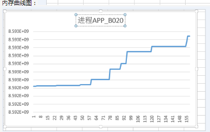

**可能原因<a name="zh-cn_topic_0000002505903219_zh-cn_topic_0000001312713077_section20876063"></a>**

分析上述信息，可能存在以下故障原因：

系统存在只申请内存不释放内存的问题，正常情况下，内存申请与释放必须成对出现。

**处理步骤<a name="zh-cn_topic_0000002505903219_zh-cn_topic_0000001312713077_section9345112013295"></a>**

针对分析的故障可能原因，可以参考下面步骤处理：

排查所有的内存申请和释放的地方，保证申请与释放一一对应。例如aclrtMalloc与aclrtFree，aclrtMallocHost与aclrtFreeHost、aclrtCreateStream与aclrtDestroyStream等。

### Event数量超过上限导致aclrtRecordEvent接口返回失败<a name="ZH-CN_TOPIC_0000002506023443"></a>

**问题现象描述<a name="zh-cn_topic_0000002506023113_zh-cn_topic_0000001265233034_section32145724"></a>**

调用aclrtRecordEvent接口在Stream中记录一个Event时，日志中的报错如下，红框中是关键日志信息，提示Event申请失败。由于软件版本在持续优化中，新旧版本的日志不同，如下所示：

-   新版本日志示例如下：

    ```
    275:[INFO] ASCENDCL(234708,acltest_host):2024-07-17-23:57:52.402.011 [acl_event_testcase.cpp:173]234708 acl_event_testcase.cpp:173 ACL_EVENT_0213:create events, the latest event can be created, but eventRecord failed, return ACL_ERROR_RT_DRV_INTERNAL_ERROR !
    69718:[ERROR] RUNTIME(234708,acltest_host):2024-07-18-00:06:16.739.666 [event.cc:378]234708 Record:report error module_type=0, module_name=EE9999
    69719:[ERROR] RUNTIME(234708,acltest_host):2024-07-18-00:06:16.739.680 [event.cc:378]234708 Record:Event id alloc error, deviceId=0, tsId=0, retCode=0x7020019!
    70241:[ERROR] RUNTIME(234708,acltest_host):2024-07-18-00:06:16.749.305 [stream.cc:1751]234708 ReleaseTimeline:report error module_type=0, module_name=EE9999
    70242:[ERROR] RUNTIME(234708,acltest_host):2024-07-18-00:06:16.749.307 [stream.cc:1751]234708 ReleaseTimeline:Release timeline failed, base=0 is invalid, valid value=0x10a8c0
    70244:[ERROR] RUNTIME(234708,acltest_host):2024-07-18-00:06:16.749.322 [api_error.cc:888]234708 EventRecord:Record event failed.
    70245:[ERROR] RUNTIME(234708,acltest_host):2024-07-18-00:06:16.749.330 [api_c.cc:716]234708 rtEventRecord:ErrCode=207007, desc=[driver error:no event resource], InnerCode=0x7020019
    70246:[ERROR] RUNTIME(234708,acltest_host):2024-07-18-00:06:16.749.332 [error_message_manage.cc:53]234708 FuncErrorReason:report error module_type=3, module_name=EE8888
    70247:[ERROR] RUNTIME(234708,acltest_host):2024-07-18-00:06:16.749.335 [error_message_manage.cc:53]234708 FuncErrorReason:rtEventRecord execute failed, reason=[driver error:no event resource]
    70249:[ERROR] ASCENDCL(234708,acltest_host):2024-07-18-00:06:16.749.348 [event.cpp:101]234708 aclrtRecordEvent: record event failed, runtime result = 207007
    ```

-   旧版本日志示例如下：

    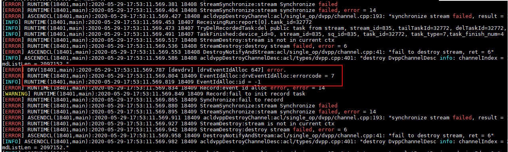

**可能原因<a name="zh-cn_topic_0000002506023113_zh-cn_topic_0000001265233034_section20876063"></a>**

分析上述日志信息，可能存在以下故障原因：Event ID的数量超过上限。

**处理步骤<a name="zh-cn_topic_0000002506023113_zh-cn_topic_0000001265233034_section9345112013295"></a>**

多Stream之间同步等待的场景下，Event ID的资源是可以复用的，复用Event ID的流程是：在调用aclrtRecordEvent接口+aclrtStreamWaitEvent接口后，若指定的Event已完成，则需要及时调用aclrtResetEvent接口释放Event资源。

需要用户按照复用Event ID的流程优化代码逻辑。

### 进程异常退出后重新执行任务失败<a name="ZH-CN_TOPIC_0000002473743710"></a>

**问题现象描述<a name="zh-cn_topic_0000002473903150_zh-cn_topic_0000001265073062_section32145724"></a>**

进程异常退出时，包括强行终止任务（如ctrl + c或者kill命令终止进程）的场景，然后重新启动任务失败。

**可能原因<a name="zh-cn_topic_0000002473903150_zh-cn_topic_0000001265073062_section20876063"></a>**

进程异常退出时，只能依赖系统检测到程序退出后才进行资源释放，释放资源最长需要一分钟的执行时间。如果在未执行完资源释放前执行新的任务，可能导致新执行的任务失败。

**处理步骤<a name="zh-cn_topic_0000002473903150_zh-cn_topic_0000001265073062_section9345112013295"></a>**

进程异常退出后需要等待一分钟，才能保证下一次重新执行任务成功。

### 进程异常，下一次执行任务报错“unbind model stream failed”<a name="ZH-CN_TOPIC_0000002505903537"></a>

**问题现象描述<a name="zh-cn_topic_0000002473743174_section128794133612"></a>**

用户捕获异常退出信号，并在信号处理函数中释放已申请资源，下一次执行时会报执行失败。此时查看日志，会发现unbind model stream failed报错。

**图 1**  unbind model stream failed<a name="zh-cn_topic_0000002473743174_zh-cn_topic_0000001312473057_fig2068431417219"></a>  
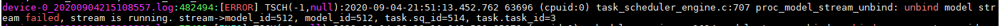

**可能原因<a name="zh-cn_topic_0000002473743174_section20876063"></a>**

进程异常时，Host侧内核态驱动会自动检测并发起对应进程Device侧资源释放的流程，不需要用户捕获进程异常的信号并主动完成清理。若用户主动释放，会影响到系统的资源释放流程。

**处理步骤<a name="zh-cn_topic_0000002473743174_section9345112013295"></a>**

用户无需关注进程异常退出信号，不要对异常退出信号做处理。

### 用户进程异常退出后重启进程失败<a name="ZH-CN_TOPIC_0000002473903668"></a>

**问题现象描述<a name="zh-cn_topic_0000002473743176_zh-cn_topic_0000001265073070_section32145724"></a>**

用户进程卡住或者用户强制退出进程后，再次重启，重启后发现进程无法正常启动。类似的日志信息如下：

acl接口的报错信息：aclrtProcessReport failed

```
aclrtProcessReport failed, ret = 107012
```

Runtime日志信息：halResourceIdAlloc xxx failed

```
[ERROR] RUNTIME(2086,rtstest_host):2021-06-09-02:14:46.034.380 [npu_driver.cc:285]2086 StreamIdAlloc:[driver interface] halResourceIdAlloc streamid failed: device_id=0, tsId=0, drvRetCode=48!
[ERROR] RUNTIME(2086,rtstest_host):2021-06-09-02:14:46.034.401 [stream.cc:448]2086 Setup:Failed to alloc stream id, retCode=0x702001a.
[ERROR] RUNTIME(2086,rtstest_host):2021-06-09-02:14:46.034.416 [context.cc:1251]2086 StreamCreate:Setup stream failed, retCode=0x702001a.
[ERROR] RUNTIME(2086,rtstest_host):2021-06-09-02:14:46.034.440 [logger.cc:211]2086 StreamCreate:Create stream failed, priority=7 ,flags=0.
[ERROR] RUNTIME(2086,rtstest_host):2021-06-09-02:14:46.034.458 [api_c.cc:461]2086 rtStreamCreateWithFlags:ErrCode=207008, desc=[driver error:no stream resource], InnerCode=0x702001a
[ERROR] RUNTIME(2086,rtstest_host):2021-06-09-02:14:46.034.469 [error_message_manage.cc:26]2086 ReportFuncErrorReason:rtStreamCreateWithFlags execute failed, reason=[driver error:no stream resource]
```

**可能原因<a name="zh-cn_topic_0000002473743176_zh-cn_topic_0000001265073070_section20876063"></a>**

通过日志分析无法正常重启的原因可能是public taskid、stream id、eventid等资源申请不到引起的：

-   资源已经被其他进程占用完。
-   上一个进程退出时还未完全释放完资源。

**处理步骤<a name="zh-cn_topic_0000002473743176_zh-cn_topic_0000001265073070_section13239568"></a>**

针对上述可能原因，可以按以下方式处理：

-   等待一分钟后再重新启动进程，保证上一个进程资源释放完成。
-   停止其他进程或者等其他进程执行完成后再启动进程。
-   如果通过上述方式处理后仍然申请失败，建议检查是否超过了可用的资源上限，如果未超上限，则需要重启环境强行释放资源、恢复环境。

### AI应用进程未退出，导致休眠唤醒失败<a name="ZH-CN_TOPIC_0000002506023407"></a>

**问题现象描述<a name="zh-cn_topic_0000002505903147_section1579051113718"></a>**

休眠失败。

查看应用类日志，系统内部的任务分发模块hwts正处于busy状态，检查发现不满足休眠条件，日志片段示例如下：

```
[ERROR] TSCH(-1,null):2023-01-01-02:53:45.850.781 1 (dieid:0,cpuid:0) device_management_plat.c:563 suspend_ack: suspend pre check fail, hwts is busy
[EVENT] TSCH(-1,null):2023-01-01-02:53:45.850.803 2 (dieid:0,cpuid:0) device_management.c:411 process_low_power_cmd: ts suspend ack ret=1.
```

**原因分析<a name="zh-cn_topic_0000002505903147_section15776135873720"></a>**

根据休眠唤醒的流程，休眠前AI应用进程必须先退出，相关硬件资源处于idle态，才允许休眠。不满足休眠条件，会有相关报错，本案例中因为AI应用进程未退出，在休眠唤醒时检测到hwts处于busy状态，因此休眠失败。

**解决办法<a name="zh-cn_topic_0000002505903147_section1247165141512"></a>**

用户需要确保AI应用进程已经运行结束或者优雅退出，推荐使用**kill -2  _PID_**退出相关进程，**_PID_**需替换为实际进程ID。

### 内存申请失败，出现OOM<a name="ZH-CN_TOPIC_0000002473743754"></a>

**问题现象描述<a name="zh-cn_topic_0000002505903139_zh-cn_topic_0229033163_section17474517"></a>**

内存申请失败，Host侧日志提示EL9999返回码，有如下打印信息：

```
[ERROR] DRV(2936187,python3):2022-04-21-14:19:39.429.481 [curpid: 2936187, 2969960][drv][devmm][devmm_alloc_managed 182]<errno:12, 6> Heap_alloc_managed out of memory. (temp_ptr=0x1; bytesize=8592031776)
[ERROR] RUNTIME(2936187,python3):2022-04-21-14:19:39.429.491 [npu_driver.cc:780]2969960 DevMemAllocHugePageManaged:report error module_type=1, module_name=EL9999
[ERROR] RUNTIME(2936187,python3):2022-04-21-14:19:39.429.495 [npu_driver.cc:780]2969960 DevMemAllocHugePageManaged:[driver interface] halMemAlloc failed: device_id=1, size=8592031776, type=0, env_type=3, drvRetCode=6!
```

**可能原因<a name="zh-cn_topic_0000002505903139_zh-cn_topic_0229033163_section23052927"></a>**

根据日志信息分析，判断为内存申请失败。可能原因：

1.  网络并行运行，导致内存不足。
2.  网络运行需要内存过大，导致内存申请失败。

**处理步骤<a name="zh-cn_topic_0000002505903139_zh-cn_topic_0229033163_section1280141912219"></a>**

1.  查看运行网络时是否存在并行情况。
2.  查询网络运行需要内存大小或者减少batchsize，查看网络是否可以正常运行。

### 异步拷贝调用查询接口报错<a name="ZH-CN_TOPIC_0000002505903651"></a>

**问题现象描述<a name="zh-cn_topic_0000002473903100_section128794133612"></a>**

通过event实现H2D或D2H异步拷贝任务的同步等待时，在调用aclrtQueryEventStatus确认任务完成后，先调用aclrtFreeHost释放Host内存再调用aclrtDestroyEvent接口，可能会有如下报错信息打印：

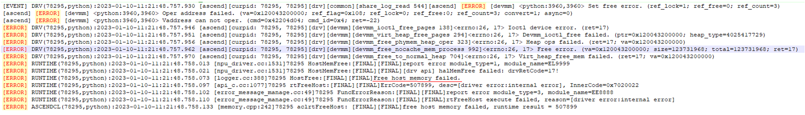

**可能原因<a name="zh-cn_topic_0000002473903100_section20876063"></a>**

报错是因为使用了异步拷贝任务之后下发了一个event record任务，期望使用aclrtQueryEventStatus查询到event record任务是否完成，从而判断异步拷贝任务是否完成，而后释放内存调用aclrtFreeHost。

实际上aclrtQueryEventStatus查询到的是Device执行完任务，并未透传到Host侧，所以此时释放内存，未先销毁Event会有时序问题导致报错。

**处理步骤<a name="zh-cn_topic_0000002473903100_section9345112013295"></a>**

处理该问题可以参考以下方案：

方案一：使用aclrtSynchronizeStream接口判断任务是否执行完成。

方案二：使用aclrtQueryEventStatus接口时，先调用aclrtDestroyEvent接口，再调用aclrtFreeHost接口，保证无时序问题。

### 低版本内核使用asan导致单算子执行失败<a name="ZH-CN_TOPIC_0000002506023519"></a>

**问题现象描述<a name="zh-cn_topic_0000002473903080_section89715399419"></a>**

执行单算子时，算子输入数据正确，但输出数据异常，全为0，Host侧plog日志中的报错示例如下：

```
[ERROR] RUNTIME(2082291,python3):2024-07-04-14:14:25.036.721 [stars_engine.cc:1321]2082291 ProcLogicCqReport:[INIT][DEFAULT]Task run failed, device_id=0, stream_id=2, task_id=1, sqe_type=0(ffts), errType=0x1(task exception), sqSwStatus=0
[ERROR] RUNTIME(2082291,python3):2024-07-04-14:14:25.049.079 [device_error_proc.cc:1218]2082291 ProcessStarsCoreErrorInfo:[INIT][DEFAULT]report error module_type=5, module_name=EZ9999
[ERROR] RUNTIME(2082291,python3):2024-07-04-14:14:25.049.115 [device_error_proc.cc:1218]2082291 ProcessStarsCoreErrorInfo:[INIT][DEFAULT]The error from device(chipId:3, dieId:0), serial number is 20, there is an aivec error exception, core id is 4, error code = 0, dump info: pc start: 0x12c0c001406c, current: 0x12c0c00140fc, vec error info: 0x600ed4063d, mte error info: 0x8d0600008c, ifu error info: 0x70f016e068500, ccu error info: 0x28000037, cube error info: 0, biu error info: 0, aic error mask: 0x6500020bd00028c, para base: 0x12c0803e5000.
[ERROR] RUNTIME(2082291,python3):2024-07-04-14:14:25.049.300 [device_error_proc.cc:1230]2082291 ProcessStarsCoreErrorInfo:[INIT][DEFAULT]report error module_type=5, module_name=EZ9999
[ERROR] RUNTIME(2082291,python3):2024-07-04-14:14:25.049.321 [device_error_proc.cc:1230]2082291 ProcessStarsCoreErrorInfo:[INIT][DEFAULT]The extend info: errcode:(0, 0x200000000000000, 0) errorStr: The MPU address access is invalid. fixp_error0 info: 0x600008c, fixp_error1 info: 0x8d fsmId:1, tslot:3, thread:0, ctxid:0, blk:0, sublk:0, subErrType:4.
[ERROR] RUNTIME(2082291,python3):2024-07-04-14:14:25.049.519 [stream.cc:3084]2082291 EnterFailureAbort:[INIT][DEFAULT]stream_id=2 enter failure abort.
[ERROR] RUNTIME(2082291,python3):2024-07-04-14:14:25.049.558 [davinic_kernel_task.cc:1321]2082291 SetStarsResultForDavinciTask:[INIT][DEFAULT]AIV Kernel happen error, retCode=0x31.
[ERROR] RUNTIME(2082291,python3):2024-07-04-14:14:25.050.340 [davinic_kernel_task.cc:1219]2082291 PreCheckTaskErr:[INIT][DEFAULT]report error module_type=5, module_name=EZ9999
[ERROR] RUNTIME(2082291,python3):2024-07-04-14:14:25.050.365 [davinic_kernel_task.cc:1219]2082291 PreCheckTaskErr:[INIT][DEFAULT]Kernel task happen error, retCode=0x31, [vector core exception].
[ERROR] RUNTIME(2082291,python3):2024-07-04-14:14:25.050.474 [stream.cc:1079]2082291 GetError:[INIT][DEFAULT]Stream Synchronize failed, stream_id=2, retCode=0x31, [vector core exception].
[ERROR] RUNTIME(2082291,python3):2024-07-04-14:14:25.050.496 [stream.cc:1082]2082291 GetError:[INIT][DEFAULT]report error module_type=5, module_name=EZ9999
[ERROR] RUNTIME(2082291,python3):2024-07-04-14:14:25.050.517 [stream.cc:1082]2082291 GetError:[INIT][DEFAULT]AIV Kernel happen error, retCode=0x31.
[ERROR] RUNTIME(2082291,python3):2024-07-04-14:14:25.050.941 [davinic_kernel_task.cc:1143]2082291 PrintErrorInfoForDavinciTask:[INIT][DEFAULT]Aicore kernel execute failed, device_id=0, stream_id=2, report_stream_id=2, task_id=1, flip_num=0, fault kernel_name=Add_ee98c6628030785f610b924ab1557b31_high_performance_210000000, fault kernel info ext=none, program id=0, hash=3838710036602041089.
[ERROR] RUNTIME(2082291,python3):2024-07-04-14:14:25.051.013 [davinic_kernel_task.cc:1082]2082291 GetArgsInfo:[INIT][DEFAULT][AIC_INFO] args(0 to 9) after execute:0, 0, 0, 0, 0, 0, 0, 0, 0,  
[ERROR] RUNTIME(2082291,python3):2024-07-04-14:14:25.051.046 [davinic_kernel_task.cc:1085]2082291 GetArgsInfo:[INIT][DEFAULT]tilingKey = 210000000, print 1 Times totalLen=(9*8)Bytes, argsSize=72, blockDim=1
[ERROR] RUNTIME(2082291,python3):2024-07-04-14:14:25.051.088 [davinic_kernel_task.cc:1147]2082291 PrintErrorInfoForDavinciTask:[INIT][DEFAULT][AIC_INFO] after execute:args print end
```

**可能原因<a name="zh-cn_topic_0000002473903080_section679327114212"></a>**

用户程序编译选项中启动了地址消毒（-lasan），但低版本内核（5.10以下版本，不含5.10）不支持使用asan工具，导致执行算子时拷贝输出数据异常。

可使用**uname -r**命令查看内核版本。

**处理步骤<a name="zh-cn_topic_0000002473903080_section26741811204211"></a>**

-   解决方法1：升级内核版本到5.10或更高版本。
-   解决方法2：在用户程序编译选项中去掉地址消毒（-lasan）。

### 析构函数中调用去初始化接口aclFinalize导致应用进程coredump<a name="ZH-CN_TOPIC_0000002473743742"></a>

**问题现象描述<a name="zh-cn_topic_0000002473743208_zh-cn_topic_0000001949771436_section89715399419"></a>**

应用程序运行过程中出现core dump，应用程序异常终止。

**原因分析<a name="zh-cn_topic_0000002473743208_zh-cn_topic_0000001949771436_section679327114212"></a>**

1.  生成coredump文件。
    -   物理机场景，执行**ulimit -c unlimited**命令，表示在程序崩溃时生成coredump文件：

        完成问题定位后，如果不需要生成coredump文件，可执行**ulimit -c 0**命令。

    -   Docker场景，在Docker启动命令中增加**--ulimit core=-1**设置。

2.  运行应用程序，若进程崩溃，即可在当前目录下生成coredump文件。
3.  使用gdb工具调试core文件、打印堆栈信息。

    进入gdb模式，调试coredump文件，命令示例如下。其中，_main_表示产生coredump文件的可执行程序名称，可根据实际情况修改；coredump文件名需根据实际文件名称修改。

    ```
    gdb main core*.*
    ```

    执行命令后，gdb工具会将发生异常的代码、其所在的函数、文件名和所在文件的行数打印到屏幕，堆栈信息的最上面是最底层的调用栈信息，方便定位问题。堆栈信息举例如下：

    ```
    Thread 1 "main" received signal SIGSEGV, Segmentation fault.
    0x0000ffffa70747c8 in ge::PluginManager::~PluginManager() () from /usr/local/Ascend/latest/lib64/libge_common.so
    (gdb) bt
    #0 0x0000ffffa70747c8 in ge::PluginManager::~PluginManager() () from /usr/local/Ascend/latest/lib64/libge_common.so
    #1 0x0000ffffa707c900 in ge::RuntimePluginLoader::Finalize() () from /usr/local/Ascend/latest/lib64/libge_common.so
    #2 0x0000ffffa29485d0 in ge::GeExecutor::FinalizeEx() () from /usr/local/Ascend/latest/lib64/libge_executor.so
    #3 0x0000ffffb06fabc in aclFinalize() from /usr/local/Ascend/latest/lib64/libascendcl.so
    #4 0x0000ffffbd5a98ec in ResourceManager::~ResourceManager() () from /home/miniconda3/envs/gly/lib/pythons3.7/site-packages/mindspore/_c_dataengine.cpython-37m-aarch64-linux-gnu.so
    #5 0x0000ffffbd5a9f80 in std::Sp_counted_ptr<ResourceManager*, (__gnu_cxx::Lock_policy)2>::_M_dispose() () from /home/miniconda3/envs/gly/lib/pythons3.7/site-packages/mindspore/_c_dataengine.cpython-37m-aarch64-linux-gnu.so
    #6 0x0000ffffbd5a97f0 in std::shared_ptr<ResourceManager>::~shared_ptr() () from /home/miniconda3/envs/gly/lib/pythons3.7/site-packages/mindspore/_c_dataengine.cpython-37m-aarch64-linux-gnu.so
    ```

    **注意**，调试coredump文件、打印堆栈信息要在出现问题的运行环境中，如果换一套环境，可能导致调试的堆栈信息不准确。

    若环境中未安装gdb，则需要安装gdb，可通过包管理（如apt-get install gdb、yum install gdb）进行安装，详细安装步骤及使用方法请参见[GDB官方文档](https://sourceware.org/gdb/)。

4.  分析堆栈信息。

    生成coredump文件、检查打印的堆栈信息后，发现应用程序在调用aclFinalize接口后异常退出，因此初步判断可能是aclFinalize接口使用问题。

5.  排查应用程序代码中aclFinalize接口的调用逻辑。

    排查代码逻辑，发现该aclFinalize接口在析构函数中被调用，但该接口存在使用约束：不建议在析构函数中调用aclFinalize接口，否则在进程退出时可能由于单例析构顺序未知而导致进程异常退出的问题。因此判断是由于在析构函数中调用aclFinalize接口导致应用进程coredump。

**处理步骤<a name="zh-cn_topic_0000002473743208_zh-cn_topic_0000001949771436_section26741811204211"></a>**

优化应用程序的代码逻辑，不能在析构函数中调用aclFinalize接口，下文给出正确、错误的代码示例。

-   aclFinalize接口的正确调用示例如下：

    ```
    int main() {
      // 初始化
      // 此处的..表示相对路径，相对可执行文件所在的目录，例如，编译出来的可执行文件存放在out目录下，此处的..就表示out目录的上一级目录
      const char *aclConfigPath = "../src/acl.json";
      aclError ret = aclInit(aclConfigPath);
    
      // 业务处理代码
    
      // 去初始化，没有退出main函数，所有资源都可用
      ret = aclFinalize();
      return 0;
    }
    ```

-   aclFinalize接口的错误调用示例如下，使用单例析构去初始化：

    ```
    class ResourceManager {
     public:
      ResourceManager() = default;
      // 单例析构
      ~ResourceManager() {
        // 去初始化
        (void) aclFinalize();
      }
      // 单例构造
      static ResourceManager &Instance() {
        static ResourceManager instance;
        return instance;
      }
      aclError Init() {
        // 初始化 
        // 此处的..表示相对路径，相对可执行文件所在的目录，例如，编译出来的可执行文件存放在out目录下，此处的..就表示out目录的上一级目录
        const char *aclConfigPath = "../src/acl.json";
        return aclInit(aclConfigPath);
      }
    };
    int main() {
      // 初始化
      aclError ret = ResourceManager::Instance().Init();
      // 业务处理代码
      // 没有显式去初始化，最后ResourceManager单例析构时调用aclFinalize
      // 由于单例析构是在main函数退出后才执行，单例析构和进程依赖so的卸载顺序无法控制
      // 会出现aclFinalize访问的一些资源所在so已经被卸载，从而导致进程退出异常
      return 0;
    }
    ```

-   aclFinalize接口的错误调用示例如下，使用全局变量析构去初始化：

    ```
    class ResourceManager {
     public:
      ResourceManager() = default;
      // 全局变量析构
      ~ResourceManager() {
        // 去初始化
        (void) aclFinalize();
      }
      aclError Init() {
        // 初始化
        // 此处的..表示相对路径，相对可执行文件所在的目录，例如，编译出来的可执行文件存放在out目录下，此处的..就表示out目录的上一级目录
        const char *aclConfigPath = "../src/acl.json";
        return aclInit(aclConfigPath);
      }
    };
    // 全局变量构造
    ResourceManager g_resource_manager;
    int main() {
      // 初始化
      aclError ret = g_resource_manager.Init();
      // 业务处理代码
      // 没有显式去初始化，最后ResourceManager全局变量析构时调用aclFinalize
      // 由于全局变量析构是在main函数退出后才执行，全局变量析构和进程依赖so的卸载顺序无法控制
      // 会出现aclFinalize访问的一些资源所在so已经被卸载，从而导致进程退出异常
      return 0;
    }
    ```

## 模型推理问题<a name="ZH-CN_TOPIC_0000002506023551"></a>


### 使用dump功能未获取dump结果<a name="ZH-CN_TOPIC_0000002473743546"></a>

**问题现象描述<a name="zh-cn_topic_0000002506023045_section32145724"></a>**

日志显示正确执行了Dump功能，但在Dump结果路径下没有Dump的结果。日志信息包含了以下关键字：

```
[INFO] ASCENDCL ****** "HandleDumpConfig end in HandleDumpConfig."
[INFO] ASCENDCL ****** "set HandleDumpConfig success in aclInit"
```

**可能原因<a name="zh-cn_topic_0000002506023045_section20876063"></a>**

分析上述日志信息，可能存在以下故障原因：Dump配置的模型名与实际的模型名不匹配。

**处理步骤<a name="zh-cn_topic_0000002506023045_section9345112013295"></a>**

针对分析的故障可能原因，可以参考下面步骤处理：

检查Dump配置文件acl.json，确保Dump配置文件合法，例如model\_name是否配置正确。示例如下：

```
{
    "dump":{
        "dump_list":[
             {
                "model_name":"ResNet-50",
                  "layer":[
                             "convlconvl_relu"
                          ]
             },
             {
                "model_name":"mxnet-model"
             }
        ],
        "dump_mode":"output",
        "dump_path":"/home/test/output/dump"
    }
}
```

模型名称可以通过以下方式获取：

方式一：如果您安装了MindStudio，在MindStudio界面选择“Tools \> Model Visualizer“菜单栏，选择.om模型文件，在显示该模型内容的面板空白处单击左键，此时右侧属性面板中显示模型名称属性“Model Name“，模型名称取该项对应值。

方式二：通过ATC命令生成模型的json文件，在json文件中查找“name“字段对应值，查找模型名称和算子名称，模型名称在"graph"字段外、算子名称在"graph"字段内。

### 注册算子数超过最大规格<a name="ZH-CN_TOPIC_0000002473903516"></a>

**问题现象描述<a name="zh-cn_topic_0000002473743200_zh-cn_topic_0258218225_section32145724"></a>**

推理过程中，用户load model出现报错。

日志中包含ProgramRegister:Program register failed, program out of xxx和Register binary failed关键信息，日志示例如下：

```
[ERROR] RUNTIME(3093,rtstest_host):2021-06-09-02:30:34.400.124 [runtime.cc:967]3093 ProgramRegister:Program register failed, program out of 40000000
[ERROR] RUNTIME(3093,rtstest_host):2021-06-09-02:30:34.400.155 [logger.cc:23]3093 DevBinaryRegister:Register binary failed.
[ERROR] RUNTIME(3093,rtstest_host):2021-06-09-02:30:34.400.182 [api_c.cc:127]3093 rtDevBinaryRegister:ErrCode=507032, desc=[program register num out of use], InnerCode=0x7090007
[ERROR] RUNTIME(3093,rtstest_host):2021-06-09-02:30:34.400.185 [error_message_manage.cc:26]3093 ReportFuncErrorReason:rtDevBinaryRegister execute failed, reason=[program register num out of use]
```

**可能原因<a name="zh-cn_topic_0000002473743200_zh-cn_topic_0258218225_section20876063"></a>**

通过日志分析报错的原因可能是一个进程内算子等资源注册超过最大规格。

**处理步骤<a name="zh-cn_topic_0000002473743200_zh-cn_topic_0258218225_section13239568"></a>**

针对上述可能原因，可以按以下方式处理：

-   分析model，简化模型或者降低动态batch档次。
-   算子数是进程资源，model太大的情况下建议一个进程open一个device。
-   避免同一算子在不同模型中反复注册。
-   注册算子数不超过最大规格。

## 算子执行问题<a name="ZH-CN_TOPIC_0000002505903601"></a>


### 算子插件未注册报错<a name="ZH-CN_TOPIC_0000002506023497"></a>

**问题现象描述<a name="zh-cn_topic_0000002473743236_section1694272615198"></a>**

查看日志， 存在报错某个算子类型不支持：

```
Check op[%s]'s type[%s] failed, it is not supported.
```

或者

进行模型转换的时候，某个算子类型转换不符合预期，被转换成了frameworkop类型。

**可能原因<a name="zh-cn_topic_0000002473743236_section7208842191910"></a>**

根据日志分析，可能存在以下可能原因：

-   算子插件so未加载成功。
-   算子未注册映射关系，或者未编译到算子的插件so中。

**解决措施<a name="zh-cn_topic_0000002473743236_section63198557198"></a>**

针对分析可能的故障原因，可以参考下面步骤处理：

1.  确认算子插件so是否加载成功。
    -   算子插件so加载成功打印类似信息：

        ```
        plugin load /usr/local/Ascend/opp/built-in/framework/onnx/libops_all_onnx_plugin.so success.
        ```

    -   加载失败的告警关键信息：

        ```
        dlopen failed, plugin name:%s. Message(%s).
        ```

2.  如果算子插件so加载成功，则需要继续确认算子注册的映射关系是否编译进加载的插件so中了。

    使用nm命令查看so符号表， 如果没有注册， 则需要注册该算子插件， 可以参考《TBE&AI CPU算子开发指南》中的“算子开发过程 \> 算子适配”章节内容实现。

    > **说明：** 
    >**nm -D**命令可查看so文件符号表。

3.  如果算子插件so未加载成功，参考失败告警中Message提示内容处理。

### 算子原型未注册报错<a name="ZH-CN_TOPIC_0000002473743500"></a>

**问题现象描述<a name="zh-cn_topic_0000002505903207_section1694272615198"></a>**

查看日志， 存在报错某个算子没有原型定义：

```
op[%s] type[%s] have no ir factory.
```

或者

```
IR for op[%s] optype[%s] is not registered.
```

> **说明：** 
>op\[%s\] type\[%s\]中的%s分别表示具体的算子名称和算子类型。

**可能原因<a name="zh-cn_topic_0000002505903207_section7208842191910"></a>**

根据日志分析，可能存在以下可能原因：

-   算子原型so未加载成功。
-   算子未定义注册该类型算子， 并编译到算子的原型so中。

**解决措施<a name="zh-cn_topic_0000002505903207_section63198557198"></a>**

针对分析可能的故障原因，可以参考下面步骤处理：

1.  确认算子原型so是否加载成功。
    -   算子原型so加载成功打印类似信息：

        ```
        OpsProtoManager plugin load /usr/local/Ascend/opp/built-in/op_proto/libopsproto.so success.
        ```

    -   加载失败的告警关键信息：

        ```
        OpsProtoManager dlopen failed, plugin name:%s. Message(%s).
        ```

2.  如果算子原型so加载成功， 需要确认算子原型定义是否编译进加载的so中了。

    使用nm查看so符号表， 如果没有注册， 则需要注册该算子原型， 可以参考《TBE&AI CPU算子开发指南》中的“算子开发过程 \> 算子原型定义”章节内容实现。

    > **说明：** 
    >**nm -D**命令可查看so文件符号表。

3.  如果算子原型so未加载成功，参考失败告警中Message提示内容处理。

### AI Core算子执行报错<a name="ZH-CN_TOPIC_0000002506023629"></a>

**问题现象描述<a name="zh-cn_topic_0000002473743234_section32145724"></a>**

Runtime执行报错，在应用程序运行日志中Runtime打印了类似fault kernel\_name和func\_name的关键信息。

```
[ERROR] RUNTIME(4150867,msame):2022-09-22-09:27:46.403.262 [engine.cc:1103]4150867 ReportExceptProc:[EXEC][DEFAULT]Task exception! device_id=0, stream_id=20, task_id=1, type=13, retCode=0x91, [the model stream execute failed].
[ERROR] RUNTIME(4150867,msame):2022-09-22-09:27:46.404.423 [device_error_proc.cc:495]4150867 PrintCoreErrorInfo:[EXEC][DEFAULT]The error from device(0), serial number is 193, there is an aicore error, core id is 8, error code = 0x800000, dump info: pc start: 0x800120080047000, current: 0x1200800471cc, vec error info: 0x7cafc4e, mte error info: 0x3000052, ifu error info: 0xc33f87bd7a80, ccu error info: 0xffd2bbd5005fe9d7, cube error info: 0x84, biu error info: 0, aic error mask: 0x65000200d000288, para base: 0x120080016300, errorStr: The DDR address of the MTE instruction is out of range.
[ERROR] RUNTIME(4150867,msame):2022-09-22-09:27:46.404.443 [device_error_proc.cc:526]4150867 PrintCoreErrorInfo:[EXEC][DEFAULT]report error module_type=5, module_name=EZ9999
[ERROR] RUNTIME(4150867,msame):2022-09-22-09:27:46.404.449 [device_error_proc.cc:526]4150867 PrintCoreErrorInfo:[EXEC][DEFAULT]The extend info from device(0), serial number is 193, there is aicore error, core id is 8, aicore int: 0x10, aicore error2: 0, axi clamp ctrl: 0, axi clamp state: 0x1717, biu status0: 0x101d14000000000, biu status1: 0x80000201020000, clk gate mask: 0, dbg address: 0, ecc en: 0, mte ccu ecc 1bit error: 0x2e80000000000000, vector cube ecc 1bit error: 0, run stall: 0x1, dbg data0: 0, dbg data1: 0, dbg data2: 0, dbg data3: 0, dfx data: 0x8b
[ERROR] RUNTIME(4150867,msame):2022-09-22-09:27:46.404.607 [task.cc:1021]4150867 PrintErrorInfo:[EXEC][DEFAULT]Aicore kernel execute failed, device_id=0, stream_id=23, report_stream_id=20, task_id=24, flip_num=0, fault kernel_name=16805736118314619649-1_0_1_Add_35, func_name=te_add_729e2a87c649f49de98ac1a6fd491b3262ee7db9c1c2d6f4add7d7439aa3d22e_1__kernel0, program id=22, hash=3338199064661472585.
[ERROR] RUNTIME(4150867,msame):2022-09-22-09:27:46.404.618 [task.cc:3275]4150867 ReportErrorInfo:[EXEC][DEFAULT]model execute error, retCode=0x91, [the model stream execute failed].
[ERROR] RUNTIME(4150867,msame):2022-09-22-09:27:46.404.624 [task.cc:3247]4150867 PrintErrorInfo:[EXEC][DEFAULT]model execute task failed, device_id=0, model stream_id=20, model task_id=1, flip_num=0, model_id=3, first_task_id=65535
[ERROR] RUNTIME(4150867,msame):2022-09-22-09:27:46.404.714 [stream.cc:929]4150867 GetError:[EXEC][DEFAULT]Stream Synchronize failed, stream_id=20, retCode=0x91, [the model stream execute failed].
[ERROR] RUNTIME(4150867,msame):2022-09-22-09:27:46.404.742 [model.cc:581]4150867 SynchronizeExecute:[EXEC][DEFAULT]Fail to synchronize forbidden stream_id=20, retCode=0x7150050!
[ERROR] RUNTIME(4150867,msame):2022-09-22-09:27:46.404.748 [model.cc:605]4150867 GetStreamToSyncExecute:[EXEC][DEFAULT]report error module_type=0, module_name=EE9999
[ERROR] RUNTIME(4150867,msame):2022-09-22-09:27:46.404.753 [model.cc:605]4150867 GetStreamToSyncExecute:[EXEC][DEFAULT]Model synchronize execute failed, model_id=3!
[ERROR] RUNTIME(4150867,msame):2022-09-22-09:27:46.404.774 [logger.cc:856]4150867 ModelExecute:[EXEC][DEFAULT]Execute model failed.
[ERROR] RUNTIME(4150867,msame):2022-09-22-09:27:46.404.787 [api_c.cc:2063]4150867 rtModelExecute:[EXEC][DEFAULT]ErrCode=507011, desc=[the model stream execute failed], InnerCode=0x7150050
[ERROR] RUNTIME(4150867,msame):2022-09-22-09:27:46.404.793 [error_message_manage.cc:49]4150867 FuncErrorReason:[EXEC][DEFAULT]report error module_type=3, module_name=EE8888
[ERROR] RUNTIME(4150867,msame):2022-09-22-09:27:46.404.801 [error_message_manage.cc:49]4150867 FuncErrorReason:[EXEC][DEFAULT]rtModelExecute execute failed, reason=[the model stream execute failed]
```

**可能原因<a name="zh-cn_topic_0000002473743234_section20876063"></a>**

从日志报错可知，AI Core算子执行失败，可能算子本身代码问题：数据输入不匹配、访问越界、计算溢出等异常。

查阅plog日志，根据fault kernel\_name和func\_name可获取报错算子名称和报错函数名称。

```
[ERROR] RUNTIME(4150867,msame):2022-09-22-09:27:46.404.607 [task.cc:1021]4150867 PrintErrorInfo:[EXEC][DEFAULT]Aicore kernel execute failed, device_id=0, stream_id=23, report_stream_id=20, task_id=24, flip_num=0, fault kernel_name=16805736118314619649-1_0_1_Add_35, func_name=te_add_729e2a87c649f49de98ac1a6fd491b3262ee7db9c1c2d6f4add7d7439aa3d22e_1__kernel0, program id=22, hash=3338199064661472585.
```

**处理步骤<a name="zh-cn_topic_0000002473743234_section195821221069"></a>**

该类型错误，需要联系技术支持定位排查。 

**可能导致的故障<a name="zh-cn_topic_0000002473743234_section273711247918"></a>**

模型下沉场景下，该问题可能导致acl接口报错Execute model failed，并打印在plog日志中。

```
[ERROR] ASCENDCL(4150867,msame):2022-09-22-09:27:46.404.834 [model.cpp:699]4150867 ModelExecute: [EXEC][DEFAULT][Exec][Model]Execute model failed, ge result[507011], modelId[1]
[ERROR] ASCENDCL(4150867,msame):2022-09-22-09:27:46.404.857 [model.cpp:1547]4150867 aclmdlExecute: [EXEC][DEFAULT][Exec][Model]modelId[1] execute failed, result[507011]
```

非模型下沉场景下，该问题可能导致算子执行失败，acl接口报错get op desc failed，Runtime报错Aicore kernel execute failed，并打印在plog日志中。

```
[ERROR] RUNTIME(2856615,xaclfk):2022-09-15-11:36:47.817.465 [task.cc:1058]2856939 PreCheckTaskErr:[EXEC][DEFAULT]Kernel task happen error, retCode=0x26, [aicore exception].
[ERROR] RUNTIME(2856615,xaclfk):2022-09-15-11:36:47.817.538 [task.cc:1029]2856939 PrintErrorInfo:[EXEC][DEFAULT]Aicore kernel execute failed, device_id=0, stream_id=0, report_stream_id=0, task_id=615, flip_num=0, fault kernel_name=12646006_1663210912148832_-1_0_while/transformer_0/decoder/layer_0/rnn/rnn/while/Select, func_name=te_select_7b314df6791292127cb82df985d04ddaf6d069cb31aaccec00e0b8ee2e997f20_1__kernel0, program id=131, hash=14736095126365135477.
[ERROR] GE(2856615,xaclfk):2022-09-15-11:36:47.818.283 [graph_execute.cc:557]2856939 GetOpDescInfo: ErrorNo: 4294967295(failed) [EXEC][DEFAULT][Get][OpDescInfo] failed, device_id:0, stream_id:0, task_id:615.
[ERROR] GE(2856615,xaclfk):2022-09-15-11:36:47.818.308 [ge_executor.cc:1332]2856939 GetOpDescInfo: ErrorNo: 4294967295(failed) [EXEC][DEFAULT][Get][OpDescInfo] failed, device_id:0, stream_id:0, task_id:615.
[ERROR] ASCENDCL(2856615,xaclfk):2022-09-15-11:36:47.818.315 [model.cpp:2216]2856939 aclmdlCreateAndGetOpDesc: [EXEC][DEFAULT][Get][OpDescInfo]get op desc failed, ge result[-1], deviceId[0], streamId[0], taskId[615]
```

### AI CPU算子Kernel执行报错<a name="ZH-CN_TOPIC_0000002473743496"></a>

**问题现象描述<a name="zh-cn_topic_0000002473743246_section32145724"></a>**

Runtime执行报错，在应用程序运行日志中Runtime打印了PrintAicpuErrorInfo的错误信息。

```
[ERROR] RUNTIME(16243,msame):2022-09-22-11:27:01.791.865 [engine.cc:1103]16282 ReportExceptProc:Task exception! device_id=0, stream_id=7, task_id=2, type=1, retCode=0x2a, [aicpu exception].
[ERROR] RUNTIME(16243,msame):2022-09-22-11:27:01.793.489 [device_error_proc.cc:669]16282 ProcessAicpuErrorInfo:report error module_type=0, module_name=E39999
[ERROR] RUNTIME(16243,msame):2022-09-22-11:27:01.793.498 [device_error_proc.cc:669]16282 ProcessAicpuErrorInfo:An exception occurred during AICPU execution, stream_id:7, task_id:2, errcode:5, msg:aicpu execute failed.
[ERROR] RUNTIME(16243,msame):2022-09-22-11:27:01.793.932 [task.cc:1050]16282 PreCheckTaskErr:report error module_type=5, module_name=EZ9999
[ERROR] RUNTIME(16243,msame):2022-09-22-11:27:01.793.941 [task.cc:1050]16282 PreCheckTaskErr:Kernel task happen error, retCode=0x2a, [aicpu exception].
[ERROR] RUNTIME(16243,msame):2022-09-22-11:27:01.793.981 [task.cc:759]16282 PrintAicpuErrorInfo:report error module_type=0, module_name=E39999
[ERROR] RUNTIME(16243,msame):2022-09-22-11:27:01.793.990 [task.cc:759]16282 PrintAicpuErrorInfo:Aicpu kernel execute failed, device_id=0, stream_id=7, task_id=2.
[ERROR] RUNTIME(16243,msame):2022-09-22-11:27:01.794.116 [task.cc:777]16282 PrintAicpuErrorInfo:Aicpu kernel execute failed, device_id=0, stream_id=7, task_id=2, flip_num=0, fault so_name=, fault kernel_name=, fault op_name=Unique, extend_info=(info_type:4, info_len:6, msg_info:Unique).
[ERROR] RUNTIME(16243,msame):2022-09-22-11:27:01.794.384 [stream.cc:929]16243 GetError:[EXEC][DEFAULT]Stream Synchronize failed, stream_id=7, retCode=0x2a, [aicpu exception].
[ERROR] RUNTIME(16243,msame):2022-09-22-11:27:01.794.407 [stream.cc:932]16243 GetError:[EXEC][DEFAULT]report error module_type=0, module_name=E39999
[ERROR] RUNTIME(16243,msame):2022-09-22-11:27:01.794.419 [stream.cc:932]16243 GetError:[EXEC][DEFAULT]Aicpu kernel execute failed, device_id=0, stream_id=7, task_id=2, flip_num=0, fault so_name=, fault kernel_name=, fault op_name=Unique, extend_info=(info_type:4, info_len:6, msg_info:Unique)
[ERROR] RUNTIME(16243,msame):2022-09-22-11:27:01.794.482 [logger.cc:305]16243 StreamSynchronize:[EXEC][DEFAULT]Stream synchronize failed, stream = 0x5643fe3e28d0
[ERROR] RUNTIME(16243,msame):2022-09-22-11:27:01.794.510 [api_c.cc:661]16243 rtStreamSynchronize:[EXEC][DEFAULT]ErrCode=507018, desc=[aicpu exception], InnerCode=0x715002a
[ERROR] RUNTIME(16243,msame):2022-09-22-11:27:01.794.519 [error_message_manage.cc:49]16243 FuncErrorReason:[EXEC][DEFAULT]report error module_type=3, module_name=EE8888
[ERROR] RUNTIME(16243,msame):2022-09-22-11:27:01.794.532 [error_message_manage.cc:49]16243 FuncErrorReason:[EXEC][DEFAULT]rtStreamSynchronize execute failed, reason=[aicpu exception]
```

**可能原因<a name="zh-cn_topic_0000002473743246_section20876063"></a>**

从日志报错可知，AI CPU算子执行失败，可能算子本身代码问题：**数据输入不匹配（例如数据格式、广播维度等）、访问越界、AI CPU线程挂死、算子执行超时（默认不超过30秒）**等问题。

> **说明：** 
>对于**广播维度约束**：部分基于TensorFlow实现的算子，其连续需要广播的轴和连续不需要广播的轴合并之后的维度要求小于6，否则会执行报错。
>举例：
>-   若a.shape=\(5, 1, 5, 1, 5, 1\)，b.shape=\(5, 5, 5, 5, 5, 5\)，没有需要合并的轴，最后维度为6，广播报错。
>-   若a.shape=\(5, 1, 5, 5, 1, 1\)，b.shape=\(5, 5, 5, 5, 5, 5\)，在第2和3维都不需要广播，4和5维都需要广播，分别连续合并，合并后的维度为4，广播成功。

比如通过查阅AI CPU的日志，排查具体报错原因。

-   样例1：UniqueExt算子输入数据维度不符合要求。

    ```
    [ERROR] CCECPU(2309,aicpu_scheduler):2022-09-22-11:27:00.733.218 [aicpu_tf_kernel.cc:348][tid:2317][TFAdapter] AICPUKernelAndDevice::Run failure, kernel_id=0, op_name=Unique, op_type=UniqueExt, error=Invalid argument: unique expects a 1D vector.
    [ERROR] CCECPU(2309,aicpu_scheduler):2022-09-22-11:27:00.733.242 [tf_adpt_session_mgr.cc:74][tid:2317][TFAdapter] [sessionID:0] Failed to Run kernel, kernel_id=0.
    [ERROR] CCECPU(2309,aicpu_scheduler):2022-09-22-11:27:00.733.261 [tf_adpt_session_mgr.cc:434][tid:2317][TFAdapter] [sessionID:0] Run kernel on session failed.
    [ERROR] CCECPU(2309,aicpu_scheduler):2022-09-22-11:27:00.733.277 [tf_adpt_api.cc:85][tid:2317][TFAdapter] [sessionID:0] Invoke TFOperateAPI failed.
    [ERROR] CCECPU(2309,aicpu_scheduler):2022-09-22-11:27:00.733.296 [ae_kernel_lib_fwk.cc:229][TransformKernelErrorCode][tid:2317][AICPU_PROCESSER] Call tf api return failed:5, input param to tf api:0x124040017004
    [ERROR] CCECPU(2309,aicpu_scheduler):2022-09-22-11:27:00.733.366 [aicpusd_event_process.cpp:1325][ExecuteTsKernelTask][tid:2317] Aicpu engine process failed, result[5].
    ```

-   样例2：BitwiseXor算子输入数据维度大于6维，不支持广播规则。

    已知a.shape=\[15,15,8,18,15,7,14\]，b.shape=\[3,15,1,8,1,1,7,14\]，报错原因如下：

    1.  根据广播规则，首先a需要向b维度看齐，左侧补1，结果为a\_new.shape\[1,15,15,8,18,15,7,14\]。
    2.  根据TensorFlow广播规则，a\_new和b的第4和5维需要广播、第6和7维不需要广播，分别连续合并，合并后的维度为6，广播失败。

    ```
    [ERROR] CCECPU(12226,aicpu_scheduler):2024-09-25-10:56:20.250.270 [aicpu_tf_kernel.cc:363][ProcessKernelRunOutput][tid:12236][TFAdapter]AICPUKernelAndDevice::Run failure, kernel_id=10000, op_name=BitwiseXor, op_type=BitwiseXor, error=UNIMPLEMENTED: Broadcast between [15,15,8,18,15,7,14] and [3,15,1,8,1,1,7,14] is not supported yet.
    [ERROR] CCECPU(12226,aicpu_scheduler):2024-09-25-10:56:20.250.315 [aicpu_tf_kernel_cache.cc:273][RunKernel][tid:12236][TFAdapter]Failed to Run kernel, kernel_id=10000.
    [ERROR] CCECPU(12226,aicpu_scheduler):2024-09-25-10:56:20.250.324 [tf_adpt_api.cc:86][APIInternalImpl][tid:12236][TFAdapter][sessionID:18446744073709551535] Invoke TFOperateAPI failed.
    [ERROR] CCECPU(12226,aicpu_scheduler):2024-09-25-10:56:20.250.334 [ae_kernel_lib_fwk.cc:352][TransformKernelErrorCode][tid:12236][AICPU_PROCESSER] Call tf api return failed:5, returncode:5, input param to tf api:0x12c100340004
    [ERROR] CCECPU(12226,aicpu_scheduler):2024-09-25-10:56:20.250.346 [aicpusd_event_process.cpp:1690][PostProcessTsKernelTask][tid:12236] Aicpu engine process failed, result[5], opName[BitwiseXor].
    ```

-   样例3：RealDiv算子执行时间超时。

    ```
    [ERROR] CCECPU(21711,aicpu_scheduler):2024-05-31-20:14:39.806.495 [aicpusd_monitor.cpp:437][HandleTaskTimeout][tid:21724] Send timeout to tsdaemon, tsdaemon will kill aicpu-sd process, thread index[2], op name[RealDiv], serialNo=279, stream_id=7, task_id=6812, nowTick:1846897065957, startTick:1845482875742, timeOut:1400000000, tickFreq:50000000.
    ```

**处理步骤<a name="zh-cn_topic_0000002473743246_section195821221069"></a>**

根据报错信息检查算子代码是否正确，包括检查输入的数据维度/格式、是否越界、是否超时（参考[处理步骤](AI-CPU算子执行超时报错.md#zh-cn_topic_0000002473743198_section289303531812)处理）等。

若仍无法解决请联系技术支持定位排查。 

### AI CPU算子维度超过8维报错<a name="ZH-CN_TOPIC_0000002506023469"></a>

**问题现象描述<a name="zh-cn_topic_0000002473903128_section123115221018"></a>**

GE执行报错，在应用程序运行日志中GE打印了ReportErrMessage的错误信息，且提示“shape dim num should be less than** **8”。

```
[ERROR] OP(1491846,main):2024-09-27-10:49:20.272.060 [aicpu_ext_info_handle.cpp:290][NNOP][UpdateShape][1491965] errno[561000] OpName:[aclnnGatherV2_0_GatherV2AiCPU] shape dim num should be less than 8, but got [9].
[INFO] GE(1491846,main):2024-09-27-10:49:20.272.133 [error_manager.cc:411]1491965 ReportErrMessage:report error_message, error_code:EZ9999, work_stream_id:149186091965, error_mode:0.
[ERROR] OP(1491846,main):2024-09-27-10:49:20.272.448 [aicpu_ext_info_handle.cpp:290][NNOP][UpdateShape][1491965] errno[561000] OpName:[aclnnGatherV2_0_GatherV2AiCPU] shape dim num should be less than 8, but got [9].
[INFO] GE(1491846,main):2024-09-27-10:49:20.272.473 [error_manager.cc:411]1491965 ReportErrMessage:report error_message, error_code:EZ9999, work_stream_id:149186091965, error_mode:0.
[ERROR] OP(1491846,main):2024-09-27-10:49:20.272.491 [aicpu_ext_info_handle.cpp:101][NNOP][AppendExtInfoShape][1491965] errno[561000] OpName:[aclnnGatherV2_0_GatherV2AiCPU] Assert ((UpdateShape(shape, &inputs[index])) == OK) failed
```

**可能原因<a name="zh-cn_topic_0000002473903128_section68621333191415"></a>**

AI CPU算子输入/输出参数的维度超过最大维度限制（8维）。

**处理步骤<a name="zh-cn_topic_0000002473903128_section195821221069"></a>**

根据报错信息修改算子参数输入/输出维度，确保不超过8维。

若仍无法解决请联系技术支持定位排查。 

### AI CPU算子执行超时报错<a name="ZH-CN_TOPIC_0000002473903466"></a>

**问题现象描述<a name="zh-cn_topic_0000002473743198_section32145724"></a>**

算子执行过程中，如果遇到下面任意一种报错，均属于算子执行超时报错。

-   **现象1**

    1.  当Runtime执行报错E39999，Host侧plog日志中Runtime打印了PrintAicpuErrorInfo错误信息，且提示“**ErrCode=507018, desc=\[aicpu exception\]**”.
    2.  进一步查看AI CPU的Device日志发现提示**HandleTaskTimeout**错误信息。

    该现象与[AI CPU算子Kernel执行报错](AI-CPU算子Kernel执行报错.md#ZH-CN_TOPIC_0000002473743496)中“[可能原因 \> 样例3](AI-CPU算子Kernel执行报错.md#zh-cn_topic_0000002473743246_section20876063)”日志报错信息一样。

-   **现象2**

    当Runtime执行报错，在应用程序日志中Runtime打印了PrintAicpuErrorInfo的错误信息，且提示“**ErrCode=507017, desc=\[aicpu timeout\]**”。

    ```
    [ERROR] RUNTIME(16243,msame):2022-09-22-11:27:01.794.510 [api_c.cc:661]16243 rtStreamSynchronize:[EXEC][DEFAULT]ErrCode=507017, desc=[aicpu timeout], InnerCode=0x715002a
    ```

**可能原因<a name="zh-cn_topic_0000002473743198_section20876063"></a>**

-   算子的输入/输出Shape太大导致算子执行缓慢。
-   硬件性能较差，不足以支撑算子大量的复杂计算。

**处理步骤<a name="zh-cn_topic_0000002473743198_section289303531812"></a>**

1.  <a name="zh-cn_topic_0000002473743198_li32821448165317"></a>该类型的错误，可尝试使用**aclrtSetOpExecuteTimeOut**接口，适当调大算子执行的超时时间。

    接口原型定义如下:

    ```
    aclError aclrtSetOpExecuteTimeOut(uint32_t timeout)      // timeout单位为秒
    ```

2.  若[步骤1](#zh-cn_topic_0000002473743198_li32821448165317)仍未能解决问题，可联系技术支持定位排查。

### 单算子匹配失败<a name="ZH-CN_TOPIC_0000002505903613"></a>

**问题现象描述<a name="zh-cn_topic_0000002505903179_section128794133612"></a>**

单算子执行过程中，出现匹配失败，日志显示如下类似信息。

离线加载执行场景：

```
EH9999 [Match][OpModel]failed to match model, opName = xxx Has not been compiled or loaded, Please make sure the op executed and the op compiled is matched, you can check the op type, op inputs number, outputs number, input format, origin format, datatype, memtype, attr, dim range, and so on.
```

在线加载执行场景：

```
EH9999 [Match][OpModel]MatchOpModel fail from static map or dynamic map. Please make sure the op executed and the op compiled is matched, you can check the op type, op inputs number, outputs number, input format, origin format, datatype, memtype, attr, dim range, and so on.
```

**可能原因<a name="zh-cn_topic_0000002505903179_section20876063"></a>**

-   离线场景：算子om文件未出现在aclSetModelDir中指定的路径下。
-   在线场景：一些特殊的匹配规则未适配，导致算子匹配失败。

**处理步骤<a name="zh-cn_topic_0000002505903179_section9345112013295"></a>**

-   离线场景：重新编译缺少的算子，并复制到aclSetModelDir中指定的路径下，余下步骤按离线单算子推理步骤进行。
-   在线场景：根据报错信息检查前后两次编译的算子的opType、dataType、format等信息是否一致。

### 执行单算子产生coredump的定位处理<a name="ZH-CN_TOPIC_0000002473743548"></a>

**问题现象描述<a name="zh-cn_topic_0000002505903187_section32145724"></a>**

单算子执行结束，出现重复释放内存，导致coredump，屏幕显示关键日志信息：

```
double free or corruption(!prev)
```

**可能原因<a name="zh-cn_topic_0000002505903187_section20876063"></a>**

分析屏显日志信息，可能存在以下故障原因：代码中出现重复释放内存的操作。

**处理步骤<a name="zh-cn_topic_0000002505903187_section9345112013295"></a>**

通过gdb挂载可执行文件，通过查看栈信息做排查：

-   重复释放内存代码是否是用户自身代码bug，如果是则需修复代码bug。
-   提供栈信息。

具体步骤如下：

1.  gdb挂载可执行文件。
2.  执行gdb调试。
3.  查看调用栈。

    如果该问题非用户代码问题，需要联系技术支持定位排查。 

### 算子库包版本问题导致加载单算子失败<a name="ZH-CN_TOPIC_0000002473903460"></a>

**问题现象描述<a name="zh-cn_topic_0000002506023115_section128794133612"></a>**

加载单算子报错失败，日志显示如下类似信息：

```
E19999: Inner Error
E19999 The opp version of the model does not match the current opp run package, Model is [6.4.T11.0.B300], opp run package is [7.0.T3.0.B107], try to convert the om again!
```

**原因分析<a name="zh-cn_topic_0000002506023115_section20876063"></a>**

动态Shape算子场景下，单算子模型数据加载环境中的算子库包安装版本（包名为CANN-opp-\*-linux.\*.run，命名中的\*为版本号或架构类型）与om模型文件编译环境的**算子库包安装版本不一致**，导致加载算子时会报错。

**解决措施<a name="zh-cn_topic_0000002506023115_section9345112013295"></a>**

动态Shape算子场景下，单算子模型数据加载环境中的算子库包安装版本需与om模型文件编译环境的**算子库包安装版本保持一致**，出现该报错后，需排查安装版本，选择更换算子加载环境的opp包版本或更换编译算子om文件环境的opp包版本，若选择更换后者，则需要重新转换模型。

## 编译/执行AI应用问题<a name="ZH-CN_TOPIC_0000002506023587"></a>


### acl接口执行无输出无报错<a name="ZH-CN_TOPIC_0000002506023431"></a>

**问题现象描述<a name="zh-cn_topic_0000002505903205_section128794133612"></a>**

调用acl时，无接口报错，但是没得到预期结果。

**可能原因<a name="zh-cn_topic_0000002505903205_section20876063"></a>**

-   执行acl接口过程中链接到了stub中的so。
-   异步场景下，在拷贝输出数据时没有做流同步。

**处理步骤<a name="zh-cn_topic_0000002505903205_section9345112013295"></a>**

针对第一种情况：使用ldd命令查看执行文件链接的so是否正确，保证链接了有效的so。

针对第二种情况：对于异步接口，主机线程调用异步接口后仅代表下发任务，在任务未完成前，异步接口已向主机线程返回成功。用户需要调用显式同步接口（例如aclrtSynchronizeStream）阻塞主机线程，等待任务完成，否则可能会导致训练或推理等业务异常、Device断链掉卡等未知情况。

# 附录<a name="ZH-CN_TOPIC_0000002473903666"></a>


## 使用约束<a name="ZH-CN_TOPIC_0000002473743682"></a>

**表 1**  总体约束列表

<a name="table430971520187"></a>
<table><thead align="left"><tr id="row13310615161816"><th class="cellrowborder" valign="top" width="16.61%" id="mcps1.2.3.1.1"><p id="p1831015152182"><a name="p1831015152182"></a><a name="p1831015152182"></a>分类</p>
</th>
<th class="cellrowborder" valign="top" width="83.39%" id="mcps1.2.3.1.2"><p id="p1331081591819"><a name="p1331081591819"></a><a name="p1331081591819"></a>约束项</p>
</th>
</tr>
</thead>
<tbody><tr id="row12922565497"><td class="cellrowborder" valign="top" width="16.61%" headers="mcps1.2.3.1.1 "><p id="p1892145614911"><a name="p1892145614911"></a><a name="p1892145614911"></a>关于低功耗</p>
</td>
<td class="cellrowborder" valign="top" width="83.39%" headers="mcps1.2.3.1.2 "><p id="p109285634910"><a name="p109285634910"></a><a name="p109285634910"></a>进入系统休眠前，需要确保不下发AI推理、媒体数据处理等相关业务，或者退出业务进程。等待系统唤醒成功后，再继续下发业务或重启业务进程。</p>
</td>
</tr>
<tr id="row93102158184"><td class="cellrowborder" valign="top" width="16.61%" headers="mcps1.2.3.1.1 "><p id="p13310101516187"><a name="p13310101516187"></a><a name="p13310101516187"></a>关于进程</p>
</td>
<td class="cellrowborder" valign="top" width="83.39%" headers="mcps1.2.3.1.2 "><a name="ul1119401102512"></a><a name="ul1119401102512"></a><ul id="ul1119401102512"><li>不支持使用fork函数以及封装了fork的函数（如system、posix_spawnp等）创建多个子进程，且在进程中调用acl接口的场景，否则进程运行时会报错或者卡死。</li></ul>
</td>
</tr>
<tr id="row1531031514181"><td class="cellrowborder" valign="top" width="16.61%" headers="mcps1.2.3.1.1 "><p id="p6310101515188"><a name="p6310101515188"></a><a name="p6310101515188"></a>关于创建类和销毁类接口</p>
</td>
<td class="cellrowborder" valign="top" width="83.39%" headers="mcps1.2.3.1.2 "><a name="ul145673392510"></a><a name="ul145673392510"></a><ul id="ul145673392510"><li>对于创建类接口（例如：aclrtCreateStream、aclrtCreateEvent、aclCreateDataBuffer等），用户调用该类接口创建对应的资源后，资源使用完成后，建议及时调用对应的销毁类接口（例如：aclrtDestroyStream、aclrtDestroyEvent、aclDestroyDataBuffer等），否则，程序可能会异常。</li><li>对于销毁类接口（例如：aclrtDestroyStream、aclrtDestroyEvent、aclrtFree、aclDestroyDataBuffer等），用户调用该类接口后，不能继续使用已释放或销毁的资源，建议用户调用销毁类接口后，将相关资源设置为无效值（例如，置为NULL）。</li></ul>
</td>
</tr>
<tr id="row103101115101812"><td class="cellrowborder" valign="top" width="16.61%" headers="mcps1.2.3.1.1 "><p id="p193105159189"><a name="p193105159189"></a><a name="p193105159189"></a>关于内存</p>
</td>
<td class="cellrowborder" valign="top" width="83.39%" headers="mcps1.2.3.1.2 "><a name="ul12134157132514"></a><a name="ul12134157132514"></a><ul id="ul12134157132514"><li>不支持在aclrtMemcpyAsync、aclrtMemsetAsync接口等异步操作内存过程中使用fork以及封装了fork的函数，如system、posix_spawnp等，否则会导致进程运行时会报错，甚至卡死等不可预期的错误。</li><li>使用内存申请接口（例如aclrtMalloc）申请内存后，为确保内存中不会有脏数据，建议在使用内存前先调用<a href="aclrtMemset.md">aclrtMemset</a>接口先清空内存，例如aclrtMemset(devBufferPtr, devBufferSize, 0, devBufferSize)。</li></ul>
</td>
</tr>
</tbody>
</table>

