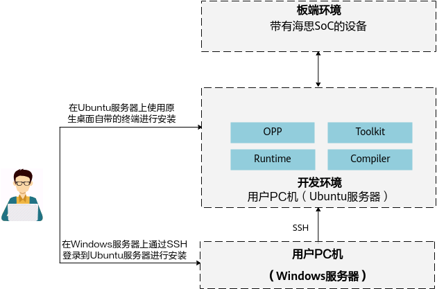

# 简介<a name="ZH-CN_TOPIC_0000002473904204"></a>

开发环境是指用户开发应用程序的环境，用户在开发环境上做开发、编译、模型转换，并应用板端环境运行调试应用程序。板端环境是指实际运行用户开发的应用的环境，要求实际安装NPU IP加速器。详细部署架构图如[图1](#fig920342216305)所示。

**图 1**  部署架构图<a name="fig920342216305"></a>  


软件包说明：

-   Runtime：AI应用程序开发使用的API和运行库。包含GE模型加载及执行功能。包含编译依赖的相关库（不包含driver包中的库）。
-   Compiler：模型和算子编译器。用于离线模型转换、融合规则开发等场景。
-   OPP：算子库，包含算子原型库及算子实现库、算子插件、融合规则。算子实现库包含TBE算子，另外包含算子parser。
-   Toolkit：调测工具包，主要包含开发者调测应用、算子需要使用的工具包，例如：profiling性能调试工具。

# 获取软件包<a name="ZH-CN_TOPIC_0000002473904210"></a>

安装前，请根据开发环境的操作系统获取对应的软件包，各组件包版本号需要保持一致。各软件包名称如[表1](#table1098683384513)所示。\{software version\}表示具体版本号。

**表 1**  软件包简介

<a name="table1098683384513"></a>
<table><thead align="left"><tr id="row1898723374511"><th class="cellrowborder" valign="top" width="17.400000000000002%" id="mcps1.2.4.1.1"><p id="p1798733317459"><a name="p1798733317459"></a><a name="p1798733317459"></a>组件</p>
</th>
<th class="cellrowborder" valign="top" width="50.23000000000001%" id="mcps1.2.4.1.2"><p id="p169871233154512"><a name="p169871233154512"></a><a name="p169871233154512"></a>包名</p>
</th>
<th class="cellrowborder" valign="top" width="32.370000000000005%" id="mcps1.2.4.1.3"><p id="p515109561"><a name="p515109561"></a><a name="p515109561"></a>备注</p>
</th>
</tr>
</thead>
<tbody><tr id="row15541153352010"><td class="cellrowborder" valign="top" width="17.400000000000002%" headers="mcps1.2.4.1.1 "><p id="p1498817335452"><a name="p1498817335452"></a><a name="p1498817335452"></a>Runtime</p>
</td>
<td class="cellrowborder" valign="top" width="50.23000000000001%" headers="mcps1.2.4.1.2 "><p id="p5471734191710"><a name="p5471734191710"></a><a name="p5471734191710"></a>CANN-runtime-{software version}-linux.x86_64.run</p>
</td>
<td class="cellrowborder" valign="top" width="32.370000000000005%" headers="mcps1.2.4.1.3 "><p id="p14141011561"><a name="p14141011561"></a><a name="p14141011561"></a>包含开发时需要使用的API和运行库。开发包括：开发算子，开发应用，模型转换等。</p>
</td>
</tr>
<tr id="row598718337456"><td class="cellrowborder" valign="top" width="17.400000000000002%" headers="mcps1.2.4.1.1 "><p id="p11236629165810"><a name="p11236629165810"></a><a name="p11236629165810"></a>Compiler</p>
</td>
<td class="cellrowborder" valign="top" width="50.23000000000001%" headers="mcps1.2.4.1.2 "><p id="p113094310594"><a name="p113094310594"></a><a name="p113094310594"></a>CANN-compiler-{software version}-linux.x86_64.run</p>
</td>
<td class="cellrowborder" valign="top" width="32.370000000000005%" headers="mcps1.2.4.1.3 "><p id="p115109566"><a name="p115109566"></a><a name="p115109566"></a>-</p>
</td>
</tr>
<tr id="row0677125555912"><td class="cellrowborder" valign="top" width="17.400000000000002%" headers="mcps1.2.4.1.1 "><p id="p2677145512599"><a name="p2677145512599"></a><a name="p2677145512599"></a>OPP</p>
</td>
<td class="cellrowborder" valign="top" width="50.23000000000001%" headers="mcps1.2.4.1.2 "><p id="p20663143141214"><a name="p20663143141214"></a><a name="p20663143141214"></a>CANN-opp-{software version}-linux.x86_64.run</p>
</td>
<td class="cellrowborder" valign="top" width="32.370000000000005%" headers="mcps1.2.4.1.3 "><p id="p8241055612"><a name="p8241055612"></a><a name="p8241055612"></a>-</p>
</td>
</tr>
<tr id="row99872330454"><td class="cellrowborder" valign="top" width="17.400000000000002%" headers="mcps1.2.4.1.1 "><p id="p32274293588"><a name="p32274293588"></a><a name="p32274293588"></a>Toolkit</p>
</td>
<td class="cellrowborder" valign="top" width="50.23000000000001%" headers="mcps1.2.4.1.2 "><p id="p13309183145914"><a name="p13309183145914"></a><a name="p13309183145914"></a>CANN-toolkit-{software version}-linux.x86_64.run</p>
</td>
<td class="cellrowborder" valign="top" width="32.370000000000005%" headers="mcps1.2.4.1.3 "><p id="p162191085620"><a name="p162191085620"></a><a name="p162191085620"></a>-</p>
</td>
</tr>
</tbody>
</table>

# 安装前准备<a name="ZH-CN_TOPIC_0000002505904251"></a>

**环境要求<a name="zh-cn_topic_0225991984_zh-cn_topic_0209629235_section1115282622119"></a>**

开发环境要求的硬件及操作系统要满足以下条件。

**表 1**  软件包默认系统版本信息

<a name="zh-cn_topic_0000001506610682_zh-cn_topic_0000001505787306_zh-cn_topic_0000001090460967_zh-cn_topic_0209629235_zh-cn_topic_0187258243_zh-cn_topic_0174616199_zh-cn_topic_0160789127_table1515616482231"></a>
<table><thead align="left"><tr id="zh-cn_topic_0000001506610682_zh-cn_topic_0000001505787306_zh-cn_topic_0000001090460967_zh-cn_topic_0209629235_zh-cn_topic_0187258243_zh-cn_topic_0174616199_zh-cn_topic_0160789127_row8157124812317"><th class="cellrowborder" valign="top" width="10.299999999999999%" id="mcps1.2.5.1.1"><p id="zh-cn_topic_0000001506610682_zh-cn_topic_0000001505787306_zh-cn_topic_0000001090460967_zh-cn_topic_0209629235_zh-cn_topic_0187258243_zh-cn_topic_0174616199_zh-cn_topic_0160789127_p17157194842316"><a name="zh-cn_topic_0000001506610682_zh-cn_topic_0000001505787306_zh-cn_topic_0000001090460967_zh-cn_topic_0209629235_zh-cn_topic_0187258243_zh-cn_topic_0174616199_zh-cn_topic_0160789127_p17157194842316"></a><a name="zh-cn_topic_0000001506610682_zh-cn_topic_0000001505787306_zh-cn_topic_0000001090460967_zh-cn_topic_0209629235_zh-cn_topic_0187258243_zh-cn_topic_0174616199_zh-cn_topic_0160789127_p17157194842316"></a>类别</p>
</th>
<th class="cellrowborder" valign="top" width="17.37%" id="mcps1.2.5.1.2"><p id="zh-cn_topic_0000001506610682_zh-cn_topic_0000001505787306_zh-cn_topic_0000001090460967_zh-cn_topic_0209629235_zh-cn_topic_0187258243_zh-cn_topic_0174616199_zh-cn_topic_0160789127_p31575485237"><a name="zh-cn_topic_0000001506610682_zh-cn_topic_0000001505787306_zh-cn_topic_0000001090460967_zh-cn_topic_0209629235_zh-cn_topic_0187258243_zh-cn_topic_0174616199_zh-cn_topic_0160789127_p31575485237"></a><a name="zh-cn_topic_0000001506610682_zh-cn_topic_0000001505787306_zh-cn_topic_0000001090460967_zh-cn_topic_0209629235_zh-cn_topic_0187258243_zh-cn_topic_0174616199_zh-cn_topic_0160789127_p31575485237"></a>版本限制</p>
</th>
<th class="cellrowborder" valign="top" width="35.730000000000004%" id="mcps1.2.5.1.3"><p id="zh-cn_topic_0000001506610682_zh-cn_topic_0000001505787306_zh-cn_topic_0000001090460967_zh-cn_topic_0209629235_zh-cn_topic_0187258243_zh-cn_topic_0174616199_zh-cn_topic_0160789127_p825219253259"><a name="zh-cn_topic_0000001506610682_zh-cn_topic_0000001505787306_zh-cn_topic_0000001090460967_zh-cn_topic_0209629235_zh-cn_topic_0187258243_zh-cn_topic_0174616199_zh-cn_topic_0160789127_p825219253259"></a><a name="zh-cn_topic_0000001506610682_zh-cn_topic_0000001505787306_zh-cn_topic_0000001090460967_zh-cn_topic_0209629235_zh-cn_topic_0187258243_zh-cn_topic_0174616199_zh-cn_topic_0160789127_p825219253259"></a>获取方式</p>
</th>
<th class="cellrowborder" valign="top" width="36.6%" id="mcps1.2.5.1.4"><p id="zh-cn_topic_0000001506610682_zh-cn_topic_0000001505787306_zh-cn_topic_0000001090460967_zh-cn_topic_0209629235_zh-cn_topic_0187258243_zh-cn_topic_0174616199_zh-cn_topic_0160789127_p7157144842317"><a name="zh-cn_topic_0000001506610682_zh-cn_topic_0000001505787306_zh-cn_topic_0000001090460967_zh-cn_topic_0209629235_zh-cn_topic_0187258243_zh-cn_topic_0174616199_zh-cn_topic_0160789127_p7157144842317"></a><a name="zh-cn_topic_0000001506610682_zh-cn_topic_0000001505787306_zh-cn_topic_0000001090460967_zh-cn_topic_0209629235_zh-cn_topic_0187258243_zh-cn_topic_0174616199_zh-cn_topic_0160789127_p7157144842317"></a>注意事项</p>
</th>
</tr>
</thead>
<tbody><tr id="row5799102819262"><td class="cellrowborder" valign="top" width="10.299999999999999%" headers="mcps1.2.5.1.1 "><p id="p1970142552010"><a name="p1970142552010"></a><a name="p1970142552010"></a>硬件</p>
</td>
<td class="cellrowborder" valign="top" width="17.37%" headers="mcps1.2.5.1.2 "><p id="p49702025102015"><a name="p49702025102015"></a><a name="p49702025102015"></a>内存：最小4GB</p>
</td>
<td class="cellrowborder" valign="top" width="35.730000000000004%" headers="mcps1.2.5.1.3 "><p id="p12970172514200"><a name="p12970172514200"></a><a name="p12970172514200"></a>-</p>
</td>
<td class="cellrowborder" valign="top" width="36.6%" headers="mcps1.2.5.1.4 "><a name="ul18330193818"></a><a name="ul18330193818"></a><ul id="ul18330193818"><li>若Linux宿主机内存为4G，使用ATC工具进行模型转换时，建议Model文件大小不超过350M，如果超过此规格，操作系统可能会因为超过安全内存阈值而工作不稳定。</li><li>若Linux宿主机配置升级，比如8G内存，则相应支持的操作对象规格按比例提升。<p id="p484130183810"><a name="p484130183810"></a><a name="p484130183810"></a>例如，内存由4G升级到8G，则Model文件建议大小不超过700M。</p>
</li></ul>
</td>
</tr>
<tr id="zh-cn_topic_0000001506610682_zh-cn_topic_0000001505787306_zh-cn_topic_0000001090460967_row15228184772219"><td class="cellrowborder" valign="top" width="10.299999999999999%" headers="mcps1.2.5.1.1 "><p id="zh-cn_topic_0000001090460967_zh-cn_topic_0209629235_zh-cn_topic_0187258243_zh-cn_topic_0174616199_zh-cn_topic_0160789127_p1315844817233"><a name="zh-cn_topic_0000001090460967_zh-cn_topic_0209629235_zh-cn_topic_0187258243_zh-cn_topic_0174616199_zh-cn_topic_0160789127_p1315844817233"></a><a name="zh-cn_topic_0000001090460967_zh-cn_topic_0209629235_zh-cn_topic_0187258243_zh-cn_topic_0174616199_zh-cn_topic_0160789127_p1315844817233"></a>操作系统及架构</p>
</td>
<td class="cellrowborder" valign="top" width="17.37%" headers="mcps1.2.5.1.2 "><p id="zh-cn_topic_0209629235_zh-cn_topic_0187258243_zh-cn_topic_0174616199_zh-cn_topic_0160789127_p1315824812319"><a name="zh-cn_topic_0209629235_zh-cn_topic_0187258243_zh-cn_topic_0174616199_zh-cn_topic_0160789127_p1315824812319"></a><a name="zh-cn_topic_0209629235_zh-cn_topic_0187258243_zh-cn_topic_0174616199_zh-cn_topic_0160789127_p1315824812319"></a>Ubuntu 22.04</p>
</td>
<td class="cellrowborder" valign="top" width="35.730000000000004%" headers="mcps1.2.5.1.3 "><p id="zh-cn_topic_0000001506610682_zh-cn_topic_0000001505787306_p10516182094812"><a name="zh-cn_topic_0000001506610682_zh-cn_topic_0000001505787306_p10516182094812"></a><a name="zh-cn_topic_0000001506610682_zh-cn_topic_0000001505787306_p10516182094812"></a><strong id="zh-cn_topic_0000001506610682_zh-cn_topic_0000001505787306_b1426715246558"><a name="zh-cn_topic_0000001506610682_zh-cn_topic_0000001505787306_b1426715246558"></a><a name="zh-cn_topic_0000001506610682_zh-cn_topic_0000001505787306_b1426715246558"></a>cat /etc/*release</strong> <strong id="zh-cn_topic_0000001506610682_zh-cn_topic_0000001505787306_b6267112475514"><a name="zh-cn_topic_0000001506610682_zh-cn_topic_0000001505787306_b6267112475514"></a><a name="zh-cn_topic_0000001506610682_zh-cn_topic_0000001505787306_b6267112475514"></a>&amp;&amp; uname -m</strong></p>
</td>
<td class="cellrowborder" valign="top" width="36.6%" headers="mcps1.2.5.1.4 "><p id="p1349810434268"><a name="p1349810434268"></a><a name="p1349810434268"></a>-</p>
</td>
</tr>
<tr id="zh-cn_topic_0000001506610682_zh-cn_topic_0000001505787306_zh-cn_topic_0000001090460967_row160218498221"><td class="cellrowborder" valign="top" width="10.299999999999999%" headers="mcps1.2.5.1.1 "><p id="zh-cn_topic_0000001090460967_p12603184912219"><a name="zh-cn_topic_0000001090460967_p12603184912219"></a><a name="zh-cn_topic_0000001090460967_p12603184912219"></a>host操作系统内核版本</p>
</td>
<td class="cellrowborder" valign="top" width="17.37%" headers="mcps1.2.5.1.2 "><p id="p12971122919483"><a name="p12971122919483"></a><a name="p12971122919483"></a>5.4.0-122-generic、6.8.0-41-generic、6.8.0-52-generic、6.8.0-56-generic、6.8.0-85-generic</p>
</td>
<td class="cellrowborder" valign="top" width="35.730000000000004%" headers="mcps1.2.5.1.3 "><p id="zh-cn_topic_0000001506610682_zh-cn_topic_0000001505787306_zh-cn_topic_0000001123441693_zh-cn_topic_0000001090460967_p5603104962213"><a name="zh-cn_topic_0000001506610682_zh-cn_topic_0000001505787306_zh-cn_topic_0000001123441693_zh-cn_topic_0000001090460967_p5603104962213"></a><a name="zh-cn_topic_0000001506610682_zh-cn_topic_0000001505787306_zh-cn_topic_0000001123441693_zh-cn_topic_0000001090460967_p5603104962213"></a><strong id="zh-cn_topic_0000001506610682_zh-cn_topic_0000001505787306_b118887331556"><a name="zh-cn_topic_0000001506610682_zh-cn_topic_0000001505787306_b118887331556"></a><a name="zh-cn_topic_0000001506610682_zh-cn_topic_0000001505787306_b118887331556"></a>uname -r</strong></p>
</td>
<td class="cellrowborder" valign="top" width="36.6%" headers="mcps1.2.5.1.4 "><p id="zh-cn_topic_0000001506610682_zh-cn_topic_0000001505787306_p71254111375"><a name="zh-cn_topic_0000001506610682_zh-cn_topic_0000001505787306_p71254111375"></a><a name="zh-cn_topic_0000001506610682_zh-cn_topic_0000001505787306_p71254111375"></a>-</p>
</td>
</tr>
<tr id="zh-cn_topic_0000001506610682_zh-cn_topic_0000001505787306_zh-cn_topic_0000001090460967_zh-cn_topic_0209629235_zh-cn_topic_0187258243_zh-cn_topic_0174616199_zh-cn_topic_0160789127_row1615815486234"><td class="cellrowborder" valign="top" width="10.299999999999999%" headers="mcps1.2.5.1.1 "><p id="zh-cn_topic_0000001090460967_p1591124412311"><a name="zh-cn_topic_0000001090460967_p1591124412311"></a><a name="zh-cn_topic_0000001090460967_p1591124412311"></a>GCC编译器版本</p>
</td>
<td class="cellrowborder" valign="top" width="17.37%" headers="mcps1.2.5.1.2 "><p id="zh-cn_topic_0000001090460967_p189291439105"><a name="zh-cn_topic_0000001090460967_p189291439105"></a><a name="zh-cn_topic_0000001090460967_p189291439105"></a>13.3.0</p>
</td>
<td class="cellrowborder" valign="top" width="35.730000000000004%" headers="mcps1.2.5.1.3 "><p id="zh-cn_topic_0000001506610682_zh-cn_topic_0000001505787306_zh-cn_topic_0000001123441693_zh-cn_topic_0000001090460967_p13670132118238"><a name="zh-cn_topic_0000001506610682_zh-cn_topic_0000001505787306_zh-cn_topic_0000001123441693_zh-cn_topic_0000001090460967_p13670132118238"></a><a name="zh-cn_topic_0000001506610682_zh-cn_topic_0000001505787306_zh-cn_topic_0000001123441693_zh-cn_topic_0000001090460967_p13670132118238"></a><strong id="zh-cn_topic_0000001506610682_zh-cn_topic_0000001505787306_b1877264295517"><a name="zh-cn_topic_0000001506610682_zh-cn_topic_0000001505787306_b1877264295517"></a><a name="zh-cn_topic_0000001506610682_zh-cn_topic_0000001505787306_b1877264295517"></a>gcc --version</strong></p>
</td>
<td class="cellrowborder" valign="top" width="36.6%" headers="mcps1.2.5.1.4 "><p id="zh-cn_topic_0000001506610682_zh-cn_topic_0000001505787306_zh-cn_topic_0000001090460967_p76681021162313"><a name="zh-cn_topic_0000001506610682_zh-cn_topic_0000001505787306_zh-cn_topic_0000001090460967_p76681021162313"></a><a name="zh-cn_topic_0000001506610682_zh-cn_topic_0000001505787306_zh-cn_topic_0000001090460967_p76681021162313"></a>-</p>
</td>
</tr>
<tr id="zh-cn_topic_0000001506610682_zh-cn_topic_0000001505787306_zh-cn_topic_0000001090460967_row58548610245"><td class="cellrowborder" valign="top" width="10.299999999999999%" headers="mcps1.2.5.1.1 "><p id="zh-cn_topic_0000001090460967_p1685486172414"><a name="zh-cn_topic_0000001090460967_p1685486172414"></a><a name="zh-cn_topic_0000001090460967_p1685486172414"></a>GLIBC版本</p>
</td>
<td class="cellrowborder" valign="top" width="17.37%" headers="mcps1.2.5.1.2 "><p id="zh-cn_topic_0000001090460967_p17364715112416"><a name="zh-cn_topic_0000001090460967_p17364715112416"></a><a name="zh-cn_topic_0000001090460967_p17364715112416"></a>2.39</p>
</td>
<td class="cellrowborder" valign="top" width="35.730000000000004%" headers="mcps1.2.5.1.3 "><p id="zh-cn_topic_0000001506610682_zh-cn_topic_0000001505787306_zh-cn_topic_0000001123441693_zh-cn_topic_0000001090460967_p1985406102410"><a name="zh-cn_topic_0000001506610682_zh-cn_topic_0000001505787306_zh-cn_topic_0000001123441693_zh-cn_topic_0000001090460967_p1985406102410"></a><a name="zh-cn_topic_0000001506610682_zh-cn_topic_0000001505787306_zh-cn_topic_0000001123441693_zh-cn_topic_0000001090460967_p1985406102410"></a><strong id="zh-cn_topic_0000001506610682_zh-cn_topic_0000001505787306_b1494018482554"><a name="zh-cn_topic_0000001506610682_zh-cn_topic_0000001505787306_b1494018482554"></a><a name="zh-cn_topic_0000001506610682_zh-cn_topic_0000001505787306_b1494018482554"></a>ldd --version</strong></p>
</td>
<td class="cellrowborder" valign="top" width="36.6%" headers="mcps1.2.5.1.4 "><p id="zh-cn_topic_0000001506610682_zh-cn_topic_0000001505787306_zh-cn_topic_0000001090460967_p58541565248"><a name="zh-cn_topic_0000001506610682_zh-cn_topic_0000001505787306_zh-cn_topic_0000001090460967_p58541565248"></a><a name="zh-cn_topic_0000001506610682_zh-cn_topic_0000001505787306_zh-cn_topic_0000001090460967_p58541565248"></a>-</p>
</td>
</tr>
<tr id="zh-cn_topic_0000001506610682_zh-cn_topic_0000001505787306_zh-cn_topic_0000001090460967_zh-cn_topic_0209629235_zh-cn_topic_0187258243_zh-cn_topic_0174616199_zh-cn_topic_0160789127_row157381059123015"><td class="cellrowborder" valign="top" width="10.299999999999999%" headers="mcps1.2.5.1.1 "><p id="zh-cn_topic_0000001090460967_zh-cn_topic_0209629235_zh-cn_topic_0187258243_zh-cn_topic_0174616199_zh-cn_topic_0160789127_p573995943010"><a name="zh-cn_topic_0000001090460967_zh-cn_topic_0209629235_zh-cn_topic_0187258243_zh-cn_topic_0174616199_zh-cn_topic_0160789127_p573995943010"></a><a name="zh-cn_topic_0000001090460967_zh-cn_topic_0209629235_zh-cn_topic_0187258243_zh-cn_topic_0174616199_zh-cn_topic_0160789127_p573995943010"></a>Python</p>
</td>
<td class="cellrowborder" valign="top" width="17.37%" headers="mcps1.2.5.1.2 "><p id="zh-cn_topic_0000001090460967_p13931234163720"><a name="zh-cn_topic_0000001090460967_p13931234163720"></a><a name="zh-cn_topic_0000001090460967_p13931234163720"></a>Python3.7.x、Python3.8.x、Python3.9.x、Python3.10.x、Python3.11.x</p>
</td>
<td class="cellrowborder" rowspan="2" valign="top" width="35.730000000000004%" headers="mcps1.2.5.1.3 "><p id="zh-cn_topic_0000001506610682_zh-cn_topic_0000001505787306_zh-cn_topic_0000001090460967_p5768154513408"><a name="zh-cn_topic_0000001506610682_zh-cn_topic_0000001505787306_zh-cn_topic_0000001090460967_p5768154513408"></a><a name="zh-cn_topic_0000001506610682_zh-cn_topic_0000001505787306_zh-cn_topic_0000001090460967_p5768154513408"></a>请参见<a href="#zh-cn_topic_0225991984_section82921152112016">安装依赖</a>。</p>
</td>
<td class="cellrowborder" valign="top" width="36.6%" headers="mcps1.2.5.1.4 "><p id="zh-cn_topic_0000001506610682_zh-cn_topic_0000001505787306_zh-cn_topic_0000001090460967_zh-cn_topic_0209629235_zh-cn_topic_0187258243_zh-cn_topic_0174616199_zh-cn_topic_0160789127_p2074075993018"><a name="zh-cn_topic_0000001506610682_zh-cn_topic_0000001505787306_zh-cn_topic_0000001090460967_zh-cn_topic_0209629235_zh-cn_topic_0187258243_zh-cn_topic_0174616199_zh-cn_topic_0160789127_p2074075993018"></a><a name="zh-cn_topic_0000001506610682_zh-cn_topic_0000001505787306_zh-cn_topic_0000001090460967_zh-cn_topic_0209629235_zh-cn_topic_0187258243_zh-cn_topic_0174616199_zh-cn_topic_0160789127_p2074075993018"></a>-</p>
</td>
</tr>
<tr id="zh-cn_topic_0000001506610682_zh-cn_topic_0000001505787306_zh-cn_topic_0000001090460967_zh-cn_topic_0209629235_row663852691711"><td class="cellrowborder" valign="top" headers="mcps1.2.5.1.1 "><p id="zh-cn_topic_0000001506610682_zh-cn_topic_0000001505787306_zh-cn_topic_0000001090460967_zh-cn_topic_0209629235_p186399269177"><a name="zh-cn_topic_0000001506610682_zh-cn_topic_0000001505787306_zh-cn_topic_0000001090460967_zh-cn_topic_0209629235_p186399269177"></a><a name="zh-cn_topic_0000001506610682_zh-cn_topic_0000001505787306_zh-cn_topic_0000001090460967_zh-cn_topic_0209629235_p186399269177"></a>g++</p>
</td>
<td class="cellrowborder" valign="top" headers="mcps1.2.5.1.2 "><p id="zh-cn_topic_0000001506610682_zh-cn_topic_0000001505787306_zh-cn_topic_0000001090460967_zh-cn_topic_0209629203_p8369152884718"><a name="zh-cn_topic_0000001506610682_zh-cn_topic_0000001505787306_zh-cn_topic_0000001090460967_zh-cn_topic_0209629203_p8369152884718"></a><a name="zh-cn_topic_0000001506610682_zh-cn_topic_0000001505787306_zh-cn_topic_0000001090460967_zh-cn_topic_0209629203_p8369152884718"></a>9.4.0</p>
</td>
<td class="cellrowborder" valign="top" headers="mcps1.2.5.1.3 "><p id="zh-cn_topic_0000001506610682_zh-cn_topic_0000001505787306_zh-cn_topic_0000001090460967_zh-cn_topic_0209629235_p4639152617170"><a name="zh-cn_topic_0000001506610682_zh-cn_topic_0000001505787306_zh-cn_topic_0000001090460967_zh-cn_topic_0209629235_p4639152617170"></a><a name="zh-cn_topic_0000001506610682_zh-cn_topic_0000001505787306_zh-cn_topic_0000001090460967_zh-cn_topic_0209629235_p4639152617170"></a>-</p>
</td>
</tr>
</tbody>
</table>

**创建安装及运行用户<a name="zh-cn_topic_0225991984_section10291654193717"></a>**

-   **若使用root用户安装**

    可以使用root用户进行安装，但安装完之后要求使用非root用户运行，所以安装前需要先创建运行用户。

-   **若使用非root用户安装**

    该场景下安装及运行用户必须相同。

    -   若已有非root用户，则无需再次创建。
    -   若想使用新的非root用户，则需要先创建该用户，请参见如下方法创建。

创建非root用户操作方法如下，如下命令请以root用户执行。

1.  创建非root用户。

    ```
    groupadd usergroup
    useradd -g usergroup -d /home/username -m username -s /bin/bash
    ```

2.  设置非root用户密码。

    ```
    passwd username 
    ```

> **说明：** 
>密码有效期为90天，您可以在/etc/login.defs文件中修改有效期的天数，或者通过chage命令来设置用户的有效期，详情请参见[设置用户有效期](设置用户有效期.md)。

**检查源<a name="zh-cn_topic_0225991984_zh-cn_topic_0209629235_section778143511211"></a>**

安装过程需要下载相关依赖，请确保运行环境能够连接网络。

请在root用户下执行如下命令检查源是否可用。

```
apt-get update
```

> **说明：** 
>如果命令执行报错，则检查网络是否连接或者把“/etc/apt/sources.list“文件中的源更换为可用的源。

**安装依赖<a name="zh-cn_topic_0225991984_section82921152112016"></a>**

请使用软件包的安装用户安装依赖的gcc、python等软件，如果安装用户为非root，则需要确保该用户有sudo权限。

1.  检查系统是否安装python依赖以及gcc等软件。

    分别使用如下命令检查是否安装gcc，make以及python依赖软件等。

    ```
    gcc --version
    g++ --version
    cmake --version
    make --version
    unzip --version
    dpkg -l build-essential | grep build-essential | grep ii
    dpkg -l zlib1g-dev| grep zlib1g-dev| grep ii
    dpkg -l libbz2-dev| grep libbz2-dev| grep ii
    dpkg -l libsqlite3-dev| grep libsqlite3-dev| grep ii
    dpkg -l libssl-dev| grep libssl-dev| grep ii
    dpkg -l libxslt1-dev| grep libxslt1-dev| grep ii
    dpkg -l libffi-dev| grep libffi-dev| grep ii
    ```

    若分别返回如下信息则说明已经安装，进入下一步。

    ```
    gcc (Ubuntu 9.4.0-1ubuntu1~20.04.1) 9.4.0
    g++ (Ubuntu 9.4.0-1ubuntu1~20.04.1) 9.4.0
    cmake version 3.20.5
    GNU Make 4.2.1
    UnZip 6.00 of 20 April 2009, by Debian. Original by Info-ZIP.
    build-essential 12.8ubuntu1.1 amd64        Informational list of build-essential packages
    zlib1g-dev:amd64 1:1.2.11.dfsg-2ubuntu1.3 amd64        compression library - development
    libbz2-dev:amd64 1.0.8-2      amd64        high-quality block-sorting file compressor library - development
    libsqlite3-dev:amd64 3.31.1-4ubuntu0.3 amd64        SQLite 3 development files
    libssl-dev:amd64 1.1.1f-1ubuntu2.13 amd64        Secure Sockets Layer toolkit - development files
    libxslt1-dev:amd64 1.1.29-5ubuntu0.2 amd64        XSLT 1.0 processing library - development kit
    libffi-dev:amd64 3.3-4        amd64        Foreign Function Interface library (development files)
    ```

    否则请执行如下安装命令（如果只有部分软件未安装，则如下命令修改为只安装还未安装的软件即可）：

    ```
    sudo apt-get install -y gcc g++ cmake make unzip build-essential zlib1g-dev libbz2-dev libsqlite3-dev libssl-dev libxslt1-dev libffi-dev
    ```

    > **说明：** 
    >libsqlite3-dev需要在python安装之前安装，如果用户操作系统已经安装python3.7.5环境，在此之后再安装libsqlite3-dev，则需要重新编译python环境。

2.  <a name="zh-cn_topic_0232383867_li137366410213"></a>检查系统是否安装python开发环境。

    分别使用命令**python --version**、**pip --version**检查是否已经安装，如果返回如下信息则说明已经安装，进入下一步。

    ```
    Python 3.7.5
    pip 19.2.3 from /usr/local/python3.7.5/lib/python3.7/site-packages/pip (python 3.7)
    ```

    否则请根据如下方式安装python，下文以安装python3.7.5为例。

    1.  使用wget下载python3.7.5源码包，可以下载到运行环境任意目录，命令为：

        ```
        wget https://www.python.org/ftp/python/3.7.5/Python-3.7.5.tgz
        ```

    2.  进入下载后的目录，解压源码包，命令为：

        ```
        tar -zxvf Python-3.7.5.tgz
        ```

    3.  进入解压后的文件夹，执行配置、编译和安装命令：

        ```
        cd Python-3.7.5
        ./configure --prefix=/usr/local/python3.7.5 --enable-shared
        make
        sudo make install
        ```

        其中“--prefix“参数用于指定python安装路径，用户根据实际情况进行修改。“--enable-shared“参数用于编译出libpython3.7m.so.1.0动态库。

        本手册以--prefix=/usr/local/python3.7.5路径为例进行说明。执行配置、编译和安装命令后，安装包在/usr/local/python3.7.5路径，libpython3.7m.so.1.0动态库在/usr/local/python3.7.5/lib/libpython3.7m.so.1.0路径。

    4.  执行如下命令设置软链接：

        ```
        sudo ln -s /usr/local/python3.7.5/bin/python3 /usr/local/python3.7.5/bin/python3.7.5
        sudo ln -s /usr/local/python3.7.5/bin/pip3 /usr/local/python3.7.5/bin/pip3.7.5
        ```

    5.  设置python3.7.5环境变量。
        1.  以运行用户在任意目录下执行**vi \~/.bashrc**命令，打开**.bashrc**文件，在文件最后一行后面添加如下内容。

            > **注意：** 
            >如果运行用户是root，则不建议修改.bashrc，否则可能会影响其它系统提供的python工具的使用，如果仍想使用系统默认工具，则请重新开启终端窗口。

            ```
            #用于设置python3.7.5库文件路径
            export LD_LIBRARY_PATH=/usr/local/python3.7.5/lib:$LD_LIBRARY_PATH
            #如果用户环境存在多个python3版本，则指定使用python3.7.5版本
            export PATH=/usr/local/python3.7.5/bin:$PATH
            ```

        2.  执行**:wq!**命令保存文件并退出。
        3.  执行**source \~/.bashrc**命令使其立即生效。

    6.  安装完成之后，执行如下命令查看安装版本，如果返回相关版本信息，则说明安装成功。

        ```
        python3.7.5 --version
        pip3.7.5  --version
        python3.7 --version
        pip3.7  --version
        ```

3.  安装CANN软件包的相关依赖。

    安装前请先使用**pip3.7.5 list**命令检查是否安装相关依赖，若未安装，则安装命令如下（如果只有部分软件未安装，则如下命令修改为只安装还未安装的软件即可。

    **表 2**  依赖列表

    <a name="zh-cn_topic_0000001123441693_zh-cn_topic_0000001090304421_zh-cn_topic_0238557372_table1831018918296"></a>
    <table><thead align="left"><tr id="zh-cn_topic_0000001123441693_zh-cn_topic_0000001090304421_zh-cn_topic_0238557372_row23116992916"><th class="cellrowborder" valign="top" width="13.05%" id="mcps1.2.5.1.1"><p id="zh-cn_topic_0000001123441693_zh-cn_topic_0000001090304421_zh-cn_topic_0238557372_p5311199298"><a name="zh-cn_topic_0000001123441693_zh-cn_topic_0000001090304421_zh-cn_topic_0238557372_p5311199298"></a><a name="zh-cn_topic_0000001123441693_zh-cn_topic_0000001090304421_zh-cn_topic_0238557372_p5311199298"></a>组件</p>
    </th>
    <th class="cellrowborder" valign="top" width="23.78%" id="mcps1.2.5.1.2"><p id="zh-cn_topic_0000001123441693_zh-cn_topic_0000001090304421_zh-cn_topic_0238557372_p1131169162915"><a name="zh-cn_topic_0000001123441693_zh-cn_topic_0000001090304421_zh-cn_topic_0238557372_p1131169162915"></a><a name="zh-cn_topic_0000001123441693_zh-cn_topic_0000001090304421_zh-cn_topic_0238557372_p1131169162915"></a>依赖名称</p>
    </th>
    <th class="cellrowborder" valign="top" width="19.48%" id="mcps1.2.5.1.3"><p id="zh-cn_topic_0000001123441693_zh-cn_topic_0000001090304421_zh-cn_topic_0238557372_p931215919296"><a name="zh-cn_topic_0000001123441693_zh-cn_topic_0000001090304421_zh-cn_topic_0238557372_p931215919296"></a><a name="zh-cn_topic_0000001123441693_zh-cn_topic_0000001090304421_zh-cn_topic_0238557372_p931215919296"></a>版本号</p>
    </th>
    <th class="cellrowborder" valign="top" width="43.69%" id="mcps1.2.5.1.4"><p id="zh-cn_topic_0000001123441693_zh-cn_topic_0000001090304421_zh-cn_topic_0238557372_p1031216962910"><a name="zh-cn_topic_0000001123441693_zh-cn_topic_0000001090304421_zh-cn_topic_0238557372_p1031216962910"></a><a name="zh-cn_topic_0000001123441693_zh-cn_topic_0000001090304421_zh-cn_topic_0238557372_p1031216962910"></a>安装命令</p>
    </th>
    </tr>
    </thead>
    <tbody><tr id="row3241183716"><td class="cellrowborder" rowspan="5" valign="top" width="13.05%" headers="mcps1.2.5.1.1 "><p id="p14950415977"><a name="p14950415977"></a><a name="p14950415977"></a>Toolkit</p>
    </td>
    <td class="cellrowborder" valign="top" width="23.78%" headers="mcps1.2.5.1.2 "><p id="p582832920712"><a name="p582832920712"></a><a name="p582832920712"></a>python</p>
    </td>
    <td class="cellrowborder" valign="top" width="19.48%" headers="mcps1.2.5.1.3 "><p id="p76439464112"><a name="p76439464112"></a><a name="p76439464112"></a>Python3.7.x、Python3.8.x、Python3.9.x、Python3.10.x、Python3.11.x</p>
    </td>
    <td class="cellrowborder" valign="top" width="43.69%" headers="mcps1.2.5.1.4 "><p id="p08282291277"><a name="p08282291277"></a><a name="p08282291277"></a>请参见<a href="#zh-cn_topic_0232383867_li137366410213">2</a>。</p>
    </td>
    </tr>
    <tr id="row18439661079"><td class="cellrowborder" valign="top" headers="mcps1.2.5.1.1 "><p id="p595116151676"><a name="p595116151676"></a><a name="p595116151676"></a>google.protobuf</p>
    </td>
    <td class="cellrowborder" valign="top" headers="mcps1.2.5.1.2 "><p id="p1895114152712"><a name="p1895114152712"></a><a name="p1895114152712"></a>&gt;=3.13.0</p>
    </td>
    <td class="cellrowborder" valign="top" headers="mcps1.2.5.1.3 "><p id="p7951915777"><a name="p7951915777"></a><a name="p7951915777"></a>pip install protobuf --user</p>
    </td>
    </tr>
    <tr id="row157495418712"><td class="cellrowborder" valign="top" headers="mcps1.2.5.1.1 "><p id="p5951161510717"><a name="p5951161510717"></a><a name="p5951161510717"></a>psutil</p>
    </td>
    <td class="cellrowborder" valign="top" headers="mcps1.2.5.1.2 "><p id="p79519151470"><a name="p79519151470"></a><a name="p79519151470"></a>&gt;=5.7.0</p>
    </td>
    <td class="cellrowborder" valign="top" headers="mcps1.2.5.1.3 "><p id="p3951181515710"><a name="p3951181515710"></a><a name="p3951181515710"></a>pip install psutil --user</p>
    </td>
    </tr>
    <tr id="row1516283172"><td class="cellrowborder" valign="top" headers="mcps1.2.5.1.1 "><p id="p1895111154710"><a name="p1895111154710"></a><a name="p1895111154710"></a>numpy</p>
    </td>
    <td class="cellrowborder" valign="top" headers="mcps1.2.5.1.2 "><p id="p11951161515714"><a name="p11951161515714"></a><a name="p11951161515714"></a>&gt;=1.13.3</p>
    </td>
    <td class="cellrowborder" valign="top" headers="mcps1.2.5.1.3 "><p id="p79517151171"><a name="p79517151171"></a><a name="p79517151171"></a>pip install numpy --user</p>
    </td>
    </tr>
    <tr id="row176239119718"><td class="cellrowborder" valign="top" headers="mcps1.2.5.1.1 "><p id="p59521515674"><a name="p59521515674"></a><a name="p59521515674"></a>scipy</p>
    </td>
    <td class="cellrowborder" valign="top" headers="mcps1.2.5.1.2 "><p id="p149526151714"><a name="p149526151714"></a><a name="p149526151714"></a>&gt;=1.4.1</p>
    </td>
    <td class="cellrowborder" valign="top" headers="mcps1.2.5.1.3 "><p id="p4952171517719"><a name="p4952171517719"></a><a name="p4952171517719"></a>pip install scipy --user</p>
    </td>
    </tr>
    <tr id="zh-cn_topic_0000001123441693_row166377204341"><td class="cellrowborder" rowspan="7" valign="top" width="13.05%" headers="mcps1.2.5.1.1 "><p id="zh-cn_topic_0000001123441693_p11638320123415"><a name="zh-cn_topic_0000001123441693_p11638320123415"></a><a name="zh-cn_topic_0000001123441693_p11638320123415"></a>Compiler</p>
    </td>
    <td class="cellrowborder" valign="top" width="23.78%" headers="mcps1.2.5.1.2 "><p id="zh-cn_topic_0000001123441693_p20638152013343"><a name="zh-cn_topic_0000001123441693_p20638152013343"></a><a name="zh-cn_topic_0000001123441693_p20638152013343"></a>python</p>
    </td>
    <td class="cellrowborder" valign="top" width="19.48%" headers="mcps1.2.5.1.3 "><p id="p10478194612142"><a name="p10478194612142"></a><a name="p10478194612142"></a>Python3.7.x、Python3.8.x、Python3.9.x、Python3.10.x、Python3.11.x</p>
    </td>
    <td class="cellrowborder" valign="top" width="43.69%" headers="mcps1.2.5.1.4 "><p id="p11105131184314"><a name="p11105131184314"></a><a name="p11105131184314"></a>请参见<a href="#zh-cn_topic_0232383867_li137366410213">2</a>。</p>
    </td>
    </tr>
    <tr id="zh-cn_topic_0000001123441693_zh-cn_topic_0000001090304421_row16453113118214"><td class="cellrowborder" valign="top" headers="mcps1.2.5.1.1 "><p id="zh-cn_topic_0000001123441693_p19648163419595"><a name="zh-cn_topic_0000001123441693_p19648163419595"></a><a name="zh-cn_topic_0000001123441693_p19648163419595"></a>numpy</p>
    </td>
    <td class="cellrowborder" valign="top" headers="mcps1.2.5.1.2 "><p id="zh-cn_topic_0000001123441693_p66481334125912"><a name="zh-cn_topic_0000001123441693_p66481334125912"></a><a name="zh-cn_topic_0000001123441693_p66481334125912"></a>&gt;=1.13.3</p>
    </td>
    <td class="cellrowborder" valign="top" headers="mcps1.2.5.1.3 "><p id="zh-cn_topic_0000001123441693_p0649163420596"><a name="zh-cn_topic_0000001123441693_p0649163420596"></a><a name="zh-cn_topic_0000001123441693_p0649163420596"></a>pip install numpy  --user</p>
    </td>
    </tr>
    <tr id="zh-cn_topic_0000001123441693_zh-cn_topic_0000001090304421_row13747026522"><td class="cellrowborder" valign="top" headers="mcps1.2.5.1.1 "><p id="zh-cn_topic_0000001123441693_p1768743145920"><a name="zh-cn_topic_0000001123441693_p1768743145920"></a><a name="zh-cn_topic_0000001123441693_p1768743145920"></a>decorator</p>
    </td>
    <td class="cellrowborder" valign="top" headers="mcps1.2.5.1.2 "><p id="zh-cn_topic_0000001123441693_p15687143119596"><a name="zh-cn_topic_0000001123441693_p15687143119596"></a><a name="zh-cn_topic_0000001123441693_p15687143119596"></a>&gt;=4.4.0</p>
    </td>
    <td class="cellrowborder" valign="top" headers="mcps1.2.5.1.3 "><p id="zh-cn_topic_0000001123441693_p6687193114597"><a name="zh-cn_topic_0000001123441693_p6687193114597"></a><a name="zh-cn_topic_0000001123441693_p6687193114597"></a>pip install decorator  --user</p>
    </td>
    </tr>
    <tr id="zh-cn_topic_0000001123441693_zh-cn_topic_0000001090304421_row1832522914211"><td class="cellrowborder" valign="top" headers="mcps1.2.5.1.1 "><p id="zh-cn_topic_0000001123441693_p558872895917"><a name="zh-cn_topic_0000001123441693_p558872895917"></a><a name="zh-cn_topic_0000001123441693_p558872895917"></a>sympy</p>
    </td>
    <td class="cellrowborder" valign="top" headers="mcps1.2.5.1.2 "><p id="zh-cn_topic_0000001123441693_p193865873819"><a name="zh-cn_topic_0000001123441693_p193865873819"></a><a name="zh-cn_topic_0000001123441693_p193865873819"></a>&gt;= 1.5.1</p>
    </td>
    <td class="cellrowborder" valign="top" headers="mcps1.2.5.1.3 "><p id="zh-cn_topic_0000001123441693_p1958815282591"><a name="zh-cn_topic_0000001123441693_p1958815282591"></a><a name="zh-cn_topic_0000001123441693_p1958815282591"></a>pip install sympy  --user</p>
    </td>
    </tr>
    <tr id="zh-cn_topic_0000001123441693_zh-cn_topic_0000001090304421_row530843714217"><td class="cellrowborder" valign="top" headers="mcps1.2.5.1.1 "><p id="zh-cn_topic_0000001123441693_p11276825145919"><a name="zh-cn_topic_0000001123441693_p11276825145919"></a><a name="zh-cn_topic_0000001123441693_p11276825145919"></a>cffi</p>
    </td>
    <td class="cellrowborder" valign="top" headers="mcps1.2.5.1.2 "><p id="zh-cn_topic_0000001123441693_p4277122515915"><a name="zh-cn_topic_0000001123441693_p4277122515915"></a><a name="zh-cn_topic_0000001123441693_p4277122515915"></a>&gt;=1.12.3</p>
    </td>
    <td class="cellrowborder" valign="top" headers="mcps1.2.5.1.3 "><p id="zh-cn_topic_0000001123441693_p1727712256597"><a name="zh-cn_topic_0000001123441693_p1727712256597"></a><a name="zh-cn_topic_0000001123441693_p1727712256597"></a>pip install cffi==1.12.3  --user</p>
    </td>
    </tr>
    <tr id="row4205115185510"><td class="cellrowborder" valign="top" headers="mcps1.2.5.1.1 "><p id="p3155114918168"><a name="p3155114918168"></a><a name="p3155114918168"></a>absl-py</p>
    </td>
    <td class="cellrowborder" valign="top" headers="mcps1.2.5.1.2 "><p id="p14155749151612"><a name="p14155749151612"></a><a name="p14155749151612"></a>-</p>
    </td>
    <td class="cellrowborder" valign="top" headers="mcps1.2.5.1.3 "><p id="p3155144911613"><a name="p3155144911613"></a><a name="p3155144911613"></a>pip install absl-py  --user</p>
    </td>
    </tr>
    <tr id="row1628558114219"><td class="cellrowborder" valign="top" headers="mcps1.2.5.1.1 "><p id="p93011752132117"><a name="p93011752132117"></a><a name="p93011752132117"></a>attrs</p>
    </td>
    <td class="cellrowborder" valign="top" headers="mcps1.2.5.1.2 "><p id="p133011526217"><a name="p133011526217"></a><a name="p133011526217"></a>-</p>
    </td>
    <td class="cellrowborder" valign="top" headers="mcps1.2.5.1.3 "><p id="p630135292114"><a name="p630135292114"></a><a name="p630135292114"></a>pip install attrs  --user</p>
    </td>
    </tr>
    </tbody>
    </table>

    如果执行上述命令时无法连接网络，且提示“Could not find a version that satisfies the requirement xxx”，请参见[使用pip install软件时提示" Could not find a version that satisfies the requirement xxx"](使用pip-install软件时提示-Could-not-find-a-version-that-satisfies-the-requirement-xxx.md)解决。

> **说明：** 
>上述安装成功后返回信息中的版本号只是样例，请以实际环境中的返回信息为准。

**上传软件包<a name="zh-cn_topic_0225991984_section20764111543810"></a>**

请以软件包的安装用户将如下软件包上传到开发环境任意路径。该路径支持的字符范围包括：英文字符（a-z、A-Z）、数字（0-9）、句点（.（非相对路径））、下划线（\_）、中划线（-）、单个/（文件名或目录不支持/）。

-   CANN-runtime-\{software version\}-linux.x86\_64.run
-   CANN-compiler-\{software version\}-linux.x86\_64.run
-   CANN-opp-\{software version\}-linux.x86\_64.run
-   CANN-toolkit-\{software version\}-linux.x86\_64.run

其中：\{software version\}表示具体版本号。

# 安装<a name="ZH-CN_TOPIC_0000002473744288"></a>

**前提条件<a name="section155521457141117"></a>**

请参见[安装前准备](安装前准备.md)完成安装前准备。

**操作步骤<a name="section151794915103"></a>**

需要安装的组件包无先后顺序要求，每个组件软件包的安装步骤相同，详细操作如下。包中的**XX**请根据实际情况进行替换。

1.  以软件包的安装用户登录开发环境，切换到软件包所在路径。
2.  增加安装用户对软件包的可执行权限。

    在软件包所在路径执行**ls -l**命令检查安装用户是否有该文件的执行权限，若没有，请执行如下命令。

    ```
    chmod +x XX.run
    ```

3.  校验软件包。

    下载软件包后，执行如下命令校验软件包安装文件的一致性和完整性。

    ```
    ./XX.run --check
    ```

4.  根据[表1](#table448981918501)所示命令进行安装。

    如下软件包支持root和非root用户安装，推荐使用非root用户。

    **Runtime/Compiler/Toolkit软件包支持--feature参数，用于决定安装后的软件包包括哪些特性，该参数详细使用方法请参见[参数说明/常用命令](参数说明-常用命令.md)，用户根据实际情况选择相关参数进行安装**。

    **表 1**  安装命令

    <a name="table448981918501"></a>
    <table><thead align="left"><tr id="row9485151910507"><th class="cellrowborder" valign="top" width="13.61%" id="mcps1.2.6.1.1"><p id="p12484919185019"><a name="p12484919185019"></a><a name="p12484919185019"></a>组件</p>
    </th>
    <th class="cellrowborder" valign="top" width="39.46%" id="mcps1.2.6.1.2"><p id="p2048481905020"><a name="p2048481905020"></a><a name="p2048481905020"></a>安装命令</p>
    </th>
    <th class="cellrowborder" valign="top" width="12.26%" id="mcps1.2.6.1.3"><p id="p648410190500"><a name="p648410190500"></a><a name="p648410190500"></a>安装用户</p>
    </th>
    <th class="cellrowborder" valign="top" width="9.22%" id="mcps1.2.6.1.4"><p id="p1348471911508"><a name="p1348471911508"></a><a name="p1348471911508"></a>运行用户</p>
    </th>
    <th class="cellrowborder" valign="top" width="25.45%" id="mcps1.2.6.1.5"><p id="p54841419135015"><a name="p54841419135015"></a><a name="p54841419135015"></a>是否支持安装多版本</p>
    </th>
    </tr>
    </thead>
    <tbody><tr id="row18774156102918"><td class="cellrowborder" valign="top" width="13.61%" headers="mcps1.2.6.1.1 "><p id="p1539261501"><a name="p1539261501"></a><a name="p1539261501"></a>Runtime</p>
    </td>
    <td class="cellrowborder" valign="top" width="39.46%" headers="mcps1.2.6.1.2 "><pre class="screen" id="screen1874942311510"><a name="screen1874942311510"></a><a name="screen1874942311510"></a>./xx.run --full --pre-check</pre>
    </td>
    <td class="cellrowborder" rowspan="4" valign="top" width="12.26%" headers="mcps1.2.6.1.3 "><p id="p35514551511"><a name="p35514551511"></a><a name="p35514551511"></a>非root</p>
    </td>
    <td class="cellrowborder" rowspan="4" valign="top" width="9.22%" headers="mcps1.2.6.1.4 "><p id="p25511755659"><a name="p25511755659"></a><a name="p25511755659"></a>安装用户</p>
    </td>
    <td class="cellrowborder" rowspan="4" valign="top" width="25.45%" headers="mcps1.2.6.1.5 "><p id="p105517551253"><a name="p105517551253"></a><a name="p105517551253"></a>是</p>
    <p id="p124872019115016"><a name="p124872019115016"></a><a name="p124872019115016"></a>多版本安装命令：</p>
    <p id="p124511124165411"><a name="p124511124165411"></a><a name="p124511124165411"></a>通过<strong id="b1945172414544"><a name="b1945172414544"></a><a name="b1945172414544"></a>--install-path=&lt;path&gt;</strong>参数指定安装路径或者覆盖安装路径。<span id="ph19410152111319"><a name="ph19410152111319"></a><a name="ph19410152111319"></a>该路径支持的字符范围包括：英文字符（a-z、A-Z）、数字（0-9）、句点（.<span id="zh-cn_topic_0238557372_ph10249197145218"><a name="zh-cn_topic_0238557372_ph10249197145218"></a><a name="zh-cn_topic_0238557372_ph10249197145218"></a>（非相对路径）</span>）、下划线（_）、中划线（-）、单个/（文件名或目录不支持/）。</span></p>
    <a name="ul8767153375416"></a><a name="ul8767153375416"></a><ul id="ul8767153375416"><li>如果指定的路径不存在，系统会自动创建，当前版本不支持自动创建多层目录，仅支持自动创建最后一层目录。</li></ul>
    <a name="ul1451024185419"></a><a name="ul1451024185419"></a><ul id="ul1451024185419"><li>如果指定的路径存在，则需要确保用户对该路径有可执行权限。</li></ul>
    </td>
    </tr>
    <tr id="row448718194501"><td class="cellrowborder" valign="top" headers="mcps1.2.6.1.1 "><p id="p1448761912507"><a name="p1448761912507"></a><a name="p1448761912507"></a>Compiler</p>
    </td>
    <td class="cellrowborder" valign="top" headers="mcps1.2.6.1.2 "><pre class="screen" id="screen3488819165013"><a name="screen3488819165013"></a><a name="screen3488819165013"></a>./xx.run --full --pylocal</pre>
    </td>
    </tr>
    <tr id="row20221243198"><td class="cellrowborder" valign="top" headers="mcps1.2.6.1.1 "><p id="p11646111221319"><a name="p11646111221319"></a><a name="p11646111221319"></a>OPP</p>
    </td>
    <td class="cellrowborder" valign="top" headers="mcps1.2.6.1.2 "><pre class="screen" id="screen1564671221315"><a name="screen1564671221315"></a><a name="screen1564671221315"></a>./xx.run --full</pre>
    </td>
    </tr>
    <tr id="row13488121912503"><td class="cellrowborder" valign="top" headers="mcps1.2.6.1.1 "><p id="p8646112141310"><a name="p8646112141310"></a><a name="p8646112141310"></a>Toolkit</p>
    </td>
    <td class="cellrowborder" valign="top" headers="mcps1.2.6.1.2 "><pre class="screen" id="screen7646121281318"><a name="screen7646121281318"></a><a name="screen7646121281318"></a>./xx.run --full --pylocal</pre>
    </td>
    </tr>
    </tbody>
    </table>

    > **说明：** 
    >上述软件包支持不同用户在同一开发环境安装多个版本，通过不同用户的环境变量控制具体使用的版本。

    -   软件包默认安装路径：
        -   root用户：/usr/local/Ascend
        -   非root用户：$HOME/Ascend

    -   安装详细日志路径：
        -   root用户：/var/log/ascend\_seclog/ascend\_install.log
        -   非root用户：$HOME/var/log/ascend\_seclog/ascend\_install.log

    -   安装后软件包的安装路径、安装命令以及运行用户信息记录路径：$\{install\_path\}/$\{package\_name\}/ascend\_install.info

        $\{install\_path\}为软件包的安装路径，$\{package\_name\}为软件包名称。

5.  若分别出现如下关键信息，则说明安装成功：

    $\{package\_name\} 表示实际软件包名称。

    ```
    ${package_name} package installed successfully! 
    ```

6.  切换到运行用户，执行如下命令使环境变量生效。

    ```
    source ${install_path}/latest/bin/setenv.bash
    ```

    各环境变量的说明请参考[环境变量说明](环境变量说明.md)。

# 常用操作<a name="ZH-CN_TOPIC_0000002473744290"></a>


## 查询软件包版本号<a name="ZH-CN_TOPIC_0000002506024193"></a>

进入要查询的软件包版本文件所在路径，例如root用户默认路径“/usr/local/Ascend/latest“，非root用户默认路径“$HOME/Ascend/latest“，执行如下命令查看所安装软件包版本是否正确。

**cat version.cfg**

系统显示信息如下。包含running的版本号表示当前系统运行的版本，包含installed的版本号表示当前系统已经安装的版本。

```
# version: 1.0
runtime_running_version=[XXXX:CANN-XX]
compiler_running_version=[XXXX:CANN-XX]
toolkit_running_version=[XXXX:CANN-XX]
opp_running_version=[XXXX:CANN-XX]
runtime_installed_version=[XXXX:CANN-XX]
compiler_installed_version=[XXXX:CANN-XX]
toolkit_installed_version=[XXXX:CANN-XX]
opp_installed_version=[XXXX:CANN-XX]
```

> **说明：** 
>还可以通过**cat version.info**查询到各个子包的版本号。该文件存放路径：
>-   root用户默认路径“/usr/local/Ascend/latest/$\{package\_name\}“
>-   非root用户默认路径“$HOME/Ascend/latest/$\{package\_name\}“

## 升级软件包<a name="ZH-CN_TOPIC_0000002505904259"></a>

**升级注意事项<a name="zh-cn_topic_0230447942_section16504168469"></a>**

1.  升级后，请确保所有组件的版本保持一致。
2.  不建议用户修改“/etc/ascend\_install.info”，如果修改，会导致系统功能不可用。
3.  升级过程中的日志信息：
    -   root用户输出在“/var/log/ascend\_seclog/ascend\_install.log“文件中，用户可以执行**vim /var/log/ascend\_seclog/ascend\_install.log**命令打开日志。
    -   非root用户输出在$HOME/var/log/ascend\_seclog/ascend\_install.log文件。

4.  多版本场景下
    -   仅支持对latest目录所指向的版本进行升级。
    -   升级之前，请确保安装路径下（例如非root用户默认安装路径$HOME/Ascend/）存在latest目录，并且该目录有具体指向的版本；若不存在，则无法升级。

**操作步骤<a name="section1424024781712"></a>**

升级无顺序要求，每个组件软件包升级步骤相同，如下所示。升级时，请以环境实际安装的包为准。

1.  以软件包的安装用户将新的软件包上传到开发环境任意目录。
2.  增加安装用户对软件包的可执行权限。

    在软件包所在路径执行**ls -l**命令检查安装用户是否有该文件的执行权限，若没有，请执行如下命令。

    ```
    chmod +x XX.run
    ```

3.  校验软件包。

    下载软件包后，执行如下命令校验run安装文件的一致性和完整性。

    ```
    ./XX.run --check
    ```

4.  执行如下命令进行升级。

    **Runtime、Compiler和Toolkit软件包支持--feature参数，用于决定升级后的软件包包括哪些特性，该参数详细使用方法请参见[参数说明/常用命令](参数说明-常用命令.md)，用户根据实际情况选择相关参数进行升级**。

    **表 1**  不同软件包升级用户及升级命令

    <a name="table14634103975715"></a>
    <table><thead align="left"><tr id="row20634133910575"><th class="cellrowborder" valign="top" width="14.74147414741474%" id="mcps1.2.4.1.1"><p id="p12634203955713"><a name="p12634203955713"></a><a name="p12634203955713"></a>组件</p>
    </th>
    <th class="cellrowborder" valign="top" width="17.18171817181718%" id="mcps1.2.4.1.2"><p id="p2634133915716"><a name="p2634133915716"></a><a name="p2634133915716"></a>升级用户</p>
    </th>
    <th class="cellrowborder" valign="top" width="68.07680768076807%" id="mcps1.2.4.1.3"><p id="p11634203995719"><a name="p11634203995719"></a><a name="p11634203995719"></a>升级命令</p>
    </th>
    </tr>
    </thead>
    <tbody><tr id="row46341239105718"><td class="cellrowborder" valign="top" width="14.74147414741474%" headers="mcps1.2.4.1.1 "><p id="p7634203925715"><a name="p7634203925715"></a><a name="p7634203925715"></a>Compiler</p>
    </td>
    <td class="cellrowborder" valign="top" width="17.18171817181718%" headers="mcps1.2.4.1.2 "><p id="p1063433919571"><a name="p1063433919571"></a><a name="p1063433919571"></a>安装用户</p>
    </td>
    <td class="cellrowborder" rowspan="2" valign="top" width="68.07680768076807%" headers="mcps1.2.4.1.3 "><p id="p163463913575"><a name="p163463913575"></a><a name="p163463913575"></a>进入软件包所在路径，执行如下命令：</p>
    <pre class="screen" id="screen263413396574"><a name="screen263413396574"></a><a name="screen263413396574"></a>./XX.run --upgrade --pylocal</pre>
    <p id="p14634153925713"><a name="p14634153925713"></a><a name="p14634153925713"></a>如果安装时指定了安装路径，则升级时还要增加<strong id="b17634143918571"><a name="b17634143918571"></a><a name="b17634143918571"></a>--install-path=${install_path}</strong>参数，用于指定升级时安装包的路径。<span id="ph545034314426"><a name="ph545034314426"></a><a name="ph545034314426"></a>该路径支持的字符范围包括：英文字符（a-z、A-Z）、数字（0-9）、句点（.<span id="zh-cn_topic_0238557372_ph10249197145218"><a name="zh-cn_topic_0238557372_ph10249197145218"></a><a name="zh-cn_topic_0238557372_ph10249197145218"></a>（非相对路径）</span>）、下划线（_）、中划线（-）、单个/（文件名或目录不支持/）。</span></p>
    </td>
    </tr>
    <tr id="row56521114031"><td class="cellrowborder" valign="top" headers="mcps1.2.4.1.1 "><p id="p156341039175710"><a name="p156341039175710"></a><a name="p156341039175710"></a>Toolkit</p>
    </td>
    <td class="cellrowborder" valign="top" headers="mcps1.2.4.1.2 "><p id="p10634939145714"><a name="p10634939145714"></a><a name="p10634939145714"></a>安装用户</p>
    </td>
    </tr>
    <tr id="row146341739155719"><td class="cellrowborder" valign="top" width="14.74147414741474%" headers="mcps1.2.4.1.1 "><p id="p196343398574"><a name="p196343398574"></a><a name="p196343398574"></a>OPP</p>
    </td>
    <td class="cellrowborder" valign="top" width="17.18171817181718%" headers="mcps1.2.4.1.2 "><p id="p15634173955712"><a name="p15634173955712"></a><a name="p15634173955712"></a>安装用户</p>
    </td>
    <td class="cellrowborder" rowspan="2" valign="top" width="68.07680768076807%" headers="mcps1.2.4.1.3 "><p id="p166342397572"><a name="p166342397572"></a><a name="p166342397572"></a>进入软件包所在路径，执行如下命令：</p>
    <pre class="screen" id="screen463473965711"><a name="screen463473965711"></a><a name="screen463473965711"></a>./XX.run --upgrade</pre>
    <p id="p1463403965719"><a name="p1463403965719"></a><a name="p1463403965719"></a>如果安装时指定了安装路径，则升级时还要增加<strong id="b19634203955716"><a name="b19634203955716"></a><a name="b19634203955716"></a>--install-path=${install_path}</strong>参数，用于指定升级时安装包的路径。<span id="ph1366598121419"><a name="ph1366598121419"></a><a name="ph1366598121419"></a>该路径支持的字符范围包括：英文字符（a-z、A-Z）、数字（0-9）、句点（.<span id="ph4901252183319"><a name="ph4901252183319"></a><a name="ph4901252183319"></a>（非相对路径）</span>）、下划线（_）、中划线（-）、单个/（文件名或目录不支持/）。</span></p>
    </td>
    </tr>
    <tr id="row963433915715"><td class="cellrowborder" valign="top" headers="mcps1.2.4.1.1 "><p id="p1963412391571"><a name="p1963412391571"></a><a name="p1963412391571"></a>Runtime</p>
    </td>
    <td class="cellrowborder" valign="top" headers="mcps1.2.4.1.2 "><p id="p11634193912578"><a name="p11634193912578"></a><a name="p11634193912578"></a>安装用户</p>
    </td>
    </tr>
    </tbody>
    </table>

    **XX**请替换为具体软件包名，如果升级过程中无错误信息提示，则表示升级成功。

    关于升级保留文件的说明：

    -   如果用户在安装路径有写权限的目录自定义了文件，则升级时不会删除此类文件，升级日志会提示用户有文件未被删除，用户可以在“/var/log/ascend\_seclog/ascend\_install.log”日志文件最下面查看保留的文件路径，保留的文件数据会继承到新安装的版本中。

        如果用户修改了安装路径下的有写权限的已有文件（非用户自定义的），则升级时会删除此类文件。

    -   如下目录存放的是用户自定义算子以及融合规则相关文件，如果非空，则升级时不会删除（如下文件升级时不会提示用户，也不会写入升级日志），保留的用户数据会继承到新安装的版本中。
        -   $\{install\_path\}/latest/opp/vendors/_<vendor\_name\>_/op\_impl

5.  检查升级后的版本号。

    升级后需要确保各组件的版本号保持一致。在软件包的安装路径下，例如root用户默认路径“/usr/local/Ascend/latest/$\{package\_name\}“，非root用户默认路径“$HOME/Ascend/latest/$\{package\_name\}“，执行如下命令查看所升级软件包版本是否正确。

    ```
    cat version.info
    ```

## 解压软件包<a name="ZH-CN_TOPIC_0000002506024201"></a>

如果用户想要解压软件包，查看软件包中文件详细内容，则可以执行如下命令：

```
./XX.run --noexec --extract=path
```

**XX**请替换为具体软件包名，path表示解压后文件所在目录。

## 卸载软件包<a name="ZH-CN_TOPIC_0000002473904208"></a>

不同软件包的卸载方式不同，如[表1](#table929417820168)所示。

**表 1**  不同软件包卸载成功提示信息

<a name="table929417820168"></a>
<table><thead align="left"><tr id="row529415817162"><th class="cellrowborder" valign="top" width="13.56%" id="mcps1.2.4.1.1"><p id="p18294286160"><a name="p18294286160"></a><a name="p18294286160"></a>组件</p>
</th>
<th class="cellrowborder" valign="top" width="16.78%" id="mcps1.2.4.1.2"><p id="p1498115111617"><a name="p1498115111617"></a><a name="p1498115111617"></a>卸载用户</p>
</th>
<th class="cellrowborder" valign="top" width="69.66%" id="mcps1.2.4.1.3"><p id="p1923391210162"><a name="p1923391210162"></a><a name="p1923391210162"></a>卸载命令</p>
</th>
</tr>
</thead>
<tbody><tr id="row152971010201416"><td class="cellrowborder" valign="top" width="13.56%" headers="mcps1.2.4.1.1 "><p id="p1297141017142"><a name="p1297141017142"></a><a name="p1297141017142"></a>Runtime</p>
</td>
<td class="cellrowborder" valign="top" width="16.78%" headers="mcps1.2.4.1.2 "><p id="p1529741016148"><a name="p1529741016148"></a><a name="p1529741016148"></a>安装用户</p>
</td>
<td class="cellrowborder" rowspan="4" valign="top" width="69.66%" headers="mcps1.2.4.1.3 "><p id="p972633212816"><a name="p972633212816"></a><a name="p972633212816"></a>支持两种卸载方式，用户根据实际情况选择其中一个方式卸载即可：</p>
<a name="ul827923416288"></a><a name="ul827923416288"></a><ul id="ul827923416288"><li>在任意路径执行如下命令卸载软件包：<pre class="screen" id="screen39581649113010"><a name="screen39581649113010"></a><a name="screen39581649113010"></a>${install_path}/${package_name}/script/uninstall.sh</pre>
</li><li>使用软件包进行卸载：<pre class="screen" id="screen187704459308"><a name="screen187704459308"></a><a name="screen187704459308"></a>./XX.run --uninstall </pre>
<p id="p499311719177"><a name="p499311719177"></a><a name="p499311719177"></a>如果安装时指定了安装路径，则卸载时还要增加<strong id="b847324913176"><a name="b847324913176"></a><a name="b847324913176"></a>--install-path=${install_path}</strong>参数，用于指定卸载时安装包的路径。<span id="ph545034314426"><a name="ph545034314426"></a><a name="ph545034314426"></a>该路径支持的字符范围包括：英文字符（a-z、A-Z）、数字（0-9）、句点（.<span id="zh-cn_topic_0238557372_ph10249197145218"><a name="zh-cn_topic_0238557372_ph10249197145218"></a><a name="zh-cn_topic_0238557372_ph10249197145218"></a>（非相对路径）</span>）、下划线（_）、中划线（-）、单个/（文件名或目录不支持/）。</span></p>
</li></ul>
</td>
</tr>
<tr id="row1629514812169"><td class="cellrowborder" valign="top" headers="mcps1.2.4.1.1 "><p id="p9295118151619"><a name="p9295118151619"></a><a name="p9295118151619"></a>Compiler</p>
</td>
<td class="cellrowborder" valign="top" headers="mcps1.2.4.1.2 "><p id="p16768104611192"><a name="p16768104611192"></a><a name="p16768104611192"></a>安装用户</p>
</td>
</tr>
<tr id="row18295282162"><td class="cellrowborder" valign="top" headers="mcps1.2.4.1.1 "><p id="p329512811164"><a name="p329512811164"></a><a name="p329512811164"></a>Toolkit</p>
</td>
<td class="cellrowborder" valign="top" headers="mcps1.2.4.1.2 "><p id="p15799114613192"><a name="p15799114613192"></a><a name="p15799114613192"></a>安装用户</p>
</td>
</tr>
<tr id="row175351684374"><td class="cellrowborder" valign="top" headers="mcps1.2.4.1.1 "><p id="p79081282016"><a name="p79081282016"></a><a name="p79081282016"></a>OPP</p>
</td>
<td class="cellrowborder" valign="top" headers="mcps1.2.4.1.2 "><p id="p69091212202"><a name="p69091212202"></a><a name="p69091212202"></a>安装用户</p>
</td>
</tr>
</tbody>
</table>

如果卸载过程中无错误信息提示，则表示卸载成功，根据系统提示信息决定是否重启服务器，完成对软件包的卸载。上述命令中，**XX**请替换为具体软件包名。

关于卸载保留文件的说明：

-   如果用户在安装路径有写权限的目录自定义了文件，则卸载时不会删除此类文件，卸载日志会提示用户有文件未被删除，用户可以在“/var/log/ascend\_seclog/ascend\_install.log”日志文件最下面查看保留的文件路径，保留的文件数据会继承到新安装的版本中。

    如果用户修改了安装路径下的有写权限的已有文件（非用户自定义的），则卸载时会删除此类文件。

-   如果OPP软件包如下目录非空，则卸载时不会删除用户数据：
    -   $\{install\_path\}/latest/opp/vendors/_<vendor\_name\>_/op\_impl

## 设置用户有效期<a name="ZH-CN_TOPIC_0000002506024197"></a>

为保证用户的安全性，应设置用户的有效期，使用系统命令chage来设置用户的有效期。

命令为：

```
chage [-m mindays] [-M maxdays] [-d lastday] [-I inactive] [-E expiredate] [-W warndays] user
```

相关参数请参见[表1](#zh-cn_topic_0230632860_zh-cn_topic_0225992310_table1565064041519)。

**表 1**  设置用户有效期

<a name="zh-cn_topic_0230632860_zh-cn_topic_0225992310_table1565064041519"></a>
<table><thead align="left"><tr id="zh-cn_topic_0230632860_zh-cn_topic_0225992310_row964245819171"><th class="cellrowborder" valign="top" width="20.07%" id="mcps1.2.3.1.1"><p id="zh-cn_topic_0230632860_zh-cn_topic_0225992310_p16643115891712"><a name="zh-cn_topic_0230632860_zh-cn_topic_0225992310_p16643115891712"></a><a name="zh-cn_topic_0230632860_zh-cn_topic_0225992310_p16643115891712"></a>参数</p>
</th>
<th class="cellrowborder" valign="top" width="79.93%" id="mcps1.2.3.1.2"><p id="zh-cn_topic_0230632860_zh-cn_topic_0225992310_p564355861714"><a name="zh-cn_topic_0230632860_zh-cn_topic_0225992310_p564355861714"></a><a name="zh-cn_topic_0230632860_zh-cn_topic_0225992310_p564355861714"></a>参数说明</p>
</th>
</tr>
</thead>
<tbody><tr id="zh-cn_topic_0230632860_zh-cn_topic_0225992310_row177063405157"><td class="cellrowborder" valign="top" width="20.07%" headers="mcps1.2.3.1.1 "><p id="zh-cn_topic_0230632860_zh-cn_topic_0225992310_p17069401151"><a name="zh-cn_topic_0230632860_zh-cn_topic_0225992310_p17069401151"></a><a name="zh-cn_topic_0230632860_zh-cn_topic_0225992310_p17069401151"></a>-m</p>
</td>
<td class="cellrowborder" valign="top" width="79.93%" headers="mcps1.2.3.1.2 "><p id="zh-cn_topic_0230632860_zh-cn_topic_0225992310_p1070610404156"><a name="zh-cn_topic_0230632860_zh-cn_topic_0225992310_p1070610404156"></a><a name="zh-cn_topic_0230632860_zh-cn_topic_0225992310_p1070610404156"></a>口令可更改的最小天数。设置为“0”表示任何时候都可以更改口令。</p>
</td>
</tr>
<tr id="zh-cn_topic_0230632860_zh-cn_topic_0225992310_row2706134061510"><td class="cellrowborder" valign="top" width="20.07%" headers="mcps1.2.3.1.1 "><p id="zh-cn_topic_0230632860_zh-cn_topic_0225992310_p2706154012158"><a name="zh-cn_topic_0230632860_zh-cn_topic_0225992310_p2706154012158"></a><a name="zh-cn_topic_0230632860_zh-cn_topic_0225992310_p2706154012158"></a>-M</p>
</td>
<td class="cellrowborder" valign="top" width="79.93%" headers="mcps1.2.3.1.2 "><p id="zh-cn_topic_0230632860_zh-cn_topic_0225992310_p16706140151512"><a name="zh-cn_topic_0230632860_zh-cn_topic_0225992310_p16706140151512"></a><a name="zh-cn_topic_0230632860_zh-cn_topic_0225992310_p16706140151512"></a>口令保持有效的最大天数。设置为“-1”表示可删除这项口令的检测。</p>
</td>
</tr>
<tr id="zh-cn_topic_0230632860_zh-cn_topic_0225992310_row1670624051520"><td class="cellrowborder" valign="top" width="20.07%" headers="mcps1.2.3.1.1 "><p id="zh-cn_topic_0230632860_zh-cn_topic_0225992310_p8707174017157"><a name="zh-cn_topic_0230632860_zh-cn_topic_0225992310_p8707174017157"></a><a name="zh-cn_topic_0230632860_zh-cn_topic_0225992310_p8707174017157"></a>-d</p>
</td>
<td class="cellrowborder" valign="top" width="79.93%" headers="mcps1.2.3.1.2 "><p id="zh-cn_topic_0230632860_zh-cn_topic_0225992310_p18707194011151"><a name="zh-cn_topic_0230632860_zh-cn_topic_0225992310_p18707194011151"></a><a name="zh-cn_topic_0230632860_zh-cn_topic_0225992310_p18707194011151"></a>上一次更改的日期。</p>
</td>
</tr>
<tr id="zh-cn_topic_0230632860_zh-cn_topic_0225992310_row177079402154"><td class="cellrowborder" valign="top" width="20.07%" headers="mcps1.2.3.1.1 "><p id="zh-cn_topic_0230632860_zh-cn_topic_0225992310_p1870754012155"><a name="zh-cn_topic_0230632860_zh-cn_topic_0225992310_p1870754012155"></a><a name="zh-cn_topic_0230632860_zh-cn_topic_0225992310_p1870754012155"></a>-I</p>
</td>
<td class="cellrowborder" valign="top" width="79.93%" headers="mcps1.2.3.1.2 "><p id="zh-cn_topic_0230632860_zh-cn_topic_0225992310_p1570715407152"><a name="zh-cn_topic_0230632860_zh-cn_topic_0225992310_p1570715407152"></a><a name="zh-cn_topic_0230632860_zh-cn_topic_0225992310_p1570715407152"></a>停滞时期。过期指定天数后，设定密码为失效状态。</p>
</td>
</tr>
<tr id="zh-cn_topic_0230632860_zh-cn_topic_0225992310_row15707184018152"><td class="cellrowborder" valign="top" width="20.07%" headers="mcps1.2.3.1.1 "><p id="zh-cn_topic_0230632860_zh-cn_topic_0225992310_p970716407153"><a name="zh-cn_topic_0230632860_zh-cn_topic_0225992310_p970716407153"></a><a name="zh-cn_topic_0230632860_zh-cn_topic_0225992310_p970716407153"></a>-E</p>
</td>
<td class="cellrowborder" valign="top" width="79.93%" headers="mcps1.2.3.1.2 "><p id="zh-cn_topic_0230632860_zh-cn_topic_0225992310_p11707124001516"><a name="zh-cn_topic_0230632860_zh-cn_topic_0225992310_p11707124001516"></a><a name="zh-cn_topic_0230632860_zh-cn_topic_0225992310_p11707124001516"></a>用户到期的日期。超过该日期，此用户将不可用。</p>
</td>
</tr>
<tr id="zh-cn_topic_0230632860_zh-cn_topic_0225992310_row137071405150"><td class="cellrowborder" valign="top" width="20.07%" headers="mcps1.2.3.1.1 "><p id="zh-cn_topic_0230632860_zh-cn_topic_0225992310_p107079409153"><a name="zh-cn_topic_0230632860_zh-cn_topic_0225992310_p107079409153"></a><a name="zh-cn_topic_0230632860_zh-cn_topic_0225992310_p107079409153"></a>-W</p>
</td>
<td class="cellrowborder" valign="top" width="79.93%" headers="mcps1.2.3.1.2 "><p id="zh-cn_topic_0230632860_zh-cn_topic_0225992310_p0707140161516"><a name="zh-cn_topic_0230632860_zh-cn_topic_0225992310_p0707140161516"></a><a name="zh-cn_topic_0230632860_zh-cn_topic_0225992310_p0707140161516"></a>用户口令到期前，提前收到警告信息的天数。</p>
</td>
</tr>
<tr id="zh-cn_topic_0230632860_zh-cn_topic_0225992310_row11672153118217"><td class="cellrowborder" valign="top" width="20.07%" headers="mcps1.2.3.1.1 "><p id="zh-cn_topic_0230632860_zh-cn_topic_0225992310_p9707740131514"><a name="zh-cn_topic_0230632860_zh-cn_topic_0225992310_p9707740131514"></a><a name="zh-cn_topic_0230632860_zh-cn_topic_0225992310_p9707740131514"></a>-l</p>
</td>
<td class="cellrowborder" valign="top" width="79.93%" headers="mcps1.2.3.1.2 "><p id="zh-cn_topic_0230632860_zh-cn_topic_0225992310_p8707194071514"><a name="zh-cn_topic_0230632860_zh-cn_topic_0225992310_p8707194071514"></a><a name="zh-cn_topic_0230632860_zh-cn_topic_0225992310_p8707194071514"></a>列出当前的设置。由非特权用户来确定口令或账户何时过期。</p>
</td>
</tr>
</tbody>
</table>

> **说明：** 
>-   [表1](#zh-cn_topic_0230632860_zh-cn_topic_0225992310_table1565064041519)只列举出常用的参数，用户可通过**chage --help**命令查询详细的参数说明。
>-   日期格式为YYYY-MM-DD，如chage -E 2017-12-01  _test_表示用户_test_的口令在2017年12月1日过期。
>-   User必须填写，填写时请替换为具体用户，默认为root用户。

举例说明：修改用户_test_的有效期为2017年12月31日。

```
chage -E 2017-12-31 test
```

# FAQ<a name="ZH-CN_TOPIC_0000002473904206"></a>


## 使用pip install软件时提示" Could not find a version that satisfies the requirement xxx"<a name="ZH-CN_TOPIC_0000002505904255"></a>

**问题描述<a name="zh-cn_topic_0228315031_zh-cn_topic_0219604669_section9469135018572"></a>**

安装依赖时，使用**pip install xxx**命令安装相关软件时提示无法连接网络，且提示“Could not find a version that satisfies the requirement xxx"，使用**apt-get update**命令检查源可用。提示信息如所示。

**图 1**  使用pip3安装软件提示信息<a name="zh-cn_topic_0228315031_zh-cn_topic_0219604669_fig5203103019101"></a>  


**可能原因<a name="zh-cn_topic_0228315031_zh-cn_topic_0219604669_section728245614576"></a>**

没有配置pip源。

**解决方法<a name="zh-cn_topic_0228315031_zh-cn_topic_0219604669_section880017413588"></a>**

配置pip源，配置方法如下：

1.  使用软件包的安装用户，执行如下命令：

    ```
    cd ~/.pip
    ```

    如果提示目录不存在，则执行如下命令创建：

    ```
    mkdir ~/.pip 
    cd ~/.pip
    ```

    在.pip目录下创建pip.conf 文件，命令为：

    ```
    touch pip.conf
    ```

2.  编辑pip.conf文件。

    使用**vi pip.conf**命令打开pip.conf文件，写入如下内容：

    ```
    [install]
    #可信主机，请根据实际情况进行替换。
    trusted-host=cmc-cd-mirror.rnd.huawei.com
    [global]
    #可用的源，请根据实际情况进行替换。
    index-url=http://cmc-cd-mirror.rnd.huawei.com/pypi/simple/
    ```

3.  执行**:wq!**命令保存文件。

## 安装python时make不成功<a name="ZH-CN_TOPIC_0000002506024195"></a>

**问题描述<a name="zh-cn_topic_0228315031_zh-cn_topic_0219604669_section9469135018572"></a>**

安装python时，在执行**make**命令时，耗时1个多小时仍然没成功。

**可能原因<a name="zh-cn_topic_0228315031_zh-cn_topic_0219604669_section728245614576"></a>**

系统时间和当前时间不一致。

**解决方法<a name="section375517441365"></a>**

使用如下命令修改系统时间为当前时间。修改后，重新执行**make**命令。

命令示例如下：

**date -s**  "20200413 16:00:00"

# 附录<a name="ZH-CN_TOPIC_0000002506024199"></a>


## 参数说明/常用命令<a name="ZH-CN_TOPIC_0000002505904257"></a>

**参数说明<a name="zh-cn_topic_0000002473888288_zh-cn_topic_0000001090000341_section69465754413"></a>**

软件包支持根据命令行完成一键式安装，各个命令之间可以配合使用，用户根据安装需要选择对应参数完成安装，所有参数都是可选参数。

安装命令格式：** ./xx.run**  \[options\]

详细参数请参见[表1](#zh-cn_topic_0000002473888288_zh-cn_topic_0000001090000341_table8246183064717)。

> **须知：** 
>如下列举了所有软件包支持的参数合集，各软件包支持的参数以及各参数之间如何配合使用，以**./xx.run --help**命令显示为准。
>如果通过**./xx.run --help**命令查询出的参数未解释在如下表格，则说明该参数预留或适用于其他芯片版本，用户无需关注。

**表 1**  安装包支持的参数说明

<a name="zh-cn_topic_0000002473888288_zh-cn_topic_0000001090000341_table8246183064717"></a>
<table><thead align="left"><tr id="zh-cn_topic_0000002473888288_zh-cn_topic_0000001090000341_row4420130154713"><th class="cellrowborder" valign="top" width="24.82%" id="mcps1.2.3.1.1"><p id="zh-cn_topic_0000002473888288_zh-cn_topic_0000001090000341_p10421103054718"><a name="zh-cn_topic_0000002473888288_zh-cn_topic_0000001090000341_p10421103054718"></a><a name="zh-cn_topic_0000002473888288_zh-cn_topic_0000001090000341_p10421103054718"></a>参数</p>
</th>
<th class="cellrowborder" valign="top" width="75.18%" id="mcps1.2.3.1.2"><p id="zh-cn_topic_0000002473888288_zh-cn_topic_0000001090000341_p04211630124711"><a name="zh-cn_topic_0000002473888288_zh-cn_topic_0000001090000341_p04211630124711"></a><a name="zh-cn_topic_0000002473888288_zh-cn_topic_0000001090000341_p04211630124711"></a>说明</p>
</th>
</tr>
</thead>
<tbody><tr id="zh-cn_topic_0000002473888288_zh-cn_topic_0000001090000341_row193261318549"><td class="cellrowborder" valign="top" width="24.82%" headers="mcps1.2.3.1.1 "><p id="zh-cn_topic_0000002473888288_zh-cn_topic_0000001090000341_p9269100546"><a name="zh-cn_topic_0000002473888288_zh-cn_topic_0000001090000341_p9269100546"></a><a name="zh-cn_topic_0000002473888288_zh-cn_topic_0000001090000341_p9269100546"></a>--run</p>
</td>
<td class="cellrowborder" valign="top" width="75.18%" headers="mcps1.2.3.1.2 "><p id="zh-cn_topic_0000002473888288_zh-cn_topic_0000001090000341_p62691202548"><a name="zh-cn_topic_0000002473888288_zh-cn_topic_0000001090000341_p62691202548"></a><a name="zh-cn_topic_0000002473888288_zh-cn_topic_0000001090000341_p62691202548"></a>运行态类型：只安装运行场景需安装的文件。</p>
</td>
</tr>
<tr id="zh-cn_topic_0000002473888288_zh-cn_topic_0000001090000341_row16302818173615"><td class="cellrowborder" valign="top" width="24.82%" headers="mcps1.2.3.1.1 "><p id="zh-cn_topic_0000002473888288_zh-cn_topic_0000001090000341_p53031418113614"><a name="zh-cn_topic_0000002473888288_zh-cn_topic_0000001090000341_p53031418113614"></a><a name="zh-cn_topic_0000002473888288_zh-cn_topic_0000001090000341_p53031418113614"></a>--devel</p>
</td>
<td class="cellrowborder" valign="top" width="75.18%" headers="mcps1.2.3.1.2 "><p id="zh-cn_topic_0000002473888288_zh-cn_topic_0000001090000341_p73041518123617"><a name="zh-cn_topic_0000002473888288_zh-cn_topic_0000001090000341_p73041518123617"></a><a name="zh-cn_topic_0000002473888288_zh-cn_topic_0000001090000341_p73041518123617"></a>开发态类型：包含用户开发时需要用到的头文件。</p>
</td>
</tr>
<tr id="zh-cn_topic_0000002473888288_zh-cn_topic_0000001090000341_row34018164416"><td class="cellrowborder" valign="top" width="24.82%" headers="mcps1.2.3.1.1 "><p id="zh-cn_topic_0000002473888288_zh-cn_topic_0000001090000341_p19269190125419"><a name="zh-cn_topic_0000002473888288_zh-cn_topic_0000001090000341_p19269190125419"></a><a name="zh-cn_topic_0000002473888288_zh-cn_topic_0000001090000341_p19269190125419"></a>--full</p>
</td>
<td class="cellrowborder" valign="top" width="75.18%" headers="mcps1.2.3.1.2 "><p id="zh-cn_topic_0000002473888288_zh-cn_topic_0000001090000341_p527013045414"><a name="zh-cn_topic_0000002473888288_zh-cn_topic_0000001090000341_p527013045414"></a><a name="zh-cn_topic_0000002473888288_zh-cn_topic_0000001090000341_p527013045414"></a>完整安装类型：安装所有文件。</p>
</td>
</tr>
<tr id="zh-cn_topic_0000002473888288_zh-cn_topic_0000001090000341_row1675053653012"><td class="cellrowborder" valign="top" width="24.82%" headers="mcps1.2.3.1.1 "><p id="zh-cn_topic_0000002473888288_zh-cn_topic_0000001090000341_p37501036133010"><a name="zh-cn_topic_0000002473888288_zh-cn_topic_0000001090000341_p37501036133010"></a><a name="zh-cn_topic_0000002473888288_zh-cn_topic_0000001090000341_p37501036133010"></a>--docker-root</p>
</td>
<td class="cellrowborder" valign="top" width="75.18%" headers="mcps1.2.3.1.2 "><p id="zh-cn_topic_0000002473888288_zh-cn_topic_0000001090000341_p1755816143312"><a name="zh-cn_topic_0000002473888288_zh-cn_topic_0000001090000341_p1755816143312"></a><a name="zh-cn_topic_0000002473888288_zh-cn_topic_0000001090000341_p1755816143312"></a>基础镜像的家目录。</p>
<p id="zh-cn_topic_0000002473888288_zh-cn_topic_0000001090000341_p97508366304"><a name="zh-cn_topic_0000002473888288_zh-cn_topic_0000001090000341_p97508366304"></a><a name="zh-cn_topic_0000002473888288_zh-cn_topic_0000001090000341_p97508366304"></a>当用户需要将<span id="zh-cn_topic_0000002473888288_ph439134420533"><a name="zh-cn_topic_0000002473888288_ph439134420533"></a><a name="zh-cn_topic_0000002473888288_ph439134420533"></a>NPU IP加速器</span>镜像包导入到容器时，需要携带该参数。通过该参数指定基础镜像的家目录。</p>
<p id="zh-cn_topic_0000002473888288_zh-cn_topic_0000001090000341_p166551854113514"><a name="zh-cn_topic_0000002473888288_zh-cn_topic_0000001090000341_p166551854113514"></a><a name="zh-cn_topic_0000002473888288_zh-cn_topic_0000001090000341_p166551854113514"></a>使用示例：./xx.run   --docker-root=/home/docker --install-path=/usr/ascend_demo， 实际是安装在  /home/docker/usr/ascend_demo 。即安装路径是$(docker-root)/$(install-path）。</p>
</td>
</tr>
<tr id="zh-cn_topic_0000002473888288_zh-cn_topic_0000001090000341_row1563881582817"><td class="cellrowborder" valign="top" width="24.82%" headers="mcps1.2.3.1.1 "><p id="zh-cn_topic_0000002473888288_zh-cn_topic_0000001090000341_p146381015112812"><a name="zh-cn_topic_0000002473888288_zh-cn_topic_0000001090000341_p146381015112812"></a><a name="zh-cn_topic_0000002473888288_zh-cn_topic_0000001090000341_p146381015112812"></a><span id="zh-cn_topic_0000002473888288_zh-cn_topic_0000001090000341_ph1134662016280"><a name="zh-cn_topic_0000002473888288_zh-cn_topic_0000001090000341_ph1134662016280"></a><a name="zh-cn_topic_0000002473888288_zh-cn_topic_0000001090000341_ph1134662016280"></a>--pre-check</span></p>
</td>
<td class="cellrowborder" valign="top" width="75.18%" headers="mcps1.2.3.1.2 "><p id="zh-cn_topic_0000002473888288_zh-cn_topic_0000001090000341_p1663981512289"><a name="zh-cn_topic_0000002473888288_zh-cn_topic_0000001090000341_p1663981512289"></a><a name="zh-cn_topic_0000002473888288_zh-cn_topic_0000001090000341_p1663981512289"></a><span id="zh-cn_topic_0000002473888288_zh-cn_topic_0000001090000341_ph8997549132814"><a name="zh-cn_topic_0000002473888288_zh-cn_topic_0000001090000341_ph8997549132814"></a><a name="zh-cn_topic_0000002473888288_zh-cn_topic_0000001090000341_ph8997549132814"></a>安装时，执行预检查脚本<span id="zh-cn_topic_0000002473888288_zh-cn_topic_0000001090000341_ph1685773214308"><a name="zh-cn_topic_0000002473888288_zh-cn_topic_0000001090000341_ph1685773214308"></a><a name="zh-cn_topic_0000002473888288_zh-cn_topic_0000001090000341_ph1685773214308"></a>pre-check</span>，</span><span id="zh-cn_topic_0000002473888288_zh-cn_topic_0000001090000341_ph5118542172917"><a name="zh-cn_topic_0000002473888288_zh-cn_topic_0000001090000341_ph5118542172917"></a><a name="zh-cn_topic_0000002473888288_zh-cn_topic_0000001090000341_ph5118542172917"></a>检查该组件包安装和运行时需要的依赖是否存在。</span></p>
</td>
</tr>
<tr id="zh-cn_topic_0000002473888288_zh-cn_topic_0000001090000341_row879412186284"><td class="cellrowborder" valign="top" width="24.82%" headers="mcps1.2.3.1.1 "><p id="zh-cn_topic_0000002473888288_zh-cn_topic_0000001090000341_p1279501822817"><a name="zh-cn_topic_0000002473888288_zh-cn_topic_0000001090000341_p1279501822817"></a><a name="zh-cn_topic_0000002473888288_zh-cn_topic_0000001090000341_p1279501822817"></a>--setenv</p>
</td>
<td class="cellrowborder" valign="top" width="75.18%" headers="mcps1.2.3.1.2 "><p id="zh-cn_topic_0000002473888288_zh-cn_topic_0000001090000341_p266510120309"><a name="zh-cn_topic_0000002473888288_zh-cn_topic_0000001090000341_p266510120309"></a><a name="zh-cn_topic_0000002473888288_zh-cn_topic_0000001090000341_p266510120309"></a>安装时使用该参数，通过修改~/.bashrc来设置运行所使用的环境变量。</p>
<a name="zh-cn_topic_0000002473888288_ul73341946192613"></a><a name="zh-cn_topic_0000002473888288_ul73341946192613"></a><ul id="zh-cn_topic_0000002473888288_ul73341946192613"><li>若安装用户与运行用户相同，比如都为非root，则安装完成后只需source ~/.bashrc，环境变量即可生效。该方式设置的环境变量永久生效。</li><li>若安装用户与运行用户不同，比如安装用户为root，运行用户为非root，则实际运行时，需要使用非root用户执行如下命令，生效环境变量，该方式设置的环境变量只在当前窗口生效：<pre class="screen" id="zh-cn_topic_0000002473888288_screen7618161313405"><a name="zh-cn_topic_0000002473888288_screen7618161313405"></a><a name="zh-cn_topic_0000002473888288_screen7618161313405"></a>source ${install_path}/bin/setenv.bash</pre>
</li></ul>
</td>
</tr>
<tr id="zh-cn_topic_0000002473888288_zh-cn_topic_0000001090000341_row863716110413"><td class="cellrowborder" valign="top" width="24.82%" headers="mcps1.2.3.1.1 "><p id="zh-cn_topic_0000002473888288_zh-cn_topic_0000001090000341_p02703013540"><a name="zh-cn_topic_0000002473888288_zh-cn_topic_0000001090000341_p02703013540"></a><a name="zh-cn_topic_0000002473888288_zh-cn_topic_0000001090000341_p02703013540"></a>--install-path=&lt;path&gt;</p>
</td>
<td class="cellrowborder" valign="top" width="75.18%" headers="mcps1.2.3.1.2 "><p id="zh-cn_topic_0000002473888288_p183812810321"><a name="zh-cn_topic_0000002473888288_p183812810321"></a><a name="zh-cn_topic_0000002473888288_p183812810321"></a>指定安装目录。支持绝对路径和相对路径。</p>
<p id="zh-cn_topic_0000002473888288_p546612283114"><a name="zh-cn_topic_0000002473888288_p546612283114"></a><a name="zh-cn_topic_0000002473888288_p546612283114"></a>若通过该参数指定了安装路径，运行用户需要对指定的安装路径有可读写权限。安装路径支持大小写字母（a-z，A-Z）、数字（0-9）、下划线（_）、中划线（-）、句点（.（非相对路径））、单个/（文件名或目录不支持/）。</p>
<a name="zh-cn_topic_0000002473888288_ul1261963448"></a><a name="zh-cn_topic_0000002473888288_ul1261963448"></a><ul id="zh-cn_topic_0000002473888288_ul1261963448"><li>若指定路径不存在，则安装时会自动创建目录，若有多层目录，则只有最后一层目录不存在时会自动创建。</li><li>若指定路径已存在，请确保安装用户对该目录有可读，可写，可执行权限。并且：<p id="zh-cn_topic_0000002473888288_p1486016171513"><a name="zh-cn_topic_0000002473888288_p1486016171513"></a><a name="zh-cn_topic_0000002473888288_p1486016171513"></a>root用户安装场景下，如果使用--install-path=&lt;path&gt;指定安装路径，请确保所有层级目录属主为root，并且所有层级目录权限为755。否则需要用户自行修改目录属主或者目录层级权限。</p>
</li></ul>
<a name="zh-cn_topic_0000002473888288_zh-cn_topic_0000001090000341_ul19479157144818"></a><a name="zh-cn_topic_0000002473888288_zh-cn_topic_0000001090000341_ul19479157144818"></a><ul id="zh-cn_topic_0000002473888288_zh-cn_topic_0000001090000341_ul19479157144818"><li>若使用root用户安装，默认安装路径为：/usr/local/Ascend。</li><li>若使用非root用户安装，则默认安装路径为：$HOME/Ascend。</li></ul>
</td>
</tr>
<tr id="zh-cn_topic_0000002473888288_zh-cn_topic_0000001090000341_row6294118175711"><td class="cellrowborder" valign="top" width="24.82%" headers="mcps1.2.3.1.1 "><p id="zh-cn_topic_0000002473888288_zh-cn_topic_0000001090000341_p1680202620524"><a name="zh-cn_topic_0000002473888288_zh-cn_topic_0000001090000341_p1680202620524"></a><a name="zh-cn_topic_0000002473888288_zh-cn_topic_0000001090000341_p1680202620524"></a>--install-for-all</p>
</td>
<td class="cellrowborder" valign="top" width="75.18%" headers="mcps1.2.3.1.2 "><p id="zh-cn_topic_0000002473888288_zh-cn_topic_0000001090000341_p9248555334"><a name="zh-cn_topic_0000002473888288_zh-cn_topic_0000001090000341_p9248555334"></a><a name="zh-cn_topic_0000002473888288_zh-cn_topic_0000001090000341_p9248555334"></a>安装或升级时，允许其他用户具有安装群组的权限。</p>
<p id="zh-cn_topic_0000002473888288_zh-cn_topic_0000001090000341_p395833494620"><a name="zh-cn_topic_0000002473888288_zh-cn_topic_0000001090000341_p395833494620"></a><a name="zh-cn_topic_0000002473888288_zh-cn_topic_0000001090000341_p395833494620"></a>当安装或者升级携带该参数时，软件包中创建的目录及文件，其他用户权限=安装群组权限。</p>
<div class="note" id="zh-cn_topic_0000002473888288_zh-cn_topic_0000001090000341_note3530162531519"><a name="zh-cn_topic_0000002473888288_zh-cn_topic_0000001090000341_note3530162531519"></a><a name="zh-cn_topic_0000002473888288_zh-cn_topic_0000001090000341_note3530162531519"></a><span class="notetitle"> 说明： </span><div class="notebody"><a name="zh-cn_topic_0000002473888288_zh-cn_topic_0000001090000341_ul16561585558"></a><a name="zh-cn_topic_0000002473888288_zh-cn_topic_0000001090000341_ul16561585558"></a><ul id="zh-cn_topic_0000002473888288_zh-cn_topic_0000001090000341_ul16561585558"><li>使用该参数将会存在安全风险：其他所有用户都有权限访问安装目录，<span id="zh-cn_topic_0000002473888288_zh-cn_topic_0000001090000341_ph93215101028"><a name="zh-cn_topic_0000002473888288_zh-cn_topic_0000001090000341_ph93215101028"></a><a name="zh-cn_topic_0000002473888288_zh-cn_topic_0000001090000341_ph93215101028"></a>存在权限过大的</span><span id="zh-cn_topic_0000002473888288_zh-cn_topic_0000001090000341_ph19607522138"><a name="zh-cn_topic_0000002473888288_zh-cn_topic_0000001090000341_ph19607522138"></a><a name="zh-cn_topic_0000002473888288_zh-cn_topic_0000001090000341_ph19607522138"></a>风险，</span>请谨慎使用。</li><li>安装时如果使用该参数：<a name="zh-cn_topic_0000002473888288_zh-cn_topic_0000001090000341_ul173733136575"></a><a name="zh-cn_topic_0000002473888288_zh-cn_topic_0000001090000341_ul173733136575"></a><ul id="zh-cn_topic_0000002473888288_zh-cn_topic_0000001090000341_ul173733136575"><li>如果安装路径不存在，则安装过程中会自动创建默认路径，例如$HOME/Ascend，该路径权限为755，其他用户可以正常使用。</li><li>如果安装路径已存在，则请确保该目录权限至少为755，否则将会终止安装。</li></ul>
</li></ul>
</div></div>
</td>
</tr>
<tr id="zh-cn_topic_0000002473888288_zh-cn_topic_0000001090000341_row106700340712"><td class="cellrowborder" valign="top" width="24.82%" headers="mcps1.2.3.1.1 "><p id="zh-cn_topic_0000002473888288_zh-cn_topic_0000001090000341_p172709012540"><a name="zh-cn_topic_0000002473888288_zh-cn_topic_0000001090000341_p172709012540"></a><a name="zh-cn_topic_0000002473888288_zh-cn_topic_0000001090000341_p172709012540"></a>--uninstall</p>
</td>
<td class="cellrowborder" valign="top" width="75.18%" headers="mcps1.2.3.1.2 "><p id="zh-cn_topic_0000002473888288_zh-cn_topic_0000001090000341_p1727111010545"><a name="zh-cn_topic_0000002473888288_zh-cn_topic_0000001090000341_p1727111010545"></a><a name="zh-cn_topic_0000002473888288_zh-cn_topic_0000001090000341_p1727111010545"></a>卸载。</p>
</td>
</tr>
<tr id="zh-cn_topic_0000002473888288_row18445124112576"><td class="cellrowborder" valign="top" width="24.82%" headers="mcps1.2.3.1.1 "><p id="zh-cn_topic_0000002473888288_p1944524113577"><a name="zh-cn_topic_0000002473888288_p1944524113577"></a><a name="zh-cn_topic_0000002473888288_p1944524113577"></a>--nox11</p>
</td>
<td class="cellrowborder" valign="top" width="75.18%" headers="mcps1.2.3.1.2 "><p id="zh-cn_topic_0000002473888288_p10445144125719"><a name="zh-cn_topic_0000002473888288_p10445144125719"></a><a name="zh-cn_topic_0000002473888288_p10445144125719"></a>安装过程中不弹出图形终端窗口。</p>
<p id="zh-cn_topic_0000002473888288_p9419162812914"><a name="zh-cn_topic_0000002473888288_p9419162812914"></a><a name="zh-cn_topic_0000002473888288_p9419162812914"></a>使用示例：<strong id="zh-cn_topic_0000002473888288_b13126163253219"><a name="zh-cn_topic_0000002473888288_b13126163253219"></a><a name="zh-cn_topic_0000002473888288_b13126163253219"></a>./xx.run</strong> --full --nox11</p>
</td>
</tr>
<tr id="zh-cn_topic_0000002473888288_zh-cn_topic_0000001090000341_row5777341155218"><td class="cellrowborder" valign="top" width="24.82%" headers="mcps1.2.3.1.1 "><p id="zh-cn_topic_0000002473888288_zh-cn_topic_0000001090000341_p1677904145219"><a name="zh-cn_topic_0000002473888288_zh-cn_topic_0000001090000341_p1677904145219"></a><a name="zh-cn_topic_0000002473888288_zh-cn_topic_0000001090000341_p1677904145219"></a>--noexec</p>
</td>
<td class="cellrowborder" valign="top" width="75.18%" headers="mcps1.2.3.1.2 "><p id="zh-cn_topic_0000002473888288_zh-cn_topic_0000001090000341_p8779134111528"><a name="zh-cn_topic_0000002473888288_zh-cn_topic_0000001090000341_p8779134111528"></a><a name="zh-cn_topic_0000002473888288_zh-cn_topic_0000001090000341_p8779134111528"></a>不执行安装脚本。配套--extract=path使用。格式为：--noexec --extract=<em id="zh-cn_topic_0000002473888288_zh-cn_topic_0000001090000341_i43931304260"><a name="zh-cn_topic_0000002473888288_zh-cn_topic_0000001090000341_i43931304260"></a><a name="zh-cn_topic_0000002473888288_zh-cn_topic_0000001090000341_i43931304260"></a>path</em></p>
</td>
</tr>
<tr id="zh-cn_topic_0000002473888288_zh-cn_topic_0000001090000341_row5549432874"><td class="cellrowborder" valign="top" width="24.82%" headers="mcps1.2.3.1.1 "><p id="zh-cn_topic_0000002473888288_zh-cn_topic_0000001090000341_p82717019545"><a name="zh-cn_topic_0000002473888288_zh-cn_topic_0000001090000341_p82717019545"></a><a name="zh-cn_topic_0000002473888288_zh-cn_topic_0000001090000341_p82717019545"></a>--extract=path</p>
</td>
<td class="cellrowborder" valign="top" width="75.18%" headers="mcps1.2.3.1.2 "><p id="zh-cn_topic_0000002473888288_zh-cn_topic_0000001090000341_p388413503529"><a name="zh-cn_topic_0000002473888288_zh-cn_topic_0000001090000341_p388413503529"></a><a name="zh-cn_topic_0000002473888288_zh-cn_topic_0000001090000341_p388413503529"></a>解压缩安装包中文件到指定目录。使用该参数时，用户无需手动建立指定的目录，解压过程中会自动创建，例如：--noexec --extract=./package，则命令执行后会自动将解压后的内容放在package目录。</p>
</td>
</tr>
<tr id="zh-cn_topic_0000002473888288_zh-cn_topic_0000001090000341_row7129133018716"><td class="cellrowborder" valign="top" width="24.82%" headers="mcps1.2.3.1.1 "><p id="zh-cn_topic_0000002473888288_zh-cn_topic_0000001090000341_p12271140125416"><a name="zh-cn_topic_0000002473888288_zh-cn_topic_0000001090000341_p12271140125416"></a><a name="zh-cn_topic_0000002473888288_zh-cn_topic_0000001090000341_p12271140125416"></a>--upgrade</p>
</td>
<td class="cellrowborder" valign="top" width="75.18%" headers="mcps1.2.3.1.2 "><p id="zh-cn_topic_0000002473888288_zh-cn_topic_0000001090000341_p10271505549"><a name="zh-cn_topic_0000002473888288_zh-cn_topic_0000001090000341_p10271505549"></a><a name="zh-cn_topic_0000002473888288_zh-cn_topic_0000001090000341_p10271505549"></a>升级。仅支持从软件包所在路径升级。</p>
</td>
</tr>
<tr id="zh-cn_topic_0000002473888288_zh-cn_topic_0000001090000341_row458058175413"><td class="cellrowborder" valign="top" width="24.82%" headers="mcps1.2.3.1.1 "><p id="zh-cn_topic_0000002473888288_zh-cn_topic_0000001090000341_p7648814105414"><a name="zh-cn_topic_0000002473888288_zh-cn_topic_0000001090000341_p7648814105414"></a><a name="zh-cn_topic_0000002473888288_zh-cn_topic_0000001090000341_p7648814105414"></a>--help或者-h</p>
</td>
<td class="cellrowborder" valign="top" width="75.18%" headers="mcps1.2.3.1.2 "><p id="zh-cn_topic_0000002473888288_zh-cn_topic_0000001090000341_p464811445415"><a name="zh-cn_topic_0000002473888288_zh-cn_topic_0000001090000341_p464811445415"></a><a name="zh-cn_topic_0000002473888288_zh-cn_topic_0000001090000341_p464811445415"></a>查看帮助。</p>
</td>
</tr>
<tr id="zh-cn_topic_0000002473888288_zh-cn_topic_0000001090000341_row3710135135417"><td class="cellrowborder" valign="top" width="24.82%" headers="mcps1.2.3.1.1 "><p id="zh-cn_topic_0000002473888288_zh-cn_topic_0000001090000341_p1751615286542"><a name="zh-cn_topic_0000002473888288_zh-cn_topic_0000001090000341_p1751615286542"></a><a name="zh-cn_topic_0000002473888288_zh-cn_topic_0000001090000341_p1751615286542"></a>--check</p>
</td>
<td class="cellrowborder" valign="top" width="75.18%" headers="mcps1.2.3.1.2 "><p id="zh-cn_topic_0000002473888288_zh-cn_topic_0000001090000341_p6101152311472"><a name="zh-cn_topic_0000002473888288_zh-cn_topic_0000001090000341_p6101152311472"></a><a name="zh-cn_topic_0000002473888288_zh-cn_topic_0000001090000341_p6101152311472"></a>校验软件包的完整性、检查与已经安装的其他软件包之间的配套关系是否正确。</p>
</td>
</tr>
<tr id="zh-cn_topic_0000002473888288_zh-cn_topic_0000001090000341_row1828761714818"><td class="cellrowborder" valign="top" width="24.82%" headers="mcps1.2.3.1.1 "><p id="zh-cn_topic_0000002473888288_zh-cn_topic_0000001090000341_p1628831717484"><a name="zh-cn_topic_0000002473888288_zh-cn_topic_0000001090000341_p1628831717484"></a><a name="zh-cn_topic_0000002473888288_zh-cn_topic_0000001090000341_p1628831717484"></a>--check-path=&lt;path&gt;</p>
</td>
<td class="cellrowborder" valign="top" width="75.18%" headers="mcps1.2.3.1.2 "><p id="zh-cn_topic_0000002473888288_zh-cn_topic_0000001090000341_p12134554175716"><a name="zh-cn_topic_0000002473888288_zh-cn_topic_0000001090000341_p12134554175716"></a><a name="zh-cn_topic_0000002473888288_zh-cn_topic_0000001090000341_p12134554175716"></a>该参数只针对OPP软件包生效。</p>
<div class="p" id="zh-cn_topic_0000002473888288_p7558189151320"><a name="zh-cn_topic_0000002473888288_p7558189151320"></a><a name="zh-cn_topic_0000002473888288_p7558189151320"></a>由于OPP包依赖Compiler软件包，安装OPP软件包时用该参数检测Compiler软件包是否安装。参数后面需要使用Compiler的安装路径。使用方式示例如下:<pre class="screen" id="zh-cn_topic_0000002473888288_zh-cn_topic_0000001090000341_screen1625155975913"><a name="zh-cn_topic_0000002473888288_zh-cn_topic_0000001090000341_screen1625155975913"></a><a name="zh-cn_topic_0000002473888288_zh-cn_topic_0000001090000341_screen1625155975913"></a>./xx.run --check-path=<em id="zh-cn_topic_0000002473888288_zh-cn_topic_0000001090000341_i11625459115916"><a name="zh-cn_topic_0000002473888288_zh-cn_topic_0000001090000341_i11625459115916"></a><a name="zh-cn_topic_0000002473888288_zh-cn_topic_0000001090000341_i11625459115916"></a>/home/Davinci/</em>Ascend/compiler/</pre>
</div>
</td>
</tr>
<tr id="zh-cn_topic_0000002473888288_zh-cn_topic_0000001090000341_row145893442204"><td class="cellrowborder" valign="top" width="24.82%" headers="mcps1.2.3.1.1 "><p id="zh-cn_topic_0000002473888288_zh-cn_topic_0000001090000341_p9272160115416"><a name="zh-cn_topic_0000002473888288_zh-cn_topic_0000001090000341_p9272160115416"></a><a name="zh-cn_topic_0000002473888288_zh-cn_topic_0000001090000341_p9272160115416"></a>--version</p>
</td>
<td class="cellrowborder" valign="top" width="75.18%" headers="mcps1.2.3.1.2 "><p id="zh-cn_topic_0000002473888288_zh-cn_topic_0000001090000341_p72721807543"><a name="zh-cn_topic_0000002473888288_zh-cn_topic_0000001090000341_p72721807543"></a><a name="zh-cn_topic_0000002473888288_zh-cn_topic_0000001090000341_p72721807543"></a>查询版本号。</p>
</td>
</tr>
<tr id="zh-cn_topic_0000002473888288_zh-cn_topic_0000001090000341_row14531348113410"><td class="cellrowborder" valign="top" width="24.82%" headers="mcps1.2.3.1.1 "><p id="zh-cn_topic_0000002473888288_zh-cn_topic_0000001090000341_p942293013476"><a name="zh-cn_topic_0000002473888288_zh-cn_topic_0000001090000341_p942293013476"></a><a name="zh-cn_topic_0000002473888288_zh-cn_topic_0000001090000341_p942293013476"></a>--tar arg1 [arg2 …]</p>
</td>
<td class="cellrowborder" valign="top" width="75.18%" headers="mcps1.2.3.1.2 "><p id="zh-cn_topic_0000002473888288_zh-cn_topic_0000001090000341_p18422123024717"><a name="zh-cn_topic_0000002473888288_zh-cn_topic_0000001090000341_p18422123024717"></a><a name="zh-cn_topic_0000002473888288_zh-cn_topic_0000001090000341_p18422123024717"></a>对安装包执行tar命令，使用tar后面的参数作为命令的参数。例如执行<strong id="zh-cn_topic_0000002473888288_zh-cn_topic_0000001090000341_b95371352185012"><a name="zh-cn_topic_0000002473888288_zh-cn_topic_0000001090000341_b95371352185012"></a><a name="zh-cn_topic_0000002473888288_zh-cn_topic_0000001090000341_b95371352185012"></a>--tar xvf</strong>命令，解压软件包的内容到当前目录。</p>
</td>
</tr>
<tr id="zh-cn_topic_0000002473888288_zh-cn_topic_0000001090000341_row181020116358"><td class="cellrowborder" valign="top" width="24.82%" headers="mcps1.2.3.1.1 "><p id="zh-cn_topic_0000002473888288_zh-cn_topic_0000001090000341_p124228301471"><a name="zh-cn_topic_0000002473888288_zh-cn_topic_0000001090000341_p124228301471"></a><a name="zh-cn_topic_0000002473888288_zh-cn_topic_0000001090000341_p124228301471"></a>--list</p>
</td>
<td class="cellrowborder" valign="top" width="75.18%" headers="mcps1.2.3.1.2 "><p id="zh-cn_topic_0000002473888288_zh-cn_topic_0000001090000341_p64221303477"><a name="zh-cn_topic_0000002473888288_zh-cn_topic_0000001090000341_p64221303477"></a><a name="zh-cn_topic_0000002473888288_zh-cn_topic_0000001090000341_p64221303477"></a>导出安装包文件列表。</p>
</td>
</tr>
<tr id="zh-cn_topic_0000002473888288_zh-cn_topic_0000001090000341_row9993195710341"><td class="cellrowborder" valign="top" width="24.82%" headers="mcps1.2.3.1.1 "><p id="zh-cn_topic_0000002473888288_zh-cn_topic_0000001090000341_p74221630114718"><a name="zh-cn_topic_0000002473888288_zh-cn_topic_0000001090000341_p74221630114718"></a><a name="zh-cn_topic_0000002473888288_zh-cn_topic_0000001090000341_p74221630114718"></a>--info</p>
</td>
<td class="cellrowborder" valign="top" width="75.18%" headers="mcps1.2.3.1.2 "><p id="zh-cn_topic_0000002473888288_zh-cn_topic_0000001090000341_p542283017478"><a name="zh-cn_topic_0000002473888288_zh-cn_topic_0000001090000341_p542283017478"></a><a name="zh-cn_topic_0000002473888288_zh-cn_topic_0000001090000341_p542283017478"></a>显示数据包详细信息。</p>
</td>
</tr>
<tr id="zh-cn_topic_0000002473888288_zh-cn_topic_0000001090000341_row1770914551349"><td class="cellrowborder" valign="top" width="24.82%" headers="mcps1.2.3.1.1 "><p id="zh-cn_topic_0000002473888288_zh-cn_topic_0000001090000341_p1642118306479"><a name="zh-cn_topic_0000002473888288_zh-cn_topic_0000001090000341_p1642118306479"></a><a name="zh-cn_topic_0000002473888288_zh-cn_topic_0000001090000341_p1642118306479"></a>--quiet</p>
</td>
<td class="cellrowborder" valign="top" width="75.18%" headers="mcps1.2.3.1.2 "><p id="zh-cn_topic_0000002473888288_zh-cn_topic_0000001090000341_p1141984717557"><a name="zh-cn_topic_0000002473888288_zh-cn_topic_0000001090000341_p1141984717557"></a><a name="zh-cn_topic_0000002473888288_zh-cn_topic_0000001090000341_p1141984717557"></a>静默安装，跳过交互式信息。</p>
<p id="zh-cn_topic_0000002473888288_zh-cn_topic_0000001090000341_p41381675592"><a name="zh-cn_topic_0000002473888288_zh-cn_topic_0000001090000341_p41381675592"></a><a name="zh-cn_topic_0000002473888288_zh-cn_topic_0000001090000341_p41381675592"></a>使用该参数进行安装时，若安装目录权限大于755，则会提示安全风险，用户自行选择终止安装或选择其他权限为755的安装目录重新安装。</p>
<p id="zh-cn_topic_0000002473888288_p183711874615"><a name="zh-cn_topic_0000002473888288_p183711874615"></a><a name="zh-cn_topic_0000002473888288_p183711874615"></a>例如<strong id="zh-cn_topic_0000002473888288_b19837108104614"><a name="zh-cn_topic_0000002473888288_b19837108104614"></a><a name="zh-cn_topic_0000002473888288_b19837108104614"></a>./*.run</strong> --full --quiet</p>
<div class="note" id="zh-cn_topic_0000002473888288_zh-cn_topic_0000001090000341_note20323185254812"><a name="zh-cn_topic_0000002473888288_zh-cn_topic_0000001090000341_note20323185254812"></a><a name="zh-cn_topic_0000002473888288_zh-cn_topic_0000001090000341_note20323185254812"></a><span class="notetitle"> 说明： </span><div class="notebody"><p id="zh-cn_topic_0000002473888288_zh-cn_topic_0000001090000341_p1610519572487"><a name="zh-cn_topic_0000002473888288_zh-cn_topic_0000001090000341_p1610519572487"></a><a name="zh-cn_topic_0000002473888288_zh-cn_topic_0000001090000341_p1610519572487"></a>Driver、Firmware和AICPU_Kernels软件包在使用该参数时，不能与--uninstall配合使用。</p>
</div></div>
</td>
</tr>
<tr id="zh-cn_topic_0000002473888288_zh-cn_topic_0000001090000341_row1916912895014"><td class="cellrowborder" valign="top" width="24.82%" headers="mcps1.2.3.1.1 "><p id="zh-cn_topic_0000002473888288_zh-cn_topic_0000001090000341_p17169286506"><a name="zh-cn_topic_0000002473888288_zh-cn_topic_0000001090000341_p17169286506"></a><a name="zh-cn_topic_0000002473888288_zh-cn_topic_0000001090000341_p17169286506"></a>--pylocal</p>
</td>
<td class="cellrowborder" valign="top" width="75.18%" headers="mcps1.2.3.1.2 "><a name="zh-cn_topic_0000002473888288_zh-cn_topic_0000001090000341_ul76236241126"></a><a name="zh-cn_topic_0000002473888288_zh-cn_topic_0000001090000341_ul76236241126"></a><ul id="zh-cn_topic_0000002473888288_zh-cn_topic_0000001090000341_ul76236241126"><li>安装HCCL软件包时，是否将.whl安装到HCCL安装路径。<a name="zh-cn_topic_0000002473888288_ul1181173516506"></a><a name="zh-cn_topic_0000002473888288_ul1181173516506"></a><ul id="zh-cn_topic_0000002473888288_ul1181173516506"><li>若选择该参数，则.whl安装在${install_path}/python/site-packages路径。</li><li>若不选择该参数，则.whl安装在本地python路径，例如/usr/local/python3.7.5/lib/python3.7/site-packages。</li></ul>
</li><li>安装Compiler软件包时，是否将te,topi,.whl等安装到Compiler安装路径。<a name="zh-cn_topic_0000002473888288_zh-cn_topic_0000001090000341_ul1140743315713"></a><a name="zh-cn_topic_0000002473888288_zh-cn_topic_0000001090000341_ul1140743315713"></a><ul id="zh-cn_topic_0000002473888288_zh-cn_topic_0000001090000341_ul1140743315713"><li>若选择该参数，则te,topi,.whl等安装在${install_path}/python/site-packages路径。</li><li>若不选择该参数，则te,topi等安装在本地python路径，例如/usr/local/python3.7.5/lib/python3.7/site-packages。</li></ul>
</li><li>安装Toolkit软件包时，是否将UT测试框架相应的whl包安装到Toolkit安装路径：<a name="zh-cn_topic_0000002473888288_zh-cn_topic_0000001090000341_ul1385123117249"></a><a name="zh-cn_topic_0000002473888288_zh-cn_topic_0000001090000341_ul1385123117249"></a><ul id="zh-cn_topic_0000002473888288_zh-cn_topic_0000001090000341_ul1385123117249"><li>若选择该参数，则op_gen、op_test_frame安装在${install_path}/python/site-packages路径。</li><li>若不选择该参数，则op_gen、op_test_frame安装在本地python路径，例如/usr/local/python3.7.5/lib/python3.7/site-packages。</li></ul>
</li></ul>
</td>
</tr>
</tbody>
</table>

举例说明：

-   full模式下安装
    -   不指定安装目录：**./xx.run**  --full
    -   指定安装目录：**./xx.run**  --full --install-path=_安装路径_

-   run模式下安装
    -   不指定安装目录：**./xx.run**  --run
    -   指定安装目录：**./xx.run**  --run --install-path=_安装路径_

## 环境变量说明<a name="ZH-CN_TOPIC_0000002473744286"></a>

$\{install\_path\}/latest/bin/setenv.bash中的各环境变量如下所示。

**表 1**  环境变量说明

<a name="zh-cn_topic_0000001153502992_zh-cn_topic_0279237688_table42017516135"></a>
<table><thead align="left"><tr id="zh-cn_topic_0000001153502992_zh-cn_topic_0279237688_row16198951191317"><th class="cellrowborder" valign="top" width="13.76%" id="mcps1.2.5.1.1"><p id="zh-cn_topic_0000001153502992_zh-cn_topic_0279237688_p51981251161315"><a name="zh-cn_topic_0000001153502992_zh-cn_topic_0279237688_p51981251161315"></a><a name="zh-cn_topic_0000001153502992_zh-cn_topic_0279237688_p51981251161315"></a>软件包</p>
</th>
<th class="cellrowborder" valign="top" width="19.900000000000002%" id="mcps1.2.5.1.2"><p id="zh-cn_topic_0000001153502992_p1984465084"><a name="zh-cn_topic_0000001153502992_p1984465084"></a><a name="zh-cn_topic_0000001153502992_p1984465084"></a>环境变量名称</p>
</th>
<th class="cellrowborder" valign="top" width="11.37%" id="mcps1.2.5.1.3"><p id="zh-cn_topic_0000001153502992_p105911277818"><a name="zh-cn_topic_0000001153502992_p105911277818"></a><a name="zh-cn_topic_0000001153502992_p105911277818"></a>环境变量说明</p>
</th>
<th class="cellrowborder" valign="top" width="54.97%" id="mcps1.2.5.1.4"><p id="zh-cn_topic_0000001153502992_zh-cn_topic_0279237688_p9198135114133"><a name="zh-cn_topic_0000001153502992_zh-cn_topic_0279237688_p9198135114133"></a><a name="zh-cn_topic_0000001153502992_zh-cn_topic_0279237688_p9198135114133"></a>配置示例</p>
</th>
</tr>
</thead>
<tbody><tr id="zh-cn_topic_0000001153502992_row058117234017"><td class="cellrowborder" valign="top" width="13.76%" headers="mcps1.2.5.1.1 "><p id="zh-cn_topic_0000001153502992_p858152310011"><a name="zh-cn_topic_0000001153502992_p858152310011"></a><a name="zh-cn_topic_0000001153502992_p858152310011"></a>Runtime</p>
</td>
<td class="cellrowborder" valign="top" width="19.900000000000002%" headers="mcps1.2.5.1.2 "><p id="zh-cn_topic_0000001153502992_p11844559819"><a name="zh-cn_topic_0000001153502992_p11844559819"></a><a name="zh-cn_topic_0000001153502992_p11844559819"></a>LD_LIBRARY_PATH</p>
</td>
<td class="cellrowborder" valign="top" width="11.37%" headers="mcps1.2.5.1.3 "><p id="zh-cn_topic_0000001153502992_p195910271281"><a name="zh-cn_topic_0000001153502992_p195910271281"></a><a name="zh-cn_topic_0000001153502992_p195910271281"></a><span>动态库的查找路径</span>。</p>
</td>
<td class="cellrowborder" valign="top" width="54.97%" headers="mcps1.2.5.1.4 "><pre class="screen" id="zh-cn_topic_0000001153502992_screen8526135317167"><a name="zh-cn_topic_0000001153502992_screen8526135317167"></a><a name="zh-cn_topic_0000001153502992_screen8526135317167"></a>export LD_LIBRARY_PATH=${install_path}/latest/runtime/lib64:$LD_LIBRARY_PATH:${install_path}/runtime/lib64/stub</pre>
<p id="zh-cn_topic_0000001153502992_p1052625351615"><a name="zh-cn_topic_0000001153502992_p1052625351615"></a><a name="zh-cn_topic_0000001153502992_p1052625351615"></a></p>
</td>
</tr>
<tr id="zh-cn_topic_0000001153502992_row8463171611366"><td class="cellrowborder" rowspan="3" valign="top" width="13.76%" headers="mcps1.2.5.1.1 "><p id="zh-cn_topic_0000001153502992_p10463101643615"><a name="zh-cn_topic_0000001153502992_p10463101643615"></a><a name="zh-cn_topic_0000001153502992_p10463101643615"></a>Compiler</p>
</td>
<td class="cellrowborder" valign="top" width="19.900000000000002%" headers="mcps1.2.5.1.2 "><p id="zh-cn_topic_0000001153502992_p646311618367"><a name="zh-cn_topic_0000001153502992_p646311618367"></a><a name="zh-cn_topic_0000001153502992_p646311618367"></a>PYTHONPATH</p>
</td>
<td class="cellrowborder" valign="top" width="11.37%" headers="mcps1.2.5.1.3 "><p id="zh-cn_topic_0000001153502992_p4463716153615"><a name="zh-cn_topic_0000001153502992_p4463716153615"></a><a name="zh-cn_topic_0000001153502992_p4463716153615"></a><span>Python搜索路径</span>。</p>
</td>
<td class="cellrowborder" rowspan="3" valign="top" width="54.97%" headers="mcps1.2.5.1.4 "><pre class="screen" id="zh-cn_topic_0000001153502992_screen172489020172"><a name="zh-cn_topic_0000001153502992_screen172489020172"></a><a name="zh-cn_topic_0000001153502992_screen172489020172"></a># Compiler使用的python路径
export PYTHONPATH=${install_path}/latest/compiler/python/site-packages:$PYTHONPATH

<span id="zh-cn_topic_0000002370286137_zh-cn_topic_0000001312389717_ph13641141331515"><a name="zh-cn_topic_0000002370286137_zh-cn_topic_0000001312389717_ph13641141331515"></a><a name="zh-cn_topic_0000002370286137_zh-cn_topic_0000001312389717_ph13641141331515"></a># 如果用户环境存在多个python3版本，则指定使用python3.7.5版本，python3.7.5安装路径请根据实际情况进行替换；同时设置ATC工具可执行文件所在路径</span>
export PATH=/usr/local/python3.7.5/bin:${install_path}/latest/compiler/ccec_compiler/bin:${install_path}/latest/compiler/bin:$PATH

# Compiler的库文件存在路径
export LD_LIBRARY_PATH=${install_path}/latest/compiler/lib64:${install_path}/compiler/lib64/plugin/opskernel:${install_path}/latest/compiler/lib64/plugin/nnengine:${install_path}/latest/compiler/lib64/stub</pre>
</td>
</tr>
<tr id="zh-cn_topic_0000001153502992_row1110362015369"><td class="cellrowborder" valign="top" headers="mcps1.2.5.1.1 "><p id="zh-cn_topic_0000001153502992_p20103120163618"><a name="zh-cn_topic_0000001153502992_p20103120163618"></a><a name="zh-cn_topic_0000001153502992_p20103120163618"></a>PATH</p>
</td>
<td class="cellrowborder" valign="top" headers="mcps1.2.5.1.2 "><p id="zh-cn_topic_0000001153502992_p1103320173611"><a name="zh-cn_topic_0000001153502992_p1103320173611"></a><a name="zh-cn_topic_0000001153502992_p1103320173611"></a><span>可执行程序的查找路径</span>。</p>
</td>
</tr>
<tr id="zh-cn_topic_0000001153502992_zh-cn_topic_0279237688_row7253829145016"><td class="cellrowborder" valign="top" headers="mcps1.2.5.1.1 "><p id="zh-cn_topic_0000001153502992_p08448518819"><a name="zh-cn_topic_0000001153502992_p08448518819"></a><a name="zh-cn_topic_0000001153502992_p08448518819"></a>LD_LIBRARY_PATH</p>
</td>
<td class="cellrowborder" valign="top" headers="mcps1.2.5.1.2 "><p id="zh-cn_topic_0000001153502992_p135942712810"><a name="zh-cn_topic_0000001153502992_p135942712810"></a><a name="zh-cn_topic_0000001153502992_p135942712810"></a><span>动态库的查找路径。</span></p>
</td>
</tr>
<tr id="zh-cn_topic_0000001153502992_zh-cn_topic_0279237688_row1519985116134"><td class="cellrowborder" valign="top" width="13.76%" headers="mcps1.2.5.1.1 "><p id="zh-cn_topic_0000001153502992_p12861810104818"><a name="zh-cn_topic_0000001153502992_p12861810104818"></a><a name="zh-cn_topic_0000001153502992_p12861810104818"></a>Toolkit</p>
</td>
<td class="cellrowborder" valign="top" width="19.900000000000002%" headers="mcps1.2.5.1.2 "><p id="zh-cn_topic_0000001153502992_p1036815195711"><a name="zh-cn_topic_0000001153502992_p1036815195711"></a><a name="zh-cn_topic_0000001153502992_p1036815195711"></a>PYTHONPATH</p>
</td>
<td class="cellrowborder" valign="top" width="11.37%" headers="mcps1.2.5.1.3 "><p id="zh-cn_topic_0000001153502992_p18368135145712"><a name="zh-cn_topic_0000001153502992_p18368135145712"></a><a name="zh-cn_topic_0000001153502992_p18368135145712"></a><span>Python搜索路径</span>。</p>
</td>
<td class="cellrowborder" valign="top" width="54.97%" headers="mcps1.2.5.1.4 "><pre class="screen" id="zh-cn_topic_0000001153502992_screen2551193170"><a name="zh-cn_topic_0000001153502992_screen2551193170"></a><a name="zh-cn_topic_0000001153502992_screen2551193170"></a># Toolkit使用的python路径
export PYTHONPATH=${install_path}/latest/toolkit/python/site-packages:$PYTHONPATH
export TOOLCHAIN_HOME=${install_path}/latest/toolkit</pre>
</td>
</tr>
<tr id="zh-cn_topic_0000001153502992_row153651419135718"><td class="cellrowborder" rowspan="2" valign="top" width="13.76%" headers="mcps1.2.5.1.1 "><p id="zh-cn_topic_0000001153502992_p19365619185711"><a name="zh-cn_topic_0000001153502992_p19365619185711"></a><a name="zh-cn_topic_0000001153502992_p19365619185711"></a></p>
<p id="zh-cn_topic_0000001153502992_p678818138487"><a name="zh-cn_topic_0000001153502992_p678818138487"></a><a name="zh-cn_topic_0000001153502992_p678818138487"></a>OPP</p>
</td>
<td class="cellrowborder" valign="top" width="19.900000000000002%" headers="mcps1.2.5.1.2 "><p id="zh-cn_topic_0000001153502992_p1946352716570"><a name="zh-cn_topic_0000001153502992_p1946352716570"></a><a name="zh-cn_topic_0000001153502992_p1946352716570"></a>ASCEND_OPP_PATH</p>
</td>
<td class="cellrowborder" valign="top" width="11.37%" headers="mcps1.2.5.1.3 "><p id="zh-cn_topic_0000001153502992_p19365151911571"><a name="zh-cn_topic_0000001153502992_p19365151911571"></a><a name="zh-cn_topic_0000001153502992_p19365151911571"></a>算子库根目录。</p>
</td>
<td class="cellrowborder" rowspan="2" valign="top" width="54.97%" headers="mcps1.2.5.1.4 "><pre class="screen" id="zh-cn_topic_0000001153502992_screen268814134178"><a name="zh-cn_topic_0000001153502992_screen268814134178"></a><a name="zh-cn_topic_0000001153502992_screen268814134178"></a># 算子库根目录
export ASCEND_OPP_PATH=${install_path}/latest/opp

#AI CPU组件的安装路径
export ASCEND_AICPU_PATH=${install_path}/latest</pre>
</td>
</tr>
<tr id="zh-cn_topic_0000001153502992_zh-cn_topic_0279237688_row11952789545"><td class="cellrowborder" valign="top" headers="mcps1.2.5.1.1 "><p id="zh-cn_topic_0000001153502992_p10939103214572"><a name="zh-cn_topic_0000001153502992_p10939103214572"></a><a name="zh-cn_topic_0000001153502992_p10939103214572"></a>ASCEND_AICPU_PATH</p>
</td>
<td class="cellrowborder" valign="top" headers="mcps1.2.5.1.2 "><p id="zh-cn_topic_0000001153502992_p759142717814"><a name="zh-cn_topic_0000001153502992_p759142717814"></a><a name="zh-cn_topic_0000001153502992_p759142717814"></a>AI CPU组件的安装路径。</p>
</td>
</tr>
</tbody>
</table>

