# 简介<a name="ZH-CN_TOPIC_0000002473900846"></a>

相比于业界标杆算子，昇腾自研算子在NPU IP加速器上的运算结果可能存在差异：

-   **模型转换**：ATC工具转换模型时，会对模型进行算子消除、算子融合、算子拆分等优化，这些操作可能会造成自研算子运算结果与业界标杆算子运算结果存在差异。
-   **模型兼容**：ATC工具转换的离线模型，由于CANN软件版本迭代、模型版本迭代、模型优化、硬件升级或ATC转换前开启或关闭了算子融合功能，可能会造成升级或优化后的离线模型存在精度下降问题。

为了帮助开发人员快速解决算子精度问题，精度调试工具提供了自有实现算子的运算结果与业界标杆算子运算结果之间比对的功能。

有关ATC的详细介绍请参见《ATC离线模型编译工具用户指南》。

**精度比对总体流程<a name="section6811123802218"></a>**

精度比对总体流程如下：

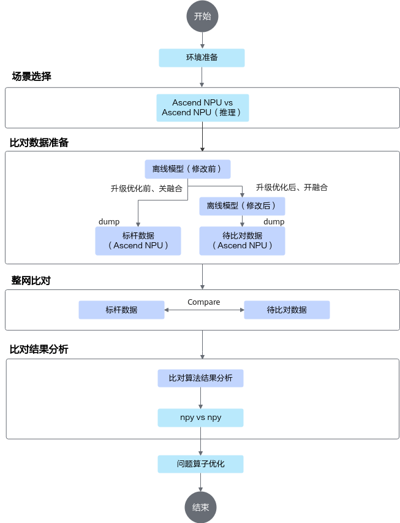

# 使用前准备<a name="ZH-CN_TOPIC_0000002506020829"></a>


## 使用前说明<a name="ZH-CN_TOPIC_0000002473900858"></a>

**总体说明<a name="section87122056754"></a>**

> **须知：** 
>请在开发和调测场景下使用数据dump功能，生产上线后建议关掉数据dump开关，避免被攻击者利用，造成安全风险。

-   精度比对工具推荐环境配置：CPU 8核2.6GHz，内存16GB，低于该配置则工具执行迟缓。
-   本文中举例路径均需要确保运行用户具有读或读写权限。
-   建议使用普通用户，不建议使用高权限用户使用该工具，避免提权风险。
-   单算子网络不支持精度比对。
-   Python版本支持情况请参见《安装指南》。
-   精度比对支持的dump数据类型：
    -   FLOAT
    -   FLOAT16
    -   DT\_INT8
    -   DT\_UINT8
    -   DT\_INT16
    -   DT\_UINT16
    -   DT\_INT32
    -   DT\_INT64
    -   DT\_UINT32
    -   DT\_UINT64
    -   DT\_BOOL
    -   DT\_DOUBLE
    -   DT\_BFLOAT16

        > **说明：** 
        >若网络中存在DT\_BFLOAT16数据类型，则需要使用**pip3 install bfloat16ext**安装依赖。

## 环境准备<a name="ZH-CN_TOPIC_0000002473900856"></a>

安装CANN软件后，使用CANN运行用户进行编译、运行时，需要以CANN运行用户登录环境，执行**source  $\{INSTALL\_DIR\}/bin/setenv.bash**命令设置环境变量。$\{INSTALL\_DIR\}请替换为CANN软件安装后文件存储路径。以root安装举例，安装后文件默认存储路径为：/usr/local/Ascend/latest。

# GPU vs NPU（TensorFlow离线推理）-IPV350不支持<a name="ZH-CN_TOPIC_0000002473740924"></a>


## 总体说明<a name="ZH-CN_TOPIC_0000002473900862"></a>

> **说明：** 
>对于该场景需要排查[比对结果说明](比对结果说明.md)。

TensorFlow场景仅支持非量化原始模型与非量化离线模型的精度比对。需准备输入数据如下表所示。

**表 1**  非量化原始模型 vs 非量化离线模型输入数据要求

<a name="zh-cn_topic_0000001522707848_table1235366318"></a>
<table><thead align="left"><tr id="zh-cn_topic_0000001522707848_row923556535"><th class="cellrowborder" valign="top" width="46.24%" id="mcps1.2.4.1.1"><p id="zh-cn_topic_0000001522707848_p13235166334"><a name="zh-cn_topic_0000001522707848_p13235166334"></a><a name="zh-cn_topic_0000001522707848_p13235166334"></a>文件</p>
</th>
<th class="cellrowborder" valign="top" width="12.710000000000003%" id="mcps1.2.4.1.2"><p id="zh-cn_topic_0000001522707848_p82353619319"><a name="zh-cn_topic_0000001522707848_p82353619319"></a><a name="zh-cn_topic_0000001522707848_p82353619319"></a>说明</p>
</th>
<th class="cellrowborder" valign="top" width="41.050000000000004%" id="mcps1.2.4.1.3"><p id="zh-cn_topic_0000001522707848_p13235661436"><a name="zh-cn_topic_0000001522707848_p13235661436"></a><a name="zh-cn_topic_0000001522707848_p13235661436"></a>获取方式</p>
</th>
</tr>
</thead>
<tbody><tr id="zh-cn_topic_0000001522707848_row22360611310"><td class="cellrowborder" valign="top" width="46.24%" headers="mcps1.2.4.1.1 "><p id="zh-cn_topic_0000001522707848_p122361062310"><a name="zh-cn_topic_0000001522707848_p122361062310"></a><a name="zh-cn_topic_0000001522707848_p122361062310"></a>非量化原始模型的npy文件</p>
</td>
<td class="cellrowborder" valign="top" width="12.710000000000003%" headers="mcps1.2.4.1.2 "><p id="zh-cn_topic_0000001522707848_p22362618312"><a name="zh-cn_topic_0000001522707848_p22362618312"></a><a name="zh-cn_topic_0000001522707848_p22362618312"></a>标杆数据</p>
</td>
<td class="cellrowborder" valign="top" width="41.050000000000004%" headers="mcps1.2.4.1.3 "><p id="zh-cn_topic_0000001522707848_p1523506639"><a name="zh-cn_topic_0000001522707848_p1523506639"></a><a name="zh-cn_topic_0000001522707848_p1523506639"></a><a href="准备TensorFlow模型npy数据文件.md">准备TensorFlow模型npy数据文件</a></p>
</td>
</tr>
<tr id="zh-cn_topic_0000001522707848_row52361661730"><td class="cellrowborder" valign="top" width="46.24%" headers="mcps1.2.4.1.1 "><p id="zh-cn_topic_0000001522707848_p104701443193916"><a name="zh-cn_topic_0000001522707848_p104701443193916"></a><a name="zh-cn_topic_0000001522707848_p104701443193916"></a>通过<span id="zh-cn_topic_0000001522707848_ph1867610567576"><a name="zh-cn_topic_0000001522707848_ph1867610567576"></a><a name="zh-cn_topic_0000001522707848_ph1867610567576"></a>ATC</span>转换离线模型文件生成的json文件</p>
</td>
<td class="cellrowborder" valign="top" width="12.710000000000003%" headers="mcps1.2.4.1.2 "><p id="zh-cn_topic_0000001522707848_p6236164319"><a name="zh-cn_topic_0000001522707848_p6236164319"></a><a name="zh-cn_topic_0000001522707848_p6236164319"></a>获取算子的映射关系</p>
</td>
<td class="cellrowborder" valign="top" width="41.050000000000004%" headers="mcps1.2.4.1.3 "><p id="zh-cn_topic_0000001522707848_p14236461033"><a name="zh-cn_topic_0000001522707848_p14236461033"></a><a name="zh-cn_topic_0000001522707848_p14236461033"></a><a href="准备全网层信息文件.md">准备全网层信息文件</a></p>
</td>
</tr>
<tr id="zh-cn_topic_0000001522707848_row11221136322"><td class="cellrowborder" valign="top" width="46.24%" headers="mcps1.2.4.1.1 "><p id="zh-cn_topic_0000001522707848_p6235161332"><a name="zh-cn_topic_0000001522707848_p6235161332"></a><a name="zh-cn_topic_0000001522707848_p6235161332"></a>非量化离线模型在<span id="zh-cn_topic_0000001522707848_ph197621513235"><a name="zh-cn_topic_0000001522707848_ph197621513235"></a><a name="zh-cn_topic_0000001522707848_ph197621513235"></a>NPU IP加速器</span>上运行生成的dump数据文件</p>
</td>
<td class="cellrowborder" valign="top" width="12.710000000000003%" headers="mcps1.2.4.1.2 "><p id="zh-cn_topic_0000001522707848_p8235267312"><a name="zh-cn_topic_0000001522707848_p8235267312"></a><a name="zh-cn_topic_0000001522707848_p8235267312"></a>待比对数据</p>
</td>
<td class="cellrowborder" valign="top" width="41.050000000000004%" headers="mcps1.2.4.1.3 "><p id="p186107307712"><a name="p186107307712"></a><a name="p186107307712"></a>离线推理场景各框架获取NPU环境的dump数据方法一致，请参考：</p>
<p id="zh-cn_topic_0000001522707848_p72368618316"><a name="zh-cn_topic_0000001522707848_p72368618316"></a><a name="zh-cn_topic_0000001522707848_p72368618316"></a><a href="准备离线模型dump数据文件.md">准备离线模型dump数据文件</a></p>
</td>
</tr>
</tbody>
</table>

## 准备TensorFlow模型npy数据文件<a name="ZH-CN_TOPIC_0000002505900915"></a>

本版本不提供TensorFlow模型numpy（.npy）数据生成功能，请自行安装TensorFlow环境并提前准备numpy数据。本文仅提供生成numpy格式TensorFlow原始数据“\*.npy“文件的样例参考。

在进行TensorFlow模型生成npy数据前，要求有一套完整的、可执行的、标准的TensorFlow模型应用工程。然后利用TensorFlow官方提供的debug工具tfdbg调试程序，从而生成npy文件。主要操作示例如下，请根据自己的应用工程适配操作。

1.  修改TensorFlow推理脚本，添加debug选项设置。代码中增加如下代码：
    -   Estimator模式：

        ```
        from tensorflow.python import debug as tf_debug
        training_hooks = [train_helper.PrefillStagingAreaHook(), tf_debug.LocalCLIDebugHook()]
        ```

        如[图1](#zh-cn_topic_0234836560_fig1922973815474)所示，添加tfdbg的hook。

        **图 1**  Estimator模式<a name="zh-cn_topic_0234836560_fig1922973815474"></a>  
        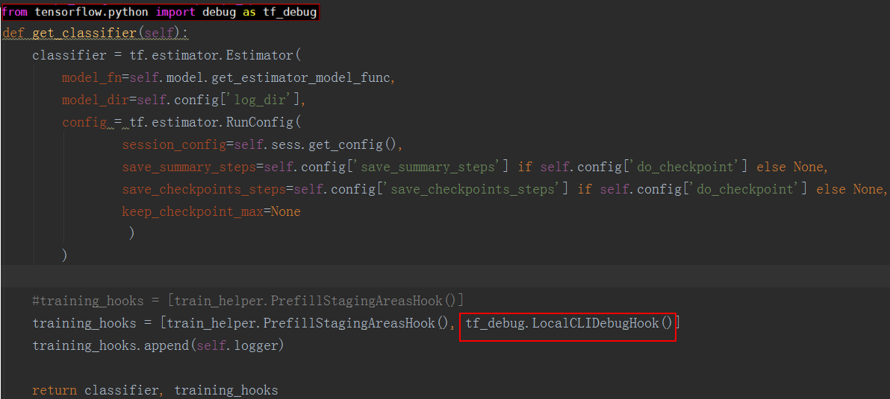

    -   session.run模式：

        ```
        from tensorflow.python import debug as tf_debug
        sess = tf_debug.LocalCLIDebugWrapperSession(sess, ui_type="readline")
        ```

        如[图2](#zh-cn_topic_0234836560_fig2229338134720)所示，在run之前设置tfdbg装饰器。

        **图 2**  session.run模式<a name="zh-cn_topic_0234836560_fig2229338134720"></a>  
        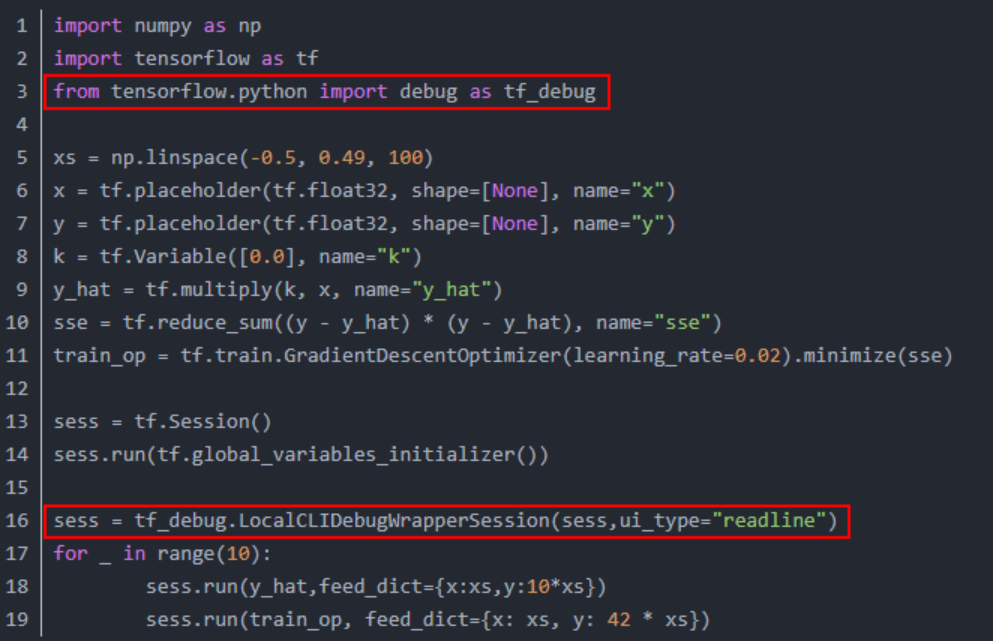

2.  执行推理脚本。

    推理完成后自动进入**tfdbg**调试命令行交互模式，执行**run**命令。

3.  收集npy文件。

    执行**run**命令完成后，可以在新的命令行窗口通过**lt**查询已存储的张量，通过**pt**可以查看已存储的张量内容，可以保存数据为numpy格式文件。

    因为**tfdbg**一次命令只能dump一个tensor，为了自动生成收集所有数据，可以按以下几个步骤操作：

    1.  执行**lt \> **_**tensor\_name**_将所有tensor的名称暂存到文件里。
    2.  重新开启一个linux命令窗口，在新的窗口中执行下述命令，用以生成在tfdbg命令行执行的命令。

        ```
        timestamp=$[$(date +%s%N)/1000] ; cat tensor_name | awk '{print "pt",$4,$4}' | awk '{gsub("/", "_", $3);gsub(":", ".", $3);print($1,$2,"-n 0 -w "$3".""'$timestamp'"".npy")}' > tensor_name_cmd.txt
        ```

        > **说明：** 
        >该示例生成符合精度比对需要的npy文件名称格式，存储到tensor\_name\_cmd.txt文件。其中，tensor\_name为自定义tensor列表对应的文件名，timestamp为16位的时间戳。

    3.  回到tfdbg命令行窗口，输入run命令后，将上一步生成的所有tensor存储的命令粘贴执行，即可存储所有npy文件。

        npy文件默认是以numpy.save\(\)形式存储的，上述命令会将“/“用下划线\_替换。

        > **说明：** 
        >如果命令行界面无法粘贴文件内容，可以在tfdbg命令行中输入“mouse off“指令关闭鼠标模式后再进行粘贴。

    4.  检查生成的npy文件命名是否符合_\{op\_name\}.\{output\_index\}.\{timestamp\}_.npy格式，如[图3](#f7ac5b2eaede242a185f33090a2c76561)所示。

        > **说明：** 
        >-   如果因算子名较长，造成按命名规则生成的npy文件名超过255字符而产生文件名异常，这类算子不支持精度比对。
        >-   因tfdbg自身原因或运行环境原因，可能存在部分生成的npy文件名不符合精度比对要求，请按命名规则手工重命名。如果不符合要求的npy文件较多，请参见[生成npy文件名异常情况批量处理](zh-cn_topic_0000002473900864.md)重新生成npy文件。

        **图 3**  查询.npy文件<a name="f7ac5b2eaede242a185f33090a2c76561"></a>  
        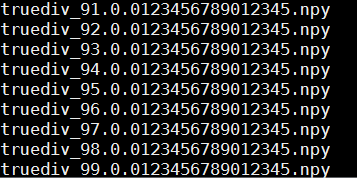

## 准备全网层信息文件<a name="ZH-CN_TOPIC_0000002505900905"></a>

以下介绍通过ATC模型转换工具获取离线模型的操作步骤，更多操作请参见《ATC离线模型编译工具用户指南》。

1.  登录安装了Ascend-cann-toolkit开发套件包的昇腾AI环境。
2.  获取原始模型文件并保存在任意目录下。

    例如：$HOME/module/resnet50\_tensorflow\*.pb

3.  执行ATC模型转换。

    ```
    atc --model=$HOME/module/resnet50_tensorflow*.pb --framework=3 --output=$HOME/module/out/tf_resnet50 --soc_version=<soc_version>
    ```

    若提示如下信息，则说明模型转换成功。

    ```
    ATC run success
    ```

    成功执行命令后，在--output参数指定的路径下可查看离线模型（如：tf\_resnet50.om）。

4.  生成json文件。

    ```
    atc --mode=1 --om=$HOME/module/out/tf_resnet50.om  --json=$HOME/module/out/tf_resnet50.json
    ```

    若提示如下信息，则说明转换json文件成功。

    ```
    ATC run success
    ```

    成功执行命令后，在--json参数指定的路径下可查看转换后的json文件。

## 比对操作和分析<a name="ZH-CN_TOPIC_0000002473900872"></a>

**说明<a name="zh-cn_topic_0000001522387944_section1880194415418"></a>**

-   本节涉及的.json文件、目录等名称均为举例，请根据实际环境替换。其中，-out指定的结果存放路径，需确保操作用户具有读写权限。
-   如果执行过程中报“MemoryError”，则表示数据量过大导致了内存溢出，请将NPU的dump数据文件拆分到多个目录后，再逐一进行比对。
-   当指定的比对数据文件大小超过1GB或.json文件大小超过100MB时，比对过程可能耗时较长，系统提示：'The size \(%d\) of %s more than the XX, it needs more time to run.'。

**前提条件<a name="section0582435102720"></a>**

-   请确保完成[使用前准备](使用前准备.md)。
-   根据[总体说明](总体说明.md)中的场景准备比对文件。

**操作步骤<a name="zh-cn_topic_0000001522387944_section10356101916572"></a>**

1.  登录CANN工具安装环境。
2.  进入$\{INSTALL\_DIR\}/toolkit/tools/operator\_cmp/compare，$\{INSTALL\_DIR\}请替换为CANN软件安装后文件存储路径。以root安装举例，安装后文件默认存储路径为：/usr/local/Ascend/latest。
3.  执行比对命令。

    > **说明：** 
    >由于dump和npy比对数据文件是由多个文件组成，故下文操作步骤中**-m**和**-g**参数须指定数据文件所在的父目录。如：_$HOME/MyApp/resnet50，_其中_resnet50_文件夹下直接保存比对数据文件。
    >目录结构示例如下：
    >```
    >root@xxx:$HOME/MyApp/resnet50# tree
    >.
    >├── BatchMatMul.bert_encoder_layer_0_attention_self_MatMul_1.24.1614717261785536
    >├── BatchMatMul.bert_encoder_layer_0_attention_self_MatMul.21.1614717261768864
    >├── BatchMatMul.bert_encoder_layer_10_attention_self_MatMul_1.235.1614717263664916
    ># 仅为示例，此处省略剩余文件名。
    >```

    ```
    python3 msaccucmp.py compare -m $HOME/MyApp/tf_resnet50/20230815201822/0/resnet50_tensorflow_1_7/1/0/ -g $HOME/MyApp/resnet50_tensorflow_1_dump/ -f $HOME/module/out/tf_resnet50/tf_resnet50.json -out $HOME/result -advisor
    ```

    > **说明：** 
    >-   上述命令仅展示当前场景所需参数的示例，若需要配置更多参数，比如已知可能出现精度问题的范围或因大型网络模型输出结果文件数据量过大，通过配置参数来减少输出结果的数据量，请参见[命令格式说明](命令格式说明.md)获取更多参数详细介绍。
    >-   需要安装pandas 1.3或更高版本依赖，否则无法执行-advisor参数输出专家建议。

    **表 1**  整网比对命令行参数说明

    <a name="zh-cn_topic_0000001522387944_table23391841181914"></a>
    <table><thead align="left"><tr id="zh-cn_topic_0000001522387944_row1538804115197"><th class="cellrowborder" valign="top" width="20.5%" id="mcps1.2.4.1.1"><p id="zh-cn_topic_0000001522387944_p14388194114198"><a name="zh-cn_topic_0000001522387944_p14388194114198"></a><a name="zh-cn_topic_0000001522387944_p14388194114198"></a><strong id="zh-cn_topic_0000001522387944_b193880419193"><a name="zh-cn_topic_0000001522387944_b193880419193"></a><a name="zh-cn_topic_0000001522387944_b193880419193"></a>参数名</strong></p>
    </th>
    <th class="cellrowborder" valign="top" width="69.76%" id="mcps1.2.4.1.2"><p id="zh-cn_topic_0000001522387944_p1538811413196"><a name="zh-cn_topic_0000001522387944_p1538811413196"></a><a name="zh-cn_topic_0000001522387944_p1538811413196"></a><strong id="zh-cn_topic_0000001522387944_b5388114116193"><a name="zh-cn_topic_0000001522387944_b5388114116193"></a><a name="zh-cn_topic_0000001522387944_b5388114116193"></a>参数说明</strong></p>
    </th>
    <th class="cellrowborder" valign="top" width="9.74%" id="mcps1.2.4.1.3"><p id="zh-cn_topic_0000001522387944_p1464718126387"><a name="zh-cn_topic_0000001522387944_p1464718126387"></a><a name="zh-cn_topic_0000001522387944_p1464718126387"></a><strong id="zh-cn_topic_0000001522387944_b9388104119199"><a name="zh-cn_topic_0000001522387944_b9388104119199"></a><a name="zh-cn_topic_0000001522387944_b9388104119199"></a>是否必选</strong></p>
    </th>
    </tr>
    </thead>
    <tbody><tr id="zh-cn_topic_0000001522387944_row2388341121919"><td class="cellrowborder" valign="top" width="20.5%" headers="mcps1.2.4.1.1 "><p id="zh-cn_topic_0000001522387944_p163975255262"><a name="zh-cn_topic_0000001522387944_p163975255262"></a><a name="zh-cn_topic_0000001522387944_p163975255262"></a>-m</p>
    <p id="zh-cn_topic_0000001522387944_p1338884151915"><a name="zh-cn_topic_0000001522387944_p1338884151915"></a><a name="zh-cn_topic_0000001522387944_p1338884151915"></a>--my_dump_path</p>
    </td>
    <td class="cellrowborder" valign="top" width="69.76%" headers="mcps1.2.4.1.2 "><p id="zh-cn_topic_0000001522387944_p8209481840"><a name="zh-cn_topic_0000001522387944_p8209481840"></a><a name="zh-cn_topic_0000001522387944_p8209481840"></a>基于<span id="zh-cn_topic_0000001522387944_zh-cn_topic_0244522940_ph5870225112211"><a name="zh-cn_topic_0000001522387944_zh-cn_topic_0244522940_ph5870225112211"></a><a name="zh-cn_topic_0000001522387944_zh-cn_topic_0244522940_ph5870225112211"></a>NPU IP加速器</span>运行生成的数据文件所在目录。</p>
    </td>
    <td class="cellrowborder" valign="top" width="9.74%" headers="mcps1.2.4.1.3 "><p id="zh-cn_topic_0000001522387944_p15647111220388"><a name="zh-cn_topic_0000001522387944_p15647111220388"></a><a name="zh-cn_topic_0000001522387944_p15647111220388"></a>是</p>
    </td>
    </tr>
    <tr id="zh-cn_topic_0000001522387944_row6388174191910"><td class="cellrowborder" valign="top" width="20.5%" headers="mcps1.2.4.1.1 "><p id="zh-cn_topic_0000001522387944_p4240828162618"><a name="zh-cn_topic_0000001522387944_p4240828162618"></a><a name="zh-cn_topic_0000001522387944_p4240828162618"></a>-g</p>
    <p id="zh-cn_topic_0000001522387944_p7388441171913"><a name="zh-cn_topic_0000001522387944_p7388441171913"></a><a name="zh-cn_topic_0000001522387944_p7388441171913"></a>--golden_dump_path</p>
    </td>
    <td class="cellrowborder" valign="top" width="69.76%" headers="mcps1.2.4.1.2 "><p id="zh-cn_topic_0000001522387944_p43888413196"><a name="zh-cn_topic_0000001522387944_p43888413196"></a><a name="zh-cn_topic_0000001522387944_p43888413196"></a>基于GPU/CPU运行生成的原始网络数据文件所在目录。</p>
    </td>
    <td class="cellrowborder" valign="top" width="9.74%" headers="mcps1.2.4.1.3 "><p id="zh-cn_topic_0000001522387944_p106476121389"><a name="zh-cn_topic_0000001522387944_p106476121389"></a><a name="zh-cn_topic_0000001522387944_p106476121389"></a>是</p>
    </td>
    </tr>
    <tr id="zh-cn_topic_0000001522387944_row23883410194"><td class="cellrowborder" valign="top" width="20.5%" headers="mcps1.2.4.1.1 "><p id="zh-cn_topic_0000001522387944_p79163339260"><a name="zh-cn_topic_0000001522387944_p79163339260"></a><a name="zh-cn_topic_0000001522387944_p79163339260"></a>-f</p>
    <p id="zh-cn_topic_0000001522387944_p238812410199"><a name="zh-cn_topic_0000001522387944_p238812410199"></a><a name="zh-cn_topic_0000001522387944_p238812410199"></a>--fusion_rule_file</p>
    </td>
    <td class="cellrowborder" valign="top" width="69.76%" headers="mcps1.2.4.1.2 "><p id="zh-cn_topic_0000001522387944_p838854191915"><a name="zh-cn_topic_0000001522387944_p838854191915"></a><a name="zh-cn_topic_0000001522387944_p838854191915"></a>全网层信息文件。</p>
    <p id="zh-cn_topic_0000001522387944_p17981358165610"><a name="zh-cn_topic_0000001522387944_p17981358165610"></a><a name="zh-cn_topic_0000001522387944_p17981358165610"></a>通过<span id="zh-cn_topic_0000001522387944_ph1867610567576"><a name="zh-cn_topic_0000001522387944_ph1867610567576"></a><a name="zh-cn_topic_0000001522387944_ph1867610567576"></a>ATC</span>转换.om模型文件生成的.json文件，文件包含整网算子的映射关系，用于精度比对时算子匹配。</p>
    </td>
    <td class="cellrowborder" valign="top" width="9.74%" headers="mcps1.2.4.1.3 "><p id="zh-cn_topic_0000001522387944_p16647812163814"><a name="zh-cn_topic_0000001522387944_p16647812163814"></a><a name="zh-cn_topic_0000001522387944_p16647812163814"></a>否</p>
    </td>
    </tr>
    <tr id="zh-cn_topic_0000001522387944_row1138854151910"><td class="cellrowborder" valign="top" width="20.5%" headers="mcps1.2.4.1.1 "><p id="zh-cn_topic_0000001522387944_p7934143982612"><a name="zh-cn_topic_0000001522387944_p7934143982612"></a><a name="zh-cn_topic_0000001522387944_p7934143982612"></a>-out</p>
    <p id="zh-cn_topic_0000001522387944_p838811413193"><a name="zh-cn_topic_0000001522387944_p838811413193"></a><a name="zh-cn_topic_0000001522387944_p838811413193"></a>--output</p>
    </td>
    <td class="cellrowborder" valign="top" width="69.76%" headers="mcps1.2.4.1.2 "><p id="zh-cn_topic_0000001522387944_p1388941201917"><a name="zh-cn_topic_0000001522387944_p1388941201917"></a><a name="zh-cn_topic_0000001522387944_p1388941201917"></a>比对数据结果存放路径，默认为当前路径。</p>
    <p id="p1757911109267"><a name="p1757911109267"></a><a name="p1757911109267"></a>不建议配置与当前用户不一致的其它用户目录，避免提权风险。</p>
    </td>
    <td class="cellrowborder" valign="top" width="9.74%" headers="mcps1.2.4.1.3 "><p id="zh-cn_topic_0000001522387944_p76473123383"><a name="zh-cn_topic_0000001522387944_p76473123383"></a><a name="zh-cn_topic_0000001522387944_p76473123383"></a>否</p>
    </td>
    </tr>
    <tr id="zh-cn_topic_0000001522387944_row1811151719387"><td class="cellrowborder" valign="top" width="20.5%" headers="mcps1.2.4.1.1 "><p id="zh-cn_topic_0000001522387944_p1214813133611"><a name="zh-cn_topic_0000001522387944_p1214813133611"></a><a name="zh-cn_topic_0000001522387944_p1214813133611"></a>-advisor</p>
    </td>
    <td class="cellrowborder" valign="top" width="69.76%" headers="mcps1.2.4.1.2 "><p id="zh-cn_topic_0000001522387944_p879452013915"><a name="zh-cn_topic_0000001522387944_p879452013915"></a><a name="zh-cn_topic_0000001522387944_p879452013915"></a>在Tensor比对结束后，针对比对结果进行数据分析，给出专家建议。详情请参见<a href="比对结果专家建议.md">比对结果专家建议</a></p>
    </td>
    <td class="cellrowborder" valign="top" width="9.74%" headers="mcps1.2.4.1.3 "><p id="zh-cn_topic_0000001522387944_p766191823812"><a name="zh-cn_topic_0000001522387944_p766191823812"></a><a name="zh-cn_topic_0000001522387944_p766191823812"></a>否</p>
    </td>
    </tr>
    </tbody>
    </table>

    比对结果如[图1](#zh-cn_topic_0000001522387944_fbd513dec8f4544a787365ea39368be4f)所示。

    **图 1**  比对结果示例<a name="zh-cn_topic_0000001522387944_fbd513dec8f4544a787365ea39368be4f"></a>  
    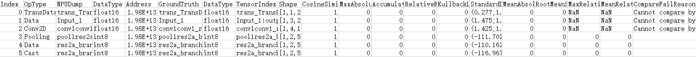

    以上比对结果字段解释请参见[完整比对结果参数说明](完整比对结果参数说明.md)。

4.  比对结果分析。

    请参见[比对结果分析](比对结果分析.md)。对于比对结果中可能存在部分无法比对或异常情况（比如结果中的NaN），请参见[比对结果说明](比对结果说明.md)。

# GPU vs NPU（ONNX离线推理）-IPV350不支持<a name="ZH-CN_TOPIC_0000002505900933"></a>


## 总体说明<a name="ZH-CN_TOPIC_0000002506020843"></a>

> **说明：** 
>对于该场景需要排查[比对结果说明](比对结果说明.md)。

ONNX场景仅支持非量化的精度比对。需准备输入数据如下表所示。

**表 1**  非量化原始模型 vs 非量化离线模型输入数据要求

<a name="zh-cn_topic_0000001522707848_table322361115415"></a>
<table><thead align="left"><tr id="zh-cn_topic_0000001522707848_row13223191118413"><th class="cellrowborder" valign="top" width="46.24%" id="mcps1.2.4.1.1"><p id="zh-cn_topic_0000001522707848_p12240111415"><a name="zh-cn_topic_0000001522707848_p12240111415"></a><a name="zh-cn_topic_0000001522707848_p12240111415"></a>文件</p>
</th>
<th class="cellrowborder" valign="top" width="12.710000000000003%" id="mcps1.2.4.1.2"><p id="zh-cn_topic_0000001522707848_p0831317164516"><a name="zh-cn_topic_0000001522707848_p0831317164516"></a><a name="zh-cn_topic_0000001522707848_p0831317164516"></a>说明</p>
</th>
<th class="cellrowborder" valign="top" width="41.050000000000004%" id="mcps1.2.4.1.3"><p id="zh-cn_topic_0000001522707848_p322491117415"><a name="zh-cn_topic_0000001522707848_p322491117415"></a><a name="zh-cn_topic_0000001522707848_p322491117415"></a>获取方式</p>
</th>
</tr>
</thead>
<tbody><tr id="zh-cn_topic_0000001522707848_row1522411118413"><td class="cellrowborder" valign="top" width="46.24%" headers="mcps1.2.4.1.1 "><p id="zh-cn_topic_0000001522707848_p122241411154119"><a name="zh-cn_topic_0000001522707848_p122241411154119"></a><a name="zh-cn_topic_0000001522707848_p122241411154119"></a>非量化原始模型的npy文件</p>
</td>
<td class="cellrowborder" valign="top" width="12.710000000000003%" headers="mcps1.2.4.1.2 "><p id="zh-cn_topic_0000001522707848_p1883191734514"><a name="zh-cn_topic_0000001522707848_p1883191734514"></a><a name="zh-cn_topic_0000001522707848_p1883191734514"></a>标杆数据</p>
</td>
<td class="cellrowborder" valign="top" width="41.050000000000004%" headers="mcps1.2.4.1.3 "><p id="zh-cn_topic_0000001522707848_p1922441115415"><a name="zh-cn_topic_0000001522707848_p1922441115415"></a><a name="zh-cn_topic_0000001522707848_p1922441115415"></a><a href="准备ONNX模型npy数据文件.md">准备ONNX模型npy数据文件</a></p>
</td>
</tr>
<tr id="zh-cn_topic_0000001522707848_row82247111415"><td class="cellrowborder" valign="top" width="46.24%" headers="mcps1.2.4.1.1 "><p id="zh-cn_topic_0000001522707848_p1622411114411"><a name="zh-cn_topic_0000001522707848_p1622411114411"></a><a name="zh-cn_topic_0000001522707848_p1622411114411"></a>通过<span id="zh-cn_topic_0000001522707848_ph48758719500"><a name="zh-cn_topic_0000001522707848_ph48758719500"></a><a name="zh-cn_topic_0000001522707848_ph48758719500"></a>ATC</span>转换离线模型文件生成的json文件</p>
</td>
<td class="cellrowborder" valign="top" width="12.710000000000003%" headers="mcps1.2.4.1.2 "><p id="zh-cn_topic_0000001522707848_p01841351444"><a name="zh-cn_topic_0000001522707848_p01841351444"></a><a name="zh-cn_topic_0000001522707848_p01841351444"></a>获取算子的映射关系</p>
</td>
<td class="cellrowborder" valign="top" width="41.050000000000004%" headers="mcps1.2.4.1.3 "><p id="zh-cn_topic_0000001522707848_p13224111134118"><a name="zh-cn_topic_0000001522707848_p13224111134118"></a><a name="zh-cn_topic_0000001522707848_p13224111134118"></a><a href="准备全网层信息文件-1.md">准备全网层信息文件</a></p>
</td>
</tr>
<tr id="zh-cn_topic_0000001522707848_row1869142618334"><td class="cellrowborder" valign="top" width="46.24%" headers="mcps1.2.4.1.1 "><p id="zh-cn_topic_0000001522707848_p41911025174513"><a name="zh-cn_topic_0000001522707848_p41911025174513"></a><a name="zh-cn_topic_0000001522707848_p41911025174513"></a>非量化离线模型在<span id="zh-cn_topic_0000001522707848_ph13191125174515"><a name="zh-cn_topic_0000001522707848_ph13191125174515"></a><a name="zh-cn_topic_0000001522707848_ph13191125174515"></a>NPU IP加速器</span>上运行生成的dump数据文件</p>
</td>
<td class="cellrowborder" valign="top" width="12.710000000000003%" headers="mcps1.2.4.1.2 "><p id="zh-cn_topic_0000001522707848_p483171764512"><a name="zh-cn_topic_0000001522707848_p483171764512"></a><a name="zh-cn_topic_0000001522707848_p483171764512"></a>待比对数据</p>
</td>
<td class="cellrowborder" valign="top" width="41.050000000000004%" headers="mcps1.2.4.1.3 "><p id="p186107307712"><a name="p186107307712"></a><a name="p186107307712"></a>离线推理场景各框架获取NPU环境的dump数据方法一致，请参考：</p>
<p id="zh-cn_topic_0000001522707848_p72368618316"><a name="zh-cn_topic_0000001522707848_p72368618316"></a><a name="zh-cn_topic_0000001522707848_p72368618316"></a><a href="准备离线模型dump数据文件.md">准备离线模型dump数据文件</a></p>
</td>
</tr>
</tbody>
</table>

## 准备ONNX模型npy数据文件<a name="ZH-CN_TOPIC_0000002505900921"></a>

**前提条件<a name="zh-cn_topic_0286683438_section1587104411611"></a>**

-   需要确保每个算子节点有名称，否则无法生成正确的文件名。没有名称的算子节点需要先生成名称。
-   本参考示例以每个节点只有一个输出为例，多个输出的需要在文件名生成处适配output\_index的获取。

**代码参考示例<a name="zh-cn_topic_0286683438_section13658055162716"></a>**

本版本不提供ONNX模型npy数据生成功能，请自行安装ONNX环境并提前准备ONNX原始数据.npy文件。本文提供的样例代码仅作参考。

为输出符合精度比对要求的.npy数据文件，需在推理结束后的代码中增加dump操作，示例代码如下：

```
import os
import onnx
import onnxruntime
import numpy as np
import time

from skl2onnx.helpers.onnx_helper import enumerate_model_node_outputs
from skl2onnx.helpers.onnx_helper import select_model_inputs_outputs
from skl2onnx.helpers.onnx_helper import save_onnx_model

# 修改模型，增加输出节点
model_onnx = onnx.load("./resnet50.onnx")
output = []
for out in enumerate_model_node_outputs(model_onnx):
    output.append(out)

num_onnx = select_model_inputs_outputs(model_onnx,outputs=output)
save_onnx_model(num_onnx, "resnet50_dump.onnx")

# 推理得到输出，本示例中采用随机数作为输入
input_data = np.random.random((1,3,224,224)).astype(np.float32)
input_data.tofile("test_data.bin")
sess = onnxruntime.InferenceSession("resnet50_dump.onnx")
input_name = sess.get_inputs()[0].name
output_name = [node.name for node in sess.get_outputs()]
res = sess.run(output_name, {input_name: input_data})

# 获得输出名称，确保每个算子节点有对应名称
node_name = [node.name for node in model_onnx.graph.node]

# 保存数据
node_output_num = [len(node.output) for node in model_onnx.graph.node]
idx = 0
for num, name in zip(node_output_num, node_name):
    for i in range(num):
        data = res[idx] 
        file_name = name + "." + str(i) + "." + str(round(time.time() * 1000000)) + ".npy"
        output_dump_path = os.path.join("./onnx_dump/", file_name)
        np.save(output_dump_path, data.astype(np.float16))
        idx += 1
```

> **说明：** 
>-   需要根据代码中的output\_dump\_path参数在当前目录新建对应“onnx\_dump”目录或自定义目录。
>-   .npy数据文件命名格式为_\{op\_name\}.\{output\_index\}.\{timestamp\}_.npy，其中需要确保文件名中的_\{output\_index\}_字段存在值为0，否则无比对结果，原因是精度比对时默认从第一个output\_index为0的数据开始。

## 准备全网层信息文件<a name="ZH-CN_TOPIC_0000002473900880"></a>

以下介绍通过ATC模型转换工具获取离线模型的操作步骤，更多操作请参见《ATC离线模型编译工具用户指南》。

1.  登录安装了Ascend-cann-toolkit开发套件包的昇腾AI环境。
2.  获取原始模型文件并保存在任意目录下。

    例如：resnet50\*.onnx

3.  执行ATC模型转换。

    ```
    atc --model=$HOME/module/resnet50*.onnx --framework=5 --output=$HOME/module/out/onnx_resnet50 --soc_version=<soc_version>
    ```

    若提示如下信息，则说明模型转换成功。

    ```
    ATC run success
    ```

    成功执行命令后，在--output参数指定的路径下，可查看离线模型（如：onnx\_resnet50.om）。

4.  生成json文件。

    ```
    atc --mode=1 --om=$HOME/module/out/onnx_resnet50.om --json=$HOME/module/out/onnx_resnet50.json
    ```

    若提示如下信息，则说明转换json文件成功。

    ```
    ATC run success
    ```

    成功执行命令后，在--json参数指定的路径下可查看转换后的json文件。

## 比对操作和分析<a name="ZH-CN_TOPIC_0000002473900854"></a>

**说明<a name="zh-cn_topic_0000001522387944_section1880194415418"></a>**

-   本节涉及的.json文件、目录等名称均为举例，请根据实际环境替换。其中，-out指定的结果存放路径，需确保操作用户具有读写权限。
-   如果执行过程中报“MemoryError”，则表示数据量过大导致了内存溢出，请将NPU的dump数据文件拆分到多个目录后，再逐一进行比对。
-   当指定的比对数据文件大小超过1GB或.json文件大小超过100MB时，比对过程可能耗时较长，系统提示：'The size \(%d\) of %s more than the XX, it needs more time to run.'。

**前提条件<a name="section0582435102720"></a>**

-   请确保完成[使用前准备](使用前准备.md)。
-   根据[总体说明](总体说明-0.md)中的场景准备比对文件。

**操作步骤<a name="zh-cn_topic_0000001522387944_section10356101916572"></a>**

本节以非量化NPU IP加速器运行生成的dump数据与非量化ONNX模型npy数据比对为例进行介绍，下文中参数说明均以该示例介绍，请根据您的实际情况进行替换。

1.  登录CANN工具安装环境。
2.  进入$\{INSTALL\_DIR\}/toolkit/tools/operator\_cmp/compare，$\{INSTALL\_DIR\}请替换为CANN软件安装后文件存储路径。以root安装举例，安装后文件默认存储路径为：/usr/local/Ascend/latest。
3.  执行比对命令。

    > **说明：** 
    >由于dump和npy比对数据文件是由多个文件组成，故下文操作步骤中**-m**和**-g**参数须指定数据文件所在的父目录。如：_$HOME/MyApp/resnet50，_其中_resnet50_文件夹下直接保存比对数据文件。
    >目录结构示例如下：
    >```
    >root@xxx:$HOME/MyApp/resnet50# tree
    >.
    >├── BatchMatMul.bert_encoder_layer_0_attention_self_MatMul_1.24.1614717261785536
    >├── BatchMatMul.bert_encoder_layer_0_attention_self_MatMul.21.1614717261768864
    >├── BatchMatMul.bert_encoder_layer_10_attention_self_MatMul_1.235.1614717263664916
    ># 仅为示例，此处省略剩余文件名。
    >```

    ```
    python3 msaccucmp.py compare -m $HOME/MyApp/npu_dump/20230216155330/0/resnet50/1/0/ -g $HOME/MyApp/onnx_dump/ -f $HOME/module/out/onnx_resnet50.json -out $HOME/result -advisor
    ```

    > **说明：** 
    >-   上述命令仅展示当前场景所需参数的示例，若需要配置更多参数，比如已知可能出现精度问题的范围或因大型网络模型输出结果文件数据量过大，通过配置参数来减少输出结果的数据量，请参见[命令格式说明](命令格式说明.md)获取更多参数详细介绍。
    >-   需要安装pandas 1.3或更高版本依赖，否则无法执行-advisor参数输出专家建议。

    **表 1**  整网比对命令行参数说明

    <a name="zh-cn_topic_0000001522387944_table23391841181914"></a>
    <table><thead align="left"><tr id="zh-cn_topic_0000001522387944_row1538804115197"><th class="cellrowborder" valign="top" width="20.5%" id="mcps1.2.4.1.1"><p id="zh-cn_topic_0000001522387944_p14388194114198"><a name="zh-cn_topic_0000001522387944_p14388194114198"></a><a name="zh-cn_topic_0000001522387944_p14388194114198"></a><strong id="zh-cn_topic_0000001522387944_b193880419193"><a name="zh-cn_topic_0000001522387944_b193880419193"></a><a name="zh-cn_topic_0000001522387944_b193880419193"></a>参数名</strong></p>
    </th>
    <th class="cellrowborder" valign="top" width="69.76%" id="mcps1.2.4.1.2"><p id="zh-cn_topic_0000001522387944_p1538811413196"><a name="zh-cn_topic_0000001522387944_p1538811413196"></a><a name="zh-cn_topic_0000001522387944_p1538811413196"></a><strong id="zh-cn_topic_0000001522387944_b5388114116193"><a name="zh-cn_topic_0000001522387944_b5388114116193"></a><a name="zh-cn_topic_0000001522387944_b5388114116193"></a>参数说明</strong></p>
    </th>
    <th class="cellrowborder" valign="top" width="9.74%" id="mcps1.2.4.1.3"><p id="zh-cn_topic_0000001522387944_p1464718126387"><a name="zh-cn_topic_0000001522387944_p1464718126387"></a><a name="zh-cn_topic_0000001522387944_p1464718126387"></a><strong id="zh-cn_topic_0000001522387944_b9388104119199"><a name="zh-cn_topic_0000001522387944_b9388104119199"></a><a name="zh-cn_topic_0000001522387944_b9388104119199"></a>是否必选</strong></p>
    </th>
    </tr>
    </thead>
    <tbody><tr id="zh-cn_topic_0000001522387944_row2388341121919"><td class="cellrowborder" valign="top" width="20.5%" headers="mcps1.2.4.1.1 "><p id="zh-cn_topic_0000001522387944_p163975255262"><a name="zh-cn_topic_0000001522387944_p163975255262"></a><a name="zh-cn_topic_0000001522387944_p163975255262"></a>-m</p>
    <p id="zh-cn_topic_0000001522387944_p1338884151915"><a name="zh-cn_topic_0000001522387944_p1338884151915"></a><a name="zh-cn_topic_0000001522387944_p1338884151915"></a>--my_dump_path</p>
    </td>
    <td class="cellrowborder" valign="top" width="69.76%" headers="mcps1.2.4.1.2 "><p id="zh-cn_topic_0000001522387944_p8209481840"><a name="zh-cn_topic_0000001522387944_p8209481840"></a><a name="zh-cn_topic_0000001522387944_p8209481840"></a>基于<span id="zh-cn_topic_0000001522387944_zh-cn_topic_0244522940_ph5870225112211"><a name="zh-cn_topic_0000001522387944_zh-cn_topic_0244522940_ph5870225112211"></a><a name="zh-cn_topic_0000001522387944_zh-cn_topic_0244522940_ph5870225112211"></a>NPU IP加速器</span>运行生成的数据文件所在目录。</p>
    </td>
    <td class="cellrowborder" valign="top" width="9.74%" headers="mcps1.2.4.1.3 "><p id="zh-cn_topic_0000001522387944_p15647111220388"><a name="zh-cn_topic_0000001522387944_p15647111220388"></a><a name="zh-cn_topic_0000001522387944_p15647111220388"></a>是</p>
    </td>
    </tr>
    <tr id="zh-cn_topic_0000001522387944_row6388174191910"><td class="cellrowborder" valign="top" width="20.5%" headers="mcps1.2.4.1.1 "><p id="zh-cn_topic_0000001522387944_p4240828162618"><a name="zh-cn_topic_0000001522387944_p4240828162618"></a><a name="zh-cn_topic_0000001522387944_p4240828162618"></a>-g</p>
    <p id="zh-cn_topic_0000001522387944_p7388441171913"><a name="zh-cn_topic_0000001522387944_p7388441171913"></a><a name="zh-cn_topic_0000001522387944_p7388441171913"></a>--golden_dump_path</p>
    </td>
    <td class="cellrowborder" valign="top" width="69.76%" headers="mcps1.2.4.1.2 "><p id="zh-cn_topic_0000001522387944_p43888413196"><a name="zh-cn_topic_0000001522387944_p43888413196"></a><a name="zh-cn_topic_0000001522387944_p43888413196"></a>基于GPU/CPU运行生成的原始网络数据文件所在目录。</p>
    </td>
    <td class="cellrowborder" valign="top" width="9.74%" headers="mcps1.2.4.1.3 "><p id="zh-cn_topic_0000001522387944_p106476121389"><a name="zh-cn_topic_0000001522387944_p106476121389"></a><a name="zh-cn_topic_0000001522387944_p106476121389"></a>是</p>
    </td>
    </tr>
    <tr id="zh-cn_topic_0000001522387944_row23883410194"><td class="cellrowborder" valign="top" width="20.5%" headers="mcps1.2.4.1.1 "><p id="zh-cn_topic_0000001522387944_p79163339260"><a name="zh-cn_topic_0000001522387944_p79163339260"></a><a name="zh-cn_topic_0000001522387944_p79163339260"></a>-f</p>
    <p id="zh-cn_topic_0000001522387944_p238812410199"><a name="zh-cn_topic_0000001522387944_p238812410199"></a><a name="zh-cn_topic_0000001522387944_p238812410199"></a>--fusion_rule_file</p>
    </td>
    <td class="cellrowborder" valign="top" width="69.76%" headers="mcps1.2.4.1.2 "><p id="zh-cn_topic_0000001522387944_p838854191915"><a name="zh-cn_topic_0000001522387944_p838854191915"></a><a name="zh-cn_topic_0000001522387944_p838854191915"></a>全网层信息文件。</p>
    <p id="zh-cn_topic_0000001522387944_p17981358165610"><a name="zh-cn_topic_0000001522387944_p17981358165610"></a><a name="zh-cn_topic_0000001522387944_p17981358165610"></a>通过<span id="zh-cn_topic_0000001522387944_ph1867610567576"><a name="zh-cn_topic_0000001522387944_ph1867610567576"></a><a name="zh-cn_topic_0000001522387944_ph1867610567576"></a>ATC</span>转换.om模型文件生成的.json文件，文件包含整网算子的映射关系，用于精度比对时算子匹配。</p>
    </td>
    <td class="cellrowborder" valign="top" width="9.74%" headers="mcps1.2.4.1.3 "><p id="zh-cn_topic_0000001522387944_p16647812163814"><a name="zh-cn_topic_0000001522387944_p16647812163814"></a><a name="zh-cn_topic_0000001522387944_p16647812163814"></a>否</p>
    </td>
    </tr>
    <tr id="zh-cn_topic_0000001522387944_row1138854151910"><td class="cellrowborder" valign="top" width="20.5%" headers="mcps1.2.4.1.1 "><p id="zh-cn_topic_0000001522387944_p7934143982612"><a name="zh-cn_topic_0000001522387944_p7934143982612"></a><a name="zh-cn_topic_0000001522387944_p7934143982612"></a>-out</p>
    <p id="zh-cn_topic_0000001522387944_p838811413193"><a name="zh-cn_topic_0000001522387944_p838811413193"></a><a name="zh-cn_topic_0000001522387944_p838811413193"></a>--output</p>
    </td>
    <td class="cellrowborder" valign="top" width="69.76%" headers="mcps1.2.4.1.2 "><p id="zh-cn_topic_0000001522387944_p1388941201917"><a name="zh-cn_topic_0000001522387944_p1388941201917"></a><a name="zh-cn_topic_0000001522387944_p1388941201917"></a>比对数据结果存放路径，默认为当前路径。</p>
    <p id="p1757911109267"><a name="p1757911109267"></a><a name="p1757911109267"></a>不建议配置与当前用户不一致的其它用户目录，避免提权风险。</p>
    </td>
    <td class="cellrowborder" valign="top" width="9.74%" headers="mcps1.2.4.1.3 "><p id="zh-cn_topic_0000001522387944_p76473123383"><a name="zh-cn_topic_0000001522387944_p76473123383"></a><a name="zh-cn_topic_0000001522387944_p76473123383"></a>否</p>
    </td>
    </tr>
    <tr id="zh-cn_topic_0000001522387944_row1811151719387"><td class="cellrowborder" valign="top" width="20.5%" headers="mcps1.2.4.1.1 "><p id="zh-cn_topic_0000001522387944_p1214813133611"><a name="zh-cn_topic_0000001522387944_p1214813133611"></a><a name="zh-cn_topic_0000001522387944_p1214813133611"></a>-advisor</p>
    </td>
    <td class="cellrowborder" valign="top" width="69.76%" headers="mcps1.2.4.1.2 "><p id="zh-cn_topic_0000001522387944_p879452013915"><a name="zh-cn_topic_0000001522387944_p879452013915"></a><a name="zh-cn_topic_0000001522387944_p879452013915"></a>在Tensor比对结束后，针对比对结果进行数据分析，给出专家建议。详情请参见<a href="比对结果专家建议.md">比对结果专家建议</a></p>
    </td>
    <td class="cellrowborder" valign="top" width="9.74%" headers="mcps1.2.4.1.3 "><p id="zh-cn_topic_0000001522387944_p766191823812"><a name="zh-cn_topic_0000001522387944_p766191823812"></a><a name="zh-cn_topic_0000001522387944_p766191823812"></a>否</p>
    </td>
    </tr>
    </tbody>
    </table>

    比对结果如[图1](#zh-cn_topic_0000001522387944_fbd513dec8f4544a787365ea39368be4f)所示。

    **图 1**  比对结果示例<a name="zh-cn_topic_0000001522387944_fbd513dec8f4544a787365ea39368be4f"></a>  
    

    以上比对结果字段解释请参见[完整比对结果参数说明](完整比对结果参数说明.md)。

4.  比对结果分析。

    请参见[比对结果分析](比对结果分析.md)。对于比对结果中可能存在部分无法比对或异常情况（比如结果中的NaN），请参见[比对结果说明](比对结果说明.md)。

# NPU vs NPU（离线推理）<a name="ZH-CN_TOPIC_0000002505900897"></a>


## 总体说明<a name="ZH-CN_TOPIC_0000002473740946"></a>

> **说明：** 
>-   对于该场景需要排查[比对结果说明](比对结果说明.md)。
>-   本场景仅针对相同芯片之间的比对。
>-   NPU vs NPU场景仅支持非量化离线模型 vs 非量化离线模型和量化离线模型 vs 量化离线模型场景的精度比对。

本场景主要包括以下子场景：

-   **版本迭代前后精度比对**：用于判断CANN软件版本迭代、模型版本迭代或模型优化前后，模型是否存在精度问题，进行前后两份精度数据的比对。
-   **开启和关闭算子融合功能模型转换的精度比对**：一般情况下，通过ATC工具转换离线模型时，会默认开启算子融合功能。为了判断融合前后的算子精度差异，进行融合前后两份精度数据的比对。

**版本迭代前后精度比对<a name="section5628111016542"></a>**

对于进行ATC转换后的离线模型，由于CANN软件版本迭代、模型版本迭代或模型进行优化，需要判断迭代、优化后的模型在NPU IP加速器上运行是否存在精度下降问题。分为非量化 vs 非量化和量化 vs 量化，输入数据准备如下。

**表 1**  非量化 vs 非量化输入数据要求

<a name="table1235366318"></a>
<table><thead align="left"><tr id="row923556535"><th class="cellrowborder" valign="top" width="46.24%" id="mcps1.2.4.1.1"><p id="p13235166334"><a name="p13235166334"></a><a name="p13235166334"></a>文件</p>
</th>
<th class="cellrowborder" valign="top" width="12.710000000000003%" id="mcps1.2.4.1.2"><p id="p82353619319"><a name="p82353619319"></a><a name="p82353619319"></a>说明</p>
</th>
<th class="cellrowborder" valign="top" width="41.050000000000004%" id="mcps1.2.4.1.3"><p id="p13235661436"><a name="p13235661436"></a><a name="p13235661436"></a>获取方式</p>
</th>
</tr>
</thead>
<tbody><tr id="row22360611310"><td class="cellrowborder" valign="top" width="46.24%" headers="mcps1.2.4.1.1 "><p id="p122361062310"><a name="p122361062310"></a><a name="p122361062310"></a>非量化离线模型在<span id="ph2965101916527"><a name="ph2965101916527"></a><a name="ph2965101916527"></a>NPU IP加速器</span>上运行生成的dump数据文件（版本迭代前）</p>
</td>
<td class="cellrowborder" valign="top" width="12.710000000000003%" headers="mcps1.2.4.1.2 "><p id="p22362618312"><a name="p22362618312"></a><a name="p22362618312"></a>标杆数据</p>
</td>
<td class="cellrowborder" rowspan="2" valign="top" width="41.050000000000004%" headers="mcps1.2.4.1.3 "><p id="p186107307712"><a name="p186107307712"></a><a name="p186107307712"></a>离线推理场景各框架获取NPU环境的dump数据方法一致，请参考：</p>
</td>
</tr>
<tr id="row11221136322"><td class="cellrowborder" valign="top" headers="mcps1.2.4.1.1 "><p id="p6235161332"><a name="p6235161332"></a><a name="p6235161332"></a>非量化离线模型在<span id="ph56671725155219"><a name="ph56671725155219"></a><a name="ph56671725155219"></a>NPU IP加速器</span>上运行生成的dump数据文件（版本迭代后）</p>
</td>
<td class="cellrowborder" valign="top" headers="mcps1.2.4.1.2 "><p id="p8235267312"><a name="p8235267312"></a><a name="p8235267312"></a>待比对数据</p>
</td>
</tr>
</tbody>
</table>

**表 2**  量化 vs 量化输入数据要求

<a name="table1998615567568"></a>
<table><thead align="left"><tr id="row1198620563564"><th class="cellrowborder" valign="top" width="46.24%" id="mcps1.2.4.1.1"><p id="p198655619563"><a name="p198655619563"></a><a name="p198655619563"></a>文件</p>
</th>
<th class="cellrowborder" valign="top" width="12.710000000000003%" id="mcps1.2.4.1.2"><p id="p179863563565"><a name="p179863563565"></a><a name="p179863563565"></a>说明</p>
</th>
<th class="cellrowborder" valign="top" width="41.050000000000004%" id="mcps1.2.4.1.3"><p id="p16986256125612"><a name="p16986256125612"></a><a name="p16986256125612"></a>获取方式</p>
</th>
</tr>
</thead>
<tbody><tr id="row5986155610560"><td class="cellrowborder" valign="top" width="46.24%" headers="mcps1.2.4.1.1 "><p id="p179861356115613"><a name="p179861356115613"></a><a name="p179861356115613"></a>量化离线模型在<span id="ph109861956205617"><a name="ph109861956205617"></a><a name="ph109861956205617"></a>NPU IP加速器</span>上运行生成的dump数据文件（版本迭代前）</p>
</td>
<td class="cellrowborder" valign="top" width="12.710000000000003%" headers="mcps1.2.4.1.2 "><p id="p798665615561"><a name="p798665615561"></a><a name="p798665615561"></a>标杆数据</p>
</td>
<td class="cellrowborder" rowspan="2" valign="top" width="41.050000000000004%" headers="mcps1.2.4.1.3 "><p id="p192112211384"><a name="p192112211384"></a><a name="p192112211384"></a>离线推理场景各框架获取NPU环境的dump数据方法一致，请参考：</p>
</td>
</tr>
<tr id="row298665615613"><td class="cellrowborder" valign="top" headers="mcps1.2.4.1.1 "><p id="p39861856145613"><a name="p39861856145613"></a><a name="p39861856145613"></a>量化离线模型在<span id="ph13986145655617"><a name="ph13986145655617"></a><a name="ph13986145655617"></a>NPU IP加速器</span>上运行生成的dump数据文件（版本迭代后）</p>
</td>
<td class="cellrowborder" valign="top" headers="mcps1.2.4.1.2 "><p id="p1898714562561"><a name="p1898714562561"></a><a name="p1898714562561"></a>待比对数据</p>
</td>
</tr>
</tbody>
</table>

**开启和关闭算子融合功能模型转换的精度比对<a name="section36241149205617"></a>**

一般情况下，通过ATC工具转换离线模型时，会默认开启算子融合功能。那么需要判断融合前后的算子精度差异，就需要获取：

-   开启算子融合功能进行ATC转换离线模型，并以转换后的离线模型进行精度数据dump。
-   关闭算子融合功能进行ATC转换离线模型，并以转换后的离线模型进行精度数据dump。

最后将以上两份数据进行精度比对。

该场景分为非量化开融合 vs 非量化关融合和量化开融合 vs 量化关融合，输入数据准备如下。

**表 3**  非量化开融合 vs 非量化关融合输入数据要求

<a name="table173761902574"></a>
<table><thead align="left"><tr id="row237611025713"><th class="cellrowborder" valign="top" width="49.97%" id="mcps1.2.4.1.1"><p id="p2377200570"><a name="p2377200570"></a><a name="p2377200570"></a>文件</p>
</th>
<th class="cellrowborder" valign="top" width="11.73%" id="mcps1.2.4.1.2"><p id="p13772007570"><a name="p13772007570"></a><a name="p13772007570"></a>说明</p>
</th>
<th class="cellrowborder" valign="top" width="38.3%" id="mcps1.2.4.1.3"><p id="p4377120195720"><a name="p4377120195720"></a><a name="p4377120195720"></a>获取方式</p>
</th>
</tr>
</thead>
<tbody><tr id="row139581239151615"><td class="cellrowborder" valign="top" width="49.97%" headers="mcps1.2.4.1.1 "><p id="p33771009574"><a name="p33771009574"></a><a name="p33771009574"></a>非量化离线模型文件（*.exeom）（关闭算子融合）</p>
<p id="p20835123623516"><a name="p20835123623516"></a><a name="p20835123623516"></a>非量化离线模型文件（*.exeom）（开启算子融合）</p>
</td>
<td class="cellrowborder" valign="top" width="11.73%" headers="mcps1.2.4.1.2 "><p id="p1937716014576"><a name="p1937716014576"></a><a name="p1937716014576"></a>模型文件</p>
</td>
<td class="cellrowborder" valign="top" width="38.3%" headers="mcps1.2.4.1.3 "><p id="p193778075720"><a name="p193778075720"></a><a name="p193778075720"></a><a href="准备离线模型文件.md">准备离线模型文件</a></p>
</td>
</tr>
<tr id="row203775017571"><td class="cellrowborder" valign="top" width="49.97%" headers="mcps1.2.4.1.1 "><p id="p737710016574"><a name="p737710016574"></a><a name="p737710016574"></a>非量化离线模型在<span id="ph143771004575"><a name="ph143771004575"></a><a name="ph143771004575"></a>NPU IP加速器</span>上运行生成的dump数据文件（关闭算子融合）</p>
</td>
<td class="cellrowborder" valign="top" width="11.73%" headers="mcps1.2.4.1.2 "><p id="p237716095715"><a name="p237716095715"></a><a name="p237716095715"></a>标杆数据</p>
</td>
<td class="cellrowborder" rowspan="2" valign="top" width="38.3%" headers="mcps1.2.4.1.3 "><p id="p128413013913"><a name="p128413013913"></a><a name="p128413013913"></a>离线推理场景各框架获取NPU环境的dump数据方法一致，请参考：</p>
<p id="p63770015571"><a name="p63770015571"></a><a name="p63770015571"></a><a href="准备离线模型dump数据文件.md">准备离线模型dump数据文件</a></p>
</td>
</tr>
<tr id="row133773011572"><td class="cellrowborder" valign="top" headers="mcps1.2.4.1.1 "><p id="p73771700573"><a name="p73771700573"></a><a name="p73771700573"></a>非量化离线模型在<span id="ph1637718045720"><a name="ph1637718045720"></a><a name="ph1637718045720"></a>NPU IP加速器</span>上运行生成的dump数据文件（开启算子融合）</p>
</td>
<td class="cellrowborder" valign="top" headers="mcps1.2.4.1.2 "><p id="p73773075716"><a name="p73773075716"></a><a name="p73773075716"></a>待比对数据</p>
</td>
</tr>
</tbody>
</table>

**表 4**  量化开融合 vs 量化关融合输入数据要求

<a name="table56759418578"></a>
<table><thead align="left"><tr id="row1667515435715"><th class="cellrowborder" valign="top" width="47.39%" id="mcps1.2.4.1.1"><p id="p467516417577"><a name="p467516417577"></a><a name="p467516417577"></a>文件</p>
</th>
<th class="cellrowborder" valign="top" width="12.67%" id="mcps1.2.4.1.2"><p id="p667516415718"><a name="p667516415718"></a><a name="p667516415718"></a>说明</p>
</th>
<th class="cellrowborder" valign="top" width="39.94%" id="mcps1.2.4.1.3"><p id="p196758419573"><a name="p196758419573"></a><a name="p196758419573"></a>获取方式</p>
</th>
</tr>
</thead>
<tbody><tr id="row05256533163"><td class="cellrowborder" valign="top" width="47.39%" headers="mcps1.2.4.1.1 "><p id="p679773891017"><a name="p679773891017"></a><a name="p679773891017"></a>量化离线模型文件（*.exeom）（关闭算子融合）</p>
<p id="p279717383106"><a name="p279717383106"></a><a name="p279717383106"></a>量化离线模型文件（*.exeom）（开启算子融合）</p>
</td>
<td class="cellrowborder" valign="top" width="12.67%" headers="mcps1.2.4.1.2 "><p id="p1767610445715"><a name="p1767610445715"></a><a name="p1767610445715"></a>模型文件</p>
</td>
<td class="cellrowborder" valign="top" width="39.94%" headers="mcps1.2.4.1.3 "><p id="p4676949573"><a name="p4676949573"></a><a name="p4676949573"></a><a href="准备离线模型文件.md">准备离线模型文件</a></p>
</td>
</tr>
<tr id="row667617417571"><td class="cellrowborder" valign="top" width="47.39%" headers="mcps1.2.4.1.1 "><p id="p17676134125716"><a name="p17676134125716"></a><a name="p17676134125716"></a>量化离线模型（关闭算子融合）在<span id="ph1867615417579"><a name="ph1867615417579"></a><a name="ph1867615417579"></a>NPU IP加速器</span>上运行生成的dump数据文件</p>
</td>
<td class="cellrowborder" valign="top" width="12.67%" headers="mcps1.2.4.1.2 "><p id="p0676134125719"><a name="p0676134125719"></a><a name="p0676134125719"></a>标杆数据</p>
</td>
<td class="cellrowborder" rowspan="2" valign="top" width="39.94%" headers="mcps1.2.4.1.3 "><p id="p1626515198"><a name="p1626515198"></a><a name="p1626515198"></a>离线推理场景各框架获取NPU环境的dump数据方法一致，请参考：</p>
<p id="p16761046573"><a name="p16761046573"></a><a name="p16761046573"></a><a href="准备离线模型dump数据文件.md">准备离线模型dump数据文件</a></p>
</td>
</tr>
<tr id="row46766414574"><td class="cellrowborder" valign="top" headers="mcps1.2.4.1.1 "><p id="p2067617495715"><a name="p2067617495715"></a><a name="p2067617495715"></a>量化离线模型（开启算子融合）在<span id="ph46766413571"><a name="ph46766413571"></a><a name="ph46766413571"></a>NPU IP加速器</span>上运行生成的dump数据文件</p>
</td>
<td class="cellrowborder" valign="top" headers="mcps1.2.4.1.2 "><p id="p12676343578"><a name="p12676343578"></a><a name="p12676343578"></a>待比对数据</p>
</td>
</tr>
</tbody>
</table>

## 准备离线模型文件<a name="ZH-CN_TOPIC_0000002473900868"></a>

**非量化离线模型文件<a name="section1157310356515"></a>**

以下介绍通过ATC模型转换工具获取离线模型的操作步骤，更多操作请参见《ATC离线模型编译工具用户指南》。

1.  登录安装了Ascend-cann-toolkit开发套件包的昇腾AI环境。
2.  获取原始模型文件并保存在任意目录下。

    例如：resnet50.prototxt和resnet50.caffemodel

3.  开启算子融合执行ATC模型转换。

    ```
    atc --model=$HOME/module/resnet50.prototxt --weight=$HOME/module/resnet50.caffemodel --framework=0 --output=$HOME/module/out/caffe_resnet50_on --soc_version=<soc_version> 
    ```

    > **说明：** 
    >模型转换时，算子融合功能默认开启，无需配置。

    若提示如下信息，则说明模型转换成功。

    ```
    ATC run success
    ```

    成功执行命令后，在$HOME/module/out/目录下生成离线模型（如：caffe\_resnet50\_on.om，IPV350为.exeom格式）。

4.  关闭算子融合执行ATC模型转换。

    ```
    atc --model=$HOME/module/resnet50.prototxt --weight=$HOME/module/resnet50.caffemodel --framework=0 --output=$HOME/module/out/caffe_resnet50_off --soc_version=<soc_version>  --fusion_switch_file=$HOME/module/fusion_switch.cfg
    ```

    > **说明：** 
    >关闭算子融合功能需要通过--fusion\_switch\_file参数指定算子融合规则配置文件（如fusion\_switch.cfg），并在配置文件中关闭算子融合。融合规则配置文件关闭配置如下：
    >```
    >{
    >    "Switch":{
    >        "GraphFusion":{
    >            "ALL":"off"
    >        },
    >        "UBFusion":{
    >            "ALL":"off"
    >         }
    >    }
    >}
    >```

    若提示如下信息，则说明模型转换成功。

    ```
    ATC run success
    ```

    成功执行命令后，在$HOME/module/out/目录下生成离线模型（如：caffe\_resnet50\_off.om，IPV350为.exeom格式）。

**量化离线模型文件<a name="section36911020164811"></a>**

以下仅以Caffe模型为例介绍通过AMCT工具获取量化信息文件的操作步骤，更多操作请参见《AMCT模型压缩工具用户指南》。

1.  参见《AMCT模型压缩工具用户指南》的“[工具安装](https://www.hiascend.com/document/detail/zh/canncommercial/82RC1/devaids/amct/atlasamct_16_0011.html)”章节完成工具安装。
2.  获取原始模型文件并保存在任意目录下。

    例如：resnet50.prototxt和resnet50.caffemodel

3.  准备模型相匹配的二进制数据集。
    1.  切换到amct\_caffe/cmd目录，执行如下命令，用于下载校准数据集。

        ```
        cd data 
        mkdir image && cd image
        wget https://obs-9be7.obs.cn-east-2.myhuaweicloud.com/models/amct_acl/classification/calibration.rar
        unrar e calibration.rar
        ```

    2.  在amct\_caffe/cmd目录，执行如下命令将calibration目录下\*.jpg格式数据集转换为bin格式数据集。

        ```
        python3 ./src/process_data.py
        ```

        执行完成后，在data目录会生成新的calibration目录，并在该目录生成calibration.bin格式数据集。

4.  执行如下命令进行网络模型的量化操作。

    ```
    amct_caffe calibration --model=./model/resnet50.prototxt --weights=./model/resnet50.caffemodel --save_path=./results --input_shape="data:1,3,224,224" --data_dir="./data/calibration" --data_types="float32"
    ```

5.  若提示如下信息且无Error日志信息，则说明模型量化成功。

    ```
    INFO - [AMCT]:[Utils]: The weights_file is saved in $HOME/xxx/results/resnet50_fake_quant_weights.caffemodel
    INFO - [AMCT]:[Utils]: The model_file is saved in $HOME/xxx/results/resnet50_fake_quant_model.prototxt
    ```

    量化后生成文件说明如下：

    -   resnet50\_quant.json：量化信息文件，记录了量化模型同原始模型节点的映射关系，用于量化后模型同原始模型精度比对使用。
    -   resnet50\_deploy\_model.prototxt：量化后的可在NPU IP加速器部署的模型文件。
    -   resnet50\_deploy\_weights.caffemodel：量化后的可在NPU IP加速器部署的权重文件。
    -   resnet50\_fake\_quant\_model.prototxt：量化后的可在Caffe环境进行精度仿真模型文件。
    -   resnet50\_fake\_quant\_weights.caffemodel：量化后的可在Caffe环境进行精度仿真权重文件。

6.  按照[非量化离线模型文件](#section1157310356515)中的ATC操作将量化原始模型文件resnet50\_deploy\_model.prototxt和resnet50\_deploy\_weights.caffemodel进行模型转换，即可获取到开启和关闭算子融合的量化离线模型文件。

## 准备离线模型dump数据文件<a name="ZH-CN_TOPIC_0000002473900860"></a>

**使用前须知<a name="zh-cn_topic_0227499355_section19205242175416"></a>**

-   请在dump数据前，完成模型对应的应用工程的编译、运行，确保工程正常。
-   每次推理都会产生dump数据，在循环次数较多的情况下，每次推理的dump数据量随之增大，建议dump数据时仅执行一次推理。同时对于大模型场景，通常dump数据量太大并且耗时长，可以通过dump\_data开启算子统计功能，根据统计数据识别可能异常的算子后，再dump可能异常的算子。
-   提供**aclInit\(\)**接口和**aclmdlSetDump\(\)**接口两种接口方式dump数据。
    -   **aclInit\(\)**接口的详细使用方法请参见《AscendCL应用开发指南 \(C&C++\)》中的“acl API参考 \> 系统配置 \>  [aclInit](https://www.hiascend.com/document/detail/zh/canncommercial/82RC1/API/appdevgapi/aclcppdevg_03_0022.html)”。
    -   **aclmdlSetDump\(\)**接口的详细使用方法请参见《AscendCL应用开发指南 \(C&C++\)》中的“acl API参考 \> 模型管理 \> 模型执行 \>  [aclmdlSetDump](https://www.hiascend.com/document/detail/zh/canncommercial/82RC1/API/appdevgapi/aclcppdevg_03_0315.html)”。

**dump数据<a name="zh-cn_topic_0227499355_section186175035613"></a>**

参考以下步骤进行离线模型dump操作：

1.  打开**aclInit\(\)**函数所在的推理应用工程代码文件，查看调用的**aclInit\(\)**或**aclmdlSetDump\(\)**函数，获取acl.json文件路径。

    > **说明：** 
    >如果aclInit\(\)或aclmdlSetDump\(\)初始化为空，则需要修改该函数，补充[步骤2](#l91c0e5c43d9f48299cf53ed7c1926af6)创建的acl.json路径。这里的acl.json路径是相对工程编译生成的二进制文件的路径。

2.  <a name="l91c0e5c43d9f48299cf53ed7c1926af6"></a>在查到的目录下修改acl.json文件（如不存在，则需要新建，建议放在工程编译后的out目录下），添加dump配置，格式如下所示。

    模型推理场景下，开启Dump数据采集：

    ```
    {                                                                                            
    	"dump":{
    		"dump_list":[                                                                        
    			{	"model_name":"ResNet-101"
    			},
    			{                                                                                
    				"model_name":"ResNet-50",
    				"layer":[
    				      "conv1conv1_relu",
    				      "res2a_branch2ares2a_branch2a_relu",
    				      "res2a_branch1",
    				      "pool1"
    				] 
    			}  
    		],  
    		"dump_path":"/home/output",
                    "dump_mode":"output",
    		"dump_op_switch":"off",
                    "dump_data":"tensor"
    	}                                                                                        
    }
    ```

    **表 1**  acl.json文件格式说明

    <a name="table1830214517515"></a>
    <table><thead align="left"><tr id="row11302545145113"><th class="cellrowborder" valign="top" width="32.42%" id="mcps1.2.3.1.1"><p id="p9303114520512"><a name="p9303114520512"></a><a name="p9303114520512"></a>配置项</p>
    </th>
    <th class="cellrowborder" valign="top" width="67.58%" id="mcps1.2.3.1.2"><p id="p6303154545120"><a name="p6303154545120"></a><a name="p6303154545120"></a>参数说明</p>
    </th>
    </tr>
    </thead>
    <tbody><tr id="row43031545115118"><td class="cellrowborder" valign="top" width="32.42%" headers="mcps1.2.3.1.1 "><p id="p17303104513518"><a name="p17303104513518"></a><a name="p17303104513518"></a>dump_list</p>
    </td>
    <td class="cellrowborder" valign="top" width="67.58%" headers="mcps1.2.3.1.2 "><p id="p177541139275"><a name="p177541139275"></a><a name="p177541139275"></a>（必选）待dump数据的整网模型列表。</p>
    <p id="p3490271324"><a name="p3490271324"></a><a name="p3490271324"></a>创建模型dump配置信息，当存在多个模型需要dump时，需要每个模型之间用英文逗号隔开。</p>
    </td>
    </tr>
    <tr id="row530344517517"><td class="cellrowborder" valign="top" width="32.42%" headers="mcps1.2.3.1.1 "><p id="p3303154518512"><a name="p3303154518512"></a><a name="p3303154518512"></a>model_name</p>
    </td>
    <td class="cellrowborder" valign="top" width="67.58%" headers="mcps1.2.3.1.2 "><p id="p1332535816169"><a name="p1332535816169"></a><a name="p1332535816169"></a>模型名称，各个模型的model_name值须唯一。</p>
    <a name="ul3183132413818"></a><a name="ul3183132413818"></a><ul id="ul3183132413818"><li>模型加载方式为文件加载时，填入模型文件的名称，不需要带后缀名；也可以配置为<span id="ph2091083915275"><a name="ph2091083915275"></a><a name="ph2091083915275"></a>ATC</span>模型文件转换后的json文件里的最外层"name"字段对应值。</li><li>模型加载方式为内存加载时，配置为<span id="ph1939814819182"><a name="ph1939814819182"></a><a name="ph1939814819182"></a>ATC</span>模型文件转换后的json文件里的最外层"name"字段对应值。IPV350不支持该方式。</li></ul>
    </td>
    </tr>
    <tr id="row7303124514510"><td class="cellrowborder" valign="top" width="32.42%" headers="mcps1.2.3.1.1 "><p id="p0303114519514"><a name="p0303114519514"></a><a name="p0303114519514"></a>layer</p>
    </td>
    <td class="cellrowborder" valign="top" width="67.58%" headers="mcps1.2.3.1.2 "><p id="p121821523154216"><a name="p121821523154216"></a><a name="p121821523154216"></a>IO性能相对较差时，可能会出现由于数据量过大导致执行超时，所以不建议全量dump，请指定算子进行dump。通过该字段可以指定需要dump的算子名，支持指定为ATC模型转换后的算子名，也支持指定为转换前的原始算子名，配置时需注意：</p>
    <a name="ul346651019174"></a><a name="ul346651019174"></a><ul id="ul346651019174"><li>需按格式配置，每行配置模型中的一个算子名，且每个算子之间用英文逗号隔开。</li><li>用户可以无需设置model_name，此时会默认dump所有model下的相应算子。如果配置了model_name，则dump对应model下的相应算子。</li><li>若指定的算子其输入涉及data算子，会同时将data算子信息dump出来；若需dump data算子，需要一并填写data节点算子的后继节点，才能dump出data节点算子数据。</li><li>当需要dump模型中所有算子时，不需要包含layer字段。</li></ul>
    </td>
    </tr>
    <tr id="row832233011540"><td class="cellrowborder" valign="top" width="32.42%" headers="mcps1.2.3.1.1 "><p id="p732343045414"><a name="p732343045414"></a><a name="p732343045414"></a>dump_path</p>
    </td>
    <td class="cellrowborder" valign="top" width="67.58%" headers="mcps1.2.3.1.2 "><p id="p59442341629"><a name="p59442341629"></a><a name="p59442341629"></a>（必选）dump数据文件存储到运行环境的目录，该目录需要提前创建且确保安装时配置的运行用户具有读写权限。IPV350需要提前将编译生成的dbg文件放在该目录。</p>
    <div class="p" id="p118179189219"><a name="p118179189219"></a><a name="p118179189219"></a>支持配置绝对路径或相对路径：<a name="ul463512409500"></a><a name="ul463512409500"></a><ul id="ul463512409500"><li>绝对路径配置以<span class="uicontrol" id="uicontrol6799114615013"><a name="uicontrol6799114615013"></a><a name="uicontrol6799114615013"></a>“/”</span>开头，例如：/home/output。</li><li>相对路径配置直接以目录名开始，例如：output。</li></ul>
    </div>
    </td>
    </tr>
    <tr id="row75941833105412"><td class="cellrowborder" valign="top" width="32.42%" headers="mcps1.2.3.1.1 "><p id="p65944331549"><a name="p65944331549"></a><a name="p65944331549"></a>dump_mode</p>
    </td>
    <td class="cellrowborder" valign="top" width="67.58%" headers="mcps1.2.3.1.2 "><p id="p816922501712"><a name="p816922501712"></a><a name="p816922501712"></a>dump数据模式。</p>
    <a name="ul15173122561720"></a><a name="ul15173122561720"></a><ul id="ul15173122561720"><li>input：dump算子的输入数据。</li><li>output：dump算子的输出数据，默认取值output。</li><li>all：dump算子的输入、输出数据。<p id="p5705113510441"><a name="p5705113510441"></a><a name="p5705113510441"></a>注意，配置为all时，由于部分算子在执行过程中会修改输入数据，例如集合通信类算子HcomAllGather、HcomAllReduce等，因此系统在进行dump时，会在算子执行前dump算子输入，在算子执行后dump算子输出，这样，针对同一个算子，算子输入、输出的dump数据是分开落盘，会出现多个dump文件，在解析dump文件后，用户可通过文件内容判断是输入还是输出。</p>
    </li></ul>
    </td>
    </tr>
    <tr id="row1125610377458"><td class="cellrowborder" valign="top" width="32.42%" headers="mcps1.2.3.1.1 "><p id="p1125614379455"><a name="p1125614379455"></a><a name="p1125614379455"></a>dump_level</p>
    </td>
    <td class="cellrowborder" valign="top" width="67.58%" headers="mcps1.2.3.1.2 "><p id="p97008103494"><a name="p97008103494"></a><a name="p97008103494"></a>dump数据级别，取值：</p>
    <a name="ul203554139495"></a><a name="ul203554139495"></a><ul id="ul203554139495"><li>op：按算子级别dump数据。</li><li>kernel：按kernel级别dump数据。</li><li>all：默认值，op和kernel级别的数据都dump。</li></ul>
    <p id="p122561375459"><a name="p122561375459"></a><a name="p122561375459"></a>默认配置下，dump数据文件会比较多，例如有一些aclnn开头的dump文件，若用户对dump性能有要求或内存资源有限时，则可以将该参数设置为op级别，以便提升dump性能、精简dump数据文件数量。</p>
    <div class="note" id="note18402181613154"><a name="note18402181613154"></a><a name="note18402181613154"></a><span class="notetitle"> 说明： </span><div class="notebody"><p id="p5402191615153"><a name="p5402191615153"></a><a name="p5402191615153"></a>算子是一个运算逻辑的表示（如加减乘除运算），kernel是运算逻辑真正进行计算处理的实现，需要分配具体的计算设备完成计算。</p>
    </div></div>
    </td>
    </tr>
    <tr id="row264416171415"><td class="cellrowborder" valign="top" width="32.42%" headers="mcps1.2.3.1.1 "><p id="p126446610146"><a name="p126446610146"></a><a name="p126446610146"></a>dump_step</p>
    </td>
    <td class="cellrowborder" valign="top" width="67.58%" headers="mcps1.2.3.1.2 "><p id="p374173918174"><a name="p374173918174"></a><a name="p374173918174"></a>指定采集哪些迭代的Dump数据。推理场景无需配置。</p>
    <p id="p103835171122"><a name="p103835171122"></a><a name="p103835171122"></a>不配置该参数，默认所有迭代都会产生dump数据，数据量比较大，建议按需指定迭代。</p>
    <p id="p11384141717121"><a name="p11384141717121"></a><a name="p11384141717121"></a>多个迭代用“|”分割，例如：0|5|10；也可以用“-”指定迭代范围，例如：0|3-5|10。</p>
    <p id="p6788192415319"><a name="p6788192415319"></a><a name="p6788192415319"></a>配置示例：</p>
    <a name="screen1890219341124"></a><a name="screen1890219341124"></a><pre class="screen" codetype="Json" id="screen1890219341124">{
    	"dump":{
    		"dump_list":[     
    			...... 
    		],  
    		"dump_path":"/home/output",
                    "dump_mode":"output",
    		"dump_op_switch":"off",
                    "dump_step": "0|3-5|10"
    	}  
    }</pre>
    </td>
    </tr>
    <tr id="row73572029103213"><td class="cellrowborder" valign="top" width="32.42%" headers="mcps1.2.3.1.1 "><p id="p635742914325"><a name="p635742914325"></a><a name="p635742914325"></a>dump_data</p>
    </td>
    <td class="cellrowborder" valign="top" width="67.58%" headers="mcps1.2.3.1.2 "><p id="p159491257142410"><a name="p159491257142410"></a><a name="p159491257142410"></a>算子dump内容类型，取值：</p>
    <a name="ul847333833517"></a><a name="ul847333833517"></a><ul id="ul847333833517"><li>tensor: dump算子数据，默认为tensor。</li><li>stats: dump算子统计数据，结果文件为csv格式，文件中包含算子名称、输入/输出的数据类型、最大值、最小值等。IPV350不支持该方式。</li></ul>
    <p id="p137601044155810"><a name="p137601044155810"></a><a name="p137601044155810"></a>通常dump数据量太大并且耗时长，可以先dump算子统计数据，根据统计数据识别可能异常的算子，然后再dump算子数据。</p>
    </td>
    </tr>
    </tbody>
    </table>

3.  运行应用程序，生成dump数据文件，生成的路径及格式说明如下。

    dump数据文件路径为：_\{dump\_path\}_/_\{time\}_/_\{device\_id\}_/_\{model\_name\}_/_\{model\_id\}_/_\{data\_index\}_/_\{dump文件\}_

    单算子模型dump时为_\{dump\_path\}_/_\{time\}_/_\{device\_id\}_/_\{dump文件\}_

    **表 2**  dump数据文件路径说明

    <a name="table97610004010"></a>
    <table><thead align="left"><tr id="row7771809407"><th class="cellrowborder" valign="top" width="16.421642164216426%" id="mcps1.2.4.1.1"><p id="p107700114017"><a name="p107700114017"></a><a name="p107700114017"></a>路径key</p>
    </th>
    <th class="cellrowborder" valign="top" width="50.24502450245024%" id="mcps1.2.4.1.2"><p id="p197718014407"><a name="p197718014407"></a><a name="p197718014407"></a>说明</p>
    </th>
    <th class="cellrowborder" valign="top" width="33.33333333333333%" id="mcps1.2.4.1.3"><p id="p2077190144019"><a name="p2077190144019"></a><a name="p2077190144019"></a>备注</p>
    </th>
    </tr>
    </thead>
    <tbody><tr id="row146948317485"><td class="cellrowborder" valign="top" width="16.421642164216426%" headers="mcps1.2.4.1.1 "><p id="p1469517394811"><a name="p1469517394811"></a><a name="p1469517394811"></a>dump_path</p>
    </td>
    <td class="cellrowborder" valign="top" width="50.24502450245024%" headers="mcps1.2.4.1.2 "><p id="p16955384815"><a name="p16955384815"></a><a name="p16955384815"></a>acl.json中配置的dump数据文件存储目录。</p>
    </td>
    <td class="cellrowborder" valign="top" width="33.33333333333333%" headers="mcps1.2.4.1.3 "><p id="p1569523114814"><a name="p1569523114814"></a><a name="p1569523114814"></a>dump数据文件命名格式为：<em id="i12501194074111"><a name="i12501194074111"></a><a name="i12501194074111"></a>{op_type}.{op_name}.{task_id}.{stream_id}.{timestamp}</em></p>
    </td>
    </tr>
    <tr id="row37740184015"><td class="cellrowborder" valign="top" width="16.421642164216426%" headers="mcps1.2.4.1.1 "><p id="p197710011406"><a name="p197710011406"></a><a name="p197710011406"></a>time</p>
    </td>
    <td class="cellrowborder" valign="top" width="50.24502450245024%" headers="mcps1.2.4.1.2 "><p id="p87715054013"><a name="p87715054013"></a><a name="p87715054013"></a>dump数据文件落盘的时间。</p>
    </td>
    <td class="cellrowborder" valign="top" width="33.33333333333333%" headers="mcps1.2.4.1.3 "><p id="p477608407"><a name="p477608407"></a><a name="p477608407"></a>格式为：YYYYMMDDHHMMSS</p>
    </td>
    </tr>
    <tr id="row2773094012"><td class="cellrowborder" valign="top" width="16.421642164216426%" headers="mcps1.2.4.1.1 "><p id="p1777705402"><a name="p1777705402"></a><a name="p1777705402"></a>device_id</p>
    </td>
    <td class="cellrowborder" valign="top" width="50.24502450245024%" headers="mcps1.2.4.1.2 "><p id="p87716034019"><a name="p87716034019"></a><a name="p87716034019"></a>设备ID。</p>
    </td>
    <td class="cellrowborder" valign="top" width="33.33333333333333%" headers="mcps1.2.4.1.3 "><p id="p677170154017"><a name="p677170154017"></a><a name="p677170154017"></a>-</p>
    </td>
    </tr>
    <tr id="row777102409"><td class="cellrowborder" valign="top" width="16.421642164216426%" headers="mcps1.2.4.1.1 "><p id="p87714014406"><a name="p87714014406"></a><a name="p87714014406"></a>model_name</p>
    </td>
    <td class="cellrowborder" valign="top" width="50.24502450245024%" headers="mcps1.2.4.1.2 "><p id="p117750204011"><a name="p117750204011"></a><a name="p117750204011"></a>模型名称。</p>
    </td>
    <td class="cellrowborder" valign="top" width="33.33333333333333%" headers="mcps1.2.4.1.3 "><p id="p147817044011"><a name="p147817044011"></a><a name="p147817044011"></a>如果model_name出现了<span class="uicontrol" id="uicontrol1738918194313"><a name="uicontrol1738918194313"></a><a name="uicontrol1738918194313"></a>“.”</span>、<span class="uicontrol" id="uicontrol1638101816433"><a name="uicontrol1638101816433"></a><a name="uicontrol1638101816433"></a>“/”</span>、<span class="uicontrol" id="uicontrol1138161811439"><a name="uicontrol1138161811439"></a><a name="uicontrol1138161811439"></a>“\”</span>、空格时，转换为下划线表示。</p>
    </td>
    </tr>
    <tr id="row478005406"><td class="cellrowborder" valign="top" width="16.421642164216426%" headers="mcps1.2.4.1.1 "><p id="p11788084019"><a name="p11788084019"></a><a name="p11788084019"></a>model_id</p>
    </td>
    <td class="cellrowborder" valign="top" width="50.24502450245024%" headers="mcps1.2.4.1.2 "><p id="p978160114016"><a name="p978160114016"></a><a name="p978160114016"></a>模型ID号。</p>
    </td>
    <td class="cellrowborder" valign="top" width="33.33333333333333%" headers="mcps1.2.4.1.3 "><p id="p87816064020"><a name="p87816064020"></a><a name="p87816064020"></a>-</p>
    </td>
    </tr>
    <tr id="row1778160104010"><td class="cellrowborder" valign="top" width="16.421642164216426%" headers="mcps1.2.4.1.1 "><p id="p8789011403"><a name="p8789011403"></a><a name="p8789011403"></a>data_index</p>
    </td>
    <td class="cellrowborder" valign="top" width="50.24502450245024%" headers="mcps1.2.4.1.2 "><p id="p2078601408"><a name="p2078601408"></a><a name="p2078601408"></a>针对每个Task ID执行的次数维护一个序号，从0开始计数，该Task每dump一次数据，序号递增1。</p>
    </td>
    <td class="cellrowborder" valign="top" width="33.33333333333333%" headers="mcps1.2.4.1.3 "><p id="p1678404403"><a name="p1678404403"></a><a name="p1678404403"></a>-</p>
    </td>
    </tr>
    </tbody>
    </table>

    > **说明：** 
    >-   dump文件如果op\_type、op\_name出现了“.“、“/“、“\\“、空格时，则会转换为下划线表示。
    >-   如果文件名称长度超过了OS文件名称长度限制（一般是255个字符），则会将该dump文件重命名为一串随机数字，映射关系可查看同目录下的mapping.csv。
    >-   图执行时，如下算子不会产生dump数据：
    >    -   在图执行前，某些算子明确不会下发到Device侧执行，如条件类算子\(if/while/for/case等\)、数据类算子\(Data/RefData/Const等\)、数据流算子\(StackPush/StackPop/Concat/Split等\)。
    >    -   在图优化过程中，GE会标识部分算子不下发到Device侧执行，这些算子的Dump图中attr的\_no\_task属性为true。
    >    -   图中走不到最终执行分支的算子。

## 比对操作和分析<a name="ZH-CN_TOPIC_0000002506020825"></a>

-IPV350不支持

**说明<a name="section3987142813236"></a>**

当指定的比对数据文件大小超过1GB或.json文件大小超过100MB时，比对过程可能耗时较长，系统提示：'The size \(%d\) of %s more than the XX, it needs more time to run.'。

**前提条件<a name="section0582435102720"></a>**

-   请确保完成[使用前准备](使用前准备.md)。
-   根据[总体说明](总体说明-3.md)中的场景准备比对文件。

**操作步骤<a name="section1223311115247"></a>**

1.  登录CANN工具安装环境。
2.  生成json文件。

    -   使用开启算子融合功能的离线模型生成resnet50\_on.json文件。

        ```
        atc --mode=1 --om=$HOME/module/out/caffe_resnet50_on.om --json=$HOME/module/out/caffe_resnet50/resnet50_on.json
        ```

    -   使用关闭算子融合功能的离线模型生成resnet50\_off.json文件。

        ```
        atc --mode=1 --om=$HOME/module/out/caffe_resnet50_off.om --json=$HOME/module/out/caffe_resnet50/resnet50_off.json
        ```

    > **说明：** 
    >[版本迭代前后精度比对](总体说明-3.md#section5628111016542)场景跳过此步骤。

3.  进入$\{INSTALL\_DIR\}/toolkit/tools/operator\_cmp/compare，$\{INSTALL\_DIR\}请替换为CANN软件安装后文件存储路径。以root安装举例，安装后文件默认存储路径为：/usr/local/Ascend/latest。
4.  执行比对命令。

    假设开启和关闭算子融合功能的离线模型在NPU IP加速器上运行生成dump数据。

    数据分别保存在：

    -   $HOME/MyApp\_mind/resnet50\_on
    -   $HOME/MyApp\_mind/resnet50\_off

    [版本迭代前后精度比对](总体说明-3.md#section5628111016542)场景同样是把两份比对数据保存在不同目录下。

    > **说明：** 
    >由于dump和npy比对数据文件是由多个文件组成，故下文操作步骤中**-m**和**-g**参数须指定数据文件所在的父目录。如：_$HOME/MyApp/resnet50，_其中_resnet50_文件夹下直接保存比对数据文件。
    >目录结构示例如下：
    >```
    >root@xxx:$HOME/MyApp/resnet50# tree
    >.
    >├── BatchMatMul.bert_encoder_layer_0_attention_self_MatMul_1.24.1614717261785536
    >├── BatchMatMul.bert_encoder_layer_0_attention_self_MatMul.21.1614717261768864
    >├── BatchMatMul.bert_encoder_layer_10_attention_self_MatMul_1.235.1614717263664916
    ># 仅为示例，此处省略剩余文件名。
    >```

    ```
    python3 msaccucmp.py compare -m $HOME/MyApp_mind/resnet50_on -g $HOME/MyApp_mind/resnet50_off  -f $HOME/module/out/caffe_resnet50/resnet50_on.json -cf $HOME/module/out/caffe_resnet50/resnet50_off.json -out $HOME/MyApp_mind/out
    ```

    > **说明：** 
    >上述命令仅展示当前场景所需参数的示例，若需要配置更多参数，比如已知可能出现精度问题的范围或因大型网络模型输出结果文件数据量过大，通过配置参数来减少输出结果的数据量，请参见[命令格式说明](命令格式说明.md)获取更多参数详细介绍。

    **表 1**  整网比对命令行参数说明

    <a name="table23391841181914"></a>
    <table><thead align="left"><tr id="row1538804115197"><th class="cellrowborder" valign="top" width="24.97%" id="mcps1.2.4.1.1"><p id="p14388194114198"><a name="p14388194114198"></a><a name="p14388194114198"></a><strong id="b193880419193"><a name="b193880419193"></a><a name="b193880419193"></a>参数名</strong></p>
    </th>
    <th class="cellrowborder" valign="top" width="65.29%" id="mcps1.2.4.1.2"><p id="p1538811413196"><a name="p1538811413196"></a><a name="p1538811413196"></a><strong id="b5388114116193"><a name="b5388114116193"></a><a name="b5388114116193"></a>参数说明</strong></p>
    </th>
    <th class="cellrowborder" valign="top" width="9.74%" id="mcps1.2.4.1.3"><p id="p1464718126387"><a name="p1464718126387"></a><a name="p1464718126387"></a><strong id="b9388104119199"><a name="b9388104119199"></a><a name="b9388104119199"></a>是否必选</strong></p>
    </th>
    </tr>
    </thead>
    <tbody><tr id="row2388341121919"><td class="cellrowborder" valign="top" width="24.97%" headers="mcps1.2.4.1.1 "><p id="p163975255262"><a name="p163975255262"></a><a name="p163975255262"></a>-m</p>
    <p id="p1338884151915"><a name="p1338884151915"></a><a name="p1338884151915"></a>--my_dump_path</p>
    </td>
    <td class="cellrowborder" valign="top" width="65.29%" headers="mcps1.2.4.1.2 "><p id="p8209481840"><a name="p8209481840"></a><a name="p8209481840"></a>开启算子融合的离线模型基于<span id="zh-cn_topic_0244522940_ph5870225112211"><a name="zh-cn_topic_0244522940_ph5870225112211"></a><a name="zh-cn_topic_0244522940_ph5870225112211"></a>NPU IP加速器</span>运行生成的数据文件所在目录。</p>
    </td>
    <td class="cellrowborder" valign="top" width="9.74%" headers="mcps1.2.4.1.3 "><p id="p15647111220388"><a name="p15647111220388"></a><a name="p15647111220388"></a>是</p>
    </td>
    </tr>
    <tr id="row6388174191910"><td class="cellrowborder" valign="top" width="24.97%" headers="mcps1.2.4.1.1 "><p id="p4240828162618"><a name="p4240828162618"></a><a name="p4240828162618"></a>-g</p>
    <p id="p7388441171913"><a name="p7388441171913"></a><a name="p7388441171913"></a>--golden_dump_path</p>
    </td>
    <td class="cellrowborder" valign="top" width="65.29%" headers="mcps1.2.4.1.2 "><p id="p43888413196"><a name="p43888413196"></a><a name="p43888413196"></a>关闭算子融合的离线模型基于<span id="ph184135111452"><a name="ph184135111452"></a><a name="ph184135111452"></a>NPU IP加速器</span>运行生成的数据文件所在目录。</p>
    </td>
    <td class="cellrowborder" valign="top" width="9.74%" headers="mcps1.2.4.1.3 "><p id="p106476121389"><a name="p106476121389"></a><a name="p106476121389"></a>是</p>
    </td>
    </tr>
    <tr id="row23883410194"><td class="cellrowborder" valign="top" width="24.97%" headers="mcps1.2.4.1.1 "><p id="p79163339260"><a name="p79163339260"></a><a name="p79163339260"></a>-f</p>
    <p id="p238812410199"><a name="p238812410199"></a><a name="p238812410199"></a>--fusion_rule_file</p>
    </td>
    <td class="cellrowborder" valign="top" width="65.29%" headers="mcps1.2.4.1.2 "><p id="p838854191915"><a name="p838854191915"></a><a name="p838854191915"></a>全网层信息文件。使用开启算子融合功能的离线模型通过<span id="ph1867610567576"><a name="ph1867610567576"></a><a name="ph1867610567576"></a>ATC</span>转换生成的.json文件。</p>
    <p id="p151481737112012"><a name="p151481737112012"></a><a name="p151481737112012"></a><a href="总体说明-3.md#section5628111016542">版本迭代前后精度比对</a>场景无需配置。</p>
    </td>
    <td class="cellrowborder" valign="top" width="9.74%" headers="mcps1.2.4.1.3 "><p id="p16647812163814"><a name="p16647812163814"></a><a name="p16647812163814"></a>否</p>
    </td>
    </tr>
    <tr id="row74921041194214"><td class="cellrowborder" valign="top" width="24.97%" headers="mcps1.2.4.1.1 "><p id="p73186374201"><a name="p73186374201"></a><a name="p73186374201"></a>-cf</p>
    <p id="p1891615162118"><a name="p1891615162118"></a><a name="p1891615162118"></a>--close_fusion_rule_file</p>
    </td>
    <td class="cellrowborder" valign="top" width="65.29%" headers="mcps1.2.4.1.2 "><p id="p8318133752016"><a name="p8318133752016"></a><a name="p8318133752016"></a>全网层信息文件。</p>
    <p id="p435901517613"><a name="p435901517613"></a><a name="p435901517613"></a>使用关闭算子融合功能的离线模型通过<span id="ph17256341075"><a name="ph17256341075"></a><a name="ph17256341075"></a>ATC</span>转换生成的.json文件。</p>
    <p id="p1024365415201"><a name="p1024365415201"></a><a name="p1024365415201"></a><a href="总体说明-3.md#section5628111016542">版本迭代前后精度比对</a>场景无需配置。</p>
    </td>
    <td class="cellrowborder" valign="top" width="9.74%" headers="mcps1.2.4.1.3 "><p id="p531843792011"><a name="p531843792011"></a><a name="p531843792011"></a>否</p>
    </td>
    </tr>
    <tr id="row1138854151910"><td class="cellrowborder" valign="top" width="24.97%" headers="mcps1.2.4.1.1 "><p id="p7934143982612"><a name="p7934143982612"></a><a name="p7934143982612"></a>-out</p>
    <p id="p838811413193"><a name="p838811413193"></a><a name="p838811413193"></a>--output</p>
    </td>
    <td class="cellrowborder" valign="top" width="65.29%" headers="mcps1.2.4.1.2 "><p id="p1388941201917"><a name="p1388941201917"></a><a name="p1388941201917"></a>比对数据结果存放路径，默认为当前路径。</p>
    <p id="p1757911109267"><a name="p1757911109267"></a><a name="p1757911109267"></a>不建议配置与当前用户不一致的其它用户目录，避免提权风险。</p>
    </td>
    <td class="cellrowborder" valign="top" width="9.74%" headers="mcps1.2.4.1.3 "><p id="p76473123383"><a name="p76473123383"></a><a name="p76473123383"></a>否</p>
    </td>
    </tr>
    </tbody>
    </table>

    比对结果如[图1](#fbd513dec8f4544a787365ea39368be4f)所示。

    **图 1**  融合算子精度问题排查比对结果<a name="fbd513dec8f4544a787365ea39368be4f"></a>  
    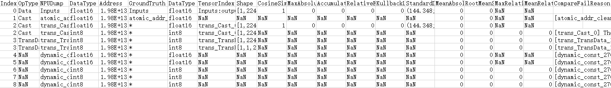

    以上比对结果字段解释请参见[完整比对结果参数说明](完整比对结果参数说明.md)。

    其中NPUDump表示开启算子融合功能的离线模型的算子名；GroundTruth表示关闭算子融合功能的离线模型的算子名。

5.  比对结果分析。

    请参见[比对结果分析](比对结果分析.md)。对于比对结果中可能存在部分无法比对或异常情况（比如结果中的NaN），请参见[比对结果说明](比对结果说明.md)。

# 比对结果说明<a name="ZH-CN_TOPIC_0000002505900911"></a>

本节内容主要说明对于比对结果中可能存在部分无法比对或异常情况（比如结果中的NaN）。

-   对于TensorFlow模型，若不是相同模型的数据，但模型中有相同的算子名称，也可以进行比对，但结果数据只显示匹配到的相同算子的比对结果，该场景不进行分析。
-   如果在图编译过程中，原图的算子发生了融合，导致算子的output在编译后的模型中找不到对应的output时，该算子无法进行比对。
-   如果在图编译阶段对图做了结构性修改（如stride切分、L1 fusion、L2 fusion）的场景，会造成算子的input或output无法比对。
-   如果比对数据两边相同算子有dump数据，但算子的Shape不一致（离线模型算子Shape变小）或Format不支持转换，该算子无法进行比对。
-   量化模型里经过量化处理的算子无法比对，必须是反量化的输出才能比对。例如，量化模型里AscendQuant算子的output无法比对。
-   针对FastRCNN网络场景，ProposalD算子及之后的算子，算子精度不达标属于正常情况，最终结果以FSRDetectionOutput算子的比对结果精度为准。
-   当模型转换对输入数据做了额外的预处理，造成原始模型的输入与离线模型的data算子输入格式不同时（比如AIPP场景下data输入为YUV），data算子比对结果异常、不具备参考意义。
-   如果比对数据两边相同算子有多个input且input顺序不一致，会导致该算子的input的比对结果不可信。
-   如果没有关闭对应的融合规则，会使得量化算子与之前的算子进行融合，导致该算子的output的比对结果不可信。

# 比对结果分析<a name="ZH-CN_TOPIC_0000002506020827"></a>


## 比对结果分析指导<a name="ZH-CN_TOPIC_0000002506020823"></a>

> **说明：** 
>-   显示“\*“，表示在NPU侧新增独有的算子；无对应的标准算子，无法比对，显示为“NaN“。
>-   余弦相似度和KL散度比对结果为NaN，其他算法有比对数据，则表明该算子的待比对或标杆数据为0；KL散度比对结果为Inf，则表明该算子的标杆数据中有一个为0。

1.  针对常见精度问题，通过输出“Advisor”[专家建议](比对结果专家建议.md)，快速定位问题算子。
2.  针对专家建议无法覆盖的复杂场景，通过查看整网比对结果中不同的算法指标，根据[计算精度评价指标](计算精度评价指标.md)，定位存在精度问题的算子。
3.  在多次比对或存在模糊问题定界场景中，可以通过配置-r或-s参数，实现任意选定范围内的算子精度比对，尤其针对偏大型网络，可以实现快速定位精度问题，-r或-s参数详细介绍请参见[命令格式说明](命令格式说明.md)。
4.  针对存疑的比对结果可以先进行[npy与npy文件之间的精度比对](npy与npy文件之间的精度比对.md)进行精度问题排查。
5.  针对精度差异较大算子，可通过[单算子比对](单算子比对.md)功能进一步分析对应张量的详细精度差异。
6.  针对问题算子，根据具体场景，通过算子本身的修改、算子替换、算子融合等方式进行详细优化。

## 比对结果专家建议<a name="ZH-CN_TOPIC_0000002473740934"></a>

-IPV350不支持


### 概述<a name="ZH-CN_TOPIC_0000002473740938"></a>

精度比对工具本身只提供自有实现算子在NPU IP加速器上的运算结果与业界标准算子的运算结果的差异比对功能，输出的比对结果需要用户自行分析并找出问题。对于用户来说，对结果的分析工作也是一大难点。本节提供专家系统工具为用户提供精度比对结果的分析功能，有效减少用户排查问题的时间。

当前支持的分析检测类型有：Float16溢出检测、输入不一致检测、整网一致性检测（整网一致性检测包括：问题节点检测、单点误差检测和一致性检测三个小点）。

### 使用前必读<a name="ZH-CN_TOPIC_0000002506020851"></a>

**环境准备<a name="section264052510574"></a>**

需要安装pandas 1.3或更高版本依赖。安装示例：**pip3 install pandas==1.3.5**。非root用户安装，需要在安装命令后加上**--user**，例如：**pip3 install pandas==1.3.5 --user**。

**约束<a name="section1580833410572"></a>**

本功能不支持以下场景：

-   单算子比对的结果文件分析。
-   指定了--select或--range参数生成的比对结果文件分析。

### 通过命令行方式分析比对结果<a name="ZH-CN_TOPIC_0000002506020847"></a>

**命令格式说明<a name="section10454173015614"></a>**

通过命令行方式分析比对结果是基于Tensor比对的基础上执行-advisor参数功能，完成精度比对之后继续进行专家系统分析并输出结果。

命令行格式如下：

```
python3 msaccucmp.py compare -m my_dump_path -g golden_dump_path -advisor
```

**表 1**  整网比对命令行参数说明

<a name="table23391841181914"></a>
<table><thead align="left"><tr id="row1538804115197"><th class="cellrowborder" valign="top" width="22.75%" id="mcps1.2.3.1.1"><p id="p14388194114198"><a name="p14388194114198"></a><a name="p14388194114198"></a><strong id="b193880419193"><a name="b193880419193"></a><a name="b193880419193"></a>参数名</strong></p>
</th>
<th class="cellrowborder" valign="top" width="77.25%" id="mcps1.2.3.1.2"><p id="p1538811413196"><a name="p1538811413196"></a><a name="p1538811413196"></a><strong id="b5388114116193"><a name="b5388114116193"></a><a name="b5388114116193"></a>参数说明</strong></p>
</th>
</tr>
</thead>
<tbody><tr id="row2388341121919"><td class="cellrowborder" valign="top" width="22.75%" headers="mcps1.2.3.1.1 "><p id="p1338884151915"><a name="p1338884151915"></a><a name="p1338884151915"></a>-advisor</p>
</td>
<td class="cellrowborder" valign="top" width="77.25%" headers="mcps1.2.3.1.2 "><p id="p879452013915"><a name="p879452013915"></a><a name="p879452013915"></a>在Tensor比对结束后，针对比对结果进行数据分析，给出专家建议。</p>
</td>
</tr>
<tr id="row8134104814228"><td class="cellrowborder" colspan="2" valign="top" headers="mcps1.2.3.1.1 mcps1.2.3.1.2 "><p id="p471182042314"><a name="p471182042314"></a><a name="p471182042314"></a>注：-overflow_detection参数为<strong id="b1083535395710"><a name="b1083535395710"></a><a name="b1083535395710"></a>Float16溢出检测</strong>专家建议提供数据，配置-advisor参数后会自动打开该参数功能。</p>
</td>
</tr>
</tbody>
</table>

**操作步骤<a name="section1793905151113"></a>**

1.  登录CANN工具安装环境。
2.  生成json文件。

    ```
    atc --mode=1 --om=$HOME/data/resnet50.om --json=$HOME/data/resnet50.json
    ```

3.  进入$\{INSTALL\_DIR\}/toolkit/tools/operator\_cmp/compare，$\{INSTALL\_DIR\}请替换为CANN软件安装后文件存储路径。以root安装举例，安装后文件默认存储路径为：/usr/local/Ascend/latest。
4.  执行比对命令。

    ```
    python3 msaccucmp.py compare -m $HOME/MyApp_mind/resnet50 -g $HOME/Standard_caffe/resnet50 -f $HOME/data/resnet50.json -out $HOME/result -advisor
    ```

5.  执行命令后会进行精度比对，比对完成后将直接进行专家系统分析，并打印输出结果，结果文件命名为advisor\_summary.txt，保存路径同样由-out参数确定。输出结果详细介绍请参见[输出结果和优化建议](输出结果和优化建议.md)。

### 通过脚本工具方式分析比对结果<a name="ZH-CN_TOPIC_0000002505900899"></a>

**脚本工具介绍<a name="section19426553161918"></a>**

专家系统提供“mscmp\_advisor.py“脚本工具。功能及安装路径如下：

**表 1**  脚本工具介绍

<a name="table98220428147"></a>
<table><thead align="left"><tr id="row88226421143"><th class="cellrowborder" valign="top" width="33.33333333333333%" id="mcps1.2.4.1.1"><p id="p12996438181617"><a name="p12996438181617"></a><a name="p12996438181617"></a>脚本名</p>
</th>
<th class="cellrowborder" valign="top" width="33.33333333333333%" id="mcps1.2.4.1.2"><p id="p149961538201613"><a name="p149961538201613"></a><a name="p149961538201613"></a>功能</p>
</th>
<th class="cellrowborder" valign="top" width="33.33333333333333%" id="mcps1.2.4.1.3"><p id="p1099623881613"><a name="p1099623881613"></a><a name="p1099623881613"></a>路径</p>
</th>
</tr>
</thead>
<tbody><tr id="row118225429148"><td class="cellrowborder" valign="top" width="33.33333333333333%" headers="mcps1.2.4.1.1 "><p id="p1522684213176"><a name="p1522684213176"></a><a name="p1522684213176"></a><span class="filepath" id="filepath14226144261715"><a name="filepath14226144261715"></a><a name="filepath14226144261715"></a>“mscmp_advisor.py”</span></p>
</td>
<td class="cellrowborder" valign="top" width="33.33333333333333%" headers="mcps1.2.4.1.2 "><p id="p16226342141717"><a name="p16226342141717"></a><a name="p16226342141717"></a>对Tensor比对结果进行专家系统分析，并输出优化建议。</p>
</td>
<td class="cellrowborder" valign="top" width="33.33333333333333%" headers="mcps1.2.4.1.3 "><p id="p0615193528"><a name="p0615193528"></a><a name="p0615193528"></a><span id="ph10562197165916"><a name="ph10562197165916"></a><a name="ph10562197165916"></a>${INSTALL_DIR}</span>/toolkit/tools/operator_cmp/compare，<span id="ph6271182434611"><a name="ph6271182434611"></a><a name="ph6271182434611"></a>${INSTALL_DIR}请替换为CANN软件安装后文件存储路径。以root安装举例，安装后文件默认存储路径为：/usr/local/Ascend/latest。</span></p>
</td>
</tr>
</tbody>
</table>

**命令格式说明<a name="section137661512252"></a>**

“mscmp\_advisor.py“脚本是直接用比对结果.csv文件进行分析，所以在进行该操作前需要先完成精度比对获取.csv文件。

命令行格式如下：

```
python3 mscmp_advisor.py -i <input_file> [-input_nodes <node_name>] [-o <out_path>]
```

**表 2**  整网比对命令行参数说明

<a name="table23391841181914"></a>
<table><thead align="left"><tr id="row1538804115197"><th class="cellrowborder" valign="top" width="20.53%" id="mcps1.2.4.1.1"><p id="p14388194114198"><a name="p14388194114198"></a><a name="p14388194114198"></a><strong id="b193880419193"><a name="b193880419193"></a><a name="b193880419193"></a>参数名</strong></p>
</th>
<th class="cellrowborder" valign="top" width="46.73%" id="mcps1.2.4.1.2"><p id="p1538811413196"><a name="p1538811413196"></a><a name="p1538811413196"></a><strong id="b5388114116193"><a name="b5388114116193"></a><a name="b5388114116193"></a>参数说明</strong></p>
</th>
<th class="cellrowborder" valign="top" width="32.74%" id="mcps1.2.4.1.3"><p id="p1464718126387"><a name="p1464718126387"></a><a name="p1464718126387"></a><strong id="b9388104119199"><a name="b9388104119199"></a><a name="b9388104119199"></a>是否必选</strong></p>
</th>
</tr>
</thead>
<tbody><tr id="row2388341121919"><td class="cellrowborder" valign="top" width="20.53%" headers="mcps1.2.4.1.1 "><p id="p117174054012"><a name="p117174054012"></a><a name="p117174054012"></a>-i</p>
<p id="p16171040184017"><a name="p16171040184017"></a><a name="p16171040184017"></a>--input_file</p>
</td>
<td class="cellrowborder" valign="top" width="46.73%" headers="mcps1.2.4.1.2 "><p id="p5201162684114"><a name="p5201162684114"></a><a name="p5201162684114"></a>指定比对结果.csv文件。例如：$HOME/result/result_*.csv</p>
<p id="p1147262313564"><a name="p1147262313564"></a><a name="p1147262313564"></a>本参数最大支持.csv文件的大小为100M。</p>
</td>
<td class="cellrowborder" valign="top" width="32.74%" headers="mcps1.2.4.1.3 "><p id="p4201326184112"><a name="p4201326184112"></a><a name="p4201326184112"></a>是</p>
</td>
</tr>
<tr id="row159675539430"><td class="cellrowborder" valign="top" width="20.53%" headers="mcps1.2.4.1.1 "><p id="p61124167440"><a name="p61124167440"></a><a name="p61124167440"></a>-input_nodes</p>
</td>
<td class="cellrowborder" valign="top" width="46.73%" headers="mcps1.2.4.1.2 "><p id="p19968175316439"><a name="p19968175316439"></a><a name="p19968175316439"></a>指定网络模型的输入节点。多个节点用英文分号（;）隔开。例如："node_name1;node_name2;node_name3"</p>
</td>
<td class="cellrowborder" valign="top" width="32.74%" headers="mcps1.2.4.1.3 "><p id="p1738316184447"><a name="p1738316184447"></a><a name="p1738316184447"></a>否</p>
<p id="p153837181448"><a name="p153837181448"></a><a name="p153837181448"></a>若不配置，则不进行输入检测。</p>
</td>
</tr>
<tr id="row8134104814228"><td class="cellrowborder" valign="top" width="20.53%" headers="mcps1.2.4.1.1 "><p id="p31784015408"><a name="p31784015408"></a><a name="p31784015408"></a>-o</p>
<p id="p217184094015"><a name="p217184094015"></a><a name="p217184094015"></a>--out_path</p>
</td>
<td class="cellrowborder" valign="top" width="46.73%" headers="mcps1.2.4.1.2 "><p id="p1201726114120"><a name="p1201726114120"></a><a name="p1201726114120"></a>分析结果输出路径。结果文件命名为advisor_summary.txt。</p>
<p id="p1757911109267"><a name="p1757911109267"></a><a name="p1757911109267"></a>不建议配置与当前用户不一致的其它用户目录，避免提权风险。</p>
</td>
<td class="cellrowborder" valign="top" width="32.74%" headers="mcps1.2.4.1.3 "><p id="p16201172644118"><a name="p16201172644118"></a><a name="p16201172644118"></a>否</p>
<p id="p1220132613416"><a name="p1220132613416"></a><a name="p1220132613416"></a>若不配置，不落盘结果文件。</p>
</td>
</tr>
</tbody>
</table>

**操作步骤<a name="section1768511312463"></a>**

1.  登录CANN工具安装环境。
2.  生成json文件。

    ```
    atc --mode=1 --om=$HOME/data/resnet50.om --json=$HOME/data/resnet50.json
    ```

3.  配置环境变量。

    ```
    export PYTHONPATH=${INSTALL_DIR}/toolkit/tools/operator_cmp/compare:$PYTHONPATH
    ```

4.  执行精度比对命令。

    ```
    python3 msaccucmp.py compare -m $HOME/MyApp_mind/resnet50 -g $HOME/Standard_caffe/resnet50 -f $HOME/data/resnet50.json -out $HOME/result -overflow_detection
    ```

    此处需要配置**-overflow\_detection**参数识别溢出算子。执行比对后输出比对结果文件result\_\*.csv_。_

5.  执行专家系统分析。

    ```
    python3 mscmp_advisor.py -i $HOME/result/result_*.csv -input_nodes "node_name1;node_name2;node_name3" -o $HOME/result
    ```

6.  执行命令后进行专家系统分析并直接打印输出结果。输出结果详细介绍请参见[输出结果和优化建议](输出结果和优化建议.md)。

### 输出结果和优化建议<a name="ZH-CN_TOPIC_0000002505900919"></a>

**Float16溢出检测<a name="section051361411266"></a>**

针对比对数据中数据类型为Float16的数据，进行溢出检测。如果存在溢出数据，输出专家建议。

**场景限制**：量化原始模型的npy文件\(Caffe\)与非量化原始模型的npy文件\(Caffe\)的比对场景不支持溢出检测分析。

> **说明：** 
>需在进行精度比对时指定-overflow\_detection参数。

**比对结果**：

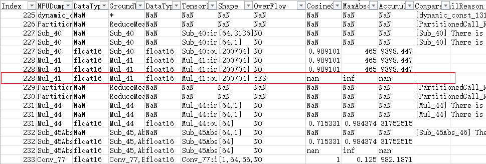

算子ID为228的数据，存在Float16数据溢出。

**专家系统分析结果**：

Detection Type: FP16 overflow

Operator Index: 228

Expert Advice: Float16 data overflow occurs. Rectify the fault and perform comparison again.

检测类型：Float16溢出检测

Operator Index：228

专家建议：存在Float16数据溢出，请修正溢出问题，再进行比对。

**输入不一致检测<a name="section5473171842616"></a>**

针对整网的输入数据进行检测，主要判断整网两批待比对数据的输入data是否一致。如果存在不一致问题（余弦相似度<0.99），输出专家建议。

**比对结果**：

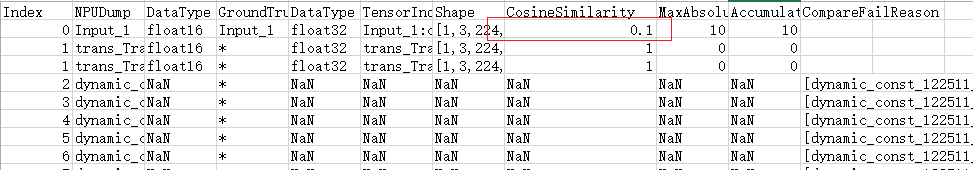

算子ID为0的数据，输入数据为Input\_1，其余弦相似度小于0.99，因此认为此次比对，输入或数据预处理存在问题。

**专家系统分析结果**：

Detection Type: Input inconsistent

Operator Index: 0

Expert Advice: The input data of NPUDump is inconsistent with that of GroundTruth. Use the same data or check the data preprocessing process.

检测类型：输入不一致检测

Operator Index：0

专家建议：NPUDump和GroundTruth的输入数据不一致，请使用相同数据或者检查数据预处理流程。

**整网一致性检测（问题节点检测）<a name="section28975222267"></a>**

判断整网比对结果中，是否某层小于阈值，该层后续数据均小于阈值或最后一层小于阈值（余弦相似度<0.99），输出量化误差修正建议。

**比对结果**：

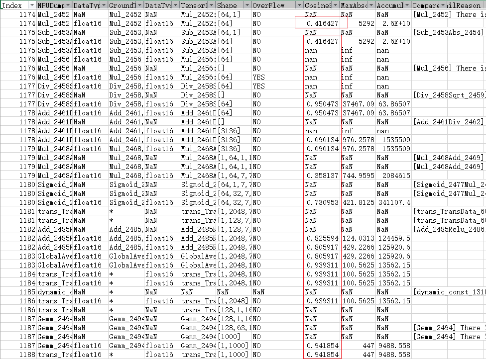

算子ID为1174的数据，余弦相似度小于0.99，且后续余弦相似度均小于0.99，判断问题节点存在精度问题。

**专家系统分析结果**：

检测类型：整网一致性检测

Operator Index：1174

专家建议：部分张量精度较低，且导致最终结果精度不达标；很可能由量化造成，请进行数据校准或者您可以获取日志后单击[Link](https://www.hiascend.com/support)联系技术支持。

**整网一致性检测（单点误差检测）<a name="section16468626142614"></a>**

判断整网比对结果中，是否某层小于阈值（余弦相似度<0.99），但最终结果符合精度要求，输出专家建议。

**比对结果**：

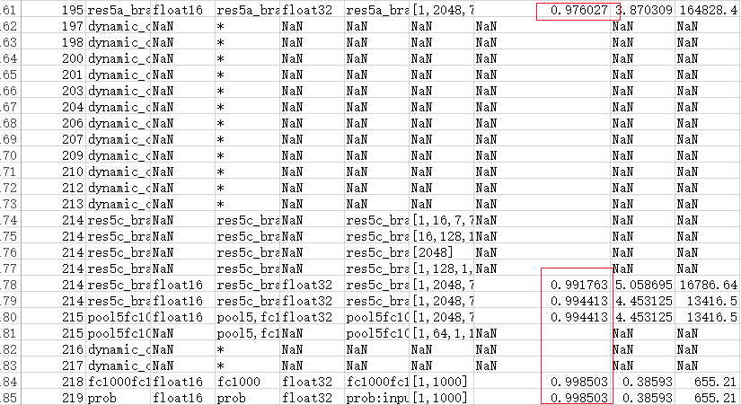

算子ID为195的数据，余弦相似度小于0.99，但最后一层数据符合精度要求，判断为单点误差。

**专家系统分析结果**：

检测类型：整网一致性检测

Operator Index：195

专家建议：部分张量精度较低，但最终结果精度达标，可能由内部优化导致，请忽略或您可以获取日志后单击[Link](https://www.hiascend.com/support)联系技术支持。

**整网一致性检测（一致性检测）<a name="section1249113062619"></a>**

比对结果中的所有数据均符合精度要求，输出专家建议。

**比对结果**：

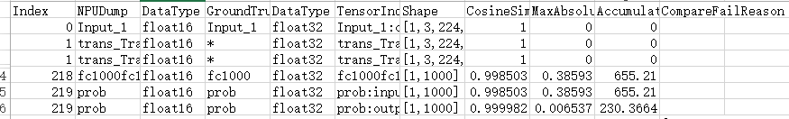

所有数据均符合精度要求，判断模型符合精度要求。

**专家系统分析结果**：

Detection Type: global consistency

Operator Index: NA

Expert Advice: All data in the comparison result meets the accuracy requirements.

If data accuracy of the model is still not up to standard in practical application, please check the post-processing process of model outputs.

检测类型：整网一致性检测

Operator Index：NA

专家建议：比对结果中的所有数据均符合精度要求。

如果模型实际应用中，精度依旧不达标，请排查输出数据的后处理流程。

## 计算精度评价指标<a name="ZH-CN_TOPIC_0000002505900931"></a>

精度比对是以GPU的计算结果为标杆，以不同算法维度，比对算子精度差异，根据每个算法维度的结果判断算子在运行时是否存在精度问题。

> **说明：** 
>以下仅为推荐的精度评价指标，实际算子需要满足的精度请用户自行判断，判断方式请参见[完整比对结果参数说明](完整比对结果参数说明.md)。

计算精度评价指标：

1.  CosineSimilarity：通过计算两个向量的余弦值来判断其相似度，数值越接近于1，说明计算出的两个张量越相似，实际可接受阈值为大于0.99。在计算中可能会存在nan，主要由于可能会出现其中一个向量为0。
2.  RelativeEuclideanDistance：欧氏相对距离越接近于0，表明越相近，实际可接受阈值为小于0.05。
3.  KullbackLeiblerDivergence：KL散度越小，真实分布与近似分布之间的匹配越好，实际可接受阈值为小于0.005。
4.  MeanAbsoluteError和RootMeanSquareError：平均绝对误差和均方根误差相关联，MeanAbsoluteError越大，RootMeanSquareError等于或近似MeanAbsoluteError，说明整体偏差越集中，实际可接受阈值为等于1。

## npy与npy文件之间的精度比对<a name="ZH-CN_TOPIC_0000002473740958"></a>

**概述<a name="section11701203517"></a>**

精度比对工具支持单个npy与npy文件之间的精度比对。基本要求如下：

-   对于dump数据文件需要先完成[执行dump数据文件Format转换](dump数据文件Format转换.md#zh-cn_topic_0244646216_section19803552124011)。
-   需要确保两个比对文件内的Shape一致。
-   仅支持CosineSimilarity（余弦相似度）、MaxAbsoluteError（最大绝对误差）、AccumulatedRelativeError（累积相对误差）、RelativeEuclideanDistance（欧氏相对距离）、MeanAbsoluteError（平均绝对误差）、RootMeanSquareError（均方根误差）、MaxRelativeError（最大相对误差）、MeanRelativeError（平均相对误差）比对算法。

**命令格式说明<a name="section1394112227510"></a>**

```
python3 msaccucmp.py file_compare -m my_dump_path -g golden_dump_path -out output
```

命令行参数说明如[表1](#table23391841181914)所示。

该功能通过msaccucmp.py脚本实现，脚本存放在$\{INSTALL\_DIR\}/toolkit/tools/operator\_cmp/compare，$\{INSTALL\_DIR\}请替换为CANN软件安装后文件存储路径。以root安装举例，安装后文件默认存储路径为：/usr/local/Ascend/latest。

**表 1**  命令行参数说明

<a name="table23391841181914"></a>
<table><thead align="left"><tr id="row1538804115197"><th class="cellrowborder" valign="top" width="36.809999999999995%" id="mcps1.2.4.1.1"><p id="p14388194114198"><a name="p14388194114198"></a><a name="p14388194114198"></a><strong id="b193880419193"><a name="b193880419193"></a><a name="b193880419193"></a>参数名</strong></p>
</th>
<th class="cellrowborder" valign="top" width="50.49%" id="mcps1.2.4.1.2"><p id="p1538811413196"><a name="p1538811413196"></a><a name="p1538811413196"></a><strong id="b5388114116193"><a name="b5388114116193"></a><a name="b5388114116193"></a>参数说明</strong></p>
</th>
<th class="cellrowborder" valign="top" width="12.7%" id="mcps1.2.4.1.3"><p id="p1464718126387"><a name="p1464718126387"></a><a name="p1464718126387"></a><strong id="b9388104119199"><a name="b9388104119199"></a><a name="b9388104119199"></a>是否必选</strong></p>
</th>
</tr>
</thead>
<tbody><tr id="row2388341121919"><td class="cellrowborder" valign="top" width="36.809999999999995%" headers="mcps1.2.4.1.1 "><p id="p163975255262"><a name="p163975255262"></a><a name="p163975255262"></a>-m</p>
<p id="p1338884151915"><a name="p1338884151915"></a><a name="p1338884151915"></a>--my_dump_path</p>
</td>
<td class="cellrowborder" valign="top" width="50.49%" headers="mcps1.2.4.1.2 "><p id="p20121848684"><a name="p20121848684"></a><a name="p20121848684"></a>待比对的npy文件。</p>
</td>
<td class="cellrowborder" valign="top" width="12.7%" headers="mcps1.2.4.1.3 "><p id="p15647111220388"><a name="p15647111220388"></a><a name="p15647111220388"></a>是</p>
</td>
</tr>
<tr id="row6388174191910"><td class="cellrowborder" valign="top" width="36.809999999999995%" headers="mcps1.2.4.1.1 "><p id="p4240828162618"><a name="p4240828162618"></a><a name="p4240828162618"></a>-g</p>
<p id="p7388441171913"><a name="p7388441171913"></a><a name="p7388441171913"></a>--golden_dump_path</p>
</td>
<td class="cellrowborder" valign="top" width="50.49%" headers="mcps1.2.4.1.2 "><p id="p19242198591"><a name="p19242198591"></a><a name="p19242198591"></a>待比对的npy标杆数据文件。</p>
</td>
<td class="cellrowborder" valign="top" width="12.7%" headers="mcps1.2.4.1.3 "><p id="p106476121389"><a name="p106476121389"></a><a name="p106476121389"></a>是</p>
</td>
</tr>
<tr id="row1138854151910"><td class="cellrowborder" valign="top" width="36.809999999999995%" headers="mcps1.2.4.1.1 "><p id="p7934143982612"><a name="p7934143982612"></a><a name="p7934143982612"></a>-out</p>
<p id="p838811413193"><a name="p838811413193"></a><a name="p838811413193"></a>--output</p>
</td>
<td class="cellrowborder" valign="top" width="50.49%" headers="mcps1.2.4.1.2 "><p id="p1388941201917"><a name="p1388941201917"></a><a name="p1388941201917"></a>比对数据结果存放目录。</p>
<p id="p8573134491015"><a name="p8573134491015"></a><a name="p8573134491015"></a>结果文件名格式为：file_result_{timestamp}.txt</p>
<p id="p1757911109267"><a name="p1757911109267"></a><a name="p1757911109267"></a>不建议配置与当前用户不一致的其它用户目录，避免提权风险。</p>
</td>
<td class="cellrowborder" valign="top" width="12.7%" headers="mcps1.2.4.1.3 "><p id="p76473123383"><a name="p76473123383"></a><a name="p76473123383"></a>是</p>
</td>
</tr>
</tbody>
</table>

**操作步骤<a name="section14613105111316"></a>**

1.  登录CANN工具安装环境。
2.  进入$\{INSTALL\_DIR\}/toolkit/tools/operator\_cmp/compare，$\{INSTALL\_DIR\}请替换为CANN软件安装后文件存储路径。以root安装举例，安装后文件默认存储路径为：/usr/local/Ascend/latest。
3.  执行**file\_compare**比对命令。

    ```
    python3 msaccucmp.py file_compare -m my_dump_path/a.npy -g golden_dump_path/b.npy -out output
    ```

    命令执行完成后输出比对结果。如[图1](#fig786134331715)所示。

    **图 1**  比对结果<a name="fig786134331715"></a>  
    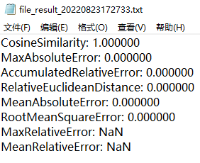

    比对结果可根据[计算精度评价指标](计算精度评价指标.md)判断是否符合精度要求。

## 单算子比对<a name="ZH-CN_TOPIC_0000002473740950"></a>

-IPV350不支持


### 概述<a name="ZH-CN_TOPIC_0000002473900850"></a>

单算子比对功能由**compare**命令的具体参数决定，主要包括配置输入文件和输出路径、选择具体比对算子、设置比对算子的输入或输出数据和输出文件的形式等。可以根据参数具体的功能描述，判断输入文件的实际情况，来决定使用具体的参数功能。

### 比对操作<a name="ZH-CN_TOPIC_0000002473900848"></a>

**说明<a name="section773714569319"></a>**

-   本节涉及的.json文件、目录等名称均为举例，请根据实际环境替换。其中，-out指定的结果存放路径，需确保操作用户具有读写权限。
-   基于相同模型（开/关融合）、NPU IP加速器运行生成的dump数据进行单算子精度比对时，需同时指定-f和-cf参数或同时不指定这两个参数。

**操作步骤<a name="section72252059237"></a>**

本节以非量化NPU IP加速器运行生成的dump数据与非量化Caffe模型npy数据比对为例进行介绍，下文中参数说明均以该示例介绍，请根据您的实际情况进行替换。

1.  登录CANN工具安装环境。
2.  生成json文件。

    ```
    atc --mode=1 --om=$HOME/data/resnet50.om --json=$HOME/data/resnet50.json
    ```

3.  进入$\{INSTALL\_DIR\}/toolkit/tools/operator\_cmp/compare，$\{INSTALL\_DIR\}请替换为CANN软件安装后文件存储路径。以root安装举例，安装后文件默认存储路径为：/usr/local/Ascend/latest。
4.  执行单算子比对默认配置比对。

    > **说明：** 
    >由于dump和npy比对数据文件是由多个文件组成，故下文操作步骤中**-m**和**-g**参数须指定数据文件所在的父目录。如：_$HOME/MyApp/resnet50，_其中_resnet50_文件夹下直接保存比对数据文件。
    >目录结构示例如下：
    >```
    >root@xxx:$HOME/MyApp/resnet50# tree
    >.
    >├── BatchMatMul.bert_encoder_layer_0_attention_self_MatMul_1.24.1614717261785536
    >├── BatchMatMul.bert_encoder_layer_0_attention_self_MatMul.21.1614717261768864
    >├── BatchMatMul.bert_encoder_layer_10_attention_self_MatMul_1.235.1614717263664916
    ># 仅为示例，此处省略剩余文件名。
    >```

    ```
    python3 msaccucmp.py compare -m $HOME/MyApp_mind/resnet50 -g $HOME/Standard_caffe/resnet50 -f $HOME/data/resnet50.json -out $HOME/result -op pool5 -i 0
    ```

    各参数详细介绍请参见[命令格式说明](命令格式说明.md)。

    精度比对结果文件内容如[图1](#fig15382114321)和[图2](#fig6407113218)所示。

    **图 1**  单算子比对概要结果<a name="fig15382114321"></a>  
    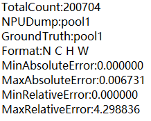

    单算子比对概要结果存放在_\{op\_name\}_\_input\__\{index\}_\_summary.txt或_\{op\_name\}_\_output\__\{index\}_\_summary.txt文件中，各参数说明如下：

    **表 1**  单算子比对概要结果的参数说明

    <a name="table03871133220"></a>
    <table><thead align="left"><tr id="row438201153211"><th class="cellrowborder" valign="top" width="24.779999999999998%" id="mcps1.2.3.1.1"><p id="p103821113216"><a name="p103821113216"></a><a name="p103821113216"></a>参数</p>
    </th>
    <th class="cellrowborder" valign="top" width="75.22%" id="mcps1.2.3.1.2"><p id="p15387119329"><a name="p15387119329"></a><a name="p15387119329"></a>说明</p>
    </th>
    </tr>
    </thead>
    <tbody><tr id="row43917133213"><td class="cellrowborder" valign="top" width="24.779999999999998%" headers="mcps1.2.3.1.1 "><p id="p739713323"><a name="p739713323"></a><a name="p739713323"></a>TotalCount</p>
    </td>
    <td class="cellrowborder" valign="top" width="75.22%" headers="mcps1.2.3.1.2 "><p id="p83913113215"><a name="p83913113215"></a><a name="p83913113215"></a>该算子的dump数据的data个数。</p>
    </td>
    </tr>
    <tr id="row193971113214"><td class="cellrowborder" valign="top" width="24.779999999999998%" headers="mcps1.2.3.1.1 "><p id="p173921153218"><a name="p173921153218"></a><a name="p173921153218"></a>NPUDump</p>
    </td>
    <td class="cellrowborder" valign="top" width="75.22%" headers="mcps1.2.3.1.2 "><p id="p83981163214"><a name="p83981163214"></a><a name="p83981163214"></a>表示My Output模型算子名。</p>
    </td>
    </tr>
    <tr id="row19391816322"><td class="cellrowborder" valign="top" width="24.779999999999998%" headers="mcps1.2.3.1.1 "><p id="p14391110329"><a name="p14391110329"></a><a name="p14391110329"></a>GroundTruth</p>
    </td>
    <td class="cellrowborder" valign="top" width="75.22%" headers="mcps1.2.3.1.2 "><p id="p1939121193220"><a name="p1939121193220"></a><a name="p1939121193220"></a>表示Ground Truth模型的算子名。</p>
    </td>
    </tr>
    <tr id="row1739101143218"><td class="cellrowborder" valign="top" width="24.779999999999998%" headers="mcps1.2.3.1.1 "><p id="p1839181133218"><a name="p1839181133218"></a><a name="p1839181133218"></a>Format</p>
    </td>
    <td class="cellrowborder" valign="top" width="75.22%" headers="mcps1.2.3.1.2 "><p id="p5398133218"><a name="p5398133218"></a><a name="p5398133218"></a>数据格式。</p>
    </td>
    </tr>
    <tr id="row193911113325"><td class="cellrowborder" valign="top" width="24.779999999999998%" headers="mcps1.2.3.1.1 "><p id="p20391119325"><a name="p20391119325"></a><a name="p20391119325"></a>MinAbsoluteError</p>
    </td>
    <td class="cellrowborder" valign="top" width="75.22%" headers="mcps1.2.3.1.2 "><p id="p193911143216"><a name="p193911143216"></a><a name="p193911143216"></a>绝对误差的最小值。</p>
    </td>
    </tr>
    <tr id="row1391411321"><td class="cellrowborder" valign="top" width="24.779999999999998%" headers="mcps1.2.3.1.1 "><p id="p174041193214"><a name="p174041193214"></a><a name="p174041193214"></a>MaxAbsoluteError</p>
    </td>
    <td class="cellrowborder" valign="top" width="75.22%" headers="mcps1.2.3.1.2 "><p id="p140201163210"><a name="p140201163210"></a><a name="p140201163210"></a>绝对误差的最大值。</p>
    </td>
    </tr>
    <tr id="row5401013326"><td class="cellrowborder" valign="top" width="24.779999999999998%" headers="mcps1.2.3.1.1 "><p id="p104031153216"><a name="p104031153216"></a><a name="p104031153216"></a>MinRelativeError</p>
    </td>
    <td class="cellrowborder" valign="top" width="75.22%" headers="mcps1.2.3.1.2 "><p id="p3403193211"><a name="p3403193211"></a><a name="p3403193211"></a>相对误差的最小值。</p>
    </td>
    </tr>
    <tr id="row144012153210"><td class="cellrowborder" valign="top" width="24.779999999999998%" headers="mcps1.2.3.1.1 "><p id="p34019114328"><a name="p34019114328"></a><a name="p34019114328"></a>MaxRelativeError</p>
    </td>
    <td class="cellrowborder" valign="top" width="75.22%" headers="mcps1.2.3.1.2 "><p id="p114031203210"><a name="p114031203210"></a><a name="p114031203210"></a>相对误差的最大值。</p>
    </td>
    </tr>
    </tbody>
    </table>

    **图 2**  单算子完整比对结果<a name="fig6407113218"></a>  
    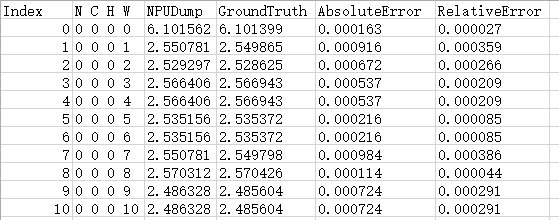

    单算子比对完整结果存放在_\{op\_name\}_\_input\__\{index\}_\__\{file\_index\}_.csv或_\{op\_name\}_\_output\__\{index\}_\__\{file\_index\}_.csv文件中，每个文件最多记录100万条数据。配置--ignore\_single\_op\_result参数时不生成此结果。比对结果各列参数说明如[表2](#table164171103215)。

    **表 2**  单算子完整比对结果参数说明

    <a name="table164171103215"></a>
    <table><thead align="left"><tr id="row3412111320"><th class="cellrowborder" valign="top" width="16.400000000000002%" id="mcps1.2.3.1.1"><p id="p1041141163219"><a name="p1041141163219"></a><a name="p1041141163219"></a>参数</p>
    </th>
    <th class="cellrowborder" valign="top" width="83.6%" id="mcps1.2.3.1.2"><p id="p141310326"><a name="p141310326"></a><a name="p141310326"></a>说明</p>
    </th>
    </tr>
    </thead>
    <tbody><tr id="row1841113324"><td class="cellrowborder" valign="top" width="16.400000000000002%" headers="mcps1.2.3.1.1 "><p id="p194191183218"><a name="p194191183218"></a><a name="p194191183218"></a>N C H W</p>
    </td>
    <td class="cellrowborder" valign="top" width="83.6%" headers="mcps1.2.3.1.2 "><p id="p84116133216"><a name="p84116133216"></a><a name="p84116133216"></a>数据的坐标点。</p>
    </td>
    </tr>
    <tr id="row114119103219"><td class="cellrowborder" valign="top" width="16.400000000000002%" headers="mcps1.2.3.1.1 "><p id="p1441151173216"><a name="p1441151173216"></a><a name="p1441151173216"></a>NPUDump</p>
    </td>
    <td class="cellrowborder" valign="top" width="83.6%" headers="mcps1.2.3.1.2 "><p id="p19411193219"><a name="p19411193219"></a><a name="p19411193219"></a>My Output模型的算子dump值。</p>
    </td>
    </tr>
    <tr id="row1441415328"><td class="cellrowborder" valign="top" width="16.400000000000002%" headers="mcps1.2.3.1.1 "><p id="p24217113329"><a name="p24217113329"></a><a name="p24217113329"></a>GroundTruth</p>
    </td>
    <td class="cellrowborder" valign="top" width="83.6%" headers="mcps1.2.3.1.2 "><p id="p14428133219"><a name="p14428133219"></a><a name="p14428133219"></a>Ground Truth模型的算子dump值。</p>
    </td>
    </tr>
    <tr id="row842811321"><td class="cellrowborder" valign="top" width="16.400000000000002%" headers="mcps1.2.3.1.1 "><p id="p1242201163214"><a name="p1242201163214"></a><a name="p1242201163214"></a>RelativeError</p>
    </td>
    <td class="cellrowborder" valign="top" width="83.6%" headers="mcps1.2.3.1.2 "><p id="p20424153214"><a name="p20424153214"></a><a name="p20424153214"></a>相对误差，AbsoluteError值除以Ground Truth模型算子的dump值比对出来的结果。当Ground Truth算子的dump值为0时，该处显示为<span class="uicontrol" id="uicontrol8421915322"><a name="uicontrol8421915322"></a><a name="uicontrol8421915322"></a>“-”</span>。</p>
    </td>
    </tr>
    <tr id="row2420115323"><td class="cellrowborder" valign="top" width="16.400000000000002%" headers="mcps1.2.3.1.1 "><p id="p84211193217"><a name="p84211193217"></a><a name="p84211193217"></a>AbsoluteError</p>
    </td>
    <td class="cellrowborder" valign="top" width="83.6%" headers="mcps1.2.3.1.2 "><p id="p12422120327"><a name="p12422120327"></a><a name="p12422120327"></a>绝对误差，My Output模型算子的dump值减Ground Truth模型算子的dump值取绝对值比对出来的结果。</p>
    </td>
    </tr>
    </tbody>
    </table>

    若已知输出结果文件数据量较大，可以通过配置参数来减少输出结果的数据量。根据[结果文件说明](结果文件说明.md)选择合适的比对场景，执行[6](#li33441726124014)，以便快速识别算子存在精度问题的位置（输入、输出、坐标点）。

5.  （可选）执行单算子比对仅比对TopN条数据。

    ```
    python3 msaccucmp.py compare -m $HOME/MyApp_mind/resnet50 -g $HOME/Standard_caffe/resnet50 -f $HOME/data/resnet50.json -out $HOME/result  -op pool1 -o 0 -n 20
    ```

    各参数详细介绍请参见[命令格式说明](命令格式说明.md)。

    比对完成后的打印结果如[图3](#fig6772182619106)所示。

    **图 3** **前20条数据**比对结果<a name="fig6772182619106"></a>  
    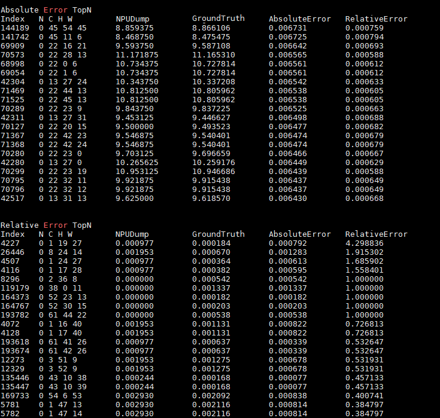

    前20条数据比对csv结果文件内容如[图4](#fig6772132612104)和[图5](#fig1877211265106)所示。

    **图 4**  绝对误差（Top20）<a name="fig6772132612104"></a>  
    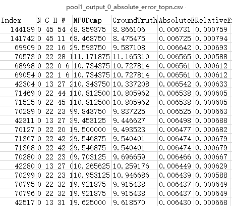

    **图 5**  相对误差（Top20）<a name="fig1877211265106"></a>  
    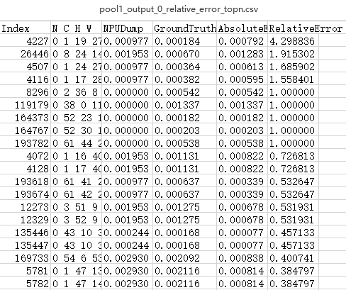

6.  <a name="li33441726124014"></a>比对结果分析。

    输出比对结果文件后，首先将绝对误差或相对误差由大到小排序，找出TopN条数据，用户可以基于自己的评估指标判断该算子精度是否达标。如果不满足精度要求，可以将当前测评数据交由算子开发人员进行算子内部逻辑分析。

    > **说明：** 
    >绝对误差或相对误差的值越趋近于0表示精度越高，但实际算子需要满足的精度根据用户实际需求判断。

### 结果文件说明<a name="ZH-CN_TOPIC_0000002505900907"></a>

单算子比对执行[比对操作](比对操作.md)，默认比对指定算子数据的绝对误差和相对误差，根据指定比对算子的输入或输出数据以及设置的输出文件形式生成比对结果文件如[表1](#table152117509202)。

**表 1**  结果文件形式

<a name="table152117509202"></a>
<table><thead align="left"><tr id="row1322125016200"><th class="cellrowborder" valign="top" width="36.8%" id="mcps1.2.3.1.1"><p id="p922185062020"><a name="p922185062020"></a><a name="p922185062020"></a>结果文件输出条件</p>
</th>
<th class="cellrowborder" valign="top" width="63.2%" id="mcps1.2.3.1.2"><p id="p42215092010"><a name="p42215092010"></a><a name="p42215092010"></a>结果文件</p>
</th>
</tr>
</thead>
<tbody><tr id="row6226506205"><td class="cellrowborder" valign="top" width="36.8%" headers="mcps1.2.3.1.1 "><p id="p14221050182016"><a name="p14221050182016"></a><a name="p14221050182016"></a>比对输入数据、默认生成前20条数据</p>
<p id="p8636815363"><a name="p8636815363"></a><a name="p8636815363"></a>--input_tensor</p>
</td>
<td class="cellrowborder" valign="top" width="63.2%" headers="mcps1.2.3.1.2 "><p id="p1822150142018"><a name="p1822150142018"></a><a name="p1822150142018"></a>单算子比对概要结果：{op_name}_input_{index}_summary.txt</p>
<p id="p114614419271"><a name="p114614419271"></a><a name="p114614419271"></a>单算子比对完整结果：{op_name}_input_{index}_{file_index}.csv</p>
<p id="p22947211404"><a name="p22947211404"></a><a name="p22947211404"></a>单算子比对Top20结果：</p>
<a name="ul1629492114018"></a><a name="ul1629492114018"></a><ul id="ul1629492114018"><li>绝对误差：{op_name}_input_{index}_absolute_error_topn.csv</li><li>相对误差：{op_name}_input_{index}_relative_error_topn.csv</li></ul>
</td>
</tr>
<tr id="row722135014209"><td class="cellrowborder" valign="top" width="36.8%" headers="mcps1.2.3.1.1 "><p id="p103441012153617"><a name="p103441012153617"></a><a name="p103441012153617"></a>比对输出数据、默认生成前20条数据</p>
<p id="p1934481217360"><a name="p1934481217360"></a><a name="p1934481217360"></a>--output_tensor</p>
</td>
<td class="cellrowborder" valign="top" width="63.2%" headers="mcps1.2.3.1.2 "><p id="p18344111293611"><a name="p18344111293611"></a><a name="p18344111293611"></a>单算子比对概要结果：{op_name}_output_{index}_summary.txt</p>
<p id="p034491214367"><a name="p034491214367"></a><a name="p034491214367"></a>单算子比对完整结果：{op_name}_output_{index}_{file_index}.csv</p>
<p id="p1423362834011"><a name="p1423362834011"></a><a name="p1423362834011"></a>单算子比对Top20结果：</p>
<a name="ul223310286407"></a><a name="ul223310286407"></a><ul id="ul223310286407"><li>绝对误差：{op_name}_output_{index}_absolute_error_topn.csv</li><li>相对误差：{op_name}_output_{index}_relative_error_topn.csv</li></ul>
</td>
</tr>
<tr id="row15227501206"><td class="cellrowborder" valign="top" width="36.8%" headers="mcps1.2.3.1.1 "><p id="p19221150132010"><a name="p19221150132010"></a><a name="p19221150132010"></a>比对输入数据、生成前n条数据</p>
<p id="p9688958204214"><a name="p9688958204214"></a><a name="p9688958204214"></a>--input_tensor、--topn</p>
</td>
<td class="cellrowborder" valign="top" width="63.2%" headers="mcps1.2.3.1.2 "><p id="p5704192134511"><a name="p5704192134511"></a><a name="p5704192134511"></a>单算子比对概要结果：{op_name}_input_{index}_summary.txt</p>
<p id="p361514597505"><a name="p361514597505"></a><a name="p361514597505"></a>单算子比对完整结果：{op_name}_input_{index}_{file_index}.csv</p>
<p id="p37051521204511"><a name="p37051521204511"></a><a name="p37051521204511"></a>单算子比对TopN结果：</p>
<a name="ul176951820114714"></a><a name="ul176951820114714"></a><ul id="ul176951820114714"><li>绝对误差：{op_name}_input_{index}_absolute_error_topn.csv</li><li>相对误差：{op_name}_input_{index}_relative_error_topn.csv</li></ul>
</td>
</tr>
<tr id="row192245018201"><td class="cellrowborder" valign="top" width="36.8%" headers="mcps1.2.3.1.1 "><p id="p581615513464"><a name="p581615513464"></a><a name="p581615513464"></a>比对输出数据、生成前n条数据</p>
<p id="p11816115111464"><a name="p11816115111464"></a><a name="p11816115111464"></a>--output_tensor、--topn</p>
</td>
<td class="cellrowborder" valign="top" width="63.2%" headers="mcps1.2.3.1.2 "><p id="p118161351174618"><a name="p118161351174618"></a><a name="p118161351174618"></a>单算子比对概要结果：{op_name}_output_{index}_summary.txt</p>
<p id="p8676990519"><a name="p8676990519"></a><a name="p8676990519"></a>单算子比对完整结果：{op_name}_output_{index}_{file_index}.csv</p>
<p id="p108161751184616"><a name="p108161751184616"></a><a name="p108161751184616"></a>单算子比对TopN结果：</p>
<a name="ul881620512468"></a><a name="ul881620512468"></a><ul id="ul881620512468"><li>绝对误差：{op_name}_output_{index}_absolute_error_topn.csv</li><li>相对误差：{op_name}_output_{index}_relative_error_topn.csv</li></ul>
</td>
</tr>
<tr id="row72295020207"><td class="cellrowborder" valign="top" width="36.8%" headers="mcps1.2.3.1.1 "><p id="p16367130114811"><a name="p16367130114811"></a><a name="p16367130114811"></a>比对输入数据、不生成完整比对数据、默认生成前20条数据</p>
<p id="p1836717024812"><a name="p1836717024812"></a><a name="p1836717024812"></a>--input_tensor、--ignore_single_op_result</p>
</td>
<td class="cellrowborder" valign="top" width="63.2%" headers="mcps1.2.3.1.2 "><p id="p19222050192010"><a name="p19222050192010"></a><a name="p19222050192010"></a>单算子比对概要结果：{op_name}_input_{index}_summary.txt</p>
<p id="p13764897240"><a name="p13764897240"></a><a name="p13764897240"></a>单算子比对Top20结果：</p>
<a name="ul676413912248"></a><a name="ul676413912248"></a><ul id="ul676413912248"><li>绝对误差：{op_name}_input_{index}_absolute_error_topn.csv</li><li>相对误差：{op_name}_input_{index}_relative_error_topn.csv</li></ul>
</td>
</tr>
<tr id="row711533419496"><td class="cellrowborder" valign="top" width="36.8%" headers="mcps1.2.3.1.1 "><p id="p1564594544914"><a name="p1564594544914"></a><a name="p1564594544914"></a>比对输出数据、不生成完整比对数据、默认生成前20条数据</p>
<p id="p12645144517494"><a name="p12645144517494"></a><a name="p12645144517494"></a>--output_tensor、--ignore_single_op_result</p>
</td>
<td class="cellrowborder" valign="top" width="63.2%" headers="mcps1.2.3.1.2 "><p id="p1511553416495"><a name="p1511553416495"></a><a name="p1511553416495"></a>单算子比对概要结果：{op_name}_output_{index}_summary.txt</p>
<p id="p0634755812"><a name="p0634755812"></a><a name="p0634755812"></a>单算子比对Top20结果：</p>
<a name="ul20631073584"></a><a name="ul20631073584"></a><ul id="ul20631073584"><li>绝对误差：{op_name}_output_{index}_absolute_error_topn.csv</li><li>相对误差：{op_name}_output_{index}_relative_error_topn.csv</li></ul>
</td>
</tr>
<tr id="row12463249145114"><td class="cellrowborder" valign="top" width="36.8%" headers="mcps1.2.3.1.1 "><p id="p1346424913517"><a name="p1346424913517"></a><a name="p1346424913517"></a>比对输入数据、配置单个csv文件包含最大文件条数、默认生成前20条数据</p>
<p id="p7896154312523"><a name="p7896154312523"></a><a name="p7896154312523"></a>--input_tensor、--max_line</p>
</td>
<td class="cellrowborder" valign="top" width="63.2%" headers="mcps1.2.3.1.2 "><p id="p177113369537"><a name="p177113369537"></a><a name="p177113369537"></a>单算子比对概要结果：{op_name}_input_{index}_summary.txt</p>
<p id="p571133614536"><a name="p571133614536"></a><a name="p571133614536"></a>单算子比对拆分结果：{op_name}_input_{index}_{file_index}.csv</p>
<p id="p883271978"><a name="p883271978"></a><a name="p883271978"></a>单算子比对Top20结果：</p>
<a name="ul16832811972"></a><a name="ul16832811972"></a><ul id="ul16832811972"><li>绝对误差：{op_name}_input_{index}_absolute_error_topn.csv</li><li>相对误差：{op_name}_input_{index}_relative_error_topn.csv</li></ul>
</td>
</tr>
<tr id="row18974161055011"><td class="cellrowborder" valign="top" width="36.8%" headers="mcps1.2.3.1.1 "><p id="p1345925185213"><a name="p1345925185213"></a><a name="p1345925185213"></a>比对输出数据、配置单个csv文件包含最大文件条数、默认生成前20条数据</p>
<p id="p14459165155211"><a name="p14459165155211"></a><a name="p14459165155211"></a>--output_tensor、--max_line</p>
</td>
<td class="cellrowborder" valign="top" width="63.2%" headers="mcps1.2.3.1.2 "><p id="p22611411265"><a name="p22611411265"></a><a name="p22611411265"></a>单算子比对概要结果：{op_name}_output_{index}_summary.txt</p>
<p id="p15711193610531"><a name="p15711193610531"></a><a name="p15711193610531"></a>单算子比对拆分结果：{op_name}_output_{index}_{file_index}.csv</p>
<p id="p25541057469"><a name="p25541057469"></a><a name="p25541057469"></a>单算子比对Top20结果：</p>
<a name="ul65547577612"></a><a name="ul65547577612"></a><ul id="ul65547577612"><li>绝对误差：{op_name}_output_{index}_absolute_error_topn.csv</li><li>相对误差：{op_name}_output_{index}_relative_error_topn.csv</li></ul>
</td>
</tr>
<tr id="row1621415468519"><td class="cellrowborder" colspan="2" valign="top" headers="mcps1.2.3.1.1 mcps1.2.3.1.2 "><p id="p13129182022119"><a name="p13129182022119"></a><a name="p13129182022119"></a>注1：当算子名称{op_name}过长时，将自动转换为比对算子所在的dump文件名，增加输出转换后的结果文件与实际结果文件（超长算子名未转换）的映射关系文件“simple_op_mapping.csv”。</p>
<p id="p157152136919"><a name="p157152136919"></a><a name="p157152136919"></a>注2：file_index为输出结果csv文件的编号，默认情况下为0，当配置--max_line时，则取值为(n-1)*max_line，n为从1开始的正整数。</p>
<p id="p0466131412459"><a name="p0466131412459"></a><a name="p0466131412459"></a>注3：以上各参数详细介绍请参见<a href="命令格式说明.md">命令格式说明</a>。</p>
</td>
</tr>
</tbody>
</table>

# 扩展功能<a name="ZH-CN_TOPIC_0000002473900876"></a>

AI业务运行过程中出现浮点异常情况时，可通过溢出算子数据采集和解析进行问题定界定位。


## 溢出算子数据采集与解析<a name="ZH-CN_TOPIC_0000002473740940"></a>

AI业务运行过程中出现浮点异常情况时，可通过溢出算子数据采集和解析进行问题定界定位。

**采集溢出算子数据<a name="section154079127483"></a>**

-   离线推理场景，请参见《AscendCL应用开发指南 \(C&C++\)》中的“更多特性 \>  [溢出算子数据采集及分析](https://www.hiascend.com/document/detail/zh/canncommercial/82RC1/appdevg/acldevg/aclcppdevg_000090.html)”章节采集溢出数据。

**查看溢出算子数据<a name="section788711221975"></a>**

生成的溢出算子数据文件默认存储在\{dump\_path\}/\{time\}/\{device\_id\}/\{model\_name\}/\{model\_id\}/\{data\_index\}目录下，例如：“/home/HwHiAiUser/output/20200808163566/0/npu\_cluster\_0/11/0”。如果没有采集到溢出数据，即不存在溢出情况，则不会生成上述目录。

存放路径及文件命名规则：

-   dump\_path：用户配置的溢出数据存放路径，例如/home/HwHiAiUser/output。
-   time：时间戳，例如20200808163566。
-   device\_id：设备ID。
-   model\_name：子图名称。model\_name层可能存在多个文件夹，如果model\_name出现了“.“、“/“、“\\“、空格时，转换为下划线表示。
-   model\_id：子图ID。
-   data\_index：迭代数，用于保存对应迭代的溢出数据。

上述目录下会生成两类溢出数据文件：

-   溢出算子的dump文件：命名规则如\{op\_type\}.\{op\_name\}.\{task\_id\}.\{stream\_id\}.\{timestamp\}，如果op\_type、op\_name出现了“.”、“/”、“\\”、空格时，会转换为下划线表示。

    用户可通过该信息知道具体出现溢出错误的算子，并通过[解析溢出算子dump文件](#section179514582717)知道该算子的输入和输出。

-   算子溢出数据文件：命名规则如Opdebug.Node\_OpDebug.\{task\_id\}.\{stream\_id\}.\{timestamp\}。

    用户可通过[解析算子溢出数据文件](#section12400448334)得知溢出相关信息。

    > **说明：** 
    >-   文件名中的task\_id不是溢出算子的task\_id，用户不需要关注task\_id的实际含义。
    >-   在docker内执行时，生成的数据存在docker里。

**解析溢出算子dump文件<a name="section179514582717"></a>**

1.  将采集到的数据文件上传到安装有Toolkit软件包的环境。
2.  进入$\{INSTALL\_DIR\}/toolkit/tools/operator\_cmp/compare，$\{INSTALL\_DIR\}请替换为CANN软件安装后文件存储路径。以root安装举例，安装后文件默认存储路径为：/usr/local/Ascend/latest。
3.  执行msaccucmp.py脚本，转换dump文件为numpy文件。举例：

    ```
    python3 msaccucmp.py convert -d /home/HwHiAiUser/dump -out /home/HwHiAiUser/dumptonumpy -v 2
    ```

    > **说明：** 
    >-d参数支持传入单个文件，对单个dump文件进行转换，也支持传入目录，对整个path下所有的dump文件进行转换。

4.  调用Python，转换numpy文件为txt文件。举例：

    ```
    $ python3
    >>> import numpy as np
    >>> a = np.load("/home/HwHiAiUser/dumptonumpy/Pooling.pool1.1.5.1732082705016774.output.0.npy")
    >>> b = a.flatten()
    >>> np.savetxt("/home/HwHiAiUser/dumptonumpy/Pooling.pool1.1.5.1732082705016774.output.0.txt", b)
    ```

    转换为.txt格式文件后，维度信息、dtype均不存在。详细的使用方法请参考NumPy官网介绍。

**解析算子溢出数据文件<a name="section12400448334"></a>**

由于生成的溢出数据是二进制格式，可读性较差，需要通过工具将bin文件解析为用户可读性好的json文件。

1.  请根据实际情况，将**算子溢出数据文件**上传到安装有Toolkit软件包的环境。

    > **说明：** 
    >建议用户将data\_index最小的目录下时间戳最小的dump文件作为待解析文件。

2.  进入$\{INSTALL\_DIR\}/toolkit/tools/operator\_cmp/compare，$\{INSTALL\_DIR\}请替换为CANN软件安装后文件存储路径。以root安装举例，安装后文件默认存储路径为：/usr/local/Ascend/latest。
3.  执行解析命令，例如：

    ```
    python3 msaccucmp.py convert -d /home/HwHiAiUser/opdebug/Opdebug.Node_OpDebug.1.5.1732082705016774 -out /home/HwHiAiUser/result
    ```

    关键参数：

    -   -d：溢出数据文件所在目录，包括文件名。
    -   -out：解析结果待存储目录，如果不指定，默认生成在当前目录下。

4.  解析结果文件内容如下示例。

    > **说明：** 
    >-   如果同时开启AI Core算子溢出检测和Atomic Add溢出检测，则仅显示最先出现的溢出信息。
    >-   如下示例中，先出现AI Core算子溢出信息，因此Atomic Add即便是有溢出信息也不会显示出来。

    ```
    {
        "DHA Atomic Add": {
            "model_id": 0,
            "stream_id": 0,
            "task_id": 0,
            "task_type": 0,
            "pc_start": "0x0",
            "para_base": "0x0",
            "status": 0
        },
        "L2 Atomic Add": {
            "model_id": 0,
            "stream_id": 0,
            "task_id": 0,
            "task_type": 0,
            "pc_start": "0x0",
            "para_base": "0x0",
            "status": 0
        },
        "AI Core": {
            "model_id": 514,
            "stream_id": 563,
            "task_id": 57,
            "task_type": 0,
            "pc_start": "0x1008005b0000",
            "para_base": "0x100800297000",
            "kernel_code": "0x1008005ae000",
            "block_id": 1,
            "status": 32
        }
    }
    ```

    完整字段说明：

    > **说明：** 
    >下列字段包含当前可解析的所有字段，各产品所包含字段请以实际产品解析结果为准。

    -   model\_id：标识溢出算子所在的模型ID。
    -   stream\_id：标识溢出算子所在的Stream ID。
    -   task\_id：标识溢出算子的Task ID。
    -   task\_type：标识溢出算子的Task类型。
    -   pc\_start：标识溢出算子的代码程序的起始位置。
    -   para\_base：标识溢出算子的参数起始地址。
    -   block\_id：标识溢出算子的Block ID参数。
    -   status：AICore的status寄存器状态，包含了溢出的信息。用户可以从status值分析得到具体溢出错误，具体请参见下文“**通过status分析错误原因**”。

**通过status分析错误原因<a name="section12775193491817"></a>**

-   AI Core算子溢出检测状态字段status为十进制表示，需要转换成十六进制，然后定位到具体错误。

    例如：status为272，转换成十六进制为0x00000110，则可以判定出可能原因为0x00000010+0x00000100。

    -   0x00000008：带符号的整数最小负数NEG符号位取反溢出。
    -   0x00000010：整数加法、减法、乘法或乘加操作计算有溢出。
    -   0x00000020：浮点计算有溢出。
    -   0x00000080：浮点数转无符号数的输入是负数。
    -   0x00000100：Float32转Float16或32位待符号的整数转Float16中出现溢出。
    -   0x00000400：CUBE累加出现溢出。

    注：上述浮点异常信息为对应十六进制bit位的异常表示，可能会出现多种浮点异常组合的情况。

-   DHA Atomic Add溢出检测状态字段status的值为十进制，大于0即表示出现DHA Atomic Add溢出。

-   L2 Atomic Add溢出检测状态字段status的值为十进制，大于0即表示出现L2 Atomic Add溢出。

## Top溢出算子解析<a name="ZH-CN_TOPIC_0000002473900884"></a>

AI业务运行过程中可能存在算子溢出的情况，此时若直接进行精度比对操作则会造成比对结果不准确。通过执行[查看溢出算子数据](溢出算子数据采集与解析.md#section788711221975)，可以检测并收集溢出的算子信息，生成算子溢出数据文件和溢出算子的dump文件。

当生成的算子溢出数据文件和溢出算子的dump文件的落盘时间与算子溢出的时间不一致时，在这两个文件中则无法第一时间定位到第一个溢出的算子。

为了帮助用户快速定位溢出算子，本章节介绍的Top溢出算子解析，可以对生成的Debug file和溢出算子的dump文件进行分析，并展示TopN溢出算子的关键信息。

**命令格式说明<a name="zh-cn_topic_0000001265234570_zh-cn_topic_0000001147673368_section164174487378"></a>**

算子溢出检测命令行格式如下:

```
python3 msaccucmp.py overflow -d <dump_path> -out <output_path> [-n <topn>]
```

命令行参数说明如[表1](#zh-cn_topic_0000001265234570_zh-cn_topic_0000001147673368_table23391841181914)所示。

该功能通过msaccucmp.py脚本实现，脚本存放在$\{INSTALL\_DIR\}/toolkit/tools/operator\_cmp/compare，$\{INSTALL\_DIR\}请替换为CANN软件安装后文件存储路径。以root安装举例，安装后文件默认存储路径为：/usr/local/Ascend/latest。

**表 1**  算子溢出检测命令行参数说明

<a name="zh-cn_topic_0000001265234570_zh-cn_topic_0000001147673368_table23391841181914"></a>
<table><thead align="left"><tr id="zh-cn_topic_0000001265234570_zh-cn_topic_0000001147673368_row1538804115197"><th class="cellrowborder" valign="top" width="20.53%" id="mcps1.2.4.1.1"><p id="zh-cn_topic_0000001265234570_zh-cn_topic_0000001147673368_p14388194114198"><a name="zh-cn_topic_0000001265234570_zh-cn_topic_0000001147673368_p14388194114198"></a><a name="zh-cn_topic_0000001265234570_zh-cn_topic_0000001147673368_p14388194114198"></a><strong id="zh-cn_topic_0000001265234570_zh-cn_topic_0000001147673368_b193880419193"><a name="zh-cn_topic_0000001265234570_zh-cn_topic_0000001147673368_b193880419193"></a><a name="zh-cn_topic_0000001265234570_zh-cn_topic_0000001147673368_b193880419193"></a>参数名</strong></p>
</th>
<th class="cellrowborder" valign="top" width="62.82%" id="mcps1.2.4.1.2"><p id="zh-cn_topic_0000001265234570_zh-cn_topic_0000001147673368_p1538811413196"><a name="zh-cn_topic_0000001265234570_zh-cn_topic_0000001147673368_p1538811413196"></a><a name="zh-cn_topic_0000001265234570_zh-cn_topic_0000001147673368_p1538811413196"></a><strong id="zh-cn_topic_0000001265234570_zh-cn_topic_0000001147673368_b5388114116193"><a name="zh-cn_topic_0000001265234570_zh-cn_topic_0000001147673368_b5388114116193"></a><a name="zh-cn_topic_0000001265234570_zh-cn_topic_0000001147673368_b5388114116193"></a>参数说明</strong></p>
</th>
<th class="cellrowborder" valign="top" width="16.650000000000002%" id="mcps1.2.4.1.3"><p id="zh-cn_topic_0000001265234570_zh-cn_topic_0000001147673368_p1464718126387"><a name="zh-cn_topic_0000001265234570_zh-cn_topic_0000001147673368_p1464718126387"></a><a name="zh-cn_topic_0000001265234570_zh-cn_topic_0000001147673368_p1464718126387"></a><strong id="zh-cn_topic_0000001265234570_zh-cn_topic_0000001147673368_b9388104119199"><a name="zh-cn_topic_0000001265234570_zh-cn_topic_0000001147673368_b9388104119199"></a><a name="zh-cn_topic_0000001265234570_zh-cn_topic_0000001147673368_b9388104119199"></a>是否必选</strong></p>
</th>
</tr>
</thead>
<tbody><tr id="zh-cn_topic_0000001265234570_zh-cn_topic_0000001147673368_row2388341121919"><td class="cellrowborder" valign="top" width="20.53%" headers="mcps1.2.4.1.1 "><p id="zh-cn_topic_0000001265234570_zh-cn_topic_0000001147673368_p163975255262"><a name="zh-cn_topic_0000001265234570_zh-cn_topic_0000001147673368_p163975255262"></a><a name="zh-cn_topic_0000001265234570_zh-cn_topic_0000001147673368_p163975255262"></a>-d</p>
<p id="zh-cn_topic_0000001265234570_zh-cn_topic_0000001147673368_p1338884151915"><a name="zh-cn_topic_0000001265234570_zh-cn_topic_0000001147673368_p1338884151915"></a><a name="zh-cn_topic_0000001265234570_zh-cn_topic_0000001147673368_p1338884151915"></a>--dump_path</p>
</td>
<td class="cellrowborder" valign="top" width="62.82%" headers="mcps1.2.4.1.2 "><p id="zh-cn_topic_0000001265234570_zh-cn_topic_0000001147673368_p113881941191910"><a name="zh-cn_topic_0000001265234570_zh-cn_topic_0000001147673368_p113881941191910"></a><a name="zh-cn_topic_0000001265234570_zh-cn_topic_0000001147673368_p113881941191910"></a>Debug file和溢出算子的dump文件所在目录。</p>
<p id="zh-cn_topic_0000001265234570_zh-cn_topic_0000001147673368_p97687281324"><a name="zh-cn_topic_0000001265234570_zh-cn_topic_0000001147673368_p97687281324"></a><a name="zh-cn_topic_0000001265234570_zh-cn_topic_0000001147673368_p97687281324"></a>请参见<a href="溢出算子数据采集与解析.md#section788711221975">查看溢出算子数据</a>获取文件目录。</p>
<p id="zh-cn_topic_0000001265234570_zh-cn_topic_0000001147673368_p4485154213815"><a name="zh-cn_topic_0000001265234570_zh-cn_topic_0000001147673368_p4485154213815"></a><a name="zh-cn_topic_0000001265234570_zh-cn_topic_0000001147673368_p4485154213815"></a>目录下如果缺少dump文件，则会导致-out输出时缺少npy文件；如果目录下没有Debug file，则表示无溢出。</p>
</td>
<td class="cellrowborder" valign="top" width="16.650000000000002%" headers="mcps1.2.4.1.3 "><p id="zh-cn_topic_0000001265234570_zh-cn_topic_0000001147673368_p15647111220388"><a name="zh-cn_topic_0000001265234570_zh-cn_topic_0000001147673368_p15647111220388"></a><a name="zh-cn_topic_0000001265234570_zh-cn_topic_0000001147673368_p15647111220388"></a>是</p>
</td>
</tr>
<tr id="zh-cn_topic_0000001265234570_zh-cn_topic_0000001147673368_row6388174191910"><td class="cellrowborder" valign="top" width="20.53%" headers="mcps1.2.4.1.1 "><p id="zh-cn_topic_0000001265234570_zh-cn_topic_0000001147673368_p4240828162618"><a name="zh-cn_topic_0000001265234570_zh-cn_topic_0000001147673368_p4240828162618"></a><a name="zh-cn_topic_0000001265234570_zh-cn_topic_0000001147673368_p4240828162618"></a>-out</p>
<p id="zh-cn_topic_0000001265234570_zh-cn_topic_0000001147673368_p7388441171913"><a name="zh-cn_topic_0000001265234570_zh-cn_topic_0000001147673368_p7388441171913"></a><a name="zh-cn_topic_0000001265234570_zh-cn_topic_0000001147673368_p7388441171913"></a>--output_path</p>
</td>
<td class="cellrowborder" valign="top" width="62.82%" headers="mcps1.2.4.1.2 "><p id="zh-cn_topic_0000001265234570_zh-cn_topic_0000001147673368_p14525313321"><a name="zh-cn_topic_0000001265234570_zh-cn_topic_0000001147673368_p14525313321"></a><a name="zh-cn_topic_0000001265234570_zh-cn_topic_0000001147673368_p14525313321"></a>算子溢出分析结果文件输出目录。</p>
<p id="zh-cn_topic_0000001265234570_zh-cn_topic_0000001147673368_p722152010347"><a name="zh-cn_topic_0000001265234570_zh-cn_topic_0000001147673368_p722152010347"></a><a name="zh-cn_topic_0000001265234570_zh-cn_topic_0000001147673368_p722152010347"></a>输出文件包括：</p>
<a name="zh-cn_topic_0000001265234570_zh-cn_topic_0000001147673368_ul12956173417"></a><a name="zh-cn_topic_0000001265234570_zh-cn_topic_0000001147673368_ul12956173417"></a><ul id="zh-cn_topic_0000001265234570_zh-cn_topic_0000001147673368_ul12956173417"><li>Debug file生成的json文件。过程文件，用于提取结果文件中topn溢出算子的算子名称和溢出信息。</li><li>溢出算子的dump数据生成的npy文件，包含算子的输入输出数据。过程文件，用于提取结果文件中算子溢出的关键信息。</li><li>算子溢出检测分析结果文件，汇总topn溢出算子的信息。结果文件，命名格式为“overflow_summary_{timestamp}.txt”。</li></ul>
<p id="zh-cn_topic_0000001265234570_zh-cn_topic_0000001147673368_p69621143135219"><a name="zh-cn_topic_0000001265234570_zh-cn_topic_0000001147673368_p69621143135219"></a><a name="zh-cn_topic_0000001265234570_zh-cn_topic_0000001147673368_p69621143135219"></a>缺少npy文件，会导致结果文件解析不到溢出算子的输入输出信息。</p>
<p id="p1757911109267"><a name="p1757911109267"></a><a name="p1757911109267"></a>不建议配置与当前用户不一致的其它用户目录，避免提权风险。</p>
</td>
<td class="cellrowborder" valign="top" width="16.650000000000002%" headers="mcps1.2.4.1.3 "><p id="zh-cn_topic_0000001265234570_zh-cn_topic_0000001147673368_p106476121389"><a name="zh-cn_topic_0000001265234570_zh-cn_topic_0000001147673368_p106476121389"></a><a name="zh-cn_topic_0000001265234570_zh-cn_topic_0000001147673368_p106476121389"></a>是</p>
</td>
</tr>
<tr id="zh-cn_topic_0000001265234570_zh-cn_topic_0000001147673368_row23883410194"><td class="cellrowborder" valign="top" width="20.53%" headers="mcps1.2.4.1.1 "><p id="zh-cn_topic_0000001265234570_zh-cn_topic_0000001147673368_p79163339260"><a name="zh-cn_topic_0000001265234570_zh-cn_topic_0000001147673368_p79163339260"></a><a name="zh-cn_topic_0000001265234570_zh-cn_topic_0000001147673368_p79163339260"></a>-n</p>
<p id="zh-cn_topic_0000001265234570_zh-cn_topic_0000001147673368_p238812410199"><a name="zh-cn_topic_0000001265234570_zh-cn_topic_0000001147673368_p238812410199"></a><a name="zh-cn_topic_0000001265234570_zh-cn_topic_0000001147673368_p238812410199"></a>--topn</p>
</td>
<td class="cellrowborder" valign="top" width="62.82%" headers="mcps1.2.4.1.2 "><p id="zh-cn_topic_0000001265234570_zh-cn_topic_0000001147673368_p838854191915"><a name="zh-cn_topic_0000001265234570_zh-cn_topic_0000001147673368_p838854191915"></a><a name="zh-cn_topic_0000001265234570_zh-cn_topic_0000001147673368_p838854191915"></a>解析溢出的前N个算子，取值范围为1~5，默认值为1。</p>
</td>
<td class="cellrowborder" valign="top" width="16.650000000000002%" headers="mcps1.2.4.1.3 "><p id="zh-cn_topic_0000001265234570_zh-cn_topic_0000001147673368_p16647812163814"><a name="zh-cn_topic_0000001265234570_zh-cn_topic_0000001147673368_p16647812163814"></a><a name="zh-cn_topic_0000001265234570_zh-cn_topic_0000001147673368_p16647812163814"></a>否</p>
</td>
</tr>
</tbody>
</table>

**执行步骤<a name="section1211471586"></a>**

使用以下步骤进行算子溢出分析之前请参见[查看溢出算子数据](溢出算子数据采集与解析.md#section788711221975)，对dump文件进行算子溢出检测，并生成Debug file和溢出算子的dump文件。

算子溢出检测命令行方式操作步骤：

> **说明：** 
>-out指定的结果文件存放路径，请确保操作用户具有读写权限。

1.  登录CANN工具安装环境。
2.  进入$\{INSTALL\_DIR\}/toolkit/tools/operator\_cmp/compare，$\{INSTALL\_DIR\}请替换为CANN软件安装后文件存储路径。以root安装举例，安装后文件默认存储路径为：/usr/local/Ascend/latest。
3.  执行算子溢出检测命令。

    ```
    python3 msaccucmp.py overflow -d /MyApp20/dump -out /MyApp20/out -n 3
    ```

    执行算子溢出检测结果overflow\_summary\_\{timestamp\}.txt文件内容如[图1](#zh-cn_topic_0000001265234570_zh-cn_topic_0000001147673368_fig13557192544512)所示。

    **图 1**  溢出算子结果信息<a name="zh-cn_topic_0000001265234570_zh-cn_topic_0000001147673368_fig13557192544512"></a>  
    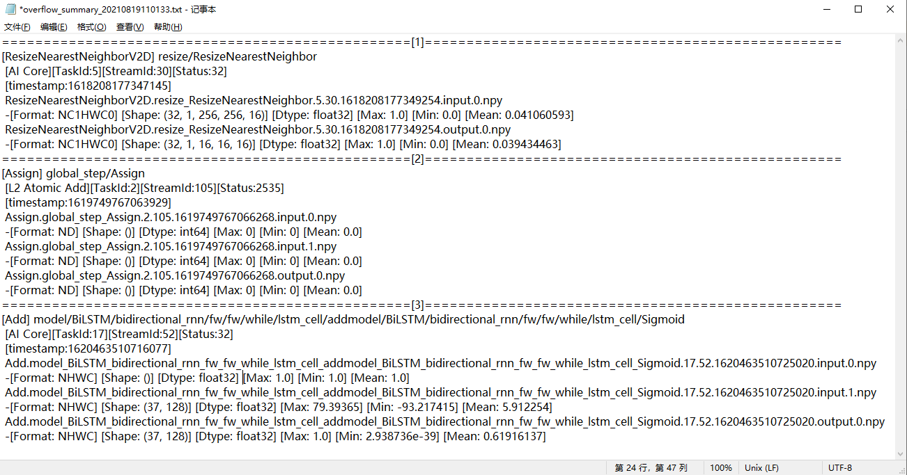

    结果文件信息中，根据展示数据从上到下顺序，展示信息如下：

    -   从1到n表示解析出第一个溢出的算子到第n个溢出的算子。
    -   每个溢出算子的类型和名称。
    -   算子的溢出信息，包括：溢出类型，溢出的任务ID，流ID和溢出错误码。
    -   timestamp为算子溢出的时间戳。
    -   \*.input.\*.npy为溢出算子的输入数据的npy文件。
    -   \*.input.\*.npy文件名下方展示的是文件中算子溢出的输入关键信息，包括数据格式，数据维度，数据类型，最大值，最小值和均值。
    -   \*.output.\*.npy为溢出算子的输出数据的npy文件。
    -   \*.output.\*.npy文件名下方展示的是文件中算子溢出的输出关键信息，包括数据格式，数据维度，数据类型，最大值，最小值和均值。

## dump数据文件Format转换<a name="ZH-CN_TOPIC_0000002505900923"></a>

**执行dump数据文件Format转换<a name="zh-cn_topic_0244646216_section19803552124011"></a>**

本版本提供dump数据文件Format转换能力，用于用户根据自身需求将NPU IP加速器生成的dump数据文件转换成numpy数据文件，方便查看。

该功能通过msaccucmp.py脚本实现，脚本存放在$\{INSTALL\_DIR\}/toolkit/tools/operator\_cmp/compare，$\{INSTALL\_DIR\}请替换为CANN软件安装后文件存储路径。以root安装举例，安装后文件默认存储路径为：/usr/local/Ascend/latest。

命令格式如下：

```
python3 msaccucmp.py convert -d <dump_file> [-out <output>] [-f <format>] [-s <shape>] [-o <output_tensor>] [-i <input_tensor>] [-c <custom_script_path>] [-v <version>] [-t <type>]
```

命令格式参数项说明如[表1](#table1721610181547)所示。

**表 1**  Format转换参数项说明

<a name="table1721610181547"></a>
<table><thead align="left"><tr id="row16261218175411"><th class="cellrowborder" valign="top" width="22.03%" id="mcps1.2.4.1.1"><p id="p10261111818540"><a name="p10261111818540"></a><a name="p10261111818540"></a><strong id="b1526141811544"><a name="b1526141811544"></a><a name="b1526141811544"></a>参数名</strong></p>
</th>
<th class="cellrowborder" valign="top" width="70.45%" id="mcps1.2.4.1.2"><p id="p1126111819548"><a name="p1126111819548"></a><a name="p1126111819548"></a><strong id="b1226114188544"><a name="b1226114188544"></a><a name="b1226114188544"></a>描述</strong></p>
</th>
<th class="cellrowborder" valign="top" width="7.5200000000000005%" id="mcps1.2.4.1.3"><p id="p45585417256"><a name="p45585417256"></a><a name="p45585417256"></a>是否必选</p>
</th>
</tr>
</thead>
<tbody><tr id="row1226114180547"><td class="cellrowborder" valign="top" width="22.03%" headers="mcps1.2.4.1.1 "><p id="p615213442817"><a name="p615213442817"></a><a name="p615213442817"></a>-d</p>
<p id="p12619187547"><a name="p12619187547"></a><a name="p12619187547"></a>--dump_file</p>
</td>
<td class="cellrowborder" valign="top" width="70.45%" headers="mcps1.2.4.1.2 "><p id="p10261181845419"><a name="p10261181845419"></a><a name="p10261181845419"></a><span id="zh-cn_topic_0244646216_ph31701161813"><a name="zh-cn_topic_0244646216_ph31701161813"></a><a name="zh-cn_topic_0244646216_ph31701161813"></a>NPU IP加速器</span>生成的dump文件。</p>
<p id="p4511751181019"><a name="p4511751181019"></a><a name="p4511751181019"></a>支持指定单个文件；单个路径（不支持递归嵌套，只支持文件的父目录）；同时指定多个文件，文件名用逗号隔开，例如-d /{PATH}/dump_file1,/{PATH}/dump_file2。</p>
</td>
<td class="cellrowborder" valign="top" width="7.5200000000000005%" headers="mcps1.2.4.1.3 "><p id="p55589414257"><a name="p55589414257"></a><a name="p55589414257"></a>是</p>
</td>
</tr>
<tr id="row1326111835413"><td class="cellrowborder" valign="top" width="22.03%" headers="mcps1.2.4.1.1 "><p id="p1753123702819"><a name="p1753123702819"></a><a name="p1753123702819"></a>-out</p>
<p id="p7261218125412"><a name="p7261218125412"></a><a name="p7261218125412"></a>--output</p>
</td>
<td class="cellrowborder" valign="top" width="70.45%" headers="mcps1.2.4.1.2 "><p id="p52611618145414"><a name="p52611618145414"></a><a name="p52611618145414"></a>转换后的数据存放目录，默认为当前路径。</p>
<p id="p1757911109267"><a name="p1757911109267"></a><a name="p1757911109267"></a>不建议配置与当前用户不一致的其它用户目录，避免提权风险。</p>
</td>
<td class="cellrowborder" valign="top" width="7.5200000000000005%" headers="mcps1.2.4.1.3 "><p id="p55581482519"><a name="p55581482519"></a><a name="p55581482519"></a>否</p>
</td>
</tr>
<tr id="row112619186546"><td class="cellrowborder" valign="top" width="22.03%" headers="mcps1.2.4.1.1 "><p id="p18164144062814"><a name="p18164144062814"></a><a name="p18164144062814"></a>-f</p>
<p id="p172612180548"><a name="p172612180548"></a><a name="p172612180548"></a>--format</p>
</td>
<td class="cellrowborder" valign="top" width="70.45%" headers="mcps1.2.4.1.2 "><a name="ul207121120163117"></a><a name="ul207121120163117"></a><ul id="ul207121120163117"><li>命令行包含-f参数，表示进行Format转换，指定转换后数据Format。如果dump文件包含original_shape字段，则会根据original_shape对数据进行切片。支持的Format转换类型参见<a href="#section816410197413">支持的Format转换类型</a>。</li><li>命令行不包含-f参数，表示进行dump文件解析。</li></ul>
</td>
<td class="cellrowborder" valign="top" width="7.5200000000000005%" headers="mcps1.2.4.1.3 "><p id="p655819410254"><a name="p655819410254"></a><a name="p655819410254"></a>否</p>
</td>
</tr>
<tr id="row42621918175417"><td class="cellrowborder" valign="top" width="22.03%" headers="mcps1.2.4.1.1 "><p id="p15617154218286"><a name="p15617154218286"></a><a name="p15617154218286"></a>-s</p>
<p id="p14262191835418"><a name="p14262191835418"></a><a name="p14262191835418"></a>--shape</p>
</td>
<td class="cellrowborder" valign="top" width="70.45%" headers="mcps1.2.4.1.2 "><p id="p38851719155716"><a name="p38851719155716"></a><a name="p38851719155716"></a>Format转换需要的Shape，当前仅FRACTAL_NZ转换需要配置该参数，格式为<strong id="zh-cn_topic_0244646216_b7287174653112"><a name="zh-cn_topic_0244646216_b7287174653112"></a><a name="zh-cn_topic_0244646216_b7287174653112"></a>([0-9]+,)+[0-9]+</strong>，每个数字必须大于0。配置-f时有效。</p>
</td>
<td class="cellrowborder" valign="top" width="7.5200000000000005%" headers="mcps1.2.4.1.3 "><p id="p75585492513"><a name="p75585492513"></a><a name="p75585492513"></a>否</p>
</td>
</tr>
<tr id="row7262101835417"><td class="cellrowborder" valign="top" width="22.03%" headers="mcps1.2.4.1.1 "><p id="p538246172814"><a name="p538246172814"></a><a name="p538246172814"></a>-o</p>
<p id="p11262181895419"><a name="p11262181895419"></a><a name="p11262181895419"></a>--output_tensor</p>
</td>
<td class="cellrowborder" valign="top" width="70.45%" headers="mcps1.2.4.1.2 "><p id="p18169152355720"><a name="p18169152355720"></a><a name="p18169152355720"></a>转换指定index的output数据，与-i互斥。配置-f时有效。</p>
<p id="p2169162365718"><a name="p2169162365718"></a><a name="p2169162365718"></a>当-o与-i均未配置时，默认转换所有的input与output。</p>
</td>
<td class="cellrowborder" valign="top" width="7.5200000000000005%" headers="mcps1.2.4.1.3 "><p id="p855810472511"><a name="p855810472511"></a><a name="p855810472511"></a>否</p>
</td>
</tr>
<tr id="row626210185549"><td class="cellrowborder" valign="top" width="22.03%" headers="mcps1.2.4.1.1 "><p id="p103498488287"><a name="p103498488287"></a><a name="p103498488287"></a>-i</p>
<p id="p1226231818546"><a name="p1226231818546"></a><a name="p1226231818546"></a>--input_tensor</p>
</td>
<td class="cellrowborder" valign="top" width="70.45%" headers="mcps1.2.4.1.2 "><p id="p16262141875420"><a name="p16262141875420"></a><a name="p16262141875420"></a>转换指定index的input数据，与-o互斥。配置-f时有效。</p>
</td>
<td class="cellrowborder" valign="top" width="7.5200000000000005%" headers="mcps1.2.4.1.3 "><p id="p15582410257"><a name="p15582410257"></a><a name="p15582410257"></a>否</p>
</td>
</tr>
<tr id="row8262118125414"><td class="cellrowborder" valign="top" width="22.03%" headers="mcps1.2.4.1.1 "><p id="p10868154911286"><a name="p10868154911286"></a><a name="p10868154911286"></a>-c</p>
<p id="p16262151810544"><a name="p16262151810544"></a><a name="p16262151810544"></a>--custom_script_path</p>
</td>
<td class="cellrowborder" valign="top" width="70.45%" headers="mcps1.2.4.1.2 "><p id="p14262418165419"><a name="p14262418165419"></a><a name="p14262418165419"></a>用户自定义Format转换.py文件存放路径，需指定到<span class="uicontrol" id="uicontrol10484134913598"><a name="uicontrol10484134913598"></a><a name="uicontrol10484134913598"></a>“format_convert”</span>目录的上一层目录。.py文件相关要求参见<a href="#zh-cn_topic_0244646216_section6833162804213">准备自定义Format转换.py文件</a>。配置-f时有效。</p>
<p id="p2354133482318"><a name="p2354133482318"></a><a name="p2354133482318"></a>不建议调用与当前用户不一致的其它用户目录下的自定义脚本文件，避免提权风险。</p>
</td>
<td class="cellrowborder" valign="top" width="7.5200000000000005%" headers="mcps1.2.4.1.3 "><p id="p455917418252"><a name="p455917418252"></a><a name="p455917418252"></a>否</p>
</td>
</tr>
<tr id="row46870229467"><td class="cellrowborder" valign="top" width="22.03%" headers="mcps1.2.4.1.1 "><p id="p98601411203918"><a name="p98601411203918"></a><a name="p98601411203918"></a>-v</p>
<p id="p734613152395"><a name="p734613152395"></a><a name="p734613152395"></a>--version</p>
</td>
<td class="cellrowborder" valign="top" width="70.45%" headers="mcps1.2.4.1.2 "><p id="p13860101133912"><a name="p13860101133912"></a><a name="p13860101133912"></a>dump文件类型，1代表protobuf序列化后的数据文件，2代表自定义格式的数据文件。默认值为2。</p>
</td>
<td class="cellrowborder" valign="top" width="7.5200000000000005%" headers="mcps1.2.4.1.3 "><p id="p1655918422513"><a name="p1655918422513"></a><a name="p1655918422513"></a>否</p>
</td>
</tr>
<tr id="row02911338134714"><td class="cellrowborder" valign="top" width="22.03%" headers="mcps1.2.4.1.1 "><p id="p1829183810476"><a name="p1829183810476"></a><a name="p1829183810476"></a>-t</p>
<p id="p1867144212472"><a name="p1867144212472"></a><a name="p1867144212472"></a>--type</p>
</td>
<td class="cellrowborder" valign="top" width="70.45%" headers="mcps1.2.4.1.2 "><p id="p4757165451312"><a name="p4757165451312"></a><a name="p4757165451312"></a>输出文件的类型。取值为：</p>
<a name="ul15583199141713"></a><a name="ul15583199141713"></a><ul id="ul15583199141713"><li>npy：输出文件保存为numpy格式。</li><li>msnpy：输出文件保存为numpy格式，一般用于MindSpore场景。</li><li>bin：输出文件保存为binary格式。</li></ul>
<p id="p2291103854710"><a name="p2291103854710"></a><a name="p2291103854710"></a>默认值为npy。</p>
</td>
<td class="cellrowborder" valign="top" width="7.5200000000000005%" headers="mcps1.2.4.1.3 "><p id="p155974152518"><a name="p155974152518"></a><a name="p155974152518"></a>否</p>
</td>
</tr>
</tbody>
</table>

**支持的Format转换类型<a name="section816410197413"></a>**

结果保存为“原始文件名.output.\{index\}.\{shape\}.npy“或“原始文件名.input.\{index\}.\{shape\}.npy“，Shape的格式如：1x3x224x224。

当前内置的Format转换支持如下类型：

-   FRACTAL\_NZ转换NCHW
-   FRACTAL\_NZ转换成NHWC
-   FRACTAL\_NZ转换ND
-   HWCN转换FRACTAL\_Z
-   HWCN转换成NCHW
-   HWCN转换成NHWC
-   NC1HWC0转换成HWCN
-   NC1HWC0转换成NCHW
-   NC1HWC0转换成NHWC
-   NCHW转换成FRACTAL\_Z
-   NCHW转换成NHWC
-   NHWC转换成FRACTAL\_Z
-   NHWC转换成HWCN
-   NHWC转换成NCHW
-   NDC1HWC0转换成NCDHW

> **说明：** 
>一般情况下，非四维的Format是由四维Format转换而来，那么对于同一个非四维Format支持转换成多种Format类型的情况，该非四维Format只有重新转回原始的四维Format才有效。例如NC1HWC0支持转换成HWCN、NCHW、NHWC，但是被转换的NC1HWC0数据只有一种四维的原始数据，假设为HWCN，那么该NC1HWC0数据只能转换成HWCN。识别原始数据的Format类型需要了解《ATC离线模型编译工具用户指南》中的“高级功能 \>  [单算子模型转换](https://www.hiascend.com/document/detail/zh/canncommercial/82RC1/devaids/atctool/atlasatc_16_0031.html)”。

**准备自定义Format转换.py文件<a name="zh-cn_topic_0244646216_section6833162804213"></a>**

用户自定义的Format转换.py文件只能用来进行Format转换，文件安全性由用户自行保证。

为满足用户自定义Format转换，需要按以下要求准备：

-   .py文件命名需满足规则：“convert\_\{format\_from\}\_to\_\{format\_to\}.py“，其中，format\_from和format\_to支持的类型如下：
    -   NCHW
    -   NHWC
    -   ND
    -   NC1HWC0
    -   FRACTAL\_Z
    -   NC1C0HWPAD
    -   NHWC1C0
    -   FSR\_NCHW
    -   FRACTAL\_DECONV
    -   C1HWNC0
    -   FRACTAL\_DECONV\_TRANSPOSE
    -   FRACTAL\_DECONV\_SP\_STRIDE\_TRANS
    -   NC1HWC0\_C04
    -   FRACTAL\_Z\_C04
    -   CHWN
    -   DECONV\_SP\_STRIDE8\_TRANS
    -   NC1KHKWHWC0
    -   BN\_WEIGHT
    -   FILTER\_HWCK
    -   HWCN
    -   LOOKUP\_LOOKUPS
    -   LOOKUP\_KEYS
    -   LOOKUP\_VALUE
    -   LOOKUP\_OUTPUT
    -   LOOKUP\_HITS
    -   MD
    -   NDHWC
    -   C1HWNCoC0
    -   FRACTAL\_NZ
    -   NCHDW

-   .py文件内容需满足以下规则：

    ```
    def convert(shape_from, shape_to, array):
        
        return numpy_array
    ```

    **表 2**  参数说明

    <a name="table1585699193518"></a>
    <table><thead align="left"><tr id="row085615993512"><th class="cellrowborder" valign="top" width="24.14%" id="mcps1.2.3.1.1"><p id="p785620914359"><a name="p785620914359"></a><a name="p785620914359"></a>参数</p>
    </th>
    <th class="cellrowborder" valign="top" width="75.86%" id="mcps1.2.3.1.2"><p id="p1085618911354"><a name="p1085618911354"></a><a name="p1085618911354"></a>说明</p>
    </th>
    </tr>
    </thead>
    <tbody><tr id="row48569920354"><td class="cellrowborder" valign="top" width="24.14%" headers="mcps1.2.3.1.1 "><p id="p208564903514"><a name="p208564903514"></a><a name="p208564903514"></a>shape_from</p>
    </td>
    <td class="cellrowborder" valign="top" width="75.86%" headers="mcps1.2.3.1.2 "><p id="p16856169153518"><a name="p16856169153518"></a><a name="p16856169153518"></a>array数据的转换前的Shape，一维数组。</p>
    </td>
    </tr>
    <tr id="row585659143515"><td class="cellrowborder" valign="top" width="24.14%" headers="mcps1.2.3.1.1 "><p id="p1985612918358"><a name="p1985612918358"></a><a name="p1985612918358"></a>shape_to</p>
    </td>
    <td class="cellrowborder" valign="top" width="75.86%" headers="mcps1.2.3.1.2 "><p id="p08562953517"><a name="p08562953517"></a><a name="p08562953517"></a>array数据的转换后的Shape，一维数组，可选。</p>
    </td>
    </tr>
    <tr id="row085619918356"><td class="cellrowborder" valign="top" width="24.14%" headers="mcps1.2.3.1.1 "><p id="p2856392350"><a name="p2856392350"></a><a name="p2856392350"></a>array</p>
    </td>
    <td class="cellrowborder" valign="top" width="75.86%" headers="mcps1.2.3.1.2 "><p id="p148567973519"><a name="p148567973519"></a><a name="p148567973519"></a>一维原始数据。</p>
    </td>
    </tr>
    <tr id="row19856179183514"><td class="cellrowborder" valign="top" width="24.14%" headers="mcps1.2.3.1.1 "><p id="p5856139203515"><a name="p5856139203515"></a><a name="p5856139203515"></a>return</p>
    </td>
    <td class="cellrowborder" valign="top" width="75.86%" headers="mcps1.2.3.1.2 "><p id="p385649133513"><a name="p385649133513"></a><a name="p385649133513"></a>返回值，返回转换后的numpy数组。</p>
    </td>
    </tr>
    </tbody>
    </table>

-   .py文件存放目录需满足：

    .py文件必须存放在“format\_convert“目录下，如果该目录不存在，需要新建。

## 查看dump数据文件<a name="ZH-CN_TOPIC_0000002473740922"></a>

dump文件无法通过文本工具直接查看其内容，为了查看dump文件内容，本文提供以下脚本将dump文件转换为numpy格式文件后，再通过numpy官方提供的能力转为txt文档进行查看。

该功能通过msaccucmp.py脚本实现，脚本存放在$\{INSTALL\_DIR\}/toolkit/tools/operator\_cmp/compare，$\{INSTALL\_DIR\}请替换为CANN软件安装后文件存储路径。以root安装举例，安装后文件默认存储路径为：/usr/local/Ascend/latest。

```
python3 msaccucmp.py convert -d <dump_file> [-out <output>] [-v <version>] [-t <type>]
```

命令格式参数项说明如[表1](#table1721610181547)所示。

**表 1**  参数说明

<a name="table1721610181547"></a>
<table><thead align="left"><tr id="row16261218175411"><th class="cellrowborder" valign="top" width="20.97%" id="mcps1.2.4.1.1"><p id="p10261111818540"><a name="p10261111818540"></a><a name="p10261111818540"></a><strong id="b1526141811544"><a name="b1526141811544"></a><a name="b1526141811544"></a>参数名</strong></p>
</th>
<th class="cellrowborder" valign="top" width="71.50999999999999%" id="mcps1.2.4.1.2"><p id="p1126111819548"><a name="p1126111819548"></a><a name="p1126111819548"></a><strong id="b1226114188544"><a name="b1226114188544"></a><a name="b1226114188544"></a>描述</strong></p>
</th>
<th class="cellrowborder" valign="top" width="7.5200000000000005%" id="mcps1.2.4.1.3"><p id="p1421754112612"><a name="p1421754112612"></a><a name="p1421754112612"></a>是否必选</p>
</th>
</tr>
</thead>
<tbody><tr id="row1226114180547"><td class="cellrowborder" valign="top" width="20.97%" headers="mcps1.2.4.1.1 "><p id="p615213442817"><a name="p615213442817"></a><a name="p615213442817"></a>-d</p>
<p id="p12619187547"><a name="p12619187547"></a><a name="p12619187547"></a>--dump_file</p>
</td>
<td class="cellrowborder" valign="top" width="71.50999999999999%" headers="mcps1.2.4.1.2 "><p id="p10261181845419"><a name="p10261181845419"></a><a name="p10261181845419"></a><span id="zh-cn_topic_0244646216_ph31701161813"><a name="zh-cn_topic_0244646216_ph31701161813"></a><a name="zh-cn_topic_0244646216_ph31701161813"></a>NPU IP加速器</span>生成的dump文件。</p>
<p id="p2010320360372"><a name="p2010320360372"></a><a name="p2010320360372"></a>支持指定单个文件；单个路径（不支持递归嵌套，只支持文件的父目录）；同时指定多个文件，文件名用逗号隔开，例如-d /{PATH}/dump_file1,/{PATH}/dump_file2。</p>
</td>
<td class="cellrowborder" valign="top" width="7.5200000000000005%" headers="mcps1.2.4.1.3 "><p id="p52173422619"><a name="p52173422619"></a><a name="p52173422619"></a>是</p>
</td>
</tr>
<tr id="row1326111835413"><td class="cellrowborder" valign="top" width="20.97%" headers="mcps1.2.4.1.1 "><p id="p1753123702819"><a name="p1753123702819"></a><a name="p1753123702819"></a>-out</p>
<p id="p7261218125412"><a name="p7261218125412"></a><a name="p7261218125412"></a>--output</p>
</td>
<td class="cellrowborder" valign="top" width="71.50999999999999%" headers="mcps1.2.4.1.2 "><p id="p52611618145414"><a name="p52611618145414"></a><a name="p52611618145414"></a>转换后的数据存放目录，默认为当前路径。</p>
<p id="p1757911109267"><a name="p1757911109267"></a><a name="p1757911109267"></a>不建议配置与当前用户不一致的其它用户目录，避免提权风险。</p>
</td>
<td class="cellrowborder" valign="top" width="7.5200000000000005%" headers="mcps1.2.4.1.3 "><p id="p32171544265"><a name="p32171544265"></a><a name="p32171544265"></a>否</p>
</td>
</tr>
<tr id="row46870229467"><td class="cellrowborder" valign="top" width="20.97%" headers="mcps1.2.4.1.1 "><p id="p98601411203918"><a name="p98601411203918"></a><a name="p98601411203918"></a>-v</p>
<p id="p734613152395"><a name="p734613152395"></a><a name="p734613152395"></a>--version</p>
</td>
<td class="cellrowborder" valign="top" width="71.50999999999999%" headers="mcps1.2.4.1.2 "><p id="p13860101133912"><a name="p13860101133912"></a><a name="p13860101133912"></a>dump文件类型，1代表protobuf序列化后的数据文件，2代表自定义格式的数据文件。默认取值为2。</p>
</td>
<td class="cellrowborder" valign="top" width="7.5200000000000005%" headers="mcps1.2.4.1.3 "><p id="p42178415260"><a name="p42178415260"></a><a name="p42178415260"></a>否</p>
</td>
</tr>
<tr id="row02911338134714"><td class="cellrowborder" valign="top" width="20.97%" headers="mcps1.2.4.1.1 "><p id="p1829183810476"><a name="p1829183810476"></a><a name="p1829183810476"></a>-t</p>
<p id="p1867144212472"><a name="p1867144212472"></a><a name="p1867144212472"></a>--type</p>
</td>
<td class="cellrowborder" valign="top" width="71.50999999999999%" headers="mcps1.2.4.1.2 "><p id="p12631142683813"><a name="p12631142683813"></a><a name="p12631142683813"></a>输出文件的类型。取值为：</p>
<a name="ul19631182616388"></a><a name="ul19631182616388"></a><ul id="ul19631182616388"><li>npy：输出文件保存为numpy格式。npy文件不支持bfloat16格式，若工具输入源文件为bfloat16格式，则会将其解析为float32格式的npy文件。</li><li>msnpy：输出文件保存为numpy格式，一般用于MindSpore场景。</li><li>bin：输出文件保存为binary格式。</li></ul>
<p id="p15631202633817"><a name="p15631202633817"></a><a name="p15631202633817"></a>默认值为npy。</p>
</td>
<td class="cellrowborder" valign="top" width="7.5200000000000005%" headers="mcps1.2.4.1.3 "><p id="p221716472614"><a name="p221716472614"></a><a name="p221716472614"></a>否</p>
</td>
</tr>
</tbody>
</table>

**操作步骤<a name="section1764310374465"></a>**

1.  使用安装用户登录开发环境。
2.  进入$\{INSTALL\_DIR\}/toolkit/tools/operator\_cmp/compare，$\{INSTALL\_DIR\}请替换为CANN软件安装后文件存储路径。以root安装举例，安装后文件默认存储路径为：/usr/local/Ascend/latest。
3.  执行msaccucmp.py脚本，转换dump文件为numpy文件。

    ```
    python3 msaccucmp.py convert -d $HOME/dump -out $HOME/dumptonumpy -v 2
    ```

    > **说明：** 
    >-   msaccucmp.py脚本的各个输入参数使用方法，请参见[dump数据文件Format转换](dump数据文件Format转换.md)。
    >-   -d参数支持传入单个文件，对单个dump文件进行转换，也支持传入目录（不支持递归嵌套，只支持文件的父目录），对整个path下所有的dump文件进行转换。

4.  调用Python，转换numpy文件为txt文件。举例：

    ```
    $ python3
    Python 3 (default, Mar  5 2020, 16:07:54)[GCC 5.4.0 20160609] on linuxType "help", "copyright", "credits" or "license" for more information.
    >>> import numpy as np
    >>> a = np.load("$HOME/dumptonumpy/Pooling.pool1.1.1147.1589195081588018.output.0.npy")
    >>> b = a.flatten()
    >>> np.savetxt("$HOME/dumptonumpy/Pooling.pool1.1.1147.1589195081588018.output.0.txt", b)
    ```

    转换为.txt格式文件后，维度信息、dtype均不存在。详细的使用方法请参见NumPy官网介绍。

## GPU/NPU映射表获取<a name="ZH-CN_TOPIC_0000002505900917"></a>

-IPV350不支持

**说明<a name="section162971711436"></a>**

本节涉及的.json文件、目录等名称均为举例，请根据实际环境替换。其中，-out指定的结果存放路径，需确保操作用户具有读写权限。

**操作步骤<a name="section2072216139313"></a>**

1.  以HwHiAiUser用户登录开发环境。
2.  生成json文件。

    ```
    atc --mode=1 --om=$HOME/data/resnet50.om --json=$HOME/data/resnet50.json
    ```

3.  进入$\{INSTALL\_DIR\}/toolkit/tools/operator\_cmp/compare，$\{INSTALL\_DIR\}请替换为CANN软件安装后文件存储路径。以root安装举例，安装后文件默认存储路径为：/usr/local/Ascend/latest。
4.  执行获取GPU/NPU的映射表命令。

    > **说明：** 
    >由于dump和npy比对数据文件是由多个文件组成，故下文操作步骤中**-m**和**-g**参数须指定数据文件所在的父目录。如：_$HOME/MyApp/resnet50，_其中_resnet50_文件夹下直接保存比对数据文件。
    >目录结构示例如下：
    >```
    >root@xxx:$HOME/MyApp/resnet50# tree
    >.
    >├── BatchMatMul.bert_encoder_layer_0_attention_self_MatMul_1.24.1614717261785536
    >├── BatchMatMul.bert_encoder_layer_0_attention_self_MatMul.21.1614717261768864
    >├── BatchMatMul.bert_encoder_layer_10_attention_self_MatMul_1.235.1614717263664916
    ># 仅为示例，此处省略剩余文件名。
    >```

    ```
    python3 msaccucmp.py compare -m $HOME/MyApp_mind/resnet50 -g $HOME/Standard_caffe/resnet50 -f $HOME/data/resnet50.json -out $HOME/result -map
    ```

    输出结果为mapping\_\*.csv文件内容如[图1](#fig110518254515)所示。

    **图 1**  GPU/NPU的映射表<a name="fig110518254515"></a>  
    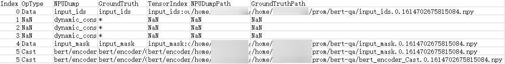

    **表 1**  输出参数说明

    <a name="table11647173502"></a>
    <table><thead align="left"><tr id="row91654177500"><th class="cellrowborder" valign="top" width="21.29%" id="mcps1.2.3.1.1"><p id="p1116561720501"><a name="p1116561720501"></a><a name="p1116561720501"></a>参数</p>
    </th>
    <th class="cellrowborder" valign="top" width="78.71000000000001%" id="mcps1.2.3.1.2"><p id="p12165181735018"><a name="p12165181735018"></a><a name="p12165181735018"></a>说明</p>
    </th>
    </tr>
    </thead>
    <tbody><tr id="row54793195819"><td class="cellrowborder" valign="top" width="21.29%" headers="mcps1.2.3.1.1 "><p id="p625177582"><a name="p625177582"></a><a name="p625177582"></a>Index</p>
    </td>
    <td class="cellrowborder" valign="top" width="78.71000000000001%" headers="mcps1.2.3.1.2 "><p id="p20250755817"><a name="p20250755817"></a><a name="p20250755817"></a>算子的ID。</p>
    </td>
    </tr>
    <tr id="row118102473231"><td class="cellrowborder" valign="top" width="21.29%" headers="mcps1.2.3.1.1 "><p id="p111721622134915"><a name="p111721622134915"></a><a name="p111721622134915"></a>OpType</p>
    </td>
    <td class="cellrowborder" valign="top" width="78.71000000000001%" headers="mcps1.2.3.1.2 "><p id="p151734225499"><a name="p151734225499"></a><a name="p151734225499"></a>算子类型。指定-f，-cf或-q参数时获取算子类型。</p>
    </td>
    </tr>
    <tr id="row616551755014"><td class="cellrowborder" valign="top" width="21.29%" headers="mcps1.2.3.1.1 "><p id="p6579163565615"><a name="p6579163565615"></a><a name="p6579163565615"></a>NPUDump</p>
    </td>
    <td class="cellrowborder" valign="top" width="78.71000000000001%" headers="mcps1.2.3.1.2 "><p id="p2070991613349"><a name="p2070991613349"></a><a name="p2070991613349"></a>表示基于<span id="ph16222932332"><a name="ph16222932332"></a><a name="ph16222932332"></a>NPU IP加速器</span>运行生成的dump数据的算子名。</p>
    </td>
    </tr>
    <tr id="row916581719504"><td class="cellrowborder" valign="top" width="21.29%" headers="mcps1.2.3.1.1 "><p id="p057953595617"><a name="p057953595617"></a><a name="p057953595617"></a>GroundTruth</p>
    </td>
    <td class="cellrowborder" valign="top" width="78.71000000000001%" headers="mcps1.2.3.1.2 "><p id="p12710191614343"><a name="p12710191614343"></a><a name="p12710191614343"></a>表示基于GPU/CPU运行生成的npy或dump数据的算子名。</p>
    </td>
    </tr>
    <tr id="row6165191765019"><td class="cellrowborder" valign="top" width="21.29%" headers="mcps1.2.3.1.1 "><p id="p971081643418"><a name="p971081643418"></a><a name="p971081643418"></a>TensorIndex</p>
    </td>
    <td class="cellrowborder" valign="top" width="78.71000000000001%" headers="mcps1.2.3.1.2 "><p id="p157101816103419"><a name="p157101816103419"></a><a name="p157101816103419"></a>表示基于<span id="ph821622112510"><a name="ph821622112510"></a><a name="ph821622112510"></a>NPU IP加速器</span>运行生成的dump数据的算子的input ID和output ID。</p>
    </td>
    </tr>
    <tr id="row18166181785010"><td class="cellrowborder" valign="top" width="21.29%" headers="mcps1.2.3.1.1 "><p id="p2710131693414"><a name="p2710131693414"></a><a name="p2710131693414"></a>NPUDumpPath</p>
    </td>
    <td class="cellrowborder" valign="top" width="78.71000000000001%" headers="mcps1.2.3.1.2 "><p id="p19710161612345"><a name="p19710161612345"></a><a name="p19710161612345"></a>表示基于<span id="ph177408382517"><a name="ph177408382517"></a><a name="ph177408382517"></a>NPU IP加速器</span>运行生成的dump文件路径。</p>
    </td>
    </tr>
    <tr id="row6166101795015"><td class="cellrowborder" valign="top" width="21.29%" headers="mcps1.2.3.1.1 "><p id="p67104167348"><a name="p67104167348"></a><a name="p67104167348"></a>GroundTruthPath</p>
    </td>
    <td class="cellrowborder" valign="top" width="78.71000000000001%" headers="mcps1.2.3.1.2 "><p id="p1271019168349"><a name="p1271019168349"></a><a name="p1271019168349"></a>表示基于GPU/CPU运行生成的npy或dump文件路径。</p>
    </td>
    </tr>
    </tbody>
    </table>

## 自定义算法.py文件准备<a name="ZH-CN_TOPIC_0000002473740948"></a>

用户自定义的比对算法Python文件只能用来进行精度比对，文件安全性和传入参数的安全性由用户保证。

用户自定义算法，需要在.py格式文件内写好自定义算法脚本，按以下要求准备：

-   .py文件命名需满足规则：“ alg\_\{algorithm\_name\}.py“，其中，algorithm\_name为算法名。
-   .py文件内容需满足以下规则：

    ```
    def compare(my_output_dump_data, ground_truth_dump_data, args):   #算法固定头格式
    #以下为算法示例
        """
        Function Description:
            compare the my output dump data and the ground truth dump data by algorithm
        Parameter:
            my_output_dump_data: the my output dump data
            ground_truth_dump_data: the ground truth dump data
            args: the algorithm arguments
        Return Value:
            the compare algorithm value, string; error_msg, string
        """
    ```

    **表 1**  参数说明

    <a name="table15608171716399"></a>
    <table><thead align="left"><tr id="row86081317193919"><th class="cellrowborder" valign="top" width="34.54%" id="mcps1.2.3.1.1"><p id="p260891743915"><a name="p260891743915"></a><a name="p260891743915"></a>参数</p>
    </th>
    <th class="cellrowborder" valign="top" width="65.46%" id="mcps1.2.3.1.2"><p id="p26081317173910"><a name="p26081317173910"></a><a name="p26081317173910"></a>说明</p>
    </th>
    </tr>
    </thead>
    <tbody><tr id="row156081217183913"><td class="cellrowborder" valign="top" width="34.54%" headers="mcps1.2.3.1.1 "><p id="p1360821743918"><a name="p1360821743918"></a><a name="p1360821743918"></a>my_output_dump_data</p>
    </td>
    <td class="cellrowborder" valign="top" width="65.46%" headers="mcps1.2.3.1.2 "><p id="p1360812173393"><a name="p1360812173393"></a><a name="p1360812173393"></a>my output dump数据，一维数组。</p>
    </td>
    </tr>
    <tr id="row20608151716393"><td class="cellrowborder" valign="top" width="34.54%" headers="mcps1.2.3.1.1 "><p id="p560810179391"><a name="p560810179391"></a><a name="p560810179391"></a>ground_truth_dump_data</p>
    </td>
    <td class="cellrowborder" valign="top" width="65.46%" headers="mcps1.2.3.1.2 "><p id="p12608161763910"><a name="p12608161763910"></a><a name="p12608161763910"></a>ground truth dump数据，一维数组。</p>
    </td>
    </tr>
    <tr id="row1760891718396"><td class="cellrowborder" valign="top" width="34.54%" headers="mcps1.2.3.1.1 "><p id="p12608181715398"><a name="p12608181715398"></a><a name="p12608181715398"></a>args</p>
    </td>
    <td class="cellrowborder" valign="top" width="65.46%" headers="mcps1.2.3.1.2 "><p id="p160891718397"><a name="p160891718397"></a><a name="p160891718397"></a>算法参数，用户自行解析。</p>
    </td>
    </tr>
    <tr id="row9608121712392"><td class="cellrowborder" valign="top" width="34.54%" headers="mcps1.2.3.1.1 "><p id="p14608181712392"><a name="p14608181712392"></a><a name="p14608181712392"></a>Return Value</p>
    </td>
    <td class="cellrowborder" valign="top" width="65.46%" headers="mcps1.2.3.1.2 "><p id="p76083173396"><a name="p76083173396"></a><a name="p76083173396"></a>返回值，包括：</p>
    <a name="ul16459191614402"></a><a name="ul16459191614402"></a><ul id="ul16459191614402"><li>算法比对的结果，String格式。</li><li>错误信息，String格式。</li></ul>
    </td>
    </tr>
    </tbody>
    </table>

-   需要在当前用户的目录下创建“algorithm“目录用于保存.py文件，请确保用户对目录和文件具有读写权限。

## AICPU自定义算子日志解析<a name="ZH-CN_TOPIC_0000002506020835"></a>

-IPV350不支持

**概述<a name="section191671835361"></a>**

dump数据文件解析功能通过解析dump数据文件，获取dump数据文件中的信息。

当前该功能支持从dump数据文件中解析AICPU自定义算子的日志，并将其保存到日志文件内。

**命令格式说明<a name="section1394112227510"></a>**

```
python3 dump_parser.py save_log -d <dump_file> [-out <output>]
```

命令行参数说明如[表1](#table23391841181914)所示。

该功能通过dump\_parser.py脚本实现，脚本存放在$\{INSTALL\_DIR\}/toolkit/tools/operator\_cmp/compare，$\{INSTALL\_DIR\}请替换为CANN软件安装后文件存储路径。以root安装举例，安装后文件默认存储路径为：/usr/local/Ascend/latest。

**表 1**  命令行参数说明

<a name="table23391841181914"></a>
<table><thead align="left"><tr id="row1538804115197"><th class="cellrowborder" valign="top" width="36.809999999999995%" id="mcps1.2.4.1.1"><p id="p14388194114198"><a name="p14388194114198"></a><a name="p14388194114198"></a><strong id="b193880419193"><a name="b193880419193"></a><a name="b193880419193"></a>参数名</strong></p>
</th>
<th class="cellrowborder" valign="top" width="50.49%" id="mcps1.2.4.1.2"><p id="p1538811413196"><a name="p1538811413196"></a><a name="p1538811413196"></a><strong id="b5388114116193"><a name="b5388114116193"></a><a name="b5388114116193"></a>参数说明</strong></p>
</th>
<th class="cellrowborder" valign="top" width="12.7%" id="mcps1.2.4.1.3"><p id="p1464718126387"><a name="p1464718126387"></a><a name="p1464718126387"></a><strong id="b9388104119199"><a name="b9388104119199"></a><a name="b9388104119199"></a>是否必选</strong></p>
</th>
</tr>
</thead>
<tbody><tr id="row2388341121919"><td class="cellrowborder" valign="top" width="36.809999999999995%" headers="mcps1.2.4.1.1 "><p id="p163975255262"><a name="p163975255262"></a><a name="p163975255262"></a>-d</p>
<p id="p1338884151915"><a name="p1338884151915"></a><a name="p1338884151915"></a>--dump_file</p>
</td>
<td class="cellrowborder" valign="top" width="50.49%" headers="mcps1.2.4.1.2 "><p id="p20121848684"><a name="p20121848684"></a><a name="p20121848684"></a>待解析的dump数据文件。</p>
</td>
<td class="cellrowborder" valign="top" width="12.7%" headers="mcps1.2.4.1.3 "><p id="p15647111220388"><a name="p15647111220388"></a><a name="p15647111220388"></a>是</p>
</td>
</tr>
<tr id="row1138854151910"><td class="cellrowborder" valign="top" width="36.809999999999995%" headers="mcps1.2.4.1.1 "><p id="p7934143982612"><a name="p7934143982612"></a><a name="p7934143982612"></a>-out</p>
<p id="p838811413193"><a name="p838811413193"></a><a name="p838811413193"></a>--<em id="i610619481287"><a name="i610619481287"></a><a name="i610619481287"></a>output</em></p>
</td>
<td class="cellrowborder" valign="top" width="50.49%" headers="mcps1.2.4.1.2 "><p id="p1388941201917"><a name="p1388941201917"></a><a name="p1388941201917"></a>AICPU自定义算子的日志存放目录。默认为当前目录。</p>
<p id="p8573134491015"><a name="p8573134491015"></a><a name="p8573134491015"></a>结果文件名格式为：dump_file_name.{index}.log</p>
<p id="p1757911109267"><a name="p1757911109267"></a><a name="p1757911109267"></a>不建议配置与当前用户不一致的其它用户目录，避免提权风险。</p>
</td>
<td class="cellrowborder" valign="top" width="12.7%" headers="mcps1.2.4.1.3 "><p id="p76473123383"><a name="p76473123383"></a><a name="p76473123383"></a>否</p>
</td>
</tr>
</tbody>
</table>

**操作步骤<a name="section1572682212498"></a>**

1.  登录CANN工具安装环境。
2.  进入$\{INSTALL\_DIR\}/toolkit/tools/operator\_cmp/compare，$\{INSTALL\_DIR\}请替换为CANN软件安装后文件存储路径。以root安装举例，安装后文件默认存储路径为：/usr/local/Ascend/latest。
3.  执行**save\_log**解析命令。

    ```
    python3 dump_parser.py save_log -d my_dump_path/dump_file -out /MyApp20/out
    ```

    命令执行完成后在**-out**指定目录下生成日志文件。

## Windows dump文件转换为Linux dump文件<a name="ZH-CN_TOPIC_0000002473740926"></a>

1.  在Linux上准备转换脚本windows\_to\_linux.py，内容如下。

    ```
    import argparse
    import os
    import sys
    
    
    class WindowsToLinux:
        """
        The class for format windows to linux
        """
    
        def __init__(self):
            parse = argparse.ArgumentParser()
            parse.add_argument("-i", dest="windows_dump_path", default="",
                               help="<Required> the dump file path", required=True)
            parse.add_argument("-o", dest="output_path", default="",
                               help="<Required> the output path", required=True)
            args, _ = parse.parse_known_args(sys.argv[1:])
            self.windows_dump_path = os.path.realpath(args.windows_dump_path)
            self.output_path = os.path.realpath(args.output_path)
    
        def windows_to_linux(self, dump_path):
            try:
                with open(dump_path, "rb") as dump_file:
                    content = dump_file.read()
                    new_content = content.replace(b"\r\n", b"\n")
                    output_file_path = os.path.join(self.output_path, os.path.basename(dump_path))
                    with open(output_file_path, "wb") as new_dump_file:
                        new_dump_file.write(new_content)
                        print('Info: convert dump to linux for "%s" successfully.' % dump_path)
            except (OSError, IOError, MemoryError, SystemError) as error:
                print('Error: convert windows dump file "%s" to linux dump file failed. %s' % (dump_path, error))
    
        def convert(self):
            try:
                if not os.path.exists(self.windows_dump_path) and \
                        not os.access(self.windows_dump_path, os.R_OK):
                    print('Error: the path "%s" does not exist or can not readable.')
                    sys.exit()
    
                if not os.path.exists(self.output_path):
                    os.makedirs(self.output_path)
                if not os.path.exists(self.output_path) and \
                        not os.access(self.output_path, os.W_OK):
                    print('Error: the path "%s" does not exist or can not writable.')
                    sys.exit()
    
                if os.path.isfile(self.windows_dump_path):
                    self.windows_to_linux(self.windows_dump_path)
                else:
                    for file_name in os.listdir(self.windows_dump_path):
                        self.windows_to_linux(os.path.join(self.windows_dump_path, file_name))
            except (OSError, IOError, MemoryError, SystemError) as error:
                print('Error: convert windows dump file to linux dump file failed. %s' % error)
                sys.exit()
    
    
    if __name__ == "__main__":
        main = WindowsToLinux()
        main.convert()
    ```

2.  将Windows的dump文件拷贝到Linux某个目录下。
3.  在Linux上执行转换脚本。

    ```
    # windows_dump_path是步骤2中Windows的dump文件拷贝到Linux的目录
    # linux_dump_path是生成的Linux的dump文件存放路径
    python3 windows_to_linux.py -i {windows_dump_path} -o {linux_dump_path}
    ```

# 附录<a name="ZH-CN_TOPIC_0000002505900895"></a>


## 数据格式要求<a name="ZH-CN_TOPIC_0000002505900913"></a>

**msaccucmp.py**脚本精度比对工具支持多种比对方式，因此dump、npy数据文件命名需满足以下要求：

**表 1**  数据文件命名规则

<a name="zh-cn_topic_0258216277_zh-cn_topic_0257342830_zh-cn_topic_0244513286_zh-cn_topic_0234895052_zh-cn_topic_0232589266_table4759102511323"></a>
<table><thead align="left"><tr id="zh-cn_topic_0258216277_zh-cn_topic_0257342830_zh-cn_topic_0244513286_zh-cn_topic_0234895052_zh-cn_topic_0232589266_row37598257322"><th class="cellrowborder" valign="top" width="31.430000000000003%" id="mcps1.2.4.1.1"><p id="zh-cn_topic_0258216277_zh-cn_topic_0257342830_zh-cn_topic_0244513286_zh-cn_topic_0234895052_zh-cn_topic_0232589266_p19759102533214"><a name="zh-cn_topic_0258216277_zh-cn_topic_0257342830_zh-cn_topic_0244513286_zh-cn_topic_0234895052_zh-cn_topic_0232589266_p19759102533214"></a><a name="zh-cn_topic_0258216277_zh-cn_topic_0257342830_zh-cn_topic_0244513286_zh-cn_topic_0234895052_zh-cn_topic_0232589266_p19759102533214"></a>数据类型</p>
</th>
<th class="cellrowborder" valign="top" width="34.589999999999996%" id="mcps1.2.4.1.2"><p id="zh-cn_topic_0258216277_zh-cn_topic_0257342830_zh-cn_topic_0244513286_zh-cn_topic_0234895052_zh-cn_topic_0232589266_p13759162517329"><a name="zh-cn_topic_0258216277_zh-cn_topic_0257342830_zh-cn_topic_0244513286_zh-cn_topic_0234895052_zh-cn_topic_0232589266_p13759162517329"></a><a name="zh-cn_topic_0258216277_zh-cn_topic_0257342830_zh-cn_topic_0244513286_zh-cn_topic_0234895052_zh-cn_topic_0232589266_p13759162517329"></a>数据命名格式</p>
</th>
<th class="cellrowborder" valign="top" width="33.98%" id="mcps1.2.4.1.3"><p id="p75511538183320"><a name="p75511538183320"></a><a name="p75511538183320"></a>备注</p>
</th>
</tr>
</thead>
<tbody><tr id="zh-cn_topic_0258216277_zh-cn_topic_0257342830_zh-cn_topic_0244513286_zh-cn_topic_0234895052_zh-cn_topic_0232589266_row207591325123217"><td class="cellrowborder" valign="top" width="31.430000000000003%" headers="mcps1.2.4.1.1 "><p id="zh-cn_topic_0258216277_zh-cn_topic_0257342830_zh-cn_topic_0244513286_zh-cn_topic_0234895052_zh-cn_topic_0232589266_p20800821183615"><a name="zh-cn_topic_0258216277_zh-cn_topic_0257342830_zh-cn_topic_0244513286_zh-cn_topic_0234895052_zh-cn_topic_0232589266_p20800821183615"></a><a name="zh-cn_topic_0258216277_zh-cn_topic_0257342830_zh-cn_topic_0244513286_zh-cn_topic_0234895052_zh-cn_topic_0232589266_p20800821183615"></a>非量化离线模型在<span id="zh-cn_topic_0258216277_zh-cn_topic_0257342830_ph190214116614"><a name="zh-cn_topic_0258216277_zh-cn_topic_0257342830_ph190214116614"></a><a name="zh-cn_topic_0258216277_zh-cn_topic_0257342830_ph190214116614"></a>NPU IP加速器</span>上运行生成的dump数据文件</p>
</td>
<td class="cellrowborder" rowspan="2" valign="top" width="34.589999999999996%" headers="mcps1.2.4.1.2 ">&nbsp;</td>
<td class="cellrowborder" rowspan="3" valign="top" width="33.98%" headers="mcps1.2.4.1.3 "><p id="p23481910456"><a name="p23481910456"></a><a name="p23481910456"></a>命名格式说明：</p>
<a name="ul127435119222"></a><a name="ul127435119222"></a><ul id="ul127435119222"><li>op_type（算子类型）、op_name（算子名）对应的名称需满足<span class="uicontrol" id="zh-cn_topic_0258216277_zh-cn_topic_0257342830_zh-cn_topic_0244513286_zh-cn_topic_0234895052_zh-cn_topic_0232589266_uicontrol19220183124618"><a name="zh-cn_topic_0258216277_zh-cn_topic_0257342830_zh-cn_topic_0244513286_zh-cn_topic_0234895052_zh-cn_topic_0232589266_uicontrol19220183124618"></a><a name="zh-cn_topic_0258216277_zh-cn_topic_0257342830_zh-cn_topic_0244513286_zh-cn_topic_0234895052_zh-cn_topic_0232589266_uicontrol19220183124618"></a>“A-Za-z0-9_-”</span>正则表达式规则。</li><li>timestamp为16位时间戳。</li><li>task_id（任务ID）、stream_id（Stream ID）、output_index（第N个输出）为0~9数字组成。</li></ul>
<p id="p4826143114373"><a name="p4826143114373"></a><a name="p4826143114373"></a>如果op_type、op_name出现了<span class="uicontrol" id="zh-cn_topic_0000001312393577_zh-cn_topic_0257342837_uicontrol159165274119"><a name="zh-cn_topic_0000001312393577_zh-cn_topic_0257342837_uicontrol159165274119"></a><a name="zh-cn_topic_0000001312393577_zh-cn_topic_0257342837_uicontrol159165274119"></a>“.”</span>、<span class="uicontrol" id="zh-cn_topic_0000001312393577_zh-cn_topic_0257342837_uicontrol29052114115"><a name="zh-cn_topic_0000001312393577_zh-cn_topic_0257342837_uicontrol29052114115"></a><a name="zh-cn_topic_0000001312393577_zh-cn_topic_0257342837_uicontrol29052114115"></a>“/”</span>、<span class="uicontrol" id="zh-cn_topic_0000001312393577_zh-cn_topic_0257342837_uicontrol1491252104118"><a name="zh-cn_topic_0000001312393577_zh-cn_topic_0257342837_uicontrol1491252104118"></a><a name="zh-cn_topic_0000001312393577_zh-cn_topic_0257342837_uicontrol1491252104118"></a>“\”</span>、空格时，转换为下划线表示。</p>
</td>
</tr>
<tr id="zh-cn_topic_0258216277_zh-cn_topic_0257342830_row7120743131510"><td class="cellrowborder" valign="top" headers="mcps1.2.4.1.1 "><p id="zh-cn_topic_0258216277_zh-cn_topic_0257342830_p1631612610160"><a name="zh-cn_topic_0258216277_zh-cn_topic_0257342830_p1631612610160"></a><a name="zh-cn_topic_0258216277_zh-cn_topic_0257342830_p1631612610160"></a>量化离线模型在<span id="zh-cn_topic_0258216277_zh-cn_topic_0257342830_ph993353361715"><a name="zh-cn_topic_0258216277_zh-cn_topic_0257342830_ph993353361715"></a><a name="zh-cn_topic_0258216277_zh-cn_topic_0257342830_ph993353361715"></a>NPU IP加速器</span>上运行生成的dump数据文件</p>
</td>
</tr>
<tr id="zh-cn_topic_0258216277_row0988317184511"><td class="cellrowborder" valign="top" headers="mcps1.2.4.1.1 "><p id="zh-cn_topic_0258216277_p17988217174512"><a name="zh-cn_topic_0258216277_p17988217174512"></a><a name="zh-cn_topic_0258216277_p17988217174512"></a>npy数据文件（）</p>
</td>
<td class="cellrowborder" valign="top" headers="mcps1.2.4.1.2 "><p id="zh-cn_topic_0258216277_p198811713450"><a name="zh-cn_topic_0258216277_p198811713450"></a><a name="zh-cn_topic_0258216277_p198811713450"></a><em id="i1681395711573"><a name="i1681395711573"></a><a name="i1681395711573"></a>{op_name}.{output_index}.{timestamp}</em>.npy</p>
</td>
</tr>
</tbody>
</table>

## 命令格式说明<a name="ZH-CN_TOPIC_0000002505900903"></a>

**通用参数<a name="section0246383204"></a>**

精度比对命令行格式如下：

```
python3 msaccucmp.py compare -m <my_dump_path> -g <golden_dump_path> [-f <fusion_rule_file>] [-cf <close_fusion_rule_file>] [-q <quant_fusion_rule_file>] [-out <output>] [-map] [-c <custom_script_path>] [-alg <algorithm>] [-v <version>] [-r <range>] [-overflow_detection] [-max] [-advisor]
```

命令行参数说明如[表1](#table23391841181914)所示。

**表 1**  精度比对命令行参数说明

<a name="table23391841181914"></a>
<table><thead align="left"><tr id="row1538804115197"><th class="cellrowborder" valign="top" width="20.53%" id="mcps1.2.4.1.1"><p id="p14388194114198"><a name="p14388194114198"></a><a name="p14388194114198"></a><strong id="b193880419193"><a name="b193880419193"></a><a name="b193880419193"></a>参数名</strong></p>
</th>
<th class="cellrowborder" valign="top" width="69.73%" id="mcps1.2.4.1.2"><p id="p1538811413196"><a name="p1538811413196"></a><a name="p1538811413196"></a><strong id="b5388114116193"><a name="b5388114116193"></a><a name="b5388114116193"></a>参数说明</strong></p>
</th>
<th class="cellrowborder" valign="top" width="9.74%" id="mcps1.2.4.1.3"><p id="p1464718126387"><a name="p1464718126387"></a><a name="p1464718126387"></a><strong id="b9388104119199"><a name="b9388104119199"></a><a name="b9388104119199"></a>是否必选</strong></p>
</th>
</tr>
</thead>
<tbody><tr id="row2388341121919"><td class="cellrowborder" valign="top" width="20.53%" headers="mcps1.2.4.1.1 "><p id="p163975255262"><a name="p163975255262"></a><a name="p163975255262"></a>-m</p>
<p id="p1338884151915"><a name="p1338884151915"></a><a name="p1338884151915"></a>--my_dump_path</p>
</td>
<td class="cellrowborder" valign="top" width="69.73%" headers="mcps1.2.4.1.2 "><p id="p8209481840"><a name="p8209481840"></a><a name="p8209481840"></a>基于<span id="zh-cn_topic_0244522940_ph5870225112211"><a name="zh-cn_topic_0244522940_ph5870225112211"></a><a name="zh-cn_topic_0244522940_ph5870225112211"></a>NPU IP加速器</span>运行生成的数据文件所在目录。</p>
<p id="p1622752694320"><a name="p1622752694320"></a><a name="p1622752694320"></a>由于dump数据文件是多个二进制文件，故须指定dump数据文件所在的父目录。如：<em id="i58335597531"><a name="i58335597531"></a><a name="i58335597531"></a>$HOME/MyApp_mind/resnet50，</em>其中<em id="i1568516331710"><a name="i1568516331710"></a><a name="i1568516331710"></a>resnet50</em>文件夹下直接保存dump数据文件。</p>
</td>
<td class="cellrowborder" valign="top" width="9.74%" headers="mcps1.2.4.1.3 "><p id="p15647111220388"><a name="p15647111220388"></a><a name="p15647111220388"></a>是</p>
</td>
</tr>
<tr id="row6388174191910"><td class="cellrowborder" valign="top" width="20.53%" headers="mcps1.2.4.1.1 "><p id="p4240828162618"><a name="p4240828162618"></a><a name="p4240828162618"></a>-g</p>
<p id="p7388441171913"><a name="p7388441171913"></a><a name="p7388441171913"></a>--golden_dump_path</p>
</td>
<td class="cellrowborder" valign="top" width="69.73%" headers="mcps1.2.4.1.2 "><p id="p43888413196"><a name="p43888413196"></a><a name="p43888413196"></a>基于GPU/CPU运行生成的原始网络数据文件所在目录。</p>
<p id="p209891107442"><a name="p209891107442"></a><a name="p209891107442"></a>由于npy数据文件是多个npy文件，故须指定npy数据文件所在的父目录。如：<em id="i425455185412"><a name="i425455185412"></a><a name="i425455185412"></a>$HOME/Standard_caffe/resnet50</em><strong id="b17697123541"><a name="b17697123541"></a><a name="b17697123541"></a> </strong><em id="i2061716363177"><a name="i2061716363177"></a><a name="i2061716363177"></a>，</em>其中<em id="i146171036191714"><a name="i146171036191714"></a><a name="i146171036191714"></a>resnet50</em>文件夹下直接保存npy数据文件。</p>
<p id="p20749045123319"><a name="p20749045123319"></a><a name="p20749045123319"></a>当指定-cf参数时，该参数指定的就是模型转换关闭算子融合下dump数据文件的目录。</p>
</td>
<td class="cellrowborder" valign="top" width="9.74%" headers="mcps1.2.4.1.3 "><p id="p106476121389"><a name="p106476121389"></a><a name="p106476121389"></a>是</p>
</td>
</tr>
<tr id="row23883410194"><td class="cellrowborder" valign="top" width="20.53%" headers="mcps1.2.4.1.1 "><p id="p79163339260"><a name="p79163339260"></a><a name="p79163339260"></a>-f</p>
<p id="p238812410199"><a name="p238812410199"></a><a name="p238812410199"></a>--fusion_rule_file</p>
</td>
<td class="cellrowborder" valign="top" width="69.73%" headers="mcps1.2.4.1.2 "><p id="p838854191915"><a name="p838854191915"></a><a name="p838854191915"></a>全网层信息文件。</p>
<p id="p05721201116"><a name="p05721201116"></a><a name="p05721201116"></a>推理场景下：</p>
<a name="ul6123314152"></a><a name="ul6123314152"></a><ul id="ul6123314152"><li>通过使用<span id="ph22828819233"><a name="ph22828819233"></a><a name="ph22828819233"></a>ATC</span>转换.om模型文件生成的json文件，文件包含整网算子的映射关系。</li><li>该参数指定的是默认开启算子融合情况下进行模型转换时生成的json文件；指定关闭算子融合情况下进行模型转换时生成的json文件使用-cf参数。</li></ul>
</td>
<td class="cellrowborder" valign="top" width="9.74%" headers="mcps1.2.4.1.3 "><p id="p16647812163814"><a name="p16647812163814"></a><a name="p16647812163814"></a>否</p>
</td>
</tr>
<tr id="row74921041194214"><td class="cellrowborder" valign="top" width="20.53%" headers="mcps1.2.4.1.1 "><p id="p73186374201"><a name="p73186374201"></a><a name="p73186374201"></a>-cf</p>
<p id="p1891615162118"><a name="p1891615162118"></a><a name="p1891615162118"></a>--close_fusion_rule_file</p>
</td>
<td class="cellrowborder" valign="top" width="69.73%" headers="mcps1.2.4.1.2 "><p id="p8318133752016"><a name="p8318133752016"></a><a name="p8318133752016"></a>全网层信息文件（通过使用<span id="ph1080191916349"><a name="ph1080191916349"></a><a name="ph1080191916349"></a>ATC</span>转换.om模型文件生成的json文件，文件包含关闭算子融合功能情况下整网算子的映射关系）。</p>
<p id="p12413152215559"><a name="p12413152215559"></a><a name="p12413152215559"></a>本参数详细使用指导请参见<a href="比对操作和分析-4.md">比对操作和分析</a>。</p>
<p id="p19425195491511"><a name="p19425195491511"></a><a name="p19425195491511"></a>仅推理场景支持本参数。</p>
</td>
<td class="cellrowborder" valign="top" width="9.74%" headers="mcps1.2.4.1.3 "><p id="p531843792011"><a name="p531843792011"></a><a name="p531843792011"></a>否</p>
</td>
</tr>
<tr id="row1238874115199"><td class="cellrowborder" valign="top" width="20.53%" headers="mcps1.2.4.1.1 "><p id="p14137536102616"><a name="p14137536102616"></a><a name="p14137536102616"></a>-q</p>
<p id="p1138854181911"><a name="p1138854181911"></a><a name="p1138854181911"></a>--quant_fusion_rule_file</p>
</td>
<td class="cellrowborder" valign="top" width="69.73%" headers="mcps1.2.4.1.2 "><p id="p20388114112195"><a name="p20388114112195"></a><a name="p20388114112195"></a>量化信息文件（<span id="ph487415561852"><a name="ph487415561852"></a><a name="ph487415561852"></a><span id="zh-cn_topic_0000002505906237_ph4301781784"><a name="zh-cn_topic_0000002505906237_ph4301781784"></a><a name="zh-cn_topic_0000002505906237_ph4301781784"></a>昇腾模型压缩</span></span>输出的json文件）。</p>
<p id="p129146121155"><a name="p129146121155"></a><a name="p129146121155"></a>通过<span id="ph19461697496"><a name="ph19461697496"></a><a name="ph19461697496"></a>AMCT</span>量化生成的量化信息文件（*.json），文件包含整网量化算子映射关系，用于精度比对时算子匹配。</p>
<p id="p14513155112294"><a name="p14513155112294"></a><a name="p14513155112294"></a>Caffe非量化原始模型 vs 量化离线模型场景时，与-f参数二选一；Caffe非量化原始模型 vs 量化原始模型场景时，仅使用本参数。</p>
<p id="p2943182561619"><a name="p2943182561619"></a><a name="p2943182561619"></a>仅推理场景支持本参数。</p>
</td>
<td class="cellrowborder" valign="top" width="9.74%" headers="mcps1.2.4.1.3 "><p id="p56472121386"><a name="p56472121386"></a><a name="p56472121386"></a>否</p>
</td>
</tr>
<tr id="row1138854151910"><td class="cellrowborder" valign="top" width="20.53%" headers="mcps1.2.4.1.1 "><p id="p7934143982612"><a name="p7934143982612"></a><a name="p7934143982612"></a>-out</p>
<p id="p838811413193"><a name="p838811413193"></a><a name="p838811413193"></a>--output</p>
</td>
<td class="cellrowborder" valign="top" width="69.73%" headers="mcps1.2.4.1.2 "><p id="p1388941201917"><a name="p1388941201917"></a><a name="p1388941201917"></a>比对数据结果存放路径，默认为当前路径。</p>
<p id="p1757911109267"><a name="p1757911109267"></a><a name="p1757911109267"></a>不建议配置与当前用户不一致的其它用户目录，避免提权风险。</p>
</td>
<td class="cellrowborder" valign="top" width="9.74%" headers="mcps1.2.4.1.3 "><p id="p76473123383"><a name="p76473123383"></a><a name="p76473123383"></a>否</p>
</td>
</tr>
<tr id="row95137269382"><td class="cellrowborder" valign="top" width="20.53%" headers="mcps1.2.4.1.1 "><p id="p392743410381"><a name="p392743410381"></a><a name="p392743410381"></a>-map</p>
<p id="p976133824414"><a name="p976133824414"></a><a name="p976133824414"></a>--mapping</p>
</td>
<td class="cellrowborder" valign="top" width="69.73%" headers="mcps1.2.4.1.2 "><p id="p125143262383"><a name="p125143262383"></a><a name="p125143262383"></a>输出GPU/NPU的映射表。</p>
<p id="p156531152123918"><a name="p156531152123918"></a><a name="p156531152123918"></a>一般情况下GPU/NPU的映射表需要在完成精度比对之后，才能从csv中获取。本参数实现在精度比对前，直接提取GPU/NPU的映射表。建议在比对数据量太大，需要提前获取GPU/NPU的映射表的场景下使用。详细操作请参见<a href="GPU-NPU映射表获取.md">GPU/NPU映射表获取</a>。</p>
</td>
<td class="cellrowborder" valign="top" width="9.74%" headers="mcps1.2.4.1.3 "><p id="p451462653818"><a name="p451462653818"></a><a name="p451462653818"></a>否</p>
</td>
</tr>
<tr id="row238824111919"><td class="cellrowborder" valign="top" width="20.53%" headers="mcps1.2.4.1.1 "><p id="p1268912910148"><a name="p1268912910148"></a><a name="p1268912910148"></a>-c</p>
<p id="p33882412199"><a name="p33882412199"></a><a name="p33882412199"></a>--custom_script_path</p>
</td>
<td class="cellrowborder" valign="top" width="69.73%" headers="mcps1.2.4.1.2 "><p id="p1875153813319"><a name="p1875153813319"></a><a name="p1875153813319"></a>用户自定义脚本文件存放路径，包括自定义算法.py文件和自定义Format转换.py文件，需指定到脚本目录的上一层目录。指定本参数时判断是否存在以下文件目录：</p>
<a name="ul1023033915234"></a><a name="ul1023033915234"></a><ul id="ul1023033915234"><li>存在自定义算法.py文件目录，目录格式为<span class="uicontrol" id="uicontrol3657205010322"><a name="uicontrol3657205010322"></a><a name="uicontrol3657205010322"></a>“algorithm”</span>，则读取<span class="uicontrol" id="uicontrol114492404618"><a name="uicontrol114492404618"></a><a name="uicontrol114492404618"></a>“algorithm”</span>目录下的自定义算法.py文件，生成自定义算法，可通过-alg参数指定为比对算法。自定义算法.py文件相关要求参见<a href="自定义算法-py文件准备.md">自定义算法.py文件准备</a>。</li><li>存在自定义Format转换.py文件目录，目录格式为<span class="uicontrol" id="uicontrol14231124611493"><a name="uicontrol14231124611493"></a><a name="uicontrol14231124611493"></a>“format_convert”</span>，则读取<span class="uicontrol" id="uicontrol7570124915497"><a name="uicontrol7570124915497"></a><a name="uicontrol7570124915497"></a>“format_convert”</span>目录下的自定义Format转换.py文件。自定义Format转换.py文件相关要求参见<a href="dump数据文件Format转换.md#zh-cn_topic_0244646216_section6833162804213">准备自定义Format转换.py文件</a>。</li></ul>
<p id="p2354133482318"><a name="p2354133482318"></a><a name="p2354133482318"></a>不建议调用与当前用户不一致的其它用户目录下的自定义脚本文件，避免提权风险。</p>
</td>
<td class="cellrowborder" valign="top" width="9.74%" headers="mcps1.2.4.1.3 "><p id="p106471712163814"><a name="p106471712163814"></a><a name="p106471712163814"></a>否</p>
</td>
</tr>
<tr id="row35326408296"><td class="cellrowborder" valign="top" width="20.53%" headers="mcps1.2.4.1.1 "><p id="p19912114516295"><a name="p19912114516295"></a><a name="p19912114516295"></a>-alg</p>
<p id="p12532174072914"><a name="p12532174072914"></a><a name="p12532174072914"></a>--algorithm</p>
</td>
<td class="cellrowborder" valign="top" width="69.73%" headers="mcps1.2.4.1.2 "><p id="p1853214405297"><a name="p1853214405297"></a><a name="p1853214405297"></a>比对算法维度，取值为：</p>
<a name="ul8948203223519"></a><a name="ul8948203223519"></a><ul id="ul8948203223519"><li>0：CosineSimilarity，表示余弦相似度算法。</li><li>1：MaxAbsoluteError，表示最大绝对误差算法。</li><li>2：AccumulatedRelativeError，表示累积相对误差算法。</li><li>3：RelativeEuclideanDistance，表示欧氏相对距离算法。</li><li>4：KullbackLeiblerDivergence，表示KL散度算法。</li><li>5：StandardDeviation，表示标准差算法。</li><li>6：MeanAbsoluteError，表示平均绝对误差。</li><li>7：RootMeanSquareError，表示均方根误差。</li><li>8：MaxRelativeError，表示最大相对误差。</li><li>9：MeanRelativeError，表示平均相对误差。</li><li>all：比对全部算法（包含自定义和内置算法），all为默认值。</li><li>自定义算法名（algorithm_name）。具体算法名由自定义算法文件确定，例如自定义算法文件名为alg_RelativeError.py，则自定义算法名为RelativeError。须同时配置-c参数。</li></ul>
<p id="p52488251352"><a name="p52488251352"></a><a name="p52488251352"></a>可多选，配置格式为各取值间用逗号分隔，可配置为数字或算法名，例如0,1,2,RelativeError。</p>
<p id="p66071257174715"><a name="p66071257174715"></a><a name="p66071257174715"></a>若只选择比对部分维度，则比对结果同样只展示对应维度。</p>
</td>
<td class="cellrowborder" valign="top" width="9.74%" headers="mcps1.2.4.1.3 "><p id="p1053284011297"><a name="p1053284011297"></a><a name="p1053284011297"></a>否</p>
</td>
</tr>
<tr id="row1750673284815"><td class="cellrowborder" valign="top" width="20.53%" headers="mcps1.2.4.1.1 "><p id="p9484111124512"><a name="p9484111124512"></a><a name="p9484111124512"></a>-a</p>
<p id="p1984812711453"><a name="p1984812711453"></a><a name="p1984812711453"></a>--algorithm_options</p>
</td>
<td class="cellrowborder" valign="top" width="69.73%" headers="mcps1.2.4.1.2 "><p id="p914017553016"><a name="p914017553016"></a><a name="p914017553016"></a>比对算法的高级选项，可为指定的算法设置参数，指定的算法必须是<strong id="b1320025454815"><a name="b1320025454815"></a><a name="b1320025454815"></a>-alg</strong>参数的内置算法或者<strong id="b1793155616489"><a name="b1793155616489"></a><a name="b1793155616489"></a>-c</strong>参数的自定义算法，被本参数设置后的算法以本参数设置的值执行运算。</p>
<p id="p5140551309"><a name="p5140551309"></a><a name="p5140551309"></a>输入格式为：算法名:参数名=值,参数名=值;算法名:参数名=值,参数名=值。参数之间是逗号分隔，不同算法是分号分隔，例如："CosineSimilarity:max=1,min=0;aa:max=1,min=0"。其中算法名与-c参数自定义算法.py文件的algorithm_name（参见<a href="自定义算法-py文件准备.md">自定义算法.py文件准备</a>）一致。</p>
</td>
<td class="cellrowborder" valign="top" width="9.74%" headers="mcps1.2.4.1.3 "><p id="p128481676450"><a name="p128481676450"></a><a name="p128481676450"></a>否</p>
</td>
</tr>
<tr id="row1985971113391"><td class="cellrowborder" valign="top" width="20.53%" headers="mcps1.2.4.1.1 "><p id="p98601411203918"><a name="p98601411203918"></a><a name="p98601411203918"></a>-v</p>
<p id="p734613152395"><a name="p734613152395"></a><a name="p734613152395"></a>--<em id="i9293659112814"><a name="i9293659112814"></a><a name="i9293659112814"></a>version</em></p>
</td>
<td class="cellrowborder" valign="top" width="69.73%" headers="mcps1.2.4.1.2 "><p id="p13860101133912"><a name="p13860101133912"></a><a name="p13860101133912"></a>dump文件类型，1代表protobuf序列化后的数据文件，2代表自定义格式的数据文件。默认取2。</p>
</td>
<td class="cellrowborder" valign="top" width="9.74%" headers="mcps1.2.4.1.3 "><p id="p1164813123388"><a name="p1164813123388"></a><a name="p1164813123388"></a>否</p>
</td>
</tr>
<tr id="row7797740169"><td class="cellrowborder" valign="top" width="20.53%" headers="mcps1.2.4.1.1 "><p id="p1631916592206"><a name="p1631916592206"></a><a name="p1631916592206"></a>-r</p>
<p id="p961185116114"><a name="p961185116114"></a><a name="p961185116114"></a>--range</p>
</td>
<td class="cellrowborder" valign="top" width="69.73%" headers="mcps1.2.4.1.2 "><p id="p1288602012618"><a name="p1288602012618"></a><a name="p1288602012618"></a>设定算子比对范围。配置方式如下：</p>
<a name="ul206614531797"></a><a name="ul206614531797"></a><ul id="ul206614531797"><li>start：第一个比对的算子，取值范围为[1, 参与计算的算子个数]，默认值为1。</li><li>end：最后一个比对的算子，取值范围为-1或[start, 参与计算的算子个数]，默认值为-1（动态获取网络模型中最后一个参与计算的算子）。</li><li>step：第start+step*n个比对的算子，step取值范围为[1, 参与计算的算子个数)，默认值为1，n为从1开始的正整数。</li></ul>
<p id="p163703126158"><a name="p163703126158"></a><a name="p163703126158"></a>配置格式为：“start,end,step”。比如：-r 1,101,20，表示算子1,21,41,61,81,101的Tensor参与比对。</p>
<p id="p15372029181511"><a name="p15372029181511"></a><a name="p15372029181511"></a>不配置本参数时，比对网络模型中的所有参与计算的算子。</p>
<p id="p13514174814236"><a name="p13514174814236"></a><a name="p13514174814236"></a>Caffe非量化原始模型 vs 量化原始模型和NPU vs NPU精度比对场景不支持配置本参数。</p>
<p id="p07096410409"><a name="p07096410409"></a><a name="p07096410409"></a>须先配置-f或-cf参数指定离线模型全网层信息文件。</p>
<p id="p17949643122315"><a name="p17949643122315"></a><a name="p17949643122315"></a>-s参数与-r参数二者只能选择一个配置。</p>
</td>
<td class="cellrowborder" valign="top" width="9.74%" headers="mcps1.2.4.1.3 "><p id="p126116516113"><a name="p126116516113"></a><a name="p126116516113"></a>否</p>
</td>
</tr>
<tr id="row127373561913"><td class="cellrowborder" valign="top" width="20.53%" headers="mcps1.2.4.1.1 "><p id="p77375517197"><a name="p77375517197"></a><a name="p77375517197"></a>-s</p>
<p id="p7496154471915"><a name="p7496154471915"></a><a name="p7496154471915"></a>--select</p>
</td>
<td class="cellrowborder" valign="top" width="69.73%" headers="mcps1.2.4.1.2 "><p id="p18737165201912"><a name="p18737165201912"></a><a name="p18737165201912"></a>设定算子比对范围。通过指定算子的索引（网络模型中算子的ID）来选择需要比对的算子，格式为：-s 1,2,3（数值之间以逗号隔开，取值与网络模型中算子的ID有关）。</p>
<p id="p890505118405"><a name="p890505118405"></a><a name="p890505118405"></a>须先配置-f或-cf参数指定离线模型全网层信息文件。</p>
<p id="p14561145311224"><a name="p14561145311224"></a><a name="p14561145311224"></a>-s参数与-r参数二者只能选择一个配置。</p>
</td>
<td class="cellrowborder" valign="top" width="9.74%" headers="mcps1.2.4.1.3 "><p id="p16737185161914"><a name="p16737185161914"></a><a name="p16737185161914"></a>否</p>
</td>
</tr>
<tr id="row109089765613"><td class="cellrowborder" valign="top" width="20.53%" headers="mcps1.2.4.1.1 "><p id="p124901608151"><a name="p124901608151"></a><a name="p124901608151"></a>-max</p>
<p id="p1090911765617"><a name="p1090911765617"></a><a name="p1090911765617"></a>--max_cmp_size</p>
</td>
<td class="cellrowborder" valign="top" width="69.73%" headers="mcps1.2.4.1.2 "><p id="p129091076568"><a name="p129091076568"></a><a name="p129091076568"></a>设置每个dump数据比对的最大字节数，用于精度比对过程提速，默认0（表示全量比对），单位Byte。当模型中算子的输出存在较大Shape时、比对过于耗时，可以尝试配置。</p>
</td>
<td class="cellrowborder" valign="top" width="9.74%" headers="mcps1.2.4.1.3 "><p id="p1591110710560"><a name="p1591110710560"></a><a name="p1591110710560"></a>否</p>
</td>
</tr>
<tr id="row1898811112161"><td class="cellrowborder" valign="top" width="20.53%" headers="mcps1.2.4.1.1 "><p id="p11588115712588"><a name="p11588115712588"></a><a name="p11588115712588"></a>-overflow_detection</p>
</td>
<td class="cellrowborder" valign="top" width="69.73%" headers="mcps1.2.4.1.2 "><p id="p63481955123"><a name="p63481955123"></a><a name="p63481955123"></a>整网算子溢出检测。进行整网比对时可检测溢出算子。</p>
<p id="p1069319211142"><a name="p1069319211142"></a><a name="p1069319211142"></a>默认未开启算子溢出检测。</p>
<p id="p10213201219913"><a name="p10213201219913"></a><a name="p10213201219913"></a>当算子的Tensor数据类型是FP16时，tensor中的任意一个数值的绝对值 &gt;= 65504，认为算子溢出。</p>
<p id="p1516754917257"><a name="p1516754917257"></a><a name="p1516754917257"></a>Caffe非量化原始模型 vs 量化原始模型场景配置本参数不生效。</p>
</td>
<td class="cellrowborder" valign="top" width="9.74%" headers="mcps1.2.4.1.3 "><p id="p39889111612"><a name="p39889111612"></a><a name="p39889111612"></a>否</p>
</td>
</tr>
<tr id="row10752131318"><td class="cellrowborder" valign="top" width="20.53%" headers="mcps1.2.4.1.1 "><p id="p611832417133"><a name="p611832417133"></a><a name="p611832417133"></a>-advisor</p>
</td>
<td class="cellrowborder" valign="top" width="69.73%" headers="mcps1.2.4.1.2 "><p id="p879452013915"><a name="p879452013915"></a><a name="p879452013915"></a>在Tensor比对结束后，针对比对结果进行数据分析，给出专家建议。</p>
</td>
<td class="cellrowborder" valign="top" width="9.74%" headers="mcps1.2.4.1.3 "><p id="p121001423111317"><a name="p121001423111317"></a><a name="p121001423111317"></a>否</p>
</td>
</tr>
</tbody>
</table>

**单算子比对<a name="section1275915491321"></a>**

单算子比对命令行格式如下:

```
python3 msaccucmp.py compare -m <my_dump_path> -g <golden_dump_path> [-f <fusion_rule_file>] [-cf <close_fusion_rule_file>] [-q <quant_fusion_rule_file>] [-out <output>] [-op <op_name>] [-o <output_tensor>] [-i <input_tensor>] [-c <custom_script_path>] [-v <version>] [-n <topn>] [--ignore_single_op_result] [-ml <max_line>] [-overflow_detection]
```

命令行参数说明如[表2](#table119712036123312)所示。

**表 2**  单算子比对命令行参数说明

<a name="table119712036123312"></a>
<table><thead align="left"><tr id="row19971036193317"><th class="cellrowborder" valign="top" width="19.38%" id="mcps1.2.4.1.1"><p id="p0971113623318"><a name="p0971113623318"></a><a name="p0971113623318"></a><strong id="b497153617339"><a name="b497153617339"></a><a name="b497153617339"></a>参数名</strong></p>
</th>
<th class="cellrowborder" valign="top" width="73.1%" id="mcps1.2.4.1.2"><p id="p9971153617333"><a name="p9971153617333"></a><a name="p9971153617333"></a><strong id="b997133618337"><a name="b997133618337"></a><a name="b997133618337"></a>参数说明</strong></p>
</th>
<th class="cellrowborder" valign="top" width="7.5200000000000005%" id="mcps1.2.4.1.3"><p id="p1279524719390"><a name="p1279524719390"></a><a name="p1279524719390"></a>是否必选</p>
</th>
</tr>
</thead>
<tbody><tr id="row63881741101913"><td class="cellrowborder" valign="top" width="19.38%" headers="mcps1.2.4.1.1 "><p id="p815611143273"><a name="p815611143273"></a><a name="p815611143273"></a>-op</p>
<p id="p14388941161917"><a name="p14388941161917"></a><a name="p14388941161917"></a>--op_name</p>
</td>
<td class="cellrowborder" valign="top" width="73.1%" headers="mcps1.2.4.1.2 "><p id="p175421543195216"><a name="p175421543195216"></a><a name="p175421543195216"></a>单算子比对的算子名。输入待比对算子名，算子名获取方式有：</p>
<a name="ul17807104612536"></a><a name="ul17807104612536"></a><ul id="ul17807104612536"><li>推理场景下：<a name="ul1594411381815"></a><a name="ul1594411381815"></a><ul id="ul1594411381815"><li>从.om模型中获取。</li><li>从使用<span id="ph79541719115318"><a name="ph79541719115318"></a><a name="ph79541719115318"></a>ATC</span>转换.om模型文件生成的json文件中获取。</li><li>从整网比对结果文件中的NPUDump字段获取。</li></ul>
</li></ul>
</td>
<td class="cellrowborder" valign="top" width="7.5200000000000005%" headers="mcps1.2.4.1.3 "><p id="p137967477393"><a name="p137967477393"></a><a name="p137967477393"></a>是</p>
</td>
</tr>
<tr id="row183889411192"><td class="cellrowborder" valign="top" width="19.38%" headers="mcps1.2.4.1.1 "><p id="p9194518152717"><a name="p9194518152717"></a><a name="p9194518152717"></a>-o</p>
<p id="p153881341161917"><a name="p153881341161917"></a><a name="p153881341161917"></a>--output_tensor</p>
</td>
<td class="cellrowborder" valign="top" width="73.1%" headers="mcps1.2.4.1.2 "><p id="p494114105365"><a name="p494114105365"></a><a name="p494114105365"></a>比对指定Index的output数据。</p>
<p id="p144291044192817"><a name="p144291044192817"></a><a name="p144291044192817"></a>配置格式：-o <em id="i4863194915317"><a name="i4863194915317"></a><a name="i4863194915317"></a>Index</em>，其中<em id="i148185210332"><a name="i148185210332"></a><a name="i148185210332"></a>Index</em>可以从整网比对结果文件中的TensorIndex字段的output取值获取，例如TensorIndex为trans_Cast_0:input:0，则<em id="i11677132383"><a name="i11677132383"></a><a name="i11677132383"></a>Index</em>为0。</p>
<p id="p18455195018527"><a name="p18455195018527"></a><a name="p18455195018527"></a>当-o与-i均未配置时，默认比对output数据的Index为0的数据。</p>
<p id="p73881541141915"><a name="p73881541141915"></a><a name="p73881541141915"></a>配置-op时有效，与-i参数互斥。</p>
</td>
<td class="cellrowborder" valign="top" width="7.5200000000000005%" headers="mcps1.2.4.1.3 "><p id="p7796124743915"><a name="p7796124743915"></a><a name="p7796124743915"></a>否</p>
</td>
</tr>
<tr id="row10388124119198"><td class="cellrowborder" valign="top" width="19.38%" headers="mcps1.2.4.1.1 "><p id="p6847122242717"><a name="p6847122242717"></a><a name="p6847122242717"></a>-i</p>
<p id="p1838894117194"><a name="p1838894117194"></a><a name="p1838894117194"></a>--input_tensor</p>
</td>
<td class="cellrowborder" valign="top" width="73.1%" headers="mcps1.2.4.1.2 "><p id="p24698474284"><a name="p24698474284"></a><a name="p24698474284"></a>比对指定Index的input数据。</p>
<p id="p51885633912"><a name="p51885633912"></a><a name="p51885633912"></a>配置格式：-i <em id="i1918812618397"><a name="i1918812618397"></a><a name="i1918812618397"></a>Index</em>，其中<em id="i918896103915"><a name="i918896103915"></a><a name="i918896103915"></a>Index</em>可以从整网比对结果文件中的TensorIndex字段的input取值获取，例如TensorIndex为trans_Cast_0:input:0，则<em id="i4188196113917"><a name="i4188196113917"></a><a name="i4188196113917"></a>Index</em>为0。</p>
<p id="p20388104114192"><a name="p20388104114192"></a><a name="p20388104114192"></a>配置-op时有效，与-o参数互斥。</p>
</td>
<td class="cellrowborder" valign="top" width="7.5200000000000005%" headers="mcps1.2.4.1.3 "><p id="p1979624718399"><a name="p1979624718399"></a><a name="p1979624718399"></a>否</p>
</td>
</tr>
<tr id="row13941931135319"><td class="cellrowborder" valign="top" width="19.38%" headers="mcps1.2.4.1.1 "><p id="p987813583514"><a name="p987813583514"></a><a name="p987813583514"></a>-n</p>
<p id="p2064242017364"><a name="p2064242017364"></a><a name="p2064242017364"></a>--topn</p>
</td>
<td class="cellrowborder" valign="top" width="73.1%" headers="mcps1.2.4.1.2 "><p id="p787883518359"><a name="p787883518359"></a><a name="p787883518359"></a>仅展示绝对误差和相对误差的前n条数据，比对完成后打印并生成csv结果文件，取值范围为[1,10000]，默认值为20。配置-op时有效。</p>
<p id="p1016705813462"><a name="p1016705813462"></a><a name="p1016705813462"></a>生成的csv结果文件名分别为：</p>
<a name="ul176951820114714"></a><a name="ul176951820114714"></a><ul id="ul176951820114714"><li>绝对误差：{op_name}_{input/output}_{index}_absolute_error_topn.csv</li><li>相对误差：{op_name}_{input/output}_{index}_relative_error_topn.csv</li></ul>
</td>
<td class="cellrowborder" valign="top" width="7.5200000000000005%" headers="mcps1.2.4.1.3 "><p id="p16878163563516"><a name="p16878163563516"></a><a name="p16878163563516"></a>否</p>
</td>
</tr>
<tr id="row680317275530"><td class="cellrowborder" valign="top" width="19.38%" headers="mcps1.2.4.1.1 "><p id="p172994112359"><a name="p172994112359"></a><a name="p172994112359"></a>--ignore_single_op_result</p>
</td>
<td class="cellrowborder" valign="top" width="73.1%" headers="mcps1.2.4.1.2 "><p id="p936317610392"><a name="p936317610392"></a><a name="p936317610392"></a>csv结果文件中不生成单算子比对的完整比对数据，即不生成完整比对结果的csv文件。配置-op时有效。</p>
<p id="p836396123911"><a name="p836396123911"></a><a name="p836396123911"></a>不配置本参数时，生成完整比对结果。</p>
</td>
<td class="cellrowborder" valign="top" width="7.5200000000000005%" headers="mcps1.2.4.1.3 "><p id="p19729941193512"><a name="p19729941193512"></a><a name="p19729941193512"></a>否</p>
</td>
</tr>
<tr id="row374112913356"><td class="cellrowborder" valign="top" width="19.38%" headers="mcps1.2.4.1.1 "><p id="p3445112012353"><a name="p3445112012353"></a><a name="p3445112012353"></a>-ml</p>
<p id="p552141120351"><a name="p552141120351"></a><a name="p552141120351"></a>--max_line</p>
</td>
<td class="cellrowborder" valign="top" width="73.1%" headers="mcps1.2.4.1.2 "><p id="p2680202875719"><a name="p2680202875719"></a><a name="p2680202875719"></a>单算子比对时生成的单个csv文件所包含最大的文件条数，取值范围为[10000,1000000]，默认值为1000000。</p>
<p id="p12521311133516"><a name="p12521311133516"></a><a name="p12521311133516"></a>文件中单算子的比对结果数据条数较大时，配置本参数可以将csv文件拆分为多个文件。比如数据条数为100000条，配置本参数为10000，那么比对结果则输出10个csv文件。</p>
<p id="p4684181245719"><a name="p4684181245719"></a><a name="p4684181245719"></a>配置-op时有效，但配置--ignore_single_op_result时，本参数不生效。</p>
</td>
<td class="cellrowborder" valign="top" width="7.5200000000000005%" headers="mcps1.2.4.1.3 "><p id="p12521111114354"><a name="p12521111114354"></a><a name="p12521111114354"></a>否</p>
</td>
</tr>
</tbody>
</table>

## 完整比对结果参数说明<a name="ZH-CN_TOPIC_0000002506020841"></a>

**表 1**  字段说明

<a name="zh-cn_topic_0000001265234558_table267511241220"></a>
<table><thead align="left"><tr id="zh-cn_topic_0000001265234558_row18675124182213"><th class="cellrowborder" valign="top" width="20.28%" id="mcps1.2.3.1.1"><p id="zh-cn_topic_0000001265234558_p46751224102210"><a name="zh-cn_topic_0000001265234558_p46751224102210"></a><a name="zh-cn_topic_0000001265234558_p46751224102210"></a>字段</p>
</th>
<th class="cellrowborder" valign="top" width="79.72%" id="mcps1.2.3.1.2"><p id="zh-cn_topic_0000001265234558_p36751624142216"><a name="zh-cn_topic_0000001265234558_p36751624142216"></a><a name="zh-cn_topic_0000001265234558_p36751624142216"></a>说明</p>
</th>
</tr>
</thead>
<tbody><tr id="zh-cn_topic_0000001265234558_row19918585591"><td class="cellrowborder" valign="top" width="20.28%" headers="mcps1.2.3.1.1 "><p id="zh-cn_topic_0000001265234558_p79926581596"><a name="zh-cn_topic_0000001265234558_p79926581596"></a><a name="zh-cn_topic_0000001265234558_p79926581596"></a>Index</p>
</td>
<td class="cellrowborder" valign="top" width="79.72%" headers="mcps1.2.3.1.2 "><p id="zh-cn_topic_0000001265234558_p17992195813590"><a name="zh-cn_topic_0000001265234558_p17992195813590"></a><a name="zh-cn_topic_0000001265234558_p17992195813590"></a>网络模型中算子的ID。</p>
</td>
</tr>
<tr id="zh-cn_topic_0000001265234558_row0853141402"><td class="cellrowborder" valign="top" width="20.28%" headers="mcps1.2.3.1.1 "><p id="zh-cn_topic_0000001265234558_p68531810010"><a name="zh-cn_topic_0000001265234558_p68531810010"></a><a name="zh-cn_topic_0000001265234558_p68531810010"></a>OpSequence</p>
</td>
<td class="cellrowborder" valign="top" width="79.72%" headers="mcps1.2.3.1.2 "><p id="zh-cn_topic_0000001265234558_p2853411014"><a name="zh-cn_topic_0000001265234558_p2853411014"></a><a name="zh-cn_topic_0000001265234558_p2853411014"></a>部分算子比对时算子运行的序列。即-f参数指定的全网层信息文件中算子的ID。仅配置-r或-s参数时展示。</p>
</td>
</tr>
<tr id="row17563133812215"><td class="cellrowborder" valign="top" width="20.28%" headers="mcps1.2.3.1.1 "><p id="p10615639182119"><a name="p10615639182119"></a><a name="p10615639182119"></a>OpType</p>
</td>
<td class="cellrowborder" valign="top" width="79.72%" headers="mcps1.2.3.1.2 "><p id="p6615113912117"><a name="p6615113912117"></a><a name="p6615113912117"></a>算子类型。指定-f参数时获取算子类型。</p>
</td>
</tr>
<tr id="zh-cn_topic_0000001265234558_row16757242224"><td class="cellrowborder" valign="top" width="20.28%" headers="mcps1.2.3.1.1 "><p id="zh-cn_topic_0000001265234558_p0395059105911"><a name="zh-cn_topic_0000001265234558_p0395059105911"></a><a name="zh-cn_topic_0000001265234558_p0395059105911"></a>NPUDump</p>
</td>
<td class="cellrowborder" valign="top" width="79.72%" headers="mcps1.2.3.1.2 "><p id="zh-cn_topic_0000001265234558_p23951759195910"><a name="zh-cn_topic_0000001265234558_p23951759195910"></a><a name="zh-cn_topic_0000001265234558_p23951759195910"></a>表示My Output模型的算子名。</p>
</td>
</tr>
<tr id="zh-cn_topic_0000001265234558_row1716818367597"><td class="cellrowborder" valign="top" width="20.28%" headers="mcps1.2.3.1.1 "><p id="zh-cn_topic_0000001265234558_p10654202911500"><a name="zh-cn_topic_0000001265234558_p10654202911500"></a><a name="zh-cn_topic_0000001265234558_p10654202911500"></a>DataType</p>
</td>
<td class="cellrowborder" valign="top" width="79.72%" headers="mcps1.2.3.1.2 "><p id="zh-cn_topic_0000001265234558_p2654112925019"><a name="zh-cn_topic_0000001265234558_p2654112925019"></a><a name="zh-cn_topic_0000001265234558_p2654112925019"></a>表示NPU Dump侧数据算子的数据类型。</p>
</td>
</tr>
<tr id="zh-cn_topic_0000001265234558_row3257586252"><td class="cellrowborder" valign="top" width="20.28%" headers="mcps1.2.3.1.1 "><p id="zh-cn_topic_0000001265234558_p10147148436"><a name="zh-cn_topic_0000001265234558_p10147148436"></a><a name="zh-cn_topic_0000001265234558_p10147148436"></a>Address</p>
</td>
<td class="cellrowborder" valign="top" width="79.72%" headers="mcps1.2.3.1.2 "><p id="zh-cn_topic_0000001265234558_p141489482039"><a name="zh-cn_topic_0000001265234558_p141489482039"></a><a name="zh-cn_topic_0000001265234558_p141489482039"></a>dump tensor的内存地址。用于判断算子的内存问题。仅基于<span id="zh-cn_topic_0000001265234558_zh-cn_topic_0244522940_ph5870225112211"><a name="zh-cn_topic_0000001265234558_zh-cn_topic_0244522940_ph5870225112211"></a><a name="zh-cn_topic_0000001265234558_zh-cn_topic_0244522940_ph5870225112211"></a>NPU IP加速器</span>运行生成的dump数据文件在整网比对时可提取该数据。</p>
</td>
</tr>
<tr id="zh-cn_topic_0000001265234558_row11891638105916"><td class="cellrowborder" valign="top" width="20.28%" headers="mcps1.2.3.1.1 "><p id="zh-cn_topic_0000001265234558_p19395105917599"><a name="zh-cn_topic_0000001265234558_p19395105917599"></a><a name="zh-cn_topic_0000001265234558_p19395105917599"></a>GroundTruth</p>
</td>
<td class="cellrowborder" valign="top" width="79.72%" headers="mcps1.2.3.1.2 "><p id="zh-cn_topic_0000001265234558_p53955594591"><a name="zh-cn_topic_0000001265234558_p53955594591"></a><a name="zh-cn_topic_0000001265234558_p53955594591"></a>表示Ground Truth模型的算子名。</p>
</td>
</tr>
<tr id="zh-cn_topic_0000001265234558_row267562414225"><td class="cellrowborder" valign="top" width="20.28%" headers="mcps1.2.3.1.1 "><p id="zh-cn_topic_0000001265234558_p12898173265012"><a name="zh-cn_topic_0000001265234558_p12898173265012"></a><a name="zh-cn_topic_0000001265234558_p12898173265012"></a>DataType</p>
</td>
<td class="cellrowborder" valign="top" width="79.72%" headers="mcps1.2.3.1.2 "><p id="zh-cn_topic_0000001265234558_p7898193225015"><a name="zh-cn_topic_0000001265234558_p7898193225015"></a><a name="zh-cn_topic_0000001265234558_p7898193225015"></a>表示Ground Truth侧数据算子的数据类型。</p>
</td>
</tr>
<tr id="zh-cn_topic_0000001265234558_row6675172462219"><td class="cellrowborder" valign="top" width="20.28%" headers="mcps1.2.3.1.1 "><p id="zh-cn_topic_0000001265234558_p36752024132217"><a name="zh-cn_topic_0000001265234558_p36752024132217"></a><a name="zh-cn_topic_0000001265234558_p36752024132217"></a>TensorIndex</p>
</td>
<td class="cellrowborder" valign="top" width="79.72%" headers="mcps1.2.3.1.2 "><p id="zh-cn_topic_0000001265234558_p1467662442218"><a name="zh-cn_topic_0000001265234558_p1467662442218"></a><a name="zh-cn_topic_0000001265234558_p1467662442218"></a>表示基于<span id="zh-cn_topic_0000001265234558_ph16222932332"><a name="zh-cn_topic_0000001265234558_ph16222932332"></a><a name="zh-cn_topic_0000001265234558_ph16222932332"></a>NPU IP加速器</span>运行生成的dump数据的算子的input ID和output ID。</p>
</td>
</tr>
<tr id="zh-cn_topic_0000001265234558_row121001018221"><td class="cellrowborder" valign="top" width="20.28%" headers="mcps1.2.3.1.1 "><p id="zh-cn_topic_0000001265234558_p473710522172"><a name="zh-cn_topic_0000001265234558_p473710522172"></a><a name="zh-cn_topic_0000001265234558_p473710522172"></a>Shape</p>
</td>
<td class="cellrowborder" valign="top" width="79.72%" headers="mcps1.2.3.1.2 "><p id="zh-cn_topic_0000001265234558_p1972735121710"><a name="zh-cn_topic_0000001265234558_p1972735121710"></a><a name="zh-cn_topic_0000001265234558_p1972735121710"></a>比对的Tensor的Shape。</p>
</td>
</tr>
<tr id="zh-cn_topic_0000001265234558_row5682135811237"><td class="cellrowborder" valign="top" width="20.28%" headers="mcps1.2.3.1.1 "><p id="zh-cn_topic_0000001265234558_p13279134631815"><a name="zh-cn_topic_0000001265234558_p13279134631815"></a><a name="zh-cn_topic_0000001265234558_p13279134631815"></a>OverFlow</p>
</td>
<td class="cellrowborder" valign="top" width="79.72%" headers="mcps1.2.3.1.2 "><p id="zh-cn_topic_0000001265234558_p182791846111812"><a name="zh-cn_topic_0000001265234558_p182791846111812"></a><a name="zh-cn_topic_0000001265234558_p182791846111812"></a>溢出算子。显示YES表示该算子存在溢出；显示NO表示算子无溢出；显示NaN表示不做溢出检测。配置-overflow_detection参数时展示。</p>
</td>
</tr>
<tr id="zh-cn_topic_0000001265234558_row56761524112212"><td class="cellrowborder" valign="top" width="20.28%" headers="mcps1.2.3.1.1 "><p id="zh-cn_topic_0000001265234558_p567682402219"><a name="zh-cn_topic_0000001265234558_p567682402219"></a><a name="zh-cn_topic_0000001265234558_p567682402219"></a>CosineSimilarity</p>
</td>
<td class="cellrowborder" valign="top" width="79.72%" headers="mcps1.2.3.1.2 "><p id="zh-cn_topic_0000001265234558_p1667618243222"><a name="zh-cn_topic_0000001265234558_p1667618243222"></a><a name="zh-cn_topic_0000001265234558_p1667618243222"></a>进行余弦相似度算法比对出来的结果，取值范围为[-1,1]，比对的结果如果越接近1，表示两者的值越相近，越接近-1意味着两者的值越相反。</p>
</td>
</tr>
<tr id="zh-cn_topic_0000001265234558_row5676424112213"><td class="cellrowborder" valign="top" width="20.28%" headers="mcps1.2.3.1.1 "><p id="zh-cn_topic_0000001265234558_p467672432216"><a name="zh-cn_topic_0000001265234558_p467672432216"></a><a name="zh-cn_topic_0000001265234558_p467672432216"></a>MaxAbsoluteError</p>
</td>
<td class="cellrowborder" valign="top" width="79.72%" headers="mcps1.2.3.1.2 "><p id="zh-cn_topic_0000001265234558_p12676024112217"><a name="zh-cn_topic_0000001265234558_p12676024112217"></a><a name="zh-cn_topic_0000001265234558_p12676024112217"></a>进行最大绝对误差算法比对出来的结果，取值范围为0到无穷大，值越接近于0，表明越相近，值越大，表明差距越大。</p>
</td>
</tr>
<tr id="zh-cn_topic_0000001265234558_row46764245222"><td class="cellrowborder" valign="top" width="20.28%" headers="mcps1.2.3.1.1 "><p id="zh-cn_topic_0000001265234558_p76766244225"><a name="zh-cn_topic_0000001265234558_p76766244225"></a><a name="zh-cn_topic_0000001265234558_p76766244225"></a>AccumulatedRelativeError</p>
</td>
<td class="cellrowborder" valign="top" width="79.72%" headers="mcps1.2.3.1.2 "><p id="zh-cn_topic_0000001265234558_p4676224142217"><a name="zh-cn_topic_0000001265234558_p4676224142217"></a><a name="zh-cn_topic_0000001265234558_p4676224142217"></a>进行累积相对误差算法比对出来的结果，取值范围为0到无穷大，值越接近于0，表明越相近，值越大，表明差距越大。</p>
</td>
</tr>
<tr id="zh-cn_topic_0000001265234558_row156761224162219"><td class="cellrowborder" valign="top" width="20.28%" headers="mcps1.2.3.1.1 "><p id="zh-cn_topic_0000001265234558_p1267602418226"><a name="zh-cn_topic_0000001265234558_p1267602418226"></a><a name="zh-cn_topic_0000001265234558_p1267602418226"></a>RelativeEuclideanDistance</p>
</td>
<td class="cellrowborder" valign="top" width="79.72%" headers="mcps1.2.3.1.2 "><p id="zh-cn_topic_0000001265234558_p4676182419222"><a name="zh-cn_topic_0000001265234558_p4676182419222"></a><a name="zh-cn_topic_0000001265234558_p4676182419222"></a>进行欧氏相对距离算法比对出来的结果，取值范围为0到无穷大，值越接近于0，表明越相近，值越大，表明差距越大。</p>
</td>
</tr>
<tr id="zh-cn_topic_0000001265234558_row19161738243"><td class="cellrowborder" valign="top" width="20.28%" headers="mcps1.2.3.1.1 "><p id="zh-cn_topic_0000001265234558_p716163182412"><a name="zh-cn_topic_0000001265234558_p716163182412"></a><a name="zh-cn_topic_0000001265234558_p716163182412"></a>KullbackLeiblerDivergence</p>
</td>
<td class="cellrowborder" valign="top" width="79.72%" headers="mcps1.2.3.1.2 "><p id="zh-cn_topic_0000001265234558_p181611638243"><a name="zh-cn_topic_0000001265234558_p181611638243"></a><a name="zh-cn_topic_0000001265234558_p181611638243"></a>进行KL散度算法比对出来的结果，取值范围为0到无穷大。KL散度越小，真实分布与近似分布之间的匹配越好。</p>
</td>
</tr>
<tr id="zh-cn_topic_0000001265234558_row4720756246"><td class="cellrowborder" valign="top" width="20.28%" headers="mcps1.2.3.1.1 "><p id="zh-cn_topic_0000001265234558_p137215513241"><a name="zh-cn_topic_0000001265234558_p137215513241"></a><a name="zh-cn_topic_0000001265234558_p137215513241"></a>StandardDeviation</p>
</td>
<td class="cellrowborder" valign="top" width="79.72%" headers="mcps1.2.3.1.2 "><p id="zh-cn_topic_0000001265234558_p1721159249"><a name="zh-cn_topic_0000001265234558_p1721159249"></a><a name="zh-cn_topic_0000001265234558_p1721159249"></a>进行标准差算法比对出来的结果，取值范围为0到无穷大。标准差越小，离散度越小，表明越接近平均值。</p>
</td>
</tr>
<tr id="zh-cn_topic_0000001265234558_row13921130144010"><td class="cellrowborder" valign="top" width="20.28%" headers="mcps1.2.3.1.1 "><p id="zh-cn_topic_0000001265234558_p94629522525"><a name="zh-cn_topic_0000001265234558_p94629522525"></a><a name="zh-cn_topic_0000001265234558_p94629522525"></a>MeanAbsoluteError</p>
</td>
<td class="cellrowborder" valign="top" width="79.72%" headers="mcps1.2.3.1.2 "><p id="zh-cn_topic_0000001265234558_p3233194010519"><a name="zh-cn_topic_0000001265234558_p3233194010519"></a><a name="zh-cn_topic_0000001265234558_p3233194010519"></a>表示平均绝对误差。取值范围为0到无穷大，MeanAbsoluteError趋于0，RootMeanSquareError趋于0，说明测量值与真实值越近似；MeanAbsoluteError趋于0，RootMeanSquareError越大，说明存在局部过大的异常值；MeanAbsoluteError越大，RootMeanSquareError等于或近似MeanAbsoluteError，说明整体偏差越集中；MeanAbsoluteError越大，RootMeanSquareError越大于MeanAbsoluteError，说明存在整体偏差，且整体偏差分布分散；不存在以上情况的例外情况，因为RootMeanSquareError ≥ MeanAbsoluteError恒成立。</p>
</td>
</tr>
<tr id="zh-cn_topic_0000001265234558_row69881428124017"><td class="cellrowborder" valign="top" width="20.28%" headers="mcps1.2.3.1.1 "><p id="zh-cn_topic_0000001265234558_p11463175213523"><a name="zh-cn_topic_0000001265234558_p11463175213523"></a><a name="zh-cn_topic_0000001265234558_p11463175213523"></a>RootMeanSquareError</p>
</td>
<td class="cellrowborder" valign="top" width="79.72%" headers="mcps1.2.3.1.2 "><p id="zh-cn_topic_0000001265234558_p175033575210"><a name="zh-cn_topic_0000001265234558_p175033575210"></a><a name="zh-cn_topic_0000001265234558_p175033575210"></a>表示均方根误差。取值范围为0到无穷大，MeanAbsoluteError趋于0，RootMeanSquareError趋于0，说明测量值与真实值越近似；MeanAbsoluteError趋于0，RootMeanSquareError越大，说明存在局部过大的异常值；MeanAbsoluteError越大，RootMeanSquareError等于或近似MeanAbsoluteError，说明整体偏差越集中；MeanAbsoluteError越大，RootMeanSquareError越大于MeanAbsoluteError，说明存在整体偏差，且整体偏差分布分散；不存在以上情况的例外情况，因为RootMeanSquareError ≥ MeanAbsoluteError恒成立。</p>
</td>
</tr>
<tr id="zh-cn_topic_0000001265234558_row794502511409"><td class="cellrowborder" valign="top" width="20.28%" headers="mcps1.2.3.1.1 "><p id="zh-cn_topic_0000001265234558_p44641952185217"><a name="zh-cn_topic_0000001265234558_p44641952185217"></a><a name="zh-cn_topic_0000001265234558_p44641952185217"></a>MaxRelativeError</p>
</td>
<td class="cellrowborder" valign="top" width="79.72%" headers="mcps1.2.3.1.2 "><p id="zh-cn_topic_0000001265234558_p1431483545112"><a name="zh-cn_topic_0000001265234558_p1431483545112"></a><a name="zh-cn_topic_0000001265234558_p1431483545112"></a>表示最大相对误差。取值范围为0到无穷大，值越接近于0，表明越相近，值越大，表明差距越大。</p>
</td>
</tr>
<tr id="zh-cn_topic_0000001265234558_row1386818237401"><td class="cellrowborder" valign="top" width="20.28%" headers="mcps1.2.3.1.1 "><p id="zh-cn_topic_0000001265234558_p546511527529"><a name="zh-cn_topic_0000001265234558_p546511527529"></a><a name="zh-cn_topic_0000001265234558_p546511527529"></a>MeanRelativeError</p>
</td>
<td class="cellrowborder" valign="top" width="79.72%" headers="mcps1.2.3.1.2 "><p id="zh-cn_topic_0000001265234558_p35291232205113"><a name="zh-cn_topic_0000001265234558_p35291232205113"></a><a name="zh-cn_topic_0000001265234558_p35291232205113"></a>表示平均相对误差。取值范围为0到无穷大，值越接近于0，表明越相近，值越大，表明差距越大。</p>
</td>
</tr>
<tr id="zh-cn_topic_0000001265234558_row63292059155413"><td class="cellrowborder" valign="top" width="20.28%" headers="mcps1.2.3.1.1 "><p id="zh-cn_topic_0000001265234558_p19330259155416"><a name="zh-cn_topic_0000001265234558_p19330259155416"></a><a name="zh-cn_topic_0000001265234558_p19330259155416"></a>CompareFailReason</p>
</td>
<td class="cellrowborder" valign="top" width="79.72%" headers="mcps1.2.3.1.2 "><p id="zh-cn_topic_0000001265234558_p533065945412"><a name="zh-cn_topic_0000001265234558_p533065945412"></a><a name="zh-cn_topic_0000001265234558_p533065945412"></a>算子无法比对的原因。</p>
<p id="zh-cn_topic_0000001265234558_p11167451292"><a name="zh-cn_topic_0000001265234558_p11167451292"></a><a name="zh-cn_topic_0000001265234558_p11167451292"></a>若余弦相似度为1，则查看该算子的输入或输出Shape是否为空或全部为1，若为空或全部为1则算子的输入或输出为标量，提示：this tensor is scalar。</p>
</td>
</tr>
</tbody>
</table>

